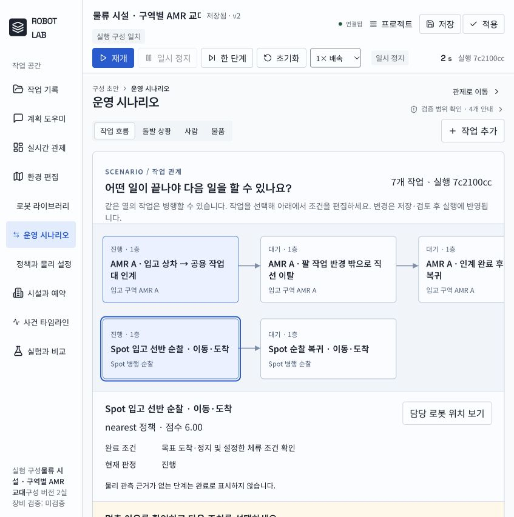
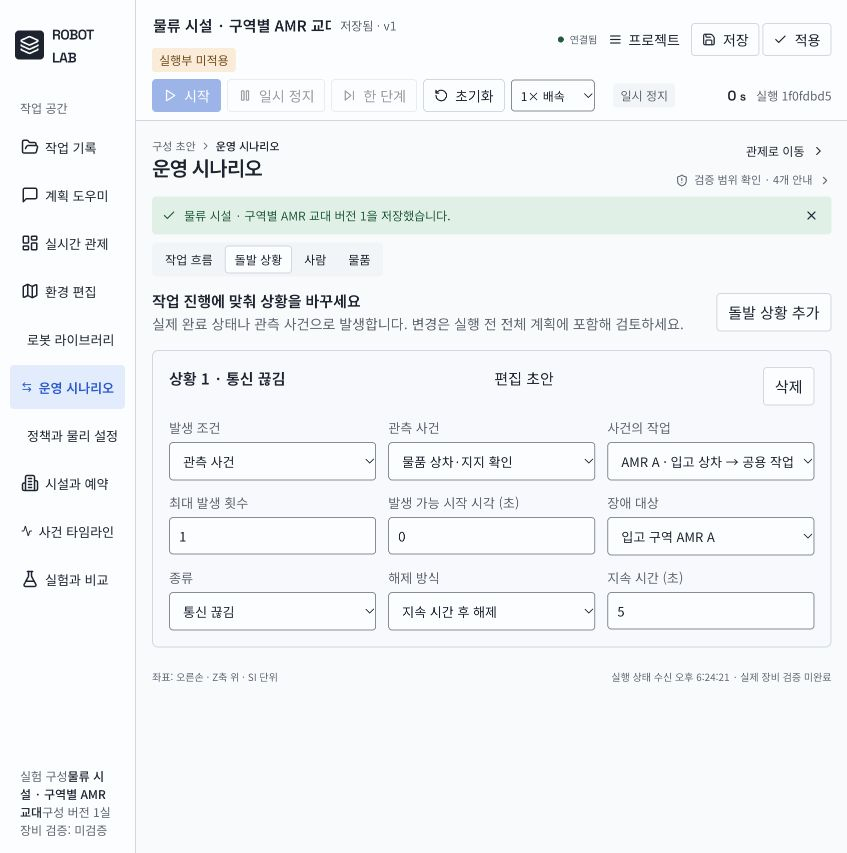
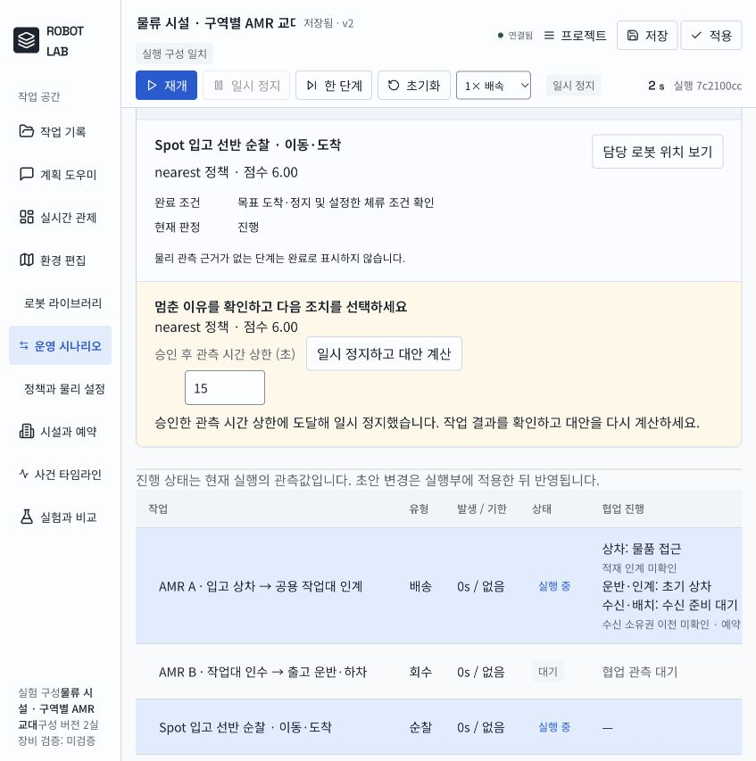

# 실행 복원력·시나리오 편집 개발 기록

2026-10-10. `MJKIM84/ai-hub`의 실제 배포 소스 `robot-simulator`에서 수정했다.
기준은 `origin/main`의 `c1b6936e`, 개발 브랜치는 `codex/scenario-resilience`다.
확인 당시 기존 작업 트리는 깨끗했고, 구버전 `codex/vercel-simulator`에서 최신 main 기준으로 분기했다.
오래된 원본 연구 폴더를 수정하거나 기존 충전 과제를 다시 진행하지 않았다.

## 구현과 지원 범위

| 기능 | 이번 구현 | 현재 한계 |
| --- | --- | --- |
| 조건부 돌발 상황 | 시뮬레이션 시각, 실제 작업 완료·실패·취소, 상차·보행자 회피 등 관측 사건에 따른 장애 발생. 자동 해제, 최대 발생 횟수, 사건 중복 소비 방지 | 새 장애물 배치, 보행자 생성·진입, 승강기 특정 문 상태를 직접 트리거로 쓰는 기능은 미구현 |
| 대화·화면 연결 | 기존 모델 입력에 돌발 상황 계약과 현재 발생 상태 추가. 계획 화면에서 수정하면 같은 계획의 새 버전으로 저장하고 승인을 무효화. 제외된 장애 대상 로봇은 승인 차단 | 이번 변경을 사용한 새로운 실제 LLM 호출은 하지 않았다. 구조화 계획의 승인→실행은 검증 |
| 실행 중 변경 | 현재 실행을 정지해 이유·대안·제외 사유 표시. 별도 승인 후 같은 실행의 물리 상태에서 계속. 시간 상한, 실행당 3회 상한, 오래된 승인·위조 선택·중복 요청 차단 | 배정 유지 관측 또는 미시작·빈 적재·동일 모델·동일 층 순찰의 로봇 교체만 지원. 화물 역할 교체·일반 작업 순서 재계획·ETA 최적화는 미구현 |
| 작업 관계도 | 선행 관계·병행 가능한 열·상태·로봇·층·완료 조건·실행 근거 표시. 노드 선택은 기존 작업 편집기와 연결하고 담당 로봇 관제로 이동 | 드래그로 연결선을 편집하는 그래프 편집기는 아님. 실제 편집은 기존 작업 설정 사용 |
| 계정 보관함 | 서버가 인증한 계정별 SQLite 보관, 버전 충돌 차단, 읽기·저장·복원 권한, 문서/지도/계획/실행 기록 묶음, 새 서버에서 복원 | 실제 Vercel 영구 저장 서비스·SSO는 미연결. 권한은 보관함 범위이며 앱 전체 관제 RBAC가 아님 |
| 두 AMR 연계 운반 | 고정 팔 회전 반경을 복귀 경로에 반영. 상차 후 실제 자세 기준으로 직선 이탈한 다음 기존 목적지 경로 재계산 | 아래 물리 검증 결과의 조건 안에서 평가. 일반 조작·실물 검증으로 확대하지 않음 |

## 로컬 확인 방법

개발 검증 서버: `http://127.0.0.1:8021/` (이번 작업 전용 데이터 `/tmp/robot-resilience-20261010`).
다른 개인 체험 서버는 수정하지 않았다.

1. **운영 시나리오 → 작업 흐름**: 관계도에서 작업을 선택한다. 완료 조건·현재 이유를 확인하고 기존 작업 설정에서 수정한다.
2. **돌발 상황**: 발생 조건, 대상, 장애 종류, 해제 방식과 시간, 사건 반복 횟수를 설정한다. 초안 저장과 적용은 별개다.
3. **계획 도우미 → 작업 단계 / 돌발 상황**: 계획 초안에 같은 조건을 반영한다. 구성 변경은 계획 버전을 올리므로 다시 승인해야 한다.
4. 실행 중 작업을 선택해 **일시 정지하고 대안 계산 → 이 변경 승인·계속**을 사용한다. 관측 시간 내 미완료면 다시 정지하고 이유를 표시한다.
5. **작업 기록 → 계정 보관함**: 기본 상태는 `설정 필요`다. 아래 설정 없이 영구 저장되었다고 표시하지 않는다.

## 자동 검사와 브라우저 확인

- `PYTHONPATH=src .venv/bin/python -m pytest -q`: **141개 통과**. 이 저장소에 현재 포함된 전체 검사다. 과거 연구 폴더의 수천 개 검사 결과와 합산하지 않았다.
- 기존 `Starlette/httpx` 사용 중단 예정 경고 1건. 검사 실패는 없음.
- `web`에서 `npm run build`: 통과.
- Vercel 입구 검사 **17개 통과**. 결과는 `vercel-tests.txt`에 보존.
- 브라우저: 돌발 상황 추가→저장 v1→새 실행 적용→저장 v2, 관계도 선택→담당 Spot 관제 화면, 변경안 별도 승인→동일 실행 `7c2100ccaa6f48558db8030c7ebc811b` 유지→2초 상한에서 일시 정지 확인.
- 보관함 설정 미완료 안내와 기존 구성 v1/v2 보존도 확인했다. 계정 저장·권한·새 서버 복원은 API 검사로 확인했으며 실제 클라우드 계정 UI 검증으로 표시하지 않는다.





## 돌발 상황의 물리 실행

`scripts/validate_incident_flow.py`는 가짜 모델 응답 없이 기존 구조화 계획 컴파일러·승인 서비스·물리 실행기를 연결한다. 실제 자연어 모델 시험은 아니다.

- 첫 구역 도착·정지 → 작업 완료 관측 → AMR 통신 장애 2초 → 자동 복구 → 후속 구역 도착·정지.
- 이동 보행자 1명 포함. 이 사례는 보행자 양보·대기를 입증하는 사례로 사용하지 않는다.
- 기본 구성: **2/2 완료, 9.602 시뮬레이션 초**.
- 후속 목적지 X를 1m 변경: **2/2 완료, 11.602 시뮬레이션 초**.
- 두 실행 모두 `incident_triggered`와 `incident_released` 각 1회. 스냅샷 반복 조회나 정지 시각 반복으로 재발하지 않음.
- 최종 결과: `reports/resilience/cb0ad41bd74a4b288f3a6a063b55d685/incident-{0,1}/result.json`.
- 재검증 중 승인 요청 ID를 재사용한 검사 스크립트가 거부되었다. 실행기 승인 기준은 유지하고 스크립트를 실행별 폴더·계획 ID로 고쳤다. 기존 기록은 보존했다.

## 두 AMR 연계 운반 검증

입력 샘플은 기존 `warehouse-cooperation`이다. AMR A와 B, 고정 팔 3대, Spot, 이동 보행자 3명, 1kg 상자를 유지한다.
로봇 크기·벽·목표 안전거리·작업 시간 제한·상자 소유권을 성공에 맞추어 바꾸지 않았다.

- 첫 실행: **4/7 완료, 211.202초 실패**. A의 복귀 경로가 고정 팔 반경 안으로 다시 들어가 정체했다.
- 첫 경로 수정 뒤: **6/7 완료, 322.402초 실패**. B의 실제 상차 자세가 목표 방향에서 약 0.065rad 틀어져, 팔 근처에서 회전 제한과 경로 추종이 서로 기다렸다.
- 수정: 팔 접촉 해제가 관측되고, 현재 진행 방향이 팔에서 멀어지며, 정적 경로·전방 센서 여유가 있을 때 회전 없이 이탈한다. 반경을 벗어나면 원래 인계 목적지까지 경로를 다시 계산한다. 다른 로봇·보행자 감속과 접촉 검사는 유지한다.
- 최종 실행: **7/7 완료, 225.932 시뮬레이션 초**. 실행 ID `ad28b735fe3c42bd8924308be132bd2e`. 원본은 [최종 실행 기록](../warehouse-zone-relay/run-ad28b735fe3c42bd8924308be132bd2e.json).
- AMR A 작업 84.320초 완료 → 직선 이탈 90.800초 → 입고 복귀 120.000초 → AMR B 접근 141.000초 → 인수·출고 최종 인계 225.930초. Spot의 두 병행 순찰도 완료.
- 보행자 최저 분리거리: A **0.608521m**, B **1.195245m**; 전체 로봇의 최소값 **0.608521m**. 설정 목표 0.5m를 이번 입력에서 충족. 3명의 실제 이동, A/B 양보·재개, 구역 제한, 물품 상차 순서, 단계 선행 관계 검사 통과.
- 충돌 지표에 기록된 **19건은 상자↔로봇 접촉**(A 9, B 6, 중간 팔 2, 상차 팔 1, 최종 팔 1). 로봇↔로봇 및 로봇↔사람 접촉 0건. 근접 경고 **6건**과 원본 사건은 보존. 낙상·물품 손상 판정 0건이며 보정되지 않은 연구용 물리 결과다.
- 검사 스크립트의 모든 assert 통과(exit 0). 단일 샘플·시드의 결과이며 일반 안전성이나 다른 장비의 실행 성공으로 확대하지 않는다.

첫 두 실패 기록의 manifest는 당시 스크립트가 실행 **끝**에 수집했다. 실행 중 다른 기능 파일이 수정되어 전체 코드 해시를 시작 시점의 정확한 증거로 간주할 수 없다. 최종 실행부터 입력·소스 manifest를 **시작 전에** 고정하고 실행 중 파일 변경 여부를 별도 기록한다. 실행의 실제 제어 로직과 후속 파일 변경은 구분한다.

최종 실행 중 `vault_routes.py`, `workspace_vault.py`, `intent_planning.py`, `runtime.py`, `incidents.py`가 후속 수정되어 `source_changed_during_run=true`다. 실행에 로드된 코드는 시작 manifest 기준이며, 팔 이탈·경로 제어 파일과 샘플 입력은 바뀌지 않았다. 후속 변경 중 실행 관련 부분은 중첩 돌발 상황 처리이고 이 운반 샘플에는 돌발 상황 설정이 없다. 변경된 돌발 상황은 별도 두 물리 실행과 최종 141개 검사로 검증했다. 이 운반 기록을 현재 전체 코드와 해시가 완전히 동일한 실행이라고 표시하지 않는다.

## 계정 보관함 설정과 배포 한계

`ROBOT_VAULT_DB`와 `ROBOT_VAULT_ACCOUNTS_FILE` 둘 다 설정한 Python 서버에서만 보관함을 활성화한다.

```sh
export ROBOT_VAULT_DB=/persistent/robot-lab/workspaces.sqlite3
export ROBOT_VAULT_ACCOUNTS_FILE=/secure/robot-lab/accounts.json
```

관리자가 공급하는 계정 파일의 형식은 아래와 같다. `sha256`은 32자 이상 무작위 접근 토큰의 SHA-256 16진수이며 **LLM API 키가 아니다**. 파일과 DB는 Git에 넣지 않는다. 실제 토큰은 브라우저 메모리에만 두고 보관 자료·로그에 넣지 않는다.

```json
[{"subject":"account-id","sha256":"64-character-sha256-hex-digest"}]
```

- `reader`: 읽기·내보내기, `editor`: 새 버전 저장·복원, `operator`: 복원, 소유자: 공유 권한 관리.
- 보관 자료는 허용된 프로젝트/문서/도면/계획 경로만 포함한다. 모델 제공자 설정·인증 파일은 제외한다. 경로 이탈·외부 심볼릭 링크·오래된 버전 덮어쓰기는 거부한다.
- 복원은 현재 실행이 정지 상태일 때만 허용하고 기존 파일 충돌을 먼저 검사한다. 이전 실행은 역사 기록으로 보존하며 **이전 승인으로 재개하지 않는다**. 초기 구성의 새 실행 ID와 저장 버전이 일치해야 한다.
- Vercel Sandbox 내부 SQLite 파일은 영구 저장소가 아니다. 현재 배포 구조에서 이 경로를 지정하는 것만으로 클라우드 내구성·다중 사용자 서비스가 완성되지 않는다. 외부 DB/객체 저장 서비스 및 인증 방식을 정한 후 해당 어댑터와 배포 연결을 추가해야 한다.
- 이번 변경은 로컬 브랜치에 있으며, 원격 push·프로덕션 배포·실물 로봇 제어를 수행하지 않았다.

## 남은 작업

일반 업무·화물의 실행 중 동적 역할 재배정, 경로/작업 순서별 대안 비용 비교, 새 장애물·사람·승강기 상태를 조작하는 사건, 그래프 연결선 직접 편집, 실제 LLM 대화 회귀, 외부 영구 저장·SSO·앱 전체 역할 통합은 남아 있다. 이번 변경 묶음을 원래 전체 개발 범위 완료로 표시하지 않는다.
