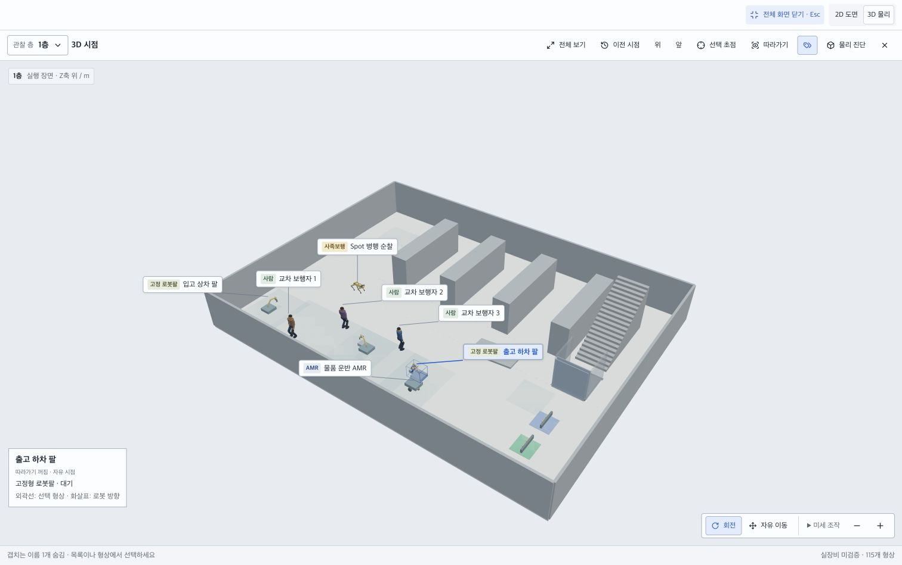
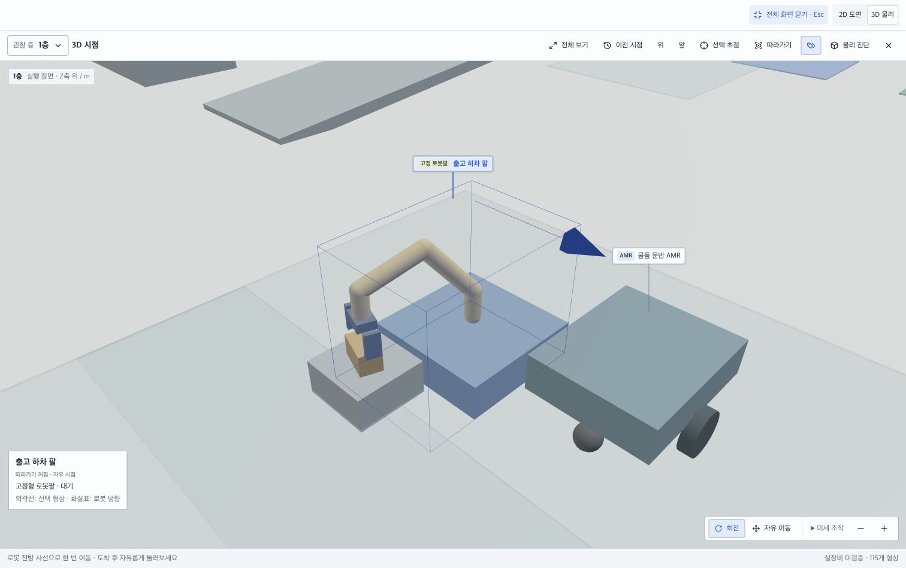

# 물류 시설 · 협업 운반·보행자 교차

이 문서는 운반차 1대인 이전 구성의 검증 기록이다. 최신 구역별 AMR 교대 구성은 [별도 기록](../warehouse-zone-relay/README.md)을 참조한다. 아래 수치는 최신 구성의 결과가 아니다.

2026-09-30 로컬 검증. 가상 물류 시설 예제를 재사용한 별도 샘플이다. 사용자 작업 공간과 기존 예제를 덮어쓰지 않는다.

## 앱에서 열기

작업 기록 → 샘플·예제 → **물류 시설 · 협업 운반·보행자 교차** → 실행 준비 → 시작.
프로젝트 메뉴의 예제 목록에서도 선택할 수 있다. 로딩만으로 실행하지 않는다. 기본 1배속이며 작업 완료 또는 시뮬레이션 360초에 멈춘다. 저장 버튼으로 수정한 구성을 별도 버전으로 보관할 수 있다.

## 구성과 흐름

- 기존 물류 시설의 24×18m 두 층, 선반·벽·승강기·경사로·시설 형상을 보존한다. 이번 작업은 1층에서 수행하며 층간 이동은 포함하지 않는다.
- 5대: 입고 상차 팔, 물품 운반 AMR, 작업대 인계 팔, 출고 하차 팔, Spot 순찰.
- 1kg 상자 1개: 입고 팔 파지 → AMR 상차 → 공유 통로 운반 → 작업대 팔 인수·배치 → 재파지·AMR 재상차 → 출고 이동 → 출고 팔 인수·받침에 배치.
- Spot은 입고 선반 순찰 후 복귀한다. 물품 작업과 병렬 실행하며 이동·도착만 판정한다. 검사·촬영을 수행했다고 표시하지 않는다.
- 자유 이동 보행자 3명, 설정 속도 0.5–0.8m/s, 목적지 왕복·일시 정지. AMR 운반 경로와 교차한다. 목표 로봇–사람 분리거리 0.5m.
- 작업대 재상차는 첫 물품 작업이 완료돼야 시작한다. 후속 작업은 같은 물품·운반차·작업대 팔의 예약을 다시 획득한다.
- 지도에서 역할을 확인하고, 운영 시나리오에서 작업·선행 조건을 편집할 수 있다. 관제의 물품 업무 카드와 3D 객체 선택·따라가기에서 인계·물품 위치를 관찰한다.

## 이번 실행 결과

[물리 실행 전체 기록](run-4de11a03b632406d82090f3c48270ba0.json)에 입력 전체, 소스 해시, Python/MuJoCo 버전, 사건, 매 1초 관측을 보존했다. 시드는 1이며 로봇 관측 잡음 설정은 기존 물품 예제를 재사용했다.

|작업|시작 (시뮬레이션 초)|완료 (시뮬레이션 초)|실제 판정|
|---|---:|---:|---|
|입고 상차 → 작업대 하차|0.20|83.92|인계·최종 배치·양측 접촉 해제|
|작업대 재상차 → 출고 하차|84.00|142.58|인계·최종 배치·양측 접촉 해제|
|Spot 순찰|0.20|76.40|목표 관측 도달·정지|
|Spot 복귀|76.60|142.20|목표 관측 도달·정지|

4/4 완료, 실패 0. 실제 계산 경과 약 150.91초. 시뮬레이션 142.582초에 자동 정지했다. AMR은 48.8초 보행자 대기, 49.2초 경로 재개를 보고했다. 보행자 세 명의 실제 Y 이동 범위는 각각 3.675/3.677/3.549m였다. 최소 로봇–사람 분리거리 0.615126m. 상자의 최종 물리 중심 좌표는 (12.9469, 3.9954, 0.25997)m이며 0.2m 받침 위에 놓이고 소유권이 해제됐다. 물품 손상·넘어짐 0.

접촉 15건은 모두 상자와 팔 또는 운반차의 파지·지지 접촉이었다. 근접 4건은 AMR과 세 인계 팔 사이의 평면 외접 운동 영역 기준 기록이다. 의도된 인계 접근이라도 근접 기록은 숨기지 않았다. 사람–로봇 접촉은 기록되지 않았다. 이 결과는 지정 입력에 대한 연구용 시뮬레이션이며 실제 설비의 안전 인증이나 범용 무충돌 보장이 아니다.

[별도 브라우저 실행 결과](browser-final.json): 목록 → 실행 준비 → 저장 → 시작 → 배속 변경 → 3D 객체 선택·따라가기 → 자동 종료를 직접 조작했다. 같은 입력으로 142.582초, 4/4 완료, 최소 분리거리 0.615126m를 확인했다. 두 실행의 수치를 합산하지 않았다.




## 재확인

프로젝트 Python 환경에서 아래 명령을 실행한다. 외부 모델·실물 장비는 사용하지 않는다.

```sh
PYTHONPATH=src python scripts/validate_warehouse_cooperation.py
PYTHONPATH=src python -m pytest tests/test_warehouse_scenario.py -q
npm --prefix web run build
```

정적 회귀 검사 2개와 웹 빌드 통과. 원래 물류 시설 형상 보존, 물품 후속 작업의 선행 관계, 순찰 병렬 실행 구성과 저장 복원을 확인한다. 실행기는 기존 제어·물리·완료 판정을 사용하며 샘플 전용 성공 로직이나 좌표 강제 이동은 없다.
