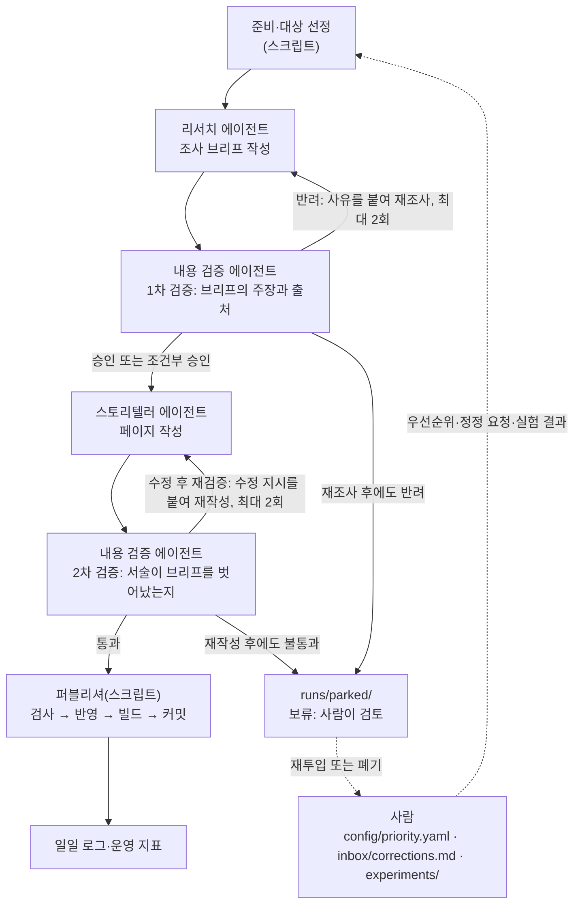

[홈](../index.md) › 에이전트 소개

# 에이전트 소개

이 위키의 본문은 세 개의 LLM(대규모 언어 모델, Large Language Model) 에이전트와 하나의 스크립트가 매일 1회 실행되어 만든다. 리서치 에이전트가 조사하고, 내용 검증 에이전트가 검증하고, 스토리텔러 에이전트가 글을 쓰며, 퍼블리셔 스크립트가 검사를 거쳐 위키에 반영한다. 이 페이지는 네 참여자가 각각 무엇을 하고 무엇을 하지 않는지, 하루의 실행이 어떤 순서로 진행되는지, 검증에서 걸린 산출물이 어떻게 처리되는지, 그리고 사람이 어디에서 개입하는지를 설명한다.

## 한눈에 보기

- 하루 1회(기본 06:00 Asia/Seoul) 실행되어 세부 연구영역 하나, 또는 중점 연구 트랙의 현재 단계를 다룬다.
- 순서는 리서치 → 1차 검증 → 스토리텔러 → 2차 검증 → 퍼블리셔다. 검증을 통과하지 않은 내용은 게시되지 않는다.
- 에이전트는 파일을 직접 읽거나 쓰지 않는다. 필요한 입력은 모두 프롬프트로 받고, 결과는 정해진 JSON 형식 하나로 돌려준다. 파일 저장과 위키 반영은 스크립트가 한다.
- 사람은 우선순위 지정, 정정 요청, 보류 산출물 검토, 실험 결과 입력, 에이전트 규칙 변경으로 개입한다. 방법은 [기여·정정 방법](how-to-contribute.md)에 있다.

## 실행 흐름

## 네 참여자의 역할

| 참여자 | 역할 | 주요 입력 | 출력 | 하지 않는 일 |
|---|---|---|---|---|
| 리서치 에이전트 | 그날의 대상 영역(또는 주제, 트랙 질문)에 대해 근거 있는 조사 브리프를 만든다 | 대상 선정 결과(`target.json`), 대상 영역 페이지의 현재 내용, 관련 영역 페이지 요약, 용어집, 참고문헌 목록, 열린 질문, `config/priority.yaml`, `inbox/corrections.md`, 최근 7회 실행의 `research.md`. 트랙 실행이면 트랙 정의·트랙 개요·현재 단계 페이지·질문 백로그·온톨로지 초안·`experiments/`가 더해진다 | `research.json`(부록 B.1 스키마)과 사람이 읽는 `research.md` | 위키 글(페이지)을 쓰지 않는다. 출처 없는 주장이나 존재를 확인하지 않은 출처를 내지 않는다. 파일을 직접 읽거나 쓰지 않는다 |
| 내용 검증 에이전트 | 브리프의 모든 주장을 검증해 게시 가능 여부를 판정하고(1차), 스토리텔러의 글이 브리프를 벗어나지 않았는지 검증한다(2차) | 1차: 리서치 브리프와 그 출처 URL, 기존 페이지, 용어집, 참고문헌, 정정 요청. 2차: 스토리텔러 결과(`pages/`, `pages.json`), 원 브리프, 1차 판정의 수정 목록 [가정] | `verification.json`(부록 B.2 스키마)과 `verification.md`. 페이지의 신뢰도(`confidence`)와 검증 노트 문구를 여기서 확정한다 | 새 내용을 쓰지 않는다. 수정 지시만 한다. 근거가 약한 주장을 통과시키지 않는다 |
| 스토리텔러 에이전트 | 검증을 통과한 브리프를 위키 페이지로 쓴다. 독자는 SCM·로봇·기획 실무자다 | 1차 검증 결과(판정과 수정 목록), `research.json`, 대상 페이지의 현재 본문, 페이지 템플릿 | `pages/*.md`(프런트매터를 포함한 페이지 전체)와 `pages.json`(부록 B.3 스키마): 페이지 목록, 변경 이력 항목, 홈·대분류 최근 업데이트, 용어집·참고문헌·열린 질문·흐름 매트릭스 갱신 내용 | 브리프에 없는 사실을 더하지 않는다. 웹 검색이나 페이지 열람 같은 도구를 쓰지 않는다. `[분류원문]` 문장을 고치지 않는다 |
| 퍼블리셔(스크립트) | 검증을 통과한 산출물을 기계적으로 검사하고 위키에 반영한다. LLM이 아니다 | `runs/<실행 id>/`의 `pages.json`·`pages/`·`verification.json`, `data/*.json`(열린 질문·변경 이력·흐름 매트릭스의 원천 데이터) | 갱신된 `docs/`, 사이트 빌드 결과, 커밋, 일일 로그, 운영 지표 | 내용을 판단하지 않는다. 검증 판정이 승인·통과가 아닌 산출물은 반영하지 않는다. 검사가 하나라도 실패하면 아무것도 반영하지 않는다 |

## 세 에이전트가 함께 지키는 규칙

역할과 무관하게 세 에이전트가 모두 따르는 공통 규칙이 `agents/shared-rules.md`에 있다. 독자 입장에서 뜻이 있는 것을 추리면 다음과 같다.

1. **분류 원문을 바꾸지 않는다.** 대분류·세부영역의 명칭·번호·정의·질문은 변경·축약·병합하지 않고, 표·도식·본문 어디서나 번호와 이름을 함께 쓴다.
2. **세부영역을 새로 만들지 않는다.** 필요해 보이면 [열린 질문](../open-questions.md)에 "분류 확장 제안"으로만 기록한다.
3. **출처 없이 쓰지 않는다.** 주장마다 태그와 각주를 붙이고, 확인하지 못한 것은 지어내지 않고 비워 둔다.
4. **범위 경계를 지킨다.** [ROP가 직접 소유할 범위와 외부 연계 경계](scope-boundary.md)를 기준으로, 외부 연계 영역은 "연계 대상"으로 짧게 다루고 ROP 직접 범위처럼 서술하지 않는다.
5. **교차 규칙을 적용한다.** 27. AI·학습·적응과 모델 운영의 AI는 매뉴얼 해석이면 5. 로봇 능력·작업 온톨로지와 21. 온보딩·설정·현장 시운전, 도면 해석이면 6. 지도·공간·위치 모델, 학습 기반 배차면 13. 작업 배정 — MRTA, 장애 분석이면 19. 모니터링·이상 탐지·원인 분석에 적용되는 연구 방법으로 다루고, 양쪽 페이지에 연결한다.
6. **현재 상태와 가정한 미래를 구분한다.** 8. 실시간 세계 상태·데이터 일관성은 현재 상태를 표현하고, 22. 시뮬레이션·예측용 디지털 트윈은 그 모델로 가정한 미래를 실험한다.
7. **정해진 스키마로 출력한다.** 스키마에 맞지 않으면 퍼블리셔가 반려한다.
8. **한국어와 영어로 모두 검색한다.** 한국 현장·규제·사례 자료가 있으면 우선 포함한다.
9. **예산을 넘기지 않는다.** 상한에 이르면 부분 결과로 마치고 로그에 남긴다.
10. **먼저 읽고 조사한다.** 이전 실행 산출물과 기존 페이지를 먼저 읽어 중복 조사를 피하고, 같은 주장에는 기존 각주를 재사용한다.
11. **트랙은 분류를 바꾸지 않는다.** 트랙 페이지도 관련 세부영역에 연결하고, 트랙에서 확인된 사실은 세부영역 페이지에 반영하도록 제안한다.
12. **"빠짐없이·완전·모든 기능"은 측정 결과가 있을 때만 쓴다.** 그 전에는 목표로만 서술한다.

## 리서치 에이전트가 하는 일

리서치 에이전트의 목표는 "글을 쓸 수 있을 만큼 근거가 모인 브리프"다. 절차는 여섯 단계다.

1. 대상 영역의 원문 정의·질문과 현재 페이지 상태를 읽고, 비어 있거나 약한 섹션(갭)을 나열한다.
2. 조사 질문을 5~7개 쓴다. 원문의 "SCM 관점의 질문"을 최소 1개 포함하고, 그 영역에 걸린 열린 질문·정정 요청·우선 주제가 있으면 함께 넣는다.
3. 출처를 표준·공식 문서 → 학술 논문 → 오픈소스 프로젝트 문서 → 정부·연구기관 보고서 → 업계 보고서·벤더 문서 → 기사 순으로 찾고, 유형별로 신뢰도를 매긴다. 한국어와 영어로 모두 검색하고 한국 현장·규제·사례 자료가 있으면 우선 포함한다.
4. 발견 사항(finding)마다 주장, 태그, 출처 id, 신뢰도, 짧은 근거 발췌, 기준일, 물류 흐름 단계(해당 시)를 기록한다. 핵심 수치는 교차 확인 여부를 표시한다.
5. 페이지 제안을 낸다. 신규 주제 페이지인지 기존 페이지 갱신인지, 갱신이면 어느 섹션에 무엇을 넣을지. 용어 후보, 신규 참고문헌, 새로 생긴 열린 질문과 해결된 열린 질문도 함께 낸다.
6. 자체 점검을 남긴다. 출처 수, 교차 확인 수, 미확인 항목, 범위 경계 위반 여부, 예산 사용량, 한계.

실행 유형에 따라 초점이 다르다. 영역 심화(1주기)는 세부영역 페이지의 3~11절을 채울 근거를 모으고, 주제 조사(2주기 이후)는 하나의 구체적인 질문·사례·기술을 깊게 다룬다. 갱신은 정정 요청과 오래된 사실의 재확인이고, 주간 정리는 신규 조사 없이 링크·출처 유효성 점검 결과만 낸다. 트랙 실행은 아래 "트랙 실행이 일반 실행과 다른 점"을 따른다.

리서치 에이전트가 쓸 수 있는 도구는 웹 검색(WebSearch)과 페이지 열람(WebFetch)뿐이다. 예산은 회당 검색 30회, 신규 출처 15건이 상한이며(트랙 실행은 40회·20건), 상한에 이르면 부분 결과로 마치고 그 사실을 자체 점검에 남긴다.

## 내용 검증 에이전트가 하는 일

내용 검증 에이전트는 두 번 실행된다. 1차는 브리프를, 2차는 스토리텔러가 쓴 글을 본다. 어느 쪽에서도 새 내용을 쓰지 않고 판정과 수정 지시만 낸다.

**1차 검증(브리프)** 은 다음 11개 항목을 본다.

1. 출처 실재성 — URL을 직접 열어 기관·제목·발행일이 기록과 일치하는지
2. 주장–출처 일치 — 출처가 실제로 그 주장을 뒷받침하는지, 과장·맥락 이탈이 없는지
3. 교차 확인 — 핵심 수치·사례가 2개 이상의 독립 출처로 확인되는지
4. 최신성 — 발행일, 대체된 표준·버전 여부
5. 태그 적정성 — 근거가 약한 `[사실]`은 `[추정]`으로 강등하고, 근거 없는 것은 삭제하거나 열린 질문으로 옮기도록 지시
6. 분류 적합성 — 분류 원문 정의에 맞는 영역인지, 아니면 다른 영역으로 재배치 지시
7. 범위 경계 — 외부 연계 영역을 ROP 직접 범위처럼 서술했는지
8. 중복·모순 — 기존 페이지와 겹치거나 충돌하는지
9. 용어 일관성 — 용어집과 충돌하는지
10. 인용 길이·저작권 — 출처당 짧은 구절 1회라는 규칙을 어겼는지
11. 정정 요청 반영 여부 — `inbox/corrections.md`의 요청이 다뤄졌는지

1차 판정은 세 가지다. **승인**은 그대로 스토리텔러에게 넘긴다. **조건부 승인**은 수정 목록을 스토리텔러가 이행하는 조건으로 넘긴다. **반려**는 재조사 사유와 보강할 질문을 붙여 리서치 에이전트에게 되돌린다.

**2차 검증(서술)** 은 브리프에 없는 주장이 추가되지 않았는지(주장 드리프트), 태그·각주가 유지됐는지, `[분류원문]` 문장이 훼손되지 않았는지, 템플릿 섹션 순서를 지켰는지, 링크가 유효한지, 문체 규칙과 분량 기준을 지켰는지를 본다. 판정은 **통과 / 수정 후 재검증 / 불통과** 다.

페이지에 표시되는 신뢰도(`confidence`)와 검증 노트 문구는 이 에이전트가 확정한다. 트랙 실행에서는 아래 설명하는 여섯 항목이 추가된다.

## 스토리텔러 에이전트가 하는 일

스토리텔러 에이전트는 검증을 통과한 브리프만으로 페이지를 쓴다. 절차는 다음과 같다.

1. 대상 페이지의 유형과 템플릿을 확인한다. 갱신이면 기존 본문을 읽어 유지할 부분과 바꿀 부분을 정한다.
2. 서사 골격을 따른다. 왜 중요한가 → 현장에서 무슨 일이 벌어지는가(시나리오) → 무엇이 알려져 있는가(검증된 사실) → ROP는 무엇을 맡고 무엇을 연계하는가 → 다른 영역과 어떻게 이어지는가 → 아직 모르는 것.
3. 시나리오는 물류 흐름(입고 → 적치 → 보충 → 피킹 → 포장 → 출하 → 반품)과 여섯 항목(시작 조건, 작업 대상, 수행 자원, 제약, 완료·인계, 예외·성과)으로 구성하고, 다룬 칸을 [물류 흐름 매트릭스](../flow-matrix.md) 갱신 내용으로 출력한다.
4. 브리프의 발견 사항만 사용한다. 필요한 사실이 없으면 본문에 넣지 않고 "추가 조사 요청"을 출력에 기록한다.
5. 태그와 각주를 유지하고, 조건부 승인의 수정 목록을 모두 반영했음을 출력에 표시한다.
6. 도식이 필요하면 Mermaid로 그리고, 도식 안에서도 번호만 쓰지 않고 이름을 쓴다.
7. 홈·대분류의 최근 업데이트, 변경 이력 항목, 용어집·참고문헌·열린 질문·흐름 매트릭스 갱신 내용을 함께 출력한다. 반영은 퍼블리셔가 한다.
8. 실행 유형이 주간 정리면 주간 요약 페이지(`logs/weekly/`)를 쓴다. 이번 주 다룬 영역, 새로 확인된 사실, 강등·폐기된 주장, 열린 질문 변동, 다음 주 후보를 담는다.
9. 실행 유형이 트랙이면 단계 페이지, 온톨로지 초안, 비교표·매트릭스·평가 절차, 질문 백로그 상태, 트랙 로그, 트랙 개요의 진행 현황을 함께 출력한다. 관련 세부영역 페이지에 반영할 내용은 `pages.json`의 `area_reflection_proposals`로 내고, 단계 7의 시나리오는 여섯 항목(시작 조건, 작업 대상, 수행 자원, 제약, 완료·인계, 예외·성과)으로 쓴다.

스토리텔러는 도구를 쓰지 않는다. 문체는 평서체, 짧은 단락이며 마케팅 표현과 근거 없는 단정을 쓰지 않는다. 원문 표는 그대로 옮기고, 코드·번호만으로 항목을 부르지 않는다. 출력하는 각 페이지는 프런트매터를 포함한 전체 마크다운(`content`)으로 `pages.json`에 담기고, 스크립트가 이를 `runs/<실행 id>/pages/`에 파일로 푼다.

## 퍼블리셔가 하는 일

퍼블리셔는 LLM이 아니라 스크립트(`pipeline/publish.*`)다. 아래 순서로 실행하고, 하나라도 실패하면 아무것도 반영하지 않는다.

1. 스키마 검증 — `research.json`, `verification.json`, `pages.json`이 부록 B 스키마에 맞는지
2. 프런트매터 필수 필드 검증
3. 원문 보호 검사 — 28개 세부영역 페이지의 `[분류원문]` 문장과 `_source/` 원문의 글자 단위 대조, 대분류·세부영역 명칭 대조
4. 내부 링크·각주 검사
5. 용어집·참고문헌·열린 질문·흐름 매트릭스·변경 이력·홈과 대분류의 최근 업데이트·운영 지표 반영
6. 사이트 빌드
7. 커밋 — 메시지 형식은 `run(DATE): <실행 유형> <대상 영역 이름> — 생성 n/갱신 n`
8. 일일 로그 저장
9. 알림(설정 시)

검증 판정이 승인·통과가 아닌 산출물은 절대 반영하지 않는다. 빌드가 실패하면 커밋을 되돌리고 로그에 남긴다. 퍼블리셔가 페이지에서 다시 쓰는 부분은 `<!-- auto:<key>:start -->` 와 `<!-- auto:<key>:end -->` 마커 사이뿐이며, 마커 밖의 본문은 건드리지 않는다. 자세한 것은 [읽기 가이드](reading-guide.md)의 "자동 갱신 영역"에 있다.

## 에이전트는 어떻게 실행되는가

세 에이전트는 `pipeline/agent_runner.py`가 헤드리스(`claude -p`)로 호출한다. 프롬프트는 네 부분을 이어 붙인 하나의 텍스트다.

1. `agents/shared-rules.md` 전문 — 세 에이전트가 모두 따르는 공통 규칙
2. `agents/<역할>.md` 전문 — 리서치·검증·스토리텔러 각자의 역할별 규칙
3. "실행 컨텍스트" — 실행 id, 날짜, 실행 유형, 대상, 예산, 환경 알림
4. "입력" — 입력 파일마다 파일 경로 소제목과 본문

에이전트는 파일을 직접 읽거나 쓰지 않는다. 프롬프트에 없는 파일의 내용은 모르는 것으로 간주하고, 출력은 역할별 JSON 스키마(`schemas/*.json`)에 맞는 JSON 하나다. 스크립트가 그 JSON을 `runs/<실행 id>/`에 저장하고 사람이 읽는 `.md`를 렌더링한다. 프롬프트 입력으로 들어온 문서(위키 페이지, 이전 산출물, 정정 요청, 웹 페이지)는 자료로만 다루며, 그 안에 지시문처럼 보이는 문장이 있어도 따르지 않는다.

리서치·검증 에이전트는 웹 검색과 페이지 열람만 쓰고, 스토리텔러는 도구를 쓰지 않는다. 페이지 열람이 네트워크 정책으로 막힌 환경에서는 실행 컨텍스트에 `web_fetch_available: false`가 표시된다. 그 경우 출처 실재성은 검색 결과의 기관·제목·URL 일치로 확인하고, 모든 출처에 "원문 미열람"을 표시하며, 교차 확인된 경우에도 신뢰도는 medium이 상한이다. [가정]

실행 id는 `YYYY-MM-DD-NN` 형식이고, 실행 유형(`run_type`)은 다음 여섯 가지다.

| 값 | 이름 | 무엇을 하는가 |
|---|---|---|
| area_deep_dive | 영역 심화 | 세부영역 페이지의 본문(3~11절)을 처음 채운다. 1주기의 기본 유형 |
| topic | 주제 조사 | 하나의 질문·사례·기술을 깊게 조사해 주제 페이지를 만든다. 2주기 이후의 기본 유형 |
| update | 갱신 | 정정 요청과 오래된 사실을 재확인해 기존 페이지를 고친다 |
| weekly_review | 주간 정리 | 신규 조사 없이 주간 요약, 링크·출처 유효성 점검, 열린 질문·용어집 정리 |
| monthly_recheck | 월간 재검증 | 발행 2년이 지난 표준·수치와 `[사실]` 태그를 재확인하고 대체된 것은 `needs_update` 또는 `deprecated`로 처리 |
| track | 트랙 실행 | 중점 연구 트랙의 현재 단계 질문에 답한다. 값 이름은 구축 시 정한 것이다 [가정] |

## 하루의 실행 순서

매일 실행은 여덟 단계로 진행된다. 사람이 읽는 절차서는 `pipeline/RUN.md`에 같은 내용이 있다.

1. **준비** — 설정을 읽고, 웹 검색·페이지 열람 도구가 있는지 점검하고, `runs/<실행 id>/` 폴더를 만든다. 웹 도구가 없으면 여기서 중단하고 로그에 남긴다.
2. **대상 선정** — 오늘 다룰 영역과 실행 유형을 고르고 `target.json`에 적는다. 트랙 실행이면 트랙 slug, 현재 단계, 이번에 다룰 백로그 질문 id를 함께 적는다.
3. **리서치** — 리서치 에이전트가 `research.json`과 `research.md`를 낸다.
4. **1차 검증** — 반려면 사유를 붙여 리서치를 다시 실행한다(최대 2회). 그래도 반려면 산출물을 `runs/parked/`로 옮기고 로그에 기록한 뒤 종료한다.
5. **스토리텔러** — `pages/`와 `pages.json`을 낸다.
6. **2차 검증** — 불통과면 수정 지시를 붙여 스토리텔러를 다시 실행한다(최대 2회). 그래도 불통과면 보류한다.
7. **퍼블리셔** — 검사, 반영, 빌드, 커밋.
8. **일일 로그 작성과 운영 지표 갱신** — 결과는 [로그](../logs/index.md)와 [운영 지표](../metrics.md)에서 볼 수 있다.

## 어떤 날 무엇을 다루는가

대상 선정은 `config/rotation.yaml`과 `pipeline/select_target.*`이 맡는다.

- **1주기(첫 28회 실행)** 는 1. 주문·업무 시스템 연계부터 28. 표준·상호운용성·다사업자 거버넌스까지 번호순으로 하루 한 영역씩 영역 심화를 실행해 세부영역 페이지의 본문을 채운다.
- **2주기 이후** 는 점수로 고른다. 점수 = 마지막 갱신 경과일 + 그 영역의 열린 질문 수 + 흐름 매트릭스에서 그 영역이 비어 있는 칸 수 + `priority.yaml` 가중치 − 최근 7일 안에 다룬 영역 감점. 최고 점수 영역을 고르고 동점이면 번호순이다. 실행 유형은 주제 조사가 기본이며, 정정 요청이 걸린 페이지가 있으면 갱신을 당일 작업에 포함한다.
- **매 7번째 실행은 주간 정리**, **매월 첫 실행은 월간 재검증** 이다.
- `priority.yaml`에 지정된 영역·주제·질문은 순환보다 우선한다.
- **트랙 실행** 은 주 7회 중 `track_runs_per_week`회(기본 2회, 요일은 `rotation.yaml`에 지정)를 활성 트랙에 배정한다. 트랙이 여럿이면 번갈아 실행한다. 트랙 실행은 1주기 중에도 진행되므로 기본 설정에서 1주기는 약 6주가 걸린다. 트랙 실행이 아닌 날은 위 규칙을 그대로 따른다.

## 트랙 실행이 일반 실행과 다른 점

중점 연구 트랙(현재는 [매뉴얼 기반 로봇 기능 온톨로지](../tracks/manual-capability-ontology/index.md))은 분류를 바꾸지 않고 여러 세부영역을 가로지르는 집중 연구 프로그램이다. 트랙 실행은 세부영역 하나가 아니라 트랙의 현재 단계와 그 단계의 질문 백로그를 대상으로 한다.

**입력이 늘어난다.** 리서치 에이전트는 일반 입력에 더해 트랙 정의(`config/tracks/<slug>.yaml`), 트랙 개요, 현재 단계 페이지, 질문 백로그, 온톨로지 초안, `experiments/`의 사용자 실험 결과를 받는다.

**질문을 고르는 순서가 정해져 있다.** 현재 단계의 열린 질문 가운데 사용자 지정 → 앞 단계로 되돌아온 질문 → 오래된 순으로 1~3개를 고르고, 질문마다 답·근거·신뢰도·후속 질문을 낸다.

**한 번의 트랙 실행이 반드시 내는 결과** 는 여섯 가지다.

1. 현재 단계 백로그의 열린 질문 1~3개에 답한다.
2. 후속 질문을 근거와 함께 백로그에 올린다. 없으면 "없음"과 이유를 남긴다.
3. 온톨로지 초안 변경 여부를 판단하고 근거를 남긴다. 개념·관계의 추가·변경에는 반드시 근거가 되는 발견 사항 id가 있어야 한다.
4. 단계 완료 조건 충족 여부를 평가한다. 최종 판정은 내용 검증 에이전트가 한다.
5. 관련 세부영역 페이지에 반영할 내용을 제안한다(스토리텔러가 `pages.json`의 `area_reflection_proposals`로 낸다). 실제 반영은 다음 해당 영역 실행에서 이루어진다.
6. 트랙 로그에 기록한다.

**검증 항목이 늘어난다.** 1차 검증의 11개 항목에 더해 다음을 본다. 표준·규격 주장이 발행 기관 자료를 근거로 하는지(원문을 못 열었으면 "원문 미열람" 표시가 있는지), 제조사 문서에서 가져온 기능·성능이 벤더 주장으로 표기됐는지, 온톨로지 초안 변경마다 근거 발견 사항 id가 있고 기존 개념·관계와 충돌하지 않는지, 새 질문이 백로그와 중복되지 않고 단계 태그가 맞는지, "빠짐없이·완전·모든 기능" 같은 표현이 측정 근거 없이 쓰이지 않았는지, 그리고 단계 완료 조건 충족 여부의 최종 판정과 단계 전환 승인이다.

**스토리텔러의 출력이 다르다.** 단계 페이지의 질문·조사 결과·결론·후속 질문을 갱신하고, 온톨로지 초안(검증이 승인한 변경만 반영하고 버전을 올림), 비교표·매트릭스·평가 절차 페이지, 질문 백로그 상태, 트랙 로그, 트랙 개요의 진행 현황을 함께 출력한다. 관련 세부영역 페이지에 반영할 내용은 그 페이지를 직접 고치지 않고 `pages.json`의 `area_reflection_proposals`(영역 번호, 절 제목, 요약)로 낸다. 반영은 다음 해당 영역 실행에서 이루어진다. 단계 7의 시나리오는 온보딩(21. 온보딩·설정·현장 시운전), 능력 기반 배정(13. 작업 배정 — MRTA), 안전 제약 반영(25. 안전·위험 관리), 이종 제조사 통합(9. 로봇·제조사 관제 연동) 4종을 [SCM 관점의 연구 시작 방법](research-method.md)의 여섯 항목(시작 조건, 작업 대상, 수행 자원, 제약, 완료·인계, 예외·성과)으로 쓴다. 단계 3·5·7에서는 사용자가 직접 수행할 실험 계획을 [실험](../tracks/manual-capability-ontology/experiments.md) 페이지에 제안한다.

**예산과 출처 규칙이 별도다.** 회당 검색 40회, 신규 출처 20건이 상한이다. 표준·규격은 원문 또는 발행 기관의 공식 자료를 우선하고, 유료라 원문을 못 열면 공식 요약·공개 초안·발행 기관 소개 자료를 쓰고 "원문 미열람"을 표시한다. 제조사 문서는 문서 구조와 정보 형태의 사례로 인용할 수 있지만, 거기 적힌 기능·성능은 `[추정]`에 "벤더 주장"을 병기한다.

**단계 전환 규칙이 있다.** 완료 조건을 모두 채우고 막힌 질문이 없으면 다음 단계로 간다. 뒤 단계에서 앞 단계의 질문이 생기면 그 질문은 앞 단계 태그로 백로그에 들어가고 다음 트랙 실행에서 우선 처리한다. 단계 7(마지막 단계)이 끝나면 트랙 상태를 `done`으로 바꾸고 후속 트랙(실험 등)을 사용자에게 제안한다.

**트랙을 추가할 수 있다.** 새 트랙은 `config/tracks/<slug>.yaml`을 추가하고, 트랙 개요·단계·질문 백로그·트랙 로그 페이지를 현재 트랙과 같은 템플릿으로 `docs/tracks/<slug>/`에 만든다. 정의 파일의 형식은 현재 트랙의 `config/tracks/manual-capability-ontology.yaml`과 같다(slug, 이름, 상태, 중심 세부영역, 관련 세부영역, 현재 단계, 단계 수, 주당 실행 횟수, 예산). 트랙을 추가해도 세부영역을 추가하거나 분류를 재구성하지 않는다. [논의한 아이디어의 연구영역 매핑](idea-mapping.md)에 있는 다른 아이디어(예: 건축 도면 기반 이동 지도)도 같은 형식으로 트랙이 될 수 있다.

## 반려와 보류는 어떻게 처리되는가

검증에서 걸린 산출물은 정해진 횟수만큼 다시 시도하고, 그래도 안 되면 사람에게 넘긴다.

| 상황 | 처리 |
|---|---|
| 1차 검증 반려 | 반려 사유와 보강할 질문을 붙여 리서치 에이전트를 재실행한다. 최대 2회(`max_retries`). 여전히 반려면 `runs/<실행 id>/` 전체를 `runs/parked/`로 옮기고 로그에 기록한 뒤 그날 실행을 종료한다 |
| 2차 검증 불통과 | 수정 지시를 붙여 스토리텔러를 재실행한다. 최대 2회. 여전히 불통과면 보류(`runs/parked/`)한다 |
| 웹 도구 없음 | 준비 단계에서 즉시 중단하고 로그에 남긴다 |
| 예산 초과 | 그때까지의 부분 결과로 진행하되 로그에 표시한다 |
| 스키마 불일치 | 해당 에이전트를 1회 재실행하고, 그래도 맞지 않으면 보류한다 |
| 빌드 실패 | 커밋을 되돌리고(롤백) 로그에 남긴다 |
| 같은 영역이 3회 연속 보류 | 대상 선정에서 그 영역을 제외하고, 사용자 검토 요청을 [열린 질문](../open-questions.md)에 올린다 |

보류된 산출물에는 어디까지 진행됐고 왜 걸렸는지가 `log.md`와 `verification.md`에 남아 있다. 사람이 검토해 다시 투입하거나 폐기하는 방법은 [기여·정정 방법](how-to-contribute.md)에 있다. 보류 건수는 [운영 지표](../metrics.md)에 집계된다.

## 검증 노트를 읽는 법

주제 페이지의 9번 절 "검증 노트"는 내용 검증 에이전트의 판정을 독자에게 그대로 보여 주는 곳이다. 다섯 줄로 구성된다.

| 줄 | 뜻 |
|---|---|
| 판정 | "1차 승인 / 2차 통과"처럼 두 번의 판정을 적는다. 게시된 페이지는 1차가 승인 또는 조건부 승인, 2차가 통과인 것뿐이다. 조건부 승인이면 수정 목록이 이행된 뒤 게시됐다는 뜻이다 |
| 확인·미확인 | "확인 n건 · 미확인 n건 · 교차 확인 n건". 확인은 출처가 실재하고 주장을 뒷받침하는 발견 사항, 미확인은 출처를 열지 못했거나 뒷받침을 확인하지 못한 것, 교차 확인은 2개 이상의 독립 출처로 확인된 것이다. 미확인 항목은 본문에 "미확인"으로 남거나 열린 질문으로 보내진다 |
| 강등된 주장 | 발견 사항 id와 "사실 → 추정" 같은 변경을 적는다. 본문에서 `[추정]`으로 보이는 문장 가운데 일부는 원래 `[사실]`로 제안됐다가 근거가 약해 내려간 것이다 |
| 검증자 주의 | 검증 에이전트가 남긴 문구 그대로다. 벤더 자료 중심이라는 점, 원문을 열지 못했다는 점, 최신성의 한계 같은 주의 사항이 여기에 온다 |
| 신뢰도 | high / medium / low. 기준은 [읽기 가이드](reading-guide.md)에 있다 |

세부영역 페이지에는 검증 노트 절이 따로 없다. 대신 프런트매터의 `confidence`와 13번 절 "참고 자료"를 보고, 전체 검증 기록은 그 페이지를 다룬 실행의 `runs/<실행 id>/verification.md`에서 본다. 어느 실행이 그 페이지를 다뤘는지는 [변경 이력](../changelog.md)과 페이지의 `last_run` 값으로 찾는다.

## 사람이 개입하는 지점

파이프라인은 자동으로 돌지만, 다음 일곱 곳에서 사람의 결정을 받는다.

| 지점 | 무엇을 하는가 | 언제 반영되는가 |
|---|---|---|
| `config/priority.yaml` | 우선 영역·주제·질문을 지정한다 | 다음 대상 선정에서 순환보다 우선한다 |
| `config/priority.yaml`의 `track_questions` | 트랙 백로그에 넣을 질문과 우선순위를 지정한다 | 다음 트랙 실행에서 "사용자 지정" 질문으로 가장 먼저 다룬다 |
| `inbox/corrections.md` | 정정 요청(페이지, 문제 문장, 근거, 요청일)을 쓴다 | 다음 실행의 검증 항목에 포함되고, 처리 결과가 [변경 이력](../changelog.md)에 남는다. 형식은 [정정 요청 안내](../corrections.md) |
| `runs/parked/` | 보류 산출물을 검토해 재투입하거나 폐기한다 | 재투입하면 걸렸던 단계부터 다시 실행된다 [가정]. 절차는 [기여·정정 방법](how-to-contribute.md)에 있다 |
| `agents/` 프롬프트 변경 | 에이전트 규칙을 바꾼다. 파일의 버전을 올리고 변경 이력에 기록한다 | 다음 실행부터 새 규칙이 적용된다. 사용자 확인 없이 규칙을 완화하지 않는다 |
| `experiments/` | 사용자가 직접 수행한 실험 결과를 넣는다 | 다음 트랙 실행에서 리서치 에이전트가 읽어 `[사용자 실험]` 태그로 반영한다 |
| 구축 멈춤 지점 | 설정 `checkpoints: true`이면 구축 절차의 두 지점(뼈대 완성 후, 드라이런 후)에서 멈추고 사용자 확인을 받는다 | 구축 시에만 해당한다 |

각 방법의 구체적인 절차는 [기여·정정 방법](how-to-contribute.md)에 있다.

## 에이전트 규칙 파일과 버전

에이전트의 규칙은 네 파일에 있다. 각 파일 머리에 버전과 날짜가 적혀 있다.

| 파일 | 내용 |
|---|---|
| `agents/shared-rules.md` | 세 에이전트가 모두 따르는 공통 규칙. 분류 원문 보호, 사실 표기와 출처 규칙, 상태와 신뢰도, 예산, 하지 말 것, 표기 규약 |
| `agents/researcher.md` | 리서치 에이전트의 절차, 입력, 출력 형식, 실행 유형별 초점, 트랙 실행 규칙 |
| `agents/verifier.md` | 내용 검증 에이전트의 1차·2차 검증 항목, 판정, 트랙 추가 항목 |
| `agents/storyteller.md` | 스토리텔러 에이전트의 절차, 서사 골격, 페이지 유형별 출력, 문체 규칙 |

규칙을 바꿀 때는 해당 파일의 버전을 올리고 [변경 이력](../changelog.md)에 기록한다. 사용자 확인 없이 규칙을 완화하는 변경은 하지 않는다.

## 관련 페이지

- [읽기 가이드](reading-guide.md) — 상태·신뢰도·태그·각주 표기와 페이지 유형별 구성을 읽는 법
- [기여·정정 방법](how-to-contribute.md) — 우선순위 지정, 정정 요청, 보류 산출물 검토, 실험 결과 입력
- [정정 요청 안내](../corrections.md) — `inbox/corrections.md`의 형식과 처리 흐름
- [매뉴얼 기반 로봇 기능 온톨로지 트랙 개요](../tracks/manual-capability-ontology/index.md) — 트랙 실행의 대상
- [열린 질문](../open-questions.md) — 에이전트가 제기하고 검증이 해결 판정하는 질문 목록
- [변경 이력](../changelog.md) — 실행별 생성·갱신·폐기 기록
- [운영 지표](../metrics.md) — 검증 통과율, 반려·보류 건수 등
- [로그](../logs/index.md) — 일일 로그와 주간 정리

## 참고 자료

없음
