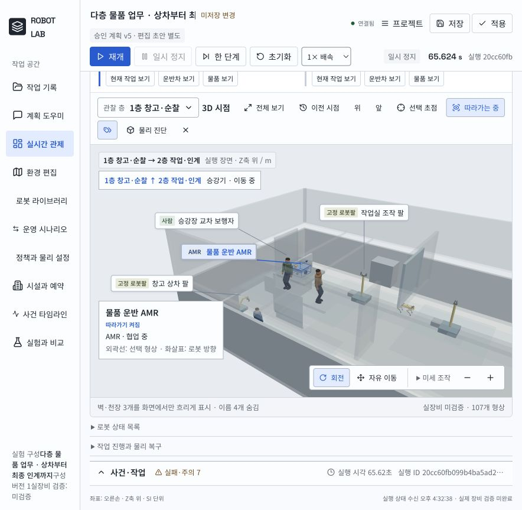
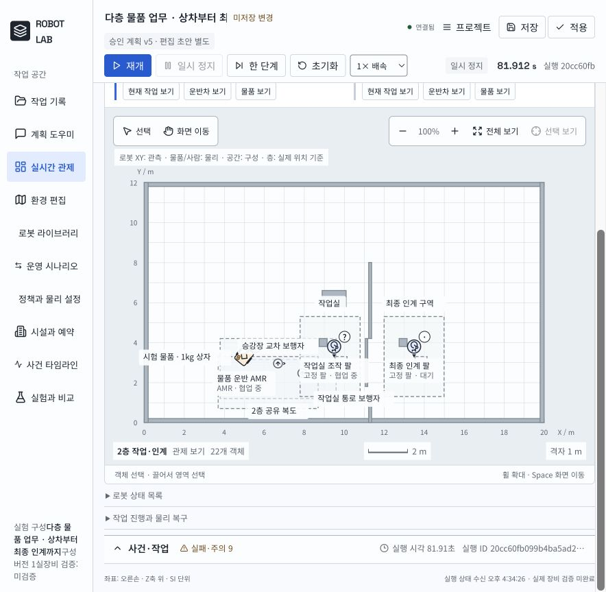

[홈](../index.md) › 소개 › 로봇 시뮬레이터

# 로봇 시뮬레이터

**로봇에게 업무를 설명하고, 계획을 검토한 뒤, 가상 공간에서 실행 과정을 관찰하는 ROP 연구 앱입니다.** 문서에서 로봇 능력을 정리하고, 도면을 지도에 반영하며, 여러 로봇과 보행자가 함께 있는 작업을 시뮬레이션합니다.

!!! info "온라인 실행 서버 연결 준비 중"
    현재 이 페이지에서는 실제 로컬 실행 화면과 체험 내용을 볼 수 있습니다. 시뮬레이터 배포 구성을 저장소에 준비했으며, 외부 실행 서버 연결 후 체험 링크를 추가합니다. 아래 화면은 2026년 9월 27일의 로컬 실행 기록입니다.

    [배포 코드와 실행 안내](https://github.com/MJKIM84/ai-hub/tree/main/robot-simulator){ .md-button }

## 첫 체험: 1층 창고에서 2층 최종 인계까지

2개 층과 승강기가 있는 가상 물류 작업장에서 **AMR 1대, 조작 팔 3대, Spot 1대, 이동 보행자 3명, 1kg 상자**가 등장합니다. 단순 이동 후 종료하는 예제가 아니라, 같은 상자를 상차·운반·배치·재인수하는 작업입니다.

1. 창고의 팔이 상자를 집어 AMR에 싣습니다.
2. AMR이 사람에게 양보하며 이동하고, 상자를 실은 채 승강기로 2층에 올라갑니다.
3. 작업실의 팔이 상자를 인수해 작업대에 놓습니다.
4. 상자를 다시 집어 AMR에 싣고 최종 인계 구역으로 운반합니다.
5. 마지막 팔이 상자를 받침에 내려놓습니다. Spot은 별도 구역에서 병렬로 순찰합니다.

*상승 중 출발층·도착층과 운반차를 함께 관찰합니다. 2026-09-27 로컬 실행 화면.*

## 실행 중 살펴볼 것

| 관찰 대상 | 화면에서 확인하는 내용 |
|---|---|
| 층과 공간 | 2D 도면의 층 선택, 3D의 층간 이동 |
| 로봇 | 현재 작업, 이동 경로, 선택 로봇 따라가기 |
| 물품 | 팔의 파지, 운반차의 적재 지지, 작업대 배치, 최종 인계 |
| 사람 | 구역 안 이동·교차·일시 정지, 로봇의 감속·양보·재개 |
| 작업 결과 | 단계별 완료·실패, 물리 접촉, 근접 사건과 종료 기록 |

## 대화로 작업 구성하기

계획 도우미에 아래처럼 목표를 입력하면 지도·로봇·물품·업무 조건을 바탕으로 필요한 내용을 질문합니다. 조건을 수정하고 전체 계획을 승인한 다음 실행합니다.

> 현재 가상 물류 작업장에서 1층 창고의 상자를 AMR에 싣고 승강기로 2층 작업실에 가져가 줘. 작업실 팔이 작업대에 놓았다가 다시 싣고, 별도 인계 구역에 내려놔. Spot은 동시에 순찰하고 사람들도 이동하게 해 줘. 필요한 조건부터 질문해 줘.

공개 체험 구성은 방문자별로 공간을 분리합니다. 준비된 예제의 수동 시뮬레이션에는 모델 키가 필요하지 않습니다. **실제 AI 대화에는 방문자 본인의 API 연결이 필요하며**, 연결 화면에서 전송과 이용료 안내를 확인합니다. 운영자의 로그인 정보는 공유하지 않습니다.

체험 공간은 기본 30분 후 만료되며, 서버 재시작 시에도 사라집니다. 보존할 구성과 결과는 내려받아야 합니다. API 키는 방문자별 서버 메모리에만 임시 보관하고 연결 해제 또는 만료 시 지웁니다.

## 확인한 결과와 범위

2026-09-27 로컬 macOS 실행 기록에서 3개 최상위 작업이 **218.182 시뮬레이션 초**에 완료됐습니다. 로봇–사람 최소 분리거리는 **0.601m**였습니다. 물품 지지·파지 접촉 41건과 근접 사건 9건도 기록됐습니다. 이 숫자는 해당 구성의 결과이며, 클라우드 실행 성능이나 일반적인 안전성 보장을 뜻하지 않습니다.

AMR과 조작 팔은 연구용 실행 모델입니다. Spot 순찰은 이동·도착·정지 관측이며 영상으로 설비를 점검한 결과가 아닙니다. 임의의 제조 공정, 범용 물체 조작, 실제 로봇 운행 검증까지 지원한다고 주장하지 않습니다. 공개 서버의 Linux 환경에서는 기존 macOS 전용 문자 인식이 제공되지 않아 도면의 공간 이름을 직접 입력해야 합니다.

연구 위키는 GitHub Pages에 게시되며, 물리 시뮬레이션은 별도 Python 실행 서버가 필요합니다. GitHub Pages는 정적 웹 호스팅입니다. [GitHub Pages 안내](https://docs.github.com/en/pages/getting-started-with-github-pages/what-is-github-pages)
