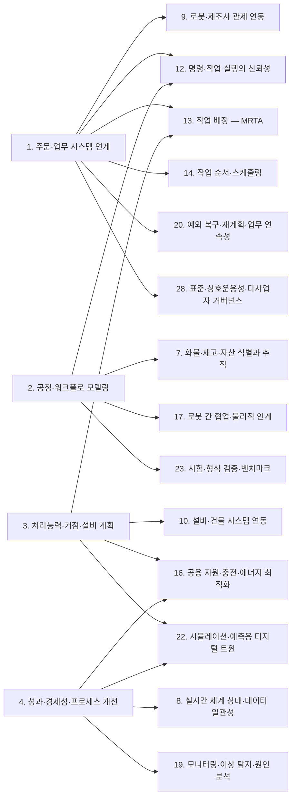

[홈](../../index.md) › A. 업무·공급망 설계

# A. 업무·공급망 설계

## 핵심 질문

무슨 일을 왜, 얼마나 해야 하는가? [분류원문]

## 개요

**무슨 일을 왜, 얼마나 해야 하는가**를 연구한다. 로봇을 움직이기 전에 공급망의 요구를 실행 가능한 업무로 정의하는 영역이다. [분류원문]

## 세부 연구영역

표의 세부 연구영역·무엇을 연구하는가·SCM 관점의 질문 열은 원문 그대로이고, 페이지·현재 상태 열은 위키에서 덧붙인 것이다. 현재 상태는 퍼블리셔가 자동으로 갱신한다.

<!-- auto:category-area-table:start -->
| 세부 연구영역 | 무엇을 연구하는가 | SCM 관점의 질문 | 페이지 | 현재 상태 |
|---|---|---|---|---|
| **1. 주문·업무 시스템 연계** | ERP, WMS, MES, WES, TMS의 주문·재고·생산 요청을 받아 작업으로 변환하고, 변경·취소·완료를 다시 반영하는 방법 | 출고 우선순위가 바뀌면 이미 진행 중인 로봇 작업을 어떻게 바꿀까? | [1. 주문·업무 시스템 연계](01-order-and-business-system-integration.md) | published |
| **2. 공정·워크플로 모델링** | 입고·검수·적치·보충·피킹·이송·생산·포장·출하·반품을 작업 단계로 분해하고, 선후관계와 완료 조건을 정의 | ‘운반 완료’와 ‘인수 확인·재고 반영 완료’를 어떻게 연결할까? | [2. 공정·워크플로 모델링](02-process-and-workflow-modeling.md) | published |
| **3. 처리능력·거점·설비 계획** | 물동량에 필요한 로봇 수와 종류, 작업대·충전기 배치, 교대 운영, 여러 거점의 자원 배치를 결정 | 로봇을 늘려야 할까, 포장대나 엘리베이터가 병목일까? | [3. 처리능력·거점·설비 계획](03-capacity-site-and-facility-planning.md) | published |
| **4. 성과·경제성·프로세스 개선** | 납기 준수율, 처리량, 리드타임, 재공품, 비용, 에너지 등을 측정하고 병목과 투자 효과를 분석 | 로봇 가동률 상승이 실제 출하량과 비용 개선으로 이어졌는가? | [4. 성과·경제성·프로세스 개선](04-performance-economics-and-process-improvement.md) | published |

[분류원문]
<!-- auto:category-area-table:end -->

## 이 대분류의 핵심 포인트

핵심은 **로봇 개별 성능과 공급망 전체 성과를 구분하는 것**이다. 로봇이 물건을 더 빨리 가져와도 다음 공정이 막히면 대기 재고만 늘어날 수 있다. [분류원문]

기업 업무와 현장 운영·제어의 경계를 정리할 때는 ISA-95의 기업–제어 시스템 통합 관점이 참고가 된다. 실제 제품별로 WES·WCS·FMS·ROP의 책임은 겹칠 수 있다. [2] [분류원문]

## 다른 대분류와의 연결

A. 업무·공급망 설계가 정한 업무는 다른 여섯 대분류의 세부영역으로 넘어가 실행되고 측정된다. 예를 들어 VDA 5050 은 외부 IT 시스템과의 인터페이스를 범위에서 제외하므로, 상위 주문을 로봇 작업 요청으로 번역하는 계층이 넘겨받는 지점이 될 것으로 보인다. [추정][^ref-031][^ref-125]

아래 연결은 게시된 1. 주문·업무 시스템 연계 ~ 4. 성과·경제성·프로세스 개선 페이지에서 검증된 주장을 근거로 한다. 연결 상대 세부영역은 대부분 아직 심화 조사 전이라, 상대편에 관한 서술도 A. 업무·공급망 설계 쪽 근거에 기댄다. 확인일은 2026-09-25이고, 출처별 발행일은 참고 자료 절의 각주에 있다.

### [B. 공통 정보·환경 모델](../b-common-information-and-environment-model/index.md)

- **[2. 공정·워크플로 모델링](02-process-and-workflow-modeling.md) ↔ [7. 화물·재고·자산 식별과 추적](../b-common-information-and-environment-model/07-cargo-inventory-and-asset-identification-and-tracking.md)** — '운반 완료'와 '인수 확인·재고 반영 완료'를 잇는 신호가 여기서 나온다. GS1 핵심 업무 어휘(Core Business Vocabulary, CBV)는 객체가 위치에 도착하는 arriving, 수령자 재고에 추가되는 receiving, 점유·소유가 바뀌는 accepting 을 서로 다른 업무 단계로 정의한다. [사실][^ref-044] VDA 5050 은 drop 동작의 완료를 적재물이 로봇을 떠나고 로봇이 새 적재 상태를 보고한 때로 정의한다. [사실][^ref-031] 로봇 완료 신호는 arriving 수준의 물리적 인도에 가까우므로, 공정 모델의 '인수 확인·재고 반영 완료' 조건은 7. 화물·재고·자산 식별과 추적이 다루는 식별자와 receiving·accepting 이벤트에 기대야 할 것으로 보인다. [추정][^ref-044][^ref-031][^ref-049] 이 구성을 적용한 표준·사례는 확인하지 못했다([열린 질문](../../open-questions.md) oq-001, oq-012).
- **[4. 성과·경제성·프로세스 개선](04-performance-economics-and-process-improvement.md) ↔ [8. 실시간 세계 상태·데이터 일관성](../b-common-information-and-environment-model/08-real-time-world-state-and-data-consistency.md)** — Open-RMF 로봇 상태 스키마는 상태 값(idle·charging·working·error 등), 0~1 범위의 배터리, 현재 작업 id, 운영자가 대응할 문제 목록, 위치, 기록 시각을 담는다. [사실][^ref-148] 이 필드들은 가동률·충전 시간·오류 시간 같은 성과 지표를 계산하는 원천이 될 것으로 보이며, 이 연결은 현재 상태를 표현하는 8. 실시간 세계 상태·데이터 일관성 쪽에 속한다. [추정][^ref-148]

### [C. 연결·실행 기반](../c-connectivity-and-execution-foundation/index.md)

- **[1. 주문·업무 시스템 연계](01-order-and-business-system-integration.md) ↔ [9. 로봇·제조사 관제 연동](../c-connectivity-and-execution-foundation/09-robot-and-vendor-fleet-manager-integration.md)** — VDA 5050 3.0.0 명세는 관제 시스템과 이동로봇 사이 통신에 해당하지 않는 인터페이스, 곧 주변 설비·인프라·외부 IT 시스템과의 인터페이스를 범위에서 뺀다. [사실][^ref-031] 이처럼 로봇 인터페이스가 상위 시스템 연동을 범위 밖에 두므로, 상위 주문을 로봇 작업 요청(Open-RMF 작업 요청 등)으로 번역하는 계층이 두 대분류가 넘겨받는 지점이 될 것으로 보인다. [추정][^ref-031][^ref-125] 이 번역 계층을 규정한 표준은 확인하지 못했다.
- **[1. 주문·업무 시스템 연계](01-order-and-business-system-integration.md)·[2. 공정·워크플로 모델링](02-process-and-workflow-modeling.md) ↔ [12. 명령·작업 실행의 신뢰성](../c-connectivity-and-execution-foundation/12-command-and-task-execution-reliability.md)** — 상위 쪽 변경·취소 명령이 로봇 쪽 실행 상태와 만나는 지점이다. B2MML 거래 프로파일은 CHANGE·CANCEL 등의 거래 동사를 정의한다. [사실][^ref-129] OPC UA for ISA-95 Job Control 은 Update·Pause·Resume·Abort·Cancel 등의 작업 지시 메서드를 정의한다. [사실][^ref-130] 로봇 쪽 VDA 5050 은 주문을 수행하는 중에 다른 주문을 받으면 로봇이 OTHER_ORDER_ACTIVE 오류를 경고(WARNING) 수준으로 보고하게 한다. [사실][^ref-031] 취소할 수 없는 동작은 주문 취소(cancelOrder) 뒤에도 실행 중(RUNNING)을 거쳐 완료(FINISHED) 또는 실패(FAILED)로 보고하게 한다. [사실][^ref-031] Open-RMF 작업 상태 스키마는 queued·underway·completed·canceled·killed·failed 등의 상태 값, 시작·종료 시각, 소요 시간 추정, 취소·강제 종료·중단 요청 기록을 담는다. [사실][^ref-111] 이 기록은 두 세부영역이 상위 시스템에 되돌려 줄 결과의 원천이 될 것으로 보인다. [추정][^ref-111]
- **[3. 처리능력·거점·설비 계획](03-capacity-site-and-facility-planning.md) ↔ [10. 설비·건물 시스템 연동](../c-connectivity-and-execution-foundation/10-facility-and-building-system-integration.md)** — Open-RMF 데모의 호텔 환경은 승강기 2대, 여러 문, 3개 플릿(로봇 4대)이 다층 건물에서 함께 일하는 구성을 보이고, 공간과 승강기·문 같은 건물 설비를 공유하는 로봇의 교통 관리를 설명한다. [사실][^ref-104] 병원 약품 배송 로봇 사례에서는 승강기 가동률이 높을수록 배송 실패가 많고 배송 시간이 길었다. [사실][^ref-060] 다층 호텔의 배송 로봇 연구는 승강기를 경로 계획 안의 대기·운행 시간으로 모델링했다. [사실][^ref-103] 두 사례는 병원·호텔이며 물류센터 적용 여부는 미확인이다([열린 질문](../../open-questions.md) oq-010). 3. 처리능력·거점·설비 계획은 승강기를 처리능력의 제약 입력으로만 받는다. 승강기 제어 자체는 분류 원문 9장의 시설·설비 제어 경계에 따라 연계 대상이며, ROP 는 10. 설비·건물 시스템 연동을 통해 작업 요청·예약·상태 확인을 맡는다.

### [D. 계획·최적화](../d-planning-and-optimization/index.md)

- **[1. 주문·업무 시스템 연계](01-order-and-business-system-integration.md) ↔ [14. 작업 순서·스케줄링](../d-planning-and-optimization/14-task-sequencing-and-scheduling.md)** — 웨이브·웨이브리스 출고 지시 정책 연구(Gallien·Weber, 2010)와 동적으로 도착하는 주문의 피킹 재최적화 연구(Lorenz 외, 2025)는 상위 시스템의 출고 지시·우선순위 변경이 작업 순서 결정 문제로 넘어가는 지점을 다루는 것으로 보인다. [추정][^ref-134][^ref-133]
- **[1. 주문·업무 시스템 연계](01-order-and-business-system-integration.md) ↔ [13. 작업 배정 — MRTA](../d-planning-and-optimization/13-task-allocation-mrta.md)** — 작업자가 피킹하고 자율이동로봇(Autonomous Mobile Robot, AMR)이 운반하는 동적 주문 피킹 연구(2025)는 AMR 가용성에 따른 개입 전략을 다룬다. [추정][^ref-132] 이 연구는 주문 변경과 로봇 배정이 맞물리는 사례가 될 것으로 보인다. [추정][^ref-132]
- **[3. 처리능력·거점·설비 계획](03-capacity-site-and-facility-planning.md) ↔ [13. 작업 배정 — MRTA](../d-planning-and-optimization/13-task-allocation-mrta.md)** — Open-RMF 플릿 어댑터 템플릿 설정은 배터리가 recharge_threshold(예시값 0.10) 아래로 내려간 로봇에게 작업을 맡기지 않게 한다. [사실][^ref-105] 또 충전 목표(recharge_soc), 로봇별 충전기, 작업 종료 후 동작(park·charge·nothing)을 둔다. [사실][^ref-105]
- **[3. 처리능력·거점·설비 계획](03-capacity-site-and-facility-planning.md) ↔ [16. 공용 자원·충전·에너지 최적화](../d-planning-and-optimization/16-shared-resource-charging-and-energy-optimization.md)** — AMR 물류센터 시뮬레이션 연구(2025)에서는 충전기가 부족하면 큰 지연이, 남으면 불필요한 비용이 생겼다. [사실][^ref-102] 로봇 이동형 풀필먼트 시스템(Robotic Mobile Fulfillment System, RMFS)의 충전·배터리 교환 전략을 비교한 연구(2018)도 있다. [사실][^ref-098]
- **[4. 성과·경제성·프로세스 개선](04-performance-economics-and-process-improvement.md) ↔ [16. 공용 자원·충전·에너지 최적화](../d-planning-and-optimization/16-shared-resource-charging-and-energy-optimization.md)** — Omega(2024)에 실린 연구는 RMFS 에서 동적 우선순위 규칙이 선착순보다 에너지 소비를 3.41% 줄이고 처리량을 26.07% 높였다고 보고했다. [사실][^ref-146] 이 수치는 모델·시뮬레이션 조건의 저자 보고값이며 현장 실측이 아니다. [사실][^ref-146]

### [E. 협업·현장 운영](../e-collaboration-and-field-operations/index.md)

- **[1. 주문·업무 시스템 연계](01-order-and-business-system-integration.md) ↔ [20. 예외 복구·재계획·업무 연속성](../e-collaboration-and-field-operations/20-exception-recovery-replanning-and-business-continuity.md)** — 상위 시스템의 취소(CANCEL)가 로봇이 화물을 이미 실은 뒤에 오거나, 취소할 수 없는 동작이 끝까지 수행될 수 있다. [추정][^ref-031][^ref-129] 이 경우 되돌림 작업과 재고 반영이 복구·재계획 과제로 넘어갈 것으로 보인다. [추정][^ref-031][^ref-129] 되돌림 규칙을 정한 표준·사례는 확인하지 못했다([열린 질문](../../open-questions.md) oq-021).
- **[2. 공정·워크플로 모델링](02-process-and-workflow-modeling.md) ↔ [17. 로봇 간 협업·물리적 인계](../e-collaboration-and-field-operations/17-robot-to-robot-collaboration-and-physical-handover.md)** — 공정 모델이 완료 조건으로 삼을 수 있는 인계 확인 신호가 여기에 있다. Open-RMF 배송 작업에서 로봇은 하역 지점의 워크셀(workcell)에 IngestorRequest 를 보내고, IngestorResult 를 받을 때까지 이를 반복한다. [사실][^ref-023] IngestorResult 는 시각, 요청 id, 워크셀 id, 상태(ACKNOWLEDGED·SUCCESS·FAILED)를 담는다. [사실][^ref-049]
- **[4. 성과·경제성·프로세스 개선](04-performance-economics-and-process-improvement.md) ↔ [19. 모니터링·이상 탐지·원인 분석](../e-collaboration-and-field-operations/19-monitoring-anomaly-detection-and-root-cause-analysis.md)** — 제조 처리량의 병목 탐지 방법을 검토한 문헌(2023)과 창고 이벤트 로그에 프로세스 마이닝을 적용한 사례(2015)가 있다. [추정][^ref-115][^ref-149] 이를 로봇 상태 기록에 적용하면 성과 분석과 이상·원인 분석이 같은 로그를 공유할 것으로 보인다. [추정][^ref-115][^ref-149][^ref-148] 이런 적용 연구는 확인하지 못했다([열린 질문](../../open-questions.md) oq-018).

### [F. 도입·검증·유지관리](../f-deployment-verification-and-maintenance/index.md)

- **[2. 공정·워크플로 모델링](02-process-and-workflow-modeling.md) ↔ [23. 시험·형식 검증·벤치마크](../f-deployment-verification-and-maintenance/23-testing-formal-verification-and-benchmarking.md)** — 워크플로 넷의 건전성(soundness) 판정 복잡도를 다룬 연구(2022)가 있다. [추정][^ref-121] 따라서 공정 모델의 형식적 설계 점검은 형식 검증과 이어질 것으로 보인다. [추정][^ref-121] 물류 로봇 공정에 적용한 사례는 확인하지 못했다.
- **[3. 처리능력·거점·설비 계획](03-capacity-site-and-facility-planning.md) ↔ [22. 시뮬레이션·예측용 디지털 트윈](../f-deployment-verification-and-maintenance/22-simulation-and-predictive-digital-twin.md)** — RAWSim-O 는 RMFS 운영의 여러 결정 문제가 미치는 효과를 연구하기 위한 이산 사건 시뮬레이션이다. [사실][^ref-101] 이런 도구는 증차·증설처럼 가정한 미래를 실험하는 데 쓰일 것으로 보인다. [추정][^ref-101]
- **[4. 성과·경제성·프로세스 개선](04-performance-economics-and-process-improvement.md) ↔ [22. 시뮬레이션·예측용 디지털 트윈](../f-deployment-verification-and-maintenance/22-simulation-and-predictive-digital-twin.md)** — 우선순위 정책이나 충전 대안을 운영 전에 비교하는 일은 가정한 미래를 실험하는 22. 시뮬레이션·예측용 디지털 트윈 쪽 일이다. 이 일은 현재 상태를 표현하는 8. 실시간 세계 상태·데이터 일관성과 역할을 나눠 연결될 것으로 보인다. [추정][^ref-146][^ref-102]

### [G. 안전·보안·지능·거버넌스](../g-safety-security-intelligence-and-governance/index.md)

- **[1. 주문·업무 시스템 연계](01-order-and-business-system-integration.md) ↔ [28. 표준·상호운용성·다사업자 거버넌스](../g-safety-security-intelligence-and-governance/28-standards-interoperability-and-multi-vendor-governance.md)** — ISA-95 계열의 작업 지시 동사·메서드와 VDA 5050·Open-RMF 의 주문·작업 요청을 잇는 표준 매핑은 이번 조사 범위에서 확인되지 않았다. 그래서 번역 규칙을 누가 소유하고 누가 변경을 승인하는지가 상호운용성 거버넌스 과제로 넘어갈 것으로 보인다. [추정][^ref-129][^ref-130][^ref-031][^ref-125] 관련 질문은 [열린 질문](../../open-questions.md) oq-020 이다.

### 아직 다루지 않은 연결

11. 분산 시스템·통신·컴퓨팅 구조, 21. 온보딩·설정·현장 시운전, 24. 자산·소프트웨어 수명주기 관리, 25. 안전·위험 관리, 26. 사이버보안·접근권한·개인정보, 27. AI·학습·적응과 모델 운영과의 연결은 검증된 근거가 아직 없어 싣지 않았다. 해당 세부영역의 조사가 게시되면 보강한다.

## 최근 업데이트

<!-- auto:category-recent:start -->
- 2026-09-26 · 갱신 · [4. 성과·경제성·프로세스 개선](04-performance-economics-and-process-improvement.md) — 월간 재검증: 7절 끝에 ISO 22400-2 판 상태 덧붙임, 10절 본문을 주제 페이지로 옮기고 요약·링크만 남김. 2차: 프런트매터 sources 에 ref-781·ref-782 추가, last_run 2026-09-26 (실행 2026-09-26-02)
- 2026-09-26 · 생성 · [4. 성과·경제성·프로세스 개선 — 다른 연구영역과의 연결](../../topics/2026/2026-09-26-area04-s10.md) — 분리: 4. 성과·경제성·프로세스 개선 의 "10. 다른 연구영역과의 연결 (번호와 이름을 함께 표기)" 절을 옮기고 링크를 주제 페이지 위치 기준 상대 경로로 고쳤다(2차 재실행에서 변경 없음) (실행 2026-09-26-02)
- 2026-09-26 · 요약 · [4. 성과·경제성·프로세스 개선](04-performance-economics-and-process-improvement.md) — 월간 재검증(4. 성과·경제성·프로세스 개선, 25. 안전·위험 관리): ISO 22400-2(개정 1:2017, ISO/DIS FDIS 등록 승인)와 ISO/TS 15066·ISO 10218-2:2025·KS 부합 상태·ISO 3691-4·ISO 12100 판 상태를 두 페이지 7절에 덧붙임. 다음 실행 후보: 주제 페이지 2026-09-25-area04-s4·2026-09-25-area04-s7 반영; ref-022 최신 게시판(3.0.0) 기준 이전 판(2.x 로봇 현장 사용 oq-091 과 모순 없게, 3.0.0 발행일은 oq-005 미해소로 적지 않음); ref-345 구판·대체 출처 ref-679(2021 판 이후 개정 고시는 검색 범위 내에서 확인되지 않음); ref-637 제명 변경(산업 디지털 전환 및 인공지능 활용 촉진법, oq-122 열림 유지); ref-030 SSN 2023 Edition 공개 작업 초안; ref-486 개정 1:2024(4.1 에 기후 변화가 관련 이슈인지 결정하라는 요구사항, 4.2 에 관련 이해관계자가 기후 변화 관련 요구를 가질 수 있다는 주석 추가); ref-509·ref-510 개정 진행; ref-502·ref-119·ref-767·ref-314 유효 추정 (실행 2026-09-26-02)
- 2026-09-25 · 갱신 · [A. 업무·공급망 설계](index.md) — '다른 대분류와의 연결' 절 신규 작성(B~G 6개 대분류, 세부영역 연결 18쌍·근거 finding 22건, Mermaid 도식), '참고 자료' 절 끝에 각주 정의 23건 추가. 2차: 번호만 쓴 호칭 수정, 첫 문장 태그·각주 보강 (실행 2026-09-25-29)
- 2026-09-25 · 요약 · [A. 업무·공급망 설계](index.md) — A. 업무·공급망 설계: 다른 대분류와의 연결 절 작성(B~G 여섯 대분류, 세부영역 연결 18쌍, 근거 finding 22건 중 추정 9건) (실행 2026-09-25-29)
<!-- auto:category-recent:end -->

## 참고 자료

원문의 [2]는 참고문헌 [ref-002](../../references/ref-002.md)에 해당한다.[^ref-002]

[^ref-002]: ISA, Update to ISA-95 Standard Addresses Integration of Enterprise and Manufacturing Control Systems, 2025, https://www.isa.org/news-press-releases/2025/april/update-to-isa-95-standard-addresses-integration-of, 접근일 2026-09-24

[^ref-023]: Open Robotics, Workcells - Programming Multiple Robots with ROS 2, 미확인, https://osrf.github.io/ros2multirobotbook/integration_workcells.html, 접근일 2026-09-25
[^ref-031]: VDA / VDMA (VDA5050 GitHub), VDA5050/VDA5050_EN.md — Official Specification document for the VDA 5050, 미확인, https://github.com/VDA5050/VDA5050/blob/main/VDA5050_EN.md, 접근일 2026-09-25
[^ref-044]: GS1, gs1/EPCIS — Ontology/CBV.ttl (Core Business Vocabulary ontology 2.0), 2021-09-30, https://github.com/gs1/EPCIS/blob/master/Ontology/CBV.ttl, 접근일 2026-09-25
[^ref-049]: Open Robotics (open-rmf), rmf_internal_msgs — rmf_ingestor_msgs/msg/IngestorResult.msg, 미확인, https://github.com/open-rmf/rmf_internal_msgs/blob/main/rmf_ingestor_msgs/msg/IngestorResult.msg, 접근일 2026-09-25
[^ref-060]: Lee, Y. 외(Digital Health), Feasibility of autonomous medication delivery robots considering elevator utilization in high-traffic hospital environments, 2026, https://doi.org/10.1177/20552076261437181, 접근일 2026-09-25 (원문 미열람)
[^ref-098]: Zou, B., Gong, Y., de Koster, R., & Xu, X., Evaluating battery charging and swapping strategies in a robotic mobile fulfillment system, 2018, https://www.sciencedirect.com/science/article/abs/pii/S0377221717310901, 접근일 2026-09-25 (원문 미열람)
[^ref-101]: Merschformann, M. (RAWSim-O GitHub), RAWSim-O: A simulation framework for Robotic Mobile Fulfillment Systems (README), 미확인, https://github.com/merschformann/RAWSim-O, 접근일 2026-09-25
[^ref-102]: Springer(FAIM 2025 발표 논문, 저자 미확인), Simulation-Driven Approach for Dimensioning AMR Fleets in Distribution Centre Logistics, 2025, https://link.springer.com/chapter/10.1007/978-3-032-07675-5_69, 접근일 2026-09-25 (원문 미열람)
[^ref-103]: PMC 게재 논문(저자 미확인), The Path Planning Problem of Robotic Delivery in Multi-Floor Hotel Environments, 미확인, https://pmc.ncbi.nlm.nih.gov/articles/PMC11946681/, 접근일 2026-09-25 (원문 미열람)
[^ref-104]: Open Robotics (open-rmf), rmf_demos — Demonstrations of Open-RMF (README), 미확인, https://github.com/open-rmf/rmf_demos, 접근일 2026-09-25
[^ref-105]: Open Robotics (open-rmf), fleet_adapter_template — fleet_adapter_template/config.yaml, 미확인, https://github.com/open-rmf/fleet_adapter_template/blob/main/fleet_adapter_template/config.yaml, 접근일 2026-09-25
[^ref-111]: Open Robotics (open-rmf), rmf_api_msgs — rmf_api_msgs/schemas/task_state.json, 미확인, https://github.com/open-rmf/rmf_api_msgs/blob/main/rmf_api_msgs/schemas/task_state.json, 접근일 2026-09-25
[^ref-115]: Production & Manufacturing Research 게재 논문(저자 미확인, Chalmers 공개본), Throughput bottleneck detection in manufacturing: a systematic review of the literature on methods and operationalization modes, 2023, https://www.tandfonline.com/doi/full/10.1080/21693277.2023.2283031, 접근일 2026-09-25 (원문 미열람)
[^ref-121]: Blondin, M., Mazowiecki, F., & Offtermatt, P. (LICS 2022), The complexity of soundness in workflow nets, 2022, https://arxiv.org/abs/2201.05588, 접근일 2026-09-25 (원문 미열람)
[^ref-125]: Open Robotics (open-rmf), rmf_api_msgs — rmf_api_msgs/schemas/task_request.json, 미확인, https://github.com/open-rmf/rmf_api_msgs/blob/main/rmf_api_msgs/schemas/task_request.json, 접근일 2026-09-25 (원문 미열람)
[^ref-129]: MESA International, B2MML-BatchML/Schema/B2MML-TransactionProfile.xsd, 2023, https://github.com/MESAInternational/B2MML-BatchML/blob/master/Schema/B2MML-TransactionProfile.xsd, 접근일 2026-09-25
[^ref-130]: OPC Foundation, UA-Nodeset ISA95-JOBCONTROL — opc.ua.isa95-jobcontrol.nodeset2 (NodeSet2.xml·documentation.csv), 2024-01-31, https://github.com/OPCFoundation/UA-Nodeset/tree/latest/ISA95-JOBCONTROL, 접근일 2026-09-25
[^ref-132]: Yu, S., & Srinivas, S., Collaborative Human–Robot Teaming for Dynamic Order Picking: Interventionist strategies for improving warehouse intralogistics operations, 2025, https://www.sciencedirect.com/science/article/abs/pii/S1366554525001231, 접근일 2026-09-25 (원문 미열람)
[^ref-133]: Lorenz, Otto, & Gendreau (Networks, Wiley), Picking Operations in Warehouses With Dynamically Arriving Orders: How Good is Reoptimization?, 2025, https://onlinelibrary.wiley.com/doi/full/10.1002/net.22281, 접근일 2026-09-25 (원문 미열람)
[^ref-134]: Gallien, J., & Weber, T. G., To Wave or Not to Wave? Order Release Policies for Warehouses with an Automated Sorter, 2010, https://pubsonline.informs.org/doi/abs/10.1287/msom.1100.0291, 접근일 2026-09-25 (원문 미열람)
[^ref-146]: Omega 게재 논문(저자 미확인), The role of energy consumption in robotic mobile fulfillment systems: Performance evaluation and operating policies with dynamic priority, 2024, https://www.sciencedirect.com/science/article/abs/pii/S0305048324001336, 접근일 2026-09-25 (원문 미열람)
[^ref-148]: Open Robotics (open-rmf), rmf_api_msgs — rmf_api_msgs/schemas/robot_state.json, 미확인, https://github.com/open-rmf/rmf_api_msgs/blob/main/rmf_api_msgs/schemas/robot_state.json, 접근일 2026-09-25
[^ref-149]: Springer(학술대회 발표 논문, 저자 미확인), Material Movement Analysis for Warehouse Business Process Improvement with Process Mining: A Case Study, 2015, https://link.springer.com/chapter/10.1007/978-3-319-19509-4_9, 접근일 2026-09-25 (원문 미열람)
