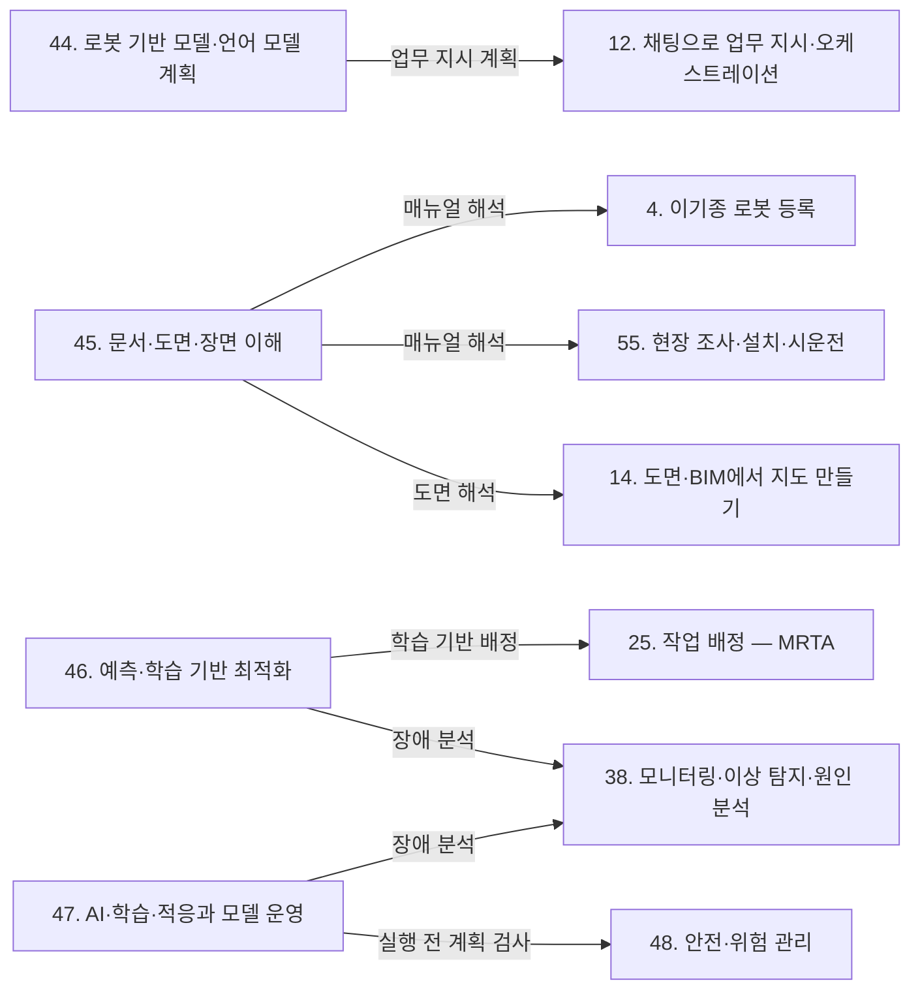

[홈](../../index.md) › L. AI·학습 기술

# L. AI·학습 기술

## 핵심 질문

학습·언어 모델 같은 AI 기술을 어디에 쓰고, 그 결과를 어떤 기준으로 믿을 것인가? [분류원문]

## 개요

로봇 기반 모델·언어 모델, 문서·도면·장면 이해, 예측·학습 기반 최적화, AI 결과의 신뢰와 모델 운영. [분류원문]

## 세부 연구영역

표의 세부 연구영역·무엇을 연구하는가·핵심 질문 열은 원문 그대로이고, 페이지·현재 상태 열은 위키에서 덧붙인 것이다. 현재 상태는 퍼블리셔가 자동으로 갱신한다.

<!-- auto:category-area-table:start -->
| 세부 연구영역 | 무엇을 연구하는가 | 핵심 질문 | 페이지 | 현재 상태 |
|---|---|---|---|---|
| **44. 로봇 기반 모델·언어 모델 계획** | 시각–언어–행동 모델 같은 로봇 기반 모델의 흐름과 언어 모델 기반 작업 계획 | 범용 로봇 모델과 언어 모델은 오케스트레이션의 무엇을 바꾸는가? | [44. 로봇 기반 모델·언어 모델 계획](robot-foundation-models-and-llm-planning.md) | published |
| **45. 문서·도면·장면 이해** | 매뉴얼·도면 해석과 플랫폼 수준의 장면 인식 | 매뉴얼·도면·현장 영상을 AI가 얼마나 정확히 읽어 낼 수 있는가? | [45. 문서·도면·장면 이해](document-drawing-and-scene-understanding.md) | published |
| **46. 예측·학습 기반 최적화** | 학습 기반 배정·경로, 수요·고장 예측 | 학습과 예측이 배정·경로·정비 결정을 실제로 개선하는가? | [46. 예측·학습 기반 최적화](prediction-and-learning-based-optimization.md) | published |
| **47. AI·학습·적응과 모델 운영** | AI 결과를 실행에 쓰는 기준과 불확실성, 모델 운영 | AI가 만든 작업 계획이나 기능 해석을 어떤 기준으로 실행에 사용할까? | [47. AI·학습·적응과 모델 운영](ai-learning-adaptation-and-model-operations.md) | published |

[분류원문]
<!-- auto:category-area-table:end -->

## 이 대분류의 핵심 포인트

AI는 특정 기능 하나에만 해당하지 않는다. **매뉴얼 해석은 4·55번, 도면 해석은 14번, 학습 기반 배정은 25번, 장애 분석은 38번**에 적용되는 연구 방법이다. [분류원문]

## 다른 대분류와의 연결

L. AI·학습 기술의 네 세부영역인 [44. 로봇 기반 모델·언어 모델 계획](robot-foundation-models-and-llm-planning.md), [45. 문서·도면·장면 이해](document-drawing-and-scene-understanding.md), [46. 예측·학습 기반 최적화](prediction-and-learning-based-optimization.md), [47. AI·학습·적응과 모델 운영](ai-learning-adaptation-and-model-operations.md)은 따로 떨어진 기능이라기보다 다른 대분류의 기능에 적용되는 연구 방법이다. 위 '이 대분류의 핵심 포인트'의 교차 규칙대로 매뉴얼 해석은 4. 이기종 로봇 등록과 55. 현장 조사·설치·시운전, 도면 해석은 14. 도면·BIM에서 지도 만들기, 학습 기반 배정은 25. 작업 배정 — MRTA, 장애 분석은 38. 모니터링·이상 탐지·원인 분석으로 이어진다. 아래는 이 네 갈래와 그 밖의 연결을 대분류별로 정리한 것이다.

연결 근거는 게시된 세부영역·대분류 페이지의 검증된 주장과 이번 조사에서 연 자료다. 대부분 단일 출처이거나 서로 다른 내용의 출처를 묶은 것이어서 두 출처로 교차 확인된 주장은 없다. '연계 대상'은 분류 원문 19장이 외부 연계 영역으로 둔 것으로, ROP가 직접 맡지 않는다. 본문의 oq-NNN은 [열린 질문](../../open-questions.md)의 항목이다.

### [A. 기획·사업](../planning-and-business/index.md)

- **44. 로봇 기반 모델·언어 모델 계획 ↔ [1. 기술·시장·업체 동향](../planning-and-business/technology-market-and-vendor-trends.md)**: BMW 그룹은 2026-06-25 보도자료에서 2025년 스파턴버그 공장에 Figure AI의 휴머노이드 Figure 02를 배치해 용접 공정용 판금 부품 투입을 맡겼고 BMW X3 3만 대 이상 생산을 도왔다고 밝혔으나, 같은 자료 안에서 배치 기간이 10개월과 11개월로 엇갈린다(벤더 주장, oq-219). [추정][^ref-1051] 헬로티 보도(2025-11-26)에 따르면 로보티즈는 시각–언어–행동(Vision-Language-Action, VLA) 모델을 넣은 상체형 휴머노이드 AI 워커로 BGF로지스 물류센터 실증(PoC)을 계획하며, 기사가 전한 핵심 공정 자동화율 80% 이상·작업 성공률 90% 이상은 실측이 아닌 목표치다(벤더 주장, oq-218). [추정][^ref-1052] 이런 로봇의 저수준 조작 정책은 로봇 자체 지능·제어 경계의 연계 대상이고, ROP 쪽 연결은 그 능력과 실행 조건을 받아 계획에 쓰는 부분이다.
- **46. 예측·학습 기반 최적화 ↔ [3. 경제성·조달·사업 모델](../planning-and-business/economics-procurement-and-business-models.md)**: Howard(Cal Poly 석사논문, 2026-06)는 처리량 최대화 기준의 자율 이동 로봇(Autonomous Mobile Robot, AMR) 대수 산정이 서비스형 로봇(Robot-as-a-Service, RaaS) 구독 과금에서는 플릿을 과대 산정한다고 보고, 대수 산정을 주문 라인당 비용 최소화 문제로 바꿔 시뮬레이션·대기행렬·기계학습 대리 모델을 함께 썼다. [사실][^ref-822]
- **47. AI·학습·적응과 모델 운영 ↔ [2. 사용 사례·요구·책임 범위](../planning-and-business/use-cases-requirements-and-scope.md)**: 법무법인 태평양(BKL) 해설은 에너지·보건의료·원자력·교통·교육 등 특정 영역에서 활용되는 AI를 한국 인공지능 기본법의 고영향 인공지능으로 설명하므로, 병원·교통 현장의 로봇 작업 계획·배정에 AI를 쓸지 정하는 사용 사례 정의 단계에서 고영향 해당 여부를 함께 판단해야 할 것으로 보인다(해설은 2025-09-30 공개된 시행령(안)·고시(안)·가이드라인(안) 기준이며 확정본과의 일치는 미확인, 로봇 언급은 없음, oq-105). [추정][^ref-1253][^ref-620]

### [B. 로봇 온톨로지](../robot-ontology/index.md)

- **45. 문서·도면·장면 이해 ↔ [4. 이기종 로봇 등록](../robot-ontology/heterogeneous-robot-registration.md)·[5. 로봇 능력·작업 표현](../robot-ontology/robot-capability-and-task-representation.md)**: 검색 증강 문맥 학습으로 자산관리셸(Asset Administration Shell, AAS)용 정보 추출을 개선하는 AAS-RAIL(2026-09)과 대규모 언어 모델(Large Language Model, LLM) 에이전트로 자산관리셸을 생성하는 Xia 외(2024)가 있다. [사실][^ref-1071][^ref-1072] 두 연구는 교차 규칙의 매뉴얼 해석이 등록 정보 작성으로 이어지는 예이며, 방법이 서로 달라 같은 내용을 교차 확인한 것은 아니다. 로봇 기술 파일(Unified Robot Description Format, URDF)에서 로봇 온톨로지를 LLM으로 채우는 연구(Dussard·Sarthou, 2026-06)와 LLM으로 능력 온톨로지를 생성하는 연구(Vieira da Silva 외, 2024-04)도 있다. [사실][^ref-239][^ref-238] 이 두 연구는 4. 이기종 로봇 등록과 5. 로봇 능력·작업 표현 양쪽에 닿으며, 같은 연결은 B. 로봇 온톨로지 페이지의 연결 절에도 있다.
- **45. 문서·도면·장면 이해 ↔ [7. 온톨로지 검증·변경 관리](../robot-ontology/ontology-verification-and-change-management.md)**: 추출 항목마다 원문 위치를 붙이는 출처 근거 연결 도구(LangExtract)를 쓰면 7. 온톨로지 검증·변경 관리의 원문 대조 검증과 사람의 확정·반려가 같은 근거를 공유할 것으로 보이나, 로봇 매뉴얼에 적용한 공개 구현은 확인하지 못했다(oq-147, oq-226). [추정][^ref-1074][^ref-1071]
- **44. 로봇 기반 모델·언어 모델 계획 ↔ [6. 온톨로지 기반 시스템·로봇 연동](../robot-ontology/ontology-based-system-and-robot-integration.md)**: Nabizada 외(2026-06, CASE 2026 채택)는 VDI 3682·IEC 61360-1·IDTA 02011·IDTA 02016으로 구성한 자산관리셸 능력 모델에서 계획 도메인 정의 언어(Planning Domain Definition Language, PDDL) 문제를 자동 생성한다. [사실][^ref-201] 자연어 문제를 PDDL로 옮겨 고전 계획기로 푸는 LLM+P와 함께 보면, PDDL 같은 계획 표현이 언어 모델 계획과 온톨로지 기반 연동을 잇는 인터페이스가 될 것으로 보이나 두 방식을 한 플랫폼에서 결합한 사례는 확인하지 못했다. [추정][^ref-092][^ref-201]
- **44. 로봇 기반 모델·언어 모델 계획 ↔ 5. 로봇 능력·작업 표현**: VLA 같은 로봇 기반 모델은 카메라 영상에서 행동을 직접 생성해 미리 정한 스킬 목록 없이 작업을 다루므로, 이런 로봇의 능력을 능력 모델에 어떻게 등록·기술·검증할지가 두 대분류 사이의 열린 쟁점으로 보인다(oq-216). [추정][^ref-1045][^ref-1047]

### [C. 채팅 기반 구성·운영](../chat-based-configuration-and-operation/index.md)

분류 원문은 C. 채팅 기반 구성·운영의 원칙을 다음과 같이 적는다.

대화 결과는 실행 명령이 아니라 계획이다. **사람이 확인·승인한 계획만 실행**되어야 언어 모델의 잘못된 해석이 로봇 동작으로 이어지지 않는다. [분류원문]

- **44. 로봇 기반 모델·언어 모델 계획 ↔ [12. 채팅으로 업무 지시·오케스트레이션](../chat-based-configuration-and-operation/chat-task-instruction-and-orchestration.md)**:
    - 언어 모델 계획: 언어 모델로 다중 로봇 작업을 계획하는 SMART-LLM(2023-09)과 언어 모델의 해석을 PDDL로 옮겨 최적 계획기에 맡기는 LLM+P(2023-04)가 있다. [사실][^ref-090][^ref-092] 분류 원문 C 주석은 업무 지시를 25. 작업 배정 — MRTA·26. 작업 순서·스케줄링의 기능을 대화로 쓰게 하는 것으로 두므로, 이 연구들은 대화 지시를 계획으로 바꾸는 엔진과 언어 모델 계획이 만나는 자리에 있다.
    - Nayantra: Open Robotics 상호운용 SIG의 2026-07-02 발표 안내문(2026-06-25 게시)은 Open-RMF REST API를 언어 모델이 호출하는 도구로 노출하는 모델 컨텍스트 프로토콜(Model Context Protocol, MCP) 서버와, 평이한 영어 지시를 여러 단계의 RMF 임무로 바꾸는 에이전트로 이루어진 Nayantra를 소개했다(시연은 창고 시뮬레이션이며 발표 내용 자체는 미열람). [사실][^ref-854] 같은 연결은 E. 사물·사람·실시간 상태와 K. 플랫폼 아키텍처·인프라 페이지의 연결 절에도 있다.
    - SayPlan: SayPlan(CoRL 2023)은 언어 모델이 3차원 장면 그래프로 세운 초기 계획을 실행 전에 장면 그래프 시뮬레이터로 확인하고 그 피드백으로 실행 불가능한 동작을 고치는 반복 재계획을 둔다(단일 이동 매니퓰레이터 평가). [사실][^ref-416] 장면 그래프를 계획의 바탕으로 쓴다는 점에서 이 연구는 [15. 지도·공간·위치 모델](../space-and-map-model/map-space-and-location-model.md)과도 닿는다.
- **47. AI·학습·적응과 모델 운영 ↔ 12. 채팅으로 업무 지시·오케스트레이션·[13. 대화형 기능의 신뢰·기반](../chat-based-configuration-and-operation/conversational-trust-and-foundations.md)**: 언어 모델 계획을 기호 계획기로 검증하고 불확실할 때 사람에게 묻는 장치가 위 원칙을 구현하는 수단이 될 것으로 보이며, 47. AI·학습·적응과 모델 운영은 그 채택 기준을 정하는 쪽을 맡는 것으로 보인다. [추정][^ref-351][^ref-092] KnowNo는 언어 모델 계획기가 필요할 때 사람에게 도움을 요청하게 하고(사람 도움을 줄이는 것이 목표라는 점은 저자 보고), ‘Learning to Ask’(2024-09)는 불분명한 지시를 받은 LLM 에이전트의 되묻기를, AmbiK는 주방 환경의 모호한 작업 데이터셋을 다룬다. [사실][^ref-351][^ref-359][^ref-354]
- **44. 로봇 기반 모델·언어 모델 계획 ↔ [11. 채팅으로 실제 상황 시뮬레이션 재현](../chat-based-configuration-and-operation/chat-real-situation-simulation-replay.md)**: Xia 외(2026-08)는 언어 모델 에이전트가 사용자 질의와 기준 구성을 받아 비교 시뮬레이션을 설계·실행하고 결과를 해석해 공정 매개변수 변경을 권고하는 다중 에이전트 틀을 제약 공정 설계에 적용했다(로봇 플릿 사례는 아님). [사실][^ref-832] 대화로 가정한 미래를 실험하는 34. 시뮬레이션·예측용 디지털 트윈을 부르는 형태라는 점에서 I. 설계·시뮬레이션과도 이어진다.
- **45. 문서·도면·장면 이해 ↔ [8. 채팅으로 맵 작성](../chat-based-configuration-and-operation/chat-map-authoring.md)**: DeFazio 외(2024-09)는 비전 언어 모델로 평면도 지도를 해석하는 연구를 냈다. [사실][^ref-076] 도면을 올려 대화로 지도를 만드는 기능은 45. 문서·도면·장면 이해의 도면 해석과 14. 도면·BIM에서 지도 만들기·15. 지도·공간·위치 모델의 엔진을 함께 부를 것으로 보이며, 건축·공학 도면 이해 벤치마크가 따로 있을 만큼 해석 오류가 남으므로 확인 질문이 필요할 것으로 보인다. [추정][^ref-076][^ref-1073]

### [D. 공간·지도 모델](../space-and-map-model/index.md)

- **45. 문서·도면·장면 이해 ↔ [14. 도면·BIM에서 지도 만들기](../space-and-map-model/maps-from-floor-plans-and-bim.md)**: 평면도 영상 분석 데이터셋 CubiCasa5K(2019-04), CAD 도면 파놉틱 심볼 스포팅 데이터셋 FloorPlanCAD(2021-05), 국내 AI Hub 건축 도면 데이터(2023-07-26)가 공개되어 있다. [사실][^ref-063][^ref-067][^ref-1012] 이 자료들은 교차 규칙의 도면 해석을 학습·평가하는 데 쓰이며, AI Hub 라벨에 로봇 운영에 필요한 클래스가 있는지는 oq-197로 남아 있다. Su 외(Sensors, 2022-03)는 쇼핑몰 평면도 25장의 점포 1,340개를 대상으로 공간 분할 정확도 92.54%, 점포 인식 정확도 90.56%, 전체 검출 정확도 83.81%를 보고했다(논문 평가값이며 로봇 현장 배치 결과는 아님). [사실][^ref-1066] AECV-Bench(2026-01)는 다중 모달 모델의 건축·공학 도면 이해를 평가하는 벤치마크다. [사실][^ref-1073]
- **45. 문서·도면·장면 이해 ↔ 15. 지도·공간·위치 모델·[16. 장소 의미·지도 관리](../space-and-map-model/place-semantics-and-map-management.md)**: Strader 외(2025-07)는 개방형 객체 지도를 담은 공유 3차원 장면 그래프로 여러 로봇의 장면 그래프를 융합하고, LLM이 장면 그래프와 로봇 능력에서 문맥을 뽑아 운영자의 자연어 의도를 PDDL 목표로 바꾸게 해 대규모 실외 환경에서 평가했다(로봇 대수·실험 수치는 초록에 없음). [사실][^ref-1070]
- **44. 로봇 기반 모델·언어 모델 계획 ↔ 16. 장소 의미·지도 관리**: osmAG-LLM(2025-07, RA-L 2026)은 계층적 위상·계량 의미 지도를 문맥으로 쓰고 LLM이 질의에 맞는 후보 장소를 추론하게 해, 물체가 옮겨졌거나 지도에 없는 경우도 찾게 하는 방법이다. [사실][^ref-1018] 같은 연결은 D. 공간·지도 모델 페이지의 연결 절에도 있다.

### [E. 사물·사람·실시간 상태](../objects-people-and-live-state/index.md)

- **45. 문서·도면·장면 이해 ↔ [18. 실시간 세계 상태·데이터 일관성](../objects-people-and-live-state/real-time-world-state-and-data-consistency.md)**: Brorsson 외(2025-12)가 보고한 대형 상용차 공장 사례에서는 약 8 m 높이 카메라 15대가 로봇의 ArUco 표식으로 위치를 계산하고 영상 분할로 장애물을 격자 단위로 구분했으며, 카메라 간 하드웨어 동기화가 없어 생기는 시간 차 오류가 제약으로 꼽혔다. [사실][^ref-308] 카메라 설치·동기화 자체는 시설·설비 경계의 연계 대상이다. 고정 카메라와 여러 로봇의 인식 결과를 시간·좌표를 맞춰 하나의 공간 상태로 합치는 일은 현재 상태를 표현하는 18. 실시간 세계 상태·데이터 일관성의 입력이 될 것으로 보이며, 가정한 미래를 실험하는 34. 시뮬레이션·예측용 디지털 트윈과는 구분되고, 허용 시간 차·정합 기준은 확인하지 못했다(oq-227). [추정][^ref-308][^ref-1070]
- **46. 예측·학습 기반 최적화 ↔ [19. 사람·보행자 모델](../objects-people-and-live-state/people-and-pedestrian-model.md)**: Rudenko 외 서베이가 정리한 사람 움직임 궤적 예측은 가까운 미래 사람 위치를 추정하는 방법이므로, 예측 결과를 경로·배정 비용에 넣는 일이 두 영역을 잇는 것으로 보인다. [추정][^ref-1172] 같은 연결은 E. 사물·사람·실시간 상태 페이지의 연결 절에도 있다.

### [F. 연동](../integration/index.md)

- **44. 로봇 기반 모델·언어 모델 계획 ↔ [20. 로봇·제조사 관제 연동](../integration/robot-and-vendor-fleet-manager-integration.md)**: NASA JPL의 ROSA는 ROS(Robot Operating System)용 언어 모델 에이전트로 공개되어 있다. [사실][^ref-171] C. 채팅 기반 구성·운영에서 본 Nayantra도 Open-RMF 플릿 API를 언어 모델의 도구로 노출한다는 점에서 이 영역과 이어진다.
- **44. 로봇 기반 모델·언어 모델 계획 ↔ [21. 상호운용 표준·적합성](../integration/interoperability-standards-and-conformance.md)**: B. 로봇 온톨로지에서 본 Nabizada 외의 PDDL 자동 생성은 표준 기반 능력 모델(VDI 3682·IEC 61360-1·IDTA 서브모델)을 계획 입력으로 쓰므로 표준 적합성과도 닿는다.
- **45. 문서·도면·장면 이해 ↔ [22. 설비·건물 시스템 연동](../integration/facility-and-building-system-integration.md)**: Robinson 외(2026-06)는 실제 창고에서 CCTV 카메라 30대만으로 작업용 주행 장비를 싣지 않은 로봇 4대를 영상 공간에서 계획·제어하고, 시야가 겹치는 카메라 구역을 배타적 자원으로 관리해 충돌·교착을 막는 시연을 보고했다(저자는 첫 현장 시연이라 밝힘). [사실][^ref-1065]
- **46. 예측·학습 기반 최적화 ↔ [23. 업무 시스템 연동](../integration/business-system-integration.md)**: 연계 대상: CJ대한통운은 이커머스 통합 플랫폼 iFlex가 AI·빅데이터로 주문 유형별 물량을 예측해 물류센터 인력 배치를 최적화한다고 밝혔으며(2021-07-28, 벤더 주장), 이는 상위 업무 시스템 쪽 수요예측이라 로봇 배정용 요청 예측과의 경계가 열린 질문으로 남아 있다(oq-223). [추정][^ref-1063]

### [G. 계획·최적화](../planning-and-optimization/index.md)

- **46. 예측·학습 기반 최적화 ↔ [25. 작업 배정 — MRTA](../planning-and-optimization/task-allocation-mrta.md)**: 교차 규칙의 학습 기반 배정이 이 연결이다. 어텐션 기반 강화학습으로 창고 다중 로봇 작업 배정을 하는 RTAW(2022-09, ICRA 2023)가 있다(시뮬레이션 창고 조건). [사실][^ref-623] Garces 외(2026-08, 프리프린트)는 병원 입원 병동의 실제 간호 업무 요청 데이터로 예측 인지형 모델 기반 강화학습을 평가했고, 요청 분포가 바뀌면 최근 예측 오차로 예측 요청을 다시 가중하고 아직 시작하지 않은 배정만 다시 최적화해 대기 시간을 줄였다고 보고했다(저자 보고). [사실][^ref-1062] 아마존 연구진의 DeepFleet은 전 세계 아마존 창고 수십만 대 로봇의 이동 데이터로 학습한 다중 로봇 기반 모델 모음이다(2025-08 공개). [사실][^ref-1053] 아마존은 DeepFleet을 혼잡 예측으로 작업 배정과 경로를 조정하는 데 쓰며 로봇 이동 효율을 10% 높였다고 주장한다(벤더 주장, 독립 측정 미확인). [추정][^ref-1054]
- **46. 예측·학습 기반 최적화 ↔ [27. 다중 로봇 경로·교통 관리 — MAPF](../planning-and-optimization/multi-robot-path-and-traffic-management-mapf.md)**: 같은 조건 비교에서는 탐색 기반 다중 에이전트 경로 찾기(Multi-Agent Path Finding, MAPF) 방법이 아직 앞서고, 학습은 탐색·최적화와 결합할 때 개선이 보고되는 것으로 보인다. [추정][^ref-1056][^ref-199][^ref-1064] 위 DeepFleet의 혼잡 예측도 경로 조정에 쓰인다는 점에서 이 영역에 닿는다.
- **46. 예측·학습 기반 최적화 ↔ [28. 공용 자원·충전·에너지 최적화](../planning-and-optimization/shared-resource-charging-and-energy-optimization.md)**: Poskart 외(Sensors, 2022-12)는 다중 로봇 시스템의 지능형 임무 계획을 위해 이동로봇 배터리 방전을 여러 매개변수로 예측하는 모델을 제시했다. [사실][^ref-1058]
- **44. 로봇 기반 모델·언어 모델 계획 ↔ [24. 작업·워크플로 모델링](../planning-and-optimization/task-and-workflow-modeling.md)·[26. 작업 순서·스케줄링](../planning-and-optimization/task-sequencing-and-scheduling.md)**: IMR-LLM(2026-03)은 대규모 언어 모델로 산업용 다중 로봇의 작업 계획과 프로그램 생성을 다루는 연구다. [사실][^ref-170] 이 가운데 저수준 로봇 프로그램 생성은 로봇 자체 제어에 닿아 연계 대상이고, ROP 쪽 연결은 작업 계획 단계다.
- **46. 예측·학습 기반 최적화 ↔ 26. 작업 순서·스케줄링·25. 작업 배정 — MRTA**: Elmachtoub·Grigas의 Smart ‘Predict, then Optimize’(2017-10)는 예측 모델을 예측 오차가 아니라 그 예측으로 내린 최적화 결정의 품질로 학습시키는 틀이다(로봇 배정·스케줄링 현장 적용은 미확인). [사실][^ref-1061]

### [H. 실행·협업·예외 복구](../execution-collaboration-and-recovery/index.md)

- **47. AI·학습·적응과 모델 운영 ↔ [29. 명령·작업 실행의 신뢰성](../execution-collaboration-and-recovery/command-and-task-execution-reliability.md)**: Obi 외(2026-04)는 언어 모델이 제어하는 로봇 시스템에 실행 전 안전 게이트와 작업 안전 계약을 두는 방법을 제안했다. [사실][^ref-417]
- **47. AI·학습·적응과 모델 운영 ↔ [31. 사람–로봇 협업](../execution-collaboration-and-recovery/human-robot-collaboration.md)**: 해석이 불확실할 때 사람에게 묻는 장치는 사람–로봇 협업의 개입 지점이 되지만, KnowNo의 등각 예측 보장은 보정 데이터와 운영 분포가 같다는 조건에 기대므로 지시 분포가 바뀌면 재보정 주기가 문제로 남을 것으로 보인다(oq-107). [추정][^ref-351]
- **44. 로봇 기반 모델·언어 모델 계획 ↔ [32. 예외 복구·재계획·업무 연속성](../execution-collaboration-and-recovery/exception-recovery-replanning-and-business-continuity.md)**: REFLECT(Liu·Bahety·Song, CoRL 2023)는 다중 감각 관측에서 로봇 경험의 계층적 요약을 만들어 LLM이 실패 원인을 설명하게 하고, 그 설명을 조건으로 언어 기반 계획기가 실패를 고쳐 작업을 마치는 계획을 만들게 하며, RoboFail 데이터셋으로 평가했다(단일 로봇 조작 작업이며 다중 로봇 플릿 적용은 아님). [사실][^ref-453]

### [I. 설계·시뮬레이션](../design-and-simulation/index.md)

- **46. 예측·학습 기반 최적화 ↔ [34. 시뮬레이션·예측용 디지털 트윈](../design-and-simulation/simulation-and-predictive-digital-twin.md)**: Smit 외(2024-04)는 작업자와 AMR이 피킹 위치에서 만나는 창고에서 작업자–AMR 배정을 다목적 심층 강화학습으로 정하고, 학습·평가용 이산 사건 시뮬레이션 모델을 만들어 학습 정책이 효율과 작업자 부하 공정성에서 비교 방법을 앞섰다고 보고했다. [사실][^ref-1245] DeepFleet 같은 운영 중 혼잡 예측은 배정·경로 결정에 바로 쓰이는 예측이고 34. 시뮬레이션·예측용 디지털 트윈은 가정한 미래를 실험하는 쪽이므로, 두 기능을 구분해 연결해야 할 것으로 보인다. [추정][^ref-1053][^ref-1054] 45. 문서·도면·장면 이해 쪽에서는 Sommer 외(2023)가 기존 건물 환경의 스캔과 객체 인식을 입력으로 생산 계획용 디지털 트윈을 자동 생성하는 방법을 다룬다. [사실][^ref-241]
- **46. 예측·학습 기반 최적화 ↔ [35. 처리능력·규모·배치 설계](../design-and-simulation/capacity-sizing-and-layout-design.md)**: Howard(2026)는 반개방형 대기행렬 모델로 설계안을 걸러 내고 XGBoost 대리 모델과 등각 예측 구간으로 추가 시뮬레이션 없이 연속 설계 공간의 비용을 예측했으며, 대기행렬 모델은 시뮬레이션 라인당 비용과 약 5%, 대리 모델은 교차 검증에서 3% 안에서 맞았다고 보고했다(저자 보고값). [사실][^ref-822]
- **44. 로봇 기반 모델·언어 모델 계획 ↔ [33. 시나리오 모델·편집](../design-and-simulation/scenario-model-and-editing.md)**: Holodeck(CVPR 2024)은 GPT-4가 장면 구성과 객체 간 공간 관계를 만들고 배치를 최적화해 글 지시로 3D 환경을 생성한다(생성 환경은 실제 현장 지도가 아님). [사실][^ref-815]
- **47. AI·학습·적응과 모델 운영 ↔ [36. 가상 시운전·실제 상황 재현](../design-and-simulation/virtual-commissioning-and-real-situation-replay.md)**: Kadian 외(RA-L 2020)는 시뮬레이션–현실 상관 계수(Sim-vs-Real Correlation Coefficient, SRCC)를 제안하고, LoCoBot PointGoal 주행에서 CVPR 2019 챌린지에서 쓰인 Habitat 설정의 성공률 SRCC가 0.18이었으나 시뮬레이션 매개변수 조정으로 0.844로 높였다고 보고했다. [사실][^ref-1127] 학습 정책이 시뮬레이터의 결함을 이용하는 현실 격차가 보고되므로, 학습 정책의 현실 격차 보정은 47. AI·학습·적응과 모델 운영(및 로봇 제조사·시뮬레이션 도구) 쪽이고 36. 가상 시운전·실제 상황 재현은 재현과 실제의 차이 지표를 관리하는 쪽을 맡는 것으로 보인다. [추정][^ref-741][^ref-1127] 이 대분류의 연결은 I. 설계·시뮬레이션 페이지의 연결 절에도 같은 각주로 있다.

### [J. 현장 운영·관제](../field-operations-and-monitoring/index.md)

- **46. 예측·학습 기반 최적화·47. AI·학습·적응과 모델 운영 ↔ [38. 모니터링·이상 탐지·원인 분석](../field-operations-and-monitoring/monitoring-anomaly-detection-and-root-cause-analysis.md)**: 교차 규칙의 장애 분석이 이 연결이다.
    - 언어 모델 진단: Herrmann 외(2024-10)는 산업용 로봇 시스템 진단 문제 2,500건 이상으로 비공개 벤치마크 SYSDIAGBENCH를 만들어 언어 모델의 근본 원인 분석을 평가했고, QLoRA 미세조정한 70억 매개변수 모델이 진단 정확도에서 GPT-4를 앞섰다고 보고했다(구체 정확도 수치는 초록에 없음). [사실][^ref-1262] H. 실행·협업·예외 복구에서 본 REFLECT도 실패 원인 설명을 만든다는 점에서 이 영역에 닿는다.
    - 예지 정비: Pookkuttath 외(Sensors, 2021-12)는 대학 캠퍼스에서 청소 로봇의 관성 측정 장치(Inertial Measurement Unit, IMU) 진동 신호를 1차원 합성곱 신경망으로 정상·지형·충돌·조립 풀림·구조 불균형 5종으로 분류해 동시적 위치추정·지도작성(SLAM) 지도에 겹친 예지 정비 지도를 만들고, 실시간 현장 시험 정확도 91%를 보고했다(저자 보고). [사실][^ref-1057] 파이낸셜뉴스가 전한 현대자동차 발표에 따르면 AI 고장예측 시스템이 산업용 로봇팔의 모터 부하·진동·전류 신호로 고장 약 5일 전에 90% 이상 정확도로 이상을 감지한다(2026-05-28, 벤더 주장, 정확도 산정 방법 미공개). [추정][^ref-1059] 부품 수준의 신호 감시는 제조사·설비 정비 쪽 연계 대상이고, ROP 몫은 예측 결과를 정비·배정에 반영하는 데 있다. ISO 13381-1:2025는 기계 시스템 상태 감시·진단의 예지(prognostics) 일반 지침과 요구사항을 다루는 표준이다. [사실][^ref-1060]
- **47. AI·학습·적응과 모델 운영 ↔ [37. 관제 화면·실행 기록](../field-operations-and-monitoring/control-screen-and-execution-records.md)**: EU AI Act 제12조(2026-07-27 EUR-Lex 통합본 기준)는 고위험 AI 시스템이 수명 기간 동안 사건 기록을 자동으로 남길 수 있어야 한다고 정하고(원문 표현 ‘automatic recording of events (logs)’), 위험 상황·실질적 변경 식별, 시판 후 감시, 배포자의 운영 감시에 필요한 사건을 기록하게 한다. [사실][^ref-863] ROP의 AI 구성요소가 EU AI Act 고위험 분류(부속서 I 제품의 안전 구성요소 등)에 들어간다면 37. 관제 화면·실행 기록과 43. 데이터·관측성·배포가 남기는 기록이 제12조 로그 요건을 받쳐야 할 것으로 보이나, 해당 여부 자체가 열린 질문이다(oq-106). [추정][^ref-863][^ref-621]

### [K. 플랫폼 아키텍처·인프라](../platform-architecture-and-infrastructure/index.md)

- **44. 로봇 기반 모델·언어 모델 계획 ↔ [42. 분산 시스템·통신·컴퓨팅 구조](../platform-architecture-and-infrastructure/distributed-systems-communication-and-computing.md)**: Bruno·Sim·Hagiwara(2026-09, 프리프린트)는 범용 서비스 로봇의 LLM 연쇄 기반 작업 계획에서 로컬 오픈소스와 프런티어 클라우드 배치 맥락의 모델을 함께 평가했다. [사실][^ref-1043] FogROS2(2022-05)는 ROS 2 로봇의 계산 부담이 큰 작업을 클라우드·포그로 옮겨 실행하는 플랫폼이다. [사실][^ref-304]
- **47. AI·학습·적응과 모델 운영 ↔ [43. 데이터·관측성·배포](../platform-architecture-and-infrastructure/data-observability-and-deployment.md)**: OpenTelemetry 생성형 AI 의미 규약 저장소는 언어 모델 클라이언트 호출의 토큰 사용량 지표를 정의하며, 이 규약은 아직 개발(Development) 단계다(oq-212). [사실][^ref-1037] MLflow 모델 레지스트리는 모델 버전과 별칭으로 운영 모델의 교체·되돌림 경로를 관리하게 하는 오픈소스 도구다(로봇 플랫폼 적용 사례는 미확인). [사실][^ref-626] FogROS2와 OpenTelemetry 연결은 K. 플랫폼 아키텍처·인프라 페이지의 연결 절에도 같은 각주로 있다.

### [M. 안전](../safety/index.md)

M. 안전은 여러 대분류에 걸쳐 적용되며, L. AI·학습 기술과는 언어 모델이 만든 계획을 실행 전에 어떻게 검사하느냐에서 만난다. 로봇 자체의 안전 기능과 안전 인증은 연계 대상이고, 아래 연결은 ROP가 계획을 채택하기 전 검사 범위로만 읽는다.

- **44. 로봇 기반 모델·언어 모델 계획 ↔ [48. 안전·위험 관리](../safety/safety-and-risk-management.md)**: Robey 외(2024-10)는 언어 모델이 제어하는 로봇에 해로운 물리 행동을 하게 만드는 탈옥 알고리즘 RoboPAIR를 제시하고, 자율주행 LLM, GPT-4o 계획기를 쓴 Clearpath Jackal, GPT-3.5를 연동한 Unitree Go2의 세 설정에서 RoboPAIR와 여러 정적 기준 방법의 공격 성공률이 자주 100%에 이르렀다고 보고했다(어느 설정에서 100%였는지는 미확인, 저자 보고값). [사실][^ref-857] Ravichandran 외(2025-03 v1, 2026-03 v2)의 RoboGuard는 악성 프롬프트에서 격리한 신뢰 기점 LLM이 미리 정한 안전 규칙을 환경에 맞춰 시간 논리 제약으로 바꾸고, 제어 합성으로 계획과의 충돌을 해소해 최악의 탈옥 공격에서 위험 계획 실행을 92% 이상에서 3% 미만으로 줄였다고 보고했다(v2 기준, 저자 보고값). [사실][^ref-700]
- **47. AI·학습·적응과 모델 운영 ↔ 48. 안전·위험 관리**: 실행 전 안전 게이트나 가드레일 같은 계획 검사는 ROP가 AI 계획을 채택하기 전 검증 단계의 후보가 될 것으로 보이며, 로봇 자체의 안전 기능과 인증은 연계 대상으로 남고, 이런 AI가 제품 안전 구성요소로 분류되는지는 열린 질문이다(oq-106). [추정][^ref-417][^ref-700][^ref-621] EU AI Act(Regulation (EU) 2024/1689)는 부속서 I의 EU 조화 법령(기계류 등) 대상 제품의 안전 구성요소이거나 제품 자체이고 제3자 적합성 평가 대상인 AI 시스템을 고위험 AI로 분류한다(적용 시점은 개정 논의로 확정되지 않음). [사실][^ref-621] 태평양(BKL) 해설에 따르면 과기정통부의 고영향 인공지능사업자 책무 고시·가이드라인 초안은 개발 단계에서 사람이 개입할 기준과 긴급 정지 같은 개입 방법을, 운영 단계에서 성능 저하·오류 정기 점검 계획과 관리자 교육·훈련을 요구한다(2025-09-30 공개된 시행령(안)·고시(안)·가이드라인(안) 기준이며 확정본과의 일치는 미확인). [사실][^ref-1253] AI 위험관리·관리 체계 표준으로는 ISO/IEC 42001:2023(AI 관리 시스템), ISO/IEC 23894:2023(AI 위험관리 지침, 2023-02), NIST AI 위험관리 프레임워크(2023-01 발표)가 있다. [사실][^ref-618][^ref-619][^ref-617]

### [N. 보안·개인정보](../security-and-privacy/index.md)

- **44. 로봇 기반 모델·언어 모델 계획 ↔ [51. 인증·권한·격리](../security-and-privacy/authentication-authorization-and-isolation.md)**: 언어 모델 에이전트가 플랫폼 API를 도구로 호출하는 구조에서는 탈옥된 모델이 해로운 동작을 낼 수 있으므로, 모델에 넘기는 도구·로봇·구역 권한을 최소로 제한하는 접근통제가 두 대분류의 경계가 될 것으로 보인다(로봇 플릿 플랫폼의 권한 설계 사례는 미확인). [추정][^ref-854][^ref-857]
- **44. 로봇 기반 모델·언어 모델 계획 ↔ [52. 통신 보호·위협 관리·감사](../security-and-privacy/communication-protection-threat-management-and-audit.md)**: M. 안전에서 본 RoboPAIR(언어 모델 제어 로봇 탈옥 알고리즘) 결과가 이 영역에도 닿는다.
- **45. 문서·도면·장면 이해 ↔ [53. 개인정보·영상 데이터](../security-and-privacy/privacy-and-video-data.md)**: 2026-05-06 ICT 규제샌드박스 심의위원회는 뉴빌리티의 ‘영상정보 원본 활용 자율주행 배달 로봇 시스템 고도화’ 과제에 실증특례를 승인해 배달로봇 카메라 원본 영상을 AI 학습에 쓰게 했고, 연구 목적 내 활용·개인 식별 금지·제3자 제공 금지·전담 조직·보호대책을 조건으로 붙였다(기사 1건 기준이며 정부 보도자료는 확인하지 못했다). [사실][^ref-1263] Brorsson 외(2025-12)는 천장 카메라 기반 운반 로봇 사례의 제약으로 작업자·독점 제품·기밀 공정이 영상에 찍히는 개인정보·기밀 문제를 들었다(oq-228). [사실][^ref-308]

### [O. 검증·도입·수명주기](../verification-deployment-and-lifecycle/index.md)

- **44. 로봇 기반 모델·언어 모델 계획·46. 예측·학습 기반 최적화·47. AI·학습·적응과 모델 운영 ↔ [54. 시험·형식 검증·벤치마크](../verification-deployment-and-lifecycle/testing-formal-verification-and-benchmarking.md)**: Breck 외(Google Research, 2017)의 ML Test Score는 머신러닝 시스템의 운영 준비 상태와 기술 부채 감소를 점검하는 평가 기준표다. [사실][^ref-625] LoTa-Bench(ICLR 2024)는 언어 지향 작업 계획기를 체화 에이전트 환경에서 평가하는 벤치마크로 공식 저장소가 공개되어 있다. [사실][^ref-541] 다만 현장 제약이 있는 다중 로봇 계획기의 공통 벤치마크는 이번 조사에서 확인하지 못했다(oq-217). POGEMA(ICLR 2025)는 협력 다중 에이전트 경로 찾기의 학습 기반·탐색 기반 방법을 같은 조건에서 비교하는 벤치마크 플랫폼이다(격자 조건의 성과가 현장 처리량으로 이어지는지는 미확인, oq-220). [사실][^ref-1056] I. 설계·시뮬레이션에서 본 SRCC도 시뮬레이션 평가가 현실 성능을 얼마나 예측하는지 재는 지표라는 점에서 이 영역에 닿는다.
- **45. 문서·도면·장면 이해 ↔ [55. 현장 조사·설치·시운전](../verification-deployment-and-lifecycle/site-survey-installation-and-commissioning.md)**: 교차 규칙의 매뉴얼 해석 대상인 55. 현장 조사·설치·시운전에서는 URDF·자산관리셸에서 능력 정의 초안을 LLM으로 만드는 방법이 새 로봇 온보딩의 반복 작업을 줄이는 데 쓰일 것으로 보이나, 온보딩 현장에 적용해 소요를 측정한 사례는 확인하지 못했다. [추정][^ref-239][^ref-1072]
- **47. AI·학습·적응과 모델 운영 ↔ [56. 운영 이관·확대·교육](../verification-deployment-and-lifecycle/operations-handover-scale-out-and-training.md)**: M. 안전에서 본 고영향 인공지능사업자 책무 초안의 관리자 교육·훈련 요구가 이 영역의 운영 이관·교육과 이어진다.
- **47. AI·학습·적응과 모델 운영 ↔ [57. 자산·소프트웨어 수명주기 관리](../verification-deployment-and-lifecycle/asset-and-software-lifecycle-management.md)**: Sculley 외(2015)는 실제 머신러닝 시스템이 일반 코드의 유지보수 문제에 더해 경계 침식, 얽힘, 숨은 피드백 루프, 선언되지 않은 소비자, 데이터 의존성 같은 고유 위험으로 큰 유지 비용을 낳는다고 지적했다. [사실][^ref-624] K. 플랫폼 아키텍처·인프라에서 본 MLflow 모델 레지스트리의 교체·되돌림 경로도 이 영역의 모델 수명주기 관리와 이어진다.

### [P. 거버넌스·법규·사회](../governance-law-and-society/index.md)

- **47. AI·학습·적응과 모델 운영 ↔ [59. 법·규제·보험·라이선스](../governance-law-and-society/law-regulation-insurance-and-licensing.md)**: 한국 「인공지능 발전과 신뢰 기반 조성 등에 관한 기본법」과 시행령은 2026-01-22 시행되었고, 사람의 생명·안전·기본권에 중대한 영향을 미칠 수 있는 영역의 AI를 고영향 인공지능으로 두어 별도 책무를 부과한다(개정 법률 시행일과 고영향 영역 목록은 미확인). [사실][^ref-620] 태평양(BKL) 해설에 따르면 고영향 인공지능사업자 책무 초안은 위험관리방안(수명주기 전반 준수·주기적 점검), 결과 도출 기준과 학습용 데이터 개요의 설명 방안, 이용자 보호방안을 요구하고 홈페이지 게시와 관련 문서 5년 보관을 정한다(2025-09-30 공개된 시행령(안)·고시(안)·가이드라인(안) 기준이며 확정본과의 일치는 미확인). [사실][^ref-1253] M. 안전에서 본 EU AI Act의 고위험 분류도 이 영역에 속한다.
- **47. AI·학습·적응과 모델 운영 ↔ [58. 다사업자 책임·계약·데이터](../governance-law-and-society/multi-party-responsibility-contracts-and-data.md)**: 고영향 인공지능 책무가 ‘사업자’에게 부과되므로 로봇 작업 계획·배정 AI를 ROP 사업자·현장 운영사·로봇 제조사 가운데 누가 개발·이용 사업자로서 책임질지가 다사업자 계약 항목이 될 것으로 보이며, 조직 차원의 AI 관리 체계(ISO/IEC 42001)가 그 운영 틀이 될 수 있어 보인다(oq-105). [추정][^ref-620][^ref-618][^ref-1253] 법령 해석과 적용 판단은 법무·운영 사업자 쪽 연계 대상이며, ROP가 맡을 몫은 그 판단에 필요한 기록·설명 기능이다.

### [Q. 현장 유형별 적용](../site-type-applications/index.md)

Q. 현장 유형별 적용은 현장마다 다른 요구를 모으고, 모든 현장에 공통인 기능은 A~P에 둔다. 위 연결의 근거 가운데 현장 유형이 드러난 것은 다음과 같다.

- [61. 물류창고](../site-type-applications/warehouse.md): 로보티즈 AI 워커 실증 계획(목표치, 벤더 주장), CCTV 카메라망만으로 여러 로봇을 계획·제어한 시연, DeepFleet과 그 혼잡 예측(효율 수치는 벤더 주장), 작업자–AMR 배정 강화학습, RaaS 과금 조건의 AMR 대수 산정.
- [62. 제조 공장](../site-type-applications/manufacturing-plant.md): BMW 스파턴버그 공장의 Figure 02 배치(벤더 주장, 기간 충돌), 상용차 공장의 천장 카메라 기반 운반 로봇과 영상의 개인정보·기밀 제약, 현대자동차 로봇팔 고장예측(벤더 주장).
- [63. 병원·의료](../site-type-applications/hospital-and-healthcare.md): 입원 병동 간호 업무 요청 데이터로 평가한 예측 인지형 배정 강화학습.
- [64. 상업 시설](../site-type-applications/commercial-facilities.md): 쇼핑몰 평면도 분할·점포 인식(논문 평가값).
- [65. 가정·공동주택](../site-type-applications/home-and-apartment.md): Physical Intelligence의 π0.5(2025-04)는 여러 로봇 데이터·고수준 의미 예측·웹 데이터를 함께 학습해 처음 보는 가정집에서 부엌·침실 정리 같은 장기 작업을 수행했다고 보고했으며, 이는 상용 배치가 아닌 연구 평가다. [사실][^ref-1047] 저수준 조작 정책은 연계 대상이다.
- [66. 실외](../site-type-applications/outdoor.md): 대규모 실외 환경의 다중 로봇 3차원 장면 그래프와 언어 접지 계획, 배달로봇 원본 영상 AI 학습 실증특례.
- [67. 기타 현장](../site-type-applications/other-sites.md): 대학 캠퍼스 청소 로봇의 진동 기반 예지 정비 지도.

### 아직 근거를 찾지 못한 연결

게시 페이지와 이번 조사에서 L. AI·학습 기술과 잇는 근거를 찾지 못한 세부영역은 17. 작업 대상·자산 식별과 인계 추적, 30. 로봇 간 협업·물리적 인계, 39. 운영 성과 측정·개선, 40. 운영 절차·요청 창구, 49. 사람 근접 안전, 50. 안전 표준·인증·사고 조사, 60. 노동·수용성·접근성이다. 다음 조사에서 근거를 찾으면 이 절에 더한다.

## 이 대분류의 자료

<!-- auto:category-sources:start -->
이 대분류의 페이지가 인용했거나 이 대분류 영역과 연결된 출처는 모두 84건이다(논문 59건 · 기사·보고서 6건 · 업체 발표 3건 · 표준·오픈소스·기관 자료 16건). 유형은 참고문헌의 출처 유형을 따르며, 업체 발표는 '벤더 문서' 유형이다. 묶음마다 발행일이 최근인 것부터 10건까지 보이고, 전체 목록은 [참고문헌](../../references/index.md)에 있다.

**논문**

- [ref-1071](../../references/ref-1071.md) — Groß, J., & Heidrich, J. (arXiv), AAS-RAIL: Improving Information Extraction for Asset Administration Shells through Retrieval-Augmented In-Context Learning (발행 2026-09-07)
- [ref-1043](../../references/ref-1043.md) — Bruno, L. D. M., Sim, J., & Hagiwara, Y. (arXiv), Design and Evaluation of LLM Chaining-Based Task Planning for General Purpose Service Robots (발행 2026-09)
- [ref-832](../../references/ref-832.md) — Xia, Y., Weyrich, M., Jazdi, N., Stümpfle, J., Sigel, J., Narla, A., Reynolds, G. K., Jawor-Baczynska, A., & Llopart, P., LLM Agents Perform Controlled Experiments Using Simulation Models (발행 2026-08-22)
- [ref-1062](../../references/ref-1062.md) — Garces, D., Castro, S., Haimovich, A., Crowe, B., & Gil, S. (arXiv), Model-Based Reinforcement Learning for Heterogeneous Multi-Robot Task Assignment Under Distribution Shifts (발행 2026-08)
- [ref-1065](../../references/ref-1065.md) — Robinson, L., Ramtoula, B., Izaaryene, A., Newman, P., & De Martini, D. (arXiv), Multi-Robot Planning and Control from CCTV Camera Networks in a Real Warehouse (발행 2026-06-04)
- [ref-822](../../references/ref-822.md) — Howard, T. L. (California Polytechnic State University, 석사논문), A Simulation, Analytical, and Machine-Learning Approach for Collaborative Autonomous Mobile Robot Fleet Sizing in Picker-to-Parts Facilities (발행 2026-06)
- [ref-239](../../references/ref-239.md) — Dussard, B., & Sarthou, G. (LAAS-CNRS), Extracting Semantics: LLM-Guided Automatic Population of Robot Ontology from URDF (발행 2026-06)
- [ref-201](../../references/ref-201.md) — Nabizada, H., Wirt, T., Vieira da Silva, L. M., Gehlhoff, F., & Fay, A., From Capability Models to Automated Planning: An AAS-Native Approach for Automatic PDDL Generation (발행 2026-06)
- [ref-1069](../../references/ref-1069.md) — Modi, G., Buoso, D., Averta, G., & De Martini, D. (arXiv), RGB-only Active 3D Scene Graph Generation for Indoor Mobile Robots (발행 2026-05-18)
- [ref-417](../../references/ref-417.md) — Obi, I., Venkatesh, V. L. N., Wang, W., Wang, R., Suh, D., Amosa, T. I., Jo, W., & Min, B.-C.(Purdue University SMART Lab), Pre-Execution Safety Gate & Task Safety Contracts for LLM-Controlled Robot Systems (발행 2026-04)
- 그 밖에 49건

**기사·보고서**

- [ref-627](../../references/ref-627.md) — 머니투데이, 포장은 로봇이, 간선운송은 무인차가…물류현장 스며든 '피지컬 AI' (발행 2026-09-19)
- [ref-1059](../../references/ref-1059.md) — 파이낸셜뉴스, 현대차, '로봇 고장' AI로 잡는다…5일전 90%이상 감지 (발행 2026-05-28)
- [ref-1263](../../references/ref-1263.md) — 메트로신문, AI·커머스·플랫폼 분야 규제 특례 확대…사업화 지원 (발행 2026-05-06)
- [ref-1052](../../references/ref-1052.md) — 헬로티, VLA 이식한 로보티즈 'AI 워커', 물류 현장 난제 해결사로 전격 투입 (발행 2025-11-26)
- [ref-1253](../../references/ref-1253.md) — 법무법인 태평양(BKL) AI팀, AI기본법 가이드라인 해설 시리즈 (4) 고영향 인공지능사업자의 책무 관련 고시 및 가이드라인 (발행 2025-09-30)
- [ref-1050](../../references/ref-1050.md) — 지디넷코리아, K-휴머노이드 연합, 출범 3주 만에 협약 4건 성과 (발행 2025-05-01)

**업체 발표**

- [ref-1051](../../references/ref-1051.md) — BMW Group, BMW Group advances the use of Physical AI in production with Figure 03 project in Spartanburg (발행 2026-06-25)
- [ref-1054](../../references/ref-1054.md) — Amazon Science, Amazon builds first foundation model for multirobot coordination (발행 2025-08-11)
- [ref-1063](../../references/ref-1063.md) — CJ대한통운, 'AI 혁신 기술'이 이끄는 CJ대한통운의 스마트 물류 혁명 (발행 2021-07-28)

**표준·오픈소스·기관 자료**

- [ref-854](../../references/ref-854.md) — Open Source Robotics Alliance (OSRA) Interop SIG, Open Robotics Discourse, Interop SIG, 02 July 2026: Natural-Language Control of Open-RMF Fleets via the Model Context Protocol (MCP) (발행 2026-06-25)
- [ref-1060](../../references/ref-1060.md) — ISO (ISO/TC 108), ISO 13381-1:2025 Condition monitoring and diagnostics of machine systems — Prognostics — Part 1: General guidelines and requirements (발행 2025)
- [ref-863](../../references/ref-863.md) — European Commission — AI Act Service Desk, Article 12: Record-keeping (Regulation (EU) 2024/1689, Artificial Intelligence Act) (발행 2024-06-13)
- [ref-1012](../../references/ref-1012.md) — AI Hub (한국지능정보사회진흥원) — 구축 주관 에이치씨아이플러스(주), 건축 도면 데이터 (발행 2023-07-26)
- [ref-619](../../references/ref-619.md) — ISO/IEC, ISO/IEC 23894:2023 - AI — Guidance on risk management (발행 2023-02)
- [ref-617](../../references/ref-617.md) — NIST, NIST Risk Management Framework Aims to Improve Trustworthiness of Artificial Intelligence (발행 2023-01-26)
- [ref-618](../../references/ref-618.md) — ISO/IEC, ISO/IEC 42001:2023 - AI management systems (발행 2023)
- [ref-626](../../references/ref-626.md) — MLflow (Linux Foundation 오픈소스 프로젝트), ML Model Registry \| MLflow AI Platform (발행 미확인)
- [ref-621](../../references/ref-621.md) — European Commission, AI Act \| Shaping Europe's digital future (발행 미확인)
- [ref-620](../../references/ref-620.md) — 국가법령정보센터(과학기술정보통신부), 인공지능 발전과 신뢰 기반 조성 등에 관한 기본법 (발행 미확인)
- 그 밖에 6건
<!-- auto:category-sources:end -->

## 최근 업데이트

<!-- auto:category-recent:start -->
- 2026-10-09 · 갱신 · [L. AI·학습 기술](index.md) — '다른 대분류와의 연결' 절 신규 작성(A~K·M~Q 16개 대분류, 교차 규칙 네 갈래와 C 원칙 반영, 미연결 7개 영역 명시), 페이지 끝에 '참고 자료' 절 추가(각주 정의 70건). 2차: 번호만 쓴 항목 제목 2곳 수정, 52번 항목의 근거 없는 해석 문장을 태그 없는 연결 설명으로 교체, 38·12번 항목을 하위 항목으로 나눔, ROS 첫 등장 풀어쓰기 (실행 2026-10-09-08)
- 2026-10-09 · 요약 · [L. AI·학습 기술](index.md) — L. AI·학습 기술: 다른 대분류와의 연결 절 신규 작성(A~K·M~Q 16개 대분류, 교차 규칙 네 갈래·C 원칙 반영, 미연결 7개 영역 명시)과 참고 자료 절 추가 (실행 2026-10-09-08)
- 2026-09-30 · 갱신 · [46. 예측·학습 기반 최적화](prediction-and-learning-based-optimization.md) — 영역 심화: 섹션 3~11 신규 작성(학습 기반 배정·경로, 결정 중심 학습, 배터리·고장 예측, 현장 사례 4종), 각주 14건, 프런트매터 related_areas·tags·sources·confidence 추가(2차 재실행: 이 페이지 본문 변경 없음) (실행 2026-09-30-09)
- 2026-09-30 · 생성 · [46. 예측·학습 기반 최적화 — 대표 접근법과 기술](../../topics/2026/2026-09-30-area46-s6.md) — 자동 분리: 46. 예측·학습 기반 최적화 의 "6. 대표 접근법과 기술" 절(1,868자)을 옮겼다. 2차: DeepFleet·34. 시뮬레이션·예측용 디지털 트윈 구분 문장의 태그를 [의견]에서 [추정]으로 되돌렸다 (실행 2026-09-30-09)
- 2026-09-30 · 생성 · [46. 예측·학습 기반 최적화 — 대표 연구와 자료](../../topics/2026/2026-09-30-area46-s8.md) — 자동 분리: 46. 예측·학습 기반 최적화 의 "8. 대표 연구와 자료" 절(1,712자)을 옮겼다 (실행 2026-09-30-09)
<!-- auto:category-recent:end -->

## 참고 자료

[^ref-1051]: BMW Group, BMW Group advances the use of Physical AI in production with Figure 03 project in Spartanburg, 2026-06-25, https://www.press.bmwgroup.com/global/article/detail/T0458778EN/bmw-group-advances-the-use-of-physical-ai-in-production-with-figure-03-project-in-spartanburg?language=en, 접근일 2026-10-09 (원문 미열람)
[^ref-1052]: 헬로티, VLA 이식한 로보티즈 'AI 워커', 물류 현장 난제 해결사로 전격 투입, 2025-11-26, https://www.hellot.net/news/article.html?no=107567, 접근일 2026-10-09 (원문 미열람)
[^ref-822]: Howard, T. L. (California Polytechnic State University, San Luis Obispo, 석사논문), A Simulation, Analytical, and Machine-Learning Approach for Collaborative Autonomous Mobile Robot Fleet Sizing in Picker-to-Parts Facilities, 2026-06, https://digitalcommons.calpoly.edu/theses/3387, 접근일 2026-10-09 (원문 미열람)
[^ref-1253]: 법무법인 태평양(BKL) AI팀, AI기본법 가이드라인 해설 시리즈 (4) 고영향 인공지능사업자의 책무 관련 고시 및 가이드라인, 2025-09-30, https://www.bkl.co.kr/law/insight/newsletter/6248, 접근일 2026-10-09
[^ref-620]: 국가법령정보센터(과학기술정보통신부), 인공지능 발전과 신뢰 기반 조성 등에 관한 기본법, 미확인, https://www.law.go.kr/lsInfoP.do?lsiSeq=268543, 접근일 2026-10-09 (원문 미열람)
[^ref-1071]: Groß, J., & Heidrich, J. (arXiv), AAS-RAIL: Improving Information Extraction for Asset Administration Shells through Retrieval-Augmented In-Context Learning, 2026-09-07, https://arxiv.org/abs/2609.07334, 접근일 2026-10-09 (원문 미열람)
[^ref-1072]: Xia, Y., Xiao, Z., Jazdi, N., & Weyrich, M. (IEEE Access, arXiv), Generation of Asset Administration Shell with Large Language Model Agents: Toward Semantic Interoperability in Digital Twins in the Context of Industry 4.0, 2024-06-24, https://arxiv.org/abs/2403.17209, 접근일 2026-10-09 (원문 미열람)
[^ref-239]: Dussard, B., & Sarthou, G. (LAAS-CNRS), Extracting Semantics: LLM-Guided Automatic Population of Robot Ontology from URDF, 2026-06, https://arxiv.org/abs/2606.17073, 접근일 2026-10-09 (원문 미열람)
[^ref-238]: Vieira da Silva, L. M., Köcher, A., Gehlhoff, F., & Fay, A., On the Use of Large Language Models to Generate Capability Ontologies, 2024-04, https://arxiv.org/abs/2404.17524, 접근일 2026-10-09 (원문 미열람)
[^ref-1074]: Google (google/langextract), LangExtract — README, 미확인, https://github.com/google/langextract, 접근일 2026-10-09 (원문 미열람)
[^ref-201]: Nabizada, H., Wirt, T., Vieira da Silva, L. M., Gehlhoff, F., & Fay, A., From Capability Models to Automated Planning: An AAS-Native Approach for Automatic PDDL Generation, 2026-06, https://arxiv.org/abs/2606.02167, 접근일 2026-10-09 (원문 미열람)
[^ref-092]: Liu, B., Jiang, Y., Zhang, X., Liu, Q., Zhang, S., Biswas, J., & Stone, P., LLM+P: Empowering Large Language Models with Optimal Planning Proficiency, 2023-04, https://arxiv.org/abs/2304.11477, 접근일 2026-10-09 (원문 미열람)
[^ref-1045]: Brohan, A., Brown, N. 외 (Google DeepMind, arXiv), RT-2: Vision-Language-Action Models Transfer Web Knowledge to Robotic Control, 2023-07-28, https://arxiv.org/abs/2307.15818, 접근일 2026-10-09 (원문 미열람)
[^ref-1047]: Physical Intelligence (Black, K., Finn, C., Levine, S. 외, arXiv), π0.5: a Vision-Language-Action Model with Open-World Generalization, 2025-04-22, https://arxiv.org/abs/2504.16054, 접근일 2026-10-09 (원문 미열람)
[^ref-090]: Kannan, S. S., Venkatesh, V. L. N., & Min, B.-C., SMART-LLM: Smart Multi-Agent Robot Task Planning using Large Language Models, 2023-09, https://arxiv.org/abs/2309.10062, 접근일 2026-10-09 (원문 미열람)
[^ref-854]: Open Source Robotics Alliance (OSRA) Interop SIG, Open Robotics Discourse, Interop SIG, 02 July 2026: Natural-Language Control of Open-RMF Fleets via the Model Context Protocol (MCP), 2026-06-25, https://discourse.openrobotics.org/t/interop-sig-02-july-2026-natural-language-control-of-open-rmf-fleets-via-the-model-context-protocol-mcp/55687, 접근일 2026-10-09 (원문 미열람)
[^ref-416]: Rana, K., Haviland, J., Garg, S., Abou-Chakra, J., Reid, I., & Suenderhauf, N. (CoRL 2023, arXiv), SayPlan: Grounding Large Language Models using 3D Scene Graphs for Scalable Robot Task Planning, 2023-07-12, https://arxiv.org/abs/2307.06135, 접근일 2026-10-09 (원문 미열람)
[^ref-351]: Ren, A. Z. 외, Robots That Ask For Help: Uncertainty Alignment for Large Language Model Planners, 2023-07, https://arxiv.org/abs/2307.01928, 접근일 2026-10-09 (원문 미열람)
[^ref-359]: Wang, W. 외, Learning to Ask: When LLM Agents Meet Unclear Instruction, 2024-09, https://arxiv.org/abs/2409.00557, 접근일 2026-10-09 (원문 미열람)
[^ref-354]: cog-model (AmbiK 저자), AmbiK-dataset — README (AmbiK: Dataset of Ambiguous Tasks in Kitchen Environment), 미확인, https://github.com/cog-model/AmbiK-dataset, 접근일 2026-10-09 (원문 미열람)
[^ref-832]: Xia, Y., Weyrich, M., Jazdi, N., Stümpfle, J., Sigel, J., Narla, A., Reynolds, G. K., Jawor-Baczynska, A., & Llopart, P., LLM Agents Perform Controlled Experiments Using Simulation Models, 2026-08-22, https://arxiv.org/abs/2608.23622, 접근일 2026-10-09 (원문 미열람)
[^ref-076]: DeFazio, D., Mehta, H., Wang, M., Yang, P., Blackburn, J., & Zhang, S., Vision Language Models Can Parse Floor Plan Maps, 2024-09, https://arxiv.org/abs/2409.12842, 접근일 2026-10-09 (원문 미열람)
[^ref-1073]: Kondratenko, A., Birhane, M., Hsain, H. E., & Maciocci, G. (arXiv), AECV-Bench: Benchmarking Multimodal Models on Architectural and Engineering Drawings Understanding, 2026-01-08, https://arxiv.org/abs/2601.04819, 접근일 2026-10-09 (원문 미열람)
[^ref-063]: Kalervo, A., Ylioinas, J., Häikiö, M., Karhu, A., & Kannala, J., CubiCasa5K: A Dataset and an Improved Multi-Task Model for Floorplan Image Analysis, 2019-04, https://arxiv.org/abs/1904.01920, 접근일 2026-10-09 (원문 미열람)
[^ref-067]: Fan, Z., Zhu, L., Li, H., Chen, X., Zhu, S., & Tan, P., FloorPlanCAD: A Large-Scale CAD Drawing Dataset for Panoptic Symbol Spotting, 2021-05, https://arxiv.org/abs/2105.07147, 접근일 2026-10-09 (원문 미열람)
[^ref-1012]: AI Hub (한국지능정보사회진흥원) — 구축 주관 에이치씨아이플러스(주), 건축 도면 데이터, 2023-07-26, https://www.aihub.or.kr/aihubdata/data/view.do?currMenu=115&topMenu=100&dataSetSn=71465, 접근일 2026-10-09 (원문 미열람)
[^ref-1066]: Su, M., Shi, W., Zhao, D., Cheng, D., & Zhang, J. (Sensors 22(7)), A High-Precision Method for Segmentation and Recognition of Shopping Mall Plans, 2022-03-25, https://pmc.ncbi.nlm.nih.gov/articles/PMC9003070/, 접근일 2026-10-09 (원문 미열람)
[^ref-1070]: Strader, J., Ray, A., Arkin, J. 외 (arXiv), Language-Grounded Hierarchical Planning and Execution with Multi-Robot 3D Scene Graphs, 2025-07-10, https://arxiv.org/abs/2506.07454, 접근일 2026-10-09 (원문 미열람)
[^ref-1018]: Xie, F., Schwertfeger, S., & Blum, H. (RA-L 2026 채택, arXiv), osmAG-LLM: Zero-Shot Open-Vocabulary Object Navigation via Semantic Maps and Large Language Models Reasoning, 2025-07, https://arxiv.org/abs/2507.12753, 접근일 2026-10-09 (원문 미열람)
[^ref-308]: Brorsson, E. 외, Infrastructure-based Autonomous Mobile Robots for Internal Logistics -- Challenges and Future Perspectives, 2025-12, https://arxiv.org/abs/2512.15215, 접근일 2026-10-09 (원문 미열람)
[^ref-1172]: Rudenko, A., Palmieri, L., Herman, M., Kitani, K. M., Gavrila, D. M., & Arras, K. O. (arXiv; IJRR 39(8), 2020), Human Motion Trajectory Prediction: A Survey, 2019-12-17, https://arxiv.org/abs/1905.06113, 접근일 2026-10-09 (원문 미열람)
[^ref-171]: NASA Jet Propulsion Laboratory (nasa-jpl), ROSA — ROS Agent (GitHub README), 미확인, https://github.com/nasa-jpl/rosa, 접근일 2026-10-09 (원문 미열람)
[^ref-1065]: Robinson, L., Ramtoula, B., Izaaryene, A., Newman, P., & De Martini, D. (arXiv), Multi-Robot Planning and Control from CCTV Camera Networks in a Real Warehouse, 2026-06-04, https://arxiv.org/abs/2606.06762, 접근일 2026-10-09 (원문 미열람)
[^ref-1063]: CJ대한통운, 'AI 혁신 기술'이 이끄는 CJ대한통운의 스마트 물류 혁명, 2021-07-28, https://www.cjlogistics.com/ko/newsroom/latest/LT_00000238, 접근일 2026-10-09 (원문 미열람)
[^ref-623]: Agrawal, A. 외, RTAW: An Attention Inspired Reinforcement Learning Method for Multi-Robot Task Allocation in Warehouse Environments, 2022-09, https://arxiv.org/abs/2209.05738, 접근일 2026-10-09 (원문 미열람)
[^ref-1062]: Garces, D., Castro, S., Haimovich, A., Crowe, B., & Gil, S. (arXiv), Model-Based Reinforcement Learning for Heterogeneous Multi-Robot Task Assignment Under Distribution Shifts, 2026-08, https://arxiv.org/abs/2608.21554, 접근일 2026-10-09 (원문 미열람)
[^ref-1053]: Agaskar, A., Siva, S., Pickering, W. 외 (Amazon, arXiv), DeepFleet: Multi-Agent Foundation Models for Mobile Robots, 2025-08, https://arxiv.org/abs/2508.08574, 접근일 2026-10-09 (원문 미열람)
[^ref-1054]: Amazon Science, Amazon builds first foundation model for multirobot coordination, 2025-08-11, https://www.amazon.science/blog/amazon-builds-first-foundation-model-for-multirobot-coordination, 접근일 2026-10-09 (원문 미열람)
[^ref-1056]: Skrynnik, A., Andreychuk, A., Borzilov, A., Chernyavskiy, A., Yakovlev, K., & Panov, A. (ICLR 2025, arXiv), POGEMA: A Benchmark Platform for Cooperative Multi-Agent Pathfinding, 2025-04, https://arxiv.org/abs/2407.14931, 접근일 2026-10-09 (원문 미열람)
[^ref-199]: arXiv 2410.21415 저자(미확인), Deploying Ten Thousand Robots: Scalable Imitation Learning for Lifelong Multi-Agent Path Finding, 2024-10, https://arxiv.org/abs/2410.21415, 접근일 2026-10-09 (원문 미열람)
[^ref-1064]: Zhang, Y., Jiang, H., Bhatt, V., Nikolaidis, S., & Li, J. (arXiv, IJCAI 2024), Guidance Graph Optimization for Lifelong Multi-Agent Path Finding, 2024-02, https://arxiv.org/abs/2402.01446, 접근일 2026-10-09 (원문 미열람)
[^ref-1058]: Poskart, B., Iskierka, G., Krot, K., Burduk, R., Gwizdal, P., & Gola, A. (Sensors), Multi-Parameter Predictive Model of Mobile Robot's Battery Discharge for Intelligent Mission Planning in Multi-Robot Systems, 2022-12-15, https://pmc.ncbi.nlm.nih.gov/articles/PMC9786877/, 접근일 2026-10-09 (원문 미열람)
[^ref-170]: Su, X., Xu, J., van Kaick, O., Xu, K., & Hu, R., IMR-LLM: Industrial Multi-Robot Task Planning and Program Generation using Large Language Models, 2026-03, https://arxiv.org/abs/2603.02669, 접근일 2026-10-09 (원문 미열람)
[^ref-1061]: Elmachtoub, A. N., & Grigas, P. (arXiv), Smart "Predict, then Optimize", 2017-10, https://arxiv.org/abs/1710.08005, 접근일 2026-10-09 (원문 미열람)
[^ref-417]: Obi, I., Venkatesh, V. L. N., Wang, W., Wang, R., Suh, D., Amosa, T. I., Jo, W., & Min, B.-C.(Purdue University SMART Lab), Pre-Execution Safety Gate & Task Safety Contracts for LLM-Controlled Robot Systems, 2026-04, https://arxiv.org/abs/2604.05427, 접근일 2026-10-09 (원문 미열람)
[^ref-453]: Liu, Z., Bahety, A., & Song, S. (CoRL 2023, arXiv), REFLECT: Summarizing Robot Experiences for Failure Explanation and Correction, 2023-06-27, https://arxiv.org/abs/2306.15724, 접근일 2026-10-09
[^ref-1245]: Smit, I. G., Bukhsh, Z., Pechenizkiy, M., Alogariastos, K., Hendriks, K., & Zhang, Y. (arXiv), Learning Efficient and Fair Policies for Uncertainty-Aware Collaborative Human-Robot Order Picking, 2024-04-09, https://arxiv.org/abs/2404.08006, 접근일 2026-10-09 (원문 미열람)
[^ref-241]: Sommer, M., Stjepandić, J., Stobrawa, S., & von Soden, M., Automated generation of digital twin for a built environment using scan and object detection as input for production planning, 2023, https://www.sciencedirect.com/science/article/abs/pii/S2452414X23000353, 접근일 2026-10-09 (원문 미열람)
[^ref-815]: Yang, Y., Sun, F.-Y., Weihs, L. 외 (Allen Institute for AI 등), Holodeck: Language Guided Generation of 3D Embodied AI Environments, 2023-12-14, https://arxiv.org/abs/2312.09067, 접근일 2026-10-09 (원문 미열람)
[^ref-1127]: Kadian, A., Truong, J., Gokaslan, A., Clegg, A., Wijmans, E., Lee, S., Savva, M., Chernova, S., & Batra, D. (arXiv / IEEE RA-L), Sim2Real Predictivity: Does Evaluation in Simulation Predict Real-World Performance?, 2020-08, https://arxiv.org/abs/1912.06321, 접근일 2026-10-09 (원문 미열람)
[^ref-741]: Aljalbout, E. 외(University of Zurich·NVIDIA·University of Washington), The Reality Gap in Robotics: Challenges, Solutions, and Best Practices, 2025-10, https://arxiv.org/abs/2510.20808, 접근일 2026-10-09 (원문 미열람)
[^ref-1262]: Herrmann, J. E., Gopinath, A. M., Norrlöf, M., & Müller, M. N. (arXiv), Diagnosing Robotics Systems Issues with Large Language Models, 2024-10-06, https://arxiv.org/abs/2410.09084, 접근일 2026-10-09
[^ref-1057]: Pookkuttath, S., Elara, M. R., Sivanantham, V., & Ramalingam, B. (Sensors), AI-Enabled Predictive Maintenance Framework for Autonomous Mobile Cleaning Robots, 2021-12-21, https://pmc.ncbi.nlm.nih.gov/articles/PMC8747287/, 접근일 2026-10-09 (원문 미열람)
[^ref-1059]: 파이낸셜뉴스, 현대차, '로봇 고장' AI로 잡는다…5일전 90%이상 감지, 2026-05-28, https://www.fnnews.com/news/202605280925297568, 접근일 2026-10-09 (원문 미열람)
[^ref-1060]: ISO (ISO/TC 108), ISO 13381-1:2025 Condition monitoring and diagnostics of machine systems — Prognostics — Part 1: General guidelines and requirements, 2025, https://www.iso.org/standard/88029.html, 접근일 2026-10-09 (원문 미열람)
[^ref-863]: European Commission — AI Act Service Desk, Article 12: Record-keeping (Regulation (EU) 2024/1689, Artificial Intelligence Act), 2024-06-13, https://ai-act-service-desk.ec.europa.eu/en/ai-act/article-12, 접근일 2026-10-09
[^ref-621]: European Commission, AI Act | Shaping Europe's digital future, 미확인, https://digital-strategy.ec.europa.eu/en/policies/regulatory-framework-ai, 접근일 2026-10-09 (원문 미열람)
[^ref-1043]: Bruno, L. D. M., Sim, J., & Hagiwara, Y. (arXiv), Design and Evaluation of LLM Chaining-Based Task Planning for General Purpose Service Robots, 2026-09, https://arxiv.org/abs/2609.29043, 접근일 2026-10-09 (원문 미열람)
[^ref-304]: Ichnowski, J., Chen, K. 외(UC Berkeley AUTOLAB), FogROS2: An Adaptive Platform for Cloud and Fog Robotics Using ROS 2, 2022-05, https://arxiv.org/abs/2205.09778, 접근일 2026-10-09 (원문 미열람)
[^ref-1037]: OpenTelemetry (open-telemetry/semantic-conventions-genai), semantic-conventions-genai/docs/gen-ai/gen-ai-token-metrics.md, 미확인, https://github.com/open-telemetry/semantic-conventions-genai/blob/main/docs/gen-ai/gen-ai-token-metrics.md, 접근일 2026-10-09 (원문 미열람)
[^ref-626]: MLflow (Linux Foundation 오픈소스 프로젝트), ML Model Registry | MLflow AI Platform, 미확인, https://mlflow.org/docs/latest/ml/model-registry/, 접근일 2026-10-09 (원문 미열람)
[^ref-857]: Robey, A., Ravichandran, Z., Kumar, V., Hassani, H., & Pappas, G. J. (University of Pennsylvania, arXiv), Jailbreaking LLM-Controlled Robots, 2024-10-17, https://arxiv.org/abs/2410.13691, 접근일 2026-10-09
[^ref-700]: Ravichandran, Z., Robey, A., Kumar, V., Pappas, G. J., & Hassani, H. (arXiv), Safety Guardrails for LLM-Enabled Robots, 2025-03-10, https://arxiv.org/abs/2503.07885, 접근일 2026-10-09
[^ref-618]: ISO/IEC, ISO/IEC 42001:2023 - AI management systems, 2023, https://www.iso.org/standard/42001, 접근일 2026-10-09 (원문 미열람)
[^ref-619]: ISO/IEC, ISO/IEC 23894:2023 - AI — Guidance on risk management, 2023-02, https://www.iso.org/standard/77304.html, 접근일 2026-10-09 (원문 미열람)
[^ref-617]: NIST, NIST Risk Management Framework Aims to Improve Trustworthiness of Artificial Intelligence, 2023-01-26, https://nist.gov/news-events/news/2023/01/nist-risk-management-framework-aims-improve-trustworthiness-artificial, 접근일 2026-10-09 (원문 미열람)
[^ref-1263]: 메트로신문, AI·커머스·플랫폼 분야 규제 특례 확대…사업화 지원, 2026-05-06, https://www.metroseoul.co.kr/article/20260506500296, 접근일 2026-10-09
[^ref-625]: Breck, E. 외 (Google Research), The ML Test Score: A Rubric for ML Production Readiness and Technical Debt Reduction, 2017, https://research.google/pubs/the-ml-test-score-a-rubric-for-ml-production-readiness-and-technical-debt-reduction/, 접근일 2026-10-09 (원문 미열람)
[^ref-541]: lbaa2022 (LoTa-Bench 공식 저장소), LLMTaskPlanning — LoTa-Bench: Benchmarking Language-oriented Task Planners for Embodied Agents (ICLR 2024) (GitHub README), 미확인, https://github.com/lbaa2022/LLMTaskPlanning, 접근일 2026-10-09 (원문 미열람)
[^ref-624]: Sculley, D. 외, Hidden Technical Debt in Machine Learning Systems, 2015, https://papers.nips.cc/paper/5656-hidden-technical-debt-in-machine-learning-systems, 접근일 2026-10-09 (원문 미열람)
