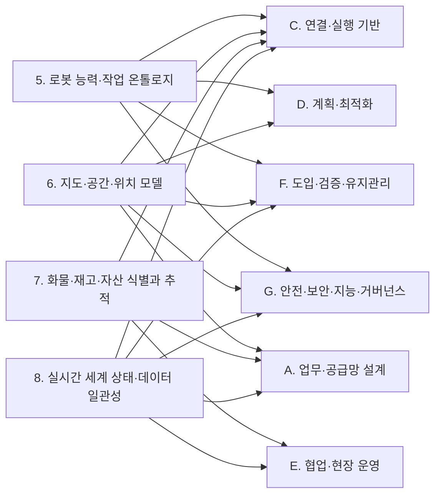

[홈](../../index.md) › B. 공통 정보·환경 모델

# B. 공통 정보·환경 모델

## 핵심 질문

로봇·물건·공간·상태를 어떻게 같은 의미로 이해할 것인가? [분류원문]

## 개요

**로봇, 물건, 공간, 상태를 어떻게 같은 의미로 이해할 것인가**를 연구한다. 매뉴얼 온톨로지와 건축 도면 기반 지도가 주로 이 영역에 들어간다. [분류원문]

## 세부 연구영역

표의 세부 연구영역·무엇을 연구하는가·SCM 관점의 질문 열은 원문 그대로이고, 페이지·현재 상태 열은 위키에서 덧붙인 것이다. 현재 상태는 퍼블리셔가 자동으로 갱신한다.

<!-- auto:category-area-table:start -->
| 세부 연구영역 | 무엇을 연구하는가 | SCM 관점의 질문 | 페이지 | 현재 상태 |
|---|---|---|---|---|
| **5. 로봇 능력·작업 온톨로지** | 제조사별 기능·제약·장착 장비·실행 조건을 공통 모델로 표현하고, 작업 요구와 연결 | 같은 ‘운반 로봇’ 중 누가 이 화물을 실제로 취급할 수 있는가? | [5. 로봇 능력·작업 온톨로지](05-robot-capability-and-task-ontology.md) | published |
| **6. 지도·공간·위치 모델** | BIM·CAD·센서 지도에서 이동 공간과 경로를 만들고, 로봇별 좌표계·층·목적지를 정렬 | 제조사마다 다른 지도에서 ‘3층 출하 대기장’을 어떻게 동일한 장소로 인식할까? | [6. 지도·공간·위치 모델](06-map-space-and-location-model.md) | published |
| **7. 화물·재고·자산 식별과 추적** | 제품·박스·팔레트·운반구·로봇을 식별하고, 적재 관계·위치·인계 이력을 연결 | 로봇은 도착했는데 실제로 어떤 팔레트가 인계됐는가? | [7. 화물·재고·자산 식별과 추적](07-cargo-inventory-and-asset-identification-and-tracking.md) | published |
| **8. 실시간 세계 상태·데이터 일관성** | 로봇·설비·공간·화물의 현재 상태를 통합하고, 시간 지연·누락·충돌·불확실성을 관리 | 문이 열려 있다는 정보가 30초 전이라면 지금도 통과 가능하다고 볼 수 있을까? | [8. 실시간 세계 상태·데이터 일관성](08-real-time-world-state-and-data-consistency.md) | published |

[분류원문]
<!-- auto:category-area-table:end -->

## 이 대분류의 핵심 포인트

**7번은 SCM 관점에서 특히 빠뜨리기 쉽다.** 로봇 위치를 추적하는 것과 화물의 위치·인계 책임을 추적하는 것은 다르다. GS1 EPCIS는 제품·자산의 상태, 위치, 이동, 인계에 관한 이벤트를 공유하는 참고 표준이다. [3] [분류원문]

6번에는 지도 생성뿐 아니라 **현장과 도면의 차이 확인, 지도 버전 관리, 위치추정 결과의 신뢰도**도 포함해야 한다. [분류원문]

## 다른 대분류와의 연결

이 절은 B. 공통 정보·환경 모델의 게시된 세부영역 페이지(5. 로봇 능력·작업 온톨로지, 6. 지도·공간·위치 모델, 7. 화물·재고·자산 식별과 추적, 8. 실시간 세계 상태·데이터 일관성)의 검증된 주장과 각주를 근거로, 이 대분류의 모델이 다른 대분류의 어느 세부영역과 무엇으로 이어지는지 정리한다. 연결 상대 세부영역 가운데 상당수는 아직 본문이 없으므로, 연결의 근거는 이 대분류 쪽 자료에 기댄다.

### [A. 업무·공급망 설계](../a-business-supply-chain-design/index.md)

- [6. 지도·공간·위치 모델](06-map-space-and-location-model.md) ↔ [1. 주문·업무 시스템 연계](../a-business-supply-chain-design/01-order-and-business-system-integration.md): GS1 GLN 은 도크 문·보관 위치 같은 하위 위치를 식별할 수 있고 GLN 확장 요소는 조직 내부나 거래 당사자 간 합의로만 쓰므로, 업무 위치와 로봇 지도 장소의 대응은 ROP 쪽 대응 계층이 맡게 될 것으로 보인다. [추정][^ref-162][^ref-031] 국내 사례는 [열린 질문](../../open-questions.md) oq-029 에서 다룬다.
- [7. 화물·재고·자산 식별과 추적](07-cargo-inventory-and-asset-identification-and-tracking.md) ↔ [2. 공정·워크플로 모델링](../a-business-supply-chain-design/02-process-and-workflow-modeling.md): GS1 CBV 는 도착(arriving)·입고(receiving)·인수(accepting)를 서로 다른 업무 단계로 정의하고, VDA 5050 은 하역(drop) 완료를 적재물이 로봇을 떠나 로봇이 새 적재 상태를 보고한 때로 정의한다. [사실][^ref-044][^ref-031] 같은 연결은 [A. 업무·공급망 설계](../a-business-supply-chain-design/index.md) 페이지의 다른 대분류와의 연결 절에도 같은 각주로 실려 있다.
- [8. 실시간 세계 상태·데이터 일관성](08-real-time-world-state-and-data-consistency.md) ↔ [4. 성과·경제성·프로세스 개선](../a-business-supply-chain-design/04-performance-economics-and-process-improvement.md): Open-RMF 로봇 상태 스키마는 상태(idle·charging·working·error 등), 배터리, 현재 작업 id, 문제 목록, 위치, 기록 시각을 담는다. [사실][^ref-148] 이 필드들은 가동률·충전·오류 시간 지표의 원천이 될 것으로 보인다. [추정][^ref-148] 이 연결도 [A. 업무·공급망 설계](../a-business-supply-chain-design/index.md) 페이지와 같은 각주를 쓴다.

### [C. 연결·실행 기반](../c-connectivity-and-execution-foundation/index.md)

- [5. 로봇 능력·작업 온톨로지](05-robot-capability-and-task-ontology.md) ↔ [9. 로봇·제조사 관제 연동](../c-connectivity-and-execution-foundation/09-robot-and-vendor-fleet-manager-integration.md): VDA 5050 팩트시트는 적재 명세(loadSets: 적재 유형·최대 중량·처리 높이·픽·드롭 소요 시간)와 지원 동작(mobileRobotActions)을 선언하고, Open-RMF 플릿 어댑터 템플릿 설정은 수행 가능한 작업 유형(task_capabilities)과 동작 이름(actions)을 선언한다. [사실][^ref-228][^ref-105] 두 자료는 서로 다른 인터페이스의 사례다.
- [5. 로봇 능력·작업 온톨로지](05-robot-capability-and-task-ontology.md) ↔ [12. 명령·작업 실행의 신뢰성](../c-connectivity-and-execution-foundation/12-command-and-task-execution-reliability.md): 팩트시트에서 선언한 동작 이름(actionType)이 명령과 완료 보고에 그대로 쓰이고 Open-RMF 어댑터가 로봇 API 의 완료 확인 뒤 완료를 알리므로, 능력 선언이 실행 확인의 기준 어휘가 될 것으로 보인다. [추정][^ref-228][^ref-040]
- [6. 지도·공간·위치 모델](06-map-space-and-location-model.md) ↔ [9. 로봇·제조사 관제 연동](../c-connectivity-and-execution-foundation/09-robot-and-vendor-fleet-manager-integration.md): Open-RMF 플릿 어댑터는 로봇 좌표계가 RMF 와 다르면 같은 위치를 가리키는 좌표 쌍으로 회전·축척·이동 변환을 추정하며(대응점 4개 이상 권장), 템플릿 설정은 층별 reference_coordinates 로 이 좌표 쌍을 둔다. [사실][^ref-153][^ref-105] 이 작업은 용어집의 [지도 정합](../../glossary/map-alignment.md)에 해당한다. VDA 5050 상태 스키마는 위치추정 품질(localizationScore), 편차 범위(deviationRange), 지도 식별자(mapId)를 두며, 편차를 추정할 수 없는 로봇은 편차 범위를 생략할 수 있다. [사실][^ref-051] 그래서 위치 신뢰도 보고가 제조사 구현에 따라 달라질 수 있다. [추정][^ref-051] 수용 기준은 열린 질문 oq-028 에서 다룬다.
- [6. 지도·공간·위치 모델](06-map-space-and-location-model.md) ↔ [10. 설비·건물 시스템 연동](../c-connectivity-and-execution-foundation/10-facility-and-building-system-integration.md): Open-RMF 승강기 상태는 층을 층 이름 문자열(available_floors, current_floor, destination_floor)로 나타내므로, 지도의 층 이름과 승강기의 층 이름을 맞추는 대응이 두 대분류 사이에 필요할 것으로 보인다. [추정][^ref-286][^ref-079] 이 대응 규칙은 새 열린 질문으로 올렸고, 공통 좌표계 대응(oq-027)·업무 위치 대응(oq-029)과 함께 본다.
- [7. 화물·재고·자산 식별과 추적](07-cargo-inventory-and-asset-identification-and-tracking.md) ↔ [9. 로봇·제조사 관제 연동](../c-connectivity-and-execution-foundation/09-robot-and-vendor-fleet-manager-integration.md): VDA 5050 상태 스키마의 적재물 목록(loads)은 로봇이 취급 중인 적재물을 담되 적재 상태를 판단할 수 없는 로봇은 생략할 수 있고, 적재물 식별 번호(loadId)는 바코드·RFID 같은 식별 값이며 아직 식별하지 않았으면 비워 둔다. [사실][^ref-051]
- [7. 화물·재고·자산 식별과 추적](07-cargo-inventory-and-asset-identification-and-tracking.md) ↔ [10. 설비·건물 시스템 연동](../c-connectivity-and-execution-foundation/10-facility-and-building-system-integration.md): Open-RMF 배송 작업에서 로봇은 픽업 지점 워크셀에서 DispenserResult 를, 하역 지점 워크셀에서 IngestorResult 를 받을 때까지 요청을 되풀이한다. [사실][^ref-023] IngestorResult 는 시각, 요청 id, 워크셀 id, 상태(ACKNOWLEDGED·SUCCESS·FAILED)를 담는다. [사실][^ref-049]
- [8. 실시간 세계 상태·데이터 일관성](08-real-time-world-state-and-data-consistency.md) ↔ [10. 설비·건물 시스템 연동](../c-connectivity-and-execution-foundation/10-facility-and-building-system-integration.md): Open-RMF 문·승강기 상태 메시지는 시각 필드(door_time, lift_time)를 담고, 승강기 어댑터는 적절하다고 판단한 요청만 승강기에 전달한다. [사실][^ref-285][^ref-286][^ref-284] 상태 발행 주기나 오래됨 판정 규칙은 이번에 연 승강기 연동 문서 범위에서는 찾지 못했다. [추정][^ref-284]
- [8. 실시간 세계 상태·데이터 일관성](08-real-time-world-state-and-data-consistency.md) ↔ [11. 분산 시스템·통신·컴퓨팅 구조](../c-connectivity-and-execution-foundation/11-distributed-systems-communication-and-computing.md): ROS 2 QoS 의 기한·생존성 정책, Sparkplug 의 노드 종료(NDEATH) 뒤 지표 STALE 표시, VDA 5050 의 MQTT 유언을 통한 연결 끊김 통지처럼 통신 계층에도 상태의 오래됨을 알리는 장치가 있다. [사실][^ref-282][^ref-287][^ref-031] 세 출처는 각각 한 장치만 다룬다.

### [D. 계획·최적화](../d-planning-and-optimization/index.md)

- [5. 로봇 능력·작업 온톨로지](05-robot-capability-and-task-ontology.md) ↔ [13. 작업 배정 — MRTA](../d-planning-and-optimization/13-task-allocation-mrta.md): 이종 다중 로봇 작업 배정에서 온톨로지 기반 실행 가능성 판정 결과를 배정기와 독립된 입력으로 넘기는 연구가 있다(2026-08 발행). [사실][^ref-236] 제조사가 광고한 능력과 운용 중 관측된 능력을 온톨로지로 구분해 통합하는 연구도 있어, 배정 기준을 어느 값으로 둘지가 두 대분류 사이의 쟁점이 될 것으로 보인다(열린 질문 oq-024). [추정][^ref-041]
- [6. 지도·공간·위치 모델](06-map-space-and-location-model.md) ↔ [15. 다중 로봇 경로·교통 관리 — MAPF](../d-planning-and-optimization/15-multi-robot-path-and-traffic-management-mapf.md): Open-RMF traffic-editor 로 주석한 차선·경유점 그래프는 building_map_generator 로 주행 그래프(navigation graph)로 내보내져 플릿 어댑터의 경로 계획에 쓰인다. [사실][^ref-079]
- [6. 지도·공간·위치 모델](06-map-space-and-location-model.md) ↔ [16. 공용 자원·충전·에너지 최적화](../d-planning-and-optimization/16-shared-resource-charging-and-energy-optimization.md): traffic-editor 는 주차 위치·충전기 위치·승강기·문·층을 지도에 주석하게 하므로, 공용 자원의 위치 정보가 지도 모델에서 나온다. [사실][^ref-079]

### [E. 협업·현장 운영](../e-collaboration-and-field-operations/index.md)

- [7. 화물·재고·자산 식별과 추적](07-cargo-inventory-and-asset-identification-and-tracking.md) ↔ [17. 로봇 간 협업·물리적 인계](../e-collaboration-and-field-operations/17-robot-to-robot-collaboration-and-physical-handover.md): 설비의 인수 결과에는 화물 식별자·인계 당사자가 없고 EPCIS 는 소유·점유·위치 이전을 출발지·도착지(source/destination)로 표현하므로, 물리적 인계 확인은 7. 화물·재고·자산 식별과 추적의 식별·인계 기록과 결합해야 할 것으로 보인다(열린 질문 oq-001). [추정][^ref-049][^ref-014][^ref-015]
- [7. 화물·재고·자산 식별과 추적](07-cargo-inventory-and-asset-identification-and-tracking.md) ↔ [20. 예외 복구·재계획·업무 연속성](../e-collaboration-and-field-operations/20-exception-recovery-replanning-and-business-continuity.md): 팔레트 RFID 태그 판독성이 제품·포장·태그 위치·적재 패턴에 따라 달라진다는 2009년 실험 보고가 있어, 판독 실패 때 인계 보류·재스캔·사람 확인 규칙이 복구 과제로 넘어갈 것으로 보인다(열린 질문 oq-003). [추정][^ref-024]
- [8. 실시간 세계 상태·데이터 일관성](08-real-time-world-state-and-data-consistency.md) ↔ [19. 모니터링·이상 탐지·원인 분석](../e-collaboration-and-field-operations/19-monitoring-anomaly-detection-and-root-cause-analysis.md): 로봇 상태의 문제 목록·오류 상태와 설비 상태의 시각 정보를 한 세계 상태에 모으면, 지연 원인이 로봇인지 문인지 구분하는 분석이 같은 상태 기록을 쓰게 될 것으로 보인다. [추정][^ref-148][^ref-285]

### [F. 도입·검증·유지관리](../f-deployment-verification-and-maintenance/index.md)

- [5. 로봇 능력·작업 온톨로지](05-robot-capability-and-task-ontology.md) ↔ [21. 온보딩·설정·현장 시운전](../f-deployment-verification-and-maintenance/21-onboarding-configuration-and-commissioning.md): 매뉴얼·로봇 기술 파일을 해석해 능력 모델 초안을 만드는 일은 새 로봇 등록 때 필요한 작업이 될 것으로 보이며, 이는 분류 원문 8장의 매뉴얼 해석 교차 규칙과 같은 방향이다. [추정][^ref-238][^ref-239] 온보딩 현장에 적용한 사례는 아직 확인하지 못했다.
- [6. 지도·공간·위치 모델](06-map-space-and-location-model.md) ↔ [21. 온보딩·설정·현장 시운전](../f-deployment-verification-and-maintenance/21-onboarding-configuration-and-commissioning.md): 도면에서 만든 지도에는 대기 위치 같은 운영 요소와 도면–현장 편차가 자동으로 담기지 않아, 시운전 때 사람의 주석·정렬 단계가 남는 것으로 보인다(열린 질문 oq-022). [추정][^ref-079][^ref-080][^ref-224]
- [8. 실시간 세계 상태·데이터 일관성](08-real-time-world-state-and-data-consistency.md) ↔ [22. 시뮬레이션·예측용 디지털 트윈](../f-deployment-verification-and-maintenance/22-simulation-and-predictive-digital-twin.md): 제조 분야를 대상으로 한 분류 자료는 현장 상태가 한 방향으로 자동 반영되는 [디지털 섀도](../../glossary/digital-shadow.md)와 디지털 트윈을 구분하므로, 8. 실시간 세계 상태·데이터 일관성은 현재 상태 표현을, 22. 시뮬레이션·예측용 디지털 트윈은 그 표현을 복제해 가정한 미래를 실험하는 쪽을 맡는 것이 분류 원문의 구분과 맞을 것으로 보인다. [추정][^ref-291][^ref-290] 근거 자료가 물류가 아닌 제조 대상이라는 한계가 있다.

### [G. 안전·보안·지능·거버넌스](../g-safety-security-intelligence-and-governance/index.md)

- [5. 로봇 능력·작업 온톨로지](05-robot-capability-and-task-ontology.md) ↔ [27. AI·학습·적응과 모델 운영](../g-safety-security-intelligence-and-governance/27-ai-learning-adaptation-and-model-operations.md): 대규모 언어 모델(Large Language Model, LLM)로 능력 온톨로지를 생성하는 연구(2024-04)와 로봇 기술 파일(URDF)에서 로봇 온톨로지를 LLM 으로 채우는 연구(2026-06)가 있다. [사실][^ref-238][^ref-239] 매뉴얼 해석의 적용 대상은 위 21. 온보딩·설정·현장 시운전 연결과 함께 본다.
- [6. 지도·공간·위치 모델](06-map-space-and-location-model.md) ↔ [27. AI·학습·적응과 모델 운영](../g-safety-security-intelligence-and-governance/27-ai-learning-adaptation-and-model-operations.md): 비전 언어 모델로 평면도 지도를 해석하는 연구(2024-09)가 있어, 분류 원문 8장 교차 규칙의 도면 해석이 두 대분류를 잇는다. [사실][^ref-076]
- [5. 로봇 능력·작업 온톨로지](05-robot-capability-and-task-ontology.md) ↔ [28. 표준·상호운용성·다사업자 거버넌스](../g-safety-security-intelligence-and-governance/28-standards-interoperability-and-multi-vendor-governance.md): 무인운반차 기술 데이터 서브모델 IDTA 02047, 서비스 로봇 모듈 공통 정보 모델 ISO 22166-201(2024-02), 국내 KS B 7321-2 같은 제조사 독립 정보 모델 표준이 있다. [사실][^ref-234][^ref-240][^ref-138] KS 부합화 여부는 열린 질문 oq-004·oq-026 에서 다룬다.
- [6. 지도·공간·위치 모델](06-map-space-and-location-model.md) ↔ [28. 표준·상호운용성·다사업자 거버넌스](../g-safety-security-intelligence-and-governance/28-standards-interoperability-and-multi-vendor-governance.md): ISO 21423 은 산업용 이동로봇의 통신·상호운용성을 다루는 표준이다. [사실][^ref-159] 그 공통 좌표계가 제조사 지도 식별자와 어떻게 대응하는지는 아직 확인되지 않았다(열린 질문 oq-027).
- [8. 실시간 세계 상태·데이터 일관성](08-real-time-world-state-and-data-consistency.md) ↔ [25. 안전·위험 관리](../g-safety-security-intelligence-and-governance/25-safety-and-risk-management.md): Open-RMF 승강기 상태의 운영 모드에 사람·AGV·화재·오프라인·비상이 있으므로, 탑승 확정 전에 최신 모드를 확인하는 규칙이 안전 조건과 맞물릴 것으로 보인다. [추정][^ref-286] 여기서 ROP 는 상태를 확인하는 범위만 맡고, 설비 안전 제어 자체는 분류 원문 9장 시설·설비 제어 경계의 연계 대상이다.

### 아직 다루지 않은 연결

14. 작업 순서·스케줄링, 18. 사람–로봇 협업·운영 인터페이스, 23. 시험·형식 검증·벤치마크, 24. 자산·소프트웨어 수명주기 관리, 26. 사이버보안·접근권한·개인정보 와 이 대분류 세부영역 사이의 연결은 게시 페이지에 검증된 근거가 없어 싣지 않았다. 이 연결은 해당 세부영역 조사가 진행되면 보강한다.

## 최근 업데이트

<!-- auto:category-recent:start -->
- 2026-09-25 · 갱신 · [B. 공통 정보·환경 모델](index.md) — 다른 대분류와의 연결 절 신규 작성(A·C·D·E·F·G 대분류와의 연결 27건, Mermaid 도식 포함), 참고 자료 절에 새 각주 33건 정의 추가, 프런트매터 sources 추가 (실행 2026-09-25-32)
- 2026-09-25 · 요약 · [B. 공통 정보·환경 모델](index.md) — B. 공통 정보·환경 모델: 다른 대분류와의 연결 절 신규 작성(A·C·D·E·F·G 대분류와의 연결 27건, 1차 조건부 승인 수정 14건 이행) (실행 2026-09-25-32)
- 2026-09-25 · 갱신 · [8. 실시간 세계 상태·데이터 일관성](08-real-time-world-state-and-data-consistency.md) — 영역 심화: 섹션 3~11 신규 작성, 페이지 상태 자동 영역 표식 추가, 1차 조건부 승인 수정 14건 이행, 2차 수정: 5절 승강기 추론 문장에 [추정] 태그·각주 추가, 완료·인계 칸 EPCIS 문장을 사실 부분만 남김 (실행 2026-09-25-24)
- 2026-09-25 · 생성 · [8. 실시간 세계 상태·데이터 일관성 — 관련 표준·프레임워크·오픈소스](../../topics/2026/2026-09-25-area08-s7.md) — 자동 분리: 8. 실시간 세계 상태·데이터 일관성 의 "7. 관련 표준·프레임워크·오픈소스" 절(1,454자)을 옮겼다(2차 재실행에서 변경 없음) (실행 2026-09-25-24)
- 2026-09-25 · 생성 · [8. 실시간 세계 상태·데이터 일관성 — 핵심 개념과 용어](../../topics/2026/2026-09-25-area08-s4.md) — 자동 분리: 8. 실시간 세계 상태·데이터 일관성 의 "4. 핵심 개념과 용어" 절(1,436자)을 옮겼다(2차 재실행에서 변경 없음) (실행 2026-09-25-24)
<!-- auto:category-recent:end -->

## 참고 자료

원문의 [3]은 참고문헌 [ref-003](../../references/ref-003.md)에 해당한다.[^ref-003]

[^ref-003]: GS1, EPCIS and CBV Linked Data Model, 미확인, https://ref.gs1.org/epcis/, 접근일 2026-09-24

[^ref-162]: GS1, Identifying a physical location - GLN, 미확인, https://www.gs1.org/standards/id-keys/gln/physical-location, 접근일 2026-09-25 (원문 미열람)
[^ref-031]: VDA / VDMA (VDA5050 GitHub), VDA5050/VDA5050_EN.md — Official Specification document for the VDA 5050, 미확인, https://github.com/VDA5050/VDA5050/blob/main/VDA5050_EN.md, 접근일 2026-09-25
[^ref-044]: GS1, gs1/EPCIS — Ontology/CBV.ttl (Core Business Vocabulary ontology 2.0), 2021-09-30, https://github.com/gs1/EPCIS/blob/master/Ontology/CBV.ttl, 접근일 2026-09-25 (원문 미열람)
[^ref-148]: Open Robotics (open-rmf), rmf_api_msgs — rmf_api_msgs/schemas/robot_state.json, 미확인, https://github.com/open-rmf/rmf_api_msgs/blob/main/rmf_api_msgs/schemas/robot_state.json, 접근일 2026-09-25 (원문 미열람)
[^ref-228]: VDA / VDMA (VDA5050 GitHub), VDA5050/VDA5050 — json_schemas/factsheet.schema, 미확인, https://github.com/VDA5050/VDA5050/blob/main/json_schemas/factsheet.schema, 접근일 2026-09-25
[^ref-105]: Open Robotics (open-rmf), fleet_adapter_template — fleet_adapter_template/config.yaml, 미확인, https://github.com/open-rmf/fleet_adapter_template/blob/main/fleet_adapter_template/config.yaml, 접근일 2026-09-25
[^ref-040]: Open Robotics, PerformAction Tutorial - Programming Multiple Robots with ROS 2, 미확인, https://osrf.github.io/ros2multirobotbook/integration_fleets_action_tutorial.html, 접근일 2026-09-25
[^ref-153]: Open Robotics, Fleet Adapter Tutorial - Programming Multiple Robots with ROS 2, 미확인, https://osrf.github.io/ros2multirobotbook/integration_fleets_adapter_tutorial.html, 접근일 2026-09-25
[^ref-051]: VDA / VDMA (VDA5050 GitHub), VDA5050/VDA5050 — json_schemas/state.schema, 미확인, https://github.com/VDA5050/VDA5050/blob/main/json_schemas/state.schema, 접근일 2026-09-25
[^ref-286]: Open Robotics (open-rmf), rmf_internal_msgs — rmf_lift_msgs/msg/LiftState.msg, 미확인, https://github.com/open-rmf/rmf_internal_msgs/blob/main/rmf_lift_msgs/msg/LiftState.msg, 접근일 2026-09-25
[^ref-079]: Open Robotics, Traffic Editor - Programming Multiple Robots with ROS 2, 미확인, https://osrf.github.io/ros2multirobotbook/traffic-editor.html, 접근일 2026-09-25
[^ref-023]: Open Robotics, Workcells - Programming Multiple Robots with ROS 2, 미확인, https://osrf.github.io/ros2multirobotbook/integration_workcells.html, 접근일 2026-09-25
[^ref-049]: Open Robotics (open-rmf), rmf_internal_msgs — rmf_ingestor_msgs/msg/IngestorResult.msg, 미확인, https://github.com/open-rmf/rmf_internal_msgs/blob/main/rmf_ingestor_msgs/msg/IngestorResult.msg, 접근일 2026-09-25
[^ref-285]: Open Robotics (open-rmf), rmf_internal_msgs — rmf_door_msgs/msg/DoorState.msg, 미확인, https://github.com/open-rmf/rmf_internal_msgs/blob/main/rmf_door_msgs/msg/DoorState.msg, 접근일 2026-09-25
[^ref-284]: Open Robotics, Lifts (integration_lifts) - Programming Multiple Robots with ROS 2, 미확인, https://osrf.github.io/ros2multirobotbook/integration_lifts.html, 접근일 2026-09-25
[^ref-282]: Open Robotics (ROS 2 Documentation), Quality of Service settings — ROS 2 Documentation: Jazzy, 미확인, https://docs.ros.org/en/jazzy/Concepts/Intermediate/About-Quality-of-Service-Settings.html, 접근일 2026-09-25 (원문 미열람)
[^ref-287]: Eclipse Foundation (eclipse-sparkplug GitHub), Sparkplug Specification — Chapter 5 Operational Behavior (Sparkplug_5_Operational_Behavior.adoc), 미확인, https://github.com/eclipse-sparkplug/sparkplug/blob/master/specification/src/main/asciidoc/chapters/Sparkplug_5_Operational_Behavior.adoc, 접근일 2026-09-25
[^ref-236]: Electronics(MDPI) 게재 논문(저자 미확인), Semantic Feasibility Reasoning for Heterogeneous Multi-Robot Task Allocation, 2026-08-11, https://doi.org/10.3390/electronics15163562, 접근일 2026-09-25 (원문 미열람)
[^ref-041]: Naqvi, M. R. 외(Scientific Reports), Ontology-driven integration of advertised and operational capabilities in robots, 2025-10-02, https://www.nature.com/articles/s41598-025-16649-3, 접근일 2026-09-25 (원문 미열람)
[^ref-014]: GS1, Core Business Vocabulary (CBV) Standard, 미확인, https://ref.gs1.org/standards/cbv/, 접근일 2026-09-25 (원문 미열람)
[^ref-015]: GS1, EPCIS and CBV Implementation Guideline, 미확인, https://www.gs1.org/docs/epc/EPCIS_Guideline.pdf, 접근일 2026-09-25 (원문 미열람)
[^ref-024]: Singh, J. 외, RFID tag readability issues with palletized loads of consumer goods, 2009, https://onlinelibrary.wiley.com/doi/abs/10.1002/pts.864, 접근일 2026-09-25 (원문 미열람)
[^ref-238]: Vieira da Silva, L. M., Köcher, A., Gehlhoff, F., & Fay, A., On the Use of Large Language Models to Generate Capability Ontologies, 2024-04, https://arxiv.org/abs/2404.17524, 접근일 2026-09-25 (원문 미열람)
[^ref-239]: Dussard, B., & Sarthou, G. (LAAS-CNRS), Extracting Semantics: LLM-Guided Automatic Population of Robot Ontology from URDF, 2026-06, https://arxiv.org/abs/2606.17073, 접근일 2026-09-25 (원문 미열람)
[^ref-080]: Open Robotics, Navigation Maps (integration_nav-maps) - Programming Multiple Robots with ROS 2, 미확인, https://osrf.github.io/ros2multirobotbook/integration_nav-maps.html, 접근일 2026-09-25 (원문 미열람)
[^ref-224]: Shaheer, M., Millan-Romera, J. A., Bavle, H., Giberna, M., Sanchez-Lopez, J. L., Civera, J., & Voos, H., Tightly Coupled SLAM with Imprecise Architectural Plans, 2024-08, https://arxiv.org/abs/2408.01737, 접근일 2026-09-25 (원문 미열람)
[^ref-291]: Kritzinger, W., Karner, M., Traar, G., Henjes, J., & Sihn, W., Digital Twin in manufacturing: A categorical literature review and classification, 2018, https://www.sciencedirect.com/science/article/pii/S2405896318316021, 접근일 2026-09-25 (원문 미열람)
[^ref-290]: NIST, DIGITAL TWINS FOR ADVANCED MANUFACTURING: THE STANDARDIZED APPROACH, 미확인, https://tsapps.nist.gov/publication/get_pdf.cfm?pub_id=957417, 접근일 2026-09-25 (원문 미열람)
[^ref-076]: DeFazio, D., Mehta, H., Wang, M., Yang, P., Blackburn, J., & Zhang, S., Vision Language Models Can Parse Floor Plan Maps, 2024-09, https://arxiv.org/abs/2409.12842, 접근일 2026-09-25 (원문 미열람)
[^ref-234]: IDTA(Industrial Digital Twin Association), IDTA 02047 Technical Data for Automated Guided Vehicles 1.0 — README (admin-shell-io/submodel-templates), 미확인, https://github.com/admin-shell-io/submodel-templates/tree/main/published/Technical%20Data%20for%20Automated%20Guided%20Vehicles, 접근일 2026-09-25 (원문 미열람)
[^ref-240]: ISO, ISO 22166-201:2024 - Robotics — Modularity for service robots — Part 201: Common information model for modules, 2024-02, https://www.iso.org/standard/82334.html, 접근일 2026-09-25 (원문 미열람)
[^ref-138]: 국가표준인증통합정보시스템(KSSN), KS B 7321-2 로봇 — 서비스 로봇 모듈용 정보 모델 — 제2부: 소프트웨어 모듈용 정보 모델, 미확인, https://www.kssn.net/search/stddetail.do?itemNo=K001010147546, 접근일 2026-09-25 (원문 미열람)
[^ref-159]: ISO, ISO 21423 - Robotics — Industrial mobile robots — Communications and interoperability, 미확인, https://www.iso.org/standard/86749.html, 접근일 2026-09-25 (원문 미열람)
