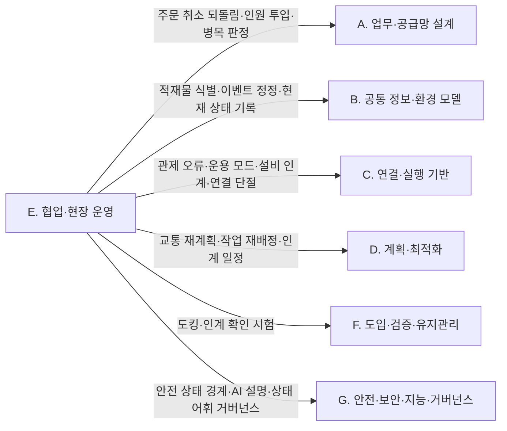

[홈](../../index.md) › E. 협업·현장 운영

# E. 협업·현장 운영

## 핵심 질문

계획과 실제가 달라지는 상황에서 일을 어떻게 계속할 것인가? [분류원문]

## 개요

**계획과 실제가 달라지는 상황에서 일을 어떻게 계속할 것인가**를 연구한다. 정상적인 시연과 실제 운영의 차이가 많이 드러나는 영역이다. [분류원문]

## 세부 연구영역

표의 세부 연구영역·무엇을 연구하는가·SCM 관점의 질문 열은 원문 그대로이고, 페이지·현재 상태 열은 위키에서 덧붙인 것이다. 현재 상태는 퍼블리셔가 자동으로 갱신한다.

<!-- auto:category-area-table:start -->
| 세부 연구영역 | 무엇을 연구하는가 | SCM 관점의 질문 | 페이지 | 현재 상태 |
|---|---|---|---|---|
| **17. 로봇 간 협업·물리적 인계** | 이동로봇–로봇팔 협업, 공동 운반, 작업 동기화, 인계 확인, 필요한 정보·인식 결과 공유 | AMR이 물건을 가져온 뒤 로봇팔이 안전하게 인수했음을 어떻게 확인할까? | [17. 로봇 간 협업·물리적 인계](17-robot-to-robot-collaboration-and-physical-handover.md) | published |
| **18. 사람–로봇 협업·운영 인터페이스** | 작업자에게 일 배정, 승인·수동 전환, 원격 조작, 설명 가능한 상태 표시, 인체공학 | 사람이 피킹하고 로봇이 운반할 때 서로 기다리지 않게 하려면? | [18. 사람–로봇 협업·운영 인터페이스](18-human-robot-collaboration-and-operator-interface.md) | published |
| **19. 모니터링·이상 탐지·원인 분석** | 로그·이벤트·성능 지표를 연결해 이상을 탐지하고, 로봇·설비·통신·공정 원인을 구분 | 지연 원인이 로봇 고장인지, 문인지, 앞 공정인지 어떻게 찾을까? | [19. 모니터링·이상 탐지·원인 분석](19-monitoring-anomaly-detection-and-root-cause-analysis.md) | published |
| **20. 예외 복구·재계획·업무 연속성** | 고장·통신 단절·화물 누락·긴급 주문 등에 대해 재배정, 우회, 수동 처리, 제한 운영을 결정 | 운반 중 고장 난 로봇의 화물과 남은 주문은 어떻게 처리할까? | [20. 예외 복구·재계획·업무 연속성](20-exception-recovery-replanning-and-business-continuity.md) | published |

[분류원문]
<!-- auto:category-area-table:end -->

## 이 대분류의 핵심 포인트

17번의 협업은 이동로봇끼리 길을 양보하는 문제보다 넓다. **이동·조작·검사·사람 작업을 하나의 공정으로 묶는 문제**까지 포함한다. NIST도 이종 로봇과 사람의 협업 성능을 별도 연구·평가 대상으로 다룬다. [7] [분류원문]

## 다른 대분류와의 연결

이 절은 게시된 [17. 로봇 간 협업·물리적 인계](17-robot-to-robot-collaboration-and-physical-handover.md), [18. 사람–로봇 협업·운영 인터페이스](18-human-robot-collaboration-and-operator-interface.md), [19. 모니터링·이상 탐지·원인 분석](19-monitoring-anomaly-detection-and-root-cause-analysis.md), [20. 예외 복구·재계획·업무 연속성](20-exception-recovery-replanning-and-business-continuity.md) 페이지의 검증된 주장을 근거로, 이 대분류가 다른 대분류와 무엇을 주고받는지 정리한다. 상대편 세부영역 가운데 F. 도입·검증·유지관리와 G. 안전·보안·지능·거버넌스 쪽은 아직 본문이 없는 페이지가 많아, 연결 서술도 이 대분류 쪽 근거에 기댄다. 연구·표준의 내용은 [사실]로, 그것이 ROP 운영에서 어떻게 이어지는지에 대한 해석은 [추정]으로 나누어 적는다.

### A. 업무·공급망 설계

[A. 업무·공급망 설계](../a-business-supply-chain-design/index.md) — 같은 연결을 상대편에서 본 서술은 [A. 업무·공급망 설계의 다른 대분류와의 연결](../a-business-supply-chain-design/index.md#다른-대분류와의-연결)에 있다.

- **20. 예외 복구·재계획·업무 연속성 ↔ 1. 주문·업무 시스템 연계**: VDA 5050 3.0.0 에서 관제가 주문 취소(cancelOrder)를 보내면 아직 남아 있던 예정 동작은 취소되고, 그 동작의 상태는 실패(FAILED)로 보고된다. [사실][^ref-031] 취소가 로봇이 화물을 실은 뒤에 오면 이 실패 보고만으로는 화물 위치가 정해지지 않으므로, 되돌림 작업과 재고 반영 규칙을 정하는 일이 두 대분류가 넘겨받는 지점이 될 것으로 보이며, 이를 정한 표준·사례는 확인되지 않았다([열린 질문](../../open-questions.md) oq-021). [추정][^ref-031][^ref-489]
- **18. 사람–로봇 협업·운영 인터페이스 ↔ 3. 처리능력·거점·설비 계획**: Yang 외(2026-03)는 협동 피킹 시스템에서 피커와 로봇을 각각 몇 명·몇 대 투입할지 정하는 문제를 다룬다. [사실][^ref-469] 이 인원·로봇 비율 결정은 처리능력 계획과 이어질 것으로 보이나, 교대조 단위로 정하는지는 미확인이다(oq-009). [추정][^ref-469]
- **19. 모니터링·이상 탐지·원인 분석 ↔ 4. 성과·경제성·프로세스 개선**: Roser 외(2003)는 AGV 시스템의 병목 탐지 방법을 비교해, 가동률·대기 시간 기반 방법이 이동 병목 탐지 방법보다 한계가 있다고 보고했다. [사실][^ref-451] 따라서 원인·병목을 어떤 방식으로 판정하느냐가 개선 대상 선정과 이어질 것으로 보인다(oq-018). [추정][^ref-451]

### B. 공통 정보·환경 모델

[B. 공통 정보·환경 모델](../b-common-information-and-environment-model/index.md) — 상호 참조: [B. 공통 정보·환경 모델의 다른 대분류와의 연결](../b-common-information-and-environment-model/index.md#다른-대분류와의-연결).

- **17. 로봇 간 협업·물리적 인계 ↔ 7. 화물·재고·자산 식별과 추적**: 시설 안 로봇 사이, 로봇과 작업대 사이의 물리적 인계는 핵심 업무 어휘(Core Business Vocabulary, CBV)의 accepting·receiving 에 가깝고 운송 수단 기준의 loading·unloading 과는 맞지 않아, 인계 이벤트의 업무 단계 값을 ROP 쪽에서 정해야 할 것으로 보인다(oq-006). [추정][^ref-044]
- **20. 예외 복구·재계획·업무 연속성 ↔ 7. 화물·재고·자산 식별과 추적**: VDA 5050 상태 스키마의 선택 필드 loads 에 담기는 적재물 식별 번호(loadId)는 바코드·RFID 같은 번호로, 멈춘 로봇에 어떤 화물이 실렸는지 관제가 알 수 있게 한다. 다만 적재물을 식별할 수 없는 로봇은 이 필드를 생략할 수 있다. [사실][^ref-051] GS1 EPCIS 1.2(2016-09-29)는 이미 기록된 이벤트를 오류 선언(errorDeclaration)으로 정정할 수 있게 한다. [사실][^ref-492] 그래서 고장 로봇에서 회수한 화물의 재고·이벤트 기록 정정은 식별·추적 쪽 기록 규칙에 기대게 될 것으로 보이며, 회수 때 어떤 확인(스캔·무게·위치)을 요구할지는 미확인이다(oq-079). [추정][^ref-492]
- **19. 모니터링·이상 탐지·원인 분석 ↔ 8. 실시간 세계 상태·데이터 일관성**: 지연 원인을 문·로봇·통신으로 가르려면 같은 시각의 문 모드(closed·moving·open·offline·unknown)와 작업 상태(delayed·blocked 등)를 한 시간축에 맞춘 현재 상태 기록이 필요할 것으로 보인다. 이는 현재 상태를 표현하는 8. 실시간 세계 상태·데이터 일관성의 일이며, 가정한 미래를 실험하는 22. 시뮬레이션·예측용 디지털 트윈의 일이 아니다. [추정][^ref-313][^ref-111]

### C. 연결·실행 기반

[C. 연결·실행 기반](../c-connectivity-and-execution-foundation/index.md) — 상호 참조: [C. 연결·실행 기반의 다른 대분류와의 연결](../c-connectivity-and-execution-foundation/index.md#다른-대분류와의-연결).

- **19. 모니터링·이상 탐지·원인 분석·20. 예외 복구·재계획·업무 연속성 ↔ 9. 로봇·제조사 관제 연동**: VDA 5050 상태 스키마의 오류 수준은 WARNING·URGENT·CRITICAL·FATAL 네 값이고, 연결 스키마는 연결 끊김을 CONNECTION_BROKEN 으로 보고한다. [사실][^ref-051][^ref-449] 이전 판과 오류 수준 해석이 다를 때 어떻게 맞추는지는 열린 질문 oq-073 으로 남아 있다. Open-RMF 작업 상태, VDA 5050 오류, MassRobotics 운용 상태(waitingExternalEvent 등)가 서로 다른 어휘로 보고되므로, 이를 ROP 의 공통 원인 범주로 옮기는 매핑이 두 대분류 사이에 필요할 것으로 보이며 공통 매핑 표준은 확인되지 않았다(oq-033). [추정][^ref-051][^ref-230][^ref-111]
- **18. 사람–로봇 협업·운영 인터페이스 ↔ 9. 로봇·제조사 관제 연동**: VDA 5050 상태 메시지는 운용 모드 일곱 값(STARTUP·AUTOMATIC·SEMIAUTOMATIC·INTERVENED·MANUAL·SERVICE·TEACH_IN)과 비상정지 종류(로봇에서 수동 확인하는 MANUAL, 원격 확인하는 REMOTE, 없음 NONE)를 보고하므로, 사람의 개입 상태가 관제 연동을 거쳐 운영 인터페이스로 들어온다. [사실][^ref-051]
- **19. 모니터링·이상 탐지·원인 분석 ↔ 10. 설비·건물 시스템 연동**: Open-RMF 문 노드는 문 상태를 /door_states 로 발행하고, 문 어댑터는 진행 중인 로봇 작업을 방해하지 않을 때만 문을 움직이게 하는 상태 감독자 역할을 한다. 이 상태가 설비 원인 판정의 근거가 된다. [사실][^ref-313][^ref-283]
- **17. 로봇 간 협업·물리적 인계 ↔ 10. 설비·건물 시스템 연동**: Open-RMF 배송 작업에서 로봇은 픽업 지점에서 디스펜서 결과(DispenserResult)를, 하역 지점에서 인제스터 결과(IngestorResult)를 받을 때까지 요청을 되풀이하고, 워크셀은 /dispenser_states·/ingestor_states 로 상태를 주기적으로 발행한다. 이 흐름은 플릿 어댑터의 perform_deliveries 설정이 켜져야 동작한다. [사실][^ref-023] 반도체 업종의 SEMI E84 처럼 준비–진행–완료를 양쪽이 단계별로 확인하는 인계 신호 구조는 이동로봇–작업대 인계 상태 모델의 참고가 될 수 있으나, 이는 업종별 인계 규격의 참고 사례일 뿐 물류센터 적용 근거는 아니며, VDA 5050 은 주변 설비·인프라·외부 IT 시스템과의 인터페이스를 범위에서 빼고 있어 물류 업종의 제조사 중립 인계 신호 규격은 확인되지 않았다(oq-042, oq-062). [추정][^ref-202][^ref-203][^ref-031]
- **18. 사람–로봇 협업·운영 인터페이스 ↔ 10. 설비·건물 시스템 연동**: Open-RMF 데모는 시설 비상 경보가 울리면 로봇을 가장 가까운 주차 위치로 보내는 흐름을 보인다. [사실][^ref-104] 시설 비상정지와 설비 안전 제어는 분류 원문 9장의 시설·설비 제어 경계에 따라 설비 쪽 연계 대상이고, ROP 는 경보 상태를 작업 흐름에 반영하는 역할에 머물 것으로 보인다. [추정][^ref-104]
- **20. 예외 복구·재계획·업무 연속성 ↔ 11. 분산 시스템·통신·컴퓨팅 구조**: VDA 5050 3.0.0 에서 로봇은 브로커와 연결이 끊겨도 받은 주문 정보를 그대로 갖고, 마지막으로 해제된 노드까지 주문을 계속 수행한다. [사실][^ref-031] 외부망 단절 동안의 운영 기준은 oq-038 로 남아 있다.
- **20. 예외 복구·재계획·업무 연속성 ↔ 12. 명령·작업 실행의 신뢰성**: VDA 5050 은 교착(deadlock)과 통신 오류를 탐지하고 해소하는 일을 관제(fleet control)의 기능으로 둔다. [사실][^ref-031] 같은 명세는 교착 해소 같은 교통 조율 전략·알고리즘 자체는 명세 범위에서 뺀다. [사실][^ref-031] 오류·연결 상태 수신, 주문 일시정지·취소, Open-RMF 로봇 갱신 핸들을 통한 재계획 요청·작업 수락 중지가 실행 신뢰성 계층과 복구 결정이 맞물리는 지점이 될 것으로 보인다(어댑터 재시작 시 작업 복원 여부는 oq-048). [추정][^ref-031][^ref-537]

### D. 계획·최적화

[D. 계획·최적화](../d-planning-and-optimization/index.md) — 상호 참조: [D. 계획·최적화의 다른 대분류와의 연결](../d-planning-and-optimization/index.md#다른-대분류와의-연결).

- **20. 예외 복구·재계획·업무 연속성 ↔ 15. 다중 로봇 경로·교통 관리 — MAPF**: Open-RMF 교통 스케줄은 지연·취소·경로 변경을 반영해 계속 바뀌는 데이터베이스이고, 충돌이 예상되면 관련 플릿 관리자들이 서로를 수용하는 경로로 협상하며 그 결과는 제3자 판정자가 고른다. [사실][^ref-004] 연구 쪽에서는 행동 의존 그래프로 창고 다중 로봇 계획을 지연에도 충돌 없이 실행하는 틀(Hönig 외 2019)과 지연된 로봇의 통과 순서를 실시간으로 다시 정하는 알고리즘(Feng 외 2024)이 발표되었다. [사실][^ref-188][^ref-483] 이 연구들로 보아 실행 중 지연 복구는 경로 계획 연구와 이어질 것으로 보인다. [추정][^ref-188][^ref-483]
- **20. 예외 복구·재계획·업무 연속성 ↔ 13. 작업 배정 — MRTA**: Kalempa 외(2021-09-30)는 작업 의존성·우선순위 선점·고장 복구를 함께 다루는 다중 로봇 작업 배정 방법을 제안했다. [사실][^ref-484] 이에 비추어 고장 로봇에 남은 작업의 재배정은 배정 문제로 넘어갈 것으로 보인다. [추정][^ref-484]
- **18. 사람–로봇 협업·운영 인터페이스 ↔ 13. 작업 배정 — MRTA·14. 작업 순서·스케줄링**: 사람 피커와 자율이동로봇(Autonomous Mobile Robot, AMR)의 협동 피킹 연구(Žulj 외 2022, Löffler 외 2023)는 두 자원의 조율을 배치 구성·배치 순서와 작업 완료 시각(makespan) 최소화 문제로 다룬다. [사실][^ref-467][^ref-468]
- **17. 로봇 간 협업·물리적 인계 ↔ 14. 작업 순서·스케줄링·16. 공용 자원·충전·에너지 최적화**: 이동로봇 운반과 로봇팔 적치가 앞뒤로 이어지면 스케줄 간 의존이 생기고, 인계 스테이션의 도크·버퍼가 공용 자원 제약이 되어 인계 시점을 두 로봇 일정에 함께 맞춰야 할 것으로 보인다. [추정][^ref-394][^ref-209]

### F. 도입·검증·유지관리

[F. 도입·검증·유지관리](../f-deployment-verification-and-maintenance/index.md)

- **17. 로봇 간 협업·물리적 인계 ↔ 23. 시험·형식 검증·벤치마크**: 도킹 정지 위치의 반복성을 확인하는 시험 방법으로 ASTM F3499-21(2021)이 있다. [사실][^ref-204] NIST ARIAC 은 2025 판 기준(확인일 2026-09-25)으로 완성 키트를 실은 AGV 를 움직이기 전에 품질 확인 서비스를 호출하게 해, 이동 전 인계 확인을 평가한다. [사실][^ref-008] 시험 결과를 파지 허용 오차와 잇는 기준은 oq-063 으로 남아 있다. 또 NIST 협업 로봇 시스템 성능 프로젝트는 사람–로봇·로봇–로봇 협업 팀의 안전성과 효과를 평가하는 방법·지표 개발을 목표로 한다(발행일 미확인, 확인일 2026-09-25 기준). [사실][^ref-007]

### G. 안전·보안·지능·거버넌스

[G. 안전·보안·지능·거버넌스](../g-safety-security-intelligence-and-governance/index.md)

- **17. 로봇 간 협업·물리적 인계 ↔ 25. 안전·위험 관리**: ANSI/A3 R15.08-2-2023 은 이동 플랫폼에 로봇팔을 단 모바일 매니퓰레이터를 산업용 이동로봇 유형 C 로 다루며 시스템·적용 단위의 안전 요구를 정한다. [사실][^ref-210] 국내 대응 KS 여부는 oq-064 로 남아 있다.
- **17. 로봇 간 협업·물리적 인계·18. 사람–로봇 협업·운영 인터페이스 ↔ 25. 안전·위험 관리**: 사람 감지·보호 필드·비상정지 같은 안전 기능과 안전 표준 이행은 로봇 제조사·현장 통합사·설비 쪽 연계 대상이고, ROP 는 로봇이 보고한 안전 상태를 표시하고 재개·수동 전환 승인을 작업 흐름에 반영하는 경계가 될 것으로 보인다. [추정][^ref-470][^ref-051][^ref-210]
- **18. 사람–로봇 협업·운영 인터페이스 ↔ 25. 안전·위험 관리(국내)**: 두 기관 게시물 제목 기준으로, 고용노동부는 2023-07 고정식·이동식 산업용 로봇의 협동작업 안전 가이드를 배포했고, 중소벤처기업부는 2024-11 대구 규제자유특구 실증을 거쳐 이동식 협동로봇 산업표준이 제정되었다고 발표했다. [사실][^ref-473][^ref-475] 제정된 KS 의 번호·내용은 미확인이다(oq-070).
- **18. 사람–로봇 협업·운영 인터페이스 ↔ 27. AI·학습·적응과 모델 운영**: 대규모 언어 모델(Large Language Model, LLM) 계획기가 불확실할 때 사람에게 되묻는 연구(KnowNo, Ren 외 2023-07), 사용자 명령을 분류하고 모호성을 해소하는 연구(CLARA, Park 외 2024), 실행 전 안전 게이트 연구(Obi 외 2026-04)가 발표되었다. [사실][^ref-351][^ref-353][^ref-417] 이 연구들로 보아 자연어 지시 인터페이스는 AI 연구 방법과 이어질 것으로 보인다. [추정][^ref-351][^ref-353][^ref-417]
- **19. 모니터링·이상 탐지·원인 분석·18. 사람–로봇 협업·운영 인터페이스 ↔ 27. AI·학습·적응과 모델 운영**: Das 외(2021-01)는 로봇 실패에 대한 설명을 생성해 사용자의 고장 복구 지원을 개선하는 연구를 발표했다. [사실][^ref-476] 분류 원문 8장 교차 규칙에서 장애 분석은 19. 모니터링·이상 탐지·원인 분석에 적용되는 AI 연구 방법인데, 이 연구에 비추어 그 적용이 원인 분석 결과를 사람에게 전달하는 인터페이스까지 이어질 것으로 보인다. [추정][^ref-476]
- **19. 모니터링·이상 탐지·원인 분석 ↔ 28. 표준·상호운용성·다사업자 거버넌스**: 앞의 C. 연결·실행 기반 항목에서 본 것처럼 표준마다 상태·오류 어휘가 다르고 공통 매핑 표준이 확인되지 않았으므로, 이종 플릿의 오류 수준·원인 범주 해석 규칙을 누가 정하고 바꾸는지가 거버넌스 과제로 넘어갈 것으로 보인다(oq-033, oq-073). [추정][^ref-051][^ref-230][^ref-111]

### 아직 다루지 않은 연결

다음 연결은 이번 실행에서 게시된 근거를 찾지 못해 본문 연결로 쓰지 않았다.

- 20. 예외 복구·재계획·업무 연속성 ↔ 22. 시뮬레이션·예측용 디지털 트윈: 근거 없음(22. 시뮬레이션·예측용 디지털 트윈 페이지 미작성). 관련 질문 oq-081.
- E. 협업·현장 운영 ↔ 21. 온보딩·설정·현장 시운전: 근거 없음.
- E. 협업·현장 운영 ↔ 24. 자산·소프트웨어 수명주기 관리: 근거 없음.
- E. 협업·현장 운영 ↔ 26. 사이버보안·접근권한·개인정보: 근거 없음.
- E. 협업·현장 운영 ↔ 5. 로봇 능력·작업 온톨로지: 근거 없음.
- E. 협업·현장 운영 ↔ 6. 지도·공간·위치 모델: 근거 없음.

[^ref-004]: Open Robotics, RMF Core Overview — Programming Multiple Robots with ROS 2, 미확인, https://osrf.github.io/ros2multirobotbook/rmf-core.html, 접근일 2026-09-25
[^ref-008]: NIST, ARIAC Documentation, 미확인, https://pages.nist.gov/ARIAC_docs/en/latest/, 접근일 2026-09-25
[^ref-023]: Open Robotics, Workcells - Programming Multiple Robots with ROS 2, 미확인, https://osrf.github.io/ros2multirobotbook/integration_workcells.html, 접근일 2026-09-25
[^ref-031]: VDA / VDMA (VDA5050 GitHub), VDA5050/VDA5050_EN.md — Official Specification document for the VDA 5050, 미확인, https://github.com/VDA5050/VDA5050/blob/main/VDA5050_EN.md, 접근일 2026-09-25
[^ref-044]: GS1, gs1/EPCIS — Ontology/CBV.ttl (Core Business Vocabulary ontology 2.0), 2021-09-30, https://github.com/gs1/EPCIS/blob/master/Ontology/CBV.ttl, 접근일 2026-09-25 (원문 미열람)
[^ref-051]: VDA / VDMA (VDA5050 GitHub), VDA5050/VDA5050 — json_schemas/state.schema, 미확인, https://github.com/VDA5050/VDA5050/blob/main/json_schemas/state.schema, 접근일 2026-09-25
[^ref-104]: Open Robotics (open-rmf), rmf_demos — Demonstrations of Open-RMF (README), 미확인, https://github.com/open-rmf/rmf_demos, 접근일 2026-09-25 (원문 미열람)
[^ref-111]: Open Robotics (open-rmf), rmf_api_msgs — rmf_api_msgs/schemas/task_state.json, 미확인, https://github.com/open-rmf/rmf_api_msgs/blob/main/rmf_api_msgs/schemas/task_state.json, 접근일 2026-09-25 (원문 미열람)
[^ref-188]: Hönig, W., Kiesel, S. 외, Persistent and Robust Execution of MAPF Schedules in Warehouses, 2019, https://ieeexplore.ieee.org/abstract/document/8620328/, 접근일 2026-09-25 (원문 미열람)
[^ref-202]: SEMI, E08400 - SEMI E84 - Specification for Enhanced Carrier Handoff Parallel I/O Interface, 미확인, https://store-us.semi.org/products/e08400-semi-e84-specification-for-enhanced-carrier-handoff-parallel-i-o-interface, 접근일 2026-09-25 (원문 미열람)
[^ref-203]: PEER Group, SEMI E84: Carrier Handoff, 미확인, https://www.peergroup.com/definition-of-standard/semi-e84/, 접근일 2026-09-25 (원문 미열람)
[^ref-204]: ASTM International, Standard Test Method for Confirming the Docking Performance of A-UGVs (ASTM F3499-21), 2021, https://www.astm.org/f3499-21.html, 접근일 2026-09-25 (원문 미열람)
[^ref-209]: Zang, C. 외, Lifelong Multi-Subsystem Pickup and Delivery with Buffer-Limited Handover Stations, 2026-07, https://arxiv.org/abs/2607.17724, 접근일 2026-09-25 (원문 미열람)
[^ref-210]: ANSI / A3(Association for Advancing Automation), ANSI/A3 R15.08-2-2023 - Industrial Mobile Robots - Safety Requirements - Part 2: Requirements for IMR system(s) and IMR application(s), 2023, https://webstore.ansi.org/standards/ria/ansia3r15082023, 접근일 2026-09-25 (원문 미열람)
[^ref-230]: MassRobotics, MassRobotics-AMR/AMR_Interop_Standard — AMR_Interop_Standard.json, 미확인, https://github.com/MassRobotics-AMR/AMR_Interop_Standard/blob/main/AMR_Interop_Standard.json, 접근일 2026-09-25 (원문 미열람)
[^ref-283]: Open Robotics, Doors (integration_doors) - Programming Multiple Robots with ROS 2, 미확인, https://osrf.github.io/ros2multirobotbook/integration_doors.html, 접근일 2026-09-25 (원문 미열람)
[^ref-313]: Open Robotics (open-rmf), rmf_internal_msgs — rmf_door_msgs/msg/DoorMode.msg, 미확인, https://github.com/open-rmf/rmf_internal_msgs/blob/main/rmf_door_msgs/msg/DoorMode.msg, 접근일 2026-09-25 (원문 미열람)
[^ref-351]: Ren, A. Z. 외, Robots That Ask For Help: Uncertainty Alignment for Large Language Model Planners, 2023-07, https://arxiv.org/abs/2307.01928, 접근일 2026-09-25 (원문 미열람)
[^ref-353]: Park, J., Lim, S., Lee, J., Park, S., Chang, M., Yu, Y., & Choi, S., CLARA: Classifying and Disambiguating User Commands for Reliable Interactive Robotic Agents, 2024, https://arxiv.org/abs/2306.10376, 접근일 2026-09-25 (원문 미열람)
[^ref-394]: Korsah, G. A., Stentz, A., & Dias, M. B., A comprehensive taxonomy for multi-robot task allocation, 2013, https://journals.sagepub.com/doi/10.1177/0278364913496484, 접근일 2026-09-25 (원문 미열람)
[^ref-417]: Obi, I., Venkatesh, V. L. N., Wang, W., Wang, R., Suh, D., Amosa, T. I., Jo, W., & Min, B.-C.(Purdue University SMART Lab), Pre-Execution Safety Gate & Task Safety Contracts for LLM-Controlled Robot Systems, 2026-04, https://arxiv.org/abs/2604.05427, 접근일 2026-09-25 (원문 미열람)
[^ref-449]: VDA / VDMA (VDA5050 GitHub), VDA5050/VDA5050 — json_schemas/connection.schema, 미확인, https://github.com/VDA5050/VDA5050/blob/main/json_schemas/connection.schema, 접근일 2026-09-25 (원문 미열람)
[^ref-451]: Roser, C., Nakano, M., & Tanaka, M., Comparison of bottleneck detection methods for AGV systems, 2003, https://keio.elsevierpure.com/en/publications/comparison-of-bottleneck-detection-methods-for-agv-systems/, 접근일 2026-09-25 (원문 미열람)
[^ref-467]: Žulj, I., Salewski, H., Goeke, D., & Schneider, M., Order batching and batch sequencing in an AMR-assisted picker-to-parts system, 2022, https://www.sciencedirect.com/science/article/abs/pii/S0377221721004616, 접근일 2026-09-25 (원문 미열람)
[^ref-468]: Löffler, M., Boysen, N., & Schneider, M., Human-Robot Cooperation: Coordinating Autonomous Mobile Robots and Human Order Pickers, 2023, https://pubsonline.informs.org/doi/10.1287/trsc.2023.1207, 접근일 2026-09-25 (원문 미열람)
[^ref-469]: Yang, P., Song, S., Huang, L., Gong, Y., & Shen, Z.-J. M., Deploying pickers and robots in cobot-based collaborative order picking systems, 2026-03, https://www.tandfonline.com/doi/full/10.1080/24725854.2025.2501036, 접근일 2026-09-25 (원문 미열람)
[^ref-470]: ISO, ISO 3691-4:2023 - Industrial trucks — Safety requirements and verification — Part 4: Driverless industrial trucks and their systems, 2023-06, https://www.iso.org/standard/83545.html, 접근일 2026-09-25 (원문 미열람)
[^ref-473]: 고용노동부, 고정식 이동식 산업용 로봇의 협동작업 안전 가이드 배포, 2023-07, https://www.moel.go.kr/policy/policydata/view.do?bbs_seq=20230700065, 접근일 2026-09-25 (원문 미열람)
[^ref-475]: 중소벤처기업부(대한민국 정책브리핑), ｢대구 이동식 협동로봇 규제자유특구｣ 산업표준 제정으로, 이동식 협동로봇 상용화 길 열렸다!, 2024-11, https://www.korea.kr/briefing/pressReleaseView.do?newsId=156658517, 접근일 2026-09-25 (원문 미열람)
[^ref-476]: Das, D., Banerjee, S., & Chernova, S., Explainable AI for Robot Failures: Generating Explanations that Improve User Assistance in Fault Recovery, 2021-01, https://arxiv.org/abs/2101.01625, 접근일 2026-09-25 (원문 미열람)
[^ref-483]: Feng, Y., Paul, A., Chen, Z., & Li, J., A Real-Time Rescheduling Algorithm for Multi-robot Plan Execution, 2024, https://arxiv.org/abs/2403.18145, 접근일 2026-09-25 (원문 미열람)
[^ref-484]: Kalempa, V. C., Piardi, L., Limeira, M., & de Oliveira, A. S., Multi-Robot Preemptive Task Scheduling with Fault Recovery: A Novel Approach to Automatic Logistics of Smart Factories, 2021-09-30, https://www.mdpi.com/1424-8220/21/19/6536, 접근일 2026-09-25 (원문 미열람)
[^ref-489]: Microsoft (MicrosoftDocs/architecture-center), Compensating Transaction pattern, 2026-04-16, https://learn.microsoft.com/en-us/azure/architecture/patterns/compensating-transaction, 접근일 2026-09-25 (원문 미열람)
[^ref-492]: GS1, EPC Information Services (EPCIS) Standard 1.2, 2016-09-29, https://www.gs1.org/sites/default/files/docs/epc/EPCIS-Standard-1.2-r-2016-09-29.pdf, 접근일 2026-09-25 (원문 미열람)
[^ref-537]: Open Robotics (open-rmf), rmf_ros2 — rmf_fleet_adapter/include/rmf_fleet_adapter/agv/RobotUpdateHandle.hpp, 미확인, https://github.com/open-rmf/rmf_ros2/blob/main/rmf_fleet_adapter/include/rmf_fleet_adapter/agv/RobotUpdateHandle.hpp, 접근일 2026-09-25 (원문 미열람)

## 최근 업데이트

<!-- auto:category-recent:start -->
- 2026-09-25 · 갱신 · [E. 협업·현장 운영](index.md) — '다른 대분류와의 연결' 절 신규 작성: A·B·C·D·F·G 대분류와의 연결, 상호 참조 링크, 아직 다루지 않은 연결 목록, 절 끝 각주 정의 (실행 2026-09-25-60)
- 2026-09-25 · 요약 · [E. 협업·현장 운영](index.md) — E. 협업·현장 운영: 다른 대분류와의 연결 절 신규 작성(A·B·C·D·F·G 연결, 아직 다루지 않은 연결 목록) (실행 2026-09-25-60)
- 2026-09-25 · 갱신 · [20. 예외 복구·재계획·업무 연속성](20-exception-recovery-replanning-and-business-continuity.md) — 영역 심화: 3~11절 신규 작성, 페이지 상태 자동 영역 추가. 2차 수정: 4·6·8절 정리 문장을 [의견]으로, 5절 완료·인계 칸 첫 문장을 [추정]으로 분리 (실행 2026-09-25-50)
- 2026-09-25 · 생성 · [20. 예외 복구·재계획·업무 연속성 — 대표 접근법과 기술](../../topics/2026/2026-09-25-area20-s6.md) — 자동 분리: 20. 예외 복구·재계획·업무 연속성 의 "6. 대표 접근법과 기술" 절을 옮겼다. 2차 수정: 세 줄 요약과 3절 첫 문장을 [의견]으로 바꿈 (실행 2026-09-25-50)
- 2026-09-25 · 생성 · [20. 예외 복구·재계획·업무 연속성 — 핵심 개념과 용어](../../topics/2026/2026-09-25-area20-s4.md) — 자동 분리: 20. 예외 복구·재계획·업무 연속성 의 "4. 핵심 개념과 용어" 절을 옮겼다. 2차 수정: 요약 문장을 [의견]으로, BCMS 항목에 ISO 22301:2019 기준(개정 1:2024 별도) 명시 (실행 2026-09-25-50)
<!-- auto:category-recent:end -->

## 참고 자료

원문의 [7]은 참고문헌 [ref-007](../../references/ref-007.md)에 해당한다.[^ref-007]

[^ref-007]: NIST, Performance of Collaborative Robot Systems, 미확인, https://www.nist.gov/programs-projects/performance-collaborative-robot-systems, 접근일 2026-09-24
