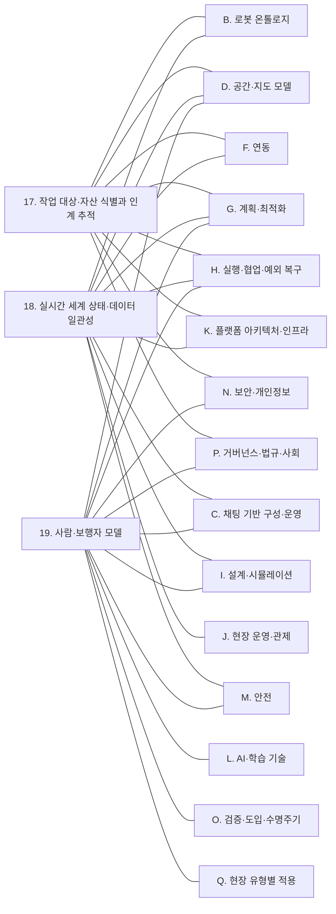

[홈](../../index.md) › E. 사물·사람·실시간 상태

# E. 사물·사람·실시간 상태

## 핵심 질문

작업 대상·사람·설비·로봇이 지금 어디에 어떤 상태로 있는지 어떻게 믿을 수 있게 알 것인가? [분류원문]

## 개요

작업 대상과 자산의 식별·인계, 현장의 사람, 로봇·설비·공간의 현재 상태를 믿을 수 있게 관리하는 일. [분류원문]

## 세부 연구영역

표의 세부 연구영역·무엇을 연구하는가·핵심 질문 열은 원문 그대로이고, 페이지·현재 상태 열은 위키에서 덧붙인 것이다. 현재 상태는 퍼블리셔가 자동으로 갱신한다.

<!-- auto:category-area-table:start -->
| 세부 연구영역 | 무엇을 연구하는가 | 핵심 질문 | 페이지 | 현재 상태 |
|---|---|---|---|---|
| **17. 작업 대상·자산 식별과 인계 추적** | 물품·자산·도구 같은 작업 대상의 식별·위치·인계 책임을 추적하고, 사람에게 넘길 때 수령인을 확인한다 | 로봇이 도착했을 때 실제로 무엇이 누구에게 넘겨졌는지 어떻게 확인할 것인가? | [17. 작업 대상·자산 식별과 인계 추적](work-object-and-asset-identification-and-handover-tracking.md) | published |
| **18. 실시간 세계 상태·데이터 일관성** | 로봇·설비·공간·물품의 현재 상태를 통합하고, 관측의 신선도·신뢰도를 관리한다 | 조금 전에 받은 상태 정보를 지금의 판단에 믿고 써도 되는가? | [18. 실시간 세계 상태·데이터 일관성](real-time-world-state-and-data-consistency.md) | published |
| **19. 사람·보행자 모델** | 현장 사람의 위치·흐름·혼잡을 모델링해 계획과 안전에 쓴다 | 현장 사람의 위치와 흐름을 어떻게 알고 계획과 안전에 반영할 것인가? | [19. 사람·보행자 모델](people-and-pedestrian-model.md) | published |

[분류원문]
<!-- auto:category-area-table:end -->

## 이 대분류의 핵심 포인트

**17번은 특히 빠뜨리기 쉽다.** 로봇 위치를 추적하는 것과 작업 대상의 위치·인계 책임을 추적하는 것은 다르다. GS1 EPCIS는 제품·자산의 상태, 위치, 이동, 인계에 관한 이벤트를 공유하는 참고 표준이다. [3] [분류원문]

## 다른 대분류와의 연결

이 절은 E. 사물·사람·실시간 상태의 세 세부영역([17. 작업 대상·자산 식별과 인계 추적](work-object-and-asset-identification-and-handover-tracking.md), [18. 실시간 세계 상태·데이터 일관성](real-time-world-state-and-data-consistency.md), [19. 사람·보행자 모델](people-and-pedestrian-model.md))이 다른 대분류의 어느 세부영역과 무엇을 주고받는지 정리한다. 근거는 게시된 세부영역 페이지와 다른 대분류 페이지의 검증된 주장, 그리고 대분류 연결 실행 2026-10-09-03 의 조사다.

연결의 절반 가까이가 추정이고 사실 주장도 모두 단일 출처라 교차 확인이 없으므로, 각 문장의 태그를 함께 읽어야 한다. 아래 모든 연결에서 18. 실시간 세계 상태·데이터 일관성은 현재 상태를 표현하고, 34. 시뮬레이션·예측용 디지털 트윈은 가정한 미래를 실험한다는 구분을 지킨다.

### [B. 로봇 온톨로지](../robot-ontology/index.md)

- **17. 작업 대상·자산 식별과 인계 추적 ↔ [5. 로봇 능력·작업 표현](../robot-ontology/robot-capability-and-task-representation.md)**: VDA 5050 팩트시트가 로봇이 취급할 수 있는 적재 유형을 선언하고 상태 메시지의 loadId 가 실제로 실린 적재물을 식별하므로, '이 로봇이 이 적재물을 다룰 수 있는가'를 판단하려면 능력 표현의 적재 유형과 적재물 식별을 같은 어휘로 맞춰야 할 것으로 보이며 공통 어휘는 확인되지 않았다(oq-023). [추정][^ref-228][^ref-051]
- **18. 실시간 세계 상태·데이터 일관성 ↔ 5. 로봇 능력·작업 표현**: Naqvi 외(Scientific Reports, 2025-10-02)는 제조 분야를 대상으로 한 로봇 능력 온톨로지(RCO)에서 제조사가 공개한 능력 수치와 운용 중 로봇이 실제로 보인 성능을 구분해 연결한다(원문 미열람, 검색 결과 기준). [사실][^ref-041]
- **18. 실시간 세계 상태·데이터 일관성 ↔ [6. 온톨로지 기반 시스템·로봇 연동](../robot-ontology/ontology-based-system-and-robot-integration.md)**: 18. 실시간 세계 상태·데이터 일관성이 모은 로봇의 관측 상태(배터리·문제 목록·위치)는 능력의 '지금 실행 가능 여부' 판단과 운용 능력 갱신의 입력이 될 것으로 보이며, 선언 능력과 관측 능력 가운데 무엇을 배정 기준으로 삼을지는 열린 질문 oq-024 로 남아 있다. [추정][^ref-041][^ref-148]

### [C. 채팅 기반 구성·운영](../chat-based-configuration-and-operation/index.md)

C. 채팅 기반 구성·운영의 업무 지시는 25. 작업 배정 — MRTA·26. 작업 순서·스케줄링을, 실제 상황 재현은 33. 시나리오 모델·편집·36. 가상 시운전·실제 상황 재현을 엔진으로 쓴다. 그래서 아래 연결은 G. 계획·최적화와 I. 설계·시뮬레이션 연결과 함께 읽는다.

- **18. 실시간 세계 상태·데이터 일관성 ↔ [12. 채팅으로 업무 지시·오케스트레이션](../chat-based-configuration-and-operation/chat-task-instruction-and-orchestration.md)**: Open Robotics 상호운용 SIG 의 2026-07-02 발표 안내문(2026-06-25 게시)은 Nayantra 를, Open-RMF REST API 를 언어 모델이 호출할 수 있는 도구로 노출하는 모델 컨텍스트 프로토콜(Model Context Protocol, MCP) 서버와 평이한 영어 지시를 여러 단계의 RMF 임무로 바꿔 Open-RMF 를 거쳐 Nav2 로 보내는 에이전트로 이루어진 시스템으로 소개했다(시연은 Isaac Sim 창고 시뮬레이션이며 발표 내용 자체는 열람하지 않았다). [사실][^ref-854] 대화로 '어디까지 했는가·왜 멈췄는가'에 답하려면 로봇 상태의 시각·상태 값·문제 목록 같은 현재 상태 기록을 근거로 써야 할 것으로 보이나, 안내문에는 상태 질의 기능이 나오지 않아 이 연동이 상태 질의까지 제공하는지는 확인하지 못했다. [추정][^ref-854][^ref-148]
- **19. 사람·보행자 모델 ↔ [11. 채팅으로 실제 상황 시뮬레이션 재현](../chat-based-configuration-and-operation/chat-real-situation-simulation-replay.md)·[36. 가상 시운전·실제 상황 재현](../design-and-simulation/virtual-commissioning-and-real-situation-replay.md)**: 실제 운영 기록을 재생해 상황을 재현하면 기록된 사람이 바뀐 조건(로봇 수·배차 정책)에 반응하지 않는 문제가 생기며, 19. 사람·보행자 모델 페이지는 이를 열린 질문 oq-256 으로 두고 기록 재현 시뮬레이터 Waymax 와 사람 행동 시뮬레이터 HuNavSim 을 참고로 든다. [추정][^ref-1128][^ref-1179]

### [D. 공간·지도 모델](../space-and-map-model/index.md)

- **18. 실시간 세계 상태·데이터 일관성 ↔ [15. 지도·공간·위치 모델](../space-and-map-model/map-space-and-location-model.md)**: VDA 5050 상태 스키마에는 위치추정 품질(localizationScore), 미터 단위 위치 편차 범위(deviationRange), 지도 식별자(mapId)가 있으며, 앞의 두 필드는 선택 필드이고 스키마는 이를 기록·시각화 용도로만 둔다고 적는다. [사실][^ref-051] 이 값을 보고된 위치를 얼마나 믿을지 판단하는 데 쓰는 것은 스키마가 정한 용도가 아니라 ROP 쪽 설계 판단이 될 것으로 보이며, 제조사마다 다른 계산 방식을 같은 기준으로 다루는 방법은 열린 질문 oq-028 이다. [추정][^ref-051]
- **17. 작업 대상·자산 식별과 인계 추적 ↔ 15. 지도·공간·위치 모델·[16. 장소 의미·지도 관리](../space-and-map-model/place-semantics-and-map-management.md)**: GS1 GLN 이 도크 문·보관 위치 같은 하위 위치를 식별할 수 있으므로, 인계 이벤트의 업무 위치와 로봇 지도 위 장소를 대응시키는 계층이 ROP 쪽에 필요할 것으로 보이며 국내 적용 사례는 확인되지 않았다(oq-029). [추정][^ref-162][^ref-031] 같은 연결은 [B. 로봇 온톨로지](../robot-ontology/index.md) 페이지의 연결 절에도 있다.
- **19. 사람·보행자 모델 ↔ 15. 지도·공간·위치 모델**: [움직임 지도](../../glossary/maps-of-dynamics.md)(maps of dynamics)는 공간에 사람의 전형적 움직임 패턴을 덧붙인 지도이며, EU ILIAD 프로젝트는 학습한 사람 흐름에 맞춰 물류창고 자율 지게차의 경로를 계획했다. [사실][^ref-1171][^ref-1180]
- **19. 사람·보행자 모델 ↔ 16. 장소 의미·지도 관리**: 병원 현장에서 한림대학교성심병원은 밤에 인식한 경로가 낮 혼잡에서는 원활하지 않을 수 있다고 보고 로봇 통행 경로와 작업 정지 지점을 전용 스티커로 표시했다(2024-07-12 기사 1건 기준). [사실][^ref-1181]

### [F. 연동](../integration/index.md)

- **17. 작업 대상·자산 식별과 인계 추적 ↔ [20. 로봇·제조사 관제 연동](../integration/robot-and-vendor-fleet-manager-integration.md)**: VDA 5050 상태 스키마의 loads 는 로봇이 현재 취급 중인 적재물을 담고, loadId 는 바코드·RFID 같은 적재물 식별 번호, loadPosition 은 어느 적재 장치를 쓰는지를 나타낸다. [사실][^ref-051]
- **17. 작업 대상·자산 식별과 인계 추적 ↔ [22. 설비·건물 시스템 연동](../integration/facility-and-building-system-integration.md)**: Open-RMF 배송 작업에서 로봇은 픽업 지점의 DispenserResult, 하역 지점의 IngestorResult 를 받을 때까지 요청을 되풀이하고, IngestorResult 는 시각·요청 id·워크셀 id·상태(ACKNOWLEDGED·SUCCESS·FAILED)를 담는다. [사실][^ref-023][^ref-049] 설비의 인수 결과에는 화물 식별자·인계 당사자가 없으므로 설비 쪽 SUCCESS 를 식별·인계 기록과 결합해야 '무엇이 누구에게 넘겨졌는지'가 확정될 것으로 보이며, 이를 정한 표준 매핑은 확인되지 않았다(oq-001, oq-061). [추정][^ref-049][^ref-014][^ref-015] 같은 연결은 [B. 로봇 온톨로지](../robot-ontology/index.md)·[F. 연동](../integration/index.md) 페이지의 연결 절에도 있다.
- **17. 작업 대상·자산 식별과 인계 추적·18. 실시간 세계 상태·데이터 일관성 ↔ [23. 업무 시스템 연동](../integration/business-system-integration.md)**: DeHoratius·Raman(2008)은 한 소매업체 37개 매장 재고 기록의 65%가 실물과 맞지 않았다고 보고했다(한 소매업체 37개 매장 조건이며 물류센터 값이 아니다). [사실][^ref-292] 로봇이 보고한 적재물 식별 결과와 창고 관리 시스템(Warehouse Management System, WMS) 재고 기록이 어긋나면 덮어쓰지 않고 두 기록을 함께 보관해 정정 이벤트로 업무 시스템에 되돌리는 것이 두 대분류가 넘겨받는 지점이 될 것으로 보이며, 어느 쪽을 기준으로 삼고 누가 정정하는지는 열린 질문 oq-036 이다. [추정][^ref-292][^ref-051][^ref-492]
- **18. 실시간 세계 상태·데이터 일관성 ↔ 22. 설비·건물 시스템 연동**: Open-RMF 문 상태 메시지(DoorState)는 생성 시각 door_time·문 이름·현재 모드를, 승강기 상태 메시지(LiftState)는 생성 시각 lift_time·현재 층·목적 층·문 상태·운행 상태·현재 모드·제어 세션 id 를 담으며, 두 메시지 모두 허용 경과 시간은 정하지 않는다(몇 초까지 믿을지는 oq-034). [사실][^ref-285][^ref-286] 같은 연결은 [F. 연동](../integration/index.md) 페이지의 연결 절에도 있다.
- **18. 실시간 세계 상태·데이터 일관성 ↔ 20. 로봇·제조사 관제 연동**: Open-RMF 로봇 상태는 밀리초 단위 유닉스 시각(unix_millis_time), 7종 상태 값, 0~1 범위 배터리, 운영자가 풀어야 할 문제 목록(issues)을 담고, VDA 5050 상태는 ISO 8601 형식 시각(timestamp)을 담는다. [사실][^ref-148][^ref-051] 관제 인터페이스마다 시각 표현과 보고 주기가 달라 20. 로봇·제조사 관제 연동의 어댑터가 받은 상태를 공통 시간축으로 옮기는 변환·시계 오차 기준이 필요할 것으로 보이나, 이를 규정한 자료는 확인하지 못했다(oq-035). [추정][^ref-148][^ref-051]

### [G. 계획·최적화](../planning-and-optimization/index.md)

- **17. 작업 대상·자산 식별과 인계 추적 ↔ [24. 작업·워크플로 모델링](../planning-and-optimization/task-and-workflow-modeling.md)**: GS1 CBV 는 도착(arriving)·입고(receiving)·인수(accepting)를 서로 다른 업무 단계로 정의하고(2021-09-30 온톨로지 파일 기준), VDA 5050 은 하역(drop) 완료를 적재물이 로봇을 떠나 로봇이 새 적재 상태를 보고한 때로 정의한다. [사실][^ref-044][^ref-031] 같은 연결은 [A. 기획·사업](../planning-and-business/index.md)·[B. 로봇 온톨로지](../robot-ontology/index.md) 페이지의 연결 절에도 있다.
- **18. 실시간 세계 상태·데이터 일관성 ↔ [28. 공용 자원·충전·에너지 최적화](../planning-and-optimization/shared-resource-charging-and-energy-optimization.md)**: Open-RMF 로봇 상태는 배터리를 0.0(빈)~1.0(가득)으로, VDA 5050 상태는 충전 상태(powerSupply.stateOfCharge)를 퍼센트로 보고한다. [사실][^ref-148][^ref-051] Open-RMF 가 작업을 끝낼 충전량이 부족하면 충전 작업을 일정에 끼워 넣으므로, 충전 계획은 18. 실시간 세계 상태·데이터 일관성이 표현하는 현재 배터리 상태를 단위를 맞춰 입력으로 쓰는 것으로 보이며, 이는 가정한 미래를 실험하는 34. 시뮬레이션·예측용 디지털 트윈과 구분된다. [추정][^ref-104][^ref-148] 같은 연결은 [G. 계획·최적화](../planning-and-optimization/index.md) 페이지의 연결 절에도 있다.
- **19. 사람·보행자 모델 ↔ [27. 다중 로봇 경로·교통 관리 — MAPF](../planning-and-optimization/multi-robot-path-and-traffic-management-mapf.md)**: 기타 현장(대학 건물)에서 Vintr 외(2022)는 장기 시공간 보행자 흐름 지도를 경로 계획에 쓰고 예상 조우와 예상 경로 길이로 비교했으며, 현장 실험에서 불편을 드러낸 사람은 예측형 주행에서 두 세션 모두 0명, 반응형에서 2명·1명이었다(40분 세션 4회의 매우 작은 표본). [사실][^ref-1178]
- **19. 사람·보행자 모델 ↔ [26. 작업 순서·스케줄링](../planning-and-optimization/task-sequencing-and-scheduling.md)**: 낮 시간 복도 혼잡과 '무조건 대기' 규칙(병원), 혼잡을 예상해 위치를 정하는 계획(쇼핑몰 연구)처럼 사람 흐름은 로봇 작업 시간과 순서에 영향을 줄 것으로 보이나, 시간대별 혼잡을 작업 시간 추정·스케줄링에 넣어 효과를 측정한 현장 연구는 확인하지 못했다(oq-273). [추정][^ref-1181][^ref-1182]

### [H. 실행·협업·예외 복구](../execution-collaboration-and-recovery/index.md)

- **17. 작업 대상·자산 식별과 인계 추적 ↔ [30. 로봇 간 협업·물리적 인계](../execution-collaboration-and-recovery/robot-to-robot-collaboration-and-physical-handover.md)**: EPCIS 가 소유·점유·위치 이전을 출발지·도착지(source/destination)로 표현하므로, 로봇·설비 사이 물리적 인계의 확인은 식별자·인계 당사자 기록과 결합해야 할 것으로 보인다(oq-001, oq-006). [추정][^ref-049][^ref-014][^ref-015] 같은 연결은 [B. 로봇 온톨로지](../robot-ontology/index.md) 페이지의 연결 절에도 있다.
- **17. 작업 대상·자산 식별과 인계 추적 ↔ [32. 예외 복구·재계획·업무 연속성](../execution-collaboration-and-recovery/exception-recovery-replanning-and-business-continuity.md)**: 팔레트 RFID 태그 판독성이 제품·포장·태그 위치·적재 패턴에 따라 달라진다는 2009년 실험 보고가 있어, 판독 실패·오판독 때 인계 보류·재스캔·사람 확인 규칙이 복구 과제로 넘어갈 것으로 보인다(oq-003). [추정][^ref-024] 같은 연결은 [B. 로봇 온톨로지](../robot-ontology/index.md) 페이지의 연결 절에도 있다. EPCIS 1.2 는 이미 기록된 이벤트를 오류 선언(errorDeclaration)으로 정정하게 하므로, 고장 로봇에서 회수한 화물의 위치·이벤트 정정이 식별·추적 쪽 기록 규칙에 기대게 된다(oq-079). [사실][^ref-492]
- **18. 실시간 세계 상태·데이터 일관성 ↔ [29. 명령·작업 실행의 신뢰성](../execution-collaboration-and-recovery/command-and-task-execution-reliability.md)·32. 예외 복구·재계획·업무 연속성**: VDA 5050 3.0.0 에서 로봇 연결이 예기치 않게 끊기면 브로커가 MQTT 유언으로 CONNECTION_BROKEN 을 대신 알리고, 로봇은 받은 주문을 유지한 채 마지막으로 해제된 노드까지 수행한다. [사실][^ref-031] 같은 연결은 [F. 연동](../integration/index.md) 페이지의 연결 절에도 있다.
- **18. 실시간 세계 상태·데이터 일관성·19. 사람·보행자 모델 ↔ [31. 사람–로봇 협업](../execution-collaboration-and-recovery/human-robot-collaboration.md)**: Riedelbauch·Werner·Henrich(RAAD 2017)는 사람과 함께 쓰는 작업 공간에서 세계 모델의 정보마다 확실도 값을 붙이고, 전역 센서가 감지한 사람 존재에 따라 이 값을 시간에 따라 조정하며 손 장착(eye-in-hand) 카메라 데이터와 결합해 로봇이 정보가 아직 유효한지 판단하게 했다(조립용 시제품 실험이며 현장 유형은 명시되지 않았다). [사실][^ref-1302] 사람이 드나든 구역의 물품·설비 상태는 관측 뒤 바뀌었을 가능성이 높으므로 19. 사람·보행자 모델의 사람 위치 정보가 18. 실시간 세계 상태·데이터 일관성의 상태 신뢰도를 낮추는 근거로 쓰일 수 있을 것으로 보이나, 이동로봇 현장 적용 사례는 확인하지 못했다. [추정][^ref-1302] 이 방식을 물류창고·병원 같은 이동로봇 현장에 적용한 사례가 있는지는 새 열린 질문으로 올렸다.

### [I. 설계·시뮬레이션](../design-and-simulation/index.md)

- **18. 실시간 세계 상태·데이터 일관성 ↔ [34. 시뮬레이션·예측용 디지털 트윈](../design-and-simulation/simulation-and-predictive-digital-twin.md)**: 제조 분야 분류 자료가 현장 상태가 한 방향으로 자동 반영되는 디지털 섀도와 디지털 트윈을 구분하므로, 18. 실시간 세계 상태·데이터 일관성은 현재 상태를 표현하고 34. 시뮬레이션·예측용 디지털 트윈은 그 표현을 복제해 가정한 미래를 실험하는 쪽으로 나누는 것이 분류 원문의 구분과 맞을 것으로 보인다(근거 자료는 제조 대상). [추정][^ref-291][^ref-290]
- **19. 사람·보행자 모델 ↔ 34. 시뮬레이션·예측용 디지털 트윈**: HuNavSim(2023)은 사람 인지 내비게이션을 벤치마크하기 위한 ROS 2 사람 이동 시뮬레이터이고, Kidokoro 외(HRI 2013)는 보행자 행동 모델로 가상 주행 상황을 시뮬레이션해 혼잡을 피하는 로봇 위치를 계획했다. [사실][^ref-1179][^ref-1182]
- **19. 사람·보행자 모델 ↔ 36. 가상 시운전·실제 상황 재현**: 기록 재현에서 사람이 반응하지 않는 문제는 위 C. 채팅 기반 구성·운영 항목에 적었다(oq-256).

### [J. 현장 운영·관제](../field-operations-and-monitoring/index.md)

- **18. 실시간 세계 상태·데이터 일관성 ↔ [38. 모니터링·이상 탐지·원인 분석](../field-operations-and-monitoring/monitoring-anomaly-detection-and-root-cause-analysis.md)·[39. 운영 성과 측정·개선](../field-operations-and-monitoring/operational-performance-measurement-and-improvement.md)**: 로봇 상태의 상태 값·배터리·문제 목록·시각과 문·승강기 상태의 시각을 한 세계 상태 기록에 모으면, 가동률·충전·오류 시간 지표와 '지연 원인이 로봇인지 문인지' 분석이 같은 기록을 쓰게 될 것으로 보인다. [추정][^ref-148][^ref-285][^ref-286] 같은 연결은 [A. 기획·사업](../planning-and-business/index.md) 페이지의 연결 절에도 있다.

### [K. 플랫폼 아키텍처·인프라](../platform-architecture-and-infrastructure/index.md)

- **18. 실시간 세계 상태·데이터 일관성 ↔ [42. 분산 시스템·통신·컴퓨팅 구조](../platform-architecture-and-infrastructure/distributed-systems-communication-and-computing.md)**: ROS 2 QoS 의 기한·생존성 정책, Sparkplug 의 노드 종료(NDEATH) 뒤 지표 STALE 표시, VDA 5050 의 MQTT 유언을 통한 연결 끊김 통지처럼 통신 계층에 상태의 오래됨을 알리는 장치가 있으며, 세 출처는 각각 한 장치만 다룬다. [사실][^ref-282][^ref-287][^ref-031] 같은 연결은 [B. 로봇 온톨로지](../robot-ontology/index.md)·[F. 연동](../integration/index.md) 페이지의 연결 절에도 있다.
- **17. 작업 대상·자산 식별과 인계 추적·18. 실시간 세계 상태·데이터 일관성 ↔ [43. 데이터·관측성·배포](../platform-architecture-and-infrastructure/data-observability-and-deployment.md)**: EPCIS 2.0 온톨로지가 발생 시각(eventTime)·기록 시각(recordTime)·UTC 차이를 구분하므로, 실행 기록과 관측 데이터에서도 발생 시각과 수신·기록 시각을 따로 남기는 설계가 두 대분류를 잇는 지점이 될 것으로 보인다. [추정][^ref-045]

### [L. AI·학습 기술](../ai-and-learning/index.md)

- **19. 사람·보행자 모델 ↔ [46. 예측·학습 기반 최적화](../ai-and-learning/prediction-and-learning-based-optimization.md)**: Rudenko 외 서베이가 정리한 사람 움직임 궤적 예측은 19. 사람·보행자 모델의 가까운 미래 사람 위치 추정 방법이므로, 예측 결과를 경로·배정 비용에 넣는 일이 46. 예측·학습 기반 최적화와 이어질 것으로 보인다. [추정][^ref-1172]
- 이번 실행에서 근거를 확보한 L. AI·학습 기술 연결은 이 하나뿐이다. 45. 문서·도면·장면 이해와 18. 실시간 세계 상태·데이터 일관성·19. 사람·보행자 모델의 연결(oq-227)은 아래 '아직 다루지 않은 연결'에 둔다.

### [M. 안전](../safety/index.md)

- **18. 실시간 세계 상태·데이터 일관성 ↔ [48. 안전·위험 관리](../safety/safety-and-risk-management.md)**: Open-RMF 승강기 상태의 현재 모드에는 알 수 없음·사람·AGV·화재·오프라인·비상이 있으며 사람·AGV 모드만 설정할 수 있고 나머지는 읽기 전용이다. [사실][^ref-286] 승강기 화재·비상 모드 제어와 설비 안전 제어는 분류 원문 19장 시설·설비 제어 경계의 연계 대상이고, ROP 는 탑승 확정 전에 최신 모드를 확인해 작업·경로 제약에 반영하는 쪽을 맡는 것으로 보인다. [추정][^ref-286] 같은 연결은 [G. 계획·최적화](../planning-and-optimization/index.md) 페이지의 연결 절에도 있다.
- **19. 사람·보행자 모델 ↔ [49. 사람 근접 안전](../safety/human-proximity-safety.md)**: 병원의 '사람·휠체어와 마주치면 무조건 대기' 규칙과 창고의 움직임별 사회적 비용에 따른 속도 제약처럼 사람 흐름 정보는 구역별 대기·속도 규칙으로 49. 사람 근접 안전과 이어지며, ROP 는 규칙을 요청·관리하고 사람 검출·안전 정지·국소 회피는 연계 대상으로 로봇이 맡는 경계가 될 것으로 보인다. [추정][^ref-1181][^ref-1180]

### [N. 보안·개인정보](../security-and-privacy/index.md)

- **19. 사람·보행자 모델 ↔ [53. 개인정보·영상 데이터](../security-and-privacy/privacy-and-video-data.md)**: ROS 규약 제안 REP-155(Draft, 2022-01-11 작성)는 사람마다 영속 ID 를 두고 얼굴·몸·음성 ID 를 후보 대응으로 연결하며, 이 문서는 개인정보·동의를 다루지 않는다. [사실][^ref-1173] 사람 표현의 영속 ID 가 얼굴·음성 인식과 연결될 수 있으므로 ROP 가 보관하는 사람 정보는 구역·시간대 집계·익명화로 두는 것이 두 대분류의 경계가 될 것으로 보이며, 여러 출처의 사람 위치를 합치는 익명화 형식과 촬영 거부 의사 공유 방법은 열린 질문(oq-261, oq-272)이다. [추정][^ref-1173]
- **17. 작업 대상·자산 식별과 인계 추적 ↔ [51. 인증·권한·격리](../security-and-privacy/authentication-authorization-and-isolation.md)**: 17. 작업 대상·자산 식별과 인계 추적의 '사람에게 넘길 때 수령인 확인'은 인증 수단과 이어진다. 병원용 운반 로봇 Zena RX(ST Engineering Aethon, 2024-04-29 출시 발표)는 생체 인식과 직원 PIN 코드로 잠금 칸을 열게 해 권한 있는 직원만 약품·검체를 꺼낼 수 있다고 제조사는 밝힌다(제조사 보도자료, 독립 확인 없음). [추정] 벤더 주장[^ref-1299] 잠금 칸·생체 인식·PIN 인증은 로봇 제조사 기능으로 연계 대상이며, ROP 몫은 그 인증 결과를 받아 인계 기록에 남기는 일로 한정된다. [추정][^ref-1299]
- 2019-10 우아한형제들 본사(서울 잠실) 시범 운영에서 배달 로봇 딜리타워는 라이더가 주문번호 앞 네 자리와 층을 입력하면 승강기로 이동해 목적 층에서 고객을 호출하며, 고객이 휴대전화 번호 뒤 네 자리를 입력해야 음식 칸이 열렸다(기사 1건 기준). [추정][^ref-1300]
- 2020-07 보도에 따르면 딜리타워의 공동주택(포레나 영등포) 도입 계획에서는 라이더와 고객이 모두 로봇 화면에 비밀번호를 눌러 적재함을 열고, 로봇은 도착 시 고객에게 문자와 전화로 알리게 되어 있었다(2020-07 계획 단계 보도이며 실제 운영 방식은 확인하지 못했다). [사실][^ref-1301]
- **17. 작업 대상·자산 식별과 인계 추적 ↔ 51. 인증·권한·격리·53. 개인정보·영상 데이터**: 확인한 사례의 수령인 확인 수단이 생체+PIN(병원), 전화번호 뒤 네 자리(사무 건물), 비밀번호(공동주택 계획)로 서로 달라, '누구에게 넘겼는가' 기록은 51. 인증·권한·격리의 인증 수단과 53. 개인정보·영상 데이터의 생체·전화번호 처리에 기대게 될 것으로 보이며, 그 결과가 주문·업무 시스템에 완료 이벤트로 기록되는지는 확인하지 못했다. [추정][^ref-1299][^ref-1300][^ref-1301] 인접한 열린 질문은 식당·호텔의 수령 확인을 다룬 [oq-180](../../open-questions.md)과 공동주택 배송로봇의 수령 인증을 다룬 [oq-184](../../open-questions.md)이며, 병원 운반 로봇의 수령인 인증 결과를 완료·인계 이벤트로 남기는 공개 인터페이스가 있는지는 새 열린 질문으로 올렸다.

### [O. 검증·도입·수명주기](../verification-deployment-and-lifecycle/index.md)

- **19. 사람·보행자 모델 ↔ [54. 시험·형식 검증·벤치마크](../verification-deployment-and-lifecycle/testing-formal-verification-and-benchmarking.md)**: 사회적 로봇 내비게이션 알고리즘 평가 원칙·지침(Francis 외, 2023)과 장기 시공간 보행자 흐름 지도의 벤치마크 연구(Vintr 외, 2022)가 있어, 사람 모델을 쓴 계획의 효과를 시험하는 방법이 54. 시험·형식 검증·벤치마크와 이어진다. [사실][^ref-1079][^ref-1178]

### [P. 거버넌스·법규·사회](../governance-law-and-society/index.md)

- **19. 사람·보행자 모델 ↔ [60. 노동·수용성·접근성](../governance-law-and-society/labor-acceptance-and-accessibility.md)**: 실외 보도 로봇에 대해 Han 외(CHI 2024)는 이동장애인 15명·로봇 실무자 8명 면담과 4회 공동설계 워크숍에서, 보도 로봇이 들어오면 이동장애인이 보도 공간을 두고 경쟁해야 한다고 느끼며 부족한 연석 경사로 같은 기존 장벽 위에서 로봇이 운행된다고 보고했다. [사실][^ref-1214] 보행 약자가 지나야 하는 연석 경사로·좁은 통로를 사람 흐름 모델의 양보·비정차 구역으로 표현해야 접근성 요구가 경로·대기 위치 제약으로 이어질 것으로 보이나, 국내 기준은 확인하지 못했다(oq-188 관련). [추정][^ref-1214]
- **17. 작업 대상·자산 식별과 인계 추적 ↔ [58. 다사업자 책임·계약·데이터](../governance-law-and-society/multi-party-responsibility-contracts-and-data.md)**: CBV 의 출발지·도착지 유형(owning_party·possessing_party·location)이 소유·점유 이전을 당사자 단위로 기록하므로, 제조사·운영사·화주 사이 인계 책임의 기록 근거가 17. 작업 대상·자산 식별과 인계 추적의 이벤트에서 나올 것으로 보인다. [추정][^ref-014][^ref-015][^ref-044]

### [Q. 현장 유형별 적용](../site-type-applications/index.md)

현장마다 다른 요구는 Q. 현장 유형별 적용에 모으고, 식별·상태·사람 모델처럼 모든 현장에 공통인 기능은 이 대분류에 둔다.

- **19. 사람·보행자 모델 ↔ [61. 물류창고](../site-type-applications/warehouse.md)·[63. 병원·의료](../site-type-applications/hospital-and-healthcare.md)·[64. 상업 시설](../site-type-applications/commercial-facilities.md)**: 게시된 19. 사람·보행자 모델 페이지의 적용 사례는 스웨덴 외레브로 창고의 자율 지게차 플릿(ILIAD), 한림대학교성심병원의 복도 혼잡 대응, 쇼핑몰에서 혼잡을 예상하는 로봇(Kidokoro 외)이다. [사실][^ref-1180][^ref-1181][^ref-1182]
- **19. 사람·보행자 모델 ↔ [66. 실외](../site-type-applications/outdoor.md)**: 연계 대상으로, 행정안전부 인파관리지원시스템은 2023-12-29부터 전국 중점관리지역 100곳에서 이동통신 3사 기지국 접속정보로 인파 밀집도를 추정해 위험 수준에 따라 지자체 공무원에게 경보를 보내며, 실외 로봇 운행 제약과 연동한 사례는 확인되지 않았다(oq-274). [사실][^ref-1177]
- **17. 작업 대상·자산 식별과 인계 추적 ↔ 63. 병원·의료·[65. 가정·공동주택](../site-type-applications/home-and-apartment.md)·[67. 기타 현장](../site-type-applications/other-sites.md)**: 수령인 확인 사례(병원 Zena RX, 공동주택 딜리타워 도입 계획, 사무 건물 딜리타워 시범 운영)는 위 N. 보안·개인정보 항목에 적었다.

### 아직 다루지 않은 연결

다음 연결은 이번 실행까지 검증된 근거가 없어 쓰지 않았다.

- [A. 기획·사업](../planning-and-business/index.md): 17. 작업 대상·자산 식별과 인계 추적, 18. 실시간 세계 상태·데이터 일관성, 19. 사람·보행자 모델을 1. 기술·시장·업체 동향, 2. 사용 사례·요구·책임 범위, 3. 경제성·조달·사업 모델과 직접 잇는 근거.
- L. AI·학습 기술: 18. 실시간 세계 상태·데이터 일관성·19. 사람·보행자 모델과 [45. 문서·도면·장면 이해](../ai-and-learning/document-drawing-and-scene-understanding.md)의 연결(고정 카메라와 로봇 인식 결과의 결합, oq-227).
- O. 검증·도입·수명주기: 17. 작업 대상·자산 식별과 인계 추적과 54. 시험·형식 검증·벤치마크, [55. 현장 조사·설치·시운전](../verification-deployment-and-lifecycle/site-survey-installation-and-commissioning.md), [57. 자산·소프트웨어 수명주기 관리](../verification-deployment-and-lifecycle/asset-and-software-lifecycle-management.md)의 연결.
- J. 현장 운영·관제: [37. 관제 화면·실행 기록](../field-operations-and-monitoring/control-screen-and-execution-records.md), [40. 운영 절차·요청 창구](../field-operations-and-monitoring/operating-procedures-and-request-channels.md)와의 연결.
- N. 보안·개인정보: [52. 통신 보호·위협 관리·감사](../security-and-privacy/communication-protection-threat-management-and-audit.md)와의 연결.
- P. 거버넌스·법규·사회: [59. 법·규제·보험·라이선스](../governance-law-and-society/law-regulation-insurance-and-licensing.md)와의 연결.
- Q. 현장 유형별 적용: 19. 사람·보행자 모델의 게시 사례에는 실외·제조 공장·가정 현장 사례가 아직 없다.

## 이 대분류의 자료

<!-- auto:category-sources:start -->
이 대분류의 페이지가 인용했거나 이 대분류 영역과 연결된 출처는 모두 84건이다(논문 27건 · 기사·보고서 5건 · 업체 발표 1건 · 표준·오픈소스·기관 자료 51건). 유형은 참고문헌의 출처 유형을 따르며, 업체 발표는 '벤더 문서' 유형이다. 묶음마다 발행일이 최근인 것부터 10건까지 보이고, 전체 목록은 [참고문헌](../../references/index.md)에 있다.

**논문**

- [ref-1287](../../references/ref-1287.md) — Yang, Q., & Liew, S. C. (The Chinese University of Hong Kong, arXiv), Multi-robot Rigid Formation Navigation via Synchronous Motion and Discrete-time Communication-Control Optimization (발행 2025-10-10)
- [ref-041](../../references/ref-041.md) — Naqvi, M. R. 외(Scientific Reports), Ontology-driven integration of advertised and operational capabilities in robots (발행 2025-10-02)
- [ref-1280](../../references/ref-1280.md) — Saavedra-Ruiz, M., Nashed, S. B., Gauthier, C., & Paull, L. (arXiv; IROS 2025 채택 표기), Perpetua: Multi-Hypothesis Persistence Modeling for Semi-Static Environments (발행 2025-07-24)
- [ref-575](../../references/ref-575.md) — Schulze, P. R., Müller, S., Müller, T., & Gross, H.-M. (TU Ilmenau), On realizing autonomous transport services in multi story buildings with doors and elevators (발행 2025-02-25)
- [ref-1214](../../references/ref-1214.md) — Han, H. Z. 외 (Carnegie Mellon University) — CHI '24, Co-design Accessible Public Robots: Insights from People with Mobility Disability, Robotic Practitioners and Their Collaborations (발행 2024-04-07)
- [ref-1275](../../references/ref-1275.md) — Deubert, D., Klingel, L., & Selig, A. (arXiv; The International Journal of Advanced Manufacturing Technology 2024 표기), Online Simulation at Machine Level: A Systematic Review (발행 2024-01-15)
- [ref-1276](../../references/ref-1276.md) — Galka, S. (Winter Simulation Conference 2024), Reducing Transient Behavior in Simulation-Based Digital Twins: A Novel Initialization Approach for Order Picking Systems (발행 2024)
- [ref-1128](../../references/ref-1128.md) — Gulino, C., Fu, J., Luo, W. 외 (Waymo, arXiv), Waymax: An Accelerated, Data-Driven Simulator for Large-Scale Autonomous Driving Research (발행 2023-10-12)
- [ref-1179](../../references/ref-1179.md) — Pérez-Higueras, N., Otero, R., Caballero, F., & Merino, L. (arXiv; IEEE RA-L 2023), HuNavSim: A ROS 2 Human Navigation Simulator for Benchmarking Human-Aware Robot Navigation (발행 2023-09-13)
- [ref-1286](../../references/ref-1286.md) — 김지형 (KoreaScience 수록, 한국인터넷방송통신학회논문지 표기), OPC UA를 활용한 이기종 로봇의 실시간 디지털 트윈 설계 및 구현 (Design and Implementation of Real-time Digital Twin in Heterogeneous Robots using OPC UA) (발행 2023-08-31)
- 그 밖에 17건

**기사·보고서**

- [ref-1181](../../references/ref-1181.md) — 조선비즈 (이정아, 다음 뉴스 게재), 로봇과 인간이 공존하는 병원…약 배달 로봇에 길 비켜주고 엘리베이터도 잡아줘 (발행 2024-07-12)
- [ref-1285](../../references/ref-1285.md) — 메디포뉴스 (이형규), 용인세브란스병원, 지능형 의료서비스로봇 생태계 구축 (발행 2022-11-18)
- [ref-1284](../../references/ref-1284.md) — The Straits Times (SingHealth 게재, Wong Shiying), New software enables different robots to communicate with each other and building infrastructure (발행 2022-05-28)
- [ref-1301](../../references/ref-1301.md) — 경향신문 (곽희양), 내년 2월 자율주행 로봇이 아파트 내에서 배달 음식 나른다 (발행 2020-07-03)
- [ref-1300](../../references/ref-1300.md) — 바이라인네트워크 (엄지용), 엘리베이터 타는 배달로봇과의 조우 (발행 2019-10-17)

**업체 발표**

- [ref-1299](../../references/ref-1299.md) — ST Engineering Aethon (Newswire 게재 보도자료), ST Engineering Aethon Launches Zena RX, Redefining Secure Delivery of Medications, Specimens and Sensitive Goods in Hospitals (발행 2024-04-29)

**표준·오픈소스·기관 자료**

- [ref-854](../../references/ref-854.md) — Open Source Robotics Alliance (OSRA) Interop SIG, Open Robotics Discourse, Interop SIG, 02 July 2026: Natural-Language Control of Open-RMF Fleets via the Model Context Protocol (MCP) (발행 2026-06-25)
- [ref-032](../../references/ref-032.md) — VDA(Verband der Automobilindustrie), Version 3.0 of VDA 5050 released (발행 2026-04)
- [ref-011](../../references/ref-011.md) — ISO/IEC, ISO/IEC 19987:2024 - Information technology — EPC Information Services (EPCIS) (발행 2024-03)
- [ref-1277](../../references/ref-1277.md) — Open Robotics Discourse (open-rmf 질의응답 #414), How to inform RMF that lift or door are not available? (#414) (발행 2024-01-13)
- [ref-012](../../references/ref-012.md) — ISO/IEC, ISO/IEC 19988:2024 - Information technology — GS1 Core Business Vocabulary (CBV) (발행 2024)
- [ref-1177](../../references/ref-1177.md) — 행정안전부 (대한민국 정책브리핑), 29일부터 인파관리지원시스템 본격 운영…다중운집 인파사고 예방 (발행 2023-12-27)
- [ref-1283](../../references/ref-1283.md) — Changi General Hospital (CGH), Changi General Hospital, CapitaLand Investment and KONE collaborate to advance the integration of robotics in buildings (발행 2022-05-28)
- [ref-1173](../../references/ref-1173.md) — ROS (ros-infrastructure/rep 저장소), Séverin Lemaignan, REP 155 -- Conventions, Topics, Interfaces for Perception in Human-Robot Interaction (발행 2022-01-11)
- [ref-022](../../references/ref-022.md) — VDA(Verband der Automobilindustrie), VDA 5050 Version 2.0.0 — Interface for the communication between automated guided vehicles (AGV) and a master control (발행 2022-01)
- [ref-045](../../references/ref-045.md) — GS1, gs1/EPCIS — Ontology/EPCIS.ttl (EPCIS ontology 2.0) (발행 2021-09-30)
- 그 밖에 41건
<!-- auto:category-sources:end -->

## 최근 업데이트

<!-- auto:category-recent:start -->
- 2026-10-09 · 갱신 · [18. 실시간 세계 상태·데이터 일관성](real-time-world-state-and-data-consistency.md) — 갱신: 5절 병원 2건·기타 1건·제조 공장 1건 적용 사례 추가(물류창고 시나리오 유지), 6·7·8절에 시각·품질·만료·지속성 필터·시계 동기화와 로봇–승강기 표준 초안 추가, 9절 위치 신뢰 판단 행을 VDA 5050 3.0.0 7.8절에 맞춰 수정, 10절 건축 도면 자동 인식 트랙 반영 제안 2건 반영, 11절 기존 열린 질문 4건 근거 추가·새 질문 3건, 6·7·8·10·11절에 2026-09-25 판 분리 페이지 링크 유지, 13절 각주 갱신(ref-288 원문 열람 반영, 신규 15건)·프런트매터 sources 는 기존 22건에 신규·재사용 출처를 더함 (실행 2026-10-09-11)
- 2026-10-09 · 생성 · [18. 실시간 세계 상태·데이터 일관성 — 대표 접근법과 기술](../../topics/2026/2026-10-09-area18-s6.md) — 자동 분리: 18. 실시간 세계 상태·데이터 일관성 의 "6. 대표 접근법과 기술" 절(2,348자)을 옮겼다 (실행 2026-10-09-11)
- 2026-10-09 · 생성 · [18. 실시간 세계 상태·데이터 일관성 — 다른 연구영역과의 연결](../../topics/2026/2026-10-09-area18-s10.md) — 자동 분리: 18. 실시간 세계 상태·데이터 일관성 의 "10. 다른 연구영역과의 연결 (번호와 이름을 함께 표기)" 절(1,925자)을 옮겼다 (실행 2026-10-09-11)
- 2026-10-09 · 생성 · [18. 실시간 세계 상태·데이터 일관성 — 관련 표준·프레임워크·오픈소스](../../topics/2026/2026-10-09-area18-s7.md) — 자동 분리: 18. 실시간 세계 상태·데이터 일관성 의 "7. 관련 표준·프레임워크·오픈소스" 절(1,700자)을 옮겼다 (실행 2026-10-09-11)
- 2026-10-09 · 생성 · [18. 실시간 세계 상태·데이터 일관성 — 열린 질문](../../topics/2026/2026-10-09-area18-s11.md) — 자동 분리: 18. 실시간 세계 상태·데이터 일관성 의 "11. 열린 질문" 절(1,638자)을 옮겼다 (실행 2026-10-09-11)
<!-- auto:category-recent:end -->

## 참고 자료

원문의 [3]은 참고문헌 [ref-003](../../references/ref-003.md)에 해당한다.[^ref-003]

[^ref-003]: GS1, EPCIS and CBV Linked Data Model, 미확인, https://ref.gs1.org/epcis/, 접근일 2026-09-28

[^ref-014]: GS1, Core Business Vocabulary (CBV) Standard, 미확인, https://ref.gs1.org/standards/cbv/, 접근일 2026-10-09 (원문 미열람)
[^ref-015]: GS1, EPCIS and CBV Implementation Guideline, 미확인, https://www.gs1.org/docs/epc/EPCIS_Guideline.pdf, 접근일 2026-10-09 (원문 미열람)
[^ref-023]: Open Robotics, Workcells - Programming Multiple Robots with ROS 2, 미확인, https://osrf.github.io/ros2multirobotbook/integration_workcells.html, 접근일 2026-10-09
[^ref-024]: Singh, J. 외, RFID tag readability issues with palletized loads of consumer goods, 2009, https://onlinelibrary.wiley.com/doi/abs/10.1002/pts.864, 접근일 2026-10-09 (원문 미열람)
[^ref-031]: VDA / VDMA (VDA5050 GitHub), VDA5050/VDA5050_EN.md — Official Specification document for the VDA 5050, 미확인, https://github.com/VDA5050/VDA5050/blob/main/VDA5050_EN.md, 접근일 2026-10-09
[^ref-041]: Naqvi, M. R. 외(Scientific Reports), Ontology-driven integration of advertised and operational capabilities in robots, 2025-10-02, https://www.nature.com/articles/s41598-025-16649-3, 접근일 2026-10-09 (원문 미열람)
[^ref-044]: GS1, gs1/EPCIS — Ontology/CBV.ttl (Core Business Vocabulary ontology 2.0), 2021-09-30, https://github.com/gs1/EPCIS/blob/master/Ontology/CBV.ttl, 접근일 2026-10-09
[^ref-045]: GS1, gs1/EPCIS — Ontology/EPCIS.ttl (EPCIS ontology 2.0), 2021-09-30, https://github.com/gs1/EPCIS/blob/master/Ontology/EPCIS.ttl, 접근일 2026-10-09
[^ref-049]: Open Robotics (open-rmf), rmf_internal_msgs — rmf_ingestor_msgs/msg/IngestorResult.msg, 미확인, https://github.com/open-rmf/rmf_internal_msgs/blob/main/rmf_ingestor_msgs/msg/IngestorResult.msg, 접근일 2026-10-09
[^ref-051]: VDA / VDMA (VDA5050 GitHub), VDA5050/VDA5050 — json_schemas/state.schema, 미확인, https://github.com/VDA5050/VDA5050/blob/main/json_schemas/state.schema, 접근일 2026-10-09
[^ref-104]: Open Robotics (open-rmf), rmf_demos — Demonstrations of Open-RMF (README), 미확인, https://github.com/open-rmf/rmf_demos, 접근일 2026-10-09 (원문 미열람)
[^ref-148]: Open Robotics (open-rmf), rmf_api_msgs — rmf_api_msgs/schemas/robot_state.json, 미확인, https://github.com/open-rmf/rmf_api_msgs/blob/main/rmf_api_msgs/schemas/robot_state.json, 접근일 2026-10-09
[^ref-162]: GS1, Identifying a physical location - GLN, 미확인, https://www.gs1.org/standards/id-keys/gln/physical-location, 접근일 2026-10-09 (원문 미열람)
[^ref-228]: VDA / VDMA (VDA5050 GitHub), VDA5050/VDA5050 — json_schemas/factsheet.schema, 미확인, https://github.com/VDA5050/VDA5050/blob/main/json_schemas/factsheet.schema, 접근일 2026-10-09
[^ref-282]: Open Robotics (ROS 2 Documentation), Quality of Service settings — ROS 2 Documentation: Jazzy, 미확인, https://docs.ros.org/en/jazzy/Concepts/Intermediate/About-Quality-of-Service-Settings.html, 접근일 2026-10-09 (원문 미열람)
[^ref-285]: Open Robotics (open-rmf), rmf_internal_msgs — rmf_door_msgs/msg/DoorState.msg, 미확인, https://github.com/open-rmf/rmf_internal_msgs/blob/main/rmf_door_msgs/msg/DoorState.msg, 접근일 2026-10-09
[^ref-286]: Open Robotics (open-rmf), rmf_internal_msgs — rmf_lift_msgs/msg/LiftState.msg, 미확인, https://github.com/open-rmf/rmf_internal_msgs/blob/main/rmf_lift_msgs/msg/LiftState.msg, 접근일 2026-10-09
[^ref-287]: Eclipse Foundation (eclipse-sparkplug GitHub), Sparkplug Specification — Chapter 5 Operational Behavior (Sparkplug_5_Operational_Behavior.adoc), 미확인, https://github.com/eclipse-sparkplug/sparkplug/blob/master/specification/src/main/asciidoc/chapters/Sparkplug_5_Operational_Behavior.adoc, 접근일 2026-10-09
[^ref-290]: NIST, DIGITAL TWINS FOR ADVANCED MANUFACTURING: THE STANDARDIZED APPROACH, 미확인, https://tsapps.nist.gov/publication/get_pdf.cfm?pub_id=957417, 접근일 2026-10-09 (원문 미열람)
[^ref-291]: Kritzinger, W., Karner, M., Traar, G., Henjes, J., & Sihn, W., Digital Twin in manufacturing: A categorical literature review and classification, 2018, https://www.sciencedirect.com/science/article/pii/S2405896318316021, 접근일 2026-10-09 (원문 미열람)
[^ref-292]: DeHoratius, N., & Raman, A., Inventory Record Inaccuracy: An Empirical Analysis, 2008, https://pubsonline.informs.org/doi/10.1287/mnsc.1070.0789, 접근일 2026-10-09 (원문 미열람)
[^ref-492]: GS1, EPC Information Services (EPCIS) Standard 1.2, 2016-09-29, https://www.gs1.org/sites/default/files/docs/epc/EPCIS-Standard-1.2-r-2016-09-29.pdf, 접근일 2026-10-09 (원문 미열람)
[^ref-854]: Open Source Robotics Alliance (OSRA) Interop SIG, Open Robotics Discourse, Interop SIG, 02 July 2026: Natural-Language Control of Open-RMF Fleets via the Model Context Protocol (MCP), 2026-06-25, https://discourse.openrobotics.org/t/interop-sig-02-july-2026-natural-language-control-of-open-rmf-fleets-via-the-model-context-protocol-mcp/55687, 접근일 2026-10-09
[^ref-1079]: Francis, A., Pérez-D'Arpino, C., Li, C. 외 (ACM Transactions on Human-Robot Interaction, arXiv), Principles and Guidelines for Evaluating Social Robot Navigation Algorithms, 2023-06-29, https://arxiv.org/abs/2306.16740, 접근일 2026-10-09 (원문 미열람)
[^ref-1128]: Gulino, C., Fu, J., Luo, W. 외 (Waymo, arXiv), Waymax: An Accelerated, Data-Driven Simulator for Large-Scale Autonomous Driving Research, 2023-10-12, https://arxiv.org/abs/2310.08710, 접근일 2026-10-09 (원문 미열람)
[^ref-1171]: Kucner, T. P., Magnusson, M., Mghames, S., Palmieri, L., Verdoja, F., Swaminathan, C. S., Krajník, T., Schaffernicht, E., Bellotto, N., Hanheide, M., & Lilienthal, A. J. (The International Journal of Robotics Research 42(11)), Survey of maps of dynamics for mobile robots, 2023, https://journals.sagepub.com/doi/10.1177/02783649231190428, 접근일 2026-10-09 (원문 미열람)
[^ref-1172]: Rudenko, A., Palmieri, L., Herman, M., Kitani, K. M., Gavrila, D. M., & Arras, K. O. (arXiv; IJRR 39(8), 2020), Human Motion Trajectory Prediction: A Survey, 2019-12-17, https://arxiv.org/abs/1905.06113, 접근일 2026-10-09 (원문 미열람)
[^ref-1173]: ROS (ros-infrastructure/rep 저장소), Séverin Lemaignan, REP 155 -- Conventions, Topics, Interfaces for Perception in Human-Robot Interaction, 2022-01-11, https://github.com/ros-infrastructure/rep/blob/master/rep-0155.rst, 접근일 2026-10-09
[^ref-1177]: 행정안전부 (대한민국 정책브리핑), 29일부터 인파관리지원시스템 본격 운영…다중운집 인파사고 예방, 2023-12-27, https://www.korea.kr/news/policyNewsView.do?newsId=148924176, 접근일 2026-10-09 (원문 미열람)
[^ref-1178]: Vintr, T., Blaha, J., Rektoris, M., Ulrich, J., Rouček, T., Broughton, G., Yan, Z., & Krajník, T. (Frontiers in Robotics and AI), Toward Benchmarking of Long-Term Spatio-Temporal Maps of Pedestrian Flows for Human-Aware Navigation, 2022-07-04, https://www.frontiersin.org/journals/robotics-and-ai/articles/10.3389/frobt.2022.890013/full, 접근일 2026-10-09 (원문 미열람)
[^ref-1179]: Pérez-Higueras, N., Otero, R., Caballero, F., & Merino, L. (arXiv; IEEE RA-L 2023), HuNavSim: A ROS 2 Human Navigation Simulator for Benchmarking Human-Aware Robot Navigation, 2023-09-13, https://arxiv.org/abs/2305.01303, 접근일 2026-10-09 (원문 미열람)
[^ref-1180]: ILIAD 프로젝트 컨소시엄 (EU Horizon 2020), Concluding ILIAD, 2021-06, https://iliad-project.eu/concluding-iliad/, 접근일 2026-10-09 (원문 미열람)
[^ref-1181]: 조선비즈 (이정아, 다음 뉴스 게재), 로봇과 인간이 공존하는 병원…약 배달 로봇에 길 비켜주고 엘리베이터도 잡아줘, 2024-07-12, https://v.daum.net/v/bc4riunbUE, 접근일 2026-10-09 (원문 미열람)
[^ref-1182]: Kidokoro, H., Kanda, T., Brščić, D., & Shiomi, M. (ACM/IEEE HRI 2013), Will I bother here? - A robot anticipating its influence on pedestrian walking comfort, 2013-03, https://www.semanticscholar.org/paper/Will-I-bother-here-A-robot-anticipating-its-on-Kidokoro-Kanda/bc0b26f1c13405fd89eb6d280bee739aed5b07a6, 접근일 2026-10-09 (원문 미열람)
[^ref-1214]: Han, H. Z. 외 (Carnegie Mellon University) — CHI '24, Co-design Accessible Public Robots: Insights from People with Mobility Disability, Robotic Practitioners and Their Collaborations, 2024-04-07, https://arxiv.org/abs/2404.05050, 접근일 2026-10-09
[^ref-1299]: ST Engineering Aethon (Newswire 게재 보도자료), ST Engineering Aethon Launches Zena RX, Redefining Secure Delivery of Medications, Specimens and Sensitive Goods in Hospitals, 2024-04-29, https://www.newswire.com/news/st-engineering-aethon-launches-zena-rx-redefining-secure-delivery-of-22310264, 접근일 2026-10-09
[^ref-1300]: 바이라인네트워크 (엄지용), 엘리베이터 타는 배달로봇과의 조우, 2019-10-17, https://byline.network/2019/10/17-73/, 접근일 2026-10-09
[^ref-1301]: 경향신문 (곽희양), 내년 2월 자율주행 로봇이 아파트 내에서 배달 음식 나른다, 2020-07-03, https://www.khan.co.kr/article/202007031130001, 접근일 2026-10-09
[^ref-1302]: Riedelbauch, D., Werner, T., & Henrich, D. (RAAD 2017, Springer), Supporting a Human-Aware World Model through Sensor Fusion, 2017, https://eref.uni-bayreuth.de/92445, 접근일 2026-10-09
