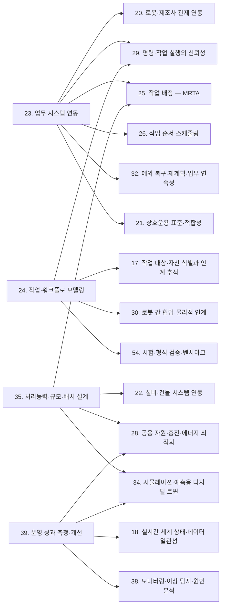

[홈](../../index.md) › A. 기획·사업

# A. 기획·사업

## 핵심 질문

어떤 일을 로봇에게 맡기고, 무엇을 들여, 어떤 효과를 볼 것인가? [분류원문]

## 개요

플랫폼을 들이기 전과 들이는 동안 무엇을 왜 할지 정하는 일. 기술·시장 동향 조사, 사용 사례·요구·책임 범위, 경제성·조달·사업 모델. [분류원문]

## 세부 연구영역

표의 세부 연구영역·무엇을 연구하는가·핵심 질문 열은 원문 그대로이고, 페이지·현재 상태 열은 위키에서 덧붙인 것이다. 현재 상태는 퍼블리셔가 자동으로 갱신한다.

<!-- auto:category-area-table:start -->
| 세부 연구영역 | 무엇을 연구하는가 | 핵심 질문 | 페이지 | 현재 상태 |
|---|---|---|---|---|
| **1. 기술·시장·업체 동향** | 카테고리마다 연구·기사·업체 발표를 모으고, 제품·업체·로봇 종류의 지형을 정리한다 | 어떤 연구·제품·업체가 로봇 오케스트레이션의 흐름을 바꾸고 있는가? | [1. 기술·시장·업체 동향](technology-market-and-vendor-trends.md) | published |
| **2. 사용 사례·요구·책임 범위** | 로봇에게 맡길 일과 현장 유형별 요구, 플랫폼이 직접 맡을 범위와 외부에 맡길 범위를 정한다 | 로봇에게 어떤 일을 맡기고, 플랫폼은 그중 어디까지 직접 책임질 것인가? | [2. 사용 사례·요구·책임 범위](use-cases-requirements-and-scope.md) | published |
| **3. 경제성·조달·사업 모델** | 투자 효과를 따지고, 로봇·플랫폼을 골라 계약하고, 과금 방식을 정한다 | 도입 비용을 넘는 효과가 나오며, 어떤 로봇과 플랫폼을 어떤 조건으로 들일 것인가? | [3. 경제성·조달·사업 모델](economics-procurement-and-business-models.md) | published |

[분류원문]
<!-- auto:category-area-table:end -->

## 이 대분류의 핵심 포인트

핵심은 **로봇 개별 성능과 업무 전체 성과를 구분하는 것**이다. 로봇이 물건을 더 빨리 가져와도 다음 단계가 막히면 대기만 늘어날 수 있다. [분류원문]

## 다른 대분류와의 연결

> **이전 분류 기준 내용.** 아래는 이전 분류(7개 대분류)에서 A. 업무·공급망 설계 페이지에 2026-09-25 작성한 연결이다. 대분류 이름은 그때의 것이고, 링크는 새 영역 페이지로 옮겨 두었다. 새 17개 대분류 기준의 연결은 이어지는 조사에서 다시 쓴다.

A. 업무·공급망 설계가 정한 업무는 다른 여섯 대분류의 세부영역으로 넘어가 실행되고 측정된다. 예를 들어 VDA 5050 은 외부 IT 시스템과의 인터페이스를 범위에서 제외하므로, 상위 주문을 로봇 작업 요청으로 번역하는 계층이 넘겨받는 지점이 될 것으로 보인다. [추정][^ref-031][^ref-125]

아래 연결은 게시된 23. 업무 시스템 연동 ~ 39. 운영 성과 측정·개선 페이지에서 검증된 주장을 근거로 한다. 연결 상대 세부영역은 대부분 아직 심화 조사 전이라, 상대편에 관한 서술도 A. 업무·공급망 설계 쪽 근거에 기댄다. 확인일은 2026-09-25이고, 출처별 발행일은 참고 자료 절의 각주에 있다.

### [옛 B. 공통 정보·환경 모델](../robot-ontology/index.md)

- **[24. 작업·워크플로 모델링](../planning-and-optimization/task-and-workflow-modeling.md) ↔ [17. 작업 대상·자산 식별과 인계 추적](../objects-people-and-live-state/work-object-and-asset-identification-and-handover-tracking.md)** — '운반 완료'와 '인수 확인·재고 반영 완료'를 잇는 신호가 여기서 나온다. GS1 핵심 업무 어휘(Core Business Vocabulary, CBV)는 객체가 위치에 도착하는 arriving, 수령자 재고에 추가되는 receiving, 점유·소유가 바뀌는 accepting 을 서로 다른 업무 단계로 정의한다. [사실][^ref-044] VDA 5050 은 drop 동작의 완료를 적재물이 로봇을 떠나고 로봇이 새 적재 상태를 보고한 때로 정의한다. [사실][^ref-031] 로봇 완료 신호는 arriving 수준의 물리적 인도에 가까우므로, 공정 모델의 '인수 확인·재고 반영 완료' 조건은 17. 작업 대상·자산 식별과 인계 추적이 다루는 식별자와 receiving·accepting 이벤트에 기대야 할 것으로 보인다. [추정][^ref-044][^ref-031][^ref-049] 이 구성을 적용한 표준·사례는 확인하지 못했다([열린 질문](../../open-questions.md) oq-001, oq-012).
- **[39. 운영 성과 측정·개선](../field-operations-and-monitoring/operational-performance-measurement-and-improvement.md) ↔ [18. 실시간 세계 상태·데이터 일관성](../objects-people-and-live-state/real-time-world-state-and-data-consistency.md)** — Open-RMF 로봇 상태 스키마는 상태 값(idle·charging·working·error 등), 0~1 범위의 배터리, 현재 작업 id, 운영자가 대응할 문제 목록, 위치, 기록 시각을 담는다. [사실][^ref-148] 이 필드들은 가동률·충전 시간·오류 시간 같은 성과 지표를 계산하는 원천이 될 것으로 보이며, 이 연결은 현재 상태를 표현하는 18. 실시간 세계 상태·데이터 일관성 쪽에 속한다. [추정][^ref-148]

### [옛 C. 연결·실행 기반](../integration/index.md)

- **[23. 업무 시스템 연동](../integration/business-system-integration.md) ↔ [20. 로봇·제조사 관제 연동](../integration/robot-and-vendor-fleet-manager-integration.md)** — VDA 5050 3.0.0 명세는 관제 시스템과 이동로봇 사이 통신에 해당하지 않는 인터페이스, 곧 주변 설비·인프라·외부 IT 시스템과의 인터페이스를 범위에서 뺀다. [사실][^ref-031] 이처럼 로봇 인터페이스가 상위 시스템 연동을 범위 밖에 두므로, 상위 주문을 로봇 작업 요청(Open-RMF 작업 요청 등)으로 번역하는 계층이 두 대분류가 넘겨받는 지점이 될 것으로 보인다. [추정][^ref-031][^ref-125] 이 번역 계층을 규정한 표준은 확인하지 못했다.
- **[23. 업무 시스템 연동](../integration/business-system-integration.md)·[24. 작업·워크플로 모델링](../planning-and-optimization/task-and-workflow-modeling.md) ↔ [29. 명령·작업 실행의 신뢰성](../execution-collaboration-and-recovery/command-and-task-execution-reliability.md)** — 상위 쪽 변경·취소 명령이 로봇 쪽 실행 상태와 만나는 지점이다. B2MML 거래 프로파일은 CHANGE·CANCEL 등의 거래 동사를 정의한다. [사실][^ref-129] OPC UA for ISA-95 Job Control 은 Update·Pause·Resume·Abort·Cancel 등의 작업 지시 메서드를 정의한다. [사실][^ref-130] 로봇 쪽 VDA 5050 은 주문을 수행하는 중에 다른 주문을 받으면 로봇이 OTHER_ORDER_ACTIVE 오류를 경고(WARNING) 수준으로 보고하게 한다. [사실][^ref-031] 취소할 수 없는 동작은 주문 취소(cancelOrder) 뒤에도 실행 중(RUNNING)을 거쳐 완료(FINISHED) 또는 실패(FAILED)로 보고하게 한다. [사실][^ref-031] Open-RMF 작업 상태 스키마는 queued·underway·completed·canceled·killed·failed 등의 상태 값, 시작·종료 시각, 소요 시간 추정, 취소·강제 종료·중단 요청 기록을 담는다. [사실][^ref-111] 이 기록은 두 세부영역이 상위 시스템에 되돌려 줄 결과의 원천이 될 것으로 보인다. [추정][^ref-111]
- **[35. 처리능력·규모·배치 설계](../design-and-simulation/capacity-sizing-and-layout-design.md) ↔ [22. 설비·건물 시스템 연동](../integration/facility-and-building-system-integration.md)** — Open-RMF 데모의 호텔 환경은 승강기 2대, 여러 문, 3개 플릿(로봇 4대)이 다층 건물에서 함께 일하는 구성을 보이고, 공간과 승강기·문 같은 건물 설비를 공유하는 로봇의 교통 관리를 설명한다. [사실][^ref-104] 병원 약품 배송 로봇 사례에서는 승강기 가동률이 높을수록 배송 실패가 많고 배송 시간이 길었다. [사실][^ref-060] 다층 호텔의 배송 로봇 연구는 승강기를 경로 계획 안의 대기·운행 시간으로 모델링했다. [사실][^ref-103] 두 사례는 병원·호텔이며 물류센터 적용 여부는 미확인이다([열린 질문](../../open-questions.md) oq-010). 35. 처리능력·규모·배치 설계은 승강기를 처리능력의 제약 입력으로만 받는다. 승강기 제어 자체는 분류 원문 19장의 시설·설비 제어 경계에 따라 연계 대상이며, ROP 는 22. 설비·건물 시스템 연동을 통해 작업 요청·예약·상태 확인을 맡는다.

### [옛 D. 계획·최적화](../planning-and-optimization/index.md)

- **[23. 업무 시스템 연동](../integration/business-system-integration.md) ↔ [26. 작업 순서·스케줄링](../planning-and-optimization/task-sequencing-and-scheduling.md)** — 웨이브·웨이브리스 출고 지시 정책 연구(Gallien·Weber, 2010)와 동적으로 도착하는 주문의 피킹 재최적화 연구(Lorenz 외, 2025)는 상위 시스템의 출고 지시·우선순위 변경이 작업 순서 결정 문제로 넘어가는 지점을 다루는 것으로 보인다. [추정][^ref-134][^ref-133]
- **[23. 업무 시스템 연동](../integration/business-system-integration.md) ↔ [25. 작업 배정 — MRTA](../planning-and-optimization/task-allocation-mrta.md)** — 작업자가 피킹하고 자율이동로봇(Autonomous Mobile Robot, AMR)이 운반하는 동적 주문 피킹 연구(2025)는 AMR 가용성에 따른 개입 전략을 다룬다. [추정][^ref-132] 이 연구는 주문 변경과 로봇 배정이 맞물리는 사례가 될 것으로 보인다. [추정][^ref-132]
- **[35. 처리능력·규모·배치 설계](../design-and-simulation/capacity-sizing-and-layout-design.md) ↔ [25. 작업 배정 — MRTA](../planning-and-optimization/task-allocation-mrta.md)** — Open-RMF 플릿 어댑터 템플릿 설정은 배터리가 recharge_threshold(예시값 0.10) 아래로 내려간 로봇에게 작업을 맡기지 않게 한다. [사실][^ref-105] 또 충전 목표(recharge_soc), 로봇별 충전기, 작업 종료 후 동작(park·charge·nothing)을 둔다. [사실][^ref-105]
- **[35. 처리능력·규모·배치 설계](../design-and-simulation/capacity-sizing-and-layout-design.md) ↔ [28. 공용 자원·충전·에너지 최적화](../planning-and-optimization/shared-resource-charging-and-energy-optimization.md)** — AMR 물류센터 시뮬레이션 연구(2025)에서는 충전기가 부족하면 큰 지연이, 남으면 불필요한 비용이 생겼다. [사실][^ref-102] 로봇 이동형 풀필먼트 시스템(Robotic Mobile Fulfillment System, RMFS)의 충전·배터리 교환 전략을 비교한 연구(2018)도 있다. [사실][^ref-098]
- **[39. 운영 성과 측정·개선](../field-operations-and-monitoring/operational-performance-measurement-and-improvement.md) ↔ [28. 공용 자원·충전·에너지 최적화](../planning-and-optimization/shared-resource-charging-and-energy-optimization.md)** — Omega(2024)에 실린 연구는 RMFS 에서 동적 우선순위 규칙이 선착순보다 에너지 소비를 3.41% 줄이고 처리량을 26.07% 높였다고 보고했다. [사실][^ref-146] 이 수치는 모델·시뮬레이션 조건의 저자 보고값이며 현장 실측이 아니다. [사실][^ref-146]

### [옛 E. 협업·현장 운영](../execution-collaboration-and-recovery/index.md)

- **[23. 업무 시스템 연동](../integration/business-system-integration.md) ↔ [32. 예외 복구·재계획·업무 연속성](../execution-collaboration-and-recovery/exception-recovery-replanning-and-business-continuity.md)** — 상위 시스템의 취소(CANCEL)가 로봇이 화물을 이미 실은 뒤에 오거나, 취소할 수 없는 동작이 끝까지 수행될 수 있다. [추정][^ref-031][^ref-129] 이 경우 되돌림 작업과 재고 반영이 복구·재계획 과제로 넘어갈 것으로 보인다. [추정][^ref-031][^ref-129] 되돌림 규칙을 정한 표준·사례는 확인하지 못했다([열린 질문](../../open-questions.md) oq-021).
- **[24. 작업·워크플로 모델링](../planning-and-optimization/task-and-workflow-modeling.md) ↔ [30. 로봇 간 협업·물리적 인계](../execution-collaboration-and-recovery/robot-to-robot-collaboration-and-physical-handover.md)** — 공정 모델이 완료 조건으로 삼을 수 있는 인계 확인 신호가 여기에 있다. Open-RMF 배송 작업에서 로봇은 하역 지점의 워크셀(workcell)에 IngestorRequest 를 보내고, IngestorResult 를 받을 때까지 이를 반복한다. [사실][^ref-023] IngestorResult 는 시각, 요청 id, 워크셀 id, 상태(ACKNOWLEDGED·SUCCESS·FAILED)를 담는다. [사실][^ref-049]
- **[39. 운영 성과 측정·개선](../field-operations-and-monitoring/operational-performance-measurement-and-improvement.md) ↔ [38. 모니터링·이상 탐지·원인 분석](../field-operations-and-monitoring/monitoring-anomaly-detection-and-root-cause-analysis.md)** — 제조 처리량의 병목 탐지 방법을 검토한 문헌(2023)과 창고 이벤트 로그에 프로세스 마이닝을 적용한 사례(2015)가 있다. [추정][^ref-115][^ref-149] 이를 로봇 상태 기록에 적용하면 성과 분석과 이상·원인 분석이 같은 로그를 공유할 것으로 보인다. [추정][^ref-115][^ref-149][^ref-148] 이런 적용 연구는 확인하지 못했다([열린 질문](../../open-questions.md) oq-018).

### [옛 F. 도입·검증·유지관리](../verification-deployment-and-lifecycle/index.md)

- **[24. 작업·워크플로 모델링](../planning-and-optimization/task-and-workflow-modeling.md) ↔ [54. 시험·형식 검증·벤치마크](../verification-deployment-and-lifecycle/testing-formal-verification-and-benchmarking.md)** — 워크플로 넷의 건전성(soundness) 판정 복잡도를 다룬 연구(2022)가 있다. [추정][^ref-121] 따라서 공정 모델의 형식적 설계 점검은 형식 검증과 이어질 것으로 보인다. [추정][^ref-121] 물류 로봇 공정에 적용한 사례는 확인하지 못했다.
- **[35. 처리능력·규모·배치 설계](../design-and-simulation/capacity-sizing-and-layout-design.md) ↔ [34. 시뮬레이션·예측용 디지털 트윈](../design-and-simulation/simulation-and-predictive-digital-twin.md)** — RAWSim-O 는 RMFS 운영의 여러 결정 문제가 미치는 효과를 연구하기 위한 이산 사건 시뮬레이션이다. [사실][^ref-101] 이런 도구는 증차·증설처럼 가정한 미래를 실험하는 데 쓰일 것으로 보인다. [추정][^ref-101]
- **[39. 운영 성과 측정·개선](../field-operations-and-monitoring/operational-performance-measurement-and-improvement.md) ↔ [34. 시뮬레이션·예측용 디지털 트윈](../design-and-simulation/simulation-and-predictive-digital-twin.md)** — 우선순위 정책이나 충전 대안을 운영 전에 비교하는 일은 가정한 미래를 실험하는 34. 시뮬레이션·예측용 디지털 트윈 쪽 일이다. 이 일은 현재 상태를 표현하는 18. 실시간 세계 상태·데이터 일관성과 역할을 나눠 연결될 것으로 보인다. [추정][^ref-146][^ref-102]

### [옛 G. 안전·보안·지능·거버넌스](../governance-law-and-society/index.md)

- **[23. 업무 시스템 연동](../integration/business-system-integration.md) ↔ [21. 상호운용 표준·적합성](../integration/interoperability-standards-and-conformance.md)** — ISA-95 계열의 작업 지시 동사·메서드와 VDA 5050·Open-RMF 의 주문·작업 요청을 잇는 표준 매핑은 이번 조사 범위에서 확인되지 않았다. 그래서 번역 규칙을 누가 소유하고 누가 변경을 승인하는지가 상호운용성 거버넌스 과제로 넘어갈 것으로 보인다. [추정][^ref-129][^ref-130][^ref-031][^ref-125] 관련 질문은 [열린 질문](../../open-questions.md) oq-020 이다.

### 아직 다루지 않은 연결

42. 분산 시스템·통신·컴퓨팅 구조, 55. 현장 조사·설치·시운전, 57. 자산·소프트웨어 수명주기 관리, 48. 안전·위험 관리, 51. 인증·권한·격리, 47. AI·학습·적응과 모델 운영과의 연결은 검증된 근거가 아직 없어 싣지 않았다. 해당 세부영역의 조사가 게시되면 보강한다.

## 이 대분류의 자료

<!-- auto:category-sources:start -->
이 대분류의 페이지가 인용했거나 이 대분류 영역과 연결된 출처는 모두 68건이다(논문 19건 · 기사·보고서 23건 · 업체 발표 2건 · 표준·오픈소스·기관 자료 24건). 유형은 참고문헌의 출처 유형을 따르며, 업체 발표는 '벤더 문서' 유형이다. 묶음마다 발행일이 최근인 것부터 10건까지 보이고, 전체 목록은 [참고문헌](../../references/index.md)에 있다.

**논문**

- [ref-1104](../../references/ref-1104.md) — Friese, C., Klebbe, R., & Heimann-Steinert, A. (JMIR Nursing), Nurses' Evaluation of a Service Robot for Inpatient Care: Technology Acceptance Study (발행 2026-04-14)
- [ref-1161](../../references/ref-1161.md) — Li, M., Liu, X., Gao, Y., Sun, Y., Li, P., Zhou, L., Wei, M., & Li, L. (Scientific Reports 16), Application management and effectiveness analysis of intelligent logistics robots in hospital drug and specimen delivery scenarios (발행 2026-04)
- [ref-060](../../references/ref-060.md) — Lee, Y. 외(Digital Health), Feasibility of autonomous medication delivery robots considering elevator utilization in high-traffic hospital environments (발행 2026)
- [ref-1160](../../references/ref-1160.md) — Lee, J. S., & Aswani, A. (arXiv), Profit Maximization for a Robotics-as-a-Service Model (발행 2025-09-30)
- [ref-165](../../references/ref-165.md) — Autonomous Robots 게재 서베이(arXiv 2502.03814) 저자, Large Language Models for Multi-Robot Systems: A Survey (발행 2025-02)
- [ref-133](../../references/ref-133.md) — Lorenz, Otto, & Gendreau (Networks, Wiley), Picking Operations in Warehouses With Dynamically Arriving Orders: How Good is Reoptimization? (발행 2025)
- [ref-132](../../references/ref-132.md) — Yu, S., & Srinivas, S., Collaborative Human–Robot Teaming for Dynamic Order Picking: Interventionist strategies for improving warehouse intralogistics operations (발행 2025)
- [ref-102](../../references/ref-102.md) — Springer(FAIM 2025 발표 논문, 저자 미확인), Simulation-Driven Approach for Dimensioning AMR Fleets in Distribution Centre Logistics (발행 2025)
- [ref-1162](../../references/ref-1162.md) — Sivalingam, C. S., & Subramaniam, S. K. (Heliyon), Cobot selection using hybrid AHP-TOPSIS based multi-criteria decision making technique for fuel filter assembly process (발행 2024-02-15)
- [ref-146](../../references/ref-146.md) — Omega 게재 논문(저자 미확인), The role of energy consumption in robotic mobile fulfillment systems: Performance evaluation and operating policies with dynamic priority (발행 2024)
- 그 밖에 9건

**기사·보고서**

- [ref-909](../../references/ref-909.md) — 서울신문, 부품 배치 '척척' 무거운 짐도 '사뿐'… 아틀라스 2.5만대 로봇 학교 간다 (발행 2026-09-23)
- [ref-908](../../references/ref-908.md) — 아시아경제, CJ대한통운, 물류업계 최초 AI 휴머노이드 상용화 '첫발' (발행 2026-09-03)
- [ref-1170](../../references/ref-1170.md) — Modern Materials Handling (Bridget McCrea; Peerless Research Group·MHI 조사), 2026 Intralogistics Robotics Survey: Robotics moves into the mainstream (발행 2026-06-01)
- [ref-901](../../references/ref-901.md) — International Federation of Robotics (IFR), Robot Density Surges in Europe, Asia, and Americas (발행 2026-04-08)
- [ref-1200](../../references/ref-1200.md) — 아시아경제, 호텔 룸서비스도 카카오모빌리티 로봇이…"가동률 ... (제목 일부만 확인) (발행 2026-03-16)
- [ref-903](../../references/ref-903.md) — 로봇신문 (한국로봇산업진흥원 '2024년 국내 로봇산업 실태조사 결과 보고서' 요약), [Cover Story] '2024년 국내 로봇산업 실태 조사 결과 보고서' 요약 (발행 2026-01-25)
- [ref-902](../../references/ref-902.md) — International Federation of Robotics (IFR), Top 5 Global Robotics Trends 2026 (발행 2026-01-08)
- [ref-1166](../../references/ref-1166.md) — 전자신문, 조달청, 2026년 혁신제품 시범구매 기본계획 발표 (발행 2025-12-18)
- [ref-870](../../references/ref-870.md) — 로봇신문, [기업 최전선을 가다-클로봇] 로봇 소프트웨어로 쓰는 ‘피지컬 AI’ 시대의 서막 (발행 2025-11-09)
- [ref-899](../../references/ref-899.md) — International Federation of Robotics (IFR), World Robotics 2025 report – SERVICE ROBOTS – released by IFR (발행 2025-10-07)
- 그 밖에 13건

**업체 발표**

- [ref-906](../../references/ref-906.md) — Agility Robotics, Digit Moves Over 100,000 Totes in Commercial Deployment (발행 2025-11-20)
- [ref-1163](../../references/ref-1163.md) — AutoStore, Buying vs. RaaS: What's the Best Strategy for Investing in Warehouse Robotics? (발행 미확인)

**표준·오픈소스·기관 자료**

- [ref-872](../../references/ref-872.md) — Changi General Hospital, Centre for Healthcare Assistive & Robotics Technology (CHART), RoMi-H Empanelment Programme 2025 (발행 2025-05-01)
- [ref-1158](../../references/ref-1158.md) — Messina, E. & Saidi, K. S. (NIST, National Institute of Standards and Technology), Research Opportunities for Advancing Measurement Science for Manufacturing Robotics (NIST GCR 24-054) (발행 2024-06-07)
- [ref-130](../../references/ref-130.md) — OPC Foundation, UA-Nodeset ISA95-JOBCONTROL — opc.ua.isa95-jobcontrol.nodeset2 (NodeSet2.xml·documentation.csv) (발행 2024-01-31)
- [ref-991](../../references/ref-991.md) — 대한민국 정책브리핑 (산업통상자원부·경찰청), ‘실외이동로봇’ 보도 통행 가능해진다…배달·순찰 등 활용 (발행 2023-11-16)
- [ref-129](../../references/ref-129.md) — MESA International, B2MML-BatchML/Schema/B2MML-TransactionProfile.xsd (발행 2023)
- [ref-044](../../references/ref-044.md) — GS1, gs1/EPCIS — Ontology/CBV.ttl (Core Business Vocabulary ontology 2.0) (발행 2021-09-30)
- [ref-1195](../../references/ref-1195.md) — 산업통상자원부 (KDI 경제정보센터 게재), 로봇활용 표준공정모델로 제조산업 전 분야에 로봇보급 본격 착수 (발행 2020-06-25)
- [ref-1203](../../references/ref-1203.md) — ISO / IEC / IEEE, ISO/IEC/IEEE 29148:2018 Systems and software engineering — Life cycle processes — Requirements engineering (발행 2018)
- [ref-1167](../../references/ref-1167.md) — IEC (International Electrotechnical Commission), IEC 60300-3-3:2017 Dependability management - Part 3-3: Application guide - Life cycle costing (발행 2017-01-27)
- [ref-947](../../references/ref-947.md) — 한국로봇산업진흥원, 서비스로봇 실증사업 (발행 미확인)
- 그 밖에 14건
<!-- auto:category-sources:end -->

## 최근 업데이트

<!-- auto:category-recent:start -->
- 2026-09-30 · 갱신 · [3. 경제성·조달·사업 모델](economics-procurement-and-business-models.md) — 섹션 3~11 신규 작성(현장 유형 사례 5건: 물류창고·제조 공장·병원 2·상업 시설, 표준·제도 6건, 자료 8건, 경계 2행, 연결 16개, 열린 질문 9건), 프런트매터 채움, 13절 각주. 2차: 3절 첫 문장을 설문 범위로 한정, ref-031 접근일 2026-09-30 (실행 2026-09-30-19)
- 2026-09-30 · 생성 · [3. 경제성·조달·사업 모델 — 대표 접근법과 기술](../../topics/2026/2026-09-30-area03-s6.md) — 자동 분리: 3. 경제성·조달·사업 모델 의 "6. 대표 접근법과 기술" 절(1,380자)을 옮겼다. 2차: ref-031 접근일 2026-09-30 (실행 2026-09-30-19)
- 2026-09-30 · 생성 · [3. 경제성·조달·사업 모델 — 대표 연구와 자료](../../topics/2026/2026-09-30-area03-s8.md) — 자동 분리: 3. 경제성·조달·사업 모델 의 "8. 대표 연구와 자료" 절(1,281자)을 옮겼다 (실행 2026-09-30-19)
- 2026-09-30 · 생성 · [3. 경제성·조달·사업 모델 — 열린 질문](../../topics/2026/2026-09-30-area03-s11.md) — 자동 분리: 3. 경제성·조달·사업 모델 의 "11. 열린 질문" 절(1,265자)을 옮겼다 (실행 2026-09-30-19)
- 2026-09-30 · 생성 · [3. 경제성·조달·사업 모델 — 다른 연구영역과의 연결](../../topics/2026/2026-09-30-area03-s10.md) — 자동 분리: 3. 경제성·조달·사업 모델 의 "10. 다른 연구영역과의 연결 (번호와 이름을 함께 표기)" 절(1,106자)을 옮겼다. 2차: ref-031 접근일 2026-09-30 (실행 2026-09-30-19)
<!-- auto:category-recent:end -->

## 참고 자료

[^ref-023]: Open Robotics, Workcells - Programming Multiple Robots with ROS 2, 미확인, https://osrf.github.io/ros2multirobotbook/integration_workcells.html, 접근일 2026-09-25
[^ref-031]: VDA / VDMA (VDA5050 GitHub), VDA5050/VDA5050_EN.md — Official Specification document for the VDA 5050, 미확인, https://github.com/VDA5050/VDA5050/blob/main/VDA5050_EN.md, 접근일 2026-09-25
[^ref-044]: GS1, gs1/EPCIS — Ontology/CBV.ttl (Core Business Vocabulary ontology 2.0), 2021-09-30, https://github.com/gs1/EPCIS/blob/master/Ontology/CBV.ttl, 접근일 2026-09-25
[^ref-049]: Open Robotics (open-rmf), rmf_internal_msgs — rmf_ingestor_msgs/msg/IngestorResult.msg, 미확인, https://github.com/open-rmf/rmf_internal_msgs/blob/main/rmf_ingestor_msgs/msg/IngestorResult.msg, 접근일 2026-09-25
[^ref-060]: Lee, Y. 외(Digital Health), Feasibility of autonomous medication delivery robots considering elevator utilization in high-traffic hospital environments, 2026, https://doi.org/10.1177/20552076261437181, 접근일 2026-09-25 (원문 미열람)
[^ref-098]: Zou, B., Gong, Y., de Koster, R., & Xu, X., Evaluating battery charging and swapping strategies in a robotic mobile fulfillment system, 2018, https://www.sciencedirect.com/science/article/abs/pii/S0377221717310901, 접근일 2026-09-25 (원문 미열람)
[^ref-101]: Merschformann, M. (RAWSim-O GitHub), RAWSim-O: A simulation framework for Robotic Mobile Fulfillment Systems (README), 미확인, https://github.com/merschformann/RAWSim-O, 접근일 2026-09-25
[^ref-102]: Springer(FAIM 2025 발표 논문, 저자 미확인), Simulation-Driven Approach for Dimensioning AMR Fleets in Distribution Centre Logistics, 2025, https://link.springer.com/chapter/10.1007/978-3-032-07675-5_69, 접근일 2026-09-25 (원문 미열람)
[^ref-103]: PMC 게재 논문(저자 미확인), The Path Planning Problem of Robotic Delivery in Multi-Floor Hotel Environments, 미확인, https://pmc.ncbi.nlm.nih.gov/articles/PMC11946681/, 접근일 2026-09-25 (원문 미열람)
[^ref-104]: Open Robotics (open-rmf), rmf_demos — Demonstrations of Open-RMF (README), 미확인, https://github.com/open-rmf/rmf_demos, 접근일 2026-09-25
[^ref-105]: Open Robotics (open-rmf), fleet_adapter_template — fleet_adapter_template/config.yaml, 미확인, https://github.com/open-rmf/fleet_adapter_template/blob/main/fleet_adapter_template/config.yaml, 접근일 2026-09-25
[^ref-111]: Open Robotics (open-rmf), rmf_api_msgs — rmf_api_msgs/schemas/task_state.json, 미확인, https://github.com/open-rmf/rmf_api_msgs/blob/main/rmf_api_msgs/schemas/task_state.json, 접근일 2026-09-25
[^ref-115]: Production & Manufacturing Research 게재 논문(저자 미확인, Chalmers 공개본), Throughput bottleneck detection in manufacturing: a systematic review of the literature on methods and operationalization modes, 2023, https://www.tandfonline.com/doi/full/10.1080/21693277.2023.2283031, 접근일 2026-09-25 (원문 미열람)
[^ref-121]: Blondin, M., Mazowiecki, F., & Offtermatt, P. (LICS 2022), The complexity of soundness in workflow nets, 2022, https://arxiv.org/abs/2201.05588, 접근일 2026-09-25 (원문 미열람)
[^ref-125]: Open Robotics (open-rmf), rmf_api_msgs — rmf_api_msgs/schemas/task_request.json, 미확인, https://github.com/open-rmf/rmf_api_msgs/blob/main/rmf_api_msgs/schemas/task_request.json, 접근일 2026-09-25 (원문 미열람)
[^ref-129]: MESA International, B2MML-BatchML/Schema/B2MML-TransactionProfile.xsd, 2023, https://github.com/MESAInternational/B2MML-BatchML/blob/master/Schema/B2MML-TransactionProfile.xsd, 접근일 2026-09-25
[^ref-130]: OPC Foundation, UA-Nodeset ISA95-JOBCONTROL — opc.ua.isa95-jobcontrol.nodeset2 (NodeSet2.xml·documentation.csv), 2024-01-31, https://github.com/OPCFoundation/UA-Nodeset/tree/latest/ISA95-JOBCONTROL, 접근일 2026-09-25
[^ref-132]: Yu, S., & Srinivas, S., Collaborative Human–Robot Teaming for Dynamic Order Picking: Interventionist strategies for improving warehouse intralogistics operations, 2025, https://www.sciencedirect.com/science/article/abs/pii/S1366554525001231, 접근일 2026-09-25 (원문 미열람)
[^ref-133]: Lorenz, Otto, & Gendreau (Networks, Wiley), Picking Operations in Warehouses With Dynamically Arriving Orders: How Good is Reoptimization?, 2025, https://onlinelibrary.wiley.com/doi/full/10.1002/net.22281, 접근일 2026-09-25 (원문 미열람)
[^ref-134]: Gallien, J., & Weber, T. G., To Wave or Not to Wave? Order Release Policies for Warehouses with an Automated Sorter, 2010, https://pubsonline.informs.org/doi/abs/10.1287/msom.1100.0291, 접근일 2026-09-25 (원문 미열람)
[^ref-146]: Omega 게재 논문(저자 미확인), The role of energy consumption in robotic mobile fulfillment systems: Performance evaluation and operating policies with dynamic priority, 2024, https://www.sciencedirect.com/science/article/abs/pii/S0305048324001336, 접근일 2026-09-25 (원문 미열람)
[^ref-148]: Open Robotics (open-rmf), rmf_api_msgs — rmf_api_msgs/schemas/robot_state.json, 미확인, https://github.com/open-rmf/rmf_api_msgs/blob/main/rmf_api_msgs/schemas/robot_state.json, 접근일 2026-09-25
[^ref-149]: Springer(학술대회 발표 논문, 저자 미확인), Material Movement Analysis for Warehouse Business Process Improvement with Process Mining: A Case Study, 2015, https://link.springer.com/chapter/10.1007/978-3-319-19509-4_9, 접근일 2026-09-25 (원문 미열람)
