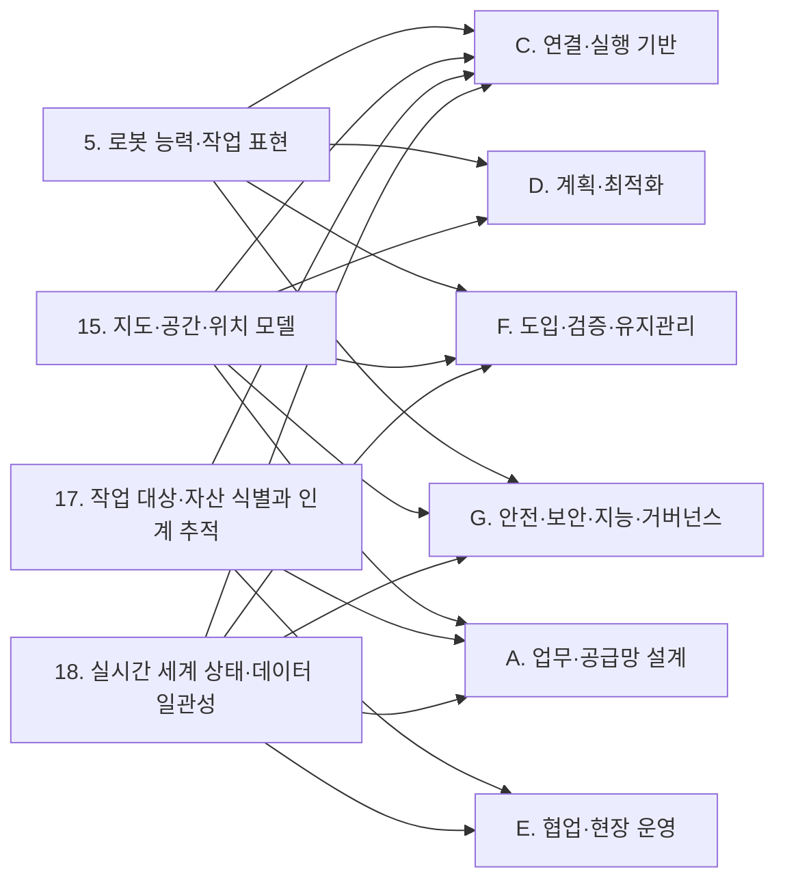

[홈](../../index.md) › B. 로봇 온톨로지

# B. 로봇 온톨로지

## 핵심 질문

서로 다른 제조사의 로봇을 어떻게 등록하고, 할 수 있는 일을 같은 말로 표현해, 시스템과 쉽게 연결할 것인가? [분류원문]

## 개요

서로 다른 제조사의 로봇을 등록하고, 무엇을 할 수 있는지 공통 모델로 표현하고, 그 모델로 시스템과 로봇이 쉽게 연동되게 하는 온톨로지 기능 전체. [분류원문]

## 세부 연구영역

표의 세부 연구영역·무엇을 연구하는가·핵심 질문 열은 원문 그대로이고, 페이지·현재 상태 열은 위키에서 덧붙인 것이다. 현재 상태는 퍼블리셔가 자동으로 갱신한다.

<!-- auto:category-area-table:start -->
| 세부 연구영역 | 무엇을 연구하는가 | 핵심 질문 | 페이지 | 현재 상태 |
|---|---|---|---|---|
| **4. 이기종 로봇 등록** | 서로 다른 제조사의 로봇을 문서 근거와 함께 등록하고, 사람이 검토·승인한다 | 제조사도 형식도 다른 로봇을 어떻게 빠르고 믿을 수 있게 등록할 것인가? | [4. 이기종 로봇 등록](heterogeneous-robot-registration.md) | published |
| **5. 로봇 능력·작업 표현** | 능력·작업 요구·환경 조건을 공통 어휘로 표현하고 기존 표준과 맞춘다 | 로봇이 할 수 있는 일과 작업이 요구하는 조건을 어떻게 같은 말로 표현할 것인가? | [5. 로봇 능력·작업 표현](robot-capability-and-task-representation.md) | published |
| **6. 온톨로지 기반 시스템·로봇 연동** | 온톨로지로 수행 가능한 로봇을 찾고, 능력을 실제 명령에 묶고, 연동 설정을 자동으로 만든다 | 온톨로지를 이용해 새 로봇과 새 시스템을 손작업 없이 어떻게 연동할 것인가? | [6. 온톨로지 기반 시스템·로봇 연동](ontology-based-system-and-robot-integration.md) | published |
| **7. 온톨로지 검증·변경 관리** | 온톨로지가 빠짐없고 정확한지 검증하고, 문서·펌웨어가 바뀔 때 버전을 관리한다 | 온톨로지가 빠짐없고 정확한지, 문서가 바뀌면 무엇을 다시 확인할지 어떻게 알 것인가? | [7. 온톨로지 검증·변경 관리](ontology-verification-and-change-management.md) | seed |

[분류원문]
<!-- auto:category-area-table:end -->

## 이 대분류의 핵심 포인트

같은 기능도 제조사마다 이름·매개변수·실행 조건이 다르다. **능력을 공통 모델로 표현해야** 작업에 맞는 로봇을 질의로 찾고, 새 로봇을 연동할 때 반복 작업을 줄일 수 있다. [분류원문]

## 다른 대분류와의 연결

> **이전 분류 기준 내용.** 아래는 이전 분류(7개 대분류)에서 B. 공통 정보·환경 모델 페이지에 2026-09-25 작성한 연결이다. 대분류 이름은 그때의 것이고, 링크는 새 영역 페이지로 옮겨 두었다. 새 17개 대분류 기준의 연결은 이어지는 조사에서 다시 쓴다.

이 절은 B. 공통 정보·환경 모델의 게시된 세부영역 페이지(5. 로봇 능력·작업 표현, 15. 지도·공간·위치 모델, 17. 작업 대상·자산 식별과 인계 추적, 18. 실시간 세계 상태·데이터 일관성)의 검증된 주장과 각주를 근거로, 이 대분류의 모델이 다른 대분류의 어느 세부영역과 무엇으로 이어지는지 정리한다. 연결 상대 세부영역 가운데 상당수는 아직 본문이 없으므로, 연결의 근거는 이 대분류 쪽 자료에 기댄다.

### [옛 A. 업무·공급망 설계](../planning-and-business/index.md)

- [15. 지도·공간·위치 모델](../space-and-map-model/map-space-and-location-model.md) ↔ [23. 업무 시스템 연동](../integration/business-system-integration.md): GS1 GLN 은 도크 문·보관 위치 같은 하위 위치를 식별할 수 있고 GLN 확장 요소는 조직 내부나 거래 당사자 간 합의로만 쓰므로, 업무 위치와 로봇 지도 장소의 대응은 ROP 쪽 대응 계층이 맡게 될 것으로 보인다. [추정][^ref-162][^ref-031] 국내 사례는 [열린 질문](../../open-questions.md) oq-029 에서 다룬다.
- [17. 작업 대상·자산 식별과 인계 추적](../objects-people-and-live-state/work-object-and-asset-identification-and-handover-tracking.md) ↔ [24. 작업·워크플로 모델링](../planning-and-optimization/task-and-workflow-modeling.md): GS1 CBV 는 도착(arriving)·입고(receiving)·인수(accepting)를 서로 다른 업무 단계로 정의하고, VDA 5050 은 하역(drop) 완료를 적재물이 로봇을 떠나 로봇이 새 적재 상태를 보고한 때로 정의한다. [사실][^ref-044][^ref-031] 같은 연결은 [A. 업무·공급망 설계](../planning-and-business/index.md) 페이지의 다른 대분류와의 연결 절에도 같은 각주로 실려 있다.
- [18. 실시간 세계 상태·데이터 일관성](../objects-people-and-live-state/real-time-world-state-and-data-consistency.md) ↔ [39. 운영 성과 측정·개선](../field-operations-and-monitoring/operational-performance-measurement-and-improvement.md): Open-RMF 로봇 상태 스키마는 상태(idle·charging·working·error 등), 배터리, 현재 작업 id, 문제 목록, 위치, 기록 시각을 담는다. [사실][^ref-148] 이 필드들은 가동률·충전·오류 시간 지표의 원천이 될 것으로 보인다. [추정][^ref-148] 이 연결도 [A. 업무·공급망 설계](../planning-and-business/index.md) 페이지와 같은 각주를 쓴다.

### [옛 C. 연결·실행 기반](../integration/index.md)

- [5. 로봇 능력·작업 표현](robot-capability-and-task-representation.md) ↔ [20. 로봇·제조사 관제 연동](../integration/robot-and-vendor-fleet-manager-integration.md): VDA 5050 팩트시트는 적재 명세(loadSets: 적재 유형·최대 중량·처리 높이·픽·드롭 소요 시간)와 지원 동작(mobileRobotActions)을 선언하고, Open-RMF 플릿 어댑터 템플릿 설정은 수행 가능한 작업 유형(task_capabilities)과 동작 이름(actions)을 선언한다. [사실][^ref-228][^ref-105] 두 자료는 서로 다른 인터페이스의 사례다.
- [5. 로봇 능력·작업 표현](robot-capability-and-task-representation.md) ↔ [29. 명령·작업 실행의 신뢰성](../execution-collaboration-and-recovery/command-and-task-execution-reliability.md): 팩트시트에서 선언한 동작 이름(actionType)이 명령과 완료 보고에 그대로 쓰이고 Open-RMF 어댑터가 로봇 API 의 완료 확인 뒤 완료를 알리므로, 능력 선언이 실행 확인의 기준 어휘가 될 것으로 보인다. [추정][^ref-228][^ref-040]
- [15. 지도·공간·위치 모델](../space-and-map-model/map-space-and-location-model.md) ↔ [20. 로봇·제조사 관제 연동](../integration/robot-and-vendor-fleet-manager-integration.md): Open-RMF 플릿 어댑터는 로봇 좌표계가 RMF 와 다르면 같은 위치를 가리키는 좌표 쌍으로 회전·축척·이동 변환을 추정하며(대응점 4개 이상 권장), 템플릿 설정은 층별 reference_coordinates 로 이 좌표 쌍을 둔다. [사실][^ref-153][^ref-105] 이 작업은 용어집의 [지도 정합](../../glossary/map-alignment.md)에 해당한다. VDA 5050 상태 스키마는 위치추정 품질(localizationScore), 편차 범위(deviationRange), 지도 식별자(mapId)를 두며, 편차를 추정할 수 없는 로봇은 편차 범위를 생략할 수 있다. [사실][^ref-051] 그래서 위치 신뢰도 보고가 제조사 구현에 따라 달라질 수 있다. [추정][^ref-051] 수용 기준은 열린 질문 oq-028 에서 다룬다.
- [15. 지도·공간·위치 모델](../space-and-map-model/map-space-and-location-model.md) ↔ [22. 설비·건물 시스템 연동](../integration/facility-and-building-system-integration.md): Open-RMF 승강기 상태는 층을 층 이름 문자열(available_floors, current_floor, destination_floor)로 나타내므로, 지도의 층 이름과 승강기의 층 이름을 맞추는 대응이 두 대분류 사이에 필요할 것으로 보인다. [추정][^ref-286][^ref-079] 이 대응 규칙은 새 열린 질문으로 올렸고, 공통 좌표계 대응(oq-027)·업무 위치 대응(oq-029)과 함께 본다.
- [17. 작업 대상·자산 식별과 인계 추적](../objects-people-and-live-state/work-object-and-asset-identification-and-handover-tracking.md) ↔ [20. 로봇·제조사 관제 연동](../integration/robot-and-vendor-fleet-manager-integration.md): VDA 5050 상태 스키마의 적재물 목록(loads)은 로봇이 취급 중인 적재물을 담되 적재 상태를 판단할 수 없는 로봇은 생략할 수 있고, 적재물 식별 번호(loadId)는 바코드·RFID 같은 식별 값이며 아직 식별하지 않았으면 비워 둔다. [사실][^ref-051]
- [17. 작업 대상·자산 식별과 인계 추적](../objects-people-and-live-state/work-object-and-asset-identification-and-handover-tracking.md) ↔ [22. 설비·건물 시스템 연동](../integration/facility-and-building-system-integration.md): Open-RMF 배송 작업에서 로봇은 픽업 지점 워크셀에서 DispenserResult 를, 하역 지점 워크셀에서 IngestorResult 를 받을 때까지 요청을 되풀이한다. [사실][^ref-023] IngestorResult 는 시각, 요청 id, 워크셀 id, 상태(ACKNOWLEDGED·SUCCESS·FAILED)를 담는다. [사실][^ref-049]
- [18. 실시간 세계 상태·데이터 일관성](../objects-people-and-live-state/real-time-world-state-and-data-consistency.md) ↔ [22. 설비·건물 시스템 연동](../integration/facility-and-building-system-integration.md): Open-RMF 문·승강기 상태 메시지는 시각 필드(door_time, lift_time)를 담고, 승강기 어댑터는 적절하다고 판단한 요청만 승강기에 전달한다. [사실][^ref-285][^ref-286][^ref-284] 상태 발행 주기나 오래됨 판정 규칙은 이번에 연 승강기 연동 문서 범위에서는 찾지 못했다. [추정][^ref-284]
- [18. 실시간 세계 상태·데이터 일관성](../objects-people-and-live-state/real-time-world-state-and-data-consistency.md) ↔ [42. 분산 시스템·통신·컴퓨팅 구조](../platform-architecture-and-infrastructure/distributed-systems-communication-and-computing.md): ROS 2 QoS 의 기한·생존성 정책, Sparkplug 의 노드 종료(NDEATH) 뒤 지표 STALE 표시, VDA 5050 의 MQTT 유언을 통한 연결 끊김 통지처럼 통신 계층에도 상태의 오래됨을 알리는 장치가 있다. [사실][^ref-282][^ref-287][^ref-031] 세 출처는 각각 한 장치만 다룬다.

### [옛 D. 계획·최적화](../planning-and-optimization/index.md)

- [5. 로봇 능력·작업 표현](robot-capability-and-task-representation.md) ↔ [25. 작업 배정 — MRTA](../planning-and-optimization/task-allocation-mrta.md): 이종 다중 로봇 작업 배정에서 온톨로지 기반 실행 가능성 판정 결과를 배정기와 독립된 입력으로 넘기는 연구가 있다(2026-08 발행). [사실][^ref-236] 제조사가 광고한 능력과 운용 중 관측된 능력을 온톨로지로 구분해 통합하는 연구도 있어, 배정 기준을 어느 값으로 둘지가 두 대분류 사이의 쟁점이 될 것으로 보인다(열린 질문 oq-024). [추정][^ref-041]
- [15. 지도·공간·위치 모델](../space-and-map-model/map-space-and-location-model.md) ↔ [27. 다중 로봇 경로·교통 관리 — MAPF](../planning-and-optimization/multi-robot-path-and-traffic-management-mapf.md): Open-RMF traffic-editor 로 주석한 차선·경유점 그래프는 building_map_generator 로 주행 그래프(navigation graph)로 내보내져 플릿 어댑터의 경로 계획에 쓰인다. [사실][^ref-079]
- [15. 지도·공간·위치 모델](../space-and-map-model/map-space-and-location-model.md) ↔ [28. 공용 자원·충전·에너지 최적화](../planning-and-optimization/shared-resource-charging-and-energy-optimization.md): traffic-editor 는 주차 위치·충전기 위치·승강기·문·층을 지도에 주석하게 하므로, 공용 자원의 위치 정보가 지도 모델에서 나온다. [사실][^ref-079]

### [옛 E. 협업·현장 운영](../execution-collaboration-and-recovery/index.md)

- [17. 작업 대상·자산 식별과 인계 추적](../objects-people-and-live-state/work-object-and-asset-identification-and-handover-tracking.md) ↔ [30. 로봇 간 협업·물리적 인계](../execution-collaboration-and-recovery/robot-to-robot-collaboration-and-physical-handover.md): 설비의 인수 결과에는 화물 식별자·인계 당사자가 없고 EPCIS 는 소유·점유·위치 이전을 출발지·도착지(source/destination)로 표현하므로, 물리적 인계 확인은 17. 작업 대상·자산 식별과 인계 추적의 식별·인계 기록과 결합해야 할 것으로 보인다(열린 질문 oq-001). [추정][^ref-049][^ref-014][^ref-015]
- [17. 작업 대상·자산 식별과 인계 추적](../objects-people-and-live-state/work-object-and-asset-identification-and-handover-tracking.md) ↔ [32. 예외 복구·재계획·업무 연속성](../execution-collaboration-and-recovery/exception-recovery-replanning-and-business-continuity.md): 팔레트 RFID 태그 판독성이 제품·포장·태그 위치·적재 패턴에 따라 달라진다는 2009년 실험 보고가 있어, 판독 실패 때 인계 보류·재스캔·사람 확인 규칙이 복구 과제로 넘어갈 것으로 보인다(열린 질문 oq-003). [추정][^ref-024]
- [18. 실시간 세계 상태·데이터 일관성](../objects-people-and-live-state/real-time-world-state-and-data-consistency.md) ↔ [38. 모니터링·이상 탐지·원인 분석](../field-operations-and-monitoring/monitoring-anomaly-detection-and-root-cause-analysis.md): 로봇 상태의 문제 목록·오류 상태와 설비 상태의 시각 정보를 한 세계 상태에 모으면, 지연 원인이 로봇인지 문인지 구분하는 분석이 같은 상태 기록을 쓰게 될 것으로 보인다. [추정][^ref-148][^ref-285]

### [옛 F. 도입·검증·유지관리](../verification-deployment-and-lifecycle/index.md)

- [5. 로봇 능력·작업 표현](robot-capability-and-task-representation.md) ↔ [55. 현장 조사·설치·시운전](../verification-deployment-and-lifecycle/site-survey-installation-and-commissioning.md): 매뉴얼·로봇 기술 파일을 해석해 능력 모델 초안을 만드는 일은 새 로봇 등록 때 필요한 작업이 될 것으로 보이며, 이는 분류 개정 전 원문 8장의 매뉴얼 해석 교차 규칙과 같은 방향이다. [추정][^ref-238][^ref-239] 온보딩 현장에 적용한 사례는 아직 확인하지 못했다.
- [15. 지도·공간·위치 모델](../space-and-map-model/map-space-and-location-model.md) ↔ [55. 현장 조사·설치·시운전](../verification-deployment-and-lifecycle/site-survey-installation-and-commissioning.md): 도면에서 만든 지도에는 대기 위치 같은 운영 요소와 도면–현장 편차가 자동으로 담기지 않아, 시운전 때 사람의 주석·정렬 단계가 남는 것으로 보인다(열린 질문 oq-022). [추정][^ref-079][^ref-080][^ref-224]
- [18. 실시간 세계 상태·데이터 일관성](../objects-people-and-live-state/real-time-world-state-and-data-consistency.md) ↔ [34. 시뮬레이션·예측용 디지털 트윈](../design-and-simulation/simulation-and-predictive-digital-twin.md): 제조 분야를 대상으로 한 분류 자료는 현장 상태가 한 방향으로 자동 반영되는 [디지털 섀도](../../glossary/digital-shadow.md)와 디지털 트윈을 구분하므로, 18. 실시간 세계 상태·데이터 일관성은 현재 상태 표현을, 34. 시뮬레이션·예측용 디지털 트윈은 그 표현을 복제해 가정한 미래를 실험하는 쪽을 맡는 것이 분류 원문의 구분과 맞을 것으로 보인다. [추정][^ref-291][^ref-290] 근거 자료가 물류가 아닌 제조 대상이라는 한계가 있다.

### [옛 G. 안전·보안·지능·거버넌스](../governance-law-and-society/index.md)

- [5. 로봇 능력·작업 표현](robot-capability-and-task-representation.md) ↔ [47. AI·학습·적응과 모델 운영](../ai-and-learning/ai-learning-adaptation-and-model-operations.md): 대규모 언어 모델(Large Language Model, LLM)로 능력 온톨로지를 생성하는 연구(2024-04)와 로봇 기술 파일(URDF)에서 로봇 온톨로지를 LLM 으로 채우는 연구(2026-06)가 있다. [사실][^ref-238][^ref-239] 매뉴얼 해석의 적용 대상은 위 55. 현장 조사·설치·시운전 연결과 함께 본다.
- [15. 지도·공간·위치 모델](../space-and-map-model/map-space-and-location-model.md) ↔ [47. AI·학습·적응과 모델 운영](../ai-and-learning/ai-learning-adaptation-and-model-operations.md): 비전 언어 모델로 평면도 지도를 해석하는 연구(2024-09)가 있어, 분류 개정 전 원문 8장 교차 규칙의 도면 해석이 두 대분류를 잇는다. [사실][^ref-076]
- [5. 로봇 능력·작업 표현](robot-capability-and-task-representation.md) ↔ [21. 상호운용 표준·적합성](../integration/interoperability-standards-and-conformance.md): 무인운반차 기술 데이터 서브모델 IDTA 02047, 서비스 로봇 모듈 공통 정보 모델 ISO 22166-201(2024-02), 국내 KS B 7321-2 같은 제조사 독립 정보 모델 표준이 있다. [사실][^ref-234][^ref-240][^ref-138] KS 부합화 여부는 열린 질문 oq-004·oq-026 에서 다룬다.
- [15. 지도·공간·위치 모델](../space-and-map-model/map-space-and-location-model.md) ↔ [21. 상호운용 표준·적합성](../integration/interoperability-standards-and-conformance.md): ISO 21423 은 산업용 이동로봇의 통신·상호운용성을 다루는 표준이다. [사실][^ref-159] 그 공통 좌표계가 제조사 지도 식별자와 어떻게 대응하는지는 아직 확인되지 않았다(열린 질문 oq-027).
- [18. 실시간 세계 상태·데이터 일관성](../objects-people-and-live-state/real-time-world-state-and-data-consistency.md) ↔ [48. 안전·위험 관리](../safety/safety-and-risk-management.md): Open-RMF 승강기 상태의 운영 모드에 사람·AGV·화재·오프라인·비상이 있으므로, 탑승 확정 전에 최신 모드를 확인하는 규칙이 안전 조건과 맞물릴 것으로 보인다. [추정][^ref-286] 여기서 ROP 는 상태를 확인하는 범위만 맡고, 설비 안전 제어 자체는 분류 원문 19장 시설·설비 제어 경계의 연계 대상이다.

### 아직 다루지 않은 연결

26. 작업 순서·스케줄링, 31. 사람–로봇 협업, 54. 시험·형식 검증·벤치마크, 57. 자산·소프트웨어 수명주기 관리, 51. 인증·권한·격리 와 이 대분류 세부영역 사이의 연결은 게시 페이지에 검증된 근거가 없어 싣지 않았다. 이 연결은 해당 세부영역 조사가 진행되면 보강한다.

## 이 대분류의 자료

<!-- auto:category-sources:start -->
이 대분류의 페이지가 인용했거나 이 대분류 영역과 연결된 출처는 모두 73건이다(논문 28건 · 기사·보고서 1건 · 업체 발표 0건 · 표준·오픈소스·기관 자료 44건). 유형은 참고문헌의 출처 유형을 따르며, 업체 발표는 '벤더 문서' 유형이다. 묶음마다 발행일이 최근인 것부터 10건까지 보이고, 전체 목록은 [참고문헌](../../references/index.md)에 있다.

**논문**

- [ref-236](../../references/ref-236.md) — Electronics(MDPI) 게재 논문(저자 미확인), Semantic Feasibility Reasoning for Heterogeneous Multi-Robot Task Allocation (발행 2026-08-11)
- [ref-239](../../references/ref-239.md) — Dussard, B., & Sarthou, G. (LAAS-CNRS), Extracting Semantics: LLM-Guided Automatic Population of Robot Ontology from URDF (발행 2026-06)
- [ref-201](../../references/ref-201.md) — Nabizada, H., Wirt, T., Vieira da Silva, L. M., Gehlhoff, F., & Fay, A., From Capability Models to Automated Planning: An AAS-Native Approach for Automatic PDDL Generation (발행 2026-06)
- [ref-041](../../references/ref-041.md) — Naqvi, M. R. 외(Scientific Reports), Ontology-driven integration of advertised and operational capabilities in robots (발행 2025-10-02)
- [ref-880](../../references/ref-880.md) — Ioannidou, P., Vezakis, I., Haritou, M., Petropoulou, R., Miloulis, S. T., Kouris, I., Bromis, K., Matsopoulos, G. K., & Koutsouris, D. D. (Healthcare, Basel), HEalthcare Robotics' ONtology (HERON): An Upper Ontology for Communication, Collaboration and Safety in Healthcare Robotics (발행 2025-04-30)
- [ref-152](../../references/ref-152.md) — Meseguer Valenzuela, A., & Blanes Noguera, F., Task Allocation in Mobile Robot Fleets: A review (발행 2025-01)
- [ref-875](../../references/ref-875.md) — Abolhasani, M. S., & Pan, R., Leveraging LLM for Automated Ontology Extraction and Knowledge Graph Generation (발행 2024-12-10)
- [ref-076](../../references/ref-076.md) — DeFazio, D., Mehta, H., Wang, M., Yang, P., Blackburn, J., & Zhang, S., Vision Language Models Can Parse Floor Plan Maps (발행 2024-09)
- [ref-224](../../references/ref-224.md) — Shaheer, M., Millan-Romera, J. A., Bavle, H., Giberna, M., Sanchez-Lopez, J. L., Civera, J., & Voos, H., Tightly Coupled SLAM with Imprecise Architectural Plans (발행 2024-08)
- [ref-042](../../references/ref-042.md) — Aguado, E., Gomez, V., Hernando, M., Rossi, C., & Sanz, R., A survey of ontology-enabled processes for dependable robot autonomy (발행 2024-07)
- 그 밖에 18건

**기사·보고서**

- [ref-870](../../references/ref-870.md) — 로봇신문, [기업 최전선을 가다-클로봇] 로봇 소프트웨어로 쓰는 ‘피지컬 AI’ 시대의 서막 (발행 2025-11-09)

**업체 발표**

- 아직 없음

**표준·오픈소스·기관 자료**

- [ref-874](../../references/ref-874.md) — OPC Foundation, OPC 40010-1: OPC UA for Robotics — Part 1: Vertical Integration (Version 1.02) (발행 2025-09-08)
- [ref-872](../../references/ref-872.md) — Changi General Hospital, Centre for Healthcare Assistive & Robotics Technology (CHART), RoMi-H Empanelment Programme 2025 (발행 2025-05-01)
- [ref-198](../../references/ref-198.md) — IDTA(Industrial Digital Twin Association), IDTA 02047-1-0 Technical Data for AGV in Intralogistics (발행 2025-03)
- [ref-240](../../references/ref-240.md) — ISO, ISO 22166-201:2024 - Robotics — Modularity for service robots — Part 201: Common information model for modules (발행 2024-02)
- [ref-035](../../references/ref-035.md) — Plattform Industrie 4.0, Information Model for Capabilities, Skills & Services (발행 2022-11)
- [ref-026](../../references/ref-026.md) — IEEE, IEEE 1872.2-2021 - IEEE Standard for Autonomous Robotics (AuR) Ontology (발행 2022)
- [ref-044](../../references/ref-044.md) — GS1, gs1/EPCIS — Ontology/CBV.ttl (Core Business Vocabulary ontology 2.0) (발행 2021-09-30)
- [ref-025](../../references/ref-025.md) — IEEE, 1872-2015 - IEEE Standard Ontologies for Robotics and Automation (발행 2015)
- [ref-884](../../references/ref-884.md) — Changi General Hospital, Centre for Healthcare Assistive & Robotics Technology (CGH-CHART), Robot-Lift Integration Challenge \| Changi General Hospital (발행 미확인)
- [ref-881](../../references/ref-881.md) — ROS Index (InOrbit ros_amr_interop, 유지관리자 Leandro Pineda), vda5050_connector - ROS Package Overview (발행 미확인)
- 그 밖에 34건
<!-- auto:category-sources:end -->

## 최근 업데이트

<!-- auto:category-recent:start -->
- 2026-09-29 · 갱신 · [6. 온톨로지 기반 시스템·로봇 연동](ontology-based-system-and-robot-integration.md) — 영역 심화: 섹션 3~11 신규 작성(finding 28건 반영, 1차 조건부 승인 수정 13건·2차 수정 2건 이행), 프런트매터 related_areas·tags·confidence·sources·last_run 추가, version 2 (실행 2026-09-29-08)
- 2026-09-29 · 생성 · [6. 온톨로지 기반 시스템·로봇 연동 — 대표 접근법과 기술](../../topics/2026/2026-09-29-area06-s6.md) — 자동 분리: 6. 온톨로지 기반 시스템·로봇 연동 의 "6. 대표 접근법과 기술" 절(3,102자)을 옮겼다 (실행 2026-09-29-08)
- 2026-09-29 · 생성 · [6. 온톨로지 기반 시스템·로봇 연동 — 대표 연구와 자료](../../topics/2026/2026-09-29-area06-s8.md) — 자동 분리: 6. 온톨로지 기반 시스템·로봇 연동 의 "8. 대표 연구와 자료" 절(1,873자)을 옮겼다 (실행 2026-09-29-08)
- 2026-09-29 · 생성 · [6. 온톨로지 기반 시스템·로봇 연동 — 핵심 개념과 용어](../../topics/2026/2026-09-29-area06-s4.md) — 자동 분리: 6. 온톨로지 기반 시스템·로봇 연동 의 "4. 핵심 개념과 용어" 절(1,115자)을 옮겼다 (실행 2026-09-29-08)
- 2026-09-29 · 생성 · [6. 온톨로지 기반 시스템·로봇 연동 — 열린 질문](../../topics/2026/2026-09-29-area06-s11.md) — 자동 분리: 6. 온톨로지 기반 시스템·로봇 연동 의 "11. 열린 질문" 절(1,074자)을 옮겼다 (실행 2026-09-29-08)
<!-- auto:category-recent:end -->

## 참고 자료

[^ref-162]: GS1, Identifying a physical location - GLN, 미확인, https://www.gs1.org/standards/id-keys/gln/physical-location, 접근일 2026-09-25 (원문 미열람)
[^ref-031]: VDA / VDMA (VDA5050 GitHub), VDA5050/VDA5050_EN.md — Official Specification document for the VDA 5050, 미확인, https://github.com/VDA5050/VDA5050/blob/main/VDA5050_EN.md, 접근일 2026-09-25
[^ref-044]: GS1, gs1/EPCIS — Ontology/CBV.ttl (Core Business Vocabulary ontology 2.0), 2021-09-30, https://github.com/gs1/EPCIS/blob/master/Ontology/CBV.ttl, 접근일 2026-09-25 (원문 미열람)
[^ref-148]: Open Robotics (open-rmf), rmf_api_msgs — rmf_api_msgs/schemas/robot_state.json, 미확인, https://github.com/open-rmf/rmf_api_msgs/blob/main/rmf_api_msgs/schemas/robot_state.json, 접근일 2026-09-25 (원문 미열람)
[^ref-228]: VDA / VDMA (VDA5050 GitHub), VDA5050/VDA5050 — json_schemas/factsheet.schema, 미확인, https://github.com/VDA5050/VDA5050/blob/main/json_schemas/factsheet.schema, 접근일 2026-09-25
[^ref-105]: Open Robotics (open-rmf), fleet_adapter_template — fleet_adapter_template/config.yaml, 미확인, https://github.com/open-rmf/fleet_adapter_template/blob/main/fleet_adapter_template/config.yaml, 접근일 2026-09-25
[^ref-040]: Open Robotics, PerformAction Tutorial - Programming Multiple Robots with ROS 2, 미확인, https://osrf.github.io/ros2multirobotbook/integration_fleets_action_tutorial.html, 접근일 2026-09-25
[^ref-153]: Open Robotics, Fleet Adapter Tutorial - Programming Multiple Robots with ROS 2, 미확인, https://osrf.github.io/ros2multirobotbook/integration_fleets_adapter_tutorial.html, 접근일 2026-09-25
[^ref-051]: VDA / VDMA (VDA5050 GitHub), VDA5050/VDA5050 — json_schemas/state.schema, 미확인, https://github.com/VDA5050/VDA5050/blob/main/json_schemas/state.schema, 접근일 2026-09-25
[^ref-286]: Open Robotics (open-rmf), rmf_internal_msgs — rmf_lift_msgs/msg/LiftState.msg, 미확인, https://github.com/open-rmf/rmf_internal_msgs/blob/main/rmf_lift_msgs/msg/LiftState.msg, 접근일 2026-09-25
[^ref-079]: Open Robotics, Traffic Editor - Programming Multiple Robots with ROS 2, 미확인, https://osrf.github.io/ros2multirobotbook/traffic-editor.html, 접근일 2026-09-25
[^ref-023]: Open Robotics, Workcells - Programming Multiple Robots with ROS 2, 미확인, https://osrf.github.io/ros2multirobotbook/integration_workcells.html, 접근일 2026-09-25
[^ref-049]: Open Robotics (open-rmf), rmf_internal_msgs — rmf_ingestor_msgs/msg/IngestorResult.msg, 미확인, https://github.com/open-rmf/rmf_internal_msgs/blob/main/rmf_ingestor_msgs/msg/IngestorResult.msg, 접근일 2026-09-25
[^ref-285]: Open Robotics (open-rmf), rmf_internal_msgs — rmf_door_msgs/msg/DoorState.msg, 미확인, https://github.com/open-rmf/rmf_internal_msgs/blob/main/rmf_door_msgs/msg/DoorState.msg, 접근일 2026-09-25
[^ref-284]: Open Robotics, Lifts (integration_lifts) - Programming Multiple Robots with ROS 2, 미확인, https://osrf.github.io/ros2multirobotbook/integration_lifts.html, 접근일 2026-09-25
[^ref-282]: Open Robotics (ROS 2 Documentation), Quality of Service settings — ROS 2 Documentation: Jazzy, 미확인, https://docs.ros.org/en/jazzy/Concepts/Intermediate/About-Quality-of-Service-Settings.html, 접근일 2026-09-25 (원문 미열람)
[^ref-287]: Eclipse Foundation (eclipse-sparkplug GitHub), Sparkplug Specification — Chapter 5 Operational Behavior (Sparkplug_5_Operational_Behavior.adoc), 미확인, https://github.com/eclipse-sparkplug/sparkplug/blob/master/specification/src/main/asciidoc/chapters/Sparkplug_5_Operational_Behavior.adoc, 접근일 2026-09-25
[^ref-236]: Electronics(MDPI) 게재 논문(저자 미확인), Semantic Feasibility Reasoning for Heterogeneous Multi-Robot Task Allocation, 2026-08-11, https://doi.org/10.3390/electronics15163562, 접근일 2026-09-25 (원문 미열람)
[^ref-041]: Naqvi, M. R. 외(Scientific Reports), Ontology-driven integration of advertised and operational capabilities in robots, 2025-10-02, https://www.nature.com/articles/s41598-025-16649-3, 접근일 2026-09-25 (원문 미열람)
[^ref-014]: GS1, Core Business Vocabulary (CBV) Standard, 미확인, https://ref.gs1.org/standards/cbv/, 접근일 2026-09-25 (원문 미열람)
[^ref-015]: GS1, EPCIS and CBV Implementation Guideline, 미확인, https://www.gs1.org/docs/epc/EPCIS_Guideline.pdf, 접근일 2026-09-25 (원문 미열람)
[^ref-024]: Singh, J. 외, RFID tag readability issues with palletized loads of consumer goods, 2009, https://onlinelibrary.wiley.com/doi/abs/10.1002/pts.864, 접근일 2026-09-25 (원문 미열람)
[^ref-238]: Vieira da Silva, L. M., Köcher, A., Gehlhoff, F., & Fay, A., On the Use of Large Language Models to Generate Capability Ontologies, 2024-04, https://arxiv.org/abs/2404.17524, 접근일 2026-09-25 (원문 미열람)
[^ref-239]: Dussard, B., & Sarthou, G. (LAAS-CNRS), Extracting Semantics: LLM-Guided Automatic Population of Robot Ontology from URDF, 2026-06, https://arxiv.org/abs/2606.17073, 접근일 2026-09-25 (원문 미열람)
[^ref-080]: Open Robotics, Navigation Maps (integration_nav-maps) - Programming Multiple Robots with ROS 2, 미확인, https://osrf.github.io/ros2multirobotbook/integration_nav-maps.html, 접근일 2026-09-25 (원문 미열람)
[^ref-224]: Shaheer, M., Millan-Romera, J. A., Bavle, H., Giberna, M., Sanchez-Lopez, J. L., Civera, J., & Voos, H., Tightly Coupled SLAM with Imprecise Architectural Plans, 2024-08, https://arxiv.org/abs/2408.01737, 접근일 2026-09-25 (원문 미열람)
[^ref-291]: Kritzinger, W., Karner, M., Traar, G., Henjes, J., & Sihn, W., Digital Twin in manufacturing: A categorical literature review and classification, 2018, https://www.sciencedirect.com/science/article/pii/S2405896318316021, 접근일 2026-09-25 (원문 미열람)
[^ref-290]: NIST, DIGITAL TWINS FOR ADVANCED MANUFACTURING: THE STANDARDIZED APPROACH, 미확인, https://tsapps.nist.gov/publication/get_pdf.cfm?pub_id=957417, 접근일 2026-09-25 (원문 미열람)
[^ref-076]: DeFazio, D., Mehta, H., Wang, M., Yang, P., Blackburn, J., & Zhang, S., Vision Language Models Can Parse Floor Plan Maps, 2024-09, https://arxiv.org/abs/2409.12842, 접근일 2026-09-25 (원문 미열람)
[^ref-234]: IDTA(Industrial Digital Twin Association), IDTA 02047 Technical Data for Automated Guided Vehicles 1.0 — README (admin-shell-io/submodel-templates), 미확인, https://github.com/admin-shell-io/submodel-templates/tree/main/published/Technical%20Data%20for%20Automated%20Guided%20Vehicles, 접근일 2026-09-25 (원문 미열람)
[^ref-240]: ISO, ISO 22166-201:2024 - Robotics — Modularity for service robots — Part 201: Common information model for modules, 2024-02, https://www.iso.org/standard/82334.html, 접근일 2026-09-25 (원문 미열람)
[^ref-138]: 국가표준인증통합정보시스템(KSSN), KS B 7321-2 로봇 — 서비스 로봇 모듈용 정보 모델 — 제2부: 소프트웨어 모듈용 정보 모델, 미확인, https://www.kssn.net/search/stddetail.do?itemNo=K001010147546, 접근일 2026-09-25 (원문 미열람)
[^ref-159]: ISO, ISO 21423 - Robotics — Industrial mobile robots — Communications and interoperability, 미확인, https://www.iso.org/standard/86749.html, 접근일 2026-09-25 (원문 미열람)
