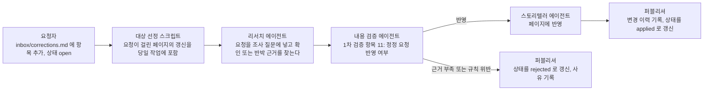

[홈](index.md) › 정정 요청 안내

# 정정 요청 안내

위키의 문장이 틀렸거나 오래됐다고 판단되면 저장소의 `inbox/corrections.md`에 정정 요청을 적는다. 요청은 다음 실행에서 리서치 에이전트가 읽고, 내용 검증 에이전트가 확인하고, 스토리텔러 에이전트가 반영하며, 퍼블리셔가 결과를 [변경 이력](changelog.md)에 남긴다. 이 페이지는 요청 항목의 형식, 처리 흐름, 반영이 거부되는 경우를 설명한다.

<!-- 구축자 메모: 이 페이지는 횡단 페이지이지만 프런트매터 type 값 목록에 정정 요청 안내용 값이 없어 소개 페이지와 같은 about 을 쓴다. [가정] -->

## 무엇을 요청할 수 있는가

정정 요청은 이미 게시된 내용에 대한 것이다. 다음이 대상이다.

- 사실과 다른 문장, 또는 출처가 그 문장을 뒷받침하지 않는 경우
- 기준일이 오래되어 지금은 다른 사실(대체된 표준, 바뀐 버전)
- 태그가 맞지 않는 경우. 예를 들어 벤더 주장이 `[사실]`로 적혀 있거나, 의견이 `[추정]`으로 적힌 경우
- 깨진 링크, 열리지 않는 출처, 잘못된 참고문헌 id
- 다른 세부영역에 있어야 할 내용이 잘못된 영역에 있는 경우
- 외부 연계 영역을 ROP 직접 범위처럼 서술한 경우
- 용어집과 다른 용어를 쓴 경우

다음은 정정 요청의 대상이 아니다. 분류 원문의 대분류·세부영역 명칭·번호·정의·질문은 바뀌지 않는다. 새 세부영역이 필요하다는 의견은 [열린 질문](open-questions.md)에 "분류 확장 제안"으로 남긴다. 새로 조사할 주제나 먼저 다룰 영역은 `config/priority.yaml`에 적는다. 방법은 [기여·정정 방법](about/how-to-contribute.md)에 있다.

## 항목 형식

`inbox/corrections.md`에서 한 요청은 `## corr-NNN` 제목으로 시작하는 블록 하나다. 그 아래 여섯 개의 필드를 목록으로 적는다. 이 가운데 페이지, 문제 문장, 근거, 요청일은 빌드 사양서 7.4가 정한 필드이고, 요청자와 상태는 구축자가 더한 것이다. 필드 이름과 상태 값(`open` / `applied` / `rejected`)은 정정 요청을 읽는 스크립트(대상 선정·퍼블리셔)와 맞춰야 한다. [가정]

| 필드 | 뜻 | 값 |
|---|---|---|
| id | 요청 식별자. 제목에 쓴다 | `corr-001`부터 순서대로. 이미 있는 가장 큰 번호 + 1 |
| 페이지 | 문제 문장이 있는 페이지 | 저장소 루트 기준 경로. 예: `docs/categories/b-common-information-and-environment-model/07-cargo-inventory-and-asset-identification-and-tracking.md` |
| 문제 문장 | 틀렸다고 보는 문장 | 페이지에 있는 문장을 그대로 옮긴다. 태그가 있으면 태그까지 포함한다 |
| 근거 | 왜 틀렸는가 | 출처 URL, 또는 출처가 없으면 설명. 설명만 있는 요청도 받지만 에이전트가 근거를 찾지 못하면 거부될 수 있다 |
| 요청일 | 요청을 적은 날 | YYYY-MM-DD |
| 요청자 | 누가 요청했는가 | 이름 또는 역할 |
| 상태 | 처리 상태 | `open`(요청자가 씀) → `applied`(반영됨) 또는 `rejected`(반영하지 않음). 퍼블리셔가 바꾼다 |

처리가 끝나면 퍼블리셔가 블록 끝에 처리 실행 id와 처리 메모를 덧붙인다. [가정]

- 처리 실행: `2026-10-02-01`
- 처리 메모: 반영 내용 또는 거부 사유 한 줄

## 예시 항목

아래는 형식을 보이기 위한 가상의 예이며 실제 페이지 내용이 아니다.

```markdown
## corr-001

- 페이지: docs/categories/b-common-information-and-environment-model/07-cargo-inventory-and-asset-identification-and-tracking.md
- 문제 문장: "○○ 제조사의 운반 로봇은 팔레트 인계를 무게 센서만으로 확인한다. [사실][^ref-015]"
- 근거: ref-015는 제조사 제품 소개 페이지이므로 독립 출처가 아니다. 벤더 주장이므로 [추정] 뒤에 "벤더 주장"을 병기해야 한다. 같은 페이지 5절의 시나리오는 인계 확인에 식별 이벤트가 함께 필요하다고 서술해 서로 맞지 않는다.
- 요청일: 2026-10-01
- 요청자: 물류기획팀 홍길동
- 상태: open
```

처리 뒤에는 같은 블록이 다음처럼 바뀐다.

```markdown
- 상태: applied
- 처리 실행: 2026-10-02-01
- 처리 메모: 태그를 "[추정] 벤더 주장"으로 내리고 5절과의 불일치를 열린 질문 oq-007로 올림
```

## 처리 흐름



단계별로 보면 다음과 같다.

1. **요청자가 항목을 적는다.** 상태는 `open`이다.
2. **대상 선정.** 다음 실행에서 정정 요청이 걸린 페이지가 있으면 그 페이지의 갱신(실행 유형 `update`)이 당일 작업에 포함된다. 하루에 갱신할 수 있는 페이지는 2개까지이므로 요청이 많으면 여러 날에 걸쳐 처리된다. 정정 요청이 걸린 페이지는 상태 정의에 따라 `needs_update`로 표시된다. [가정]
3. **리서치 에이전트가 읽는다.** 요청을 조사 질문에 넣고, 원 주장이 틀렸으면 바로잡는 발견 사항과 출처를, 맞았으면 확인 발견 사항을 낸다. 근거 발췌에는 "corr-NNN 관련"이 표시된다.
4. **내용 검증 에이전트가 확인한다.** 1차 검증 항목 11 "정정 요청 반영 여부"로 요청이 다뤄졌는지, 근거가 실재하고 주장을 뒷받침하는지 본다. 반영한 요청 id는 검증 결과의 `corrections_applied`에 적힌다.
5. **스토리텔러 에이전트가 반영한다.** 문장을 고치거나, 태그를 내리거나, 출처를 바꾼다. 브리프에 없는 새 사실은 더하지 않는다.
6. **퍼블리셔가 기록한다.** [변경 이력](changelog.md)에 실행 id와 함께 남기고, `inbox/corrections.md`의 상태를 `applied`로 바꾼다. 검증이 반영하지 않기로 판정한 요청은 `rejected`로 바꾸고 사유를 처리 메모에 적는다. [가정]

요청이 처리됐는지는 `inbox/corrections.md`의 상태, [변경 이력](changelog.md), 그리고 해당 실행의 일일 로그([로그](logs/index.md))에서 확인한다.

## 반영이 거부되는 경우

다음 경우 요청은 `rejected`가 되고 사유가 남는다. 거부는 요청이 틀렸다는 뜻이 아니라, 지금의 근거로는 위키의 규칙에 맞게 반영할 수 없다는 뜻이다. 근거를 보강해 새 id로 다시 요청할 수 있다.

| 경우 | 설명 |
|---|---|
| 근거를 확인할 수 없음 | 출처 URL이 열리지 않거나, 열어 보니 기관·제목이 다르거나, 설명만 있는 근거를 에이전트가 검색으로도 찾지 못한 경우 |
| 근거가 주장을 뒷받침하지 않음 | 출처는 실재하지만 요청한 정정 내용과 맞지 않는 경우 |
| 원 문장이 맞음 | 재확인 결과 원 문장이 출처와 일치하는 경우. 확인 결과가 변경 이력에 남는다 |
| 분류 원문 변경 요구 | 대분류·세부영역의 명칭·번호·정의·질문, `[분류원문]` 문장을 바꾸라는 요청 |
| 규칙 완화 요구 | 벤더 주장을 `[사실]`로 올리라거나, 출처 없이 수치를 넣으라거나, 외부 연계 영역을 ROP 직접 범위로 서술하라는 요청 |
| 문제 문장을 찾을 수 없음 | 페이지 경로가 틀렸거나, 문장이 이미 바뀌었거나, 옮겨 적은 문장이 페이지와 다른 경우 |
| 중복 | 같은 문장에 대한 요청이 이미 `open` 또는 `applied` 상태인 경우 |
| 정정이 아닌 요청 | 새 주제 조사, 새 세부영역 추가, 분량 조정 같은 요청. 각각 `config/priority.yaml`, 열린 질문, 우선 지정으로 보낸다 |

## 관련 페이지

- [기여·정정 방법](about/how-to-contribute.md) — 우선순위 지정, 보류 산출물 검토, 실험 결과 입력 등 다른 개입 방법
- [에이전트 소개](about/agents.md) — 정정 요청을 읽고 확인하고 반영하는 에이전트의 역할
- [읽기 가이드](about/reading-guide.md) — 태그·각주·기준일 표기. 어떤 문장이 정정 대상인지 판단할 때 참고
- [변경 이력](changelog.md) — 처리 결과가 남는 곳
- [열린 질문](open-questions.md) — 분류 확장 제안과 출처 충돌이 올라가는 곳

## 참고 자료

없음
