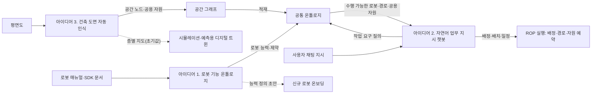

[홈](../index.md) › 확장 아이디어 연결 구조

# 확장 아이디어 연결 구조

이 페이지는 사용자가 제안한 세 확장 아이디어가 서로 어떻게 이어지는지, 무엇을 공통 데이터로 주고받는지, 28개 세부 연구영역과 어떻게 대응하는지를 한곳에 모은다. 아이디어는 분류를 바꾸지 않는다. 7개 대분류·28개 세부 연구영역의 이름·순서·번호·정의는 그대로이고, 아이디어는 세부영역에 연결을 더할 뿐이다. 각 아이디어의 연구는 중점 연구 트랙이 단계적으로 진행하며, 이 페이지의 구조와 데이터 모델은 구축자 제안이다. [가정]

## 세 아이디어

| 아이디어 | 정의(사용자 문구 그대로) | 연구하는 트랙 |
|---|---|---|
| [아이디어 1. 로봇 기능 온톨로지](robot-capability-ontology.md) | 로봇 매뉴얼·SDK 문서에서 로봇별 능력(이동·계단·적재·도어 조작·충전)과 제약을 추출해 온톨로지로 정리. 작업 할당 시 수행 가능한 로봇을 질의로 찾고, 신규 로봇 온보딩 시 능력 정의 초안을 자동 생성 | [매뉴얼 기반 로봇 기능 온톨로지](../tracks/manual-capability-ontology/index.md)(기존 트랙 확장) |
| [아이디어 2. 자연어 업무 지시 챗봇](nl-task-chatbot.md) | 사용자가 채팅으로 상황과 처리할 일을 입력하면 AI가 업무를 파악·분해하고, 온톨로지로 적합한 로봇을 찾아 배정·배치한 뒤 작업 진행과 스케줄링을 자동으로 관리 | [자연어 업무 지시 챗봇](../tracks/nl-task-chatbot/index.md)(새 트랙) |
| [아이디어 3. 건축 도면 자동 인식](floorplan-recognition.md) | 평면도에서 벽·문·엘리베이터·계단·충전 위치를 인식해 층별 지도와 공용 자원 목록을 자동 생성하고, 공간 그래프로 온톨로지에 적재. 현장 모델링 시간을 줄이고 시뮬레이션 초기값으로 사용 | [건축 도면 자동 인식](../tracks/floorplan-recognition/index.md)(새 트랙) |

## 이어지는 구조

세 아이디어는 하나의 흐름으로 이어진다. 도면 인식(아이디어 3)이 평면도에서 공간과 시설(공간 노드, 공용 자원)을 뽑아 공간 그래프로 온톨로지에 적재하고, 로봇 기능 온톨로지(아이디어 1)가 로봇의 능력과 제약을 같은 온톨로지에 담는다. 챗봇(아이디어 2)은 사용자의 지시를 작업으로 분해한 뒤 그 온톨로지를 질의해 작업을 할 수 있는 로봇과 경로·자원을 고른다. [가정]

이 흐름은 분류 원문 10장의 "로봇과 건물 조건을 함께 판단" 아이디어가 가리키는 지점과 겹친다. 원문은 그 중심 연구영역을 [5. 로봇 능력·작업 온톨로지](../categories/b-common-information-and-environment-model/05-robot-capability-and-task-ontology.md), [6. 지도·공간·위치 모델](../categories/b-common-information-and-environment-model/06-map-space-and-location-model.md), [8. 실시간 세계 상태·데이터 일관성](../categories/b-common-information-and-environment-model/08-real-time-world-state-and-data-consistency.md)으로, 함께 필요한 영역을 [13. 작업 배정 — MRTA](../categories/d-planning-and-optimization/13-task-allocation-mrta.md), [16. 공용 자원·충전·에너지 최적화](../categories/d-planning-and-optimization/16-shared-resource-charging-and-energy-optimization.md), [25. 안전·위험 관리](../categories/g-safety-security-intelligence-and-governance/25-safety-and-risk-management.md)로 둔다(원문 표는 [논의한 아이디어의 연구영역 매핑](../about/idea-mapping.md)에 있다).

## 공통 데이터 모델

세 아이디어가 함께 쓰는 네 요소다. 정의와 속성은 아이디어 정의 문구에서 구축자가 도출한 출발점이며, 각 트랙의 초안([능력 온톨로지 초안](../tracks/manual-capability-ontology/ontology-draft.md), [업무 분해·배정 설계 초안](../tracks/nl-task-chatbot/task-model-draft.md), [공간 그래프 스키마 초안](../tracks/floorplan-recognition/space-graph-schema-draft.md))이 근거와 함께 고친다. [가정]

| 요소 | 정의 | 주요 속성 | 생산하는 아이디어 | 소비하는 아이디어 |
|---|---|---|---|---|
| 공간 노드 | 로봇이 머물거나 지나가는 공간 단위(층·구역·통로)와 그 사이를 잇는 문·엘리베이터·계단 | 층, 종류, 연결된 노드, 통과 조건, 이름·별칭, 근거 도면 | 아이디어 3 | 아이디어 1(계단·도어 조작 능력과 통과 조건 대조), 아이디어 2(지시 속 장소 해석, 배치 경로) |
| 공용 자원 | 여러 로봇이 나눠 쓰는 시설(엘리베이터, 충전 위치 등) | 종류, 위치(공간 노드), 수용량, 예약·사용 조건, 설비 연동 여부 | 아이디어 3(공용 자원 목록) | 아이디어 1(충전·도어 조작 능력과 대응), 아이디어 2(배치·일정의 자원 예약) |
| 로봇 능력 | 로봇이 수행할 수 있는 기능과 그 제약(범위 능력: 이동·계단·적재·도어 조작·충전) | 기능, 제약, 장착 장비, 실행 조건, 근거 문서 | 아이디어 1 | 아이디어 2(작업 할당 질의), 아이디어 3(로봇별 통과 가능 경로 판단) |
| 작업 | 지시에서 분해된 실행 단위와 그 요구 | 작업 종류, 장소(공간 노드), 대상, 기한·우선순위, 작업 요구(필요 능력·제약), 배정 로봇, 진행 상태 | 아이디어 2 | 아이디어 1(작업 요구와 기능의 대응 질의) |

## 아이디어 사이의 입출력

| 보내는 아이디어 | 받는 아이디어 | 전달하는 것 | 받는 쪽의 쓰임 |
|---|---|---|---|
| 아이디어 3. 건축 도면 자동 인식 | 아이디어 1. 로봇 기능 온톨로지 | 공간 그래프(공간 노드·공용 자원) | 온톨로지에 적재해 로봇 능력(계단·도어 조작·충전)과 공간 조건을 같은 기준으로 대조 |
| 아이디어 3. 건축 도면 자동 인식 | 아이디어 2. 자연어 업무 지시 챗봇 | 층·구역 이름과 별칭, 경로, 공용 자원 목록 | 지시 속 장소 해석, 배치 경로와 자원 예약 |
| 아이디어 1. 로봇 기능 온톨로지 | 아이디어 2. 자연어 업무 지시 챗봇 | 작업 할당 질의 결과(수행 가능한 로봇 후보와 근거) | 배정 후보 선택과 배정 근거 설명 |
| 아이디어 2. 자연어 업무 지시 챗봇 | 아이디어 1. 로봇 기능 온톨로지 | 작업 요구(필요 능력·제약), 질의가 실패한 사례 | 질의 입력, 온톨로지 보강 질문 |
| 아이디어 2. 자연어 업무 지시 챗봇 | 아이디어 3. 건축 도면 자동 인식 | 해석하지 못한 장소 표현 | 공간 노드 이름·별칭 보강 |

표의 입출력은 구축자가 아이디어 정의에서 도출한 설계 가설이며, 각 트랙의 단계 3(구현 가설 설계)이 근거와 함께 확정하거나 고친다. [가정]

## 28개 세부 연구영역 매핑표

각 칸의 ●는 그 아이디어의 중심 영역, ○는 함께 필요한 영역, 빈칸은 직접 연결이 없음을 뜻한다. 원천은 각 트랙 정의(`config/tracks/*.yaml`)의 `idea_areas`이며, 퍼블리셔가 이 표와 세부영역 페이지 머리의 "관련 연구 트랙" 안내를 같은 원천에서 다시 만든다. 매핑 근거는 각 아이디어 페이지의 "2. 관련 세부 연구영역"과 결정 기록에 있다. 분류 원문 10장이 정한 매핑(아이디어 1의 5·9·21·23·24, 아이디어 3의 6·15·21·22)과 8장의 교차 규칙(27. AI·학습·적응과 모델 운영의 문서·도면 해석)은 그대로 따랐고, 나머지는 구축자 제안이다. [가정]

<!-- auto:idea-area-map:start -->
| 대분류 | 세부 연구영역 | [아이디어 1. 로봇 기능 온톨로지](robot-capability-ontology.md) | [아이디어 2. 자연어 업무 지시 챗봇](nl-task-chatbot.md) | [아이디어 3. 건축 도면 자동 인식](floorplan-recognition.md) |
|---|---|---|---|---|
| [A. 업무·공급망 설계](../categories/a-business-supply-chain-design/index.md) | [1. 주문·업무 시스템 연계](../categories/a-business-supply-chain-design/01-order-and-business-system-integration.md) |  | ○ |  |
| [A. 업무·공급망 설계](../categories/a-business-supply-chain-design/index.md) | [2. 공정·워크플로 모델링](../categories/a-business-supply-chain-design/02-process-and-workflow-modeling.md) |  | ○ |  |
| [A. 업무·공급망 설계](../categories/a-business-supply-chain-design/index.md) | [3. 처리능력·거점·설비 계획](../categories/a-business-supply-chain-design/03-capacity-site-and-facility-planning.md) |  |  | ○ |
| [A. 업무·공급망 설계](../categories/a-business-supply-chain-design/index.md) | [4. 성과·경제성·프로세스 개선](../categories/a-business-supply-chain-design/04-performance-economics-and-process-improvement.md) |  |  |  |
| [B. 공통 정보·환경 모델](../categories/b-common-information-and-environment-model/index.md) | [5. 로봇 능력·작업 온톨로지](../categories/b-common-information-and-environment-model/05-robot-capability-and-task-ontology.md) | ● | ○ | ○ |
| [B. 공통 정보·환경 모델](../categories/b-common-information-and-environment-model/index.md) | [6. 지도·공간·위치 모델](../categories/b-common-information-and-environment-model/06-map-space-and-location-model.md) |  | ○ | ● |
| [B. 공통 정보·환경 모델](../categories/b-common-information-and-environment-model/index.md) | [7. 화물·재고·자산 식별과 추적](../categories/b-common-information-and-environment-model/07-cargo-inventory-and-asset-identification-and-tracking.md) |  |  |  |
| [B. 공통 정보·환경 모델](../categories/b-common-information-and-environment-model/index.md) | [8. 실시간 세계 상태·데이터 일관성](../categories/b-common-information-and-environment-model/08-real-time-world-state-and-data-consistency.md) | ○ | ○ | ○ |
| [C. 연결·실행 기반](../categories/c-connectivity-and-execution-foundation/index.md) | [9. 로봇·제조사 관제 연동](../categories/c-connectivity-and-execution-foundation/09-robot-and-vendor-fleet-manager-integration.md) | ○ |  |  |
| [C. 연결·실행 기반](../categories/c-connectivity-and-execution-foundation/index.md) | [10. 설비·건물 시스템 연동](../categories/c-connectivity-and-execution-foundation/10-facility-and-building-system-integration.md) | ○ |  | ○ |
| [C. 연결·실행 기반](../categories/c-connectivity-and-execution-foundation/index.md) | [11. 분산 시스템·통신·컴퓨팅 구조](../categories/c-connectivity-and-execution-foundation/11-distributed-systems-communication-and-computing.md) |  |  |  |
| [C. 연결·실행 기반](../categories/c-connectivity-and-execution-foundation/index.md) | [12. 명령·작업 실행의 신뢰성](../categories/c-connectivity-and-execution-foundation/12-command-and-task-execution-reliability.md) | ○ | ○ |  |
| [D. 계획·최적화](../categories/d-planning-and-optimization/index.md) | [13. 작업 배정 — MRTA](../categories/d-planning-and-optimization/13-task-allocation-mrta.md) | ○ | ● |  |
| [D. 계획·최적화](../categories/d-planning-and-optimization/index.md) | [14. 작업 순서·스케줄링](../categories/d-planning-and-optimization/14-task-sequencing-and-scheduling.md) |  | ● |  |
| [D. 계획·최적화](../categories/d-planning-and-optimization/index.md) | [15. 다중 로봇 경로·교통 관리 — MAPF](../categories/d-planning-and-optimization/15-multi-robot-path-and-traffic-management-mapf.md) |  |  | ○ |
| [D. 계획·최적화](../categories/d-planning-and-optimization/index.md) | [16. 공용 자원·충전·에너지 최적화](../categories/d-planning-and-optimization/16-shared-resource-charging-and-energy-optimization.md) | ○ | ○ | ○ |
| [E. 협업·현장 운영](../categories/e-collaboration-and-field-operations/index.md) | [17. 로봇 간 협업·물리적 인계](../categories/e-collaboration-and-field-operations/17-robot-to-robot-collaboration-and-physical-handover.md) |  |  |  |
| [E. 협업·현장 운영](../categories/e-collaboration-and-field-operations/index.md) | [18. 사람–로봇 협업·운영 인터페이스](../categories/e-collaboration-and-field-operations/18-human-robot-collaboration-and-operator-interface.md) |  | ● |  |
| [E. 협업·현장 운영](../categories/e-collaboration-and-field-operations/index.md) | [19. 모니터링·이상 탐지·원인 분석](../categories/e-collaboration-and-field-operations/19-monitoring-anomaly-detection-and-root-cause-analysis.md) |  | ○ |  |
| [E. 협업·현장 운영](../categories/e-collaboration-and-field-operations/index.md) | [20. 예외 복구·재계획·업무 연속성](../categories/e-collaboration-and-field-operations/20-exception-recovery-replanning-and-business-continuity.md) |  | ○ |  |
| [F. 도입·검증·유지관리](../categories/f-deployment-verification-and-maintenance/index.md) | [21. 온보딩·설정·현장 시운전](../categories/f-deployment-verification-and-maintenance/21-onboarding-configuration-and-commissioning.md) | ○ |  | ○ |
| [F. 도입·검증·유지관리](../categories/f-deployment-verification-and-maintenance/index.md) | [22. 시뮬레이션·예측용 디지털 트윈](../categories/f-deployment-verification-and-maintenance/22-simulation-and-predictive-digital-twin.md) |  |  | ○ |
| [F. 도입·검증·유지관리](../categories/f-deployment-verification-and-maintenance/index.md) | [23. 시험·형식 검증·벤치마크](../categories/f-deployment-verification-and-maintenance/23-testing-formal-verification-and-benchmarking.md) | ○ | ○ | ○ |
| [F. 도입·검증·유지관리](../categories/f-deployment-verification-and-maintenance/index.md) | [24. 자산·소프트웨어 수명주기 관리](../categories/f-deployment-verification-and-maintenance/24-asset-and-software-lifecycle-management.md) | ○ |  | ○ |
| [G. 안전·보안·지능·거버넌스](../categories/g-safety-security-intelligence-and-governance/index.md) | [25. 안전·위험 관리](../categories/g-safety-security-intelligence-and-governance/25-safety-and-risk-management.md) | ○ | ○ |  |
| [G. 안전·보안·지능·거버넌스](../categories/g-safety-security-intelligence-and-governance/index.md) | [26. 사이버보안·접근권한·개인정보](../categories/g-safety-security-intelligence-and-governance/26-cybersecurity-access-control-and-privacy.md) |  | ○ |  |
| [G. 안전·보안·지능·거버넌스](../categories/g-safety-security-intelligence-and-governance/index.md) | [27. AI·학습·적응과 모델 운영](../categories/g-safety-security-intelligence-and-governance/27-ai-learning-adaptation-and-model-operations.md) | ○ | ● | ○ |
| [G. 안전·보안·지능·거버넌스](../categories/g-safety-security-intelligence-and-governance/index.md) | [28. 표준·상호운용성·다사업자 거버넌스](../categories/g-safety-security-intelligence-and-governance/28-standards-interoperability-and-multi-vendor-governance.md) | ○ |  | ○ |

● 중심 영역 · ○ 함께 필요한 영역 · 빈칸은 직접 연결 없음. 영역 수:

- 아이디어 1. 로봇 기능 온톨로지: ● 1개 · ○ 12개 · 합계 13개 영역 ([트랙 개요](../tracks/manual-capability-ontology/index.md))
- 아이디어 2. 자연어 업무 지시 챗봇: ● 4개 · ○ 12개 · 합계 16개 영역 ([트랙 개요](../tracks/nl-task-chatbot/index.md))
- 아이디어 3. 건축 도면 자동 인식: ● 1개 · ○ 12개 · 합계 13개 영역 ([트랙 개요](../tracks/floorplan-recognition/index.md))
<!-- auto:idea-area-map:end -->

## 관련 페이지

- [논의한 아이디어의 연구영역 매핑](../about/idea-mapping.md) — 분류 원문 10장의 표 원문
- [매뉴얼 기반 로봇 기능 온톨로지](../tracks/manual-capability-ontology/index.md), [자연어 업무 지시 챗봇](../tracks/nl-task-chatbot/index.md), [건축 도면 자동 인식](../tracks/floorplan-recognition/index.md) — 세 아이디어를 연구하는 중점 연구 트랙
- [에이전트 소개](../about/agents.md) — 트랙 실행과 트랙 조사 비중 설정
