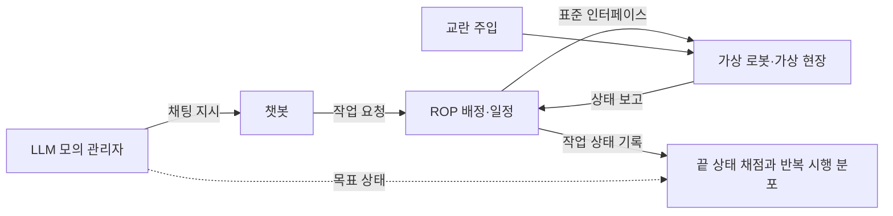

[홈](../index.md) › [확장 아이디어](index.md) › 아이디어 2. 자연어 업무 지시 챗봇

# 아이디어 2. 자연어 업무 지시 챗봇

<!-- auto:page-status:start -->
> 페이지 상태: published · 신뢰도: low · 페이지 버전: 19 · 마지막 갱신: 2026-09-25 · 마지막 실행: 2026-09-25
<!-- auto:page-status:end -->

이 페이지는 확장 아이디어 2의 정리 페이지다. 이 아이디어는 새 중점 연구 트랙 [자연어 업무 지시 챗봇](../tracks/nl-task-chatbot/index.md)으로 연구하며, 트랙의 살아있는 산출물은 [업무 분해·배정 설계 초안](../tracks/nl-task-chatbot/task-model-draft.md)이다. 세 아이디어의 연결은 [확장 아이디어 연결 구조](index.md)에 있다. 3~6절은 트랙 실행이 출처와 함께 채우며, 그 전까지 조사하지 않은 내용은 쓰지 않는다.

## 1. 문제 정의

> 사용자가 채팅으로 상황과 처리할 일을 입력하면 AI가 업무를 파악·분해하고, 온톨로지로 적합한 로봇을 찾아 배정·배치한 뒤 작업 진행과 스케줄링을 자동으로 관리

위 문장은 사용자가 정의한 아이디어 문구를 그대로 옮긴 것이다.

**풀려는 현장 문제.** 분류 원문에서 이 문제와 가장 가까운 질문은 [13. 작업 배정 — MRTA](../categories/d-planning-and-optimization/13-task-allocation-mrta.md), [27. AI·학습·적응과 모델 운영](../categories/g-safety-security-intelligence-and-governance/27-ai-learning-adaptation-and-model-operations.md)의 SCM 관점 질문이다.

> 가장 가까운 로봇에 맡기는 것이 전체적으로도 유리한가? [분류원문]

> AI가 만든 작업 계획이나 기능 해석을 어떤 기준으로 실행에 사용할까? [분류원문]

현장에서 처리할 일은 주문·업무 시스템 밖에서도 말이나 메시지로 생기는데, 그 일을 로봇이 실행할 수 있는 작업으로 바꾸고 맞는 로봇을 고르고 순서를 정하는 일은 사람이 관제 화면에서 직접 해야 한다는 것이 이 아이디어가 전제하는 현장 문제다. 이 아이디어는 채팅 한 번으로 그 과정을 자동화하되, AI의 잘못된 해석이 로봇 배정으로 이어지지 않게 하려는 것이다. [가정]

## 2. 관련 세부 연구영역

매핑표 기준이다(● 중심 영역, ○ 함께 필요한 영역). 매핑은 연결을 더할 뿐 분류를 바꾸지 않으며, 원천은 트랙 정의 `config/tracks/nl-task-chatbot.yaml`의 `idea_areas`·`idea_area_notes`다.

<!-- auto:idea-areas:start -->
**중심 영역(●)**

- [13. 작업 배정 — MRTA](../categories/d-planning-and-optimization/13-task-allocation-mrta.md) — '온톨로지로 적합한 로봇을 찾아 배정'하는 일이 이 영역의 배정 문제다
- [14. 작업 순서·스케줄링](../categories/d-planning-and-optimization/14-task-sequencing-and-scheduling.md) — '작업 진행과 스케줄링을 자동으로 관리'하는 일이 이 영역의 순서·시간 제약·긴급 작업 삽입 문제다
- [18. 사람–로봇 협업·운영 인터페이스](../categories/e-collaboration-and-field-operations/18-human-robot-collaboration-and-operator-interface.md) — 채팅은 작업자·관리자가 일을 지시하고 확인·승인하는 운영 인터페이스다
- [27. AI·학습·적응과 모델 운영](../categories/g-safety-security-intelligence-and-governance/27-ai-learning-adaptation-and-model-operations.md) — 이 영역 정의의 LLM 에이전트와, AI가 만든 작업 계획을 실행에 쓰는 기준을 묻는 이 영역의 질문이 해석과 오해석 방지 단계에 그대로 걸린다

**함께 필요한 영역(○)**

- [1. 주문·업무 시스템 연계](../categories/a-business-supply-chain-design/01-order-and-business-system-integration.md) — 채팅 지시는 업무 시스템의 주문·요청과 나란히 들어오는 업무 요청이므로 변경·취소·완료 반영 규칙을 함께 본다
- [2. 공정·워크플로 모델링](../categories/a-business-supply-chain-design/02-process-and-workflow-modeling.md) — 분해 결과가 들어갈 작업 단계·선후관계·완료 조건의 틀을 이 영역이 정의한다
- [5. 로봇 능력·작업 온톨로지](../categories/b-common-information-and-environment-model/05-robot-capability-and-task-ontology.md) — '온톨로지로 적합한 로봇을 찾는' 질의의 대상이다(아이디어 1의 산출물)
- [6. 지도·공간·위치 모델](../categories/b-common-information-and-environment-model/06-map-space-and-location-model.md) — 지시 속 장소 표현(예: 층·구역 이름)을 공간 노드로 해석한다(아이디어 3의 산출물)
- [8. 실시간 세계 상태·데이터 일관성](../categories/b-common-information-and-environment-model/08-real-time-world-state-and-data-consistency.md) — 배정 시점의 로봇 위치·배터리·가용 상태를 현재 상태로 확인한다
- [12. 명령·작업 실행의 신뢰성](../categories/c-connectivity-and-execution-foundation/12-command-and-task-execution-reliability.md) — 배정 뒤 명령의 접수·실행·완료·취소 상태와 같은 지시의 중복 처리 방지가 필요하다
- [16. 공용 자원·충전·에너지 최적화](../categories/d-planning-and-optimization/16-shared-resource-charging-and-energy-optimization.md) — 배치할 때 승강기·충전기 같은 공용 자원 예약을 함께 정한다
- [19. 모니터링·이상 탐지·원인 분석](../categories/e-collaboration-and-field-operations/19-monitoring-anomaly-detection-and-root-cause-analysis.md) — '작업 진행 관리'에서 지연·이상을 탐지하고 원인을 설명한다
- [20. 예외 복구·재계획·업무 연속성](../categories/e-collaboration-and-field-operations/20-exception-recovery-replanning-and-business-continuity.md) — 진행 중 고장·지시 변경 때 재배정·재계획을 한다
- [23. 시험·형식 검증·벤치마크](../categories/f-deployment-verification-and-maintenance/23-testing-formal-verification-and-benchmarking.md) — 해석·배정 결과를 지시 시나리오 시험과 모델·프롬프트 변경 뒤 회귀시험으로 검증한다
- [25. 안전·위험 관리](../categories/g-safety-security-intelligence-and-governance/25-safety-and-risk-management.md) — 오해석이 위험한 동작으로 이어지지 않게 안전 조건을 확인 절차에 넣는다
- [26. 사이버보안·접근권한·개인정보](../categories/g-safety-security-intelligence-and-governance/26-cybersecurity-access-control-and-privacy.md) — 채팅 사용자가 어느 로봇·구역에 어떤 작업까지 지시할 수 있는지(명령 권한)와 대화 기록 보호를 정한다

매핑 전체와 다른 아이디어와의 비교는 [확장 아이디어 연결 구조](index.md)의 매핑표에 있다.
<!-- auto:idea-areas:end -->

## 3. 선행 연구·제품 사례

이 절은 선행 연구, 제품 사례, 채팅·음성 지시 제품의 확인·승인 방식 비교를 담는다. 제품 사례는 보도자료·제품 페이지 수준의 벤더 주장이며, 로봇에 자연어로 일을 지시하는 제품이 해석 결과를 실행 전에 확인·승인받는 절차는 공개 자료에서 확인되지 않았다. 자세한 내용과 출처는 [단계 1. 선행 연구·제품 사례 조사](../tracks/nl-task-chatbot/stage-1-prior-work-and-products.md#q1-01)의 q1-01, [q1-02](../tracks/nl-task-chatbot/stage-1-prior-work-and-products.md#q1-02), [q1-03](../tracks/nl-task-chatbot/stage-1-prior-work-and-products.md#q1-03)에 있다.

### 선행 연구: 분해 결과의 형태

자연어 지시를 작업으로 나누는 기존 연구는 분해 결과의 형태에 따라 여섯 유형으로 묶을 수 있다는 것이 이 위키의 정리(추론)이며, 이 분류를 제시한 출처는 확인하지 못했다. [추정][^ref-057][^ref-093][^ref-087][^ref-054][^ref-095][^ref-091][^ref-055][^ref-061][^ref-059][^ref-089]

| 유형 | 분해 결과의 형태 | 대표 연구 |
|---|---|---|
| 확률 그래프 접지 | 명령 구조에 맞춘 확률 그래프 모델 | G3(Tellex 외 2011) |
| 기술·허용 동작 순서 | 미리 정한 기술·허용 동작의 순서 | Huang 외 2022, SayCan |
| 프로그램 코드 | 실행 가능한 계획 프로그램·정책 코드 | ProgPrompt, Code as Policies |
| 형식 명세를 계획기에 넘김 | [계획 도메인 정의 언어(Planning Domain Definition Language, PDDL)](../glossary/pddl.md) 문제 파일, 선형 시간 논리(Linear Temporal Logic, LTL) 식 | LLM+P, Lang2LTL |
| 실행 구조 그래프 | 행동 트리, 하위 작업 의존 그래프 | BTGenBot, DART-LLM |
| 다중 로봇 파이프라인 | 분해·팀 구성·할당을 잇는 단계 | SMART-LLM, DART-LLM |

여러 로봇을 다룬 연구로 SMART-LLM은 LLM이 프로그램형 few-shot 프롬프트로 작업 분해, 팀 구성, 작업 할당을 차례로 수행한다. [사실][^ref-089][^ref-090] 이 할당에서 이동 거리·납기·부하 같은 비용을 최적화 엔진으로 푸는 구조는 공식 저장소 README 기준으로 확인되지 않으며 논문 본문의 할당 세부는 미확인이다. [추정][^ref-089][^ref-090]

### 선행 연구: LLM이 맡는 범위

다중 로봇 작업 계획·배정 연구에서 LLM이 맡는 범위는 (1) 분해와 배정을 LLM이 함께 맡는 방식, (2) LLM은 분해·의존 그래프·정식화를 만들고 배정·일정·계획은 결정적 해법이 맡는 방식, (3) 사람이 정한 로봇 API·도구 안에서 LLM이 명령·코드를 생성하는 방식으로 나눌 수 있다는 것이 이 위키의 정리다. [추정][^ref-089][^ref-169][^ref-168][^ref-164][^ref-166][^ref-181][^ref-242][^ref-167][^ref-170][^ref-091][^ref-174][^ref-171][^ref-175][^ref-180] 이 분류를 제시한 단일 출처는 확인하지 못했고, 위 여섯 유형(분해 결과의 형태)과는 기준 축(LLM이 맡는 범위)이 다르다.

두 번째 방식의 사례는 다음과 같다.

- LiP-LLM은 LLM이 기술 목록과 선후 의존 그래프를 만들고 로봇 배정은 선형계획으로 푼다. [사실][^ref-166] 저자들은 LLM 기반 배정이 추적 한계로 어려움을 겪은 반면 선형계획 배정은 배정 실패가 거의 없었다고 보고했다(저자 보고, 독립 재현과 실험 조건 미확인). [사실][^ref-166]
- PIP-LLM은 자연어 명령을 팀 수준 PDDL 문제와 하위 작업 의존 그래프로 옮긴 뒤 이동 비용·작업 부하를 최적화하는 정수계획 배정 문제를 푼다. [사실][^ref-181]
- FLEET은 LLM이 작업 그래프와 로봇–작업 적합도 행렬을 만들고, 형식적 뒷단이 makespan(모든 작업이 끝나는 데 걸리는 전체 시간) 최소화 문제를 푼다. [사실][^ref-242]
- Peng 외는 로컬 LLM으로 자연어 작업 기술을 혼합 정수 계획(Mixed Integer Linear Programming, MILP) 모델과 실행 코드로 바꾼다. [사실][^ref-167] 항공기 외피 제조 작업(makespan 최소화)에서 제약 추출 평균 정확도 82%, MILP 코드 생성 평균 정확도 90%는 저자 보고값이며 독립 재현은 확인되지 않았다. [사실][^ref-167]

LLM이 직접 배정하는 LTAA 연구는 TEACh 건설 작업에서 전통 기법을 앞섰다는 초록 요약(저자 보고값, 독립 재현 미확인)과, 동적 계획법이 더 높았다는 다른 2차 요약이 충돌해 비교 우위가 확정되지 않았다. [추정][^ref-168]

### 무엇을 자동화하고 무엇을 사람에게 남기는가

- Huang 외, SayCan, ProgPrompt, Code as Policies, LLM+P, Lang2LTL, SMART-LLM 일곱 접근은 실행 가능한 단위(기술 목록, 가용 동작·객체, 제어 API, PDDL 도메인, 랜드마크 목록, 로봇 능력 목록)를 사람이 미리 정의해 두고 LLM은 그 어휘 안에서 분해하므로, 실행 단위의 정의와 예시 작성은 사람에게 남는 일로 보인다(이 위키의 정리). [추정][^ref-094][^ref-087][^ref-054][^ref-095][^ref-091][^ref-055][^ref-089]
- LLM이 형식 명세만 만들고 계획·검증은 결정적 계획기나 논리 검사에 맡기는 구조(LLM+P, Lang2LTL)는 LLM 출력을 실행 전에 형식적으로 점검할 수 있어 오해석 방지와 이어지는 선행 사례로 보인다. 잘못된 배정을 실제로 줄이는지는 확인하지 못했다(이 위키의 정리). [추정][^ref-091][^ref-055][^ref-058]
- 조사한 LLM 기반 분해·배정 연구의 평가 환경은 가정·주방 시뮬레이터, 실내·도시 내비게이션, 건설 기계 시나리오, 건설 작업, 항공기 외피 제조, 산업 조립 벤치마크였고, 물류 지시를 직접 다룬 예는 이번 검색 범위에서 LLM 이전 연구인 G3뿐이었다. 부재의 확인은 아니다(이 위키의 정리). [추정][^ref-094][^ref-054][^ref-089][^ref-055][^ref-059][^ref-057][^ref-168][^ref-167][^ref-170]

### 제품 사례

#### 공개 에이전트 프레임워크

- NASA JPL의 ROSA는 LangChain 기반 에이전트로 ROS 1·ROS 2 시스템을 자연어로 조회·진단·조작하며, 개발자가 도구 함수 목록을 넘겨 에이전트가 쓸 수 있는 행동을 정한다(공식 README·위키, 확인일 2026-09-25 기준). [사실][^ref-171][^ref-172]
- Robotec.ai의 RAI는 ROS 2용 에이전트 프레임워크로 음성 인식·음성 합성·인식·시뮬레이션 연동·벤치마크 패키지를 Apache 2.0 라이선스로 공개하며, README 범위에서는 안전·사람 승인·도구 제한 설명이 없다(확인일 2026-09-25 기준). [사실][^ref-175]
- 국내에서는 한국전자기술연구원 연구진이 LangChain 에이전트의 도구를 ROS 2 토픽·서비스 인터페이스로 정의해 자연어 명령을 로봇 제어 명령으로 바꾸고 로봇별 위치·상태를 모니터링하는 다중 로봇 관제 시스템을 구현했다고 발표했다(학술대회 이름·일자 미확인). [사실][^ref-180]

#### 로봇 운영 제품 (모두 벤더 주장)

- InOrbit은 2024년 RobOps Copilot을 LLM으로 로봇 운영 데이터에 대해 사용자가 선호하는 언어로 질문하고 설명·분석을 받는 도구로 발표했다. [추정] 벤더 주장[^ref-176]
- InOrbit은 2026년 RobOps Copilot을 음성을 포함한 자연어로 로봇 동작 정의, 실시간 데이터 조회, 성능 분석, 로봇 미션 실행, 보고서 생성을 하는 에이전트형 AI 계층으로 소개했다. [추정] 벤더 주장[^ref-177]
- Formant는 2025년 F3를 자연어 인터페이스가 답·시각화·로봇 직접 제어로 응답하고 에이전트 계층이 플릿을 감시·분석·권고하는 로봇 운영 플랫폼으로 발표했으며, 제어 범위와 승인 방식은 미확인이다. [추정] 벤더 주장[^ref-178]
- 국내 로봇 통합관제 기업 다임리서치는 통합관제 xMS 운영 데이터로 자연어 질의응답과 장애 원인·대응 방안 제시를 하는 온프레미스 AI 에이전트 다비스(DARVIS)를 개발 중이며 2027년 상반기 1.0 출시를 계획한다고 밝혔다. 제품 기능이 아니라 개발 계획이다. [추정] 벤더 주장[^ref-179]
- 이 제품 자료에서 LLM의 역할은 운영 데이터 질의·설명·진단에서 자연어 미션 실행·제어로 넓어지는 흐름이 보이지만, 미션이 미리 정의된 것을 호출하는지 지시를 새로 분해하는지와 실행 전 확인·권한 장치는 공개 자료에서 확인되지 않는다. [추정] 벤더 주장[^ref-176][^ref-177][^ref-178][^ref-179]

### 채팅·음성 지시의 확인·승인 방식

작업자에게 일을 지시하는 제품은 동작 하나하나를 현장에서 확인받는 방식이 확인되지만, 로봇에 자연어로 일을 지시하는 제품은 해석 결과를 실행 전에 확인받는 방식이 공개 자료에서 드러나지 않는다(이 위키의 정리). [추정][^ref-272][^ref-275][^ref-279][^ref-276][^ref-177][^ref-178] 이 결론은 검색 요약 범위의 자료에 기대므로 신뢰도가 낮다.

#### 작업자 대상 지시

- 음성 피킹(voice-directed picking)에서는 시스템이 작업자에게 갈 위치와 할 일을 음성으로 지시하고, 작업자는 위치 라벨의 체크 디지트나 수량 같은 짧은 음성 응답으로 각 동작을 확인한다(확인일 2026-09-25 기준). [사실][^ref-272][^ref-275] Lucas Systems는 자사 음성 비서 Jennifer가 이런 방식으로 작업자를 안내한다고 설명한다. [추정] 벤더 주장[^ref-272]
- 위치 체크 디지트에 관한 미국 특허 공보 US 8868519(양수인 VOCOLLECT, INC., 출원 2011-05-27, 검색 요약 기준)는 작업자가 말하거나 입력한 체크 디지트가 그 위치에 저장된 확인 값과 맞지 않으면 경고하는 방식을 기술한다. 특허 공보의 기술 내용이며 제품 동작을 확인한 것은 아니다. [사실][^ref-275]
- Locus Robotics는 협업 피킹 로봇의 화면이 품목·위치·수량을 보여 주고, 선택 기능인 피킹 검증에서는 위치나 용기 바코드를 스캔하게 한 뒤 작업자가 확인하면 로봇이 다음 목적지로 이동한다고 소개한다(Locus와 협력사 Aila 자료, 독립 교차 아님). [추정] 벤더 주장[^ref-279][^ref-280]

#### 로봇 대상 자연어 지시

- Amazon은 2026-06-04(발표일, 검색 요약 기준) 차세대 Proteus를 직원이 일상 언어로 할 일을 말하면 로봇이 우선순위·경로·시점을 스스로 정하는 자율이동로봇으로 발표했으며, 발표 시점에는 실험실 파일럿 단계이고 유럽 배치는 2027년 상반기로 계획했다. [추정] 벤더 주장[^ref-276][^ref-277]
- InOrbit은 RobOps Copilot 제품 페이지에서 대화형으로 자율 주행 사건·미션 성과·로봇 상태를 탐색하게 한다고 설명하고, 같은 제품 페이지 요약 기준으로 InOrbit Connect에서 WMS·다제조사 AMR과 연계한 미션을 정의·실행·분석한다고 밝힌다. [추정] 벤더 주장[^ref-278]
- InOrbit RobOps Copilot(2026 발표)과 Formant F3의 공개 자료에서는 이번 검색 범위에서도 실행 전 확인·승인이나 명령 권한 제한 장치 설명을 찾지 못했다. 검색 요약 범위의 관찰이며 부재의 확인이 아니다. [추정][^ref-177][^ref-178][^ref-278]

#### 두 확인 방식의 비교

아래 표는 위 사례를 대응시켜 이 위키가 직접 구성한 것이다. [추정][^ref-272][^ref-279][^ref-276][^ref-278]

| 지시 대상 | 지시 수단 | 확인하는 것 | 확인 시점 | 확인한 사례 |
|---|---|---|---|---|
| 작업자 | 음성 | 도착 위치(체크 디지트)와 수량 | 동작마다 현장에서 | 음성 피킹 일반 관행, Lucas Systems(벤더 주장) |
| 작업자 | 협업 피킹 로봇의 화면 | 위치·용기 바코드 스캔 뒤 화면 확인 | 피킹 동작마다 | Locus Robotics(벤더 주장) |
| 로봇 | 일상 언어·자연어(음성 포함) | 해석 결과 확인 절차가 공개 자료에서 드러나지 않음 | 미확인 | Amazon 차세대 Proteus, InOrbit RobOps Copilot, Formant F3(벤더 주장) |

작업자 대상 확인은 지시받은 동작을 제대로 수행했는지를 보는 수행 확인에 가깝고, 챗봇이 필요로 하는 확인은 지시를 제대로 해석했는지(무엇을 어느 로봇이 할지)를 배정 전에 보는 지시 확인이라서, 두 확인은 대상과 시점이 다른 것으로 보인다(이 위키의 정리). [추정][^ref-272][^ref-276] 두 방식을 함께 둘 때 각각 잡는 오류와 확인 부담은 [단계 4. 오해석 방지와 확인 절차](../tracks/nl-task-chatbot/stage-4-misinterpretation-safeguards.md)의 질문(q4-01, q4-06)으로 이어진다.

[^ref-054]: Singh, I. 외, ProgPrompt: Generating Situated Robot Task Plans using Large Language Models, 2022-09, https://arxiv.org/abs/2209.11302, 접근일 2026-09-25 (원문 미열람)
[^ref-055]: Brown University H2R Lab, Lang2LTL — Code for paper Lang2LTL: Grounding Complex Natural Language Commands for Temporal Tasks in Unseen Environments (GitHub README), 미확인, https://github.com/h2r/Lang2LTL, 접근일 2026-09-25
[^ref-057]: Tellex, S. 외, Understanding Natural Language Commands for Robotic Navigation and Mobile Manipulation, 2011-08, https://ojs.aaai.org/index.php/AAAI/article/view/7979, 접근일 2026-09-25 (원문 미열람)
[^ref-058]: Cohen, V., Liu, J. X., Mooney, R., Tellex, S., & Watkins, D., A Survey of Robotic Language Grounding: Tradeoffs between Symbols and Embeddings, 2024-08, https://www.ijcai.org/proceedings/2024/885, 접근일 2026-09-25 (원문 미열람)
[^ref-059]: Wang, Y. 외(DART-LLM 저자), DART-LLM: Dependency-Aware Multi-Robot Task Decomposition and Execution using Large Language Models, 2024-11, https://arxiv.org/abs/2411.09022, 접근일 2026-09-25 (원문 미열람)
[^ref-061]: Izzo, R. A., Bardaro, G., & Matteucci, M. (Politecnico di Milano AIRLab), BTGenBot: Behavior Tree Generation for Robotic Tasks with Lightweight LLMs, 2024-03, https://arxiv.org/abs/2403.12761, 접근일 2026-09-25 (원문 미열람)
[^ref-089]: SMARTlab-Purdue (Purdue University), SMART-LLM: Smart Multi-Agent Robot Task Planning using Large Language Models (GitHub README), 미확인, https://github.com/SMARTlab-Purdue/SMART-LLM, 접근일 2026-09-25 (원문 미열람)
[^ref-090]: Kannan, S. S., Venkatesh, V. L. N., & Min, B.-C., SMART-LLM: Smart Multi-Agent Robot Task Planning using Large Language Models, 2023-09, https://arxiv.org/abs/2309.10062, 접근일 2026-09-25 (원문 미열람)
[^ref-091]: Cranial-XIX (LLM+P 저자), llm-pddl — LLM+P: Empowering Large Language Models with Optimal Planning Proficiency (GitHub README), 미확인, https://github.com/Cranial-XIX/llm-pddl, 접근일 2026-09-25 (원문 미열람)
[^ref-093]: Huang, W., Abbeel, P., Pathak, D., & Mordatch, I., Language Models as Zero-Shot Planners: Extracting Actionable Knowledge for Embodied Agents, 2022-07, https://proceedings.mlr.press/v162/huang22a.html, 접근일 2026-09-25 (원문 미열람)
[^ref-094]: Huang, W. (language-planner 공식 저장소), language-planner — Official Code for "Language Models as Zero-Shot Planners" (GitHub README), 미확인, https://github.com/huangwl18/language-planner, 접근일 2026-09-25
[^ref-095]: Google Research, Code as Policies: Language Model Programs for Embodied Control (google-research/code_as_policies README), 미확인, https://github.com/google-research/google-research/blob/master/code_as_policies/README.md, 접근일 2026-09-25
[^ref-087]: Google Research, SayCan (google-research/saycan README), 미확인, https://github.com/google-research/google-research/blob/master/saycan/README.md, 접근일 2026-09-25
[^ref-164]: TASL Lab (LaMMA-P 저자), LaMMA-P: Generalizable Multi-Agent Long-Horizon Task Allocation and Planning with LM-Driven PDDL Planner (GitHub README), 미확인, https://github.com/tasl-lab/LaMMA-P, 접근일 2026-09-25
[^ref-166]: Obata, K., Aoki, T., Horii, T., Taniguchi, T., & Nagai, T., LiP-LLM: Integrating Linear Programming and dependency graph with Large Language Models for multi-robot task planning, 2024-10, https://arxiv.org/abs/2410.21040, 접근일 2026-09-25 (원문 미열람)
[^ref-167]: Peng, M., Chen, Z., Yang, J., Huang, J., Shi, Z., Liu, Q., Li, X., & Gao, L., Automatic MILP Model Construction for Multi-Robot Task Allocation and Scheduling Based on Large Language Models, 2025-03, https://arxiv.org/abs/2503.13813, 접근일 2026-09-25 (원문 미열람)
[^ref-168]: Kaitha, S., & Yu, S. 외(arXiv 2512.02810), Phase-Adaptive LLM Framework with Multi-Stage Validation for Construction Robot Task Allocation: A Systematic Benchmark Against Traditional Optimization Algorithms, 2025-12, https://arxiv.org/abs/2512.02810, 접근일 2026-09-25 (원문 미열람)
[^ref-169]: SHAILAB-IPEC (COHERENT 저자), COHERENT: Collaboration of Heterogeneous Multi-Robot System with Large Language Models (GitHub README), 미확인, https://github.com/SHAILAB-IPEC/COHERENT, 접근일 2026-09-25
[^ref-170]: Su, X., Xu, J., van Kaick, O., Xu, K., & Hu, R., IMR-LLM: Industrial Multi-Robot Task Planning and Program Generation using Large Language Models, 2026-03, https://arxiv.org/abs/2603.02669, 접근일 2026-09-25 (원문 미열람)
[^ref-171]: NASA Jet Propulsion Laboratory (nasa-jpl), ROSA — ROS Agent (GitHub README), 미확인, https://github.com/nasa-jpl/rosa, 접근일 2026-09-25
[^ref-172]: NASA Jet Propulsion Laboratory (nasa-jpl), Custom Agents · nasa-jpl/rosa Wiki, 미확인, https://github.com/nasa-jpl/rosa/wiki/Custom-Agents, 접근일 2026-09-25
[^ref-174]: Vemprala, S., Bonatti, R., Bucker, A., & Kapoor, A. (Microsoft), ChatGPT for Robotics: Design Principles and Model Abilities, 2023-07, https://arxiv.org/abs/2306.17582, 접근일 2026-09-25 (원문 미열람)
[^ref-175]: Robotec.ai (RobotecAI), RAI — vendor agnostic agentic framework for Physical AI robotics (GitHub README), 미확인, https://github.com/RobotecAI/rai, 접근일 2026-09-25
[^ref-176]: InOrbit.AI, InOrbit Unveils RobOps Copilot for AI-Powered Robot Optimization at Automate 2024, 2024-05, https://www.inorbit.ai/press/inorbit-robops-copilot, 접근일 2026-09-25 (원문 미열람)
[^ref-177]: InOrbit.AI (RoboticsTomorrow 게재 보도자료), InOrbit.AI Demonstrates the Future of Multi-Vendor Robot Orchestration and Physical AI at Automate 2026, 2026-06-22, https://www.roboticstomorrow.com/news/2026/06/22/inorbitai-demonstrates-the-future-of-multi-vendor-robot-orchestration-and-physical-ai-at-automate-2026/26757/, 접근일 2026-09-25 (원문 미열람)
[^ref-178]: Formant (Business Wire 보도자료), Formant F3 Brings Generative AI and Agentic Reasoning to Robot Ops, 2025-06-30, https://www.businesswire.com/news/home/20250630008190/en/Formant-F3-Brings-Generative-AI-and-Agentic-Reasoning-to-Robot-Ops, 접근일 2026-09-25 (원문 미열람)
[^ref-179]: 와우테일, 다임리서치, 중기부-인텔 '인지니어스' 글로벌 협업 기업 선정, 2026-08-27, https://wowtale.net/2026/08/27/263530/, 접근일 2026-09-25 (원문 미열람)
[^ref-180]: 이종록, 황정훈, 박민철(한국전자기술연구원), LLM 기반 로봇관제시스템의 Agent AI 구축, 미확인, https://d2j16w31g89z0j.cloudfront.net/site/2026w/abs/0560-YDVVV.pdf, 접근일 2026-09-25 (원문 미열람)
[^ref-181]: Shi, G., Wu, Y., Kumar, V., & Sukhatme, G. S., PIP-LLM: Integrating PDDL-Integer Programming with LLMs for Coordinating Multi-Robot Teams Using Natural Language, 2025-10, https://arxiv.org/abs/2510.22784, 접근일 2026-09-25 (원문 미열람)
[^ref-242]: Rivera, C., Byrd, G., Booker, M., Kemp, B., Gaines, A., Holmes, E., Uplinger, J., de Melo, C. M., & Handelman, D.(JHU APL·JHU·DEVCOM ARL), FLEET: Formal Language-Grounded Scheduling for Heterogeneous Robot Teams, 2025-10, https://arxiv.org/abs/2510.07417, 접근일 2026-09-25 (원문 미열람)
[^ref-272]: Lucas Systems, Voice-Directed Warehousing - Solutions (Lucas Systems), 미확인, https://www.lucasware.com/voice-directed-warehousing/, 접근일 2026-09-25 (원문 미열람)
[^ref-275]: USPTO(미국 특허 공보, 양수인 VOCOLLECT, INC.), System and method for generating and updating location check digits (US 8868519), 미확인, https://image-ppubs.uspto.gov/dirsearch-public/print/downloadPdf/8868519, 접근일 2026-09-25 (원문 미열람)
[^ref-276]: Amazon, Amazon unveils next-gen Proteus robot as part of €10 billion European investment in its fulfillment network, 2026-06, https://www.aboutamazon.com/news/operations/amazon-proteus-robot-europe-investment-employee-support, 접근일 2026-09-25 (원문 미열람)
[^ref-277]: The Robot Report, Proteus gets natural-language ability as Amazon expands European robot deployments, 2026-06, https://www.therobotreport.com/proteus-gets-natural-language-ability-amazon-expands-europe-robot-deployments/, 접근일 2026-09-25 (원문 미열람)
[^ref-278]: InOrbit.AI, InOrbit RobOps Copilot - Bring AI power to robot operations, 미확인, https://www.inorbit.ai/robopscopilot, 접근일 2026-09-25 (원문 미열람)
[^ref-279]: Locus Robotics, Efficient Robot Interface for Seamless Human-Robot Collaboration (LocusONE user interface), 미확인, https://locusrobotics.com/locusone/automated-warehouse-software/user-interface, 접근일 2026-09-25 (원문 미열람)
[^ref-280]: Aila Technologies, Locus Robotics leverages Aila's scanning to increase productivity (case study), 미확인, https://www.ailatech.com/blog/case-study-locus-robotics/, 접근일 2026-09-25 (원문 미열람)

### 상황 정보 추출과 되묻기

지시에서 장소·대상·시간 같은 상황 정보를 뽑은 뒤 빠진 정보를 다루는 기존 방법은 (1) 의도·슬롯을 미리 정하고 비어 있는 필수 슬롯을 차례로 묻는 방식, (2) 빠진 정보를 환경 관찰과 상식 추론으로 스스로 채우는 방식, (3) LLM의 불확실성이나 빠진 인자를 탐지해 필요할 때만 되묻는 방식으로 나뉘는 것으로 보인다는 것이 이 위키의 정리이며, 이 분류를 제시한 단일 출처는 확인하지 못했다. [추정][^ref-357][^ref-356][^ref-358][^ref-350][^ref-352][^ref-359] 위의 여섯 유형(분해 결과의 형태), 세 방식(LLM이 맡는 범위)과는 기준 축(빠진 정보 처리 방식)이 다르다. 이 소절은 가정·주방, 도구 호출, 내비게이션 조건의 연구에 기대므로 신뢰도가 낮다. 자세한 내용과 출처는 [단계 1. 선행 연구·제품 사례 조사](../tracks/nl-task-chatbot/stage-1-prior-work-and-products.md#q1-04)의 q1-04에 있다.

- **필수 슬롯 되묻기**: 작업 지향 대화 시스템(task-oriented dialogue system)의 자연어 이해는 의도 인식(intent detection)과 슬롯 채우기(slot filling)의 두 하위 과제로 이루어지며, 두 과제를 함께 학습하는 결합 모델이 연구되어 왔다. [사실][^ref-357] Rasa의 폼은 필수 슬롯을 정해 두고 비어 있는 다음 필수 슬롯을 사용자에게 묻고, 추출한 값을 검증 동작으로 검사하며, 필수 슬롯이 모두 채워지면 비활성화된다(Rasa 3.x 문서, main 브랜치, 확인일 2026-09-25 기준). [사실][^ref-356]
- **추론으로 채움**: LMCR(ICRA 2020)은 지시를 동사 프레임으로 파싱한 뒤 빠진 정보를 주변 관찰 객체와 언어 모델의 상식 추론으로 자동으로 채운다. [사실][^ref-358]
- **불확실성 기반 되묻기**: KnowNo(CoRL 2023)는 등각 예측(conformal prediction)으로 정한 문턱을 넘는 선택지가 둘 이상이면 사람에게 도움을 요청한다. [사실][^ref-350][^ref-351] 국내 연구인 고려대 등의 CLARA(IEEE RA-L 2024)는 LLM 불확실성과 상황 맥락으로 명령을 명확·모호·수행 불가로 나누고, 모호한 명령에는 질문을 만들어 사용자와 대화한다. [사실][^ref-352][^ref-353] Wang 외(EMNLP 2025)는 [LLM 에이전트](../glossary/llm-agent.md)가 불명확한 지시에서 빠진 도구 호출 인자를 임의로 지어내는 경향을 보고하고, 필요할 때 사용자에게 묻게 하는 Ask-when-Needed 프롬프트 틀을 제안했다. [사실][^ref-359]
- **되묻기 판단의 한계**: AmbiK 논문 저자들은 기존 모호성 탐지 방법이 모호한 작업과 모호하지 않은 작업을 대부분 구분하지 못해 구분 점수가 대부분 10% 미만이고 가장 높은 값도 Llama-3-8B에서 LofreeCP 44%, KnowNo 40%였다고 보고했으며, 이는 저자 보고값이고 독립 재현 미확인이며 주방 텍스트 작업(AmbiK) 조건의 결과다. [사실][^ref-355] KnowNo의 통계적 보장(작업 성공 수준)과 이 점수(모호성 구분)는 평가 조건과 지표가 달라 서로를 반박하는 결과로 읽지 않는다. [추정][^ref-350][^ref-355]
- **구조화 출력**: OpenAI는 구조화 출력(structured output) 기능이 모델 출력을 개발자가 준 JSON 스키마에 맞추도록 보장해 필수 키 누락을 막는다고 설명한다(2024-08 발표). [추정] 벤더 주장[^ref-362]
- **물류 적용 공백**: 이번에 확인한 연구의 평가 환경은 주방·가정, 도구 호출 API, 실내·도시 내비게이션이었고, 물류에 가까운 예는 픽업·배송 위치만 뽑는 DELIVER뿐이어서 화물 식별자·긴급도·기한을 필수 항목으로 둔 물류 지시 추출·되묻기 연구나 데이터셋은 이번 검색 범위에서 찾지 못했다. 부재의 확인은 아니다. [추정][^ref-354][^ref-352][^ref-359][^ref-055][^ref-360]

이 결과 가운데 검증이 승인한 부분은 [업무 분해·배정 설계 초안](../tracks/nl-task-chatbot/task-model-draft.md)의 상황 개념에 속성 '값 출처'(지시 원문에서 추출 / 환경·상식으로 추론 / 사용자 되묻기 응답)로 반영되었다(v0.3).

[^ref-350]: Ren, A. Z. 외(Google DeepMind·Princeton University, KnowNo 프로젝트), Robots That Ask For Help: Uncertainty Alignment for Large Language Model Planners — project page (robot-help.github.io), 미확인, https://robot-help.github.io/, 접근일 2026-09-25
[^ref-351]: Ren, A. Z. 외, Robots That Ask For Help: Uncertainty Alignment for Large Language Model Planners, 2023-07, https://arxiv.org/abs/2307.01928, 접근일 2026-09-25 (원문 미열람)
[^ref-352]: Park, J. 외(고려대학교·연세대학교·Google Research, CLARA 프로젝트), CLARA: Classifying and Disambiguating User Commands for Reliable Interactive Robotic Agents — project page (clararobot.github.io), 미확인, https://clararobot.github.io/, 접근일 2026-09-25
[^ref-353]: Park, J., Lim, S., Lee, J., Park, S., Chang, M., Yu, Y., & Choi, S., CLARA: Classifying and Disambiguating User Commands for Reliable Interactive Robotic Agents, 2024, https://arxiv.org/abs/2306.10376, 접근일 2026-09-25 (원문 미열람)
[^ref-354]: cog-model (AmbiK 저자), AmbiK-dataset — README (AmbiK: Dataset of Ambiguous Tasks in Kitchen Environment), 미확인, https://github.com/cog-model/AmbiK-dataset, 접근일 2026-09-25
[^ref-355]: Ivanova, A. 외(AmbiK 저자, dblp 기록 기준), AmbiK: Dataset of Ambiguous Tasks in Kitchen Environment, 2025, https://aclanthology.org/2025.acl-long.1593/, 접근일 2026-09-25 (원문 미열람)
[^ref-356]: Rasa Technologies (RasaHQ/rasa GitHub), Forms — Rasa documentation (docs/docs/forms.mdx), 미확인, https://github.com/RasaHQ/rasa/blob/main/docs/docs/forms.mdx, 접근일 2026-09-25
[^ref-357]: Weld, H., Huang, X., Long, S., Poon, J., & Han, S. C., A Survey of Joint Intent Detection and Slot Filling Models in Natural Language Understanding, 2022-12, https://dl.acm.org/doi/10.1145/3547138, 접근일 2026-09-25 (원문 미열람)
[^ref-358]: Chen, H. 외, Enabling Robots to Understand Incomplete Natural Language Instructions Using Commonsense Reasoning, 2019-04, https://arxiv.org/abs/1904.12907, 접근일 2026-09-25 (원문 미열람)
[^ref-359]: Wang, W. 외, Learning to Ask: When LLM Agents Meet Unclear Instruction, 2024-09, https://arxiv.org/abs/2409.00557, 접근일 2026-09-25 (원문 미열람)
[^ref-360]: arXiv 2508.19114 저자(미확인), DELIVER: A System for LLM-Guided Coordinated Multi-Robot Pickup and Delivery using Voronoi-Based Relay Planning, 2025-08, https://arxiv.org/abs/2508.19114, 접근일 2026-09-25 (원문 미열람)
[^ref-362]: OpenAI, Introducing Structured Outputs in the API, 2024-08, https://openai.com/index/introducing-structured-outputs-in-the-api/, 접근일 2026-09-25 (원문 미열람)

## 4. 필요한 데이터와 표준

이 절은 [단계 2. 필요한 데이터와 표준 조사](../tracks/nl-task-chatbot/stage-2-data-and-standards.md)의 결과를 싣는다. q2-01 의 답인 필요한 데이터 항목과 그 원천(실행 2026-09-25-37), q2-02 의 답인 작업·배정 결과를 표현하는 표준·형식 비교(실행 2026-09-25-51), q2-03 의 답인 해석·분해 평가 데이터(실행 2026-09-25-62)를 아래 세 소절에 실었다.

### 필요한 데이터 항목과 원천

로봇 관제 인터페이스는 작업 종류·장소·화물을 받지만 기한 필드는 없고, 기한·우선순위는 업무 시스템 작업 지시에 선택 필드로 있다. [사실][^ref-125][^ref-411][^ref-413][^ref-130] 로봇 기능 온톨로지와 공간 그래프는 아직 트랙 산출물이 없어, VDA 5050 팩트시트와 Open-RMF 건물 지도 그래프를 대리 원천으로 썼다. 자세한 근거는 [단계 2 조사 결과](../tracks/nl-task-chatbot/stage-2-data-and-standards.md#q2-01)에 있다.

아래 표는 로봇 관제 인터페이스와 업무 시스템 표준의 필드를 채팅 지시의 여섯 정보 항목에 대응시켜 이 위키가 구성한 것이며, 이 대응을 제시한 단일 출처는 확인하지 못했다. [추정][^ref-125][^ref-411][^ref-413][^ref-228][^ref-130][^ref-015]

| 정보 항목 | 로봇 인터페이스 쪽 필드 | 업무 시스템 쪽 필드 |
|---|---|---|
| 작업 종류 | Open-RMF 작업 범주, VDA 5050 동작 유형, 팩트시트 지원 동작 | 미확인 |
| 장소 | 경유점 이름·번호(Open-RMF), 지도 id 가 있는 노드(VDA 5050) | 미확인 |
| 대상 화물 | sku·수량(Open-RMF), 적재물 id·유형(VDA 5050), 팩트시트 적재 명세 | 자재 정의·로트(ISA-95), SSCC 같은 식별자(EPCIS) |
| 기한 | 필드 없음 | 종료 시각(ISA-95) |
| 우선순위 | 우선순위(Open-RMF 선택 필드), VDA 5050 주문 수준에는 없음 | 우선순위(ISA-95) |
| 완료 조건 | 이번에 연 요청·주문 스키마에 필드 없음 | 미확인 |

- Open-RMF 작업 요청은 작업 범주와 작업 기술만 필수로 두고 가장 이른 시작 시각·우선순위 등을 선택 필드로 두며 기한 필드가 없다. VDA 5050 3.0.0(공식 저장소 main 브랜치, 확인일 2026-09-25) 주문에도 주문 수준의 기한·우선순위 필드가 없다. [사실][^ref-125][^ref-413]
- OPC UA for ISA-95 작업 제어 노드셋(모델 발행일 2024-01-31)의 작업 지시는 작업 지시 id 만 필수이고 시작·종료 시각, 우선순위, 자재 요구 등은 선택이며, 자재 데이터형은 자재 정의 id·로트 id·수량·단위 등을 둔다(자재 클래스·하위 로트 id 도 있음, 모두 선택). [사실][^ref-130]
- VDA 5050 3.0.0(공식 저장소 main 브랜치, 확인일 2026-09-25) 팩트시트는 적재 명세와 지원 동작 목록을 로봇이 선언하게 한다. [사실][^ref-228] 이번 실행은 이를 로봇 기능 온톨로지의 대리 원천으로 썼다.
- 기한은 로봇 쪽에 필드가 없으므로 ROP 의 작업 모델이 보유하고 로봇에는 가장 이른 시작 시각·우선순위·배정 순서로 바꿔 넘겨야 할 것으로 보인다(열린 질문 [oq-019](../open-questions.md)와 같은 방향). [추정][^ref-125][^ref-413][^ref-130]
- 대상 화물은 인터페이스마다 식별 단위(품목 코드·수량, 적재물 id, 자재·로트, SSCC)가 달라 어느 단위로 받을지와 대응을 정해야 할 것으로 보인다(열린 질문 [oq-007](../open-questions.md)·[oq-023](../open-questions.md)). [추정][^ref-411][^ref-031][^ref-130][^ref-015]
- 상위 업무 시스템 쪽에서는 Mecalux 가 WMS 에 통합한 대화형 비서가 긴급 주문 출고나 통로 잠금 해제 같은 WMS 작업을 채팅 요청으로 실행하되 실행 전에 동작·영향 항목 요약을 보여 주고 확인을 받는다고 밝힌다. 이는 WMS 제품 기능이며 ROP 에게는 연계 대상의 사례다. [추정] 벤더 주장[^ref-418]
- 완료 조건의 표현 원천(작업 상태 스키마, EPCIS 이벤트)은 아직 확인하지 않았다.

검증이 승인한 부분은 [업무 분해·배정 설계 초안](../tracks/nl-task-chatbot/task-model-draft.md)의 상황(장소 표현의 공간 노드 참조)과 업무(기한·우선순위 값 원천) 속성으로 반영되었다(v0.4).

### 작업·배정 결과를 표현하는 표준·형식

확인한 형식들은 작업의 분해·순서 구조, 배정 결과, 진행 상태, 기한·우선순위를 나누어 담지만, 지시 원문과 상황 값의 출처, 배정 근거·산출 방식, 사용자 확인 여부를 함께 담는 형식은 이번 조사 범위에서 찾지 못했다. [추정][^ref-111][^ref-495][^ref-031][^ref-130][^ref-502][^ref-496][^ref-501][^ref-500][^ref-504] 자세한 근거와 출처별 필드는 [단계 2 조사 결과](../tracks/nl-task-chatbot/stage-2-data-and-standards.md#q2-02)에 있다.

아래 표는 각 형식의 공식 파일·명세에서 관찰한 필드를 이 위키가 대응시켜 구성한 것이며, 출처의 표·그림을 옮긴 것이 아니다. "확인되지 않음"은 연 문서 범위의 부재 관찰이고, IEEE 1872.1-2024·BPMN 2.0.2·HDDL 은 원문을 열람하지 못했다. [추정][^ref-111][^ref-495][^ref-031][^ref-230][^ref-130][^ref-502][^ref-496][^ref-501][^ref-500][^ref-504]

| 형식 | 담는 것 | 초안 대비 확인되지 않은 것 |
|---|---|---|
| Open-RMF 복합 작업·작업 상태 | 순서 있는 단계, 배정 결과(assigned_to), 배정 과정(dispatch)·진행(status) 상태, 시작·종료 시각 | 작업 사이 선행 의존, 배정 근거, 확인 여부 |
| VDA 5050 3.0.0 | 로봇 한 대의 노드–간선 그래프 주문, 하위 주문, 관제의 주문 배정, waitForTrigger 대기 | 업무·작업 수준 구조, 배정 근거 |
| MassRobotics AMR 상호운용 표준 | 로봇의 식별·상태 보고(작업 전송 메시지 없음) | 작업 표현 전반 |
| OPC UA for ISA-95 작업 지시·응답 | 시작·종료 시각, 우선순위, 자원 요구, 실적, 작업 상태 | 작업 지시 사이 선후, 상태 값 목록(미확인) |
| BPMN 2.0.2 | 사람 수행자·잠재 담당자, 자원 배정 식 | 로봇 배정 근거(미확인) |
| Serverless Workflow DSL | 순차·병렬 작업, 시간 초과, 일정 | 수행자 배정, 우선순위·기한 |
| HDDL | 작업과 분해 방법, 하위 작업의 부분·전체 순서 | 배정(미확인) |
| BehaviorTree.CPP 행동 트리 XML | 트리 구조, 상태 전이 기록 | 배정(미확인) |
| IEEE 1872.1-2024 | 작업 지식 표현 온톨로지(본문 미열람) | 미확인 |

- Open-RMF 작업 상태 스키마는 배정 결과를 그룹·이름으로 된 assigned_to 로, 배정 과정을 queued·selected·dispatched·failed_to_assign·canceled_in_flight 의 dispatch 상태로 나타낸다(확인일 2026-09-25 기준). [사실][^ref-111] OPC UA for ISA-95 작업 응답(모델 발행일 2024-01-31)은 작업 상태와 실제 시작·종료 시각, 인원·설비·물리 자산·자재 실적을 둔다. [사실][^ref-130]
- 초안 대비 빠진 항목(지시 원문·값 출처, 배정 근거·산출 방식, 확인 여부)은 ROP 가 자체 작업 모델에 두고 외부 형식으로 옮겨야 할 것으로 보인다. 이는 형식별 필드 관찰을 이 위키가 대응시킨 추론이며, IEEE 1872.1 은 본문을 열람하지 못해 대조하지 못했다. [추정][^ref-111][^ref-495][^ref-031][^ref-130][^ref-504]
- 로봇·다중 로봇 임무 기술 형식으로 행동 트리, 상태 기계, 계층적 작업 네트워크, BPMN 네 가지를 제어 구조·임무 개념·표현력·도구 지원 측면에서 비교 분석한 연구(Filippone 외, arXiv v1 2026-03, v2 2026-08-17, 원문 미열람)가 있다. [사실][^ref-116]
- 해석·분해의 정확도를 평가할 지시–정답 작업 쌍 데이터(q2-03)는 아래 "해석·분해 평가 데이터" 소절에 있다.

검증이 승인한 부분은 [업무 분해·배정 설계 초안](../tracks/nl-task-chatbot/task-model-draft.md)의 진행 상태(외부 표현 원천 메모)와 배정(외부 표현 대응 메모)에 반영되었다(v0.5).

### 해석·분해 평가 데이터

확인한 공개 데이터셋은 지시에 목표 조건·최종 상태·형식 명세·의도와 슬롯 같은 정답을 짝지우지만 환경이 가정·주방·도구 호출·개인 비서·내비게이션이었고, 물류 창고 지시를 정답과 짝지은 데이터셋은 이번 검색 범위에서 찾지 못했다(이 위키의 정리(추론), 부재의 확인은 아님). [추정][^ref-539][^ref-543][^ref-089][^ref-544][^ref-354][^ref-545][^ref-547][^ref-548] 수치와 원문 열람 여부를 포함한 자세한 근거는 [단계 2 조사 결과](../tracks/nl-task-chatbot/stage-2-data-and-standards.md#q2-03)에 있다.

아래 표는 각 데이터셋의 README·논문 요약에서 관찰한 형식을 이 위키가 구성한 비교표이며, README·논문의 표를 옮긴 것이 아니다. 논문에만 기댄 칸은 원문 미열람이다. [추정][^ref-539][^ref-540][^ref-541][^ref-542][^ref-543][^ref-089][^ref-090][^ref-164][^ref-544][^ref-354][^ref-359][^ref-545][^ref-056][^ref-546]

| 데이터셋 | 환경 | 지시 형태 | 정답·평가 형태 |
|---|---|---|---|
| ALFRED | 가정(AI2-THOR) | 상위 목표 기술·단계별 지시 | PDDL 목표 조건과 전문가 시연(논문 기준) |
| LoTa-Bench | 가정(ALFRED·AI2-THOR, Watch-And-Help 확장·VirtualHome) | 작업 지시 | 시뮬레이터 자동 정량화, 성공률(논문 기준) |
| TEACh | 가정(AI2-THOR) | 지시자–수행자 대화 | 작업 완수 대화 세션(EDH·TfD) |
| SMART-LLM 데이터셋 | 가정(AI2-THOR), 다중 로봇 | 네 범주 상위 지시 | 가용 로봇, 작업 후 최종 상태 |
| MAT-THOR(LaMMA-P) | 가정(AI2-THOR), 다중 에이전트 | 자연어 지시(모호한 지시 포함, 논문 기준) | 정답 PDDL 도메인·목표 조건(논문 기준) |
| AmbiK | 주방 | 모호·비모호 지시 쌍 | 모호성 유형, 명확화 질문·답, 작업 계획 |
| NoisyToolBench | 도구 호출 API | 불완전 지시 | 정확도·되묻기 효율(ToolEvaluator, 논문 기준) |
| Snips NLU 벤치마크 | 개인 비서 | 의도별 질의 | 슬롯별 정밀도·재현율 |
| Lang2LTL 말뭉치 | 내비게이션 | 영어 발화 | LTL 식(논문 기준) |
| AI Hub 일상생활 작업 및 명령 수행 데이터 | 3D 일상생활 공간 | 자연어 명령 | 행동 순서·객체 위치(정답 형식 미확인) |

- 이 데이터셋들을 종합하면 해석·분해 평가용 지시–정답 쌍은 지시문, 초기 환경 상태, 정답 목표 조건·최종 상태 또는 형식 명세(PDDL·LTL), 선택적으로 정답 계획·전이 수, 모호 지시의 경우 모호성 유형과 명확화 질문·답을 담는 구조로 보인다(이 위키의 정리(추론)). [추정][^ref-540][^ref-541][^ref-090][^ref-544][^ref-354][^ref-056]
- 물류에 가까운 자료는 실외 배송 항법 벤치마크(연계 대상)와 물류 AMR 임무 명세를 다룬 학위논문뿐이었고 공개 지시–정답 데이터셋 형태인지는 미확인이어서, ROP 는 화물·로케이션·기한·배정 로봇을 정답에 담은 물류 지시 평가 자료를 자체 구축해야 할 것으로 보인다(이 위키의 정리(추론), 부재의 확인은 아님). [추정][^ref-547][^ref-548] 위 3절의 물류 적용 공백과 같은 방향의 관찰이다.
- 확인한 다중 로봇 벤치마크는 목표 상태 달성과 정답 전이 수 대비 로봇 활용도를 재지만 배정의 전체 최적성(이동거리·납기)을 정답으로 두지 않는 것으로 보여, 배정 적합성 평가에는 정답 배정이나 목적함수 기준값이 따로 필요할 것으로 보인다(이 위키의 정리(추론)). [추정][^ref-090][^ref-544]
- 이 데이터를 쓰는 평가 지표(해석 정확도와 분해·배정 결과의 목표 달성도를 나눠 재는 방식 등)와 검증 절차는 6. 검증 방법 절에서 [단계 5. 검증 방법과 가설 판정](../tracks/nl-task-chatbot/stage-5-verification-and-hypotheses.md)의 결과로 다룬다.

## 5. 구현 가설

이 절은 [단계 3. 구현 가설 설계](../tracks/nl-task-chatbot/stage-3-implementation-hypothesis.md)와 [단계 4. 오해석 방지와 확인 절차](../tracks/nl-task-chatbot/stage-4-misinterpretation-safeguards.md)의 결과를 싣는다. 지금까지 q3-02 의 답인 처리 흐름과 핵심 구성 요소(실행 2026-09-25-71), q3-01 의 답인 스케줄링 결정의 분담(실행 2026-09-25-66), q3-03 의 답인 온톨로지 질의 결과에 따른 되묻기(실행 2026-09-25-74)를 실었고, 지시 변경 반영(q3-04)과 확인 절차(단계 4)는 아직 조사되지 않았다. 다른 아이디어와의 연결 구조(구축자 제안)는 [확장 아이디어 연결 구조](index.md)에 있다.

### 처리 흐름과 핵심 구성 요소

확인한 자료를 이 위키가 묶으면, 처리 흐름은 지시 해석 → 작업 분해 → 능력 질의 → 배정 → 스케줄링 → 진행 관리의 여섯 단계로 나눌 수 있고, LLM 은 지시 해석·작업 분해의 제안과 결과 설명을, 결정적 구성 요소는 분해 결과의 검사와 능력 질의·배정·스케줄링·진행 관리를 맡는 배치가 근거가 가장 많은 것으로 보인다. [추정][^ref-356][^ref-166][^ref-675][^ref-236][^ref-376][^ref-377][^ref-111][^ref-674] 이 흐름을 한 번에 제시한 단일 출처는 찾지 못했고, 근거가 산업용 로봇 셀·조작 시뮬레이션·공장·실험실 조건이어서 신뢰도가 낮다. 자세한 근거는 [단계 3 조사 결과](../tracks/nl-task-chatbot/stage-3-implementation-hypothesis.md#q3-02)에 있다.

아래 표는 위 근거를 이 위키가 대응시켜 구성한 처리 흐름 가설이다. [추정][^ref-356][^ref-166][^ref-236][^ref-376][^ref-377][^ref-111]

| 단계 | 입력 | 출력 | 맡는 쪽 | 결정적 검사·근거 사례 |
|---|---|---|---|---|
| 지시 해석 | 채팅·대화 맥락 | 의도·슬롯 | LLM 제안 | 필수 슬롯 규칙 검사(Rasa 폼) |
| 작업 분해 | 슬롯 | 작업 목록·의존 그래프 또는 형식 명세 | LLM 제안 | 계획기·검증기 검사(LiP-LLM, SDI, SPCA 하이브리드 구성) |
| 능력 질의 | 작업 요구 | 배정기에 묶이지 않는 실행 가능성 판정 | 온톨로지 추론 | ReasonerOutput(Electronics 2026) |
| 배정 | 판정·비용 | 로봇 또는 플릿 | 최적화·입찰 비교 | Open-RMF 입찰, 선형계획(LiP-LLM) |
| 스케줄링 | 배정·시각 제약 | 로봇별 순서·충전 삽입 | 작업 계획기 | rmf_task |
| 진행 관리 | 로봇·플릿 상태 보고 | 진행 상태 기록·재계획 요청 | 결정적 상태 기록 | Open-RMF 작업 상태 |

- **결정적 검증기의 역할**: Liu 외(KTH, 2026-06)의 Specifier–Designer–Inspector 구조는 언어 이해·맥락 추론만 LLM 에 맡기고 검증·순서·실행을 결정적으로 두며, 5개 난이도 70개 자연어 명령에서 100% 성공을 보고했다(저자 보고, 원문 미열람). [사실][^ref-674] 기호 검증기를 같은 방식으로 프롬프트한 LLM 으로 바꾸면 성공률이 98.1% 에서 3.8% 로 떨어졌다고 보고했는데, 이는 그룹 A–D 의 52개 명령 부분집합 조건의 저자 보고값이며 독립 재현은 확인되지 않았다. [사실][^ref-674]
- **상태 반영의 관문**: Tang 외(2026-06)는 에이전트·휴리스틱·최적화 모듈의 제안을 결정적 검증과 원자적 반영(atomic commit)을 거쳐야만 작업 숲·관리형 블랙보드에 받아들이는 구조를 제안했다(검색 요약 기준 평가 조건은 실내 공장 시나리오·원격 건설 벤치마크, 원문 미열람). [사실][^ref-711]
- **분해 뒤 검사**: SPCA 틀의 공식 README 는 Plan 단계를 PDDL·LLM·하이브리드 가운데 고르는 틀로 적고 컴파일·시뮬레이션 검증을 두며, 'LLM → PDDL → 휴리스틱 계획기 → 두 번째 LLM 코드 생성' 구조는 그 하이브리드 구성을 원문 미열람 논문 요약 기준으로 서술한 것으로 보인다. [추정][^ref-675][^ref-676]
- **능력 질의의 출력**: Electronics(2026-08-11) 논문은 온톨로지 기반 판정 결과를 특정 배정기에 묶이지 않는 ReasonerOutput 으로 정형화해 여러 배정 알고리즘의 공통 입력으로 쓴다고 제안했다(원문 미열람, 필드 구성 미확인). [사실][^ref-236]
- **배정·진행의 결정적 구성 요소**: Open-RMF 디스패처는 플릿 어댑터들의 비용 입찰을 가장 빨리 끝나는 것·가장 낮은 비용 같은 설정 기준으로 비교해 이긴 플릿에 배치 요청을 보낸다(확인일 2026-09-25 기준). [사실][^ref-376] 작업 상태 스키마는 배정 결과(assigned_to)·배정 과정(dispatch 상태)·진행(status 값)을 나타낸다. [사실][^ref-111]
- **해석 뒤 규칙 검사와 실행 전 게이트**: Rasa 폼은 비어 있는 필수 슬롯을 묻고 추출값을 검증 동작으로 검사한다. [사실][^ref-356] SafeGate(2026-04)는 자연어 명령의 안전 속성을 뽑아 ISO 13482 기반 결정적 판정으로 실행을 승인·거부하는 실행 전 게이트다(원문 미열람). [사실][^ref-417] ISO 13482 는 개인 돌봄 로봇 안전 표준이어서 물류 이동로봇 적용은 미확인이다.
- **검증 게이트 배치**: 확인한 구조들이 LLM 출력이 상태·실행에 반영되기 직전마다 결정적 검사를 두므로(SPCA 부분은 추정 근거, 관리형 블랙보드의 제안 주체는 LLM 에 한정되지 않음), ROP 에서도 단계 사이 경계에 검증 게이트를 두는 것이 선택지로 보인다. [추정][^ref-674][^ref-675][^ref-711][^ref-417][^ref-356][^ref-586]
- **도구 노출 경계**: ROS-MCP-Server 는 rosbridge 로 ROS·ROS 2 의 토픽·서비스·액션·파라미터를 LLM 도구로 노출하며 README 에 현재의 권한·제한 장치 설명이 없다(확인일 2026-09-25 기준). [사실][^ref-712] 채팅 LLM 에 저수준 로봇 도구를 열면 능력 질의·배정·검증 게이트를 우회할 수 있어 ROP 는 작업 요청 제출 같은 상위 도구만 노출해야 할 것으로 보인다. [추정][^ref-712][^ref-180] 로봇 토픽·액션의 직접 제어는 분류 원문 9장의 로봇 자체 지능·제어 경계에 속하는 연계 대상이다.
- **반례**: CoMuRoS 는 작업 관리자 LLM 이 해석·배정·재계획을 맡는 구조로 정답률(correctness) 최대 0.91(22개 시나리오·54개 작업·약 20대 로봇 벤치마크, 저자 보고)을 보고했다. [사실][^ref-677] 다만 이런 LLM 배정 연구는 실험실·텍스트 벤치마크 조건이고 결정적 배정기와 같은 조건의 비교가 확인되지 않아, 위 배치의 반박 근거로는 약한 것으로 보인다. [추정][^ref-677][^ref-678][^ref-674]

이 결과 가운데 검증이 승인한 부분은 [업무 분해·배정 설계 초안](../tracks/nl-task-chatbot/task-model-draft.md)의 배정 개념 속성 '배정 산출 방식'에 값 후보 '입찰 비교'로 반영되었다(v0.7). 개념 '실행 가능성 판정'과 '검증 기록'은 초안 6절의 질문으로 남았다.

### 스케줄링 결정의 분담

확인한 자료로는 순서·시각·충전 삽입 같은 스케줄링 결정은 결정적 최적화·계획 해법이 맡고, LLM 은 지시에서 목적·제약·기한을 뽑아 문제를 인스턴스화하는 일과 결과 설명을 맡는 분담이 근거가 가장 많은 것으로 보인다. [추정][^ref-592][^ref-594][^ref-377][^ref-596][^ref-598][^ref-615] 이는 이 위키의 종합이며, 근거가 작업장·프로젝트·운영과학 일반·건설·항만·여행 계획 조건이고 이종 제조사 창고 플릿 비교 자료는 검색 범위에서 찾지 못해 신뢰도가 낮다. 자세한 근거는 [단계 3 조사 결과](../tracks/nl-task-chatbot/stage-3-implementation-hypothesis.md#q3-01)에 있다.

- **LLM 직접 생성의 한계**: ConstraintBench 저자들은 10개 운영과학 영역 200개 과제에서 6개 모델을 평가해 가장 좋은 모델의 실행 가능 해 비율이 65.0%였고, 실행 가능성과 최적성(솔버 기준 0.1% 이내)을 함께 만족한 비율은 어느 모델도 30.5%를 넘지 못했다고 보고했다(저자 보고값, 원문 미열람). [사실][^ref-592] SCHEDBench 저자들은 같은 스케줄링 문제를 의미가 같은 다른 문장 표현으로 주면 실행 가능 비율이 떨어지고 제약 위반이 달라진다고 보고했다. [사실][^ref-594] 자원 제약 프로젝트 스케줄링에서 여러 제약이 함께 걸리면 실행 가능성이 급락한다는 보고도 있는 것으로 보인다(저자 보고, 검증 미재확인). [추정][^ref-593]
- **정식화와 해법기의 결합**: OptiMUS 는 LLM 이 정식화한 모델을 MIP·LP 해법기로 푼다. [사실][^ref-596] LAPPI 는 LLM 이 대화로 선호를 후보·점수·제약으로 바꿔 최적화 문제를 인스턴스화하고 풀이는 해법기에 맡긴다. [사실][^ref-598] 다중 로봇 연구 LiP-LLM·PIP-LLM·FLEET·Peng 외도 LLM 이 정식화하고 결정적 해법이 배정·일정을 푼다. [사실][^ref-166][^ref-181][^ref-242][^ref-167]
- **오케스트레이션 도구의 위치**: Open-RMF rmf_task 의 작업 계획기는 요청된 시작 시각을 지키며 작업이 가장 빨리 끝나도록 로봇별 작업 순서를 정하고, 탐욕 방식과 A* 기반 방식 가운데 하나로 푼다. [사실][^ref-404][^ref-377] rmf_task 는 배터리 같은 자원 제약을 고려해 충전 작업을 일정에 자동으로 끼워 넣는다. [사실][^ref-404]
- **반례**: 미세 조정한 LLM 이 작업장 스케줄링에서 규칙·초기 신경망 방법을 앞섰다는 보고와 LLM 두 개가 건설 로봇 스케줄을 직접 만든 연구가 있으나, 비교 대상이 정확 해법기가 아니거나 확인되지 않아 해법기 대체의 근거로는 약한 것으로 보인다. [추정][^ref-595][^ref-616][^ref-592]
- **동적 재스케줄링**: LLM 추론 지연 때문에 결정 루프 안에 LLM 을 두기 어렵고, LLM 은 규칙·정책을 루프 밖에서 만들어 시뮬레이션·검증을 거쳐 반영하며 실시간 재계산은 해법이 맡는 구조가 선택지로 보인다. [추정][^ref-611][^ref-612][^ref-404]
- **설명 역할**: 스케줄링 시스템이 낸 결과를 사람에게 설명하는 텍스트를 LLM 으로 생성하는 연구가 있다. [사실][^ref-615]

이 결과 가운데 검증이 승인한 부분은 [업무 분해·배정 설계 초안](../tracks/nl-task-chatbot/task-model-draft.md)의 일정 개념에 속성 '일정 산출 방식'(최적화·계획 해법 / LLM 이 만든 규칙·휴리스틱을 결정적 실행기가 적용)으로 반영되었다(v0.6). 이 분담은 트랙 개요의 가설 3과 같은 방향이지만, 가설 판정은 단계 5에서 한다.

### 온톨로지 질의 결과에 따른 되묻기

확인한 자료를 이 위키가 묶으면, 수행 가능한 로봇·플릿이 없을 때(후보 없음) 챗봇은 원인을 설명하고 사용자가 바꿀 수 있는 항목(기한 완화, 장소·대상 변경, 사람 처리 전환)만 되묻고 재질의·대기·재입찰은 시스템이 정하며, 후보가 여럿일 때는 차이가 완료 시각·비용처럼 시스템이 계산할 수 있는 목적 기준뿐이면 평가기·최적화로 스스로 정하고 사용자만 아는 정보·선호에 걸리거나 해석이 여러 갈래일 때만 되묻는 분담이 근거가 가장 많은 것으로 보인다. [추정][^ref-656][^ref-039][^ref-031][^ref-236][^ref-659][^ref-660][^ref-661][^ref-350][^ref-664][^ref-663][^ref-598][^ref-662] 이 분담을 한 번에 제시한 단일 출처는 찾지 못했고, 근거가 물류 플릿 조건이 아니어서 신뢰도가 낮다. 자세한 근거는 [단계 3 조사 결과](../tracks/nl-task-chatbot/stage-3-implementation-hypothesis.md#q3-03)에 있다.

- **후보 없음의 기록**: Open-RMF 디스패처는 어떤 플릿 어댑터도 입찰하지 않으면 배정 상태를 FailedToAssign 으로 두고 오류를 기록하며, 그 작업은 수행되지 않는다(확인일 2026-09-25 기준). [사실][^ref-656] 작업 상태 스키마의 dispatch 필드는 failed_to_assign 상태와 오류 배열(errors)을 두어 배정 실패의 사유를 기록할 자리를 제공한다. [사실][^ref-111] 플릿 어댑터는 해당 작업 유형을 받도록 설정되어 있지 않으면 입찰하지 않는다. [사실][^ref-039]
- **로봇 쪽 거절 오류**: VDA 5050 3.0.0 은 수행할 수 없는 동작(INVALID_ORDER_ACTION, WARNING), 쓸 수 없는 선택 필드(UNSUPPORTED_PARAMETER, CRITICAL), 새 주문을 받지 않는 운용 모드(MOBILE_ROBOT_NOT_AVAILABLE, WARNING)를 서로 다른 오류 유형으로 정의한다. [사실][^ref-031] 주문 거절은 로봇 쪽 기능인 연계 대상이며, ROP 는 그 오류를 받아 원인을 구분·설명하는 쪽을 맡는 것으로 본다. [추정][^ref-031]
- **후보 여럿의 자동 결정**: Open-RMF 디스패처는 여러 입찰 가운데 평가기로 하나를 고른다. 디스패처는 경매자를 만들 때 QuickestFinishEvaluator 를 지정하고, Auctioneer.hpp 문서 주석은 평가기를 지정하지 않을 때의 기본을 LeastFleetDiffCostEvaluator 로 적으며, 사용자 정의 평가기 인터페이스가 있고 세 평가기의 순위 기준은 미확인이다. [사실][^ref-656][^ref-657]
- **해결 불가 설명**: 계획을 찾지 못할 때 과제를 풀 수 있게 만드는 반사실적 변경(excuse)을 찾는 연구(ICAPS 2010) [사실][^ref-659]와, 사용자 제약이 해결 불가의 원인일 수 있다고 보는 연구가 있다. [사실][^ref-660] OptiChat 은 LLM 이 해법기와 연결되어 기약 불능 제약 집합(Irreducible Infeasible Subset, IIS)을 찾고 불능 원인을 자연어로 설명하며 수정 제안을 낸다(원문 미열람). [사실][^ref-661] CE-MRS 는 다중 로봇의 해를 대조적으로 설명하며, 22명 참가 대면 사용자 연구(수색·구조 영역, IEEE RA-L 9권 2024)에서 명세 오류를 찾아 고치는 능력이 좋아졌다고 저자들이 보고했다(원문 미열람). [사실][^ref-662]
- **되묻기 기준**: KnowNo 는 등각 예측으로 정한 문턱을 넘는 선택지가 둘 이상이면 도움을 요청한다. [사실][^ref-350] 내성적 계획은 불필요한 되묻기를 줄였다고 저자들이 보고했다. [사실][^ref-663] SAGE-Agent(arXiv 2511.08798, 게재처 미확인)는 질문마다 완전 정보의 기대 가치(EVPI)와 질문 비용을 따져 되물을 질문을 고르며 질문 수를 1.5~2.7배 줄였다고 보고했다(저자 보고값, 원문 미열람). [사실][^ref-664] Rasa 는 두 단계 폴백에서 추정한 의도를 확인받고 거부되면 재진술을 요청하며, 최종 폴백의 기본 동작은 기본 응답과 대화 상태 초기화이고 사람 인계는 사용자 정의로 구성하는 예로 제시되는 것으로 보인다. [추정][^ref-658] LAPPI 는 대화로 선호를 최적화 문제에 반영한다. [사실][^ref-598]
- **분담 가설**: 후보 없음의 원인은 능력 부재·일시적 가용 불가·제약 조합 불능·해석 오류로 나눌 수 있어 보이며, 이 분류는 이 위키의 종합이다. [추정][^ref-656][^ref-039][^ref-031][^ref-236][^ref-661] 후보 여럿일 때 '가장 가까운 로봇'은 평가기 선택지의 하나이므로, 운영 조직이 평가 기준을 미리 정하고 채팅에서는 그 기준에 따른 선택 이유를 설명하는 편이 전체 기준의 일관성에 맞는 것으로 보인다(평가 기준을 누가 정하는지는 출처에 없음). [추정][^ref-656][^ref-657][^ref-662][^ref-376]
- **다른 아이디어와의 연결(구조 언급 수준)**: 후보 없음의 원인 가운데 능력 부재는 [아이디어 1. 로봇 기능 온톨로지](robot-capability-ontology.md)가 다루는 선언 능력과 운용 능력의 차이와 이어질 수 있다. 제조사가 광고한 능력과 측정한 운용 능력을 함께 표현하고 비교하는 로봇 능력 온톨로지(RCO) 연구가 있다(Scientific Reports 2025, 원문 미열람). [사실][^ref-041] 장소·대상 변경을 되물을 때 제시할 장소 후보가 [아이디어 3. 건축 도면 자동 인식](floorplan-recognition.md)의 공간 그래프와 이어지는지는 조사하지 않았고 구조만 언급한다. 이 연결은 구조 언급 수준이어서 단계 3 완료 조건의 '다른 아이디어와의 연결'은 아직 충족되지 않았다.

이번 실행에서 제안된 개념 '배정 실패'는 검증이 반영하지 않아 [업무 분해·배정 설계 초안](../tracks/nl-task-chatbot/task-model-draft.md) 6절의 질문으로 남았다(초안 v0.7 유지).

[^ref-404]: Open Robotics (open-rmf), rmf_task — README, 미확인, https://github.com/open-rmf/rmf_task, 접근일 2026-09-25 (원문 미열람)
[^ref-377]: Open Robotics (open-rmf), rmf_task — rmf_task/include/rmf_task/TaskPlanner.hpp, 미확인, https://github.com/open-rmf/rmf_task/blob/main/rmf_task/include/rmf_task/TaskPlanner.hpp, 접근일 2026-09-25 (원문 미열람)
[^ref-592]: ConstraintBench 저자(arXiv 2602.22465, 저자 미확인), ConstraintBench: Benchmarking LLM Constraint Reasoning on Direct Optimization, 2026-02, https://arxiv.org/abs/2602.22465, 접근일 2026-09-25 (원문 미열람)
[^ref-593]: Jain, R. 외(R-ConstraintBench 저자), R-ConstraintBench: Evaluating LLMs on NP-Complete Scheduling, 2025-08, https://arxiv.org/abs/2508.15204, 접근일 2026-09-25 (원문 미열람)
[^ref-594]: SCHEDBench 저자(arXiv 2608.00991, 저자 미확인), SCHEDBench: A Benchmark for Evaluating LLM Constraint Faithfulness in Natural-Language Combinatorial Scheduling, 2026-08, https://arxiv.org/abs/2608.00991, 접근일 2026-09-25 (원문 미열람)
[^ref-595]: Starjob 저자(arXiv 2503.01877, 저자 미확인), Starjob: Dataset for LLM-Driven Job Shop Scheduling, 2025-03, https://arxiv.org/abs/2503.01877, 접근일 2026-09-25 (원문 미열람)
[^ref-596]: teshnizi (OptiMUS 공식 저장소), OptiMUS — Optimization Modeling Using mip Solvers and large language models (GitHub README), 미확인, https://github.com/teshnizi/OptiMUS, 접근일 2026-09-25
[^ref-598]: Kuroki, S., Nakagawa, M., Yoshida, S., Koyama, Y., & Kozuno, T.(OMRON SINIC X 등, IEEE Access 2026), LAPPI: Interactive Optimization with LLM-Assisted Preference-Based Problem Instantiation, 2025-12, https://arxiv.org/abs/2512.14138, 접근일 2026-09-25 (원문 미열람)
[^ref-611]: RACE-Sched 저자(arXiv 2605.29262, 저자 미확인), Harmonizing Real-Time Constraints and Long-Horizon Reasoning: An Asynchronous Agentic Framework for Dynamic Scheduling, 2026-05, https://arxiv.org/abs/2605.29262, 접근일 2026-09-25 (원문 미열람)
[^ref-612]: Li, J., & Li, C.(소속 미확인), LLM-Guided Heuristic Design from Simulation Traces: A Case Study in Dynamic Production and AGV Scheduling, 2026-08, https://arxiv.org/abs/2608.09343, 접근일 2026-09-25 (원문 미열람)
[^ref-615]: Powell, C. 외(University of Strathclyde), Generating textual explanations for scheduling systems leveraging the reasoning capabilities of large language models, 2025, https://link.springer.com/article/10.1007/s10844-025-00940-w, 접근일 2026-09-25 (원문 미열람)
[^ref-616]: Saha, S., Das, S., Duan, H., & Liu, X.-Y., Hybrid LLM-based Intelligent Framework for Robot Task Scheduling, 2026-05, https://arxiv.org/abs/2605.15486, 접근일 2026-09-25 (원문 미열람)
[^ref-376]: Open Robotics, Tasks in RMF (task) - Programming Multiple Robots with ROS 2, 미확인, https://osrf.github.io/ros2multirobotbook/task.html, 접근일 2026-09-25
[^ref-236]: Electronics(MDPI) 게재 논문(저자 미확인), Semantic Feasibility Reasoning for Heterogeneous Multi-Robot Task Allocation, 2026-08-11, https://doi.org/10.3390/electronics15163562, 접근일 2026-09-25 (원문 미열람)
[^ref-417]: Obi, I., Venkatesh, V. L. N., Wang, W., Wang, R., Suh, D., Amosa, T. I., Jo, W., & Min, B.-C.(Purdue University SMART Lab), Pre-Execution Safety Gate & Task Safety Contracts for LLM-Controlled Robot Systems, 2026-04, https://arxiv.org/abs/2604.05427, 접근일 2026-09-25 (원문 미열람)
[^ref-586]: Kambhampati, S., Valmeekam, K., Guan, L., Verma, M., Stechly, K., Bhambri, S., Saldyt, L., & Murthy, A., LLMs Can't Plan, But Can Help Planning in LLM-Modulo Frameworks, 2024-02, https://arxiv.org/abs/2402.01817, 접근일 2026-09-25 (원문 미열람)
[^ref-674]: Liu, Z., Fernandez-Ayala, V. N., Wang, T., Qin, Q., Wang, X. V., Dimarogonas, D. V., & Wang, L.(KTH), Agentic Neuro-Symbolic Planning and Commissioning for Human-in-the-Loop Industrial Robotics with Digital Twins, 2026-06, https://arxiv.org/abs/2606.08214, 접근일 2026-09-25 (원문 미열람)
[^ref-675]: Pesjak, D., & Žabkar, J., Robot Planning via LLM Proposals and Symbolic Verification, 2026, https://www.mdpi.com/2504-4990/8/1/22, 접근일 2026-09-25 (원문 미열람)
[^ref-676]: Pesjak, D. (minigrid-crewai 공식 저장소), minigrid-crewai — Sense–Plan–Code–Act (SPCA) framework (GitHub README), 미확인, https://github.com/DrejcPesjak/minigrid-crewai, 접근일 2026-09-25
[^ref-711]: Tang, G. 외(arXiv 2606.31339), Verification-Gated Agentic Mission-State Governance for Intelligent Industrial Multi-Robot Systems, 2026-06, https://arxiv.org/abs/2606.31339, 접근일 2026-09-25 (원문 미열람)
[^ref-677]: CoMuRoS 저자(arXiv 2511.22354, Frontiers in Robotics and AI 게재), LLM-Based Generalizable Hierarchical Task Planning and Execution for Heterogeneous Robot Teams with Event-Driven Replanning, 2025-11, https://arxiv.org/abs/2511.22354, 접근일 2026-09-25 (원문 미열람)
[^ref-712]: robotmcp (ROS-MCP-Server 공식 저장소), ros-mcp-server — Connect AI models like Claude & GPT with robots using MCP and ROS (GitHub README), 미확인, https://github.com/robotmcp/ros-mcp-server, 접근일 2026-09-25
[^ref-678]: Park, J., & Kim, J. S.(소속 미확인), STRAP-LLM: structured task allocation and planning for heterogeneous robots using large language models, 미확인, https://link.springer.com/article/10.1007/s11370-025-00676-0, 접근일 2026-09-25 (원문 미열람)
[^ref-656]: Open Robotics (open-rmf), rmf_ros2 — rmf_task_ros2/src/rmf_task_ros2/Dispatcher.cpp, 미확인, https://github.com/open-rmf/rmf_ros2/blob/main/rmf_task_ros2/src/rmf_task_ros2/Dispatcher.cpp, 접근일 2026-09-25
[^ref-657]: Open Robotics (open-rmf), rmf_ros2 — rmf_task_ros2/include/rmf_task_ros2/bidding/Auctioneer.hpp, 미확인, https://github.com/open-rmf/rmf_ros2/blob/main/rmf_task_ros2/include/rmf_task_ros2/bidding/Auctioneer.hpp, 접근일 2026-09-25
[^ref-039]: Open Robotics, Currently supported Tasks (task_types) - Programming Multiple Robots with ROS 2, 미확인, https://osrf.github.io/ros2multirobotbook/task_types.html, 접근일 2026-09-25
[^ref-658]: Rasa Technologies (RasaHQ/rasa GitHub), Fallback and Human Handoff — Rasa documentation (docs/docs/fallback-handoff.mdx), 미확인, https://github.com/RasaHQ/rasa/blob/main/docs/docs/fallback-handoff.mdx, 접근일 2026-09-25
[^ref-659]: Göbelbecker, M., Keller, T., Eyerich, P., Brenner, M., & Nebel, B., Coming Up With Good Excuses: What to do When no Plan Can be Found, 2010, https://ojs.aaai.org/index.php/ICAPS/article/view/13421, 접근일 2026-09-25 (원문 미열람)
[^ref-660]: Sreedharan, S., Srivastava, S., Smith, D., & Kambhampati, S., Why Couldn't You do that? Explaining Unsolvability of Classical Planning Problems in the Presence of Plan Advice, 2019-03, https://arxiv.org/abs/1903.08218, 접근일 2026-09-25 (원문 미열람)
[^ref-661]: Chen, H. 외(OptiChat 저자), Diagnosing Infeasible Optimization Problems Using Large Language Models, 2023-08, https://arxiv.org/abs/2308.12923, 접근일 2026-09-25 (원문 미열람)
[^ref-662]: Schneider, E. 외(CE-MRS 저자), CE-MRS: Contrastive Explanations for Multi-Robot Systems, 2024-10, https://arxiv.org/abs/2410.08408, 접근일 2026-09-25 (원문 미열람)
[^ref-663]: Liang, K. 외(Introspective Planning 저자), Introspective Planning: Aligning Robots' Uncertainty with Inherent Task Ambiguity, 2024-02, https://arxiv.org/abs/2402.06529, 접근일 2026-09-25 (원문 미열람)
[^ref-664]: Suri, M. 외(University of Maryland·Adobe Research), Structured Uncertainty guided Clarification for LLM Agents, 2025-11, https://arxiv.org/abs/2511.08798, 접근일 2026-09-25 (원문 미열람)
[^ref-041]: Scientific Reports 게재 논문(저자 미확인), Ontology-driven integration of advertised and operational capabilities in robots, 2025, https://www.nature.com/articles/s41598-025-16649-3, 접근일 2026-09-25 (원문 미열람)

### 지시 변경 반영

이 절 머리의 '지시 변경 반영(q3-04)은 아직 조사되지 않았다'는 서술은 실행 2026-09-25-74 기준이며, 실행 2026-09-25-77 에서 q3-04 에 답했다. 이로써 단계 3 의 시작 질문 4개(q3-01~q3-04)는 모두 답해졌지만, 단계 3 완료 조건 가운데 다른 아이디어와의 연결은 여전히 구조 언급 수준이어서 완료 조건은 미충족이다.

확인한 자료를 이 위키가 묶으면, 지시 변경은 추가·수정·철회로 나눌 수 있고, 작업마다 이미 실행되어 바꿀 수 없는 부분과 아직 바꿀 수 있는 부분(변경 허용 상태)을 두어 변경을 바꿀 수 있는 부분에만 적용하며, 일정은 결정적 작업 계획기가 지시 변경을 사건으로 삼아 다시 계산하고 LLM 은 변경을 요청 조작(추가·취소·중단·재제출)으로 옮기고 확인받는 데 그치는 분담이 근거가 가장 많은 것으로 보인다. [추정][^ref-684][^ref-031][^ref-111][^ref-681][^ref-126][^ref-495][^ref-377][^ref-682] 근거가 로봇 관제 규격·제조 재스케줄링·기준생산계획·웹 탐색 LLM·실험실 로봇 조건이어서 신뢰도가 낮다. 자세한 근거는 [단계 3 조사 결과](../tracks/nl-task-chatbot/stage-3-implementation-hypothesis.md#q3-04)에 있다.

- **바꿀 수 없는 부분**: VDA 5050 3.0.0 에서 관제가 이미 풀어 준 베이스는 바꿀 수 없고 풀어 주지 않은 호라이즌만 주문 갱신으로 바꿀 수 있다(확인일 2026-09-25). [사실][^ref-031] Open-RMF 작업 상태 스키마는 완료·실행 중·대기 단계를 나누어 기록한다. [사실][^ref-111] OPC UA for ISA-95 작업 제어는 작업 지시를 실행 전 상태에서만 Update 로 바꾸게 하고 실행 중·중단·미시작 작업 지시는 Abort 로 Aborted 상태로 보낸다(원문 미열람, 발행일 미확인). [사실][^ref-681]
- **변경 수단**: Open-RMF API 는 취소·중단(재개 가능)·단계 건너뛰기 요청을 둔다(확인일 2026-09-25 기준). [사실][^ref-126][^ref-127][^ref-680] 플릿 어댑터의 재배정은 헤더 주석이 밝힌 현재 구현 기준으로 같은 플릿 안의 로봇으로만 이루어진다. [사실][^ref-537] VDA 5050 에서 cancelOrder 를 받은 로봇은 가능한 한 빨리 멈추되 취소 불가 동작은 끝까지 수행한다. [사실][^ref-031] 이 로봇 쪽 실행은 분류 원문 9장의 로봇 자체 지능·제어 경계에 속하는 연계 대상이며, ROP 는 취소 지시와 결과(동작 상태·오류) 반영만 맡는 것으로 본다. [추정][^ref-031]
- **변경 허용 상태**: 확인한 형식들이 모두 작업을 바꿀 수 없는 부분과 바꿀 수 있는 부분으로 나누므로 작업마다 변경 허용 상태를 두는 것이 선택지로 보이며, 이는 기준생산계획의 동결 구간과 같은 발상이다. [추정][^ref-031][^ref-111][^ref-681][^ref-677][^ref-683] 동결 구간의 근거는 기준생산계획 조건이어서 로봇 작업 적용은 미확인이다.
- **사건 기반 재스케줄링 분담**: 재스케줄링 연구는 정책으로 주기적 재스케줄링과 사건 기반 재스케줄링을 구분한다(원문 미열람). [사실][^ref-682] rmf_task 작업 계획기는 계획 요청 시각, 로봇 초기 상태, 요청 집합을 받아 배정을 새로 생성한다. [사실][^ref-377] 채팅 지시 변경을 사건으로 삼아 계획기가 남은 요청으로 재계산하고 가까운 시각의 배정은 동결하며 LLM 은 일정을 직접 다시 짜지 않는 분담이 근거가 가장 많은 것으로 보인다. [추정][^ref-682][^ref-377][^ref-683][^ref-611][^ref-537] LLM 추론 지연의 허용 한계는 [열린 질문](../open-questions.md) oq-104 로 남아 있다.
- **보상 작업**: 사가는 모두 끝나지 못한 긴 트랜잭션의 이미 실행된 부분을 보상 트랜잭션으로 바로잡게 한다(원문 미열람). [사실][^ref-373] Open-RMF 복합 작업의 on_cancel 은 단계 도중 취소되면 수행할 활동 목록이다. [사실][^ref-495] 화물을 이미 실었거나 옮긴 뒤의 취소는 되돌림 보상 작업을 새로 만드는 일로 다루는 것이 선택지로 보인다. [추정][^ref-373][^ref-495][^ref-031] 되돌림 뒤 재고 반영은 상위 업무 시스템의 연계 대상이며 oq-021 로 남아 있다.
- **변경 확인**: CoMuRoS 는 채팅으로 새 명령·중단·의도 변경을 받아 재계획하고 완료되지 않은 작업만 다시 고려한다(실험실 이종 로봇 팀 조건, 저자 보고, 원문 미열람). [사실][^ref-677] InterruptBench 저자들은 LLM 에이전트가 추가·수정·철회 끼어들기에 적응하는 데 어려움을 겪는다고 보고했다(웹 탐색 조건, 원문 미열람). [사실][^ref-684] 그래서 챗봇은 변경을 적용하기 전에 대상 작업·변경 유형·영향을 요약해 확인받는 절차를 두는 것이 선택지로 보이며, 이는 대화 수정 패턴의 확인과 같은 방향이다. [추정][^ref-684][^ref-685][^ref-677] 로봇·물류 지시 적용은 미확인이다.
- **다른 아이디어와의 연결(구조 언급 수준)**: 변경 허용 상태와 취소 시 보상 활동이 [아이디어 1. 로봇 기능 온톨로지](robot-capability-ontology.md)의 로봇 능력 정보(취소 가능한 동작 등)와 어떻게 이어지는지는 조사하지 않았고 구조만 언급한다.

이 결과 가운데 검증이 승인한 부분은 [업무 분해·배정 설계 초안](../tracks/nl-task-chatbot/task-model-draft.md)의 지시 개념(속성 '변경 유형'·'원 지시 참조')과 작업 개념(속성 '변경 허용 상태'·'취소 시 보상 활동')에 반영되었다(v0.8).

[^ref-126]: Open Robotics (open-rmf), rmf_api_msgs — rmf_api_msgs/schemas/cancel_task_request.json, 미확인, https://github.com/open-rmf/rmf_api_msgs/blob/main/rmf_api_msgs/schemas/cancel_task_request.json, 접근일 2026-09-25
[^ref-127]: Open Robotics (open-rmf), rmf_api_msgs — rmf_api_msgs/schemas/interrupt_task_request.json, 미확인, https://github.com/open-rmf/rmf_api_msgs/blob/main/rmf_api_msgs/schemas/interrupt_task_request.json, 접근일 2026-09-25
[^ref-680]: Open Robotics (open-rmf), rmf_api_msgs — rmf_api_msgs/schemas/skip_phase_request.json, 미확인, https://github.com/open-rmf/rmf_api_msgs/blob/main/rmf_api_msgs/schemas/skip_phase_request.json, 접근일 2026-09-25
[^ref-537]: Open Robotics (open-rmf), rmf_ros2 — rmf_fleet_adapter/include/rmf_fleet_adapter/agv/RobotUpdateHandle.hpp, 미확인, https://github.com/open-rmf/rmf_ros2/blob/main/rmf_fleet_adapter/include/rmf_fleet_adapter/agv/RobotUpdateHandle.hpp, 접근일 2026-09-25
[^ref-681]: OPC Foundation, OPC UA for ISA-95 - Part 4: Job Control (OPC 10031-4) — 6 ISA-95 Data Representation Model, 미확인, https://reference.opcfoundation.org/ISA95JOBCONTROL/v200/docs/6, 접근일 2026-09-25 (원문 미열람)
[^ref-682]: Vieira, G. E., Herrmann, J. W., & Lin, E. (Journal of Scheduling 6(1), 35-58), Rescheduling Manufacturing Systems: A Framework of Strategies, Policies, and Methods, 2003, https://link.springer.com/article/10.1023/A:1022235519958, 접근일 2026-09-25 (원문 미열람)
[^ref-683]: Sridharan, S. V., Berry, W. L., & Udayabhanu, V. (Management Science 33(9), 1137-1149), Freezing the Master Production Schedule Under Rolling Planning Horizons, 1987-09, https://pubsonline.informs.org/doi/10.1287/mnsc.33.9.1137, 접근일 2026-09-25 (원문 미열람)
[^ref-684]: InterruptBench 저자(arXiv 2604.00892, 저자 미확인), When Users Change Their Mind: Evaluating Interruptible Agents in Long-Horizon Web Navigation, 2026-04, https://arxiv.org/abs/2604.00892, 접근일 2026-09-25 (원문 미열람)
[^ref-373]: Garcia-Molina, H., & Salem, K. (ACM SIGMOD 1987), Sagas, 1987, https://dl.acm.org/doi/10.1145/38713.38742, 접근일 2026-09-25 (원문 미열람)
[^ref-685]: Rasa Technologies (RasaHQ/rasa-calm-demo GitHub), rasa-calm-demo — data/flows/patterns.yml, 미확인, https://github.com/RasaHQ/rasa-calm-demo/blob/main/data/flows/patterns.yml, 접근일 2026-09-25

### 오해석 방지 확인 절차

이 절 머리의 '확인 절차(단계 4)는 아직 조사되지 않았다'는 서술은 실행 2026-09-25-74 기준이며, 실행 2026-09-25-79 에서 [단계 4. 오해석 방지와 확인 절차](../tracks/nl-task-chatbot/stage-4-misinterpretation-safeguards.md#q4-01)의 q4-01 에 답했다. 이 소절은 그 가운데 실행 전 검증 단계만 다루며, 명령 권한(q4-03)과 제한 운영 기준(q4-04)은 아직 조사하지 않았다.

확인한 자료를 이 위키가 묶으면, 확인 절차는 해석 게이트, 제약 게이트, 사람 확인, 검증 뒤 반영, 디스패처·로봇 쪽 마지막 거절의 다섯 겹으로 두는 구성이 근거가 가장 많은 것으로 보인다. 다섯 겹을 한 번에 제시한 단일 출처는 찾지 못했고, 근거 조건이 가정·실험실 로봇, 소프트웨어 에이전트, 로봇 관제 규격이어서 신뢰도가 낮다. [추정][^ref-356][^ref-350][^ref-698][^ref-700][^ref-702][^ref-417][^ref-695][^ref-696][^ref-697][^ref-711][^ref-656][^ref-031]

아래 표는 위 근거를 이 위키가 대응시켜 구성한 가설이다. [추정][^ref-356][^ref-698][^ref-695][^ref-711][^ref-656][^ref-031]

| 겹 | 검사하는 것 | 맡는 쪽 | 근거 사례 |
|---|---|---|---|
| 해석 게이트 | 필수 슬롯·형식, 불확실하면 되묻기 | 결정적 규칙·불확실성 기준 | Rasa 폼, KnowNo |
| 제약 게이트 | 해석 결과·계획·배정을 안전 규칙·권한·능력 제약과 대조 | 결정적 검사 | Safety Chip, RoboGuard, SafePlan, SafeGate |
| 사람 확인 | 영향이 크거나 불확실할 때 해석 요약을 승인·수정·거부 | 사람 | OWASP 과도한 에이전시 항목, [모델 컨텍스트 프로토콜](../glossary/model-context-protocol.md)(Model Context Protocol, MCP) 도구 명세, LangChain 사람 참여 미들웨어 |
| 검증 뒤 반영 | 검증 기록과 함께 상태 반영 | 결정적 상태 관리 | Tang 외 관리형 블랙보드 |
| 마지막 거절 | 무입찰·수행 불가 동작 | 디스패처, 로봇(로봇 쪽은 연계 대상) | Open-RMF 디스패처, VDA 5050 |

- **사람 확인을 요구하는 규격**: OWASP LLM 애플리케이션 Top 10(2025판)의 과도한 에이전시 항목은 영향이 큰 행동 전 사람 승인, 최소 권한, 완전한 중재를 대응으로 든다. [사실][^ref-695] MCP 명세(2025-06-18판) 도구 절은 도구 호출을 거부할 수 있는 사람이 루프에 있어야 한다고 적고 호출 전 입력 표시·감사 기록을 권고한다. [사실][^ref-696] LangChain 의 [사람 참여 루프(Human-in-the-Loop, HITL)](../glossary/human-in-the-loop.md) 미들웨어는 승인·인자 수정·거부·직접 응답 결정을 둔다. [사실][^ref-697]
- **로봇 가드레일**: Safety Chip 은 자연어 제약을 선형 시간 논리 오토마톤으로 두고 불안전 동작을 걸러내며 [사실][^ref-698][^ref-699] RoboGuard 저자들은 탈옥 공격 조건에서 불안전 계획 실행을 92% → 2.5% 미만(저자 보고값, 원문 미열람)으로 줄였다고 보고했다. [사실][^ref-700][^ref-701] SafePlan 은 배정 결과까지 검사하며 저자들은 유해 작업 수용을 90.5% 줄였다고 보고했다(저자 보고값, 원문 미열람). [사실][^ref-702] 로봇 쪽 안전 기능 자체는 연계 대상이고 ROP 는 작업·배정 수준의 제약 대조만 맡는 것으로 본다. [추정][^ref-698][^ref-700]
- **확인 시점**: VDA 5050 에서 풀어 준 베이스는 바꿀 수 없고 취소도 신뢰할 수 없으므로, 해석 확인은 배정 계산 전에, 배정 결과 확인은 배치(베이스 해제) 전에 끝나야 하며, 사람 확인이 필요한 작업은 확인이 날 때까지 배치를 보류하는 중단점으로 두는 것이 선택지로 보인다. [추정][^ref-031][^ref-697][^ref-711]
- **사람 확인의 범위**: 그럴듯해 보이는 계획에 대해 사용자의 신뢰가 잘못 보정되기 쉬웠다는 보고(일상 비서 조건) [사실][^ref-703][^ref-713]와, [추정] 수준인 감독 전략 비교 요약과 EU AI Act 의 자동화 편향 인식 요구(제3자 조문 게재본 기준)를 함께 보면, 결정적 게이트를 먼저 두고 사람 확인은 영향이 큰 작업에 한정하는 편이 선택지로 보인다. [추정][^ref-714][^ref-715][^ref-716][^ref-695]
- **차등 확인**: 영향이 큰 작업은 명시적 확인으로, 일상 운반 지시는 해석 결과를 응답에 되풀이해 보여 주는 암시적 확인으로 두는 차등 구성이 선택지로 보인다. 영향이 큰 작업의 예(위험 구역 진입·적재 화물 취소·일괄 정지)는 이 위키가 든 설명용 예시(출처 없음)다. [추정][^ref-717][^ref-695][^ref-696][^ref-350]

이번 실행에서 제안된 개념 '사용자 확인'은 검증이 반영하지 않아 [업무 분해·배정 설계 초안](../tracks/nl-task-chatbot/task-model-draft.md) 6절의 질문으로 남았다(초안 v0.8 유지).

[^ref-695]: OWASP Top 10 for LLM Applications 프로젝트 (OWASP GitHub), LLM06:2025 Excessive Agency (2_0_vulns/LLM06_ExcessiveAgency.md), 2024-11, https://github.com/OWASP/www-project-top-10-for-large-language-model-applications/blob/main/2_0_vulns/LLM06_ExcessiveAgency.md, 접근일 2026-09-25
[^ref-696]: Model Context Protocol (modelcontextprotocol GitHub), Specification 2025-06-18 — Server Features: Tools (docs/specification/2025-06-18/server/tools.mdx), 2025-06-18, https://github.com/modelcontextprotocol/modelcontextprotocol/blob/main/docs/specification/2025-06-18/server/tools.mdx, 접근일 2026-09-25
[^ref-697]: LangChain (langchain-ai/docs GitHub), Human-in-the-loop — LangChain docs (src/oss/langchain/human-in-the-loop.mdx), 미확인, https://docs.langchain.com/oss/python/langchain/human-in-the-loop, 접근일 2026-09-25
[^ref-698]: Yang, Z. 외(Brown University H2R Lab), Plug in the Safety Chip: Enforcing Constraints for LLM-driven Robot Agents, 2023-09, https://arxiv.org/abs/2309.09919, 접근일 2026-09-25 (원문 미열람)
[^ref-699]: YzyLmc (Safety Chip 공식 저장소), ltl_safety — README (Plug in the Safety Chip), 미확인, https://github.com/YzyLmc/ltl_safety, 접근일 2026-09-25
[^ref-700]: Ravichandran, Z., Robey, A., Kumar, V., Pappas, G. J., & Hassani, H.(IEEE RA-L 2026 채택 표기), Safety Guardrails for LLM-Enabled Robots, 2025-03, https://arxiv.org/abs/2503.07885, 접근일 2026-09-25 (원문 미열람)
[^ref-701]: KumarRobotics (RoboGuard 공식 저장소), RoboGuard — Safety guardrails for LLM-enabled robots (GitHub README), 미확인, https://github.com/KumarRobotics/RoboGuard, 접근일 2026-09-25
[^ref-702]: SafePlan 저자(arXiv 2503.06892, 저자 미확인), SafePlan: Leveraging Formal Logic and Chain-of-Thought Reasoning for Enhanced Safety in LLM-based Robotic Task Planning, 2025-03, https://arxiv.org/abs/2503.06892, 접근일 2026-09-25 (원문 미열람)
[^ref-703]: RichardHGL (CHI 2025 Plan-then-Execute 공식 저장소), CHI2025_Plan-then-Execute_LLMAgent — README, 미확인, https://github.com/RichardHGL/CHI2025_Plan-then-Execute_LLMAgent, 접근일 2026-09-25
[^ref-713]: He, G., Demartini, G., & Gadiraju, U., Plan-Then-Execute: An Empirical Study of User Trust and Team Performance When Using LLM Agents As A Daily Assistant, 2025-04, https://dl.acm.org/doi/10.1145/3706598.3713218, 접근일 2026-09-25 (원문 미열람)
[^ref-714]: arXiv 2604.04918 저자(미확인), Comparing Human Oversight Strategies for Computer-Use Agents, 2026-04, https://arxiv.org/abs/2604.04918, 접근일 2026-09-25 (원문 미열람)
[^ref-715]: Future of Life Institute (artificialintelligenceact.eu, EU 규정 2024/1689 조문 게재본), Article 14: Human Oversight — EU Artificial Intelligence Act, 2024, https://artificialintelligenceact.eu/article/14/, 접근일 2026-09-25 (원문 미열람)
[^ref-716]: arXiv 2502.10036 저자(미확인), Automation Bias in the AI Act: On the Legal Implications of Attempting to De-Bias Human Oversight of AI, 2025-02, https://arxiv.org/abs/2502.10036, 접근일 2026-09-25 (원문 미열람)
[^ref-717]: Sagawa, H., Mitamura, T., & Nyberg, E. (INTERSPEECH 2004-ICSLP), A comparison of confirmation styles for error handling in a speech dialog system, 2004-10, https://www.isca-archive.org/interspeech_2004/sagawa04_interspeech.pdf, 접근일 2026-09-25 (원문 미열람)

### 검증 방법별로 잡는 오류

실행 2026-09-25-81 에서 [단계 4. 오해석 방지와 확인 절차](../tracks/nl-task-chatbot/stage-4-misinterpretation-safeguards.md#q4-02)의 q4-02 에 답했다. 확인한 자료를 이 위키가 묶으면 실행 전 검증 방법은 서로 다른 오류를 잡고 각각 놓치는 오류도 있어, 위 다섯 겹 확인 절차에서 한 방법만으로는 해석 오류를 걸러내기 어려운 것으로 보인다. [추정][^ref-748][^ref-362][^ref-760][^ref-752][^ref-761][^ref-416][^ref-756][^ref-713][^ref-031] 다섯 방법을 같은 조건에서 비교한 출처는 찾지 못했고 근거가 물류 플릿 조건이 아니어서 신뢰도가 낮다. 명령 권한(q4-03)과 제한 운영 기준(q4-04)은 아직 조사하지 않았다.

| 방법 | 주로 잡는 오류 | 놓칠 수 있는 오류 |
|---|---|---|
| 스키마 검증 | 형식, 필수 항목 누락, 허용 값 밖 | 형식은 맞지만 값이 틀린 해석 |
| 온톨로지·제약 대조 | 능력 불일치, 필수 정보 누락, 안전 불변 조건 위반 | 온톨로지·명세 자체의 오류 |
| 계획 검증기·형식 논리 검증 | 전제 조건 위반, 순서 오류, 빠진 단계, 중복 행동 | 명세 오류, LLM 의 명세 번역 오류 |
| 모의 실행 | 실행 불가 동작, 잠재 실패, 물리적 불가능 | 모델 충실도 밖의 상황 |
| 사람 확인 | 사용자 의도와 다른 해석 | 그럴듯한 계획에 대한 잘못된 신뢰 |
| 로봇 관제 쪽 거절 — 연계 대상(로봇 쪽 기능) | 형식, 수행 불가 동작, 도달 불가 노드, 모르는 지도, 운용 모드 | 미확인 |

위 표는 출처별 보고를 이 위키가 대응시킨 종합이며 같은 조건에서 비교한 출처는 없다.

- **근거 사례**: JSON Schema 검증 어휘(main 브랜치 차기판 초안, 확인일 2026-09-25 기준)는 자료형·허용 값·수치 범위·필수 속성 등을 검사한다. [사실][^ref-748] VDA 5050 3.0.0 은 로봇의 주문 거절 사유를 서로 다른 오류 유형으로 보고하며, 이 거절은 로봇 쪽 기능인 연계 대상이다. [사실][^ref-031] SHACL 검증 보고는 결과마다 초점 노드·속성 경로·메시지·심각도를 담을 수 있다. [사실][^ref-459] 계획 검증은 PDDL 검증기와 사람의 교정 피드백(Guan 외, 저자 보고, 원문 미열람) [사실][^ref-752]과 LTL 기반 실행 전 검증(VerifyLLM, 원문 미열람) [사실][^ref-753]으로, 모의 실행은 장면 그래프 시뮬레이터 피드백(SayPlan, 원문 미열람) [사실][^ref-416]으로 확인된다. 잠재 실패를 포함한 계획이 29~56% 였다는 SIMMER 의 보고는 동료심사 전 프리프린트의 원문 미열람 저자 보고다. [추정][^ref-756]
- **8·22 구분**: 개별 지시의 모의 실행은 가정한 미래를 실험하는 [22. 시뮬레이션·예측용 디지털 트윈](../categories/f-deployment-verification-and-maintenance/22-simulation-and-predictive-digital-twin.md)의 기능이고, 초기 상태는 [8. 실시간 세계 상태·데이터 일관성](../categories/b-common-information-and-environment-model/08-real-time-world-state-and-data-consistency.md)의 현재 상태에서 가져오되 결과를 현재 상태처럼 반영하지 않도록 구분해야 할 것으로 보인다. [추정][^ref-416][^ref-757][^ref-759]
- **사람 확인**: 사람 확인의 한계는 위 '오해석 방지 확인 절차' 소절의 서술과 같다.[^ref-713][^ref-697]

이번 실행에서 다시 제안된 개념 '검증 기록'은 검증이 반영하지 않아 [업무 분해·배정 설계 초안](../tracks/nl-task-chatbot/task-model-draft.md) 6절의 질문으로 남았다(초안 v0.8 유지).

[^ref-416]: Rana, K. 외, SayPlan: Grounding Large Language Models using 3D Scene Graphs for Scalable Robot Task Planning, 2023-07, https://arxiv.org/abs/2307.06135, 접근일 2026-09-25 (원문 미열람)
[^ref-459]: W3C RDF Data Shapes Working Group, Shapes Constraint Language (SHACL) (W3C data-shapes 저장소 편집자 초안으로 확인, 권고안(2017) 본문과 문구가 다를 수 있음), 2017, https://www.w3.org/TR/shacl/, 접근일 2026-09-25 (원문 미열람)
[^ref-748]: JSON Schema (json-schema-org/json-schema-spec GitHub), json-schema-spec — specs/jsonschema-validation.md (JSON Schema Validation: A Vocabulary for Structural Validation of JSON), 미확인, https://github.com/json-schema-org/json-schema-spec/blob/main/specs/jsonschema-validation.md, 접근일 2026-09-25
[^ref-752]: Guan, L., Valmeekam, K., Sreedharan, S., & Kambhampati, S., Leveraging Pre-trained Large Language Models to Construct and Utilize World Models for Model-based Task Planning, 2023-05, https://arxiv.org/abs/2305.14909, 접근일 2026-09-25 (원문 미열람)
[^ref-753]: VerifyLLM 저자(arXiv 2507.05118), VerifyLLM: LLM-Based Pre-Execution Task Plan Verification for Robots, 2025-07, https://arxiv.org/abs/2507.05118, 접근일 2026-09-25 (원문 미열람)
[^ref-756]: Lu, X., Zhang, R. H., & Zhang, R.(Pennsylvania State University), SIMMER: Benchmarking Latent Failures in LLM Executable Planning with a World Model, 2026-06, https://arxiv.org/abs/2606.14574, 접근일 2026-09-25 (원문 미열람)
[^ref-757]: Lee, Y.-H., Nam, T., Cho, D.-S., & Kim, W.-T., LLM-Based Adaptive Control Code Generation Framework with Digital Twin-Integrated Verification for Heterogeneous Robot Systems, 2026-04, https://doi.org/10.3390/app16083883, 접근일 2026-09-25 (원문 미열람)
[^ref-759]: Ko, T.-H., & Lin, C.-T.(National Central University), Human-AI Collaboration for Multi-Line Task Adjustment Using Local Large Language Models and a Digital Twin, 2026-09, https://arxiv.org/abs/2609.29061, 접근일 2026-09-25 (원문 미열람)
[^ref-760]: Köcher, A., da Silva, L. M. V., & Fay, A.(Helmut Schmidt University), Constraint Checking of Skills using SHACL, 2021-07, https://ieeexplore.ieee.org/abstract/document/9557549/, 접근일 2026-09-25 (원문 미열람)
[^ref-761]: SELP 저자(arXiv 2409.19471), SELP: Generating Safe and Efficient Task Plans for Robot Agents with Large Language Models, 2024-09, https://arxiv.org/abs/2409.19471, 접근일 2026-09-25 (원문 미열람)

### 명령 권한과 감사 추적

실행 2026-09-25-83 에서 [단계 4 의 q4-03](../tracks/nl-task-chatbot/stage-4-misinterpretation-safeguards.md#q4-03)에 답했다. 이로써 단계 4 완료 조건 가운데 명령 권한을 다뤘고, 제한 운영 기준(q4-04)은 아직 조사하지 않았다.

확인한 자료를 이 위키가 묶으면, 명령 권한은 LLM 의 판단이 아니라 ROP 의 결정적 인가 계층이 집행하고(완전한 중재), 챗봇은 인증된 채팅 사용자의 권한 맥락으로만 작업 요청을 내며, 권한은 사용자 역할·그룹, 동작, 자원 그룹, 환경 조건을 대조하는 기본 거부 규칙으로 두는 구성이 근거가 가장 많은 것으로 보인다. [추정][^ref-695][^ref-762][^ref-579][^ref-768][^ref-763][^ref-770][^ref-769][^ref-771] 물류 챗봇의 명령 권한·감사 기록을 직접 다룬 출처는 찾지 못해 신뢰도가 낮다.

| 권한 규칙 구성 요소 | 예 | 근거 사례 |
|---|---|---|
| 주체 | 인증된 채팅 사용자의 역할·그룹 | Open-RMF 웹 API 서버의 역할 |
| 동작 | 작업 종류, 취소, 우선순위 변경 | Open-RMF 웹 API 서버의 동작 |
| 자원 그룹 | 로봇·플릿·구역 | Open-RMF 웹 API 서버의 인가 그룹 |
| 환경 조건 | 교대조·시간대 | ABAC 의 환경 조건 |
| 효과 | 허용·거부, 기본 거부 | SROS 2 기본 거부(참고 근거) |
| 집행 위치 | LLM 이 아닌 ROP 인가 계층 | OWASP LLM06:2025 |

위 표는 이 위키의 종합이며 출처의 표를 옮긴 것이 아니다. [추정][^ref-762][^ref-768][^ref-579][^ref-695]

- **권한 표현 근거**: Open-RMF 웹 API 서버는 OpenID Connect JWT 로 사용자를 식별하고 역할·동작·인가 그룹의 조합으로 권한을 정한다(확인일 2026-09-25 기준). [사실][^ref-762] SROS 2 접근 통제 정책은 기본 거부이며 거부가 허용보다 우선한다. [사실][^ref-579] OWASP LLM06:2025 는 허용 여부를 LLM 이 아니라 하위 시스템에서 사용자 권한 맥락으로 집행하라고 권고한다. [사실][^ref-695] MCP 인가 절(2025-06-18판)은 HTTP 전송에서 OAuth 2.1 일부를 따르도록 권고(SHOULD)하고, 토큰 대상 검증과 토큰 전달 금지는 필수(MUST)로 둔다. [사실][^ref-763] 사용자가 AI 에이전트에 범위를 제한한 권한을 위임하고 제3자가 검증하게 하는 인증된 위임 틀이 제안되어 있다(원문 미열람). [사실][^ref-770]
- **ROP 경계**: Open-RMF 작업 요청의 requester 는 인증되지 않은 선택 문자열이고 VDA 5050 은 사이버보안을 범위에서 빼므로, 채팅 사용자 신원과 권한 판정은 ROP 경계에서 묶어 작업 요청 id 와 연결해 보관해야 할 것으로 보인다. [추정][^ref-125][^ref-031][^ref-762] 로봇·제조사 관제 쪽 인증·통신 보안은 연계 대상이다.
- **감사 추적**: 지시마다 인증된 사용자 식별, 원문 메시지, 해석 결과, 권한 판정(허용·거부와 적용 규칙), 사용자 확인 응답, 배치한 작업 요청 id, 로봇·관제 쪽 결과·오류를 타임스탬프와 함께 잇는 형태가 선택지로 보이며, 근거 가운데 IEC 62443-3-3 과 도구 호출 출처 서베이는 [추정] 근거다. [추정][^ref-696][^ref-767][^ref-776][^ref-125][^ref-031] 보관 기간은 적용 법규의 최소 기준(미확인 포함)을 따르는 것이 선택지로 보이며 여기서 수치를 정하지 않는다. [추정][^ref-764][^ref-766]
- **감사 요구 근거**: IEC 62443-3-3(2013-08 판)의 인가 집행·감사 가능 사건·타임스탬프·부인 방지 요구는 제3자 요약 기준이며 발행 기관 원문은 미확인이다. [추정][^ref-767] 개인정보의 안전성 확보조치 기준은 권한 부여·변경·말소 내역을 최소 3년 보관하도록 정한다(원문 미열람, 현행판 미확인). [사실][^ref-766] 접속기록 보관 기간은 미확인이다. [추정][^ref-766]

이 결과 가운데 검증이 승인한 부분은 [업무 분해·배정 설계 초안](../tracks/nl-task-chatbot/task-model-draft.md)의 개념 '명령 권한' 추가와 지시 개념의 입력자 정리(인증된 사용자 식별)로 반영되었다(v0.9). 권한 판정 결과의 기록 위치는 초안 6절의 질문으로 남았다.

[^ref-579]: Open Robotics (ros2/design GitHub), ROS 2 Access Control Policies (design.ros2.org articles/ros2_access_control_policies), 미확인, https://design.ros2.org/articles/ros2_access_control_policies.html, 접근일 2026-09-25
[^ref-762]: Open Robotics (open-rmf), rmf-web — packages/api-server/README.md, 미확인, https://github.com/open-rmf/rmf-web/blob/main/packages/api-server/README.md, 접근일 2026-09-25
[^ref-763]: Model Context Protocol (modelcontextprotocol GitHub), Specification 2025-06-18 — Basic: Authorization (docs/specification/2025-06-18/basic/authorization.mdx), 2025-06-18, https://github.com/modelcontextprotocol/modelcontextprotocol/blob/main/docs/specification/2025-06-18/basic/authorization.mdx, 접근일 2026-09-25
[^ref-764]: Future of Life Institute (artificialintelligenceact.eu, EU 규정 2024/1689 조문 게재본), Article 12: Record-Keeping — EU Artificial Intelligence Act, 2024, https://artificialintelligenceact.eu/article/12/, 접근일 2026-09-25 (원문 미열람)
[^ref-766]: 국가법령정보센터(개인정보보호위원회 고시), 개인정보의 안전성 확보조치 기준, 미확인, https://www.law.go.kr/admRulLsInfoP.do?chrClsCd=010202&admRulSeq=2100000229672, 접근일 2026-09-25 (원문 미열람)
[^ref-767]: IEC, IEC 62443-3-3:2013 Industrial communication networks — Network and system security — Part 3-3: System security requirements and security levels, 2013-08, https://standards.iteh.ai/catalog/standards/iec/c32e05fe-78a2-467e-a24d-0fc422289f55/iec-62443-3-3-2013, 접근일 2026-09-25 (원문 미열람)
[^ref-768]: NIST, Guide to Attribute Based Access Control (ABAC) Definition and Considerations (NIST SP 800-162), 2014-01, https://nvlpubs.nist.gov/nistpubs/specialpublications/nist.sp.800-162.pdf, 접근일 2026-09-25 (원문 미열람)
[^ref-769]: Shi, T. 외(Progent 저자, 소속 미확인), Progent: Programmable Privilege Control for LLM Agents, 2025-04, https://arxiv.org/abs/2504.11703, 접근일 2026-09-25 (원문 미열람)
[^ref-770]: South, T., Marro, S., Hardjono, T., Mahari, R., Whitney, C. D., Greenwood, D., Chan, A., & Pentland, A., Authenticated Delegation and Authorized AI Agents, 2025-01, https://arxiv.org/abs/2501.09674, 접근일 2026-09-25 (원문 미열람)
[^ref-771]: Tsai, L., & Bagdasarian, E.(Google, HotOS 2025), Contextual Agent Security: A Policy for Every Purpose, 2025-01, https://arxiv.org/abs/2501.17070, 접근일 2026-09-25 (원문 미열람)
[^ref-776]: Wang, Y. 외(arXiv 2606.04990), From Agent Traces to Trust: A Survey of Evidence Tracing and Execution Provenance in LLM Agents, 2026-06, https://arxiv.org/abs/2606.04990, 접근일 2026-09-25 (원문 미열람)

### 제한 운영으로 넘기는 기준

실행 2026-09-25-85 에서 [단계 4 의 q4-04](../tracks/nl-task-chatbot/stage-4-misinterpretation-safeguards.md#q4-04)에 답했다. 이로써 단계 4 의 시작 질문 4개(q4-01~q4-04)는 모두 답해졌지만, 확인 절차 초안의 근거가 추정이고 검증 승인 전이어서 단계 4 완료 조건은 미충족이다.

확인한 자료를 이 위키가 묶으면, 필수 슬롯이 비었거나 문턱을 넘는 해석 후보가 둘 이상이면 되묻기, 해석은 하나로 정해졌지만 영향이 큰 작업이면 사람 승인, 사용자가 제때 풀 수 없는 불확실성·결정적 검사 불통과·승인자 부재·승인 시간 초과면 배치 전 실행 보류로 넘기고, 그 밖에는 해석 요약을 보이는 암시적 확인으로 실행하는 구성이 근거가 가장 많은 것으로 보인다. [추정][^ref-350][^ref-352][^ref-356][^ref-658][^ref-695][^ref-696][^ref-697][^ref-031] 세 경로를 한 번에 제시한 출처는 없고 물류 조건 근거가 없어 신뢰도가 낮다.

| 경로 | 넘기는 조건 | 근거 사례 |
|---|---|---|
| 되묻기 | 필수 슬롯 누락, 문턱을 넘는 해석 후보가 둘 이상 | Rasa 폼·폴백, KnowNo, CLARA |
| 사람 승인 | 해석은 하나지만 영향이 큰 작업 | OWASP LLM06:2025, MCP 도구 명세, LangChain 사람 참여 미들웨어 |
| 배치 전 실행 보류 | 제때 풀 수 없는 불확실성, 결정적 검사 불통과, 승인자 부재, 승인 시간 초과 | LangChain 중단점, VDA 5050 대기·일시 정지(연계 대상) |
| 암시적 확인으로 실행 | 위 조건에 해당하지 않는 일상 지시 | 위 '오해석 방지 확인 절차'의 차등 확인 |

위 표는 이 위키가 구성한 가설 표이며 출처의 표를 옮긴 것이 아니다.

- **되묻기 근거**: KnowNo 는 등각 예측 문턱을 넘는 선택지가 둘 이상이면 도움을 요청하고 [사실][^ref-350] CLARA 는 명령을 명확·모호·수행 불가로 나누어 모호한 명령에는 질문을 만든다. [사실][^ref-352]
- **점수와 규칙의 병행**: 불확실성 점수의 문턱은 보정 데이터 분포에 기대고 가정 벤치마크에서 모호성 탐지 구분 성능이 낮게 보고되었으므로, 전환은 점수 하나에 맡기지 말고 필수 슬롯 누락·영향 작업 목록 같은 규칙 조건과 함께 두는 편이 맞는 것으로 보인다(이 위키의 종합, 물류 조건 근거 없음). [추정][^ref-350][^ref-355][^ref-663][^ref-664]
- **보류 시점과 수단**: VDA 5050 3.0.0 은 모든 이동로봇이 cancelOrder·startPause·stopPause 를 지원하게 하고 waitForTrigger 의 시간 초과 처리를 관제의 책임으로 둔다(확인일 2026-09-25). [사실][^ref-031] 실행 보류는 베이스를 풀어 주기 전에 걸고, 이미 실행 중인 작업은 일시 정지·트리거 대기로 멈추되 시간 초과 때 사람 인계나 주문 취소로 넘기는 판단은 ROP(관제) 쪽이 맡는 구성이 선택지로 보인다(이 위키의 종합). [추정][^ref-031][^ref-697] 로봇의 일시 정지·대기 실행 자체는 분류 원문 9장의 로봇 자체 지능·제어 경계에 속하는 연계 대상이다.
- **승인 대상 한정**: 그럴듯한 계획에 대한 사용자 신뢰가 잘못 보정되기 쉬웠다는 보고(일상 비서 시뮬레이션 조건) [사실][^ref-713]와 영향이 큰 행동 전 사람 승인 권고 [사실][^ref-695]를 함께 보면, 명시적 승인은 영향이 큰 작업으로 한정하고 승인 화면에 결정적 검사 결과와 불확실성의 이유를 함께 보여 주는 것이 승인 피로를 줄이는 선택지로 보인다(이 위키의 종합, 물류 관제 요원의 승인 행동을 잰 자료 없음). [추정][^ref-713][^ref-714][^ref-715][^ref-717][^ref-695]

이번 실행에서는 온톨로지 변경 제안이 없어 [업무 분해·배정 설계 초안](../tracks/nl-task-chatbot/task-model-draft.md)은 v0.9 를 유지하고, q4-04 답을 초안 6절의 '사용자 확인' 질문에 연결했다. 보류 시간 한계와 기한·출하 마감의 연동은 백로그 q4-19 로 남겼다.

## 6. 검증 방법

이 절은 [단계 5. 검증 방법과 가설 판정](../tracks/nl-task-chatbot/stage-5-verification-and-hypotheses.md)의 결과를 싣는다. 지금까지 q5-01 의 답인 평가 지표(실행 2026-09-25-98)를 실었다. 검증 절차(q5-02, 가상 현장·가상 로봇으로 지시 시나리오를 재현하는 시험)와 가설 판정(q5-03)은 아직 조사되지 않았다.

### 평가 지표

확인한 지표를 이 위키가 묶으면, 챗봇의 측정은 해석·분해·배정 적합성·일정 품질의 네 층으로 두는 구성이 근거가 가장 많은 것으로 보인다. [추정][^ref-731][^ref-730][^ref-736][^ref-540][^ref-732][^ref-592][^ref-623][^ref-734][^ref-733] 네 층을 한 번에 제시한 출처는 없고, 근거 환경이 가정 시뮬레이터·대화·도구 호출·운영과학 일반·창고 배정 시뮬레이션·제조 작업장이라 물류 지시 조건이 아니어서 신뢰도가 낮다. 평가에 쓸 지시–정답 데이터는 4절의 [해석·분해 평가 데이터](#해석분해-평가-데이터) 소절에, 자세한 근거는 [단계 5 조사 결과](../tracks/nl-task-chatbot/stage-5-verification-and-hypotheses.md#q5-01)에 있다.

| 층 | 지표 후보 | 근거 환경 |
|---|---|---|
| 해석 | 의도 정확도, 슬롯별 정밀도·재현율·F1, 전체 정확도; 여러 턴이면 결합 목표 정확도·상대 슬롯 정확도; 구조화 출력이면 필드 값 대조(AST식) | 음성 비서·대화·일반 API |
| 분해 | 성공률, 목표 조건 달성률, LCS 순서 일치, 실행 가능 동작 비율 | 가정 시뮬레이터 |
| 배정 적합성 | 실행 가능 배정 비율, 해법기 기준값 대비 최적성 간격 | 운영과학 일반 |
| 일정 품질 | makespan, 납기 지연, 총 이동 지연, 재스케줄 뒤 시작 시각 편차 | 창고 배정 시뮬레이션, 제조 작업장 |

위 표는 이 위키의 종합이며 네 층을 한 번에 제시한 출처는 없고, 근거 환경이 물류 지시 조건이 아니다. [추정][^ref-731][^ref-540][^ref-592][^ref-734]

- **해석**: SLU 서베이(IJCAI 2021)는 [슬롯 채우기](../glossary/slot-filling.md)의 F1, [의도 인식](../glossary/intent-recognition.md)의 의도 정확도, 의도와 슬롯을 모두 맞힌 문장 비율인 전체 정확도를 대표 지표로 든다(원문 미열람). [사실][^ref-731] 대화 상태 추적 연구(ACL 2022)는 결합 목표 정확도가 성능을 과소평가하고 슬롯 정확도가 과대평가한다고 지적하고 상대 슬롯 정확도를 제안했다(MultiWOZ 조건, 저자 보고, 원문 미열람). [사실][^ref-730] BFCL 은 함수 호출을 AST 대조와 실행으로 채점한다(README 확인일 2026-09-25; 2,000개 넘는 쌍은 논문 기준, 원문 미열람, 같은 저자 자료). [사실][^ref-737][^ref-736]
- **분해**: ALFRED 는 성공률과 [목표 조건](../glossary/goal-condition.md) 성공률을 쓰고(가정 환경, 원문 미열람) [사실][^ref-540], Gramopadhye·Szafir(2022-10)는 정답 계획과의 최장 공통 부분수열(LCS) 비율로 행동 순서 일치를 잰다(VirtualHome 조건, 원문 미열람). [사실][^ref-732]
- **배정 적합성**: ConstraintBench 의 시설 입지 영역은 평균 실행 가능 비율 85.0%였지만 실행 가능성과 최적성을 함께 만족한 비율은 모든 모델에서 0%, 실행 가능 해의 중앙 최적성 간격은 9.41%였다(저자 보고, 원문 미열람; 전체 결과는 5절). [사실][^ref-592] 창고 배정 연구 RTAW(ICRA 2023)는 총 이동 지연(TTD)을 탐욕 픽업 거리·후회 기반 기준선과 비교했다(시뮬레이션 조건, 저자 보고). [사실][^ref-623][^ref-735]
- **일정 품질**: 동적 작업장 재스케줄링 연구(2004)는 효율을 makespan·납기 지연으로, 안정성을 작업 시작 시각 편차로 잰다(원문 미열람). [사실][^ref-734] 단일 기계 연구(2008)는 강건성·안정성 대리 척도 두 가지를 개발했으나 두 개념 정의의 원문 문구는 확인하지 못했다. [사실][^ref-733] 두 연구의 물류 적용은 미확인이다.
- **배정의 분리 보고**: 배정 적합성은 실행 가능성과 최적성이 따로 움직이므로 실행 가능 배정 비율과 해법기(예: [혼합 정수 계획(MILP)](../glossary/milp.md)) 최적값(또는 최선 해) 대비 목적함수 격차를 분리해 보고해야 할 것으로 보인다. [추정][^ref-592][^ref-090]
- **슬롯별 지표 병행**: 모두 맞아야 정답인 지표는 화물·장소·기한 슬롯 하나만 틀려도 0점이 되므로, 슬롯별 지표를 함께 두고 오배정 비용이 큰 슬롯의 오류를 따로 집계해야 할 것으로 보인다. [추정][^ref-730][^ref-731][^ref-545] 슬롯 가중치의 근거는 없어 백로그 q5-11 로 남겼다.

검증 절차(q5-02)와 가설 판정(q5-03)은 아직 조사되지 않았고, 사용자에게 제안하는 실험 계획도 아직 없다.

[^ref-730]: Kim, T., Yoon, H., Lee, Y., Kang, P., Bang, J., & Kim, M.(ACL 2022 Short Papers, 소속 미확인), Mismatch between Multi-turn Dialogue and its Evaluation Metric in Dialogue State Tracking, 2022-05, https://aclanthology.org/2022.acl-short.33/, 접근일 2026-09-25 (원문 미열람)
[^ref-731]: Qin, L., Xie, T., Che, W., & Liu, T.(IJCAI 2021), A Survey on Spoken Language Understanding: Recent Advances and New Frontiers, 2021, https://www.ijcai.org/proceedings/2021/0622.pdf, 접근일 2026-09-25 (원문 미열람)
[^ref-732]: Gramopadhye, M., & Szafir, D., Generating Executable Action Plans with Environmentally-Aware Language Models, 2022-10, https://arxiv.org/abs/2210.04964, 접근일 2026-09-25 (원문 미열람)
[^ref-733]: Goren, S., & Sabuncuoglu, I.(IIE Transactions 40(1), 66-83), Robustness and stability measures for scheduling: single-machine environment, 2008, https://www.tandfonline.com/doi/full/10.1080/07408170701283198, 접근일 2026-09-25 (원문 미열람)
[^ref-734]: Rangsaritratsamee, R., Ferrell Jr., W. G., & Kurz, M. B.(Computers & Industrial Engineering 46), Dynamic rescheduling that simultaneously considers efficiency and stability, 2004, https://www.sciencedirect.com/science/article/abs/pii/S0360835203000950, 접근일 2026-09-25 (원문 미열람)
[^ref-623]: Agrawal, A. 외(RTAW 저자, ICRA 2023), RTAW: An Attention Inspired Reinforcement Learning Method for Multi-Robot Task Allocation in Warehouse Environments, 2022-09, https://arxiv.org/abs/2209.05738, 접근일 2026-09-25 (원문 미열람)
[^ref-735]: Aakriti05 (RTAW 공식 저장소), RTAW-Centralised-multi-robot-task-allocation — README, 미확인, https://github.com/Aakriti05/RTAW-Centralised-multi-robot-task-allocation, 접근일 2026-09-25
[^ref-736]: Patil, S. G. 외(Gorilla/BFCL 저자, ICML 2025 PMLR v267), The Berkeley Function Calling Leaderboard (BFCL): From Tool Use to Agentic Evaluation of Large Language Models, 2025, https://proceedings.mlr.press/v267/patil25a.html, 접근일 2026-09-25 (원문 미열람)
[^ref-737]: ShishirPatil (gorilla GitHub), berkeley-function-call-leaderboard — README, 미확인, https://github.com/ShishirPatil/gorilla/tree/main/berkeley-function-call-leaderboard, 접근일 2026-09-25

### 검증 절차: 가상 현장·가상 로봇 시나리오 시험

이 절 머리와 평가 지표 소절 끝의 '검증 절차(q5-02)는 아직 조사되지 않았다'는 서술은 실행 2026-09-25-98 기준이며, 실행 2026-09-25-99 에서 [단계 5 의 q5-02](../tracks/nl-task-chatbot/stage-5-verification-and-hypotheses.md#q5-02)에 답했다. 가설 판정(q5-03)과 사용자에게 제안하는 실험 계획은 아직 조사되지 않았다. 이 시험이 산출하는 지표는 위 [평가 지표](#평가-지표) 소절의 네 층 지표다.

확인한 자료를 이 위키가 묶으면, 가상 현장 시험은 지시 층·실행 층·교란 층·반복 층의 네 층으로 구성하는 것이 근거가 가장 많은 것으로 보인다. [추정][^ref-738][^ref-407][^ref-406][^ref-528][^ref-031][^ref-746] 네 층을 한 번에 제시한 출처는 없고, 근거 조건이 소매·항공 대화, 개인 저장소의 가상 AGV, 호텔·클리닉·제조 데모, 제조 키팅이라 물류 지시 조건이 아니어서 신뢰도가 낮다.

| 층 | 하는 일 | 근거 사례 |
|---|---|---|
| 지시 층 | LLM 모의 관리자가 시나리오별 목표로 지시하고 끝 상태를 목표 상태와 비교해 채점 | τ-bench |
| 실행 층 | ROP 를 VDA 5050 가상 로봇이나 Open-RMF 시뮬레이션(문·승강기·워크셀)에 표준 인터페이스로 연결 | vda5050-sim, Open-RMF 시뮬레이션 |
| 교란 층 | 시작 시각 또는 발생 조건을 정한 교란(고장·통신 손실·비상정지·긴급 주문) 주입 | ARIAC, vda5050-sim |
| 반복 층 | 같은 시나리오를 여러 번 돌려 pass^k 와 평가 지표를 작업 상태 기록에서 산출 | τ-bench, Atil 외 |

- **가상 현장의 모사 범위**: Open-RMF 공식 도서의 시뮬레이션 장은 문·여러 층 승강기·워크셀을 모사해 다중 플릿을 시험하게 하지만, slotcar 로봇은 장애물 없는 경로를 가정하고 개별 주행보다 교통 관리 시험을 우선한다(확인일 2026-09-25). [사실][^ref-406]
- **가상 로봇**: vda5050-sim 은 README 가 VDA 5050 3.0.0 준수를 표명하는(저장소 자기 표명, 적합성 시험 결과 미확인) 가상 플릿에 로봇별 확률로 연결 끊김·오류·비상정지 등을 주입하지만 이동은 노드 사이 직선 운동학뿐이다(개인 저장소). [사실][^ref-407]
- **교란 주입**: [장애 주입](../glossary/fault-injection.md)(Fault Injection)의 예로, ARIAC 문서(2025 판 기준)는 컨베이어 고장·전압 시험기 고장·고우선순위 주문을 시작 시각(START_TIME)으로, 진공 도구 고장을 잡기 시도 횟수(GRASP_OCCURRENCE)로 발생시킨다(제조 키팅 조건). [추정][^ref-528]
- **모의 사용자와 채점**: τ-bench 는 LLM 이 모사한 사용자와 에이전트의 대화 끝 데이터베이스 상태를 목표 상태와 비교해 채점하고 pass^k 로 일관성을 잰다. [사실][^ref-738][^ref-739] Lost in Simulation(arXiv 2601.17087, 게재처 미확인) 저자들은 모의 사용자 LLM 에 따라 성공률이 최대 9%p 달라지고 난이도별 체계적 보정 오차가 있다고 보고했다(소매 과제, 저자 보고, 원문 미열람). [사실][^ref-740]
- **비결정성과 현실 격차**: 결정적으로 설정한 LLM 도 반복 실행에서 정확도가 최대 15% 달라졌다는 보고가 있고(arXiv 판 기준, 저자 보고, 원문 미열람) [사실][^ref-746], 시뮬레이션의 추상화·근사 때문에 현실 격차를 피할 수 없다는 리뷰가 있다(Annual Review of Control, Robotics, and Autonomous Systems 2026 게재, 권 미확인, 원문 미열람). [사실][^ref-741]
- **시험 경계**: 확인한 가상 로봇이 직선 운동학이나 장애물 없는 경로를 가정하므로 가상 현장 시험은 지시 해석·배정·일정·예외 처리 같은 ROP 쪽 결정을 재는 데 한정되는 것으로 보인다. [추정][^ref-407][^ref-406][^ref-741][^ref-743] 연계 대상: 로봇 쪽 주행·회피·파지 성능과 현실 격차는 제조사 시험과 실기 시험으로 따로 확인해야 할 것으로 보인다.
- **보정과 반복**: 모의 관리자 시험 결과는 실제 관리자 소수 표본의 시험으로 보정하고, 챗봇 쪽과 모의 사용자 쪽 모두 반복 시행 분포로 보고해야 할 것으로 보인다(근거 조건은 소매 대화·일반 NLP 과제). [추정][^ref-740][^ref-746][^ref-738]
- **위험 지시 포함**: SafeAgentBench 에서 가장 나은 기준 에이전트의 위험 과제 거부율은 5%, 가장 안전 의식이 높은 기준 에이전트의 세부 위험 과제 거부율은 10%로 보고되었으므로(가정 환경, 저자 보고) [사실][^ref-745][^ref-744], 시나리오 집합에 위험·권한 밖·수행 불가 지시를 의도적으로 넣어 게이트가 멈추는 비율을 재야 할 것으로 보이며, 이를 실제 위험 없이 할 수 있는 것이 가상 시험의 장점으로 보인다. [추정][^ref-745][^ref-744][^ref-743]

가설 판정(q5-03)과 사용자에게 제안하는 실험 계획은 아직 없다.

[^ref-406]: Open Robotics, Simulation - Programming Multiple Robots with ROS 2, 미확인, https://osrf.github.io/ros2multirobotbook/simulation.html, 접근일 2026-09-25
[^ref-528]: NIST (usnistgov/ARIAC_docs), ARIAC documentation — Challenges (ref-008 ARIAC 문서와 같은 문서 사이트의 challenges 페이지), 미확인, https://pages.nist.gov/ARIAC_docs/en/latest/pages/challenges.html, 접근일 2026-09-25
[^ref-738]: Yao, S. 외(Sierra, τ-bench 저자), τ-bench: A Benchmark for Tool-Agent-User Interaction in Real-World Domains, 2024-06, https://arxiv.org/abs/2406.12045, 접근일 2026-09-25 (원문 미열람)
[^ref-739]: sierra-research (tau-bench GitHub), tau-bench — README, 미확인, https://github.com/sierra-research/tau-bench, 접근일 2026-09-25
[^ref-740]: Lost in Simulation 저자(arXiv 2601.17087, 게재처 미확인), Lost in Simulation: LLM-Simulated Users are Unreliable Proxies for Human Users in Agentic Evaluations, 2026-01, https://arxiv.org/abs/2601.17087, 접근일 2026-09-25 (원문 미열람)
[^ref-741]: Aljalbout, E. 외(University of Zurich·NVIDIA·University of Washington), The Reality Gap in Robotics: Challenges, Solutions, and Best Practices (Annual Review of Control, Robotics, and Autonomous Systems 2026 게재, 권 미확인), 2025-10, https://arxiv.org/abs/2510.20808, 접근일 2026-09-25 (원문 미열람)
[^ref-407]: gpue (vda5050-sim GitHub, 개인 저장소), vda5050-sim — Standards-compliant VDA5050 (v3.0.0) robot fleet simulator (README), 미확인, https://github.com/gpue/vda5050-sim, 접근일 2026-09-25
[^ref-743]: Wu, J., Lu, C., Arrieta, A., & Ali, S. 외(Simula Research Laboratory·Mondragon University·PAL Robotics), Vision Language Model-based Testing of Industrial Autonomous Mobile Robots, 2025-08, https://arxiv.org/abs/2508.02338, 접근일 2026-09-25 (원문 미열람)
[^ref-744]: Yin, S. 외(SafeAgentBench 저자), SafeAgentBench: A Benchmark for Safe Task Planning of Embodied LLM Agents, 2024-12, https://arxiv.org/abs/2412.13178, 접근일 2026-09-25 (원문 미열람)
[^ref-745]: shengyin1224 (SafeAgentBench 공식 저장소), SafeAgentBench — README, 미확인, https://github.com/shengyin1224/SafeAgentBench, 접근일 2026-09-25
[^ref-746]: Atil, B. 외, Non-Determinism of "Deterministic" LLM Settings (Eval4NLP 2025 게재판 제목: Non-Determinism of "Deterministic" LLM System Settings in Hosted Environments, 수치는 arXiv 판 기준), 2024-08, https://arxiv.org/abs/2408.04667, 접근일 2026-09-25 (원문 미열람)

### 가설 판정 절차

이 절 머리와 위 소절들의 '가설 판정(q5-03)은 아직 조사되지 않았다'는 서술은 실행 2026-09-25-99 기준이며, 실행 2026-09-25-86 에서 [단계 5 의 q5-03](../tracks/nl-task-chatbot/stage-5-verification-and-hypotheses.md#q5-03)에 답했다. 이 소절의 절차·규칙·잠정 판정은 모두 이 위키의 종합이며 판정 규칙을 직접 정한 출처는 없다.

확인한 근거 평가 체계를 이 위키가 묶으면, 각 가설을 하위 주장으로 나누고 하위 주장마다 근거의 확실성을 GRADE 식 영역(비직접성·비정밀성·비뚤림)으로 낮춰 매긴 뒤 판정 값으로 모으고 기술 성숙도(TRL)를 보조 축으로 병기하는 절차가 선택지로 보인다(이 위키의 종합). [추정][^ref-807][^ref-809]

- **근거 확실성**: GRADE 접근법은 근거의 확실성을 결과별로 높음·중간·낮음·매우 낮음 네 수준으로 매기고, 다섯 영역에서 심각한 우려가 있으면 한 단계, 매우 심각하면 두 단계 낮춘다(발행일 미확인, 원문 미열람). [사실][^ref-807]
- **성숙도 축**: NASA 의 TRL 정의는 TRL 4 를 실험실 환경 검증, TRL 5 를 관련 환경 검증으로 두어 둘을 구분한다(발행일 미확인, 원문 미열람). [사실][^ref-809] 세 가설의 근거가 된 구성은 확인한 범위에서 시뮬레이션·실험실 검증 수준에 머물러 관련 환경(물류 현장 모사) 검증 전 단계로 보이며, 이 대응은 공식 평가가 아니라 설명용이다(이 위키의 종합). [추정][^ref-809][^ref-674][^ref-677]

| 판정 값 | 조건 |
|---|---|
| 지지 | 핵심 하위 주장 모두에 물류 조건의 직접 근거가 있고 확실성이 중간 이상 |
| 부분 지지 | 일부 하위 주장만 근거가 있거나, 가설이 성립하지 않는 조건이 확인됨 |
| 기각 | 핵심 하위 주장에 직접 반대 근거가 있음 |
| 미판정 | 핵심 하위 주장에 직접 근거가 없음 |

위 규칙은 이 위키의 종합이며, 판정 값 네 가지는 [트랙 개요](../tracks/nl-task-chatbot/index.md)의 '3. 가설과 판정 상태' 값을 따른다. [추정][^ref-807][^ref-809]

| 가설 | 잠정 판정 | 확실성 | 판정을 막는 것 |
|---|---|---|---|
| 가설 1(작업 모델 구조화) | 부분 지지(잠정) | 낮음 | 비교 형태가 작업 모델 구조화와 같지 않음, LLM 직접 배정의 반례, 물류 조건 근거 없음 |
| 가설 2(온톨로지 질의) | 부분 지지(잠정) | 매우 낮음~낮음 | 설명 가능성 하위 주장은 직접 근거가 없어 미판정, 재현성 쪽 간접 근거에만 기댐 |
| 가설 3(스케줄링 분담) | 부분 지지(잠정) | 낮음 | LLM 이 루프 밖에서 설계한 규칙이 롤링 MILP 를 앞선 반례, 물류 운영 안정성 자료 없음 |

위 표는 이 위키가 판정 규칙(추정)을 적용한 잠정 결과이며, 근거가 가정·조작·산업 셀·운영과학 일반·제조 AGV 시뮬레이션 조건의 단일 출처 저자 보고이고 물류 창고 조건의 직접 근거는 없다. [추정][^ref-166][^ref-779][^ref-677][^ref-168][^ref-236][^ref-746][^ref-041][^ref-592][^ref-612] 가설 3 의 반례는 제조·AGV 시뮬레이션 조건의 저자 보고이며 롤링 MILP 는 AGV 운송 하위 문제의 추상화이고 물류 창고 적용은 미확인이다. [사실][^ref-612]

- **필요한 실험**: 판정을 부분 지지에서 옮기려면 같은 물류 지시 세트로 작업 모델 경유 대 LLM 직접 명령 생성의 오배정률(가설 1), 온톨로지 질의 대 LLM 선택의 반복 시행 일치율과 근거 추적 가능성(가설 2), 해법기·검증된 규칙 대 LLM 직접 스케줄의 실행 가능성·납기 지연·재스케줄 뒤 시작 시각 편차(가설 3)를 재는 사용자 실험이 필요할 것으로 보인다(이 위키의 종합). [추정][^ref-746][^ref-592][^ref-734] 가설 3 실험에는 최근접 배정 기준선을 함께 두는 설계가 가능해 보인다(설명용 가정). [추정][^ref-400][^ref-592] 계획 후보 E5-01~E5-03 은 [실험](../tracks/nl-task-chatbot/experiments.md)에 제안(사용자 수행 대기)으로 실었다.

[^ref-807]: Cochrane, Chapter 14: Completing ‘Summary of findings’ tables and grading the certainty of the evidence, 미확인, https://www.cochrane.org/authors/handbooks-and-manuals/handbook/current/chapter-14, 접근일 2026-09-25 (원문 미열람)
[^ref-809]: NASA ESTO, Definition Of Technology Readiness Levels, 미확인, https://esto.nasa.gov/files/trl_definitions.pdf, 접근일 2026-09-25 (원문 미열람)
[^ref-779]: Garrabé, É., Teixeira, P., Khoramshahi, M., & Doncieux, S., Enhancing Robustness in Language-Driven Robotics: A Modular Approach to Failure Reduction, 2024-11, https://arxiv.org/abs/2411.05474, 접근일 2026-09-25 (원문 미열람)
[^ref-400]: International Journal of Planning and Scheduling 게재 논문(저자 미확인), Automated guided vehicle dispatching based on combinatorial optimisation to minimise job waiting time on shop floors, 2019, https://www.inderscience.com/info/inarticle.php?artid=103016, 접근일 2026-09-25 (원문 미열람)

## 7. 미해결 질문 백로그

아래 표는 퍼블리셔가 트랙 [질문 백로그](../tracks/nl-task-chatbot/question-backlog.md)의 원천 데이터에서 상태순(열림 → 조사 중 → 답함 → 보류 → 폐기)으로 자동으로 만든다.

<!-- auto:idea-backlog:start -->
원천: [질문 백로그](../tracks/nl-task-chatbot/question-backlog.md)([자연어 업무 지시 챗봇](../tracks/nl-task-chatbot/index.md) 트랙) · 열림 48건 · 답함 18건 · 폐기 1건

| 상태 | id | 질문 | 단계 | 제기 근거 | 답 |
|---|---|---|---|---|---|
| 열림 | q1-05 | 물류·창고 현장 지시를 다룬 LLM 작업 분해 연구가 있는가, 가정용 시뮬레이터 결과를 물류 지시로 옮길 때 무엇이 달라지는가? | [단계 1. 선행 연구·제품 사례 조사](../tracks/nl-task-chatbot/stage-1-prior-work-and-products.md) | f15 | — |
| 열림 | q1-06 | 팔레트 이동·출하 준비 같은 물류·창고 현장 지시를 대상으로 한 LLM 작업 분해 연구나 지시–작업 데이터셋이 있는가, 가정용 시뮬레이터(VirtualHome, AI2-THOR) 결과를 물류 지시로 옮길 때 무엇이 달라지는가? (q1-01 에서 파생) | [단계 1. 선행 연구·제품 사례 조사](../tracks/nl-task-chatbot/stage-1-prior-work-and-products.md) | f15 | — |
| 열림 | q2-04 | 분해 결과의 중간 표현(PDDL, LTL, 행동 트리, 의존 DAG) 가운데 업무 분해·배정 설계 초안의 작업 모델과 로봇 관제 인터페이스(VDA 5050 주문, Open-RMF 작업)로 옮기기 쉬운 것은 무엇이고 옮길 때 무엇이 빠지는가? (q1-01 에서 파생) | [단계 2. 필요한 데이터와 표준 조사](../tracks/nl-task-chatbot/stage-2-data-and-standards.md) | f13 | — |
| 열림 | q2-05 | 지시 속 현장 장소 용어(예: 3층 출하 대기장, 2번 도크)와 공간 그래프 경유점 이름·지도 id·WMS 로케이션 코드를 대응시키는 이름 사전은 어떤 형식으로 두고 누가 관리하는가? (q2-01 에서 파생) | [단계 2. 필요한 데이터와 표준 조사](../tracks/nl-task-chatbot/stage-2-data-and-standards.md) | f16 | — |
| 열림 | q2-06 | 채팅 지시의 '대상 화물'을 품목 단위(sku·수량)로 받을지 적재 단위(loadId·SSCC)로 받을지, 둘 사이 대응은 어느 시스템에서 가져오는가? (q2-01 에서 파생) | [단계 2. 필요한 데이터와 표준 조사](../tracks/nl-task-chatbot/stage-2-data-and-standards.md) | f17 | — |
| 열림 | q2-07 | IEEE 1872.1-2024 로봇 작업 표현 온톨로지는 작업 분해·선후 의존·배정 대상을 어떤 개념으로 표현하며, 업무 분해·배정 설계 초안의 업무·작업·배정 개념과 어떻게 대응하는가? (q2-02 에서 파생) | [단계 2. 필요한 데이터와 표준 조사](../tracks/nl-task-chatbot/stage-2-data-and-standards.md) | f15 | — |
| 열림 | q3-05 | 같은 다중 로봇 배정 작업에서 LLM이 직접 배정하는 방식과 LLM이 정식화하고 선형계획·정수계획·MILP 해법기가 배정하는 방식을 배정 오류율·일정 품질·계산 시간으로 비교한 연구가 있는가, 창고 작업에서도 같은 결과가 나오는가? (q1-02 에서 파생) | [단계 3. 구현 가설 설계](../tracks/nl-task-chatbot/stage-3-implementation-hypothesis.md) | f10 | — |
| 열림 | q3-06 | FLEET처럼 LLM이 만든 로봇–작업 적합도 행렬 대신 로봇 기능 온톨로지 질의(능력·제약 대조)로 적합도를 정해 최적화 해법기에 넘기면 배정 근거의 설명·재현성이 달라지는가, 이를 시도한 연구가 있는가? (q1-02 에서 파생) | [단계 3. 구현 가설 설계](../tracks/nl-task-chatbot/stage-3-implementation-hypothesis.md) | f8 | — |
| 열림 | q3-07 | LMCR 처럼 환경 관찰·상식으로 빠진 정보를 스스로 채워도 되는 상황 항목(예: 가장 가까운 출하 도크)과 반드시 사용자에게 되물어야 하는 항목(예: 기한·대상 화물)을 어떤 기준으로 나누는가? (q1-04 에서 파생) | [단계 3. 구현 가설 설계](../tracks/nl-task-chatbot/stage-3-implementation-hypothesis.md) | f6 | — |
| 열림 | q3-08 | ROP 가 업무→작업 분해 구조를 내부에 둘 때 BPMN·Serverless Workflow·HDDL 같은 기존 형식을 표준 표현으로 채택할지, 자체 작업 모델 스키마를 두고 Open-RMF 복합 작업·VDA 5050 주문으로 변환할지, 변환 때 배정 근거·확인 여부는 어디에 남기는가? (q2-02 에서 파생) | [단계 3. 구현 가설 설계](../tracks/nl-task-chatbot/stage-3-implementation-hypothesis.md) | f17 | — |
| 열림 | q3-09 | ROP 가 VDA 5050 관제 역할을 맡는 구성에서 Open-RMF 복합 작업의 단계와 VDA 5050 waitForTrigger–trigger 를 조합해 제조사가 다른 플릿 사이 작업 선후(예: 피킹 로봇 완료 뒤 운반 로봇 출발)를 집행할 수 있는가, 트리거 누락·시간 초과 때 누가 복구하는가? (q2-02 에서 파생) | [단계 3. 구현 가설 설계](../tracks/nl-task-chatbot/stage-3-implementation-hypothesis.md) | f18 | — |
| 열림 | q3-10 | Open-RMF 복합 작업의 단계와 VDA 5050 waitForTrigger–trigger 를 조합해 제조사가 다른 플릿 사이 작업 선후(예: 피킹 로봇 완료 뒤 운반 로봇 출발)를 집행할 수 있는가, 트리거 누락·시간 초과 때 누가 복구하는가? (q2-02 에서 파생) | [단계 3. 구현 가설 설계](../tracks/nl-task-chatbot/stage-3-implementation-hypothesis.md) | f18 | — |
| 열림 | q3-11 | 채팅 지시에서 LLM 이 뽑은 기한·우선순위·선호(목적 가중치)를 rmf_task 비용 계산기나 MILP 목적함수·제약으로 넘기는 인터페이스는 어떤 형식으로 두고, LAPPI 처럼 사용자가 결과를 보고 가중치를 고치는 반복을 어떻게 설계하는가? (q3-01 에서 파생) | [단계 3. 구현 가설 설계](../tracks/nl-task-chatbot/stage-3-implementation-hypothesis.md) | f16 | — |
| 열림 | q3-12 | ROP 가 온톨로지 기반 실행 가능성 판정(배정기 독립 출력)으로 후보를 거른 뒤 Open-RMF 처럼 플릿 단위 입찰로 배정할 때, 판정은 플릿 단위로 넘기는가 로봇 단위로 넘기는가, 제조사 관제가 플릿 안에서 다시 로봇을 고르면 판정 결과와 어긋날 때 누가 조정하는가? (q3-02 에서 파생) (관련: oq-053) | [단계 3. 구현 가설 설계](../tracks/nl-task-chatbot/stage-3-implementation-hypothesis.md) | f4 | — |
| 열림 | q3-13 | ROP 가 온톨로지 기반 실행 가능성 판정(배정기 독립 출력)으로 후보를 거른 뒤 Open-RMF 처럼 플릿 단위 입찰로 배정할 때, 판정은 플릿 단위로 넘기는가 로봇 단위로 넘기는가, 제조사 관제가 플릿 안에서 다시 로봇을 고르면 판정 결과와 어긋날 때 누가 조정하는가? (q3-02 에서 파생) | [단계 3. 구현 가설 설계](../tracks/nl-task-chatbot/stage-3-implementation-hypothesis.md) | f4 | — |
| 열림 | q3-14 | 온톨로지 기반 실행 가능성 판정이 후보를 하나도 내지 않을 때, 어느 능력·제약 때문인지를 SHACL 검증 보고처럼 제약 단위로 돌려주는 형식을 배정기 독립 출력(ReasonerOutput)에 둘 수 있는가, 그 형식에서 챗봇이 사용자에게 보여 줄 설명을 만들 수 있는가? (q3-03 에서 파생) | [단계 3. 구현 가설 설계](../tracks/nl-task-chatbot/stage-3-implementation-hypothesis.md) | f8 | — |
| 열림 | q3-15 | 로봇 작업의 변경 허용 상태(바꿀 수 없는 부분과 바꿀 수 있는 부분)의 경계를 어디에 둘 것인가 — VDA 5050 베이스를 얼마나 앞서 풀어 줄지, Open-RMF 단계 가운데 어디부터 동결할지, 기준생산계획의 동결 구간처럼 시간으로 둘지 단계로 둘지에 따라 지시 변경 반영 가능 범위와 이동 연속성은 어떻게 달라지는가? (q3-04 에서 파생) | [단계 3. 구현 가설 설계](../tracks/nl-task-chatbot/stage-3-implementation-hypothesis.md) | f20 | — |
| 열림 | q3-16 | LLM 이 루프 밖에서 설계한 규칙이 롤링 MILP 를 앞선 보고를 고려할 때, 가설 3 의 '최적화 엔진'을 해법기로 한정할지 검증을 거친 결정적 규칙 실행기까지 넓힐지, 그에 따라 스케줄링 분담 설계를 어떻게 바꾸는가? (q5-03 에서 파생) (관련: q4-08) | [단계 3. 구현 가설 설계](../tracks/nl-task-chatbot/stage-3-implementation-hypothesis.md) | f13 | — |
| 열림 | q4-05 | LLM 이 허용 동작 목록에 없는 동작이나 존재하지 않는 대상을 분해 결과에 넣을 때, 허용 동작 대응(Huang 외)·assertion(ProgPrompt)·계획기 검사(LLM+P) 같은 기존 장치는 각각 어떤 오류를 걸러내고 무엇을 놓치는가? (q1-01 에서 파생) | [단계 4. 오해석 방지와 확인 절차](../tracks/nl-task-chatbot/stage-4-misinterpretation-safeguards.md) | f14 | — |
| 열림 | q4-06 | 작업자 음성 피킹의 체크 디지트·스캔처럼 동작 하나하나를 현장에서 확인받는 방식과, 자연어 지시의 해석 결과(작업·대상·로봇)를 배정 전에 요약해 확인받는 방식을 함께 둘 때 각각 어떤 오류를 잡고 확인 부담은 얼마나 늘어나는가? (q1-03 에서 파생) | [단계 4. 오해석 방지와 확인 절차](../tracks/nl-task-chatbot/stage-4-misinterpretation-safeguards.md) | f9 | — |
| 열림 | q4-07 | 필수 슬롯 누락은 규칙(스키마)으로 검사하고 지시의 모호성은 KnowNo·CLARA 같은 불확실성 추정으로 판단하는 식으로 두 방식을 나눠 쓸 때, 가정용 벤치마크(AmbiK)에서 보고된 모호성 탐지의 낮은 구분 성능이 물류 지시(화물·장소·기한)에서도 나타나는가, 되묻기 횟수와 오배정은 어떻게 달라지는가? (q1-04 에서 파생) | [단계 4. 오해석 방지와 확인 절차](../tracks/nl-task-chatbot/stage-4-misinterpretation-safeguards.md) | f11 | — |
| 열림 | q4-08 | RACE-Sched·Li·Li 처럼 LLM 이 루프 밖에서 만든 배정·스케줄 규칙을 시뮬레이션·샌드박스에서 검증한 뒤 운영 정책으로 반영할 때, 어떤 검증 기준을 통과해야 반영을 허용하는가? (q3-01 에서 파생) | [단계 4. 오해석 방지와 확인 절차](../tracks/nl-task-chatbot/stage-4-misinterpretation-safeguards.md) | f13 | — |
| 열림 | q4-09 | 채팅 LLM 에 노출할 도구를 작업 요청 제출 같은 상위 도구로 한정할 때, 어떤 도구 목록과 사용자별 권한을 두어야 능력 질의·배정·검증 게이트를 우회하지 않는가? (q3-02 에서 파생) (관련: q4-03) | [단계 4. 오해석 방지와 확인 절차](../tracks/nl-task-chatbot/stage-4-misinterpretation-safeguards.md) | f20 | — |
| 열림 | q4-10 | 채팅 LLM 에 노출할 도구를 작업 요청 제출 같은 상위 도구로 한정할 때, 어떤 도구 목록과 사용자별 권한을 두어야 능력 질의·배정·검증 게이트를 우회하지 않는가? (q3-02 에서 파생) | [단계 4. 오해석 방지와 확인 절차](../tracks/nl-task-chatbot/stage-4-misinterpretation-safeguards.md) | f20 | — |
| 열림 | q4-11 | 배정 실패 원인(능력 부재·일시적 가용 불가·제약 조합 불능·해석 오류)마다 챗봇이 사용자에게 제시할 완화 선택지(기한 완화, 장소·대상 변경, 사람 작업자 처리 전환, 대기)를 어떤 목록으로 두고, 사람 처리 전환이나 기한 완화는 누가 승인하는가? (q3-03 에서 파생) | [단계 4. 오해석 방지와 확인 절차](../tracks/nl-task-chatbot/stage-4-misinterpretation-safeguards.md) | f22 | — |
| 열림 | q4-12 | 화물을 이미 실었거나 옮긴 작업을 채팅으로 취소할 때 되돌림 보상 작업의 생성·실행을 누가 승인하고, 지시 변경 요약 확인(무엇을 취소하고 무엇이 영향받는가)은 어떤 형식으로 보여 주는가? (q3-04 에서 파생) (관련: oq-021, q4-11) | [단계 4. 오해석 방지와 확인 절차](../tracks/nl-task-chatbot/stage-4-misinterpretation-safeguards.md) | f23 | — |
| 열림 | q4-13 | 물류 지시에서 사람의 명시적 확인이 필요한 영향이 큰 작업(위험 구역 진입, 적재 화물 취소·되돌림, 일괄 정지, 다른 사람의 진행 작업 우선순위 변경 등)과 암시적 확인으로 충분한 일상 작업을 어떤 기준으로 가르고, 그 기준 목록은 누가 정하고 갱신하는가? (q4-01 에서 파생) (관련: q4-04) | [단계 4. 오해석 방지와 확인 절차](../tracks/nl-task-chatbot/stage-4-misinterpretation-safeguards.md) | f22 | — |
| 열림 | q4-14 | 현장 안전·권한 규칙(금지 구역, 시간대 제한, 적재 제한)을 Safety Chip·RoboGuard 처럼 시간 논리 제약으로 옮겨 작업·배정 수준에서 대조하려면, 규칙을 공간 그래프·로봇 기능 온톨로지의 어떤 개념으로 표현해야 하는가? (q4-01 에서 파생) | [단계 4. 오해석 방지와 확인 절차](../tracks/nl-task-chatbot/stage-4-misinterpretation-safeguards.md) | f5 | — |
| 열림 | q4-15 | 해석 결과가 스키마·온톨로지 제약·모의 실행을 모두 통과했지만 사용자 의도와 다른 경우(예: 존재하는 다른 도크를 가리킨 해석)를 사람 확인 외에 해석 되말하기나 SELP 식 동치 투표 같은 방법으로 얼마나 잡을 수 있으며, 그 결과를 사람 확인 대상 선정(q4-13)에 어떻게 쓰는가? (q4-02 에서 파생) | [단계 4. 오해석 방지와 확인 절차](../tracks/nl-task-chatbot/stage-4-misinterpretation-safeguards.md) | f22 | — |
| 열림 | q4-16 | 배치 전 모의 실행에 허용할 시간 예산(배치 지연 한계) 안에서 무엇을 모의할지(경로 점유, 도크·승강기 예약, 충전 여유), 모의 실행의 초기 상태를 8. 실시간 세계 상태·데이터 일관성의 어느 시점 상태로 잡는지는 어떻게 정하는가? (q4-02 에서 파생) (관련: oq-104) | [단계 4. 오해석 방지와 확인 절차](../tracks/nl-task-chatbot/stage-4-misinterpretation-safeguards.md) | f23 | — |
| 열림 | q4-17 | 교대 인계·부재 대리처럼 채팅 사용자가 다른 사람의 권한을 대신 쓰거나, 비상 시 권한 밖 지시를 먼저 실행하고 사후 검토하는 예외(긴급 권한)를 둘 때 위임 범위·유효 시간·사후 감사 기록을 어떻게 정하는가? (q4-03 에서 파생) (관련: q4-13) | [단계 4. 오해석 방지와 확인 절차](../tracks/nl-task-chatbot/stage-4-misinterpretation-safeguards.md) | f21 | — |
| 열림 | q4-18 | 채팅 지시 감사 기록을 Open-RMF 작업 요청 id·VDA 5050 orderId 와 어떤 키로 연결하고, 개인정보 보관 기준과 EU AI Act 로그 보관 기준이 함께 걸릴 때 보관 기간·접근 권한·위변조 방지(해시 연쇄 등)를 어떻게 정하는가? (q4-03 에서 파생) | [단계 4. 오해석 방지와 확인 절차](../tracks/nl-task-chatbot/stage-4-misinterpretation-safeguards.md) | f22 | — |
| 열림 | q4-19 | 실행 보류로 넘긴 지시의 보류 시간 한계(승인자 무응답·되묻기 무응답)를 작업의 기한·출하 마감과 어떻게 연동하고, 한계를 넘으면 취소·사람 작업 전환·다른 승인자 인계 가운데 무엇으로 넘기는가? (q4-04 에서 파생) (관련: q4-11, q4-13) | [단계 4. 오해석 방지와 확인 절차](../tracks/nl-task-chatbot/stage-4-misinterpretation-safeguards.md) | f19 | — |
| 열림 | q5-04 | 물류 지시 평가 자료를 자체 구축할 때 지시–정답 쌍의 정답을 무엇(업무 분해·배정 설계 초안의 작업 모델 인스턴스, 최종 상태·목표 조건, 배정 결과)으로 두고, ALFRED 목표 조건·SMART-LLM 최종 상태·AmbiK 명확화 질문 형식을 화물·로케이션·기한 항목으로 어떻게 확장하는가? (q2-03 에서 파생) | [단계 5. 검증 방법과 가설 판정](../tracks/nl-task-chatbot/stage-5-verification-and-hypotheses.md) | f16 | — |
| 열림 | q5-05 | 배정 적합성을 평가하려면 목표 상태 달성 외에 정답 배정이나 목적함수 기준값이 필요한데, 이를 최적화 해법기(MILP 등)로 생성해 LLM 배정 결과와 비교하는 정답으로 쓸 수 있는가? (q2-03 에서 파생) (관련: q3-05, q5-01) | [단계 5. 검증 방법과 가설 판정](../tracks/nl-task-chatbot/stage-5-verification-and-hypotheses.md) | f17 | — |
| 열림 | q5-07 | SDI 절제 실험처럼 결정적 검증기를 LLM 비평자로 바꿨을 때의 성공률 차이를 물류 지시(피킹·운반·출하) 시나리오로 재면 어떤 결과가 나오며, 어느 단계의 검증기가 가장 큰 차이를 만드는가? (q3-02 에서 파생) | [단계 5. 검증 방법과 가설 판정](../tracks/nl-task-chatbot/stage-5-verification-and-hypotheses.md) | f7 | — |
| 열림 | q5-08 | 후보가 여럿일 때 '시스템이 계산할 수 있는 차이는 자동 결정, 사용자만 아는 정보에 걸린 차이만 되묻기' 규칙을 물류 지시 시나리오에 적용하면 되묻기 횟수와 오배정은 모든 경우를 묻거나 묻지 않는 방식에 비해 어떻게 달라지는가? (q3-03 에서 파생) | [단계 5. 검증 방법과 가설 판정](../tracks/nl-task-chatbot/stage-5-verification-and-hypotheses.md) | f23 | — |
| 열림 | q5-09 | InterruptBench 의 추가·수정·철회 끼어들기 유형을 물류 지시(피킹·운반·출하) 시나리오로 옮겨, 챗봇이 변경을 올바른 작업에 적용하는 비율과 재계획 뒤 일정 변동량을 어떤 지표로 재는가? (q3-04 에서 파생) | [단계 5. 검증 방법과 가설 판정](../tracks/nl-task-chatbot/stage-5-verification-and-hypotheses.md) | f15 | — |
| 열림 | q5-10 | 물류 지시 시나리오에서 관제 요원의 승인 지연 시간·거부율·수정률을 재어 승인 피로와 자동화 편향이 나타나는지, 확인 요약에 결정적 검사 결과를 함께 보이면 잘못된 지시를 멈추는 비율이 달라지는지를 어떤 실험으로 측정하는가? (q4-01 에서 파생) | [단계 5. 검증 방법과 가설 판정](../tracks/nl-task-chatbot/stage-5-verification-and-hypotheses.md) | f21 | — |
| 열림 | q5-11 | 물류 지시 해석 평가에서 슬롯별 오류 비용(기한·대상 화물·장소 오류가 오배정·납기 지연으로 이어지는 정도)을 어떻게 추정해 슬롯 가중치나 치명 오류 집계 기준으로 정하며, 모두 맞아야 정답인 전체 정확도와 어떻게 함께 보고하는가? (q5-01 에서 파생) | [단계 5. 검증 방법과 가설 판정](../tracks/nl-task-chatbot/stage-5-verification-and-hypotheses.md) | f15 | — |
| 열림 | q5-12 | 배정 적합성의 최적성 간격을 재기 위한 해법기 기준값을 창고 규모 사례에서 시간 제한 때문에 최적해로 인증하지 못할 때, 최선 해·하한 가운데 무엇을 기준으로 삼고 최근접 배정 기준선과 함께 어떻게 보고하는가? (q5-01 에서 파생) (관련: q5-05, oq-052) | [단계 5. 검증 방법과 가설 판정](../tracks/nl-task-chatbot/stage-5-verification-and-hypotheses.md) | f13 | — |
| 열림 | q5-13 | 가상 현장 시험에 쓸 창고 레이아웃(피킹 구역·도크·승강기·충전기)과 지시 시나리오 집합(정상·교란·위험·권한 밖 지시)을 q5-04 의 지시–정답 쌍과 어떻게 묶어 구성하고, 시나리오 수와 교란 조합의 범위를 어떤 기준으로 정하는가? (q5-02 에서 파생) | [단계 5. 검증 방법과 가설 판정](../tracks/nl-task-chatbot/stage-5-verification-and-hypotheses.md) | f23 | — |
| 열림 | q5-14 | LLM 모의 관리자로 얻은 챗봇 성과를 실제 관제 요원·현장 관리자 소수 표본의 시험으로 보정하려면 표본 규모와 비교 지표(성공률, 되묻기 횟수, 오배정)를 어떻게 정하는가? (q5-02 에서 파생) (관련: q5-10) | [단계 5. 검증 방법과 가설 판정](../tracks/nl-task-chatbot/stage-5-verification-and-hypotheses.md) | f20 | — |
| 열림 | q5-15 | LLM 비결정성을 고려해 모델·프롬프트 변경 뒤 회귀 시험에서 같은 시나리오를 몇 번 반복하고(pass^k 의 k), 어떤 분포 차이를 합격·불합격 기준으로 삼는가? (q5-02 에서 파생) | [단계 5. 검증 방법과 가설 판정](../tracks/nl-task-chatbot/stage-5-verification-and-hypotheses.md) | f15 | — |
| 열림 | q5-16 | 물류 지시에 오류(기한 누락, 없는 도크, 운반 불가 화물, 뜻과 다른 도크, 점유된 경로)를 주입한 시험 세트로 스키마 검증·온톨로지 제약 대조·계획 검증·모의 실행·사람 확인 각각의 오류 포착률과 확인 비용을 어떻게 재는가? (q4-02 에서 파생) | [단계 5. 검증 방법과 가설 판정](../tracks/nl-task-chatbot/stage-5-verification-and-hypotheses.md) | f21 | — |
| 열림 | q5-17 | 권한 밖 지시와 프롬프트 주입이 섞인 물류 지시 시험 세트로, LLM 단의 거절과 ROP 인가 계층의 결정적 거부가 각각 권한 밖 작업 요청을 얼마나 막는지와 정상 지시의 오거부율을 어떻게 재는가? (q4-03 에서 파생) (관련: q5-13) | [단계 5. 검증 방법과 가설 판정](../tracks/nl-task-chatbot/stage-5-verification-and-hypotheses.md) | f6 | — |
| 열림 | q5-18 | 물류 지시 시나리오에서 불확실성 점수만으로 되묻기를 정하는 방식과 필수 슬롯·영향 작업 규칙을 함께 쓰는 방식을 비교해 되묻기 횟수·승인 요청 수·오배정·보류 지연을 어떻게 재는가? (q4-04 에서 파생) (관련: q4-07, q5-08) | [단계 5. 검증 방법과 가설 판정](../tracks/nl-task-chatbot/stage-5-verification-and-hypotheses.md) | f18 | — |
| 열림 | q5-19 | 가설 판정표에서 '잘못된 배정'(가설 1), '설명·재현 가능'(가설 2), '운영 안정성'(가설 3)을 q5-01 의 어떤 지표와 문턱으로 조작적으로 정의해야 지지·부분 지지·기각을 가를 수 있는가? (q5-03 에서 파생) | [단계 5. 검증 방법과 가설 판정](../tracks/nl-task-chatbot/stage-5-verification-and-hypotheses.md) | f17 | — |
| 답함 | q1-01 | 자연어 지시를 작업 단위로 분해하는 기존 접근은 무엇이 있는가? | [단계 1. 선행 연구·제품 사례 조사](../tracks/nl-task-chatbot/stage-1-prior-work-and-products.md) | 사용자 | [답](../tracks/nl-task-chatbot/stage-1-prior-work-and-products.md#q1-01) |
| 답함 | q1-02 | LLM을 로봇 작업 계획이나 여러 로봇의 작업 배정에 쓴 연구·제품 사례는 무엇이 있고, 각각 LLM이 맡는 범위(해석·분해·배정·명령 생성)는 어디까지인가? | [단계 1. 선행 연구·제품 사례 조사](../tracks/nl-task-chatbot/stage-1-prior-work-and-products.md) | 사용자 | [답](../tracks/nl-task-chatbot/stage-1-prior-work-and-products.md#q1-02) |
| 답함 | q1-03 | 물류·시설 현장에서 채팅이나 음성으로 로봇·작업자에게 일을 지시하는 운영 인터페이스 제품은 무엇이 있고, 지시를 받은 뒤 확인·승인을 어떻게 받는가? | [단계 1. 선행 연구·제품 사례 조사](../tracks/nl-task-chatbot/stage-1-prior-work-and-products.md) | 사용자 | [답](../tracks/nl-task-chatbot/stage-1-prior-work-and-products.md#q1-03) |
| 답함 | q1-04 | 자연어 지시에서 장소·대상 화물·긴급도·기한 같은 상황 정보를 뽑아내는 기존 방법은 무엇이고, 빠진 정보는 어떻게 되묻는가? | [단계 1. 선행 연구·제품 사례 조사](../tracks/nl-task-chatbot/stage-1-prior-work-and-products.md) | 사용자 | [답](../tracks/nl-task-chatbot/stage-1-prior-work-and-products.md#q1-04) |
| 답함 | q2-01 | 채팅 지시를 작업으로 바꾸려면 어떤 정보(작업 종류, 장소, 대상 화물, 기한, 우선순위, 완료 조건)가 필요하고, 그 가운데 무엇을 로봇 기능 온톨로지·공간 그래프·업무 시스템에서 가져오는가? | [단계 2. 필요한 데이터와 표준 조사](../tracks/nl-task-chatbot/stage-2-data-and-standards.md) | 사용자 | [답](../tracks/nl-task-chatbot/stage-2-data-and-standards.md#q2-01) |
| 답함 | q2-02 | 분해한 작업과 배정 결과를 표현하는 기존 표준·형식(작업·미션 기술, 워크플로 기술)은 무엇이 있고, ROP의 작업 모델에 비해 무엇이 빠지는가? | [단계 2. 필요한 데이터와 표준 조사](../tracks/nl-task-chatbot/stage-2-data-and-standards.md) | 사용자 | [답](../tracks/nl-task-chatbot/stage-2-data-and-standards.md#q2-02) |
| 답함 | q2-03 | 해석·분해의 정확도를 평가하려면 어떤 지시–정답 작업 쌍 데이터가 필요하며, 쓸 수 있는 공개 데이터셋이 있는가? | [단계 2. 필요한 데이터와 표준 조사](../tracks/nl-task-chatbot/stage-2-data-and-standards.md) | 사용자 | [답](../tracks/nl-task-chatbot/stage-2-data-and-standards.md#q2-03) |
| 답함 | q3-01 | 스케줄링 결정은 LLM과 최적화 엔진 중 어디에 맡기는가? | [단계 3. 구현 가설 설계](../tracks/nl-task-chatbot/stage-3-implementation-hypothesis.md) | 사용자 | [답](../tracks/nl-task-chatbot/stage-3-implementation-hypothesis.md#q3-01) |
| 답함 | q3-02 | 지시 해석 → 작업 분해 → 능력 질의 → 배정 → 스케줄링 → 진행 관리의 흐름에서 단계마다 입력·출력은 무엇이고, 규칙·최적화처럼 결과가 정해진(결정적) 구성 요소는 어디에 두는가? | [단계 3. 구현 가설 설계](../tracks/nl-task-chatbot/stage-3-implementation-hypothesis.md) | 사용자 | [답](../tracks/nl-task-chatbot/stage-3-implementation-hypothesis.md#q3-02) |
| 답함 | q3-03 | 온톨로지 질의가 수행 가능한 로봇을 찾지 못하거나 후보를 여럿 낼 때, 챗봇은 무엇을 사용자에게 되묻고 무엇을 스스로 정하는가? | [단계 3. 구현 가설 설계](../tracks/nl-task-chatbot/stage-3-implementation-hypothesis.md) | 사용자 | [답](../tracks/nl-task-chatbot/stage-3-implementation-hypothesis.md#q3-03) |
| 답함 | q3-04 | 진행 중인 작업에 새 지시가 들어오거나 지시가 바뀌면(취소·우선순위 변경) 작업 모델과 일정은 어떻게 갱신하는가? | [단계 3. 구현 가설 설계](../tracks/nl-task-chatbot/stage-3-implementation-hypothesis.md) | 사용자 | [답](../tracks/nl-task-chatbot/stage-3-implementation-hypothesis.md#q3-04) |
| 답함 | q4-01 | LLM의 잘못된 해석이 로봇 배정으로 이어지지 않게 하는 확인 절차는 어떻게 두는가? | [단계 4. 오해석 방지와 확인 절차](../tracks/nl-task-chatbot/stage-4-misinterpretation-safeguards.md) | 사용자 | [답](../tracks/nl-task-chatbot/stage-4-misinterpretation-safeguards.md#q4-01) |
| 답함 | q4-02 | 해석 결과를 실행 전에 검증하는 방법(스키마 검증, 온톨로지 제약 대조, 사람 확인, 모의 실행)에는 무엇이 있고 각각 어떤 오류를 잡는가? | [단계 4. 오해석 방지와 확인 절차](../tracks/nl-task-chatbot/stage-4-misinterpretation-safeguards.md) | 사용자 | [답](../tracks/nl-task-chatbot/stage-4-misinterpretation-safeguards.md#q4-02) |
| 답함 | q4-03 | 채팅 사용자별 명령 권한(어느 로봇·구역·작업까지 지시할 수 있는가)과 지시·확인의 감사 기록은 어떻게 두는가? | [단계 4. 오해석 방지와 확인 절차](../tracks/nl-task-chatbot/stage-4-misinterpretation-safeguards.md) | 사용자 | [답](../tracks/nl-task-chatbot/stage-4-misinterpretation-safeguards.md#q4-03) |
| 답함 | q4-04 | 해석의 불확실성이 클 때 되묻기·사람 승인·실행 보류 같은 제한 운영으로 넘기는 기준은 무엇인가? | [단계 4. 오해석 방지와 확인 절차](../tracks/nl-task-chatbot/stage-4-misinterpretation-safeguards.md) | 사용자 | [답](../tracks/nl-task-chatbot/stage-4-misinterpretation-safeguards.md#q4-04) |
| 답함 | q5-01 | 해석·분해 정확도, 배정 적합성, 일정 품질을 각각 어떤 지표로 측정하는가? | [단계 5. 검증 방법과 가설 판정](../tracks/nl-task-chatbot/stage-5-verification-and-hypotheses.md) | 사용자 | [답](../tracks/nl-task-chatbot/stage-5-verification-and-hypotheses.md#q5-01) |
| 답함 | q5-02 | 가상 현장·가상 로봇으로 지시 시나리오를 재현해 챗봇을 시험하는 방법과 그 한계는 무엇인가? | [단계 5. 검증 방법과 가설 판정](../tracks/nl-task-chatbot/stage-5-verification-and-hypotheses.md) | 사용자 | [답](../tracks/nl-task-chatbot/stage-5-verification-and-hypotheses.md#q5-02) |
| 답함 | q5-03 | 가설 1~3은 단계 1~4의 결과로 어떻게 판정되는가? | [단계 5. 검증 방법과 가설 판정](../tracks/nl-task-chatbot/stage-5-verification-and-hypotheses.md) | 사용자 | [답](../tracks/nl-task-chatbot/stage-5-verification-and-hypotheses.md#q5-03) |
| 폐기 | q5-06 | 배정 적합성을 평가하려면 목표 상태 달성 외에 정답 배정이나 목적함수 기준값이 필요한데, 이를 최적화 해법기(MILP 등)로 생성해 LLM 배정 결과와 비교하는 정답으로 쓸 수 있는가? (q2-03 에서 파생) | [단계 5. 검증 방법과 가설 판정](../tracks/nl-task-chatbot/stage-5-verification-and-hypotheses.md) | f17 | — |
<!-- auto:idea-backlog:end -->

[^ref-015]: GS1, EPCIS and CBV Implementation Guideline, 미확인, https://www.gs1.org/docs/epc/EPCIS_Guideline.pdf, 접근일 2026-09-25 (원문 미열람)
[^ref-031]: VDA / VDMA (VDA5050 GitHub), VDA5050/VDA5050_EN.md — Official Specification document for the VDA 5050, 미확인, https://github.com/VDA5050/VDA5050/blob/main/VDA5050_EN.md, 접근일 2026-09-25
[^ref-125]: Open Robotics (open-rmf), rmf_api_msgs — rmf_api_msgs/schemas/task_request.json, 미확인, https://github.com/open-rmf/rmf_api_msgs/blob/main/rmf_api_msgs/schemas/task_request.json, 접근일 2026-09-25
[^ref-130]: OPC Foundation, UA-Nodeset ISA95-JOBCONTROL — opc.ua.isa95-jobcontrol.nodeset2 (NodeSet2.xml·documentation.csv), 2024-01-31, https://github.com/OPCFoundation/UA-Nodeset/tree/latest/ISA95-JOBCONTROL, 접근일 2026-09-25
[^ref-228]: VDA / VDMA (VDA5050 GitHub), VDA5050/VDA5050 — json_schemas/factsheet.schema, 미확인, https://github.com/VDA5050/VDA5050/blob/main/json_schemas/factsheet.schema, 접근일 2026-09-25
[^ref-411]: Open Robotics (open-rmf), rmf_ros2 — rmf_fleet_adapter/schemas/event_description__payload_transfer.json, 미확인, https://github.com/open-rmf/rmf_ros2/blob/main/rmf_fleet_adapter/schemas/event_description__payload_transfer.json, 접근일 2026-09-25
[^ref-413]: VDA / VDMA (VDA5050 GitHub), VDA5050/VDA5050 — json_schemas/order.schema, 미확인, https://github.com/VDA5050/VDA5050/blob/main/json_schemas/order.schema, 접근일 2026-09-25
[^ref-418]: Mecalux, Mecalux integrates generative AI into Easy WMS, 미확인, https://www.mecalux.com/news/generative-ai-easy-wms-mecalux, 접근일 2026-09-25 (원문 미열람)
[^ref-111]: Open Robotics (open-rmf), rmf_api_msgs — rmf_api_msgs/schemas/task_state.json, 미확인, https://github.com/open-rmf/rmf_api_msgs/blob/main/rmf_api_msgs/schemas/task_state.json, 접근일 2026-09-25
[^ref-116]: Filippone, G., Pettinari, S., & Pelliccione, P.(GSSI), Formalisms for Robotic Mission Specification and Execution: A Comparative Analysis, 2026-03, https://arxiv.org/abs/2603.15427, 접근일 2026-09-25 (원문 미열람)
[^ref-230]: MassRobotics, MassRobotics-AMR/AMR_Interop_Standard — AMR_Interop_Standard.json, 미확인, https://github.com/MassRobotics-AMR/AMR_Interop_Standard/blob/main/AMR_Interop_Standard.json, 접근일 2026-09-25
[^ref-495]: Open Robotics (open-rmf), rmf_ros2 — rmf_fleet_adapter/schemas/task_description__compose.json, 미확인, https://github.com/open-rmf/rmf_ros2/blob/main/rmf_fleet_adapter/schemas/task_description__compose.json, 접근일 2026-09-25
[^ref-496]: CNCF Serverless Workflow (serverlessworkflow/specification GitHub), Serverless Workflow Specification — dsl.md, 미확인, https://github.com/serverlessworkflow/specification/blob/main/dsl.md, 접근일 2026-09-25
[^ref-500]: BehaviorTree.CPP (BehaviorTree GitHub), BehaviorTree.CPP — README, 미확인, https://github.com/BehaviorTree/BehaviorTree.CPP, 접근일 2026-09-25
[^ref-501]: Höller, D., Behnke, G., Bercher, P., Biundo, S., Fiorino, H., Pellier, D., & Alford, R., HDDL – A Language to Describe Hierarchical Planning Problems, 2019-11, https://arxiv.org/abs/1911.05499, 접근일 2026-09-25 (원문 미열람)
[^ref-502]: OMG(Object Management Group), Business Process Model and Notation (BPMN), Version 2.0.2, 2014-01, https://www.omg.org/spec/BPMN/2.0.2/, 접근일 2026-09-25 (원문 미열람)
[^ref-504]: IEEE Standards Association, IEEE 1872.1-2024 — IEEE Standard for Robot Task Representation, 2024-06-18, https://standards.ieee.org/ieee/1872.1/6993/, 접근일 2026-09-25 (원문 미열람)

[^ref-539]: askforalfred (ALFRED 공식 저장소), ALFRED — A Benchmark for Interpreting Grounded Instructions for Everyday Tasks (GitHub README), 미확인, https://github.com/askforalfred/alfred, 접근일 2026-09-25
[^ref-540]: Shridhar, M. 외, ALFRED: A Benchmark for Interpreting Grounded Instructions for Everyday Tasks, 2020, https://openaccess.thecvf.com/content_CVPR_2020/html/Shridhar_ALFRED_A_Benchmark_for_Interpreting_Grounded_Instructions_for_Everyday_Tasks_CVPR_2020_paper.html, 접근일 2026-09-25 (원문 미열람)
[^ref-541]: lbaa2022 (LoTa-Bench 공식 저장소), LLMTaskPlanning — LoTa-Bench: Benchmarking Language-oriented Task Planners for Embodied Agents (ICLR 2024) (GitHub README), 미확인, https://github.com/lbaa2022/LLMTaskPlanning, 접근일 2026-09-25
[^ref-542]: LoTa-Bench 저자(arXiv 2402.08178), LoTa-Bench: Benchmarking Language-oriented Task Planners for Embodied Agents, 2024-02, https://arxiv.org/abs/2402.08178, 접근일 2026-09-25 (원문 미열람)
[^ref-543]: Amazon Alexa (alexa/teach GitHub), TEACh: Task-driven Embodied Agents that Chat (GitHub README), 미확인, https://github.com/alexa/teach, 접근일 2026-09-25
[^ref-544]: Zhang, X. 외(LaMMA-P 저자), LaMMA-P: Generalizable Multi-Agent Long-Horizon Task Allocation and Planning with LM-Driven PDDL Planner, 2024-09, https://arxiv.org/abs/2409.20560, 접근일 2026-09-25 (원문 미열람)
[^ref-545]: Snips (sonos/nlu-benchmark GitHub), nlu-benchmark — 2017-06-custom-intent-engines (README), 2017-06, https://github.com/sonos/nlu-benchmark/tree/master/2017-06-custom-intent-engines, 접근일 2026-09-25
[^ref-546]: 한국지능정보사회진흥원(AI Hub), 일상생활 작업 및 명령 수행 데이터(임무수행 명령어), 미확인, https://aihub.or.kr/aihubdata/data/view.do?dataSetSn=71547, 접근일 2026-09-25 (원문 미열람)
[^ref-547]: OpenBench 저자(arXiv 2502.09238), OpenBench: A New Benchmark and Baseline for Semantic Navigation in Smart Logistics, 2025-02, https://arxiv.org/abs/2502.09238, 접근일 2026-09-25 (원문 미열람)
[^ref-548]: Högskolan Väst (DiVA 학위논문, 저자 미확인), An LLM- Interface for Robot Mission Specification in Logistics, 미확인, https://hv.diva-portal.org/smash/get/diva2:2080486/FULLTEXT01.pdf, 접근일 2026-09-25 (원문 미열람)
[^ref-056]: Liu, J. X. 외, Grounding Complex Natural Language Commands for Temporal Tasks in Unseen Environments, 2023-02, https://arxiv.org/abs/2302.11649, 접근일 2026-09-25 (원문 미열람)
