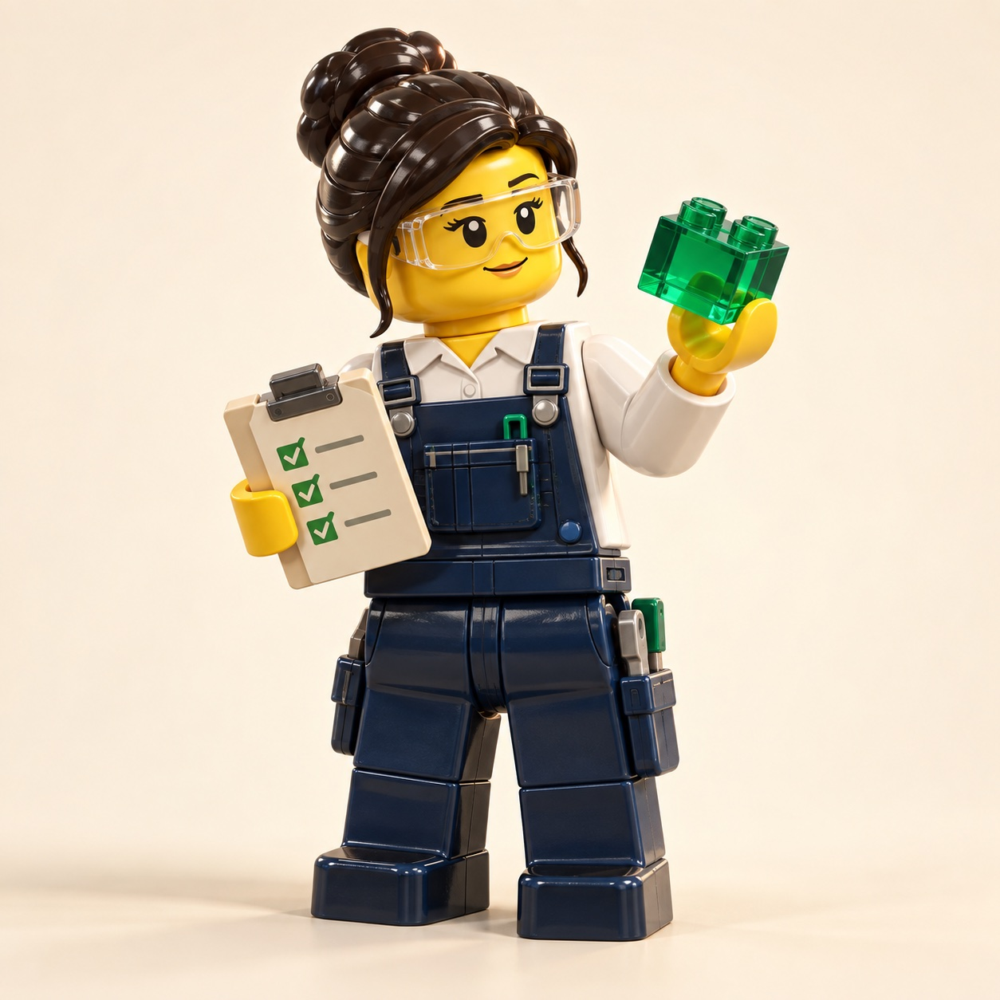

홈

# ROP 연구 위키

로봇 오케스트레이션 플랫폼(Robot Orchestration Platform, ROP)을 구현하고 운영하는 데 관여하는 모든 일을 빠짐없이 나열해 17개 대분류·67개 세부 연구영역으로 묶고, 대분류마다 연구 논문·기사·업체 발표를 모아 가는 기술 지형도다. 리서치·내용 검증·스토리텔러 에이전트가 매일 한 영역씩 조사한 내용을 쌓는다.

**이 위키는 이렇게 작성됩니다**

!!! agent-summary ""

    !!! agent-mini ""

        { width="88" height="88" }

        **리서치 · 조사**

        공식 문서와 논문을 찾아 주장과 출처를 정리합니다.

    !!! agent-mini ""

        { width="88" height="88" }

        **내용 검증 · 확인**

        조사 자료의 근거를 대조하고, 작성된 원고도 다시 확인합니다.

    !!! agent-mini ""

        { width="88" height="88" }

        **스토리텔러 · 작성**

        검증한 자료로 설명과 사례를 쓰고 출처를 붙입니다.

    !!! agent-mini ""

        { width="88" height="88" }

        **퍼블리셔 · 게시**

        통과한 원고의 형식과 링크를 검사해 게시합니다. AI가 아닌 프로그램입니다.

**조사 → 근거 검증 → 원고 작성 → 원고 재검증 → 게시**

[로봇 시뮬레이터 실행하기 ↗](https://robot-lab-seven.vercel.app/){ .md-button .md-button--primary }
[체험 내용과 확인 범위](about/simulator.md){ .md-button }

2개 층에서 AMR·조작 팔·Spot과 이동 보행자가 함께하는 물품 운반을 직접 실행할 수 있습니다. Vercel에서 방문자마다 별도 체험 공간을 만들며, 최대 30분 동안 사용할 수 있습니다.

## ROP란 무엇인가

ROP는 **서로 다른 제조사의 로봇과 현장 설비·업무 시스템을 하나로 연결해, 사람이 정한 일을 여러 로봇이 함께 실제로 해내게 하고 그 결과를 다시 시스템에 돌려주는 플랫폼**으로 볼 수 있다. [분류원문]

이 분류는 ROP를 구현하고 운영하는 데 관여하는 모든 일을 처음부터 끝까지 빠짐없이 나열하고, 같은 일을 하는 것끼리 세부 연구영역으로, 핵심 질문이 같은 영역끼리 대분류로 묶은 것이다. 대분류마다 연구 논문·기사·업체 발표를 모아 기술 지형도를 만든다. 물류창고·제조 공장·병원·상업 시설·가정·실외는 모두 ROP가 쓰이는 현장 유형이다. [분류원문]

**B. 로봇 온톨로지와 C. 채팅 기반 구성·운영은 반드시 갖춰야 할 기능이다.** B는 이기종 로봇을 등록하고 능력을 표현해 시스템과 로봇을 쉽게 연동하게 하고, C는 채팅으로 맵을 그리고, 시나리오를 구성하고, 로봇을 구성하고, 실제 상황을 시뮬레이션으로 재현하고, 업무를 지시하게 한다. [분류원문]

자세한 설명은 [ROP란 무엇인가](about/what-is-rop.md)에 있다.

## 이 위키가 다루는 범위

분류 원문은 이 분류의 성격을 다음과 같이 밝힌다.

공식 단일 분류가 아니라 로봇 연구·실제 플랫폼 구조·현장 사례를 종합한 연구 범위 점검용 분류이며, 모든 항목을 직접 개발한다는 의미는 아니다. [분류원문]

대분류·세부영역의 명칭·번호·정의·질문은 원문 그대로 쓰며 바꾸지 않는다. 새 세부영역이 필요해 보이면 분류를 바꾸지 않고 [열린 질문](open-questions.md)에 "분류 확장 제안"으로 기록한다. 2026-09-28에 분류를 7개 대분류·28개 영역에서 지금 구조로 개정했고, 옛 영역 페이지의 본문은 새 영역 페이지로 옮겼다.

## 대분류 표

아래 표의 대분류·핵심 질문·세부영역 열은 원문 1장의 표를 그대로 옮긴 것이고, 대분류 페이지와 세부 연구영역 열은 위키에서 덧붙인 것이다.

| 대분류 | 핵심 질문 | 세부영역 | 대분류 페이지 | 세부 연구영역 |
|---|---|---|---|---|
| A. 기획·사업 | 어떤 일을 로봇에게 맡기고, 무엇을 들여, 어떤 효과를 볼 것인가? | 1–3 | [A. 기획·사업](categories/planning-and-business/index.md) | [1. 기술·시장·업체 동향](categories/planning-and-business/technology-market-and-vendor-trends.md) [2. 사용 사례·요구·책임 범위](categories/planning-and-business/use-cases-requirements-and-scope.md) [3. 경제성·조달·사업 모델](categories/planning-and-business/economics-procurement-and-business-models.md) |
| B. 로봇 온톨로지 | 서로 다른 제조사의 로봇을 어떻게 등록하고, 할 수 있는 일을 같은 말로 표현해, 시스템과 쉽게 연결할 것인가? | 4–7 | [B. 로봇 온톨로지](categories/robot-ontology/index.md) | [4. 이기종 로봇 등록](categories/robot-ontology/heterogeneous-robot-registration.md) [5. 로봇 능력·작업 표현](categories/robot-ontology/robot-capability-and-task-representation.md) [6. 온톨로지 기반 시스템·로봇 연동](categories/robot-ontology/ontology-based-system-and-robot-integration.md) [7. 온톨로지 검증·변경 관리](categories/robot-ontology/ontology-verification-and-change-management.md) |
| C. 채팅 기반 구성·운영 | 맵 작성, 시나리오 구성, 로봇 구성, 실제 상황 재현, 업무 지시를 비전문 사용자가 대화만으로 할 수 있게 하려면? | 8–13 | [C. 채팅 기반 구성·운영](categories/chat-based-configuration-and-operation/index.md) | [8. 채팅으로 맵 작성](categories/chat-based-configuration-and-operation/chat-map-authoring.md) [9. 채팅으로 시나리오 구성](categories/chat-based-configuration-and-operation/chat-scenario-composition.md) [10. 채팅으로 로봇 구성](categories/chat-based-configuration-and-operation/chat-robot-configuration.md) [11. 채팅으로 실제 상황 시뮬레이션 재현](categories/chat-based-configuration-and-operation/chat-real-situation-simulation-replay.md) [12. 채팅으로 업무 지시·오케스트레이션](categories/chat-based-configuration-and-operation/chat-task-instruction-and-orchestration.md) [13. 대화형 기능의 신뢰·기반](categories/chat-based-configuration-and-operation/conversational-trust-and-foundations.md) |
| D. 공간·지도 모델 | 로봇마다 다른 지도와 건물 도면을 어떻게 하나의 공간으로 만들고 유지할 것인가? | 14–16 | [D. 공간·지도 모델](categories/space-and-map-model/index.md) | [14. 도면·BIM에서 지도 만들기](categories/space-and-map-model/maps-from-floor-plans-and-bim.md) [15. 지도·공간·위치 모델](categories/space-and-map-model/map-space-and-location-model.md) [16. 장소 의미·지도 관리](categories/space-and-map-model/place-semantics-and-map-management.md) |
| E. 사물·사람·실시간 상태 | 작업 대상·사람·설비·로봇이 지금 어디에 어떤 상태로 있는지 어떻게 믿을 수 있게 알 것인가? | 17–19 | [E. 사물·사람·실시간 상태](categories/objects-people-and-live-state/index.md) | [17. 작업 대상·자산 식별과 인계 추적](categories/objects-people-and-live-state/work-object-and-asset-identification-and-handover-tracking.md) [18. 실시간 세계 상태·데이터 일관성](categories/objects-people-and-live-state/real-time-world-state-and-data-consistency.md) [19. 사람·보행자 모델](categories/objects-people-and-live-state/people-and-pedestrian-model.md) |
| F. 연동 | 제조사 관제·로봇·문·승강기·업무 시스템과 어떻게 확실하게 연결할 것인가? | 20–23 | [F. 연동](categories/integration/index.md) | [20. 로봇·제조사 관제 연동](categories/integration/robot-and-vendor-fleet-manager-integration.md) [21. 상호운용 표준·적합성](categories/integration/interoperability-standards-and-conformance.md) [22. 설비·건물 시스템 연동](categories/integration/facility-and-building-system-integration.md) [23. 업무 시스템 연동](categories/integration/business-system-integration.md) |
| G. 계획·최적화 | 누가, 언제, 어디로, 어떤 자원을 써서 일할 것인가? | 24–28 | [G. 계획·최적화](categories/planning-and-optimization/index.md) | [24. 작업·워크플로 모델링](categories/planning-and-optimization/task-and-workflow-modeling.md) [25. 작업 배정 — MRTA](categories/planning-and-optimization/task-allocation-mrta.md) [26. 작업 순서·스케줄링](categories/planning-and-optimization/task-sequencing-and-scheduling.md) [27. 다중 로봇 경로·교통 관리 — MAPF](categories/planning-and-optimization/multi-robot-path-and-traffic-management-mapf.md) [28. 공용 자원·충전·에너지 최적화](categories/planning-and-optimization/shared-resource-charging-and-energy-optimization.md) |
| H. 실행·협업·예외 복구 | 계획한 일을 여러 로봇과 사람이 함께 끝까지 해내고, 어긋나면 어떻게 이어 갈 것인가? | 29–32 | [H. 실행·협업·예외 복구](categories/execution-collaboration-and-recovery/index.md) | [29. 명령·작업 실행의 신뢰성](categories/execution-collaboration-and-recovery/command-and-task-execution-reliability.md) [30. 로봇 간 협업·물리적 인계](categories/execution-collaboration-and-recovery/robot-to-robot-collaboration-and-physical-handover.md) [31. 사람–로봇 협업](categories/execution-collaboration-and-recovery/human-robot-collaboration.md) [32. 예외 복구·재계획·업무 연속성](categories/execution-collaboration-and-recovery/exception-recovery-replanning-and-business-continuity.md) |
| I. 설계·시뮬레이션 | 현장을 바꾸거나 로봇을 늘리기 전에 가상으로 설계하고 결과를 미리 볼 수 있는가? | 33–36 | [I. 설계·시뮬레이션](categories/design-and-simulation/index.md) | [33. 시나리오 모델·편집](categories/design-and-simulation/scenario-model-and-editing.md) [34. 시뮬레이션·예측용 디지털 트윈](categories/design-and-simulation/simulation-and-predictive-digital-twin.md) [35. 처리능력·규모·배치 설계](categories/design-and-simulation/capacity-sizing-and-layout-design.md) [36. 가상 시운전·실제 상황 재현](categories/design-and-simulation/virtual-commissioning-and-real-situation-replay.md) |
| J. 현장 운영·관제 | 운영자가 지금 무슨 일이 일어나는지 보고, 이상을 알아차리고, 성과를 확인할 수 있는가? | 37–40 | [J. 현장 운영·관제](categories/field-operations-and-monitoring/index.md) | [37. 관제 화면·실행 기록](categories/field-operations-and-monitoring/control-screen-and-execution-records.md) [38. 모니터링·이상 탐지·원인 분석](categories/field-operations-and-monitoring/monitoring-anomaly-detection-and-root-cause-analysis.md) [39. 운영 성과 측정·개선](categories/field-operations-and-monitoring/operational-performance-measurement-and-improvement.md) [40. 운영 절차·요청 창구](categories/field-operations-and-monitoring/operating-procedures-and-request-channels.md) |
| K. 플랫폼 아키텍처·인프라 | 플랫폼을 어디에 어떻게 두어야 끊김·확장·다현장 조건에서도 계속 동작하는가? | 41–43 | [K. 플랫폼 아키텍처·인프라](categories/platform-architecture-and-infrastructure/index.md) | [41. 플랫폼 아키텍처·외부 API](categories/platform-architecture-and-infrastructure/platform-architecture-and-external-api.md) [42. 분산 시스템·통신·컴퓨팅 구조](categories/platform-architecture-and-infrastructure/distributed-systems-communication-and-computing.md) [43. 데이터·관측성·배포](categories/platform-architecture-and-infrastructure/data-observability-and-deployment.md) |
| L. AI·학습 기술 | 학습·언어 모델 같은 AI 기술을 어디에 쓰고, 그 결과를 어떤 기준으로 믿을 것인가? | 44–47 | [L. AI·학습 기술](categories/ai-and-learning/index.md) | [44. 로봇 기반 모델·언어 모델 계획](categories/ai-and-learning/robot-foundation-models-and-llm-planning.md) [45. 문서·도면·장면 이해](categories/ai-and-learning/document-drawing-and-scene-understanding.md) [46. 예측·학습 기반 최적화](categories/ai-and-learning/prediction-and-learning-based-optimization.md) [47. AI·학습·적응과 모델 운영](categories/ai-and-learning/ai-learning-adaptation-and-model-operations.md) |
| M. 안전 | 여러 로봇·사람·설비가 함께 움직일 때 생기는 위험을 어떻게 찾고 막을 것인가? | 48–50 | [M. 안전](categories/safety/index.md) | [48. 안전·위험 관리](categories/safety/safety-and-risk-management.md) [49. 사람 근접 안전](categories/safety/human-proximity-safety.md) [50. 안전 표준·인증·사고 조사](categories/safety/safety-standards-certification-and-incident-investigation.md) |
| N. 보안·개인정보 | 누가 어떤 로봇에 무엇을 시킬 수 있는지 통제하고, 데이터와 사람의 정보를 어떻게 지킬 것인가? | 51–53 | [N. 보안·개인정보](categories/security-and-privacy/index.md) | [51. 인증·권한·격리](categories/security-and-privacy/authentication-authorization-and-isolation.md) [52. 통신 보호·위협 관리·감사](categories/security-and-privacy/communication-protection-threat-management-and-audit.md) [53. 개인정보·영상 데이터](categories/security-and-privacy/privacy-and-video-data.md) |
| O. 검증·도입·수명주기 | 만든 것을 어떻게 검증하고, 현장에 설치해 넘기고, 오래 바꿔 가며 운영할 것인가? | 54–57 | [O. 검증·도입·수명주기](categories/verification-deployment-and-lifecycle/index.md) | [54. 시험·형식 검증·벤치마크](categories/verification-deployment-and-lifecycle/testing-formal-verification-and-benchmarking.md) [55. 현장 조사·설치·시운전](categories/verification-deployment-and-lifecycle/site-survey-installation-and-commissioning.md) [56. 운영 이관·확대·교육](categories/verification-deployment-and-lifecycle/operations-handover-scale-out-and-training.md) [57. 자산·소프트웨어 수명주기 관리](categories/verification-deployment-and-lifecycle/asset-and-software-lifecycle-management.md) |
| P. 거버넌스·법규·사회 | 여러 사업자와 법, 사회적 요구 속에서 책임과 규칙을 어떻게 정할 것인가? | 58–60 | [P. 거버넌스·법규·사회](categories/governance-law-and-society/index.md) | [58. 다사업자 책임·계약·데이터](categories/governance-law-and-society/multi-party-responsibility-contracts-and-data.md) [59. 법·규제·보험·라이선스](categories/governance-law-and-society/law-regulation-insurance-and-licensing.md) [60. 노동·수용성·접근성](categories/governance-law-and-society/labor-acceptance-and-accessibility.md) |
| Q. 현장 유형별 적용 | 현장마다 다른 요구를 플랫폼이 어떻게 받아들이고, 실제로 어디에 어떻게 쓰이고 있는가? | 61–67 | [Q. 현장 유형별 적용](categories/site-type-applications/index.md) | [61. 물류창고](categories/site-type-applications/warehouse.md) [62. 제조 공장](categories/site-type-applications/manufacturing-plant.md) [63. 병원·의료](categories/site-type-applications/hospital-and-healthcare.md) [64. 상업 시설](categories/site-type-applications/commercial-facilities.md) [65. 가정·공동주택](categories/site-type-applications/home-and-apartment.md) [66. 실외](categories/site-type-applications/outdoor.md) [67. 기타 현장](categories/site-type-applications/other-sites.md) |

[분류원문]

## 다루지 않는 것

ROP가 직접 소유하지 않고 외부 시스템과 연계하는 영역을 원문 19장은 다섯 가지 경계로 정리한다. 아래 목록은 경계표의 "경계" 열과 "주로 연계할 외부 영역" 열을 위키에서 한 줄씩 이어 붙인 요약이다. 셀의 문구는 원문과 같지만 이 줄 자체는 원문에 없는 문장이므로 `[분류원문]` 태그를 붙이지 않는다.

- **상위 업무 시스템** — 수요예측, 구매, 재무, 전사 자원 계획
- **로봇 자체 지능·제어** — 센서 인식, SLAM, 로컬 회피, 파지, 모터·관절 제어
- **시설·설비 제어** — 승강기·컨베이어·PLC·설비 안전 제어
- **현장 간 운송** — 배차·운송계획·운임·국제물류
- **업종별 조건** — 의료·식품·위험물·실외 차량·드론 등의 전문 요구사항

이 영역들은 ROP가 직접 만들지 않고 "연계 대상"으로 다룬다. 경계표 전체와 이 경계가 제품 전략에 따라 이동할 수 있다는 원문 설명은 [ROP가 직접 소유할 범위와 외부 연계 경계](about/scope-boundary.md)에 원문 그대로 있다.

## 콘텐츠가 만들어지는 방식

세 에이전트가 매일 1회 한 영역을 다룬다. 리서치 에이전트가 근거 있는 조사 브리프를 만들고, 내용 검증 에이전트가 출처의 실재와 주장–출처 일치를 검증해 게시 가능 여부를 판정하며, 스토리텔러 에이전트가 검증을 통과한 브리프만으로 페이지를 쓴다. 마지막으로 퍼블리셔 스크립트가 원문 보호·링크·프런트매터 검사를 거쳐 위키에 반영한다. 아직 본문이 없는 세부영역부터 번호순으로 채우고, 그 뒤에는 오래된 영역·열린 질문·비어 있는 현장 유형 칸을 기준으로 대상을 고른다. 각 에이전트의 역할·입력·출력과 사람이 개입하는 지점은 [에이전트 소개](about/agents.md)에 있다.

## 진행 중인 중점 연구 트랙

트랙은 분류를 바꾸지 않고 여러 세부영역을 가로지르는 집중 연구 프로그램이다. 아래 현황은 퍼블리셔가 자동으로 갱신한다.

<!-- auto:home-track-status:start -->
| 트랙 | 현재 단계 | 상태 | 열린 질문 수 | 최근 답한 질문 | 개요 |
|---|---|---|---|---|---|
| 매뉴얼 기반 로봇 기능 온톨로지 | [단계 1. 기존 능력 표현 모델과 표준 조사](tracks/manual-capability-ontology/stage-1-existing-models-and-standards.md) (1 / 7) | active | 45 | q2-01 — 제조사가 제공하는 문서 유형(사용자 매뉴얼, 통합·API 가이드, 사양서·데이터시트, 안전 매뉴얼, 오류 코드표, 릴리스 노트, 치수도·도면)은 무엇이며 각각 어떤 기능 정보를 담는가? ([답](tracks/manual-capability-ontology/stage-2-document-types.md#q2-01)) | [트랙 개요](tracks/manual-capability-ontology/index.md) |
| 채팅 기반 구성·운영 | [단계 1. 선행 연구·제품 사례 조사](tracks/chat-based-configuration-and-operation/stage-1-prior-work-and-products.md) (1 / 10) | active | 66 | q5-02 — 가상 현장·가상 로봇으로 지시 시나리오를 재현해 챗봇을 시험하는 방법과 그 한계는 무엇인가? ([답](tracks/chat-based-configuration-and-operation/stage-5-verification-and-hypotheses.md#q5-02)) | [트랙 개요](tracks/chat-based-configuration-and-operation/index.md) |
| 건축 도면 자동 인식 | [단계 1. 선행 연구·제품 사례 조사](tracks/floorplan-recognition/stage-1-prior-work-and-products.md) (1 / 5) | active | 35 | q5-03 — 가설 1~3은 단계 1~4의 결과로 어떻게 판정되는가? ([답](tracks/floorplan-recognition/stage-5-verification-and-hypotheses.md#q5-03)) | [트랙 개요](tracks/floorplan-recognition/index.md) |
<!-- auto:home-track-status:end -->

## 표기 범례

페이지 상태는 프런트매터 `status` 로 표시한다.

| 상태 | 의미 |
|---|---|
| seed | 원문 정의만 있고 본문이 없음 |
| draft | 스토리텔러 초안, 2차 검증 전 |
| verified | 2차 검증 통과, 게시 대기 |
| published | 게시됨 |
| needs_update | 정정 요청이 있거나 기준일이 오래되어 재검증 필요 |
| deprecated | 대체되었거나 더 이상 유효하지 않음. 대체 페이지 링크 필수 |

신뢰도(`confidence`)는 내용 검증 에이전트가 부여한다. high 는 핵심 주장이 2개 이상의 독립 출처로 확인된 것, medium 은 단일 출처이거나 벤더·기사 중심인 것, low 는 추정·의견 비중이 높은 것이다.

본문의 주장에는 태그를 붙인다. `[사실]`은 출처로 확인된 주장, `[추정]`은 근거는 있으나 확인이 부족한 주장(벤더 주장 포함), `[의견]`은 작성자의 해석이다. `[분류원문]`은 분류 원문에서 한 글자도 바꾸지 않고 옮긴 문장, `[옛 분류원문]`은 2026-09-28 개정 전 원문(보관본)에서 옮긴 문장, `[가설]`은 중점 연구 트랙에서 검증할 가설, `[사용자 실험]`은 사용자가 직접 수행한 실험 결과다. 출처는 `[^ref-001]` 형식의 각주로 붙인다. 자세한 읽는 법은 [읽기 가이드](about/reading-guide.md)에 있다.

## 최근 업데이트

<!-- auto:home-recent:start -->
- 2026-09-30 · 갱신 · [37. 관제 화면·실행 기록](categories/field-operations-and-monitoring/control-screen-and-execution-records.md) — 영역 심화: 3~11절 신규 작성, 13절 각주 정의 15건, 프런트매터 related_areas·tags·confidence·sources·last_run 채움(1차 조건부 승인 수정 15건 반영). 2차: 3절 첫 문장을 태그 없는 연결 문장으로, 4절 도입 문장의 [사실] 태그 제거, 9절 '상용 예로'를 '6절에서 예로'로 고침 (실행 2026-09-30-13)
- 2026-09-30 · 생성 · [37. 관제 화면·실행 기록 — 대표 접근법과 기술](topics/2026/2026-09-30-area37-s6.md) — 자동 분리: 37. 관제 화면·실행 기록 의 "6. 대표 접근법과 기술" 절을 옮겼다. 2차: '국내 상용 예로'를 '국내 예로(연구 과제 페이지 기준)'로 고침 (실행 2026-09-30-13)
- 2026-09-30 · 생성 · [37. 관제 화면·실행 기록 — 대표 연구와 자료](topics/2026/2026-09-30-area37-s8.md) — 자동 분리: 37. 관제 화면·실행 기록 의 "8. 대표 연구와 자료" 절을 옮겼다(2차 재실행에서 변경 없음) (실행 2026-09-30-13)
- 2026-09-30 · 생성 · [37. 관제 화면·실행 기록 — 핵심 개념과 용어](topics/2026/2026-09-30-area37-s4.md) — 자동 분리: 37. 관제 화면·실행 기록 의 "4. 핵심 개념과 용어" 절을 옮겼다. 2차: 세 줄 요약·본문 첫 문장에서 [사실] 태그와 각주를 뗀 연결 문장으로 바꿈 (실행 2026-09-30-13)
- 2026-09-30 · 생성 · [37. 관제 화면·실행 기록 — 다른 연구영역과의 연결](topics/2026/2026-09-30-area37-s10.md) — 자동 분리: 37. 관제 화면·실행 기록 의 "10. 다른 연구영역과의 연결 (번호와 이름을 함께 표기)" 절을 옮겼다. 2차: 짝 엔진을 번호와 이름으로 표기, 39. 운영 성과 측정·개선 항목의 '실제 소요 시간' 드리프트 수정 (실행 2026-09-30-13)
- 전체 목록: [변경 이력](changelog.md)
<!-- auto:home-recent:end -->

## 시작하기 좋은 페이지

- [연구 방법](about/research-method.md) — 할 일을 빠짐없이 나열하고, 묶고, 묶음마다 자료를 모으는 방법
- [B. 로봇 온톨로지](categories/robot-ontology/index.md) — 이기종 로봇 등록·능력 표현·시스템과 로봇의 연동
- [C. 채팅 기반 구성·운영](categories/chat-based-configuration-and-operation/index.md) — 채팅으로 맵 작성·시나리오 구성·로봇 구성·실제 상황 재현·업무 지시
- [현장 유형 × 대분류 적용 사례 매트릭스](site-matrix.md) — 물류창고·공장·병원·상업 시설·가정·실외에서 어떤 대분류가 다뤄졌는지
- [용어집](glossary/index.md) — ISA-95, EPCIS, Open-RMF, VDA 5050, MRTA, MAPF 같은 용어의 한 줄 정의
- [열린 질문](open-questions.md) — 아직 답하지 못한 질문과 그 상태

## 정정과 요청

틀린 문장, 오래된 사실, 우선 조사할 주제가 있으면 [기여·정정 방법](about/how-to-contribute.md)의 절차를 따른다. 정정 요청은 다음 실행의 검증 항목에 포함되고, 처리 결과는 [변경 이력](changelog.md)에 남는다.
