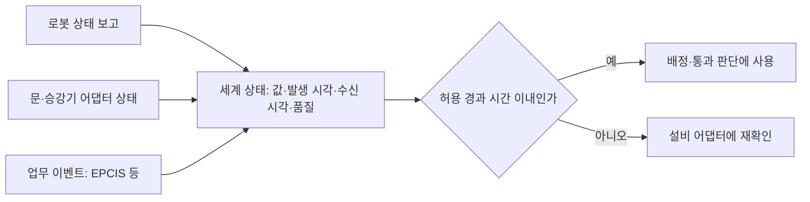

[홈](../../index.md) › [주제](../index.md) › 8. 실시간 세계 상태·데이터 일관성 — 대표 접근법과 기술

# 8. 실시간 세계 상태·데이터 일관성 — 대표 접근법과 기술

<!-- auto:page-status:start -->
> 페이지 상태: published · 신뢰도: low · 페이지 버전: 1 · 마지막 갱신: 2026-09-25 · 마지막 실행: 2026-09-25
<!-- auto:page-status:end -->

## 1. 세 줄 요약

- 상태의 오래됨을 판정하는 기본 장치는 발행 주기·기한·수명·생존성이며, ROS 2 QoS 는 이를 정책으로 두고 기한 초과·생존성 상실·변경을 이벤트 콜백으로 알린다(Jazzy 판 문서 기준). [사실][^ref-282]
- 이 페이지는 [8. 실시간 세계 상태·데이터 일관성](../../categories/b-common-information-and-environment-model/08-real-time-world-state-and-data-consistency.md) 페이지의 "대표 접근법과 기술" 절이 분량 기준을 넘어 옮겨 온 것이다. 원 페이지의 검증을 거친 내용이며 새 주장은 없다.

## 2. 배경

[8. 실시간 세계 상태·데이터 일관성](../../categories/b-common-information-and-environment-model/08-real-time-world-state-and-data-consistency.md) 페이지를 쓰는 과정에서 "대표 접근법과 기술" 절의 분량이 세부영역 페이지 기준(4,000자)을 넘어, 내용을 줄이지 않고 이 주제 페이지로 분리했다.

## 3. 본문

상태의 오래됨을 판정하는 기본 장치는 발행 주기·기한·수명·생존성이며, ROS 2 QoS 는 이를 정책으로 두고 기한 초과·생존성 상실·변경을 이벤트 콜백으로 알린다(Jazzy 판 문서 기준). [사실][^ref-282]

### 오래됨 판정: 주기·기한·수명·생존성

발행자가 정한 간격 안에 새 값이 오지 않으면 받는 쪽이 이를 사건으로 알 수 있게 하는 방식이다. [사실][^ref-282] 한계는 이 값들이 통신 계층의 설정일 뿐 '문 상태는 몇 초까지 믿는가' 같은 업무 기준을 주지 않는다는 점이다. [추정][^ref-031][^ref-282][^ref-287][^ref-283][^ref-289]

### 품질 표시와 순서 복구

Eclipse Sparkplug 사양은 에지 노드의 종료 통지(NDEATH)를 받거나 MQTT 서버 연결을 잃으면 호스트 애플리케이션이 관련 측정값을 STALE 품질로 표시하게 하고, 0~255 순번으로 순서 뒤바뀜을 감지해 재정렬 대기 시간이 지나도 빠진 메시지가 오지 않으면 재탄생(Rebirth) 요청으로 전체 상태를 다시 받게 한다. [사실][^ref-287] OPC UA 는 값마다 Good·Uncertain·Bad 상태 코드를 붙인다. [사실][^ref-288] VDA 5050 상태 스키마는 위치추정 여부(localized), 0~1 위치추정 품질(localizationScore), 위치 편차 범위(deviationRange), 지도 id(mapId)를 담는다(3.0.0 판, 공식 저장소 main 기준, 확인일 2026-09-25). [사실][^ref-051]

### 두 시각을 함께 기록

SOSA·EPCIS·OPC UA 가 모두 '사실이 성립한 시각'과 '시스템이 받거나 기록한 시각'을 나누므로, ROP 세계 상태의 각 값에도 최소한 이 두 시각과 품질 표시를 함께 두어야 오래됨·순서 역전을 판단할 수 있을 것으로 보인다. [추정][^ref-030][^ref-045][^ref-288] 다만 세 표준이 서로를 참조한다는 근거는 없고 정의가 조금씩 다르다.

### 덮어쓰지 않는 정정

EPCIS 오류 선언은 원 기록을 지우지 않고 뒤 이벤트로 바로잡는다. [사실][^ref-045][^ref-044] 이를 참고하면 ROP 세계 상태 이력도 인계 완료로 잘못 보고된 적재 같은 상태를 덮어쓰지 않고 정정 기록을 덧붙여야 인계 분쟁 때 원 기록과 정정 근거를 함께 추적할 수 있을 것으로 보인다. [추정][^ref-045][^ref-044]

### 판독 정제

적응형 슬라이딩 윈도 방식 WSTD 는 SMURF 의 개념을 바탕으로 전이 감지를 개선해 이동 태그 환경에서 SMURF 보다 전체 오류가 약 30% 적었다고 보고했다(저자 보고값, 실험 조건 미확인). [사실][^ref-293]

### 합쳐도 되는 상태와 한 주체만 가져야 하는 상태

CRDT 는 조율 없이 수정한 복제본이 같은 갱신을 받으면 같은 상태로 수렴하게 한다. [사실][^ref-295] Open-RMF 교통 일정 데이터베이스는 지연·취소·경로 변경을 계속 반영하는 살아 있는 데이터베이스이며, 충돌이 예상되면 관련 플릿 관리자에게 충돌 통지를 보내 협상을 시작하게 한다. [사실][^ref-004] CRDT 식 수렴은 관측 기록 모음처럼 순서와 무관하게 합칠 수 있는 상태에는 맞지만, 문·승강기 사용권처럼 한 시점에 한 주체만 가져야 하는 자원은 Open-RMF 문·승강기 어댑터나 승강기 세션 id 처럼 단일 감독자가 판정하는 구조가 필요할 것으로 보인다. [추정][^ref-295][^ref-283][^ref-286]

아래 도식은 위 [추정] 문장들을 정리한 설명용 그림이다.

## 4. 현장 시나리오

현장 시나리오는 원 페이지의 [5. 현장 시나리오 (물류 흐름의 어느 단계인지 명시)](../../categories/b-common-information-and-environment-model/08-real-time-world-state-and-data-consistency.md) 절에 있다.

## 5. ROP 관점의 시사점

ROP가 직접 맡는 것과 외부와 연계하는 것은 원 페이지의 [9. ROP가 직접 맡는 것과 외부와 연계하는 것 (부록 A 9장 기준)](../../categories/b-common-information-and-environment-model/08-real-time-world-state-and-data-consistency.md) 절에 있다.

## 6. 연결되는 연구영역

- 주 연구영역: [8. 실시간 세계 상태·데이터 일관성](../../categories/b-common-information-and-environment-model/08-real-time-world-state-and-data-consistency.md)
- 관련 영역: [22. 시뮬레이션·예측용 디지털 트윈](../../categories/f-deployment-verification-and-maintenance/22-simulation-and-predictive-digital-twin.md), [7. 화물·재고·자산 식별과 추적](../../categories/b-common-information-and-environment-model/07-cargo-inventory-and-asset-identification-and-tracking.md), [10. 설비·건물 시스템 연동](../../categories/c-connectivity-and-execution-foundation/10-facility-and-building-system-integration.md), [9. 로봇·제조사 관제 연동](../../categories/c-connectivity-and-execution-foundation/09-robot-and-vendor-fleet-manager-integration.md), [11. 분산 시스템·통신·컴퓨팅 구조](../../categories/c-connectivity-and-execution-foundation/11-distributed-systems-communication-and-computing.md), [15. 다중 로봇 경로·교통 관리 — MAPF](../../categories/d-planning-and-optimization/15-multi-robot-path-and-traffic-management-mapf.md), [6. 지도·공간·위치 모델](../../categories/b-common-information-and-environment-model/06-map-space-and-location-model.md), [19. 모니터링·이상 탐지·원인 분석](../../categories/e-collaboration-and-field-operations/19-monitoring-anomaly-detection-and-root-cause-analysis.md), [5. 로봇 능력·작업 온톨로지](../../categories/b-common-information-and-environment-model/05-robot-capability-and-task-ontology.md)

## 7. 열린 질문

열린 질문은 원 페이지의 [11. 열린 질문](../../categories/b-common-information-and-environment-model/08-real-time-world-state-and-data-consistency.md) 절과 [열린 질문](../../open-questions.md) 페이지에 모은다.

## 8. 출처

[^ref-004]: Open Robotics, RMF Core Overview — Programming Multiple Robots with ROS 2, 미확인, https://osrf.github.io/ros2multirobotbook/rmf-core.html, 접근일 2026-09-25
[^ref-030]: W3C / OGC, Semantic Sensor Network Ontology, 2017-10-19, https://www.w3.org/TR/vocab-ssn/, 접근일 2026-09-25 (원문 미열람)
[^ref-031]: VDA / VDMA (VDA5050 GitHub), VDA5050/VDA5050_EN.md — Official Specification document for the VDA 5050, 미확인, https://github.com/VDA5050/VDA5050/blob/main/VDA5050_EN.md, 접근일 2026-09-25
[^ref-044]: GS1, gs1/EPCIS — Ontology/CBV.ttl (Core Business Vocabulary ontology 2.0), 2021-09-30, https://github.com/gs1/EPCIS/blob/master/Ontology/CBV.ttl, 접근일 2026-09-25
[^ref-045]: GS1, gs1/EPCIS — Ontology/EPCIS.ttl (EPCIS ontology 2.0), 2021-09-30, https://github.com/gs1/EPCIS/blob/master/Ontology/EPCIS.ttl, 접근일 2026-09-25
[^ref-051]: VDA / VDMA (VDA5050 GitHub), VDA5050/VDA5050 — json_schemas/state.schema, 미확인, https://github.com/VDA5050/VDA5050/blob/main/json_schemas/state.schema, 접근일 2026-09-25
[^ref-282]: Open Robotics (ROS 2 Documentation), Quality of Service settings — ROS 2 Documentation: Jazzy, 미확인, https://docs.ros.org/en/jazzy/Concepts/Intermediate/About-Quality-of-Service-Settings.html, 접근일 2026-09-25
[^ref-283]: Open Robotics, Doors (integration_doors) - Programming Multiple Robots with ROS 2, 미확인, https://osrf.github.io/ros2multirobotbook/integration_doors.html, 접근일 2026-09-25
[^ref-286]: Open Robotics (open-rmf), rmf_internal_msgs — rmf_lift_msgs/msg/LiftState.msg, 미확인, https://github.com/open-rmf/rmf_internal_msgs/blob/main/rmf_lift_msgs/msg/LiftState.msg, 접근일 2026-09-25
[^ref-287]: Eclipse Foundation (eclipse-sparkplug GitHub), Sparkplug Specification — Chapter 5 Operational Behavior (Sparkplug_5_Operational_Behavior.adoc), 미확인, https://github.com/eclipse-sparkplug/sparkplug/blob/master/specification/src/main/asciidoc/chapters/Sparkplug_5_Operational_Behavior.adoc, 접근일 2026-09-25
[^ref-288]: OPC Foundation, OPC Unified Architecture – Part 4: Services - 7.11 DataValue, 미확인, https://reference.opcfoundation.org/specs/OPC-10000-4/7.11, 접근일 2026-09-25 (원문 미열람)
[^ref-289]: Yates, R. D., Sun, Y., Brown, D. R., Kaul, S. K., Modiano, E., & Ulukus, S., Age of Information: An Introduction and Survey, 2021-05, https://arxiv.org/abs/2007.08564, 접근일 2026-09-25 (원문 미열람)
[^ref-293]: Massawe, L. V. 외(Sensors), Reducing False Negative Reads in RFID Data Streams Using an Adaptive Sliding-Window Approach, 2012-03-28, https://doi.org/10.3390/s120404187, 접근일 2026-09-25 (원문 미열람)
[^ref-295]: Preguiça, N., Baquero, C., & Shapiro, M., Conflict-free Replicated Data Types (CRDTs), 2018-05, https://arxiv.org/abs/1805.06358, 접근일 2026-09-25 (원문 미열람)

## 9. 검증 노트

원 페이지와 함께 실행 2026-09-25-24 의 1차·2차 검증을 거쳤다. 분리는 코드가 했고 내용은 바꾸지 않았다.

## 10. 이력

| 날짜 | 실행 id | 변경 |
|---|---|---|
| 2026-09-25 | 2026-09-25-24 | 8. 실시간 세계 상태·데이터 일관성 의 "대표 접근법과 기술" 절에서 분리 |
