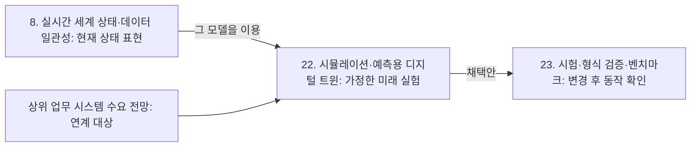

[홈](../../index.md) › [주제](../index.md) › 22. 시뮬레이션·예측용 디지털 트윈 — 핵심 개념과 용어

# 22. 시뮬레이션·예측용 디지털 트윈 — 핵심 개념과 용어

<!-- auto:page-status:start -->
> 페이지 상태: published · 신뢰도: medium · 페이지 버전: 1 · 마지막 갱신: 2026-09-25 · 마지막 실행: 2026-09-25
<!-- auto:page-status:end -->

## 1. 세 줄 요약

- 이 위키는 디지털 트윈을 용도로 나눈다: 현재 상태를 표현하는 것은 8. 실시간 세계 상태·데이터 일관성, 그 모델을 이용해 가정한 미래를 실험하는 것은 이 영역이다. 분류 원문은 이렇게 적는다.
- 이 페이지는 [22. 시뮬레이션·예측용 디지털 트윈](../../categories/f-deployment-verification-and-maintenance/22-simulation-and-predictive-digital-twin.md) 페이지의 "핵심 개념과 용어" 절이 분량 기준을 넘어 옮겨 온 것이다. 원 페이지의 검증을 거친 내용이며 새 주장은 없다.

## 2. 배경

[22. 시뮬레이션·예측용 디지털 트윈](../../categories/f-deployment-verification-and-maintenance/22-simulation-and-predictive-digital-twin.md) 페이지를 쓰는 과정에서 "핵심 개념과 용어" 절의 분량이 세부영역 페이지 기준(4,000자)을 넘어, 내용을 줄이지 않고 이 주제 페이지로 분리했다.

## 3. 본문

이 위키는 디지털 트윈을 용도로 나눈다: 현재 상태를 표현하는 것은 8. 실시간 세계 상태·데이터 일관성, 그 모델을 이용해 가정한 미래를 실험하는 것은 이 영역이다. 분류 원문은 이렇게 적는다.

8번의 실시간 모델이 **현재 상태를 표현**한다면, 22번은 그 모델을 이용해 **가정한 미래를 실험**한다. 구분해두면 디지털 트윈이라는 이름 아래 서로 다른 기능이 섞이지 않는다. [분류원문]

- **디지털 모델·디지털 섀도·디지털 트윈(Digital Model / [Digital Shadow](../../glossary/digital-shadow.md) / [Digital Twin](../../glossary/digital-twin.md))** — Kritzinger 외(2018)가 제조 문헌을 분류한 세 단계로, 가장 높은 단계인 디지털 트윈을 다룬 문헌은 드물고 모델·섀도 문헌이 더 많았다. [사실][^ref-291] 이 구분은 실물과 데이터가 얼마나 자동으로 연결되는가라는 축이며, 분류 원문의 현재 표현/미래 실험 구분과는 다른 축이다. 그래서 이 위키는 두 축을 섞지 않고 용도(현재 표현/미래 실험)로 나눠 적는다는 것이 구축자 의견이다. [의견][^ref-291][^ref-520]
- **[이산 사건 시뮬레이션](../../glossary/discrete-event-simulation.md)(Discrete Event Simulation, DES)** — 물류에서 DES는 사물인터넷 장치의 실시간 데이터를 질의하며 디지털 트윈의 한 부분으로 진화하고 있다는 정리가 있다. [사실][^ref-520]
- **디지털 트윈 결합(Digital Twin Composition)** — 여러 디지털 트윈을 목적에 따라 골라 결합하는 방법으로, ISO 23247-6(2026)이 다룬다. [사실][^ref-518][^ref-519]
- **디지털 스레드(Digital Thread)** — ISO 23247-5(2026)가 다루는 디지털 트윈을 위한 데이터 연결 체계다. [사실][^ref-518][^ref-519]
- **시뮬레이션 모델 검증·타당성 확인(Verification and Validation, V&V)** — 개념 모델 타당성, 모델 검증, 운영 타당성, 데이터 타당성을 나누어 확인하는 틀이다(Sargent, 2008년 판 기준). [사실][^ref-525]

도식의 앞 화살표는 분류 원문의 구분을, 뒤 두 화살표는 9·10절의 구축자 추정·의견을 그린 것이다.

## 4. 현장 시나리오

현장 시나리오는 원 페이지의 [5. 현장 시나리오 (물류 흐름의 어느 단계인지 명시)](../../categories/f-deployment-verification-and-maintenance/22-simulation-and-predictive-digital-twin.md) 절에 있다.

## 5. ROP 관점의 시사점

ROP가 직접 맡는 것과 외부와 연계하는 것은 원 페이지의 [9. ROP가 직접 맡는 것과 외부와 연계하는 것 (부록 A 9장 기준)](../../categories/f-deployment-verification-and-maintenance/22-simulation-and-predictive-digital-twin.md) 절에 있다.

## 6. 연결되는 연구영역

- 주 연구영역: [22. 시뮬레이션·예측용 디지털 트윈](../../categories/f-deployment-verification-and-maintenance/22-simulation-and-predictive-digital-twin.md)
- 관련 영역: [4. 성과·경제성·프로세스 개선](../../categories/a-business-supply-chain-design/04-performance-economics-and-process-improvement.md), [6. 지도·공간·위치 모델](../../categories/b-common-information-and-environment-model/06-map-space-and-location-model.md), [8. 실시간 세계 상태·데이터 일관성](../../categories/b-common-information-and-environment-model/08-real-time-world-state-and-data-consistency.md), [9. 로봇·제조사 관제 연동](../../categories/c-connectivity-and-execution-foundation/09-robot-and-vendor-fleet-manager-integration.md), [13. 작업 배정 — MRTA](../../categories/d-planning-and-optimization/13-task-allocation-mrta.md), [15. 다중 로봇 경로·교통 관리 — MAPF](../../categories/d-planning-and-optimization/15-multi-robot-path-and-traffic-management-mapf.md), [20. 예외 복구·재계획·업무 연속성](../../categories/e-collaboration-and-field-operations/20-exception-recovery-replanning-and-business-continuity.md), [21. 온보딩·설정·현장 시운전](../../categories/f-deployment-verification-and-maintenance/21-onboarding-configuration-and-commissioning.md), [23. 시험·형식 검증·벤치마크](../../categories/f-deployment-verification-and-maintenance/23-testing-formal-verification-and-benchmarking.md), [24. 자산·소프트웨어 수명주기 관리](../../categories/f-deployment-verification-and-maintenance/24-asset-and-software-lifecycle-management.md), [27. AI·학습·적응과 모델 운영](../../categories/g-safety-security-intelligence-and-governance/27-ai-learning-adaptation-and-model-operations.md), [28. 표준·상호운용성·다사업자 거버넌스](../../categories/g-safety-security-intelligence-and-governance/28-standards-interoperability-and-multi-vendor-governance.md)

## 7. 열린 질문

열린 질문은 원 페이지의 [11. 열린 질문](../../categories/f-deployment-verification-and-maintenance/22-simulation-and-predictive-digital-twin.md) 절과 [열린 질문](../../open-questions.md) 페이지에 모은다.

## 8. 출처

[^ref-518]: ISO, ISO 23247-6:2026 — Automation systems and integration — Digital twin framework for manufacturing — Part 6: Digital twin composition, 2026, https://www.iso.org/standard/87426.html, 접근일 2026-09-25 (원문 미열람)
[^ref-519]: 머니투데이, 설계부터 생산까지 데이터 연결…제조 디지털 트윈 국제표준 발간, 2026-07-28, https://www.mt.co.kr/economy/2026/07/28/2026072809211448284, 접근일 2026-09-25 (원문 미열람)
[^ref-291]: Kritzinger, W., Karner, M., Traar, G., Henjes, J., & Sihn, W., Digital Twin in manufacturing: A categorical literature review and classification, 2018, https://www.sciencedirect.com/science/article/pii/S2405896318316021, 접근일 2026-09-25 (원문 미열람)
[^ref-520]: Agalianos, K., Ponis, S. T., Aretoulaki, E., & Plakas, G., Discrete Event Simulation and Digital Twins: Review and Challenges for Logistics, 2020, https://www.sciencedirect.com/science/article/pii/S2351978920320990, 접근일 2026-09-25 (원문 미열람)
[^ref-525]: Sargent, R. G., Verification and validation of simulation models (Proceedings of the 40th Conference on Winter Simulation), 2008, https://dl.acm.org/doi/abs/10.5555/1516744.1516780, 접근일 2026-09-25 (원문 미열람)

## 9. 검증 노트

원 페이지와 함께 실행 2026-09-25-56 의 1차·2차 검증을 거쳤다. 분리는 코드가 했고 내용은 바꾸지 않았다.

## 10. 이력

| 날짜 | 실행 id | 변경 |
|---|---|---|
| 2026-09-25 | 2026-09-25-56 | 22. 시뮬레이션·예측용 디지털 트윈 의 "핵심 개념과 용어" 절에서 분리 |
