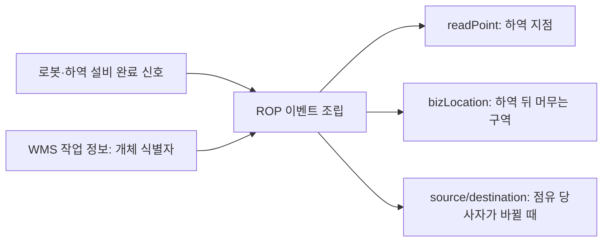

[홈](../../index.md) › [주제](../index.md) › 로봇 적재·하역 완료를 EPCIS 인계 이벤트로 어떻게 기록할 것인가

# 로봇 적재·하역 완료를 EPCIS 인계 이벤트로 어떻게 기록할 것인가

**주 연구영역:** [7. 화물·재고·자산 식별과 추적](../../categories/b-common-information-and-environment-model/07-cargo-inventory-and-asset-identification-and-tracking.md) · **관련 영역:** [1. 주문·업무 시스템 연계](../../categories/a-business-supply-chain-design/01-order-and-business-system-integration.md), [9. 로봇·제조사 관제 연동](../../categories/c-connectivity-and-execution-foundation/09-robot-and-vendor-fleet-manager-integration.md), [10. 설비·건물 시스템 연동](../../categories/c-connectivity-and-execution-foundation/10-facility-and-building-system-integration.md), [17. 로봇 간 협업·물리적 인계](../../categories/e-collaboration-and-field-operations/17-robot-to-robot-collaboration-and-physical-handover.md), [20. 예외 복구·재계획·업무 연속성](../../categories/e-collaboration-and-field-operations/20-exception-recovery-replanning-and-business-continuity.md) · **실행:** 2026-09-25-03

<!-- auto:page-status:start -->
> 페이지 상태: published · 신뢰도: medium · 페이지 버전: 1 · 마지막 갱신: 2026-09-25 · 마지막 실행: 2026-09-25
<!-- auto:page-status:end -->

## 1. 세 줄 요약

- EPCIS(Electronic Product Code Information Services) 2.0과 CBV(Core Business Vocabulary, 핵심 업무 어휘) 2.0은 이벤트가 일어난 지점(readPoint), 이후 객체가 있는 업무 위치(bizLocation), 인계 끝점의 위치·소유·점유 당사자(source/destination)를 따로 정의한다. [사실][^ref-045][^ref-044]
- ROP는 로봇·설비의 완료 신호에 WMS(Warehouse Management System, 창고 관리 시스템)의 개체 식별자를 붙여 이 필드들로 나눠 기록하는 구조를 검토할 수 있다. [추정][^ref-045][^ref-049]
- 완료 신호를 EPCIS 이벤트로 옮기는 표준 매핑이나 공개 구현은 이번 검색 범위에서 확인되지 않았다. [추정][^ref-031][^ref-045]

## 2. 배경

이 글은 7. 화물·재고·자산 식별과 추적의 질문에서 출발한다.

로봇은 도착했는데 실제로 어떤 팔레트가 인계됐는가? [분류원문]

직접 출발점은 열린 질문 oq-001(로봇 완료 신호를 EPCIS 인계 이벤트로 옮기는 매핑)이다. 로봇 관제 인터페이스 쪽 보고는 주제 페이지 [로봇 관제 인터페이스의 적재·하역 보고와 화물 인계 확인](2026-09-25-robot-load-reporting-handover-confirmation.md)이 다루므로, 이 글은 EPCIS 쪽 필드 설계에 집중한다.

## 3. 본문

### 표준이 나눠 두는 '어디서·어디로·누구에게'

EPCIS 2.0 온톨로지에서 readPoint(판독 지점)는 이벤트가 일어난 지점이고, bizLocation(업무 위치)은 이후 다른 이벤트가 반박할 때까지 객체가 있다고 보는 위치이며, 둘 다 선택 항목이다. [사실][^ref-045] GS1 구현 가이드라인은 출입구를 readPoint, 그 너머 방을 bizLocation으로 비유해 설명한다. [추정][^ref-015]

sourceList·destinationList는 업무 이전(business transfer)의 출발·도착 끝점 맥락을 주는 선택 목록이고, bizTransaction은 구매주문·출하통지 같은 거래 문서를 가리킨다. [사실][^ref-045] CBV 2.0은 끝점 유형으로 location(물리적 위치)·owning_party(소유 당사자)·possessing_party(점유 당사자)를 정의한다. [사실][^ref-044][^ref-015] AggregationEvent는 담는 개체와 담긴 객체를 다루며 parentID는 action이 OBSERVE일 때만 선택이고 ADD·DELETE에서는 필수다. AssociationEvent는 물리 객체를 상위 객체나 특정 물리 위치와 연결·해제한다. [사실][^ref-045]

이 정의들은 GS1 공식 저장소(초안 저장소)의 온톨로지 파일(2021-09-30 수정)에서 확인한 것이며, ref.gs1.org 비준판과의 문구 일치는 미확인이다. [사실][^ref-044][^ref-045]

### CBV 업무 단계와 처분 상태의 정의 범위

CBV 2.0은 loading을 운송 수단에 싣는 것, unloading을 운송 수단에서 내리는 것, departing·arriving을 위치 출발·도착으로 정의한다. [사실][^ref-044] shipping은 staging_outbound(운송 픽업 대기 구역으로의 이동)·loading·departing을 합친 과정이고, receiving은 도착 객체를 받아 수령자 재고에 더하는 단계, accepting은 점유 또는 소유가 바뀌는 단계, storing은 위치 안에서 보관 구역에 넣고 빼는 단계다. [사실][^ref-044] 처분 상태에는 in_transit(두 거래 당사자 사이 운송 중), 선택 값 in_progress, container_closed(컨테이너 적재 후 문 닫힘·봉인)가 있다. [사실][^ref-044]

따라서 시설 안 로봇의 적재·하역에 loading·unloading을 그대로 붙이면 정의와 어긋나고, 시설 내 운반은 storing이나 readPoint·bizLocation 변화로 표현하는 편이 정의에 가까워 보인다. staging_outbound는 출하 준비를 위한 이동으로 정의되어 있어 시설 안 일반 운반에는 쓰기 어렵다. [추정][^ref-044][^ref-045] CBV 업무 단계 전체 목록은 이번에 확인하지 못했다.

### 로봇·설비 신호의 식별 수준

VDA 5050 2.0.0(공식 저장소 2.0.0 태그)에서 loadId는 바코드·RFID 같은 적재물 고유 식별 번호이고 식별 전이면 빈 값이며, loads는 적재 상태를 판단할 수 없는 차량이면 생략한다. [사실][^ref-022] 2.0.0과 3.0.0 모두 pick 완료(FINISHED)를 적재물이 차량에 들어오고, drop 완료를 적재물이 차량을 떠나고 새 적재 상태를 보고한 때로 정한다. 2.0.0(공식 저장소 태그)에서는 lhd·loadId·height가 선택 파라미터이고 stationType·loadType은 선택 표시가 없으며, 3.0.0에서는 모두 선택이다. [사실][^ref-022][^ref-031] 3.0.0은 loadId를 시스템 설계에 따라 관제 또는 이동로봇이 정한다고 설명하는 것으로 보인다(3.0.0 원문의 해당 절 글자 단위 대조 미확인). [추정][^ref-031]

Open-RMF(Open Robotics Middleware Framework)의 적재 요청 품목은 개체 식별자 없이 유형 id·수량·구획 이름으로만 기술되고, 하역 결과(IngestorResult)는 요청 id·워크셀 id·상태(ACKNOWLEDGED·SUCCESS·FAILED)만 담는다. [사실][^ref-047][^ref-048][^ref-049] 배송 작업에서 로봇은 하역 지점에서 IngestorResult를 받을 때까지 하역 요청을 보낸다. [사실][^ref-023]

### 완료 신호를 이벤트로 나누는 구조(추론)

하역 완료(drop 완료 또는 IngestorResult SUCCESS)를 옮길 때 하역 지점은 readPoint, 하역 뒤 화물이 머무는 구역은 bizLocation, 인계 당사자가 바뀔 때만 possessing_party를 담은 source/destination 목록으로 나누는 구조가 정의와 맞을 것으로 보인다. [추정][^ref-045][^ref-044][^ref-022][^ref-049] Open-RMF 요청·결과는 유형·수량만 다루므로 SSCC(Serial Shipping Container Code, 물류 단위 일련 코드) 같은 개체 식별자는 WMS 작업 정보나 별도 판독 결과에서 가져와 요청 id와 연결해야 할 것으로 보인다. [추정][^ref-048][^ref-049][^ref-023]

VDA 5050 2.0에서 loadId가 비었거나 loads가 생략되면 drop 완료만으로 개체 단위 인계 이벤트를 만들 수 없으므로, 이벤트 생성을 보류하거나 다른 식별 근거로 보완하는 규칙이 필요해 보인다. [추정][^ref-022] 3.0.0이 관제가 loadId를 정할 수 있게 한다면(전제 문구는 원문 대조 미확인), 관제 역할의 ROP가 WMS의 SSCC를 loadId로 내려보내 식별자를 맞추는 설계도 가능성으로 생각할 수 있다. 다만 규격이 그 값의 형식을 SSCC로 정하지는 않는다. [추정][^ref-031]

### 매핑 부재와 국내 구현

이번 검색 범위(한·영 7회)에서는 VDA 5050이나 Open-RMF의 완료를 EPCIS 이벤트로 옮기는 표준 매핑이나 공개 구현이 확인되지 않았다. 부재를 확인한 것은 아니다. [추정][^ref-031][^ref-045] 국내에서는 세종대학교 Auto-ID Labs Korea가 2014년부터 EPCIS 오픈소스 구현 Oliot EPCIS를 개발·유지하며, 2세대는 EPCIS/CBV 2.0 표준 개발 작업반 과정에 맞춰 새로 개발되었다. [사실][^ref-050]

## 4. 현장 시나리오

다음은 설명을 위한 가상의 시나리오이다.

**물류 흐름 단계:** 출하

**시나리오:** 로봇이 팔레트를 출하 대기 구역 하역 설비에 내려놓고 인계 이벤트를 남김

| 항목 | 내용 |
|---|---|
| 시작 조건 | 출하 준비 이동 지시. CBV 정의상 staging_outbound에 가깝고 loading(운송 수단 적재)과는 다르다. [추정][^ref-044] |
| 작업 대상 | SSCC가 붙은 팔레트. Open-RMF 요청 품목은 유형·수량만 담는다. [사실][^ref-048] |
| 수행 자원 | 로봇(drop 완료)과 하역 워크셀(IngestorResult)이 완료를 알리고 ROP가 이벤트를 조립한다. [추정][^ref-022][^ref-049] |
| 제약 | 해당 없음 |
| 완료·인계 | 하역 지점 = readPoint, 대기 구역 = bizLocation, 당사자 변경 시 source/destination으로 기록. [추정][^ref-045][^ref-044] |
| 예외·성과 | loadId가 비었거나 결과가 FAILED면 이벤트 생성을 보류·보완해야 할 것으로 보인다(기준은 oq-003). [추정][^ref-022][^ref-049] |

완료 신호는 개체 식별이 약하므로, 인계 확정은 WMS의 SSCC와 결합한 뒤에야 이벤트로 남길 수 있다고 본다. [추정][^ref-048][^ref-049][^ref-022]

## 5. ROP 관점의 시사점

**직접 범위:**

- 로봇·설비 완료 신호를 받아 WMS 개체 식별자와 대조하고 readPoint·bizLocation·source/destination으로 나눈 인계 이벤트를 조립한다. [추정][^ref-045][^ref-049]
- 식별자가 비었거나 결과가 FAILED일 때 이벤트 생성을 보류하는 규칙을 둔다. [추정][^ref-022][^ref-049]

**연계 범위:**

- 연계 대상: 바코드·RFID 판독 자체(로봇 자체 지능·제어 경계). [추정][^ref-022]
- 연계 대상: 하역 설비 자체의 제어. [추정][^ref-049]
- 연계 대상: 이벤트를 저장·공유하는 EPCIS 저장소. 국내 오픈소스 구현으로 Oliot EPCIS가 있다. [사실][^ref-050]

경계 기준은 [분류 원문 9장](../../about/scope-boundary.md)이다.

## 6. 연결되는 연구영역

- [7. 화물·재고·자산 식별과 추적](../../categories/b-common-information-and-environment-model/07-cargo-inventory-and-asset-identification-and-tracking.md) — 인계 이벤트의 필드 설계
- [1. 주문·업무 시스템 연계](../../categories/a-business-supply-chain-design/01-order-and-business-system-integration.md) — WMS 식별자와 거래 문서(bizTransaction) 연결
- [9. 로봇·제조사 관제 연동](../../categories/c-connectivity-and-execution-foundation/09-robot-and-vendor-fleet-manager-integration.md) — VDA 5050 loadId·drop 완료 보고
- [10. 설비·건물 시스템 연동](../../categories/c-connectivity-and-execution-foundation/10-facility-and-building-system-integration.md) — Open-RMF 하역 워크셀 결과
- [17. 로봇 간 협업·물리적 인계](../../categories/e-collaboration-and-field-operations/17-robot-to-robot-collaboration-and-physical-handover.md) — 점유 당사자 변경과 인계
- [20. 예외 복구·재계획·업무 연속성](../../categories/e-collaboration-and-field-operations/20-exception-recovery-replanning-and-business-continuity.md) — 식별 실패 시 이벤트 보류

## 7. 열린 질문

이 글이 다룬 기존 질문(해결하지 않음):

- **oq-001** (상태: 열림 · 제기 2026-09-25 · 실행 2026-09-25-01) 로봇의 적재·하역 완료 신호를 EPCIS 인계 이벤트로 옮기는 표준 매핑이나 공개 구현 사례가 있는가? — 이 글은 추론 구조만 제시했다(3절).
- **oq-002** (상태: 열림 · 제기 2026-09-25 · 실행 2026-09-25-01) 국내 물류센터에서 SSCC 라벨이나 EPCIS 이벤트를 로봇 작업 결과와 연결해 운영하는 사례가 있는가? — Oliot EPCIS는 국내 구현의 존재를 보여 줄 뿐 로봇 작업 결과와 연결한 운영 사례는 아니다.
- **oq-003** (상태: 열림 · 제기 2026-09-25 · 실행 2026-09-25-01) 판독 실패·오판독 시 인계 확정을 어떤 기준으로 처리해야 하는가? — 3절의 이벤트 보류 규칙과 이어진다.

새 질문(상태: 열림 · 제기 2026-09-25 · 실행 2026-09-25-03, id는 게시 때 부여):

- CBV의 loading·unloading이 운송 수단 적재로 정의되어 있을 때 시설 안 로봇의 적재·운반·하역은 어떤 업무 단계(bizStep) 값이나 사용자 정의 어휘로 기록해야 하는가?
- VDA 5050 3.0.0에서 관제가 loadId를 정할 때 SSCC 같은 GS1 키를 그대로 쓰도록 권고하거나 제약하는 규정이 있는가, 로봇이 판독한 식별자와 다르면 어떻게 보고하는가?

전체 목록: [열린 질문](../../open-questions.md)

## 8. 출처

[^ref-015]: GS1, EPCIS and CBV Implementation Guideline, 미확인, https://www.gs1.org/docs/epc/EPCIS_Guideline.pdf, 접근일 2026-09-25 (원문 미열람)
[^ref-022]: VDA(Verband der Automobilindustrie), VDA 5050 Version 2.0.0 — Interface for the communication between automated guided vehicles (AGV) and a master control, 2022-01, https://www.vda.de/dam/jcr:f0c9c019-1506-4dee-998a-e92723fbf025/EN-VDA5050-V2_0_0.pdf, 접근일 2026-09-25 (원문 미열람)
[^ref-023]: Open Robotics, Workcells - Programming Multiple Robots with ROS 2, 미확인, https://osrf.github.io/ros2multirobotbook/integration_workcells.html, 접근일 2026-09-25
[^ref-031]: VDA / VDMA (VDA5050 GitHub), VDA5050/VDA5050_EN.md — Official Specification document for the VDA 5050, 미확인, https://github.com/VDA5050/VDA5050/blob/main/VDA5050_EN.md, 접근일 2026-09-25
[^ref-044]: GS1, gs1/EPCIS — Ontology/CBV.ttl (Core Business Vocabulary ontology 2.0 — GS1 공식 저장소(초안 저장소)의 온톨로지 파일이며 ref.gs1.org 비준판과의 문구 일치는 미확인; 발행일은 온톨로지 수정일), 2021-09-30, https://github.com/gs1/EPCIS/blob/master/Ontology/CBV.ttl, 접근일 2026-09-25
[^ref-045]: GS1, gs1/EPCIS — Ontology/EPCIS.ttl (EPCIS ontology 2.0 — GS1 공식 저장소(초안 저장소)의 온톨로지 파일이며 ref.gs1.org 비준판과의 문구 일치는 미확인; 발행일은 온톨로지 수정일), 2021-09-30, https://github.com/gs1/EPCIS/blob/master/Ontology/EPCIS.ttl, 접근일 2026-09-25
[^ref-047]: Open Robotics (open-rmf), rmf_internal_msgs — rmf_dispenser_msgs/msg/DispenserRequest.msg, 미확인, https://github.com/open-rmf/rmf_internal_msgs/blob/main/rmf_dispenser_msgs/msg/DispenserRequest.msg, 접근일 2026-09-25
[^ref-048]: Open Robotics (open-rmf), rmf_internal_msgs — rmf_dispenser_msgs/msg/DispenserRequestItem.msg, 미확인, https://github.com/open-rmf/rmf_internal_msgs/blob/main/rmf_dispenser_msgs/msg/DispenserRequestItem.msg, 접근일 2026-09-25
[^ref-049]: Open Robotics (open-rmf), rmf_internal_msgs — rmf_ingestor_msgs/msg/IngestorResult.msg, 미확인, https://github.com/open-rmf/rmf_internal_msgs/blob/main/rmf_ingestor_msgs/msg/IngestorResult.msg, 접근일 2026-09-25
[^ref-050]: Auto-ID Labs Korea(세종대학교) · Byun J., Oliot EPCIS for GS1 EPCIS/CBV 2.0.0 (GitHub JaewookByun/epcis README), 미확인, https://github.com/JaewookByun/epcis, 접근일 2026-09-25

## 9. 검증 노트

- 판정: 1차 조건부 승인 / 2차 통과
- 확인·미확인: 확인 19건 · 미확인 3건 · 교차 확인 0건
- 강등된 주장: f6 사실 → 추정, f12 사실 → 추정 (f9 삭제)
- 검증자 주의: 판정: 1차 조건부 승인 / 2차 통과. 이번 실행은 원문 열람이 차단된 환경(mirror_only)에서 검증됐다. 공식 GitHub 원문(raw.githubusercontent.com)과 입력 원문 텍스트는 열어 대조했다. 확인 19건, 미확인 3건(f6, f9, f12), 교차 확인 0건이다. 핵심 정의는 모두 발행 기관 한 곳(GS1 또는 VDA)의 산출물이다. 강등: f6 사실 → 추정, f12 사실 → 추정. 삭제: f9(EPCIS JSON 루트 스키마의 required는 type 하나뿐이다). 미사용 출처: ref-046(f9 삭제에 따른 것). 원문 미열람 출처: ref-015, ref-022. ref-022는 VDA 게시 PDF 대신 공식 저장소 2.0.0 태그(RELEASE CANDIDATE 문구 포함)로 내용을 대조했다. 주의: ref-044·ref-045는 GS1 초안 저장소 파일이라 비준판과의 문구 일치를 확인하지 못했다. VDA 5050 3.0.0의 loadId 설정 주체 문구(f12)는 원문 절을 확인하지 못했다. 로봇 완료 신호를 EPCIS 이벤트로 옮기는 표준 매핑·공개 구현은 확인되지 않아 f16~f21은 추정이다. oq-001·oq-002는 해결로 인정하지 않는다. 정정 요청 없음. / 2차 통과. 드리프트 없음. 1차 수정 지시 15건 이행을 유지했고, 직전 2차 수정 지시 3건의 이행을 확인했다. 첫째, 7. 화물·재고·자산 식별과 추적 6절에서 편집 지시문 형태의 요약과 이중 태그 문장이 사라졌다. 둘째, 주제 페이지 4절 끝 문장에 [추정]과 각주(ref-048·ref-049·ref-022)가 붙었다. 셋째, EPCIS·CBV·WMS·Open-RMF·SSCC를 첫 등장 위치에서 풀어 썼다. 자동 분리 페이지 '7. 화물·재고·자산 식별과 추적 — 대표 접근법과 기술'은 원 6절 내용을 그대로 옮겼다. 그 안에서 f6은 [추정]으로 비유만 남았고, f16에는 staging_outbound 한계를 적었다. [분류원문] 보존, 섹션 순서 준수, 링크 유효. 참고 1: 분리 코드가 남긴 6절 요약과 분리 페이지 1절 첫 줄은 outline summary 가 아니라 원 절 첫 문장(SSCC 바코드 표시, [사실])이다. 그래서 fixes_applied 의 설명과 실제 페이지가 다르다. 검증된 문장이라 게시에는 문제가 없지만, 영역 페이지 6절 요약에는 readPoint·bizLocation 내용이 드러나지 않고 링크로만 이어진다. 요약 문장을 고르는 규칙은 pipeline 담당이 확인할 사항이다. 참고 2: 주제 페이지에서 VDA·RFID 약어는 풀어 쓰지 않았다. 사소한 표기이며 이전 지시에 없던 사항이므로 다음 갱신 때 맞춘다. 참고 3: 7. 화물·재고·자산 식별과 추적 페이지의 ref-023 각주와 7절 표는 여전히 '원문 미열람'이다. 반면 참고문헌 갱신은 ref-023을 원문 열람(inbox)으로 기록했다. 보수적 표기이므로 다음 갱신 때 맞춘다.
- 신뢰도: medium

## 10. 이력

| 날짜 | 실행 id | 변경 | 버전 |
|---|---|---|---|
| 2026-09-25 | 2026-09-25-03 | 신규 작성 | 1 |
