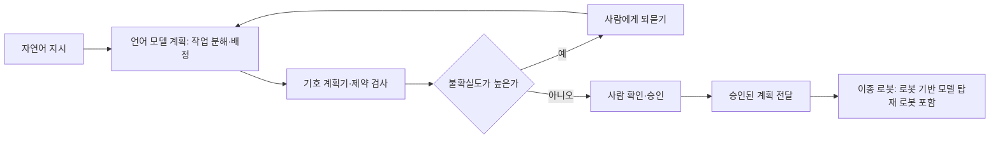

[홈](../../index.md) › [주제](../index.md) › 44. 로봇 기반 모델·언어 모델 계획 — 대표 접근법과 기술

# 44. 로봇 기반 모델·언어 모델 계획 — 대표 접근법과 기술

<!-- auto:page-status:start -->
> 페이지 상태: published · 신뢰도: medium · 페이지 버전: 1 · 마지막 갱신: 2026-09-30 · 마지막 실행: 2026-09-30
<!-- auto:page-status:end -->

## 1. 세 줄 요약

- 대표 접근법은 여러 로봇 데이터로 범용 정책을 학습하는 로봇 기반 모델과, 언어 모델 계획을 로봇 능력·기호 계획기·사람 확인에 묶어 믿을 수 있게 하는 방법으로 나뉜다. [추정][^ref-1048][^ref-092][^ref-351]
- 이 페이지는 [44. 로봇 기반 모델·언어 모델 계획](../../categories/ai-and-learning/robot-foundation-models-and-llm-planning.md) 페이지의 "대표 접근법과 기술" 절이 분량 기준을 넘어 옮겨 온 것이다. 원 페이지의 검증을 거친 내용이며 새 주장은 없다.

## 2. 배경

[44. 로봇 기반 모델·언어 모델 계획](../../categories/ai-and-learning/robot-foundation-models-and-llm-planning.md) 페이지를 쓰는 과정에서 "대표 접근법과 기술" 절의 분량이 세부영역 페이지 기준(4,000자)을 넘어, 내용을 줄이지 않고 이 주제 페이지로 분리했다.

## 3. 본문

대표 접근법은 여러 로봇 데이터로 범용 정책을 학습하는 로봇 기반 모델과, 언어 모델 계획을 로봇 능력·기호 계획기·사람 확인에 묶어 믿을 수 있게 하는 방법으로 나뉜다. [추정][^ref-1048][^ref-092][^ref-351]

### 로봇 기반 모델: 여러 로봇 데이터로 학습한 범용 정책

RT-2는 시각–언어 모델을 로봇 궤적 데이터와 웹 시각 질의응답 과제에 함께 미세조정해, 6,000회 평가에서 새 물체·학습에 없던 명령에 대한 일반화가 좋아졌다고 보고했다(2023-07). [사실][^ref-1045] Open X-Embodiment 협력단은 21개 기관이 모은 22종 로봇의 데이터(527개 스킬, 160,266개 작업)를 표준 형식으로 공개했다(2023-10). [사실][^ref-1048]

OpenVLA는 Llama 2에 DINOv2·SigLIP 시각 특징을 결합한 70억 매개변수 공개 모델로 실제 로봇 시연 97만 건으로 학습했고, 29개 작업에서 매개변수가 7배 많은 RT-2-X(550억)보다 절대 성공률이 16.5%p 높았다고 보고했다(2024-06). [사실][^ref-1046] GR00T N1은 실제 로봇 궤적·사람 영상·합성 데이터를 섞어 학습하고 Fourier GR-1 휴머노이드의 양손 조작에 배치했다고 보고했다(2025-03). [사실][^ref-1049]

위 수치는 각 논문의 초록이 스스로 보고한 값이며, 이 위키에서 독립 재현으로 교차 확인하지 않았다.

### 언어 모델 계획의 접지와 기호 계획기 결합

SayCan은 언어 모델이 긴 추상적 지시를 수행하는 절차 지식을 내고, 스킬의 가치 함수가 현재 환경에서 그 스킬의 실행 가능 정도를 내게 해 [모바일 매니퓰레이터](../../glossary/mobile-manipulator.md)로 실험했다(2022-04). [사실][^ref-088]

LLM+P는 자연어 문제를 PDDL 문제로 바꾸고 고전 계획기로 해를 찾은 뒤 다시 자연어로 옮기는 3단계 방식으로 대부분의 벤치마크 문제에서 최적해를 냈고, 언어 모델 단독은 대부분 실행 가능한 계획조차 내지 못했다고 보고했다(2023-04). [사실][^ref-092] Kambhampati 외는 언어 모델을 외부 기호 검증기와 양방향으로 결합해 써야 한다고 본다(4절 LLM-모듈로 프레임워크). [의견][^ref-586]

### 다중 로봇 계획

SMART-LLM(IROS 2024 게재, arXiv 주석 기준)은 프로그램 형식의 퓨샷 프롬프트로 언어 모델이 고수준 지시를 작업 분해·[연합 형성](../../glossary/coalition-formation.md)·작업 배정의 세 단계로 다중 로봇 계획으로 바꾸게 하고, 복잡도가 다른 네 범주의 지시로 된 벤치마크를 시뮬레이션과 실제 로봇으로 시험했다(2023-09). [사실][^ref-090]

IMR-LLM은 가정용보다 제약이 엄격한 산업 다중 로봇 생산 작업을 대상으로, 언어 모델이 선택 그래프(disjunctive graph) 구성을 돕고 결정적 풀이 방법으로 실행 가능한 고수준 계획을 얻게 한 벤치마크 연구이며(IMR-Bench, 세 난이도), 초록에는 실제 공장 배치가 적혀 있지 않다(2026-03). [사실][^ref-170]

### 불확실도 기반 도움 요청

KnowNo는 언어 모델 계획기가 확신에 찬 환각 예측을 내는 문제에 대해 등각 예측으로 불확실도를 측정해, 공간·수량·선호·언어 모호성이 있을 때 사람에게 도움을 요청하게 하고 사람 도움을 최소화하면서 작업 완료에 통계적 보장을 주며 모델 미세조정이 필요 없다고 보고했다(CoRL 2023). [사실][^ref-351]

아래 도식은 이 절의 연구들을 ROP의 지시 처리 흐름으로 묶어 본 것이며 종합 추정이다. [추정][^ref-092][^ref-586][^ref-351]

## 4. 현장 시나리오

현장 시나리오는 원 페이지의 [5. 적용 사례 (현장 유형 명시)](../../categories/ai-and-learning/robot-foundation-models-and-llm-planning.md) 절에 있다.

## 5. ROP 관점의 시사점

ROP가 직접 맡는 것과 외부와 연계하는 것은 원 페이지의 [9. ROP가 직접 맡는 것과 외부와 연계하는 것 (책임 경계 기준)](../../categories/ai-and-learning/robot-foundation-models-and-llm-planning.md) 절에 있다.

## 6. 연결되는 연구영역

- 주 연구영역: [44. 로봇 기반 모델·언어 모델 계획](../../categories/ai-and-learning/robot-foundation-models-and-llm-planning.md)
- 관련 영역: [1. 기술·시장·업체 동향](../../categories/planning-and-business/technology-market-and-vendor-trends.md), [4. 이기종 로봇 등록](../../categories/robot-ontology/heterogeneous-robot-registration.md), [5. 로봇 능력·작업 표현](../../categories/robot-ontology/robot-capability-and-task-representation.md), [12. 채팅으로 업무 지시·오케스트레이션](../../categories/chat-based-configuration-and-operation/chat-task-instruction-and-orchestration.md), [13. 대화형 기능의 신뢰·기반](../../categories/chat-based-configuration-and-operation/conversational-trust-and-foundations.md), [24. 작업·워크플로 모델링](../../categories/planning-and-optimization/task-and-workflow-modeling.md), [25. 작업 배정 — MRTA](../../categories/planning-and-optimization/task-allocation-mrta.md), [26. 작업 순서·스케줄링](../../categories/planning-and-optimization/task-sequencing-and-scheduling.md), [29. 명령·작업 실행의 신뢰성](../../categories/execution-collaboration-and-recovery/command-and-task-execution-reliability.md), [31. 사람–로봇 협업](../../categories/execution-collaboration-and-recovery/human-robot-collaboration.md), [47. AI·학습·적응과 모델 운영](../../categories/ai-and-learning/ai-learning-adaptation-and-model-operations.md), [54. 시험·형식 검증·벤치마크](../../categories/verification-deployment-and-lifecycle/testing-formal-verification-and-benchmarking.md), [61. 물류창고](../../categories/site-type-applications/warehouse.md), [62. 제조 공장](../../categories/site-type-applications/manufacturing-plant.md), [65. 가정·공동주택](../../categories/site-type-applications/home-and-apartment.md)

## 7. 열린 질문

열린 질문은 원 페이지의 [11. 열린 질문](../../categories/ai-and-learning/robot-foundation-models-and-llm-planning.md) 절과 [열린 질문](../../open-questions.md) 페이지에 모은다.

## 8. 출처

[^ref-1045]: Brohan, A., Brown, N. 외 (Google DeepMind, arXiv), RT-2: Vision-Language-Action Models Transfer Web Knowledge to Robotic Control, 2023-07-28, https://arxiv.org/abs/2307.15818, 접근일 2026-09-30
[^ref-1046]: Kim, M. J., Pertsch, K., Karamcheti, S. 외 (arXiv), OpenVLA: An Open-Source Vision-Language-Action Model, 2024-06-13, https://arxiv.org/abs/2406.09246, 접근일 2026-09-30
[^ref-1048]: Open X-Embodiment Collaboration (arXiv), Open X-Embodiment: Robotic Learning Datasets and RT-X Models, 2023-10-13, https://arxiv.org/abs/2310.08864, 접근일 2026-09-30
[^ref-088]: Ahn, M., Brohan, A., Brown, N. 외 (arXiv), Do As I Can, Not As I Say: Grounding Language in Robotic Affordances, 2022-04-04, https://arxiv.org/abs/2204.01691, 접근일 2026-09-30
[^ref-092]: Liu, B., Jiang, Y., Zhang, X. 외 (arXiv), LLM+P: Empowering Large Language Models with Optimal Planning Proficiency, 2023-04-22, https://arxiv.org/abs/2304.11477, 접근일 2026-09-30
[^ref-586]: Kambhampati, S., Valmeekam, K., Guan, L. 외 (ICML 2024, arXiv), LLMs Can't Plan, But Can Help Planning in LLM-Modulo Frameworks, 2024-02-02, https://arxiv.org/abs/2402.01817, 접근일 2026-09-30
[^ref-090]: Kannan, S. S., Venkatesh, V. L. N., & Min, B.-C. (arXiv), SMART-LLM: Smart Multi-Agent Robot Task Planning using Large Language Models, 2023-09-18, https://arxiv.org/abs/2309.10062, 접근일 2026-09-30
[^ref-351]: Ren, A. Z., Dixit, A., Bodrova, A. 외 (CoRL 2023, arXiv), Robots That Ask For Help: Uncertainty Alignment for Large Language Model Planners, 2023-07-04, https://arxiv.org/abs/2307.01928, 접근일 2026-09-30
[^ref-1049]: NVIDIA (Bjorck, J., Castañeda, F. 외, arXiv), GR00T N1: An Open Foundation Model for Generalist Humanoid Robots, 2025-03-18, https://arxiv.org/abs/2503.14734, 접근일 2026-09-30
[^ref-170]: Su, X., Xu, J., van Kaick, O., Xu, K., & Hu, R. (arXiv), IMR-LLM: Industrial Multi-Robot Task Planning and Program Generation using Large Language Models, 2026-03-03, https://arxiv.org/abs/2603.02669, 접근일 2026-09-30

## 9. 검증 노트

원 페이지와 함께 실행 2026-09-30-07 의 1차·2차 검증을 거쳤다. 분리는 코드가 했고 내용은 바꾸지 않았다.

## 10. 이력

| 날짜 | 실행 id | 변경 |
|---|---|---|
| 2026-09-30 | 2026-09-30-07 | 44. 로봇 기반 모델·언어 모델 계획 의 "대표 접근법과 기술" 절에서 분리 |
