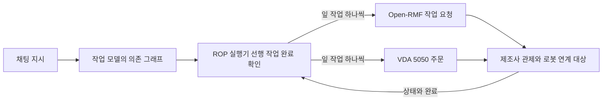

[홈](../../index.md) › 중점 연구 트랙 › [채팅 기반 구성·운영](index.md) › 단계 2. 필요한 데이터와 표준 조사

# 단계 2. 필요한 데이터와 표준 조사

> 단계 상태: 진행 중 · 열린 질문: 1건 · 답한 질문: 6건 · 완료 조건: 미충족 · 마지막 실행: 2026-10-09

## 1. 이 단계에서 밝힐 것

> 지시를 작업으로 바꾸고 배정·스케줄링하는 데 필요한 정보 항목과, 그 정보를 표현·교환하는 기존 표준·형식은 무엇인가.

위 문장은 트랙 정의의 "밝힐 것"이다(트랙 정의의 단계별 밝힐 것과 완료 조건은 [트랙 개요](index.md)의 단계 진행 현황에 정리되어 있다). 조사 결과는 [아이디어 2. 채팅 기반 구성·운영](../../ideas/chat-based-configuration-and-operation.md)과 [업무 분해·배정 설계 초안](task-model-draft.md)으로 이어진다.

## 2. 질문 목록

이 단계의 시작 질문 3개와 앞선 실행·이번 실행에서 생긴 후속 질문이다. 시작 질문은 구축자가 이 단계의 밝힐 것에서 정한 것이다. [가정] 상태와 답 위치는 [질문 백로그](question-backlog.md)와 일치시키며, 백로그의 "조사 중"은 이 표에서 "열림"으로 표시하고 "폐기"는 표에서 빼고 백로그에만 남긴다. 답은 3절의 질문 id로 시작하는 소제목에 실리고, 답 위치 칸에는 그 앵커 또는 주제 페이지 링크를 적는다. 제기 근거 칸에는 finding id 또는 "사용자"만 쓴다.

| id | 질문 | 상태 | 제기 근거 | 답한 실행 id | 답 위치 |
|---|---|---|---|---|---|
| q2-01 | 채팅 지시를 작업으로 바꾸려면 어떤 정보(작업 종류, 장소, 대상 화물, 기한, 우선순위, 완료 조건)가 필요하고, 그 가운데 무엇을 로봇 기능 온톨로지·공간 그래프·업무 시스템에서 가져오는가? | 답함 | 사용자 | 2026-09-25-37 | [#q2-01](#q2-01) |
| q2-02 | 분해한 작업과 배정 결과를 표현하는 기존 표준·형식(작업·미션 기술, 워크플로 기술)은 무엇이 있고, ROP의 작업 모델에 비해 무엇이 빠지는가? | 답함 | 사용자 | 2026-09-25-51 | [#q2-02](#q2-02) |
| q2-03 | 해석·분해의 정확도를 평가하려면 어떤 지시–정답 작업 쌍 데이터가 필요하며, 쓸 수 있는 공개 데이터셋이 있는가? | 답함 | 사용자 | 2026-09-25-62 | [#q2-03](#q2-03) |
| q2-04 | 분해 결과의 중간 표현(PDDL, LTL, 행동 트리, 의존 DAG) 가운데 업무 분해·배정 설계 초안의 작업 모델과 로봇 관제 인터페이스(VDA 5050 주문, Open-RMF 작업)로 옮기기 쉬운 것은 무엇이고 옮길 때 무엇이 빠지는가? | 답함 | f13 | 2026-10-09-25 | [#q2-04](#q2-04) |
| q2-05 | 지시 속 현장 장소 용어(예: 3층 출하 대기장, 2번 도크)와 공간 그래프 경유점 이름·지도 id·WMS 로케이션 코드를 대응시키는 이름 사전은 어떤 형식으로 두고 누가 관리하는가? | 답함 | f16 | 2026-10-09-27 | [#q2-05](#q2-05) |
| q2-06 | 채팅 지시의 '대상 화물'을 품목 단위(sku·수량)로 받을지 적재 단위(loadId·SSCC)로 받을지, 둘 사이 대응은 어느 시스템에서 가져오는가? | 답함 | f17 | 2026-10-09-27 | [#q2-06](#q2-06) |
| q2-07 | IEEE 1872.1-2024 로봇 작업 표현 온톨로지는 작업 분해·선후 의존·배정 대상을 어떤 개념으로 표현하며, 업무 분해·배정 설계 초안의 업무·작업·배정 개념과 어떻게 대응하는가? | 열림 | f15 | | |

## 3. 조사 결과

### q2-01 필요한 정보 항목과 그 원천 {#q2-01}

로봇 관제 인터페이스는 작업 종류·장소·화물을 받지만 기한 필드는 없고, 기한·우선순위는 업무 시스템 작업 지시에 선택 필드로 있다. [사실][^ref-125][^ref-411][^ref-413][^ref-130] 이 답은 로봇 관제 인터페이스(Open-RMF, VDA 5050)와 업무 시스템 표준(ISA-95, GS1 EPCIS)의 필드, 지시 해석 연구를 대조해 얻었다. 로봇 기능 온톨로지와 공간 그래프는 아직 트랙 산출물이 없어, 이번 실행은 VDA 5050 팩트시트를 로봇 기능 온톨로지의, Open-RMF 건물 지도 그래프를 공간 그래프의 대리 원천으로 썼다.

#### 로봇 관제 인터페이스가 받는 항목

- Open-RMF 작업 요청 스키마는 작업 범주(category)와 작업 기술(description)만 필수로 두고, 가장 이른 시작 시각·요청 시각·우선순위·라벨·요청자·플릿 이름을 선택 필드로 두며, 마감 시각(기한) 필드는 두지 않는다(공식 저장소, 확인일 2026-09-25 기준). [사실][^ref-125]
- Open-RMF 배송 작업 기술은 픽업과 하역 두 사건을 필수로 두고, 각 사건은 장소와 적재물을 필수로, 처리 설비(handler)를 선택으로 두며, 적재물 항목은 품목 코드(sku)와 수량을 필수로, 칸(compartment)을 선택으로 둔다(확인일 2026-09-25 기준). [사실][^ref-410][^ref-411]
- Open-RMF 의 장소는 경유점 이름, 경유점 번호, 경유점과 방향을 담은 객체 가운데 하나로 지정되며, 건물 지도 그래프의 노드는 x·y 좌표, 이름, 파라미터 목록을 가진다(확인일 2026-09-25 기준). [사실][^ref-412][^ref-414]
- VDA 5050 3.0.0(공식 저장소 main 브랜치, 확인일 2026-09-25)의 주문 스키마는 주문 id·갱신 id·노드·간선을 필수로 두고 노드 위치에 지도 id(mapId)를 두며, 동작은 동작 유형과 차단 유형을 필수로 두지만, 주문 수준에 기한·우선순위 필드는 없다. [사실][^ref-413]
- VDA 5050 3.0.0(공식 저장소 main 브랜치, 확인일 2026-09-25)의 사전 정의 동작 pick·drop 은 적재 장치, 스테이션 유형·이름, 적재물 유형(loadType), 적재물 id(loadId), 높이·깊이·측면을 모두 선택 파라미터로 둔다. [사실][^ref-031]

#### 로봇 능력의 대리 원천

- VDA 5050 3.0.0(공식 저장소 main 브랜치, 확인일 2026-09-25)의 팩트시트는 적재 명세(적재물 유형, 적재물 치수, 최대 중량, 취급 높이 범위, 픽·드롭 소요 시간)와 로봇이 지원하는 동작 목록(동작 유형, 적용 범위, 파라미터, 차단 유형, 일시정지·취소 허용)을 로봇이 선언하게 한다. [사실][^ref-228]

#### 업무 시스템 쪽 원천

- OPC UA for ISA-95 작업 제어 노드셋(모델 발행일 2024-01-31)의 작업 지시 데이터형은 작업 지시 id 를 필수로, 설명·작업 마스터·시작 시각·종료 시각·우선순위·파라미터·인원·설비·물리 자산·자재 요구를 선택으로 둔다. [사실][^ref-130] 자재 데이터형은 자재 정의 id·로트 id·수량·단위 등을 둔다(자재 클래스·하위 로트 id 도 있음, 모두 선택). [사실][^ref-130]
- GS1 EPCIS 이벤트는 무엇(GTIN·SSCC·GIAI 같은 대상 식별자), 언제(사건 시각·기록 시각), 어디서(판독 지점·업무 위치), 왜(업무 맥락)의 차원으로 기록되며, EPCIS 2.0 은 센서 정보를 담는 어떻게(how) 차원을 더했다(검색 요약 기준, 확인일 2026-09-25). [사실][^ref-015]
- Mecalux 는 Easy WMS 에 통합한 대화형 비서 Easy AI 가 긴급 주문 일괄 출고나 통로 잠금 해제 같은 WMS 작업을 채팅 요청으로 실행하며, 실행 전에 동작과 영향받는 항목의 요약을 보여 주고 채팅에서 확인을 받는다고 밝힌다(발행일 미확인). 이는 상위 업무 시스템(WMS) 쪽 제품 기능으로, ROP 에게는 연계 대상의 사례다. [추정] 벤더 주장[^ref-418]

#### 지시 해석 연구가 뽑는 인자와 장소 접지

- Martins 외(2018-07)는 서비스 로봇 명령을 행동 하나와 인자(슬롯)로 모델링해 행동 탐지와 슬롯 채우기를 LSTM 계열 신경망으로 풀고, 요청된 행동이 로봇 능력 안에 있는지를 SVM 으로 따로 판정했다. 슬롯 목록은 미확인이다. [사실][^ref-415]
- DELIVER(2025-08)는 경량 LLaMA3 로 지시에서 픽업·배송 위치를 뽑아 다중 로봇 픽업·배송에 넘긴다. [사실][^ref-360] 검색 요약 범위에서 화물 식별·기한 추출은 확인되지 않았다(원문 미열람). [추정][^ref-360]
- SayPlan(CoRL 2023)은 LLM 계획을 계층형 3D 장면 그래프에 접지하며, 접힌 그래프에서 작업 관련 하위 그래프를 찾는 의미 탐색과 고전 경로 계획기, 장면 그래프 시뮬레이터 피드백에 따른 반복 재계획을 쓰고, 최대 3개 층·36개 방·140개 자산·객체 환경에서 평가되었다(저자 보고). [사실][^ref-416]
- SafeGate(2026-04)는 자연어 명령에서 안전 관련 속성을 구조화해 뽑고 ISO 13482 에 기반한 결정적 판정으로 실행을 승인·거부하며, 통과한 명령을 불변 조건·가드·중단 조건으로 된 작업 안전 계약으로 분해한다. [사실][^ref-417] 근거 표준 ISO 13482 는 개인 돌봄 로봇 안전 표준이고, 230개 과업·AI2-THOR 30개 시나리오 평가는 저자 보고이며 물류 현장 대상이 아니다. [사실][^ref-417]

#### 항목–원천 대응

아래 표는 위 필드를 q2-01 의 여섯 정보 항목에 대응시켜 이 위키가 구성한 것이며, 이 대응을 제시한 단일 출처는 확인하지 못했다. [추정][^ref-125][^ref-411][^ref-413][^ref-228][^ref-130][^ref-015]

| 정보 항목 | 로봇 인터페이스 쪽 필드 | 업무 시스템 쪽 필드 | 비고 |
|---|---|---|---|
| 작업 종류 | Open-RMF 작업 범주, VDA 5050 동작 유형, 팩트시트 지원 동작 | 미확인 | 로봇 기능 온톨로지의 대리 원천 |
| 장소 | 경유점 이름·번호(Open-RMF), 지도 id 가 있는 노드(VDA 5050) | 미확인 | 현장 용어와의 이름 대응 필요(q2-05) |
| 대상 화물 | sku·수량(Open-RMF), 적재물 id·유형(VDA 5050), 팩트시트 적재 명세 | 자재 정의·로트(ISA-95), SSCC 같은 식별자(EPCIS) | 식별 단위가 다름(q2-06) |
| 기한 | 필드 없음 | 종료 시각(ISA-95) | 작업 모델이 보유 |
| 우선순위 | 우선순위(Open-RMF 선택 필드), VDA 5050 주문 수준에는 없음 | 우선순위(ISA-95) | |
| 완료 조건 | 이번에 연 요청·주문 스키마에 필드 없음 | 미확인 | 표현 원천 미확인 |

- 기한은 ISA-95 작업 지시에는 종료 시각으로 있지만 Open-RMF 작업 요청과 VDA 5050 주문에는 필드가 없으므로, 채팅 지시나 업무 시스템에서 받은 기한은 ROP 의 작업 모델이 보유하고 로봇 쪽에는 가장 이른 시작 시각·우선순위·배정 순서로 바꿔 넘겨야 할 것으로 보인다. 이는 열린 질문 [oq-019](../../open-questions.md)와 같은 방향의 추론이다. [추정][^ref-125][^ref-413][^ref-130]
- 지시 속 장소 표현(층·구역·도크 이름)은 로봇 인터페이스가 받는 경유점 이름·번호나 지도 id 로 옮겨야 하므로 현장 용어와 공간 그래프 노드 이름을 잇는 이름 대응 정보가 필요해 보이며, LLM 이 장면 그래프 안에서 관련 노드를 찾는 SayPlan 의 방식은 참고할 접지 방법으로 보인다. SayPlan 은 가정·사무 환경 연구라 물류 선행 사례로 단정하지 않는다. 이 문제는 열린 질문 [oq-029](../../open-questions.md)와 겹친다. [추정][^ref-412][^ref-414][^ref-413][^ref-416]
- 대상 화물 식별은 인터페이스마다 단위가 달라 Open-RMF 배송은 품목 코드와 수량, VDA 5050 은 적재물 id·유형, ISA-95 는 자재 정의·로트, EPCIS 는 SSCC 같은 물류 단위 식별자를 쓰므로, ROP 는 지시의 대상 화물을 품목 단위와 적재 단위 가운데 어느 쪽으로 받을지와 둘 사이 대응을 정해야 할 것으로 보인다. 열린 질문 [oq-007](../../open-questions.md)·[oq-023](../../open-questions.md)과 이어진다. [추정][^ref-411][^ref-031][^ref-130][^ref-015]

#### 25. 작업 배정 — MRTA 의 질문과의 연결

> 가장 가까운 로봇에 맡기는 것이 전체적으로도 유리한가? [분류원문]

채팅 지시만으로는 기한·우선순위·화물 제약이 비기 쉬우므로, 배정이 거리만이 아닌 전체 목적을 따르려면 이 항목을 업무 시스템(작업 지시의 종료 시각·우선순위)과 로봇 팩트시트(적재 명세)에서 보완해 배정기에 넘겨야 할 것으로 보인다. [추정][^ref-130][^ref-228][^ref-360]

### q2-02 작업·배정 결과를 표현하는 표준·형식과 빠진 것 {#q2-02}

확인한 형식들은 작업의 분해·순서 구조, 배정 결과, 진행 상태, 기한·우선순위를 나누어 담지만, 지시 원문과 상황 값의 출처, 배정 근거·산출 방식, 사용자 확인 여부를 함께 담는 형식은 이번 조사 범위에서 찾지 못했다. [추정][^ref-111][^ref-495][^ref-031][^ref-130][^ref-502][^ref-496][^ref-501][^ref-500][^ref-504] 이 답은 로봇 관제 쪽 형식(Open-RMF, VDA 5050, MassRobotics), 업무·워크플로 쪽 형식(OPC UA for ISA-95, BPMN, Serverless Workflow), 계획·실행 표현(HDDL, 행동 트리)과 로봇 작업 표현 표준(IEEE 1872.1-2024)의 필드·개념을 [업무 분해·배정 설계 초안](task-model-draft.md)과 대조해 얻었다. 같은 질문을 다룬 실행 2026-09-25-43 의 결과는 위키에 반영되지 않아 이번 실행에서 다시 조사했다.

#### 로봇 관제 쪽 형식

- Open-RMF 복합 작업 기술 스키마(공식 저장소, 확인일 2026-09-25 기준)는 수행할 차례대로 늘어놓은 단계(phases) 배열 하나만 필수로 둔다. 각 단계에는 플릿이 지원하는 활동 기술과 일치해야 하는 활동(activity: 범주와 기술)이 필수이고, 작업을 취소할 때 수행할 활동 목록(on_cancel)과 운영자에게 보일 범주·상세는 선택이다. [사실][^ref-495]
- Open-RMF 작업 상태 스키마(확인일 2026-09-25 기준)는 예약 정보(booking)만 필수로 두고, 배정 결과를 그룹과 이름으로 된 assigned_to 로, 배정 과정을 queued·selected·dispatched·failed_to_assign·canceled_in_flight 값의 dispatch 상태로 나타낸다. [사실][^ref-111] 진행은 queued·underway·delayed·completed·canceled·failed 등 12개 status 값과 단계별 상태, 예상 소요 시간(estimate_millis), 시작·종료 시각으로 나타낸다. [사실][^ref-111]
- 이번에 연 두 스키마에서 의존 관계는 한 단계 안 사건(event) 사이의 deps 로만 나타나고, 작업과 작업 사이 선행 의존, 배정 근거(선택 이유·산출 방식), 사용자 확인 여부를 담는 필드는 확인되지 않았다. 연 문서 범위의 부재 관찰이며, 이 항목은 ROP 작업 모델이 따로 보유해야 할 것으로 보인다. [추정][^ref-111][^ref-495]
- VDA 5050 3.0.0(공식 명세 문서, 확인일 2026-09-25)은 관제(fleet control)의 최소 기능으로 주문을 이동로봇에 배정하는 일을 둔다. 그러나 주문은 로봇 한 대가 지나갈 노드–간선 그래프 구간이고, 전체 운반 주문은 orderId·orderUpdateId 로 이어진 여러 하위 주문으로 나뉠 수 있으며, 외부 IT 시스템과의 인터페이스는 범위에서 제외한다. [사실][^ref-031] 이번에 읽은 3.0.0 명세 범위에서는 업무·작업 수준의 구조나 배정 근거를 담는 메시지가 확인되지 않았다. [추정][^ref-031]
- VDA 5050 3.0.0 의 사전 정의 동작 waitForTrigger 는 이동로봇이 관제(FLEET_CONTROL) 또는 로봇 자체 입력(LOCAL)의 트리거를 기다리게 하고, 관제는 제3 시스템에서 기다리던 과정이 끝났다는 정보를 받으면 순간 동작 trigger 로 대기를 푼다. 시간 초과 처리와 필요할 때의 주문 취소는 관제가 맡는다. [사실][^ref-031]
- MassRobotics AMR 상호운용 표준의 JSON 스키마(확인일 2026-09-25 기준)는 로봇이 내보내는 식별 보고(identityReport)와 상태 보고(statusReport)만 정의하고 로봇에 작업을 보내는 메시지는 두지 않는다. 상태 보고에는 운용 상태(navigating, idle, charging, waitingHumanEvent 등), 예측 시각이 붙은 목적지(destinations), 약 10초 분량의 단기 경로(path)가 담긴다. [사실][^ref-230]

#### 업무·워크플로 쪽 형식

- OPC UA for ISA-95 작업 제어 노드셋(모델 발행일 2024-01-31)의 작업 지시 데이터형은 시작·종료 시각, 우선순위(숫자가 클수록 높음), 인원·설비·물리 자산·자재 요구를 선택 필드로 둔다. 작업 응답 데이터형은 연결된 작업 지시 id, 실제 시작·종료 시각, 작업 상태(JobState), 인원·설비·물리 자산·자재 실적(Actuals)을 둔다. [사실][^ref-130] 설비·물리 자산 데이터형의 ID 는 클래스 또는 개별 대상을 가리킬 수 있다. [사실][^ref-130]
- 이번에 연 작업 지시·작업 응답 데이터형에서는 작업 지시 사이 선행·의존 관계를 담는 필드가 확인되지 않았고, 작업 상태 기계의 상태 이름도 열람 응답에서 확인되지 않았다. 연 문서 범위의 부재 관찰이다. [추정][^ref-130] ISA-95 계열 전체에 의존 표현이 없다는 뜻은 아니며, 같은 계열의 [B2MML](../../glossary/b2mml.md) 세그먼트 의존 유형은 열린 질문 [oq-013](../../open-questions.md)에서 따로 다룬다.
- OMG BPMN 2.0.2 명세(2014-01)는 활동을 맡을 사람 역할을 수행자의 특수화인 사람 수행자(HumanPerformer)와 그 하위 역할인 잠재 담당자(PotentialOwner)로 지정하고, 자원 배정 식(ResourceAssignmentExpression)으로 실행 시 사용자·그룹 같은 자원을 역할에 배정하게 한다(원문 미열람, 검색 요약 기준, 절 번호 미확인). [사실][^ref-502]
- Corradini 외는 BPMN 기반 다중 로봇 시스템 개발 틀 FaMe 를 제안했고(2023, Robotics and Autonomous Systems 160권 104322; README 표기 2022), 공개 저장소는 다중 로봇의 협력을 BPMN 모델로 조직하는 틀로 소개한다. [사실][^ref-503] 협업 다이어그램과 실행 환경의 세부는 미확인이다.
- Open Workflow Specification(Serverless Workflow) DSL 문서(확인일 2026-09-25 기준, 예시 코드는 DSL 1.0.3)는 작업 유형으로 call·do(순차)·emit·for·fork(병렬)·listen·raise·run·set·switch·try·wait 를 두고, 시간 초과 시 실행을 중단하고 timeout 오류를 내게 하며, every·cron·after·on 으로 일정을 표현한다. [사실][^ref-496]
- 이번에 연 이 문서에서는 작업을 특정 수행자·자원에 배정하거나 우선순위·기한을 표현하는 개념이 확인되지 않았다(연 문서 범위의 부재 관찰). [추정][^ref-496]

#### 계획·실행 표현과 로봇 작업 표현 표준

- HDDL(Höller 외, arXiv 2019-11 공개, AAAI 2020 게재판 제목 HDDL: An Extension to PDDL for Expressing Hierarchical Planning Problems)은 PDDL 을 확장해 상위 작업(task)과, 그 작업을 하위 작업·동작의 부분 또는 전체 순서 네트워크로 분해하는 방법(method)을 기술하는 계층적 작업 네트워크(Hierarchical Task Network, HTN) 계획 언어다. 2020년 국제 계획 경진대회 첫 계층 계획 부문의 공통 언어로 만들어졌다(원문 미열람, 검색 요약 기준). [사실][^ref-501]
- BehaviorTree.CPP(README, 확인일 2026-09-25 기준)는 [행동 트리](../../glossary/behavior-tree.md)를 실행 시 불러오는 XML 기반 도메인 특화 언어로 정의하고, 사용자 정의 노드를 정적으로 링크하거나 플러그인으로 불러오며, 비동기 동작을 기본으로 지원하고 상태 전이를 기록·재생하는 로깅 기반을 둔다. [사실][^ref-500]
- IEEE 1872.1-2024(로봇 작업 표현 표준, 2024-06-18 발행, IEEE SA 발행 기관 소개 기준)는 학습·로봇·자동화 분야의 작업 지식을 표현·추론·교환하기 위한 온톨로지를 정의하고, 계층적 계획기와 설계자가 작업 지식을 표현하는 방식을 다루며, 실무 구현 지침 P1872.1.1 이 따로 개발되고 있다. [사실][^ref-504] 표준 본문(유료)은 열람하지 못해 작업 분해·배정·의존을 어떤 개념으로 표현하는지는 미확인이다.
- Filippone·Pettinari·Pelliccione(GSSI, arXiv 2603.15427, v1 2026-03, v2 2026-08-17)는 로봇·다중 로봇 임무 기술 형식으로 행동 트리, 상태 기계, 계층적 작업 네트워크, BPMN 네 가지를 제어 구조·임무 개념·표현력·도구 지원 측면에서 비교 분석했다(원문 미열람). [사실][^ref-116]

#### 형식별로 담는 것

아래 표는 위 관찰을 초안의 개념에 대응시켜 이 위키가 구성한 것이며, 출처의 표를 옮긴 것이 아니다. "확인되지 않음"은 연 문서 범위의 부재 관찰, "미확인"은 조사하지 못한 칸이다. [추정][^ref-111][^ref-495][^ref-031][^ref-230][^ref-130][^ref-502][^ref-496][^ref-501][^ref-500]

| 형식 | 분해·순서 구조 | 배정 결과·수행자 | 진행 상태 | 기한·우선순위 | 배정 근거·확인 여부 |
|---|---|---|---|---|---|
| Open-RMF 복합 작업·작업 상태 | 순서 있는 단계, 단계 안 사건 의존 | assigned_to(그룹·이름), dispatch 상태 | status 값, 예상 소요, 시작·종료 시각 | 미확인(두 스키마 밖) | 확인되지 않음 |
| VDA 5050 3.0.0 주문 | 노드–간선 그래프 구간, 하위 주문 | 주문을 배정받는 로봇 | 미확인 | 주문 수준 필드 없음(q2-01) | 확인되지 않음 |
| MassRobotics 상태 보고 | 해당 없음(작업 전송 메시지 없음) | 해당 없음 | 운용 상태, 목적지 예측 시각 | 미확인 | 해당 없음 |
| OPC UA for ISA-95 작업 지시·응답 | 작업 지시 사이 선후 확인되지 않음 | 인원·설비 요구와 실적 | 작업 상태(값 목록 미확인), 실제 시작·종료 시각 | 시작·종료 시각, 우선순위 | 확인되지 않음 |
| BPMN 2.0.2 | 순서 흐름 | 사람 수행자·잠재 담당자, 자원 배정 식 | 미확인 | 미확인 | 미확인 |
| Serverless Workflow DSL | do(순차)·fork(병렬) | 확인되지 않음 | 미확인 | 시간 초과·일정만(기한·우선순위 확인되지 않음) | 확인되지 않음 |
| HDDL | 작업·분해 방법, 부분·전체 순서 | 미확인 | 해당 없음 | 미확인 | 미확인 |
| BehaviorTree.CPP 행동 트리 XML | 트리 구조 | 미확인 | 상태 전이 기록 | 미확인 | 미확인 |
| IEEE 1872.1-2024 | 미확인(본문 미열람) | 미확인 | 미확인 | 미확인 | 미확인 |

#### 초안 대비 빠진 것

- 이 대조로 보면 로봇 관제 형식(Open-RMF, VDA 5050)은 작업 단계·배정 결과·진행 상태를, 업무 형식(ISA-95 작업 지시·응답)은 기한 후보·우선순위·자원 요구·실적을, 워크플로 형식(BPMN, Serverless Workflow)과 계획·실행 표현(HDDL, 행동 트리)은 분해·순서 구조나 수행자 지정을 담는다. 반면 지시 원문과 상황 값의 출처, 배정 근거·산출 방식, 사용자 확인 여부를 함께 담는 형식은 찾지 못해, ROP 는 이 항목을 자체 작업 모델에 두고 외부 형식으로 옮겨야 할 것으로 보인다. 이 대응을 제시한 단일 출처는 없고, IEEE 1872.1 은 본문을 열람하지 못해 대조하지 못했다. [추정][^ref-111][^ref-495][^ref-031][^ref-130][^ref-502][^ref-496][^ref-501][^ref-500][^ref-504]
- 25. 작업 배정 — MRTA 의 핵심 질문(위 q2-01 절에 인용)과 관련해, 표준 형식의 배정 결과(Open-RMF assigned_to·dispatch 상태, ISA-95 설비 실적)는 누가 맡았는지만 남기므로, 최근접 배정과 다른 배정 기준의 전체 효과를 사후에 비교하려면 ROP 가 배정 근거와 목적함수 값을 따로 기록해야 할 것으로 보인다. 창고 실측 비교를 묻는 열린 질문 [oq-052](../../open-questions.md)와 이어진다. [추정][^ref-111][^ref-130]

#### 제조사가 다른 플릿 사이 작업 선후

- 확인한 로봇 관제·보고 형식(Open-RMF 복합 작업·작업 상태, VDA 5050, MassRobotics)과 ISA-95 작업 제어 노드셋에서는 제조사가 다른 로봇·플릿의 작업 사이 선행 의존을 담는 필드를 찾지 못했다. 워크플로·계획 형식(BPMN 순서 흐름, Serverless Workflow do·fork, HDDL 하위 작업 순서)은 작업 사이 순서를 표현하지만, 그 작업을 수행 플릿에 묶는 필드는 확인되지 않았다. [추정][^ref-111][^ref-495][^ref-031][^ref-230][^ref-130][^ref-502][^ref-496][^ref-501]
- VDA 5050 의 waitForTrigger–trigger 처럼 관제가 다른 과정의 완료 정보를 받아 로봇의 대기를 푸는 동작은 플릿 사이 동기화 수단이 될 수 있어 보인다. ROP 가 VDA 5050 관제 역할을 맡는 구성에서는 그 판단과 시간 초과 처리가 ROP 몫이 되고, 제조사 관제에 맡기는 구성([20. 로봇·제조사 관제 연동](../../categories/integration/robot-and-vendor-fleet-manager-integration.md))에서는 제조사 관제 몫이 될 수 있다. 이 동작을 플릿 사이 선후 집행에 쓴 사례는 확인하지 못했다. [추정][^ref-031] 이 경계는 제품 전략에 따라 이동할 수 있으며([범위 경계](../../about/scope-boundary.md)), 문제 자체는 열린 질문 [oq-049](../../open-questions.md)로 계속 남는다.

### q2-03 해석·분해 평가에 필요한 지시–정답 쌍과 공개 데이터셋 {#q2-03}

확인한 공개 데이터셋은 지시에 목표 조건·최종 상태·형식 명세·의도와 슬롯 같은 정답을 짝지우지만 환경이 가정·주방·도구 호출·개인 비서·내비게이션이었고, 화물 식별자·로케이션·기한·배정 로봇을 정답으로 둔 물류 창고 지시 데이터셋은 이번 검색 범위에서 찾지 못했다(이 위키의 정리(추론), 부재의 확인은 아님). [추정][^ref-539][^ref-543][^ref-089][^ref-544][^ref-354][^ref-359][^ref-545][^ref-547][^ref-548] 이 답은 공식 저장소 README(원문 열람)와 논문·국내 공개 데이터 페이지의 검색 요약(원문 미열람)을 대조해 얻었다. 평가 지표의 정의와 검증 절차는 [단계 5. 업무 지시 검증과 가설 판정](stage-5-verification-and-hypotheses.md)(q5-01)에서 다룬다.

#### 지시를 행동 순서·목표 조건으로 바꾸는 체화 에이전트 벤치마크

- ALFRED 공식 저장소 README(발행일 미확인, 확인일 2026-09-25 기준)는 ALFRED 를 자연어 지시와 1인칭 시각 입력을 가정 작업의 행동 순서로 대응시키는 학습 벤치마크로 소개하고, 상위 목표 기술과 단계별 지시를 함께 제공하며 시뮬레이터는 AI2-THOR(README 기준 2.1.0)라고 적는다. [사실][^ref-539]
- ALFRED 논문(CVPR 2020)은 25,743개의 영어 지시와 8,055개의 전문가 시연을 담고, 시연은 PDDL 로 기술한 환경 동역학과 작업별 PDDL 목표 조건을 고전 계획기에 주어 만들었다고 밝힌다(저자 보고, 원문 미열람; 공식 저장소 README 와 논문은 같은 저자 계열이라 독립 교차 확인이 아니다). [사실][^ref-540]
- LoTa-Bench(ICLR 2024) 공식 저장소 README(확인일 2026-09-25 기준)는 이 벤치마크를 가정 서비스 에이전트의 언어 기반 작업 계획 성능을 자동으로 정량화하는 틀로 소개하고, ALFRED·AI2-THOR 와 Watch-And-Help 확장·VirtualHome 두 데이터셋·시뮬레이터 쌍을 쓴다고 적는다. [사실][^ref-541] 계획기를 성공률로 비교한다는 점은 README 에서 확인되지 않아 원문 미열람 논문(2024-02)에 기댄다. [사실][^ref-542]
- TEACh 공식 저장소 README(발행일 미확인, 확인일 2026-09-25 기준)는 AI2-THOR 가정 환경에서 지시하는 사람(Commander)과 수행하는 사람(README 표기 Driver, 논문 표기 Follower)이 대화하며 작업을 완수한 사람–사람 대화 세션 데이터셋을 소개하고, EDH·TfD 추론을 두며, 코드는 MIT, 이미지는 Apache 2.0, 데이터는 CDLA-Sharing 1.0 라이선스로 공개한다. [사실][^ref-543] 세 번째 벤치마크 TATC 는 README 에서 확인되지 않아 이 위키에서는 미확인으로 둔다.

#### 다중 로봇 계획·배정 벤치마크와 지표

- SMART-LLM 공식 저장소 README(확인일 2026-09-25 기준)는 작업 복잡도가 다른 네 범주의 상위 지시로 이루어진 다중 로봇 작업 계획 벤치마크 데이터셋을 두고, 평가용으로 작업마다 사용 가능한 로봇과 작업 후 환경의 최종 상태를 함께 제공한다고 적는다. [사실][^ref-089]
- SMART-LLM 논문(2023-09)은 AI2-THOR 기반 36개 상위 지시 데이터셋에서 성공률, 작업 완료율, 정답 최종 상태 조건 대비 목표 조건 재현율(GCR), 정답 전이 수와 비교한 로봇 활용도(RU), 실행 가능 동작 비율(Exe)의 다섯 지표로 평가한다(저자 보고, 원문 미열람). [사실][^ref-090]
- LaMMA-P 공식 저장소 README(확인일 2026-09-25 기준)는 MAT-THOR 를 AI2-THOR 기반의 두 복잡도 수준 가정 작업 벤치마크로 소개한다. [사실][^ref-164] 반면 LaMMA-P 논문(2024-09)은 5개 평면도의 70개 작업(복합 30, 복잡 20, 모호한 지시 20)마다 자연어 지시·정답 PDDL 도메인·목표 조건을 붙였다고 밝혀(저자 보고, 원문 미열람), README 와 작업 구성 표현이 다르다. [사실][^ref-544]

#### 모호·불완전 지시와 해석 단계 데이터

- AmbiK 데이터셋 README(확인일 2026-09-25 기준)는 모호한 작업과 모호하지 않은 짝 1000쌍을 보정용 100건·시험용 900건으로 나누고, 환경 설명, 직접·간접·모호 지시문, 모호성 유형, 명확화 질문과 답, 작업 계획, 계획 안에서 모호성이 나타나는 지점을 필드로 둔다. 라이선스는 README 에 적혀 있지 않다. [사실][^ref-354]
- NoisyToolBench 는 ToolBench 의 정상 표본 200건을 사람이 불완전하게 바꿔 만든 불명확 지시 벤치마크로, 핵심 인자 누락 등 지시 문제 유형을 나누고 자동 평가기 ToolEvaluator 로 정확도와 되묻기 상호작용 효율을 함께 잰다(저자 보고, 원문 미열람, 2024-09). [사실][^ref-359]
- Snips 의 NLU 벤치마크(2017-06, 디렉터리 이름 기준)는 7개 의도마다 크라우드소싱으로 만든 2000개 이상의 질의를 두고 슬롯별 정밀도·재현율로 비교해, 의도 인식·슬롯 채우기 평가용 지시–정답 쌍의 형식을 보여 준다. [사실][^ref-545]
- Lang2LTL 연구(2023-02)는 47개 LTL 식 템플릿에서 나온 2,125개의 고유 LTL 식에 약 5만 개 영어 발화를 대응시킨 말뭉치를 만들었다고 보고한다(저자 보고, 원문 미열람). [사실][^ref-056] 함께 보고된 실제 OSM 지역 평가 자료는 지역 수가 요약에 따라 21·22개로 다르고 명령 수는 미확인이어서 규모를 확정하지 못했다. [추정][^ref-056]

#### 국내 데이터와 물류에 가까운 자료

- AI Hub 의 '일상생활 작업 및 명령 수행 데이터(임무수행 명령어)'는 3D 일상생활 공간에서 에이전트가 자연어 명령을 이해해 일련의 행동을 예측하고 상호작용할 객체 위치를 1인칭 시점 이미지에서 찾도록 구축한 국내 공개 학습 데이터다(구축 기관·규모·정답 형식·발행일 미확인, 원문 미열람). [사실][^ref-546] 가정(일상생활) 환경의 데이터이며 물류 지시 데이터가 아니다.
- 연계 대상: OpenBench(2025-02)는 주거 지역 실외 라스트마일 배송 로봇의 의미 기반 항법 벤치마크로, LLM 이 배송 지시를 이해하고 OpenStreetMap 지도를 쓰는 기준 시스템(OPEN)을 함께 공개했다(원문 미열람). [사실][^ref-547] 실외 배송 항법은 분류 원문 19장의 업종별 조건(실외 차량) 경계에 속하므로, 여기서는 ROP 가 맡는 기능이 아니라 평가 자료 사례로만 본다.
- 물류 AMR 임무 명세에 LLM 을 번역 인터페이스로 쓴 스웨덴 Högskolan Väst 학위논문은 LLM 이 신호 시간 논리(Signal Temporal Logic, STL) 식의 구문·논리를 만들 수는 있으나 구문상 유효한 STL 식을 일관되게 만들지 못한다고 보고했다(저자·발행일·평가 자료 규모 미확인, 학위논문 단일 출처, 원문 미열람). [사실][^ref-548]

#### 지시–정답 쌍의 구조

확인한 데이터셋을 종합하면 해석·분해 평가용 지시–정답 쌍은 (1) 지시문, (2) 초기 환경 상태, (3) 정답 목표 조건·최종 상태 또는 형식 명세(PDDL·LTL), (4) 선택적으로 정답 계획·전이 수, (5) 모호 지시의 경우 모호성 유형과 명확화 질문·답을 담는 구조로 보인다(이 위키의 정리(추론)). [추정][^ref-540][^ref-541][^ref-090][^ref-544][^ref-354][^ref-056] 아래 표는 이 대응을 이 위키가 구성한 것이며, README·논문의 표를 옮긴 것이 아니다.

| 구성 요소 | 확인한 예 | 챗봇 평가에서의 쓰임 |
|---|---|---|
| 지시문 | ALFRED 목표 기술·단계별 지시, TEACh 대화, AmbiK 직접·간접·모호 지시 | 해석 대상 입력 |
| 초기 환경 상태 | AmbiK 환경 설명, SMART-LLM 가용 로봇 | 해석·배정의 전제 |
| 정답 목표 조건·최종 상태 | ALFRED PDDL 목표 조건, SMART-LLM 최종 상태, MAT-THOR 정답 PDDL 도메인·목표 조건 | 분해·배정 결과의 목표 달성 판정 |
| 형식 명세 | Lang2LTL 발화–LTL 식 | 중간 표현 정확도 판정 |
| 정답 계획·전이 수 | SMART-LLM 정답 전이 수, AmbiK 계획 | 계획 효율·로봇 활용도 비교 |
| 모호성 정보 | AmbiK 모호성 유형·명확화 질문과 답, NoisyToolBench 지시 문제 유형 | 되묻기 판단 평가 |

#### 두 층 평가와 물류 지시 데이터의 공백

- 확인한 평가 방식은 해석 단계(Snips 의 슬롯별 정밀도·재현율)와 계획·실행 단계(LoTa-Bench 성공률, SMART-LLM 목표 조건 재현율·실행 가능 동작 비율)로 나뉘어, 챗봇 평가도 해석 정확도와 분해·배정 결과의 목표 달성도를 따로 재는 두 층 구조가 필요할 것으로 보인다(이 위키의 정리(추론)). [추정][^ref-545][^ref-541][^ref-542][^ref-090]
- 물류에 가까운 자료는 실외 배송 벤치마크(OpenBench)와 STL 번역 학위논문뿐이었고 둘이 공개 지시–정답 데이터셋 형태인지는 미확인이어서, ROP 는 물류 지시 평가 자료를 자체 구축해야 할 것으로 보인다(이 위키의 정리(추론), 부재의 확인은 아님). [추정][^ref-547][^ref-548][^ref-089][^ref-354] 이는 [아이디어 2. 채팅 기반 구성·운영](../../ideas/chat-based-configuration-and-operation.md) 3절의 물류 적용 공백과 같은 방향의 관찰이며, 자체 구축 때 정답을 무엇으로 둘지는 후속 질문 q5-04 로 보냈다.

#### 25. 작업 배정 — MRTA 의 질문과의 연결

25. 작업 배정 — MRTA 의 핵심 질문(위 q2-01 절에 인용)과 관련해, 확인한 다중 로봇 벤치마크는 목표 상태 달성과 정답 전이 수 대비 로봇 활용도를 재지만 누구에게 배정했는지의 전체 최적성(이동거리·납기)을 정답으로 두지 않는 것으로 보여, 배정 적합성을 평가하려면 정답 배정이나 목적함수 기준값을 따로 마련해야 할 것으로 보인다(이 위키의 정리(추론)). [추정][^ref-090][^ref-544] 창고 실측 비교를 묻는 열린 질문 [oq-052](../../open-questions.md)와 이어지며, 정답 배정을 최적화 해법기로 만드는 방법은 후속 질문 q5-05 로 보냈다.

### q2-04 중간 표현과 로봇 관제 인터페이스 대응 {#q2-04}

확인한 대응 사례를 이 위키가 묶으면, [업무 분해·배정 설계 초안](task-model-draft.md)의 작업 모델과 로봇 관제 인터페이스로 가장 옮기기 쉬운 중간 표현은 하위 작업과 선행 의존을 그대로 담는 의존 DAG(또는 PDDL 계획을 의존 그래프로 바꾼 형태)이고, 잎 작업은 Open-RMF 작업 요청과 VDA 5050 주문으로 하나씩 옮기되 의존과 진행 순서는 ROP 실행기가 보유해 선행 작업이 끝난 뒤 다음 요청을 내보내는 구성이 선택지로 보인다(이 위키의 종합, 물류 플릿 적용 사례 미확인, 신뢰도 low). [추정][^ref-413][^ref-1340][^ref-111][^ref-1341][^ref-1343][^ref-059][^ref-181] 이 답은 로봇 관제 인터페이스 스키마, 중간 표현을 주문·작업 요청으로 옮긴 오픈소스 구현, 시간 논리 명세 연구, Open-RMF 진영의 워크플로 형식 자료를 대조해 얻었다. 모든 사실 근거는 단일 출처이며 교차 확인된 것은 없다.

#### 로봇 관제 인터페이스 쪽이 받는 구조

- VDA 5050 공식 저장소의 주문 스키마(main 브랜치, 3.0.0 판, 확인일 2026-10-09)는 주문 id·갱신 id·노드·간선을 필수로 두고, 노드·간선을 공유 sequenceId 순서의 한 줄 경로로 두며 released 로 베이스·호라이즌을 나누고, 동작에 차단 유형(blockingType: NONE·SOFT·SINGLE·HARD)을 붙인다. [사실][^ref-413] 이 스키마에서 주문 사이를 잇는 필드는 한 주문의 갱신 묶음을 나타내는 orderId·orderUpdateId 뿐이고, 주문 사이 의존이나 대안 경로(분기)를 담는 필드는 없다(연 스키마 범위의 부재 관찰). [사실][^ref-413] 기한·우선순위 필드가 없다는 점은 위 [q2-01](#q2-01)에 적은 관찰과 같아 여기서 반복하지 않는다.
- Open-RMF 의 사용자 정의 작업(compose)은 GoToPlace·PickUp·DropOff·PerformAction 같은 공개 단계를 순서대로 이어 만들고, 활동 순서(Activity Sequence) 스키마는 범주·기술을 필수로 가진 활동의 배열로 정의되며, 승강기 요청 같은 단계는 RMF 가 필요할 때 자동으로 넣는다(확인일 2026-10-09 기준, 두 출처는 같은 Open Robotics 계열이라 독립 교차가 아니다). [사실][^ref-110][^ref-1340] 병렬·분기 활동 범주가 있는지는 미확인이다.
- Open-RMF 작업 상태 스키마에서 의존(deps)이 같은 작업 단계 안 사건 사이에만 있어 작업과 작업 사이 선행 의존을 담는 자리가 확인되지 않는다는 점은 위 [q2-02](#q2-02)의 관찰과 같다. [사실][^ref-111]

#### 중간 표현을 주문·작업 요청으로 옮긴 오픈소스 구현

- NVIDIA Isaac Mission Dispatch 는 임무를 sequence·selector·route·action·notify 노드로 된 행동 트리(암묵적 루트 sequence)로 받아 route·action 노드마다 별도의 VDA 5050 주문으로 옮기고 행동 트리 진행에 따라 주문을 차례로 보내며, action 노드의 동작은 로봇 현재 위치에 해당하는 주문 첫 노드에 붙인다(README, 확인일 2026-10-09 기준). [사실][^ref-1341]
- 같은 README 는 이 디스패처가 작업 배정·충돌 해결을 다루지 않고 VDA 5050 만 지원하며, 완료된 route 노드는 갱신할 수 없고 sequence·selector 구조를 바꾸려면 임무를 취소하고 다시 제출해야 하며, 실행 중 임무의 취소는 현재 임무가 끝난 뒤 처리된다고 밝힌다. [사실][^ref-1341]
- NVIDIA Isaac Mission Control 의 README 는 제출된 임무로 작업 행동 트리를 조립해 Mission Dispatch 가 VDA 5050 으로 실행하게 하고, 선택 기능으로 SAP EWM 창고 작업을 받아 이동 임무로 바꿔 로봇을 배정하며, VDA 5050 차량 유형에 MANIPULATOR·HUMANOID 를 더한 확장을 제공한다고 밝힌다(독립 확인 없음). [추정] 벤더 주장[^ref-1342]
- ROS 2 계획 시스템 PlanSys2 의 실행기(Executor)는 PDDL 계획을 받아 앞 행동의 효과와 뒤 행동의 요구를 짝지은 계획 그래프로 의존 관계를 만들고, 그 그래프의 실행 흐름들을 병렬로 돌리는 행동 트리로 변환해 실행하며, 기본 계획기는 POPF 이다(설계 문서, 확인일 2026-10-09 기준). [사실][^ref-1343]
- DART-LLM 의 질의응답 LLM 은 하위 작업마다 실행 함수 이름·선행 의존 작업·대상 물체 키워드를 담은 구조화 출력(의존 DAG)을 내고, 특정 로봇을 지명하면 그 로봇에, 그렇지 않으면 파서가 맞는 스킬을 가진 가용 로봇에 배정하며, 하위 작업은 위상 순서로, 의존이 없는 작업은 병렬로 실행된다(평가는 건설 기계 시나리오). [사실][^ref-059]
- 연계 대상: 위 구현들에서 로봇 쪽 주행·행동·스킬 실행(Mission Dispatch 의 주문 수행, PlanSys2 의 행동 실행, DART-LLM 의 내비게이션·스킬 실행)은 분류 원문 19장의 '로봇 자체 지능·제어' 경계에 속한다. 여기서는 행동 트리·의존 그래프를 주문·작업 요청으로 내보내는 경계와 위상 순서 집행 구조만 ROP 설계 근거로 쓴다.

#### 시간 논리 명세

- Nl2Hltl2Plan(Xu 외, arXiv v4 2024-12-05, 게재처 표기 없음)은 LLM 이 계층 작업 트리를 만들고 미세 조정한 LLM 이 하위 작업을 평면 LTL 식으로 옮긴 뒤 최하위가 순서 있는 로봇 행동인 계층 LTL 명세로 모아 기성 계획기로 푼다. 저자들은 같은 지시가 여러 형식 명세로 번역될 수 있어 정확도와 다중 로봇 계획 효율이 떨어질 수 있다고 지적하고, 작업 배정과 계획의 비용을 개선했다고 보고했다(초록 기준). [사실][^ref-1344]
- Luo·Liu(IEEE T-RO 2025 게재 예정 표기, arXiv v4 2025-06-05)는 유한 트레이스 LTL 의 계층 확장 H-LTLf 를 정의하고, 명세별 하위 탐색 공간을 오가며 다중 로봇의 작업 배정과 계획을 동시에 합성하는 탐색 방법을 제안해 서비스 과제 시뮬레이션에서 계획 시간을 줄였다고 보고했다(초록 기준). [사실][^ref-1345]
- Neupane·Mercer·Goodrich(AAMAS 2023 ARMS 워크숍, arXiv v2 2023-12-19)는 목표 지향 LTLf 식의 부분집합을 행동 트리로 바꾸는 방법을 제안해, 성공한 실행 궤적이 해당 LTL 식을 만족하게 하고 행동 노드는 여러 계획기로 구현할 수 있게 했다(초록 기준). [사실][^ref-1346]

#### 행동 트리보다 넓은 워크플로 형식

- Open Robotics Discourse 포럼에 Open-RMF 상호운용 관심 그룹 발표(2024-08-01)를 알린 공지(2024-07-25 게시, 작성자 grey, 발표 내용 자체는 미열람)는 행동 트리의 트리 구조가 임의의 분기·동기화·순환을 표현하기 어렵게(때로 불가능하게) 만들며, 행동 트리는 모두 동등한 워크플로로 바꿀 수 있지만 모든 워크플로를 행동 트리로 나타낼 수는 없다고 설명한다. [사실][^ref-1349]
- 같은 포럼의 공지(2025-05-31 게시)는 그래픽 다이어그램으로 나타낼 수 있는 워크플로를 사람이 읽을 수 있는 JSON 스키마('워크플로 다이어그램')로 정의하고, 라이브러리가 실행 시 이를 빌드해 실행하며, 빌드 단계에서 호환되지 않는 메시지·끝나지 않는 워크플로·정의되지 않은 연산 같은 오류를 실행 전에 보고한다고 밝힌다. [사실][^ref-1350] 두 근거는 프로젝트 포럼 공지(개발자 설명)이며 JSON 스키마 원문은 열람하지 못했다.
- open-rmf 조직의 crossflow 저장소 README 는 crossflow 를 bevy ECS 기반 반응형 프로그래밍 라이브러리로 소개하고, 그 워크플로가 병렬 분기·동기화·경주(race)·순환을 포함할 수 있으며 ROS 2 통합은 별도 브랜치에 있다고 적는다(확인일 2026-10-09 기준). [사실][^ref-1351] README 는 JSON 다이어그램 형식과 차세대 Open-RMF 와의 관계를 서술하지 않으므로, 이 위키는 crossflow 를 워크플로 다이어그램의 구현으로 단정하지 않는다.

#### 중간 표현별 대응

아래 표는 위 관찰을 이 위키가 구성한 것이며 출처의 표를 옮긴 것이 아니다. "빠지는 것"은 연 스키마 범위의 부재 관찰을 바탕으로 한 추론이고 부재의 확인이 아니다. [추정][^ref-413][^ref-111][^ref-1341][^ref-1343][^ref-059][^ref-1344][^ref-1349][^ref-1350]

| 중간 표현 | 작업 모델로 옮기기 | VDA 5050 주문·Open-RMF 작업 요청으로 옮기기 | 옮길 때 빠지는 것 | 확인한 사례 |
|---|---|---|---|---|
| 의존 DAG | 하위 작업과 선행 의존을 그대로 담음 | 잎 작업마다 요청 하나, 의존은 ROP 실행기가 집행 | 대안 경로, 기한 | DART-LLM |
| PDDL | 계획기를 거쳐 계획 그래프로 바꾼 뒤 | 계획 그래프를 행동 트리로 바꿔 실행 | 지시 원문, 배정 근거 | PlanSys2, PIP-LLM |
| 행동 트리 | sequence·selector 구조 | route·action 잎마다 주문, 구조 변경은 취소·재제출 | selector 대안 경로, 작업 사이 의존 | Isaac Mission Dispatch |
| LTL 계열 | 계획이 아닌 명세 | 계획기·변환을 거친 뒤에만 | 해당 없음(직접 변환 대상 아님) | Nl2Hltl2Plan, H-LTLf, LTLf→행동 트리 |
| 워크플로 다이어그램 | 분기·동기화·순환 표현 | 송출과 연결한 공개 사례 미확인 | 미확인 | Open-RMF 상호운용 관심 그룹 공지, crossflow README |

위 도식은 아래 첫 항목의 추정 구성을 그린 것이다.

- Mission Dispatch(행동 트리를 잎별 주문으로 차례로 송출), PlanSys2(PDDL 계획을 계획 그래프와 행동 트리로 변환), DART-LLM(의존 DAG 를 위상 순서로 집행)이 모두 잎 단위로 내보내고 의존은 상위에서 보유하는 구조를 보이므로, ROP 도 의존 그래프를 작업 모델에 두고 잎 작업만 Open-RMF 작업 요청(배송·compose 단계)과 VDA 5050 주문으로 하나씩 내보내는 구성이 선택지로 보인다(이 위키의 종합, 물류 플릿 적용 사례 미확인). [추정][^ref-413][^ref-1340][^ref-111][^ref-1341][^ref-1343][^ref-059][^ref-181]
- 중간 표현을 VDA 5050 주문·Open-RMF 작업 요청으로 옮기면 작업 사이 선행 의존, 행동 트리 selector 같은 대안 경로, 기한(VDA 5050 은 우선순위도), 지시 원문·배정 근거·확인 여부가 빠지므로 이 항목은 ROP 작업 모델과 실행기에 남겨야 하고, 행동 트리의 제어 흐름을 바꾸려면 Mission Dispatch 처럼 취소·재제출이 필요해지는 것으로 보인다. 각 '필드 없음'은 연 스키마 범위의 부재 관찰이며, 배정 근거·확인 여부의 누락은 위 q2-02 결론과 같은 방향이다. [추정][^ref-413][^ref-125][^ref-111][^ref-1341]
- LTL 계열 표현은 계획이 아니라 명세여서 계획기(계층 LTL 계획, LTLf→행동 트리 변환)를 거친 뒤에야 로봇 관제 인터페이스로 옮길 수 있으므로, ROP 에서는 직접 변환 대상보다 의존 그래프·계획이 금지 구역·순서 같은 현장 규칙을 지키는지 검사하는 명세층으로 쓰는 편이 맞아 보인다(근거 연구는 서비스·실험실 조건). [추정][^ref-1344][^ref-1345][^ref-1346] 이 검사층 설계는 백로그 q4-14 와 [열린 질문](../../open-questions.md) oq-302·oq-314 와 같은 방향이어서 새 질문으로 등록하지 않았다.
- 행동 트리로 나타내기 어려운 분기·동기화·순환을 표현하는 워크플로 형식(Open-RMF 진영의 워크플로 다이어그램, crossflow)이 등장하고 있어, ROP 실행기가 작업 사이 제어 흐름을 보관하는 형식의 후보가 행동 트리·의존 DAG 외에 워크플로 다이어그램까지 넓어질 수 있는 것으로 보이나, 이를 VDA 5050 주문·Open-RMF 작업 요청 송출과 연결한 공개 사례는 이번 범위에서 확인하지 못했다(부재 확인 아님). [추정][^ref-1349][^ref-1350][^ref-1351]

### q2-05 현장 장소 용어와 경유점 이름·지도 id·로케이션 코드를 잇는 이름 사전 {#q2-05}

확인한 표준·스키마를 이 위키가 묶으면, 이름 사전은 로봇 관제가 받는 정본 키를 코드로 두고 현장 호칭을 언어별 대표 이름·별칭으로 붙이는 형식이 선택지로 보이며, 정본 이름은 현장 운영 조직이 정하고 ROP 는 대응표를 보관·검증하는 분담이 맞아 보인다(이 위키의 종합, 물류 현장 사례 미확인, 신뢰도 low). [추정][^ref-079][^ref-1392][^ref-1393][^ref-1397] 이 답은 로봇 관제 쪽 이름(Open-RMF 교통 편집기), 실내 지도·용어 표준(IMDF, W3C SKOS, GS1 GLN 확장 성분), 학습한 공간 개념을 배정에 쓰는 연구를 대조해 얻었다. 모든 근거는 단일 출처이며 교차 확인된 것은 없다.

#### 로봇 관제 쪽 이름

- Open-RMF 교통 편집기 문서(발행일 미확인, 확인일 2026-10-09)는 경유점을 x·y·고도·이름·추가 파라미터로 저장하고 이름 기본값을 비워 두되, 로봇이 작업을 끝내야 하는 경유점에는 이름을 붙여야 하며, dock_name·pickup_dispenser·dropoff_ingestor·is_charger 같은 속성과 이름 붙은 층(예: L1)을 둔다. [사실][^ref-079] 승강기는 층을 이름(reference_floor_name)으로 참조하며(YAML 예시 값 기준), 이 문서는 별칭이나 다국어 이름 기능을 서술하지 않는다. [사실][^ref-079]
- Open-RMF 장소 스키마와 건물 지도 그래프 노드가 경유점을 이름·번호와 x·y·이름·파라미터로 가리킨다는 점, VDA 5050 주문 노드가 지도 id(mapId)를 둔다는 점은 위 [q2-01](#q2-01)의 기존 서술과 같아 여기서 반복하지 않는다. [사실][^ref-412][^ref-414][^ref-413]

#### 실내 지도·용어 표준의 이름·별칭 구조

- OGC 커뮤니티 표준 [실내 지도 데이터 형식(Indoor Mapping Data Format, IMDF)](../../glossary/indoor-mapping-data-format.md) 1.0.0 의 Unit 은 장소 운영 조직(Venue Organization)이 선언한 이름(name)과 그 조직이 인정할 수 있는 [대체 이름](../../glossary/alternative-name.md)(alt_name)을 언어 태그별 값 묶음(LABELS)으로 두고, 층 식별자(level_id)와 점 표현(display_point)을 함께 둔다(발행일 미확인, 확인일 2026-10-09). [사실][^ref-1392] LABELS 의 정식 정의는 참조 절을 열지 않아 확인하지 못했고, 언어 태그별 값 묶음이라는 해석은 예시 기준이다. IMDF 이름·대체 이름을 로봇 작업 목적지나 대화형 지시 해석에 쓰는 문제는 [열린 질문](../../open-questions.md) oq-204 로 계속 남는다.
- W3C 의 SKOS(Simple Knowledge Organization System) 권고안(2009-08-18)은 개념에 언어별 대표 이름(prefLabel), 대체 이름(altLabel), 사용자에게 보이지 않는 검색용 이름(hiddenLabel, 오탈자 포함)을 두고, 개념 체계 안에서 개념을 식별하는 코드(notation)를 따로 둔다. [사실][^ref-1393] 권고안은 “A resource has no more than one value of skos:prefLabel per language tag.”라고 적어 한 언어 태그당 대표 이름을 하나만 허용한다. [사실][^ref-1393]
- GS1 은 시설 안 구역·선반 같은 하위 위치를 GLN 단독 또는 GLN 과 확장 성분(extension component)으로 식별하게 하며, 확장 성분은 물리적 위치를 식별하는 GLN 과 함께만 쓴다(원문 미열람, 검색 결과 요약 기준). [사실][^ref-1397]

#### 학습한 공간 개념을 배정에 쓰는 연구

- Murata 외(arXiv 2509.12838, v2 2025-09-30, AROB-ISBC 2026 투고 프리프린트)는 사용자가 로봇마다 지정한 영역에서 학습한 공간 개념을 언어 모델의 작업 분해·다중 로봇 배정에 쓰는 틀을 제안하고, 배정 성공을 50회 중 47회(무작위 28회, 상식 기반 26회)로 보고했다. [사실][^ref-1396] 이 수치는 저자 보고이며 정량 실험의 환경·로봇 수는 초록에 없고, 실제 이동 매니퓰레이터 2대는 정성 평가에만 쓰였다. [사실][^ref-1396]
- 이 연구는 L. AI·학습 기술의 방법이 배정에 적용된 예이므로 [44. 로봇 기반 모델·언어 모델 계획](../../categories/ai-and-learning/robot-foundation-models-and-llm-planning.md)과 적용 대상 [25. 작업 배정 — MRTA](../../categories/planning-and-optimization/task-allocation-mrta.md)에 함께 연결한다. 연계 대상: 공간 개념 학습 자체는 로봇 쪽 인식 기능이며, 여기서는 장소 이름을 배정에 쓰는 구조만 근거로 쓴다.

#### 이름 사전 형식과 관리 분담

아래 표는 위 형식을 이름 사전의 요소에 대응시켜 이 위키가 구성한 것이며 출처의 표를 옮긴 것이 아니다. [추정][^ref-079][^ref-1392][^ref-1393][^ref-1397]

| 이름 사전 요소 | 확인한 형식의 예 | 비고 |
|---|---|---|
| 정본 키(코드) | Open-RMF 경유점 이름·층 이름, VDA 5050 지도 id, GLN·확장 성분, SKOS notation | WMS 로케이션 코드는 출처로 확인하지 못함 |
| 대표 이름 | IMDF name, SKOS prefLabel(언어 태그당 하나) | IMDF 는 장소 운영 조직이 선언 |
| 별칭·검색용 이름 | IMDF alt_name, SKOS altLabel·hiddenLabel | hiddenLabel 은 오탈자 포함, 화면에 보이지 않음 |
| 층 맥락 | IMDF level_id, Open-RMF 층 이름 | 같은 별칭이 여러 층에 있을 때 좁히는 근거 후보 |

- 확인한 형식을 종합하면 이름 사전은 로봇 관제가 받는 정본 키(Open-RMF 경유점 이름·층 이름, VDA 5050 지도 id[^ref-413], WMS 로케이션 코드 또는 GLN·확장 성분)를 SKOS 의 notation 처럼 코드로 두고, 현장 호칭은 IMDF name·alt_name 이나 SKOS prefLabel·altLabel·hiddenLabel 같은 언어별 대표 이름·별칭으로 붙이는 형식이 선택지로 보이며, IMDF 가 이름을 장소 운영 조직이 선언하게 하듯 정본 이름은 현장 운영 조직이 정하고 ROP 는 대응표를 보관·검증하는 분담이 맞아 보인다(이 위키의 종합, 물류 현장 사례 미확인; WMS 로케이션 코드는 출처로 확인하지 못한 구성 요소다). [추정][^ref-079][^ref-412][^ref-414][^ref-1392][^ref-1393][^ref-1397]
- 이번 검색 범위(한국어·영어)에서 물류창고 현장 호칭을 로봇 경유점 이름·WMS 로케이션 코드와 잇는 이름 사전을 정한 표준이나 공개 사례, 국내 WMS 로케이션 코드(동·열·연·단) 체계의 공식 자료는 찾지 못했고, 가장 가까운 연구는 학습한 공간 개념을 배정에 쓰는 Murata 외였다(부재 확인 아님). [추정][^ref-1396][^ref-079]
- 이 이름 대응 문제는 [열린 질문](../../open-questions.md) oq-029(GLN 하위 위치·WMS 로케이션 코드와 경유점의 대응)·oq-201(지도 버전이 바뀔 때 이름·좌표 대응의 이전)과 겹친다. 같은 별칭이 여러 장소에 겹칠 때 좁힐지 되물을지의 규칙은 후속 질문 q4-21 로 보냈다.

### q2-06 대상 화물의 식별 단위와 대응 원천 {#q2-06}

확인한 형식을 이 위키가 묶으면, 로봇 관제 인터페이스는 Open-RMF 배송이 품목 단위(sku·수량)를, VDA 5050 이 적재 단위(loadId)만 받고 둘 사이 대응 필드가 없으므로, ROP 작업 모델은 지시의 대상 화물을 품목 단위와 적재 단위 두 갈래로 받을 수 있게 두고 대응(어느 SSCC 단위에 어느 품목이 몇 개인가)은 EPCIS 집계 이벤트(parentID–childQuantityList)나 업무 시스템의 자재·로트 기록에서 가져오며, VDA 5050 loadId 는 SSCC 형식을 강제하지 않으므로 지시한 SSCC 와 로봇 보고 loadId 의 대조는 ROP 몫이 되는 구성이 선택지로 보인다(이 위키의 종합, 신뢰도 low). [추정][^ref-411][^ref-051][^ref-1391][^ref-130][^ref-1394] '대응 필드 없음'은 연 스키마 범위의 부재 관찰이며, 모든 근거는 단일 출처이고 교차 확인된 것은 없다.

#### 로봇이 보고하는 적재물

- VDA 5050 공식 저장소의 상태 스키마(main 브랜치, 확인일 2026-10-09; 스키마 파일에는 판 표기가 없다)는 로봇이 다루는 적재물 배열(loads)을 선택 필드로 둔다. 로봇이 적재 상태를 판단할 수 있을 때 빈 배열은 무적재를 뜻하고, 판단할 수 없으면 배열을 생략한다. [사실][^ref-051]
- 같은 스키마의 적재물 객체에는 필수 필드가 없고 loadId·loadType·loadPosition·boundingBoxReference·loadDimensions·weight 를 둔다. loadId 는 바코드·RFID 값 같은 고유 id 이며, 식별할 수 있으나 아직 식별하지 않았으면 빈 값이고 식별할 수 없는 로봇은 생략할 수 있다. [사실][^ref-051] 이 스키마에는 품목 코드·수량·SSCC 필드가 없다. [사실][^ref-051]
- 연계 대상: 바코드·RFID 판독 같은 적재물 감지·식별 자체는 분류 원문 19장의 로봇 자체 지능·제어 쪽이며, 여기서는 보고 필드의 구조만 ROP 설계 근거로 쓴다.

#### 품목 단위와 물류 단위의 기록

- Open-RMF 배송 적재물 항목이 품목 코드(sku)와 수량을 필수로 두고, OPC UA for ISA-95 작업 제어 노드셋의 자재 데이터형이 자재 정의 id·로트 id·수량·단위 등을 선택 필드로 둔다는 점은 위 [q2-01](#q2-01)의 기존 서술과 같아 여기서 반복하지 않는다. [사실][^ref-411][^ref-130]
- GS1 EPCIS 공식 저장소의 [집계 이벤트](../../glossary/aggregation-event.md)(AggregationEvent) JSON 스키마(발행일 미확인, 확인일 2026-10-09)는 type·action 을 필수로 두고 상위 단위 식별자(parentID, URI)와 개체 단위 하위 목록(childEPCs)·품목 수량 목록(childQuantityList)을 두며, action 이 DELETE 가 아니면 두 하위 목록 가운데 하나 이상을 비우지 않게 한다. [사실][^ref-1391] 이 파일은 공식 저장소 산출물이며 표준 문서 본문은 아니다.
- GS1 회원 기관인 GS1 Belgium & Luxembourg 의 안내(GS1 본부 표준 원문은 아님, 발행일 미확인)는 [물류 단위 일련 코드(Serial Shipping Container Code, SSCC)](../../glossary/sscc.md)를 여러 거래 단위를 묶은 팔레트 같은 추적 가능한 물류 단위를 유일하게 식별하는 코드로 설명하고, 물류 단위는 같은 품목 또는 여러 품목으로 이루어질 수 있으며 단위마다 SSCC 를 하나씩 붙인다고 적는다. [사실][^ref-1394] 이 안내는 SSCC 와 내용물(품목·수량)의 연결 방식을 서술하지 않는다. [사실][^ref-1394]

#### 두 단위의 대응과 ROP 몫

아래 표는 위 관찰을 이 위키가 구성한 것이며 출처의 표를 옮긴 것이 아니다. [추정][^ref-411][^ref-051][^ref-1391][^ref-130]

| 단위 | 주로 쓰는 쪽 | 식별 필드 | 비고 |
|---|---|---|---|
| 품목 단위 | Open-RMF 배송 작업 | sku·수량 | 위 q2-01 |
| 적재 단위 | VDA 5050 상태 보고 | loadId(선택) | SSCC 형식 비강제, 판독 결과 보고 |
| 단위–품목 대응 | GS1 EPCIS 집계 이벤트, 업무 시스템 자재·로트 기록 | parentID–childQuantityList, 자재 정의·로트·수량 | 연계 대상 |

- 연계 대상: 품목과 물류 단위의 대응(포장·적재 구성)과 재고 정본은 상위 업무 시스템(WMS 등)과 EPCIS 이벤트 저장소가 관리하는 정보이며, ROP 는 그 대응을 읽어 작업 대상을 확인하는 쪽으로 보인다(이 위키의 종합). [추정][^ref-1391][^ref-130]
- 이 결과는 [열린 질문](../../open-questions.md) oq-007·oq-023·oq-036 과 관련된다. 지시한 SSCC 와 로봇이 보고한 loadId 가 다르거나 빈 값일 때의 처리는 후속 질문 q4-22 로 보냈다.

### q2-07 IEEE 1872.1-2024 작업 표현과 초안 개념의 대응 (부분 답) {#q2-07}

이 소절은 부분 답이다. IEEE 1872.1-2024 표준 본문(유료)을 열람하지 못해 작업 사이 선후 의존과 배정 대상을 어떤 개념으로 표현하는지는 미확인이며, 아래는 공개 자료 범위에서 확인한 분해 구조와 그에 기댄 추론이다.

- IEEE 1872.1-2024 의 범위(작업 지식의 표현·추론·교환을 위한 온톨로지, 계층적 계획기·설계자의 작업 지식 표현, 구현 지침 P1872.1.1 개발)는 위 [q2-02](#q2-02)의 기존 서술과 같다. [사실][^ref-504] 이번 실행의 검증 단계에서 IEEE SA 페이지로 이사회 승인일(2024-02-15)과 작업반 이름(RTR)을 확인했다. [사실][^ref-504]
- Balakirsky 외(MSEC 2017, NIST 게시 초록 기준, 2017-06-08)는 로봇 작업 온톨로지 표준을 준비하는 국제 연구 그룹의 작업을 소개하며, 작업 구조를 “decomposition into subclasses, categories and/or relations”로 다루고 작업 공통·작업별 속성과, 작업을 수행 플랫폼·사용자와 잇는 공통 표현을 목표로 한다고 밝혔다. [사실][^ref-1395]
- Aguado 외의 체계적 리뷰(Frontiers in Robotics and AI 11권, 2024-07-10)는 IEEE 로봇·자동화 온톨로지 작업반의 로봇 작업 표현 하위 그룹이 목표에서 하위 목표로 가는 작업 분해를 담은 중간 수준 온톨로지를 만들고, 작업과 그 속성, 성능 관련 능력 용어, 산업 공정 작업 목록을 정의한다고 정리했다. [사실][^ref-042] 이 리뷰 본문에는 1872.1 번호가 나오지 않는다.
- 이 하위 그룹을 IEEE 1872.1 작업반(IEEE SA 페이지의 작업반 RTR)과 같은 계열로 잇는 것은 이 위키의 추론이다. 그렇게 보면 IEEE 1872.1 계열 작업 온톨로지는 목표에서 하위 목표로 가는 분해를 핵심 구조로 두고 작업을 플랫폼(로봇)·능력과 잇는 것으로 보여, [업무 분해·배정 설계 초안](task-model-draft.md)의 업무(목표)–작업(하위 목표·실행 단위)–배정(작업–로봇)과 대응 후보가 된다(이 위키의 종합). [추정][^ref-504][^ref-1395][^ref-042]

| 초안 개념 | 공개 자료 범위의 대응 후보 | 확인 상태 |
|---|---|---|
| 업무 | 목표 | 추정 |
| 작업 | 하위 목표, 작업 공통·작업별 속성을 가진 작업 | 추정 |
| 배정 | 작업과 수행 플랫폼의 연결 | 추정(배정 대상 개념은 본문 미확인) |
| 작업 사이 선후 의존 | 미확인 | 표준 본문 미열람 |

위 표는 이 위키가 구성한 것이며 출처의 표를 옮긴 것이 아니다. [추정][^ref-1395][^ref-042]

**남은 불확실성과 확인 경로.** 표준 본문과 실무 구현 지침 P1872.1.1 을 열람하지 못했고, NIST 게시 논문은 본문 PDF 텍스트 추출에 실패해 초록만, Aguado 외 리뷰는 본문 앞부분만 열람했다. 다음 조사에서는 P1872.1.1 이나 공개 사용 사례·OWL 파일로 본문 없이 작업 분해·선후 의존·배정 대상 개념을 확인할 수 있는지를 q2-07 의 확인 경로로 삼는다(q2-07 과 같은 질문이라 새 id 로 등록하지 않았다). 이 결과의 반영 제안은 [5. 로봇 능력·작업 표현](../../categories/robot-ontology/robot-capability-and-task-representation.md)으로 낸다.

## 4. 결론과 남은 불확실성

**결론**
- 로봇 관제 인터페이스(Open-RMF 작업 요청·배송 기술, VDA 5050 3.0.0 주문·동작)는 작업 종류·장소·화물(품목 또는 적재물)과 시작 시각·우선순위 일부를 받지만 기한 필드는 없다(확인일 2026-09-25 기준). [사실][^ref-125][^ref-411][^ref-413]
- 업무 시스템 작업 지시(OPC UA for ISA-95, 2024-01-31)는 종료 시각·우선순위·자재 요구를 선택 필드로 표현한다. [사실][^ref-130]
- q2-01 의 핵심 답인 항목–원천 대응, 기한 공백의 처리, 장소 이름 대응, 화물 식별 단위는 스키마 필드 관찰을 이 위키가 대응시킨 추론이며(신뢰도 low), 교차 확인된 finding 은 0건이다. [추정][^ref-125][^ref-413][^ref-228][^ref-130]
- Open-RMF 작업 상태 스키마는 배정 결과(assigned_to)·배정 과정(dispatch)·진행(status)을 표현하고(확인일 2026-09-25 기준), OPC UA for ISA-95 작업 응답(2024-01-31)은 작업 상태와 실제 시작·종료 시각·실적을 둔다. [사실][^ref-111][^ref-130]
- q2-02 의 핵심 답인 초안 대비 빠진 항목(지시 원문·값 출처, 배정 근거·산출 방식, 확인 여부), 플릿 사이 선후, 배정 근거 기록의 필요는 형식별 필드 관찰을 이 위키가 대응시킨 추론이며(신뢰도 low), 교차 확인된 finding 은 0건이다. [추정][^ref-111][^ref-495][^ref-031][^ref-130]
- 공개 지시–정답 데이터셋(ALFRED, TEACh, SMART-LLM 데이터셋, MAT-THOR, AmbiK)은 지시에 목표 조건·최종 상태·명확화 질문 같은 정답을 짝지우며(ALFRED·MAT-THOR의 목표 조건은 논문 기준, 원문 미열람), 이번에 공식 저장소에서 확인한 것은 모두 가정·주방 환경이었다(확인일 2026-09-25 기준). [사실][^ref-539][^ref-540][^ref-543][^ref-089][^ref-164][^ref-544][^ref-354]
- q2-03 의 핵심 답인 필요한 쌍 구조, 물류 지시 데이터셋 공백, 배정 최적성 정답 부재, 해석·계획 두 층 평가는 이 위키의 추론이며(신뢰도 low), 교차 확인된 finding 은 0건이다. [추정][^ref-090][^ref-544][^ref-354][^ref-545]
- 초안 반영: [업무 분해·배정 설계 초안](task-model-draft.md)을 실행 2026-09-25-37 에서 v0.3 → v0.4 로 올려 상황(장소 표현의 공간 노드 참조)과 업무(기한·우선순위 값 원천) 수정을 반영했고, 작업 요구에 적재물 식별·유형·치수·중량을 더하는 제안은 능력 온톨로지 초안의 작업 요구와 충돌 여부를 확인하지 못해 초안 6절 질문으로 두었다. 실행 2026-09-25-51 에서 v0.4 → v0.5 로 올려 진행 상태(외부 표현 원천 메모, 확정)와 배정(외부 표현 대응 메모, 확정 유지) 수정을 반영했고, 진행 상태 값 대응 규칙·플릿 사이 선행 의존·IEEE 1872.1 대응은 초안 6절 질문으로 두었다. 실행 2026-09-25-62 에서는 평가 데이터가 초안의 개념·관계가 아니라 검증 자료이므로 초안을 바꾸지 않았다(v0.5 유지).

**남은 불확실성**
- 로봇 기능 온톨로지·공간 그래프 트랙 산출물이 아직 없어 VDA 5050 팩트시트와 Open-RMF 건물 지도 그래프를 대리 원천으로 썼다. 실제 산출물이 나오면 대응을 다시 확인해야 한다.
- 업무 완료 조건의 표현 원천은 여전히 미확인이다. 실행 2026-09-25-37 에서는 작업 상태 스키마·EPCIS 이벤트를 보지 않았고, 이번에 연 Open-RMF 작업 상태 스키마의 진행 값이 업무 완료 조건을 대신할 수 있는지는 판단하지 않았다.
- VDA 5050 필드는 3.0.0(main 브랜치) 기준이며 2.x 판과 다를 수 있다. VDA 5050 상태 메시지의 적재물(loads) 필드 세부는 확인하지 못했다(실행 2026-09-25 기준). 실행 2026-10-09-27 에서 상태 스키마의 적재물 배열(loads)과 적재물 객체 필드를 확인했다([q2-06](#q2-06)).
- 인터페이스 필드는 각 표준·오픈소스의 단일 공식 파일에 기댄다. EPCIS 지침, DELIVER, Martins 외, SayPlan, SafeGate, Mecalux 발표, BPMN 2.0.2 명세, HDDL 논문, Filippone 외 논문, IEEE 1872.1-2024 는 원문 미열람이고, Mecalux 는 벤더 주장이다.
- Open-RMF 두 스키마, ISA-95 작업 제어 노드셋, Serverless Workflow 문서에서 필드·개념이 없다는 관찰은 연 문서 범위의 부재 관찰이며 부재의 확인이 아니다. ISA-95 작업 상태 기계의 상태 이름은 확인하지 못했다.
- IEEE 1872.1-2024 는 본문을 보지 못해 작업 모델과 대조하지 않았다(q2-07). VDA 5050 waitForTrigger 를 플릿 사이 선후 집행에 쓴 사례와 FaMe 의 협업 다이어그램·실행 환경 세부는 확인하지 못했다.
- 한국어 검색에서 자연어 물류 작업 지시의 정보 항목을 정리한 국내 자료나, 로봇 작업·임무 기술 형식을 정한 KS 표준·국내 연구를 찾지 못했다(검색 범위의 관찰이며 부재의 확인은 아님).
- 화물 식별자·로케이션·기한·배정 로봇을 정답으로 둔 물류 창고 지시 데이터셋은 영어·한국어 검색 범위에서 찾지 못했고(부재의 확인은 아님), 국내 물류센터 지시–정답 데이터 여부는 트랙 백로그 q1-06(물류·창고 현장 지시를 대상으로 한 지시–작업 데이터셋, [질문 백로그](question-backlog.md))과 같은 질문으로 이어진다. [추정][^ref-547][^ref-548][^ref-546]
- 데이터셋 수치(ALFRED 25,743개 지시·8,055개 시연, SMART-LLM 36개 지시, MAT-THOR 70개 작업, NoisyToolBench 200건, Lang2LTL 말뭉치)는 모두 저자 보고이며 논문 원문을 열람하지 못했다. TEACh 의 TATC 벤치마크와 LoTa-Bench 의 성공률 지표는 README 에서 확인되지 않았고, Lang2LTL 의 OSM 평가 자료 규모(지역 수 21·22개, 명령 수)는 미확인이다.
- AI Hub 데이터의 구축 기관·규모·정답 형식·발행일과 Högskolan Väst 학위논문의 저자·발행일·평가 자료 규모는 미확인이다. 평가 지표 정의와 검증 절차는 단계 5 에서 다룬다.

**결론(실행 2026-10-09-25 추가)**
- VDA 5050 공식 저장소 주문 스키마(main 브랜치, 3.0.0 판, 확인일 2026-10-09)는 노드·간선을 sequenceId 순서의 한 줄 경로로 두고 주문 사이 의존·분기 필드가 없으며, NVIDIA Isaac Mission Dispatch 는 행동 트리의 route·action 잎마다 별도의 VDA 5050 주문을 낸다(README, 확인일 2026-10-09). [사실][^ref-413][^ref-1341]
- q2-04 의 핵심 답인 '의존 DAG 를 작업 모델에 두고 잎 작업만 주문·작업 요청으로 내보내는 구성', '옮길 때 빠지는 항목', 'LTL 계열의 검사층 활용', '워크플로 다이어그램 후보'는 이 위키의 종합이며(신뢰도 low), 교차 확인된 finding 은 0건이다. [추정][^ref-413][^ref-111][^ref-1341][^ref-1343][^ref-059][^ref-1349]
- 초안 반영: [업무 분해·배정 설계 초안](task-model-draft.md)을 실행 2026-10-09-25 에서 v0.9 → v1.0 으로 올려 작업 개념의 속성 '선후관계'를 작업 사이 선행 의존(표현 형식 후보: 의존 그래프)으로 정리하고 외부 표현 메모를 더했다. 관계는 더하지 않았고 초안 6절의 '작업 사이 선행 의존을 관계로 드러낼 것인가' 질문은 닫지 않았다. 1.0 은 0.1 씩 올리는 규칙에 따른 번호이며 완성판을 뜻하지 않는다.

**남은 불확실성(실행 2026-10-09-25 추가)**
- 의존 DAG 잎 단위 송출 구성을 물류 플릿에 적용한 사례는 확인하지 못했다.
- Open-RMF 플릿 어댑터 스키마 전체에서 병렬·분기 활동 범주가 있는지, 워크플로 다이어그램 JSON 스키마 원문과 차세대 Open-RMF 와의 공식 관계는 미확인이다.
- 시간 논리 연구(Nl2Hltl2Plan, H-LTLf, LTLf→행동 트리)는 초록만 열람해 계획기 이름·로봇 수를 확인하지 못했다.
- Isaac Mission Control 의 SAP EWM 연동·차량 유형 확장은 벤더 주장이며 독립 확인이 없다.

**결론(실행 2026-10-09-27 추가)**
- IMDF 1.0.0 의 Unit 은 장소 운영 조직이 선언한 이름과 대체 이름을 언어 태그별 값 묶음으로 두고(확인일 2026-10-09), W3C SKOS 권고안(2009-08-18)은 대표 이름·대체 이름·숨은 이름과 코드(notation)를 구분한다. [사실][^ref-1392][^ref-1393]
- VDA 5050 공식 저장소 상태 스키마(main 브랜치, 확인일 2026-10-09)의 적재물 객체에는 품목 코드·수량·SSCC 필드가 없고, GS1 EPCIS 공식 저장소의 집계 이벤트 스키마는 상위 단위 식별자와 품목 수량 목록을 둔다. [사실][^ref-051][^ref-1391]
- q2-05 의 핵심 답(이름 사전 형식·관리 분담)과 q2-06 의 핵심 답(품목·적재 두 갈래와 대응 원천, loadId 대조의 ROP 몫)은 표준·스키마 필드 관찰을 이 위키가 묶은 종합이며(신뢰도 low), 교차 확인된 finding 은 0건이다. [추정][^ref-079][^ref-1392][^ref-1393][^ref-051][^ref-1391][^ref-1394]
- q2-07 은 공개 자료 범위의 분해 구조(목표→하위 목표, 작업–플랫폼 연결)만 확인한 부분 답이며, 하위 그룹을 IEEE 1872.1 작업반과 잇는 것은 추론이다. [추정][^ref-504][^ref-1395][^ref-042]
- 초안 반영: [업무 분해·배정 설계 초안](task-model-draft.md)을 실행 2026-10-09-27 에서 v1.0 → v1.1 로 올려 상황 개념의 대상 표현에 해석 결과 '대상 화물 참조'(품목 단위 / 적재 단위)를 짝으로 더했다. 두 단위 사이 대응 원천은 추정 메모로만 두었고, 작업 요구의 적재물 속성은 능력 온톨로지 초안과 대조하지 않아 바꾸지 않았다.

**남은 불확실성(실행 2026-10-09-27 추가)**
- 작업 요구의 적재물 속성과 업무 완료 조건은 여전히 미확정이어서 완료 조건 2 를 채우지 못했다.
- GS1 GLN 확장 성분 안내는 접속이 막혀 원문을 열지 못했고(검색 결과 요약 기준), IMDF LABELS 자료형의 정식 정의는 참조 절을 열지 않아 예시 기준이다.
- OPC UA for ISA-95 작업 제어 노드셋은 이번 실행에서 다시 열지 않았다.
- 국내 WMS 로케이션 코드(동·열·연·단) 체계의 공식 자료와 국내 물류센터의 SSCC–로봇 작업 연동 사례는 한국어 검색 범위에서 찾지 못했다(부재 확인 아님). [열린 질문](../../open-questions.md) oq-002 와 이어진다.
- Murata 외의 배정 성공 수치는 프리프린트의 저자 보고이며 정량 실험의 환경·로봇 수는 초록에 없다.
- IEEE 1872.1-2024 본문과 P1872.1.1 은 미열람이다(q2-07 열림).

## 5. 이 단계가 낳은 후속 질문

| 새 질문 id | 질문 | 보낼 단계 | 근거 finding id | 상태 |
|---|---|---|---|---|
| q2-05 | 지시 속 현장 장소 용어(예: 3층 출하 대기장, 2번 도크)와 공간 그래프 경유점 이름·지도 id·WMS 로케이션 코드를 대응시키는 이름 사전은 어떤 형식으로 두고 누가 관리하는가? | 단계 2. 필요한 데이터와 표준 조사 | f16 (실행 2026-09-25-37) | 답함 |
| q2-06 | 채팅 지시의 '대상 화물'을 품목 단위(sku·수량)로 받을지 적재 단위(loadId·SSCC)로 받을지, 둘 사이 대응은 어느 시스템에서 가져오는가? | 단계 2. 필요한 데이터와 표준 조사 | f17 (실행 2026-09-25-37) | 답함 |
| q2-07 | IEEE 1872.1-2024 로봇 작업 표현 온톨로지는 작업 분해·선후 의존·배정 대상을 어떤 개념으로 표현하며, 업무 분해·배정 설계 초안의 업무·작업·배정 개념과 어떻게 대응하는가? | 단계 2. 필요한 데이터와 표준 조사 | f15 (실행 2026-09-25-51) | 열림 |
| q3-08 | ROP 가 업무→작업 분해 구조를 내부에 둘 때 BPMN·Serverless Workflow·HDDL 같은 기존 형식을 표준 표현으로 채택할지, 자체 작업 모델 스키마를 두고 Open-RMF 복합 작업·VDA 5050 주문으로 변환할지, 변환 때 배정 근거·확인 여부는 어디에 남기는가? | 단계 3. 업무 지시 구현 가설 설계 | f17 (실행 2026-09-25-51) | 열림 |
| q3-09 | ROP 가 VDA 5050 관제 역할을 맡는 구성에서 Open-RMF 복합 작업의 단계와 VDA 5050 waitForTrigger–trigger 를 조합해 제조사가 다른 플릿 사이 작업 선후(예: 피킹 로봇 완료 뒤 운반 로봇 출발)를 집행할 수 있는가, 트리거 누락·시간 초과 때 누가 복구하는가? | 단계 3. 업무 지시 구현 가설 설계 | f18 (실행 2026-09-25-51) | 열림 |
| q5-04 | 물류 지시 평가 자료를 자체 구축할 때 지시–정답 쌍의 정답을 무엇(업무 분해·배정 설계 초안의 작업 모델 인스턴스, 최종 상태·목표 조건, 배정 결과)으로 두고, ALFRED 목표 조건·SMART-LLM 최종 상태·AmbiK 명확화 질문 형식을 화물·로케이션·기한 항목으로 어떻게 확장하는가? | 단계 5. 업무 지시 검증과 가설 판정 | f16 (실행 2026-09-25-62) | 열림 |
| q5-05 | 배정 적합성을 평가하려면 목표 상태 달성 외에 정답 배정이나 목적함수 기준값이 필요한데, 이를 최적화 해법기(MILP 등)로 생성해 LLM 배정 결과와 비교하는 정답으로 쓸 수 있는가? (관련: q3-05, q5-01) | 단계 5. 업무 지시 검증과 가설 판정 | f17 (실행 2026-09-25-62) | 열림 |

기한을 가장 이른 시작 시각·우선순위·배정 순서로 바꾸는 규칙을 LLM 과 최적화 엔진 가운데 어디에 둘지는 기존 질문 q3-01(스케줄링 결정을 LLM 과 최적화 엔진 중 어디에 맡기는가)의 범위에 들어가므로 새 id 를 만들지 않고 q3-01 에 근거 f15(실행 2026-09-25-37)로 연결했다. q3-08 은 중간 표현을 작업 모델·로봇 관제 인터페이스로 옮기는 q2-04 와 인접하지만, 기존 형식의 채택 여부와 배정 근거·확인 여부의 보존 위치를 묻는 점이 달라 따로 두었다. q5-05 는 LLM 직접 배정과 해법기 배정을 비교한 연구를 묻는 q3-05, 지표를 묻는 q5-01 과 인접하지만 정답 배정의 생성 방법을 묻는 점이 달라 따로 두었다. 국내 물류센터 지시–정답 데이터셋 여부는 트랙 백로그 q1-06 과 뜻이 겹쳐 새 질문으로 만들지 않았다.

실행 2026-10-09-25 에서 q2-04 로부터 생긴 후속 질문은 다음과 같다.

| 새 질문 id | 질문 | 보낼 단계 | 근거 finding id | 상태 |
|---|---|---|---|---|
| q3-17 | 행동 트리의 selector 같은 대안 경로나 Open-RMF 워크플로 다이어그램의 분기·동기화 같은 제어 흐름을 VDA 5050 주문(한 줄 노드–간선)과 Open-RMF 순차 단계로 옮길 때, ROP 는 그 흐름을 자체 실행기에 두고 잎 작업만 주문·작업 요청으로 하나씩 내보내야 하는가, 그때 제어 흐름 변경에 따른 취소·재제출 비용과 로봇 이동 연속성은 어떻게 되는가? | 단계 3. 업무 지시 구현 가설 설계 | f17 (실행 2026-10-09-25) | 열림 |

q3-17 은 기존 형식 채택 여부를 묻는 q3-08, 변경 허용 상태의 경계를 묻는 q3-15 와 관련된다. LTL 계열을 명세 검사층으로 둘지는 백로그 q4-14, 열린 질문 oq-302·oq-314 와 같은 방향이어서 새 질문으로 만들지 않았다. 같은 실행에서 단계 1 의 q1-05·q1-06 답에서 생긴 후속 질문(q4-20, q5-20)은 [단계 1. 선행 연구·제품 사례 조사](stage-1-prior-work-and-products.md)의 5절에 있다.

실행 2026-10-09-27 에서 q2-05·q2-06 으로부터 생긴 후속 질문은 다음과 같다.

| 새 질문 id | 질문 | 보낼 단계 | 근거 finding id | 상태 |
|---|---|---|---|---|
| q4-21 | 이름 사전의 별칭(altLabel·hiddenLabel)이 여러 장소에 겹칠 때(예: '2번 도크'가 두 층에 있음) 챗봇은 층·구역 맥락으로 좁힐지 되물을지를 어떤 규칙으로 정하고, 그 규칙을 이름 사전에 어떻게 기록하는가? (q2-05 에서 파생) (관련: q4-20, q4-07) | 단계 4. 오해석 방지와 확인 절차 | f8 (실행 2026-10-09-27) | 열림 |
| q4-22 | SSCC 같은 적재 단위로 받은 지시에서 로봇이 보고한 loadId 가 지시한 SSCC 와 다르거나 빈 값일 때 ROP 는 진행·보류·재스캔·사람 확인 가운데 무엇을 하는가? (q2-06 에서 파생) (관련: oq-003, oq-036) | 단계 4. 오해석 방지와 확인 절차 | f10 (실행 2026-10-09-27) | 열림 |

q4-22 는 판독 실패 때의 보류·재스캔·사람 확인 기준을 묻는 열린 질문 oq-003 과 가깝지만, 채팅 지시의 대상과 로봇 보고를 대조한다는 점이 달라 따로 두었다. IEEE 1872.1-2024 의 실무 구현 지침 P1872.1.1 이나 공개 사용 사례·OWL 파일로 본문 없이 확인할 수 있는지는 q2-07 과 같은 질문이어서 새 질문으로 등록하지 않고 [q2-07](#q2-07) 소절의 확인 경로로 적었다.

## 6. 완료 조건 충족 현황

충족 여부는 리서치 에이전트의 자체 평가를 스토리텔러 에이전트가 옮겨 적은 값이고, 최종 판정은 내용 검증 에이전트가 한다. 둘이 다르면 검증 판정을 따른다.

| 완료 조건 | 충족 여부 | 근거 | 검증 판정 |
|---|---|---|---|
| 필요한 데이터 항목과 표준·형식 목록이 [아이디어 2. 채팅 기반 구성·운영](../../ideas/chat-based-configuration-and-operation.md)의 "4. 필요한 데이터와 표준" 절에 실림 | 충족 | 4절에 "필요한 데이터 항목과 원천"(실행 2026-09-25-37), "작업·배정 결과를 표현하는 표준·형식"(실행 2026-09-25-51), "해석·분해 평가 데이터"(실행 2026-09-25-62), "중간 표현과 로봇 관제 인터페이스 대응"(실행 2026-10-09-25), "이름 사전 형식"·"대상 화물의 두 식별 단위와 대응 원천"(실행 2026-10-09-27) 소절을 실음 | 충족 · 미승인 |
| 작업 모델의 정보 항목이 [업무 분해·배정 설계 초안](task-model-draft.md)의 개념 목록 표에 반영됨 | 미충족 | v0.4 에서 상황·업무, v0.5 에서 진행 상태·배정의 외부 표현 메모, v1.0 에서 작업의 선후관계, v1.1 에서 상황의 대상 화물 참조를 반영했으나 작업 요구 적재물 속성과 완료 조건은 미확정 | 미충족 · 미승인 |

다음 단계로 전환: 아니오(작업 요구 적재물 속성·완료 조건 미확정; 열린 질문 q2-07)

## 7. 관련 세부영역

이 트랙은 분류를 바꾸지 않는다. 확인된 사실은 세부영역 페이지를 직접 고치지 않고 [트랙 로그](log.md)의 "세부영역 반영 제안"으로 남기며, 반영은 다음 해당 영역 실행에서 한다. 프런트매터 `related_areas`는 아래 목록과 같다.

- [23. 업무 시스템 연동](../../categories/integration/business-system-integration.md) — ISA-95 작업 지시의 종료 시각·우선순위·자재 요구가 기한·대상 화물의 원천이 되는 점을 7. 관련 표준·프레임워크·오픈소스에, 채팅으로 WMS 작업을 실행하는 제품(벤더 주장, 연계 대상 사례)을 6. 대표 접근법과 기술에 반영 제안
- [24. 작업·워크플로 모델링](../../categories/planning-and-optimization/task-and-workflow-modeling.md) — ISA-95 작업 응답의 실적 필드, BPMN 수행자와 다중 로봇 BPMN 틀 FaMe, Serverless Workflow, 임무 기술 형식 비교 연구를 7. 관련 표준·프레임워크·오픈소스에 반영 제안
- [5. 로봇 능력·작업 표현](../../categories/robot-ontology/robot-capability-and-task-representation.md) — '온톨로지로 적합한 로봇을 찾는' 질의의 대상이며, 로봇 작업 표현 표준 IEEE 1872.1-2024(본문 미열람, 표현 방식 미확인)와 구현 지침 P1872.1.1 을 7. 관련 표준·프레임워크·오픈소스에 반영 제안
- [15. 지도·공간·위치 모델](../../categories/space-and-map-model/map-space-and-location-model.md) — Open-RMF 장소·지도 노드 형식과 장소 이름 대응 문제를 7. 관련 표준·프레임워크·오픈소스에 반영 제안
- [25. 작업 배정 — MRTA](../../categories/planning-and-optimization/task-allocation-mrta.md) — Open-RMF 작업 상태의 배정 결과(assigned_to)·배정 과정(dispatch) 상태, VDA 5050 의 배정 기능과 주문 단위, 배정 근거 기록의 필요를 7. 관련 표준·프레임워크·오픈소스에 반영 제안. 실행 2026-09-25-62 의 LLM 다중 로봇 배정 평가 데이터셋(SMART-LLM, MAT-THOR)과 지표(목표 조건 재현율·로봇 활용도), 배정 최적성을 정답으로 둔 자료가 확인되지 않은 점(추정)을 8. 대표 연구와 자료에 반영 제안하며, 교차 규칙에 따라 47. AI·학습·적응과 모델 운영과 서로 연결한다
- [26. 작업 순서·스케줄링](../../categories/planning-and-optimization/task-sequencing-and-scheduling.md) — Open-RMF 복합 작업의 단계 순서, HDDL 의 하위 작업 부분·전체 순서, 플릿 사이 선후를 담는 필드가 로봇 관제·보고 형식과 ISA-95 작업 제어 노드셋에서 확인되지 않은 점(범위를 좁힌 관찰)을 7. 관련 표준·프레임워크·오픈소스에 반영 제안
- [31. 사람–로봇 협업](../../categories/execution-collaboration-and-recovery/human-robot-collaboration.md) — 채팅 지시 실행 전 요약·확인(벤더 주장)과 안전 속성 추출 뒤 결정적 승인 게이트를 6. 대표 접근법과 기술에 반영 제안
- [54. 시험·형식 검증·벤치마크](../../categories/verification-deployment-and-lifecycle/testing-formal-verification-and-benchmarking.md) — 지시 수행 벤치마크(ALFRED, LoTa-Bench)와 시뮬레이터 최종 상태·목표 조건 기반 자동 평가, 물류 지시 평가 자료를 검색 범위에서 찾지 못한 점(추정)을 8. 대표 연구와 자료에 반영 제안
- [48. 안전·위험 관리](../../categories/safety/safety-and-risk-management.md) — 자연어 명령의 안전 속성 추출과 작업 안전 계약(SafeGate, 개인 돌봄 로봇 표준 기반·물류 현장 미평가)을 6. 대표 접근법과 기술에 반영 제안
- [47. AI·학습·적응과 모델 운영](../../categories/ai-and-learning/ai-learning-adaptation-and-model-operations.md) — LLM 지시 해석(DELIVER, SayPlan, SafeGate)은 이 영역의 연구 방법이 25. 작업 배정 — MRTA 와 31. 사람–로봇 협업에 적용된 예이므로 양쪽에 연결한다. 실행 2026-09-25-62 의 LLM 지시 해석·계획 평가 벤치마크(LoTa-Bench, AmbiK, NoisyToolBench, Lang2LTL 말뭉치)와 해석·계획 두 층 평가(추정)를 8. 대표 연구와 자료에 반영 제안한다

실행 2026-10-09-25 의 반영 제안(트랙 로그의 "세부영역 반영 제안"으로만 남기고 세부영역 페이지는 직접 고치지 않는다):

- [12. 채팅으로 업무 지시·오케스트레이션](../../categories/chat-based-configuration-and-operation/chat-task-instruction-and-orchestration.md) — 의존 DAG 위상 실행과 잎 단위 송출 구조(추정)를 6. 대표 접근법과 기술에, Isaac Mission Dispatch·PlanSys2(로봇 쪽 실행은 연계 대상)와 Isaac Mission Control(벤더 주장)을 7. 관련 표준·프레임워크·오픈소스에 반영 제안. 5. 적용 사례 (현장 유형 명시)에 대한 제안은 [단계 1. 선행 연구·제품 사례 조사](stage-1-prior-work-and-products.md)의 q1-05 에서 나왔다
- [24. 작업·워크플로 모델링](../../categories/planning-and-optimization/task-and-workflow-modeling.md) — 행동 트리 임무를 VDA 5050 주문으로 옮기는 Mission Dispatch, PDDL 계획을 행동 트리로 실행하는 PlanSys2, 의존 DAG(DART-LLM), LTLf→행동 트리 변환, 분기·동기화·순환을 표현하는 Open-RMF 진영 워크플로 다이어그램(포럼 공지 근거)을 7. 관련 표준·프레임워크·오픈소스에 반영 제안
- [44. 로봇 기반 모델·언어 모델 계획](../../categories/ai-and-learning/robot-foundation-models-and-llm-planning.md) — 교차 규칙에 따라 LLM 의존 DAG 생성(DART-LLM)과 LLM→LTL 명세 연구를 47. AI·학습·적응과 모델 운영과 함께 적용 대상 25. 작업 배정 — MRTA·26. 작업 순서·스케줄링에 연결
- [61. 물류창고](../../categories/site-type-applications/warehouse.md) — 물류·창고 지시를 다룬 LLM 작업 분해 연구와 공개 물류 지시–작업 데이터셋 미발견(추정)을 6. 대표 접근법과 기술에 반영 제안(근거는 단계 1 의 q1-05·q1-06)

실행 2026-10-09-27 의 반영 제안(트랙 로그의 '세부영역 반영 제안'으로만 남기고 세부영역 페이지는 직접 고치지 않는다):

- [16. 장소 의미·지도 관리](../../categories/space-and-map-model/place-semantics-and-map-management.md) — IMDF name·alt_name, SKOS 대표·대체·숨은 이름과 notation, GS1 GLN 확장 성분(원문 미열람)을 장소 이름·별칭 사전 형식 후보로, 이름 사전 형식·관리 분담의 종합(추정)을 6. 대표 접근법과 기술과 7. 관련 표준·프레임워크·오픈소스에 반영 제안. 짝 엔진 영역 [15. 지도·공간·위치 모델](../../categories/space-and-map-model/map-space-and-location-model.md)과 대화로 이를 부르는 [12. 채팅으로 업무 지시·오케스트레이션](../../categories/chat-based-configuration-and-operation/chat-task-instruction-and-orchestration.md)을 함께 연결한다
- [17. 작업 대상·자산 식별과 인계 추적](../../categories/objects-people-and-live-state/work-object-and-asset-identification-and-handover-tracking.md) — VDA 5050 상태 loads 의 loadId(SSCC 형식 비강제), EPCIS 집계 이벤트의 parentID–childQuantityList, SSCC 물류 단위(GS1 회원 기관 안내)를 작업 대상 식별 단위 대응 근거로 7. 관련 표준·프레임워크·오픈소스에 반영 제안
- [5. 로봇 능력·작업 표현](../../categories/robot-ontology/robot-capability-and-task-representation.md) — IEEE 1872.1-2024 의 공개 범위(이사회 승인 2024-02-15, 목표→하위 목표 분해, 작업–플랫폼·능력 연결, 구현 지침 P1872.1.1 개발 중)와 본문 미열람을 7. 관련 표준·프레임워크·오픈소스에 반영 제안
- 학습한 공간 개념을 배정에 쓰는 Murata 외 연구는 교차 규칙에 따라 [44. 로봇 기반 모델·언어 모델 계획](../../categories/ai-and-learning/robot-foundation-models-and-llm-planning.md)과 적용 대상 [25. 작업 배정 — MRTA](../../categories/planning-and-optimization/task-allocation-mrta.md)에 함께 연결된다(3절 [q2-05](#q2-05))

## 8. 출처

[^ref-015]: GS1, EPCIS and CBV Implementation Guideline, 미확인, https://www.gs1.org/docs/epc/EPCIS_Guideline.pdf, 접근일 2026-09-25 (원문 미열람)
[^ref-031]: VDA / VDMA (VDA5050 GitHub), VDA5050/VDA5050_EN.md — Official Specification document for the VDA 5050, 미확인, https://github.com/VDA5050/VDA5050/blob/main/VDA5050_EN.md, 접근일 2026-09-25
[^ref-125]: Open Robotics (open-rmf), rmf_api_msgs — rmf_api_msgs/schemas/task_request.json, 미확인, https://github.com/open-rmf/rmf_api_msgs/blob/main/rmf_api_msgs/schemas/task_request.json, 접근일 2026-09-25
[^ref-130]: OPC Foundation, UA-Nodeset ISA95-JOBCONTROL — opc.ua.isa95-jobcontrol.nodeset2 (NodeSet2.xml·documentation.csv), 2024-01-31, https://github.com/OPCFoundation/UA-Nodeset/tree/latest/ISA95-JOBCONTROL, 접근일 2026-09-25
[^ref-228]: VDA / VDMA (VDA5050 GitHub), VDA5050/VDA5050 — json_schemas/factsheet.schema, 미확인, https://github.com/VDA5050/VDA5050/blob/main/json_schemas/factsheet.schema, 접근일 2026-09-25
[^ref-360]: arXiv 2508.19114 저자(미확인), DELIVER: A System for LLM-Guided Coordinated Multi-Robot Pickup and Delivery using Voronoi-Based Relay Planning, 2025-08, https://arxiv.org/abs/2508.19114, 접근일 2026-09-25 (원문 미열람)
[^ref-410]: Open Robotics (open-rmf), rmf_ros2 — rmf_fleet_adapter/schemas/task_description__delivery.json, 미확인, https://github.com/open-rmf/rmf_ros2/blob/main/rmf_fleet_adapter/schemas/task_description__delivery.json, 접근일 2026-09-25
[^ref-411]: Open Robotics (open-rmf), rmf_ros2 — rmf_fleet_adapter/schemas/event_description__payload_transfer.json, 미확인, https://github.com/open-rmf/rmf_ros2/blob/main/rmf_fleet_adapter/schemas/event_description__payload_transfer.json, 접근일 2026-09-25
[^ref-412]: Open Robotics (open-rmf), rmf_ros2 — rmf_fleet_adapter/schemas/place.json, 미확인, https://github.com/open-rmf/rmf_ros2/blob/main/rmf_fleet_adapter/schemas/place.json, 접근일 2026-09-25
[^ref-413]: VDA / VDMA (VDA5050 GitHub), VDA5050/VDA5050 — json_schemas/order.schema, 미확인, https://github.com/VDA5050/VDA5050/blob/main/json_schemas/order.schema, 접근일 2026-09-25
[^ref-414]: Open Robotics (open-rmf), rmf_building_map_msgs — rmf_building_map_msgs/msg/GraphNode.msg, 미확인, https://github.com/open-rmf/rmf_building_map_msgs/blob/main/rmf_building_map_msgs/msg/GraphNode.msg, 접근일 2026-09-25
[^ref-415]: Martins, P. H., Custódio, L., & Ventura, R., A deep learning approach for understanding natural language commands for mobile service robots, 2018-07, https://arxiv.org/abs/1807.03053, 접근일 2026-09-25 (원문 미열람)
[^ref-416]: Rana, K. 외, SayPlan: Grounding Large Language Models using 3D Scene Graphs for Scalable Robot Task Planning, 2023-07, https://arxiv.org/abs/2307.06135, 접근일 2026-09-25 (원문 미열람)
[^ref-417]: Obi, I., Venkatesh, V. L. N., Wang, W., Wang, R., Suh, D., Amosa, T. I., Jo, W., & Min, B.-C.(Purdue University SMART Lab), Pre-Execution Safety Gate & Task Safety Contracts for LLM-Controlled Robot Systems, 2026-04, https://arxiv.org/abs/2604.05427, 접근일 2026-09-25 (원문 미열람)
[^ref-418]: Mecalux, Mecalux integrates generative AI into Easy WMS, 미확인, https://www.mecalux.com/news/generative-ai-easy-wms-mecalux, 접근일 2026-09-25 (원문 미열람)
[^ref-111]: Open Robotics (open-rmf), rmf_api_msgs — rmf_api_msgs/schemas/task_state.json, 미확인, https://github.com/open-rmf/rmf_api_msgs/blob/main/rmf_api_msgs/schemas/task_state.json, 접근일 2026-09-25
[^ref-495]: Open Robotics (open-rmf), rmf_ros2 — rmf_fleet_adapter/schemas/task_description__compose.json, 미확인, https://github.com/open-rmf/rmf_ros2/blob/main/rmf_fleet_adapter/schemas/task_description__compose.json, 접근일 2026-09-25
[^ref-230]: MassRobotics, MassRobotics-AMR/AMR_Interop_Standard — AMR_Interop_Standard.json, 미확인, https://github.com/MassRobotics-AMR/AMR_Interop_Standard/blob/main/AMR_Interop_Standard.json, 접근일 2026-09-25
[^ref-496]: CNCF Serverless Workflow (serverlessworkflow/specification GitHub), Serverless Workflow Specification — dsl.md, 미확인, https://github.com/serverlessworkflow/specification/blob/main/dsl.md, 접근일 2026-09-25
[^ref-500]: BehaviorTree.CPP (BehaviorTree GitHub), BehaviorTree.CPP — README, 미확인, https://github.com/BehaviorTree/BehaviorTree.CPP, 접근일 2026-09-25
[^ref-501]: Höller, D., Behnke, G., Bercher, P., Biundo, S., Fiorino, H., Pellier, D., & Alford, R., HDDL – A Language to Describe Hierarchical Planning Problems, 2019-11, https://arxiv.org/abs/1911.05499, 접근일 2026-09-25 (원문 미열람)
[^ref-502]: OMG(Object Management Group), Business Process Model and Notation (BPMN), Version 2.0.2, 2014-01, https://www.omg.org/spec/BPMN/2.0.2/, 접근일 2026-09-25 (원문 미열람)
[^ref-503]: Pettinari, S. (FaMe 공식 저장소, UNICAM PROS), FaMe — a BPMN-driven framework for Multi-Robot System development (GitHub README), 미확인, https://github.com/SaraPettinari/fame, 접근일 2026-09-25
[^ref-116]: Filippone, G., Pettinari, S., & Pelliccione, P.(GSSI), Formalisms for Robotic Mission Specification and Execution: A Comparative Analysis, 2026-03, https://arxiv.org/abs/2603.15427, 접근일 2026-09-25 (원문 미열람)
[^ref-504]: IEEE Standards Association, IEEE 1872.1-2024 — IEEE Standard for Robot Task Representation, 2024-06-18, https://standards.ieee.org/ieee/1872.1/6993/, 접근일 2026-09-25 (원문 미열람)
[^ref-539]: askforalfred (ALFRED 공식 저장소), ALFRED — A Benchmark for Interpreting Grounded Instructions for Everyday Tasks (GitHub README), 미확인, https://github.com/askforalfred/alfred, 접근일 2026-09-25
[^ref-540]: Shridhar, M. 외, ALFRED: A Benchmark for Interpreting Grounded Instructions for Everyday Tasks, 2020, https://openaccess.thecvf.com/content_CVPR_2020/html/Shridhar_ALFRED_A_Benchmark_for_Interpreting_Grounded_Instructions_for_Everyday_Tasks_CVPR_2020_paper.html, 접근일 2026-09-25 (원문 미열람)
[^ref-541]: lbaa2022 (LoTa-Bench 공식 저장소), LLMTaskPlanning — LoTa-Bench: Benchmarking Language-oriented Task Planners for Embodied Agents (ICLR 2024) (GitHub README), 미확인, https://github.com/lbaa2022/LLMTaskPlanning, 접근일 2026-09-25
[^ref-542]: LoTa-Bench 저자(arXiv 2402.08178), LoTa-Bench: Benchmarking Language-oriented Task Planners for Embodied Agents, 2024-02, https://arxiv.org/abs/2402.08178, 접근일 2026-09-25 (원문 미열람)
[^ref-543]: Amazon Alexa (alexa/teach GitHub), TEACh: Task-driven Embodied Agents that Chat (GitHub README), 미확인, https://github.com/alexa/teach, 접근일 2026-09-25
[^ref-544]: Zhang, X. 외(LaMMA-P 저자), LaMMA-P: Generalizable Multi-Agent Long-Horizon Task Allocation and Planning with LM-Driven PDDL Planner, 2024-09, https://arxiv.org/abs/2409.20560, 접근일 2026-09-25 (원문 미열람)
[^ref-545]: Snips (sonos/nlu-benchmark GitHub), nlu-benchmark — 2017-06-custom-intent-engines (README), 2017-06, https://github.com/sonos/nlu-benchmark/tree/master/2017-06-custom-intent-engines, 접근일 2026-09-25
[^ref-546]: 한국지능정보사회진흥원(AI Hub), 일상생활 작업 및 명령 수행 데이터(임무수행 명령어), 미확인, https://aihub.or.kr/aihubdata/data/view.do?dataSetSn=71547, 접근일 2026-09-25 (원문 미열람)
[^ref-547]: OpenBench 저자(arXiv 2502.09238), OpenBench: A New Benchmark and Baseline for Semantic Navigation in Smart Logistics, 2025-02, https://arxiv.org/abs/2502.09238, 접근일 2026-09-25 (원문 미열람)
[^ref-548]: Högskolan Väst (DiVA 학위논문, 저자 미확인), An LLM- Interface for Robot Mission Specification in Logistics, 미확인, https://hv.diva-portal.org/smash/get/diva2:2080486/FULLTEXT01.pdf, 접근일 2026-09-25 (원문 미열람)
[^ref-089]: SMARTlab-Purdue (Purdue University), SMART-LLM: Smart Multi-Agent Robot Task Planning using Large Language Models (GitHub README), 미확인, https://github.com/SMARTlab-Purdue/SMART-LLM, 접근일 2026-09-25
[^ref-090]: Kannan, S. S., Venkatesh, V. L. N., & Min, B.-C., SMART-LLM: Smart Multi-Agent Robot Task Planning using Large Language Models, 2023-09, https://arxiv.org/abs/2309.10062, 접근일 2026-09-25 (원문 미열람)
[^ref-164]: TASL Lab (LaMMA-P 저자), LaMMA-P: Generalizable Multi-Agent Long-Horizon Task Allocation and Planning with LM-Driven PDDL Planner (GitHub README), 미확인, https://github.com/tasl-lab/LaMMA-P, 접근일 2026-09-25
[^ref-354]: cog-model (AmbiK 저자), AmbiK-dataset — README (AmbiK: Dataset of Ambiguous Tasks in Kitchen Environment), 미확인, https://github.com/cog-model/AmbiK-dataset, 접근일 2026-09-25
[^ref-359]: Wang, W. 외, Learning to Ask: When LLM Agents Meet Unclear Instruction, 2024-09, https://arxiv.org/abs/2409.00557, 접근일 2026-09-25 (원문 미열람)
[^ref-056]: Liu, J. X. 외, Grounding Complex Natural Language Commands for Temporal Tasks in Unseen Environments, 2023-02, https://arxiv.org/abs/2302.11649, 접근일 2026-09-25 (원문 미열람)

[^ref-110]: Open Robotics, Tasks in RMF (task_new) - Programming Multiple Robots with ROS 2, 미확인, https://osrf.github.io/ros2multirobotbook/task_new.html, 접근일 2026-09-25
[^ref-059]: Wang, Y. 외(DART-LLM 저자), DART-LLM: Dependency-Aware Multi-Robot Task Decomposition and Execution using Large Language Models, 2024-11, https://arxiv.org/abs/2411.09022, 접근일 2026-10-09
[^ref-181]: Shi, G., Wu, Y., Kumar, V., & Sukhatme, G. S., PIP-LLM: Integrating PDDL-Integer Programming with LLMs for Coordinating Multi-Robot Teams Using Natural Language, 2025-10, https://arxiv.org/abs/2510.22784, 접근일 2026-10-09
[^ref-1340]: Open Robotics (open-rmf), rmf_ros2 — rmf_fleet_adapter/schemas/event_description__sequence.json, 미확인, https://github.com/open-rmf/rmf_ros2/blob/main/rmf_fleet_adapter/schemas/event_description__sequence.json, 접근일 2026-10-09
[^ref-1341]: NVIDIA (nvidia-isaac GitHub), isaac_mission_dispatch — README, 미확인, https://github.com/nvidia-isaac/isaac_mission_dispatch, 접근일 2026-10-09
[^ref-1342]: NVIDIA (nvidia-isaac GitHub), isaac_mission_control — README, 미확인, https://github.com/nvidia-isaac/isaac_mission_control, 접근일 2026-10-09
[^ref-1343]: PlanSys2 (ROS 2 Planning System 프로젝트), PlanSys2 Design, 미확인, https://plansys2.github.io/design/index.html, 접근일 2026-10-09
[^ref-1344]: Xu, S., Luo, X., Huang, Y., Leng, L., Liu, R., & Liu, C., Nl2Hltl2Plan: Scaling Up Natural Language Understanding for Multi-Robots Through Hierarchical Temporal Logic Task Representation, 2024-08, https://arxiv.org/abs/2408.08188, 접근일 2026-10-09
[^ref-1345]: Luo, X., & Liu, C. (IEEE Transactions on Robotics 2025 게재 예정 표기), Simultaneous Task Allocation and Planning for Multi-Robots under Hierarchical Temporal Logic Specifications, 2024-01, https://arxiv.org/abs/2401.04003, 접근일 2026-10-09
[^ref-1346]: Neupane, A., Mercer, E. G., & Goodrich, M. A. (AAMAS 2023 ARMS 워크숍), Designing Behavior Trees from Goal-Oriented LTLf Formulas, 2023-07, https://arxiv.org/abs/2307.06399, 접근일 2026-10-09
[^ref-1349]: Open Source Robotics Alliance Interoperability SIG, Open Robotics Discourse, Interoperability Interest Group August 01, 2024: Multi-Agent Process Workflows, 2024-07-25, https://discourse.openrobotics.org/t/interoperability-interest-group-august-01-2024-multi-agent-process-workflows/38794, 접근일 2026-10-09
[^ref-1350]: Open Source Robotics Alliance Interoperability SIG, Open Robotics Discourse, Interoperability Interest Group June 5, 2025: Execution of Workflow Diagrams, 2025-05-31, https://discourse.openrobotics.org/t/interoperability-interest-group-june-5-2025-execution-of-workflow-diagrams/44032, 접근일 2026-10-09
[^ref-1351]: Open Robotics (open-rmf GitHub), crossflow — README, 미확인, https://github.com/open-rmf/crossflow, 접근일 2026-10-09

[^ref-051]: VDA / VDMA (VDA5050 GitHub), VDA5050/VDA5050 — json_schemas/state.schema, 미확인, https://github.com/VDA5050/VDA5050/blob/main/json_schemas/state.schema, 접근일 2026-10-09
[^ref-1391]: GS1 (gs1/EPCIS GitHub), EPCIS — JSON-Schema/schemas/AggregationEvent-JSON-Schema.json, 미확인, https://github.com/gs1/EPCIS/blob/master/JSON-Schema/schemas/AggregationEvent-JSON-Schema.json, 접근일 2026-10-09
[^ref-1392]: OGC (Apple Inc. 기여), Indoor Mapping Data Format (IMDF) 1.0.0 — Unit, 미확인, https://docs.ogc.org/cs/20-094/Unit/index.html, 접근일 2026-10-09
[^ref-1393]: W3C (Miles, A., & Bechhofer, S. 편집), SKOS Simple Knowledge Organization System Reference, 2009-08-18, https://www.w3.org/TR/skos-reference/, 접근일 2026-10-09
[^ref-1394]: GS1 Belgium & Luxembourg (GS1 회원 기관 안내, GS1 본부 표준 원문 아님), Logistic units, 미확인, https://www.gs1belu.org/en/logistic-units, 접근일 2026-10-09
[^ref-1395]: Balakirsky, S. B., Schlenoff, C. I., Fiorini, S. R. 외 (NIST 게시, MSEC 2017), Towards a Robot Task Ontology Standard, 2017-06-08, https://www.nist.gov/publications/towards-robot-task-ontology-standard, 접근일 2026-10-09
[^ref-042]: Aguado, E., Gomez, V., Hernando, M., Rossi, C., & Sanz, R. (Frontiers in Robotics and AI 11), A survey of ontology-enabled processes for dependable robot autonomy, 2024-07-10, https://www.frontiersin.org/journals/robotics-and-ai/articles/10.3389/frobt.2024.1377897/full, 접근일 2026-10-09
[^ref-1396]: Murata, K., Hasegawa, S., Ishikawa, T., Hagiwara, Y., Taniguchi, A., El Hafi, L., & Taniguchi, T., Multi-Robot Task Planning for Multi-Object Retrieval Tasks with Distributed On-Site Knowledge via Large Language Models, 2025-09, https://arxiv.org/abs/2509.12838, 접근일 2026-10-09
[^ref-079]: Open Robotics, Traffic Editor - Programming Multiple Robots with ROS 2, 미확인, https://osrf.github.io/ros2multirobotbook/traffic-editor.html, 접근일 2026-10-09
[^ref-1397]: GS1, GLN extension component, 미확인, https://gs1.org/standards/id-keys/gln/extension-component, 접근일 2026-10-09 (원문 미열람)

## 9. 이력

실행 id `build-2026-09-25`는 확장 아이디어 편입 때의 트랙 시드 생성을 나타내며, 파이프라인 실행이 아니므로 일일 로그가 없다.

| 날짜 | 실행 id | 답한 질문 | 새 질문 | 초안 변경 | 버전 |
|---|---|---|---|---|---|
| 2026-10-09 | 2026-10-09-27 | q2-05, q2-06(q2-07 은 부분 답) | q4-21, q4-22 | v1.0 → v1.1 | 6 |
| 2026-10-09 | 2026-10-09-25 | q2-04(같은 실행에서 단계 1 의 q1-05·q1-06 도 답함) | q3-17(단계 1 쪽 q4-20, q5-20) | v0.9 → v1.0 | 5 |
| 2026-09-25 | 2026-09-25-62 | q2-03 | q5-04, q5-05 | 없음 | 4 |
| 2026-09-25 | 2026-09-25-51 | q2-02 | q2-07, q3-08, q3-09 | v0.4 → v0.5 | 3 |
| 2026-09-25 | 2026-09-25-37 | q2-01 | q2-05, q2-06 | v0.3 → v0.4 | 2 |
| 2026-09-25 | build-2026-09-25(트랙 시드, 파이프라인 실행 아님) | 없음 | 시드 q2-01~q2-03(3건, [질문 백로그](question-backlog.md)에 등록) | 없음(v0 시드는 [업무 분해·배정 설계 초안](task-model-draft.md)에서 생성) | 1 |
