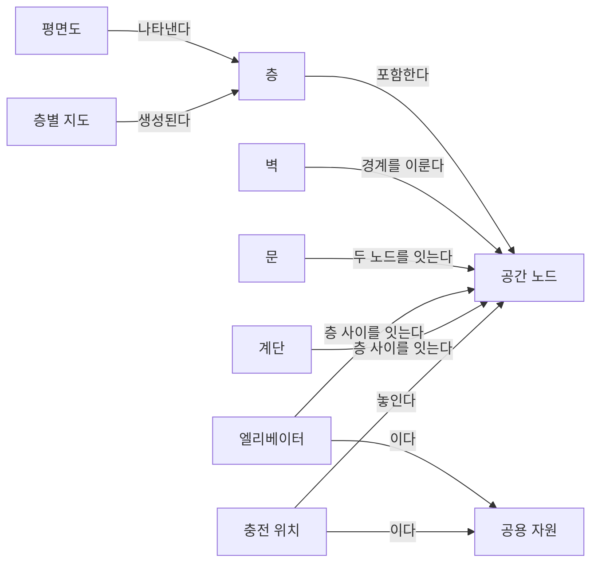

[홈](../../index.md) › 중점 연구 트랙 › [건축 도면 자동 인식](index.md) › 공간 그래프 스키마 초안

# 공간 그래프 스키마 초안 (v0)

<!-- auto:page-status:start -->
> 초안 버전: v0 · 페이지 상태: seed · 신뢰도: 미부여 · 페이지 버전: 1 · 마지막 갱신: 2026-09-25 · 마지막 실행: 없음
<!-- auto:page-status:end -->

## 1. 목적과 범위

이 페이지는 중점 연구 트랙 [건축 도면 자동 인식](index.md)의 살아있는 산출물이다. 평면도에서 인식한 벽·문·엘리베이터·계단·충전 위치를 층별 지도, 공용 자원 목록, 공간 그래프로 표현하는 스키마(개념과 관계)를 정하는 것이 목적이다. 이 공간 그래프는 로봇 기능 온톨로지에 적재되어 로봇 능력과 대조되고, 자연어 업무 지시 챗봇이 장소를 해석하는 기준이 된다. [가정]

v0은 확장 아이디어 3의 정의 문구(아래 인용)에 나오는 요소만으로 시드했다. 개념과 관계의 정의 문장은 구축자가 그 문구에서 도출한 것이므로 모두 "아이디어 정의 기반 [가정]"으로 표기했다. 출처 finding이 없는 개념·관계는 더 넣지 않는다. 이후 트랙 실행에서 리서치 에이전트가 근거 finding id와 함께 변경을 제안하고, 내용 검증 에이전트가 승인한 변경만 스토리텔러 에이전트가 반영하며 그때 초안 버전을 올린다.

> 평면도에서 벽·문·엘리베이터·계단·충전 위치를 인식해 층별 지도와 공용 자원 목록을 자동 생성하고, 공간 그래프로 온톨로지에 적재. 현장 모델링 시간을 줄이고 시뮬레이션 초기값으로 사용

초안 버전(프런트매터 `ontology_version`)은 페이지 버전(`version`)과 별개다. 키 이름은 첫 트랙의 온톨로지 초안과 같게 두어 파이프라인이 같은 방식으로 버전을 대조한다. [가정] 이 초안과 다른 아이디어의 공통 데이터 모델(공간 노드, 공용 자원, 로봇 능력, 작업)의 관계는 [확장 아이디어 연결 구조](../../ideas/index.md)에 있다.

## 2. 개념 목록 표

| 개념 | 정의 | 주요 속성 | 근거 출처 | 상태 |
|---|---|---|---|---|
| 평면도(Floor Plan) | 인식의 입력이 되는 층별 건축 도면. 모든 인식 요소의 근거 도면이 된다. 아이디어 정의 기반 [가정] | 도면 이름, 형식(벡터·래스터·BIM, 단계 2에서 확정), 층, 버전 | 확장 아이디어 3의 정의 문구 | 초안 |
| 층(Floor) | 건물의 한 층. 층별 지도와 공간 노드의 묶음 단위다. 아이디어 정의 기반 [가정] | 층 이름, 높이 기준(단계 4에서 확정) | 확장 아이디어 3의 정의 문구 | 초안 |
| 공간 노드(Space Node) | 로봇이 머물거나 지나가는 공간 단위(방·구역·통로 등). 공간 그래프의 노드다. 아이디어 정의 기반 [가정] | 종류, 층, 경계, 이름·별칭 | 확장 아이디어 3의 정의 문구 | 초안 |
| 벽(Wall) | 공간 노드의 경계를 이루고 통과할 수 없는 요소. 아이디어 정의 기반 [가정] | 위치, 두께(단계 1·2에서 확정) | 확장 아이디어 3의 정의 문구 | 초안 |
| 문(Door) | 두 공간 노드를 잇는 통과 지점. 아이디어 정의 기반 [가정] | 위치, 폭, 여닫는 방식·연동 여부(10. 설비·건물 시스템 연동) | 확장 아이디어 3의 정의 문구 | 초안 |
| 엘리베이터(Elevator) | 서로 다른 층의 공간 노드를 잇는 수직 이동 설비. 공용 자원이다. 아이디어 정의 기반 [가정] | 위치, 운행 층, 연동 여부 | 확장 아이디어 3의 정의 문구 | 초안 |
| 계단(Stairs) | 서로 다른 층의 공간 노드를 잇는 수직 이동 경로. 로봇의 계단 능력이 있어야 지날 수 있다. 아이디어 정의 기반 [가정] | 위치, 잇는 층 | 확장 아이디어 3의 정의 문구 | 초안 |
| 충전 위치(Charging Location) | 로봇이 충전하는 자리. 공용 자원이다. 아이디어 정의 기반 [가정] | 위치, 수(단계 1·2에서 확정) | 확장 아이디어 3의 정의 문구 | 초안 |
| 공용 자원(Shared Resource) | 여러 로봇이 나눠 쓰는 시설. 엘리베이터와 충전 위치가 시드 인스턴스다. 아이디어 정의 기반 [가정] | 종류, 위치(공간 노드), 수용량·예약 조건(16. 공용 자원·충전·에너지 최적화) | 확장 아이디어 3의 정의 문구 | 초안 |
| 층별 지도(Floor Map) | 한 층의 인식 결과로 자동 생성한 지도. 로봇 내비게이션 지도로 바꾸려면 보정이 필요하다(단계 4). 아이디어 정의 기반 [가정] | 층, 좌표계, 생성 시각, 보정 이력 | 확장 아이디어 3의 정의 문구 | 초안 |

개념은 번호나 코드로 부르지 않고 이름으로 부른다. 상태 값은 초안(시드) / 제안(검증 승인 전) / 확정(검증 승인) / 폐기(이유 병기)이며, 폐기한 개념은 표에서 지우지 않고 상태만 바꾼다. 속성의 "(단계 n에서 확정)"은 그 단계의 조사 결과로 정한다는 뜻이다.

## 3. 관계 목록 표

| 주어 | 관계 | 목적어 | 근거 |
|---|---|---|---|
| 평면도 | 층을 나타낸다 | 층 | 확장 아이디어 3의 정의 문구 — 아이디어 정의 기반 [가정] |
| 층 | 공간 노드를 포함한다 | 공간 노드 | 확장 아이디어 3의 정의 문구 — 아이디어 정의 기반 [가정] |
| 벽 | 공간 노드의 경계를 이룬다 | 공간 노드 | 확장 아이디어 3의 정의 문구 — 아이디어 정의 기반 [가정] |
| 문 | 두 공간 노드를 잇는다 | 공간 노드 | 확장 아이디어 3의 정의 문구 — 아이디어 정의 기반 [가정] |
| 엘리베이터·계단 | 서로 다른 층의 공간 노드를 잇는다 | 공간 노드 | 확장 아이디어 3의 정의 문구 — 아이디어 정의 기반 [가정] |
| 충전 위치 | 공간 노드에 놓인다 | 공간 노드 | 확장 아이디어 3의 정의 문구 — 아이디어 정의 기반 [가정] |
| 엘리베이터·충전 위치 | 공용 자원이다 | 공용 자원 | 확장 아이디어 3의 정의 문구 — 아이디어 정의 기반 [가정] |
| 층별 지도 | 층에서 생성된다 | 층 | 확장 아이디어 3의 정의 문구 — 아이디어 정의 기반 [가정] |
| 모든 인식 요소 | 근거 평면도를 가리킨다 | 평면도 | 확장 아이디어 3의 정의 문구 — 아이디어 정의 기반 [가정] |

관계의 방향은 주어에서 목적어로 읽는다. 카디널리티는 정하지 않았으며 6절의 미해결 질문으로 둔다.

## 4. 다이어그램

도식은 2절의 개념과 3절의 관계만 그렸다.

## 5. 적용 예시

아직 없음. 단계 3(구현 가설 설계) 이후 공개 자료로 확인할 수 있는 사례 하나에 이 초안을 적용한 인스턴스 예를 둔다. 제품·제조사 자료에서 가져온 값은 `[추정]`에 "벤더 주장"을 병기한다.

## 6. 미해결 모델링 질문

v0을 아이디어 정의에서 도출하는 과정에서 생긴 질문이다. 관련 id는 [질문 백로그](question-backlog.md)의 질문이다.

- 공간 노드의 단위(방·구역·통로를 어디서 나누는가)와 엣지의 통과 조건(문 폭, 문 열림 필요, 엘리베이터 탑승)을 어떻게 정해야 배정·경로·자원 예약에 모두 쓰이는지 정해지지 않았다. — 관련: q3-02 [가정]
- 공간 그래프를 로봇 기능 온톨로지와 어떤 관계로 잇는가. "이 로봇이 이 경로를 갈 수 있는가"를 판단하려면 계단·도어 조작·충전 능력과 공간 요소의 대응 규칙이 필요하다. — 관련: q3-03 [가정]
- 표준(BIM·IFC, 실내 공간 표준)의 공간·시설 개념과 이 스키마의 개념을 어떻게 대응시키는가. — 관련: q2-01 [가정]
- 도면 좌표계와 로봇별 지도 좌표계의 정렬 정보, 도면–현장 차이, 지도 버전을 층별 지도의 속성으로 둘지 별도 개념으로 둘지 정해지지 않았다. — 관련: q4-02, q4-03, q4-04 [가정]
- 작업대·대기 공간·버퍼처럼 정의 문구에 없는 공용 자원을 도면에서 인식할지, 도면 밖 정보로 보완할지 정해지지 않았다. — 관련: q1-03 [가정]

## 7. 버전 이력

아래 표는 퍼블리셔가 원천 데이터 `data/tracks/floorplan-recognition/space_graph_versions.json`에서 만든다. [가정]

<!-- auto:ontology-version-history:start -->
| 버전 | 날짜 | 변경 내용 | 근거 실행 id |
|---|---|---|---|
| 0 | 2026-09-25 | v0 시드: 확장 아이디어 3의 정의 문구에서 도출한 개념 10개·관계 9개(아이디어 정의 기반 [가정]) | build-2026-09-25 |
<!-- auto:ontology-version-history:end -->
