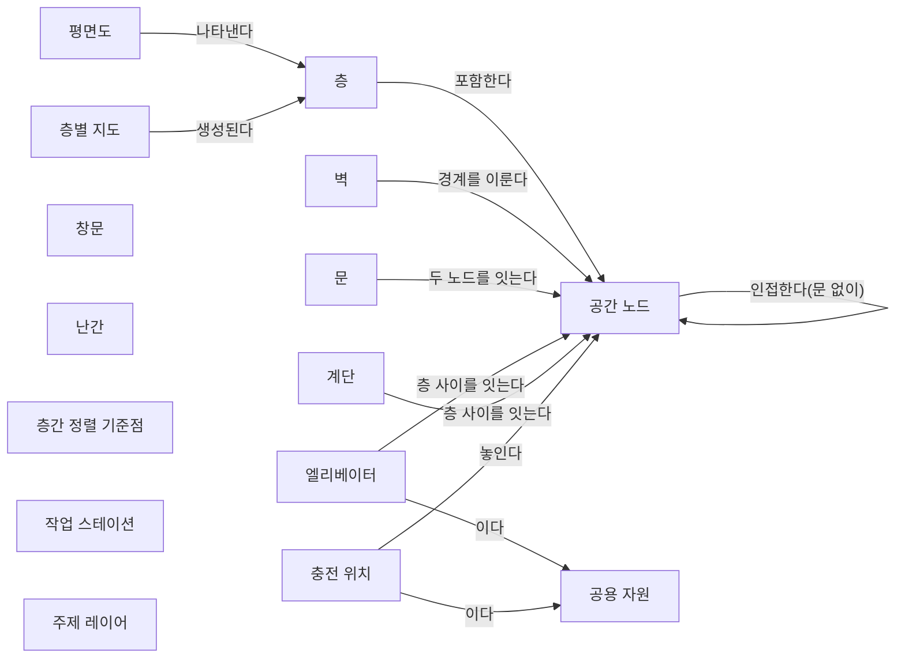

[홈](../../index.md) › 중점 연구 트랙 › [건축 도면 자동 인식](index.md) › 공간 그래프 스키마 초안

# 공간 그래프 스키마 초안 (v0.4)

<!-- auto:page-status:start -->
> 초안 버전: v0.5 · 페이지 상태: published · 신뢰도: medium · 페이지 버전: 6 · 마지막 갱신: 2026-09-25 · 마지막 실행: 2026-09-25
<!-- auto:page-status:end -->

## 1. 목적과 범위

이 페이지는 중점 연구 트랙 [건축 도면 자동 인식](index.md)의 살아있는 산출물이다. 평면도에서 인식한 벽·문·엘리베이터·계단·충전 위치를 층별 지도, 공용 자원 목록, 공간 그래프로 표현하는 스키마(개념과 관계)를 정하는 것이 목적이다. 이 공간 그래프는 로봇 기능 온톨로지에 적재되어 로봇 능력과 대조되고, 자연어 업무 지시 챗봇이 장소를 해석하는 기준이 된다. [가정]

v0은 확장 아이디어 3의 정의 문구(아래 인용)에 나오는 요소만으로 시드했다. 개념과 관계의 정의 문장은 구축자가 그 문구에서 도출한 것이므로 모두 "아이디어 정의 기반 [가정]"으로 표기했다. 출처 finding이 없는 개념·관계는 더 넣지 않는다. 이후 트랙 실행에서 리서치 에이전트가 근거 finding id와 함께 변경을 제안하고, 내용 검증 에이전트가 승인한 변경만 스토리텔러 에이전트가 반영하며 그때 초안 버전을 올린다.

> 평면도에서 벽·문·엘리베이터·계단·충전 위치를 인식해 층별 지도와 공용 자원 목록을 자동 생성하고, 공간 그래프로 온톨로지에 적재. 현장 모델링 시간을 줄이고 시뮬레이션 초기값으로 사용

초안 버전(프런트매터 `ontology_version`)은 페이지 버전(`version`)과 별개다. 키 이름은 첫 트랙의 온톨로지 초안과 같게 두어 파이프라인이 같은 방식으로 버전을 대조한다. [가정] 이 초안과 다른 아이디어의 공통 데이터 모델(공간 노드, 공용 자원, 로봇 능력, 작업)의 관계는 [확장 아이디어 연결 구조](../../ideas/index.md)에 있다.

## 2. 개념 목록 표

| 개념 | 정의 | 주요 속성 | 근거 출처 | 상태 |
|---|---|---|---|---|
| 평면도(Floor Plan) | 인식의 입력이 되는 층별 건축 도면. 모든 인식 요소의 근거 도면이 된다. 아이디어 정의 기반 [가정] | 도면 이름, 형식(값 후보: 래스터 이미지, 벡터 CAD(DXF·DWG), BIM 모델(IFC) — 단계 2에서 확정), 층, 버전, 길이 단위·축척 정보(DXF 는 선택 헤더 $INSUNITS, ezdxf 문서 기준) | 확장 아이디어 3의 정의 문구; 속성 '형식' 값 후보는 finding f1·f8·f11 (실행 2026-09-25-11)[^ref-079][^ref-084][^ref-081]; 속성 '길이 단위·축척 정보'는 finding f12 (실행 2026-09-25-36)[^ref-426] | 확정 |
| 층(Floor) | 건물의 한 층. 층별 지도와 공간 노드의 묶음 단위다. 아이디어 정의 기반 [가정] | 층 이름, 높이 기준(단계 4에서 확정), 표준 대응 클래스(후보: IFC 4.3 IfcBuildingStorey — IfcSpace가 IfcRelAggregates로 묶임, BOT Storey, IMDF level) | 확장 아이디어 3의 정의 문구; 확정 근거와 속성 '표준 대응 클래스(후보)'는 finding f6·f12·f15 (실행 2026-09-25-28)[^ref-156][^ref-336][^ref-338] | 확정 |
| 공간 노드(Space Node) | 로봇이 머물거나 지나가는 공간 단위(방·구역·통로 등). 공간 그래프의 노드다. 아이디어 정의 기반 [가정] | 종류, 층, 경계, 이름·별칭, 방 유형(부엌·침실·복도 등, 데이터셋마다 분류 체계가 다름), 표준 대응 클래스(후보: IndoorGML CellSpace(2.0 JSON 초안), IFC 4.3 IfcSpace, CityGML 3.0 BuildingRoom, BOT Space, IMDF unit — 1:1 대응 여부 미확정) | 확장 아이디어 3의 정의 문구; 속성 '방 유형'은 finding f3·f4·f9·f10 (실행 2026-09-25-05)[^ref-065][^ref-064][^ref-070][^ref-071]; 속성 '표준 대응 클래스(후보)'는 finding f3·f6·f12·f14·f15 (실행 2026-09-25-28)[^ref-333][^ref-156][^ref-336][^ref-339][^ref-338] | 확정 |
| 벽(Wall) | 공간 노드의 경계를 이루고 통과할 수 없는 요소. 아이디어 정의 기반 [가정] | 위치, 두께(단계 1·2에서 확정) | 확장 아이디어 3의 정의 문구; finding f2·f4·f8 (실행 2026-09-25-05)[^ref-063][^ref-064][^ref-069] | 확정 |
| 문(Door) | 두 공간 노드를 잇는 통과 지점. 아이디어 정의 기반 [가정] | 위치, 폭, 여닫는 방식·연동 여부(10. 설비·건물 시스템 연동), BIM 대응 클래스(IFC 4.3 IfcDoor, 개발 브랜치 기준, IfcRelFillsElement 로 벽 개구부를 채움 — 폭·여닫는 방식의 IFC 원천은 OverallWidth·OperationType) | 확장 아이디어 3의 정의 문구; finding f4·f10 (실행 2026-09-25-05)[^ref-064][^ref-071]; 속성 'BIM 대응 클래스'는 finding f1 (실행 2026-09-25-36)[^ref-419] | 확정 |
| 창문(Window) | 공간 노드의 경계에 놓이는 개구부. 여러 평면도 인식 데이터셋의 인식 대상이며, ResPlan은 창문을 통한 방 연결(via_window)을 엣지 유형으로 둔다. 이 초안에서는 문과 달리 로봇이 지나는 연결로 쓰지 않는 경계 요소로 구분한다. | 위치 | finding f2·f4·f10 (실행 2026-09-25-05)[^ref-063][^ref-064][^ref-071] | 확정 |
| 난간(Railing) | 벽처럼 경계를 이루는 요소로 CubiCasa5K와 Kratochvila 외(2024)의 인식 대상이다. 벽과 같은 개념으로 묶을지는 6절 질문으로 둔다. | 위치 | finding f2·f14 (실행 2026-09-25-05)[^ref-063][^ref-078] | 확정 |
| 엘리베이터(Elevator) | 서로 다른 층의 공간 노드를 잇는 수직 이동 설비. 공용 자원이다. 아이디어 정의 기반 [가정] | 위치, 운행 층, 연동 여부, BIM 대응 클래스(IFC 4.3 IfcTransportElement, 유형 열거 값 ELEVATOR(IfcTransportElementTypeEnum), 개발 브랜치 기준) | 확장 아이디어 3의 정의 문구; 확정 근거와 속성 'BIM 대응 클래스'는 finding f8 (실행 2026-09-25-19)[^ref-213]; 유형 열거 값 ELEVATOR 는 finding f4 (실행 2026-09-25-36)[^ref-421] | 확정 |
| 계단(Stairs) | 서로 다른 층의 공간 노드를 잇는 수직 이동 경로. 로봇의 계단 능력이 있어야 지날 수 있다. 아이디어 정의 기반 [가정] | 위치, 잇는 층, BIM 대응 클래스(IFC 4.3 IfcStair, 개발 브랜치 기준, IfcStairFlight·LANDING 슬래브·IfcRailing 으로 분해 가능, 기본 컨테이너 IfcBuildingStorey) | 확장 아이디어 3의 정의 문구; finding f2·f14 (실행 2026-09-25-05)[^ref-063][^ref-078]; 속성 'BIM 대응 클래스'는 finding f3 (실행 2026-09-25-36)[^ref-420] | 확정 |
| 충전 위치(Charging Location) | 로봇이 충전하는 자리. 공용 자원이다. 아이디어 정의 기반 [가정] | 위치, 수(단계 1·2에서 확정), 접근 지점(도킹 이름·접근 자세) | 확장 아이디어 3의 정의 문구; 확정 근거는 finding f1, 속성 '접근 지점'은 finding f1·f6·f14 (실행 2026-09-25-19)[^ref-079][^ref-212][^ref-216] | 확정 |
| 작업 스테이션(Work Station) | 로봇이 적재·하역·작업 인계를 하는 고정 시설(작업대·디스펜서·인제스터·적재 스테이션). Open-RMF의 픽업 디스펜서·하역 인제스터 작업셀 이름, VDA 5050 pick·drop 동작의 스테이션 파라미터, 제3자 LIF 스키마의 스테이션이 근거다. 아이디어 정의 문구에는 없는 개념이다. | 이름, 위치, 접근 지점(상호작용 노드), 관련 동작(pick·drop 등) | finding f1·f3·f6 (실행 2026-09-25-19)[^ref-079][^ref-031][^ref-212] | 확정 |
| 공용 자원(Shared Resource) | 여러 로봇이 나눠 쓰는 시설. 엘리베이터와 충전 위치가 시드 인스턴스다. 아이디어 정의 기반 [가정] | 종류, 위치(공간 노드), 수용량·예약 조건(16. 공용 자원·충전·에너지 최적화) | 확장 아이디어 3의 정의 문구 | 초안 |
| 층별 지도(Floor Map) | 한 층의 인식 결과로 자동 생성한 지도. 로봇 내비게이션 지도로 바꾸려면 보정이 필요하다(단계 4). 아이디어 정의 기반 [가정] | 층, 좌표계, 축척(미터당 픽셀), 도면 대비 변환(이동·회전), 생성 시각, 보정 이력 | 확장 아이디어 3의 정의 문구; 속성 '축척'·'도면 대비 변환'은 finding f1·f2·f3 (실행 2026-09-25-11)[^ref-079][^ref-080]. 층 이름은 '층' 개념의 속성이며 관계 '층별 지도 / 층에서 생성된다'로 잇는다 | 확정 |
| 층간 정렬 기준점(Alignment Fiducial) | 여러 층 도면에서 수직으로 겹칠 것으로 기대되는 지점. 층 사이 축척과 정렬(좌표 변환)을 맞추는 데 쓴다(Open-RMF traffic-editor). 관제 쪽은 경유점마다 층 이름과 층 안의 미터 좌표를 요구한다. | 층, 도면 위 위치 | finding f1·f3 (실행 2026-09-25-11)[^ref-079][^ref-080] | 확정 |
| 주제 레이어(Thematic Layer) | 같은 실내를 서로 다른 기준으로 나눈 공간 셀 묶음. IndoorGML의 주제 레이어(ThematicLayer)와 레이어 간 연결(InterLayerConnection)이 근거다. 아이디어 정의 문구에는 없는 개념이다. | 나누는 기준, 포함하는 공간 셀, 다른 레이어와의 연결 | finding f2·f3 (실행 2026-09-25-28)[^ref-331][^ref-332][^ref-333] | 확정 |

개념은 번호나 코드로 부르지 않고 이름으로 부른다. 상태 값은 초안(시드) / 제안(검증 승인 전) / 확정(검증 승인) / 폐기(이유 병기)이며, 폐기한 개념은 표에서 지우지 않고 상태만 바꾼다. 속성의 "(단계 n에서 확정)"은 그 단계의 조사 결과로 정한다는 뜻이다. v0.1(실행 2026-09-25-05)의 추가·확정은 내용 검증 에이전트가 승인한 변경만 반영한 것이다. v0.2(실행 2026-09-25-11)에서는 검증이 승인한 대로 층간 정렬 기준점을 추가하고 층별 지도·평면도를 확정했으며, 벤더 주장(MiR Fleet 축척 요건)과 추정(입력 형식별 자동화 수준 종합)은 근거 칸에 넣지 않았다. 문에 통과 방향·문 유형·통과 비용 속성을 더하는 제안은 반영하지 않고 6절 질문으로 두었다. v0.3(실행 2026-09-25-19)에서는 검증이 승인한 대로 작업 스테이션을 추가하고, 충전 위치에 접근 지점 속성을, 엘리베이터에 BIM 대응 클래스 속성을 더해 두 시드 개념을 확정했다. 충전 위치·작업 스테이션의 정보 출처 속성과 작업 스테이션을 공용 자원에 포함할지는 반영하지 않고 6절 질문으로 두었다. v0.4(실행 2026-09-25-28)에서는 검증이 승인한 대로 공간 노드와 층에 표준 대응 클래스(후보) 속성을 더하고 층을 확정했으며, 주제 레이어 개념을 더해 확정했다. 주제 레이어의 정의는 IndoorGML의 주제 레이어·레이어 간 연결이 근거인 범위로 한정했다. 문에 표준 대응 클래스를 더하는 제안과 주제 레이어로 로봇 주행 레이어와 사람 동선 레이어를 나눌지는 반영하지 않고 6절 질문으로 두었다. v0.5(실행 2026-09-25-36)에서는 검증이 승인한 대로 문에 BIM 대응 클래스(IfcDoor) 속성과 폭·여닫는 방식의 IFC 원천을, 계단에 BIM 대응 클래스(IfcStair) 속성을 더하고, 엘리베이터의 BIM 대응 클래스에 유형 열거 값 ELEVATOR를 확정했으며, 평면도에 길이 단위·축척 정보 속성을 더했다. 문의 BIM 대응 클래스는 IFC 한 표준에 한정한 것이며, IndoorGML 2.0에서 문을 어느 클래스로 표현하는지에 대한 6절 질문은 그대로 남는다. 계단이 잇는 층의 도출(추정)과 래스터 평면도의 축척 복원 방식은 반영하지 않고 6절 질문으로 두었다.

## 3. 관계 목록 표

| 주어 | 관계 | 목적어 | 근거 |
|---|---|---|---|
| 평면도 | 층을 나타낸다 | 층 | 확장 아이디어 3의 정의 문구 — 아이디어 정의 기반 [가정] |
| 층 | 공간 노드를 포함한다 | 공간 노드 | 확장 아이디어 3의 정의 문구 — 아이디어 정의 기반 [가정] |
| 벽 | 공간 노드의 경계를 이룬다 | 공간 노드 | 확장 아이디어 3의 정의 문구 — 아이디어 정의 기반 [가정] |
| 문 | 두 공간 노드를 잇는다 | 공간 노드 | 확장 아이디어 3의 정의 문구 — 아이디어 정의 기반 [가정] |
| 공간 노드 | 인접한다(문 없이) | 공간 노드 | finding f10 (실행 2026-09-25-05)[^ref-071] — 문을 거치지 않고 경계를 맞대거나 개방되어 이어진 공간 사이 관계. ResPlan의 adjacency·direct 엣지에 대응하며 '문 / 두 공간 노드를 잇는다'와 구분한다 |
| 엘리베이터·계단 | 서로 다른 층의 공간 노드를 잇는다 | 공간 노드 | 확장 아이디어 3의 정의 문구 — 아이디어 정의 기반 [가정] |
| 충전 위치 | 공간 노드에 놓인다 | 공간 노드 | 확장 아이디어 3의 정의 문구 — 아이디어 정의 기반 [가정] |
| 엘리베이터·충전 위치 | 공용 자원이다 | 공용 자원 | 확장 아이디어 3의 정의 문구 — 아이디어 정의 기반 [가정] |
| 층별 지도 | 층에서 생성된다 | 층 | 확장 아이디어 3의 정의 문구 — 아이디어 정의 기반 [가정] |
| 모든 인식 요소 | 근거 평면도를 가리킨다 | 평면도 | 확장 아이디어 3의 정의 문구 — 아이디어 정의 기반 [가정] |

관계의 방향은 주어에서 목적어로 읽는다. 카디널리티는 정하지 않았으며 6절의 미해결 질문으로 둔다. 창문·난간과 공간 노드 사이의 관계는 아직 승인된 근거가 없어 표에 넣지 않았다(6절). 층간 정렬 기준점과 층·층별 지도 사이의 관계도 승인된 관계가 없어 넣지 않았다(6절). 작업 스테이션과 공간 노드·공용 자원 사이의 관계도 승인된 관계가 없어 넣지 않았다(6절). 주제 레이어와 공간 노드 사이의 관계, 그리고 표준에 대응시킨 관계(엣지) 유형도 이번에 승인된 변경이 없어 넣지 않았다(6절).

## 4. 다이어그램

도식은 2절의 개념과 3절의 관계만 그렸다. 창문·난간·층간 정렬 기준점·작업 스테이션·주제 레이어는 개념으로만 확정했고 관계가 정해지지 않아 연결선 없이 두었다.

## 5. 적용 예시

아직 없음. 단계 3(구현 가설 설계) 이후 공개 자료로 확인할 수 있는 사례 하나에 이 초안을 적용한 인스턴스 예를 둔다. 제품·제조사 자료에서 가져온 값은 `[추정]`에 "벤더 주장"을 병기한다.

## 6. 미해결 모델링 질문

v0을 아이디어 정의에서 도출하는 과정과 v0.1 갱신(실행 2026-09-25-05), v0.2 갱신(실행 2026-09-25-11), v0.3 갱신(실행 2026-09-25-19), v0.4 갱신(실행 2026-09-25-28)에서 생긴 질문이다. 관련 id는 [질문 백로그](question-backlog.md)의 질문이다.

- 공간 노드의 단위(방·구역·통로를 어디서 나누는가)와 엣지의 통과 조건(문 폭, 문 열림 필요, 엘리베이터 탑승)을 어떻게 정해야 배정·경로·자원 예약에 모두 쓰이는지 정해지지 않았다. — 관련: q3-02 [가정]
- 공간 그래프를 로봇 기능 온톨로지와 어떤 관계로 잇는가. "이 로봇이 이 경로를 갈 수 있는가"를 판단하려면 계단·도어 조작·충전 능력과 공간 요소의 대응 규칙이 필요하다. — 관련: q3-03 [가정]
- 표준(BIM·IFC, 실내 공간 표준)의 공간·시설 개념과 이 스키마의 개념을 어떻게 대응시키는가. — 관련: q2-01 [가정] 근거 보강(q2-01은 실행 2026-09-25-28에서 답함): 공간 노드와 층의 표준 대응 클래스(후보)는 v0.4에 반영했지만 1:1 대응 여부와 관계(엣지) 쪽 대응은 정해지지 않았다. 이 위키의 정리로는 로봇 충전 위치·작업 스테이션에 대응하는 전용 클래스를 이번에 확인한 표준들에서 찾지 못한 것으로 보인다. [추정][^ref-333][^ref-348][^ref-156][^ref-334][^ref-339][^ref-336][^ref-338][^ref-214]
- 문(Door)에 표준 대응 클래스를 둘지 정해지지 않았다(v0.4에서 반영하지 않음). IndoorGML 2.0에서 문을 경계(NavigableBoundary·CellBoundary)로 표현하는지 1.x의 연결 공간(ConnectionSpace) 계열처럼 공간으로 표현하는지 확인되지 않았다. [추정][^ref-333][^ref-348] 후보로 거론된 값은 IFC 문 요소와 IfcRelSpaceBoundary(2차 A 유형), CityGML DoorSurface, IMDF opening이며, 이 대응은 이 위키의 추정이다. [추정][^ref-334][^ref-339][^ref-338] — 관련: q2-07, q2-01
- 주제 레이어로 로봇 주행 가능 공간과 사람 동선을 서로 다른 레이어로 나눌지는 근거 finding이 없는 설계 제안이라 개념 정의에 넣지 않았다. 주제 레이어는 아이디어 정의 문구에 없는 개념이어서 1절 범위와의 관계도 함께 정해야 한다. — 관련: q3-02
- IFC에서 공간 그래프를 얻으려면 공간 경계(2차 A 유형)·문·층 소속 관계에서 연결을 도출해야 할 것으로 보인다. [추정][^ref-156][^ref-334] 층 사이 수직 연결은 사용자 정의 엔터티(IfcRelConnectsSpace)를 IFC에 더해 표현한 연구가 있다. [사실][^ref-343] 이 도출·확장 규칙은 개념·관계 표에 넣지 않았다. — 관련: q3-05, q2-01
- 도면 좌표계와 로봇별 지도 좌표계의 정렬 정보, 도면–현장 차이, 지도 버전을 층별 지도의 속성으로 둘지 별도 개념으로 둘지 정해지지 않았다. — 관련: q4-02, q4-03, q4-04 [가정]
- 작업대·대기 공간·버퍼처럼 정의 문구에 없는 공용 자원을 도면에서 인식할지, 도면 밖 정보로 보완할지 정해지지 않았다. — 관련: q1-03 [가정] 근거 보강(q1-03은 실행 2026-09-25-19에서 답함): 이번 검색 범위(한·영 검색 15회)에서는 운영 시설을 도면에서 자동 인식한 사례를 찾지 못했고, 확인한 사례는 사람의 주석·현장 감지·레이아웃 교환·설비 계획으로 도면 밖 정보를 채우는 것으로 보인다. [추정][^ref-079][^ref-216][^ref-046][^ref-212][^ref-031]
- 에스컬레이터(Escalator)를 층 사이를 잇는 개념으로 둘지 정하지 않았다. FloorPlanCAD의 설비 범주에 엘리베이터와 함께 있다는 근거가 제3자 데이터셋 카드의 검색 요약뿐이고, 로봇이 이용할 수 있는지에 대한 근거도 없어 v0.1에 반영하지 않았다. [추정][^ref-068] — 관련: q3-02
- 난간을 벽과 같은 개념으로 묶을지 별도로 둘지, 창문·난간이 공간 노드의 경계를 이루는 관계를 둘지 정해지지 않았다. — 관련: q3-02
- 공간 노드의 방 유형은 주거 중심 분류(부엌·침실·복도 등)라 물류 시설 구역 유형(출하 대기장 등)과의 대응이 정해지지 않았다. — 관련: q1-05, q3-02
- 그래프 출력형 평면도 인식 결과(Raster-to-Graph의 벽 구조 그래프, ResPlan의 방 연결 엣지, MSD의 방–연결 그래프)는 이 스키마의 '공간 노드–문–공간 노드' 구조와 가깝지만 층 간 연결(엘리베이터·계단)과 통과 조건은 담지 않는 것으로 보여 확장 방법이 필요하다. [추정][^ref-070][^ref-071][^ref-072] — 관련: q3-02
- 축척 정보가 없는 인식 결과(예: 512×512로 정규화한 Raster-to-Graph)를 층별 지도의 좌표계로 옮기려면 축척 복원이 필요할 것으로 보인다. [추정][^ref-069][^ref-071][^ref-070] — 관련: q4-05, q4-01, q4-03
- 문 통과 조건을 어디에 둘지 정해지지 않았다. BIRS는 통행 조건을 가중치로 담은 방향 하이퍼그래프에서 경로를 계획했다. [사실][^ref-085] Palacz 외는 방 크기·문 방향·문 유형을 하이퍼그래프 속성으로 두고 공간 통과·문 열기 비용을 고려했다. [사실][^ref-086] 통과 조건을 엣지에 둘지 문 속성에 둘지 정해지기 전까지 문 개념에 통과 방향·문 유형·통과 비용 속성을 더하지 않았다(v0.2, 실행 2026-09-25-11). — 관련: q3-02
- 층간 정렬 기준점을 층·층별 지도와 어떤 관계로 잇는지(어느 층 쌍의 변환을 정하는지) 정해지지 않았다. — 관련: q4-03
- 위 q4-02·q4-03 항목의 근거 보강: 건축 도면에서 만든 그래프와 라이다로 추정한 그래프를 결합해 도면(as-planned)과 현장(as-built)의 전역 정렬·구조 편차를 실시간 추정하는 연구가 있다(arXiv 2024-08 제출, 2025-06 개정). [사실][^ref-224] 확인한 사례 범위에서는 도면–현장 차이와 주행 차선·충전 위치가 자동 생성 결과에 담기지 않고 위치추정 쪽 보정이나 사람 주석으로 남는 것으로 보인다. [추정][^ref-079][^ref-081][^ref-223][^ref-224][^ref-082] 도면–현장 편차는 새 개념으로 넣지 않았다. — 관련: q4-02, q4-03
- 평면도 형식(래스터 이미지, 벡터 CAD, BIM 모델)마다 자동화 수준이 다를 것으로 보이나 입력 형식별 종합은 추정이어서 개념 근거 칸에 넣지 않았다. [추정][^ref-079][^ref-084][^ref-081] — 관련: q2-02
- 충전 위치에 '정보 출처(도면 인식 / 수동 주석 / 현장 감지 / 레이아웃 교환)' 속성을 둘지 정해지지 않았다. 확인한 표현들에서는 시설 위치와 접근 지점, 정보 출처를 구분해야 할 것으로 보이나 추정 근거여서 v0.3에 반영하지 않았다. [추정][^ref-079][^ref-212][^ref-216] — 관련: q3-02, q1-03
- 작업 스테이션을 공용 자원에 포함할지(16. 공용 자원·충전·에너지 최적화의 정의와의 관계)와 작업 스테이션에 정보 출처 속성을 둘지 정해지지 않았다(v0.3에서 반영하지 않음). 작업 스테이션은 아이디어 정의 문구에 없는 개념이어서 1절 범위와의 관계도 함께 정해야 한다. — 관련: q3-02
- 로봇 충전소는 이번에 확인한 IFC 4.3 유형 값(개발 브랜치 기준)에 없어, BIM 입력에서는 사용자 정의 유형·속성 세트로 따로 모델링되거나 도면에 담기지 않을 가능성이 클 것으로 보인다. [추정][^ref-213][^ref-214][^ref-215] — 관련: q2-06, q2-01
- 도면에서 만든 공간 그래프와 통합사업자가 넘기는 레이아웃(VDA 5050·LIF의 스테이션·노드)을 합칠 때 스테이션·충전소의 식별자·좌표를 어떻게 대응시킬지 정해지지 않았다. 두 정보는 별도 출처의 시설 정보가 될 것으로 보인다(스테이션 유형 필드 부재는 제3자 스키마 기준). [추정][^ref-031][^ref-046][^ref-212] — 관련: q4-03

- 계단·엘리베이터가 잇는 층을 계단·엘리베이터 개념의 속성 값으로 어떻게 채울지 정해지지 않았다. IFC 입력에서 계단·엘리베이터가 잇는 층은 직접 속성이 아니라 포함 관계·형상에서 도출해야 할 것으로 보여 v0.5의 개념 표에 넣지 않았다. [추정][^ref-419][^ref-422][^ref-420][^ref-334][^ref-156] — 관련: q3-05
- 래스터 평면도의 축척을 별도 메타데이터로 받을지, 도면 안 축척 표기·치수 문자 인식으로 복원할지 정해지지 않아 평면도의 길이 단위·축척 정보 속성 근거에는 DXF 헤더만 넣었다(v0.5). [추정][^ref-069][^ref-070][^ref-435] — 관련: q4-05
- 실무 IFC 모델에서 엘리베이터·문·계단이 범용 요소 IfcBuildingElementProxy 로 내보내지면 BIM 대응 클래스만으로는 해당 요소를 찾을 수 없을 것으로 보여, 입력 점검·보정 규칙을 어디에 둘지 정해야 한다. [추정][^ref-432][^ref-421][^ref-419] — 관련: q2-09
- 충전 위치의 표준 표현은 BIM뿐 아니라 확인한 CAD 레이어 표준 자료와 공개 평면도 데이터셋에서도 확인되지 않아, 세 입력 형식 모두에서 도면 밖 정보로 보완해야 할 것으로 보인다(레이어 표준 원문 미열람으로 부재 확정 아님). [추정][^ref-214][^ref-215][^ref-427][^ref-428][^ref-063][^ref-073] — 관련: q2-06, q2-08

## 7. 버전 이력

아래 표는 퍼블리셔가 원천 데이터 `data/tracks/floorplan-recognition/space_graph_versions.json`에서 만든다. [가정]

<!-- auto:ontology-version-history:start -->
| 버전 | 날짜 | 변경 내용 | 근거 실행 id |
|---|---|---|---|
| 0 | 2026-09-25 | v0 시드: 확장 아이디어 3의 정의 문구에서 도출한 개념 10개·관계 9개(아이디어 정의 기반 [가정]) | build-2026-09-25 |
| 0.1 | 2026-09-25 | v0 → v0.1(2026-09-25, 근거 실행 2026-09-25-05): 개념 '창문'(f2·f4·f10)·'난간'(f2·f14) 추가, 관계 '공간 노드 | 2026-09-25-05 |
| 0.2 | 2026-09-25 | v0.1 → v0.2(2026-09-25, 근거 실행 2026-09-25-11): 개념 '층간 정렬 기준점' 추가(f1·f3), '층별 지도' 속성 축척·도면 대비 변환 추가·확정(f1·f2·f3), '평면도' 형식 값 후보 추가·확정(f1·f8·f11). 거부: 문 속성 추가(f13·f14 → 6절 질문, q3-02) | 2026-09-25-11 |
| 0.3 | 2026-09-25 | v0.2 → v0.3(2026-09-25, 근거 실행 2026-09-25-19): 개념 '작업 스테이션' 추가·확정(f1·f3·f6), '충전 위치' 속성 접근 지점 추가·확정(f1·f6·f14), '엘리베이터' 속성 BIM 대응 클래스(IfcTransportElement, 개발 브랜치 기준) 추가·확정(f8). 거부: 충전 위치·작업 스테이션의 정보 출처 속성(f18·f19 추정)과 작업 스테이션의 공용 자원 포함 여부 → 6절 질문(q3-02) | 2026-09-25-19 |
| 0.4 | 2026-09-25 | v0.3 → v0.4: 공간 노드 속성 '표준 대응 클래스(후보)' 추가(f3·f6·f12·f14·f15), 층 속성 '표준 대응 클래스(후보)' 추가와 층 확정(f6·f12·f15), 개념 '주제 레이어' 추가·확정(f2·f3). 거부: 문 '표준 대응 클래스' 속성(IndoorGML 2.0 의 문 표현 미확인 → 6절 질문, q2-07·q2-01), 주제 레이어의 로봇·사람 레이어 구분(근거 없음 → 6절 질문). 근거 실행 2026-09-25-28 | 2026-09-25-28 |
| 0.5 | 2026-09-25 | v0.4 → v0.5: 문 BIM 대응 클래스 IfcDoor 추가(f1), 계단 BIM 대응 클래스 IfcStair 추가(f3), 엘리베이터 유형 값 ELEVATOR 확정(f4), 평면도 길이 단위·축척 정보 속성 추가(f12); 거부: 계단이 잇는 층 도출(f6 추정 → 6절 질문 q3-05), 래스터 축척 복원 방식(f22 강등 → 6절 질문 q4-05); 근거 실행 2026-09-25-36 | 2026-09-25-36 |
<!-- auto:ontology-version-history:end -->

[^ref-031]: VDA / VDMA (VDA5050 GitHub), VDA5050/VDA5050_EN.md — Official Specification document for the VDA 5050, 미확인, https://github.com/VDA5050/VDA5050/blob/main/VDA5050_EN.md, 접근일 2026-09-25
[^ref-063]: Kalervo, A., Ylioinas, J., Häikiö, M., Karhu, A., & Kannala, J., CubiCasa5K: A Dataset and an Improved Multi-Task Model for Floorplan Image Analysis, 2019-04, https://arxiv.org/abs/1904.01920, 접근일 2026-09-25 (원문 미열람)
[^ref-064]: Zeng, Z., Li, X., Yu, Y. K., & Fu, C.-W., DeepFloorplan — README (Deep Floor Plan Recognition using a Multi-task Network with Room-boundary-Guided Attention), 2019, https://github.com/zlzeng/DeepFloorplan, 접근일 2026-09-25
[^ref-065]: Liu, C., Wu, J., Kohli, P., & Furukawa, Y., FloorplanTransformation — README (Raster-to-Vector: Revisiting Floorplan Transformation), 2017, https://github.com/art-programmer/FloorplanTransformation, 접근일 2026-09-25
[^ref-068]: Voxel51 (Hugging Face), Voxel51/FloorPlanCAD · Datasets at Hugging Face, 미확인, https://huggingface.co/datasets/Voxel51/FloorPlanCAD, 접근일 2026-09-25 (원문 미열람)
[^ref-069]: Pizarro, P. N., Hitschfeld, N., & Sipiran, I. (MLSTRUCT), MLStructFP — README (Large-scale multi-unit floor plan dataset for architectural plan analysis and recognition), 2023, https://github.com/MLSTRUCT/MLStructFP, 접근일 2026-09-25
[^ref-070]: Hu, S. 외, Raster-to-Graph — README (Raster-to-Graph: Floorplan Recognition via Autoregressive Graph Prediction with an Attention Transformer), 2024, https://github.com/SizheHu/Raster-to-Graph, 접근일 2026-09-25
[^ref-071]: Agour, M. 외 (ResPlan), ResPlan — README (ResPlan: A Large-Scale Vector-Graph Dataset of 17,000 Residential Floor Plans), 2025-08, https://github.com/m-agour/ResPlan, 접근일 2026-09-25
[^ref-072]: van Engelenburg, C. 외 (MSD), msd — README (MSD: A Benchmark Dataset for Floor Plan Generation of Building Complexes), 2024, https://github.com/caspervanengelenburg/msd, 접근일 2026-09-25
[^ref-078]: Kratochvila, L., de Jong, G., Arkesteijn, M., Zemcik, T., Bilik, S., Horak, K., & Rellermeyer, J. S., Multi-Unit Floor Plan Recognition and Reconstruction Using Improved Semantic Segmentation of Raster-Wise Floor Plans, 2024-08, https://arxiv.org/abs/2408.01526, 접근일 2026-09-25 (원문 미열람)
[^ref-079]: Open Robotics, Traffic Editor - Programming Multiple Robots with ROS 2, 미확인, https://osrf.github.io/ros2multirobotbook/traffic-editor.html, 접근일 2026-09-25
[^ref-080]: Open Robotics, Navigation Maps (integration_nav-maps) - Programming Multiple Robots with ROS 2, 미확인, https://osrf.github.io/ros2multirobotbook/integration_nav-maps.html, 접근일 2026-09-25
[^ref-081]: Vega-Torres, M. A. 외, Occupancy Grid Map to Pose Graph-based Map: Robust BIM-based 2D-LiDAR Localization for Lifelong Indoor Navigation in Changing and Dynamic Environments, 2023-08, https://arxiv.org/abs/2308.05443, 접근일 2026-09-25 (원문 미열람)
[^ref-082]: Vega-Torres, M. A. (MigVega GitHub), Ogm2Pgbm — README (Robust BIM-based 2D-LiDAR Localization for Lifelong Indoor Navigation in Changing and Dynamic Environments), 미확인, https://github.com/MigVega/Ogm2Pgbm, 접근일 2026-09-25
[^ref-084]: Zhang, J. (jiajiezhang7 GitHub), osmAG-from-cad — README (CAD-to-osmAG pipeline), 미확인, https://github.com/jiajiezhang7/osmAG-from-cad, 접근일 2026-09-25
[^ref-085]: Braga, R. G., Tahir, M. O., Karimi, S., Dah-Achinanon, U., Iordanova, I., & St-Onge, D., Intuitive BIM-aided robotic navigation and assets localization with semantic user interfaces, 2025-03-26, https://www.frontiersin.org/journals/robotics-and-ai/articles/10.3389/frobt.2025.1548684/full, 접근일 2026-09-25 (원문 미열람)
[^ref-086]: Palacz, W., Ślusarczyk, G., Strug, B., & Grabska, E., Indoor Robot Navigation Using Graph Models Based on BIM/IFC, 2019, https://www.researchgate.net/publication/333410520_Indoor_Robot_Navigation_Using_Graph_Models_Based_on_BIMIFC, 접근일 2026-09-25 (원문 미열람)
[^ref-223]: Boniardi, F., Caselitz, T., Kümmerle, R., & Burgard, W., Robust LiDAR-based localization in architectural floor plans, 2017, http://ais.informatik.uni-freiburg.de/publications/papers/boniardi17iros.pdf, 접근일 2026-09-25 (원문 미열람)
[^ref-224]: Shaheer, M., Millan-Romera, J. A., Bavle, H., Giberna, M., Sanchez-Lopez, J. L., Civera, J., & Voos, H., Tightly Coupled SLAM with Imprecise Architectural Plans (arXiv 2024-08 제출, 2025-06 개정), 2024-08, https://arxiv.org/abs/2408.01737, 접근일 2026-09-25 (원문 미열람)
[^ref-046]: VDMA (Intralogistics-2X-LIF GitHub), Layout-Interchange-Format — README (Repository for the Layout Interchange Format (LIF) developed by the VDMA), 2023-09, https://github.com/Intralogistics-2X-LIF/Layout-Interchange-Format, 접근일 2026-09-25
[^ref-212]: continua-systems (GitHub), vdma-lif — schema/lif-schema.json (JSON parsers and models for the VDMA LIF, VDMA 공식 산출물이 아닌 제3자 스키마), 미확인, https://github.com/continua-systems/vdma-lif/blob/main/schema/lif-schema.json, 접근일 2026-09-25
[^ref-213]: buildingSMART (IFC4.3.x-development GitHub), IFC 4.3 — IfcTransportElement (개발 브랜치 ifc4.3-main 원본, 게시판 IFC 4.3 ADD2와 문구가 다를 수 있음), 미확인, https://github.com/buildingSMART/IFC4.3.x-development/blob/ifc4.3-main/docs/schemas/core/IfcProductExtension/Entities/IfcTransportElement.md, 접근일 2026-09-25
[^ref-214]: buildingSMART (IFC4.3.x-development GitHub), IFC 4.3 — IfcOutletTypeEnum (개발 브랜치 ifc4.3-main 원본, 게시판 IFC 4.3 ADD2와 문구가 다를 수 있음), 미확인, https://github.com/buildingSMART/IFC4.3.x-development/blob/ifc4.3-main/docs/schemas/domain/IfcElectricalDomain/Types/IfcOutletTypeEnum.md, 접근일 2026-09-25 (원문 미열람)
[^ref-215]: buildingSMART (IFC4.3.x-development GitHub), IFC 4.3 — IfcElectricApplianceTypeEnum (개발 브랜치 ifc4.3-main 원본, 게시판 IFC 4.3 ADD2와 문구가 다를 수 있음), 미확인, https://github.com/buildingSMART/IFC4.3.x-development/blob/ifc4.3-main/docs/schemas/domain/IfcElectricalDomain/Types/IfcElectricApplianceTypeEnum.md, 접근일 2026-09-25
[^ref-216]: ROS Navigation (ros-navigation/navigation2 GitHub), nav2_docking — README (Open Navigation's Nav2 Docking Framework), 미확인, https://github.com/ros-navigation/navigation2/blob/main/nav2_docking/README.md, 접근일 2026-09-25
[^ref-156]: buildingSMART International, IFC 4.3 documentation — IfcSpace (IFC4.3.x-development), 미확인, https://github.com/buildingSMART/IFC4.3.x-development/blob/ifc4.3-main/docs/schemas/core/IfcProductExtension/Entities/IfcSpace.md, 접근일 2026-09-25
[^ref-331]: OGC (Open Geospatial Consortium), OGC IndoorGML 2.0 Part 1 – Conceptual Model (22-045r5), 2025-08, https://docs.ogc.org/is/22-045r5/22-045r5.html, 접근일 2026-09-25 (원문 미열람)
[^ref-332]: OGC (Open Geospatial Consortium), OGC Publishes IndoorGML 2.0 Part 1 Conceptual Model Standard, 2025-08-28, https://www.ogc.org/announcement/ogc-publishes-indoorgml-2-0-part-1-conceptual-model-standard/, 접근일 2026-09-25 (원문 미열람)
[^ref-333]: OGC IndoorGML SWG (opengeospatial/IndoorGML-SWG GitHub), OGC IndoorGML 2.0 Part 2b – JSON Encoding (26-043, Candidate SWG Draft v0.5.0), 2026-02-28, https://github.com/opengeospatial/IndoorGML-SWG/blob/master/26-043.html, 접근일 2026-09-25
[^ref-334]: buildingSMART (IFC4.3.x-development GitHub), IFC 4.3 — IfcRelSpaceBoundary (개발 브랜치 ifc4.3-main 원본, 게시판 IFC 4.3 ADD2와 문구가 다를 수 있음), 미확인, https://github.com/buildingSMART/IFC4.3.x-development/blob/ifc4.3-main/docs/schemas/core/IfcProductExtension/Entities/IfcRelSpaceBoundary.md, 접근일 2026-09-25
[^ref-336]: W3C Linked Building Data Community Group (w3c-lbd-cg GitHub), Building Topology Ontology (BOT) — bot.ttl (version 0.3.2), 2020-07-31, https://github.com/w3c-lbd-cg/bot/blob/master/bot.ttl, 접근일 2026-09-25
[^ref-338]: OGC (Open Geospatial Consortium) / Apple, Indoor Mapping Data Format (1.0.0) — OGC Community Standard 20-094, 2021-02, https://docs.ogc.org/cs/20-094/, 접근일 2026-09-25 (원문 미열람)
[^ref-339]: OGC (Open Geospatial Consortium), OGC City Geography Markup Language (CityGML) Part 1: Conceptual Model Standard (20-010), 2021, https://docs.ogc.org/is/20-010/20-010.html, 접근일 2026-09-25 (원문 미열람)
[^ref-343]: Zhu, J., Wong, M. O., Nisbet, N., Xu, J., Kelly, T., Zlatanova, S., & Brilakis, I., Semantics-based connectivity graph for indoor pathfinding powered by IFC-Graph, 2025, https://www.sciencedirect.com/science/article/pii/S0926580525000597, 접근일 2026-09-25 (원문 미열람)
[^ref-348]: ISPRS International Journal of Geo-Information(MDPI) 게재 논문 저자(미확인), Data Model for IndoorGML Extension to Support Indoor Navigation of People with Mobility Disabilities, 2020, https://www.mdpi.com/2220-9964/9/2/66, 접근일 2026-09-25 (원문 미열람)
[^ref-073]: Luo, R. 외, ArchCAD-400K: A Large-Scale CAD drawings Dataset and New Baseline for Panoptic Symbol Spotting, 2025-03, https://arxiv.org/abs/2503.22346, 접근일 2026-09-25 (원문 미열람)
[^ref-419]: buildingSMART (IFC4.3.x-development GitHub), IFC 4.3 — IfcDoor (개발 브랜치 ifc4.3-main 원본, 게시판 IFC 4.3 ADD2와 문구가 다를 수 있음), 미확인, https://github.com/buildingSMART/IFC4.3.x-development/blob/ifc4.3-main/docs/schemas/shared/IfcSharedBldgElements/Entities/IfcDoor.md, 접근일 2026-09-25
[^ref-420]: buildingSMART (IFC4.3.x-development GitHub), IFC 4.3 — IfcStair (개발 브랜치 ifc4.3-main 원본, 게시판 IFC 4.3 ADD2와 문구가 다를 수 있음), 미확인, https://github.com/buildingSMART/IFC4.3.x-development/blob/ifc4.3-main/docs/schemas/shared/IfcSharedBldgElements/Entities/IfcStair.md, 접근일 2026-09-25
[^ref-421]: buildingSMART (IFC4.3.x-development GitHub), IFC 4.3 — IfcTransportElementTypeEnum (개발 브랜치 ifc4.3-main 원본, 게시판 IFC 4.3 ADD2와 문구가 다를 수 있음), 미확인, https://github.com/buildingSMART/IFC4.3.x-development/blob/ifc4.3-main/docs/schemas/core/IfcProductExtension/Types/IfcTransportElementTypeEnum.md, 접근일 2026-09-25
[^ref-422]: buildingSMART (IFC4.3.x-development GitHub), IFC 4.3 — IfcWall (개발 브랜치 ifc4.3-main 원본, 게시판 IFC 4.3 ADD2와 문구가 다를 수 있음), 미확인, https://github.com/buildingSMART/IFC4.3.x-development/blob/ifc4.3-main/docs/schemas/shared/IfcSharedBldgElements/Entities/IfcWall.md, 접근일 2026-09-25
[^ref-426]: Moitzi, M. (mozman/ezdxf GitHub), ezdxf documentation — Concepts: DXF Units (docs/source/concepts/units.rst, Autodesk 공식 DXF 참조 아님), 미확인, https://github.com/mozman/ezdxf/blob/master/docs/source/concepts/units.rst, 접근일 2026-09-25
[^ref-427]: ISO, ISO 13567-1:2017 - Technical product documentation — Organization and naming of layers for CAD — Part 1: Overview and principles, 2017, https://www.iso.org/standard/70181.html, 접근일 2026-09-25 (원문 미열람)
[^ref-428]: National Institute of Building Sciences (United States National CAD Standard), AIA CAD Layer Guidelines, Layer Name Format (NCS V5), 미확인, https://www.nationalcadstandard.org/ncs5/pdfs/ncs5_clg_lnf.pdf, 접근일 2026-09-25 (원문 미열람)
[^ref-432]: Noardo, F., Arroyo Ohori, K., Krijnen, T., & Stoter, J. (Applied Sciences 11(5), 2232), An Inspection of IFC Models from Practice, 2021, https://www.mdpi.com/2076-3417/11/5/2232, 접근일 2026-09-25 (원문 미열람)
[^ref-435]: Buildings(MDPI) 게재 논문 저자(미확인), Raster Image-Based House-Type Recognition and Three-Dimensional Reconstruction Technology, 2025, https://doi.org/10.3390/buildings15071178, 접근일 2026-09-25 (원문 미열람)
