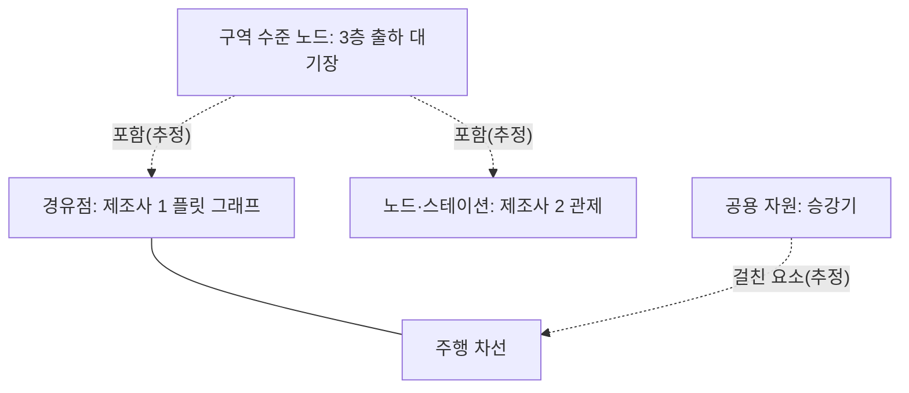

[홈](../../index.md) › 중점 연구 트랙 › [건축 도면 자동 인식](index.md) › 단계 3. 구현 가설 설계

# 단계 3. 구현 가설 설계

> 단계 상태: 진행 중 · 열린 질문: 7건 · 답한 질문: 2건 · 완료 조건: 미충족 · 마지막 실행: 2026-09-25

## 1. 이 단계에서 밝힐 것

> 인식에서 온톨로지 적재까지의 처리 흐름은 어떻게 되고, 공간 그래프가 배정·경로·자원 예약·시뮬레이션에 모두 쓰이려면 어떤 구조여야 하는가.

위 문장은 트랙 정의의 "밝힐 것"이다(트랙 정의의 단계별 밝힐 것과 완료 조건은 [트랙 개요](index.md)의 단계 진행 현황에 정리되어 있다). 조사 결과는 [아이디어 3. 건축 도면 자동 인식](../../ideas/floorplan-recognition.md)과 [공간 그래프 스키마 초안](space-graph-schema-draft.md)으로 이어진다.

## 2. 질문 목록

이 단계의 질문이다. 시작 질문 4개(q3-01~q3-04)는 구축자가 이 단계의 밝힐 것에서 정한 것이고 [가정], q3-05·q3-06은 단계 2 실행에서, q3-07·q3-08은 실행 2026-09-25-54에서, q3-09는 실행 2026-09-25-58에서 생긴 후속 질문이다. 상태와 답 위치는 [질문 백로그](question-backlog.md)와 일치시키며, 백로그의 "조사 중"은 이 표에서 "열림"으로 표시하고 "폐기"는 표에서 빼고 백로그에만 남긴다. 답은 3절의 질문 id로 시작하는 소제목에 실리고, 답 위치 칸에는 그 앵커를 적는다. 제기 근거 칸에는 finding id(실행 id 병기) 또는 "사용자"만 쓴다.

| id | 질문 | 상태 | 제기 근거 | 답한 실행 id | 답 위치 |
|---|---|---|---|---|---|
| q3-01 | 인식 → 벡터화 → 공간 그래프 생성 → 온톨로지 적재의 흐름에서 단계마다 입력·출력은 무엇이고 사람 검토는 어디에 두는가? | 답함 | 사용자 | 2026-09-25-54 | [#q3-01](#q3-01) |
| q3-02 | 공간 그래프의 노드(방·구역·문·엘리베이터·계단·충전 위치)와 엣지(연결·통과 조건)를 어떤 단위로 정해야 배정·경로·자원 예약에 모두 쓰이는가? | 답함 | 사용자 | 2026-09-25-58 | [#q3-02](#q3-02) |
| q3-03 | 인식한 공간·시설을 로봇 기능 온톨로지의 능력(계단·도어 조작·충전)과 어떻게 이어 "이 로봇이 이 경로를 갈 수 있는가"를 판단하게 하는가? | 열림 | 사용자 | | |
| q3-04 | 생성한 층별 지도를 시뮬레이션 초기값으로 쓰려면 어떤 정보가 더 필요한가? | 열림 | 사용자 | | |
| q3-05 | IFC 에 공간 사이 수직 연결 관계가 없을 때, IfcRelConnectsSpace 같은 사용자 확장 없이 IfcStair·IfcTransportElement 와 층 소속·공간 경계 관계만으로 층간 연결 엣지를 도출하려면 어떤 규칙이 필요한가? (q2-01 에서 파생) | 열림 | f9, 실행 2026-09-25-28 | | |
| q3-06 | 충전소·승강기·작업 스테이션 같은 공용 자원 목록을 관제 사이에 교환하는 전용 형식이 없을 때, LIF 스테이션·Open-RMF 경유점 속성·VDA 5050 경로망 설정 가운데 무엇을 기준으로 공용 자원 목록을 내보낼 수 있는가? (q2-03 에서 파생) | 열림 | f12, 실행 2026-09-25-44 | | |
| q3-07 | 공간 그래프를 온톨로지에 적재하기 전 검증 관문으로 쓸 SHACL 형상(예: 모든 문은 두 공간 노드를 잇는다, 모든 공간 노드는 한 층에 속한다, 충전 위치는 접근 지점을 가진다)은 무엇이며, 위반 보고서를 누가 어떻게 처리하는가? (q3-01 에서 파생) | 열림 | f11, 실행 2026-09-25-54 | | |
| q3-08 | 여러 인식 방법(구조 그래프 예측, 시각-언어 모델 JSON 출력, CAD 레이어 기반 분할, IFC 직접 변환)을 바꿔 끼울 수 있게 하려면 인식·벡터화 단계의 중간 산출물 형식을 무엇으로 정해야 하는가? (q3-01 에서 파생) | 열림 | f16, 실행 2026-09-25-54 | | |
| q3-09 | 도면 인식은 방·구역 같은 구역 수준 노드를 주지만 주행 경유점·차선은 주지 않을 때, 구역 수준 노드와 제조사 플릿별 차선 수준 경유점·스테이션 사이의 포함 관계를 자동으로 만들거나 사람이 확인하는 규칙은 무엇인가? (q3-02 에서 파생) | 열림 | f14, 실행 2026-09-25-58 | | |

## 3. 조사 결과

### q3-01 처리 흐름의 단계별 입력·출력과 사람 검토 지점 {#q3-01}

확인한 도구·연구를 이 위키가 묶으면 처리 흐름은 (1) 입력 정리 → (2) 인식·벡터화 → (3) 공간 그래프 생성 → (4) 온톨로지 적재로 나뉘고, BIM 입력은 (2)를 건너뛸 수 있으며, 충전소·스테이션 같은 운영 요소는 확인한 흐름 어디에서도 자동으로 채워지지 않는 것으로 보인다. [추정][^ref-084][^ref-070][^ref-463][^ref-441][^ref-225][^ref-456][^ref-459][^ref-079] 이 네 단계 구분을 제시한 단일 출처는 확인하지 못했다.

아래 표는 검증된 발견 사항으로 이 위키가 구성한 종합이며 출처의 표를 옮긴 것이 아니다. 단계 구분과 사람 검토 열은 추정이고, 확인한 예 열의 도구와 입출력은 아래 소절의 출처에서 확인한 것이다.

| 단계 | 입력 | 출력 | 확인한 예 | 사람 검토 지점(추정) |
|---|---|---|---|---|
| 1. 입력 정리 | 래스터 평면도, 벡터 CAD(DXF), BIM(IFC) | 크기·여백을 정규화한 이미지와 축척, 레이어를 가진 DXF, IFC 모델 | osmAG-from-cad 파라미터, Raster-to-Graph 512×512 정규화[^ref-084][^ref-070] | 축척·좌표 기준점·레이어 대응 확정 |
| 2. 인식·벡터화 | 정리한 도면 | 요소 목록 JSON(벽·문·창문·방) 또는 벽 구조 그래프 | FloorplanVLM, Raster-to-Graph, 국내 2단계 방법[^ref-463][^ref-070][^ref-460] | 불확실한 요소만 골라 벡터 공간에서 보정 |
| 3. 공간 그래프 생성 | 벡터화 결과 또는 IFC | 방·구역 분할과 연결(osmAG, IndoorGML, building.yaml → 주행 그래프) | osmAG-from-cad, ifc2indoorgml, traffic-editor[^ref-084][^ref-225][^ref-441] | 운영 요소(충전소·스테이션·대기 지점)와 장소 이름 주석 |
| 4. 온톨로지 적재 | 공간 그래프·BIM | BOT 등 RDF(Turtle·JSON-LD)와 검증 보고서 | IFCtoLBD, SHACL[^ref-456][^ref-459] | 검증 보고서의 위반 확인 |

```mermaid
flowchart LR
  prep["입력 정리"] --> vec["인식·벡터화"]
  vec --> graph["공간 그래프 생성"]
  graph --> onto["온톨로지 적재"]
  prep -.->|"BIM(IFC) 입력"| graph
  h1["사람: 축척·기준점 확정"] -.-> prep
  h2["사람: 불확실 요소 보정"] -.-> vec
  h3["사람: 운영 요소·장소 이름 주석"] -.-> graph
  h4["사람: 검증 보고서 위반 확인"] -.-> onto
```

도식은 위 표의 종합(추정)을 그린 것이다.

#### 입력 정리와 인식·벡터화

- osmAG-from-cad 공식 저장소 README는 처리 흐름을 DXF → SVG·bounds.json → PNG → AreaGraph 분할 → osmAG(OSM XML) → 선택적 문자 기반 방 이름 붙이기로 나누고, 사용자가 해상도(미터/픽셀)·문 폭·복도 폭·좌표 기준점을 설정하게 하며 실행 입력·명령을 적은 실행 기록(manifest)을 남긴다(발행일 미확인, 2026-09-25 확인). [사실][^ref-084]
- Raster-to-Graph README(2024)는 입력을 가운데 정렬한 512×512 래스터 평면도로, 출력을 벽 교차점(노드)과 벽 선분(엣지)에 평면도 의미를 붙인 구조 그래프로 두며, 전처리가 다르면 모델을 다시 학습해야 할 수 있다고 적는다. [사실][^ref-070]
- FloorplanVLM(arXiv 2602.06507, 2026-02)은 래스터 평면도에서 벽·문·창문·방을 구조화된 JSON 시퀀스로 바로 출력하는 시각-언어 모델(Vision-Language Model, VLM) 방식의 벡터화를 제안했고, 외벽 IoU 92.52%를 보고했다(저자 보고, 단일 출처). [사실][^ref-463]
- 대한건축학회논문집 40(1)(2024)의 국내 연구는 기존 주택 평면도를 BIM 기반 3D 모델로 바꾸기 위해 딥러닝 분할 뒤 경로 계획 기반 벡터 생성 알고리즘으로 벽선을 만드는 2단계 방법을 제안했다(세부 기법 미확인). [사실][^ref-460]
- 인식·벡터화에 쓰는 학습 모델은 분류 원문 8장 교차 규칙에 따라 [27. AI·학습·적응과 모델 운영](../../categories/g-safety-security-intelligence-and-governance/27-ai-learning-adaptation-and-model-operations.md)의 방법이 [6. 지도·공간·위치 모델](../../categories/b-common-information-and-environment-model/06-map-space-and-location-model.md)에 적용되는 것으로 두 페이지에 함께 연결한다.

#### 공간 그래프 생성

- Open-RMF traffic-editor는 사람이 평면도 위에 주석한 결과를 .building.yaml로 저장하고, building_map_generator가 이 파일에서 주행 그래프와 시뮬레이터 월드를 만들어 하나의 주석 파일에서 경로용 그래프와 시뮬레이션 초기값이 함께 나온다(2026-09-25 확인). [사실][^ref-441][^ref-079] 시뮬레이션 초기값으로서의 조건은 q3-04에서 다루며 [22. 시뮬레이션·예측용 디지털 트윈](../../categories/f-deployment-verification-and-maintenance/22-simulation-and-predictive-digital-twin.md)의 주제다.
- ifc2indoorgml(ISPRS Archives 2022)은 IFC 데이터에서 IndoorGML 모델을 자동 생성하는 오픈소스 도구다. [사실][^ref-225] 따라서 BIM 입력은 이미지 인식·벡터화 단계를 거치지 않고 공간 그래프 표현으로 바로 변환하는 경로가 있는 것으로 보인다(이 위키의 해석). [추정][^ref-225]

#### 온톨로지 적재와 적재 전 검증

- IFCtoLBD 공식 저장소 README(판 2.54.0, Apache 2.0, 발행일 미확인, 2026-09-25 확인)는 IFC STEP·IFC/XML·IFC/JSON을 입력으로 받아 건물 위상 온톨로지(Building Topology Ontology, BOT) 등 링크드 빌딩 데이터 RDF로 바꾸고 Turtle·JSON-LD·ICDD 패키지로 저장하며, 변환 결과를 SHACL로 검증할 수 있다고 적는다. [사실][^ref-456]
- W3C 형상 제약 언어(Shapes Constraint Language, SHACL, 2017 권고안)는 RDF 데이터 그래프를 형상 그래프의 조건에 대해 검증하는 언어이며, 결과로 sh:conforms(참·거짓)와 위반별 결과를 담은 검증 보고서를 낸다. 이번 확인은 W3C data-shapes 저장소의 편집자 초안으로 한 것이며 권고안(2017) 본문과 문구가 다를 수 있다. [사실][^ref-459]
- buildingSMART의 정보 전달 명세(Information Delivery Specification, IDS)는 IFC 기반 정보 요구사항을 컴퓨터가 해석할 수 있게 정의하는 XML 기반 표준으로, XSD 스키마와 XML 예시로 제공된다(판 번호 미확인, 2026-09-25 확인). [사실][^ref-464]
- arXiv 2507.11770(2025-07, IROS 2025 제출)은 MJCF·URDF·SDF 장면 기술을 USD 장면 그래프로 통일하고, 웹 기반 도구에서 사람이 온톨로지 개념 클래스로 의미 라벨을 붙인 뒤 지식 그래프로 옮겨 역량 질문(competency question)에 답하게 하는 흐름을 제안했다. [사실][^ref-462]
- OBRNIT(Buildings 14(8), 2024)은 BIM 기반 로봇 주행·점검 작업을 위해 로봇, 건물, 주행 작업, 점검 작업의 네 개념 묶음을 둔 온톨로지다(ifcOWL 개념 재사용 여부 미확인). [사실][^ref-461] 로봇 능력과의 대조는 q3-03에서 [5. 로봇 능력·작업 온톨로지](../../categories/b-common-information-and-environment-model/05-robot-capability-and-task-ontology.md)와 함께 다룬다.

#### 사람 검토를 둔 사례

- ArchCAD-400K 프로젝트 페이지는 주석 과정을 레이어·블록 구조가 일관된 도면 선별(11,917건 중 5,538건), 레이어·블록 계층을 이용한 자동 라벨링, 전문가가 벡터 공간에서 직접 보정하는 단계로 나누고, 자동 라벨링으로 비용을 50배 넘게 줄였다고 적는다(저자 보고, 단일 출처). [사실][^ref-434]
- Jakubik 외(AAAI 2022)는 평면도 기호 검출 시스템이 기호마다 불확실성 척도를 계산해 분류하기 어려운 기호에만 전문가 판단을 받는 사람 참여 루프(human-in-the-loop) 설계를 제안했다. [사실][^ref-458]
- Sketch2BIM(arXiv 2510.20838, 2025-10)은 손으로 그린 평면도를 다중 모달 LLM 다중 에이전트가 사람 피드백과 스키마 검증을 거쳐 벽·문·창문의 구조화 JSON 레이아웃으로 반복 보정한 뒤 BIM 생성 스크립트로 바꾸는 흐름을 제안했고, 평면도 10장 실험에서 벽 검출이 첫 회 약 83%에서 몇 번의 피드백 뒤 거의 모두 맞았다고 보고했다(저자 보고, 단일 출처). [사실][^ref-457]
- DoorDet(2025)은 객체 검출기로 문을 찾고 대규모 언어 모델(LLM)이 문 유형을 분류한 뒤 사람이 검수하는 반자동 데이터 구축 절차를 제안했다. [사실][^ref-077]

#### 종합: 사람 검토 네 지점과 장소 이름

확인한 사례를 종합하면 사람 검토는 (a) 처리 전 입력 파라미터 확정(축척·좌표 기준점·레이어 대응), (b) 인식 뒤 불확실한 요소만 골라 벡터 공간에서 보정, (c) 공간 그래프에 운영 요소(충전소·스테이션·대기 지점)와 장소 이름을 주석, (d) 온톨로지 적재 전 검증 보고서의 위반 확인의 네 지점에 둘 수 있을 것으로 보이며, 검토 지점별 효과를 비교 측정한 자료는 찾지 못했다. [추정][^ref-084][^ref-458][^ref-434][^ref-457][^ref-077][^ref-079][^ref-459][^ref-462]

이 트랙이 출발한 분류 원문의 질문은 다음과 같다.

제조사마다 다른 지도에서 ‘3층 출하 대기장’을 어떻게 동일한 장소로 인식할까? [분류원문]

확인한 흐름에서 방 이름은 CAD 문자 추출이 기본으로 꺼져 있거나 래스터 문자 인식에 기대므로, 업무 장소 이름과 공간 노드를 잇는 일은 공간 그래프 생성 뒤 사람 확인 단계에 두어야 할 것으로 보인다. [추정][^ref-084][^ref-079][^ref-462]

### q3-02 공간 그래프의 노드·엣지 단위와 층위 {#q3-02}

확인한 관제 형식과 실내 공간 연구를 이 위키가 묶으면, 공간 그래프는 배정·장소 이름 해석에 쓰는 구역 수준 노드(방·구역·업무 장소)와 경로 계획·교통에 쓰는 차선 수준 경유점·차선을 서로 다른 층위로 두고 포함 관계로 잇는 구조여야 세 용도에 함께 쓰일 것으로 보인다. [추정][^ref-536][^ref-079][^ref-413][^ref-642] 관제 형식의 노드는 좌표 경유점이고 실내 공간 연구는 공간 단위를 여러 수준으로 둔다는 확인 사실에서 도출한 것이며, 두 층위를 묶는 구조를 제시한 단일 출처는 확인하지 못했다.

#### 관제 형식의 경유점·차선 속성 (2026-09-25 확인)

- Open-RMF 교통 계획 라이브러리 rmf_traffic 의 그래프 정의(Graph.hpp, 발행일 미확인)에서 경유점(Waypoint)은 지도 이름·위치와 함께 대기 지점·통과 전용 지점·주차 위치·충전소 여부, 상호 배제 그룹, 승강기 안 위치 여부를 속성으로 갖는다. [사실][^ref-536]
- 같은 정의에서 차선(Lane)은 진입·진출 노드, 선택적 속도 제한, 상호 배제 그룹을 갖고, 문은 차선 이벤트(DoorOpen·DoorClose)와 문 속성(DoorProperties: 문 이름·시작·끝 위치·지도 이름)으로, 승강기는 차선 이벤트(LiftSessionBegin·LiftMove·LiftDoorOpen·LiftSessionEnd)와 경유점의 승강기 안 여부 속성(in_lift, LiftProperties: 승강기 이름·위치·방향·치수)으로 표현한다. 차선 이벤트에는 도킹(Dock)과 대기(Wait)도 있다. [사실][^ref-536]
- 같은 상호 배제 그룹에 속한 경유점·차선은 한 번에 로봇 한 대만 점유한다. [사실][^ref-536]
- Open-RMF traffic-editor 문서(발행일 미확인)는 차선에 양방향 여부·그래프 번호(graph_idx)·주행 방향 제약을 두고 플릿마다 자기 그래프로 허용 동작을 전달하며(기본 9개 그래프, 9개 플릿), 승강기는 층마다 칸 안에 경유점을 만들어 차선으로 잇고 문은 정점 사이에 따로 추가한다. [사실][^ref-079]
- Open-RMF 건물 지도 메시지에서 그래프 노드(GraphNode)는 x·y·이름·파라미터 목록만, 그래프 간선(GraphEdge)은 두 꼭짓점 번호·파라미터 목록·양방향/단방향 유형만 가져 통과 조건은 일반 파라미터로 붙는다(발행일 미확인). 두 메시지 파일은 같은 발행 주체의 자료다. [사실][^ref-640][^ref-414]
- Open-RMF 주행 지도 통합 문서는 경유점마다 층 이름과 미터 좌표, 적재·하역 주차 지점이나 충전소 같은 특수 속성을 요구하고, 차선은 양방향·단방향과 구간 속도 제한을 가질 수 있다고 적는다. [사실][^ref-080]
- VDA 5050 주문 JSON 스키마(공식 저장소 main 브랜치, 3.0.0 판, 발행일 미확인)에서 노드는 위치(x·y·mapId 필수, 방향·허용 편차 선택)와 동작 목록을, 엣지는 최대 속도·로봇 최대 높이·적재장치 최소 높이·방향과 방향 유형·주행 방향·회전 조건·궤적(NURBS)·길이·통로(corridor)·동작 목록을 통과 조건으로 갖는다. [사실][^ref-413]

#### 공용 자원과 통행 제한이 표현되는 위치

- VDA 5050 3.0.0 명세에서 연결된 노드·엣지 전체 그래프와 어느 로봇이 어느 엣지를 지날 수 있는지의 제한은 관제가 보유하고 로봇에 전달하지 않으며, 관제는 그 로봇이 지날 수 있는 엣지만 주문에 넣는다. [사실][^ref-031]
- 같은 명세는 지도(mapId)에 붙는 다각형 구역 가운데 [해제 구역](../../glossary/release-zone.md)(RELEASE)에 대해 로봇이 상태 메시지로 접근을 요청하고 관제가 응답(GRANTED·QUEUED·REVOKED·REJECTED, 선택적 임대 만료 시각)으로 허가하게 해, 구역 단위 점유 허가를 그래프 밖 다각형으로 표현한다. [사실][^ref-031]
- 같은 명세에서 충전은 노드 동작이나 즉시 동작으로 쓰는 startCharging 으로 표현되며, 명세는 로봇이 멈춘 충전 지점뿐 아니라 주행 중 충전 차선에서도 충전할 수 있다고 적는다. [사실][^ref-031]

#### 공간 세분화·계층 표현과 경로망 연구

- Claridades·Choi·Lee(ISPRS IJGI 11(2), 2022, 저자 Lee, J. 는 서울시립대 소속)는 실내 공간의 위계를 여러 수준의 노드–관계 구조(Node-Relation Structure, NRS)로 표현하는 세분화(subspacing) 틀을 IndoorGML 핵심 모델 확장으로 제안하고, 표본 자료에서 서로 다른 상세 수준의 네트워크를 생성해 보였다. [사실][^ref-642]
- 연계 대상: 로봇 센서 인식으로 만드는 계층형 3D 장면 그래프는 장소(주행 가능 영역)·방 같은 층을 두고 층 사이를 포함 관계로 잇는다. [추정][^ref-347] 이런 계층형 3D 장면 그래프로 희소한 계획 문제를 만들어 대규모 환경의 작업·동작 계획을 확장한 연구가 있다. [추정][^ref-643] 장면 그래프 생성은 로봇 자체 지능·제어 쪽 연계 대상이며, 여기서는 계층 구조의 사례로만 읽는다.
- Henkel·Toussaint(SAC 2020)는 경로망 정점 위치와 엣지 방향을 확률적 경사하강법(Stochastic Gradient Descent, SGD)으로 최적화한 방향 경로망(Optimized Directed Roadmap, ODRM)이 벽에 나란한 엣지, 양방향 두 차선 도로·회전교차로 같은 패턴을 만들어 다중 로봇 충돌 회피에 유리하다고 보고했다. [사실][^ref-641]

#### 종합: 두 층위, 자원 예약 단위, 통과 조건

아래 표는 검증된 발견 사항으로 이 위키가 구성한 종합([추정])이며 출처의 표를 옮긴 것이 아니다.

| 층위 | 단위 | 주로 쓰는 곳 | 확인한 대응 예 |
|---|---|---|---|
| 구역 수준 | 방·구역·업무 장소(공간 노드) | 작업 배정, 장소 이름 해석 | 세분화 연구의 다수준 노드[^ref-642] |
| 차선 수준 | 경유점·주행 차선 | 경로 계획, 교통 관리 | rmf_traffic 경유점·차선, VDA 5050 노드·엣지[^ref-536][^ref-413] |
| 공용 자원 | 승강기·문·충전 위치·좁은 구역 | 자원 예약 | 차선 이벤트·경유점 속성, 상호 배제 그룹, 해제 구역[^ref-536][^ref-031] |



도식은 위 종합(추정)을 그린 것이다.

- 확인한 관제 형식에서 문·승강기는 차선 이벤트와 경유점 속성(승강기 안 여부·승강기 칸 경유점), 좁은 구역은 상호 배제 그룹이나 해제 구역 다각형, 충전은 노드 동작으로 흩어져 표현되므로, 자원 예약의 단위는 그래프 노드 하나가 아니라 공용 자원 개체가 자신이 걸친 경유점·차선·구역을 가리키는 형태로 두어야 할 것으로 보인다. 상호 배제 그룹은 이런 점유 예약을 그래프 요소 묶음 단위로 표현하는 예로 읽을 수 있다. [추정][^ref-536][^ref-079][^ref-031] 자원 예약 단위를 명시한 단일 출처는 확인하지 못했으며, 이 내용은 [16. 공용 자원·충전·에너지 최적화](../../categories/d-planning-and-optimization/16-shared-resource-charging-and-energy-optimization.md)와 이어진다.
- 확인한 엣지 속성은 속도·높이·방향·통로·이벤트 같은 운동·설비 조건이고 계단 주행·문 조작 같은 로봇 능력 조건은 플릿별 그래프(Open-RMF)나 관제가 보유한 로봇별 통행 제한(VDA 5050)으로 처리되므로, 공간 그래프는 플릿 중립의 기본 그래프와 로봇별 통행 가능 여부를 분리해 두는 것이 맞아 보인다. [추정][^ref-413][^ref-031][^ref-079] 능력 대조 규칙은 q3-03에서 다룬다.
- q3-01에 인용한 분류 원문 질문의 ‘3층 출하 대기장’은 구역 수준 노드 하나로 두고 이름·층을 붙인 뒤, 제조사 플릿마다 그 구역에 포함되는 경유점·스테이션을 대응시키는 방식이면 제조사별 지도 차이를 흡수할 수 있을 것으로 보인다. [추정][^ref-079][^ref-413][^ref-212]
- 경로망의 정점 배치와 엣지 방향이 다중 로봇 충돌 회피와 경로망 품질을 좌우한다는 연구를 보면, 도면 인식으로 얻은 차선 수준 그래프는 최종 경로망이 아니라 경로망 자동 생성·최적화의 입력 초안으로 두는 것이 맞아 보인다. [추정][^ref-641][^ref-268] 이 관점은 [15. 다중 로봇 경로·교통 관리 — MAPF](../../categories/d-planning-and-optimization/15-multi-robot-path-and-traffic-management-mapf.md)와 이어진다.

검증이 승인한 개념(경유점·주행 차선)과 공용 자원 속성(상호 배제 여부)은 [공간 그래프 스키마 초안](space-graph-schema-draft.md) v0.7에 반영했다. 공용 자원의 점유 요소 속성과 경유점·주행 차선–공간 노드 관계는 추정 근거여서 스키마 초안 6절 질문으로 두었다.

## 4. 결론과 남은 불확실성

**결론**
- 도면 처리 흐름은 입력 정리 → 인식·벡터화 → 공간 그래프 생성 → 온톨로지 적재로 나눌 수 있고 BIM 입력은 인식·벡터화를 건너뛸 수 있는 것으로 보인다. [추정][^ref-084][^ref-070][^ref-463][^ref-441][^ref-225][^ref-456][^ref-459]
- 사람 검토는 입력 파라미터 확정, 불확실 요소 보정, 운영 요소·장소 이름 주석, 적재 전 검증 보고서 확인의 네 지점에 둘 수 있을 것으로 보인다. [추정][^ref-084][^ref-458][^ref-434][^ref-457][^ref-459]
- 업무 장소 이름과 공간 노드의 연결은 공간 그래프 생성 뒤 사람 확인에 두어야 할 것으로 보인다. [추정][^ref-084][^ref-079][^ref-462]
- 공간 그래프는 구역 수준 노드와 차선 수준 경유점·차선을 서로 다른 층위로 두고 포함 관계로 잇는 구조일 때 배정·경로·자원 예약에 함께 쓰일 것으로 보인다. [추정][^ref-536][^ref-079][^ref-413][^ref-642]
- 자원 예약 단위는 공용 자원 개체가 자신이 걸친 경유점·차선·구역을 가리키는 형태로 두어야 할 것으로 보인다. [추정][^ref-536][^ref-079][^ref-031]
- 로봇별 통행 가능 여부는 플릿 중립의 기본 그래프와 분리해 두는 것이 맞아 보인다. [추정][^ref-413][^ref-031][^ref-079]
- 도면에서 얻은 차선 수준 그래프는 경로망 자동 생성·최적화의 입력 초안으로 두는 것이 맞아 보인다. [추정][^ref-641][^ref-268]
- 공간 그래프 스키마 초안을 v0.6 → v0.7로 올렸다(실행 2026-09-25-58): 경유점·주행 차선 추가·확정, 공용 자원에 상호 배제 여부 속성 추가와 확정. 점유 요소 속성은 추정 근거라, 경유점·주행 차선과 공간 노드의 관계는 관계 변경 제안이 없어 반영하지 않았다. 실행 2026-09-25-54(q3-01)에서는 변경이 없었다.

**남은 불확실성**
- q3-01의 네 단계 구분과 검토 네 지점은 이 위키의 종합이며 이를 제시한 단일 출처가 없고, 검토 지점별 효과를 측정한 자료도 찾지 못했다.
- q3-02의 두 층위 구조, 자원 예약 단위, 로봇별 통행 가능 여부 분리도 모두 이 위키의 종합(추정)이며 이를 제시한 단일 출처가 없다. 관제 형식 사실은 발행 주체마다 한 곳의 자료뿐이라 교차 확인되지 않았다(GraphNode·GraphEdge 두 메시지는 같은 Open Robotics 자료).
- 충전소·스테이션 같은 운영 요소를 자동으로 채우는 근거는 확인한 흐름에서 찾지 못했다.
- FloorplanVLM·Sketch2BIM·ArchCAD-400K의 성능·비용 수치는 저자 보고 단일 출처이며, 실행 2026-09-25-54에서 ref-079·ref-077·ref-225·ref-457·ref-458·ref-460·ref-461·ref-462·ref-696은 원문을 열지 못했다. 실행 2026-09-25-58에서는 ref-641·ref-642·ref-643·ref-212·ref-268·ref-347의 원문을 열지 못했다.
- SHACL은 권고안이 아니라 편집자 초안으로 확인했고, IDS의 판 번호와 검사 범위는 미확인이다.
- IndoorGML 2.0 JSON 인코딩 초안의 노드·엣지·레이어 간 연결 속성은 확인하지 못했다.
- rmf_traffic 의 충전소 속성과 주행 지도 문서의 충전소 플래그를 확인했지만, 충전소 지정 속성 이름을 둘러싼 출처 충돌([열린 질문](../../open-questions.md) oq-069)은 풀리지 않았다.
- 적재 전 검증 형상(q3-07), 인식·벡터화 중간 산출물 형식(q3-08), 구역 수준 노드와 플릿별 경유점의 포함 관계 규칙(q3-09)은 정해지지 않았다. 국내 물류 현장의 도면 처리 흐름 사례는 찾지 못했다([열린 질문](../../open-questions.md) oq-022).

## 5. 이 단계가 낳은 후속 질문

| 새 질문 id | 질문 | 보낼 단계 | 근거 finding id | 상태 |
|---|---|---|---|---|
| q3-07 | 공간 그래프를 온톨로지에 적재하기 전 검증 관문으로 쓸 SHACL 형상(예: 모든 문은 두 공간 노드를 잇는다, 모든 공간 노드는 한 층에 속한다, 충전 위치는 접근 지점을 가진다)은 무엇이며, 위반 보고서를 누가 어떻게 처리하는가? | 단계 3. 구현 가설 설계 | f11 (실행 2026-09-25-54) | 열림 |
| q3-08 | 여러 인식 방법(구조 그래프 예측, 시각-언어 모델 JSON 출력, CAD 레이어 기반 분할, IFC 직접 변환)을 바꿔 끼울 수 있게 하려면 인식·벡터화 단계의 중간 산출물 형식을 무엇으로 정해야 하는가? | 단계 3. 구현 가설 설계 | f16 (실행 2026-09-25-54) | 열림 |
| q3-09 | 도면 인식은 방·구역 같은 구역 수준 노드를 주지만 주행 경유점·차선은 주지 않을 때, 구역 수준 노드와 제조사 플릿별 차선 수준 경유점·스테이션 사이의 포함 관계를 자동으로 만들거나 사람이 확인하는 규칙은 무엇인가? | 단계 3. 구현 가설 설계 | f14 (실행 2026-09-25-58) | 열림 |
| q4-08 | 플릿 중립의 기본 공간 그래프에서 제조사 플릿별 주행 그래프(Open-RMF graph_idx)나 VDA 5050 관제 보유 통행 제한을 파생·동기화할 때, 로봇별 통행 가능 여부를 어디에 저장하고 도면·지도 판이 바뀌면 어떻게 다시 맞추는가? | 단계 4. 지도 변환 보정과 현장 정합 | f16 (실행 2026-09-25-58) | 열림 |

처리 단계마다 사람이 고친 요소 수와 검토 시간을 가설 판정 지표로 쓰는 질문은 [단계 5. 검증 방법과 가설 판정](stage-5-verification-and-hypotheses.md)의 q5-02(수작업 대비 소요 시간·수정 횟수 기준)와 같은 질문이라 새로 등록하지 않았다. 계단 주행·문 조작 능력과 공간 요소의 대조 규칙은 기존 q3-03과 같은 질문이라 새로 등록하지 않았다.

## 6. 완료 조건 충족 현황

충족 여부는 리서치 에이전트의 자체 평가를 스토리텔러 에이전트가 옮겨 적은 값이고, 최종 판정은 내용 검증 에이전트가 한다. 둘이 다르면 검증 판정을 따른다. 채운 부분과 모자란 부분이 섞인 완료 조건은 행으로 나누었다.

| 완료 조건 | 충족 여부 | 근거 | 검증 판정 |
|---|---|---|---|
| 처리 흐름이 [아이디어 3. 건축 도면 자동 인식](../../ideas/floorplan-recognition.md)의 "5. 구현 가설" 절에 실림 | 충족 | 실행 2026-09-25-54에서 5절에 '처리 흐름과 사람 검토 지점' 소절을 실었다(q3-01, 결론은 추정) | 충족 · 전환 미승인 |
| 핵심 구성 요소 가운데 공간 그래프 단위가 [아이디어 3. 건축 도면 자동 인식](../../ideas/floorplan-recognition.md)의 "5. 구현 가설" 절에 실림 | 충족 | 실행 2026-09-25-58에서 5절 '핵심 구성 요소'에 공간 그래프의 두 층위·자원 예약 단위·통과 조건 분리를 실었다(q3-02, 결론은 추정) | 충족 · 전환 미승인 |
| 핵심 구성 요소 가운데 능력 대조·시뮬레이션 초기값이 같은 절에 실림 | 미충족 | 능력 대조(q3-03)·시뮬레이션 초기값(q3-04)이 미답 | 미충족 · 미승인 |
| 다른 아이디어와의 연결이 [아이디어 3. 건축 도면 자동 인식](../../ideas/floorplan-recognition.md)의 "5. 구현 가설" 절에 실림 | 미충족 | 근거 finding 없음 | 미충족 · 미승인 |
| [공간 그래프 스키마 초안](space-graph-schema-draft.md)이 근거 finding과 함께 v0.1 이상으로 갱신됨 | 충족 | 실행 2026-09-25-58에서 단계 3 근거로 v0.6 → v0.7 갱신(경유점·주행 차선 추가, 공용 자원 확정, 근거 f1·f2·f3·f4·f5·f6·f7·f9·f10) | 충족 · 전환 미승인 |
| 사용자에게 제안하는 실험 계획이 [실험](experiments.md)에 실림 | 미충족 | 제안된 실험 계획 없음 | 미충족 · 미승인 |

다음 단계로 전환: 아니오(완료 조건 미충족: 아이디어 3 5절 핵심 구성 요소 중 능력 대조·시뮬레이션 초기값, 다른 아이디어와의 연결, 실험 계획; 막힌 질문 q3-03·q3-04·q3-05·q3-06·q3-07·q3-08·q3-09)

## 7. 관련 세부영역

이 트랙은 분류를 바꾸지 않는다. 확인된 사실은 세부영역 페이지를 직접 고치지 않고 [트랙 로그](log.md)의 "세부영역 반영 제안"으로 남기며, 반영은 다음 해당 영역 실행에서 한다. 프런트매터 `related_areas`는 아래 목록과 같다.

- [6. 지도·공간·위치 모델](../../categories/b-common-information-and-environment-model/06-map-space-and-location-model.md) — 분류 원문 10장이 건축 도면 기반 이동 지도의 중심 연구영역으로 두며, BIM·CAD에서 이동 공간을 만들고 층·목적지를 정렬하는 일 자체다. 실행 2026-09-25-54의 반영 제안: "6. 대표 접근법과 기술"에 도면 처리 흐름의 단계 구분과 장소 이름·운영 요소를 사람이 확인하는 지점
- [5. 로봇 능력·작업 온톨로지](../../categories/b-common-information-and-environment-model/05-robot-capability-and-task-ontology.md) — '공간 그래프로 온톨로지에 적재'한 공간·시설이 로봇 능력(계단·도어 조작·충전)과 대조된다(아이디어 1과의 연결). 반영 제안: "8. 대표 연구와 자료"에 건물·장면 정보를 로봇 온톨로지·지식 그래프에 적재한 연구
- [15. 다중 로봇 경로·교통 관리 — MAPF](../../categories/d-planning-and-optimization/15-multi-robot-path-and-traffic-management-mapf.md) — 분류 원문 10장의 함께 필요한 영역(교통 관리). 공간 그래프가 경로·통로 조율의 바탕이다
- [16. 공용 자원·충전·에너지 최적화](../../categories/d-planning-and-optimization/16-shared-resource-charging-and-energy-optimization.md) — 인식한 충전 위치·엘리베이터가 공용 자원 목록이 되어 예약·배분의 대상이 된다
- [22. 시뮬레이션·예측용 디지털 트윈](../../categories/f-deployment-verification-and-maintenance/22-simulation-and-predictive-digital-twin.md) — 분류 원문 10장의 함께 필요한 영역(시뮬레이션). 생성한 지도를 '시뮬레이션 초기값으로 사용'한다. 이번 실행은 시뮬레이터 월드 생성을 형식 설명으로만 다뤘다(q3-04)
- [21. 온보딩·설정·현장 시운전](../../categories/f-deployment-verification-and-maintenance/21-onboarding-configuration-and-commissioning.md) — 반영 제안: "6. 대표 접근법과 기술"에 시운전 전 도면 처리에서 사람이 입력·확인하는 항목(축척·좌표 기준점, 운영 요소 주석, 검증 보고서 확인)
- [27. AI·학습·적응과 모델 운영](../../categories/g-safety-security-intelligence-and-governance/27-ai-learning-adaptation-and-model-operations.md) — 분류 원문 8장 교차 규칙(도면 해석은 6. 지도·공간·위치 모델에 적용). 반영 제안: "6. 대표 접근법과 기술"·"8. 대표 연구와 자료"에 시각-언어 모델 벡터화, 불확실성 기반 사람 참여 루프, LLM 다중 에이전트와 사람 피드백
- [28. 표준·상호운용성·다사업자 거버넌스](../../categories/g-safety-security-intelligence-and-governance/28-standards-interoperability-and-multi-vendor-governance.md) — 반영 제안: "7. 관련 표준·프레임워크·오픈소스"에 IFCtoLBD, SHACL, IDS

실행 2026-09-25-58(q3-02)의 반영 제안:

- [6. 지도·공간·위치 모델](../../categories/b-common-information-and-environment-model/06-map-space-and-location-model.md) — "6. 대표 접근법과 기술"에 공간 그래프를 구역 수준·차선 수준 층위로 두고 업무 장소 이름을 구역 노드에 붙이는 접근(추정), "8. 대표 연구와 자료"에 IndoorGML 공간 세분화 연구
- [16. 공용 자원·충전·에너지 최적화](../../categories/d-planning-and-optimization/16-shared-resource-charging-and-energy-optimization.md) — "6. 대표 접근법과 기술"에 문·승강기의 차선 이벤트·경유점 속성 표현, 상호 배제 그룹, VDA 5050 해제 구역 접근 허가, 충전 동작의 위치, 공용 자원 예약 단위(추정)
- [15. 다중 로봇 경로·교통 관리 — MAPF](../../categories/d-planning-and-optimization/15-multi-robot-path-and-traffic-management-mapf.md) — "6. 대표 접근법과 기술"에 플릿별 주행 그래프와 엣지 통과 조건, 방향 경로망 최적화, 도면 차선 그래프를 경로망 초안으로 두는 관점(추정)

## 8. 출처

[^ref-084]: Zhang, J. (jiajiezhang7 GitHub), osmAG-from-cad — README (CAD-to-osmAG pipeline), 미확인, https://github.com/jiajiezhang7/osmAG-from-cad, 접근일 2026-09-25
[^ref-070]: Hu, S. 외, Raster-to-Graph — README (Raster-to-Graph: Floorplan Recognition via Autoregressive Graph Prediction with an Attention Transformer), 2024, https://github.com/SizheHu/Raster-to-Graph, 접근일 2026-09-25
[^ref-463]: arXiv 2602.06507 저자(미확인), FloorplanVLM: A Vision-Language Model for Floorplan Vectorization, 2026-02, https://arxiv.org/abs/2602.06507, 접근일 2026-09-25 (원문 미열람)
[^ref-460]: 대한건축학회논문집 40(1), 297-303(DOI 10.5659/JAIK.2024.40.1.297) 게재 논문 저자(미확인), 딥러닝과 경로계획 기반의 주택 평면도 3D 모델링 방법, 2024, https://www.kci.go.kr/kciportal/ci/sereArticleSearch/ciSereArtiView.kci?sereArticleSearchBean.artiId=ART003047128, 접근일 2026-09-25 (원문 미열람)
[^ref-441]: Open Robotics (open-rmf), rmf_traffic_editor — README, 미확인, https://github.com/open-rmf/rmf_traffic_editor, 접근일 2026-09-25
[^ref-079]: Open Robotics, Traffic Editor - Programming Multiple Robots with ROS 2, 미확인, https://osrf.github.io/ros2multirobotbook/traffic-editor.html, 접근일 2026-09-25
[^ref-225]: Diakité, A. A., Díaz-Vilariño, L., Biljecki, F., Isikdag, Ü., Simmons, S., Li, K., & Zlatanova, S., IFC2INDOORGML: An Open-Source Tool for Generating IndoorGML from IFC, 2022, https://isprs-archives.copernicus.org/articles/XLIII-B4-2022/295/2022/, 접근일 2026-09-25 (원문 미열람)
[^ref-456]: Oraskari, J. (jyrkioraskari GitHub), IFCtoLBD — README (IFCtoLBD converts IFC (Industry Foundation Classes STEP formatted files into the Linked Building Data ontologies), 미확인, https://github.com/jyrkioraskari/IFCtoLBD, 접근일 2026-09-25
[^ref-459]: W3C RDF Data Shapes Working Group, Shapes Constraint Language (SHACL) (W3C data-shapes 저장소 편집자 초안으로 확인, 권고안(2017) 본문과 문구가 다를 수 있음), 2017, https://www.w3.org/TR/shacl/, 접근일 2026-09-25
[^ref-464]: buildingSMART (buildingSMART/IDS GitHub), IDS — README (Information Delivery Specification), 미확인, https://github.com/buildingSMART/IDS, 접근일 2026-09-25
[^ref-462]: arXiv 2507.11770 저자(미확인), Generating Actionable Robot Knowledge Bases by Combining 3D Scene Graphs with Robot Ontologies, 2025-07, https://arxiv.org/abs/2507.11770, 접근일 2026-09-25 (원문 미열람)
[^ref-461]: Buildings(MDPI) 게재 논문 저자(Concordia University, 목록 미확인), Ontology for BIM-Based Robotic Navigation and Inspection Tasks, 2024, https://www.mdpi.com/2075-5309/14/8/2274, 접근일 2026-09-25 (원문 미열람)
[^ref-434]: ArchiAI Lab (ArchCAD-400K 프로젝트), ArchCAD-400k: A Large-Scale CAD drawings Dataset and New Baseline for Panoptic Symbol Spotting — project page, 미확인, https://archiai-lab.github.io/ArchCAD.github.io/, 접근일 2026-09-25
[^ref-458]: Jakubik, J., Hemmer, P., Vössing, M., Blumenstiel, B., Bartos, A., & Mohr, K., Designing a Human-in-the-Loop System for Object Detection in Floor Plans, 2022, https://ojs.aaai.org/index.php/AAAI/article/view/21522, 접근일 2026-09-25 (원문 미열람)
[^ref-457]: Ratul, A. K., Acharjee, S., Park, S., & Sakib, M. N., Sketch2BIM: A Multi-Agent Human-AI Collaborative Pipeline to Convert Hand-Drawn Floor Plans to 3D BIM, 2025-10, https://arxiv.org/abs/2510.20838, 접근일 2026-09-25 (원문 미열람)
[^ref-077]: DoorDet 저자(arXiv 2508.07714), DoorDet: Semi-Automated Multi-Class Door Detection Dataset via Object Detection and Large Language Models, 2025-08, https://arxiv.org/abs/2508.07714, 접근일 2026-09-25 (원문 미열람)

[^ref-536]: Open Robotics (open-rmf), rmf_traffic — rmf_traffic/include/rmf_traffic/agv/Graph.hpp, 미확인, https://github.com/open-rmf/rmf_traffic/blob/main/rmf_traffic/include/rmf_traffic/agv/Graph.hpp, 접근일 2026-09-25
[^ref-640]: Open Robotics (open-rmf), rmf_building_map_msgs — rmf_building_map_msgs/msg/GraphEdge.msg, 미확인, https://github.com/open-rmf/rmf_building_map_msgs/blob/main/rmf_building_map_msgs/msg/GraphEdge.msg, 접근일 2026-09-25
[^ref-414]: Open Robotics (open-rmf), rmf_building_map_msgs — rmf_building_map_msgs/msg/GraphNode.msg, 미확인, https://github.com/open-rmf/rmf_building_map_msgs/blob/main/rmf_building_map_msgs/msg/GraphNode.msg, 접근일 2026-09-25
[^ref-413]: VDA / VDMA (VDA5050 GitHub), VDA5050/VDA5050 — json_schemas/order.schema, 미확인, https://github.com/VDA5050/VDA5050/blob/main/json_schemas/order.schema, 접근일 2026-09-25
[^ref-641]: Henkel, C., & Toussaint, M., Optimized Directed Roadmap Graph for Multi-Agent Path Finding Using Stochastic Gradient Descent, 2020-03, https://arxiv.org/abs/2003.12924, 접근일 2026-09-25 (원문 미열람)
[^ref-642]: Claridades, A. R. C., Choi, H.-S., & Lee, J., An Indoor Space Subspacing Framework for Implementing a 3D Hierarchical Network-Based Topological Data Model, 2022, https://doi.org/10.3390/ijgi11020076, 접근일 2026-09-25 (원문 미열람)
[^ref-643]: Ray, A., Bradley, C., Carlone, L., & Roy, N., Task and Motion Planning in Hierarchical 3D Scene Graphs (ISRR 2024), 2024-03, https://arxiv.org/abs/2403.08094, 접근일 2026-09-25 (원문 미열람)
[^ref-347]: Hughes, N., Chang, Y., Hu, S., Talak, R., Abdulhai, R., Strader, J., & Carlone, L., Foundations of Spatial Perception for Robotics: Hierarchical Representations and Real-time Systems, 2023-05, https://arxiv.org/abs/2305.07154, 접근일 2026-09-25 (원문 미열람)
[^ref-031]: VDA / VDMA (VDA5050 GitHub), VDA5050/VDA5050_EN.md — Official Specification document for the VDA 5050, 미확인, https://github.com/VDA5050/VDA5050/blob/main/VDA5050_EN.md, 접근일 2026-09-25
[^ref-080]: Open Robotics, Navigation Maps (integration_nav-maps) - Programming Multiple Robots with ROS 2, 미확인, https://osrf.github.io/ros2multirobotbook/integration_nav-maps.html, 접근일 2026-09-25
[^ref-212]: continua-systems (GitHub), vdma-lif — schema/lif-schema.json (JSON parsers and models for the VDMA LIF, VDMA 공식 산출물이 아닌 제3자 스키마), 미확인, https://github.com/continua-systems/vdma-lif/blob/main/schema/lif-schema.json, 접근일 2026-09-25 (원문 미열람)
[^ref-268]: Rüdt, M., Enke, C., & Furmans, K. (KIT), Automated Generation of Continuous-Space Roadmaps for Routing Mobile Robot Fleets (v2 제목: Continuous-Space Roadmap Generation for Mobile Robot Fleets with Distance Constraints and Geometry-Aware Discretization), 2025-11, https://arxiv.org/abs/2511.07175, 접근일 2026-09-25 (원문 미열람)

## 9. 이력

실행 id `build-2026-09-25`는 확장 아이디어 편입 때의 트랙 시드 생성을 나타내며, 파이프라인 실행이 아니므로 일일 로그가 없다.

| 날짜 | 실행 id | 답한 질문 | 새 질문 | 초안 변경 | 버전 |
|---|---|---|---|---|---|
| 2026-09-25 | 2026-09-25-58 | q3-02 | q3-09, q4-08 | v0.6 → v0.7 | 3 |
| 2026-09-25 | 2026-09-25-54 | q3-01 | q3-07, q3-08 | 없음(v0.6 유지) | 2 |
| 2026-09-25 | build-2026-09-25(트랙 시드, 파이프라인 실행 아님) | 없음 | 시드 q3-01~q3-04(4건, [질문 백로그](question-backlog.md)에 등록) | 없음(v0 시드는 [공간 그래프 스키마 초안](space-graph-schema-draft.md)에서 생성) | 1 |
