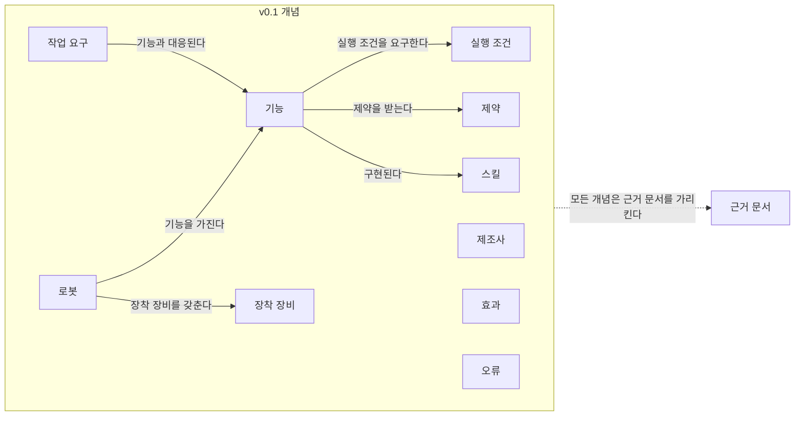

[홈](../../index.md) › 중점 연구 트랙 › [매뉴얼 기반 로봇 기능 온톨로지](index.md) › 능력 온톨로지 초안

# 능력 온톨로지 초안 (v0.1)

<!-- auto:page-status:start -->
> 온톨로지 버전: v0.1 · 페이지 상태: published · 신뢰도: medium · 페이지 버전: 2 · 마지막 갱신: 2026-09-25 · 마지막 실행: 2026-09-25
<!-- auto:page-status:end -->

v0.1은 [단계 1. 기존 능력 표현 모델과 표준 조사](stage-1-existing-models-and-standards.md)의 트랙 실행 2026-09-25-02에서 내용 검증 에이전트가 승인한 변경(개념 효과·스킬·오류 추가, 관계 "기능 / 구현된다 / 스킬" 추가, 기능의 속성 수정)을 반영한 버전이다. 함께 제안된 전제조건 개념은 기존 실행 조건과 정의가 겹쳐 반영하지 않고 6절 질문으로 두었다. 새로 더한 행의 근거 출처는 모두 원문 미열람 상태다.

## 1. 목적과 범위

이 페이지는 중점 연구 트랙 [매뉴얼 기반 로봇 기능 온톨로지](index.md)의 살아있는 산출물이다. 로봇의 기능(capability), 그 기능을 실행하기 위한 실행 조건과 제약, 기능을 가능하게 하는 장착 장비, 업무 쪽에서 요구하는 작업 요구, 그리고 이 모든 정보의 근거가 되는 문서를, 로봇 오케스트레이션 플랫폼(Robot Orchestration Platform, ROP)이 온보딩·배정·실행·검증에 쓸 수 있는 하나의 공통 모델로 표현하는 것이 목적이다. 온톨로지(ontology)는 여기서 개념과 개념 사이의 관계를 명시적으로 정한 구조화된 어휘를 뜻한다.

출발점은 분류 원문 [5. 로봇 능력·작업 온톨로지](../../categories/b-common-information-and-environment-model/05-robot-capability-and-task-ontology.md)의 정의와 질문이다.

> 제조사별 기능·제약·장착 장비·실행 조건을 공통 모델로 표현하고, 작업 요구와 연결 [분류원문]

> 같은 ‘운반 로봇’ 중 누가 이 화물을 실제로 취급할 수 있는가? [분류원문]

버전 0(v0)은 이 정의에 나오는 요소(제조사별 기능·제약·장착 장비·실행 조건, 작업 요구)와 트랙 정의(빌드 사양서 8.1)가 더한 근거 문서(출처 문서·페이지)만으로 시드했다. 트랙 정의는 v0의 개념 8개와 관계 6개를 모두 "[분류원문] 기반 [가정]"으로 표기하라고 하므로, 2절과 3절의 v0 행을 그렇게 표기했다. 개념 7개(로봇, 제조사, 기능, 제약, 장착 장비, 실행 조건, 작업 요구)와 관계 5개의 정의 문장은 원문 정의에서 구축자가 도출한 것이다. 근거 문서 개념과 "모든 개념은 근거 문서를 가리킨다" 관계는 분류 원문 5. 로봇 능력·작업 온톨로지의 정의에 직접 나오지 않고 트랙 정의가 더한 것이므로, 표기는 같게 하되 근거 열에 그 사실을 병기해 구분했다. [가정] 출처 finding이 없는 개념·관계는 넣지 않았고, 앞으로도 넣지 않는다. 이후 트랙 실행에서 리서치 에이전트가 근거 finding id와 함께 변경을 제안하고, 내용 검증 에이전트가 승인한 변경만 스토리텔러 에이전트가 반영하며 그때 온톨로지 버전을 올린다. v0.1부터는 트랙 실행의 finding을 근거로 한 행이 더해졌다. 주로 단계 1(기존 모델·표준 대비 ROP용 능력 개념 요구 목록), 단계 3(추출 방식), 단계 4(능력→명령 매핑 규칙)의 결과로 갱신된다.

이 온톨로지가 목표로 하는 ROP 활용처는 새 로봇의 온보딩([21. 온보딩·설정·현장 시운전](../../categories/f-deployment-verification-and-maintenance/21-onboarding-configuration-and-commissioning.md)), 능력 기반 배정([13. 작업 배정 — MRTA](../../categories/d-planning-and-optimization/13-task-allocation-mrta.md)), 명령 실행([9. 로봇·제조사 관제 연동](../../categories/c-connectivity-and-execution-foundation/09-robot-and-vendor-fleet-manager-integration.md), [12. 명령·작업 실행의 신뢰성](../../categories/c-connectivity-and-execution-foundation/12-command-and-task-execution-reliability.md)), 검증([23. 시험·형식 검증·벤치마크](../../categories/f-deployment-verification-and-maintenance/23-testing-formal-verification-and-benchmarking.md))이다. 이는 목표이며, 어느 활용처에서 실제로 쓰일 수 있는지는 단계 4·7의 결과로 판단한다.

범위 밖도 정해 둔다. 분류 원문 9장의 "로봇 자체 지능·제어" 경계에 따라, 센서 인식·SLAM·로컬 회피·파지·모터·관절 제어는 제조사에 맡기는 연계 대상이며 이 온톨로지는 그 내부 동작을 표현하지 않는다. 온톨로지가 표현하는 것은 ROP가 다루는 "가능한 기능과 실행 조건, 상태·실패·완료 확인" 쪽이다. 경계의 원문은 [ROP가 직접 소유할 범위와 외부 연계 경계](../../about/scope-boundary.md)에 있다. [가정]

페이지 상태와 온톨로지 버전은 별개다. 구축 시점의 v0 시드는 같은 트랙의 개요·백로그·로그 페이지와 같이 게시 상태(`published`)로 두었고, 내용 검증 에이전트가 승인한 첫 변경을 반영한 v0.1(실행 2026-09-25-02)부터 일반 페이지와 같은 상태 흐름(스토리텔러 에이전트의 `draft` → 2차 검증 → 퍼블리셔의 `published`)을 따른다. [가정]

## 2. 개념 목록 표

| 개념 | 정의 | 주요 속성 | 근거 출처 | 상태 |
|---|---|---|---|---|
| 로봇(Robot) | 제조사가 만든 특정 기종의 개체로, 기능을 가지고 장착 장비를 갖춘다. [분류원문] 기반 [가정] | 기종, 제조사, 식별자, 펌웨어 버전(단계 6에서 확정) | 분류 원문 5. 로봇 능력·작업 온톨로지 정의 | 초안 |
| 제조사(Manufacturer) | 로봇과 그 문서를 만들어 제공하는 주체. 정의의 "제조사별"이 뜻하듯 같은 이름의 기능이 제조사마다 다른 의미를 가질 수 있어 기능 해석의 기준점이 된다. [분류원문] 기반 [가정] | 이름, 제공 문서 목록 | 분류 원문 5. 로봇 능력·작업 온톨로지 정의 | 초안 |
| 기능(Capability) | 로봇이 수행할 수 있는 동작 또는 작업의 단위. 실행 조건을 요구하고 제약을 받으며, 작업 요구와 대응된다. [분류원문] 기반 [가정] | 이름, 제조사별 명칭, 파라미터(단계 1·4에서 확정), 단위 크기(단계 4 질문), 능력 출처 구분(광고 능력 / 운용 능력) | 분류 원문 5. 로봇 능력·작업 온톨로지 정의. 속성 "능력 출처 구분"은 finding f8 (실행 2026-09-25-02)[^ref-041]. 매뉴얼 등 근거 문서에서 온 값은 제조사가 명시한 광고 능력에 해당한다는 해석은 [추정] (finding f27, 실행 2026-09-25-02)[^ref-041] | 확정 |
| 제약(Constraint) | 기능의 수행 범위를 제한하는 조건. 분류 원문 11장이 드는 납기·공간·적재량·설비·권한 제약이 후보 종류다. [분류원문] 기반 [가정] | 종류, 값 또는 범위, 적용 대상 기능 | 분류 원문 5. 로봇 능력·작업 온톨로지 정의 | 초안 |
| 장착 장비(Mounted Equipment) | 로봇에 부착되어 기능을 가능하게 하거나 바꾸는 장비. 옵션 장비에 따라 같은 기종의 기능이 달라질 수 있다(단계 2 질문). [분류원문] 기반 [가정] | 이름, 장착 여부, 관련 기능 | 분류 원문 5. 로봇 능력·작업 온톨로지 정의 | 초안 |
| 실행 조건(Execution Condition) | 기능을 실제로 실행하려면 실행 시점에 충족돼야 하는 조건. 실행 시점의 판단은 8. 실시간 세계 상태·데이터 일관성으로 넘긴다(단계 4 질문). [분류원문] 기반 [가정] | 조건 항목, 확인 방법, 확인 시점 | 분류 원문 5. 로봇 능력·작업 온톨로지 정의 | 초안 |
| 작업 요구(Task Requirement) | 업무 쪽에서 요구하는 작업의 내용과 조건. 기능과 대응되어 "누가 이 화물을 실제로 취급할 수 있는가"에 답하는 기준이 된다. [분류원문] 기반 [가정] | 작업 종류, 대상 화물·운반구, 요구 조건 | 분류 원문 5. 로봇 능력·작업 온톨로지 정의 | 초안 |
| 근거 문서(Evidence Document) | 개념 인스턴스의 출처가 되는 문서와 그 안의 위치(출처 문서·페이지). 문서에서 가져온 기능·성능 값은 독립 출처로 확인되기 전까지 벤더 주장이다. [분류원문] 기반 [가정] | 문서 이름, 발행 주체, 버전, 페이지·절, 접근일 | 트랙 정의(빌드 사양서 8.1)가 더한 개념 — 온톨로지 초안 v0의 "근거 문서(출처 문서·페이지)"와 트랙 출처 규칙. 분류 원문 5. 로봇 능력·작업 온톨로지 정의에는 직접 나오지 않음 | 초안 |
| 효과(Effect) | 기능 수행 뒤 세계 상태에 생기는 변화. PDDL 행동의 효과와 CSS 모델의 능력 정의(효과를 내는 기능)에 대응한다. | 변화 내용, 대상 상태 | finding f5·f15 (실행 2026-09-25-02)[^ref-029][^ref-035] | 확정 |
| 스킬(Skill) | 기능(능력)의 실행 가능한 구현. | 이름, 구현하는 기능 | finding f15·f17 (실행 2026-09-25-02)[^ref-035][^ref-037] | 확정 |
| 오류(Error) | 기능·스킬 실행 중 보고되는 실패·이상. | 유형, 등급(VDA 5050 2.0.0의 WARNING·FATAL), 설명, 복구 가능성(미확인) | finding f22·f26 (실행 2026-09-25-02)[^ref-022][^ref-028] | 확정 |

개념은 번호나 코드로 부르지 않고 이름으로 부른다. 상태 값은 초안(시드) / 제안(검증 승인 전) / 확정(검증 승인) / 폐기(이유 병기)이며, 폐기한 개념은 표에서 지우지 않고 상태만 바꾼다. 이 표의 기능(Capability)은 능력·스킬·서비스(Capabilities, Skills and Services, CSS) 모델의 능력(capability), 곧 구현과 무관한 기능 명세에 대응시켜 부른다.

## 3. 관계 목록 표

| 주어 | 관계 | 목적어 | 근거 |
|---|---|---|---|
| 로봇 | 기능을 가진다 | 기능 | 분류 원문 5. 로봇 능력·작업 온톨로지 정의 — [분류원문] 기반 [가정] |
| 로봇 | 장착 장비를 갖춘다 | 장착 장비 | 분류 원문 5. 로봇 능력·작업 온톨로지 정의 — [분류원문] 기반 [가정] |
| 기능 | 실행 조건을 요구한다 | 실행 조건 | 분류 원문 5. 로봇 능력·작업 온톨로지 정의 — [분류원문] 기반 [가정] |
| 기능 | 제약을 받는다 | 제약 | 분류 원문 5. 로봇 능력·작업 온톨로지 정의 — [분류원문] 기반 [가정] |
| 작업 요구 | 기능과 대응된다 | 기능 | 분류 원문 5. 로봇 능력·작업 온톨로지 정의 — [분류원문] 기반 [가정] |
| 모든 개념 | 근거 문서를 가리킨다 | 근거 문서 | 트랙 정의(빌드 사양서 8.1)가 더한 관계 — 온톨로지 초안 v0과 트랙 출처 규칙. 분류 원문 5. 로봇 능력·작업 온톨로지 정의에는 직접 나오지 않음 — [분류원문] 기반 [가정] |
| 기능 | 구현된다 (1:N, 하나 이상의 스킬로) | 스킬 | finding f15·f17 (실행 2026-09-25-02)[^ref-035][^ref-037] — ref-037은 원문 미열람, IDTA 원문 아님 (확정) |

v0의 여섯 관계는 트랙 정의(빌드 사양서 8.1)의 v0 관계를 그대로 옮긴 것이고, v0.1에서 "기능 / 구현된다 / 스킬" 관계가 더해졌다. 관계의 방향은 주어에서 목적어로 읽는다. v0 관계의 카디널리티(한 로봇이 몇 개의 기능을 가지는지 등)는 정하지 않았으며 6절의 미해결 질문으로 둔다. 제조사는 아직 관계에 등장하지 않고, 효과와 오류도 다른 개념과의 관계가 승인되지 않았다(6절 참고).

## 4. 다이어그램

도식은 2절의 개념 11개와 3절의 관계 7개만 그렸다. "모든 개념은 근거 문서를 가리킨다"는 개념마다 선을 긋는 대신 개념 묶음에서 근거 문서로 가는 점선 하나로 나타냈다. 제조사·효과·오류는 승인된 관계가 없어 선 없이 놓여 있다.

## 5. 적용 예시

아직 없음(단계 2 이후 공개 문서 한 기종에 적용).

단계 2에서 공개적으로 접근할 수 있는 문서 샘플이 정해지면, 한 기종에 이 온톨로지를 적용한 인스턴스 예를 여기에 둔다. 문서에서 가져온 기능·성능 값은 모두 `[추정]`에 "벤더 주장"을 병기하고 문서·페이지를 근거로 적는다. 문서에 없어서 채우지 못한 개념은 "미확인(문서에 없음)"으로 남겨 가설 1(문서만으로 어디까지 구조화할 수 있는가)의 근거로 쓴다.

## 6. 미해결 모델링 질문

v0를 정의에서 도출하는 과정에서 생긴 질문과, v0.1에서 내용 검증 에이전트가 반영하지 않은 제안이다. 구축자가 적은 항목은 [가정]이며, 답은 트랙 실행에서 근거와 함께 나와야 한다. 관련 백로그 질문 id는 [질문 백로그](question-backlog.md)의 질문이다.

- 제조사와 로봇·기능 사이의 관계가 없다. 정의의 "제조사별"을 어떤 관계로 표현할지(로봇이 제조사에 속하는지, 기능 이름이 제조사에 종속되는지)가 정해지지 않았다. — 관련: q1-05, q1-06(단계 1. 기존 능력 표현 모델과 표준 조사) [가정]
- 실행 조건과 제약의 경계가 정해지지 않았다. 배터리 잔량이나 적재량은 실행 시점에 확인하는 실행 조건인지, 기능의 범위를 제한하는 제약인지, 둘 다인지 구분 기준이 필요하다. 또한 전제조건(PDDL 행동 전제조건, f5)을 실행 조건과 별도 개념으로 둘지 정해지지 않았다(실행 2026-09-25-02의 전제조건 개념 제안은 기존 실행 조건과 정의가 겹쳐 반영하지 않았다)[^ref-029]. — 관련: q1-03(단계 1), q4-04(단계 4. 온톨로지를 실행에 연결하는 방법 조사) [가정]
- 스킬이 상태 기계로 실행 상태를 드러내고 OPC UA·REST 같은 실행 인터페이스로 호출된다는 설명을 스킬의 속성에 넣을지 정해지지 않았다. 이 설명의 출처가 확정되지 않아(실행 2026-09-25-02) 반영하지 않았다. — 관련: q1-04(단계 1) [가정]
- 효과와 오류를 기능·스킬 가운데 무엇에 연결할지, 효과를 완료 확인 방법의 기준으로 쓸 수 있는지 정해지지 않았다. — 관련: q1-03(단계 1), q4-01(단계 4) [가정]
- 기능의 능력 출처 구분(광고 능력 / 운용 능력)의 차이를 어떤 지표로 측정하고 함께 기록할지 정해지지 않았다. — 관련: q5-05(단계 5. 완전성과 정확성을 검증하는 방법 조사) [가정]
- 기능의 단위 크기(원자 동작인지 복합 작업인지)와 그에 따른 관계의 카디널리티가 정해지지 않았다. 단위 크기가 정해져야 배정과 실행에 모두 쓰이는 관계를 정할 수 있다. — 관련: q4-03(단계 4) [가정]
- 작업 요구와 기능의 대응을 무엇으로 판정하는가. "같은 ‘운반 로봇’ 중 누가 이 화물을 실제로 취급할 수 있는가"에 답하려면 작업 요구가 다루는 화물·운반구의 정보([7. 화물·재고·자산 식별과 추적](../../categories/b-common-information-and-environment-model/07-cargo-inventory-and-asset-identification-and-tracking.md))와 기능의 제약을 맞추는 규칙이 필요하다. — 관련: q1-03, q1-06(단계 1) [가정]
- 근거 문서의 단위(문서·페이지·문장)와 버전을 어떻게 둘지 정해지지 않았다. 같은 기종이라도 언어·문서 버전·옵션 장비에 따라 정보가 달라질 수 있어 근거 문서에 버전이 필요할 수 있다. — 관련: q2-05(단계 2. 로봇 문서 유형과 정보 구조 조사), q3-04(단계 3. 비정형 문서에서 온톨로지를 추출하는 방법 조사), q6-02(단계 6. 변경 관리·운영·거버넌스 조사) [가정]

내용 검증 에이전트가 승인하지 않은 개념·관계 제안이 생기면 이 절에 질문으로 둔다.

## 7. 버전 이력

아래 표는 퍼블리셔가 원천 데이터 `data/tracks/manual-capability-ontology/ontology_versions.json`에서 만든다. v0 시드 행도 그 파일에 들어 있어 다시 만들어도 사라지지 않는다. [가정]

<!-- auto:ontology-version-history:start -->
| 버전 | 날짜 | 변경 내용 | 근거 실행 id |
|---|---|---|---|
| 0 | 2026-09-24 | v0 시드: 분류 원문 5. 로봇 능력·작업 온톨로지 정의에서 도출한 개념 7개·관계 5개와 트랙 정의가 더한 근거 문서 개념 1개·관계 1개(개념 8개·관계 6개) | build-2026-09-24 |
| 0.1 | 2026-09-25 | v0 → v0.1: 개념 '효과' 추가(f5·f15), 개념 '스킬' 추가(f15·f17, 정의 축소), 개념 '오류' 추가(f22·f26, 3.0 등급 제외), 관계 '기능 | 2026-09-25-02 |
<!-- auto:ontology-version-history:end -->

[^ref-022]: VDA(Verband der Automobilindustrie), VDA 5050 Version 2.0.0 — Interface for the communication between automated guided vehicles (AGV) and a master control, 2022-01, https://www.vda.de/dam/jcr:f0c9c019-1506-4dee-998a-e92723fbf025/EN-VDA5050-V2_0_0.pdf, 접근일 2026-09-25 (원문 미열람)
[^ref-028]: Beßler, D. 외, Foundations of the Socio-physical Model of Activities (SOMA) for Autonomous Robotic Agents, 2021, https://arxiv.org/pdf/2011.11972, 접근일 2026-09-25 (원문 미열람)
[^ref-029]: McDermott, D. 외, PDDL - The Planning Domain Definition Language, 1998, https://www.researchgate.net/publication/2278933_PDDL_-_The_Planning_Domain_Definition_Language, 접근일 2026-09-25 (원문 미열람)
[^ref-035]: Plattform Industrie 4.0, Information Model for Capabilities, Skills & Services, 2022-11, https://www.plattform-i40.de/IP/Redaktion/EN/Downloads/Publikation/CapabilitiesSkillsServices.html, 접근일 2026-09-25 (원문 미열람)
[^ref-037]: Vieira da Silva, L. M., Köcher, A., Gill, M. S., Weiss, M., & Fay, A., Toward a Mapping of Capability and Skill Models using Asset Administration Shells and Ontologies, 2023-07, https://arxiv.org/abs/2307.00827, 접근일 2026-09-25 (원문 미열람)
[^ref-041]: Naqvi, M. R. 외(Scientific Reports), Ontology-driven integration of advertised and operational capabilities in robots, 2025-10-02, https://www.nature.com/articles/s41598-025-16649-3, 접근일 2026-09-25 (원문 미열람)
