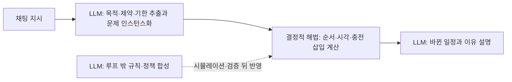
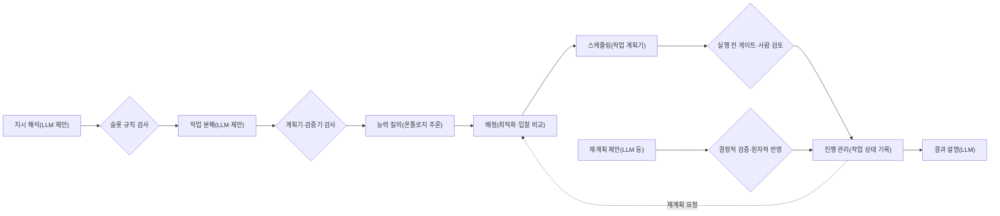
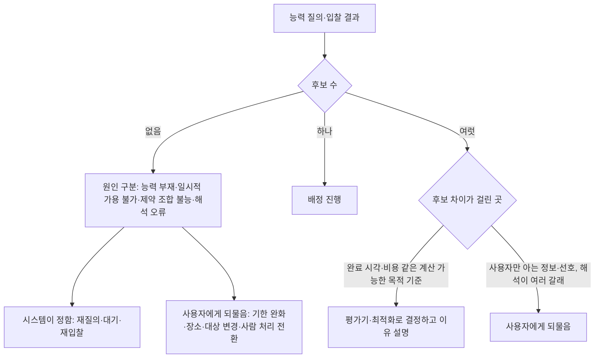
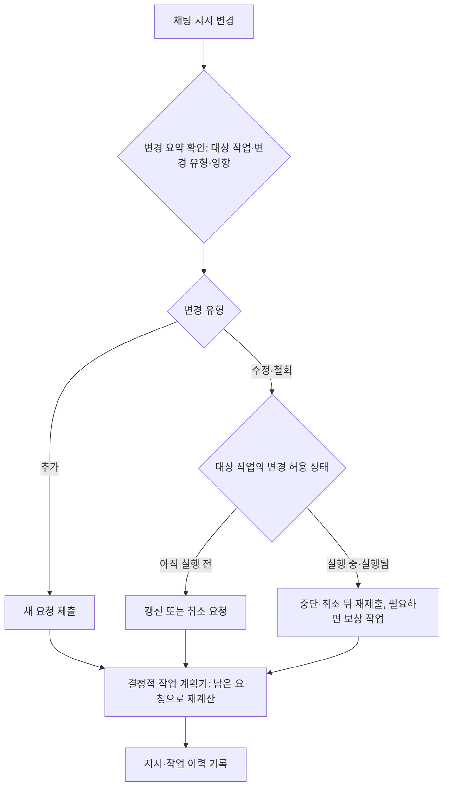

[홈](../../index.md) › 중점 연구 트랙 › [자연어 업무 지시 챗봇](index.md) › 단계 3. 구현 가설 설계

# 단계 3. 구현 가설 설계

> 단계 상태: 진행 중 · 열린 질문: 10건 · 답한 질문: 4건 · 완료 조건: 미충족 · 마지막 실행: 2026-09-25

## 1. 이 단계에서 밝힐 것

> 지시 해석부터 진행 관리까지의 처리 흐름에서 어느 부분을 LLM이 맡고 어느 부분을 온톨로지 질의와 최적화 엔진이 맡는가.

위 문장은 트랙 정의의 "밝힐 것"이다(트랙 정의의 단계별 밝힐 것과 완료 조건은 [트랙 개요](index.md)의 단계 진행 현황에 정리되어 있다). 조사 결과는 [아이디어 2. 자연어 업무 지시 챗봇](../../ideas/nl-task-chatbot.md)과 [업무 분해·배정 설계 초안](task-model-draft.md)으로 이어진다.

## 2. 질문 목록

이 단계의 시작 질문 4개(q3-01~q3-04)와, 앞 단계의 트랙 실행과 이 단계의 실행에서 이 단계 태그로 올라온 질문(q3-05~q3-12, q3-14, q3-15)이다. q3-01은 사용자 요청의 시작 질문 문구 그대로이고, q3-02~q3-04는 구축자가 이 단계의 밝힐 것에서 정한 시작 질문이다. [가정] 상태와 답 위치는 [질문 백로그](question-backlog.md)와 일치시키며, 백로그의 "조사 중"은 이 표에서 "열림"으로 표시하고 "폐기"는 표에서 빼고 백로그에만 남긴다. 답은 3절의 질문 id로 시작하는 소제목에 실리고, 답 위치 칸에는 그 앵커 또는 주제 페이지 링크를 적는다. 제기 근거 칸에는 finding id(실행 id 병기) 또는 "사용자"만 쓴다. q3-09와 q3-10은 문구가 거의 같아 백로그 정리가 필요하다. 백로그의 q3-13은 q3-12와 문구가 같은 중복 등록이라 이 표에 넣지 않았으며 정리가 필요하다.

| id | 질문 | 상태 | 제기 근거 | 답한 실행 id | 답 위치 |
|---|---|---|---|---|---|
| q3-01 | 스케줄링 결정은 LLM과 최적화 엔진 중 어디에 맡기는가? | 답함 | 사용자 | 2026-09-25-66 | [#q3-01](#q3-01) |
| q3-02 | 지시 해석 → 작업 분해 → 능력 질의 → 배정 → 스케줄링 → 진행 관리의 흐름에서 단계마다 입력·출력은 무엇이고, 규칙·최적화처럼 결과가 정해진(결정적) 구성 요소는 어디에 두는가? | 답함 | 사용자 | 2026-09-25-71 | [#q3-02](#q3-02) |
| q3-03 | 온톨로지 질의가 수행 가능한 로봇을 찾지 못하거나 후보를 여럿 낼 때, 챗봇은 무엇을 사용자에게 되묻고 무엇을 스스로 정하는가? | 답함 | 사용자 | 2026-09-25-74 | [#q3-03](#q3-03) |
| q3-04 | 진행 중인 작업에 새 지시가 들어오거나 지시가 바뀌면(취소·우선순위 변경) 작업 모델과 일정은 어떻게 갱신하는가? | 답함 | 사용자 | 2026-09-25-77 | [#q3-04](#q3-04) |
| q3-05 | 같은 다중 로봇 배정 작업에서 LLM이 직접 배정하는 방식과 LLM이 정식화하고 선형계획·정수계획·MILP 해법기가 배정하는 방식을 배정 오류율·일정 품질·계산 시간으로 비교한 연구가 있는가, 창고 작업에서도 같은 결과가 나오는가? | 열림 | f10, 실행 2026-09-25-21 | | |
| q3-06 | FLEET처럼 LLM이 만든 로봇–작업 적합도 행렬 대신 로봇 기능 온톨로지 질의(능력·제약 대조)로 적합도를 정해 최적화 해법기에 넘기면 배정 근거의 설명·재현성이 달라지는가, 이를 시도한 연구가 있는가? | 열림 | f8, 실행 2026-09-25-21 | | |
| q3-07 | LMCR 처럼 환경 관찰·상식으로 빠진 정보를 스스로 채워도 되는 상황 항목과 반드시 사용자에게 되물어야 하는 항목을 어떤 기준으로 나누는가? | 열림 | f6, 실행 2026-09-25-30 | | |
| q3-08 | ROP 가 업무→작업 분해 구조를 내부에 둘 때 기존 형식(BPMN·Serverless Workflow·HDDL)을 채택할지, 자체 작업 모델 스키마를 두고 Open-RMF 복합 작업·VDA 5050 주문으로 변환할지, 변환 때 배정 근거·확인 여부는 어디에 남기는가? | 열림 | f17, 실행 2026-09-25-51 | | |
| q3-09 | ROP 가 VDA 5050 관제 역할을 맡는 구성에서 Open-RMF 복합 작업의 단계와 VDA 5050 waitForTrigger–trigger 를 조합해 제조사가 다른 플릿 사이 작업 선후를 집행할 수 있는가, 트리거 누락·시간 초과 때 누가 복구하는가? | 열림 | f18, 실행 2026-09-25-51 | | |
| q3-10 | Open-RMF 복합 작업의 단계와 VDA 5050 waitForTrigger–trigger 를 조합해 제조사가 다른 플릿 사이 작업 선후를 집행할 수 있는가, 트리거 누락·시간 초과 때 누가 복구하는가? | 열림 | f18, 실행 2026-09-25-51 | | |
| q3-11 | 채팅 지시에서 LLM 이 뽑은 기한·우선순위·선호(목적 가중치)를 rmf_task 비용 계산기나 MILP 목적함수·제약으로 넘기는 인터페이스는 어떤 형식으로 두고, LAPPI 처럼 사용자가 결과를 보고 가중치를 고치는 반복을 어떻게 설계하는가? | 열림 | f16, 실행 2026-09-25-66 | | |
| q3-12 | ROP 가 온톨로지 기반 실행 가능성 판정(배정기 독립 출력)으로 후보를 거른 뒤 Open-RMF 처럼 플릿 단위 입찰로 배정할 때, 판정은 플릿 단위로 넘기는가 로봇 단위로 넘기는가, 제조사 관제가 플릿 안에서 다시 로봇을 고르면 판정 결과와 어긋날 때 누가 조정하는가? (관련: oq-053) | 열림 | f4, 실행 2026-09-25-71 | | |
| q3-14 | 온톨로지 기반 실행 가능성 판정이 후보를 하나도 내지 않을 때, 어느 능력·제약 때문인지를 SHACL 검증 보고처럼 제약 단위로 돌려주는 형식을 배정기 독립 출력(ReasonerOutput)에 둘 수 있는가, 그 형식에서 챗봇이 사용자에게 보여 줄 설명을 만들 수 있는가? | 열림 | f8, 실행 2026-09-25-74 | | |
| q3-15 | 로봇 작업의 변경 허용 상태(바꿀 수 없는 부분과 바꿀 수 있는 부분)의 경계를 어디에 둘 것인가 — VDA 5050 베이스를 얼마나 앞서 풀어 줄지, Open-RMF 단계 가운데 어디부터 동결할지, 기준생산계획의 동결 구간처럼 시간으로 둘지 단계로 둘지에 따라 지시 변경 반영 가능 범위와 이동 연속성은 어떻게 달라지는가? | 열림 | f20, 실행 2026-09-25-77 | | |

## 3. 조사 결과

### q3-01 스케줄링 결정은 LLM과 최적화 엔진 중 어디에 맡기는가? {#q3-01}

확인한 자료로는 LLM 이 스케줄을 직접 만들면 제약이 겹치거나 문장 표현이 바뀔 때 실행 가능성이 흔들리므로, ROP 에서는 순서·시각·충전 삽입 같은 스케줄링 결정은 rmf_task 같은 결정적 최적화·계획 해법이 맡고 LLM 은 지시에서 목적·제약·기한을 뽑아 문제를 인스턴스화하는 일과 결과 설명을 맡는 분담이 근거가 가장 많은 것으로 보인다. [추정][^ref-592][^ref-593][^ref-594][^ref-610][^ref-377][^ref-092][^ref-596][^ref-598][^ref-615] 이 결론은 이 위키의 종합이며, 근거가 작업장·프로젝트·운영과학 일반·건설·항만·여행 계획 조건이고 이종 제조사 창고 플릿에서 두 방식을 비교한 자료가 없어 신뢰도가 낮다. 아래에 근거를 나누어 적는다.

#### 로봇 오케스트레이션 도구는 스케줄링을 어디에 두는가

- Open-RMF 의 rmf_task 작업 계획기(TaskPlanner)는 플릿 안의 작업과 로봇을 받아, 요청된 시작 시각을 지키면서 작업이 가장 빨리 끝나도록 로봇별 작업 순서를 정한다(공식 저장소, 확인일 2026-09-25 기준). [사실][^ref-404][^ref-377] rmf_task README 는 이 계획기가 배터리 같은 자원 제약을 고려해 필요하면 충전 작업을 일정에 자동으로 끼워 넣는다고 설명한다. [사실][^ref-404]
- 계획기 헤더(TaskPlanner.hpp)는 최적성을 보장하지 않지만 더 빠를 수 있는 탐욕(greedy) 방식과, 최적성을 보장하지만 오래 걸릴 수 있는 A* 기반 방식 가운데 하나를 고르게 하고, 비용 계산기를 지정하지 않으면 BinaryPriorityCostCalculator 를 쓰며, 각 로봇의 배정 끝에 수행할 마무리 작업을 만드는 요청 생성기를 옵션으로 받는다(확인일 2026-09-25 기준, 비용 계산기의 비용 정의 세부는 미확인). [사실][^ref-377]
- Open-RMF 에서는 디스패처가 입찰 공고를 보내면 각 플릿 어댑터가 작업 계획기로 비용을 계산해 입찰하고, 디스패처가 가장 빨리 끝나는 것·가장 낮은 비용 같은 설정 기준으로 비교해 작업을 줄 플릿을 정한다. [사실][^ref-376]
- VDA 5050 3.0.0(공식 저장소 main 브랜치, 확인일 2026-09-25)은 관제의 최소 기능으로 주문 배정, 충전 주문이 운반 주문을 중단할 수 있는 에너지 관리, 교통 제어를 두고, 경로 결정·우선순위·혼잡 처리 같은 교통 관리 로직은 명세 범위에서 뺀다. [사실][^ref-031] 명세가 명시적으로 제외하는 것은 교통 관리 로직이지만, 배정 알고리즘도 규정하지 않으므로 배정·일정 결정 로직은 관제 구현에 맡겨진 것으로 보인다. [추정][^ref-031]

#### LLM 이 스케줄을 직접 만들 때의 한계

- ConstraintBench 저자들은 10개 운영과학 영역 200개 과제에서 6개 모델에게 제약 최적화 문제를 직접 풀게 했을 때, 가장 좋은 모델의 실행 가능 해 비율이 65.0%였고 실행 가능성과 최적성(솔버 최적값 기준 0.1% 이내)을 함께 만족한 비율은 어느 모델도 30.5%를 넘지 못했으며, 실패 유형으로 소요 시간 제약 오해와 존재하지 않는 개체 생성을 들었다(저자 보고값, 원문 미열람). [사실][^ref-592] 영역별 실행 가능 비율은 편차가 크다고 보고되었으나 수치는 검색 요약마다 달라 미확인이다.
- R-ConstraintBench 저자들은 자원 제약 프로젝트 스케줄링 문제(Resource-Constrained Project Scheduling Problem, RCPSP)에서 선후 제약을 늘린 뒤 정지 시간·시간창·배타 제약을 더해 LLM 을 평가했고, 선후 제약만 있을 때는 실행 가능성이 천장에 가깝지만 제약이 함께 걸리면 급락하며 병목은 그래프 깊이가 아니라 제약 사이 상호작용이라고 보고한 것으로 보인다(저자 보고, 원문 미열람·검증 미재확인). [추정][^ref-593]
- SCHEDBench 저자들은 작업장·자원 제약 프로젝트·간호사 근무·교과 시간표 스케줄링 1,132개 사례로 LLM 이 완성 스케줄을 직접 내게 하고, 같은 문제를 의미가 같은 다른 문장 표현으로 주면 실행 가능 비율이 떨어지고 제약 위반이 달라진다고 보고했다(저자 보고, 원문 미열람; 평가한 모델 수와 가장 민감한 변형 유형은 미확인). [사실][^ref-594]
- DynaSchedBench 저자들은 동적 유연 작업장 스케줄링에서 LLM 스케줄러에 전체 구조 정보를 주면 간결한 통계 요약을 줄 때보다 성능이 나빠졌고(1.66% 대 0.65%, 지표 정의 미확인), 도구를 쓰는 탐색은 토큰 비용이 약 3배인데 성능은 더 낮았다고 보고했다(저자 보고값, 원문 미열람). [사실][^ref-610]
- Kambhampati 외(ICML 2024 입장 논문)는 자기회귀 LLM 이 혼자서는 계획이나 자기 검증을 하지 못한다고 보고, LLM 을 근사적 아이디어 생성기로 두고 외부 모델 기반 검증기·비평자와 양방향으로 결합하는 LLM-모듈로(LLM-Modulo) 틀을 제안한다. [의견][^ref-586]

#### 반례: LLM 이 스케줄을 직접 만든 연구

- Starjob 저자들은 작업장 스케줄링 문제(Job Shop Scheduling Problem, JSSP) 13만 개 사례를 자연어로 기술한 데이터셋으로 Llama 8B 를 미세 조정하면 실행 가능한 스케줄을 생성하고, 우선순위 디스패치 규칙과 초기 신경망 방법(L2D)보다 DMU 평균 15.36%, Taillard 평균 7.85% 개선된다고 보고했다(저자 보고값, 원문 미열람; 정확 해법기와의 비교는 미확인). [사실][^ref-595]
- 건설 로봇 사례로, Saha 외는 LLM 에 에이전트의 행동 능력과 목표를 주고 생성 LLM(GPT-4)과 감독 LLM(Gemma 3·Llama 4·Mistral 7B)이 함께 스케줄을 만드는, 해법기 없이 LLM 이 일정을 직접 내는 틀을 제안했다(해법기 대비 정량 비교는 미확인, 건설 현장은 분류 원문 9장의 업종별 조건에 속하는 연계 대상이어서 방법 사례로만 다룸). [사실][^ref-616]
- 두 연구로 보면 LLM 직접 스케줄링이 배제되는 것은 아니지만, 비교 대상이 정확 해법기가 아니거나 확인되지 않아 해법기 대체의 근거로는 약한 것으로 보인다. [추정][^ref-595][^ref-616][^ref-592]

#### LLM 이 정식화하고 해법기가 푸는 결합 구조

- LLM+P 는 LLM 이 자연어 계획 문제를 PDDL 문제 파일로 바꾸고 고전 계획기 Fast Downward 가 계획을 구하는 구조이며, LLM 이 계획을 직접 내는 방식(LLM-as-Planner)과 문맥 예시 유무를 바꾼 기준선을 7개 도메인에서 비교한다(공식 저장소 README, 확인일 2026-09-25 기준). [사실][^ref-091] LLM+P 논문 저자들은 GPT-4 실험에서 LLM+P 가 LLM-as-Planner 보다 훨씬 많은 문제를 풀었고, 직접 계획 방식은 공간 관계가 복잡한 문제에서 완전히 실패했으며, 문맥 예시가 없으면 LLM+P 도 실패했다고 보고한 것으로 보인다(LLM+P 논문 저자 보고, 원문 미열람). [추정][^ref-092]
- OptiMUS 공식 README 는 순차형(v1, 중소 규모 문제), 에이전트형(v2), 검색 증강·대규모 기법(v3)의 구성과 MIP·LP 해법기 사용을 밝힌다(확인일 2026-09-25 기준). [사실][^ref-596] OptiMUS-0.3 논문은 LLM 이 정식화한 모델을 Gurobi 파이썬 API 코드로 옮겨 해법기로 풀고 각 LLM 구성 요소에 오류 검사 모듈을 둔다고 설명하며, 이 부분은 원문 미열람 논문의 요약 기준이고 README 와 같은 저자 계열이라 독립 교차가 아니다. [사실][^ref-597]
- LAPPI(Kuroki 외, IEEE Access 2026)는 LLM 이 대화로 사용자의 모호한 선호를 후보 항목·선호 점수·제약으로 바꿔 최적화 문제를 인스턴스화하고 풀이는 기존 해법기에 맡기는 대화형 최적화 방식이며, 여행 계획 사용자 연구에서 기존 방식과 프롬프트만 쓴 방식보다 나은 실행 가능 계획을 냈다고 저자가 보고했다(원문 미열람). [사실][^ref-598]
- 다중 로봇 LLM 연구 가운데 LiP-LLM(선형계획), PIP-LLM(정수계획), FLEET(makespan 최소화), Peng 외(MILP)는 LLM 이 의존 그래프·적합도·제약을 정식화하고 배정·일정은 결정적 해법이 푸는 분담을 쓴다. [사실][^ref-166][^ref-181][^ref-242][^ref-167]
- 운영과학(Operations Research, OR)의 LLM 적용을 정리한 서베이(Wang·Li)는 기존 방법을 자동 모델링, 보조 최적화(휴리스틱·알고리즘 설계), 직접 풀이의 세 경로로 나누고, 의미–구조 대응의 불안정, 일반화·해석 가능성 한계, 평가 체계 부족, 산업 배치 장벽을 과제로 든다. [사실][^ref-614]

#### 결정 루프 밖에서 규칙·정책을 만드는 구조

- RACE-Sched 는 LLM 추론 지연이 산업 제어의 밀리초 단위 결정 주기와 맞지 않는다고 보고, 실시간 디스패치는 저지연 기호 휴리스틱이 맡고 병렬 흐름에서 LLM 이 규칙을 합성·검증·진화시키는 이중 흐름 구조를 제안했다(저자 보고, 원문 미열람; 규칙을 운영에 반영하는 방식의 세부는 미확인). [사실][^ref-611]
- Li·Li(소속 미확인)는 동적 생산·AGV 스케줄링의 이산 사건 시뮬레이션에서 LLM 관리 에이전트가 사건 기록으로 병목 가설을 세우고 편집 에이전트가 규칙 기반 정책 코드를 고치는 휴리스틱 설계 틀을 제안했으며, 결과 정책이 수리계획·규칙·메타휴리스틱 기준선보다 나았다고 보고했다(저자 보고, 원문 미열람). [사실][^ref-612] 여기서 시뮬레이션은 LLM 이 만든 정책을 검증하는 도구로만 쓰인다.
- 연계 대상: 컨테이너 터미널 차량 디스패칭은 분류 원문 9장의 거점 간 운송·업종별 조건에 가까운 영역이며, PortAgent 는 LLM 이 개별 배차를 결정하기보다 가상 전문가 팀(지식 검색·모델러·코더·디버거)이 디스패칭 모델과 코드를 만들고 디버거가 오류를 검사·수정하는 방법 사례다(검사 방식의 세부와 성능 수치는 미확인, 원문 미열람). [사실][^ref-613]
- Powell 외(Journal of Intelligent Information Systems, 2025)는 스케줄링 시스템이 낸 결과를 사람에게 설명하는 텍스트를 LLM 의 추론(사고 사슬 프롬프트)으로 생성하는 방법을 연구했다(원문 미열람). [사실][^ref-615]

#### 종합: 이 위키의 분담 가설

아래 도식은 위 종합을 이 위키가 그린 분담 가설이며, 검증된 구조가 아니다.

- 진행 중 고장·새 지시 같은 동적 사건의 재스케줄링은 LLM 추론 지연 때문에 결정 루프 안에 LLM 을 두기 어렵고, RACE-Sched·Li·Li 처럼 LLM 은 규칙·정책을 루프 밖에서 만들어 시뮬레이션·검증을 거쳐 반영하며 실시간 재계산(rmf_task 의 충전 삽입 등)은 해법이 맡는 구조가 ROP 의 선택지로 보인다. rmf_task 의 재배정 기능은 문서에서 확인하지 않았다. [추정][^ref-611][^ref-612][^ref-404][^ref-586]
- 분류 원문 13. 작업 배정 — MRTA 의 SCM 관점 질문은 다음과 같다.

> 가장 가까운 로봇에 맡기는 것이 전체적으로도 유리한가? [분류원문]

- 이 질문과 관련해, 전체 이익은 완료 시각·비용 같은 명시적 목적함수를 최적화하는 해법(rmf_task, 선형·정수계획)이 계산·비교할 수 있지만, LLM 직접 배정·스케줄은 실행 가능하더라도 최적성까지 함께 만족하는 비율이 낮게 보고되어(운영과학 일반 문제, 솔버 기준 0.1% 이내 조건의 저자 보고값 30.5% 이하) 전체 이익을 보장하는 수단으로 쓰기 어려운 것으로 보인다. [추정][^ref-377][^ref-166][^ref-592]
- 이번에 확인한 LLM 스케줄링 근거의 평가 환경은 작업장·프로젝트·근무표 스케줄링, 운영과학 일반 문제, 건설 로봇, 컨테이너 터미널, 여행 계획이었고, 이종 제조사 창고 로봇 플릿에서 LLM 직접 스케줄과 해법기를 비교한 자료는 검색 범위에서 찾지 못했다(한국어 검색 포함, 부재의 확인은 아님). [추정][^ref-592][^ref-593][^ref-594][^ref-595][^ref-616][^ref-613][^ref-598]

#### 설명용 시나리오

**물류 흐름 단계:** 출하

**시나리오:** 출하 마감 전에 채팅으로 들어온 긴급 출고 지시를 일정에 반영하기

| 항목 | 내용 |
|---|---|
| 시작 조건 | 출하 마감 전에 관리자가 채팅으로 긴급 출고 지시를 보낸다(설명용 가정). |
| 작업 대상 | 긴급 출고 대상 화물과 그 운반 작업(설명용 가정) |
| 수행 자원 | LLM 은 지시에서 기한·우선순위를 뽑아 문제 인스턴스로 바꾸고, 해법이 일정을 다시 계산하며, LLM 이 바뀐 일정과 이유를 설명하는 분담이 가능해 보인다. [추정][^ref-598][^ref-377][^ref-615] |
| 제약 | rmf_task 는 배터리 같은 자원 제약을 고려해 충전 작업을 일정에 끼워 넣고 [사실][^ref-404] VDA 5050 에서는 충전 주문이 운반 주문을 중단할 수 있다. [사실][^ref-031] |
| 완료·인계 | 해당 없음 |
| 예외·성과 | LLM 이 일정을 직접 만들면 실행 가능성과 최적성을 함께 만족하는 비율이 낮게 보고되었고(운영과학 일반 제약 최적화 문제, 솔버 기준 0.1% 이내 조건의 저자 보고값) [사실][^ref-592] LLM 추론 지연은 실시간 결정 주기와 맞지 않을 수 있다. [추정][^ref-611] |

다음은 설명을 위한 가상의 시나리오이다. 출하 마감 전에 채팅으로 긴급 출고 지시가 들어오면, LLM 은 지시에서 기한·우선순위를 뽑아 문제 인스턴스(제약·목적 가중치)로 바꾸고 해법이 충전 삽입을 포함한 일정을 다시 계산한 뒤, LLM 이 바뀐 일정과 이유를 설명하는 흐름이 가능해 보인다. [추정][^ref-598][^ref-377][^ref-615] 이 흐름에서 LLM 이 뽑은 값을 해법의 비용 계산기나 목적함수로 넘기는 형식은 아직 정하지 않았으며 후속 질문 q3-11 로 둔다.

### q3-02 지시 해석부터 진행 관리까지 단계별 입력·출력과 결정적 구성 요소의 위치 {#q3-02}

확인한 자료를 이 위키가 묶으면, 처리 흐름은 지시 해석 → 작업 분해 → 능력 질의 → 배정 → 스케줄링 → 진행 관리의 여섯 단계로 나눌 수 있고, LLM 은 지시 해석·작업 분해의 제안과 결과 설명을 맡고 결정적 구성 요소는 작업 분해 결과의 검사와 능력 질의·배정·스케줄링·진행 관리에 두는 배치가 근거가 가장 많은 것으로 보인다. [추정][^ref-356][^ref-166][^ref-675][^ref-236][^ref-376][^ref-377][^ref-111][^ref-674] 이 여섯 단계를 한 흐름으로 제시한 단일 출처는 찾지 못했고, 근거가 산업용 로봇 셀·조작 시뮬레이션·공장·실험실 조건이며 창고 플릿에서 흐름 전체를 평가한 자료가 없어 이 결론의 신뢰도는 낮다(low). 아래에 근거를 나누어 적는다.

#### 오케스트레이션 도구가 다루는 배정·일정·진행의 입력·출력

- Open-RMF 에서는 사용자가 작업 요청을 내면 디스패처가 모든 플릿 어댑터에 입찰 공고(BidNotice)를 보내고, 처리할 수 있는 플릿 어댑터가 rmf_task 작업 계획기로 비용을 계산해 입찰(BidProposal)하며, 디스패처가 가장 빨리 끝나는 것·가장 낮은 비용 같은 설정 기준으로 비교해 이긴 플릿에 배치 요청(DispatchRequest)을 보내고, 필요하면 충전 작업이 자동으로 끼워진다(확인일 2026-09-25 기준). [사실][^ref-376]
- 입찰의 비용을 내는 rmf_task 작업 계획기는 플릿 안의 작업과 로봇을 받아 요청된 시작 시각을 지키며 작업이 가장 빨리 끝나도록 로봇별 작업 순서를 정하는 결정적 구성 요소로, 탐욕 방식과 A* 기반 방식 가운데 하나로 풀고 배터리 제약에 따라 충전 작업을 끼워 넣는다(세부는 위 q3-01 소절). [사실][^ref-377][^ref-404]
- Open-RMF 작업 상태 스키마는 배정 결과를 assigned_to(그룹·이름)로, 배정 과정을 dispatch 상태(queued·selected·dispatched·failed_to_assign·canceled_in_flight)로, 진행을 status 값과 단계별 상태·예상 소요 시간으로 나타낸다(확인일 2026-09-25 기준). [사실][^ref-111] 이 기록이 진행 관리 단계가 받을 결정적 상태 기록의 형식이 될 수 있다는 것은 이 위키의 해석이다. [추정][^ref-111]

#### 능력 질의의 출력을 배정기에 넘기는 형식

- Electronics(2026-08-11 게재) 논문은 로봇·작업·장소의 의미 모델에 선언적 추론과 절차적 평가를 결합해 여러 축의 능력 조건과 적재 상태에서의 장소 도달 가능성을 판정하고, 그 결과를 특정 배정기에 묶이지 않는 ReasonerOutput 으로 정형화해 여러 배정 알고리즘의 공통 입력으로 쓴다고 제안했다(원문 미열람, ReasonerOutput 의 필드 구성과 저자는 미확인). [사실][^ref-236]

#### LLM 과 결정적 구성 요소를 나눈 신경-기호 구조

- LiP-LLM 은 작업 계획을 기술 목록 생성, 의존 그래프 생성, 작업 배정의 세 단계로 나누고, 앞 두 단계는 LLM 이, 배정은 선형계획이 맡는다. [사실][^ref-166]
- Liu 외(KTH, arXiv 2606.08214, 2026-06)는 산업용 로봇에서 언어 이해·맥락 추론만 LLM 에 맡기고 검증·순서 결정·실행은 모두 결정적으로 두는 Specifier–Designer–Inspector 구조를 제안했고, Inspector 는 LLM 비평자가 아니라 기호 제약 검증기이며, 5개 난이도의 자연어 명령 70개에서 100% 성공을 보고했다(저자 보고, 원문 미열람). [사실][^ref-674] 실패 복구 경로 설정과 사람 검토용 디지털 트윈의 구현 세부는 이번 검증에서 재확인되지 않았다(세부 미확인). 여기서 디지털 트윈은 사람 검토용 시각화로만 다루며, 22. 시뮬레이션·예측용 디지털 트윈이나 8. 실시간 세계 상태·데이터 일관성의 기능으로 보지 않는다.
- 같은 연구의 절제 실험에서 기호 검증기(Inspector)를 같은 방식으로 프롬프트한 LLM 으로 바꾸면 전체 성공률이 98.1% 에서 3.8% 로 떨어졌다고 저자들이 보고했다. 이는 그룹 A–D 의 52개 명령 부분집합에서, 같은 방식으로 프롬프트한 LLM 으로 바꾼 조건의 저자 보고값이며, 독립 재현은 확인되지 않았고 원문은 열람하지 못했다. [사실][^ref-674]
- Pesjak·Žabkar(Machine Learning and Knowledge Extraction 8권 1호, 2026)의 Sense–Plan–Code–Act(SPCA) 틀에 대해, 공식 저장소 README 는 Plan 단계를 PDDL·LLM·하이브리드 가운데 고르는 여러 구성을 수용하는 틀로 적고 컴파일·시뮬레이션 검증과 실패 뒤 재계획을 둔다(확인일 2026-09-25 기준). 논문 요약(원문 미열람)이 서술하는 'LLM 이 세계 기술을 PDDL 로 바꾸고, 휴리스틱 계획기가 계획을 만들고, 두 번째 LLM 이 계획을 코드로 바꾼 뒤 컴파일로 구문을, 시뮬레이션으로 의미를 검증하는' 구조는 그 하이브리드 구성을 논문 요약 기준으로 서술한 것으로 보이며, 틀 전체를 한 구조로 단정할 수는 없다. [추정][^ref-675][^ref-676] README 는 Sense 단계를 결정적 인식으로 적어 논문 요약과 표현이 다르고, 두 출처는 같은 저자 계열이라 독립 교차가 아니다. 여기서 시뮬레이션은 생성된 코드를 검증하는 도구로만 쓰인다.
- Tang 외(arXiv 2606.31339, 2026-06)는 산업용 다중 로봇에서 작업 위계를 담는 작업 숲(task forest)과 실행 상태·로봇 기록·자원 잠금·세계 믿음·제안·검증 기록을 담는 관리형 블랙보드를 동기화해 두고, 에이전트·휴리스틱·최적화 모듈의 제안은 결정적 검증과 원자적 반영(atomic commit)을 거쳐야만 받아들이는 구조를 제안했다(검색 요약 기준 평가 조건은 실내 공장 시나리오와 원격 건설 벤치마크, 원문 미열람). [사실][^ref-711] 원격 건설은 분류 원문 9장의 업종별 조건에 속하는 연계 대상이어서 구조 사례로만 다룬다.
- 위 q3-01 소절의 LLM-모듈로 틀은 LLM 을 근사적 아이디어 생성기로, 외부 모델 기반 검증기를 비평자로 두는 저자들의 입장이다. [의견][^ref-586]

#### 해석 단계의 규칙 검사와 실행 전 게이트

- Rasa 폼은 필수 슬롯을 정해 두고 비어 있는 다음 필수 슬롯을 사용자에게 묻고, 추출한 값을 사용자 정의 검증 동작으로 검사한 뒤 필수 슬롯이 모두 채워지면 비활성화된다. [사실][^ref-356] 이는 지시 해석 단계의 출력(채워진 슬롯)을 규칙으로 검사하는 결정적 구성 요소의 예로 볼 수 있다. [추정][^ref-356]
- SafeGate(arXiv 2604.05427, 2026-04)는 자연어 명령에서 안전 관련 속성을 구조화해 뽑고 ISO 13482 기반의 결정적 판정으로 실행을 승인·거부한 뒤, 통과한 명령을 불변 조건·가드·중단 조건으로 된 작업 안전 계약으로 분해하는 실행 전 게이트다(원문 미열람). [사실][^ref-417] ISO 13482 는 개인 돌봄 로봇 안전 표준이므로 물류 이동로봇 적용은 미확인이며, 안전 판정 자체를 ROP 직접 범위로 단정하지 않는다.

#### LLM 에게 로봇을 도구로 노출하는 방식

- 오픈소스 ROS-MCP-Server 는 rosbridge 를 통해 로봇 코드 수정 없이 LLM 에게 ROS·ROS 2 의 토픽 발행·구독, 서비스 호출, 액션, 파라미터를 모델 컨텍스트 프로토콜(Model Context Protocol, MCP) 도구로 노출하며, README 에는 권한 제한이 기여 안내의 계획 항목으로만 언급되고 현재의 권한·제한 장치 설명은 없다(확인일 2026-09-25 기준). [사실][^ref-712]
- 한국전자기술연구원 연구진은 LangChain 에이전트의 도구를 ROS 2 토픽·서비스 인터페이스로 정의해 자연어 명령을 로봇 제어 명령으로 바꾸는 다중 로봇 관제 시스템을 발표해, 국내 사례에서도 LLM 이 닿는 범위가 도구 정의로 정해지는 구조가 쓰였다(학술대회 이름·일자 미확인). [사실][^ref-180]
- 두 방식은 LLM 이 닿는 범위를 도구 목록이 정하므로, 채팅 LLM 에 저수준 로봇 도구를 열면 위 흐름의 능력 질의·배정·검증 게이트를 우회할 수 있어, ROP 는 검증 파이프라인으로 들어가는 상위 도구(작업 요청 제출 등)만 노출해야 할 것으로 보인다. [추정][^ref-712][^ref-180][^ref-417] 로봇 토픽·액션의 직접 제어는 분류 원문 9장의 로봇 자체 지능·제어 경계에 속하는 연계 대상이며, ROP 는 어떤 도구를 노출할지의 경계만 판단한다.

#### 반례: LLM 이 배정·재계획까지 맡는 구조

- CoMuRoS(arXiv 2511.22354, 2025-11)는 작업 관리자 LLM 이 자연어 목표를 해석·분류하고 정적 규칙과 동적 맥락(작업·이력·로봇 상태·사건)으로 하위 작업을 배정하며, 로봇마다 로컬 LLM 이 기본 기술로 실행 코드를 구성하고, 작업 실패나 사용자 의도 변경이 재계획을 촉발하는 구조로, 정답률(correctness) 최대 0.91(22개 시나리오·54개 작업·약 20대 로봇 벤치마크, 저자 보고)을 보고했다(원문 미열람). [사실][^ref-677]
- STRAP-LLM(Park·Kim, Intelligent Service Robotics)은 구조화 프롬프트로 LLM 이 이종 로봇의 작업 배정과 기술 계획을 로봇 실행 언어로 직접 생성하게 하는 틀로, 저자들은 새 로봇을 추가해도 실행 정확도가 높게 유지된다고 보고했다(저자 보고; 수치·비교 대상·저자 소속·게재 연도는 미확인, 원문 미열람). [사실][^ref-678]
- 두 연구로 보면 LLM 배정이 배제되는 것은 아니지만, 평가가 실험실·텍스트 벤치마크 조건이고 결정적 배정기와 같은 조건에서 비교한 결과는 확인되지 않아, 아래 배치의 반박 근거로는 약한 것으로 보인다. [추정][^ref-677][^ref-678][^ref-674]

#### 종합: 여섯 단계의 입력·출력과 결정적 구성 요소

아래 표와 도식은 위 근거를 이 위키가 대응시켜 구성한 처리 흐름 가설이며, 검증된 구조가 아니다. [추정][^ref-356][^ref-166][^ref-675][^ref-236][^ref-376][^ref-377][^ref-111][^ref-674]

| 단계 | 입력 | 출력 | 맡는 쪽 | 결정적 검사·근거 사례 |
|---|---|---|---|---|
| 지시 해석 | 채팅·대화 맥락 | 의도·슬롯 | LLM 제안 | 필수 슬롯 규칙 검사(Rasa 폼) |
| 작업 분해 | 슬롯 | 작업 목록·의존 그래프 또는 형식 명세 | LLM 제안 | 계획기·검증기 검사(LiP-LLM, SDI, SPCA 하이브리드 구성) |
| 능력 질의 | 작업 요구 | 배정기에 묶이지 않는 실행 가능성 판정 | 온톨로지 추론 | ReasonerOutput(Electronics 2026) |
| 배정 | 판정·비용 | 로봇 또는 플릿 | 최적화·입찰 비교 | Open-RMF 입찰, 선형계획(LiP-LLM) |
| 스케줄링 | 배정·시각 제약 | 로봇별 순서·충전 삽입 | 작업 계획기 | rmf_task |
| 진행 관리 | 로봇·플릿 상태 보고 | 진행 상태 기록·재계획 요청 | 결정적 상태 기록 | Open-RMF 작업 상태 |

결과 설명(바뀐 배정·일정과 이유)은 q3-01 소절처럼 LLM 이 맡는 것으로 둔다.

- 확인한 신경-기호 구조들은 LLM 출력이 상태나 실행에 반영되기 직전마다 결정적 검사를 둔다(해석 뒤 슬롯 검사, 분해 뒤 계획기·기호 검사, 배치 전 안전 게이트·사람 검토, 진행 상태 반영 때 검증 뒤 원자적 반영). 이 가운데 SPCA 의 컴파일·시뮬레이션 검사는 추정 근거이고, 관리형 블랙보드에서 검증을 거치는 제안의 주체는 LLM 에 한정되지 않고 에이전트·휴리스틱·최적화 모듈이다. 그래서 ROP 에서도 검증 게이트를 단계 사이 경계에 두는 것이 선택지로 보인다. [추정][^ref-674][^ref-675][^ref-711][^ref-417][^ref-356][^ref-586]
- 위 q3-01 소절에 인용한 분류 원문 13. 작업 배정 — MRTA 의 SCM 관점 질문과 관련해, 이 흐름에서 '누구에게 맡길지'는 능력 판정으로 거른 후보 가운데 입찰 비교·최적화의 목적 기준(가장 빨리 끝남, 가장 낮은 비용)으로 결정되고 LLM 은 그 목적 가중치를 지시에서 뽑아 넘기는 데 그치므로, 최근접 배정이 전체적으로 유리한지는 배정 단계에 둔 목적 기준에 따라 달라지는 것으로 보인다. [추정][^ref-376][^ref-236][^ref-377]
- 이번에 확인한 처리 흐름 연구의 평가 환경은 산업용 로봇 셀(SDI), 조작·격자 시뮬레이션(SPCA), 산업용 다중 로봇 임무(관리형 블랙보드), 실험실 이종 로봇 팀(CoMuRoS)이었고, 이종 제조사 창고 플릿에서 LLM 해석부터 진행 관리까지의 흐름 전체를 평가한 자료와 국내 연구는 검색 범위에서 찾지 못했다(한국어 검색 포함, 부재의 확인은 아님). [추정][^ref-674][^ref-675][^ref-711][^ref-677]

#### 설명용 시나리오: 피킹 뒤 토트 운반 지시

**물류 흐름 단계:** 피킹

**시나리오:** 관리자가 채팅으로 피킹이 끝난 토트를 기한 안에 포장대로 옮기라고 지시한다

| 항목 | 내용 |
|---|---|
| 시작 조건 | 관리자가 채팅으로 '피킹 끝난 토트를 10시 전까지 포장대로'라고 지시한다(설명용 가정). 해석 단계는 장소·대상·기한 슬롯을 채워 규칙으로 검사하고 빠진 값을 되묻는 흐름이 가능해 보인다. [추정][^ref-356] |
| 작업 대상 | 피킹이 끝난 토트(설명용 가정) |
| 수행 자원 | 능력 질의가 토트 운반이 가능한 로봇을 판정하고, 배정은 플릿 입찰 비교가, 순서는 작업 계획기가 정하며, LLM 은 기한·우선순위 같은 목적 가중치를 넘기는 데 그치는 분담이 가능해 보인다. [추정][^ref-236][^ref-376][^ref-377] |
| 제약 | 채팅 LLM 에 저수준 로봇 도구를 열면 능력 질의·배정·검증 게이트를 우회할 수 있어 상위 도구만 노출해야 할 것으로 보인다. [추정][^ref-712][^ref-180] |
| 완료·인계 | Open-RMF 작업 상태 스키마는 배정 결과(assigned_to)와 진행(status 값, 예상 소요 시간)을 나타낸다. [사실][^ref-111] 진행 관리는 이 기록으로 완료·지연을 알리는 흐름이 가능해 보인다. [추정][^ref-111] |
| 예외·성과 | 산업용 로봇 명령 조건의 절제 실험에서 기호 검증기를 LLM 으로 바꾸면 성공률이 98.1% 에서 3.8% 로 떨어졌다(그룹 A–D 52개 명령 부분집합, 저자 보고값, 독립 재현 미확인). [사실][^ref-674] 재계획 제안은 결정적 검증과 원자적 반영을 거쳐 상태에 들어가게 하는 구조가 있다. [사실][^ref-711] |

다음은 설명을 위한 가상의 시나리오이다. 피킹 구역 관리자가 채팅으로 토트 운반을 지시하면, LLM 이 장소·대상·기한을 뽑고 규칙 검사가 빈 슬롯을 되묻게 하며, 능력 질의·입찰 비교·작업 계획기가 로봇과 순서를 정하고, 진행 관리는 작업 상태 기록으로 지연을 알리는 흐름이 가능해 보인다. [추정][^ref-356][^ref-236][^ref-376][^ref-377][^ref-111] 판정을 플릿 단위로 넘길지 로봇 단위로 넘길지는 정하지 않았으며 후속 질문 q3-12 로 둔다.

### q3-03 온톨로지 질의가 후보를 찾지 못하거나 여럿 낼 때 챗봇이 되묻는 것과 스스로 정하는 것 {#q3-03}

확인한 자료를 이 위키가 묶으면, 수행 가능한 로봇·플릿이 없을 때(후보 없음) 챗봇은 원인을 능력 부재·일시적 가용 불가·제약 조합 불능·해석 오류로 나눠 설명하고 사용자가 바꿀 수 있는 항목(기한 완화, 장소·대상 변경, 사람 처리 전환)만 되묻고 재질의·대기·재입찰은 시스템이 정하는 분담이, 후보가 여럿일 때는 차이가 완료 시각·비용처럼 시스템이 계산할 수 있는 목적 기준뿐이면 미리 정한 평가기·최적화로 스스로 정하고 결과를 설명하며 사용자만 아는 정보·선호에 걸리거나 해석이 여러 갈래일 때만 되묻는 분담이 근거가 가장 많은 것으로 보인다. [추정][^ref-656][^ref-039][^ref-031][^ref-236][^ref-659][^ref-660][^ref-661][^ref-350][^ref-664][^ref-663][^ref-598][^ref-662] 이 두 분담을 한 번에 제시한 단일 출처는 찾지 못했고, 근거가 물류 플릿 조건이 아니라 고전 계획·운영과학·실험실·도구 호출 대화 조건이어서 이 결론의 신뢰도는 낮다(low). 아래에 근거를 나누어 적는다.

#### 오케스트레이션 도구가 후보 없음을 기록하는 방식

- Open-RMF 디스패처는 입찰 기간에 어떤 플릿 어댑터도 입찰하지 않으면 작업의 배정 상태를 FailedToAssign 으로 두고 'No fleet adapters offered a bid' 오류(코드 10)를 기록하며, 그 작업은 수행되지 않는다(공식 저장소 소스, 확인일 2026-09-25 기준). [사실][^ref-656]
- 플릿 어댑터는 설정에서 해당 작업 유형(청소·배송·순회)을 받도록 구성되어 있지 않으면 그 작업에 입찰하지 않으며, 공식 플릿 어댑터 템플릿 설정은 task_capabilities 로 loop·delivery 를 켜 둔다(확인일 2026-09-25 기준). [사실][^ref-039][^ref-105] 두 출처는 모두 Open Robotics 계열이라 독립 교차가 아니다.
- Open-RMF 작업 상태 스키마의 dispatch 필드는 상태(queued·selected·dispatched·failed_to_assign·canceled_in_flight)와 함께 배정 대상(fleet_name, expected_robot_name)과 오류 배열(errors)을 두어, 배정 실패의 사유를 기록할 자리를 제공한다. [사실][^ref-111]
- VDA 5050 3.0.0(공식 저장소 main 브랜치, 확인일 2026-09-25)은 수행할 수 없는 동작(INVALID_ORDER_ACTION, WARNING — 예: 최대 인상 높이를 넘는 인상), 쓸 수 없는 선택 필드(UNSUPPORTED_PARAMETER, CRITICAL), 새 주문을 받지 않는 운용 모드(MOBILE_ROBOT_NOT_AVAILABLE, WARNING)를 서로 다른 오류 유형으로 정의한다. [사실][^ref-031] 주문 거절은 로봇 쪽 기능으로 분류 원문 9장의 로봇 자체 지능·제어 경계에 속하는 연계 대상이며, ROP 는 그 오류를 받아 원인을 구분·설명하는 쪽을 맡는 것으로 본다. [추정][^ref-031]

#### 후보가 여럿일 때 도구가 스스로 정하는 방식

- Open-RMF 디스패처는 여러 플릿이 입찰하면 평가기(evaluator)로 하나를 고른다. 디스패처는 경매자를 만들 때 QuickestFinishEvaluator(가장 빨리 끝나는 입찰)를 지정하며(Dispatcher.cpp), Auctioneer.hpp 문서 주석은 평가기를 지정하지 않을 때의 기본을 LeastFleetDiffCostEvaluator 로 적는다(확인일 2026-09-25 기준). [사실][^ref-656][^ref-657] 두 출처의 기본값 표현이 달라 함께 적는다. 평가기는 공개 메서드로 교체할 수 있고 LeastFleetCostEvaluator·LeastFleetDiffCostEvaluator 와 사용자 정의 평가기를 위한 추상 인터페이스가 있으며, 세 평가기의 순위 기준은 헤더에 문서화되어 있지 않아 미확인이다. [사실][^ref-656][^ref-657]
- 작업 요청 스키마의 선택 필드 fleet_name 은 작업을 수행하도록 허용된 플릿(하나 또는 여러 개)을 지정하며, 지정하면 그 플릿만 입찰한다(확인일 2026-09-25 기준). [사실][^ref-125]

#### 온톨로지 판정과 검증 보고가 담을 수 있는 불가 사유

- Electronics(2026-08-11 게재) 논문은 이종 로봇 배정에서 플릿 구성과 대상 물품의 적재 상태가 모두 배정 실행 가능성에 영향을 준다고 보고, 온톨로지 기반 판정 결과(ReasonerOutput)가 세 가지 플릿 구성과 네 가지 배정기에서 공통 실행 가능성 제약으로 작동했다고 보고했다(원문 미열람). [사실][^ref-236] ReasonerOutput 이 불가 사유를 필드로 담는지는 미확인이다.
- W3C 형상 제약 언어(Shapes Constraint Language, SHACL)는 검증 결과를 적합 여부(sh:conforms)와 결과 목록(sh:result)으로 된 검증 보고로 내고, 각 결과에 원인이 된 초점 노드(sh:focusNode)·속성 경로(sh:resultPath)·문제 값(sh:value)·제약 구성요소·사람이 읽는 메시지(sh:resultMessage)·심각도를 담을 수 있다. [사실][^ref-459] 열람한 것은 W3C data-shapes 저장소의 편집자 초안이며, 2017-07 권고안 문구와의 일치는 확인하지 못했다.
- 로봇 능력 온톨로지(RCO) 연구(Scientific Reports, 2025)는 제조사가 광고한 능력과 경험적으로 측정한 운용 능력을 함께 표현하고 SPARQL 질의로 둘을 비교해, 선언 능력과 실제 성능이 다를 수 있음을 온톨로지 안에서 다룬다(원문 미열람). [사실][^ref-041] 선언 능력과 관측 능력이 다를 때 배정이 어느 값을 기준으로 삼는지는 열린 질문 [oq-024](../../open-questions.md)로 남아 있다.

#### 왜 실행할 수 없는지를 설명하는 연구

- Göbelbecker 외(ICAPS 2010)는 계획을 찾지 못할 때 그 이유로 '변명(excuse)', 곧 계획 과제를 풀 수 있게 만드는 초기 상태의 반사실적 변경을 찾는 형식화와 알고리즘을 제안했다(원문 미열람). [사실][^ref-659]
- Sreedharan 외는 사용자가 준 제약(plan advice, 예: 주 엘리베이터를 쓰지 말라)이 계획을 풀 수 없게 만드는 원인일 수 있다고 보고, 계층적 추상화와 계획 랜드마크로 사람이 이해할 수 있는 해결 불가 사유를 만드는 방법을 제안했다(원문 미열람). [사실][^ref-660]
- OptiChat(Chen 외, INFOR 2024 게재)은 GPT-4 가 최적화 해법기와 함수 호출로 연결되어 모델을 실행 불가능하게 만드는 최소 제약 집합인 기약 불능 제약 집합(Irreducible Infeasible Subset, IIS)을 찾고, 불능 원인을 자연어로 설명하며 실행 가능하게 고칠 제안을 내는 대화형 시스템이다(원문 미열람). [사실][^ref-661]
- CE-MRS(Schneider 외, IEEE RA-L 9권, 2024)는 작업 배정·스케줄링·경로 계획 정보를 골라 써서 다중 로봇 시스템의 해를 사람에게 대조적으로 설명하는 방법이며, 저자들은 22명 참가 대면 사용자 연구(수색·구조 영역)에서 시스템 명세의 오류를 찾아 고치는 능력이 유의하게 좋아졌다고 보고했다(저자 보고, 원문 미열람). [사실][^ref-662] 연구 조건은 물류나 운영자 대상이 아니다.
- Shida 외(IEEE/SICE SII 2025)는 무게를 모르는 물체의 다중 로봇 운반 배정에서 운반 불가 작업이 로봇 정지(교착)를 부를 수 있다고 보고, 작업 경험을 공유해 로봇마다 작업별 배제 수준을 학습하고 실행 불가로 보이는 작업을 일시적으로 배제하는 방법을 제안했다(원문 미열람). [사실][^ref-665] 운반 불가 여부의 판정·학습은 로봇 쪽 운반 능력과 맞닿은 연계 대상이며, 여기서는 배정에서 실행 불가 작업을 일시 배제하는 규칙의 사례로만 다룬다.

#### 되묻기 여부를 정하는 기준

- CLARA 는 LLM 불확실성과 상황 맥락으로 불확실한 명령을 모호한 명령과 수행 불가능한 명령으로 나누어, 모호한 명령은 질문을 만들어 사용자와 대화로 풀고 수행 불가능한 명령은 거절한다(원문 미열람). [사실][^ref-352][^ref-353]
- KnowNo 는 LLM 계획기가 낸 선택지 가운데 등각 예측으로 정한 문턱을 넘는 것이 둘 이상이면 사람에게 도움을 요청하고, 하나면 스스로 실행한다(원문 미열람). [사실][^ref-350][^ref-351]
- 내성적 계획(Introspective Planning, NeurIPS 2024)은 사람이 고른 안전한 계획의 사후 추론 예시를 지식 기반으로 검색해 LLM 불확실성을 과업 모호성에 맞추며, 등각 예측과 결합해 성공 보장을 유지하면서 불필요한 되묻기를 줄였다고 저자들이 보고했다(원문 미열람). [사실][^ref-663]
- SAGE-Agent(Suri 외, University of Maryland·Adobe Research, arXiv 2511.08798, 게재처 미확인)는 도구 인자와 그 값 영역 위에서 사용자가 원하는 것에 대한 명세 불확실성과 모델 예측 불확실성을 나누고, 질문마다 완전 정보의 기대 가치(Expected Value of Perfect Information, EVPI)와 질문 비용을 따져 되물을 질문을 고르며, 기준선 대비 모호 과제 달성 범위를 7~39% 늘리고 질문 수를 1.5~2.7배 줄였다고 보고했다(ClarifyBench 의 문서 편집·차량 제어·여행 예약 과제, 저자 보고값, 원문 미열람). [사실][^ref-664]
- Rasa 는 의도 분류 신뢰도가 문턱(설정 예 0.7) 아래면 폴백으로 넘어가고, 두 단계 폴백에서 추정한 의도를 확인받고 거부되면 재진술을 요청하며, 최종 폴백의 기본 동작은 기본 응답 발화와 대화 상태 초기화이고 사람 인계는 사용자 정의 동작으로 구성하는 예로 제시되는 것으로 보인다(확인일 2026-09-25 기준). [추정][^ref-658]
- LAPPI 는 LLM 이 대화로 사용자의 모호한 선호를 후보 항목·선호 점수·제약으로 바꿔 최적화 문제를 인스턴스화하고, 풀이는 기존 해법기에 맡기는 대화형 최적화 방식이다(원문 미열람). [사실][^ref-598]

#### 참고 사례: 계획·불가·되묻기 세 응답 벤치마크

- 개인 연구자가 공개한 동료심사 전 벤치마크(Zenodo 프리프린트)인 Plan-Failure-Bench 의 README 는 LLM 계획기가 실행 가능한 계획, 사유를 단 infeasible, 후보 지시 대상을 단 clarify 가운데 하나로 답하게 하고 도달 불가 목표·능력 부족·모호한 지칭 등 여섯 함정 유형을 기계 검증 정답으로 평가하며, 시험한 어떤 모델도 능력 부족과 도달 불가 목표를 구분하지 못했다고 보고한다(확인일 2026-09-25 기준). [사실][^ref-666] 출처 신뢰도가 낮아(low) 아래 종합의 근거로 쓰지 않는다.

#### 종합: 후보 없음의 원인과 되묻기 범위

아래 표는 위 근거를 이 위키가 원인별로 묶은 것이며, 이 분류를 제시한 단일 출처는 없다. [추정][^ref-656][^ref-039][^ref-105][^ref-031][^ref-236][^ref-660][^ref-661]

| 후보 없음의 원인 | 확인한 근거 사례 |
|---|---|
| 능력 부재 | 작업 유형을 받도록 설정되지 않은 플릿은 입찰하지 않음(Open-RMF), 수행할 수 없는 동작 오류 INVALID_ORDER_ACTION(VDA 5050) |
| 일시적 가용 불가 | 새 주문을 받지 않는 운용 모드 오류 MOBILE_ROBOT_NOT_AVAILABLE(VDA 5050), 배터리 임계값·점유 |
| 제약 조합 불능 | 적재 상태가 배정 실행 가능성에 영향(Electronics 2026), 사용자 제약이 해결 불가의 원인(Sreedharan 외), 불능 최소 제약 집합(OptiChat) |
| 해석 오류 | 잘못 채운 슬롯(이 위키의 추론) |

- 이 분류를 기준으로 하면, 챗봇은 원인과 함께 사용자가 바꿀 수 있는 항목(기한 완화, 장소·대상 변경, 사람 처리 전환)만 되묻고 재질의·대기·재입찰은 시스템이 정하는 분담이 근거가 가장 많은 것으로 보인다. '사용자가 바꿀 수 있는 항목'을 제시하는 생각은 계획 과제를 풀 수 있게 만드는 반사실적 변경(excuse), 해결 불가를 부른 사용자 제약, 불능 최소 제약 집합 연구에서 온 것이다. 사람 처리 전환은 챗봇 도구(Rasa)에서도 기본 동작이 아니라 선택 구성으로 제시되므로, 운영 조직이 둘지 정해야 하는 선택지로 본다. [추정][^ref-656][^ref-039][^ref-031][^ref-236][^ref-105][^ref-659][^ref-660][^ref-661][^ref-657]
- 후보가 여럿이면, 후보 사이 차이가 완료 시각·비용처럼 시스템이 계산할 수 있는 목적 기준뿐일 때는 미리 정한 평가기·최적화(예: Open-RMF 디스패처 코드가 지정한 가장 빨리 끝나는 입찰 평가기)로 스스로 정하고 결과를 설명하며, 차이가 사용자만 아는 정보나 선호(어느 화물·장소인지, 기한과 비용의 교환)에 걸리거나 해석 자체가 여러 갈래일 때만 되묻는 분담이 근거가 가장 많은 것으로 보인다. 되묻기 조건은 등각 예측 집합·EVPI 질문 선택·불필요한 되묻기 감소 연구에서, 선호 반영은 대화형 최적화에서, 설명은 대조적 설명 연구에서 가져온 것이며 물류 조건의 평가는 없다. [추정][^ref-656][^ref-376][^ref-350][^ref-664][^ref-663][^ref-598][^ref-662]

아래 도식은 위 두 항목을 이 위키가 그린 판정 흐름 가설이며, 검증된 구조가 아니다.

- 위 q3-01 소절에 인용한 분류 원문 13. 작업 배정 — MRTA 의 SCM 관점 질문과 관련해, 후보가 여럿일 때 '가장 가까운 로봇'은 평가기 선택지의 하나일 뿐이므로 챗봇이 채팅마다 사용자에게 고르게 하기보다 운영 조직이 평가 기준을 미리 정해 두고 채팅에서는 그 기준에 따른 선택 이유를 설명하는 편이 전체 기준의 일관성에 맞는 것으로 보인다. 평가 기준을 누가 정하는지는 출처에 없어 이 위키의 추론이다. [추정][^ref-656][^ref-657][^ref-662]
- 이번에 확인한 배정 실패 설명·되묻기 근거의 평가 환경은 고전 계획 벤치마크, 운영과학 최적화 모델, 실험실 다중 로봇, 도구 호출 대화, 가정·사무실 시뮬레이션이었고, 물류 창고 로봇 관제에서 배정 실패를 사용자와 대화로 처리한 연구와 국내 사례는 한국어 검색을 포함한 검색 범위에서 찾지 못했다(부재의 확인은 아님). [추정][^ref-659][^ref-661][^ref-662][^ref-664][^ref-666][^ref-665]

#### 설명용 시나리오: 어떤 플릿도 입찰하지 않은 토트 운반 지시

**물류 흐름 단계:** 피킹

**시나리오:** 관리자가 채팅으로 지시한 토트 운반에 어떤 플릿도 입찰하지 않거나 여러 플릿이 입찰하는 경우

| 항목 | 내용 |
|---|---|
| 시작 조건 | 관리자가 채팅으로 피킹이 끝난 토트를 기한 안에 포장대로 옮기라고 지시한다(설명용 가정). 해석 신뢰도가 낮으면 두 단계 폴백처럼 추정한 의도를 확인받고 재진술을 요청하는 흐름을 둘 수 있어 보인다. [추정][^ref-658] |
| 작업 대상 | 피킹이 끝난 토트(설명용 가정) |
| 수행 자원 | 작업 요청에 허용 플릿을 지정하면 그 플릿만 입찰하고 [사실][^ref-125] 플릿 어댑터는 해당 작업 유형을 받도록 설정되어 있어야 입찰한다. [사실][^ref-039] 여러 플릿이 입찰하면 디스패처의 평가기가 하나를 고른다. [사실][^ref-656] |
| 제약 | 기한(설명용 가정)이 후보를 없애는 원인이면, 기한 완화를 사용자가 바꿀 수 있는 항목으로 되물을 수 있어 보인다. [추정][^ref-659][^ref-661] |
| 완료·인계 | 해당 없음 |
| 예외·성과 | 어떤 플릿도 입찰하지 않으면 작업은 FailedToAssign 으로 기록되고 수행되지 않는다. [사실][^ref-656] 챗봇은 배정 실패 기록(failed_to_assign·오류)을 근거로 원인을 설명하고 기한 완화·다른 장소·사람 작업자 처리 같은 선택지를 되묻는 흐름이 가능해 보인다. [추정][^ref-656][^ref-111][^ref-658][^ref-661] |

다음은 설명을 위한 가상의 시나리오이다. 피킹 구역 관리자가 채팅으로 토트 운반을 지시했는데 어떤 플릿도 입찰하지 않으면, 챗봇은 배정 실패 기록을 근거로 원인을 설명하고 기한 완화·다른 장소·사람 작업자 처리 같은 선택지를 되묻는 흐름이 가능해 보인다. [추정][^ref-656][^ref-111][^ref-658][^ref-661] 사람 작업자 처리 전환은 18. 사람–로봇 협업·운영 인터페이스의 운영 선택지로만 다루고 작업자 관리 정책은 다루지 않는다. 어떤 선택지를 누가 승인하는지는 정하지 않았으며 후속 질문 q4-11 로 둔다.

### q3-04 진행 중인 작업에 새 지시가 들어오거나 지시가 바뀌면 작업 모델과 일정은 어떻게 갱신하는가 {#q3-04}

확인한 자료를 이 위키가 묶으면, 지시 변경은 추가·수정·철회로 나눌 수 있고, 작업 모델은 작업마다 이미 실행되어 바꿀 수 없는 부분과 아직 바꿀 수 있는 부분(변경 허용 상태)을 두어 변경을 바꿀 수 있는 부분에만 적용하며, 일정은 지시 변경을 사건으로 삼아 결정적 작업 계획기가 남은 요청으로 다시 계산하고 LLM 은 변경을 요청 조작(추가·취소·중단·재제출)으로 옮기고 확인받는 데 그치는 분담이 근거가 가장 많은 것으로 보인다. [추정][^ref-684][^ref-031][^ref-111][^ref-681][^ref-126][^ref-495][^ref-377][^ref-682][^ref-685] 이 분담을 한 번에 제시한 단일 출처는 찾지 못했고, 근거가 로봇 관제 규격·제조 재스케줄링·기준생산계획·웹 탐색 LLM·실험실 로봇 조건이며 물류 창고 조건에서 확인되지 않아 이 결론의 신뢰도는 낮다(low). 아래에 근거를 나누어 적는다.

#### 로봇 관제 인터페이스가 진행 중 작업에서 바꿀 수 있는 부분

- VDA 5050 3.0.0(공식 저장소 main 브랜치, 확인일 2026-09-25)에서 관제가 이미 로봇에 풀어 준(released) 경로 구간인 베이스(base)는 바꿀 수 없어 관제는 베이스가 실행된 것으로 가정해야 하며, 풀어 주지 않은 호라이즌(horizon)만 같은 주문 id 에 주문 갱신 번호(orderUpdateId)를 올린 주문 갱신으로 바꾸거나 지울 수 있다. [사실][^ref-031]
- 같은 명세에서 로봇이 순간 동작 cancelOrder([주문 취소 즉시 동작](../../glossary/vda-5050-cancel-order.md))를 받으면 가능한 한 빨리 멈추고, 예정 동작은 FAILED 로 두며, 취소 가능한 실행 중 동작은 취소하되 취소 불가(cancelAllowed=false) 동작은 끝까지 수행한다. [사실][^ref-031] 취소된 주문에는 더 이상 갱신을 보낼 수 없고(ORDER_UPDATE_FOLLOWING_CANCEL), 로봇은 유휴 상태일 때만 새 주문을 받으며(OTHER_ORDER_ACTIVE), 명세는 취소 절차도 통신 한계 때문에 신뢰할 수 없다고 적는다. [사실][^ref-031]
- 로봇이 멈추고 동작을 취소하거나 끝까지 수행하는 실행은 분류 원문 9장의 로봇 자체 지능·제어 경계에 속하는 연계 대상이며, ROP 는 cancelOrder 지시를 보내고 그 결과(동작 상태 actionState·오류)를 받아 작업 모델에 반영하는 쪽만 맡는 것으로 본다. [추정][^ref-031]
- Open-RMF API 는 제출된 작업에 대해 작업 id 와 라벨만으로 된 취소 요청(cancel_task_request), 나중에 재개 요청으로 이어 갈 수 있는 중단 요청(interrupt_task_request), 특정 단계를 건너뛰는 요청(skip_phase_request)을 둔다(확인일 2026-09-25 기준). [사실][^ref-126][^ref-127][^ref-680] 세 파일은 같은 저장소의 문서라 독립 교차가 아니다.
- Open-RMF 작업 상태 스키마는 작업의 완료된 단계·실행 중 단계·대기 단계를 나누어 기록하고, 적용된 중단(요청 토큰별)과 취소·강제 종료 기록에 요청 도착 시각과 라벨을 담는다. [사실][^ref-111]
- Open-RMF 복합 작업 기술 스키마의 on_cancel 은 해당 단계 도중 작업이 취소되면 수행할 활동 목록이며, 각 활동은 건너뛸 수는 있지만 취소할 수는 없는 별도 단계로 실행된다. [사실][^ref-495]
- Open-RMF 플릿 어댑터의 로봇 핸들(RobotUpdateHandle)은 로봇에 배치된 작업을 다시 배정하는 reassign_dispatched_tasks, 현재 작업을 일시 중단하고 제어권을 넘기는 interrupt, 배정된 작업을 취소하는 cancel_task 를 두며, 헤더 주석이 밝힌 현재 구현 기준으로 재배정은 원래 배정된 같은 플릿 안의 로봇으로만 이루어진다(확인일 2026-09-25 기준). [사실][^ref-537]
- 이번에 연 Open-RMF 취소·중단·단계 건너뛰기 요청 스키마와 작업 요청 스키마(필드 구성은 [단계 2 조사 결과](stage-2-data-and-standards.md#q2-01) 참조)에서는 이미 제출된 작업의 우선순위를 바꾸는 요청 형식이 확인되지 않아, 우선순위 변경은 취소 뒤 새 요청으로 다시 내는 방식이 필요할 수 있는 것으로 보인다. 연 파일 범위의 관찰이며 rmf_api_msgs 스키마 전체 목록은 확인하지 못했다(부재 확인 아님). [추정][^ref-126][^ref-127][^ref-680][^ref-125]

#### 업무 시스템 작업 지시의 상태별 수정

- OPC UA for ISA-95 Part 4 작업 제어(OPC 10031-4 온라인 참조, 발행일 미확인)는 작업 지시를 실행 전 상태(NotAllowedToStart, AllowedToStart)에서만 Update 메서드로 바꿀 수 있게 하고, 실행 중·중단·미시작 상태의 작업 지시는 Abort 로 Aborted 상태로 보내며, Start·RevokeStart 메서드를 둔다(원문 미열람, 검색 요약 기준). [사실][^ref-681]
- 같은 작업 제어가 Pause·Resume 메서드도 둔다는 서술은 검색 요약 기준이며 검증에서 재확인하지 못했다(검색 요약 기준, 검증 재확인 못함). [추정][^ref-681]

#### 재스케줄링 정책과 일정 안정성

- Vieira·Herrmann·Lin(Journal of Scheduling 6(1), 2003)은 재스케줄링을 전략·정책·방법으로 나누는 틀을 제시하고, 정책으로 주기적 재스케줄링과 사건 기반 재스케줄링(event-driven rescheduling)을 구분했다(원문 미열람). [사실][^ref-682] 같은 틀은 혼합 정책을 두고, 방법을 일정 수선(repair)과 전체 재생성으로, 환경을 정적·동적으로 나눈다(원문 미열람, 검색 요약 기준). [사실][^ref-682]
- Sridharan·Berry·Udayabhanu(Management Science 33(9), 1987-09)는 롤링 계획 구간에서 기준생산계획(Master Production Schedule, MPS)의 동결 방법·동결 비율·계획 구간 길이가 계획 안정성에 주는 영향을 시뮬레이션으로 분석했고, 넓은 운영 조건에서 계획 구간의 50%까지 동결(frozen horizon)해도 생산·재고 비용 영향이 크지 않았다고 보고했다(저자 보고, 시뮬레이션, 원문 미열람). [사실][^ref-683] 이 결과가 재고생산(make-to-stock) 조건이었는지는 미확인이며, 단일 출처 수치다.
- Open-RMF rmf_task 작업 계획기의 plan() 은 계획 요청 시각(time_now), 로봇들의 초기 상태, 배정할 요청 집합을 받아 배정을 새로 생성하고, 계획 도중 중단 여부를 판단하는 interrupter 함수를 옵션으로 받으며, 배정 결과마다 로봇이 이 배정의 실행을 시작하는 시각(deployment_time)을 담는다(확인일 2026-09-25 기준). [사실][^ref-377]
- LLM 추론 지연 때문에 실시간 디스패치를 기호 휴리스틱에 맡기는 RACE-Sched 의 구조는 [q3-01 소절](#q3-01)에 정리되어 있다. [사실][^ref-611]

#### 되돌림과 보상 작업

- Garcia-Molina·Salem(SIGMOD 1987)의 [사가](../../glossary/saga.md)는 오래 걸리는 트랜잭션을 작은 트랜잭션의 순서로 나누고, 모두 끝나지 못하면 이미 실행된 부분을 [보상 트랜잭션](../../glossary/compensating-transaction.md)으로 바로잡게 하는 방식이다(원문 미열람). [사실][^ref-373]

#### LLM·대화 시스템의 지시 변경 처리

- CoMuRoS 는 채팅 인터페이스로 사용자가 실행 중 언제든 새 명령을 주거나 진행 작업을 중단하거나 의도를 바꿀 수 있게 하고, 사용자 의도 변경이나 작업 실패가 작업 관리자의 재계획·재배정을 촉발하며, 재계획 때는 완료(COMPLETED)가 아닌 작업만 다시 고려한다(실험실 이종 로봇 팀 조건, 저자 보고, Frontiers in Robotics and AI 2026-08-04 게재, 원문 미열람). [사실][^ref-677]
- InterruptBench(arXiv 2604.00892) 저자들은 긴 웹 탐색 과제 도중의 사용자 끼어들기를 요구 추가(addition)·목표 수정(revision)·철회(retraction) 세 유형으로 형식화하고, WebArena-Lite 에서 유도한 벤치마크로 6개 LLM 을 평가해 LLM 에이전트가 갱신된 의도에 효과적·효율적으로 적응하는 데 어려움을 겪는다고 보고했다(저자 보고, 원문 미열람). [사실][^ref-684] 이 결과는 웹 탐색 조건이어서 로봇·물류 지시에 적용되는지는 미확인이다.
- Rasa CALM 공식 데모의 대화 복구 패턴은 앞서 준 슬롯 값을 사용자가 고치면 수정을 확인받아 적용하는 pattern_correction 과, 진행 중 흐름이 취소되면 시작되는 메타 흐름 pattern_cancel_flow 를 업무 흐름과 분리해 둔다(확인일 2026-09-25 기준). [사실][^ref-685] 공식 데모 저장소의 정의이며 제품 기본 동작과 같은지는 미확인이다.
- 국내 연구로 양진홍·유남현(한국정보전자통신기술학회논문지 18(3), 2025-06)은 제조 환경 AI 기반 다중 에이전트 시스템에서 시스템 에이전트가 설비 고장·긴급 주문 같은 변화를 인식하면 자원 에이전트에 재할당을, AI 스케줄링 에이전트에 재스케줄링 계획을 요청하는 구조를 제시한 것으로 보인다(원문 미열람, 검색 요약 기준, 재스케줄링 요청 구조는 검증 검색에서 재확인되지 않음). [추정][^ref-686]

#### 종합: 변경 유형별 조작과 변경 허용 상태

아래 표와 도식은 변경 유형(InterruptBench)과 확인한 인터페이스의 변경 수단을 이 위키가 대응시킨 것이며, 이 대응을 제시한 단일 출처는 없다. [추정][^ref-684][^ref-681][^ref-031][^ref-126][^ref-127][^ref-495][^ref-377]

| 변경 유형 | 아직 실행 전인 부분 | 실행 중이거나 이미 실행된 부분 | 확인한 변경 수단 |
|---|---|---|---|
| 추가(새 지시) | 새 요청 제출과 재계획 | 해당 없음 | 작업 요청 제출, rmf_task plan() 재실행 |
| 수정(우선순위·기한·장소 변경) | 갱신(ISA-95 Update, VDA 5050 호라이즌 갱신) | 중단 또는 취소 뒤 재제출 | Update, 주문 갱신, 중단·취소 요청 |
| 철회(취소) | 취소 요청 | 취소 요청과 단계별 취소 시 활동 수행 | 취소 요청, cancelOrder, on_cancel |

- 확인한 형식들은 모두 작업을 이미 실행되어 바꿀 수 없는 부분과 아직 바꿀 수 있는 부분으로 나누므로(VDA 5050 베이스·호라이즌, Open-RMF 완료·실행 중·대기 단계, ISA-95 실행 전 상태·실행 중 상태, CoMuRoS 완료·미완료), ROP 작업 모델은 작업마다 변경 허용 상태를 두고 지시 변경을 바꿀 수 있는 부분에만 적용하는 것이 선택지로 보이며, 이는 기준생산계획의 동결 구간과 같은 발상이다. [추정][^ref-031][^ref-111][^ref-681][^ref-677][^ref-683] 동결 구간의 근거는 기준생산계획 조건이어서 로봇 작업에 적용되는지는 미확인이다.
- 일정 갱신은 채팅 지시 변경을 사건으로 삼는 사건 기반 재스케줄링으로, 결정적 작업 계획기에 현재 로봇 상태와 남은 요청 집합을 다시 넣어 배정·순서를 재계산하고, 가까운 시각의 배정은 동결해 일정 흔들림을 줄이며, LLM 은 일정을 직접 다시 짜지 않고 변경을 요청 조작(추가·취소·중단·재제출)으로 바꾸는 역할에 그치는 분담이 근거가 가장 많은 것으로 보인다. [추정][^ref-682][^ref-377][^ref-683][^ref-611][^ref-537] 물류 플릿 조건의 평가는 없고, 재배정·재스케줄링에서 LLM 추론 지연의 허용 한계는 [열린 질문](../../open-questions.md) oq-104 로 남아 있다.
- 지시 변경 이력은 원 지시를 덮어쓰지 않고 수정·철회 지시를 원 지시를 참조하는 별도 기록으로 남기고, 영향받은 작업마다 취소·중단 요청의 도착 시각과 사유 라벨을 연결하는 방식이 확인한 형식(Open-RMF 취소·중단 기록, ISA-95 Update, 대화 수정 패턴)과 맞는 것으로 보인다. [추정][^ref-111][^ref-126][^ref-681][^ref-685]
- 화물을 이미 실었거나 옮긴 뒤의 취소는 작업을 지우는 것이 아니라 되돌림 같은 보상 작업을 새로 만드는 일이므로, 사가의 보상 트랜잭션처럼 작업 단계마다 취소 시 수행할 활동(Open-RMF on_cancel)을 작업 모델에 미리 두는 것이 선택지로 보인다. [추정][^ref-373][^ref-495][^ref-031] VDA 5050 은 취소 불가 동작을 끝까지 수행하게 하므로 물리적 되돌림은 별도 주문이 필요한 것으로 보인다. 되돌림 뒤 재고 반영 규칙은 분류 원문 9장의 상위 업무 시스템 경계에 속하는 연계 대상이며, 누가 정하는지는 [열린 질문](../../open-questions.md) oq-021 로 남아 있다.
- LLM 에이전트가 사용자 끼어들기 처리에 약하다는 보고가 있으므로, 챗봇은 지시 변경을 적용하기 전에 해석한 변경(대상 작업, 변경 유형, 영향받는 작업·로봇)을 요약해 확인받는 절차를 두는 것이 선택지로 보이며, 이는 대화 수정 패턴의 확인과 같은 방향이다. [추정][^ref-684][^ref-685][^ref-677] InterruptBench 는 웹 탐색 조건이어서 로봇·물류 지시 적용은 미확인이며, 확인 절차의 설계는 [단계 4. 오해석 방지와 확인 절차](stage-4-misinterpretation-safeguards.md)로 이어진다.
- 위 q3-01 소절에 인용한 분류 원문 13. 작업 배정 — MRTA 의 SCM 관점 질문과 관련해, 우선순위 변경이나 긴급 지시가 들어오면 처음 배정 때 가장 가까웠던 로봇이 이미 다른 작업에 묶여 있을 수 있어 남은 요청 전체를 다시 배정해야 전체 목적을 따를 수 있지만, Open-RMF 의 재배정은 현재 구현 기준으로 같은 플릿 안으로 한정되어 플릿을 넘는 재최적화는 ROP 가 따로 맡아야 할 것으로 보인다. [추정][^ref-537][^ref-377] 플릿 단위 배정의 최적성 손실은 [열린 질문](../../open-questions.md) oq-053 과 이어진다.
- 이번에 확인한 지시 변경 처리 근거는 로봇 관제·업무 시스템 인터페이스 규격, 제조 재스케줄링·기준생산계획 연구, 웹 탐색 LLM 벤치마크, 실험실 이종 로봇 팀, 국내 제조 다중 에이전트 연구였고, 물류 창고 로봇에 채팅으로 준 지시를 도중에 바꾸는 상황을 평가한 연구와 국내 물류 사례는 한국어 검색을 포함한 검색 범위에서 찾지 못했다(부재의 확인은 아님). [추정][^ref-684][^ref-677][^ref-686][^ref-682]

#### 설명용 시나리오: 출하 마감 전 운반 지시 취소와 긴급 출고

**물류 흐름 단계:** 출하

**시나리오:** 관리자가 출하 마감 전에 채팅으로 앞서 지시한 운반을 취소하고 다른 긴급 출고를 넣는다

| 항목 | 내용 |
|---|---|
| 시작 조건 | 출하 마감 전에 관리자가 채팅으로 앞서 지시한 운반을 취소하고 다른 긴급 출고를 지시한다(설명용 가정). 챗봇이 대상 작업·변경 유형·영향을 요약해 확인받는 흐름이 가능해 보인다. [추정][^ref-685][^ref-684] |
| 작업 대상 | 이미 운반이 지시된 화물과 긴급 출고 화물(설명용 가정) |
| 수행 자원 | 작업 계획기는 계획 요청 시각, 로봇들의 초기 상태, 요청 집합을 받아 배정을 새로 생성하고 [사실][^ref-377] Open-RMF 의 재배정은 현재 구현 기준으로 같은 플릿 안으로 한정된다. [사실][^ref-537] |
| 제약 | VDA 5050 에서 이미 풀어 준 베이스는 바꿀 수 없고 풀어 주지 않은 호라이즌만 주문 갱신으로 바꿀 수 있다. [사실][^ref-031] |
| 완료·인계 | Open-RMF 작업 상태의 취소·중단 기록은 요청 도착 시각과 라벨을 담으며 [사실][^ref-111] 원 지시를 참조하는 변경 기록과 이 기록을 잇는 방식이 가능해 보인다. [추정][^ref-111][^ref-685] |
| 예외·성과 | 이미 화물을 실었으면 단계별 취소 시 활동처럼 되돌림 보상 작업을 만드는 흐름이 가능해 보인다. [추정][^ref-495][^ref-373] 되돌림 뒤 재고 반영은 상위 업무 시스템의 연계 대상이다(oq-021). |

다음은 설명을 위한 가상의 시나리오이다. 출하 마감 전 관리자가 채팅으로 앞선 운반을 취소하고 긴급 출고를 넣으면, 챗봇은 변경을 요약해 확인받고, 시스템은 대상 작업의 변경 허용 상태를 보아 대기 중이면 취소·재제출하고 이미 화물을 실었으면 되돌림 보상 작업을 만든 뒤, 계획기가 남은 요청으로 일정을 다시 계산하는 흐름이 가능해 보인다. [추정][^ref-126][^ref-495][^ref-377][^ref-685][^ref-031] 보상 작업의 승인 주체와 변경 요약 확인의 형식은 정하지 않았으며 후속 질문 q4-12 로 둔다.

## 4. 결론과 남은 불확실성

**결론**
- Open-RMF 는 배정·순서·충전 삽입을 결정적 작업 계획기(rmf_task)에 두고, VDA 5050 은 배정 알고리즘을 규정하지 않아 관제 구현에 맡기는 것으로 보인다. [추정][^ref-404][^ref-377][^ref-031]
- q3-01 의 답: 스케줄링 결정은 결정적 최적화·계획 해법이 맡고 LLM 은 문제 인스턴스화와 결과 설명을 맡는 분담이 근거가 가장 많은 것으로 보인다(신뢰도 low). [추정][^ref-592][^ref-594][^ref-377][^ref-596][^ref-598][^ref-615]
- 동적 재스케줄링에서는 LLM 을 결정 루프 밖에 두고 규칙·정책을 만들어 검증 뒤 반영하는 구조가 선택지로 보인다. [추정][^ref-611][^ref-612]
- q3-02 의 답: 처리 흐름은 지시 해석·작업 분해·능력 질의·배정·스케줄링·진행 관리의 여섯 단계로 나눌 수 있고, LLM 은 해석·분해의 제안과 결과 설명을, 결정적 구성 요소는 분해 결과의 검사와 능력 질의·배정·스케줄링·진행 관리를 맡는 배치가 근거가 가장 많은 것으로 보인다(신뢰도 low, 이 위키의 종합). [추정][^ref-356][^ref-166][^ref-236][^ref-376][^ref-377][^ref-111][^ref-674]
- LLM 출력이 상태·실행에 반영되기 전 단계 경계마다 결정적 검증 게이트를 두는 것이 선택지로 보인다. [추정][^ref-674][^ref-711][^ref-417][^ref-356]
- 채팅 LLM 에는 검증 파이프라인으로 들어가는 상위 도구만 노출해야 할 것으로 보인다. [추정][^ref-712][^ref-180]
- q3-03 의 답: 후보 없음이면 원인(능력 부재·일시적 가용 불가·제약 조합 불능·해석 오류)을 설명하고 사용자가 바꿀 수 있는 항목만 되묻고 재질의·대기·재입찰은 시스템이 정하며, 후보 여럿이면 계산 가능한 목적 기준의 차이는 평가기·최적화로 스스로 정하고 사용자만 아는 정보·선호에 걸린 차이만 되묻는 분담이 근거가 가장 많은 것으로 보인다(신뢰도 low, 이 위키의 종합). [추정][^ref-656][^ref-039][^ref-031][^ref-236][^ref-661][^ref-350][^ref-664][^ref-663]
- 배정 실패의 원인 설명은 Open-RMF 의 무입찰 기록(FailedToAssign·오류)과 VDA 5050 의 거절 오류 유형을 원천으로 삼을 수 있어 보인다. [추정][^ref-656][^ref-111][^ref-031]
- 실행 2026-09-25-66 에서 [업무 분해·배정 설계 초안](task-model-draft.md)의 일정 개념에 속성 '일정 산출 방식'을 더해 초안 버전을 v0.5 에서 v0.6 으로 올렸다. 값 후보 'LLM 직접 생성'은 근거 finding 이 지정되지 않아 반영하지 않고 초안 6절의 질문으로 두었다.
- 실행 2026-09-25-71 에서 초안의 배정 개념 속성 '배정 산출 방식'에 값 후보 '입찰 비교'를 더해 초안 버전을 v0.6 에서 v0.7 로 올렸다. 개념 '실행 가능성 판정'과 '검증 기록'의 추가 제안은 근거가 원문 미열람 단일 출처·추정이고 기존 개념과의 경계가 정해지지 않아 반영하지 않고 초안 6절의 질문으로 두었다.
- 이번 실행(2026-09-25-74)에서는 초안을 바꾸지 않았다(v0.7 유지). 개념 '배정 실패' 추가 제안은 진행 상태·배정 개념과 경계가 겹치고 사유 유형 값이 추정 근거라 반영하지 않고 초안 6절의 질문으로 두었다.

**남은 불확실성**
- 모든 근거가 단일 논문 또는 같은 저장소의 문서이며 교차 확인되지 않았고, 논문 대부분은 원문 미열람(검색 요약 기준)이다.
- 근거의 평가 환경이 물류 창고 플릿이 아니며, 물류 플릿에서 LLM 추론 지연의 허용 한계를 잰 자료는 찾지 못했다.
- ConstraintBench 의 영역별 실행 가능 비율(요약마다 다름)과 해법 최적값 대비 비율, R-ConstraintBench 의 결론, LLM+P 결과 구절은 검증에서 재확인하지 못했다.
- SCHEDBench 의 평가 모델 수, DynaSchedBench 수치의 지표 정의, Starjob 의 정확 해법기 비교, Saha 외의 해법기 대비 비교, PortAgent 의 성능 수치는 미확인이다.
- rmf_task 의 재배정 기능과 BinaryPriorityCostCalculator 의 비용 정의는 확인하지 않았다.
- 국내에서 LLM 과 최적화 엔진의 스케줄링 분담을 다룬 연구·사례는 한국어 검색 범위에서 찾지 못했다.
- q3-02 의 여섯 단계 흐름과 결정적 구성 요소 배치는 이 위키의 종합이며, 이를 한 번에 제시한 단일 출처는 찾지 못했다. 이종 제조사 창고 플릿에서 흐름 전체를 평가한 자료와 국내 연구도 검색 범위에서 찾지 못했다(부재의 확인은 아님).
- SDI 의 수치(70개 명령 100%, 98.1% → 3.8%)는 저자 보고값이고 절제 실험은 52개 명령 부분집합 조건이며, 실패 복구 경로 설정·디지털 트윈의 세부는 재확인하지 못했다.
- SPCA 는 공식 README 와 원문 미열람 논문 요약의 서술이 달라(Plan 단계 구성, Sense 단계 표현) 특정 파이프라인을 틀 전체로 볼 수 없다.
- ReasonerOutput 의 필드 구성과 Electronics 논문의 저자, CoMuRoS 의 저자 목록, STRAP-LLM 의 수치·비교 대상·저자 소속·게재 연도는 미확인이다.
- SafeGate 가 기댄 ISO 13482 는 개인 돌봄 로봇 안전 표준이어서 물류 이동로봇 적용은 미확인이다.
- 능력 판정을 플릿 단위로 넘길지 로봇 단위로 넘길지와 제조사 관제의 로봇 재선택과의 조정(q3-12)은 정하지 않았다.
- q3-03 의 원인 네 갈래와 되묻기 범위, 후보 여럿일 때 자동 결정과 되묻기의 경계는 이 위키의 종합이며 이를 한 번에 제시한 단일 출처는 찾지 못했다. 물류 창고 관제에서 배정 실패를 대화로 처리한 연구와 국내 사례도 검색 범위에서 찾지 못했다(부재의 확인은 아님).
- Open-RMF 의 기본 평가기는 디스패처 코드(QuickestFinishEvaluator 지정)와 헤더 문서 주석(미지정 시 LeastFleetDiffCostEvaluator)의 표현이 다르며, 세 평가기의 순위 기준은 미확인이다.
- ReasonerOutput 이 불가 사유를 필드로 담는지, 열람한 SHACL 편집자 초안이 2017-07 권고안 문구와 같은지는 미확인이다.
- q3-03 의 연구 근거(Göbelbecker 외, Sreedharan 외, OptiChat, CE-MRS, Shida 외, 내성적 계획, SAGE-Agent, RCO)는 원문 미열람이고, SAGE-Agent·CE-MRS 의 결과는 저자 보고이며 SAGE-Agent 의 게재처는 미확인이다.
- Rasa 최종 폴백의 기본 동작은 사람 인계가 아니며(선택 구성), 사람 처리 전환의 승인 주체는 정하지 않았다.
- Plan-Failure-Bench 는 개인 연구자의 동료심사 전 자료여서 결론의 근거로 쓰지 않았다.
- 지시 변경 반영(q3-04)은 아직 답하지 않았다.

**실행 2026-09-25-77 에서 더한 결론**
- q3-04 의 답: 지시 변경을 추가·수정·철회로 나누고, 작업마다 변경 허용 상태를 두어 바꿀 수 있는 부분에만 변경을 적용하며, 일정은 결정적 작업 계획기가 사건 기반으로 다시 계산하고 LLM 은 변경을 요청 조작으로 옮기고 확인받는 데 그치는 분담이 근거가 가장 많은 것으로 보인다(신뢰도 low, 이 위키의 종합). [추정][^ref-684][^ref-031][^ref-111][^ref-681][^ref-377][^ref-682]
- VDA 5050 은 이미 풀어 준 베이스를 바꿀 수 없게 하고, Open-RMF 는 취소·중단·단계 건너뛰기 요청과 완료·실행 중·대기 단계 기록을 둔다. [사실][^ref-031][^ref-126][^ref-127][^ref-680][^ref-111]
- 화물 적재 뒤 취소는 보상 작업을 새로 만드는 일로 다루고 단계별 취소 시 활동을 작업 모델에 미리 두는 것이 선택지로 보인다. [추정][^ref-373][^ref-495]
- 이번 실행(2026-09-25-77)에서 [업무 분해·배정 설계 초안](task-model-draft.md)의 지시 개념에 속성 '변경 유형'·'원 지시 참조'를, 작업 개념에 속성 '변경 허용 상태'·'취소 시 보상 활동'을 더해 두 개념을 확정하고 초안 버전을 v0.7 에서 v0.8 로 올렸다. 이력 방식, 변경 허용 상태의 경계 규칙, 보상 작업의 승인 주체는 정의에 넣지 않고 초안 6절의 질문으로 두었다.

**실행 2026-09-25-77 에서 더한 남은 불확실성**
- 위 목록 마지막 항목의 지시 변경 반영(q3-04)은 이번 실행에서 답했다.
- q3-04 의 근거는 모두 교차 확인되지 않았고(Open-RMF 파일끼리는 같은 저장소라 독립 아님), 논문 근거는 원문 미열람(검색 요약 기준)이다.
- OPC UA for ISA-95 작업 제어의 Pause·Resume 메서드와 발행일은 미확인이다.
- Vieira 외 틀의 혼합 정책·수선/재생성 구분·환경 축, Sridharan 외 결과의 재고생산 조건은 검색 요약 기준이거나 미확인이다.
- Open-RMF 에 우선순위 변경 요청 형식이 없다는 것은 연 파일 범위의 관찰이며, 새 요청이 들어올 때 이미 대기 중인 작업의 배정이 함께 재계산되는지는 공식 문서에서 확인하지 못했다.
- 국내 제조 다중 에이전트 연구의 재스케줄링 요청 구조는 검증 검색에서 재확인되지 않았고, 국내 물류 사례는 찾지 못했다.
- 변경 허용 상태의 경계를 시간으로 둘지 단계로 둘지(q3-15)와 보상 작업의 승인 주체(q4-12)는 정하지 않았다.
- 백로그의 q3-09·q3-10, q3-12·q3-13 중복 정리가 필요하다.

## 5. 이 단계가 낳은 후속 질문

| 새 질문 id | 질문 | 보낼 단계 | 근거 finding id | 상태 |
|---|---|---|---|---|
| q3-11 | 채팅 지시에서 LLM 이 뽑은 기한·우선순위·선호(목적 가중치)를 rmf_task 비용 계산기나 MILP 목적함수·제약으로 넘기는 인터페이스는 어떤 형식으로 두고, LAPPI 처럼 사용자가 결과를 보고 가중치를 고치는 반복을 어떻게 설계하는가? (q3-01 에서 파생) | 단계 3. 구현 가설 설계 | f16 (실행 2026-09-25-66) | 열림 |
| q4-08 | RACE-Sched·Li·Li 처럼 LLM 이 루프 밖에서 만든 배정·스케줄 규칙을 시뮬레이션·샌드박스에서 검증한 뒤 운영 정책으로 반영할 때, 어떤 검증 기준을 통과해야 반영을 허용하는가? (q3-01 에서 파생) | 단계 4. 오해석 방지와 확인 절차 | f13 (실행 2026-09-25-66) | 열림 |
| q3-12 | ROP 가 온톨로지 기반 실행 가능성 판정(배정기 독립 출력)으로 후보를 거른 뒤 Open-RMF 처럼 플릿 단위 입찰로 배정할 때, 판정은 플릿 단위로 넘기는가 로봇 단위로 넘기는가, 제조사 관제가 플릿 안에서 다시 로봇을 고르면 판정 결과와 어긋날 때 누가 조정하는가? (q3-02 에서 파생) (관련: oq-053) | 단계 3. 구현 가설 설계 | f4 (실행 2026-09-25-71) | 열림 |
| q4-09 | 채팅 LLM 에 노출할 도구를 작업 요청 제출 같은 상위 도구로 한정할 때, 어떤 도구 목록과 사용자별 권한을 두어야 능력 질의·배정·검증 게이트를 우회하지 않는가? (q3-02 에서 파생) (관련: q4-03) | 단계 4. 오해석 방지와 확인 절차 | f20 (실행 2026-09-25-71) | 열림 |
| q5-07 | SDI 절제 실험처럼 결정적 검증기를 LLM 비평자로 바꿨을 때의 성공률 차이를 물류 지시(피킹·운반·출하) 시나리오로 재면 어떤 결과가 나오며, 어느 단계의 검증기가 가장 큰 차이를 만드는가? (q3-02 에서 파생) | 단계 5. 검증 방법과 가설 판정 | f7 (실행 2026-09-25-71) | 열림 |
| q4-11 | 배정 실패 원인(능력 부재·일시적 가용 불가·제약 조합 불능·해석 오류)마다 챗봇이 사용자에게 제시할 완화 선택지(기한 완화, 장소·대상 변경, 사람 작업자 처리 전환, 대기)를 어떤 목록으로 두고, 사람 처리 전환이나 기한 완화는 누가 승인하는가? (q3-03 에서 파생) | 단계 4. 오해석 방지와 확인 절차 | f22 (실행 2026-09-25-74) | 열림 |
| q3-14 | 온톨로지 기반 실행 가능성 판정이 후보를 하나도 내지 않을 때, 어느 능력·제약 때문인지를 SHACL 검증 보고처럼 제약 단위로 돌려주는 형식을 배정기 독립 출력(ReasonerOutput)에 둘 수 있는가, 그 형식에서 챗봇이 사용자에게 보여 줄 설명을 만들 수 있는가? (q3-03 에서 파생) | 단계 3. 구현 가설 설계 | f8 (실행 2026-09-25-74) | 열림 |
| q5-08 | 후보가 여럿일 때 '시스템이 계산할 수 있는 차이는 자동 결정, 사용자만 아는 정보에 걸린 차이만 되묻기' 규칙을 물류 지시 시나리오에 적용하면 되묻기 횟수와 오배정은 모든 경우를 묻거나 묻지 않는 방식에 비해 어떻게 달라지는가? (q3-03 에서 파생) | 단계 5. 검증 방법과 가설 판정 | f23 (실행 2026-09-25-74) | 열림 |

해법 최적해를 정답으로 두고 LLM 직접 스케줄의 실행 가능성·최적성을 물류 시나리오로 재는 질문은 기존 백로그 q5-05(및 q3-05)와 겹쳐 새로 올리지 않았다. 창고 조건에서 최근접·최적화·LLM 배정을 비교하는 실측 질문도 기존 열린 질문 oq-052 와 q3-05 에 겹쳐 새로 올리지 않았다. 로봇 관제가 배정 실패를 상위 업무 시스템에 되돌리는 필드와 사례를 묻는 질문은 트랙 전용이 아니어서 [열린 질문](../../open-questions.md)으로 올렸다. q4-11 은 해석 불확실성의 제한 운영 기준을 묻는 q4-04 와 가깝지만, 대상이 해석이 아니라 배정 실패의 완화 선택지와 승인 주체라서 따로 올렸다.

실행 2026-09-25-77 에서 더한 후속 질문이다.

| 새 질문 id | 질문 | 보낼 단계 | 근거 finding id | 상태 |
|---|---|---|---|---|
| q3-15 | 로봇 작업의 변경 허용 상태(바꿀 수 없는 부분과 바꿀 수 있는 부분)의 경계를 어디에 둘 것인가 — VDA 5050 베이스를 얼마나 앞서 풀어 줄지, Open-RMF 단계 가운데 어디부터 동결할지, 기준생산계획의 동결 구간처럼 시간으로 둘지 단계로 둘지에 따라 지시 변경 반영 가능 범위와 이동 연속성은 어떻게 달라지는가? (q3-04 에서 파생) | 단계 3. 구현 가설 설계 | f20 (실행 2026-09-25-77) | 열림 |
| q4-12 | 화물을 이미 실었거나 옮긴 작업을 채팅으로 취소할 때 되돌림 보상 작업의 생성·실행을 누가 승인하고, 지시 변경 요약 확인(무엇을 취소하고 무엇이 영향받는가)은 어떤 형식으로 보여 주는가? (q3-04 에서 파생) (관련: oq-021, q4-11) | 단계 4. 오해석 방지와 확인 절차 | f23 (실행 2026-09-25-77) | 열림 |
| q5-09 | InterruptBench 의 추가·수정·철회 끼어들기 유형을 물류 지시(피킹·운반·출하) 시나리오로 옮겨, 챗봇이 변경을 올바른 작업에 적용하는 비율과 재계획 뒤 일정 변동량을 어떤 지표로 재는가? (q3-04 에서 파생) | 단계 5. 검증 방법과 가설 판정 | f15 (실행 2026-09-25-77) | 열림 |

적재 뒤 취소의 되돌림·재고 반영은 기존 열린 질문 oq-021, 출고 우선순위 재정렬은 oq-019, 중복 요청 판별은 oq-046 과 겹쳐 새 일반 열린 질문을 올리지 않았다.

## 6. 완료 조건 충족 현황

충족 여부는 리서치 에이전트의 자체 평가를 스토리텔러 에이전트가 옮겨 적은 값이고, 최종 판정은 내용 검증 에이전트가 한다. 둘이 다르면 검증 판정을 따른다.

| 완료 조건 | 충족 여부 | 근거 | 검증 판정 |
|---|---|---|---|
| 처리 흐름·핵심 구성 요소·다른 아이디어와의 연결이 [아이디어 2. 자연어 업무 지시 챗봇](../../ideas/nl-task-chatbot.md)의 "5. 구현 가설" 절에 실림 | 미충족 | 5절에 스케줄링 결정의 분담(q3-01), 처리 흐름과 핵심 구성 요소(q3-02), 온톨로지 질의 결과에 따른 되묻기(q3-03)에 더해 이번 실행에서 지시 변경 반영(q3-04)을 실어 단계 3 시작 질문 4개가 모두 답해졌으나, 다른 아이디어와의 연결은 구조 언급 수준이다 | 미충족 · 미승인 |
| [업무 분해·배정 설계 초안](task-model-draft.md)이 근거 finding과 함께 v0.1 이상으로 갱신됨 | 충족 | 이번 실행에서 지시 개념(변경 유형·원 지시 참조)과 작업 개념(변경 허용 상태·취소 시 보상 활동)을 확정해 v0.8 로 갱신(f1·f4·f5·f10·f15·f16·f19·f20·f22·f23, 실행 2026-09-25-77) | 충족 |
| 사용자에게 제안하는 실험 계획이 [실험](experiments.md)에 실림 | 미충족 | 제안된 실험 계획이 없다 | 미충족 · 미승인 |

다음 단계로 전환: 아니오(아이디어 2 5절 다른 아이디어와의 연결 미완, 실험 계획 없음, 열린 질문 q3-05~q3-15)

## 7. 관련 세부영역

이 트랙은 분류를 바꾸지 않는다. 확인된 사실은 세부영역 페이지를 직접 고치지 않고 [트랙 로그](log.md)의 "세부영역 반영 제안"으로 남기며, 반영은 다음 해당 영역 실행에서 한다. 프런트매터 `related_areas`는 아래 목록과 같다.

- [13. 작업 배정 — MRTA](../../categories/d-planning-and-optimization/13-task-allocation-mrta.md) — 작업 계획기의 탐욕·A* 선택과 비용 계산기, LLM 정식화와 해법기 배정의 분담, 분류 원문 질문과의 연결을 "6. 대표 접근법과 기술"에 반영 제안한다. 실행 2026-09-25-71 에서는 능력 판정 결과를 배정기 독립 입력으로 넘기는 방법, 입찰 비교의 위치, LLM 해석–결정적 배정 흐름(추정)을 같은 절에 반영 제안했다. 이번 실행(2026-09-25-74)에서는 무입찰 시 배정 실패 기록, 평가기(디스패처 지정값과 헤더 문서 기본값 병기), 허용 플릿 지정, 실행 불가 작업의 일시 배제(연계 대상 주의), 후보 여럿일 때 자동 결정과 되묻기의 경계(추정)를 같은 절에 반영 제안한다
- [14. 작업 순서·스케줄링](../../categories/d-planning-and-optimization/14-task-sequencing-and-scheduling.md) — rmf_task 의 순서 계획·충전 삽입, LLM 직접 스케줄 생성의 한계 벤치마크, 루프 밖 규칙 합성을 "6. 대표 접근법과 기술"에 반영 제안한다
- [18. 사람–로봇 협업·운영 인터페이스](../../categories/e-collaboration-and-field-operations/18-human-robot-collaboration-and-operator-interface.md) — 이번 실행에서 배정 실패·후보 여럿일 때의 되묻기 범위(추정), 폴백과 사람 인계(선택 구성), 불필요한 되묻기를 줄이는 방법, 다중 로봇 대조적 설명의 사용자 연구(수색·구조 영역)를 "6. 대표 접근법과 기술"에 반영 제안한다
- [27. AI·학습·적응과 모델 운영](../../categories/g-safety-security-intelligence-and-governance/27-ai-learning-adaptation-and-model-operations.md) — 교차 규칙에 따라 LLM-모듈로, 정식화·인스턴스화 역할, 스케줄 설명 생성, 운영과학 LLM 서베이를 "6. 대표 접근법과 기술"과 "8. 대표 연구와 자료"에 반영 제안한다. 실행 2026-09-25-71 에서는 신경-기호 구조(SDI·SPCA·관리형 블랙보드)와 검증 게이트 배치를 "6. 대표 접근법과 기술"에, 기호 검증기 절제 실험(조건 병기)을 "8. 대표 연구와 자료"에 반영 제안했다. 이번 실행에서는 LLM 과 해법기를 결합한 불능 원인 진단, 내성적 계획·EVPI 기반 되묻기를 "6. 대표 접근법과 기술"에, 해결 불가 설명 연구와 계획 실패 유형 벤치마크(신뢰도 low 참고 사례)를 "8. 대표 연구와 자료"에 반영 제안한다
- [26. 사이버보안·접근권한·개인정보](../../categories/g-safety-security-intelligence-and-governance/26-cybersecurity-access-control-and-privacy.md) — LLM 에 로봇 토픽·서비스를 도구로 노출하는 MCP·LangChain 방식과 권한 장치 설명 부재, 상위 도구만 노출하는 경계(추정)를 "6. 대표 접근법과 기술"에 반영 제안한다
- [25. 안전·위험 관리](../../categories/g-safety-security-intelligence-and-governance/25-safety-and-risk-management.md) — 실행 전 안전 게이트(SafeGate)가 흐름의 배치 전 검사 위치에 해당한다. ISO 13482 의 물류 적용이 미확인이라 반영 제안은 없다
- [20. 예외 복구·재계획·업무 연속성](../../categories/e-collaboration-and-field-operations/20-exception-recovery-replanning-and-business-continuity.md) — 동적 재스케줄링에서 LLM 을 결정 루프 밖에 두는 구조를 "10. 다른 연구영역과의 연결 (번호와 이름을 함께 표기)"에 반영 제안한다
- [5. 로봇 능력·작업 온톨로지](../../categories/b-common-information-and-environment-model/05-robot-capability-and-task-ontology.md) — '온톨로지로 적합한 로봇을 찾는' 질의의 대상이다(아이디어 1의 산출물). 실행 2026-09-25-71 에서는 온톨로지 기반 실행 가능성 판정 결과를 배정기 독립 출력으로 13. 작업 배정 — MRTA 에 넘기는 연결을 "10. 다른 연구영역과의 연결 (번호와 이름을 함께 표기)"에 반영 제안했다. 이번 실행에서는 온톨로지 판정이 후보 없음의 원인을 제약 단위(SHACL 검증 보고 같은 형식)로 13. 작업 배정 — MRTA 에 돌려주는 연결과 선언·운용 능력 차이를 같은 절에 반영 제안한다
- [9. 로봇·제조사 관제 연동](../../categories/c-connectivity-and-execution-foundation/09-robot-and-vendor-fleet-manager-integration.md) — Open-RMF 입찰과 VDA 5050 관제 기능이 배정·일정 결정의 위치를 보여 준다. 기존 서술과 같아 반영 제안은 없다
- [16. 공용 자원·충전·에너지 최적화](../../categories/d-planning-and-optimization/16-shared-resource-charging-and-energy-optimization.md) — rmf_task 의 충전 작업 삽입이 일정 계산에 들어간다. 기존 서술과 같아 반영 제안은 없다

실행 2026-09-25-77(q3-04)의 반영 제안은 다음과 같다.

- [13. 작업 배정 — MRTA](../../categories/d-planning-and-optimization/13-task-allocation-mrta.md) — Open-RMF 재배정(현재 구현 기준 같은 플릿 한정)과 긴급 지시·우선순위 변경 때 남은 요청 재배정(추정, oq-053 연결)을 "6. 대표 접근법과 기술"에 반영 제안한다
- [14. 작업 순서·스케줄링](../../categories/d-planning-and-optimization/14-task-sequencing-and-scheduling.md) — 재스케줄링 정책(주기적·사건 기반)과 방법(검색 요약 기준), 기준생산계획 동결 구간(저자 보고), 작업 계획기 재실행으로 일정 갱신, LLM 을 결정 루프 밖에 두는 분담(추정)을 "6. 대표 접근법과 기술"에 반영 제안한다
- [20. 예외 복구·재계획·업무 연속성](../../categories/e-collaboration-and-field-operations/20-exception-recovery-replanning-and-business-continuity.md) — 진행 중 작업 취소의 로봇 쪽 동작(연계 대상), 단계별 취소 시 활동과 사가 보상 트랜잭션, 적재 뒤 취소의 되돌림 작업(추정, oq-021)을 "6. 대표 접근법과 기술"에 반영 제안한다
- [12. 명령·작업 실행의 신뢰성](../../categories/c-connectivity-and-execution-foundation/12-command-and-task-execution-reliability.md) — 베이스 불변·호라이즌 갱신, 취소·중단 요청 형식과 기록, 취소 절차도 통신 한계로 신뢰할 수 없다는 명세 서술을 "6. 대표 접근법과 기술"에 반영 제안한다
- [1. 주문·업무 시스템 연계](../../categories/a-business-supply-chain-design/01-order-and-business-system-integration.md) — OPC UA for ISA-95 작업 제어의 상태별 수정 허용(실행 전 Update, 실행 중 Abort, 원문 미열람)을 "7. 관련 표준·프레임워크·오픈소스"에 반영 제안한다
- [27. AI·학습·적응과 모델 운영](../../categories/g-safety-security-intelligence-and-governance/27-ai-learning-adaptation-and-model-operations.md) — 교차 규칙에 따라 LLM 에이전트의 끼어들기 처리 한계(InterruptBench, 웹 탐색 조건)와 채팅 의도 변경에 따른 재계획(CoMuRoS)을 "8. 대표 연구와 자료"에 반영 제안한다
- [18. 사람–로봇 협업·운영 인터페이스](../../categories/e-collaboration-and-field-operations/18-human-robot-collaboration-and-operator-interface.md) — 대화 수정·취소 패턴과 변경 요약 확인(추정)을 "6. 대표 접근법과 기술"에 반영 제안한다

## 8. 출처

[^ref-404]: Open Robotics (open-rmf), rmf_task — README, 미확인, https://github.com/open-rmf/rmf_task, 접근일 2026-09-25 (원문 미열람)
[^ref-377]: Open Robotics (open-rmf), rmf_task — rmf_task/include/rmf_task/TaskPlanner.hpp, 미확인, https://github.com/open-rmf/rmf_task/blob/main/rmf_task/include/rmf_task/TaskPlanner.hpp, 접근일 2026-09-25 (원문 미열람)
[^ref-376]: Open Robotics, Tasks in RMF (task) - Programming Multiple Robots with ROS 2, 미확인, https://osrf.github.io/ros2multirobotbook/task.html, 접근일 2026-09-25
[^ref-031]: VDA / VDMA (VDA5050 GitHub), VDA5050/VDA5050_EN.md — Official Specification document for the VDA 5050, 미확인, https://github.com/VDA5050/VDA5050/blob/main/VDA5050_EN.md, 접근일 2026-09-25
[^ref-091]: Cranial-XIX (LLM+P 저자), llm-pddl — LLM+P: Empowering Large Language Models with Optimal Planning Proficiency (GitHub README), 미확인, https://github.com/Cranial-XIX/llm-pddl, 접근일 2026-09-25
[^ref-092]: Liu, B., Jiang, Y., Zhang, X., Liu, Q., Zhang, S., Biswas, J., & Stone, P., LLM+P: Empowering Large Language Models with Optimal Planning Proficiency, 2023-04, https://arxiv.org/abs/2304.11477, 접근일 2026-09-25 (원문 미열람)
[^ref-586]: Kambhampati, S., Valmeekam, K., Guan, L., Verma, M., Stechly, K., Bhambri, S., Saldyt, L., & Murthy, A., LLMs Can't Plan, But Can Help Planning in LLM-Modulo Frameworks, 2024-02, https://arxiv.org/abs/2402.01817, 접근일 2026-09-25 (원문 미열람)
[^ref-592]: ConstraintBench 저자(arXiv 2602.22465, 저자 미확인), ConstraintBench: Benchmarking LLM Constraint Reasoning on Direct Optimization, 2026-02, https://arxiv.org/abs/2602.22465, 접근일 2026-09-25 (원문 미열람)
[^ref-593]: Jain, R. 외(R-ConstraintBench 저자), R-ConstraintBench: Evaluating LLMs on NP-Complete Scheduling, 2025-08, https://arxiv.org/abs/2508.15204, 접근일 2026-09-25 (원문 미열람)
[^ref-594]: SCHEDBench 저자(arXiv 2608.00991, 저자 미확인), SCHEDBench: A Benchmark for Evaluating LLM Constraint Faithfulness in Natural-Language Combinatorial Scheduling, 2026-08, https://arxiv.org/abs/2608.00991, 접근일 2026-09-25 (원문 미열람)
[^ref-595]: Starjob 저자(arXiv 2503.01877, 저자 미확인), Starjob: Dataset for LLM-Driven Job Shop Scheduling, 2025-03, https://arxiv.org/abs/2503.01877, 접근일 2026-09-25 (원문 미열람)
[^ref-596]: teshnizi (OptiMUS 공식 저장소), OptiMUS — Optimization Modeling Using mip Solvers and large language models (GitHub README), 미확인, https://github.com/teshnizi/OptiMUS, 접근일 2026-09-25
[^ref-597]: AhmadiTeshnizi, A. 외(OptiMUS 저자), OptiMUS-0.3: Using Large Language Models to Model and Solve Optimization Problems at Scale, 2024-07, https://arxiv.org/abs/2407.19633, 접근일 2026-09-25 (원문 미열람)
[^ref-598]: Kuroki, S., Nakagawa, M., Yoshida, S., Koyama, Y., & Kozuno, T.(OMRON SINIC X 등, IEEE Access 2026), LAPPI: Interactive Optimization with LLM-Assisted Preference-Based Problem Instantiation, 2025-12, https://arxiv.org/abs/2512.14138, 접근일 2026-09-25 (원문 미열람)
[^ref-610]: DynaSchedBench 저자(arXiv 2605.27566, 저자 미확인), DynaSchedBench: Calibrated Dynamic Scheduling Benchmarks and Observability Paradox in LLM-based Scheduling Agents, 2026-05, https://arxiv.org/abs/2605.27566, 접근일 2026-09-25 (원문 미열람)
[^ref-611]: RACE-Sched 저자(arXiv 2605.29262, 저자 미확인), Harmonizing Real-Time Constraints and Long-Horizon Reasoning: An Asynchronous Agentic Framework for Dynamic Scheduling, 2026-05, https://arxiv.org/abs/2605.29262, 접근일 2026-09-25 (원문 미열람)
[^ref-612]: Li, J., & Li, C.(소속 미확인), LLM-Guided Heuristic Design from Simulation Traces: A Case Study in Dynamic Production and AGV Scheduling, 2026-08, https://arxiv.org/abs/2608.09343, 접근일 2026-09-25 (원문 미열람)
[^ref-613]: Hu, J., Li, J., Lin, W., Jia, P., Ji, Y., & Lai, J., PortAgent: LLM-driven Vehicle Dispatching Agent for Port Terminals, 2025-12, https://arxiv.org/abs/2512.14417, 접근일 2026-09-25 (원문 미열람)
[^ref-614]: Wang, Y., & Li, K., Large Language Models in Operations Research: Methods, Applications, and Challenges, 2025-09, https://arxiv.org/abs/2509.18180, 접근일 2026-09-25 (원문 미열람)
[^ref-615]: Powell, C. 외(University of Strathclyde), Generating textual explanations for scheduling systems leveraging the reasoning capabilities of large language models, 2025, https://link.springer.com/article/10.1007/s10844-025-00940-w, 접근일 2026-09-25 (원문 미열람)
[^ref-616]: Saha, S., Das, S., Duan, H., & Liu, X.-Y., Hybrid LLM-based Intelligent Framework for Robot Task Scheduling, 2026-05, https://arxiv.org/abs/2605.15486, 접근일 2026-09-25 (원문 미열람)
[^ref-166]: Obata, K., Aoki, T., Horii, T., Taniguchi, T., & Nagai, T., LiP-LLM: Integrating Linear Programming and dependency graph with Large Language Models for multi-robot task planning, 2024-10, https://arxiv.org/abs/2410.21040, 접근일 2026-09-25 (원문 미열람)
[^ref-181]: Shi, G., Wu, Y., Kumar, V., & Sukhatme, G. S., PIP-LLM: Integrating PDDL-Integer Programming with LLMs for Coordinating Multi-Robot Teams Using Natural Language, 2025-10, https://arxiv.org/abs/2510.22784, 접근일 2026-09-25 (원문 미열람)
[^ref-242]: Rivera, C., Byrd, G., Booker, M., Kemp, B., Gaines, A., Holmes, E., Uplinger, J., de Melo, C. M., & Handelman, D.(JHU APL·JHU·DEVCOM ARL), FLEET: Formal Language-Grounded Scheduling for Heterogeneous Robot Teams, 2025-10, https://arxiv.org/abs/2510.07417, 접근일 2026-09-25 (원문 미열람)
[^ref-167]: Peng, M., Chen, Z., Yang, J., Huang, J., Shi, Z., Liu, Q., Li, X., & Gao, L., Automatic MILP Model Construction for Multi-Robot Task Allocation and Scheduling Based on Large Language Models, 2025-03, https://arxiv.org/abs/2503.13813, 접근일 2026-09-25 (원문 미열람)
[^ref-111]: Open Robotics (open-rmf), rmf_api_msgs — rmf_api_msgs/schemas/task_state.json, 미확인, https://github.com/open-rmf/rmf_api_msgs/blob/main/rmf_api_msgs/schemas/task_state.json, 접근일 2026-09-25 (원문 미열람)
[^ref-236]: Electronics(MDPI) 게재 논문(저자 미확인), Semantic Feasibility Reasoning for Heterogeneous Multi-Robot Task Allocation, 2026-08-11, https://doi.org/10.3390/electronics15163562, 접근일 2026-09-25 (원문 미열람)
[^ref-417]: Obi, I., Venkatesh, V. L. N., Wang, W., Wang, R., Suh, D., Amosa, T. I., Jo, W., & Min, B.-C.(Purdue University SMART Lab), Pre-Execution Safety Gate & Task Safety Contracts for LLM-Controlled Robot Systems, 2026-04, https://arxiv.org/abs/2604.05427, 접근일 2026-09-25 (원문 미열람)
[^ref-180]: 이종록, 황정훈, 박민철(한국전자기술연구원), LLM 기반 로봇관제시스템의 Agent AI 구축, 미확인, https://d2j16w31g89z0j.cloudfront.net/site/2026w/abs/0560-YDVVV.pdf, 접근일 2026-09-25 (원문 미열람)
[^ref-356]: Rasa Technologies (RasaHQ/rasa GitHub), Forms — Rasa documentation (docs/docs/forms.mdx), 미확인, https://github.com/RasaHQ/rasa/blob/main/docs/docs/forms.mdx, 접근일 2026-09-25 (원문 미열람)
[^ref-674]: Liu, Z., Fernandez-Ayala, V. N., Wang, T., Qin, Q., Wang, X. V., Dimarogonas, D. V., & Wang, L.(KTH), Agentic Neuro-Symbolic Planning and Commissioning for Human-in-the-Loop Industrial Robotics with Digital Twins, 2026-06, https://arxiv.org/abs/2606.08214, 접근일 2026-09-25 (원문 미열람)
[^ref-675]: Pesjak, D., & Žabkar, J., Robot Planning via LLM Proposals and Symbolic Verification, 2026, https://www.mdpi.com/2504-4990/8/1/22, 접근일 2026-09-25 (원문 미열람)
[^ref-676]: Pesjak, D. (minigrid-crewai 공식 저장소), minigrid-crewai — Sense–Plan–Code–Act (SPCA) framework (GitHub README), 미확인, https://github.com/DrejcPesjak/minigrid-crewai, 접근일 2026-09-25
[^ref-711]: Tang, G. 외(arXiv 2606.31339), Verification-Gated Agentic Mission-State Governance for Intelligent Industrial Multi-Robot Systems, 2026-06, https://arxiv.org/abs/2606.31339, 접근일 2026-09-25 (원문 미열람)
[^ref-677]: CoMuRoS 저자(arXiv 2511.22354, Frontiers in Robotics and AI 게재), LLM-Based Generalizable Hierarchical Task Planning and Execution for Heterogeneous Robot Teams with Event-Driven Replanning, 2025-11, https://arxiv.org/abs/2511.22354, 접근일 2026-09-25 (원문 미열람)
[^ref-712]: robotmcp (ROS-MCP-Server 공식 저장소), ros-mcp-server — Connect AI models like Claude & GPT with robots using MCP and ROS (GitHub README), 미확인, https://github.com/robotmcp/ros-mcp-server, 접근일 2026-09-25
[^ref-678]: Park, J., & Kim, J. S.(소속 미확인), STRAP-LLM: structured task allocation and planning for heterogeneous robots using large language models, 미확인, https://link.springer.com/article/10.1007/s11370-025-00676-0, 접근일 2026-09-25 (원문 미열람)
[^ref-656]: Open Robotics (open-rmf), rmf_ros2 — rmf_task_ros2/src/rmf_task_ros2/Dispatcher.cpp, 미확인, https://github.com/open-rmf/rmf_ros2/blob/main/rmf_task_ros2/src/rmf_task_ros2/Dispatcher.cpp, 접근일 2026-09-25
[^ref-657]: Open Robotics (open-rmf), rmf_ros2 — rmf_task_ros2/include/rmf_task_ros2/bidding/Auctioneer.hpp, 미확인, https://github.com/open-rmf/rmf_ros2/blob/main/rmf_task_ros2/include/rmf_task_ros2/bidding/Auctioneer.hpp, 접근일 2026-09-25
[^ref-039]: Open Robotics, Currently supported Tasks (task_types) - Programming Multiple Robots with ROS 2, 미확인, https://osrf.github.io/ros2multirobotbook/task_types.html, 접근일 2026-09-25
[^ref-105]: Open Robotics (open-rmf), fleet_adapter_template — fleet_adapter_template/config.yaml, 미확인, https://github.com/open-rmf/fleet_adapter_template/blob/main/fleet_adapter_template/config.yaml, 접근일 2026-09-25
[^ref-125]: Open Robotics (open-rmf), rmf_api_msgs — rmf_api_msgs/schemas/task_request.json, 미확인, https://github.com/open-rmf/rmf_api_msgs/blob/main/rmf_api_msgs/schemas/task_request.json, 접근일 2026-09-25
[^ref-459]: W3C, Shapes Constraint Language (SHACL) (발행일은 권고안 기준이며 열람본은 W3C data-shapes 저장소 편집자 초안으로 권고안 문구와의 일치는 미확인), 2017-07, https://www.w3.org/TR/shacl/, 접근일 2026-09-25
[^ref-041]: Scientific Reports 게재 논문(저자 미확인), Ontology-driven integration of advertised and operational capabilities in robots, 2025, https://www.nature.com/articles/s41598-025-16649-3, 접근일 2026-09-25 (원문 미열람)
[^ref-659]: Göbelbecker, M., Keller, T., Eyerich, P., Brenner, M., & Nebel, B., Coming Up With Good Excuses: What to do When no Plan Can be Found, 2010, https://ojs.aaai.org/index.php/ICAPS/article/view/13421, 접근일 2026-09-25 (원문 미열람)
[^ref-660]: Sreedharan, S., Srivastava, S., Smith, D., & Kambhampati, S., Why Couldn't You do that? Explaining Unsolvability of Classical Planning Problems in the Presence of Plan Advice, 2019-03, https://arxiv.org/abs/1903.08218, 접근일 2026-09-25 (원문 미열람)
[^ref-661]: Chen, H. 외(OptiChat 저자), Diagnosing Infeasible Optimization Problems Using Large Language Models, 2023-08, https://arxiv.org/abs/2308.12923, 접근일 2026-09-25 (원문 미열람)
[^ref-662]: Schneider, E. 외(CE-MRS 저자), CE-MRS: Contrastive Explanations for Multi-Robot Systems, 2024-10, https://arxiv.org/abs/2410.08408, 접근일 2026-09-25 (원문 미열람)
[^ref-665]: Shida, Y. 외, Reinforcement Learning of Multi-robot Task Allocation for Multi-object Transportation with Infeasible Tasks, 2024-04, https://arxiv.org/abs/2404.11817, 접근일 2026-09-25 (원문 미열람)
[^ref-352]: Park, J. 외(고려대학교·연세대학교·Google Research, CLARA 프로젝트), CLARA: Classifying and Disambiguating User Commands for Reliable Interactive Robotic Agents — project page (clararobot.github.io), 미확인, https://clararobot.github.io/, 접근일 2026-09-25 (원문 미열람)
[^ref-353]: Park, J., Lim, S., Lee, J., Park, S., Chang, M., Yu, Y., & Choi, S., CLARA: Classifying and Disambiguating User Commands for Reliable Interactive Robotic Agents, 2024, https://arxiv.org/abs/2306.10376, 접근일 2026-09-25 (원문 미열람)
[^ref-350]: Ren, A. Z. 외(Google DeepMind·Princeton University, KnowNo 프로젝트), Robots That Ask For Help: Uncertainty Alignment for Large Language Model Planners — project page (robot-help.github.io), 미확인, https://robot-help.github.io/, 접근일 2026-09-25 (원문 미열람)
[^ref-351]: Ren, A. Z. 외, Robots That Ask For Help: Uncertainty Alignment for Large Language Model Planners, 2023-07, https://arxiv.org/abs/2307.01928, 접근일 2026-09-25 (원문 미열람)
[^ref-663]: Liang, K. 외(Introspective Planning 저자), Introspective Planning: Aligning Robots' Uncertainty with Inherent Task Ambiguity, 2024-02, https://arxiv.org/abs/2402.06529, 접근일 2026-09-25 (원문 미열람)
[^ref-664]: Suri, M. 외(University of Maryland·Adobe Research), Structured Uncertainty guided Clarification for LLM Agents, 2025-11, https://arxiv.org/abs/2511.08798, 접근일 2026-09-25 (원문 미열람)
[^ref-658]: Rasa Technologies (RasaHQ/rasa GitHub), Fallback and Human Handoff — Rasa documentation (docs/docs/fallback-handoff.mdx), 미확인, https://github.com/RasaHQ/rasa/blob/main/docs/docs/fallback-handoff.mdx, 접근일 2026-09-25
[^ref-666]: Kazmi, M. (plan-failure-bench GitHub), plan-failure-bench — README (Benchmark measuring how LLM planners fail at robot tasks), 미확인, https://github.com/munawarkazmi/plan-failure-bench, 접근일 2026-09-25

[^ref-495]: Open Robotics (open-rmf), rmf_ros2 — rmf_fleet_adapter/schemas/task_description__compose.json, 미확인, https://github.com/open-rmf/rmf_ros2/blob/main/rmf_fleet_adapter/schemas/task_description__compose.json, 접근일 2026-09-25
[^ref-126]: Open Robotics (open-rmf), rmf_api_msgs — rmf_api_msgs/schemas/cancel_task_request.json, 미확인, https://github.com/open-rmf/rmf_api_msgs/blob/main/rmf_api_msgs/schemas/cancel_task_request.json, 접근일 2026-09-25
[^ref-127]: Open Robotics (open-rmf), rmf_api_msgs — rmf_api_msgs/schemas/interrupt_task_request.json, 미확인, https://github.com/open-rmf/rmf_api_msgs/blob/main/rmf_api_msgs/schemas/interrupt_task_request.json, 접근일 2026-09-25
[^ref-680]: Open Robotics (open-rmf), rmf_api_msgs — rmf_api_msgs/schemas/skip_phase_request.json, 미확인, https://github.com/open-rmf/rmf_api_msgs/blob/main/rmf_api_msgs/schemas/skip_phase_request.json, 접근일 2026-09-25
[^ref-537]: Open Robotics (open-rmf), rmf_ros2 — rmf_fleet_adapter/include/rmf_fleet_adapter/agv/RobotUpdateHandle.hpp, 미확인, https://github.com/open-rmf/rmf_ros2/blob/main/rmf_fleet_adapter/include/rmf_fleet_adapter/agv/RobotUpdateHandle.hpp, 접근일 2026-09-25
[^ref-681]: OPC Foundation, OPC UA for ISA-95 - Part 4: Job Control (OPC 10031-4) — 6 ISA-95 Data Representation Model, 미확인, https://reference.opcfoundation.org/ISA95JOBCONTROL/v200/docs/6, 접근일 2026-09-25 (원문 미열람)
[^ref-682]: Vieira, G. E., Herrmann, J. W., & Lin, E. (Journal of Scheduling 6(1), 35-58), Rescheduling Manufacturing Systems: A Framework of Strategies, Policies, and Methods, 2003, https://link.springer.com/article/10.1023/A:1022235519958, 접근일 2026-09-25 (원문 미열람)
[^ref-683]: Sridharan, S. V., Berry, W. L., & Udayabhanu, V. (Management Science 33(9), 1137-1149), Freezing the Master Production Schedule Under Rolling Planning Horizons, 1987-09, https://pubsonline.informs.org/doi/10.1287/mnsc.33.9.1137, 접근일 2026-09-25 (원문 미열람)
[^ref-684]: InterruptBench 저자(arXiv 2604.00892, 저자 미확인), When Users Change Their Mind: Evaluating Interruptible Agents in Long-Horizon Web Navigation, 2026-04, https://arxiv.org/abs/2604.00892, 접근일 2026-09-25 (원문 미열람)
[^ref-373]: Garcia-Molina, H., & Salem, K. (ACM SIGMOD 1987), Sagas, 1987, https://dl.acm.org/doi/10.1145/38713.38742, 접근일 2026-09-25 (원문 미열람)
[^ref-685]: Rasa Technologies (RasaHQ/rasa-calm-demo GitHub), rasa-calm-demo — data/flows/patterns.yml, 미확인, https://github.com/RasaHQ/rasa-calm-demo/blob/main/data/flows/patterns.yml, 접근일 2026-09-25
[^ref-686]: 양진홍, 유남현(한국정보전자통신기술학회논문지 18(3), 155-171), AI 기반 멀티 에이전트 시스템 제조 환경 도입 방법론 연구(A Study on the Methodology for Implementing AI-based Multi-Agent Systems in Manufacturing Environments), 2025-06, https://www.koreascience.kr/article/JAKO202519736002981.page, 접근일 2026-09-25 (원문 미열람)

## 9. 이력

실행 id `build-2026-09-25`는 확장 아이디어 편입 때의 트랙 시드 생성을 나타내며, 파이프라인 실행이 아니므로 일일 로그가 없다.

| 날짜 | 실행 id | 답한 질문 | 새 질문 | 초안 변경 | 버전 |
|---|---|---|---|---|---|
| 2026-09-25 | 2026-09-25-77 | q3-04 | q3-15, q4-12, q5-09 | v0.7 → v0.8(지시 개념에 속성 '변경 유형'·'원 지시 참조', 작업 개념에 속성 '변경 허용 상태'·'취소 시 보상 활동', 두 개념 확정) | 5 |
| 2026-09-25 | 2026-09-25-74 | q3-03 | q3-14, q4-11, q5-08 | 없음(v0.7 유지, 개념 '배정 실패' 제안은 초안 6절 질문) | 4 |
| 2026-09-25 | 2026-09-25-71 | q3-02 | q3-12, q4-09, q5-07 | v0.6 → v0.7(배정 개념의 배정 산출 방식에 값 후보 '입찰 비교') | 3 |
| 2026-09-25 | 2026-09-25-66 | q3-01 | q3-11, q4-08 | v0.5 → v0.6(일정 개념에 속성 '일정 산출 방식') | 2 |
| 2026-09-25 | build-2026-09-25(트랙 시드, 파이프라인 실행 아님) | 없음 | 시드 q3-01~q3-04(4건, [질문 백로그](question-backlog.md)에 등록) | 없음(v0 시드는 [업무 분해·배정 설계 초안](task-model-draft.md)에서 생성) | 1 |
