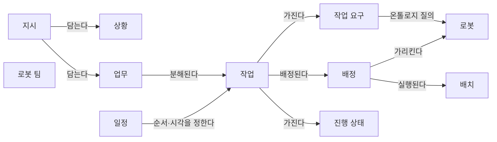

[홈](../../index.md) › 중점 연구 트랙 › [자연어 업무 지시 챗봇](index.md) › 업무 분해·배정 설계 초안

# 업무 분해·배정 설계 초안 (v0.3)

<!-- auto:page-status:start -->
> 초안 버전: v0.3 · 페이지 상태: published · 신뢰도: low · 페이지 버전: 4 · 마지막 갱신: 2026-09-25 · 마지막 실행: 2026-09-25
<!-- auto:page-status:end -->

## 1. 목적과 범위

이 페이지는 중점 연구 트랙 [자연어 업무 지시 챗봇](index.md)의 살아있는 산출물이다. 사용자가 채팅으로 준 지시가 어떤 단위로 파악·분해되고, 어떤 작업 요구를 거쳐 로봇에 배정·배치되며, 진행과 일정이 어떻게 관리되는지를 하나의 작업 모델로 표현하는 것이 목적이다. 이 작업 모델은 챗봇(LLM)이 내놓는 해석 결과의 형식이자, 온톨로지 질의와 최적화 엔진이 받는 입력의 형식이 된다. [가정]

v0은 확장 아이디어 2의 정의 문구(아래 인용)에 나오는 요소만으로 시드했다. 개념과 관계의 정의 문장은 구축자가 그 문구에서 도출한 것이므로 모두 "아이디어 정의 기반 [가정]"으로 표기했다. 출처 finding이 없는 개념·관계는 더 넣지 않는다. 이후 트랙 실행에서 리서치 에이전트가 근거 finding id와 함께 변경을 제안하고, 내용 검증 에이전트가 승인한 변경만 스토리텔러 에이전트가 반영하며 그때 초안 버전을 올린다. v0.1(실행 2026-09-25-04)에서는 검증이 승인한 개념 1개(로봇 팀)를 더했고, 승인되지 않은 제안 3건은 6절의 질문으로 두었다. v0.2(실행 2026-09-25-21)에서는 검증이 승인한 배정 개념의 수정(속성 '배정 산출 방식' 추가, 상태 초안 → 확정)을 반영했고, 같은 제안 가운데 값 후보 '규칙'은 근거 finding이 없어 6절의 질문으로 두었다. v0.3(실행 2026-09-25-30)에서는 검증이 승인한 상황 개념의 수정(속성 '값 출처' 추가, 상태 초안 → 확정)을 반영했고, 상황의 시간 조건에 모호한 시간 표현을 담는 제안은 일정 개념과 겹쳐 6절의 질문으로 두었다.

> 사용자가 채팅으로 상황과 처리할 일을 입력하면 AI가 업무를 파악·분해하고, 온톨로지로 적합한 로봇을 찾아 배정·배치한 뒤 작업 진행과 스케줄링을 자동으로 관리

초안 버전(프런트매터 `ontology_version`)은 페이지 버전(`version`)과 별개다. 키 이름은 첫 트랙의 온톨로지 초안과 같게 두어 파이프라인이 같은 방식으로 버전을 대조한다. [가정] 이 초안과 다른 아이디어의 공통 데이터 모델(공간 노드, 공용 자원, 로봇 능력, 작업)의 관계는 [확장 아이디어 연결 구조](../../ideas/index.md)에 있다.

## 2. 개념 목록 표

| 개념 | 정의 | 주요 속성 | 근거 출처 | 상태 |
|---|---|---|---|---|
| 지시(Instruction) | 사용자가 채팅으로 입력한 메시지 하나 또는 한 대화의 묶음. 상황과 처리할 일을 담는다. 아이디어 정의 기반 [가정] | 원문 메시지, 입력자, 입력 시각, 대화 id | 확장 아이디어 2의 정의 문구 | 초안 |
| 상황(Situation) | 지시가 전제하는 현장 조건. 장소·대상·시간 조건 같은 맥락이다. 아이디어 정의 기반 [가정] 상황의 값은 얻는 경로가 다를 수 있다. 작업 지향 대화 시스템은 발화에서 인자 값을 뽑는 슬롯 채우기(slot filling)를 쓰고 [사실][^ref-357] Rasa 폼은 비어 있는 필수 슬롯을 사용자에게 묻는다. [사실][^ref-356] LMCR은 빠진 정보를 주변 관찰 객체와 언어 모델의 상식 추론으로 채운다. [사실][^ref-358] CLARA는 모호한 명령에 질문을 만들어 사용자와 대화하고, KnowNo는 불확실할 때 사람에게 도움을 요청한다. [사실][^ref-352][^ref-350] | 장소 표현, 대상 표현, 시간 조건(단계 2에서 확정), 값 출처(값 후보: 지시 원문에서 추출 / 환경·상식으로 추론 / 사용자 되묻기 응답) | 확장 아이디어 2의 정의 문구; 값 출처: finding f1·f2 (실행 2026-09-25-30)[^ref-357][^ref-356], finding f6 (실행 2026-09-25-30)[^ref-358], finding f2·f7·f8 (실행 2026-09-25-30)[^ref-356][^ref-352][^ref-350] | 확정 |
| 업무(Job) | 지시에서 파악한 처리할 일. 하나 이상의 작업으로 분해된다. 아이디어 정의 기반 [가정] | 목표, 기한, 우선순위, 완료 조건(단계 2에서 확정) | 확장 아이디어 2의 정의 문구 | 초안 |
| 작업(Task) | 업무를 분해한 실행 단위. 한 로봇(또는 로봇 팀)에 배정되는 크기다. 아이디어 정의 기반 [가정] | 작업 종류, 장소, 선후관계, 진행 상태 | 확장 아이디어 2의 정의 문구 | 초안 |
| 작업 요구(Task Requirement) | 작업이 요구하는 능력과 제약. 온톨로지 질의의 입력이며 [능력 온톨로지 초안](../manual-capability-ontology/ontology-draft.md)의 작업 요구와 같은 개념으로 본다. 아이디어 정의 기반 [가정] | 필요 능력, 제약(적재량·층·통과 조건) | 확장 아이디어 2의 정의 문구 | 초안 |
| 로봇(Robot) | 배정 대상. 능력과 제약은 로봇 기능 온톨로지에서 가져온다. 아이디어 정의 기반 [가정] | 식별자, 능력(온톨로지 참조), 현재 상태(8. 실시간 세계 상태·데이터 일관성에서 확인) | 확장 아이디어 2의 정의 문구 | 초안 |
| 로봇 팀(Coalition) | 하나의 작업을 함께 맡도록 구성된 로봇 묶음. 배정의 대상은 로봇 또는 로봇 팀일 수 있다. SMART-LLM은 작업 분해 뒤 팀 구성(coalition formation)과 작업 할당을 차례로 수행한다. [사실][^ref-089][^ref-090] | 구성 로봇, 맡은 작업 | finding f9 (실행 2026-09-25-04)[^ref-089] | 확정 |
| 배정(Assignment) | 작업과 로봇의 짝. 온톨로지 질의 결과(수행 가능한 로봇 후보) 가운데에서 고른다. 아이디어 정의 기반 [가정] 배정을 무엇이 산출하는지는 연구마다 다르다. COHERENT는 중앙 배정자 LLM이 하위 작업을 로봇에 배정한다. [사실][^ref-169] LiP-LLM은 선형계획, PIP-LLM은 정수계획, FLEET은 makespan(모든 작업이 끝나는 데 걸리는 전체 시간) 최소화 문제, Peng 외는 혼합 정수 계획(Mixed Integer Linear Programming, MILP) 모델로 배정·일정을 푼다. [사실][^ref-166][^ref-181][^ref-242][^ref-167] | 작업, 로봇, 선택 근거, 배정 산출 방식(값 후보: LLM 직접 추론 / 최적화 해법(선형계획·정수계획·MILP·makespan 최소화)), 확인 여부 | 확장 아이디어 2의 정의 문구; 배정 산출 방식: finding f9 (실행 2026-09-25-21)[^ref-169], finding f3·f5·f7·f8 (실행 2026-09-25-21)[^ref-166][^ref-167][^ref-181][^ref-242] | 확정 |
| 배치(Dispatch) | 배정된 로봇에게 작업을 실제로 내보내는 실행 지시. 아이디어 정의 기반 [가정] | 명령, 보낸 시각, 실행 상태 | 확장 아이디어 2의 정의 문구 | 초안 |
| 일정(Schedule) | 작업들의 순서와 시각. 새 지시·지시 변경·예외에 따라 다시 계산된다. 아이디어 정의 기반 [가정] | 작업 순서, 시작·종료 예정 시각, 갱신 이유 | 확장 아이디어 2의 정의 문구 | 초안 |
| 진행 상태(Progress) | 작업이 접수·실행·완료·취소 가운데 어디에 있는지와 지연 여부. 아이디어 정의 기반 [가정] | 상태 값, 갱신 시각, 지연 사유 | 확장 아이디어 2의 정의 문구 | 초안 |

개념은 번호나 코드로 부르지 않고 이름으로 부른다. 상태 값은 초안(시드) / 제안(검증 승인 전) / 확정(검증 승인) / 폐기(이유 병기)이며, 폐기한 개념은 표에서 지우지 않고 상태만 바꾼다. 속성의 "(단계 n에서 확정)"은 그 단계의 조사 결과로 정한다는 뜻이다. 배정 산출 방식은 기존 속성 '선택 근거'(왜 그 로봇인가)와 합치지 않은 별도 속성(무엇이 배정을 계산했는가)이다. 상황의 값 출처는 장소 표현·대상 표현·시간 조건 같은 각 값을 어떤 경로로 얻었는지를 적는 속성이다.

## 3. 관계 목록 표

| 주어 | 관계 | 목적어 | 근거 |
|---|---|---|---|
| 지시 | 상황과 업무를 담는다 | 상황, 업무 | 확장 아이디어 2의 정의 문구 — 아이디어 정의 기반 [가정] |
| 업무 | 작업으로 분해된다 | 작업 | 확장 아이디어 2의 정의 문구 — 아이디어 정의 기반 [가정] |
| 작업 | 작업 요구를 가진다 | 작업 요구 | 확장 아이디어 2의 정의 문구 — 아이디어 정의 기반 [가정] |
| 작업 요구 | 온톨로지 질의로 후보 로봇을 찾는다 | 로봇 | 확장 아이디어 2의 정의 문구 — 아이디어 정의 기반 [가정] |
| 작업 | 배정된다 | 배정 | 확장 아이디어 2의 정의 문구 — 아이디어 정의 기반 [가정] |
| 배정 | 로봇을 가리킨다 | 로봇 | 확장 아이디어 2의 정의 문구 — 아이디어 정의 기반 [가정] |
| 배정 | 배치로 실행된다 | 배치 | 확장 아이디어 2의 정의 문구 — 아이디어 정의 기반 [가정] |
| 일정 | 작업의 순서와 시각을 정한다 | 작업 | 확장 아이디어 2의 정의 문구 — 아이디어 정의 기반 [가정] |
| 작업 | 진행 상태를 가진다 | 진행 상태 | 확장 아이디어 2의 정의 문구 — 아이디어 정의 기반 [가정] |

관계의 방향은 주어에서 목적어로 읽는다. 카디널리티는 정하지 않았으며 6절의 미해결 질문으로 둔다. 로봇 팀과 다른 개념 사이의 관계(배정이 로봇 팀을 가리키는지 등)는 아직 검증된 근거가 없어 넣지 않았다.

## 4. 다이어그램

도식은 2절의 개념과 3절의 관계만 그렸다. 로봇 팀은 관계가 아직 정해지지 않아 따로 두었다. 배정 산출 방식과 상황의 값 출처는 각 개념의 속성이므로 도식에 별도 노드로 그리지 않았다.

## 5. 적용 예시

아직 없음. 단계 3(구현 가설 설계) 이후 공개 자료로 확인할 수 있는 사례 하나에 이 초안을 적용한 인스턴스 예를 둔다. 제품·제조사 자료에서 가져온 값은 `[추정]`에 "벤더 주장"을 병기한다.

## 6. 미해결 모델링 질문

v0을 아이디어 정의에서 도출하는 과정과 이후 트랙 실행에서 생긴 질문이다. 관련 id는 [질문 백로그](question-backlog.md)의 질문이다.

- 작업의 단위 크기를 어디서 끊는가. 업무 하나가 작업 몇 개로 나뉘어야 배정(13. 작업 배정 — MRTA)과 스케줄링(14. 작업 순서·스케줄링)에 모두 쓰이는지 정해지지 않았다. — 관련: q1-01, q3-02 [가정] 단계 1 조사에서는 기존 분해 연구가 기술·허용 동작 순서, 프로그램 코드, 형식 명세, 실행 구조 그래프 등 서로 다른 크기의 단위를 쓰며, 조사한 일곱 LLM 기반 접근에서는 실행 단위를 사람이 미리 정해 둔다는 정리가 나왔다(이 위키의 정리, [단계 1 조사 결과](stage-1-prior-work-and-products.md#q1-01)). [추정][^ref-093][^ref-054][^ref-089]
- 상황의 항목(장소·대상·긴급도·기한)과, 그 가운데 무엇을 지시에서 읽고 무엇을 업무 시스템·공간 그래프·온톨로지에서 가져오는지 정해지지 않았다. — 관련: q1-04, q2-01, q3-07 [가정] 실행 2026-09-25-30에서 상황에 속성 '값 출처'를 두었다(v0.3). 상황 속성을 필수 슬롯으로 두면 값마다 지시 원문에서 읽었는지, 환경·상식으로 추론했는지, 사용자에게 되물어 얻었는지를 구분해 기록할 수 있고, 추론으로 채운 값(LMCR 방식)은 Wang 외가 지적한 빠진 인자 지어내기와 구분되지 않아 확인 대상으로 표시해야 할 것으로 보인다. 이는 설계 추론이라 속성 정의에는 넣지 않았다([단계 1 조사 결과](stage-1-prior-work-and-products.md#q1-04)). [추정][^ref-356][^ref-358][^ref-359]
- 모호한 시간 표현(예: 몇 분 뒤)을 상황의 시간 조건과 일정 개념 가운데 어디에 만족도 함수(허용 창)로 둘 것인가. Sucker 외(IEEE IRC 2024)는 모호한 시간 요구를 시작 시각별 사용자 만족도를 나타내는 만족도 함수를 가진 퍼지 스킬(fuzzy skill)로 표현했다. [사실][^ref-361] 일정 개념의 속성과 겹치고 일정 계산 주체(q3-01)가 정해지지 않았으며 근거가 원문 미열람 단일 출처라 실행 2026-09-25-30 검증에서 반영하지 않았다. — 관련: q3-01, q2-01
- 일정을 누가 계산하는가. 스케줄링 결정을 LLM과 최적화 엔진 가운데 어디에 맡기는지에 따라 일정 개념의 속성이 달라진다. — 관련: q3-01 [가정]
- 배정 산출 방식에 '규칙'(사람이 정한 배정 규칙) 값을 둘 것인가. 실행 2026-09-25-21 검증은 이 값을 뒷받침하는 finding이 없어 넣지 않았다. — 관련: q3-01, q3-05
- 사용자 확인(승인)을 별도 개념으로 둘지, 배정의 속성(확인 여부)으로 둘지 정해지지 않았다. 확인 절차의 설계(단계 4)에 따른다. — 관련: q4-01, q4-04 [가정]
- 진행 중인 작업에 지시 변경(취소·우선순위 변경)이 들어올 때 지시·업무·작업 사이의 이력을 어떻게 남기는지 정해지지 않았다. — 관련: q3-04 [가정]
- 허용 동작 목록(Admissible Action Set)을 개념으로 둘 것인가. Huang 외, SayCan, ProgPrompt, Code as Policies, LLM+P, Lang2LTL, SMART-LLM 일곱 접근은 사람이 미리 정한 허용 동작·가용 동작·기술 목록 안에서 분해하는 것으로 보인다(이 위키의 정리). [추정][^ref-093][^ref-054][^ref-089] 이 목록이 매뉴얼 기반 로봇 기능 온톨로지의 기능, 공통 데이터 모델의 로봇 능력과 같은 대상일 수 있어 표에 넣지 않았다(실행 2026-09-25-04 검증 미승인). — 관련: q1-01, q2-01
- 형식 작업 명세(Formal Task Specification)를 업무와 작업 사이에 둘 것인가. LLM+P는 자연어 문제를 [계획 도메인 정의 언어(Planning Domain Definition Language, PDDL)](../../glossary/pddl.md) 문제 파일로 바꿔 고전 계획기에 넘기고, Lang2LTL은 명령을 선형 시간 논리(Linear Temporal Logic, LTL) 식으로 옮긴다. [사실][^ref-091][^ref-055] 이 중간 표현의 배치 위치는 단계 3에서 판단한다(실행 2026-09-25-04 검증 미승인). — 관련: q3-02
- 작업 사이 선행 의존을 관계(작업 / 선행 의존한다 / 작업)로 드러낼 것인가. DART-LLM은 하위 작업 사이 의존을 방향 비순환 그래프로 표현한다. [사실][^ref-059] v0 작업 속성 '선후관계'와 중복되므로 둘 중 하나로 정리해야 한다(실행 2026-09-25-04 검증 미승인). — 관련: q3-02

## 7. 버전 이력

아래 표는 퍼블리셔가 원천 데이터 `data/tracks/nl-task-chatbot/task_model_versions.json`에서 만든다. [가정]

<!-- auto:ontology-version-history:start -->
| 버전 | 날짜 | 변경 내용 | 근거 실행 id |
|---|---|---|---|
| 0 | 2026-09-25 | v0 시드: 확장 아이디어 2의 정의 문구에서 도출한 개념 10개·관계 9개(아이디어 정의 기반 [가정]) | build-2026-09-25 |
| 0.1 | 2026-09-25 | v0 → v0.1: 개념 '로봇 팀 (Coalition)' 추가(f9, 실행 2026-09-25-04). 거부 3건(허용 동작 목록, 형식 작업 명세, 작업 | 2026-09-25-04 |
| 0.2 | 2026-09-25 | v0.1 → v0.2: 개념 '배정 (Assignment)'에 속성 '배정 산출 방식'(값 후보 LLM 직접 추론 f9 | 2026-09-25-21 |
| 0.3 | 2026-09-25 | v0.2 → v0.3: 개념 '상황 (Situation)'에 속성 '값 출처'(지시 원문에서 추출 f1·f2 | 2026-09-25-30 |
<!-- auto:ontology-version-history:end -->

[^ref-054]: Singh, I. 외, ProgPrompt: Generating Situated Robot Task Plans using Large Language Models, 2022-09, https://arxiv.org/abs/2209.11302, 접근일 2026-09-25 (원문 미열람)
[^ref-055]: Brown University H2R Lab, Lang2LTL — Code for paper Lang2LTL: Grounding Complex Natural Language Commands for Temporal Tasks in Unseen Environments (GitHub README), 미확인, https://github.com/h2r/Lang2LTL, 접근일 2026-09-25
[^ref-059]: Wang, Y. 외(DART-LLM 저자), DART-LLM: Dependency-Aware Multi-Robot Task Decomposition and Execution using Large Language Models, 2024-11, https://arxiv.org/abs/2411.09022, 접근일 2026-09-25 (원문 미열람)
[^ref-089]: SMARTlab-Purdue (Purdue University), SMART-LLM: Smart Multi-Agent Robot Task Planning using Large Language Models (GitHub README), 미확인, https://github.com/SMARTlab-Purdue/SMART-LLM, 접근일 2026-09-25 (원문 미열람)
[^ref-090]: Kannan, S. S., Venkatesh, V. L. N., & Min, B.-C., SMART-LLM: Smart Multi-Agent Robot Task Planning using Large Language Models, 2023-09, https://arxiv.org/abs/2309.10062, 접근일 2026-09-25 (원문 미열람)
[^ref-091]: Cranial-XIX (LLM+P 저자), llm-pddl — LLM+P: Empowering Large Language Models with Optimal Planning Proficiency (GitHub README), 미확인, https://github.com/Cranial-XIX/llm-pddl, 접근일 2026-09-25 (원문 미열람)
[^ref-093]: Huang, W., Abbeel, P., Pathak, D., & Mordatch, I., Language Models as Zero-Shot Planners: Extracting Actionable Knowledge for Embodied Agents, 2022-07, https://proceedings.mlr.press/v162/huang22a.html, 접근일 2026-09-25 (원문 미열람)
[^ref-166]: Obata, K., Aoki, T., Horii, T., Taniguchi, T., & Nagai, T., LiP-LLM: Integrating Linear Programming and dependency graph with Large Language Models for multi-robot task planning, 2024-10, https://arxiv.org/abs/2410.21040, 접근일 2026-09-25 (원문 미열람)
[^ref-167]: Peng, M., Chen, Z., Yang, J., Huang, J., Shi, Z., Liu, Q., Li, X., & Gao, L., Automatic MILP Model Construction for Multi-Robot Task Allocation and Scheduling Based on Large Language Models, 2025-03, https://arxiv.org/abs/2503.13813, 접근일 2026-09-25 (원문 미열람)
[^ref-169]: SHAILAB-IPEC (COHERENT 저자), COHERENT: Collaboration of Heterogeneous Multi-Robot System with Large Language Models (GitHub README), 미확인, https://github.com/SHAILAB-IPEC/COHERENT, 접근일 2026-09-25
[^ref-181]: Shi, G., Wu, Y., Kumar, V., & Sukhatme, G. S., PIP-LLM: Integrating PDDL-Integer Programming with LLMs for Coordinating Multi-Robot Teams Using Natural Language, 2025-10, https://arxiv.org/abs/2510.22784, 접근일 2026-09-25 (원문 미열람)
[^ref-242]: Rivera, C., Byrd, G., Booker, M., Kemp, B., Gaines, A., Holmes, E., Uplinger, J., de Melo, C. M., & Handelman, D.(JHU APL·JHU·DEVCOM ARL), FLEET: Formal Language-Grounded Scheduling for Heterogeneous Robot Teams, 2025-10, https://arxiv.org/abs/2510.07417, 접근일 2026-09-25 (원문 미열람)
[^ref-350]: Ren, A. Z. 외(Google DeepMind·Princeton University, KnowNo 프로젝트), Robots That Ask For Help: Uncertainty Alignment for Large Language Model Planners — project page (robot-help.github.io), 미확인, https://robot-help.github.io/, 접근일 2026-09-25
[^ref-352]: Park, J. 외(고려대학교·연세대학교·Google Research, CLARA 프로젝트), CLARA: Classifying and Disambiguating User Commands for Reliable Interactive Robotic Agents — project page (clararobot.github.io), 미확인, https://clararobot.github.io/, 접근일 2026-09-25
[^ref-356]: Rasa Technologies (RasaHQ/rasa GitHub), Forms — Rasa documentation (docs/docs/forms.mdx), 미확인, https://github.com/RasaHQ/rasa/blob/main/docs/docs/forms.mdx, 접근일 2026-09-25
[^ref-357]: Weld, H., Huang, X., Long, S., Poon, J., & Han, S. C., A Survey of Joint Intent Detection and Slot Filling Models in Natural Language Understanding, 2022-12, https://dl.acm.org/doi/10.1145/3547138, 접근일 2026-09-25 (원문 미열람)
[^ref-358]: Chen, H. 외, Enabling Robots to Understand Incomplete Natural Language Instructions Using Commonsense Reasoning, 2019-04, https://arxiv.org/abs/1904.12907, 접근일 2026-09-25 (원문 미열람)
[^ref-359]: Wang, W. 외, Learning to Ask: When LLM Agents Meet Unclear Instruction, 2024-09, https://arxiv.org/abs/2409.00557, 접근일 2026-09-25 (원문 미열람)
[^ref-361]: Sucker, S., Neubauer, M., & Henrich, D., Robot Tasks with Fuzzy Time Requirements from Natural Language Instructions, 2024-11, https://arxiv.org/abs/2411.09436, 접근일 2026-09-25 (원문 미열람)
