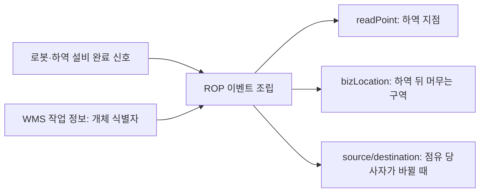

(너의 규칙은 시스템 프롬프트의 agents/shared-rules.md 와 agents/verifier.md 이다. 아래는 이번 실행의 컨텍스트와 입력이다.)

## 실행 컨텍스트

- run_id: 2026-09-25-03
- date: 2026-09-25
- run_type: topic (주제 조사)
- 대상: 7. 화물·재고·자산 식별과 추적 (B. 공통 정보·환경 모델)
- 예산:
    - max_search_queries: 30
    - max_sources_per_run: 15
    - new_topic_pages: 1
    - page_updates: 2
    - max_retries: 2
- 환경 알림: web_fetch_available: false · fetch_mode: mirror_only (일반 웹 페이지 열람은 네트워크 정책으로 막혀 있다. raw.githubusercontent.com 은 열린다: 공식 문서가 GitHub 에 있는 출처는 입력의 config/source_mirrors.yaml 경로를 WebFetch 로 열어 원문을 읽고 sources[].fetched=true, fetched_via=github_raw, fetch_url 을 적는다. 입력에 원문 텍스트(data/source_texts)가 있는 출처는 fetched_via=inbox. 그 밖의 출처는 fetched=false 이며 코드가 신뢰도 상한(medium)을 강제한다 — 공통 규칙 0절 6항)
- 언어: ko
- verification_stage: second
- verifier_budget:
    - max_search_queries: 30
    - max_sources_per_run: 15
    - new_topic_pages: 1
    - page_updates: 2
    - max_retries: 2
- retry_count: 1
- max_retries: 2

## 입력

### runs/2026-09-25-03/target.json

```json
{
  "run_id": "2026-09-25-03",
  "date": "2026-09-25",
  "weekday": "Fri",
  "run_number": 3,
  "run_type": "topic",
  "forced": true,
  "target": {
    "area_no": 7,
    "area_name": "7. 화물·재고·자산 식별과 추적",
    "category": "B. 공통 정보·환경 모델",
    "category_letter": "B"
  },
  "topic": null,
  "track": null,
  "corrections": [],
  "budget": {
    "max_search_queries": 30,
    "max_sources_per_run": 15,
    "new_topic_pages": 1,
    "page_updates": 2,
    "max_retries": 2
  },
  "priority_reason": null,
  "priority_questions": [],
  "excluded_areas": [],
  "lifted_areas": [],
  "deferred": {
    "monthly_recheck": false,
    "weekly_review": false
  },
  "selection_rationale": "CLI 지정 run_type=topic, area=7"
}
```

### runs/2026-09-25-03/research.json

```json
{
  "run_id": "2026-09-25-03",
  "date": "2026-09-25",
  "run_type": "topic",
  "target": {
    "area_no": 7,
    "area_name": "7. 화물·재고·자산 식별과 추적",
    "category": "B. 공통 정보·환경 모델"
  },
  "gaps": [
    "주제 미지정(target.json topic null): 7. 화물·재고·자산 식별과 추적 11절 열린 질문 oq-001(로봇 완료 신호 → EPCIS 인계 이벤트 매핑)을 주제로 선정",
    "섹션 6. 대표 접근법과 기술 — 이벤트 기반 추적 소제목이 bizStep 대응 추정 1문장뿐이고 readPoint·bizLocation·source/destination 을 로봇 작업에 쓰는 방법이 비어 있음",
    "섹션 7. 관련 표준·프레임워크·오픈소스 — 모든 행이 원문 미열람, 국내 오픈소스 구현 없음",
    "섹션 5. 현장 시나리오 — 완료·인계 행이 표준 매핑 미확인 추정에 기댐",
    "oq-002 국내 사례 자료 부족"
  ],
  "research_questions": [
    "로봇은 도착했는데 실제로 어떤 팔레트가 인계됐는가? [분류원문]",
    "oq-001 로봇의 적재·하역 완료 신호(VDA 5050 drop 동작 완료, Open-RMF IngestorResult)를 EPCIS 인계 이벤트로 옮기는 표준 매핑이나 공개 구현 사례가 있는가? (주제 페이지 전체 겨냥)",
    "CBV 2.0 의 업무 단계(bizStep)·처분 상태(disposition)·source/destination 유형 가운데 로봇 적재·운반·하역에 대응할 수 있는 값은 무엇이며 정의상 한계는 무엇인가? (섹션 6 겨냥)",
    "EPCIS 2.0 의 readPoint·bizLocation·parentID·sourceList/destinationList 는 로봇 인계의 '어디서·어디로·누구에게'를 어떻게 나눠 담는가? (섹션 5·6 겨냥)",
    "VDA 5050 2.0·3.0 과 Open-RMF 워크셀 메시지는 화물을 개체 단위(SSCC 등)로 식별하는가, 유형·수량 단위로만 다루는가? (섹션 5·9 겨냥)",
    "oq-002 국내에서 EPCIS 2.0 을 구현·운영할 수 있는 공개 구현이나 로봇 작업 결과와 연결한 사례가 있는가? (섹션 7·8 겨냥)"
  ],
  "findings": [
    {
      "id": "f1",
      "claim": "CBV 2.0 온톨로지는 업무 단계 loading 을 '운송 수단에 싣는 것', unloading 을 '운송 수단에서 내리는 것', departing 을 '목적지로 가기 위해 위치를 떠나는 것', arriving 을 '위치에 도착하는 것'으로 정의한다.",
      "tag": "사실",
      "source_ids": [
        "ref-044"
      ],
      "cross_checked": false,
      "confidence": "medium",
      "evidence_excerpt": "CBV.ttl(버전 2.0, 수정 2021-09-30): loading = \"Object is loaded into shipping conveyance.\" unloading 은 shipping conveyance 에서 내림. departing·arriving 은 위치 출발·도착.",
      "as_of": "2021-09-30",
      "flow_step": "출하",
      "flow_item": "시작 조건"
    },
    {
      "id": "f2",
      "claim": "CBV 2.0 에서 shipping(출하)은 staging_outbound(출하 대기 구역 이동)·loading·departing 을 합친 전체 과정을 가리키며, receiving 은 위치에 도착한 객체를 받아 수령자의 재고에 더하는 단계, accepting 은 점유 또는 소유가 바뀌는 단계, storing 은 위치 안에서 보관 구역으로 넣고 빼는 단계로 정의된다.",
      "tag": "사실",
      "source_ids": [
        "ref-044"
      ],
      "cross_checked": false,
      "confidence": "medium",
      "evidence_excerpt": "CBV.ttl: shipping 은 staging_outbound, loading, departing 을 결합한 과정. staging_outbound 는 시설에서 운송 픽업 대기 구역으로 이동. accepting 은 possession 및/또는 ownership 변경.",
      "as_of": "2021-09-30",
      "flow_step": "출하",
      "flow_item": "완료·인계"
    },
    {
      "id": "f3",
      "claim": "CBV 2.0 의 source/destination 유형 세 가지는 location(업무 이전 끝점의 물리적 위치), owning_party(끝점에서 객체를 소유한 당사자), possessing_party(끝점에서 물리적으로 점유한 당사자)로 정의된다.",
      "tag": "사실",
      "source_ids": [
        "ref-044",
        "ref-015"
      ],
      "cross_checked": false,
      "confidence": "medium",
      "evidence_excerpt": "CBV.ttl 정의 확인(원문 연 출처). 구현 가이드라인(ref-015, 원문 미열람)도 같은 세 유형을 안내하나 둘 다 GS1 발행이라 독립 교차 아님. (재인용: 2026-09-25-01)",
      "as_of": "2021-09-30",
      "flow_step": "출하",
      "flow_item": "완료·인계",
      "source_unopened": false
    },
    {
      "id": "f4",
      "claim": "CBV 2.0 의 처분 상태(disposition) 값에는 두 거래 당사자 사이에 운송 중인 in_transit, 공급망 지점을 지나 진행 중인 선택 값 in_progress, 컨테이너에 실리고 문이 닫혀 봉인된 container_closed 가 있다.",
      "tag": "사실",
      "source_ids": [
        "ref-044"
      ],
      "cross_checked": false,
      "confidence": "medium",
      "evidence_excerpt": "CBV.ttl: in_transit = 두 거래 당사자 간 선적 중, in_progress = 선택적 disposition, container_closed = 적재 후 문 닫힘·봉인.",
      "as_of": "2021-09-30",
      "flow_step": "출하",
      "flow_item": "완료·인계"
    },
    {
      "id": "f5",
      "claim": "EPCIS 2.0 온톨로지에서 readPoint 는 이벤트가 일어난 지점이고, bizLocation 은 이후 다른 이벤트가 반박할 때까지 객체가 있다고 보는 업무 위치이며, 둘 다 선택 항목이다.",
      "tag": "사실",
      "source_ids": [
        "ref-045",
        "ref-015"
      ],
      "cross_checked": false,
      "confidence": "medium",
      "evidence_excerpt": "EPCIS.ttl: bizLocation = \"The business location where the objects ... may be found, until contradicted by a subsequent event.\" readPoint = 이벤트가 일어난 read point. 두 출처 모두 GS1.",
      "as_of": "2021-09-30",
      "flow_step": null,
      "flow_item": "완료·인계",
      "source_unopened": false
    },
    {
      "id": "f6",
      "claim": "GS1 EPCIS·CBV 구현 가이드라인은 객체가 문 A를 지나 방 1에서 방 2로 옮겨 가면 readPoint 는 문 A, bizLocation 은 방 2가 된다고 설명하고, 출하(shipping) 이벤트에서는 수령 이벤트 전까지 업무 위치를 알 수 없으므로 bizLocation 을 생략한다고 안내한다.",
      "tag": "사실",
      "source_ids": [
        "ref-015"
      ],
      "cross_checked": false,
      "confidence": "medium",
      "evidence_excerpt": "검색 요약: ReadPoint 는 이벤트 시점의 위치, BusinessLocation 은 이후 위치. 방·문 비유와 Shipping 이벤트의 bizLocation 생략 안내. 원문 미열람 (발행일 미확인, 확인일 기준)",
      "as_of": "2026-09-25",
      "flow_step": "출하",
      "flow_item": "완료·인계",
      "source_unopened": true
    },
    {
      "id": "f7",
      "claim": "EPCIS 2.0 온톨로지에서 AggregationEvent 는 '담는' 개체 안의 '담긴' 객체를 다루고, parentID 는 action 이 OBSERVE 일 때만 선택이며 ADD·DELETE 에서는 필수이고, AssociationEvent 는 물리 객체를 상위 객체나 특정 물리 위치와 연결·해제하는 이벤트다.",
      "tag": "사실",
      "source_ids": [
        "ref-045"
      ],
      "cross_checked": false,
      "confidence": "medium",
      "evidence_excerpt": "EPCIS.ttl: parentID \"(Optional when action is OBSERVE, required otherwise)\". AssociationEvent = association or disassociation of physical objects with a parent object or specific physical location.",
      "as_of": "2021-09-30",
      "flow_step": null,
      "flow_item": "작업 대상"
    },
    {
      "id": "f8",
      "claim": "EPCIS 2.0 온톨로지에서 sourceList·destinationList 는 업무 이전(business transfer)의 출발·도착 끝점 맥락을 주는 선택 목록이며, bizTransaction 은 구매주문·출하통지(Despatch Advice) 같은 업무 거래 문서를 가리킨다.",
      "tag": "사실",
      "source_ids": [
        "ref-045"
      ],
      "cross_checked": false,
      "confidence": "medium",
      "evidence_excerpt": "EPCIS.ttl: sourceList = originating endpoint of a business transfer 맥락, destinationList = terminating endpoint. bizTransaction 예: Purchase Order, Despatch Advice.",
      "as_of": "2021-09-30",
      "flow_step": "출하",
      "flow_item": "완료·인계"
    },
    {
      "id": "f9",
      "claim": "GS1 EPCIS 2.0 JSON 스키마의 이벤트 공통 필수 항목은 eventTime, eventTimeZoneOffset, action 이며 readPoint·bizLocation·sourceList·destinationList·sensorElementList 등은 이벤트 유형별 하위 스키마가 정한다.",
      "tag": "사실",
      "source_ids": [
        "ref-046"
      ],
      "cross_checked": false,
      "confidence": "medium",
      "evidence_excerpt": "EPCIS-JSON-Schema-root.json 확인: 필수로 명시된 것은 eventTime, eventTimeZoneOffset, action. 나머지 필드의 필수 여부는 참조 하위 스키마(미열람)에 있음. (발행일 미확인, 확인일 기준)",
      "as_of": "2026-09-25",
      "flow_step": null,
      "flow_item": null
    },
    {
      "id": "f10",
      "claim": "VDA 5050 2.0.0(공식 저장소 2.0.0 태그)의 상태 메시지 loads 는 적재 상태를 판단할 수 없는 차량이면 생략하는 선택 배열이고, loadId 는 바코드·RFID 같은 적재물의 고유 식별 번호이며 식별할 수 있으나 아직 식별하지 않았으면 빈 값이다.",
      "tag": "사실",
      "source_ids": [
        "ref-022"
      ],
      "cross_checked": false,
      "confidence": "medium",
      "evidence_excerpt": "2.0.0 태그 원문: loadId \"Unique identification number of the load (e.g. barcode or RFID). Empty field if the AGV can identify the load but didn't identify the load yet.\" 머리말에 RELEASE CANDIDATE 문구.",
      "as_of": "2022-01",
      "flow_step": null,
      "flow_item": "작업 대상",
      "source_unopened": true
    },
    {
      "id": "f11",
      "claim": "VDA 5050 2.0.0과 3.0.0 모두 pick 동작의 FINISHED 는 적재물이 차량에 들어오고 새 적재 상태를 보고한 때, drop 동작의 FINISHED 는 적재물이 차량을 떠나고 새 적재 상태를 보고한 때로 정하며, 두 동작은 선택 파라미터로 loadType·loadId·stationType 등을 받는다.",
      "tag": "사실",
      "source_ids": [
        "ref-022",
        "ref-031"
      ],
      "cross_checked": false,
      "confidence": "medium",
      "evidence_excerpt": "2.0.0: drop \"Drop is done. Load has left the AGV and AGV reports new load state.\" 3.0.0 도 같은 뜻(AGV → mobile robot). 같은 발행 기관의 두 판이라 독립 교차 아님.",
      "as_of": "2022-01",
      "flow_step": null,
      "flow_item": "완료·인계"
    },
    {
      "id": "f12",
      "claim": "VDA 5050 3.0.0(공식 저장소 main)은 loadId 를 시스템 설계와 적재물 추적 능력에 따라 관제(fleet control) 또는 이동로봇이 정하는 고유 식별자로 설명하고, loads 가 비어 있으면 적재물 없음, 생략하면 적재 상태를 판단할 수 없음을 뜻한다.",
      "tag": "사실",
      "source_ids": [
        "ref-031"
      ],
      "cross_checked": false,
      "confidence": "medium",
      "evidence_excerpt": "3.0.0 원문(요약 도구 경유 인용): loadId \"Set by fleet control or mobile robot depending on system design and load tracking capabilities.\" 2.0.0의 '바코드·RFID 예시' 문구와 다름.",
      "as_of": "2026",
      "flow_step": null,
      "flow_item": "작업 대상"
    },
    {
      "id": "f13",
      "claim": "Open-RMF 의 DispenserRequest 메시지는 요청 id(request_guid)·대상 워크셀(target_guid)·운반체 유형과 품목 목록을 담고, 품목(DispenserRequestItem)은 개체 식별자가 아니라 유형 id(type_guid)·수량(quantity)·구획 이름(compartment_name)으로만 기술된다.",
      "tag": "사실",
      "source_ids": [
        "ref-047",
        "ref-048"
      ],
      "cross_checked": false,
      "confidence": "medium",
      "evidence_excerpt": "DispenserRequestItem.msg: string type_guid / int32 quantity / string compartment_name. DispenserRequest.msg: time, request_guid, target_guid, transporter_type, items. (발행일 미확인, 확인일 기준)",
      "as_of": "2026-09-25",
      "flow_step": null,
      "flow_item": "작업 대상"
    },
    {
      "id": "f14",
      "claim": "Open-RMF 의 IngestorResult 메시지는 요청 id(request_guid)·결과를 보낸 워크셀 id(source_guid)·상태(ACKNOWLEDGED, SUCCESS, FAILED)를 담는다.",
      "tag": "사실",
      "source_ids": [
        "ref-049"
      ],
      "cross_checked": false,
      "confidence": "medium",
      "evidence_excerpt": "IngestorResult.msg: time, request_guid, source_guid, uint8 status (ACKNOWLEDGED=0, SUCCESS=1, FAILED=2). (발행일 미확인, 확인일 기준)",
      "as_of": "2026-09-25",
      "flow_step": null,
      "flow_item": "예외·성과"
    },
    {
      "id": "f15",
      "claim": "Open-RMF 의 배송 작업에서 로봇은 pickup_waypoint 로 가서 DispenserResult 를 받을 때까지 DispenserRequest 를 보내고, dropoff_waypoint 로 가서 IngestorResult 를 받을 때까지 IngestorRequest 를 보낸다.",
      "tag": "사실",
      "source_ids": [
        "ref-023"
      ],
      "cross_checked": false,
      "confidence": "medium",
      "evidence_excerpt": "원문: \"Requests a `IngestorRequest` till receives a `IngestorResult`. (Done Ingesting)\" 배송 작업 수락에는 perform_deliveries 가 true 여야 함. (발행일 미확인, 확인일 기준)",
      "as_of": "2026-09-25",
      "flow_step": null,
      "flow_item": "완료·인계"
    },
    {
      "id": "f16",
      "claim": "CBV 의 loading·unloading 은 운송 수단(shipping conveyance)에 싣고 내리는 것으로 정의되어 있어, 시설 안에서 로봇이 팔레트를 싣고 내리는 동작에 그대로 붙이면 의미가 어긋나며 시설 내 운반은 storing·staging_outbound 같은 단계나 readPoint·bizLocation 변화로 표현하는 편이 정의에 가까워 보인다.",
      "tag": "추정",
      "source_ids": [
        "ref-044",
        "ref-045"
      ],
      "cross_checked": false,
      "confidence": "low",
      "evidence_excerpt": "f1·f2·f5 정의에서 도출한 추론. CBV bizStep 전체 목록과 GS1 의 시설 내 운반 표현 권고는 확인하지 못함.",
      "as_of": "2026-09-25",
      "flow_step": "적치",
      "flow_item": "시작 조건"
    },
    {
      "id": "f17",
      "claim": "로봇 하역 완료(VDA 5050 drop FINISHED 또는 Open-RMF IngestorResult SUCCESS)를 EPCIS 이벤트로 옮길 때 하역 지점은 readPoint, 하역 뒤 화물이 머무는 구역은 bizLocation, 인계 당사자가 바뀌는 경우에만 possessing_party 를 담은 source/destination 목록으로 나눠 기록하는 구조가 표준 정의와 맞을 것으로 보인다.",
      "tag": "추정",
      "source_ids": [
        "ref-045",
        "ref-044",
        "ref-022",
        "ref-049"
      ],
      "cross_checked": false,
      "confidence": "low",
      "evidence_excerpt": "f3·f5·f8(EPCIS·CBV 정의)과 f11·f14(로봇·설비 완료 신호)를 대응시킨 추론. 이 대응을 규정한 표준·공개 구현은 찾지 못함.",
      "as_of": "2026-09-25",
      "flow_step": "출하",
      "flow_item": "완료·인계"
    },
    {
      "id": "f18",
      "claim": "Open-RMF 워크셀 요청·결과는 품목을 유형·수량으로만 다루므로, 개체 단위 식별자(SSCC 등)를 담은 EPCIS 이벤트를 만들려면 식별자를 WMS 작업 정보나 별도 판독 결과에서 가져와 요청 id 와 연결해야 할 것으로 보인다.",
      "tag": "추정",
      "source_ids": [
        "ref-048",
        "ref-049",
        "ref-023"
      ],
      "cross_checked": false,
      "confidence": "low",
      "evidence_excerpt": "f13·f14·f15에서 도출. Open-RMF 문서에서 개체 식별자 필드는 확인되지 않음.",
      "as_of": "2026-09-25",
      "flow_step": null,
      "flow_item": "작업 대상"
    },
    {
      "id": "f19",
      "claim": "VDA 5050 2.0 에서는 loadId 가 식별 전이면 빈 값이고 loads 는 생략될 수 있으므로, drop 완료만으로 개체 단위 인계 이벤트를 만들 수 없는 경우가 생기며 이때 이벤트 생성을 보류하거나 다른 식별 근거로 보완하는 규칙이 필요할 것으로 보인다.",
      "tag": "추정",
      "source_ids": [
        "ref-022"
      ],
      "cross_checked": false,
      "confidence": "low",
      "evidence_excerpt": "f10 에서 도출한 추론. 보류·재스캔·사람 확인의 기준은 oq-003 으로 남음.",
      "as_of": "2026-09-25",
      "flow_step": "출하",
      "flow_item": "예외·성과",
      "source_unopened": true
    },
    {
      "id": "f20",
      "claim": "VDA 5050 3.0.0 은 loadId 를 관제가 정할 수도 있다고 하므로, 관제 역할을 하는 ROP가 WMS 의 SSCC 를 loadId 로 내려보내 로봇 보고와 EPCIS 이벤트의 식별자를 맞추는 설계가 가능할 수 있으나, 규격이 그 값의 형식을 SSCC 로 정하지는 않는다.",
      "tag": "추정",
      "source_ids": [
        "ref-031"
      ],
      "cross_checked": false,
      "confidence": "low",
      "evidence_excerpt": "f12 문구에서 도출한 추론. 3.0.0 의 loadId 형식 제약은 확인하지 못함.",
      "as_of": "2026-09-25",
      "flow_step": null,
      "flow_item": "작업 대상"
    },
    {
      "id": "f21",
      "claim": "이번 검색 범위(한·영 7회)에서는 VDA 5050 이나 Open-RMF 의 적재·하역 완료를 EPCIS 이벤트로 옮기는 표준 매핑이나 공개 구현이 확인되지 않았다.",
      "tag": "추정",
      "source_ids": [
        "ref-031",
        "ref-045"
      ],
      "cross_checked": false,
      "confidence": "low",
      "evidence_excerpt": "두 규격의 원문에 상대 규격 참조가 없고, 검색 결과에도 매핑 문서가 나타나지 않음. 부재의 확인은 아님.",
      "as_of": "2026-09-25",
      "flow_step": null,
      "flow_item": null
    },
    {
      "id": "f22",
      "claim": "세종대학교 Auto-ID Labs Korea 는 2014년부터 GS1 EPCIS 오픈소스 구현 Oliot EPCIS 를 개발·유지하고 있으며, 2세대는 EPCIS/CBV 2.0 표준 개발 작업반(MSWG) 과정에 맞춰 새로 개발되었다.",
      "tag": "사실",
      "source_ids": [
        "ref-050"
      ],
      "cross_checked": false,
      "confidence": "medium",
      "evidence_excerpt": "README: \"Oliot EPCIS has been developed and maintained since 2014 and now initiates the second generation of the system.\" Java·Vert.X·MongoDB 기반, 개발 브랜치 2.2.0. (발행일 미확인, 확인일 기준)",
      "as_of": "2026-09-25",
      "flow_step": null,
      "flow_item": null
    }
  ],
  "sources": [
    {
      "id": "ref-015",
      "org": "GS1",
      "title": "EPCIS and CBV Implementation Guideline",
      "published": null,
      "url": "https://www.gs1.org/docs/epc/EPCIS_Guideline.pdf",
      "type": "표준",
      "reliability": "medium",
      "accessed": "2026-09-25",
      "summary": "원문 미열람. EPCIS·CBV 적용 방법을 설명하는 GS1 구현 가이드라인. source/destination 으로 소유·점유 이전 맥락을 표현하는 방법 포함.",
      "source_unopened": true,
      "fetched": false,
      "fetched_via": null,
      "fetch_url": null
    },
    {
      "id": "ref-022",
      "org": "VDA(Verband der Automobilindustrie)",
      "title": "VDA 5050 Version 2.0.0 — Interface for the communication between automated guided vehicles (AGV) and a master control",
      "published": "2022-01",
      "url": "https://www.vda.de/dam/jcr:f0c9c019-1506-4dee-998a-e92723fbf025/EN-VDA5050-V2_0_0.pdf",
      "type": "표준",
      "reliability": "medium",
      "accessed": "2026-09-25",
      "summary": "AGV·AMR 과 상위 관제 간 통신 권고안. order·state 메시지, pick/drop action, 적재물(loads) 보고 필드를 정의. 이번 실행은 공식 저장소 2.0.0 태그의 마크다운(머리말 RELEASE CANDIDATE 문구)을 읽었으며 VDA 게시 PDF 와 글자 단위 일치는 미확인.",
      "fetched": false,
      "fetched_via": null,
      "fetch_url": "https://raw.githubusercontent.com/VDA5050/VDA5050/2.0.0/VDA5050_EN_V1.md",
      "source_unopened": true
    },
    {
      "id": "ref-023",
      "org": "Open Robotics",
      "title": "Workcells - Programming Multiple Robots with ROS 2",
      "published": null,
      "url": "https://osrf.github.io/ros2multirobotbook/integration_workcells.html",
      "type": "오픈소스 문서",
      "reliability": "high",
      "accessed": "2026-09-25",
      "summary": "Open-RMF 의 적재(dispenser)·하역(ingestor) 워크셀 연동과 요청·결과 메시지 흐름을 설명하는 공식 문서.",
      "fetched": true,
      "fetched_via": "github_raw",
      "fetch_url": null,
      "source_unopened": false
    },
    {
      "id": "ref-031",
      "org": "VDA / VDMA (VDA5050 GitHub)",
      "title": "VDA5050/VDA5050_EN.md — Official Specification document for the VDA 5050",
      "published": null,
      "url": "https://github.com/VDA5050/VDA5050/blob/main/VDA5050_EN.md",
      "type": "표준",
      "reliability": "high",
      "accessed": "2026-09-25",
      "summary": "VDA 5050 공식 명세의 GitHub 저장소 본문(현재 main 은 3.0.0 판). 상태 메시지 load 필드, pick·drop 동작 정의를 확인했다.",
      "fetched": true,
      "fetched_via": "github_raw",
      "fetch_url": "https://raw.githubusercontent.com/VDA5050/VDA5050/main/VDA5050_EN.md",
      "source_unopened": false
    },
    {
      "id": "ref-044",
      "org": "GS1",
      "title": "gs1/EPCIS — Ontology/CBV.ttl (Core Business Vocabulary ontology 2.0)",
      "published": "2021-09-30",
      "url": "https://github.com/gs1/EPCIS/blob/master/Ontology/CBV.ttl",
      "type": "표준",
      "reliability": "high",
      "accessed": "2026-09-25",
      "summary": "GS1 공식 EPCIS 저장소의 CBV 2.0 온톨로지(Turtle). 업무 단계·처분 상태·source/destination 유형의 정의 문구를 담는다. 저장소 README 는 초안 저장소라 밝히므로 ref.gs1.org 게시판과 판이 다를 수 있다.",
      "fetched": true,
      "fetched_via": "github_raw",
      "fetch_url": "https://raw.githubusercontent.com/gs1/EPCIS/master/Ontology/CBV.ttl",
      "source_unopened": false
    },
    {
      "id": "ref-045",
      "org": "GS1",
      "title": "gs1/EPCIS — Ontology/EPCIS.ttl (EPCIS ontology 2.0)",
      "published": "2021-09-30",
      "url": "https://github.com/gs1/EPCIS/blob/master/Ontology/EPCIS.ttl",
      "type": "표준",
      "reliability": "high",
      "accessed": "2026-09-25",
      "summary": "GS1 공식 EPCIS 저장소의 EPCIS 2.0 온톨로지(Turtle). 이벤트 유형과 readPoint·bizLocation·parentID·sourceList·destinationList 의 정의를 담는다.",
      "fetched": true,
      "fetched_via": "github_raw",
      "fetch_url": "https://raw.githubusercontent.com/gs1/EPCIS/master/Ontology/EPCIS.ttl",
      "source_unopened": false
    },
    {
      "id": "ref-046",
      "org": "GS1",
      "title": "gs1/EPCIS — JSON-Schema/EPCIS-JSON-Schema-root.json",
      "published": null,
      "url": "https://github.com/gs1/EPCIS/blob/master/JSON-Schema/EPCIS-JSON-Schema-root.json",
      "type": "표준",
      "reliability": "high",
      "accessed": "2026-09-25",
      "summary": "GS1 공식 저장소의 EPCIS 2.0 JSON 스키마 루트 파일. 이벤트 공통 필수 항목과 이벤트 유형별 하위 스키마 참조를 정의한다.",
      "fetched": true,
      "fetched_via": "github_raw",
      "fetch_url": "https://raw.githubusercontent.com/gs1/EPCIS/master/JSON-Schema/EPCIS-JSON-Schema-root.json",
      "source_unopened": false
    },
    {
      "id": "ref-047",
      "org": "Open Robotics (open-rmf)",
      "title": "rmf_internal_msgs — rmf_dispenser_msgs/msg/DispenserRequest.msg",
      "published": null,
      "url": "https://github.com/open-rmf/rmf_internal_msgs/blob/main/rmf_dispenser_msgs/msg/DispenserRequest.msg",
      "type": "오픈소스 문서",
      "reliability": "high",
      "accessed": "2026-09-25",
      "summary": "Open-RMF 적재 워크셀 요청 메시지 정의. 요청 id, 대상 워크셀, 운반체 유형, 품목 목록을 담는다.",
      "fetched": true,
      "fetched_via": "github_raw",
      "fetch_url": "https://raw.githubusercontent.com/open-rmf/rmf_internal_msgs/main/rmf_dispenser_msgs/msg/DispenserRequest.msg",
      "source_unopened": false
    },
    {
      "id": "ref-048",
      "org": "Open Robotics (open-rmf)",
      "title": "rmf_internal_msgs — rmf_dispenser_msgs/msg/DispenserRequestItem.msg",
      "published": null,
      "url": "https://github.com/open-rmf/rmf_internal_msgs/blob/main/rmf_dispenser_msgs/msg/DispenserRequestItem.msg",
      "type": "오픈소스 문서",
      "reliability": "high",
      "accessed": "2026-09-25",
      "summary": "Open-RMF 적재 요청 품목 메시지 정의. 유형 id, 수량, 구획 이름 세 필드만 둔다.",
      "fetched": true,
      "fetched_via": "github_raw",
      "fetch_url": "https://raw.githubusercontent.com/open-rmf/rmf_internal_msgs/main/rmf_dispenser_msgs/msg/DispenserRequestItem.msg",
      "source_unopened": false
    },
    {
      "id": "ref-049",
      "org": "Open Robotics (open-rmf)",
      "title": "rmf_internal_msgs — rmf_ingestor_msgs/msg/IngestorResult.msg",
      "published": null,
      "url": "https://github.com/open-rmf/rmf_internal_msgs/blob/main/rmf_ingestor_msgs/msg/IngestorResult.msg",
      "type": "오픈소스 문서",
      "reliability": "high",
      "accessed": "2026-09-25",
      "summary": "Open-RMF 하역 워크셀 결과 메시지 정의. 요청 id, 워크셀 id, 상태(ACKNOWLEDGED·SUCCESS·FAILED)를 담는다.",
      "fetched": true,
      "fetched_via": "github_raw",
      "fetch_url": "https://raw.githubusercontent.com/open-rmf/rmf_internal_msgs/main/rmf_ingestor_msgs/msg/IngestorResult.msg",
      "source_unopened": false
    },
    {
      "id": "ref-050",
      "org": "Auto-ID Labs Korea(세종대학교), Byun, J.",
      "title": "Oliot EPCIS for GS1 EPCIS/CBV 2.0.0 (GitHub JaewookByun/epcis README)",
      "published": null,
      "url": "https://github.com/JaewookByun/epcis",
      "type": "오픈소스 문서",
      "reliability": "high",
      "accessed": "2026-09-25",
      "summary": "국내 Auto-ID Labs Korea 가 2014년부터 개발·유지하는 GS1 EPCIS 오픈소스 구현의 저장소 README. 2세대는 EPCIS/CBV 2.0 을 지원한다.",
      "fetched": true,
      "fetched_via": "github_raw",
      "fetch_url": "https://raw.githubusercontent.com/JaewookByun/epcis/master/README.md",
      "source_unopened": false
    }
  ],
  "page_proposals": [
    {
      "action": "new",
      "path": "docs/topics/2026/2026-09-25-epcis-event-design-for-robot-handover.md",
      "sections": [],
      "rationale": "주제: 로봇 적재·하역 완료를 EPCIS 인계 이벤트로 기록하는 방법(oq-001 심화). 주 연구영역 7. 화물·재고·자산 식별과 추적, 관련 영역 9. 로봇·제조사 관제 연동, 10. 설비·건물 시스템 연동, 17. 로봇 간 협업·물리적 인계, 1. 주문·업무 시스템 연계. 표준 정의 f1~f9, 로봇·설비 쪽 식별 수준 f10~f15, 대응 추론 f16~f20, 매핑 부재 f21, 국내 구현 f22. 기존 주제 페이지(2026-09-25-robot-load-reporting-handover-confirmation)는 인터페이스 보고를 다루므로 이 페이지는 EPCIS 쪽 필드 설계로 구분하고 서로 링크"
    },
    {
      "action": "update",
      "path": "docs/categories/b-common-information-and-environment-model/07-cargo-inventory-and-asset-identification-and-tracking.md",
      "sections": [
        "6",
        "7",
        "11"
      ],
      "rationale": "f5·f6·f16 을 섹션 6 이벤트 기반 추적에(readPoint·bizLocation 구분과 loading 정의 한계, 새 주제 페이지 링크) / f22·ref-044·ref-045 를 섹션 7에(Oliot EPCIS 국내 오픈소스 행 추가, EPCIS·CBV 행에 공식 저장소 원문 확인 표시) / 섹션 11에 open_questions_new 2건 추가, oq-001 은 f21 로 '조사 중' 유지"
    }
  ],
  "glossary_candidates": [
    {
      "term_ko": "판독 지점",
      "term_en": "Read Point (EPCIS readPoint)",
      "definition": "EPCIS 이벤트가 일어난 지점을 나타내는 필드로, 객체가 이벤트 시점에 있던 위치(예: 문, 도크, 하역 지점)를 가리킨다."
    },
    {
      "term_ko": "업무 위치",
      "term_en": "Business Location (EPCIS bizLocation)",
      "definition": "EPCIS 이벤트 뒤 다른 이벤트가 반박할 때까지 객체가 있다고 보는 업무상 위치를 나타내는 필드이다."
    },
    {
      "term_ko": "연결 이벤트",
      "term_en": "AssociationEvent",
      "definition": "물리 객체를 상위 객체나 특정 물리 위치와 연결하거나 연결을 해제한 사실을 기록하는 EPCIS 2.0 이벤트 유형이다."
    }
  ],
  "open_questions_new": [
    "CBV 의 loading·unloading 이 운송 수단 적재로 정의되어 있을 때 시설 안 로봇의 적재·운반·하역은 어떤 업무 단계(bizStep) 값이나 사용자 정의 어휘로 기록해야 하는가? | 관련 영역: 7. 화물·재고·자산 식별과 추적, 17. 로봇 간 협업·물리적 인계 | 근거: f16 | 종류: 일반",
    "VDA 5050 3.0.0 에서 관제가 loadId 를 정할 때 SSCC 같은 GS1 키를 그대로 쓰도록 권고하거나 제약하는 규정이 있는가, 로봇이 판독한 식별자와 다르면 어떻게 보고하는가? | 관련 영역: 7. 화물·재고·자산 식별과 추적, 9. 로봇·제조사 관제 연동 | 근거: f20 | 종류: 일반"
  ],
  "open_questions_resolved": [],
  "self_check": {
    "source_count": 11,
    "cross_checked_count": 0,
    "unverified": [
      "f1~f9 교차 확인 실패: 근거가 모두 GS1 발행(온톨로지·스키마·가이드라인)이라 독립 출처 아님",
      "f6 가이드라인의 방·문 비유와 출하 이벤트 bizLocation 생략 안내는 검색 요약만 확인(ref-015 원문 미열람)",
      "f9 이벤트 유형별 하위 스키마(AggregationEvent 등)의 필수 항목 미확인",
      "f12 VDA 5050 3.0.0 loadId 문구는 WebFetch 요약 모델을 거친 인용이라 글자 단위 일치 미확인",
      "CBV bizStep 전체 목록(시설 내 이동에 쓸 값 존재 여부) 미확인",
      "oq-002 국내 물류센터에서 로봇 작업 결과와 EPCIS 를 연결한 운영 사례는 찾지 못함(국내 구현 오픈소스만 확인)",
      "ref-044·ref-045 는 GS1 초안 저장소 파일이라 ref.gs1.org 비준판과 문구가 같은지 미확인"
    ],
    "scope_violations": [],
    "budget_used": {
      "queries": 7,
      "sources": 7
    },
    "limits": "fetch_mode mirror_only: raw.githubusercontent.com 의 공식 저장소 원문(GS1 EPCIS 온톨로지·JSON 스키마, VDA 5050 2.0.0 태그·main(3.0.0), Open-RMF 메시지 정의, Oliot EPCIS README)은 열었고 ref-023 은 inbox 원문 텍스트로 읽었다. ref-015(GS1 가이드라인)만 원문 미열람이다. ref-022 는 VDA 게시 PDF 가 아니라 공식 저장소 2.0.0 태그 마크다운(RELEASE CANDIDATE 문구 포함)을 읽은 것이다. 모든 핵심 정의가 발행 기관 한 곳(GS1 또는 VDA)의 산출물이라 교차 확인 0건, finding 신뢰도 상한을 medium 으로 두었다. 주제는 target.json 에 없어 11절 열린 질문 oq-001 을 골랐다. oq-001 은 표준 매핑·공개 구현을 찾지 못해(f21) 해결 제안하지 않았다. 검색 7회/30, 신규 출처 7건/15(ref-044~ref-050). 재사용 출처 4건(ref-015, ref-022, ref-023, ref-031). 27. AI·학습·적응과 모델 운영 관련 finding 없음. 바코드·RFID 판독 자체는 다루지 않았다(연계 대상). oq-003 은 f19 에서 연결만 했고 조사하지 않았다."
  }
}
```

### runs/2026-09-25-03/verification.json

```json
{
  "run_id": "2026-09-25-03",
  "stage": "first",
  "verdict": "조건부 승인",
  "claim_checks": [
    {
      "finding_id": "f1",
      "source_exists": true,
      "supports_claim": true,
      "cross_checked": false,
      "tag_decision": "유지",
      "note": "확인: raw CBV.ttl(버전 2.0, 수정 2021-09-30)에서 loading·unloading·departing·arriving 정의 문구가 일치한다. GS1 단일 발행 기관이라 교차 확인은 없다. 표준 정의의 진술이므로 [사실] 유지."
    },
    {
      "finding_id": "f2",
      "source_exists": true,
      "supports_claim": true,
      "cross_checked": false,
      "tag_decision": "유지",
      "note": "확인: CBV.ttl의 shipping(staging_outbound·loading·departing을 합친 과정), staging_outbound, receiving, accepting(possession 및/또는 ownership 변경), storing 정의가 일치한다. 단일 발행 기관."
    },
    {
      "finding_id": "f3",
      "source_exists": true,
      "supports_claim": true,
      "cross_checked": false,
      "tag_decision": "유지",
      "note": "확인: CBV.ttl의 location·owning_party·possessing_party 정의가 일치한다. ref-015는 원문 미열람(검색 결과 일치). 두 출처 모두 GS1이라 독립 교차는 아니다. 7. 화물·재고·자산 식별과 추적 페이지 4절의 기존 주장(ref-014·ref-015)과 같은 내용이다."
    },
    {
      "finding_id": "f4",
      "source_exists": true,
      "supports_claim": true,
      "cross_checked": false,
      "tag_decision": "유지",
      "note": "확인: CBV.ttl의 in_transit, in_progress(선택적 disposition), container_closed 정의가 일치한다."
    },
    {
      "finding_id": "f5",
      "source_exists": true,
      "supports_claim": true,
      "cross_checked": false,
      "tag_decision": "유지",
      "note": "확인: EPCIS.ttl(2.0, 2021-09-30)에서 readPoint·bizLocation 둘 다 '(Optional)'이고 bizLocation 정의 문구가 일치한다. ref-015 쪽은 검색 스니펫으로 같은 구분을 확인했다(원문 미열람). 둘 다 GS1 발행이다."
    },
    {
      "finding_id": "f6",
      "source_exists": true,
      "supports_claim": false,
      "cross_checked": false,
      "tag_decision": "강등",
      "note": "사실 → 추정. 원문 미열람(ref-015, 일반 웹 열람 차단). 검색 스니펫에서는 'RFID 장착 출입구가 readPoint, 그 너머 창고방이 bizLocation'이라는 비유만 확인된다. '출하 이벤트에서는 수령 전까지 업무 위치를 알 수 없어 bizLocation을 생략한다'는 안내는 스니펫에 없다. 발행일 미확인."
    },
    {
      "finding_id": "f7",
      "source_exists": true,
      "supports_claim": true,
      "cross_checked": false,
      "tag_decision": "유지",
      "note": "확인: EPCIS.ttl에서 AggregationEvent 정의, parentID '(Optional when action is OBSERVE, required otherwise)', AssociationEvent 정의가 일치한다. 기존 페이지 4절(ref-013 기반 AssociationEvent 설명)과 겹치지만 모순되지 않는다."
    },
    {
      "finding_id": "f8",
      "source_exists": true,
      "supports_claim": true,
      "cross_checked": false,
      "tag_decision": "유지",
      "note": "확인: EPCIS.ttl의 sourceList·destinationList('(Optional) … originating/terminating endpoint of a business transfer')와 BizTransaction 예시(Purchase Order, Despatch Advice)가 일치한다."
    },
    {
      "finding_id": "f9",
      "source_exists": true,
      "supports_claim": false,
      "cross_checked": false,
      "tag_decision": "삭제",
      "note": "불일치: raw EPCIS-JSON-Schema-root.json을 두 번 열어 봤다. 파일 안의 required 배열은 [\"type\"] 하나뿐이고 'eventTimeZoneOffset' 문자열은 파일에 없다. 이벤트 유형별 하위 스키마로 넘기는 if/then 참조만 있다. 공통 필수 항목이 eventTime·eventTimeZoneOffset·action이라는 주장은 이 출처로 뒷받침되지 않는다."
    },
    {
      "finding_id": "f10",
      "source_exists": true,
      "supports_claim": true,
      "cross_checked": false,
      "tag_decision": "유지",
      "note": "확인: 공식 저장소 2.0.0 태그(VDA5050_EN_V1.md, 머리말 'RELEASE CANDIDATE, FOR REVIEW')에서 loadId 문구와 loads 생략·빈 배열 규정이 일치한다. VDA 게시 PDF와의 글자 단위 일치는 미확인이며, 브리프도 ref-022를 fetched=false·source_unopened=true로 두었으므로 각주는 원문 미열람으로 유지한다. 발행일 2022-01."
    },
    {
      "finding_id": "f11",
      "source_exists": true,
      "supports_claim": true,
      "cross_checked": false,
      "tag_decision": "유지",
      "note": "확인(일부 정정): pick·drop의 FINISHED 정의는 2.0.0 태그와 3.0.0(data/source_texts/ref-031.txt 표 5)에서 일치한다. 파라미터 표기는 다르다. 2.0.0 태그에서는 lhd·loadId·height만 optional이고 stationType·loadType에는 optional 표시가 없다. 3.0.0에서는 모두 optional이다. '두 판 모두 선택 파라미터로 loadType·loadId·stationType을 받는다'는 문구는 정정해야 한다. 같은 발행 기관의 두 판이라 독립 교차는 아니다."
    },
    {
      "finding_id": "f12",
      "source_exists": true,
      "supports_claim": false,
      "cross_checked": false,
      "tag_decision": "강등",
      "note": "사실 → 추정. 3.0.0 main의 state 메시지 load 객체 절(7.8)을 WebFetch로 확인하지 못했다(요약 도구 응답이 잘렸다). 입력 원문 텍스트도 앞 118,154자까지의 발췌라 이 절이 없다. 'loadId를 관제 또는 이동로봇이 정한다'는 문구와 3.0.0의 loads 빈 배열·생략 규정은 글자 단위로 미확인이다. 브리프 self_check.unverified에도 같은 한계가 적혀 있다."
    },
    {
      "finding_id": "f13",
      "source_exists": true,
      "supports_claim": true,
      "cross_checked": false,
      "tag_decision": "유지",
      "note": "확인: DispenserRequest.msg(time, request_guid, target_guid, transporter_type, items)와 DispenserRequestItem.msg(type_guid, quantity, compartment_name)의 원문이 일치한다. 발행일 미확인(확인일 2026-09-25)."
    },
    {
      "finding_id": "f14",
      "source_exists": true,
      "supports_claim": true,
      "cross_checked": false,
      "tag_decision": "유지",
      "note": "확인: IngestorResult.msg(time, request_guid, source_guid, status ACKNOWLEDGED=0·SUCCESS=1·FAILED=2) 원문이 일치한다. 발행일 미확인."
    },
    {
      "finding_id": "f15",
      "source_exists": true,
      "supports_claim": true,
      "cross_checked": false,
      "tag_decision": "유지",
      "note": "확인: data/source_texts/ref-023.txt의 'A Full Delivery' 절차와 perform_deliveries 조건이 일치한다. 기존 주제 페이지(로봇 관제 인터페이스의 적재·하역 보고와 화물 인계 확인)와 7. 화물·재고·자산 식별과 추적 페이지가 이미 다루는 내용이므로 짧게 쓰고 링크한다."
    },
    {
      "finding_id": "f16",
      "source_exists": true,
      "supports_claim": true,
      "cross_checked": false,
      "tag_decision": "유지",
      "note": "추정 유지: f1·f2·f5의 확인된 정의에서 도출한 추론이며 한계(CBV bizStep 전체 목록 미확인)를 밝혔다. staging_outbound는 '운송 픽업 대기 구역으로의 이동'이라 출하 준비에 한정된다는 점을 본문에서 구분해야 한다."
    },
    {
      "finding_id": "f17",
      "source_exists": true,
      "supports_claim": true,
      "cross_checked": false,
      "tag_decision": "유지",
      "note": "추정 유지: 확인된 정의(f3·f5·f8)와 완료 신호(f11·f14)를 대응시킨 추론이다. 이 대응을 규정한 표준·구현이 없다고 명시했다. ref-022는 원문 미열람 각주로 둔다."
    },
    {
      "finding_id": "f18",
      "source_exists": true,
      "supports_claim": true,
      "cross_checked": false,
      "tag_decision": "유지",
      "note": "추정 유지: f13·f14에서 품목이 유형·수량으로만 기술되는 것을 원문으로 확인했다. 식별자를 WMS·판독 결과에서 가져와야 한다는 부분은 추론이다."
    },
    {
      "finding_id": "f19",
      "source_exists": true,
      "supports_claim": true,
      "cross_checked": false,
      "tag_decision": "유지",
      "note": "추정 유지: 전제인 f10은 2.0.0 태그 원문으로 확인했다. 보류·재스캔 기준은 oq-003으로 연결만 하고 해결로 다루지 않는다."
    },
    {
      "finding_id": "f20",
      "source_exists": true,
      "supports_claim": true,
      "cross_checked": false,
      "tag_decision": "유지",
      "note": "추정 유지. 다만 전제인 f12(3.0.0 loadId 문구)를 글자 단위로 확인하지 못했으므로 본문에 '3.0.0 해당 문구 원문 대조 미확인'을 병기한다. 3.0.0 원문 확인 범위(표 4의 pick·drop 파라미터)에서 loadId 형식(SSCC 등)을 규정한 부분은 보이지 않는다."
    },
    {
      "finding_id": "f21",
      "source_exists": true,
      "supports_claim": true,
      "cross_checked": false,
      "tag_decision": "유지",
      "note": "추정 유지: 부재 진술이며 '부재의 확인은 아님'을 밝혔다. 이번 검증 검색에서도 매핑 문서는 나타나지 않았다. 검색 범위(7회)를 본문에 적는다."
    },
    {
      "finding_id": "f22",
      "source_exists": true,
      "supports_claim": true,
      "cross_checked": false,
      "tag_decision": "유지",
      "note": "확인: README에서 'developed and maintained since 2014 and now initiates the second generation', 'developed from scratch again with … GSMP EPCIS/CBV 2.0 MSWG', Auto-ID Labs. Korea at Sejong University, Java·Vert.X·MongoDB, 버전 2.2.0(안정판 2.1.0 브랜치)이 일치한다. 프로젝트의 자기 서술이라 단일 출처다. 발행일 미확인."
    }
  ],
  "category_fit": {
    "ok": true,
    "reassign_to": null
  },
  "scope_boundary": {
    "ok": true,
    "issues": []
  },
  "duplication": {
    "ok": false,
    "overlaps": [
      "f10·f11·f13·f14·f15(VDA 5050 loads·pick/drop 완료, Open-RMF 워크셀 요청·결과)는 기존 주제 페이지 docs/topics/2026/2026-09-25-robot-load-reporting-handover-confirmation.md 와 7. 화물·재고·자산 식별과 추적 3·5·9절이 이미 다루는 내용과 겹친다. 새 페이지에서는 식별 수준(유형·수량 대 개체 식별자) 비교에 필요한 만큼만 쓰고 기존 주제 페이지로 링크한다.",
      "f3·f7은 7. 화물·재고·자산 식별과 추적 4절의 '인계 맥락 유형'(ref-014·ref-015)과 'EPCIS 이벤트'(ref-013) 항목과 같은 주장이다. 모순은 없다. 같은 주장에 기존 각주를 유지하고 원문을 연 ref-044·ref-045를 더한다.",
      "f17·f19는 7. 화물·재고·자산 식별과 추적 3절·5절 완료·인계 행의 기존 추정(표준 매핑 미확인)을 구체화한 것이다. 기존 문장과 충돌하지 않는다."
    ]
  },
  "terminology": {
    "ok": true,
    "conflicts": []
  },
  "quotation_check": {
    "ok": true
  },
  "corrections_applied": [],
  "corrections_rejected": [],
  "required_fixes": [
    "f9: 본문·표·용어 설명 어디에도 넣지 않는다 — raw EPCIS-JSON-Schema-root.json의 required 배열은 [\"type\"] 하나뿐이고 eventTimeZoneOffset 문자열이 없어 주장이 출처로 뒷받침되지 않는다.",
    "ref-046: reference_updates와 새 페이지 각주에서 뺀다 — f9 삭제로 인용하는 finding이 없는 미사용 출처가 된다.",
    "f6: [사실] → [추정]으로 강등하고, 방·문 비유(출입구 = readPoint, 그 너머 방 = bizLocation)만 쓴다. '출하 이벤트에서는 bizLocation을 생략한다'는 부분은 삭제한다 — ref-015는 원문 미열람이고 검색 스니펫에 생략 안내가 없다.",
    "f12: [사실] → [추정]으로 강등하고 문장 끝에 '3.0.0 원문의 해당 절 글자 단위 대조 미확인'을 병기한다 — 3.0.0 state 메시지 load 절을 검증에서 열지 못했고 브리프도 요약 도구 경유 인용이라 밝혔다.",
    "f20: [추정]을 유지하되 전제인 3.0.0 loadId 문구가 미확인(f12 강등)임을 같은 문장에 밝힌다. 'ROP가 SSCC를 loadId로 내려보내는 설계'는 가능성으로만 쓰고 권고처럼 쓰지 않는다.",
    "f11: 파라미터 구절을 '2.0.0(공식 저장소 태그)에서는 lhd·loadId·height가 선택 파라미터이고 stationType·loadType은 선택 표시가 없으며, 3.0.0에서는 모두 선택이다'로 고친다. FINISHED 정의 부분은 [사실] 그대로 둔다 — 2.0.0 태그 원문에 stationType·loadType의 optional 표시가 없다.",
    "f10·f11·f19의 ref-022 각주: 기존 각주 정의를 그대로 쓰고 접근일 뒤 ' (원문 미열람)'을 유지한다. reference_updates에서 ref-022를 갱신하면 source_unopened: true로 둔다 — 브리프가 VDA 게시 PDF가 아니라 공식 저장소 2.0.0 태그(RELEASE CANDIDATE 문구 포함)를 읽었고 fetched=false로 적었다.",
    "ref-015 각주: 접근일 뒤 ' (원문 미열람)'을 유지하고, reference_updates에 넣으면 source_unopened: true로 둔다.",
    "ref-044·ref-045: 각주·참고문헌 요약에 'GS1 공식 저장소(초안 저장소)의 온톨로지 파일이며 ref.gs1.org 비준판과의 문구 일치는 미확인'을 적는다. 발행일 2021-09-30은 온톨로지 수정일임을 밝힌다 — 저장소 README가 초안이라고 밝힌다.",
    "7. 화물·재고·자산 식별과 추적 7절 갱신: EPCIS·CBV 행의 '원문 미열람'을 지우지 말고, 'GS1 공식 저장소 온톨로지 파일 확인(ref-044·ref-045), ISO/IEC 판(ref-011·ref-012)은 원문 미열람'으로 나눠 표시한다 — ISO/IEC 판은 이번에도 열지 않았다.",
    "새 주제 페이지: f10·f11·f13·f14·f15는 식별 수준 비교에 필요한 한두 문장으로 줄이고 기존 주제 페이지 '로봇 관제 인터페이스의 적재·하역 보고와 화물 인계 확인'(docs/topics/2026/2026-09-25-robot-load-reporting-handover-confirmation.md)으로 링크한다 — 같은 내용이 이미 게시되어 있다.",
    "새 주제 페이지와 7. 화물·재고·자산 식별과 추적 갱신 절: 같은 출처의 직접 인용은 페이지마다 출처당 1회, 짧은 구절로만 쓴다. ref-045는 브리프에 여러 발췌(f5·f7·f8)가 있으므로 나머지는 재서술한다.",
    "oq-001: 해결로 바꾸지 않는다. 7. 화물·재고·자산 식별과 추적 11절과 open_question_updates에서 상태를 '열림'으로 두거나 '조사 중'으로 바꾸되 두 곳을 같게 한다 — f21은 부재를 확인한 것이 아니라 찾지 못했다는 진술이다. 페이지 제안의 \"'조사 중' 유지\" 표현은 현재 상태(열림)와 맞지 않는다.",
    "oq-002: 해결로 바꾸지 않는다. f22(국내 EPCIS 오픈소스 Oliot EPCIS)는 구현 존재만 보여 주고 로봇 작업 결과와 연결한 운영 사례는 아니다. 11절에서는 관련 자료로 연결만 한다.",
    "f16: 본문에서 staging_outbound는 '운송 픽업 대기 구역으로의 이동'(출하 준비)으로 정의돼 있어 시설 안 일반 운반에 쓰기 어렵다는 점을 함께 적는다. 시설 내 운반 표현은 [추정]으로만 둔다 — f2의 정의와 맞춘다."
  ],
  "confidence": "medium",
  "verification_note": "판정: 1차 조건부 승인. 이번 실행은 원문 열람이 차단된 환경(mirror_only)에서 검증됐다. 공식 GitHub 원문(raw.githubusercontent.com)과 입력 원문 텍스트는 열어 대조했다. 확인 19건, 미확인 3건(f6, f9, f12), 교차 확인 0건이다. 핵심 정의가 모두 발행 기관 한 곳(GS1 또는 VDA)의 산출물이다. 강등: f6 사실 → 추정, f12 사실 → 추정. 삭제: f9(EPCIS JSON 루트 스키마의 required는 type 하나뿐이다). 미사용 출처: ref-046(f9 삭제에 따른 것). 원문 미열람 출처: ref-015, ref-022. ref-022는 VDA 게시 PDF 대신 공식 저장소 2.0.0 태그(RELEASE CANDIDATE 문구 포함)로 내용을 대조했다. 주의: ref-044·ref-045는 GS1 초안 저장소 파일이라 비준판과의 문구 일치는 미확인이다. VDA 5050 3.0.0의 loadId 설정 주체 문구(f12)는 원문 절을 확인하지 못했다. 로봇 완료 신호를 EPCIS 이벤트로 옮기는 표준 매핑·공개 구현은 확인되지 않아 f16~f21은 추정이다. oq-001·oq-002는 해결로 인정하지 않는다. 브리프 기록 불일치: ref-023은 fetched_via가 github_raw인데 fetch_url이 null이다. self_check.limits는 inbox 원문 텍스트로 읽었다고 적었고, 입력에 data/source_texts/ref-023.txt가 있어 원문 열람으로 본다. 정정 요청 없음.",
  "retry_reason": null
}
```

### runs/2026-09-25-03/pages.json

```json
{
  "run_id": "2026-09-25-03",
  "outline": [
    {
      "path": "docs/topics/2026/2026-09-25-epcis-event-design-for-robot-handover.md",
      "section": "1. 세 줄 요약",
      "budget_chars": 400,
      "summary": "EPCIS·CBV의 위치·끝점 필드 정의, ROP의 이벤트 조립 역할(추정), 매핑 부재(추정)를 세 줄로 요약한다.",
      "planned_findings": [
        "f5",
        "f3",
        "f17",
        "f18",
        "f21"
      ]
    },
    {
      "path": "docs/topics/2026/2026-09-25-epcis-event-design-for-robot-handover.md",
      "section": "2. 배경",
      "budget_chars": 260,
      "summary": "7. 화물·재고·자산 식별과 추적의 원문 질문과 oq-001에서 출발했고, 인터페이스 보고는 기존 주제 페이지가 다룬다.",
      "planned_findings": []
    },
    {
      "path": "docs/topics/2026/2026-09-25-epcis-event-design-for-robot-handover.md",
      "section": "3. 본문",
      "budget_chars": 1450,
      "summary": "EPCIS 2.0은 readPoint·bizLocation·source/destination을 따로 정의하고 CBV의 loading은 운송 수단 적재로 정의된다. [사실][^ref-045][^ref-044] 로봇 완료 신호는 개체 식별이 약해 WMS 식별자와 결합하는 구조가 필요해 보인다. [추정][^ref-049][^ref-022]",
      "planned_findings": [
        "f1",
        "f2",
        "f3",
        "f4",
        "f5",
        "f6",
        "f7",
        "f8",
        "f10",
        "f11",
        "f12",
        "f13",
        "f14",
        "f15",
        "f16",
        "f17",
        "f18",
        "f19",
        "f20",
        "f21",
        "f22"
      ]
    },
    {
      "path": "docs/topics/2026/2026-09-25-epcis-event-design-for-robot-handover.md",
      "section": "4. 현장 시나리오",
      "budget_chars": 480,
      "summary": "출하 단계에서 로봇이 팔레트를 출하 대기 구역 하역 설비에 내려놓을 때 완료 신호와 SSCC를 결합해 인계 이벤트를 만드는 가상 시나리오. [추정][^ref-045][^ref-049]",
      "planned_findings": [
        "f2",
        "f13",
        "f14",
        "f17",
        "f18",
        "f19"
      ]
    },
    {
      "path": "docs/topics/2026/2026-09-25-epcis-event-design-for-robot-handover.md",
      "section": "5. ROP 관점의 시사점",
      "budget_chars": 330,
      "summary": "이벤트 조립과 보류 규칙은 직접 범위, 판독·설비 제어·EPCIS 저장소는 연계 범위로 본다. [추정][^ref-045][^ref-022]",
      "planned_findings": [
        "f17",
        "f19",
        "f22"
      ]
    },
    {
      "path": "docs/topics/2026/2026-09-25-epcis-event-design-for-robot-handover.md",
      "section": "6. 연결되는 연구영역",
      "budget_chars": 250,
      "summary": "7. 화물·재고·자산 식별과 추적을 중심으로 1. 주문·업무 시스템 연계, 9. 로봇·제조사 관제 연동, 10. 설비·건물 시스템 연동, 17. 로봇 간 협업·물리적 인계, 20. 예외 복구·재계획·업무 연속성과 연결한다.",
      "planned_findings": []
    },
    {
      "path": "docs/topics/2026/2026-09-25-epcis-event-design-for-robot-handover.md",
      "section": "7. 열린 질문",
      "budget_chars": 400,
      "summary": "oq-001·oq-002·oq-003은 열림 유지, 시설 내 bizStep 표현과 3.0.0 loadId 규정에 대한 새 질문 2건.",
      "planned_findings": [
        "f16",
        "f20",
        "f21",
        "f22"
      ]
    },
    {
      "path": "docs/categories/b-common-information-and-environment-model/07-cargo-inventory-and-asset-identification-and-tracking.md",
      "section": "6. 대표 접근법과 기술",
      "budget_chars": 780,
      "summary": "EPCIS 2.0에서 readPoint(판독 지점)는 이벤트가 일어난 지점, bizLocation(업무 위치)은 이후 다른 이벤트가 반박할 때까지 객체가 있다고 보는 위치로 따로 정의된다. [사실][^ref-045] CBV의 loading·unloading은 운송 수단 적재로, staging_outbound는 출하 준비 이동으로 정의되어 있어 시설 안 로봇 운반은 storing이나 readPoint·bizLocation 변화로 표현하는 편이 정의에 가까워 보인다. [추정][^ref-044][^ref-045]",
      "planned_findings": [
        "f5",
        "f6",
        "f16"
      ]
    },
    {
      "path": "docs/categories/b-common-information-and-environment-model/07-cargo-inventory-and-asset-identification-and-tracking.md",
      "section": "7. 관련 표준·프레임워크·오픈소스",
      "budget_chars": 650,
      "summary": "EPCIS·CBV 행의 열람 표시를 공식 저장소 확인과 ISO/IEC 판 미열람으로 나누고 국내 오픈소스 Oliot EPCIS 행을 더한다. [사실][^ref-050]",
      "planned_findings": [
        "f22"
      ]
    },
    {
      "path": "docs/categories/b-common-information-and-environment-model/07-cargo-inventory-and-asset-identification-and-tracking.md",
      "section": "11. 열린 질문",
      "budget_chars": 600,
      "summary": "기존 질문 3건을 열림으로 유지하고 새 질문 2건을 더한다.",
      "planned_findings": [
        "f16",
        "f20",
        "f21",
        "f22"
      ]
    }
  ],
  "pages": [
    {
      "path": "docs/topics/2026/2026-09-25-epcis-event-design-for-robot-handover.md",
      "action": "create",
      "status": "draft",
      "diff_summary": "신규 작성: 로봇 적재·하역 완료 신호를 EPCIS 이벤트 필드(readPoint·bizLocation·source/destination)로 나누는 방법과 CBV 정의 한계, 식별 수준 비교, 매핑 부재. 2차 수정: 4절 끝 문장 태그·각주, 약어 첫 등장 풀어 쓰기"
    },
    {
      "path": "docs/categories/b-common-information-and-environment-model/07-cargo-inventory-and-asset-identification-and-tracking.md",
      "action": "update",
      "status": "draft",
      "diff_summary": "4절 인계 맥락 유형에 ref-044 각주 추가, 6절 이벤트 기반 추적에 readPoint·bizLocation 구분과 CBV loading 정의 한계·새 주제 페이지 링크 추가(분량 초과 시 요약은 절 내용 요약 2문장), 7절 EPCIS·CBV 열람 표시 분리와 Oliot EPCIS 행 추가, 11절 새 질문 2건"
    },
    {
      "path": "docs/topics/2026/2026-09-25-area07-s6.md",
      "action": "create",
      "status": "draft",
      "diff_summary": "자동 분리: 7. 화물·재고·자산 식별과 추적 의 \"6. 대표 접근법과 기술\" 절(775자)을 옮겼다"
    }
  ],
  "changelog_entry": "2026-09-25 | 7. 화물·재고·자산 식별과 추적 | 주제 페이지 '로봇 적재·하역 완료를 EPCIS 인계 이벤트로 어떻게 기록할 것인가' 신규 작성, 영역 페이지 4·6·7·11절 갱신(Oliot EPCIS 행, 새 열린 질문 2건) | run 2026-09-25-03",
  "index_updates": {
    "home_recent": "2026-09-25 — 7. 화물·재고·자산 식별과 추적: 주제 '로봇 적재·하역 완료를 EPCIS 인계 이벤트로 어떻게 기록할 것인가' 신규 작성(readPoint·bizLocation·source/destination 구분, CBV loading 정의 한계, 매핑 미확인)",
    "category_recent": "2026-09-25 — 7. 화물·재고·자산 식별과 추적: EPCIS 인계 이벤트 설계 주제 페이지 신규, 6·7·11절 갱신(국내 오픈소스 Oliot EPCIS, 새 열린 질문 2건)",
    "area_recent": "2026-09-25 — 7. 화물·재고·자산 식별과 추적: 6절 이벤트 기반 추적에 readPoint·bizLocation 구분과 주제 페이지 '로봇 적재·하역 완료를 EPCIS 인계 이벤트로 어떻게 기록할 것인가' 링크, 7절 Oliot EPCIS 행, 11절 새 질문 2건"
  },
  "glossary_updates": [
    {
      "action": "new",
      "slug": "read-point",
      "term_ko": "판독 지점",
      "term_en": "Read Point (EPCIS readPoint)",
      "definition": "EPCIS 이벤트가 일어난 지점을 나타내는 선택 필드이다.",
      "description": "GS1 구현 가이드라인은 출입구를 readPoint, 그 너머 방을 bizLocation으로 비유한다(원문 미열람, 추정).",
      "related_areas": [
        7,
        17
      ],
      "sources": [
        "ref-045",
        "ref-015"
      ]
    },
    {
      "action": "new",
      "slug": "business-location",
      "term_ko": "업무 위치",
      "term_en": "Business Location (EPCIS bizLocation)",
      "definition": "EPCIS 이벤트 뒤 다른 이벤트가 반박할 때까지 객체가 있다고 보는 업무상 위치를 나타내는 선택 필드이다.",
      "related_areas": [
        7,
        6
      ],
      "sources": [
        "ref-045"
      ]
    },
    {
      "action": "new",
      "slug": "association-event",
      "term_ko": "연결 이벤트",
      "term_en": "AssociationEvent",
      "definition": "물리 객체를 상위 객체나 특정 물리 위치와 연결하거나 연결을 해제한 사실을 기록하는 EPCIS 2.0 이벤트 유형이다.",
      "related_areas": [
        7
      ],
      "sources": [
        "ref-045"
      ]
    }
  ],
  "reference_updates": [
    {
      "id": "ref-044",
      "org": "GS1",
      "title": "gs1/EPCIS — Ontology/CBV.ttl (Core Business Vocabulary ontology 2.0)",
      "published": "2021-09-30",
      "url": "https://github.com/gs1/EPCIS/blob/master/Ontology/CBV.ttl",
      "type": "표준",
      "reliability": "high",
      "accessed": "2026-09-25",
      "summary": "GS1 공식 저장소(초안 저장소)의 CBV 2.0 온톨로지(Turtle). 업무 단계·처분 상태·source/destination 유형의 정의 문구를 담는다. ref.gs1.org 비준판과의 문구 일치는 미확인이며, 발행일 2021-09-30은 온톨로지 수정일이다.",
      "cited_by": [
        "docs/topics/2026/2026-09-25-epcis-event-design-for-robot-handover.md",
        "docs/categories/b-common-information-and-environment-model/07-cargo-inventory-and-asset-identification-and-tracking.md"
      ],
      "source_unopened": false
    },
    {
      "id": "ref-045",
      "org": "GS1",
      "title": "gs1/EPCIS — Ontology/EPCIS.ttl (EPCIS ontology 2.0)",
      "published": "2021-09-30",
      "url": "https://github.com/gs1/EPCIS/blob/master/Ontology/EPCIS.ttl",
      "type": "표준",
      "reliability": "high",
      "accessed": "2026-09-25",
      "summary": "GS1 공식 저장소(초안 저장소)의 EPCIS 2.0 온톨로지(Turtle). 이벤트 유형과 readPoint·bizLocation·parentID·sourceList·destinationList 정의를 담는다. ref.gs1.org 비준판과의 문구 일치는 미확인이며, 발행일 2021-09-30은 온톨로지 수정일이다.",
      "cited_by": [
        "docs/topics/2026/2026-09-25-epcis-event-design-for-robot-handover.md",
        "docs/categories/b-common-information-and-environment-model/07-cargo-inventory-and-asset-identification-and-tracking.md"
      ],
      "source_unopened": false
    },
    {
      "id": "ref-047",
      "org": "Open Robotics (open-rmf)",
      "title": "rmf_internal_msgs — rmf_dispenser_msgs/msg/DispenserRequest.msg",
      "published": null,
      "url": "https://github.com/open-rmf/rmf_internal_msgs/blob/main/rmf_dispenser_msgs/msg/DispenserRequest.msg",
      "type": "오픈소스 문서",
      "reliability": "high",
      "accessed": "2026-09-25",
      "summary": "Open-RMF 적재 워크셀 요청 메시지 정의. 요청 id, 대상 워크셀, 운반체 유형, 품목 목록을 담는다.",
      "cited_by": [
        "docs/topics/2026/2026-09-25-epcis-event-design-for-robot-handover.md"
      ],
      "source_unopened": false
    },
    {
      "id": "ref-048",
      "org": "Open Robotics (open-rmf)",
      "title": "rmf_internal_msgs — rmf_dispenser_msgs/msg/DispenserRequestItem.msg",
      "published": null,
      "url": "https://github.com/open-rmf/rmf_internal_msgs/blob/main/rmf_dispenser_msgs/msg/DispenserRequestItem.msg",
      "type": "오픈소스 문서",
      "reliability": "high",
      "accessed": "2026-09-25",
      "summary": "Open-RMF 적재 요청 품목 메시지 정의. 유형 id, 수량, 구획 이름 세 필드만 둔다.",
      "cited_by": [
        "docs/topics/2026/2026-09-25-epcis-event-design-for-robot-handover.md"
      ],
      "source_unopened": false
    },
    {
      "id": "ref-049",
      "org": "Open Robotics (open-rmf)",
      "title": "rmf_internal_msgs — rmf_ingestor_msgs/msg/IngestorResult.msg",
      "published": null,
      "url": "https://github.com/open-rmf/rmf_internal_msgs/blob/main/rmf_ingestor_msgs/msg/IngestorResult.msg",
      "type": "오픈소스 문서",
      "reliability": "high",
      "accessed": "2026-09-25",
      "summary": "Open-RMF 하역 워크셀 결과 메시지 정의. 요청 id, 워크셀 id, 상태(ACKNOWLEDGED·SUCCESS·FAILED)를 담는다.",
      "cited_by": [
        "docs/topics/2026/2026-09-25-epcis-event-design-for-robot-handover.md"
      ],
      "source_unopened": false
    },
    {
      "id": "ref-050",
      "org": "Auto-ID Labs Korea(세종대학교), Byun, J.",
      "title": "Oliot EPCIS for GS1 EPCIS/CBV 2.0.0 (GitHub JaewookByun/epcis README)",
      "published": null,
      "url": "https://github.com/JaewookByun/epcis",
      "type": "오픈소스 문서",
      "reliability": "high",
      "accessed": "2026-09-25",
      "summary": "국내 Auto-ID Labs Korea가 2014년부터 개발·유지하는 GS1 EPCIS 오픈소스 구현의 저장소 README. 2세대는 EPCIS/CBV 2.0을 지원한다. 프로젝트의 자기 서술이다.",
      "cited_by": [
        "docs/topics/2026/2026-09-25-epcis-event-design-for-robot-handover.md",
        "docs/categories/b-common-information-and-environment-model/07-cargo-inventory-and-asset-identification-and-tracking.md"
      ],
      "source_unopened": false
    },
    {
      "id": "ref-015",
      "org": "GS1",
      "title": "EPCIS and CBV Implementation Guideline",
      "published": null,
      "url": "https://www.gs1.org/docs/epc/EPCIS_Guideline.pdf",
      "type": "표준",
      "reliability": "medium",
      "accessed": "2026-09-25",
      "summary": "원문 미열람. EPCIS·CBV 적용 방법을 설명하는 GS1 구현 가이드라인. source/destination으로 소유·점유 이전 맥락을 표현하는 방법 포함.",
      "cited_by": [
        "docs/topics/2026/2026-09-25-epcis-event-design-for-robot-handover.md",
        "docs/categories/b-common-information-and-environment-model/07-cargo-inventory-and-asset-identification-and-tracking.md"
      ],
      "source_unopened": true
    },
    {
      "id": "ref-022",
      "org": "VDA(Verband der Automobilindustrie)",
      "title": "VDA 5050 Version 2.0.0 — Interface for the communication between automated guided vehicles (AGV) and a master control",
      "published": "2022-01",
      "url": "https://www.vda.de/dam/jcr:f0c9c019-1506-4dee-998a-e92723fbf025/EN-VDA5050-V2_0_0.pdf",
      "type": "표준",
      "reliability": "medium",
      "accessed": "2026-09-25",
      "summary": "원문 미열람. AGV·AMR과 상위 관제 간 통신 권고안. order·state 메시지, pick/drop action, 적재물(loads) 보고 필드를 정의. 이번 실행은 VDA 게시 PDF가 아니라 공식 저장소 2.0.0 태그 마크다운(RELEASE CANDIDATE 문구 포함)으로 내용을 대조했다.",
      "cited_by": [
        "docs/topics/2026/2026-09-25-epcis-event-design-for-robot-handover.md",
        "docs/categories/b-common-information-and-environment-model/07-cargo-inventory-and-asset-identification-and-tracking.md"
      ],
      "source_unopened": true
    },
    {
      "id": "ref-023",
      "org": "Open Robotics",
      "title": "Workcells - Programming Multiple Robots with ROS 2",
      "published": null,
      "url": "https://osrf.github.io/ros2multirobotbook/integration_workcells.html",
      "type": "오픈소스 문서",
      "reliability": "high",
      "accessed": "2026-09-25",
      "summary": "Open-RMF의 적재(dispenser)·하역(ingestor) 워크셀 연동과 요청·결과 메시지 흐름을 설명하는 공식 문서. 이번 실행은 입력 원문 텍스트로 읽었다.",
      "cited_by": [
        "docs/topics/2026/2026-09-25-epcis-event-design-for-robot-handover.md",
        "docs/categories/b-common-information-and-environment-model/07-cargo-inventory-and-asset-identification-and-tracking.md"
      ],
      "source_unopened": false
    },
    {
      "id": "ref-031",
      "org": "VDA / VDMA (VDA5050 GitHub)",
      "title": "VDA5050/VDA5050_EN.md — Official Specification document for the VDA 5050",
      "published": null,
      "url": "https://github.com/VDA5050/VDA5050/blob/main/VDA5050_EN.md",
      "type": "표준",
      "reliability": "high",
      "accessed": "2026-09-25",
      "summary": "VDA 5050 공식 명세의 GitHub 저장소 본문(현재 main은 3.0.0판). pick·drop 동작 정의를 확인했다. state 메시지 load 절(loadId 설정 주체)은 글자 단위 대조 미확인.",
      "cited_by": [
        "docs/topics/2026/2026-09-25-epcis-event-design-for-robot-handover.md"
      ],
      "source_unopened": false
    }
  ],
  "open_question_updates": [
    {
      "action": "new",
      "question": "CBV의 loading·unloading이 운송 수단 적재로 정의되어 있을 때 시설 안 로봇의 적재·운반·하역은 어떤 업무 단계(bizStep) 값이나 사용자 정의 어휘로 기록해야 하는가?",
      "areas": [
        7,
        17
      ],
      "status": "열림",
      "link": null
    },
    {
      "action": "new",
      "question": "VDA 5050 3.0.0에서 관제가 loadId를 정할 때 SSCC 같은 GS1 키를 그대로 쓰도록 권고하거나 제약하는 규정이 있는가, 로봇이 판독한 식별자와 다르면 어떻게 보고하는가?",
      "areas": [
        7,
        9
      ],
      "status": "열림",
      "link": null
    }
  ],
  "flow_matrix_updates": [
    {
      "step": "출하",
      "item": "시작 조건",
      "link": "docs/topics/2026/2026-09-25-epcis-event-design-for-robot-handover.md#4-현장-시나리오",
      "title": "로봇 적재·하역 완료를 EPCIS 인계 이벤트로 어떻게 기록할 것인가"
    },
    {
      "step": "출하",
      "item": "작업 대상",
      "link": "docs/topics/2026/2026-09-25-epcis-event-design-for-robot-handover.md#4-현장-시나리오",
      "title": "로봇 적재·하역 완료를 EPCIS 인계 이벤트로 어떻게 기록할 것인가"
    },
    {
      "step": "출하",
      "item": "수행 자원",
      "link": "docs/topics/2026/2026-09-25-epcis-event-design-for-robot-handover.md#4-현장-시나리오",
      "title": "로봇 적재·하역 완료를 EPCIS 인계 이벤트로 어떻게 기록할 것인가"
    },
    {
      "step": "출하",
      "item": "완료·인계",
      "link": "docs/topics/2026/2026-09-25-epcis-event-design-for-robot-handover.md#4-현장-시나리오",
      "title": "로봇 적재·하역 완료를 EPCIS 인계 이벤트로 어떻게 기록할 것인가"
    },
    {
      "step": "출하",
      "item": "예외·성과",
      "link": "docs/topics/2026/2026-09-25-epcis-event-design-for-robot-handover.md#4-현장-시나리오",
      "title": "로봇 적재·하역 완료를 EPCIS 인계 이벤트로 어떻게 기록할 것인가"
    }
  ],
  "standards_updates": [
    {
      "name": "Oliot EPCIS (GS1 EPCIS/CBV 2.0 오픈소스 구현)",
      "kind": "오픈소스",
      "org": "Auto-ID Labs Korea(세종대학교)",
      "url": "https://github.com/JaewookByun/epcis",
      "related_areas": [
        7
      ],
      "summary": "2014년부터 개발·유지되는 국내 GS1 EPCIS 오픈소스 구현. 2세대는 EPCIS/CBV 2.0 표준 개발 과정에 맞춰 새로 개발되었다(프로젝트 자기 서술).",
      "ref_id": "ref-050"
    }
  ],
  "additional_research_requests": [
    "주제 페이지 3절·7. 화물·재고·자산 식별과 추적 6절: CBV 2.0 업무 단계(bizStep) 전체 목록과 GS1의 시설 내 운반 표현 권고 — 시설 안 로봇 운반에 쓸 표준 값이 있는지 확인이 필요하다.",
    "주제 페이지 3절: VDA 5050 3.0.0 state 메시지 load 절(loadId 설정 주체, loads 빈 배열·생략 규정)의 원문 글자 단위 확인 — f12가 추정으로 강등되었다.",
    "EPCIS 2.0 JSON 스키마의 이벤트 유형별 하위 스키마 필수 항목 — f9 삭제로 이벤트 필수 필드를 본문에 쓰지 못했다.",
    "GS1 EPCIS and CBV Implementation Guideline 원문 — 출하 이벤트에서 bizLocation 처리 안내를 확인해야 f6을 사실로 쓸 수 있다.",
    "oq-002: 국내 물류센터에서 로봇 작업 결과와 EPCIS 이벤트를 연결한 운영 사례.",
    "GS1 온톨로지 파일(ref-044·ref-045)과 ref.gs1.org 비준판 문구의 일치 여부 확인.",
    "7. 화물·재고·자산 식별과 추적 페이지 다음 갱신: ref-023 각주와 7절 표의 '원문 미열람' 표기를 이번 실행의 원문 열람(inbox) 기록과 맞출지 확인(2차 검증 참고 사항)."
  ],
  "fixes_applied": [
    "f9 제외 — 주제 페이지·7. 화물·재고·자산 식별과 추적 페이지 어디에도 EPCIS 공통 필수 항목 주장을 넣지 않았다.",
    "ref-046 제외 — 주제 페이지 각주·프런트매터 sources와 reference_updates에서 뺐다.",
    "f6 강등 — 주제 페이지 3절과 영역 페이지 6절에서 [추정]으로 쓰고 출입구 = readPoint, 그 너머 방 = bizLocation 비유만 남겼으며 출하 이벤트 bizLocation 생략 안내는 삭제했다.",
    "f12 강등 — 주제 페이지 3절에서 [추정]으로 쓰고 문장에 '3.0.0 원문의 해당 절 글자 단위 대조 미확인'을 병기했다.",
    "f20 — 주제 페이지 3절에서 [추정]을 유지하고 같은 문장에 전제 문구가 원문 대조 미확인임을 밝혔으며 SSCC를 loadId로 내려보내는 설계는 '가능성으로 생각할 수 있다'로만 썼다.",
    "f11 — 파라미터 구절을 '2.0.0(공식 저장소 태그)에서는 lhd·loadId·height가 선택 파라미터이고 stationType·loadType은 선택 표시가 없으며, 3.0.0에서는 모두 선택이다'로 고치고 FINISHED 정의는 [사실]로 두었다.",
    "ref-022 각주 — 기존 각주 정의를 그대로 쓰고 접근일 뒤 ' (원문 미열람)'을 유지했으며 reference_updates에서 source_unopened: true로 두었다.",
    "ref-015 각주 — 두 페이지 모두 ' (원문 미열람)'을 유지하고 reference_updates에서 source_unopened: true로 두었다.",
    "ref-044·ref-045 — 각주 제목 괄호와 reference_updates 요약에 초안 저장소 파일·비준판 문구 일치 미확인·발행일은 온톨로지 수정일임을 적고, 주제 페이지 3절과 영역 페이지 7절 본문에도 밝혔다.",
    "영역 페이지 7절 — EPCIS·CBV 행의 출처 칸을 'GS1 공식 저장소 온톨로지 파일 확인(ref-044·ref-045), ISO/IEC 판(ref-011·ref-012)은 원문 미열람'으로 나눠 표시했다.",
    "주제 페이지 — f10·f11·f13·f14·f15는 3절 '로봇·설비 신호의 식별 수준'의 짧은 두 단락으로 줄이고 2절에서 기존 주제 페이지 '로봇 관제 인터페이스의 적재·하역 보고와 화물 인계 확인'으로 링크했다.",
    "직접 인용 — 두 페이지 모두 출처 원문을 직접 인용하지 않고 ref-045 발췌(f5·f7·f8)를 포함해 전부 재서술했다.",
    "oq-001 — 영역 페이지 11절과 주제 페이지 7절 모두 '열림'으로 두고 open_question_updates에 상태 변경을 내지 않아 두 곳이 같다.",
    "oq-002 — 해결로 바꾸지 않고 영역 페이지 11절과 주제 페이지 7절에서 Oliot EPCIS를 관련 자료로만 연결하며 로봇 작업 결과 연결 사례가 아님을 적었다.",
    "f16 — 주제 페이지 3절과 영역 페이지 6절에서 staging_outbound가 운송 픽업 대기 구역으로의 이동(출하 준비)이라 시설 안 일반 운반에 쓰기 어렵다는 점을 함께 적고 시설 내 운반 표현은 [추정]으로만 두었다.",
    "2차: 7. 화물·재고·자산 식별과 추적 6절 요약 — outline 의 6절 summary 를 편집 지시문에서 절 내용 요약 2문장으로 바꿨다: readPoint·bizLocation 정의 문장은 [사실][^ref-045], CBV loading·staging_outbound 정의 한계 문장은 [추정][^ref-044][^ref-045]로 문장마다 태그 하나씩 붙였다. 분량 초과 시 코드가 이 summary 를 6절 요약과 분리 주제 페이지 '7. 화물·재고·자산 식별과 추적 — 대표 접근법과 기술' 1절에 쓴다.",
    "2차: 새 주제 페이지 4절 — 표 아래 마지막 문장 끝에 [추정][^ref-048][^ref-049][^ref-022]를 붙였다.",
    "2차: 새 주제 페이지 약어 — 1절에서 EPCIS(Electronic Product Code Information Services), CBV(Core Business Vocabulary, 핵심 업무 어휘), WMS(Warehouse Management System, 창고 관리 시스템)를, 3절 첫 등장 위치에서 Open-RMF(Open Robotics Middleware Framework), SSCC(Serial Shipping Container Code, 물류 단위 일련 코드)를 7. 화물·재고·자산 식별과 추적 페이지·용어집 표기대로 풀어 썼다.",
    "분량 초과 자동 분리: 7. 화물·재고·자산 식별과 추적 본문 4,602자 > 기준 4,000자 → 1개 절을 주제 페이지로 옮김, 남은 본문 3,983자"
  ]
}
```

### runs/2026-09-25-03/pages/topics/2026/2026-09-25-epcis-event-design-for-robot-handover.md

````markdown
---
title: "로봇 적재·하역 완료를 EPCIS 인계 이벤트로 어떻게 기록할 것인가"
type: topic
category: "B. 공통 정보·환경 모델"
primary_area_no: 7
related_areas: [1, 9, 10, 17, 20]
tags: [EPCIS, CBV, readPoint, bizLocation, VDA 5050, Open-RMF]
status: draft
confidence: medium
created: 2026-09-25
updated: 2026-09-25
sources: [ref-015, ref-022, ref-023, ref-031, ref-044, ref-045, ref-047, ref-048, ref-049, ref-050]
last_run: 2026-09-25
version: 1
---
[홈](../../index.md) › [주제](../index.md) › 로봇 적재·하역 완료를 EPCIS 인계 이벤트로 어떻게 기록할 것인가

# 로봇 적재·하역 완료를 EPCIS 인계 이벤트로 어떻게 기록할 것인가

**주 연구영역:** [7. 화물·재고·자산 식별과 추적](../../categories/b-common-information-and-environment-model/07-cargo-inventory-and-asset-identification-and-tracking.md) · **관련 영역:** [1. 주문·업무 시스템 연계](../../categories/a-business-supply-chain-design/01-order-and-business-system-integration.md), [9. 로봇·제조사 관제 연동](../../categories/c-connectivity-and-execution-foundation/09-robot-and-vendor-fleet-manager-integration.md), [10. 설비·건물 시스템 연동](../../categories/c-connectivity-and-execution-foundation/10-facility-and-building-system-integration.md), [17. 로봇 간 협업·물리적 인계](../../categories/e-collaboration-and-field-operations/17-robot-to-robot-collaboration-and-physical-handover.md), [20. 예외 복구·재계획·업무 연속성](../../categories/e-collaboration-and-field-operations/20-exception-recovery-replanning-and-business-continuity.md) · **실행:** 2026-09-25-03

<!-- auto:page-status:start -->
<!-- auto:page-status:end -->

## 1. 세 줄 요약

- EPCIS(Electronic Product Code Information Services) 2.0과 CBV(Core Business Vocabulary, 핵심 업무 어휘) 2.0은 이벤트가 일어난 지점(readPoint), 이후 객체가 있는 업무 위치(bizLocation), 인계 끝점의 위치·소유·점유 당사자(source/destination)를 따로 정의한다. [사실][^ref-045][^ref-044]
- ROP는 로봇·설비의 완료 신호에 WMS(Warehouse Management System, 창고 관리 시스템)의 개체 식별자를 붙여 이 필드들로 나눠 기록하는 구조를 검토할 수 있다. [추정][^ref-045][^ref-049]
- 완료 신호를 EPCIS 이벤트로 옮기는 표준 매핑이나 공개 구현은 이번 검색 범위에서 확인되지 않았다. [추정][^ref-031][^ref-045]

## 2. 배경

이 글은 7. 화물·재고·자산 식별과 추적의 질문에서 출발한다.

로봇은 도착했는데 실제로 어떤 팔레트가 인계됐는가? [분류원문]

직접 출발점은 열린 질문 oq-001(로봇 완료 신호를 EPCIS 인계 이벤트로 옮기는 매핑)이다. 로봇 관제 인터페이스 쪽 보고는 주제 페이지 [로봇 관제 인터페이스의 적재·하역 보고와 화물 인계 확인](2026-09-25-robot-load-reporting-handover-confirmation.md)이 다루므로, 이 글은 EPCIS 쪽 필드 설계에 집중한다.

## 3. 본문

### 표준이 나눠 두는 '어디서·어디로·누구에게'

EPCIS 2.0 온톨로지에서 readPoint(판독 지점)는 이벤트가 일어난 지점이고, bizLocation(업무 위치)은 이후 다른 이벤트가 반박할 때까지 객체가 있다고 보는 위치이며, 둘 다 선택 항목이다. [사실][^ref-045] GS1 구현 가이드라인은 출입구를 readPoint, 그 너머 방을 bizLocation으로 비유해 설명한다. [추정][^ref-015]

sourceList·destinationList는 업무 이전(business transfer)의 출발·도착 끝점 맥락을 주는 선택 목록이고, bizTransaction은 구매주문·출하통지 같은 거래 문서를 가리킨다. [사실][^ref-045] CBV 2.0은 끝점 유형으로 location(물리적 위치)·owning_party(소유 당사자)·possessing_party(점유 당사자)를 정의한다. [사실][^ref-044][^ref-015] AggregationEvent는 담는 개체와 담긴 객체를 다루며 parentID는 action이 OBSERVE일 때만 선택이고 ADD·DELETE에서는 필수다. AssociationEvent는 물리 객체를 상위 객체나 특정 물리 위치와 연결·해제한다. [사실][^ref-045]

이 정의들은 GS1 공식 저장소(초안 저장소)의 온톨로지 파일(2021-09-30 수정)에서 확인한 것이며, ref.gs1.org 비준판과의 문구 일치는 미확인이다. [사실][^ref-044][^ref-045]

### CBV 업무 단계와 처분 상태의 정의 범위

CBV 2.0은 loading을 운송 수단에 싣는 것, unloading을 운송 수단에서 내리는 것, departing·arriving을 위치 출발·도착으로 정의한다. [사실][^ref-044] shipping은 staging_outbound(운송 픽업 대기 구역으로의 이동)·loading·departing을 합친 과정이고, receiving은 도착 객체를 받아 수령자 재고에 더하는 단계, accepting은 점유 또는 소유가 바뀌는 단계, storing은 위치 안에서 보관 구역에 넣고 빼는 단계다. [사실][^ref-044] 처분 상태에는 in_transit(두 거래 당사자 사이 운송 중), 선택 값 in_progress, container_closed(컨테이너 적재 후 문 닫힘·봉인)가 있다. [사실][^ref-044]

따라서 시설 안 로봇의 적재·하역에 loading·unloading을 그대로 붙이면 정의와 어긋나고, 시설 내 운반은 storing이나 readPoint·bizLocation 변화로 표현하는 편이 정의에 가까워 보인다. staging_outbound는 출하 준비를 위한 이동으로 정의되어 있어 시설 안 일반 운반에는 쓰기 어렵다. [추정][^ref-044][^ref-045] CBV 업무 단계 전체 목록은 이번에 확인하지 못했다.

### 로봇·설비 신호의 식별 수준

VDA 5050 2.0.0(공식 저장소 2.0.0 태그)에서 loadId는 바코드·RFID 같은 적재물 고유 식별 번호이고 식별 전이면 빈 값이며, loads는 적재 상태를 판단할 수 없는 차량이면 생략한다. [사실][^ref-022] 2.0.0과 3.0.0 모두 pick 완료(FINISHED)를 적재물이 차량에 들어오고, drop 완료를 적재물이 차량을 떠나고 새 적재 상태를 보고한 때로 정한다. 2.0.0(공식 저장소 태그)에서는 lhd·loadId·height가 선택 파라미터이고 stationType·loadType은 선택 표시가 없으며, 3.0.0에서는 모두 선택이다. [사실][^ref-022][^ref-031] 3.0.0은 loadId를 시스템 설계에 따라 관제 또는 이동로봇이 정한다고 설명하는 것으로 보인다(3.0.0 원문의 해당 절 글자 단위 대조 미확인). [추정][^ref-031]

Open-RMF(Open Robotics Middleware Framework)의 적재 요청 품목은 개체 식별자 없이 유형 id·수량·구획 이름으로만 기술되고, 하역 결과(IngestorResult)는 요청 id·워크셀 id·상태(ACKNOWLEDGED·SUCCESS·FAILED)만 담는다. [사실][^ref-047][^ref-048][^ref-049] 배송 작업에서 로봇은 하역 지점에서 IngestorResult를 받을 때까지 하역 요청을 보낸다. [사실][^ref-023]

### 완료 신호를 이벤트로 나누는 구조(추론)



하역 완료(drop 완료 또는 IngestorResult SUCCESS)를 옮길 때 하역 지점은 readPoint, 하역 뒤 화물이 머무는 구역은 bizLocation, 인계 당사자가 바뀔 때만 possessing_party를 담은 source/destination 목록으로 나누는 구조가 정의와 맞을 것으로 보인다. [추정][^ref-045][^ref-044][^ref-022][^ref-049] Open-RMF 요청·결과는 유형·수량만 다루므로 SSCC(Serial Shipping Container Code, 물류 단위 일련 코드) 같은 개체 식별자는 WMS 작업 정보나 별도 판독 결과에서 가져와 요청 id와 연결해야 할 것으로 보인다. [추정][^ref-048][^ref-049][^ref-023]

VDA 5050 2.0에서 loadId가 비었거나 loads가 생략되면 drop 완료만으로 개체 단위 인계 이벤트를 만들 수 없으므로, 이벤트 생성을 보류하거나 다른 식별 근거로 보완하는 규칙이 필요해 보인다. [추정][^ref-022] 3.0.0이 관제가 loadId를 정할 수 있게 한다면(전제 문구는 원문 대조 미확인), 관제 역할의 ROP가 WMS의 SSCC를 loadId로 내려보내 식별자를 맞추는 설계도 가능성으로 생각할 수 있다. 다만 규격이 그 값의 형식을 SSCC로 정하지는 않는다. [추정][^ref-031]

### 매핑 부재와 국내 구현

이번 검색 범위(한·영 7회)에서는 VDA 5050이나 Open-RMF의 완료를 EPCIS 이벤트로 옮기는 표준 매핑이나 공개 구현이 확인되지 않았다. 부재를 확인한 것은 아니다. [추정][^ref-031][^ref-045] 국내에서는 세종대학교 Auto-ID Labs Korea가 2014년부터 EPCIS 오픈소스 구현 Oliot EPCIS를 개발·유지하며, 2세대는 EPCIS/CBV 2.0 표준 개발 작업반 과정에 맞춰 새로 개발되었다. [사실][^ref-050]

## 4. 현장 시나리오

다음은 설명을 위한 가상의 시나리오이다.

**물류 흐름 단계:** 출하

**시나리오:** 로봇이 팔레트를 출하 대기 구역 하역 설비에 내려놓고 인계 이벤트를 남김

| 항목 | 내용 |
|---|---|
| 시작 조건 | 출하 준비 이동 지시. CBV 정의상 staging_outbound에 가깝고 loading(운송 수단 적재)과는 다르다. [추정][^ref-044] |
| 작업 대상 | SSCC가 붙은 팔레트. Open-RMF 요청 품목은 유형·수량만 담는다. [사실][^ref-048] |
| 수행 자원 | 로봇(drop 완료)과 하역 워크셀(IngestorResult)이 완료를 알리고 ROP가 이벤트를 조립한다. [추정][^ref-022][^ref-049] |
| 제약 | 해당 없음 |
| 완료·인계 | 하역 지점 = readPoint, 대기 구역 = bizLocation, 당사자 변경 시 source/destination으로 기록. [추정][^ref-045][^ref-044] |
| 예외·성과 | loadId가 비었거나 결과가 FAILED면 이벤트 생성을 보류·보완해야 할 것으로 보인다(기준은 oq-003). [추정][^ref-022][^ref-049] |

완료 신호는 개체 식별이 약하므로, 인계 확정은 WMS의 SSCC와 결합한 뒤에야 이벤트로 남길 수 있다고 본다. [추정][^ref-048][^ref-049][^ref-022]

## 5. ROP 관점의 시사점

**직접 범위:**

- 로봇·설비 완료 신호를 받아 WMS 개체 식별자와 대조하고 readPoint·bizLocation·source/destination으로 나눈 인계 이벤트를 조립한다. [추정][^ref-045][^ref-049]
- 식별자가 비었거나 결과가 FAILED일 때 이벤트 생성을 보류하는 규칙을 둔다. [추정][^ref-022][^ref-049]

**연계 범위:**

- 연계 대상: 바코드·RFID 판독 자체(로봇 자체 지능·제어 경계). [추정][^ref-022]
- 연계 대상: 하역 설비 자체의 제어. [추정][^ref-049]
- 연계 대상: 이벤트를 저장·공유하는 EPCIS 저장소. 국내 오픈소스 구현으로 Oliot EPCIS가 있다. [사실][^ref-050]

경계 기준은 [분류 원문 9장](../../about/scope-boundary.md)이다.

## 6. 연결되는 연구영역

- [7. 화물·재고·자산 식별과 추적](../../categories/b-common-information-and-environment-model/07-cargo-inventory-and-asset-identification-and-tracking.md) — 인계 이벤트의 필드 설계
- [1. 주문·업무 시스템 연계](../../categories/a-business-supply-chain-design/01-order-and-business-system-integration.md) — WMS 식별자와 거래 문서(bizTransaction) 연결
- [9. 로봇·제조사 관제 연동](../../categories/c-connectivity-and-execution-foundation/09-robot-and-vendor-fleet-manager-integration.md) — VDA 5050 loadId·drop 완료 보고
- [10. 설비·건물 시스템 연동](../../categories/c-connectivity-and-execution-foundation/10-facility-and-building-system-integration.md) — Open-RMF 하역 워크셀 결과
- [17. 로봇 간 협업·물리적 인계](../../categories/e-collaboration-and-field-operations/17-robot-to-robot-collaboration-and-physical-handover.md) — 점유 당사자 변경과 인계
- [20. 예외 복구·재계획·업무 연속성](../../categories/e-collaboration-and-field-operations/20-exception-recovery-replanning-and-business-continuity.md) — 식별 실패 시 이벤트 보류

## 7. 열린 질문

이 글이 다룬 기존 질문(해결하지 않음):

- **oq-001** (상태: 열림 · 제기 2026-09-25 · 실행 2026-09-25-01) 로봇의 적재·하역 완료 신호를 EPCIS 인계 이벤트로 옮기는 표준 매핑이나 공개 구현 사례가 있는가? — 이 글은 추론 구조만 제시했다(3절).
- **oq-002** (상태: 열림 · 제기 2026-09-25 · 실행 2026-09-25-01) 국내 물류센터에서 SSCC 라벨이나 EPCIS 이벤트를 로봇 작업 결과와 연결해 운영하는 사례가 있는가? — Oliot EPCIS는 국내 구현의 존재를 보여 줄 뿐 로봇 작업 결과와 연결한 운영 사례는 아니다.
- **oq-003** (상태: 열림 · 제기 2026-09-25 · 실행 2026-09-25-01) 판독 실패·오판독 시 인계 확정을 어떤 기준으로 처리해야 하는가? — 3절의 이벤트 보류 규칙과 이어진다.

새 질문(상태: 열림 · 제기 2026-09-25 · 실행 2026-09-25-03, id는 게시 때 부여):

- CBV의 loading·unloading이 운송 수단 적재로 정의되어 있을 때 시설 안 로봇의 적재·운반·하역은 어떤 업무 단계(bizStep) 값이나 사용자 정의 어휘로 기록해야 하는가?
- VDA 5050 3.0.0에서 관제가 loadId를 정할 때 SSCC 같은 GS1 키를 그대로 쓰도록 권고하거나 제약하는 규정이 있는가, 로봇이 판독한 식별자와 다르면 어떻게 보고하는가?

전체 목록: [열린 질문](../../open-questions.md)

## 8. 출처

[^ref-015]: GS1, EPCIS and CBV Implementation Guideline, 미확인, https://www.gs1.org/docs/epc/EPCIS_Guideline.pdf, 접근일 2026-09-25 (원문 미열람)
[^ref-022]: VDA(Verband der Automobilindustrie), VDA 5050 Version 2.0.0 — Interface for the communication between automated guided vehicles (AGV) and a master control, 2022-01, https://www.vda.de/dam/jcr:f0c9c019-1506-4dee-998a-e92723fbf025/EN-VDA5050-V2_0_0.pdf, 접근일 2026-09-25 (원문 미열람)
[^ref-023]: Open Robotics, Workcells - Programming Multiple Robots with ROS 2, 미확인, https://osrf.github.io/ros2multirobotbook/integration_workcells.html, 접근일 2026-09-25
[^ref-031]: VDA / VDMA (VDA5050 GitHub), VDA5050/VDA5050_EN.md — Official Specification document for the VDA 5050, 미확인, https://github.com/VDA5050/VDA5050/blob/main/VDA5050_EN.md, 접근일 2026-09-25
[^ref-044]: GS1, gs1/EPCIS — Ontology/CBV.ttl (Core Business Vocabulary ontology 2.0 — GS1 공식 저장소(초안 저장소)의 온톨로지 파일이며 ref.gs1.org 비준판과의 문구 일치는 미확인; 발행일은 온톨로지 수정일), 2021-09-30, https://github.com/gs1/EPCIS/blob/master/Ontology/CBV.ttl, 접근일 2026-09-25
[^ref-045]: GS1, gs1/EPCIS — Ontology/EPCIS.ttl (EPCIS ontology 2.0 — GS1 공식 저장소(초안 저장소)의 온톨로지 파일이며 ref.gs1.org 비준판과의 문구 일치는 미확인; 발행일은 온톨로지 수정일), 2021-09-30, https://github.com/gs1/EPCIS/blob/master/Ontology/EPCIS.ttl, 접근일 2026-09-25
[^ref-047]: Open Robotics (open-rmf), rmf_internal_msgs — rmf_dispenser_msgs/msg/DispenserRequest.msg, 미확인, https://github.com/open-rmf/rmf_internal_msgs/blob/main/rmf_dispenser_msgs/msg/DispenserRequest.msg, 접근일 2026-09-25
[^ref-048]: Open Robotics (open-rmf), rmf_internal_msgs — rmf_dispenser_msgs/msg/DispenserRequestItem.msg, 미확인, https://github.com/open-rmf/rmf_internal_msgs/blob/main/rmf_dispenser_msgs/msg/DispenserRequestItem.msg, 접근일 2026-09-25
[^ref-049]: Open Robotics (open-rmf), rmf_internal_msgs — rmf_ingestor_msgs/msg/IngestorResult.msg, 미확인, https://github.com/open-rmf/rmf_internal_msgs/blob/main/rmf_ingestor_msgs/msg/IngestorResult.msg, 접근일 2026-09-25
[^ref-050]: Auto-ID Labs Korea(세종대학교) · Byun J., Oliot EPCIS for GS1 EPCIS/CBV 2.0.0 (GitHub JaewookByun/epcis README), 미확인, https://github.com/JaewookByun/epcis, 접근일 2026-09-25

## 9. 검증 노트

- 판정: 1차 조건부 승인 / 2차 대기
- 확인·미확인: 확인 19건 · 미확인 3건 · 교차 확인 0건
- 강등된 주장: f6 사실 → 추정, f12 사실 → 추정 (f9 삭제)
- 검증자 주의: 판정: 1차 조건부 승인. 이번 실행은 원문 열람이 차단된 환경(mirror_only)에서 검증됐다. 공식 GitHub 원문(raw.githubusercontent.com)과 입력 원문 텍스트는 열어 대조했다. 확인 19건, 미확인 3건(f6, f9, f12), 교차 확인 0건이다. 핵심 정의가 모두 발행 기관 한 곳(GS1 또는 VDA)의 산출물이다. 강등: f6 사실 → 추정, f12 사실 → 추정. 삭제: f9(EPCIS JSON 루트 스키마의 required는 type 하나뿐이다). 미사용 출처: ref-046(f9 삭제에 따른 것). 원문 미열람 출처: ref-015, ref-022. ref-022는 VDA 게시 PDF 대신 공식 저장소 2.0.0 태그(RELEASE CANDIDATE 문구 포함)로 내용을 대조했다. 주의: ref-044·ref-045는 GS1 초안 저장소 파일이라 비준판과의 문구 일치는 미확인이다. VDA 5050 3.0.0의 loadId 설정 주체 문구(f12)는 원문 절을 확인하지 못했다. 로봇 완료 신호를 EPCIS 이벤트로 옮기는 표준 매핑·공개 구현은 확인되지 않아 f16~f21은 추정이다. oq-001·oq-002는 해결로 인정하지 않는다. 브리프 기록 불일치: ref-023은 fetched_via가 github_raw인데 fetch_url이 null이다. self_check.limits는 inbox 원문 텍스트로 읽었다고 적었고, 입력에 data/source_texts/ref-023.txt가 있어 원문 열람으로 본다. 정정 요청 없음.
- 신뢰도: medium

## 10. 이력

| 날짜 | 실행 id | 변경 | 버전 |
|---|---|---|---|
| 2026-09-25 | 2026-09-25-03 | 신규 작성 | 1 |
````

### runs/2026-09-25-03/pages/categories/b-common-information-and-environment-model/07-cargo-inventory-and-asset-identification-and-tracking.md

```markdown
---
title: "7. 화물·재고·자산 식별과 추적"
type: area
category: "B. 공통 정보·환경 모델"
area_no: 7
related_areas: [1, 6, 8, 9, 10, 17, 20]
tags: [EPCIS, SSCC, 인계 확인, VDA 5050, 자산 식별]
status: draft
confidence: medium
created: 2026-09-24
updated: 2026-09-25
sources: [ref-003, ref-011, ref-012, ref-013, ref-014, ref-015, ref-016, ref-017, ref-018, ref-019, ref-020, ref-021, ref-022, ref-023, ref-024, ref-044, ref-045, ref-050]
last_run: 2026-09-25
version: 3
---

[홈](../../index.md) › [B. 공통 정보·환경 모델](index.md) › 7. 화물·재고·자산 식별과 추적

# 7. 화물·재고·자산 식별과 추적

!!! info "소속 대분류"
    [B. 공통 정보·환경 모델](index.md) — 핵심 질문:
    로봇·물건·공간·상태를 어떻게 같은 의미로 이해할 것인가? [분류원문]

<!-- auto:area-tracks:start -->
<!-- auto:area-tracks:end -->

<!-- auto:page-status:start -->
> 페이지 상태: published · 신뢰도: medium · 페이지 버전: 2 · 마지막 갱신: 2026-09-25 · 마지막 실행: 2026-09-25
<!-- auto:page-status:end -->

## 1. 한 줄 정의

제품·박스·팔레트·운반구·로봇을 식별하고, 적재 관계·위치·인계 이력을 연결 [분류원문]

## 2. SCM 관점의 질문

로봇은 도착했는데 실제로 어떤 팔레트가 인계됐는가? [분류원문]

> 원문 주석: **7번은 SCM 관점에서 특히 빠뜨리기 쉽다.** 로봇 위치를 추적하는 것과 화물의 위치·인계 책임을 추적하는 것은 다르다. GS1 EPCIS는 제품·자산의 상태, 위치, 이동, 인계에 관한 이벤트를 공유하는 참고 표준이다. [3] [분류원문]

원문의 [3]은 참고문헌 [ref-003](../../references/ref-003.md)에 해당한다.[^ref-003]

## 3. 왜 중요한가

로봇 관제 인터페이스인 독일자동차산업협회(Verband der Automobilindustrie, VDA)의 VDA 5050과 [Open-RMF(Open Robotics Middleware Framework)](../../glossary/open-rmf.md)는 적재물 식별 결과와 행동 완료를 보고한다(6절). [사실][^ref-022][^ref-023] 소유·책임·점유 이전의 맥락은 EPCIS(Electronic Product Code Information Services) 이벤트의 source/destination 목록으로 표현한다. [사실][^ref-014][^ref-015]

따라서 완료 신호만으로는 어떤 팔레트가 누구에게 인계됐는지 확정하기 어렵고, 화물 식별자·인계 당사자·위치를 담은 이벤트와 결합해야 한다고 본다. 위 사실에서 도출한 추론이며 두 계층을 잇는 표준 매핑은 확인되지 않았다. [추정][^ref-022][^ref-023][^ref-014]

## 4. 핵심 개념과 용어

- **SSCC(Serial Shipping Container Code, 물류 단위 일련 코드)** — 케이스·팔레트·소포 같은 물류 단위를 식별하는 18자리 GS1 키다. [사실][^ref-016][^ref-017]
- **GRAI·GIAI** — 재사용 운반구(팔레트·상자·트레이·케그)는 GRAI(Global Returnable Asset Identifier), 개별 자산(컨테이너·트럭·트레일러)은 GIAI(Global Individual Asset Identifier)로 식별한다. [사실][^ref-019][^ref-020]
- **EPC 인코딩** — EPC 태그 데이터 표준 1.11판은 GS1 키를 RFID(Radio Frequency Identification) 태그에 싣는 인코딩(SSCC-96 등)을 정의한다. [사실][^ref-021]
- **[EPCIS](../../glossary/epcis.md) 이벤트** — EPCIS 2.0은 이벤트 유형 다섯 가지를 둔다. [사실][^ref-013] 집계 이벤트(AggregationEvent)는 케이스를 팔레트에 싣거나 내리는 것처럼 상위(parent)·하위(children) 객체의 물리적 결합·분리를, 2.0에서 도입된 AssociationEvent는 센서를 컨테이너·팔레트 같은 자산에 붙이는 장기 연결을 기록한다. [사실][^ref-013]
- **인계 맥락 유형** — CBV(Core Business Vocabulary, 핵심 업무 어휘)는 source/destination 유형으로 owning_party·possessing_party·location을 정한다. [사실][^ref-014][^ref-015][^ref-044]

## 5. 현장 시나리오 (물류 흐름의 어느 단계인지 명시)

**물류 흐름 단계:** 출하

**시나리오:** 팔레트를 로봇이 출하 도크 하역 설비로 운반·인계

| 항목 | 내용 |
|---|---|
| 시작 조건 | 팔레트 운반 작업 지시. 기록 이벤트의 업무 단계에는 CBV 표준 값 shipping(출하)이 있다. [사실][^ref-014] |
| 작업 대상 | SSCC가 표시된 팔레트(재사용 운반구면 GRAI로도 식별). [사실][^ref-016][^ref-019] |
| 수행 자원 | 적재 설비가 싣고 로봇이 운반·보고하며 하역 설비가 받는다. 판독은 연계 대상(9절). [추정][^ref-022] |
| 제약 | GS1 Korea 자료(2019-09) 기준 팔레트 바코드 하단은 기단부에서 400~800mm 높이에 둔다. [사실][^ref-017] |
| 완료·인계 | 3절의 추론대로 하역 성공 결과와 로봇의 식별 결과(loadId)를 SSCC와 대조해 인계 이벤트로 남겨야 확정된다고 본다(표준 매핑 미확인). [추정][^ref-022][^ref-023][^ref-014] |
| 예외·성과 | 태그 판독성은 제품·태그·적재 조건에 따라 달라질 수 있다(8절). [추정][^ref-024] 실패 시 처리는 11절 열린 질문이다. |

다음은 설명을 위한 가상의 시나리오이다.

## 6. 대표 접근법과 기술

SSCC는 GS1 물류 라벨(Logistic Label)에 반드시 들어가며 응용식별자(Application Identifier, AI) 00을 붙여 GS1-128 바코드로 표시한다. [사실][^ref-018][^ref-017]

자세한 내용은 주제 페이지 [7. 화물·재고·자산 식별과 추적 — 대표 접근법과 기술](../../topics/2026/2026-09-25-area07-s6.md)에 있다.

## 7. 관련 표준·프레임워크·오픈소스

| 이름 | 유형 | 이 영역과의 관계 | 출처 |
|---|---|---|---|
| EPCIS 2.0·CBV (ISO/IEC 19987·19988:2024) | 표준 | 이벤트 공유·어휘 [사실][^ref-011][^ref-012][^ref-014][^ref-044][^ref-045] | GS1 공식 저장소 온톨로지 파일 확인(ref-044·ref-045), ISO/IEC 판(ref-011·ref-012)은 원문 미열람 |
| GS1 식별 키·물류 라벨·EPC 태그 데이터 표준 1.11판 | 표준 | 식별과 표시 [사실][^ref-016][^ref-018][^ref-019][^ref-020][^ref-021] | 원문 미열람 |
| VDA 5050 2.0.0 | 표준 | 적재물 식별 보고 [사실][^ref-022] | 원문 미열람 |
| Open-RMF 워크셀 | 오픈소스 | 적재·하역 요청·결과 [사실][^ref-023] | 원문 미열람 |
| Oliot EPCIS (Auto-ID Labs Korea, 세종대학교) | 오픈소스 | 2014년부터 개발·유지하는 국내 EPCIS 구현, 2세대는 EPCIS/CBV 2.0 표준 개발 과정에 맞춰 새로 개발 [사실][^ref-050] | 공식 저장소 README 확인 |

GS1 공식 저장소의 온톨로지 파일은 초안 저장소 파일(2021-09-30 수정)이라 ref.gs1.org 비준판과의 문구 일치는 미확인이다. [사실][^ref-044][^ref-045] OpenEPCIS 문서에 따르면 EPCIS 2.0·CBV 2.0은 GS1 비준과 함께 JSON 계열 형식·웹 API·센서 데이터·'어떻게(How)' 차원을 추가했으나, 비준 시점(2022년 6월)은 OpenEPCIS 문서 단일 출처이며 GS1 원문으로 교차 확인하지 못했다. [추정][^ref-013] 목록: [표준·프레임워크 목록](../../standards/index.md)

## 8. 대표 연구와 자료

- Singh, J. 외, RFID tag readability issues with palletized loads of consumer goods(2009) — 도크 도어를 모사한 RFID 포털 실험에서 팔레트 태그 판독성이 제품·포장 유형, 태그 종류·위치, 적재 패턴에 따라 달라졌다. [추정][^ref-024]
- GS1 Korea, SSCC 안내 자료 Vol. 21(2019-09) — 한국어 SSCC 안내. [사실][^ref-017]
- GS1, EPCIS and CBV Implementation Guideline — 인계 맥락 표현 안내. [사실][^ref-015]

## 9. ROP가 직접 맡는 것과 외부와 연계하는 것 (부록 A 9장 기준)

| 경계 | ROP가 직접 맡는 것 | 외부와 연계하는 것 |
|---|---|---|
| 로봇 자체 지능·제어 | 로봇이 보고한 적재물 식별 결과(loadId)의 수신·대조·기록 [추정][^ref-022] | 연계 대상: 바코드·RFID 판독과 포털 판독 성능 [추정][^ref-022][^ref-024] |
| 시설·설비 제어 | 적재·하역 설비와 요청·결과를 주고받아 완료를 확인 [추정][^ref-023] | 연계 대상: 설비 자체의 제어 |
| 상위 업무 시스템 | 원문 9장: "주문·납기·재고 제약을 받아 실행하고 결과 반영" | 연계 대상: "수요예측, 구매, 재무, 전사 재고정책" |

이 경계는 제품 전략에 따라 이동할 수 있다([분류 원문 9장](../../about/scope-boundary.md)). 이종 제조사를 연결하는 ROP라면 판독은 제조사에 맡긴다. [추정][^ref-022]

## 10. 다른 연구영역과의 연결 (번호와 이름을 함께 표기)

- [1. 주문·업무 시스템 연계](../a-business-supply-chain-design/01-order-and-business-system-integration.md) — 결과 반영 경계
- [6. 지도·공간·위치 모델](06-map-space-and-location-model.md) — 인계 위치의 같은 의미
- [8. 실시간 세계 상태·데이터 일관성](08-real-time-world-state-and-data-consistency.md) — 현재 적재 상태
- [9. 로봇·제조사 관제 연동](../c-connectivity-and-execution-foundation/09-robot-and-vendor-fleet-manager-integration.md) — 적재물 식별 보고 경로
- [10. 설비·건물 시스템 연동](../c-connectivity-and-execution-foundation/10-facility-and-building-system-integration.md) — 적재·하역 설비 요청·결과
- [17. 로봇 간 협업·물리적 인계](../e-collaboration-and-field-operations/17-robot-to-robot-collaboration-and-physical-handover.md) — 물리적 인계와 화물 식별
- [20. 예외 복구·재계획·업무 연속성](../e-collaboration-and-field-operations/20-exception-recovery-replanning-and-business-continuity.md) — 판독 실패 시 인계 처리

## 11. 열린 질문

- (상태: 열림) 로봇의 적재·하역 완료 신호(VDA 5050 drop 동작 완료, Open-RMF IngestorResult)를 EPCIS 인계 이벤트로 옮기는 표준 매핑이나 공개 구현 사례가 있는가? — 이번 검색 범위에서는 찾지 못했고, 추론 구조는 [주제 페이지](../../topics/2026/2026-09-25-epcis-event-design-for-robot-handover.md)에 있다.
- (상태: 열림) 국내 물류센터에서 SSCC 라벨이나 EPCIS 이벤트를 로봇 작업 결과(적재·하역 완료)와 연결해 운영하는 사례가 있는가? — 관련 자료: 국내 EPCIS 구현 Oliot EPCIS(7절). 로봇 작업 결과와 연결한 운영 사례는 아니다.
- (상태: 열림) 로봇·게이트의 바코드·RFID 판독 실패나 오판독이 생기면 인계 확정을 보류·재스캔·사람 확인 중 어떤 기준으로 처리해야 하는가?
- (상태: 열림) CBV의 loading·unloading이 운송 수단 적재로 정의되어 있을 때 시설 안 로봇의 적재·운반·하역은 어떤 업무 단계(bizStep) 값이나 사용자 정의 어휘로 기록해야 하는가?
- (상태: 열림) VDA 5050 3.0.0에서 관제가 loadId를 정할 때 SSCC 같은 GS1 키를 그대로 쓰도록 권고하거나 제약하는 규정이 있는가, 로봇이 판독한 식별자와 다르면 어떻게 보고하는가?

전체 목록: [열린 질문](../../open-questions.md)

## 12. 최근 업데이트 (자동)

<!-- auto:area-recent:start -->
- 2026-09-25 · 갱신 · [7. 화물·재고·자산 식별과 추적](07-cargo-inventory-and-asset-identification-and-tracking.md) — 영역 심화: 섹션 3~11 신규 작성, 상태 줄 추가, 각주 15건 정의. 2차 재수정: 중복 문장 축소(3·5·7·8·9·10·11절), 6절 로봇 적재 보고 소제목을 주제 페이지로 분리하고 링크, 7절 약어 정리 (실행 2026-09-25-01)
- 2026-09-25 · 생성 · [로봇 관제 인터페이스의 적재·하역 보고와 화물 인계 확인](../../topics/2026/2026-09-25-robot-load-reporting-handover-confirmation.md) — 신규 작성: 7. 화물·재고·자산 식별과 추적 6절의 로봇 관제 인터페이스 적재·하역 보고(VDA 5050 loads, Open-RMF 워크셀 결과)와 인계 확인 추론을 분량 기준에 따라 분리 (실행 2026-09-25-01)
- 2026-09-25 · 요약 · [7. 화물·재고·자산 식별과 추적](07-cargo-inventory-and-asset-identification-and-tracking.md) — 7. 화물·재고·자산 식별과 추적: 영역 심화 초안: 3~11절 신규 작성(GS1 식별 키, EPCIS·CBV 이벤트, 출하 인계 시나리오), 로봇 적재·하역 보고와 인계 확인을 주제 페이지로 분리 (실행 2026-09-25-01)
<!-- auto:area-recent:end -->

## 13. 참고 자료 (각주)

[^ref-003]: GS1, EPCIS and CBV Linked Data Model, 미확인, https://ref.gs1.org/epcis/, 접근일 2026-09-24 (원문 미열람)
[^ref-011]: ISO/IEC, ISO/IEC 19987:2024 - Information technology — EPC Information Services (EPCIS), 2024-03, https://www.iso.org/standard/85557.html, 접근일 2026-09-25 (원문 미열람)
[^ref-012]: ISO/IEC, ISO/IEC 19988:2024 - Information technology — GS1 Core Business Vocabulary (CBV), 2024, https://www.iso.org/standard/85558.html, 접근일 2026-09-25 (원문 미열람)
[^ref-013]: OpenEPCIS, EPCIS 2.0 and EPCIS 1.2 | OpenEPCIS Docs, 미확인, https://openepcis.io/docs/epcis/, 접근일 2026-09-25 (원문 미열람)
[^ref-014]: GS1, Core Business Vocabulary (CBV) Standard, 미확인, https://ref.gs1.org/standards/cbv/, 접근일 2026-09-25 (원문 미열람)
[^ref-015]: GS1, EPCIS and CBV Implementation Guideline, 미확인, https://www.gs1.org/docs/epc/EPCIS_Guideline.pdf, 접근일 2026-09-25 (원문 미열람)
[^ref-016]: GS1, Serial Shipping Container Code (SSCC), 미확인, https://www.gs1.org/standards/id-keys/sscc, 접근일 2026-09-25 (원문 미열람)
[^ref-017]: GS1 Korea(대한상공회의소 유통물류진흥원), SSCC (Serial Shipping Container Code) GS1 Information Vol. 21, 2019-09, http://www.gs1kr.org/front/service/File/SSCC%20%EB%B0%9C%EA%B0%84%20%EC%9E%90%EB%A3%8C.pdf, 접근일 2026-09-25 (원문 미열람)
[^ref-018]: GS1, GS1 Logistic Label Guideline, 미확인, https://www.gs1.org/docs/tl/GS1_Logistic_Label_Guideline.pdf, 접근일 2026-09-25 (원문 미열람)
[^ref-019]: GS1, Global Returnable Asset Identifier (GRAI), 미확인, https://www.gs1.org/standards/id-keys/grai, 접근일 2026-09-25 (원문 미열람)
[^ref-020]: GS1, Which GS1 identification key should be used for individual assets used to transport goods? (GS1 GO Customer Service Portal), 미확인, https://support.gs1.org/support/solutions/articles/43000734294-which-gs1-identification-key-should-be-used-for-individual-assets-used-to-transport-goods-, 접근일 2026-09-25 (원문 미열람)
[^ref-021]: GS1, EPC Tag Data Standard (1.11판), 미확인, https://www.gs1.org/sites/default/files/docs/epc/GS1_EPC_TDS_i1_11.pdf, 접근일 2026-09-25 (원문 미열람)
[^ref-022]: VDA(Verband der Automobilindustrie), VDA 5050 Version 2.0.0 — Interface for the communication between automated guided vehicles (AGV) and a master control, 2022-01, https://www.vda.de/dam/jcr:f0c9c019-1506-4dee-998a-e92723fbf025/EN-VDA5050-V2_0_0.pdf, 접근일 2026-09-25 (원문 미열람)
[^ref-023]: Open Robotics, Workcells - Programming Multiple Robots with ROS 2, 미확인, https://osrf.github.io/ros2multirobotbook/integration_workcells.html, 접근일 2026-09-25 (원문 미열람)
[^ref-024]: Singh, J. 외, RFID tag readability issues with palletized loads of consumer goods, 2009, https://onlinelibrary.wiley.com/doi/abs/10.1002/pts.864, 접근일 2026-09-25 (원문 미열람)
[^ref-044]: GS1, gs1/EPCIS — Ontology/CBV.ttl (Core Business Vocabulary ontology 2.0 — GS1 공식 저장소(초안 저장소)의 온톨로지 파일이며 ref.gs1.org 비준판과의 문구 일치는 미확인; 발행일은 온톨로지 수정일), 2021-09-30, https://github.com/gs1/EPCIS/blob/master/Ontology/CBV.ttl, 접근일 2026-09-25
[^ref-045]: GS1, gs1/EPCIS — Ontology/EPCIS.ttl (EPCIS ontology 2.0 — GS1 공식 저장소(초안 저장소)의 온톨로지 파일이며 ref.gs1.org 비준판과의 문구 일치는 미확인; 발행일은 온톨로지 수정일), 2021-09-30, https://github.com/gs1/EPCIS/blob/master/Ontology/EPCIS.ttl, 접근일 2026-09-25
[^ref-050]: Auto-ID Labs Korea(세종대학교) · Byun J., Oliot EPCIS for GS1 EPCIS/CBV 2.0.0 (GitHub JaewookByun/epcis README), 미확인, https://github.com/JaewookByun/epcis, 접근일 2026-09-25
```

### docs/categories/b-common-information-and-environment-model/07-cargo-inventory-and-asset-identification-and-tracking.md

```markdown
---
title: "7. 화물·재고·자산 식별과 추적"
type: area
category: "B. 공통 정보·환경 모델"
area_no: 7
related_areas: [1, 6, 8, 9, 10, 17, 20]
tags: [EPCIS, SSCC, 인계 확인, VDA 5050, 자산 식별]
status: published
confidence: medium
created: 2026-09-24
updated: 2026-09-25
sources: [ref-003, ref-011, ref-012, ref-013, ref-014, ref-015, ref-016, ref-017, ref-018, ref-019, ref-020, ref-021, ref-022, ref-023, ref-024]
last_run: 2026-09-25
version: 2
---

[홈](../../index.md) › [B. 공통 정보·환경 모델](index.md) › 7. 화물·재고·자산 식별과 추적

# 7. 화물·재고·자산 식별과 추적

!!! info "소속 대분류"
    [B. 공통 정보·환경 모델](index.md) — 핵심 질문:
    로봇·물건·공간·상태를 어떻게 같은 의미로 이해할 것인가? [분류원문]

<!-- auto:area-tracks:start -->
<!-- auto:area-tracks:end -->

<!-- auto:page-status:start -->
> 페이지 상태: published · 신뢰도: medium · 페이지 버전: 2 · 마지막 갱신: 2026-09-25 · 마지막 실행: 2026-09-25
<!-- auto:page-status:end -->

## 1. 한 줄 정의

제품·박스·팔레트·운반구·로봇을 식별하고, 적재 관계·위치·인계 이력을 연결 [분류원문]

## 2. SCM 관점의 질문

로봇은 도착했는데 실제로 어떤 팔레트가 인계됐는가? [분류원문]

> 원문 주석: **7번은 SCM 관점에서 특히 빠뜨리기 쉽다.** 로봇 위치를 추적하는 것과 화물의 위치·인계 책임을 추적하는 것은 다르다. GS1 EPCIS는 제품·자산의 상태, 위치, 이동, 인계에 관한 이벤트를 공유하는 참고 표준이다. [3] [분류원문]

원문의 [3]은 참고문헌 [ref-003](../../references/ref-003.md)에 해당한다.[^ref-003]

## 3. 왜 중요한가

로봇 관제 인터페이스인 독일자동차산업협회(Verband der Automobilindustrie, VDA)의 VDA 5050과 [Open-RMF(Open Robotics Middleware Framework)](../../glossary/open-rmf.md)는 적재물 식별 결과와 행동 완료를 보고한다(6절). [사실][^ref-022][^ref-023] 소유·책임·점유 이전의 맥락은 EPCIS(Electronic Product Code Information Services) 이벤트의 source/destination 목록으로 표현한다. [사실][^ref-014][^ref-015]

따라서 완료 신호만으로는 어떤 팔레트가 누구에게 인계됐는지 확정하기 어렵고, 화물 식별자·인계 당사자·위치를 담은 이벤트와 결합해야 한다고 본다. 위 사실에서 도출한 추론이며 두 계층을 잇는 표준 매핑은 확인되지 않았다. [추정][^ref-022][^ref-023][^ref-014]

## 4. 핵심 개념과 용어

- **SSCC(Serial Shipping Container Code, 물류 단위 일련 코드)** — 케이스·팔레트·소포 같은 물류 단위를 식별하는 18자리 GS1 키다. [사실][^ref-016][^ref-017]
- **GRAI·GIAI** — 재사용 운반구(팔레트·상자·트레이·케그)는 GRAI(Global Returnable Asset Identifier), 개별 자산(컨테이너·트럭·트레일러)은 GIAI(Global Individual Asset Identifier)로 식별한다. [사실][^ref-019][^ref-020]
- **EPC 인코딩** — EPC 태그 데이터 표준 1.11판은 GS1 키를 RFID(Radio Frequency Identification) 태그에 싣는 인코딩(SSCC-96 등)을 정의한다. [사실][^ref-021]
- **[EPCIS](../../glossary/epcis.md) 이벤트** — EPCIS 2.0은 이벤트 유형 다섯 가지를 둔다. [사실][^ref-013] 집계 이벤트(AggregationEvent)는 케이스를 팔레트에 싣거나 내리는 것처럼 상위(parent)·하위(children) 객체의 물리적 결합·분리를, 2.0에서 도입된 AssociationEvent는 센서를 컨테이너·팔레트 같은 자산에 붙이는 장기 연결을 기록한다. [사실][^ref-013]
- **인계 맥락 유형** — CBV(Core Business Vocabulary, 핵심 업무 어휘)는 source/destination 유형으로 owning_party·possessing_party·location을 정한다. [사실][^ref-014][^ref-015]

## 5. 현장 시나리오 (물류 흐름의 어느 단계인지 명시)

**물류 흐름 단계:** 출하

**시나리오:** 팔레트를 로봇이 출하 도크 하역 설비로 운반·인계

| 항목 | 내용 |
|---|---|
| 시작 조건 | 팔레트 운반 작업 지시. 기록 이벤트의 업무 단계에는 CBV 표준 값 shipping(출하)이 있다. [사실][^ref-014] |
| 작업 대상 | SSCC가 표시된 팔레트(재사용 운반구면 GRAI로도 식별). [사실][^ref-016][^ref-019] |
| 수행 자원 | 적재 설비가 싣고 로봇이 운반·보고하며 하역 설비가 받는다. 판독은 연계 대상(9절). [추정][^ref-022] |
| 제약 | GS1 Korea 자료(2019-09) 기준 팔레트 바코드 하단은 기단부에서 400~800mm 높이에 둔다. [사실][^ref-017] |
| 완료·인계 | 3절의 추론대로 하역 성공 결과와 로봇의 식별 결과(loadId)를 SSCC와 대조해 인계 이벤트로 남겨야 확정된다고 본다(표준 매핑 미확인). [추정][^ref-022][^ref-023][^ref-014] |
| 예외·성과 | 태그 판독성은 제품·태그·적재 조건에 따라 달라질 수 있다(8절). [추정][^ref-024] 실패 시 처리는 11절 열린 질문이다. |

다음은 설명을 위한 가상의 시나리오이다.

## 6. 대표 접근법과 기술

### 식별 키의 바코드 표시

SSCC는 GS1 물류 라벨(Logistic Label)에 반드시 들어가며 응용식별자(Application Identifier, AI) 00을 붙여 GS1-128 바코드로 표시한다. [사실][^ref-018][^ref-017]

### 이벤트 기반 추적

EPCIS 이벤트의 업무 단계(bizStep)에는 CBV 표준 값이 들어가며 receiving(입고)·putting_away(적치)·shipping(출하) 같은 창고 업무 단계가 있다. [사실][^ref-014] 이를 이용하면 이벤트를 물류 흐름 단계에 대응시킬 수 있을 것으로 보인다. [추정][^ref-014]

### 로봇 적재·하역 보고

VDA 5050의 적재물 보고와 Open-RMF의 적재·하역 결과 메시지는 주제 페이지 [로봇 관제 인터페이스의 적재·하역 보고와 화물 인계 확인](../../topics/2026/2026-09-25-robot-load-reporting-handover-confirmation.md)에서 다룬다.

## 7. 관련 표준·프레임워크·오픈소스

| 이름 | 유형 | 이 영역과의 관계 | 출처 |
|---|---|---|---|
| EPCIS 2.0·CBV (ISO/IEC 19987·19988:2024) | 표준 | 이벤트 공유·어휘 [사실][^ref-011][^ref-012][^ref-014] | 원문 미열람 |
| GS1 식별 키·물류 라벨·EPC 태그 데이터 표준 1.11판 | 표준 | 식별과 표시 [사실][^ref-016][^ref-018][^ref-019][^ref-020][^ref-021] | 원문 미열람 |
| VDA 5050 2.0.0 | 표준 | 적재물 식별 보고 [사실][^ref-022] | 원문 미열람 |
| Open-RMF 워크셀 | 오픈소스 | 적재·하역 요청·결과 [사실][^ref-023] | 원문 미열람 |

OpenEPCIS 문서에 따르면 EPCIS 2.0·CBV 2.0은 GS1 비준과 함께 JSON 계열 형식·웹 API·센서 데이터·'어떻게(How)' 차원을 추가했으나, 비준 시점(2022년 6월)은 OpenEPCIS 문서 단일 출처이며 GS1 원문으로 교차 확인하지 못했다. [추정][^ref-013] 목록: [표준·프레임워크 목록](../../standards/index.md)

## 8. 대표 연구와 자료

- Singh, J. 외, RFID tag readability issues with palletized loads of consumer goods(2009) — 도크 도어를 모사한 RFID 포털 실험에서 팔레트 태그 판독성이 제품·포장 유형, 태그 종류·위치, 적재 패턴에 따라 달라졌다. [추정][^ref-024]
- GS1 Korea, SSCC 안내 자료 Vol. 21(2019-09) — 한국어 SSCC 안내. [사실][^ref-017]
- GS1, EPCIS and CBV Implementation Guideline — 인계 맥락 표현 안내. [사실][^ref-015]

## 9. ROP가 직접 맡는 것과 외부와 연계하는 것 (부록 A 9장 기준)

| 경계 | ROP가 직접 맡는 것 | 외부와 연계하는 것 |
|---|---|---|
| 로봇 자체 지능·제어 | 로봇이 보고한 적재물 식별 결과(loadId)의 수신·대조·기록 [추정][^ref-022] | 연계 대상: 바코드·RFID 판독과 포털 판독 성능 [추정][^ref-022][^ref-024] |
| 시설·설비 제어 | 적재·하역 설비와 요청·결과를 주고받아 완료를 확인 [추정][^ref-023] | 연계 대상: 설비 자체의 제어 |
| 상위 업무 시스템 | 원문 9장: "주문·납기·재고 제약을 받아 실행하고 결과 반영" | 연계 대상: "수요예측, 구매, 재무, 전사 재고정책" |

이 경계는 제품 전략에 따라 이동할 수 있다([분류 원문 9장](../../about/scope-boundary.md)). 이종 제조사를 연결하는 ROP라면 판독은 제조사에 맡긴다. [추정][^ref-022]

## 10. 다른 연구영역과의 연결 (번호와 이름을 함께 표기)

- [1. 주문·업무 시스템 연계](../a-business-supply-chain-design/01-order-and-business-system-integration.md) — 결과 반영 경계
- [6. 지도·공간·위치 모델](06-map-space-and-location-model.md) — 인계 위치의 같은 의미
- [8. 실시간 세계 상태·데이터 일관성](08-real-time-world-state-and-data-consistency.md) — 현재 적재 상태
- [9. 로봇·제조사 관제 연동](../c-connectivity-and-execution-foundation/09-robot-and-vendor-fleet-manager-integration.md) — 적재물 식별 보고 경로
- [10. 설비·건물 시스템 연동](../c-connectivity-and-execution-foundation/10-facility-and-building-system-integration.md) — 적재·하역 설비 요청·결과
- [17. 로봇 간 협업·물리적 인계](../e-collaboration-and-field-operations/17-robot-to-robot-collaboration-and-physical-handover.md) — 물리적 인계와 화물 식별
- [20. 예외 복구·재계획·업무 연속성](../e-collaboration-and-field-operations/20-exception-recovery-replanning-and-business-continuity.md) — 판독 실패 시 인계 처리

## 11. 열린 질문

- (상태: 열림) 로봇의 적재·하역 완료 신호(VDA 5050 drop 동작 완료, Open-RMF IngestorResult)를 EPCIS 인계 이벤트로 옮기는 표준 매핑이나 공개 구현 사례가 있는가?
- (상태: 열림) 국내 물류센터에서 SSCC 라벨이나 EPCIS 이벤트를 로봇 작업 결과(적재·하역 완료)와 연결해 운영하는 사례가 있는가?
- (상태: 열림) 로봇·게이트의 바코드·RFID 판독 실패나 오판독이 생기면 인계 확정을 보류·재스캔·사람 확인 중 어떤 기준으로 처리해야 하는가?

전체 목록: [열린 질문](../../open-questions.md)

## 12. 최근 업데이트 (자동)

<!-- auto:area-recent:start -->
- 2026-09-25 · 갱신 · [7. 화물·재고·자산 식별과 추적](07-cargo-inventory-and-asset-identification-and-tracking.md) — 영역 심화: 섹션 3~11 신규 작성, 상태 줄 추가, 각주 15건 정의. 2차 재수정: 중복 문장 축소(3·5·7·8·9·10·11절), 6절 로봇 적재 보고 소제목을 주제 페이지로 분리하고 링크, 7절 약어 정리 (실행 2026-09-25-01)
- 2026-09-25 · 생성 · [로봇 관제 인터페이스의 적재·하역 보고와 화물 인계 확인](../../topics/2026/2026-09-25-robot-load-reporting-handover-confirmation.md) — 신규 작성: 7. 화물·재고·자산 식별과 추적 6절의 로봇 관제 인터페이스 적재·하역 보고(VDA 5050 loads, Open-RMF 워크셀 결과)와 인계 확인 추론을 분량 기준에 따라 분리 (실행 2026-09-25-01)
- 2026-09-25 · 요약 · [7. 화물·재고·자산 식별과 추적](07-cargo-inventory-and-asset-identification-and-tracking.md) — 7. 화물·재고·자산 식별과 추적: 영역 심화 초안: 3~11절 신규 작성(GS1 식별 키, EPCIS·CBV 이벤트, 출하 인계 시나리오), 로봇 적재·하역 보고와 인계 확인을 주제 페이지로 분리 (실행 2026-09-25-01)
<!-- auto:area-recent:end -->

## 13. 참고 자료 (각주)

[^ref-003]: GS1, EPCIS and CBV Linked Data Model, 미확인, https://ref.gs1.org/epcis/, 접근일 2026-09-24 (원문 미열람)
[^ref-011]: ISO/IEC, ISO/IEC 19987:2024 - Information technology — EPC Information Services (EPCIS), 2024-03, https://www.iso.org/standard/85557.html, 접근일 2026-09-25 (원문 미열람)
[^ref-012]: ISO/IEC, ISO/IEC 19988:2024 - Information technology — GS1 Core Business Vocabulary (CBV), 2024, https://www.iso.org/standard/85558.html, 접근일 2026-09-25 (원문 미열람)
[^ref-013]: OpenEPCIS, EPCIS 2.0 and EPCIS 1.2 | OpenEPCIS Docs, 미확인, https://openepcis.io/docs/epcis/, 접근일 2026-09-25 (원문 미열람)
[^ref-014]: GS1, Core Business Vocabulary (CBV) Standard, 미확인, https://ref.gs1.org/standards/cbv/, 접근일 2026-09-25 (원문 미열람)
[^ref-015]: GS1, EPCIS and CBV Implementation Guideline, 미확인, https://www.gs1.org/docs/epc/EPCIS_Guideline.pdf, 접근일 2026-09-25 (원문 미열람)
[^ref-016]: GS1, Serial Shipping Container Code (SSCC), 미확인, https://www.gs1.org/standards/id-keys/sscc, 접근일 2026-09-25 (원문 미열람)
[^ref-017]: GS1 Korea(대한상공회의소 유통물류진흥원), SSCC (Serial Shipping Container Code) GS1 Information Vol. 21, 2019-09, http://www.gs1kr.org/front/service/File/SSCC%20%EB%B0%9C%EA%B0%84%20%EC%9E%90%EB%A3%8C.pdf, 접근일 2026-09-25 (원문 미열람)
[^ref-018]: GS1, GS1 Logistic Label Guideline, 미확인, https://www.gs1.org/docs/tl/GS1_Logistic_Label_Guideline.pdf, 접근일 2026-09-25 (원문 미열람)
[^ref-019]: GS1, Global Returnable Asset Identifier (GRAI), 미확인, https://www.gs1.org/standards/id-keys/grai, 접근일 2026-09-25 (원문 미열람)
[^ref-020]: GS1, Which GS1 identification key should be used for individual assets used to transport goods? (GS1 GO Customer Service Portal), 미확인, https://support.gs1.org/support/solutions/articles/43000734294-which-gs1-identification-key-should-be-used-for-individual-assets-used-to-transport-goods-, 접근일 2026-09-25 (원문 미열람)
[^ref-021]: GS1, EPC Tag Data Standard (1.11판), 미확인, https://www.gs1.org/sites/default/files/docs/epc/GS1_EPC_TDS_i1_11.pdf, 접근일 2026-09-25 (원문 미열람)
[^ref-022]: VDA(Verband der Automobilindustrie), VDA 5050 Version 2.0.0 — Interface for the communication between automated guided vehicles (AGV) and a master control, 2022-01, https://www.vda.de/dam/jcr:f0c9c019-1506-4dee-998a-e92723fbf025/EN-VDA5050-V2_0_0.pdf, 접근일 2026-09-25 (원문 미열람)
[^ref-023]: Open Robotics, Workcells - Programming Multiple Robots with ROS 2, 미확인, https://osrf.github.io/ros2multirobotbook/integration_workcells.html, 접근일 2026-09-25 (원문 미열람)
[^ref-024]: Singh, J. 외, RFID tag readability issues with palletized loads of consumer goods, 2009, https://onlinelibrary.wiley.com/doi/abs/10.1002/pts.864, 접근일 2026-09-25 (원문 미열람)
```

### runs/2026-09-25-03/pages/topics/2026/2026-09-25-area07-s6.md

```markdown
---
title: "7. 화물·재고·자산 식별과 추적 — 대표 접근법과 기술"
type: topic
category: "B. 공통 정보·환경 모델"
primary_area_no: 7
related_areas: [1, 6, 8, 9, 10, 17, 20]
tags: [분리 페이지]
status: draft
confidence: medium
created: 2026-09-25
updated: 2026-09-25
sources: [ref-014, ref-015, ref-017, ref-018, ref-044, ref-045]
last_run: 2026-09-25
version: 1
split_from: docs/categories/b-common-information-and-environment-model/07-cargo-inventory-and-asset-identification-and-tracking.md#6
---

[홈](../../index.md) › [주제](../index.md) › 7. 화물·재고·자산 식별과 추적 — 대표 접근법과 기술

# 7. 화물·재고·자산 식별과 추적 — 대표 접근법과 기술

<!-- auto:page-status:start -->
<!-- auto:page-status:end -->

## 1. 세 줄 요약

- SSCC는 GS1 물류 라벨(Logistic Label)에 반드시 들어가며 응용식별자(Application Identifier, AI) 00을 붙여 GS1-128 바코드로 표시한다. [사실][^ref-018][^ref-017]
- 이 페이지는 [7. 화물·재고·자산 식별과 추적](../../categories/b-common-information-and-environment-model/07-cargo-inventory-and-asset-identification-and-tracking.md) 페이지의 "대표 접근법과 기술" 절이 분량 기준을 넘어 옮겨 온 것이다. 원 페이지의 검증을 거친 내용이며 새 주장은 없다.

## 2. 배경

[7. 화물·재고·자산 식별과 추적](../../categories/b-common-information-and-environment-model/07-cargo-inventory-and-asset-identification-and-tracking.md) 페이지를 쓰는 과정에서 "대표 접근법과 기술" 절의 분량이 세부영역 페이지 기준(4,000자)을 넘어, 내용을 줄이지 않고 이 주제 페이지로 분리했다.

## 3. 본문

### 식별 키의 바코드 표시

SSCC는 GS1 물류 라벨(Logistic Label)에 반드시 들어가며 응용식별자(Application Identifier, AI) 00을 붙여 GS1-128 바코드로 표시한다. [사실][^ref-018][^ref-017]

### 이벤트 기반 추적

EPCIS 이벤트의 업무 단계(bizStep)에는 CBV 표준 값이 들어가며 receiving(입고)·putting_away(적치)·shipping(출하) 같은 창고 업무 단계가 있다. [사실][^ref-014] 이를 이용하면 이벤트를 물류 흐름 단계에 대응시킬 수 있을 것으로 보인다. [추정][^ref-014]

EPCIS 2.0에서 readPoint(판독 지점)는 이벤트가 일어난 지점, bizLocation(업무 위치)은 이후 다른 이벤트가 반박할 때까지 객체가 있다고 보는 위치이며 둘 다 선택 항목이다. [사실][^ref-045] GS1 구현 가이드라인은 출입구를 readPoint, 그 너머 방을 bizLocation으로 비유한다. [추정][^ref-015]

한편 CBV의 loading·unloading은 운송 수단에 싣고 내리는 것으로, staging_outbound는 운송 픽업 대기 구역으로의 이동(출하 준비)으로 정의되어 있어 시설 안 로봇 운반에 그대로 붙이면 의미가 어긋나며, storing이나 readPoint·bizLocation 변화로 표현하는 편이 정의에 가까워 보인다. [추정][^ref-044][^ref-045] 로봇 완료 신호를 이 필드들로 나누는 구조는 주제 페이지 [로봇 적재·하역 완료를 EPCIS 인계 이벤트로 어떻게 기록할 것인가](../../topics/2026/2026-09-25-epcis-event-design-for-robot-handover.md)에서 다룬다.

### 로봇 적재·하역 보고

VDA 5050의 적재물 보고와 Open-RMF의 적재·하역 결과 메시지는 주제 페이지 [로봇 관제 인터페이스의 적재·하역 보고와 화물 인계 확인](../../topics/2026/2026-09-25-robot-load-reporting-handover-confirmation.md)에서 다룬다.

## 4. 현장 시나리오

현장 시나리오는 원 페이지의 [5. 현장 시나리오 (물류 흐름의 어느 단계인지 명시)](../../categories/b-common-information-and-environment-model/07-cargo-inventory-and-asset-identification-and-tracking.md) 절에 있다.

## 5. ROP 관점의 시사점

ROP가 직접 맡는 것과 외부와 연계하는 것은 원 페이지의 [9. ROP가 직접 맡는 것과 외부와 연계하는 것 (부록 A 9장 기준)](../../categories/b-common-information-and-environment-model/07-cargo-inventory-and-asset-identification-and-tracking.md) 절에 있다.

## 6. 연결되는 연구영역

- 주 연구영역: [7. 화물·재고·자산 식별과 추적](../../categories/b-common-information-and-environment-model/07-cargo-inventory-and-asset-identification-and-tracking.md)
- 관련 영역: [1. 주문·업무 시스템 연계](../../categories/a-business-supply-chain-design/01-order-and-business-system-integration.md), [6. 지도·공간·위치 모델](../../categories/b-common-information-and-environment-model/06-map-space-and-location-model.md), [8. 실시간 세계 상태·데이터 일관성](../../categories/b-common-information-and-environment-model/08-real-time-world-state-and-data-consistency.md), [9. 로봇·제조사 관제 연동](../../categories/c-connectivity-and-execution-foundation/09-robot-and-vendor-fleet-manager-integration.md), [10. 설비·건물 시스템 연동](../../categories/c-connectivity-and-execution-foundation/10-facility-and-building-system-integration.md), [17. 로봇 간 협업·물리적 인계](../../categories/e-collaboration-and-field-operations/17-robot-to-robot-collaboration-and-physical-handover.md), [20. 예외 복구·재계획·업무 연속성](../../categories/e-collaboration-and-field-operations/20-exception-recovery-replanning-and-business-continuity.md)

## 7. 열린 질문

열린 질문은 원 페이지의 [11. 열린 질문](../../categories/b-common-information-and-environment-model/07-cargo-inventory-and-asset-identification-and-tracking.md) 절과 [열린 질문](../../open-questions.md) 페이지에 모은다.

## 8. 출처

[^ref-014]: GS1, Core Business Vocabulary (CBV) Standard, 미확인, https://ref.gs1.org/standards/cbv/, 접근일 2026-09-25 (원문 미열람)
[^ref-015]: GS1, EPCIS and CBV Implementation Guideline, 미확인, https://www.gs1.org/docs/epc/EPCIS_Guideline.pdf, 접근일 2026-09-25 (원문 미열람)
[^ref-017]: GS1 Korea(대한상공회의소 유통물류진흥원), SSCC (Serial Shipping Container Code) GS1 Information Vol. 21, 2019-09, http://www.gs1kr.org/front/service/File/SSCC%20%EB%B0%9C%EA%B0%84%20%EC%9E%90%EB%A3%8C.pdf, 접근일 2026-09-25 (원문 미열람)
[^ref-018]: GS1, GS1 Logistic Label Guideline, 미확인, https://www.gs1.org/docs/tl/GS1_Logistic_Label_Guideline.pdf, 접근일 2026-09-25 (원문 미열람)
[^ref-044]: GS1, gs1/EPCIS — Ontology/CBV.ttl (Core Business Vocabulary ontology 2.0 — GS1 공식 저장소(초안 저장소)의 온톨로지 파일이며 ref.gs1.org 비준판과의 문구 일치는 미확인; 발행일은 온톨로지 수정일), 2021-09-30, https://github.com/gs1/EPCIS/blob/master/Ontology/CBV.ttl, 접근일 2026-09-25
[^ref-045]: GS1, gs1/EPCIS — Ontology/EPCIS.ttl (EPCIS ontology 2.0 — GS1 공식 저장소(초안 저장소)의 온톨로지 파일이며 ref.gs1.org 비준판과의 문구 일치는 미확인; 발행일은 온톨로지 수정일), 2021-09-30, https://github.com/gs1/EPCIS/blob/master/Ontology/EPCIS.ttl, 접근일 2026-09-25

## 9. 검증 노트

원 페이지와 함께 실행 2026-09-25-03 의 1차·2차 검증을 거쳤다. 분리는 코드가 했고 내용은 바꾸지 않았다.

## 10. 이력

| 날짜 | 실행 id | 변경 |
|---|---|---|
| 2026-09-25 | 2026-09-25-03 | 7. 화물·재고·자산 식별과 추적 의 "대표 접근법과 기술" 절에서 분리 |
```

### templates/topic.md

```markdown
---
title: "{{title}}"                          # 주제 제목. 질문형 또는 명사구. 예: "로봇 도착과 팔레트 인계 확인은 어떻게 다른가"
type: topic
category: "{{category}}"                    # 주 연구영역이 속한 대분류 원문 명칭. 예: "B. 공통 정보·환경 모델"
primary_area_no: {{primary_area_no}}        # 주 연구영역 번호(1~28). 반드시 하나
track: {{track_slug}}                       # 트랙 실행에서 나온 주제 페이지만. 예: manual-capability-ontology. 아니면 이 줄을 뺀다
related_areas: [{{related_areas}}]          # 관련 영역 번호 0개 이상. 예: [8, 12]. 없으면 []
tags: [{{tags}}]                            # 핵심 용어 3~6개
status: {{status}}                          # draft | verified | published | needs_update | deprecated
confidence: {{confidence}}                  # high | medium | low. 내용 검증 에이전트가 부여
created: {{created}}                        # YYYY-MM-DD
updated: {{updated}}                        # YYYY-MM-DD
sources: [{{sources}}]                      # 이 페이지 각주에 쓴 참고문헌 id
last_run: {{last_run}}                      # 이 페이지를 마지막으로 다룬 실행 날짜
version: {{version}}                        # 정수. 신규 1, 갱신마다 +1
---
<!--
[템플릿] 주제 페이지 (type: topic)
경로: docs/topics/YYYY/YYYY-MM-DD-slug.md  (YYYY-MM-DD 는 생성한 실행 날짜, slug 는 영문 소문자·하이픈)
쓰임: 파이프라인 2주기부터의 주제 조사 실행, 세부영역 페이지가 4,000자를 넘어 분리한 글, 트랙 실행에서 하나의 질문을 깊게 다룬 글. 하루 신규 주제 페이지 상한은 daily_budget.new_topic_pages 를 따른다.
필수: 주 연구영역 하나(primary_area_no)와 0개 이상의 관련 영역. 트랙 실행에서 나온 페이지는 프런트매터에 track 을 넣고, 해당 트랙 단계 페이지의 3절(조사 결과)에서 이 페이지를 링크한다.
분량: 1~7절 텍스트 합계(공백 포함, 표 구분 기호·각주 정의·프런트매터 제외) 1,500~2,500자.
서사 골격: 왜 중요한가 → 현장에서 무슨 일이 벌어지는가(시나리오) → 무엇이 알려져 있는가(검증된 사실) → ROP는 무엇을 맡고 무엇을 연계하는가 → 다른 영역과 어떻게 이어지는가 → 아직 모르는 것.
브리프의 발견 사항(finding)만 쓴다. 새 사실을 더하지 않는다. 필요한 사실이 브리프에 없으면 본문에 넣지 않고 pages.json 의 additional_research_requests 에 기록한다.

[공통 규칙] 모든 템플릿에 같은 규칙이 적용된다.
1. 자리 표시: {{...}} 는 모두 실제 값으로 바꾼다. 자리 표시({{ }})가 남은 페이지는 퍼블리셔가 반려한다. 값이 없는 선택 필드는 줄 자체를 지운다.
2. 섹션 제목과 순서는 고정이다. 제목 문구를 바꾸거나, 섹션을 빼거나, 순서를 바꾸지 않는다. 채울 근거가 없는 섹션은 제목 아래에 "아직 작성되지 않음" 한 줄만 둔다. 섹션 안의 소제목(###)은 자유롭게 둘 수 있다.
3. 자동 갱신 영역: auto:<key>:start 와 auto:<key>:end 마커 사이는 퍼블리셔 스크립트가 다시 쓴다. 마커를 지우거나 옮기지 않으며, 마커 사이의 내용은 손대지 않는다(새 페이지에서는 템플릿의 안내 문구를 그대로 둔다). 마커 밖의 본문은 스크립트가 건드리지 않는다.
4. 안내 주석 처리: 이 블록을 포함한 HTML 주석과 프런트매터의 # 주석은 완성 페이지에서 지운다. auto 마커 주석만 남긴다.
5. 문체: 한국어 평서체("~이다/~한다"), 짧은 단락, 전문용어는 첫 등장 시 영문 병기, 약어는 첫 등장 시 풀어 쓴다. 마케팅 표현 금지, 근거 없는 단정 금지. 독자는 SCM·로봇·기획 실무자이며 전문가가 아니어도 이해할 수 있어야 한다.
6. 항목 호칭: 대분류·세부영역은 항상 번호와 이름을 함께 쓴다. 예: "7. 화물·재고·자산 식별과 추적", "B. 공통 정보·환경 모델". "B-7", "2-1", "7번"처럼 코드·번호만으로 부르지 않는다. 표·도식·링크 텍스트 안에서도 같다.
7. 사실 표기: 주장 문장의 끝에 [사실] / [추정] / [의견] 중 하나와 각주를 함께 붙인다. 예: "GS1 EPCIS는 제품·자산의 상태·위치·이동·인계 이벤트를 공유하는 표준이다. [사실][^ref-003]". 트랙 가설은 [가설], 사용자가 experiments/ 에 넣은 실험 결과는 [사용자 실험]으로 표기하고, 둘 다 [사실]로 올리려면 내용 검증 에이전트의 판정이 필요하다. 벤더의 기능·성능 주장은 독립 출처로 확인되기 전까지 [추정]에 "벤더 주장"을 병기한다. 출처 없는 수치·사례는 쓰지 않는다. 핵심 수치는 2개 이상 출처로 교차 확인한다. 확인하지 못한 것은 지어내지 않고 "미확인"으로 남기거나 열린 질문으로 보낸다. 모든 사실에는 기준일(발행일 또는 확인일)을 남긴다. 서로 다른 출처가 충돌하면 한쪽을 고르지 않고 둘 다 제시하고 열린 질문에 올린다. "빠짐없이", "완전", "모든 기능" 같은 표현은 측정 결과(커버리지 지표)가 있을 때만 쓴다.
8. 분류 원문: _source/ROP_SCM_연구분야_분류.md 에서 가져온 문장은 한 글자도 바꾸지 않고(굵게·기울임 같은 마크다운 표기와 원문의 [1]~[10] 번호 표기 포함) 문장(또는 표) 끝에 [분류원문] 을 붙인다. 원문의 대분류·세부영역 명칭·번호·정의·질문은 변경·축약·병합하지 않는다. 세부영역을 새로 만들거나 분류를 확장하지 않는다. 필요해 보이면 열린 질문에 "분류 확장 제안"으로만 기록한다.
9. 각주: 본문에서는 [^ref-003] 형식으로 쓴다. 각주 정의는 페이지 마지막 "참고 자료" 또는 "출처" 섹션에 "[^ref-003]: 기관, 제목, 발행일, URL, 접근일 YYYY-MM-DD" 형식으로 둔다(시드 docs/references/ref-003.md·docs/about/what-is-rop.md 와 같은 형식. 예: "[^ref-003]: GS1, EPCIS and CBV Linked Data Model, 미확인, https://ref.gs1.org/epcis/, 접근일 2026-09-24"). 발행일을 모르면 발행일 자리에 "미확인"을 쓰고, 접근일은 날짜 앞에 "접근일 "을 붙인다. 원문을 열지 못한 출처는 접근일 뒤에 " (원문 미열람)"을 붙인다. 참고문헌 id 는 ref-001 ~ ref-010 이 분류 원문 12장의 1~10번에 대응한다(ref-001 ASCM SCOR, ref-002 ISA-95, ref-003 GS1 EPCIS, ref-004 Open-RMF, ref-005 Li et al. Lifelong MAPF, ref-006 Ma et al. MAPD, ref-007 NIST 협업 로봇 성능, ref-008 NIST ARIAC, ref-009 ROS 2 DDS-Security, ref-010 ROS 2 위협 모델). 새 출처는 ref-011 부터 리서치 브리프가 준 id 를 그대로 쓴다. 같은 주장에는 기존 각주를 재사용한다. 출처 원문 직접 인용은 출처당 1회, 짧은 구절만 허용하고 나머지는 요약·재서술한다. 표·그림은 복제하지 않고 필요하면 Mermaid로 직접 그린다.
10. 링크: 이 페이지의 위치 기준 상대 경로 마크다운 링크를 쓰고 .md 확장자를 포함한다. 링크 텍스트는 원문 명칭 그대로 쓴다.
11. 도식: mermaid 코드 펜스를 쓴다. 노드 id 는 영문으로, 표시 이름은 한국어 이름으로 쓴다. 도식 안에서도 번호만 쓰지 말고 이름을 쓴다.
12. 범위 경계: 분류 원문 9장을 기준으로 한다. 외부 연계 영역(수요예측·구매·재무·전사 재고정책 / 센서 인식·SLAM·로컬 회피·파지·모터·관절 제어 / 승강기·컨베이어·PLC·설비 안전 제어 / 배차·운송계획·운임·국제물류 / 의료·식품·위험물·실외 차량·드론 등의 전문 요구사항)은 "연계 대상"으로 짧게 다루고 ROP 직접 범위처럼 서술하지 않는다.
13. 교차 규칙: 27. AI·학습·적응과 모델 운영의 AI는 매뉴얼 해석은 5. 로봇 능력·작업 온톨로지와 21. 온보딩·설정·현장 시운전, 도면 해석은 6. 지도·공간·위치 모델, 학습 기반 배차는 13. 작업 배정 — MRTA, 장애 분석은 19. 모니터링·이상 탐지·원인 분석에 적용되는 연구 방법이다. AI 관련 내용은 27. AI·학습·적응과 모델 운영 페이지와 적용 대상 영역 페이지 양쪽에 연결한다. 8. 실시간 세계 상태·데이터 일관성(현재 상태를 표현)과 22. 시뮬레이션·예측용 디지털 트윈(가정한 미래를 실험)의 구분을 지킨다.
14. 날짜는 YYYY-MM-DD(Asia/Seoul). 실행 id 는 YYYY-MM-DD-NN(예 2026-09-25-01). 열린 질문 id 는 oq-001 부터, 트랙 백로그 질문 id 는 q<단계>-<두 자리>(예 q1-01), 참고문헌 id 는 ref-NNN.

[경로 규약] 이 페이지에서 홈은 ../../index.md, 주제 목록은 ../index.md, 세부영역 페이지는 ../../categories/<대분류 slug>/<파일>, 대분류 페이지는 ../../categories/<대분류 slug>/index.md, 용어집은 ../../glossary/<slug>.md, 참고문헌은 ../../references/ref-NNN.md, 열린 질문은 ../../open-questions.md, 흐름 매트릭스는 ../../flow-matrix.md, 트랙은 ../../tracks/manual-capability-ontology/<파일>.md 이다.
| 대분류 | 핵심 질문 | 폴더 (docs/categories/ 아래, index.md 가 대분류 페이지) |
|-|-|-|
| A. 업무·공급망 설계 | 무슨 일을 왜, 얼마나 해야 하는가? | a-business-supply-chain-design/ |
| B. 공통 정보·환경 모델 | 로봇·물건·공간·상태를 어떻게 같은 의미로 이해할 것인가? | b-common-information-and-environment-model/ |
| C. 연결·실행 기반 | 계획한 작업을 실제 장비가 확실하게 수행하게 하려면? | c-connectivity-and-execution-foundation/ |
| D. 계획·최적화 | 누가, 언제, 어디로, 어떤 자원을 사용해 작업할 것인가? | d-planning-and-optimization/ |
| E. 협업·현장 운영 | 계획과 실제가 달라지는 상황에서 일을 어떻게 계속할 것인가? | e-collaboration-and-field-operations/ |
| F. 도입·검증·유지관리 | 새 현장에 설치하고, 변경하면서, 오래 운영하려면? | f-deployment-verification-and-maintenance/ |
| G. 안전·보안·지능·거버넌스 | 전체 영역에 어떤 공통 제약과 관리 체계를 적용할 것인가? | g-safety-security-intelligence-and-governance/ |

| 번호 | 세부영역(원문 명칭) | 대분류 | 파일 (docs/categories/ 아래) |
|-|-|-|-|
| 1 | 1. 주문·업무 시스템 연계 | A. 업무·공급망 설계 | a-business-supply-chain-design/01-order-and-business-system-integration.md |
| 2 | 2. 공정·워크플로 모델링 | A. 업무·공급망 설계 | a-business-supply-chain-design/02-process-and-workflow-modeling.md |
| 3 | 3. 처리능력·거점·설비 계획 | A. 업무·공급망 설계 | a-business-supply-chain-design/03-capacity-site-and-facility-planning.md |
| 4 | 4. 성과·경제성·프로세스 개선 | A. 업무·공급망 설계 | a-business-supply-chain-design/04-performance-economics-and-process-improvement.md |
| 5 | 5. 로봇 능력·작업 온톨로지 | B. 공통 정보·환경 모델 | b-common-information-and-environment-model/05-robot-capability-and-task-ontology.md |
| 6 | 6. 지도·공간·위치 모델 | B. 공통 정보·환경 모델 | b-common-information-and-environment-model/06-map-space-and-location-model.md |
| 7 | 7. 화물·재고·자산 식별과 추적 | B. 공통 정보·환경 모델 | b-common-information-and-environment-model/07-cargo-inventory-and-asset-identification-and-tracking.md |
| 8 | 8. 실시간 세계 상태·데이터 일관성 | B. 공통 정보·환경 모델 | b-common-information-and-environment-model/08-real-time-world-state-and-data-consistency.md |
| 9 | 9. 로봇·제조사 관제 연동 | C. 연결·실행 기반 | c-connectivity-and-execution-foundation/09-robot-and-vendor-fleet-manager-integration.md |
| 10 | 10. 설비·건물 시스템 연동 | C. 연결·실행 기반 | c-connectivity-and-execution-foundation/10-facility-and-building-system-integration.md |
| 11 | 11. 분산 시스템·통신·컴퓨팅 구조 | C. 연결·실행 기반 | c-connectivity-and-execution-foundation/11-distributed-systems-communication-and-computing.md |
| 12 | 12. 명령·작업 실행의 신뢰성 | C. 연결·실행 기반 | c-connectivity-and-execution-foundation/12-command-and-task-execution-reliability.md |
| 13 | 13. 작업 배정 — MRTA | D. 계획·최적화 | d-planning-and-optimization/13-task-allocation-mrta.md |
| 14 | 14. 작업 순서·스케줄링 | D. 계획·최적화 | d-planning-and-optimization/14-task-sequencing-and-scheduling.md |
| 15 | 15. 다중 로봇 경로·교통 관리 — MAPF | D. 계획·최적화 | d-planning-and-optimization/15-multi-robot-path-and-traffic-management-mapf.md |
| 16 | 16. 공용 자원·충전·에너지 최적화 | D. 계획·최적화 | d-planning-and-optimization/16-shared-resource-charging-and-energy-optimization.md |
| 17 | 17. 로봇 간 협업·물리적 인계 | E. 협업·현장 운영 | e-collaboration-and-field-operations/17-robot-to-robot-collaboration-and-physical-handover.md |
| 18 | 18. 사람–로봇 협업·운영 인터페이스 | E. 협업·현장 운영 | e-collaboration-and-field-operations/18-human-robot-collaboration-and-operator-interface.md |
| 19 | 19. 모니터링·이상 탐지·원인 분석 | E. 협업·현장 운영 | e-collaboration-and-field-operations/19-monitoring-anomaly-detection-and-root-cause-analysis.md |
| 20 | 20. 예외 복구·재계획·업무 연속성 | E. 협업·현장 운영 | e-collaboration-and-field-operations/20-exception-recovery-replanning-and-business-continuity.md |
| 21 | 21. 온보딩·설정·현장 시운전 | F. 도입·검증·유지관리 | f-deployment-verification-and-maintenance/21-onboarding-configuration-and-commissioning.md |
| 22 | 22. 시뮬레이션·예측용 디지털 트윈 | F. 도입·검증·유지관리 | f-deployment-verification-and-maintenance/22-simulation-and-predictive-digital-twin.md |
| 23 | 23. 시험·형식 검증·벤치마크 | F. 도입·검증·유지관리 | f-deployment-verification-and-maintenance/23-testing-formal-verification-and-benchmarking.md |
| 24 | 24. 자산·소프트웨어 수명주기 관리 | F. 도입·검증·유지관리 | f-deployment-verification-and-maintenance/24-asset-and-software-lifecycle-management.md |
| 25 | 25. 안전·위험 관리 | G. 안전·보안·지능·거버넌스 | g-safety-security-intelligence-and-governance/25-safety-and-risk-management.md |
| 26 | 26. 사이버보안·접근권한·개인정보 | G. 안전·보안·지능·거버넌스 | g-safety-security-intelligence-and-governance/26-cybersecurity-access-control-and-privacy.md |
| 27 | 27. AI·학습·적응과 모델 운영 | G. 안전·보안·지능·거버넌스 | g-safety-security-intelligence-and-governance/27-ai-learning-adaptation-and-model-operations.md |
| 28 | 28. 표준·상호운용성·다사업자 거버넌스 | G. 안전·보안·지능·거버넌스 | g-safety-security-intelligence-and-governance/28-standards-interoperability-and-multi-vendor-governance.md |
-->
[홈](../../index.md) › [주제](../index.md) › {{title}}

# {{title}}

**주 연구영역:** [{{primary_area_no}}. {{primary_area_name}}](../../categories/{{category_slug}}/{{area_file}}.md) · **관련 영역:** {{related_area_links_or_없음}} · **실행:** {{run_id}}
<!-- 관련 영역 링크는 "[8. 실시간 세계 상태·데이터 일관성](../../categories/b-common-information-and-environment-model/08-real-time-world-state-and-data-consistency.md)" 형식으로 쉼표 구분. 트랙 페이지면 "· **트랙:** [매뉴얼 기반 로봇 기능 온톨로지](../../tracks/manual-capability-ontology/index.md) 단계 n" 을 덧붙인다. -->

<!-- auto:page-status:start -->
<!-- auto:page-status:end -->
<!-- 페이지 상태 줄은 손으로 쓰지 않는다. 상태의 단일 원천은 프런트매터이며, 퍼블리셔가 이 마커 안에 "> 페이지 상태: … · 신뢰도: … · 페이지 버전: … · 마지막 갱신: … · 마지막 실행: …" 한 줄을 만든다. 마커 밖에 "페이지 상태:" 나 "> 상태: draft …" 같은 줄을 쓰면 check_frontmatter 가 반려한다. 새 페이지에는 빈 마커 두 줄만 둔다. -->

## 1. 세 줄 요약

- {{summary_line_1}}
- {{summary_line_2}}
- {{summary_line_3}}
<!-- 정확히 세 줄. 각 줄은 한 문장. 첫 줄은 무엇을 밝혔는가, 둘째 줄은 ROP 운영에 무엇을 뜻하는가, 셋째 줄은 무엇이 아직 확인되지 않았는가. 요약에도 핵심 주장에는 태그를 붙인다. -->

## 2. 배경

{{background}}
<!--
어느 연구영역의 어떤 질문에서 출발했는지 쓴다. 주 연구영역의 원문 "SCM 관점의 질문"을 인용하면 그대로 옮기고 [분류원문] 을 붙인다. 출발점이 열린 질문(oq-NNN)이나 트랙 백로그 질문(q1-01), 정정 요청, priority.yaml 의 우선 주제이면 그 id 와 링크를 적는다. 1~2단락.
-->

## 3. 본문

### {{subheading_1}}

{{body_1}}

### {{subheading_2}}

{{body_2}}
<!--
소제목은 자유(2~5개). 주장마다 태그·각주. 검증된 발견 사항만 쓰고 순서는 서사 골격을 따른다. 출처가 충돌하면 둘 다 제시하고 7절 열린 질문에 올린다.
표·그림 복제 금지. 도식이 필요하면 mermaid 로 그리고 도식 안에서도 이름을 쓴다. 벤더 주장은 [추정]에 "벤더 주장" 병기. 조건부 승인의 수정 목록을 모두 반영하고 pages.json 의 fixes_applied 에 표시한다.
-->

## 4. 현장 시나리오

**물류 흐름 단계:** {{flow_steps}}

**시나리오:** {{scenario_title}}

| 항목 | 내용 |
|---|---|
| 시작 조건 | {{trigger}} |
| 작업 대상 | {{object}} |
| 수행 자원 | {{resources}} |
| 제약 | {{constraints}} |
| 완료·인계 | {{completion_handover}} |
| 예외·성과 | {{exception_performance}} |

{{scenario_narrative}}
<!--
분류 원문 11장의 흐름(입고 → 적치 → 보충 → 피킹 → 포장 → 출하 → 반품)에서 단계를 이름으로 명시하고, 여섯 항목(시작 조건 / 작업 대상 / 수행 자원 / 제약 / 완료·인계 / 예외·성과)을 채운다. 이 주제와 직접 관련 없는 항목은 "해당 없음"으로 둔다. 설명용 가상 시나리오임을 첫 문장에 밝히고 지어낸 수치는 쓰지 않는다. 다룬 칸은 pages.json 의 flow_matrix_updates 로 낸다.
-->

## 5. ROP 관점의 시사점

**직접 범위:**
{{direct_scope_implications}}

**연계 범위:**
{{external_scope_implications}}
<!-- 분류 원문 9장의 경계를 기준으로 ROP가 직접 맡는 것과 외부와 연계하는 것을 나누어 쓴다. 각 항목은 목록으로, 주장마다 태그·각주. 외부 연계 영역을 ROP 직접 범위처럼 쓰지 않는다. -->

## 6. 연결되는 연구영역

{{connected_areas}}
<!-- 목록 형식: "- [13. 작업 배정 — MRTA](../../categories/d-planning-and-optimization/13-task-allocation-mrta.md) — 연결 이유 한 문장". 주 연구영역을 첫 줄에, 관련 영역을 그 아래에. 번호와 이름을 함께 쓴다. 여기 적은 번호는 프런트매터 primary_area_no·related_areas 와 일치시킨다. AI를 다루면 27. AI·학습·적응과 모델 운영을 함께 연결한다. -->

## 7. 열린 질문

{{open_questions}}
<!-- 목록 형식: "- **oq-012** (상태: 열림 · 제기 2026-09-25 · 실행 2026-09-25-01) 질문 문장". 이 글에서 새로 생긴 질문과 답한(해결한) 질문을 나누어 적고, 해결한 질문에는 답이 있는 절을 표시한다. 트랙 질문(q1-01)은 트랙 백로그 링크만 둔다. pages.json 의 open_question_updates 로도 낸다. 없으면 "없음"과 이유. -->

## 8. 출처

{{footnotes}}
<!-- 각주 정의만 둔다. 형식: "[^ref-003]: 기관, 제목, 발행일, URL, 접근일 YYYY-MM-DD". 본문의 각주와 프런트매터 sources 를 일치시킨다. 새 출처는 pages.json 의 reference_updates 로도 낸다. -->

## 9. 검증 노트

- 판정: 1차 {{first_verdict}} / 2차 {{second_verdict}}
- 확인·미확인: 확인 {{confirmed_count}}건 · 미확인 {{unconfirmed_count}}건 · 교차 확인 {{cross_checked_count}}건
- 강등된 주장: {{downgraded_claims_or_없음}}
- 검증자 주의: {{verification_note}}
- 신뢰도: {{confidence}}
<!-- 내용 검증 에이전트의 verification.json 에서 옮긴다. 판정 값: 1차 = 승인 | 조건부 승인 | 반려, 2차 = 통과 | 수정 후 재검증 | 불통과. 강등된 주장은 finding id 와 "사실 → 추정" 같은 변경을 적는다. "검증자 주의"는 verification_note 문구를 그대로 쓴다. 스토리텔러는 여기에 자기 의견을 넣지 않는다. -->

## 10. 이력

| 날짜 | 실행 id | 변경 | 버전 |
|---|---|---|---|
| {{date}} | {{run_id}} | {{change_summary}} | {{version}} |
<!-- 신규 작성은 "신규 작성". 갱신마다 한 행을 위에 추가하고 프런트매터 version 을 올린다. 정정 요청을 반영했으면 corr-NNN id 를 적는다. -->
```

### templates/area.md

```markdown
---
title: "{{area_no}}. {{area_name}}"        # 원문 명칭 그대로. 예: "7. 화물·재고·자산 식별과 추적"
type: area
category: "{{category}}"                    # 소속 대분류 원문 명칭. 예: "B. 공통 정보·환경 모델"
area_no: {{area_no}}                        # 1~28 정수
related_areas: [{{related_areas}}]          # 10절에서 연결한 세부영역 번호. 예: [8, 12, 17]. 없으면 []
tags: [{{tags}}]                            # 핵심 용어 3~6개. 예: [EPCIS, 인계 확인, 자산 추적]. 시드면 []
status: {{status}}                          # seed | draft | verified | published | needs_update | deprecated
confidence: {{confidence}}                  # high | medium | low. 내용 검증 에이전트가 부여. 시드면 이 줄을 뺀다
created: {{created}}                        # YYYY-MM-DD. 페이지를 처음 만든 날
updated: {{updated}}                        # YYYY-MM-DD. 마지막으로 내용을 바꾼 날
sources: [{{sources}}]                      # 이 페이지 각주에 쓴 참고문헌 id. 예: [ref-003, ref-021]. 없으면 []
last_run: {{last_run}}                      # 이 페이지를 마지막으로 다룬 실행 날짜 YYYY-MM-DD. 시드면 이 줄을 뺀다
version: {{version}}                        # 정수. 시드 1, 갱신마다 +1
---
<!--
[템플릿] 세부 연구영역 페이지 (type: area)
경로: docs/categories/<대분류 slug>/<두 자리 번호-slug>.md  (아래 경로 규약 표)
쓰임: 구축 시 시드 생성 → 영역 심화 실행(1주기)에서 3~11절 작성 → 갱신·월간 재검증 실행에서 부분 갱신.
시드 규칙(4.4): 1절·2절의 원문 정의·질문, 소속 대분류, 원문 주석(2절의 "> 원문 주석:" 인용 블록. 예: 7. 화물·재고·자산 식별과 추적의 EPCIS 언급, 6. 지도·공간·위치 모델의 지도 버전 관리 포함 주석, 8. 실시간 세계 상태·데이터 일관성과 22. 시뮬레이션·예측용 디지털 트윈의 구분, 27. AI·학습·적응과 모델 운영의 교차 적용 주석)만 넣고, 3~11절은 제목만 두고 "아직 작성되지 않음"으로 표시한다. status 는 seed.
분량: 3~11절의 본문 글자 수(공백 포함, 표 구분 기호·각주 정의·프런트매터 제외)를 4,000자 이내로 한다. 넘치면 주제 페이지(docs/topics/)로 분리하고 이 페이지에서는 링크한다.
갱신 규칙: 갱신 실행에서는 기존 본문 중 유지할 부분과 바꿀 부분을 정하고, 브리프에 없는 새 사실을 더하지 않는다. 조건부 승인의 수정 목록은 모두 반영한다. 변경 요약은 pages.json 의 diff_summary 와 changelog_entry 로 내고(12절 최근 업데이트는 퍼블리셔가 채운다) version 을 올린다.
절 제목: 아래 13개 H2 문자열은 사양서 5.4 문구 그대로(괄호 설명 포함)이며 pipeline/checks/protect_source.py 의 AREA_SECTIONS 와 글자 단위로 같다. 괄호까지 포함해 그대로 쓴다. 다르면 "섹션 제목·순서 불일치"로 반려된다.

[공통 규칙] 모든 템플릿에 같은 규칙이 적용된다.
1. 자리 표시: {{...}} 는 모두 실제 값으로 바꾼다. 자리 표시({{ }})가 남은 페이지는 퍼블리셔가 반려한다. 값이 없는 선택 필드는 줄 자체를 지운다.
2. 섹션 제목과 순서는 고정이다. 제목 문구를 바꾸거나, 섹션을 빼거나, 순서를 바꾸지 않는다. 채울 근거가 없는 섹션은 제목 아래에 "아직 작성되지 않음" 한 줄만 둔다. 섹션 안의 소제목(###)은 자유롭게 둘 수 있다.
3. 자동 갱신 영역: auto:<key>:start 와 auto:<key>:end 마커 사이는 퍼블리셔 스크립트가 다시 쓴다. 마커를 지우거나 옮기지 않으며, 마커 사이의 내용은 손대지 않는다(새 페이지에서는 템플릿의 안내 문구를 그대로 둔다). 마커 밖의 본문은 스크립트가 건드리지 않는다.
4. 안내 주석 처리: 이 블록을 포함한 HTML 주석과 프런트매터의 # 주석은 완성 페이지에서 지운다. auto 마커 주석만 남긴다.
5. 문체: 한국어 평서체("~이다/~한다"), 짧은 단락, 전문용어는 첫 등장 시 영문 병기, 약어는 첫 등장 시 풀어 쓴다. 마케팅 표현 금지, 근거 없는 단정 금지. 독자는 SCM·로봇·기획 실무자이며 전문가가 아니어도 이해할 수 있어야 한다.
6. 항목 호칭: 대분류·세부영역은 항상 번호와 이름을 함께 쓴다. 예: "7. 화물·재고·자산 식별과 추적", "B. 공통 정보·환경 모델". "B-7", "2-1", "7번"처럼 코드·번호만으로 부르지 않는다. 표·도식·링크 텍스트 안에서도 같다.
7. 사실 표기: 주장 문장의 끝에 [사실] / [추정] / [의견] 중 하나와 각주를 함께 붙인다. 예: "GS1 EPCIS는 제품·자산의 상태·위치·이동·인계 이벤트를 공유하는 표준이다. [사실][^ref-003]". 트랙 가설은 [가설], 사용자가 experiments/ 에 넣은 실험 결과는 [사용자 실험]으로 표기하고, 둘 다 [사실]로 올리려면 내용 검증 에이전트의 판정이 필요하다. 벤더의 기능·성능 주장은 독립 출처로 확인되기 전까지 [추정]에 "벤더 주장"을 병기한다. 출처 없는 수치·사례는 쓰지 않는다. 핵심 수치는 2개 이상 출처로 교차 확인한다. 확인하지 못한 것은 지어내지 않고 "미확인"으로 남기거나 열린 질문으로 보낸다. 모든 사실에는 기준일(발행일 또는 확인일)을 남긴다. 서로 다른 출처가 충돌하면 한쪽을 고르지 않고 둘 다 제시하고 열린 질문에 올린다. "빠짐없이", "완전", "모든 기능" 같은 표현은 측정 결과(커버리지 지표)가 있을 때만 쓴다.
8. 분류 원문: _source/ROP_SCM_연구분야_분류.md 에서 가져온 문장은 한 글자도 바꾸지 않고(굵게·기울임 같은 마크다운 표기와 원문의 [1]~[10] 번호 표기 포함) 문장(또는 표) 끝에 [분류원문] 을 붙인다. 원문의 대분류·세부영역 명칭·번호·정의·질문은 변경·축약·병합하지 않는다. 세부영역을 새로 만들거나 분류를 확장하지 않는다. 필요해 보이면 열린 질문에 "분류 확장 제안"으로만 기록한다.
9. 각주: 본문에서는 [^ref-003] 형식으로 쓴다. 각주 정의는 페이지 마지막 "참고 자료" 또는 "출처" 섹션에 "[^ref-003]: 기관, 제목, 발행일, URL, 접근일 YYYY-MM-DD" 형식으로 둔다(시드 docs/references/ref-003.md·docs/about/what-is-rop.md 와 같은 형식. 예: "[^ref-003]: GS1, EPCIS and CBV Linked Data Model, 미확인, https://ref.gs1.org/epcis/, 접근일 2026-09-24"). 발행일을 모르면 발행일 자리에 "미확인"을 쓰고, 접근일은 날짜 앞에 "접근일 "을 붙인다. 원문을 열지 못한 출처는 접근일 뒤에 " (원문 미열람)"을 붙인다. 참고문헌 id 는 ref-001 ~ ref-010 이 분류 원문 12장의 1~10번에 대응한다(ref-001 ASCM SCOR, ref-002 ISA-95, ref-003 GS1 EPCIS, ref-004 Open-RMF, ref-005 Li et al. Lifelong MAPF, ref-006 Ma et al. MAPD, ref-007 NIST 협업 로봇 성능, ref-008 NIST ARIAC, ref-009 ROS 2 DDS-Security, ref-010 ROS 2 위협 모델). 새 출처는 ref-011 부터 리서치 브리프가 준 id 를 그대로 쓴다. 같은 주장에는 기존 각주를 재사용한다. 출처 원문 직접 인용은 출처당 1회, 짧은 구절만 허용하고 나머지는 요약·재서술한다. 표·그림은 복제하지 않고 필요하면 Mermaid로 직접 그린다.
10. 링크: 이 페이지의 위치 기준 상대 경로 마크다운 링크를 쓰고 .md 확장자를 포함한다. 링크 텍스트는 원문 명칭 그대로 쓴다.
11. 도식: mermaid 코드 펜스를 쓴다. 노드 id 는 영문으로, 표시 이름은 한국어 이름으로 쓴다. 도식 안에서도 번호만 쓰지 말고 이름을 쓴다.
12. 범위 경계: 분류 원문 9장을 기준으로 한다. 외부 연계 영역(수요예측·구매·재무·전사 재고정책 / 센서 인식·SLAM·로컬 회피·파지·모터·관절 제어 / 승강기·컨베이어·PLC·설비 안전 제어 / 배차·운송계획·운임·국제물류 / 의료·식품·위험물·실외 차량·드론 등의 전문 요구사항)은 "연계 대상"으로 짧게 다루고 ROP 직접 범위처럼 서술하지 않는다.
13. 교차 규칙: 27. AI·학습·적응과 모델 운영의 AI는 매뉴얼 해석은 5. 로봇 능력·작업 온톨로지와 21. 온보딩·설정·현장 시운전, 도면 해석은 6. 지도·공간·위치 모델, 학습 기반 배차는 13. 작업 배정 — MRTA, 장애 분석은 19. 모니터링·이상 탐지·원인 분석에 적용되는 연구 방법이다. AI 관련 내용은 27. AI·학습·적응과 모델 운영 페이지와 적용 대상 영역 페이지 양쪽에 연결한다. 8. 실시간 세계 상태·데이터 일관성(현재 상태를 표현)과 22. 시뮬레이션·예측용 디지털 트윈(가정한 미래를 실험)의 구분을 지킨다.
14. 날짜는 YYYY-MM-DD(Asia/Seoul). 실행 id 는 YYYY-MM-DD-NN(예 2026-09-25-01). 열린 질문 id 는 oq-001 부터, 트랙 백로그 질문 id 는 q<단계>-<두 자리>(예 q1-01), 참고문헌 id 는 ref-NNN.

[경로 규약] 대분류 폴더와 세부영역 파일. 같은 대분류 안의 세부영역은 파일명만으로, 다른 대분류의 세부영역은 ../<대분류 slug>/<파일>로 링크한다. 홈은 ../../index.md, 열린 질문은 ../../open-questions.md, 흐름 매트릭스는 ../../flow-matrix.md, 용어집은 ../../glossary/<slug>.md, 참고문헌은 ../../references/ref-NNN.md, 표준 목록은 ../../standards/index.md, 주제 페이지는 ../../topics/YYYY/YYYY-MM-DD-slug.md, 트랙 개요는 ../../tracks/manual-capability-ontology/index.md 이다.
| 대분류 | 핵심 질문 | 폴더 (docs/categories/ 아래, index.md 가 대분류 페이지) |
|-|-|-|
| A. 업무·공급망 설계 | 무슨 일을 왜, 얼마나 해야 하는가? | a-business-supply-chain-design/ |
| B. 공통 정보·환경 모델 | 로봇·물건·공간·상태를 어떻게 같은 의미로 이해할 것인가? | b-common-information-and-environment-model/ |
| C. 연결·실행 기반 | 계획한 작업을 실제 장비가 확실하게 수행하게 하려면? | c-connectivity-and-execution-foundation/ |
| D. 계획·최적화 | 누가, 언제, 어디로, 어떤 자원을 사용해 작업할 것인가? | d-planning-and-optimization/ |
| E. 협업·현장 운영 | 계획과 실제가 달라지는 상황에서 일을 어떻게 계속할 것인가? | e-collaboration-and-field-operations/ |
| F. 도입·검증·유지관리 | 새 현장에 설치하고, 변경하면서, 오래 운영하려면? | f-deployment-verification-and-maintenance/ |
| G. 안전·보안·지능·거버넌스 | 전체 영역에 어떤 공통 제약과 관리 체계를 적용할 것인가? | g-safety-security-intelligence-and-governance/ |

| 번호 | 세부영역(원문 명칭) | 대분류 | 파일 (docs/categories/ 아래) |
|-|-|-|-|
| 1 | 1. 주문·업무 시스템 연계 | A. 업무·공급망 설계 | a-business-supply-chain-design/01-order-and-business-system-integration.md |
| 2 | 2. 공정·워크플로 모델링 | A. 업무·공급망 설계 | a-business-supply-chain-design/02-process-and-workflow-modeling.md |
| 3 | 3. 처리능력·거점·설비 계획 | A. 업무·공급망 설계 | a-business-supply-chain-design/03-capacity-site-and-facility-planning.md |
| 4 | 4. 성과·경제성·프로세스 개선 | A. 업무·공급망 설계 | a-business-supply-chain-design/04-performance-economics-and-process-improvement.md |
| 5 | 5. 로봇 능력·작업 온톨로지 | B. 공통 정보·환경 모델 | b-common-information-and-environment-model/05-robot-capability-and-task-ontology.md |
| 6 | 6. 지도·공간·위치 모델 | B. 공통 정보·환경 모델 | b-common-information-and-environment-model/06-map-space-and-location-model.md |
| 7 | 7. 화물·재고·자산 식별과 추적 | B. 공통 정보·환경 모델 | b-common-information-and-environment-model/07-cargo-inventory-and-asset-identification-and-tracking.md |
| 8 | 8. 실시간 세계 상태·데이터 일관성 | B. 공통 정보·환경 모델 | b-common-information-and-environment-model/08-real-time-world-state-and-data-consistency.md |
| 9 | 9. 로봇·제조사 관제 연동 | C. 연결·실행 기반 | c-connectivity-and-execution-foundation/09-robot-and-vendor-fleet-manager-integration.md |
| 10 | 10. 설비·건물 시스템 연동 | C. 연결·실행 기반 | c-connectivity-and-execution-foundation/10-facility-and-building-system-integration.md |
| 11 | 11. 분산 시스템·통신·컴퓨팅 구조 | C. 연결·실행 기반 | c-connectivity-and-execution-foundation/11-distributed-systems-communication-and-computing.md |
| 12 | 12. 명령·작업 실행의 신뢰성 | C. 연결·실행 기반 | c-connectivity-and-execution-foundation/12-command-and-task-execution-reliability.md |
| 13 | 13. 작업 배정 — MRTA | D. 계획·최적화 | d-planning-and-optimization/13-task-allocation-mrta.md |
| 14 | 14. 작업 순서·스케줄링 | D. 계획·최적화 | d-planning-and-optimization/14-task-sequencing-and-scheduling.md |
| 15 | 15. 다중 로봇 경로·교통 관리 — MAPF | D. 계획·최적화 | d-planning-and-optimization/15-multi-robot-path-and-traffic-management-mapf.md |
| 16 | 16. 공용 자원·충전·에너지 최적화 | D. 계획·최적화 | d-planning-and-optimization/16-shared-resource-charging-and-energy-optimization.md |
| 17 | 17. 로봇 간 협업·물리적 인계 | E. 협업·현장 운영 | e-collaboration-and-field-operations/17-robot-to-robot-collaboration-and-physical-handover.md |
| 18 | 18. 사람–로봇 협업·운영 인터페이스 | E. 협업·현장 운영 | e-collaboration-and-field-operations/18-human-robot-collaboration-and-operator-interface.md |
| 19 | 19. 모니터링·이상 탐지·원인 분석 | E. 협업·현장 운영 | e-collaboration-and-field-operations/19-monitoring-anomaly-detection-and-root-cause-analysis.md |
| 20 | 20. 예외 복구·재계획·업무 연속성 | E. 협업·현장 운영 | e-collaboration-and-field-operations/20-exception-recovery-replanning-and-business-continuity.md |
| 21 | 21. 온보딩·설정·현장 시운전 | F. 도입·검증·유지관리 | f-deployment-verification-and-maintenance/21-onboarding-configuration-and-commissioning.md |
| 22 | 22. 시뮬레이션·예측용 디지털 트윈 | F. 도입·검증·유지관리 | f-deployment-verification-and-maintenance/22-simulation-and-predictive-digital-twin.md |
| 23 | 23. 시험·형식 검증·벤치마크 | F. 도입·검증·유지관리 | f-deployment-verification-and-maintenance/23-testing-formal-verification-and-benchmarking.md |
| 24 | 24. 자산·소프트웨어 수명주기 관리 | F. 도입·검증·유지관리 | f-deployment-verification-and-maintenance/24-asset-and-software-lifecycle-management.md |
| 25 | 25. 안전·위험 관리 | G. 안전·보안·지능·거버넌스 | g-safety-security-intelligence-and-governance/25-safety-and-risk-management.md |
| 26 | 26. 사이버보안·접근권한·개인정보 | G. 안전·보안·지능·거버넌스 | g-safety-security-intelligence-and-governance/26-cybersecurity-access-control-and-privacy.md |
| 27 | 27. AI·학습·적응과 모델 운영 | G. 안전·보안·지능·거버넌스 | g-safety-security-intelligence-and-governance/27-ai-learning-adaptation-and-model-operations.md |
| 28 | 28. 표준·상호운용성·다사업자 거버넌스 | G. 안전·보안·지능·거버넌스 | g-safety-security-intelligence-and-governance/28-standards-interoperability-and-multi-vendor-governance.md |
-->
[홈](../../index.md) › [{{category}}](index.md) › {{area_no}}. {{area_name}}

# {{area_no}}. {{area_name}}

!!! info "소속 대분류"
    [{{category}}](index.md) — 핵심 질문:
    {{category_core_question}} [분류원문]
<!-- 4.8: 세부영역 페이지 상단에 소속 대분류와 핵심 질문을 노출한다. 시드 28페이지(예: docs/categories/b-common-information-and-environment-model/05-robot-capability-and-task-ontology.md)·agents/storyteller.md 4.2·agents/verifier.md 11절 항목 3·부록 C 와 같은 세 줄 admonition 블록이다.
1줄: !!! info "소속 대분류"
2줄: 공백 4칸 + 대분류 링크 + " — 핵심 질문:" (콜론에서 줄이 끝난다. 콜론 뒤에 공백을 두지 않는다)
3줄: 공백 4칸 + 분류 원문 1장 표의 핵심 질문 문장 그대로(위 경로 규약의 대분류 표 참고) + " [분류원문]"
예(B. 공통 정보·환경 모델):
!!! info "소속 대분류"
    [B. 공통 정보·환경 모델](index.md) — 핵심 질문:
    로봇·물건·공간·상태를 어떻게 같은 의미로 이해할 것인가? [분류원문]
3줄은 태그를 뗀 문자열이 분류 원문 표 셀 하나와 글자 단위로 같아야 퍼블리셔 원문 보호 검사(protect_source.py 의 check_area·check_tagged_lines)를 통과한다. 링크와 핵심 질문을 한 줄에 합치면 태그 줄이 원문 셀과 달라져 반려된다. 갱신 실행에서는 입력으로 받은 시드의 이 세 줄을 들여쓰기·줄바꿈 위치까지 한 글자도 바꾸지 않고 그대로 둔다. 2차 검증(verifier.md 항목 3·부록 C)은 이 블록을 입력 시드와 줄바꿈까지 글자 단위로 대조하며, 한 줄로 합치거나 "**소속 대분류:** …" 단락으로 바꾸면 [분류원문] 훼손으로 불통과된다. -->

<!-- auto:area-tracks:start -->
<!-- auto:area-tracks:end -->
<!-- "관련 연구 트랙" 안내. 퍼블리셔가 config/tracks/*.yaml 의 primary_area·related_areas·idea_areas 에서 만든다(연결된 트랙이 없으면 빈 영역). 시드 28페이지 모두 admonition 블록 바로 아래에 이 마커가 있다. 마커를 지우거나 옮기지 않는다. -->

<!-- auto:page-status:start -->
<!-- auto:page-status:end -->
<!-- 페이지 상태 줄은 손으로 쓰지 않는다. 상태의 단일 원천은 프런트매터(status·confidence·version·updated·last_run)이며, 퍼블리셔가 이 마커 안에 "> 페이지 상태: … · 신뢰도: … · 페이지 버전: … · 마지막 갱신: … · 마지막 실행: …" 한 줄을 만든다. 마커 밖에 "페이지 상태:" 나 "> 상태: draft …" 같은 줄을 쓰면 check_frontmatter 가 반려한다. 시드 세부영역에는 이 마커가 없으며, 영역 심화 실행에서 area-tracks 마커 아래(1절 제목 위)에 빈 마커 두 줄을 넣는다. 새 시드를 이 템플릿으로 만들 때는 이 마커를 지운다. -->

## 1. 한 줄 정의

{{definition}} [분류원문]
<!--
분류 원문 표의 "무엇을 연구하는가" 칸 문장을 한 글자도 바꾸지 않고 옮기고 끝에 " [분류원문]" 을 붙인다. 예: "제품·박스·팔레트·운반구·로봇을 식별하고, 적재 관계·위치·인계 이력을 연결 [분류원문]".
이 절의 첫 내용 줄은 정의 문장 + " [분류원문]" 과 글자 단위로 같아야 한다. 태그 뒤에 각주나 다른 글자를 붙이지 않고, 이 절에는 다른 문장을 두지 않는다. 원문 주석은 이 절이 아니라 2절의 인용 블록에 둔다.
이 절의 문장은 에이전트가 수정하지 않는다. 퍼블리셔(pipeline/checks/protect_source.py check_area)가 _source/ 원문과 글자 단위로 대조한다.
-->

## 2. SCM 관점의 질문

{{scm_question}} [분류원문]

> 원문 주석: {{source_note_paragraph}} [분류원문]

{{source_note_footnote_sentence}}
<!--
첫 내용 줄은 분류 원문 표의 "SCM 관점의 질문" 칸 문장 + " [분류원문]" 과 글자 단위로 같아야 한다. 예: "로봇은 도착했는데 실제로 어떤 팔레트가 인계됐는가? [분류원문]". 수정 금지.
원문 주석: 분류 원문에서 이 세부영역을 "N번"으로 명시해 언급하는 표 아래 문단이 있는 영역(5. 로봇 능력·작업 온톨로지, 6. 지도·공간·위치 모델, 7. 화물·재고·자산 식별과 추적, 8. 실시간 세계 상태·데이터 일관성, 13. 작업 배정 — MRTA, 17. 로봇 간 협업·물리적 인계, 19. 모니터링·이상 탐지·원인 분석, 21. 온보딩·설정·현장 시운전, 22. 시뮬레이션·예측용 디지털 트윈, 27. AI·학습·적응과 모델 운영. 예: 7. 화물·재고·자산 식별과 추적의 EPCIS 언급, 6. 지도·공간·위치 모델의 지도 버전 관리 포함 주석, 8. 실시간 세계 상태·데이터 일관성과 22. 시뮬레이션·예측용 디지털 트윈의 구분, 27. AI·학습·적응과 모델 운영의 교차 적용 주석)은 문단마다 이 절 안에 "> 원문 주석: <문단 그대로> [분류원문]" 인용 블록 하나를 둔다. 굵게 표기와 원문의 [n] 번호를 그대로 두고, 인용 블록은 " [분류원문]" 으로 끝나야 하며 그 뒤에 각주를 붙이지 않는다. 한 문단이 여러 영역을 언급하면 각 영역 페이지에 같은 인용 블록을 둔다(27. AI·학습·적응과 모델 운영의 교차 규칙 문단은 5. 로봇 능력·작업 온톨로지, 6. 지도·공간·위치 모델, 13. 작업 배정 — MRTA, 19. 모니터링·이상 탐지·원인 분석, 21. 온보딩·설정·현장 시운전, 27. AI·학습·적응과 모델 운영 페이지에 둔다). 문단이 둘인 영역(6. 지도·공간·위치 모델)은 인용 블록도 둘이다. 원문 주석이 없는 영역은 인용 블록 줄과 각주 문장 줄을 지운다.
각주: 원문의 [n] 에 대응하는 참고문헌 각주는 인용 블록 밖의 별도 문장에 둔다. 예: "원문의 [3]은 참고문헌 [ref-003](../../references/ref-003.md)에 해당한다.[^ref-003]". 각주 정의는 13절에 둔다. [n] 이 없는 주석이면 각주 문장 줄을 지운다.
퍼블리셔(pipeline/checks/protect_source.py check_area)가 이 절의 첫 줄과 "> 원문 주석:" 인용 블록 목록을 _source/ 원문과 글자 단위로 대조한다. 인용 블록이 1절에 있거나, "원문 주석: "으로 시작하지 않거나, 태그 뒤에 각주가 붙으면 "원문 주석 인용 불일치"로 반려된다.
-->

## 3. 왜 중요한가

{{why_it_matters}}
<!--
2~4개의 짧은 단락. 이 영역이 없으면 공급망 운영에서 무엇이 막히는지, 로봇 개별 성능과 공급망 전체 성과가 어떻게 갈리는지를 쓴다. 2절의 SCM 관점 질문에서 출발한다.
주장마다 태그와 각주를 붙인다. 근거가 브리프에 없으면 [의견]으로 쓰거나 쓰지 않는다. 사례·수치는 출처가 있을 때만 쓴다.
-->

## 4. 핵심 개념과 용어

{{key_concepts}}
<!--
형식: "- **용어(영문)** — 한 줄 설명. [태그][^ref]" 목록. 3~8개.
약어는 첫 등장 시 풀어 쓴다. 예: "WES(Warehouse Execution System, 창고 실행 시스템)". 용어집에 있는 용어는 ../../glossary/<slug>.md 로 링크한다. 새 용어는 pages.json 의 glossary_updates 로도 낸다.
-->

## 5. 현장 시나리오 (물류 흐름의 어느 단계인지 명시)

**물류 흐름 단계:** {{flow_steps}}
<!-- 분류 원문 11장의 흐름 "입고 → 적치 → 보충 → 피킹 → 포장 → 출하 → 반품" 중 이 시나리오가 놓이는 단계를 이름으로 명시한다. 예: "피킹 → 포장". 여러 단계에 걸치면 모두 적는다. -->

**시나리오:** {{scenario_title}}
<!-- 한 현장의 구체적 작업 하나를 제목으로 쓴다. 예: "피킹한 박스를 포장대로 운반". -->

| 항목 | 내용 |
|---|---|
| 시작 조건 | {{trigger}} |
| 작업 대상 | {{object}} |
| 수행 자원 | {{resources}} |
| 제약 | {{constraints}} |
| 완료·인계 | {{completion_handover}} |
| 예외·성과 | {{exception_performance}} |

{{scenario_narrative}}
<!--
여섯 항목은 분류 원문 11장의 정의를 따른다. 시작 조건: 어떤 주문·재고·설비 이벤트가 작업을 발생시키는가 / 작업 대상: 어떤 화물·운반구를 다루는가 / 수행 자원: 로봇·사람·설비 중 누가 어떤 부분을 맡는가 / 제약: 납기·공간·적재량·설비·권한 제약은 무엇인가 / 완료·인계: 무엇이 확인돼야 업무 완료와 재고 변경을 인정하는가 / 예외·성과: 실패하면 누가 복구하며, 처리량·시간·비용에 어떤 영향을 주는가.
표 아래에 1~3단락으로 시나리오를 서술한다. 이 영역이 여섯 항목 중 어디에 관여하는지가 드러나야 한다. 지어낸 현장 수치는 쓰지 않는다(설명용 가상 시나리오임을 첫 문장에 밝힌다. 예: "다음은 설명을 위한 가상의 시나리오이다.").
다룬 칸(단계 × 항목)은 pages.json 의 flow_matrix_updates 로 함께 낸다. 흐름 매트릭스 페이지: ../../flow-matrix.md
-->

## 6. 대표 접근법과 기술

{{approaches}}
<!--
소제목(###)별로 접근법을 2~5개 정리한다. 각 접근법: 무엇을 해결하는가, 어떻게 동작하는가, 한계는 무엇인가. 주장마다 태그·각주.
벤더 제품의 기능·성능은 [추정]에 "벤더 주장"을 병기한다. 표·그림은 복제하지 않고 필요하면 mermaid 로 직접 그린다.
-->

## 7. 관련 표준·프레임워크·오픈소스

{{standards}}
<!--
표 형식: | 이름 | 유형(표준 / 오픈소스 / 평가 프로그램 / 프레임워크) | 이 영역과의 관계 | 출처 |. 각 행의 출처 칸에 각주.
표준·규격은 발행 기관의 공식 자료를 근거로 하고, 원문을 못 열었으면 "원문 미열람"을 표기한다. 대체·개정된 표준은 현재 버전을 확인해 기준일을 쓴다. 표준 목록 페이지(../../standards/index.md)와 용어집 링크를 함께 둔다.
-->

## 8. 대표 연구와 자료

{{key_research}}
<!--
목록 형식: "- 저자 또는 기관, 제목(연도) — 한두 문장 요약과 이 영역에서의 의미. [태그][^ref]". 3~8건. 학술 논문·표준·정부·연구기관 보고서를 우선하고 기사·벤더 문서는 보조로 둔다.
-->

## 9. ROP가 직접 맡는 것과 외부와 연계하는 것 (부록 A 9장 기준)

| 경계 | ROP가 직접 맡는 것 | 외부와 연계하는 것 |
|---|---|---|
| {{boundary_row}} | {{owned}} | {{external}} |

{{boundary_note}}
<!--
분류 원문 9장의 다섯 경계(상위 업무 시스템 / 로봇 자체 지능·제어 / 시설·설비 제어 / 거점 간 운송 / 업종별 조건) 중 이 영역에 해당하는 행만 골라 채운다(최소 1행). 이 표는 위키의 열 이름과 영역에 맞게 고쳐 쓴 셀을 섞은 합성 표이므로 행 끝에 [분류원문] 을 붙이지 않는다(원문의 줄도 셀도 아닌 문장에 태그가 붙으면 태그 줄 원문 대조에 실패한다). 원문 9장 표를 열 이름·셀까지 그대로 옮길 때만 표 아래 빈 줄 다음에 [분류원문] 한 줄을 두고, 영역에 맞게 고쳐 쓴 행·문장에는 태그를 붙이지 않고 주장에 [사실]/[추정]/[의견]과 각주를 붙인다. 원문 셀 문구를 인용할 때는 문장 안에 따옴표로 인용하고 범위 경계 페이지(../../about/scope-boundary.md)로 링크한다.
표 아래 1~2단락: 경계가 제품 전략에 따라 이동할 수 있다는 점과, 이 영역에서 이종 제조사를 연결하는 ROP가 어디까지를 인터페이스와 실행 보장으로 맡는지를 쓴다. 외부 연계 영역을 ROP 직접 범위처럼 서술하지 않는다. 범위 경계 페이지: ../../about/scope-boundary.md
-->

## 10. 다른 연구영역과의 연결 (번호와 이름을 함께 표기)

{{connections}}
<!--
목록 형식: "- [8. 실시간 세계 상태·데이터 일관성](08-real-time-world-state-and-data-consistency.md) — 연결 이유 한 문장". 다른 대분류의 영역은 ../<대분류 slug>/<파일>.md 로 링크한다(경로 규약 표 참고).
반드시 번호와 이름을 함께 쓴다. 여기에 적은 번호를 프런트매터 related_areas 에 넣는다.
교차 규칙: AI를 다루면 27. AI·학습·적응과 모델 운영을 연결한다. 8. 실시간 세계 상태·데이터 일관성(현재 상태를 표현)과 22. 시뮬레이션·예측용 디지털 트윈(가정한 미래를 실험)의 구분을 지킨다. 트랙과 관련된 영역이면 트랙 개요(../../tracks/manual-capability-ontology/index.md)도 연결한다.
-->

## 11. 열린 질문

{{open_questions}}
<!--
목록 형식: "- **oq-012** (상태: 열림 | 조사 중 | 해결 | 보류 · 제기 2026-09-25 · 실행 2026-09-25-01) 질문 문장". 해결된 질문은 답이 실린 페이지 링크를 덧붙인다.
새 질문·해결된 질문은 pages.json 의 open_question_updates 로도 낸다. 전체 목록: ../../open-questions.md
트랙 전용 질문(q1-01 형식)은 여기에 두지 않고 트랙 백로그(../../tracks/manual-capability-ontology/question-backlog.md)로 링크만 둔다.
출처가 충돌한 주장, 확인하지 못한 수치, "분류 확장 제안"은 여기에 질문으로 올린다.
-->

## 12. 최근 업데이트 (자동)

<!-- auto:area-recent:start -->
퍼블리셔가 자동으로 채운다.
<!-- auto:area-recent:end -->
<!-- 퍼블리셔가 이 영역을 다룬 실행과 주제 페이지를 최신순으로 넣는다(날짜 | 실행 id | 변경 요약 | 페이지 링크). 스토리텔러는 마커 사이를 건드리지 않는다. -->

## 13. 참고 자료 (각주)

{{footnotes}}
<!--
각주 정의만 둔다. 형식: "[^ref-003]: GS1, EPCIS and CBV Linked Data Model, 미확인, https://ref.gs1.org/epcis/, 접근일 2026-09-24"(공통 규칙 9). 본문에서 쓴 각주는 모두 여기에 정의하고, 정의만 있고 본문에 없는 각주는 지운다. 프런트매터 sources 와 일치시킨다.
시드 페이지는 2절 원문 주석의 [n] 에 대응하는 각주 정의만 둔다(없으면 "아직 작성되지 않음"). 각주 정의는 이 절에만 두고 [분류원문] 이 붙은 줄에는 붙이지 않는다.
-->
```

### runs/2026-09-25-03/docs_tree.txt

```text
about/agents.md
about/how-to-contribute.md
about/idea-mapping.md
about/reading-guide.md
about/research-method.md
about/scope-boundary.md
about/what-is-rop.md
categories/a-business-supply-chain-design/01-order-and-business-system-integration.md
categories/a-business-supply-chain-design/02-process-and-workflow-modeling.md
categories/a-business-supply-chain-design/03-capacity-site-and-facility-planning.md
categories/a-business-supply-chain-design/04-performance-economics-and-process-improvement.md
categories/a-business-supply-chain-design/index.md
categories/b-common-information-and-environment-model/05-robot-capability-and-task-ontology.md
categories/b-common-information-and-environment-model/06-map-space-and-location-model.md
categories/b-common-information-and-environment-model/07-cargo-inventory-and-asset-identification-and-tracking.md
categories/b-common-information-and-environment-model/08-real-time-world-state-and-data-consistency.md
categories/b-common-information-and-environment-model/index.md
categories/c-connectivity-and-execution-foundation/09-robot-and-vendor-fleet-manager-integration.md
categories/c-connectivity-and-execution-foundation/10-facility-and-building-system-integration.md
categories/c-connectivity-and-execution-foundation/11-distributed-systems-communication-and-computing.md
categories/c-connectivity-and-execution-foundation/12-command-and-task-execution-reliability.md
categories/c-connectivity-and-execution-foundation/index.md
categories/d-planning-and-optimization/13-task-allocation-mrta.md
categories/d-planning-and-optimization/14-task-sequencing-and-scheduling.md
categories/d-planning-and-optimization/15-multi-robot-path-and-traffic-management-mapf.md
categories/d-planning-and-optimization/16-shared-resource-charging-and-energy-optimization.md
categories/d-planning-and-optimization/index.md
categories/e-collaboration-and-field-operations/17-robot-to-robot-collaboration-and-physical-handover.md
categories/e-collaboration-and-field-operations/18-human-robot-collaboration-and-operator-interface.md
categories/e-collaboration-and-field-operations/19-monitoring-anomaly-detection-and-root-cause-analysis.md
categories/e-collaboration-and-field-operations/20-exception-recovery-replanning-and-business-continuity.md
categories/e-collaboration-and-field-operations/index.md
categories/f-deployment-verification-and-maintenance/21-onboarding-configuration-and-commissioning.md
categories/f-deployment-verification-and-maintenance/22-simulation-and-predictive-digital-twin.md
categories/f-deployment-verification-and-maintenance/23-testing-formal-verification-and-benchmarking.md
categories/f-deployment-verification-and-maintenance/24-asset-and-software-lifecycle-management.md
categories/f-deployment-verification-and-maintenance/index.md
categories/g-safety-security-intelligence-and-governance/25-safety-and-risk-management.md
categories/g-safety-security-intelligence-and-governance/26-cybersecurity-access-control-and-privacy.md
categories/g-safety-security-intelligence-and-governance/27-ai-learning-adaptation-and-model-operations.md
categories/g-safety-security-intelligence-and-governance/28-standards-interoperability-and-multi-vendor-governance.md
categories/g-safety-security-intelligence-and-governance/index.md
changelog.md
corrections.md
flow-matrix.md
glossary/aggregation-event.md
glossary/ariac.md
glossary/capabilities-skills-services.md
glossary/cbv.md
glossary/cora.md
glossary/dds-security.md
glossary/digital-twin.md
glossary/epcis.md
glossary/fleet-adapter.md
glossary/giai.md
glossary/grai.md
glossary/index.md
glossary/isa-95.md
glossary/lifelong-mapf.md
glossary/mapf.md
glossary/mrta.md
glossary/multi-agent-pickup-and-delivery.md
glossary/open-rmf.md
glossary/pddl.md
glossary/scor.md
glossary/sscc.md
glossary/vda-5050.md
glossary/wes-wcs-wms-mes-tms.md
ideas/floorplan-recognition.md
ideas/index.md
ideas/nl-task-chatbot.md
ideas/robot-capability-ontology.md
index.md
logs/daily/2026-09-25.md
logs/index.md
metrics.md
open-questions.md
references/index.md
references/ref-001.md
references/ref-002.md
references/ref-003.md
references/ref-004.md
references/ref-005.md
references/ref-006.md
references/ref-007.md
references/ref-008.md
references/ref-009.md
references/ref-010.md
references/ref-011.md
references/ref-012.md
references/ref-013.md
references/ref-014.md
references/ref-015.md
references/ref-016.md
references/ref-017.md
references/ref-018.md
references/ref-019.md
references/ref-020.md
references/ref-021.md
references/ref-022.md
references/ref-023.md
references/ref-024.md
references/ref-025.md
references/ref-026.md
references/ref-027.md
references/ref-028.md
references/ref-029.md
references/ref-030.md
references/ref-031.md
references/ref-032.md
references/ref-033.md
references/ref-034.md
references/ref-035.md
references/ref-036.md
references/ref-037.md
references/ref-038.md
references/ref-039.md
references/ref-040.md
references/ref-041.md
references/ref-042.md
references/ref-043.md
standards/index.md
topics/2026/2026-09-25-robot-load-reporting-handover-confirmation.md
topics/index.md
tracks/floorplan-recognition/experiments.md
tracks/floorplan-recognition/index.md
tracks/floorplan-recognition/log.md
tracks/floorplan-recognition/question-backlog.md
tracks/floorplan-recognition/space-graph-schema-draft.md
tracks/floorplan-recognition/stage-1-prior-work-and-products.md
tracks/floorplan-recognition/stage-2-data-and-standards.md
tracks/floorplan-recognition/stage-3-implementation-hypothesis.md
tracks/floorplan-recognition/stage-4-map-conversion-and-site-alignment.md
tracks/floorplan-recognition/stage-5-verification-and-hypotheses.md
tracks/manual-capability-ontology/document-type-matrix.md
tracks/manual-capability-ontology/evaluation-and-verification.md
tracks/manual-capability-ontology/experiments.md
tracks/manual-capability-ontology/index.md
tracks/manual-capability-ontology/log.md
tracks/manual-capability-ontology/model-standard-comparison.md
tracks/manual-capability-ontology/ontology-draft.md
tracks/manual-capability-ontology/question-backlog.md
tracks/manual-capability-ontology/stage-1-existing-models-and-standards.md
tracks/manual-capability-ontology/stage-2-document-types.md
tracks/manual-capability-ontology/stage-3-extraction-methods.md
tracks/manual-capability-ontology/stage-4-execution-grounding.md
tracks/manual-capability-ontology/stage-5-completeness-verification.md
tracks/manual-capability-ontology/stage-6-lifecycle-governance.md
tracks/manual-capability-ontology/stage-7-rop-scenarios-and-hypotheses.md
tracks/nl-task-chatbot/experiments.md
tracks/nl-task-chatbot/index.md
tracks/nl-task-chatbot/log.md
tracks/nl-task-chatbot/question-backlog.md
tracks/nl-task-chatbot/stage-1-prior-work-and-products.md
tracks/nl-task-chatbot/stage-2-data-and-standards.md
tracks/nl-task-chatbot/stage-3-implementation-hypothesis.md
tracks/nl-task-chatbot/stage-4-misinterpretation-safeguards.md
tracks/nl-task-chatbot/stage-5-verification-and-hypotheses.md
tracks/nl-task-chatbot/task-model-draft.md
```

### docs/glossary/index.md

```markdown
---
title: "용어집"
type: glossary
subtype: index
status: published
created: 2026-09-24
updated: 2026-09-24
version: 1
---

[홈](../index.md) › 용어집

# 용어집

이 위키에서 쓰는 용어의 한글·영문 표기와 한 줄 정의를 모은다. 용어마다 개별 페이지에 설명, 관련 연구영역, 출처를 둔다. 시드 용어는 SCOR, ISA-95, EPCIS, Open-RMF, Fleet Adapter, WES/WCS/WMS/MES/TMS, MRTA, MAPF, Lifelong MAPF, Multi-Agent Pickup and Delivery, ARIAC, DDS-Security, 디지털 트윈이다. 새 용어는 스토리텔러 에이전트가 제안하고 퍼블리셔가 반영한다.

아래 표는 용어 페이지의 프런트매터(term_ko, term_en, definition, related_areas)에서 자동으로 만든다.

## 용어 목록

<!-- auto:glossary-index:start -->
| 용어(한글) | 용어(영문) | 한 줄 정의 | 관련 영역 |
|---|---|---|---|
| [DDS 보안 규격](dds-security.md) | DDS Security (DDS-Security) | DDS(Data Distribution Service)의 보안 규격으로, ROS 2가 인증·암호화·접근통제 구조의 기반으로 통합했다. | [26. 사이버보안·접근권한·개인정보](../categories/g-safety-security-intelligence-and-governance/26-cybersecurity-access-control-and-privacy.md)<br>[11. 분산 시스템·통신·컴퓨팅 구조](../categories/c-connectivity-and-execution-foundation/11-distributed-systems-communication-and-computing.md)<br>[28. 표준·상호운용성·다사업자 거버넌스](../categories/g-safety-security-intelligence-and-governance/28-standards-interoperability-and-multi-vendor-governance.md) |
| [VDA 5050](vda-5050.md) | VDA 5050 | VDA 5050에서 차량이 자신의 기능 정보를 상위 관제에 미리 알리는 메시지(토픽)이다. | [5. 로봇 능력·작업 온톨로지](../categories/b-common-information-and-environment-model/05-robot-capability-and-task-ontology.md)<br>[7. 화물·재고·자산 식별과 추적](../categories/b-common-information-and-environment-model/07-cargo-inventory-and-asset-identification-and-tracking.md)<br>[9. 로봇·제조사 관제 연동](../categories/c-connectivity-and-execution-foundation/09-robot-and-vendor-fleet-manager-integration.md) |
| [계획 도메인 정의 언어](pddl.md) | Planning Domain Definition Language (PDDL) | 자동 계획 문제에서 행동을 파라미터·전제조건·효과로 기술하고 도메인과 문제 인스턴스를 분리해 표현하는 언어이다. | [5. 로봇 능력·작업 온톨로지](../categories/b-common-information-and-environment-model/05-robot-capability-and-task-ontology.md) |
| [공급망 운영 참조 모델](scor.md) | Supply Chain Operations Reference (SCOR) | ASCM이 관리하는 공급망 프로세스 참조 모델로, 공급망을 계획·주문·조달·생산/가공·이행·반품 프로세스와 이를 아우르는 오케스트레이션 프로세스로 기술한다. | [1. 주문·업무 시스템 연계](../categories/a-business-supply-chain-design/01-order-and-business-system-integration.md)<br>[2. 공정·워크플로 모델링](../categories/a-business-supply-chain-design/02-process-and-workflow-modeling.md)<br>[4. 성과·경제성·프로세스 개선](../categories/a-business-supply-chain-design/04-performance-economics-and-process-improvement.md) |
| [글로벌 개별 자산 식별자](giai.md) | Global Individual Asset Identifier (GIAI) | 컨테이너·트럭·트레일러 같은 개별 자산을 식별하는 GS1 식별 키이다. | [7. 화물·재고·자산 식별과 추적](../categories/b-common-information-and-environment-model/07-cargo-inventory-and-asset-identification-and-tracking.md) |
| [글로벌 반환형 자산 식별자](grai.md) | Global Returnable Asset Identifier (GRAI) | 팔레트·상자·트레이·케그처럼 여러 번 재사용되는 운반구를 식별하는 GS1 식별 키이다. | [7. 화물·재고·자산 식별과 추적](../categories/b-common-information-and-environment-model/07-cargo-inventory-and-asset-identification-and-tracking.md) |
| [기업–제어 시스템 통합 표준](isa-95.md) | ISA-95 Enterprise-Control System Integration | 국제자동화협회(ISA)가 제정한, 기업 업무 시스템과 제조 운영·제어 시스템의 통합을 다루는 표준 시리즈이다. | [1. 주문·업무 시스템 연계](../categories/a-business-supply-chain-design/01-order-and-business-system-integration.md)<br>[2. 공정·워크플로 모델링](../categories/a-business-supply-chain-design/02-process-and-workflow-modeling.md)<br>[28. 표준·상호운용성·다사업자 거버넌스](../categories/g-safety-security-intelligence-and-governance/28-standards-interoperability-and-multi-vendor-governance.md) |
| [능력·스킬·서비스 모델](capabilities-skills-services.md) | Capabilities, Skills and Services (CSS) Model | Plattform Industrie 4.0 작업반이 제안한 정보 모델로, 구현과 무관한 기능 명세(능력)와 그 실행 가능한 구현(스킬), 제공 형태(서비스)를 구분한다. 이 위키의 온톨로지 초안에서는 CSS의 능력(capability)을 기능(Capability)으로 부른다. | [5. 로봇 능력·작업 온톨로지](../categories/b-common-information-and-environment-model/05-robot-capability-and-task-ontology.md)<br>[28. 표준·상호운용성·다사업자 거버넌스](../categories/g-safety-security-intelligence-and-governance/28-standards-interoperability-and-multi-vendor-governance.md) |
| [다중 로봇 작업 배정](mrta.md) | Multi-Robot Task Allocation (MRTA) | 여러 로봇과 여러 작업이 있을 때 어떤 로봇(또는 로봇 팀)이 어떤 작업을 맡을지 정하는 문제이다. | [13. 작업 배정 — MRTA](../categories/d-planning-and-optimization/13-task-allocation-mrta.md)<br>[5. 로봇 능력·작업 온톨로지](../categories/b-common-information-and-environment-model/05-robot-capability-and-task-ontology.md)<br>[14. 작업 순서·스케줄링](../categories/d-planning-and-optimization/14-task-sequencing-and-scheduling.md)<br>[16. 공용 자원·충전·에너지 최적화](../categories/d-planning-and-optimization/16-shared-resource-charging-and-energy-optimization.md) |
| [다중 에이전트 경로 찾기](mapf.md) | Multi-Agent Path Finding (MAPF) | 여러 에이전트(로봇)가 각자의 출발지에서 목적지까지 서로 충돌하지 않고 동시에 따라갈 수 있는 경로들을 계획하는 문제이다. | [15. 다중 로봇 경로·교통 관리 — MAPF](../categories/d-planning-and-optimization/15-multi-robot-path-and-traffic-management-mapf.md)<br>[6. 지도·공간·위치 모델](../categories/b-common-information-and-environment-model/06-map-space-and-location-model.md)<br>[16. 공용 자원·충전·에너지 최적화](../categories/d-planning-and-optimization/16-shared-resource-charging-and-energy-optimization.md) |
| [다중 에이전트 픽업·배송](multi-agent-pickup-and-delivery.md) | Multi-Agent Pickup and Delivery (MAPD) | 픽업 위치와 배송 위치가 있는 작업이 온라인으로 계속 들어올 때, 에이전트에 작업을 배정하고 충돌 없는 경로를 함께 계획하는 문제이다. | [13. 작업 배정 — MRTA](../categories/d-planning-and-optimization/13-task-allocation-mrta.md)<br>[15. 다중 로봇 경로·교통 관리 — MAPF](../categories/d-planning-and-optimization/15-multi-robot-path-and-traffic-management-mapf.md)<br>[14. 작업 순서·스케줄링](../categories/d-planning-and-optimization/14-task-sequencing-and-scheduling.md) |
| [디지털 트윈](digital-twin.md) | Digital Twin | 물리적 대상(장비·자재·공정·설비·제품 등)을 데이터로 연결된 가상 모델로 표현한 것이다. | [22. 시뮬레이션·예측용 디지털 트윈](../categories/f-deployment-verification-and-maintenance/22-simulation-and-predictive-digital-twin.md)<br>[8. 실시간 세계 상태·데이터 일관성](../categories/b-common-information-and-environment-model/08-real-time-world-state-and-data-consistency.md)<br>[23. 시험·형식 검증·벤치마크](../categories/f-deployment-verification-and-maintenance/23-testing-formal-verification-and-benchmarking.md) |
| [로봇·자동화 핵심 온톨로지](cora.md) | Core Ontology for Robotics and Automation (CORA) | IEEE 1872-2015가 정한 로봇·자동화 분야의 가장 일반적인 개념·관계·공리를 담은 핵심 온톨로지이다. | [5. 로봇 능력·작업 온톨로지](../categories/b-common-information-and-environment-model/05-robot-capability-and-task-ontology.md)<br>[28. 표준·상호운용성·다사업자 거버넌스](../categories/g-safety-security-intelligence-and-governance/28-standards-interoperability-and-multi-vendor-governance.md) |
| [물류 단위 일련 코드](sscc.md) | Serial Shipping Container Code (SSCC) | 케이스·팔레트·소포 등 보관·운송을 위해 묶인 물류 단위를 고유하게 식별하는 18자리 GS1 식별 키이다. | [7. 화물·재고·자산 식별과 추적](../categories/b-common-information-and-environment-model/07-cargo-inventory-and-asset-identification-and-tracking.md) |
| [산업 자동화용 민첩 로봇 경진대회](ariac.md) | Agile Robotics for Industrial Automation Competition (ARIAC) | NIST가 운영하는 로봇 경진대회로, 변화하는 제조 환경에서 로봇의 계획·인식·행동과 적응성을 평가한다. | [23. 시험·형식 검증·벤치마크](../categories/f-deployment-verification-and-maintenance/23-testing-formal-verification-and-benchmarking.md)<br>[22. 시뮬레이션·예측용 디지털 트윈](../categories/f-deployment-verification-and-maintenance/22-simulation-and-predictive-digital-twin.md)<br>[20. 예외 복구·재계획·업무 연속성](../categories/e-collaboration-and-field-operations/20-exception-recovery-replanning-and-business-continuity.md) |
| [오픈 RMF](open-rmf.md) | Open-RMF (Open Robotics Middleware Framework) | ROS 2 기반의 다중 로봇 조율 프레임워크로, 제조사별 플릿 어댑터와 건물 설비 인터페이스를 통해 로봇·문·승강기 등을 연결하고 작업·교통을 조율한다. | [9. 로봇·제조사 관제 연동](../categories/c-connectivity-and-execution-foundation/09-robot-and-vendor-fleet-manager-integration.md)<br>[10. 설비·건물 시스템 연동](../categories/c-connectivity-and-execution-foundation/10-facility-and-building-system-integration.md)<br>[15. 다중 로봇 경로·교통 관리 — MAPF](../categories/d-planning-and-optimization/15-multi-robot-path-and-traffic-management-mapf.md)<br>[13. 작업 배정 — MRTA](../categories/d-planning-and-optimization/13-task-allocation-mrta.md) |
| [전자 제품 코드 정보 서비스](epcis.md) | Electronic Product Code Information Services (EPCIS) | GS1이 정한, 제품·자산의 상태·위치·이동·인계에 관한 이벤트를 기록하고 공유하기 위한 표준이다. | [7. 화물·재고·자산 식별과 추적](../categories/b-common-information-and-environment-model/07-cargo-inventory-and-asset-identification-and-tracking.md)<br>[2. 공정·워크플로 모델링](../categories/a-business-supply-chain-design/02-process-and-workflow-modeling.md)<br>[17. 로봇 간 협업·물리적 인계](../categories/e-collaboration-and-field-operations/17-robot-to-robot-collaboration-and-physical-handover.md) |
| [지속형 다중 에이전트 경로 찾기](lifelong-mapf.md) | Lifelong Multi-Agent Path Finding (Lifelong MAPF) | 에이전트가 목적지에 도착하면 곧바로 새 목적지를 받아 계속 이동하는 조건에서 충돌 없는 경로를 계속 계획하는 MAPF의 변형이다. | [15. 다중 로봇 경로·교통 관리 — MAPF](../categories/d-planning-and-optimization/15-multi-robot-path-and-traffic-management-mapf.md)<br>[14. 작업 순서·스케줄링](../categories/d-planning-and-optimization/14-task-sequencing-and-scheduling.md)<br>[13. 작업 배정 — MRTA](../categories/d-planning-and-optimization/13-task-allocation-mrta.md) |
| [집계 이벤트](aggregation-event.md) | AggregationEvent | 상자를 팔레트에 싣거나 내리는 것처럼 상위 객체와 하위 객체의 물리적 결합·분리를 기록하는 EPCIS 이벤트 유형이다. | [7. 화물·재고·자산 식별과 추적](../categories/b-common-information-and-environment-model/07-cargo-inventory-and-asset-identification-and-tracking.md) |
| [창고 실행·창고 제어·창고 관리·제조 실행·운송 관리 시스템](wes-wcs-wms-mes-tms.md) | Warehouse Execution System / Warehouse Control System / Warehouse Management System / Manufacturing Execution System / Transportation Management System | 창고·생산·운송의 주문·재고·설비·공정을 관리하거나 실행하는 업무·실행 시스템 계열의 약어이며, ROP는 이들에서 작업 요청을 받아 로봇 작업으로 바꾸고 결과를 되돌려 주는 관계에 있다. | [1. 주문·업무 시스템 연계](../categories/a-business-supply-chain-design/01-order-and-business-system-integration.md)<br>[2. 공정·워크플로 모델링](../categories/a-business-supply-chain-design/02-process-and-workflow-modeling.md)<br>[10. 설비·건물 시스템 연동](../categories/c-connectivity-and-execution-foundation/10-facility-and-building-system-integration.md) |
| [플릿 어댑터](fleet-adapter.md) | Fleet Adapter | Open-RMF에서 제조사별 로봇 플릿(같은 관제 아래 묶인 로봇 무리)을 연결하기 위해 두는 제조사별 연결 구성요소이다. | [9. 로봇·제조사 관제 연동](../categories/c-connectivity-and-execution-foundation/09-robot-and-vendor-fleet-manager-integration.md)<br>[5. 로봇 능력·작업 온톨로지](../categories/b-common-information-and-environment-model/05-robot-capability-and-task-ontology.md)<br>[12. 명령·작업 실행의 신뢰성](../categories/c-connectivity-and-execution-foundation/12-command-and-task-execution-reliability.md)<br>[21. 온보딩·설정·현장 시운전](../categories/f-deployment-verification-and-maintenance/21-onboarding-configuration-and-commissioning.md) |
| [핵심 업무 어휘](cbv.md) | Core Business Vocabulary (CBV) | EPCIS 이벤트의 업무 단계·상태·인계 유형 등에 채울 표준 어휘 값을 정한 GS1 표준(ISO/IEC 19988)이다. | [7. 화물·재고·자산 식별과 추적](../categories/b-common-information-and-environment-model/07-cargo-inventory-and-asset-identification-and-tracking.md) |
<!-- auto:glossary-index:end -->
```

### docs/references/index.md

```markdown
---
title: "참고문헌"
type: reference
subtype: index
status: published
created: 2026-09-24
updated: 2026-09-24
version: 1
---

[홈](../index.md) › 참고문헌

# 참고문헌

이 위키가 인용한 출처의 목록이다. 출처마다 id, 기관, 제목, 발행일, URL, 유형, 신뢰도, 접근일, 요약, 인용된 페이지를 개별 페이지에 둔다. 시드 10건(ref-001 ~ ref-010)은 분류 원문 12장의 참고 자료 1~10번에 그대로 대응한다. 새 출처는 리서치 에이전트가 제안하고 내용 검증 에이전트가 실재를 확인한 뒤 퍼블리셔가 추가한다.

신뢰도는 출처 유형을 기준으로 한다. 표준·정부·연구기관·논문·오픈소스 공식 문서는 high, 기사·보도자료·벤더 문서는 medium 이며, 내용 검증 에이전트가 원문을 열어 확인하면 조정할 수 있다. 다만 URL 을 열어 확인하지 못한 출처(원문 미열람)에는 유형과 무관하게 high 를 주지 않고 medium 상한을 적용한다. 시드 10건은 구축 환경의 네트워크 정책으로 URL 을 열지 못했으므로 모두 원문 미열람 상태이며, 각 페이지의 "원문 열람" 행에 그 사실을 적어 둔다. 외부 접속이 가능한 환경에서 `ROP_CHECK_URLS=1 bash pipeline/checks/run_all.sh` 를 실행한 뒤 `python3 pipeline/scaffold.py --apply-url-check` 를 실행하면 열림이 확인된 출처의 신뢰도가 유형 기준값으로 올라간다.

## 목록

<!-- auto:references-index:start -->
| id | 기관 | 제목 | 발행일 | 유형 | 신뢰도 | 접근일 | URL |
|---|---|---|---|---|---|---|---|
| [ref-001](ref-001.md) | ASCM | SCOR Digital Standard | 미확인 | 표준 | medium | 2026-09-24 | <https://www.ascm.org/corporate-solutions/standards-tools/scor-ds/> |
| [ref-002](ref-002.md) | ISA | Update to ISA-95 Standard Addresses Integration of Enterprise and Manufacturing Control Systems | 2025 | 기사 | medium | 2026-09-24 | <https://www.isa.org/news-press-releases/2025/april/update-to-isa-95-standard-addresses-integration-of> |
| [ref-003](ref-003.md) | GS1 | EPCIS and CBV Linked Data Model | 미확인 | 표준 | medium | 2026-09-24 | <https://ref.gs1.org/epcis/> |
| [ref-004](ref-004.md) | Open Robotics | RMF Core Overview — Programming Multiple Robots with ROS 2 | 미확인 | 오픈소스 문서 | high | 2026-09-25 | <https://osrf.github.io/ros2multirobotbook/rmf-core.html> |
| [ref-005](ref-005.md) | Li, J., Tinka, A., Kiesel, S., Durham, J. W., Kumar, T. K. S., & Koenig, S. | Lifelong Multi-Agent Path Finding in Large-Scale Warehouses | 2020 | 논문 | medium | 2026-09-24 | <https://arxiv.org/abs/2005.07371> |
| [ref-006](ref-006.md) | Ma, H., Li, J., Kumar, T. K. S., & Koenig, S. | Lifelong Multi-Agent Path Finding for Online Pickup and Delivery Tasks | 2017 | 논문 | medium | 2026-09-24 | <https://arxiv.org/abs/1705.10868> |
| [ref-007](ref-007.md) | NIST | Performance of Collaborative Robot Systems | 미확인 | 정부·연구기관 | medium | 2026-09-24 | <https://www.nist.gov/programs-projects/performance-collaborative-robot-systems> |
| [ref-008](ref-008.md) | NIST | ARIAC Documentation | 미확인 | 정부·연구기관 | high | 2026-09-25 | <https://pages.nist.gov/ARIAC_docs/en/latest/> |
| [ref-009](ref-009.md) | ROS 2 Design | ROS 2 DDS-Security Integration | 미확인 | 오픈소스 문서 | high | 2026-09-25 | <https://design.ros2.org/articles/ros2_dds_security.html> |
| [ref-010](ref-010.md) | ROS 2 Design | ROS 2 Robotic Systems Threat Model | 미확인 | 오픈소스 문서 | high | 2026-09-25 | <https://design.ros2.org/articles/ros2_threat_model.html> |
| [ref-011](ref-011.md) | ISO/IEC | ISO/IEC 19987:2024 - Information technology — EPC Information Services (EPCIS) | 2024-03 | 표준 | medium | 2026-09-25 | <https://www.iso.org/standard/85557.html> |
| [ref-012](ref-012.md) | ISO/IEC | ISO/IEC 19988:2024 - Information technology — GS1 Core Business Vocabulary (CBV) | 2024 | 표준 | medium | 2026-09-25 | <https://www.iso.org/standard/85558.html> |
| [ref-013](ref-013.md) | OpenEPCIS | EPCIS 2.0 and EPCIS 1.2 \| OpenEPCIS Docs | 미확인 | 오픈소스 문서 | medium | 2026-09-25 | <https://openepcis.io/docs/epcis/> |
| [ref-014](ref-014.md) | GS1 | Core Business Vocabulary (CBV) Standard | 미확인 | 표준 | medium | 2026-09-25 | <https://ref.gs1.org/standards/cbv/> |
| [ref-015](ref-015.md) | GS1 | EPCIS and CBV Implementation Guideline | 미확인 | 표준 | medium | 2026-09-25 | <https://www.gs1.org/docs/epc/EPCIS_Guideline.pdf> |
| [ref-016](ref-016.md) | GS1 | Serial Shipping Container Code (SSCC) | 미확인 | 표준 | medium | 2026-09-25 | <https://www.gs1.org/standards/id-keys/sscc> |
| [ref-017](ref-017.md) | GS1 Korea(대한상공회의소 유통물류진흥원) | SSCC (Serial Shipping Container Code) GS1 Information Vol. 21 | 2019-09 | 표준 | medium | 2026-09-25 | <http://www.gs1kr.org/front/service/File/SSCC%20%EB%B0%9C%EA%B0%84%20%EC%9E%90%EB%A3%8C.pdf> |
| [ref-018](ref-018.md) | GS1 | GS1 Logistic Label Guideline | 미확인 | 표준 | medium | 2026-09-25 | <https://www.gs1.org/docs/tl/GS1_Logistic_Label_Guideline.pdf> |
| [ref-019](ref-019.md) | GS1 | Global Returnable Asset Identifier (GRAI) | 미확인 | 표준 | medium | 2026-09-25 | <https://www.gs1.org/standards/id-keys/grai> |
| [ref-020](ref-020.md) | GS1 | Which GS1 identification key should be used for individual assets used to transport goods? (GS1 GO Customer Service Portal) | 미확인 | 표준 | medium | 2026-09-25 | <https://support.gs1.org/support/solutions/articles/43000734294-which-gs1-identification-key-should-be-used-for-individual-assets-used-to-transport-goods-> |
| [ref-021](ref-021.md) | GS1 | EPC Tag Data Standard | 미확인 | 표준 | medium | 2026-09-25 | <https://www.gs1.org/sites/default/files/docs/epc/GS1_EPC_TDS_i1_11.pdf> |
| [ref-022](ref-022.md) | VDA(Verband der Automobilindustrie) | VDA 5050 Version 2.0.0 — Interface for the communication between automated guided vehicles (AGV) and a master control | 2022-01 | 표준 | medium | 2026-09-25 | <https://www.vda.de/dam/jcr:f0c9c019-1506-4dee-998a-e92723fbf025/EN-VDA5050-V2_0_0.pdf> |
| [ref-023](ref-023.md) | Open Robotics | Workcells - Programming Multiple Robots with ROS 2 | 미확인 | 오픈소스 문서 | high | 2026-09-25 | <https://osrf.github.io/ros2multirobotbook/integration_workcells.html> |
| [ref-024](ref-024.md) | Singh, J. 외 | RFID tag readability issues with palletized loads of consumer goods | 2009 | 논문 | medium | 2026-09-25 | <https://onlinelibrary.wiley.com/doi/abs/10.1002/pts.864> |
| [ref-025](ref-025.md) | IEEE | 1872-2015 - IEEE Standard Ontologies for Robotics and Automation | 2015 | 표준 | medium | 2026-09-25 | <https://ieeexplore.ieee.org/document/7084073/> |
| [ref-026](ref-026.md) | IEEE | IEEE 1872.2-2021 - IEEE Standard for Autonomous Robotics (AuR) Ontology | 2022 | 표준 | medium | 2026-09-25 | <https://standards.ieee.org/standard/1872_2-2021.html> |
| [ref-027](ref-027.md) | Beetz, M., Beßler, D., Haidu, A., Pomarlan, M., Bozcuoglu, A. K., & Bartels, G. | KnowRob 2.0 — A 2nd Generation Knowledge Processing Framework for Cognition-Enabled Robotic Agents | 2018 | 논문 | medium | 2026-09-25 | <https://ai.uni-bremen.de/papers/beetz18knowrob.pdf> |
| [ref-028](ref-028.md) | Beßler, D. 외 | Foundations of the Socio-physical Model of Activities (SOMA) for Autonomous Robotic Agents | 2021 | 논문 | medium | 2026-09-25 | <https://arxiv.org/pdf/2011.11972> |
| [ref-029](ref-029.md) | McDermott, D. 외 | PDDL - The Planning Domain Definition Language | 1998 | 논문 | medium | 2026-09-25 | <https://www.researchgate.net/publication/2278933_PDDL_-_The_Planning_Domain_Definition_Language> |
| [ref-030](ref-030.md) | W3C / OGC | Semantic Sensor Network Ontology | 2017-10-19 | 표준 | medium | 2026-09-25 | <https://www.w3.org/TR/vocab-ssn/> |
| [ref-031](ref-031.md) | VDA / VDMA (VDA5050 GitHub) | VDA5050/VDA5050_EN.md — Official Specification document for the VDA 5050 | 미확인 | 표준 | high | 2026-09-25 | <https://github.com/VDA5050/VDA5050/blob/main/VDA5050_EN.md> |
| [ref-032](ref-032.md) | VDA(Verband der Automobilindustrie) | Version 3.0 of VDA 5050 released | 2026-04 | 표준 | medium | 2026-09-25 | <https://www.vda.de/en/press/press-releases/2026/260421_PM_VDA_5050_EN> |
| [ref-033](ref-033.md) | MassRobotics | Autonomous Mobile Robot Standards Published by MassRobotics | 2021-05 | 표준 | medium | 2026-09-25 | <https://www.massrobotics.org/autonomous-mobile-robot-standards-published-by-massrobotics/> |
| [ref-034](ref-034.md) | OPC Foundation / VDMA | OPC-40010-1 – OPC UA for Robotics - Part 1: Vertical Integration | 미확인 | 표준 | medium | 2026-09-25 | <https://reference.opcfoundation.org/specs/OPC-40010-1> |
| [ref-035](ref-035.md) | Plattform Industrie 4.0 | Information Model for Capabilities, Skills & Services | 2022-11 | 정부·연구기관 | medium | 2026-09-25 | <https://www.plattform-i40.de/IP/Redaktion/EN/Downloads/Publikation/CapabilitiesSkillsServices.html> |
| [ref-036](ref-036.md) | Köcher, A. 외 | A Reference Model for Common Understanding of Capabilities and Skills in Manufacturing | 2022 | 논문 | medium | 2026-09-25 | <https://arxiv.org/abs/2209.09632> |
| [ref-037](ref-037.md) | Vieira da Silva, L. M., Köcher, A., Gill, M. S., Weiss, M., & Fay, A. | Toward a Mapping of Capability and Skill Models using Asset Administration Shells and Ontologies | 2023-07 | 논문 | low | 2026-09-25 | <https://arxiv.org/abs/2307.00827> |
| [ref-038](ref-038.md) | Vieira da Silva, L. M., Köcher, A., & Fay, A. | A Capability and Skill Model for Heterogeneous Autonomous Robots | 2022-09 | 논문 | medium | 2026-09-25 | <https://arxiv.org/abs/2209.10900> |
| [ref-039](ref-039.md) | Open Robotics | Currently supported Tasks - Programming Multiple Robots with ROS 2 | 미확인 | 오픈소스 문서 | high | 2026-09-25 | <https://osrf.github.io/ros2multirobotbook/task_types.html> |
| [ref-040](ref-040.md) | Open Robotics | PerformAction Tutorial - Programming Multiple Robots with ROS 2 | 미확인 | 오픈소스 문서 | high | 2026-09-25 | <https://osrf.github.io/ros2multirobotbook/integration_fleets_action_tutorial.html> |
| [ref-041](ref-041.md) | Naqvi, M. R. 외(Scientific Reports) | Ontology-driven integration of advertised and operational capabilities in robots | 2025-10-02 | 논문 | medium | 2026-09-25 | <https://www.nature.com/articles/s41598-025-16649-3> |
| [ref-042](ref-042.md) | Aguado, E., Gomez, V., Hernando, M., Rossi, C., & Sanz, R. | A survey of ontology-enabled processes for dependable robot autonomy | 2024-07 | 논문 | medium | 2026-09-25 | <https://www.frontiersin.org/journals/robotics-and-ai/articles/10.3389/frobt.2024.1377897/full> |
| [ref-043](ref-043.md) | 신민종, 한영석, 정재윤 | 자산관리쉘 표준을 이용한 자율이동로봇 모니터링 시스템 설계 | 2024 | 논문 | medium | 2026-09-25 | <https://www.kci.go.kr/kciportal/ci/sereArticleSearch/ciSereArtiView.kci?sereArticleSearchBean.artiId=ART003140560> |
<!-- auto:references-index:end -->
```

### docs/open-questions.md

```markdown
---
title: "열린 질문"
type: questions
status: published
created: 2026-09-24
updated: 2026-09-24
version: 1
---

[홈](index.md) › 열린 질문

# 열린 질문

아직 해결되지 않은 질문의 목록이다. 질문마다 관련 영역, 제기일, 제기한 실행, 상태(열림 / 조사 중 / 해결 / 보류), 해결 시 링크를 둔다. 세 에이전트 모두 질문을 제기할 수 있고, 해결 판정은 내용 검증 에이전트가 한다. 서로 다른 출처가 충돌하면 한쪽을 고르지 않고 둘 다 제시한 뒤 여기에 올린다. 새 세부영역이 필요해 보이면 분류를 바꾸지 않고 "분류 확장 제안"으로 여기에 기록한다.

중점 연구 트랙 전용 질문은 트랙의 질문 백로그에 두고, 여기에는 링크만 둔다. 이 표는 `data/open_questions.json` 에서 자동으로 만든다.

## 목록

<!-- auto:open-questions:start -->
| id | 질문 | 관련 영역 | 제기일 | 제기한 실행 | 상태 | 해결 시 링크 |
|---|---|---|---|---|---|---|
| oq-001 | 로봇의 적재·하역 완료 신호(VDA 5050 drop 동작 완료, Open-RMF IngestorResult)를 EPCIS 인계 이벤트로 옮기는 표준 매핑이나 공개 구현 사례가 있는가? | [7. 화물·재고·자산 식별과 추적](categories/b-common-information-and-environment-model/07-cargo-inventory-and-asset-identification-and-tracking.md)<br>[17. 로봇 간 협업·물리적 인계](categories/e-collaboration-and-field-operations/17-robot-to-robot-collaboration-and-physical-handover.md)<br>[9. 로봇·제조사 관제 연동](categories/c-connectivity-and-execution-foundation/09-robot-and-vendor-fleet-manager-integration.md) | 2026-09-25 | 2026-09-25-01 | 열림 | — |
| oq-002 | 국내 물류센터에서 SSCC 라벨이나 EPCIS 이벤트를 로봇 작업 결과(적재·하역 완료)와 연결해 운영하는 사례가 있는가? | [7. 화물·재고·자산 식별과 추적](categories/b-common-information-and-environment-model/07-cargo-inventory-and-asset-identification-and-tracking.md)<br>[1. 주문·업무 시스템 연계](categories/a-business-supply-chain-design/01-order-and-business-system-integration.md) | 2026-09-25 | 2026-09-25-01 | 열림 | — |
| oq-003 | 로봇·게이트의 바코드·RFID 판독 실패나 오판독이 생기면 인계 확정을 보류·재스캔·사람 확인 중 어떤 기준으로 처리해야 하는가? | [7. 화물·재고·자산 식별과 추적](categories/b-common-information-and-environment-model/07-cargo-inventory-and-asset-identification-and-tracking.md)<br>[20. 예외 복구·재계획·업무 연속성](categories/e-collaboration-and-field-operations/20-exception-recovery-replanning-and-business-continuity.md) | 2026-09-25 | 2026-09-25-01 | 열림 | — |
| oq-004 | IEEE 1872 계열 로봇 온톨로지 표준이나 AAS 능력 서브모델을 KS로 부합화했거나 국내 로봇 관제 사업에 적용한 사례가 있는가? | [28. 표준·상호운용성·다사업자 거버넌스](categories/g-safety-security-intelligence-and-governance/28-standards-interoperability-and-multi-vendor-governance.md)<br>[5. 로봇 능력·작업 온톨로지](categories/b-common-information-and-environment-model/05-robot-capability-and-task-ontology.md) | 2026-09-25 | 2026-09-25-02 | 열림 | — |
| oq-005 | 출처 충돌: VDA 5050 3.0.0의 정확한 발행일은 언제인가? 검색 요약은 3.0 발행을 2026-03-19, 보도자료를 2026-04-20로 전하지만 보도자료 URL은 2026-04-21 계열이다. | [9. 로봇·제조사 관제 연동](categories/c-connectivity-and-execution-foundation/09-robot-and-vendor-fleet-manager-integration.md)<br>[28. 표준·상호운용성·다사업자 거버넌스](categories/g-safety-security-intelligence-and-governance/28-standards-interoperability-and-multi-vendor-governance.md) | 2026-09-25 | 2026-09-25-02 | 열림 | — |

상태별 건수: 열림 5건

**트랙 전용 질문(트랙 백로그)**

- 매뉴얼 기반 로봇 기능 온톨로지: [질문 백로그](tracks/manual-capability-ontology/question-backlog.md) (열린 질문 39건)
- 자연어 업무 지시 챗봇: [질문 백로그](tracks/nl-task-chatbot/question-backlog.md) (열린 질문 18건)
- 건축 도면 자동 인식: [질문 백로그](tracks/floorplan-recognition/question-backlog.md) (열린 질문 18건)
<!-- auto:open-questions:end -->
```

### _source/ROP_SCM_연구분야_분류.md

```markdown
# SCM 관점의 로봇 오케스트레이션 플랫폼 연구분야

> 문서화: 2026-09-24  
> 범위: 7개 대분류·28개 세부 연구영역, ROP의 책임 경계, 기존 아이디어의 위치, SCM 기반 분석 방법  
> 이 문서는 앞선 대화의 분류 내용을 Markdown으로 정리한 자료다. 공식 단일 분류가 아니라 공급망 프레임워크·로봇 연구·실제 플랫폼 구조를 종합한 연구 범위 점검용 분류이며, 모든 항목을 직접 개발한다는 의미는 아니다.

## 1. 전체 관점

SCM 관점에서 ROP는 **주문·물류·생산 계획을 로봇과 현장 설비의 실제 행동으로 연결하고, 결과를 다시 업무 시스템에 반영하는 실행 플랫폼**으로 볼 수 있다.

연구 범위는 다음과 같이 구분한다.

| 대분류 | 핵심 질문 | 세부영역 |
|---|---|---|
| A. 업무·공급망 설계 | 무슨 일을 왜, 얼마나 해야 하는가? | 1–4 |
| B. 공통 정보·환경 모델 | 로봇·물건·공간·상태를 어떻게 같은 의미로 이해할 것인가? | 5–8 |
| C. 연결·실행 기반 | 계획한 작업을 실제 장비가 확실하게 수행하게 하려면? | 9–12 |
| D. 계획·최적화 | 누가, 언제, 어디로, 어떤 자원을 사용해 작업할 것인가? | 13–16 |
| E. 협업·현장 운영 | 계획과 실제가 달라지는 상황에서 일을 어떻게 계속할 것인가? | 17–20 |
| F. 도입·검증·유지관리 | 새 현장에 설치하고, 변경하면서, 오래 운영하려면? | 21–24 |
| G. 안전·보안·지능·거버넌스 | 전체 영역에 어떤 공통 제약과 관리 체계를 적용할 것인가? | 25–28 |

ASCM의 SCOR는 계획·주문·조달·생산/가공·이행·반품과 이를 아우르는 Orchestrate를 다룬다. **ROP는 이 중 물리적인 작업이 발생하는 부분을 연결하는 역할**로 접근할 수 있다. SCOR의 공급망 오케스트레이션과 로봇 오케스트레이션은 범위가 다르다. [1]

## 2. A — 업무·공급망 설계

**무슨 일을 왜, 얼마나 해야 하는가**를 연구한다. 로봇을 움직이기 전에 공급망의 요구를 실행 가능한 업무로 정의하는 영역이다.

| 세부 연구영역 | 무엇을 연구하는가 | SCM 관점의 질문 |
|---|---|---|
| **1. 주문·업무 시스템 연계** | ERP, WMS, MES, WES, TMS의 주문·재고·생산 요청을 받아 작업으로 변환하고, 변경·취소·완료를 다시 반영하는 방법 | 출고 우선순위가 바뀌면 이미 진행 중인 로봇 작업을 어떻게 바꿀까? |
| **2. 공정·워크플로 모델링** | 입고·검수·적치·보충·피킹·이송·생산·포장·출하·반품을 작업 단계로 분해하고, 선후관계와 완료 조건을 정의 | ‘운반 완료’와 ‘인수 확인·재고 반영 완료’를 어떻게 연결할까? |
| **3. 처리능력·거점·설비 계획** | 물동량에 필요한 로봇 수와 종류, 작업대·충전기 배치, 교대 운영, 여러 거점의 자원 배치를 결정 | 로봇을 늘려야 할까, 포장대나 엘리베이터가 병목일까? |
| **4. 성과·경제성·프로세스 개선** | 납기 준수율, 처리량, 리드타임, 재공품, 비용, 에너지 등을 측정하고 병목과 투자 효과를 분석 | 로봇 가동률 상승이 실제 출하량과 비용 개선으로 이어졌는가? |

핵심은 **로봇 개별 성능과 공급망 전체 성과를 구분하는 것**이다. 로봇이 물건을 더 빨리 가져와도 다음 공정이 막히면 대기 재고만 늘어날 수 있다.

기업 업무와 현장 운영·제어의 경계를 정리할 때는 ISA-95의 기업–제어 시스템 통합 관점이 참고가 된다. 실제 제품별로 WES·WCS·FMS·ROP의 책임은 겹칠 수 있다. [2]

## 3. B — 공통 정보·환경 모델

**로봇, 물건, 공간, 상태를 어떻게 같은 의미로 이해할 것인가**를 연구한다. 매뉴얼 온톨로지와 건축 도면 기반 지도가 주로 이 영역에 들어간다.

| 세부 연구영역 | 무엇을 연구하는가 | SCM 관점의 질문 |
|---|---|---|
| **5. 로봇 능력·작업 온톨로지** | 제조사별 기능·제약·장착 장비·실행 조건을 공통 모델로 표현하고, 작업 요구와 연결 | 같은 ‘운반 로봇’ 중 누가 이 화물을 실제로 취급할 수 있는가? |
| **6. 지도·공간·위치 모델** | BIM·CAD·센서 지도에서 이동 공간과 경로를 만들고, 로봇별 좌표계·층·목적지를 정렬 | 제조사마다 다른 지도에서 ‘3층 출하 대기장’을 어떻게 동일한 장소로 인식할까? |
| **7. 화물·재고·자산 식별과 추적** | 제품·박스·팔레트·운반구·로봇을 식별하고, 적재 관계·위치·인계 이력을 연결 | 로봇은 도착했는데 실제로 어떤 팔레트가 인계됐는가? |
| **8. 실시간 세계 상태·데이터 일관성** | 로봇·설비·공간·화물의 현재 상태를 통합하고, 시간 지연·누락·충돌·불확실성을 관리 | 문이 열려 있다는 정보가 30초 전이라면 지금도 통과 가능하다고 볼 수 있을까? |

**7번은 SCM 관점에서 특히 빠뜨리기 쉽다.** 로봇 위치를 추적하는 것과 화물의 위치·인계 책임을 추적하는 것은 다르다. GS1 EPCIS는 제품·자산의 상태, 위치, 이동, 인계에 관한 이벤트를 공유하는 참고 표준이다. [3]

6번에는 지도 생성뿐 아니라 **현장과 도면의 차이 확인, 지도 버전 관리, 위치추정 결과의 신뢰도**도 포함해야 한다.

## 4. C — 연결·실행 기반

**계획한 작업을 실제 장비가 확실하게 수행하게 하는 방법**을 연구한다. 공통 모델을 실제 명령·통신·실행으로 연결하는 영역이다.

| 세부 연구영역 | 무엇을 연구하는가 | SCM 관점의 질문 |
|---|---|---|
| **9. 로봇·제조사 관제 연동** | 제조사 API·SDK·표준 프로토콜을 연결하고 명령·상태·오류를 변환하는 어댑터 | 개별 로봇을 제어할까, 제조사 관제에 미션을 맡길까? |
| **10. 설비·건물 시스템 연동** | 컨베이어, 자동창고, 작업대, PLC, 문, 승강기, 출입통제 시스템과 작업을 연계 | 컨베이어 준비와 로봇 도착을 어떻게 맞출까? |
| **11. 분산 시스템·통신·컴퓨팅 구조** | 클라우드·현장 서버·로봇의 역할 분담, 네트워크 지연, 서비스 가용성, 데이터 전송 품질, 다거점 운영 | 인터넷이 끊겨도 현장에서 어디까지 계속 운영할 수 있을까? |
| **12. 명령·작업 실행의 신뢰성** | 접수·실행·완료·취소 상태, 제어권, 중복 요청 방지, 시간 초과, 재시작 후 상태 복원 | 응답이 끊긴 운반 요청을 다시 보내면 같은 화물을 두 번 처리하지 않을까? |

Open-RMF도 제조사별 Fleet Adapter와 건물 설비 인터페이스를 통해 로봇·문·승강기 등을 연결한다. **로봇 연결과 시설 연결을 함께 보는 것**이 필요하다. [4]

## 5. D — 계획·최적화

**누가, 언제, 어디로, 어떤 자원을 사용해 작업할 것인가**를 연구한다. 논문에서 작업 배정이나 경로 계획으로 많이 등장하는 영역이다. 네 항목은 분리해서 연구할 수 있지만 실제 운영에서는 서로 영향을 준다.

| 세부 연구영역 | 무엇을 연구하는가 | SCM 관점의 질문 |
|---|---|---|
| **13. 작업 배정 — MRTA** | 능력·위치·적재량·배터리·납기 등을 고려해 로봇 또는 로봇 팀에 작업을 배정 | 가장 가까운 로봇에 맡기는 것이 전체적으로도 유리한가? |
| **14. 작업 순서·스케줄링** | 주문 묶음, 작업 선후관계, 시간 제약, 공정 간 동기화, 긴급 작업 삽입 | 피킹·운반·포장이 서로 기다리지 않게 어떤 순서로 실행할까? |
| **15. 다중 로봇 경로·교통 관리 — MAPF** | 여러 로봇의 경로와 통과 시점을 조율하고, 혼잡·교착·우선권을 처리 | 서로 다른 제조사의 로봇이 좁은 통로에서 마주치면 누가 양보할까? |
| **16. 공용 자원·충전·에너지 최적화** | 충전기·승강기·작업대·대기 공간·버퍼의 예약과 배분, 충전 시점과 에너지 사용 계획 | 로봇들이 동시에 충전하거나 승강기를 기다리는 상황을 어떻게 줄일까? |

SCM에서는 **작업이 계속 새로 들어오는 조건**이 중요하다. 정해진 목적지까지 한 번 이동하는 문제와 지속적으로 주문이 들어오는 운영은 다르다. 이를 다루는 연구가 *Lifelong MAPF*, *Multi-Agent Pickup and Delivery*이다. [5][6]

## 6. E — 협업·현장 운영

**계획과 실제가 달라지는 상황에서 일을 어떻게 계속할 것인가**를 연구한다. 정상적인 시연과 실제 운영의 차이가 많이 드러나는 영역이다.

| 세부 연구영역 | 무엇을 연구하는가 | SCM 관점의 질문 |
|---|---|---|
| **17. 로봇 간 협업·물리적 인계** | 이동로봇–로봇팔 협업, 공동 운반, 작업 동기화, 인계 확인, 필요한 정보·인식 결과 공유 | AMR이 물건을 가져온 뒤 로봇팔이 안전하게 인수했음을 어떻게 확인할까? |
| **18. 사람–로봇 협업·운영 인터페이스** | 작업자에게 일 배정, 승인·수동 전환, 원격 조작, 설명 가능한 상태 표시, 인체공학 | 사람이 피킹하고 로봇이 운반할 때 서로 기다리지 않게 하려면? |
| **19. 모니터링·이상 탐지·원인 분석** | 로그·이벤트·성능 지표를 연결해 이상을 탐지하고, 로봇·설비·통신·공정 원인을 구분 | 지연 원인이 로봇 고장인지, 문인지, 앞 공정인지 어떻게 찾을까? |
| **20. 예외 복구·재계획·업무 연속성** | 고장·통신 단절·화물 누락·긴급 주문 등에 대해 재배정, 우회, 수동 처리, 제한 운영을 결정 | 운반 중 고장 난 로봇의 화물과 남은 주문은 어떻게 처리할까? |

17번의 협업은 이동로봇끼리 길을 양보하는 문제보다 넓다. **이동·조작·검사·사람 작업을 하나의 공정으로 묶는 문제**까지 포함한다. NIST도 이종 로봇과 사람의 협업 성능을 별도 연구·평가 대상으로 다룬다. [7]

## 7. F — 도입·검증·유지관리

**새 현장에 설치하고, 변경하면서, 오래 운영하는 방법**을 연구한다. 플랫폼 사업에서는 알고리즘 성능 못지않게 중요한 영역이다.

| 세부 연구영역 | 무엇을 연구하는가 | SCM 관점의 질문 |
|---|---|---|
| **21. 온보딩·설정·현장 시운전** | 로봇 등록, 기능 탐색, 문서 분석, 지도·설비 설정, 교정, 설치 절차 자동화 | 새 제조사나 새 물류센터를 추가할 때 반복 작업을 얼마나 줄일까? |
| **22. 시뮬레이션·예측용 디지털 트윈** | 로봇·설비·물동량을 가상 환경에서 재현하고, 배치·운영 정책·수요 변화의 효과를 예측 | 성수기 주문량이 늘면 어디가 먼저 막힐까? |
| **23. 시험·형식 검증·벤치마크** | 시뮬레이션·실기체 시험, 장애 주입, 교착·제약 위반 검증, 회귀시험, 성능 비교 | 업데이트 후 정상 상황뿐 아니라 장애 상황도 여전히 처리되는가? |
| **24. 자산·소프트웨어 수명주기 관리** | 고장 예측·정비, 배터리 열화, 펌웨어·어댑터·지도·모델 버전, 배포·복구, 장비 교체 | 제조사 펌웨어가 바뀌면 어떤 현장과 기능을 다시 검증해야 할까? |

8번의 실시간 모델이 **현재 상태를 표현**한다면, 22번은 그 모델을 이용해 **가정한 미래를 실험**한다. 구분해두면 디지털 트윈이라는 이름 아래 서로 다른 기능이 섞이지 않는다.

NIST의 ARIAC처럼 변화하는 제조 환경에서 로봇의 계획·인식·행동과 적응성을 평가하는 시험 환경도 참고할 수 있다. [8]

## 8. G — 안전·보안·지능·거버넌스

위 여섯 영역 전체에 적용되는 연구다. 마지막에 추가하는 부가기능으로 보면 누락되기 쉽다.

| 세부 연구영역 | 무엇을 연구하는가 | SCM 관점의 질문 |
|---|---|---|
| **25. 안전·위험 관리** | 로봇·사람·설비 상호작용의 위험, 안전 조건, 정지·재개 절차, 비상 상황 대응, 안전 책임 경계 | 여러 장비는 각각 안전해도 함께 움직일 때 새로운 위험이 생기지 않는가? |
| **26. 사이버보안·접근권한·개인정보** | 장비 인증, 통신 보호, 명령 권한, 원격 접속, 고객별 격리, 영상·작업자 데이터 보호 | 외부 유지보수 계정이 어느 로봇에 어떤 명령까지 내릴 수 있는가? |
| **27. AI·학습·적응과 모델 운영** | 문서·도면 해석, 수요·고장 예측, 학습 기반 계획, LLM 에이전트, 불확실성 평가, 모델 변경 관리 | AI가 만든 작업 계획이나 기능 해석을 어떤 기준으로 실행에 사용할까? |
| **28. 표준·상호운용성·다사업자 거버넌스** | 공통 규격, 적합성 시험, 제조사 간 책임, 데이터 소유권, API 변경 정책, 서비스 수준과 감사 이력 | 제조사·ROP·설비업체 중 누가 연동 오류를 수정하고 변경을 승인할까? |

ROS 2도 인증·암호화·접근권한과 보안 위협 모델을 별도로 다룬다. 기능 연동과 보안 연동은 함께 설계해야 하는 영역이다. [9][10]

27번의 AI는 특정 기능 하나에만 해당하지 않는다. **매뉴얼 해석은 5·21번, 도면 해석은 6번, 학습 기반 배차는 13번, 장애 분석은 19번**에 적용되는 연구 방법이다.

## 9. ROP가 직접 소유할 범위와 외부 연계 경계

전체를 연구하되 **ROP가 직접 소유할 범위는 별도로 정해야 한다.** 그렇지 않으면 SCM 시스템부터 로봇의 모터 제어까지 모두 만드는 프로젝트가 된다.

| 경계 | ROP에서 다룰 내용 | 주로 연계할 외부 영역 |
|---|---|---|
| **상위 업무 시스템** | 주문·납기·재고 제약을 받아 실행하고 결과 반영 | 수요예측, 구매, 재무, 전사 재고정책 |
| **로봇 자체 지능·제어** | 가능한 기능과 실행 조건, 상태·실패·완료 확인 | 센서 인식, SLAM, 로컬 회피, 파지, 모터·관절 제어 |
| **시설·설비 제어** | 작업 요청·예약·인계·상태 확인 | 승강기·컨베이어·PLC·설비 안전 제어 |
| **거점 간 운송** | 입출고 시간과 인계, 현장 작업 동기화 | 배차·운송계획·운임·국제물류 |
| **업종별 조건** | 해당 조건을 작업·경로·권한 제약으로 반영 | 의료·식품·위험물·실외 차량·드론 등의 전문 요구사항 |

이 경계는 제품 전략에 따라 이동할 수 있다. 자사 로봇까지 만드는 회사는 로컬 주행을 포함할 수 있지만, **이종 제조사를 연결하는 ROP는 그 기능을 제조사에 맡기고 인터페이스와 실행 보장을 담당할 수 있다.**

## 10. 논의한 아이디어의 연구영역 매핑

| 아이디어 | 중심 연구영역 | 함께 필요한 영역 |
|---|---|---|
| 매뉴얼 기반 로봇 온톨로지 | **5. 능력·작업 온톨로지** | 9. 어댑터, 21. 온보딩, 23. 검증, 24. 버전 관리 |
| 건축 도면 기반 이동 지도 | **6. 지도·공간 모델** | 15. 교통 관리, 21. 시운전, 22. 시뮬레이션 |
| 로봇과 건물 조건을 함께 판단 | **5+6+8. 능력·공간·현재 상태** | 13. 배정, 16. 자원, 25. 안전 |
| SCM 전체와 연결한 ROP | **1+2+4. 업무 연계·공정·성과** | C~G의 필요한 기능을 조합 |

## 11. SCM 관점의 연구 시작 방법

**기술 목록에 실제 물류 흐름을 교차해서 본다.**

첫 분석 대상으로 한 현장의 **입고 → 적치 → 보충 → 피킹 → 포장 → 출하 → 반품**을 잡고, 각 단계마다 다음 여섯 항목을 채운다.

1. **시작 조건:** 어떤 주문·재고·설비 이벤트가 작업을 발생시키는가?
2. **작업 대상:** 어떤 화물·운반구를 다루는가?
3. **수행 자원:** 로봇·사람·설비 중 누가 어떤 부분을 맡는가?
4. **제약:** 납기·공간·적재량·설비·권한 제약은 무엇인가?
5. **완료·인계:** 무엇이 확인돼야 업무 완료와 재고 변경을 인정하는가?
6. **예외·성과:** 실패하면 누가 복구하며, 처리량·시간·비용에 어떤 영향을 주는가?

예를 들어 **‘피킹한 박스를 포장대로 운반’**이라는 작업 하나에서도 로봇 배정, 경로, 포장대 수용능력, 화물 식별, 인계 확인, 고장 복구가 연결된다. 이 흐름을 먼저 정하면, 온톨로지와 지도 자동화가 **전체 공급망의 어느 비용과 병목을 줄이는 기술인지** 구체적으로 판단할 수 있다.

## 12. 참고 자료

아래는 앞선 답변에서 확인·인용한 공식 자료와 연구 논문이다. 분류표 전체를 단일 출처에서 가져온 것은 아니며, 세부 분류와 연구 질문은 이를 바탕으로 구성한 분석이다.

1. ASCM. [SCOR Digital Standard](https://www.ascm.org/corporate-solutions/standards-tools/scor-ds/). 공급망 프로세스 범위 참고.
2. ISA. [Update to ISA-95 Standard Addresses Integration of Enterprise and Manufacturing Control Systems](https://www.isa.org/news-press-releases/2025/april/update-to-isa-95-standard-addresses-integration-of), 2025. 기업 업무와 제조 운영·제어의 통합 경계 참고.
3. GS1. [EPCIS and CBV Linked Data Model](https://ref.gs1.org/epcis/). 제품·자산의 상태·위치·이동·인계 이벤트 모델 참고.
4. Open Robotics. [RMF Core Overview — Programming Multiple Robots with ROS 2](https://osrf.github.io/ros2multirobotbook/rmf-core.html). 작업·교통 조율, Fleet Adapter, 설비 연동 구조 참고.
5. Li, J., Tinka, A., Kiesel, S., Durham, J. W., Kumar, T. K. S., & Koenig, S. [Lifelong Multi-Agent Path Finding in Large-Scale Warehouses](https://arxiv.org/abs/2005.07371), 2020. 지속적으로 목표가 들어오는 다중 로봇 경로 계획 연구.
6. Ma, H., Li, J., Kumar, T. K. S., & Koenig, S. [Lifelong Multi-Agent Path Finding for Online Pickup and Delivery Tasks](https://arxiv.org/abs/1705.10868), 2017. 온라인 픽업·배송 작업의 배정과 충돌 없는 이동 연구.
7. NIST. [Performance of Collaborative Robot Systems](https://www.nist.gov/programs-projects/performance-collaborative-robot-systems). 사람–로봇 및 이종 로봇 협업 성능 평가 참고.
8. NIST. [ARIAC Documentation](https://pages.nist.gov/ARIAC_docs/en/latest/). 변화하는 제조 환경에서의 로봇 작업 수행·적응성 평가 참고.
9. ROS 2 Design. [ROS 2 DDS-Security Integration](https://design.ros2.org/articles/ros2_dds_security.html). 인증·암호화·접근통제 구조 참고.
10. ROS 2 Design. [ROS 2 Robotic Systems Threat Model](https://design.ros2.org/articles/ros2_threat_model.html). 로봇 시스템의 보안 위협과 대응 설계 참고.
```

### runs/2026-09-25-03/verification2.json

```json
{
  "run_id": "2026-09-25-03",
  "stage": "second",
  "verdict": "수정 후 재검증",
  "claim_checks": [],
  "category_fit": {
    "ok": true,
    "reassign_to": null
  },
  "scope_boundary": {
    "ok": true,
    "issues": []
  },
  "duplication": {
    "ok": true,
    "overlaps": [
      "새 주제 페이지 3절 '로봇·설비 신호의 식별 수준'(f10·f11·f12·f13·f14·f15)은 게시된 주제 페이지 '로봇 관제 인터페이스의 적재·하역 보고와 화물 인계 확인'과 겹친다. 1차 지시는 '한두 문장'이었고 실제로는 두 단락(약 5문장)이다. 그러나 f11 파라미터 정정과 f12 병기 지시가 해당 문장이 있어야 이행되는 지시였고, 2절에서 기존 페이지로 링크했다. 따라서 수정 지시 대상으로 보지 않는다."
    ]
  },
  "terminology": {
    "ok": true,
    "conflicts": []
  },
  "quotation_check": {
    "ok": true
  },
  "corrections_applied": [],
  "corrections_rejected": [],
  "required_fixes": [
    "7. 화물·재고·자산 식별과 추적 6절(분리 후 남은 요약)과 outline 의 해당 summary: 'EPCIS의 readPoint·bizLocation 구분과 CBV loading 정의의 한계를 더하고 새 주제 페이지로 연결한다. [사실][^ref-045] [추정][^ref-044]'를 고친다. 편집 행위를 설명하는 문장을 절 내용 요약 1~2문장으로 바꾼다. 한 문장에 태그를 두 개 붙이지 않고 [사실] 문장(f5, ref-045)과 [추정] 문장(f16, ref-044·ref-045)으로 나눠 문장마다 태그 하나와 각주를 붙인다. 이유: 독자용 본문에 편집 지시문이 실렸고, 태그 대상 문장이 주장이 아니다. 같은 문장이 분리 주제 페이지 '7. 화물·재고·자산 식별과 추적 — 대표 접근법과 기술' 1절 첫 줄에도 들어가므로 outline summary 를 고쳐 분리 페이지에도 반영되게 한다.",
    "새 주제 페이지 4절: 표 아래 마지막 문장 '완료 신호는 개체 식별이 약하므로, 인계 확정은 WMS의 SSCC와 결합한 뒤에야 이벤트로 남길 수 있다고 본다.'에 [추정]과 각주(f18 근거 ref-048·ref-049, f19 근거 ref-022)를 붙이거나 문장을 삭제한다. 이유: 태그·각주 없는 추론 문장이다.",
    "새 주제 페이지: 약어는 본문에 처음 나올 때 풀어 쓴다. EPCIS(Electronic Product Code Information Services), CBV(Core Business Vocabulary, 핵심 업무 어휘), WMS(Warehouse Management System, 창고 관리 시스템), SSCC(Serial Shipping Container Code, 물류 단위 일련 코드), Open-RMF(Open Robotics Middleware Framework)를 1절 또는 각 약어의 첫 등장 위치에서 풀어 쓴다. 풀어 쓴 표기는 기존 용어집과 7. 화물·재고·자산 식별과 추적 페이지의 표기를 따른다. 이유: 문체 규칙(약어 첫 등장 시 풀어 쓰기) 위반이며 독자가 비전문가다."
  ],
  "confidence": "medium",
  "verification_note": "판정: 1차 조건부 승인. 이번 실행은 원문 열람이 차단된 환경(mirror_only)에서 검증됐다. 공식 GitHub 원문(raw.githubusercontent.com)과 입력 원문 텍스트는 열어 대조했다. 확인 19건, 미확인 3건(f6, f9, f12), 교차 확인 0건이다. 핵심 정의는 모두 발행 기관 한 곳(GS1 또는 VDA)의 산출물이다. 강등: f6 사실 → 추정, f12 사실 → 추정. 삭제: f9(EPCIS JSON 루트 스키마의 required는 type 하나뿐이다). 미사용 출처: ref-046(f9 삭제에 따른 것). 원문 미열람 출처: ref-015, ref-022. ref-022는 VDA 게시 PDF 대신 공식 저장소 2.0.0 태그(RELEASE CANDIDATE 문구 포함)로 내용을 대조했다. 주의: ref-044·ref-045는 GS1 초안 저장소 파일이라 비준판과의 문구 일치를 확인하지 못했다. VDA 5050 3.0.0의 loadId 설정 주체 문구(f12)는 원문 절을 확인하지 못했다. 로봇 완료 신호를 EPCIS 이벤트로 옮기는 표준 매핑·공개 구현은 확인되지 않아 f16~f21은 추정이다. oq-001·oq-002는 해결로 인정하지 않는다. 정정 요청 없음. / 2차 수정 후 재검증. 드리프트 없음(브리프 밖 사실·수치 없음), 1차 수정 지시 15건 이행을 확인했다(f9·ref-046 제외, f6·f12 강등, f11 파라미터 정정, f20 전제 병기, 원문 미열람 표기, oq-001·oq-002 열림 유지). [분류원문] 보존, 섹션 순서 준수, 링크 유효. 남은 지적은 3건이다. 7. 화물·재고·자산 식별과 추적 6절 요약이 편집 지시문 형태이고 한 문장에 태그가 둘 붙었다. 주제 페이지 4절 끝 문장에 태그가 없다. 약어를 첫 등장 시 풀어 쓰지 않았다. 참고: 7. 화물·재고·자산 식별과 추적 페이지는 ref-023 각주와 7절 표에 여전히 '원문 미열람'을 표시하지만, 이번 실행의 참고문헌 갱신은 ref-023을 원문 열람(inbox)으로 기록했다. 보수적 표기라 이번에는 지시하지 않았으며 다음 갱신 때 맞춘다. 주제 페이지 본문 분량과 분리 페이지 세 줄 요약의 줄 수는 코드 검사 범위라 다시 세지 않았다.",
  "retry_reason": null
}
```
