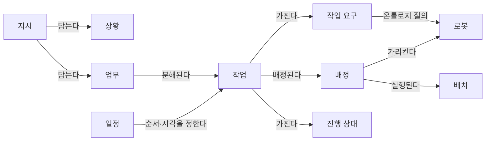
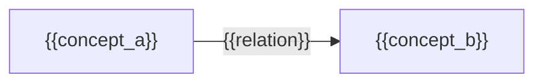

(너의 규칙은 시스템 프롬프트의 agents/shared-rules.md 와 agents/storyteller.md 이다. 아래는 이번 실행의 컨텍스트와 입력이다.)

## 실행 컨텍스트

- run_id: 2026-09-25-04
- date: 2026-09-25
- run_type: track (트랙 실행)
- 대상: 트랙 nl-task-chatbot (자연어 업무 지시 챗봇) · 현재 단계: 단계 1. 선행 연구·제품 사례 조사 · 이번에 다룰 백로그 질문 id: q1-01 · 중심 세부영역: 13. 작업 배정 — MRTA (D. 계획·최적화)
- 예산:
    - max_search_queries: 40
    - max_sources_per_run: 20
    - new_topic_pages: 1
    - page_updates: 2
    - max_retries: 2
- 환경 알림: web_fetch_available: false · fetch_mode: mirror_only (일반 웹 페이지 열람은 네트워크 정책으로 막혀 있다. raw.githubusercontent.com 은 열린다: 공식 문서가 GitHub 에 있는 출처는 입력의 config/source_mirrors.yaml 경로를 WebFetch 로 열어 원문을 읽고 sources[].fetched=true, fetched_via=github_raw, fetch_url 을 적는다. 입력에 원문 텍스트(data/source_texts)가 있는 출처는 fetched_via=inbox. 그 밖의 출처는 fetched=false 이며 코드가 신뢰도 상한(medium)을 강제한다 — 공통 규칙 0절 6항)
- 언어: ko

## 입력

### runs/2026-09-25-04/target.json

```json
{
  "run_id": "2026-09-25-04",
  "date": "2026-09-25",
  "weekday": "Fri",
  "run_number": 4,
  "run_type": "track",
  "forced": true,
  "target": {
    "area_no": 13,
    "area_name": "13. 작업 배정 — MRTA",
    "category": "D. 계획·최적화",
    "category_letter": "D"
  },
  "topic": null,
  "track": {
    "slug": "nl-task-chatbot",
    "name": "자연어 업무 지시 챗봇",
    "stage": 1,
    "stages": 5,
    "stage_name": "선행 연구·제품 사례 조사",
    "question_ids": [
      "q1-01"
    ],
    "user_questions": [],
    "runs_per_week": 3,
    "question_rationale": "사용자 지정 0건, 되돌아온 질문 0건, 현재 단계 열린 질문 4건 중 오래된 순"
  },
  "corrections": [],
  "budget": {
    "max_search_queries": 40,
    "max_sources_per_run": 20,
    "new_topic_pages": 1,
    "page_updates": 2,
    "max_retries": 2
  },
  "priority_reason": null,
  "priority_questions": [],
  "excluded_areas": [],
  "lifted_areas": [],
  "deferred": {
    "monthly_recheck": false,
    "weekly_review": false
  },
  "selection_rationale": "CLI 지정 run_type=track, area=13; 트랙 실행일(Fri, track_days 앞 3개) → 트랙 nl-task-chatbot 단계 1, 질문 q1-01 (사용자 지정 0건, 되돌아온 질문 0건, 현재 단계 열린 질문 4건 중 오래된 순)"
}
```

### runs/2026-09-25-04/research.json

```json
{
  "run_id": "2026-09-25-04",
  "date": "2026-09-25",
  "run_type": "track",
  "target": {
    "area_no": 13,
    "area_name": "13. 작업 배정 — MRTA",
    "category": "D. 계획·최적화"
  },
  "gaps": [
    "단계 1 질문 q1-01 열림(target.json 지정: 사용자 지정 0건, 되돌아온 질문 0건, 현재 단계 열린 질문 4건 중 오래된 순)",
    "완료 조건: 지시 분해 접근의 유형 목록이 업무 분해·배정 설계 초안에 미반영(v0 시드 상태)",
    "완료 조건: 아이디어 2. 자연어 업무 지시 챗봇 페이지 3절(선행 연구·제품 사례) 비어 있음",
    "단계 1 페이지 3절 조사 결과·4절 결론·5절 후속 질문·8절 출처 비어 있음",
    "13. 작업 배정 — MRTA 페이지 섹션 6. 대표 접근법과 기술, 섹션 8. 대표 연구와 자료 비어 있음(학습 기반·LLM 기반 배정 근거 없음)"
  ],
  "research_questions": [
    "가장 가까운 로봇에 맡기는 것이 전체적으로도 유리한가? [분류원문]",
    "q1-01 자연어 지시를 작업 단위로 분해하는 기존 접근은 무엇이 있는가?",
    "LLM 이전의 자연어 지시 해석(확률 그래프 기반 기호 접지)은 지시를 어떤 구조로 나눴는가? (단계 1 페이지 3절, 13. 작업 배정 — MRTA 섹션 8 겨냥)",
    "LLM 기반 분해 접근은 분해 결과를 어떤 형태(기술 순서, 프로그램 코드, PDDL·LTL 같은 형식 명세, 행동 트리·의존 그래프)로 내놓으며, 실행 가능한 단위는 누가 미리 정하는가? (업무 분해·배정 설계 초안 반영 겨냥)",
    "여러 로봇을 대상으로 한 분해 연구는 분해와 배정(팀 구성·할당)을 어떻게 이어 붙이는가? (13. 작업 배정 — MRTA 섹션 6 겨냥)",
    "국내(한국) 연구기관·학회에서 자연어 지시를 로봇 작업으로 분해한 연구가 있는가? (한국 자료 우선 규칙)"
  ],
  "findings": [
    {
      "id": "f1",
      "claim": "Tellex 외(AAAI 2011)의 일반화 접지 그래프(Generalized Grounding Graphs, G3)는 자연어 명령의 계층적·조합적 의미 구조에 따라 확률 그래프 모델을 명령마다 동적으로 만들고, 크라우드소싱으로 모은 명령–로봇 행동 쌍 말뭉치로 모델 파라미터를 학습해 명령에 맞는 계획을 찾는다.",
      "tag": "사실",
      "source_ids": [
        "ref-057"
      ],
      "cross_checked": false,
      "confidence": "medium",
      "evidence_excerpt": "검색 요약: G3 는 명령의 hierarchical·compositional 의미 구조에 따라 그래프 모델을 인스턴스화하며, 예시 명령으로 'Put the tire pallet on the truck'(지게차형 이동 조작)을 든다. 반자동 구조 환경의 내비게이션·이동 조작 대상.",
      "as_of": "2011-08",
      "flow_step": "출하",
      "flow_item": "시작 조건",
      "source_unopened": true
    },
    {
      "id": "f2",
      "claim": "Huang 외(ICML 2022)는 충분히 큰 사전학습 언어모델이 추가 학습 없이 상위 과업(예: 아침 준비)을 중간 단계 계획으로 분해할 수 있으나 그 단계가 환경의 허용 동작에 정확히 대응하지 않는 경우가 많아, 시연 예시로 조건을 주고 생성된 단계를 의미가 가까운 허용 동작으로 옮기는 절차를 제안했다.",
      "tag": "사실",
      "source_ids": [
        "ref-048",
        "ref-049"
      ],
      "cross_checked": false,
      "confidence": "medium",
      "evidence_excerpt": "PMLR 162 요약: plans produced naively by LLMs often cannot map precisely to admissible actions. 공식 저장소 README(열람): GPT-3·Codex 에 상위 과업과 가용 동작을 주어 VirtualHome 의 허용 동작 단계로 분해.",
      "as_of": "2022-07",
      "flow_step": null,
      "flow_item": null,
      "source_unopened": false
    },
    {
      "id": "f3",
      "claim": "SayCan(Ahn 외 2022)은 언어모델이 상위 목표에 대해 각 로봇 기술의 쓸모를 평가하고, 강화학습으로 학습한 언어 조건 가치 함수(어포던스)가 그 기술이 현재 상태에서 실행 가능한지를 평가해 둘을 결합한 점수로 다음 기술을 고른다.",
      "tag": "사실",
      "source_ids": [
        "ref-051",
        "ref-052"
      ],
      "cross_checked": false,
      "confidence": "medium",
      "evidence_excerpt": "README(열람): 로봇이 언어모델의 'hands and eyes' 역할을 하고 언어모델은 과업의 상위 의미 지식을 준다. arXiv 요약: 실제 주방에서 이동 로봇의 101개 과업으로 평가, 어포던스 접지로 비접지 기준선 대비 성능이 약 두 배.",
      "as_of": "2022-04",
      "flow_step": null,
      "flow_item": null,
      "source_unopened": false
    },
    {
      "id": "f4",
      "claim": "ProgPrompt(Singh 외 2022)는 환경의 가용 동작과 객체를 프로그램 형태로 명세하고 예시 프로그램을 함께 넣은 프롬프트로 LLM이 실행 가능한 계획 프로그램 전체를 생성하게 하며, 계획 안의 확인문(assertion)으로 실행 결과를 점검한다.",
      "tag": "사실",
      "source_ids": [
        "ref-053",
        "ref-054"
      ],
      "cross_checked": false,
      "confidence": "medium",
      "evidence_excerpt": "README(열람): pythonic 프로그램으로 가용 동작·객체를 주고 VirtualHome 에서 생성 계획을 실행, assertion 으로 결과 검증. arXiv 요약: program-like specifications of the available actions and objects.",
      "as_of": "2022-09",
      "flow_step": null,
      "flow_item": null,
      "source_unopened": false
    },
    {
      "id": "f5",
      "claim": "Code as Policies(Liang 외 2022)는 코드 생성 LLM이 자연어 명령과 몇 개의 예시(주석 형태 명령 + 정책 코드)를 받아 인식 API와 제어 기본 동작 API 호출을 조합한 로봇 정책 코드를 쓰게 하고, 정의되지 않은 함수를 재귀적으로 정의하는 계층적 코드 생성을 둔다.",
      "tag": "사실",
      "source_ids": [
        "ref-050"
      ],
      "cross_checked": false,
      "confidence": "medium",
      "evidence_excerpt": "README(열람): LLMs can take in new commands and autonomously re-compose API calls to generate new policy code. 인식 API·제어 기본 동작을 쓰고 계층적 코드 생성으로 복잡한 추론을 처리. (발행일 미확인, 확인일 기준 아님: arXiv 2209.07753 기준)",
      "as_of": "2022-09",
      "flow_step": null,
      "flow_item": null
    },
    {
      "id": "f6",
      "claim": "LLM+P(Liu 외 2023)는 자연어로 기술된 계획 문제를 LLM이 PDDL 문제 파일로 바꾸고, 고전 계획기(Fast Downward)가 해를 찾은 뒤 그 해를 다시 자연어로 옮기는 구조로, 계획 탐색 자체는 LLM이 아니라 계획기가 맡는다.",
      "tag": "사실",
      "source_ids": [
        "ref-046",
        "ref-047"
      ],
      "cross_checked": false,
      "confidence": "medium",
      "evidence_excerpt": "README(열람): 'making plans based on problems decribed by natural language', fast-downward 계획기, 7개 도메인(barman, blocksworld, floortile, grippers, storage, termes, tyreworld). arXiv 요약: 자연어 → PDDL → 고전 계획기 → 자연어.",
      "as_of": "2023-04",
      "flow_step": null,
      "flow_item": null,
      "source_unopened": false
    },
    {
      "id": "f7",
      "claim": "Lang2LTL(Liu 외 2023)은 사전학습 LLM으로 명령에서 지칭 표현(랜드마크·객체)을 뽑고, 그것을 실제 환경의 랜드마크에 접지한 뒤, 명령을 기호 명제를 쓴 선형 시간 논리(Linear Temporal Logic, LTL) 식으로 옮기는 모듈형 구조를 쓴다.",
      "tag": "사실",
      "source_ids": [
        "ref-055",
        "ref-056"
      ],
      "cross_checked": false,
      "confidence": "medium",
      "evidence_excerpt": "README(열람): referring expression recognition → grounding(OSM·CleanUp World) → lifted translation to LTL. arXiv 요약: LTL 의 명확한 의미로 장기 과업과 시간 제약 충족을 검증할 수 있다. 도시 규모 21개 환경, 실내 2곳 52개 명령.",
      "as_of": "2023-02",
      "flow_step": null,
      "flow_item": null,
      "source_unopened": false
    },
    {
      "id": "f8",
      "claim": "BTGenBot(2024)은 70억 파라미터 이하의 경량 LLM을 미세조정해 텍스트 과업 기술에서 XML 형식의 행동 트리(Behavior Tree)를 생성하고, 정적 구문 분석·검증 시스템·시뮬레이션·실제 로봇으로 생성 결과를 평가했다.",
      "tag": "사실",
      "source_ids": [
        "ref-061"
      ],
      "cross_checked": false,
      "confidence": "medium",
      "evidence_excerpt": "arXiv 2403.12761 요약: 기존 행동 트리를 바탕으로 GPT-3.5 로 만든 미세조정 데이터셋, llama2·llama-chat·code-llama 를 9개 과업에서 비교. 생성 트리는 XML 파일로 저장되어 클라이언트가 파싱·실행.",
      "as_of": "2024-03",
      "flow_step": null,
      "flow_item": null,
      "source_unopened": true
    },
    {
      "id": "f9",
      "claim": "SMART-LLM(Kannan 외 2023)은 상위 지시를 받아 LLM이 프로그램형 few-shot 프롬프트로 작업 분해, 팀 구성(coalition formation), 작업 할당을 차례로 수행해 다중 로봇 작업 계획을 만들고, 로봇별 능력 목록을 담은 4개 난이도 범주의 벤치마크를 AI2-THOR 시뮬레이터에서 공개했다.",
      "tag": "사실",
      "source_ids": [
        "ref-044",
        "ref-045"
      ],
      "cross_checked": false,
      "confidence": "medium",
      "evidence_excerpt": "README(열람): task decomposition, coalition formation, and task allocation 'guided by programmatic LLM prompts within the few-shot prompting paradigm'. 데이터는 AI2-THOR 평면도와 가용 로봇·능력을 지정.",
      "as_of": "2023-09",
      "flow_step": null,
      "flow_item": "수행 자원",
      "source_unopened": false
    },
    {
      "id": "f10",
      "claim": "DART-LLM(2024)은 자연어 지시를 하위 작업으로 분해하면서 하위 작업 사이 의존을 방향 비순환 그래프(Directed Acyclic Graph, DAG)로 표현하고, 분해용 질의응답 LLM 모듈, 로봇 배정용 분해 함수(Breakdown Function) 모듈, 실행 모듈, 시각-언어 모델 기반 객체 검출기로 구성된다.",
      "tag": "사실",
      "source_ids": [
        "ref-059"
      ],
      "cross_checked": false,
      "confidence": "medium",
      "evidence_excerpt": "arXiv 2411.09022 요약: 노드는 하위 작업, 방향 간선은 다른 하위 작업의 성공 완료에 대한 의존. 건설 로봇(다중 건설 기계) 시나리오, 세 난이도 수준에서 평가.",
      "as_of": "2024-11",
      "flow_step": null,
      "flow_item": "제약",
      "source_unopened": true
    },
    {
      "id": "f11",
      "claim": "Cohen 외(IJCAI 2024)의 로봇 언어 접지 서베이는 연구를 두 극 사이의 스펙트럼으로 정리한다: 언어를 사람이 정의한 형식 표현으로 옮기는 방식과, 언어를 저수준 로봇 정책으로 바로 이어지는 고차원 벡터 공간으로 옮기는 방식이다.",
      "tag": "사실",
      "source_ids": [
        "ref-058"
      ],
      "cross_checked": false,
      "confidence": "medium",
      "evidence_excerpt": "IJCAI-24 요약: two poles — manually defined formal representation of meaning / high-dimensional vector spaces that translate directly to low-level robot policy. pp. 7999-8009.",
      "as_of": "2024-08",
      "flow_step": null,
      "flow_item": null,
      "source_unopened": true
    },
    {
      "id": "f12",
      "claim": "같은 서베이는 형식 표현 방식이 의미를 정확히 표현하고 학습 문제를 줄이며 해석 가능성과 형식적 안전 보장의 틀을 주는 반면, 임베딩 방식은 수작업 기호 구조가 없어 더 일반적일 수 있으나 더 많은 데이터와 연산이 필요하다고 평가한다.",
      "tag": "의견",
      "source_ids": [
        "ref-058"
      ],
      "cross_checked": false,
      "confidence": "medium",
      "evidence_excerpt": "검색 요약 재서술: formal representation → precision, smaller learning problem, interpretability, formal safety guarantees; embedding → potentially more general but more data and computing.",
      "as_of": "2024-08",
      "flow_step": null,
      "flow_item": null,
      "source_unopened": true
    },
    {
      "id": "f13",
      "claim": "조사한 접근은 분해 결과의 형태로 나누면 (1) 명령 구조에 맞춘 확률 그래프 접지(G3), (2) 미리 정한 기술·허용 동작의 순서(Huang 외, SayCan), (3) 실행 가능한 프로그램 코드(ProgPrompt, Code as Policies), (4) 형식 명세를 만들어 계획기에 넘김(LLM+P의 PDDL, Lang2LTL의 LTL), (5) 실행 구조 그래프(BTGenBot의 행동 트리, DART-LLM의 의존 DAG), (6) 분해·팀 구성·할당을 잇는 다중 로봇 파이프라인(SMART-LLM, DART-LLM)의 유형으로 묶을 수 있어 보인다.",
      "tag": "추정",
      "source_ids": [
        "ref-057",
        "ref-048",
        "ref-051",
        "ref-053",
        "ref-050",
        "ref-046",
        "ref-055",
        "ref-061",
        "ref-059",
        "ref-044"
      ],
      "cross_checked": false,
      "confidence": "low",
      "evidence_excerpt": "f1~f10 의 출력 형태를 묶은 분류. 서베이(f11)의 형식 표현–임베딩 스펙트럼에서는 (1)(4)(5)가 형식 표현 쪽에 가깝다. 이 여섯 유형 분류 자체를 제시한 출처는 확인하지 못함.",
      "as_of": "2026-09-25",
      "flow_step": null,
      "flow_item": null,
      "source_unopened": false
    },
    {
      "id": "f14",
      "claim": "조사한 LLM 기반 접근은 모두 실행 가능한 단위(기술 목록, 가용 동작·객체, 제어 API, PDDL 도메인, 랜드마크 목록, 로봇 능력 목록)를 사람이 미리 정의해 두고 LLM은 그 어휘 안에서 분해하므로, 실행 단위의 정의·예시 작성은 사람에게 남는 일로 보인다.",
      "tag": "추정",
      "source_ids": [
        "ref-049",
        "ref-051",
        "ref-053",
        "ref-050",
        "ref-046",
        "ref-055",
        "ref-044"
      ],
      "cross_checked": false,
      "confidence": "low",
      "evidence_excerpt": "f2(허용 동작), f3(기술·가치 함수), f4(가용 동작·객체 명세), f5(API), f6(PDDL 도메인·계획기), f7(랜드마크 접지), f9(로봇별 능력 목록)에서 도출. 원문(README)으로 확인한 공통점이나 '사람에게 남는 일'이라는 해석은 추론.",
      "as_of": "2026-09-25",
      "flow_step": null,
      "flow_item": "수행 자원"
    },
    {
      "id": "f15",
      "claim": "조사한 LLM 기반 분해 연구의 평가 환경은 가정·주방 시뮬레이터(VirtualHome, AI2-THOR), 실내·도시 내비게이션, 건설 기계 시나리오였고, 팔레트 적재 같은 물류 지시를 직접 다룬 예는 이번 검색 범위에서 LLM 이전 연구인 G3 뿐이었다.",
      "tag": "추정",
      "source_ids": [
        "ref-049",
        "ref-053",
        "ref-044",
        "ref-055",
        "ref-059",
        "ref-057"
      ],
      "cross_checked": false,
      "confidence": "low",
      "evidence_excerpt": "f1·f2·f4·f7·f9·f10 의 평가 환경 정리. 검색 결과에 IMR-LLM(산업 다중 로봇, arXiv 2603.02669) 등 산업 적용 연구 제목이 보였으나 내용 미확인이라 제외. 부재의 확인은 아님.",
      "as_of": "2026-09-25",
      "flow_step": null,
      "flow_item": null,
      "source_unopened": false
    },
    {
      "id": "f16",
      "claim": "SMART-LLM의 할당은 프롬프트에 넣은 로봇 능력 목록을 LLM이 추론해 정하는 방식으로, 이동 거리·납기·부하 같은 비용을 최적화 엔진으로 푸는 구조는 확인되지 않는다.",
      "tag": "추정",
      "source_ids": [
        "ref-044",
        "ref-045"
      ],
      "cross_checked": false,
      "confidence": "low",
      "evidence_excerpt": "README(열람)는 세 단계 모두 프로그램형 LLM 프롬프트로 수행한다고 적고 최적화 기법 언급은 없음. 논문 본문(미열람)의 할당 세부는 미확인.",
      "as_of": "2023-09",
      "flow_step": null,
      "flow_item": "수행 자원",
      "source_unopened": false
    },
    {
      "id": "f17",
      "claim": "LLM+P와 Lang2LTL처럼 LLM이 형식 명세만 만들고 계획·검증은 결정적 계획기나 논리 검사에 맡기는 구조는, LLM 출력이 실행 전에 형식적으로 점검될 수 있다는 점에서 오해석 방지와 연결되는 선행 사례로 보인다.",
      "tag": "추정",
      "source_ids": [
        "ref-046",
        "ref-055",
        "ref-058"
      ],
      "cross_checked": false,
      "confidence": "low",
      "evidence_excerpt": "f6(계획 탐색은 계획기), f7(LTL 로 시간 제약 충족 검증), f12(형식 표현의 안전 보장 틀)에서 도출. 이 구조가 잘못된 배정을 실제로 줄이는지는 확인하지 못함(트랙 가설 판정 대상).",
      "as_of": "2026-09-25",
      "flow_step": null,
      "flow_item": "예외·성과",
      "source_unopened": false
    }
  ],
  "sources": [
    {
      "id": "ref-044",
      "org": "SMARTlab-Purdue (Purdue University)",
      "title": "SMART-LLM: Smart Multi-Agent Robot Task Planning using Large Language Models (GitHub README)",
      "published": null,
      "url": "https://github.com/SMARTlab-Purdue/SMART-LLM",
      "type": "오픈소스 문서",
      "reliability": "high",
      "accessed": "2026-09-25",
      "summary": "SMART-LLM 공식 저장소 README. 작업 분해·팀 구성·작업 할당을 프로그램형 few-shot 프롬프트로 수행하고 AI2-THOR 로 검증하며 4개 범주 벤치마크 데이터를 제공한다.",
      "fetched": true,
      "fetched_via": "github_raw",
      "fetch_url": "https://raw.githubusercontent.com/SMARTlab-Purdue/SMART-LLM/master/README.md",
      "source_unopened": false
    },
    {
      "id": "ref-045",
      "org": "Kannan, S. S., Venkatesh, V. L. N., & Min, B.-C.",
      "title": "SMART-LLM: Smart Multi-Agent Robot Task Planning using Large Language Models",
      "published": "2023-09",
      "url": "https://arxiv.org/abs/2309.10062",
      "type": "논문",
      "reliability": "medium",
      "accessed": "2026-09-25",
      "summary": "원문 미열람. 상위 지시를 LLM 으로 다중 로봇 작업 계획(분해·팀 구성·할당)으로 바꾸는 프레임워크와 벤치마크를 제안한 논문(IROS 2024 게재).",
      "source_unopened": true,
      "fetched": false,
      "fetched_via": null,
      "fetch_url": null
    },
    {
      "id": "ref-046",
      "org": "Cranial-XIX (LLM+P 저자)",
      "title": "llm-pddl — LLM+P: Empowering Large Language Models with Optimal Planning Proficiency (GitHub README)",
      "published": null,
      "url": "https://github.com/Cranial-XIX/llm-pddl",
      "type": "오픈소스 문서",
      "reliability": "high",
      "accessed": "2026-09-25",
      "summary": "LLM+P 공식 코드 저장소 README. 자연어 문제를 PDDL 로 바꿔 fast-downward 계획기로 푸는 코드와 7개 도메인을 안내한다.",
      "fetched": true,
      "fetched_via": "github_raw",
      "fetch_url": "https://raw.githubusercontent.com/Cranial-XIX/llm-pddl/main/README.md",
      "source_unopened": false
    },
    {
      "id": "ref-047",
      "org": "Liu, B., Jiang, Y., Zhang, X., Liu, Q., Zhang, S., Biswas, J., & Stone, P.",
      "title": "LLM+P: Empowering Large Language Models with Optimal Planning Proficiency",
      "published": "2023-04",
      "url": "https://arxiv.org/abs/2304.11477",
      "type": "논문",
      "reliability": "medium",
      "accessed": "2026-09-25",
      "summary": "원문 미열람. 자연어 계획 문제를 PDDL 로 바꿔 고전 계획기로 정확·최적 계획을 찾고 다시 자연어로 옮기는 LLM+P 를 제안한 프리프린트.",
      "source_unopened": true,
      "fetched": false,
      "fetched_via": null,
      "fetch_url": null
    },
    {
      "id": "ref-048",
      "org": "Huang, W., Abbeel, P., Pathak, D., & Mordatch, I.",
      "title": "Language Models as Zero-Shot Planners: Extracting Actionable Knowledge for Embodied Agents",
      "published": "2022-07",
      "url": "https://proceedings.mlr.press/v162/huang22a.html",
      "type": "논문",
      "reliability": "medium",
      "accessed": "2026-09-25",
      "summary": "원문 미열람. ICML 2022(PMLR 162) 논문. 언어모델이 상위 과업을 중간 단계 계획으로 분해하고 이를 허용 동작으로 옮기는 절차를 제안.",
      "source_unopened": true,
      "fetched": false,
      "fetched_via": null,
      "fetch_url": null
    },
    {
      "id": "ref-049",
      "org": "Huang, W. (language-planner 공식 저장소)",
      "title": "language-planner — Official Code for \"Language Models as Zero-Shot Planners\" (GitHub README)",
      "published": null,
      "url": "https://github.com/huangwl18/language-planner",
      "type": "오픈소스 문서",
      "reliability": "high",
      "accessed": "2026-09-25",
      "summary": "Huang 외(2022)의 공식 코드 저장소 README. 상위 과업과 가용 동작으로 LLM 을 프롬프트해 VirtualHome 허용 동작 단계로 분해하는 방법을 안내.",
      "fetched": true,
      "fetched_via": "github_raw",
      "fetch_url": "https://raw.githubusercontent.com/huangwl18/language-planner/master/README.md",
      "source_unopened": false
    },
    {
      "id": "ref-050",
      "org": "Google Research",
      "title": "Code as Policies: Language Model Programs for Embodied Control (google-research/code_as_policies README)",
      "published": null,
      "url": "https://github.com/google-research/google-research/blob/master/code_as_policies/README.md",
      "type": "오픈소스 문서",
      "reliability": "high",
      "accessed": "2026-09-25",
      "summary": "Code as Policies 공식 코드 README. 코드 생성 LLM 이 자연어 명령에서 인식 API·제어 기본 동작을 조합한 정책 코드를 쓰고 계층적 코드 생성을 쓰는 방법을 설명.",
      "fetched": true,
      "fetched_via": "github_raw",
      "fetch_url": "https://raw.githubusercontent.com/google-research/google-research/master/code_as_policies/README.md",
      "source_unopened": false
    },
    {
      "id": "ref-051",
      "org": "Google Research",
      "title": "SayCan (google-research/saycan README)",
      "published": null,
      "url": "https://github.com/google-research/google-research/blob/master/saycan/README.md",
      "type": "오픈소스 문서",
      "reliability": "high",
      "accessed": "2026-09-25",
      "summary": "SayCan 공식 코드 README. LLM 이 상위 행동을 제안하고 가치 함수가 실제 실행 가능성으로 접지하는 구조를 설명.",
      "fetched": true,
      "fetched_via": "github_raw",
      "fetch_url": "https://raw.githubusercontent.com/google-research/google-research/master/saycan/README.md",
      "source_unopened": false
    },
    {
      "id": "ref-052",
      "org": "Ahn, M. 외(Google)",
      "title": "Do As I Can, Not As I Say: Grounding Language in Robotic Affordances",
      "published": "2022-04",
      "url": "https://arxiv.org/abs/2204.01691",
      "type": "논문",
      "reliability": "medium",
      "accessed": "2026-09-25",
      "summary": "원문 미열람. LLM 의 과업 접지(Say)와 학습된 어포던스 가치 함수(Can)를 결합해 실제 주방 101개 과업에서 평가한 SayCan 논문(프리프린트).",
      "source_unopened": true,
      "fetched": false,
      "fetched_via": null,
      "fetch_url": null
    },
    {
      "id": "ref-053",
      "org": "NVIDIA Research (NVlabs)",
      "title": "progprompt-vh — ProgPrompt: Generating Situated Robot Task Plans using Large Language Models (GitHub README)",
      "published": null,
      "url": "https://github.com/NVlabs/progprompt-vh",
      "type": "오픈소스 문서",
      "reliability": "high",
      "accessed": "2026-09-25",
      "summary": "ProgPrompt 공식 코드 README. 가용 동작·객체를 담은 파이썬식 프로그램 프롬프트로 계획을 생성해 VirtualHome 에서 실행하고 assertion 으로 검증.",
      "fetched": true,
      "fetched_via": "github_raw",
      "fetch_url": "https://raw.githubusercontent.com/NVlabs/progprompt-vh/main/README.md",
      "source_unopened": false
    },
    {
      "id": "ref-054",
      "org": "Singh, I. 외",
      "title": "ProgPrompt: Generating Situated Robot Task Plans using Large Language Models",
      "published": "2022-09",
      "url": "https://arxiv.org/abs/2209.11302",
      "type": "논문",
      "reliability": "medium",
      "accessed": "2026-09-25",
      "summary": "원문 미열람. 프로그램형 프롬프트로 LLM 이 상황에 맞는 실행 가능한 로봇 계획 프로그램을 생성하게 한 논문(ICRA 2023, 이후 Autonomous Robots 게재).",
      "source_unopened": true,
      "fetched": false,
      "fetched_via": null,
      "fetch_url": null
    },
    {
      "id": "ref-055",
      "org": "Brown University H2R Lab",
      "title": "Lang2LTL — Code for paper Lang2LTL: Grounding Complex Natural Language Commands for Temporal Tasks in Unseen Environments (GitHub README)",
      "published": null,
      "url": "https://github.com/h2r/Lang2LTL",
      "type": "오픈소스 문서",
      "reliability": "high",
      "accessed": "2026-09-25",
      "summary": "Lang2LTL 공식 코드 README. 지칭 표현 인식, 랜드마크 접지, LTL 로의 lifted 번역 모듈을 설명.",
      "fetched": true,
      "fetched_via": "github_raw",
      "fetch_url": "https://raw.githubusercontent.com/h2r/Lang2LTL/master/README.md",
      "source_unopened": false
    },
    {
      "id": "ref-056",
      "org": "Liu, J. X. 외",
      "title": "Grounding Complex Natural Language Commands for Temporal Tasks in Unseen Environments",
      "published": "2023-02",
      "url": "https://arxiv.org/abs/2302.11649",
      "type": "논문",
      "reliability": "medium",
      "accessed": "2026-09-25",
      "summary": "원문 미열람. 사전학습 LLM 으로 내비게이션 명령을 LTL 명세로 접지하는 Lang2LTL 을 제안하고 21개 도시 환경·실내 로봇으로 평가한 논문(CoRL 2023).",
      "source_unopened": true,
      "fetched": false,
      "fetched_via": null,
      "fetch_url": null
    },
    {
      "id": "ref-057",
      "org": "Tellex, S. 외",
      "title": "Understanding Natural Language Commands for Robotic Navigation and Mobile Manipulation",
      "published": "2011-08",
      "url": "https://ojs.aaai.org/index.php/AAAI/article/view/7979",
      "type": "논문",
      "reliability": "medium",
      "accessed": "2026-09-25",
      "summary": "원문 미열람. AAAI 2011 논문. 명령의 조합적 의미 구조로 확률 그래프 모델(G3)을 만들어 내비게이션·이동 조작 명령을 계획으로 접지.",
      "source_unopened": true,
      "fetched": false,
      "fetched_via": null,
      "fetch_url": null
    },
    {
      "id": "ref-058",
      "org": "Cohen, V., Liu, J. X., Mooney, R., Tellex, S., & Watkins, D.",
      "title": "A Survey of Robotic Language Grounding: Tradeoffs between Symbols and Embeddings",
      "published": "2024-08",
      "url": "https://www.ijcai.org/proceedings/2024/885",
      "type": "논문",
      "reliability": "medium",
      "accessed": "2026-09-25",
      "summary": "원문 미열람. IJCAI-24 서베이. 로봇 언어 접지 연구를 형식 표현–임베딩 스펙트럼으로 정리하고 장단점을 비교.",
      "source_unopened": true,
      "fetched": false,
      "fetched_via": null,
      "fetch_url": null
    },
    {
      "id": "ref-059",
      "org": "Wang, Y. 외(DART-LLM 저자)",
      "title": "DART-LLM: Dependency-Aware Multi-Robot Task Decomposition and Execution using Large Language Models",
      "published": "2024-11",
      "url": "https://arxiv.org/abs/2411.09022",
      "type": "논문",
      "reliability": "medium",
      "accessed": "2026-09-25",
      "summary": "원문 미열람. 하위 작업 의존을 DAG 로 표현해 자연어 지시를 다중 로봇(건설 기계) 작업으로 분해·배정·실행하는 프레임워크 프리프린트.",
      "source_unopened": true,
      "fetched": false,
      "fetched_via": null,
      "fetch_url": null
    },
    {
      "id": "ref-061",
      "org": "Izzo, R. A., Bardaro, G., & Matteucci, M. (Politecnico di Milano AIRLab)",
      "title": "BTGenBot: Behavior Tree Generation for Robotic Tasks with Lightweight LLMs",
      "published": "2024-03",
      "url": "https://arxiv.org/abs/2403.12761",
      "type": "논문",
      "reliability": "medium",
      "accessed": "2026-09-25",
      "summary": "원문 미열람. 경량 LLM(7B 이하)을 미세조정해 과업 기술에서 XML 행동 트리를 생성하고 시뮬레이션·실제 로봇으로 평가한 프리프린트.",
      "source_unopened": true,
      "fetched": false,
      "fetched_via": null,
      "fetch_url": null
    }
  ],
  "page_proposals": [
    {
      "action": "update",
      "path": "docs/tracks/nl-task-chatbot/stage-1-prior-work-and-products.md",
      "sections": [
        "2",
        "3",
        "4",
        "5",
        "6",
        "8",
        "9"
      ],
      "rationale": "q1-01 답: f1·f2·f3·f4·f5·f6·f7·f8·f9·f10·f11·f12·f13·f14·f15·f16·f17 (신뢰도 medium) — 단계 1 질문 목록 q1-01 상태, 3절 'q1-01' 소제목(유형 분류 f13, 접근별 f1~f10, 서베이 관점 f11·f12, 사람에게 남는 일 f14, 평가 환경 한계 f15, 배정 방식 f16, 형식 명세 경유 f17), 4절 결론·불확실성, 5절 후속 질문, 6절 완료 조건 현황, 8절 출처, 9절 이력 갱신"
    },
    {
      "action": "update",
      "path": "docs/tracks/nl-task-chatbot/task-model-draft.md",
      "sections": [
        "2",
        "3",
        "4",
        "6"
      ],
      "rationale": "트랙 산출물 갱신(완료 조건 '지시 분해 접근의 유형 목록 반영'): track.ontology_changes 가 검증 승인되면 개념(허용 동작 목록, 형식 작업 명세, 로봇 팀)·관계(작업 선행 의존) 반영, 6절 '작업 단위 크기' 질문에 f13·f14 근거 연결. 미승인 제안은 6절 질문으로"
    },
    {
      "action": "update",
      "path": "docs/ideas/nl-task-chatbot.md",
      "sections": [
        "3"
      ],
      "rationale": "아이디어 페이지 3절: 선행 연구 비교(분해 결과 형태 유형 f13, 대표 연구 f1~f10, 사람에게 남는 일 f14, 물류 적용 한계 f15). 제품 사례(q1-02·q1-03)는 아직 없음을 명시"
    },
    {
      "action": "update",
      "path": "docs/categories/d-planning-and-optimization/13-task-allocation-mrta.md",
      "sections": [
        "6",
        "8"
      ],
      "rationale": "트랙 nl-task-chatbot 단계 1 반영 제안 (f9, f10, f16): 섹션 6 LLM 기반 분해·팀 구성·할당 파이프라인(학습 기반 배차의 한 갈래, 27. AI·학습·적응과 모델 운영과 양쪽 연결), 섹션 8 SMART-LLM·DART-LLM"
    },
    {
      "action": "update",
      "path": "docs/categories/g-safety-security-intelligence-and-governance/27-ai-learning-adaptation-and-model-operations.md",
      "sections": [
        "6",
        "8"
      ],
      "rationale": "트랙 nl-task-chatbot 단계 1 반영 제안 (f3, f6, f7, f11, f12, f17): LLM 출력을 기술 가치 함수·계획기·LTL 로 접지·점검하는 방법, 형식 표현–임베딩 서베이. 적용 대상 영역 13. 작업 배정 — MRTA 과 함께 연결"
    }
  ],
  "glossary_candidates": [
    {
      "term_ko": "작업 분해",
      "term_en": "Task Decomposition",
      "definition": "상위 지시나 목표를 로봇이 실행할 수 있는 하위 작업·동작의 순서나 구조로 나누는 일이다."
    },
    {
      "term_ko": "행동 트리",
      "term_en": "Behavior Tree",
      "definition": "로봇 동작과 조건 확인을 트리 형태의 노드로 조합해 실행 순서·분기·재시도를 표현하는 작업 실행 구조이다."
    },
    {
      "term_ko": "선형 시간 논리",
      "term_en": "Linear Temporal Logic (LTL)",
      "definition": "'언젠가', '항상', '~할 때까지' 같은 시간 연산자로 작업의 순서·시간 제약을 모호하지 않게 기술하는 형식 논리이다."
    }
  ],
  "open_questions_new": [],
  "open_questions_resolved": [],
  "self_check": {
    "source_count": 17,
    "cross_checked_count": 0,
    "unverified": [
      "모든 finding 교차 확인 실패: 접근별 근거가 같은 저자 그룹의 논문과 공식 저장소 README 쌍이라 독립 출처가 아님",
      "f1 G3 세부(말뭉치·예시 명령)는 검색 요약만 확인(ref-057 원문 미열람)",
      "f3 '101개 과업, 성능 약 두 배'는 arXiv 검색 요약 범위(ref-052 원문 미열람)",
      "f8 BTGenBot 공식 저장소 README 는 raw 경로 404 로 열지 못함",
      "f10 DART-LLM 저자 표기(Wang, Y. 외)는 프로젝트 페이지 URL 에서 추정한 것으로 원문 저자 목록 미확인",
      "f13 여섯 유형 분류를 제시한 단일 출처는 찾지 못함(추론)",
      "f15 물류 현장 지시를 다룬 LLM 분해 연구의 부재는 확인이 아님; IMR-LLM(arXiv 2603.02669) 등은 내용 미확인이라 제외",
      "f16 SMART-LLM 논문 본문의 할당 세부 미확인",
      "다중 로봇 LLM 서베이(arXiv 2502.03814, Autonomous Robots)는 검색 요약 문장이 서베이 자체의 주장인지 확정하지 못해 출처로 넣지 않음",
      "국내 연구: 한국어 검색 3회에서 자연어 지시의 작업 분해를 다룬 국내 기관·학회 자료를 찾지 못함"
    ],
    "scope_violations": [
      "해당 없음: f3(가치 함수)·f5(제어 기본 동작 API)·f10(VLM 객체 검출)은 분해 결과를 접지하는 방식의 설명으로만 썼고, 센서 인식·파지·모터 제어(분류 원문 9장 '로봇 자체 지능·제어')를 ROP 직접 범위로 다루지 않음"
    ],
    "budget_used": {
      "queries": 17,
      "sources": 17
    },
    "limits": "web_fetch_available: false · fetch_mode mirror_only. GitHub 공식 저장소 README 7건(ref-044, ref-046, ref-049, ref-050, ref-051, ref-053, ref-055)은 raw.githubusercontent.com 으로 원문을 열었고, 논문 10건은 원문 미열람(검색 요약 범위만 사용). README 와 논문은 같은 저자 그룹이라 교차 확인 0건, finding 신뢰도 상한 medium. 검색 17회/40, 신규 출처 17건/20(ref-044~ref-059, ref-061; ref-060 은 서베이 출처를 넣지 않기로 해 비워 둠). next_ref_id 가 ref-044 라 실행 컨텍스트 값을 따랐으나, 이전 브리프 2026-09-25-03 도 ref-044~ref-050 을 썼으므로 id 충돌 여부는 퍼블리셔 확인 필요. 질문 선택: target.json 지정 q1-01(오래된 순). q1-01 은 답했다(선행 연구 유형·대표 연구). 제품 사례와 LLM 의 담당 범위(q1-02), 운영 인터페이스 제품(q1-03), 상황 정보 추출·되묻기(q1-04)는 다루지 않았다. 한국 자료는 찾지 못했다. 교차 규칙: LLM 기반 배정 finding(f9·f16)은 13. 작업 배정 — MRTA 와 27. AI·학습·적응과 모델 운영 양쪽에 반영 제안했다. 온톨로지(업무 분해·배정 설계 초안) 변경 제안 4건, 후속 질문 3건."
  },
  "track": {
    "slug": "nl-task-chatbot",
    "stage": 1,
    "answered_question_ids": [
      "q1-01"
    ],
    "new_questions": [
      {
        "question": "팔레트 이동·출하 준비 같은 물류·창고 현장 지시를 대상으로 한 LLM 작업 분해 연구나 지시–작업 데이터셋이 있는가, 가정용 시뮬레이터(VirtualHome, AI2-THOR) 결과를 물류 지시로 옮길 때 무엇이 달라지는가? (q1-01 에서 파생)",
        "stage": 1,
        "rationale_finding_id": "f15"
      },
      {
        "question": "분해 결과의 중간 표현(PDDL, LTL, 행동 트리, 의존 DAG) 가운데 업무 분해·배정 설계 초안의 작업 모델과 로봇 관제 인터페이스(VDA 5050 주문, Open-RMF 작업)로 옮기기 쉬운 것은 무엇이고 옮길 때 무엇이 빠지는가? (q1-01 에서 파생)",
        "stage": 2,
        "rationale_finding_id": "f13"
      },
      {
        "question": "LLM 이 허용 동작 목록에 없는 동작이나 존재하지 않는 대상을 분해 결과에 넣을 때, 허용 동작 대응(Huang 외)·assertion(ProgPrompt)·계획기 검사(LLM+P) 같은 기존 장치는 각각 어떤 오류를 걸러내고 무엇을 놓치는가? (q1-01 에서 파생)",
        "stage": 4,
        "rationale_finding_id": "f14"
      }
    ],
    "ontology_changes": [
      {
        "op": "add",
        "kind": "concept",
        "name": "허용 동작 목록 (Admissible Action Set)",
        "evidence_finding_ids": [
          "f2",
          "f4",
          "f14"
        ],
        "description": "분해 결과가 대응되어야 하는, 사람이 미리 정의한 실행 가능 동작·기술·API 의 집합. 로봇 기능 온톨로지의 기능(스킬)과 같은 대상일 수 있으므로 작업 요구·로봇과의 관계는 6절 질문으로 둔다."
      },
      {
        "op": "add",
        "kind": "concept",
        "name": "형식 작업 명세 (Formal Task Specification)",
        "evidence_finding_ids": [
          "f6",
          "f7",
          "f11",
          "f17"
        ],
        "description": "업무를 작업으로 바꾸는 중간 표현(PDDL 문제, LTL 식 등). 계획기·검사기가 받아 결정적으로 처리한다. 업무와 작업 사이에 둘지 여부는 단계 3 판단."
      },
      {
        "op": "add",
        "kind": "relation",
        "name": "작업 / 선행 의존한다 / 작업",
        "evidence_finding_ids": [
          "f10",
          "f8"
        ],
        "description": "하위 작업 사이 의존(DAG 간선: 앞 작업의 성공 완료가 뒤 작업의 조건). v0 에서 작업의 속성 '선후관계'로만 있던 것을 관계로 드러낸다. 속성과 중복되므로 둘 중 하나로 정리 필요."
      },
      {
        "op": "add",
        "kind": "concept",
        "name": "로봇 팀 (Coalition)",
        "evidence_finding_ids": [
          "f9"
        ],
        "description": "하나의 작업을 함께 맡도록 구성된 로봇 묶음. 배정의 대상이 로봇 또는 로봇 팀일 수 있음(v0 작업 정의의 '로봇 팀' 언급과 연결)."
      }
    ],
    "stage_completion_self_assessment": {
      "met": false,
      "missing": [
        "선행 연구·제품 사례 비교가 아이디어 2. 자연어 업무 지시 챗봇 3절에 실림: 연구 쪽 근거만 있고 제품 사례(q1-02·q1-03) 미조사",
        "지시 분해 접근의 유형 목록이 업무 분해·배정 설계 초안에 반영됨: 유형 분류(f13)와 변경 제안은 검증 승인 전",
        "q1-02, q1-03, q1-04 열림"
      ]
    }
  }
}
```

### runs/2026-09-25-04/verification.json

```json
{
  "run_id": "2026-09-25-04",
  "stage": "first",
  "verdict": "조건부 승인",
  "claim_checks": [
    {
      "finding_id": "f1",
      "source_exists": true,
      "supports_claim": true,
      "cross_checked": false,
      "tag_decision": "유지",
      "note": "원문 미열람(ref-057). 검색 결과로 AAAI 2011·Tellex 외·G3 확인: 명령의 계층적·조합적 의미 구조에 따라 확률 그래프 모델을 동적으로 만들고, 크라우드소싱 명령–행동 쌍 말뭉치로 파라미터를 학습, 'Put the tire pallet on the truck' 예시. 단일 출처라 교차 확인 없음. flow_step '출하'는 리서치 추론이므로 흐름 매트릭스에 넣지 않는다."
    },
    {
      "finding_id": "f2",
      "source_exists": true,
      "supports_claim": true,
      "cross_checked": false,
      "tag_decision": "유지",
      "note": "ref-049 README(github_raw 재열람) 확인: GPT-3·Codex, VirtualHome 1.0 가용 동작 목록(available_actions.json), 예시 기반 프롬프트. '허용 동작으로 옮기는 절차'와 'admissible actions 에 정확히 대응하지 않음'은 ref-048(PMLR 162, 원문 미열람) 검색 요약 범위. README 와 논문은 같은 저자 계열이라 독립 교차 아님."
    },
    {
      "finding_id": "f3",
      "source_exists": true,
      "supports_claim": true,
      "cross_checked": false,
      "tag_decision": "유지",
      "note": "ref-051 README 재열람 확인: 스킬의 가치 함수가 물리 환경으로의 접지를 주고, 로봇이 언어모델의 'hands and eyes' 역할. '강화학습으로 학습'은 ref-052(원문 미열람) 요약 범위. 근거 발췌의 '101개 과업·약 두 배' 수치는 claim 에 없고 단일 미열람 출처이므로 페이지에 쓰지 않는다."
    },
    {
      "finding_id": "f4",
      "source_exists": true,
      "supports_claim": true,
      "cross_checked": false,
      "tag_decision": "유지",
      "note": "ref-053 README 를 github_raw 로 재열람한 결과 설치·실행 안내만 있고 '가용 동작·객체 프로그램 명세', 'assertion' 설명은 없다(브리프 근거 발췌의 'README(열람)' 기록과 불일치). 주장 내용은 ref-054(arXiv 2209.11302, 원문 미열람) 검색 요약에서 확인: 가용 동작·객체의 프로그램형 명세와 예시 프로그램으로 프롬프트, 계획은 주석·동작·assertion 으로 구성. 각주는 ref-054(원문 미열람)를 주 근거로 한다."
    },
    {
      "finding_id": "f5",
      "source_exists": true,
      "supports_claim": true,
      "cross_checked": false,
      "tag_decision": "유지",
      "note": "ref-050 README 재열람 확인: 주석 형태 예시 명령 + 정책 코드 few-shot, 인식 출력 처리·제어 기본 동작 API 파라미터화, 정의되지 않은 함수를 재귀적으로 정의하는 계층적 코드 생성. README 발행일 미확인, 기준일은 arXiv 2209.07753(2022-09)이나 그 논문은 출처 목록에 없으므로 페이지 기준일은 '확인일 2026-09-25'로 적는다."
    },
    {
      "finding_id": "f6",
      "source_exists": true,
      "supports_claim": true,
      "cross_checked": false,
      "tag_decision": "유지",
      "note": "ref-046 README 재열람 확인: 자연어 문제 → PDDL → fast-downward, 7개 도메인. '해를 다시 자연어로 옮김'은 ref-047(원문 미열람) 요약 범위. 같은 저자 계열이라 독립 교차 아님."
    },
    {
      "finding_id": "f7",
      "source_exists": true,
      "supports_claim": true,
      "cross_checked": false,
      "tag_decision": "유지",
      "note": "ref-055 README 재열람 확인: 알려진 랜드마크·객체 임베딩으로 접지, lifted translation 모듈, OSM·CleanUp World 환경. 지칭 표현 인식 단계는 ref-056(원문 미열람) 요약 범위. 근거 발췌의 '21개 환경·52개 명령' 수치는 claim 에 없으므로 페이지에 쓰지 않는다."
    },
    {
      "finding_id": "f8",
      "source_exists": true,
      "supports_claim": true,
      "cross_checked": false,
      "tag_decision": "유지",
      "note": "원문 미열람(ref-061). 검색 결과로 Izzo·Bardaro·Matteucci(Politecnico di Milano AIRLab), 최대 70억 파라미터 경량 LLM, GPT-3.5 로 만든 미세조정 데이터셋, 9개 과업, 정적 구문 분석·검증 시스템·시뮬레이션·실제 로봇 평가 확인. IROS 2024 게재(검색 결과) — 발행 판 정보는 참고로만."
    },
    {
      "finding_id": "f9",
      "source_exists": true,
      "supports_claim": true,
      "cross_checked": false,
      "tag_decision": "유지",
      "note": "ref-044(브리프 id) README 재열람 확인: 작업 분해·팀 구성·작업 할당을 few-shot 패러다임의 프로그램형 LLM 프롬프트로 수행, AI2-THOR 실행, 복잡도가 다른 4개 범주 벤치마크, robots.py 에 로봇별 스킬 목록."
    },
    {
      "finding_id": "f10",
      "source_exists": true,
      "supports_claim": true,
      "cross_checked": false,
      "tag_decision": "유지",
      "note": "원문 미열람(ref-059). 검색 결과로 DAG 의존 표현, QA LLM 분해 모듈·Breakdown Function 배정 모듈·Actuation 모듈·VLM 객체 검출기, 세 난이도 평가 확인. 저자는 Yongdong Wang, Runze Xiao, Jun Younes Louhi Kasahara, Ryosuke Yajima, Keiji Nagatani, Atsushi Yamashita, Hajime Asama 로 확인되어 'Wang, Y. 외' 표기는 맞다(self_check 의 저자 미확인 항목 해소)."
    },
    {
      "finding_id": "f11",
      "source_exists": true,
      "supports_claim": true,
      "cross_checked": false,
      "tag_decision": "유지",
      "note": "원문 미열람(ref-058). 검색 결과로 저자 5인, IJCAI-24 Survey Track, pp. 7999-8009, DOI 10.24963/ijcai.2024/885, 두 극 스펙트럼 서술 확인."
    },
    {
      "finding_id": "f12",
      "source_exists": true,
      "supports_claim": true,
      "cross_checked": false,
      "tag_decision": "유지",
      "note": "원문 미열람(ref-058). 검색 요약에서 형식 표현(정확한 의미 표현·학습 문제 축소·해석 가능성·형식적 안전 보장 틀)과 임베딩(더 일반적일 가능성·더 많은 데이터·연산) 대비 확인. 서베이 저자의 평가이므로 [의견] 유지, 페이지에서 '서베이 저자들의 평가'로 밝힌다."
    },
    {
      "finding_id": "f13",
      "source_exists": true,
      "supports_claim": true,
      "cross_checked": false,
      "tag_decision": "유지",
      "note": "리서치 에이전트의 분류(추론). 근거 finding f1~f10 이 모두 유지되어 추정으로 유지. 이 여섯 유형 분류를 제시한 출처는 없으므로 페이지에서 '이 위키의 정리'임을 밝힌다. ProgPrompt 근거는 ref-053 이 아니라 ref-054."
    },
    {
      "finding_id": "f14",
      "source_exists": true,
      "supports_claim": true,
      "cross_checked": false,
      "tag_decision": "유지",
      "note": "추론. 일곱 접근(f2·f3·f4·f5·f6·f7·f9)의 공통점은 근거 finding 으로 뒷받침되나 '조사한 LLM 기반 접근은 모두'는 BTGenBot(f8)·DART-LLM(f10)을 포함하는 것으로 읽혀 과장이다 — 범위를 일곱 접근으로 한정하는 수정 지시. ProgPrompt 근거는 ref-054(원문 미열람)."
    },
    {
      "finding_id": "f15",
      "source_exists": true,
      "supports_claim": true,
      "cross_checked": false,
      "tag_decision": "유지",
      "note": "추론, 부재 확인 아님을 명시하는 조건으로 유지. 근거 발췌의 IMR-LLM(arXiv 2603.02669)은 내용 미확인 출처이므로 페이지에 언급하지 않는다."
    },
    {
      "finding_id": "f16",
      "source_exists": true,
      "supports_claim": true,
      "cross_checked": false,
      "tag_decision": "유지",
      "note": "ref-044(브리프 id) README 재열람에서 할당 최적화 언급 없음 확인. 논문 본문(ref-045, 원문 미열람) 세부는 미확인이므로 페이지에서 'README 기준, 논문 본문 미확인'으로 한정한다."
    },
    {
      "finding_id": "f17",
      "source_exists": true,
      "supports_claim": true,
      "cross_checked": false,
      "tag_decision": "유지",
      "note": "f6·f7·f12 에서 도출한 추론. 잘못된 배정 감소 효과는 미확인(트랙 가설 1 판정 대상)이라는 한정을 유지한다."
    }
  ],
  "category_fit": {
    "ok": true,
    "reassign_to": null
  },
  "scope_boundary": {
    "ok": true,
    "issues": []
  },
  "duplication": {
    "ok": false,
    "overlaps": [
      "참고문헌 id 충돌: 브리프가 부여한 ref-044·ref-045·ref-047·ref-048·ref-049·ref-050 은 docs/references/index.md 에 이미 다른 출처(GS1 CBV.ttl, GS1 EPCIS.ttl, Open-RMF DispenserRequest·DispenserRequestItem·IngestorResult 메시지, Oliot EPCIS README)로 등록되어 있고, ref-046 은 이전 브리프 2026-09-25-03 이 GS1 EPCIS JSON 스키마에 썼다",
      "ontology_changes '작업 / 선행 의존한다 / 작업' 관계는 v0 업무 분해·배정 설계 초안의 작업 속성 '선후관계'와 중복된다(브리프도 스스로 지적)",
      "ontology_changes '허용 동작 목록'은 매뉴얼 기반 로봇 기능 온톨로지 트랙의 '기능'·확장 아이디어 공통 데이터 모델의 '로봇 능력'과 같은 대상일 수 있다(브리프도 스스로 지적)"
    ]
  },
  "terminology": {
    "ok": true,
    "conflicts": []
  },
  "quotation_check": {
    "ok": true
  },
  "corrections_applied": [],
  "corrections_rejected": [
    {
      "id": "corr-002",
      "reason": "분류 원문의 세부영역 정의(7. 화물·재고·자산 식별과 추적의 '무엇을 연구하는가' 문장)를 바꾸라는 요청이다. 분류 원문의 명칭·번호·정의·질문은 정정 대상이 아니며(공통 규칙 1항, inbox/corrections.md 안내), 식별 수단은 본문 4·6절에서 다룰 수 있다."
    }
  ],
  "required_fixes": [
    "참고문헌 id 재부여: 브리프 id 가운데 기존 참고문헌과 충돌하는 7건을 다음과 같이 바꿔 모든 페이지 각주·프런트매터 sources·reference_updates 에 일관되게 쓴다 — ref-044→ref-062, ref-045→ref-063, ref-046→ref-064, ref-047→ref-065, ref-048→ref-066, ref-049→ref-067, ref-050→ref-068(ref-051~ref-059·ref-061 은 그대로) — ref-044~ref-050 이 이미 GS1·Open-RMF·Oliot 출처로 등록돼 있어 그대로 쓰면 각주가 다른 문서를 가리킨다. 아래 지시의 id 는 브리프 id 로 적었으니 이 대응표로 옮겨 적용한다.",
    "f4: 각주의 주 근거를 ref-054(원문 미열람)로 하고 ref-053 은 공식 코드 저장소 링크로만 둔다 — ref-053 README 원문에는 가용 동작·객체의 프로그램 명세나 assertion 설명이 없고 설치·실행 안내뿐이다. f13·f14 의 ProgPrompt 근거도 ref-054 로 적는다.",
    "f14: '조사한 LLM 기반 접근은 모두'를 'Huang 외, SayCan, ProgPrompt, Code as Policies, LLM+P, Lang2LTL, SMART-LLM 일곱 접근은'으로 범위를 한정해 [추정]으로 쓴다 — BTGenBot(f8)·DART-LLM(f10)은 이 공통점의 근거에 들어 있지 않다.",
    "f16: '확인되지 않는다'를 '공식 저장소 README 기준으로 확인되지 않으며 논문 본문의 할당 세부는 미확인이다'로 한정해 [추정]으로 쓴다 — 논문(ref-045)은 원문 미열람이다.",
    "f13·f14·f15·f17: 페이지에서 리서치·위키의 정리(추론)임을 밝히고 [추정] 태그를 유지한다. f15 는 '이번 검색 범위에서, 부재의 확인은 아님'을 남기고, 근거 발췌의 IMR-LLM(arXiv 2603.02669)은 내용 미확인 출처이므로 본문에 쓰지 않는다.",
    "f12: [의견] 태그를 유지하고 '서베이 저자들(Cohen 외, IJCAI-24)의 평가'로 누구의 의견인지 밝힌다.",
    "f3·f7·f8: claim 에 없는 근거 발췌 속 수치(SayCan '101개 과업·성능 약 두 배', Lang2LTL '21개 환경·52개 명령', BTGenBot '9개 과업')는 본문에 쓰지 않는다 — 단일 원문 미열람 출처의 수치다. f8 의 '70억 파라미터 이하'는 claim 범위로 쓴다.",
    "f5: 기준일을 README 확인일(2026-09-25)로 적는다 — 근거 발췌가 가리키는 arXiv 2209.07753 은 출처 목록에 없다.",
    "f1: flow_step '출하'·flow_item '시작 조건'은 flow_matrix_updates 에 넣지 않는다 — G3 연구 환경을 물류 흐름 단계에 대응시킨 것은 추론이며 이번 실행은 흐름 시나리오를 만들지 않는다.",
    "원문 미열람 표시: ref-045, ref-047, ref-048, ref-052, ref-054, ref-056, ref-057, ref-058, ref-059, ref-061 의 각주 정의 접근일 뒤에 ' (원문 미열람)'을 붙이고 reference_updates 의 해당 항목에 source_unopened: true 를 넣는다. README 7건(ref-044, ref-046, ref-049, ref-050, ref-051, ref-053, ref-055)은 github_raw 원문을 연 출처로 표시하지 않는다.",
    "직접 인용: 출처당 1회 짧은 구절만 쓰고 나머지는 재서술한다 — 특히 ref-058 은 f11·f12 두 finding 이 기대므로 직접 인용을 한 번만 둔다.",
    "용어: PDDL 은 기존 용어집 표기 '계획 도메인 정의 언어(Planning Domain Definition Language, PDDL)'로 쓰고 glossary 링크를 건다. 새 용어 '행동 트리' 정의에서 '분기·재시도'를 빼고 '로봇 동작과 조건 확인을 트리 노드로 조합해 실행 구조를 표현하는 형식'으로, '선형 시간 논리' 정의에서 '언젠가·항상·~할 때까지' 예시를 빼고 '작업의 순서·시간 제약을 명확한 의미로 기술하는 형식 논리'로 줄인다 — 브리프 finding 에 그 세부의 근거가 없다.",
    "온톨로지 변경: '로봇 팀 (Coalition)'(근거 f9)만 업무 분해·배정 설계 초안 2절에 상태 '확정'으로 추가하고 초안 버전을 '0' → '0.1'로 올린다(H1·상태 표식·프런트매터 ontology_version·track_updates.ontology_draft_version 모두 같은 값). '허용 동작 목록 (Admissible Action Set)', '형식 작업 명세 (Formal Task Specification)', 관계 '작업 / 선행 의존한다 / 작업'은 표에 넣지 않고 6절 미해결 모델링 질문으로 둔다 — 각각 로봇 기능 온톨로지의 기능·공통 데이터 모델의 로봇 능력과의 중복, 업무–작업 사이 배치가 단계 3 판단으로 남음, 기존 작업 속성 '선후관계'와의 중복 때문이다.",
    "새 질문 '분해 결과의 중간 표현(PDDL, LTL, 행동 트리, 의존 DAG) 가운데 … 옮기기 쉬운 것은 무엇이고 옮길 때 무엇이 빠지는가?'는 q2-02 와 중복 — backlog_updates 에 넣지 않는다.",
    "새 질문 'LLM 이 허용 동작 목록에 없는 동작이나 존재하지 않는 대상을 … 무엇을 놓치는가?'는 q4-02 와 중복 — backlog_updates 에 넣지 않는다.",
    "새 질문 '팔레트 이동·출하 준비 같은 물류·창고 현장 지시를 대상으로 한 …'은 단계 1 질문(q1-05, 근거 f15)으로 등록하되, 문장의 '지시–작업 데이터셋' 부분은 q2-03 과 겹치므로 빼고 '물류·창고 현장 지시를 다룬 LLM 작업 분해 연구가 있는가, 가정용 시뮬레이터 결과를 물류 지시로 옮길 때 무엇이 달라지는가?'로 줄인다.",
    "단계 1 페이지: q1-01 은 답함(답 위치 #q1-01, 3절 소제목 '### q1-01 … {#q1-01}')으로 바꾸고, 6절 두 완료 조건은 모두 '미충족', 검증 판정 칸 '미충족', 아래 줄은 '다음 단계로 전환: 아니오(제품 사례 미조사로 아이디어 2 3절 비교 미완, 지시 분해 유형 목록 미반영, 열린 질문 q1-02·q1-03·q1-04·q1-05)'로 쓴다. 트랙 개요 상태 줄은 '현재 단계: 단계 1. 선행 연구·제품 사례 조사 · 마지막 트랙 실행: 2026-09-25'로 쓴다.",
    "아이디어 2. 자연어 업무 지시 챗봇 3절: 선행 연구 쪽만 쓰고 제품 사례(q1-02·q1-03)는 아직 조사되지 않았음을 명시한다.",
    "세부영역 반영(13. 작업 배정 — MRTA, 27. AI·학습·적응과 모델 운영): 세부영역 페이지를 직접 고치지 말고 area_reflection_proposals 로만 남긴다. 27. AI·학습·적응과 모델 운영 제안은 적용 대상 13. 작업 배정 — MRTA 와 양쪽 연결을 밝힌다. f3(가치 함수)·f5(제어 기본 동작)·f10(VLM 검출)은 분해 결과의 접지 방식 설명으로만 쓰고, 센서 인식·파지·모터 제어는 '연계 대상'으로 짧게 둔다."
  ],
  "confidence": "medium",
  "verification_note": "판정: 조건부 승인. 이번 실행은 원문 열람이 차단된 환경(fetch_mode mirror_only)에서 검증됐다. 확인 17건, 미확인 0건, 교차 확인 0건(각 접근의 README 와 논문은 같은 저자 계열이라 독립 출처가 아니다). 강등: 없음. 원문 미열람 출처: ref-045, ref-047, ref-048, ref-052, ref-054, ref-056, ref-057, ref-058, ref-059, ref-061(브리프 id). 주의: ref-053(ProgPrompt README)은 열었으나 f4 의 주장을 담지 않아 근거를 원문 미열람 논문 ref-054 로 옮겼다. 브리프의 ref-044~ref-050 은 기존 참고문헌 id 와 충돌해 ref-062~ref-068 로 재부여를 지시했다(pipeline 담당에게 next_ref_id 산정 오류 확인을 요청한다). 조사한 연구의 평가 환경은 가정·주방 시뮬레이터, 내비게이션, 건설 기계였고 물류 현장 지시를 다룬 LLM 분해 연구는 이번 검색 범위에서 확인되지 않았다(부재의 확인은 아님). 국내 자료는 찾지 못했다. 정정 요청: corr-002 불인정(분류 원문 정의는 정정 대상 아님), corr-001 은 7. 화물·재고·자산 식별과 추적 페이지 대상이라 이번 트랙 실행 범위 밖이며 다음 해당 영역 갱신 실행으로 넘긴다. 검증 검색 6회(리서치 17회 합계 23/40). 온톨로지 변경 승인: 로봇 팀 (Coalition)(f9) / 거부: 허용 동작 목록(f2·f4·f14, 로봇 기능 온톨로지의 기능과 중복 가능), 형식 작업 명세(f6·f7·f11·f17, 배치 위치가 단계 3 판단), 작업 / 선행 의존한다 / 작업(f10·f8, 작업 속성 선후관계와 중복; f8 은 의존 관계 근거가 아님) — 6절 미해결 모델링 질문으로. q1-01 답함 인정(f1~f17). 새 질문 3건 중 2건 중복(q2-02, q4-02)으로 제외, 1건 단계 1 등록. 단계 완료 조건: 미충족(부족: 제품 사례 미조사로 아이디어 2 3절의 선행 연구·제품 사례 비교 미완, 지시 분해 접근의 유형 목록이 업무 분해·배정 설계 초안에 미반영). 단계 전환: 미승인(막힌 질문 q1-02, q1-03, q1-04, q1-05).",
  "retry_reason": null,
  "track_checks": {
    "standard_sources_ok": true,
    "vendor_claims_tagged": true,
    "ontology_changes_grounded": false,
    "backlog_duplicates": [
      "분해 결과의 중간 표현(PDDL, LTL, 행동 트리, 의존 DAG) 가운데 업무 분해·배정 설계 초안의 작업 모델과 로봇 관제 인터페이스로 옮기기 쉬운 것은 무엇이고 옮길 때 무엇이 빠지는가? — q2-02 와 중복",
      "LLM 이 허용 동작 목록에 없는 동작이나 존재하지 않는 대상을 분해 결과에 넣을 때 기존 장치는 각각 어떤 오류를 걸러내고 무엇을 놓치는가? — q4-02 와 중복"
    ],
    "stage_tag_issues": [],
    "completeness_wording_ok": true,
    "stage_complete": false,
    "stage_transition_approved": false
  }
}
```

### docs/categories/d-planning-and-optimization/13-task-allocation-mrta.md

```markdown
---
title: "13. 작업 배정 — MRTA"
type: area
category: "D. 계획·최적화"
area_no: 13
related_areas: []
tags: []
status: seed
created: 2026-09-24
updated: 2026-09-24
sources: []
version: 1
---

[홈](../../index.md) › [D. 계획·최적화](index.md) › 13. 작업 배정 — MRTA

# 13. 작업 배정 — MRTA

!!! info "소속 대분류"
    [D. 계획·최적화](index.md) — 핵심 질문:
    누가, 언제, 어디로, 어떤 자원을 사용해 작업할 것인가? [분류원문]

<!-- auto:area-tracks:start -->
!!! note "관련 연구 트랙"
    이 세부영역을 가로지르는 중점 연구 트랙과 확장 아이디어다. 트랙은 분류를 바꾸지 않으며, 트랙에서 확인된 사실은 이 페이지에 반영하도록 제안된다. 전체 매핑은 [확장 아이디어 연결 구조](../../ideas/index.md)에 있다.

    - [매뉴얼 기반 로봇 기능 온톨로지](../../tracks/manual-capability-ontology/index.md) — 함께 필요한 영역(○) · 확장 아이디어: [아이디어 1. 로봇 기능 온톨로지](../../ideas/robot-capability-ontology.md)
    - [자연어 업무 지시 챗봇](../../tracks/nl-task-chatbot/index.md) — 중심 영역(●) · 확장 아이디어: [아이디어 2. 자연어 업무 지시 챗봇](../../ideas/nl-task-chatbot.md)
<!-- auto:area-tracks:end -->

## 1. 한 줄 정의

능력·위치·적재량·배터리·납기 등을 고려해 로봇 또는 로봇 팀에 작업을 배정 [분류원문]

## 2. SCM 관점의 질문

가장 가까운 로봇에 맡기는 것이 전체적으로도 유리한가? [분류원문]

> 원문 주석: 27번의 AI는 특정 기능 하나에만 해당하지 않는다. **매뉴얼 해석은 5·21번, 도면 해석은 6번, 학습 기반 배차는 13번, 장애 분석은 19번**에 적용되는 연구 방법이다. [분류원문]

## 3. 왜 중요한가

아직 작성되지 않음

## 4. 핵심 개념과 용어

아직 작성되지 않음

## 5. 현장 시나리오 (물류 흐름의 어느 단계인지 명시)

아직 작성되지 않음

## 6. 대표 접근법과 기술

아직 작성되지 않음

## 7. 관련 표준·프레임워크·오픈소스

아직 작성되지 않음

## 8. 대표 연구와 자료

아직 작성되지 않음

## 9. ROP가 직접 맡는 것과 외부와 연계하는 것 (부록 A 9장 기준)

아직 작성되지 않음

## 10. 다른 연구영역과의 연결 (번호와 이름을 함께 표기)

아직 작성되지 않음

## 11. 열린 질문

아직 작성되지 않음

## 12. 최근 업데이트 (자동)

<!-- auto:area-recent:start -->
아직 기록된 업데이트가 없다.
<!-- auto:area-recent:end -->

## 13. 참고 자료 (각주)

(아직 각주가 없다. 본문이 작성되면 출처 각주를 여기에 둔다.)
```

### docs/categories/d-planning-and-optimization/index.md

```markdown
---
title: "D. 계획·최적화"
type: category
status: seed
created: 2026-09-24
updated: 2026-09-24
version: 1
---

[홈](../../index.md) › D. 계획·최적화

# D. 계획·최적화

## 핵심 질문

누가, 언제, 어디로, 어떤 자원을 사용해 작업할 것인가? [분류원문]

## 개요

**누가, 언제, 어디로, 어떤 자원을 사용해 작업할 것인가**를 연구한다. 논문에서 작업 배정이나 경로 계획으로 많이 등장하는 영역이다. 네 항목은 분리해서 연구할 수 있지만 실제 운영에서는 서로 영향을 준다. [분류원문]

## 세부 연구영역

표의 세부 연구영역·무엇을 연구하는가·SCM 관점의 질문 열은 원문 그대로이고, 페이지·현재 상태 열은 위키에서 덧붙인 것이다. 현재 상태는 퍼블리셔가 자동으로 갱신한다.

<!-- auto:category-area-table:start -->
| 세부 연구영역 | 무엇을 연구하는가 | SCM 관점의 질문 | 페이지 | 현재 상태 |
|---|---|---|---|---|
| **13. 작업 배정 — MRTA** | 능력·위치·적재량·배터리·납기 등을 고려해 로봇 또는 로봇 팀에 작업을 배정 | 가장 가까운 로봇에 맡기는 것이 전체적으로도 유리한가? | [13. 작업 배정 — MRTA](13-task-allocation-mrta.md) | seed |
| **14. 작업 순서·스케줄링** | 주문 묶음, 작업 선후관계, 시간 제약, 공정 간 동기화, 긴급 작업 삽입 | 피킹·운반·포장이 서로 기다리지 않게 어떤 순서로 실행할까? | [14. 작업 순서·스케줄링](14-task-sequencing-and-scheduling.md) | seed |
| **15. 다중 로봇 경로·교통 관리 — MAPF** | 여러 로봇의 경로와 통과 시점을 조율하고, 혼잡·교착·우선권을 처리 | 서로 다른 제조사의 로봇이 좁은 통로에서 마주치면 누가 양보할까? | [15. 다중 로봇 경로·교통 관리 — MAPF](15-multi-robot-path-and-traffic-management-mapf.md) | seed |
| **16. 공용 자원·충전·에너지 최적화** | 충전기·승강기·작업대·대기 공간·버퍼의 예약과 배분, 충전 시점과 에너지 사용 계획 | 로봇들이 동시에 충전하거나 승강기를 기다리는 상황을 어떻게 줄일까? | [16. 공용 자원·충전·에너지 최적화](16-shared-resource-charging-and-energy-optimization.md) | seed |

[분류원문]
<!-- auto:category-area-table:end -->

## 이 대분류의 핵심 포인트

SCM에서는 **작업이 계속 새로 들어오는 조건**이 중요하다. 정해진 목적지까지 한 번 이동하는 문제와 지속적으로 주문이 들어오는 운영은 다르다. 이를 다루는 연구가 *Lifelong MAPF*, *Multi-Agent Pickup and Delivery*이다. [5][6] [분류원문]

## 다른 대분류와의 연결

아직 작성되지 않음(에이전트가 채운다).

## 최근 업데이트

<!-- auto:category-recent:start -->
아직 기록된 업데이트가 없다.
<!-- auto:category-recent:end -->

## 참고 자료

원문의 [5]는 참고문헌 [ref-005](../../references/ref-005.md)에 해당한다.[^ref-005] 원문의 [6]은 참고문헌 [ref-006](../../references/ref-006.md)에 해당한다.[^ref-006]

[^ref-005]: Li, J., Tinka, A., Kiesel, S., Durham, J. W., Kumar, T. K. S., & Koenig, S., Lifelong Multi-Agent Path Finding in Large-Scale Warehouses, 2020, https://arxiv.org/abs/2005.07371, 접근일 2026-09-24
[^ref-006]: Ma, H., Li, J., Kumar, T. K. S., & Koenig, S., Lifelong Multi-Agent Path Finding for Online Pickup and Delivery Tasks, 2017, https://arxiv.org/abs/1705.10868, 접근일 2026-09-24
```

### templates/track-stage.md

```markdown
---
title: "단계 {{stage_no}}. {{stage_name}}"   # 예: "단계 1. 기존 능력 표현 모델과 표준 조사"
type: track-stage
track: {{track_slug}}                       # 예: manual-capability-ontology
stage: {{stage_no}}                         # 1~7 정수
related_areas: [{{related_areas}}]          # 이 단계와 연결되는 세부영역 번호. 예: [5, 9, 28]
tags: [{{tags}}]                            # 예: [능력 온톨로지, VDA 5050, AAS]
status: {{status}}                          # seed(시작 질문만 있음) | draft | verified | published | needs_update | deprecated
confidence: {{confidence}}                  # high | medium | low. 3절 조사 결과가 생긴 뒤 내용 검증 에이전트가 부여. 시드면 이 줄을 뺀다
created: {{created}}                        # YYYY-MM-DD
updated: {{updated}}                        # YYYY-MM-DD
sources: [{{sources}}]                      # 8절 각주의 참고문헌 id
last_run: {{last_run}}                      # 이 단계를 마지막으로 다룬 트랙 실행 날짜. 없으면 이 줄을 뺀다
version: {{version}}                        # 정수
---
<!--
[템플릿] 트랙 단계 페이지 (type: track-stage)
경로: docs/tracks/<트랙 slug>/stage-<n>-<slug>.md. 첫 트랙의 일곱 단계: stage-1-existing-models-and-standards.md(단계 1. 기존 능력 표현 모델과 표준 조사), stage-2-document-types.md(단계 2. 로봇 문서 유형과 정보 구조 조사), stage-3-extraction-methods.md(단계 3. 비정형 문서에서 온톨로지를 추출하는 방법 조사), stage-4-execution-grounding.md(단계 4. 온톨로지를 실행에 연결하는 방법 조사), stage-5-completeness-verification.md(단계 5. 완전성과 정확성을 검증하는 방법 조사), stage-6-lifecycle-governance.md(단계 6. 변경 관리·운영·거버넌스 조사), stage-7-rop-scenarios-and-hypotheses.md(단계 7. ROP 활용 시나리오 종합과 가설 판정).
쓰임: 구축 시 시드(1절 밝힐 것, 2절에 트랙 정의의 시작 질문을 백로그 id 와 함께 수록, 6절에 완료 조건, 7절 관련 세부영역). 트랙 실행마다 스토리텔러가 2~6절·8절·9절을 갱신한다.
아홉 섹션(5.4): 이 단계에서 밝힐 것 / 질문 목록 / 조사 결과 / 결론과 남은 불확실성 / 이 단계가 낳은 후속 질문 / 완료 조건 충족 현황 / 관련 세부영역 / 출처 / 이력. 제목·순서 고정.
트랙 실행 1회의 필수 결과: (1) 현재 단계의 열린 질문 1~3개에 답한다 (2) 후속 질문을 근거와 함께 백로그에 올린다(없으면 "없음"과 이유) (3) 온톨로지 초안 변경 여부를 판단하고 근거를 남긴다 (4) 완료 조건 충족 여부를 평가한다(최종 판정은 내용 검증 에이전트) (5) 관련 세부영역 페이지에 반영할 내용을 제안한다 (6) 트랙 로그에 기록한다.
트랙 출처 규칙: 표준·규격은 발행 기관의 공식 자료를 우선하고 원문을 못 열면 "원문 미열람" 표기. 제조사 문서는 문서 구조·정보 형태의 사례로만 인용하고 기능·성능은 [추정]에 "벤더 주장" 병기. 온톨로지 초안의 개념·관계 변경에는 근거 finding id 가 있어야 한다. "빠짐없이·완전·모든 기능"은 측정 결과가 있을 때만 쓴다.
분량: 3절이 길어지면(단계 전체 6,000자 초과 기준 [가정 — 사양서 5.4 에 없는 구축자 기준. 5.4 는 주제 페이지 1,500~2,500자·세부영역 페이지 4,000자만 정한다]) 질문 단위로 주제 페이지(docs/topics/, 프런트매터 track 포함)로 분리하고 3절에서 링크한다.

[공통 규칙] 모든 템플릿에 같은 규칙이 적용된다.
1. 자리 표시: {{...}} 는 모두 실제 값으로 바꾼다. 자리 표시({{ }})가 남은 페이지는 퍼블리셔가 반려한다. 값이 없는 선택 필드는 줄 자체를 지운다.
2. 섹션 제목과 순서는 고정이다. 제목 문구를 바꾸거나, 섹션을 빼거나, 순서를 바꾸지 않는다. 채울 근거가 없는 섹션은 제목 아래에 "아직 작성되지 않음" 한 줄만 둔다. 섹션 안의 소제목(###)은 자유롭게 둘 수 있다.
3. 자동 갱신 영역: auto:<key>:start 와 auto:<key>:end 마커 사이는 퍼블리셔 스크립트가 다시 쓴다. 마커를 지우거나 옮기지 않으며, 마커 사이의 내용은 손대지 않는다(새 페이지에서는 템플릿의 안내 문구를 그대로 둔다). 마커 밖의 본문은 스크립트가 건드리지 않는다.
4. 안내 주석 처리: 이 블록을 포함한 HTML 주석과 프런트매터의 # 주석은 완성 페이지에서 지운다. auto 마커 주석만 남긴다.
5. 문체: 한국어 평서체("~이다/~한다"), 짧은 단락, 전문용어는 첫 등장 시 영문 병기, 약어는 첫 등장 시 풀어 쓴다. 마케팅 표현 금지, 근거 없는 단정 금지. 독자는 SCM·로봇·기획 실무자이며 전문가가 아니어도 이해할 수 있어야 한다.
6. 항목 호칭: 대분류·세부영역은 항상 번호와 이름을 함께 쓴다. 예: "7. 화물·재고·자산 식별과 추적", "B. 공통 정보·환경 모델". "B-7", "2-1", "7번"처럼 코드·번호만으로 부르지 않는다. 표·도식·링크 텍스트 안에서도 같다.
7. 사실 표기: 주장 문장의 끝에 [사실] / [추정] / [의견] 중 하나와 각주를 함께 붙인다. 예: "GS1 EPCIS는 제품·자산의 상태·위치·이동·인계 이벤트를 공유하는 표준이다. [사실][^ref-003]". 트랙 가설은 [가설], 사용자가 experiments/ 에 넣은 실험 결과는 [사용자 실험]으로 표기하고, 둘 다 [사실]로 올리려면 내용 검증 에이전트의 판정이 필요하다. 벤더의 기능·성능 주장은 독립 출처로 확인되기 전까지 [추정]에 "벤더 주장"을 병기한다. 출처 없는 수치·사례는 쓰지 않는다. 핵심 수치는 2개 이상 출처로 교차 확인한다. 확인하지 못한 것은 지어내지 않고 "미확인"으로 남기거나 열린 질문으로 보낸다. 모든 사실에는 기준일(발행일 또는 확인일)을 남긴다. 서로 다른 출처가 충돌하면 한쪽을 고르지 않고 둘 다 제시하고 열린 질문에 올린다. "빠짐없이", "완전", "모든 기능" 같은 표현은 측정 결과(커버리지 지표)가 있을 때만 쓴다.
8. 분류 원문: _source/ROP_SCM_연구분야_분류.md 에서 가져온 문장은 한 글자도 바꾸지 않고(굵게·기울임 같은 마크다운 표기와 원문의 [1]~[10] 번호 표기 포함) 문장(또는 표) 끝에 [분류원문] 을 붙인다. 원문의 대분류·세부영역 명칭·번호·정의·질문은 변경·축약·병합하지 않는다. 세부영역을 새로 만들거나 분류를 확장하지 않는다. 필요해 보이면 열린 질문에 "분류 확장 제안"으로만 기록한다.
9. 각주: 본문에서는 [^ref-003] 형식으로 쓴다. 각주 정의는 페이지 마지막 "참고 자료" 또는 "출처" 섹션에 "[^ref-003]: 기관, 제목, 발행일, URL, 접근일 YYYY-MM-DD" 형식으로 둔다(시드 docs/references/ref-003.md·docs/about/what-is-rop.md 와 같은 형식. 예: "[^ref-003]: GS1, EPCIS and CBV Linked Data Model, 미확인, https://ref.gs1.org/epcis/, 접근일 2026-09-24"). 발행일을 모르면 발행일 자리에 "미확인"을 쓰고, 접근일은 날짜 앞에 "접근일 "을 붙인다. 원문을 열지 못한 출처는 접근일 뒤에 " (원문 미열람)"을 붙인다. 참고문헌 id 는 ref-001 ~ ref-010 이 분류 원문 12장의 1~10번에 대응한다(ref-001 ASCM SCOR, ref-002 ISA-95, ref-003 GS1 EPCIS, ref-004 Open-RMF, ref-005 Li et al. Lifelong MAPF, ref-006 Ma et al. MAPD, ref-007 NIST 협업 로봇 성능, ref-008 NIST ARIAC, ref-009 ROS 2 DDS-Security, ref-010 ROS 2 위협 모델). 새 출처는 ref-011 부터 리서치 브리프가 준 id 를 그대로 쓴다. 같은 주장에는 기존 각주를 재사용한다. 출처 원문 직접 인용은 출처당 1회, 짧은 구절만 허용하고 나머지는 요약·재서술한다. 표·그림은 복제하지 않고 필요하면 Mermaid로 직접 그린다.
10. 링크: 이 페이지의 위치 기준 상대 경로 마크다운 링크를 쓰고 .md 확장자를 포함한다. 링크 텍스트는 원문 명칭 그대로 쓴다.
11. 도식: mermaid 코드 펜스를 쓴다. 노드 id 는 영문으로, 표시 이름은 한국어 이름으로 쓴다. 도식 안에서도 번호만 쓰지 말고 이름을 쓴다.
12. 범위 경계: 분류 원문 9장을 기준으로 한다. 외부 연계 영역(수요예측·구매·재무·전사 재고정책 / 센서 인식·SLAM·로컬 회피·파지·모터·관절 제어 / 승강기·컨베이어·PLC·설비 안전 제어 / 배차·운송계획·운임·국제물류 / 의료·식품·위험물·실외 차량·드론 등의 전문 요구사항)은 "연계 대상"으로 짧게 다루고 ROP 직접 범위처럼 서술하지 않는다.
13. 교차 규칙: 27. AI·학습·적응과 모델 운영의 AI는 매뉴얼 해석은 5. 로봇 능력·작업 온톨로지와 21. 온보딩·설정·현장 시운전, 도면 해석은 6. 지도·공간·위치 모델, 학습 기반 배차는 13. 작업 배정 — MRTA, 장애 분석은 19. 모니터링·이상 탐지·원인 분석에 적용되는 연구 방법이다. AI 관련 내용은 27. AI·학습·적응과 모델 운영 페이지와 적용 대상 영역 페이지 양쪽에 연결한다. 8. 실시간 세계 상태·데이터 일관성(현재 상태를 표현)과 22. 시뮬레이션·예측용 디지털 트윈(가정한 미래를 실험)의 구분을 지킨다.
14. 날짜는 YYYY-MM-DD(Asia/Seoul). 실행 id 는 YYYY-MM-DD-NN(예 2026-09-25-01). 열린 질문 id 는 oq-001 부터, 트랙 백로그 질문 id 는 q<단계>-<두 자리>(예 q1-01), 참고문헌 id 는 ref-NNN.

[경로 규약] 이 페이지에서 홈은 ../../index.md, 트랙 개요는 index.md, 다른 단계·산출물은 <파일>.md(ontology-draft.md, model-standard-comparison.md, document-type-matrix.md, evaluation-and-verification.md, question-backlog.md, log.md, experiments.md), 세부영역은 ../../categories/<대분류 slug>/<파일>.md, 주제 페이지는 ../../topics/YYYY/<파일>.md, 열린 질문은 ../../open-questions.md 이다.
| 번호 | 세부영역(원문 명칭) | 대분류 | 파일 (docs/categories/ 아래) |
|-|-|-|-|
| 1 | 1. 주문·업무 시스템 연계 | A. 업무·공급망 설계 | a-business-supply-chain-design/01-order-and-business-system-integration.md |
| 2 | 2. 공정·워크플로 모델링 | A. 업무·공급망 설계 | a-business-supply-chain-design/02-process-and-workflow-modeling.md |
| 3 | 3. 처리능력·거점·설비 계획 | A. 업무·공급망 설계 | a-business-supply-chain-design/03-capacity-site-and-facility-planning.md |
| 4 | 4. 성과·경제성·프로세스 개선 | A. 업무·공급망 설계 | a-business-supply-chain-design/04-performance-economics-and-process-improvement.md |
| 5 | 5. 로봇 능력·작업 온톨로지 | B. 공통 정보·환경 모델 | b-common-information-and-environment-model/05-robot-capability-and-task-ontology.md |
| 6 | 6. 지도·공간·위치 모델 | B. 공통 정보·환경 모델 | b-common-information-and-environment-model/06-map-space-and-location-model.md |
| 7 | 7. 화물·재고·자산 식별과 추적 | B. 공통 정보·환경 모델 | b-common-information-and-environment-model/07-cargo-inventory-and-asset-identification-and-tracking.md |
| 8 | 8. 실시간 세계 상태·데이터 일관성 | B. 공통 정보·환경 모델 | b-common-information-and-environment-model/08-real-time-world-state-and-data-consistency.md |
| 9 | 9. 로봇·제조사 관제 연동 | C. 연결·실행 기반 | c-connectivity-and-execution-foundation/09-robot-and-vendor-fleet-manager-integration.md |
| 10 | 10. 설비·건물 시스템 연동 | C. 연결·실행 기반 | c-connectivity-and-execution-foundation/10-facility-and-building-system-integration.md |
| 11 | 11. 분산 시스템·통신·컴퓨팅 구조 | C. 연결·실행 기반 | c-connectivity-and-execution-foundation/11-distributed-systems-communication-and-computing.md |
| 12 | 12. 명령·작업 실행의 신뢰성 | C. 연결·실행 기반 | c-connectivity-and-execution-foundation/12-command-and-task-execution-reliability.md |
| 13 | 13. 작업 배정 — MRTA | D. 계획·최적화 | d-planning-and-optimization/13-task-allocation-mrta.md |
| 14 | 14. 작업 순서·스케줄링 | D. 계획·최적화 | d-planning-and-optimization/14-task-sequencing-and-scheduling.md |
| 15 | 15. 다중 로봇 경로·교통 관리 — MAPF | D. 계획·최적화 | d-planning-and-optimization/15-multi-robot-path-and-traffic-management-mapf.md |
| 16 | 16. 공용 자원·충전·에너지 최적화 | D. 계획·최적화 | d-planning-and-optimization/16-shared-resource-charging-and-energy-optimization.md |
| 17 | 17. 로봇 간 협업·물리적 인계 | E. 협업·현장 운영 | e-collaboration-and-field-operations/17-robot-to-robot-collaboration-and-physical-handover.md |
| 18 | 18. 사람–로봇 협업·운영 인터페이스 | E. 협업·현장 운영 | e-collaboration-and-field-operations/18-human-robot-collaboration-and-operator-interface.md |
| 19 | 19. 모니터링·이상 탐지·원인 분석 | E. 협업·현장 운영 | e-collaboration-and-field-operations/19-monitoring-anomaly-detection-and-root-cause-analysis.md |
| 20 | 20. 예외 복구·재계획·업무 연속성 | E. 협업·현장 운영 | e-collaboration-and-field-operations/20-exception-recovery-replanning-and-business-continuity.md |
| 21 | 21. 온보딩·설정·현장 시운전 | F. 도입·검증·유지관리 | f-deployment-verification-and-maintenance/21-onboarding-configuration-and-commissioning.md |
| 22 | 22. 시뮬레이션·예측용 디지털 트윈 | F. 도입·검증·유지관리 | f-deployment-verification-and-maintenance/22-simulation-and-predictive-digital-twin.md |
| 23 | 23. 시험·형식 검증·벤치마크 | F. 도입·검증·유지관리 | f-deployment-verification-and-maintenance/23-testing-formal-verification-and-benchmarking.md |
| 24 | 24. 자산·소프트웨어 수명주기 관리 | F. 도입·검증·유지관리 | f-deployment-verification-and-maintenance/24-asset-and-software-lifecycle-management.md |
| 25 | 25. 안전·위험 관리 | G. 안전·보안·지능·거버넌스 | g-safety-security-intelligence-and-governance/25-safety-and-risk-management.md |
| 26 | 26. 사이버보안·접근권한·개인정보 | G. 안전·보안·지능·거버넌스 | g-safety-security-intelligence-and-governance/26-cybersecurity-access-control-and-privacy.md |
| 27 | 27. AI·학습·적응과 모델 운영 | G. 안전·보안·지능·거버넌스 | g-safety-security-intelligence-and-governance/27-ai-learning-adaptation-and-model-operations.md |
| 28 | 28. 표준·상호운용성·다사업자 거버넌스 | G. 안전·보안·지능·거버넌스 | g-safety-security-intelligence-and-governance/28-standards-interoperability-and-multi-vendor-governance.md |
-->
[홈](../../index.md) › 중점 연구 트랙 › [{{track_name}}](index.md) › 단계 {{stage_no}}. {{stage_name}}

# 단계 {{stage_no}}. {{stage_name}}

> 단계 상태: {{stage_status}} · 열린 질문: {{open_count}}건 · 답한 질문: {{answered_count}}건 · 완료 조건: {{completion_status}} · 마지막 실행: {{last_run_or_없음}}
<!-- 단계 상태 값: 대기 | 진행 중 | 완료 | 재개(뒤 단계에서 되돌아온 질문이 있음) [가정 — 사양서에 없는 구축자 정의 값. 퍼블리셔(pipeline/lib/render.py render_track_progress)와 config/tracks/<slug>.yaml 의 stage_status 가 같은 값을 쓴다]. 완료 조건 값: 충족(검증 승인) | 미충족 두 값뿐이다. 퍼블리셔의 진행 현황 표(트랙 개요 5절)와 같은 값이며, 완료 조건 가운데 일부만 채운 경우도 이 줄은 "미충족"이다(어느 항목이 채워졌는지는 6절 표의 행으로 나타낸다). 숫자는 2절·6절과 맞춘다. 이 줄과 트랙 개요 5절 자동 표가 다르면 그 표를 따른다(시드 단계 페이지와 같다). -->

## 1. 이 단계에서 밝힐 것

{{stage_goal}}
<!-- 트랙 정의의 "밝힐 것" 문장을 그대로 쓴다(사용자·구축자 정의이므로 태그 없음). 예: 단계 1 "로봇의 능력·스킬·작업을 표현하는 기존 온톨로지와 표준이 무엇을 담고 무엇을 못 담는가." 이어서 이 단계가 분류 원문의 어느 세부영역(번호와 이름)과 연결되는지 한 문장. -->

## 2. 질문 목록

| id | 질문 | 상태 | 제기 근거 | 답한 실행 id | 답 위치 |
|---|---|---|---|---|---|
| {{q_id}} | {{question}} | {{q_status}} | {{origin}} | {{answered_run_id}} | {{answer_link}} |
<!--
id 는 백로그 id(q<단계>-<두 자리>, 예 q1-01). 시작 질문은 트랙 정의의 문장을 그대로 쓰고 괄호 안의 출처 후보 이름도 유지한다. 상태 값: 답함 | 열림 | 보류(사양서 5.4). 백로그의 "조사 중"은 이 표에서 "열림"으로, "폐기"는 표에서 빼고 백로그에만 남긴다 [가정]. 제기 근거 값은 사양서 8.2 대로 두 가지뿐이다: finding id(예 "f3, 실행 2026-09-26-01" — finding id 는 실행마다 f1 부터 다시 시작하므로 실행 id 를 함께 적는다) | "사용자"(트랙 정의의 시작 질문과 config/priority.yaml 의 track_questions 로 들어온 질문). 시드 질문도 사용자가 정의한 시작 질문이므로 "사용자"로 적는다(시드 단계 페이지·data/tracks/<slug>/backlog.json 의 origin 값과 같고, schemas/pages.schema.json 의 backlog_updates[].origin 패턴 "f<숫자> | 사용자"와 같다). 이 두 가지 밖의 값은 쓰지 않는다. 뒤 단계에서 앞 단계로 되돌아온 질문은 제기 근거가 아니라 단계 태그로 나타낸다: 그 질문은 앞 단계 태그(백로그의 stage 값과 id 의 단계 부분)로 이 표에 들어가고, 제기 근거 칸에는 그 질문을 낳은 finding id 와 실행 id 를 적는다. 답 위치: 3절의 소제목 앵커(#q1-01) 또는 주제 페이지 링크. 열린 질문은 답한 실행 id·답 위치를 비워 둔다("").
뒤 단계에서 되돌아온 질문은 이 단계 태그로 여기에 추가하고 다음 트랙 실행에서 우선 처리한다. 백로그(question-backlog.md)와 상태를 일치시키고, 변경은 pages.json 의 track_updates.backlog_updates 로 낸다.
-->

## 3. 조사 결과

### {{q_id}} {{question_short}}

{{answer}}
<!--
답한 질문마다 소제목 하나("### q1-01 … {#q1-01}" 형식, 질문 id 로 시작하고 끝에 명시 id 를 붙여 2절의 답 위치 앵커 `#q1-01` 로 쓴다). 소제목 아래에 답(2~5단락)을 쓰고 주장마다 태그·각주를 붙인다. 근거 finding id 는 문장에 쓰지 않고 각주와 트랙 로그에만 남긴다. 표준 이름은 발행 기관과 현재 버전·기준일을 밝힌다. 제조사 문서 인용은 문서 구조·정보 형태의 사례로만.
답이 주제 페이지로 분리됐으면 세 줄 요약과 링크만 둔다. 이 단계에서 나온 주제 페이지(프런트매터 track 포함)는 모두 여기서 링크한다.
단계 7. ROP 활용 시나리오 종합과 가설 판정에서는 온보딩(21. 온보딩·설정·현장 시운전), 능력 기반 배정(13. 작업 배정 — MRTA), 안전 제약 반영(25. 안전·위험 관리), 이종 제조사 통합(9. 로봇·제조사 관제 연동)의 시나리오 4종을 각각 여섯 항목 표(시작 조건 / 작업 대상 / 수행 자원 / 제약 / 완료·인계 / 예외·성과)로 쓰고 온톨로지가 어느 항목을 바꾸는지 표시한다. 가설 판정표(가설 / 판정 / 근거 단계·실행 id)를 이 절 끝에 두고, 판정은 검증 승인을 받은 것만 적는다.
-->

## 4. 결론과 남은 불확실성

**결론**
- {{conclusion}}

**남은 불확실성**
- {{uncertainty}}
<!-- 결론은 이번 실행까지 답한 질문에서 확인된 것만 목록으로, 각 항목 끝에 태그·각주. 불확실성은 미확인 항목, 출처 충돌, 원문 미열람 표준, 벤더 주장에 기댄 부분을 적는다. 온톨로지 초안에 반영한 변경(버전)과 반영하지 않은 이유를 한 줄로 쓴다. -->

## 5. 이 단계가 낳은 후속 질문

| 새 질문 id | 질문 | 보낼 단계 | 근거 finding id | 상태 |
|---|---|---|---|---|
| {{new_q_id}} | {{new_question}} | {{target_stage}} | {{finding_id}} | {{status}} |
<!-- 보낼 단계는 번호와 이름(예: "단계 3. 비정형 문서에서 온톨로지를 추출하는 방법 조사"). 앞 단계로 보내는 질문은 그 단계 태그로 백로그에 들어가 다음 실행에서 우선 처리된다. 백로그와 중복되는 질문은 만들지 않는다. 없으면 표 대신 "없음"과 이유(예: "이번 실행의 답이 모두 시작 질문 범위 안에 있었다"). pages.json 의 track_updates.backlog_updates 로도 낸다. -->

## 6. 완료 조건 충족 현황

| 완료 조건 | 충족 여부 | 근거 | 검증 판정 |
|---|---|---|---|
| {{completion_criterion}} | {{met_or_not}} | {{evidence_link}} | {{verifier_decision}} |

{{completion_note}}
<!--
완료 조건은 트랙 정의에서 그대로 옮긴다. 첫 트랙: 단계 1 "모델·표준 비교표 작성, ROP용 능력 개념 요구 목록 초안이 온톨로지 초안에 반영됨" / 단계 2 "문서 유형 × 정보 항목 매트릭스, 공개 문서 샘플 목록" / 단계 3 "추출 방법 비교표, 추출 파이프라인 후보안 2~3개와 비교 기준" / 단계 4 "능력→명령 매핑 규칙 초안이 온톨로지 초안에 반영됨" / 단계 5 "평가 지표 정의와 검증 절차 초안" / 단계 6 "온톨로지 수명주기 절차 초안" / 단계 7 "시나리오 4종, 가설 판정표, 사용자에게 제안하는 실험 계획". 조건이 여러 항목이면 행을 나눈다.
충족 여부 값: 충족 | 미충족 두 값뿐이다(퍼블리셔 진행 현황 표와 같은 값). 한 조건의 일부만 채웠으면 조건을 더 작은 항목으로 나눠 행마다 충족 | 미충족을 적고, 채운 부분과 모자란 부분은 근거 칸에 쓴다. "부분 충족" 같은 세 번째 값은 쓰지 않는다. 근거는 산출물 페이지 링크. 검증 판정: 내용 검증 에이전트의 stage_complete 값(true → "충족", false → "미충족")과 stage_transition_approved(true → "전환 승인", false → "미승인") [가정]. 구축 시점처럼 판정이 없으면 "없음(구축 시점, 판정 전)"(시드와 같다), 판정 전인 트랙 실행에서는 "없음(판정 전)". 표 아래에 "다음 단계로 전환: 예 | 아니오(막힌 질문 id)" 를 한 줄로 쓴다. 스토리텔러의 자체 평가와 검증 판정이 다르면 검증 판정을 따른다.
-->

## 7. 관련 세부영역

{{related_area_links}}
<!-- 목록 형식: "- [5. 로봇 능력·작업 온톨로지](../../categories/b-common-information-and-environment-model/05-robot-capability-and-task-ontology.md) — 이 단계에서 확인된 사실 중 그 영역 페이지의 어느 절(예: 7. 관련 표준·프레임워크·오픈소스)에 반영을 제안하는지". 번호와 이름을 함께 쓴다. 반영 제안은 pages.json 의 area_reflection_proposals 로 내고, 반영은 다음 해당 영역 실행에서 한다. 프런트매터 related_areas 와 일치시킨다. -->

## 8. 출처

{{footnotes}}
<!-- 각주 정의만 둔다. 형식: "[^ref-011]: 기관, 제목, 발행일, URL, 접근일 YYYY-MM-DD". 원문 미열람은 접근일 뒤에 " (원문 미열람)". 프런트매터 sources 와 일치시킨다. -->

## 9. 이력

| 날짜 | 실행 id | 답한 질문 | 새 질문 | 온톨로지 변경 | 버전 |
|---|---|---|---|---|---|
| {{date}} | {{run_id}} | {{answered_ids}} | {{new_ids_or_없음}} | {{ontology_change_or_없음}} | {{version}} |
<!-- 시드 생성은 실행 id "구축", 답한 질문 "없음". 트랙 실행마다 한 행을 위에 추가하고 프런트매터 version 을 올린다. 온톨로지 변경 칸에는 "v0.1 → v0.2" 처럼 버전 변화 또는 "없음". -->
```

### templates/track-overview.md

```markdown
---
title: "{{track_name}}"                     # 트랙 이름. 예: "매뉴얼 기반 로봇 기능 온톨로지"
type: track
track: {{track_slug}}                       # 예: manual-capability-ontology (config/tracks/<slug>.yaml 의 slug)
related_areas: [{{related_areas}}]          # 트랙 정의의 primary_area 와 related_areas. 예: [5, 9, 21, 23, 24, 27, 8, 12, 13, 25, 28]
tags: [{{tags}}]                            # 예: [온톨로지, 매뉴얼, 로봇 능력]
status: {{status}}                          # 페이지 상태. 구축 시 published
confidence: {{confidence}}                  # 선택. 3절 가설 판정이 나오기 전에는 이 줄을 뺀다
created: {{created}}                        # YYYY-MM-DD
updated: {{updated}}                        # YYYY-MM-DD
sources: [{{sources}}]                      # 8절 각주의 참고문헌 id
last_run: {{last_run}}                      # 마지막 트랙 실행 날짜. 없으면 이 줄을 뺀다
version: {{version}}                        # 정수
---
<!--
[템플릿] 트랙 개요 페이지 (type: track)
경로: docs/tracks/<트랙 slug>/index.md
쓰임: 구축 시 트랙 정의(config/tracks/<slug>.yaml 과 사양서 8장)로 1~4절·6절·8절을 만든다. 스토리텔러는 트랙 실행에서 3절(가설 판정, 단계 7 이후)과 4절·6절·8절을 갱신한다. 5절(단계 진행 현황)과 7절(최근 실행)은 퍼블리셔가 자동 갱신한다.
여덟 섹션(5.4): 컨셉 / 연구 목표 / 가설과 판정 상태 / 관련 세부영역 / 단계 진행 현황 표 / 살아있는 산출물 링크 / 최근 실행 / 참고 자료. 제목·순서 고정. H2 는 아래 문자열 그대로이며 시드 docs/tracks/manual-capability-ontology/index.md 의 H2 와 같다(5절 제목의 "표"는 사양서 5.4 제목 본문이므로 뺄 수 없다. 괄호 안 설명구 "(단계 / 상태 / …)"·"(자동)" 은 제목에 넣지 않는다).
트랙은 분류를 바꾸지 않는다. 트랙 페이지도 관련 세부영역에 연결하고, 트랙에서 확인된 사실은 세부영역 페이지에 반영하도록 제안(pages.json 의 area_reflection_proposals)한다.
첫 트랙(manual-capability-ontology)의 기본값을 아래 각 절의 안내에 적어 두었다. 다른 트랙은 그 트랙의 정의로 바꾼다.

[공통 규칙] 모든 템플릿에 같은 규칙이 적용된다.
1. 자리 표시: {{...}} 는 모두 실제 값으로 바꾼다. 자리 표시({{ }})가 남은 페이지는 퍼블리셔가 반려한다. 값이 없는 선택 필드는 줄 자체를 지운다.
2. 섹션 제목과 순서는 고정이다. 제목 문구를 바꾸거나, 섹션을 빼거나, 순서를 바꾸지 않는다. 채울 근거가 없는 섹션은 제목 아래에 "아직 작성되지 않음" 한 줄만 둔다. 섹션 안의 소제목(###)은 자유롭게 둘 수 있다.
3. 자동 갱신 영역: auto:<key>:start 와 auto:<key>:end 마커 사이는 퍼블리셔 스크립트가 다시 쓴다. 마커를 지우거나 옮기지 않으며, 마커 사이의 내용은 손대지 않는다(새 페이지에서는 템플릿의 안내 문구를 그대로 둔다). 마커 밖의 본문은 스크립트가 건드리지 않는다.
4. 안내 주석 처리: 이 블록을 포함한 HTML 주석과 프런트매터의 # 주석은 완성 페이지에서 지운다. auto 마커 주석만 남긴다.
5. 문체: 한국어 평서체("~이다/~한다"), 짧은 단락, 전문용어는 첫 등장 시 영문 병기, 약어는 첫 등장 시 풀어 쓴다. 마케팅 표현 금지, 근거 없는 단정 금지. 독자는 SCM·로봇·기획 실무자이며 전문가가 아니어도 이해할 수 있어야 한다.
6. 항목 호칭: 대분류·세부영역은 항상 번호와 이름을 함께 쓴다. 예: "7. 화물·재고·자산 식별과 추적", "B. 공통 정보·환경 모델". "B-7", "2-1", "7번"처럼 코드·번호만으로 부르지 않는다. 표·도식·링크 텍스트 안에서도 같다.
7. 사실 표기: 주장 문장의 끝에 [사실] / [추정] / [의견] 중 하나와 각주를 함께 붙인다. 예: "GS1 EPCIS는 제품·자산의 상태·위치·이동·인계 이벤트를 공유하는 표준이다. [사실][^ref-003]". 트랙 가설은 [가설], 사용자가 experiments/ 에 넣은 실험 결과는 [사용자 실험]으로 표기하고, 둘 다 [사실]로 올리려면 내용 검증 에이전트의 판정이 필요하다. 벤더의 기능·성능 주장은 독립 출처로 확인되기 전까지 [추정]에 "벤더 주장"을 병기한다. 출처 없는 수치·사례는 쓰지 않는다. 핵심 수치는 2개 이상 출처로 교차 확인한다. 확인하지 못한 것은 지어내지 않고 "미확인"으로 남기거나 열린 질문으로 보낸다. 모든 사실에는 기준일(발행일 또는 확인일)을 남긴다. 서로 다른 출처가 충돌하면 한쪽을 고르지 않고 둘 다 제시하고 열린 질문에 올린다. "빠짐없이", "완전", "모든 기능" 같은 표현은 측정 결과(커버리지 지표)가 있을 때만 쓴다.
8. 분류 원문: _source/ROP_SCM_연구분야_분류.md 에서 가져온 문장은 한 글자도 바꾸지 않고(굵게·기울임 같은 마크다운 표기와 원문의 [1]~[10] 번호 표기 포함) 문장(또는 표) 끝에 [분류원문] 을 붙인다. 원문의 대분류·세부영역 명칭·번호·정의·질문은 변경·축약·병합하지 않는다. 세부영역을 새로 만들거나 분류를 확장하지 않는다. 필요해 보이면 열린 질문에 "분류 확장 제안"으로만 기록한다.
9. 각주: 본문에서는 [^ref-003] 형식으로 쓴다. 각주 정의는 페이지 마지막 "참고 자료" 또는 "출처" 섹션에 "[^ref-003]: 기관, 제목, 발행일, URL, 접근일 YYYY-MM-DD" 형식으로 둔다(시드 docs/references/ref-003.md·docs/about/what-is-rop.md 와 같은 형식. 예: "[^ref-003]: GS1, EPCIS and CBV Linked Data Model, 미확인, https://ref.gs1.org/epcis/, 접근일 2026-09-24"). 발행일을 모르면 발행일 자리에 "미확인"을 쓰고, 접근일은 날짜 앞에 "접근일 "을 붙인다. 원문을 열지 못한 출처는 접근일 뒤에 " (원문 미열람)"을 붙인다. 참고문헌 id 는 ref-001 ~ ref-010 이 분류 원문 12장의 1~10번에 대응한다(ref-001 ASCM SCOR, ref-002 ISA-95, ref-003 GS1 EPCIS, ref-004 Open-RMF, ref-005 Li et al. Lifelong MAPF, ref-006 Ma et al. MAPD, ref-007 NIST 협업 로봇 성능, ref-008 NIST ARIAC, ref-009 ROS 2 DDS-Security, ref-010 ROS 2 위협 모델). 새 출처는 ref-011 부터 리서치 브리프가 준 id 를 그대로 쓴다. 같은 주장에는 기존 각주를 재사용한다. 출처 원문 직접 인용은 출처당 1회, 짧은 구절만 허용하고 나머지는 요약·재서술한다. 표·그림은 복제하지 않고 필요하면 Mermaid로 직접 그린다.
10. 링크: 이 페이지의 위치 기준 상대 경로 마크다운 링크를 쓰고 .md 확장자를 포함한다. 링크 텍스트는 원문 명칭 그대로 쓴다.
11. 도식: mermaid 코드 펜스를 쓴다. 노드 id 는 영문으로, 표시 이름은 한국어 이름으로 쓴다. 도식 안에서도 번호만 쓰지 말고 이름을 쓴다.
12. 범위 경계: 분류 원문 9장을 기준으로 한다. 외부 연계 영역(수요예측·구매·재무·전사 재고정책 / 센서 인식·SLAM·로컬 회피·파지·모터·관절 제어 / 승강기·컨베이어·PLC·설비 안전 제어 / 배차·운송계획·운임·국제물류 / 의료·식품·위험물·실외 차량·드론 등의 전문 요구사항)은 "연계 대상"으로 짧게 다루고 ROP 직접 범위처럼 서술하지 않는다.
13. 교차 규칙: 27. AI·학습·적응과 모델 운영의 AI는 매뉴얼 해석은 5. 로봇 능력·작업 온톨로지와 21. 온보딩·설정·현장 시운전, 도면 해석은 6. 지도·공간·위치 모델, 학습 기반 배차는 13. 작업 배정 — MRTA, 장애 분석은 19. 모니터링·이상 탐지·원인 분석에 적용되는 연구 방법이다. AI 관련 내용은 27. AI·학습·적응과 모델 운영 페이지와 적용 대상 영역 페이지 양쪽에 연결한다. 8. 실시간 세계 상태·데이터 일관성(현재 상태를 표현)과 22. 시뮬레이션·예측용 디지털 트윈(가정한 미래를 실험)의 구분을 지킨다.
14. 날짜는 YYYY-MM-DD(Asia/Seoul). 실행 id 는 YYYY-MM-DD-NN(예 2026-09-25-01). 열린 질문 id 는 oq-001 부터, 트랙 백로그 질문 id 는 q<단계>-<두 자리>(예 q1-01), 참고문헌 id 는 ref-NNN.

[경로 규약] 이 페이지에서 홈은 ../../index.md, 트랙 페이지는 <파일>.md(stage-1-existing-models-and-standards.md, stage-2-document-types.md, stage-3-extraction-methods.md, stage-4-execution-grounding.md, stage-5-completeness-verification.md, stage-6-lifecycle-governance.md, stage-7-rop-scenarios-and-hypotheses.md, ontology-draft.md, model-standard-comparison.md, document-type-matrix.md, evaluation-and-verification.md, question-backlog.md, log.md, experiments.md), 세부영역은 ../../categories/<대분류 slug>/<파일>.md, 열린 질문은 ../../open-questions.md, 소개의 아이디어 매핑은 ../../about/idea-mapping.md 이다.
| 번호 | 세부영역(원문 명칭) | 대분류 | 파일 (docs/categories/ 아래) |
|-|-|-|-|
| 1 | 1. 주문·업무 시스템 연계 | A. 업무·공급망 설계 | a-business-supply-chain-design/01-order-and-business-system-integration.md |
| 2 | 2. 공정·워크플로 모델링 | A. 업무·공급망 설계 | a-business-supply-chain-design/02-process-and-workflow-modeling.md |
| 3 | 3. 처리능력·거점·설비 계획 | A. 업무·공급망 설계 | a-business-supply-chain-design/03-capacity-site-and-facility-planning.md |
| 4 | 4. 성과·경제성·프로세스 개선 | A. 업무·공급망 설계 | a-business-supply-chain-design/04-performance-economics-and-process-improvement.md |
| 5 | 5. 로봇 능력·작업 온톨로지 | B. 공통 정보·환경 모델 | b-common-information-and-environment-model/05-robot-capability-and-task-ontology.md |
| 6 | 6. 지도·공간·위치 모델 | B. 공통 정보·환경 모델 | b-common-information-and-environment-model/06-map-space-and-location-model.md |
| 7 | 7. 화물·재고·자산 식별과 추적 | B. 공통 정보·환경 모델 | b-common-information-and-environment-model/07-cargo-inventory-and-asset-identification-and-tracking.md |
| 8 | 8. 실시간 세계 상태·데이터 일관성 | B. 공통 정보·환경 모델 | b-common-information-and-environment-model/08-real-time-world-state-and-data-consistency.md |
| 9 | 9. 로봇·제조사 관제 연동 | C. 연결·실행 기반 | c-connectivity-and-execution-foundation/09-robot-and-vendor-fleet-manager-integration.md |
| 10 | 10. 설비·건물 시스템 연동 | C. 연결·실행 기반 | c-connectivity-and-execution-foundation/10-facility-and-building-system-integration.md |
| 11 | 11. 분산 시스템·통신·컴퓨팅 구조 | C. 연결·실행 기반 | c-connectivity-and-execution-foundation/11-distributed-systems-communication-and-computing.md |
| 12 | 12. 명령·작업 실행의 신뢰성 | C. 연결·실행 기반 | c-connectivity-and-execution-foundation/12-command-and-task-execution-reliability.md |
| 13 | 13. 작업 배정 — MRTA | D. 계획·최적화 | d-planning-and-optimization/13-task-allocation-mrta.md |
| 14 | 14. 작업 순서·스케줄링 | D. 계획·최적화 | d-planning-and-optimization/14-task-sequencing-and-scheduling.md |
| 15 | 15. 다중 로봇 경로·교통 관리 — MAPF | D. 계획·최적화 | d-planning-and-optimization/15-multi-robot-path-and-traffic-management-mapf.md |
| 16 | 16. 공용 자원·충전·에너지 최적화 | D. 계획·최적화 | d-planning-and-optimization/16-shared-resource-charging-and-energy-optimization.md |
| 17 | 17. 로봇 간 협업·물리적 인계 | E. 협업·현장 운영 | e-collaboration-and-field-operations/17-robot-to-robot-collaboration-and-physical-handover.md |
| 18 | 18. 사람–로봇 협업·운영 인터페이스 | E. 협업·현장 운영 | e-collaboration-and-field-operations/18-human-robot-collaboration-and-operator-interface.md |
| 19 | 19. 모니터링·이상 탐지·원인 분석 | E. 협업·현장 운영 | e-collaboration-and-field-operations/19-monitoring-anomaly-detection-and-root-cause-analysis.md |
| 20 | 20. 예외 복구·재계획·업무 연속성 | E. 협업·현장 운영 | e-collaboration-and-field-operations/20-exception-recovery-replanning-and-business-continuity.md |
| 21 | 21. 온보딩·설정·현장 시운전 | F. 도입·검증·유지관리 | f-deployment-verification-and-maintenance/21-onboarding-configuration-and-commissioning.md |
| 22 | 22. 시뮬레이션·예측용 디지털 트윈 | F. 도입·검증·유지관리 | f-deployment-verification-and-maintenance/22-simulation-and-predictive-digital-twin.md |
| 23 | 23. 시험·형식 검증·벤치마크 | F. 도입·검증·유지관리 | f-deployment-verification-and-maintenance/23-testing-formal-verification-and-benchmarking.md |
| 24 | 24. 자산·소프트웨어 수명주기 관리 | F. 도입·검증·유지관리 | f-deployment-verification-and-maintenance/24-asset-and-software-lifecycle-management.md |
| 25 | 25. 안전·위험 관리 | G. 안전·보안·지능·거버넌스 | g-safety-security-intelligence-and-governance/25-safety-and-risk-management.md |
| 26 | 26. 사이버보안·접근권한·개인정보 | G. 안전·보안·지능·거버넌스 | g-safety-security-intelligence-and-governance/26-cybersecurity-access-control-and-privacy.md |
| 27 | 27. AI·학습·적응과 모델 운영 | G. 안전·보안·지능·거버넌스 | g-safety-security-intelligence-and-governance/27-ai-learning-adaptation-and-model-operations.md |
| 28 | 28. 표준·상호운용성·다사업자 거버넌스 | G. 안전·보안·지능·거버넌스 | g-safety-security-intelligence-and-governance/28-standards-interoperability-and-multi-vendor-governance.md |
-->
[홈](../../index.md) › 중점 연구 트랙 › {{track_name}}

# {{track_name}}

> 트랙 상태: {{track_status}} · 현재 단계: 단계 {{current_stage_no}}. {{current_stage_name}} · 마지막 트랙 실행: {{last_run_or_없음}}
<!-- 시드와 같은 형식이다(예: "> 트랙 상태: active · 현재 단계: 단계 1. 기존 능력 표현 모델과 표준 조사 · 마지막 트랙 실행: 없음"). 트랙 상태는 config/tracks/<slug>.yaml 의 status(active | paused | done). 현재 단계는 "단계 " + 번호 + ". " + 이름. 이 줄은 auto 마커 밖이므로 퍼블리셔가 고치지 않는다. 스토리텔러가 트랙 실행마다 개요 페이지를 pages 에 넣어 이 줄의 현재 단계·마지막 트랙 실행을 갱신한다(agents/storyteller.md 7절). -->

## 1. 컨셉

> {{concept_sentence}}

<!-- 사용자 정의 문장을 그대로 인용한다. 첫 트랙의 문장: "로봇 매뉴얼과 기타 기술 설명서 같은 비정형 문서를 온톨로지로 구현해, ROP에서 로봇 기능을 빠짐없이 활용한다." 이 문장 안의 "빠짐없이"는 사용자 정의의 인용이므로 그대로 두되, 에이전트 자신의 문장에서는 측정 결과가 있을 때만 쓴다. 인용 아래에 한두 문장으로 이 컨셉이 어느 세부영역(번호와 이름)에서 출발하는지 쓴다. -->

## 2. 연구 목표

1. {{goal_1}}
2. {{goal_2}}
3. {{goal_3}}
<!-- 트랙 정의의 목표를 번호 목록으로. 첫 트랙: (1) 비정형 문서에서 로봇의 기능·실행 조건·제약·인터페이스 정보를 온톨로지로 구조화하는 방법을 밝힌다 (2) 그 온톨로지를 ROP의 온보딩·작업 배정·실행·검증에 연결하는 방법을 밝힌다 (3) "빠짐없이"를 측정하고 검증하는 방법을 정한다. 목표는 태그 없이 쓴다. -->

## 3. 가설과 판정 상태

| 가설 | 내용 | 판정 | 근거(단계·실행 id) |
|---|---|---|---|
| 가설 1 | {{hypothesis_1}} [가설] | {{verdict}} | {{evidence}} |
| 가설 2 | {{hypothesis_2}} [가설] | {{verdict}} | {{evidence}} |
| 가설 3 | {{hypothesis_3}} [가설] | {{verdict}} | {{evidence}} |

{{hypothesis_notes}}
<!--
내용 칸의 문장 끝에 [가설] 을 붙인다. 판정 값: 지지 | 부분 지지 | 기각 | 미판정. 구축 시에는 모두 "미판정"이고 근거 칸은 "단계 7에서 판정". 판정은 단계 7. ROP 활용 시나리오 종합과 가설 판정에서 내용 검증 에이전트의 승인을 받은 결과만 적고, 근거 칸에 단계 페이지 링크와 실행 id 를 쓴다. 판정이 바뀌면 표 아래에 날짜·실행 id·바뀐 이유를 한 줄씩 남긴다.
첫 트랙의 가설: 가설 1 "매뉴얼·기술 설명서만으로 실행에 필요한 기능 정보의 대부분을 구조화할 수 있다. 어디까지 가능하고 무엇이 빠지는지가 핵심 질문이다." / 가설 2 "공통 능력 온톨로지가 있으면 제조사·기종이 달라도 작업 요구와 기능을 같은 기준으로 맞출 수 있다." / 가설 3 "문서 기반 온톨로지는 새 로봇 온보딩의 반복 작업과 기능 누락을 줄인다."
-->

## 4. 관련 세부영역

**중심 영역**
- {{primary_area_link}}

**함께 필요한 영역** (분류 원문 10장의 매핑)
- {{mapped_area_links}}

**교차 규칙으로 연결되는 영역** (분류 원문 8장)
- {{cross_rule_area_links}}

**활용처로 추가 연결하는 영역** (구축자 제안이며 분류 변경이 아님)
- {{additional_area_links}}
<!--
목록 형식: "- [5. 로봇 능력·작업 온톨로지](../../categories/b-common-information-and-environment-model/05-robot-capability-and-task-ontology.md) — 이 트랙에서의 역할 한 줄". 번호와 이름을 함께 쓴다.
첫 트랙: 중심 5. 로봇 능력·작업 온톨로지 / 함께 필요한 영역 9. 로봇·제조사 관제 연동, 21. 온보딩·설정·현장 시운전, 23. 시험·형식 검증·벤치마크, 24. 자산·소프트웨어 수명주기 관리 / 교차 규칙 27. AI·학습·적응과 모델 운영(매뉴얼 해석은 5. 로봇 능력·작업 온톨로지와 21. 온보딩·설정·현장 시운전에 적용되는 방법) / 추가 연결 8. 실시간 세계 상태·데이터 일관성(실행 조건의 실시간 판단), 12. 명령·작업 실행의 신뢰성(능력과 명령의 연결), 13. 작업 배정 — MRTA(능력 기반 배정), 25. 안전·위험 관리(문서에 적힌 안전 제약), 28. 표준·상호운용성·다사업자 거버넌스(능력 기술 표준과 책임).
프런트매터 related_areas 와 일치시킨다. 세부영역을 추가·병합하지 않는다.
-->

## 5. 단계 진행 현황 표

<!-- auto:track-progress:start -->
퍼블리셔가 자동으로 채운다.
<!-- auto:track-progress:end -->
<!--
퍼블리셔(pipeline/lib/render.py render_track_progress)가 data/tracks/<slug>/backlog.json 과 트랙 정의(config/tracks/<slug>.yaml)에서 표를 만든다: | 단계 | 상태 | 열린 질문 수 | 완료 조건 충족 여부 |. 단계 칸은 번호와 이름 + 단계 페이지 링크(예: "[단계 1. 기존 능력 표현 모델과 표준 조사](stage-1-existing-models-and-standards.md)"). 상태 값: 대기 | 진행 중 | 완료 | 재개(뒤 단계에서 되돌아온 질문이 있음) [가정 — 사양서에 없는 구축자 정의 값. 트랙 정의의 stage_status 가 없으면 current_stage 앞은 완료, 현재는 진행 중, 뒤는 대기로 계산한다]. 완료 조건 충족 여부: 충족 | 미충족 [가정 — 트랙 정의의 stage_completion(내용 검증 에이전트의 stage_complete 판정)에서 가져오고, 없으면 current_stage 앞 단계만 충족으로 본다]. 표 아래에 "현재 단계: 단계 n. <단계 이름> (n / <전체 단계 수>) · 트랙 상태: <status>" 한 줄(시드 예: "현재 단계: 단계 1. 기존 능력 표현 모델과 표준 조사 (1 / 7) · 트랙 상태: active"). 마커 사이는 스토리텔러가 건드리지 않는다. 구축 시에는 마커 위(마커 밖)에 단계별 밝힐 것·완료 조건·시작 질문 수 표를 둘 수 있다(시드와 같다).
-->

## 6. 살아있는 산출물 링크

- [{{ontology_title}}](ontology-draft.md) — 현재 버전 v{{ontology_version}}. {{one_line}}
- [모델·표준 비교표](model-standard-comparison.md) — 단계 1 산출물. {{one_line}}
- [문서 유형 매트릭스](document-type-matrix.md) — 단계 2 산출물. {{one_line}}
- [평가 지표와 검증 절차](evaluation-and-verification.md) — 단계 5 산출물. {{one_line}}
- [질문 백로그](question-backlog.md) — 열린 질문 {{open_count}}건 · 답한 질문 {{answered_count}}건
- [트랙 로그](log.md) — 실행별 기록
- [실험](experiments.md) — 제안된 실험 계획과 사용자 실험 결과 요약(선택)
<!-- {{ontology_title}} 은 온톨로지 초안 페이지의 title(첫 트랙은 "능력 온톨로지 초안"). 네 산출물(온톨로지 초안, 비교표, 매트릭스, 평가 절차)은 필수 링크. 각 줄 끝에 현재 상태 한 줄(예: "빈 틀", "v0 시드", "단계 1 실행 2026-09-26-01 에서 초안 작성"). 숫자는 백로그 페이지와 맞춘다. -->

## 7. 최근 실행

<!-- auto:track-recent-runs:start -->
퍼블리셔가 자동으로 채운다.
<!-- auto:track-recent-runs:end -->
<!-- 퍼블리셔가 최근 트랙 실행 5건을 넣는다(날짜 | 실행 id | 단계 | 답한 질문 id | 새 질문 수 | 온톨로지 변경 | 트랙 로그 링크). 마커 사이는 건드리지 않는다. -->

## 8. 참고 자료

{{footnotes}}
<!-- 각주 정의만 둔다. 형식: "[^ref-003]: 기관, 제목, 발행일, URL, 접근일 YYYY-MM-DD". 트랙 정의 문서(사양서 8장)는 출처가 아니라 설정이므로 각주로 달지 않는다. 구축 시 각주가 없으면 "없음". -->
```

### templates/topic.md

```markdown
---
title: "{{title}}"                          # 주제 제목. 질문형 또는 명사구. 예: "로봇 도착과 팔레트 인계 확인은 어떻게 다른가"
type: topic
category: "{{category}}"                    # 주 연구영역이 속한 대분류 원문 명칭. 예: "B. 공통 정보·환경 모델"
primary_area_no: {{primary_area_no}}        # 주 연구영역 번호(1~28). 반드시 하나
track: {{track_slug}}                       # 트랙 실행에서 나온 주제 페이지만. 예: manual-capability-ontology. 아니면 이 줄을 뺀다
related_areas: [{{related_areas}}]          # 관련 영역 번호 0개 이상. 예: [8, 12]. 없으면 []
tags: [{{tags}}]                            # 핵심 용어 3~6개
status: {{status}}                          # draft | verified | published | needs_update | deprecated
confidence: {{confidence}}                  # high | medium | low. 내용 검증 에이전트가 부여
created: {{created}}                        # YYYY-MM-DD
updated: {{updated}}                        # YYYY-MM-DD
sources: [{{sources}}]                      # 이 페이지 각주에 쓴 참고문헌 id
last_run: {{last_run}}                      # 이 페이지를 마지막으로 다룬 실행 날짜
version: {{version}}                        # 정수. 신규 1, 갱신마다 +1
---
<!--
[템플릿] 주제 페이지 (type: topic)
경로: docs/topics/YYYY/YYYY-MM-DD-slug.md  (YYYY-MM-DD 는 생성한 실행 날짜, slug 는 영문 소문자·하이픈)
쓰임: 파이프라인 2주기부터의 주제 조사 실행, 세부영역 페이지가 4,000자를 넘어 분리한 글, 트랙 실행에서 하나의 질문을 깊게 다룬 글. 하루 신규 주제 페이지 상한은 daily_budget.new_topic_pages 를 따른다.
필수: 주 연구영역 하나(primary_area_no)와 0개 이상의 관련 영역. 트랙 실행에서 나온 페이지는 프런트매터에 track 을 넣고, 해당 트랙 단계 페이지의 3절(조사 결과)에서 이 페이지를 링크한다.
분량: 1~7절 텍스트 합계(공백 포함, 표 구분 기호·각주 정의·프런트매터 제외) 1,500~2,500자.
서사 골격: 왜 중요한가 → 현장에서 무슨 일이 벌어지는가(시나리오) → 무엇이 알려져 있는가(검증된 사실) → ROP는 무엇을 맡고 무엇을 연계하는가 → 다른 영역과 어떻게 이어지는가 → 아직 모르는 것.
브리프의 발견 사항(finding)만 쓴다. 새 사실을 더하지 않는다. 필요한 사실이 브리프에 없으면 본문에 넣지 않고 pages.json 의 additional_research_requests 에 기록한다.

[공통 규칙] 모든 템플릿에 같은 규칙이 적용된다.
1. 자리 표시: {{...}} 는 모두 실제 값으로 바꾼다. 자리 표시({{ }})가 남은 페이지는 퍼블리셔가 반려한다. 값이 없는 선택 필드는 줄 자체를 지운다.
2. 섹션 제목과 순서는 고정이다. 제목 문구를 바꾸거나, 섹션을 빼거나, 순서를 바꾸지 않는다. 채울 근거가 없는 섹션은 제목 아래에 "아직 작성되지 않음" 한 줄만 둔다. 섹션 안의 소제목(###)은 자유롭게 둘 수 있다.
3. 자동 갱신 영역: auto:<key>:start 와 auto:<key>:end 마커 사이는 퍼블리셔 스크립트가 다시 쓴다. 마커를 지우거나 옮기지 않으며, 마커 사이의 내용은 손대지 않는다(새 페이지에서는 템플릿의 안내 문구를 그대로 둔다). 마커 밖의 본문은 스크립트가 건드리지 않는다.
4. 안내 주석 처리: 이 블록을 포함한 HTML 주석과 프런트매터의 # 주석은 완성 페이지에서 지운다. auto 마커 주석만 남긴다.
5. 문체: 한국어 평서체("~이다/~한다"), 짧은 단락, 전문용어는 첫 등장 시 영문 병기, 약어는 첫 등장 시 풀어 쓴다. 마케팅 표현 금지, 근거 없는 단정 금지. 독자는 SCM·로봇·기획 실무자이며 전문가가 아니어도 이해할 수 있어야 한다.
6. 항목 호칭: 대분류·세부영역은 항상 번호와 이름을 함께 쓴다. 예: "7. 화물·재고·자산 식별과 추적", "B. 공통 정보·환경 모델". "B-7", "2-1", "7번"처럼 코드·번호만으로 부르지 않는다. 표·도식·링크 텍스트 안에서도 같다.
7. 사실 표기: 주장 문장의 끝에 [사실] / [추정] / [의견] 중 하나와 각주를 함께 붙인다. 예: "GS1 EPCIS는 제품·자산의 상태·위치·이동·인계 이벤트를 공유하는 표준이다. [사실][^ref-003]". 트랙 가설은 [가설], 사용자가 experiments/ 에 넣은 실험 결과는 [사용자 실험]으로 표기하고, 둘 다 [사실]로 올리려면 내용 검증 에이전트의 판정이 필요하다. 벤더의 기능·성능 주장은 독립 출처로 확인되기 전까지 [추정]에 "벤더 주장"을 병기한다. 출처 없는 수치·사례는 쓰지 않는다. 핵심 수치는 2개 이상 출처로 교차 확인한다. 확인하지 못한 것은 지어내지 않고 "미확인"으로 남기거나 열린 질문으로 보낸다. 모든 사실에는 기준일(발행일 또는 확인일)을 남긴다. 서로 다른 출처가 충돌하면 한쪽을 고르지 않고 둘 다 제시하고 열린 질문에 올린다. "빠짐없이", "완전", "모든 기능" 같은 표현은 측정 결과(커버리지 지표)가 있을 때만 쓴다.
8. 분류 원문: _source/ROP_SCM_연구분야_분류.md 에서 가져온 문장은 한 글자도 바꾸지 않고(굵게·기울임 같은 마크다운 표기와 원문의 [1]~[10] 번호 표기 포함) 문장(또는 표) 끝에 [분류원문] 을 붙인다. 원문의 대분류·세부영역 명칭·번호·정의·질문은 변경·축약·병합하지 않는다. 세부영역을 새로 만들거나 분류를 확장하지 않는다. 필요해 보이면 열린 질문에 "분류 확장 제안"으로만 기록한다.
9. 각주: 본문에서는 [^ref-003] 형식으로 쓴다. 각주 정의는 페이지 마지막 "참고 자료" 또는 "출처" 섹션에 "[^ref-003]: 기관, 제목, 발행일, URL, 접근일 YYYY-MM-DD" 형식으로 둔다(시드 docs/references/ref-003.md·docs/about/what-is-rop.md 와 같은 형식. 예: "[^ref-003]: GS1, EPCIS and CBV Linked Data Model, 미확인, https://ref.gs1.org/epcis/, 접근일 2026-09-24"). 발행일을 모르면 발행일 자리에 "미확인"을 쓰고, 접근일은 날짜 앞에 "접근일 "을 붙인다. 원문을 열지 못한 출처는 접근일 뒤에 " (원문 미열람)"을 붙인다. 참고문헌 id 는 ref-001 ~ ref-010 이 분류 원문 12장의 1~10번에 대응한다(ref-001 ASCM SCOR, ref-002 ISA-95, ref-003 GS1 EPCIS, ref-004 Open-RMF, ref-005 Li et al. Lifelong MAPF, ref-006 Ma et al. MAPD, ref-007 NIST 협업 로봇 성능, ref-008 NIST ARIAC, ref-009 ROS 2 DDS-Security, ref-010 ROS 2 위협 모델). 새 출처는 ref-011 부터 리서치 브리프가 준 id 를 그대로 쓴다. 같은 주장에는 기존 각주를 재사용한다. 출처 원문 직접 인용은 출처당 1회, 짧은 구절만 허용하고 나머지는 요약·재서술한다. 표·그림은 복제하지 않고 필요하면 Mermaid로 직접 그린다.
10. 링크: 이 페이지의 위치 기준 상대 경로 마크다운 링크를 쓰고 .md 확장자를 포함한다. 링크 텍스트는 원문 명칭 그대로 쓴다.
11. 도식: mermaid 코드 펜스를 쓴다. 노드 id 는 영문으로, 표시 이름은 한국어 이름으로 쓴다. 도식 안에서도 번호만 쓰지 말고 이름을 쓴다.
12. 범위 경계: 분류 원문 9장을 기준으로 한다. 외부 연계 영역(수요예측·구매·재무·전사 재고정책 / 센서 인식·SLAM·로컬 회피·파지·모터·관절 제어 / 승강기·컨베이어·PLC·설비 안전 제어 / 배차·운송계획·운임·국제물류 / 의료·식품·위험물·실외 차량·드론 등의 전문 요구사항)은 "연계 대상"으로 짧게 다루고 ROP 직접 범위처럼 서술하지 않는다.
13. 교차 규칙: 27. AI·학습·적응과 모델 운영의 AI는 매뉴얼 해석은 5. 로봇 능력·작업 온톨로지와 21. 온보딩·설정·현장 시운전, 도면 해석은 6. 지도·공간·위치 모델, 학습 기반 배차는 13. 작업 배정 — MRTA, 장애 분석은 19. 모니터링·이상 탐지·원인 분석에 적용되는 연구 방법이다. AI 관련 내용은 27. AI·학습·적응과 모델 운영 페이지와 적용 대상 영역 페이지 양쪽에 연결한다. 8. 실시간 세계 상태·데이터 일관성(현재 상태를 표현)과 22. 시뮬레이션·예측용 디지털 트윈(가정한 미래를 실험)의 구분을 지킨다.
14. 날짜는 YYYY-MM-DD(Asia/Seoul). 실행 id 는 YYYY-MM-DD-NN(예 2026-09-25-01). 열린 질문 id 는 oq-001 부터, 트랙 백로그 질문 id 는 q<단계>-<두 자리>(예 q1-01), 참고문헌 id 는 ref-NNN.

[경로 규약] 이 페이지에서 홈은 ../../index.md, 주제 목록은 ../index.md, 세부영역 페이지는 ../../categories/<대분류 slug>/<파일>, 대분류 페이지는 ../../categories/<대분류 slug>/index.md, 용어집은 ../../glossary/<slug>.md, 참고문헌은 ../../references/ref-NNN.md, 열린 질문은 ../../open-questions.md, 흐름 매트릭스는 ../../flow-matrix.md, 트랙은 ../../tracks/manual-capability-ontology/<파일>.md 이다.
| 대분류 | 핵심 질문 | 폴더 (docs/categories/ 아래, index.md 가 대분류 페이지) |
|-|-|-|
| A. 업무·공급망 설계 | 무슨 일을 왜, 얼마나 해야 하는가? | a-business-supply-chain-design/ |
| B. 공통 정보·환경 모델 | 로봇·물건·공간·상태를 어떻게 같은 의미로 이해할 것인가? | b-common-information-and-environment-model/ |
| C. 연결·실행 기반 | 계획한 작업을 실제 장비가 확실하게 수행하게 하려면? | c-connectivity-and-execution-foundation/ |
| D. 계획·최적화 | 누가, 언제, 어디로, 어떤 자원을 사용해 작업할 것인가? | d-planning-and-optimization/ |
| E. 협업·현장 운영 | 계획과 실제가 달라지는 상황에서 일을 어떻게 계속할 것인가? | e-collaboration-and-field-operations/ |
| F. 도입·검증·유지관리 | 새 현장에 설치하고, 변경하면서, 오래 운영하려면? | f-deployment-verification-and-maintenance/ |
| G. 안전·보안·지능·거버넌스 | 전체 영역에 어떤 공통 제약과 관리 체계를 적용할 것인가? | g-safety-security-intelligence-and-governance/ |

| 번호 | 세부영역(원문 명칭) | 대분류 | 파일 (docs/categories/ 아래) |
|-|-|-|-|
| 1 | 1. 주문·업무 시스템 연계 | A. 업무·공급망 설계 | a-business-supply-chain-design/01-order-and-business-system-integration.md |
| 2 | 2. 공정·워크플로 모델링 | A. 업무·공급망 설계 | a-business-supply-chain-design/02-process-and-workflow-modeling.md |
| 3 | 3. 처리능력·거점·설비 계획 | A. 업무·공급망 설계 | a-business-supply-chain-design/03-capacity-site-and-facility-planning.md |
| 4 | 4. 성과·경제성·프로세스 개선 | A. 업무·공급망 설계 | a-business-supply-chain-design/04-performance-economics-and-process-improvement.md |
| 5 | 5. 로봇 능력·작업 온톨로지 | B. 공통 정보·환경 모델 | b-common-information-and-environment-model/05-robot-capability-and-task-ontology.md |
| 6 | 6. 지도·공간·위치 모델 | B. 공통 정보·환경 모델 | b-common-information-and-environment-model/06-map-space-and-location-model.md |
| 7 | 7. 화물·재고·자산 식별과 추적 | B. 공통 정보·환경 모델 | b-common-information-and-environment-model/07-cargo-inventory-and-asset-identification-and-tracking.md |
| 8 | 8. 실시간 세계 상태·데이터 일관성 | B. 공통 정보·환경 모델 | b-common-information-and-environment-model/08-real-time-world-state-and-data-consistency.md |
| 9 | 9. 로봇·제조사 관제 연동 | C. 연결·실행 기반 | c-connectivity-and-execution-foundation/09-robot-and-vendor-fleet-manager-integration.md |
| 10 | 10. 설비·건물 시스템 연동 | C. 연결·실행 기반 | c-connectivity-and-execution-foundation/10-facility-and-building-system-integration.md |
| 11 | 11. 분산 시스템·통신·컴퓨팅 구조 | C. 연결·실행 기반 | c-connectivity-and-execution-foundation/11-distributed-systems-communication-and-computing.md |
| 12 | 12. 명령·작업 실행의 신뢰성 | C. 연결·실행 기반 | c-connectivity-and-execution-foundation/12-command-and-task-execution-reliability.md |
| 13 | 13. 작업 배정 — MRTA | D. 계획·최적화 | d-planning-and-optimization/13-task-allocation-mrta.md |
| 14 | 14. 작업 순서·스케줄링 | D. 계획·최적화 | d-planning-and-optimization/14-task-sequencing-and-scheduling.md |
| 15 | 15. 다중 로봇 경로·교통 관리 — MAPF | D. 계획·최적화 | d-planning-and-optimization/15-multi-robot-path-and-traffic-management-mapf.md |
| 16 | 16. 공용 자원·충전·에너지 최적화 | D. 계획·최적화 | d-planning-and-optimization/16-shared-resource-charging-and-energy-optimization.md |
| 17 | 17. 로봇 간 협업·물리적 인계 | E. 협업·현장 운영 | e-collaboration-and-field-operations/17-robot-to-robot-collaboration-and-physical-handover.md |
| 18 | 18. 사람–로봇 협업·운영 인터페이스 | E. 협업·현장 운영 | e-collaboration-and-field-operations/18-human-robot-collaboration-and-operator-interface.md |
| 19 | 19. 모니터링·이상 탐지·원인 분석 | E. 협업·현장 운영 | e-collaboration-and-field-operations/19-monitoring-anomaly-detection-and-root-cause-analysis.md |
| 20 | 20. 예외 복구·재계획·업무 연속성 | E. 협업·현장 운영 | e-collaboration-and-field-operations/20-exception-recovery-replanning-and-business-continuity.md |
| 21 | 21. 온보딩·설정·현장 시운전 | F. 도입·검증·유지관리 | f-deployment-verification-and-maintenance/21-onboarding-configuration-and-commissioning.md |
| 22 | 22. 시뮬레이션·예측용 디지털 트윈 | F. 도입·검증·유지관리 | f-deployment-verification-and-maintenance/22-simulation-and-predictive-digital-twin.md |
| 23 | 23. 시험·형식 검증·벤치마크 | F. 도입·검증·유지관리 | f-deployment-verification-and-maintenance/23-testing-formal-verification-and-benchmarking.md |
| 24 | 24. 자산·소프트웨어 수명주기 관리 | F. 도입·검증·유지관리 | f-deployment-verification-and-maintenance/24-asset-and-software-lifecycle-management.md |
| 25 | 25. 안전·위험 관리 | G. 안전·보안·지능·거버넌스 | g-safety-security-intelligence-and-governance/25-safety-and-risk-management.md |
| 26 | 26. 사이버보안·접근권한·개인정보 | G. 안전·보안·지능·거버넌스 | g-safety-security-intelligence-and-governance/26-cybersecurity-access-control-and-privacy.md |
| 27 | 27. AI·학습·적응과 모델 운영 | G. 안전·보안·지능·거버넌스 | g-safety-security-intelligence-and-governance/27-ai-learning-adaptation-and-model-operations.md |
| 28 | 28. 표준·상호운용성·다사업자 거버넌스 | G. 안전·보안·지능·거버넌스 | g-safety-security-intelligence-and-governance/28-standards-interoperability-and-multi-vendor-governance.md |
-->
[홈](../../index.md) › [주제](../index.md) › {{title}}

# {{title}}

**주 연구영역:** [{{primary_area_no}}. {{primary_area_name}}](../../categories/{{category_slug}}/{{area_file}}.md) · **관련 영역:** {{related_area_links_or_없음}} · **실행:** {{run_id}}
<!-- 관련 영역 링크는 "[8. 실시간 세계 상태·데이터 일관성](../../categories/b-common-information-and-environment-model/08-real-time-world-state-and-data-consistency.md)" 형식으로 쉼표 구분. 트랙 페이지면 "· **트랙:** [매뉴얼 기반 로봇 기능 온톨로지](../../tracks/manual-capability-ontology/index.md) 단계 n" 을 덧붙인다. -->

<!-- auto:page-status:start -->
<!-- auto:page-status:end -->
<!-- 페이지 상태 줄은 손으로 쓰지 않는다. 상태의 단일 원천은 프런트매터이며, 퍼블리셔가 이 마커 안에 "> 페이지 상태: … · 신뢰도: … · 페이지 버전: … · 마지막 갱신: … · 마지막 실행: …" 한 줄을 만든다. 마커 밖에 "페이지 상태:" 나 "> 상태: draft …" 같은 줄을 쓰면 check_frontmatter 가 반려한다. 새 페이지에는 빈 마커 두 줄만 둔다. -->

## 1. 세 줄 요약

- {{summary_line_1}}
- {{summary_line_2}}
- {{summary_line_3}}
<!-- 정확히 세 줄. 각 줄은 한 문장. 첫 줄은 무엇을 밝혔는가, 둘째 줄은 ROP 운영에 무엇을 뜻하는가, 셋째 줄은 무엇이 아직 확인되지 않았는가. 요약에도 핵심 주장에는 태그를 붙인다. -->

## 2. 배경

{{background}}
<!--
어느 연구영역의 어떤 질문에서 출발했는지 쓴다. 주 연구영역의 원문 "SCM 관점의 질문"을 인용하면 그대로 옮기고 [분류원문] 을 붙인다. 출발점이 열린 질문(oq-NNN)이나 트랙 백로그 질문(q1-01), 정정 요청, priority.yaml 의 우선 주제이면 그 id 와 링크를 적는다. 1~2단락.
-->

## 3. 본문

### {{subheading_1}}

{{body_1}}

### {{subheading_2}}

{{body_2}}
<!--
소제목은 자유(2~5개). 주장마다 태그·각주. 검증된 발견 사항만 쓰고 순서는 서사 골격을 따른다. 출처가 충돌하면 둘 다 제시하고 7절 열린 질문에 올린다.
표·그림 복제 금지. 도식이 필요하면 mermaid 로 그리고 도식 안에서도 이름을 쓴다. 벤더 주장은 [추정]에 "벤더 주장" 병기. 조건부 승인의 수정 목록을 모두 반영하고 pages.json 의 fixes_applied 에 표시한다.
-->

## 4. 현장 시나리오

**물류 흐름 단계:** {{flow_steps}}

**시나리오:** {{scenario_title}}

| 항목 | 내용 |
|---|---|
| 시작 조건 | {{trigger}} |
| 작업 대상 | {{object}} |
| 수행 자원 | {{resources}} |
| 제약 | {{constraints}} |
| 완료·인계 | {{completion_handover}} |
| 예외·성과 | {{exception_performance}} |

{{scenario_narrative}}
<!--
분류 원문 11장의 흐름(입고 → 적치 → 보충 → 피킹 → 포장 → 출하 → 반품)에서 단계를 이름으로 명시하고, 여섯 항목(시작 조건 / 작업 대상 / 수행 자원 / 제약 / 완료·인계 / 예외·성과)을 채운다. 이 주제와 직접 관련 없는 항목은 "해당 없음"으로 둔다. 설명용 가상 시나리오임을 첫 문장에 밝히고 지어낸 수치는 쓰지 않는다. 다룬 칸은 pages.json 의 flow_matrix_updates 로 낸다.
-->

## 5. ROP 관점의 시사점

**직접 범위:**
{{direct_scope_implications}}

**연계 범위:**
{{external_scope_implications}}
<!-- 분류 원문 9장의 경계를 기준으로 ROP가 직접 맡는 것과 외부와 연계하는 것을 나누어 쓴다. 각 항목은 목록으로, 주장마다 태그·각주. 외부 연계 영역을 ROP 직접 범위처럼 쓰지 않는다. -->

## 6. 연결되는 연구영역

{{connected_areas}}
<!-- 목록 형식: "- [13. 작업 배정 — MRTA](../../categories/d-planning-and-optimization/13-task-allocation-mrta.md) — 연결 이유 한 문장". 주 연구영역을 첫 줄에, 관련 영역을 그 아래에. 번호와 이름을 함께 쓴다. 여기 적은 번호는 프런트매터 primary_area_no·related_areas 와 일치시킨다. AI를 다루면 27. AI·학습·적응과 모델 운영을 함께 연결한다. -->

## 7. 열린 질문

{{open_questions}}
<!-- 목록 형식: "- **oq-012** (상태: 열림 · 제기 2026-09-25 · 실행 2026-09-25-01) 질문 문장". 이 글에서 새로 생긴 질문과 답한(해결한) 질문을 나누어 적고, 해결한 질문에는 답이 있는 절을 표시한다. 트랙 질문(q1-01)은 트랙 백로그 링크만 둔다. pages.json 의 open_question_updates 로도 낸다. 없으면 "없음"과 이유. -->

## 8. 출처

{{footnotes}}
<!-- 각주 정의만 둔다. 형식: "[^ref-003]: 기관, 제목, 발행일, URL, 접근일 YYYY-MM-DD". 본문의 각주와 프런트매터 sources 를 일치시킨다. 새 출처는 pages.json 의 reference_updates 로도 낸다. -->

## 9. 검증 노트

- 판정: 1차 {{first_verdict}} / 2차 {{second_verdict}}
- 확인·미확인: 확인 {{confirmed_count}}건 · 미확인 {{unconfirmed_count}}건 · 교차 확인 {{cross_checked_count}}건
- 강등된 주장: {{downgraded_claims_or_없음}}
- 검증자 주의: {{verification_note}}
- 신뢰도: {{confidence}}
<!-- 내용 검증 에이전트의 verification.json 에서 옮긴다. 판정 값: 1차 = 승인 | 조건부 승인 | 반려, 2차 = 통과 | 수정 후 재검증 | 불통과. 강등된 주장은 finding id 와 "사실 → 추정" 같은 변경을 적는다. "검증자 주의"는 verification_note 문구를 그대로 쓴다. 스토리텔러는 여기에 자기 의견을 넣지 않는다. -->

## 10. 이력

| 날짜 | 실행 id | 변경 | 버전 |
|---|---|---|---|
| {{date}} | {{run_id}} | {{change_summary}} | {{version}} |
<!-- 신규 작성은 "신규 작성". 갱신마다 한 행을 위에 추가하고 프런트매터 version 을 올린다. 정정 요청을 반영했으면 corr-NNN id 를 적는다. -->
```

### docs/glossary/index.md

```markdown
---
title: "용어집"
type: glossary
subtype: index
status: published
created: 2026-09-24
updated: 2026-09-24
version: 1
---

[홈](../index.md) › 용어집

# 용어집

이 위키에서 쓰는 용어의 한글·영문 표기와 한 줄 정의를 모은다. 용어마다 개별 페이지에 설명, 관련 연구영역, 출처를 둔다. 시드 용어는 SCOR, ISA-95, EPCIS, Open-RMF, Fleet Adapter, WES/WCS/WMS/MES/TMS, MRTA, MAPF, Lifelong MAPF, Multi-Agent Pickup and Delivery, ARIAC, DDS-Security, 디지털 트윈이다. 새 용어는 스토리텔러 에이전트가 제안하고 퍼블리셔가 반영한다.

아래 표는 용어 페이지의 프런트매터(term_ko, term_en, definition, related_areas)에서 자동으로 만든다.

## 용어 목록

<!-- auto:glossary-index:start -->
| 용어(한글) | 용어(영문) | 한 줄 정의 | 관련 영역 |
|---|---|---|---|
| [DDS 보안 규격](dds-security.md) | DDS Security (DDS-Security) | DDS(Data Distribution Service)의 보안 규격으로, ROS 2가 인증·암호화·접근통제 구조의 기반으로 통합했다. | [26. 사이버보안·접근권한·개인정보](../categories/g-safety-security-intelligence-and-governance/26-cybersecurity-access-control-and-privacy.md)<br>[11. 분산 시스템·통신·컴퓨팅 구조](../categories/c-connectivity-and-execution-foundation/11-distributed-systems-communication-and-computing.md)<br>[28. 표준·상호운용성·다사업자 거버넌스](../categories/g-safety-security-intelligence-and-governance/28-standards-interoperability-and-multi-vendor-governance.md) |
| [VDA 5050](vda-5050.md) | VDA 5050 | VDA 5050에서 차량이 자신의 기능 정보를 상위 관제에 미리 알리는 메시지(토픽)이다. | [5. 로봇 능력·작업 온톨로지](../categories/b-common-information-and-environment-model/05-robot-capability-and-task-ontology.md)<br>[7. 화물·재고·자산 식별과 추적](../categories/b-common-information-and-environment-model/07-cargo-inventory-and-asset-identification-and-tracking.md)<br>[9. 로봇·제조사 관제 연동](../categories/c-connectivity-and-execution-foundation/09-robot-and-vendor-fleet-manager-integration.md) |
| [계획 도메인 정의 언어](pddl.md) | Planning Domain Definition Language (PDDL) | 자동 계획 문제에서 행동을 파라미터·전제조건·효과로 기술하고 도메인과 문제 인스턴스를 분리해 표현하는 언어이다. | [5. 로봇 능력·작업 온톨로지](../categories/b-common-information-and-environment-model/05-robot-capability-and-task-ontology.md) |
| [공급망 운영 참조 모델](scor.md) | Supply Chain Operations Reference (SCOR) | ASCM이 관리하는 공급망 프로세스 참조 모델로, 공급망을 계획·주문·조달·생산/가공·이행·반품 프로세스와 이를 아우르는 오케스트레이션 프로세스로 기술한다. | [1. 주문·업무 시스템 연계](../categories/a-business-supply-chain-design/01-order-and-business-system-integration.md)<br>[2. 공정·워크플로 모델링](../categories/a-business-supply-chain-design/02-process-and-workflow-modeling.md)<br>[4. 성과·경제성·프로세스 개선](../categories/a-business-supply-chain-design/04-performance-economics-and-process-improvement.md) |
| [글로벌 개별 자산 식별자](giai.md) | Global Individual Asset Identifier (GIAI) | 컨테이너·트럭·트레일러 같은 개별 자산을 식별하는 GS1 식별 키이다. | [7. 화물·재고·자산 식별과 추적](../categories/b-common-information-and-environment-model/07-cargo-inventory-and-asset-identification-and-tracking.md) |
| [글로벌 반환형 자산 식별자](grai.md) | Global Returnable Asset Identifier (GRAI) | 팔레트·상자·트레이·케그처럼 여러 번 재사용되는 운반구를 식별하는 GS1 식별 키이다. | [7. 화물·재고·자산 식별과 추적](../categories/b-common-information-and-environment-model/07-cargo-inventory-and-asset-identification-and-tracking.md) |
| [기업–제어 시스템 통합 표준](isa-95.md) | ISA-95 Enterprise-Control System Integration | 국제자동화협회(ISA)가 제정한, 기업 업무 시스템과 제조 운영·제어 시스템의 통합을 다루는 표준 시리즈이다. | [1. 주문·업무 시스템 연계](../categories/a-business-supply-chain-design/01-order-and-business-system-integration.md)<br>[2. 공정·워크플로 모델링](../categories/a-business-supply-chain-design/02-process-and-workflow-modeling.md)<br>[28. 표준·상호운용성·다사업자 거버넌스](../categories/g-safety-security-intelligence-and-governance/28-standards-interoperability-and-multi-vendor-governance.md) |
| [능력·스킬·서비스 모델](capabilities-skills-services.md) | Capabilities, Skills and Services (CSS) Model | Plattform Industrie 4.0 작업반이 제안한 정보 모델로, 구현과 무관한 기능 명세(능력)와 그 실행 가능한 구현(스킬), 제공 형태(서비스)를 구분한다. 이 위키의 온톨로지 초안에서는 CSS의 능력(capability)을 기능(Capability)으로 부른다. | [5. 로봇 능력·작업 온톨로지](../categories/b-common-information-and-environment-model/05-robot-capability-and-task-ontology.md)<br>[28. 표준·상호운용성·다사업자 거버넌스](../categories/g-safety-security-intelligence-and-governance/28-standards-interoperability-and-multi-vendor-governance.md) |
| [다중 로봇 작업 배정](mrta.md) | Multi-Robot Task Allocation (MRTA) | 여러 로봇과 여러 작업이 있을 때 어떤 로봇(또는 로봇 팀)이 어떤 작업을 맡을지 정하는 문제이다. | [13. 작업 배정 — MRTA](../categories/d-planning-and-optimization/13-task-allocation-mrta.md)<br>[5. 로봇 능력·작업 온톨로지](../categories/b-common-information-and-environment-model/05-robot-capability-and-task-ontology.md)<br>[14. 작업 순서·스케줄링](../categories/d-planning-and-optimization/14-task-sequencing-and-scheduling.md)<br>[16. 공용 자원·충전·에너지 최적화](../categories/d-planning-and-optimization/16-shared-resource-charging-and-energy-optimization.md) |
| [다중 에이전트 경로 찾기](mapf.md) | Multi-Agent Path Finding (MAPF) | 여러 에이전트(로봇)가 각자의 출발지에서 목적지까지 서로 충돌하지 않고 동시에 따라갈 수 있는 경로들을 계획하는 문제이다. | [15. 다중 로봇 경로·교통 관리 — MAPF](../categories/d-planning-and-optimization/15-multi-robot-path-and-traffic-management-mapf.md)<br>[6. 지도·공간·위치 모델](../categories/b-common-information-and-environment-model/06-map-space-and-location-model.md)<br>[16. 공용 자원·충전·에너지 최적화](../categories/d-planning-and-optimization/16-shared-resource-charging-and-energy-optimization.md) |
| [다중 에이전트 픽업·배송](multi-agent-pickup-and-delivery.md) | Multi-Agent Pickup and Delivery (MAPD) | 픽업 위치와 배송 위치가 있는 작업이 온라인으로 계속 들어올 때, 에이전트에 작업을 배정하고 충돌 없는 경로를 함께 계획하는 문제이다. | [13. 작업 배정 — MRTA](../categories/d-planning-and-optimization/13-task-allocation-mrta.md)<br>[15. 다중 로봇 경로·교통 관리 — MAPF](../categories/d-planning-and-optimization/15-multi-robot-path-and-traffic-management-mapf.md)<br>[14. 작업 순서·스케줄링](../categories/d-planning-and-optimization/14-task-sequencing-and-scheduling.md) |
| [디지털 트윈](digital-twin.md) | Digital Twin | 물리적 대상(장비·자재·공정·설비·제품 등)을 데이터로 연결된 가상 모델로 표현한 것이다. | [22. 시뮬레이션·예측용 디지털 트윈](../categories/f-deployment-verification-and-maintenance/22-simulation-and-predictive-digital-twin.md)<br>[8. 실시간 세계 상태·데이터 일관성](../categories/b-common-information-and-environment-model/08-real-time-world-state-and-data-consistency.md)<br>[23. 시험·형식 검증·벤치마크](../categories/f-deployment-verification-and-maintenance/23-testing-formal-verification-and-benchmarking.md) |
| [로봇·자동화 핵심 온톨로지](cora.md) | Core Ontology for Robotics and Automation (CORA) | IEEE 1872-2015가 정한 로봇·자동화 분야의 가장 일반적인 개념·관계·공리를 담은 핵심 온톨로지이다. | [5. 로봇 능력·작업 온톨로지](../categories/b-common-information-and-environment-model/05-robot-capability-and-task-ontology.md)<br>[28. 표준·상호운용성·다사업자 거버넌스](../categories/g-safety-security-intelligence-and-governance/28-standards-interoperability-and-multi-vendor-governance.md) |
| [물류 단위 일련 코드](sscc.md) | Serial Shipping Container Code (SSCC) | 케이스·팔레트·소포 등 보관·운송을 위해 묶인 물류 단위를 고유하게 식별하는 18자리 GS1 식별 키이다. | [7. 화물·재고·자산 식별과 추적](../categories/b-common-information-and-environment-model/07-cargo-inventory-and-asset-identification-and-tracking.md) |
| [산업 자동화용 민첩 로봇 경진대회](ariac.md) | Agile Robotics for Industrial Automation Competition (ARIAC) | NIST가 운영하는 로봇 경진대회로, 변화하는 제조 환경에서 로봇의 계획·인식·행동과 적응성을 평가한다. | [23. 시험·형식 검증·벤치마크](../categories/f-deployment-verification-and-maintenance/23-testing-formal-verification-and-benchmarking.md)<br>[22. 시뮬레이션·예측용 디지털 트윈](../categories/f-deployment-verification-and-maintenance/22-simulation-and-predictive-digital-twin.md)<br>[20. 예외 복구·재계획·업무 연속성](../categories/e-collaboration-and-field-operations/20-exception-recovery-replanning-and-business-continuity.md) |
| [업무 위치](business-location.md) | Business Location (EPCIS bizLocation) | EPCIS 이벤트 뒤 다른 이벤트가 반박할 때까지 객체가 있다고 보는 업무상 위치를 나타내는 선택 필드이다. | [7. 화물·재고·자산 식별과 추적](../categories/b-common-information-and-environment-model/07-cargo-inventory-and-asset-identification-and-tracking.md)<br>[6. 지도·공간·위치 모델](../categories/b-common-information-and-environment-model/06-map-space-and-location-model.md) |
| [연결 이벤트](association-event.md) | AssociationEvent | 물리 객체를 상위 객체나 특정 물리 위치와 연결하거나 연결을 해제한 사실을 기록하는 EPCIS 2.0 이벤트 유형이다. | [7. 화물·재고·자산 식별과 추적](../categories/b-common-information-and-environment-model/07-cargo-inventory-and-asset-identification-and-tracking.md) |
| [오픈 RMF](open-rmf.md) | Open-RMF (Open Robotics Middleware Framework) | ROS 2 기반의 다중 로봇 조율 프레임워크로, 제조사별 플릿 어댑터와 건물 설비 인터페이스를 통해 로봇·문·승강기 등을 연결하고 작업·교통을 조율한다. | [9. 로봇·제조사 관제 연동](../categories/c-connectivity-and-execution-foundation/09-robot-and-vendor-fleet-manager-integration.md)<br>[10. 설비·건물 시스템 연동](../categories/c-connectivity-and-execution-foundation/10-facility-and-building-system-integration.md)<br>[15. 다중 로봇 경로·교통 관리 — MAPF](../categories/d-planning-and-optimization/15-multi-robot-path-and-traffic-management-mapf.md)<br>[13. 작업 배정 — MRTA](../categories/d-planning-and-optimization/13-task-allocation-mrta.md) |
| [전자 제품 코드 정보 서비스](epcis.md) | Electronic Product Code Information Services (EPCIS) | GS1이 정한, 제품·자산의 상태·위치·이동·인계에 관한 이벤트를 기록하고 공유하기 위한 표준이다. | [7. 화물·재고·자산 식별과 추적](../categories/b-common-information-and-environment-model/07-cargo-inventory-and-asset-identification-and-tracking.md)<br>[2. 공정·워크플로 모델링](../categories/a-business-supply-chain-design/02-process-and-workflow-modeling.md)<br>[17. 로봇 간 협업·물리적 인계](../categories/e-collaboration-and-field-operations/17-robot-to-robot-collaboration-and-physical-handover.md) |
| [지속형 다중 에이전트 경로 찾기](lifelong-mapf.md) | Lifelong Multi-Agent Path Finding (Lifelong MAPF) | 에이전트가 목적지에 도착하면 곧바로 새 목적지를 받아 계속 이동하는 조건에서 충돌 없는 경로를 계속 계획하는 MAPF의 변형이다. | [15. 다중 로봇 경로·교통 관리 — MAPF](../categories/d-planning-and-optimization/15-multi-robot-path-and-traffic-management-mapf.md)<br>[14. 작업 순서·스케줄링](../categories/d-planning-and-optimization/14-task-sequencing-and-scheduling.md)<br>[13. 작업 배정 — MRTA](../categories/d-planning-and-optimization/13-task-allocation-mrta.md) |
| [집계 이벤트](aggregation-event.md) | AggregationEvent | 상자를 팔레트에 싣거나 내리는 것처럼 상위 객체와 하위 객체의 물리적 결합·분리를 기록하는 EPCIS 이벤트 유형이다. | [7. 화물·재고·자산 식별과 추적](../categories/b-common-information-and-environment-model/07-cargo-inventory-and-asset-identification-and-tracking.md) |
| [창고 실행·창고 제어·창고 관리·제조 실행·운송 관리 시스템](wes-wcs-wms-mes-tms.md) | Warehouse Execution System / Warehouse Control System / Warehouse Management System / Manufacturing Execution System / Transportation Management System | 창고·생산·운송의 주문·재고·설비·공정을 관리하거나 실행하는 업무·실행 시스템 계열의 약어이며, ROP는 이들에서 작업 요청을 받아 로봇 작업으로 바꾸고 결과를 되돌려 주는 관계에 있다. | [1. 주문·업무 시스템 연계](../categories/a-business-supply-chain-design/01-order-and-business-system-integration.md)<br>[2. 공정·워크플로 모델링](../categories/a-business-supply-chain-design/02-process-and-workflow-modeling.md)<br>[10. 설비·건물 시스템 연동](../categories/c-connectivity-and-execution-foundation/10-facility-and-building-system-integration.md) |
| [판독 지점](read-point.md) | Read Point (EPCIS readPoint) | EPCIS 이벤트가 일어난 지점을 나타내는 선택 필드이다. | [7. 화물·재고·자산 식별과 추적](../categories/b-common-information-and-environment-model/07-cargo-inventory-and-asset-identification-and-tracking.md)<br>[17. 로봇 간 협업·물리적 인계](../categories/e-collaboration-and-field-operations/17-robot-to-robot-collaboration-and-physical-handover.md) |
| [플릿 어댑터](fleet-adapter.md) | Fleet Adapter | Open-RMF에서 제조사별 로봇 플릿(같은 관제 아래 묶인 로봇 무리)을 연결하기 위해 두는 제조사별 연결 구성요소이다. | [9. 로봇·제조사 관제 연동](../categories/c-connectivity-and-execution-foundation/09-robot-and-vendor-fleet-manager-integration.md)<br>[5. 로봇 능력·작업 온톨로지](../categories/b-common-information-and-environment-model/05-robot-capability-and-task-ontology.md)<br>[12. 명령·작업 실행의 신뢰성](../categories/c-connectivity-and-execution-foundation/12-command-and-task-execution-reliability.md)<br>[21. 온보딩·설정·현장 시운전](../categories/f-deployment-verification-and-maintenance/21-onboarding-configuration-and-commissioning.md) |
| [핵심 업무 어휘](cbv.md) | Core Business Vocabulary (CBV) | EPCIS 이벤트의 업무 단계·상태·인계 유형 등에 채울 표준 어휘 값을 정한 GS1 표준(ISO/IEC 19988)이다. | [7. 화물·재고·자산 식별과 추적](../categories/b-common-information-and-environment-model/07-cargo-inventory-and-asset-identification-and-tracking.md) |
<!-- auto:glossary-index:end -->
```

### docs/references/index.md

```markdown
---
title: "참고문헌"
type: reference
subtype: index
status: published
created: 2026-09-24
updated: 2026-09-24
version: 1
---

[홈](../index.md) › 참고문헌

# 참고문헌

이 위키가 인용한 출처의 목록이다. 출처마다 id, 기관, 제목, 발행일, URL, 유형, 신뢰도, 접근일, 요약, 인용된 페이지를 개별 페이지에 둔다. 시드 10건(ref-001 ~ ref-010)은 분류 원문 12장의 참고 자료 1~10번에 그대로 대응한다. 새 출처는 리서치 에이전트가 제안하고 내용 검증 에이전트가 실재를 확인한 뒤 퍼블리셔가 추가한다.

신뢰도는 출처 유형을 기준으로 한다. 표준·정부·연구기관·논문·오픈소스 공식 문서는 high, 기사·보도자료·벤더 문서는 medium 이며, 내용 검증 에이전트가 원문을 열어 확인하면 조정할 수 있다. 다만 URL 을 열어 확인하지 못한 출처(원문 미열람)에는 유형과 무관하게 high 를 주지 않고 medium 상한을 적용한다. 시드 10건은 구축 환경의 네트워크 정책으로 URL 을 열지 못했으므로 모두 원문 미열람 상태이며, 각 페이지의 "원문 열람" 행에 그 사실을 적어 둔다. 외부 접속이 가능한 환경에서 `ROP_CHECK_URLS=1 bash pipeline/checks/run_all.sh` 를 실행한 뒤 `python3 pipeline/scaffold.py --apply-url-check` 를 실행하면 열림이 확인된 출처의 신뢰도가 유형 기준값으로 올라간다.

## 목록

<!-- auto:references-index:start -->
| id | 기관 | 제목 | 발행일 | 유형 | 신뢰도 | 접근일 | URL |
|---|---|---|---|---|---|---|---|
| [ref-001](ref-001.md) | ASCM | SCOR Digital Standard | 미확인 | 표준 | medium | 2026-09-24 | <https://www.ascm.org/corporate-solutions/standards-tools/scor-ds/> |
| [ref-002](ref-002.md) | ISA | Update to ISA-95 Standard Addresses Integration of Enterprise and Manufacturing Control Systems | 2025 | 기사 | medium | 2026-09-24 | <https://www.isa.org/news-press-releases/2025/april/update-to-isa-95-standard-addresses-integration-of> |
| [ref-003](ref-003.md) | GS1 | EPCIS and CBV Linked Data Model | 미확인 | 표준 | medium | 2026-09-24 | <https://ref.gs1.org/epcis/> |
| [ref-004](ref-004.md) | Open Robotics | RMF Core Overview — Programming Multiple Robots with ROS 2 | 미확인 | 오픈소스 문서 | high | 2026-09-25 | <https://osrf.github.io/ros2multirobotbook/rmf-core.html> |
| [ref-005](ref-005.md) | Li, J., Tinka, A., Kiesel, S., Durham, J. W., Kumar, T. K. S., & Koenig, S. | Lifelong Multi-Agent Path Finding in Large-Scale Warehouses | 2020 | 논문 | medium | 2026-09-24 | <https://arxiv.org/abs/2005.07371> |
| [ref-006](ref-006.md) | Ma, H., Li, J., Kumar, T. K. S., & Koenig, S. | Lifelong Multi-Agent Path Finding for Online Pickup and Delivery Tasks | 2017 | 논문 | medium | 2026-09-24 | <https://arxiv.org/abs/1705.10868> |
| [ref-007](ref-007.md) | NIST | Performance of Collaborative Robot Systems | 미확인 | 정부·연구기관 | medium | 2026-09-24 | <https://www.nist.gov/programs-projects/performance-collaborative-robot-systems> |
| [ref-008](ref-008.md) | NIST | ARIAC Documentation | 미확인 | 정부·연구기관 | high | 2026-09-25 | <https://pages.nist.gov/ARIAC_docs/en/latest/> |
| [ref-009](ref-009.md) | ROS 2 Design | ROS 2 DDS-Security Integration | 미확인 | 오픈소스 문서 | high | 2026-09-25 | <https://design.ros2.org/articles/ros2_dds_security.html> |
| [ref-010](ref-010.md) | ROS 2 Design | ROS 2 Robotic Systems Threat Model | 미확인 | 오픈소스 문서 | high | 2026-09-25 | <https://design.ros2.org/articles/ros2_threat_model.html> |
| [ref-011](ref-011.md) | ISO/IEC | ISO/IEC 19987:2024 - Information technology — EPC Information Services (EPCIS) | 2024-03 | 표준 | medium | 2026-09-25 | <https://www.iso.org/standard/85557.html> |
| [ref-012](ref-012.md) | ISO/IEC | ISO/IEC 19988:2024 - Information technology — GS1 Core Business Vocabulary (CBV) | 2024 | 표준 | medium | 2026-09-25 | <https://www.iso.org/standard/85558.html> |
| [ref-013](ref-013.md) | OpenEPCIS | EPCIS 2.0 and EPCIS 1.2 \| OpenEPCIS Docs | 미확인 | 오픈소스 문서 | medium | 2026-09-25 | <https://openepcis.io/docs/epcis/> |
| [ref-014](ref-014.md) | GS1 | Core Business Vocabulary (CBV) Standard | 미확인 | 표준 | medium | 2026-09-25 | <https://ref.gs1.org/standards/cbv/> |
| [ref-015](ref-015.md) | GS1 | EPCIS and CBV Implementation Guideline | 미확인 | 표준 | medium | 2026-09-25 | <https://www.gs1.org/docs/epc/EPCIS_Guideline.pdf> |
| [ref-016](ref-016.md) | GS1 | Serial Shipping Container Code (SSCC) | 미확인 | 표준 | medium | 2026-09-25 | <https://www.gs1.org/standards/id-keys/sscc> |
| [ref-017](ref-017.md) | GS1 Korea(대한상공회의소 유통물류진흥원) | SSCC (Serial Shipping Container Code) GS1 Information Vol. 21 | 2019-09 | 표준 | medium | 2026-09-25 | <http://www.gs1kr.org/front/service/File/SSCC%20%EB%B0%9C%EA%B0%84%20%EC%9E%90%EB%A3%8C.pdf> |
| [ref-018](ref-018.md) | GS1 | GS1 Logistic Label Guideline | 미확인 | 표준 | medium | 2026-09-25 | <https://www.gs1.org/docs/tl/GS1_Logistic_Label_Guideline.pdf> |
| [ref-019](ref-019.md) | GS1 | Global Returnable Asset Identifier (GRAI) | 미확인 | 표준 | medium | 2026-09-25 | <https://www.gs1.org/standards/id-keys/grai> |
| [ref-020](ref-020.md) | GS1 | Which GS1 identification key should be used for individual assets used to transport goods? (GS1 GO Customer Service Portal) | 미확인 | 표준 | medium | 2026-09-25 | <https://support.gs1.org/support/solutions/articles/43000734294-which-gs1-identification-key-should-be-used-for-individual-assets-used-to-transport-goods-> |
| [ref-021](ref-021.md) | GS1 | EPC Tag Data Standard | 미확인 | 표준 | medium | 2026-09-25 | <https://www.gs1.org/sites/default/files/docs/epc/GS1_EPC_TDS_i1_11.pdf> |
| [ref-022](ref-022.md) | VDA(Verband der Automobilindustrie) | VDA 5050 Version 2.0.0 — Interface for the communication between automated guided vehicles (AGV) and a master control | 2022-01 | 표준 | medium | 2026-09-25 | <https://www.vda.de/dam/jcr:f0c9c019-1506-4dee-998a-e92723fbf025/EN-VDA5050-V2_0_0.pdf> |
| [ref-023](ref-023.md) | Open Robotics | Workcells - Programming Multiple Robots with ROS 2 | 미확인 | 오픈소스 문서 | high | 2026-09-25 | <https://osrf.github.io/ros2multirobotbook/integration_workcells.html> |
| [ref-024](ref-024.md) | Singh, J. 외 | RFID tag readability issues with palletized loads of consumer goods | 2009 | 논문 | medium | 2026-09-25 | <https://onlinelibrary.wiley.com/doi/abs/10.1002/pts.864> |
| [ref-025](ref-025.md) | IEEE | 1872-2015 - IEEE Standard Ontologies for Robotics and Automation | 2015 | 표준 | medium | 2026-09-25 | <https://ieeexplore.ieee.org/document/7084073/> |
| [ref-026](ref-026.md) | IEEE | IEEE 1872.2-2021 - IEEE Standard for Autonomous Robotics (AuR) Ontology | 2022 | 표준 | medium | 2026-09-25 | <https://standards.ieee.org/standard/1872_2-2021.html> |
| [ref-027](ref-027.md) | Beetz, M., Beßler, D., Haidu, A., Pomarlan, M., Bozcuoglu, A. K., & Bartels, G. | KnowRob 2.0 — A 2nd Generation Knowledge Processing Framework for Cognition-Enabled Robotic Agents | 2018 | 논문 | medium | 2026-09-25 | <https://ai.uni-bremen.de/papers/beetz18knowrob.pdf> |
| [ref-028](ref-028.md) | Beßler, D. 외 | Foundations of the Socio-physical Model of Activities (SOMA) for Autonomous Robotic Agents | 2021 | 논문 | medium | 2026-09-25 | <https://arxiv.org/pdf/2011.11972> |
| [ref-029](ref-029.md) | McDermott, D. 외 | PDDL - The Planning Domain Definition Language | 1998 | 논문 | medium | 2026-09-25 | <https://www.researchgate.net/publication/2278933_PDDL_-_The_Planning_Domain_Definition_Language> |
| [ref-030](ref-030.md) | W3C / OGC | Semantic Sensor Network Ontology | 2017-10-19 | 표준 | medium | 2026-09-25 | <https://www.w3.org/TR/vocab-ssn/> |
| [ref-031](ref-031.md) | VDA / VDMA (VDA5050 GitHub) | VDA5050/VDA5050_EN.md — Official Specification document for the VDA 5050 | 미확인 | 표준 | high | 2026-09-25 | <https://github.com/VDA5050/VDA5050/blob/main/VDA5050_EN.md> |
| [ref-032](ref-032.md) | VDA(Verband der Automobilindustrie) | Version 3.0 of VDA 5050 released | 2026-04 | 표준 | medium | 2026-09-25 | <https://www.vda.de/en/press/press-releases/2026/260421_PM_VDA_5050_EN> |
| [ref-033](ref-033.md) | MassRobotics | Autonomous Mobile Robot Standards Published by MassRobotics | 2021-05 | 표준 | medium | 2026-09-25 | <https://www.massrobotics.org/autonomous-mobile-robot-standards-published-by-massrobotics/> |
| [ref-034](ref-034.md) | OPC Foundation / VDMA | OPC-40010-1 – OPC UA for Robotics - Part 1: Vertical Integration | 미확인 | 표준 | medium | 2026-09-25 | <https://reference.opcfoundation.org/specs/OPC-40010-1> |
| [ref-035](ref-035.md) | Plattform Industrie 4.0 | Information Model for Capabilities, Skills & Services | 2022-11 | 정부·연구기관 | medium | 2026-09-25 | <https://www.plattform-i40.de/IP/Redaktion/EN/Downloads/Publikation/CapabilitiesSkillsServices.html> |
| [ref-036](ref-036.md) | Köcher, A. 외 | A Reference Model for Common Understanding of Capabilities and Skills in Manufacturing | 2022 | 논문 | medium | 2026-09-25 | <https://arxiv.org/abs/2209.09632> |
| [ref-037](ref-037.md) | Vieira da Silva, L. M., Köcher, A., Gill, M. S., Weiss, M., & Fay, A. | Toward a Mapping of Capability and Skill Models using Asset Administration Shells and Ontologies | 2023-07 | 논문 | low | 2026-09-25 | <https://arxiv.org/abs/2307.00827> |
| [ref-038](ref-038.md) | Vieira da Silva, L. M., Köcher, A., & Fay, A. | A Capability and Skill Model for Heterogeneous Autonomous Robots | 2022-09 | 논문 | medium | 2026-09-25 | <https://arxiv.org/abs/2209.10900> |
| [ref-039](ref-039.md) | Open Robotics | Currently supported Tasks - Programming Multiple Robots with ROS 2 | 미확인 | 오픈소스 문서 | high | 2026-09-25 | <https://osrf.github.io/ros2multirobotbook/task_types.html> |
| [ref-040](ref-040.md) | Open Robotics | PerformAction Tutorial - Programming Multiple Robots with ROS 2 | 미확인 | 오픈소스 문서 | high | 2026-09-25 | <https://osrf.github.io/ros2multirobotbook/integration_fleets_action_tutorial.html> |
| [ref-041](ref-041.md) | Naqvi, M. R. 외(Scientific Reports) | Ontology-driven integration of advertised and operational capabilities in robots | 2025-10-02 | 논문 | medium | 2026-09-25 | <https://www.nature.com/articles/s41598-025-16649-3> |
| [ref-042](ref-042.md) | Aguado, E., Gomez, V., Hernando, M., Rossi, C., & Sanz, R. | A survey of ontology-enabled processes for dependable robot autonomy | 2024-07 | 논문 | medium | 2026-09-25 | <https://www.frontiersin.org/journals/robotics-and-ai/articles/10.3389/frobt.2024.1377897/full> |
| [ref-043](ref-043.md) | 신민종, 한영석, 정재윤 | 자산관리쉘 표준을 이용한 자율이동로봇 모니터링 시스템 설계 | 2024 | 논문 | medium | 2026-09-25 | <https://www.kci.go.kr/kciportal/ci/sereArticleSearch/ciSereArtiView.kci?sereArticleSearchBean.artiId=ART003140560> |
| [ref-044](ref-044.md) | GS1 | gs1/EPCIS — Ontology/CBV.ttl (Core Business Vocabulary ontology 2.0) | 2021-09-30 | 표준 | high | 2026-09-25 | <https://github.com/gs1/EPCIS/blob/master/Ontology/CBV.ttl> |
| [ref-045](ref-045.md) | GS1 | gs1/EPCIS — Ontology/EPCIS.ttl (EPCIS ontology 2.0) | 2021-09-30 | 표준 | high | 2026-09-25 | <https://github.com/gs1/EPCIS/blob/master/Ontology/EPCIS.ttl> |
| [ref-047](ref-047.md) | Open Robotics (open-rmf) | rmf_internal_msgs — rmf_dispenser_msgs/msg/DispenserRequest.msg | 미확인 | 오픈소스 문서 | high | 2026-09-25 | <https://github.com/open-rmf/rmf_internal_msgs/blob/main/rmf_dispenser_msgs/msg/DispenserRequest.msg> |
| [ref-048](ref-048.md) | Open Robotics (open-rmf) | rmf_internal_msgs — rmf_dispenser_msgs/msg/DispenserRequestItem.msg | 미확인 | 오픈소스 문서 | high | 2026-09-25 | <https://github.com/open-rmf/rmf_internal_msgs/blob/main/rmf_dispenser_msgs/msg/DispenserRequestItem.msg> |
| [ref-049](ref-049.md) | Open Robotics (open-rmf) | rmf_internal_msgs — rmf_ingestor_msgs/msg/IngestorResult.msg | 미확인 | 오픈소스 문서 | high | 2026-09-25 | <https://github.com/open-rmf/rmf_internal_msgs/blob/main/rmf_ingestor_msgs/msg/IngestorResult.msg> |
| [ref-050](ref-050.md) | Auto-ID Labs Korea(세종대학교), Byun, J. | Oliot EPCIS for GS1 EPCIS/CBV 2.0.0 (GitHub JaewookByun/epcis README) | 미확인 | 오픈소스 문서 | high | 2026-09-25 | <https://github.com/JaewookByun/epcis> |
<!-- auto:references-index:end -->
```

### docs/standards/index.md

```markdown
---
title: "표준·프레임워크 목록"
type: standard
subtype: index
status: published
created: 2026-09-24
updated: 2026-09-24
version: 3
---

[홈](../index.md) › 표준·프레임워크 목록

# 표준·프레임워크 목록

이 위키가 참조하는 표준·오픈소스·평가 프로그램·프레임워크를 관련 세부영역과 함께 정리한다. 시드 8건은 분류 원문 12장의 참고 자료 가운데 표준·오픈소스·평가 프로그램·프레임워크에 해당하는 항목이며(12장 참고 자료 목록의 다섯째·여섯째 항목인 Li 등 2020, Ma 등 2017 논문은 제외), 각 항목의 출처는 [참고문헌](../references/index.md)의 ref-001 ~ ref-010 에 대응한다. 시드 표는 아래 "시드 목록"에 손으로 두고, 리서치 에이전트가 제안하고 내용 검증 에이전트가 실재와 최신성을 확인한 새 항목은 퍼블리셔가 "추가 항목"의 자동 갱신 영역에 표로 넣는다. [가정]

종류는 네 가지로 나눈다. **표준**은 표준 기관이 제정·관리하는 규격, **오픈소스**는 공개 저장소로 배포되는 소프트웨어와 그 공식 문서, **평가 프로그램**은 연구기관이 운영하는 성능 평가·경진대회, **프레임워크**는 규범적 규격은 아니지만 구조·어휘·설계 관점을 제공하는 참조 모델·설계 문서다. SCOR(Supply Chain Operations Reference)의 종류는 참고문헌 ref-001 의 유형(표준)과 같게 표준으로 두었고, ROS 2(Robot Operating System 2) DDS-Security와 ROS 2 위협 모델은 규격 본문이 아니라 ROS 2 설계 문서이므로 둘 다 프레임워크로 두었다. 이 둘은 구축자의 분류이며 검증 에이전트가 바꿀 수 있다. [가정]

관련 세부영역은 번호와 이름을 함께 쓴다. "원문 12장 요약" 열은 분류 원문 12장의 요약 구절을 그대로 옮긴 것이다. 세부 내용과 근거는 이름 열의 링크(용어집 항목)와 출처 열의 참고문헌 페이지에서 본다.

## 시드 목록

| 이름 | 종류 | 발행 기관 | 관련 세부영역 | 원문 12장 요약 | 출처 |
|---|---|---|---|---|---|
| [SCOR (SCOR Digital Standard)](../glossary/scor.md) | 표준 | ASCM(Association for Supply Chain Management) | [1. 주문·업무 시스템 연계](../categories/a-business-supply-chain-design/01-order-and-business-system-integration.md) · [2. 공정·워크플로 모델링](../categories/a-business-supply-chain-design/02-process-and-workflow-modeling.md) · [4. 성과·경제성·프로세스 개선](../categories/a-business-supply-chain-design/04-performance-economics-and-process-improvement.md) | 공급망 프로세스 범위 참고. [분류원문] | [ref-001](../references/ref-001.md)[^ref-001] |
| [ISA-95 (ANSI/ISA-95)](../glossary/isa-95.md) | 표준 | ISA(International Society of Automation) | [1. 주문·업무 시스템 연계](../categories/a-business-supply-chain-design/01-order-and-business-system-integration.md) · [2. 공정·워크플로 모델링](../categories/a-business-supply-chain-design/02-process-and-workflow-modeling.md) · [28. 표준·상호운용성·다사업자 거버넌스](../categories/g-safety-security-intelligence-and-governance/28-standards-interoperability-and-multi-vendor-governance.md) | 기업 업무와 제조 운영·제어의 통합 경계 참고. [분류원문] | [ref-002](../references/ref-002.md)[^ref-002] |
| [GS1 EPCIS](../glossary/epcis.md) | 표준 | GS1 | [7. 화물·재고·자산 식별과 추적](../categories/b-common-information-and-environment-model/07-cargo-inventory-and-asset-identification-and-tracking.md) · [2. 공정·워크플로 모델링](../categories/a-business-supply-chain-design/02-process-and-workflow-modeling.md) · [17. 로봇 간 협업·물리적 인계](../categories/e-collaboration-and-field-operations/17-robot-to-robot-collaboration-and-physical-handover.md) | 제품·자산의 상태·위치·이동·인계 이벤트 모델 참고. [분류원문] | [ref-003](../references/ref-003.md)[^ref-003] |
| [Open-RMF](../glossary/open-rmf.md) | 오픈소스 | Open Robotics | [9. 로봇·제조사 관제 연동](../categories/c-connectivity-and-execution-foundation/09-robot-and-vendor-fleet-manager-integration.md) · [10. 설비·건물 시스템 연동](../categories/c-connectivity-and-execution-foundation/10-facility-and-building-system-integration.md) · [15. 다중 로봇 경로·교통 관리 — MAPF](../categories/d-planning-and-optimization/15-multi-robot-path-and-traffic-management-mapf.md) · [13. 작업 배정 — MRTA](../categories/d-planning-and-optimization/13-task-allocation-mrta.md) | 작업·교통 조율, Fleet Adapter, 설비 연동 구조 참고. [분류원문] | [ref-004](../references/ref-004.md)[^ref-004] |
| [ROS 2 DDS-Security (ROS 2 DDS-Security Integration)](../glossary/dds-security.md) | 프레임워크 | ROS 2 Design | [26. 사이버보안·접근권한·개인정보](../categories/g-safety-security-intelligence-and-governance/26-cybersecurity-access-control-and-privacy.md) · [11. 분산 시스템·통신·컴퓨팅 구조](../categories/c-connectivity-and-execution-foundation/11-distributed-systems-communication-and-computing.md) · [28. 표준·상호운용성·다사업자 거버넌스](../categories/g-safety-security-intelligence-and-governance/28-standards-interoperability-and-multi-vendor-governance.md) | 인증·암호화·접근통제 구조 참고. [분류원문] | [ref-009](../references/ref-009.md)[^ref-009] |
| ROS 2 위협 모델 (ROS 2 Robotic Systems Threat Model) | 프레임워크 | ROS 2 Design | [26. 사이버보안·접근권한·개인정보](../categories/g-safety-security-intelligence-and-governance/26-cybersecurity-access-control-and-privacy.md) · [25. 안전·위험 관리](../categories/g-safety-security-intelligence-and-governance/25-safety-and-risk-management.md) · [28. 표준·상호운용성·다사업자 거버넌스](../categories/g-safety-security-intelligence-and-governance/28-standards-interoperability-and-multi-vendor-governance.md) | 로봇 시스템의 보안 위협과 대응 설계 참고. [분류원문] | [ref-010](../references/ref-010.md)[^ref-010] |
| NIST 협업 로봇 성능 (Performance of Collaborative Robot Systems) | 평가 프로그램 | NIST(National Institute of Standards and Technology) | [17. 로봇 간 협업·물리적 인계](../categories/e-collaboration-and-field-operations/17-robot-to-robot-collaboration-and-physical-handover.md) · [18. 사람–로봇 협업·운영 인터페이스](../categories/e-collaboration-and-field-operations/18-human-robot-collaboration-and-operator-interface.md) · [23. 시험·형식 검증·벤치마크](../categories/f-deployment-verification-and-maintenance/23-testing-formal-verification-and-benchmarking.md) | 사람–로봇 및 이종 로봇 협업 성능 평가 참고. [분류원문] | [ref-007](../references/ref-007.md)[^ref-007] |
| [ARIAC](../glossary/ariac.md) | 평가 프로그램 | NIST | [23. 시험·형식 검증·벤치마크](../categories/f-deployment-verification-and-maintenance/23-testing-formal-verification-and-benchmarking.md) · [22. 시뮬레이션·예측용 디지털 트윈](../categories/f-deployment-verification-and-maintenance/22-simulation-and-predictive-digital-twin.md) · [20. 예외 복구·재계획·업무 연속성](../categories/e-collaboration-and-field-operations/20-exception-recovery-replanning-and-business-continuity.md) | 변화하는 제조 환경에서의 로봇 작업 수행·적응성 평가 참고. [분류원문] | [ref-008](../references/ref-008.md)[^ref-008] |

## 추가 항목

리서치·검증을 거쳐 새로 등록되는 항목은 퍼블리셔가 아래 자동 갱신 영역에 표로 넣는다. 그 표의 열 구성(이름 | 기관 | 종류 | 관련 영역 | 참고문헌 | URL)은 퍼블리셔 렌더러를 따르며, 위의 시드 표는 이 영역 밖에 있어 자동 갱신이 지우지 않는다. [가정]

<!-- auto:standards-table:start -->
| 이름 | 기관 | 종류 | 관련 영역 | 참고문헌 | URL |
|---|---|---|---|---|---|
| GS1 EPCIS 2.0 (ISO/IEC 19987:2024) | ISO/IEC · GS1 | 표준 | [7. 화물·재고·자산 식별과 추적](../categories/b-common-information-and-environment-model/07-cargo-inventory-and-asset-identification-and-tracking.md) | [ref-011](../references/ref-011.md) | <https://www.iso.org/standard/85557.html> |
| GS1 CBV (Core Business Vocabulary) | GS1 | 표준 | [7. 화물·재고·자산 식별과 추적](../categories/b-common-information-and-environment-model/07-cargo-inventory-and-asset-identification-and-tracking.md) | [ref-014](../references/ref-014.md) | <https://ref.gs1.org/standards/cbv/> |
| SSCC (Serial Shipping Container Code) | GS1 | 표준 | [7. 화물·재고·자산 식별과 추적](../categories/b-common-information-and-environment-model/07-cargo-inventory-and-asset-identification-and-tracking.md) | [ref-016](../references/ref-016.md) | <https://www.gs1.org/standards/id-keys/sscc> |
| GS1 Logistic Label Guideline | GS1 | 표준 | [7. 화물·재고·자산 식별과 추적](../categories/b-common-information-and-environment-model/07-cargo-inventory-and-asset-identification-and-tracking.md) | [ref-018](../references/ref-018.md) | <https://www.gs1.org/docs/tl/GS1_Logistic_Label_Guideline.pdf> |
| GRAI (Global Returnable Asset Identifier) | GS1 | 표준 | [7. 화물·재고·자산 식별과 추적](../categories/b-common-information-and-environment-model/07-cargo-inventory-and-asset-identification-and-tracking.md) | [ref-019](../references/ref-019.md) | <https://www.gs1.org/standards/id-keys/grai> |
| GIAI (Global Individual Asset Identifier) | GS1 | 표준 | [7. 화물·재고·자산 식별과 추적](../categories/b-common-information-and-environment-model/07-cargo-inventory-and-asset-identification-and-tracking.md) | [ref-020](../references/ref-020.md) | <https://support.gs1.org/support/solutions/articles/43000734294-which-gs1-identification-key-should-be-used-for-individual-assets-used-to-transport-goods-> |
| EPC Tag Data Standard (1.11판) | GS1 | 표준 | [7. 화물·재고·자산 식별과 추적](../categories/b-common-information-and-environment-model/07-cargo-inventory-and-asset-identification-and-tracking.md) | [ref-021](../references/ref-021.md) | <https://www.gs1.org/sites/default/files/docs/epc/GS1_EPC_TDS_i1_11.pdf> |
| VDA 5050 (2.0.0) | VDA(Verband der Automobilindustrie) | 표준 | [7. 화물·재고·자산 식별과 추적](../categories/b-common-information-and-environment-model/07-cargo-inventory-and-asset-identification-and-tracking.md)<br>[9. 로봇·제조사 관제 연동](../categories/c-connectivity-and-execution-foundation/09-robot-and-vendor-fleet-manager-integration.md) | [ref-022](../references/ref-022.md) | <https://www.vda.de/dam/jcr:f0c9c019-1506-4dee-998a-e92723fbf025/EN-VDA5050-V2_0_0.pdf> |
| OpenEPCIS | OpenEPCIS | 오픈소스 | [7. 화물·재고·자산 식별과 추적](../categories/b-common-information-and-environment-model/07-cargo-inventory-and-asset-identification-and-tracking.md) | [ref-013](../references/ref-013.md) | <https://openepcis.io/docs/epcis/> |
| IEEE 1872-2015 Standard Ontologies for Robotics and Automation (CORA) | IEEE | 표준 | [5. 로봇 능력·작업 온톨로지](../categories/b-common-information-and-environment-model/05-robot-capability-and-task-ontology.md)<br>[28. 표준·상호운용성·다사업자 거버넌스](../categories/g-safety-security-intelligence-and-governance/28-standards-interoperability-and-multi-vendor-governance.md) | [ref-025](../references/ref-025.md) | <https://ieeexplore.ieee.org/document/7084073/> |
| IEEE 1872.2-2021 Standard for Autonomous Robotics (AuR) Ontology | IEEE | 표준 | [5. 로봇 능력·작업 온톨로지](../categories/b-common-information-and-environment-model/05-robot-capability-and-task-ontology.md)<br>[28. 표준·상호운용성·다사업자 거버넌스](../categories/g-safety-security-intelligence-and-governance/28-standards-interoperability-and-multi-vendor-governance.md) | [ref-026](../references/ref-026.md) | <https://standards.ieee.org/standard/1872_2-2021.html> |
| W3C/OGC Semantic Sensor Network Ontology (SSN/SOSA) | W3C / OGC | 표준 | [5. 로봇 능력·작업 온톨로지](../categories/b-common-information-and-environment-model/05-robot-capability-and-task-ontology.md) | [ref-030](../references/ref-030.md) | <https://www.w3.org/TR/vocab-ssn/> |
| VDA 5050 (3.0.0) | VDA(Verband der Automobilindustrie) | 표준 | [9. 로봇·제조사 관제 연동](../categories/c-connectivity-and-execution-foundation/09-robot-and-vendor-fleet-manager-integration.md)<br>[28. 표준·상호운용성·다사업자 거버넌스](../categories/g-safety-security-intelligence-and-governance/28-standards-interoperability-and-multi-vendor-governance.md) | [ref-032](../references/ref-032.md) | <https://www.vda.de/en/press/press-releases/2026/260421_PM_VDA_5050_EN> |
| MassRobotics AMR Interoperability Standard (1.0) | MassRobotics | 표준 | [9. 로봇·제조사 관제 연동](../categories/c-connectivity-and-execution-foundation/09-robot-and-vendor-fleet-manager-integration.md)<br>[28. 표준·상호운용성·다사업자 거버넌스](../categories/g-safety-security-intelligence-and-governance/28-standards-interoperability-and-multi-vendor-governance.md) | [ref-033](../references/ref-033.md) | <https://www.massrobotics.org/autonomous-mobile-robot-standards-published-by-massrobotics/> |
| OPC UA for Robotics Part 1: Vertical Integration (OPC 40010-1) | OPC Foundation / VDMA | 표준 | [9. 로봇·제조사 관제 연동](../categories/c-connectivity-and-execution-foundation/09-robot-and-vendor-fleet-manager-integration.md)<br>[28. 표준·상호운용성·다사업자 거버넌스](../categories/g-safety-security-intelligence-and-governance/28-standards-interoperability-and-multi-vendor-governance.md) | [ref-034](../references/ref-034.md) | <https://reference.opcfoundation.org/specs/OPC-40010-1> |
| Information Model for Capabilities, Skills & Services (CSS) | Plattform Industrie 4.0 | 프레임워크 | [5. 로봇 능력·작업 온톨로지](../categories/b-common-information-and-environment-model/05-robot-capability-and-task-ontology.md)<br>[28. 표준·상호운용성·다사업자 거버넌스](../categories/g-safety-security-intelligence-and-governance/28-standards-interoperability-and-multi-vendor-governance.md) | [ref-035](../references/ref-035.md) | <https://www.plattform-i40.de/IP/Redaktion/EN/Downloads/Publikation/CapabilitiesSkillsServices.html> |
| Oliot EPCIS (GS1 EPCIS/CBV 2.0 오픈소스 구현) | Auto-ID Labs Korea(세종대학교) | 오픈소스 | [7. 화물·재고·자산 식별과 추적](../categories/b-common-information-and-environment-model/07-cargo-inventory-and-asset-identification-and-tracking.md) | [ref-050](../references/ref-050.md) | <https://github.com/JaewookByun/epcis> |
<!-- auto:standards-table:end -->

## 읽는 법

- 표의 항목 이름에 링크가 있으면 용어집 항목으로 이어진다. ROS 2 위협 모델과 NIST 협업 로봇 성능은 아직 용어집 항목이 없다.
- ROS 2 DDS-Security 행은 ROS 2 설계 문서 "ROS 2 DDS-Security Integration"을 가리킨다. 그 바탕이 되는 객체 관리 그룹(OMG, Object Management Group)의 DDS(Data Distribution Service) 보안 규격 DDS-Security(표준)는 용어집 항목 [DDS 보안 규격 (DDS-Security)](../glossary/dds-security.md)에서 다루며, 규격 자체는 검증을 거쳐 별도 행으로 등록될 수 있다.
- 관련 세부영역은 구축자가 분류 원문의 인용 위치와 각 항목의 성격을 바탕으로 배정한 것이며, 세부영역 페이지의 "7. 관련 표준·프레임워크·오픈소스" 절이 채워지면 그에 맞춰 조정한다. [가정]
- 표준의 현행 판본·발행일은 대부분 미확인이다. 이번 구축에서는 출처 원문을 열지 못했으므로 아래 각주에 "(원문 미열람)"을 표시했다. 판본이 바뀌거나 대체된 표준은 월간 재검증에서 `needs_update` 또는 `deprecated` 로 처리한다.
- 여기 실린 항목의 기능·성능에 관한 주장은 이 위키에서 확인하지 않았다. 각 항목의 근거 문장과 태그는 용어집 항목과 세부영역 페이지에서 본다.

## 출처

[^ref-001]: ASCM, SCOR Digital Standard, 미확인, https://www.ascm.org/corporate-solutions/standards-tools/scor-ds/, 접근일 2026-09-24 (원문 미열람)
[^ref-002]: ISA, Update to ISA-95 Standard Addresses Integration of Enterprise and Manufacturing Control Systems, 2025, https://www.isa.org/news-press-releases/2025/april/update-to-isa-95-standard-addresses-integration-of, 접근일 2026-09-24 (원문 미열람)
[^ref-003]: GS1, EPCIS and CBV Linked Data Model, 미확인, https://ref.gs1.org/epcis/, 접근일 2026-09-24 (원문 미열람)
[^ref-004]: Open Robotics, RMF Core Overview — Programming Multiple Robots with ROS 2, 미확인, https://osrf.github.io/ros2multirobotbook/rmf-core.html, 접근일 2026-09-24 (원문 미열람)
[^ref-007]: NIST, Performance of Collaborative Robot Systems, 미확인, https://www.nist.gov/programs-projects/performance-collaborative-robot-systems, 접근일 2026-09-24 (원문 미열람)
[^ref-008]: NIST, ARIAC Documentation, 미확인, https://pages.nist.gov/ARIAC_docs/en/latest/, 접근일 2026-09-24 (원문 미열람)
[^ref-009]: ROS 2 Design, ROS 2 DDS-Security Integration, 미확인, https://design.ros2.org/articles/ros2_dds_security.html, 접근일 2026-09-24 (원문 미열람)
[^ref-010]: ROS 2 Design, ROS 2 Robotic Systems Threat Model, 미확인, https://design.ros2.org/articles/ros2_threat_model.html, 접근일 2026-09-24 (원문 미열람)

- 참고문헌 페이지: [ref-001](../references/ref-001.md), [ref-002](../references/ref-002.md), [ref-003](../references/ref-003.md), [ref-004](../references/ref-004.md), [ref-007](../references/ref-007.md), [ref-008](../references/ref-008.md), [ref-009](../references/ref-009.md), [ref-010](../references/ref-010.md)
- [용어집](../glossary/index.md)
```

### docs/open-questions.md

```markdown
---
title: "열린 질문"
type: questions
status: published
created: 2026-09-24
updated: 2026-09-24
version: 1
---

[홈](index.md) › 열린 질문

# 열린 질문

아직 해결되지 않은 질문의 목록이다. 질문마다 관련 영역, 제기일, 제기한 실행, 상태(열림 / 조사 중 / 해결 / 보류), 해결 시 링크를 둔다. 세 에이전트 모두 질문을 제기할 수 있고, 해결 판정은 내용 검증 에이전트가 한다. 서로 다른 출처가 충돌하면 한쪽을 고르지 않고 둘 다 제시한 뒤 여기에 올린다. 새 세부영역이 필요해 보이면 분류를 바꾸지 않고 "분류 확장 제안"으로 여기에 기록한다.

중점 연구 트랙 전용 질문은 트랙의 질문 백로그에 두고, 여기에는 링크만 둔다. 이 표는 `data/open_questions.json` 에서 자동으로 만든다.

## 목록

<!-- auto:open-questions:start -->
| id | 질문 | 관련 영역 | 제기일 | 제기한 실행 | 상태 | 해결 시 링크 |
|---|---|---|---|---|---|---|
| oq-001 | 로봇의 적재·하역 완료 신호(VDA 5050 drop 동작 완료, Open-RMF IngestorResult)를 EPCIS 인계 이벤트로 옮기는 표준 매핑이나 공개 구현 사례가 있는가? | [7. 화물·재고·자산 식별과 추적](categories/b-common-information-and-environment-model/07-cargo-inventory-and-asset-identification-and-tracking.md)<br>[17. 로봇 간 협업·물리적 인계](categories/e-collaboration-and-field-operations/17-robot-to-robot-collaboration-and-physical-handover.md)<br>[9. 로봇·제조사 관제 연동](categories/c-connectivity-and-execution-foundation/09-robot-and-vendor-fleet-manager-integration.md) | 2026-09-25 | 2026-09-25-01 | 열림 | — |
| oq-002 | 국내 물류센터에서 SSCC 라벨이나 EPCIS 이벤트를 로봇 작업 결과(적재·하역 완료)와 연결해 운영하는 사례가 있는가? | [7. 화물·재고·자산 식별과 추적](categories/b-common-information-and-environment-model/07-cargo-inventory-and-asset-identification-and-tracking.md)<br>[1. 주문·업무 시스템 연계](categories/a-business-supply-chain-design/01-order-and-business-system-integration.md) | 2026-09-25 | 2026-09-25-01 | 열림 | — |
| oq-003 | 로봇·게이트의 바코드·RFID 판독 실패나 오판독이 생기면 인계 확정을 보류·재스캔·사람 확인 중 어떤 기준으로 처리해야 하는가? | [7. 화물·재고·자산 식별과 추적](categories/b-common-information-and-environment-model/07-cargo-inventory-and-asset-identification-and-tracking.md)<br>[20. 예외 복구·재계획·업무 연속성](categories/e-collaboration-and-field-operations/20-exception-recovery-replanning-and-business-continuity.md) | 2026-09-25 | 2026-09-25-01 | 열림 | — |
| oq-004 | IEEE 1872 계열 로봇 온톨로지 표준이나 AAS 능력 서브모델을 KS로 부합화했거나 국내 로봇 관제 사업에 적용한 사례가 있는가? | [28. 표준·상호운용성·다사업자 거버넌스](categories/g-safety-security-intelligence-and-governance/28-standards-interoperability-and-multi-vendor-governance.md)<br>[5. 로봇 능력·작업 온톨로지](categories/b-common-information-and-environment-model/05-robot-capability-and-task-ontology.md) | 2026-09-25 | 2026-09-25-02 | 열림 | — |
| oq-005 | 출처 충돌: VDA 5050 3.0.0의 정확한 발행일은 언제인가? 검색 요약은 3.0 발행을 2026-03-19, 보도자료를 2026-04-20로 전하지만 보도자료 URL은 2026-04-21 계열이다. | [9. 로봇·제조사 관제 연동](categories/c-connectivity-and-execution-foundation/09-robot-and-vendor-fleet-manager-integration.md)<br>[28. 표준·상호운용성·다사업자 거버넌스](categories/g-safety-security-intelligence-and-governance/28-standards-interoperability-and-multi-vendor-governance.md) | 2026-09-25 | 2026-09-25-02 | 열림 | — |
| oq-006 | CBV의 loading·unloading이 운송 수단 적재로 정의되어 있을 때 시설 안 로봇의 적재·운반·하역은 어떤 업무 단계(bizStep) 값이나 사용자 정의 어휘로 기록해야 하는가? | [7. 화물·재고·자산 식별과 추적](categories/b-common-information-and-environment-model/07-cargo-inventory-and-asset-identification-and-tracking.md)<br>[17. 로봇 간 협업·물리적 인계](categories/e-collaboration-and-field-operations/17-robot-to-robot-collaboration-and-physical-handover.md) | 2026-09-25 | 2026-09-25-03 | 열림 | — |
| oq-007 | VDA 5050 3.0.0에서 관제가 loadId를 정할 때 SSCC 같은 GS1 키를 그대로 쓰도록 권고하거나 제약하는 규정이 있는가, 로봇이 판독한 식별자와 다르면 어떻게 보고하는가? | [7. 화물·재고·자산 식별과 추적](categories/b-common-information-and-environment-model/07-cargo-inventory-and-asset-identification-and-tracking.md)<br>[9. 로봇·제조사 관제 연동](categories/c-connectivity-and-execution-foundation/09-robot-and-vendor-fleet-manager-integration.md) | 2026-09-25 | 2026-09-25-03 | 열림 | — |

상태별 건수: 열림 7건

**트랙 전용 질문(트랙 백로그)**

- 매뉴얼 기반 로봇 기능 온톨로지: [질문 백로그](tracks/manual-capability-ontology/question-backlog.md) (열린 질문 39건)
- 자연어 업무 지시 챗봇: [질문 백로그](tracks/nl-task-chatbot/question-backlog.md) (열린 질문 18건)
- 건축 도면 자동 인식: [질문 백로그](tracks/floorplan-recognition/question-backlog.md) (열린 질문 18건)
<!-- auto:open-questions:end -->
```

### runs/2026-09-25-04/docs_tree.txt

```text
about/agents.md
about/how-to-contribute.md
about/idea-mapping.md
about/reading-guide.md
about/research-method.md
about/scope-boundary.md
about/what-is-rop.md
categories/a-business-supply-chain-design/01-order-and-business-system-integration.md
categories/a-business-supply-chain-design/02-process-and-workflow-modeling.md
categories/a-business-supply-chain-design/03-capacity-site-and-facility-planning.md
categories/a-business-supply-chain-design/04-performance-economics-and-process-improvement.md
categories/a-business-supply-chain-design/index.md
categories/b-common-information-and-environment-model/05-robot-capability-and-task-ontology.md
categories/b-common-information-and-environment-model/06-map-space-and-location-model.md
categories/b-common-information-and-environment-model/07-cargo-inventory-and-asset-identification-and-tracking.md
categories/b-common-information-and-environment-model/08-real-time-world-state-and-data-consistency.md
categories/b-common-information-and-environment-model/index.md
categories/c-connectivity-and-execution-foundation/09-robot-and-vendor-fleet-manager-integration.md
categories/c-connectivity-and-execution-foundation/10-facility-and-building-system-integration.md
categories/c-connectivity-and-execution-foundation/11-distributed-systems-communication-and-computing.md
categories/c-connectivity-and-execution-foundation/12-command-and-task-execution-reliability.md
categories/c-connectivity-and-execution-foundation/index.md
categories/d-planning-and-optimization/13-task-allocation-mrta.md
categories/d-planning-and-optimization/14-task-sequencing-and-scheduling.md
categories/d-planning-and-optimization/15-multi-robot-path-and-traffic-management-mapf.md
categories/d-planning-and-optimization/16-shared-resource-charging-and-energy-optimization.md
categories/d-planning-and-optimization/index.md
categories/e-collaboration-and-field-operations/17-robot-to-robot-collaboration-and-physical-handover.md
categories/e-collaboration-and-field-operations/18-human-robot-collaboration-and-operator-interface.md
categories/e-collaboration-and-field-operations/19-monitoring-anomaly-detection-and-root-cause-analysis.md
categories/e-collaboration-and-field-operations/20-exception-recovery-replanning-and-business-continuity.md
categories/e-collaboration-and-field-operations/index.md
categories/f-deployment-verification-and-maintenance/21-onboarding-configuration-and-commissioning.md
categories/f-deployment-verification-and-maintenance/22-simulation-and-predictive-digital-twin.md
categories/f-deployment-verification-and-maintenance/23-testing-formal-verification-and-benchmarking.md
categories/f-deployment-verification-and-maintenance/24-asset-and-software-lifecycle-management.md
categories/f-deployment-verification-and-maintenance/index.md
categories/g-safety-security-intelligence-and-governance/25-safety-and-risk-management.md
categories/g-safety-security-intelligence-and-governance/26-cybersecurity-access-control-and-privacy.md
categories/g-safety-security-intelligence-and-governance/27-ai-learning-adaptation-and-model-operations.md
categories/g-safety-security-intelligence-and-governance/28-standards-interoperability-and-multi-vendor-governance.md
categories/g-safety-security-intelligence-and-governance/index.md
changelog.md
corrections.md
flow-matrix.md
glossary/aggregation-event.md
glossary/ariac.md
glossary/capabilities-skills-services.md
glossary/cbv.md
glossary/cora.md
glossary/dds-security.md
glossary/digital-twin.md
glossary/epcis.md
glossary/fleet-adapter.md
glossary/giai.md
glossary/grai.md
glossary/index.md
glossary/isa-95.md
glossary/lifelong-mapf.md
glossary/mapf.md
glossary/mrta.md
glossary/multi-agent-pickup-and-delivery.md
glossary/open-rmf.md
glossary/pddl.md
glossary/scor.md
glossary/sscc.md
glossary/vda-5050.md
glossary/wes-wcs-wms-mes-tms.md
ideas/floorplan-recognition.md
ideas/index.md
ideas/nl-task-chatbot.md
ideas/robot-capability-ontology.md
index.md
logs/daily/2026-09-25.md
logs/index.md
metrics.md
open-questions.md
references/index.md
references/ref-001.md
references/ref-002.md
references/ref-003.md
references/ref-004.md
references/ref-005.md
references/ref-006.md
references/ref-007.md
references/ref-008.md
references/ref-009.md
references/ref-010.md
references/ref-011.md
references/ref-012.md
references/ref-013.md
references/ref-014.md
references/ref-015.md
references/ref-016.md
references/ref-017.md
references/ref-018.md
references/ref-019.md
references/ref-020.md
references/ref-021.md
references/ref-022.md
references/ref-023.md
references/ref-024.md
references/ref-025.md
references/ref-026.md
references/ref-027.md
references/ref-028.md
references/ref-029.md
references/ref-030.md
references/ref-031.md
references/ref-032.md
references/ref-033.md
references/ref-034.md
references/ref-035.md
references/ref-036.md
references/ref-037.md
references/ref-038.md
references/ref-039.md
references/ref-040.md
references/ref-041.md
references/ref-042.md
references/ref-043.md
standards/index.md
topics/2026/2026-09-25-robot-load-reporting-handover-confirmation.md
topics/index.md
tracks/floorplan-recognition/experiments.md
tracks/floorplan-recognition/index.md
tracks/floorplan-recognition/log.md
tracks/floorplan-recognition/question-backlog.md
tracks/floorplan-recognition/space-graph-schema-draft.md
tracks/floorplan-recognition/stage-1-prior-work-and-products.md
tracks/floorplan-recognition/stage-2-data-and-standards.md
tracks/floorplan-recognition/stage-3-implementation-hypothesis.md
tracks/floorplan-recognition/stage-4-map-conversion-and-site-alignment.md
tracks/floorplan-recognition/stage-5-verification-and-hypotheses.md
tracks/manual-capability-ontology/document-type-matrix.md
tracks/manual-capability-ontology/evaluation-and-verification.md
tracks/manual-capability-ontology/experiments.md
tracks/manual-capability-ontology/index.md
tracks/manual-capability-ontology/log.md
tracks/manual-capability-ontology/model-standard-comparison.md
tracks/manual-capability-ontology/ontology-draft.md
tracks/manual-capability-ontology/question-backlog.md
tracks/manual-capability-ontology/stage-1-existing-models-and-standards.md
tracks/manual-capability-ontology/stage-2-document-types.md
tracks/manual-capability-ontology/stage-3-extraction-methods.md
tracks/manual-capability-ontology/stage-4-execution-grounding.md
tracks/manual-capability-ontology/stage-5-completeness-verification.md
tracks/manual-capability-ontology/stage-6-lifecycle-governance.md
tracks/manual-capability-ontology/stage-7-rop-scenarios-and-hypotheses.md
tracks/nl-task-chatbot/experiments.md
tracks/nl-task-chatbot/index.md
tracks/nl-task-chatbot/log.md
tracks/nl-task-chatbot/question-backlog.md
tracks/nl-task-chatbot/stage-1-prior-work-and-products.md
tracks/nl-task-chatbot/stage-2-data-and-standards.md
tracks/nl-task-chatbot/stage-3-implementation-hypothesis.md
tracks/nl-task-chatbot/stage-4-misinterpretation-safeguards.md
tracks/nl-task-chatbot/stage-5-verification-and-hypotheses.md
tracks/nl-task-chatbot/task-model-draft.md
```

### inbox/corrections.md

````markdown
# 정정 요청함 (inbox/corrections.md)

이 파일은 위키 내용에 대한 정정 요청을 모으는 곳이다. 형식, 처리 흐름, 거부되는 경우는 docs/corrections.md(정정 요청 안내)에 있다.

- 한 요청은 `## corr-NNN` 제목으로 시작하는 블록 하나다. id 는 corr-001 부터 순서대로 늘리며, 아래 "요청 목록"에 새 블록을 덧붙인다.
- 필드는 서식의 여섯 줄(페이지, 문제 문장, 근거, 요청일, 요청자, 상태)을 그대로 쓰고 값만 채운다. 각 필드는 한 줄로 쓴다. 페이지·문제 문장·근거·요청일은 빌드 사양서 7.4 의 필드이고, 요청자·상태는 구축자가 더한 것이다. [가정]
- 상태는 요청자가 `open` 으로 쓴다. `applied`(반영됨)·`rejected`(반영하지 않음)는 퍼블리셔가 바꾸고, 그때 "처리 실행"과 "처리 메모" 줄을 덧붙인다.
- 리서치 에이전트는 다음 실행에서 이 파일 전체를 읽는다. 대상 페이지에 걸린 `open` 요청은 반드시 조사 질문에 들어가고, 내용 검증 에이전트가 1차 검증 항목 11(정정 요청 반영 여부)로 확인하며, 처리 결과는 docs/changelog.md(변경 이력)에 남는다.
- 분류 원문의 명칭·번호·정의·질문은 정정 대상이 아니다. 새 주제나 우선 영역은 config/priority.yaml 에 적는다.

## 서식

아래 블록을 복사해 "요청 목록" 끝에 붙이고, 제목의 `corr-NNN` 을 실제 id 로 바꾼 뒤 값을 채운다. 코드 펜스 안의 서식은 요청으로 읽히지 않는다(정정 요청을 읽는 스크립트는 코드 펜스 안의 `## corr-` 줄을 제외해야 한다). [가정]

```markdown
## corr-NNN

- 페이지: docs/<경로>/<파일>.md
- 문제 문장: "페이지에 있는 문장을 태그까지 그대로 옮긴다"
- 근거: 출처 URL 또는 설명
- 요청일: YYYY-MM-DD
- 요청자: 이름 또는 역할
- 상태: open
```

## 요청 목록

## corr-001

- 페이지: docs/categories/b-common-information-and-environment-model/07-cargo-inventory-and-asset-identification-and-tracking.md
- 문제 문장: "| VDA 5050 2.0.0 | 표준 | 적재물 식별 보고 [사실][^ref-022] | 원문 미열람 |"
- 근거: VDA 5050 공식 GitHub 저장소 기본 브랜치의 명세(https://raw.githubusercontent.com/VDA5050/VDA5050/main/VDA5050_EN.md) 첫 제목이 "Version 3.0.0" 이다. 표는 2.0.0 만 적고 있어 현행판을 알 수 없고, 같은 저장소의 2.0.0 태그 원문(https://raw.githubusercontent.com/VDA5050/VDA5050/2.0.0/VDA5050_EN_V1.md)도 열리므로 "원문 미열람" 표시도 다시 봐야 한다. 현행판(3.0.0)을 함께 적고 적재물 보고(loads)가 3.0.0 에도 있는지 확인해 달라.
- 요청일: 2026-09-25
- 요청자: 운영 전환 검증(예시 입력 1 — 반영 예상)
- 상태: open

## corr-002

- 페이지: docs/categories/b-common-information-and-environment-model/07-cargo-inventory-and-asset-identification-and-tracking.md
- 문제 문장: "제품·박스·팔레트·운반구·로봇을 식별하고, 적재 관계·위치·인계 이력을 연결 [분류원문]"
- 근거: 한 줄 정의에 RFID·바코드 같은 식별 수단이 빠져 있다. "바코드·RFID로 제품·박스·팔레트·운반구·로봇을 식별하고, 적재 관계·위치·인계 이력을 실시간으로 연결"로 바꿔 달라.
- 요청일: 2026-09-25
- 요청자: 운영 전환 검증(예시 입력 2 — 거절 예상: 분류 원문 정의는 정정 대상이 아니다)
- 상태: open
````

### config/tracks/nl-task-chatbot.yaml

```yaml
# 중점 연구 트랙 정의 — 자연어 업무 지시 챗봇 (확장 아이디어 2, 2026-09-25 편입)
# 형식은 첫 트랙(config/tracks/manual-capability-ontology.yaml)과 같다(빌드 사양서 8.2 "트랙 정의 파일 형식" + 구축자 추가 필드).
# 트랙은 분류를 바꾸지 않으며, 이 파일은 세부영역을 추가·병합하지 않는다. 세부영역은 데이터로는 번호로 적지만 페이지에서는 번호와 이름을 함께 쓴다.
slug: nl-task-chatbot
name: "자연어 업무 지시 챗봇"
status: active                     # active | paused | done
primary_area: 13                   # 13. 작업 배정 — MRTA
related_areas: [14, 18, 27, 1, 2, 5, 6, 8, 12, 16, 19, 20, 23, 25, 26]
# 중심(●): 13. 작업 배정 — MRTA, 14. 작업 순서·스케줄링, 18. 사람–로봇 협업·운영 인터페이스, 27. AI·학습·적응과 모델 운영
# 함께 필요(○): 1. 주문·업무 시스템 연계, 2. 공정·워크플로 모델링, 5. 로봇 능력·작업 온톨로지, 6. 지도·공간·위치 모델,
#   8. 실시간 세계 상태·데이터 일관성, 12. 명령·작업 실행의 신뢰성, 16. 공용 자원·충전·에너지 최적화, 19. 모니터링·이상 탐지·원인 분석,
#   20. 예외 복구·재계획·업무 연속성, 23. 시험·형식 검증·벤치마크, 25. 안전·위험 관리, 26. 사이버보안·접근권한·개인정보 (근거는 idea_area_notes)
current_stage: 1
stages: 5
runs_per_week: null                # 비우면 settings.track_runs_per_week(트랙 전체의 주당 횟수)를 따르고, 트랙 사이 배분은 settings.track_weights 가 정한다
budget: {max_sources_per_run: 20, max_search_queries: 40}

stage_names:
  1: "선행 연구·제품 사례 조사"
  2: "필요한 데이터와 표준 조사"
  3: "구현 가설 설계"
  4: "오해석 방지와 확인 절차"
  5: "검증 방법과 가설 판정"
stage_pages:
  1: stage-1-prior-work-and-products.md
  2: stage-2-data-and-standards.md
  3: stage-3-implementation-hypothesis.md
  4: stage-4-misinterpretation-safeguards.md
  5: stage-5-verification-and-hypotheses.md

order: 2                           # 트랙 표시 순서
research_goals:
  - "자연어 지시(상황과 처리할 일)를 ROP가 실행할 수 있는 작업 단위로 파악·분해하는 방법을 밝힌다."
  - "분해한 작업을 로봇 기능 온톨로지 질의로 적합한 로봇에 배정·배치하는 연결 방법을 밝힌다."
  - "LLM의 잘못된 해석이 로봇 배정과 실행으로 이어지지 않게 하는 확인 절차와 권한 경계를 정한다."
  - "작업 진행 관리와 스케줄링 결정을 LLM과 최적화 엔진 사이에 어떻게 나눌지 정한다."
  - "해석·분해 정확도와 배정 적합성을 검증하는 지표와 절차를 정한다."
draft_page: task-model-draft.md
draft_title: "업무 분해·배정 설계 초안"
draft_template: track-draft.md
draft_versions: task_model_versions.json
draft_version_label: "초안 버전"
stage_artifacts:
  3: [experiments.md]
  5: [experiments.md]
idea_no: 2
idea_name: "자연어 업무 지시 챗봇"
idea_definition: "사용자가 채팅으로 상황과 처리할 일을 입력하면 AI가 업무를 파악·분해하고, 온톨로지로 적합한 로봇을 찾아 배정·배치한 뒤 작업 진행과 스케줄링을 자동으로 관리"
idea_page: docs/ideas/nl-task-chatbot.md
idea_areas:
  primary: [13, 14, 18, 27]
  related: [1, 2, 5, 6, 8, 12, 16, 19, 20, 23, 25, 26]
idea_area_notes:
  13: "'온톨로지로 적합한 로봇을 찾아 배정'하는 일이 이 영역의 배정 문제다"
  14: "'작업 진행과 스케줄링을 자동으로 관리'하는 일이 이 영역의 순서·시간 제약·긴급 작업 삽입 문제다"
  18: "채팅은 작업자·관리자가 일을 지시하고 확인·승인하는 운영 인터페이스다"
  27: "이 영역 정의의 LLM 에이전트와, AI가 만든 작업 계획을 실행에 쓰는 기준을 묻는 이 영역의 질문이 해석과 오해석 방지 단계에 그대로 걸린다"
  1: "채팅 지시는 업무 시스템의 주문·요청과 나란히 들어오는 업무 요청이므로 변경·취소·완료 반영 규칙을 함께 본다"
  2: "분해 결과가 들어갈 작업 단계·선후관계·완료 조건의 틀을 이 영역이 정의한다"
  5: "'온톨로지로 적합한 로봇을 찾는' 질의의 대상이다(아이디어 1의 산출물)"
  6: "지시 속 장소 표현(예: 층·구역 이름)을 공간 노드로 해석한다(아이디어 3의 산출물)"
  8: "배정 시점의 로봇 위치·배터리·가용 상태를 현재 상태로 확인한다"
  12: "배정 뒤 명령의 접수·실행·완료·취소 상태와 같은 지시의 중복 처리 방지가 필요하다"
  16: "배치할 때 승강기·충전기 같은 공용 자원 예약을 함께 정한다"
  19: "'작업 진행 관리'에서 지연·이상을 탐지하고 원인을 설명한다"
  20: "진행 중 고장·지시 변경 때 재배정·재계획을 한다"
  23: "해석·배정 결과를 지시 시나리오 시험과 모델·프롬프트 변경 뒤 회귀시험으로 검증한다"
  25: "오해석이 위험한 동작으로 이어지지 않게 안전 조건을 확인 절차에 넣는다"
  26: "채팅 사용자가 어느 로봇·구역에 어떤 작업까지 지시할 수 있는지(명령 권한)와 대화 기록 보호를 정한다"
glossary_targets:
  - "작업 분해(task decomposition)"
  - "LLM 에이전트(LLM agent)"
  - "구조화 출력(structured output)"
  - "의도 인식(intent recognition)"
  - "슬롯 채우기(slot filling)"
  - "사람 확인 루프(human-in-the-loop)"
  - "혼합 정수 계획(Mixed Integer Linear Programming, MILP)"
  - "환각(hallucination)"
```

### docs/tracks/nl-task-chatbot/index.md

```markdown
---
title: "자연어 업무 지시 챗봇"
type: track
track: nl-task-chatbot
related_areas: [13, 14, 18, 27, 1, 2, 5, 6, 8, 12, 16, 19, 20, 23, 25, 26]
tags: [자연어 지시, 챗봇, LLM, 작업 분해, 작업 배정, 스케줄링, 중점 연구 트랙, 확장 아이디어]
status: published
created: 2026-09-25
updated: 2026-09-25
version: 1
---

[홈](../../index.md) › 중점 연구 트랙 › 자연어 업무 지시 챗봇

# 자연어 업무 지시 챗봇

> 트랙 상태: active · 현재 단계: 단계 1. 선행 연구·제품 사례 조사 · 마지막 트랙 실행: 없음

이 페이지는 중점 연구 트랙 "자연어 업무 지시 챗봇"의 개요다. 이 트랙은 [아이디어 2. 자연어 업무 지시 챗봇](../../ideas/nl-task-chatbot.md)(확장 아이디어 2)의 연구를 위해 2026-09-25에 추가되었다. 트랙(track)은 분류 원문의 7개 대분류·28개 세부 연구영역을 바꾸지 않고, 여러 세부영역을 가로지르는 하나의 연구 주제를 단계적으로 파고드는 집중 연구 프로그램이다. 페이지 구성·백로그 형식·단계 전환 규칙은 첫 트랙 [매뉴얼 기반 로봇 기능 온톨로지](../manual-capability-ontology/index.md)와 같고, 단계는 다섯 개다.

트랙 정의 파일은 `config/tracks/nl-task-chatbot.yaml`이다. 트랙 공통 운영 규칙(트랙 실행 1회가 반드시 내는 결과, 단계 전환, 트랙 조사 비중 설정)은 [에이전트 소개](../../about/agents.md)의 "트랙 실행이 일반 실행과 다른 점" 절에 있다. 세 확장 아이디어가 이어지는 구조와 공통 데이터 모델은 [확장 아이디어 연결 구조](../../ideas/index.md)에 있다. 이 트랙의 조사 결과는 아직 없으며, 모든 조사 내용은 트랙 실행이 출처와 함께 채운다.

## 1. 컨셉

> 사용자가 채팅으로 상황과 처리할 일을 입력하면 AI가 업무를 파악·분해하고, 온톨로지로 적합한 로봇을 찾아 배정·배치한 뒤 작업 진행과 스케줄링을 자동으로 관리

위 문장은 사용자가 정의한 확장 아이디어 2의 문구를 그대로 옮긴 것이다. 문장의 "온톨로지"는 [매뉴얼 기반 로봇 기능 온톨로지](../manual-capability-ontology/index.md) 트랙(확장 아이디어 1)이 만드는 로봇 기능 온톨로지이며, [건축 도면 자동 인식](../floorplan-recognition/index.md) 트랙(확장 아이디어 3)이 공간 그래프로 적재하는 공간·시설도 함께 담는 것으로 본다. [가정] 이 트랙은 그 온톨로지를 만드는 쪽이 아니라 질의해 쓰는 쪽이다. 지시의 해석과 분해, 로봇 배정과 배치, 진행 관리와 스케줄링을 어디까지 자동화할 수 있는지, 그리고 대규모 언어 모델(Large Language Model, LLM)의 잘못된 해석이 로봇 배정으로 이어지지 않게 하려면 무엇이 필요한지를 묻는다.

## 2. 연구 목표

1. 자연어 지시(상황과 처리할 일)를 ROP가 실행할 수 있는 작업 단위로 파악·분해하는 방법을 밝힌다.
2. 분해한 작업을 로봇 기능 온톨로지 질의로 적합한 로봇에 배정·배치하는 연결 방법을 밝힌다.
3. LLM의 잘못된 해석이 로봇 배정과 실행으로 이어지지 않게 하는 확인 절차와 권한 경계를 정한다.
4. 작업 진행 관리와 스케줄링 결정을 LLM과 최적화 엔진 사이에 어떻게 나눌지 정한다.
5. 해석·분해 정확도와 배정 적합성을 검증하는 지표와 절차를 정한다.

목표 1은 단계 1·2·3, 목표 2는 단계 2·3, 목표 3은 단계 4, 목표 4는 단계 3, 목표 5는 단계 5에 주로 대응한다. [가정]

## 3. 가설과 판정 상태

| 가설 | 내용 | 판정 | 근거(단계·실행 id) |
|---|---|---|---|
| 가설 1 | 자연어 지시를 정해진 작업 모델([업무 분해·배정 설계 초안](task-model-draft.md))로 먼저 구조화하면, LLM이 로봇 명령을 직접 만드는 방식보다 잘못된 배정이 줄어든다. [가설] | 미판정 | 단계 5에서 판정 |
| 가설 2 | 적합한 로봇의 선택을 LLM의 판단 대신 온톨로지 질의(능력·제약 대조)에 맡기면 배정 근거를 설명하고 재현할 수 있다. [가설] | 미판정 | 단계 5에서 판정 |
| 가설 3 | 스케줄링 결정은 최적화 엔진이 맡고 LLM은 지시 해석·확인 대화·진행 설명을 맡는 분담이 운영을 더 안정적으로 만든다. [가설] | 미판정 | 단계 5에서 판정 |

판정 값은 지지 / 부분 지지 / 기각 / 미판정 네 가지다. 구축 시점에는 모두 미판정이며, 판정은 [단계 5. 검증 방법과 가설 판정](stage-5-verification-and-hypotheses.md)에서 내용 검증 에이전트의 승인을 받은 결과만 적는다. 가설은 `[사실]`로 승격되기 전까지 `[가설]` 태그를 유지한다. 가설 문장은 아이디어 정의에서 구축자가 도출한 것이다. [가정]

## 4. 관련 세부영역

이 트랙은 분류를 바꾸지 않는다. 아래 목록은 [확장 아이디어 연결 구조](../../ideas/index.md)의 매핑표(● 중심 영역, ○ 함께 필요한 영역)에서 자동으로 만들며, 원천은 트랙 정의의 `idea_areas`와 `idea_area_notes`다. 프런트매터 `related_areas`는 이 목록과 같다. 매핑은 구축자 제안이며 근거는 결정 기록에 남겼다. [가정]

<!-- auto:idea-areas:start -->
**중심 영역(●)**

- [13. 작업 배정 — MRTA](../../categories/d-planning-and-optimization/13-task-allocation-mrta.md) — '온톨로지로 적합한 로봇을 찾아 배정'하는 일이 이 영역의 배정 문제다
- [14. 작업 순서·스케줄링](../../categories/d-planning-and-optimization/14-task-sequencing-and-scheduling.md) — '작업 진행과 스케줄링을 자동으로 관리'하는 일이 이 영역의 순서·시간 제약·긴급 작업 삽입 문제다
- [18. 사람–로봇 협업·운영 인터페이스](../../categories/e-collaboration-and-field-operations/18-human-robot-collaboration-and-operator-interface.md) — 채팅은 작업자·관리자가 일을 지시하고 확인·승인하는 운영 인터페이스다
- [27. AI·학습·적응과 모델 운영](../../categories/g-safety-security-intelligence-and-governance/27-ai-learning-adaptation-and-model-operations.md) — 이 영역 정의의 LLM 에이전트와, AI가 만든 작업 계획을 실행에 쓰는 기준을 묻는 이 영역의 질문이 해석과 오해석 방지 단계에 그대로 걸린다

**함께 필요한 영역(○)**

- [1. 주문·업무 시스템 연계](../../categories/a-business-supply-chain-design/01-order-and-business-system-integration.md) — 채팅 지시는 업무 시스템의 주문·요청과 나란히 들어오는 업무 요청이므로 변경·취소·완료 반영 규칙을 함께 본다
- [2. 공정·워크플로 모델링](../../categories/a-business-supply-chain-design/02-process-and-workflow-modeling.md) — 분해 결과가 들어갈 작업 단계·선후관계·완료 조건의 틀을 이 영역이 정의한다
- [5. 로봇 능력·작업 온톨로지](../../categories/b-common-information-and-environment-model/05-robot-capability-and-task-ontology.md) — '온톨로지로 적합한 로봇을 찾는' 질의의 대상이다(아이디어 1의 산출물)
- [6. 지도·공간·위치 모델](../../categories/b-common-information-and-environment-model/06-map-space-and-location-model.md) — 지시 속 장소 표현(예: 층·구역 이름)을 공간 노드로 해석한다(아이디어 3의 산출물)
- [8. 실시간 세계 상태·데이터 일관성](../../categories/b-common-information-and-environment-model/08-real-time-world-state-and-data-consistency.md) — 배정 시점의 로봇 위치·배터리·가용 상태를 현재 상태로 확인한다
- [12. 명령·작업 실행의 신뢰성](../../categories/c-connectivity-and-execution-foundation/12-command-and-task-execution-reliability.md) — 배정 뒤 명령의 접수·실행·완료·취소 상태와 같은 지시의 중복 처리 방지가 필요하다
- [16. 공용 자원·충전·에너지 최적화](../../categories/d-planning-and-optimization/16-shared-resource-charging-and-energy-optimization.md) — 배치할 때 승강기·충전기 같은 공용 자원 예약을 함께 정한다
- [19. 모니터링·이상 탐지·원인 분석](../../categories/e-collaboration-and-field-operations/19-monitoring-anomaly-detection-and-root-cause-analysis.md) — '작업 진행 관리'에서 지연·이상을 탐지하고 원인을 설명한다
- [20. 예외 복구·재계획·업무 연속성](../../categories/e-collaboration-and-field-operations/20-exception-recovery-replanning-and-business-continuity.md) — 진행 중 고장·지시 변경 때 재배정·재계획을 한다
- [23. 시험·형식 검증·벤치마크](../../categories/f-deployment-verification-and-maintenance/23-testing-formal-verification-and-benchmarking.md) — 해석·배정 결과를 지시 시나리오 시험과 모델·프롬프트 변경 뒤 회귀시험으로 검증한다
- [25. 안전·위험 관리](../../categories/g-safety-security-intelligence-and-governance/25-safety-and-risk-management.md) — 오해석이 위험한 동작으로 이어지지 않게 안전 조건을 확인 절차에 넣는다
- [26. 사이버보안·접근권한·개인정보](../../categories/g-safety-security-intelligence-and-governance/26-cybersecurity-access-control-and-privacy.md) — 채팅 사용자가 어느 로봇·구역에 어떤 작업까지 지시할 수 있는지(명령 권한)와 대화 기록 보호를 정한다

매핑 전체와 다른 아이디어와의 비교는 [확장 아이디어 연결 구조](../../ideas/index.md)의 매핑표에 있다.
<!-- auto:idea-areas:end -->

## 5. 단계 진행 현황 표

다섯 단계는 각각 시작 질문에 답하고, 답하는 과정에서 생긴 후속 질문을 [질문 백로그](question-backlog.md)에 쌓고, 완료 조건을 채우면 다음 단계로 넘어간다. 뒤 단계에서 생긴 질문이 앞 단계를 다시 열 수 있다. 단계별로 밝힐 것과 완료 조건은 다음과 같다.

| 단계 | 밝힐 것 | 완료 조건 | 시작 질문 수 |
|---|---|---|---|
| [단계 1. 선행 연구·제품 사례 조사](stage-1-prior-work-and-products.md) | 자연어 지시를 작업으로 바꾸고 로봇에 배정하는 기존 연구와 제품은 무엇을 자동화하고 무엇을 사람에게 남기는가. | 선행 연구·제품 사례 비교가 [아이디어 2. 자연어 업무 지시 챗봇](../../ideas/nl-task-chatbot.md)의 "3. 선행 연구·제품 사례" 절에 실림; 지시 분해 접근의 유형 목록이 [업무 분해·배정 설계 초안](task-model-draft.md)에 반영됨 | 4 |
| [단계 2. 필요한 데이터와 표준 조사](stage-2-data-and-standards.md) | 지시를 작업으로 바꾸고 배정·스케줄링하는 데 필요한 정보 항목과, 그 정보를 표현·교환하는 기존 표준·형식은 무엇인가. | 필요한 데이터 항목과 표준·형식 목록이 [아이디어 2. 자연어 업무 지시 챗봇](../../ideas/nl-task-chatbot.md)의 "4. 필요한 데이터와 표준" 절에 실림; 작업 모델의 정보 항목이 [업무 분해·배정 설계 초안](task-model-draft.md)의 개념 목록 표에 반영됨 | 3 |
| [단계 3. 구현 가설 설계](stage-3-implementation-hypothesis.md) | 지시 해석부터 진행 관리까지의 처리 흐름에서 어느 부분을 LLM이 맡고 어느 부분을 온톨로지 질의와 최적화 엔진이 맡는가. | 처리 흐름·핵심 구성 요소·다른 아이디어와의 연결이 [아이디어 2. 자연어 업무 지시 챗봇](../../ideas/nl-task-chatbot.md)의 "5. 구현 가설" 절에 실림; [업무 분해·배정 설계 초안](task-model-draft.md)이 근거 finding과 함께 v0.1 이상으로 갱신됨; 사용자에게 제안하는 실험 계획이 [실험](experiments.md)에 실림 | 4 |
| [단계 4. 오해석 방지와 확인 절차](stage-4-misinterpretation-safeguards.md) | LLM의 잘못된 해석이 배정·실행으로 이어지기 전에 어디서, 어떤 방법으로 멈추는가. | 실행 전 검증 단계, 명령 권한, 제한 운영 기준을 담은 확인 절차 초안이 [업무 분해·배정 설계 초안](task-model-draft.md)의 미해결 모델링 질문과 [아이디어 2. 자연어 업무 지시 챗봇](../../ideas/nl-task-chatbot.md)의 "5. 구현 가설" 절에 반영됨 | 4 |
| [단계 5. 검증 방법과 가설 판정](stage-5-verification-and-hypotheses.md) | 챗봇이 지시를 맞게 해석하고 적합한 로봇을 배정했는지를 어떻게 측정하고, 가설 1~3을 어떻게 판정하는가. | 평가 지표와 검증 절차가 [아이디어 2. 자연어 업무 지시 챗봇](../../ideas/nl-task-chatbot.md)의 "6. 검증 방법" 절에 실림; 가설 판정표가 [트랙 개요](index.md)의 "3. 가설과 판정 상태"에 실림; 사용자에게 제안하는 실험 계획이 [실험](experiments.md)에 실림 | 3 |

아래 표는 퍼블리셔가 트랙 정의와 질문 백로그에서 자동으로 만든다(단계 / 상태 / 열린 질문 수 / 완료 조건 충족 여부).

<!-- auto:track-progress:start -->
| 단계 | 상태 | 열린 질문 수 | 완료 조건 충족 여부 |
|---|---|---|---|
| [단계 1. 선행 연구·제품 사례 조사](stage-1-prior-work-and-products.md) | 진행 중 | 4 | 미충족 |
| [단계 2. 필요한 데이터와 표준 조사](stage-2-data-and-standards.md) | 대기 | 3 | 미충족 |
| [단계 3. 구현 가설 설계](stage-3-implementation-hypothesis.md) | 대기 | 4 | 미충족 |
| [단계 4. 오해석 방지와 확인 절차](stage-4-misinterpretation-safeguards.md) | 대기 | 4 | 미충족 |
| [단계 5. 검증 방법과 가설 판정](stage-5-verification-and-hypotheses.md) | 대기 | 3 | 미충족 |

현재 단계: 단계 1. 선행 연구·제품 사례 조사 (1 / 5) · 트랙 상태: active
<!-- auto:track-progress:end -->

## 6. 살아있는 산출물 링크

- [업무 분해·배정 설계 초안](task-model-draft.md) — 현재 버전 v0(시드). 아이디어 정의에서 도출한 개념 10개·관계 9개이며, 트랙 실행이 근거 finding과 함께 갱신한다.
- [아이디어 2. 자연어 업무 지시 챗봇](../../ideas/nl-task-chatbot.md) — 확장 아이디어 페이지. 3~6절(선행 연구·제품 사례, 필요한 데이터와 표준, 구현 가설, 검증 방법)을 이 트랙의 단계 1·2·3·4·5 실행이 채운다.
- [질문 백로그](question-backlog.md) — 시작 질문 18건(모두 열림). 최신 수치는 백로그 페이지의 자동 표를 따른다.
- [트랙 로그](log.md) — 실행별 기록
- [실험](experiments.md) — 제안된 실험 계획과 사용자 실험 결과 요약(선택). 현재 제안된 실험은 없다.

## 7. 최근 실행

<!-- auto:track-recent-runs:start -->
아직 트랙 실행 기록이 없다.
<!-- auto:track-recent-runs:end -->

## 8. 참고 자료

없음. 트랙 실행에서 출처가 생기면 각주 정의(`[^ref-NNN]: 기관, 제목, 발행일, URL, 접근일`)를 여기에 둔다.
```

### docs/tracks/nl-task-chatbot/stage-1-prior-work-and-products.md

```markdown
---
title: "단계 1. 선행 연구·제품 사례 조사"
type: track-stage
track: nl-task-chatbot
stage: 1
related_areas: [27, 13, 18, 2]
tags: [선행 연구, 제품 사례, 작업 분해, LLM]
status: seed
created: 2026-09-25
updated: 2026-09-25
sources: []
version: 1
---

[홈](../../index.md) › 중점 연구 트랙 › [자연어 업무 지시 챗봇](index.md) › 단계 1. 선행 연구·제품 사례 조사

# 단계 1. 선행 연구·제품 사례 조사

> 단계 상태: 진행 중 · 열린 질문: 4건 · 답한 질문: 0건 · 완료 조건: 미충족 · 마지막 실행: 없음

## 1. 이 단계에서 밝힐 것

> 자연어 지시를 작업으로 바꾸고 로봇에 배정하는 기존 연구와 제품은 무엇을 자동화하고 무엇을 사람에게 남기는가.

위 문장은 트랙 정의의 "밝힐 것"이다(트랙 정의의 단계별 밝힐 것과 완료 조건은 [트랙 개요](index.md)의 단계 진행 현황에 정리되어 있다). 조사 결과는 [아이디어 2. 자연어 업무 지시 챗봇](../../ideas/nl-task-chatbot.md)과 [업무 분해·배정 설계 초안](task-model-draft.md)으로 이어진다.

## 2. 질문 목록

이 단계의 시작 질문 4개다. q1-01은 사용자 요청의 시작 질문 문구 그대로이고, 나머지는 구축자가 이 단계의 밝힐 것에서 정한 시작 질문이다. [가정] 상태와 답 위치는 [질문 백로그](question-backlog.md)와 일치시키며, 백로그의 "조사 중"은 이 표에서 "열림"으로 표시하고 "폐기"는 표에서 빼고 백로그에만 남긴다. 답은 3절의 질문 id로 시작하는 소제목에 실리고, 답 위치 칸에는 그 앵커 또는 주제 페이지 링크를 적는다. 제기 근거 칸에는 finding id 또는 "사용자"만 쓴다.

| id | 질문 | 상태 | 제기 근거 | 답한 실행 id | 답 위치 |
|---|---|---|---|---|---|
| q1-01 | 자연어 지시를 작업 단위로 분해하는 기존 접근은 무엇이 있는가? | 열림 | 사용자 | | |
| q1-02 | LLM을 로봇 작업 계획이나 여러 로봇의 작업 배정에 쓴 연구·제품 사례는 무엇이 있고, 각각 LLM이 맡는 범위(해석·분해·배정·명령 생성)는 어디까지인가? | 열림 | 사용자 | | |
| q1-03 | 물류·시설 현장에서 채팅이나 음성으로 로봇·작업자에게 일을 지시하는 운영 인터페이스 제품은 무엇이 있고, 지시를 받은 뒤 확인·승인을 어떻게 받는가? | 열림 | 사용자 | | |
| q1-04 | 자연어 지시에서 장소·대상 화물·긴급도·기한 같은 상황 정보를 뽑아내는 기존 방법은 무엇이고, 빠진 정보는 어떻게 되묻는가? | 열림 | 사용자 | | |

## 3. 조사 결과

아직 조사되지 않음. 이 단계를 다룬 트랙 실행이 아직 없다.

트랙 실행에서 답한 질문마다 질문 id로 시작하는 소제목을 두고 그 아래에 답을 쓴다. 주장마다 `[사실]`/`[추정]`/`[의견]` 태그와 각주를 붙이고, 표준 이름에는 발행 기관과 현재 버전·기준일을 밝히며, 원문을 열지 못한 출처는 "원문 미열람"을 표시한다. 제품·제조사 자료에 적힌 기능·성능은 독립 출처로 확인되기 전까지 `[추정]`에 "벤더 주장"을 병기한다.

## 4. 결론과 남은 불확실성

아직 없음. 답한 질문이 없다.

## 5. 이 단계가 낳은 후속 질문

아직 없음. 이 단계를 다룬 트랙 실행이 아직 없다. 후속 질문이 생기면 새 질문 id / 질문 / 보낼 단계(번호와 이름) / 근거 finding id / 상태 열의 표로 적고 같은 내용을 [질문 백로그](question-backlog.md)에 올린다(백로그 반영은 퍼블리셔가 한다). 후속 질문이 없으면 "없음"과 이유를 남긴다.

## 6. 완료 조건 충족 현황

충족 여부는 리서치 에이전트의 자체 평가를 스토리텔러 에이전트가 옮겨 적은 값이고, 최종 판정은 내용 검증 에이전트가 한다. 둘이 다르면 검증 판정을 따른다.

| 완료 조건 | 충족 여부 | 근거 | 검증 판정 |
|---|---|---|---|
| 선행 연구·제품 사례 비교가 [아이디어 2. 자연어 업무 지시 챗봇](../../ideas/nl-task-chatbot.md)의 "3. 선행 연구·제품 사례" 절에 실림 | 미충족 | 이 단계를 다룬 트랙 실행이 아직 없다 | 없음(구축 시점, 판정 전) |
| 지시 분해 접근의 유형 목록이 [업무 분해·배정 설계 초안](task-model-draft.md)에 반영됨 | 미충족 | 이 단계를 다룬 트랙 실행이 아직 없다 | 없음(구축 시점, 판정 전) |

다음 단계로 전환: 아니오(이 단계를 다룬 트랙 실행이 아직 없다)

## 7. 관련 세부영역

이 트랙은 분류를 바꾸지 않는다. 확인된 사실은 세부영역 페이지를 직접 고치지 않고 [트랙 로그](log.md)의 "세부영역 반영 제안"으로 남기며, 반영은 다음 해당 영역 실행에서 한다. 프런트매터 `related_areas`는 아래 목록과 같다.

- [27. AI·학습·적응과 모델 운영](../../categories/g-safety-security-intelligence-and-governance/27-ai-learning-adaptation-and-model-operations.md) — 이 영역 정의의 LLM 에이전트와, AI가 만든 작업 계획을 실행에 쓰는 기준을 묻는 이 영역의 질문이 해석과 오해석 방지 단계에 그대로 걸린다
- [13. 작업 배정 — MRTA](../../categories/d-planning-and-optimization/13-task-allocation-mrta.md) — '온톨로지로 적합한 로봇을 찾아 배정'하는 일이 이 영역의 배정 문제다
- [18. 사람–로봇 협업·운영 인터페이스](../../categories/e-collaboration-and-field-operations/18-human-robot-collaboration-and-operator-interface.md) — 채팅은 작업자·관리자가 일을 지시하고 확인·승인하는 운영 인터페이스다
- [2. 공정·워크플로 모델링](../../categories/a-business-supply-chain-design/02-process-and-workflow-modeling.md) — 분해 결과가 들어갈 작업 단계·선후관계·완료 조건의 틀을 이 영역이 정의한다

## 8. 출처

아직 없음. 이 단계의 조사 결과가 생기면 각주 정의를 여기에 두고 프런트매터 `sources`와 맞춘다.

## 9. 이력

실행 id `build-2026-09-25`는 확장 아이디어 편입 때의 트랙 시드 생성을 나타내며, 파이프라인 실행이 아니므로 일일 로그가 없다.

| 날짜 | 실행 id | 답한 질문 | 새 질문 | 초안 변경 | 버전 |
|---|---|---|---|---|---|
| 2026-09-25 | build-2026-09-25(트랙 시드, 파이프라인 실행 아님) | 없음 | 시드 q1-01~q1-04(4건, [질문 백로그](question-backlog.md)에 등록) | 없음(v0 시드는 [업무 분해·배정 설계 초안](task-model-draft.md)에서 생성) | 1 |
```

### data/tracks/nl-task-chatbot/backlog.json

```json
{
  "items": [
    {
      "id": "q1-01",
      "question": "자연어 지시를 작업 단위로 분해하는 기존 접근은 무엇이 있는가?",
      "stage": 1,
      "origin": "사용자",
      "status": "열림",
      "answered_run_id": null,
      "answer_link": null,
      "created": "2026-09-25"
    },
    {
      "id": "q1-02",
      "question": "LLM을 로봇 작업 계획이나 여러 로봇의 작업 배정에 쓴 연구·제품 사례는 무엇이 있고, 각각 LLM이 맡는 범위(해석·분해·배정·명령 생성)는 어디까지인가?",
      "stage": 1,
      "origin": "사용자",
      "status": "열림",
      "answered_run_id": null,
      "answer_link": null,
      "created": "2026-09-25"
    },
    {
      "id": "q1-03",
      "question": "물류·시설 현장에서 채팅이나 음성으로 로봇·작업자에게 일을 지시하는 운영 인터페이스 제품은 무엇이 있고, 지시를 받은 뒤 확인·승인을 어떻게 받는가?",
      "stage": 1,
      "origin": "사용자",
      "status": "열림",
      "answered_run_id": null,
      "answer_link": null,
      "created": "2026-09-25"
    },
    {
      "id": "q1-04",
      "question": "자연어 지시에서 장소·대상 화물·긴급도·기한 같은 상황 정보를 뽑아내는 기존 방법은 무엇이고, 빠진 정보는 어떻게 되묻는가?",
      "stage": 1,
      "origin": "사용자",
      "status": "열림",
      "answered_run_id": null,
      "answer_link": null,
      "created": "2026-09-25"
    },
    {
      "id": "q2-01",
      "question": "채팅 지시를 작업으로 바꾸려면 어떤 정보(작업 종류, 장소, 대상 화물, 기한, 우선순위, 완료 조건)가 필요하고, 그 가운데 무엇을 로봇 기능 온톨로지·공간 그래프·업무 시스템에서 가져오는가?",
      "stage": 2,
      "origin": "사용자",
      "status": "열림",
      "answered_run_id": null,
      "answer_link": null,
      "created": "2026-09-25"
    },
    {
      "id": "q2-02",
      "question": "분해한 작업과 배정 결과를 표현하는 기존 표준·형식(작업·미션 기술, 워크플로 기술)은 무엇이 있고, ROP의 작업 모델에 비해 무엇이 빠지는가?",
      "stage": 2,
      "origin": "사용자",
      "status": "열림",
      "answered_run_id": null,
      "answer_link": null,
      "created": "2026-09-25"
    },
    {
      "id": "q2-03",
      "question": "해석·분해의 정확도를 평가하려면 어떤 지시–정답 작업 쌍 데이터가 필요하며, 쓸 수 있는 공개 데이터셋이 있는가?",
      "stage": 2,
      "origin": "사용자",
      "status": "열림",
      "answered_run_id": null,
      "answer_link": null,
      "created": "2026-09-25"
    },
    {
      "id": "q3-01",
      "question": "스케줄링 결정은 LLM과 최적화 엔진 중 어디에 맡기는가?",
      "stage": 3,
      "origin": "사용자",
      "status": "열림",
      "answered_run_id": null,
      "answer_link": null,
      "created": "2026-09-25"
    },
    {
      "id": "q3-02",
      "question": "지시 해석 → 작업 분해 → 능력 질의 → 배정 → 스케줄링 → 진행 관리의 흐름에서 단계마다 입력·출력은 무엇이고, 규칙·최적화처럼 결과가 정해진(결정적) 구성 요소는 어디에 두는가?",
      "stage": 3,
      "origin": "사용자",
      "status": "열림",
      "answered_run_id": null,
      "answer_link": null,
      "created": "2026-09-25"
    },
    {
      "id": "q3-03",
      "question": "온톨로지 질의가 수행 가능한 로봇을 찾지 못하거나 후보를 여럿 낼 때, 챗봇은 무엇을 사용자에게 되묻고 무엇을 스스로 정하는가?",
      "stage": 3,
      "origin": "사용자",
      "status": "열림",
      "answered_run_id": null,
      "answer_link": null,
      "created": "2026-09-25"
    },
    {
      "id": "q3-04",
      "question": "진행 중인 작업에 새 지시가 들어오거나 지시가 바뀌면(취소·우선순위 변경) 작업 모델과 일정은 어떻게 갱신하는가?",
      "stage": 3,
      "origin": "사용자",
      "status": "열림",
      "answered_run_id": null,
      "answer_link": null,
      "created": "2026-09-25"
    },
    {
      "id": "q4-01",
      "question": "LLM의 잘못된 해석이 로봇 배정으로 이어지지 않게 하는 확인 절차는 어떻게 두는가?",
      "stage": 4,
      "origin": "사용자",
      "status": "열림",
      "answered_run_id": null,
      "answer_link": null,
      "created": "2026-09-25"
    },
    {
      "id": "q4-02",
      "question": "해석 결과를 실행 전에 검증하는 방법(스키마 검증, 온톨로지 제약 대조, 사람 확인, 모의 실행)에는 무엇이 있고 각각 어떤 오류를 잡는가?",
      "stage": 4,
      "origin": "사용자",
      "status": "열림",
      "answered_run_id": null,
      "answer_link": null,
      "created": "2026-09-25"
    },
    {
      "id": "q4-03",
      "question": "채팅 사용자별 명령 권한(어느 로봇·구역·작업까지 지시할 수 있는가)과 지시·확인의 감사 기록은 어떻게 두는가?",
      "stage": 4,
      "origin": "사용자",
      "status": "열림",
      "answered_run_id": null,
      "answer_link": null,
      "created": "2026-09-25"
    },
    {
      "id": "q4-04",
      "question": "해석의 불확실성이 클 때 되묻기·사람 승인·실행 보류 같은 제한 운영으로 넘기는 기준은 무엇인가?",
      "stage": 4,
      "origin": "사용자",
      "status": "열림",
      "answered_run_id": null,
      "answer_link": null,
      "created": "2026-09-25"
    },
    {
      "id": "q5-01",
      "question": "해석·분해 정확도, 배정 적합성, 일정 품질을 각각 어떤 지표로 측정하는가?",
      "stage": 5,
      "origin": "사용자",
      "status": "열림",
      "answered_run_id": null,
      "answer_link": null,
      "created": "2026-09-25"
    },
    {
      "id": "q5-02",
      "question": "가상 현장·가상 로봇으로 지시 시나리오를 재현해 챗봇을 시험하는 방법과 그 한계는 무엇인가?",
      "stage": 5,
      "origin": "사용자",
      "status": "열림",
      "answered_run_id": null,
      "answer_link": null,
      "created": "2026-09-25"
    },
    {
      "id": "q5-03",
      "question": "가설 1~3은 단계 1~4의 결과로 어떻게 판정되는가?",
      "stage": 5,
      "origin": "사용자",
      "status": "열림",
      "answered_run_id": null,
      "answer_link": null,
      "created": "2026-09-25"
    }
  ]
}
```

### docs/tracks/nl-task-chatbot/task-model-draft.md

````markdown
---
title: "업무 분해·배정 설계 초안"
type: ontology-draft
track: nl-task-chatbot
ontology_version: '0'
related_areas: [13, 14, 18, 27, 1, 2, 5, 6, 8, 12, 16, 19, 20, 23, 25, 26]
tags: [작업 모델, 업무 분해, 배정, 배치, 스케줄, 확장 아이디어]
status: seed
created: 2026-09-25
updated: 2026-09-25
sources: []
version: 1
---

[홈](../../index.md) › 중점 연구 트랙 › [자연어 업무 지시 챗봇](index.md) › 업무 분해·배정 설계 초안

# 업무 분해·배정 설계 초안 (v0)

<!-- auto:page-status:start -->
> 초안 버전: v0 · 페이지 상태: seed · 신뢰도: 미부여 · 페이지 버전: 1 · 마지막 갱신: 2026-09-25 · 마지막 실행: 없음
<!-- auto:page-status:end -->

## 1. 목적과 범위

이 페이지는 중점 연구 트랙 [자연어 업무 지시 챗봇](index.md)의 살아있는 산출물이다. 사용자가 채팅으로 준 지시가 어떤 단위로 파악·분해되고, 어떤 작업 요구를 거쳐 로봇에 배정·배치되며, 진행과 일정이 어떻게 관리되는지를 하나의 작업 모델로 표현하는 것이 목적이다. 이 작업 모델은 챗봇(LLM)이 내놓는 해석 결과의 형식이자, 온톨로지 질의와 최적화 엔진이 받는 입력의 형식이 된다. [가정]

v0은 확장 아이디어 2의 정의 문구(아래 인용)에 나오는 요소만으로 시드했다. 개념과 관계의 정의 문장은 구축자가 그 문구에서 도출한 것이므로 모두 "아이디어 정의 기반 [가정]"으로 표기했다. 출처 finding이 없는 개념·관계는 더 넣지 않는다. 이후 트랙 실행에서 리서치 에이전트가 근거 finding id와 함께 변경을 제안하고, 내용 검증 에이전트가 승인한 변경만 스토리텔러 에이전트가 반영하며 그때 초안 버전을 올린다.

> 사용자가 채팅으로 상황과 처리할 일을 입력하면 AI가 업무를 파악·분해하고, 온톨로지로 적합한 로봇을 찾아 배정·배치한 뒤 작업 진행과 스케줄링을 자동으로 관리

초안 버전(프런트매터 `ontology_version`)은 페이지 버전(`version`)과 별개다. 키 이름은 첫 트랙의 온톨로지 초안과 같게 두어 파이프라인이 같은 방식으로 버전을 대조한다. [가정] 이 초안과 다른 아이디어의 공통 데이터 모델(공간 노드, 공용 자원, 로봇 능력, 작업)의 관계는 [확장 아이디어 연결 구조](../../ideas/index.md)에 있다.

## 2. 개념 목록 표

| 개념 | 정의 | 주요 속성 | 근거 출처 | 상태 |
|---|---|---|---|---|
| 지시(Instruction) | 사용자가 채팅으로 입력한 메시지 하나 또는 한 대화의 묶음. 상황과 처리할 일을 담는다. 아이디어 정의 기반 [가정] | 원문 메시지, 입력자, 입력 시각, 대화 id | 확장 아이디어 2의 정의 문구 | 초안 |
| 상황(Situation) | 지시가 전제하는 현장 조건. 장소·대상·시간 조건 같은 맥락이다. 아이디어 정의 기반 [가정] | 장소 표현, 대상 표현, 시간 조건(단계 2에서 확정) | 확장 아이디어 2의 정의 문구 | 초안 |
| 업무(Job) | 지시에서 파악한 처리할 일. 하나 이상의 작업으로 분해된다. 아이디어 정의 기반 [가정] | 목표, 기한, 우선순위, 완료 조건(단계 2에서 확정) | 확장 아이디어 2의 정의 문구 | 초안 |
| 작업(Task) | 업무를 분해한 실행 단위. 한 로봇(또는 로봇 팀)에 배정되는 크기다. 아이디어 정의 기반 [가정] | 작업 종류, 장소, 선후관계, 진행 상태 | 확장 아이디어 2의 정의 문구 | 초안 |
| 작업 요구(Task Requirement) | 작업이 요구하는 능력과 제약. 온톨로지 질의의 입력이며 [능력 온톨로지 초안](../manual-capability-ontology/ontology-draft.md)의 작업 요구와 같은 개념으로 본다. 아이디어 정의 기반 [가정] | 필요 능력, 제약(적재량·층·통과 조건) | 확장 아이디어 2의 정의 문구 | 초안 |
| 로봇(Robot) | 배정 대상. 능력과 제약은 로봇 기능 온톨로지에서 가져온다. 아이디어 정의 기반 [가정] | 식별자, 능력(온톨로지 참조), 현재 상태(8. 실시간 세계 상태·데이터 일관성에서 확인) | 확장 아이디어 2의 정의 문구 | 초안 |
| 배정(Assignment) | 작업과 로봇의 짝. 온톨로지 질의 결과(수행 가능한 로봇 후보) 가운데에서 고른다. 아이디어 정의 기반 [가정] | 작업, 로봇, 선택 근거, 확인 여부 | 확장 아이디어 2의 정의 문구 | 초안 |
| 배치(Dispatch) | 배정된 로봇에게 작업을 실제로 내보내는 실행 지시. 아이디어 정의 기반 [가정] | 명령, 보낸 시각, 실행 상태 | 확장 아이디어 2의 정의 문구 | 초안 |
| 일정(Schedule) | 작업들의 순서와 시각. 새 지시·지시 변경·예외에 따라 다시 계산된다. 아이디어 정의 기반 [가정] | 작업 순서, 시작·종료 예정 시각, 갱신 이유 | 확장 아이디어 2의 정의 문구 | 초안 |
| 진행 상태(Progress) | 작업이 접수·실행·완료·취소 가운데 어디에 있는지와 지연 여부. 아이디어 정의 기반 [가정] | 상태 값, 갱신 시각, 지연 사유 | 확장 아이디어 2의 정의 문구 | 초안 |

개념은 번호나 코드로 부르지 않고 이름으로 부른다. 상태 값은 초안(시드) / 제안(검증 승인 전) / 확정(검증 승인) / 폐기(이유 병기)이며, 폐기한 개념은 표에서 지우지 않고 상태만 바꾼다. 속성의 "(단계 n에서 확정)"은 그 단계의 조사 결과로 정한다는 뜻이다.

## 3. 관계 목록 표

| 주어 | 관계 | 목적어 | 근거 |
|---|---|---|---|
| 지시 | 상황과 업무를 담는다 | 상황, 업무 | 확장 아이디어 2의 정의 문구 — 아이디어 정의 기반 [가정] |
| 업무 | 작업으로 분해된다 | 작업 | 확장 아이디어 2의 정의 문구 — 아이디어 정의 기반 [가정] |
| 작업 | 작업 요구를 가진다 | 작업 요구 | 확장 아이디어 2의 정의 문구 — 아이디어 정의 기반 [가정] |
| 작업 요구 | 온톨로지 질의로 후보 로봇을 찾는다 | 로봇 | 확장 아이디어 2의 정의 문구 — 아이디어 정의 기반 [가정] |
| 작업 | 배정된다 | 배정 | 확장 아이디어 2의 정의 문구 — 아이디어 정의 기반 [가정] |
| 배정 | 로봇을 가리킨다 | 로봇 | 확장 아이디어 2의 정의 문구 — 아이디어 정의 기반 [가정] |
| 배정 | 배치로 실행된다 | 배치 | 확장 아이디어 2의 정의 문구 — 아이디어 정의 기반 [가정] |
| 일정 | 작업의 순서와 시각을 정한다 | 작업 | 확장 아이디어 2의 정의 문구 — 아이디어 정의 기반 [가정] |
| 작업 | 진행 상태를 가진다 | 진행 상태 | 확장 아이디어 2의 정의 문구 — 아이디어 정의 기반 [가정] |

관계의 방향은 주어에서 목적어로 읽는다. 카디널리티는 정하지 않았으며 6절의 미해결 질문으로 둔다.

## 4. 다이어그램



도식은 2절의 개념과 3절의 관계만 그렸다.

## 5. 적용 예시

아직 없음. 단계 3(구현 가설 설계) 이후 공개 자료로 확인할 수 있는 사례 하나에 이 초안을 적용한 인스턴스 예를 둔다. 제품·제조사 자료에서 가져온 값은 `[추정]`에 "벤더 주장"을 병기한다.

## 6. 미해결 모델링 질문

v0을 아이디어 정의에서 도출하는 과정에서 생긴 질문이다. 관련 id는 [질문 백로그](question-backlog.md)의 질문이다.

- 작업의 단위 크기를 어디서 끊는가. 업무 하나가 작업 몇 개로 나뉘어야 배정(13. 작업 배정 — MRTA)과 스케줄링(14. 작업 순서·스케줄링)에 모두 쓰이는지 정해지지 않았다. — 관련: q1-01, q3-02 [가정]
- 상황의 항목(장소·대상·긴급도·기한)과, 그 가운데 무엇을 지시에서 읽고 무엇을 업무 시스템·공간 그래프·온톨로지에서 가져오는지 정해지지 않았다. — 관련: q1-04, q2-01 [가정]
- 일정을 누가 계산하는가. 스케줄링 결정을 LLM과 최적화 엔진 가운데 어디에 맡기는지에 따라 일정 개념의 속성이 달라진다. — 관련: q3-01 [가정]
- 사용자 확인(승인)을 별도 개념으로 둘지, 배정의 속성(확인 여부)으로 둘지 정해지지 않았다. 확인 절차의 설계(단계 4)에 따른다. — 관련: q4-01, q4-04 [가정]
- 진행 중인 작업에 지시 변경(취소·우선순위 변경)이 들어올 때 지시·업무·작업 사이의 이력을 어떻게 남기는지 정해지지 않았다. — 관련: q3-04 [가정]

## 7. 버전 이력

아래 표는 퍼블리셔가 원천 데이터 `data/tracks/nl-task-chatbot/task_model_versions.json`에서 만든다. [가정]

<!-- auto:ontology-version-history:start -->
| 버전 | 날짜 | 변경 내용 | 근거 실행 id |
|---|---|---|---|
| 0 | 2026-09-25 | v0 시드: 확장 아이디어 2의 정의 문구에서 도출한 개념 10개·관계 9개(아이디어 정의 기반 [가정]) | build-2026-09-25 |
<!-- auto:ontology-version-history:end -->
````

### docs/ideas/nl-task-chatbot.md

```markdown
---
title: "아이디어 2. 자연어 업무 지시 챗봇"
type: idea
track: nl-task-chatbot
related_areas: [1, 2, 5, 6, 8, 12, 13, 14, 16, 18, 19, 20, 23, 25, 26, 27]
tags: [확장 아이디어, 자연어 지시, 챗봇, LLM, 작업 배정, 스케줄링]
status: seed
created: 2026-09-25
updated: 2026-09-25
version: 1
---

[홈](../index.md) › [확장 아이디어](index.md) › 아이디어 2. 자연어 업무 지시 챗봇

# 아이디어 2. 자연어 업무 지시 챗봇

<!-- auto:page-status:start -->
> 페이지 상태: seed · 신뢰도: 미부여 · 페이지 버전: 1 · 마지막 갱신: 2026-09-25 · 마지막 실행: 없음
<!-- auto:page-status:end -->

이 페이지는 확장 아이디어 2의 정리 페이지다. 이 아이디어는 새 중점 연구 트랙 [자연어 업무 지시 챗봇](../tracks/nl-task-chatbot/index.md)으로 연구하며, 트랙의 살아있는 산출물은 [업무 분해·배정 설계 초안](../tracks/nl-task-chatbot/task-model-draft.md)이다. 세 아이디어의 연결은 [확장 아이디어 연결 구조](index.md)에 있다. 3~6절은 트랙 실행이 출처와 함께 채우며, 그 전까지 조사하지 않은 내용은 쓰지 않는다.

## 1. 문제 정의

> 사용자가 채팅으로 상황과 처리할 일을 입력하면 AI가 업무를 파악·분해하고, 온톨로지로 적합한 로봇을 찾아 배정·배치한 뒤 작업 진행과 스케줄링을 자동으로 관리

위 문장은 사용자가 정의한 아이디어 문구를 그대로 옮긴 것이다.

**풀려는 현장 문제.** 분류 원문에서 이 문제와 가장 가까운 질문은 [13. 작업 배정 — MRTA](../categories/d-planning-and-optimization/13-task-allocation-mrta.md), [27. AI·학습·적응과 모델 운영](../categories/g-safety-security-intelligence-and-governance/27-ai-learning-adaptation-and-model-operations.md)의 SCM 관점 질문이다.

> 가장 가까운 로봇에 맡기는 것이 전체적으로도 유리한가? [분류원문]

> AI가 만든 작업 계획이나 기능 해석을 어떤 기준으로 실행에 사용할까? [분류원문]

현장에서 처리할 일은 주문·업무 시스템 밖에서도 말이나 메시지로 생기는데, 그 일을 로봇이 실행할 수 있는 작업으로 바꾸고 맞는 로봇을 고르고 순서를 정하는 일은 사람이 관제 화면에서 직접 해야 한다는 것이 이 아이디어가 전제하는 현장 문제다. 이 아이디어는 채팅 한 번으로 그 과정을 자동화하되, AI의 잘못된 해석이 로봇 배정으로 이어지지 않게 하려는 것이다. [가정]

## 2. 관련 세부 연구영역

매핑표 기준이다(● 중심 영역, ○ 함께 필요한 영역). 매핑은 연결을 더할 뿐 분류를 바꾸지 않으며, 원천은 트랙 정의 `config/tracks/nl-task-chatbot.yaml`의 `idea_areas`·`idea_area_notes`다.

<!-- auto:idea-areas:start -->
**중심 영역(●)**

- [13. 작업 배정 — MRTA](../categories/d-planning-and-optimization/13-task-allocation-mrta.md) — '온톨로지로 적합한 로봇을 찾아 배정'하는 일이 이 영역의 배정 문제다
- [14. 작업 순서·스케줄링](../categories/d-planning-and-optimization/14-task-sequencing-and-scheduling.md) — '작업 진행과 스케줄링을 자동으로 관리'하는 일이 이 영역의 순서·시간 제약·긴급 작업 삽입 문제다
- [18. 사람–로봇 협업·운영 인터페이스](../categories/e-collaboration-and-field-operations/18-human-robot-collaboration-and-operator-interface.md) — 채팅은 작업자·관리자가 일을 지시하고 확인·승인하는 운영 인터페이스다
- [27. AI·학습·적응과 모델 운영](../categories/g-safety-security-intelligence-and-governance/27-ai-learning-adaptation-and-model-operations.md) — 이 영역 정의의 LLM 에이전트와, AI가 만든 작업 계획을 실행에 쓰는 기준을 묻는 이 영역의 질문이 해석과 오해석 방지 단계에 그대로 걸린다

**함께 필요한 영역(○)**

- [1. 주문·업무 시스템 연계](../categories/a-business-supply-chain-design/01-order-and-business-system-integration.md) — 채팅 지시는 업무 시스템의 주문·요청과 나란히 들어오는 업무 요청이므로 변경·취소·완료 반영 규칙을 함께 본다
- [2. 공정·워크플로 모델링](../categories/a-business-supply-chain-design/02-process-and-workflow-modeling.md) — 분해 결과가 들어갈 작업 단계·선후관계·완료 조건의 틀을 이 영역이 정의한다
- [5. 로봇 능력·작업 온톨로지](../categories/b-common-information-and-environment-model/05-robot-capability-and-task-ontology.md) — '온톨로지로 적합한 로봇을 찾는' 질의의 대상이다(아이디어 1의 산출물)
- [6. 지도·공간·위치 모델](../categories/b-common-information-and-environment-model/06-map-space-and-location-model.md) — 지시 속 장소 표현(예: 층·구역 이름)을 공간 노드로 해석한다(아이디어 3의 산출물)
- [8. 실시간 세계 상태·데이터 일관성](../categories/b-common-information-and-environment-model/08-real-time-world-state-and-data-consistency.md) — 배정 시점의 로봇 위치·배터리·가용 상태를 현재 상태로 확인한다
- [12. 명령·작업 실행의 신뢰성](../categories/c-connectivity-and-execution-foundation/12-command-and-task-execution-reliability.md) — 배정 뒤 명령의 접수·실행·완료·취소 상태와 같은 지시의 중복 처리 방지가 필요하다
- [16. 공용 자원·충전·에너지 최적화](../categories/d-planning-and-optimization/16-shared-resource-charging-and-energy-optimization.md) — 배치할 때 승강기·충전기 같은 공용 자원 예약을 함께 정한다
- [19. 모니터링·이상 탐지·원인 분석](../categories/e-collaboration-and-field-operations/19-monitoring-anomaly-detection-and-root-cause-analysis.md) — '작업 진행 관리'에서 지연·이상을 탐지하고 원인을 설명한다
- [20. 예외 복구·재계획·업무 연속성](../categories/e-collaboration-and-field-operations/20-exception-recovery-replanning-and-business-continuity.md) — 진행 중 고장·지시 변경 때 재배정·재계획을 한다
- [23. 시험·형식 검증·벤치마크](../categories/f-deployment-verification-and-maintenance/23-testing-formal-verification-and-benchmarking.md) — 해석·배정 결과를 지시 시나리오 시험과 모델·프롬프트 변경 뒤 회귀시험으로 검증한다
- [25. 안전·위험 관리](../categories/g-safety-security-intelligence-and-governance/25-safety-and-risk-management.md) — 오해석이 위험한 동작으로 이어지지 않게 안전 조건을 확인 절차에 넣는다
- [26. 사이버보안·접근권한·개인정보](../categories/g-safety-security-intelligence-and-governance/26-cybersecurity-access-control-and-privacy.md) — 채팅 사용자가 어느 로봇·구역에 어떤 작업까지 지시할 수 있는지(명령 권한)와 대화 기록 보호를 정한다

매핑 전체와 다른 아이디어와의 비교는 [확장 아이디어 연결 구조](index.md)의 매핑표에 있다.
<!-- auto:idea-areas:end -->

## 3. 선행 연구·제품 사례

아직 조사되지 않음 — [자연어 업무 지시 챗봇](../tracks/nl-task-chatbot/index.md) 트랙 실행이 채운다. 주로 [단계 1. 선행 연구·제품 사례 조사](../tracks/nl-task-chatbot/stage-1-prior-work-and-products.md)의 결과가 이 절에 실린다.

## 4. 필요한 데이터와 표준

아직 조사되지 않음 — [자연어 업무 지시 챗봇](../tracks/nl-task-chatbot/index.md) 트랙 실행이 채운다. 주로 [단계 2. 필요한 데이터와 표준 조사](../tracks/nl-task-chatbot/stage-2-data-and-standards.md)의 결과가 이 절에 실린다.

## 5. 구현 가설

아직 조사되지 않음 — [자연어 업무 지시 챗봇](../tracks/nl-task-chatbot/index.md) 트랙 실행이 채운다. 처리 흐름, 핵심 구성 요소, 다른 아이디어와의 연결을 [단계 3. 구현 가설 설계](../tracks/nl-task-chatbot/stage-3-implementation-hypothesis.md)와 [단계 4. 오해석 방지와 확인 절차](../tracks/nl-task-chatbot/stage-4-misinterpretation-safeguards.md)의 결과로 채운다. 다른 아이디어와의 연결 구조(구축자 제안)는 [확장 아이디어 연결 구조](index.md)에 있다.

## 6. 검증 방법

아직 조사되지 않음 — [자연어 업무 지시 챗봇](../tracks/nl-task-chatbot/index.md) 트랙 실행이 채운다. 주로 [단계 5. 검증 방법과 가설 판정](../tracks/nl-task-chatbot/stage-5-verification-and-hypotheses.md)의 결과가 이 절에 실린다.

## 7. 미해결 질문 백로그

아래 표는 퍼블리셔가 트랙 [질문 백로그](../tracks/nl-task-chatbot/question-backlog.md)의 원천 데이터에서 상태순(열림 → 조사 중 → 답함 → 보류 → 폐기)으로 자동으로 만든다.

<!-- auto:idea-backlog:start -->
원천: [질문 백로그](../tracks/nl-task-chatbot/question-backlog.md)([자연어 업무 지시 챗봇](../tracks/nl-task-chatbot/index.md) 트랙) · 열림 18건

| 상태 | id | 질문 | 단계 | 제기 근거 | 답 |
|---|---|---|---|---|---|
| 열림 | q1-01 | 자연어 지시를 작업 단위로 분해하는 기존 접근은 무엇이 있는가? | [단계 1. 선행 연구·제품 사례 조사](../tracks/nl-task-chatbot/stage-1-prior-work-and-products.md) | 사용자 | — |
| 열림 | q1-02 | LLM을 로봇 작업 계획이나 여러 로봇의 작업 배정에 쓴 연구·제품 사례는 무엇이 있고, 각각 LLM이 맡는 범위(해석·분해·배정·명령 생성)는 어디까지인가? | [단계 1. 선행 연구·제품 사례 조사](../tracks/nl-task-chatbot/stage-1-prior-work-and-products.md) | 사용자 | — |
| 열림 | q1-03 | 물류·시설 현장에서 채팅이나 음성으로 로봇·작업자에게 일을 지시하는 운영 인터페이스 제품은 무엇이 있고, 지시를 받은 뒤 확인·승인을 어떻게 받는가? | [단계 1. 선행 연구·제품 사례 조사](../tracks/nl-task-chatbot/stage-1-prior-work-and-products.md) | 사용자 | — |
| 열림 | q1-04 | 자연어 지시에서 장소·대상 화물·긴급도·기한 같은 상황 정보를 뽑아내는 기존 방법은 무엇이고, 빠진 정보는 어떻게 되묻는가? | [단계 1. 선행 연구·제품 사례 조사](../tracks/nl-task-chatbot/stage-1-prior-work-and-products.md) | 사용자 | — |
| 열림 | q2-01 | 채팅 지시를 작업으로 바꾸려면 어떤 정보(작업 종류, 장소, 대상 화물, 기한, 우선순위, 완료 조건)가 필요하고, 그 가운데 무엇을 로봇 기능 온톨로지·공간 그래프·업무 시스템에서 가져오는가? | [단계 2. 필요한 데이터와 표준 조사](../tracks/nl-task-chatbot/stage-2-data-and-standards.md) | 사용자 | — |
| 열림 | q2-02 | 분해한 작업과 배정 결과를 표현하는 기존 표준·형식(작업·미션 기술, 워크플로 기술)은 무엇이 있고, ROP의 작업 모델에 비해 무엇이 빠지는가? | [단계 2. 필요한 데이터와 표준 조사](../tracks/nl-task-chatbot/stage-2-data-and-standards.md) | 사용자 | — |
| 열림 | q2-03 | 해석·분해의 정확도를 평가하려면 어떤 지시–정답 작업 쌍 데이터가 필요하며, 쓸 수 있는 공개 데이터셋이 있는가? | [단계 2. 필요한 데이터와 표준 조사](../tracks/nl-task-chatbot/stage-2-data-and-standards.md) | 사용자 | — |
| 열림 | q3-01 | 스케줄링 결정은 LLM과 최적화 엔진 중 어디에 맡기는가? | [단계 3. 구현 가설 설계](../tracks/nl-task-chatbot/stage-3-implementation-hypothesis.md) | 사용자 | — |
| 열림 | q3-02 | 지시 해석 → 작업 분해 → 능력 질의 → 배정 → 스케줄링 → 진행 관리의 흐름에서 단계마다 입력·출력은 무엇이고, 규칙·최적화처럼 결과가 정해진(결정적) 구성 요소는 어디에 두는가? | [단계 3. 구현 가설 설계](../tracks/nl-task-chatbot/stage-3-implementation-hypothesis.md) | 사용자 | — |
| 열림 | q3-03 | 온톨로지 질의가 수행 가능한 로봇을 찾지 못하거나 후보를 여럿 낼 때, 챗봇은 무엇을 사용자에게 되묻고 무엇을 스스로 정하는가? | [단계 3. 구현 가설 설계](../tracks/nl-task-chatbot/stage-3-implementation-hypothesis.md) | 사용자 | — |
| 열림 | q3-04 | 진행 중인 작업에 새 지시가 들어오거나 지시가 바뀌면(취소·우선순위 변경) 작업 모델과 일정은 어떻게 갱신하는가? | [단계 3. 구현 가설 설계](../tracks/nl-task-chatbot/stage-3-implementation-hypothesis.md) | 사용자 | — |
| 열림 | q4-01 | LLM의 잘못된 해석이 로봇 배정으로 이어지지 않게 하는 확인 절차는 어떻게 두는가? | [단계 4. 오해석 방지와 확인 절차](../tracks/nl-task-chatbot/stage-4-misinterpretation-safeguards.md) | 사용자 | — |
| 열림 | q4-02 | 해석 결과를 실행 전에 검증하는 방법(스키마 검증, 온톨로지 제약 대조, 사람 확인, 모의 실행)에는 무엇이 있고 각각 어떤 오류를 잡는가? | [단계 4. 오해석 방지와 확인 절차](../tracks/nl-task-chatbot/stage-4-misinterpretation-safeguards.md) | 사용자 | — |
| 열림 | q4-03 | 채팅 사용자별 명령 권한(어느 로봇·구역·작업까지 지시할 수 있는가)과 지시·확인의 감사 기록은 어떻게 두는가? | [단계 4. 오해석 방지와 확인 절차](../tracks/nl-task-chatbot/stage-4-misinterpretation-safeguards.md) | 사용자 | — |
| 열림 | q4-04 | 해석의 불확실성이 클 때 되묻기·사람 승인·실행 보류 같은 제한 운영으로 넘기는 기준은 무엇인가? | [단계 4. 오해석 방지와 확인 절차](../tracks/nl-task-chatbot/stage-4-misinterpretation-safeguards.md) | 사용자 | — |
| 열림 | q5-01 | 해석·분해 정확도, 배정 적합성, 일정 품질을 각각 어떤 지표로 측정하는가? | [단계 5. 검증 방법과 가설 판정](../tracks/nl-task-chatbot/stage-5-verification-and-hypotheses.md) | 사용자 | — |
| 열림 | q5-02 | 가상 현장·가상 로봇으로 지시 시나리오를 재현해 챗봇을 시험하는 방법과 그 한계는 무엇인가? | [단계 5. 검증 방법과 가설 판정](../tracks/nl-task-chatbot/stage-5-verification-and-hypotheses.md) | 사용자 | — |
| 열림 | q5-03 | 가설 1~3은 단계 1~4의 결과로 어떻게 판정되는가? | [단계 5. 검증 방법과 가설 판정](../tracks/nl-task-chatbot/stage-5-verification-and-hypotheses.md) | 사용자 | — |
<!-- auto:idea-backlog:end -->
```

### templates/track-draft.md

````markdown
---
title: "{{draft_title}}"                    # 트랙의 살아있는 초안 문서 이름. 트랙 정의(config/tracks/<slug>.yaml)의 draft_title. 예: "업무 분해·배정 설계 초안", "공간 그래프 스키마 초안". H1·이동 경로의 마지막 항목과 같은 문자열
type: ontology-draft                        # 트랙 초안 문서 유형. 첫 트랙의 온톨로지 초안과 같은 유형을 써서 퍼블리셔·검사가 같은 방식으로 다룬다 [가정]
track: {{track_slug}}                       # 예: nl-task-chatbot
ontology_version: "{{draft_version}}"       # 초안 버전(문자열). v0 시드는 "0", 검증이 승인한 변경을 반영할 때마다 "0.1", "0.2", … 로 올린다(pages.json 의 track_updates.ontology_draft_version 과 같은 값). 키 이름은 첫 트랙과 같게 둔다 [가정]
related_areas: [{{related_areas}}]          # 트랙 정의의 primary_area 와 related_areas
tags: [{{tags}}]
status: {{status}}                          # seed(v0) | draft | verified | published | needs_update | deprecated
confidence: {{confidence}}                  # high | medium | low. v0 시드는 이 줄을 뺀다
created: {{created}}                        # YYYY-MM-DD
updated: {{updated}}                        # YYYY-MM-DD
sources: [{{sources}}]                      # 개념·관계의 근거 참고문헌 id
last_run: {{last_run}}                      # 마지막으로 이 페이지를 바꾼 트랙 실행 날짜. 없으면 이 줄을 뺀다
version: {{version}}                        # 페이지 버전(정수). 초안 버전(ontology_version)과 별개
---
<!--
[템플릿] 트랙 초안 문서 (type: ontology-draft, 두 번째 이후 트랙용 일반 템플릿) [가정]
경로: docs/tracks/<트랙 slug>/<draft_page> — 파일명은 트랙 정의의 draft_page(예: task-model-draft.md, space-graph-schema-draft.md). 트랙 정의의 draft_template 이 이 파일(track-draft.md)을 가리킨다. 첫 트랙은 templates/ontology-draft.md 를 쓴다.
쓰임: 구축 시 v0 시드(그 트랙이 연구하는 확장 아이디어의 정의 문구에 나오는 요소만. 개념·관계의 근거 칸은 "아이디어 정의 기반 [가정]"). 이후 트랙 실행에서 스토리텔러가 내용 검증 에이전트가 승인한 변경(verification.json 의 ontology_changes_grounded 가 true 인 research.json 의 track.ontology_changes)만 반영하고 ontology_version 을 올린다. 주로 단계 2(필요한 데이터와 표준)·3(구현 가설 설계)·4의 결과로 갱신된다.
일곱 섹션: 목적과 범위 / 개념 목록 표 / 관계 목록 표 / 다이어그램 / 적용 예시 / 미해결 모델링 질문 / 버전 이력. 첫 트랙의 온톨로지 초안(사양서 5.4)과 같은 제목·순서이며 고정이다. 7절은 퍼블리셔가 원천 데이터 data/tracks/<slug>/<draft_versions>(트랙 정의의 draft_versions)에서 자동 갱신한다(auto key 는 첫 트랙과 같은 ontology-version-history).
상태 줄: H1 아래에 auto:page-status 마커만 둔다. 퍼블리셔가 "> 초안 버전: v… · 페이지 상태: … · 신뢰도: … · 페이지 버전: … · 마지막 갱신: … · 마지막 실행: …" 한 줄을 만든다(라벨은 트랙 정의의 draft_version_label). 마커 밖에 "페이지 상태:" 줄을 쓰면 check_frontmatter 가 반려한다.
규칙: 개념·관계의 추가·변경·삭제에는 근거 finding id 와 출처 각주가 있어야 한다. 근거 없는 개념·관계를 넣지 않는다. 기존 개념·관계와 충돌하는 변경은 검증이 승인하기 전에는 6절의 질문으로만 둔다. 삭제한 개념은 표에서 지우지 않고 상태를 "폐기"로 바꾸고 이유를 적는다. 다른 아이디어의 공통 데이터 모델(공간 노드, 공용 자원, 로봇 능력, 작업)과 겹치는 개념은 docs/ideas/index.md 의 정의와 같은 이름을 쓰고, 달라지면 6절 질문으로 올린다.

[공통 규칙] 모든 템플릿에 같은 규칙이 적용된다.
1. 자리 표시: {{...}} 는 모두 실제 값으로 바꾼다. 자리 표시({{ }})가 남은 페이지는 퍼블리셔가 반려한다. 값이 없는 선택 필드는 줄 자체를 지운다.
2. 섹션 제목과 순서는 고정이다. 제목 문구를 바꾸거나, 섹션을 빼거나, 순서를 바꾸지 않는다. 채울 근거가 없는 섹션은 제목 아래에 "아직 작성되지 않음" 한 줄만 둔다. 섹션 안의 소제목(###)은 자유롭게 둘 수 있다.
3. 자동 갱신 영역: auto:<key>:start 와 auto:<key>:end 마커 사이는 퍼블리셔 스크립트가 다시 쓴다. 마커를 지우거나 옮기지 않으며, 마커 사이의 내용은 손대지 않는다(새 페이지에서는 템플릿의 안내 문구를 그대로 둔다). 마커 밖의 본문은 스크립트가 건드리지 않는다.
4. 안내 주석 처리: 이 블록을 포함한 HTML 주석과 프런트매터의 # 주석은 완성 페이지에서 지운다. auto 마커 주석만 남긴다.
5. 문체: 한국어 평서체("~이다/~한다"), 짧은 단락, 전문용어는 첫 등장 시 영문 병기, 약어는 첫 등장 시 풀어 쓴다. 마케팅 표현 금지, 근거 없는 단정 금지. 독자는 SCM·로봇·기획 실무자이며 전문가가 아니어도 이해할 수 있어야 한다.
6. 항목 호칭: 대분류·세부영역은 항상 번호와 이름을 함께 쓴다. 예: "7. 화물·재고·자산 식별과 추적", "B. 공통 정보·환경 모델". "B-7", "2-1", "7번"처럼 코드·번호만으로 부르지 않는다. 표·도식·링크 텍스트 안에서도 같다.
7. 사실 표기: 주장 문장의 끝에 [사실] / [추정] / [의견] 중 하나와 각주를 함께 붙인다. 예: "GS1 EPCIS는 제품·자산의 상태·위치·이동·인계 이벤트를 공유하는 표준이다. [사실][^ref-003]". 트랙 가설은 [가설], 사용자가 experiments/ 에 넣은 실험 결과는 [사용자 실험]으로 표기하고, 둘 다 [사실]로 올리려면 내용 검증 에이전트의 판정이 필요하다. 벤더의 기능·성능 주장은 독립 출처로 확인되기 전까지 [추정]에 "벤더 주장"을 병기한다. 출처 없는 수치·사례는 쓰지 않는다. 핵심 수치는 2개 이상 출처로 교차 확인한다. 확인하지 못한 것은 지어내지 않고 "미확인"으로 남기거나 열린 질문으로 보낸다. 모든 사실에는 기준일(발행일 또는 확인일)을 남긴다. 서로 다른 출처가 충돌하면 한쪽을 고르지 않고 둘 다 제시하고 열린 질문에 올린다. "빠짐없이", "완전", "모든 기능" 같은 표현은 측정 결과(커버리지 지표)가 있을 때만 쓴다.
8. 분류 원문: _source/ROP_SCM_연구분야_분류.md 에서 가져온 문장은 한 글자도 바꾸지 않고(굵게·기울임 같은 마크다운 표기와 원문의 [1]~[10] 번호 표기 포함) 문장(또는 표) 끝에 [분류원문] 을 붙인다. 원문의 대분류·세부영역 명칭·번호·정의·질문은 변경·축약·병합하지 않는다. 세부영역을 새로 만들거나 분류를 확장하지 않는다. 필요해 보이면 열린 질문에 "분류 확장 제안"으로만 기록한다.
9. 각주: 본문에서는 [^ref-003] 형식으로 쓴다. 각주 정의는 페이지 마지막 "참고 자료" 또는 "출처" 섹션에 "[^ref-003]: 기관, 제목, 발행일, URL, 접근일 YYYY-MM-DD" 형식으로 둔다(시드 docs/references/ref-003.md·docs/about/what-is-rop.md 와 같은 형식. 예: "[^ref-003]: GS1, EPCIS and CBV Linked Data Model, 미확인, https://ref.gs1.org/epcis/, 접근일 2026-09-24"). 발행일을 모르면 발행일 자리에 "미확인"을 쓰고, 접근일은 날짜 앞에 "접근일 "을 붙인다. 원문을 열지 못한 출처는 접근일 뒤에 " (원문 미열람)"을 붙인다. 참고문헌 id 는 ref-001 ~ ref-010 이 분류 원문 12장의 1~10번에 대응한다(ref-001 ASCM SCOR, ref-002 ISA-95, ref-003 GS1 EPCIS, ref-004 Open-RMF, ref-005 Li et al. Lifelong MAPF, ref-006 Ma et al. MAPD, ref-007 NIST 협업 로봇 성능, ref-008 NIST ARIAC, ref-009 ROS 2 DDS-Security, ref-010 ROS 2 위협 모델). 새 출처는 ref-011 부터 리서치 브리프가 준 id 를 그대로 쓴다. 같은 주장에는 기존 각주를 재사용한다. 출처 원문 직접 인용은 출처당 1회, 짧은 구절만 허용하고 나머지는 요약·재서술한다. 표·그림은 복제하지 않고 필요하면 Mermaid로 직접 그린다.
10. 링크: 이 페이지의 위치 기준 상대 경로 마크다운 링크를 쓰고 .md 확장자를 포함한다. 링크 텍스트는 원문 명칭 그대로 쓴다.
11. 도식: mermaid 코드 펜스를 쓴다. 노드 id 는 영문으로, 표시 이름은 한국어 이름으로 쓴다. 도식 안에서도 번호만 쓰지 말고 이름을 쓴다.
12. 범위 경계: 분류 원문 9장을 기준으로 한다. 외부 연계 영역(수요예측·구매·재무·전사 재고정책 / 센서 인식·SLAM·로컬 회피·파지·모터·관절 제어 / 승강기·컨베이어·PLC·설비 안전 제어 / 배차·운송계획·운임·국제물류 / 의료·식품·위험물·실외 차량·드론 등의 전문 요구사항)은 "연계 대상"으로 짧게 다루고 ROP 직접 범위처럼 서술하지 않는다.
13. 교차 규칙: 27. AI·학습·적응과 모델 운영의 AI는 매뉴얼 해석은 5. 로봇 능력·작업 온톨로지와 21. 온보딩·설정·현장 시운전, 도면 해석은 6. 지도·공간·위치 모델, 학습 기반 배차는 13. 작업 배정 — MRTA, 장애 분석은 19. 모니터링·이상 탐지·원인 분석에 적용되는 연구 방법이다. AI 관련 내용은 27. AI·학습·적응과 모델 운영 페이지와 적용 대상 영역 페이지 양쪽에 연결한다. 8. 실시간 세계 상태·데이터 일관성(현재 상태를 표현)과 22. 시뮬레이션·예측용 디지털 트윈(가정한 미래를 실험)의 구분을 지킨다.
14. 날짜는 YYYY-MM-DD(Asia/Seoul). 실행 id 는 YYYY-MM-DD-NN(예 2026-09-25-01). 열린 질문 id 는 oq-001 부터, 트랙 백로그 질문 id 는 q<단계>-<두 자리>(예 q1-01), 참고문헌 id 는 ref-NNN.

[경로 규약] 이 페이지에서 홈은 ../../index.md, 트랙 개요는 index.md, 단계 페이지·산출물은 <파일>.md, 세부영역은 ../../categories/<대분류 slug>/<파일>.md, 용어집은 ../../glossary/<slug>.md 이다.
| 번호 | 세부영역(원문 명칭) | 대분류 | 파일 (docs/categories/ 아래) |
|-|-|-|-|
| 1 | 1. 주문·업무 시스템 연계 | A. 업무·공급망 설계 | a-business-supply-chain-design/01-order-and-business-system-integration.md |
| 2 | 2. 공정·워크플로 모델링 | A. 업무·공급망 설계 | a-business-supply-chain-design/02-process-and-workflow-modeling.md |
| 3 | 3. 처리능력·거점·설비 계획 | A. 업무·공급망 설계 | a-business-supply-chain-design/03-capacity-site-and-facility-planning.md |
| 4 | 4. 성과·경제성·프로세스 개선 | A. 업무·공급망 설계 | a-business-supply-chain-design/04-performance-economics-and-process-improvement.md |
| 5 | 5. 로봇 능력·작업 온톨로지 | B. 공통 정보·환경 모델 | b-common-information-and-environment-model/05-robot-capability-and-task-ontology.md |
| 6 | 6. 지도·공간·위치 모델 | B. 공통 정보·환경 모델 | b-common-information-and-environment-model/06-map-space-and-location-model.md |
| 7 | 7. 화물·재고·자산 식별과 추적 | B. 공통 정보·환경 모델 | b-common-information-and-environment-model/07-cargo-inventory-and-asset-identification-and-tracking.md |
| 8 | 8. 실시간 세계 상태·데이터 일관성 | B. 공통 정보·환경 모델 | b-common-information-and-environment-model/08-real-time-world-state-and-data-consistency.md |
| 9 | 9. 로봇·제조사 관제 연동 | C. 연결·실행 기반 | c-connectivity-and-execution-foundation/09-robot-and-vendor-fleet-manager-integration.md |
| 10 | 10. 설비·건물 시스템 연동 | C. 연결·실행 기반 | c-connectivity-and-execution-foundation/10-facility-and-building-system-integration.md |
| 11 | 11. 분산 시스템·통신·컴퓨팅 구조 | C. 연결·실행 기반 | c-connectivity-and-execution-foundation/11-distributed-systems-communication-and-computing.md |
| 12 | 12. 명령·작업 실행의 신뢰성 | C. 연결·실행 기반 | c-connectivity-and-execution-foundation/12-command-and-task-execution-reliability.md |
| 13 | 13. 작업 배정 — MRTA | D. 계획·최적화 | d-planning-and-optimization/13-task-allocation-mrta.md |
| 14 | 14. 작업 순서·스케줄링 | D. 계획·최적화 | d-planning-and-optimization/14-task-sequencing-and-scheduling.md |
| 15 | 15. 다중 로봇 경로·교통 관리 — MAPF | D. 계획·최적화 | d-planning-and-optimization/15-multi-robot-path-and-traffic-management-mapf.md |
| 16 | 16. 공용 자원·충전·에너지 최적화 | D. 계획·최적화 | d-planning-and-optimization/16-shared-resource-charging-and-energy-optimization.md |
| 17 | 17. 로봇 간 협업·물리적 인계 | E. 협업·현장 운영 | e-collaboration-and-field-operations/17-robot-to-robot-collaboration-and-physical-handover.md |
| 18 | 18. 사람–로봇 협업·운영 인터페이스 | E. 협업·현장 운영 | e-collaboration-and-field-operations/18-human-robot-collaboration-and-operator-interface.md |
| 19 | 19. 모니터링·이상 탐지·원인 분석 | E. 협업·현장 운영 | e-collaboration-and-field-operations/19-monitoring-anomaly-detection-and-root-cause-analysis.md |
| 20 | 20. 예외 복구·재계획·업무 연속성 | E. 협업·현장 운영 | e-collaboration-and-field-operations/20-exception-recovery-replanning-and-business-continuity.md |
| 21 | 21. 온보딩·설정·현장 시운전 | F. 도입·검증·유지관리 | f-deployment-verification-and-maintenance/21-onboarding-configuration-and-commissioning.md |
| 22 | 22. 시뮬레이션·예측용 디지털 트윈 | F. 도입·검증·유지관리 | f-deployment-verification-and-maintenance/22-simulation-and-predictive-digital-twin.md |
| 23 | 23. 시험·형식 검증·벤치마크 | F. 도입·검증·유지관리 | f-deployment-verification-and-maintenance/23-testing-formal-verification-and-benchmarking.md |
| 24 | 24. 자산·소프트웨어 수명주기 관리 | F. 도입·검증·유지관리 | f-deployment-verification-and-maintenance/24-asset-and-software-lifecycle-management.md |
| 25 | 25. 안전·위험 관리 | G. 안전·보안·지능·거버넌스 | g-safety-security-intelligence-and-governance/25-safety-and-risk-management.md |
| 26 | 26. 사이버보안·접근권한·개인정보 | G. 안전·보안·지능·거버넌스 | g-safety-security-intelligence-and-governance/26-cybersecurity-access-control-and-privacy.md |
| 27 | 27. AI·학습·적응과 모델 운영 | G. 안전·보안·지능·거버넌스 | g-safety-security-intelligence-and-governance/27-ai-learning-adaptation-and-model-operations.md |
| 28 | 28. 표준·상호운용성·다사업자 거버넌스 | G. 안전·보안·지능·거버넌스 | g-safety-security-intelligence-and-governance/28-standards-interoperability-and-multi-vendor-governance.md |
-->
[홈](../../index.md) › 중점 연구 트랙 › [{{track_name}}](index.md) › {{draft_title}}

# {{draft_title}} (v{{draft_version}})

<!-- auto:page-status:start -->
<!-- auto:page-status:end -->

## 1. 목적과 범위

{{purpose_and_scope}}
<!-- 이 초안이 무엇을 표현하는지, 어느 트랙·아이디어의 살아있는 산출물인지, v0 을 무엇에서 시드했는지(아이디어 정의 문구 인용), 범위 밖(분류 원문 9장 경계). 한두 단락. -->

## 2. 개념 목록 표

| 개념 | 정의 | 주요 속성 | 근거 출처 | 상태 |
|---|---|---|---|---|
| {{concept_name}} | {{definition}} | {{attributes}} | {{evidence}} | {{concept_status}} |
<!-- 개념 이름은 한국어(영문 병기). 근거 출처: v0 은 "아이디어 정의 기반 [가정]", 이후는 finding id 와 각주. 상태: 초안 | 제안 | 확정 | 폐기 -->

## 3. 관계 목록 표

| 주어 | 관계 | 목적어 | 근거 |
|---|---|---|---|
| {{subject}} | {{relation}} | {{object}} | {{evidence}} |

## 4. 다이어그램


<!-- 2절의 개념과 3절의 관계만 그린다. 노드 id 는 영문, 표시 이름은 한국어 개념 이름. -->

## 5. 적용 예시

{{example_or_아직 없음}}
<!-- 공개 자료로 확인할 수 있는 사례 하나에 이 초안을 적용한 인스턴스 예. 제품·제조사 자료의 값은 [추정]에 "벤더 주장" 병기. 없으면 "아직 없음"과 언제 채우는지. -->

## 6. 미해결 모델링 질문

- {{question}} — 관련: {{backlog_ids}}
<!-- 질문 백로그(question-backlog.md)의 id 를 쓴다. 검증이 승인하지 않은 제안도 여기에 질문으로 둔다. -->

## 7. 버전 이력

아래 표는 퍼블리셔가 원천 데이터 `data/tracks/{{track_slug}}/{{draft_versions}}`에서 만든다.

<!-- auto:ontology-version-history:start -->
퍼블리셔가 자동으로 채운다.
<!-- auto:ontology-version-history:end -->
````


## 스키마 불일치 (재실행)

직전 반환값이 JSON 스키마(schemas/pages.schema.json)와 맞지 않아 퍼블리셔가 반려했다. 아래 오류를 모두 고친, 스키마에 맞는 JSON 객체 하나만 다시 반환한다. 내용을 새로 조사하지 말고 형식만 고친다.

- pages[2] docs/ideas/nl-task-chatbot.md: content 와 patches 를 함께 보냈다(하나만)
