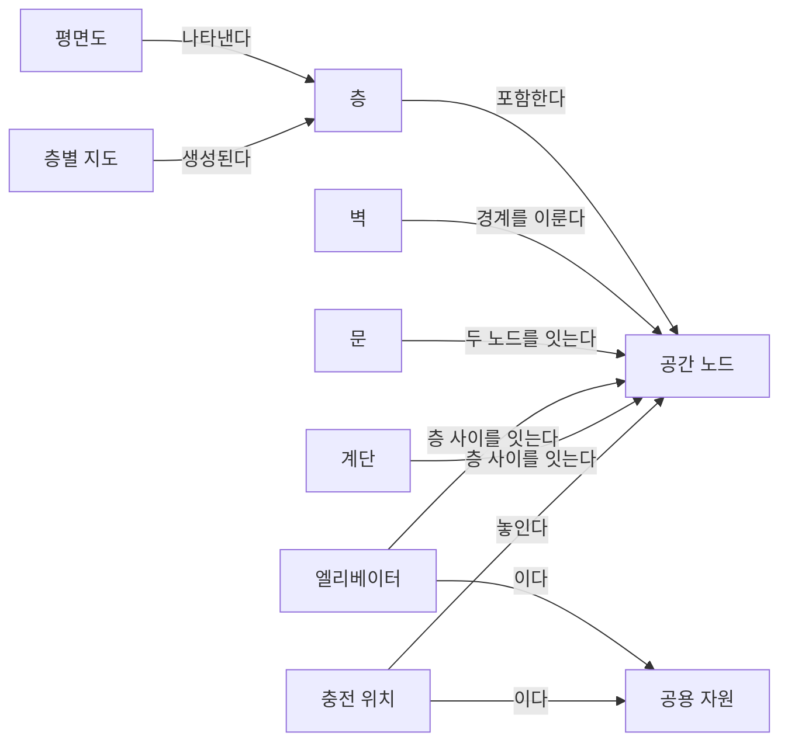
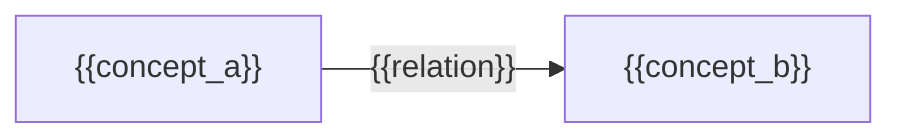

(너의 규칙은 시스템 프롬프트의 agents/shared-rules.md 와 agents/verifier.md 이다. 아래는 이번 실행의 컨텍스트와 입력이다.)

## 실행 컨텍스트

- run_id: 2026-09-25-05
- date: 2026-09-25
- run_type: track (트랙 실행)
- 대상: 트랙 floorplan-recognition (건축 도면 자동 인식) · 현재 단계: 단계 1. 선행 연구·제품 사례 조사 · 이번에 다룰 백로그 질문 id: q1-01 · 중심 세부영역: 6. 지도·공간·위치 모델 (B. 공통 정보·환경 모델)
- 예산:
    - max_search_queries: 40
    - max_sources_per_run: 20
    - new_topic_pages: 1
    - page_updates: 2
    - max_retries: 2
- 환경 알림: web_fetch_available: false · fetch_mode: mirror_only (일반 웹 페이지 열람은 네트워크 정책으로 막혀 있다. raw.githubusercontent.com 은 열린다: 공식 문서가 GitHub 에 있는 출처는 입력의 config/source_mirrors.yaml 경로를 WebFetch 로 열어 원문을 읽고 sources[].fetched=true, fetched_via=github_raw, fetch_url 을 적는다. 입력에 원문 텍스트(data/source_texts)가 있는 출처는 fetched_via=inbox. 그 밖의 출처는 fetched=false 이며 코드가 신뢰도 상한(medium)을 강제한다 — 공통 규칙 0절 6항)
- 언어: ko
- verification_stage: first
- verifier_budget:
    - max_search_queries: 40
    - max_sources_per_run: 20
    - new_topic_pages: 1
    - page_updates: 2
    - max_retries: 2

## 입력

### runs/2026-09-25-05/target.json

```json
{
  "run_id": "2026-09-25-05",
  "date": "2026-09-25",
  "weekday": "Fri",
  "run_number": 5,
  "run_type": "track",
  "forced": true,
  "target": {
    "area_no": 6,
    "area_name": "6. 지도·공간·위치 모델",
    "category": "B. 공통 정보·환경 모델",
    "category_letter": "B"
  },
  "topic": null,
  "track": {
    "slug": "floorplan-recognition",
    "name": "건축 도면 자동 인식",
    "stage": 1,
    "stages": 5,
    "stage_name": "선행 연구·제품 사례 조사",
    "question_ids": [
      "q1-01"
    ],
    "user_questions": [],
    "runs_per_week": 3,
    "question_rationale": "사용자 지정 0건, 되돌아온 질문 0건, 현재 단계 열린 질문 4건 중 오래된 순"
  },
  "corrections": [],
  "budget": {
    "max_search_queries": 40,
    "max_sources_per_run": 20,
    "new_topic_pages": 1,
    "page_updates": 2,
    "max_retries": 2
  },
  "priority_reason": null,
  "priority_questions": [],
  "excluded_areas": [],
  "lifted_areas": [],
  "deferred": {
    "monthly_recheck": false,
    "weekly_review": false
  },
  "selection_rationale": "CLI 지정 run_type=track, area=6; 트랙 실행일(Fri, track_days 앞 3개) → 트랙 floorplan-recognition 단계 1, 질문 q1-01 (사용자 지정 0건, 되돌아온 질문 0건, 현재 단계 열린 질문 4건 중 오래된 순)"
}
```

### runs/2026-09-25-05/research.json

```json
{
  "run_id": "2026-09-25-05",
  "date": "2026-09-25",
  "run_type": "track",
  "target": {
    "area_no": 6,
    "area_name": "6. 지도·공간·위치 모델",
    "category": "B. 공통 정보·환경 모델"
  },
  "gaps": [
    "단계 1 질문 q1-01 열림(target.json 지정: 사용자 지정 0건, 되돌아온 질문 0건, 현재 단계 열린 질문 4건 중 오래된 순)",
    "완료 조건: 선행 연구·데이터셋·제품 사례 비교가 아이디어 3. 건축 도면 자동 인식 페이지 3절에 없음",
    "완료 조건: 인식 대상 요소 목록이 공간 그래프 스키마 초안에 미반영(v0 시드 상태)",
    "6. 지도·공간·위치 모델 페이지 섹션 6. 대표 접근법과 기술, 섹션 7. 관련 표준·프레임워크·오픈소스, 섹션 8. 대표 연구와 자료 비어 있음",
    "용어집에 트랙 glossary_targets(평면도 인식, 래스터–벡터 변환 등) 없음"
  ],
  "research_questions": [
    "제조사마다 다른 지도에서 ‘3층 출하 대기장’을 어떻게 동일한 장소로 인식할까? [분류원문]",
    "q1-01 평면도에서 벽·문·엘리베이터·계단을 인식하는 공개 데이터셋과 모델은 무엇이 있는가?",
    "래스터 이미지 평면도 데이터셋(CubiCasa5K, R2V, MLSTRUCT-FP 등)과 벡터 CAD 도면 데이터셋(FloorPlanCAD, ArchCAD-400K)은 각각 어떤 요소를 어떤 형식으로 라벨링하며, 엘리베이터·계단은 포함되는가? (단계 페이지 3절, 아이디어 페이지 3절 겨냥)",
    "인식 결과를 그래프(방·문·연결) 형태로 내는 모델·데이터셋이 있는가? (공간 그래프 스키마 초안 겨냥)",
    "국내(AI Hub 등) 공개 건축 도면 데이터셋은 어떤 도면 유형·요소를 다루는가? (한국 자료 우선 규칙)",
    "공개 데이터셋의 라이선스·접근 조건과 건물 유형(주거·상업·물류) 편중은 ROP 적용에 어떤 제약이 되는가? (단계 페이지 4절 남은 불확실성 겨냥)"
  ],
  "findings": [
    {
      "id": "f1",
      "claim": "CubiCasa5K는 5,000장의 평면도 이미지를 80개가 넘는 객체 범주로 다각형(polygon) 주석한 공개 데이터셋이며, 2019년 논문과 함께 공개되었다.",
      "tag": "사실",
      "source_ids": [
        "ref-044",
        "ref-045"
      ],
      "cross_checked": false,
      "confidence": "medium",
      "evidence_excerpt": "README: \"5000 samples annotated into over 80 floorplan object categories\", 다각형으로 객체를 분리해 주석. 논문 arXiv 1904.01920. 두 출처 모두 같은 저자 계열이라 독립 교차 아님.",
      "as_of": "2019-04",
      "flow_step": null,
      "flow_item": null
    },
    {
      "id": "f2",
      "claim": "CubiCasa5K는 핀란드 부동산 마케팅 자료에서 온 CAD 기반 평면도로, 주석에는 방(부엌·침실·욕실·복도 등), 아이콘(창문·문·위생기구 등), 구조 요소(벽·난간·계단 등)가 포함되고 주석은 SVG 벡터 형식이다.",
      "tag": "사실",
      "source_ids": [
        "ref-045"
      ],
      "cross_checked": false,
      "confidence": "medium",
      "evidence_excerpt": "검색 요약: 주석 범주는 Rooms, Icons(window, door, sink …), Structural components(walls, railings, storage, chimney, staircase). 원본은 Finnish real estate marketing 자료, 이미지당 SVG 주석.",
      "as_of": "2019-04",
      "flow_step": null,
      "flow_item": null,
      "source_unopened": true
    },
    {
      "id": "f3",
      "claim": "Liu 외(ICCV 2017)의 Raster-to-Vector 방법은 래스터 평면도 이미지를 벽·문(개구부)·방 유형·아이콘을 담은 벡터 표현으로 바꾸며, 원 래스터 이미지(LIFULL 데이터)는 라이선스 때문에 공유하지 않고 벡터 주석과 알고리즘이 생성한 10만 건 이상의 벡터 표현을 공개했다.",
      "tag": "사실",
      "source_ids": [
        "ref-047"
      ],
      "cross_checked": false,
      "confidence": "medium",
      "evidence_excerpt": "README: LIFULL 래스터 이미지는 라이선스 제약으로 공유 불가, 벡터 주석과 \"100,000+ vector-graphics representation\" 공개. README 는 약 90% 정밀도·재현율을 저자 주장으로 적음.",
      "as_of": "2017",
      "flow_step": null,
      "flow_item": null
    },
    {
      "id": "f4",
      "claim": "Zeng 외(ICCV 2019)의 DeepFloorplan은 방 경계를 이용한 주의(attention) 다중 작업 신경망으로 벽·문·창문과 방 유형을 인식하며, Raster-to-Vector 이미지 815장에 픽셀 주석을 단 R2V 데이터셋과 R3D 데이터셋을 사용한다.",
      "tag": "사실",
      "source_ids": [
        "ref-046"
      ],
      "cross_checked": false,
      "confidence": "medium",
      "evidence_excerpt": "README: \"Deep Floor Plan Recognition using a Multi-task Network with Room-boundary-Guided Attention\"(ICCV 2019), 데이터셋 R2V·R3D. 815장 수치는 검색 요약(R2V 설명)에서 확인.",
      "as_of": "2019",
      "flow_step": null,
      "flow_item": null
    },
    {
      "id": "f5",
      "claim": "FloorPlanCAD는 주거·상업 건물의 실제 CAD 도면 15,663장(초판 11,602장)을 SVG 벡터로 담고 35개 범주를 선 단위로 주석해 파놉틱 심볼 스포팅(panoptic symbol spotting) 과제를 정의한 데이터셋(ICCV 2021)이며, 주석은 CC BY-NC 4.0(비상업) 라이선스이고 프로젝트는 2022년 초 종료되었다.",
      "tag": "사실",
      "source_ids": [
        "ref-048",
        "ref-049"
      ],
      "cross_checked": false,
      "confidence": "medium",
      "evidence_excerpt": "프로젝트 페이지 원본: 11,602 → 15,663 drawings, annotations under CC BY-NC 4.0, 저자는 원 도면 저작권을 갖지 않음, 프로젝트는 \"shutdown in early 2022\". 두 출처 모두 같은 저자.",
      "as_of": "2021-10",
      "flow_step": null,
      "flow_item": null
    },
    {
      "id": "f6",
      "claim": "FloorPlanCAD의 범주에는 문·창문·계단과 함께 설비 범주로 엘리베이터(elevator)·에스컬레이터(escalator)가 있고, 벽과 주차 구역은 셀 수 없는 'stuff' 범주로 주석된다.",
      "tag": "사실",
      "source_ids": [
        "ref-050",
        "ref-049"
      ],
      "cross_checked": false,
      "confidence": "medium",
      "evidence_excerpt": "검색 요약(데이터셋 카드): Equipment classes include bath_tub, squat_toilet, urinal, toilet, elevator, escalator; wall·parking 이 전체 주석 요소의 약 27%. 전체 35개 범주 목록은 원문 미열람으로 미확인.",
      "as_of": "2026-09-25",
      "flow_step": null,
      "flow_item": null,
      "source_unopened": true
    },
    {
      "id": "f7",
      "claim": "ArchCAD-400K(NeurIPS 2025)는 표준화된 건축 CAD 도면 5,538장을 잘라 만든 413,062개 조각에 기둥·보·문·창문·도면 기호 등 27개 범주를 주석한 데이터셋으로, 주거 건물은 14%이고 대형 공공·상업 시설이 다수이며 비상업 용도로 제한 공개된다.",
      "tag": "사실",
      "source_ids": [
        "ref-055"
      ],
      "cross_checked": false,
      "confidence": "medium",
      "evidence_excerpt": "검색 요약: 413,062 chunks from 5538 drawings, 27 categories, residential only 14%, restricted access to non-commercial use. 계단·엘리베이터 포함 여부는 요약에 언급만 있고 범주 목록 미확인.",
      "as_of": "2025",
      "flow_step": null,
      "flow_item": null,
      "source_unopened": true
    },
    {
      "id": "f8",
      "claim": "MLSTRUCT-FP는 칠레 주거 건물 프로젝트에서 온 다세대 평면도 이미지 954장에 벽 사각형 70,873개와 슬래브(실내 영역) 다각형, 축척(px/m) 메타데이터를 JSON으로 주석한 데이터셋이며 Automation in Construction(2023)에 발표되었다.",
      "tag": "사실",
      "source_ids": [
        "ref-051"
      ],
      "cross_checked": false,
      "confidence": "medium",
      "evidence_excerpt": "README: 954 floor plan images, 70,873 rectangular wall segments(각도·두께·길이), slabs, scale factors in px/m. Pizarro·Hitschfeld·Sipiran, vol. 156, 105132, 2023. 데이터는 요청 양식으로 제공, 코드 MIT.",
      "as_of": "2023",
      "flow_step": null,
      "flow_item": null
    },
    {
      "id": "f9",
      "claim": "Raster-to-Graph(Computer Graphics Forum, EG 2024)는 평면도 인식을 벽 교차점·벽 선분을 순차 예측하는 구조 그래프 예측 문제로 바꾸고, LIFULL HOME'S 데이터에서 만든 1만 장 이상의 주거 평면도에 구조(벽)와 의미(방 유형·문) 주석을 달았으며 데이터는 LIFULL 이용 신청 뒤에 받을 수 있다.",
      "tag": "사실",
      "source_ids": [
        "ref-052"
      ],
      "cross_checked": false,
      "confidence": "medium",
      "evidence_excerpt": "README: 9,804 train / 500 val / 500 test, 512×512, LIFULL HOME'S 데이터 이용 승인 후 주석을 Google Form 으로 제공, 저자는 직접 공유 권한 없음.",
      "as_of": "2024",
      "flow_step": null,
      "flow_item": null
    },
    {
      "id": "f10",
      "claim": "ResPlan은 온라인 부동산 매물에서 만든 주거 평면도 17,000건에 벽·문·창문·방·발코니의 벡터 형상(미터 좌표)과, 방 사이 연결을 via_door·adjacency·direct·via_window 네 유형의 엣지로 담은 그래프를 제공하며 데이터는 CC BY 4.0이다.",
      "tag": "사실",
      "source_ids": [
        "ref-053"
      ],
      "cross_checked": false,
      "confidence": "medium",
      "evidence_excerpt": "README: 13,053/1,632/1,632 분할, 17개 방 범주, edge 비율 via_door 54.2%·adjacency 35.2%·direct 7.6%·via_window 3.0%, metric coordinates, data CC BY 4.0 / code MIT. 논문은 심사 중(arXiv 2508.14006).",
      "as_of": "2025-08",
      "flow_step": null,
      "flow_item": null
    },
    {
      "id": "f11",
      "claim": "Modified Swiss Dwellings(MSD, ECCV 2024)는 스위스 다세대 건물 평면도 5,300여 장(아파트 18,900여 호)을 방을 노드, 문·벽 등 연결을 엣지로 하는 그래프 구조로 담은 평면도 생성 벤치마크이며 인식용 데이터셋은 아니다.",
      "tag": "사실",
      "source_ids": [
        "ref-054"
      ],
      "cross_checked": false,
      "confidence": "medium",
      "evidence_excerpt": "README: over 5,300 floor plans, 18,900+ apartments, node(방 형상·유형)·edge(연결 유형)·graph(전체 이미지) 속성. 검색 요약상 정제 과정에서 계단 등 비평면 기하를 제거하되 Stairs 영역 범주는 둠.",
      "as_of": "2024",
      "flow_step": null,
      "flow_item": null
    },
    {
      "id": "f12",
      "claim": "CVC-FP는 스캔한 실제 건축 평면도 122장을 출처·양식에 따라 네 묶음으로 나누고 요소와 공간·기능 관계를 주석한 데이터셋이다.",
      "tag": "사실",
      "source_ids": [
        "ref-057"
      ],
      "cross_checked": false,
      "confidence": "medium",
      "evidence_excerpt": "검색 요약: CVC-FP has 122 scanned floor plan documents divided into four categories based on the origin and style; 고해상도, 구조 분석용 groundtruthing 도구 SGT 와 함께 발표. (발행일 미확인, 확인일 기준)",
      "as_of": "2026-09-25",
      "flow_step": null,
      "flow_item": null,
      "source_unopened": true
    },
    {
      "id": "f13",
      "claim": "AI Hub의 '건축 도면 데이터'는 아파트·연립다세대·단독주택의 평면도·입면도·단면도·구조도를 대상으로 하며, 벽체·창문 등의 객체 인식(YOLOv5), 출입문·창호·벽체 구조 인식 세그멘테이션(DeepLabV3+), 도면 문자 인식(YOLOv5+CRNN) 학습 모델을 함께 제공한다.",
      "tag": "사실",
      "source_ids": [
        "ref-056"
      ],
      "cross_checked": false,
      "confidence": "medium",
      "evidence_excerpt": "검색 요약(AI Hub 페이지): 도면 유형 평면도·입면도·단면도·구조도/구조상세도, 2D 설계도면의 3D 모델링 자동 변환에 활용. 규모는 도면 48,033장, 객체 2,653,998건, 텍스트 304,462건으로 요약됨. 클래스 목록(계단·엘리베이터 포함 여부)은 미확인.",
      "as_of": "2026-09-25",
      "flow_step": null,
      "flow_item": null,
      "source_unopened": true
    },
    {
      "id": "f14",
      "claim": "Kratochvila 외(2024)는 다세대 래스터 평면도에서 벽·창문·계단·난간을 픽셀 단위로 분할하는 개선된 U-Net 계열 방법과, 분할 결과를 벡터화해 3D 모델을 만드는 재구성 단계를 제안했다.",
      "tag": "사실",
      "source_ids": [
        "ref-060"
      ],
      "cross_checked": false,
      "confidence": "medium",
      "evidence_excerpt": "검색 요약: MDA-Unet·MACU-Net 기반, skip connection·attention 개선, 재구성 단계가 분할된 평면도를 vectorize 해 3D 모델 생성. 대상 요소 walls, windows, stairs, railings. 엘리베이터는 언급 없음.",
      "as_of": "2024-08",
      "flow_step": null,
      "flow_item": null,
      "source_unopened": true
    },
    {
      "id": "f15",
      "claim": "DoorDet(2025) 저자들은 평면도의 세분화된 다중 유형 문 검출용 공개 데이터셋이 드물다고 보고, 객체 검출기로 문을 찾은 뒤 대규모 언어 모델(LLM)이 문 유형을 분류하고 사람이 검수하는 반자동 구축 절차를 제안했다.",
      "tag": "의견",
      "source_ids": [
        "ref-059"
      ],
      "cross_checked": false,
      "confidence": "medium",
      "evidence_excerpt": "검색 요약: \"publicly available datasets specifically designed for fine-grained multi-class door detection remain scarce\". 3단계: 단일 범주 검출 → LLM 분류 → human-in-the-loop. Neural Computing and Applications 게재.",
      "as_of": "2025-08",
      "flow_step": null,
      "flow_item": null,
      "source_unopened": true
    },
    {
      "id": "f16",
      "claim": "DeFazio 외(2024)는 이동 로봇이 방 이름과 문 표시를 덧붙인 평면도 이미지를 시각-언어 모델(VLM)에 넣어 문 접근·통과를 포함한 이동 계획을 만드는 '지도 파싱(map parsing)'을 제안하고, 아홉 단계 이동 과제에서 성공률 0.96을 보고했다.",
      "tag": "사실",
      "source_ids": [
        "ref-058"
      ],
      "cross_checked": false,
      "confidence": "medium",
      "evidence_excerpt": "검색 요약: enhanced floor plan(labels, door indicators) + start·goal 텍스트 → VLM 이 navigation plan 생성, 실제 로봇에서 실행. GPT-4o·Claude-3.5 Sonnet 평가, 9 action 과제 success rate 0.96. 조건: 연구진의 실제 평면도 지도.",
      "as_of": "2024-09",
      "flow_step": null,
      "flow_item": null,
      "source_unopened": true
    },
    {
      "id": "f17",
      "claim": "이번에 확인한 공개 자료 가운데 엘리베이터를 범주로 명시한 것은 벡터 CAD 도면 데이터셋(FloorPlanCAD, 그리고 요약상 ArchCAD-400K)이고, 래스터 주거 평면도 데이터셋(CubiCasa5K, R2V, MLSTRUCT-FP, ResPlan)은 벽·문·창문·방(일부는 계단·난간) 중심이어서 엘리베이터 라벨은 확인되지 않았다.",
      "tag": "추정",
      "source_ids": [
        "ref-050",
        "ref-055",
        "ref-045",
        "ref-046",
        "ref-051",
        "ref-053"
      ],
      "cross_checked": false,
      "confidence": "low",
      "evidence_excerpt": "f2·f4·f6·f7·f8·f10 의 범주 기술을 대조한 추론. CubiCasa5K 80여 범주·AI Hub 클래스 전체 목록은 원문 미열람이라 엘리베이터 부재를 확정하지 못함.",
      "as_of": "2026-09-25",
      "flow_step": null,
      "flow_item": null,
      "source_unopened": false
    },
    {
      "id": "f18",
      "claim": "확인한 공개 데이터셋은 주거 건물(핀란드·일본·칠레·스위스·국내 주택) 중심이거나 공공·상업 시설 CAD이며, 물류센터·창고 평면도와 로봇 충전 위치를 라벨로 담은 데이터셋은 이번 검색 범위에서 찾지 못했다.",
      "tag": "추정",
      "source_ids": [
        "ref-045",
        "ref-051",
        "ref-052",
        "ref-054",
        "ref-055",
        "ref-056"
      ],
      "cross_checked": false,
      "confidence": "low",
      "evidence_excerpt": "f2·f7·f8·f9·f11·f13 의 데이터 출처에서 도출. 'floor plan … charging station detection dataset' 검색에서도 데이터셋은 나오지 않음. 부재의 확인은 아님.",
      "as_of": "2026-09-25",
      "flow_step": null,
      "flow_item": null,
      "source_unopened": false
    },
    {
      "id": "f19",
      "claim": "FloorPlanCAD·ArchCAD-400K 주석이 비상업 라이선스이고 R2V·Raster-to-Graph의 원 이미지가 LIFULL 이용 승인을 요구하므로, 상용 ROP가 이 데이터셋으로 학습한 모델을 그대로 쓰기에는 라이선스 검토가 필요할 것으로 보인다.",
      "tag": "추정",
      "source_ids": [
        "ref-048",
        "ref-055",
        "ref-047",
        "ref-052"
      ],
      "cross_checked": false,
      "confidence": "low",
      "evidence_excerpt": "f3·f5·f7·f9 의 라이선스·접근 조건에서 도출한 추론. CubiCasa5K·AI Hub 데이터의 상업 이용 조건은 원문 미열람으로 미확인.",
      "as_of": "2026-09-25",
      "flow_step": null,
      "flow_item": null
    },
    {
      "id": "f20",
      "claim": "Raster-to-Graph의 벽 구조 그래프, ResPlan의 유형 붙은 방 연결 엣지(via_door·adjacency 등), MSD의 방–연결 그래프는 공간 그래프 스키마 초안의 '공간 노드–문–공간 노드' 구조와 가까운 출력 형태이나, 층 간 연결(엘리베이터·계단)과 통과 조건은 담지 않는 것으로 보인다.",
      "tag": "추정",
      "source_ids": [
        "ref-052",
        "ref-053",
        "ref-054"
      ],
      "cross_checked": false,
      "confidence": "low",
      "evidence_excerpt": "f9·f10·f11 의 그래프 정의를 공간 그래프 스키마 초안 v0 의 관계(문이 두 공간 노드를 잇는다, 엘리베이터·계단이 층 사이를 잇는다)에 대응시킨 추론. 세 자료 모두 단일 층 평면도 기준.",
      "as_of": "2026-09-25",
      "flow_step": null,
      "flow_item": null
    },
    {
      "id": "f21",
      "claim": "MLSTRUCT-FP(px/m 축척)와 ResPlan(미터 좌표)처럼 축척 정보를 함께 주는 데이터셋은 일부이고, 512×512로 정규화한 Raster-to-Graph처럼 축척 없이 이미지 좌표만 다루는 경우가 있어, 인식 결과를 로봇 지도 좌표로 옮기려면 축척 복원이 별도 과제가 될 것으로 보인다.",
      "tag": "추정",
      "source_ids": [
        "ref-051",
        "ref-053",
        "ref-052"
      ],
      "cross_checked": false,
      "confidence": "low",
      "evidence_excerpt": "f8·f9·f10 의 좌표·축척 기술에서 도출. 로봇 지도 변환 보정은 단계 4. 지도 변환 보정과 현장 정합의 질문(q4-01, q4-03)과 연결.",
      "as_of": "2026-09-25",
      "flow_step": null,
      "flow_item": null
    }
  ],
  "sources": [
    {
      "id": "ref-044",
      "org": "CubiCasa (Kalervo, A. 외)",
      "title": "CubiCasa5k — README (CubiCasa5K: A Dataset and an Improved Multi-Task Model for Floorplan Image Analysis)",
      "published": null,
      "url": "https://github.com/CubiCasa/CubiCasa5k",
      "type": "오픈소스 문서",
      "reliability": "high",
      "accessed": "2026-09-25",
      "summary": "CubiCasa5K 데이터셋과 다중 작업 모델의 공식 저장소 README. 5,000장·80여 범주·다각형 주석을 설명한다.",
      "fetched": true,
      "fetched_via": "github_raw",
      "fetch_url": "https://raw.githubusercontent.com/CubiCasa/CubiCasa5k/master/README.md",
      "source_unopened": false
    },
    {
      "id": "ref-045",
      "org": "Kalervo, A., Ylioinas, J., Häikiö, M., Karhu, A., & Kannala, J.",
      "title": "CubiCasa5K: A Dataset and an Improved Multi-Task Model for Floorplan Image Analysis",
      "published": "2019-04",
      "url": "https://arxiv.org/abs/1904.01920",
      "type": "논문",
      "reliability": "medium",
      "accessed": "2026-09-25",
      "summary": "원문 미열람. 핀란드 부동산 평면도 5,000장의 SVG 주석 데이터셋과 다중 작업 인식 모델을 제시한 논문(SCIA 2019).",
      "source_unopened": true,
      "fetched": false,
      "fetched_via": null,
      "fetch_url": null
    },
    {
      "id": "ref-046",
      "org": "Zeng, Z., Li, X., Yu, Y. K., & Fu, C.-W.",
      "title": "DeepFloorplan — README (Deep Floor Plan Recognition using a Multi-task Network with Room-boundary-Guided Attention)",
      "published": "2019",
      "url": "https://github.com/zlzeng/DeepFloorplan",
      "type": "오픈소스 문서",
      "reliability": "high",
      "accessed": "2026-09-25",
      "summary": "ICCV 2019 평면도 인식 모델의 공식 저장소 README. R2V·R3D 데이터셋과 벽·문·창문·방 유형 인식을 설명한다.",
      "fetched": true,
      "fetched_via": "github_raw",
      "fetch_url": "https://raw.githubusercontent.com/zlzeng/DeepFloorplan/master/README.md",
      "source_unopened": false
    },
    {
      "id": "ref-047",
      "org": "Liu, C., Wu, J., Kohli, P., & Furukawa, Y.",
      "title": "FloorplanTransformation — README (Raster-to-Vector: Revisiting Floorplan Transformation)",
      "published": "2017",
      "url": "https://github.com/art-programmer/FloorplanTransformation",
      "type": "오픈소스 문서",
      "reliability": "high",
      "accessed": "2026-09-25",
      "summary": "ICCV 2017 래스터→벡터 평면도 변환의 공식 저장소 README. LIFULL 이미지 비공개와 벡터 주석·생성 결과 공개를 안내한다.",
      "fetched": true,
      "fetched_via": "github_raw",
      "fetch_url": "https://raw.githubusercontent.com/art-programmer/FloorplanTransformation/master/README.md",
      "source_unopened": false
    },
    {
      "id": "ref-048",
      "org": "FloorPlanCAD 프로젝트(Fan, Z. 외)",
      "title": "FloorPlanCAD Dataset — project page (floorplancad.github.io index.md)",
      "published": "2021",
      "url": "https://floorplancad.github.io/",
      "type": "오픈소스 문서",
      "reliability": "high",
      "accessed": "2026-09-25",
      "summary": "FloorPlanCAD 데이터셋 공식 프로젝트 페이지 원본. 도면 수, CC BY-NC 4.0 주석 라이선스, 2022년 초 프로젝트 종료를 적는다.",
      "fetched": true,
      "fetched_via": "github_raw",
      "fetch_url": "https://raw.githubusercontent.com/floorplancad/floorplancad.github.io/master/index.md",
      "source_unopened": false
    },
    {
      "id": "ref-049",
      "org": "Fan, Z., Zhu, L., Li, H., Chen, X., Zhu, S., & Tan, P.",
      "title": "FloorPlanCAD: A Large-Scale CAD Drawing Dataset for Panoptic Symbol Spotting",
      "published": "2021-05",
      "url": "https://arxiv.org/abs/2105.07147",
      "type": "논문",
      "reliability": "medium",
      "accessed": "2026-09-25",
      "summary": "원문 미열람. 15,000여 CAD 평면도를 35개 범주로 선 단위 주석하고 파놉틱 심볼 스포팅 과제와 CNN-GCN 방법을 제시한 ICCV 2021 논문.",
      "source_unopened": true,
      "fetched": false,
      "fetched_via": null,
      "fetch_url": null
    },
    {
      "id": "ref-050",
      "org": "Voxel51 (Hugging Face)",
      "title": "Voxel51/FloorPlanCAD · Datasets at Hugging Face",
      "published": null,
      "url": "https://huggingface.co/datasets/Voxel51/FloorPlanCAD",
      "type": "오픈소스 문서",
      "reliability": "medium",
      "accessed": "2026-09-25",
      "summary": "원문 미열람. FloorPlanCAD 를 재배포한 제3자 데이터셋 카드. 설비 범주(엘리베이터·에스컬레이터 등)와 주석 형식을 설명한다.",
      "source_unopened": true,
      "fetched": false,
      "fetched_via": null,
      "fetch_url": null
    },
    {
      "id": "ref-051",
      "org": "Pizarro, P. N., Hitschfeld, N., & Sipiran, I. (MLSTRUCT)",
      "title": "MLStructFP — README (Large-scale multi-unit floor plan dataset for architectural plan analysis and recognition)",
      "published": "2023",
      "url": "https://github.com/MLSTRUCT/MLStructFP",
      "type": "오픈소스 문서",
      "reliability": "high",
      "accessed": "2026-09-25",
      "summary": "MLSTRUCT-FP 데이터셋 적재 라이브러리 README. 954장, 벽 사각형·슬래브·축척 JSON 형식과 Automation in Construction 2023 인용을 적는다.",
      "fetched": true,
      "fetched_via": "github_raw",
      "fetch_url": "https://raw.githubusercontent.com/MLSTRUCT/MLStructFP/master/README.rst",
      "source_unopened": false
    },
    {
      "id": "ref-052",
      "org": "Hu, S. 외",
      "title": "Raster-to-Graph — README (Raster-to-Graph: Floorplan Recognition via Autoregressive Graph Prediction with an Attention Transformer)",
      "published": "2024",
      "url": "https://github.com/SizheHu/Raster-to-Graph",
      "type": "오픈소스 문서",
      "reliability": "high",
      "accessed": "2026-09-25",
      "summary": "EG 2024 평면도 구조 그래프 인식 방법의 공식 저장소 README. 1만여 장 주거 평면도 주석과 LIFULL 데이터 이용 신청 조건을 안내한다.",
      "fetched": true,
      "fetched_via": "github_raw",
      "fetch_url": "https://raw.githubusercontent.com/SizheHu/Raster-to-Graph/main/README.md",
      "source_unopened": false
    },
    {
      "id": "ref-053",
      "org": "Agour, M. 외 (ResPlan)",
      "title": "ResPlan — README (ResPlan: A Large-Scale Vector-Graph Dataset of 17,000 Residential Floor Plans)",
      "published": "2025-08",
      "url": "https://github.com/m-agour/ResPlan",
      "type": "오픈소스 문서",
      "reliability": "high",
      "accessed": "2026-09-25",
      "summary": "17,000건 주거 평면도의 벡터·그래프 데이터셋 README. 요소 범주, 엣지 유형, 미터 좌표, CC BY 4.0 라이선스를 적는다.",
      "fetched": true,
      "fetched_via": "github_raw",
      "fetch_url": "https://raw.githubusercontent.com/m-agour/ResPlan/main/README.md",
      "source_unopened": false
    },
    {
      "id": "ref-054",
      "org": "van Engelenburg, C. 외 (MSD)",
      "title": "msd — README (MSD: A Benchmark Dataset for Floor Plan Generation of Building Complexes)",
      "published": "2024",
      "url": "https://github.com/caspervanengelenburg/msd",
      "type": "오픈소스 문서",
      "reliability": "high",
      "accessed": "2026-09-25",
      "summary": "ECCV 2024 다세대 평면도 생성 벤치마크의 공식 저장소 README. 방–연결 그래프 구조를 설명한다.",
      "fetched": true,
      "fetched_via": "github_raw",
      "fetch_url": "https://raw.githubusercontent.com/caspervanengelenburg/msd/main/README.md",
      "source_unopened": false
    },
    {
      "id": "ref-055",
      "org": "Luo, R. 외",
      "title": "ArchCAD-400K: A Large-Scale CAD drawings Dataset and New Baseline for Panoptic Symbol Spotting",
      "published": "2025-03",
      "url": "https://arxiv.org/abs/2503.22346",
      "type": "논문",
      "reliability": "medium",
      "accessed": "2026-09-25",
      "summary": "원문 미열람. 공공·상업 시설 중심 건축 CAD 도면 5,538장(413,062개 조각)의 27개 범주 주석 데이터셋과 DPSS 기준 모델을 제시한 NeurIPS 2025 논문.",
      "source_unopened": true,
      "fetched": false,
      "fetched_via": null,
      "fetch_url": null
    },
    {
      "id": "ref-056",
      "org": "한국지능정보사회진흥원(AI Hub)",
      "title": "건축 도면 데이터",
      "published": null,
      "url": "https://aihub.or.kr/aihubdata/data/view.do?dataSetSn=71465",
      "type": "정부·연구기관",
      "reliability": "medium",
      "accessed": "2026-09-25",
      "summary": "원문 미열람. 주택 유형별 평면도·입면도·단면도·구조도의 객체·문자 주석 데이터와 객체 인식·세그멘테이션·OCR 학습 모델을 제공하는 국내 AI 학습용 데이터 페이지.",
      "source_unopened": true,
      "fetched": false,
      "fetched_via": null,
      "fetch_url": null
    },
    {
      "id": "ref-057",
      "org": "de las Heras, L.-P., Terrades, O. R., Robles, S., & Sánchez, G.",
      "title": "CVC-FP and SGT: a new database for structural floor plan analysis and its groundtruthing tool",
      "published": null,
      "url": "https://www.researchgate.net/publication/270597635_CVC-FP_and_SGT_a_new_database_for_structural_floor_plan_analysis_and_its_groundtruthing_tool",
      "type": "논문",
      "reliability": "medium",
      "accessed": "2026-09-25",
      "summary": "원문 미열람. 스캔 평면도 122장의 구조 분석용 데이터셋 CVC-FP 와 주석 도구 SGT 를 제시한 논문.",
      "source_unopened": true,
      "fetched": false,
      "fetched_via": null,
      "fetch_url": null
    },
    {
      "id": "ref-058",
      "org": "DeFazio, D., Mehta, H., Wang, M., Yang, P., Blackburn, J., & Zhang, S.",
      "title": "Vision Language Models Can Parse Floor Plan Maps",
      "published": "2024-09",
      "url": "https://arxiv.org/abs/2409.12842",
      "type": "논문",
      "reliability": "medium",
      "accessed": "2026-09-25",
      "summary": "원문 미열람. 이동 로봇이 평면도 이미지를 VLM 으로 해석해 이동 계획을 만드는 지도 파싱 과제와 실로봇 실험을 제시한 프리프린트.",
      "source_unopened": true,
      "fetched": false,
      "fetched_via": null,
      "fetch_url": null
    },
    {
      "id": "ref-059",
      "org": "DoorDet 저자(arXiv 2508.07714)",
      "title": "DoorDet: Semi-Automated Multi-Class Door Detection Dataset via Object Detection and Large Language Models",
      "published": "2025-08",
      "url": "https://arxiv.org/abs/2508.07714",
      "type": "논문",
      "reliability": "medium",
      "accessed": "2026-09-25",
      "summary": "원문 미열람. 객체 검출기·LLM·사람 검수로 평면도의 다중 유형 문 검출 데이터셋을 반자동 구축하는 방법을 제시한 논문(Neural Computing and Applications 게재).",
      "source_unopened": true,
      "fetched": false,
      "fetched_via": null,
      "fetch_url": null
    },
    {
      "id": "ref-060",
      "org": "Kratochvila, L., de Jong, G., Arkesteijn, M., Zemcik, T., Bilik, S., Horak, K., & Rellermeyer, J. S.",
      "title": "Multi-Unit Floor Plan Recognition and Reconstruction Using Improved Semantic Segmentation of Raster-Wise Floor Plans",
      "published": "2024-08",
      "url": "https://arxiv.org/abs/2408.01526",
      "type": "논문",
      "reliability": "medium",
      "accessed": "2026-09-25",
      "summary": "원문 미열람. 다세대 래스터 평면도의 벽·창문·계단·난간 분할과 벡터화·3D 재구성 파이프라인을 제시한 프리프린트.",
      "source_unopened": true,
      "fetched": false,
      "fetched_via": null,
      "fetch_url": null
    }
  ],
  "page_proposals": [
    {
      "action": "update",
      "path": "docs/tracks/floorplan-recognition/stage-1-prior-work-and-products.md",
      "sections": [
        "2",
        "3",
        "4",
        "5",
        "6",
        "8",
        "9"
      ],
      "rationale": "q1-01 답: f1·f2·f3·f4·f5·f6·f7·f8·f9·f10·f11·f12·f13·f14·f15·f16·f17·f18·f19·f20·f21 (신뢰도 medium) — 단계 1 질문 목록 q1-01 상태 답함, 3절 q1-01 소제목(래스터 데이터셋·벡터 CAD 데이터셋·그래프 출력 모델·국내 데이터·로봇용 VLM 파싱), 4절 남은 불확실성(엘리베이터·충전 위치 라벨 부재 f17·f18, 라이선스 f19, 축척 f21), 5절 후속 질문, 6절 완료 조건 현황, 8절 출처, 9절 이력"
    },
    {
      "action": "update",
      "path": "docs/ideas/floorplan-recognition.md",
      "sections": [
        "3"
      ],
      "rationale": "아이디어 페이지 3절: 트랙 산출물 갱신. 선행 연구·데이터셋 비교표 초안(데이터셋별 입력 형식·규모·요소·엘리베이터/계단 포함 여부·라이선스): f1·f2·f3·f4·f5·f6·f7·f8·f9·f10·f11·f12·f13·f14, 로봇 적용 연구 f16, 한계 f17·f18·f19. 제품 사례(q1-02)는 아직 없음을 명시"
    },
    {
      "action": "update",
      "path": "docs/tracks/floorplan-recognition/space-graph-schema-draft.md",
      "sections": [
        "2",
        "3",
        "6"
      ],
      "rationale": "트랙 산출물 갱신: track.ontology_changes 가 검증 승인되면 개념(창문, 난간, 에스컬레이터)·관계(공간 노드 인접)·공간 노드 속성(방 유형) 반영, 초안 버전 v0.1. 미승인 제안과 f20·f21 은 6절 미해결 질문으로"
    },
    {
      "action": "update",
      "path": "docs/categories/b-common-information-and-environment-model/06-map-space-and-location-model.md",
      "sections": [
        "6",
        "7",
        "8"
      ],
      "rationale": "트랙 floorplan-recognition 단계 1 반영 제안 (f3, f4, f5, f8, f9, f10, f13, f16): 섹션 6 래스터→벡터·구조 그래프 인식 접근, 섹션 7 공개 데이터셋(CubiCasa5K, FloorPlanCAD, MLSTRUCT-FP, ResPlan, AI Hub 건축 도면 데이터), 섹션 8 DeepFloorplan·Raster-to-Graph·VLM 지도 파싱 연구"
    },
    {
      "action": "update",
      "path": "docs/categories/g-safety-security-intelligence-and-governance/27-ai-learning-adaptation-and-model-operations.md",
      "sections": [
        "8"
      ],
      "rationale": "트랙 floorplan-recognition 단계 1 반영 제안 (f4, f9, f15, f16): 교차 규칙에 따른 도면 해석 방법(다중 작업 신경망, 그래프 예측, LLM 보조 주석, VLM 평면도 파싱)을 6. 지도·공간·위치 모델 페이지와 양쪽 연결"
    }
  ],
  "glossary_candidates": [
    {
      "term_ko": "평면도 인식",
      "term_en": "Floor Plan Recognition",
      "definition": "평면도 이미지나 CAD 도면에서 벽·문·창문·계단 같은 건축 요소와 방 영역·유형을 자동으로 찾아내 구조화하는 작업이다."
    },
    {
      "term_ko": "래스터–벡터 변환",
      "term_en": "Raster-to-Vector Conversion",
      "definition": "픽셀 이미지로 된 평면도를 벽 선분·교차점·방 다각형 같은 기하 요소의 벡터 표현으로 바꾸는 처리이다."
    },
    {
      "term_ko": "파놉틱 심볼 스포팅",
      "term_en": "Panoptic Symbol Spotting",
      "definition": "CAD 도면의 선 요소마다 문·창문 같은 셀 수 있는 기호의 개별 인스턴스와 벽 같은 셀 수 없는 영역의 의미를 함께 판별하는 과제이다."
    }
  ],
  "open_questions_new": [],
  "open_questions_resolved": [],
  "self_check": {
    "source_count": 17,
    "cross_checked_count": 0,
    "unverified": [
      "f2 CubiCasa5K 80여 범주 전체 목록(엘리베이터 포함 여부) 원문 미열람으로 미확인",
      "f6 FloorPlanCAD 35개 범주 전체 목록은 제3자 데이터셋 카드 검색 요약에 기댐, 공식 범주 페이지 원본에는 목록이 없었음",
      "f7 ArchCAD-400K 의 계단·엘리베이터 범주 포함 여부 미확인(요약에 언급만 있음)",
      "f13 AI Hub 건축 도면 데이터 클래스 목록·이용 조건·규모 수치(48,033장 등)는 검색 요약만 확인",
      "CubiCasa5K 라이선스(CC BY-NC 4.0 로 요약됨)는 제3자 저장소 요약이라 finding 으로 내지 않음",
      "SESYD·ROBIN 데이터셋은 검색 요약 출처가 불분명해 finding 으로 내지 않음",
      "2025년 평면도 분석 리뷰(Automation in Construction, 2000–2025)는 요약 내용이 여러 리뷰와 섞여 출처로 넣지 않음",
      "모든 finding 교차 확인 실패: 데이터셋마다 저자 계열 1차 출처만 있음",
      "ref-045·ref-049·ref-055·ref-057·ref-059·ref-060 저자 목록 일부는 검색 요약 기준"
    ],
    "scope_violations": [],
    "budget_used": {
      "queries": 25,
      "sources": 17
    },
    "limits": "fetch_mode mirror_only(web_fetch_available: false): GitHub 공식 저장소 README 8건(ref-044, ref-046, ref-047, ref-048, ref-051, ref-052, ref-053, ref-054)은 raw.githubusercontent.com 으로 원문을 열었고, 논문·AI Hub·데이터셋 카드 9건은 검색 요약만 봐서 원문 미열람(신뢰도 상한 medium)이다. 열린 README 도 데이터셋마다 단일 출처라 finding 신뢰도는 medium 이하로 두었다. 검색 25회/40, 신규 출처 17건/20(ref-044~ref-060, next_ref_id 기준). 주의: 이전 브리프 2026-09-25-03 이 ref-044~ref-050 을 이미 다른 출처(GS1 EPCIS 온톨로지 등)에 부여했으나 참고문헌 목록에는 없고 실행 컨텍스트 next_ref_id 가 ref-044 이므로 컨텍스트 값을 따랐다 — id 충돌 여부는 퍼블리셔 확인 필요. 질문 선택: target.json 지정 q1-01(사용자 지정 0건, 되돌아온 질문 0건, 오래된 순). q1-01 은 데이터셋·모델 목록으로 답했으나 엘리베이터·충전 위치 라벨 존재 여부는 부재 추정(f17·f18)이다. 27. AI·학습·적응과 모델 운영 관련 finding(f4, f9, f15, f16)은 교차 규칙에 따라 6. 지도·공간·위치 모델과 함께 반영 제안했다. 8. 실시간 세계 상태·데이터 일관성과 22. 시뮬레이션·예측용 디지털 트윈 관련 주장은 내지 않았다. 제품 사례(q1-02)·충전 시설(q1-03)·현장 모델링 시간(q1-04)은 이번 범위 밖이라 다루지 않았다. 일반 열린 질문 신규 없음: 새 질문은 모두 트랙 전용이라 track.new_questions 에 올렸다. 후속 질문 4건, 온톨로지 변경 제안 5건. 한국 자료는 AI Hub 1건뿐이다."
  },
  "track": {
    "slug": "floorplan-recognition",
    "stage": 1,
    "answered_question_ids": [
      "q1-01"
    ],
    "new_questions": [
      {
        "question": "물류센터·창고 평면도(랙·도크·충전 구역 포함)를 대상으로 한 공개 평면도 인식 데이터셋이나 모델이 있는가, 없으면 주거·상업 데이터셋으로 학습한 모델이 물류 시설 도면에 얼마나 옮겨지는가?",
        "stage": 1,
        "rationale_finding_id": "f18"
      },
      {
        "question": "AI Hub 건축 도면 데이터와 CubiCasa5K 의 클래스 목록에 계단·엘리베이터가 포함되는지, 그리고 상업적 이용 조건은 무엇인가?",
        "stage": 2,
        "rationale_finding_id": "f17"
      },
      {
        "question": "축척 정보가 없는 래스터 평면도의 인식 결과를 로봇 지도 좌표(미터)로 옮기기 위해 축척을 어떻게 복원하는가(치수 문자 OCR, 문 폭 등 기준 요소, 현장 측정)?",
        "stage": 4,
        "rationale_finding_id": "f21"
      },
      {
        "question": "그래프 출력형 평면도 인식(구조 그래프, 방 연결 그래프)을 층 간 연결(엘리베이터·계단)과 통과 조건을 갖춘 공간 그래프로 확장하려면 무엇이 더 필요한가?",
        "stage": 3,
        "rationale_finding_id": "f20"
      }
    ],
    "ontology_changes": [
      {
        "op": "add",
        "kind": "concept",
        "name": "창문 (Window)",
        "evidence_finding_ids": [
          "f2",
          "f4",
          "f10"
        ],
        "description": "공간 노드 경계에 놓이는 개구부로 로봇은 통과할 수 없다. 여러 인식 데이터셋의 기본 인식 대상이며, ResPlan 은 창문을 통한 연결(via_window)을 엣지 유형으로 둔다. 인식 대상 요소 목록(완료 조건)에 넣되 통과 불가 경계로 구분."
      },
      {
        "op": "add",
        "kind": "concept",
        "name": "난간 (Railing)",
        "evidence_finding_ids": [
          "f2",
          "f14"
        ],
        "description": "벽처럼 통과할 수 없지만 시야는 열린 경계 요소. CubiCasa5K·Kratochvila 외(2024)의 인식 대상. 벽과 같은 개념으로 묶을지 별도로 둘지는 검증 판단 필요."
      },
      {
        "op": "add",
        "kind": "concept",
        "name": "에스컬레이터 (Escalator)",
        "evidence_finding_ids": [
          "f6"
        ],
        "description": "층 사이를 잇는 수직 이동 설비로 CAD 데이터셋에서 엘리베이터와 함께 범주로 주석된다. 대부분 로봇이 이용할 수 없는 연결이므로 로봇 능력과의 대조 대상. 근거가 원문 미열람 단일 출처라 신뢰도 낮음."
      },
      {
        "op": "add",
        "kind": "relation",
        "name": "공간 노드 / 인접한다(문 없이) / 공간 노드",
        "evidence_finding_ids": [
          "f10",
          "f11",
          "f20"
        ],
        "description": "문을 거치지 않고 경계를 맞대거나 개방되어 이어진 공간 사이 관계. ResPlan 의 adjacency·direct 엣지, MSD 의 연결 유형에 대응. 기존 관계 '문 / 두 공간 노드를 잇는다'와 구분된다."
      },
      {
        "op": "modify",
        "kind": "concept",
        "name": "공간 노드 (Space Node)",
        "evidence_finding_ids": [
          "f3",
          "f4",
          "f9",
          "f10"
        ],
        "description": "주요 속성에 '방 유형(부엌·침실·복도 등, 데이터셋별 분류 체계)'을 더한다. 주거 중심 분류라 물류 시설 구역 유형(출하 대기장 등)과의 대응은 미해결 질문으로 둔다."
      }
    ],
    "stage_completion_self_assessment": {
      "met": false,
      "missing": [
        "아이디어 3. 건축 도면 자동 인식 페이지 3절 비교에 제품 사례(q1-02)·충전 시설 사례(q1-03)가 없음",
        "인식 대상 요소 목록의 공간 그래프 스키마 초안 반영은 이번 온톨로지 변경 제안의 검증 승인 전",
        "q1-02, q1-03, q1-04 열림"
      ]
    }
  }
}
```

### docs/categories/b-common-information-and-environment-model/06-map-space-and-location-model.md

```markdown
---
title: "6. 지도·공간·위치 모델"
type: area
category: "B. 공통 정보·환경 모델"
area_no: 6
related_areas: []
tags: []
status: seed
created: 2026-09-24
updated: 2026-09-24
sources: []
version: 1
---

[홈](../../index.md) › [B. 공통 정보·환경 모델](index.md) › 6. 지도·공간·위치 모델

# 6. 지도·공간·위치 모델

!!! info "소속 대분류"
    [B. 공통 정보·환경 모델](index.md) — 핵심 질문:
    로봇·물건·공간·상태를 어떻게 같은 의미로 이해할 것인가? [분류원문]

<!-- auto:area-tracks:start -->
!!! note "관련 연구 트랙"
    이 세부영역을 가로지르는 중점 연구 트랙과 확장 아이디어다. 트랙은 분류를 바꾸지 않으며, 트랙에서 확인된 사실은 이 페이지에 반영하도록 제안된다. 전체 매핑은 [확장 아이디어 연결 구조](../../ideas/index.md)에 있다.

    - [자연어 업무 지시 챗봇](../../tracks/nl-task-chatbot/index.md) — 함께 필요한 영역(○) · 확장 아이디어: [아이디어 2. 자연어 업무 지시 챗봇](../../ideas/nl-task-chatbot.md)
    - [건축 도면 자동 인식](../../tracks/floorplan-recognition/index.md) — 중심 영역(●) · 확장 아이디어: [아이디어 3. 건축 도면 자동 인식](../../ideas/floorplan-recognition.md)
<!-- auto:area-tracks:end -->

## 1. 한 줄 정의

BIM·CAD·센서 지도에서 이동 공간과 경로를 만들고, 로봇별 좌표계·층·목적지를 정렬 [분류원문]

## 2. SCM 관점의 질문

제조사마다 다른 지도에서 ‘3층 출하 대기장’을 어떻게 동일한 장소로 인식할까? [분류원문]

> 원문 주석: 6번에는 지도 생성뿐 아니라 **현장과 도면의 차이 확인, 지도 버전 관리, 위치추정 결과의 신뢰도**도 포함해야 한다. [분류원문]

> 원문 주석: 27번의 AI는 특정 기능 하나에만 해당하지 않는다. **매뉴얼 해석은 5·21번, 도면 해석은 6번, 학습 기반 배차는 13번, 장애 분석은 19번**에 적용되는 연구 방법이다. [분류원문]

## 3. 왜 중요한가

아직 작성되지 않음

## 4. 핵심 개념과 용어

아직 작성되지 않음

## 5. 현장 시나리오 (물류 흐름의 어느 단계인지 명시)

아직 작성되지 않음

## 6. 대표 접근법과 기술

아직 작성되지 않음

## 7. 관련 표준·프레임워크·오픈소스

아직 작성되지 않음

## 8. 대표 연구와 자료

아직 작성되지 않음

## 9. ROP가 직접 맡는 것과 외부와 연계하는 것 (부록 A 9장 기준)

아직 작성되지 않음

## 10. 다른 연구영역과의 연결 (번호와 이름을 함께 표기)

아직 작성되지 않음

## 11. 열린 질문

아직 작성되지 않음

## 12. 최근 업데이트 (자동)

<!-- auto:area-recent:start -->
아직 기록된 업데이트가 없다.
<!-- auto:area-recent:end -->

## 13. 참고 자료 (각주)

(아직 각주가 없다. 본문이 작성되면 출처 각주를 여기에 둔다.)
```

### docs/categories/d-planning-and-optimization/15-multi-robot-path-and-traffic-management-mapf.md (요약)

```markdown
# 15. 다중 로봇 경로·교통 관리 — MAPF

소속 대분류: D. 계획·최적화 · 상태: seed · 신뢰도: — · 마지막 갱신: 2026-09-24 · 버전: 1

## 1. 한 줄 정의

여러 로봇의 경로와 통과 시점을 조율하고, 혼잡·교착·우선권을 처리 [분류원문]

## 2. SCM 관점의 질문

서로 다른 제조사의 로봇이 좁은 통로에서 마주치면 누가 양보할까? [분류원문]
```

### docs/categories/f-deployment-verification-and-maintenance/21-onboarding-configuration-and-commissioning.md (요약)

```markdown
# 21. 온보딩·설정·현장 시운전

소속 대분류: F. 도입·검증·유지관리 · 상태: seed · 신뢰도: — · 마지막 갱신: 2026-09-24 · 버전: 1

## 1. 한 줄 정의

로봇 등록, 기능 탐색, 문서 분석, 지도·설비 설정, 교정, 설치 절차 자동화 [분류원문]

## 2. SCM 관점의 질문

새 제조사나 새 물류센터를 추가할 때 반복 작업을 얼마나 줄일까? [분류원문]

> 원문 주석: 27번의 AI는 특정 기능 하나에만 해당하지 않는다. **매뉴얼 해석은 5·21번, 도면 해석은 6번, 학습 기반 배차는 13번, 장애 분석은 19번**에 적용되는 연구 방법이다. [분류원문]
```

### docs/categories/f-deployment-verification-and-maintenance/22-simulation-and-predictive-digital-twin.md (요약)

```markdown
# 22. 시뮬레이션·예측용 디지털 트윈

소속 대분류: F. 도입·검증·유지관리 · 상태: seed · 신뢰도: — · 마지막 갱신: 2026-09-24 · 버전: 1

## 1. 한 줄 정의

로봇·설비·물동량을 가상 환경에서 재현하고, 배치·운영 정책·수요 변화의 효과를 예측 [분류원문]

## 2. SCM 관점의 질문

성수기 주문량이 늘면 어디가 먼저 막힐까? [분류원문]

> 원문 주석: 8번의 실시간 모델이 **현재 상태를 표현**한다면, 22번은 그 모델을 이용해 **가정한 미래를 실험**한다. 구분해두면 디지털 트윈이라는 이름 아래 서로 다른 기능이 섞이지 않는다. [분류원문]
```

### docs/categories/g-safety-security-intelligence-and-governance/27-ai-learning-adaptation-and-model-operations.md (요약)

```markdown
# 27. AI·학습·적응과 모델 운영

소속 대분류: G. 안전·보안·지능·거버넌스 · 상태: seed · 신뢰도: — · 마지막 갱신: 2026-09-24 · 버전: 1

## 1. 한 줄 정의

문서·도면 해석, 수요·고장 예측, 학습 기반 계획, LLM 에이전트, 불확실성 평가, 모델 변경 관리 [분류원문]

## 2. SCM 관점의 질문

AI가 만든 작업 계획이나 기능 해석을 어떤 기준으로 실행에 사용할까? [분류원문]

> 원문 주석: 27번의 AI는 특정 기능 하나에만 해당하지 않는다. **매뉴얼 해석은 5·21번, 도면 해석은 6번, 학습 기반 배차는 13번, 장애 분석은 19번**에 적용되는 연구 방법이다. [분류원문]
```

### docs/categories/a-business-supply-chain-design/03-capacity-site-and-facility-planning.md (요약)

```markdown
# 3. 처리능력·거점·설비 계획

소속 대분류: A. 업무·공급망 설계 · 상태: seed · 신뢰도: — · 마지막 갱신: 2026-09-24 · 버전: 1

## 1. 한 줄 정의

물동량에 필요한 로봇 수와 종류, 작업대·충전기 배치, 교대 운영, 여러 거점의 자원 배치를 결정 [분류원문]

## 2. SCM 관점의 질문

로봇을 늘려야 할까, 포장대나 엘리베이터가 병목일까? [분류원문]
```

### docs/categories/b-common-information-and-environment-model/05-robot-capability-and-task-ontology.md (요약)

```markdown
# 5. 로봇 능력·작업 온톨로지

소속 대분류: B. 공통 정보·환경 모델 · 상태: seed · 신뢰도: — · 마지막 갱신: 2026-09-24 · 버전: 1

## 1. 한 줄 정의

제조사별 기능·제약·장착 장비·실행 조건을 공통 모델로 표현하고, 작업 요구와 연결 [분류원문]

## 2. SCM 관점의 질문

같은 ‘운반 로봇’ 중 누가 이 화물을 실제로 취급할 수 있는가? [분류원문]

> 원문 주석: 27번의 AI는 특정 기능 하나에만 해당하지 않는다. **매뉴얼 해석은 5·21번, 도면 해석은 6번, 학습 기반 배차는 13번, 장애 분석은 19번**에 적용되는 연구 방법이다. [분류원문]
```

### docs/categories/b-common-information-and-environment-model/08-real-time-world-state-and-data-consistency.md (요약)

```markdown
# 8. 실시간 세계 상태·데이터 일관성

소속 대분류: B. 공통 정보·환경 모델 · 상태: seed · 신뢰도: — · 마지막 갱신: 2026-09-24 · 버전: 1

## 1. 한 줄 정의

로봇·설비·공간·화물의 현재 상태를 통합하고, 시간 지연·누락·충돌·불확실성을 관리 [분류원문]

## 2. SCM 관점의 질문

문이 열려 있다는 정보가 30초 전이라면 지금도 통과 가능하다고 볼 수 있을까? [분류원문]

> 원문 주석: 8번의 실시간 모델이 **현재 상태를 표현**한다면, 22번은 그 모델을 이용해 **가정한 미래를 실험**한다. 구분해두면 디지털 트윈이라는 이름 아래 서로 다른 기능이 섞이지 않는다. [분류원문]
```

### docs/categories/c-connectivity-and-execution-foundation/10-facility-and-building-system-integration.md (요약)

```markdown
# 10. 설비·건물 시스템 연동

소속 대분류: C. 연결·실행 기반 · 상태: seed · 신뢰도: — · 마지막 갱신: 2026-09-24 · 버전: 1

## 1. 한 줄 정의

컨베이어, 자동창고, 작업대, PLC, 문, 승강기, 출입통제 시스템과 작업을 연계 [분류원문]

## 2. SCM 관점의 질문

컨베이어 준비와 로봇 도착을 어떻게 맞출까? [분류원문]
```

### docs/categories/d-planning-and-optimization/16-shared-resource-charging-and-energy-optimization.md (요약)

```markdown
# 16. 공용 자원·충전·에너지 최적화

소속 대분류: D. 계획·최적화 · 상태: seed · 신뢰도: — · 마지막 갱신: 2026-09-24 · 버전: 1

## 1. 한 줄 정의

충전기·승강기·작업대·대기 공간·버퍼의 예약과 배분, 충전 시점과 에너지 사용 계획 [분류원문]

## 2. SCM 관점의 질문

로봇들이 동시에 충전하거나 승강기를 기다리는 상황을 어떻게 줄일까? [분류원문]
```

### docs/categories/f-deployment-verification-and-maintenance/23-testing-formal-verification-and-benchmarking.md (요약)

```markdown
# 23. 시험·형식 검증·벤치마크

소속 대분류: F. 도입·검증·유지관리 · 상태: seed · 신뢰도: — · 마지막 갱신: 2026-09-24 · 버전: 1

## 1. 한 줄 정의

시뮬레이션·실기체 시험, 장애 주입, 교착·제약 위반 검증, 회귀시험, 성능 비교 [분류원문]

## 2. SCM 관점의 질문

업데이트 후 정상 상황뿐 아니라 장애 상황도 여전히 처리되는가? [분류원문]
```

### docs/categories/f-deployment-verification-and-maintenance/24-asset-and-software-lifecycle-management.md (요약)

```markdown
# 24. 자산·소프트웨어 수명주기 관리

소속 대분류: F. 도입·검증·유지관리 · 상태: seed · 신뢰도: — · 마지막 갱신: 2026-09-24 · 버전: 1

## 1. 한 줄 정의

고장 예측·정비, 배터리 열화, 펌웨어·어댑터·지도·모델 버전, 배포·복구, 장비 교체 [분류원문]

## 2. SCM 관점의 질문

제조사 펌웨어가 바뀌면 어떤 현장과 기능을 다시 검증해야 할까? [분류원문]
```

### docs/categories/g-safety-security-intelligence-and-governance/28-standards-interoperability-and-multi-vendor-governance.md (요약)

```markdown
# 28. 표준·상호운용성·다사업자 거버넌스

소속 대분류: G. 안전·보안·지능·거버넌스 · 상태: seed · 신뢰도: — · 마지막 갱신: 2026-09-24 · 버전: 1

## 1. 한 줄 정의

공통 규격, 적합성 시험, 제조사 간 책임, 데이터 소유권, API 변경 정책, 서비스 수준과 감사 이력 [분류원문]

## 2. SCM 관점의 질문

제조사·ROP·설비업체 중 누가 연동 오류를 수정하고 변경을 승인할까? [분류원문]
```

### docs/categories/b-common-information-and-environment-model/07-cargo-inventory-and-asset-identification-and-tracking.md (요약)

```markdown
# 7. 화물·재고·자산 식별과 추적

소속 대분류: B. 공통 정보·환경 모델 · 상태: published · 신뢰도: medium · 마지막 갱신: 2026-09-25 · 버전: 3

## 1. 한 줄 정의

제품·박스·팔레트·운반구·로봇을 식별하고, 적재 관계·위치·인계 이력을 연결 [분류원문]

## 2. SCM 관점의 질문

로봇은 도착했는데 실제로 어떤 팔레트가 인계됐는가? [분류원문]

> 원문 주석: **7번은 SCM 관점에서 특히 빠뜨리기 쉽다.** 로봇 위치를 추적하는 것과 화물의 위치·인계 책임을 추적하는 것은 다르다. GS1 EPCIS는 제품·자산의 상태, 위치, 이동, 인계에 관한 이벤트를 공유하는 참고 표준이다. [3] [분류원문]

원문의 [3]은 참고문헌 [ref-003](../../references/ref-003.md)에 해당한다.[^ref-003]
```

### docs/glossary/index.md

```markdown
---
title: "용어집"
type: glossary
subtype: index
status: published
created: 2026-09-24
updated: 2026-09-24
version: 1
---

[홈](../index.md) › 용어집

# 용어집

이 위키에서 쓰는 용어의 한글·영문 표기와 한 줄 정의를 모은다. 용어마다 개별 페이지에 설명, 관련 연구영역, 출처를 둔다. 시드 용어는 SCOR, ISA-95, EPCIS, Open-RMF, Fleet Adapter, WES/WCS/WMS/MES/TMS, MRTA, MAPF, Lifelong MAPF, Multi-Agent Pickup and Delivery, ARIAC, DDS-Security, 디지털 트윈이다. 새 용어는 스토리텔러 에이전트가 제안하고 퍼블리셔가 반영한다.

아래 표는 용어 페이지의 프런트매터(term_ko, term_en, definition, related_areas)에서 자동으로 만든다.

## 용어 목록

<!-- auto:glossary-index:start -->
| 용어(한글) | 용어(영문) | 한 줄 정의 | 관련 영역 |
|---|---|---|---|
| [DDS 보안 규격](dds-security.md) | DDS Security (DDS-Security) | DDS(Data Distribution Service)의 보안 규격으로, ROS 2가 인증·암호화·접근통제 구조의 기반으로 통합했다. | [26. 사이버보안·접근권한·개인정보](../categories/g-safety-security-intelligence-and-governance/26-cybersecurity-access-control-and-privacy.md)<br>[11. 분산 시스템·통신·컴퓨팅 구조](../categories/c-connectivity-and-execution-foundation/11-distributed-systems-communication-and-computing.md)<br>[28. 표준·상호운용성·다사업자 거버넌스](../categories/g-safety-security-intelligence-and-governance/28-standards-interoperability-and-multi-vendor-governance.md) |
| [VDA 5050](vda-5050.md) | VDA 5050 | VDA 5050에서 차량이 자신의 기능 정보를 상위 관제에 미리 알리는 메시지(토픽)이다. | [5. 로봇 능력·작업 온톨로지](../categories/b-common-information-and-environment-model/05-robot-capability-and-task-ontology.md)<br>[7. 화물·재고·자산 식별과 추적](../categories/b-common-information-and-environment-model/07-cargo-inventory-and-asset-identification-and-tracking.md)<br>[9. 로봇·제조사 관제 연동](../categories/c-connectivity-and-execution-foundation/09-robot-and-vendor-fleet-manager-integration.md) |
| [계획 도메인 정의 언어](pddl.md) | Planning Domain Definition Language (PDDL) | 자동 계획 문제에서 행동을 파라미터·전제조건·효과로 기술하고 도메인과 문제 인스턴스를 분리해 표현하는 언어이다. | [5. 로봇 능력·작업 온톨로지](../categories/b-common-information-and-environment-model/05-robot-capability-and-task-ontology.md) |
| [공급망 운영 참조 모델](scor.md) | Supply Chain Operations Reference (SCOR) | ASCM이 관리하는 공급망 프로세스 참조 모델로, 공급망을 계획·주문·조달·생산/가공·이행·반품 프로세스와 이를 아우르는 오케스트레이션 프로세스로 기술한다. | [1. 주문·업무 시스템 연계](../categories/a-business-supply-chain-design/01-order-and-business-system-integration.md)<br>[2. 공정·워크플로 모델링](../categories/a-business-supply-chain-design/02-process-and-workflow-modeling.md)<br>[4. 성과·경제성·프로세스 개선](../categories/a-business-supply-chain-design/04-performance-economics-and-process-improvement.md) |
| [글로벌 개별 자산 식별자](giai.md) | Global Individual Asset Identifier (GIAI) | 컨테이너·트럭·트레일러 같은 개별 자산을 식별하는 GS1 식별 키이다. | [7. 화물·재고·자산 식별과 추적](../categories/b-common-information-and-environment-model/07-cargo-inventory-and-asset-identification-and-tracking.md) |
| [글로벌 반환형 자산 식별자](grai.md) | Global Returnable Asset Identifier (GRAI) | 팔레트·상자·트레이·케그처럼 여러 번 재사용되는 운반구를 식별하는 GS1 식별 키이다. | [7. 화물·재고·자산 식별과 추적](../categories/b-common-information-and-environment-model/07-cargo-inventory-and-asset-identification-and-tracking.md) |
| [기업–제어 시스템 통합 표준](isa-95.md) | ISA-95 Enterprise-Control System Integration | 국제자동화협회(ISA)가 제정한, 기업 업무 시스템과 제조 운영·제어 시스템의 통합을 다루는 표준 시리즈이다. | [1. 주문·업무 시스템 연계](../categories/a-business-supply-chain-design/01-order-and-business-system-integration.md)<br>[2. 공정·워크플로 모델링](../categories/a-business-supply-chain-design/02-process-and-workflow-modeling.md)<br>[28. 표준·상호운용성·다사업자 거버넌스](../categories/g-safety-security-intelligence-and-governance/28-standards-interoperability-and-multi-vendor-governance.md) |
| [능력·스킬·서비스 모델](capabilities-skills-services.md) | Capabilities, Skills and Services (CSS) Model | Plattform Industrie 4.0 작업반이 제안한 정보 모델로, 구현과 무관한 기능 명세(능력)와 그 실행 가능한 구현(스킬), 제공 형태(서비스)를 구분한다. 이 위키의 온톨로지 초안에서는 CSS의 능력(capability)을 기능(Capability)으로 부른다. | [5. 로봇 능력·작업 온톨로지](../categories/b-common-information-and-environment-model/05-robot-capability-and-task-ontology.md)<br>[28. 표준·상호운용성·다사업자 거버넌스](../categories/g-safety-security-intelligence-and-governance/28-standards-interoperability-and-multi-vendor-governance.md) |
| [다중 로봇 작업 배정](mrta.md) | Multi-Robot Task Allocation (MRTA) | 여러 로봇과 여러 작업이 있을 때 어떤 로봇(또는 로봇 팀)이 어떤 작업을 맡을지 정하는 문제이다. | [13. 작업 배정 — MRTA](../categories/d-planning-and-optimization/13-task-allocation-mrta.md)<br>[5. 로봇 능력·작업 온톨로지](../categories/b-common-information-and-environment-model/05-robot-capability-and-task-ontology.md)<br>[14. 작업 순서·스케줄링](../categories/d-planning-and-optimization/14-task-sequencing-and-scheduling.md)<br>[16. 공용 자원·충전·에너지 최적화](../categories/d-planning-and-optimization/16-shared-resource-charging-and-energy-optimization.md) |
| [다중 에이전트 경로 찾기](mapf.md) | Multi-Agent Path Finding (MAPF) | 여러 에이전트(로봇)가 각자의 출발지에서 목적지까지 서로 충돌하지 않고 동시에 따라갈 수 있는 경로들을 계획하는 문제이다. | [15. 다중 로봇 경로·교통 관리 — MAPF](../categories/d-planning-and-optimization/15-multi-robot-path-and-traffic-management-mapf.md)<br>[6. 지도·공간·위치 모델](../categories/b-common-information-and-environment-model/06-map-space-and-location-model.md)<br>[16. 공용 자원·충전·에너지 최적화](../categories/d-planning-and-optimization/16-shared-resource-charging-and-energy-optimization.md) |
| [다중 에이전트 픽업·배송](multi-agent-pickup-and-delivery.md) | Multi-Agent Pickup and Delivery (MAPD) | 픽업 위치와 배송 위치가 있는 작업이 온라인으로 계속 들어올 때, 에이전트에 작업을 배정하고 충돌 없는 경로를 함께 계획하는 문제이다. | [13. 작업 배정 — MRTA](../categories/d-planning-and-optimization/13-task-allocation-mrta.md)<br>[15. 다중 로봇 경로·교통 관리 — MAPF](../categories/d-planning-and-optimization/15-multi-robot-path-and-traffic-management-mapf.md)<br>[14. 작업 순서·스케줄링](../categories/d-planning-and-optimization/14-task-sequencing-and-scheduling.md) |
| [디지털 트윈](digital-twin.md) | Digital Twin | 물리적 대상(장비·자재·공정·설비·제품 등)을 데이터로 연결된 가상 모델로 표현한 것이다. | [22. 시뮬레이션·예측용 디지털 트윈](../categories/f-deployment-verification-and-maintenance/22-simulation-and-predictive-digital-twin.md)<br>[8. 실시간 세계 상태·데이터 일관성](../categories/b-common-information-and-environment-model/08-real-time-world-state-and-data-consistency.md)<br>[23. 시험·형식 검증·벤치마크](../categories/f-deployment-verification-and-maintenance/23-testing-formal-verification-and-benchmarking.md) |
| [로봇·자동화 핵심 온톨로지](cora.md) | Core Ontology for Robotics and Automation (CORA) | IEEE 1872-2015가 정한 로봇·자동화 분야의 가장 일반적인 개념·관계·공리를 담은 핵심 온톨로지이다. | [5. 로봇 능력·작업 온톨로지](../categories/b-common-information-and-environment-model/05-robot-capability-and-task-ontology.md)<br>[28. 표준·상호운용성·다사업자 거버넌스](../categories/g-safety-security-intelligence-and-governance/28-standards-interoperability-and-multi-vendor-governance.md) |
| [물류 단위 일련 코드](sscc.md) | Serial Shipping Container Code (SSCC) | 케이스·팔레트·소포 등 보관·운송을 위해 묶인 물류 단위를 고유하게 식별하는 18자리 GS1 식별 키이다. | [7. 화물·재고·자산 식별과 추적](../categories/b-common-information-and-environment-model/07-cargo-inventory-and-asset-identification-and-tracking.md) |
| [산업 자동화용 민첩 로봇 경진대회](ariac.md) | Agile Robotics for Industrial Automation Competition (ARIAC) | NIST가 운영하는 로봇 경진대회로, 변화하는 제조 환경에서 로봇의 계획·인식·행동과 적응성을 평가한다. | [23. 시험·형식 검증·벤치마크](../categories/f-deployment-verification-and-maintenance/23-testing-formal-verification-and-benchmarking.md)<br>[22. 시뮬레이션·예측용 디지털 트윈](../categories/f-deployment-verification-and-maintenance/22-simulation-and-predictive-digital-twin.md)<br>[20. 예외 복구·재계획·업무 연속성](../categories/e-collaboration-and-field-operations/20-exception-recovery-replanning-and-business-continuity.md) |
| [업무 위치](business-location.md) | Business Location (EPCIS bizLocation) | EPCIS 이벤트 뒤 다른 이벤트가 반박할 때까지 객체가 있다고 보는 업무상 위치를 나타내는 선택 필드이다. | [7. 화물·재고·자산 식별과 추적](../categories/b-common-information-and-environment-model/07-cargo-inventory-and-asset-identification-and-tracking.md)<br>[6. 지도·공간·위치 모델](../categories/b-common-information-and-environment-model/06-map-space-and-location-model.md) |
| [연결 이벤트](association-event.md) | AssociationEvent | 물리 객체를 상위 객체나 특정 물리 위치와 연결하거나 연결을 해제한 사실을 기록하는 EPCIS 2.0 이벤트 유형이다. | [7. 화물·재고·자산 식별과 추적](../categories/b-common-information-and-environment-model/07-cargo-inventory-and-asset-identification-and-tracking.md) |
| [오픈 RMF](open-rmf.md) | Open-RMF (Open Robotics Middleware Framework) | ROS 2 기반의 다중 로봇 조율 프레임워크로, 제조사별 플릿 어댑터와 건물 설비 인터페이스를 통해 로봇·문·승강기 등을 연결하고 작업·교통을 조율한다. | [9. 로봇·제조사 관제 연동](../categories/c-connectivity-and-execution-foundation/09-robot-and-vendor-fleet-manager-integration.md)<br>[10. 설비·건물 시스템 연동](../categories/c-connectivity-and-execution-foundation/10-facility-and-building-system-integration.md)<br>[15. 다중 로봇 경로·교통 관리 — MAPF](../categories/d-planning-and-optimization/15-multi-robot-path-and-traffic-management-mapf.md)<br>[13. 작업 배정 — MRTA](../categories/d-planning-and-optimization/13-task-allocation-mrta.md) |
| [전자 제품 코드 정보 서비스](epcis.md) | Electronic Product Code Information Services (EPCIS) | GS1이 정한, 제품·자산의 상태·위치·이동·인계에 관한 이벤트를 기록하고 공유하기 위한 표준이다. | [7. 화물·재고·자산 식별과 추적](../categories/b-common-information-and-environment-model/07-cargo-inventory-and-asset-identification-and-tracking.md)<br>[2. 공정·워크플로 모델링](../categories/a-business-supply-chain-design/02-process-and-workflow-modeling.md)<br>[17. 로봇 간 협업·물리적 인계](../categories/e-collaboration-and-field-operations/17-robot-to-robot-collaboration-and-physical-handover.md) |
| [지속형 다중 에이전트 경로 찾기](lifelong-mapf.md) | Lifelong Multi-Agent Path Finding (Lifelong MAPF) | 에이전트가 목적지에 도착하면 곧바로 새 목적지를 받아 계속 이동하는 조건에서 충돌 없는 경로를 계속 계획하는 MAPF의 변형이다. | [15. 다중 로봇 경로·교통 관리 — MAPF](../categories/d-planning-and-optimization/15-multi-robot-path-and-traffic-management-mapf.md)<br>[14. 작업 순서·스케줄링](../categories/d-planning-and-optimization/14-task-sequencing-and-scheduling.md)<br>[13. 작업 배정 — MRTA](../categories/d-planning-and-optimization/13-task-allocation-mrta.md) |
| [집계 이벤트](aggregation-event.md) | AggregationEvent | 상자를 팔레트에 싣거나 내리는 것처럼 상위 객체와 하위 객체의 물리적 결합·분리를 기록하는 EPCIS 이벤트 유형이다. | [7. 화물·재고·자산 식별과 추적](../categories/b-common-information-and-environment-model/07-cargo-inventory-and-asset-identification-and-tracking.md) |
| [창고 실행·창고 제어·창고 관리·제조 실행·운송 관리 시스템](wes-wcs-wms-mes-tms.md) | Warehouse Execution System / Warehouse Control System / Warehouse Management System / Manufacturing Execution System / Transportation Management System | 창고·생산·운송의 주문·재고·설비·공정을 관리하거나 실행하는 업무·실행 시스템 계열의 약어이며, ROP는 이들에서 작업 요청을 받아 로봇 작업으로 바꾸고 결과를 되돌려 주는 관계에 있다. | [1. 주문·업무 시스템 연계](../categories/a-business-supply-chain-design/01-order-and-business-system-integration.md)<br>[2. 공정·워크플로 모델링](../categories/a-business-supply-chain-design/02-process-and-workflow-modeling.md)<br>[10. 설비·건물 시스템 연동](../categories/c-connectivity-and-execution-foundation/10-facility-and-building-system-integration.md) |
| [판독 지점](read-point.md) | Read Point (EPCIS readPoint) | EPCIS 이벤트가 일어난 지점을 나타내는 선택 필드이다. | [7. 화물·재고·자산 식별과 추적](../categories/b-common-information-and-environment-model/07-cargo-inventory-and-asset-identification-and-tracking.md)<br>[17. 로봇 간 협업·물리적 인계](../categories/e-collaboration-and-field-operations/17-robot-to-robot-collaboration-and-physical-handover.md) |
| [플릿 어댑터](fleet-adapter.md) | Fleet Adapter | Open-RMF에서 제조사별 로봇 플릿(같은 관제 아래 묶인 로봇 무리)을 연결하기 위해 두는 제조사별 연결 구성요소이다. | [9. 로봇·제조사 관제 연동](../categories/c-connectivity-and-execution-foundation/09-robot-and-vendor-fleet-manager-integration.md)<br>[5. 로봇 능력·작업 온톨로지](../categories/b-common-information-and-environment-model/05-robot-capability-and-task-ontology.md)<br>[12. 명령·작업 실행의 신뢰성](../categories/c-connectivity-and-execution-foundation/12-command-and-task-execution-reliability.md)<br>[21. 온보딩·설정·현장 시운전](../categories/f-deployment-verification-and-maintenance/21-onboarding-configuration-and-commissioning.md) |
| [핵심 업무 어휘](cbv.md) | Core Business Vocabulary (CBV) | EPCIS 이벤트의 업무 단계·상태·인계 유형 등에 채울 표준 어휘 값을 정한 GS1 표준(ISO/IEC 19988)이다. | [7. 화물·재고·자산 식별과 추적](../categories/b-common-information-and-environment-model/07-cargo-inventory-and-asset-identification-and-tracking.md) |
<!-- auto:glossary-index:end -->
```

### docs/references/index.md

```markdown
---
title: "참고문헌"
type: reference
subtype: index
status: published
created: 2026-09-24
updated: 2026-09-24
version: 1
---

[홈](../index.md) › 참고문헌

# 참고문헌

이 위키가 인용한 출처의 목록이다. 출처마다 id, 기관, 제목, 발행일, URL, 유형, 신뢰도, 접근일, 요약, 인용된 페이지를 개별 페이지에 둔다. 시드 10건(ref-001 ~ ref-010)은 분류 원문 12장의 참고 자료 1~10번에 그대로 대응한다. 새 출처는 리서치 에이전트가 제안하고 내용 검증 에이전트가 실재를 확인한 뒤 퍼블리셔가 추가한다.

신뢰도는 출처 유형을 기준으로 한다. 표준·정부·연구기관·논문·오픈소스 공식 문서는 high, 기사·보도자료·벤더 문서는 medium 이며, 내용 검증 에이전트가 원문을 열어 확인하면 조정할 수 있다. 다만 URL 을 열어 확인하지 못한 출처(원문 미열람)에는 유형과 무관하게 high 를 주지 않고 medium 상한을 적용한다. 시드 10건은 구축 환경의 네트워크 정책으로 URL 을 열지 못했으므로 모두 원문 미열람 상태이며, 각 페이지의 "원문 열람" 행에 그 사실을 적어 둔다. 외부 접속이 가능한 환경에서 `ROP_CHECK_URLS=1 bash pipeline/checks/run_all.sh` 를 실행한 뒤 `python3 pipeline/scaffold.py --apply-url-check` 를 실행하면 열림이 확인된 출처의 신뢰도가 유형 기준값으로 올라간다.

## 목록

<!-- auto:references-index:start -->
| id | 기관 | 제목 | 발행일 | 유형 | 신뢰도 | 접근일 | URL |
|---|---|---|---|---|---|---|---|
| [ref-001](ref-001.md) | ASCM | SCOR Digital Standard | 미확인 | 표준 | medium | 2026-09-24 | <https://www.ascm.org/corporate-solutions/standards-tools/scor-ds/> |
| [ref-002](ref-002.md) | ISA | Update to ISA-95 Standard Addresses Integration of Enterprise and Manufacturing Control Systems | 2025 | 기사 | medium | 2026-09-24 | <https://www.isa.org/news-press-releases/2025/april/update-to-isa-95-standard-addresses-integration-of> |
| [ref-003](ref-003.md) | GS1 | EPCIS and CBV Linked Data Model | 미확인 | 표준 | medium | 2026-09-24 | <https://ref.gs1.org/epcis/> |
| [ref-004](ref-004.md) | Open Robotics | RMF Core Overview — Programming Multiple Robots with ROS 2 | 미확인 | 오픈소스 문서 | high | 2026-09-25 | <https://osrf.github.io/ros2multirobotbook/rmf-core.html> |
| [ref-005](ref-005.md) | Li, J., Tinka, A., Kiesel, S., Durham, J. W., Kumar, T. K. S., & Koenig, S. | Lifelong Multi-Agent Path Finding in Large-Scale Warehouses | 2020 | 논문 | medium | 2026-09-24 | <https://arxiv.org/abs/2005.07371> |
| [ref-006](ref-006.md) | Ma, H., Li, J., Kumar, T. K. S., & Koenig, S. | Lifelong Multi-Agent Path Finding for Online Pickup and Delivery Tasks | 2017 | 논문 | medium | 2026-09-24 | <https://arxiv.org/abs/1705.10868> |
| [ref-007](ref-007.md) | NIST | Performance of Collaborative Robot Systems | 미확인 | 정부·연구기관 | medium | 2026-09-24 | <https://www.nist.gov/programs-projects/performance-collaborative-robot-systems> |
| [ref-008](ref-008.md) | NIST | ARIAC Documentation | 미확인 | 정부·연구기관 | high | 2026-09-25 | <https://pages.nist.gov/ARIAC_docs/en/latest/> |
| [ref-009](ref-009.md) | ROS 2 Design | ROS 2 DDS-Security Integration | 미확인 | 오픈소스 문서 | high | 2026-09-25 | <https://design.ros2.org/articles/ros2_dds_security.html> |
| [ref-010](ref-010.md) | ROS 2 Design | ROS 2 Robotic Systems Threat Model | 미확인 | 오픈소스 문서 | high | 2026-09-25 | <https://design.ros2.org/articles/ros2_threat_model.html> |
| [ref-011](ref-011.md) | ISO/IEC | ISO/IEC 19987:2024 - Information technology — EPC Information Services (EPCIS) | 2024-03 | 표준 | medium | 2026-09-25 | <https://www.iso.org/standard/85557.html> |
| [ref-012](ref-012.md) | ISO/IEC | ISO/IEC 19988:2024 - Information technology — GS1 Core Business Vocabulary (CBV) | 2024 | 표준 | medium | 2026-09-25 | <https://www.iso.org/standard/85558.html> |
| [ref-013](ref-013.md) | OpenEPCIS | EPCIS 2.0 and EPCIS 1.2 \| OpenEPCIS Docs | 미확인 | 오픈소스 문서 | medium | 2026-09-25 | <https://openepcis.io/docs/epcis/> |
| [ref-014](ref-014.md) | GS1 | Core Business Vocabulary (CBV) Standard | 미확인 | 표준 | medium | 2026-09-25 | <https://ref.gs1.org/standards/cbv/> |
| [ref-015](ref-015.md) | GS1 | EPCIS and CBV Implementation Guideline | 미확인 | 표준 | medium | 2026-09-25 | <https://www.gs1.org/docs/epc/EPCIS_Guideline.pdf> |
| [ref-016](ref-016.md) | GS1 | Serial Shipping Container Code (SSCC) | 미확인 | 표준 | medium | 2026-09-25 | <https://www.gs1.org/standards/id-keys/sscc> |
| [ref-017](ref-017.md) | GS1 Korea(대한상공회의소 유통물류진흥원) | SSCC (Serial Shipping Container Code) GS1 Information Vol. 21 | 2019-09 | 표준 | medium | 2026-09-25 | <http://www.gs1kr.org/front/service/File/SSCC%20%EB%B0%9C%EA%B0%84%20%EC%9E%90%EB%A3%8C.pdf> |
| [ref-018](ref-018.md) | GS1 | GS1 Logistic Label Guideline | 미확인 | 표준 | medium | 2026-09-25 | <https://www.gs1.org/docs/tl/GS1_Logistic_Label_Guideline.pdf> |
| [ref-019](ref-019.md) | GS1 | Global Returnable Asset Identifier (GRAI) | 미확인 | 표준 | medium | 2026-09-25 | <https://www.gs1.org/standards/id-keys/grai> |
| [ref-020](ref-020.md) | GS1 | Which GS1 identification key should be used for individual assets used to transport goods? (GS1 GO Customer Service Portal) | 미확인 | 표준 | medium | 2026-09-25 | <https://support.gs1.org/support/solutions/articles/43000734294-which-gs1-identification-key-should-be-used-for-individual-assets-used-to-transport-goods-> |
| [ref-021](ref-021.md) | GS1 | EPC Tag Data Standard | 미확인 | 표준 | medium | 2026-09-25 | <https://www.gs1.org/sites/default/files/docs/epc/GS1_EPC_TDS_i1_11.pdf> |
| [ref-022](ref-022.md) | VDA(Verband der Automobilindustrie) | VDA 5050 Version 2.0.0 — Interface for the communication between automated guided vehicles (AGV) and a master control | 2022-01 | 표준 | medium | 2026-09-25 | <https://www.vda.de/dam/jcr:f0c9c019-1506-4dee-998a-e92723fbf025/EN-VDA5050-V2_0_0.pdf> |
| [ref-023](ref-023.md) | Open Robotics | Workcells - Programming Multiple Robots with ROS 2 | 미확인 | 오픈소스 문서 | high | 2026-09-25 | <https://osrf.github.io/ros2multirobotbook/integration_workcells.html> |
| [ref-024](ref-024.md) | Singh, J. 외 | RFID tag readability issues with palletized loads of consumer goods | 2009 | 논문 | medium | 2026-09-25 | <https://onlinelibrary.wiley.com/doi/abs/10.1002/pts.864> |
| [ref-025](ref-025.md) | IEEE | 1872-2015 - IEEE Standard Ontologies for Robotics and Automation | 2015 | 표준 | medium | 2026-09-25 | <https://ieeexplore.ieee.org/document/7084073/> |
| [ref-026](ref-026.md) | IEEE | IEEE 1872.2-2021 - IEEE Standard for Autonomous Robotics (AuR) Ontology | 2022 | 표준 | medium | 2026-09-25 | <https://standards.ieee.org/standard/1872_2-2021.html> |
| [ref-027](ref-027.md) | Beetz, M., Beßler, D., Haidu, A., Pomarlan, M., Bozcuoglu, A. K., & Bartels, G. | KnowRob 2.0 — A 2nd Generation Knowledge Processing Framework for Cognition-Enabled Robotic Agents | 2018 | 논문 | medium | 2026-09-25 | <https://ai.uni-bremen.de/papers/beetz18knowrob.pdf> |
| [ref-028](ref-028.md) | Beßler, D. 외 | Foundations of the Socio-physical Model of Activities (SOMA) for Autonomous Robotic Agents | 2021 | 논문 | medium | 2026-09-25 | <https://arxiv.org/pdf/2011.11972> |
| [ref-029](ref-029.md) | McDermott, D. 외 | PDDL - The Planning Domain Definition Language | 1998 | 논문 | medium | 2026-09-25 | <https://www.researchgate.net/publication/2278933_PDDL_-_The_Planning_Domain_Definition_Language> |
| [ref-030](ref-030.md) | W3C / OGC | Semantic Sensor Network Ontology | 2017-10-19 | 표준 | medium | 2026-09-25 | <https://www.w3.org/TR/vocab-ssn/> |
| [ref-031](ref-031.md) | VDA / VDMA (VDA5050 GitHub) | VDA5050/VDA5050_EN.md — Official Specification document for the VDA 5050 | 미확인 | 표준 | high | 2026-09-25 | <https://github.com/VDA5050/VDA5050/blob/main/VDA5050_EN.md> |
| [ref-032](ref-032.md) | VDA(Verband der Automobilindustrie) | Version 3.0 of VDA 5050 released | 2026-04 | 표준 | medium | 2026-09-25 | <https://www.vda.de/en/press/press-releases/2026/260421_PM_VDA_5050_EN> |
| [ref-033](ref-033.md) | MassRobotics | Autonomous Mobile Robot Standards Published by MassRobotics | 2021-05 | 표준 | medium | 2026-09-25 | <https://www.massrobotics.org/autonomous-mobile-robot-standards-published-by-massrobotics/> |
| [ref-034](ref-034.md) | OPC Foundation / VDMA | OPC-40010-1 – OPC UA for Robotics - Part 1: Vertical Integration | 미확인 | 표준 | medium | 2026-09-25 | <https://reference.opcfoundation.org/specs/OPC-40010-1> |
| [ref-035](ref-035.md) | Plattform Industrie 4.0 | Information Model for Capabilities, Skills & Services | 2022-11 | 정부·연구기관 | medium | 2026-09-25 | <https://www.plattform-i40.de/IP/Redaktion/EN/Downloads/Publikation/CapabilitiesSkillsServices.html> |
| [ref-036](ref-036.md) | Köcher, A. 외 | A Reference Model for Common Understanding of Capabilities and Skills in Manufacturing | 2022 | 논문 | medium | 2026-09-25 | <https://arxiv.org/abs/2209.09632> |
| [ref-037](ref-037.md) | Vieira da Silva, L. M., Köcher, A., Gill, M. S., Weiss, M., & Fay, A. | Toward a Mapping of Capability and Skill Models using Asset Administration Shells and Ontologies | 2023-07 | 논문 | low | 2026-09-25 | <https://arxiv.org/abs/2307.00827> |
| [ref-038](ref-038.md) | Vieira da Silva, L. M., Köcher, A., & Fay, A. | A Capability and Skill Model for Heterogeneous Autonomous Robots | 2022-09 | 논문 | medium | 2026-09-25 | <https://arxiv.org/abs/2209.10900> |
| [ref-039](ref-039.md) | Open Robotics | Currently supported Tasks - Programming Multiple Robots with ROS 2 | 미확인 | 오픈소스 문서 | high | 2026-09-25 | <https://osrf.github.io/ros2multirobotbook/task_types.html> |
| [ref-040](ref-040.md) | Open Robotics | PerformAction Tutorial - Programming Multiple Robots with ROS 2 | 미확인 | 오픈소스 문서 | high | 2026-09-25 | <https://osrf.github.io/ros2multirobotbook/integration_fleets_action_tutorial.html> |
| [ref-041](ref-041.md) | Naqvi, M. R. 외(Scientific Reports) | Ontology-driven integration of advertised and operational capabilities in robots | 2025-10-02 | 논문 | medium | 2026-09-25 | <https://www.nature.com/articles/s41598-025-16649-3> |
| [ref-042](ref-042.md) | Aguado, E., Gomez, V., Hernando, M., Rossi, C., & Sanz, R. | A survey of ontology-enabled processes for dependable robot autonomy | 2024-07 | 논문 | medium | 2026-09-25 | <https://www.frontiersin.org/journals/robotics-and-ai/articles/10.3389/frobt.2024.1377897/full> |
| [ref-043](ref-043.md) | 신민종, 한영석, 정재윤 | 자산관리쉘 표준을 이용한 자율이동로봇 모니터링 시스템 설계 | 2024 | 논문 | medium | 2026-09-25 | <https://www.kci.go.kr/kciportal/ci/sereArticleSearch/ciSereArtiView.kci?sereArticleSearchBean.artiId=ART003140560> |
| [ref-044](ref-044.md) | GS1 | gs1/EPCIS — Ontology/CBV.ttl (Core Business Vocabulary ontology 2.0) | 2021-09-30 | 표준 | high | 2026-09-25 | <https://github.com/gs1/EPCIS/blob/master/Ontology/CBV.ttl> |
| [ref-045](ref-045.md) | GS1 | gs1/EPCIS — Ontology/EPCIS.ttl (EPCIS ontology 2.0) | 2021-09-30 | 표준 | high | 2026-09-25 | <https://github.com/gs1/EPCIS/blob/master/Ontology/EPCIS.ttl> |
| [ref-047](ref-047.md) | Open Robotics (open-rmf) | rmf_internal_msgs — rmf_dispenser_msgs/msg/DispenserRequest.msg | 미확인 | 오픈소스 문서 | high | 2026-09-25 | <https://github.com/open-rmf/rmf_internal_msgs/blob/main/rmf_dispenser_msgs/msg/DispenserRequest.msg> |
| [ref-048](ref-048.md) | Open Robotics (open-rmf) | rmf_internal_msgs — rmf_dispenser_msgs/msg/DispenserRequestItem.msg | 미확인 | 오픈소스 문서 | high | 2026-09-25 | <https://github.com/open-rmf/rmf_internal_msgs/blob/main/rmf_dispenser_msgs/msg/DispenserRequestItem.msg> |
| [ref-049](ref-049.md) | Open Robotics (open-rmf) | rmf_internal_msgs — rmf_ingestor_msgs/msg/IngestorResult.msg | 미확인 | 오픈소스 문서 | high | 2026-09-25 | <https://github.com/open-rmf/rmf_internal_msgs/blob/main/rmf_ingestor_msgs/msg/IngestorResult.msg> |
| [ref-050](ref-050.md) | Auto-ID Labs Korea(세종대학교), Byun, J. | Oliot EPCIS for GS1 EPCIS/CBV 2.0.0 (GitHub JaewookByun/epcis README) | 미확인 | 오픈소스 문서 | high | 2026-09-25 | <https://github.com/JaewookByun/epcis> |
<!-- auto:references-index:end -->
```

### docs/open-questions.md

```markdown
---
title: "열린 질문"
type: questions
status: published
created: 2026-09-24
updated: 2026-09-24
version: 1
---

[홈](index.md) › 열린 질문

# 열린 질문

아직 해결되지 않은 질문의 목록이다. 질문마다 관련 영역, 제기일, 제기한 실행, 상태(열림 / 조사 중 / 해결 / 보류), 해결 시 링크를 둔다. 세 에이전트 모두 질문을 제기할 수 있고, 해결 판정은 내용 검증 에이전트가 한다. 서로 다른 출처가 충돌하면 한쪽을 고르지 않고 둘 다 제시한 뒤 여기에 올린다. 새 세부영역이 필요해 보이면 분류를 바꾸지 않고 "분류 확장 제안"으로 여기에 기록한다.

중점 연구 트랙 전용 질문은 트랙의 질문 백로그에 두고, 여기에는 링크만 둔다. 이 표는 `data/open_questions.json` 에서 자동으로 만든다.

## 목록

<!-- auto:open-questions:start -->
| id | 질문 | 관련 영역 | 제기일 | 제기한 실행 | 상태 | 해결 시 링크 |
|---|---|---|---|---|---|---|
| oq-001 | 로봇의 적재·하역 완료 신호(VDA 5050 drop 동작 완료, Open-RMF IngestorResult)를 EPCIS 인계 이벤트로 옮기는 표준 매핑이나 공개 구현 사례가 있는가? | [7. 화물·재고·자산 식별과 추적](categories/b-common-information-and-environment-model/07-cargo-inventory-and-asset-identification-and-tracking.md)<br>[17. 로봇 간 협업·물리적 인계](categories/e-collaboration-and-field-operations/17-robot-to-robot-collaboration-and-physical-handover.md)<br>[9. 로봇·제조사 관제 연동](categories/c-connectivity-and-execution-foundation/09-robot-and-vendor-fleet-manager-integration.md) | 2026-09-25 | 2026-09-25-01 | 열림 | — |
| oq-002 | 국내 물류센터에서 SSCC 라벨이나 EPCIS 이벤트를 로봇 작업 결과(적재·하역 완료)와 연결해 운영하는 사례가 있는가? | [7. 화물·재고·자산 식별과 추적](categories/b-common-information-and-environment-model/07-cargo-inventory-and-asset-identification-and-tracking.md)<br>[1. 주문·업무 시스템 연계](categories/a-business-supply-chain-design/01-order-and-business-system-integration.md) | 2026-09-25 | 2026-09-25-01 | 열림 | — |
| oq-003 | 로봇·게이트의 바코드·RFID 판독 실패나 오판독이 생기면 인계 확정을 보류·재스캔·사람 확인 중 어떤 기준으로 처리해야 하는가? | [7. 화물·재고·자산 식별과 추적](categories/b-common-information-and-environment-model/07-cargo-inventory-and-asset-identification-and-tracking.md)<br>[20. 예외 복구·재계획·업무 연속성](categories/e-collaboration-and-field-operations/20-exception-recovery-replanning-and-business-continuity.md) | 2026-09-25 | 2026-09-25-01 | 열림 | — |
| oq-004 | IEEE 1872 계열 로봇 온톨로지 표준이나 AAS 능력 서브모델을 KS로 부합화했거나 국내 로봇 관제 사업에 적용한 사례가 있는가? | [28. 표준·상호운용성·다사업자 거버넌스](categories/g-safety-security-intelligence-and-governance/28-standards-interoperability-and-multi-vendor-governance.md)<br>[5. 로봇 능력·작업 온톨로지](categories/b-common-information-and-environment-model/05-robot-capability-and-task-ontology.md) | 2026-09-25 | 2026-09-25-02 | 열림 | — |
| oq-005 | 출처 충돌: VDA 5050 3.0.0의 정확한 발행일은 언제인가? 검색 요약은 3.0 발행을 2026-03-19, 보도자료를 2026-04-20로 전하지만 보도자료 URL은 2026-04-21 계열이다. | [9. 로봇·제조사 관제 연동](categories/c-connectivity-and-execution-foundation/09-robot-and-vendor-fleet-manager-integration.md)<br>[28. 표준·상호운용성·다사업자 거버넌스](categories/g-safety-security-intelligence-and-governance/28-standards-interoperability-and-multi-vendor-governance.md) | 2026-09-25 | 2026-09-25-02 | 열림 | — |
| oq-006 | CBV의 loading·unloading이 운송 수단 적재로 정의되어 있을 때 시설 안 로봇의 적재·운반·하역은 어떤 업무 단계(bizStep) 값이나 사용자 정의 어휘로 기록해야 하는가? | [7. 화물·재고·자산 식별과 추적](categories/b-common-information-and-environment-model/07-cargo-inventory-and-asset-identification-and-tracking.md)<br>[17. 로봇 간 협업·물리적 인계](categories/e-collaboration-and-field-operations/17-robot-to-robot-collaboration-and-physical-handover.md) | 2026-09-25 | 2026-09-25-03 | 열림 | — |
| oq-007 | VDA 5050 3.0.0에서 관제가 loadId를 정할 때 SSCC 같은 GS1 키를 그대로 쓰도록 권고하거나 제약하는 규정이 있는가, 로봇이 판독한 식별자와 다르면 어떻게 보고하는가? | [7. 화물·재고·자산 식별과 추적](categories/b-common-information-and-environment-model/07-cargo-inventory-and-asset-identification-and-tracking.md)<br>[9. 로봇·제조사 관제 연동](categories/c-connectivity-and-execution-foundation/09-robot-and-vendor-fleet-manager-integration.md) | 2026-09-25 | 2026-09-25-03 | 열림 | — |

상태별 건수: 열림 7건

**트랙 전용 질문(트랙 백로그)**

- 매뉴얼 기반 로봇 기능 온톨로지: [질문 백로그](tracks/manual-capability-ontology/question-backlog.md) (열린 질문 39건)
- 자연어 업무 지시 챗봇: [질문 백로그](tracks/nl-task-chatbot/question-backlog.md) (열린 질문 18건)
- 건축 도면 자동 인식: [질문 백로그](tracks/floorplan-recognition/question-backlog.md) (열린 질문 18건)
<!-- auto:open-questions:end -->
```

### inbox/corrections.md

````markdown
# 정정 요청함 (inbox/corrections.md)

이 파일은 위키 내용에 대한 정정 요청을 모으는 곳이다. 형식, 처리 흐름, 거부되는 경우는 docs/corrections.md(정정 요청 안내)에 있다.

- 한 요청은 `## corr-NNN` 제목으로 시작하는 블록 하나다. id 는 corr-001 부터 순서대로 늘리며, 아래 "요청 목록"에 새 블록을 덧붙인다.
- 필드는 서식의 여섯 줄(페이지, 문제 문장, 근거, 요청일, 요청자, 상태)을 그대로 쓰고 값만 채운다. 각 필드는 한 줄로 쓴다. 페이지·문제 문장·근거·요청일은 빌드 사양서 7.4 의 필드이고, 요청자·상태는 구축자가 더한 것이다. [가정]
- 상태는 요청자가 `open` 으로 쓴다. `applied`(반영됨)·`rejected`(반영하지 않음)는 퍼블리셔가 바꾸고, 그때 "처리 실행"과 "처리 메모" 줄을 덧붙인다.
- 리서치 에이전트는 다음 실행에서 이 파일 전체를 읽는다. 대상 페이지에 걸린 `open` 요청은 반드시 조사 질문에 들어가고, 내용 검증 에이전트가 1차 검증 항목 11(정정 요청 반영 여부)로 확인하며, 처리 결과는 docs/changelog.md(변경 이력)에 남는다.
- 분류 원문의 명칭·번호·정의·질문은 정정 대상이 아니다. 새 주제나 우선 영역은 config/priority.yaml 에 적는다.

## 서식

아래 블록을 복사해 "요청 목록" 끝에 붙이고, 제목의 `corr-NNN` 을 실제 id 로 바꾼 뒤 값을 채운다. 코드 펜스 안의 서식은 요청으로 읽히지 않는다(정정 요청을 읽는 스크립트는 코드 펜스 안의 `## corr-` 줄을 제외해야 한다). [가정]

```markdown
## corr-NNN

- 페이지: docs/<경로>/<파일>.md
- 문제 문장: "페이지에 있는 문장을 태그까지 그대로 옮긴다"
- 근거: 출처 URL 또는 설명
- 요청일: YYYY-MM-DD
- 요청자: 이름 또는 역할
- 상태: open
```

## 요청 목록

## corr-001

- 페이지: docs/categories/b-common-information-and-environment-model/07-cargo-inventory-and-asset-identification-and-tracking.md
- 문제 문장: "| VDA 5050 2.0.0 | 표준 | 적재물 식별 보고 [사실][^ref-022] | 원문 미열람 |"
- 근거: VDA 5050 공식 GitHub 저장소 기본 브랜치의 명세(https://raw.githubusercontent.com/VDA5050/VDA5050/main/VDA5050_EN.md) 첫 제목이 "Version 3.0.0" 이다. 표는 2.0.0 만 적고 있어 현행판을 알 수 없고, 같은 저장소의 2.0.0 태그 원문(https://raw.githubusercontent.com/VDA5050/VDA5050/2.0.0/VDA5050_EN_V1.md)도 열리므로 "원문 미열람" 표시도 다시 봐야 한다. 현행판(3.0.0)을 함께 적고 적재물 보고(loads)가 3.0.0 에도 있는지 확인해 달라.
- 요청일: 2026-09-25
- 요청자: 운영 전환 검증(예시 입력 1 — 반영 예상)
- 상태: open

## corr-002

- 페이지: docs/categories/b-common-information-and-environment-model/07-cargo-inventory-and-asset-identification-and-tracking.md
- 문제 문장: "제품·박스·팔레트·운반구·로봇을 식별하고, 적재 관계·위치·인계 이력을 연결 [분류원문]"
- 근거: 한 줄 정의에 RFID·바코드 같은 식별 수단이 빠져 있다. "바코드·RFID로 제품·박스·팔레트·운반구·로봇을 식별하고, 적재 관계·위치·인계 이력을 실시간으로 연결"로 바꿔 달라.
- 요청일: 2026-09-25
- 요청자: 운영 전환 검증(예시 입력 2 — 거절 예상: 분류 원문 정의는 정정 대상이 아니다)
- 상태: open
````

### config/priority.yaml

```yaml
# config/priority.yaml — 사용자가 지정하는 우선 영역·주제·질문 (빌드 사양서 7.1, 7.4, 8.2)
#
# 비어 있으면 순환 규칙(config/rotation.yaml)만 따른다. 항목이 없는 키는 빈 목록([])으로 둔다.
# 네 키(areas, topics, questions, track_questions)는 빈 목록이라도 모두 있어야 하고, 항목의 필드 이름은 아래 예시와 같아야 한다.
# 항목의 뜻과 반영 시점은 config/README.md 와 docs/about/how-to-contribute.md 에 있다.
#
# 읽는 주체:
#   - pipeline/select_target.*  : areas·topics·questions 로 그날의 대상을 정한다(순환보다 우선, 7.1). questions 는 area_no 영역을 대상으로 올리고, 2주기에는 그 영역의 점수에도 더한다
#   - 리서치·검증 에이전트       : 이 파일 전문이 프롬프트의 "## 입력"에 들어간다. 대상 영역의 questions 는 조사 질문에 포함된다
#   - pipeline/select_target.*  : 트랙 실행의 대상 선정에서 track_questions 를 트랙 백로그(data/tracks/<slug>/backlog.json)에 제기 근거 "사용자"로 먼저 등록하고 그 실행의 질문으로 고른다
#   - 퍼블리셔                   : 대상 선정 뒤에 더해진 track_questions 를 같은 방식으로 등록한다(보완)
#
# area_no 는 1~28 의 세부영역 번호다. 사람이 읽기 쉽도록 주석에 영역 이름을 함께 적는다(예: 7. 화물·재고·자산 식별과 추적).
# 지정한 항목이 처리되면 목록에서 지워도 된다. 지우지 않으면 rotation.yaml 의 priority.skip_if_targeted_within_days 가 지난 뒤 다시 우선된다.
# 우선 지정은 조사 대상을 정할 뿐 검증 규칙과 하루 예산(daily_budget)을 바꾸지 않는다.

# 세부영역을 먼저 다루게 한다. weight 는 대상 선정 점수에 더하는 가중치, reason 은 로그(target.json·일일 로그)에 남는 지정 사유다.
areas: []
# 작성 예시:
# areas:
#   - area_no: 7            # 7. 화물·재고·자산 식별과 추적
#     weight: 10            # 대상 선정 점수에 더하는 가중치
#     reason: "인계 확인 사례가 부족하다"

# 특정 주제로 주제 조사(run_type topic)를 실행하게 한다. area_no 는 주 연구영역이다.
topics: []
# 작성 예시:
# topics:
#   - title: "팔레트 인계 확인에 EPCIS 이벤트를 쓰는 방법"
#     area_no: 7            # 주 연구영역: 7. 화물·재고·자산 식별과 추적
#     weight: 8

# 답을 찾게 할 질문이다. area_no 영역을 areas 와 같이 순환보다 먼저 대상으로 올리고(가중치는 rotation.yaml 의 priority.question_weight), 그 영역이 대상이 되면 리서치 에이전트의 조사 질문에 포함된다.
questions: []
# 작성 예시:
# questions:
#   - question: "로봇 도착과 실제 팔레트 인계를 어떤 이벤트로 구분해 기록하는가?"
#     area_no: 7            # 7. 화물·재고·자산 식별과 추적

# 트랙 백로그에 넣을 질문이다(8.2). 다음 트랙 실행의 대상 선정이 제기 근거 "사용자"로 백로그에 등록해 우선순위를 올린다(8.2).
# 처리 순서: 리서치 에이전트는 트랙 실행마다 현재 단계의 열린 질문 가운데 사용자 지정 → 앞 단계로 되돌아온 질문 → 오래된 순으로 1~3개를 고르므로(6.1),
# 현재 단계에 넣은 사용자 질문이 가장 앞에 온다. 사용자 질문이 여럿이면 priority(high → normal → low), 같으면 파일에 적힌 순이다 [가정].
# stage 가 현재 단계보다 앞이면 되돌아온 질문과 같이 다음 트랙 실행에서 우선 처리하고(8.2), 뒤이면 그 단계가 현재 단계가 될 때 다룬다 [가정].
track_questions: []
# 작성 예시:
# track_questions:
#   - track: manual-capability-ontology   # config/tracks/<slug>.yaml 의 slug
#     stage: 1              # 질문을 넣을 단계 번호(1~7). 예: 단계 1. 기존 능력 표현 모델과 표준 조사
#     question: "산업 상호운용 규격의 팩트시트는 적재 제약을 어떤 필드로 기술하는가?"
#     priority: high        # high / normal / low. 사용자 지정 질문이 여럿일 때 고르는 순서에만 쓴다 [가정]
```

### runs/2026-09-25-04/research.md

```markdown
# 리서치 브리프 2026-09-25-04

| 항목 | 값 |
|---|---|
| 실행 id | 2026-09-25-04 |
| 날짜 | 2026-09-25 |
| 실행 유형 | track (트랙 실행) |
| 대상 영역 | 13. 작업 배정 — MRTA |
| 대분류 | D. 계획·최적화 |

트랙 실행: 트랙 `nl-task-chatbot` · 단계 1 · 답한 질문 q1-01

## 갭(비어 있거나 약한 섹션)

- 단계 1 질문 q1-01 열림(target.json 지정: 사용자 지정 0건, 되돌아온 질문 0건, 현재 단계 열린 질문 4건 중 오래된 순)
- 완료 조건: 지시 분해 접근의 유형 목록이 업무 분해·배정 설계 초안에 미반영(v0 시드 상태)
- 완료 조건: 아이디어 2. 자연어 업무 지시 챗봇 페이지 3절(선행 연구·제품 사례) 비어 있음
- 단계 1 페이지 3절 조사 결과·4절 결론·5절 후속 질문·8절 출처 비어 있음
- 13. 작업 배정 — MRTA 페이지 섹션 6. 대표 접근법과 기술, 섹션 8. 대표 연구와 자료 비어 있음(학습 기반·LLM 기반 배정 근거 없음)

## 조사 질문

1. 가장 가까운 로봇에 맡기는 것이 전체적으로도 유리한가? [분류원문]
2. q1-01 자연어 지시를 작업 단위로 분해하는 기존 접근은 무엇이 있는가?
3. LLM 이전의 자연어 지시 해석(확률 그래프 기반 기호 접지)은 지시를 어떤 구조로 나눴는가? (단계 1 페이지 3절, 13. 작업 배정 — MRTA 섹션 8 겨냥)
4. LLM 기반 분해 접근은 분해 결과를 어떤 형태(기술 순서, 프로그램 코드, PDDL·LTL 같은 형식 명세, 행동 트리·의존 그래프)로 내놓으며, 실행 가능한 단위는 누가 미리 정하는가? (업무 분해·배정 설계 초안 반영 겨냥)
5. 여러 로봇을 대상으로 한 분해 연구는 분해와 배정(팀 구성·할당)을 어떻게 이어 붙이는가? (13. 작업 배정 — MRTA 섹션 6 겨냥)
6. 국내(한국) 연구기관·학회에서 자연어 지시를 로봇 작업으로 분해한 연구가 있는가? (한국 자료 우선 규칙)

## 발견 사항

| id | 태그 | 주장 | 출처 | 교차 확인 | 신뢰도 | 기준일 | 흐름 단계 / 항목 | 표시 |
|---|---|---|---|---|---|---|---|---|
| f1 | [사실] | Tellex 외(AAAI 2011)의 일반화 접지 그래프(Generalized Grounding Graphs, G3)는 자연어 명령의 계층적·조합적 의미 구조에 따라 확률 그래프 모델을 명령마다 동적으로 만들고, 크라우드소싱으로 모은 명령–로봇 행동 쌍 말뭉치로 모델 파라미터를 학습해 명령에 맞는 계획을 찾는다. | ref-057 | 아니오 | medium | 2011-08 | 출하 / 시작 조건 | 원문 미열람 |
| f2 | [사실] | Huang 외(ICML 2022)는 충분히 큰 사전학습 언어모델이 추가 학습 없이 상위 과업(예: 아침 준비)을 중간 단계 계획으로 분해할 수 있으나 그 단계가 환경의 허용 동작에 정확히 대응하지 않는 경우가 많아, 시연 예시로 조건을 주고 생성된 단계를 의미가 가까운 허용 동작으로 옮기는 절차를 제안했다. | ref-048, ref-049 | 아니오 | medium | 2022-07 | — | — |
| f3 | [사실] | SayCan(Ahn 외 2022)은 언어모델이 상위 목표에 대해 각 로봇 기술의 쓸모를 평가하고, 강화학습으로 학습한 언어 조건 가치 함수(어포던스)가 그 기술이 현재 상태에서 실행 가능한지를 평가해 둘을 결합한 점수로 다음 기술을 고른다. | ref-051, ref-052 | 아니오 | medium | 2022-04 | — | — |
| f4 | [사실] | ProgPrompt(Singh 외 2022)는 환경의 가용 동작과 객체를 프로그램 형태로 명세하고 예시 프로그램을 함께 넣은 프롬프트로 LLM이 실행 가능한 계획 프로그램 전체를 생성하게 하며, 계획 안의 확인문(assertion)으로 실행 결과를 점검한다. | ref-053, ref-054 | 아니오 | medium | 2022-09 | — | — |
| f5 | [사실] | Code as Policies(Liang 외 2022)는 코드 생성 LLM이 자연어 명령과 몇 개의 예시(주석 형태 명령 + 정책 코드)를 받아 인식 API와 제어 기본 동작 API 호출을 조합한 로봇 정책 코드를 쓰게 하고, 정의되지 않은 함수를 재귀적으로 정의하는 계층적 코드 생성을 둔다. | ref-050 | 아니오 | medium | 2022-09 | — | — |
| f6 | [사실] | LLM+P(Liu 외 2023)는 자연어로 기술된 계획 문제를 LLM이 PDDL 문제 파일로 바꾸고, 고전 계획기(Fast Downward)가 해를 찾은 뒤 그 해를 다시 자연어로 옮기는 구조로, 계획 탐색 자체는 LLM이 아니라 계획기가 맡는다. | ref-046, ref-047 | 아니오 | medium | 2023-04 | — | — |
| f7 | [사실] | Lang2LTL(Liu 외 2023)은 사전학습 LLM으로 명령에서 지칭 표현(랜드마크·객체)을 뽑고, 그것을 실제 환경의 랜드마크에 접지한 뒤, 명령을 기호 명제를 쓴 선형 시간 논리(Linear Temporal Logic, LTL) 식으로 옮기는 모듈형 구조를 쓴다. | ref-055, ref-056 | 아니오 | medium | 2023-02 | — | — |
| f8 | [사실] | BTGenBot(2024)은 70억 파라미터 이하의 경량 LLM을 미세조정해 텍스트 과업 기술에서 XML 형식의 행동 트리(Behavior Tree)를 생성하고, 정적 구문 분석·검증 시스템·시뮬레이션·실제 로봇으로 생성 결과를 평가했다. | ref-061 | 아니오 | medium | 2024-03 | — | 원문 미열람 |
| f9 | [사실] | SMART-LLM(Kannan 외 2023)은 상위 지시를 받아 LLM이 프로그램형 few-shot 프롬프트로 작업 분해, 팀 구성(coalition formation), 작업 할당을 차례로 수행해 다중 로봇 작업 계획을 만들고, 로봇별 능력 목록을 담은 4개 난이도 범주의 벤치마크를 AI2-THOR 시뮬레이터에서 공개했다. | ref-044, ref-045 | 아니오 | medium | 2023-09 | 수행 자원 | — |
| f10 | [사실] | DART-LLM(2024)은 자연어 지시를 하위 작업으로 분해하면서 하위 작업 사이 의존을 방향 비순환 그래프(Directed Acyclic Graph, DAG)로 표현하고, 분해용 질의응답 LLM 모듈, 로봇 배정용 분해 함수(Breakdown Function) 모듈, 실행 모듈, 시각-언어 모델 기반 객체 검출기로 구성된다. | ref-059 | 아니오 | medium | 2024-11 | 제약 | 원문 미열람 |
| f11 | [사실] | Cohen 외(IJCAI 2024)의 로봇 언어 접지 서베이는 연구를 두 극 사이의 스펙트럼으로 정리한다: 언어를 사람이 정의한 형식 표현으로 옮기는 방식과, 언어를 저수준 로봇 정책으로 바로 이어지는 고차원 벡터 공간으로 옮기는 방식이다. | ref-058 | 아니오 | medium | 2024-08 | — | 원문 미열람 |
| f12 | [의견] | 같은 서베이는 형식 표현 방식이 의미를 정확히 표현하고 학습 문제를 줄이며 해석 가능성과 형식적 안전 보장의 틀을 주는 반면, 임베딩 방식은 수작업 기호 구조가 없어 더 일반적일 수 있으나 더 많은 데이터와 연산이 필요하다고 평가한다. | ref-058 | 아니오 | medium | 2024-08 | — | 원문 미열람 |
| f13 | [추정] | 조사한 접근은 분해 결과의 형태로 나누면 (1) 명령 구조에 맞춘 확률 그래프 접지(G3), (2) 미리 정한 기술·허용 동작의 순서(Huang 외, SayCan), (3) 실행 가능한 프로그램 코드(ProgPrompt, Code as Policies), (4) 형식 명세를 만들어 계획기에 넘김(LLM+P의 PDDL, Lang2LTL의 LTL), (5) 실행 구조 그래프(BTGenBot의 행동 트리, DART-LLM의 의존 DAG), (6) 분해·팀 구성·할당을 잇는 다중 로봇 파이프라인(SMART-LLM, DART-LLM)의 유형으로 묶을 수 있어 보인다. | ref-057, ref-048, ref-051, ref-053, ref-050, ref-046, ref-055, ref-061, ref-059, ref-044 | 아니오 | low | 2026-09-25 | — | — |
| f14 | [추정] | 조사한 LLM 기반 접근은 모두 실행 가능한 단위(기술 목록, 가용 동작·객체, 제어 API, PDDL 도메인, 랜드마크 목록, 로봇 능력 목록)를 사람이 미리 정의해 두고 LLM은 그 어휘 안에서 분해하므로, 실행 단위의 정의·예시 작성은 사람에게 남는 일로 보인다. | ref-049, ref-051, ref-053, ref-050, ref-046, ref-055, ref-044 | 아니오 | low | 2026-09-25 | 수행 자원 | — |
| f15 | [추정] | 조사한 LLM 기반 분해 연구의 평가 환경은 가정·주방 시뮬레이터(VirtualHome, AI2-THOR), 실내·도시 내비게이션, 건설 기계 시나리오였고, 팔레트 적재 같은 물류 지시를 직접 다룬 예는 이번 검색 범위에서 LLM 이전 연구인 G3 뿐이었다. | ref-049, ref-053, ref-044, ref-055, ref-059, ref-057 | 아니오 | low | 2026-09-25 | — | — |
| f16 | [추정] | SMART-LLM의 할당은 프롬프트에 넣은 로봇 능력 목록을 LLM이 추론해 정하는 방식으로, 이동 거리·납기·부하 같은 비용을 최적화 엔진으로 푸는 구조는 확인되지 않는다. | ref-044, ref-045 | 아니오 | low | 2023-09 | 수행 자원 | — |
| f17 | [추정] | LLM+P와 Lang2LTL처럼 LLM이 형식 명세만 만들고 계획·검증은 결정적 계획기나 논리 검사에 맡기는 구조는, LLM 출력이 실행 전에 형식적으로 점검될 수 있다는 점에서 오해석 방지와 연결되는 선행 사례로 보인다. | ref-046, ref-055, ref-058 | 아니오 | low | 2026-09-25 | 예외·성과 | — |

### 근거 발췌

- **f1**: 검색 요약: G3 는 명령의 hierarchical·compositional 의미 구조에 따라 그래프 모델을 인스턴스화하며, 예시 명령으로 'Put the tire pallet on the truck'(지게차형 이동 조작)을 든다. 반자동 구조 환경의 내비게이션·이동 조작 대상.
- **f2**: PMLR 162 요약: plans produced naively by LLMs often cannot map precisely to admissible actions. 공식 저장소 README(열람): GPT-3·Codex 에 상위 과업과 가용 동작을 주어 VirtualHome 의 허용 동작 단계로 분해.
- **f3**: README(열람): 로봇이 언어모델의 'hands and eyes' 역할을 하고 언어모델은 과업의 상위 의미 지식을 준다. arXiv 요약: 실제 주방에서 이동 로봇의 101개 과업으로 평가, 어포던스 접지로 비접지 기준선 대비 성능이 약 두 배.
- **f4**: README(열람): pythonic 프로그램으로 가용 동작·객체를 주고 VirtualHome 에서 생성 계획을 실행, assertion 으로 결과 검증. arXiv 요약: program-like specifications of the available actions and objects.
- **f5**: README(열람): LLMs can take in new commands and autonomously re-compose API calls to generate new policy code. 인식 API·제어 기본 동작을 쓰고 계층적 코드 생성으로 복잡한 추론을 처리. (발행일 미확인, 확인일 기준 아님: arXiv 2209.07753 기준)
- **f6**: README(열람): 'making plans based on problems decribed by natural language', fast-downward 계획기, 7개 도메인(barman, blocksworld, floortile, grippers, storage, termes, tyreworld). arXiv 요약: 자연어 → PDDL → 고전 계획기 → 자연어.
- **f7**: README(열람): referring expression recognition → grounding(OSM·CleanUp World) → lifted translation to LTL. arXiv 요약: LTL 의 명확한 의미로 장기 과업과 시간 제약 충족을 검증할 수 있다. 도시 규모 21개 환경, 실내 2곳 52개 명령.
- **f8**: arXiv 2403.12761 요약: 기존 행동 트리를 바탕으로 GPT-3.5 로 만든 미세조정 데이터셋, llama2·llama-chat·code-llama 를 9개 과업에서 비교. 생성 트리는 XML 파일로 저장되어 클라이언트가 파싱·실행.
- **f9**: README(열람): task decomposition, coalition formation, and task allocation 'guided by programmatic LLM prompts within the few-shot prompting paradigm'. 데이터는 AI2-THOR 평면도와 가용 로봇·능력을 지정.
- **f10**: arXiv 2411.09022 요약: 노드는 하위 작업, 방향 간선은 다른 하위 작업의 성공 완료에 대한 의존. 건설 로봇(다중 건설 기계) 시나리오, 세 난이도 수준에서 평가.
- **f11**: IJCAI-24 요약: two poles — manually defined formal representation of meaning / high-dimensional vector spaces that translate directly to low-level robot policy. pp. 7999-8009.
- **f12**: 검색 요약 재서술: formal representation → precision, smaller learning problem, interpretability, formal safety guarantees; embedding → potentially more general but more data and computing.
- **f13**: f1~f10 의 출력 형태를 묶은 분류. 서베이(f11)의 형식 표현–임베딩 스펙트럼에서는 (1)(4)(5)가 형식 표현 쪽에 가깝다. 이 여섯 유형 분류 자체를 제시한 출처는 확인하지 못함.
- **f14**: f2(허용 동작), f3(기술·가치 함수), f4(가용 동작·객체 명세), f5(API), f6(PDDL 도메인·계획기), f7(랜드마크 접지), f9(로봇별 능력 목록)에서 도출. 원문(README)으로 확인한 공통점이나 '사람에게 남는 일'이라는 해석은 추론.
- **f15**: f1·f2·f4·f7·f9·f10 의 평가 환경 정리. 검색 결과에 IMR-LLM(산업 다중 로봇, arXiv 2603.02669) 등 산업 적용 연구 제목이 보였으나 내용 미확인이라 제외. 부재의 확인은 아님.
- **f16**: README(열람)는 세 단계 모두 프로그램형 LLM 프롬프트로 수행한다고 적고 최적화 기법 언급은 없음. 논문 본문(미열람)의 할당 세부는 미확인.
- **f17**: f6(계획 탐색은 계획기), f7(LTL 로 시간 제약 충족 검증), f12(형식 표현의 안전 보장 틀)에서 도출. 이 구조가 잘못된 배정을 실제로 줄이는지는 확인하지 못함(트랙 가설 판정 대상).

## 출처

| id | 기관 | 제목 | 발행일 | 유형 | 신뢰도 | 접근일 | URL | 원문 미열람 |
|---|---|---|---|---|---|---|---|---|
| ref-044 | SMARTlab-Purdue (Purdue University) | SMART-LLM: Smart Multi-Agent Robot Task Planning using Large Language Models (GitHub README) | 미확인 | 오픈소스 문서 | high | 2026-09-25 | https://github.com/SMARTlab-Purdue/SMART-LLM | 아니오 |
| ref-045 | Kannan, S. S., Venkatesh, V. L. N., & Min, B.-C. | SMART-LLM: Smart Multi-Agent Robot Task Planning using Large Language Models | 2023-09 | 논문 | medium | 2026-09-25 | https://arxiv.org/abs/2309.10062 | 예 |
| ref-046 | Cranial-XIX (LLM+P 저자) | llm-pddl — LLM+P: Empowering Large Language Models with Optimal Planning Proficiency (GitHub README) | 미확인 | 오픈소스 문서 | high | 2026-09-25 | https://github.com/Cranial-XIX/llm-pddl | 아니오 |
| ref-047 | Liu, B., Jiang, Y., Zhang, X., Liu, Q., Zhang, S., Biswas, J., & Stone, P. | LLM+P: Empowering Large Language Models with Optimal Planning Proficiency | 2023-04 | 논문 | medium | 2026-09-25 | https://arxiv.org/abs/2304.11477 | 예 |
| ref-048 | Huang, W., Abbeel, P., Pathak, D., & Mordatch, I. | Language Models as Zero-Shot Planners: Extracting Actionable Knowledge for Embodied Agents | 2022-07 | 논문 | medium | 2026-09-25 | https://proceedings.mlr.press/v162/huang22a.html | 예 |
| ref-049 | Huang, W. (language-planner 공식 저장소) | language-planner — Official Code for "Language Models as Zero-Shot Planners" (GitHub README) | 미확인 | 오픈소스 문서 | high | 2026-09-25 | https://github.com/huangwl18/language-planner | 아니오 |
| ref-050 | Google Research | Code as Policies: Language Model Programs for Embodied Control (google-research/code_as_policies README) | 미확인 | 오픈소스 문서 | high | 2026-09-25 | https://github.com/google-research/google-research/blob/master/code_as_policies/README.md | 아니오 |
| ref-051 | Google Research | SayCan (google-research/saycan README) | 미확인 | 오픈소스 문서 | high | 2026-09-25 | https://github.com/google-research/google-research/blob/master/saycan/README.md | 아니오 |
| ref-052 | Ahn, M. 외(Google) | Do As I Can, Not As I Say: Grounding Language in Robotic Affordances | 2022-04 | 논문 | medium | 2026-09-25 | https://arxiv.org/abs/2204.01691 | 예 |
| ref-053 | NVIDIA Research (NVlabs) | progprompt-vh — ProgPrompt: Generating Situated Robot Task Plans using Large Language Models (GitHub README) | 미확인 | 오픈소스 문서 | high | 2026-09-25 | https://github.com/NVlabs/progprompt-vh | 아니오 |
| ref-054 | Singh, I. 외 | ProgPrompt: Generating Situated Robot Task Plans using Large Language Models | 2022-09 | 논문 | medium | 2026-09-25 | https://arxiv.org/abs/2209.11302 | 예 |
| ref-055 | Brown University H2R Lab | Lang2LTL — Code for paper Lang2LTL: Grounding Complex Natural Language Commands for Temporal Tasks in Unseen Environments (GitHub README) | 미확인 | 오픈소스 문서 | high | 2026-09-25 | https://github.com/h2r/Lang2LTL | 아니오 |
| ref-056 | Liu, J. X. 외 | Grounding Complex Natural Language Commands for Temporal Tasks in Unseen Environments | 2023-02 | 논문 | medium | 2026-09-25 | https://arxiv.org/abs/2302.11649 | 예 |
| ref-057 | Tellex, S. 외 | Understanding Natural Language Commands for Robotic Navigation and Mobile Manipulation | 2011-08 | 논문 | medium | 2026-09-25 | https://ojs.aaai.org/index.php/AAAI/article/view/7979 | 예 |
| ref-058 | Cohen, V., Liu, J. X., Mooney, R., Tellex, S., & Watkins, D. | A Survey of Robotic Language Grounding: Tradeoffs between Symbols and Embeddings | 2024-08 | 논문 | medium | 2026-09-25 | https://www.ijcai.org/proceedings/2024/885 | 예 |
| ref-059 | Wang, Y. 외(DART-LLM 저자) | DART-LLM: Dependency-Aware Multi-Robot Task Decomposition and Execution using Large Language Models | 2024-11 | 논문 | medium | 2026-09-25 | https://arxiv.org/abs/2411.09022 | 예 |
| ref-061 | Izzo, R. A., Bardaro, G., & Matteucci, M. (Politecnico di Milano AIRLab) | BTGenBot: Behavior Tree Generation for Robotic Tasks with Lightweight LLMs | 2024-03 | 논문 | medium | 2026-09-25 | https://arxiv.org/abs/2403.12761 | 예 |

### 출처 요약

- **ref-044**: SMART-LLM 공식 저장소 README. 작업 분해·팀 구성·작업 할당을 프로그램형 few-shot 프롬프트로 수행하고 AI2-THOR 로 검증하며 4개 범주 벤치마크 데이터를 제공한다.
- **ref-045**: 원문 미열람. 상위 지시를 LLM 으로 다중 로봇 작업 계획(분해·팀 구성·할당)으로 바꾸는 프레임워크와 벤치마크를 제안한 논문(IROS 2024 게재).
- **ref-046**: LLM+P 공식 코드 저장소 README. 자연어 문제를 PDDL 로 바꿔 fast-downward 계획기로 푸는 코드와 7개 도메인을 안내한다.
- **ref-047**: 원문 미열람. 자연어 계획 문제를 PDDL 로 바꿔 고전 계획기로 정확·최적 계획을 찾고 다시 자연어로 옮기는 LLM+P 를 제안한 프리프린트.
- **ref-048**: 원문 미열람. ICML 2022(PMLR 162) 논문. 언어모델이 상위 과업을 중간 단계 계획으로 분해하고 이를 허용 동작으로 옮기는 절차를 제안.
- **ref-049**: Huang 외(2022)의 공식 코드 저장소 README. 상위 과업과 가용 동작으로 LLM 을 프롬프트해 VirtualHome 허용 동작 단계로 분해하는 방법을 안내.
- **ref-050**: Code as Policies 공식 코드 README. 코드 생성 LLM 이 자연어 명령에서 인식 API·제어 기본 동작을 조합한 정책 코드를 쓰고 계층적 코드 생성을 쓰는 방법을 설명.
- **ref-051**: SayCan 공식 코드 README. LLM 이 상위 행동을 제안하고 가치 함수가 실제 실행 가능성으로 접지하는 구조를 설명.
- **ref-052**: 원문 미열람. LLM 의 과업 접지(Say)와 학습된 어포던스 가치 함수(Can)를 결합해 실제 주방 101개 과업에서 평가한 SayCan 논문(프리프린트).
- **ref-053**: ProgPrompt 공식 코드 README. 가용 동작·객체를 담은 파이썬식 프로그램 프롬프트로 계획을 생성해 VirtualHome 에서 실행하고 assertion 으로 검증.
- **ref-054**: 원문 미열람. 프로그램형 프롬프트로 LLM 이 상황에 맞는 실행 가능한 로봇 계획 프로그램을 생성하게 한 논문(ICRA 2023, 이후 Autonomous Robots 게재).
- **ref-055**: Lang2LTL 공식 코드 README. 지칭 표현 인식, 랜드마크 접지, LTL 로의 lifted 번역 모듈을 설명.
- **ref-056**: 원문 미열람. 사전학습 LLM 으로 내비게이션 명령을 LTL 명세로 접지하는 Lang2LTL 을 제안하고 21개 도시 환경·실내 로봇으로 평가한 논문(CoRL 2023).
- **ref-057**: 원문 미열람. AAAI 2011 논문. 명령의 조합적 의미 구조로 확률 그래프 모델(G3)을 만들어 내비게이션·이동 조작 명령을 계획으로 접지.
- **ref-058**: 원문 미열람. IJCAI-24 서베이. 로봇 언어 접지 연구를 형식 표현–임베딩 스펙트럼으로 정리하고 장단점을 비교.
- **ref-059**: 원문 미열람. 하위 작업 의존을 DAG 로 표현해 자연어 지시를 다중 로봇(건설 기계) 작업으로 분해·배정·실행하는 프레임워크 프리프린트.
- **ref-061**: 원문 미열람. 경량 LLM(7B 이하)을 미세조정해 과업 기술에서 XML 행동 트리를 생성하고 시뮬레이션·실제 로봇으로 평가한 프리프린트.

## 페이지 제안

| 동작 | 경로 | 섹션 | 이유 |
|---|---|---|---|
| update | docs/tracks/nl-task-chatbot/stage-1-prior-work-and-products.md | 2, 3, 4, 5, 6, 8, 9 | q1-01 답: f1·f2·f3·f4·f5·f6·f7·f8·f9·f10·f11·f12·f13·f14·f15·f16·f17 (신뢰도 medium) — 단계 1 질문 목록 q1-01 상태, 3절 'q1-01' 소제목(유형 분류 f13, 접근별 f1~f10, 서베이 관점 f11·f12, 사람에게 남는 일 f14, 평가 환경 한계 f15, 배정 방식 f16, 형식 명세 경유 f17), 4절 결론·불확실성, 5절 후속 질문, 6절 완료 조건 현황, 8절 출처, 9절 이력 갱신 |
| update | docs/tracks/nl-task-chatbot/task-model-draft.md | 2, 3, 4, 6 | 트랙 산출물 갱신(완료 조건 '지시 분해 접근의 유형 목록 반영'): track.ontology_changes 가 검증 승인되면 개념(허용 동작 목록, 형식 작업 명세, 로봇 팀)·관계(작업 선행 의존) 반영, 6절 '작업 단위 크기' 질문에 f13·f14 근거 연결. 미승인 제안은 6절 질문으로 |
| update | docs/ideas/nl-task-chatbot.md | 3 | 아이디어 페이지 3절: 선행 연구 비교(분해 결과 형태 유형 f13, 대표 연구 f1~f10, 사람에게 남는 일 f14, 물류 적용 한계 f15). 제품 사례(q1-02·q1-03)는 아직 없음을 명시 |
| update | docs/categories/d-planning-and-optimization/13-task-allocation-mrta.md | 6, 8 | 트랙 nl-task-chatbot 단계 1 반영 제안 (f9, f10, f16): 섹션 6 LLM 기반 분해·팀 구성·할당 파이프라인(학습 기반 배차의 한 갈래, 27. AI·학습·적응과 모델 운영과 양쪽 연결), 섹션 8 SMART-LLM·DART-LLM |
| update | docs/categories/g-safety-security-intelligence-and-governance/27-ai-learning-adaptation-and-model-operations.md | 6, 8 | 트랙 nl-task-chatbot 단계 1 반영 제안 (f3, f6, f7, f11, f12, f17): LLM 출력을 기술 가치 함수·계획기·LTL 로 접지·점검하는 방법, 형식 표현–임베딩 서베이. 적용 대상 영역 13. 작업 배정 — MRTA 과 함께 연결 |

## 용어 후보

| 용어(한글) | 용어(영문) | 한 줄 정의 |
|---|---|---|
| 작업 분해 | Task Decomposition | 상위 지시나 목표를 로봇이 실행할 수 있는 하위 작업·동작의 순서나 구조로 나누는 일이다. |
| 행동 트리 | Behavior Tree | 로봇 동작과 조건 확인을 트리 형태의 노드로 조합해 실행 순서·분기·재시도를 표현하는 작업 실행 구조이다. |
| 선형 시간 논리 | Linear Temporal Logic (LTL) | '언젠가', '항상', '~할 때까지' 같은 시간 연산자로 작업의 순서·시간 제약을 모호하지 않게 기술하는 형식 논리이다. |

## 열린 질문

새로 생긴 질문:

- 없음

해결 제안(판정은 검증 에이전트):

- 없음

## 자체 점검

- 출처 수: 17 · 교차 확인: 0
- 예산 사용량: 검색 17회 · 신규 출처 17건
- 미확인 항목:
    - 모든 finding 교차 확인 실패: 접근별 근거가 같은 저자 그룹의 논문과 공식 저장소 README 쌍이라 독립 출처가 아님
    - f1 G3 세부(말뭉치·예시 명령)는 검색 요약만 확인(ref-057 원문 미열람)
    - f3 '101개 과업, 성능 약 두 배'는 arXiv 검색 요약 범위(ref-052 원문 미열람)
    - f8 BTGenBot 공식 저장소 README 는 raw 경로 404 로 열지 못함
    - f10 DART-LLM 저자 표기(Wang, Y. 외)는 프로젝트 페이지 URL 에서 추정한 것으로 원문 저자 목록 미확인
    - f13 여섯 유형 분류를 제시한 단일 출처는 찾지 못함(추론)
    - f15 물류 현장 지시를 다룬 LLM 분해 연구의 부재는 확인이 아님; IMR-LLM(arXiv 2603.02669) 등은 내용 미확인이라 제외
    - f16 SMART-LLM 논문 본문의 할당 세부 미확인
    - 다중 로봇 LLM 서베이(arXiv 2502.03814, Autonomous Robots)는 검색 요약 문장이 서베이 자체의 주장인지 확정하지 못해 출처로 넣지 않음
    - 국내 연구: 한국어 검색 3회에서 자연어 지시의 작업 분해를 다룬 국내 기관·학회 자료를 찾지 못함
- 범위 경계 위반 의심:
    - 해당 없음: f3(가치 함수)·f5(제어 기본 동작 API)·f10(VLM 객체 검출)은 분해 결과를 접지하는 방식의 설명으로만 썼고, 센서 인식·파지·모터 제어(분류 원문 9장 '로봇 자체 지능·제어')를 ROP 직접 범위로 다루지 않음
- 한계: web_fetch_available: false · fetch_mode mirror_only. GitHub 공식 저장소 README 7건(ref-044, ref-046, ref-049, ref-050, ref-051, ref-053, ref-055)은 raw.githubusercontent.com 으로 원문을 열었고, 논문 10건은 원문 미열람(검색 요약 범위만 사용). README 와 논문은 같은 저자 그룹이라 교차 확인 0건, finding 신뢰도 상한 medium. 검색 17회/40, 신규 출처 17건/20(ref-044~ref-059, ref-061; ref-060 은 서베이 출처를 넣지 않기로 해 비워 둠). next_ref_id 가 ref-044 라 실행 컨텍스트 값을 따랐으나, 이전 브리프 2026-09-25-03 도 ref-044~ref-050 을 썼으므로 id 충돌 여부는 퍼블리셔 확인 필요. 질문 선택: target.json 지정 q1-01(오래된 순). q1-01 은 답했다(선행 연구 유형·대표 연구). 제품 사례와 LLM 의 담당 범위(q1-02), 운영 인터페이스 제품(q1-03), 상황 정보 추출·되묻기(q1-04)는 다루지 않았다. 한국 자료는 찾지 못했다. 교차 규칙: LLM 기반 배정 finding(f9·f16)은 13. 작업 배정 — MRTA 와 27. AI·학습·적응과 모델 운영 양쪽에 반영 제안했다. 온톨로지(업무 분해·배정 설계 초안) 변경 제안 4건, 후속 질문 3건.

## 트랙 블록

- 트랙: nl-task-chatbot · 단계: 1
- 답한 질문 id: q1-01

### 새 질문

| 제안 id | 질문 | 보낼 단계 | 근거 finding |
|---|---|---|---|
| — | 팔레트 이동·출하 준비 같은 물류·창고 현장 지시를 대상으로 한 LLM 작업 분해 연구나 지시–작업 데이터셋이 있는가, 가정용 시뮬레이터(VirtualHome, AI2-THOR) 결과를 물류 지시로 옮길 때 무엇이 달라지는가? (q1-01 에서 파생) | 1 | f15 |
| — | 분해 결과의 중간 표현(PDDL, LTL, 행동 트리, 의존 DAG) 가운데 업무 분해·배정 설계 초안의 작업 모델과 로봇 관제 인터페이스(VDA 5050 주문, Open-RMF 작업)로 옮기기 쉬운 것은 무엇이고 옮길 때 무엇이 빠지는가? (q1-01 에서 파생) | 2 | f13 |
| — | LLM 이 허용 동작 목록에 없는 동작이나 존재하지 않는 대상을 분해 결과에 넣을 때, 허용 동작 대응(Huang 외)·assertion(ProgPrompt)·계획기 검사(LLM+P) 같은 기존 장치는 각각 어떤 오류를 걸러내고 무엇을 놓치는가? (q1-01 에서 파생) | 4 | f14 |

### 온톨로지 초안 변경 제안

| 동작 | 종류 | 이름 | 근거 finding | 설명 |
|---|---|---|---|---|
| add | concept | 허용 동작 목록 (Admissible Action Set) | f2, f4, f14 | 분해 결과가 대응되어야 하는, 사람이 미리 정의한 실행 가능 동작·기술·API 의 집합. 로봇 기능 온톨로지의 기능(스킬)과 같은 대상일 수 있으므로 작업 요구·로봇과의 관계는 6절 질문으로 둔다. |
| add | concept | 형식 작업 명세 (Formal Task Specification) | f6, f7, f11, f17 | 업무를 작업으로 바꾸는 중간 표현(PDDL 문제, LTL 식 등). 계획기·검사기가 받아 결정적으로 처리한다. 업무와 작업 사이에 둘지 여부는 단계 3 판단. |
| add | relation | 작업 / 선행 의존한다 / 작업 | f10, f8 | 하위 작업 사이 의존(DAG 간선: 앞 작업의 성공 완료가 뒤 작업의 조건). v0 에서 작업의 속성 '선후관계'로만 있던 것을 관계로 드러낸다. 속성과 중복되므로 둘 중 하나로 정리 필요. |
| add | concept | 로봇 팀 (Coalition) | f9 | 하나의 작업을 함께 맡도록 구성된 로봇 묶음. 배정의 대상이 로봇 또는 로봇 팀일 수 있음(v0 작업 정의의 '로봇 팀' 언급과 연결). |

### 단계 완료 조건 자체 평가

- 충족 여부(자체 평가): 미충족
- 못 채운 조건:
    - 선행 연구·제품 사례 비교가 아이디어 2. 자연어 업무 지시 챗봇 3절에 실림: 연구 쪽 근거만 있고 제품 사례(q1-02·q1-03) 미조사
    - 지시 분해 접근의 유형 목록이 업무 분해·배정 설계 초안에 반영됨: 유형 분류(f13)와 변경 제안은 검증 승인 전
    - q1-02, q1-03, q1-04 열림
```

### runs/2026-09-25-03/research.md

```markdown
# 리서치 브리프 2026-09-25-03

| 항목 | 값 |
|---|---|
| 실행 id | 2026-09-25-03 |
| 날짜 | 2026-09-25 |
| 실행 유형 | topic (주제 조사) |
| 대상 영역 | 7. 화물·재고·자산 식별과 추적 |
| 대분류 | B. 공통 정보·환경 모델 |

## 갭(비어 있거나 약한 섹션)

- 주제 미지정(target.json topic null): 7. 화물·재고·자산 식별과 추적 11절 열린 질문 oq-001(로봇 완료 신호 → EPCIS 인계 이벤트 매핑)을 주제로 선정
- 섹션 6. 대표 접근법과 기술 — 이벤트 기반 추적 소제목이 bizStep 대응 추정 1문장뿐이고 readPoint·bizLocation·source/destination 을 로봇 작업에 쓰는 방법이 비어 있음
- 섹션 7. 관련 표준·프레임워크·오픈소스 — 모든 행이 원문 미열람, 국내 오픈소스 구현 없음
- 섹션 5. 현장 시나리오 — 완료·인계 행이 표준 매핑 미확인 추정에 기댐
- oq-002 국내 사례 자료 부족

## 조사 질문

1. 로봇은 도착했는데 실제로 어떤 팔레트가 인계됐는가? [분류원문]
2. oq-001 로봇의 적재·하역 완료 신호(VDA 5050 drop 동작 완료, Open-RMF IngestorResult)를 EPCIS 인계 이벤트로 옮기는 표준 매핑이나 공개 구현 사례가 있는가? (주제 페이지 전체 겨냥)
3. CBV 2.0 의 업무 단계(bizStep)·처분 상태(disposition)·source/destination 유형 가운데 로봇 적재·운반·하역에 대응할 수 있는 값은 무엇이며 정의상 한계는 무엇인가? (섹션 6 겨냥)
4. EPCIS 2.0 의 readPoint·bizLocation·parentID·sourceList/destinationList 는 로봇 인계의 '어디서·어디로·누구에게'를 어떻게 나눠 담는가? (섹션 5·6 겨냥)
5. VDA 5050 2.0·3.0 과 Open-RMF 워크셀 메시지는 화물을 개체 단위(SSCC 등)로 식별하는가, 유형·수량 단위로만 다루는가? (섹션 5·9 겨냥)
6. oq-002 국내에서 EPCIS 2.0 을 구현·운영할 수 있는 공개 구현이나 로봇 작업 결과와 연결한 사례가 있는가? (섹션 7·8 겨냥)

## 발견 사항

| id | 태그 | 주장 | 출처 | 교차 확인 | 신뢰도 | 기준일 | 흐름 단계 / 항목 | 표시 |
|---|---|---|---|---|---|---|---|---|
| f1 | [사실] | CBV 2.0 온톨로지는 업무 단계 loading 을 '운송 수단에 싣는 것', unloading 을 '운송 수단에서 내리는 것', departing 을 '목적지로 가기 위해 위치를 떠나는 것', arriving 을 '위치에 도착하는 것'으로 정의한다. | ref-044 | 아니오 | medium | 2021-09-30 | 출하 / 시작 조건 | — |
| f2 | [사실] | CBV 2.0 에서 shipping(출하)은 staging_outbound(출하 대기 구역 이동)·loading·departing 을 합친 전체 과정을 가리키며, receiving 은 위치에 도착한 객체를 받아 수령자의 재고에 더하는 단계, accepting 은 점유 또는 소유가 바뀌는 단계, storing 은 위치 안에서 보관 구역으로 넣고 빼는 단계로 정의된다. | ref-044 | 아니오 | medium | 2021-09-30 | 출하 / 완료·인계 | — |
| f3 | [사실] | CBV 2.0 의 source/destination 유형 세 가지는 location(업무 이전 끝점의 물리적 위치), owning_party(끝점에서 객체를 소유한 당사자), possessing_party(끝점에서 물리적으로 점유한 당사자)로 정의된다. | ref-044, ref-015 | 아니오 | medium | 2021-09-30 | 출하 / 완료·인계 | — |
| f4 | [사실] | CBV 2.0 의 처분 상태(disposition) 값에는 두 거래 당사자 사이에 운송 중인 in_transit, 공급망 지점을 지나 진행 중인 선택 값 in_progress, 컨테이너에 실리고 문이 닫혀 봉인된 container_closed 가 있다. | ref-044 | 아니오 | medium | 2021-09-30 | 출하 / 완료·인계 | — |
| f5 | [사실] | EPCIS 2.0 온톨로지에서 readPoint 는 이벤트가 일어난 지점이고, bizLocation 은 이후 다른 이벤트가 반박할 때까지 객체가 있다고 보는 업무 위치이며, 둘 다 선택 항목이다. | ref-045, ref-015 | 아니오 | medium | 2021-09-30 | 완료·인계 | — |
| f6 | [사실] | GS1 EPCIS·CBV 구현 가이드라인은 객체가 문 A를 지나 방 1에서 방 2로 옮겨 가면 readPoint 는 문 A, bizLocation 은 방 2가 된다고 설명하고, 출하(shipping) 이벤트에서는 수령 이벤트 전까지 업무 위치를 알 수 없으므로 bizLocation 을 생략한다고 안내한다. | ref-015 | 아니오 | medium | 2026-09-25 | 출하 / 완료·인계 | 원문 미열람 |
| f7 | [사실] | EPCIS 2.0 온톨로지에서 AggregationEvent 는 '담는' 개체 안의 '담긴' 객체를 다루고, parentID 는 action 이 OBSERVE 일 때만 선택이며 ADD·DELETE 에서는 필수이고, AssociationEvent 는 물리 객체를 상위 객체나 특정 물리 위치와 연결·해제하는 이벤트다. | ref-045 | 아니오 | medium | 2021-09-30 | 작업 대상 | — |
| f8 | [사실] | EPCIS 2.0 온톨로지에서 sourceList·destinationList 는 업무 이전(business transfer)의 출발·도착 끝점 맥락을 주는 선택 목록이며, bizTransaction 은 구매주문·출하통지(Despatch Advice) 같은 업무 거래 문서를 가리킨다. | ref-045 | 아니오 | medium | 2021-09-30 | 출하 / 완료·인계 | — |
| f9 | [사실] | GS1 EPCIS 2.0 JSON 스키마의 이벤트 공통 필수 항목은 eventTime, eventTimeZoneOffset, action 이며 readPoint·bizLocation·sourceList·destinationList·sensorElementList 등은 이벤트 유형별 하위 스키마가 정한다. | ref-046 | 아니오 | medium | 2026-09-25 | — | — |
| f10 | [사실] | VDA 5050 2.0.0(공식 저장소 2.0.0 태그)의 상태 메시지 loads 는 적재 상태를 판단할 수 없는 차량이면 생략하는 선택 배열이고, loadId 는 바코드·RFID 같은 적재물의 고유 식별 번호이며 식별할 수 있으나 아직 식별하지 않았으면 빈 값이다. | ref-022 | 아니오 | medium | 2022-01 | 작업 대상 | 원문 미열람 |
| f11 | [사실] | VDA 5050 2.0.0과 3.0.0 모두 pick 동작의 FINISHED 는 적재물이 차량에 들어오고 새 적재 상태를 보고한 때, drop 동작의 FINISHED 는 적재물이 차량을 떠나고 새 적재 상태를 보고한 때로 정하며, 두 동작은 선택 파라미터로 loadType·loadId·stationType 등을 받는다. | ref-022, ref-031 | 아니오 | medium | 2022-01 | 완료·인계 | — |
| f12 | [사실] | VDA 5050 3.0.0(공식 저장소 main)은 loadId 를 시스템 설계와 적재물 추적 능력에 따라 관제(fleet control) 또는 이동로봇이 정하는 고유 식별자로 설명하고, loads 가 비어 있으면 적재물 없음, 생략하면 적재 상태를 판단할 수 없음을 뜻한다. | ref-031 | 아니오 | medium | 2026 | 작업 대상 | — |
| f13 | [사실] | Open-RMF 의 DispenserRequest 메시지는 요청 id(request_guid)·대상 워크셀(target_guid)·운반체 유형과 품목 목록을 담고, 품목(DispenserRequestItem)은 개체 식별자가 아니라 유형 id(type_guid)·수량(quantity)·구획 이름(compartment_name)으로만 기술된다. | ref-047, ref-048 | 아니오 | medium | 2026-09-25 | 작업 대상 | — |
| f14 | [사실] | Open-RMF 의 IngestorResult 메시지는 요청 id(request_guid)·결과를 보낸 워크셀 id(source_guid)·상태(ACKNOWLEDGED, SUCCESS, FAILED)를 담는다. | ref-049 | 아니오 | medium | 2026-09-25 | 예외·성과 | — |
| f15 | [사실] | Open-RMF 의 배송 작업에서 로봇은 pickup_waypoint 로 가서 DispenserResult 를 받을 때까지 DispenserRequest 를 보내고, dropoff_waypoint 로 가서 IngestorResult 를 받을 때까지 IngestorRequest 를 보낸다. | ref-023 | 아니오 | medium | 2026-09-25 | 완료·인계 | — |
| f16 | [추정] | CBV 의 loading·unloading 은 운송 수단(shipping conveyance)에 싣고 내리는 것으로 정의되어 있어, 시설 안에서 로봇이 팔레트를 싣고 내리는 동작에 그대로 붙이면 의미가 어긋나며 시설 내 운반은 storing·staging_outbound 같은 단계나 readPoint·bizLocation 변화로 표현하는 편이 정의에 가까워 보인다. | ref-044, ref-045 | 아니오 | low | 2026-09-25 | 적치 / 시작 조건 | — |
| f17 | [추정] | 로봇 하역 완료(VDA 5050 drop FINISHED 또는 Open-RMF IngestorResult SUCCESS)를 EPCIS 이벤트로 옮길 때 하역 지점은 readPoint, 하역 뒤 화물이 머무는 구역은 bizLocation, 인계 당사자가 바뀌는 경우에만 possessing_party 를 담은 source/destination 목록으로 나눠 기록하는 구조가 표준 정의와 맞을 것으로 보인다. | ref-045, ref-044, ref-022, ref-049 | 아니오 | low | 2026-09-25 | 출하 / 완료·인계 | — |
| f18 | [추정] | Open-RMF 워크셀 요청·결과는 품목을 유형·수량으로만 다루므로, 개체 단위 식별자(SSCC 등)를 담은 EPCIS 이벤트를 만들려면 식별자를 WMS 작업 정보나 별도 판독 결과에서 가져와 요청 id 와 연결해야 할 것으로 보인다. | ref-048, ref-049, ref-023 | 아니오 | low | 2026-09-25 | 작업 대상 | — |
| f19 | [추정] | VDA 5050 2.0 에서는 loadId 가 식별 전이면 빈 값이고 loads 는 생략될 수 있으므로, drop 완료만으로 개체 단위 인계 이벤트를 만들 수 없는 경우가 생기며 이때 이벤트 생성을 보류하거나 다른 식별 근거로 보완하는 규칙이 필요할 것으로 보인다. | ref-022 | 아니오 | low | 2026-09-25 | 출하 / 예외·성과 | 원문 미열람 |
| f20 | [추정] | VDA 5050 3.0.0 은 loadId 를 관제가 정할 수도 있다고 하므로, 관제 역할을 하는 ROP가 WMS 의 SSCC 를 loadId 로 내려보내 로봇 보고와 EPCIS 이벤트의 식별자를 맞추는 설계가 가능할 수 있으나, 규격이 그 값의 형식을 SSCC 로 정하지는 않는다. | ref-031 | 아니오 | low | 2026-09-25 | 작업 대상 | — |
| f21 | [추정] | 이번 검색 범위(한·영 7회)에서는 VDA 5050 이나 Open-RMF 의 적재·하역 완료를 EPCIS 이벤트로 옮기는 표준 매핑이나 공개 구현이 확인되지 않았다. | ref-031, ref-045 | 아니오 | low | 2026-09-25 | — | — |
| f22 | [사실] | 세종대학교 Auto-ID Labs Korea 는 2014년부터 GS1 EPCIS 오픈소스 구현 Oliot EPCIS 를 개발·유지하고 있으며, 2세대는 EPCIS/CBV 2.0 표준 개발 작업반(MSWG) 과정에 맞춰 새로 개발되었다. | ref-050 | 아니오 | medium | 2026-09-25 | — | — |

### 근거 발췌

- **f1**: CBV.ttl(버전 2.0, 수정 2021-09-30): loading = "Object is loaded into shipping conveyance." unloading 은 shipping conveyance 에서 내림. departing·arriving 은 위치 출발·도착.
- **f2**: CBV.ttl: shipping 은 staging_outbound, loading, departing 을 결합한 과정. staging_outbound 는 시설에서 운송 픽업 대기 구역으로 이동. accepting 은 possession 및/또는 ownership 변경.
- **f3**: CBV.ttl 정의 확인(원문 연 출처). 구현 가이드라인(ref-015, 원문 미열람)도 같은 세 유형을 안내하나 둘 다 GS1 발행이라 독립 교차 아님. (재인용: 2026-09-25-01)
- **f4**: CBV.ttl: in_transit = 두 거래 당사자 간 선적 중, in_progress = 선택적 disposition, container_closed = 적재 후 문 닫힘·봉인.
- **f5**: EPCIS.ttl: bizLocation = "The business location where the objects ... may be found, until contradicted by a subsequent event." readPoint = 이벤트가 일어난 read point. 두 출처 모두 GS1.
- **f6**: 검색 요약: ReadPoint 는 이벤트 시점의 위치, BusinessLocation 은 이후 위치. 방·문 비유와 Shipping 이벤트의 bizLocation 생략 안내. 원문 미열람 (발행일 미확인, 확인일 기준)
- **f7**: EPCIS.ttl: parentID "(Optional when action is OBSERVE, required otherwise)". AssociationEvent = association or disassociation of physical objects with a parent object or specific physical location.
- **f8**: EPCIS.ttl: sourceList = originating endpoint of a business transfer 맥락, destinationList = terminating endpoint. bizTransaction 예: Purchase Order, Despatch Advice.
- **f9**: EPCIS-JSON-Schema-root.json 확인: 필수로 명시된 것은 eventTime, eventTimeZoneOffset, action. 나머지 필드의 필수 여부는 참조 하위 스키마(미열람)에 있음. (발행일 미확인, 확인일 기준)
- **f10**: 2.0.0 태그 원문: loadId "Unique identification number of the load (e.g. barcode or RFID). Empty field if the AGV can identify the load but didn't identify the load yet." 머리말에 RELEASE CANDIDATE 문구.
- **f11**: 2.0.0: drop "Drop is done. Load has left the AGV and AGV reports new load state." 3.0.0 도 같은 뜻(AGV → mobile robot). 같은 발행 기관의 두 판이라 독립 교차 아님.
- **f12**: 3.0.0 원문(요약 도구 경유 인용): loadId "Set by fleet control or mobile robot depending on system design and load tracking capabilities." 2.0.0의 '바코드·RFID 예시' 문구와 다름.
- **f13**: DispenserRequestItem.msg: string type_guid / int32 quantity / string compartment_name. DispenserRequest.msg: time, request_guid, target_guid, transporter_type, items. (발행일 미확인, 확인일 기준)
- **f14**: IngestorResult.msg: time, request_guid, source_guid, uint8 status (ACKNOWLEDGED=0, SUCCESS=1, FAILED=2). (발행일 미확인, 확인일 기준)
- **f15**: 원문: "Requests a `IngestorRequest` till receives a `IngestorResult`. (Done Ingesting)" 배송 작업 수락에는 perform_deliveries 가 true 여야 함. (발행일 미확인, 확인일 기준)
- **f16**: f1·f2·f5 정의에서 도출한 추론. CBV bizStep 전체 목록과 GS1 의 시설 내 운반 표현 권고는 확인하지 못함.
- **f17**: f3·f5·f8(EPCIS·CBV 정의)과 f11·f14(로봇·설비 완료 신호)를 대응시킨 추론. 이 대응을 규정한 표준·공개 구현은 찾지 못함.
- **f18**: f13·f14·f15에서 도출. Open-RMF 문서에서 개체 식별자 필드는 확인되지 않음.
- **f19**: f10 에서 도출한 추론. 보류·재스캔·사람 확인의 기준은 oq-003 으로 남음.
- **f20**: f12 문구에서 도출한 추론. 3.0.0 의 loadId 형식 제약은 확인하지 못함.
- **f21**: 두 규격의 원문에 상대 규격 참조가 없고, 검색 결과에도 매핑 문서가 나타나지 않음. 부재의 확인은 아님.
- **f22**: README: "Oliot EPCIS has been developed and maintained since 2014 and now initiates the second generation of the system." Java·Vert.X·MongoDB 기반, 개발 브랜치 2.2.0. (발행일 미확인, 확인일 기준)

## 출처

| id | 기관 | 제목 | 발행일 | 유형 | 신뢰도 | 접근일 | URL | 원문 미열람 |
|---|---|---|---|---|---|---|---|---|
| ref-015 | GS1 | EPCIS and CBV Implementation Guideline | 미확인 | 표준 | medium | 2026-09-25 | https://www.gs1.org/docs/epc/EPCIS_Guideline.pdf | 예 |
| ref-022 | VDA(Verband der Automobilindustrie) | VDA 5050 Version 2.0.0 — Interface for the communication between automated guided vehicles (AGV) and a master control | 2022-01 | 표준 | medium | 2026-09-25 | https://www.vda.de/dam/jcr:f0c9c019-1506-4dee-998a-e92723fbf025/EN-VDA5050-V2_0_0.pdf | 예 |
| ref-023 | Open Robotics | Workcells - Programming Multiple Robots with ROS 2 | 미확인 | 오픈소스 문서 | high | 2026-09-25 | https://osrf.github.io/ros2multirobotbook/integration_workcells.html | 아니오 |
| ref-031 | VDA / VDMA (VDA5050 GitHub) | VDA5050/VDA5050_EN.md — Official Specification document for the VDA 5050 | 미확인 | 표준 | high | 2026-09-25 | https://github.com/VDA5050/VDA5050/blob/main/VDA5050_EN.md | 아니오 |
| ref-044 | GS1 | gs1/EPCIS — Ontology/CBV.ttl (Core Business Vocabulary ontology 2.0) | 2021-09-30 | 표준 | high | 2026-09-25 | https://github.com/gs1/EPCIS/blob/master/Ontology/CBV.ttl | 아니오 |
| ref-045 | GS1 | gs1/EPCIS — Ontology/EPCIS.ttl (EPCIS ontology 2.0) | 2021-09-30 | 표준 | high | 2026-09-25 | https://github.com/gs1/EPCIS/blob/master/Ontology/EPCIS.ttl | 아니오 |
| ref-046 | GS1 | gs1/EPCIS — JSON-Schema/EPCIS-JSON-Schema-root.json | 미확인 | 표준 | high | 2026-09-25 | https://github.com/gs1/EPCIS/blob/master/JSON-Schema/EPCIS-JSON-Schema-root.json | 아니오 |
| ref-047 | Open Robotics (open-rmf) | rmf_internal_msgs — rmf_dispenser_msgs/msg/DispenserRequest.msg | 미확인 | 오픈소스 문서 | high | 2026-09-25 | https://github.com/open-rmf/rmf_internal_msgs/blob/main/rmf_dispenser_msgs/msg/DispenserRequest.msg | 아니오 |
| ref-048 | Open Robotics (open-rmf) | rmf_internal_msgs — rmf_dispenser_msgs/msg/DispenserRequestItem.msg | 미확인 | 오픈소스 문서 | high | 2026-09-25 | https://github.com/open-rmf/rmf_internal_msgs/blob/main/rmf_dispenser_msgs/msg/DispenserRequestItem.msg | 아니오 |
| ref-049 | Open Robotics (open-rmf) | rmf_internal_msgs — rmf_ingestor_msgs/msg/IngestorResult.msg | 미확인 | 오픈소스 문서 | high | 2026-09-25 | https://github.com/open-rmf/rmf_internal_msgs/blob/main/rmf_ingestor_msgs/msg/IngestorResult.msg | 아니오 |
| ref-050 | Auto-ID Labs Korea(세종대학교), Byun, J. | Oliot EPCIS for GS1 EPCIS/CBV 2.0.0 (GitHub JaewookByun/epcis README) | 미확인 | 오픈소스 문서 | high | 2026-09-25 | https://github.com/JaewookByun/epcis | 아니오 |

### 출처 요약

- **ref-015**: 원문 미열람. EPCIS·CBV 적용 방법을 설명하는 GS1 구현 가이드라인. source/destination 으로 소유·점유 이전 맥락을 표현하는 방법 포함.
- **ref-022**: AGV·AMR 과 상위 관제 간 통신 권고안. order·state 메시지, pick/drop action, 적재물(loads) 보고 필드를 정의. 이번 실행은 공식 저장소 2.0.0 태그의 마크다운(머리말 RELEASE CANDIDATE 문구)을 읽었으며 VDA 게시 PDF 와 글자 단위 일치는 미확인.
- **ref-023**: Open-RMF 의 적재(dispenser)·하역(ingestor) 워크셀 연동과 요청·결과 메시지 흐름을 설명하는 공식 문서.
- **ref-031**: VDA 5050 공식 명세의 GitHub 저장소 본문(현재 main 은 3.0.0 판). 상태 메시지 load 필드, pick·drop 동작 정의를 확인했다.
- **ref-044**: GS1 공식 EPCIS 저장소의 CBV 2.0 온톨로지(Turtle). 업무 단계·처분 상태·source/destination 유형의 정의 문구를 담는다. 저장소 README 는 초안 저장소라 밝히므로 ref.gs1.org 게시판과 판이 다를 수 있다.
- **ref-045**: GS1 공식 EPCIS 저장소의 EPCIS 2.0 온톨로지(Turtle). 이벤트 유형과 readPoint·bizLocation·parentID·sourceList·destinationList 의 정의를 담는다.
- **ref-046**: GS1 공식 저장소의 EPCIS 2.0 JSON 스키마 루트 파일. 이벤트 공통 필수 항목과 이벤트 유형별 하위 스키마 참조를 정의한다.
- **ref-047**: Open-RMF 적재 워크셀 요청 메시지 정의. 요청 id, 대상 워크셀, 운반체 유형, 품목 목록을 담는다.
- **ref-048**: Open-RMF 적재 요청 품목 메시지 정의. 유형 id, 수량, 구획 이름 세 필드만 둔다.
- **ref-049**: Open-RMF 하역 워크셀 결과 메시지 정의. 요청 id, 워크셀 id, 상태(ACKNOWLEDGED·SUCCESS·FAILED)를 담는다.
- **ref-050**: 국내 Auto-ID Labs Korea 가 2014년부터 개발·유지하는 GS1 EPCIS 오픈소스 구현의 저장소 README. 2세대는 EPCIS/CBV 2.0 을 지원한다.

## 페이지 제안

| 동작 | 경로 | 섹션 | 이유 |
|---|---|---|---|
| new | docs/topics/2026/2026-09-25-epcis-event-design-for-robot-handover.md | — | 주제: 로봇 적재·하역 완료를 EPCIS 인계 이벤트로 기록하는 방법(oq-001 심화). 주 연구영역 7. 화물·재고·자산 식별과 추적, 관련 영역 9. 로봇·제조사 관제 연동, 10. 설비·건물 시스템 연동, 17. 로봇 간 협업·물리적 인계, 1. 주문·업무 시스템 연계. 표준 정의 f1~f9, 로봇·설비 쪽 식별 수준 f10~f15, 대응 추론 f16~f20, 매핑 부재 f21, 국내 구현 f22. 기존 주제 페이지(2026-09-25-robot-load-reporting-handover-confirmation)는 인터페이스 보고를 다루므로 이 페이지는 EPCIS 쪽 필드 설계로 구분하고 서로 링크 |
| update | docs/categories/b-common-information-and-environment-model/07-cargo-inventory-and-asset-identification-and-tracking.md | 6, 7, 11 | f5·f6·f16 을 섹션 6 이벤트 기반 추적에(readPoint·bizLocation 구분과 loading 정의 한계, 새 주제 페이지 링크) / f22·ref-044·ref-045 를 섹션 7에(Oliot EPCIS 국내 오픈소스 행 추가, EPCIS·CBV 행에 공식 저장소 원문 확인 표시) / 섹션 11에 open_questions_new 2건 추가, oq-001 은 f21 로 '조사 중' 유지 |

## 용어 후보

| 용어(한글) | 용어(영문) | 한 줄 정의 |
|---|---|---|
| 판독 지점 | Read Point (EPCIS readPoint) | EPCIS 이벤트가 일어난 지점을 나타내는 필드로, 객체가 이벤트 시점에 있던 위치(예: 문, 도크, 하역 지점)를 가리킨다. |
| 업무 위치 | Business Location (EPCIS bizLocation) | EPCIS 이벤트 뒤 다른 이벤트가 반박할 때까지 객체가 있다고 보는 업무상 위치를 나타내는 필드이다. |
| 연결 이벤트 | AssociationEvent | 물리 객체를 상위 객체나 특정 물리 위치와 연결하거나 연결을 해제한 사실을 기록하는 EPCIS 2.0 이벤트 유형이다. |

## 열린 질문

새로 생긴 질문:

- CBV 의 loading·unloading 이 운송 수단 적재로 정의되어 있을 때 시설 안 로봇의 적재·운반·하역은 어떤 업무 단계(bizStep) 값이나 사용자 정의 어휘로 기록해야 하는가? | 관련 영역: 7. 화물·재고·자산 식별과 추적, 17. 로봇 간 협업·물리적 인계 | 근거: f16 | 종류: 일반
- VDA 5050 3.0.0 에서 관제가 loadId 를 정할 때 SSCC 같은 GS1 키를 그대로 쓰도록 권고하거나 제약하는 규정이 있는가, 로봇이 판독한 식별자와 다르면 어떻게 보고하는가? | 관련 영역: 7. 화물·재고·자산 식별과 추적, 9. 로봇·제조사 관제 연동 | 근거: f20 | 종류: 일반

해결 제안(판정은 검증 에이전트):

- 없음

## 자체 점검

- 출처 수: 11 · 교차 확인: 0
- 예산 사용량: 검색 7회 · 신규 출처 7건
- 미확인 항목:
    - f1~f9 교차 확인 실패: 근거가 모두 GS1 발행(온톨로지·스키마·가이드라인)이라 독립 출처 아님
    - f6 가이드라인의 방·문 비유와 출하 이벤트 bizLocation 생략 안내는 검색 요약만 확인(ref-015 원문 미열람)
    - f9 이벤트 유형별 하위 스키마(AggregationEvent 등)의 필수 항목 미확인
    - f12 VDA 5050 3.0.0 loadId 문구는 WebFetch 요약 모델을 거친 인용이라 글자 단위 일치 미확인
    - CBV bizStep 전체 목록(시설 내 이동에 쓸 값 존재 여부) 미확인
    - oq-002 국내 물류센터에서 로봇 작업 결과와 EPCIS 를 연결한 운영 사례는 찾지 못함(국내 구현 오픈소스만 확인)
    - ref-044·ref-045 는 GS1 초안 저장소 파일이라 ref.gs1.org 비준판과 문구가 같은지 미확인
- 범위 경계 위반 의심:
    - 없음
- 한계: fetch_mode mirror_only: raw.githubusercontent.com 의 공식 저장소 원문(GS1 EPCIS 온톨로지·JSON 스키마, VDA 5050 2.0.0 태그·main(3.0.0), Open-RMF 메시지 정의, Oliot EPCIS README)은 열었고 ref-023 은 inbox 원문 텍스트로 읽었다. ref-015(GS1 가이드라인)만 원문 미열람이다. ref-022 는 VDA 게시 PDF 가 아니라 공식 저장소 2.0.0 태그 마크다운(RELEASE CANDIDATE 문구 포함)을 읽은 것이다. 모든 핵심 정의가 발행 기관 한 곳(GS1 또는 VDA)의 산출물이라 교차 확인 0건, finding 신뢰도 상한을 medium 으로 두었다. 주제는 target.json 에 없어 11절 열린 질문 oq-001 을 골랐다. oq-001 은 표준 매핑·공개 구현을 찾지 못해(f21) 해결 제안하지 않았다. 검색 7회/30, 신규 출처 7건/15(ref-044~ref-050). 재사용 출처 4건(ref-015, ref-022, ref-023, ref-031). 27. AI·학습·적응과 모델 운영 관련 finding 없음. 바코드·RFID 판독 자체는 다루지 않았다(연계 대상). oq-003 은 f19 에서 연결만 했고 조사하지 않았다.
```

### runs/2026-09-25-02/research.md

```markdown
# 리서치 브리프 2026-09-25-02

| 항목 | 값 |
|---|---|
| 실행 id | 2026-09-25-02 |
| 날짜 | 2026-09-25 |
| 실행 유형 | track (트랙 실행) |
| 대상 영역 | 5. 로봇 능력·작업 온톨로지 |
| 대분류 | B. 공통 정보·환경 모델 |

트랙 실행: 트랙 `manual-capability-ontology` · 단계 1 · 답한 질문 q1-01, q1-02

## 갭(비어 있거나 약한 섹션)

- 단계 1 질문 q1-01, q1-02, q1-03 열림(target.json 지정: 사용자 지정 0건, 되돌아온 질문 0건, 오래된 순)
- 완료 조건: 모델·표준 비교표 미작성(후보 10행 모두 미조사)
- 완료 조건: ROP용 능력 개념 요구 목록 초안이 온톨로지 초안에 미반영(v0 시드 상태)
- 5. 로봇 능력·작업 온톨로지 페이지 섹션 4. 핵심 개념과 용어, 섹션 7. 관련 표준·프레임워크·오픈소스, 섹션 8. 대표 연구와 자료 비어 있음

## 조사 질문

1. 같은 ‘운반 로봇’ 중 누가 이 화물을 실제로 취급할 수 있는가? [분류원문]
2. q1-01 로봇 능력·작업을 표현하는 온톨로지·지식 모델에는 무엇이 있고 각각 무엇을 표현하는가? (후보: IEEE 1872 CORA, IEEE 1872.2 자율 로봇 온톨로지, KnowRob·SOMA, PDDL 계열 행동 모델, W3C SSN/SOSA)
3. q1-02 산업 상호운용 규격은 로봇 기능을 어떤 형식으로 기술하는가? (후보: VDA 5050의 팩트시트, MassRobotics AMR 상호운용 표준, OPC UA Robotics, Asset Administration Shell의 능력·스킬·서비스 모델, Open-RMF Fleet Adapter의 기능 기술)
4. q1-03 이 모델들은 ROP가 배정·실행·검증에 필요로 하는 정보 — 전제조건, 파라미터 범위, 적재·환경 제약, 완료 확인 방법, 오류의 의미 — 를 얼마나 담는가? 빠진 것은 무엇인가?
5. 모델·표준 비교표 후보 10개의 발행 기관·현재 버전·대체 여부는 무엇인가? (완료 조건: 비교표 작성 겨냥)
6. 국내(KS·국내 학회) 자료에서 로봇 능력 표현이나 자산관리셸(AAS) 기반 로봇 정보 모델을 다룬 사례가 있는가? (한국 자료 우선 규칙, 5. 로봇 능력·작업 온톨로지 섹션 8 겨냥)

## 발견 사항

| id | 태그 | 주장 | 출처 | 교차 확인 | 신뢰도 | 기준일 | 흐름 단계 / 항목 | 표시 |
|---|---|---|---|---|---|---|---|---|
| f1 | [사실] | IEEE 1872-2015는 로봇·자동화 분야의 가장 일반적인 개념·관계·공리를 정한 핵심 온톨로지 CORA와 보조 온톨로지(CORAX, POS, RPARTS)로 구성되며, 상위 온톨로지 SUMO에 연결된다. | ref-025 | 아니오 | medium | 2015 | — | 원문 미열람 |
| f2 | [사실] | IEEE 1872.2-2021은 CORA를 확장해 자율 로봇(Autonomous Robotics, AuR)의 설계 패턴·시스템 아키텍처를 표현하는 온톨로지 표준이다. | ref-026 | 아니오 | medium | 2022 | — | 원문 미열람 |
| f3 | [사실] | KnowRob 2.0은 Prolog로 구현된 로봇용 지식 처리 프레임워크로, 논리 표현의 일부를 실시간 센서·운동 데이터와 모션 계획 결과에서 필요할 때 만들어 조작 행동을 추론하게 한다. | ref-027 | 아니오 | medium | 2018 | — | 원문 미열람 |
| f4 | [사실] | SOMA(Socio-physical Model of Activities)는 DUL 기반으로 일상 활동의 물리·사회적 맥락을 표현하는 로봇용 온톨로지이며, 행동·로봇·어포던스·실행 실패를 다루는 하위 온톨로지를 가진다. | ref-028 | 아니오 | medium | 2021 | — | 원문 미열람 |
| f5 | [사실] | PDDL(Planning Domain Definition Language)은 1998년 AIPS-98 계획 경진대회를 위해 McDermott 등이 만든 언어로, 파라미터를 가진 행동을 전제조건(precondition)과 효과(effect)로 기술하고 도메인 기술과 문제 인스턴스를 분리한다. | ref-029 | 아니오 | medium | 1998 | 시작 조건 | 원문 미열람 |
| f6 | [사실] | W3C·OGC 공동 표준인 Semantic Sensor Network Ontology(SSN)는 2017-10-19 W3C 권고안으로 발행되었고, 경량 핵심 모듈 SOSA와 확장 모듈 SSN으로 센서·액추에이터·샘플러와 관측·작동·샘플링 활동 및 사용된 절차(procedure)를 표현한다. | ref-030 | 아니오 | medium | 2017-10-19 | — | 원문 미열람 |
| f7 | [사실] | SSN의 System Capabilities 모듈은 특정 조건(Condition) 아래의 시스템 성능(SystemCapability), 정상 운용 범위(OperatingRange), 손상 없이 견디는 범위(SurvivalRange)를 표현하는 클래스를 둔다. | ref-030 | 아니오 | medium | 2017-10-19 | 제약 | 원문 미열람 |
| f8 | [사실] | Robotic Capability Ontology(RCO)를 제안한 2025년 논문은 로봇 능력을 제조사가 명시한 광고 능력(advertised capability)과 실제 운용 성능을 반영한 운용 능력(operational capability)으로 구분한다. | ref-041 | 아니오 | medium | 2025 | — | 원문 미열람 |
| f9 | [사실] | 자율 로봇의 신뢰성을 위한 온톨로지 활용을 조사한 2024년 서베이는 조사 대상 온톨로지가 주로 행동의 선택·배열(자율성·계획·행위 개념)과 비상 상황 극복(고장·적응 개념)에 관련된다고 정리한다. | ref-042 | 아니오 | medium | 2024-07 | — | 원문 미열람 |
| f10 | [사실] | VDA 5050 2.0.0은 차량이 자신의 기능(차량 유형, 구동 방식 등)을 상위 관제(master control)에 미리 알리는 factsheet 토픽을 두며, AGV 제조사는 통합을 위해 팩트시트를 제공해야 한다. | ref-022 | 아니오 | medium | 2022-01 | 수행 자원 | 원문 미열람 |
| f11 | [추정] | VDA 5050 팩트시트는 유형 명세(typeSpecification), 물리 파라미터(physicalParameters), 프로토콜 한계(protocolLimits), 지원 기능(protocolFeatures, 지원 action 목록과 action 범위·결과 설명 포함), 차량 기하(agvGeometry), 적재 명세(loadSpecification) 블록으로 구성되는 것으로 보인다. | ref-031 | 아니오 | low | 2026-09-25 | 제약 | 원문 미열람 |
| f12 | [사실] | VDA 5050은 2026년에 3.0.0판이 발행되어, 자율도가 높은 이동로봇을 위한 구역(zone) 개념, 경로 공유, 새 오류 등급 CRITICAL·URGENT, 절전 모드 action 을 더했고 기존 궤적·회랑 방식도 유지한다. | ref-032 | 아니오 | medium | 2026 | — | 원문 미열람 |
| f13 | [사실] | MassRobotics AMR 상호운용 표준 1.0(2021년 5월)은 식별·설정(setup) 메시지와 상태(status) 메시지 두 가지로 제조사·모델, 위치·속도·방향, 상태(health), 작업·가용 상태를 공유하게 한다. | ref-033 | 아니오 | medium | 2021-05 | 수행 자원 | 원문 미열람 |
| f14 | [사실] | OPC UA for Robotics Part 1: Vertical Integration(OPC 40010-1)은 VDMA와 OPC Foundation이 만든 동반 규격으로, 모션 장치 시스템(컨트롤러 1대와 모션 장치 1..n대)의 자산 관리·상태 감시 데이터를 상위 시스템(공장 제어·MES·클라우드)에 제공하는 정보 모델을 정의한다. | ref-034 | 아니오 | medium | 2026-09-25 | — | 원문 미열람 |
| f15 | [사실] | Plattform Industrie 4.0의 능력·스킬·서비스(CSS) 정보 모델 토론 문서(2022년 11월)는 능력(capability)을 구현과 무관한 기능 명세로, 스킬(skill)을 그 능력의 실행 가능한 구현으로 구분하고 서비스(service)와의 관계를 정한다. | ref-035, ref-036 | 아니오 | medium | 2022-11 | — | 원문 미열람 |
| f16 | [추정] | CSS 계열 연구에서 스킬은 ISA 88/PackML과 유사한 상태 기계로 실행 상태를 드러내고 OPC UA 또는 REST 웹서비스로 호출되며, 실행 전 가능성 확인(FeasibilityCheck)·전제조건 확인(PreconditionCheck)을 선택적으로 둘 수 있다. | ref-036 | 아니오 | low | 2022 | 시작 조건 | 원문 미열람 |
| f17 | [사실] | IDTA 02020 Capability Description 서브모델은 자산관리셸(AAS)에서 능력을 CapabilitySet 안의 CapabilityContainer로 표현하고, 속성(PropertySet), 제약(ConditionContainer), 속성과 스킬 파라미터를 잇는 realizedBy 관계를 둔다. | ref-037 | 아니오 | low | 2026-09-25 | 제약 | 원문 미열람 |
| f18 | [사실] | da Silva·Köcher·Fay(2022)는 제조 분야의 능력·스킬 모델을 이종 자율 로봇 팀에 적용·확장하고, AAS 서브모델과 능력·스킬 온톨로지 사이의 양방향 매핑 개념을 제시했다. | ref-038 | 아니오 | medium | 2022-09 | — | 원문 미열람 |
| f19 | [사실] | Open-RMF는 청소(Clean)·배송(Delivery)·순회(Loop) 작업 유형을 지원하며, 플릿 어댑터 설정의 작업 능력(task capabilities) 항목으로 플릿이 수행할 수 있는 작업 유형을 선언한다. | ref-039 | 아니오 | medium | 2026-09-25 | 수행 자원 | 원문 미열람 |
| f20 | [사실] | Open-RMF 플릿 어댑터는 설정 파일에 수행 가능한 사용자 정의 동작(performable actions) 목록을 둘 수 있고, 해당 동작이 배정되면 execute_action 콜백이 호출되며 RMF는 완료 신호를 받을 때까지 로봇 제어를 어댑터에 넘긴다. | ref-040 | 아니오 | medium | 2026-09-25 | 완료·인계 | 원문 미열람 |
| f21 | [사실] | 국내에서도 자산관리쉘(AAS) 표준을 이용해 자율이동로봇(AMR) 모니터링 시스템을 설계한 연구가 한국전자거래학회지(2024)에 발표되었다. | ref-043 | 아니오 | medium | 2024 | — | 원문 미열람 |
| f22 | [사실] | VDA 5050 2.0의 상태 메시지는 오류를 유형(errorType)·등급(errorLevel: WARNING 또는 FATAL)·설명·참조로 보고하고, action 완료는 actionStatus 가 finished 로 바뀐 상태 메시지로 알린다. | ref-022 | 아니오 | medium | 2022-01 | 예외·성과 | 원문 미열람 |
| f23 | [추정] | Open-RMF의 능력 선언은 작업 유형(청소·배송·순회)과 이름 붙은 사용자 정의 동작 수준에 머물러, 선언 자체에는 전제조건·파라미터 범위·오류의 의미가 담기지 않고 완료 판정은 어댑터 구현이 보내는 완료 신호에 맡겨진다. | ref-039, ref-040 | 아니오 | low | 2026-09-25 | 완료·인계 | 원문 미열람 |
| f24 | [추정] | OPC 40010-1은 자산 관리·상태 감시가 목적이어서 장치의 현재 상태는 담지만, ROP의 작업 배정에 필요한 작업 단위 능력과 그 전제조건·완료 확인 방법은 이 규격의 범위 밖에 있을 가능성이 높다. | ref-034 | 아니오 | low | 2026-09-25 | — | 원문 미열람 |
| f25 | [추정] | 조사한 모델 가운데 전제조건·효과는 PDDL과 CSS 계열 스킬 모델이, 파라미터와 제약은 IDTA 02020 능력 서브모델과 SSN 운용 범위가, 적재 제약은 VDA 5050 팩트시트 적재 명세가 각각 일부씩 담아, 다섯 정보 항목을 한 모델이 모두 담는 경우는 검색 범위에서 확인되지 않았다. | ref-029, ref-035, ref-037, ref-030, ref-031 | 아니오 | low | 2026-09-25 | 제약 | 원문 미열람 |
| f26 | [추정] | 오류의 의미를 구조화해 담는 것은 SOMA의 실행 실패 하위 온톨로지와 VDA 5050의 오류 등급 정도이고, 능력 기술 안에 완료 확인 방법을 명시하는 항목은 조사한 모델에서 확인되지 않았다. | ref-028, ref-022 | 아니오 | low | 2026-09-25 | 예외·성과 | 원문 미열람 |
| f27 | [추정] | 매뉴얼에서 가져온 능력 정보는 RCO의 구분으로는 제조사가 명시한 광고 능력에 해당하므로, ROP가 배정에 쓰려면 현장 운용 성능(운용 능력)으로 보완·검증하는 절차가 필요할 것으로 보인다. | ref-041 | 아니오 | low | 2025 | — | 원문 미열람 |

### 근거 발췌

- **f1**: 검색 요약: CORA는 robot, robot group, robot system 세 개념을 정의하고, CORAX는 설계·물리 환경, POS는 위치·자세, RPARTS는 로봇 부품 유형을 다룬다. 로봇과 사람 사이 지식 교환의 형식 어휘가 목적.
- **f2**: IEEE SA 소개 요약: 1872-2015를 확장해 AuR 고유 개념·정의·공리를 표현하며, AuR 시스템의 설계 패턴과 아키텍처를 통일된 방식으로 기술하는 데 쓸 수 있다. 발행은 2022년으로 요약됨.
- **f3**: ICRA 2018 논문 요약: first-order time interval logic 지식베이스로 노출되며, 식은 sensorimotor data·motion planning·로그 DB에서 on-demand 생성된다. 피자 만들기·식탁 차리기 등 조작 작업 사례.
- **f4**: 검색 요약: SOMA는 action·process·state 등 사건 유형과 참여 객체, 실행 개념을 확장하고, 하위 온톨로지에 common models of actions, robots, affordances, and execution failures 가 있다. 실행 기록(NEEMs) 주석에 쓰인다.
- **f5**: 검색 요약: STRIPS 형식에 기반하며 행동은 parameters, preconditions, effects(조건부 when-effect 포함)를 가진다. 초기 조건·목표는 문제 기술에 둔다.
- **f6**: 검색 요약: 작동(actuation)과 샘플링은 공통 상위 클래스 Execution·System으로 같은 용어 체계를 쓴다. 2023년판 초안에 ActuatingProcedure 등 Procedure 세분 클래스가 추가됨.
- **f7**: 검색 요약: SystemCapability는 온도 범위 같은 조건 아래의 정확도·범위 등, OperatingRange는 전원 요구·정비 주기 등 정상 운용 속성, SurvivalRange를 벗어나면 시스템이 손상되어 성능 명세가 성립하지 않을 수 있다.
- **f8**: Scientific Reports 15, 34326 (2025) 요약: Advertised capabilities, as specified by manufacturers, and Operational capabilities, which reflect real-world performance. 기능·품질·공정 성능 관련 능력을 체계적으로 조사해 온톨로지화.
- **f9**: Frontiers in Robotics and AI(2024-07) 요약: 선언적 지식으로 환경·설계·임무를 표현하고, 실행 중 예기치 못한 사건에서도 구조를 적응하거나 행동을 재계획하는 데 쓴다.
- **f10**: 검색 요약: 필수·선택 파라미터를 팩트시트로 사전에 관제에 전달하며, 상세는 6.15절 Topic "factsheet". 2.0.0은 2022년 1월판으로 1.1을 대체.
- **f11**: 검색 요약(공식 저장소와 구현 라이브러리 문서가 섞임): LoadSpecification은 적재 능력의 추상 명세, typeSpecification에 agvKinematic·maxLoadMass, agvActions에 actionScopes(INSTANT/NODE/EDGE)·resultDescription. 공식 원문 필드 확인 전 (발행일 미확인, 확인일 기준)
- **f12**: VDA 보도자료 검색 요약: 3.0은 더 높은 자율도의 이동로봇 통합을 위해 인터페이스를 확장. 발행일은 검색 요약에 2026-03-19로 나오나 보도자료 URL은 2026-04-21 계열이라 정확한 날짜 미확인.
- **f13**: MassRobotics 발표 요약: 1.0의 공유 데이터는 (1) setup message (2) status message(향후 목적지 포함)로 묶인다. 스키마(JSON)와 설명은 공개 GitHub 저장소. 2.0(미션 통신)은 검색 시점 기준 개발 중으로 소개됨.
- **f14**: OPC Foundation 참조 요약: Part 1 describes an interface that provides access to asset management and condition monitoring data of motion device systems. TaskControl 참조로 로드된 프로그램과 함께 장치를 제어하는 객체를 가리킨다.
- **f15**: 요약: Capability is an implementation-independent specification of a function ... to achieve an effect. 하나의 능력은 하나 이상의 스킬로 구현될 수 있다. 두 출처는 같은 작업반 계열이라 독립 교차로 보지 않음.
- **f16**: 검색 요약: SkillType has an optional FeasibilityCheck and a PreconditionCheck; 계획에는 능력의 추상적 전제조건·효과만 필요하다. 요약 문장의 정확한 출처 논문이 ref-036인지 확정하지 못함.
- **f17**: 검색 요약: A capability can be restricted by constraints ... SMC ConditionContainer. 속성은 realizedBy 관계로 스킬 파라미터와 연결된다. IDTA 원문이 아닌 매핑 논문 경유 확인 (발행일 미확인, 확인일 기준)
- **f18**: arXiv 2209.10900 요약: 이종 자율 로봇 팀에서 각 로봇이 제공하는 기능을 일관되게 기술하는 방법이 현재 없다는 문제를 다룬다. 2023-02 개정판.
- **f19**: Open-RMF 문서 요약: Clean은 바닥 청소 가능 로봇, Delivery는 위치 간 물품 배송 가능 로봇, Loop는 위치 간 왕복 가능 로봇용. 설정에는 작업 종료 후 동작(park·charge·nothing)도 있다. (발행일 미확인, 확인일 기준)
- **f20**: PerformAction 튜토리얼 요약: RMF would relinquish control of the robot until it is signalled that the robot has completed the custom action. 템플릿의 execute_action은 비어 있어 구현자가 채운다. (발행일 미확인, 확인일 기준)
- **f21**: KCI 서지 요약: 신민종·한영석·정재윤, 한국전자거래학회지 29권 4호 203-213쪽(2024). 검색 요약상 AMR 하드웨어·소프트웨어 정보를 AAS로 공유하는 방향. 본문 내용은 미확인.
- **f22**: 검색 요약: WARNING은 AGV가 시작 가능한 상태(예: 정비 주기 만료 경고), FATAL은 운행 불가로 사용자 개입 필요(예: 레이저 스캐너 오염). 오류 정보 필드 4개. (재인용 아님, 2.0.0 기준)
- **f23**: f19·f20에서 도출한 추론: 작업 유형 선언과 execute_action 콜백 구조만 확인되었고, 조건·범위를 기술하는 설정 항목은 검색 범위에서 확인되지 않음.
- **f24**: f14의 규격 목적(asset management and condition monitoring data)에서 도출한 추론. Part 2 이후 부(部)의 범위는 확인하지 못함.
- **f25**: f5·f7·f11·f15·f16·f17을 q1-03의 다섯 항목(전제조건, 파라미터 범위, 적재·환경 제약, 완료 확인 방법, 오류의 의미)에 대응시킨 추론. 원문 미열람이라 항목별 충족 정도는 미확인.
- **f26**: f4(execution failures 하위 온톨로지)와 f22(errorLevel, actionStatus)에서 도출. 완료 확인은 VDA 5050·Open-RMF 모두 실행 인터페이스의 상태 보고에 있고 능력 기술에는 없음.
- **f27**: f8의 advertised/operational 구분을 트랙 가설 1(매뉴얼만으로 어디까지 구조화 가능한가)에 대응시킨 추론.

## 출처

| id | 기관 | 제목 | 발행일 | 유형 | 신뢰도 | 접근일 | URL | 원문 미열람 |
|---|---|---|---|---|---|---|---|---|
| ref-022 | VDA(Verband der Automobilindustrie) | VDA 5050 Version 2.0.0 — Interface for the communication between automated guided vehicles (AGV) and a master control | 2022-01 | 표준 | medium | 2026-09-25 | https://www.vda.de/dam/jcr:f0c9c019-1506-4dee-998a-e92723fbf025/EN-VDA5050-V2_0_0.pdf | 예 |
| ref-025 | IEEE | 1872-2015 - IEEE Standard Ontologies for Robotics and Automation | 2015 | 표준 | medium | 2026-09-25 | https://ieeexplore.ieee.org/document/7084073/ | 예 |
| ref-026 | IEEE | IEEE 1872.2-2021 - IEEE Standard for Autonomous Robotics (AuR) Ontology | 2022 | 표준 | medium | 2026-09-25 | https://standards.ieee.org/standard/1872_2-2021.html | 예 |
| ref-027 | Beetz, M., Beßler, D., Haidu, A., Pomarlan, M., Bozcuoglu, A. K., & Bartels, G. | KnowRob 2.0 — A 2nd Generation Knowledge Processing Framework for Cognition-Enabled Robotic Agents | 2018 | 논문 | medium | 2026-09-25 | https://ai.uni-bremen.de/papers/beetz18knowrob.pdf | 예 |
| ref-028 | Beßler, D. 외 | Foundations of the Socio-physical Model of Activities (SOMA) for Autonomous Robotic Agents | 2021 | 논문 | medium | 2026-09-25 | https://arxiv.org/pdf/2011.11972 | 예 |
| ref-029 | McDermott, D. 외 | PDDL - The Planning Domain Definition Language | 1998 | 논문 | medium | 2026-09-25 | https://www.researchgate.net/publication/2278933_PDDL_-_The_Planning_Domain_Definition_Language | 예 |
| ref-030 | W3C / OGC | Semantic Sensor Network Ontology | 2017-10-19 | 표준 | medium | 2026-09-25 | https://www.w3.org/TR/vocab-ssn/ | 예 |
| ref-031 | VDA / VDMA (VDA5050 GitHub) | VDA5050/VDA5050_EN.md — Official Specification document for the VDA 5050 | 미확인 | 표준 | medium | 2026-09-25 | https://github.com/VDA5050/VDA5050/blob/main/VDA5050_EN.md | 예 |
| ref-032 | VDA(Verband der Automobilindustrie) | Version 3.0 of VDA 5050 released | 2026 | 표준 | medium | 2026-09-25 | https://www.vda.de/en/press/press-releases/2026/260421_PM_VDA_5050_EN | 예 |
| ref-033 | MassRobotics | Autonomous Mobile Robot Standards Published by MassRobotics | 2021-05 | 표준 | medium | 2026-09-25 | https://www.massrobotics.org/autonomous-mobile-robot-standards-published-by-massrobotics/ | 예 |
| ref-034 | OPC Foundation / VDMA | OPC-40010-1 – OPC UA for Robotics - Part 1: Vertical Integration | 미확인 | 표준 | medium | 2026-09-25 | https://reference.opcfoundation.org/specs/OPC-40010-1 | 예 |
| ref-035 | Plattform Industrie 4.0 | Information Model for Capabilities, Skills & Services | 2022-11 | 정부·연구기관 | medium | 2026-09-25 | https://www.plattform-i40.de/IP/Redaktion/EN/Downloads/Publikation/CapabilitiesSkillsServices.html | 예 |
| ref-036 | Köcher, A. 외 | A Reference Model for Common Understanding of Capabilities and Skills in Manufacturing | 2022 | 논문 | medium | 2026-09-25 | https://arxiv.org/abs/2209.09632 | 예 |
| ref-037 | arXiv:2307.00827 저자(미확인) | Toward a Mapping of Capability and Skill Models using Asset Administration Shells and Ontologies | 미확인 | 논문 | low | 2026-09-25 | https://arxiv.org/abs/2307.00827 | 예 |
| ref-038 | Vieira da Silva, L. M., Köcher, A., & Fay, A. | A Capability and Skill Model for Heterogeneous Autonomous Robots | 2022-09 | 논문 | medium | 2026-09-25 | https://arxiv.org/abs/2209.10900 | 예 |
| ref-039 | Open Robotics | Currently supported Tasks - Programming Multiple Robots with ROS 2 | 미확인 | 오픈소스 문서 | medium | 2026-09-25 | https://osrf.github.io/ros2multirobotbook/task_types.html | 예 |
| ref-040 | Open Robotics | PerformAction Tutorial - Programming Multiple Robots with ROS 2 | 미확인 | 오픈소스 문서 | medium | 2026-09-25 | https://osrf.github.io/ros2multirobotbook/integration_fleets_action_tutorial.html | 예 |
| ref-041 | Scientific Reports (Nature Portfolio) | Ontology-driven integration of advertised and operational capabilities in robots | 2025 | 논문 | medium | 2026-09-25 | https://www.nature.com/articles/s41598-025-16649-3 | 예 |
| ref-042 | Aguado, E., Gomez, V., Hernando, M., Rossi, C., & Sanz, R. | A survey of ontology-enabled processes for dependable robot autonomy | 2024-07 | 논문 | medium | 2026-09-25 | https://www.frontiersin.org/journals/robotics-and-ai/articles/10.3389/frobt.2024.1377897/full | 예 |
| ref-043 | 신민종, 한영석, 정재윤 | 자산관리쉘 표준을 이용한 자율이동로봇 모니터링 시스템 설계 | 2024 | 논문 | medium | 2026-09-25 | https://www.kci.go.kr/kciportal/ci/sereArticleSearch/ciSereArtiView.kci?sereArticleSearchBean.artiId=ART003140560 | 예 |

### 출처 요약

- **ref-022**: 원문 미열람. AGV·AMR 과 상위 관제 간 통신 권고안. order·state 메시지, pick/drop action, 적재물(loads) 보고 필드를 정의.
- **ref-025**: 원문 미열람. 로봇·자동화의 일반 개념·관계·공리를 정한 핵심 온톨로지 CORA와 보조 온톨로지(CORAX, POS, RPARTS)를 규정한 IEEE 표준.
- **ref-026**: 원문 미열람. CORA를 확장해 자율 로봇의 설계 패턴·아키텍처 개념을 표현하는 IEEE 표준 소개 페이지.
- **ref-027**: 원문 미열람. ICRA 2018 논문. Prolog 기반 로봇 지식 처리 프레임워크 KnowRob의 2세대 설계와 조작 작업 추론 기능을 설명.
- **ref-028**: 원문 미열람. 일상 활동의 물리·사회적 맥락을 표현하는 로봇용 온톨로지 SOMA의 기초와 하위 온톨로지(행동, 어포던스, 실행 실패 등)를 제시한 논문(FOIS 2021).
- **ref-029**: 원문 미열람. AIPS-98 계획 경진대회용으로 정의된 계획 도메인 기술 언어의 원 문서. 행동의 파라미터·전제조건·효과를 기술한다.
- **ref-030**: 원문 미열람. 센서·액추에이터·샘플러와 관측·작동·샘플링, 시스템 능력·운용 범위를 표현하는 W3C 권고안(SOSA 핵심 + SSN 확장).
- **ref-031**: 원문 미열람. VDA 5050 공식 명세의 GitHub 저장소 본문. factsheet 토픽의 구성 블록(유형 명세, 물리 파라미터, 적재 명세 등)을 정의한다.
- **ref-032**: 원문 미열람. 발행 기관의 VDA 5050 3.0 발행 보도자료. 구역 개념, 경로 공유, 새 오류 등급 등 자율도 높은 이동로봇 지원 확장을 소개.
- **ref-033**: 원문 미열람. MassRobotics AMR 상호운용 표준 1.0 발표 페이지. setup·status 메시지 구성과 공개 GitHub 저장소를 안내.
- **ref-034**: 원문 미열람. 모션 장치 시스템의 자산 관리·상태 감시 데이터를 상위 시스템에 제공하는 OPC UA 동반 규격의 공식 온라인 참조.
- **ref-035**: 원문 미열람. 능력·스킬·서비스(CSS)의 용어 정의와 기술 독립적 정보 모델을 제안한 작업반 토론 문서.
- **ref-036**: 원문 미열람. Plattform Industrie 4.0 작업반의 CSS 참조 모델을 정리한 논문. 능력·스킬·서비스의 정의와 관계를 제시.
- **ref-037**: 원문 미열람. AAS 능력·스킬 서브모델과 온톨로지 사이 매핑을 다룬 프리프린트. IDTA 능력 서브모델의 구조(CapabilityContainer, ConditionContainer, realizedBy)를 설명.
- **ref-038**: 원문 미열람. 제조 분야의 능력·스킬 모델을 이종 자율 로봇에 적용·확장하고 AAS 서브모델과 온톨로지의 양방향 매핑을 제시한 논문.
- **ref-039**: 원문 미열람. Open-RMF가 지원하는 작업 유형(Clean, Delivery, Loop)과 로봇 요건을 설명하는 공식 문서.
- **ref-040**: 원문 미열람. 플릿 어댑터 설정에 사용자 정의 동작을 선언하고 execute_action 콜백으로 실행·완료를 알리는 방법을 설명하는 공식 튜토리얼.
- **ref-041**: 원문 미열람. 제조사가 명시한 광고 능력과 실제 운용 능력을 구분해 표현하는 Robotic Capability Ontology(RCO)를 제안한 논문(Sci Rep 15, 34326).
- **ref-042**: 원문 미열람. 자율 로봇의 임무 수행·신뢰성을 위해 온톨로지를 쓰는 연구를 조사한 서베이(Frontiers in Robotics and AI).
- **ref-043**: 원문 미열람. 한국전자거래학회지 29(4) 게재 논문. 자산관리쉘(AAS) 표준으로 자율이동로봇 모니터링 시스템을 설계한 국내 연구.

## 페이지 제안

| 동작 | 경로 | 섹션 | 이유 |
|---|---|---|---|
| update | docs/tracks/manual-capability-ontology/stage-1-existing-models-and-standards.md | 2, 3, 4, 5, 6, 8, 9 | q1-01 답: f1·f2·f3·f4·f5·f6·f7·f8·f9 (신뢰도 medium) / q1-02 답: f10·f11·f12·f13·f14·f15·f16·f17·f18·f19·f20·f21 (신뢰도 medium) / q1-03 부분 답: f22·f23·f24·f25·f26·f27 — 단계 1 질문 목록 상태·조사 결과(q1-01, q1-02 소제목, q1-03 부분)·남은 불확실성·후속 질문·완료 조건 현황·출처·이력 갱신 |
| update | docs/tracks/manual-capability-ontology/model-standard-comparison.md | 4, 5, 7, 8 | 트랙 산출물 갱신: 후보 10행의 발행 기관·종류·현재 판 채움(IEEE 1872 CORA f1, IEEE 1872.2 f2, KnowRob·SOMA f3·f4, PDDL f5, W3C SSN/SOSA f6·f7, VDA 5050 팩트시트 f10·f11·f12, MassRobotics f13, OPC UA Robotics f14, AAS 능력·스킬·서비스 f15·f16·f17, Open-RMF f19·f20). 정보 항목 열은 f22~f26 근거로 '부분/미조사'만 채우고 원문 미열람 표시. 후보 밖 행 추가 제안: RCO(f8), 이종 자율 로봇 능력·스킬 모델(f18) |
| update | docs/tracks/manual-capability-ontology/ontology-draft.md | 2, 3, 6 | 트랙 산출물 갱신: track.ontology_changes 가 검증 승인되면 반영(전제조건·효과·스킬·오류 개념, 기능/구현된다/스킬 관계, 기능의 광고·운용 구분). 미승인 제안은 6절 미해결 질문으로 |
| update | docs/categories/b-common-information-and-environment-model/05-robot-capability-and-task-ontology.md | 4, 7, 8 | 트랙 manual-capability-ontology 단계 1 반영 제안 (f1, f2, f5, f6, f8, f15, f17, f18, f21): 섹션 4 능력·스킬·전제조건 용어, 섹션 7 IEEE 1872·SSN·CSS/IDTA 02020, 섹션 8 KnowRob·SOMA·RCO·국내 AAS 연구 |
| update | docs/categories/c-connectivity-and-execution-foundation/09-robot-and-vendor-fleet-manager-integration.md | 7 | 트랙 manual-capability-ontology 단계 1 반영 제안 (f10, f12, f13, f19, f20, f22): VDA 5050 팩트시트·오류 보고, MassRobotics 메시지, Open-RMF 작업 능력·사용자 정의 동작 |
| update | docs/categories/g-safety-security-intelligence-and-governance/28-standards-interoperability-and-multi-vendor-governance.md | 7 | 트랙 manual-capability-ontology 단계 1 반영 제안 (f1, f2, f12, f13, f14, f15): 능력 기술 관련 표준·규격의 발행 기관과 현재 판(IEEE 1872 계열, VDA 5050 3.0, MassRobotics 1.0, OPC 40010-1, CSS 토론 문서) |

## 용어 후보

| 용어(한글) | 용어(영문) | 한 줄 정의 |
|---|---|---|
| 로봇·자동화 핵심 온톨로지 | Core Ontology for Robotics and Automation (CORA) | IEEE 1872-2015가 정한 로봇·자동화 분야의 가장 일반적인 개념·관계·공리를 담은 핵심 온톨로지이다. |
| 능력·스킬·서비스 모델 | Capabilities, Skills and Services (CSS) Model | Plattform Industrie 4.0 작업반이 제안한 정보 모델로, 구현과 무관한 기능 명세(능력)와 그 실행 가능한 구현(스킬), 제공 형태(서비스)를 구분한다. |
| 자산관리셸 | Asset Administration Shell (AAS) | 산업 자산의 정보를 서브모델 단위로 표준화해 디지털로 표현하고 교환하게 하는 인더스트리 4.0의 디지털 트윈 표준 구조이다. |
| 팩트시트 | Factsheet (VDA 5050) | VDA 5050에서 차량이 자신의 유형·물리 파라미터·지원 기능·적재 명세 등을 상위 관제에 미리 알리는 메시지이다. |
| 계획 도메인 정의 언어 | Planning Domain Definition Language (PDDL) | 자동 계획 문제에서 행동을 파라미터·전제조건·효과로 기술하고 도메인과 문제 인스턴스를 분리해 표현하는 언어이다. |

## 열린 질문

새로 생긴 질문:

- IEEE 1872 계열 로봇 온톨로지 표준이나 AAS 능력 서브모델을 KS로 부합화했거나 국내 로봇 관제 사업에 적용한 사례가 있는가? | 관련 영역: 28. 표준·상호운용성·다사업자 거버넌스, 5. 로봇 능력·작업 온톨로지 | 근거: f21 | 종류: 일반

해결 제안(판정은 검증 에이전트):

- 없음

## 자체 점검

- 출처 수: 20 · 교차 확인: 0
- 예산 사용량: 검색 34회 · 신규 출처 19건
- 미확인 항목:
    - q1-03 부분 답: 후보별로 다섯 정보 항목(전제조건, 파라미터 범위, 적재·환경 제약, 완료 확인 방법, 오류의 의미)의 충족 정도를 원문으로 확인하지 못해 항목별 판정표를 만들 근거가 없음
    - f11 VDA 5050 팩트시트 블록·필드 이름은 구현 라이브러리 문서가 섞인 검색 요약에 기댐 — 공식 원문 확인 필요
    - f12 VDA 5050 3.0 발행일 불일치: 검색 요약은 2026-03-19, VDA 보도자료 URL은 2026-04-21 계열, 원문 PDF 파일명은 2025-03 — 정확한 발행일 미확인
    - f13 MassRobotics setup·status 메시지의 필드 목록 미확인, 2.0 진행 상태 미확인
    - f16 PreconditionCheck·FeasibilityCheck 설명의 출처 논문이 ref-036 인지 확정하지 못함
    - f17 IDTA 02020 원문 미열람(매핑 프리프린트 경유), ref-037 저자 미확인
    - f21 국내 논문 본문 내용 미확인(서지만 확인)
    - ref-031·ref-034·ref-037·ref-039·ref-040 발행일 미확인
    - 모든 finding 교차 확인 실패: 표준별 1차 출처만 있고 독립 2차 출처로 같은 내용을 확인하지 못함
- 범위 경계 위반 의심:
    - 해당 없음: 센서 인식·SLAM·모터 제어 등 분류 원문 9장의 외부 연계 영역을 ROP 직접 범위로 다룬 finding 없음. f3(KnowRob의 모션 계획·역기구학 활용)은 지식 표현 방식의 설명으로만 씀
- 한계: web_fetch_available: false 로 모든 출처(재사용 ref-022 포함) 원문 미열람. 검색 결과의 기관·제목·URL 일치로만 실재를 확인했고 수치·구절은 검색 요약 범위를 넘지 않았으며, 신뢰도 상한은 medium. 검색 34회 / 40회, 신규 출처 19건 / 20건 사용(ref-025~ref-043; next_ref_id ref-025 부터). 질문 선택: target.json 지정 q1-01·q1-02·q1-03(사용자 지정 0건, 되돌아온 질문 0건, 오래된 순). q1-01·q1-02는 답했고 q1-03은 부분 답이다(질적 추론 finding 만 있고 항목별 충족표는 원문 확인 필요). 표준 원문(IEEE 1872 계열, OPC 40010-1, IDTA 02020)은 유료이거나 열람 불가라 공식 소개·검색 요약만 썼다. 이전 브리프 2026-09-25-01에 ref-025(MDPI Encyclopedia)가 있었으나 참고문헌 목록에 없고 실행 컨텍스트의 next_ref_id 가 ref-025 이므로 컨텍스트 값을 따라 새 출처에 ref-025 를 부여했다(id 충돌 가능성은 퍼블리셔 확인 필요). 한국 자료는 KCI 논문 1건(f21)뿐이며, IEEE 1872의 KS 부합화 여부는 찾지 못해 열린 질문으로 올렸다. 27. AI·학습·적응과 모델 운영 관련 finding 없음(단계 1은 기존 모델 조사). 온톨로지 변경 제안 6건, 후속 질문 4건. 이번 실행에서 q1-06(ROP용 능력 개념 요구 목록)은 다루지 않아 완료 조건 둘째 항목은 미충족이다.

## 트랙 블록

- 트랙: manual-capability-ontology · 단계: 1
- 답한 질문 id: q1-01, q1-02

### 새 질문

| 제안 id | 질문 | 보낼 단계 | 근거 finding |
|---|---|---|---|
| — | VDA 5050 3.0에서 팩트시트(유형 명세·적재 명세·지원 action)의 필드가 2.0 대비 어떻게 바뀌었으며, 적재 제약을 어떤 필드로 기술하는가? | 1 | f12 |
| — | MassRobotics AMR 상호운용 표준의 setup·status 메시지 스키마에는 로봇 능력(적재량, 지원 작업, 부착 장비)을 기술하는 필드가 있는가? | 1 | f13 |
| — | IDTA 02020 능력 서브모델의 속성·제약(ConditionContainer)과 VDA 5050 팩트시트의 적재 명세·지원 action 을 서로 매핑할 수 있는가, 매핑하면 무엇이 남는가? | 4 | f17 |
| — | 제조사 매뉴얼에서 추출한 광고 능력과 현장 시험으로 확인한 운용 능력의 차이를 어떤 지표로 측정하고 온톨로지에 함께 기록할 것인가? | 5 | f27 |

### 온톨로지 초안 변경 제안

| 동작 | 종류 | 이름 | 근거 finding | 설명 |
|---|---|---|---|---|
| add | concept | 전제조건 (Precondition) | f5, f16 | 기능을 실행하기 전에 참이어야 하는 상태 명제. PDDL의 행동 전제조건과 CSS 계열 스킬의 PreconditionCheck에 대응. 기존 '실행 조건'과의 경계(설계 시점 논리 조건 vs 실행 시점 확인 조건)는 6절 미해결 질문과 충돌 가능하므로 검증 판단 필요. |
| add | concept | 효과 (Effect) | f5, f15 | 기능 수행 뒤 세계 상태에 생기는 변화. PDDL 효과, CSS 능력 정의의 '물리·가상 세계에 효과를 내는 기능'에 대응. 완료 확인 방법의 기준이 될 수 있음. |
| add | concept | 스킬 (Skill) | f15, f16, f17 | 기능(능력)의 실행 가능한 구현. 상태 기계로 실행 상태를 드러내고 OPC UA·REST 등 실행 인터페이스로 호출된다. v0의 '기능'은 CSS의 능력(구현 독립 명세)에 해당하는 것으로 본다. |
| add | relation | 기능 / 구현된다 / 스킬 | f15, f17 | 하나의 기능은 하나 이상의 스킬로 구현될 수 있다(CSS 모델, IDTA 02020 realizedBy). |
| add | concept | 오류 (Error) | f22, f26 | 기능·스킬 실행 중 보고되는 실패·이상. 속성 후보: 유형, 등급(VDA 5050의 WARNING·FATAL, 3.0의 CRITICAL·URGENT), 설명, 복구 가능성(미확인). |
| modify | concept | 기능 (Capability) | f8, f27 | 속성에 '능력 출처 구분(광고 능력: 제조사 명시 / 운용 능력: 현장 실측)'을 더한다. 근거 문서에서 온 값은 광고 능력이며 벤더 주장 규칙과 연결. |

### 단계 완료 조건 자체 평가

- 충족 여부(자체 평가): 미충족
- 못 채운 조건:
    - 모델·표준 비교표: 후보 10행의 발행 기관·종류는 채울 근거가 있으나 다섯 정보 항목 열은 원문 미열람으로 대부분 미확인
    - ROP용 능력 개념 요구 목록 초안이 온톨로지 초안에 미반영(이번 제안은 검증 승인 전이며 q1-06 미조사)
    - q1-03 부분 답, q1-04·q1-05·q1-06 열림
```

### runs/2026-09-25-01/research.md

```markdown
# 리서치 브리프 2026-09-25-01

| 항목 | 값 |
|---|---|
| 실행 id | 2026-09-25-01 |
| 날짜 | 2026-09-25 |
| 실행 유형 | area_deep_dive (영역 심화) |
| 대상 영역 | 7. 화물·재고·자산 식별과 추적 |
| 대분류 | B. 공통 정보·환경 모델 |

## 갭(비어 있거나 약한 섹션)

- 섹션 3. 왜 중요한가 비어 있음
- 섹션 4. 핵심 개념과 용어 비어 있음
- 섹션 5. 현장 시나리오 (물류 흐름의 어느 단계인지 명시) 비어 있음
- 섹션 6. 대표 접근법과 기술 비어 있음
- 섹션 7. 관련 표준·프레임워크·오픈소스 비어 있음 — 기존 출처는 ref-003 GS1 EPCIS 1건뿐
- 섹션 8. 대표 연구와 자료 비어 있음
- 섹션 9. ROP가 직접 맡는 것과 외부와 연계하는 것 (부록 A 9장 기준) 비어 있음
- 섹션 10. 다른 연구영역과의 연결 (번호와 이름을 함께 표기) 비어 있음
- 섹션 11. 열린 질문 비어 있음

## 조사 질문

1. 로봇은 도착했는데 실제로 어떤 팔레트가 인계됐는가? [분류원문]
2. 제품·박스·팔레트·운반구·로봇은 각각 어떤 표준 식별자(GS1 키, RFID 인코딩)로 식별되는가? (섹션 4·7 겨냥)
3. GS1 EPCIS·CBV 는 적재 관계(집계), 위치, 소유·점유 인계를 어떤 이벤트·필드로 표현하는가? (섹션 6·7 겨냥)
4. 로봇 관제 인터페이스(VDA 5050, Open-RMF)는 로봇이 싣고 있는 화물의 식별과 적재·하역 완료를 어떻게 보고하는가? (섹션 5·6·9 겨냥)
5. 바코드·RFID 판독의 현장 한계(판독 실패 요인)는 무엇이며 인계 확인에 어떤 영향을 주는가? (섹션 5·8 겨냥)
6. 화물 식별·추적에서 ROP가 직접 맡을 부분과 WMS·로봇·판독 설비에 맡길 부분의 경계는 어디인가? (섹션 9·10 겨냥)
7. 국내(GS1 Korea, 국내 물류센터) 자료에서 물류 단위 식별·라벨 규칙과 적용 사례는 무엇인가? (섹션 5·8 겨냥)

## 발견 사항

| id | 태그 | 주장 | 출처 | 교차 확인 | 신뢰도 | 기준일 | 흐름 단계 / 항목 | 표시 |
|---|---|---|---|---|---|---|---|---|
| f1 | [사실] | EPCIS 2.0 은 ISO/IEC 19987:2024 로 국제표준화되어 있으며, 서로 다른 애플리케이션이 기업 내·기업 간에 가시성 이벤트 데이터(visibility event data)를 만들고 공유하게 하는 것을 목표로 한다. | ref-011 | 아니오 | medium | 2024 | — | 원문 미열람 |
| f2 | [사실] | GS1 CBV(Core Business Vocabulary, 핵심 업무 어휘)는 ISO/IEC 19988:2024 로도 발행되었고, EPCIS 이벤트의 데이터 구조에 채워 넣을 어휘 요소와 표준 값을 정의한다. | ref-012, ref-014 | 아니오 | medium | 2024 | — | 원문 미열람 |
| f3 | [사실] | EPCIS 2.0 은 ObjectEvent, AggregationEvent, AssociationEvent, TransformationEvent, TransactionEvent 의 다섯 가지 이벤트 유형을 둔다. | ref-013 | 아니오 | medium | 2026-09-25 | — | 원문 미열람 |
| f4 | [사실] | EPCIS 의 AggregationEvent 는 상자를 팔레트에 싣거나 내리는 것처럼 '담는 쪽(parent)'과 '담긴 쪽(children)' 객체의 물리적 결합·분리를 기록하며, 결합된 객체들이 분리 전까지 같은 위치에 있다고 본다. | ref-013 | 아니오 | medium | 2026-09-25 | 포장 / 작업 대상 | 원문 미열람 |
| f5 | [사실] | EPCIS 2.0 에서 새로 도입된 AssociationEvent 는 물리·디지털 객체를 상위 객체나 위치에 연결(또는 해제)한 사실을 기록하며, 센서를 컨테이너·자산에 붙이는 것 같은 장기적 연결에 쓰인다. | ref-013 | 아니오 | medium | 2026-09-25 | 작업 대상 | 원문 미열람 |
| f6 | [사실] | EPCIS 2.0·CBV 2.0 은 2022년 6월 GS1 에서 비준되었고, JSON/JSON-LD 형식, REST API, 센서 데이터와 기존 무엇·언제·어디서·왜에 더한 '어떻게(How)' 차원을 추가했다. | ref-013 | 아니오 | medium | 2026-09-25 | — | 원문 미열람 |
| f7 | [사실] | EPCIS 이벤트가 소유·책임·점유(custody) 이전의 일부일 때 source/destination 목록으로 업무 맥락을 붙이며, CBV 는 그 유형으로 owning_party(소유 당사자), possessing_party(점유 당사자), location(위치) 세 가지를 정한다. | ref-014, ref-015 | 아니오 | medium | 2026-09-25 | 출하 / 완료·인계 | 원문 미열람 |
| f8 | [사실] | CBV 의 업무 단계(bizStep) 표준 값에는 receiving(입고), putting_away(적치), picking(피킹), shipping(출하) 같은 창고 업무 단계가 포함되어 있어 EPCIS 이벤트를 물류 흐름 단계에 대응시킬 수 있다. | ref-014 | 아니오 | medium | 2026-09-25 | 시작 조건 | 원문 미열람 |
| f9 | [사실] | SSCC(Serial Shipping Container Code, 물류 단위 일련 코드)는 케이스·팔레트·소포처럼 보관·운송을 위해 묶인 물류 단위를 고유하게 식별하는 18자리 GS1 키로, 확장 자리·GS1 업체코드·일련 참조번호·검증 숫자로 구성된다. | ref-016, ref-017 | 아니오 | medium | 2019-09 | 출하 / 작업 대상 | 원문 미열람 |
| f10 | [사실] | GS1 물류 라벨(Logistic Label)에는 SSCC 가 반드시 들어가며, SSCC 는 응용식별자(AI) 00 을 붙여 GS1-128 바코드로 표시한다. | ref-018, ref-017 | 아니오 | medium | 2026-09-25 | 입고 / 작업 대상 | 원문 미열람 |
| f11 | [사실] | GS1 Korea 자료는 팔레트 라벨의 바코드 하단이 팔레트 기단부에서 400~800mm 높이에 오도록 하고, 같은 데이터의 라벨을 두 면에 붙이는 것을 권장한다. | ref-017 | 아니오 | medium | 2019-09 | 입고 / 제약 | 원문 미열람 |
| f12 | [사실] | GS1 은 팔레트·상자·트레이·케그 같은 재사용 운반구에 GRAI(Global Returnable Asset Identifier)를, 컨테이너·트럭·트레일러 같은 개별 자산에 GIAI(Global Individual Asset Identifier)를 쓰도록 구분한다. | ref-019, ref-020 | 아니오 | medium | 2026-09-25 | 반품 / 작업 대상 | 원문 미열람 |
| f13 | [사실] | GS1 EPC 태그 데이터 표준(Tag Data Standard, TDS)은 SSCC·GRAI·SGLN·GIAI 등 GS1 키를 UHF RFID 태그에 싣는 EPC 인코딩(예: SSCC-96, GRAI-96)을 정의한다. | ref-021 | 아니오 | medium | 2026-09-25 | 작업 대상 | 원문 미열람 |
| f14 | [사실] | VDA 5050 2.0 의 state 메시지에는 선택 항목인 loads 배열이 있어 차량이 현재 싣고 있는 적재물의 loadId(바코드·RFID 등 고유 식별), loadType, loadPosition, weight(kg)를 보고하며, 적재 상태를 판단할 수 없는 차량은 이 필드를 보내지 않고 빈 배열은 '적재물 없음'을 뜻한다. | ref-022 | 아니오 | medium | 2022-01 | 완료·인계 | 원문 미열람 |
| f15 | [추정] | VDA 5050 은 pick·drop 같은 적재 처리 동작을 주문의 노드·엣지에 붙이는 action 으로 다루고, 그 진행 상태를 state 메시지로 보고하게 한다. | ref-022 | 아니오 | medium | 2022-01 | 완료·인계 | 원문 미열람 |
| f16 | [사실] | Open-RMF 의 배송(Delivery) 작업에서 플릿 어댑터는 적재 설비(dispenser)에 DispenserRequest 를 보내 DispenserResult SUCCESS 를 받은 뒤 로봇을 하역 지점으로 보내고, 하역 설비(ingestor)에 IngestorRequest 를 보내 IngestorResult SUCCESS 로 하역 완료를 확인한다. | ref-023 | 아니오 | medium | 2026-09-25 | 완료·인계 | 원문 미열람 |
| f17 | [사실] | 창고 도크 도어를 모사한 RFID 게이트 실험에서 팔레트 적재 소비재의 태그 판독성은 제품·포장 유형, 태그 종류·부착 위치, 적재 패턴에 따라 달라졌고, 음료가 든 금속 캔이 가장 낮았으며 일반적인 지게차 속도는 판독성에 거의 영향을 주지 않았다. | ref-024 | 아니오 | medium | 2009 | 입고 / 예외·성과 | 원문 미열람 |
| f18 | [의견] | AMR·AGV 산업 물류 방법론 조사 논문은 로봇 플릿의 산업적 가치가 WMS·MES·ERP·PLC 연동, 안전 구역, 충전 관리와 함께 추적 가능한 이벤트 로그 유지에 달려 있다고 평가한다. | ref-025 | 아니오 | medium | 2026-09-25 | 완료·인계 | 원문 미열람 |
| f19 | [추정] | 로봇 관제 인터페이스의 적재·하역 완료 신호(VDA 5050 drop 동작 완료, Open-RMF IngestorResult)는 로봇·설비의 행동 완료를 알릴 뿐이므로, '어떤 팔레트가 누구에게 인계됐는가'를 확정하려면 화물 식별자(SSCC 등)와 인계 당사자·위치를 담은 이벤트(EPCIS 의 source/destination·집계 이벤트 등)와 결합해야 한다. | ref-022, ref-023, ref-013, ref-014, ref-003 | 아니오 | low | 2026-09-25 | 출하 / 완료·인계 | 원문 미열람 |
| f20 | [추정] | 연계 대상: 바코드·RFID 태그 판독 자체(센서 인식)는 로봇·판독 설비 쪽 기능이며, VDA 5050 은 로봇이 식별한 결과(loadId)를 상태로 보고하는 인터페이스만 정하므로 ROP는 판독 방법이 아니라 식별 결과의 수신·대조·기록을 맡는 구조가 된다. | ref-022 | 아니오 | low | 2022-01 | 수행 자원 | 원문 미열람 |

### 근거 발췌

- **f1**: ISO 소개 요약(검색 결과): ISO/IEC 19987 은 EPCIS 버전 2.0 을 정의하며 목표는 disparate applications 가 visibility event data 를 기업 내·기업 간에 생성·공유하게 하는 것.
- **f2**: ISO/IEC 19988 은 EPCIS 와 함께 쓸 어휘 요소와 값을 규정한다(ISO 소개). GS1 CBV 표준 페이지도 EPCIS 와 함께 쓰는 어휘 구조·값을 규정한다고 설명. 두 출처 모두 GS1 원문 계열이라 독립 교차로 보지 않음.
- **f3**: OpenEPCIS 문서(검색 결과 요약): EPCIS supports five event types — ObjectEvent, AggregationEvent, AssociationEvent, TransformationEvent, TransactionEvent. (발행일 미확인, 확인일 기준)
- **f4**: 요약: 집계 이벤트는 containing 개체와 contained 객체 사이의 강한 물리적 관계를 전제로 하며, 예로 케이스를 팔레트에 적재·제거하는 경우를 든다. What 차원에서 parent 와 children 목록을 지정. (발행일 미확인, 확인일 기준)
- **f5**: 요약: AssociationEvent(2.0 도입)는 객체를 parent 객체 또는 위치와 연결하거나 연결을 해제한 것을 기록하며, 센서–컨테이너 연결 같은 장기 연관을 문서화한다. (발행일 미확인, 확인일 기준)
- **f6**: OpenEPCIS FAQ·문서 요약: EPCIS 2.0 and CBV 2.0 were ratified by GS1 in June 2022; JSON/JSON-LD, REST API, 센서(IoT) 데이터, 다섯째 차원 How 추가. 비준 시점은 GS1 원문으로 교차 확인하지 못함. (발행일 미확인, 확인일 기준)
- **f7**: EPCIS·CBV 구현 가이드라인 요약: Source/Destination List 는 소유권·책임·점유 이전의 업무 맥락을 제공하며 (유형, 식별자) 쌍으로 표현. CBV 는 owning_party, possessing_party, location 세 표준 유형을 둔다. 두 출처 모두 GS1 발행이라 독립 교차 아님. (발행일 미확인, 확인일 기준)
- **f8**: CBV 는 EPCIS BusinessStepID 어휘의 표준 식별자를 정하며 이것이 bizStep 필드를 채운다. 검색 요약에 receiving·putting_away·picking·shipping 이 표준 코드로 언급됨. 개별 값 목록은 원문 미열람으로 직접 확인 못함. (발행일 미확인, 확인일 기준)
- **f9**: GS1: SSCC 는 물류 단위를 식별하는 18자리 번호. GS1 Korea 발간자료(2019-09): SSCC 는 확장자·GS1 업체코드·일련번호·검증번호 네 부분의 18자리 코드이며 주로 팔레트·컨테이너 등 대형 물류단위 식별에 쓰임. GS1 Korea 는 GS1 표준을 옮긴 자료라 독립 교차로 보지 않음.
- **f10**: 검색 요약: GS1 Logistics Label must always contain the SSCC; SSCC 는 GS1-128 바코드로만 표시되며 AI 00 은 항상 SSCC 를 뜻한다. GS1 Korea 자료도 SSCC 를 주로 GS1-128 로 표시한다고 설명. (발행일 미확인, 확인일 기준)
- **f11**: GS1 Korea SSCC 발간자료(2019-09) 요약: 바코드 하단부가 기단부로부터 400~800mm 높이에 위치하는 것이 원칙, 같은 데이터 라벨을 두 면에 부착 권장. 로봇·고정 스캐너 판독 위치 설계의 조건이 된다.
- **f12**: GS1 GRAI 페이지 요약: 재사용 운반구·운송 장비·공구 관리용 자산 키. GS1 GO 지원 문서 요약: 선박 컨테이너·트럭/트레일러 같은 개별 자산은 GIAI, 반환형 팔레트는 GRAI. (발행일 미확인, 확인일 기준)
- **f13**: 검색 요약: EPC TDS 는 SSCC-96, SGLN-96, GRAI-96 등 물류·자산 태그용 인코딩 체계를 정의한다. 버전별 세부 비트 구조는 원문 미열람으로 미확인. (발행일 미확인, 확인일 기준)
- **f14**: VDA 5050 V2.0.0 요약: loads 배열은 선택. AGV 가 적재 상태를 판단할 수 없으면 보내지 않는다. 빈 배열이면 관리 제어기는 적재물이 없다고 본다. loadId 는 식별 가능하나 아직 식별 전이면 빈 값일 수 있다.
- **f15**: 검색 요약: pick/drop 은 노드·엣지에 붙는 action 이며 actionParameters 에 loadId 등이 올 수 있고, 완료 시 actionStatus 가 finished 로 보고된다. 일부 요약은 구현 라이브러리 문서 기반이라 원문 규정 여부 미확인.
- **f16**: Open-RMF Workcells 문서 요약: 샘플 워크셀은 Dispenser(적재)와 Ingestor(하역) 두 종류. 적재 성공 시 DispenserResult SUCCESS, 하역 완료 시 IngestorResult SUCCESS 를 게시. (발행일 미확인, 확인일 기준)
- **f17**: Singh 외(2009) 초록 요약: 변수 — 제품·포장 유형, 태그 종류, 케이스 내 태그 위치, 팔레트 패턴, 지게차 속도. 판독성은 종이타월 > 물병 > 탄산 캔 순. 조건: 도크 도어 대표 RFID 포털 실험.
- **f18**: 요약: 로봇 플릿의 가치는 WMS 에서 작업을 받고 MES 와 동기화하며 ERP·PLC 와 데이터를 주고받고 traceable event logs 를 유지하는 방식에 달려 있다. (발행일 미확인, 확인일 기준)
- **f19**: f14·f15·f16 의 인터페이스가 동작 상태를 보고하고, f4·f7 의 EPCIS·CBV 가 화물 결합·인계 맥락을 표현한다는 점에서 도출한 추론. 두 계층을 잇는 표준 매핑은 검색에서 찾지 못함.
- **f20**: f14 근거: loadId 는 barcode 나 RFID 등으로 로봇이 식별한 값이며 식별 불가 로봇은 생략 가능. 분류 원문 9장의 '로봇 자체 지능·제어'(센서 인식) 경계에 대응시킨 추론.

## 출처

| id | 기관 | 제목 | 발행일 | 유형 | 신뢰도 | 접근일 | URL | 원문 미열람 |
|---|---|---|---|---|---|---|---|---|
| ref-003 | GS1 | EPCIS and CBV Linked Data Model | 미확인 | 표준 | medium | 2026-09-25 | https://ref.gs1.org/epcis/ | 예 |
| ref-011 | ISO/IEC | ISO/IEC 19987:2024 - Information technology — EPC Information Services (EPCIS) | 2024 | 표준 | medium | 2026-09-25 | https://www.iso.org/standard/85557.html | 예 |
| ref-012 | ISO/IEC | ISO/IEC 19988:2024 - Information technology — GS1 Core Business Vocabulary (CBV) | 2024 | 표준 | medium | 2026-09-25 | https://www.iso.org/standard/85558.html | 예 |
| ref-013 | OpenEPCIS | EPCIS 2.0 and EPCIS 1.2 \| OpenEPCIS Docs | 미확인 | 오픈소스 문서 | medium | 2026-09-25 | https://openepcis.io/docs/epcis/ | 예 |
| ref-014 | GS1 | Core Business Vocabulary (CBV) Standard | 미확인 | 표준 | medium | 2026-09-25 | https://ref.gs1.org/standards/cbv/ | 예 |
| ref-015 | GS1 | EPCIS and CBV Implementation Guideline | 미확인 | 표준 | medium | 2026-09-25 | https://www.gs1.org/docs/epc/EPCIS_Guideline.pdf | 예 |
| ref-016 | GS1 | Serial Shipping Container Code (SSCC) | 미확인 | 표준 | medium | 2026-09-25 | https://www.gs1.org/standards/id-keys/sscc | 예 |
| ref-017 | GS1 Korea(대한상공회의소 유통물류진흥원) | SSCC (Serial Shipping Container Code) GS1 Information Vol. 21 | 2019-09 | 표준 | medium | 2026-09-25 | http://www.gs1kr.org/front/service/File/SSCC%20%EB%B0%9C%EA%B0%84%20%EC%9E%90%EB%A3%8C.pdf | 예 |
| ref-018 | GS1 | GS1 Logistic Label Guideline | 미확인 | 표준 | medium | 2026-09-25 | https://www.gs1.org/docs/tl/GS1_Logistic_Label_Guideline.pdf | 예 |
| ref-019 | GS1 | Global Returnable Asset Identifier (GRAI) | 미확인 | 표준 | medium | 2026-09-25 | https://www.gs1.org/standards/id-keys/grai | 예 |
| ref-020 | GS1 | Which GS1 identification key should be used for individual assets used to transport goods? (GS1 GO Customer Service Portal) | 미확인 | 표준 | medium | 2026-09-25 | https://support.gs1.org/support/solutions/articles/43000734294-which-gs1-identification-key-should-be-used-for-individual-assets-used-to-transport-goods- | 예 |
| ref-021 | GS1 | EPC Tag Data Standard | 미확인 | 표준 | medium | 2026-09-25 | https://www.gs1.org/sites/default/files/docs/epc/GS1_EPC_TDS_i1_11.pdf | 예 |
| ref-022 | VDA(Verband der Automobilindustrie) | VDA 5050 Version 2.0.0 — Interface for the communication between automated guided vehicles (AGV) and a master control | 2022-01 | 표준 | medium | 2026-09-25 | https://www.vda.de/dam/jcr:f0c9c019-1506-4dee-998a-e92723fbf025/EN-VDA5050-V2_0_0.pdf | 예 |
| ref-023 | Open Robotics | Workcells - Programming Multiple Robots with ROS 2 | 미확인 | 오픈소스 문서 | medium | 2026-09-25 | https://osrf.github.io/ros2multirobotbook/integration_workcells.html | 예 |
| ref-024 | Singh, J. 외 | RFID tag readability issues with palletized loads of consumer goods | 2009 | 논문 | medium | 2026-09-25 | https://onlinelibrary.wiley.com/doi/abs/10.1002/pts.864 | 예 |
| ref-025 | MDPI Encyclopedia | A Methodological Survey of Autonomous Mobile Robots and Automated Guided Vehicles in Industrial Logistics | 미확인 | 논문 | medium | 2026-09-25 | https://doi.org/10.3390/encyclopedia6090197 | 예 |

### 출처 요약

- **ref-003**: 원문 미열람. GS1 EPCIS·CBV 링크드 데이터 모델 참조 페이지(기존 참고문헌 재사용).
- **ref-011**: 원문 미열람. EPCIS 2.0 을 국제표준으로 발행한 ISO/IEC 표준의 소개 페이지. 가시성 이벤트 데이터의 생성·공유가 목표.
- **ref-012**: 원문 미열람. EPCIS 와 함께 쓰는 CBV 어휘 요소·값을 규정한 ISO/IEC 표준의 소개 페이지.
- **ref-013**: 원문 미열람. GS1 적합 오픈코어 EPCIS 구현 프로젝트의 문서로, EPCIS 2.0 의 다섯 이벤트 유형과 1.2 대비 변경점을 설명.
- **ref-014**: 원문 미열람. EPCIS 이벤트의 bizStep·disposition·source/destination 유형 등 표준 어휘 값을 정의하는 GS1 CBV 표준 참조 페이지.
- **ref-015**: 원문 미열람. EPCIS·CBV 적용 방법을 설명하는 GS1 구현 가이드라인. source/destination 으로 소유·점유 이전 맥락을 표현하는 방법 포함.
- **ref-016**: 원문 미열람. 물류 단위 식별용 18자리 GS1 키 SSCC 의 공식 소개 페이지.
- **ref-017**: 원문 미열람. GS1 Korea 가 발간한 SSCC 안내 자료. 코드 구조, GS1-128 표시, 팔레트 라벨 부착 위치(400~800mm)를 한국어로 설명.
- **ref-018**: 원문 미열람. SSCC 를 필수로 담는 GS1 물류 라벨의 구성·바코드·부착 규칙 가이드라인.
- **ref-019**: 원문 미열람. 팔레트·상자·트레이 등 재사용 운반구 식별용 GS1 키 GRAI 의 공식 소개 페이지.
- **ref-020**: 원문 미열람. 운송용 개별 자산에 GIAI, 반환형 운반구에 GRAI 를 쓰도록 안내하는 GS1 공식 지원 문서.
- **ref-021**: 원문 미열람. GS1 키를 RFID 태그의 EPC 로 인코딩하는 방식(SSCC-96, GRAI-96 등)을 정의한 GS1 표준(1.11판).
- **ref-022**: 원문 미열람. AGV·AMR 과 상위 관제 간 통신 권고안. order·state 메시지, pick/drop action, 적재물(loads) 보고 필드를 정의.
- **ref-023**: 원문 미열람. Open-RMF 의 적재(dispenser)·하역(ingestor) 워크셀 연동과 요청·결과 메시지 흐름을 설명하는 공식 문서.
- **ref-024**: 원문 미열람. Packaging Technology and Science 게재 논문. 도크 도어형 RFID 포털에서 제품·태그·적재 패턴·지게차 속도가 팔레트 태그 판독성에 주는 영향을 실험.
- **ref-025**: 원문 미열람. 산업 물류의 AMR·AGV 를 다룬 방법론 조사 논문. WMS·MES·ERP·PLC 연동과 추적 가능한 이벤트 로그의 중요성을 언급.

## 페이지 제안

| 동작 | 경로 | 섹션 | 이유 |
|---|---|---|---|
| update | docs/categories/b-common-information-and-environment-model/07-cargo-inventory-and-asset-identification-and-tracking.md | 3, 4, 5, 6, 7, 8, 9, 10, 11 | 섹션 3: f18·f19(로봇 위치 추적과 화물 인계 추적의 차이) / 섹션 4: f3·f4·f5·f7·f9·f12·f13(EPCIS 이벤트 유형, SSCC·GRAI·GIAI, EPC 인코딩) / 섹션 5: f10·f11(입고 라벨 판독), f14·f16·f19(출하 인계 완료·인계), f12(반품 운반구), f17(입고 예외·성과) — 흐름 단계와 여섯 항목 명시 / 섹션 6: f4·f7·f8·f14·f15·f16 / 섹션 7: f1·f2·f6·f9·f10·f13·f14·f16(GS1 EPCIS·CBV·SSCC·물류 라벨·EPC TDS, VDA 5050, Open-RMF) / 섹션 8: f17·f18 / 섹션 9: f20(판독은 연계 대상, ROP는 식별 결과 수신·대조·기록), f19 / 섹션 10: 17. 로봇 간 협업·물리적 인계(f16·f19), 9. 로봇·제조사 관제 연동(f14·f15), 8. 실시간 세계 상태·데이터 일관성(f14 적재 상태), 6. 지도·공간·위치 모델(f7 location), 1. 주문·업무 시스템 연계(f18), 20. 예외 복구·재계획·업무 연속성(f17) / 섹션 11: open_questions_new 3건 |

## 용어 후보

| 용어(한글) | 용어(영문) | 한 줄 정의 |
|---|---|---|
| 물류 단위 일련 코드 | Serial Shipping Container Code (SSCC) | 케이스·팔레트·소포 등 보관·운송을 위해 묶인 물류 단위를 고유하게 식별하는 18자리 GS1 식별 키이다. |
| 글로벌 반환형 자산 식별자 | Global Returnable Asset Identifier (GRAI) | 팔레트·상자·트레이·케그처럼 여러 번 재사용되는 운반구를 식별하는 GS1 식별 키이다. |
| 글로벌 개별 자산 식별자 | Global Individual Asset Identifier (GIAI) | 컨테이너·트럭·트레일러 같은 개별 자산을 식별하는 GS1 식별 키이다. |
| 핵심 업무 어휘 | Core Business Vocabulary (CBV) | EPCIS 이벤트의 업무 단계·상태·인계 유형 등에 채울 표준 어휘 값을 정한 GS1 표준(ISO/IEC 19988)이다. |
| 집계 이벤트 | AggregationEvent | 상자를 팔레트에 싣거나 내리는 것처럼 상위 객체와 하위 객체의 물리적 결합·분리를 기록하는 EPCIS 이벤트 유형이다. |
| VDA 5050 | VDA 5050 | 독일자동차산업협회(VDA)가 정한 AGV·AMR 과 상위 관제 사이의 통신 인터페이스 권고안이다. |

## 열린 질문

새로 생긴 질문:

- 로봇의 적재·하역 완료 신호(VDA 5050 drop 동작 완료, Open-RMF IngestorResult)를 EPCIS 인계 이벤트로 옮기는 표준 매핑이나 공개 구현 사례가 있는가? | 관련 영역: 7. 화물·재고·자산 식별과 추적, 17. 로봇 간 협업·물리적 인계, 9. 로봇·제조사 관제 연동 | 근거: f19 | 종류: 일반
- 국내 물류센터에서 SSCC 라벨이나 EPCIS 이벤트를 로봇 작업 결과(적재·하역 완료)와 연결해 운영하는 사례가 있는가? | 관련 영역: 7. 화물·재고·자산 식별과 추적, 1. 주문·업무 시스템 연계 | 근거: f9 | 종류: 일반
- 로봇·게이트의 바코드·RFID 판독 실패나 오판독이 생기면 인계 확정을 보류·재스캔·사람 확인 중 어떤 기준으로 처리해야 하는가? | 관련 영역: 7. 화물·재고·자산 식별과 추적, 20. 예외 복구·재계획·업무 연속성 | 근거: f17 | 종류: 일반

해결 제안(판정은 검증 에이전트):

- 없음

## 자체 점검

- 출처 수: 16 · 교차 확인: 0
- 예산 사용량: 검색 17회 · 신규 출처 15건
- 미확인 항목:
    - f6 EPCIS 2.0 비준 시점(2022년 6월)을 GS1 원문으로 교차 확인하지 못함(OpenEPCIS 단일 출처)
    - f8 CBV bizStep 개별 값 목록을 원문으로 직접 확인하지 못함
    - f9·f10 SSCC 18자리·AI 00 은 GS1 계열 출처만 있어 독립 교차 확인 실패
    - f15 VDA 5050 pick/drop 의 actionParameters(loadId) 규정이 원문 규정인지 구현 라이브러리 설명인지 미확인
    - EPCIS readPoint 와 bizLocation 의 구분은 벤더·블로그 요약만 확인되어 finding 으로 내지 않음
    - 국토교통부 스마트물류센터 인증의 평가 항목(입고·보관·피킹·출고 자동화, 정보시스템 수준)은 기사 요약만 확인되어 finding 으로 내지 않음
    - 국내 KCI 논문(RFID 기반 자동 검수 시스템, 2014)은 서지 정보만 확인되고 내용 요약을 얻지 못해 출처로 넣지 않음
    - ref-013·ref-014·ref-015·ref-016·ref-018·ref-019·ref-020·ref-021·ref-023·ref-025 발행일 미확인
- 범위 경계 위반 의심:
    - f20: 태그 판독(센서 인식)은 분류 원문 9장 '로봇 자체 지능·제어'의 외부 연계 영역이므로 '연계 대상: '으로 표시함
    - f17: RFID 판독 성능 자체는 판독 설비 영역이며, 인계 확인의 예외·성과 조건으로만 쓰도록 제안함
- 한계: web_fetch_available: false 로 모든 출처(재사용 ref-003 포함) 원문 미열람. 검색 결과의 기관·제목·URL 일치로만 실재를 확인했고 수치·구절은 검색 요약 범위를 넘지 않았다. 신뢰도 상한 medium. 주요 표준 출처가 모두 GS1 계열(ISO/IEC 판도 GS1 원문 기반)이라 독립 교차 확인이 가능한 조합을 찾지 못해 cross_checked_count 0. 신규 출처 상한 15건에 도달해 국내 스마트물류센터 인증 자료와 국내 논문을 출처로 넣지 못했다. 한국 자료는 GS1 Korea 1건뿐이다. 검색 17회 사용(상한 30). 로봇 작업 완료와 EPCIS 인계 이벤트를 잇는 1차 자료는 찾지 못해 f19 는 추정으로 두고 열린 질문으로 올렸다. 입력의 이전 실행 research.md 는 없었다(첫 실행으로 간주). 27. AI·학습·적응과 모델 운영 관련 finding 없음.
```

### _source/ROP_SCM_연구분야_분류.md

```markdown
# SCM 관점의 로봇 오케스트레이션 플랫폼 연구분야

> 문서화: 2026-09-24  
> 범위: 7개 대분류·28개 세부 연구영역, ROP의 책임 경계, 기존 아이디어의 위치, SCM 기반 분석 방법  
> 이 문서는 앞선 대화의 분류 내용을 Markdown으로 정리한 자료다. 공식 단일 분류가 아니라 공급망 프레임워크·로봇 연구·실제 플랫폼 구조를 종합한 연구 범위 점검용 분류이며, 모든 항목을 직접 개발한다는 의미는 아니다.

## 1. 전체 관점

SCM 관점에서 ROP는 **주문·물류·생산 계획을 로봇과 현장 설비의 실제 행동으로 연결하고, 결과를 다시 업무 시스템에 반영하는 실행 플랫폼**으로 볼 수 있다.

연구 범위는 다음과 같이 구분한다.

| 대분류 | 핵심 질문 | 세부영역 |
|---|---|---|
| A. 업무·공급망 설계 | 무슨 일을 왜, 얼마나 해야 하는가? | 1–4 |
| B. 공통 정보·환경 모델 | 로봇·물건·공간·상태를 어떻게 같은 의미로 이해할 것인가? | 5–8 |
| C. 연결·실행 기반 | 계획한 작업을 실제 장비가 확실하게 수행하게 하려면? | 9–12 |
| D. 계획·최적화 | 누가, 언제, 어디로, 어떤 자원을 사용해 작업할 것인가? | 13–16 |
| E. 협업·현장 운영 | 계획과 실제가 달라지는 상황에서 일을 어떻게 계속할 것인가? | 17–20 |
| F. 도입·검증·유지관리 | 새 현장에 설치하고, 변경하면서, 오래 운영하려면? | 21–24 |
| G. 안전·보안·지능·거버넌스 | 전체 영역에 어떤 공통 제약과 관리 체계를 적용할 것인가? | 25–28 |

ASCM의 SCOR는 계획·주문·조달·생산/가공·이행·반품과 이를 아우르는 Orchestrate를 다룬다. **ROP는 이 중 물리적인 작업이 발생하는 부분을 연결하는 역할**로 접근할 수 있다. SCOR의 공급망 오케스트레이션과 로봇 오케스트레이션은 범위가 다르다. [1]

## 2. A — 업무·공급망 설계

**무슨 일을 왜, 얼마나 해야 하는가**를 연구한다. 로봇을 움직이기 전에 공급망의 요구를 실행 가능한 업무로 정의하는 영역이다.

| 세부 연구영역 | 무엇을 연구하는가 | SCM 관점의 질문 |
|---|---|---|
| **1. 주문·업무 시스템 연계** | ERP, WMS, MES, WES, TMS의 주문·재고·생산 요청을 받아 작업으로 변환하고, 변경·취소·완료를 다시 반영하는 방법 | 출고 우선순위가 바뀌면 이미 진행 중인 로봇 작업을 어떻게 바꿀까? |
| **2. 공정·워크플로 모델링** | 입고·검수·적치·보충·피킹·이송·생산·포장·출하·반품을 작업 단계로 분해하고, 선후관계와 완료 조건을 정의 | ‘운반 완료’와 ‘인수 확인·재고 반영 완료’를 어떻게 연결할까? |
| **3. 처리능력·거점·설비 계획** | 물동량에 필요한 로봇 수와 종류, 작업대·충전기 배치, 교대 운영, 여러 거점의 자원 배치를 결정 | 로봇을 늘려야 할까, 포장대나 엘리베이터가 병목일까? |
| **4. 성과·경제성·프로세스 개선** | 납기 준수율, 처리량, 리드타임, 재공품, 비용, 에너지 등을 측정하고 병목과 투자 효과를 분석 | 로봇 가동률 상승이 실제 출하량과 비용 개선으로 이어졌는가? |

핵심은 **로봇 개별 성능과 공급망 전체 성과를 구분하는 것**이다. 로봇이 물건을 더 빨리 가져와도 다음 공정이 막히면 대기 재고만 늘어날 수 있다.

기업 업무와 현장 운영·제어의 경계를 정리할 때는 ISA-95의 기업–제어 시스템 통합 관점이 참고가 된다. 실제 제품별로 WES·WCS·FMS·ROP의 책임은 겹칠 수 있다. [2]

## 3. B — 공통 정보·환경 모델

**로봇, 물건, 공간, 상태를 어떻게 같은 의미로 이해할 것인가**를 연구한다. 매뉴얼 온톨로지와 건축 도면 기반 지도가 주로 이 영역에 들어간다.

| 세부 연구영역 | 무엇을 연구하는가 | SCM 관점의 질문 |
|---|---|---|
| **5. 로봇 능력·작업 온톨로지** | 제조사별 기능·제약·장착 장비·실행 조건을 공통 모델로 표현하고, 작업 요구와 연결 | 같은 ‘운반 로봇’ 중 누가 이 화물을 실제로 취급할 수 있는가? |
| **6. 지도·공간·위치 모델** | BIM·CAD·센서 지도에서 이동 공간과 경로를 만들고, 로봇별 좌표계·층·목적지를 정렬 | 제조사마다 다른 지도에서 ‘3층 출하 대기장’을 어떻게 동일한 장소로 인식할까? |
| **7. 화물·재고·자산 식별과 추적** | 제품·박스·팔레트·운반구·로봇을 식별하고, 적재 관계·위치·인계 이력을 연결 | 로봇은 도착했는데 실제로 어떤 팔레트가 인계됐는가? |
| **8. 실시간 세계 상태·데이터 일관성** | 로봇·설비·공간·화물의 현재 상태를 통합하고, 시간 지연·누락·충돌·불확실성을 관리 | 문이 열려 있다는 정보가 30초 전이라면 지금도 통과 가능하다고 볼 수 있을까? |

**7번은 SCM 관점에서 특히 빠뜨리기 쉽다.** 로봇 위치를 추적하는 것과 화물의 위치·인계 책임을 추적하는 것은 다르다. GS1 EPCIS는 제품·자산의 상태, 위치, 이동, 인계에 관한 이벤트를 공유하는 참고 표준이다. [3]

6번에는 지도 생성뿐 아니라 **현장과 도면의 차이 확인, 지도 버전 관리, 위치추정 결과의 신뢰도**도 포함해야 한다.

## 4. C — 연결·실행 기반

**계획한 작업을 실제 장비가 확실하게 수행하게 하는 방법**을 연구한다. 공통 모델을 실제 명령·통신·실행으로 연결하는 영역이다.

| 세부 연구영역 | 무엇을 연구하는가 | SCM 관점의 질문 |
|---|---|---|
| **9. 로봇·제조사 관제 연동** | 제조사 API·SDK·표준 프로토콜을 연결하고 명령·상태·오류를 변환하는 어댑터 | 개별 로봇을 제어할까, 제조사 관제에 미션을 맡길까? |
| **10. 설비·건물 시스템 연동** | 컨베이어, 자동창고, 작업대, PLC, 문, 승강기, 출입통제 시스템과 작업을 연계 | 컨베이어 준비와 로봇 도착을 어떻게 맞출까? |
| **11. 분산 시스템·통신·컴퓨팅 구조** | 클라우드·현장 서버·로봇의 역할 분담, 네트워크 지연, 서비스 가용성, 데이터 전송 품질, 다거점 운영 | 인터넷이 끊겨도 현장에서 어디까지 계속 운영할 수 있을까? |
| **12. 명령·작업 실행의 신뢰성** | 접수·실행·완료·취소 상태, 제어권, 중복 요청 방지, 시간 초과, 재시작 후 상태 복원 | 응답이 끊긴 운반 요청을 다시 보내면 같은 화물을 두 번 처리하지 않을까? |

Open-RMF도 제조사별 Fleet Adapter와 건물 설비 인터페이스를 통해 로봇·문·승강기 등을 연결한다. **로봇 연결과 시설 연결을 함께 보는 것**이 필요하다. [4]

## 5. D — 계획·최적화

**누가, 언제, 어디로, 어떤 자원을 사용해 작업할 것인가**를 연구한다. 논문에서 작업 배정이나 경로 계획으로 많이 등장하는 영역이다. 네 항목은 분리해서 연구할 수 있지만 실제 운영에서는 서로 영향을 준다.

| 세부 연구영역 | 무엇을 연구하는가 | SCM 관점의 질문 |
|---|---|---|
| **13. 작업 배정 — MRTA** | 능력·위치·적재량·배터리·납기 등을 고려해 로봇 또는 로봇 팀에 작업을 배정 | 가장 가까운 로봇에 맡기는 것이 전체적으로도 유리한가? |
| **14. 작업 순서·스케줄링** | 주문 묶음, 작업 선후관계, 시간 제약, 공정 간 동기화, 긴급 작업 삽입 | 피킹·운반·포장이 서로 기다리지 않게 어떤 순서로 실행할까? |
| **15. 다중 로봇 경로·교통 관리 — MAPF** | 여러 로봇의 경로와 통과 시점을 조율하고, 혼잡·교착·우선권을 처리 | 서로 다른 제조사의 로봇이 좁은 통로에서 마주치면 누가 양보할까? |
| **16. 공용 자원·충전·에너지 최적화** | 충전기·승강기·작업대·대기 공간·버퍼의 예약과 배분, 충전 시점과 에너지 사용 계획 | 로봇들이 동시에 충전하거나 승강기를 기다리는 상황을 어떻게 줄일까? |

SCM에서는 **작업이 계속 새로 들어오는 조건**이 중요하다. 정해진 목적지까지 한 번 이동하는 문제와 지속적으로 주문이 들어오는 운영은 다르다. 이를 다루는 연구가 *Lifelong MAPF*, *Multi-Agent Pickup and Delivery*이다. [5][6]

## 6. E — 협업·현장 운영

**계획과 실제가 달라지는 상황에서 일을 어떻게 계속할 것인가**를 연구한다. 정상적인 시연과 실제 운영의 차이가 많이 드러나는 영역이다.

| 세부 연구영역 | 무엇을 연구하는가 | SCM 관점의 질문 |
|---|---|---|
| **17. 로봇 간 협업·물리적 인계** | 이동로봇–로봇팔 협업, 공동 운반, 작업 동기화, 인계 확인, 필요한 정보·인식 결과 공유 | AMR이 물건을 가져온 뒤 로봇팔이 안전하게 인수했음을 어떻게 확인할까? |
| **18. 사람–로봇 협업·운영 인터페이스** | 작업자에게 일 배정, 승인·수동 전환, 원격 조작, 설명 가능한 상태 표시, 인체공학 | 사람이 피킹하고 로봇이 운반할 때 서로 기다리지 않게 하려면? |
| **19. 모니터링·이상 탐지·원인 분석** | 로그·이벤트·성능 지표를 연결해 이상을 탐지하고, 로봇·설비·통신·공정 원인을 구분 | 지연 원인이 로봇 고장인지, 문인지, 앞 공정인지 어떻게 찾을까? |
| **20. 예외 복구·재계획·업무 연속성** | 고장·통신 단절·화물 누락·긴급 주문 등에 대해 재배정, 우회, 수동 처리, 제한 운영을 결정 | 운반 중 고장 난 로봇의 화물과 남은 주문은 어떻게 처리할까? |

17번의 협업은 이동로봇끼리 길을 양보하는 문제보다 넓다. **이동·조작·검사·사람 작업을 하나의 공정으로 묶는 문제**까지 포함한다. NIST도 이종 로봇과 사람의 협업 성능을 별도 연구·평가 대상으로 다룬다. [7]

## 7. F — 도입·검증·유지관리

**새 현장에 설치하고, 변경하면서, 오래 운영하는 방법**을 연구한다. 플랫폼 사업에서는 알고리즘 성능 못지않게 중요한 영역이다.

| 세부 연구영역 | 무엇을 연구하는가 | SCM 관점의 질문 |
|---|---|---|
| **21. 온보딩·설정·현장 시운전** | 로봇 등록, 기능 탐색, 문서 분석, 지도·설비 설정, 교정, 설치 절차 자동화 | 새 제조사나 새 물류센터를 추가할 때 반복 작업을 얼마나 줄일까? |
| **22. 시뮬레이션·예측용 디지털 트윈** | 로봇·설비·물동량을 가상 환경에서 재현하고, 배치·운영 정책·수요 변화의 효과를 예측 | 성수기 주문량이 늘면 어디가 먼저 막힐까? |
| **23. 시험·형식 검증·벤치마크** | 시뮬레이션·실기체 시험, 장애 주입, 교착·제약 위반 검증, 회귀시험, 성능 비교 | 업데이트 후 정상 상황뿐 아니라 장애 상황도 여전히 처리되는가? |
| **24. 자산·소프트웨어 수명주기 관리** | 고장 예측·정비, 배터리 열화, 펌웨어·어댑터·지도·모델 버전, 배포·복구, 장비 교체 | 제조사 펌웨어가 바뀌면 어떤 현장과 기능을 다시 검증해야 할까? |

8번의 실시간 모델이 **현재 상태를 표현**한다면, 22번은 그 모델을 이용해 **가정한 미래를 실험**한다. 구분해두면 디지털 트윈이라는 이름 아래 서로 다른 기능이 섞이지 않는다.

NIST의 ARIAC처럼 변화하는 제조 환경에서 로봇의 계획·인식·행동과 적응성을 평가하는 시험 환경도 참고할 수 있다. [8]

## 8. G — 안전·보안·지능·거버넌스

위 여섯 영역 전체에 적용되는 연구다. 마지막에 추가하는 부가기능으로 보면 누락되기 쉽다.

| 세부 연구영역 | 무엇을 연구하는가 | SCM 관점의 질문 |
|---|---|---|
| **25. 안전·위험 관리** | 로봇·사람·설비 상호작용의 위험, 안전 조건, 정지·재개 절차, 비상 상황 대응, 안전 책임 경계 | 여러 장비는 각각 안전해도 함께 움직일 때 새로운 위험이 생기지 않는가? |
| **26. 사이버보안·접근권한·개인정보** | 장비 인증, 통신 보호, 명령 권한, 원격 접속, 고객별 격리, 영상·작업자 데이터 보호 | 외부 유지보수 계정이 어느 로봇에 어떤 명령까지 내릴 수 있는가? |
| **27. AI·학습·적응과 모델 운영** | 문서·도면 해석, 수요·고장 예측, 학습 기반 계획, LLM 에이전트, 불확실성 평가, 모델 변경 관리 | AI가 만든 작업 계획이나 기능 해석을 어떤 기준으로 실행에 사용할까? |
| **28. 표준·상호운용성·다사업자 거버넌스** | 공통 규격, 적합성 시험, 제조사 간 책임, 데이터 소유권, API 변경 정책, 서비스 수준과 감사 이력 | 제조사·ROP·설비업체 중 누가 연동 오류를 수정하고 변경을 승인할까? |

ROS 2도 인증·암호화·접근권한과 보안 위협 모델을 별도로 다룬다. 기능 연동과 보안 연동은 함께 설계해야 하는 영역이다. [9][10]

27번의 AI는 특정 기능 하나에만 해당하지 않는다. **매뉴얼 해석은 5·21번, 도면 해석은 6번, 학습 기반 배차는 13번, 장애 분석은 19번**에 적용되는 연구 방법이다.

## 9. ROP가 직접 소유할 범위와 외부 연계 경계

전체를 연구하되 **ROP가 직접 소유할 범위는 별도로 정해야 한다.** 그렇지 않으면 SCM 시스템부터 로봇의 모터 제어까지 모두 만드는 프로젝트가 된다.

| 경계 | ROP에서 다룰 내용 | 주로 연계할 외부 영역 |
|---|---|---|
| **상위 업무 시스템** | 주문·납기·재고 제약을 받아 실행하고 결과 반영 | 수요예측, 구매, 재무, 전사 재고정책 |
| **로봇 자체 지능·제어** | 가능한 기능과 실행 조건, 상태·실패·완료 확인 | 센서 인식, SLAM, 로컬 회피, 파지, 모터·관절 제어 |
| **시설·설비 제어** | 작업 요청·예약·인계·상태 확인 | 승강기·컨베이어·PLC·설비 안전 제어 |
| **거점 간 운송** | 입출고 시간과 인계, 현장 작업 동기화 | 배차·운송계획·운임·국제물류 |
| **업종별 조건** | 해당 조건을 작업·경로·권한 제약으로 반영 | 의료·식품·위험물·실외 차량·드론 등의 전문 요구사항 |

이 경계는 제품 전략에 따라 이동할 수 있다. 자사 로봇까지 만드는 회사는 로컬 주행을 포함할 수 있지만, **이종 제조사를 연결하는 ROP는 그 기능을 제조사에 맡기고 인터페이스와 실행 보장을 담당할 수 있다.**

## 10. 논의한 아이디어의 연구영역 매핑

| 아이디어 | 중심 연구영역 | 함께 필요한 영역 |
|---|---|---|
| 매뉴얼 기반 로봇 온톨로지 | **5. 능력·작업 온톨로지** | 9. 어댑터, 21. 온보딩, 23. 검증, 24. 버전 관리 |
| 건축 도면 기반 이동 지도 | **6. 지도·공간 모델** | 15. 교통 관리, 21. 시운전, 22. 시뮬레이션 |
| 로봇과 건물 조건을 함께 판단 | **5+6+8. 능력·공간·현재 상태** | 13. 배정, 16. 자원, 25. 안전 |
| SCM 전체와 연결한 ROP | **1+2+4. 업무 연계·공정·성과** | C~G의 필요한 기능을 조합 |

## 11. SCM 관점의 연구 시작 방법

**기술 목록에 실제 물류 흐름을 교차해서 본다.**

첫 분석 대상으로 한 현장의 **입고 → 적치 → 보충 → 피킹 → 포장 → 출하 → 반품**을 잡고, 각 단계마다 다음 여섯 항목을 채운다.

1. **시작 조건:** 어떤 주문·재고·설비 이벤트가 작업을 발생시키는가?
2. **작업 대상:** 어떤 화물·운반구를 다루는가?
3. **수행 자원:** 로봇·사람·설비 중 누가 어떤 부분을 맡는가?
4. **제약:** 납기·공간·적재량·설비·권한 제약은 무엇인가?
5. **완료·인계:** 무엇이 확인돼야 업무 완료와 재고 변경을 인정하는가?
6. **예외·성과:** 실패하면 누가 복구하며, 처리량·시간·비용에 어떤 영향을 주는가?

예를 들어 **‘피킹한 박스를 포장대로 운반’**이라는 작업 하나에서도 로봇 배정, 경로, 포장대 수용능력, 화물 식별, 인계 확인, 고장 복구가 연결된다. 이 흐름을 먼저 정하면, 온톨로지와 지도 자동화가 **전체 공급망의 어느 비용과 병목을 줄이는 기술인지** 구체적으로 판단할 수 있다.

## 12. 참고 자료

아래는 앞선 답변에서 확인·인용한 공식 자료와 연구 논문이다. 분류표 전체를 단일 출처에서 가져온 것은 아니며, 세부 분류와 연구 질문은 이를 바탕으로 구성한 분석이다.

1. ASCM. [SCOR Digital Standard](https://www.ascm.org/corporate-solutions/standards-tools/scor-ds/). 공급망 프로세스 범위 참고.
2. ISA. [Update to ISA-95 Standard Addresses Integration of Enterprise and Manufacturing Control Systems](https://www.isa.org/news-press-releases/2025/april/update-to-isa-95-standard-addresses-integration-of), 2025. 기업 업무와 제조 운영·제어의 통합 경계 참고.
3. GS1. [EPCIS and CBV Linked Data Model](https://ref.gs1.org/epcis/). 제품·자산의 상태·위치·이동·인계 이벤트 모델 참고.
4. Open Robotics. [RMF Core Overview — Programming Multiple Robots with ROS 2](https://osrf.github.io/ros2multirobotbook/rmf-core.html). 작업·교통 조율, Fleet Adapter, 설비 연동 구조 참고.
5. Li, J., Tinka, A., Kiesel, S., Durham, J. W., Kumar, T. K. S., & Koenig, S. [Lifelong Multi-Agent Path Finding in Large-Scale Warehouses](https://arxiv.org/abs/2005.07371), 2020. 지속적으로 목표가 들어오는 다중 로봇 경로 계획 연구.
6. Ma, H., Li, J., Kumar, T. K. S., & Koenig, S. [Lifelong Multi-Agent Path Finding for Online Pickup and Delivery Tasks](https://arxiv.org/abs/1705.10868), 2017. 온라인 픽업·배송 작업의 배정과 충돌 없는 이동 연구.
7. NIST. [Performance of Collaborative Robot Systems](https://www.nist.gov/programs-projects/performance-collaborative-robot-systems). 사람–로봇 및 이종 로봇 협업 성능 평가 참고.
8. NIST. [ARIAC Documentation](https://pages.nist.gov/ARIAC_docs/en/latest/). 변화하는 제조 환경에서의 로봇 작업 수행·적응성 평가 참고.
9. ROS 2 Design. [ROS 2 DDS-Security Integration](https://design.ros2.org/articles/ros2_dds_security.html). 인증·암호화·접근통제 구조 참고.
10. ROS 2 Design. [ROS 2 Robotic Systems Threat Model](https://design.ros2.org/articles/ros2_threat_model.html). 로봇 시스템의 보안 위협과 대응 설계 참고.
```

### config/tracks/floorplan-recognition.yaml

```yaml
# 중점 연구 트랙 정의 — 건축 도면 자동 인식 (확장 아이디어 3, 2026-09-25 편입)
# 형식은 첫 트랙(config/tracks/manual-capability-ontology.yaml)과 같다(빌드 사양서 8.2 "트랙 정의 파일 형식" + 구축자 추가 필드).
# 트랙은 분류를 바꾸지 않으며, 이 파일은 세부영역을 추가·병합하지 않는다. 분류 원문 10장의 "건축 도면 기반 이동 지도"가 이 트랙의 출발점이다.
slug: floorplan-recognition
name: "건축 도면 자동 인식"
status: active                     # active | paused | done
primary_area: 6                    # 6. 지도·공간·위치 모델
related_areas: [15, 21, 22, 27, 3, 5, 8, 10, 16, 23, 24, 28]
# 중심(●): 6. 지도·공간·위치 모델 (분류 원문 10장)
# 함께 필요(○): 15. 다중 로봇 경로·교통 관리 — MAPF, 21. 온보딩·설정·현장 시운전, 22. 시뮬레이션·예측용 디지털 트윈(분류 원문 10장),
#   27. AI·학습·적응과 모델 운영(분류 원문 8장 교차 규칙: 도면 해석은 6. 지도·공간·위치 모델에 적용),
#   3. 처리능력·거점·설비 계획, 5. 로봇 능력·작업 온톨로지, 8. 실시간 세계 상태·데이터 일관성, 10. 설비·건물 시스템 연동,
#   16. 공용 자원·충전·에너지 최적화, 23. 시험·형식 검증·벤치마크, 24. 자산·소프트웨어 수명주기 관리, 28. 표준·상호운용성·다사업자 거버넌스 (구축자 제안, 근거는 idea_area_notes)
current_stage: 1
stages: 5
runs_per_week: null                # 비우면 settings.track_runs_per_week(트랙 전체의 주당 횟수)를 따르고, 트랙 사이 배분은 settings.track_weights 가 정한다
budget: {max_sources_per_run: 20, max_search_queries: 40}

stage_names:
  1: "선행 연구·제품 사례 조사"
  2: "필요한 데이터와 표준 조사"
  3: "구현 가설 설계"
  4: "지도 변환 보정과 현장 정합"
  5: "검증 방법과 가설 판정"
stage_pages:
  1: stage-1-prior-work-and-products.md
  2: stage-2-data-and-standards.md
  3: stage-3-implementation-hypothesis.md
  4: stage-4-map-conversion-and-site-alignment.md
  5: stage-5-verification-and-hypotheses.md

order: 3                           # 트랙 표시 순서
research_goals:
  - "평면도에서 벽·문·엘리베이터·계단·충전 위치를 인식하는 방법의 현재 수준과 한계를 밝힌다."
  - "인식 결과로 층별 지도와 공용 자원 목록을 자동 생성하고 공간 그래프로 온톨로지에 적재하는 방법을 밝힌다."
  - "인식 결과를 로봇 내비게이션 지도로 바꾸는 보정과 도면–현장 정합 방법을 밝힌다."
  - "현장 모델링 시간 단축과 시뮬레이션 초기값으로서의 쓸모를 측정하는 방법을 정한다."
draft_page: space-graph-schema-draft.md
draft_title: "공간 그래프 스키마 초안"
draft_template: track-draft.md
draft_versions: space_graph_versions.json
draft_version_label: "초안 버전"
stage_artifacts:
  3: [experiments.md]
  5: [experiments.md]
idea_no: 3
idea_name: "건축 도면 자동 인식"
idea_definition: "평면도에서 벽·문·엘리베이터·계단·충전 위치를 인식해 층별 지도와 공용 자원 목록을 자동 생성하고, 공간 그래프로 온톨로지에 적재. 현장 모델링 시간을 줄이고 시뮬레이션 초기값으로 사용"
idea_page: docs/ideas/floorplan-recognition.md
idea_areas:
  primary: [6]
  related: [3, 5, 8, 10, 15, 16, 21, 22, 23, 24, 27, 28]
idea_area_notes:
  6: "분류 원문 10장이 건축 도면 기반 이동 지도의 중심 연구영역으로 두며, BIM·CAD에서 이동 공간을 만들고 층·목적지를 정렬하는 일 자체다"
  3: "층별 지도와 공용 자원 목록이 충전기·작업대 배치와 설비 계획의 입력이 된다"
  5: "'공간 그래프로 온톨로지에 적재'한 공간·시설이 로봇 능력(계단·도어 조작·충전)과 대조된다(아이디어 1과의 연결)"
  8: "공간 노드(문·엘리베이터)에 붙는 현재 상태를 실시간으로 갱신하는 쪽이다"
  10: "인식한 문·엘리베이터가 설비·건물 시스템 연동 지점이 된다"
  15: "분류 원문 10장의 함께 필요한 영역(교통 관리). 공간 그래프가 경로·통로 조율의 바탕이다"
  16: "인식한 충전 위치·엘리베이터가 공용 자원 목록이 되어 예약·배분의 대상이 된다"
  21: "분류 원문 10장의 함께 필요한 영역(시운전). '현장 모델링 시간을 줄이는' 적용처다"
  22: "분류 원문 10장의 함께 필요한 영역(시뮬레이션). 생성한 지도를 '시뮬레이션 초기값으로 사용'한다"
  23: "인식 결과와 생성한 지도를 시뮬레이션·실기체 주행 시험으로 검증한다"
  24: "도면 개정에 따른 지도 버전 관리가 필요하다(이 영역 정의의 지도 버전)"
  27: "분류 원문 8장의 교차 규칙: 도면 해석은 이 영역의 방법이 6. 지도·공간·위치 모델에 적용되는 것이다"
  28: "공간 그래프를 표현하는 표준(BIM·IFC, 실내 공간 표준)과 데이터 교환 형식을 본다"
glossary_targets:
  - "평면도 인식(floor plan recognition)"
  - "래스터–벡터 변환(raster-to-vector)"
  - "BIM(Building Information Modeling)"
  - "IFC(Industry Foundation Classes)"
  - "IndoorGML"
  - "공간 그래프(space graph)"
  - "위상 지도(topological map)"
  - "점유 격자 지도(occupancy grid map)"
  - "지도 정합(map alignment)"
```

### docs/tracks/floorplan-recognition/index.md

```markdown
---
title: "건축 도면 자동 인식"
type: track
track: floorplan-recognition
related_areas: [6, 15, 21, 22, 27, 3, 5, 8, 10, 16, 23, 24, 28]
tags: [평면도 인식, 건축 도면, 공간 그래프, 층별 지도, 공용 자원, 중점 연구 트랙, 확장 아이디어]
status: published
created: 2026-09-25
updated: 2026-09-25
version: 1
---

[홈](../../index.md) › 중점 연구 트랙 › 건축 도면 자동 인식

# 건축 도면 자동 인식

> 트랙 상태: active · 현재 단계: 단계 1. 선행 연구·제품 사례 조사 · 마지막 트랙 실행: 없음

이 페이지는 중점 연구 트랙 "건축 도면 자동 인식"의 개요다. 이 트랙은 [아이디어 3. 건축 도면 자동 인식](../../ideas/floorplan-recognition.md)(확장 아이디어 3)의 연구를 위해 2026-09-25에 추가되었다. 트랙(track)은 분류 원문의 7개 대분류·28개 세부 연구영역을 바꾸지 않고, 여러 세부영역을 가로지르는 하나의 연구 주제를 단계적으로 파고드는 집중 연구 프로그램이다. 페이지 구성·백로그 형식·단계 전환 규칙은 첫 트랙 [매뉴얼 기반 로봇 기능 온톨로지](../manual-capability-ontology/index.md)와 같고, 단계는 다섯 개다.

트랙 정의 파일은 `config/tracks/floorplan-recognition.yaml`이다. 트랙 공통 운영 규칙(트랙 실행 1회가 반드시 내는 결과, 단계 전환, 트랙 조사 비중 설정)은 [에이전트 소개](../../about/agents.md)의 "트랙 실행이 일반 실행과 다른 점" 절에 있다. 세 확장 아이디어가 이어지는 구조와 공통 데이터 모델은 [확장 아이디어 연결 구조](../../ideas/index.md)에 있다. 이 트랙의 조사 결과는 아직 없으며, 모든 조사 내용은 트랙 실행이 출처와 함께 채운다.

## 1. 컨셉

> 평면도에서 벽·문·엘리베이터·계단·충전 위치를 인식해 층별 지도와 공용 자원 목록을 자동 생성하고, 공간 그래프로 온톨로지에 적재. 현장 모델링 시간을 줄이고 시뮬레이션 초기값으로 사용

위 문장은 사용자가 정의한 확장 아이디어 3의 문구를 그대로 옮긴 것이다. 이 트랙은 분류 원문 10장의 "건축 도면 기반 이동 지도" 아이디어에서 출발한다([논의한 아이디어의 연구영역 매핑](../../about/idea-mapping.md)). 인식 결과(공간·시설)는 공간 그래프로 [매뉴얼 기반 로봇 기능 온톨로지](../manual-capability-ontology/index.md) 트랙(확장 아이디어 1)의 온톨로지에 들어가고, [자연어 업무 지시 챗봇](../nl-task-chatbot/index.md) 트랙(확장 아이디어 2)이 그 온톨로지를 질의해 장소를 해석하고 로봇을 고르는 구조를 전제로 한다. [가정] 도면을 로봇이 실제로 쓰는 지도로 바꿀 때의 보정과 도면–현장 차이는 [6. 지도·공간·위치 모델](../../categories/b-common-information-and-environment-model/06-map-space-and-location-model.md)의 원문 주석이 요구하는 범위와 겹친다.

## 2. 연구 목표

1. 평면도에서 벽·문·엘리베이터·계단·충전 위치를 인식하는 방법의 현재 수준과 한계를 밝힌다.
2. 인식 결과로 층별 지도와 공용 자원 목록을 자동 생성하고 공간 그래프로 온톨로지에 적재하는 방법을 밝힌다.
3. 인식 결과를 로봇 내비게이션 지도로 바꾸는 보정과 도면–현장 정합 방법을 밝힌다.
4. 현장 모델링 시간 단축과 시뮬레이션 초기값으로서의 쓸모를 측정하는 방법을 정한다.

목표 1은 단계 1·2, 목표 2는 단계 2·3, 목표 3은 단계 4, 목표 4는 단계 5에 주로 대응한다. [가정]

## 3. 가설과 판정 상태

| 가설 | 내용 | 판정 | 근거(단계·실행 id) |
|---|---|---|---|
| 가설 1 | 평면도 인식만으로 벽·문·엘리베이터·계단·충전 위치의 대부분을 추출해 층별 지도와 공용 자원 목록의 초안을 만들 수 있다. 무엇이 빠지고 사람이 어디를 보정해야 하는지가 핵심 질문이다. [가설] | 미판정 | 단계 5에서 판정 |
| 가설 2 | 인식 결과를 공간 그래프로 온톨로지에 적재하면 로봇 능력(계단·도어 조작·충전)과 공간 조건을 같은 기준으로 대조할 수 있다. [가설] | 미판정 | 단계 5에서 판정 |
| 가설 3 | 도면 기반 자동 생성은 현장 모델링 시간을 줄이고, 생성한 지도는 시뮬레이션 초기값으로 쓸 수 있다. [가설] | 미판정 | 단계 5에서 판정 |

판정 값은 지지 / 부분 지지 / 기각 / 미판정 네 가지다. 구축 시점에는 모두 미판정이며, 판정은 [단계 5. 검증 방법과 가설 판정](stage-5-verification-and-hypotheses.md)에서 내용 검증 에이전트의 승인을 받은 결과만 적는다. 가설은 `[사실]`로 승격되기 전까지 `[가설]` 태그를 유지한다. 가설 문장은 아이디어 정의에서 구축자가 도출한 것이다. [가정]

## 4. 관련 세부영역

이 트랙은 분류를 바꾸지 않는다. 아래 목록은 [확장 아이디어 연결 구조](../../ideas/index.md)의 매핑표(● 중심 영역, ○ 함께 필요한 영역)에서 자동으로 만들며, 원천은 트랙 정의의 `idea_areas`와 `idea_area_notes`다. 프런트매터 `related_areas`는 이 목록과 같다. 매핑은 구축자 제안이며 근거는 결정 기록에 남겼다. [가정]

<!-- auto:idea-areas:start -->
**중심 영역(●)**

- [6. 지도·공간·위치 모델](../../categories/b-common-information-and-environment-model/06-map-space-and-location-model.md) — 분류 원문 10장이 건축 도면 기반 이동 지도의 중심 연구영역으로 두며, BIM·CAD에서 이동 공간을 만들고 층·목적지를 정렬하는 일 자체다

**함께 필요한 영역(○)**

- [3. 처리능력·거점·설비 계획](../../categories/a-business-supply-chain-design/03-capacity-site-and-facility-planning.md) — 층별 지도와 공용 자원 목록이 충전기·작업대 배치와 설비 계획의 입력이 된다
- [5. 로봇 능력·작업 온톨로지](../../categories/b-common-information-and-environment-model/05-robot-capability-and-task-ontology.md) — '공간 그래프로 온톨로지에 적재'한 공간·시설이 로봇 능력(계단·도어 조작·충전)과 대조된다(아이디어 1과의 연결)
- [8. 실시간 세계 상태·데이터 일관성](../../categories/b-common-information-and-environment-model/08-real-time-world-state-and-data-consistency.md) — 공간 노드(문·엘리베이터)에 붙는 현재 상태를 실시간으로 갱신하는 쪽이다
- [10. 설비·건물 시스템 연동](../../categories/c-connectivity-and-execution-foundation/10-facility-and-building-system-integration.md) — 인식한 문·엘리베이터가 설비·건물 시스템 연동 지점이 된다
- [15. 다중 로봇 경로·교통 관리 — MAPF](../../categories/d-planning-and-optimization/15-multi-robot-path-and-traffic-management-mapf.md) — 분류 원문 10장의 함께 필요한 영역(교통 관리). 공간 그래프가 경로·통로 조율의 바탕이다
- [16. 공용 자원·충전·에너지 최적화](../../categories/d-planning-and-optimization/16-shared-resource-charging-and-energy-optimization.md) — 인식한 충전 위치·엘리베이터가 공용 자원 목록이 되어 예약·배분의 대상이 된다
- [21. 온보딩·설정·현장 시운전](../../categories/f-deployment-verification-and-maintenance/21-onboarding-configuration-and-commissioning.md) — 분류 원문 10장의 함께 필요한 영역(시운전). '현장 모델링 시간을 줄이는' 적용처다
- [22. 시뮬레이션·예측용 디지털 트윈](../../categories/f-deployment-verification-and-maintenance/22-simulation-and-predictive-digital-twin.md) — 분류 원문 10장의 함께 필요한 영역(시뮬레이션). 생성한 지도를 '시뮬레이션 초기값으로 사용'한다
- [23. 시험·형식 검증·벤치마크](../../categories/f-deployment-verification-and-maintenance/23-testing-formal-verification-and-benchmarking.md) — 인식 결과와 생성한 지도를 시뮬레이션·실기체 주행 시험으로 검증한다
- [24. 자산·소프트웨어 수명주기 관리](../../categories/f-deployment-verification-and-maintenance/24-asset-and-software-lifecycle-management.md) — 도면 개정에 따른 지도 버전 관리가 필요하다(이 영역 정의의 지도 버전)
- [27. AI·학습·적응과 모델 운영](../../categories/g-safety-security-intelligence-and-governance/27-ai-learning-adaptation-and-model-operations.md) — 분류 원문 8장의 교차 규칙: 도면 해석은 이 영역의 방법이 6. 지도·공간·위치 모델에 적용되는 것이다
- [28. 표준·상호운용성·다사업자 거버넌스](../../categories/g-safety-security-intelligence-and-governance/28-standards-interoperability-and-multi-vendor-governance.md) — 공간 그래프를 표현하는 표준(BIM·IFC, 실내 공간 표준)과 데이터 교환 형식을 본다

매핑 전체와 다른 아이디어와의 비교는 [확장 아이디어 연결 구조](../../ideas/index.md)의 매핑표에 있다.
<!-- auto:idea-areas:end -->

## 5. 단계 진행 현황 표

다섯 단계는 각각 시작 질문에 답하고, 답하는 과정에서 생긴 후속 질문을 [질문 백로그](question-backlog.md)에 쌓고, 완료 조건을 채우면 다음 단계로 넘어간다. 뒤 단계에서 생긴 질문이 앞 단계를 다시 열 수 있다. 단계별로 밝힐 것과 완료 조건은 다음과 같다.

| 단계 | 밝힐 것 | 완료 조건 | 시작 질문 수 |
|---|---|---|---|
| [단계 1. 선행 연구·제품 사례 조사](stage-1-prior-work-and-products.md) | 평면도·건축 도면에서 공간 요소를 인식하고 로봇용 지도·공간 모델을 만드는 기존 연구·데이터셋·제품은 무엇을 자동화하고 무엇을 남기는가. | 선행 연구·데이터셋·제품 사례 비교가 [아이디어 3. 건축 도면 자동 인식](../../ideas/floorplan-recognition.md)의 "3. 선행 연구·제품 사례" 절에 실림; 인식 대상 요소 목록이 [공간 그래프 스키마 초안](space-graph-schema-draft.md)에 반영됨 | 4 |
| [단계 2. 필요한 데이터와 표준 조사](stage-2-data-and-standards.md) | 도면 입력 형식마다 어떤 공간 정보가 들어 있고, 공간 그래프·층별 지도·공용 자원 목록을 어떤 표준·형식으로 표현하고 교환하는가. | 입력 형식별 정보 항목과 표준·형식 목록이 [아이디어 3. 건축 도면 자동 인식](../../ideas/floorplan-recognition.md)의 "4. 필요한 데이터와 표준" 절에 실림; 표준과 대응시킨 노드·엣지 유형이 [공간 그래프 스키마 초안](space-graph-schema-draft.md)의 개념·관계 목록 표에 반영됨 | 3 |
| [단계 3. 구현 가설 설계](stage-3-implementation-hypothesis.md) | 인식에서 온톨로지 적재까지의 처리 흐름은 어떻게 되고, 공간 그래프가 배정·경로·자원 예약·시뮬레이션에 모두 쓰이려면 어떤 구조여야 하는가. | 처리 흐름·핵심 구성 요소·다른 아이디어와의 연결이 [아이디어 3. 건축 도면 자동 인식](../../ideas/floorplan-recognition.md)의 "5. 구현 가설" 절에 실림; [공간 그래프 스키마 초안](space-graph-schema-draft.md)이 근거 finding과 함께 v0.1 이상으로 갱신됨; 사용자에게 제안하는 실험 계획이 [실험](experiments.md)에 실림 | 4 |
| [단계 4. 지도 변환 보정과 현장 정합](stage-4-map-conversion-and-site-alignment.md) | 도면에서 얻은 공간 그래프를 로봇이 실제로 주행하는 지도로 바꿀 때 무엇을 보정하고, 도면과 현장의 차이를 어떻게 찾고 관리하는가. | 보정 항목 목록과 도면–현장 정합 절차 초안이 [공간 그래프 스키마 초안](space-graph-schema-draft.md)의 미해결 모델링 질문과 [아이디어 3. 건축 도면 자동 인식](../../ideas/floorplan-recognition.md)의 "5. 구현 가설" 절에 반영됨 | 4 |
| [단계 5. 검증 방법과 가설 판정](stage-5-verification-and-hypotheses.md) | 인식·지도 품질과 현장 모델링 시간 단축 효과를 어떻게 측정하고, 가설 1~3을 어떻게 판정하는가. | 평가 지표와 검증 절차가 [아이디어 3. 건축 도면 자동 인식](../../ideas/floorplan-recognition.md)의 "6. 검증 방법" 절에 실림; 가설 판정표가 [트랙 개요](index.md)의 "3. 가설과 판정 상태"에 실림; 사용자에게 제안하는 실험 계획이 [실험](experiments.md)에 실림 | 3 |

아래 표는 퍼블리셔가 트랙 정의와 질문 백로그에서 자동으로 만든다(단계 / 상태 / 열린 질문 수 / 완료 조건 충족 여부).

<!-- auto:track-progress:start -->
| 단계 | 상태 | 열린 질문 수 | 완료 조건 충족 여부 |
|---|---|---|---|
| [단계 1. 선행 연구·제품 사례 조사](stage-1-prior-work-and-products.md) | 진행 중 | 4 | 미충족 |
| [단계 2. 필요한 데이터와 표준 조사](stage-2-data-and-standards.md) | 대기 | 3 | 미충족 |
| [단계 3. 구현 가설 설계](stage-3-implementation-hypothesis.md) | 대기 | 4 | 미충족 |
| [단계 4. 지도 변환 보정과 현장 정합](stage-4-map-conversion-and-site-alignment.md) | 대기 | 4 | 미충족 |
| [단계 5. 검증 방법과 가설 판정](stage-5-verification-and-hypotheses.md) | 대기 | 3 | 미충족 |

현재 단계: 단계 1. 선행 연구·제품 사례 조사 (1 / 5) · 트랙 상태: active
<!-- auto:track-progress:end -->

## 6. 살아있는 산출물 링크

- [공간 그래프 스키마 초안](space-graph-schema-draft.md) — 현재 버전 v0(시드). 아이디어 정의에서 도출한 개념 10개·관계 9개이며, 트랙 실행이 근거 finding과 함께 갱신한다.
- [아이디어 3. 건축 도면 자동 인식](../../ideas/floorplan-recognition.md) — 확장 아이디어 페이지. 3~6절(선행 연구·제품 사례, 필요한 데이터와 표준, 구현 가설, 검증 방법)을 이 트랙의 단계 1·2·3·4·5 실행이 채운다.
- [질문 백로그](question-backlog.md) — 시작 질문 18건(모두 열림). 최신 수치는 백로그 페이지의 자동 표를 따른다.
- [트랙 로그](log.md) — 실행별 기록
- [실험](experiments.md) — 제안된 실험 계획과 사용자 실험 결과 요약(선택). 현재 제안된 실험은 없다.

## 7. 최근 실행

<!-- auto:track-recent-runs:start -->
아직 트랙 실행 기록이 없다.
<!-- auto:track-recent-runs:end -->

## 8. 참고 자료

없음. 트랙 실행에서 출처가 생기면 각주 정의(`[^ref-NNN]: 기관, 제목, 발행일, URL, 접근일`)를 여기에 둔다.
```

### docs/tracks/floorplan-recognition/stage-1-prior-work-and-products.md

```markdown
---
title: "단계 1. 선행 연구·제품 사례 조사"
type: track-stage
track: floorplan-recognition
stage: 1
related_areas: [6, 27, 21]
tags: [평면도 인식, 공개 데이터셋, 선행 연구, 제품 사례]
status: seed
created: 2026-09-25
updated: 2026-09-25
sources: []
version: 1
---

[홈](../../index.md) › 중점 연구 트랙 › [건축 도면 자동 인식](index.md) › 단계 1. 선행 연구·제품 사례 조사

# 단계 1. 선행 연구·제품 사례 조사

> 단계 상태: 진행 중 · 열린 질문: 4건 · 답한 질문: 0건 · 완료 조건: 미충족 · 마지막 실행: 없음

## 1. 이 단계에서 밝힐 것

> 평면도·건축 도면에서 공간 요소를 인식하고 로봇용 지도·공간 모델을 만드는 기존 연구·데이터셋·제품은 무엇을 자동화하고 무엇을 남기는가.

위 문장은 트랙 정의의 "밝힐 것"이다(트랙 정의의 단계별 밝힐 것과 완료 조건은 [트랙 개요](index.md)의 단계 진행 현황에 정리되어 있다). 조사 결과는 [아이디어 3. 건축 도면 자동 인식](../../ideas/floorplan-recognition.md)과 [공간 그래프 스키마 초안](space-graph-schema-draft.md)으로 이어진다.

## 2. 질문 목록

이 단계의 시작 질문 4개다. q1-01은 사용자 요청의 시작 질문 문구 그대로이고, 나머지는 구축자가 이 단계의 밝힐 것에서 정한 시작 질문이다. [가정] 상태와 답 위치는 [질문 백로그](question-backlog.md)와 일치시키며, 백로그의 "조사 중"은 이 표에서 "열림"으로 표시하고 "폐기"는 표에서 빼고 백로그에만 남긴다. 답은 3절의 질문 id로 시작하는 소제목에 실리고, 답 위치 칸에는 그 앵커 또는 주제 페이지 링크를 적는다. 제기 근거 칸에는 finding id 또는 "사용자"만 쓴다.

| id | 질문 | 상태 | 제기 근거 | 답한 실행 id | 답 위치 |
|---|---|---|---|---|---|
| q1-01 | 평면도에서 벽·문·엘리베이터·계단을 인식하는 공개 데이터셋과 모델은 무엇이 있는가? | 열림 | 사용자 | | |
| q1-02 | 건축 도면(CAD·BIM·스캔 이미지)에서 로봇용 지도나 공간 모델을 자동으로 만드는 연구·제품 사례는 무엇이 있고, 입력 형식마다 무엇을 자동화하는가? | 열림 | 사용자 | | |
| q1-03 | 충전 위치·작업대처럼 로봇 운영에 쓰는 시설을 도면에서 인식하거나 도면 밖 정보로 보완한 사례가 있는가? | 열림 | 사용자 | | |
| q1-04 | 로봇을 새 현장에 들일 때 지도 작성과 공용 자원 등록에 드는 시간과 반복 작업은 어떤 자료로 확인할 수 있는가? | 열림 | 사용자 | | |

## 3. 조사 결과

아직 조사되지 않음. 이 단계를 다룬 트랙 실행이 아직 없다.

트랙 실행에서 답한 질문마다 질문 id로 시작하는 소제목을 두고 그 아래에 답을 쓴다. 주장마다 `[사실]`/`[추정]`/`[의견]` 태그와 각주를 붙이고, 표준 이름에는 발행 기관과 현재 버전·기준일을 밝히며, 원문을 열지 못한 출처는 "원문 미열람"을 표시한다. 제품·제조사 자료에 적힌 기능·성능은 독립 출처로 확인되기 전까지 `[추정]`에 "벤더 주장"을 병기한다.

## 4. 결론과 남은 불확실성

아직 없음. 답한 질문이 없다.

## 5. 이 단계가 낳은 후속 질문

아직 없음. 이 단계를 다룬 트랙 실행이 아직 없다. 후속 질문이 생기면 새 질문 id / 질문 / 보낼 단계(번호와 이름) / 근거 finding id / 상태 열의 표로 적고 같은 내용을 [질문 백로그](question-backlog.md)에 올린다(백로그 반영은 퍼블리셔가 한다). 후속 질문이 없으면 "없음"과 이유를 남긴다.

## 6. 완료 조건 충족 현황

충족 여부는 리서치 에이전트의 자체 평가를 스토리텔러 에이전트가 옮겨 적은 값이고, 최종 판정은 내용 검증 에이전트가 한다. 둘이 다르면 검증 판정을 따른다.

| 완료 조건 | 충족 여부 | 근거 | 검증 판정 |
|---|---|---|---|
| 선행 연구·데이터셋·제품 사례 비교가 [아이디어 3. 건축 도면 자동 인식](../../ideas/floorplan-recognition.md)의 "3. 선행 연구·제품 사례" 절에 실림 | 미충족 | 이 단계를 다룬 트랙 실행이 아직 없다 | 없음(구축 시점, 판정 전) |
| 인식 대상 요소 목록이 [공간 그래프 스키마 초안](space-graph-schema-draft.md)에 반영됨 | 미충족 | 이 단계를 다룬 트랙 실행이 아직 없다 | 없음(구축 시점, 판정 전) |

다음 단계로 전환: 아니오(이 단계를 다룬 트랙 실행이 아직 없다)

## 7. 관련 세부영역

이 트랙은 분류를 바꾸지 않는다. 확인된 사실은 세부영역 페이지를 직접 고치지 않고 [트랙 로그](log.md)의 "세부영역 반영 제안"으로 남기며, 반영은 다음 해당 영역 실행에서 한다. 프런트매터 `related_areas`는 아래 목록과 같다.

- [6. 지도·공간·위치 모델](../../categories/b-common-information-and-environment-model/06-map-space-and-location-model.md) — 분류 원문 10장이 건축 도면 기반 이동 지도의 중심 연구영역으로 두며, BIM·CAD에서 이동 공간을 만들고 층·목적지를 정렬하는 일 자체다
- [27. AI·학습·적응과 모델 운영](../../categories/g-safety-security-intelligence-and-governance/27-ai-learning-adaptation-and-model-operations.md) — 분류 원문 8장의 교차 규칙: 도면 해석은 이 영역의 방법이 6. 지도·공간·위치 모델에 적용되는 것이다
- [21. 온보딩·설정·현장 시운전](../../categories/f-deployment-verification-and-maintenance/21-onboarding-configuration-and-commissioning.md) — 분류 원문 10장의 함께 필요한 영역(시운전). '현장 모델링 시간을 줄이는' 적용처다

## 8. 출처

아직 없음. 이 단계의 조사 결과가 생기면 각주 정의를 여기에 두고 프런트매터 `sources`와 맞춘다.

## 9. 이력

실행 id `build-2026-09-25`는 확장 아이디어 편입 때의 트랙 시드 생성을 나타내며, 파이프라인 실행이 아니므로 일일 로그가 없다.

| 날짜 | 실행 id | 답한 질문 | 새 질문 | 초안 변경 | 버전 |
|---|---|---|---|---|---|
| 2026-09-25 | build-2026-09-25(트랙 시드, 파이프라인 실행 아님) | 없음 | 시드 q1-01~q1-04(4건, [질문 백로그](question-backlog.md)에 등록) | 없음(v0 시드는 [공간 그래프 스키마 초안](space-graph-schema-draft.md)에서 생성) | 1 |
```

### data/tracks/floorplan-recognition/backlog.json

```json
{
  "items": [
    {
      "id": "q1-01",
      "question": "평면도에서 벽·문·엘리베이터·계단을 인식하는 공개 데이터셋과 모델은 무엇이 있는가?",
      "stage": 1,
      "origin": "사용자",
      "status": "열림",
      "answered_run_id": null,
      "answer_link": null,
      "created": "2026-09-25"
    },
    {
      "id": "q1-02",
      "question": "건축 도면(CAD·BIM·스캔 이미지)에서 로봇용 지도나 공간 모델을 자동으로 만드는 연구·제품 사례는 무엇이 있고, 입력 형식마다 무엇을 자동화하는가?",
      "stage": 1,
      "origin": "사용자",
      "status": "열림",
      "answered_run_id": null,
      "answer_link": null,
      "created": "2026-09-25"
    },
    {
      "id": "q1-03",
      "question": "충전 위치·작업대처럼 로봇 운영에 쓰는 시설을 도면에서 인식하거나 도면 밖 정보로 보완한 사례가 있는가?",
      "stage": 1,
      "origin": "사용자",
      "status": "열림",
      "answered_run_id": null,
      "answer_link": null,
      "created": "2026-09-25"
    },
    {
      "id": "q1-04",
      "question": "로봇을 새 현장에 들일 때 지도 작성과 공용 자원 등록에 드는 시간과 반복 작업은 어떤 자료로 확인할 수 있는가?",
      "stage": 1,
      "origin": "사용자",
      "status": "열림",
      "answered_run_id": null,
      "answer_link": null,
      "created": "2026-09-25"
    },
    {
      "id": "q2-01",
      "question": "공간 그래프를 표현하는 기존 표준(예: BIM·IFC, 실내 공간 표준)은 무엇이 있는가?",
      "stage": 2,
      "origin": "사용자",
      "status": "열림",
      "answered_run_id": null,
      "answer_link": null,
      "created": "2026-09-25"
    },
    {
      "id": "q2-02",
      "question": "도면 입력 형식(벡터 CAD, BIM 모델, 래스터 스캔)마다 벽·문·엘리베이터·계단·충전 위치 정보가 어떻게 들어 있고 무엇이 빠지는가?",
      "stage": 2,
      "origin": "사용자",
      "status": "열림",
      "answered_run_id": null,
      "answer_link": null,
      "created": "2026-09-25"
    },
    {
      "id": "q2-03",
      "question": "층별 지도와 공용 자원 목록을 로봇 관제와 ROP가 받아들이는 형식(제조사 지도 형식, 지도 교환 형식)은 무엇이 있는가?",
      "stage": 2,
      "origin": "사용자",
      "status": "열림",
      "answered_run_id": null,
      "answer_link": null,
      "created": "2026-09-25"
    },
    {
      "id": "q3-01",
      "question": "인식 → 벡터화 → 공간 그래프 생성 → 온톨로지 적재의 흐름에서 단계마다 입력·출력은 무엇이고 사람 검토는 어디에 두는가?",
      "stage": 3,
      "origin": "사용자",
      "status": "열림",
      "answered_run_id": null,
      "answer_link": null,
      "created": "2026-09-25"
    },
    {
      "id": "q3-02",
      "question": "공간 그래프의 노드(방·구역·문·엘리베이터·계단·충전 위치)와 엣지(연결·통과 조건)를 어떤 단위로 정해야 배정·경로·자원 예약에 모두 쓰이는가?",
      "stage": 3,
      "origin": "사용자",
      "status": "열림",
      "answered_run_id": null,
      "answer_link": null,
      "created": "2026-09-25"
    },
    {
      "id": "q3-03",
      "question": "인식한 공간·시설을 로봇 기능 온톨로지의 능력(계단·도어 조작·충전)과 어떻게 이어 \"이 로봇이 이 경로를 갈 수 있는가\"를 판단하게 하는가?",
      "stage": 3,
      "origin": "사용자",
      "status": "열림",
      "answered_run_id": null,
      "answer_link": null,
      "created": "2026-09-25"
    },
    {
      "id": "q3-04",
      "question": "생성한 층별 지도를 시뮬레이션 초기값으로 쓰려면 어떤 정보가 더 필요한가?",
      "stage": 3,
      "origin": "사용자",
      "status": "열림",
      "answered_run_id": null,
      "answer_link": null,
      "created": "2026-09-25"
    },
    {
      "id": "q4-01",
      "question": "인식 결과를 로봇 내비게이션 지도로 바꿀 때 필요한 보정은 무엇인가?",
      "stage": 4,
      "origin": "사용자",
      "status": "열림",
      "answered_run_id": null,
      "answer_link": null,
      "created": "2026-09-25"
    },
    {
      "id": "q4-02",
      "question": "도면과 현장의 차이(개보수, 가구·랙 배치, 임시 장애물)를 어떻게 찾아 지도에 반영하는가?",
      "stage": 4,
      "origin": "사용자",
      "status": "열림",
      "answered_run_id": null,
      "answer_link": null,
      "created": "2026-09-25"
    },
    {
      "id": "q4-03",
      "question": "도면 좌표계와 로봇별 지도 좌표계를 정렬하고 층·목적지 이름을 맞추는 방법은 무엇인가?",
      "stage": 4,
      "origin": "사용자",
      "status": "열림",
      "answered_run_id": null,
      "answer_link": null,
      "created": "2026-09-25"
    },
    {
      "id": "q4-04",
      "question": "도면과 지도가 바뀔 때 버전 관리와 재검증은 어떻게 두는가?",
      "stage": 4,
      "origin": "사용자",
      "status": "열림",
      "answered_run_id": null,
      "answer_link": null,
      "created": "2026-09-25"
    },
    {
      "id": "q5-01",
      "question": "요소별 인식 정확도(검출·위치 오차)와 지도 품질(주행 성공률, 경로 차이)을 어떤 지표로 측정하는가?",
      "stage": 5,
      "origin": "사용자",
      "status": "열림",
      "answered_run_id": null,
      "answer_link": null,
      "created": "2026-09-25"
    },
    {
      "id": "q5-02",
      "question": "현장 모델링 시간 단축 효과를 어떤 기준(수작업 대비 소요 시간, 수정 횟수)으로 측정하는가?",
      "stage": 5,
      "origin": "사용자",
      "status": "열림",
      "answered_run_id": null,
      "answer_link": null,
      "created": "2026-09-25"
    },
    {
      "id": "q5-03",
      "question": "가설 1~3은 단계 1~4의 결과로 어떻게 판정되는가?",
      "stage": 5,
      "origin": "사용자",
      "status": "열림",
      "answered_run_id": null,
      "answer_link": null,
      "created": "2026-09-25"
    }
  ]
}
```

### docs/tracks/floorplan-recognition/space-graph-schema-draft.md

````markdown
---
title: "공간 그래프 스키마 초안"
type: ontology-draft
track: floorplan-recognition
ontology_version: '0'
related_areas: [6, 15, 21, 22, 27, 3, 5, 8, 10, 16, 23, 24, 28]
tags: [공간 그래프, 스키마, 층별 지도, 공용 자원, 확장 아이디어]
status: seed
created: 2026-09-25
updated: 2026-09-25
sources: []
version: 1
---

[홈](../../index.md) › 중점 연구 트랙 › [건축 도면 자동 인식](index.md) › 공간 그래프 스키마 초안

# 공간 그래프 스키마 초안 (v0)

<!-- auto:page-status:start -->
> 초안 버전: v0 · 페이지 상태: seed · 신뢰도: 미부여 · 페이지 버전: 1 · 마지막 갱신: 2026-09-25 · 마지막 실행: 없음
<!-- auto:page-status:end -->

## 1. 목적과 범위

이 페이지는 중점 연구 트랙 [건축 도면 자동 인식](index.md)의 살아있는 산출물이다. 평면도에서 인식한 벽·문·엘리베이터·계단·충전 위치를 층별 지도, 공용 자원 목록, 공간 그래프로 표현하는 스키마(개념과 관계)를 정하는 것이 목적이다. 이 공간 그래프는 로봇 기능 온톨로지에 적재되어 로봇 능력과 대조되고, 자연어 업무 지시 챗봇이 장소를 해석하는 기준이 된다. [가정]

v0은 확장 아이디어 3의 정의 문구(아래 인용)에 나오는 요소만으로 시드했다. 개념과 관계의 정의 문장은 구축자가 그 문구에서 도출한 것이므로 모두 "아이디어 정의 기반 [가정]"으로 표기했다. 출처 finding이 없는 개념·관계는 더 넣지 않는다. 이후 트랙 실행에서 리서치 에이전트가 근거 finding id와 함께 변경을 제안하고, 내용 검증 에이전트가 승인한 변경만 스토리텔러 에이전트가 반영하며 그때 초안 버전을 올린다.

> 평면도에서 벽·문·엘리베이터·계단·충전 위치를 인식해 층별 지도와 공용 자원 목록을 자동 생성하고, 공간 그래프로 온톨로지에 적재. 현장 모델링 시간을 줄이고 시뮬레이션 초기값으로 사용

초안 버전(프런트매터 `ontology_version`)은 페이지 버전(`version`)과 별개다. 키 이름은 첫 트랙의 온톨로지 초안과 같게 두어 파이프라인이 같은 방식으로 버전을 대조한다. [가정] 이 초안과 다른 아이디어의 공통 데이터 모델(공간 노드, 공용 자원, 로봇 능력, 작업)의 관계는 [확장 아이디어 연결 구조](../../ideas/index.md)에 있다.

## 2. 개념 목록 표

| 개념 | 정의 | 주요 속성 | 근거 출처 | 상태 |
|---|---|---|---|---|
| 평면도(Floor Plan) | 인식의 입력이 되는 층별 건축 도면. 모든 인식 요소의 근거 도면이 된다. 아이디어 정의 기반 [가정] | 도면 이름, 형식(벡터·래스터·BIM, 단계 2에서 확정), 층, 버전 | 확장 아이디어 3의 정의 문구 | 초안 |
| 층(Floor) | 건물의 한 층. 층별 지도와 공간 노드의 묶음 단위다. 아이디어 정의 기반 [가정] | 층 이름, 높이 기준(단계 4에서 확정) | 확장 아이디어 3의 정의 문구 | 초안 |
| 공간 노드(Space Node) | 로봇이 머물거나 지나가는 공간 단위(방·구역·통로 등). 공간 그래프의 노드다. 아이디어 정의 기반 [가정] | 종류, 층, 경계, 이름·별칭 | 확장 아이디어 3의 정의 문구 | 초안 |
| 벽(Wall) | 공간 노드의 경계를 이루고 통과할 수 없는 요소. 아이디어 정의 기반 [가정] | 위치, 두께(단계 1·2에서 확정) | 확장 아이디어 3의 정의 문구 | 초안 |
| 문(Door) | 두 공간 노드를 잇는 통과 지점. 아이디어 정의 기반 [가정] | 위치, 폭, 여닫는 방식·연동 여부(10. 설비·건물 시스템 연동) | 확장 아이디어 3의 정의 문구 | 초안 |
| 엘리베이터(Elevator) | 서로 다른 층의 공간 노드를 잇는 수직 이동 설비. 공용 자원이다. 아이디어 정의 기반 [가정] | 위치, 운행 층, 연동 여부 | 확장 아이디어 3의 정의 문구 | 초안 |
| 계단(Stairs) | 서로 다른 층의 공간 노드를 잇는 수직 이동 경로. 로봇의 계단 능력이 있어야 지날 수 있다. 아이디어 정의 기반 [가정] | 위치, 잇는 층 | 확장 아이디어 3의 정의 문구 | 초안 |
| 충전 위치(Charging Location) | 로봇이 충전하는 자리. 공용 자원이다. 아이디어 정의 기반 [가정] | 위치, 수(단계 1·2에서 확정) | 확장 아이디어 3의 정의 문구 | 초안 |
| 공용 자원(Shared Resource) | 여러 로봇이 나눠 쓰는 시설. 엘리베이터와 충전 위치가 시드 인스턴스다. 아이디어 정의 기반 [가정] | 종류, 위치(공간 노드), 수용량·예약 조건(16. 공용 자원·충전·에너지 최적화) | 확장 아이디어 3의 정의 문구 | 초안 |
| 층별 지도(Floor Map) | 한 층의 인식 결과로 자동 생성한 지도. 로봇 내비게이션 지도로 바꾸려면 보정이 필요하다(단계 4). 아이디어 정의 기반 [가정] | 층, 좌표계, 생성 시각, 보정 이력 | 확장 아이디어 3의 정의 문구 | 초안 |

개념은 번호나 코드로 부르지 않고 이름으로 부른다. 상태 값은 초안(시드) / 제안(검증 승인 전) / 확정(검증 승인) / 폐기(이유 병기)이며, 폐기한 개념은 표에서 지우지 않고 상태만 바꾼다. 속성의 "(단계 n에서 확정)"은 그 단계의 조사 결과로 정한다는 뜻이다.

## 3. 관계 목록 표

| 주어 | 관계 | 목적어 | 근거 |
|---|---|---|---|
| 평면도 | 층을 나타낸다 | 층 | 확장 아이디어 3의 정의 문구 — 아이디어 정의 기반 [가정] |
| 층 | 공간 노드를 포함한다 | 공간 노드 | 확장 아이디어 3의 정의 문구 — 아이디어 정의 기반 [가정] |
| 벽 | 공간 노드의 경계를 이룬다 | 공간 노드 | 확장 아이디어 3의 정의 문구 — 아이디어 정의 기반 [가정] |
| 문 | 두 공간 노드를 잇는다 | 공간 노드 | 확장 아이디어 3의 정의 문구 — 아이디어 정의 기반 [가정] |
| 엘리베이터·계단 | 서로 다른 층의 공간 노드를 잇는다 | 공간 노드 | 확장 아이디어 3의 정의 문구 — 아이디어 정의 기반 [가정] |
| 충전 위치 | 공간 노드에 놓인다 | 공간 노드 | 확장 아이디어 3의 정의 문구 — 아이디어 정의 기반 [가정] |
| 엘리베이터·충전 위치 | 공용 자원이다 | 공용 자원 | 확장 아이디어 3의 정의 문구 — 아이디어 정의 기반 [가정] |
| 층별 지도 | 층에서 생성된다 | 층 | 확장 아이디어 3의 정의 문구 — 아이디어 정의 기반 [가정] |
| 모든 인식 요소 | 근거 평면도를 가리킨다 | 평면도 | 확장 아이디어 3의 정의 문구 — 아이디어 정의 기반 [가정] |

관계의 방향은 주어에서 목적어로 읽는다. 카디널리티는 정하지 않았으며 6절의 미해결 질문으로 둔다.

## 4. 다이어그램



도식은 2절의 개념과 3절의 관계만 그렸다.

## 5. 적용 예시

아직 없음. 단계 3(구현 가설 설계) 이후 공개 자료로 확인할 수 있는 사례 하나에 이 초안을 적용한 인스턴스 예를 둔다. 제품·제조사 자료에서 가져온 값은 `[추정]`에 "벤더 주장"을 병기한다.

## 6. 미해결 모델링 질문

v0을 아이디어 정의에서 도출하는 과정에서 생긴 질문이다. 관련 id는 [질문 백로그](question-backlog.md)의 질문이다.

- 공간 노드의 단위(방·구역·통로를 어디서 나누는가)와 엣지의 통과 조건(문 폭, 문 열림 필요, 엘리베이터 탑승)을 어떻게 정해야 배정·경로·자원 예약에 모두 쓰이는지 정해지지 않았다. — 관련: q3-02 [가정]
- 공간 그래프를 로봇 기능 온톨로지와 어떤 관계로 잇는가. "이 로봇이 이 경로를 갈 수 있는가"를 판단하려면 계단·도어 조작·충전 능력과 공간 요소의 대응 규칙이 필요하다. — 관련: q3-03 [가정]
- 표준(BIM·IFC, 실내 공간 표준)의 공간·시설 개념과 이 스키마의 개념을 어떻게 대응시키는가. — 관련: q2-01 [가정]
- 도면 좌표계와 로봇별 지도 좌표계의 정렬 정보, 도면–현장 차이, 지도 버전을 층별 지도의 속성으로 둘지 별도 개념으로 둘지 정해지지 않았다. — 관련: q4-02, q4-03, q4-04 [가정]
- 작업대·대기 공간·버퍼처럼 정의 문구에 없는 공용 자원을 도면에서 인식할지, 도면 밖 정보로 보완할지 정해지지 않았다. — 관련: q1-03 [가정]

## 7. 버전 이력

아래 표는 퍼블리셔가 원천 데이터 `data/tracks/floorplan-recognition/space_graph_versions.json`에서 만든다. [가정]

<!-- auto:ontology-version-history:start -->
| 버전 | 날짜 | 변경 내용 | 근거 실행 id |
|---|---|---|---|
| 0 | 2026-09-25 | v0 시드: 확장 아이디어 3의 정의 문구에서 도출한 개념 10개·관계 9개(아이디어 정의 기반 [가정]) | build-2026-09-25 |
<!-- auto:ontology-version-history:end -->
````

### docs/ideas/floorplan-recognition.md

```markdown
---
title: "아이디어 3. 건축 도면 자동 인식"
type: idea
track: floorplan-recognition
related_areas: [3, 5, 6, 8, 10, 15, 16, 21, 22, 23, 24, 27, 28]
tags: [확장 아이디어, 평면도 인식, 건축 도면, 공간 그래프, 층별 지도, 공용 자원]
status: seed
created: 2026-09-25
updated: 2026-09-25
version: 1
---

[홈](../index.md) › [확장 아이디어](index.md) › 아이디어 3. 건축 도면 자동 인식

# 아이디어 3. 건축 도면 자동 인식

<!-- auto:page-status:start -->
> 페이지 상태: seed · 신뢰도: 미부여 · 페이지 버전: 1 · 마지막 갱신: 2026-09-25 · 마지막 실행: 없음
<!-- auto:page-status:end -->

이 페이지는 확장 아이디어 3의 정리 페이지다. 이 아이디어는 새 중점 연구 트랙 [건축 도면 자동 인식](../tracks/floorplan-recognition/index.md)으로 연구하며, 트랙의 살아있는 산출물은 [공간 그래프 스키마 초안](../tracks/floorplan-recognition/space-graph-schema-draft.md)이다. 세 아이디어의 연결은 [확장 아이디어 연결 구조](index.md)에 있다. 3~6절은 트랙 실행이 출처와 함께 채우며, 그 전까지 조사하지 않은 내용은 쓰지 않는다.

## 1. 문제 정의

> 평면도에서 벽·문·엘리베이터·계단·충전 위치를 인식해 층별 지도와 공용 자원 목록을 자동 생성하고, 공간 그래프로 온톨로지에 적재. 현장 모델링 시간을 줄이고 시뮬레이션 초기값으로 사용

위 문장은 사용자가 정의한 아이디어 문구를 그대로 옮긴 것이다.

**풀려는 현장 문제.** 분류 원문에서 이 문제와 가장 가까운 질문은 [6. 지도·공간·위치 모델](../categories/b-common-information-and-environment-model/06-map-space-and-location-model.md), [21. 온보딩·설정·현장 시운전](../categories/f-deployment-verification-and-maintenance/21-onboarding-configuration-and-commissioning.md)의 SCM 관점 질문이다.

> 제조사마다 다른 지도에서 ‘3층 출하 대기장’을 어떻게 동일한 장소로 인식할까? [분류원문]

> 새 제조사나 새 물류센터를 추가할 때 반복 작업을 얼마나 줄일까? [분류원문]

로봇을 새 현장에 들일 때 층별 지도, 문·엘리베이터·계단 같은 통과 지점, 충전 위치 같은 공용 자원을 사람이 현장에서 하나씩 만들고 등록해야 하며, 이 모델링이 도입 시간을 늘린다는 것이 이 아이디어가 전제하는 현장 문제다. 이 아이디어는 이미 있는 평면도에서 그 정보를 자동으로 뽑아 초안을 만들고, 같은 결과를 온톨로지와 시뮬레이션에 함께 쓰려는 것이다. [가정]

## 2. 관련 세부 연구영역

매핑표 기준이다(● 중심 영역, ○ 함께 필요한 영역). 매핑은 연결을 더할 뿐 분류를 바꾸지 않으며, 원천은 트랙 정의 `config/tracks/floorplan-recognition.yaml`의 `idea_areas`·`idea_area_notes`다.

<!-- auto:idea-areas:start -->
**중심 영역(●)**

- [6. 지도·공간·위치 모델](../categories/b-common-information-and-environment-model/06-map-space-and-location-model.md) — 분류 원문 10장이 건축 도면 기반 이동 지도의 중심 연구영역으로 두며, BIM·CAD에서 이동 공간을 만들고 층·목적지를 정렬하는 일 자체다

**함께 필요한 영역(○)**

- [3. 처리능력·거점·설비 계획](../categories/a-business-supply-chain-design/03-capacity-site-and-facility-planning.md) — 층별 지도와 공용 자원 목록이 충전기·작업대 배치와 설비 계획의 입력이 된다
- [5. 로봇 능력·작업 온톨로지](../categories/b-common-information-and-environment-model/05-robot-capability-and-task-ontology.md) — '공간 그래프로 온톨로지에 적재'한 공간·시설이 로봇 능력(계단·도어 조작·충전)과 대조된다(아이디어 1과의 연결)
- [8. 실시간 세계 상태·데이터 일관성](../categories/b-common-information-and-environment-model/08-real-time-world-state-and-data-consistency.md) — 공간 노드(문·엘리베이터)에 붙는 현재 상태를 실시간으로 갱신하는 쪽이다
- [10. 설비·건물 시스템 연동](../categories/c-connectivity-and-execution-foundation/10-facility-and-building-system-integration.md) — 인식한 문·엘리베이터가 설비·건물 시스템 연동 지점이 된다
- [15. 다중 로봇 경로·교통 관리 — MAPF](../categories/d-planning-and-optimization/15-multi-robot-path-and-traffic-management-mapf.md) — 분류 원문 10장의 함께 필요한 영역(교통 관리). 공간 그래프가 경로·통로 조율의 바탕이다
- [16. 공용 자원·충전·에너지 최적화](../categories/d-planning-and-optimization/16-shared-resource-charging-and-energy-optimization.md) — 인식한 충전 위치·엘리베이터가 공용 자원 목록이 되어 예약·배분의 대상이 된다
- [21. 온보딩·설정·현장 시운전](../categories/f-deployment-verification-and-maintenance/21-onboarding-configuration-and-commissioning.md) — 분류 원문 10장의 함께 필요한 영역(시운전). '현장 모델링 시간을 줄이는' 적용처다
- [22. 시뮬레이션·예측용 디지털 트윈](../categories/f-deployment-verification-and-maintenance/22-simulation-and-predictive-digital-twin.md) — 분류 원문 10장의 함께 필요한 영역(시뮬레이션). 생성한 지도를 '시뮬레이션 초기값으로 사용'한다
- [23. 시험·형식 검증·벤치마크](../categories/f-deployment-verification-and-maintenance/23-testing-formal-verification-and-benchmarking.md) — 인식 결과와 생성한 지도를 시뮬레이션·실기체 주행 시험으로 검증한다
- [24. 자산·소프트웨어 수명주기 관리](../categories/f-deployment-verification-and-maintenance/24-asset-and-software-lifecycle-management.md) — 도면 개정에 따른 지도 버전 관리가 필요하다(이 영역 정의의 지도 버전)
- [27. AI·학습·적응과 모델 운영](../categories/g-safety-security-intelligence-and-governance/27-ai-learning-adaptation-and-model-operations.md) — 분류 원문 8장의 교차 규칙: 도면 해석은 이 영역의 방법이 6. 지도·공간·위치 모델에 적용되는 것이다
- [28. 표준·상호운용성·다사업자 거버넌스](../categories/g-safety-security-intelligence-and-governance/28-standards-interoperability-and-multi-vendor-governance.md) — 공간 그래프를 표현하는 표준(BIM·IFC, 실내 공간 표준)과 데이터 교환 형식을 본다

매핑 전체와 다른 아이디어와의 비교는 [확장 아이디어 연결 구조](index.md)의 매핑표에 있다.
<!-- auto:idea-areas:end -->

## 3. 선행 연구·제품 사례

아직 조사되지 않음 — [건축 도면 자동 인식](../tracks/floorplan-recognition/index.md) 트랙 실행이 채운다. 주로 [단계 1. 선행 연구·제품 사례 조사](../tracks/floorplan-recognition/stage-1-prior-work-and-products.md)의 결과가 이 절에 실린다.

## 4. 필요한 데이터와 표준

아직 조사되지 않음 — [건축 도면 자동 인식](../tracks/floorplan-recognition/index.md) 트랙 실행이 채운다. 주로 [단계 2. 필요한 데이터와 표준 조사](../tracks/floorplan-recognition/stage-2-data-and-standards.md)의 결과가 이 절에 실린다.

## 5. 구현 가설

아직 조사되지 않음 — [건축 도면 자동 인식](../tracks/floorplan-recognition/index.md) 트랙 실행이 채운다. 처리 흐름, 핵심 구성 요소, 다른 아이디어와의 연결을 [단계 3. 구현 가설 설계](../tracks/floorplan-recognition/stage-3-implementation-hypothesis.md)와 [단계 4. 지도 변환 보정과 현장 정합](../tracks/floorplan-recognition/stage-4-map-conversion-and-site-alignment.md)의 결과로 채운다. 다른 아이디어와의 연결 구조(구축자 제안)는 [확장 아이디어 연결 구조](index.md)에 있다.

## 6. 검증 방법

아직 조사되지 않음 — [건축 도면 자동 인식](../tracks/floorplan-recognition/index.md) 트랙 실행이 채운다. 주로 [단계 5. 검증 방법과 가설 판정](../tracks/floorplan-recognition/stage-5-verification-and-hypotheses.md)의 결과가 이 절에 실린다.

## 7. 미해결 질문 백로그

아래 표는 퍼블리셔가 트랙 [질문 백로그](../tracks/floorplan-recognition/question-backlog.md)의 원천 데이터에서 상태순(열림 → 조사 중 → 답함 → 보류 → 폐기)으로 자동으로 만든다.

<!-- auto:idea-backlog:start -->
원천: [질문 백로그](../tracks/floorplan-recognition/question-backlog.md)([건축 도면 자동 인식](../tracks/floorplan-recognition/index.md) 트랙) · 열림 18건

| 상태 | id | 질문 | 단계 | 제기 근거 | 답 |
|---|---|---|---|---|---|
| 열림 | q1-01 | 평면도에서 벽·문·엘리베이터·계단을 인식하는 공개 데이터셋과 모델은 무엇이 있는가? | [단계 1. 선행 연구·제품 사례 조사](../tracks/floorplan-recognition/stage-1-prior-work-and-products.md) | 사용자 | — |
| 열림 | q1-02 | 건축 도면(CAD·BIM·스캔 이미지)에서 로봇용 지도나 공간 모델을 자동으로 만드는 연구·제품 사례는 무엇이 있고, 입력 형식마다 무엇을 자동화하는가? | [단계 1. 선행 연구·제품 사례 조사](../tracks/floorplan-recognition/stage-1-prior-work-and-products.md) | 사용자 | — |
| 열림 | q1-03 | 충전 위치·작업대처럼 로봇 운영에 쓰는 시설을 도면에서 인식하거나 도면 밖 정보로 보완한 사례가 있는가? | [단계 1. 선행 연구·제품 사례 조사](../tracks/floorplan-recognition/stage-1-prior-work-and-products.md) | 사용자 | — |
| 열림 | q1-04 | 로봇을 새 현장에 들일 때 지도 작성과 공용 자원 등록에 드는 시간과 반복 작업은 어떤 자료로 확인할 수 있는가? | [단계 1. 선행 연구·제품 사례 조사](../tracks/floorplan-recognition/stage-1-prior-work-and-products.md) | 사용자 | — |
| 열림 | q2-01 | 공간 그래프를 표현하는 기존 표준(예: BIM·IFC, 실내 공간 표준)은 무엇이 있는가? | [단계 2. 필요한 데이터와 표준 조사](../tracks/floorplan-recognition/stage-2-data-and-standards.md) | 사용자 | — |
| 열림 | q2-02 | 도면 입력 형식(벡터 CAD, BIM 모델, 래스터 스캔)마다 벽·문·엘리베이터·계단·충전 위치 정보가 어떻게 들어 있고 무엇이 빠지는가? | [단계 2. 필요한 데이터와 표준 조사](../tracks/floorplan-recognition/stage-2-data-and-standards.md) | 사용자 | — |
| 열림 | q2-03 | 층별 지도와 공용 자원 목록을 로봇 관제와 ROP가 받아들이는 형식(제조사 지도 형식, 지도 교환 형식)은 무엇이 있는가? | [단계 2. 필요한 데이터와 표준 조사](../tracks/floorplan-recognition/stage-2-data-and-standards.md) | 사용자 | — |
| 열림 | q3-01 | 인식 → 벡터화 → 공간 그래프 생성 → 온톨로지 적재의 흐름에서 단계마다 입력·출력은 무엇이고 사람 검토는 어디에 두는가? | [단계 3. 구현 가설 설계](../tracks/floorplan-recognition/stage-3-implementation-hypothesis.md) | 사용자 | — |
| 열림 | q3-02 | 공간 그래프의 노드(방·구역·문·엘리베이터·계단·충전 위치)와 엣지(연결·통과 조건)를 어떤 단위로 정해야 배정·경로·자원 예약에 모두 쓰이는가? | [단계 3. 구현 가설 설계](../tracks/floorplan-recognition/stage-3-implementation-hypothesis.md) | 사용자 | — |
| 열림 | q3-03 | 인식한 공간·시설을 로봇 기능 온톨로지의 능력(계단·도어 조작·충전)과 어떻게 이어 "이 로봇이 이 경로를 갈 수 있는가"를 판단하게 하는가? | [단계 3. 구현 가설 설계](../tracks/floorplan-recognition/stage-3-implementation-hypothesis.md) | 사용자 | — |
| 열림 | q3-04 | 생성한 층별 지도를 시뮬레이션 초기값으로 쓰려면 어떤 정보가 더 필요한가? | [단계 3. 구현 가설 설계](../tracks/floorplan-recognition/stage-3-implementation-hypothesis.md) | 사용자 | — |
| 열림 | q4-01 | 인식 결과를 로봇 내비게이션 지도로 바꿀 때 필요한 보정은 무엇인가? | [단계 4. 지도 변환 보정과 현장 정합](../tracks/floorplan-recognition/stage-4-map-conversion-and-site-alignment.md) | 사용자 | — |
| 열림 | q4-02 | 도면과 현장의 차이(개보수, 가구·랙 배치, 임시 장애물)를 어떻게 찾아 지도에 반영하는가? | [단계 4. 지도 변환 보정과 현장 정합](../tracks/floorplan-recognition/stage-4-map-conversion-and-site-alignment.md) | 사용자 | — |
| 열림 | q4-03 | 도면 좌표계와 로봇별 지도 좌표계를 정렬하고 층·목적지 이름을 맞추는 방법은 무엇인가? | [단계 4. 지도 변환 보정과 현장 정합](../tracks/floorplan-recognition/stage-4-map-conversion-and-site-alignment.md) | 사용자 | — |
| 열림 | q4-04 | 도면과 지도가 바뀔 때 버전 관리와 재검증은 어떻게 두는가? | [단계 4. 지도 변환 보정과 현장 정합](../tracks/floorplan-recognition/stage-4-map-conversion-and-site-alignment.md) | 사용자 | — |
| 열림 | q5-01 | 요소별 인식 정확도(검출·위치 오차)와 지도 품질(주행 성공률, 경로 차이)을 어떤 지표로 측정하는가? | [단계 5. 검증 방법과 가설 판정](../tracks/floorplan-recognition/stage-5-verification-and-hypotheses.md) | 사용자 | — |
| 열림 | q5-02 | 현장 모델링 시간 단축 효과를 어떤 기준(수작업 대비 소요 시간, 수정 횟수)으로 측정하는가? | [단계 5. 검증 방법과 가설 판정](../tracks/floorplan-recognition/stage-5-verification-and-hypotheses.md) | 사용자 | — |
| 열림 | q5-03 | 가설 1~3은 단계 1~4의 결과로 어떻게 판정되는가? | [단계 5. 검증 방법과 가설 판정](../tracks/floorplan-recognition/stage-5-verification-and-hypotheses.md) | 사용자 | — |
<!-- auto:idea-backlog:end -->
```

### templates/track-draft.md

````markdown
---
title: "{{draft_title}}"                    # 트랙의 살아있는 초안 문서 이름. 트랙 정의(config/tracks/<slug>.yaml)의 draft_title. 예: "업무 분해·배정 설계 초안", "공간 그래프 스키마 초안". H1·이동 경로의 마지막 항목과 같은 문자열
type: ontology-draft                        # 트랙 초안 문서 유형. 첫 트랙의 온톨로지 초안과 같은 유형을 써서 퍼블리셔·검사가 같은 방식으로 다룬다 [가정]
track: {{track_slug}}                       # 예: nl-task-chatbot
ontology_version: "{{draft_version}}"       # 초안 버전(문자열). v0 시드는 "0", 검증이 승인한 변경을 반영할 때마다 "0.1", "0.2", … 로 올린다(pages.json 의 track_updates.ontology_draft_version 과 같은 값). 키 이름은 첫 트랙과 같게 둔다 [가정]
related_areas: [{{related_areas}}]          # 트랙 정의의 primary_area 와 related_areas
tags: [{{tags}}]
status: {{status}}                          # seed(v0) | draft | verified | published | needs_update | deprecated
confidence: {{confidence}}                  # high | medium | low. v0 시드는 이 줄을 뺀다
created: {{created}}                        # YYYY-MM-DD
updated: {{updated}}                        # YYYY-MM-DD
sources: [{{sources}}]                      # 개념·관계의 근거 참고문헌 id
last_run: {{last_run}}                      # 마지막으로 이 페이지를 바꾼 트랙 실행 날짜. 없으면 이 줄을 뺀다
version: {{version}}                        # 페이지 버전(정수). 초안 버전(ontology_version)과 별개
---
<!--
[템플릿] 트랙 초안 문서 (type: ontology-draft, 두 번째 이후 트랙용 일반 템플릿) [가정]
경로: docs/tracks/<트랙 slug>/<draft_page> — 파일명은 트랙 정의의 draft_page(예: task-model-draft.md, space-graph-schema-draft.md). 트랙 정의의 draft_template 이 이 파일(track-draft.md)을 가리킨다. 첫 트랙은 templates/ontology-draft.md 를 쓴다.
쓰임: 구축 시 v0 시드(그 트랙이 연구하는 확장 아이디어의 정의 문구에 나오는 요소만. 개념·관계의 근거 칸은 "아이디어 정의 기반 [가정]"). 이후 트랙 실행에서 스토리텔러가 내용 검증 에이전트가 승인한 변경(verification.json 의 ontology_changes_grounded 가 true 인 research.json 의 track.ontology_changes)만 반영하고 ontology_version 을 올린다. 주로 단계 2(필요한 데이터와 표준)·3(구현 가설 설계)·4의 결과로 갱신된다.
일곱 섹션: 목적과 범위 / 개념 목록 표 / 관계 목록 표 / 다이어그램 / 적용 예시 / 미해결 모델링 질문 / 버전 이력. 첫 트랙의 온톨로지 초안(사양서 5.4)과 같은 제목·순서이며 고정이다. 7절은 퍼블리셔가 원천 데이터 data/tracks/<slug>/<draft_versions>(트랙 정의의 draft_versions)에서 자동 갱신한다(auto key 는 첫 트랙과 같은 ontology-version-history).
상태 줄: H1 아래에 auto:page-status 마커만 둔다. 퍼블리셔가 "> 초안 버전: v… · 페이지 상태: … · 신뢰도: … · 페이지 버전: … · 마지막 갱신: … · 마지막 실행: …" 한 줄을 만든다(라벨은 트랙 정의의 draft_version_label). 마커 밖에 "페이지 상태:" 줄을 쓰면 check_frontmatter 가 반려한다.
규칙: 개념·관계의 추가·변경·삭제에는 근거 finding id 와 출처 각주가 있어야 한다. 근거 없는 개념·관계를 넣지 않는다. 기존 개념·관계와 충돌하는 변경은 검증이 승인하기 전에는 6절의 질문으로만 둔다. 삭제한 개념은 표에서 지우지 않고 상태를 "폐기"로 바꾸고 이유를 적는다. 다른 아이디어의 공통 데이터 모델(공간 노드, 공용 자원, 로봇 능력, 작업)과 겹치는 개념은 docs/ideas/index.md 의 정의와 같은 이름을 쓰고, 달라지면 6절 질문으로 올린다.

[공통 규칙] 모든 템플릿에 같은 규칙이 적용된다.
1. 자리 표시: {{...}} 는 모두 실제 값으로 바꾼다. 자리 표시({{ }})가 남은 페이지는 퍼블리셔가 반려한다. 값이 없는 선택 필드는 줄 자체를 지운다.
2. 섹션 제목과 순서는 고정이다. 제목 문구를 바꾸거나, 섹션을 빼거나, 순서를 바꾸지 않는다. 채울 근거가 없는 섹션은 제목 아래에 "아직 작성되지 않음" 한 줄만 둔다. 섹션 안의 소제목(###)은 자유롭게 둘 수 있다.
3. 자동 갱신 영역: auto:<key>:start 와 auto:<key>:end 마커 사이는 퍼블리셔 스크립트가 다시 쓴다. 마커를 지우거나 옮기지 않으며, 마커 사이의 내용은 손대지 않는다(새 페이지에서는 템플릿의 안내 문구를 그대로 둔다). 마커 밖의 본문은 스크립트가 건드리지 않는다.
4. 안내 주석 처리: 이 블록을 포함한 HTML 주석과 프런트매터의 # 주석은 완성 페이지에서 지운다. auto 마커 주석만 남긴다.
5. 문체: 한국어 평서체("~이다/~한다"), 짧은 단락, 전문용어는 첫 등장 시 영문 병기, 약어는 첫 등장 시 풀어 쓴다. 마케팅 표현 금지, 근거 없는 단정 금지. 독자는 SCM·로봇·기획 실무자이며 전문가가 아니어도 이해할 수 있어야 한다.
6. 항목 호칭: 대분류·세부영역은 항상 번호와 이름을 함께 쓴다. 예: "7. 화물·재고·자산 식별과 추적", "B. 공통 정보·환경 모델". "B-7", "2-1", "7번"처럼 코드·번호만으로 부르지 않는다. 표·도식·링크 텍스트 안에서도 같다.
7. 사실 표기: 주장 문장의 끝에 [사실] / [추정] / [의견] 중 하나와 각주를 함께 붙인다. 예: "GS1 EPCIS는 제품·자산의 상태·위치·이동·인계 이벤트를 공유하는 표준이다. [사실][^ref-003]". 트랙 가설은 [가설], 사용자가 experiments/ 에 넣은 실험 결과는 [사용자 실험]으로 표기하고, 둘 다 [사실]로 올리려면 내용 검증 에이전트의 판정이 필요하다. 벤더의 기능·성능 주장은 독립 출처로 확인되기 전까지 [추정]에 "벤더 주장"을 병기한다. 출처 없는 수치·사례는 쓰지 않는다. 핵심 수치는 2개 이상 출처로 교차 확인한다. 확인하지 못한 것은 지어내지 않고 "미확인"으로 남기거나 열린 질문으로 보낸다. 모든 사실에는 기준일(발행일 또는 확인일)을 남긴다. 서로 다른 출처가 충돌하면 한쪽을 고르지 않고 둘 다 제시하고 열린 질문에 올린다. "빠짐없이", "완전", "모든 기능" 같은 표현은 측정 결과(커버리지 지표)가 있을 때만 쓴다.
8. 분류 원문: _source/ROP_SCM_연구분야_분류.md 에서 가져온 문장은 한 글자도 바꾸지 않고(굵게·기울임 같은 마크다운 표기와 원문의 [1]~[10] 번호 표기 포함) 문장(또는 표) 끝에 [분류원문] 을 붙인다. 원문의 대분류·세부영역 명칭·번호·정의·질문은 변경·축약·병합하지 않는다. 세부영역을 새로 만들거나 분류를 확장하지 않는다. 필요해 보이면 열린 질문에 "분류 확장 제안"으로만 기록한다.
9. 각주: 본문에서는 [^ref-003] 형식으로 쓴다. 각주 정의는 페이지 마지막 "참고 자료" 또는 "출처" 섹션에 "[^ref-003]: 기관, 제목, 발행일, URL, 접근일 YYYY-MM-DD" 형식으로 둔다(시드 docs/references/ref-003.md·docs/about/what-is-rop.md 와 같은 형식. 예: "[^ref-003]: GS1, EPCIS and CBV Linked Data Model, 미확인, https://ref.gs1.org/epcis/, 접근일 2026-09-24"). 발행일을 모르면 발행일 자리에 "미확인"을 쓰고, 접근일은 날짜 앞에 "접근일 "을 붙인다. 원문을 열지 못한 출처는 접근일 뒤에 " (원문 미열람)"을 붙인다. 참고문헌 id 는 ref-001 ~ ref-010 이 분류 원문 12장의 1~10번에 대응한다(ref-001 ASCM SCOR, ref-002 ISA-95, ref-003 GS1 EPCIS, ref-004 Open-RMF, ref-005 Li et al. Lifelong MAPF, ref-006 Ma et al. MAPD, ref-007 NIST 협업 로봇 성능, ref-008 NIST ARIAC, ref-009 ROS 2 DDS-Security, ref-010 ROS 2 위협 모델). 새 출처는 ref-011 부터 리서치 브리프가 준 id 를 그대로 쓴다. 같은 주장에는 기존 각주를 재사용한다. 출처 원문 직접 인용은 출처당 1회, 짧은 구절만 허용하고 나머지는 요약·재서술한다. 표·그림은 복제하지 않고 필요하면 Mermaid로 직접 그린다.
10. 링크: 이 페이지의 위치 기준 상대 경로 마크다운 링크를 쓰고 .md 확장자를 포함한다. 링크 텍스트는 원문 명칭 그대로 쓴다.
11. 도식: mermaid 코드 펜스를 쓴다. 노드 id 는 영문으로, 표시 이름은 한국어 이름으로 쓴다. 도식 안에서도 번호만 쓰지 말고 이름을 쓴다.
12. 범위 경계: 분류 원문 9장을 기준으로 한다. 외부 연계 영역(수요예측·구매·재무·전사 재고정책 / 센서 인식·SLAM·로컬 회피·파지·모터·관절 제어 / 승강기·컨베이어·PLC·설비 안전 제어 / 배차·운송계획·운임·국제물류 / 의료·식품·위험물·실외 차량·드론 등의 전문 요구사항)은 "연계 대상"으로 짧게 다루고 ROP 직접 범위처럼 서술하지 않는다.
13. 교차 규칙: 27. AI·학습·적응과 모델 운영의 AI는 매뉴얼 해석은 5. 로봇 능력·작업 온톨로지와 21. 온보딩·설정·현장 시운전, 도면 해석은 6. 지도·공간·위치 모델, 학습 기반 배차는 13. 작업 배정 — MRTA, 장애 분석은 19. 모니터링·이상 탐지·원인 분석에 적용되는 연구 방법이다. AI 관련 내용은 27. AI·학습·적응과 모델 운영 페이지와 적용 대상 영역 페이지 양쪽에 연결한다. 8. 실시간 세계 상태·데이터 일관성(현재 상태를 표현)과 22. 시뮬레이션·예측용 디지털 트윈(가정한 미래를 실험)의 구분을 지킨다.
14. 날짜는 YYYY-MM-DD(Asia/Seoul). 실행 id 는 YYYY-MM-DD-NN(예 2026-09-25-01). 열린 질문 id 는 oq-001 부터, 트랙 백로그 질문 id 는 q<단계>-<두 자리>(예 q1-01), 참고문헌 id 는 ref-NNN.

[경로 규약] 이 페이지에서 홈은 ../../index.md, 트랙 개요는 index.md, 단계 페이지·산출물은 <파일>.md, 세부영역은 ../../categories/<대분류 slug>/<파일>.md, 용어집은 ../../glossary/<slug>.md 이다.
| 번호 | 세부영역(원문 명칭) | 대분류 | 파일 (docs/categories/ 아래) |
|-|-|-|-|
| 1 | 1. 주문·업무 시스템 연계 | A. 업무·공급망 설계 | a-business-supply-chain-design/01-order-and-business-system-integration.md |
| 2 | 2. 공정·워크플로 모델링 | A. 업무·공급망 설계 | a-business-supply-chain-design/02-process-and-workflow-modeling.md |
| 3 | 3. 처리능력·거점·설비 계획 | A. 업무·공급망 설계 | a-business-supply-chain-design/03-capacity-site-and-facility-planning.md |
| 4 | 4. 성과·경제성·프로세스 개선 | A. 업무·공급망 설계 | a-business-supply-chain-design/04-performance-economics-and-process-improvement.md |
| 5 | 5. 로봇 능력·작업 온톨로지 | B. 공통 정보·환경 모델 | b-common-information-and-environment-model/05-robot-capability-and-task-ontology.md |
| 6 | 6. 지도·공간·위치 모델 | B. 공통 정보·환경 모델 | b-common-information-and-environment-model/06-map-space-and-location-model.md |
| 7 | 7. 화물·재고·자산 식별과 추적 | B. 공통 정보·환경 모델 | b-common-information-and-environment-model/07-cargo-inventory-and-asset-identification-and-tracking.md |
| 8 | 8. 실시간 세계 상태·데이터 일관성 | B. 공통 정보·환경 모델 | b-common-information-and-environment-model/08-real-time-world-state-and-data-consistency.md |
| 9 | 9. 로봇·제조사 관제 연동 | C. 연결·실행 기반 | c-connectivity-and-execution-foundation/09-robot-and-vendor-fleet-manager-integration.md |
| 10 | 10. 설비·건물 시스템 연동 | C. 연결·실행 기반 | c-connectivity-and-execution-foundation/10-facility-and-building-system-integration.md |
| 11 | 11. 분산 시스템·통신·컴퓨팅 구조 | C. 연결·실행 기반 | c-connectivity-and-execution-foundation/11-distributed-systems-communication-and-computing.md |
| 12 | 12. 명령·작업 실행의 신뢰성 | C. 연결·실행 기반 | c-connectivity-and-execution-foundation/12-command-and-task-execution-reliability.md |
| 13 | 13. 작업 배정 — MRTA | D. 계획·최적화 | d-planning-and-optimization/13-task-allocation-mrta.md |
| 14 | 14. 작업 순서·스케줄링 | D. 계획·최적화 | d-planning-and-optimization/14-task-sequencing-and-scheduling.md |
| 15 | 15. 다중 로봇 경로·교통 관리 — MAPF | D. 계획·최적화 | d-planning-and-optimization/15-multi-robot-path-and-traffic-management-mapf.md |
| 16 | 16. 공용 자원·충전·에너지 최적화 | D. 계획·최적화 | d-planning-and-optimization/16-shared-resource-charging-and-energy-optimization.md |
| 17 | 17. 로봇 간 협업·물리적 인계 | E. 협업·현장 운영 | e-collaboration-and-field-operations/17-robot-to-robot-collaboration-and-physical-handover.md |
| 18 | 18. 사람–로봇 협업·운영 인터페이스 | E. 협업·현장 운영 | e-collaboration-and-field-operations/18-human-robot-collaboration-and-operator-interface.md |
| 19 | 19. 모니터링·이상 탐지·원인 분석 | E. 협업·현장 운영 | e-collaboration-and-field-operations/19-monitoring-anomaly-detection-and-root-cause-analysis.md |
| 20 | 20. 예외 복구·재계획·업무 연속성 | E. 협업·현장 운영 | e-collaboration-and-field-operations/20-exception-recovery-replanning-and-business-continuity.md |
| 21 | 21. 온보딩·설정·현장 시운전 | F. 도입·검증·유지관리 | f-deployment-verification-and-maintenance/21-onboarding-configuration-and-commissioning.md |
| 22 | 22. 시뮬레이션·예측용 디지털 트윈 | F. 도입·검증·유지관리 | f-deployment-verification-and-maintenance/22-simulation-and-predictive-digital-twin.md |
| 23 | 23. 시험·형식 검증·벤치마크 | F. 도입·검증·유지관리 | f-deployment-verification-and-maintenance/23-testing-formal-verification-and-benchmarking.md |
| 24 | 24. 자산·소프트웨어 수명주기 관리 | F. 도입·검증·유지관리 | f-deployment-verification-and-maintenance/24-asset-and-software-lifecycle-management.md |
| 25 | 25. 안전·위험 관리 | G. 안전·보안·지능·거버넌스 | g-safety-security-intelligence-and-governance/25-safety-and-risk-management.md |
| 26 | 26. 사이버보안·접근권한·개인정보 | G. 안전·보안·지능·거버넌스 | g-safety-security-intelligence-and-governance/26-cybersecurity-access-control-and-privacy.md |
| 27 | 27. AI·학습·적응과 모델 운영 | G. 안전·보안·지능·거버넌스 | g-safety-security-intelligence-and-governance/27-ai-learning-adaptation-and-model-operations.md |
| 28 | 28. 표준·상호운용성·다사업자 거버넌스 | G. 안전·보안·지능·거버넌스 | g-safety-security-intelligence-and-governance/28-standards-interoperability-and-multi-vendor-governance.md |
-->
[홈](../../index.md) › 중점 연구 트랙 › [{{track_name}}](index.md) › {{draft_title}}

# {{draft_title}} (v{{draft_version}})

<!-- auto:page-status:start -->
<!-- auto:page-status:end -->

## 1. 목적과 범위

{{purpose_and_scope}}
<!-- 이 초안이 무엇을 표현하는지, 어느 트랙·아이디어의 살아있는 산출물인지, v0 을 무엇에서 시드했는지(아이디어 정의 문구 인용), 범위 밖(분류 원문 9장 경계). 한두 단락. -->

## 2. 개념 목록 표

| 개념 | 정의 | 주요 속성 | 근거 출처 | 상태 |
|---|---|---|---|---|
| {{concept_name}} | {{definition}} | {{attributes}} | {{evidence}} | {{concept_status}} |
<!-- 개념 이름은 한국어(영문 병기). 근거 출처: v0 은 "아이디어 정의 기반 [가정]", 이후는 finding id 와 각주. 상태: 초안 | 제안 | 확정 | 폐기 -->

## 3. 관계 목록 표

| 주어 | 관계 | 목적어 | 근거 |
|---|---|---|---|
| {{subject}} | {{relation}} | {{object}} | {{evidence}} |

## 4. 다이어그램


<!-- 2절의 개념과 3절의 관계만 그린다. 노드 id 는 영문, 표시 이름은 한국어 개념 이름. -->

## 5. 적용 예시

{{example_or_아직 없음}}
<!-- 공개 자료로 확인할 수 있는 사례 하나에 이 초안을 적용한 인스턴스 예. 제품·제조사 자료의 값은 [추정]에 "벤더 주장" 병기. 없으면 "아직 없음"과 언제 채우는지. -->

## 6. 미해결 모델링 질문

- {{question}} — 관련: {{backlog_ids}}
<!-- 질문 백로그(question-backlog.md)의 id 를 쓴다. 검증이 승인하지 않은 제안도 여기에 질문으로 둔다. -->

## 7. 버전 이력

아래 표는 퍼블리셔가 원천 데이터 `data/tracks/{{track_slug}}/{{draft_versions}}`에서 만든다.

<!-- auto:ontology-version-history:start -->
퍼블리셔가 자동으로 채운다.
<!-- auto:ontology-version-history:end -->
````
