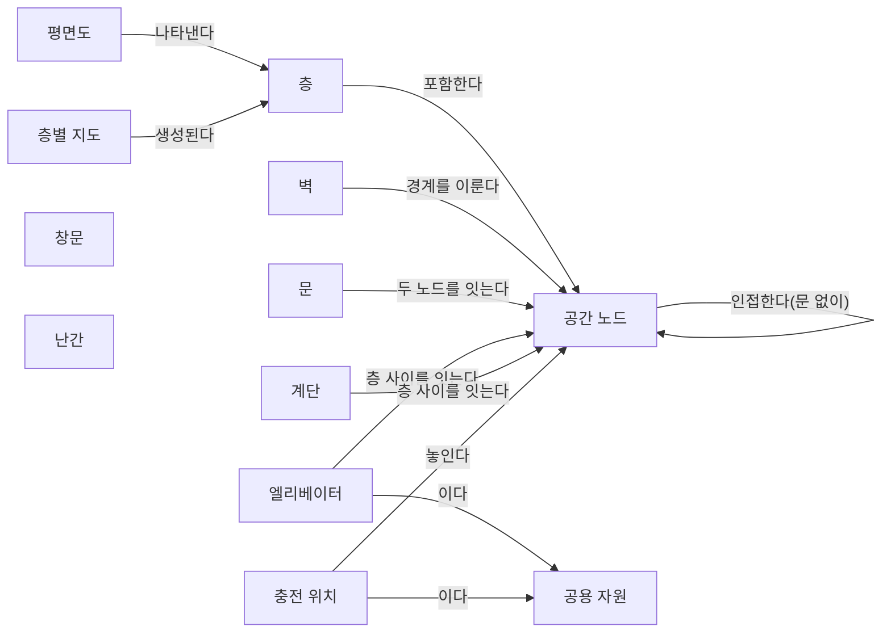
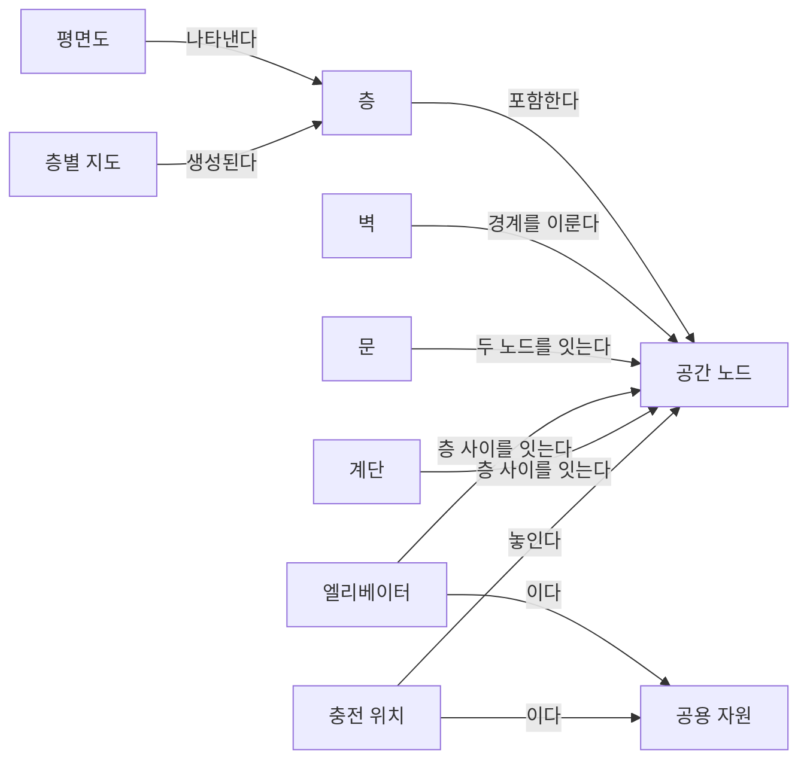
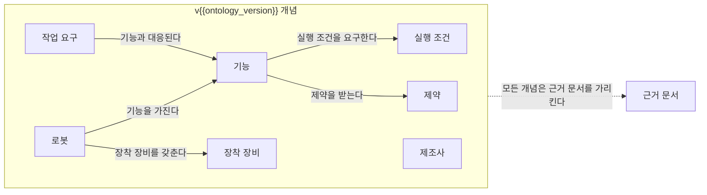
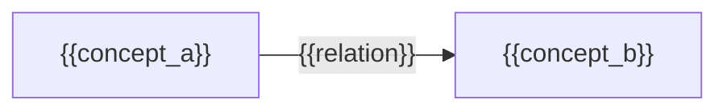

(너의 규칙은 시스템 프롬프트의 agents/shared-rules.md 와 agents/verifier.md 이다. 아래는 이번 실행의 컨텍스트와 입력이다.)

## 실행 컨텍스트

- run_id: 2026-09-25-05
- date: 2026-09-25
- run_type: track (트랙 실행)
- 대상: 트랙 floorplan-recognition (건축 도면 자동 인식) · 현재 단계: 단계 1. 선행 연구·제품 사례 조사 · 이번에 다룰 백로그 질문 id: q1-01 · 중심 세부영역: 6. 지도·공간·위치 모델 (B. 공통 정보·환경 모델)
- 예산:
    - max_search_queries: 40
    - max_sources_per_run: 20
    - new_topic_pages: 1
    - page_updates: 2
    - max_retries: 2
- 환경 알림: web_fetch_available: false · fetch_mode: mirror_only (일반 웹 페이지 열람은 네트워크 정책으로 막혀 있다. raw.githubusercontent.com 은 열린다: 공식 문서가 GitHub 에 있는 출처는 입력의 config/source_mirrors.yaml 경로를 WebFetch 로 열어 원문을 읽고 sources[].fetched=true, fetched_via=github_raw, fetch_url 을 적는다. 입력에 원문 텍스트(data/source_texts)가 있는 출처는 fetched_via=inbox. 그 밖의 출처는 fetched=false 이며 코드가 신뢰도 상한(medium)을 강제한다 — 공통 규칙 0절 6항)
- 언어: ko
- verification_stage: second
- verifier_budget:
    - max_search_queries: 40
    - max_sources_per_run: 20
    - new_topic_pages: 1
    - page_updates: 2
    - max_retries: 2

## 입력

### runs/2026-09-25-05/target.json

```json
{
  "run_id": "2026-09-25-05",
  "date": "2026-09-25",
  "weekday": "Fri",
  "run_number": 5,
  "run_type": "track",
  "forced": true,
  "target": {
    "area_no": 6,
    "area_name": "6. 지도·공간·위치 모델",
    "category": "B. 공통 정보·환경 모델",
    "category_letter": "B"
  },
  "topic": null,
  "track": {
    "slug": "floorplan-recognition",
    "name": "건축 도면 자동 인식",
    "stage": 1,
    "stages": 5,
    "stage_name": "선행 연구·제품 사례 조사",
    "question_ids": [
      "q1-01"
    ],
    "user_questions": [],
    "runs_per_week": 3,
    "question_rationale": "사용자 지정 0건, 되돌아온 질문 0건, 현재 단계 열린 질문 4건 중 오래된 순"
  },
  "corrections": [],
  "budget": {
    "max_search_queries": 40,
    "max_sources_per_run": 20,
    "new_topic_pages": 1,
    "page_updates": 2,
    "max_retries": 2
  },
  "priority_reason": null,
  "priority_questions": [],
  "excluded_areas": [],
  "lifted_areas": [],
  "deferred": {
    "monthly_recheck": false,
    "weekly_review": false
  },
  "selection_rationale": "CLI 지정 run_type=track, area=6; 트랙 실행일(Fri, track_days 앞 3개) → 트랙 floorplan-recognition 단계 1, 질문 q1-01 (사용자 지정 0건, 되돌아온 질문 0건, 현재 단계 열린 질문 4건 중 오래된 순)"
}
```

### runs/2026-09-25-05/research.json

```json
{
  "run_id": "2026-09-25-05",
  "date": "2026-09-25",
  "run_type": "track",
  "target": {
    "area_no": 6,
    "area_name": "6. 지도·공간·위치 모델",
    "category": "B. 공통 정보·환경 모델"
  },
  "gaps": [
    "단계 1 질문 q1-01 열림(target.json 지정: 사용자 지정 0건, 되돌아온 질문 0건, 현재 단계 열린 질문 4건 중 오래된 순)",
    "완료 조건: 선행 연구·데이터셋·제품 사례 비교가 아이디어 3. 건축 도면 자동 인식 페이지 3절에 없음",
    "완료 조건: 인식 대상 요소 목록이 공간 그래프 스키마 초안에 미반영(v0 시드 상태)",
    "6. 지도·공간·위치 모델 페이지 섹션 6. 대표 접근법과 기술, 섹션 7. 관련 표준·프레임워크·오픈소스, 섹션 8. 대표 연구와 자료 비어 있음",
    "용어집에 트랙 glossary_targets(평면도 인식, 래스터–벡터 변환 등) 없음"
  ],
  "research_questions": [
    "제조사마다 다른 지도에서 ‘3층 출하 대기장’을 어떻게 동일한 장소로 인식할까? [분류원문]",
    "q1-01 평면도에서 벽·문·엘리베이터·계단을 인식하는 공개 데이터셋과 모델은 무엇이 있는가?",
    "래스터 이미지 평면도 데이터셋(CubiCasa5K, R2V, MLSTRUCT-FP 등)과 벡터 CAD 도면 데이터셋(FloorPlanCAD, ArchCAD-400K)은 각각 어떤 요소를 어떤 형식으로 라벨링하며, 엘리베이터·계단은 포함되는가? (단계 페이지 3절, 아이디어 페이지 3절 겨냥)",
    "인식 결과를 그래프(방·문·연결) 형태로 내는 모델·데이터셋이 있는가? (공간 그래프 스키마 초안 겨냥)",
    "국내(AI Hub 등) 공개 건축 도면 데이터셋은 어떤 도면 유형·요소를 다루는가? (한국 자료 우선 규칙)",
    "공개 데이터셋의 라이선스·접근 조건과 건물 유형(주거·상업·물류) 편중은 ROP 적용에 어떤 제약이 되는가? (단계 페이지 4절 남은 불확실성 겨냥)"
  ],
  "findings": [
    {
      "id": "f1",
      "claim": "CubiCasa5K는 5,000장의 평면도 이미지를 80개가 넘는 객체 범주로 다각형(polygon) 주석한 공개 데이터셋이며, 2019년 논문과 함께 공개되었다.",
      "tag": "사실",
      "source_ids": [
        "ref-044",
        "ref-045"
      ],
      "cross_checked": false,
      "confidence": "medium",
      "evidence_excerpt": "README: \"5000 samples annotated into over 80 floorplan object categories\", 다각형으로 객체를 분리해 주석. 논문 arXiv 1904.01920. 두 출처 모두 같은 저자 계열이라 독립 교차 아님.",
      "as_of": "2019-04",
      "flow_step": null,
      "flow_item": null
    },
    {
      "id": "f2",
      "claim": "CubiCasa5K는 핀란드 부동산 마케팅 자료에서 온 CAD 기반 평면도로, 주석에는 방(부엌·침실·욕실·복도 등), 아이콘(창문·문·위생기구 등), 구조 요소(벽·난간·계단 등)가 포함되고 주석은 SVG 벡터 형식이다.",
      "tag": "사실",
      "source_ids": [
        "ref-045"
      ],
      "cross_checked": false,
      "confidence": "medium",
      "evidence_excerpt": "검색 요약: 주석 범주는 Rooms, Icons(window, door, sink …), Structural components(walls, railings, storage, chimney, staircase). 원본은 Finnish real estate marketing 자료, 이미지당 SVG 주석.",
      "as_of": "2019-04",
      "flow_step": null,
      "flow_item": null,
      "source_unopened": true
    },
    {
      "id": "f3",
      "claim": "Liu 외(ICCV 2017)의 Raster-to-Vector 방법은 래스터 평면도 이미지를 벽·문(개구부)·방 유형·아이콘을 담은 벡터 표현으로 바꾸며, 원 래스터 이미지(LIFULL 데이터)는 라이선스 때문에 공유하지 않고 벡터 주석과 알고리즘이 생성한 10만 건 이상의 벡터 표현을 공개했다.",
      "tag": "사실",
      "source_ids": [
        "ref-047"
      ],
      "cross_checked": false,
      "confidence": "medium",
      "evidence_excerpt": "README: LIFULL 래스터 이미지는 라이선스 제약으로 공유 불가, 벡터 주석과 \"100,000+ vector-graphics representation\" 공개. README 는 약 90% 정밀도·재현율을 저자 주장으로 적음.",
      "as_of": "2017",
      "flow_step": null,
      "flow_item": null
    },
    {
      "id": "f4",
      "claim": "Zeng 외(ICCV 2019)의 DeepFloorplan은 방 경계를 이용한 주의(attention) 다중 작업 신경망으로 벽·문·창문과 방 유형을 인식하며, Raster-to-Vector 이미지 815장에 픽셀 주석을 단 R2V 데이터셋과 R3D 데이터셋을 사용한다.",
      "tag": "사실",
      "source_ids": [
        "ref-046"
      ],
      "cross_checked": false,
      "confidence": "medium",
      "evidence_excerpt": "README: \"Deep Floor Plan Recognition using a Multi-task Network with Room-boundary-Guided Attention\"(ICCV 2019), 데이터셋 R2V·R3D. 815장 수치는 검색 요약(R2V 설명)에서 확인.",
      "as_of": "2019",
      "flow_step": null,
      "flow_item": null
    },
    {
      "id": "f5",
      "claim": "FloorPlanCAD는 주거·상업 건물의 실제 CAD 도면 15,663장(초판 11,602장)을 SVG 벡터로 담고 35개 범주를 선 단위로 주석해 파놉틱 심볼 스포팅(panoptic symbol spotting) 과제를 정의한 데이터셋(ICCV 2021)이며, 주석은 CC BY-NC 4.0(비상업) 라이선스이고 프로젝트는 2022년 초 종료되었다.",
      "tag": "사실",
      "source_ids": [
        "ref-048",
        "ref-049"
      ],
      "cross_checked": false,
      "confidence": "medium",
      "evidence_excerpt": "프로젝트 페이지 원본: 11,602 → 15,663 drawings, annotations under CC BY-NC 4.0, 저자는 원 도면 저작권을 갖지 않음, 프로젝트는 \"shutdown in early 2022\". 두 출처 모두 같은 저자.",
      "as_of": "2021-10",
      "flow_step": null,
      "flow_item": null
    },
    {
      "id": "f6",
      "claim": "FloorPlanCAD의 범주에는 문·창문·계단과 함께 설비 범주로 엘리베이터(elevator)·에스컬레이터(escalator)가 있고, 벽과 주차 구역은 셀 수 없는 'stuff' 범주로 주석된다.",
      "tag": "사실",
      "source_ids": [
        "ref-050",
        "ref-049"
      ],
      "cross_checked": false,
      "confidence": "medium",
      "evidence_excerpt": "검색 요약(데이터셋 카드): Equipment classes include bath_tub, squat_toilet, urinal, toilet, elevator, escalator; wall·parking 이 전체 주석 요소의 약 27%. 전체 35개 범주 목록은 원문 미열람으로 미확인.",
      "as_of": "2026-09-25",
      "flow_step": null,
      "flow_item": null,
      "source_unopened": true
    },
    {
      "id": "f7",
      "claim": "ArchCAD-400K(NeurIPS 2025)는 표준화된 건축 CAD 도면 5,538장을 잘라 만든 413,062개 조각에 기둥·보·문·창문·도면 기호 등 27개 범주를 주석한 데이터셋으로, 주거 건물은 14%이고 대형 공공·상업 시설이 다수이며 비상업 용도로 제한 공개된다.",
      "tag": "사실",
      "source_ids": [
        "ref-055"
      ],
      "cross_checked": false,
      "confidence": "medium",
      "evidence_excerpt": "검색 요약: 413,062 chunks from 5538 drawings, 27 categories, residential only 14%, restricted access to non-commercial use. 계단·엘리베이터 포함 여부는 요약에 언급만 있고 범주 목록 미확인.",
      "as_of": "2025",
      "flow_step": null,
      "flow_item": null,
      "source_unopened": true
    },
    {
      "id": "f8",
      "claim": "MLSTRUCT-FP는 칠레 주거 건물 프로젝트에서 온 다세대 평면도 이미지 954장에 벽 사각형 70,873개와 슬래브(실내 영역) 다각형, 축척(px/m) 메타데이터를 JSON으로 주석한 데이터셋이며 Automation in Construction(2023)에 발표되었다.",
      "tag": "사실",
      "source_ids": [
        "ref-051"
      ],
      "cross_checked": false,
      "confidence": "medium",
      "evidence_excerpt": "README: 954 floor plan images, 70,873 rectangular wall segments(각도·두께·길이), slabs, scale factors in px/m. Pizarro·Hitschfeld·Sipiran, vol. 156, 105132, 2023. 데이터는 요청 양식으로 제공, 코드 MIT.",
      "as_of": "2023",
      "flow_step": null,
      "flow_item": null
    },
    {
      "id": "f9",
      "claim": "Raster-to-Graph(Computer Graphics Forum, EG 2024)는 평면도 인식을 벽 교차점·벽 선분을 순차 예측하는 구조 그래프 예측 문제로 바꾸고, LIFULL HOME'S 데이터에서 만든 1만 장 이상의 주거 평면도에 구조(벽)와 의미(방 유형·문) 주석을 달았으며 데이터는 LIFULL 이용 신청 뒤에 받을 수 있다.",
      "tag": "사실",
      "source_ids": [
        "ref-052"
      ],
      "cross_checked": false,
      "confidence": "medium",
      "evidence_excerpt": "README: 9,804 train / 500 val / 500 test, 512×512, LIFULL HOME'S 데이터 이용 승인 후 주석을 Google Form 으로 제공, 저자는 직접 공유 권한 없음.",
      "as_of": "2024",
      "flow_step": null,
      "flow_item": null
    },
    {
      "id": "f10",
      "claim": "ResPlan은 온라인 부동산 매물에서 만든 주거 평면도 17,000건에 벽·문·창문·방·발코니의 벡터 형상(미터 좌표)과, 방 사이 연결을 via_door·adjacency·direct·via_window 네 유형의 엣지로 담은 그래프를 제공하며 데이터는 CC BY 4.0이다.",
      "tag": "사실",
      "source_ids": [
        "ref-053"
      ],
      "cross_checked": false,
      "confidence": "medium",
      "evidence_excerpt": "README: 13,053/1,632/1,632 분할, 17개 방 범주, edge 비율 via_door 54.2%·adjacency 35.2%·direct 7.6%·via_window 3.0%, metric coordinates, data CC BY 4.0 / code MIT. 논문은 심사 중(arXiv 2508.14006).",
      "as_of": "2025-08",
      "flow_step": null,
      "flow_item": null
    },
    {
      "id": "f11",
      "claim": "Modified Swiss Dwellings(MSD, ECCV 2024)는 스위스 다세대 건물 평면도 5,300여 장(아파트 18,900여 호)을 방을 노드, 문·벽 등 연결을 엣지로 하는 그래프 구조로 담은 평면도 생성 벤치마크이며 인식용 데이터셋은 아니다.",
      "tag": "사실",
      "source_ids": [
        "ref-054"
      ],
      "cross_checked": false,
      "confidence": "medium",
      "evidence_excerpt": "README: over 5,300 floor plans, 18,900+ apartments, node(방 형상·유형)·edge(연결 유형)·graph(전체 이미지) 속성. 검색 요약상 정제 과정에서 계단 등 비평면 기하를 제거하되 Stairs 영역 범주는 둠.",
      "as_of": "2024",
      "flow_step": null,
      "flow_item": null
    },
    {
      "id": "f12",
      "claim": "CVC-FP는 스캔한 실제 건축 평면도 122장을 출처·양식에 따라 네 묶음으로 나누고 요소와 공간·기능 관계를 주석한 데이터셋이다.",
      "tag": "사실",
      "source_ids": [
        "ref-057"
      ],
      "cross_checked": false,
      "confidence": "medium",
      "evidence_excerpt": "검색 요약: CVC-FP has 122 scanned floor plan documents divided into four categories based on the origin and style; 고해상도, 구조 분석용 groundtruthing 도구 SGT 와 함께 발표. (발행일 미확인, 확인일 기준)",
      "as_of": "2026-09-25",
      "flow_step": null,
      "flow_item": null,
      "source_unopened": true
    },
    {
      "id": "f13",
      "claim": "AI Hub의 '건축 도면 데이터'는 아파트·연립다세대·단독주택의 평면도·입면도·단면도·구조도를 대상으로 하며, 벽체·창문 등의 객체 인식(YOLOv5), 출입문·창호·벽체 구조 인식 세그멘테이션(DeepLabV3+), 도면 문자 인식(YOLOv5+CRNN) 학습 모델을 함께 제공한다.",
      "tag": "사실",
      "source_ids": [
        "ref-056"
      ],
      "cross_checked": false,
      "confidence": "medium",
      "evidence_excerpt": "검색 요약(AI Hub 페이지): 도면 유형 평면도·입면도·단면도·구조도/구조상세도, 2D 설계도면의 3D 모델링 자동 변환에 활용. 규모는 도면 48,033장, 객체 2,653,998건, 텍스트 304,462건으로 요약됨. 클래스 목록(계단·엘리베이터 포함 여부)은 미확인.",
      "as_of": "2026-09-25",
      "flow_step": null,
      "flow_item": null,
      "source_unopened": true
    },
    {
      "id": "f14",
      "claim": "Kratochvila 외(2024)는 다세대 래스터 평면도에서 벽·창문·계단·난간을 픽셀 단위로 분할하는 개선된 U-Net 계열 방법과, 분할 결과를 벡터화해 3D 모델을 만드는 재구성 단계를 제안했다.",
      "tag": "사실",
      "source_ids": [
        "ref-060"
      ],
      "cross_checked": false,
      "confidence": "medium",
      "evidence_excerpt": "검색 요약: MDA-Unet·MACU-Net 기반, skip connection·attention 개선, 재구성 단계가 분할된 평면도를 vectorize 해 3D 모델 생성. 대상 요소 walls, windows, stairs, railings. 엘리베이터는 언급 없음.",
      "as_of": "2024-08",
      "flow_step": null,
      "flow_item": null,
      "source_unopened": true
    },
    {
      "id": "f15",
      "claim": "DoorDet(2025) 저자들은 평면도의 세분화된 다중 유형 문 검출용 공개 데이터셋이 드물다고 보고, 객체 검출기로 문을 찾은 뒤 대규모 언어 모델(LLM)이 문 유형을 분류하고 사람이 검수하는 반자동 구축 절차를 제안했다.",
      "tag": "의견",
      "source_ids": [
        "ref-059"
      ],
      "cross_checked": false,
      "confidence": "medium",
      "evidence_excerpt": "검색 요약: \"publicly available datasets specifically designed for fine-grained multi-class door detection remain scarce\". 3단계: 단일 범주 검출 → LLM 분류 → human-in-the-loop. Neural Computing and Applications 게재.",
      "as_of": "2025-08",
      "flow_step": null,
      "flow_item": null,
      "source_unopened": true
    },
    {
      "id": "f16",
      "claim": "DeFazio 외(2024)는 이동 로봇이 방 이름과 문 표시를 덧붙인 평면도 이미지를 시각-언어 모델(VLM)에 넣어 문 접근·통과를 포함한 이동 계획을 만드는 '지도 파싱(map parsing)'을 제안하고, 아홉 단계 이동 과제에서 성공률 0.96을 보고했다.",
      "tag": "사실",
      "source_ids": [
        "ref-058"
      ],
      "cross_checked": false,
      "confidence": "medium",
      "evidence_excerpt": "검색 요약: enhanced floor plan(labels, door indicators) + start·goal 텍스트 → VLM 이 navigation plan 생성, 실제 로봇에서 실행. GPT-4o·Claude-3.5 Sonnet 평가, 9 action 과제 success rate 0.96. 조건: 연구진의 실제 평면도 지도.",
      "as_of": "2024-09",
      "flow_step": null,
      "flow_item": null,
      "source_unopened": true
    },
    {
      "id": "f17",
      "claim": "이번에 확인한 공개 자료 가운데 엘리베이터를 범주로 명시한 것은 벡터 CAD 도면 데이터셋(FloorPlanCAD, 그리고 요약상 ArchCAD-400K)이고, 래스터 주거 평면도 데이터셋(CubiCasa5K, R2V, MLSTRUCT-FP, ResPlan)은 벽·문·창문·방(일부는 계단·난간) 중심이어서 엘리베이터 라벨은 확인되지 않았다.",
      "tag": "추정",
      "source_ids": [
        "ref-050",
        "ref-055",
        "ref-045",
        "ref-046",
        "ref-051",
        "ref-053"
      ],
      "cross_checked": false,
      "confidence": "low",
      "evidence_excerpt": "f2·f4·f6·f7·f8·f10 의 범주 기술을 대조한 추론. CubiCasa5K 80여 범주·AI Hub 클래스 전체 목록은 원문 미열람이라 엘리베이터 부재를 확정하지 못함.",
      "as_of": "2026-09-25",
      "flow_step": null,
      "flow_item": null,
      "source_unopened": false
    },
    {
      "id": "f18",
      "claim": "확인한 공개 데이터셋은 주거 건물(핀란드·일본·칠레·스위스·국내 주택) 중심이거나 공공·상업 시설 CAD이며, 물류센터·창고 평면도와 로봇 충전 위치를 라벨로 담은 데이터셋은 이번 검색 범위에서 찾지 못했다.",
      "tag": "추정",
      "source_ids": [
        "ref-045",
        "ref-051",
        "ref-052",
        "ref-054",
        "ref-055",
        "ref-056"
      ],
      "cross_checked": false,
      "confidence": "low",
      "evidence_excerpt": "f2·f7·f8·f9·f11·f13 의 데이터 출처에서 도출. 'floor plan … charging station detection dataset' 검색에서도 데이터셋은 나오지 않음. 부재의 확인은 아님.",
      "as_of": "2026-09-25",
      "flow_step": null,
      "flow_item": null,
      "source_unopened": false
    },
    {
      "id": "f19",
      "claim": "FloorPlanCAD·ArchCAD-400K 주석이 비상업 라이선스이고 R2V·Raster-to-Graph의 원 이미지가 LIFULL 이용 승인을 요구하므로, 상용 ROP가 이 데이터셋으로 학습한 모델을 그대로 쓰기에는 라이선스 검토가 필요할 것으로 보인다.",
      "tag": "추정",
      "source_ids": [
        "ref-048",
        "ref-055",
        "ref-047",
        "ref-052"
      ],
      "cross_checked": false,
      "confidence": "low",
      "evidence_excerpt": "f3·f5·f7·f9 의 라이선스·접근 조건에서 도출한 추론. CubiCasa5K·AI Hub 데이터의 상업 이용 조건은 원문 미열람으로 미확인.",
      "as_of": "2026-09-25",
      "flow_step": null,
      "flow_item": null
    },
    {
      "id": "f20",
      "claim": "Raster-to-Graph의 벽 구조 그래프, ResPlan의 유형 붙은 방 연결 엣지(via_door·adjacency 등), MSD의 방–연결 그래프는 공간 그래프 스키마 초안의 '공간 노드–문–공간 노드' 구조와 가까운 출력 형태이나, 층 간 연결(엘리베이터·계단)과 통과 조건은 담지 않는 것으로 보인다.",
      "tag": "추정",
      "source_ids": [
        "ref-052",
        "ref-053",
        "ref-054"
      ],
      "cross_checked": false,
      "confidence": "low",
      "evidence_excerpt": "f9·f10·f11 의 그래프 정의를 공간 그래프 스키마 초안 v0 의 관계(문이 두 공간 노드를 잇는다, 엘리베이터·계단이 층 사이를 잇는다)에 대응시킨 추론. 세 자료 모두 단일 층 평면도 기준.",
      "as_of": "2026-09-25",
      "flow_step": null,
      "flow_item": null
    },
    {
      "id": "f21",
      "claim": "MLSTRUCT-FP(px/m 축척)와 ResPlan(미터 좌표)처럼 축척 정보를 함께 주는 데이터셋은 일부이고, 512×512로 정규화한 Raster-to-Graph처럼 축척 없이 이미지 좌표만 다루는 경우가 있어, 인식 결과를 로봇 지도 좌표로 옮기려면 축척 복원이 별도 과제가 될 것으로 보인다.",
      "tag": "추정",
      "source_ids": [
        "ref-051",
        "ref-053",
        "ref-052"
      ],
      "cross_checked": false,
      "confidence": "low",
      "evidence_excerpt": "f8·f9·f10 의 좌표·축척 기술에서 도출. 로봇 지도 변환 보정은 단계 4. 지도 변환 보정과 현장 정합의 질문(q4-01, q4-03)과 연결.",
      "as_of": "2026-09-25",
      "flow_step": null,
      "flow_item": null
    }
  ],
  "sources": [
    {
      "id": "ref-044",
      "org": "CubiCasa (Kalervo, A. 외)",
      "title": "CubiCasa5k — README (CubiCasa5K: A Dataset and an Improved Multi-Task Model for Floorplan Image Analysis)",
      "published": null,
      "url": "https://github.com/CubiCasa/CubiCasa5k",
      "type": "오픈소스 문서",
      "reliability": "high",
      "accessed": "2026-09-25",
      "summary": "CubiCasa5K 데이터셋과 다중 작업 모델의 공식 저장소 README. 5,000장·80여 범주·다각형 주석을 설명한다.",
      "fetched": true,
      "fetched_via": "github_raw",
      "fetch_url": "https://raw.githubusercontent.com/CubiCasa/CubiCasa5k/master/README.md",
      "source_unopened": false
    },
    {
      "id": "ref-045",
      "org": "Kalervo, A., Ylioinas, J., Häikiö, M., Karhu, A., & Kannala, J.",
      "title": "CubiCasa5K: A Dataset and an Improved Multi-Task Model for Floorplan Image Analysis",
      "published": "2019-04",
      "url": "https://arxiv.org/abs/1904.01920",
      "type": "논문",
      "reliability": "medium",
      "accessed": "2026-09-25",
      "summary": "원문 미열람. 핀란드 부동산 평면도 5,000장의 SVG 주석 데이터셋과 다중 작업 인식 모델을 제시한 논문(SCIA 2019).",
      "source_unopened": true,
      "fetched": false,
      "fetched_via": null,
      "fetch_url": null
    },
    {
      "id": "ref-046",
      "org": "Zeng, Z., Li, X., Yu, Y. K., & Fu, C.-W.",
      "title": "DeepFloorplan — README (Deep Floor Plan Recognition using a Multi-task Network with Room-boundary-Guided Attention)",
      "published": "2019",
      "url": "https://github.com/zlzeng/DeepFloorplan",
      "type": "오픈소스 문서",
      "reliability": "high",
      "accessed": "2026-09-25",
      "summary": "ICCV 2019 평면도 인식 모델의 공식 저장소 README. R2V·R3D 데이터셋과 벽·문·창문·방 유형 인식을 설명한다.",
      "fetched": true,
      "fetched_via": "github_raw",
      "fetch_url": "https://raw.githubusercontent.com/zlzeng/DeepFloorplan/master/README.md",
      "source_unopened": false
    },
    {
      "id": "ref-047",
      "org": "Liu, C., Wu, J., Kohli, P., & Furukawa, Y.",
      "title": "FloorplanTransformation — README (Raster-to-Vector: Revisiting Floorplan Transformation)",
      "published": "2017",
      "url": "https://github.com/art-programmer/FloorplanTransformation",
      "type": "오픈소스 문서",
      "reliability": "high",
      "accessed": "2026-09-25",
      "summary": "ICCV 2017 래스터→벡터 평면도 변환의 공식 저장소 README. LIFULL 이미지 비공개와 벡터 주석·생성 결과 공개를 안내한다.",
      "fetched": true,
      "fetched_via": "github_raw",
      "fetch_url": "https://raw.githubusercontent.com/art-programmer/FloorplanTransformation/master/README.md",
      "source_unopened": false
    },
    {
      "id": "ref-048",
      "org": "FloorPlanCAD 프로젝트(Fan, Z. 외)",
      "title": "FloorPlanCAD Dataset — project page (floorplancad.github.io index.md)",
      "published": "2021",
      "url": "https://floorplancad.github.io/",
      "type": "오픈소스 문서",
      "reliability": "high",
      "accessed": "2026-09-25",
      "summary": "FloorPlanCAD 데이터셋 공식 프로젝트 페이지 원본. 도면 수, CC BY-NC 4.0 주석 라이선스, 2022년 초 프로젝트 종료를 적는다.",
      "fetched": true,
      "fetched_via": "github_raw",
      "fetch_url": "https://raw.githubusercontent.com/floorplancad/floorplancad.github.io/master/index.md",
      "source_unopened": false
    },
    {
      "id": "ref-049",
      "org": "Fan, Z., Zhu, L., Li, H., Chen, X., Zhu, S., & Tan, P.",
      "title": "FloorPlanCAD: A Large-Scale CAD Drawing Dataset for Panoptic Symbol Spotting",
      "published": "2021-05",
      "url": "https://arxiv.org/abs/2105.07147",
      "type": "논문",
      "reliability": "medium",
      "accessed": "2026-09-25",
      "summary": "원문 미열람. 15,000여 CAD 평면도를 35개 범주로 선 단위 주석하고 파놉틱 심볼 스포팅 과제와 CNN-GCN 방법을 제시한 ICCV 2021 논문.",
      "source_unopened": true,
      "fetched": false,
      "fetched_via": null,
      "fetch_url": null
    },
    {
      "id": "ref-050",
      "org": "Voxel51 (Hugging Face)",
      "title": "Voxel51/FloorPlanCAD · Datasets at Hugging Face",
      "published": null,
      "url": "https://huggingface.co/datasets/Voxel51/FloorPlanCAD",
      "type": "오픈소스 문서",
      "reliability": "medium",
      "accessed": "2026-09-25",
      "summary": "원문 미열람. FloorPlanCAD 를 재배포한 제3자 데이터셋 카드. 설비 범주(엘리베이터·에스컬레이터 등)와 주석 형식을 설명한다.",
      "source_unopened": true,
      "fetched": false,
      "fetched_via": null,
      "fetch_url": null
    },
    {
      "id": "ref-051",
      "org": "Pizarro, P. N., Hitschfeld, N., & Sipiran, I. (MLSTRUCT)",
      "title": "MLStructFP — README (Large-scale multi-unit floor plan dataset for architectural plan analysis and recognition)",
      "published": "2023",
      "url": "https://github.com/MLSTRUCT/MLStructFP",
      "type": "오픈소스 문서",
      "reliability": "high",
      "accessed": "2026-09-25",
      "summary": "MLSTRUCT-FP 데이터셋 적재 라이브러리 README. 954장, 벽 사각형·슬래브·축척 JSON 형식과 Automation in Construction 2023 인용을 적는다.",
      "fetched": true,
      "fetched_via": "github_raw",
      "fetch_url": "https://raw.githubusercontent.com/MLSTRUCT/MLStructFP/master/README.rst",
      "source_unopened": false
    },
    {
      "id": "ref-052",
      "org": "Hu, S. 외",
      "title": "Raster-to-Graph — README (Raster-to-Graph: Floorplan Recognition via Autoregressive Graph Prediction with an Attention Transformer)",
      "published": "2024",
      "url": "https://github.com/SizheHu/Raster-to-Graph",
      "type": "오픈소스 문서",
      "reliability": "high",
      "accessed": "2026-09-25",
      "summary": "EG 2024 평면도 구조 그래프 인식 방법의 공식 저장소 README. 1만여 장 주거 평면도 주석과 LIFULL 데이터 이용 신청 조건을 안내한다.",
      "fetched": true,
      "fetched_via": "github_raw",
      "fetch_url": "https://raw.githubusercontent.com/SizheHu/Raster-to-Graph/main/README.md",
      "source_unopened": false
    },
    {
      "id": "ref-053",
      "org": "Agour, M. 외 (ResPlan)",
      "title": "ResPlan — README (ResPlan: A Large-Scale Vector-Graph Dataset of 17,000 Residential Floor Plans)",
      "published": "2025-08",
      "url": "https://github.com/m-agour/ResPlan",
      "type": "오픈소스 문서",
      "reliability": "high",
      "accessed": "2026-09-25",
      "summary": "17,000건 주거 평면도의 벡터·그래프 데이터셋 README. 요소 범주, 엣지 유형, 미터 좌표, CC BY 4.0 라이선스를 적는다.",
      "fetched": true,
      "fetched_via": "github_raw",
      "fetch_url": "https://raw.githubusercontent.com/m-agour/ResPlan/main/README.md",
      "source_unopened": false
    },
    {
      "id": "ref-054",
      "org": "van Engelenburg, C. 외 (MSD)",
      "title": "msd — README (MSD: A Benchmark Dataset for Floor Plan Generation of Building Complexes)",
      "published": "2024",
      "url": "https://github.com/caspervanengelenburg/msd",
      "type": "오픈소스 문서",
      "reliability": "high",
      "accessed": "2026-09-25",
      "summary": "ECCV 2024 다세대 평면도 생성 벤치마크의 공식 저장소 README. 방–연결 그래프 구조를 설명한다.",
      "fetched": true,
      "fetched_via": "github_raw",
      "fetch_url": "https://raw.githubusercontent.com/caspervanengelenburg/msd/main/README.md",
      "source_unopened": false
    },
    {
      "id": "ref-055",
      "org": "Luo, R. 외",
      "title": "ArchCAD-400K: A Large-Scale CAD drawings Dataset and New Baseline for Panoptic Symbol Spotting",
      "published": "2025-03",
      "url": "https://arxiv.org/abs/2503.22346",
      "type": "논문",
      "reliability": "medium",
      "accessed": "2026-09-25",
      "summary": "원문 미열람. 공공·상업 시설 중심 건축 CAD 도면 5,538장(413,062개 조각)의 27개 범주 주석 데이터셋과 DPSS 기준 모델을 제시한 NeurIPS 2025 논문.",
      "source_unopened": true,
      "fetched": false,
      "fetched_via": null,
      "fetch_url": null
    },
    {
      "id": "ref-056",
      "org": "한국지능정보사회진흥원(AI Hub)",
      "title": "건축 도면 데이터",
      "published": null,
      "url": "https://aihub.or.kr/aihubdata/data/view.do?dataSetSn=71465",
      "type": "정부·연구기관",
      "reliability": "medium",
      "accessed": "2026-09-25",
      "summary": "원문 미열람. 주택 유형별 평면도·입면도·단면도·구조도의 객체·문자 주석 데이터와 객체 인식·세그멘테이션·OCR 학습 모델을 제공하는 국내 AI 학습용 데이터 페이지.",
      "source_unopened": true,
      "fetched": false,
      "fetched_via": null,
      "fetch_url": null
    },
    {
      "id": "ref-057",
      "org": "de las Heras, L.-P., Terrades, O. R., Robles, S., & Sánchez, G.",
      "title": "CVC-FP and SGT: a new database for structural floor plan analysis and its groundtruthing tool",
      "published": null,
      "url": "https://www.researchgate.net/publication/270597635_CVC-FP_and_SGT_a_new_database_for_structural_floor_plan_analysis_and_its_groundtruthing_tool",
      "type": "논문",
      "reliability": "medium",
      "accessed": "2026-09-25",
      "summary": "원문 미열람. 스캔 평면도 122장의 구조 분석용 데이터셋 CVC-FP 와 주석 도구 SGT 를 제시한 논문.",
      "source_unopened": true,
      "fetched": false,
      "fetched_via": null,
      "fetch_url": null
    },
    {
      "id": "ref-058",
      "org": "DeFazio, D., Mehta, H., Wang, M., Yang, P., Blackburn, J., & Zhang, S.",
      "title": "Vision Language Models Can Parse Floor Plan Maps",
      "published": "2024-09",
      "url": "https://arxiv.org/abs/2409.12842",
      "type": "논문",
      "reliability": "medium",
      "accessed": "2026-09-25",
      "summary": "원문 미열람. 이동 로봇이 평면도 이미지를 VLM 으로 해석해 이동 계획을 만드는 지도 파싱 과제와 실로봇 실험을 제시한 프리프린트.",
      "source_unopened": true,
      "fetched": false,
      "fetched_via": null,
      "fetch_url": null
    },
    {
      "id": "ref-059",
      "org": "DoorDet 저자(arXiv 2508.07714)",
      "title": "DoorDet: Semi-Automated Multi-Class Door Detection Dataset via Object Detection and Large Language Models",
      "published": "2025-08",
      "url": "https://arxiv.org/abs/2508.07714",
      "type": "논문",
      "reliability": "medium",
      "accessed": "2026-09-25",
      "summary": "원문 미열람. 객체 검출기·LLM·사람 검수로 평면도의 다중 유형 문 검출 데이터셋을 반자동 구축하는 방법을 제시한 논문(Neural Computing and Applications 게재).",
      "source_unopened": true,
      "fetched": false,
      "fetched_via": null,
      "fetch_url": null
    },
    {
      "id": "ref-060",
      "org": "Kratochvila, L., de Jong, G., Arkesteijn, M., Zemcik, T., Bilik, S., Horak, K., & Rellermeyer, J. S.",
      "title": "Multi-Unit Floor Plan Recognition and Reconstruction Using Improved Semantic Segmentation of Raster-Wise Floor Plans",
      "published": "2024-08",
      "url": "https://arxiv.org/abs/2408.01526",
      "type": "논문",
      "reliability": "medium",
      "accessed": "2026-09-25",
      "summary": "원문 미열람. 다세대 래스터 평면도의 벽·창문·계단·난간 분할과 벡터화·3D 재구성 파이프라인을 제시한 프리프린트.",
      "source_unopened": true,
      "fetched": false,
      "fetched_via": null,
      "fetch_url": null
    }
  ],
  "page_proposals": [
    {
      "action": "update",
      "path": "docs/tracks/floorplan-recognition/stage-1-prior-work-and-products.md",
      "sections": [
        "2",
        "3",
        "4",
        "5",
        "6",
        "8",
        "9"
      ],
      "rationale": "q1-01 답: f1·f2·f3·f4·f5·f6·f7·f8·f9·f10·f11·f12·f13·f14·f15·f16·f17·f18·f19·f20·f21 (신뢰도 medium) — 단계 1 질문 목록 q1-01 상태 답함, 3절 q1-01 소제목(래스터 데이터셋·벡터 CAD 데이터셋·그래프 출력 모델·국내 데이터·로봇용 VLM 파싱), 4절 남은 불확실성(엘리베이터·충전 위치 라벨 부재 f17·f18, 라이선스 f19, 축척 f21), 5절 후속 질문, 6절 완료 조건 현황, 8절 출처, 9절 이력"
    },
    {
      "action": "update",
      "path": "docs/ideas/floorplan-recognition.md",
      "sections": [
        "3"
      ],
      "rationale": "아이디어 페이지 3절: 트랙 산출물 갱신. 선행 연구·데이터셋 비교표 초안(데이터셋별 입력 형식·규모·요소·엘리베이터/계단 포함 여부·라이선스): f1·f2·f3·f4·f5·f6·f7·f8·f9·f10·f11·f12·f13·f14, 로봇 적용 연구 f16, 한계 f17·f18·f19. 제품 사례(q1-02)는 아직 없음을 명시"
    },
    {
      "action": "update",
      "path": "docs/tracks/floorplan-recognition/space-graph-schema-draft.md",
      "sections": [
        "2",
        "3",
        "6"
      ],
      "rationale": "트랙 산출물 갱신: track.ontology_changes 가 검증 승인되면 개념(창문, 난간, 에스컬레이터)·관계(공간 노드 인접)·공간 노드 속성(방 유형) 반영, 초안 버전 v0.1. 미승인 제안과 f20·f21 은 6절 미해결 질문으로"
    },
    {
      "action": "update",
      "path": "docs/categories/b-common-information-and-environment-model/06-map-space-and-location-model.md",
      "sections": [
        "6",
        "7",
        "8"
      ],
      "rationale": "트랙 floorplan-recognition 단계 1 반영 제안 (f3, f4, f5, f8, f9, f10, f13, f16): 섹션 6 래스터→벡터·구조 그래프 인식 접근, 섹션 7 공개 데이터셋(CubiCasa5K, FloorPlanCAD, MLSTRUCT-FP, ResPlan, AI Hub 건축 도면 데이터), 섹션 8 DeepFloorplan·Raster-to-Graph·VLM 지도 파싱 연구"
    },
    {
      "action": "update",
      "path": "docs/categories/g-safety-security-intelligence-and-governance/27-ai-learning-adaptation-and-model-operations.md",
      "sections": [
        "8"
      ],
      "rationale": "트랙 floorplan-recognition 단계 1 반영 제안 (f4, f9, f15, f16): 교차 규칙에 따른 도면 해석 방법(다중 작업 신경망, 그래프 예측, LLM 보조 주석, VLM 평면도 파싱)을 6. 지도·공간·위치 모델 페이지와 양쪽 연결"
    }
  ],
  "glossary_candidates": [
    {
      "term_ko": "평면도 인식",
      "term_en": "Floor Plan Recognition",
      "definition": "평면도 이미지나 CAD 도면에서 벽·문·창문·계단 같은 건축 요소와 방 영역·유형을 자동으로 찾아내 구조화하는 작업이다."
    },
    {
      "term_ko": "래스터–벡터 변환",
      "term_en": "Raster-to-Vector Conversion",
      "definition": "픽셀 이미지로 된 평면도를 벽 선분·교차점·방 다각형 같은 기하 요소의 벡터 표현으로 바꾸는 처리이다."
    },
    {
      "term_ko": "파놉틱 심볼 스포팅",
      "term_en": "Panoptic Symbol Spotting",
      "definition": "CAD 도면의 선 요소마다 문·창문 같은 셀 수 있는 기호의 개별 인스턴스와 벽 같은 셀 수 없는 영역의 의미를 함께 판별하는 과제이다."
    }
  ],
  "open_questions_new": [],
  "open_questions_resolved": [],
  "self_check": {
    "source_count": 17,
    "cross_checked_count": 0,
    "unverified": [
      "f2 CubiCasa5K 80여 범주 전체 목록(엘리베이터 포함 여부) 원문 미열람으로 미확인",
      "f6 FloorPlanCAD 35개 범주 전체 목록은 제3자 데이터셋 카드 검색 요약에 기댐, 공식 범주 페이지 원본에는 목록이 없었음",
      "f7 ArchCAD-400K 의 계단·엘리베이터 범주 포함 여부 미확인(요약에 언급만 있음)",
      "f13 AI Hub 건축 도면 데이터 클래스 목록·이용 조건·규모 수치(48,033장 등)는 검색 요약만 확인",
      "CubiCasa5K 라이선스(CC BY-NC 4.0 로 요약됨)는 제3자 저장소 요약이라 finding 으로 내지 않음",
      "SESYD·ROBIN 데이터셋은 검색 요약 출처가 불분명해 finding 으로 내지 않음",
      "2025년 평면도 분석 리뷰(Automation in Construction, 2000–2025)는 요약 내용이 여러 리뷰와 섞여 출처로 넣지 않음",
      "모든 finding 교차 확인 실패: 데이터셋마다 저자 계열 1차 출처만 있음",
      "ref-045·ref-049·ref-055·ref-057·ref-059·ref-060 저자 목록 일부는 검색 요약 기준"
    ],
    "scope_violations": [],
    "budget_used": {
      "queries": 25,
      "sources": 17
    },
    "limits": "fetch_mode mirror_only(web_fetch_available: false): GitHub 공식 저장소 README 8건(ref-044, ref-046, ref-047, ref-048, ref-051, ref-052, ref-053, ref-054)은 raw.githubusercontent.com 으로 원문을 열었고, 논문·AI Hub·데이터셋 카드 9건은 검색 요약만 봐서 원문 미열람(신뢰도 상한 medium)이다. 열린 README 도 데이터셋마다 단일 출처라 finding 신뢰도는 medium 이하로 두었다. 검색 25회/40, 신규 출처 17건/20(ref-044~ref-060, next_ref_id 기준). 주의: 이전 브리프 2026-09-25-03 이 ref-044~ref-050 을 이미 다른 출처(GS1 EPCIS 온톨로지 등)에 부여했으나 참고문헌 목록에는 없고 실행 컨텍스트 next_ref_id 가 ref-044 이므로 컨텍스트 값을 따랐다 — id 충돌 여부는 퍼블리셔 확인 필요. 질문 선택: target.json 지정 q1-01(사용자 지정 0건, 되돌아온 질문 0건, 오래된 순). q1-01 은 데이터셋·모델 목록으로 답했으나 엘리베이터·충전 위치 라벨 존재 여부는 부재 추정(f17·f18)이다. 27. AI·학습·적응과 모델 운영 관련 finding(f4, f9, f15, f16)은 교차 규칙에 따라 6. 지도·공간·위치 모델과 함께 반영 제안했다. 8. 실시간 세계 상태·데이터 일관성과 22. 시뮬레이션·예측용 디지털 트윈 관련 주장은 내지 않았다. 제품 사례(q1-02)·충전 시설(q1-03)·현장 모델링 시간(q1-04)은 이번 범위 밖이라 다루지 않았다. 일반 열린 질문 신규 없음: 새 질문은 모두 트랙 전용이라 track.new_questions 에 올렸다. 후속 질문 4건, 온톨로지 변경 제안 5건. 한국 자료는 AI Hub 1건뿐이다."
  },
  "track": {
    "slug": "floorplan-recognition",
    "stage": 1,
    "answered_question_ids": [
      "q1-01"
    ],
    "new_questions": [
      {
        "question": "물류센터·창고 평면도(랙·도크·충전 구역 포함)를 대상으로 한 공개 평면도 인식 데이터셋이나 모델이 있는가, 없으면 주거·상업 데이터셋으로 학습한 모델이 물류 시설 도면에 얼마나 옮겨지는가?",
        "stage": 1,
        "rationale_finding_id": "f18"
      },
      {
        "question": "AI Hub 건축 도면 데이터와 CubiCasa5K 의 클래스 목록에 계단·엘리베이터가 포함되는지, 그리고 상업적 이용 조건은 무엇인가?",
        "stage": 2,
        "rationale_finding_id": "f17"
      },
      {
        "question": "축척 정보가 없는 래스터 평면도의 인식 결과를 로봇 지도 좌표(미터)로 옮기기 위해 축척을 어떻게 복원하는가(치수 문자 OCR, 문 폭 등 기준 요소, 현장 측정)?",
        "stage": 4,
        "rationale_finding_id": "f21"
      },
      {
        "question": "그래프 출력형 평면도 인식(구조 그래프, 방 연결 그래프)을 층 간 연결(엘리베이터·계단)과 통과 조건을 갖춘 공간 그래프로 확장하려면 무엇이 더 필요한가?",
        "stage": 3,
        "rationale_finding_id": "f20"
      }
    ],
    "ontology_changes": [
      {
        "op": "add",
        "kind": "concept",
        "name": "창문 (Window)",
        "evidence_finding_ids": [
          "f2",
          "f4",
          "f10"
        ],
        "description": "공간 노드 경계에 놓이는 개구부로 로봇은 통과할 수 없다. 여러 인식 데이터셋의 기본 인식 대상이며, ResPlan 은 창문을 통한 연결(via_window)을 엣지 유형으로 둔다. 인식 대상 요소 목록(완료 조건)에 넣되 통과 불가 경계로 구분."
      },
      {
        "op": "add",
        "kind": "concept",
        "name": "난간 (Railing)",
        "evidence_finding_ids": [
          "f2",
          "f14"
        ],
        "description": "벽처럼 통과할 수 없지만 시야는 열린 경계 요소. CubiCasa5K·Kratochvila 외(2024)의 인식 대상. 벽과 같은 개념으로 묶을지 별도로 둘지는 검증 판단 필요."
      },
      {
        "op": "add",
        "kind": "concept",
        "name": "에스컬레이터 (Escalator)",
        "evidence_finding_ids": [
          "f6"
        ],
        "description": "층 사이를 잇는 수직 이동 설비로 CAD 데이터셋에서 엘리베이터와 함께 범주로 주석된다. 대부분 로봇이 이용할 수 없는 연결이므로 로봇 능력과의 대조 대상. 근거가 원문 미열람 단일 출처라 신뢰도 낮음."
      },
      {
        "op": "add",
        "kind": "relation",
        "name": "공간 노드 / 인접한다(문 없이) / 공간 노드",
        "evidence_finding_ids": [
          "f10",
          "f11",
          "f20"
        ],
        "description": "문을 거치지 않고 경계를 맞대거나 개방되어 이어진 공간 사이 관계. ResPlan 의 adjacency·direct 엣지, MSD 의 연결 유형에 대응. 기존 관계 '문 / 두 공간 노드를 잇는다'와 구분된다."
      },
      {
        "op": "modify",
        "kind": "concept",
        "name": "공간 노드 (Space Node)",
        "evidence_finding_ids": [
          "f3",
          "f4",
          "f9",
          "f10"
        ],
        "description": "주요 속성에 '방 유형(부엌·침실·복도 등, 데이터셋별 분류 체계)'을 더한다. 주거 중심 분류라 물류 시설 구역 유형(출하 대기장 등)과의 대응은 미해결 질문으로 둔다."
      }
    ],
    "stage_completion_self_assessment": {
      "met": false,
      "missing": [
        "아이디어 3. 건축 도면 자동 인식 페이지 3절 비교에 제품 사례(q1-02)·충전 시설 사례(q1-03)가 없음",
        "인식 대상 요소 목록의 공간 그래프 스키마 초안 반영은 이번 온톨로지 변경 제안의 검증 승인 전",
        "q1-02, q1-03, q1-04 열림"
      ]
    }
  }
}
```

### runs/2026-09-25-05/verification.json

```json
{
  "run_id": "2026-09-25-05",
  "stage": "first",
  "verdict": "조건부 승인",
  "claim_checks": [
    {
      "finding_id": "f1",
      "source_exists": true,
      "supports_claim": true,
      "cross_checked": false,
      "tag_decision": "유지",
      "note": "확인: ref-044 README 원문(github_raw)에 '5000 samples … over 80 floorplan object categories', 다각형 주석 문구 있음. ref-045 는 원문 미열람(검색 결과 일치). 두 출처가 같은 저자 계열이라 독립 교차 아님."
    },
    {
      "finding_id": "f2",
      "source_exists": true,
      "supports_claim": true,
      "cross_checked": false,
      "tag_decision": "유지",
      "note": "확인(원문 미열람): 검색 요약에 핀란드 부동산 마케팅 자료, Rooms·Icons·Structural components(walls, railings, staircase 등), 이미지별 SVG 주석이 나타남. ref-045 단일 출처, 신뢰도 medium 상한."
    },
    {
      "finding_id": "f3",
      "source_exists": true,
      "supports_claim": true,
      "cross_checked": false,
      "tag_decision": "유지",
      "note": "확인: ref-047 README 원문에 LIFULL 래스터 이미지 공유 불가, 벡터 주석 공개, '100,000+ vector-graphics representation' 문구 있음. 벽·문·방 유형·아이콘 요소 구성은 README 요약에서 직접 보이지 않아 논문 기준으로 본다. README 의 '약 90% 정밀도·재현율'은 저자 주장이므로 본문에 쓰려면 [추정]·저자 주장 병기가 필요하다(이번 claim 에는 없음)."
    },
    {
      "finding_id": "f4",
      "source_exists": true,
      "supports_claim": true,
      "cross_checked": false,
      "tag_decision": "유지",
      "note": "확인: ref-046 README 원문에 ICCV 2019 제목, R2V·R3D, wall·door&window·room types 라벨 있음. 815장은 README 에 없고 검색 요약(DeepFloorplan arXiv 1908.11025)에서 확인. 같은 저자 계열이라 독립 교차 아님."
    },
    {
      "finding_id": "f5",
      "source_exists": true,
      "supports_claim": true,
      "cross_checked": false,
      "tag_decision": "유지",
      "note": "확인: ref-048 프로젝트 페이지 원문(github_raw)에 11,602(2021-08)→15,663(2021-11)장, 35개 범주, CC BY-NC 4.0, 주거·상업 건물, ICCV 2021, 'shutdown in early 2022' 있음. ref-049 원문 미열람. 같은 저자라 독립 교차 아님. 참고: 제3자 카드(ref-050) 검색 요약은 '30 object categories'로 적어 범주 수 표기가 다르다(thing 30 + stuff 5 로 보이나 미확인)."
    },
    {
      "finding_id": "f6",
      "source_exists": true,
      "supports_claim": false,
      "cross_checked": false,
      "tag_decision": "강등",
      "note": "사실 → 추정: 근거가 제3자 재배포 카드(ref-050, 원문 미열람) 검색 요약이다. 설비 범주 elevator·escalator 는 검색 요약에서 확인되나, '벽과 주차 구역은 stuff 범주' 부분은 근거 발췌(wall·parking 이 주석 요소의 약 27%)가 뒷받침하지 않는다. 공식 프로젝트 페이지 원문(ref-048)에는 범주 목록이 없다."
    },
    {
      "finding_id": "f7",
      "source_exists": true,
      "supports_claim": true,
      "cross_checked": false,
      "tag_decision": "유지",
      "note": "확인(원문 미열람): 검색 요약에 413,062 chunks·5,538 drawings·27 categories(기둥·보 같은 구조 요소, 문·창문 같은 비구조 요소)·주거 14%·대형 공공·상업 시설 다수, 비상업 용도 제한·승인제 접근이 나타남. NeurIPS 2025 포스터 확인. '도면 기호' 범주는 스니펫에 나타나지 않음(수정 지시)."
    },
    {
      "finding_id": "f8",
      "source_exists": true,
      "supports_claim": true,
      "cross_checked": false,
      "tag_decision": "유지",
      "note": "확인: ref-051 README 원문에 954장, 70,873 rects·954 slabs, px/m 축척, JSON, 요청 양식 배포, MIT, Automation in Construction 156, 105132(2023) 있음. '칠레 주거 건물 프로젝트' 출처는 README 에서 명시적으로 확인되지 않음(수정 지시로 삭제 또는 미확인 표시)."
    },
    {
      "finding_id": "f9",
      "source_exists": true,
      "supports_claim": true,
      "cross_checked": false,
      "tag_decision": "유지",
      "note": "확인: ref-052 README 원문에 Computer Graphics Forum(EG 2024), 9,804/500/500, 512×512, LIFULL HOME'S 데이터 이용 승인 필요, 벽·방 유형·문 주석, Google Form 신청 있음."
    },
    {
      "finding_id": "f10",
      "source_exists": true,
      "supports_claim": true,
      "cross_checked": false,
      "tag_decision": "유지",
      "note": "확인: ref-053 README 원문에 17,000건, 공개 부동산 매물 출처, 벽·문·창문·방·발코니 벡터, via_door 54.2%·adjacency 35.2%·direct 7.6%·via_window 3.0%, 미터 좌표, 13,053/1,632/1,632, CC BY 4.0·MIT 있음. README 는 모든 평면도가 남아시아 시장 출처라고도 적는다(이번 claim 에는 없음)."
    },
    {
      "finding_id": "f11",
      "source_exists": true,
      "supports_claim": true,
      "cross_checked": false,
      "tag_decision": "유지",
      "note": "확인: ref-054 README 원문에 5.3K 평면도·18.9K 아파트, 스위스, ECCV 2024, 방=노드·연결 유형=엣지, 생성용 벤치마크 있음. 근거 발췌의 '계단 영역 범주' 언급은 README 에서 확인되지 않음(claim 에는 없으니 본문에 쓰지 않는다)."
    },
    {
      "finding_id": "f12",
      "source_exists": true,
      "supports_claim": true,
      "cross_checked": false,
      "tag_decision": "유지",
      "note": "확인(원문 미열람): 검색 결과에 122장 스캔 평면도, 출처·양식별 4개 묶음, 방·벽·문·창문 등 구조 요소와 구조 관계 주석이 나타남. 발행: International Journal on Document Analysis and Recognition 18(1), 2015 — 브리프의 published null 을 2015 로 고친다."
    },
    {
      "finding_id": "f13",
      "source_exists": true,
      "supports_claim": true,
      "cross_checked": false,
      "tag_decision": "유지",
      "note": "확인(원문 미열람): AI Hub 검색 결과에 평면도·입면도·단면도·구조도, YOLOv5 객체 인식, DeepLabV3+ 구조 인식(출입문·창호·벽체) 세그멘테이션이 나타남. 같은 페이지에 공간 인식(거실·침실·주방) DeepLabV3+ 모델도 있다. 규모 수치(48,033장 등)는 claim 에 없으므로 본문에 쓰지 않는다."
    },
    {
      "finding_id": "f14",
      "source_exists": true,
      "supports_claim": true,
      "cross_checked": false,
      "tag_decision": "유지",
      "note": "확인(원문 미열람): 검색 결과에 MDA-Unet·MACU-Net 기반 분할, 재구성 단계의 벡터화·3D 모델 생성, 2024-08 arXiv 가 나타남. 대상 요소(벽·창문·계단·난간)는 이번 검증 스니펫에 직접 나오지 않아 리서치 스니펫에 기댄다."
    },
    {
      "finding_id": "f15",
      "source_exists": true,
      "supports_claim": true,
      "cross_checked": false,
      "tag_decision": "유지",
      "note": "확인(원문 미열람): 검색 결과에 공개 데이터셋 희소성 문장, 검출→LLM 분류→사람 검수 3단계가 나타남. [의견]의 주체가 DoorDet 저자로 명시돼 있다. Neural Computing and Applications 게재본은 2026 년 발행으로 보인다(arXiv 2025-08 기준일 유지)."
    },
    {
      "finding_id": "f16",
      "source_exists": true,
      "supports_claim": true,
      "cross_checked": false,
      "tag_decision": "유지",
      "note": "확인(원문 미열람): 검색 결과에 지도 파싱 과제, 아홉 단계 행동 과제 성공률 0.96 이 나타난다. 0.96 은 GPT-4o, 조밀 라벨 지도 조건의 값이므로 조건 병기를 지시한다. 단일 출처 수치다."
    },
    {
      "finding_id": "f17",
      "source_exists": true,
      "supports_claim": true,
      "cross_checked": false,
      "tag_decision": "유지",
      "note": "확인: f2·f4·f6·f7·f8·f10 대조 추론으로 [추정] 적정. f6 강등에 따라 FloorPlanCAD 엘리베이터 범주는 제3자 카드 근거임을 본문에 드러낸다. CubiCasa5K·AI Hub 전체 클래스 목록 미확인이 한계로 적혀 있다."
    },
    {
      "finding_id": "f18",
      "source_exists": true,
      "supports_claim": true,
      "cross_checked": false,
      "tag_decision": "유지",
      "note": "확인: 부재 추정으로 [추정] 적정. '칠레'는 f8 과 같은 이유로 미확인이다(수정 지시)."
    },
    {
      "finding_id": "f19",
      "source_exists": true,
      "supports_claim": true,
      "cross_checked": false,
      "tag_decision": "유지",
      "note": "확인: FloorPlanCAD CC BY-NC 4.0(ref-048 원문), ArchCAD-400K 비상업 제한(검색 결과 확인), LIFULL 승인 조건(ref-047·ref-052 원문)에서 도출한 추론. [추정] 적정."
    },
    {
      "finding_id": "f20",
      "source_exists": true,
      "supports_claim": true,
      "cross_checked": false,
      "tag_decision": "유지",
      "note": "확인: f9·f10·f11 의 그래프 정의를 초안 v0 관계에 대응시킨 추론. [추정] 적정."
    },
    {
      "finding_id": "f21",
      "source_exists": true,
      "supports_claim": true,
      "cross_checked": false,
      "tag_decision": "유지",
      "note": "확인: MLSTRUCT-FP px/m(ref-051 원문), ResPlan 미터 좌표(ref-053 원문), Raster-to-Graph 512×512(ref-052 원문)에서 도출한 추론. [추정] 적정."
    }
  ],
  "category_fit": {
    "ok": true,
    "reassign_to": null
  },
  "scope_boundary": {
    "ok": true,
    "issues": []
  },
  "duplication": {
    "ok": false,
    "overlaps": [
      "참고문헌 id 충돌: 브리프의 ref-044·ref-045·ref-047·ref-048·ref-049·ref-050 이 docs/references/index.md 에 이미 다른 출처(GS1 CBV.ttl·EPCIS.ttl, Open-RMF 메시지 정의, Oliot EPCIS)로 등록돼 있다. 브리프 2026-09-25-04 도 ref-044~ref-059·ref-061 을 다른 출처에 썼다.",
      "새 트랙 질문 '그래프 출력형 평면도 인식을 층 간 연결(엘리베이터·계단)과 통과 조건을 갖춘 공간 그래프로 확장하려면 무엇이 더 필요한가?'가 백로그 q3-02(노드·엣지 단위와 통과 조건)와 같은 뜻이다."
    ]
  },
  "terminology": {
    "ok": true,
    "conflicts": []
  },
  "quotation_check": {
    "ok": true
  },
  "corrections_applied": [],
  "corrections_rejected": [
    {
      "id": "corr-002",
      "reason": "문제 문장은 분류 원문의 7. 화물·재고·자산 식별과 추적 한 줄 정의([분류원문])이며 분류 원문의 명칭·번호·정의·질문은 정정 대상이 아니다. 식별 수단 서술이 필요하면 해당 페이지 4·6절 본문에 출처와 함께 다룬다."
    }
  ],
  "required_fixes": [
    "참고문헌 id: ref-044~ref-060 17건 가운데 ref-044·ref-045·ref-047·ref-048·ref-049·ref-050 은 기존 참고문헌 페이지(GS1·Open-RMF·Oliot 출처)와 id 가 겹친다 — 각주와 reference_updates 가 기존 ref 페이지를 덮어쓰면 안 된다. 퍼블리셔가 새 id 를 재부여하고(브리프 2026-09-25-04 의 ref-044~ref-061 사용분과도 겹치지 않게), 스토리텔러는 그 재부여 결과로 각주·프런트매터 sources·reference_updates 를 통일한다. 재부여 전에는 게시하지 않는다.",
    "모든 출처: 각주 정의의 접근일 뒤에 원문을 연 출처(ref-044·ref-046·ref-047·ref-048·ref-051·ref-052·ref-053·ref-054)는 표시 없이 두고, 원문 미열람 출처(ref-045·ref-049·ref-050·ref-055·ref-056·ref-057·ref-058·ref-059·ref-060)는 ' (원문 미열람)'을 붙이며 reference_updates 에 source_unopened: true 를 넣는다.",
    "f6: [사실] → [추정]으로 강등하고 근거가 제3자 재배포 데이터셋 카드(ref-050)임을 밝힌다. '벽과 주차 구역은 stuff 범주' 부분은 근거가 없으므로 삭제한다. FloorPlanCAD 범주 수는 공식 프로젝트 페이지(ref-048)의 35개만 쓴다.",
    "f7: 범주 예시에서 '도면 기호'를 뺀다(검색 요약에 없음). 기둥·보(구조 요소), 문·창문(비구조 요소)만 예로 든다.",
    "f8: '칠레 주거 건물 프로젝트에서 온'을 삭제하거나 '출처 국가 미확인'으로 바꾼다 — ref-051 README 원문에서 확인되지 않는다.",
    "f18: 국가 목록의 '칠레'를 f8 과 같은 이유로 빼거나 미확인으로 표시한다.",
    "f12: ref-057 의 발행일을 2015(International Journal on Document Analysis and Recognition 18권 1호)로 적는다.",
    "f16: 성공률 0.96 에 조건(GPT-4o, 연구진이 라벨을 조밀하게 덧붙인 평면도, 최대 아홉 단계 이동 과제)을 병기하고 단일 출처 수치임을 남긴다.",
    "f3: README 의 '약 90% 정밀도·재현율'을 본문에 쓴다면 [추정]과 '저자 주장'을 병기한다. 브리프 claim 밖이므로 쓰지 않는 것을 기본으로 한다.",
    "f11·f13: 근거 발췌에만 있는 MSD 계단 범주 언급과 AI Hub 규모 수치(48,033장·2,653,998건·304,462건)는 claim 에 없고 원문 확인도 안 됐으므로 본문에 쓰지 않는다.",
    "온톨로지: '에스컬레이터 (Escalator)' 개념 추가는 반영하지 않고 공간 그래프 스키마 초안 6절 미해결 모델링 질문으로 둔다 — 근거 f6 이 제3자 카드 단일 출처라 [추정]으로 강등됐고, '대부분 로봇이 이용할 수 없다'는 근거가 없다.",
    "온톨로지: 승인한 변경만 반영한다 — 창문(f2·f4·f10)·난간(f2·f14) 개념 추가, 관계 '공간 노드 / 인접한다(문 없이) / 공간 노드'(f10) 추가, 공간 노드 속성 '방 유형' 수정(f3·f4·f9·f10). 이 네 행은 상태 '확정'으로 두고, 시드 개념 벽(f2·f4·f8)·문(f4·f10)·계단(f2·f14)을 '확정'으로 바꾼다. 엘리베이터·충전 위치와 그 밖의 시드 행은 '초안' 유지. 초안 버전은 '0' → '0.1'.",
    "새 트랙 질문 '그래프 출력형 평면도 인식을 층 간 연결(엘리베이터·계단)과 통과 조건을 갖춘 공간 그래프로 확장하려면 무엇이 더 필요한가?'는 q3-02 와 중복이다 — backlog_updates 에 넣지 않고 단계 3 페이지에서 q3-02 의 관련 근거(f20)로만 연결한다.",
    "단계 1 페이지 6절: 완료 조건 1(아이디어 3 페이지 3절 비교)은 제품 사례(q1-02)가 없어 '미충족', 완료 조건 2(인식 대상 요소 목록 반영)는 이번 온톨로지 반영으로 '충족'으로 적고, 표 아래 줄은 '다음 단계로 전환: 아니오(완료 조건 1 미충족; 막힌 질문 q1-02·q1-03·q1-04)'로 쓴다.",
    "아이디어 3 페이지 3절: 선행 연구·데이터셋 비교를 싣되 제품 사례는 '아직 조사되지 않음(q1-02)'으로 명시하고, 표·그림은 원문을 복제하지 않고 브리프 finding 으로 직접 만든다.",
    "세부영역 반영 제안(6. 지도·공간·위치 모델, 27. AI·학습·적응과 모델 운영)은 트랙 로그의 area_reflection_proposals 로만 남기고 세부영역 페이지를 직접 고치지 않는다. f16(VLM 이동 계획)은 도면 해석 방법으로만 쓰고 로컬 주행·경로 실행은 로봇 쪽 연계 대상임을 짧게 밝힌다."
  ],
  "confidence": "medium",
  "verification_note": "판정: 1차 조건부 승인. 이번 실행은 원문 열람이 차단된 환경에서 검증됐다(raw.githubusercontent.com 경유 공식 저장소 README 8건만 원문 확인). 확인 20건, 미확인 1건, 교차 확인 0건(데이터셋마다 저자 계열 1차 출처만 있음). 강등: f6 사실 → 추정(제3자 데이터셋 카드 근거, stuff 범주 부분 근거 없음). 원문 미열람 출처: ref-045, ref-049, ref-050, ref-055, ref-056, ref-057, ref-058, ref-059, ref-060. 주의: 브리프의 ref-044·ref-045·ref-047~ref-050 이 기존 참고문헌 id 와 겹쳐 퍼블리셔 재부여가 필요하다. 엘리베이터 범주의 존재는 벡터 CAD 데이터셋에서만, 그것도 제3자 카드와 검색 요약으로만 확인됐고, 물류센터·충전 위치 라벨 데이터셋은 찾지 못했다(부재가 확인된 것은 아님). 공개 데이터셋 다수가 비상업 라이선스이거나 승인제로 접근한다. corr-002 불인정: 분류 원문 정의는 정정 대상이 아니다. corr-001 은 이번 실행 대상 페이지가 아니므로 다음 7. 화물·재고·자산 식별과 추적 갱신 실행으로 넘긴다. 검증 검색 13회(리서치 25회와 합쳐 38/40). 온톨로지 변경 승인: 창문(f2·f4·f10), 난간(f2·f14), 공간 노드 / 인접한다(문 없이) / 공간 노드(f10), 공간 노드 속성 방 유형(f3·f4·f9·f10); 시드 개념 확정: 벽(f2·f4·f8), 문(f4·f10), 계단(f2·f14) / 거부: 에스컬레이터(f6 — 강등된 단일 제3자 출처). 새 질문 중복 1건(q3-02). 단계 완료 조건: 미충족(부족: 아이디어 3 페이지 3절의 제품 사례 비교, q1-02). 단계 전환: 미승인(완료 조건 1 미충족, 막힌 질문 q1-02·q1-03·q1-04).",
  "retry_reason": null,
  "track_checks": {
    "standard_sources_ok": true,
    "vendor_claims_tagged": true,
    "ontology_changes_grounded": false,
    "backlog_duplicates": [
      "그래프 출력형 평면도 인식(구조 그래프, 방 연결 그래프)을 층 간 연결(엘리베이터·계단)과 통과 조건을 갖춘 공간 그래프로 확장하려면 무엇이 더 필요한가? (q3-02 와 중복)"
    ],
    "stage_tag_issues": [],
    "completeness_wording_ok": true,
    "stage_complete": false,
    "stage_transition_approved": false
  }
}
```

### runs/2026-09-25-05/pages.json

````json
{
  "run_id": "2026-09-25-05",
  "outline": [
    {
      "path": "docs/tracks/floorplan-recognition/stage-1-prior-work-and-products.md",
      "section": "2. 질문 목록",
      "budget_chars": 700,
      "summary": "q1-01 을 답함(실행 2026-09-25-05)으로 바꾸고 이 단계의 새 질문 q1-05(f18)를 열림으로 더한다.",
      "planned_findings": [
        "f18"
      ]
    },
    {
      "path": "docs/tracks/floorplan-recognition/stage-1-prior-work-and-products.md",
      "section": "3. 조사 결과",
      "budget_chars": 4200,
      "summary": "공개 평면도 인식 자료는 래스터 이미지 데이터셋·모델, 벡터 CAD 데이터셋, 그래프 출력형 데이터셋, 국내 AI Hub 데이터, 로봇용 VLM 평면도 해석 연구로 나뉜다. [사실][^ref-062] 엘리베이터 범주는 벡터 CAD 쪽에서만 제3자 카드·검색 요약으로 확인됐다. [추정][^ref-068]",
      "planned_findings": [
        "f1",
        "f2",
        "f3",
        "f4",
        "f5",
        "f6",
        "f7",
        "f8",
        "f9",
        "f10",
        "f11",
        "f12",
        "f13",
        "f14",
        "f15",
        "f16",
        "f17",
        "f18",
        "f19",
        "f20",
        "f21"
      ]
    },
    {
      "path": "docs/tracks/floorplan-recognition/stage-1-prior-work-and-products.md",
      "section": "4. 결론과 남은 불확실성",
      "budget_chars": 1200,
      "summary": "벽·문·창문은 대부분 자료의 기본 인식 대상이고 계단은 일부 자료에서 확인됐다. [사실][^ref-063] 엘리베이터·충전 위치 라벨, 라이선스, 축척 복원이 남은 불확실성이다. [추정][^ref-068]",
      "planned_findings": [
        "f17",
        "f18",
        "f19",
        "f20",
        "f21"
      ]
    },
    {
      "path": "docs/tracks/floorplan-recognition/stage-1-prior-work-and-products.md",
      "section": "5. 이 단계가 낳은 후속 질문",
      "budget_chars": 700,
      "summary": "후속 질문 3건(q1-05, q2-04, q4-05)을 등록하고 f20 기반 질문은 q3-02 와 중복이라 등록하지 않는다.",
      "planned_findings": [
        "f17",
        "f18",
        "f20",
        "f21"
      ]
    },
    {
      "path": "docs/tracks/floorplan-recognition/stage-1-prior-work-and-products.md",
      "section": "6. 완료 조건 충족 현황",
      "budget_chars": 600,
      "summary": "완료 조건 1 미충족(제품 사례 q1-02 없음), 완료 조건 2 충족(스키마 초안 v0.1), 다음 단계로 전환하지 않는다."
    },
    {
      "path": "docs/ideas/floorplan-recognition.md",
      "section": "3. 선행 연구·제품 사례",
      "budget_chars": 2200,
      "summary": "공개 평면도 인식 데이터셋 11종의 입력 형식·규모·요소·엘리베이터/계단·접근 조건 비교표와 관련 모델·로봇 적용 연구, 한계를 싣는다. [사실][^ref-066] 제품 사례는 아직 조사되지 않았다(q1-02).",
      "planned_findings": [
        "f1",
        "f2",
        "f3",
        "f4",
        "f5",
        "f6",
        "f7",
        "f8",
        "f9",
        "f10",
        "f11",
        "f12",
        "f13",
        "f14",
        "f15",
        "f16",
        "f17",
        "f18",
        "f19"
      ]
    },
    {
      "path": "docs/tracks/floorplan-recognition/space-graph-schema-draft.md",
      "section": "2. 개념 목록 표",
      "budget_chars": 1800,
      "summary": "창문·난간 개념을 확정으로 추가하고 공간 노드에 방 유형 속성을 더하며 벽·문·계단·공간 노드를 확정한다. [사실][^ref-071]",
      "planned_findings": [
        "f2",
        "f3",
        "f4",
        "f8",
        "f9",
        "f10",
        "f14"
      ]
    },
    {
      "path": "docs/tracks/floorplan-recognition/space-graph-schema-draft.md",
      "section": "6. 미해결 모델링 질문",
      "budget_chars": 1000,
      "summary": "거부된 에스컬레이터 제안, 난간·창문의 관계, 방 유형과 물류 구역 대응, 층 간 연결 확장(f20), 축척 복원(f21)을 질문으로 둔다. [추정][^ref-068]",
      "planned_findings": [
        "f6",
        "f20",
        "f21"
      ]
    }
  ],
  "pages": [
    {
      "path": "docs/tracks/floorplan-recognition/stage-1-prior-work-and-products.md",
      "action": "update",
      "status": "draft",
      "diff_summary": "q1-01 답함(공개 평면도 인식 데이터셋·모델), 후속 질문 3건(q1-05·q2-04·q4-05), 완료 조건 1 미충족·2 충족, 출처 17건(ref-062~ref-078로 재부여), 이력 행 추가",
      "patches": [
        {
          "section": "2. 질문 목록",
          "action": "replace",
          "frontmatter": {
            "sources": [
              "ref-062",
              "ref-063",
              "ref-064",
              "ref-065",
              "ref-066",
              "ref-067",
              "ref-068",
              "ref-069",
              "ref-070",
              "ref-071",
              "ref-072",
              "ref-073",
              "ref-074",
              "ref-075",
              "ref-076",
              "ref-077",
              "ref-078"
            ],
            "confidence": "medium",
            "last_run": "2026-09-25"
          },
          "content": "이 단계의 시작 질문 4개다. q1-01은 사용자 요청의 시작 질문 문구 그대로이고, 나머지는 구축자가 이 단계의 밝힐 것에서 정한 시작 질문이다. [가정] 상태와 답 위치는 [질문 백로그](question-backlog.md)와 일치시키며, 백로그의 \"조사 중\"은 이 표에서 \"열림\"으로 표시하고 \"폐기\"는 표에서 빼고 백로그에만 남긴다. 답은 3절의 질문 id로 시작하는 소제목에 실리고, 답 위치 칸에는 그 앵커 또는 주제 페이지 링크를 적는다. 제기 근거 칸에는 finding id 또는 \"사용자\"만 쓴다.\n\n| id | 질문 | 상태 | 제기 근거 | 답한 실행 id | 답 위치 |\n|---|---|---|---|---|---|\n| q1-01 | 평면도에서 벽·문·엘리베이터·계단을 인식하는 공개 데이터셋과 모델은 무엇이 있는가? | 답함 | 사용자 | 2026-09-25-05 | [3절 q1-01](#q1-01) |\n| q1-02 | 건축 도면(CAD·BIM·스캔 이미지)에서 로봇용 지도나 공간 모델을 자동으로 만드는 연구·제품 사례는 무엇이 있고, 입력 형식마다 무엇을 자동화하는가? | 열림 | 사용자 | | |\n| q1-03 | 충전 위치·작업대처럼 로봇 운영에 쓰는 시설을 도면에서 인식하거나 도면 밖 정보로 보완한 사례가 있는가? | 열림 | 사용자 | | |\n| q1-04 | 로봇을 새 현장에 들일 때 지도 작성과 공용 자원 등록에 드는 시간과 반복 작업은 어떤 자료로 확인할 수 있는가? | 열림 | 사용자 | | |\n| q1-05 | 물류센터·창고 평면도(랙·도크·충전 구역 포함)를 대상으로 한 공개 평면도 인식 데이터셋이나 모델이 있는가, 없으면 주거·상업 데이터셋으로 학습한 모델이 물류 시설 도면에 얼마나 옮겨지는가? | 열림 | f18, 실행 2026-09-25-05 | | |"
        },
        {
          "section": "3. 조사 결과",
          "action": "replace",
          "content": "### q1-01 평면도에서 벽·문·엘리베이터·계단을 인식하는 공개 데이터셋과 모델 {#q1-01}\n\n이번 실행(2026-09-25-05)에서 확인한 공개 자료를 입력 형식에 따라 래스터 평면도 이미지, 벡터 CAD 도면, 그래프 출력형, 국내 공공 데이터, 로봇용 평면도 해석 연구로 나누어 정리한다. 데이터셋마다 저자 계열의 1차 출처만 있어 교차 확인된 항목은 없다. 데이터셋별 비교표는 [아이디어 3. 건축 도면 자동 인식](../../ideas/floorplan-recognition.md)의 \"3. 선행 연구·제품 사례\" 절에 있다.\n\n#### 래스터 평면도 이미지 데이터셋과 모델\n\nCubiCasa5K는 평면도 이미지 5,000장을 80개가 넘는 객체 범주로 다각형(polygon) 주석한 공개 데이터셋이며 2019년 논문과 함께 공개되었다. [사실][^ref-062][^ref-063] 원본은 핀란드 부동산 마케팅 자료의 CAD 기반 평면도이고, 주석은 방(부엌·침실·욕실·복도 등), 아이콘(창문·문·위생기구 등), 구조 요소(벽·난간·계단 등)를 SVG 벡터 형식으로 담는다. [사실][^ref-063]\n\nLiu 외(ICCV 2017)의 래스터–벡터 변환(Raster-to-Vector) 방법은 래스터 평면도 이미지를 벽·문(개구부)·방 유형·아이콘을 담은 벡터 표현으로 바꾼다. 원 래스터 이미지(LIFULL 데이터)는 라이선스 때문에 공유하지 않고, 벡터 주석과 알고리즘이 생성한 10만 건 이상의 벡터 표현을 공개했다. [사실][^ref-065]\n\nZeng 외(ICCV 2019)의 DeepFloorplan은 방 경계를 이용한 주의(attention) 다중 작업 신경망으로 벽·문·창문과 방 유형을 인식하며, Raster-to-Vector 이미지 815장에 픽셀 주석을 단 R2V 데이터셋과 R3D 데이터셋을 쓴다. [사실][^ref-064]\n\nMLSTRUCT-FP는 다세대 평면도 이미지 954장에 벽 사각형 70,873개와 슬래브(실내 영역) 다각형, 축척(px/m) 메타데이터를 JSON으로 주석한 데이터셋이며 Automation in Construction(2023)에 발표되었다. [사실][^ref-069] 평면도의 출처 국가는 공식 저장소 설명에서 확인하지 못했다(미확인).\n\nCVC-FP는 스캔한 실제 건축 평면도 122장을 출처·양식에 따라 네 묶음으로 나누고 요소와 공간·기능 관계를 주석한 데이터셋이다(2015년 발표). [사실][^ref-075]\n\nKratochvila 외(2024)는 다세대 래스터 평면도에서 벽·창문·계단·난간을 픽셀 단위로 분할하는 개선된 U-Net 계열 방법과, 분할 결과를 벡터화해 3D 모델을 만드는 재구성 단계를 제안했다. [사실][^ref-078]\n\nDoorDet(2025) 저자들은 평면도의 세분화된 다중 유형 문 검출용 공개 데이터셋이 드물다고 보고, 객체 검출기로 문을 찾은 뒤 대규모 언어 모델(Large Language Model, LLM)이 문 유형을 분류하고 사람이 검수하는 반자동 구축 절차를 제안했다. [의견][^ref-077]\n\n#### 벡터 CAD 도면 데이터셋\n\nFloorPlanCAD는 주거·상업 건물의 실제 CAD 도면 15,663장(초판 11,602장)을 SVG 벡터로 담고 35개 범주를 선 단위로 주석해 파놉틱 심볼 스포팅(panoptic symbol spotting) 과제를 정의한 데이터셋(ICCV 2021)이다. 주석은 CC BY-NC 4.0(비상업) 라이선스이고 프로젝트는 2022년 초 종료되었다. [사실][^ref-066][^ref-067]\n\nFloorPlanCAD를 재배포한 제3자 데이터셋 카드의 검색 요약에 따르면 범주에 문·창문·계단과 함께 설비 범주로 엘리베이터(elevator)·에스컬레이터(escalator)가 있다. 공식 프로젝트 페이지에는 범주 목록이 없어 이 내용은 제3자 카드에만 기댄다(2026-09-25 확인). [추정][^ref-068]\n\nArchCAD-400K(NeurIPS 2025)는 표준화된 건축 CAD 도면 5,538장을 잘라 만든 413,062개 조각에 기둥·보 같은 구조 요소와 문·창문 같은 비구조 요소 등 27개 범주를 주석한 데이터셋이다. 주거 건물은 14%이고 대형 공공·상업 시설이 다수이며, 비상업 용도로 제한 공개된다. [사실][^ref-073]\n\n#### 그래프 형태로 결과를 내는 데이터셋\n\nRaster-to-Graph(Computer Graphics Forum, EG 2024)는 평면도 인식을 벽 교차점·벽 선분을 순차 예측하는 구조 그래프 예측 문제로 바꾸고, LIFULL HOME'S 데이터에서 만든 1만 장 이상의 주거 평면도에 구조(벽)와 의미(방 유형·문) 주석을 달았다. 데이터는 LIFULL 이용 신청 뒤에 받을 수 있다. [사실][^ref-070]\n\nResPlan은 온라인 부동산 매물에서 만든 주거 평면도 17,000건에 벽·문·창문·방·발코니의 벡터 형상(미터 좌표)과, 방 사이 연결을 via_door·adjacency·direct·via_window 네 유형의 엣지로 담은 그래프를 제공하며 데이터는 CC BY 4.0이다(2025년 8월 기준). [사실][^ref-071]\n\nModified Swiss Dwellings(MSD, ECCV 2024)는 스위스 다세대 건물 평면도 5,300여 장(아파트 18,900여 호)을 방을 노드, 문·벽 등 연결을 엣지로 하는 그래프 구조로 담은 평면도 생성 벤치마크이며 인식용 데이터셋은 아니다. [사실][^ref-072]\n\n#### 국내 공공 데이터\n\n한국지능정보사회진흥원 AI Hub의 '건축 도면 데이터'는 아파트·연립다세대·단독주택의 평면도·입면도·단면도·구조도를 대상으로 하며, 벽체·창문 등의 객체 인식(YOLOv5), 출입문·창호·벽체 구조 인식 세그멘테이션(DeepLabV3+), 도면 문자 인식(YOLOv5+CRNN) 학습 모델을 함께 제공한다(2026-09-25 확인). [사실][^ref-074]\n\n#### 로봇용 평면도 해석 연구\n\nDeFazio 외(2024)는 이동 로봇이 방 이름과 문 표시를 덧붙인 평면도 이미지를 시각-언어 모델(Vision-Language Model, VLM)에 넣어 문 접근·통과를 포함한 이동 계획을 만드는 '지도 파싱(map parsing)'을 제안했다. [사실][^ref-076] 이 연구가 보고한 성공률 0.96은 GPT-4o를 쓰고 연구진이 라벨을 조밀하게 덧붙인 평면도에서 최대 아홉 단계 이동 과제를 수행한 조건의 값이며, 단일 출처 수치다. [사실][^ref-076] 이 위키에서는 이 연구를 도면 해석 방법으로만 다룬다. 로컬 주행과 경로 실행은 분류 원문 9장 경계에 따라 로봇 자체 지능·제어 쪽의 연계 대상이다.\n\n#### 엘리베이터·계단 라벨과 ROP 적용상 한계\n\n이번에 확인한 공개 자료 가운데 엘리베이터를 범주로 명시한 것은 벡터 CAD 도면 데이터셋(FloorPlanCAD — 제3자 데이터셋 카드 근거, 그리고 검색 요약상 ArchCAD-400K)이고, 래스터 주거 평면도 데이터셋(CubiCasa5K, R2V, MLSTRUCT-FP, ResPlan)은 벽·문·창문·방(일부는 계단·난간) 중심이어서 엘리베이터 라벨은 확인되지 않았다. CubiCasa5K와 AI Hub 데이터의 전체 클래스 목록은 원문을 열지 못해 엘리베이터 부재를 확정하지 못했다. [추정][^ref-068][^ref-073][^ref-063][^ref-064][^ref-069][^ref-071]\n\n확인한 공개 데이터셋은 주거 건물(핀란드·일본·스위스·국내 주택) 중심이거나 공공·상업 시설 CAD이며, 물류센터·창고 평면도와 로봇 충전 위치를 라벨로 담은 데이터셋은 이번 검색 범위에서 찾지 못했다. 찾지 못했다는 뜻이며 없다는 것이 확인된 것은 아니다. [추정][^ref-063][^ref-069][^ref-070][^ref-072][^ref-073][^ref-074]\n\nFloorPlanCAD·ArchCAD-400K 주석이 비상업 라이선스이고 R2V·Raster-to-Graph의 원 이미지가 LIFULL 이용 승인을 요구하므로, 상용 ROP가 이 데이터셋으로 학습한 모델을 그대로 쓰기에는 라이선스 검토가 필요할 것으로 보인다. [추정][^ref-066][^ref-073][^ref-065][^ref-070]\n\nRaster-to-Graph의 벽 구조 그래프, ResPlan의 유형 붙은 방 연결 엣지(via_door·adjacency 등), MSD의 방–연결 그래프는 [공간 그래프 스키마 초안](space-graph-schema-draft.md)의 '공간 노드–문–공간 노드' 구조와 가까운 출력 형태이나, 층 간 연결(엘리베이터·계단)과 통과 조건은 담지 않는 것으로 보인다. [추정][^ref-070][^ref-071][^ref-072]\n\nMLSTRUCT-FP(px/m 축척)와 ResPlan(미터 좌표)처럼 축척 정보를 함께 주는 데이터셋은 일부이고, 512×512로 정규화한 Raster-to-Graph처럼 축척 없이 이미지 좌표만 다루는 경우가 있어, 인식 결과를 로봇 지도 좌표로 옮기려면 축척 복원이 별도 과제가 될 것으로 보인다. [추정][^ref-069][^ref-071][^ref-070]"
        },
        {
          "section": "4. 결론과 남은 불확실성",
          "action": "replace",
          "content": "**결론**\n- q1-01의 답으로 래스터 평면도 데이터셋·모델(CubiCasa5K, Raster-to-Vector·DeepFloorplan, MLSTRUCT-FP, CVC-FP), 벡터 CAD 데이터셋(FloorPlanCAD, ArchCAD-400K), 그래프 출력형 데이터셋(Raster-to-Graph, ResPlan, MSD), 국내 AI Hub 건축 도면 데이터를 확인했다. [사실][^ref-062][^ref-064][^ref-065][^ref-066][^ref-069][^ref-070][^ref-071][^ref-072][^ref-073][^ref-074][^ref-075]\n- 벽·문·창문은 확인한 자료 대부분의 인식 대상이고, 계단은 CubiCasa5K와 Kratochvila 외(2024)에서 인식 대상으로 확인됐다. [사실][^ref-063][^ref-064][^ref-078]\n- 방 연결을 그래프로 내는 자료가 있어 공간 그래프 스키마 초안의 '공간 노드–문–공간 노드' 구조와 출력 형태가 가깝다. [추정][^ref-070][^ref-071][^ref-072]\n\n**남은 불확실성**\n- 엘리베이터 범주는 벡터 CAD 데이터셋에서만, 그것도 제3자 데이터셋 카드와 검색 요약으로만 확인됐다. CubiCasa5K·AI Hub 데이터의 전체 클래스 목록은 미확인이다(후속 질문 q2-04). [추정][^ref-068][^ref-073]\n- 물류센터·창고 평면도와 충전 위치 라벨을 담은 데이터셋은 찾지 못했으며 부재가 확인된 것은 아니다(후속 질문 q1-05). [추정][^ref-063][^ref-074]\n- 다수 데이터셋이 비상업 라이선스이거나 승인제로 접근하므로 상용 적용 전 라이선스 검토가 필요할 것으로 보인다. CubiCasa5K·AI Hub 데이터의 상업 이용 조건은 미확인이다. [추정][^ref-066][^ref-073]\n- 축척 정보가 없는 데이터셋이 있어 로봇 지도 좌표로 옮길 때 축척 복원 방법이 필요하다(후속 질문 q4-05). [추정][^ref-070]\n- 교차 확인된 항목은 없고, 원문을 열지 못한 출처(ref-063, ref-067, ref-068, ref-073, ref-074, ref-075, ref-076, ref-077, ref-078)에 기댄 내용은 검색 요약 범위다.\n- 온톨로지 변경: [공간 그래프 스키마 초안](space-graph-schema-draft.md)을 v0에서 v0.1로 올렸다(창문·난간 개념, 문 없는 인접 관계, 공간 노드의 방 유형 속성 추가, 벽·문·계단·공간 노드 확정). 에스컬레이터는 근거가 강등된 제3자 단일 출처라 반영하지 않고 초안 6절 질문으로 두었다."
        },
        {
          "section": "5. 이 단계가 낳은 후속 질문",
          "action": "replace",
          "content": "| 새 질문 id | 질문 | 보낼 단계 | 근거 finding id | 상태 |\n|---|---|---|---|---|\n| q1-05 | 물류센터·창고 평면도(랙·도크·충전 구역 포함)를 대상으로 한 공개 평면도 인식 데이터셋이나 모델이 있는가, 없으면 주거·상업 데이터셋으로 학습한 모델이 물류 시설 도면에 얼마나 옮겨지는가? | 단계 1. 선행 연구·제품 사례 조사 | f18 (실행 2026-09-25-05) | 열림 |\n| q2-04 | AI Hub 건축 도면 데이터와 CubiCasa5K 의 클래스 목록에 계단·엘리베이터가 포함되는지, 그리고 상업적 이용 조건은 무엇인가? | [단계 2. 필요한 데이터와 표준 조사](stage-2-data-and-standards.md) | f17 (실행 2026-09-25-05) | 열림 |\n| q4-05 | 축척 정보가 없는 래스터 평면도의 인식 결과를 로봇 지도 좌표(미터)로 옮기기 위해 축척을 어떻게 복원하는가(치수 문자 OCR, 문 폭 등 기준 요소, 현장 측정)? | [단계 4. 지도 변환 보정과 현장 정합](stage-4-map-conversion-and-site-alignment.md) | f21 (실행 2026-09-25-05) | 열림 |\n\n그래프 출력형 평면도 인식을 층 간 연결(엘리베이터·계단)과 통과 조건을 갖춘 공간 그래프로 확장하는 질문(근거 f20)은 기존 질문 q3-02와 같은 뜻이어서 새로 등록하지 않았다. f20은 [단계 3. 구현 가설 설계](stage-3-implementation-hypothesis.md)의 q3-02 관련 근거로 연결한다."
        },
        {
          "section": "6. 완료 조건 충족 현황",
          "action": "replace",
          "content": "충족 여부는 리서치 에이전트의 자체 평가를 스토리텔러 에이전트가 옮겨 적은 값이고, 최종 판정은 내용 검증 에이전트가 한다. 둘이 다르면 검증 판정을 따른다.\n\n| 완료 조건 | 충족 여부 | 근거 | 검증 판정 |\n|---|---|---|---|\n| 선행 연구·데이터셋·제품 사례 비교가 [아이디어 3. 건축 도면 자동 인식](../../ideas/floorplan-recognition.md)의 \"3. 선행 연구·제품 사례\" 절에 실림 | 미충족 | 선행 연구·데이터셋 비교는 실렸으나 제품 사례(q1-02)가 아직 조사되지 않았다 | 미충족 · 미승인 |\n| 인식 대상 요소 목록이 [공간 그래프 스키마 초안](space-graph-schema-draft.md)에 반영됨 | 충족 | 초안 v0.1에 창문·난간 추가, 벽·문·계단 확정(실행 2026-09-25-05) | 충족(1차 검증 지시) · 단계 전환 미승인 |\n\n다음 단계로 전환: 아니오(완료 조건 1 미충족; 막힌 질문 q1-02·q1-03·q1-04)"
        },
        {
          "section": "8. 출처",
          "action": "replace",
          "content": "[^ref-062]: CubiCasa (Kalervo, A. 외), CubiCasa5k — README (CubiCasa5K: A Dataset and an Improved Multi-Task Model for Floorplan Image Analysis), 미확인, https://github.com/CubiCasa/CubiCasa5k, 접근일 2026-09-25\n[^ref-063]: Kalervo, A., Ylioinas, J., Häikiö, M., Karhu, A., & Kannala, J., CubiCasa5K: A Dataset and an Improved Multi-Task Model for Floorplan Image Analysis, 2019-04, https://arxiv.org/abs/1904.01920, 접근일 2026-09-25 (원문 미열람)\n[^ref-064]: Zeng, Z., Li, X., Yu, Y. K., & Fu, C.-W., DeepFloorplan — README (Deep Floor Plan Recognition using a Multi-task Network with Room-boundary-Guided Attention), 2019, https://github.com/zlzeng/DeepFloorplan, 접근일 2026-09-25\n[^ref-065]: Liu, C., Wu, J., Kohli, P., & Furukawa, Y., FloorplanTransformation — README (Raster-to-Vector: Revisiting Floorplan Transformation), 2017, https://github.com/art-programmer/FloorplanTransformation, 접근일 2026-09-25\n[^ref-066]: FloorPlanCAD 프로젝트(Fan, Z. 외), FloorPlanCAD Dataset — project page (floorplancad.github.io index.md), 2021, https://floorplancad.github.io/, 접근일 2026-09-25\n[^ref-067]: Fan, Z., Zhu, L., Li, H., Chen, X., Zhu, S., & Tan, P., FloorPlanCAD: A Large-Scale CAD Drawing Dataset for Panoptic Symbol Spotting, 2021-05, https://arxiv.org/abs/2105.07147, 접근일 2026-09-25 (원문 미열람)\n[^ref-068]: Voxel51 (Hugging Face), Voxel51/FloorPlanCAD · Datasets at Hugging Face, 미확인, https://huggingface.co/datasets/Voxel51/FloorPlanCAD, 접근일 2026-09-25 (원문 미열람)\n[^ref-069]: Pizarro, P. N., Hitschfeld, N., & Sipiran, I. (MLSTRUCT), MLStructFP — README (Large-scale multi-unit floor plan dataset for architectural plan analysis and recognition), 2023, https://github.com/MLSTRUCT/MLStructFP, 접근일 2026-09-25\n[^ref-070]: Hu, S. 외, Raster-to-Graph — README (Raster-to-Graph: Floorplan Recognition via Autoregressive Graph Prediction with an Attention Transformer), 2024, https://github.com/SizheHu/Raster-to-Graph, 접근일 2026-09-25\n[^ref-071]: Agour, M. 외 (ResPlan), ResPlan — README (ResPlan: A Large-Scale Vector-Graph Dataset of 17,000 Residential Floor Plans), 2025-08, https://github.com/m-agour/ResPlan, 접근일 2026-09-25\n[^ref-072]: van Engelenburg, C. 외 (MSD), msd — README (MSD: A Benchmark Dataset for Floor Plan Generation of Building Complexes), 2024, https://github.com/caspervanengelenburg/msd, 접근일 2026-09-25\n[^ref-073]: Luo, R. 외, ArchCAD-400K: A Large-Scale CAD drawings Dataset and New Baseline for Panoptic Symbol Spotting, 2025-03, https://arxiv.org/abs/2503.22346, 접근일 2026-09-25 (원문 미열람)\n[^ref-074]: 한국지능정보사회진흥원(AI Hub), 건축 도면 데이터, 미확인, https://aihub.or.kr/aihubdata/data/view.do?dataSetSn=71465, 접근일 2026-09-25 (원문 미열람)\n[^ref-075]: de las Heras, L.-P., Terrades, O. R., Robles, S., & Sánchez, G., CVC-FP and SGT: a new database for structural floor plan analysis and its groundtruthing tool, 2015, https://www.researchgate.net/publication/270597635_CVC-FP_and_SGT_a_new_database_for_structural_floor_plan_analysis_and_its_groundtruthing_tool, 접근일 2026-09-25 (원문 미열람)\n[^ref-076]: DeFazio, D., Mehta, H., Wang, M., Yang, P., Blackburn, J., & Zhang, S., Vision Language Models Can Parse Floor Plan Maps, 2024-09, https://arxiv.org/abs/2409.12842, 접근일 2026-09-25 (원문 미열람)\n[^ref-077]: DoorDet 저자(arXiv 2508.07714), DoorDet: Semi-Automated Multi-Class Door Detection Dataset via Object Detection and Large Language Models, 2025-08, https://arxiv.org/abs/2508.07714, 접근일 2026-09-25 (원문 미열람)\n[^ref-078]: Kratochvila, L., de Jong, G., Arkesteijn, M., Zemcik, T., Bilik, S., Horak, K., & Rellermeyer, J. S., Multi-Unit Floor Plan Recognition and Reconstruction Using Improved Semantic Segmentation of Raster-Wise Floor Plans, 2024-08, https://arxiv.org/abs/2408.01526, 접근일 2026-09-25 (원문 미열람)"
        },
        {
          "section": "9. 이력",
          "action": "replace",
          "content": "실행 id `build-2026-09-25`는 확장 아이디어 편입 때의 트랙 시드 생성을 나타내며, 파이프라인 실행이 아니므로 일일 로그가 없다.\n\n| 날짜 | 실행 id | 답한 질문 | 새 질문 | 초안 변경 | 버전 |\n|---|---|---|---|---|---|\n| 2026-09-25 | 2026-09-25-05 | q1-01 | q1-05, q2-04, q4-05 | v0 → v0.1 | 2 |\n| 2026-09-25 | build-2026-09-25(트랙 시드, 파이프라인 실행 아님) | 없음 | 시드 q1-01~q1-04(4건, [질문 백로그](question-backlog.md)에 등록) | 없음(v0 시드는 [공간 그래프 스키마 초안](space-graph-schema-draft.md)에서 생성) | 1 |"
        }
      ]
    },
    {
      "path": "docs/tracks/floorplan-recognition/space-graph-schema-draft.md",
      "action": "update",
      "status": "draft",
      "diff_summary": "초안 v0 → v0.1: 창문·난간 개념 추가, 관계 '공간 노드 / 인접한다(문 없이) / 공간 노드' 추가, 공간 노드에 방 유형 속성, 벽·문·계단·공간 노드 확정, 에스컬레이터 등 6절 질문 추가(각주 ref-062~ref-078 체계로 재부여)",
      "patches": [
        {
          "section": "2. 개념 목록 표",
          "action": "replace",
          "frontmatter": {
            "ontology_version": "0.1",
            "sources": [
              "ref-063",
              "ref-064",
              "ref-065",
              "ref-068",
              "ref-069",
              "ref-070",
              "ref-071",
              "ref-072",
              "ref-078"
            ],
            "confidence": "medium",
            "last_run": "2026-09-25"
          },
          "content": "| 개념 | 정의 | 주요 속성 | 근거 출처 | 상태 |\n|---|---|---|---|---|\n| 평면도(Floor Plan) | 인식의 입력이 되는 층별 건축 도면. 모든 인식 요소의 근거 도면이 된다. 아이디어 정의 기반 [가정] | 도면 이름, 형식(벡터·래스터·BIM, 단계 2에서 확정), 층, 버전 | 확장 아이디어 3의 정의 문구 | 초안 |\n| 층(Floor) | 건물의 한 층. 층별 지도와 공간 노드의 묶음 단위다. 아이디어 정의 기반 [가정] | 층 이름, 높이 기준(단계 4에서 확정) | 확장 아이디어 3의 정의 문구 | 초안 |\n| 공간 노드(Space Node) | 로봇이 머물거나 지나가는 공간 단위(방·구역·통로 등). 공간 그래프의 노드다. 아이디어 정의 기반 [가정] | 종류, 층, 경계, 이름·별칭, 방 유형(부엌·침실·복도 등, 데이터셋마다 분류 체계가 다름) | 확장 아이디어 3의 정의 문구; 속성 '방 유형'은 finding f3·f4·f9·f10 (실행 2026-09-25-05)[^ref-065][^ref-064][^ref-070][^ref-071] | 확정 |\n| 벽(Wall) | 공간 노드의 경계를 이루고 통과할 수 없는 요소. 아이디어 정의 기반 [가정] | 위치, 두께(단계 1·2에서 확정) | 확장 아이디어 3의 정의 문구; finding f2·f4·f8 (실행 2026-09-25-05)[^ref-063][^ref-064][^ref-069] | 확정 |\n| 문(Door) | 두 공간 노드를 잇는 통과 지점. 아이디어 정의 기반 [가정] | 위치, 폭, 여닫는 방식·연동 여부(10. 설비·건물 시스템 연동) | 확장 아이디어 3의 정의 문구; finding f4·f10 (실행 2026-09-25-05)[^ref-064][^ref-071] | 확정 |\n| 창문(Window) | 공간 노드의 경계에 놓이는 개구부. 여러 평면도 인식 데이터셋의 인식 대상이며, ResPlan은 창문을 통한 방 연결(via_window)을 엣지 유형으로 둔다. 이 초안에서는 문과 달리 로봇이 지나는 연결로 쓰지 않는 경계 요소로 구분한다. | 위치 | finding f2·f4·f10 (실행 2026-09-25-05)[^ref-063][^ref-064][^ref-071] | 확정 |\n| 난간(Railing) | 벽처럼 경계를 이루는 요소로 CubiCasa5K와 Kratochvila 외(2024)의 인식 대상이다. 벽과 같은 개념으로 묶을지는 6절 질문으로 둔다. | 위치 | finding f2·f14 (실행 2026-09-25-05)[^ref-063][^ref-078] | 확정 |\n| 엘리베이터(Elevator) | 서로 다른 층의 공간 노드를 잇는 수직 이동 설비. 공용 자원이다. 아이디어 정의 기반 [가정] | 위치, 운행 층, 연동 여부 | 확장 아이디어 3의 정의 문구 | 초안 |\n| 계단(Stairs) | 서로 다른 층의 공간 노드를 잇는 수직 이동 경로. 로봇의 계단 능력이 있어야 지날 수 있다. 아이디어 정의 기반 [가정] | 위치, 잇는 층 | 확장 아이디어 3의 정의 문구; finding f2·f14 (실행 2026-09-25-05)[^ref-063][^ref-078] | 확정 |\n| 충전 위치(Charging Location) | 로봇이 충전하는 자리. 공용 자원이다. 아이디어 정의 기반 [가정] | 위치, 수(단계 1·2에서 확정) | 확장 아이디어 3의 정의 문구 | 초안 |\n| 공용 자원(Shared Resource) | 여러 로봇이 나눠 쓰는 시설. 엘리베이터와 충전 위치가 시드 인스턴스다. 아이디어 정의 기반 [가정] | 종류, 위치(공간 노드), 수용량·예약 조건(16. 공용 자원·충전·에너지 최적화) | 확장 아이디어 3의 정의 문구 | 초안 |\n| 층별 지도(Floor Map) | 한 층의 인식 결과로 자동 생성한 지도. 로봇 내비게이션 지도로 바꾸려면 보정이 필요하다(단계 4). 아이디어 정의 기반 [가정] | 층, 좌표계, 생성 시각, 보정 이력 | 확장 아이디어 3의 정의 문구 | 초안 |\n\n개념은 번호나 코드로 부르지 않고 이름으로 부른다. 상태 값은 초안(시드) / 제안(검증 승인 전) / 확정(검증 승인) / 폐기(이유 병기)이며, 폐기한 개념은 표에서 지우지 않고 상태만 바꾼다. 속성의 \"(단계 n에서 확정)\"은 그 단계의 조사 결과로 정한다는 뜻이다. v0.1(실행 2026-09-25-05)의 추가·확정은 내용 검증 에이전트가 승인한 변경만 반영한 것이다."
        },
        {
          "section": "3. 관계 목록 표",
          "action": "replace",
          "content": "| 주어 | 관계 | 목적어 | 근거 |\n|---|---|---|---|\n| 평면도 | 층을 나타낸다 | 층 | 확장 아이디어 3의 정의 문구 — 아이디어 정의 기반 [가정] |\n| 층 | 공간 노드를 포함한다 | 공간 노드 | 확장 아이디어 3의 정의 문구 — 아이디어 정의 기반 [가정] |\n| 벽 | 공간 노드의 경계를 이룬다 | 공간 노드 | 확장 아이디어 3의 정의 문구 — 아이디어 정의 기반 [가정] |\n| 문 | 두 공간 노드를 잇는다 | 공간 노드 | 확장 아이디어 3의 정의 문구 — 아이디어 정의 기반 [가정] |\n| 공간 노드 | 인접한다(문 없이) | 공간 노드 | finding f10 (실행 2026-09-25-05)[^ref-071] — 문을 거치지 않고 경계를 맞대거나 개방되어 이어진 공간 사이 관계. ResPlan의 adjacency·direct 엣지에 대응하며 '문 / 두 공간 노드를 잇는다'와 구분한다 |\n| 엘리베이터·계단 | 서로 다른 층의 공간 노드를 잇는다 | 공간 노드 | 확장 아이디어 3의 정의 문구 — 아이디어 정의 기반 [가정] |\n| 충전 위치 | 공간 노드에 놓인다 | 공간 노드 | 확장 아이디어 3의 정의 문구 — 아이디어 정의 기반 [가정] |\n| 엘리베이터·충전 위치 | 공용 자원이다 | 공용 자원 | 확장 아이디어 3의 정의 문구 — 아이디어 정의 기반 [가정] |\n| 층별 지도 | 층에서 생성된다 | 층 | 확장 아이디어 3의 정의 문구 — 아이디어 정의 기반 [가정] |\n| 모든 인식 요소 | 근거 평면도를 가리킨다 | 평면도 | 확장 아이디어 3의 정의 문구 — 아이디어 정의 기반 [가정] |\n\n관계의 방향은 주어에서 목적어로 읽는다. 카디널리티는 정하지 않았으며 6절의 미해결 질문으로 둔다. 창문·난간과 공간 노드 사이의 관계는 아직 승인된 근거가 없어 표에 넣지 않았다(6절)."
        },
        {
          "section": "4. 다이어그램",
          "action": "replace",
          "content": "```mermaid\nflowchart LR\n  plan[\"평면도\"] -->|\"나타낸다\"| floor[\"층\"]\n  floor -->|\"포함한다\"| node[\"공간 노드\"]\n  wall[\"벽\"] -->|\"경계를 이룬다\"| node\n  door[\"문\"] -->|\"두 노드를 잇는다\"| node\n  node -->|\"인접한다(문 없이)\"| node\n  elev[\"엘리베이터\"] -->|\"층 사이를 잇는다\"| node\n  stairs[\"계단\"] -->|\"층 사이를 잇는다\"| node\n  charge[\"충전 위치\"] -->|\"놓인다\"| node\n  elev -->|\"이다\"| res[\"공용 자원\"]\n  charge -->|\"이다\"| res\n  fmap[\"층별 지도\"] -->|\"생성된다\"| floor\n  window[\"창문\"]\n  railing[\"난간\"]\n```\n\n도식은 2절의 개념과 3절의 관계만 그렸다. 창문·난간은 개념으로만 확정했고 관계가 정해지지 않아 연결선 없이 두었다."
        },
        {
          "section": "6. 미해결 모델링 질문",
          "action": "replace",
          "content": "v0을 아이디어 정의에서 도출하는 과정과 v0.1 갱신(실행 2026-09-25-05)에서 생긴 질문이다. 관련 id는 [질문 백로그](question-backlog.md)의 질문이다.\n\n- 공간 노드의 단위(방·구역·통로를 어디서 나누는가)와 엣지의 통과 조건(문 폭, 문 열림 필요, 엘리베이터 탑승)을 어떻게 정해야 배정·경로·자원 예약에 모두 쓰이는지 정해지지 않았다. — 관련: q3-02 [가정]\n- 공간 그래프를 로봇 기능 온톨로지와 어떤 관계로 잇는가. \"이 로봇이 이 경로를 갈 수 있는가\"를 판단하려면 계단·도어 조작·충전 능력과 공간 요소의 대응 규칙이 필요하다. — 관련: q3-03 [가정]\n- 표준(BIM·IFC, 실내 공간 표준)의 공간·시설 개념과 이 스키마의 개념을 어떻게 대응시키는가. — 관련: q2-01 [가정]\n- 도면 좌표계와 로봇별 지도 좌표계의 정렬 정보, 도면–현장 차이, 지도 버전을 층별 지도의 속성으로 둘지 별도 개념으로 둘지 정해지지 않았다. — 관련: q4-02, q4-03, q4-04 [가정]\n- 작업대·대기 공간·버퍼처럼 정의 문구에 없는 공용 자원을 도면에서 인식할지, 도면 밖 정보로 보완할지 정해지지 않았다. — 관련: q1-03 [가정]\n- 에스컬레이터(Escalator)를 층 사이를 잇는 개념으로 둘지 정하지 않았다. FloorPlanCAD의 설비 범주에 엘리베이터와 함께 있다는 근거가 제3자 데이터셋 카드의 검색 요약뿐이고, 로봇이 이용할 수 있는지에 대한 근거도 없어 v0.1에 반영하지 않았다. [추정][^ref-068] — 관련: q3-02\n- 난간을 벽과 같은 개념으로 묶을지 별도로 둘지, 창문·난간이 공간 노드의 경계를 이루는 관계를 둘지 정해지지 않았다. — 관련: q3-02\n- 공간 노드의 방 유형은 주거 중심 분류(부엌·침실·복도 등)라 물류 시설 구역 유형(출하 대기장 등)과의 대응이 정해지지 않았다. — 관련: q1-05, q3-02\n- 그래프 출력형 평면도 인식 결과(Raster-to-Graph의 벽 구조 그래프, ResPlan의 방 연결 엣지, MSD의 방–연결 그래프)는 이 스키마의 '공간 노드–문–공간 노드' 구조와 가깝지만 층 간 연결(엘리베이터·계단)과 통과 조건은 담지 않는 것으로 보여 확장 방법이 필요하다. [추정][^ref-070][^ref-071][^ref-072] — 관련: q3-02\n- 축척 정보가 없는 인식 결과(예: 512×512로 정규화한 Raster-to-Graph)를 층별 지도의 좌표계로 옮기려면 축척 복원이 필요할 것으로 보인다. [추정][^ref-069][^ref-071][^ref-070] — 관련: q4-05, q4-01, q4-03"
        },
        {
          "section": "7. 버전 이력",
          "action": "append",
          "content": "[^ref-063]: Kalervo, A., Ylioinas, J., Häikiö, M., Karhu, A., & Kannala, J., CubiCasa5K: A Dataset and an Improved Multi-Task Model for Floorplan Image Analysis, 2019-04, https://arxiv.org/abs/1904.01920, 접근일 2026-09-25 (원문 미열람)\n[^ref-064]: Zeng, Z., Li, X., Yu, Y. K., & Fu, C.-W., DeepFloorplan — README (Deep Floor Plan Recognition using a Multi-task Network with Room-boundary-Guided Attention), 2019, https://github.com/zlzeng/DeepFloorplan, 접근일 2026-09-25\n[^ref-065]: Liu, C., Wu, J., Kohli, P., & Furukawa, Y., FloorplanTransformation — README (Raster-to-Vector: Revisiting Floorplan Transformation), 2017, https://github.com/art-programmer/FloorplanTransformation, 접근일 2026-09-25\n[^ref-068]: Voxel51 (Hugging Face), Voxel51/FloorPlanCAD · Datasets at Hugging Face, 미확인, https://huggingface.co/datasets/Voxel51/FloorPlanCAD, 접근일 2026-09-25 (원문 미열람)\n[^ref-069]: Pizarro, P. N., Hitschfeld, N., & Sipiran, I. (MLSTRUCT), MLStructFP — README (Large-scale multi-unit floor plan dataset for architectural plan analysis and recognition), 2023, https://github.com/MLSTRUCT/MLStructFP, 접근일 2026-09-25\n[^ref-070]: Hu, S. 외, Raster-to-Graph — README (Raster-to-Graph: Floorplan Recognition via Autoregressive Graph Prediction with an Attention Transformer), 2024, https://github.com/SizheHu/Raster-to-Graph, 접근일 2026-09-25\n[^ref-071]: Agour, M. 외 (ResPlan), ResPlan — README (ResPlan: A Large-Scale Vector-Graph Dataset of 17,000 Residential Floor Plans), 2025-08, https://github.com/m-agour/ResPlan, 접근일 2026-09-25\n[^ref-072]: van Engelenburg, C. 외 (MSD), msd — README (MSD: A Benchmark Dataset for Floor Plan Generation of Building Complexes), 2024, https://github.com/caspervanengelenburg/msd, 접근일 2026-09-25\n[^ref-078]: Kratochvila, L., de Jong, G., Arkesteijn, M., Zemcik, T., Bilik, S., Horak, K., & Rellermeyer, J. S., Multi-Unit Floor Plan Recognition and Reconstruction Using Improved Semantic Segmentation of Raster-Wise Floor Plans, 2024-08, https://arxiv.org/abs/2408.01526, 접근일 2026-09-25 (원문 미열람)"
        }
      ]
    },
    {
      "path": "docs/ideas/floorplan-recognition.md",
      "action": "update",
      "status": "draft",
      "diff_summary": "3절에 단계 1 선행 연구·데이터셋 비교표(11종), 관련 모델·로봇 적용 연구, 한계를 싣고 제품 사례는 미조사(q1-02)로 명시(각주 ref-062~ref-078)",
      "patches": [
        {
          "section": "3. 선행 연구·제품 사례",
          "action": "replace",
          "frontmatter": {
            "confidence": "medium",
            "last_run": "2026-09-25"
          },
          "content": "평면도에서 벽·문·창문·계단을 인식하는 공개 데이터셋은 래스터 이미지, 벡터 CAD, 그래프 출력형으로 나뉘며, 엘리베이터 범주는 벡터 CAD 쪽에서만 제3자 자료로 확인됐다. [추정][^ref-068][^ref-073] 이 절은 [단계 1. 선행 연구·제품 사례 조사](../tracks/floorplan-recognition/stage-1-prior-work-and-products.md#q1-01)의 실행 2026-09-25-05 결과이며, 문장별 태그와 상세는 그 단계 페이지에 있다.\n\n### 공개 데이터셋 비교 (2026-09-25 기준)\n\n아래 표는 검증된 발견 사항으로 직접 만든 것이며 출처의 표를 옮긴 것이 아니다. 각 행의 내용은 근거 열 출처에서 확인한 사실이고, FloorPlanCAD의 엘리베이터 칸만 제3자 카드에 기댄 추정이다. \"미확인\"은 이번 실행에서 확인하지 못했다는 뜻이다.\n\n| 자료 | 입력 형식 | 규모 | 주요 인식 요소 | 엘리베이터·계단 | 접근 조건 | 근거 |\n|---|---|---|---|---|---|---|\n| CubiCasa5K | 래스터 이미지, 주석 SVG | 5,000장, 80여 범주 | 방, 창문·문 등 아이콘, 벽·난간·계단 등 | 계단 있음, 엘리베이터 미확인 | 미확인 | [^ref-062][^ref-063] |\n| Raster-to-Vector(R2V) | 래스터 → 벡터 | 벡터 표현 10만 건 이상 공개 | 벽·문(개구부)·방 유형·아이콘 | 미확인 | 원 이미지 비공개(LIFULL 라이선스) | [^ref-065] |\n| DeepFloorplan(R2V·R3D) | 래스터, 픽셀 주석 | R2V 815장 | 벽·문·창문·방 유형 | 미확인 | 미확인 | [^ref-064] |\n| MLSTRUCT-FP | 래스터 + JSON | 954장, 벽 사각형 70,873개 | 벽·슬래브·축척(px/m) | 미확인 | 요청 양식으로 제공 | [^ref-069] |\n| CVC-FP | 스캔 평면도 | 122장 | 요소와 공간·기능 관계 | 미확인 | 미확인 | [^ref-075] |\n| FloorPlanCAD | 벡터 CAD(SVG) | 15,663장, 35개 범주 | 선 단위 범주 주석 | 엘리베이터·에스컬레이터 범주(제3자 카드 근거, 추정) | 주석 CC BY-NC 4.0, 2022년 초 종료 | [^ref-066][^ref-067][^ref-068] |\n| ArchCAD-400K | 벡터 CAD 조각 | 도면 5,538장 → 413,062조각, 27개 범주 | 기둥·보, 문·창문 | 미확인 | 비상업 용도 제한 | [^ref-073] |\n| Raster-to-Graph | 래스터 → 구조 그래프 | 1만 장 이상 | 벽 교차점·선분, 방 유형·문 | 미확인 | LIFULL 이용 신청 | [^ref-070] |\n| ResPlan | 벡터 + 그래프 | 17,000건 | 벽·문·창문·방·발코니, 방 연결 엣지 4유형 | 미확인 | CC BY 4.0 | [^ref-071] |\n| MSD(생성 벤치마크) | 그래프 | 5,300여 장 | 방 노드·연결 엣지 | 미확인 | 미확인 | [^ref-072] |\n| AI Hub 건축 도면 데이터 | 평면도·입면도·단면도·구조도 | 미확인 | 벽체·창문 객체, 출입문·창호·벽체 분할, 도면 문자 | 미확인 | 미확인 | [^ref-074] |\n\n### 관련 모델과 로봇 적용 연구\n\n- Kratochvila 외(2024)는 다세대 래스터 평면도에서 벽·창문·계단·난간을 분할하고 벡터화해 3D 모델을 만드는 방법을 제안했다. [사실][^ref-078]\n- DoorDet(2025) 저자들은 세분화된 문 검출용 공개 데이터셋이 드물다고 보고 검출기·LLM·사람 검수를 잇는 반자동 구축 절차를 제안했다. [의견][^ref-077]\n- DeFazio 외(2024)는 라벨을 덧붙인 평면도를 시각-언어 모델(VLM)로 해석해 문 통과를 포함한 이동 계획을 만드는 지도 파싱을 제안했고, GPT-4o·조밀 라벨 평면도·최대 아홉 단계 과제 조건에서 성공률 0.96을 보고했다(단일 출처). [사실][^ref-076] 이 위키는 이를 도면 해석 방법으로만 다루며, 로컬 주행·경로 실행은 로봇 쪽 연계 대상이다.\n\n### 한계\n\n- 물류센터·창고 평면도와 충전 위치를 라벨로 담은 데이터셋은 이번 검색 범위에서 찾지 못했다(부재 확인은 아님). [추정][^ref-063][^ref-069][^ref-070][^ref-072][^ref-073][^ref-074]\n- 비상업 라이선스·승인제 접근이 많아 상용 ROP에 쓰려면 라이선스 검토가 필요할 것으로 보인다. [추정][^ref-066][^ref-073][^ref-065][^ref-070]\n\n### 제품 사례\n\n아직 조사되지 않음(q1-02). 건축 도면에서 로봇용 지도·공간 모델을 자동으로 만드는 제품 사례는 다음 트랙 실행에서 다룬다.\n\n[^ref-062]: CubiCasa (Kalervo, A. 외), CubiCasa5k — README (CubiCasa5K: A Dataset and an Improved Multi-Task Model for Floorplan Image Analysis), 미확인, https://github.com/CubiCasa/CubiCasa5k, 접근일 2026-09-25\n[^ref-063]: Kalervo, A., Ylioinas, J., Häikiö, M., Karhu, A., & Kannala, J., CubiCasa5K: A Dataset and an Improved Multi-Task Model for Floorplan Image Analysis, 2019-04, https://arxiv.org/abs/1904.01920, 접근일 2026-09-25 (원문 미열람)\n[^ref-064]: Zeng, Z., Li, X., Yu, Y. K., & Fu, C.-W., DeepFloorplan — README (Deep Floor Plan Recognition using a Multi-task Network with Room-boundary-Guided Attention), 2019, https://github.com/zlzeng/DeepFloorplan, 접근일 2026-09-25\n[^ref-065]: Liu, C., Wu, J., Kohli, P., & Furukawa, Y., FloorplanTransformation — README (Raster-to-Vector: Revisiting Floorplan Transformation), 2017, https://github.com/art-programmer/FloorplanTransformation, 접근일 2026-09-25\n[^ref-066]: FloorPlanCAD 프로젝트(Fan, Z. 외), FloorPlanCAD Dataset — project page (floorplancad.github.io index.md), 2021, https://floorplancad.github.io/, 접근일 2026-09-25\n[^ref-067]: Fan, Z., Zhu, L., Li, H., Chen, X., Zhu, S., & Tan, P., FloorPlanCAD: A Large-Scale CAD Drawing Dataset for Panoptic Symbol Spotting, 2021-05, https://arxiv.org/abs/2105.07147, 접근일 2026-09-25 (원문 미열람)\n[^ref-068]: Voxel51 (Hugging Face), Voxel51/FloorPlanCAD · Datasets at Hugging Face, 미확인, https://huggingface.co/datasets/Voxel51/FloorPlanCAD, 접근일 2026-09-25 (원문 미열람)\n[^ref-069]: Pizarro, P. N., Hitschfeld, N., & Sipiran, I. (MLSTRUCT), MLStructFP — README (Large-scale multi-unit floor plan dataset for architectural plan analysis and recognition), 2023, https://github.com/MLSTRUCT/MLStructFP, 접근일 2026-09-25\n[^ref-070]: Hu, S. 외, Raster-to-Graph — README (Raster-to-Graph: Floorplan Recognition via Autoregressive Graph Prediction with an Attention Transformer), 2024, https://github.com/SizheHu/Raster-to-Graph, 접근일 2026-09-25\n[^ref-071]: Agour, M. 외 (ResPlan), ResPlan — README (ResPlan: A Large-Scale Vector-Graph Dataset of 17,000 Residential Floor Plans), 2025-08, https://github.com/m-agour/ResPlan, 접근일 2026-09-25\n[^ref-072]: van Engelenburg, C. 외 (MSD), msd — README (MSD: A Benchmark Dataset for Floor Plan Generation of Building Complexes), 2024, https://github.com/caspervanengelenburg/msd, 접근일 2026-09-25\n[^ref-073]: Luo, R. 외, ArchCAD-400K: A Large-Scale CAD drawings Dataset and New Baseline for Panoptic Symbol Spotting, 2025-03, https://arxiv.org/abs/2503.22346, 접근일 2026-09-25 (원문 미열람)\n[^ref-074]: 한국지능정보사회진흥원(AI Hub), 건축 도면 데이터, 미확인, https://aihub.or.kr/aihubdata/data/view.do?dataSetSn=71465, 접근일 2026-09-25 (원문 미열람)\n[^ref-075]: de las Heras, L.-P., Terrades, O. R., Robles, S., & Sánchez, G., CVC-FP and SGT: a new database for structural floor plan analysis and its groundtruthing tool, 2015, https://www.researchgate.net/publication/270597635_CVC-FP_and_SGT_a_new_database_for_structural_floor_plan_analysis_and_its_groundtruthing_tool, 접근일 2026-09-25 (원문 미열람)\n[^ref-076]: DeFazio, D., Mehta, H., Wang, M., Yang, P., Blackburn, J., & Zhang, S., Vision Language Models Can Parse Floor Plan Maps, 2024-09, https://arxiv.org/abs/2409.12842, 접근일 2026-09-25 (원문 미열람)\n[^ref-077]: DoorDet 저자(arXiv 2508.07714), DoorDet: Semi-Automated Multi-Class Door Detection Dataset via Object Detection and Large Language Models, 2025-08, https://arxiv.org/abs/2508.07714, 접근일 2026-09-25 (원문 미열람)\n[^ref-078]: Kratochvila, L., de Jong, G., Arkesteijn, M., Zemcik, T., Bilik, S., Horak, K., & Rellermeyer, J. S., Multi-Unit Floor Plan Recognition and Reconstruction Using Improved Semantic Segmentation of Raster-Wise Floor Plans, 2024-08, https://arxiv.org/abs/2408.01526, 접근일 2026-09-25 (원문 미열람)"
        }
      ]
    },
    {
      "path": "docs/tracks/floorplan-recognition/index.md",
      "action": "update",
      "status": "draft",
      "diff_summary": "6. 살아있는 산출물 링크 갱신(초안 v0.1, 아이디어 페이지 3절 초안, 백로그 21건), last_run 추가. 상태 줄(마지막 트랙 실행)은 patch 로 표현할 수 없어 퍼블리셔 갱신 요청",
      "patches": [
        {
          "section": "6. 살아있는 산출물 링크",
          "action": "replace",
          "frontmatter": {
            "last_run": "2026-09-25"
          },
          "content": "- [공간 그래프 스키마 초안](space-graph-schema-draft.md) — 현재 버전 v0.1. 실행 2026-09-25-05에서 창문·난간 개념과 문 없는 인접 관계를 더하고 공간 노드에 방 유형 속성을 넣었으며 벽·문·계단·공간 노드를 확정했다.\n- [아이디어 3. 건축 도면 자동 인식](../../ideas/floorplan-recognition.md) — 확장 아이디어 페이지. 3절(선행 연구·제품 사례)에 단계 1의 공개 데이터셋 비교 초안이 실렸고 제품 사례는 아직 조사되지 않았다. 4~6절은 단계 2·3·4·5 실행이 채운다.\n- [질문 백로그](question-backlog.md) — 시작 질문 18건과 실행 2026-09-25-05의 후속 질문 3건(q1-01 답함). 최신 수치는 백로그 페이지의 자동 표를 따른다.\n- [트랙 로그](log.md) — 실행별 기록\n- [실험](experiments.md) — 제안된 실험 계획과 사용자 실험 결과 요약(선택). 현재 제안된 실험은 없다."
        }
      ]
    }
  ],
  "changelog_entry": "2026-09-25 | 건축 도면 자동 인식 단계 1 | q1-01 답함: 공개 평면도 인식 데이터셋·모델 비교, 공간 그래프 스키마 초안 v0.1, 후속 질문 3건 | run 2026-09-25-05",
  "index_updates": {
    "home_recent": "2026-09-25 — 건축 도면 자동 인식 단계 1: q1-01 답함(공개 평면도 인식 데이터셋·모델 11종 비교, 엘리베이터 라벨은 벡터 CAD 쪽에서만 추정 확인), 공간 그래프 스키마 초안 v0.1",
    "category_recent": "2026-09-25 — 건축 도면 자동 인식 단계 1: 6. 지도·공간·위치 모델과 연결되는 공개 평면도 인식 데이터셋·모델 조사, 공간 그래프 스키마 초안 v0.1(창문·난간·문 없는 인접 관계)",
    "area_recent": "2026-09-25 — 건축 도면 자동 인식 트랙 단계 1: 평면도 인식 데이터셋·모델 조사 결과를 6. 대표 접근법과 기술, 7. 관련 표준·프레임워크·오픈소스, 8. 대표 연구와 자료 절에 반영 제안"
  },
  "glossary_updates": [
    {
      "action": "new",
      "slug": "floor-plan-recognition",
      "term_ko": "평면도 인식",
      "term_en": "Floor Plan Recognition",
      "definition": "평면도 이미지나 CAD 도면에서 벽·문·창문·계단 같은 건축 요소와 방 영역·유형을 자동으로 찾아내 구조화하는 작업이다.",
      "description": "래스터 이미지 데이터셋(CubiCasa5K, R2V 등), 벡터 CAD 데이터셋(FloorPlanCAD, ArchCAD-400K), 그래프 출력형 데이터셋(Raster-to-Graph, ResPlan)이 공개되어 있다. 도면 해석은 27. AI·학습·적응과 모델 운영의 방법이 6. 지도·공간·위치 모델에 적용되는 경우다.",
      "related_areas": [
        6,
        27
      ],
      "sources": [
        "ref-062",
        "ref-064",
        "ref-066",
        "ref-070"
      ]
    },
    {
      "action": "new",
      "slug": "raster-to-vector-conversion",
      "term_ko": "래스터–벡터 변환",
      "term_en": "Raster-to-Vector Conversion",
      "definition": "픽셀 이미지로 된 평면도를 벽 선분·교차점·방 다각형 같은 기하 요소의 벡터 표현으로 바꾸는 처리이다.",
      "description": "Liu 외(ICCV 2017)의 Raster-to-Vector 방법이 대표적이며, 벡터 표현은 이후 지도·공간 그래프 생성의 입력이 된다.",
      "related_areas": [
        6,
        27
      ],
      "sources": [
        "ref-065",
        "ref-070"
      ]
    },
    {
      "action": "new",
      "slug": "panoptic-symbol-spotting",
      "term_ko": "파놉틱 심볼 스포팅",
      "term_en": "Panoptic Symbol Spotting",
      "definition": "CAD 도면의 선 요소마다 문·창문 같은 셀 수 있는 기호의 개별 인스턴스와 벽 같은 셀 수 없는 영역의 의미를 함께 판별하는 과제이다.",
      "description": "FloorPlanCAD(ICCV 2021)가 이 과제를 정의했고 ArchCAD-400K(NeurIPS 2025)가 같은 과제의 데이터셋을 제시했다.",
      "related_areas": [
        6,
        27
      ],
      "sources": [
        "ref-066",
        "ref-067",
        "ref-073"
      ]
    }
  ],
  "reference_updates": [
    {
      "id": "ref-062",
      "org": "CubiCasa (Kalervo, A. 외)",
      "title": "CubiCasa5k — README (CubiCasa5K: A Dataset and an Improved Multi-Task Model for Floorplan Image Analysis)",
      "published": null,
      "url": "https://github.com/CubiCasa/CubiCasa5k",
      "type": "오픈소스 문서",
      "reliability": "high",
      "accessed": "2026-09-25",
      "summary": "CubiCasa5K 데이터셋과 다중 작업 모델의 공식 저장소 README. 5,000장·80여 범주·다각형 주석을 설명한다. (브리프 id ref-044 에서 재부여)",
      "source_unopened": false,
      "cited_by": [
        "docs/tracks/floorplan-recognition/stage-1-prior-work-and-products.md",
        "docs/ideas/floorplan-recognition.md"
      ]
    },
    {
      "id": "ref-063",
      "org": "Kalervo, A., Ylioinas, J., Häikiö, M., Karhu, A., & Kannala, J.",
      "title": "CubiCasa5K: A Dataset and an Improved Multi-Task Model for Floorplan Image Analysis",
      "published": "2019-04",
      "url": "https://arxiv.org/abs/1904.01920",
      "type": "논문",
      "reliability": "medium",
      "accessed": "2026-09-25",
      "summary": "원문 미열람. 핀란드 부동산 평면도 5,000장의 SVG 주석 데이터셋과 다중 작업 인식 모델을 제시한 논문(SCIA 2019). (브리프 id ref-045 에서 재부여)",
      "source_unopened": true,
      "cited_by": [
        "docs/tracks/floorplan-recognition/stage-1-prior-work-and-products.md",
        "docs/ideas/floorplan-recognition.md",
        "docs/tracks/floorplan-recognition/space-graph-schema-draft.md"
      ]
    },
    {
      "id": "ref-064",
      "org": "Zeng, Z., Li, X., Yu, Y. K., & Fu, C.-W.",
      "title": "DeepFloorplan — README (Deep Floor Plan Recognition using a Multi-task Network with Room-boundary-Guided Attention)",
      "published": "2019",
      "url": "https://github.com/zlzeng/DeepFloorplan",
      "type": "오픈소스 문서",
      "reliability": "high",
      "accessed": "2026-09-25",
      "summary": "ICCV 2019 평면도 인식 모델의 공식 저장소 README. R2V·R3D 데이터셋과 벽·문·창문·방 유형 인식을 설명한다. (브리프 id ref-046 에서 재부여)",
      "source_unopened": false,
      "cited_by": [
        "docs/tracks/floorplan-recognition/stage-1-prior-work-and-products.md",
        "docs/ideas/floorplan-recognition.md",
        "docs/tracks/floorplan-recognition/space-graph-schema-draft.md"
      ]
    },
    {
      "id": "ref-065",
      "org": "Liu, C., Wu, J., Kohli, P., & Furukawa, Y.",
      "title": "FloorplanTransformation — README (Raster-to-Vector: Revisiting Floorplan Transformation)",
      "published": "2017",
      "url": "https://github.com/art-programmer/FloorplanTransformation",
      "type": "오픈소스 문서",
      "reliability": "high",
      "accessed": "2026-09-25",
      "summary": "ICCV 2017 래스터→벡터 평면도 변환의 공식 저장소 README. LIFULL 이미지 비공개와 벡터 주석·생성 결과 공개를 안내한다. (브리프 id ref-047 에서 재부여)",
      "source_unopened": false,
      "cited_by": [
        "docs/tracks/floorplan-recognition/stage-1-prior-work-and-products.md",
        "docs/ideas/floorplan-recognition.md",
        "docs/tracks/floorplan-recognition/space-graph-schema-draft.md"
      ]
    },
    {
      "id": "ref-066",
      "org": "FloorPlanCAD 프로젝트(Fan, Z. 외)",
      "title": "FloorPlanCAD Dataset — project page (floorplancad.github.io index.md)",
      "published": "2021",
      "url": "https://floorplancad.github.io/",
      "type": "오픈소스 문서",
      "reliability": "high",
      "accessed": "2026-09-25",
      "summary": "FloorPlanCAD 데이터셋 공식 프로젝트 페이지 원본. 도면 수, 35개 범주, CC BY-NC 4.0 주석 라이선스, 2022년 초 프로젝트 종료를 적는다. (브리프 id ref-048 에서 재부여)",
      "source_unopened": false,
      "cited_by": [
        "docs/tracks/floorplan-recognition/stage-1-prior-work-and-products.md",
        "docs/ideas/floorplan-recognition.md"
      ]
    },
    {
      "id": "ref-067",
      "org": "Fan, Z., Zhu, L., Li, H., Chen, X., Zhu, S., & Tan, P.",
      "title": "FloorPlanCAD: A Large-Scale CAD Drawing Dataset for Panoptic Symbol Spotting",
      "published": "2021-05",
      "url": "https://arxiv.org/abs/2105.07147",
      "type": "논문",
      "reliability": "medium",
      "accessed": "2026-09-25",
      "summary": "원문 미열람. 15,000여 CAD 평면도를 35개 범주로 선 단위 주석하고 파놉틱 심볼 스포팅 과제를 제시한 ICCV 2021 논문. (브리프 id ref-049 에서 재부여)",
      "source_unopened": true,
      "cited_by": [
        "docs/tracks/floorplan-recognition/stage-1-prior-work-and-products.md",
        "docs/ideas/floorplan-recognition.md"
      ]
    },
    {
      "id": "ref-068",
      "org": "Voxel51 (Hugging Face)",
      "title": "Voxel51/FloorPlanCAD · Datasets at Hugging Face",
      "published": null,
      "url": "https://huggingface.co/datasets/Voxel51/FloorPlanCAD",
      "type": "오픈소스 문서",
      "reliability": "medium",
      "accessed": "2026-09-25",
      "summary": "원문 미열람. FloorPlanCAD 를 재배포한 제3자 데이터셋 카드. 설비 범주(엘리베이터·에스컬레이터 등)와 주석 형식을 설명한다. (브리프 id ref-050 에서 재부여)",
      "source_unopened": true,
      "cited_by": [
        "docs/tracks/floorplan-recognition/stage-1-prior-work-and-products.md",
        "docs/ideas/floorplan-recognition.md",
        "docs/tracks/floorplan-recognition/space-graph-schema-draft.md"
      ]
    },
    {
      "id": "ref-069",
      "org": "Pizarro, P. N., Hitschfeld, N., & Sipiran, I. (MLSTRUCT)",
      "title": "MLStructFP — README (Large-scale multi-unit floor plan dataset for architectural plan analysis and recognition)",
      "published": "2023",
      "url": "https://github.com/MLSTRUCT/MLStructFP",
      "type": "오픈소스 문서",
      "reliability": "high",
      "accessed": "2026-09-25",
      "summary": "MLSTRUCT-FP 데이터셋 적재 라이브러리 README. 954장, 벽 사각형·슬래브·축척 JSON 형식과 Automation in Construction 2023 인용을 적는다. (브리프 id ref-051 에서 재부여)",
      "source_unopened": false,
      "cited_by": [
        "docs/tracks/floorplan-recognition/stage-1-prior-work-and-products.md",
        "docs/ideas/floorplan-recognition.md",
        "docs/tracks/floorplan-recognition/space-graph-schema-draft.md"
      ]
    },
    {
      "id": "ref-070",
      "org": "Hu, S. 외",
      "title": "Raster-to-Graph — README (Raster-to-Graph: Floorplan Recognition via Autoregressive Graph Prediction with an Attention Transformer)",
      "published": "2024",
      "url": "https://github.com/SizheHu/Raster-to-Graph",
      "type": "오픈소스 문서",
      "reliability": "high",
      "accessed": "2026-09-25",
      "summary": "EG 2024 평면도 구조 그래프 인식 방법의 공식 저장소 README. 1만여 장 주거 평면도 주석과 LIFULL 데이터 이용 신청 조건을 안내한다. (브리프 id ref-052 에서 재부여)",
      "source_unopened": false,
      "cited_by": [
        "docs/tracks/floorplan-recognition/stage-1-prior-work-and-products.md",
        "docs/ideas/floorplan-recognition.md",
        "docs/tracks/floorplan-recognition/space-graph-schema-draft.md"
      ]
    },
    {
      "id": "ref-071",
      "org": "Agour, M. 외 (ResPlan)",
      "title": "ResPlan — README (ResPlan: A Large-Scale Vector-Graph Dataset of 17,000 Residential Floor Plans)",
      "published": "2025-08",
      "url": "https://github.com/m-agour/ResPlan",
      "type": "오픈소스 문서",
      "reliability": "high",
      "accessed": "2026-09-25",
      "summary": "17,000건 주거 평면도의 벡터·그래프 데이터셋 README. 요소 범주, 엣지 유형, 미터 좌표, CC BY 4.0 라이선스를 적는다. (브리프 id ref-053 에서 재부여)",
      "source_unopened": false,
      "cited_by": [
        "docs/tracks/floorplan-recognition/stage-1-prior-work-and-products.md",
        "docs/ideas/floorplan-recognition.md",
        "docs/tracks/floorplan-recognition/space-graph-schema-draft.md"
      ]
    },
    {
      "id": "ref-072",
      "org": "van Engelenburg, C. 외 (MSD)",
      "title": "msd — README (MSD: A Benchmark Dataset for Floor Plan Generation of Building Complexes)",
      "published": "2024",
      "url": "https://github.com/caspervanengelenburg/msd",
      "type": "오픈소스 문서",
      "reliability": "high",
      "accessed": "2026-09-25",
      "summary": "ECCV 2024 다세대 평면도 생성 벤치마크의 공식 저장소 README. 방–연결 그래프 구조를 설명한다. (브리프 id ref-054 에서 재부여)",
      "source_unopened": false,
      "cited_by": [
        "docs/tracks/floorplan-recognition/stage-1-prior-work-and-products.md",
        "docs/ideas/floorplan-recognition.md",
        "docs/tracks/floorplan-recognition/space-graph-schema-draft.md"
      ]
    },
    {
      "id": "ref-073",
      "org": "Luo, R. 외",
      "title": "ArchCAD-400K: A Large-Scale CAD drawings Dataset and New Baseline for Panoptic Symbol Spotting",
      "published": "2025-03",
      "url": "https://arxiv.org/abs/2503.22346",
      "type": "논문",
      "reliability": "medium",
      "accessed": "2026-09-25",
      "summary": "원문 미열람. 공공·상업 시설 중심 건축 CAD 도면 5,538장(413,062개 조각)의 27개 범주 주석 데이터셋을 제시한 NeurIPS 2025 논문. (브리프 id ref-055 에서 재부여)",
      "source_unopened": true,
      "cited_by": [
        "docs/tracks/floorplan-recognition/stage-1-prior-work-and-products.md",
        "docs/ideas/floorplan-recognition.md"
      ]
    },
    {
      "id": "ref-074",
      "org": "한국지능정보사회진흥원(AI Hub)",
      "title": "건축 도면 데이터",
      "published": null,
      "url": "https://aihub.or.kr/aihubdata/data/view.do?dataSetSn=71465",
      "type": "정부·연구기관",
      "reliability": "medium",
      "accessed": "2026-09-25",
      "summary": "원문 미열람. 주택 유형별 평면도·입면도·단면도·구조도의 객체·문자 주석 데이터와 객체 인식·세그멘테이션·OCR 학습 모델을 제공하는 국내 AI 학습용 데이터 페이지. (브리프 id ref-056 에서 재부여)",
      "source_unopened": true,
      "cited_by": [
        "docs/tracks/floorplan-recognition/stage-1-prior-work-and-products.md",
        "docs/ideas/floorplan-recognition.md"
      ]
    },
    {
      "id": "ref-075",
      "org": "de las Heras, L.-P., Terrades, O. R., Robles, S., & Sánchez, G.",
      "title": "CVC-FP and SGT: a new database for structural floor plan analysis and its groundtruthing tool",
      "published": "2015",
      "url": "https://www.researchgate.net/publication/270597635_CVC-FP_and_SGT_a_new_database_for_structural_floor_plan_analysis_and_its_groundtruthing_tool",
      "type": "논문",
      "reliability": "medium",
      "accessed": "2026-09-25",
      "summary": "원문 미열람. 스캔 평면도 122장의 구조 분석용 데이터셋 CVC-FP 와 주석 도구 SGT 를 제시한 논문(International Journal on Document Analysis and Recognition 18권 1호, 2015). (브리프 id ref-057 에서 재부여)",
      "source_unopened": true,
      "cited_by": [
        "docs/tracks/floorplan-recognition/stage-1-prior-work-and-products.md",
        "docs/ideas/floorplan-recognition.md"
      ]
    },
    {
      "id": "ref-076",
      "org": "DeFazio, D., Mehta, H., Wang, M., Yang, P., Blackburn, J., & Zhang, S.",
      "title": "Vision Language Models Can Parse Floor Plan Maps",
      "published": "2024-09",
      "url": "https://arxiv.org/abs/2409.12842",
      "type": "논문",
      "reliability": "medium",
      "accessed": "2026-09-25",
      "summary": "원문 미열람. 이동 로봇이 평면도 이미지를 VLM 으로 해석해 이동 계획을 만드는 지도 파싱 과제와 실로봇 실험을 제시한 프리프린트. (브리프 id ref-058 에서 재부여)",
      "source_unopened": true,
      "cited_by": [
        "docs/tracks/floorplan-recognition/stage-1-prior-work-and-products.md",
        "docs/ideas/floorplan-recognition.md"
      ]
    },
    {
      "id": "ref-077",
      "org": "DoorDet 저자(arXiv 2508.07714)",
      "title": "DoorDet: Semi-Automated Multi-Class Door Detection Dataset via Object Detection and Large Language Models",
      "published": "2025-08",
      "url": "https://arxiv.org/abs/2508.07714",
      "type": "논문",
      "reliability": "medium",
      "accessed": "2026-09-25",
      "summary": "원문 미열람. 객체 검출기·LLM·사람 검수로 평면도의 다중 유형 문 검출 데이터셋을 반자동 구축하는 방법을 제시한 논문. (브리프 id ref-059 에서 재부여)",
      "source_unopened": true,
      "cited_by": [
        "docs/tracks/floorplan-recognition/stage-1-prior-work-and-products.md",
        "docs/ideas/floorplan-recognition.md"
      ]
    },
    {
      "id": "ref-078",
      "org": "Kratochvila, L., de Jong, G., Arkesteijn, M., Zemcik, T., Bilik, S., Horak, K., & Rellermeyer, J. S.",
      "title": "Multi-Unit Floor Plan Recognition and Reconstruction Using Improved Semantic Segmentation of Raster-Wise Floor Plans",
      "published": "2024-08",
      "url": "https://arxiv.org/abs/2408.01526",
      "type": "논문",
      "reliability": "medium",
      "accessed": "2026-09-25",
      "summary": "원문 미열람. 다세대 래스터 평면도의 벽·창문·계단·난간 분할과 벡터화·3D 재구성 파이프라인을 제시한 프리프린트. (브리프 id ref-060 에서 재부여)",
      "source_unopened": true,
      "cited_by": [
        "docs/tracks/floorplan-recognition/stage-1-prior-work-and-products.md",
        "docs/ideas/floorplan-recognition.md",
        "docs/tracks/floorplan-recognition/space-graph-schema-draft.md"
      ]
    }
  ],
  "open_question_updates": [],
  "flow_matrix_updates": [],
  "additional_research_requests": [
    "참고문헌 id 재부여 확인(pipeline/publish 담당): 브리프 id ref-044~ref-060 17건을 기존 참고문헌(ref-044~ref-052 사용분)과 브리프 2026-09-25-04 사용분(ref-044~ref-059, ref-061)을 피해 ref-062~ref-078 로 순서대로 재부여했다(ref-044→ref-062, 045→063, 046→064, 047→065, 048→066, 049→067, 050→068, 051→069, 052→070, 053→071, 054→072, 055→073, 056→074, 057→075, 058→076, 059→077, 060→078). research.json·verification.json 의 출처 id 와 대응표로 연결하고, 게시 전에 ref-062~ref-078 이 비어 있는지 확인해야 한다.",
    "patch 로 표현할 수 없는 머리 줄 갱신 요청(pipeline 담당): (1) 단계 1 페이지 H1 아래 상태 줄을 '> 단계 상태: 진행 중 · 열린 질문: 4건 · 답한 질문: 1건 · 완료 조건: 미충족 · 마지막 실행: 2026-09-25' 로, (2) 공간 그래프 스키마 초안 H1 을 '# 공간 그래프 스키마 초안 (v0.1)' 로, (3) 트랙 개요 상태 줄의 '마지막 트랙 실행' 을 2026-09-25 로 바꿔야 한다. 부록 R-3 이 update 에 patches 만 허용해 H2 밖의 줄을 보낼 수 없었다.",
    "단계 3. 구현 가설 설계 페이지의 q3-02 에 관련 근거 f20(실행 2026-09-25-05)을 연결해야 한다(1차 검증 수정 지시). 이번 입력에 단계 3 페이지가 없어 다음 단계 3 실행 또는 퍼블리셔 처리로 넘긴다.",
    "q1-02(도면에서 로봇용 지도·공간 모델을 만드는 제품 사례)가 완료 조건 1 충족에 필요하다: 아이디어 3 페이지 3절의 '제품 사례' 소절을 채울 제품·연구 사례와 입력 형식별 자동화 범위.",
    "q2-04: CubiCasa5K 80여 범주와 AI Hub 건축 도면 데이터 클래스 목록의 엘리베이터·계단 포함 여부, 두 데이터의 상업 이용 조건(원문 열람 필요).",
    "FloorPlanCAD 35개 범주 전체 목록을 공식 출처(논문 원문)로 확인하면 엘리베이터 범주 서술을 [추정]에서 재검토할 수 있다. 제3자 카드의 '30 object categories' 표기와의 차이도 확인이 필요하다."
  ],
  "fixes_applied": [
    "참고문헌 id 충돌 — 브리프 id ref-044~ref-060 17건을 기존 참고문헌과 브리프 2026-09-25-04 사용분(ref-044~ref-059, ref-061)에 겹치지 않는 ref-062~ref-078 로 순서대로 재부여하고, 네 페이지의 각주·프런트매터 sources, reference_updates, glossary_updates 의 sources 를 같은 대응으로 통일했다(대응표는 additional_research_requests 와 reference_updates summary 에 적었다).",
    "원문 열람 표시 — 네 페이지의 각주 정의에서 원문을 연 출처(ref-062·064·065·066·069·070·071·072, 브리프 ref-044·046·047·048·051·052·053·054)는 표시 없이, 원문 미열람 출처(ref-063·067·068·073·074·075·076·077·078, 브리프 ref-045·049·050·055·056·057·058·059·060)는 접근일 뒤에 ' (원문 미열람)'을 붙였고 reference_updates 에 source_unopened 를 같은 값으로 넣었다.",
    "f6 — 단계 1 페이지 3절과 아이디어 페이지 표에서 [추정]으로 쓰고 근거가 제3자 재배포 카드(ref-068, 브리프 ref-050)임을 밝혔으며 'stuff 범주' 부분을 삭제하고 FloorPlanCAD 범주 수는 공식 프로젝트 페이지(ref-066, 브리프 ref-048)의 35개만 썼다.",
    "f7 — ArchCAD-400K 범주 예시에서 '도면 기호'를 빼고 기둥·보(구조 요소), 문·창문(비구조 요소)만 썼다.",
    "f8 — '칠레 주거 건물 프로젝트에서 온'을 삭제하고 단계 1 페이지에 '출처 국가는 미확인'을 적었다.",
    "f18 — 국가 목록에서 칠레를 뺐다(핀란드·일본·스위스·국내 주택).",
    "f12 — CVC-FP 출처(ref-075, 브리프 ref-057) 발행일을 각주와 reference_updates 에서 2015 로 적고 본문에 2015년 발표를 밝혔다.",
    "f16 — 성공률 0.96 에 GPT-4o, 연구진이 라벨을 조밀하게 덧붙인 평면도, 최대 아홉 단계 이동 과제 조건과 단일 출처 수치임을 단계 1 페이지와 아이디어 페이지에 병기했다.",
    "f3 — README 의 '약 90% 정밀도·재현율'은 브리프 claim 밖이므로 쓰지 않았다.",
    "f11·f13 — MSD 계단 범주 언급과 AI Hub 규모 수치는 어느 페이지에도 쓰지 않았다(아이디어 표의 AI Hub 규모 칸은 '미확인').",
    "에스컬레이터 — 공간 그래프 스키마 초안 개념 표에 넣지 않고 6절 미해결 모델링 질문으로 두었으며 '로봇이 이용할 수 없다'는 서술은 쓰지 않았다.",
    "온톨로지 승인 변경 — 창문(f2·f4·f10)·난간(f2·f14) 개념 추가, 관계 '공간 노드 / 인접한다(문 없이) / 공간 노드'(f10) 추가, 공간 노드 속성 방 유형(f3·f4·f9·f10)을 확정으로 반영하고 벽(f2·f4·f8)·문(f4·f10)·계단(f2·f14)을 확정으로 바꿨으며 엘리베이터·충전 위치 등 나머지 시드 행은 초안으로 두고 ontology_version 을 '0' → '0.1' 로 올렸다(H1 은 patch 로 바꿀 수 없어 추가 요청).",
    "q3-02 중복 — f20 기반 새 질문을 backlog_updates 에 넣지 않고 단계 1 페이지 5절에 q3-02 관련 근거로 연결한다고 적었으며 스키마 초안 6절에 q3-02 로 연결했다. 단계 3 페이지는 입력에 없어 연결을 추가 요청으로 넘겼다.",
    "단계 1 페이지 6절 — 완료 조건 1 '미충족', 완료 조건 2 '충족'으로 적고 표 아래 줄을 '다음 단계로 전환: 아니오(완료 조건 1 미충족; 막힌 질문 q1-02·q1-03·q1-04)'로 썼다.",
    "아이디어 3 페이지 3절 — 브리프 finding 으로 직접 만든 데이터셋 비교표와 관련 연구·한계를 싣고 제품 사례를 '아직 조사되지 않음(q1-02)'으로 명시했다.",
    "세부영역 반영 — 6. 지도·공간·위치 모델과 27. AI·학습·적응과 모델 운영 페이지는 고치지 않고 area_reflection_proposals 로만 냈으며, f16 을 도면 해석 방법으로만 쓰고 로컬 주행·경로 실행은 로봇 쪽 연계 대상임을 밝혔다."
  ],
  "track_updates": {
    "stage_page": "docs/tracks/floorplan-recognition/stage-1-prior-work-and-products.md",
    "ontology_draft_version": "0.1",
    "backlog_updates": [
      {
        "id": "q1-01",
        "status": "답함",
        "answer_link": "docs/tracks/floorplan-recognition/stage-1-prior-work-and-products.md#q1-01"
      },
      {
        "id": "q1-05",
        "status": "열림",
        "answer_link": null,
        "question": "물류센터·창고 평면도(랙·도크·충전 구역 포함)를 대상으로 한 공개 평면도 인식 데이터셋이나 모델이 있는가, 없으면 주거·상업 데이터셋으로 학습한 모델이 물류 시설 도면에 얼마나 옮겨지는가?",
        "stage": 1,
        "origin": "f18"
      },
      {
        "id": "q2-04",
        "status": "열림",
        "answer_link": null,
        "question": "AI Hub 건축 도면 데이터와 CubiCasa5K 의 클래스 목록에 계단·엘리베이터가 포함되는지, 그리고 상업적 이용 조건은 무엇인가?",
        "stage": 2,
        "origin": "f17"
      },
      {
        "id": "q4-05",
        "status": "열림",
        "answer_link": null,
        "question": "축척 정보가 없는 래스터 평면도의 인식 결과를 로봇 지도 좌표(미터)로 옮기기 위해 축척을 어떻게 복원하는가(치수 문자 OCR, 문 폭 등 기준 요소, 현장 측정)?",
        "stage": 4,
        "origin": "f21"
      }
    ],
    "log_entry": "답한 질문: q1-01(공개 평면도 인식 데이터셋·모델, finding f1~f21) / 새 질문: q1-05(f18), q2-04(f17), q4-05(f21) — f20 기반 질문은 q3-02 와 중복이라 등록하지 않고 q3-02 관련 근거로 연결 / 온톨로지 변경: v0 → v0.1(2026-09-25, 근거 실행 2026-09-25-05): 개념 '창문'(f2·f4·f10)·'난간'(f2·f14) 추가, 관계 '공간 노드 / 인접한다(문 없이) / 공간 노드'(f10) 추가, '공간 노드' 속성 방 유형 추가(f3·f4·f9·f10), 시드 개념 벽(f2·f4·f8)·문(f4·f10)·계단(f2·f14) 확정; 에스컬레이터(f6) 제안은 검증 거부로 6절 질문 / 완료 조건 평가: 미충족(부족: 아이디어 3. 건축 도면 자동 인식 페이지 3절의 제품 사례 비교 q1-02; 완료 조건 2 인식 대상 요소 목록 반영은 충족) / 세부영역 반영 제안: 6. 지도·공간·위치 모델 4건, 27. AI·학습·적응과 모델 운영 1건 / 참고문헌: 브리프 ref-044~ref-060 을 ref-062~ref-078 로 재부여 / 다음 실행 제안: q1-02, q1-03, q1-04, q1-05",
    "overview_progress": "단계 1 진행 중 — 열린 질문 4(q1-02·q1-03·q1-04·q1-05), 답함 1(q1-01), 완료 조건 미충족"
  },
  "area_reflection_proposals": [
    {
      "area_no": 6,
      "section": "6. 대표 접근법과 기술",
      "summary": "평면도 인식 접근 세 갈래: 래스터 이미지 분할·검출(DeepFloorplan 다중 작업 신경망, Kratochvila 외 U-Net 계열 분할과 벡터화), 래스터–벡터 변환(Raster-to-Vector), 구조 그래프 예측(Raster-to-Graph). 벡터 CAD 도면은 파놉틱 심볼 스포팅 과제로 다룬다(FloorPlanCAD, ArchCAD-400K). 축척 복원은 별도 과제로 보인다([추정], f21). 근거 f3·f4·f5·f9·f14·f21."
    },
    {
      "area_no": 6,
      "section": "7. 관련 표준·프레임워크·오픈소스",
      "summary": "공개 데이터셋·오픈소스: CubiCasa5K, FloorPlanCAD(주석 CC BY-NC 4.0, 2022년 초 종료), MLSTRUCT-FP, ResPlan(CC BY 4.0, 방 연결 그래프), 국내 AI Hub 건축 도면 데이터. 다수 데이터셋이 비상업 라이선스·승인제라 상용 적용 시 라이선스 검토가 필요할 것으로 보인다([추정], f19). 근거 f1·f5·f8·f10·f13·f19."
    },
    {
      "area_no": 6,
      "section": "8. 대표 연구와 자료",
      "summary": "DeepFloorplan(ICCV 2019), Raster-to-Graph(EG 2024), DeFazio 외(2024) VLM 지도 파싱(GPT-4o·조밀 라벨 평면도·최대 아홉 단계 과제에서 성공률 0.96, 단일 출처). VLM 연구는 도면 해석 방법으로만 다루고 로컬 주행·경로 실행은 로봇 쪽 연계 대상. 27. AI·학습·적응과 모델 운영 페이지와 양쪽 연결. 근거 f4·f9·f16."
    },
    {
      "area_no": 6,
      "section": "11. 열린 질문",
      "summary": "물류센터·창고 평면도와 충전 위치 라벨을 담은 공개 데이터셋은 이번 검색에서 찾지 못했다(부재 확인 아님, [추정] f18). 엘리베이터 라벨은 벡터 CAD 데이터셋에서만 제3자 자료로 확인됐다([추정] f17). 트랙 백로그 q1-05·q2-04 와 연결."
    },
    {
      "area_no": 27,
      "section": "8. 대표 연구와 자료",
      "summary": "도면 해석(교차 규칙상 6. 지도·공간·위치 모델에 적용되는 방법): 다중 작업 신경망(DeepFloorplan), 자기회귀 그래프 예측(Raster-to-Graph), 검출기·LLM·사람 검수를 잇는 반자동 주석 구축(DoorDet, 저자 의견), VLM 평면도 파싱(DeFazio 외 2024). 6. 지도·공간·위치 모델 페이지와 양쪽 연결. 근거 f4·f9·f15·f16."
    }
  ]
}
````

### runs/2026-09-25-05/pages/tracks/floorplan-recognition/stage-1-prior-work-and-products.md

```markdown
---
title: "단계 1. 선행 연구·제품 사례 조사"
type: track-stage
track: floorplan-recognition
stage: 1
related_areas: [6, 27, 21]
tags: [평면도 인식, 공개 데이터셋, 선행 연구, 제품 사례]
status: draft
created: 2026-09-25
updated: 2026-09-25
sources: [ref-062, ref-063, ref-064, ref-065, ref-066, ref-067, ref-068, ref-069, ref-070, ref-071, ref-072, ref-073, ref-074, ref-075, ref-076, ref-077, ref-078]
version: 2
confidence: medium
last_run: 2026-09-25
---

[홈](../../index.md) › 중점 연구 트랙 › [건축 도면 자동 인식](index.md) › 단계 1. 선행 연구·제품 사례 조사

# 단계 1. 선행 연구·제품 사례 조사

> 단계 상태: 진행 중 · 열린 질문: 4건 · 답한 질문: 0건 · 완료 조건: 미충족 · 마지막 실행: 없음

## 1. 이 단계에서 밝힐 것

> 평면도·건축 도면에서 공간 요소를 인식하고 로봇용 지도·공간 모델을 만드는 기존 연구·데이터셋·제품은 무엇을 자동화하고 무엇을 남기는가.

위 문장은 트랙 정의의 "밝힐 것"이다(트랙 정의의 단계별 밝힐 것과 완료 조건은 [트랙 개요](index.md)의 단계 진행 현황에 정리되어 있다). 조사 결과는 [아이디어 3. 건축 도면 자동 인식](../../ideas/floorplan-recognition.md)과 [공간 그래프 스키마 초안](space-graph-schema-draft.md)으로 이어진다.

## 2. 질문 목록

이 단계의 시작 질문 4개다. q1-01은 사용자 요청의 시작 질문 문구 그대로이고, 나머지는 구축자가 이 단계의 밝힐 것에서 정한 시작 질문이다. [가정] 상태와 답 위치는 [질문 백로그](question-backlog.md)와 일치시키며, 백로그의 "조사 중"은 이 표에서 "열림"으로 표시하고 "폐기"는 표에서 빼고 백로그에만 남긴다. 답은 3절의 질문 id로 시작하는 소제목에 실리고, 답 위치 칸에는 그 앵커 또는 주제 페이지 링크를 적는다. 제기 근거 칸에는 finding id 또는 "사용자"만 쓴다.

| id | 질문 | 상태 | 제기 근거 | 답한 실행 id | 답 위치 |
|---|---|---|---|---|---|
| q1-01 | 평면도에서 벽·문·엘리베이터·계단을 인식하는 공개 데이터셋과 모델은 무엇이 있는가? | 답함 | 사용자 | 2026-09-25-05 | [3절 q1-01](#q1-01) |
| q1-02 | 건축 도면(CAD·BIM·스캔 이미지)에서 로봇용 지도나 공간 모델을 자동으로 만드는 연구·제품 사례는 무엇이 있고, 입력 형식마다 무엇을 자동화하는가? | 열림 | 사용자 | | |
| q1-03 | 충전 위치·작업대처럼 로봇 운영에 쓰는 시설을 도면에서 인식하거나 도면 밖 정보로 보완한 사례가 있는가? | 열림 | 사용자 | | |
| q1-04 | 로봇을 새 현장에 들일 때 지도 작성과 공용 자원 등록에 드는 시간과 반복 작업은 어떤 자료로 확인할 수 있는가? | 열림 | 사용자 | | |
| q1-05 | 물류센터·창고 평면도(랙·도크·충전 구역 포함)를 대상으로 한 공개 평면도 인식 데이터셋이나 모델이 있는가, 없으면 주거·상업 데이터셋으로 학습한 모델이 물류 시설 도면에 얼마나 옮겨지는가? | 열림 | f18, 실행 2026-09-25-05 | | |

## 3. 조사 결과

### q1-01 평면도에서 벽·문·엘리베이터·계단을 인식하는 공개 데이터셋과 모델 {#q1-01}

이번 실행(2026-09-25-05)에서 확인한 공개 자료를 입력 형식에 따라 래스터 평면도 이미지, 벡터 CAD 도면, 그래프 출력형, 국내 공공 데이터, 로봇용 평면도 해석 연구로 나누어 정리한다. 데이터셋마다 저자 계열의 1차 출처만 있어 교차 확인된 항목은 없다. 데이터셋별 비교표는 [아이디어 3. 건축 도면 자동 인식](../../ideas/floorplan-recognition.md)의 "3. 선행 연구·제품 사례" 절에 있다.

#### 래스터 평면도 이미지 데이터셋과 모델

CubiCasa5K는 평면도 이미지 5,000장을 80개가 넘는 객체 범주로 다각형(polygon) 주석한 공개 데이터셋이며 2019년 논문과 함께 공개되었다. [사실][^ref-062][^ref-063] 원본은 핀란드 부동산 마케팅 자료의 CAD 기반 평면도이고, 주석은 방(부엌·침실·욕실·복도 등), 아이콘(창문·문·위생기구 등), 구조 요소(벽·난간·계단 등)를 SVG 벡터 형식으로 담는다. [사실][^ref-063]

Liu 외(ICCV 2017)의 래스터–벡터 변환(Raster-to-Vector) 방법은 래스터 평면도 이미지를 벽·문(개구부)·방 유형·아이콘을 담은 벡터 표현으로 바꾼다. 원 래스터 이미지(LIFULL 데이터)는 라이선스 때문에 공유하지 않고, 벡터 주석과 알고리즘이 생성한 10만 건 이상의 벡터 표현을 공개했다. [사실][^ref-065]

Zeng 외(ICCV 2019)의 DeepFloorplan은 방 경계를 이용한 주의(attention) 다중 작업 신경망으로 벽·문·창문과 방 유형을 인식하며, Raster-to-Vector 이미지 815장에 픽셀 주석을 단 R2V 데이터셋과 R3D 데이터셋을 쓴다. [사실][^ref-064]

MLSTRUCT-FP는 다세대 평면도 이미지 954장에 벽 사각형 70,873개와 슬래브(실내 영역) 다각형, 축척(px/m) 메타데이터를 JSON으로 주석한 데이터셋이며 Automation in Construction(2023)에 발표되었다. [사실][^ref-069] 평면도의 출처 국가는 공식 저장소 설명에서 확인하지 못했다(미확인).

CVC-FP는 스캔한 실제 건축 평면도 122장을 출처·양식에 따라 네 묶음으로 나누고 요소와 공간·기능 관계를 주석한 데이터셋이다(2015년 발표). [사실][^ref-075]

Kratochvila 외(2024)는 다세대 래스터 평면도에서 벽·창문·계단·난간을 픽셀 단위로 분할하는 개선된 U-Net 계열 방법과, 분할 결과를 벡터화해 3D 모델을 만드는 재구성 단계를 제안했다. [사실][^ref-078]

DoorDet(2025) 저자들은 평면도의 세분화된 다중 유형 문 검출용 공개 데이터셋이 드물다고 보고, 객체 검출기로 문을 찾은 뒤 대규모 언어 모델(Large Language Model, LLM)이 문 유형을 분류하고 사람이 검수하는 반자동 구축 절차를 제안했다. [의견][^ref-077]

#### 벡터 CAD 도면 데이터셋

FloorPlanCAD는 주거·상업 건물의 실제 CAD 도면 15,663장(초판 11,602장)을 SVG 벡터로 담고 35개 범주를 선 단위로 주석해 파놉틱 심볼 스포팅(panoptic symbol spotting) 과제를 정의한 데이터셋(ICCV 2021)이다. 주석은 CC BY-NC 4.0(비상업) 라이선스이고 프로젝트는 2022년 초 종료되었다. [사실][^ref-066][^ref-067]

FloorPlanCAD를 재배포한 제3자 데이터셋 카드의 검색 요약에 따르면 범주에 문·창문·계단과 함께 설비 범주로 엘리베이터(elevator)·에스컬레이터(escalator)가 있다. 공식 프로젝트 페이지에는 범주 목록이 없어 이 내용은 제3자 카드에만 기댄다(2026-09-25 확인). [추정][^ref-068]

ArchCAD-400K(NeurIPS 2025)는 표준화된 건축 CAD 도면 5,538장을 잘라 만든 413,062개 조각에 기둥·보 같은 구조 요소와 문·창문 같은 비구조 요소 등 27개 범주를 주석한 데이터셋이다. 주거 건물은 14%이고 대형 공공·상업 시설이 다수이며, 비상업 용도로 제한 공개된다. [사실][^ref-073]

#### 그래프 형태로 결과를 내는 데이터셋

Raster-to-Graph(Computer Graphics Forum, EG 2024)는 평면도 인식을 벽 교차점·벽 선분을 순차 예측하는 구조 그래프 예측 문제로 바꾸고, LIFULL HOME'S 데이터에서 만든 1만 장 이상의 주거 평면도에 구조(벽)와 의미(방 유형·문) 주석을 달았다. 데이터는 LIFULL 이용 신청 뒤에 받을 수 있다. [사실][^ref-070]

ResPlan은 온라인 부동산 매물에서 만든 주거 평면도 17,000건에 벽·문·창문·방·발코니의 벡터 형상(미터 좌표)과, 방 사이 연결을 via_door·adjacency·direct·via_window 네 유형의 엣지로 담은 그래프를 제공하며 데이터는 CC BY 4.0이다(2025년 8월 기준). [사실][^ref-071]

Modified Swiss Dwellings(MSD, ECCV 2024)는 스위스 다세대 건물 평면도 5,300여 장(아파트 18,900여 호)을 방을 노드, 문·벽 등 연결을 엣지로 하는 그래프 구조로 담은 평면도 생성 벤치마크이며 인식용 데이터셋은 아니다. [사실][^ref-072]

#### 국내 공공 데이터

한국지능정보사회진흥원 AI Hub의 '건축 도면 데이터'는 아파트·연립다세대·단독주택의 평면도·입면도·단면도·구조도를 대상으로 하며, 벽체·창문 등의 객체 인식(YOLOv5), 출입문·창호·벽체 구조 인식 세그멘테이션(DeepLabV3+), 도면 문자 인식(YOLOv5+CRNN) 학습 모델을 함께 제공한다(2026-09-25 확인). [사실][^ref-074]

#### 로봇용 평면도 해석 연구

DeFazio 외(2024)는 이동 로봇이 방 이름과 문 표시를 덧붙인 평면도 이미지를 시각-언어 모델(Vision-Language Model, VLM)에 넣어 문 접근·통과를 포함한 이동 계획을 만드는 '지도 파싱(map parsing)'을 제안했다. [사실][^ref-076] 이 연구가 보고한 성공률 0.96은 GPT-4o를 쓰고 연구진이 라벨을 조밀하게 덧붙인 평면도에서 최대 아홉 단계 이동 과제를 수행한 조건의 값이며, 단일 출처 수치다. [사실][^ref-076] 이 위키에서는 이 연구를 도면 해석 방법으로만 다룬다. 로컬 주행과 경로 실행은 분류 원문 9장 경계에 따라 로봇 자체 지능·제어 쪽의 연계 대상이다.

#### 엘리베이터·계단 라벨과 ROP 적용상 한계

이번에 확인한 공개 자료 가운데 엘리베이터를 범주로 명시한 것은 벡터 CAD 도면 데이터셋(FloorPlanCAD — 제3자 데이터셋 카드 근거, 그리고 검색 요약상 ArchCAD-400K)이고, 래스터 주거 평면도 데이터셋(CubiCasa5K, R2V, MLSTRUCT-FP, ResPlan)은 벽·문·창문·방(일부는 계단·난간) 중심이어서 엘리베이터 라벨은 확인되지 않았다. CubiCasa5K와 AI Hub 데이터의 전체 클래스 목록은 원문을 열지 못해 엘리베이터 부재를 확정하지 못했다. [추정][^ref-068][^ref-073][^ref-063][^ref-064][^ref-069][^ref-071]

확인한 공개 데이터셋은 주거 건물(핀란드·일본·스위스·국내 주택) 중심이거나 공공·상업 시설 CAD이며, 물류센터·창고 평면도와 로봇 충전 위치를 라벨로 담은 데이터셋은 이번 검색 범위에서 찾지 못했다. 찾지 못했다는 뜻이며 없다는 것이 확인된 것은 아니다. [추정][^ref-063][^ref-069][^ref-070][^ref-072][^ref-073][^ref-074]

FloorPlanCAD·ArchCAD-400K 주석이 비상업 라이선스이고 R2V·Raster-to-Graph의 원 이미지가 LIFULL 이용 승인을 요구하므로, 상용 ROP가 이 데이터셋으로 학습한 모델을 그대로 쓰기에는 라이선스 검토가 필요할 것으로 보인다. [추정][^ref-066][^ref-073][^ref-065][^ref-070]

Raster-to-Graph의 벽 구조 그래프, ResPlan의 유형 붙은 방 연결 엣지(via_door·adjacency 등), MSD의 방–연결 그래프는 [공간 그래프 스키마 초안](space-graph-schema-draft.md)의 '공간 노드–문–공간 노드' 구조와 가까운 출력 형태이나, 층 간 연결(엘리베이터·계단)과 통과 조건은 담지 않는 것으로 보인다. [추정][^ref-070][^ref-071][^ref-072]

MLSTRUCT-FP(px/m 축척)와 ResPlan(미터 좌표)처럼 축척 정보를 함께 주는 데이터셋은 일부이고, 512×512로 정규화한 Raster-to-Graph처럼 축척 없이 이미지 좌표만 다루는 경우가 있어, 인식 결과를 로봇 지도 좌표로 옮기려면 축척 복원이 별도 과제가 될 것으로 보인다. [추정][^ref-069][^ref-071][^ref-070]

## 4. 결론과 남은 불확실성

**결론**
- q1-01의 답으로 래스터 평면도 데이터셋·모델(CubiCasa5K, Raster-to-Vector·DeepFloorplan, MLSTRUCT-FP, CVC-FP), 벡터 CAD 데이터셋(FloorPlanCAD, ArchCAD-400K), 그래프 출력형 데이터셋(Raster-to-Graph, ResPlan, MSD), 국내 AI Hub 건축 도면 데이터를 확인했다. [사실][^ref-062][^ref-064][^ref-065][^ref-066][^ref-069][^ref-070][^ref-071][^ref-072][^ref-073][^ref-074][^ref-075]
- 벽·문·창문은 확인한 자료 대부분의 인식 대상이고, 계단은 CubiCasa5K와 Kratochvila 외(2024)에서 인식 대상으로 확인됐다. [사실][^ref-063][^ref-064][^ref-078]
- 방 연결을 그래프로 내는 자료가 있어 공간 그래프 스키마 초안의 '공간 노드–문–공간 노드' 구조와 출력 형태가 가깝다. [추정][^ref-070][^ref-071][^ref-072]

**남은 불확실성**
- 엘리베이터 범주는 벡터 CAD 데이터셋에서만, 그것도 제3자 데이터셋 카드와 검색 요약으로만 확인됐다. CubiCasa5K·AI Hub 데이터의 전체 클래스 목록은 미확인이다(후속 질문 q2-04). [추정][^ref-068][^ref-073]
- 물류센터·창고 평면도와 충전 위치 라벨을 담은 데이터셋은 찾지 못했으며 부재가 확인된 것은 아니다(후속 질문 q1-05). [추정][^ref-063][^ref-074]
- 다수 데이터셋이 비상업 라이선스이거나 승인제로 접근하므로 상용 적용 전 라이선스 검토가 필요할 것으로 보인다. CubiCasa5K·AI Hub 데이터의 상업 이용 조건은 미확인이다. [추정][^ref-066][^ref-073]
- 축척 정보가 없는 데이터셋이 있어 로봇 지도 좌표로 옮길 때 축척 복원 방법이 필요하다(후속 질문 q4-05). [추정][^ref-070]
- 교차 확인된 항목은 없고, 원문을 열지 못한 출처(ref-063, ref-067, ref-068, ref-073, ref-074, ref-075, ref-076, ref-077, ref-078)에 기댄 내용은 검색 요약 범위다.
- 온톨로지 변경: [공간 그래프 스키마 초안](space-graph-schema-draft.md)을 v0에서 v0.1로 올렸다(창문·난간 개념, 문 없는 인접 관계, 공간 노드의 방 유형 속성 추가, 벽·문·계단·공간 노드 확정). 에스컬레이터는 근거가 강등된 제3자 단일 출처라 반영하지 않고 초안 6절 질문으로 두었다.

## 5. 이 단계가 낳은 후속 질문

| 새 질문 id | 질문 | 보낼 단계 | 근거 finding id | 상태 |
|---|---|---|---|---|
| q1-05 | 물류센터·창고 평면도(랙·도크·충전 구역 포함)를 대상으로 한 공개 평면도 인식 데이터셋이나 모델이 있는가, 없으면 주거·상업 데이터셋으로 학습한 모델이 물류 시설 도면에 얼마나 옮겨지는가? | 단계 1. 선행 연구·제품 사례 조사 | f18 (실행 2026-09-25-05) | 열림 |
| q2-04 | AI Hub 건축 도면 데이터와 CubiCasa5K 의 클래스 목록에 계단·엘리베이터가 포함되는지, 그리고 상업적 이용 조건은 무엇인가? | [단계 2. 필요한 데이터와 표준 조사](stage-2-data-and-standards.md) | f17 (실행 2026-09-25-05) | 열림 |
| q4-05 | 축척 정보가 없는 래스터 평면도의 인식 결과를 로봇 지도 좌표(미터)로 옮기기 위해 축척을 어떻게 복원하는가(치수 문자 OCR, 문 폭 등 기준 요소, 현장 측정)? | [단계 4. 지도 변환 보정과 현장 정합](stage-4-map-conversion-and-site-alignment.md) | f21 (실행 2026-09-25-05) | 열림 |

그래프 출력형 평면도 인식을 층 간 연결(엘리베이터·계단)과 통과 조건을 갖춘 공간 그래프로 확장하는 질문(근거 f20)은 기존 질문 q3-02와 같은 뜻이어서 새로 등록하지 않았다. f20은 [단계 3. 구현 가설 설계](stage-3-implementation-hypothesis.md)의 q3-02 관련 근거로 연결한다.

## 6. 완료 조건 충족 현황

충족 여부는 리서치 에이전트의 자체 평가를 스토리텔러 에이전트가 옮겨 적은 값이고, 최종 판정은 내용 검증 에이전트가 한다. 둘이 다르면 검증 판정을 따른다.

| 완료 조건 | 충족 여부 | 근거 | 검증 판정 |
|---|---|---|---|
| 선행 연구·데이터셋·제품 사례 비교가 [아이디어 3. 건축 도면 자동 인식](../../ideas/floorplan-recognition.md)의 "3. 선행 연구·제품 사례" 절에 실림 | 미충족 | 선행 연구·데이터셋 비교는 실렸으나 제품 사례(q1-02)가 아직 조사되지 않았다 | 미충족 · 미승인 |
| 인식 대상 요소 목록이 [공간 그래프 스키마 초안](space-graph-schema-draft.md)에 반영됨 | 충족 | 초안 v0.1에 창문·난간 추가, 벽·문·계단 확정(실행 2026-09-25-05) | 충족(1차 검증 지시) · 단계 전환 미승인 |

다음 단계로 전환: 아니오(완료 조건 1 미충족; 막힌 질문 q1-02·q1-03·q1-04)

## 7. 관련 세부영역

이 트랙은 분류를 바꾸지 않는다. 확인된 사실은 세부영역 페이지를 직접 고치지 않고 [트랙 로그](log.md)의 "세부영역 반영 제안"으로 남기며, 반영은 다음 해당 영역 실행에서 한다. 프런트매터 `related_areas`는 아래 목록과 같다.

- [6. 지도·공간·위치 모델](../../categories/b-common-information-and-environment-model/06-map-space-and-location-model.md) — 분류 원문 10장이 건축 도면 기반 이동 지도의 중심 연구영역으로 두며, BIM·CAD에서 이동 공간을 만들고 층·목적지를 정렬하는 일 자체다
- [27. AI·학습·적응과 모델 운영](../../categories/g-safety-security-intelligence-and-governance/27-ai-learning-adaptation-and-model-operations.md) — 분류 원문 8장의 교차 규칙: 도면 해석은 이 영역의 방법이 6. 지도·공간·위치 모델에 적용되는 것이다
- [21. 온보딩·설정·현장 시운전](../../categories/f-deployment-verification-and-maintenance/21-onboarding-configuration-and-commissioning.md) — 분류 원문 10장의 함께 필요한 영역(시운전). '현장 모델링 시간을 줄이는' 적용처다

## 8. 출처

[^ref-062]: CubiCasa (Kalervo, A. 외), CubiCasa5k — README (CubiCasa5K: A Dataset and an Improved Multi-Task Model for Floorplan Image Analysis), 미확인, https://github.com/CubiCasa/CubiCasa5k, 접근일 2026-09-25
[^ref-063]: Kalervo, A., Ylioinas, J., Häikiö, M., Karhu, A., & Kannala, J., CubiCasa5K: A Dataset and an Improved Multi-Task Model for Floorplan Image Analysis, 2019-04, https://arxiv.org/abs/1904.01920, 접근일 2026-09-25 (원문 미열람)
[^ref-064]: Zeng, Z., Li, X., Yu, Y. K., & Fu, C.-W., DeepFloorplan — README (Deep Floor Plan Recognition using a Multi-task Network with Room-boundary-Guided Attention), 2019, https://github.com/zlzeng/DeepFloorplan, 접근일 2026-09-25
[^ref-065]: Liu, C., Wu, J., Kohli, P., & Furukawa, Y., FloorplanTransformation — README (Raster-to-Vector: Revisiting Floorplan Transformation), 2017, https://github.com/art-programmer/FloorplanTransformation, 접근일 2026-09-25
[^ref-066]: FloorPlanCAD 프로젝트(Fan, Z. 외), FloorPlanCAD Dataset — project page (floorplancad.github.io index.md), 2021, https://floorplancad.github.io/, 접근일 2026-09-25
[^ref-067]: Fan, Z., Zhu, L., Li, H., Chen, X., Zhu, S., & Tan, P., FloorPlanCAD: A Large-Scale CAD Drawing Dataset for Panoptic Symbol Spotting, 2021-05, https://arxiv.org/abs/2105.07147, 접근일 2026-09-25 (원문 미열람)
[^ref-068]: Voxel51 (Hugging Face), Voxel51/FloorPlanCAD · Datasets at Hugging Face, 미확인, https://huggingface.co/datasets/Voxel51/FloorPlanCAD, 접근일 2026-09-25 (원문 미열람)
[^ref-069]: Pizarro, P. N., Hitschfeld, N., & Sipiran, I. (MLSTRUCT), MLStructFP — README (Large-scale multi-unit floor plan dataset for architectural plan analysis and recognition), 2023, https://github.com/MLSTRUCT/MLStructFP, 접근일 2026-09-25
[^ref-070]: Hu, S. 외, Raster-to-Graph — README (Raster-to-Graph: Floorplan Recognition via Autoregressive Graph Prediction with an Attention Transformer), 2024, https://github.com/SizheHu/Raster-to-Graph, 접근일 2026-09-25
[^ref-071]: Agour, M. 외 (ResPlan), ResPlan — README (ResPlan: A Large-Scale Vector-Graph Dataset of 17,000 Residential Floor Plans), 2025-08, https://github.com/m-agour/ResPlan, 접근일 2026-09-25
[^ref-072]: van Engelenburg, C. 외 (MSD), msd — README (MSD: A Benchmark Dataset for Floor Plan Generation of Building Complexes), 2024, https://github.com/caspervanengelenburg/msd, 접근일 2026-09-25
[^ref-073]: Luo, R. 외, ArchCAD-400K: A Large-Scale CAD drawings Dataset and New Baseline for Panoptic Symbol Spotting, 2025-03, https://arxiv.org/abs/2503.22346, 접근일 2026-09-25 (원문 미열람)
[^ref-074]: 한국지능정보사회진흥원(AI Hub), 건축 도면 데이터, 미확인, https://aihub.or.kr/aihubdata/data/view.do?dataSetSn=71465, 접근일 2026-09-25 (원문 미열람)
[^ref-075]: de las Heras, L.-P., Terrades, O. R., Robles, S., & Sánchez, G., CVC-FP and SGT: a new database for structural floor plan analysis and its groundtruthing tool, 2015, https://www.researchgate.net/publication/270597635_CVC-FP_and_SGT_a_new_database_for_structural_floor_plan_analysis_and_its_groundtruthing_tool, 접근일 2026-09-25 (원문 미열람)
[^ref-076]: DeFazio, D., Mehta, H., Wang, M., Yang, P., Blackburn, J., & Zhang, S., Vision Language Models Can Parse Floor Plan Maps, 2024-09, https://arxiv.org/abs/2409.12842, 접근일 2026-09-25 (원문 미열람)
[^ref-077]: DoorDet 저자(arXiv 2508.07714), DoorDet: Semi-Automated Multi-Class Door Detection Dataset via Object Detection and Large Language Models, 2025-08, https://arxiv.org/abs/2508.07714, 접근일 2026-09-25 (원문 미열람)
[^ref-078]: Kratochvila, L., de Jong, G., Arkesteijn, M., Zemcik, T., Bilik, S., Horak, K., & Rellermeyer, J. S., Multi-Unit Floor Plan Recognition and Reconstruction Using Improved Semantic Segmentation of Raster-Wise Floor Plans, 2024-08, https://arxiv.org/abs/2408.01526, 접근일 2026-09-25 (원문 미열람)

## 9. 이력

실행 id `build-2026-09-25`는 확장 아이디어 편입 때의 트랙 시드 생성을 나타내며, 파이프라인 실행이 아니므로 일일 로그가 없다.

| 날짜 | 실행 id | 답한 질문 | 새 질문 | 초안 변경 | 버전 |
|---|---|---|---|---|---|
| 2026-09-25 | 2026-09-25-05 | q1-01 | q1-05, q2-04, q4-05 | v0 → v0.1 | 2 |
| 2026-09-25 | build-2026-09-25(트랙 시드, 파이프라인 실행 아님) | 없음 | 시드 q1-01~q1-04(4건, [질문 백로그](question-backlog.md)에 등록) | 없음(v0 시드는 [공간 그래프 스키마 초안](space-graph-schema-draft.md)에서 생성) | 1 |
```

### docs/tracks/floorplan-recognition/stage-1-prior-work-and-products.md

```markdown
---
title: "단계 1. 선행 연구·제품 사례 조사"
type: track-stage
track: floorplan-recognition
stage: 1
related_areas: [6, 27, 21]
tags: [평면도 인식, 공개 데이터셋, 선행 연구, 제품 사례]
status: seed
created: 2026-09-25
updated: 2026-09-25
sources: []
version: 1
---

[홈](../../index.md) › 중점 연구 트랙 › [건축 도면 자동 인식](index.md) › 단계 1. 선행 연구·제품 사례 조사

# 단계 1. 선행 연구·제품 사례 조사

> 단계 상태: 진행 중 · 열린 질문: 4건 · 답한 질문: 0건 · 완료 조건: 미충족 · 마지막 실행: 없음

## 1. 이 단계에서 밝힐 것

> 평면도·건축 도면에서 공간 요소를 인식하고 로봇용 지도·공간 모델을 만드는 기존 연구·데이터셋·제품은 무엇을 자동화하고 무엇을 남기는가.

위 문장은 트랙 정의의 "밝힐 것"이다(트랙 정의의 단계별 밝힐 것과 완료 조건은 [트랙 개요](index.md)의 단계 진행 현황에 정리되어 있다). 조사 결과는 [아이디어 3. 건축 도면 자동 인식](../../ideas/floorplan-recognition.md)과 [공간 그래프 스키마 초안](space-graph-schema-draft.md)으로 이어진다.

## 2. 질문 목록

이 단계의 시작 질문 4개다. q1-01은 사용자 요청의 시작 질문 문구 그대로이고, 나머지는 구축자가 이 단계의 밝힐 것에서 정한 시작 질문이다. [가정] 상태와 답 위치는 [질문 백로그](question-backlog.md)와 일치시키며, 백로그의 "조사 중"은 이 표에서 "열림"으로 표시하고 "폐기"는 표에서 빼고 백로그에만 남긴다. 답은 3절의 질문 id로 시작하는 소제목에 실리고, 답 위치 칸에는 그 앵커 또는 주제 페이지 링크를 적는다. 제기 근거 칸에는 finding id 또는 "사용자"만 쓴다.

| id | 질문 | 상태 | 제기 근거 | 답한 실행 id | 답 위치 |
|---|---|---|---|---|---|
| q1-01 | 평면도에서 벽·문·엘리베이터·계단을 인식하는 공개 데이터셋과 모델은 무엇이 있는가? | 열림 | 사용자 | | |
| q1-02 | 건축 도면(CAD·BIM·스캔 이미지)에서 로봇용 지도나 공간 모델을 자동으로 만드는 연구·제품 사례는 무엇이 있고, 입력 형식마다 무엇을 자동화하는가? | 열림 | 사용자 | | |
| q1-03 | 충전 위치·작업대처럼 로봇 운영에 쓰는 시설을 도면에서 인식하거나 도면 밖 정보로 보완한 사례가 있는가? | 열림 | 사용자 | | |
| q1-04 | 로봇을 새 현장에 들일 때 지도 작성과 공용 자원 등록에 드는 시간과 반복 작업은 어떤 자료로 확인할 수 있는가? | 열림 | 사용자 | | |

## 3. 조사 결과

아직 조사되지 않음. 이 단계를 다룬 트랙 실행이 아직 없다.

트랙 실행에서 답한 질문마다 질문 id로 시작하는 소제목을 두고 그 아래에 답을 쓴다. 주장마다 `[사실]`/`[추정]`/`[의견]` 태그와 각주를 붙이고, 표준 이름에는 발행 기관과 현재 버전·기준일을 밝히며, 원문을 열지 못한 출처는 "원문 미열람"을 표시한다. 제품·제조사 자료에 적힌 기능·성능은 독립 출처로 확인되기 전까지 `[추정]`에 "벤더 주장"을 병기한다.

## 4. 결론과 남은 불확실성

아직 없음. 답한 질문이 없다.

## 5. 이 단계가 낳은 후속 질문

아직 없음. 이 단계를 다룬 트랙 실행이 아직 없다. 후속 질문이 생기면 새 질문 id / 질문 / 보낼 단계(번호와 이름) / 근거 finding id / 상태 열의 표로 적고 같은 내용을 [질문 백로그](question-backlog.md)에 올린다(백로그 반영은 퍼블리셔가 한다). 후속 질문이 없으면 "없음"과 이유를 남긴다.

## 6. 완료 조건 충족 현황

충족 여부는 리서치 에이전트의 자체 평가를 스토리텔러 에이전트가 옮겨 적은 값이고, 최종 판정은 내용 검증 에이전트가 한다. 둘이 다르면 검증 판정을 따른다.

| 완료 조건 | 충족 여부 | 근거 | 검증 판정 |
|---|---|---|---|
| 선행 연구·데이터셋·제품 사례 비교가 [아이디어 3. 건축 도면 자동 인식](../../ideas/floorplan-recognition.md)의 "3. 선행 연구·제품 사례" 절에 실림 | 미충족 | 이 단계를 다룬 트랙 실행이 아직 없다 | 없음(구축 시점, 판정 전) |
| 인식 대상 요소 목록이 [공간 그래프 스키마 초안](space-graph-schema-draft.md)에 반영됨 | 미충족 | 이 단계를 다룬 트랙 실행이 아직 없다 | 없음(구축 시점, 판정 전) |

다음 단계로 전환: 아니오(이 단계를 다룬 트랙 실행이 아직 없다)

## 7. 관련 세부영역

이 트랙은 분류를 바꾸지 않는다. 확인된 사실은 세부영역 페이지를 직접 고치지 않고 [트랙 로그](log.md)의 "세부영역 반영 제안"으로 남기며, 반영은 다음 해당 영역 실행에서 한다. 프런트매터 `related_areas`는 아래 목록과 같다.

- [6. 지도·공간·위치 모델](../../categories/b-common-information-and-environment-model/06-map-space-and-location-model.md) — 분류 원문 10장이 건축 도면 기반 이동 지도의 중심 연구영역으로 두며, BIM·CAD에서 이동 공간을 만들고 층·목적지를 정렬하는 일 자체다
- [27. AI·학습·적응과 모델 운영](../../categories/g-safety-security-intelligence-and-governance/27-ai-learning-adaptation-and-model-operations.md) — 분류 원문 8장의 교차 규칙: 도면 해석은 이 영역의 방법이 6. 지도·공간·위치 모델에 적용되는 것이다
- [21. 온보딩·설정·현장 시운전](../../categories/f-deployment-verification-and-maintenance/21-onboarding-configuration-and-commissioning.md) — 분류 원문 10장의 함께 필요한 영역(시운전). '현장 모델링 시간을 줄이는' 적용처다

## 8. 출처

아직 없음. 이 단계의 조사 결과가 생기면 각주 정의를 여기에 두고 프런트매터 `sources`와 맞춘다.

## 9. 이력

실행 id `build-2026-09-25`는 확장 아이디어 편입 때의 트랙 시드 생성을 나타내며, 파이프라인 실행이 아니므로 일일 로그가 없다.

| 날짜 | 실행 id | 답한 질문 | 새 질문 | 초안 변경 | 버전 |
|---|---|---|---|---|---|
| 2026-09-25 | build-2026-09-25(트랙 시드, 파이프라인 실행 아님) | 없음 | 시드 q1-01~q1-04(4건, [질문 백로그](question-backlog.md)에 등록) | 없음(v0 시드는 [공간 그래프 스키마 초안](space-graph-schema-draft.md)에서 생성) | 1 |
```

### runs/2026-09-25-05/pages/tracks/floorplan-recognition/space-graph-schema-draft.md

````markdown
---
title: "공간 그래프 스키마 초안"
type: ontology-draft
track: floorplan-recognition
ontology_version: '0.1'
related_areas: [6, 15, 21, 22, 27, 3, 5, 8, 10, 16, 23, 24, 28]
tags: [공간 그래프, 스키마, 층별 지도, 공용 자원, 확장 아이디어]
status: draft
created: 2026-09-25
updated: 2026-09-25
sources: [ref-063, ref-064, ref-065, ref-068, ref-069, ref-070, ref-071, ref-072, ref-078]
version: 2
confidence: medium
last_run: 2026-09-25
---

[홈](../../index.md) › 중점 연구 트랙 › [건축 도면 자동 인식](index.md) › 공간 그래프 스키마 초안

# 공간 그래프 스키마 초안 (v0)

<!-- auto:page-status:start -->
> 초안 버전: v0 · 페이지 상태: seed · 신뢰도: 미부여 · 페이지 버전: 1 · 마지막 갱신: 2026-09-25 · 마지막 실행: 없음
<!-- auto:page-status:end -->

## 1. 목적과 범위

이 페이지는 중점 연구 트랙 [건축 도면 자동 인식](index.md)의 살아있는 산출물이다. 평면도에서 인식한 벽·문·엘리베이터·계단·충전 위치를 층별 지도, 공용 자원 목록, 공간 그래프로 표현하는 스키마(개념과 관계)를 정하는 것이 목적이다. 이 공간 그래프는 로봇 기능 온톨로지에 적재되어 로봇 능력과 대조되고, 자연어 업무 지시 챗봇이 장소를 해석하는 기준이 된다. [가정]

v0은 확장 아이디어 3의 정의 문구(아래 인용)에 나오는 요소만으로 시드했다. 개념과 관계의 정의 문장은 구축자가 그 문구에서 도출한 것이므로 모두 "아이디어 정의 기반 [가정]"으로 표기했다. 출처 finding이 없는 개념·관계는 더 넣지 않는다. 이후 트랙 실행에서 리서치 에이전트가 근거 finding id와 함께 변경을 제안하고, 내용 검증 에이전트가 승인한 변경만 스토리텔러 에이전트가 반영하며 그때 초안 버전을 올린다.

> 평면도에서 벽·문·엘리베이터·계단·충전 위치를 인식해 층별 지도와 공용 자원 목록을 자동 생성하고, 공간 그래프로 온톨로지에 적재. 현장 모델링 시간을 줄이고 시뮬레이션 초기값으로 사용

초안 버전(프런트매터 `ontology_version`)은 페이지 버전(`version`)과 별개다. 키 이름은 첫 트랙의 온톨로지 초안과 같게 두어 파이프라인이 같은 방식으로 버전을 대조한다. [가정] 이 초안과 다른 아이디어의 공통 데이터 모델(공간 노드, 공용 자원, 로봇 능력, 작업)의 관계는 [확장 아이디어 연결 구조](../../ideas/index.md)에 있다.

## 2. 개념 목록 표

| 개념 | 정의 | 주요 속성 | 근거 출처 | 상태 |
|---|---|---|---|---|
| 평면도(Floor Plan) | 인식의 입력이 되는 층별 건축 도면. 모든 인식 요소의 근거 도면이 된다. 아이디어 정의 기반 [가정] | 도면 이름, 형식(벡터·래스터·BIM, 단계 2에서 확정), 층, 버전 | 확장 아이디어 3의 정의 문구 | 초안 |
| 층(Floor) | 건물의 한 층. 층별 지도와 공간 노드의 묶음 단위다. 아이디어 정의 기반 [가정] | 층 이름, 높이 기준(단계 4에서 확정) | 확장 아이디어 3의 정의 문구 | 초안 |
| 공간 노드(Space Node) | 로봇이 머물거나 지나가는 공간 단위(방·구역·통로 등). 공간 그래프의 노드다. 아이디어 정의 기반 [가정] | 종류, 층, 경계, 이름·별칭, 방 유형(부엌·침실·복도 등, 데이터셋마다 분류 체계가 다름) | 확장 아이디어 3의 정의 문구; 속성 '방 유형'은 finding f3·f4·f9·f10 (실행 2026-09-25-05)[^ref-065][^ref-064][^ref-070][^ref-071] | 확정 |
| 벽(Wall) | 공간 노드의 경계를 이루고 통과할 수 없는 요소. 아이디어 정의 기반 [가정] | 위치, 두께(단계 1·2에서 확정) | 확장 아이디어 3의 정의 문구; finding f2·f4·f8 (실행 2026-09-25-05)[^ref-063][^ref-064][^ref-069] | 확정 |
| 문(Door) | 두 공간 노드를 잇는 통과 지점. 아이디어 정의 기반 [가정] | 위치, 폭, 여닫는 방식·연동 여부(10. 설비·건물 시스템 연동) | 확장 아이디어 3의 정의 문구; finding f4·f10 (실행 2026-09-25-05)[^ref-064][^ref-071] | 확정 |
| 창문(Window) | 공간 노드의 경계에 놓이는 개구부. 여러 평면도 인식 데이터셋의 인식 대상이며, ResPlan은 창문을 통한 방 연결(via_window)을 엣지 유형으로 둔다. 이 초안에서는 문과 달리 로봇이 지나는 연결로 쓰지 않는 경계 요소로 구분한다. | 위치 | finding f2·f4·f10 (실행 2026-09-25-05)[^ref-063][^ref-064][^ref-071] | 확정 |
| 난간(Railing) | 벽처럼 경계를 이루는 요소로 CubiCasa5K와 Kratochvila 외(2024)의 인식 대상이다. 벽과 같은 개념으로 묶을지는 6절 질문으로 둔다. | 위치 | finding f2·f14 (실행 2026-09-25-05)[^ref-063][^ref-078] | 확정 |
| 엘리베이터(Elevator) | 서로 다른 층의 공간 노드를 잇는 수직 이동 설비. 공용 자원이다. 아이디어 정의 기반 [가정] | 위치, 운행 층, 연동 여부 | 확장 아이디어 3의 정의 문구 | 초안 |
| 계단(Stairs) | 서로 다른 층의 공간 노드를 잇는 수직 이동 경로. 로봇의 계단 능력이 있어야 지날 수 있다. 아이디어 정의 기반 [가정] | 위치, 잇는 층 | 확장 아이디어 3의 정의 문구; finding f2·f14 (실행 2026-09-25-05)[^ref-063][^ref-078] | 확정 |
| 충전 위치(Charging Location) | 로봇이 충전하는 자리. 공용 자원이다. 아이디어 정의 기반 [가정] | 위치, 수(단계 1·2에서 확정) | 확장 아이디어 3의 정의 문구 | 초안 |
| 공용 자원(Shared Resource) | 여러 로봇이 나눠 쓰는 시설. 엘리베이터와 충전 위치가 시드 인스턴스다. 아이디어 정의 기반 [가정] | 종류, 위치(공간 노드), 수용량·예약 조건(16. 공용 자원·충전·에너지 최적화) | 확장 아이디어 3의 정의 문구 | 초안 |
| 층별 지도(Floor Map) | 한 층의 인식 결과로 자동 생성한 지도. 로봇 내비게이션 지도로 바꾸려면 보정이 필요하다(단계 4). 아이디어 정의 기반 [가정] | 층, 좌표계, 생성 시각, 보정 이력 | 확장 아이디어 3의 정의 문구 | 초안 |

개념은 번호나 코드로 부르지 않고 이름으로 부른다. 상태 값은 초안(시드) / 제안(검증 승인 전) / 확정(검증 승인) / 폐기(이유 병기)이며, 폐기한 개념은 표에서 지우지 않고 상태만 바꾼다. 속성의 "(단계 n에서 확정)"은 그 단계의 조사 결과로 정한다는 뜻이다. v0.1(실행 2026-09-25-05)의 추가·확정은 내용 검증 에이전트가 승인한 변경만 반영한 것이다.

## 3. 관계 목록 표

| 주어 | 관계 | 목적어 | 근거 |
|---|---|---|---|
| 평면도 | 층을 나타낸다 | 층 | 확장 아이디어 3의 정의 문구 — 아이디어 정의 기반 [가정] |
| 층 | 공간 노드를 포함한다 | 공간 노드 | 확장 아이디어 3의 정의 문구 — 아이디어 정의 기반 [가정] |
| 벽 | 공간 노드의 경계를 이룬다 | 공간 노드 | 확장 아이디어 3의 정의 문구 — 아이디어 정의 기반 [가정] |
| 문 | 두 공간 노드를 잇는다 | 공간 노드 | 확장 아이디어 3의 정의 문구 — 아이디어 정의 기반 [가정] |
| 공간 노드 | 인접한다(문 없이) | 공간 노드 | finding f10 (실행 2026-09-25-05)[^ref-071] — 문을 거치지 않고 경계를 맞대거나 개방되어 이어진 공간 사이 관계. ResPlan의 adjacency·direct 엣지에 대응하며 '문 / 두 공간 노드를 잇는다'와 구분한다 |
| 엘리베이터·계단 | 서로 다른 층의 공간 노드를 잇는다 | 공간 노드 | 확장 아이디어 3의 정의 문구 — 아이디어 정의 기반 [가정] |
| 충전 위치 | 공간 노드에 놓인다 | 공간 노드 | 확장 아이디어 3의 정의 문구 — 아이디어 정의 기반 [가정] |
| 엘리베이터·충전 위치 | 공용 자원이다 | 공용 자원 | 확장 아이디어 3의 정의 문구 — 아이디어 정의 기반 [가정] |
| 층별 지도 | 층에서 생성된다 | 층 | 확장 아이디어 3의 정의 문구 — 아이디어 정의 기반 [가정] |
| 모든 인식 요소 | 근거 평면도를 가리킨다 | 평면도 | 확장 아이디어 3의 정의 문구 — 아이디어 정의 기반 [가정] |

관계의 방향은 주어에서 목적어로 읽는다. 카디널리티는 정하지 않았으며 6절의 미해결 질문으로 둔다. 창문·난간과 공간 노드 사이의 관계는 아직 승인된 근거가 없어 표에 넣지 않았다(6절).

## 4. 다이어그램



도식은 2절의 개념과 3절의 관계만 그렸다. 창문·난간은 개념으로만 확정했고 관계가 정해지지 않아 연결선 없이 두었다.

## 5. 적용 예시

아직 없음. 단계 3(구현 가설 설계) 이후 공개 자료로 확인할 수 있는 사례 하나에 이 초안을 적용한 인스턴스 예를 둔다. 제품·제조사 자료에서 가져온 값은 `[추정]`에 "벤더 주장"을 병기한다.

## 6. 미해결 모델링 질문

v0을 아이디어 정의에서 도출하는 과정과 v0.1 갱신(실행 2026-09-25-05)에서 생긴 질문이다. 관련 id는 [질문 백로그](question-backlog.md)의 질문이다.

- 공간 노드의 단위(방·구역·통로를 어디서 나누는가)와 엣지의 통과 조건(문 폭, 문 열림 필요, 엘리베이터 탑승)을 어떻게 정해야 배정·경로·자원 예약에 모두 쓰이는지 정해지지 않았다. — 관련: q3-02 [가정]
- 공간 그래프를 로봇 기능 온톨로지와 어떤 관계로 잇는가. "이 로봇이 이 경로를 갈 수 있는가"를 판단하려면 계단·도어 조작·충전 능력과 공간 요소의 대응 규칙이 필요하다. — 관련: q3-03 [가정]
- 표준(BIM·IFC, 실내 공간 표준)의 공간·시설 개념과 이 스키마의 개념을 어떻게 대응시키는가. — 관련: q2-01 [가정]
- 도면 좌표계와 로봇별 지도 좌표계의 정렬 정보, 도면–현장 차이, 지도 버전을 층별 지도의 속성으로 둘지 별도 개념으로 둘지 정해지지 않았다. — 관련: q4-02, q4-03, q4-04 [가정]
- 작업대·대기 공간·버퍼처럼 정의 문구에 없는 공용 자원을 도면에서 인식할지, 도면 밖 정보로 보완할지 정해지지 않았다. — 관련: q1-03 [가정]
- 에스컬레이터(Escalator)를 층 사이를 잇는 개념으로 둘지 정하지 않았다. FloorPlanCAD의 설비 범주에 엘리베이터와 함께 있다는 근거가 제3자 데이터셋 카드의 검색 요약뿐이고, 로봇이 이용할 수 있는지에 대한 근거도 없어 v0.1에 반영하지 않았다. [추정][^ref-068] — 관련: q3-02
- 난간을 벽과 같은 개념으로 묶을지 별도로 둘지, 창문·난간이 공간 노드의 경계를 이루는 관계를 둘지 정해지지 않았다. — 관련: q3-02
- 공간 노드의 방 유형은 주거 중심 분류(부엌·침실·복도 등)라 물류 시설 구역 유형(출하 대기장 등)과의 대응이 정해지지 않았다. — 관련: q1-05, q3-02
- 그래프 출력형 평면도 인식 결과(Raster-to-Graph의 벽 구조 그래프, ResPlan의 방 연결 엣지, MSD의 방–연결 그래프)는 이 스키마의 '공간 노드–문–공간 노드' 구조와 가깝지만 층 간 연결(엘리베이터·계단)과 통과 조건은 담지 않는 것으로 보여 확장 방법이 필요하다. [추정][^ref-070][^ref-071][^ref-072] — 관련: q3-02
- 축척 정보가 없는 인식 결과(예: 512×512로 정규화한 Raster-to-Graph)를 층별 지도의 좌표계로 옮기려면 축척 복원이 필요할 것으로 보인다. [추정][^ref-069][^ref-071][^ref-070] — 관련: q4-05, q4-01, q4-03

## 7. 버전 이력

아래 표는 퍼블리셔가 원천 데이터 `data/tracks/floorplan-recognition/space_graph_versions.json`에서 만든다. [가정]

<!-- auto:ontology-version-history:start -->
| 버전 | 날짜 | 변경 내용 | 근거 실행 id |
|---|---|---|---|
| 0 | 2026-09-25 | v0 시드: 확장 아이디어 3의 정의 문구에서 도출한 개념 10개·관계 9개(아이디어 정의 기반 [가정]) | build-2026-09-25 |
<!-- auto:ontology-version-history:end -->

[^ref-063]: Kalervo, A., Ylioinas, J., Häikiö, M., Karhu, A., & Kannala, J., CubiCasa5K: A Dataset and an Improved Multi-Task Model for Floorplan Image Analysis, 2019-04, https://arxiv.org/abs/1904.01920, 접근일 2026-09-25 (원문 미열람)
[^ref-064]: Zeng, Z., Li, X., Yu, Y. K., & Fu, C.-W., DeepFloorplan — README (Deep Floor Plan Recognition using a Multi-task Network with Room-boundary-Guided Attention), 2019, https://github.com/zlzeng/DeepFloorplan, 접근일 2026-09-25
[^ref-065]: Liu, C., Wu, J., Kohli, P., & Furukawa, Y., FloorplanTransformation — README (Raster-to-Vector: Revisiting Floorplan Transformation), 2017, https://github.com/art-programmer/FloorplanTransformation, 접근일 2026-09-25
[^ref-068]: Voxel51 (Hugging Face), Voxel51/FloorPlanCAD · Datasets at Hugging Face, 미확인, https://huggingface.co/datasets/Voxel51/FloorPlanCAD, 접근일 2026-09-25 (원문 미열람)
[^ref-069]: Pizarro, P. N., Hitschfeld, N., & Sipiran, I. (MLSTRUCT), MLStructFP — README (Large-scale multi-unit floor plan dataset for architectural plan analysis and recognition), 2023, https://github.com/MLSTRUCT/MLStructFP, 접근일 2026-09-25
[^ref-070]: Hu, S. 외, Raster-to-Graph — README (Raster-to-Graph: Floorplan Recognition via Autoregressive Graph Prediction with an Attention Transformer), 2024, https://github.com/SizheHu/Raster-to-Graph, 접근일 2026-09-25
[^ref-071]: Agour, M. 외 (ResPlan), ResPlan — README (ResPlan: A Large-Scale Vector-Graph Dataset of 17,000 Residential Floor Plans), 2025-08, https://github.com/m-agour/ResPlan, 접근일 2026-09-25
[^ref-072]: van Engelenburg, C. 외 (MSD), msd — README (MSD: A Benchmark Dataset for Floor Plan Generation of Building Complexes), 2024, https://github.com/caspervanengelenburg/msd, 접근일 2026-09-25
[^ref-078]: Kratochvila, L., de Jong, G., Arkesteijn, M., Zemcik, T., Bilik, S., Horak, K., & Rellermeyer, J. S., Multi-Unit Floor Plan Recognition and Reconstruction Using Improved Semantic Segmentation of Raster-Wise Floor Plans, 2024-08, https://arxiv.org/abs/2408.01526, 접근일 2026-09-25 (원문 미열람)
````

### docs/tracks/floorplan-recognition/space-graph-schema-draft.md

````markdown
---
title: "공간 그래프 스키마 초안"
type: ontology-draft
track: floorplan-recognition
ontology_version: '0'
related_areas: [6, 15, 21, 22, 27, 3, 5, 8, 10, 16, 23, 24, 28]
tags: [공간 그래프, 스키마, 층별 지도, 공용 자원, 확장 아이디어]
status: seed
created: 2026-09-25
updated: 2026-09-25
sources: []
version: 1
---

[홈](../../index.md) › 중점 연구 트랙 › [건축 도면 자동 인식](index.md) › 공간 그래프 스키마 초안

# 공간 그래프 스키마 초안 (v0)

<!-- auto:page-status:start -->
> 초안 버전: v0 · 페이지 상태: seed · 신뢰도: 미부여 · 페이지 버전: 1 · 마지막 갱신: 2026-09-25 · 마지막 실행: 없음
<!-- auto:page-status:end -->

## 1. 목적과 범위

이 페이지는 중점 연구 트랙 [건축 도면 자동 인식](index.md)의 살아있는 산출물이다. 평면도에서 인식한 벽·문·엘리베이터·계단·충전 위치를 층별 지도, 공용 자원 목록, 공간 그래프로 표현하는 스키마(개념과 관계)를 정하는 것이 목적이다. 이 공간 그래프는 로봇 기능 온톨로지에 적재되어 로봇 능력과 대조되고, 자연어 업무 지시 챗봇이 장소를 해석하는 기준이 된다. [가정]

v0은 확장 아이디어 3의 정의 문구(아래 인용)에 나오는 요소만으로 시드했다. 개념과 관계의 정의 문장은 구축자가 그 문구에서 도출한 것이므로 모두 "아이디어 정의 기반 [가정]"으로 표기했다. 출처 finding이 없는 개념·관계는 더 넣지 않는다. 이후 트랙 실행에서 리서치 에이전트가 근거 finding id와 함께 변경을 제안하고, 내용 검증 에이전트가 승인한 변경만 스토리텔러 에이전트가 반영하며 그때 초안 버전을 올린다.

> 평면도에서 벽·문·엘리베이터·계단·충전 위치를 인식해 층별 지도와 공용 자원 목록을 자동 생성하고, 공간 그래프로 온톨로지에 적재. 현장 모델링 시간을 줄이고 시뮬레이션 초기값으로 사용

초안 버전(프런트매터 `ontology_version`)은 페이지 버전(`version`)과 별개다. 키 이름은 첫 트랙의 온톨로지 초안과 같게 두어 파이프라인이 같은 방식으로 버전을 대조한다. [가정] 이 초안과 다른 아이디어의 공통 데이터 모델(공간 노드, 공용 자원, 로봇 능력, 작업)의 관계는 [확장 아이디어 연결 구조](../../ideas/index.md)에 있다.

## 2. 개념 목록 표

| 개념 | 정의 | 주요 속성 | 근거 출처 | 상태 |
|---|---|---|---|---|
| 평면도(Floor Plan) | 인식의 입력이 되는 층별 건축 도면. 모든 인식 요소의 근거 도면이 된다. 아이디어 정의 기반 [가정] | 도면 이름, 형식(벡터·래스터·BIM, 단계 2에서 확정), 층, 버전 | 확장 아이디어 3의 정의 문구 | 초안 |
| 층(Floor) | 건물의 한 층. 층별 지도와 공간 노드의 묶음 단위다. 아이디어 정의 기반 [가정] | 층 이름, 높이 기준(단계 4에서 확정) | 확장 아이디어 3의 정의 문구 | 초안 |
| 공간 노드(Space Node) | 로봇이 머물거나 지나가는 공간 단위(방·구역·통로 등). 공간 그래프의 노드다. 아이디어 정의 기반 [가정] | 종류, 층, 경계, 이름·별칭 | 확장 아이디어 3의 정의 문구 | 초안 |
| 벽(Wall) | 공간 노드의 경계를 이루고 통과할 수 없는 요소. 아이디어 정의 기반 [가정] | 위치, 두께(단계 1·2에서 확정) | 확장 아이디어 3의 정의 문구 | 초안 |
| 문(Door) | 두 공간 노드를 잇는 통과 지점. 아이디어 정의 기반 [가정] | 위치, 폭, 여닫는 방식·연동 여부(10. 설비·건물 시스템 연동) | 확장 아이디어 3의 정의 문구 | 초안 |
| 엘리베이터(Elevator) | 서로 다른 층의 공간 노드를 잇는 수직 이동 설비. 공용 자원이다. 아이디어 정의 기반 [가정] | 위치, 운행 층, 연동 여부 | 확장 아이디어 3의 정의 문구 | 초안 |
| 계단(Stairs) | 서로 다른 층의 공간 노드를 잇는 수직 이동 경로. 로봇의 계단 능력이 있어야 지날 수 있다. 아이디어 정의 기반 [가정] | 위치, 잇는 층 | 확장 아이디어 3의 정의 문구 | 초안 |
| 충전 위치(Charging Location) | 로봇이 충전하는 자리. 공용 자원이다. 아이디어 정의 기반 [가정] | 위치, 수(단계 1·2에서 확정) | 확장 아이디어 3의 정의 문구 | 초안 |
| 공용 자원(Shared Resource) | 여러 로봇이 나눠 쓰는 시설. 엘리베이터와 충전 위치가 시드 인스턴스다. 아이디어 정의 기반 [가정] | 종류, 위치(공간 노드), 수용량·예약 조건(16. 공용 자원·충전·에너지 최적화) | 확장 아이디어 3의 정의 문구 | 초안 |
| 층별 지도(Floor Map) | 한 층의 인식 결과로 자동 생성한 지도. 로봇 내비게이션 지도로 바꾸려면 보정이 필요하다(단계 4). 아이디어 정의 기반 [가정] | 층, 좌표계, 생성 시각, 보정 이력 | 확장 아이디어 3의 정의 문구 | 초안 |

개념은 번호나 코드로 부르지 않고 이름으로 부른다. 상태 값은 초안(시드) / 제안(검증 승인 전) / 확정(검증 승인) / 폐기(이유 병기)이며, 폐기한 개념은 표에서 지우지 않고 상태만 바꾼다. 속성의 "(단계 n에서 확정)"은 그 단계의 조사 결과로 정한다는 뜻이다.

## 3. 관계 목록 표

| 주어 | 관계 | 목적어 | 근거 |
|---|---|---|---|
| 평면도 | 층을 나타낸다 | 층 | 확장 아이디어 3의 정의 문구 — 아이디어 정의 기반 [가정] |
| 층 | 공간 노드를 포함한다 | 공간 노드 | 확장 아이디어 3의 정의 문구 — 아이디어 정의 기반 [가정] |
| 벽 | 공간 노드의 경계를 이룬다 | 공간 노드 | 확장 아이디어 3의 정의 문구 — 아이디어 정의 기반 [가정] |
| 문 | 두 공간 노드를 잇는다 | 공간 노드 | 확장 아이디어 3의 정의 문구 — 아이디어 정의 기반 [가정] |
| 엘리베이터·계단 | 서로 다른 층의 공간 노드를 잇는다 | 공간 노드 | 확장 아이디어 3의 정의 문구 — 아이디어 정의 기반 [가정] |
| 충전 위치 | 공간 노드에 놓인다 | 공간 노드 | 확장 아이디어 3의 정의 문구 — 아이디어 정의 기반 [가정] |
| 엘리베이터·충전 위치 | 공용 자원이다 | 공용 자원 | 확장 아이디어 3의 정의 문구 — 아이디어 정의 기반 [가정] |
| 층별 지도 | 층에서 생성된다 | 층 | 확장 아이디어 3의 정의 문구 — 아이디어 정의 기반 [가정] |
| 모든 인식 요소 | 근거 평면도를 가리킨다 | 평면도 | 확장 아이디어 3의 정의 문구 — 아이디어 정의 기반 [가정] |

관계의 방향은 주어에서 목적어로 읽는다. 카디널리티는 정하지 않았으며 6절의 미해결 질문으로 둔다.

## 4. 다이어그램



도식은 2절의 개념과 3절의 관계만 그렸다.

## 5. 적용 예시

아직 없음. 단계 3(구현 가설 설계) 이후 공개 자료로 확인할 수 있는 사례 하나에 이 초안을 적용한 인스턴스 예를 둔다. 제품·제조사 자료에서 가져온 값은 `[추정]`에 "벤더 주장"을 병기한다.

## 6. 미해결 모델링 질문

v0을 아이디어 정의에서 도출하는 과정에서 생긴 질문이다. 관련 id는 [질문 백로그](question-backlog.md)의 질문이다.

- 공간 노드의 단위(방·구역·통로를 어디서 나누는가)와 엣지의 통과 조건(문 폭, 문 열림 필요, 엘리베이터 탑승)을 어떻게 정해야 배정·경로·자원 예약에 모두 쓰이는지 정해지지 않았다. — 관련: q3-02 [가정]
- 공간 그래프를 로봇 기능 온톨로지와 어떤 관계로 잇는가. "이 로봇이 이 경로를 갈 수 있는가"를 판단하려면 계단·도어 조작·충전 능력과 공간 요소의 대응 규칙이 필요하다. — 관련: q3-03 [가정]
- 표준(BIM·IFC, 실내 공간 표준)의 공간·시설 개념과 이 스키마의 개념을 어떻게 대응시키는가. — 관련: q2-01 [가정]
- 도면 좌표계와 로봇별 지도 좌표계의 정렬 정보, 도면–현장 차이, 지도 버전을 층별 지도의 속성으로 둘지 별도 개념으로 둘지 정해지지 않았다. — 관련: q4-02, q4-03, q4-04 [가정]
- 작업대·대기 공간·버퍼처럼 정의 문구에 없는 공용 자원을 도면에서 인식할지, 도면 밖 정보로 보완할지 정해지지 않았다. — 관련: q1-03 [가정]

## 7. 버전 이력

아래 표는 퍼블리셔가 원천 데이터 `data/tracks/floorplan-recognition/space_graph_versions.json`에서 만든다. [가정]

<!-- auto:ontology-version-history:start -->
| 버전 | 날짜 | 변경 내용 | 근거 실행 id |
|---|---|---|---|
| 0 | 2026-09-25 | v0 시드: 확장 아이디어 3의 정의 문구에서 도출한 개념 10개·관계 9개(아이디어 정의 기반 [가정]) | build-2026-09-25 |
<!-- auto:ontology-version-history:end -->
````

### runs/2026-09-25-05/pages/ideas/floorplan-recognition.md

```markdown
---
title: "아이디어 3. 건축 도면 자동 인식"
type: idea
track: floorplan-recognition
related_areas: [3, 5, 6, 8, 10, 15, 16, 21, 22, 23, 24, 27, 28]
tags: [확장 아이디어, 평면도 인식, 건축 도면, 공간 그래프, 층별 지도, 공용 자원]
status: draft
created: 2026-09-25
updated: 2026-09-25
version: 2
confidence: medium
last_run: 2026-09-25
---

[홈](../index.md) › [확장 아이디어](index.md) › 아이디어 3. 건축 도면 자동 인식

# 아이디어 3. 건축 도면 자동 인식

<!-- auto:page-status:start -->
> 페이지 상태: seed · 신뢰도: 미부여 · 페이지 버전: 1 · 마지막 갱신: 2026-09-25 · 마지막 실행: 없음
<!-- auto:page-status:end -->

이 페이지는 확장 아이디어 3의 정리 페이지다. 이 아이디어는 새 중점 연구 트랙 [건축 도면 자동 인식](../tracks/floorplan-recognition/index.md)으로 연구하며, 트랙의 살아있는 산출물은 [공간 그래프 스키마 초안](../tracks/floorplan-recognition/space-graph-schema-draft.md)이다. 세 아이디어의 연결은 [확장 아이디어 연결 구조](index.md)에 있다. 3~6절은 트랙 실행이 출처와 함께 채우며, 그 전까지 조사하지 않은 내용은 쓰지 않는다.

## 1. 문제 정의

> 평면도에서 벽·문·엘리베이터·계단·충전 위치를 인식해 층별 지도와 공용 자원 목록을 자동 생성하고, 공간 그래프로 온톨로지에 적재. 현장 모델링 시간을 줄이고 시뮬레이션 초기값으로 사용

위 문장은 사용자가 정의한 아이디어 문구를 그대로 옮긴 것이다.

**풀려는 현장 문제.** 분류 원문에서 이 문제와 가장 가까운 질문은 [6. 지도·공간·위치 모델](../categories/b-common-information-and-environment-model/06-map-space-and-location-model.md), [21. 온보딩·설정·현장 시운전](../categories/f-deployment-verification-and-maintenance/21-onboarding-configuration-and-commissioning.md)의 SCM 관점 질문이다.

> 제조사마다 다른 지도에서 ‘3층 출하 대기장’을 어떻게 동일한 장소로 인식할까? [분류원문]

> 새 제조사나 새 물류센터를 추가할 때 반복 작업을 얼마나 줄일까? [분류원문]

로봇을 새 현장에 들일 때 층별 지도, 문·엘리베이터·계단 같은 통과 지점, 충전 위치 같은 공용 자원을 사람이 현장에서 하나씩 만들고 등록해야 하며, 이 모델링이 도입 시간을 늘린다는 것이 이 아이디어가 전제하는 현장 문제다. 이 아이디어는 이미 있는 평면도에서 그 정보를 자동으로 뽑아 초안을 만들고, 같은 결과를 온톨로지와 시뮬레이션에 함께 쓰려는 것이다. [가정]

## 2. 관련 세부 연구영역

매핑표 기준이다(● 중심 영역, ○ 함께 필요한 영역). 매핑은 연결을 더할 뿐 분류를 바꾸지 않으며, 원천은 트랙 정의 `config/tracks/floorplan-recognition.yaml`의 `idea_areas`·`idea_area_notes`다.

<!-- auto:idea-areas:start -->
**중심 영역(●)**

- [6. 지도·공간·위치 모델](../categories/b-common-information-and-environment-model/06-map-space-and-location-model.md) — 분류 원문 10장이 건축 도면 기반 이동 지도의 중심 연구영역으로 두며, BIM·CAD에서 이동 공간을 만들고 층·목적지를 정렬하는 일 자체다

**함께 필요한 영역(○)**

- [3. 처리능력·거점·설비 계획](../categories/a-business-supply-chain-design/03-capacity-site-and-facility-planning.md) — 층별 지도와 공용 자원 목록이 충전기·작업대 배치와 설비 계획의 입력이 된다
- [5. 로봇 능력·작업 온톨로지](../categories/b-common-information-and-environment-model/05-robot-capability-and-task-ontology.md) — '공간 그래프로 온톨로지에 적재'한 공간·시설이 로봇 능력(계단·도어 조작·충전)과 대조된다(아이디어 1과의 연결)
- [8. 실시간 세계 상태·데이터 일관성](../categories/b-common-information-and-environment-model/08-real-time-world-state-and-data-consistency.md) — 공간 노드(문·엘리베이터)에 붙는 현재 상태를 실시간으로 갱신하는 쪽이다
- [10. 설비·건물 시스템 연동](../categories/c-connectivity-and-execution-foundation/10-facility-and-building-system-integration.md) — 인식한 문·엘리베이터가 설비·건물 시스템 연동 지점이 된다
- [15. 다중 로봇 경로·교통 관리 — MAPF](../categories/d-planning-and-optimization/15-multi-robot-path-and-traffic-management-mapf.md) — 분류 원문 10장의 함께 필요한 영역(교통 관리). 공간 그래프가 경로·통로 조율의 바탕이다
- [16. 공용 자원·충전·에너지 최적화](../categories/d-planning-and-optimization/16-shared-resource-charging-and-energy-optimization.md) — 인식한 충전 위치·엘리베이터가 공용 자원 목록이 되어 예약·배분의 대상이 된다
- [21. 온보딩·설정·현장 시운전](../categories/f-deployment-verification-and-maintenance/21-onboarding-configuration-and-commissioning.md) — 분류 원문 10장의 함께 필요한 영역(시운전). '현장 모델링 시간을 줄이는' 적용처다
- [22. 시뮬레이션·예측용 디지털 트윈](../categories/f-deployment-verification-and-maintenance/22-simulation-and-predictive-digital-twin.md) — 분류 원문 10장의 함께 필요한 영역(시뮬레이션). 생성한 지도를 '시뮬레이션 초기값으로 사용'한다
- [23. 시험·형식 검증·벤치마크](../categories/f-deployment-verification-and-maintenance/23-testing-formal-verification-and-benchmarking.md) — 인식 결과와 생성한 지도를 시뮬레이션·실기체 주행 시험으로 검증한다
- [24. 자산·소프트웨어 수명주기 관리](../categories/f-deployment-verification-and-maintenance/24-asset-and-software-lifecycle-management.md) — 도면 개정에 따른 지도 버전 관리가 필요하다(이 영역 정의의 지도 버전)
- [27. AI·학습·적응과 모델 운영](../categories/g-safety-security-intelligence-and-governance/27-ai-learning-adaptation-and-model-operations.md) — 분류 원문 8장의 교차 규칙: 도면 해석은 이 영역의 방법이 6. 지도·공간·위치 모델에 적용되는 것이다
- [28. 표준·상호운용성·다사업자 거버넌스](../categories/g-safety-security-intelligence-and-governance/28-standards-interoperability-and-multi-vendor-governance.md) — 공간 그래프를 표현하는 표준(BIM·IFC, 실내 공간 표준)과 데이터 교환 형식을 본다

매핑 전체와 다른 아이디어와의 비교는 [확장 아이디어 연결 구조](index.md)의 매핑표에 있다.
<!-- auto:idea-areas:end -->

## 3. 선행 연구·제품 사례

평면도에서 벽·문·창문·계단을 인식하는 공개 데이터셋은 래스터 이미지, 벡터 CAD, 그래프 출력형으로 나뉘며, 엘리베이터 범주는 벡터 CAD 쪽에서만 제3자 자료로 확인됐다. [추정][^ref-068][^ref-073] 이 절은 [단계 1. 선행 연구·제품 사례 조사](../tracks/floorplan-recognition/stage-1-prior-work-and-products.md#q1-01)의 실행 2026-09-25-05 결과이며, 문장별 태그와 상세는 그 단계 페이지에 있다.

### 공개 데이터셋 비교 (2026-09-25 기준)

아래 표는 검증된 발견 사항으로 직접 만든 것이며 출처의 표를 옮긴 것이 아니다. 각 행의 내용은 근거 열 출처에서 확인한 사실이고, FloorPlanCAD의 엘리베이터 칸만 제3자 카드에 기댄 추정이다. "미확인"은 이번 실행에서 확인하지 못했다는 뜻이다.

| 자료 | 입력 형식 | 규모 | 주요 인식 요소 | 엘리베이터·계단 | 접근 조건 | 근거 |
|---|---|---|---|---|---|---|
| CubiCasa5K | 래스터 이미지, 주석 SVG | 5,000장, 80여 범주 | 방, 창문·문 등 아이콘, 벽·난간·계단 등 | 계단 있음, 엘리베이터 미확인 | 미확인 | [^ref-062][^ref-063] |
| Raster-to-Vector(R2V) | 래스터 → 벡터 | 벡터 표현 10만 건 이상 공개 | 벽·문(개구부)·방 유형·아이콘 | 미확인 | 원 이미지 비공개(LIFULL 라이선스) | [^ref-065] |
| DeepFloorplan(R2V·R3D) | 래스터, 픽셀 주석 | R2V 815장 | 벽·문·창문·방 유형 | 미확인 | 미확인 | [^ref-064] |
| MLSTRUCT-FP | 래스터 + JSON | 954장, 벽 사각형 70,873개 | 벽·슬래브·축척(px/m) | 미확인 | 요청 양식으로 제공 | [^ref-069] |
| CVC-FP | 스캔 평면도 | 122장 | 요소와 공간·기능 관계 | 미확인 | 미확인 | [^ref-075] |
| FloorPlanCAD | 벡터 CAD(SVG) | 15,663장, 35개 범주 | 선 단위 범주 주석 | 엘리베이터·에스컬레이터 범주(제3자 카드 근거, 추정) | 주석 CC BY-NC 4.0, 2022년 초 종료 | [^ref-066][^ref-067][^ref-068] |
| ArchCAD-400K | 벡터 CAD 조각 | 도면 5,538장 → 413,062조각, 27개 범주 | 기둥·보, 문·창문 | 미확인 | 비상업 용도 제한 | [^ref-073] |
| Raster-to-Graph | 래스터 → 구조 그래프 | 1만 장 이상 | 벽 교차점·선분, 방 유형·문 | 미확인 | LIFULL 이용 신청 | [^ref-070] |
| ResPlan | 벡터 + 그래프 | 17,000건 | 벽·문·창문·방·발코니, 방 연결 엣지 4유형 | 미확인 | CC BY 4.0 | [^ref-071] |
| MSD(생성 벤치마크) | 그래프 | 5,300여 장 | 방 노드·연결 엣지 | 미확인 | 미확인 | [^ref-072] |
| AI Hub 건축 도면 데이터 | 평면도·입면도·단면도·구조도 | 미확인 | 벽체·창문 객체, 출입문·창호·벽체 분할, 도면 문자 | 미확인 | 미확인 | [^ref-074] |

### 관련 모델과 로봇 적용 연구

- Kratochvila 외(2024)는 다세대 래스터 평면도에서 벽·창문·계단·난간을 분할하고 벡터화해 3D 모델을 만드는 방법을 제안했다. [사실][^ref-078]
- DoorDet(2025) 저자들은 세분화된 문 검출용 공개 데이터셋이 드물다고 보고 검출기·LLM·사람 검수를 잇는 반자동 구축 절차를 제안했다. [의견][^ref-077]
- DeFazio 외(2024)는 라벨을 덧붙인 평면도를 시각-언어 모델(VLM)로 해석해 문 통과를 포함한 이동 계획을 만드는 지도 파싱을 제안했고, GPT-4o·조밀 라벨 평면도·최대 아홉 단계 과제 조건에서 성공률 0.96을 보고했다(단일 출처). [사실][^ref-076] 이 위키는 이를 도면 해석 방법으로만 다루며, 로컬 주행·경로 실행은 로봇 쪽 연계 대상이다.

### 한계

- 물류센터·창고 평면도와 충전 위치를 라벨로 담은 데이터셋은 이번 검색 범위에서 찾지 못했다(부재 확인은 아님). [추정][^ref-063][^ref-069][^ref-070][^ref-072][^ref-073][^ref-074]
- 비상업 라이선스·승인제 접근이 많아 상용 ROP에 쓰려면 라이선스 검토가 필요할 것으로 보인다. [추정][^ref-066][^ref-073][^ref-065][^ref-070]

### 제품 사례

아직 조사되지 않음(q1-02). 건축 도면에서 로봇용 지도·공간 모델을 자동으로 만드는 제품 사례는 다음 트랙 실행에서 다룬다.

[^ref-062]: CubiCasa (Kalervo, A. 외), CubiCasa5k — README (CubiCasa5K: A Dataset and an Improved Multi-Task Model for Floorplan Image Analysis), 미확인, https://github.com/CubiCasa/CubiCasa5k, 접근일 2026-09-25
[^ref-063]: Kalervo, A., Ylioinas, J., Häikiö, M., Karhu, A., & Kannala, J., CubiCasa5K: A Dataset and an Improved Multi-Task Model for Floorplan Image Analysis, 2019-04, https://arxiv.org/abs/1904.01920, 접근일 2026-09-25 (원문 미열람)
[^ref-064]: Zeng, Z., Li, X., Yu, Y. K., & Fu, C.-W., DeepFloorplan — README (Deep Floor Plan Recognition using a Multi-task Network with Room-boundary-Guided Attention), 2019, https://github.com/zlzeng/DeepFloorplan, 접근일 2026-09-25
[^ref-065]: Liu, C., Wu, J., Kohli, P., & Furukawa, Y., FloorplanTransformation — README (Raster-to-Vector: Revisiting Floorplan Transformation), 2017, https://github.com/art-programmer/FloorplanTransformation, 접근일 2026-09-25
[^ref-066]: FloorPlanCAD 프로젝트(Fan, Z. 외), FloorPlanCAD Dataset — project page (floorplancad.github.io index.md), 2021, https://floorplancad.github.io/, 접근일 2026-09-25
[^ref-067]: Fan, Z., Zhu, L., Li, H., Chen, X., Zhu, S., & Tan, P., FloorPlanCAD: A Large-Scale CAD Drawing Dataset for Panoptic Symbol Spotting, 2021-05, https://arxiv.org/abs/2105.07147, 접근일 2026-09-25 (원문 미열람)
[^ref-068]: Voxel51 (Hugging Face), Voxel51/FloorPlanCAD · Datasets at Hugging Face, 미확인, https://huggingface.co/datasets/Voxel51/FloorPlanCAD, 접근일 2026-09-25 (원문 미열람)
[^ref-069]: Pizarro, P. N., Hitschfeld, N., & Sipiran, I. (MLSTRUCT), MLStructFP — README (Large-scale multi-unit floor plan dataset for architectural plan analysis and recognition), 2023, https://github.com/MLSTRUCT/MLStructFP, 접근일 2026-09-25
[^ref-070]: Hu, S. 외, Raster-to-Graph — README (Raster-to-Graph: Floorplan Recognition via Autoregressive Graph Prediction with an Attention Transformer), 2024, https://github.com/SizheHu/Raster-to-Graph, 접근일 2026-09-25
[^ref-071]: Agour, M. 외 (ResPlan), ResPlan — README (ResPlan: A Large-Scale Vector-Graph Dataset of 17,000 Residential Floor Plans), 2025-08, https://github.com/m-agour/ResPlan, 접근일 2026-09-25
[^ref-072]: van Engelenburg, C. 외 (MSD), msd — README (MSD: A Benchmark Dataset for Floor Plan Generation of Building Complexes), 2024, https://github.com/caspervanengelenburg/msd, 접근일 2026-09-25
[^ref-073]: Luo, R. 외, ArchCAD-400K: A Large-Scale CAD drawings Dataset and New Baseline for Panoptic Symbol Spotting, 2025-03, https://arxiv.org/abs/2503.22346, 접근일 2026-09-25 (원문 미열람)
[^ref-074]: 한국지능정보사회진흥원(AI Hub), 건축 도면 데이터, 미확인, https://aihub.or.kr/aihubdata/data/view.do?dataSetSn=71465, 접근일 2026-09-25 (원문 미열람)
[^ref-075]: de las Heras, L.-P., Terrades, O. R., Robles, S., & Sánchez, G., CVC-FP and SGT: a new database for structural floor plan analysis and its groundtruthing tool, 2015, https://www.researchgate.net/publication/270597635_CVC-FP_and_SGT_a_new_database_for_structural_floor_plan_analysis_and_its_groundtruthing_tool, 접근일 2026-09-25 (원문 미열람)
[^ref-076]: DeFazio, D., Mehta, H., Wang, M., Yang, P., Blackburn, J., & Zhang, S., Vision Language Models Can Parse Floor Plan Maps, 2024-09, https://arxiv.org/abs/2409.12842, 접근일 2026-09-25 (원문 미열람)
[^ref-077]: DoorDet 저자(arXiv 2508.07714), DoorDet: Semi-Automated Multi-Class Door Detection Dataset via Object Detection and Large Language Models, 2025-08, https://arxiv.org/abs/2508.07714, 접근일 2026-09-25 (원문 미열람)
[^ref-078]: Kratochvila, L., de Jong, G., Arkesteijn, M., Zemcik, T., Bilik, S., Horak, K., & Rellermeyer, J. S., Multi-Unit Floor Plan Recognition and Reconstruction Using Improved Semantic Segmentation of Raster-Wise Floor Plans, 2024-08, https://arxiv.org/abs/2408.01526, 접근일 2026-09-25 (원문 미열람)

## 4. 필요한 데이터와 표준

아직 조사되지 않음 — [건축 도면 자동 인식](../tracks/floorplan-recognition/index.md) 트랙 실행이 채운다. 주로 [단계 2. 필요한 데이터와 표준 조사](../tracks/floorplan-recognition/stage-2-data-and-standards.md)의 결과가 이 절에 실린다.

## 5. 구현 가설

아직 조사되지 않음 — [건축 도면 자동 인식](../tracks/floorplan-recognition/index.md) 트랙 실행이 채운다. 처리 흐름, 핵심 구성 요소, 다른 아이디어와의 연결을 [단계 3. 구현 가설 설계](../tracks/floorplan-recognition/stage-3-implementation-hypothesis.md)와 [단계 4. 지도 변환 보정과 현장 정합](../tracks/floorplan-recognition/stage-4-map-conversion-and-site-alignment.md)의 결과로 채운다. 다른 아이디어와의 연결 구조(구축자 제안)는 [확장 아이디어 연결 구조](index.md)에 있다.

## 6. 검증 방법

아직 조사되지 않음 — [건축 도면 자동 인식](../tracks/floorplan-recognition/index.md) 트랙 실행이 채운다. 주로 [단계 5. 검증 방법과 가설 판정](../tracks/floorplan-recognition/stage-5-verification-and-hypotheses.md)의 결과가 이 절에 실린다.

## 7. 미해결 질문 백로그

아래 표는 퍼블리셔가 트랙 [질문 백로그](../tracks/floorplan-recognition/question-backlog.md)의 원천 데이터에서 상태순(열림 → 조사 중 → 답함 → 보류 → 폐기)으로 자동으로 만든다.

<!-- auto:idea-backlog:start -->
원천: [질문 백로그](../tracks/floorplan-recognition/question-backlog.md)([건축 도면 자동 인식](../tracks/floorplan-recognition/index.md) 트랙) · 열림 18건

| 상태 | id | 질문 | 단계 | 제기 근거 | 답 |
|---|---|---|---|---|---|
| 열림 | q1-01 | 평면도에서 벽·문·엘리베이터·계단을 인식하는 공개 데이터셋과 모델은 무엇이 있는가? | [단계 1. 선행 연구·제품 사례 조사](../tracks/floorplan-recognition/stage-1-prior-work-and-products.md) | 사용자 | — |
| 열림 | q1-02 | 건축 도면(CAD·BIM·스캔 이미지)에서 로봇용 지도나 공간 모델을 자동으로 만드는 연구·제품 사례는 무엇이 있고, 입력 형식마다 무엇을 자동화하는가? | [단계 1. 선행 연구·제품 사례 조사](../tracks/floorplan-recognition/stage-1-prior-work-and-products.md) | 사용자 | — |
| 열림 | q1-03 | 충전 위치·작업대처럼 로봇 운영에 쓰는 시설을 도면에서 인식하거나 도면 밖 정보로 보완한 사례가 있는가? | [단계 1. 선행 연구·제품 사례 조사](../tracks/floorplan-recognition/stage-1-prior-work-and-products.md) | 사용자 | — |
| 열림 | q1-04 | 로봇을 새 현장에 들일 때 지도 작성과 공용 자원 등록에 드는 시간과 반복 작업은 어떤 자료로 확인할 수 있는가? | [단계 1. 선행 연구·제품 사례 조사](../tracks/floorplan-recognition/stage-1-prior-work-and-products.md) | 사용자 | — |
| 열림 | q2-01 | 공간 그래프를 표현하는 기존 표준(예: BIM·IFC, 실내 공간 표준)은 무엇이 있는가? | [단계 2. 필요한 데이터와 표준 조사](../tracks/floorplan-recognition/stage-2-data-and-standards.md) | 사용자 | — |
| 열림 | q2-02 | 도면 입력 형식(벡터 CAD, BIM 모델, 래스터 스캔)마다 벽·문·엘리베이터·계단·충전 위치 정보가 어떻게 들어 있고 무엇이 빠지는가? | [단계 2. 필요한 데이터와 표준 조사](../tracks/floorplan-recognition/stage-2-data-and-standards.md) | 사용자 | — |
| 열림 | q2-03 | 층별 지도와 공용 자원 목록을 로봇 관제와 ROP가 받아들이는 형식(제조사 지도 형식, 지도 교환 형식)은 무엇이 있는가? | [단계 2. 필요한 데이터와 표준 조사](../tracks/floorplan-recognition/stage-2-data-and-standards.md) | 사용자 | — |
| 열림 | q3-01 | 인식 → 벡터화 → 공간 그래프 생성 → 온톨로지 적재의 흐름에서 단계마다 입력·출력은 무엇이고 사람 검토는 어디에 두는가? | [단계 3. 구현 가설 설계](../tracks/floorplan-recognition/stage-3-implementation-hypothesis.md) | 사용자 | — |
| 열림 | q3-02 | 공간 그래프의 노드(방·구역·문·엘리베이터·계단·충전 위치)와 엣지(연결·통과 조건)를 어떤 단위로 정해야 배정·경로·자원 예약에 모두 쓰이는가? | [단계 3. 구현 가설 설계](../tracks/floorplan-recognition/stage-3-implementation-hypothesis.md) | 사용자 | — |
| 열림 | q3-03 | 인식한 공간·시설을 로봇 기능 온톨로지의 능력(계단·도어 조작·충전)과 어떻게 이어 "이 로봇이 이 경로를 갈 수 있는가"를 판단하게 하는가? | [단계 3. 구현 가설 설계](../tracks/floorplan-recognition/stage-3-implementation-hypothesis.md) | 사용자 | — |
| 열림 | q3-04 | 생성한 층별 지도를 시뮬레이션 초기값으로 쓰려면 어떤 정보가 더 필요한가? | [단계 3. 구현 가설 설계](../tracks/floorplan-recognition/stage-3-implementation-hypothesis.md) | 사용자 | — |
| 열림 | q4-01 | 인식 결과를 로봇 내비게이션 지도로 바꿀 때 필요한 보정은 무엇인가? | [단계 4. 지도 변환 보정과 현장 정합](../tracks/floorplan-recognition/stage-4-map-conversion-and-site-alignment.md) | 사용자 | — |
| 열림 | q4-02 | 도면과 현장의 차이(개보수, 가구·랙 배치, 임시 장애물)를 어떻게 찾아 지도에 반영하는가? | [단계 4. 지도 변환 보정과 현장 정합](../tracks/floorplan-recognition/stage-4-map-conversion-and-site-alignment.md) | 사용자 | — |
| 열림 | q4-03 | 도면 좌표계와 로봇별 지도 좌표계를 정렬하고 층·목적지 이름을 맞추는 방법은 무엇인가? | [단계 4. 지도 변환 보정과 현장 정합](../tracks/floorplan-recognition/stage-4-map-conversion-and-site-alignment.md) | 사용자 | — |
| 열림 | q4-04 | 도면과 지도가 바뀔 때 버전 관리와 재검증은 어떻게 두는가? | [단계 4. 지도 변환 보정과 현장 정합](../tracks/floorplan-recognition/stage-4-map-conversion-and-site-alignment.md) | 사용자 | — |
| 열림 | q5-01 | 요소별 인식 정확도(검출·위치 오차)와 지도 품질(주행 성공률, 경로 차이)을 어떤 지표로 측정하는가? | [단계 5. 검증 방법과 가설 판정](../tracks/floorplan-recognition/stage-5-verification-and-hypotheses.md) | 사용자 | — |
| 열림 | q5-02 | 현장 모델링 시간 단축 효과를 어떤 기준(수작업 대비 소요 시간, 수정 횟수)으로 측정하는가? | [단계 5. 검증 방법과 가설 판정](../tracks/floorplan-recognition/stage-5-verification-and-hypotheses.md) | 사용자 | — |
| 열림 | q5-03 | 가설 1~3은 단계 1~4의 결과로 어떻게 판정되는가? | [단계 5. 검증 방법과 가설 판정](../tracks/floorplan-recognition/stage-5-verification-and-hypotheses.md) | 사용자 | — |
<!-- auto:idea-backlog:end -->
```

### docs/ideas/floorplan-recognition.md

```markdown
---
title: "아이디어 3. 건축 도면 자동 인식"
type: idea
track: floorplan-recognition
related_areas: [3, 5, 6, 8, 10, 15, 16, 21, 22, 23, 24, 27, 28]
tags: [확장 아이디어, 평면도 인식, 건축 도면, 공간 그래프, 층별 지도, 공용 자원]
status: seed
created: 2026-09-25
updated: 2026-09-25
version: 1
---

[홈](../index.md) › [확장 아이디어](index.md) › 아이디어 3. 건축 도면 자동 인식

# 아이디어 3. 건축 도면 자동 인식

<!-- auto:page-status:start -->
> 페이지 상태: seed · 신뢰도: 미부여 · 페이지 버전: 1 · 마지막 갱신: 2026-09-25 · 마지막 실행: 없음
<!-- auto:page-status:end -->

이 페이지는 확장 아이디어 3의 정리 페이지다. 이 아이디어는 새 중점 연구 트랙 [건축 도면 자동 인식](../tracks/floorplan-recognition/index.md)으로 연구하며, 트랙의 살아있는 산출물은 [공간 그래프 스키마 초안](../tracks/floorplan-recognition/space-graph-schema-draft.md)이다. 세 아이디어의 연결은 [확장 아이디어 연결 구조](index.md)에 있다. 3~6절은 트랙 실행이 출처와 함께 채우며, 그 전까지 조사하지 않은 내용은 쓰지 않는다.

## 1. 문제 정의

> 평면도에서 벽·문·엘리베이터·계단·충전 위치를 인식해 층별 지도와 공용 자원 목록을 자동 생성하고, 공간 그래프로 온톨로지에 적재. 현장 모델링 시간을 줄이고 시뮬레이션 초기값으로 사용

위 문장은 사용자가 정의한 아이디어 문구를 그대로 옮긴 것이다.

**풀려는 현장 문제.** 분류 원문에서 이 문제와 가장 가까운 질문은 [6. 지도·공간·위치 모델](../categories/b-common-information-and-environment-model/06-map-space-and-location-model.md), [21. 온보딩·설정·현장 시운전](../categories/f-deployment-verification-and-maintenance/21-onboarding-configuration-and-commissioning.md)의 SCM 관점 질문이다.

> 제조사마다 다른 지도에서 ‘3층 출하 대기장’을 어떻게 동일한 장소로 인식할까? [분류원문]

> 새 제조사나 새 물류센터를 추가할 때 반복 작업을 얼마나 줄일까? [분류원문]

로봇을 새 현장에 들일 때 층별 지도, 문·엘리베이터·계단 같은 통과 지점, 충전 위치 같은 공용 자원을 사람이 현장에서 하나씩 만들고 등록해야 하며, 이 모델링이 도입 시간을 늘린다는 것이 이 아이디어가 전제하는 현장 문제다. 이 아이디어는 이미 있는 평면도에서 그 정보를 자동으로 뽑아 초안을 만들고, 같은 결과를 온톨로지와 시뮬레이션에 함께 쓰려는 것이다. [가정]

## 2. 관련 세부 연구영역

매핑표 기준이다(● 중심 영역, ○ 함께 필요한 영역). 매핑은 연결을 더할 뿐 분류를 바꾸지 않으며, 원천은 트랙 정의 `config/tracks/floorplan-recognition.yaml`의 `idea_areas`·`idea_area_notes`다.

<!-- auto:idea-areas:start -->
**중심 영역(●)**

- [6. 지도·공간·위치 모델](../categories/b-common-information-and-environment-model/06-map-space-and-location-model.md) — 분류 원문 10장이 건축 도면 기반 이동 지도의 중심 연구영역으로 두며, BIM·CAD에서 이동 공간을 만들고 층·목적지를 정렬하는 일 자체다

**함께 필요한 영역(○)**

- [3. 처리능력·거점·설비 계획](../categories/a-business-supply-chain-design/03-capacity-site-and-facility-planning.md) — 층별 지도와 공용 자원 목록이 충전기·작업대 배치와 설비 계획의 입력이 된다
- [5. 로봇 능력·작업 온톨로지](../categories/b-common-information-and-environment-model/05-robot-capability-and-task-ontology.md) — '공간 그래프로 온톨로지에 적재'한 공간·시설이 로봇 능력(계단·도어 조작·충전)과 대조된다(아이디어 1과의 연결)
- [8. 실시간 세계 상태·데이터 일관성](../categories/b-common-information-and-environment-model/08-real-time-world-state-and-data-consistency.md) — 공간 노드(문·엘리베이터)에 붙는 현재 상태를 실시간으로 갱신하는 쪽이다
- [10. 설비·건물 시스템 연동](../categories/c-connectivity-and-execution-foundation/10-facility-and-building-system-integration.md) — 인식한 문·엘리베이터가 설비·건물 시스템 연동 지점이 된다
- [15. 다중 로봇 경로·교통 관리 — MAPF](../categories/d-planning-and-optimization/15-multi-robot-path-and-traffic-management-mapf.md) — 분류 원문 10장의 함께 필요한 영역(교통 관리). 공간 그래프가 경로·통로 조율의 바탕이다
- [16. 공용 자원·충전·에너지 최적화](../categories/d-planning-and-optimization/16-shared-resource-charging-and-energy-optimization.md) — 인식한 충전 위치·엘리베이터가 공용 자원 목록이 되어 예약·배분의 대상이 된다
- [21. 온보딩·설정·현장 시운전](../categories/f-deployment-verification-and-maintenance/21-onboarding-configuration-and-commissioning.md) — 분류 원문 10장의 함께 필요한 영역(시운전). '현장 모델링 시간을 줄이는' 적용처다
- [22. 시뮬레이션·예측용 디지털 트윈](../categories/f-deployment-verification-and-maintenance/22-simulation-and-predictive-digital-twin.md) — 분류 원문 10장의 함께 필요한 영역(시뮬레이션). 생성한 지도를 '시뮬레이션 초기값으로 사용'한다
- [23. 시험·형식 검증·벤치마크](../categories/f-deployment-verification-and-maintenance/23-testing-formal-verification-and-benchmarking.md) — 인식 결과와 생성한 지도를 시뮬레이션·실기체 주행 시험으로 검증한다
- [24. 자산·소프트웨어 수명주기 관리](../categories/f-deployment-verification-and-maintenance/24-asset-and-software-lifecycle-management.md) — 도면 개정에 따른 지도 버전 관리가 필요하다(이 영역 정의의 지도 버전)
- [27. AI·학습·적응과 모델 운영](../categories/g-safety-security-intelligence-and-governance/27-ai-learning-adaptation-and-model-operations.md) — 분류 원문 8장의 교차 규칙: 도면 해석은 이 영역의 방법이 6. 지도·공간·위치 모델에 적용되는 것이다
- [28. 표준·상호운용성·다사업자 거버넌스](../categories/g-safety-security-intelligence-and-governance/28-standards-interoperability-and-multi-vendor-governance.md) — 공간 그래프를 표현하는 표준(BIM·IFC, 실내 공간 표준)과 데이터 교환 형식을 본다

매핑 전체와 다른 아이디어와의 비교는 [확장 아이디어 연결 구조](index.md)의 매핑표에 있다.
<!-- auto:idea-areas:end -->

## 3. 선행 연구·제품 사례

아직 조사되지 않음 — [건축 도면 자동 인식](../tracks/floorplan-recognition/index.md) 트랙 실행이 채운다. 주로 [단계 1. 선행 연구·제품 사례 조사](../tracks/floorplan-recognition/stage-1-prior-work-and-products.md)의 결과가 이 절에 실린다.

## 4. 필요한 데이터와 표준

아직 조사되지 않음 — [건축 도면 자동 인식](../tracks/floorplan-recognition/index.md) 트랙 실행이 채운다. 주로 [단계 2. 필요한 데이터와 표준 조사](../tracks/floorplan-recognition/stage-2-data-and-standards.md)의 결과가 이 절에 실린다.

## 5. 구현 가설

아직 조사되지 않음 — [건축 도면 자동 인식](../tracks/floorplan-recognition/index.md) 트랙 실행이 채운다. 처리 흐름, 핵심 구성 요소, 다른 아이디어와의 연결을 [단계 3. 구현 가설 설계](../tracks/floorplan-recognition/stage-3-implementation-hypothesis.md)와 [단계 4. 지도 변환 보정과 현장 정합](../tracks/floorplan-recognition/stage-4-map-conversion-and-site-alignment.md)의 결과로 채운다. 다른 아이디어와의 연결 구조(구축자 제안)는 [확장 아이디어 연결 구조](index.md)에 있다.

## 6. 검증 방법

아직 조사되지 않음 — [건축 도면 자동 인식](../tracks/floorplan-recognition/index.md) 트랙 실행이 채운다. 주로 [단계 5. 검증 방법과 가설 판정](../tracks/floorplan-recognition/stage-5-verification-and-hypotheses.md)의 결과가 이 절에 실린다.

## 7. 미해결 질문 백로그

아래 표는 퍼블리셔가 트랙 [질문 백로그](../tracks/floorplan-recognition/question-backlog.md)의 원천 데이터에서 상태순(열림 → 조사 중 → 답함 → 보류 → 폐기)으로 자동으로 만든다.

<!-- auto:idea-backlog:start -->
원천: [질문 백로그](../tracks/floorplan-recognition/question-backlog.md)([건축 도면 자동 인식](../tracks/floorplan-recognition/index.md) 트랙) · 열림 18건

| 상태 | id | 질문 | 단계 | 제기 근거 | 답 |
|---|---|---|---|---|---|
| 열림 | q1-01 | 평면도에서 벽·문·엘리베이터·계단을 인식하는 공개 데이터셋과 모델은 무엇이 있는가? | [단계 1. 선행 연구·제품 사례 조사](../tracks/floorplan-recognition/stage-1-prior-work-and-products.md) | 사용자 | — |
| 열림 | q1-02 | 건축 도면(CAD·BIM·스캔 이미지)에서 로봇용 지도나 공간 모델을 자동으로 만드는 연구·제품 사례는 무엇이 있고, 입력 형식마다 무엇을 자동화하는가? | [단계 1. 선행 연구·제품 사례 조사](../tracks/floorplan-recognition/stage-1-prior-work-and-products.md) | 사용자 | — |
| 열림 | q1-03 | 충전 위치·작업대처럼 로봇 운영에 쓰는 시설을 도면에서 인식하거나 도면 밖 정보로 보완한 사례가 있는가? | [단계 1. 선행 연구·제품 사례 조사](../tracks/floorplan-recognition/stage-1-prior-work-and-products.md) | 사용자 | — |
| 열림 | q1-04 | 로봇을 새 현장에 들일 때 지도 작성과 공용 자원 등록에 드는 시간과 반복 작업은 어떤 자료로 확인할 수 있는가? | [단계 1. 선행 연구·제품 사례 조사](../tracks/floorplan-recognition/stage-1-prior-work-and-products.md) | 사용자 | — |
| 열림 | q2-01 | 공간 그래프를 표현하는 기존 표준(예: BIM·IFC, 실내 공간 표준)은 무엇이 있는가? | [단계 2. 필요한 데이터와 표준 조사](../tracks/floorplan-recognition/stage-2-data-and-standards.md) | 사용자 | — |
| 열림 | q2-02 | 도면 입력 형식(벡터 CAD, BIM 모델, 래스터 스캔)마다 벽·문·엘리베이터·계단·충전 위치 정보가 어떻게 들어 있고 무엇이 빠지는가? | [단계 2. 필요한 데이터와 표준 조사](../tracks/floorplan-recognition/stage-2-data-and-standards.md) | 사용자 | — |
| 열림 | q2-03 | 층별 지도와 공용 자원 목록을 로봇 관제와 ROP가 받아들이는 형식(제조사 지도 형식, 지도 교환 형식)은 무엇이 있는가? | [단계 2. 필요한 데이터와 표준 조사](../tracks/floorplan-recognition/stage-2-data-and-standards.md) | 사용자 | — |
| 열림 | q3-01 | 인식 → 벡터화 → 공간 그래프 생성 → 온톨로지 적재의 흐름에서 단계마다 입력·출력은 무엇이고 사람 검토는 어디에 두는가? | [단계 3. 구현 가설 설계](../tracks/floorplan-recognition/stage-3-implementation-hypothesis.md) | 사용자 | — |
| 열림 | q3-02 | 공간 그래프의 노드(방·구역·문·엘리베이터·계단·충전 위치)와 엣지(연결·통과 조건)를 어떤 단위로 정해야 배정·경로·자원 예약에 모두 쓰이는가? | [단계 3. 구현 가설 설계](../tracks/floorplan-recognition/stage-3-implementation-hypothesis.md) | 사용자 | — |
| 열림 | q3-03 | 인식한 공간·시설을 로봇 기능 온톨로지의 능력(계단·도어 조작·충전)과 어떻게 이어 "이 로봇이 이 경로를 갈 수 있는가"를 판단하게 하는가? | [단계 3. 구현 가설 설계](../tracks/floorplan-recognition/stage-3-implementation-hypothesis.md) | 사용자 | — |
| 열림 | q3-04 | 생성한 층별 지도를 시뮬레이션 초기값으로 쓰려면 어떤 정보가 더 필요한가? | [단계 3. 구현 가설 설계](../tracks/floorplan-recognition/stage-3-implementation-hypothesis.md) | 사용자 | — |
| 열림 | q4-01 | 인식 결과를 로봇 내비게이션 지도로 바꿀 때 필요한 보정은 무엇인가? | [단계 4. 지도 변환 보정과 현장 정합](../tracks/floorplan-recognition/stage-4-map-conversion-and-site-alignment.md) | 사용자 | — |
| 열림 | q4-02 | 도면과 현장의 차이(개보수, 가구·랙 배치, 임시 장애물)를 어떻게 찾아 지도에 반영하는가? | [단계 4. 지도 변환 보정과 현장 정합](../tracks/floorplan-recognition/stage-4-map-conversion-and-site-alignment.md) | 사용자 | — |
| 열림 | q4-03 | 도면 좌표계와 로봇별 지도 좌표계를 정렬하고 층·목적지 이름을 맞추는 방법은 무엇인가? | [단계 4. 지도 변환 보정과 현장 정합](../tracks/floorplan-recognition/stage-4-map-conversion-and-site-alignment.md) | 사용자 | — |
| 열림 | q4-04 | 도면과 지도가 바뀔 때 버전 관리와 재검증은 어떻게 두는가? | [단계 4. 지도 변환 보정과 현장 정합](../tracks/floorplan-recognition/stage-4-map-conversion-and-site-alignment.md) | 사용자 | — |
| 열림 | q5-01 | 요소별 인식 정확도(검출·위치 오차)와 지도 품질(주행 성공률, 경로 차이)을 어떤 지표로 측정하는가? | [단계 5. 검증 방법과 가설 판정](../tracks/floorplan-recognition/stage-5-verification-and-hypotheses.md) | 사용자 | — |
| 열림 | q5-02 | 현장 모델링 시간 단축 효과를 어떤 기준(수작업 대비 소요 시간, 수정 횟수)으로 측정하는가? | [단계 5. 검증 방법과 가설 판정](../tracks/floorplan-recognition/stage-5-verification-and-hypotheses.md) | 사용자 | — |
| 열림 | q5-03 | 가설 1~3은 단계 1~4의 결과로 어떻게 판정되는가? | [단계 5. 검증 방법과 가설 판정](../tracks/floorplan-recognition/stage-5-verification-and-hypotheses.md) | 사용자 | — |
<!-- auto:idea-backlog:end -->
```

### runs/2026-09-25-05/pages/tracks/floorplan-recognition/index.md

```markdown
---
title: "건축 도면 자동 인식"
type: track
track: floorplan-recognition
related_areas: [6, 15, 21, 22, 27, 3, 5, 8, 10, 16, 23, 24, 28]
tags: [평면도 인식, 건축 도면, 공간 그래프, 층별 지도, 공용 자원, 중점 연구 트랙, 확장 아이디어]
status: draft
created: 2026-09-25
updated: 2026-09-25
version: 2
last_run: 2026-09-25
---

[홈](../../index.md) › 중점 연구 트랙 › 건축 도면 자동 인식

# 건축 도면 자동 인식

> 트랙 상태: active · 현재 단계: 단계 1. 선행 연구·제품 사례 조사 · 마지막 트랙 실행: 없음

이 페이지는 중점 연구 트랙 "건축 도면 자동 인식"의 개요다. 이 트랙은 [아이디어 3. 건축 도면 자동 인식](../../ideas/floorplan-recognition.md)(확장 아이디어 3)의 연구를 위해 2026-09-25에 추가되었다. 트랙(track)은 분류 원문의 7개 대분류·28개 세부 연구영역을 바꾸지 않고, 여러 세부영역을 가로지르는 하나의 연구 주제를 단계적으로 파고드는 집중 연구 프로그램이다. 페이지 구성·백로그 형식·단계 전환 규칙은 첫 트랙 [매뉴얼 기반 로봇 기능 온톨로지](../manual-capability-ontology/index.md)와 같고, 단계는 다섯 개다.

트랙 정의 파일은 `config/tracks/floorplan-recognition.yaml`이다. 트랙 공통 운영 규칙(트랙 실행 1회가 반드시 내는 결과, 단계 전환, 트랙 조사 비중 설정)은 [에이전트 소개](../../about/agents.md)의 "트랙 실행이 일반 실행과 다른 점" 절에 있다. 세 확장 아이디어가 이어지는 구조와 공통 데이터 모델은 [확장 아이디어 연결 구조](../../ideas/index.md)에 있다. 이 트랙의 조사 결과는 아직 없으며, 모든 조사 내용은 트랙 실행이 출처와 함께 채운다.

## 1. 컨셉

> 평면도에서 벽·문·엘리베이터·계단·충전 위치를 인식해 층별 지도와 공용 자원 목록을 자동 생성하고, 공간 그래프로 온톨로지에 적재. 현장 모델링 시간을 줄이고 시뮬레이션 초기값으로 사용

위 문장은 사용자가 정의한 확장 아이디어 3의 문구를 그대로 옮긴 것이다. 이 트랙은 분류 원문 10장의 "건축 도면 기반 이동 지도" 아이디어에서 출발한다([논의한 아이디어의 연구영역 매핑](../../about/idea-mapping.md)). 인식 결과(공간·시설)는 공간 그래프로 [매뉴얼 기반 로봇 기능 온톨로지](../manual-capability-ontology/index.md) 트랙(확장 아이디어 1)의 온톨로지에 들어가고, [자연어 업무 지시 챗봇](../nl-task-chatbot/index.md) 트랙(확장 아이디어 2)이 그 온톨로지를 질의해 장소를 해석하고 로봇을 고르는 구조를 전제로 한다. [가정] 도면을 로봇이 실제로 쓰는 지도로 바꿀 때의 보정과 도면–현장 차이는 [6. 지도·공간·위치 모델](../../categories/b-common-information-and-environment-model/06-map-space-and-location-model.md)의 원문 주석이 요구하는 범위와 겹친다.

## 2. 연구 목표

1. 평면도에서 벽·문·엘리베이터·계단·충전 위치를 인식하는 방법의 현재 수준과 한계를 밝힌다.
2. 인식 결과로 층별 지도와 공용 자원 목록을 자동 생성하고 공간 그래프로 온톨로지에 적재하는 방법을 밝힌다.
3. 인식 결과를 로봇 내비게이션 지도로 바꾸는 보정과 도면–현장 정합 방법을 밝힌다.
4. 현장 모델링 시간 단축과 시뮬레이션 초기값으로서의 쓸모를 측정하는 방법을 정한다.

목표 1은 단계 1·2, 목표 2는 단계 2·3, 목표 3은 단계 4, 목표 4는 단계 5에 주로 대응한다. [가정]

## 3. 가설과 판정 상태

| 가설 | 내용 | 판정 | 근거(단계·실행 id) |
|---|---|---|---|
| 가설 1 | 평면도 인식만으로 벽·문·엘리베이터·계단·충전 위치의 대부분을 추출해 층별 지도와 공용 자원 목록의 초안을 만들 수 있다. 무엇이 빠지고 사람이 어디를 보정해야 하는지가 핵심 질문이다. [가설] | 미판정 | 단계 5에서 판정 |
| 가설 2 | 인식 결과를 공간 그래프로 온톨로지에 적재하면 로봇 능력(계단·도어 조작·충전)과 공간 조건을 같은 기준으로 대조할 수 있다. [가설] | 미판정 | 단계 5에서 판정 |
| 가설 3 | 도면 기반 자동 생성은 현장 모델링 시간을 줄이고, 생성한 지도는 시뮬레이션 초기값으로 쓸 수 있다. [가설] | 미판정 | 단계 5에서 판정 |

판정 값은 지지 / 부분 지지 / 기각 / 미판정 네 가지다. 구축 시점에는 모두 미판정이며, 판정은 [단계 5. 검증 방법과 가설 판정](stage-5-verification-and-hypotheses.md)에서 내용 검증 에이전트의 승인을 받은 결과만 적는다. 가설은 `[사실]`로 승격되기 전까지 `[가설]` 태그를 유지한다. 가설 문장은 아이디어 정의에서 구축자가 도출한 것이다. [가정]

## 4. 관련 세부영역

이 트랙은 분류를 바꾸지 않는다. 아래 목록은 [확장 아이디어 연결 구조](../../ideas/index.md)의 매핑표(● 중심 영역, ○ 함께 필요한 영역)에서 자동으로 만들며, 원천은 트랙 정의의 `idea_areas`와 `idea_area_notes`다. 프런트매터 `related_areas`는 이 목록과 같다. 매핑은 구축자 제안이며 근거는 결정 기록에 남겼다. [가정]

<!-- auto:idea-areas:start -->
**중심 영역(●)**

- [6. 지도·공간·위치 모델](../../categories/b-common-information-and-environment-model/06-map-space-and-location-model.md) — 분류 원문 10장이 건축 도면 기반 이동 지도의 중심 연구영역으로 두며, BIM·CAD에서 이동 공간을 만들고 층·목적지를 정렬하는 일 자체다

**함께 필요한 영역(○)**

- [3. 처리능력·거점·설비 계획](../../categories/a-business-supply-chain-design/03-capacity-site-and-facility-planning.md) — 층별 지도와 공용 자원 목록이 충전기·작업대 배치와 설비 계획의 입력이 된다
- [5. 로봇 능력·작업 온톨로지](../../categories/b-common-information-and-environment-model/05-robot-capability-and-task-ontology.md) — '공간 그래프로 온톨로지에 적재'한 공간·시설이 로봇 능력(계단·도어 조작·충전)과 대조된다(아이디어 1과의 연결)
- [8. 실시간 세계 상태·데이터 일관성](../../categories/b-common-information-and-environment-model/08-real-time-world-state-and-data-consistency.md) — 공간 노드(문·엘리베이터)에 붙는 현재 상태를 실시간으로 갱신하는 쪽이다
- [10. 설비·건물 시스템 연동](../../categories/c-connectivity-and-execution-foundation/10-facility-and-building-system-integration.md) — 인식한 문·엘리베이터가 설비·건물 시스템 연동 지점이 된다
- [15. 다중 로봇 경로·교통 관리 — MAPF](../../categories/d-planning-and-optimization/15-multi-robot-path-and-traffic-management-mapf.md) — 분류 원문 10장의 함께 필요한 영역(교통 관리). 공간 그래프가 경로·통로 조율의 바탕이다
- [16. 공용 자원·충전·에너지 최적화](../../categories/d-planning-and-optimization/16-shared-resource-charging-and-energy-optimization.md) — 인식한 충전 위치·엘리베이터가 공용 자원 목록이 되어 예약·배분의 대상이 된다
- [21. 온보딩·설정·현장 시운전](../../categories/f-deployment-verification-and-maintenance/21-onboarding-configuration-and-commissioning.md) — 분류 원문 10장의 함께 필요한 영역(시운전). '현장 모델링 시간을 줄이는' 적용처다
- [22. 시뮬레이션·예측용 디지털 트윈](../../categories/f-deployment-verification-and-maintenance/22-simulation-and-predictive-digital-twin.md) — 분류 원문 10장의 함께 필요한 영역(시뮬레이션). 생성한 지도를 '시뮬레이션 초기값으로 사용'한다
- [23. 시험·형식 검증·벤치마크](../../categories/f-deployment-verification-and-maintenance/23-testing-formal-verification-and-benchmarking.md) — 인식 결과와 생성한 지도를 시뮬레이션·실기체 주행 시험으로 검증한다
- [24. 자산·소프트웨어 수명주기 관리](../../categories/f-deployment-verification-and-maintenance/24-asset-and-software-lifecycle-management.md) — 도면 개정에 따른 지도 버전 관리가 필요하다(이 영역 정의의 지도 버전)
- [27. AI·학습·적응과 모델 운영](../../categories/g-safety-security-intelligence-and-governance/27-ai-learning-adaptation-and-model-operations.md) — 분류 원문 8장의 교차 규칙: 도면 해석은 이 영역의 방법이 6. 지도·공간·위치 모델에 적용되는 것이다
- [28. 표준·상호운용성·다사업자 거버넌스](../../categories/g-safety-security-intelligence-and-governance/28-standards-interoperability-and-multi-vendor-governance.md) — 공간 그래프를 표현하는 표준(BIM·IFC, 실내 공간 표준)과 데이터 교환 형식을 본다

매핑 전체와 다른 아이디어와의 비교는 [확장 아이디어 연결 구조](../../ideas/index.md)의 매핑표에 있다.
<!-- auto:idea-areas:end -->

## 5. 단계 진행 현황 표

다섯 단계는 각각 시작 질문에 답하고, 답하는 과정에서 생긴 후속 질문을 [질문 백로그](question-backlog.md)에 쌓고, 완료 조건을 채우면 다음 단계로 넘어간다. 뒤 단계에서 생긴 질문이 앞 단계를 다시 열 수 있다. 단계별로 밝힐 것과 완료 조건은 다음과 같다.

| 단계 | 밝힐 것 | 완료 조건 | 시작 질문 수 |
|---|---|---|---|
| [단계 1. 선행 연구·제품 사례 조사](stage-1-prior-work-and-products.md) | 평면도·건축 도면에서 공간 요소를 인식하고 로봇용 지도·공간 모델을 만드는 기존 연구·데이터셋·제품은 무엇을 자동화하고 무엇을 남기는가. | 선행 연구·데이터셋·제품 사례 비교가 [아이디어 3. 건축 도면 자동 인식](../../ideas/floorplan-recognition.md)의 "3. 선행 연구·제품 사례" 절에 실림; 인식 대상 요소 목록이 [공간 그래프 스키마 초안](space-graph-schema-draft.md)에 반영됨 | 4 |
| [단계 2. 필요한 데이터와 표준 조사](stage-2-data-and-standards.md) | 도면 입력 형식마다 어떤 공간 정보가 들어 있고, 공간 그래프·층별 지도·공용 자원 목록을 어떤 표준·형식으로 표현하고 교환하는가. | 입력 형식별 정보 항목과 표준·형식 목록이 [아이디어 3. 건축 도면 자동 인식](../../ideas/floorplan-recognition.md)의 "4. 필요한 데이터와 표준" 절에 실림; 표준과 대응시킨 노드·엣지 유형이 [공간 그래프 스키마 초안](space-graph-schema-draft.md)의 개념·관계 목록 표에 반영됨 | 3 |
| [단계 3. 구현 가설 설계](stage-3-implementation-hypothesis.md) | 인식에서 온톨로지 적재까지의 처리 흐름은 어떻게 되고, 공간 그래프가 배정·경로·자원 예약·시뮬레이션에 모두 쓰이려면 어떤 구조여야 하는가. | 처리 흐름·핵심 구성 요소·다른 아이디어와의 연결이 [아이디어 3. 건축 도면 자동 인식](../../ideas/floorplan-recognition.md)의 "5. 구현 가설" 절에 실림; [공간 그래프 스키마 초안](space-graph-schema-draft.md)이 근거 finding과 함께 v0.1 이상으로 갱신됨; 사용자에게 제안하는 실험 계획이 [실험](experiments.md)에 실림 | 4 |
| [단계 4. 지도 변환 보정과 현장 정합](stage-4-map-conversion-and-site-alignment.md) | 도면에서 얻은 공간 그래프를 로봇이 실제로 주행하는 지도로 바꿀 때 무엇을 보정하고, 도면과 현장의 차이를 어떻게 찾고 관리하는가. | 보정 항목 목록과 도면–현장 정합 절차 초안이 [공간 그래프 스키마 초안](space-graph-schema-draft.md)의 미해결 모델링 질문과 [아이디어 3. 건축 도면 자동 인식](../../ideas/floorplan-recognition.md)의 "5. 구현 가설" 절에 반영됨 | 4 |
| [단계 5. 검증 방법과 가설 판정](stage-5-verification-and-hypotheses.md) | 인식·지도 품질과 현장 모델링 시간 단축 효과를 어떻게 측정하고, 가설 1~3을 어떻게 판정하는가. | 평가 지표와 검증 절차가 [아이디어 3. 건축 도면 자동 인식](../../ideas/floorplan-recognition.md)의 "6. 검증 방법" 절에 실림; 가설 판정표가 [트랙 개요](index.md)의 "3. 가설과 판정 상태"에 실림; 사용자에게 제안하는 실험 계획이 [실험](experiments.md)에 실림 | 3 |

아래 표는 퍼블리셔가 트랙 정의와 질문 백로그에서 자동으로 만든다(단계 / 상태 / 열린 질문 수 / 완료 조건 충족 여부).

<!-- auto:track-progress:start -->
| 단계 | 상태 | 열린 질문 수 | 완료 조건 충족 여부 |
|---|---|---|---|
| [단계 1. 선행 연구·제품 사례 조사](stage-1-prior-work-and-products.md) | 진행 중 | 4 | 미충족 |
| [단계 2. 필요한 데이터와 표준 조사](stage-2-data-and-standards.md) | 대기 | 3 | 미충족 |
| [단계 3. 구현 가설 설계](stage-3-implementation-hypothesis.md) | 대기 | 4 | 미충족 |
| [단계 4. 지도 변환 보정과 현장 정합](stage-4-map-conversion-and-site-alignment.md) | 대기 | 4 | 미충족 |
| [단계 5. 검증 방법과 가설 판정](stage-5-verification-and-hypotheses.md) | 대기 | 3 | 미충족 |

현재 단계: 단계 1. 선행 연구·제품 사례 조사 (1 / 5) · 트랙 상태: active
<!-- auto:track-progress:end -->

## 6. 살아있는 산출물 링크

- [공간 그래프 스키마 초안](space-graph-schema-draft.md) — 현재 버전 v0.1. 실행 2026-09-25-05에서 창문·난간 개념과 문 없는 인접 관계를 더하고 공간 노드에 방 유형 속성을 넣었으며 벽·문·계단·공간 노드를 확정했다.
- [아이디어 3. 건축 도면 자동 인식](../../ideas/floorplan-recognition.md) — 확장 아이디어 페이지. 3절(선행 연구·제품 사례)에 단계 1의 공개 데이터셋 비교 초안이 실렸고 제품 사례는 아직 조사되지 않았다. 4~6절은 단계 2·3·4·5 실행이 채운다.
- [질문 백로그](question-backlog.md) — 시작 질문 18건과 실행 2026-09-25-05의 후속 질문 3건(q1-01 답함). 최신 수치는 백로그 페이지의 자동 표를 따른다.
- [트랙 로그](log.md) — 실행별 기록
- [실험](experiments.md) — 제안된 실험 계획과 사용자 실험 결과 요약(선택). 현재 제안된 실험은 없다.

## 7. 최근 실행

<!-- auto:track-recent-runs:start -->
아직 트랙 실행 기록이 없다.
<!-- auto:track-recent-runs:end -->

## 8. 참고 자료

없음. 트랙 실행에서 출처가 생기면 각주 정의(`[^ref-NNN]: 기관, 제목, 발행일, URL, 접근일`)를 여기에 둔다.
```

### docs/tracks/floorplan-recognition/index.md

```markdown
---
title: "건축 도면 자동 인식"
type: track
track: floorplan-recognition
related_areas: [6, 15, 21, 22, 27, 3, 5, 8, 10, 16, 23, 24, 28]
tags: [평면도 인식, 건축 도면, 공간 그래프, 층별 지도, 공용 자원, 중점 연구 트랙, 확장 아이디어]
status: published
created: 2026-09-25
updated: 2026-09-25
version: 1
---

[홈](../../index.md) › 중점 연구 트랙 › 건축 도면 자동 인식

# 건축 도면 자동 인식

> 트랙 상태: active · 현재 단계: 단계 1. 선행 연구·제품 사례 조사 · 마지막 트랙 실행: 없음

이 페이지는 중점 연구 트랙 "건축 도면 자동 인식"의 개요다. 이 트랙은 [아이디어 3. 건축 도면 자동 인식](../../ideas/floorplan-recognition.md)(확장 아이디어 3)의 연구를 위해 2026-09-25에 추가되었다. 트랙(track)은 분류 원문의 7개 대분류·28개 세부 연구영역을 바꾸지 않고, 여러 세부영역을 가로지르는 하나의 연구 주제를 단계적으로 파고드는 집중 연구 프로그램이다. 페이지 구성·백로그 형식·단계 전환 규칙은 첫 트랙 [매뉴얼 기반 로봇 기능 온톨로지](../manual-capability-ontology/index.md)와 같고, 단계는 다섯 개다.

트랙 정의 파일은 `config/tracks/floorplan-recognition.yaml`이다. 트랙 공통 운영 규칙(트랙 실행 1회가 반드시 내는 결과, 단계 전환, 트랙 조사 비중 설정)은 [에이전트 소개](../../about/agents.md)의 "트랙 실행이 일반 실행과 다른 점" 절에 있다. 세 확장 아이디어가 이어지는 구조와 공통 데이터 모델은 [확장 아이디어 연결 구조](../../ideas/index.md)에 있다. 이 트랙의 조사 결과는 아직 없으며, 모든 조사 내용은 트랙 실행이 출처와 함께 채운다.

## 1. 컨셉

> 평면도에서 벽·문·엘리베이터·계단·충전 위치를 인식해 층별 지도와 공용 자원 목록을 자동 생성하고, 공간 그래프로 온톨로지에 적재. 현장 모델링 시간을 줄이고 시뮬레이션 초기값으로 사용

위 문장은 사용자가 정의한 확장 아이디어 3의 문구를 그대로 옮긴 것이다. 이 트랙은 분류 원문 10장의 "건축 도면 기반 이동 지도" 아이디어에서 출발한다([논의한 아이디어의 연구영역 매핑](../../about/idea-mapping.md)). 인식 결과(공간·시설)는 공간 그래프로 [매뉴얼 기반 로봇 기능 온톨로지](../manual-capability-ontology/index.md) 트랙(확장 아이디어 1)의 온톨로지에 들어가고, [자연어 업무 지시 챗봇](../nl-task-chatbot/index.md) 트랙(확장 아이디어 2)이 그 온톨로지를 질의해 장소를 해석하고 로봇을 고르는 구조를 전제로 한다. [가정] 도면을 로봇이 실제로 쓰는 지도로 바꿀 때의 보정과 도면–현장 차이는 [6. 지도·공간·위치 모델](../../categories/b-common-information-and-environment-model/06-map-space-and-location-model.md)의 원문 주석이 요구하는 범위와 겹친다.

## 2. 연구 목표

1. 평면도에서 벽·문·엘리베이터·계단·충전 위치를 인식하는 방법의 현재 수준과 한계를 밝힌다.
2. 인식 결과로 층별 지도와 공용 자원 목록을 자동 생성하고 공간 그래프로 온톨로지에 적재하는 방법을 밝힌다.
3. 인식 결과를 로봇 내비게이션 지도로 바꾸는 보정과 도면–현장 정합 방법을 밝힌다.
4. 현장 모델링 시간 단축과 시뮬레이션 초기값으로서의 쓸모를 측정하는 방법을 정한다.

목표 1은 단계 1·2, 목표 2는 단계 2·3, 목표 3은 단계 4, 목표 4는 단계 5에 주로 대응한다. [가정]

## 3. 가설과 판정 상태

| 가설 | 내용 | 판정 | 근거(단계·실행 id) |
|---|---|---|---|
| 가설 1 | 평면도 인식만으로 벽·문·엘리베이터·계단·충전 위치의 대부분을 추출해 층별 지도와 공용 자원 목록의 초안을 만들 수 있다. 무엇이 빠지고 사람이 어디를 보정해야 하는지가 핵심 질문이다. [가설] | 미판정 | 단계 5에서 판정 |
| 가설 2 | 인식 결과를 공간 그래프로 온톨로지에 적재하면 로봇 능력(계단·도어 조작·충전)과 공간 조건을 같은 기준으로 대조할 수 있다. [가설] | 미판정 | 단계 5에서 판정 |
| 가설 3 | 도면 기반 자동 생성은 현장 모델링 시간을 줄이고, 생성한 지도는 시뮬레이션 초기값으로 쓸 수 있다. [가설] | 미판정 | 단계 5에서 판정 |

판정 값은 지지 / 부분 지지 / 기각 / 미판정 네 가지다. 구축 시점에는 모두 미판정이며, 판정은 [단계 5. 검증 방법과 가설 판정](stage-5-verification-and-hypotheses.md)에서 내용 검증 에이전트의 승인을 받은 결과만 적는다. 가설은 `[사실]`로 승격되기 전까지 `[가설]` 태그를 유지한다. 가설 문장은 아이디어 정의에서 구축자가 도출한 것이다. [가정]

## 4. 관련 세부영역

이 트랙은 분류를 바꾸지 않는다. 아래 목록은 [확장 아이디어 연결 구조](../../ideas/index.md)의 매핑표(● 중심 영역, ○ 함께 필요한 영역)에서 자동으로 만들며, 원천은 트랙 정의의 `idea_areas`와 `idea_area_notes`다. 프런트매터 `related_areas`는 이 목록과 같다. 매핑은 구축자 제안이며 근거는 결정 기록에 남겼다. [가정]

<!-- auto:idea-areas:start -->
**중심 영역(●)**

- [6. 지도·공간·위치 모델](../../categories/b-common-information-and-environment-model/06-map-space-and-location-model.md) — 분류 원문 10장이 건축 도면 기반 이동 지도의 중심 연구영역으로 두며, BIM·CAD에서 이동 공간을 만들고 층·목적지를 정렬하는 일 자체다

**함께 필요한 영역(○)**

- [3. 처리능력·거점·설비 계획](../../categories/a-business-supply-chain-design/03-capacity-site-and-facility-planning.md) — 층별 지도와 공용 자원 목록이 충전기·작업대 배치와 설비 계획의 입력이 된다
- [5. 로봇 능력·작업 온톨로지](../../categories/b-common-information-and-environment-model/05-robot-capability-and-task-ontology.md) — '공간 그래프로 온톨로지에 적재'한 공간·시설이 로봇 능력(계단·도어 조작·충전)과 대조된다(아이디어 1과의 연결)
- [8. 실시간 세계 상태·데이터 일관성](../../categories/b-common-information-and-environment-model/08-real-time-world-state-and-data-consistency.md) — 공간 노드(문·엘리베이터)에 붙는 현재 상태를 실시간으로 갱신하는 쪽이다
- [10. 설비·건물 시스템 연동](../../categories/c-connectivity-and-execution-foundation/10-facility-and-building-system-integration.md) — 인식한 문·엘리베이터가 설비·건물 시스템 연동 지점이 된다
- [15. 다중 로봇 경로·교통 관리 — MAPF](../../categories/d-planning-and-optimization/15-multi-robot-path-and-traffic-management-mapf.md) — 분류 원문 10장의 함께 필요한 영역(교통 관리). 공간 그래프가 경로·통로 조율의 바탕이다
- [16. 공용 자원·충전·에너지 최적화](../../categories/d-planning-and-optimization/16-shared-resource-charging-and-energy-optimization.md) — 인식한 충전 위치·엘리베이터가 공용 자원 목록이 되어 예약·배분의 대상이 된다
- [21. 온보딩·설정·현장 시운전](../../categories/f-deployment-verification-and-maintenance/21-onboarding-configuration-and-commissioning.md) — 분류 원문 10장의 함께 필요한 영역(시운전). '현장 모델링 시간을 줄이는' 적용처다
- [22. 시뮬레이션·예측용 디지털 트윈](../../categories/f-deployment-verification-and-maintenance/22-simulation-and-predictive-digital-twin.md) — 분류 원문 10장의 함께 필요한 영역(시뮬레이션). 생성한 지도를 '시뮬레이션 초기값으로 사용'한다
- [23. 시험·형식 검증·벤치마크](../../categories/f-deployment-verification-and-maintenance/23-testing-formal-verification-and-benchmarking.md) — 인식 결과와 생성한 지도를 시뮬레이션·실기체 주행 시험으로 검증한다
- [24. 자산·소프트웨어 수명주기 관리](../../categories/f-deployment-verification-and-maintenance/24-asset-and-software-lifecycle-management.md) — 도면 개정에 따른 지도 버전 관리가 필요하다(이 영역 정의의 지도 버전)
- [27. AI·학습·적응과 모델 운영](../../categories/g-safety-security-intelligence-and-governance/27-ai-learning-adaptation-and-model-operations.md) — 분류 원문 8장의 교차 규칙: 도면 해석은 이 영역의 방법이 6. 지도·공간·위치 모델에 적용되는 것이다
- [28. 표준·상호운용성·다사업자 거버넌스](../../categories/g-safety-security-intelligence-and-governance/28-standards-interoperability-and-multi-vendor-governance.md) — 공간 그래프를 표현하는 표준(BIM·IFC, 실내 공간 표준)과 데이터 교환 형식을 본다

매핑 전체와 다른 아이디어와의 비교는 [확장 아이디어 연결 구조](../../ideas/index.md)의 매핑표에 있다.
<!-- auto:idea-areas:end -->

## 5. 단계 진행 현황 표

다섯 단계는 각각 시작 질문에 답하고, 답하는 과정에서 생긴 후속 질문을 [질문 백로그](question-backlog.md)에 쌓고, 완료 조건을 채우면 다음 단계로 넘어간다. 뒤 단계에서 생긴 질문이 앞 단계를 다시 열 수 있다. 단계별로 밝힐 것과 완료 조건은 다음과 같다.

| 단계 | 밝힐 것 | 완료 조건 | 시작 질문 수 |
|---|---|---|---|
| [단계 1. 선행 연구·제품 사례 조사](stage-1-prior-work-and-products.md) | 평면도·건축 도면에서 공간 요소를 인식하고 로봇용 지도·공간 모델을 만드는 기존 연구·데이터셋·제품은 무엇을 자동화하고 무엇을 남기는가. | 선행 연구·데이터셋·제품 사례 비교가 [아이디어 3. 건축 도면 자동 인식](../../ideas/floorplan-recognition.md)의 "3. 선행 연구·제품 사례" 절에 실림; 인식 대상 요소 목록이 [공간 그래프 스키마 초안](space-graph-schema-draft.md)에 반영됨 | 4 |
| [단계 2. 필요한 데이터와 표준 조사](stage-2-data-and-standards.md) | 도면 입력 형식마다 어떤 공간 정보가 들어 있고, 공간 그래프·층별 지도·공용 자원 목록을 어떤 표준·형식으로 표현하고 교환하는가. | 입력 형식별 정보 항목과 표준·형식 목록이 [아이디어 3. 건축 도면 자동 인식](../../ideas/floorplan-recognition.md)의 "4. 필요한 데이터와 표준" 절에 실림; 표준과 대응시킨 노드·엣지 유형이 [공간 그래프 스키마 초안](space-graph-schema-draft.md)의 개념·관계 목록 표에 반영됨 | 3 |
| [단계 3. 구현 가설 설계](stage-3-implementation-hypothesis.md) | 인식에서 온톨로지 적재까지의 처리 흐름은 어떻게 되고, 공간 그래프가 배정·경로·자원 예약·시뮬레이션에 모두 쓰이려면 어떤 구조여야 하는가. | 처리 흐름·핵심 구성 요소·다른 아이디어와의 연결이 [아이디어 3. 건축 도면 자동 인식](../../ideas/floorplan-recognition.md)의 "5. 구현 가설" 절에 실림; [공간 그래프 스키마 초안](space-graph-schema-draft.md)이 근거 finding과 함께 v0.1 이상으로 갱신됨; 사용자에게 제안하는 실험 계획이 [실험](experiments.md)에 실림 | 4 |
| [단계 4. 지도 변환 보정과 현장 정합](stage-4-map-conversion-and-site-alignment.md) | 도면에서 얻은 공간 그래프를 로봇이 실제로 주행하는 지도로 바꿀 때 무엇을 보정하고, 도면과 현장의 차이를 어떻게 찾고 관리하는가. | 보정 항목 목록과 도면–현장 정합 절차 초안이 [공간 그래프 스키마 초안](space-graph-schema-draft.md)의 미해결 모델링 질문과 [아이디어 3. 건축 도면 자동 인식](../../ideas/floorplan-recognition.md)의 "5. 구현 가설" 절에 반영됨 | 4 |
| [단계 5. 검증 방법과 가설 판정](stage-5-verification-and-hypotheses.md) | 인식·지도 품질과 현장 모델링 시간 단축 효과를 어떻게 측정하고, 가설 1~3을 어떻게 판정하는가. | 평가 지표와 검증 절차가 [아이디어 3. 건축 도면 자동 인식](../../ideas/floorplan-recognition.md)의 "6. 검증 방법" 절에 실림; 가설 판정표가 [트랙 개요](index.md)의 "3. 가설과 판정 상태"에 실림; 사용자에게 제안하는 실험 계획이 [실험](experiments.md)에 실림 | 3 |

아래 표는 퍼블리셔가 트랙 정의와 질문 백로그에서 자동으로 만든다(단계 / 상태 / 열린 질문 수 / 완료 조건 충족 여부).

<!-- auto:track-progress:start -->
| 단계 | 상태 | 열린 질문 수 | 완료 조건 충족 여부 |
|---|---|---|---|
| [단계 1. 선행 연구·제품 사례 조사](stage-1-prior-work-and-products.md) | 진행 중 | 4 | 미충족 |
| [단계 2. 필요한 데이터와 표준 조사](stage-2-data-and-standards.md) | 대기 | 3 | 미충족 |
| [단계 3. 구현 가설 설계](stage-3-implementation-hypothesis.md) | 대기 | 4 | 미충족 |
| [단계 4. 지도 변환 보정과 현장 정합](stage-4-map-conversion-and-site-alignment.md) | 대기 | 4 | 미충족 |
| [단계 5. 검증 방법과 가설 판정](stage-5-verification-and-hypotheses.md) | 대기 | 3 | 미충족 |

현재 단계: 단계 1. 선행 연구·제품 사례 조사 (1 / 5) · 트랙 상태: active
<!-- auto:track-progress:end -->

## 6. 살아있는 산출물 링크

- [공간 그래프 스키마 초안](space-graph-schema-draft.md) — 현재 버전 v0(시드). 아이디어 정의에서 도출한 개념 10개·관계 9개이며, 트랙 실행이 근거 finding과 함께 갱신한다.
- [아이디어 3. 건축 도면 자동 인식](../../ideas/floorplan-recognition.md) — 확장 아이디어 페이지. 3~6절(선행 연구·제품 사례, 필요한 데이터와 표준, 구현 가설, 검증 방법)을 이 트랙의 단계 1·2·3·4·5 실행이 채운다.
- [질문 백로그](question-backlog.md) — 시작 질문 18건(모두 열림). 최신 수치는 백로그 페이지의 자동 표를 따른다.
- [트랙 로그](log.md) — 실행별 기록
- [실험](experiments.md) — 제안된 실험 계획과 사용자 실험 결과 요약(선택). 현재 제안된 실험은 없다.

## 7. 최근 실행

<!-- auto:track-recent-runs:start -->
아직 트랙 실행 기록이 없다.
<!-- auto:track-recent-runs:end -->

## 8. 참고 자료

없음. 트랙 실행에서 출처가 생기면 각주 정의(`[^ref-NNN]: 기관, 제목, 발행일, URL, 접근일`)를 여기에 둔다.
```

### docs/categories/b-common-information-and-environment-model/06-map-space-and-location-model.md

```markdown
---
title: "6. 지도·공간·위치 모델"
type: area
category: "B. 공통 정보·환경 모델"
area_no: 6
related_areas: []
tags: []
status: seed
created: 2026-09-24
updated: 2026-09-24
sources: []
version: 1
---

[홈](../../index.md) › [B. 공통 정보·환경 모델](index.md) › 6. 지도·공간·위치 모델

# 6. 지도·공간·위치 모델

!!! info "소속 대분류"
    [B. 공통 정보·환경 모델](index.md) — 핵심 질문:
    로봇·물건·공간·상태를 어떻게 같은 의미로 이해할 것인가? [분류원문]

<!-- auto:area-tracks:start -->
!!! note "관련 연구 트랙"
    이 세부영역을 가로지르는 중점 연구 트랙과 확장 아이디어다. 트랙은 분류를 바꾸지 않으며, 트랙에서 확인된 사실은 이 페이지에 반영하도록 제안된다. 전체 매핑은 [확장 아이디어 연결 구조](../../ideas/index.md)에 있다.

    - [자연어 업무 지시 챗봇](../../tracks/nl-task-chatbot/index.md) — 함께 필요한 영역(○) · 확장 아이디어: [아이디어 2. 자연어 업무 지시 챗봇](../../ideas/nl-task-chatbot.md)
    - [건축 도면 자동 인식](../../tracks/floorplan-recognition/index.md) — 중심 영역(●) · 확장 아이디어: [아이디어 3. 건축 도면 자동 인식](../../ideas/floorplan-recognition.md)
<!-- auto:area-tracks:end -->

## 1. 한 줄 정의

BIM·CAD·센서 지도에서 이동 공간과 경로를 만들고, 로봇별 좌표계·층·목적지를 정렬 [분류원문]

## 2. SCM 관점의 질문

제조사마다 다른 지도에서 ‘3층 출하 대기장’을 어떻게 동일한 장소로 인식할까? [분류원문]

> 원문 주석: 6번에는 지도 생성뿐 아니라 **현장과 도면의 차이 확인, 지도 버전 관리, 위치추정 결과의 신뢰도**도 포함해야 한다. [분류원문]

> 원문 주석: 27번의 AI는 특정 기능 하나에만 해당하지 않는다. **매뉴얼 해석은 5·21번, 도면 해석은 6번, 학습 기반 배차는 13번, 장애 분석은 19번**에 적용되는 연구 방법이다. [분류원문]

## 3. 왜 중요한가

아직 작성되지 않음

## 4. 핵심 개념과 용어

아직 작성되지 않음

## 5. 현장 시나리오 (물류 흐름의 어느 단계인지 명시)

아직 작성되지 않음

## 6. 대표 접근법과 기술

아직 작성되지 않음

## 7. 관련 표준·프레임워크·오픈소스

아직 작성되지 않음

## 8. 대표 연구와 자료

아직 작성되지 않음

## 9. ROP가 직접 맡는 것과 외부와 연계하는 것 (부록 A 9장 기준)

아직 작성되지 않음

## 10. 다른 연구영역과의 연결 (번호와 이름을 함께 표기)

아직 작성되지 않음

## 11. 열린 질문

아직 작성되지 않음

## 12. 최근 업데이트 (자동)

<!-- auto:area-recent:start -->
아직 기록된 업데이트가 없다.
<!-- auto:area-recent:end -->

## 13. 참고 자료 (각주)

(아직 각주가 없다. 본문이 작성되면 출처 각주를 여기에 둔다.)
```

### templates/track-stage.md

```markdown
---
title: "단계 {{stage_no}}. {{stage_name}}"   # 예: "단계 1. 기존 능력 표현 모델과 표준 조사"
type: track-stage
track: {{track_slug}}                       # 예: manual-capability-ontology
stage: {{stage_no}}                         # 1~7 정수
related_areas: [{{related_areas}}]          # 이 단계와 연결되는 세부영역 번호. 예: [5, 9, 28]
tags: [{{tags}}]                            # 예: [능력 온톨로지, VDA 5050, AAS]
status: {{status}}                          # seed(시작 질문만 있음) | draft | verified | published | needs_update | deprecated
confidence: {{confidence}}                  # high | medium | low. 3절 조사 결과가 생긴 뒤 내용 검증 에이전트가 부여. 시드면 이 줄을 뺀다
created: {{created}}                        # YYYY-MM-DD
updated: {{updated}}                        # YYYY-MM-DD
sources: [{{sources}}]                      # 8절 각주의 참고문헌 id
last_run: {{last_run}}                      # 이 단계를 마지막으로 다룬 트랙 실행 날짜. 없으면 이 줄을 뺀다
version: {{version}}                        # 정수
---
<!--
[템플릿] 트랙 단계 페이지 (type: track-stage)
경로: docs/tracks/<트랙 slug>/stage-<n>-<slug>.md. 첫 트랙의 일곱 단계: stage-1-existing-models-and-standards.md(단계 1. 기존 능력 표현 모델과 표준 조사), stage-2-document-types.md(단계 2. 로봇 문서 유형과 정보 구조 조사), stage-3-extraction-methods.md(단계 3. 비정형 문서에서 온톨로지를 추출하는 방법 조사), stage-4-execution-grounding.md(단계 4. 온톨로지를 실행에 연결하는 방법 조사), stage-5-completeness-verification.md(단계 5. 완전성과 정확성을 검증하는 방법 조사), stage-6-lifecycle-governance.md(단계 6. 변경 관리·운영·거버넌스 조사), stage-7-rop-scenarios-and-hypotheses.md(단계 7. ROP 활용 시나리오 종합과 가설 판정).
쓰임: 구축 시 시드(1절 밝힐 것, 2절에 트랙 정의의 시작 질문을 백로그 id 와 함께 수록, 6절에 완료 조건, 7절 관련 세부영역). 트랙 실행마다 스토리텔러가 2~6절·8절·9절을 갱신한다.
아홉 섹션(5.4): 이 단계에서 밝힐 것 / 질문 목록 / 조사 결과 / 결론과 남은 불확실성 / 이 단계가 낳은 후속 질문 / 완료 조건 충족 현황 / 관련 세부영역 / 출처 / 이력. 제목·순서 고정.
트랙 실행 1회의 필수 결과: (1) 현재 단계의 열린 질문 1~3개에 답한다 (2) 후속 질문을 근거와 함께 백로그에 올린다(없으면 "없음"과 이유) (3) 온톨로지 초안 변경 여부를 판단하고 근거를 남긴다 (4) 완료 조건 충족 여부를 평가한다(최종 판정은 내용 검증 에이전트) (5) 관련 세부영역 페이지에 반영할 내용을 제안한다 (6) 트랙 로그에 기록한다.
트랙 출처 규칙: 표준·규격은 발행 기관의 공식 자료를 우선하고 원문을 못 열면 "원문 미열람" 표기. 제조사 문서는 문서 구조·정보 형태의 사례로만 인용하고 기능·성능은 [추정]에 "벤더 주장" 병기. 온톨로지 초안의 개념·관계 변경에는 근거 finding id 가 있어야 한다. "빠짐없이·완전·모든 기능"은 측정 결과가 있을 때만 쓴다.
분량: 3절이 길어지면(단계 전체 6,000자 초과 기준 [가정 — 사양서 5.4 에 없는 구축자 기준. 5.4 는 주제 페이지 1,500~2,500자·세부영역 페이지 4,000자만 정한다]) 질문 단위로 주제 페이지(docs/topics/, 프런트매터 track 포함)로 분리하고 3절에서 링크한다.

[공통 규칙] 모든 템플릿에 같은 규칙이 적용된다.
1. 자리 표시: {{...}} 는 모두 실제 값으로 바꾼다. 자리 표시({{ }})가 남은 페이지는 퍼블리셔가 반려한다. 값이 없는 선택 필드는 줄 자체를 지운다.
2. 섹션 제목과 순서는 고정이다. 제목 문구를 바꾸거나, 섹션을 빼거나, 순서를 바꾸지 않는다. 채울 근거가 없는 섹션은 제목 아래에 "아직 작성되지 않음" 한 줄만 둔다. 섹션 안의 소제목(###)은 자유롭게 둘 수 있다.
3. 자동 갱신 영역: auto:<key>:start 와 auto:<key>:end 마커 사이는 퍼블리셔 스크립트가 다시 쓴다. 마커를 지우거나 옮기지 않으며, 마커 사이의 내용은 손대지 않는다(새 페이지에서는 템플릿의 안내 문구를 그대로 둔다). 마커 밖의 본문은 스크립트가 건드리지 않는다.
4. 안내 주석 처리: 이 블록을 포함한 HTML 주석과 프런트매터의 # 주석은 완성 페이지에서 지운다. auto 마커 주석만 남긴다.
5. 문체: 한국어 평서체("~이다/~한다"), 짧은 단락, 전문용어는 첫 등장 시 영문 병기, 약어는 첫 등장 시 풀어 쓴다. 마케팅 표현 금지, 근거 없는 단정 금지. 독자는 SCM·로봇·기획 실무자이며 전문가가 아니어도 이해할 수 있어야 한다.
6. 항목 호칭: 대분류·세부영역은 항상 번호와 이름을 함께 쓴다. 예: "7. 화물·재고·자산 식별과 추적", "B. 공통 정보·환경 모델". "B-7", "2-1", "7번"처럼 코드·번호만으로 부르지 않는다. 표·도식·링크 텍스트 안에서도 같다.
7. 사실 표기: 주장 문장의 끝에 [사실] / [추정] / [의견] 중 하나와 각주를 함께 붙인다. 예: "GS1 EPCIS는 제품·자산의 상태·위치·이동·인계 이벤트를 공유하는 표준이다. [사실][^ref-003]". 트랙 가설은 [가설], 사용자가 experiments/ 에 넣은 실험 결과는 [사용자 실험]으로 표기하고, 둘 다 [사실]로 올리려면 내용 검증 에이전트의 판정이 필요하다. 벤더의 기능·성능 주장은 독립 출처로 확인되기 전까지 [추정]에 "벤더 주장"을 병기한다. 출처 없는 수치·사례는 쓰지 않는다. 핵심 수치는 2개 이상 출처로 교차 확인한다. 확인하지 못한 것은 지어내지 않고 "미확인"으로 남기거나 열린 질문으로 보낸다. 모든 사실에는 기준일(발행일 또는 확인일)을 남긴다. 서로 다른 출처가 충돌하면 한쪽을 고르지 않고 둘 다 제시하고 열린 질문에 올린다. "빠짐없이", "완전", "모든 기능" 같은 표현은 측정 결과(커버리지 지표)가 있을 때만 쓴다.
8. 분류 원문: _source/ROP_SCM_연구분야_분류.md 에서 가져온 문장은 한 글자도 바꾸지 않고(굵게·기울임 같은 마크다운 표기와 원문의 [1]~[10] 번호 표기 포함) 문장(또는 표) 끝에 [분류원문] 을 붙인다. 원문의 대분류·세부영역 명칭·번호·정의·질문은 변경·축약·병합하지 않는다. 세부영역을 새로 만들거나 분류를 확장하지 않는다. 필요해 보이면 열린 질문에 "분류 확장 제안"으로만 기록한다.
9. 각주: 본문에서는 [^ref-003] 형식으로 쓴다. 각주 정의는 페이지 마지막 "참고 자료" 또는 "출처" 섹션에 "[^ref-003]: 기관, 제목, 발행일, URL, 접근일 YYYY-MM-DD" 형식으로 둔다(시드 docs/references/ref-003.md·docs/about/what-is-rop.md 와 같은 형식. 예: "[^ref-003]: GS1, EPCIS and CBV Linked Data Model, 미확인, https://ref.gs1.org/epcis/, 접근일 2026-09-24"). 발행일을 모르면 발행일 자리에 "미확인"을 쓰고, 접근일은 날짜 앞에 "접근일 "을 붙인다. 원문을 열지 못한 출처는 접근일 뒤에 " (원문 미열람)"을 붙인다. 참고문헌 id 는 ref-001 ~ ref-010 이 분류 원문 12장의 1~10번에 대응한다(ref-001 ASCM SCOR, ref-002 ISA-95, ref-003 GS1 EPCIS, ref-004 Open-RMF, ref-005 Li et al. Lifelong MAPF, ref-006 Ma et al. MAPD, ref-007 NIST 협업 로봇 성능, ref-008 NIST ARIAC, ref-009 ROS 2 DDS-Security, ref-010 ROS 2 위협 모델). 새 출처는 ref-011 부터 리서치 브리프가 준 id 를 그대로 쓴다. 같은 주장에는 기존 각주를 재사용한다. 출처 원문 직접 인용은 출처당 1회, 짧은 구절만 허용하고 나머지는 요약·재서술한다. 표·그림은 복제하지 않고 필요하면 Mermaid로 직접 그린다.
10. 링크: 이 페이지의 위치 기준 상대 경로 마크다운 링크를 쓰고 .md 확장자를 포함한다. 링크 텍스트는 원문 명칭 그대로 쓴다.
11. 도식: mermaid 코드 펜스를 쓴다. 노드 id 는 영문으로, 표시 이름은 한국어 이름으로 쓴다. 도식 안에서도 번호만 쓰지 말고 이름을 쓴다.
12. 범위 경계: 분류 원문 9장을 기준으로 한다. 외부 연계 영역(수요예측·구매·재무·전사 재고정책 / 센서 인식·SLAM·로컬 회피·파지·모터·관절 제어 / 승강기·컨베이어·PLC·설비 안전 제어 / 배차·운송계획·운임·국제물류 / 의료·식품·위험물·실외 차량·드론 등의 전문 요구사항)은 "연계 대상"으로 짧게 다루고 ROP 직접 범위처럼 서술하지 않는다.
13. 교차 규칙: 27. AI·학습·적응과 모델 운영의 AI는 매뉴얼 해석은 5. 로봇 능력·작업 온톨로지와 21. 온보딩·설정·현장 시운전, 도면 해석은 6. 지도·공간·위치 모델, 학습 기반 배차는 13. 작업 배정 — MRTA, 장애 분석은 19. 모니터링·이상 탐지·원인 분석에 적용되는 연구 방법이다. AI 관련 내용은 27. AI·학습·적응과 모델 운영 페이지와 적용 대상 영역 페이지 양쪽에 연결한다. 8. 실시간 세계 상태·데이터 일관성(현재 상태를 표현)과 22. 시뮬레이션·예측용 디지털 트윈(가정한 미래를 실험)의 구분을 지킨다.
14. 날짜는 YYYY-MM-DD(Asia/Seoul). 실행 id 는 YYYY-MM-DD-NN(예 2026-09-25-01). 열린 질문 id 는 oq-001 부터, 트랙 백로그 질문 id 는 q<단계>-<두 자리>(예 q1-01), 참고문헌 id 는 ref-NNN.

[경로 규약] 이 페이지에서 홈은 ../../index.md, 트랙 개요는 index.md, 다른 단계·산출물은 <파일>.md(ontology-draft.md, model-standard-comparison.md, document-type-matrix.md, evaluation-and-verification.md, question-backlog.md, log.md, experiments.md), 세부영역은 ../../categories/<대분류 slug>/<파일>.md, 주제 페이지는 ../../topics/YYYY/<파일>.md, 열린 질문은 ../../open-questions.md 이다.
| 번호 | 세부영역(원문 명칭) | 대분류 | 파일 (docs/categories/ 아래) |
|-|-|-|-|
| 1 | 1. 주문·업무 시스템 연계 | A. 업무·공급망 설계 | a-business-supply-chain-design/01-order-and-business-system-integration.md |
| 2 | 2. 공정·워크플로 모델링 | A. 업무·공급망 설계 | a-business-supply-chain-design/02-process-and-workflow-modeling.md |
| 3 | 3. 처리능력·거점·설비 계획 | A. 업무·공급망 설계 | a-business-supply-chain-design/03-capacity-site-and-facility-planning.md |
| 4 | 4. 성과·경제성·프로세스 개선 | A. 업무·공급망 설계 | a-business-supply-chain-design/04-performance-economics-and-process-improvement.md |
| 5 | 5. 로봇 능력·작업 온톨로지 | B. 공통 정보·환경 모델 | b-common-information-and-environment-model/05-robot-capability-and-task-ontology.md |
| 6 | 6. 지도·공간·위치 모델 | B. 공통 정보·환경 모델 | b-common-information-and-environment-model/06-map-space-and-location-model.md |
| 7 | 7. 화물·재고·자산 식별과 추적 | B. 공통 정보·환경 모델 | b-common-information-and-environment-model/07-cargo-inventory-and-asset-identification-and-tracking.md |
| 8 | 8. 실시간 세계 상태·데이터 일관성 | B. 공통 정보·환경 모델 | b-common-information-and-environment-model/08-real-time-world-state-and-data-consistency.md |
| 9 | 9. 로봇·제조사 관제 연동 | C. 연결·실행 기반 | c-connectivity-and-execution-foundation/09-robot-and-vendor-fleet-manager-integration.md |
| 10 | 10. 설비·건물 시스템 연동 | C. 연결·실행 기반 | c-connectivity-and-execution-foundation/10-facility-and-building-system-integration.md |
| 11 | 11. 분산 시스템·통신·컴퓨팅 구조 | C. 연결·실행 기반 | c-connectivity-and-execution-foundation/11-distributed-systems-communication-and-computing.md |
| 12 | 12. 명령·작업 실행의 신뢰성 | C. 연결·실행 기반 | c-connectivity-and-execution-foundation/12-command-and-task-execution-reliability.md |
| 13 | 13. 작업 배정 — MRTA | D. 계획·최적화 | d-planning-and-optimization/13-task-allocation-mrta.md |
| 14 | 14. 작업 순서·스케줄링 | D. 계획·최적화 | d-planning-and-optimization/14-task-sequencing-and-scheduling.md |
| 15 | 15. 다중 로봇 경로·교통 관리 — MAPF | D. 계획·최적화 | d-planning-and-optimization/15-multi-robot-path-and-traffic-management-mapf.md |
| 16 | 16. 공용 자원·충전·에너지 최적화 | D. 계획·최적화 | d-planning-and-optimization/16-shared-resource-charging-and-energy-optimization.md |
| 17 | 17. 로봇 간 협업·물리적 인계 | E. 협업·현장 운영 | e-collaboration-and-field-operations/17-robot-to-robot-collaboration-and-physical-handover.md |
| 18 | 18. 사람–로봇 협업·운영 인터페이스 | E. 협업·현장 운영 | e-collaboration-and-field-operations/18-human-robot-collaboration-and-operator-interface.md |
| 19 | 19. 모니터링·이상 탐지·원인 분석 | E. 협업·현장 운영 | e-collaboration-and-field-operations/19-monitoring-anomaly-detection-and-root-cause-analysis.md |
| 20 | 20. 예외 복구·재계획·업무 연속성 | E. 협업·현장 운영 | e-collaboration-and-field-operations/20-exception-recovery-replanning-and-business-continuity.md |
| 21 | 21. 온보딩·설정·현장 시운전 | F. 도입·검증·유지관리 | f-deployment-verification-and-maintenance/21-onboarding-configuration-and-commissioning.md |
| 22 | 22. 시뮬레이션·예측용 디지털 트윈 | F. 도입·검증·유지관리 | f-deployment-verification-and-maintenance/22-simulation-and-predictive-digital-twin.md |
| 23 | 23. 시험·형식 검증·벤치마크 | F. 도입·검증·유지관리 | f-deployment-verification-and-maintenance/23-testing-formal-verification-and-benchmarking.md |
| 24 | 24. 자산·소프트웨어 수명주기 관리 | F. 도입·검증·유지관리 | f-deployment-verification-and-maintenance/24-asset-and-software-lifecycle-management.md |
| 25 | 25. 안전·위험 관리 | G. 안전·보안·지능·거버넌스 | g-safety-security-intelligence-and-governance/25-safety-and-risk-management.md |
| 26 | 26. 사이버보안·접근권한·개인정보 | G. 안전·보안·지능·거버넌스 | g-safety-security-intelligence-and-governance/26-cybersecurity-access-control-and-privacy.md |
| 27 | 27. AI·학습·적응과 모델 운영 | G. 안전·보안·지능·거버넌스 | g-safety-security-intelligence-and-governance/27-ai-learning-adaptation-and-model-operations.md |
| 28 | 28. 표준·상호운용성·다사업자 거버넌스 | G. 안전·보안·지능·거버넌스 | g-safety-security-intelligence-and-governance/28-standards-interoperability-and-multi-vendor-governance.md |
-->
[홈](../../index.md) › 중점 연구 트랙 › [{{track_name}}](index.md) › 단계 {{stage_no}}. {{stage_name}}

# 단계 {{stage_no}}. {{stage_name}}

> 단계 상태: {{stage_status}} · 열린 질문: {{open_count}}건 · 답한 질문: {{answered_count}}건 · 완료 조건: {{completion_status}} · 마지막 실행: {{last_run_or_없음}}
<!-- 단계 상태 값: 대기 | 진행 중 | 완료 | 재개(뒤 단계에서 되돌아온 질문이 있음) [가정 — 사양서에 없는 구축자 정의 값. 퍼블리셔(pipeline/lib/render.py render_track_progress)와 config/tracks/<slug>.yaml 의 stage_status 가 같은 값을 쓴다]. 완료 조건 값: 충족(검증 승인) | 미충족 두 값뿐이다. 퍼블리셔의 진행 현황 표(트랙 개요 5절)와 같은 값이며, 완료 조건 가운데 일부만 채운 경우도 이 줄은 "미충족"이다(어느 항목이 채워졌는지는 6절 표의 행으로 나타낸다). 숫자는 2절·6절과 맞춘다. 이 줄과 트랙 개요 5절 자동 표가 다르면 그 표를 따른다(시드 단계 페이지와 같다). -->

## 1. 이 단계에서 밝힐 것

{{stage_goal}}
<!-- 트랙 정의의 "밝힐 것" 문장을 그대로 쓴다(사용자·구축자 정의이므로 태그 없음). 예: 단계 1 "로봇의 능력·스킬·작업을 표현하는 기존 온톨로지와 표준이 무엇을 담고 무엇을 못 담는가." 이어서 이 단계가 분류 원문의 어느 세부영역(번호와 이름)과 연결되는지 한 문장. -->

## 2. 질문 목록

| id | 질문 | 상태 | 제기 근거 | 답한 실행 id | 답 위치 |
|---|---|---|---|---|---|
| {{q_id}} | {{question}} | {{q_status}} | {{origin}} | {{answered_run_id}} | {{answer_link}} |
<!--
id 는 백로그 id(q<단계>-<두 자리>, 예 q1-01). 시작 질문은 트랙 정의의 문장을 그대로 쓰고 괄호 안의 출처 후보 이름도 유지한다. 상태 값: 답함 | 열림 | 보류(사양서 5.4). 백로그의 "조사 중"은 이 표에서 "열림"으로, "폐기"는 표에서 빼고 백로그에만 남긴다 [가정]. 제기 근거 값은 사양서 8.2 대로 두 가지뿐이다: finding id(예 "f3, 실행 2026-09-26-01" — finding id 는 실행마다 f1 부터 다시 시작하므로 실행 id 를 함께 적는다) | "사용자"(트랙 정의의 시작 질문과 config/priority.yaml 의 track_questions 로 들어온 질문). 시드 질문도 사용자가 정의한 시작 질문이므로 "사용자"로 적는다(시드 단계 페이지·data/tracks/<slug>/backlog.json 의 origin 값과 같고, schemas/pages.schema.json 의 backlog_updates[].origin 패턴 "f<숫자> | 사용자"와 같다). 이 두 가지 밖의 값은 쓰지 않는다. 뒤 단계에서 앞 단계로 되돌아온 질문은 제기 근거가 아니라 단계 태그로 나타낸다: 그 질문은 앞 단계 태그(백로그의 stage 값과 id 의 단계 부분)로 이 표에 들어가고, 제기 근거 칸에는 그 질문을 낳은 finding id 와 실행 id 를 적는다. 답 위치: 3절의 소제목 앵커(#q1-01) 또는 주제 페이지 링크. 열린 질문은 답한 실행 id·답 위치를 비워 둔다("").
뒤 단계에서 되돌아온 질문은 이 단계 태그로 여기에 추가하고 다음 트랙 실행에서 우선 처리한다. 백로그(question-backlog.md)와 상태를 일치시키고, 변경은 pages.json 의 track_updates.backlog_updates 로 낸다.
-->

## 3. 조사 결과

### {{q_id}} {{question_short}}

{{answer}}
<!--
답한 질문마다 소제목 하나("### q1-01 … {#q1-01}" 형식, 질문 id 로 시작하고 끝에 명시 id 를 붙여 2절의 답 위치 앵커 `#q1-01` 로 쓴다). 소제목 아래에 답(2~5단락)을 쓰고 주장마다 태그·각주를 붙인다. 근거 finding id 는 문장에 쓰지 않고 각주와 트랙 로그에만 남긴다. 표준 이름은 발행 기관과 현재 버전·기준일을 밝힌다. 제조사 문서 인용은 문서 구조·정보 형태의 사례로만.
답이 주제 페이지로 분리됐으면 세 줄 요약과 링크만 둔다. 이 단계에서 나온 주제 페이지(프런트매터 track 포함)는 모두 여기서 링크한다.
단계 7. ROP 활용 시나리오 종합과 가설 판정에서는 온보딩(21. 온보딩·설정·현장 시운전), 능력 기반 배정(13. 작업 배정 — MRTA), 안전 제약 반영(25. 안전·위험 관리), 이종 제조사 통합(9. 로봇·제조사 관제 연동)의 시나리오 4종을 각각 여섯 항목 표(시작 조건 / 작업 대상 / 수행 자원 / 제약 / 완료·인계 / 예외·성과)로 쓰고 온톨로지가 어느 항목을 바꾸는지 표시한다. 가설 판정표(가설 / 판정 / 근거 단계·실행 id)를 이 절 끝에 두고, 판정은 검증 승인을 받은 것만 적는다.
-->

## 4. 결론과 남은 불확실성

**결론**
- {{conclusion}}

**남은 불확실성**
- {{uncertainty}}
<!-- 결론은 이번 실행까지 답한 질문에서 확인된 것만 목록으로, 각 항목 끝에 태그·각주. 불확실성은 미확인 항목, 출처 충돌, 원문 미열람 표준, 벤더 주장에 기댄 부분을 적는다. 온톨로지 초안에 반영한 변경(버전)과 반영하지 않은 이유를 한 줄로 쓴다. -->

## 5. 이 단계가 낳은 후속 질문

| 새 질문 id | 질문 | 보낼 단계 | 근거 finding id | 상태 |
|---|---|---|---|---|
| {{new_q_id}} | {{new_question}} | {{target_stage}} | {{finding_id}} | {{status}} |
<!-- 보낼 단계는 번호와 이름(예: "단계 3. 비정형 문서에서 온톨로지를 추출하는 방법 조사"). 앞 단계로 보내는 질문은 그 단계 태그로 백로그에 들어가 다음 실행에서 우선 처리된다. 백로그와 중복되는 질문은 만들지 않는다. 없으면 표 대신 "없음"과 이유(예: "이번 실행의 답이 모두 시작 질문 범위 안에 있었다"). pages.json 의 track_updates.backlog_updates 로도 낸다. -->

## 6. 완료 조건 충족 현황

| 완료 조건 | 충족 여부 | 근거 | 검증 판정 |
|---|---|---|---|
| {{completion_criterion}} | {{met_or_not}} | {{evidence_link}} | {{verifier_decision}} |

{{completion_note}}
<!--
완료 조건은 트랙 정의에서 그대로 옮긴다. 첫 트랙: 단계 1 "모델·표준 비교표 작성, ROP용 능력 개념 요구 목록 초안이 온톨로지 초안에 반영됨" / 단계 2 "문서 유형 × 정보 항목 매트릭스, 공개 문서 샘플 목록" / 단계 3 "추출 방법 비교표, 추출 파이프라인 후보안 2~3개와 비교 기준" / 단계 4 "능력→명령 매핑 규칙 초안이 온톨로지 초안에 반영됨" / 단계 5 "평가 지표 정의와 검증 절차 초안" / 단계 6 "온톨로지 수명주기 절차 초안" / 단계 7 "시나리오 4종, 가설 판정표, 사용자에게 제안하는 실험 계획". 조건이 여러 항목이면 행을 나눈다.
충족 여부 값: 충족 | 미충족 두 값뿐이다(퍼블리셔 진행 현황 표와 같은 값). 한 조건의 일부만 채웠으면 조건을 더 작은 항목으로 나눠 행마다 충족 | 미충족을 적고, 채운 부분과 모자란 부분은 근거 칸에 쓴다. "부분 충족" 같은 세 번째 값은 쓰지 않는다. 근거는 산출물 페이지 링크. 검증 판정: 내용 검증 에이전트의 stage_complete 값(true → "충족", false → "미충족")과 stage_transition_approved(true → "전환 승인", false → "미승인") [가정]. 구축 시점처럼 판정이 없으면 "없음(구축 시점, 판정 전)"(시드와 같다), 판정 전인 트랙 실행에서는 "없음(판정 전)". 표 아래에 "다음 단계로 전환: 예 | 아니오(막힌 질문 id)" 를 한 줄로 쓴다. 스토리텔러의 자체 평가와 검증 판정이 다르면 검증 판정을 따른다.
-->

## 7. 관련 세부영역

{{related_area_links}}
<!-- 목록 형식: "- [5. 로봇 능력·작업 온톨로지](../../categories/b-common-information-and-environment-model/05-robot-capability-and-task-ontology.md) — 이 단계에서 확인된 사실 중 그 영역 페이지의 어느 절(예: 7. 관련 표준·프레임워크·오픈소스)에 반영을 제안하는지". 번호와 이름을 함께 쓴다. 반영 제안은 pages.json 의 area_reflection_proposals 로 내고, 반영은 다음 해당 영역 실행에서 한다. 프런트매터 related_areas 와 일치시킨다. -->

## 8. 출처

{{footnotes}}
<!-- 각주 정의만 둔다. 형식: "[^ref-011]: 기관, 제목, 발행일, URL, 접근일 YYYY-MM-DD". 원문 미열람은 접근일 뒤에 " (원문 미열람)". 프런트매터 sources 와 일치시킨다. -->

## 9. 이력

| 날짜 | 실행 id | 답한 질문 | 새 질문 | 온톨로지 변경 | 버전 |
|---|---|---|---|---|---|
| {{date}} | {{run_id}} | {{answered_ids}} | {{new_ids_or_없음}} | {{ontology_change_or_없음}} | {{version}} |
<!-- 시드 생성은 실행 id "구축", 답한 질문 "없음". 트랙 실행마다 한 행을 위에 추가하고 프런트매터 version 을 올린다. 온톨로지 변경 칸에는 "v0.1 → v0.2" 처럼 버전 변화 또는 "없음". -->
```

### templates/track-overview.md

```markdown
---
title: "{{track_name}}"                     # 트랙 이름. 예: "매뉴얼 기반 로봇 기능 온톨로지"
type: track
track: {{track_slug}}                       # 예: manual-capability-ontology (config/tracks/<slug>.yaml 의 slug)
related_areas: [{{related_areas}}]          # 트랙 정의의 primary_area 와 related_areas. 예: [5, 9, 21, 23, 24, 27, 8, 12, 13, 25, 28]
tags: [{{tags}}]                            # 예: [온톨로지, 매뉴얼, 로봇 능력]
status: {{status}}                          # 페이지 상태. 구축 시 published
confidence: {{confidence}}                  # 선택. 3절 가설 판정이 나오기 전에는 이 줄을 뺀다
created: {{created}}                        # YYYY-MM-DD
updated: {{updated}}                        # YYYY-MM-DD
sources: [{{sources}}]                      # 8절 각주의 참고문헌 id
last_run: {{last_run}}                      # 마지막 트랙 실행 날짜. 없으면 이 줄을 뺀다
version: {{version}}                        # 정수
---
<!--
[템플릿] 트랙 개요 페이지 (type: track)
경로: docs/tracks/<트랙 slug>/index.md
쓰임: 구축 시 트랙 정의(config/tracks/<slug>.yaml 과 사양서 8장)로 1~4절·6절·8절을 만든다. 스토리텔러는 트랙 실행에서 3절(가설 판정, 단계 7 이후)과 4절·6절·8절을 갱신한다. 5절(단계 진행 현황)과 7절(최근 실행)은 퍼블리셔가 자동 갱신한다.
여덟 섹션(5.4): 컨셉 / 연구 목표 / 가설과 판정 상태 / 관련 세부영역 / 단계 진행 현황 표 / 살아있는 산출물 링크 / 최근 실행 / 참고 자료. 제목·순서 고정. H2 는 아래 문자열 그대로이며 시드 docs/tracks/manual-capability-ontology/index.md 의 H2 와 같다(5절 제목의 "표"는 사양서 5.4 제목 본문이므로 뺄 수 없다. 괄호 안 설명구 "(단계 / 상태 / …)"·"(자동)" 은 제목에 넣지 않는다).
트랙은 분류를 바꾸지 않는다. 트랙 페이지도 관련 세부영역에 연결하고, 트랙에서 확인된 사실은 세부영역 페이지에 반영하도록 제안(pages.json 의 area_reflection_proposals)한다.
첫 트랙(manual-capability-ontology)의 기본값을 아래 각 절의 안내에 적어 두었다. 다른 트랙은 그 트랙의 정의로 바꾼다.

[공통 규칙] 모든 템플릿에 같은 규칙이 적용된다.
1. 자리 표시: {{...}} 는 모두 실제 값으로 바꾼다. 자리 표시({{ }})가 남은 페이지는 퍼블리셔가 반려한다. 값이 없는 선택 필드는 줄 자체를 지운다.
2. 섹션 제목과 순서는 고정이다. 제목 문구를 바꾸거나, 섹션을 빼거나, 순서를 바꾸지 않는다. 채울 근거가 없는 섹션은 제목 아래에 "아직 작성되지 않음" 한 줄만 둔다. 섹션 안의 소제목(###)은 자유롭게 둘 수 있다.
3. 자동 갱신 영역: auto:<key>:start 와 auto:<key>:end 마커 사이는 퍼블리셔 스크립트가 다시 쓴다. 마커를 지우거나 옮기지 않으며, 마커 사이의 내용은 손대지 않는다(새 페이지에서는 템플릿의 안내 문구를 그대로 둔다). 마커 밖의 본문은 스크립트가 건드리지 않는다.
4. 안내 주석 처리: 이 블록을 포함한 HTML 주석과 프런트매터의 # 주석은 완성 페이지에서 지운다. auto 마커 주석만 남긴다.
5. 문체: 한국어 평서체("~이다/~한다"), 짧은 단락, 전문용어는 첫 등장 시 영문 병기, 약어는 첫 등장 시 풀어 쓴다. 마케팅 표현 금지, 근거 없는 단정 금지. 독자는 SCM·로봇·기획 실무자이며 전문가가 아니어도 이해할 수 있어야 한다.
6. 항목 호칭: 대분류·세부영역은 항상 번호와 이름을 함께 쓴다. 예: "7. 화물·재고·자산 식별과 추적", "B. 공통 정보·환경 모델". "B-7", "2-1", "7번"처럼 코드·번호만으로 부르지 않는다. 표·도식·링크 텍스트 안에서도 같다.
7. 사실 표기: 주장 문장의 끝에 [사실] / [추정] / [의견] 중 하나와 각주를 함께 붙인다. 예: "GS1 EPCIS는 제품·자산의 상태·위치·이동·인계 이벤트를 공유하는 표준이다. [사실][^ref-003]". 트랙 가설은 [가설], 사용자가 experiments/ 에 넣은 실험 결과는 [사용자 실험]으로 표기하고, 둘 다 [사실]로 올리려면 내용 검증 에이전트의 판정이 필요하다. 벤더의 기능·성능 주장은 독립 출처로 확인되기 전까지 [추정]에 "벤더 주장"을 병기한다. 출처 없는 수치·사례는 쓰지 않는다. 핵심 수치는 2개 이상 출처로 교차 확인한다. 확인하지 못한 것은 지어내지 않고 "미확인"으로 남기거나 열린 질문으로 보낸다. 모든 사실에는 기준일(발행일 또는 확인일)을 남긴다. 서로 다른 출처가 충돌하면 한쪽을 고르지 않고 둘 다 제시하고 열린 질문에 올린다. "빠짐없이", "완전", "모든 기능" 같은 표현은 측정 결과(커버리지 지표)가 있을 때만 쓴다.
8. 분류 원문: _source/ROP_SCM_연구분야_분류.md 에서 가져온 문장은 한 글자도 바꾸지 않고(굵게·기울임 같은 마크다운 표기와 원문의 [1]~[10] 번호 표기 포함) 문장(또는 표) 끝에 [분류원문] 을 붙인다. 원문의 대분류·세부영역 명칭·번호·정의·질문은 변경·축약·병합하지 않는다. 세부영역을 새로 만들거나 분류를 확장하지 않는다. 필요해 보이면 열린 질문에 "분류 확장 제안"으로만 기록한다.
9. 각주: 본문에서는 [^ref-003] 형식으로 쓴다. 각주 정의는 페이지 마지막 "참고 자료" 또는 "출처" 섹션에 "[^ref-003]: 기관, 제목, 발행일, URL, 접근일 YYYY-MM-DD" 형식으로 둔다(시드 docs/references/ref-003.md·docs/about/what-is-rop.md 와 같은 형식. 예: "[^ref-003]: GS1, EPCIS and CBV Linked Data Model, 미확인, https://ref.gs1.org/epcis/, 접근일 2026-09-24"). 발행일을 모르면 발행일 자리에 "미확인"을 쓰고, 접근일은 날짜 앞에 "접근일 "을 붙인다. 원문을 열지 못한 출처는 접근일 뒤에 " (원문 미열람)"을 붙인다. 참고문헌 id 는 ref-001 ~ ref-010 이 분류 원문 12장의 1~10번에 대응한다(ref-001 ASCM SCOR, ref-002 ISA-95, ref-003 GS1 EPCIS, ref-004 Open-RMF, ref-005 Li et al. Lifelong MAPF, ref-006 Ma et al. MAPD, ref-007 NIST 협업 로봇 성능, ref-008 NIST ARIAC, ref-009 ROS 2 DDS-Security, ref-010 ROS 2 위협 모델). 새 출처는 ref-011 부터 리서치 브리프가 준 id 를 그대로 쓴다. 같은 주장에는 기존 각주를 재사용한다. 출처 원문 직접 인용은 출처당 1회, 짧은 구절만 허용하고 나머지는 요약·재서술한다. 표·그림은 복제하지 않고 필요하면 Mermaid로 직접 그린다.
10. 링크: 이 페이지의 위치 기준 상대 경로 마크다운 링크를 쓰고 .md 확장자를 포함한다. 링크 텍스트는 원문 명칭 그대로 쓴다.
11. 도식: mermaid 코드 펜스를 쓴다. 노드 id 는 영문으로, 표시 이름은 한국어 이름으로 쓴다. 도식 안에서도 번호만 쓰지 말고 이름을 쓴다.
12. 범위 경계: 분류 원문 9장을 기준으로 한다. 외부 연계 영역(수요예측·구매·재무·전사 재고정책 / 센서 인식·SLAM·로컬 회피·파지·모터·관절 제어 / 승강기·컨베이어·PLC·설비 안전 제어 / 배차·운송계획·운임·국제물류 / 의료·식품·위험물·실외 차량·드론 등의 전문 요구사항)은 "연계 대상"으로 짧게 다루고 ROP 직접 범위처럼 서술하지 않는다.
13. 교차 규칙: 27. AI·학습·적응과 모델 운영의 AI는 매뉴얼 해석은 5. 로봇 능력·작업 온톨로지와 21. 온보딩·설정·현장 시운전, 도면 해석은 6. 지도·공간·위치 모델, 학습 기반 배차는 13. 작업 배정 — MRTA, 장애 분석은 19. 모니터링·이상 탐지·원인 분석에 적용되는 연구 방법이다. AI 관련 내용은 27. AI·학습·적응과 모델 운영 페이지와 적용 대상 영역 페이지 양쪽에 연결한다. 8. 실시간 세계 상태·데이터 일관성(현재 상태를 표현)과 22. 시뮬레이션·예측용 디지털 트윈(가정한 미래를 실험)의 구분을 지킨다.
14. 날짜는 YYYY-MM-DD(Asia/Seoul). 실행 id 는 YYYY-MM-DD-NN(예 2026-09-25-01). 열린 질문 id 는 oq-001 부터, 트랙 백로그 질문 id 는 q<단계>-<두 자리>(예 q1-01), 참고문헌 id 는 ref-NNN.

[경로 규약] 이 페이지에서 홈은 ../../index.md, 트랙 페이지는 <파일>.md(stage-1-existing-models-and-standards.md, stage-2-document-types.md, stage-3-extraction-methods.md, stage-4-execution-grounding.md, stage-5-completeness-verification.md, stage-6-lifecycle-governance.md, stage-7-rop-scenarios-and-hypotheses.md, ontology-draft.md, model-standard-comparison.md, document-type-matrix.md, evaluation-and-verification.md, question-backlog.md, log.md, experiments.md), 세부영역은 ../../categories/<대분류 slug>/<파일>.md, 열린 질문은 ../../open-questions.md, 소개의 아이디어 매핑은 ../../about/idea-mapping.md 이다.
| 번호 | 세부영역(원문 명칭) | 대분류 | 파일 (docs/categories/ 아래) |
|-|-|-|-|
| 1 | 1. 주문·업무 시스템 연계 | A. 업무·공급망 설계 | a-business-supply-chain-design/01-order-and-business-system-integration.md |
| 2 | 2. 공정·워크플로 모델링 | A. 업무·공급망 설계 | a-business-supply-chain-design/02-process-and-workflow-modeling.md |
| 3 | 3. 처리능력·거점·설비 계획 | A. 업무·공급망 설계 | a-business-supply-chain-design/03-capacity-site-and-facility-planning.md |
| 4 | 4. 성과·경제성·프로세스 개선 | A. 업무·공급망 설계 | a-business-supply-chain-design/04-performance-economics-and-process-improvement.md |
| 5 | 5. 로봇 능력·작업 온톨로지 | B. 공통 정보·환경 모델 | b-common-information-and-environment-model/05-robot-capability-and-task-ontology.md |
| 6 | 6. 지도·공간·위치 모델 | B. 공통 정보·환경 모델 | b-common-information-and-environment-model/06-map-space-and-location-model.md |
| 7 | 7. 화물·재고·자산 식별과 추적 | B. 공통 정보·환경 모델 | b-common-information-and-environment-model/07-cargo-inventory-and-asset-identification-and-tracking.md |
| 8 | 8. 실시간 세계 상태·데이터 일관성 | B. 공통 정보·환경 모델 | b-common-information-and-environment-model/08-real-time-world-state-and-data-consistency.md |
| 9 | 9. 로봇·제조사 관제 연동 | C. 연결·실행 기반 | c-connectivity-and-execution-foundation/09-robot-and-vendor-fleet-manager-integration.md |
| 10 | 10. 설비·건물 시스템 연동 | C. 연결·실행 기반 | c-connectivity-and-execution-foundation/10-facility-and-building-system-integration.md |
| 11 | 11. 분산 시스템·통신·컴퓨팅 구조 | C. 연결·실행 기반 | c-connectivity-and-execution-foundation/11-distributed-systems-communication-and-computing.md |
| 12 | 12. 명령·작업 실행의 신뢰성 | C. 연결·실행 기반 | c-connectivity-and-execution-foundation/12-command-and-task-execution-reliability.md |
| 13 | 13. 작업 배정 — MRTA | D. 계획·최적화 | d-planning-and-optimization/13-task-allocation-mrta.md |
| 14 | 14. 작업 순서·스케줄링 | D. 계획·최적화 | d-planning-and-optimization/14-task-sequencing-and-scheduling.md |
| 15 | 15. 다중 로봇 경로·교통 관리 — MAPF | D. 계획·최적화 | d-planning-and-optimization/15-multi-robot-path-and-traffic-management-mapf.md |
| 16 | 16. 공용 자원·충전·에너지 최적화 | D. 계획·최적화 | d-planning-and-optimization/16-shared-resource-charging-and-energy-optimization.md |
| 17 | 17. 로봇 간 협업·물리적 인계 | E. 협업·현장 운영 | e-collaboration-and-field-operations/17-robot-to-robot-collaboration-and-physical-handover.md |
| 18 | 18. 사람–로봇 협업·운영 인터페이스 | E. 협업·현장 운영 | e-collaboration-and-field-operations/18-human-robot-collaboration-and-operator-interface.md |
| 19 | 19. 모니터링·이상 탐지·원인 분석 | E. 협업·현장 운영 | e-collaboration-and-field-operations/19-monitoring-anomaly-detection-and-root-cause-analysis.md |
| 20 | 20. 예외 복구·재계획·업무 연속성 | E. 협업·현장 운영 | e-collaboration-and-field-operations/20-exception-recovery-replanning-and-business-continuity.md |
| 21 | 21. 온보딩·설정·현장 시운전 | F. 도입·검증·유지관리 | f-deployment-verification-and-maintenance/21-onboarding-configuration-and-commissioning.md |
| 22 | 22. 시뮬레이션·예측용 디지털 트윈 | F. 도입·검증·유지관리 | f-deployment-verification-and-maintenance/22-simulation-and-predictive-digital-twin.md |
| 23 | 23. 시험·형식 검증·벤치마크 | F. 도입·검증·유지관리 | f-deployment-verification-and-maintenance/23-testing-formal-verification-and-benchmarking.md |
| 24 | 24. 자산·소프트웨어 수명주기 관리 | F. 도입·검증·유지관리 | f-deployment-verification-and-maintenance/24-asset-and-software-lifecycle-management.md |
| 25 | 25. 안전·위험 관리 | G. 안전·보안·지능·거버넌스 | g-safety-security-intelligence-and-governance/25-safety-and-risk-management.md |
| 26 | 26. 사이버보안·접근권한·개인정보 | G. 안전·보안·지능·거버넌스 | g-safety-security-intelligence-and-governance/26-cybersecurity-access-control-and-privacy.md |
| 27 | 27. AI·학습·적응과 모델 운영 | G. 안전·보안·지능·거버넌스 | g-safety-security-intelligence-and-governance/27-ai-learning-adaptation-and-model-operations.md |
| 28 | 28. 표준·상호운용성·다사업자 거버넌스 | G. 안전·보안·지능·거버넌스 | g-safety-security-intelligence-and-governance/28-standards-interoperability-and-multi-vendor-governance.md |
-->
[홈](../../index.md) › 중점 연구 트랙 › {{track_name}}

# {{track_name}}

> 트랙 상태: {{track_status}} · 현재 단계: 단계 {{current_stage_no}}. {{current_stage_name}} · 마지막 트랙 실행: {{last_run_or_없음}}
<!-- 시드와 같은 형식이다(예: "> 트랙 상태: active · 현재 단계: 단계 1. 기존 능력 표현 모델과 표준 조사 · 마지막 트랙 실행: 없음"). 트랙 상태는 config/tracks/<slug>.yaml 의 status(active | paused | done). 현재 단계는 "단계 " + 번호 + ". " + 이름. 이 줄은 auto 마커 밖이므로 퍼블리셔가 고치지 않는다. 스토리텔러가 트랙 실행마다 개요 페이지를 pages 에 넣어 이 줄의 현재 단계·마지막 트랙 실행을 갱신한다(agents/storyteller.md 7절). -->

## 1. 컨셉

> {{concept_sentence}}

<!-- 사용자 정의 문장을 그대로 인용한다. 첫 트랙의 문장: "로봇 매뉴얼과 기타 기술 설명서 같은 비정형 문서를 온톨로지로 구현해, ROP에서 로봇 기능을 빠짐없이 활용한다." 이 문장 안의 "빠짐없이"는 사용자 정의의 인용이므로 그대로 두되, 에이전트 자신의 문장에서는 측정 결과가 있을 때만 쓴다. 인용 아래에 한두 문장으로 이 컨셉이 어느 세부영역(번호와 이름)에서 출발하는지 쓴다. -->

## 2. 연구 목표

1. {{goal_1}}
2. {{goal_2}}
3. {{goal_3}}
<!-- 트랙 정의의 목표를 번호 목록으로. 첫 트랙: (1) 비정형 문서에서 로봇의 기능·실행 조건·제약·인터페이스 정보를 온톨로지로 구조화하는 방법을 밝힌다 (2) 그 온톨로지를 ROP의 온보딩·작업 배정·실행·검증에 연결하는 방법을 밝힌다 (3) "빠짐없이"를 측정하고 검증하는 방법을 정한다. 목표는 태그 없이 쓴다. -->

## 3. 가설과 판정 상태

| 가설 | 내용 | 판정 | 근거(단계·실행 id) |
|---|---|---|---|
| 가설 1 | {{hypothesis_1}} [가설] | {{verdict}} | {{evidence}} |
| 가설 2 | {{hypothesis_2}} [가설] | {{verdict}} | {{evidence}} |
| 가설 3 | {{hypothesis_3}} [가설] | {{verdict}} | {{evidence}} |

{{hypothesis_notes}}
<!--
내용 칸의 문장 끝에 [가설] 을 붙인다. 판정 값: 지지 | 부분 지지 | 기각 | 미판정. 구축 시에는 모두 "미판정"이고 근거 칸은 "단계 7에서 판정". 판정은 단계 7. ROP 활용 시나리오 종합과 가설 판정에서 내용 검증 에이전트의 승인을 받은 결과만 적고, 근거 칸에 단계 페이지 링크와 실행 id 를 쓴다. 판정이 바뀌면 표 아래에 날짜·실행 id·바뀐 이유를 한 줄씩 남긴다.
첫 트랙의 가설: 가설 1 "매뉴얼·기술 설명서만으로 실행에 필요한 기능 정보의 대부분을 구조화할 수 있다. 어디까지 가능하고 무엇이 빠지는지가 핵심 질문이다." / 가설 2 "공통 능력 온톨로지가 있으면 제조사·기종이 달라도 작업 요구와 기능을 같은 기준으로 맞출 수 있다." / 가설 3 "문서 기반 온톨로지는 새 로봇 온보딩의 반복 작업과 기능 누락을 줄인다."
-->

## 4. 관련 세부영역

**중심 영역**
- {{primary_area_link}}

**함께 필요한 영역** (분류 원문 10장의 매핑)
- {{mapped_area_links}}

**교차 규칙으로 연결되는 영역** (분류 원문 8장)
- {{cross_rule_area_links}}

**활용처로 추가 연결하는 영역** (구축자 제안이며 분류 변경이 아님)
- {{additional_area_links}}
<!--
목록 형식: "- [5. 로봇 능력·작업 온톨로지](../../categories/b-common-information-and-environment-model/05-robot-capability-and-task-ontology.md) — 이 트랙에서의 역할 한 줄". 번호와 이름을 함께 쓴다.
첫 트랙: 중심 5. 로봇 능력·작업 온톨로지 / 함께 필요한 영역 9. 로봇·제조사 관제 연동, 21. 온보딩·설정·현장 시운전, 23. 시험·형식 검증·벤치마크, 24. 자산·소프트웨어 수명주기 관리 / 교차 규칙 27. AI·학습·적응과 모델 운영(매뉴얼 해석은 5. 로봇 능력·작업 온톨로지와 21. 온보딩·설정·현장 시운전에 적용되는 방법) / 추가 연결 8. 실시간 세계 상태·데이터 일관성(실행 조건의 실시간 판단), 12. 명령·작업 실행의 신뢰성(능력과 명령의 연결), 13. 작업 배정 — MRTA(능력 기반 배정), 25. 안전·위험 관리(문서에 적힌 안전 제약), 28. 표준·상호운용성·다사업자 거버넌스(능력 기술 표준과 책임).
프런트매터 related_areas 와 일치시킨다. 세부영역을 추가·병합하지 않는다.
-->

## 5. 단계 진행 현황 표

<!-- auto:track-progress:start -->
퍼블리셔가 자동으로 채운다.
<!-- auto:track-progress:end -->
<!--
퍼블리셔(pipeline/lib/render.py render_track_progress)가 data/tracks/<slug>/backlog.json 과 트랙 정의(config/tracks/<slug>.yaml)에서 표를 만든다: | 단계 | 상태 | 열린 질문 수 | 완료 조건 충족 여부 |. 단계 칸은 번호와 이름 + 단계 페이지 링크(예: "[단계 1. 기존 능력 표현 모델과 표준 조사](stage-1-existing-models-and-standards.md)"). 상태 값: 대기 | 진행 중 | 완료 | 재개(뒤 단계에서 되돌아온 질문이 있음) [가정 — 사양서에 없는 구축자 정의 값. 트랙 정의의 stage_status 가 없으면 current_stage 앞은 완료, 현재는 진행 중, 뒤는 대기로 계산한다]. 완료 조건 충족 여부: 충족 | 미충족 [가정 — 트랙 정의의 stage_completion(내용 검증 에이전트의 stage_complete 판정)에서 가져오고, 없으면 current_stage 앞 단계만 충족으로 본다]. 표 아래에 "현재 단계: 단계 n. <단계 이름> (n / <전체 단계 수>) · 트랙 상태: <status>" 한 줄(시드 예: "현재 단계: 단계 1. 기존 능력 표현 모델과 표준 조사 (1 / 7) · 트랙 상태: active"). 마커 사이는 스토리텔러가 건드리지 않는다. 구축 시에는 마커 위(마커 밖)에 단계별 밝힐 것·완료 조건·시작 질문 수 표를 둘 수 있다(시드와 같다).
-->

## 6. 살아있는 산출물 링크

- [{{ontology_title}}](ontology-draft.md) — 현재 버전 v{{ontology_version}}. {{one_line}}
- [모델·표준 비교표](model-standard-comparison.md) — 단계 1 산출물. {{one_line}}
- [문서 유형 매트릭스](document-type-matrix.md) — 단계 2 산출물. {{one_line}}
- [평가 지표와 검증 절차](evaluation-and-verification.md) — 단계 5 산출물. {{one_line}}
- [질문 백로그](question-backlog.md) — 열린 질문 {{open_count}}건 · 답한 질문 {{answered_count}}건
- [트랙 로그](log.md) — 실행별 기록
- [실험](experiments.md) — 제안된 실험 계획과 사용자 실험 결과 요약(선택)
<!-- {{ontology_title}} 은 온톨로지 초안 페이지의 title(첫 트랙은 "능력 온톨로지 초안"). 네 산출물(온톨로지 초안, 비교표, 매트릭스, 평가 절차)은 필수 링크. 각 줄 끝에 현재 상태 한 줄(예: "빈 틀", "v0 시드", "단계 1 실행 2026-09-26-01 에서 초안 작성"). 숫자는 백로그 페이지와 맞춘다. -->

## 7. 최근 실행

<!-- auto:track-recent-runs:start -->
퍼블리셔가 자동으로 채운다.
<!-- auto:track-recent-runs:end -->
<!-- 퍼블리셔가 최근 트랙 실행 5건을 넣는다(날짜 | 실행 id | 단계 | 답한 질문 id | 새 질문 수 | 온톨로지 변경 | 트랙 로그 링크). 마커 사이는 건드리지 않는다. -->

## 8. 참고 자료

{{footnotes}}
<!-- 각주 정의만 둔다. 형식: "[^ref-003]: 기관, 제목, 발행일, URL, 접근일 YYYY-MM-DD". 트랙 정의 문서(사양서 8장)는 출처가 아니라 설정이므로 각주로 달지 않는다. 구축 시 각주가 없으면 "없음". -->
```

### templates/topic.md

```markdown
---
title: "{{title}}"                          # 주제 제목. 질문형 또는 명사구. 예: "로봇 도착과 팔레트 인계 확인은 어떻게 다른가"
type: topic
category: "{{category}}"                    # 주 연구영역이 속한 대분류 원문 명칭. 예: "B. 공통 정보·환경 모델"
primary_area_no: {{primary_area_no}}        # 주 연구영역 번호(1~28). 반드시 하나
track: {{track_slug}}                       # 트랙 실행에서 나온 주제 페이지만. 예: manual-capability-ontology. 아니면 이 줄을 뺀다
related_areas: [{{related_areas}}]          # 관련 영역 번호 0개 이상. 예: [8, 12]. 없으면 []
tags: [{{tags}}]                            # 핵심 용어 3~6개
status: {{status}}                          # draft | verified | published | needs_update | deprecated
confidence: {{confidence}}                  # high | medium | low. 내용 검증 에이전트가 부여
created: {{created}}                        # YYYY-MM-DD
updated: {{updated}}                        # YYYY-MM-DD
sources: [{{sources}}]                      # 이 페이지 각주에 쓴 참고문헌 id
last_run: {{last_run}}                      # 이 페이지를 마지막으로 다룬 실행 날짜
version: {{version}}                        # 정수. 신규 1, 갱신마다 +1
---
<!--
[템플릿] 주제 페이지 (type: topic)
경로: docs/topics/YYYY/YYYY-MM-DD-slug.md  (YYYY-MM-DD 는 생성한 실행 날짜, slug 는 영문 소문자·하이픈)
쓰임: 파이프라인 2주기부터의 주제 조사 실행, 세부영역 페이지가 4,000자를 넘어 분리한 글, 트랙 실행에서 하나의 질문을 깊게 다룬 글. 하루 신규 주제 페이지 상한은 daily_budget.new_topic_pages 를 따른다.
필수: 주 연구영역 하나(primary_area_no)와 0개 이상의 관련 영역. 트랙 실행에서 나온 페이지는 프런트매터에 track 을 넣고, 해당 트랙 단계 페이지의 3절(조사 결과)에서 이 페이지를 링크한다.
분량: 1~7절 텍스트 합계(공백 포함, 표 구분 기호·각주 정의·프런트매터 제외) 1,500~2,500자.
서사 골격: 왜 중요한가 → 현장에서 무슨 일이 벌어지는가(시나리오) → 무엇이 알려져 있는가(검증된 사실) → ROP는 무엇을 맡고 무엇을 연계하는가 → 다른 영역과 어떻게 이어지는가 → 아직 모르는 것.
브리프의 발견 사항(finding)만 쓴다. 새 사실을 더하지 않는다. 필요한 사실이 브리프에 없으면 본문에 넣지 않고 pages.json 의 additional_research_requests 에 기록한다.

[공통 규칙] 모든 템플릿에 같은 규칙이 적용된다.
1. 자리 표시: {{...}} 는 모두 실제 값으로 바꾼다. 자리 표시({{ }})가 남은 페이지는 퍼블리셔가 반려한다. 값이 없는 선택 필드는 줄 자체를 지운다.
2. 섹션 제목과 순서는 고정이다. 제목 문구를 바꾸거나, 섹션을 빼거나, 순서를 바꾸지 않는다. 채울 근거가 없는 섹션은 제목 아래에 "아직 작성되지 않음" 한 줄만 둔다. 섹션 안의 소제목(###)은 자유롭게 둘 수 있다.
3. 자동 갱신 영역: auto:<key>:start 와 auto:<key>:end 마커 사이는 퍼블리셔 스크립트가 다시 쓴다. 마커를 지우거나 옮기지 않으며, 마커 사이의 내용은 손대지 않는다(새 페이지에서는 템플릿의 안내 문구를 그대로 둔다). 마커 밖의 본문은 스크립트가 건드리지 않는다.
4. 안내 주석 처리: 이 블록을 포함한 HTML 주석과 프런트매터의 # 주석은 완성 페이지에서 지운다. auto 마커 주석만 남긴다.
5. 문체: 한국어 평서체("~이다/~한다"), 짧은 단락, 전문용어는 첫 등장 시 영문 병기, 약어는 첫 등장 시 풀어 쓴다. 마케팅 표현 금지, 근거 없는 단정 금지. 독자는 SCM·로봇·기획 실무자이며 전문가가 아니어도 이해할 수 있어야 한다.
6. 항목 호칭: 대분류·세부영역은 항상 번호와 이름을 함께 쓴다. 예: "7. 화물·재고·자산 식별과 추적", "B. 공통 정보·환경 모델". "B-7", "2-1", "7번"처럼 코드·번호만으로 부르지 않는다. 표·도식·링크 텍스트 안에서도 같다.
7. 사실 표기: 주장 문장의 끝에 [사실] / [추정] / [의견] 중 하나와 각주를 함께 붙인다. 예: "GS1 EPCIS는 제품·자산의 상태·위치·이동·인계 이벤트를 공유하는 표준이다. [사실][^ref-003]". 트랙 가설은 [가설], 사용자가 experiments/ 에 넣은 실험 결과는 [사용자 실험]으로 표기하고, 둘 다 [사실]로 올리려면 내용 검증 에이전트의 판정이 필요하다. 벤더의 기능·성능 주장은 독립 출처로 확인되기 전까지 [추정]에 "벤더 주장"을 병기한다. 출처 없는 수치·사례는 쓰지 않는다. 핵심 수치는 2개 이상 출처로 교차 확인한다. 확인하지 못한 것은 지어내지 않고 "미확인"으로 남기거나 열린 질문으로 보낸다. 모든 사실에는 기준일(발행일 또는 확인일)을 남긴다. 서로 다른 출처가 충돌하면 한쪽을 고르지 않고 둘 다 제시하고 열린 질문에 올린다. "빠짐없이", "완전", "모든 기능" 같은 표현은 측정 결과(커버리지 지표)가 있을 때만 쓴다.
8. 분류 원문: _source/ROP_SCM_연구분야_분류.md 에서 가져온 문장은 한 글자도 바꾸지 않고(굵게·기울임 같은 마크다운 표기와 원문의 [1]~[10] 번호 표기 포함) 문장(또는 표) 끝에 [분류원문] 을 붙인다. 원문의 대분류·세부영역 명칭·번호·정의·질문은 변경·축약·병합하지 않는다. 세부영역을 새로 만들거나 분류를 확장하지 않는다. 필요해 보이면 열린 질문에 "분류 확장 제안"으로만 기록한다.
9. 각주: 본문에서는 [^ref-003] 형식으로 쓴다. 각주 정의는 페이지 마지막 "참고 자료" 또는 "출처" 섹션에 "[^ref-003]: 기관, 제목, 발행일, URL, 접근일 YYYY-MM-DD" 형식으로 둔다(시드 docs/references/ref-003.md·docs/about/what-is-rop.md 와 같은 형식. 예: "[^ref-003]: GS1, EPCIS and CBV Linked Data Model, 미확인, https://ref.gs1.org/epcis/, 접근일 2026-09-24"). 발행일을 모르면 발행일 자리에 "미확인"을 쓰고, 접근일은 날짜 앞에 "접근일 "을 붙인다. 원문을 열지 못한 출처는 접근일 뒤에 " (원문 미열람)"을 붙인다. 참고문헌 id 는 ref-001 ~ ref-010 이 분류 원문 12장의 1~10번에 대응한다(ref-001 ASCM SCOR, ref-002 ISA-95, ref-003 GS1 EPCIS, ref-004 Open-RMF, ref-005 Li et al. Lifelong MAPF, ref-006 Ma et al. MAPD, ref-007 NIST 협업 로봇 성능, ref-008 NIST ARIAC, ref-009 ROS 2 DDS-Security, ref-010 ROS 2 위협 모델). 새 출처는 ref-011 부터 리서치 브리프가 준 id 를 그대로 쓴다. 같은 주장에는 기존 각주를 재사용한다. 출처 원문 직접 인용은 출처당 1회, 짧은 구절만 허용하고 나머지는 요약·재서술한다. 표·그림은 복제하지 않고 필요하면 Mermaid로 직접 그린다.
10. 링크: 이 페이지의 위치 기준 상대 경로 마크다운 링크를 쓰고 .md 확장자를 포함한다. 링크 텍스트는 원문 명칭 그대로 쓴다.
11. 도식: mermaid 코드 펜스를 쓴다. 노드 id 는 영문으로, 표시 이름은 한국어 이름으로 쓴다. 도식 안에서도 번호만 쓰지 말고 이름을 쓴다.
12. 범위 경계: 분류 원문 9장을 기준으로 한다. 외부 연계 영역(수요예측·구매·재무·전사 재고정책 / 센서 인식·SLAM·로컬 회피·파지·모터·관절 제어 / 승강기·컨베이어·PLC·설비 안전 제어 / 배차·운송계획·운임·국제물류 / 의료·식품·위험물·실외 차량·드론 등의 전문 요구사항)은 "연계 대상"으로 짧게 다루고 ROP 직접 범위처럼 서술하지 않는다.
13. 교차 규칙: 27. AI·학습·적응과 모델 운영의 AI는 매뉴얼 해석은 5. 로봇 능력·작업 온톨로지와 21. 온보딩·설정·현장 시운전, 도면 해석은 6. 지도·공간·위치 모델, 학습 기반 배차는 13. 작업 배정 — MRTA, 장애 분석은 19. 모니터링·이상 탐지·원인 분석에 적용되는 연구 방법이다. AI 관련 내용은 27. AI·학습·적응과 모델 운영 페이지와 적용 대상 영역 페이지 양쪽에 연결한다. 8. 실시간 세계 상태·데이터 일관성(현재 상태를 표현)과 22. 시뮬레이션·예측용 디지털 트윈(가정한 미래를 실험)의 구분을 지킨다.
14. 날짜는 YYYY-MM-DD(Asia/Seoul). 실행 id 는 YYYY-MM-DD-NN(예 2026-09-25-01). 열린 질문 id 는 oq-001 부터, 트랙 백로그 질문 id 는 q<단계>-<두 자리>(예 q1-01), 참고문헌 id 는 ref-NNN.

[경로 규약] 이 페이지에서 홈은 ../../index.md, 주제 목록은 ../index.md, 세부영역 페이지는 ../../categories/<대분류 slug>/<파일>, 대분류 페이지는 ../../categories/<대분류 slug>/index.md, 용어집은 ../../glossary/<slug>.md, 참고문헌은 ../../references/ref-NNN.md, 열린 질문은 ../../open-questions.md, 흐름 매트릭스는 ../../flow-matrix.md, 트랙은 ../../tracks/manual-capability-ontology/<파일>.md 이다.
| 대분류 | 핵심 질문 | 폴더 (docs/categories/ 아래, index.md 가 대분류 페이지) |
|-|-|-|
| A. 업무·공급망 설계 | 무슨 일을 왜, 얼마나 해야 하는가? | a-business-supply-chain-design/ |
| B. 공통 정보·환경 모델 | 로봇·물건·공간·상태를 어떻게 같은 의미로 이해할 것인가? | b-common-information-and-environment-model/ |
| C. 연결·실행 기반 | 계획한 작업을 실제 장비가 확실하게 수행하게 하려면? | c-connectivity-and-execution-foundation/ |
| D. 계획·최적화 | 누가, 언제, 어디로, 어떤 자원을 사용해 작업할 것인가? | d-planning-and-optimization/ |
| E. 협업·현장 운영 | 계획과 실제가 달라지는 상황에서 일을 어떻게 계속할 것인가? | e-collaboration-and-field-operations/ |
| F. 도입·검증·유지관리 | 새 현장에 설치하고, 변경하면서, 오래 운영하려면? | f-deployment-verification-and-maintenance/ |
| G. 안전·보안·지능·거버넌스 | 전체 영역에 어떤 공통 제약과 관리 체계를 적용할 것인가? | g-safety-security-intelligence-and-governance/ |

| 번호 | 세부영역(원문 명칭) | 대분류 | 파일 (docs/categories/ 아래) |
|-|-|-|-|
| 1 | 1. 주문·업무 시스템 연계 | A. 업무·공급망 설계 | a-business-supply-chain-design/01-order-and-business-system-integration.md |
| 2 | 2. 공정·워크플로 모델링 | A. 업무·공급망 설계 | a-business-supply-chain-design/02-process-and-workflow-modeling.md |
| 3 | 3. 처리능력·거점·설비 계획 | A. 업무·공급망 설계 | a-business-supply-chain-design/03-capacity-site-and-facility-planning.md |
| 4 | 4. 성과·경제성·프로세스 개선 | A. 업무·공급망 설계 | a-business-supply-chain-design/04-performance-economics-and-process-improvement.md |
| 5 | 5. 로봇 능력·작업 온톨로지 | B. 공통 정보·환경 모델 | b-common-information-and-environment-model/05-robot-capability-and-task-ontology.md |
| 6 | 6. 지도·공간·위치 모델 | B. 공통 정보·환경 모델 | b-common-information-and-environment-model/06-map-space-and-location-model.md |
| 7 | 7. 화물·재고·자산 식별과 추적 | B. 공통 정보·환경 모델 | b-common-information-and-environment-model/07-cargo-inventory-and-asset-identification-and-tracking.md |
| 8 | 8. 실시간 세계 상태·데이터 일관성 | B. 공통 정보·환경 모델 | b-common-information-and-environment-model/08-real-time-world-state-and-data-consistency.md |
| 9 | 9. 로봇·제조사 관제 연동 | C. 연결·실행 기반 | c-connectivity-and-execution-foundation/09-robot-and-vendor-fleet-manager-integration.md |
| 10 | 10. 설비·건물 시스템 연동 | C. 연결·실행 기반 | c-connectivity-and-execution-foundation/10-facility-and-building-system-integration.md |
| 11 | 11. 분산 시스템·통신·컴퓨팅 구조 | C. 연결·실행 기반 | c-connectivity-and-execution-foundation/11-distributed-systems-communication-and-computing.md |
| 12 | 12. 명령·작업 실행의 신뢰성 | C. 연결·실행 기반 | c-connectivity-and-execution-foundation/12-command-and-task-execution-reliability.md |
| 13 | 13. 작업 배정 — MRTA | D. 계획·최적화 | d-planning-and-optimization/13-task-allocation-mrta.md |
| 14 | 14. 작업 순서·스케줄링 | D. 계획·최적화 | d-planning-and-optimization/14-task-sequencing-and-scheduling.md |
| 15 | 15. 다중 로봇 경로·교통 관리 — MAPF | D. 계획·최적화 | d-planning-and-optimization/15-multi-robot-path-and-traffic-management-mapf.md |
| 16 | 16. 공용 자원·충전·에너지 최적화 | D. 계획·최적화 | d-planning-and-optimization/16-shared-resource-charging-and-energy-optimization.md |
| 17 | 17. 로봇 간 협업·물리적 인계 | E. 협업·현장 운영 | e-collaboration-and-field-operations/17-robot-to-robot-collaboration-and-physical-handover.md |
| 18 | 18. 사람–로봇 협업·운영 인터페이스 | E. 협업·현장 운영 | e-collaboration-and-field-operations/18-human-robot-collaboration-and-operator-interface.md |
| 19 | 19. 모니터링·이상 탐지·원인 분석 | E. 협업·현장 운영 | e-collaboration-and-field-operations/19-monitoring-anomaly-detection-and-root-cause-analysis.md |
| 20 | 20. 예외 복구·재계획·업무 연속성 | E. 협업·현장 운영 | e-collaboration-and-field-operations/20-exception-recovery-replanning-and-business-continuity.md |
| 21 | 21. 온보딩·설정·현장 시운전 | F. 도입·검증·유지관리 | f-deployment-verification-and-maintenance/21-onboarding-configuration-and-commissioning.md |
| 22 | 22. 시뮬레이션·예측용 디지털 트윈 | F. 도입·검증·유지관리 | f-deployment-verification-and-maintenance/22-simulation-and-predictive-digital-twin.md |
| 23 | 23. 시험·형식 검증·벤치마크 | F. 도입·검증·유지관리 | f-deployment-verification-and-maintenance/23-testing-formal-verification-and-benchmarking.md |
| 24 | 24. 자산·소프트웨어 수명주기 관리 | F. 도입·검증·유지관리 | f-deployment-verification-and-maintenance/24-asset-and-software-lifecycle-management.md |
| 25 | 25. 안전·위험 관리 | G. 안전·보안·지능·거버넌스 | g-safety-security-intelligence-and-governance/25-safety-and-risk-management.md |
| 26 | 26. 사이버보안·접근권한·개인정보 | G. 안전·보안·지능·거버넌스 | g-safety-security-intelligence-and-governance/26-cybersecurity-access-control-and-privacy.md |
| 27 | 27. AI·학습·적응과 모델 운영 | G. 안전·보안·지능·거버넌스 | g-safety-security-intelligence-and-governance/27-ai-learning-adaptation-and-model-operations.md |
| 28 | 28. 표준·상호운용성·다사업자 거버넌스 | G. 안전·보안·지능·거버넌스 | g-safety-security-intelligence-and-governance/28-standards-interoperability-and-multi-vendor-governance.md |
-->
[홈](../../index.md) › [주제](../index.md) › {{title}}

# {{title}}

**주 연구영역:** [{{primary_area_no}}. {{primary_area_name}}](../../categories/{{category_slug}}/{{area_file}}.md) · **관련 영역:** {{related_area_links_or_없음}} · **실행:** {{run_id}}
<!-- 관련 영역 링크는 "[8. 실시간 세계 상태·데이터 일관성](../../categories/b-common-information-and-environment-model/08-real-time-world-state-and-data-consistency.md)" 형식으로 쉼표 구분. 트랙 페이지면 "· **트랙:** [매뉴얼 기반 로봇 기능 온톨로지](../../tracks/manual-capability-ontology/index.md) 단계 n" 을 덧붙인다. -->

<!-- auto:page-status:start -->
<!-- auto:page-status:end -->
<!-- 페이지 상태 줄은 손으로 쓰지 않는다. 상태의 단일 원천은 프런트매터이며, 퍼블리셔가 이 마커 안에 "> 페이지 상태: … · 신뢰도: … · 페이지 버전: … · 마지막 갱신: … · 마지막 실행: …" 한 줄을 만든다. 마커 밖에 "페이지 상태:" 나 "> 상태: draft …" 같은 줄을 쓰면 check_frontmatter 가 반려한다. 새 페이지에는 빈 마커 두 줄만 둔다. -->

## 1. 세 줄 요약

- {{summary_line_1}}
- {{summary_line_2}}
- {{summary_line_3}}
<!-- 정확히 세 줄. 각 줄은 한 문장. 첫 줄은 무엇을 밝혔는가, 둘째 줄은 ROP 운영에 무엇을 뜻하는가, 셋째 줄은 무엇이 아직 확인되지 않았는가. 요약에도 핵심 주장에는 태그를 붙인다. -->

## 2. 배경

{{background}}
<!--
어느 연구영역의 어떤 질문에서 출발했는지 쓴다. 주 연구영역의 원문 "SCM 관점의 질문"을 인용하면 그대로 옮기고 [분류원문] 을 붙인다. 출발점이 열린 질문(oq-NNN)이나 트랙 백로그 질문(q1-01), 정정 요청, priority.yaml 의 우선 주제이면 그 id 와 링크를 적는다. 1~2단락.
-->

## 3. 본문

### {{subheading_1}}

{{body_1}}

### {{subheading_2}}

{{body_2}}
<!--
소제목은 자유(2~5개). 주장마다 태그·각주. 검증된 발견 사항만 쓰고 순서는 서사 골격을 따른다. 출처가 충돌하면 둘 다 제시하고 7절 열린 질문에 올린다.
표·그림 복제 금지. 도식이 필요하면 mermaid 로 그리고 도식 안에서도 이름을 쓴다. 벤더 주장은 [추정]에 "벤더 주장" 병기. 조건부 승인의 수정 목록을 모두 반영하고 pages.json 의 fixes_applied 에 표시한다.
-->

## 4. 현장 시나리오

**물류 흐름 단계:** {{flow_steps}}

**시나리오:** {{scenario_title}}

| 항목 | 내용 |
|---|---|
| 시작 조건 | {{trigger}} |
| 작업 대상 | {{object}} |
| 수행 자원 | {{resources}} |
| 제약 | {{constraints}} |
| 완료·인계 | {{completion_handover}} |
| 예외·성과 | {{exception_performance}} |

{{scenario_narrative}}
<!--
분류 원문 11장의 흐름(입고 → 적치 → 보충 → 피킹 → 포장 → 출하 → 반품)에서 단계를 이름으로 명시하고, 여섯 항목(시작 조건 / 작업 대상 / 수행 자원 / 제약 / 완료·인계 / 예외·성과)을 채운다. 이 주제와 직접 관련 없는 항목은 "해당 없음"으로 둔다. 설명용 가상 시나리오임을 첫 문장에 밝히고 지어낸 수치는 쓰지 않는다. 다룬 칸은 pages.json 의 flow_matrix_updates 로 낸다.
-->

## 5. ROP 관점의 시사점

**직접 범위:**
{{direct_scope_implications}}

**연계 범위:**
{{external_scope_implications}}
<!-- 분류 원문 9장의 경계를 기준으로 ROP가 직접 맡는 것과 외부와 연계하는 것을 나누어 쓴다. 각 항목은 목록으로, 주장마다 태그·각주. 외부 연계 영역을 ROP 직접 범위처럼 쓰지 않는다. -->

## 6. 연결되는 연구영역

{{connected_areas}}
<!-- 목록 형식: "- [13. 작업 배정 — MRTA](../../categories/d-planning-and-optimization/13-task-allocation-mrta.md) — 연결 이유 한 문장". 주 연구영역을 첫 줄에, 관련 영역을 그 아래에. 번호와 이름을 함께 쓴다. 여기 적은 번호는 프런트매터 primary_area_no·related_areas 와 일치시킨다. AI를 다루면 27. AI·학습·적응과 모델 운영을 함께 연결한다. -->

## 7. 열린 질문

{{open_questions}}
<!-- 목록 형식: "- **oq-012** (상태: 열림 · 제기 2026-09-25 · 실행 2026-09-25-01) 질문 문장". 이 글에서 새로 생긴 질문과 답한(해결한) 질문을 나누어 적고, 해결한 질문에는 답이 있는 절을 표시한다. 트랙 질문(q1-01)은 트랙 백로그 링크만 둔다. pages.json 의 open_question_updates 로도 낸다. 없으면 "없음"과 이유. -->

## 8. 출처

{{footnotes}}
<!-- 각주 정의만 둔다. 형식: "[^ref-003]: 기관, 제목, 발행일, URL, 접근일 YYYY-MM-DD". 본문의 각주와 프런트매터 sources 를 일치시킨다. 새 출처는 pages.json 의 reference_updates 로도 낸다. -->

## 9. 검증 노트

- 판정: 1차 {{first_verdict}} / 2차 {{second_verdict}}
- 확인·미확인: 확인 {{confirmed_count}}건 · 미확인 {{unconfirmed_count}}건 · 교차 확인 {{cross_checked_count}}건
- 강등된 주장: {{downgraded_claims_or_없음}}
- 검증자 주의: {{verification_note}}
- 신뢰도: {{confidence}}
<!-- 내용 검증 에이전트의 verification.json 에서 옮긴다. 판정 값: 1차 = 승인 | 조건부 승인 | 반려, 2차 = 통과 | 수정 후 재검증 | 불통과. 강등된 주장은 finding id 와 "사실 → 추정" 같은 변경을 적는다. "검증자 주의"는 verification_note 문구를 그대로 쓴다. 스토리텔러는 여기에 자기 의견을 넣지 않는다. -->

## 10. 이력

| 날짜 | 실행 id | 변경 | 버전 |
|---|---|---|---|
| {{date}} | {{run_id}} | {{change_summary}} | {{version}} |
<!-- 신규 작성은 "신규 작성". 갱신마다 한 행을 위에 추가하고 프런트매터 version 을 올린다. 정정 요청을 반영했으면 corr-NNN id 를 적는다. -->
```

### templates/ontology-draft.md

````markdown
---
title: "{{ontology_title}}"                 # 트랙의 살아있는 온톨로지 산출물 이름. 트랙 정의에서 정한다. 첫 트랙(manual-capability-ontology)의 값은 "능력 온톨로지 초안". H1·이동 경로의 마지막 항목과 같은 문자열 [가정]
type: ontology-draft
track: {{track_slug}}                       # 예: manual-capability-ontology
ontology_version: "{{ontology_version}}"    # 온톨로지 자체 버전(문자열). v0 시드는 "0", 이후 검증이 승인한 변경을 반영할 때마다 "0.1", "0.2", … 로 올린다(pages.json 의 track_updates.ontology_draft_version 과 같은 값). 제목·상태 줄에는 "v" 를 붙여 v0, v0.1 로 쓴다 [가정]
related_areas: [{{related_areas}}]          # 예: [5, 9, 12, 13, 21, 23, 24, 25, 27, 28]
tags: [{{tags}}]                            # 예: [온톨로지, 로봇 능력, 실행 조건]
status: {{status}}                          # seed(v0) | draft | verified | published | needs_update | deprecated
confidence: {{confidence}}                  # high | medium | low. v0 시드는 이 줄을 뺀다
created: {{created}}                        # YYYY-MM-DD
updated: {{updated}}                        # YYYY-MM-DD
sources: [{{sources}}]                      # 개념·관계의 근거 참고문헌 id
last_run: {{last_run}}                      # 마지막으로 이 페이지를 바꾼 트랙 실행 날짜. 없으면 이 줄을 뺀다
version: {{version}}                        # 페이지 버전(정수). 온톨로지 버전(ontology_version)과 별개
---
<!--
[템플릿] 온톨로지 초안 페이지 (type: ontology-draft)
경로: docs/tracks/<트랙 slug>/ontology-draft.md
쓰임: 구축 시 v0 시드(분류 원문 5. 로봇 능력·작업 온톨로지의 정의에서 가져온 개념만. 개념: 로봇, 제조사, 기능, 제약, 장착 장비, 실행 조건, 작업 요구, 근거 문서(출처 문서·페이지) / 관계: 로봇은 기능을 가진다, 로봇은 장착 장비를 갖춘다, 기능은 실행 조건을 요구한다, 기능은 제약을 받는다, 작업 요구는 기능과 대응된다, 모든 개념은 근거 문서를 가리킨다. 근거 칸은 "[분류원문] 기반 [가정]"). 이후 트랙 실행에서 스토리텔러가 내용 검증 에이전트가 승인한 변경(verification.json 의 ontology_changes_grounded 가 true 인 research.json 의 track.ontology_changes)만 반영하고 ontology_version 을 올린다. 단계 1·3·4의 결과로 주로 갱신된다.
일곱 섹션(5.4): 목적과 범위 / 개념 목록 표 / 관계 목록 표 / 다이어그램 / 적용 예시 / 미해결 모델링 질문 / 버전 이력. 제목·순서 고정. H2 는 아래 문자열 그대로이며 시드 docs/tracks/manual-capability-ontology/ontology-draft.md 의 H2 와 같다(2·3절 제목의 "표"는 사양서 5.4 제목 본문이므로 뺄 수 없다. 괄호 안 열 목록은 제목에 넣지 않는다). 7절은 퍼블리셔가 자동 갱신한다.
자리 표시 {{ontology_title}}: 이 트랙의 온톨로지 산출물 이름. 첫 트랙은 "능력 온톨로지 초안"(프런트매터 title, 이동 경로 마지막 항목, H1 의 버전 앞부분이 모두 같은 값). 새 트랙은 그 트랙 정의에 맞는 이름을 정한다.
규칙: 개념·관계의 추가·변경·삭제에는 근거 finding id 와 출처 각주가 있어야 한다. 근거 없는 개념·관계를 넣지 않는다. 기존 개념·관계와 충돌하는 변경은 검증이 승인하기 전에는 6절의 질문으로만 둔다. 삭제한 개념은 표에서 지우지 않고 상태를 "폐기"로 바꾸고 이유를 적는다. "빠짐없이·완전"은 커버리지 측정 결과가 있을 때만 쓴다.

[공통 규칙] 모든 템플릿에 같은 규칙이 적용된다.
1. 자리 표시: {{...}} 는 모두 실제 값으로 바꾼다. 자리 표시({{ }})가 남은 페이지는 퍼블리셔가 반려한다. 값이 없는 선택 필드는 줄 자체를 지운다.
2. 섹션 제목과 순서는 고정이다. 제목 문구를 바꾸거나, 섹션을 빼거나, 순서를 바꾸지 않는다. 채울 근거가 없는 섹션은 제목 아래에 "아직 작성되지 않음" 한 줄만 둔다. 섹션 안의 소제목(###)은 자유롭게 둘 수 있다.
3. 자동 갱신 영역: auto:<key>:start 와 auto:<key>:end 마커 사이는 퍼블리셔 스크립트가 다시 쓴다. 마커를 지우거나 옮기지 않으며, 마커 사이의 내용은 손대지 않는다(새 페이지에서는 템플릿의 안내 문구를 그대로 둔다). 마커 밖의 본문은 스크립트가 건드리지 않는다.
4. 안내 주석 처리: 이 블록을 포함한 HTML 주석과 프런트매터의 # 주석은 완성 페이지에서 지운다. auto 마커 주석만 남긴다.
5. 문체: 한국어 평서체("~이다/~한다"), 짧은 단락, 전문용어는 첫 등장 시 영문 병기, 약어는 첫 등장 시 풀어 쓴다. 마케팅 표현 금지, 근거 없는 단정 금지. 독자는 SCM·로봇·기획 실무자이며 전문가가 아니어도 이해할 수 있어야 한다.
6. 항목 호칭: 대분류·세부영역은 항상 번호와 이름을 함께 쓴다. 예: "7. 화물·재고·자산 식별과 추적", "B. 공통 정보·환경 모델". "B-7", "2-1", "7번"처럼 코드·번호만으로 부르지 않는다. 표·도식·링크 텍스트 안에서도 같다.
7. 사실 표기: 주장 문장의 끝에 [사실] / [추정] / [의견] 중 하나와 각주를 함께 붙인다. 예: "GS1 EPCIS는 제품·자산의 상태·위치·이동·인계 이벤트를 공유하는 표준이다. [사실][^ref-003]". 트랙 가설은 [가설], 사용자가 experiments/ 에 넣은 실험 결과는 [사용자 실험]으로 표기하고, 둘 다 [사실]로 올리려면 내용 검증 에이전트의 판정이 필요하다. 벤더의 기능·성능 주장은 독립 출처로 확인되기 전까지 [추정]에 "벤더 주장"을 병기한다. 출처 없는 수치·사례는 쓰지 않는다. 핵심 수치는 2개 이상 출처로 교차 확인한다. 확인하지 못한 것은 지어내지 않고 "미확인"으로 남기거나 열린 질문으로 보낸다. 모든 사실에는 기준일(발행일 또는 확인일)을 남긴다. 서로 다른 출처가 충돌하면 한쪽을 고르지 않고 둘 다 제시하고 열린 질문에 올린다. "빠짐없이", "완전", "모든 기능" 같은 표현은 측정 결과(커버리지 지표)가 있을 때만 쓴다.
8. 분류 원문: _source/ROP_SCM_연구분야_분류.md 에서 가져온 문장은 한 글자도 바꾸지 않고(굵게·기울임 같은 마크다운 표기와 원문의 [1]~[10] 번호 표기 포함) 문장(또는 표) 끝에 [분류원문] 을 붙인다. 원문의 대분류·세부영역 명칭·번호·정의·질문은 변경·축약·병합하지 않는다. 세부영역을 새로 만들거나 분류를 확장하지 않는다. 필요해 보이면 열린 질문에 "분류 확장 제안"으로만 기록한다.
9. 각주: 본문에서는 [^ref-003] 형식으로 쓴다. 각주 정의는 페이지 마지막 "참고 자료" 또는 "출처" 섹션에 "[^ref-003]: 기관, 제목, 발행일, URL, 접근일 YYYY-MM-DD" 형식으로 둔다(시드 docs/references/ref-003.md·docs/about/what-is-rop.md 와 같은 형식. 예: "[^ref-003]: GS1, EPCIS and CBV Linked Data Model, 미확인, https://ref.gs1.org/epcis/, 접근일 2026-09-24"). 발행일을 모르면 발행일 자리에 "미확인"을 쓰고, 접근일은 날짜 앞에 "접근일 "을 붙인다. 원문을 열지 못한 출처는 접근일 뒤에 " (원문 미열람)"을 붙인다. 참고문헌 id 는 ref-001 ~ ref-010 이 분류 원문 12장의 1~10번에 대응한다(ref-001 ASCM SCOR, ref-002 ISA-95, ref-003 GS1 EPCIS, ref-004 Open-RMF, ref-005 Li et al. Lifelong MAPF, ref-006 Ma et al. MAPD, ref-007 NIST 협업 로봇 성능, ref-008 NIST ARIAC, ref-009 ROS 2 DDS-Security, ref-010 ROS 2 위협 모델). 새 출처는 ref-011 부터 리서치 브리프가 준 id 를 그대로 쓴다. 같은 주장에는 기존 각주를 재사용한다. 출처 원문 직접 인용은 출처당 1회, 짧은 구절만 허용하고 나머지는 요약·재서술한다. 표·그림은 복제하지 않고 필요하면 Mermaid로 직접 그린다.
10. 링크: 이 페이지의 위치 기준 상대 경로 마크다운 링크를 쓰고 .md 확장자를 포함한다. 링크 텍스트는 원문 명칭 그대로 쓴다.
11. 도식: mermaid 코드 펜스를 쓴다. 노드 id 는 영문으로, 표시 이름은 한국어 이름으로 쓴다. 도식 안에서도 번호만 쓰지 말고 이름을 쓴다.
12. 범위 경계: 분류 원문 9장을 기준으로 한다. 외부 연계 영역(수요예측·구매·재무·전사 재고정책 / 센서 인식·SLAM·로컬 회피·파지·모터·관절 제어 / 승강기·컨베이어·PLC·설비 안전 제어 / 배차·운송계획·운임·국제물류 / 의료·식품·위험물·실외 차량·드론 등의 전문 요구사항)은 "연계 대상"으로 짧게 다루고 ROP 직접 범위처럼 서술하지 않는다.
13. 교차 규칙: 27. AI·학습·적응과 모델 운영의 AI는 매뉴얼 해석은 5. 로봇 능력·작업 온톨로지와 21. 온보딩·설정·현장 시운전, 도면 해석은 6. 지도·공간·위치 모델, 학습 기반 배차는 13. 작업 배정 — MRTA, 장애 분석은 19. 모니터링·이상 탐지·원인 분석에 적용되는 연구 방법이다. AI 관련 내용은 27. AI·학습·적응과 모델 운영 페이지와 적용 대상 영역 페이지 양쪽에 연결한다. 8. 실시간 세계 상태·데이터 일관성(현재 상태를 표현)과 22. 시뮬레이션·예측용 디지털 트윈(가정한 미래를 실험)의 구분을 지킨다.
14. 날짜는 YYYY-MM-DD(Asia/Seoul). 실행 id 는 YYYY-MM-DD-NN(예 2026-09-25-01). 열린 질문 id 는 oq-001 부터, 트랙 백로그 질문 id 는 q<단계>-<두 자리>(예 q1-01), 참고문헌 id 는 ref-NNN.

[경로 규약] 이 페이지에서 홈은 ../../index.md, 트랙 개요는 index.md, 단계 페이지·산출물은 <파일>.md, 세부영역은 ../../categories/<대분류 slug>/<파일>.md, 용어집은 ../../glossary/<slug>.md 이다.
| 번호 | 세부영역(원문 명칭) | 대분류 | 파일 (docs/categories/ 아래) |
|-|-|-|-|
| 1 | 1. 주문·업무 시스템 연계 | A. 업무·공급망 설계 | a-business-supply-chain-design/01-order-and-business-system-integration.md |
| 2 | 2. 공정·워크플로 모델링 | A. 업무·공급망 설계 | a-business-supply-chain-design/02-process-and-workflow-modeling.md |
| 3 | 3. 처리능력·거점·설비 계획 | A. 업무·공급망 설계 | a-business-supply-chain-design/03-capacity-site-and-facility-planning.md |
| 4 | 4. 성과·경제성·프로세스 개선 | A. 업무·공급망 설계 | a-business-supply-chain-design/04-performance-economics-and-process-improvement.md |
| 5 | 5. 로봇 능력·작업 온톨로지 | B. 공통 정보·환경 모델 | b-common-information-and-environment-model/05-robot-capability-and-task-ontology.md |
| 6 | 6. 지도·공간·위치 모델 | B. 공통 정보·환경 모델 | b-common-information-and-environment-model/06-map-space-and-location-model.md |
| 7 | 7. 화물·재고·자산 식별과 추적 | B. 공통 정보·환경 모델 | b-common-information-and-environment-model/07-cargo-inventory-and-asset-identification-and-tracking.md |
| 8 | 8. 실시간 세계 상태·데이터 일관성 | B. 공통 정보·환경 모델 | b-common-information-and-environment-model/08-real-time-world-state-and-data-consistency.md |
| 9 | 9. 로봇·제조사 관제 연동 | C. 연결·실행 기반 | c-connectivity-and-execution-foundation/09-robot-and-vendor-fleet-manager-integration.md |
| 10 | 10. 설비·건물 시스템 연동 | C. 연결·실행 기반 | c-connectivity-and-execution-foundation/10-facility-and-building-system-integration.md |
| 11 | 11. 분산 시스템·통신·컴퓨팅 구조 | C. 연결·실행 기반 | c-connectivity-and-execution-foundation/11-distributed-systems-communication-and-computing.md |
| 12 | 12. 명령·작업 실행의 신뢰성 | C. 연결·실행 기반 | c-connectivity-and-execution-foundation/12-command-and-task-execution-reliability.md |
| 13 | 13. 작업 배정 — MRTA | D. 계획·최적화 | d-planning-and-optimization/13-task-allocation-mrta.md |
| 14 | 14. 작업 순서·스케줄링 | D. 계획·최적화 | d-planning-and-optimization/14-task-sequencing-and-scheduling.md |
| 15 | 15. 다중 로봇 경로·교통 관리 — MAPF | D. 계획·최적화 | d-planning-and-optimization/15-multi-robot-path-and-traffic-management-mapf.md |
| 16 | 16. 공용 자원·충전·에너지 최적화 | D. 계획·최적화 | d-planning-and-optimization/16-shared-resource-charging-and-energy-optimization.md |
| 17 | 17. 로봇 간 협업·물리적 인계 | E. 협업·현장 운영 | e-collaboration-and-field-operations/17-robot-to-robot-collaboration-and-physical-handover.md |
| 18 | 18. 사람–로봇 협업·운영 인터페이스 | E. 협업·현장 운영 | e-collaboration-and-field-operations/18-human-robot-collaboration-and-operator-interface.md |
| 19 | 19. 모니터링·이상 탐지·원인 분석 | E. 협업·현장 운영 | e-collaboration-and-field-operations/19-monitoring-anomaly-detection-and-root-cause-analysis.md |
| 20 | 20. 예외 복구·재계획·업무 연속성 | E. 협업·현장 운영 | e-collaboration-and-field-operations/20-exception-recovery-replanning-and-business-continuity.md |
| 21 | 21. 온보딩·설정·현장 시운전 | F. 도입·검증·유지관리 | f-deployment-verification-and-maintenance/21-onboarding-configuration-and-commissioning.md |
| 22 | 22. 시뮬레이션·예측용 디지털 트윈 | F. 도입·검증·유지관리 | f-deployment-verification-and-maintenance/22-simulation-and-predictive-digital-twin.md |
| 23 | 23. 시험·형식 검증·벤치마크 | F. 도입·검증·유지관리 | f-deployment-verification-and-maintenance/23-testing-formal-verification-and-benchmarking.md |
| 24 | 24. 자산·소프트웨어 수명주기 관리 | F. 도입·검증·유지관리 | f-deployment-verification-and-maintenance/24-asset-and-software-lifecycle-management.md |
| 25 | 25. 안전·위험 관리 | G. 안전·보안·지능·거버넌스 | g-safety-security-intelligence-and-governance/25-safety-and-risk-management.md |
| 26 | 26. 사이버보안·접근권한·개인정보 | G. 안전·보안·지능·거버넌스 | g-safety-security-intelligence-and-governance/26-cybersecurity-access-control-and-privacy.md |
| 27 | 27. AI·학습·적응과 모델 운영 | G. 안전·보안·지능·거버넌스 | g-safety-security-intelligence-and-governance/27-ai-learning-adaptation-and-model-operations.md |
| 28 | 28. 표준·상호운용성·다사업자 거버넌스 | G. 안전·보안·지능·거버넌스 | g-safety-security-intelligence-and-governance/28-standards-interoperability-and-multi-vendor-governance.md |
-->
[홈](../../index.md) › 중점 연구 트랙 › [{{track_name}}](index.md) › {{ontology_title}}

# {{ontology_title}} (v{{ontology_version}})

<!-- auto:page-status:start -->
<!-- auto:page-status:end -->
<!-- 상태 줄은 손으로 쓰지 않는다. 퍼블리셔가 프런트매터에서 "> 온톨로지 버전: v… · 페이지 상태: … · 신뢰도: … · 페이지 버전: … · 마지막 갱신: … · 마지막 실행: …" 한 줄을 만든다(초안 버전 라벨은 트랙 정의의 draft_version_label). 온톨로지 버전은 프런트매터 ontology_version 만 올린다. 마커 밖에 "페이지 상태:" 줄을 쓰면 check_frontmatter 가 반려한다. 마지막 변경 실행 id 는 7절 버전 이력에 남는다. -->

## 1. 목적과 범위

{{purpose_and_scope}}
<!--
2~4단락. 이 온톨로지가 무엇을 표현하려 하는지(로봇의 기능·실행 조건·제약·장착 장비·작업 요구와 그 근거 문서), ROP의 어느 활용처(온보딩, 능력 기반 배정, 실행, 검증)를 목표로 하는지, 무엇을 범위 밖에 두는지(예: 로봇 내부 제어, 센서 인식 알고리즘)를 쓴다. 분류 원문 5. 로봇 능력·작업 온톨로지의 정의 문장을 인용하면 그대로 옮기고 [분류원문] 을 붙인다. 목표는 목표로만 서술하고 달성했다고 쓰지 않는다.
-->

## 2. 개념 목록 표

| 개념 | 정의 | 주요 속성 | 근거 출처 | 상태 |
|---|---|---|---|---|
| {{concept_name}} | {{definition}} | {{attributes}} | {{evidence}} | {{concept_status}} |
<!--
개념 이름은 한국어 이름(영문 병기 가능. 예: "기능(Capability)"). 정의는 한 문장. 주요 속성은 쉼표 구분(예: "이름, 파라미터 범위, 전제조건, 완료 확인 방법"). 근거 출처: v0 시드는 "[분류원문] 기반 [가정]", 이후 변경은 "finding f3 (실행 2026-09-26-01)[^ref-012]" 처럼 finding id·실행 id·각주. 상태 값: 초안(v0 시드의 값) | 제안(검증 승인 전) | 확정(검증 승인) | 폐기(이유 병기) [가정 — 사양서에 없는 구축자 정의 값. 시드 페이지 docs/tracks/manual-capability-ontology/ontology-draft.md 와 같다].
표를 다이어그램·관계 목록과 일치시킨다. 개념을 번호나 코드로 부르지 않는다.
-->

## 3. 관계 목록 표

| 주어 | 관계 | 목적어 | 근거 |
|---|---|---|---|
| {{subject}} | {{predicate}} | {{object}} | {{evidence}} |
<!-- 주어·목적어는 2절의 개념 이름 그대로. 관계는 동사구(예: "기능을 가진다", "실행 조건을 요구한다", "근거 문서를 가리킨다"). 근거 칸은 2절과 같은 형식. 관계에도 상태가 필요하면 근거 칸 끝에 "(제안)" 또는 "(확정)"을 붙인다. 카디널리티나 방향이 중요하면 관계 칸에 괄호로 적는다(예: "기능을 가진다 (1:N)"). -->

## 4. 다이어그램



{{diagram_note}}
<!--
2·3절과 같은 개념·관계만 그린다. 노드 id 는 영문, 표시 이름은 한국어 개념 이름. 번호·코드로 노드를 부르지 않는다. 개념이 15개를 넘으면 하위 그룹(subgraph)으로 나눈다.
위 도식은 v0 시드이며 2절의 개념 8개(제조사 포함)와 3절의 관계 6개를 모두 담는다. "모든 개념은 근거 문서를 가리킨다"는 개념마다 선을 긋는 대신 개념 묶음(subgraph)에서 근거 문서로 가는 점선 하나로 나타내고, 제조사는 v0 관계에 없으므로 선 없이 둔다(제조사와 로봇·기능의 관계는 6절의 미해결 질문). 근거 없는 관계를 도식에만 더하지 않는다.
도식 아래 한 줄({{diagram_note}})로 무엇을 묶어 그렸는지 밝힌다. v0 기본값: "도식은 2절의 개념 8개와 3절의 관계 6개만 그렸다. "모든 개념은 근거 문서를 가리킨다"는 개념마다 선을 긋는 대신 개념 묶음에서 근거 문서로 가는 점선 하나로 나타냈다. 제조사는 v0에 관계가 없어 선 없이 놓여 있다." 버전이 오르면 도식과 이 문장을 2·3절에 맞게 함께 고친다.
-->

## 5. 적용 예시

**대상 기종:** {{robot_model}} ({{vendor}}) · **근거 문서:** {{document_title_and_pages}}[^{{ref_id}}]

| 인스턴스 | 개념 | 값 | 근거(문서·페이지) | 태그 |
|---|---|---|---|---|
| {{instance}} | {{concept}} | {{value}} | {{doc_page}} | [추정] 벤더 주장 |

{{example_notes}}
<!--
공개 문서(제조사 매뉴얼·사양서·통합 가이드)를 확인할 수 있는 한 기종에 온톨로지를 적용한 인스턴스 예. 문서에서 가져온 기능·성능 값은 모두 "[추정] 벤더 주장"으로 표기하고 문서·페이지를 근거로 적는다. 문서에 없어서 채우지 못한 개념은 값 칸에 "미확인(문서에 없음)" 으로 남겨 가설 1의 근거로 쓴다. 표 아래에 무엇이 채워졌고 무엇이 빠졌는지 한두 단락. 아직 예시가 없으면 "아직 작성되지 않음".
-->

## 6. 미해결 모델링 질문

{{modeling_questions}}
<!-- 목록 형식: "- **q1-07** (단계 1. 기존 능력 표현 모델과 표준 조사 · 상태: 열림) 질문 문장 — 왜 미해결인지 한 줄". 예: 능력의 단위 크기(원자 동작 대 복합 작업), 같은 이름의 기능이 제조사마다 다른 의미를 갖는 문제, 실행 조건과 제약의 경계. 백로그(question-backlog.md)의 id 를 쓰고 상태를 일치시킨다. 검증이 승인하지 않은 개념·관계 제안도 여기에 질문으로 둔다. 없으면 "없음". -->

## 7. 버전 이력

<!-- auto:ontology-version-history:start -->
퍼블리셔가 자동으로 채운다.
<!-- auto:ontology-version-history:end -->
<!-- 퍼블리셔가 표를 만든다: | 버전 | 날짜 | 변경 내용 | 근거 실행 id |. 변경 내용은 pages.json 의 track_updates.log_entry 와 research.json 의 track.ontology_changes(op·kind·name)에서 요약한다. v0 행은 "시드: 분류 원문 5. 로봇 능력·작업 온톨로지 정의의 개념 8개·관계 6개 · 근거 실행 id: 구축". 마커 사이는 스토리텔러가 건드리지 않는다. 스토리텔러는 프런트매터 ontology_version 과 제목의 버전만 올린다. -->

{{footnotes}}
<!-- 각주 정의만 둔다. 형식: "[^ref-012]: 기관, 제목, 발행일, URL, 접근일 YYYY-MM-DD". 5.4 의 온톨로지 초안 일곱 절에는 출처 절이 없으므로 2·5절에서 쓴 [^ref-NNN] 의 정의는 7절 auto 마커 아래(페이지 끝)에 둔다 [가정]. 정의가 없는 참조는 check_links 가 반려한다. 프런트매터 sources 와 일치시킨다. v0 시드처럼 각주가 없으면 이 줄을 지운다. -->
````

### runs/2026-09-25-05/docs_tree.txt

```text
about/agents.md
about/how-to-contribute.md
about/idea-mapping.md
about/reading-guide.md
about/research-method.md
about/scope-boundary.md
about/what-is-rop.md
categories/a-business-supply-chain-design/01-order-and-business-system-integration.md
categories/a-business-supply-chain-design/02-process-and-workflow-modeling.md
categories/a-business-supply-chain-design/03-capacity-site-and-facility-planning.md
categories/a-business-supply-chain-design/04-performance-economics-and-process-improvement.md
categories/a-business-supply-chain-design/index.md
categories/b-common-information-and-environment-model/05-robot-capability-and-task-ontology.md
categories/b-common-information-and-environment-model/06-map-space-and-location-model.md
categories/b-common-information-and-environment-model/07-cargo-inventory-and-asset-identification-and-tracking.md
categories/b-common-information-and-environment-model/08-real-time-world-state-and-data-consistency.md
categories/b-common-information-and-environment-model/index.md
categories/c-connectivity-and-execution-foundation/09-robot-and-vendor-fleet-manager-integration.md
categories/c-connectivity-and-execution-foundation/10-facility-and-building-system-integration.md
categories/c-connectivity-and-execution-foundation/11-distributed-systems-communication-and-computing.md
categories/c-connectivity-and-execution-foundation/12-command-and-task-execution-reliability.md
categories/c-connectivity-and-execution-foundation/index.md
categories/d-planning-and-optimization/13-task-allocation-mrta.md
categories/d-planning-and-optimization/14-task-sequencing-and-scheduling.md
categories/d-planning-and-optimization/15-multi-robot-path-and-traffic-management-mapf.md
categories/d-planning-and-optimization/16-shared-resource-charging-and-energy-optimization.md
categories/d-planning-and-optimization/index.md
categories/e-collaboration-and-field-operations/17-robot-to-robot-collaboration-and-physical-handover.md
categories/e-collaboration-and-field-operations/18-human-robot-collaboration-and-operator-interface.md
categories/e-collaboration-and-field-operations/19-monitoring-anomaly-detection-and-root-cause-analysis.md
categories/e-collaboration-and-field-operations/20-exception-recovery-replanning-and-business-continuity.md
categories/e-collaboration-and-field-operations/index.md
categories/f-deployment-verification-and-maintenance/21-onboarding-configuration-and-commissioning.md
categories/f-deployment-verification-and-maintenance/22-simulation-and-predictive-digital-twin.md
categories/f-deployment-verification-and-maintenance/23-testing-formal-verification-and-benchmarking.md
categories/f-deployment-verification-and-maintenance/24-asset-and-software-lifecycle-management.md
categories/f-deployment-verification-and-maintenance/index.md
categories/g-safety-security-intelligence-and-governance/25-safety-and-risk-management.md
categories/g-safety-security-intelligence-and-governance/26-cybersecurity-access-control-and-privacy.md
categories/g-safety-security-intelligence-and-governance/27-ai-learning-adaptation-and-model-operations.md
categories/g-safety-security-intelligence-and-governance/28-standards-interoperability-and-multi-vendor-governance.md
categories/g-safety-security-intelligence-and-governance/index.md
changelog.md
corrections.md
flow-matrix.md
glossary/aggregation-event.md
glossary/ariac.md
glossary/capabilities-skills-services.md
glossary/cbv.md
glossary/cora.md
glossary/dds-security.md
glossary/digital-twin.md
glossary/epcis.md
glossary/fleet-adapter.md
glossary/giai.md
glossary/grai.md
glossary/index.md
glossary/isa-95.md
glossary/lifelong-mapf.md
glossary/mapf.md
glossary/mrta.md
glossary/multi-agent-pickup-and-delivery.md
glossary/open-rmf.md
glossary/pddl.md
glossary/scor.md
glossary/sscc.md
glossary/vda-5050.md
glossary/wes-wcs-wms-mes-tms.md
ideas/floorplan-recognition.md
ideas/index.md
ideas/nl-task-chatbot.md
ideas/robot-capability-ontology.md
index.md
logs/daily/2026-09-25.md
logs/index.md
metrics.md
open-questions.md
references/index.md
references/ref-001.md
references/ref-002.md
references/ref-003.md
references/ref-004.md
references/ref-005.md
references/ref-006.md
references/ref-007.md
references/ref-008.md
references/ref-009.md
references/ref-010.md
references/ref-011.md
references/ref-012.md
references/ref-013.md
references/ref-014.md
references/ref-015.md
references/ref-016.md
references/ref-017.md
references/ref-018.md
references/ref-019.md
references/ref-020.md
references/ref-021.md
references/ref-022.md
references/ref-023.md
references/ref-024.md
references/ref-025.md
references/ref-026.md
references/ref-027.md
references/ref-028.md
references/ref-029.md
references/ref-030.md
references/ref-031.md
references/ref-032.md
references/ref-033.md
references/ref-034.md
references/ref-035.md
references/ref-036.md
references/ref-037.md
references/ref-038.md
references/ref-039.md
references/ref-040.md
references/ref-041.md
references/ref-042.md
references/ref-043.md
standards/index.md
topics/2026/2026-09-25-robot-load-reporting-handover-confirmation.md
topics/index.md
tracks/floorplan-recognition/experiments.md
tracks/floorplan-recognition/index.md
tracks/floorplan-recognition/log.md
tracks/floorplan-recognition/question-backlog.md
tracks/floorplan-recognition/space-graph-schema-draft.md
tracks/floorplan-recognition/stage-1-prior-work-and-products.md
tracks/floorplan-recognition/stage-2-data-and-standards.md
tracks/floorplan-recognition/stage-3-implementation-hypothesis.md
tracks/floorplan-recognition/stage-4-map-conversion-and-site-alignment.md
tracks/floorplan-recognition/stage-5-verification-and-hypotheses.md
tracks/manual-capability-ontology/document-type-matrix.md
tracks/manual-capability-ontology/evaluation-and-verification.md
tracks/manual-capability-ontology/experiments.md
tracks/manual-capability-ontology/index.md
tracks/manual-capability-ontology/log.md
tracks/manual-capability-ontology/model-standard-comparison.md
tracks/manual-capability-ontology/ontology-draft.md
tracks/manual-capability-ontology/question-backlog.md
tracks/manual-capability-ontology/stage-1-existing-models-and-standards.md
tracks/manual-capability-ontology/stage-2-document-types.md
tracks/manual-capability-ontology/stage-3-extraction-methods.md
tracks/manual-capability-ontology/stage-4-execution-grounding.md
tracks/manual-capability-ontology/stage-5-completeness-verification.md
tracks/manual-capability-ontology/stage-6-lifecycle-governance.md
tracks/manual-capability-ontology/stage-7-rop-scenarios-and-hypotheses.md
tracks/nl-task-chatbot/experiments.md
tracks/nl-task-chatbot/index.md
tracks/nl-task-chatbot/log.md
tracks/nl-task-chatbot/question-backlog.md
tracks/nl-task-chatbot/stage-1-prior-work-and-products.md
tracks/nl-task-chatbot/stage-2-data-and-standards.md
tracks/nl-task-chatbot/stage-3-implementation-hypothesis.md
tracks/nl-task-chatbot/stage-4-misinterpretation-safeguards.md
tracks/nl-task-chatbot/stage-5-verification-and-hypotheses.md
tracks/nl-task-chatbot/task-model-draft.md
```

### docs/glossary/index.md

```markdown
---
title: "용어집"
type: glossary
subtype: index
status: published
created: 2026-09-24
updated: 2026-09-24
version: 1
---

[홈](../index.md) › 용어집

# 용어집

이 위키에서 쓰는 용어의 한글·영문 표기와 한 줄 정의를 모은다. 용어마다 개별 페이지에 설명, 관련 연구영역, 출처를 둔다. 시드 용어는 SCOR, ISA-95, EPCIS, Open-RMF, Fleet Adapter, WES/WCS/WMS/MES/TMS, MRTA, MAPF, Lifelong MAPF, Multi-Agent Pickup and Delivery, ARIAC, DDS-Security, 디지털 트윈이다. 새 용어는 스토리텔러 에이전트가 제안하고 퍼블리셔가 반영한다.

아래 표는 용어 페이지의 프런트매터(term_ko, term_en, definition, related_areas)에서 자동으로 만든다.

## 용어 목록

<!-- auto:glossary-index:start -->
| 용어(한글) | 용어(영문) | 한 줄 정의 | 관련 영역 |
|---|---|---|---|
| [DDS 보안 규격](dds-security.md) | DDS Security (DDS-Security) | DDS(Data Distribution Service)의 보안 규격으로, ROS 2가 인증·암호화·접근통제 구조의 기반으로 통합했다. | [26. 사이버보안·접근권한·개인정보](../categories/g-safety-security-intelligence-and-governance/26-cybersecurity-access-control-and-privacy.md)<br>[11. 분산 시스템·통신·컴퓨팅 구조](../categories/c-connectivity-and-execution-foundation/11-distributed-systems-communication-and-computing.md)<br>[28. 표준·상호운용성·다사업자 거버넌스](../categories/g-safety-security-intelligence-and-governance/28-standards-interoperability-and-multi-vendor-governance.md) |
| [VDA 5050](vda-5050.md) | VDA 5050 | 독일자동차산업협회(VDA)와 VDMA가 정한 이동로봇(AGV·AMR)과 상위 관제(fleet control) 사이의 통신 인터페이스 권고안이며 현행판은 3.0.0이다. | [5. 로봇 능력·작업 온톨로지](../categories/b-common-information-and-environment-model/05-robot-capability-and-task-ontology.md)<br>[7. 화물·재고·자산 식별과 추적](../categories/b-common-information-and-environment-model/07-cargo-inventory-and-asset-identification-and-tracking.md)<br>[9. 로봇·제조사 관제 연동](../categories/c-connectivity-and-execution-foundation/09-robot-and-vendor-fleet-manager-integration.md) |
| [계획 도메인 정의 언어](pddl.md) | Planning Domain Definition Language (PDDL) | 자동 계획 문제에서 행동을 파라미터·전제조건·효과로 기술하고 도메인과 문제 인스턴스를 분리해 표현하는 언어이다. | [5. 로봇 능력·작업 온톨로지](../categories/b-common-information-and-environment-model/05-robot-capability-and-task-ontology.md) |
| [공급망 운영 참조 모델](scor.md) | Supply Chain Operations Reference (SCOR) | ASCM이 관리하는 공급망 프로세스 참조 모델로, 공급망을 계획·주문·조달·생산/가공·이행·반품 프로세스와 이를 아우르는 오케스트레이션 프로세스로 기술한다. | [1. 주문·업무 시스템 연계](../categories/a-business-supply-chain-design/01-order-and-business-system-integration.md)<br>[2. 공정·워크플로 모델링](../categories/a-business-supply-chain-design/02-process-and-workflow-modeling.md)<br>[4. 성과·경제성·프로세스 개선](../categories/a-business-supply-chain-design/04-performance-economics-and-process-improvement.md) |
| [글로벌 개별 자산 식별자](giai.md) | Global Individual Asset Identifier (GIAI) | 컨테이너·트럭·트레일러 같은 개별 자산을 식별하는 GS1 식별 키이다. | [7. 화물·재고·자산 식별과 추적](../categories/b-common-information-and-environment-model/07-cargo-inventory-and-asset-identification-and-tracking.md) |
| [글로벌 반환형 자산 식별자](grai.md) | Global Returnable Asset Identifier (GRAI) | 팔레트·상자·트레이·케그처럼 여러 번 재사용되는 운반구를 식별하는 GS1 식별 키이다. | [7. 화물·재고·자산 식별과 추적](../categories/b-common-information-and-environment-model/07-cargo-inventory-and-asset-identification-and-tracking.md) |
| [기업–제어 시스템 통합 표준](isa-95.md) | ISA-95 Enterprise-Control System Integration | 국제자동화협회(ISA)가 제정한, 기업 업무 시스템과 제조 운영·제어 시스템의 통합을 다루는 표준 시리즈이다. | [1. 주문·업무 시스템 연계](../categories/a-business-supply-chain-design/01-order-and-business-system-integration.md)<br>[2. 공정·워크플로 모델링](../categories/a-business-supply-chain-design/02-process-and-workflow-modeling.md)<br>[28. 표준·상호운용성·다사업자 거버넌스](../categories/g-safety-security-intelligence-and-governance/28-standards-interoperability-and-multi-vendor-governance.md) |
| [능력·스킬·서비스 모델](capabilities-skills-services.md) | Capabilities, Skills and Services (CSS) Model | Plattform Industrie 4.0 작업반이 제안한 정보 모델로, 구현과 무관한 기능 명세(능력)와 그 실행 가능한 구현(스킬), 제공 형태(서비스)를 구분한다. 이 위키의 온톨로지 초안에서는 CSS의 능력(capability)을 기능(Capability)으로 부른다. | [5. 로봇 능력·작업 온톨로지](../categories/b-common-information-and-environment-model/05-robot-capability-and-task-ontology.md)<br>[28. 표준·상호운용성·다사업자 거버넌스](../categories/g-safety-security-intelligence-and-governance/28-standards-interoperability-and-multi-vendor-governance.md) |
| [다중 로봇 작업 배정](mrta.md) | Multi-Robot Task Allocation (MRTA) | 여러 로봇과 여러 작업이 있을 때 어떤 로봇(또는 로봇 팀)이 어떤 작업을 맡을지 정하는 문제이다. | [13. 작업 배정 — MRTA](../categories/d-planning-and-optimization/13-task-allocation-mrta.md)<br>[5. 로봇 능력·작업 온톨로지](../categories/b-common-information-and-environment-model/05-robot-capability-and-task-ontology.md)<br>[14. 작업 순서·스케줄링](../categories/d-planning-and-optimization/14-task-sequencing-and-scheduling.md)<br>[16. 공용 자원·충전·에너지 최적화](../categories/d-planning-and-optimization/16-shared-resource-charging-and-energy-optimization.md) |
| [다중 에이전트 경로 찾기](mapf.md) | Multi-Agent Path Finding (MAPF) | 여러 에이전트(로봇)가 각자의 출발지에서 목적지까지 서로 충돌하지 않고 동시에 따라갈 수 있는 경로들을 계획하는 문제이다. | [15. 다중 로봇 경로·교통 관리 — MAPF](../categories/d-planning-and-optimization/15-multi-robot-path-and-traffic-management-mapf.md)<br>[6. 지도·공간·위치 모델](../categories/b-common-information-and-environment-model/06-map-space-and-location-model.md)<br>[16. 공용 자원·충전·에너지 최적화](../categories/d-planning-and-optimization/16-shared-resource-charging-and-energy-optimization.md) |
| [다중 에이전트 픽업·배송](multi-agent-pickup-and-delivery.md) | Multi-Agent Pickup and Delivery (MAPD) | 픽업 위치와 배송 위치가 있는 작업이 온라인으로 계속 들어올 때, 에이전트에 작업을 배정하고 충돌 없는 경로를 함께 계획하는 문제이다. | [13. 작업 배정 — MRTA](../categories/d-planning-and-optimization/13-task-allocation-mrta.md)<br>[15. 다중 로봇 경로·교통 관리 — MAPF](../categories/d-planning-and-optimization/15-multi-robot-path-and-traffic-management-mapf.md)<br>[14. 작업 순서·스케줄링](../categories/d-planning-and-optimization/14-task-sequencing-and-scheduling.md) |
| [디지털 트윈](digital-twin.md) | Digital Twin | 물리적 대상(장비·자재·공정·설비·제품 등)을 데이터로 연결된 가상 모델로 표현한 것이다. | [22. 시뮬레이션·예측용 디지털 트윈](../categories/f-deployment-verification-and-maintenance/22-simulation-and-predictive-digital-twin.md)<br>[8. 실시간 세계 상태·데이터 일관성](../categories/b-common-information-and-environment-model/08-real-time-world-state-and-data-consistency.md)<br>[23. 시험·형식 검증·벤치마크](../categories/f-deployment-verification-and-maintenance/23-testing-formal-verification-and-benchmarking.md) |
| [로봇·자동화 핵심 온톨로지](cora.md) | Core Ontology for Robotics and Automation (CORA) | IEEE 1872-2015가 정한 로봇·자동화 분야의 가장 일반적인 개념·관계·공리를 담은 핵심 온톨로지이다. | [5. 로봇 능력·작업 온톨로지](../categories/b-common-information-and-environment-model/05-robot-capability-and-task-ontology.md)<br>[28. 표준·상호운용성·다사업자 거버넌스](../categories/g-safety-security-intelligence-and-governance/28-standards-interoperability-and-multi-vendor-governance.md) |
| [물류 단위 일련 코드](sscc.md) | Serial Shipping Container Code (SSCC) | 케이스·팔레트·소포 등 보관·운송을 위해 묶인 물류 단위를 고유하게 식별하는 18자리 GS1 식별 키이다. | [7. 화물·재고·자산 식별과 추적](../categories/b-common-information-and-environment-model/07-cargo-inventory-and-asset-identification-and-tracking.md) |
| [산업 자동화용 민첩 로봇 경진대회](ariac.md) | Agile Robotics for Industrial Automation Competition (ARIAC) | NIST가 운영하는 로봇 경진대회로, 변화하는 제조 환경에서 로봇의 계획·인식·행동과 적응성을 평가한다. | [23. 시험·형식 검증·벤치마크](../categories/f-deployment-verification-and-maintenance/23-testing-formal-verification-and-benchmarking.md)<br>[22. 시뮬레이션·예측용 디지털 트윈](../categories/f-deployment-verification-and-maintenance/22-simulation-and-predictive-digital-twin.md)<br>[20. 예외 복구·재계획·업무 연속성](../categories/e-collaboration-and-field-operations/20-exception-recovery-replanning-and-business-continuity.md) |
| [업무 위치](business-location.md) | Business Location (EPCIS bizLocation) | EPCIS 이벤트 뒤 다른 이벤트가 반박할 때까지 객체가 있다고 보는 업무상 위치를 나타내는 선택 필드이다. | [7. 화물·재고·자산 식별과 추적](../categories/b-common-information-and-environment-model/07-cargo-inventory-and-asset-identification-and-tracking.md)<br>[6. 지도·공간·위치 모델](../categories/b-common-information-and-environment-model/06-map-space-and-location-model.md) |
| [연결 이벤트](association-event.md) | AssociationEvent | 물리 객체를 상위 객체나 특정 물리 위치와 연결하거나 연결을 해제한 사실을 기록하는 EPCIS 2.0 이벤트 유형이다. | [7. 화물·재고·자산 식별과 추적](../categories/b-common-information-and-environment-model/07-cargo-inventory-and-asset-identification-and-tracking.md) |
| [오픈 RMF](open-rmf.md) | Open-RMF (Open Robotics Middleware Framework) | ROS 2 기반의 다중 로봇 조율 프레임워크로, 제조사별 플릿 어댑터와 건물 설비 인터페이스를 통해 로봇·문·승강기 등을 연결하고 작업·교통을 조율한다. | [9. 로봇·제조사 관제 연동](../categories/c-connectivity-and-execution-foundation/09-robot-and-vendor-fleet-manager-integration.md)<br>[10. 설비·건물 시스템 연동](../categories/c-connectivity-and-execution-foundation/10-facility-and-building-system-integration.md)<br>[15. 다중 로봇 경로·교통 관리 — MAPF](../categories/d-planning-and-optimization/15-multi-robot-path-and-traffic-management-mapf.md)<br>[13. 작업 배정 — MRTA](../categories/d-planning-and-optimization/13-task-allocation-mrta.md) |
| [전자 제품 코드 정보 서비스](epcis.md) | Electronic Product Code Information Services (EPCIS) | GS1이 정한, 제품·자산의 상태·위치·이동·인계에 관한 이벤트를 기록하고 공유하기 위한 표준이다. | [7. 화물·재고·자산 식별과 추적](../categories/b-common-information-and-environment-model/07-cargo-inventory-and-asset-identification-and-tracking.md)<br>[2. 공정·워크플로 모델링](../categories/a-business-supply-chain-design/02-process-and-workflow-modeling.md)<br>[17. 로봇 간 협업·물리적 인계](../categories/e-collaboration-and-field-operations/17-robot-to-robot-collaboration-and-physical-handover.md) |
| [지속형 다중 에이전트 경로 찾기](lifelong-mapf.md) | Lifelong Multi-Agent Path Finding (Lifelong MAPF) | 에이전트가 목적지에 도착하면 곧바로 새 목적지를 받아 계속 이동하는 조건에서 충돌 없는 경로를 계속 계획하는 MAPF의 변형이다. | [15. 다중 로봇 경로·교통 관리 — MAPF](../categories/d-planning-and-optimization/15-multi-robot-path-and-traffic-management-mapf.md)<br>[14. 작업 순서·스케줄링](../categories/d-planning-and-optimization/14-task-sequencing-and-scheduling.md)<br>[13. 작업 배정 — MRTA](../categories/d-planning-and-optimization/13-task-allocation-mrta.md) |
| [집계 이벤트](aggregation-event.md) | AggregationEvent | 상자를 팔레트에 싣거나 내리는 것처럼 상위 객체와 하위 객체의 물리적 결합·분리를 기록하는 EPCIS 이벤트 유형이다. | [7. 화물·재고·자산 식별과 추적](../categories/b-common-information-and-environment-model/07-cargo-inventory-and-asset-identification-and-tracking.md) |
| [창고 실행·창고 제어·창고 관리·제조 실행·운송 관리 시스템](wes-wcs-wms-mes-tms.md) | Warehouse Execution System / Warehouse Control System / Warehouse Management System / Manufacturing Execution System / Transportation Management System | 창고·생산·운송의 주문·재고·설비·공정을 관리하거나 실행하는 업무·실행 시스템 계열의 약어이며, ROP는 이들에서 작업 요청을 받아 로봇 작업으로 바꾸고 결과를 되돌려 주는 관계에 있다. | [1. 주문·업무 시스템 연계](../categories/a-business-supply-chain-design/01-order-and-business-system-integration.md)<br>[2. 공정·워크플로 모델링](../categories/a-business-supply-chain-design/02-process-and-workflow-modeling.md)<br>[10. 설비·건물 시스템 연동](../categories/c-connectivity-and-execution-foundation/10-facility-and-building-system-integration.md) |
| [판독 지점](read-point.md) | Read Point (EPCIS readPoint) | EPCIS 이벤트가 일어난 지점을 나타내는 선택 필드이다. | [7. 화물·재고·자산 식별과 추적](../categories/b-common-information-and-environment-model/07-cargo-inventory-and-asset-identification-and-tracking.md)<br>[17. 로봇 간 협업·물리적 인계](../categories/e-collaboration-and-field-operations/17-robot-to-robot-collaboration-and-physical-handover.md) |
| [플릿 어댑터](fleet-adapter.md) | Fleet Adapter | Open-RMF에서 제조사별 로봇 플릿(같은 관제 아래 묶인 로봇 무리)을 연결하기 위해 두는 제조사별 연결 구성요소이다. | [9. 로봇·제조사 관제 연동](../categories/c-connectivity-and-execution-foundation/09-robot-and-vendor-fleet-manager-integration.md)<br>[5. 로봇 능력·작업 온톨로지](../categories/b-common-information-and-environment-model/05-robot-capability-and-task-ontology.md)<br>[12. 명령·작업 실행의 신뢰성](../categories/c-connectivity-and-execution-foundation/12-command-and-task-execution-reliability.md)<br>[21. 온보딩·설정·현장 시운전](../categories/f-deployment-verification-and-maintenance/21-onboarding-configuration-and-commissioning.md) |
| [핵심 업무 어휘](cbv.md) | Core Business Vocabulary (CBV) | EPCIS 이벤트의 업무 단계·상태·인계 유형 등에 채울 표준 어휘 값을 정한 GS1 표준(ISO/IEC 19988)이다. | [7. 화물·재고·자산 식별과 추적](../categories/b-common-information-and-environment-model/07-cargo-inventory-and-asset-identification-and-tracking.md) |
<!-- auto:glossary-index:end -->
```

### docs/references/index.md

```markdown
---
title: "참고문헌"
type: reference
subtype: index
status: published
created: 2026-09-24
updated: 2026-09-24
version: 1
---

[홈](../index.md) › 참고문헌

# 참고문헌

이 위키가 인용한 출처의 목록이다. 출처마다 id, 기관, 제목, 발행일, URL, 유형, 신뢰도, 접근일, 요약, 인용된 페이지를 개별 페이지에 둔다. 시드 10건(ref-001 ~ ref-010)은 분류 원문 12장의 참고 자료 1~10번에 그대로 대응한다. 새 출처는 리서치 에이전트가 제안하고 내용 검증 에이전트가 실재를 확인한 뒤 퍼블리셔가 추가한다.

신뢰도는 출처 유형을 기준으로 한다. 표준·정부·연구기관·논문·오픈소스 공식 문서는 high, 기사·보도자료·벤더 문서는 medium 이며, 내용 검증 에이전트가 원문을 열어 확인하면 조정할 수 있다. 다만 URL 을 열어 확인하지 못한 출처(원문 미열람)에는 유형과 무관하게 high 를 주지 않고 medium 상한을 적용한다. 시드 10건은 구축 환경의 네트워크 정책으로 URL 을 열지 못했으므로 모두 원문 미열람 상태이며, 각 페이지의 "원문 열람" 행에 그 사실을 적어 둔다. 외부 접속이 가능한 환경에서 `ROP_CHECK_URLS=1 bash pipeline/checks/run_all.sh` 를 실행한 뒤 `python3 pipeline/scaffold.py --apply-url-check` 를 실행하면 열림이 확인된 출처의 신뢰도가 유형 기준값으로 올라간다.

## 목록

<!-- auto:references-index:start -->
| id | 기관 | 제목 | 발행일 | 유형 | 신뢰도 | 접근일 | URL |
|---|---|---|---|---|---|---|---|
| [ref-001](ref-001.md) | ASCM | SCOR Digital Standard | 미확인 | 표준 | medium | 2026-09-24 | <https://www.ascm.org/corporate-solutions/standards-tools/scor-ds/> |
| [ref-002](ref-002.md) | ISA | Update to ISA-95 Standard Addresses Integration of Enterprise and Manufacturing Control Systems | 2025 | 기사 | medium | 2026-09-24 | <https://www.isa.org/news-press-releases/2025/april/update-to-isa-95-standard-addresses-integration-of> |
| [ref-003](ref-003.md) | GS1 | EPCIS and CBV Linked Data Model | 미확인 | 표준 | medium | 2026-09-24 | <https://ref.gs1.org/epcis/> |
| [ref-004](ref-004.md) | Open Robotics | RMF Core Overview — Programming Multiple Robots with ROS 2 | 미확인 | 오픈소스 문서 | high | 2026-09-25 | <https://osrf.github.io/ros2multirobotbook/rmf-core.html> |
| [ref-005](ref-005.md) | Li, J., Tinka, A., Kiesel, S., Durham, J. W., Kumar, T. K. S., & Koenig, S. | Lifelong Multi-Agent Path Finding in Large-Scale Warehouses | 2020 | 논문 | medium | 2026-09-24 | <https://arxiv.org/abs/2005.07371> |
| [ref-006](ref-006.md) | Ma, H., Li, J., Kumar, T. K. S., & Koenig, S. | Lifelong Multi-Agent Path Finding for Online Pickup and Delivery Tasks | 2017 | 논문 | medium | 2026-09-24 | <https://arxiv.org/abs/1705.10868> |
| [ref-007](ref-007.md) | NIST | Performance of Collaborative Robot Systems | 미확인 | 정부·연구기관 | medium | 2026-09-24 | <https://www.nist.gov/programs-projects/performance-collaborative-robot-systems> |
| [ref-008](ref-008.md) | NIST | ARIAC Documentation | 미확인 | 정부·연구기관 | high | 2026-09-25 | <https://pages.nist.gov/ARIAC_docs/en/latest/> |
| [ref-009](ref-009.md) | ROS 2 Design | ROS 2 DDS-Security Integration | 미확인 | 오픈소스 문서 | high | 2026-09-25 | <https://design.ros2.org/articles/ros2_dds_security.html> |
| [ref-010](ref-010.md) | ROS 2 Design | ROS 2 Robotic Systems Threat Model | 미확인 | 오픈소스 문서 | high | 2026-09-25 | <https://design.ros2.org/articles/ros2_threat_model.html> |
| [ref-011](ref-011.md) | ISO/IEC | ISO/IEC 19987:2024 - Information technology — EPC Information Services (EPCIS) | 2024-03 | 표준 | medium | 2026-09-25 | <https://www.iso.org/standard/85557.html> |
| [ref-012](ref-012.md) | ISO/IEC | ISO/IEC 19988:2024 - Information technology — GS1 Core Business Vocabulary (CBV) | 2024 | 표준 | medium | 2026-09-25 | <https://www.iso.org/standard/85558.html> |
| [ref-013](ref-013.md) | OpenEPCIS | EPCIS 2.0 and EPCIS 1.2 \| OpenEPCIS Docs | 미확인 | 오픈소스 문서 | medium | 2026-09-25 | <https://openepcis.io/docs/epcis/> |
| [ref-014](ref-014.md) | GS1 | Core Business Vocabulary (CBV) Standard | 미확인 | 표준 | medium | 2026-09-25 | <https://ref.gs1.org/standards/cbv/> |
| [ref-015](ref-015.md) | GS1 | EPCIS and CBV Implementation Guideline | 미확인 | 표준 | medium | 2026-09-25 | <https://www.gs1.org/docs/epc/EPCIS_Guideline.pdf> |
| [ref-016](ref-016.md) | GS1 | Serial Shipping Container Code (SSCC) | 미확인 | 표준 | medium | 2026-09-25 | <https://www.gs1.org/standards/id-keys/sscc> |
| [ref-017](ref-017.md) | GS1 Korea(대한상공회의소 유통물류진흥원) | SSCC (Serial Shipping Container Code) GS1 Information Vol. 21 | 2019-09 | 표준 | medium | 2026-09-25 | <http://www.gs1kr.org/front/service/File/SSCC%20%EB%B0%9C%EA%B0%84%20%EC%9E%90%EB%A3%8C.pdf> |
| [ref-018](ref-018.md) | GS1 | GS1 Logistic Label Guideline | 미확인 | 표준 | medium | 2026-09-25 | <https://www.gs1.org/docs/tl/GS1_Logistic_Label_Guideline.pdf> |
| [ref-019](ref-019.md) | GS1 | Global Returnable Asset Identifier (GRAI) | 미확인 | 표준 | medium | 2026-09-25 | <https://www.gs1.org/standards/id-keys/grai> |
| [ref-020](ref-020.md) | GS1 | Which GS1 identification key should be used for individual assets used to transport goods? (GS1 GO Customer Service Portal) | 미확인 | 표준 | medium | 2026-09-25 | <https://support.gs1.org/support/solutions/articles/43000734294-which-gs1-identification-key-should-be-used-for-individual-assets-used-to-transport-goods-> |
| [ref-021](ref-021.md) | GS1 | EPC Tag Data Standard | 미확인 | 표준 | medium | 2026-09-25 | <https://www.gs1.org/sites/default/files/docs/epc/GS1_EPC_TDS_i1_11.pdf> |
| [ref-022](ref-022.md) | VDA(Verband der Automobilindustrie) | VDA 5050 Version 2.0.0 — Interface for the communication between automated guided vehicles (AGV) and a master control | 2022-01 | 표준 | medium | 2026-09-25 | <https://www.vda.de/dam/jcr:f0c9c019-1506-4dee-998a-e92723fbf025/EN-VDA5050-V2_0_0.pdf> |
| [ref-023](ref-023.md) | Open Robotics | Workcells - Programming Multiple Robots with ROS 2 | 미확인 | 오픈소스 문서 | high | 2026-09-25 | <https://osrf.github.io/ros2multirobotbook/integration_workcells.html> |
| [ref-024](ref-024.md) | Singh, J. 외 | RFID tag readability issues with palletized loads of consumer goods | 2009 | 논문 | medium | 2026-09-25 | <https://onlinelibrary.wiley.com/doi/abs/10.1002/pts.864> |
| [ref-025](ref-025.md) | IEEE | 1872-2015 - IEEE Standard Ontologies for Robotics and Automation | 2015 | 표준 | medium | 2026-09-25 | <https://ieeexplore.ieee.org/document/7084073/> |
| [ref-026](ref-026.md) | IEEE | IEEE 1872.2-2021 - IEEE Standard for Autonomous Robotics (AuR) Ontology | 2022 | 표준 | medium | 2026-09-25 | <https://standards.ieee.org/standard/1872_2-2021.html> |
| [ref-027](ref-027.md) | Beetz, M., Beßler, D., Haidu, A., Pomarlan, M., Bozcuoglu, A. K., & Bartels, G. | KnowRob 2.0 — A 2nd Generation Knowledge Processing Framework for Cognition-Enabled Robotic Agents | 2018 | 논문 | medium | 2026-09-25 | <https://ai.uni-bremen.de/papers/beetz18knowrob.pdf> |
| [ref-028](ref-028.md) | Beßler, D. 외 | Foundations of the Socio-physical Model of Activities (SOMA) for Autonomous Robotic Agents | 2021 | 논문 | medium | 2026-09-25 | <https://arxiv.org/pdf/2011.11972> |
| [ref-029](ref-029.md) | McDermott, D. 외 | PDDL - The Planning Domain Definition Language | 1998 | 논문 | medium | 2026-09-25 | <https://www.researchgate.net/publication/2278933_PDDL_-_The_Planning_Domain_Definition_Language> |
| [ref-030](ref-030.md) | W3C / OGC | Semantic Sensor Network Ontology | 2017-10-19 | 표준 | medium | 2026-09-25 | <https://www.w3.org/TR/vocab-ssn/> |
| [ref-031](ref-031.md) | VDA / VDMA (VDA5050 GitHub) | VDA5050/VDA5050_EN.md — Official Specification document for the VDA 5050 | 미확인 | 표준 | high | 2026-09-25 | <https://github.com/VDA5050/VDA5050/blob/main/VDA5050_EN.md> |
| [ref-032](ref-032.md) | VDA(Verband der Automobilindustrie) | Version 3.0 of VDA 5050 released | 2026-04 | 표준 | medium | 2026-09-25 | <https://www.vda.de/en/press/press-releases/2026/260421_PM_VDA_5050_EN> |
| [ref-033](ref-033.md) | MassRobotics | Autonomous Mobile Robot Standards Published by MassRobotics | 2021-05 | 표준 | medium | 2026-09-25 | <https://www.massrobotics.org/autonomous-mobile-robot-standards-published-by-massrobotics/> |
| [ref-034](ref-034.md) | OPC Foundation / VDMA | OPC-40010-1 – OPC UA for Robotics - Part 1: Vertical Integration | 미확인 | 표준 | medium | 2026-09-25 | <https://reference.opcfoundation.org/specs/OPC-40010-1> |
| [ref-035](ref-035.md) | Plattform Industrie 4.0 | Information Model for Capabilities, Skills & Services | 2022-11 | 정부·연구기관 | medium | 2026-09-25 | <https://www.plattform-i40.de/IP/Redaktion/EN/Downloads/Publikation/CapabilitiesSkillsServices.html> |
| [ref-036](ref-036.md) | Köcher, A. 외 | A Reference Model for Common Understanding of Capabilities and Skills in Manufacturing | 2022 | 논문 | medium | 2026-09-25 | <https://arxiv.org/abs/2209.09632> |
| [ref-037](ref-037.md) | Vieira da Silva, L. M., Köcher, A., Gill, M. S., Weiss, M., & Fay, A. | Toward a Mapping of Capability and Skill Models using Asset Administration Shells and Ontologies | 2023-07 | 논문 | low | 2026-09-25 | <https://arxiv.org/abs/2307.00827> |
| [ref-038](ref-038.md) | Vieira da Silva, L. M., Köcher, A., & Fay, A. | A Capability and Skill Model for Heterogeneous Autonomous Robots | 2022-09 | 논문 | medium | 2026-09-25 | <https://arxiv.org/abs/2209.10900> |
| [ref-039](ref-039.md) | Open Robotics | Currently supported Tasks - Programming Multiple Robots with ROS 2 | 미확인 | 오픈소스 문서 | high | 2026-09-25 | <https://osrf.github.io/ros2multirobotbook/task_types.html> |
| [ref-040](ref-040.md) | Open Robotics | PerformAction Tutorial - Programming Multiple Robots with ROS 2 | 미확인 | 오픈소스 문서 | high | 2026-09-25 | <https://osrf.github.io/ros2multirobotbook/integration_fleets_action_tutorial.html> |
| [ref-041](ref-041.md) | Naqvi, M. R. 외(Scientific Reports) | Ontology-driven integration of advertised and operational capabilities in robots | 2025-10-02 | 논문 | medium | 2026-09-25 | <https://www.nature.com/articles/s41598-025-16649-3> |
| [ref-042](ref-042.md) | Aguado, E., Gomez, V., Hernando, M., Rossi, C., & Sanz, R. | A survey of ontology-enabled processes for dependable robot autonomy | 2024-07 | 논문 | medium | 2026-09-25 | <https://www.frontiersin.org/journals/robotics-and-ai/articles/10.3389/frobt.2024.1377897/full> |
| [ref-043](ref-043.md) | 신민종, 한영석, 정재윤 | 자산관리쉘 표준을 이용한 자율이동로봇 모니터링 시스템 설계 | 2024 | 논문 | medium | 2026-09-25 | <https://www.kci.go.kr/kciportal/ci/sereArticleSearch/ciSereArtiView.kci?sereArticleSearchBean.artiId=ART003140560> |
| [ref-044](ref-044.md) | GS1 | gs1/EPCIS — Ontology/CBV.ttl (Core Business Vocabulary ontology 2.0) | 2021-09-30 | 표준 | high | 2026-09-25 | <https://github.com/gs1/EPCIS/blob/master/Ontology/CBV.ttl> |
| [ref-045](ref-045.md) | GS1 | gs1/EPCIS — Ontology/EPCIS.ttl (EPCIS ontology 2.0) | 2021-09-30 | 표준 | high | 2026-09-25 | <https://github.com/gs1/EPCIS/blob/master/Ontology/EPCIS.ttl> |
| [ref-047](ref-047.md) | Open Robotics (open-rmf) | rmf_internal_msgs — rmf_dispenser_msgs/msg/DispenserRequest.msg | 미확인 | 오픈소스 문서 | high | 2026-09-25 | <https://github.com/open-rmf/rmf_internal_msgs/blob/main/rmf_dispenser_msgs/msg/DispenserRequest.msg> |
| [ref-048](ref-048.md) | Open Robotics (open-rmf) | rmf_internal_msgs — rmf_dispenser_msgs/msg/DispenserRequestItem.msg | 미확인 | 오픈소스 문서 | high | 2026-09-25 | <https://github.com/open-rmf/rmf_internal_msgs/blob/main/rmf_dispenser_msgs/msg/DispenserRequestItem.msg> |
| [ref-049](ref-049.md) | Open Robotics (open-rmf) | rmf_internal_msgs — rmf_ingestor_msgs/msg/IngestorResult.msg | 미확인 | 오픈소스 문서 | high | 2026-09-25 | <https://github.com/open-rmf/rmf_internal_msgs/blob/main/rmf_ingestor_msgs/msg/IngestorResult.msg> |
| [ref-050](ref-050.md) | Auto-ID Labs Korea(세종대학교), Byun, J. | Oliot EPCIS for GS1 EPCIS/CBV 2.0.0 (GitHub JaewookByun/epcis README) | 미확인 | 오픈소스 문서 | high | 2026-09-25 | <https://github.com/JaewookByun/epcis> |
| [ref-051](ref-051.md) | VDA / VDMA (VDA5050 GitHub) | VDA5050/VDA5050 — json_schemas/state.schema | 미확인 | 표준 | high | 2026-09-25 | <https://github.com/VDA5050/VDA5050/blob/main/json_schemas/state.schema> |
| [ref-052](ref-052.md) | VDA / VDMA (VDA5050 GitHub) | VDA5050/VDA5050 — README.md | 미확인 | 표준 | high | 2026-09-25 | <https://github.com/VDA5050/VDA5050/blob/main/README.md> |
<!-- auto:references-index:end -->
```

### docs/open-questions.md

```markdown
---
title: "열린 질문"
type: questions
status: published
created: 2026-09-24
updated: 2026-09-24
version: 1
---

[홈](index.md) › 열린 질문

# 열린 질문

아직 해결되지 않은 질문의 목록이다. 질문마다 관련 영역, 제기일, 제기한 실행, 상태(열림 / 조사 중 / 해결 / 보류), 해결 시 링크를 둔다. 세 에이전트 모두 질문을 제기할 수 있고, 해결 판정은 내용 검증 에이전트가 한다. 서로 다른 출처가 충돌하면 한쪽을 고르지 않고 둘 다 제시한 뒤 여기에 올린다. 새 세부영역이 필요해 보이면 분류를 바꾸지 않고 "분류 확장 제안"으로 여기에 기록한다.

중점 연구 트랙 전용 질문은 트랙의 질문 백로그에 두고, 여기에는 링크만 둔다. 이 표는 `data/open_questions.json` 에서 자동으로 만든다.

## 목록

<!-- auto:open-questions:start -->
| id | 질문 | 관련 영역 | 제기일 | 제기한 실행 | 상태 | 해결 시 링크 |
|---|---|---|---|---|---|---|
| oq-001 | 로봇의 적재·하역 완료 신호(VDA 5050 drop 동작 완료, Open-RMF IngestorResult)를 EPCIS 인계 이벤트로 옮기는 표준 매핑이나 공개 구현 사례가 있는가? | [7. 화물·재고·자산 식별과 추적](categories/b-common-information-and-environment-model/07-cargo-inventory-and-asset-identification-and-tracking.md)<br>[17. 로봇 간 협업·물리적 인계](categories/e-collaboration-and-field-operations/17-robot-to-robot-collaboration-and-physical-handover.md)<br>[9. 로봇·제조사 관제 연동](categories/c-connectivity-and-execution-foundation/09-robot-and-vendor-fleet-manager-integration.md) | 2026-09-25 | 2026-09-25-01 | 열림 | — |
| oq-002 | 국내 물류센터에서 SSCC 라벨이나 EPCIS 이벤트를 로봇 작업 결과(적재·하역 완료)와 연결해 운영하는 사례가 있는가? | [7. 화물·재고·자산 식별과 추적](categories/b-common-information-and-environment-model/07-cargo-inventory-and-asset-identification-and-tracking.md)<br>[1. 주문·업무 시스템 연계](categories/a-business-supply-chain-design/01-order-and-business-system-integration.md) | 2026-09-25 | 2026-09-25-01 | 열림 | — |
| oq-003 | 로봇·게이트의 바코드·RFID 판독 실패나 오판독이 생기면 인계 확정을 보류·재스캔·사람 확인 중 어떤 기준으로 처리해야 하는가? | [7. 화물·재고·자산 식별과 추적](categories/b-common-information-and-environment-model/07-cargo-inventory-and-asset-identification-and-tracking.md)<br>[20. 예외 복구·재계획·업무 연속성](categories/e-collaboration-and-field-operations/20-exception-recovery-replanning-and-business-continuity.md) | 2026-09-25 | 2026-09-25-01 | 열림 | — |
| oq-004 | IEEE 1872 계열 로봇 온톨로지 표준이나 AAS 능력 서브모델을 KS로 부합화했거나 국내 로봇 관제 사업에 적용한 사례가 있는가? | [28. 표준·상호운용성·다사업자 거버넌스](categories/g-safety-security-intelligence-and-governance/28-standards-interoperability-and-multi-vendor-governance.md)<br>[5. 로봇 능력·작업 온톨로지](categories/b-common-information-and-environment-model/05-robot-capability-and-task-ontology.md) | 2026-09-25 | 2026-09-25-02 | 열림 | — |
| oq-005 | 출처 충돌: VDA 5050 3.0.0의 정확한 발행일은 언제인가? 검색 요약은 3.0 발행을 2026-03-19, 보도자료를 2026-04-20로 전하지만 보도자료 URL은 2026-04-21 계열이다. | [9. 로봇·제조사 관제 연동](categories/c-connectivity-and-execution-foundation/09-robot-and-vendor-fleet-manager-integration.md)<br>[28. 표준·상호운용성·다사업자 거버넌스](categories/g-safety-security-intelligence-and-governance/28-standards-interoperability-and-multi-vendor-governance.md) | 2026-09-25 | 2026-09-25-02 | 열림 | — |
| oq-006 | CBV의 loading·unloading이 운송 수단 적재로 정의되어 있을 때 시설 안 로봇의 적재·운반·하역은 어떤 업무 단계(bizStep) 값이나 사용자 정의 어휘로 기록해야 하는가? | [7. 화물·재고·자산 식별과 추적](categories/b-common-information-and-environment-model/07-cargo-inventory-and-asset-identification-and-tracking.md)<br>[17. 로봇 간 협업·물리적 인계](categories/e-collaboration-and-field-operations/17-robot-to-robot-collaboration-and-physical-handover.md) | 2026-09-25 | 2026-09-25-03 | 열림 | — |
| oq-007 | VDA 5050 3.0.0에서 관제가 loadId를 정할 때 SSCC 같은 GS1 키를 그대로 쓰도록 권고하거나 제약하는 규정이 있는가, 로봇이 판독한 식별자와 다르면 어떻게 보고하는가? | [7. 화물·재고·자산 식별과 추적](categories/b-common-information-and-environment-model/07-cargo-inventory-and-asset-identification-and-tracking.md)<br>[9. 로봇·제조사 관제 연동](categories/c-connectivity-and-execution-foundation/09-robot-and-vendor-fleet-manager-integration.md) | 2026-09-25 | 2026-09-25-03 | 열림 | — |

상태별 건수: 열림 7건

**트랙 전용 질문(트랙 백로그)**

- 매뉴얼 기반 로봇 기능 온톨로지: [질문 백로그](tracks/manual-capability-ontology/question-backlog.md) (열린 질문 39건)
- 자연어 업무 지시 챗봇: [질문 백로그](tracks/nl-task-chatbot/question-backlog.md) (열린 질문 18건)
- 건축 도면 자동 인식: [질문 백로그](tracks/floorplan-recognition/question-backlog.md) (열린 질문 18건)
<!-- auto:open-questions:end -->
```

### _source/ROP_SCM_연구분야_분류.md

```markdown
# SCM 관점의 로봇 오케스트레이션 플랫폼 연구분야

> 문서화: 2026-09-24  
> 범위: 7개 대분류·28개 세부 연구영역, ROP의 책임 경계, 기존 아이디어의 위치, SCM 기반 분석 방법  
> 이 문서는 앞선 대화의 분류 내용을 Markdown으로 정리한 자료다. 공식 단일 분류가 아니라 공급망 프레임워크·로봇 연구·실제 플랫폼 구조를 종합한 연구 범위 점검용 분류이며, 모든 항목을 직접 개발한다는 의미는 아니다.

## 1. 전체 관점

SCM 관점에서 ROP는 **주문·물류·생산 계획을 로봇과 현장 설비의 실제 행동으로 연결하고, 결과를 다시 업무 시스템에 반영하는 실행 플랫폼**으로 볼 수 있다.

연구 범위는 다음과 같이 구분한다.

| 대분류 | 핵심 질문 | 세부영역 |
|---|---|---|
| A. 업무·공급망 설계 | 무슨 일을 왜, 얼마나 해야 하는가? | 1–4 |
| B. 공통 정보·환경 모델 | 로봇·물건·공간·상태를 어떻게 같은 의미로 이해할 것인가? | 5–8 |
| C. 연결·실행 기반 | 계획한 작업을 실제 장비가 확실하게 수행하게 하려면? | 9–12 |
| D. 계획·최적화 | 누가, 언제, 어디로, 어떤 자원을 사용해 작업할 것인가? | 13–16 |
| E. 협업·현장 운영 | 계획과 실제가 달라지는 상황에서 일을 어떻게 계속할 것인가? | 17–20 |
| F. 도입·검증·유지관리 | 새 현장에 설치하고, 변경하면서, 오래 운영하려면? | 21–24 |
| G. 안전·보안·지능·거버넌스 | 전체 영역에 어떤 공통 제약과 관리 체계를 적용할 것인가? | 25–28 |

ASCM의 SCOR는 계획·주문·조달·생산/가공·이행·반품과 이를 아우르는 Orchestrate를 다룬다. **ROP는 이 중 물리적인 작업이 발생하는 부분을 연결하는 역할**로 접근할 수 있다. SCOR의 공급망 오케스트레이션과 로봇 오케스트레이션은 범위가 다르다. [1]

## 2. A — 업무·공급망 설계

**무슨 일을 왜, 얼마나 해야 하는가**를 연구한다. 로봇을 움직이기 전에 공급망의 요구를 실행 가능한 업무로 정의하는 영역이다.

| 세부 연구영역 | 무엇을 연구하는가 | SCM 관점의 질문 |
|---|---|---|
| **1. 주문·업무 시스템 연계** | ERP, WMS, MES, WES, TMS의 주문·재고·생산 요청을 받아 작업으로 변환하고, 변경·취소·완료를 다시 반영하는 방법 | 출고 우선순위가 바뀌면 이미 진행 중인 로봇 작업을 어떻게 바꿀까? |
| **2. 공정·워크플로 모델링** | 입고·검수·적치·보충·피킹·이송·생산·포장·출하·반품을 작업 단계로 분해하고, 선후관계와 완료 조건을 정의 | ‘운반 완료’와 ‘인수 확인·재고 반영 완료’를 어떻게 연결할까? |
| **3. 처리능력·거점·설비 계획** | 물동량에 필요한 로봇 수와 종류, 작업대·충전기 배치, 교대 운영, 여러 거점의 자원 배치를 결정 | 로봇을 늘려야 할까, 포장대나 엘리베이터가 병목일까? |
| **4. 성과·경제성·프로세스 개선** | 납기 준수율, 처리량, 리드타임, 재공품, 비용, 에너지 등을 측정하고 병목과 투자 효과를 분석 | 로봇 가동률 상승이 실제 출하량과 비용 개선으로 이어졌는가? |

핵심은 **로봇 개별 성능과 공급망 전체 성과를 구분하는 것**이다. 로봇이 물건을 더 빨리 가져와도 다음 공정이 막히면 대기 재고만 늘어날 수 있다.

기업 업무와 현장 운영·제어의 경계를 정리할 때는 ISA-95의 기업–제어 시스템 통합 관점이 참고가 된다. 실제 제품별로 WES·WCS·FMS·ROP의 책임은 겹칠 수 있다. [2]

## 3. B — 공통 정보·환경 모델

**로봇, 물건, 공간, 상태를 어떻게 같은 의미로 이해할 것인가**를 연구한다. 매뉴얼 온톨로지와 건축 도면 기반 지도가 주로 이 영역에 들어간다.

| 세부 연구영역 | 무엇을 연구하는가 | SCM 관점의 질문 |
|---|---|---|
| **5. 로봇 능력·작업 온톨로지** | 제조사별 기능·제약·장착 장비·실행 조건을 공통 모델로 표현하고, 작업 요구와 연결 | 같은 ‘운반 로봇’ 중 누가 이 화물을 실제로 취급할 수 있는가? |
| **6. 지도·공간·위치 모델** | BIM·CAD·센서 지도에서 이동 공간과 경로를 만들고, 로봇별 좌표계·층·목적지를 정렬 | 제조사마다 다른 지도에서 ‘3층 출하 대기장’을 어떻게 동일한 장소로 인식할까? |
| **7. 화물·재고·자산 식별과 추적** | 제품·박스·팔레트·운반구·로봇을 식별하고, 적재 관계·위치·인계 이력을 연결 | 로봇은 도착했는데 실제로 어떤 팔레트가 인계됐는가? |
| **8. 실시간 세계 상태·데이터 일관성** | 로봇·설비·공간·화물의 현재 상태를 통합하고, 시간 지연·누락·충돌·불확실성을 관리 | 문이 열려 있다는 정보가 30초 전이라면 지금도 통과 가능하다고 볼 수 있을까? |

**7번은 SCM 관점에서 특히 빠뜨리기 쉽다.** 로봇 위치를 추적하는 것과 화물의 위치·인계 책임을 추적하는 것은 다르다. GS1 EPCIS는 제품·자산의 상태, 위치, 이동, 인계에 관한 이벤트를 공유하는 참고 표준이다. [3]

6번에는 지도 생성뿐 아니라 **현장과 도면의 차이 확인, 지도 버전 관리, 위치추정 결과의 신뢰도**도 포함해야 한다.

## 4. C — 연결·실행 기반

**계획한 작업을 실제 장비가 확실하게 수행하게 하는 방법**을 연구한다. 공통 모델을 실제 명령·통신·실행으로 연결하는 영역이다.

| 세부 연구영역 | 무엇을 연구하는가 | SCM 관점의 질문 |
|---|---|---|
| **9. 로봇·제조사 관제 연동** | 제조사 API·SDK·표준 프로토콜을 연결하고 명령·상태·오류를 변환하는 어댑터 | 개별 로봇을 제어할까, 제조사 관제에 미션을 맡길까? |
| **10. 설비·건물 시스템 연동** | 컨베이어, 자동창고, 작업대, PLC, 문, 승강기, 출입통제 시스템과 작업을 연계 | 컨베이어 준비와 로봇 도착을 어떻게 맞출까? |
| **11. 분산 시스템·통신·컴퓨팅 구조** | 클라우드·현장 서버·로봇의 역할 분담, 네트워크 지연, 서비스 가용성, 데이터 전송 품질, 다거점 운영 | 인터넷이 끊겨도 현장에서 어디까지 계속 운영할 수 있을까? |
| **12. 명령·작업 실행의 신뢰성** | 접수·실행·완료·취소 상태, 제어권, 중복 요청 방지, 시간 초과, 재시작 후 상태 복원 | 응답이 끊긴 운반 요청을 다시 보내면 같은 화물을 두 번 처리하지 않을까? |

Open-RMF도 제조사별 Fleet Adapter와 건물 설비 인터페이스를 통해 로봇·문·승강기 등을 연결한다. **로봇 연결과 시설 연결을 함께 보는 것**이 필요하다. [4]

## 5. D — 계획·최적화

**누가, 언제, 어디로, 어떤 자원을 사용해 작업할 것인가**를 연구한다. 논문에서 작업 배정이나 경로 계획으로 많이 등장하는 영역이다. 네 항목은 분리해서 연구할 수 있지만 실제 운영에서는 서로 영향을 준다.

| 세부 연구영역 | 무엇을 연구하는가 | SCM 관점의 질문 |
|---|---|---|
| **13. 작업 배정 — MRTA** | 능력·위치·적재량·배터리·납기 등을 고려해 로봇 또는 로봇 팀에 작업을 배정 | 가장 가까운 로봇에 맡기는 것이 전체적으로도 유리한가? |
| **14. 작업 순서·스케줄링** | 주문 묶음, 작업 선후관계, 시간 제약, 공정 간 동기화, 긴급 작업 삽입 | 피킹·운반·포장이 서로 기다리지 않게 어떤 순서로 실행할까? |
| **15. 다중 로봇 경로·교통 관리 — MAPF** | 여러 로봇의 경로와 통과 시점을 조율하고, 혼잡·교착·우선권을 처리 | 서로 다른 제조사의 로봇이 좁은 통로에서 마주치면 누가 양보할까? |
| **16. 공용 자원·충전·에너지 최적화** | 충전기·승강기·작업대·대기 공간·버퍼의 예약과 배분, 충전 시점과 에너지 사용 계획 | 로봇들이 동시에 충전하거나 승강기를 기다리는 상황을 어떻게 줄일까? |

SCM에서는 **작업이 계속 새로 들어오는 조건**이 중요하다. 정해진 목적지까지 한 번 이동하는 문제와 지속적으로 주문이 들어오는 운영은 다르다. 이를 다루는 연구가 *Lifelong MAPF*, *Multi-Agent Pickup and Delivery*이다. [5][6]

## 6. E — 협업·현장 운영

**계획과 실제가 달라지는 상황에서 일을 어떻게 계속할 것인가**를 연구한다. 정상적인 시연과 실제 운영의 차이가 많이 드러나는 영역이다.

| 세부 연구영역 | 무엇을 연구하는가 | SCM 관점의 질문 |
|---|---|---|
| **17. 로봇 간 협업·물리적 인계** | 이동로봇–로봇팔 협업, 공동 운반, 작업 동기화, 인계 확인, 필요한 정보·인식 결과 공유 | AMR이 물건을 가져온 뒤 로봇팔이 안전하게 인수했음을 어떻게 확인할까? |
| **18. 사람–로봇 협업·운영 인터페이스** | 작업자에게 일 배정, 승인·수동 전환, 원격 조작, 설명 가능한 상태 표시, 인체공학 | 사람이 피킹하고 로봇이 운반할 때 서로 기다리지 않게 하려면? |
| **19. 모니터링·이상 탐지·원인 분석** | 로그·이벤트·성능 지표를 연결해 이상을 탐지하고, 로봇·설비·통신·공정 원인을 구분 | 지연 원인이 로봇 고장인지, 문인지, 앞 공정인지 어떻게 찾을까? |
| **20. 예외 복구·재계획·업무 연속성** | 고장·통신 단절·화물 누락·긴급 주문 등에 대해 재배정, 우회, 수동 처리, 제한 운영을 결정 | 운반 중 고장 난 로봇의 화물과 남은 주문은 어떻게 처리할까? |

17번의 협업은 이동로봇끼리 길을 양보하는 문제보다 넓다. **이동·조작·검사·사람 작업을 하나의 공정으로 묶는 문제**까지 포함한다. NIST도 이종 로봇과 사람의 협업 성능을 별도 연구·평가 대상으로 다룬다. [7]

## 7. F — 도입·검증·유지관리

**새 현장에 설치하고, 변경하면서, 오래 운영하는 방법**을 연구한다. 플랫폼 사업에서는 알고리즘 성능 못지않게 중요한 영역이다.

| 세부 연구영역 | 무엇을 연구하는가 | SCM 관점의 질문 |
|---|---|---|
| **21. 온보딩·설정·현장 시운전** | 로봇 등록, 기능 탐색, 문서 분석, 지도·설비 설정, 교정, 설치 절차 자동화 | 새 제조사나 새 물류센터를 추가할 때 반복 작업을 얼마나 줄일까? |
| **22. 시뮬레이션·예측용 디지털 트윈** | 로봇·설비·물동량을 가상 환경에서 재현하고, 배치·운영 정책·수요 변화의 효과를 예측 | 성수기 주문량이 늘면 어디가 먼저 막힐까? |
| **23. 시험·형식 검증·벤치마크** | 시뮬레이션·실기체 시험, 장애 주입, 교착·제약 위반 검증, 회귀시험, 성능 비교 | 업데이트 후 정상 상황뿐 아니라 장애 상황도 여전히 처리되는가? |
| **24. 자산·소프트웨어 수명주기 관리** | 고장 예측·정비, 배터리 열화, 펌웨어·어댑터·지도·모델 버전, 배포·복구, 장비 교체 | 제조사 펌웨어가 바뀌면 어떤 현장과 기능을 다시 검증해야 할까? |

8번의 실시간 모델이 **현재 상태를 표현**한다면, 22번은 그 모델을 이용해 **가정한 미래를 실험**한다. 구분해두면 디지털 트윈이라는 이름 아래 서로 다른 기능이 섞이지 않는다.

NIST의 ARIAC처럼 변화하는 제조 환경에서 로봇의 계획·인식·행동과 적응성을 평가하는 시험 환경도 참고할 수 있다. [8]

## 8. G — 안전·보안·지능·거버넌스

위 여섯 영역 전체에 적용되는 연구다. 마지막에 추가하는 부가기능으로 보면 누락되기 쉽다.

| 세부 연구영역 | 무엇을 연구하는가 | SCM 관점의 질문 |
|---|---|---|
| **25. 안전·위험 관리** | 로봇·사람·설비 상호작용의 위험, 안전 조건, 정지·재개 절차, 비상 상황 대응, 안전 책임 경계 | 여러 장비는 각각 안전해도 함께 움직일 때 새로운 위험이 생기지 않는가? |
| **26. 사이버보안·접근권한·개인정보** | 장비 인증, 통신 보호, 명령 권한, 원격 접속, 고객별 격리, 영상·작업자 데이터 보호 | 외부 유지보수 계정이 어느 로봇에 어떤 명령까지 내릴 수 있는가? |
| **27. AI·학습·적응과 모델 운영** | 문서·도면 해석, 수요·고장 예측, 학습 기반 계획, LLM 에이전트, 불확실성 평가, 모델 변경 관리 | AI가 만든 작업 계획이나 기능 해석을 어떤 기준으로 실행에 사용할까? |
| **28. 표준·상호운용성·다사업자 거버넌스** | 공통 규격, 적합성 시험, 제조사 간 책임, 데이터 소유권, API 변경 정책, 서비스 수준과 감사 이력 | 제조사·ROP·설비업체 중 누가 연동 오류를 수정하고 변경을 승인할까? |

ROS 2도 인증·암호화·접근권한과 보안 위협 모델을 별도로 다룬다. 기능 연동과 보안 연동은 함께 설계해야 하는 영역이다. [9][10]

27번의 AI는 특정 기능 하나에만 해당하지 않는다. **매뉴얼 해석은 5·21번, 도면 해석은 6번, 학습 기반 배차는 13번, 장애 분석은 19번**에 적용되는 연구 방법이다.

## 9. ROP가 직접 소유할 범위와 외부 연계 경계

전체를 연구하되 **ROP가 직접 소유할 범위는 별도로 정해야 한다.** 그렇지 않으면 SCM 시스템부터 로봇의 모터 제어까지 모두 만드는 프로젝트가 된다.

| 경계 | ROP에서 다룰 내용 | 주로 연계할 외부 영역 |
|---|---|---|
| **상위 업무 시스템** | 주문·납기·재고 제약을 받아 실행하고 결과 반영 | 수요예측, 구매, 재무, 전사 재고정책 |
| **로봇 자체 지능·제어** | 가능한 기능과 실행 조건, 상태·실패·완료 확인 | 센서 인식, SLAM, 로컬 회피, 파지, 모터·관절 제어 |
| **시설·설비 제어** | 작업 요청·예약·인계·상태 확인 | 승강기·컨베이어·PLC·설비 안전 제어 |
| **거점 간 운송** | 입출고 시간과 인계, 현장 작업 동기화 | 배차·운송계획·운임·국제물류 |
| **업종별 조건** | 해당 조건을 작업·경로·권한 제약으로 반영 | 의료·식품·위험물·실외 차량·드론 등의 전문 요구사항 |

이 경계는 제품 전략에 따라 이동할 수 있다. 자사 로봇까지 만드는 회사는 로컬 주행을 포함할 수 있지만, **이종 제조사를 연결하는 ROP는 그 기능을 제조사에 맡기고 인터페이스와 실행 보장을 담당할 수 있다.**

## 10. 논의한 아이디어의 연구영역 매핑

| 아이디어 | 중심 연구영역 | 함께 필요한 영역 |
|---|---|---|
| 매뉴얼 기반 로봇 온톨로지 | **5. 능력·작업 온톨로지** | 9. 어댑터, 21. 온보딩, 23. 검증, 24. 버전 관리 |
| 건축 도면 기반 이동 지도 | **6. 지도·공간 모델** | 15. 교통 관리, 21. 시운전, 22. 시뮬레이션 |
| 로봇과 건물 조건을 함께 판단 | **5+6+8. 능력·공간·현재 상태** | 13. 배정, 16. 자원, 25. 안전 |
| SCM 전체와 연결한 ROP | **1+2+4. 업무 연계·공정·성과** | C~G의 필요한 기능을 조합 |

## 11. SCM 관점의 연구 시작 방법

**기술 목록에 실제 물류 흐름을 교차해서 본다.**

첫 분석 대상으로 한 현장의 **입고 → 적치 → 보충 → 피킹 → 포장 → 출하 → 반품**을 잡고, 각 단계마다 다음 여섯 항목을 채운다.

1. **시작 조건:** 어떤 주문·재고·설비 이벤트가 작업을 발생시키는가?
2. **작업 대상:** 어떤 화물·운반구를 다루는가?
3. **수행 자원:** 로봇·사람·설비 중 누가 어떤 부분을 맡는가?
4. **제약:** 납기·공간·적재량·설비·권한 제약은 무엇인가?
5. **완료·인계:** 무엇이 확인돼야 업무 완료와 재고 변경을 인정하는가?
6. **예외·성과:** 실패하면 누가 복구하며, 처리량·시간·비용에 어떤 영향을 주는가?

예를 들어 **‘피킹한 박스를 포장대로 운반’**이라는 작업 하나에서도 로봇 배정, 경로, 포장대 수용능력, 화물 식별, 인계 확인, 고장 복구가 연결된다. 이 흐름을 먼저 정하면, 온톨로지와 지도 자동화가 **전체 공급망의 어느 비용과 병목을 줄이는 기술인지** 구체적으로 판단할 수 있다.

## 12. 참고 자료

아래는 앞선 답변에서 확인·인용한 공식 자료와 연구 논문이다. 분류표 전체를 단일 출처에서 가져온 것은 아니며, 세부 분류와 연구 질문은 이를 바탕으로 구성한 분석이다.

1. ASCM. [SCOR Digital Standard](https://www.ascm.org/corporate-solutions/standards-tools/scor-ds/). 공급망 프로세스 범위 참고.
2. ISA. [Update to ISA-95 Standard Addresses Integration of Enterprise and Manufacturing Control Systems](https://www.isa.org/news-press-releases/2025/april/update-to-isa-95-standard-addresses-integration-of), 2025. 기업 업무와 제조 운영·제어의 통합 경계 참고.
3. GS1. [EPCIS and CBV Linked Data Model](https://ref.gs1.org/epcis/). 제품·자산의 상태·위치·이동·인계 이벤트 모델 참고.
4. Open Robotics. [RMF Core Overview — Programming Multiple Robots with ROS 2](https://osrf.github.io/ros2multirobotbook/rmf-core.html). 작업·교통 조율, Fleet Adapter, 설비 연동 구조 참고.
5. Li, J., Tinka, A., Kiesel, S., Durham, J. W., Kumar, T. K. S., & Koenig, S. [Lifelong Multi-Agent Path Finding in Large-Scale Warehouses](https://arxiv.org/abs/2005.07371), 2020. 지속적으로 목표가 들어오는 다중 로봇 경로 계획 연구.
6. Ma, H., Li, J., Kumar, T. K. S., & Koenig, S. [Lifelong Multi-Agent Path Finding for Online Pickup and Delivery Tasks](https://arxiv.org/abs/1705.10868), 2017. 온라인 픽업·배송 작업의 배정과 충돌 없는 이동 연구.
7. NIST. [Performance of Collaborative Robot Systems](https://www.nist.gov/programs-projects/performance-collaborative-robot-systems). 사람–로봇 및 이종 로봇 협업 성능 평가 참고.
8. NIST. [ARIAC Documentation](https://pages.nist.gov/ARIAC_docs/en/latest/). 변화하는 제조 환경에서의 로봇 작업 수행·적응성 평가 참고.
9. ROS 2 Design. [ROS 2 DDS-Security Integration](https://design.ros2.org/articles/ros2_dds_security.html). 인증·암호화·접근통제 구조 참고.
10. ROS 2 Design. [ROS 2 Robotic Systems Threat Model](https://design.ros2.org/articles/ros2_threat_model.html). 로봇 시스템의 보안 위협과 대응 설계 참고.
```

### config/tracks/floorplan-recognition.yaml

```yaml
# 중점 연구 트랙 정의 — 건축 도면 자동 인식 (확장 아이디어 3, 2026-09-25 편입)
# 형식은 첫 트랙(config/tracks/manual-capability-ontology.yaml)과 같다(빌드 사양서 8.2 "트랙 정의 파일 형식" + 구축자 추가 필드).
# 트랙은 분류를 바꾸지 않으며, 이 파일은 세부영역을 추가·병합하지 않는다. 분류 원문 10장의 "건축 도면 기반 이동 지도"가 이 트랙의 출발점이다.
slug: floorplan-recognition
name: "건축 도면 자동 인식"
status: active                     # active | paused | done
primary_area: 6                    # 6. 지도·공간·위치 모델
related_areas: [15, 21, 22, 27, 3, 5, 8, 10, 16, 23, 24, 28]
# 중심(●): 6. 지도·공간·위치 모델 (분류 원문 10장)
# 함께 필요(○): 15. 다중 로봇 경로·교통 관리 — MAPF, 21. 온보딩·설정·현장 시운전, 22. 시뮬레이션·예측용 디지털 트윈(분류 원문 10장),
#   27. AI·학습·적응과 모델 운영(분류 원문 8장 교차 규칙: 도면 해석은 6. 지도·공간·위치 모델에 적용),
#   3. 처리능력·거점·설비 계획, 5. 로봇 능력·작업 온톨로지, 8. 실시간 세계 상태·데이터 일관성, 10. 설비·건물 시스템 연동,
#   16. 공용 자원·충전·에너지 최적화, 23. 시험·형식 검증·벤치마크, 24. 자산·소프트웨어 수명주기 관리, 28. 표준·상호운용성·다사업자 거버넌스 (구축자 제안, 근거는 idea_area_notes)
current_stage: 1
stages: 5
runs_per_week: null                # 비우면 settings.track_runs_per_week(트랙 전체의 주당 횟수)를 따르고, 트랙 사이 배분은 settings.track_weights 가 정한다
budget: {max_sources_per_run: 20, max_search_queries: 40}

stage_names:
  1: "선행 연구·제품 사례 조사"
  2: "필요한 데이터와 표준 조사"
  3: "구현 가설 설계"
  4: "지도 변환 보정과 현장 정합"
  5: "검증 방법과 가설 판정"
stage_pages:
  1: stage-1-prior-work-and-products.md
  2: stage-2-data-and-standards.md
  3: stage-3-implementation-hypothesis.md
  4: stage-4-map-conversion-and-site-alignment.md
  5: stage-5-verification-and-hypotheses.md

order: 3                           # 트랙 표시 순서
research_goals:
  - "평면도에서 벽·문·엘리베이터·계단·충전 위치를 인식하는 방법의 현재 수준과 한계를 밝힌다."
  - "인식 결과로 층별 지도와 공용 자원 목록을 자동 생성하고 공간 그래프로 온톨로지에 적재하는 방법을 밝힌다."
  - "인식 결과를 로봇 내비게이션 지도로 바꾸는 보정과 도면–현장 정합 방법을 밝힌다."
  - "현장 모델링 시간 단축과 시뮬레이션 초기값으로서의 쓸모를 측정하는 방법을 정한다."
draft_page: space-graph-schema-draft.md
draft_title: "공간 그래프 스키마 초안"
draft_template: track-draft.md
draft_versions: space_graph_versions.json
draft_version_label: "초안 버전"
stage_artifacts:
  3: [experiments.md]
  5: [experiments.md]
idea_no: 3
idea_name: "건축 도면 자동 인식"
idea_definition: "평면도에서 벽·문·엘리베이터·계단·충전 위치를 인식해 층별 지도와 공용 자원 목록을 자동 생성하고, 공간 그래프로 온톨로지에 적재. 현장 모델링 시간을 줄이고 시뮬레이션 초기값으로 사용"
idea_page: docs/ideas/floorplan-recognition.md
idea_areas:
  primary: [6]
  related: [3, 5, 8, 10, 15, 16, 21, 22, 23, 24, 27, 28]
idea_area_notes:
  6: "분류 원문 10장이 건축 도면 기반 이동 지도의 중심 연구영역으로 두며, BIM·CAD에서 이동 공간을 만들고 층·목적지를 정렬하는 일 자체다"
  3: "층별 지도와 공용 자원 목록이 충전기·작업대 배치와 설비 계획의 입력이 된다"
  5: "'공간 그래프로 온톨로지에 적재'한 공간·시설이 로봇 능력(계단·도어 조작·충전)과 대조된다(아이디어 1과의 연결)"
  8: "공간 노드(문·엘리베이터)에 붙는 현재 상태를 실시간으로 갱신하는 쪽이다"
  10: "인식한 문·엘리베이터가 설비·건물 시스템 연동 지점이 된다"
  15: "분류 원문 10장의 함께 필요한 영역(교통 관리). 공간 그래프가 경로·통로 조율의 바탕이다"
  16: "인식한 충전 위치·엘리베이터가 공용 자원 목록이 되어 예약·배분의 대상이 된다"
  21: "분류 원문 10장의 함께 필요한 영역(시운전). '현장 모델링 시간을 줄이는' 적용처다"
  22: "분류 원문 10장의 함께 필요한 영역(시뮬레이션). 생성한 지도를 '시뮬레이션 초기값으로 사용'한다"
  23: "인식 결과와 생성한 지도를 시뮬레이션·실기체 주행 시험으로 검증한다"
  24: "도면 개정에 따른 지도 버전 관리가 필요하다(이 영역 정의의 지도 버전)"
  27: "분류 원문 8장의 교차 규칙: 도면 해석은 이 영역의 방법이 6. 지도·공간·위치 모델에 적용되는 것이다"
  28: "공간 그래프를 표현하는 표준(BIM·IFC, 실내 공간 표준)과 데이터 교환 형식을 본다"
glossary_targets:
  - "평면도 인식(floor plan recognition)"
  - "래스터–벡터 변환(raster-to-vector)"
  - "BIM(Building Information Modeling)"
  - "IFC(Industry Foundation Classes)"
  - "IndoorGML"
  - "공간 그래프(space graph)"
  - "위상 지도(topological map)"
  - "점유 격자 지도(occupancy grid map)"
  - "지도 정합(map alignment)"
```

### docs/tracks/floorplan-recognition/index.md

```markdown
---
title: "건축 도면 자동 인식"
type: track
track: floorplan-recognition
related_areas: [6, 15, 21, 22, 27, 3, 5, 8, 10, 16, 23, 24, 28]
tags: [평면도 인식, 건축 도면, 공간 그래프, 층별 지도, 공용 자원, 중점 연구 트랙, 확장 아이디어]
status: published
created: 2026-09-25
updated: 2026-09-25
version: 1
---

[홈](../../index.md) › 중점 연구 트랙 › 건축 도면 자동 인식

# 건축 도면 자동 인식

> 트랙 상태: active · 현재 단계: 단계 1. 선행 연구·제품 사례 조사 · 마지막 트랙 실행: 없음

이 페이지는 중점 연구 트랙 "건축 도면 자동 인식"의 개요다. 이 트랙은 [아이디어 3. 건축 도면 자동 인식](../../ideas/floorplan-recognition.md)(확장 아이디어 3)의 연구를 위해 2026-09-25에 추가되었다. 트랙(track)은 분류 원문의 7개 대분류·28개 세부 연구영역을 바꾸지 않고, 여러 세부영역을 가로지르는 하나의 연구 주제를 단계적으로 파고드는 집중 연구 프로그램이다. 페이지 구성·백로그 형식·단계 전환 규칙은 첫 트랙 [매뉴얼 기반 로봇 기능 온톨로지](../manual-capability-ontology/index.md)와 같고, 단계는 다섯 개다.

트랙 정의 파일은 `config/tracks/floorplan-recognition.yaml`이다. 트랙 공통 운영 규칙(트랙 실행 1회가 반드시 내는 결과, 단계 전환, 트랙 조사 비중 설정)은 [에이전트 소개](../../about/agents.md)의 "트랙 실행이 일반 실행과 다른 점" 절에 있다. 세 확장 아이디어가 이어지는 구조와 공통 데이터 모델은 [확장 아이디어 연결 구조](../../ideas/index.md)에 있다. 이 트랙의 조사 결과는 아직 없으며, 모든 조사 내용은 트랙 실행이 출처와 함께 채운다.

## 1. 컨셉

> 평면도에서 벽·문·엘리베이터·계단·충전 위치를 인식해 층별 지도와 공용 자원 목록을 자동 생성하고, 공간 그래프로 온톨로지에 적재. 현장 모델링 시간을 줄이고 시뮬레이션 초기값으로 사용

위 문장은 사용자가 정의한 확장 아이디어 3의 문구를 그대로 옮긴 것이다. 이 트랙은 분류 원문 10장의 "건축 도면 기반 이동 지도" 아이디어에서 출발한다([논의한 아이디어의 연구영역 매핑](../../about/idea-mapping.md)). 인식 결과(공간·시설)는 공간 그래프로 [매뉴얼 기반 로봇 기능 온톨로지](../manual-capability-ontology/index.md) 트랙(확장 아이디어 1)의 온톨로지에 들어가고, [자연어 업무 지시 챗봇](../nl-task-chatbot/index.md) 트랙(확장 아이디어 2)이 그 온톨로지를 질의해 장소를 해석하고 로봇을 고르는 구조를 전제로 한다. [가정] 도면을 로봇이 실제로 쓰는 지도로 바꿀 때의 보정과 도면–현장 차이는 [6. 지도·공간·위치 모델](../../categories/b-common-information-and-environment-model/06-map-space-and-location-model.md)의 원문 주석이 요구하는 범위와 겹친다.

## 2. 연구 목표

1. 평면도에서 벽·문·엘리베이터·계단·충전 위치를 인식하는 방법의 현재 수준과 한계를 밝힌다.
2. 인식 결과로 층별 지도와 공용 자원 목록을 자동 생성하고 공간 그래프로 온톨로지에 적재하는 방법을 밝힌다.
3. 인식 결과를 로봇 내비게이션 지도로 바꾸는 보정과 도면–현장 정합 방법을 밝힌다.
4. 현장 모델링 시간 단축과 시뮬레이션 초기값으로서의 쓸모를 측정하는 방법을 정한다.

목표 1은 단계 1·2, 목표 2는 단계 2·3, 목표 3은 단계 4, 목표 4는 단계 5에 주로 대응한다. [가정]

## 3. 가설과 판정 상태

| 가설 | 내용 | 판정 | 근거(단계·실행 id) |
|---|---|---|---|
| 가설 1 | 평면도 인식만으로 벽·문·엘리베이터·계단·충전 위치의 대부분을 추출해 층별 지도와 공용 자원 목록의 초안을 만들 수 있다. 무엇이 빠지고 사람이 어디를 보정해야 하는지가 핵심 질문이다. [가설] | 미판정 | 단계 5에서 판정 |
| 가설 2 | 인식 결과를 공간 그래프로 온톨로지에 적재하면 로봇 능력(계단·도어 조작·충전)과 공간 조건을 같은 기준으로 대조할 수 있다. [가설] | 미판정 | 단계 5에서 판정 |
| 가설 3 | 도면 기반 자동 생성은 현장 모델링 시간을 줄이고, 생성한 지도는 시뮬레이션 초기값으로 쓸 수 있다. [가설] | 미판정 | 단계 5에서 판정 |

판정 값은 지지 / 부분 지지 / 기각 / 미판정 네 가지다. 구축 시점에는 모두 미판정이며, 판정은 [단계 5. 검증 방법과 가설 판정](stage-5-verification-and-hypotheses.md)에서 내용 검증 에이전트의 승인을 받은 결과만 적는다. 가설은 `[사실]`로 승격되기 전까지 `[가설]` 태그를 유지한다. 가설 문장은 아이디어 정의에서 구축자가 도출한 것이다. [가정]

## 4. 관련 세부영역

이 트랙은 분류를 바꾸지 않는다. 아래 목록은 [확장 아이디어 연결 구조](../../ideas/index.md)의 매핑표(● 중심 영역, ○ 함께 필요한 영역)에서 자동으로 만들며, 원천은 트랙 정의의 `idea_areas`와 `idea_area_notes`다. 프런트매터 `related_areas`는 이 목록과 같다. 매핑은 구축자 제안이며 근거는 결정 기록에 남겼다. [가정]

<!-- auto:idea-areas:start -->
**중심 영역(●)**

- [6. 지도·공간·위치 모델](../../categories/b-common-information-and-environment-model/06-map-space-and-location-model.md) — 분류 원문 10장이 건축 도면 기반 이동 지도의 중심 연구영역으로 두며, BIM·CAD에서 이동 공간을 만들고 층·목적지를 정렬하는 일 자체다

**함께 필요한 영역(○)**

- [3. 처리능력·거점·설비 계획](../../categories/a-business-supply-chain-design/03-capacity-site-and-facility-planning.md) — 층별 지도와 공용 자원 목록이 충전기·작업대 배치와 설비 계획의 입력이 된다
- [5. 로봇 능력·작업 온톨로지](../../categories/b-common-information-and-environment-model/05-robot-capability-and-task-ontology.md) — '공간 그래프로 온톨로지에 적재'한 공간·시설이 로봇 능력(계단·도어 조작·충전)과 대조된다(아이디어 1과의 연결)
- [8. 실시간 세계 상태·데이터 일관성](../../categories/b-common-information-and-environment-model/08-real-time-world-state-and-data-consistency.md) — 공간 노드(문·엘리베이터)에 붙는 현재 상태를 실시간으로 갱신하는 쪽이다
- [10. 설비·건물 시스템 연동](../../categories/c-connectivity-and-execution-foundation/10-facility-and-building-system-integration.md) — 인식한 문·엘리베이터가 설비·건물 시스템 연동 지점이 된다
- [15. 다중 로봇 경로·교통 관리 — MAPF](../../categories/d-planning-and-optimization/15-multi-robot-path-and-traffic-management-mapf.md) — 분류 원문 10장의 함께 필요한 영역(교통 관리). 공간 그래프가 경로·통로 조율의 바탕이다
- [16. 공용 자원·충전·에너지 최적화](../../categories/d-planning-and-optimization/16-shared-resource-charging-and-energy-optimization.md) — 인식한 충전 위치·엘리베이터가 공용 자원 목록이 되어 예약·배분의 대상이 된다
- [21. 온보딩·설정·현장 시운전](../../categories/f-deployment-verification-and-maintenance/21-onboarding-configuration-and-commissioning.md) — 분류 원문 10장의 함께 필요한 영역(시운전). '현장 모델링 시간을 줄이는' 적용처다
- [22. 시뮬레이션·예측용 디지털 트윈](../../categories/f-deployment-verification-and-maintenance/22-simulation-and-predictive-digital-twin.md) — 분류 원문 10장의 함께 필요한 영역(시뮬레이션). 생성한 지도를 '시뮬레이션 초기값으로 사용'한다
- [23. 시험·형식 검증·벤치마크](../../categories/f-deployment-verification-and-maintenance/23-testing-formal-verification-and-benchmarking.md) — 인식 결과와 생성한 지도를 시뮬레이션·실기체 주행 시험으로 검증한다
- [24. 자산·소프트웨어 수명주기 관리](../../categories/f-deployment-verification-and-maintenance/24-asset-and-software-lifecycle-management.md) — 도면 개정에 따른 지도 버전 관리가 필요하다(이 영역 정의의 지도 버전)
- [27. AI·학습·적응과 모델 운영](../../categories/g-safety-security-intelligence-and-governance/27-ai-learning-adaptation-and-model-operations.md) — 분류 원문 8장의 교차 규칙: 도면 해석은 이 영역의 방법이 6. 지도·공간·위치 모델에 적용되는 것이다
- [28. 표준·상호운용성·다사업자 거버넌스](../../categories/g-safety-security-intelligence-and-governance/28-standards-interoperability-and-multi-vendor-governance.md) — 공간 그래프를 표현하는 표준(BIM·IFC, 실내 공간 표준)과 데이터 교환 형식을 본다

매핑 전체와 다른 아이디어와의 비교는 [확장 아이디어 연결 구조](../../ideas/index.md)의 매핑표에 있다.
<!-- auto:idea-areas:end -->

## 5. 단계 진행 현황 표

다섯 단계는 각각 시작 질문에 답하고, 답하는 과정에서 생긴 후속 질문을 [질문 백로그](question-backlog.md)에 쌓고, 완료 조건을 채우면 다음 단계로 넘어간다. 뒤 단계에서 생긴 질문이 앞 단계를 다시 열 수 있다. 단계별로 밝힐 것과 완료 조건은 다음과 같다.

| 단계 | 밝힐 것 | 완료 조건 | 시작 질문 수 |
|---|---|---|---|
| [단계 1. 선행 연구·제품 사례 조사](stage-1-prior-work-and-products.md) | 평면도·건축 도면에서 공간 요소를 인식하고 로봇용 지도·공간 모델을 만드는 기존 연구·데이터셋·제품은 무엇을 자동화하고 무엇을 남기는가. | 선행 연구·데이터셋·제품 사례 비교가 [아이디어 3. 건축 도면 자동 인식](../../ideas/floorplan-recognition.md)의 "3. 선행 연구·제품 사례" 절에 실림; 인식 대상 요소 목록이 [공간 그래프 스키마 초안](space-graph-schema-draft.md)에 반영됨 | 4 |
| [단계 2. 필요한 데이터와 표준 조사](stage-2-data-and-standards.md) | 도면 입력 형식마다 어떤 공간 정보가 들어 있고, 공간 그래프·층별 지도·공용 자원 목록을 어떤 표준·형식으로 표현하고 교환하는가. | 입력 형식별 정보 항목과 표준·형식 목록이 [아이디어 3. 건축 도면 자동 인식](../../ideas/floorplan-recognition.md)의 "4. 필요한 데이터와 표준" 절에 실림; 표준과 대응시킨 노드·엣지 유형이 [공간 그래프 스키마 초안](space-graph-schema-draft.md)의 개념·관계 목록 표에 반영됨 | 3 |
| [단계 3. 구현 가설 설계](stage-3-implementation-hypothesis.md) | 인식에서 온톨로지 적재까지의 처리 흐름은 어떻게 되고, 공간 그래프가 배정·경로·자원 예약·시뮬레이션에 모두 쓰이려면 어떤 구조여야 하는가. | 처리 흐름·핵심 구성 요소·다른 아이디어와의 연결이 [아이디어 3. 건축 도면 자동 인식](../../ideas/floorplan-recognition.md)의 "5. 구현 가설" 절에 실림; [공간 그래프 스키마 초안](space-graph-schema-draft.md)이 근거 finding과 함께 v0.1 이상으로 갱신됨; 사용자에게 제안하는 실험 계획이 [실험](experiments.md)에 실림 | 4 |
| [단계 4. 지도 변환 보정과 현장 정합](stage-4-map-conversion-and-site-alignment.md) | 도면에서 얻은 공간 그래프를 로봇이 실제로 주행하는 지도로 바꿀 때 무엇을 보정하고, 도면과 현장의 차이를 어떻게 찾고 관리하는가. | 보정 항목 목록과 도면–현장 정합 절차 초안이 [공간 그래프 스키마 초안](space-graph-schema-draft.md)의 미해결 모델링 질문과 [아이디어 3. 건축 도면 자동 인식](../../ideas/floorplan-recognition.md)의 "5. 구현 가설" 절에 반영됨 | 4 |
| [단계 5. 검증 방법과 가설 판정](stage-5-verification-and-hypotheses.md) | 인식·지도 품질과 현장 모델링 시간 단축 효과를 어떻게 측정하고, 가설 1~3을 어떻게 판정하는가. | 평가 지표와 검증 절차가 [아이디어 3. 건축 도면 자동 인식](../../ideas/floorplan-recognition.md)의 "6. 검증 방법" 절에 실림; 가설 판정표가 [트랙 개요](index.md)의 "3. 가설과 판정 상태"에 실림; 사용자에게 제안하는 실험 계획이 [실험](experiments.md)에 실림 | 3 |

아래 표는 퍼블리셔가 트랙 정의와 질문 백로그에서 자동으로 만든다(단계 / 상태 / 열린 질문 수 / 완료 조건 충족 여부).

<!-- auto:track-progress:start -->
| 단계 | 상태 | 열린 질문 수 | 완료 조건 충족 여부 |
|---|---|---|---|
| [단계 1. 선행 연구·제품 사례 조사](stage-1-prior-work-and-products.md) | 진행 중 | 4 | 미충족 |
| [단계 2. 필요한 데이터와 표준 조사](stage-2-data-and-standards.md) | 대기 | 3 | 미충족 |
| [단계 3. 구현 가설 설계](stage-3-implementation-hypothesis.md) | 대기 | 4 | 미충족 |
| [단계 4. 지도 변환 보정과 현장 정합](stage-4-map-conversion-and-site-alignment.md) | 대기 | 4 | 미충족 |
| [단계 5. 검증 방법과 가설 판정](stage-5-verification-and-hypotheses.md) | 대기 | 3 | 미충족 |

현재 단계: 단계 1. 선행 연구·제품 사례 조사 (1 / 5) · 트랙 상태: active
<!-- auto:track-progress:end -->

## 6. 살아있는 산출물 링크

- [공간 그래프 스키마 초안](space-graph-schema-draft.md) — 현재 버전 v0(시드). 아이디어 정의에서 도출한 개념 10개·관계 9개이며, 트랙 실행이 근거 finding과 함께 갱신한다.
- [아이디어 3. 건축 도면 자동 인식](../../ideas/floorplan-recognition.md) — 확장 아이디어 페이지. 3~6절(선행 연구·제품 사례, 필요한 데이터와 표준, 구현 가설, 검증 방법)을 이 트랙의 단계 1·2·3·4·5 실행이 채운다.
- [질문 백로그](question-backlog.md) — 시작 질문 18건(모두 열림). 최신 수치는 백로그 페이지의 자동 표를 따른다.
- [트랙 로그](log.md) — 실행별 기록
- [실험](experiments.md) — 제안된 실험 계획과 사용자 실험 결과 요약(선택). 현재 제안된 실험은 없다.

## 7. 최근 실행

<!-- auto:track-recent-runs:start -->
아직 트랙 실행 기록이 없다.
<!-- auto:track-recent-runs:end -->

## 8. 참고 자료

없음. 트랙 실행에서 출처가 생기면 각주 정의(`[^ref-NNN]: 기관, 제목, 발행일, URL, 접근일`)를 여기에 둔다.
```

### docs/tracks/floorplan-recognition/stage-1-prior-work-and-products.md

```markdown
---
title: "단계 1. 선행 연구·제품 사례 조사"
type: track-stage
track: floorplan-recognition
stage: 1
related_areas: [6, 27, 21]
tags: [평면도 인식, 공개 데이터셋, 선행 연구, 제품 사례]
status: seed
created: 2026-09-25
updated: 2026-09-25
sources: []
version: 1
---

[홈](../../index.md) › 중점 연구 트랙 › [건축 도면 자동 인식](index.md) › 단계 1. 선행 연구·제품 사례 조사

# 단계 1. 선행 연구·제품 사례 조사

> 단계 상태: 진행 중 · 열린 질문: 4건 · 답한 질문: 0건 · 완료 조건: 미충족 · 마지막 실행: 없음

## 1. 이 단계에서 밝힐 것

> 평면도·건축 도면에서 공간 요소를 인식하고 로봇용 지도·공간 모델을 만드는 기존 연구·데이터셋·제품은 무엇을 자동화하고 무엇을 남기는가.

위 문장은 트랙 정의의 "밝힐 것"이다(트랙 정의의 단계별 밝힐 것과 완료 조건은 [트랙 개요](index.md)의 단계 진행 현황에 정리되어 있다). 조사 결과는 [아이디어 3. 건축 도면 자동 인식](../../ideas/floorplan-recognition.md)과 [공간 그래프 스키마 초안](space-graph-schema-draft.md)으로 이어진다.

## 2. 질문 목록

이 단계의 시작 질문 4개다. q1-01은 사용자 요청의 시작 질문 문구 그대로이고, 나머지는 구축자가 이 단계의 밝힐 것에서 정한 시작 질문이다. [가정] 상태와 답 위치는 [질문 백로그](question-backlog.md)와 일치시키며, 백로그의 "조사 중"은 이 표에서 "열림"으로 표시하고 "폐기"는 표에서 빼고 백로그에만 남긴다. 답은 3절의 질문 id로 시작하는 소제목에 실리고, 답 위치 칸에는 그 앵커 또는 주제 페이지 링크를 적는다. 제기 근거 칸에는 finding id 또는 "사용자"만 쓴다.

| id | 질문 | 상태 | 제기 근거 | 답한 실행 id | 답 위치 |
|---|---|---|---|---|---|
| q1-01 | 평면도에서 벽·문·엘리베이터·계단을 인식하는 공개 데이터셋과 모델은 무엇이 있는가? | 열림 | 사용자 | | |
| q1-02 | 건축 도면(CAD·BIM·스캔 이미지)에서 로봇용 지도나 공간 모델을 자동으로 만드는 연구·제품 사례는 무엇이 있고, 입력 형식마다 무엇을 자동화하는가? | 열림 | 사용자 | | |
| q1-03 | 충전 위치·작업대처럼 로봇 운영에 쓰는 시설을 도면에서 인식하거나 도면 밖 정보로 보완한 사례가 있는가? | 열림 | 사용자 | | |
| q1-04 | 로봇을 새 현장에 들일 때 지도 작성과 공용 자원 등록에 드는 시간과 반복 작업은 어떤 자료로 확인할 수 있는가? | 열림 | 사용자 | | |

## 3. 조사 결과

아직 조사되지 않음. 이 단계를 다룬 트랙 실행이 아직 없다.

트랙 실행에서 답한 질문마다 질문 id로 시작하는 소제목을 두고 그 아래에 답을 쓴다. 주장마다 `[사실]`/`[추정]`/`[의견]` 태그와 각주를 붙이고, 표준 이름에는 발행 기관과 현재 버전·기준일을 밝히며, 원문을 열지 못한 출처는 "원문 미열람"을 표시한다. 제품·제조사 자료에 적힌 기능·성능은 독립 출처로 확인되기 전까지 `[추정]`에 "벤더 주장"을 병기한다.

## 4. 결론과 남은 불확실성

아직 없음. 답한 질문이 없다.

## 5. 이 단계가 낳은 후속 질문

아직 없음. 이 단계를 다룬 트랙 실행이 아직 없다. 후속 질문이 생기면 새 질문 id / 질문 / 보낼 단계(번호와 이름) / 근거 finding id / 상태 열의 표로 적고 같은 내용을 [질문 백로그](question-backlog.md)에 올린다(백로그 반영은 퍼블리셔가 한다). 후속 질문이 없으면 "없음"과 이유를 남긴다.

## 6. 완료 조건 충족 현황

충족 여부는 리서치 에이전트의 자체 평가를 스토리텔러 에이전트가 옮겨 적은 값이고, 최종 판정은 내용 검증 에이전트가 한다. 둘이 다르면 검증 판정을 따른다.

| 완료 조건 | 충족 여부 | 근거 | 검증 판정 |
|---|---|---|---|
| 선행 연구·데이터셋·제품 사례 비교가 [아이디어 3. 건축 도면 자동 인식](../../ideas/floorplan-recognition.md)의 "3. 선행 연구·제품 사례" 절에 실림 | 미충족 | 이 단계를 다룬 트랙 실행이 아직 없다 | 없음(구축 시점, 판정 전) |
| 인식 대상 요소 목록이 [공간 그래프 스키마 초안](space-graph-schema-draft.md)에 반영됨 | 미충족 | 이 단계를 다룬 트랙 실행이 아직 없다 | 없음(구축 시점, 판정 전) |

다음 단계로 전환: 아니오(이 단계를 다룬 트랙 실행이 아직 없다)

## 7. 관련 세부영역

이 트랙은 분류를 바꾸지 않는다. 확인된 사실은 세부영역 페이지를 직접 고치지 않고 [트랙 로그](log.md)의 "세부영역 반영 제안"으로 남기며, 반영은 다음 해당 영역 실행에서 한다. 프런트매터 `related_areas`는 아래 목록과 같다.

- [6. 지도·공간·위치 모델](../../categories/b-common-information-and-environment-model/06-map-space-and-location-model.md) — 분류 원문 10장이 건축 도면 기반 이동 지도의 중심 연구영역으로 두며, BIM·CAD에서 이동 공간을 만들고 층·목적지를 정렬하는 일 자체다
- [27. AI·학습·적응과 모델 운영](../../categories/g-safety-security-intelligence-and-governance/27-ai-learning-adaptation-and-model-operations.md) — 분류 원문 8장의 교차 규칙: 도면 해석은 이 영역의 방법이 6. 지도·공간·위치 모델에 적용되는 것이다
- [21. 온보딩·설정·현장 시운전](../../categories/f-deployment-verification-and-maintenance/21-onboarding-configuration-and-commissioning.md) — 분류 원문 10장의 함께 필요한 영역(시운전). '현장 모델링 시간을 줄이는' 적용처다

## 8. 출처

아직 없음. 이 단계의 조사 결과가 생기면 각주 정의를 여기에 두고 프런트매터 `sources`와 맞춘다.

## 9. 이력

실행 id `build-2026-09-25`는 확장 아이디어 편입 때의 트랙 시드 생성을 나타내며, 파이프라인 실행이 아니므로 일일 로그가 없다.

| 날짜 | 실행 id | 답한 질문 | 새 질문 | 초안 변경 | 버전 |
|---|---|---|---|---|---|
| 2026-09-25 | build-2026-09-25(트랙 시드, 파이프라인 실행 아님) | 없음 | 시드 q1-01~q1-04(4건, [질문 백로그](question-backlog.md)에 등록) | 없음(v0 시드는 [공간 그래프 스키마 초안](space-graph-schema-draft.md)에서 생성) | 1 |
```

### data/tracks/floorplan-recognition/backlog.json

```json
{
  "items": [
    {
      "id": "q1-01",
      "question": "평면도에서 벽·문·엘리베이터·계단을 인식하는 공개 데이터셋과 모델은 무엇이 있는가?",
      "stage": 1,
      "origin": "사용자",
      "status": "열림",
      "answered_run_id": null,
      "answer_link": null,
      "created": "2026-09-25"
    },
    {
      "id": "q1-02",
      "question": "건축 도면(CAD·BIM·스캔 이미지)에서 로봇용 지도나 공간 모델을 자동으로 만드는 연구·제품 사례는 무엇이 있고, 입력 형식마다 무엇을 자동화하는가?",
      "stage": 1,
      "origin": "사용자",
      "status": "열림",
      "answered_run_id": null,
      "answer_link": null,
      "created": "2026-09-25"
    },
    {
      "id": "q1-03",
      "question": "충전 위치·작업대처럼 로봇 운영에 쓰는 시설을 도면에서 인식하거나 도면 밖 정보로 보완한 사례가 있는가?",
      "stage": 1,
      "origin": "사용자",
      "status": "열림",
      "answered_run_id": null,
      "answer_link": null,
      "created": "2026-09-25"
    },
    {
      "id": "q1-04",
      "question": "로봇을 새 현장에 들일 때 지도 작성과 공용 자원 등록에 드는 시간과 반복 작업은 어떤 자료로 확인할 수 있는가?",
      "stage": 1,
      "origin": "사용자",
      "status": "열림",
      "answered_run_id": null,
      "answer_link": null,
      "created": "2026-09-25"
    },
    {
      "id": "q2-01",
      "question": "공간 그래프를 표현하는 기존 표준(예: BIM·IFC, 실내 공간 표준)은 무엇이 있는가?",
      "stage": 2,
      "origin": "사용자",
      "status": "열림",
      "answered_run_id": null,
      "answer_link": null,
      "created": "2026-09-25"
    },
    {
      "id": "q2-02",
      "question": "도면 입력 형식(벡터 CAD, BIM 모델, 래스터 스캔)마다 벽·문·엘리베이터·계단·충전 위치 정보가 어떻게 들어 있고 무엇이 빠지는가?",
      "stage": 2,
      "origin": "사용자",
      "status": "열림",
      "answered_run_id": null,
      "answer_link": null,
      "created": "2026-09-25"
    },
    {
      "id": "q2-03",
      "question": "층별 지도와 공용 자원 목록을 로봇 관제와 ROP가 받아들이는 형식(제조사 지도 형식, 지도 교환 형식)은 무엇이 있는가?",
      "stage": 2,
      "origin": "사용자",
      "status": "열림",
      "answered_run_id": null,
      "answer_link": null,
      "created": "2026-09-25"
    },
    {
      "id": "q3-01",
      "question": "인식 → 벡터화 → 공간 그래프 생성 → 온톨로지 적재의 흐름에서 단계마다 입력·출력은 무엇이고 사람 검토는 어디에 두는가?",
      "stage": 3,
      "origin": "사용자",
      "status": "열림",
      "answered_run_id": null,
      "answer_link": null,
      "created": "2026-09-25"
    },
    {
      "id": "q3-02",
      "question": "공간 그래프의 노드(방·구역·문·엘리베이터·계단·충전 위치)와 엣지(연결·통과 조건)를 어떤 단위로 정해야 배정·경로·자원 예약에 모두 쓰이는가?",
      "stage": 3,
      "origin": "사용자",
      "status": "열림",
      "answered_run_id": null,
      "answer_link": null,
      "created": "2026-09-25"
    },
    {
      "id": "q3-03",
      "question": "인식한 공간·시설을 로봇 기능 온톨로지의 능력(계단·도어 조작·충전)과 어떻게 이어 \"이 로봇이 이 경로를 갈 수 있는가\"를 판단하게 하는가?",
      "stage": 3,
      "origin": "사용자",
      "status": "열림",
      "answered_run_id": null,
      "answer_link": null,
      "created": "2026-09-25"
    },
    {
      "id": "q3-04",
      "question": "생성한 층별 지도를 시뮬레이션 초기값으로 쓰려면 어떤 정보가 더 필요한가?",
      "stage": 3,
      "origin": "사용자",
      "status": "열림",
      "answered_run_id": null,
      "answer_link": null,
      "created": "2026-09-25"
    },
    {
      "id": "q4-01",
      "question": "인식 결과를 로봇 내비게이션 지도로 바꿀 때 필요한 보정은 무엇인가?",
      "stage": 4,
      "origin": "사용자",
      "status": "열림",
      "answered_run_id": null,
      "answer_link": null,
      "created": "2026-09-25"
    },
    {
      "id": "q4-02",
      "question": "도면과 현장의 차이(개보수, 가구·랙 배치, 임시 장애물)를 어떻게 찾아 지도에 반영하는가?",
      "stage": 4,
      "origin": "사용자",
      "status": "열림",
      "answered_run_id": null,
      "answer_link": null,
      "created": "2026-09-25"
    },
    {
      "id": "q4-03",
      "question": "도면 좌표계와 로봇별 지도 좌표계를 정렬하고 층·목적지 이름을 맞추는 방법은 무엇인가?",
      "stage": 4,
      "origin": "사용자",
      "status": "열림",
      "answered_run_id": null,
      "answer_link": null,
      "created": "2026-09-25"
    },
    {
      "id": "q4-04",
      "question": "도면과 지도가 바뀔 때 버전 관리와 재검증은 어떻게 두는가?",
      "stage": 4,
      "origin": "사용자",
      "status": "열림",
      "answered_run_id": null,
      "answer_link": null,
      "created": "2026-09-25"
    },
    {
      "id": "q5-01",
      "question": "요소별 인식 정확도(검출·위치 오차)와 지도 품질(주행 성공률, 경로 차이)을 어떤 지표로 측정하는가?",
      "stage": 5,
      "origin": "사용자",
      "status": "열림",
      "answered_run_id": null,
      "answer_link": null,
      "created": "2026-09-25"
    },
    {
      "id": "q5-02",
      "question": "현장 모델링 시간 단축 효과를 어떤 기준(수작업 대비 소요 시간, 수정 횟수)으로 측정하는가?",
      "stage": 5,
      "origin": "사용자",
      "status": "열림",
      "answered_run_id": null,
      "answer_link": null,
      "created": "2026-09-25"
    },
    {
      "id": "q5-03",
      "question": "가설 1~3은 단계 1~4의 결과로 어떻게 판정되는가?",
      "stage": 5,
      "origin": "사용자",
      "status": "열림",
      "answered_run_id": null,
      "answer_link": null,
      "created": "2026-09-25"
    }
  ]
}
```

### docs/tracks/floorplan-recognition/space-graph-schema-draft.md

````markdown
---
title: "공간 그래프 스키마 초안"
type: ontology-draft
track: floorplan-recognition
ontology_version: '0'
related_areas: [6, 15, 21, 22, 27, 3, 5, 8, 10, 16, 23, 24, 28]
tags: [공간 그래프, 스키마, 층별 지도, 공용 자원, 확장 아이디어]
status: seed
created: 2026-09-25
updated: 2026-09-25
sources: []
version: 1
---

[홈](../../index.md) › 중점 연구 트랙 › [건축 도면 자동 인식](index.md) › 공간 그래프 스키마 초안

# 공간 그래프 스키마 초안 (v0)

<!-- auto:page-status:start -->
> 초안 버전: v0 · 페이지 상태: seed · 신뢰도: 미부여 · 페이지 버전: 1 · 마지막 갱신: 2026-09-25 · 마지막 실행: 없음
<!-- auto:page-status:end -->

## 1. 목적과 범위

이 페이지는 중점 연구 트랙 [건축 도면 자동 인식](index.md)의 살아있는 산출물이다. 평면도에서 인식한 벽·문·엘리베이터·계단·충전 위치를 층별 지도, 공용 자원 목록, 공간 그래프로 표현하는 스키마(개념과 관계)를 정하는 것이 목적이다. 이 공간 그래프는 로봇 기능 온톨로지에 적재되어 로봇 능력과 대조되고, 자연어 업무 지시 챗봇이 장소를 해석하는 기준이 된다. [가정]

v0은 확장 아이디어 3의 정의 문구(아래 인용)에 나오는 요소만으로 시드했다. 개념과 관계의 정의 문장은 구축자가 그 문구에서 도출한 것이므로 모두 "아이디어 정의 기반 [가정]"으로 표기했다. 출처 finding이 없는 개념·관계는 더 넣지 않는다. 이후 트랙 실행에서 리서치 에이전트가 근거 finding id와 함께 변경을 제안하고, 내용 검증 에이전트가 승인한 변경만 스토리텔러 에이전트가 반영하며 그때 초안 버전을 올린다.

> 평면도에서 벽·문·엘리베이터·계단·충전 위치를 인식해 층별 지도와 공용 자원 목록을 자동 생성하고, 공간 그래프로 온톨로지에 적재. 현장 모델링 시간을 줄이고 시뮬레이션 초기값으로 사용

초안 버전(프런트매터 `ontology_version`)은 페이지 버전(`version`)과 별개다. 키 이름은 첫 트랙의 온톨로지 초안과 같게 두어 파이프라인이 같은 방식으로 버전을 대조한다. [가정] 이 초안과 다른 아이디어의 공통 데이터 모델(공간 노드, 공용 자원, 로봇 능력, 작업)의 관계는 [확장 아이디어 연결 구조](../../ideas/index.md)에 있다.

## 2. 개념 목록 표

| 개념 | 정의 | 주요 속성 | 근거 출처 | 상태 |
|---|---|---|---|---|
| 평면도(Floor Plan) | 인식의 입력이 되는 층별 건축 도면. 모든 인식 요소의 근거 도면이 된다. 아이디어 정의 기반 [가정] | 도면 이름, 형식(벡터·래스터·BIM, 단계 2에서 확정), 층, 버전 | 확장 아이디어 3의 정의 문구 | 초안 |
| 층(Floor) | 건물의 한 층. 층별 지도와 공간 노드의 묶음 단위다. 아이디어 정의 기반 [가정] | 층 이름, 높이 기준(단계 4에서 확정) | 확장 아이디어 3의 정의 문구 | 초안 |
| 공간 노드(Space Node) | 로봇이 머물거나 지나가는 공간 단위(방·구역·통로 등). 공간 그래프의 노드다. 아이디어 정의 기반 [가정] | 종류, 층, 경계, 이름·별칭 | 확장 아이디어 3의 정의 문구 | 초안 |
| 벽(Wall) | 공간 노드의 경계를 이루고 통과할 수 없는 요소. 아이디어 정의 기반 [가정] | 위치, 두께(단계 1·2에서 확정) | 확장 아이디어 3의 정의 문구 | 초안 |
| 문(Door) | 두 공간 노드를 잇는 통과 지점. 아이디어 정의 기반 [가정] | 위치, 폭, 여닫는 방식·연동 여부(10. 설비·건물 시스템 연동) | 확장 아이디어 3의 정의 문구 | 초안 |
| 엘리베이터(Elevator) | 서로 다른 층의 공간 노드를 잇는 수직 이동 설비. 공용 자원이다. 아이디어 정의 기반 [가정] | 위치, 운행 층, 연동 여부 | 확장 아이디어 3의 정의 문구 | 초안 |
| 계단(Stairs) | 서로 다른 층의 공간 노드를 잇는 수직 이동 경로. 로봇의 계단 능력이 있어야 지날 수 있다. 아이디어 정의 기반 [가정] | 위치, 잇는 층 | 확장 아이디어 3의 정의 문구 | 초안 |
| 충전 위치(Charging Location) | 로봇이 충전하는 자리. 공용 자원이다. 아이디어 정의 기반 [가정] | 위치, 수(단계 1·2에서 확정) | 확장 아이디어 3의 정의 문구 | 초안 |
| 공용 자원(Shared Resource) | 여러 로봇이 나눠 쓰는 시설. 엘리베이터와 충전 위치가 시드 인스턴스다. 아이디어 정의 기반 [가정] | 종류, 위치(공간 노드), 수용량·예약 조건(16. 공용 자원·충전·에너지 최적화) | 확장 아이디어 3의 정의 문구 | 초안 |
| 층별 지도(Floor Map) | 한 층의 인식 결과로 자동 생성한 지도. 로봇 내비게이션 지도로 바꾸려면 보정이 필요하다(단계 4). 아이디어 정의 기반 [가정] | 층, 좌표계, 생성 시각, 보정 이력 | 확장 아이디어 3의 정의 문구 | 초안 |

개념은 번호나 코드로 부르지 않고 이름으로 부른다. 상태 값은 초안(시드) / 제안(검증 승인 전) / 확정(검증 승인) / 폐기(이유 병기)이며, 폐기한 개념은 표에서 지우지 않고 상태만 바꾼다. 속성의 "(단계 n에서 확정)"은 그 단계의 조사 결과로 정한다는 뜻이다.

## 3. 관계 목록 표

| 주어 | 관계 | 목적어 | 근거 |
|---|---|---|---|
| 평면도 | 층을 나타낸다 | 층 | 확장 아이디어 3의 정의 문구 — 아이디어 정의 기반 [가정] |
| 층 | 공간 노드를 포함한다 | 공간 노드 | 확장 아이디어 3의 정의 문구 — 아이디어 정의 기반 [가정] |
| 벽 | 공간 노드의 경계를 이룬다 | 공간 노드 | 확장 아이디어 3의 정의 문구 — 아이디어 정의 기반 [가정] |
| 문 | 두 공간 노드를 잇는다 | 공간 노드 | 확장 아이디어 3의 정의 문구 — 아이디어 정의 기반 [가정] |
| 엘리베이터·계단 | 서로 다른 층의 공간 노드를 잇는다 | 공간 노드 | 확장 아이디어 3의 정의 문구 — 아이디어 정의 기반 [가정] |
| 충전 위치 | 공간 노드에 놓인다 | 공간 노드 | 확장 아이디어 3의 정의 문구 — 아이디어 정의 기반 [가정] |
| 엘리베이터·충전 위치 | 공용 자원이다 | 공용 자원 | 확장 아이디어 3의 정의 문구 — 아이디어 정의 기반 [가정] |
| 층별 지도 | 층에서 생성된다 | 층 | 확장 아이디어 3의 정의 문구 — 아이디어 정의 기반 [가정] |
| 모든 인식 요소 | 근거 평면도를 가리킨다 | 평면도 | 확장 아이디어 3의 정의 문구 — 아이디어 정의 기반 [가정] |

관계의 방향은 주어에서 목적어로 읽는다. 카디널리티는 정하지 않았으며 6절의 미해결 질문으로 둔다.

## 4. 다이어그램


도식은 2절의 개념과 3절의 관계만 그렸다.

## 5. 적용 예시

아직 없음. 단계 3(구현 가설 설계) 이후 공개 자료로 확인할 수 있는 사례 하나에 이 초안을 적용한 인스턴스 예를 둔다. 제품·제조사 자료에서 가져온 값은 `[추정]`에 "벤더 주장"을 병기한다.

## 6. 미해결 모델링 질문

v0을 아이디어 정의에서 도출하는 과정에서 생긴 질문이다. 관련 id는 [질문 백로그](question-backlog.md)의 질문이다.

- 공간 노드의 단위(방·구역·통로를 어디서 나누는가)와 엣지의 통과 조건(문 폭, 문 열림 필요, 엘리베이터 탑승)을 어떻게 정해야 배정·경로·자원 예약에 모두 쓰이는지 정해지지 않았다. — 관련: q3-02 [가정]
- 공간 그래프를 로봇 기능 온톨로지와 어떤 관계로 잇는가. "이 로봇이 이 경로를 갈 수 있는가"를 판단하려면 계단·도어 조작·충전 능력과 공간 요소의 대응 규칙이 필요하다. — 관련: q3-03 [가정]
- 표준(BIM·IFC, 실내 공간 표준)의 공간·시설 개념과 이 스키마의 개념을 어떻게 대응시키는가. — 관련: q2-01 [가정]
- 도면 좌표계와 로봇별 지도 좌표계의 정렬 정보, 도면–현장 차이, 지도 버전을 층별 지도의 속성으로 둘지 별도 개념으로 둘지 정해지지 않았다. — 관련: q4-02, q4-03, q4-04 [가정]
- 작업대·대기 공간·버퍼처럼 정의 문구에 없는 공용 자원을 도면에서 인식할지, 도면 밖 정보로 보완할지 정해지지 않았다. — 관련: q1-03 [가정]

## 7. 버전 이력

아래 표는 퍼블리셔가 원천 데이터 `data/tracks/floorplan-recognition/space_graph_versions.json`에서 만든다. [가정]

<!-- auto:ontology-version-history:start -->
| 버전 | 날짜 | 변경 내용 | 근거 실행 id |
|---|---|---|---|
| 0 | 2026-09-25 | v0 시드: 확장 아이디어 3의 정의 문구에서 도출한 개념 10개·관계 9개(아이디어 정의 기반 [가정]) | build-2026-09-25 |
<!-- auto:ontology-version-history:end -->
````

### docs/ideas/floorplan-recognition.md

```markdown
---
title: "아이디어 3. 건축 도면 자동 인식"
type: idea
track: floorplan-recognition
related_areas: [3, 5, 6, 8, 10, 15, 16, 21, 22, 23, 24, 27, 28]
tags: [확장 아이디어, 평면도 인식, 건축 도면, 공간 그래프, 층별 지도, 공용 자원]
status: seed
created: 2026-09-25
updated: 2026-09-25
version: 1
---

[홈](../index.md) › [확장 아이디어](index.md) › 아이디어 3. 건축 도면 자동 인식

# 아이디어 3. 건축 도면 자동 인식

<!-- auto:page-status:start -->
> 페이지 상태: seed · 신뢰도: 미부여 · 페이지 버전: 1 · 마지막 갱신: 2026-09-25 · 마지막 실행: 없음
<!-- auto:page-status:end -->

이 페이지는 확장 아이디어 3의 정리 페이지다. 이 아이디어는 새 중점 연구 트랙 [건축 도면 자동 인식](../tracks/floorplan-recognition/index.md)으로 연구하며, 트랙의 살아있는 산출물은 [공간 그래프 스키마 초안](../tracks/floorplan-recognition/space-graph-schema-draft.md)이다. 세 아이디어의 연결은 [확장 아이디어 연결 구조](index.md)에 있다. 3~6절은 트랙 실행이 출처와 함께 채우며, 그 전까지 조사하지 않은 내용은 쓰지 않는다.

## 1. 문제 정의

> 평면도에서 벽·문·엘리베이터·계단·충전 위치를 인식해 층별 지도와 공용 자원 목록을 자동 생성하고, 공간 그래프로 온톨로지에 적재. 현장 모델링 시간을 줄이고 시뮬레이션 초기값으로 사용

위 문장은 사용자가 정의한 아이디어 문구를 그대로 옮긴 것이다.

**풀려는 현장 문제.** 분류 원문에서 이 문제와 가장 가까운 질문은 [6. 지도·공간·위치 모델](../categories/b-common-information-and-environment-model/06-map-space-and-location-model.md), [21. 온보딩·설정·현장 시운전](../categories/f-deployment-verification-and-maintenance/21-onboarding-configuration-and-commissioning.md)의 SCM 관점 질문이다.

> 제조사마다 다른 지도에서 ‘3층 출하 대기장’을 어떻게 동일한 장소로 인식할까? [분류원문]

> 새 제조사나 새 물류센터를 추가할 때 반복 작업을 얼마나 줄일까? [분류원문]

로봇을 새 현장에 들일 때 층별 지도, 문·엘리베이터·계단 같은 통과 지점, 충전 위치 같은 공용 자원을 사람이 현장에서 하나씩 만들고 등록해야 하며, 이 모델링이 도입 시간을 늘린다는 것이 이 아이디어가 전제하는 현장 문제다. 이 아이디어는 이미 있는 평면도에서 그 정보를 자동으로 뽑아 초안을 만들고, 같은 결과를 온톨로지와 시뮬레이션에 함께 쓰려는 것이다. [가정]

## 2. 관련 세부 연구영역

매핑표 기준이다(● 중심 영역, ○ 함께 필요한 영역). 매핑은 연결을 더할 뿐 분류를 바꾸지 않으며, 원천은 트랙 정의 `config/tracks/floorplan-recognition.yaml`의 `idea_areas`·`idea_area_notes`다.

<!-- auto:idea-areas:start -->
**중심 영역(●)**

- [6. 지도·공간·위치 모델](../categories/b-common-information-and-environment-model/06-map-space-and-location-model.md) — 분류 원문 10장이 건축 도면 기반 이동 지도의 중심 연구영역으로 두며, BIM·CAD에서 이동 공간을 만들고 층·목적지를 정렬하는 일 자체다

**함께 필요한 영역(○)**

- [3. 처리능력·거점·설비 계획](../categories/a-business-supply-chain-design/03-capacity-site-and-facility-planning.md) — 층별 지도와 공용 자원 목록이 충전기·작업대 배치와 설비 계획의 입력이 된다
- [5. 로봇 능력·작업 온톨로지](../categories/b-common-information-and-environment-model/05-robot-capability-and-task-ontology.md) — '공간 그래프로 온톨로지에 적재'한 공간·시설이 로봇 능력(계단·도어 조작·충전)과 대조된다(아이디어 1과의 연결)
- [8. 실시간 세계 상태·데이터 일관성](../categories/b-common-information-and-environment-model/08-real-time-world-state-and-data-consistency.md) — 공간 노드(문·엘리베이터)에 붙는 현재 상태를 실시간으로 갱신하는 쪽이다
- [10. 설비·건물 시스템 연동](../categories/c-connectivity-and-execution-foundation/10-facility-and-building-system-integration.md) — 인식한 문·엘리베이터가 설비·건물 시스템 연동 지점이 된다
- [15. 다중 로봇 경로·교통 관리 — MAPF](../categories/d-planning-and-optimization/15-multi-robot-path-and-traffic-management-mapf.md) — 분류 원문 10장의 함께 필요한 영역(교통 관리). 공간 그래프가 경로·통로 조율의 바탕이다
- [16. 공용 자원·충전·에너지 최적화](../categories/d-planning-and-optimization/16-shared-resource-charging-and-energy-optimization.md) — 인식한 충전 위치·엘리베이터가 공용 자원 목록이 되어 예약·배분의 대상이 된다
- [21. 온보딩·설정·현장 시운전](../categories/f-deployment-verification-and-maintenance/21-onboarding-configuration-and-commissioning.md) — 분류 원문 10장의 함께 필요한 영역(시운전). '현장 모델링 시간을 줄이는' 적용처다
- [22. 시뮬레이션·예측용 디지털 트윈](../categories/f-deployment-verification-and-maintenance/22-simulation-and-predictive-digital-twin.md) — 분류 원문 10장의 함께 필요한 영역(시뮬레이션). 생성한 지도를 '시뮬레이션 초기값으로 사용'한다
- [23. 시험·형식 검증·벤치마크](../categories/f-deployment-verification-and-maintenance/23-testing-formal-verification-and-benchmarking.md) — 인식 결과와 생성한 지도를 시뮬레이션·실기체 주행 시험으로 검증한다
- [24. 자산·소프트웨어 수명주기 관리](../categories/f-deployment-verification-and-maintenance/24-asset-and-software-lifecycle-management.md) — 도면 개정에 따른 지도 버전 관리가 필요하다(이 영역 정의의 지도 버전)
- [27. AI·학습·적응과 모델 운영](../categories/g-safety-security-intelligence-and-governance/27-ai-learning-adaptation-and-model-operations.md) — 분류 원문 8장의 교차 규칙: 도면 해석은 이 영역의 방법이 6. 지도·공간·위치 모델에 적용되는 것이다
- [28. 표준·상호운용성·다사업자 거버넌스](../categories/g-safety-security-intelligence-and-governance/28-standards-interoperability-and-multi-vendor-governance.md) — 공간 그래프를 표현하는 표준(BIM·IFC, 실내 공간 표준)과 데이터 교환 형식을 본다

매핑 전체와 다른 아이디어와의 비교는 [확장 아이디어 연결 구조](index.md)의 매핑표에 있다.
<!-- auto:idea-areas:end -->

## 3. 선행 연구·제품 사례

아직 조사되지 않음 — [건축 도면 자동 인식](../tracks/floorplan-recognition/index.md) 트랙 실행이 채운다. 주로 [단계 1. 선행 연구·제품 사례 조사](../tracks/floorplan-recognition/stage-1-prior-work-and-products.md)의 결과가 이 절에 실린다.

## 4. 필요한 데이터와 표준

아직 조사되지 않음 — [건축 도면 자동 인식](../tracks/floorplan-recognition/index.md) 트랙 실행이 채운다. 주로 [단계 2. 필요한 데이터와 표준 조사](../tracks/floorplan-recognition/stage-2-data-and-standards.md)의 결과가 이 절에 실린다.

## 5. 구현 가설

아직 조사되지 않음 — [건축 도면 자동 인식](../tracks/floorplan-recognition/index.md) 트랙 실행이 채운다. 처리 흐름, 핵심 구성 요소, 다른 아이디어와의 연결을 [단계 3. 구현 가설 설계](../tracks/floorplan-recognition/stage-3-implementation-hypothesis.md)와 [단계 4. 지도 변환 보정과 현장 정합](../tracks/floorplan-recognition/stage-4-map-conversion-and-site-alignment.md)의 결과로 채운다. 다른 아이디어와의 연결 구조(구축자 제안)는 [확장 아이디어 연결 구조](index.md)에 있다.

## 6. 검증 방법

아직 조사되지 않음 — [건축 도면 자동 인식](../tracks/floorplan-recognition/index.md) 트랙 실행이 채운다. 주로 [단계 5. 검증 방법과 가설 판정](../tracks/floorplan-recognition/stage-5-verification-and-hypotheses.md)의 결과가 이 절에 실린다.

## 7. 미해결 질문 백로그

아래 표는 퍼블리셔가 트랙 [질문 백로그](../tracks/floorplan-recognition/question-backlog.md)의 원천 데이터에서 상태순(열림 → 조사 중 → 답함 → 보류 → 폐기)으로 자동으로 만든다.

<!-- auto:idea-backlog:start -->
원천: [질문 백로그](../tracks/floorplan-recognition/question-backlog.md)([건축 도면 자동 인식](../tracks/floorplan-recognition/index.md) 트랙) · 열림 18건

| 상태 | id | 질문 | 단계 | 제기 근거 | 답 |
|---|---|---|---|---|---|
| 열림 | q1-01 | 평면도에서 벽·문·엘리베이터·계단을 인식하는 공개 데이터셋과 모델은 무엇이 있는가? | [단계 1. 선행 연구·제품 사례 조사](../tracks/floorplan-recognition/stage-1-prior-work-and-products.md) | 사용자 | — |
| 열림 | q1-02 | 건축 도면(CAD·BIM·스캔 이미지)에서 로봇용 지도나 공간 모델을 자동으로 만드는 연구·제품 사례는 무엇이 있고, 입력 형식마다 무엇을 자동화하는가? | [단계 1. 선행 연구·제품 사례 조사](../tracks/floorplan-recognition/stage-1-prior-work-and-products.md) | 사용자 | — |
| 열림 | q1-03 | 충전 위치·작업대처럼 로봇 운영에 쓰는 시설을 도면에서 인식하거나 도면 밖 정보로 보완한 사례가 있는가? | [단계 1. 선행 연구·제품 사례 조사](../tracks/floorplan-recognition/stage-1-prior-work-and-products.md) | 사용자 | — |
| 열림 | q1-04 | 로봇을 새 현장에 들일 때 지도 작성과 공용 자원 등록에 드는 시간과 반복 작업은 어떤 자료로 확인할 수 있는가? | [단계 1. 선행 연구·제품 사례 조사](../tracks/floorplan-recognition/stage-1-prior-work-and-products.md) | 사용자 | — |
| 열림 | q2-01 | 공간 그래프를 표현하는 기존 표준(예: BIM·IFC, 실내 공간 표준)은 무엇이 있는가? | [단계 2. 필요한 데이터와 표준 조사](../tracks/floorplan-recognition/stage-2-data-and-standards.md) | 사용자 | — |
| 열림 | q2-02 | 도면 입력 형식(벡터 CAD, BIM 모델, 래스터 스캔)마다 벽·문·엘리베이터·계단·충전 위치 정보가 어떻게 들어 있고 무엇이 빠지는가? | [단계 2. 필요한 데이터와 표준 조사](../tracks/floorplan-recognition/stage-2-data-and-standards.md) | 사용자 | — |
| 열림 | q2-03 | 층별 지도와 공용 자원 목록을 로봇 관제와 ROP가 받아들이는 형식(제조사 지도 형식, 지도 교환 형식)은 무엇이 있는가? | [단계 2. 필요한 데이터와 표준 조사](../tracks/floorplan-recognition/stage-2-data-and-standards.md) | 사용자 | — |
| 열림 | q3-01 | 인식 → 벡터화 → 공간 그래프 생성 → 온톨로지 적재의 흐름에서 단계마다 입력·출력은 무엇이고 사람 검토는 어디에 두는가? | [단계 3. 구현 가설 설계](../tracks/floorplan-recognition/stage-3-implementation-hypothesis.md) | 사용자 | — |
| 열림 | q3-02 | 공간 그래프의 노드(방·구역·문·엘리베이터·계단·충전 위치)와 엣지(연결·통과 조건)를 어떤 단위로 정해야 배정·경로·자원 예약에 모두 쓰이는가? | [단계 3. 구현 가설 설계](../tracks/floorplan-recognition/stage-3-implementation-hypothesis.md) | 사용자 | — |
| 열림 | q3-03 | 인식한 공간·시설을 로봇 기능 온톨로지의 능력(계단·도어 조작·충전)과 어떻게 이어 "이 로봇이 이 경로를 갈 수 있는가"를 판단하게 하는가? | [단계 3. 구현 가설 설계](../tracks/floorplan-recognition/stage-3-implementation-hypothesis.md) | 사용자 | — |
| 열림 | q3-04 | 생성한 층별 지도를 시뮬레이션 초기값으로 쓰려면 어떤 정보가 더 필요한가? | [단계 3. 구현 가설 설계](../tracks/floorplan-recognition/stage-3-implementation-hypothesis.md) | 사용자 | — |
| 열림 | q4-01 | 인식 결과를 로봇 내비게이션 지도로 바꿀 때 필요한 보정은 무엇인가? | [단계 4. 지도 변환 보정과 현장 정합](../tracks/floorplan-recognition/stage-4-map-conversion-and-site-alignment.md) | 사용자 | — |
| 열림 | q4-02 | 도면과 현장의 차이(개보수, 가구·랙 배치, 임시 장애물)를 어떻게 찾아 지도에 반영하는가? | [단계 4. 지도 변환 보정과 현장 정합](../tracks/floorplan-recognition/stage-4-map-conversion-and-site-alignment.md) | 사용자 | — |
| 열림 | q4-03 | 도면 좌표계와 로봇별 지도 좌표계를 정렬하고 층·목적지 이름을 맞추는 방법은 무엇인가? | [단계 4. 지도 변환 보정과 현장 정합](../tracks/floorplan-recognition/stage-4-map-conversion-and-site-alignment.md) | 사용자 | — |
| 열림 | q4-04 | 도면과 지도가 바뀔 때 버전 관리와 재검증은 어떻게 두는가? | [단계 4. 지도 변환 보정과 현장 정합](../tracks/floorplan-recognition/stage-4-map-conversion-and-site-alignment.md) | 사용자 | — |
| 열림 | q5-01 | 요소별 인식 정확도(검출·위치 오차)와 지도 품질(주행 성공률, 경로 차이)을 어떤 지표로 측정하는가? | [단계 5. 검증 방법과 가설 판정](../tracks/floorplan-recognition/stage-5-verification-and-hypotheses.md) | 사용자 | — |
| 열림 | q5-02 | 현장 모델링 시간 단축 효과를 어떤 기준(수작업 대비 소요 시간, 수정 횟수)으로 측정하는가? | [단계 5. 검증 방법과 가설 판정](../tracks/floorplan-recognition/stage-5-verification-and-hypotheses.md) | 사용자 | — |
| 열림 | q5-03 | 가설 1~3은 단계 1~4의 결과로 어떻게 판정되는가? | [단계 5. 검증 방법과 가설 판정](../tracks/floorplan-recognition/stage-5-verification-and-hypotheses.md) | 사용자 | — |
<!-- auto:idea-backlog:end -->
```

### templates/track-draft.md

````markdown
---
title: "{{draft_title}}"                    # 트랙의 살아있는 초안 문서 이름. 트랙 정의(config/tracks/<slug>.yaml)의 draft_title. 예: "업무 분해·배정 설계 초안", "공간 그래프 스키마 초안". H1·이동 경로의 마지막 항목과 같은 문자열
type: ontology-draft                        # 트랙 초안 문서 유형. 첫 트랙의 온톨로지 초안과 같은 유형을 써서 퍼블리셔·검사가 같은 방식으로 다룬다 [가정]
track: {{track_slug}}                       # 예: nl-task-chatbot
ontology_version: "{{draft_version}}"       # 초안 버전(문자열). v0 시드는 "0", 검증이 승인한 변경을 반영할 때마다 "0.1", "0.2", … 로 올린다(pages.json 의 track_updates.ontology_draft_version 과 같은 값). 키 이름은 첫 트랙과 같게 둔다 [가정]
related_areas: [{{related_areas}}]          # 트랙 정의의 primary_area 와 related_areas
tags: [{{tags}}]
status: {{status}}                          # seed(v0) | draft | verified | published | needs_update | deprecated
confidence: {{confidence}}                  # high | medium | low. v0 시드는 이 줄을 뺀다
created: {{created}}                        # YYYY-MM-DD
updated: {{updated}}                        # YYYY-MM-DD
sources: [{{sources}}]                      # 개념·관계의 근거 참고문헌 id
last_run: {{last_run}}                      # 마지막으로 이 페이지를 바꾼 트랙 실행 날짜. 없으면 이 줄을 뺀다
version: {{version}}                        # 페이지 버전(정수). 초안 버전(ontology_version)과 별개
---
<!--
[템플릿] 트랙 초안 문서 (type: ontology-draft, 두 번째 이후 트랙용 일반 템플릿) [가정]
경로: docs/tracks/<트랙 slug>/<draft_page> — 파일명은 트랙 정의의 draft_page(예: task-model-draft.md, space-graph-schema-draft.md). 트랙 정의의 draft_template 이 이 파일(track-draft.md)을 가리킨다. 첫 트랙은 templates/ontology-draft.md 를 쓴다.
쓰임: 구축 시 v0 시드(그 트랙이 연구하는 확장 아이디어의 정의 문구에 나오는 요소만. 개념·관계의 근거 칸은 "아이디어 정의 기반 [가정]"). 이후 트랙 실행에서 스토리텔러가 내용 검증 에이전트가 승인한 변경(verification.json 의 ontology_changes_grounded 가 true 인 research.json 의 track.ontology_changes)만 반영하고 ontology_version 을 올린다. 주로 단계 2(필요한 데이터와 표준)·3(구현 가설 설계)·4의 결과로 갱신된다.
일곱 섹션: 목적과 범위 / 개념 목록 표 / 관계 목록 표 / 다이어그램 / 적용 예시 / 미해결 모델링 질문 / 버전 이력. 첫 트랙의 온톨로지 초안(사양서 5.4)과 같은 제목·순서이며 고정이다. 7절은 퍼블리셔가 원천 데이터 data/tracks/<slug>/<draft_versions>(트랙 정의의 draft_versions)에서 자동 갱신한다(auto key 는 첫 트랙과 같은 ontology-version-history).
상태 줄: H1 아래에 auto:page-status 마커만 둔다. 퍼블리셔가 "> 초안 버전: v… · 페이지 상태: … · 신뢰도: … · 페이지 버전: … · 마지막 갱신: … · 마지막 실행: …" 한 줄을 만든다(라벨은 트랙 정의의 draft_version_label). 마커 밖에 "페이지 상태:" 줄을 쓰면 check_frontmatter 가 반려한다.
규칙: 개념·관계의 추가·변경·삭제에는 근거 finding id 와 출처 각주가 있어야 한다. 근거 없는 개념·관계를 넣지 않는다. 기존 개념·관계와 충돌하는 변경은 검증이 승인하기 전에는 6절의 질문으로만 둔다. 삭제한 개념은 표에서 지우지 않고 상태를 "폐기"로 바꾸고 이유를 적는다. 다른 아이디어의 공통 데이터 모델(공간 노드, 공용 자원, 로봇 능력, 작업)과 겹치는 개념은 docs/ideas/index.md 의 정의와 같은 이름을 쓰고, 달라지면 6절 질문으로 올린다.

[공통 규칙] 모든 템플릿에 같은 규칙이 적용된다.
1. 자리 표시: {{...}} 는 모두 실제 값으로 바꾼다. 자리 표시({{ }})가 남은 페이지는 퍼블리셔가 반려한다. 값이 없는 선택 필드는 줄 자체를 지운다.
2. 섹션 제목과 순서는 고정이다. 제목 문구를 바꾸거나, 섹션을 빼거나, 순서를 바꾸지 않는다. 채울 근거가 없는 섹션은 제목 아래에 "아직 작성되지 않음" 한 줄만 둔다. 섹션 안의 소제목(###)은 자유롭게 둘 수 있다.
3. 자동 갱신 영역: auto:<key>:start 와 auto:<key>:end 마커 사이는 퍼블리셔 스크립트가 다시 쓴다. 마커를 지우거나 옮기지 않으며, 마커 사이의 내용은 손대지 않는다(새 페이지에서는 템플릿의 안내 문구를 그대로 둔다). 마커 밖의 본문은 스크립트가 건드리지 않는다.
4. 안내 주석 처리: 이 블록을 포함한 HTML 주석과 프런트매터의 # 주석은 완성 페이지에서 지운다. auto 마커 주석만 남긴다.
5. 문체: 한국어 평서체("~이다/~한다"), 짧은 단락, 전문용어는 첫 등장 시 영문 병기, 약어는 첫 등장 시 풀어 쓴다. 마케팅 표현 금지, 근거 없는 단정 금지. 독자는 SCM·로봇·기획 실무자이며 전문가가 아니어도 이해할 수 있어야 한다.
6. 항목 호칭: 대분류·세부영역은 항상 번호와 이름을 함께 쓴다. 예: "7. 화물·재고·자산 식별과 추적", "B. 공통 정보·환경 모델". "B-7", "2-1", "7번"처럼 코드·번호만으로 부르지 않는다. 표·도식·링크 텍스트 안에서도 같다.
7. 사실 표기: 주장 문장의 끝에 [사실] / [추정] / [의견] 중 하나와 각주를 함께 붙인다. 예: "GS1 EPCIS는 제품·자산의 상태·위치·이동·인계 이벤트를 공유하는 표준이다. [사실][^ref-003]". 트랙 가설은 [가설], 사용자가 experiments/ 에 넣은 실험 결과는 [사용자 실험]으로 표기하고, 둘 다 [사실]로 올리려면 내용 검증 에이전트의 판정이 필요하다. 벤더의 기능·성능 주장은 독립 출처로 확인되기 전까지 [추정]에 "벤더 주장"을 병기한다. 출처 없는 수치·사례는 쓰지 않는다. 핵심 수치는 2개 이상 출처로 교차 확인한다. 확인하지 못한 것은 지어내지 않고 "미확인"으로 남기거나 열린 질문으로 보낸다. 모든 사실에는 기준일(발행일 또는 확인일)을 남긴다. 서로 다른 출처가 충돌하면 한쪽을 고르지 않고 둘 다 제시하고 열린 질문에 올린다. "빠짐없이", "완전", "모든 기능" 같은 표현은 측정 결과(커버리지 지표)가 있을 때만 쓴다.
8. 분류 원문: _source/ROP_SCM_연구분야_분류.md 에서 가져온 문장은 한 글자도 바꾸지 않고(굵게·기울임 같은 마크다운 표기와 원문의 [1]~[10] 번호 표기 포함) 문장(또는 표) 끝에 [분류원문] 을 붙인다. 원문의 대분류·세부영역 명칭·번호·정의·질문은 변경·축약·병합하지 않는다. 세부영역을 새로 만들거나 분류를 확장하지 않는다. 필요해 보이면 열린 질문에 "분류 확장 제안"으로만 기록한다.
9. 각주: 본문에서는 [^ref-003] 형식으로 쓴다. 각주 정의는 페이지 마지막 "참고 자료" 또는 "출처" 섹션에 "[^ref-003]: 기관, 제목, 발행일, URL, 접근일 YYYY-MM-DD" 형식으로 둔다(시드 docs/references/ref-003.md·docs/about/what-is-rop.md 와 같은 형식. 예: "[^ref-003]: GS1, EPCIS and CBV Linked Data Model, 미확인, https://ref.gs1.org/epcis/, 접근일 2026-09-24"). 발행일을 모르면 발행일 자리에 "미확인"을 쓰고, 접근일은 날짜 앞에 "접근일 "을 붙인다. 원문을 열지 못한 출처는 접근일 뒤에 " (원문 미열람)"을 붙인다. 참고문헌 id 는 ref-001 ~ ref-010 이 분류 원문 12장의 1~10번에 대응한다(ref-001 ASCM SCOR, ref-002 ISA-95, ref-003 GS1 EPCIS, ref-004 Open-RMF, ref-005 Li et al. Lifelong MAPF, ref-006 Ma et al. MAPD, ref-007 NIST 협업 로봇 성능, ref-008 NIST ARIAC, ref-009 ROS 2 DDS-Security, ref-010 ROS 2 위협 모델). 새 출처는 ref-011 부터 리서치 브리프가 준 id 를 그대로 쓴다. 같은 주장에는 기존 각주를 재사용한다. 출처 원문 직접 인용은 출처당 1회, 짧은 구절만 허용하고 나머지는 요약·재서술한다. 표·그림은 복제하지 않고 필요하면 Mermaid로 직접 그린다.
10. 링크: 이 페이지의 위치 기준 상대 경로 마크다운 링크를 쓰고 .md 확장자를 포함한다. 링크 텍스트는 원문 명칭 그대로 쓴다.
11. 도식: mermaid 코드 펜스를 쓴다. 노드 id 는 영문으로, 표시 이름은 한국어 이름으로 쓴다. 도식 안에서도 번호만 쓰지 말고 이름을 쓴다.
12. 범위 경계: 분류 원문 9장을 기준으로 한다. 외부 연계 영역(수요예측·구매·재무·전사 재고정책 / 센서 인식·SLAM·로컬 회피·파지·모터·관절 제어 / 승강기·컨베이어·PLC·설비 안전 제어 / 배차·운송계획·운임·국제물류 / 의료·식품·위험물·실외 차량·드론 등의 전문 요구사항)은 "연계 대상"으로 짧게 다루고 ROP 직접 범위처럼 서술하지 않는다.
13. 교차 규칙: 27. AI·학습·적응과 모델 운영의 AI는 매뉴얼 해석은 5. 로봇 능력·작업 온톨로지와 21. 온보딩·설정·현장 시운전, 도면 해석은 6. 지도·공간·위치 모델, 학습 기반 배차는 13. 작업 배정 — MRTA, 장애 분석은 19. 모니터링·이상 탐지·원인 분석에 적용되는 연구 방법이다. AI 관련 내용은 27. AI·학습·적응과 모델 운영 페이지와 적용 대상 영역 페이지 양쪽에 연결한다. 8. 실시간 세계 상태·데이터 일관성(현재 상태를 표현)과 22. 시뮬레이션·예측용 디지털 트윈(가정한 미래를 실험)의 구분을 지킨다.
14. 날짜는 YYYY-MM-DD(Asia/Seoul). 실행 id 는 YYYY-MM-DD-NN(예 2026-09-25-01). 열린 질문 id 는 oq-001 부터, 트랙 백로그 질문 id 는 q<단계>-<두 자리>(예 q1-01), 참고문헌 id 는 ref-NNN.

[경로 규약] 이 페이지에서 홈은 ../../index.md, 트랙 개요는 index.md, 단계 페이지·산출물은 <파일>.md, 세부영역은 ../../categories/<대분류 slug>/<파일>.md, 용어집은 ../../glossary/<slug>.md 이다.
| 번호 | 세부영역(원문 명칭) | 대분류 | 파일 (docs/categories/ 아래) |
|-|-|-|-|
| 1 | 1. 주문·업무 시스템 연계 | A. 업무·공급망 설계 | a-business-supply-chain-design/01-order-and-business-system-integration.md |
| 2 | 2. 공정·워크플로 모델링 | A. 업무·공급망 설계 | a-business-supply-chain-design/02-process-and-workflow-modeling.md |
| 3 | 3. 처리능력·거점·설비 계획 | A. 업무·공급망 설계 | a-business-supply-chain-design/03-capacity-site-and-facility-planning.md |
| 4 | 4. 성과·경제성·프로세스 개선 | A. 업무·공급망 설계 | a-business-supply-chain-design/04-performance-economics-and-process-improvement.md |
| 5 | 5. 로봇 능력·작업 온톨로지 | B. 공통 정보·환경 모델 | b-common-information-and-environment-model/05-robot-capability-and-task-ontology.md |
| 6 | 6. 지도·공간·위치 모델 | B. 공통 정보·환경 모델 | b-common-information-and-environment-model/06-map-space-and-location-model.md |
| 7 | 7. 화물·재고·자산 식별과 추적 | B. 공통 정보·환경 모델 | b-common-information-and-environment-model/07-cargo-inventory-and-asset-identification-and-tracking.md |
| 8 | 8. 실시간 세계 상태·데이터 일관성 | B. 공통 정보·환경 모델 | b-common-information-and-environment-model/08-real-time-world-state-and-data-consistency.md |
| 9 | 9. 로봇·제조사 관제 연동 | C. 연결·실행 기반 | c-connectivity-and-execution-foundation/09-robot-and-vendor-fleet-manager-integration.md |
| 10 | 10. 설비·건물 시스템 연동 | C. 연결·실행 기반 | c-connectivity-and-execution-foundation/10-facility-and-building-system-integration.md |
| 11 | 11. 분산 시스템·통신·컴퓨팅 구조 | C. 연결·실행 기반 | c-connectivity-and-execution-foundation/11-distributed-systems-communication-and-computing.md |
| 12 | 12. 명령·작업 실행의 신뢰성 | C. 연결·실행 기반 | c-connectivity-and-execution-foundation/12-command-and-task-execution-reliability.md |
| 13 | 13. 작업 배정 — MRTA | D. 계획·최적화 | d-planning-and-optimization/13-task-allocation-mrta.md |
| 14 | 14. 작업 순서·스케줄링 | D. 계획·최적화 | d-planning-and-optimization/14-task-sequencing-and-scheduling.md |
| 15 | 15. 다중 로봇 경로·교통 관리 — MAPF | D. 계획·최적화 | d-planning-and-optimization/15-multi-robot-path-and-traffic-management-mapf.md |
| 16 | 16. 공용 자원·충전·에너지 최적화 | D. 계획·최적화 | d-planning-and-optimization/16-shared-resource-charging-and-energy-optimization.md |
| 17 | 17. 로봇 간 협업·물리적 인계 | E. 협업·현장 운영 | e-collaboration-and-field-operations/17-robot-to-robot-collaboration-and-physical-handover.md |
| 18 | 18. 사람–로봇 협업·운영 인터페이스 | E. 협업·현장 운영 | e-collaboration-and-field-operations/18-human-robot-collaboration-and-operator-interface.md |
| 19 | 19. 모니터링·이상 탐지·원인 분석 | E. 협업·현장 운영 | e-collaboration-and-field-operations/19-monitoring-anomaly-detection-and-root-cause-analysis.md |
| 20 | 20. 예외 복구·재계획·업무 연속성 | E. 협업·현장 운영 | e-collaboration-and-field-operations/20-exception-recovery-replanning-and-business-continuity.md |
| 21 | 21. 온보딩·설정·현장 시운전 | F. 도입·검증·유지관리 | f-deployment-verification-and-maintenance/21-onboarding-configuration-and-commissioning.md |
| 22 | 22. 시뮬레이션·예측용 디지털 트윈 | F. 도입·검증·유지관리 | f-deployment-verification-and-maintenance/22-simulation-and-predictive-digital-twin.md |
| 23 | 23. 시험·형식 검증·벤치마크 | F. 도입·검증·유지관리 | f-deployment-verification-and-maintenance/23-testing-formal-verification-and-benchmarking.md |
| 24 | 24. 자산·소프트웨어 수명주기 관리 | F. 도입·검증·유지관리 | f-deployment-verification-and-maintenance/24-asset-and-software-lifecycle-management.md |
| 25 | 25. 안전·위험 관리 | G. 안전·보안·지능·거버넌스 | g-safety-security-intelligence-and-governance/25-safety-and-risk-management.md |
| 26 | 26. 사이버보안·접근권한·개인정보 | G. 안전·보안·지능·거버넌스 | g-safety-security-intelligence-and-governance/26-cybersecurity-access-control-and-privacy.md |
| 27 | 27. AI·학습·적응과 모델 운영 | G. 안전·보안·지능·거버넌스 | g-safety-security-intelligence-and-governance/27-ai-learning-adaptation-and-model-operations.md |
| 28 | 28. 표준·상호운용성·다사업자 거버넌스 | G. 안전·보안·지능·거버넌스 | g-safety-security-intelligence-and-governance/28-standards-interoperability-and-multi-vendor-governance.md |
-->
[홈](../../index.md) › 중점 연구 트랙 › [{{track_name}}](index.md) › {{draft_title}}

# {{draft_title}} (v{{draft_version}})

<!-- auto:page-status:start -->
<!-- auto:page-status:end -->

## 1. 목적과 범위

{{purpose_and_scope}}
<!-- 이 초안이 무엇을 표현하는지, 어느 트랙·아이디어의 살아있는 산출물인지, v0 을 무엇에서 시드했는지(아이디어 정의 문구 인용), 범위 밖(분류 원문 9장 경계). 한두 단락. -->

## 2. 개념 목록 표

| 개념 | 정의 | 주요 속성 | 근거 출처 | 상태 |
|---|---|---|---|---|
| {{concept_name}} | {{definition}} | {{attributes}} | {{evidence}} | {{concept_status}} |
<!-- 개념 이름은 한국어(영문 병기). 근거 출처: v0 은 "아이디어 정의 기반 [가정]", 이후는 finding id 와 각주. 상태: 초안 | 제안 | 확정 | 폐기 -->

## 3. 관계 목록 표

| 주어 | 관계 | 목적어 | 근거 |
|---|---|---|---|
| {{subject}} | {{relation}} | {{object}} | {{evidence}} |

## 4. 다이어그램


<!-- 2절의 개념과 3절의 관계만 그린다. 노드 id 는 영문, 표시 이름은 한국어 개념 이름. -->

## 5. 적용 예시

{{example_or_아직 없음}}
<!-- 공개 자료로 확인할 수 있는 사례 하나에 이 초안을 적용한 인스턴스 예. 제품·제조사 자료의 값은 [추정]에 "벤더 주장" 병기. 없으면 "아직 없음"과 언제 채우는지. -->

## 6. 미해결 모델링 질문

- {{question}} — 관련: {{backlog_ids}}
<!-- 질문 백로그(question-backlog.md)의 id 를 쓴다. 검증이 승인하지 않은 제안도 여기에 질문으로 둔다. -->

## 7. 버전 이력

아래 표는 퍼블리셔가 원천 데이터 `data/tracks/{{track_slug}}/{{draft_versions}}`에서 만든다.

<!-- auto:ontology-version-history:start -->
퍼블리셔가 자동으로 채운다.
<!-- auto:ontology-version-history:end -->
````
