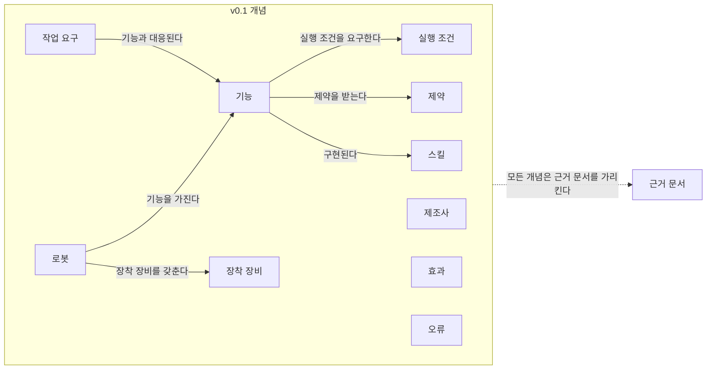
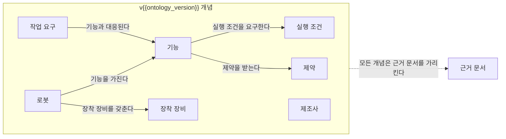

(너의 규칙은 시스템 프롬프트의 agents/shared-rules.md 와 agents/verifier.md 이다. 아래는 이번 실행의 컨텍스트와 입력이다.)

## 실행 컨텍스트

- run_id: 2026-09-25-06
- date: 2026-09-25
- run_type: track (트랙 실행)
- 대상: 트랙 manual-capability-ontology (매뉴얼 기반 로봇 기능 온톨로지) · 현재 단계: 단계 1. 기존 능력 표현 모델과 표준 조사 · 이번에 다룰 백로그 질문 id: q1-03, q1-04, q1-05 · 중심 세부영역: 5. 로봇 능력·작업 온톨로지 (B. 공통 정보·환경 모델)
- 예산:
    - max_search_queries: 40
    - max_sources_per_run: 20
    - new_topic_pages: 1
    - page_updates: 2
    - max_retries: 2
- 환경 알림: web_fetch_available: false · fetch_mode: mirror_only (일반 웹 페이지 열람은 네트워크 정책으로 막혀 있다. raw.githubusercontent.com 은 열린다: 공식 문서가 GitHub 에 있는 출처는 입력의 config/source_mirrors.yaml 경로를 WebFetch 로 열어 원문을 읽고 sources[].fetched=true, fetched_via=github_raw, fetch_url 을 적는다. 입력에 원문 텍스트(data/source_texts)가 있는 출처는 fetched_via=inbox. 그 밖의 출처는 fetched=false 이며 코드가 신뢰도 상한(medium)을 강제한다 — 공통 규칙 0절 6항)
- 언어: ko
- verification_stage: first
- verifier_budget:
    - max_search_queries: 40
    - max_sources_per_run: 20
    - new_topic_pages: 1
    - page_updates: 2
    - max_retries: 2

## 입력

### runs/2026-09-25-06/target.json

```json
{
  "run_id": "2026-09-25-06",
  "date": "2026-09-25",
  "weekday": "Fri",
  "run_number": 6,
  "run_type": "track",
  "forced": true,
  "target": {
    "area_no": 5,
    "area_name": "5. 로봇 능력·작업 온톨로지",
    "category": "B. 공통 정보·환경 모델",
    "category_letter": "B"
  },
  "topic": null,
  "track": {
    "slug": "manual-capability-ontology",
    "name": "매뉴얼 기반 로봇 기능 온톨로지",
    "stage": 1,
    "stages": 7,
    "stage_name": "기존 능력 표현 모델과 표준 조사",
    "question_ids": [
      "q1-03",
      "q1-04",
      "q1-05"
    ],
    "user_questions": [],
    "runs_per_week": 3,
    "question_rationale": "사용자 지정 0건, 되돌아온 질문 0건, 현재 단계 열린 질문 6건 중 오래된 순"
  },
  "corrections": [],
  "budget": {
    "max_search_queries": 40,
    "max_sources_per_run": 20,
    "new_topic_pages": 1,
    "page_updates": 2,
    "max_retries": 2
  },
  "priority_reason": null,
  "priority_questions": [],
  "excluded_areas": [],
  "lifted_areas": [],
  "deferred": {
    "monthly_recheck": false,
    "weekly_review": false
  },
  "selection_rationale": "CLI 지정 run_type=track, area=5; 트랙 실행일(Fri, track_days 앞 3개) → 트랙 manual-capability-ontology 단계 1, 질문 q1-03, q1-04, q1-05 (사용자 지정 0건, 되돌아온 질문 0건, 현재 단계 열린 질문 6건 중 오래된 순)"
}
```

### runs/2026-09-25-06/research.json

```json
{
  "run_id": "2026-09-25-06",
  "date": "2026-09-25",
  "run_type": "track",
  "target": {
    "area_no": 5,
    "area_name": "5. 로봇 능력·작업 온톨로지",
    "category": "B. 공통 정보·환경 모델"
  },
  "gaps": [
    "단계 1 질문 q1-03(조사 중, 이전 실행 부분 답), q1-04, q1-05 열림 — target.json 지정(사용자 지정 0건, 되돌아온 질문 0건, 오래된 순)",
    "완료 조건: 모델·표준 비교표의 다섯 정보 항목 열(전제조건·파라미터 범위·적재·환경 제약·완료 확인 방법·오류의 의미)과 실행 인터페이스 연결 열 대부분 미조사, 모든 행 원문 미열람",
    "완료 조건: ROP용 능력 개념 요구 목록 초안 미반영(q1-06 미조사)",
    "VDA 5050 팩트시트 필드 이름이 판 미확인(이전 실행 f11), IDTA 02020 구조가 제3자 논문 경유(이전 실행 f17)",
    "5. 로봇 능력·작업 온톨로지 페이지 섹션 6. 대표 접근법과 기술, 섹션 7. 관련 표준·프레임워크·오픈소스 비어 있음"
  ],
  "research_questions": [
    "같은 ‘운반 로봇’ 중 누가 이 화물을 실제로 취급할 수 있는가? [분류원문]",
    "q1-03 이 모델들은 ROP가 배정·실행·검증에 필요로 하는 정보 — 전제조건, 파라미터 범위, 적재·환경 제약, 완료 확인 방법, 오류의 의미 — 를 얼마나 담는가? 빠진 것은 무엇인가? (공식 저장소 원문으로 VDA 5050 3.0.0 팩트시트·상태 스키마, IDTA 02020, MassRobotics, SOMA, OPC UA Robotics 노드셋 확인)",
    "q1-04 능력 기술과 실행 인터페이스(명령·상태)는 기존 표준에서 어떻게 연결되는가?",
    "q1-05 제조사마다 같은 이름의 기능('운반', '도킹', '리프트')이 다른 의미를 갖는 문제를 기존 모델은 어떻게 다루는가?",
    "모델·표준 비교표의 실행 인터페이스 연결 열과 다섯 정보 항목 열을 원문 기준으로 채울 수 있는가? (완료 조건 겨냥)",
    "국내 자료에서 능력·스킬 기반 로봇 작업 기술이나 이종 로봇 의미 상호운용을 다룬 연구가 있는가? (한국 자료 우선 규칙)"
  ],
  "findings": [
    {
      "id": "f1",
      "claim": "VDA 5050 공식 저장소 main(3.0.0판)의 팩트시트 JSON 스키마는 typeSpecification, physicalParameters, protocolLimits, protocolFeatures, mobileRobotGeometry, loadSpecification 을 필수 블록으로, mobileRobotConfiguration 을 선택 블록으로 둔다.",
      "tag": "사실",
      "source_ids": [
        "ref-044"
      ],
      "cross_checked": false,
      "confidence": "medium",
      "evidence_excerpt": "factsheet.schema 필수 항목: headerId, timestamp, version, manufacturer, serialNumber 와 위 여섯 블록. 2.0.0 의 agvGeometry 가 mobileRobotGeometry 로 이름이 바뀐 것으로 보임(2.0.0 원문과 필드 대조는 미실시). (발행일 미확인, 확인일 기준)",
      "as_of": "2026-09-25",
      "flow_step": null,
      "flow_item": "수행 자원"
    },
    {
      "id": "f2",
      "claim": "VDA 5050 3.0.0 팩트시트의 적재 명세 loadSets 는 적재 유형(loadType)·적재 위치·적재 치수·최대 중량(maximumWeight)·적재 처리 높이·깊이·기울기의 최소·최대값, 적재 시 최대 속도·가감속, 픽·드롭 소요 시간(pickTime, dropTime)을 기술하는 필드를 둔다.",
      "tag": "사실",
      "source_ids": [
        "ref-044"
      ],
      "cross_checked": false,
      "confidence": "medium",
      "evidence_excerpt": "loadSets 필드: setName, loadType, loadPositions, boundingBoxReference, loadDimensions, maximumWeight, minimum/maximumLoadhandlingHeight·Depth·Tilt, maximumSpeed, maximumAcceleration, maximumDeceleration, pickTime, dropTime, description. (발행일 미확인, 확인일 기준)",
      "as_of": "2026-09-25",
      "flow_step": null,
      "flow_item": "제약"
    },
    {
      "id": "f3",
      "claim": "VDA 5050 3.0.0 팩트시트의 지원 동작 목록(mobileRobotActions)은 동작마다 actionType, actionDescription, actionScopes(INSTANT·NODE·EDGE·ZONE), actionParameters(key·valueDataType·description·isOptional), actionResult, blockingTypes(NONE·SOFT·SINGLE·HARD), pauseAllowed, cancelAllowed 를 기술한다.",
      "tag": "사실",
      "source_ids": [
        "ref-044"
      ],
      "cross_checked": false,
      "confidence": "medium",
      "evidence_excerpt": "factsheet.schema protocolFeatures/mobileRobotActions 의 필드 이름 확인. 이전 실행 f11 의 'agvActions' 는 2.x 이름으로 보이며 3.0.0 은 mobileRobotActions 이다. (발행일 미확인, 확인일 기준)",
      "as_of": "2026-09-25",
      "flow_step": null,
      "flow_item": "수행 자원"
    },
    {
      "id": "f4",
      "claim": "VDA 5050 3.0.0 팩트시트의 동작 파라미터 기술은 이름·자료형·설명·선택 여부만 담아 허용 값 범위와 실행 전제조건을 구조화된 필드로 담지 않으며, 범위 정보는 물리 파라미터·적재 명세 쪽 최소·최대 필드에 흩어져 있는 것으로 보인다.",
      "tag": "추정",
      "source_ids": [
        "ref-044"
      ],
      "cross_checked": false,
      "confidence": "low",
      "evidence_excerpt": "f2·f3 의 필드 목록에서 도출. actionParameters 하위 필드는 key, valueDataType, description, isOptional 뿐이었음. 조건은 자유 문장 description 에만 쓸 수 있을 것으로 추정.",
      "as_of": "2026-09-25",
      "flow_step": null,
      "flow_item": "제약"
    },
    {
      "id": "f5",
      "claim": "VDA 5050 3.0.0 상태 메시지의 동작 상태(actionStatus)는 WAITING, INITIALIZING, RUNNING, PAUSED, RETRIABLE, FINISHED, FAILED 일곱 값이며, RETRIABLE 은 실패했으나 재시도할 수 있는 동작을 뜻한다.",
      "tag": "사실",
      "source_ids": [
        "ref-045"
      ],
      "cross_checked": false,
      "confidence": "medium",
      "evidence_excerpt": "state.schema: RETRIABLE = 실패했으나 재시도 가능, PAUSED = instantAction 또는 외부 트리거로 일시정지, FAILED = 동작 수행 불가. (발행일 미확인, 확인일 기준)",
      "as_of": "2026-09-25",
      "flow_step": null,
      "flow_item": "완료·인계"
    },
    {
      "id": "f6",
      "claim": "VDA 5050 3.0.0 상태 메시지의 오류는 errorType·errorLevel 을 필수로, errorReferences·errorDescription·errorHint(와 번역)를 선택으로 담고, 오류 등급은 WARNING·URGENT·CRITICAL·FATAL 네 값으로 현재 주문 계속 가능 여부와 새 주문 수락 가능 여부에 따라 구분된다.",
      "tag": "사실",
      "source_ids": [
        "ref-045",
        "ref-022"
      ],
      "cross_checked": false,
      "confidence": "medium",
      "evidence_excerpt": "state.schema: CRITICAL = \"Immediate attention required, mobile robot is unable to continue active order, but can accept new order.\" FATAL 은 사용자 개입 필요·새 주문 불가. 2.0.0(ref-022, 이번 실행 미열람)은 WARNING·FATAL 두 값. 같은 발행 기관이라 독립 교차 아님.",
      "as_of": "2026-09-25",
      "flow_step": null,
      "flow_item": "예외·성과",
      "source_unopened": false
    },
    {
      "id": "f7",
      "claim": "VDA 5050 3.0.0 명세는 사전 정의 동작마다 완료·실패 판정을 상태 필드로 정의해, pick 은 적재물이 차량에 들어오고 새 적재 상태를 보고하면 FINISHED, 스테이션이 예상과 달리 비어 있는 경우 등은 FAILED 이고, startCharging 은 충전이 시작되어 powerSupply.charging 이 true 로 보고되면 FINISHED 이다.",
      "tag": "사실",
      "source_ids": [
        "ref-031"
      ],
      "cross_checked": false,
      "confidence": "medium",
      "evidence_excerpt": "공식 저장소 main 명세의 사전 정의 동작 표에서 pick·startCharging 정의 확인(요약 도구 경유 재서술). pick 파라미터: lhd, stationType, stationName, loadType, loadId, height, depth, side.",
      "as_of": "2026-09-25",
      "flow_step": null,
      "flow_item": "완료·인계"
    },
    {
      "id": "f8",
      "claim": "MassRobotics AMR 상호운용 표준의 JSON 스키마는 식별 보고(identityReport)에 최대 속도·예상 가동 시간·충전기 유형·화물 설명·화물 최대 부피·최대 중량·제품 문서 링크 필드를, 상태 보고(statusReport)에 운영 상태(navigating·idle·charging·waitingHumanEvent 등)·배터리 잔량·남은 적재 용량 비율 필드를 둔다.",
      "tag": "사실",
      "source_ids": [
        "ref-048"
      ],
      "cross_checked": false,
      "confidence": "medium",
      "evidence_excerpt": "identityReport: maxSpeed, maxRunTime, chargerType, cargoType, cargoMaxVolume, cargoMaxWeight, productDocumentation. statusReport: operationalState, batteryPercentage, remainingRunTime, loadPercentageStillAvailable. 스키마 판 번호는 미확인. (발행일 미확인, 확인일 기준)",
      "as_of": "2026-09-25",
      "flow_step": null,
      "flow_item": "수행 자원"
    },
    {
      "id": "f9",
      "claim": "IDTA 02020 Capability Description 서브모델 1.0은 능력을 구현과 무관한 기능 명세로 정의하고, 능력을 속성(최대 속도·허용 오차·온도 범위 등), 제약(전제조건·불변조건·사후조건을 담는 속성 제약과 순서 요구를 담는 전이 제약), 능력을 구현하는 스킬로 기술한다.",
      "tag": "사실",
      "source_ids": [
        "ref-046"
      ],
      "cross_checked": false,
      "confidence": "medium",
      "evidence_excerpt": "IDTA 공식 저장소 README: 요구 능력과 제공 능력의 \"reliable comparison\" 을 목표로 하며 IDTA 의 첫 공식 판(1.0). 이전 실행 f17(제3자 논문 경유)을 1차 자료로 대체. (발행일 미확인, 확인일 기준)",
      "as_of": "2026-09-25",
      "flow_step": null,
      "flow_item": "제약",
      "source_unopened": true
    },
    {
      "id": "f10",
      "claim": "IDTA 02020 템플릿 JSON 에는 CapabilitySet·CapabilityContainer·PropertySet 과 함께 CapabilityRealizedBy, CapabilityComposedOf, CapabilityGeneralizedBy, SameProperty 관계 요소와 ConstraintSet·PropertyConstraintContainer·TransitionConstraintContainer 제약 요소가 정의되어 있다.",
      "tag": "사실",
      "source_ids": [
        "ref-047"
      ],
      "cross_checked": false,
      "confidence": "medium",
      "evidence_excerpt": "템플릿의 각 요소 semanticId 는 https://admin-shell.io/idta/CapabilityDescription/<요소>/1/0 형식의 IDTA 자체 식별자. (발행일 미확인, 확인일 기준)",
      "as_of": "2026-09-25",
      "flow_step": null,
      "flow_item": null,
      "source_unopened": true
    },
    {
      "id": "f11",
      "claim": "SOMA 공식 저장소의 SOMA-ACT 온톨로지 파일은 활동의 실행 상태를 실패·성공·진행 중·취소·일시정지·대기 개체로 정의하고, 충족되지 않은 사후조건 같은 기대 불일치를 NonmanifestedSituation 클래스로 표현한다.",
      "tag": "사실",
      "source_ids": [
        "ref-050"
      ],
      "cross_checked": false,
      "confidence": "medium",
      "evidence_excerpt": "SOMA-ACT.owl: ExecutionStateRegion 과 ExecutionState_Failed/Succeeded/Active/Cancelled/Paused/Pending. NonmanifestedSituation 설명에 unfulfilled post-conditions 예시. 별도 'Failure' 이름 클래스는 이 파일에서 찾지 못함. (발행일 미확인, 확인일 기준)",
      "as_of": "2026-09-25",
      "flow_step": null,
      "flow_item": "예외·성과"
    },
    {
      "id": "f12",
      "claim": "OPC UA for Robotics 공식 노드셋 문서화 파일에는 MotionDeviceSystemType·MotionDeviceType·ControllerType 과 함께 TaskControlType, SafetyStateType, LoadType 형식과 운전 모드·실행 모드 열거형이 정의되어 있다.",
      "tag": "사실",
      "source_ids": [
        "ref-051"
      ],
      "cross_checked": false,
      "confidence": "medium",
      "evidence_excerpt": "Opc.Ua.Robotics.Nodeset2.documentation.csv 에서 형식 이름 확인. 메서드 목록과 각 형식이 어느 부(Part)에 속하는지는 요약 도구 결과가 불확실해 finding 으로 내지 않음. (발행일 미확인, 확인일 기준)",
      "as_of": "2026-09-25",
      "flow_step": null,
      "flow_item": null
    },
    {
      "id": "f13",
      "claim": "공식 원문으로 확인한 범위에서 다섯 정보 항목은 흩어져 있어, 파라미터 범위·적재 제약은 VDA 5050 팩트시트의 물리 파라미터·적재 명세가, 완료 확인과 오류의 의미는 VDA 5050 상태 메시지의 동작별 완료 정의와 오류 등급이, 전제조건·사후조건은 IDTA 02020 의 속성 제약이 담으며, 한 규격의 능력 기술 안에 다섯 항목이 모두 구조화된 경우는 확인되지 않았다.",
      "tag": "추정",
      "source_ids": [
        "ref-044",
        "ref-045",
        "ref-031",
        "ref-046"
      ],
      "cross_checked": false,
      "confidence": "low",
      "evidence_excerpt": "f1~f11 을 q1-03 의 다섯 항목에 대응시킨 추론. VDA 5050 은 완료 판정을 능력 기술(팩트시트)이 아니라 명세 본문의 동작 정의에 둔다. IEEE 1872 계열·SSN·PDDL·KnowRob 은 이번에도 원문 미열람.",
      "as_of": "2026-09-25",
      "flow_step": null,
      "flow_item": null
    },
    {
      "id": "f14",
      "claim": "VDA 5050 3.0.0 은 모든 이동로봇이 따르는 사전 정의 동작(pick, drop, startCharging 등)을 동작별 의미·파라미터·상태 전이와 함께 정하고, 사전 정의 동작으로 옮길 수 없는 동작만 제조사가 추가로 정의해 팩트시트의 지원 동작 목록에 같은 형식으로 선언하게 한다.",
      "tag": "사실",
      "source_ids": [
        "ref-031",
        "ref-044"
      ],
      "cross_checked": false,
      "confidence": "medium",
      "evidence_excerpt": "명세: \"If there is no way to map some action to one of the actions of the following section, the mobile robot manufacturer can define additional actions that shall be used by fleet control.\" 두 출처 모두 VDA 공식 저장소라 독립 교차 아님.",
      "as_of": "2026-09-25",
      "flow_step": null,
      "flow_item": "수행 자원"
    },
    {
      "id": "f15",
      "claim": "VDA 5050 3.0.0 명세는 이동로봇이 수행할 수 없는 동작(예: 최대 리프트 높이를 넘는 높이)을 담은 주문을 받으면 오류 유형 INVALID_ORDER_ACTION 으로 보고하게 해, 능력 한계와 명령의 불일치를 로봇 쪽 검증으로 드러낸다.",
      "tag": "사실",
      "source_ids": [
        "ref-031"
      ],
      "cross_checked": false,
      "confidence": "medium",
      "evidence_excerpt": "주문 거부 시나리오 절 요약(요약 도구 경유): 'receives an order with actions it cannot perform' → INVALID_ORDER_ACTION. 오류 등급 값은 글자 단위 미확인.",
      "as_of": "2026-09-25",
      "flow_step": null,
      "flow_item": "예외·성과"
    },
    {
      "id": "f16",
      "claim": "Open-RMF 플릿 어댑터는 수행 가능한 동작을 설정의 rmf_fleet actions 키에 이름 목록으로만 선언하고, 작업 요청은 category(동작 이름)와 JSON description 으로 이를 호출하며, execute_action 콜백이 category·description·execution 을 받아 실행한 뒤 execution.finished() 로 완료를 알린다.",
      "tag": "사실",
      "source_ids": [
        "ref-040"
      ],
      "cross_checked": false,
      "confidence": "medium",
      "evidence_excerpt": "튜토리얼 원문 예: rmf_fleet: actions: [\"clean\"]. 선언에 파라미터 스키마·전제조건·오류 의미를 적는 항목은 문서에 없음. (발행일 미확인, 확인일 기준)",
      "as_of": "2026-09-25",
      "flow_step": null,
      "flow_item": "완료·인계"
    },
    {
      "id": "f17",
      "claim": "제조 분야 능력·스킬 참조 모델은 스킬을 OPC UA 같은 명확한 호출 인터페이스를 가진 능력의 구현으로 보고, 스킬 인터페이스로 상태 기계의 전이를 일으키거나 파라미터를 설정하게 한다.",
      "tag": "사실",
      "source_ids": [
        "ref-036"
      ],
      "cross_checked": false,
      "confidence": "medium",
      "evidence_excerpt": "검색 요약: Skills are encapsulated implementations with a well-defined invocation interface (e.g., using OPC UA); skill interface 는 state machine 전이 트리거·파라미터 설정. 실행 직전 호출 가능성을 보는 PreconditionCheck·ContextCheck 언급(출처 논문 확정 못 함).",
      "as_of": "2022",
      "flow_step": null,
      "flow_item": "시작 조건",
      "source_unopened": true
    },
    {
      "id": "f18",
      "claim": "OPC 30050(OPC UA for PackML)은 ISA-88 기반 상태 기계를 담은 정보 모델로, 인스턴스마다 가능한 상태·전이(AvailableStates, AvailableTransitions)를 제공하게 하고 장비 내부 상태와 명령을 표준 상태 모델과 표준 명령 집합으로 옮기게 한다.",
      "tag": "사실",
      "source_ids": [
        "ref-055"
      ],
      "cross_checked": false,
      "confidence": "medium",
      "evidence_excerpt": "OPC Foundation 온라인 참조 검색 요약: PackML StateMachines 는 선택 구성요소 AvailableTransitions·AvailableStates 를 모든 인스턴스에 요구. 판·발행일 미확인. (발행일 미확인, 확인일 기준)",
      "as_of": "2026-09-25",
      "flow_step": null,
      "flow_item": "완료·인계",
      "source_unopened": true
    },
    {
      "id": "f19",
      "claim": "오픈소스 온톨로지 CaSkMan 은 제조 설비의 능력(입출력 제품을 가진 공정)과 스킬(상태 기계를 가진 실행 구현), 스킬 인터페이스(REST 웹서비스·OPC UA)를 연결하고, VDI 3682·VDI 2860·DIN 8580·ISA 88·DIN EN 61360 을 잇는 정렬 온톨로지로 자신을 소개한다.",
      "tag": "사실",
      "source_ids": [
        "ref-049"
      ],
      "cross_checked": false,
      "confidence": "medium",
      "evidence_excerpt": "README: \"an alignment ontology that connects\" 여러 표준. 스킬 인터페이스는 REST(WADL)·OPC UA 두 기술로 상태 기계 메서드·전이를 노출. (발행일 미확인, 확인일 기준)",
      "as_of": "2026-09-25",
      "flow_step": null,
      "flow_item": null
    },
    {
      "id": "f20",
      "claim": "Jungbluth 외(2023)는 OPC UA 동반 규격 기반 정보 모델과 스킬 개념으로 주문 기반 생산의 운반 시스템을 제어하는 사례를 제시하며, 무인운반차(AGV) 통신은 VDA 5050 에 따른 MQTT 로 두고 스킬을 운반 단위의 자기 기술(self-description) 대안으로 논의한다.",
      "tag": "사실",
      "source_ids": [
        "ref-056"
      ],
      "cross_checked": false,
      "confidence": "medium",
      "evidence_excerpt": "검색 요약: GetTransporter(셔틀 요청·예약)·ReleaseSpecificShuttle 스킬이 운반 단위 주문을 제어하고 master control 역할. at – Automatisierungstechnik 게재.",
      "as_of": "2023",
      "flow_step": null,
      "flow_item": "수행 자원",
      "source_unopened": true
    },
    {
      "id": "f21",
      "claim": "기존 표준에서 능력 기술과 실행 인터페이스의 연결은 두 방식으로 나뉘는 것으로 보이는데, VDA 5050·Open-RMF 는 같은 인터페이스 안에서 선언한 동작 이름을 명령과 상태 보고에 그대로 쓰는 방식이고, CSS·IDTA 02020·CaSkMan·PackML 계열은 별도 능력 모델을 스킬과 상태 기계 인터페이스로 잇는 방식이며, 두 방식을 서로 매핑한 표준은 검색 범위에서 찾지 못했다.",
      "tag": "추정",
      "source_ids": [
        "ref-044",
        "ref-040",
        "ref-046",
        "ref-049",
        "ref-036"
      ],
      "cross_checked": false,
      "confidence": "low",
      "evidence_excerpt": "f3·f5·f14·f16(인터페이스 내 이름 기반 연결)과 f9·f10·f17·f18·f19(능력–스킬–상태 기계)를 대응시킨 추론. f20 은 두 방식이 한 시스템에 함께 쓰인 사례로 보이나 매핑 규칙은 미확인.",
      "as_of": "2026-09-25",
      "flow_step": null,
      "flow_item": null,
      "source_unopened": false
    },
    {
      "id": "f22",
      "claim": "이종 수중 로봇 협업용 SWARMs 온톨로지 논문은 서로 다른 로봇이 같은 용어를 다른 의미로 쓰는 문제(예: 한 로봇의 Position 은 지역 좌표, 다른 로봇은 각도 좌표)를 들고, 핵심 온톨로지로 임무·차량·통신·환경 인식 도메인 온톨로지를 서로 연결해 의미 상호운용을 확보하려 했다.",
      "tag": "사실",
      "source_ids": [
        "ref-053"
      ],
      "cross_checked": false,
      "confidence": "medium",
      "evidence_excerpt": "검색 요약: even when different vehicles use the same terminology, it is sometimes interpreted with different meanings. Sensors 17(3) 569.",
      "as_of": "2017",
      "flow_step": null,
      "flow_item": null,
      "source_unopened": true
    },
    {
      "id": "f23",
      "claim": "자산관리셸(AAS) 메타모델 명세는 서브모델 요소의 의미를 semanticId 로 ECLASS·IEC 공통 데이터 사전(CDD) 같은 외부 사전의 식별자(IRDI 등)에 연결해 제조사·통합자·운영자가 같은 데이터를 모호하지 않게 이해하도록 한다.",
      "tag": "사실",
      "source_ids": [
        "ref-054"
      ],
      "cross_checked": false,
      "confidence": "medium",
      "evidence_excerpt": "검색 요약: SubmodelElements shall stand for itself and shall be unambiguously identified by the semanticIds. IRDI 는 ISO/IEC 11179-6, ISO 29002, ISO 6532 기반.",
      "as_of": "2024",
      "flow_step": null,
      "flow_item": null,
      "source_unopened": true
    },
    {
      "id": "f24",
      "claim": "CaSkMan 은 능력을 일반 Capability 인스턴스로 두지 말고 VDI 2860(취급 작업)·DIN 8580(제조 공정) 분류에서 파생한 하위 클래스로 기술하도록 권해, 기능 이름 대신 표준 분류 체계의 위치로 의미를 고정한다.",
      "tag": "사실",
      "source_ids": [
        "ref-049"
      ],
      "cross_checked": false,
      "confidence": "medium",
      "evidence_excerpt": "README: 개발자는 \"use one of the many subclasses\" (예: DIN8580:Fraesen). (발행일 미확인, 확인일 기준)",
      "as_of": "2026-09-25",
      "flow_step": null,
      "flow_item": null
    },
    {
      "id": "f25",
      "claim": "Dussard 외(2023)는 로봇 능력을 구성요소 사이에 하드코딩된 연결로 두지 않고, 로봇이 가진 구성요소와 하위 능력으로부터 능력을 추론하는 온톨로지 기반 기술 방법을 제안했다.",
      "tag": "사실",
      "source_ids": [
        "ref-052"
      ],
      "cross_checked": false,
      "confidence": "medium",
      "evidence_excerpt": "arXiv 2306.07569 검색 요약: infer robot capabilities based on components the robot owns and low-level capabilities.",
      "as_of": "2023-06",
      "flow_step": null,
      "flow_item": null,
      "source_unopened": true
    },
    {
      "id": "f26",
      "claim": "같은 이름 기능의 의미 차이에 대해 기존 모델은 고정 어휘로 동작 의미를 정의하는 방식(VDA 5050 사전 정의 동작), 외부 사전 식별자로 의미를 참조하는 방식(AAS semanticId), 표준 분류의 하위 클래스로 고정하는 방식(CaSkMan), 일반화·구성 관계로 능력 계층을 두는 방식(IDTA 02020), 핵심 온톨로지로 도메인 어휘를 잇는 방식(SWARMs), 구성요소에서 능력을 추론하는 방식을 쓰는 것으로 보이며, 제조사 추가 동작은 자유 문장 설명에 남아 이 문제가 풀리지 않는 것으로 보인다.",
      "tag": "추정",
      "source_ids": [
        "ref-031",
        "ref-054",
        "ref-049",
        "ref-047",
        "ref-053",
        "ref-052"
      ],
      "cross_checked": false,
      "confidence": "low",
      "evidence_excerpt": "f10·f14·f22~f25 에서 도출한 추론. 물류 AMR 의 '운반'·'도킹'·'리프트' 를 직접 다룬 비교 연구는 검색 범위(11회)에서 찾지 못함.",
      "as_of": "2026-09-25",
      "flow_step": null,
      "flow_item": null,
      "source_unopened": false
    }
  ],
  "sources": [
    {
      "id": "ref-022",
      "org": "VDA(Verband der Automobilindustrie)",
      "title": "VDA 5050 Version 2.0.0 — Interface for the communication between automated guided vehicles (AGV) and a master control",
      "published": "2022-01",
      "url": "https://www.vda.de/dam/jcr:f0c9c019-1506-4dee-998a-e92723fbf025/EN-VDA5050-V2_0_0.pdf",
      "type": "표준",
      "reliability": "medium",
      "accessed": "2026-09-25",
      "summary": "원문 미열람. AGV·AMR 과 상위 관제 간 통신 권고안. order·state 메시지, pick/drop action, 적재물(loads) 보고 필드를 정의.",
      "source_unopened": true,
      "fetched": false,
      "fetched_via": null,
      "fetch_url": null
    },
    {
      "id": "ref-031",
      "org": "VDA / VDMA (VDA5050 GitHub)",
      "title": "VDA5050/VDA5050_EN.md — Official Specification document for the VDA 5050",
      "published": null,
      "url": "https://github.com/VDA5050/VDA5050/blob/main/VDA5050_EN.md",
      "type": "표준",
      "reliability": "high",
      "accessed": "2026-09-25",
      "summary": "VDA 5050 공식 명세의 GitHub 저장소 본문(현재 main 은 3.0.0 판). 사전 정의 동작·추가 동작 규칙, 주문 거부 시나리오를 확인했다.",
      "fetched": true,
      "fetched_via": "github_raw",
      "fetch_url": "https://raw.githubusercontent.com/VDA5050/VDA5050/main/VDA5050_EN.md",
      "source_unopened": false
    },
    {
      "id": "ref-036",
      "org": "Köcher, A. 외",
      "title": "A Reference Model for Common Understanding of Capabilities and Skills in Manufacturing",
      "published": "2022",
      "url": "https://arxiv.org/abs/2209.09632",
      "type": "논문",
      "reliability": "medium",
      "accessed": "2026-09-25",
      "summary": "원문 미열람. Plattform Industrie 4.0 작업반의 CSS 참조 모델을 정리한 논문. 능력·스킬·서비스의 정의와 관계를 제시.",
      "source_unopened": true,
      "fetched": false,
      "fetched_via": null,
      "fetch_url": null
    },
    {
      "id": "ref-040",
      "org": "Open Robotics",
      "title": "PerformAction Tutorial - Programming Multiple Robots with ROS 2",
      "published": null,
      "url": "https://osrf.github.io/ros2multirobotbook/integration_fleets_action_tutorial.html",
      "type": "오픈소스 문서",
      "reliability": "high",
      "accessed": "2026-09-25",
      "summary": "플릿 어댑터 설정에 사용자 정의 동작을 선언하고 execute_action 콜백으로 실행·완료를 알리는 방법을 설명하는 공식 튜토리얼.",
      "fetched": true,
      "fetched_via": "github_raw",
      "fetch_url": "https://raw.githubusercontent.com/osrf/ros2multirobotbook/master/src/integration_fleets_action_tutorial.md",
      "source_unopened": false
    },
    {
      "id": "ref-044",
      "org": "VDA / VDMA (VDA5050 GitHub)",
      "title": "VDA5050/json_schemas/factsheet.schema",
      "published": null,
      "url": "https://github.com/VDA5050/VDA5050/blob/main/json_schemas/factsheet.schema",
      "type": "표준",
      "reliability": "high",
      "accessed": "2026-09-25",
      "summary": "VDA 5050 공식 저장소 main(3.0.0판)의 팩트시트 JSON 스키마. 유형 명세·물리 파라미터·지원 동작·적재 명세 블록의 필드를 정의한다.",
      "fetched": true,
      "fetched_via": "github_raw",
      "fetch_url": "https://raw.githubusercontent.com/VDA5050/VDA5050/main/json_schemas/factsheet.schema",
      "source_unopened": false
    },
    {
      "id": "ref-045",
      "org": "VDA / VDMA (VDA5050 GitHub)",
      "title": "VDA5050/json_schemas/state.schema",
      "published": null,
      "url": "https://github.com/VDA5050/VDA5050/blob/main/json_schemas/state.schema",
      "type": "표준",
      "reliability": "high",
      "accessed": "2026-09-25",
      "summary": "VDA 5050 공식 저장소 main(3.0.0판)의 상태 메시지 JSON 스키마. 동작 상태 값과 오류 구조·오류 등급(WARNING·URGENT·CRITICAL·FATAL)을 정의한다.",
      "fetched": true,
      "fetched_via": "github_raw",
      "fetch_url": "https://raw.githubusercontent.com/VDA5050/VDA5050/main/json_schemas/state.schema",
      "source_unopened": false
    },
    {
      "id": "ref-046",
      "org": "IDTA(Industrial Digital Twin Association)",
      "title": "IDTA 02020 Capability Description 1.0 — README (admin-shell-io/submodel-templates)",
      "published": null,
      "url": "https://github.com/admin-shell-io/submodel-templates/tree/main/published/Capability%20Description/1/0",
      "type": "표준",
      "reliability": "medium",
      "accessed": "2026-09-25",
      "summary": "IDTA 공식 서브모델 템플릿 저장소의 능력 기술 서브모델 1.0 안내. 능력·속성·제약(속성 제약·전이 제약)·스킬의 구조와 목적을 설명한다.",
      "fetched": false,
      "fetched_via": null,
      "fetch_url": "https://raw.githubusercontent.com/admin-shell-io/submodel-templates/main/published/Capability%20Description/1/0/README.md",
      "source_unopened": true
    },
    {
      "id": "ref-047",
      "org": "IDTA(Industrial Digital Twin Association)",
      "title": "IDTA 02020_Template_Capability_Description.json",
      "published": null,
      "url": "https://github.com/admin-shell-io/submodel-templates/tree/main/published/Capability%20Description/1/0",
      "type": "표준",
      "reliability": "medium",
      "accessed": "2026-09-25",
      "summary": "IDTA 02020 능력 기술 서브모델 템플릿 JSON. 능력·속성 집합과 realizedBy·composedOf·generalizedBy 관계, 제약 요소의 semanticId 를 담는다.",
      "fetched": false,
      "fetched_via": null,
      "fetch_url": "https://raw.githubusercontent.com/admin-shell-io/submodel-templates/main/published/Capability%20Description/1/0/IDTA%2002020_Template_Capability_Description.json",
      "source_unopened": true
    },
    {
      "id": "ref-048",
      "org": "MassRobotics",
      "title": "MassRobotics-AMR/AMR_Interop_Standard — AMR_Interop_Standard.json",
      "published": null,
      "url": "https://github.com/MassRobotics-AMR/AMR_Interop_Standard/blob/main/AMR_Interop_Standard.json",
      "type": "표준",
      "reliability": "high",
      "accessed": "2026-09-25",
      "summary": "MassRobotics AMR 상호운용 표준의 공식 JSON 스키마. identityReport·statusReport 메시지 필드(최대 속도, 화물 최대 중량·부피, 운영 상태 등)를 정의한다.",
      "fetched": true,
      "fetched_via": "github_raw",
      "fetch_url": "https://raw.githubusercontent.com/MassRobotics-AMR/AMR_Interop_Standard/main/AMR_Interop_Standard.json",
      "source_unopened": false
    },
    {
      "id": "ref-049",
      "org": "CaSkade-Automation (GitHub)",
      "title": "CaSkMan - An OWL ontology to model capabilities and skills in manufacturing (README)",
      "published": null,
      "url": "https://github.com/CaSkade-Automation/CaSkMan",
      "type": "오픈소스 문서",
      "reliability": "high",
      "accessed": "2026-09-25",
      "summary": "제조 설비의 능력·스킬·스킬 인터페이스(REST·OPC UA)를 기술하는 OWL 온톨로지 저장소 README. VDI 3682·VDI 2860·DIN 8580·ISA 88 등을 잇는 정렬 온톨로지로 소개한다.",
      "fetched": true,
      "fetched_via": "github_raw",
      "fetch_url": "https://raw.githubusercontent.com/CaSkade-Automation/CaSkMan/master/README.md",
      "source_unopened": false
    },
    {
      "id": "ref-050",
      "org": "EASE CRC (ease-crc/soma)",
      "title": "SOMA — owl/SOMA-ACT.owl",
      "published": null,
      "url": "https://github.com/ease-crc/soma/blob/master/owl/SOMA-ACT.owl",
      "type": "오픈소스 문서",
      "reliability": "high",
      "accessed": "2026-09-25",
      "summary": "SOMA 공식 저장소의 활동 모듈 OWL 파일. 실행 상태 영역(실패·성공·진행 중·취소·일시정지·대기)과 충족되지 않은 기대를 나타내는 클래스를 정의한다.",
      "fetched": true,
      "fetched_via": "github_raw",
      "fetch_url": "https://raw.githubusercontent.com/ease-crc/soma/master/owl/SOMA-ACT.owl",
      "source_unopened": false
    },
    {
      "id": "ref-051",
      "org": "OPC Foundation / VDMA",
      "title": "UA-Nodeset Robotics — Opc.Ua.Robotics.Nodeset2.documentation.csv",
      "published": null,
      "url": "https://github.com/OPCFoundation/UA-Nodeset/blob/latest/Robotics/Opc.Ua.Robotics.Nodeset2.documentation.csv",
      "type": "표준",
      "reliability": "high",
      "accessed": "2026-09-25",
      "summary": "OPC UA for Robotics 공식 노드셋의 문서화 목록. 모션 장치 시스템·컨트롤러·작업 제어·안전 상태·부하 형식을 정의한다. 명세 본문은 아니다.",
      "fetched": true,
      "fetched_via": "github_raw",
      "fetch_url": "https://raw.githubusercontent.com/OPCFoundation/UA-Nodeset/latest/Robotics/Opc.Ua.Robotics.Nodeset2.documentation.csv",
      "source_unopened": false
    },
    {
      "id": "ref-052",
      "org": "Dussard, B. 외",
      "title": "Ontological Component-based Description of Robot Capabilities",
      "published": "2023-06",
      "url": "https://arxiv.org/abs/2306.07569",
      "type": "논문",
      "reliability": "medium",
      "accessed": "2026-09-25",
      "summary": "원문 미열람. 로봇이 가진 구성요소와 하위 능력으로부터 능력을 추론하는 온톨로지 기반 기술 방법을 제안한 프리프린트.",
      "source_unopened": true,
      "fetched": false,
      "fetched_via": null,
      "fetch_url": null
    },
    {
      "id": "ref-053",
      "org": "Li, X. 외(Sensors, MDPI)",
      "title": "SWARMs Ontology: A Common Information Model for the Cooperation of Underwater Robots",
      "published": "2017",
      "url": "https://doi.org/10.3390/s17030569",
      "type": "논문",
      "reliability": "medium",
      "accessed": "2026-09-25",
      "summary": "원문 미열람. 이종 수중 로봇 간 같은 용어의 의미 차이를 해결하려고 핵심 온톨로지로 도메인 온톨로지를 연결한 공통 정보 모델 논문(Sensors 17(3) 569).",
      "source_unopened": true,
      "fetched": false,
      "fetched_via": null,
      "fetch_url": null
    },
    {
      "id": "ref-054",
      "org": "IDTA(Industrial Digital Twin Association)",
      "title": "Specification of the Asset Administration Shell Part 1: Metamodel (IDTA-01001-3-0-1)",
      "published": "2024",
      "url": "https://industrialdigitaltwin.org/wp-content/uploads/2024/06/IDTA-01001-3-0-1_SpecificationAssetAdministrationShell_Part1_Metamodel.pdf",
      "type": "표준",
      "reliability": "medium",
      "accessed": "2026-09-25",
      "summary": "원문 미열람. 자산관리셸 메타모델 명세. 서브모델 요소의 의미를 semanticId 로 외부 사전(ECLASS·IEC CDD) 식별자에 연결하는 구조를 정의한다.",
      "source_unopened": true,
      "fetched": false,
      "fetched_via": null,
      "fetch_url": null
    },
    {
      "id": "ref-055",
      "org": "OPC Foundation / OMAC",
      "title": "OPC-30050 – OPC UA for PackML - Common Object Model: PackML",
      "published": null,
      "url": "https://reference.opcfoundation.org/specs/OPC-30050",
      "type": "표준",
      "reliability": "medium",
      "accessed": "2026-09-25",
      "summary": "원문 미열람. ISA-88 기반 PackML 상태 기계와 표준 명령을 OPC UA 정보 모델로 정의한 동반 규격의 공식 온라인 참조.",
      "source_unopened": true,
      "fetched": false,
      "fetched_via": null,
      "fetch_url": null
    },
    {
      "id": "ref-056",
      "org": "Jungbluth, S., Barth, T., Nußbaum, J., Hermann, J., & Ruskowski, M.",
      "title": "Developing a skill-based flexible transport system using OPC UA",
      "published": "2023",
      "url": "https://www.degruyterbrill.com/document/doi/10.1515/auto-2022-0115/html?lang=en",
      "type": "논문",
      "reliability": "medium",
      "accessed": "2026-09-25",
      "summary": "원문 미열람. at – Automatisierungstechnik 게재 논문. OPC UA 정보 모델과 스킬 개념으로 운반 시스템을 제어하고 AGV 통신은 VDA 5050(MQTT)로 두는 사례를 제시한다.",
      "source_unopened": true,
      "fetched": false,
      "fetched_via": null,
      "fetch_url": null
    }
  ],
  "page_proposals": [
    {
      "action": "update",
      "path": "docs/tracks/manual-capability-ontology/stage-1-existing-models-and-standards.md",
      "sections": [
        "2",
        "3",
        "4",
        "5",
        "6",
        "8",
        "9"
      ],
      "rationale": "q1-03 답: f1·f2·f3·f4·f5·f6·f7·f8·f9·f10·f11·f12·f13 (신뢰도 medium) / q1-04 답: f14·f15·f16·f17·f18·f19·f20·f21 (신뢰도 medium) / q1-05 답: f22·f23·f24·f25·f26 (신뢰도 medium) — 질문 목록 상태, 조사 결과 q1-03(원문 기준으로 이전 부분 답 교체: 이전 f11 의 agvActions 는 3.0.0 mobileRobotActions, 이전 f17 은 IDTA 원문 f9·f10 으로 대체)·q1-04·q1-05 소제목, 남은 불확실성, 후속 질문, 완료 조건 현황, 출처, 이력 갱신"
    },
    {
      "action": "update",
      "path": "docs/tracks/manual-capability-ontology/model-standard-comparison.md",
      "sections": [
        "4",
        "5",
        "8"
      ],
      "rationale": "트랙 산출물 갱신: VDA 5050 행을 3.0.0 원문 기준으로(파라미터 범위 f2·f4, 적재 제약 f2, 완료 확인 f5·f7, 오류 f6, 실행 인터페이스 연결 f14·f15) 채우고 상태를 '확인'으로 / MassRobotics 행 f8 / AAS 능력·스킬·서비스 행 전제조건·제약 f9·f10(IDTA 원문) / KnowRob·SOMA 행 오류·완료 f11 / OPC UA Robotics 행 f12 / Open-RMF 행 실행 인터페이스 연결 f16 / 후보 밖 행 추가 제안: CaSkMan(f19·f24), OPC 30050 PackML(f18) / 5절 빠진 정보 요약을 f13·f21·f26 으로 갱신"
    },
    {
      "action": "update",
      "path": "docs/tracks/manual-capability-ontology/ontology-draft.md",
      "sections": [
        "2",
        "3",
        "4",
        "6"
      ],
      "rationale": "트랙 산출물 갱신: track.ontology_changes 가 검증 승인되면 반영(오류 등급 3.0.0 값, 실행 상태 개념, 스킬–실행 상태 관계, 기능 일반화·구성 관계, 기능 의미 참조 속성, 제약 종류 구분). 미승인 제안은 6절 질문으로"
    },
    {
      "action": "update",
      "path": "docs/categories/b-common-information-and-environment-model/05-robot-capability-and-task-ontology.md",
      "sections": [
        "6",
        "7"
      ],
      "rationale": "트랙 manual-capability-ontology 단계 1 반영 제안 (f9, f10, f14, f19, f21, f23, f24, f26): 섹션 6 능력–스킬–상태 기계 연결 방식과 같은 이름 기능의 의미 고정 방식, 섹션 7 IDTA 02020·CaSkMan·AAS semanticId. 아이디어 페이지 4절(필요한 데이터와 표준) 후보: f1·f2·f8·f9"
    },
    {
      "action": "update",
      "path": "docs/categories/c-connectivity-and-execution-foundation/09-robot-and-vendor-fleet-manager-integration.md",
      "sections": [
        "6",
        "7"
      ],
      "rationale": "트랙 manual-capability-ontology 단계 1 반영 제안 (f3, f5, f6, f7, f14, f15, f16, f20): VDA 5050 3.0.0 팩트시트 지원 동작·동작 상태·오류 등급·INVALID_ORDER_ACTION, Open-RMF 사용자 정의 동작, VDA 5050 과 OPC UA 스킬 병행 사례"
    },
    {
      "action": "update",
      "path": "docs/categories/g-safety-security-intelligence-and-governance/28-standards-interoperability-and-multi-vendor-governance.md",
      "sections": [
        "7"
      ],
      "rationale": "트랙 manual-capability-ontology 단계 1 반영 제안 (f8, f12, f18, f23): MassRobotics JSON 스키마, OPC UA Robotics 노드셋, OPC 30050 PackML, AAS semanticId·ECLASS 의미 참조"
    }
  ],
  "glossary_candidates": [
    {
      "term_ko": "자산관리셸",
      "term_en": "Asset Administration Shell (AAS)",
      "definition": "산업 자산의 정보를 서브모델 단위로 표준화해 디지털로 표현·교환하게 하는 인더스트리 4.0 의 디지털 트윈 구조로, 요소의 의미를 semanticId 로 외부 사전에 연결한다."
    },
    {
      "term_ko": "팩트시트",
      "term_en": "Factsheet (VDA 5050)",
      "definition": "VDA 5050 에서 이동로봇이 유형 명세·물리 파라미터·지원 동작·적재 명세 등을 관제에 미리 알리는 메시지이다."
    },
    {
      "term_ko": "의미 식별자",
      "term_en": "semanticId",
      "definition": "자산관리셸의 요소가 ECLASS·IEC 공통 데이터 사전 같은 외부 사전의 어떤 개념을 뜻하는지 가리키는 참조 식별자이다."
    }
  ],
  "open_questions_new": [
    "국내 로봇 관제·물류 현장에서 제조사별 동작 이름(운반·도킹·리프트)을 공통 의미로 맞추는 사전이나 표준화 작업(ECLASS 부합, KS 등)이 있는가? | 관련 영역: 5. 로봇 능력·작업 온톨로지, 28. 표준·상호운용성·다사업자 거버넌스 | 근거: f26 | 종류: 일반"
  ],
  "open_questions_resolved": [],
  "self_check": {
    "source_count": 17,
    "cross_checked_count": 0,
    "unverified": [
      "모든 finding 교차 확인 실패: 공식 원문은 각 규격 발행 기관 한 곳의 산출물이고, 독립 2차 출처로 같은 내용을 확인하지 못함",
      "f7·f15 는 WebFetch 요약 모델을 거친 명세 원문 재서술이라 글자 단위 일치 미확인(특히 INVALID_ORDER_ACTION 의 오류 등급)",
      "f12 OPC UA Robotics 노드셋의 메서드 목록과 형식별 소속 부(Part) 미확인",
      "f17 PreconditionCheck·ContextCheck 설명의 출처 논문 확정 못 함",
      "ref-044~ref-051 발행일 미확인(저장소 파일), ref-048 스키마 판 번호 미확인",
      "IEEE 1872 계열·SSN·PDDL·KnowRob 은 이번에도 원문 미열람이라 q1-03 의 해당 행 판정은 이전 실행 수준",
      "ref-053 저자 표기(Li, X. 외)는 검색 결과에서 직접 확인하지 못함",
      "VDA 5050 상호운용이 버전·제조사 확장·구현 품질에 좌우된다는 서술은 출처가 벤더 블로그로 보이고 발행 주체를 확정 못 해 finding 으로 내지 않음"
    ],
    "scope_violations": [],
    "budget_used": {
      "queries": 11,
      "sources": 13
    },
    "limits": "fetch_mode mirror_only: raw.githubusercontent.com 공식 저장소 원문(VDA 5050 main 명세·factsheet/state 스키마, IDTA 02020 README·템플릿, MassRobotics JSON, CaSkMan README, SOMA-ACT.owl, OPC UA Robotics 노드셋 CSV, Open-RMF 튜토리얼 원본)은 열었고 fetched=true 로 표시했다. 논문·AAS 메타모델·OPC 30050 참조는 원문 미열람이며 신뢰도 상한 medium. 검색 11회/40, 신규 출처 13건/20(ref-044~ref-056). 재사용 출처 4건(ref-022, ref-031, ref-036, ref-040). 주의: 실행 컨텍스트의 next_ref_id(ref-044)를 따랐으나 이전 브리프 2026-09-25-03 도 ref-044~ref-050 을 다른 출처(GS1 CBV.ttl 등)에 부여했으므로 id 충돌 여부를 퍼블리셔가 확인해야 한다. 질문 선택: target.json 지정 q1-03·q1-04·q1-05. 세 질문 모두 답했으나 q1-03 은 IEEE 1872 계열·SSN·PDDL·KnowRob 행이 여전히 원문 미열람이다. f8(MassRobotics 스키마 필드)은 q1-08 의 근거가 되므로 다음 실행에서 q1-08 답에 재인용할 수 있다. f1·f3 은 q1-07(팩트시트 3.0 필드) 일부 근거이나 2.0.0 원문과 필드 대조는 하지 않았다. 한국 자료: 한·영 검색에서 로봇 능력·스킬 의미 상호운용을 다룬 국내 학술 자료를 찾지 못했다(국내 OPC UA 논문은 능력 기술과 무관해 제외). 27. AI·학습·적응과 모델 운영 관련 finding 없음. 용어집의 'VDA 5050' 항목 정의가 팩트시트 정의로 되어 있어 용어 충돌 점검이 필요해 보인다. 후속 질문 4건, 온톨로지 변경 제안 7건."
  },
  "track": {
    "slug": "manual-capability-ontology",
    "stage": 1,
    "answered_question_ids": [
      "q1-03",
      "q1-04",
      "q1-05"
    ],
    "new_questions": [
      {
        "question": "VDA 5050 3.0.0 팩트시트의 동작 파라미터에 허용 범위 필드가 없을 때, 제조사는 리프트 높이 같은 동작 한계를 물리 파라미터·적재 명세의 최소·최대 필드와 자유 문장 설명 가운데 어디에 적는가?",
        "stage": 1,
        "rationale_finding_id": "f4"
      },
      {
        "question": "VDA 5050 사전 정의 동작(pick, drop, startCharging 등)과 IDTA 02020 능력·VDI 2860 취급 분류를 대응시키는 매핑 규칙을 만들 수 있는가, 제조사 추가 동작은 어떻게 처리하는가?",
        "stage": 4,
        "rationale_finding_id": "f21"
      },
      {
        "question": "제조사 매뉴얼·통합 가이드는 VDA 5050 추가 동작이나 Open-RMF 사용자 정의 동작의 의미·파라미터·완료 조건을 어떤 형식으로 설명하는가?",
        "stage": 2,
        "rationale_finding_id": "f16"
      },
      {
        "question": "ECLASS 나 IEC 공통 데이터 사전에 이동로봇의 운반·도킹·리프트·충전 능력을 가리킬 수 있는 클래스·속성이 있는가?",
        "stage": 1,
        "rationale_finding_id": "f23"
      }
    ],
    "ontology_changes": [
      {
        "op": "modify",
        "kind": "concept",
        "name": "오류 (Error)",
        "evidence_finding_ids": [
          "f6"
        ],
        "description": "등급 속성 값에 VDA 5050 3.0.0 의 WARNING·URGENT·CRITICAL·FATAL(현재 주문 계속 가능 여부·새 주문 수락 가능 여부로 구분)을 원문 기준으로 더하고, 속성에 참조(errorReferences)·조치 힌트(errorHint)를 더한다. v0.1 에서 3.0 등급을 제외한 이유(원문 미확인)가 해소됨."
      },
      {
        "op": "add",
        "kind": "concept",
        "name": "실행 상태 (Execution State)",
        "evidence_finding_ids": [
          "f5",
          "f11",
          "f18"
        ],
        "description": "기능·스킬 실행의 진행 단계(대기·준비·실행·일시정지·재시도 가능·완료·실패·취소 등). VDA 5050 actionStatus, SOMA 실행 상태, PackML 상태 기계에 대응. 완료 확인 방법의 판정 대상."
      },
      {
        "op": "add",
        "kind": "relation",
        "name": "스킬 / 실행 상태를 드러낸다 / 실행 상태",
        "evidence_finding_ids": [
          "f17",
          "f18",
          "f19"
        ],
        "description": "스킬은 상태 기계로 실행 상태를 노출하고 인터페이스로 전이를 일으킨다. v0.1 6절의 '스킬 상태 기계 속성' 미해결 질문과 관련되며, 출처 확정 문제는 f18·f19 로 보완."
      },
      {
        "op": "add",
        "kind": "relation",
        "name": "기능 / 일반화된다 / 기능",
        "evidence_finding_ids": [
          "f10",
          "f24"
        ],
        "description": "구체 기능이 더 일반적인 기능의 하위 개념이 되는 관계(IDTA 02020 CapabilityGeneralizedBy, CaSkMan 의 분류 하위 클래스). 같은 이름 기능의 의미 차이를 계층 위치로 구분하는 데 쓴다."
      },
      {
        "op": "add",
        "kind": "relation",
        "name": "기능 / 구성된다 / 기능",
        "evidence_finding_ids": [
          "f10"
        ],
        "description": "복합 기능이 하위 기능들로 이루어지는 관계(IDTA 02020 CapabilityComposedOf). 6절의 기능 단위 크기 질문(q4-03)과 관련."
      },
      {
        "op": "modify",
        "kind": "concept",
        "name": "기능 (Capability)",
        "evidence_finding_ids": [
          "f14",
          "f23",
          "f24"
        ],
        "description": "속성에 '의미 참조(외부 사전·표준 분류·표준 동작 이름의 식별자)'를 더한다. 제조사별 명칭과 공통 의미를 분리해 q1-05 문제를 다루기 위한 것."
      },
      {
        "op": "modify",
        "kind": "concept",
        "name": "제약 (Constraint)",
        "evidence_finding_ids": [
          "f9"
        ],
        "description": "종류 속성에 IDTA 02020 의 속성 제약(전제조건·불변조건·사후조건)과 전이 제약(순서 요구)을 더한다. 6절의 '전제조건을 실행 조건과 별도 개념으로 둘지' 질문과 겹치므로, 전제조건을 제약의 한 종류로 둘지 실행 조건으로 둘지는 검증 판단이 필요하다."
      }
    ],
    "stage_completion_self_assessment": {
      "met": false,
      "missing": [
        "모델·표준 비교표: VDA 5050·IDTA 02020·MassRobotics·Open-RMF·SOMA 행은 원문 근거가 생겼으나 IEEE 1872 계열·SSN·PDDL·KnowRob 행의 다섯 정보 항목 열은 여전히 원문 미열람·미조사",
        "ROP용 능력 개념 요구 목록 초안이 온톨로지 초안에 미반영(q1-06 미조사)",
        "q1-06, q1-07, q1-08 열림"
      ]
    }
  }
}
```

### docs/categories/b-common-information-and-environment-model/05-robot-capability-and-task-ontology.md

```markdown
---
title: "5. 로봇 능력·작업 온톨로지"
type: area
category: "B. 공통 정보·환경 모델"
area_no: 5
related_areas: []
tags: []
status: seed
created: 2026-09-24
updated: 2026-09-24
sources: []
version: 1
---

[홈](../../index.md) › [B. 공통 정보·환경 모델](index.md) › 5. 로봇 능력·작업 온톨로지

# 5. 로봇 능력·작업 온톨로지

!!! info "소속 대분류"
    [B. 공통 정보·환경 모델](index.md) — 핵심 질문:
    로봇·물건·공간·상태를 어떻게 같은 의미로 이해할 것인가? [분류원문]

<!-- auto:area-tracks:start -->
!!! note "관련 연구 트랙"
    이 세부영역을 가로지르는 중점 연구 트랙과 확장 아이디어다. 트랙은 분류를 바꾸지 않으며, 트랙에서 확인된 사실은 이 페이지에 반영하도록 제안된다. 전체 매핑은 [확장 아이디어 연결 구조](../../ideas/index.md)에 있다.

    - [매뉴얼 기반 로봇 기능 온톨로지](../../tracks/manual-capability-ontology/index.md) — 중심 영역(●) · 확장 아이디어: [아이디어 1. 로봇 기능 온톨로지](../../ideas/robot-capability-ontology.md)
    - [자연어 업무 지시 챗봇](../../tracks/nl-task-chatbot/index.md) — 함께 필요한 영역(○) · 확장 아이디어: [아이디어 2. 자연어 업무 지시 챗봇](../../ideas/nl-task-chatbot.md)
    - [건축 도면 자동 인식](../../tracks/floorplan-recognition/index.md) — 함께 필요한 영역(○) · 확장 아이디어: [아이디어 3. 건축 도면 자동 인식](../../ideas/floorplan-recognition.md)
<!-- auto:area-tracks:end -->

## 1. 한 줄 정의

제조사별 기능·제약·장착 장비·실행 조건을 공통 모델로 표현하고, 작업 요구와 연결 [분류원문]

## 2. SCM 관점의 질문

같은 ‘운반 로봇’ 중 누가 이 화물을 실제로 취급할 수 있는가? [분류원문]

> 원문 주석: 27번의 AI는 특정 기능 하나에만 해당하지 않는다. **매뉴얼 해석은 5·21번, 도면 해석은 6번, 학습 기반 배차는 13번, 장애 분석은 19번**에 적용되는 연구 방법이다. [분류원문]

## 3. 왜 중요한가

아직 작성되지 않음

## 4. 핵심 개념과 용어

아직 작성되지 않음

## 5. 현장 시나리오 (물류 흐름의 어느 단계인지 명시)

아직 작성되지 않음

## 6. 대표 접근법과 기술

아직 작성되지 않음

## 7. 관련 표준·프레임워크·오픈소스

아직 작성되지 않음

## 8. 대표 연구와 자료

아직 작성되지 않음

## 9. ROP가 직접 맡는 것과 외부와 연계하는 것 (부록 A 9장 기준)

아직 작성되지 않음

## 10. 다른 연구영역과의 연결 (번호와 이름을 함께 표기)

아직 작성되지 않음

## 11. 열린 질문

아직 작성되지 않음

## 12. 최근 업데이트 (자동)

<!-- auto:area-recent:start -->
아직 기록된 업데이트가 없다.
<!-- auto:area-recent:end -->

## 13. 참고 자료 (각주)

(아직 각주가 없다. 본문이 작성되면 출처 각주를 여기에 둔다.)
```

### docs/categories/c-connectivity-and-execution-foundation/09-robot-and-vendor-fleet-manager-integration.md (요약)

```markdown
# 9. 로봇·제조사 관제 연동

소속 대분류: C. 연결·실행 기반 · 상태: seed · 신뢰도: — · 마지막 갱신: 2026-09-24 · 버전: 1

## 1. 한 줄 정의

제조사 API·SDK·표준 프로토콜을 연결하고 명령·상태·오류를 변환하는 어댑터 [분류원문]

## 2. SCM 관점의 질문

개별 로봇을 제어할까, 제조사 관제에 미션을 맡길까? [분류원문]
```

### docs/categories/f-deployment-verification-and-maintenance/21-onboarding-configuration-and-commissioning.md (요약)

```markdown
# 21. 온보딩·설정·현장 시운전

소속 대분류: F. 도입·검증·유지관리 · 상태: seed · 신뢰도: — · 마지막 갱신: 2026-09-24 · 버전: 1

## 1. 한 줄 정의

로봇 등록, 기능 탐색, 문서 분석, 지도·설비 설정, 교정, 설치 절차 자동화 [분류원문]

## 2. SCM 관점의 질문

새 제조사나 새 물류센터를 추가할 때 반복 작업을 얼마나 줄일까? [분류원문]

> 원문 주석: 27번의 AI는 특정 기능 하나에만 해당하지 않는다. **매뉴얼 해석은 5·21번, 도면 해석은 6번, 학습 기반 배차는 13번, 장애 분석은 19번**에 적용되는 연구 방법이다. [분류원문]
```

### docs/categories/f-deployment-verification-and-maintenance/23-testing-formal-verification-and-benchmarking.md (요약)

```markdown
# 23. 시험·형식 검증·벤치마크

소속 대분류: F. 도입·검증·유지관리 · 상태: seed · 신뢰도: — · 마지막 갱신: 2026-09-24 · 버전: 1

## 1. 한 줄 정의

시뮬레이션·실기체 시험, 장애 주입, 교착·제약 위반 검증, 회귀시험, 성능 비교 [분류원문]

## 2. SCM 관점의 질문

업데이트 후 정상 상황뿐 아니라 장애 상황도 여전히 처리되는가? [분류원문]
```

### docs/categories/f-deployment-verification-and-maintenance/24-asset-and-software-lifecycle-management.md (요약)

```markdown
# 24. 자산·소프트웨어 수명주기 관리

소속 대분류: F. 도입·검증·유지관리 · 상태: seed · 신뢰도: — · 마지막 갱신: 2026-09-24 · 버전: 1

## 1. 한 줄 정의

고장 예측·정비, 배터리 열화, 펌웨어·어댑터·지도·모델 버전, 배포·복구, 장비 교체 [분류원문]

## 2. SCM 관점의 질문

제조사 펌웨어가 바뀌면 어떤 현장과 기능을 다시 검증해야 할까? [분류원문]
```

### docs/categories/g-safety-security-intelligence-and-governance/27-ai-learning-adaptation-and-model-operations.md (요약)

```markdown
# 27. AI·학습·적응과 모델 운영

소속 대분류: G. 안전·보안·지능·거버넌스 · 상태: seed · 신뢰도: — · 마지막 갱신: 2026-09-24 · 버전: 1

## 1. 한 줄 정의

문서·도면 해석, 수요·고장 예측, 학습 기반 계획, LLM 에이전트, 불확실성 평가, 모델 변경 관리 [분류원문]

## 2. SCM 관점의 질문

AI가 만든 작업 계획이나 기능 해석을 어떤 기준으로 실행에 사용할까? [분류원문]

> 원문 주석: 27번의 AI는 특정 기능 하나에만 해당하지 않는다. **매뉴얼 해석은 5·21번, 도면 해석은 6번, 학습 기반 배차는 13번, 장애 분석은 19번**에 적용되는 연구 방법이다. [분류원문]
```

### docs/categories/b-common-information-and-environment-model/08-real-time-world-state-and-data-consistency.md (요약)

```markdown
# 8. 실시간 세계 상태·데이터 일관성

소속 대분류: B. 공통 정보·환경 모델 · 상태: seed · 신뢰도: — · 마지막 갱신: 2026-09-24 · 버전: 1

## 1. 한 줄 정의

로봇·설비·공간·화물의 현재 상태를 통합하고, 시간 지연·누락·충돌·불확실성을 관리 [분류원문]

## 2. SCM 관점의 질문

문이 열려 있다는 정보가 30초 전이라면 지금도 통과 가능하다고 볼 수 있을까? [분류원문]

> 원문 주석: 8번의 실시간 모델이 **현재 상태를 표현**한다면, 22번은 그 모델을 이용해 **가정한 미래를 실험**한다. 구분해두면 디지털 트윈이라는 이름 아래 서로 다른 기능이 섞이지 않는다. [분류원문]
```

### docs/categories/c-connectivity-and-execution-foundation/12-command-and-task-execution-reliability.md (요약)

```markdown
# 12. 명령·작업 실행의 신뢰성

소속 대분류: C. 연결·실행 기반 · 상태: seed · 신뢰도: — · 마지막 갱신: 2026-09-24 · 버전: 1

## 1. 한 줄 정의

접수·실행·완료·취소 상태, 제어권, 중복 요청 방지, 시간 초과, 재시작 후 상태 복원 [분류원문]

## 2. SCM 관점의 질문

응답이 끊긴 운반 요청을 다시 보내면 같은 화물을 두 번 처리하지 않을까? [분류원문]
```

### docs/categories/d-planning-and-optimization/13-task-allocation-mrta.md (요약)

```markdown
# 13. 작업 배정 — MRTA

소속 대분류: D. 계획·최적화 · 상태: seed · 신뢰도: — · 마지막 갱신: 2026-09-24 · 버전: 1

## 1. 한 줄 정의

능력·위치·적재량·배터리·납기 등을 고려해 로봇 또는 로봇 팀에 작업을 배정 [분류원문]

## 2. SCM 관점의 질문

가장 가까운 로봇에 맡기는 것이 전체적으로도 유리한가? [분류원문]

> 원문 주석: 27번의 AI는 특정 기능 하나에만 해당하지 않는다. **매뉴얼 해석은 5·21번, 도면 해석은 6번, 학습 기반 배차는 13번, 장애 분석은 19번**에 적용되는 연구 방법이다. [분류원문]
```

### docs/categories/g-safety-security-intelligence-and-governance/25-safety-and-risk-management.md (요약)

```markdown
# 25. 안전·위험 관리

소속 대분류: G. 안전·보안·지능·거버넌스 · 상태: seed · 신뢰도: — · 마지막 갱신: 2026-09-24 · 버전: 1

## 1. 한 줄 정의

로봇·사람·설비 상호작용의 위험, 안전 조건, 정지·재개 절차, 비상 상황 대응, 안전 책임 경계 [분류원문]

## 2. SCM 관점의 질문

여러 장비는 각각 안전해도 함께 움직일 때 새로운 위험이 생기지 않는가? [분류원문]
```

### docs/categories/g-safety-security-intelligence-and-governance/28-standards-interoperability-and-multi-vendor-governance.md (요약)

```markdown
# 28. 표준·상호운용성·다사업자 거버넌스

소속 대분류: G. 안전·보안·지능·거버넌스 · 상태: seed · 신뢰도: — · 마지막 갱신: 2026-09-24 · 버전: 1

## 1. 한 줄 정의

공통 규격, 적합성 시험, 제조사 간 책임, 데이터 소유권, API 변경 정책, 서비스 수준과 감사 이력 [분류원문]

## 2. SCM 관점의 질문

제조사·ROP·설비업체 중 누가 연동 오류를 수정하고 변경을 승인할까? [분류원문]
```

### docs/categories/c-connectivity-and-execution-foundation/10-facility-and-building-system-integration.md (요약)

```markdown
# 10. 설비·건물 시스템 연동

소속 대분류: C. 연결·실행 기반 · 상태: seed · 신뢰도: — · 마지막 갱신: 2026-09-24 · 버전: 1

## 1. 한 줄 정의

컨베이어, 자동창고, 작업대, PLC, 문, 승강기, 출입통제 시스템과 작업을 연계 [분류원문]

## 2. SCM 관점의 질문

컨베이어 준비와 로봇 도착을 어떻게 맞출까? [분류원문]
```

### docs/categories/d-planning-and-optimization/16-shared-resource-charging-and-energy-optimization.md (요약)

```markdown
# 16. 공용 자원·충전·에너지 최적화

소속 대분류: D. 계획·최적화 · 상태: seed · 신뢰도: — · 마지막 갱신: 2026-09-24 · 버전: 1

## 1. 한 줄 정의

충전기·승강기·작업대·대기 공간·버퍼의 예약과 배분, 충전 시점과 에너지 사용 계획 [분류원문]

## 2. SCM 관점의 질문

로봇들이 동시에 충전하거나 승강기를 기다리는 상황을 어떻게 줄일까? [분류원문]
```

### docs/categories/b-common-information-and-environment-model/06-map-space-and-location-model.md (요약)

```markdown
# 6. 지도·공간·위치 모델

소속 대분류: B. 공통 정보·환경 모델 · 상태: seed · 신뢰도: — · 마지막 갱신: 2026-09-24 · 버전: 1

## 1. 한 줄 정의

BIM·CAD·센서 지도에서 이동 공간과 경로를 만들고, 로봇별 좌표계·층·목적지를 정렬 [분류원문]

## 2. SCM 관점의 질문

제조사마다 다른 지도에서 ‘3층 출하 대기장’을 어떻게 동일한 장소로 인식할까? [분류원문]

> 원문 주석: 6번에는 지도 생성뿐 아니라 **현장과 도면의 차이 확인, 지도 버전 관리, 위치추정 결과의 신뢰도**도 포함해야 한다. [분류원문]

> 원문 주석: 27번의 AI는 특정 기능 하나에만 해당하지 않는다. **매뉴얼 해석은 5·21번, 도면 해석은 6번, 학습 기반 배차는 13번, 장애 분석은 19번**에 적용되는 연구 방법이다. [분류원문]
```

### docs/categories/b-common-information-and-environment-model/07-cargo-inventory-and-asset-identification-and-tracking.md (요약)

```markdown
# 7. 화물·재고·자산 식별과 추적

소속 대분류: B. 공통 정보·환경 모델 · 상태: published · 신뢰도: medium · 마지막 갱신: 2026-09-25 · 버전: 3

## 1. 한 줄 정의

제품·박스·팔레트·운반구·로봇을 식별하고, 적재 관계·위치·인계 이력을 연결 [분류원문]

## 2. SCM 관점의 질문

로봇은 도착했는데 실제로 어떤 팔레트가 인계됐는가? [분류원문]

> 원문 주석: **7번은 SCM 관점에서 특히 빠뜨리기 쉽다.** 로봇 위치를 추적하는 것과 화물의 위치·인계 책임을 추적하는 것은 다르다. GS1 EPCIS는 제품·자산의 상태, 위치, 이동, 인계에 관한 이벤트를 공유하는 참고 표준이다. [3] [분류원문]

원문의 [3]은 참고문헌 [ref-003](../../references/ref-003.md)에 해당한다.[^ref-003]
```

### docs/glossary/index.md

```markdown
---
title: "용어집"
type: glossary
subtype: index
status: published
created: 2026-09-24
updated: 2026-09-24
version: 1
---

[홈](../index.md) › 용어집

# 용어집

이 위키에서 쓰는 용어의 한글·영문 표기와 한 줄 정의를 모은다. 용어마다 개별 페이지에 설명, 관련 연구영역, 출처를 둔다. 시드 용어는 SCOR, ISA-95, EPCIS, Open-RMF, Fleet Adapter, WES/WCS/WMS/MES/TMS, MRTA, MAPF, Lifelong MAPF, Multi-Agent Pickup and Delivery, ARIAC, DDS-Security, 디지털 트윈이다. 새 용어는 스토리텔러 에이전트가 제안하고 퍼블리셔가 반영한다.

아래 표는 용어 페이지의 프런트매터(term_ko, term_en, definition, related_areas)에서 자동으로 만든다.

## 용어 목록

<!-- auto:glossary-index:start -->
| 용어(한글) | 용어(영문) | 한 줄 정의 | 관련 영역 |
|---|---|---|---|
| [DDS 보안 규격](dds-security.md) | DDS Security (DDS-Security) | DDS(Data Distribution Service)의 보안 규격으로, ROS 2가 인증·암호화·접근통제 구조의 기반으로 통합했다. | [26. 사이버보안·접근권한·개인정보](../categories/g-safety-security-intelligence-and-governance/26-cybersecurity-access-control-and-privacy.md)<br>[11. 분산 시스템·통신·컴퓨팅 구조](../categories/c-connectivity-and-execution-foundation/11-distributed-systems-communication-and-computing.md)<br>[28. 표준·상호운용성·다사업자 거버넌스](../categories/g-safety-security-intelligence-and-governance/28-standards-interoperability-and-multi-vendor-governance.md) |
| [VDA 5050](vda-5050.md) | VDA 5050 | VDA 5050에서 차량이 자신의 기능 정보를 상위 관제에 미리 알리는 메시지(토픽)이다. | [5. 로봇 능력·작업 온톨로지](../categories/b-common-information-and-environment-model/05-robot-capability-and-task-ontology.md)<br>[7. 화물·재고·자산 식별과 추적](../categories/b-common-information-and-environment-model/07-cargo-inventory-and-asset-identification-and-tracking.md)<br>[9. 로봇·제조사 관제 연동](../categories/c-connectivity-and-execution-foundation/09-robot-and-vendor-fleet-manager-integration.md) |
| [계획 도메인 정의 언어](pddl.md) | Planning Domain Definition Language (PDDL) | 자동 계획 문제에서 행동을 파라미터·전제조건·효과로 기술하고 도메인과 문제 인스턴스를 분리해 표현하는 언어이다. | [5. 로봇 능력·작업 온톨로지](../categories/b-common-information-and-environment-model/05-robot-capability-and-task-ontology.md) |
| [공급망 운영 참조 모델](scor.md) | Supply Chain Operations Reference (SCOR) | ASCM이 관리하는 공급망 프로세스 참조 모델로, 공급망을 계획·주문·조달·생산/가공·이행·반품 프로세스와 이를 아우르는 오케스트레이션 프로세스로 기술한다. | [1. 주문·업무 시스템 연계](../categories/a-business-supply-chain-design/01-order-and-business-system-integration.md)<br>[2. 공정·워크플로 모델링](../categories/a-business-supply-chain-design/02-process-and-workflow-modeling.md)<br>[4. 성과·경제성·프로세스 개선](../categories/a-business-supply-chain-design/04-performance-economics-and-process-improvement.md) |
| [글로벌 개별 자산 식별자](giai.md) | Global Individual Asset Identifier (GIAI) | 컨테이너·트럭·트레일러 같은 개별 자산을 식별하는 GS1 식별 키이다. | [7. 화물·재고·자산 식별과 추적](../categories/b-common-information-and-environment-model/07-cargo-inventory-and-asset-identification-and-tracking.md) |
| [글로벌 반환형 자산 식별자](grai.md) | Global Returnable Asset Identifier (GRAI) | 팔레트·상자·트레이·케그처럼 여러 번 재사용되는 운반구를 식별하는 GS1 식별 키이다. | [7. 화물·재고·자산 식별과 추적](../categories/b-common-information-and-environment-model/07-cargo-inventory-and-asset-identification-and-tracking.md) |
| [기업–제어 시스템 통합 표준](isa-95.md) | ISA-95 Enterprise-Control System Integration | 국제자동화협회(ISA)가 제정한, 기업 업무 시스템과 제조 운영·제어 시스템의 통합을 다루는 표준 시리즈이다. | [1. 주문·업무 시스템 연계](../categories/a-business-supply-chain-design/01-order-and-business-system-integration.md)<br>[2. 공정·워크플로 모델링](../categories/a-business-supply-chain-design/02-process-and-workflow-modeling.md)<br>[28. 표준·상호운용성·다사업자 거버넌스](../categories/g-safety-security-intelligence-and-governance/28-standards-interoperability-and-multi-vendor-governance.md) |
| [능력·스킬·서비스 모델](capabilities-skills-services.md) | Capabilities, Skills and Services (CSS) Model | Plattform Industrie 4.0 작업반이 제안한 정보 모델로, 구현과 무관한 기능 명세(능력)와 그 실행 가능한 구현(스킬), 제공 형태(서비스)를 구분한다. 이 위키의 온톨로지 초안에서는 CSS의 능력(capability)을 기능(Capability)으로 부른다. | [5. 로봇 능력·작업 온톨로지](../categories/b-common-information-and-environment-model/05-robot-capability-and-task-ontology.md)<br>[28. 표준·상호운용성·다사업자 거버넌스](../categories/g-safety-security-intelligence-and-governance/28-standards-interoperability-and-multi-vendor-governance.md) |
| [다중 로봇 작업 배정](mrta.md) | Multi-Robot Task Allocation (MRTA) | 여러 로봇과 여러 작업이 있을 때 어떤 로봇(또는 로봇 팀)이 어떤 작업을 맡을지 정하는 문제이다. | [13. 작업 배정 — MRTA](../categories/d-planning-and-optimization/13-task-allocation-mrta.md)<br>[5. 로봇 능력·작업 온톨로지](../categories/b-common-information-and-environment-model/05-robot-capability-and-task-ontology.md)<br>[14. 작업 순서·스케줄링](../categories/d-planning-and-optimization/14-task-sequencing-and-scheduling.md)<br>[16. 공용 자원·충전·에너지 최적화](../categories/d-planning-and-optimization/16-shared-resource-charging-and-energy-optimization.md) |
| [다중 에이전트 경로 찾기](mapf.md) | Multi-Agent Path Finding (MAPF) | 여러 에이전트(로봇)가 각자의 출발지에서 목적지까지 서로 충돌하지 않고 동시에 따라갈 수 있는 경로들을 계획하는 문제이다. | [15. 다중 로봇 경로·교통 관리 — MAPF](../categories/d-planning-and-optimization/15-multi-robot-path-and-traffic-management-mapf.md)<br>[6. 지도·공간·위치 모델](../categories/b-common-information-and-environment-model/06-map-space-and-location-model.md)<br>[16. 공용 자원·충전·에너지 최적화](../categories/d-planning-and-optimization/16-shared-resource-charging-and-energy-optimization.md) |
| [다중 에이전트 픽업·배송](multi-agent-pickup-and-delivery.md) | Multi-Agent Pickup and Delivery (MAPD) | 픽업 위치와 배송 위치가 있는 작업이 온라인으로 계속 들어올 때, 에이전트에 작업을 배정하고 충돌 없는 경로를 함께 계획하는 문제이다. | [13. 작업 배정 — MRTA](../categories/d-planning-and-optimization/13-task-allocation-mrta.md)<br>[15. 다중 로봇 경로·교통 관리 — MAPF](../categories/d-planning-and-optimization/15-multi-robot-path-and-traffic-management-mapf.md)<br>[14. 작업 순서·스케줄링](../categories/d-planning-and-optimization/14-task-sequencing-and-scheduling.md) |
| [디지털 트윈](digital-twin.md) | Digital Twin | 물리적 대상(장비·자재·공정·설비·제품 등)을 데이터로 연결된 가상 모델로 표현한 것이다. | [22. 시뮬레이션·예측용 디지털 트윈](../categories/f-deployment-verification-and-maintenance/22-simulation-and-predictive-digital-twin.md)<br>[8. 실시간 세계 상태·데이터 일관성](../categories/b-common-information-and-environment-model/08-real-time-world-state-and-data-consistency.md)<br>[23. 시험·형식 검증·벤치마크](../categories/f-deployment-verification-and-maintenance/23-testing-formal-verification-and-benchmarking.md) |
| [로봇·자동화 핵심 온톨로지](cora.md) | Core Ontology for Robotics and Automation (CORA) | IEEE 1872-2015가 정한 로봇·자동화 분야의 가장 일반적인 개념·관계·공리를 담은 핵심 온톨로지이다. | [5. 로봇 능력·작업 온톨로지](../categories/b-common-information-and-environment-model/05-robot-capability-and-task-ontology.md)<br>[28. 표준·상호운용성·다사업자 거버넌스](../categories/g-safety-security-intelligence-and-governance/28-standards-interoperability-and-multi-vendor-governance.md) |
| [물류 단위 일련 코드](sscc.md) | Serial Shipping Container Code (SSCC) | 케이스·팔레트·소포 등 보관·운송을 위해 묶인 물류 단위를 고유하게 식별하는 18자리 GS1 식별 키이다. | [7. 화물·재고·자산 식별과 추적](../categories/b-common-information-and-environment-model/07-cargo-inventory-and-asset-identification-and-tracking.md) |
| [산업 자동화용 민첩 로봇 경진대회](ariac.md) | Agile Robotics for Industrial Automation Competition (ARIAC) | NIST가 운영하는 로봇 경진대회로, 변화하는 제조 환경에서 로봇의 계획·인식·행동과 적응성을 평가한다. | [23. 시험·형식 검증·벤치마크](../categories/f-deployment-verification-and-maintenance/23-testing-formal-verification-and-benchmarking.md)<br>[22. 시뮬레이션·예측용 디지털 트윈](../categories/f-deployment-verification-and-maintenance/22-simulation-and-predictive-digital-twin.md)<br>[20. 예외 복구·재계획·업무 연속성](../categories/e-collaboration-and-field-operations/20-exception-recovery-replanning-and-business-continuity.md) |
| [업무 위치](business-location.md) | Business Location (EPCIS bizLocation) | EPCIS 이벤트 뒤 다른 이벤트가 반박할 때까지 객체가 있다고 보는 업무상 위치를 나타내는 선택 필드이다. | [7. 화물·재고·자산 식별과 추적](../categories/b-common-information-and-environment-model/07-cargo-inventory-and-asset-identification-and-tracking.md)<br>[6. 지도·공간·위치 모델](../categories/b-common-information-and-environment-model/06-map-space-and-location-model.md) |
| [연결 이벤트](association-event.md) | AssociationEvent | 물리 객체를 상위 객체나 특정 물리 위치와 연결하거나 연결을 해제한 사실을 기록하는 EPCIS 2.0 이벤트 유형이다. | [7. 화물·재고·자산 식별과 추적](../categories/b-common-information-and-environment-model/07-cargo-inventory-and-asset-identification-and-tracking.md) |
| [오픈 RMF](open-rmf.md) | Open-RMF (Open Robotics Middleware Framework) | ROS 2 기반의 다중 로봇 조율 프레임워크로, 제조사별 플릿 어댑터와 건물 설비 인터페이스를 통해 로봇·문·승강기 등을 연결하고 작업·교통을 조율한다. | [9. 로봇·제조사 관제 연동](../categories/c-connectivity-and-execution-foundation/09-robot-and-vendor-fleet-manager-integration.md)<br>[10. 설비·건물 시스템 연동](../categories/c-connectivity-and-execution-foundation/10-facility-and-building-system-integration.md)<br>[15. 다중 로봇 경로·교통 관리 — MAPF](../categories/d-planning-and-optimization/15-multi-robot-path-and-traffic-management-mapf.md)<br>[13. 작업 배정 — MRTA](../categories/d-planning-and-optimization/13-task-allocation-mrta.md) |
| [전자 제품 코드 정보 서비스](epcis.md) | Electronic Product Code Information Services (EPCIS) | GS1이 정한, 제품·자산의 상태·위치·이동·인계에 관한 이벤트를 기록하고 공유하기 위한 표준이다. | [7. 화물·재고·자산 식별과 추적](../categories/b-common-information-and-environment-model/07-cargo-inventory-and-asset-identification-and-tracking.md)<br>[2. 공정·워크플로 모델링](../categories/a-business-supply-chain-design/02-process-and-workflow-modeling.md)<br>[17. 로봇 간 협업·물리적 인계](../categories/e-collaboration-and-field-operations/17-robot-to-robot-collaboration-and-physical-handover.md) |
| [지속형 다중 에이전트 경로 찾기](lifelong-mapf.md) | Lifelong Multi-Agent Path Finding (Lifelong MAPF) | 에이전트가 목적지에 도착하면 곧바로 새 목적지를 받아 계속 이동하는 조건에서 충돌 없는 경로를 계속 계획하는 MAPF의 변형이다. | [15. 다중 로봇 경로·교통 관리 — MAPF](../categories/d-planning-and-optimization/15-multi-robot-path-and-traffic-management-mapf.md)<br>[14. 작업 순서·스케줄링](../categories/d-planning-and-optimization/14-task-sequencing-and-scheduling.md)<br>[13. 작업 배정 — MRTA](../categories/d-planning-and-optimization/13-task-allocation-mrta.md) |
| [집계 이벤트](aggregation-event.md) | AggregationEvent | 상자를 팔레트에 싣거나 내리는 것처럼 상위 객체와 하위 객체의 물리적 결합·분리를 기록하는 EPCIS 이벤트 유형이다. | [7. 화물·재고·자산 식별과 추적](../categories/b-common-information-and-environment-model/07-cargo-inventory-and-asset-identification-and-tracking.md) |
| [창고 실행·창고 제어·창고 관리·제조 실행·운송 관리 시스템](wes-wcs-wms-mes-tms.md) | Warehouse Execution System / Warehouse Control System / Warehouse Management System / Manufacturing Execution System / Transportation Management System | 창고·생산·운송의 주문·재고·설비·공정을 관리하거나 실행하는 업무·실행 시스템 계열의 약어이며, ROP는 이들에서 작업 요청을 받아 로봇 작업으로 바꾸고 결과를 되돌려 주는 관계에 있다. | [1. 주문·업무 시스템 연계](../categories/a-business-supply-chain-design/01-order-and-business-system-integration.md)<br>[2. 공정·워크플로 모델링](../categories/a-business-supply-chain-design/02-process-and-workflow-modeling.md)<br>[10. 설비·건물 시스템 연동](../categories/c-connectivity-and-execution-foundation/10-facility-and-building-system-integration.md) |
| [판독 지점](read-point.md) | Read Point (EPCIS readPoint) | EPCIS 이벤트가 일어난 지점을 나타내는 선택 필드이다. | [7. 화물·재고·자산 식별과 추적](../categories/b-common-information-and-environment-model/07-cargo-inventory-and-asset-identification-and-tracking.md)<br>[17. 로봇 간 협업·물리적 인계](../categories/e-collaboration-and-field-operations/17-robot-to-robot-collaboration-and-physical-handover.md) |
| [플릿 어댑터](fleet-adapter.md) | Fleet Adapter | Open-RMF에서 제조사별 로봇 플릿(같은 관제 아래 묶인 로봇 무리)을 연결하기 위해 두는 제조사별 연결 구성요소이다. | [9. 로봇·제조사 관제 연동](../categories/c-connectivity-and-execution-foundation/09-robot-and-vendor-fleet-manager-integration.md)<br>[5. 로봇 능력·작업 온톨로지](../categories/b-common-information-and-environment-model/05-robot-capability-and-task-ontology.md)<br>[12. 명령·작업 실행의 신뢰성](../categories/c-connectivity-and-execution-foundation/12-command-and-task-execution-reliability.md)<br>[21. 온보딩·설정·현장 시운전](../categories/f-deployment-verification-and-maintenance/21-onboarding-configuration-and-commissioning.md) |
| [핵심 업무 어휘](cbv.md) | Core Business Vocabulary (CBV) | EPCIS 이벤트의 업무 단계·상태·인계 유형 등에 채울 표준 어휘 값을 정한 GS1 표준(ISO/IEC 19988)이다. | [7. 화물·재고·자산 식별과 추적](../categories/b-common-information-and-environment-model/07-cargo-inventory-and-asset-identification-and-tracking.md) |
<!-- auto:glossary-index:end -->
```

### docs/references/index.md

```markdown
---
title: "참고문헌"
type: reference
subtype: index
status: published
created: 2026-09-24
updated: 2026-09-24
version: 1
---

[홈](../index.md) › 참고문헌

# 참고문헌

이 위키가 인용한 출처의 목록이다. 출처마다 id, 기관, 제목, 발행일, URL, 유형, 신뢰도, 접근일, 요약, 인용된 페이지를 개별 페이지에 둔다. 시드 10건(ref-001 ~ ref-010)은 분류 원문 12장의 참고 자료 1~10번에 그대로 대응한다. 새 출처는 리서치 에이전트가 제안하고 내용 검증 에이전트가 실재를 확인한 뒤 퍼블리셔가 추가한다.

신뢰도는 출처 유형을 기준으로 한다. 표준·정부·연구기관·논문·오픈소스 공식 문서는 high, 기사·보도자료·벤더 문서는 medium 이며, 내용 검증 에이전트가 원문을 열어 확인하면 조정할 수 있다. 다만 URL 을 열어 확인하지 못한 출처(원문 미열람)에는 유형과 무관하게 high 를 주지 않고 medium 상한을 적용한다. 시드 10건은 구축 환경의 네트워크 정책으로 URL 을 열지 못했으므로 모두 원문 미열람 상태이며, 각 페이지의 "원문 열람" 행에 그 사실을 적어 둔다. 외부 접속이 가능한 환경에서 `ROP_CHECK_URLS=1 bash pipeline/checks/run_all.sh` 를 실행한 뒤 `python3 pipeline/scaffold.py --apply-url-check` 를 실행하면 열림이 확인된 출처의 신뢰도가 유형 기준값으로 올라간다.

## 목록

<!-- auto:references-index:start -->
| id | 기관 | 제목 | 발행일 | 유형 | 신뢰도 | 접근일 | URL |
|---|---|---|---|---|---|---|---|
| [ref-001](ref-001.md) | ASCM | SCOR Digital Standard | 미확인 | 표준 | medium | 2026-09-24 | <https://www.ascm.org/corporate-solutions/standards-tools/scor-ds/> |
| [ref-002](ref-002.md) | ISA | Update to ISA-95 Standard Addresses Integration of Enterprise and Manufacturing Control Systems | 2025 | 기사 | medium | 2026-09-24 | <https://www.isa.org/news-press-releases/2025/april/update-to-isa-95-standard-addresses-integration-of> |
| [ref-003](ref-003.md) | GS1 | EPCIS and CBV Linked Data Model | 미확인 | 표준 | medium | 2026-09-24 | <https://ref.gs1.org/epcis/> |
| [ref-004](ref-004.md) | Open Robotics | RMF Core Overview — Programming Multiple Robots with ROS 2 | 미확인 | 오픈소스 문서 | high | 2026-09-25 | <https://osrf.github.io/ros2multirobotbook/rmf-core.html> |
| [ref-005](ref-005.md) | Li, J., Tinka, A., Kiesel, S., Durham, J. W., Kumar, T. K. S., & Koenig, S. | Lifelong Multi-Agent Path Finding in Large-Scale Warehouses | 2020 | 논문 | medium | 2026-09-24 | <https://arxiv.org/abs/2005.07371> |
| [ref-006](ref-006.md) | Ma, H., Li, J., Kumar, T. K. S., & Koenig, S. | Lifelong Multi-Agent Path Finding for Online Pickup and Delivery Tasks | 2017 | 논문 | medium | 2026-09-24 | <https://arxiv.org/abs/1705.10868> |
| [ref-007](ref-007.md) | NIST | Performance of Collaborative Robot Systems | 미확인 | 정부·연구기관 | medium | 2026-09-24 | <https://www.nist.gov/programs-projects/performance-collaborative-robot-systems> |
| [ref-008](ref-008.md) | NIST | ARIAC Documentation | 미확인 | 정부·연구기관 | high | 2026-09-25 | <https://pages.nist.gov/ARIAC_docs/en/latest/> |
| [ref-009](ref-009.md) | ROS 2 Design | ROS 2 DDS-Security Integration | 미확인 | 오픈소스 문서 | high | 2026-09-25 | <https://design.ros2.org/articles/ros2_dds_security.html> |
| [ref-010](ref-010.md) | ROS 2 Design | ROS 2 Robotic Systems Threat Model | 미확인 | 오픈소스 문서 | high | 2026-09-25 | <https://design.ros2.org/articles/ros2_threat_model.html> |
| [ref-011](ref-011.md) | ISO/IEC | ISO/IEC 19987:2024 - Information technology — EPC Information Services (EPCIS) | 2024-03 | 표준 | medium | 2026-09-25 | <https://www.iso.org/standard/85557.html> |
| [ref-012](ref-012.md) | ISO/IEC | ISO/IEC 19988:2024 - Information technology — GS1 Core Business Vocabulary (CBV) | 2024 | 표준 | medium | 2026-09-25 | <https://www.iso.org/standard/85558.html> |
| [ref-013](ref-013.md) | OpenEPCIS | EPCIS 2.0 and EPCIS 1.2 \| OpenEPCIS Docs | 미확인 | 오픈소스 문서 | medium | 2026-09-25 | <https://openepcis.io/docs/epcis/> |
| [ref-014](ref-014.md) | GS1 | Core Business Vocabulary (CBV) Standard | 미확인 | 표준 | medium | 2026-09-25 | <https://ref.gs1.org/standards/cbv/> |
| [ref-015](ref-015.md) | GS1 | EPCIS and CBV Implementation Guideline | 미확인 | 표준 | medium | 2026-09-25 | <https://www.gs1.org/docs/epc/EPCIS_Guideline.pdf> |
| [ref-016](ref-016.md) | GS1 | Serial Shipping Container Code (SSCC) | 미확인 | 표준 | medium | 2026-09-25 | <https://www.gs1.org/standards/id-keys/sscc> |
| [ref-017](ref-017.md) | GS1 Korea(대한상공회의소 유통물류진흥원) | SSCC (Serial Shipping Container Code) GS1 Information Vol. 21 | 2019-09 | 표준 | medium | 2026-09-25 | <http://www.gs1kr.org/front/service/File/SSCC%20%EB%B0%9C%EA%B0%84%20%EC%9E%90%EB%A3%8C.pdf> |
| [ref-018](ref-018.md) | GS1 | GS1 Logistic Label Guideline | 미확인 | 표준 | medium | 2026-09-25 | <https://www.gs1.org/docs/tl/GS1_Logistic_Label_Guideline.pdf> |
| [ref-019](ref-019.md) | GS1 | Global Returnable Asset Identifier (GRAI) | 미확인 | 표준 | medium | 2026-09-25 | <https://www.gs1.org/standards/id-keys/grai> |
| [ref-020](ref-020.md) | GS1 | Which GS1 identification key should be used for individual assets used to transport goods? (GS1 GO Customer Service Portal) | 미확인 | 표준 | medium | 2026-09-25 | <https://support.gs1.org/support/solutions/articles/43000734294-which-gs1-identification-key-should-be-used-for-individual-assets-used-to-transport-goods-> |
| [ref-021](ref-021.md) | GS1 | EPC Tag Data Standard | 미확인 | 표준 | medium | 2026-09-25 | <https://www.gs1.org/sites/default/files/docs/epc/GS1_EPC_TDS_i1_11.pdf> |
| [ref-022](ref-022.md) | VDA(Verband der Automobilindustrie) | VDA 5050 Version 2.0.0 — Interface for the communication between automated guided vehicles (AGV) and a master control | 2022-01 | 표준 | medium | 2026-09-25 | <https://www.vda.de/dam/jcr:f0c9c019-1506-4dee-998a-e92723fbf025/EN-VDA5050-V2_0_0.pdf> |
| [ref-023](ref-023.md) | Open Robotics | Workcells - Programming Multiple Robots with ROS 2 | 미확인 | 오픈소스 문서 | high | 2026-09-25 | <https://osrf.github.io/ros2multirobotbook/integration_workcells.html> |
| [ref-024](ref-024.md) | Singh, J. 외 | RFID tag readability issues with palletized loads of consumer goods | 2009 | 논문 | medium | 2026-09-25 | <https://onlinelibrary.wiley.com/doi/abs/10.1002/pts.864> |
| [ref-025](ref-025.md) | IEEE | 1872-2015 - IEEE Standard Ontologies for Robotics and Automation | 2015 | 표준 | medium | 2026-09-25 | <https://ieeexplore.ieee.org/document/7084073/> |
| [ref-026](ref-026.md) | IEEE | IEEE 1872.2-2021 - IEEE Standard for Autonomous Robotics (AuR) Ontology | 2022 | 표준 | medium | 2026-09-25 | <https://standards.ieee.org/standard/1872_2-2021.html> |
| [ref-027](ref-027.md) | Beetz, M., Beßler, D., Haidu, A., Pomarlan, M., Bozcuoglu, A. K., & Bartels, G. | KnowRob 2.0 — A 2nd Generation Knowledge Processing Framework for Cognition-Enabled Robotic Agents | 2018 | 논문 | medium | 2026-09-25 | <https://ai.uni-bremen.de/papers/beetz18knowrob.pdf> |
| [ref-028](ref-028.md) | Beßler, D. 외 | Foundations of the Socio-physical Model of Activities (SOMA) for Autonomous Robotic Agents | 2021 | 논문 | medium | 2026-09-25 | <https://arxiv.org/pdf/2011.11972> |
| [ref-029](ref-029.md) | McDermott, D. 외 | PDDL - The Planning Domain Definition Language | 1998 | 논문 | medium | 2026-09-25 | <https://www.researchgate.net/publication/2278933_PDDL_-_The_Planning_Domain_Definition_Language> |
| [ref-030](ref-030.md) | W3C / OGC | Semantic Sensor Network Ontology | 2017-10-19 | 표준 | medium | 2026-09-25 | <https://www.w3.org/TR/vocab-ssn/> |
| [ref-031](ref-031.md) | VDA / VDMA (VDA5050 GitHub) | VDA5050/VDA5050_EN.md — Official Specification document for the VDA 5050 | 미확인 | 표준 | high | 2026-09-25 | <https://github.com/VDA5050/VDA5050/blob/main/VDA5050_EN.md> |
| [ref-032](ref-032.md) | VDA(Verband der Automobilindustrie) | Version 3.0 of VDA 5050 released | 2026-04 | 표준 | medium | 2026-09-25 | <https://www.vda.de/en/press/press-releases/2026/260421_PM_VDA_5050_EN> |
| [ref-033](ref-033.md) | MassRobotics | Autonomous Mobile Robot Standards Published by MassRobotics | 2021-05 | 표준 | medium | 2026-09-25 | <https://www.massrobotics.org/autonomous-mobile-robot-standards-published-by-massrobotics/> |
| [ref-034](ref-034.md) | OPC Foundation / VDMA | OPC-40010-1 – OPC UA for Robotics - Part 1: Vertical Integration | 미확인 | 표준 | medium | 2026-09-25 | <https://reference.opcfoundation.org/specs/OPC-40010-1> |
| [ref-035](ref-035.md) | Plattform Industrie 4.0 | Information Model for Capabilities, Skills & Services | 2022-11 | 정부·연구기관 | medium | 2026-09-25 | <https://www.plattform-i40.de/IP/Redaktion/EN/Downloads/Publikation/CapabilitiesSkillsServices.html> |
| [ref-036](ref-036.md) | Köcher, A. 외 | A Reference Model for Common Understanding of Capabilities and Skills in Manufacturing | 2022 | 논문 | medium | 2026-09-25 | <https://arxiv.org/abs/2209.09632> |
| [ref-037](ref-037.md) | Vieira da Silva, L. M., Köcher, A., Gill, M. S., Weiss, M., & Fay, A. | Toward a Mapping of Capability and Skill Models using Asset Administration Shells and Ontologies | 2023-07 | 논문 | low | 2026-09-25 | <https://arxiv.org/abs/2307.00827> |
| [ref-038](ref-038.md) | Vieira da Silva, L. M., Köcher, A., & Fay, A. | A Capability and Skill Model for Heterogeneous Autonomous Robots | 2022-09 | 논문 | medium | 2026-09-25 | <https://arxiv.org/abs/2209.10900> |
| [ref-039](ref-039.md) | Open Robotics | Currently supported Tasks - Programming Multiple Robots with ROS 2 | 미확인 | 오픈소스 문서 | high | 2026-09-25 | <https://osrf.github.io/ros2multirobotbook/task_types.html> |
| [ref-040](ref-040.md) | Open Robotics | PerformAction Tutorial - Programming Multiple Robots with ROS 2 | 미확인 | 오픈소스 문서 | high | 2026-09-25 | <https://osrf.github.io/ros2multirobotbook/integration_fleets_action_tutorial.html> |
| [ref-041](ref-041.md) | Naqvi, M. R. 외(Scientific Reports) | Ontology-driven integration of advertised and operational capabilities in robots | 2025-10-02 | 논문 | medium | 2026-09-25 | <https://www.nature.com/articles/s41598-025-16649-3> |
| [ref-042](ref-042.md) | Aguado, E., Gomez, V., Hernando, M., Rossi, C., & Sanz, R. | A survey of ontology-enabled processes for dependable robot autonomy | 2024-07 | 논문 | medium | 2026-09-25 | <https://www.frontiersin.org/journals/robotics-and-ai/articles/10.3389/frobt.2024.1377897/full> |
| [ref-043](ref-043.md) | 신민종, 한영석, 정재윤 | 자산관리쉘 표준을 이용한 자율이동로봇 모니터링 시스템 설계 | 2024 | 논문 | medium | 2026-09-25 | <https://www.kci.go.kr/kciportal/ci/sereArticleSearch/ciSereArtiView.kci?sereArticleSearchBean.artiId=ART003140560> |
| [ref-044](ref-044.md) | GS1 | gs1/EPCIS — Ontology/CBV.ttl (Core Business Vocabulary ontology 2.0) | 2021-09-30 | 표준 | high | 2026-09-25 | <https://github.com/gs1/EPCIS/blob/master/Ontology/CBV.ttl> |
| [ref-045](ref-045.md) | GS1 | gs1/EPCIS — Ontology/EPCIS.ttl (EPCIS ontology 2.0) | 2021-09-30 | 표준 | high | 2026-09-25 | <https://github.com/gs1/EPCIS/blob/master/Ontology/EPCIS.ttl> |
| [ref-047](ref-047.md) | Open Robotics (open-rmf) | rmf_internal_msgs — rmf_dispenser_msgs/msg/DispenserRequest.msg | 미확인 | 오픈소스 문서 | high | 2026-09-25 | <https://github.com/open-rmf/rmf_internal_msgs/blob/main/rmf_dispenser_msgs/msg/DispenserRequest.msg> |
| [ref-048](ref-048.md) | Open Robotics (open-rmf) | rmf_internal_msgs — rmf_dispenser_msgs/msg/DispenserRequestItem.msg | 미확인 | 오픈소스 문서 | high | 2026-09-25 | <https://github.com/open-rmf/rmf_internal_msgs/blob/main/rmf_dispenser_msgs/msg/DispenserRequestItem.msg> |
| [ref-049](ref-049.md) | Open Robotics (open-rmf) | rmf_internal_msgs — rmf_ingestor_msgs/msg/IngestorResult.msg | 미확인 | 오픈소스 문서 | high | 2026-09-25 | <https://github.com/open-rmf/rmf_internal_msgs/blob/main/rmf_ingestor_msgs/msg/IngestorResult.msg> |
| [ref-050](ref-050.md) | Auto-ID Labs Korea(세종대학교), Byun, J. | Oliot EPCIS for GS1 EPCIS/CBV 2.0.0 (GitHub JaewookByun/epcis README) | 미확인 | 오픈소스 문서 | high | 2026-09-25 | <https://github.com/JaewookByun/epcis> |
<!-- auto:references-index:end -->
```

### docs/open-questions.md

```markdown
---
title: "열린 질문"
type: questions
status: published
created: 2026-09-24
updated: 2026-09-24
version: 1
---

[홈](index.md) › 열린 질문

# 열린 질문

아직 해결되지 않은 질문의 목록이다. 질문마다 관련 영역, 제기일, 제기한 실행, 상태(열림 / 조사 중 / 해결 / 보류), 해결 시 링크를 둔다. 세 에이전트 모두 질문을 제기할 수 있고, 해결 판정은 내용 검증 에이전트가 한다. 서로 다른 출처가 충돌하면 한쪽을 고르지 않고 둘 다 제시한 뒤 여기에 올린다. 새 세부영역이 필요해 보이면 분류를 바꾸지 않고 "분류 확장 제안"으로 여기에 기록한다.

중점 연구 트랙 전용 질문은 트랙의 질문 백로그에 두고, 여기에는 링크만 둔다. 이 표는 `data/open_questions.json` 에서 자동으로 만든다.

## 목록

<!-- auto:open-questions:start -->
| id | 질문 | 관련 영역 | 제기일 | 제기한 실행 | 상태 | 해결 시 링크 |
|---|---|---|---|---|---|---|
| oq-001 | 로봇의 적재·하역 완료 신호(VDA 5050 drop 동작 완료, Open-RMF IngestorResult)를 EPCIS 인계 이벤트로 옮기는 표준 매핑이나 공개 구현 사례가 있는가? | [7. 화물·재고·자산 식별과 추적](categories/b-common-information-and-environment-model/07-cargo-inventory-and-asset-identification-and-tracking.md)<br>[17. 로봇 간 협업·물리적 인계](categories/e-collaboration-and-field-operations/17-robot-to-robot-collaboration-and-physical-handover.md)<br>[9. 로봇·제조사 관제 연동](categories/c-connectivity-and-execution-foundation/09-robot-and-vendor-fleet-manager-integration.md) | 2026-09-25 | 2026-09-25-01 | 열림 | — |
| oq-002 | 국내 물류센터에서 SSCC 라벨이나 EPCIS 이벤트를 로봇 작업 결과(적재·하역 완료)와 연결해 운영하는 사례가 있는가? | [7. 화물·재고·자산 식별과 추적](categories/b-common-information-and-environment-model/07-cargo-inventory-and-asset-identification-and-tracking.md)<br>[1. 주문·업무 시스템 연계](categories/a-business-supply-chain-design/01-order-and-business-system-integration.md) | 2026-09-25 | 2026-09-25-01 | 열림 | — |
| oq-003 | 로봇·게이트의 바코드·RFID 판독 실패나 오판독이 생기면 인계 확정을 보류·재스캔·사람 확인 중 어떤 기준으로 처리해야 하는가? | [7. 화물·재고·자산 식별과 추적](categories/b-common-information-and-environment-model/07-cargo-inventory-and-asset-identification-and-tracking.md)<br>[20. 예외 복구·재계획·업무 연속성](categories/e-collaboration-and-field-operations/20-exception-recovery-replanning-and-business-continuity.md) | 2026-09-25 | 2026-09-25-01 | 열림 | — |
| oq-004 | IEEE 1872 계열 로봇 온톨로지 표준이나 AAS 능력 서브모델을 KS로 부합화했거나 국내 로봇 관제 사업에 적용한 사례가 있는가? | [28. 표준·상호운용성·다사업자 거버넌스](categories/g-safety-security-intelligence-and-governance/28-standards-interoperability-and-multi-vendor-governance.md)<br>[5. 로봇 능력·작업 온톨로지](categories/b-common-information-and-environment-model/05-robot-capability-and-task-ontology.md) | 2026-09-25 | 2026-09-25-02 | 열림 | — |
| oq-005 | 출처 충돌: VDA 5050 3.0.0의 정확한 발행일은 언제인가? 검색 요약은 3.0 발행을 2026-03-19, 보도자료를 2026-04-20로 전하지만 보도자료 URL은 2026-04-21 계열이다. | [9. 로봇·제조사 관제 연동](categories/c-connectivity-and-execution-foundation/09-robot-and-vendor-fleet-manager-integration.md)<br>[28. 표준·상호운용성·다사업자 거버넌스](categories/g-safety-security-intelligence-and-governance/28-standards-interoperability-and-multi-vendor-governance.md) | 2026-09-25 | 2026-09-25-02 | 열림 | — |
| oq-006 | CBV의 loading·unloading이 운송 수단 적재로 정의되어 있을 때 시설 안 로봇의 적재·운반·하역은 어떤 업무 단계(bizStep) 값이나 사용자 정의 어휘로 기록해야 하는가? | [7. 화물·재고·자산 식별과 추적](categories/b-common-information-and-environment-model/07-cargo-inventory-and-asset-identification-and-tracking.md)<br>[17. 로봇 간 협업·물리적 인계](categories/e-collaboration-and-field-operations/17-robot-to-robot-collaboration-and-physical-handover.md) | 2026-09-25 | 2026-09-25-03 | 열림 | — |
| oq-007 | VDA 5050 3.0.0에서 관제가 loadId를 정할 때 SSCC 같은 GS1 키를 그대로 쓰도록 권고하거나 제약하는 규정이 있는가, 로봇이 판독한 식별자와 다르면 어떻게 보고하는가? | [7. 화물·재고·자산 식별과 추적](categories/b-common-information-and-environment-model/07-cargo-inventory-and-asset-identification-and-tracking.md)<br>[9. 로봇·제조사 관제 연동](categories/c-connectivity-and-execution-foundation/09-robot-and-vendor-fleet-manager-integration.md) | 2026-09-25 | 2026-09-25-03 | 열림 | — |

상태별 건수: 열림 7건

**트랙 전용 질문(트랙 백로그)**

- 매뉴얼 기반 로봇 기능 온톨로지: [질문 백로그](tracks/manual-capability-ontology/question-backlog.md) (열린 질문 39건)
- 자연어 업무 지시 챗봇: [질문 백로그](tracks/nl-task-chatbot/question-backlog.md) (열린 질문 18건)
- 건축 도면 자동 인식: [질문 백로그](tracks/floorplan-recognition/question-backlog.md) (열린 질문 18건)
<!-- auto:open-questions:end -->
```

### inbox/corrections.md

````markdown
# 정정 요청함 (inbox/corrections.md)

이 파일은 위키 내용에 대한 정정 요청을 모으는 곳이다. 형식, 처리 흐름, 거부되는 경우는 docs/corrections.md(정정 요청 안내)에 있다.

- 한 요청은 `## corr-NNN` 제목으로 시작하는 블록 하나다. id 는 corr-001 부터 순서대로 늘리며, 아래 "요청 목록"에 새 블록을 덧붙인다.
- 필드는 서식의 여섯 줄(페이지, 문제 문장, 근거, 요청일, 요청자, 상태)을 그대로 쓰고 값만 채운다. 각 필드는 한 줄로 쓴다. 페이지·문제 문장·근거·요청일은 빌드 사양서 7.4 의 필드이고, 요청자·상태는 구축자가 더한 것이다. [가정]
- 상태는 요청자가 `open` 으로 쓴다. `applied`(반영됨)·`rejected`(반영하지 않음)는 퍼블리셔가 바꾸고, 그때 "처리 실행"과 "처리 메모" 줄을 덧붙인다.
- 리서치 에이전트는 다음 실행에서 이 파일 전체를 읽는다. 대상 페이지에 걸린 `open` 요청은 반드시 조사 질문에 들어가고, 내용 검증 에이전트가 1차 검증 항목 11(정정 요청 반영 여부)로 확인하며, 처리 결과는 docs/changelog.md(변경 이력)에 남는다.
- 분류 원문의 명칭·번호·정의·질문은 정정 대상이 아니다. 새 주제나 우선 영역은 config/priority.yaml 에 적는다.

## 서식

아래 블록을 복사해 "요청 목록" 끝에 붙이고, 제목의 `corr-NNN` 을 실제 id 로 바꾼 뒤 값을 채운다. 코드 펜스 안의 서식은 요청으로 읽히지 않는다(정정 요청을 읽는 스크립트는 코드 펜스 안의 `## corr-` 줄을 제외해야 한다). [가정]

```markdown
## corr-NNN

- 페이지: docs/<경로>/<파일>.md
- 문제 문장: "페이지에 있는 문장을 태그까지 그대로 옮긴다"
- 근거: 출처 URL 또는 설명
- 요청일: YYYY-MM-DD
- 요청자: 이름 또는 역할
- 상태: open
```

## 요청 목록

## corr-001

- 페이지: docs/categories/b-common-information-and-environment-model/07-cargo-inventory-and-asset-identification-and-tracking.md
- 문제 문장: "| VDA 5050 2.0.0 | 표준 | 적재물 식별 보고 [사실][^ref-022] | 원문 미열람 |"
- 근거: VDA 5050 공식 GitHub 저장소 기본 브랜치의 명세(https://raw.githubusercontent.com/VDA5050/VDA5050/main/VDA5050_EN.md) 첫 제목이 "Version 3.0.0" 이다. 표는 2.0.0 만 적고 있어 현행판을 알 수 없고, 같은 저장소의 2.0.0 태그 원문(https://raw.githubusercontent.com/VDA5050/VDA5050/2.0.0/VDA5050_EN_V1.md)도 열리므로 "원문 미열람" 표시도 다시 봐야 한다. 현행판(3.0.0)을 함께 적고 적재물 보고(loads)가 3.0.0 에도 있는지 확인해 달라.
- 요청일: 2026-09-25
- 요청자: 운영 전환 검증(예시 입력 1 — 반영 예상)
- 상태: open

## corr-002

- 페이지: docs/categories/b-common-information-and-environment-model/07-cargo-inventory-and-asset-identification-and-tracking.md
- 문제 문장: "제품·박스·팔레트·운반구·로봇을 식별하고, 적재 관계·위치·인계 이력을 연결 [분류원문]"
- 근거: 한 줄 정의에 RFID·바코드 같은 식별 수단이 빠져 있다. "바코드·RFID로 제품·박스·팔레트·운반구·로봇을 식별하고, 적재 관계·위치·인계 이력을 실시간으로 연결"로 바꿔 달라.
- 요청일: 2026-09-25
- 요청자: 운영 전환 검증(예시 입력 2 — 거절 예상: 분류 원문 정의는 정정 대상이 아니다)
- 상태: open
````

### config/priority.yaml

```yaml
# config/priority.yaml — 사용자가 지정하는 우선 영역·주제·질문 (빌드 사양서 7.1, 7.4, 8.2)
#
# 비어 있으면 순환 규칙(config/rotation.yaml)만 따른다. 항목이 없는 키는 빈 목록([])으로 둔다.
# 네 키(areas, topics, questions, track_questions)는 빈 목록이라도 모두 있어야 하고, 항목의 필드 이름은 아래 예시와 같아야 한다.
# 항목의 뜻과 반영 시점은 config/README.md 와 docs/about/how-to-contribute.md 에 있다.
#
# 읽는 주체:
#   - pipeline/select_target.*  : areas·topics·questions 로 그날의 대상을 정한다(순환보다 우선, 7.1). questions 는 area_no 영역을 대상으로 올리고, 2주기에는 그 영역의 점수에도 더한다
#   - 리서치·검증 에이전트       : 이 파일 전문이 프롬프트의 "## 입력"에 들어간다. 대상 영역의 questions 는 조사 질문에 포함된다
#   - pipeline/select_target.*  : 트랙 실행의 대상 선정에서 track_questions 를 트랙 백로그(data/tracks/<slug>/backlog.json)에 제기 근거 "사용자"로 먼저 등록하고 그 실행의 질문으로 고른다
#   - 퍼블리셔                   : 대상 선정 뒤에 더해진 track_questions 를 같은 방식으로 등록한다(보완)
#
# area_no 는 1~28 의 세부영역 번호다. 사람이 읽기 쉽도록 주석에 영역 이름을 함께 적는다(예: 7. 화물·재고·자산 식별과 추적).
# 지정한 항목이 처리되면 목록에서 지워도 된다. 지우지 않으면 rotation.yaml 의 priority.skip_if_targeted_within_days 가 지난 뒤 다시 우선된다.
# 우선 지정은 조사 대상을 정할 뿐 검증 규칙과 하루 예산(daily_budget)을 바꾸지 않는다.

# 세부영역을 먼저 다루게 한다. weight 는 대상 선정 점수에 더하는 가중치, reason 은 로그(target.json·일일 로그)에 남는 지정 사유다.
areas: []
# 작성 예시:
# areas:
#   - area_no: 7            # 7. 화물·재고·자산 식별과 추적
#     weight: 10            # 대상 선정 점수에 더하는 가중치
#     reason: "인계 확인 사례가 부족하다"

# 특정 주제로 주제 조사(run_type topic)를 실행하게 한다. area_no 는 주 연구영역이다.
topics: []
# 작성 예시:
# topics:
#   - title: "팔레트 인계 확인에 EPCIS 이벤트를 쓰는 방법"
#     area_no: 7            # 주 연구영역: 7. 화물·재고·자산 식별과 추적
#     weight: 8

# 답을 찾게 할 질문이다. area_no 영역을 areas 와 같이 순환보다 먼저 대상으로 올리고(가중치는 rotation.yaml 의 priority.question_weight), 그 영역이 대상이 되면 리서치 에이전트의 조사 질문에 포함된다.
questions: []
# 작성 예시:
# questions:
#   - question: "로봇 도착과 실제 팔레트 인계를 어떤 이벤트로 구분해 기록하는가?"
#     area_no: 7            # 7. 화물·재고·자산 식별과 추적

# 트랙 백로그에 넣을 질문이다(8.2). 다음 트랙 실행의 대상 선정이 제기 근거 "사용자"로 백로그에 등록해 우선순위를 올린다(8.2).
# 처리 순서: 리서치 에이전트는 트랙 실행마다 현재 단계의 열린 질문 가운데 사용자 지정 → 앞 단계로 되돌아온 질문 → 오래된 순으로 1~3개를 고르므로(6.1),
# 현재 단계에 넣은 사용자 질문이 가장 앞에 온다. 사용자 질문이 여럿이면 priority(high → normal → low), 같으면 파일에 적힌 순이다 [가정].
# stage 가 현재 단계보다 앞이면 되돌아온 질문과 같이 다음 트랙 실행에서 우선 처리하고(8.2), 뒤이면 그 단계가 현재 단계가 될 때 다룬다 [가정].
track_questions: []
# 작성 예시:
# track_questions:
#   - track: manual-capability-ontology   # config/tracks/<slug>.yaml 의 slug
#     stage: 1              # 질문을 넣을 단계 번호(1~7). 예: 단계 1. 기존 능력 표현 모델과 표준 조사
#     question: "산업 상호운용 규격의 팩트시트는 적재 제약을 어떤 필드로 기술하는가?"
#     priority: high        # high / normal / low. 사용자 지정 질문이 여럿일 때 고르는 순서에만 쓴다 [가정]
```

### runs/2026-09-25-05/research.md

```markdown
# 리서치 브리프 2026-09-25-05

| 항목 | 값 |
|---|---|
| 실행 id | 2026-09-25-05 |
| 날짜 | 2026-09-25 |
| 실행 유형 | track (트랙 실행) |
| 대상 영역 | 6. 지도·공간·위치 모델 |
| 대분류 | B. 공통 정보·환경 모델 |

트랙 실행: 트랙 `floorplan-recognition` · 단계 1 · 답한 질문 q1-01

## 갭(비어 있거나 약한 섹션)

- 단계 1 질문 q1-01 열림(target.json 지정: 사용자 지정 0건, 되돌아온 질문 0건, 현재 단계 열린 질문 4건 중 오래된 순)
- 완료 조건: 선행 연구·데이터셋·제품 사례 비교가 아이디어 3. 건축 도면 자동 인식 페이지 3절에 없음
- 완료 조건: 인식 대상 요소 목록이 공간 그래프 스키마 초안에 미반영(v0 시드 상태)
- 6. 지도·공간·위치 모델 페이지 섹션 6. 대표 접근법과 기술, 섹션 7. 관련 표준·프레임워크·오픈소스, 섹션 8. 대표 연구와 자료 비어 있음
- 용어집에 트랙 glossary_targets(평면도 인식, 래스터–벡터 변환 등) 없음

## 조사 질문

1. 제조사마다 다른 지도에서 ‘3층 출하 대기장’을 어떻게 동일한 장소로 인식할까? [분류원문]
2. q1-01 평면도에서 벽·문·엘리베이터·계단을 인식하는 공개 데이터셋과 모델은 무엇이 있는가?
3. 래스터 이미지 평면도 데이터셋(CubiCasa5K, R2V, MLSTRUCT-FP 등)과 벡터 CAD 도면 데이터셋(FloorPlanCAD, ArchCAD-400K)은 각각 어떤 요소를 어떤 형식으로 라벨링하며, 엘리베이터·계단은 포함되는가? (단계 페이지 3절, 아이디어 페이지 3절 겨냥)
4. 인식 결과를 그래프(방·문·연결) 형태로 내는 모델·데이터셋이 있는가? (공간 그래프 스키마 초안 겨냥)
5. 국내(AI Hub 등) 공개 건축 도면 데이터셋은 어떤 도면 유형·요소를 다루는가? (한국 자료 우선 규칙)
6. 공개 데이터셋의 라이선스·접근 조건과 건물 유형(주거·상업·물류) 편중은 ROP 적용에 어떤 제약이 되는가? (단계 페이지 4절 남은 불확실성 겨냥)

## 발견 사항

| id | 태그 | 주장 | 출처 | 교차 확인 | 신뢰도 | 기준일 | 흐름 단계 / 항목 | 표시 |
|---|---|---|---|---|---|---|---|---|
| f1 | [사실] | CubiCasa5K는 5,000장의 평면도 이미지를 80개가 넘는 객체 범주로 다각형(polygon) 주석한 공개 데이터셋이며, 2019년 논문과 함께 공개되었다. | ref-044, ref-045 | 아니오 | medium | 2019-04 | — | — |
| f2 | [사실] | CubiCasa5K는 핀란드 부동산 마케팅 자료에서 온 CAD 기반 평면도로, 주석에는 방(부엌·침실·욕실·복도 등), 아이콘(창문·문·위생기구 등), 구조 요소(벽·난간·계단 등)가 포함되고 주석은 SVG 벡터 형식이다. | ref-045 | 아니오 | medium | 2019-04 | — | 원문 미열람 |
| f3 | [사실] | Liu 외(ICCV 2017)의 Raster-to-Vector 방법은 래스터 평면도 이미지를 벽·문(개구부)·방 유형·아이콘을 담은 벡터 표현으로 바꾸며, 원 래스터 이미지(LIFULL 데이터)는 라이선스 때문에 공유하지 않고 벡터 주석과 알고리즘이 생성한 10만 건 이상의 벡터 표현을 공개했다. | ref-047 | 아니오 | medium | 2017 | — | — |
| f4 | [사실] | Zeng 외(ICCV 2019)의 DeepFloorplan은 방 경계를 이용한 주의(attention) 다중 작업 신경망으로 벽·문·창문과 방 유형을 인식하며, Raster-to-Vector 이미지 815장에 픽셀 주석을 단 R2V 데이터셋과 R3D 데이터셋을 사용한다. | ref-046 | 아니오 | medium | 2019 | — | — |
| f5 | [사실] | FloorPlanCAD는 주거·상업 건물의 실제 CAD 도면 15,663장(초판 11,602장)을 SVG 벡터로 담고 35개 범주를 선 단위로 주석해 파놉틱 심볼 스포팅(panoptic symbol spotting) 과제를 정의한 데이터셋(ICCV 2021)이며, 주석은 CC BY-NC 4.0(비상업) 라이선스이고 프로젝트는 2022년 초 종료되었다. | ref-048, ref-049 | 아니오 | medium | 2021-10 | — | — |
| f6 | [사실] | FloorPlanCAD의 범주에는 문·창문·계단과 함께 설비 범주로 엘리베이터(elevator)·에스컬레이터(escalator)가 있고, 벽과 주차 구역은 셀 수 없는 'stuff' 범주로 주석된다. | ref-050, ref-049 | 아니오 | medium | 2026-09-25 | — | 원문 미열람 |
| f7 | [사실] | ArchCAD-400K(NeurIPS 2025)는 표준화된 건축 CAD 도면 5,538장을 잘라 만든 413,062개 조각에 기둥·보·문·창문·도면 기호 등 27개 범주를 주석한 데이터셋으로, 주거 건물은 14%이고 대형 공공·상업 시설이 다수이며 비상업 용도로 제한 공개된다. | ref-055 | 아니오 | medium | 2025 | — | 원문 미열람 |
| f8 | [사실] | MLSTRUCT-FP는 칠레 주거 건물 프로젝트에서 온 다세대 평면도 이미지 954장에 벽 사각형 70,873개와 슬래브(실내 영역) 다각형, 축척(px/m) 메타데이터를 JSON으로 주석한 데이터셋이며 Automation in Construction(2023)에 발표되었다. | ref-051 | 아니오 | medium | 2023 | — | — |
| f9 | [사실] | Raster-to-Graph(Computer Graphics Forum, EG 2024)는 평면도 인식을 벽 교차점·벽 선분을 순차 예측하는 구조 그래프 예측 문제로 바꾸고, LIFULL HOME'S 데이터에서 만든 1만 장 이상의 주거 평면도에 구조(벽)와 의미(방 유형·문) 주석을 달았으며 데이터는 LIFULL 이용 신청 뒤에 받을 수 있다. | ref-052 | 아니오 | medium | 2024 | — | — |
| f10 | [사실] | ResPlan은 온라인 부동산 매물에서 만든 주거 평면도 17,000건에 벽·문·창문·방·발코니의 벡터 형상(미터 좌표)과, 방 사이 연결을 via_door·adjacency·direct·via_window 네 유형의 엣지로 담은 그래프를 제공하며 데이터는 CC BY 4.0이다. | ref-053 | 아니오 | medium | 2025-08 | — | — |
| f11 | [사실] | Modified Swiss Dwellings(MSD, ECCV 2024)는 스위스 다세대 건물 평면도 5,300여 장(아파트 18,900여 호)을 방을 노드, 문·벽 등 연결을 엣지로 하는 그래프 구조로 담은 평면도 생성 벤치마크이며 인식용 데이터셋은 아니다. | ref-054 | 아니오 | medium | 2024 | — | — |
| f12 | [사실] | CVC-FP는 스캔한 실제 건축 평면도 122장을 출처·양식에 따라 네 묶음으로 나누고 요소와 공간·기능 관계를 주석한 데이터셋이다. | ref-057 | 아니오 | medium | 2026-09-25 | — | 원문 미열람 |
| f13 | [사실] | AI Hub의 '건축 도면 데이터'는 아파트·연립다세대·단독주택의 평면도·입면도·단면도·구조도를 대상으로 하며, 벽체·창문 등의 객체 인식(YOLOv5), 출입문·창호·벽체 구조 인식 세그멘테이션(DeepLabV3+), 도면 문자 인식(YOLOv5+CRNN) 학습 모델을 함께 제공한다. | ref-056 | 아니오 | medium | 2026-09-25 | — | 원문 미열람 |
| f14 | [사실] | Kratochvila 외(2024)는 다세대 래스터 평면도에서 벽·창문·계단·난간을 픽셀 단위로 분할하는 개선된 U-Net 계열 방법과, 분할 결과를 벡터화해 3D 모델을 만드는 재구성 단계를 제안했다. | ref-060 | 아니오 | medium | 2024-08 | — | 원문 미열람 |
| f15 | [의견] | DoorDet(2025) 저자들은 평면도의 세분화된 다중 유형 문 검출용 공개 데이터셋이 드물다고 보고, 객체 검출기로 문을 찾은 뒤 대규모 언어 모델(LLM)이 문 유형을 분류하고 사람이 검수하는 반자동 구축 절차를 제안했다. | ref-059 | 아니오 | medium | 2025-08 | — | 원문 미열람 |
| f16 | [사실] | DeFazio 외(2024)는 이동 로봇이 방 이름과 문 표시를 덧붙인 평면도 이미지를 시각-언어 모델(VLM)에 넣어 문 접근·통과를 포함한 이동 계획을 만드는 '지도 파싱(map parsing)'을 제안하고, 아홉 단계 이동 과제에서 성공률 0.96을 보고했다. | ref-058 | 아니오 | medium | 2024-09 | — | 원문 미열람 |
| f17 | [추정] | 이번에 확인한 공개 자료 가운데 엘리베이터를 범주로 명시한 것은 벡터 CAD 도면 데이터셋(FloorPlanCAD, 그리고 요약상 ArchCAD-400K)이고, 래스터 주거 평면도 데이터셋(CubiCasa5K, R2V, MLSTRUCT-FP, ResPlan)은 벽·문·창문·방(일부는 계단·난간) 중심이어서 엘리베이터 라벨은 확인되지 않았다. | ref-050, ref-055, ref-045, ref-046, ref-051, ref-053 | 아니오 | low | 2026-09-25 | — | — |
| f18 | [추정] | 확인한 공개 데이터셋은 주거 건물(핀란드·일본·칠레·스위스·국내 주택) 중심이거나 공공·상업 시설 CAD이며, 물류센터·창고 평면도와 로봇 충전 위치를 라벨로 담은 데이터셋은 이번 검색 범위에서 찾지 못했다. | ref-045, ref-051, ref-052, ref-054, ref-055, ref-056 | 아니오 | low | 2026-09-25 | — | — |
| f19 | [추정] | FloorPlanCAD·ArchCAD-400K 주석이 비상업 라이선스이고 R2V·Raster-to-Graph의 원 이미지가 LIFULL 이용 승인을 요구하므로, 상용 ROP가 이 데이터셋으로 학습한 모델을 그대로 쓰기에는 라이선스 검토가 필요할 것으로 보인다. | ref-048, ref-055, ref-047, ref-052 | 아니오 | low | 2026-09-25 | — | — |
| f20 | [추정] | Raster-to-Graph의 벽 구조 그래프, ResPlan의 유형 붙은 방 연결 엣지(via_door·adjacency 등), MSD의 방–연결 그래프는 공간 그래프 스키마 초안의 '공간 노드–문–공간 노드' 구조와 가까운 출력 형태이나, 층 간 연결(엘리베이터·계단)과 통과 조건은 담지 않는 것으로 보인다. | ref-052, ref-053, ref-054 | 아니오 | low | 2026-09-25 | — | — |
| f21 | [추정] | MLSTRUCT-FP(px/m 축척)와 ResPlan(미터 좌표)처럼 축척 정보를 함께 주는 데이터셋은 일부이고, 512×512로 정규화한 Raster-to-Graph처럼 축척 없이 이미지 좌표만 다루는 경우가 있어, 인식 결과를 로봇 지도 좌표로 옮기려면 축척 복원이 별도 과제가 될 것으로 보인다. | ref-051, ref-053, ref-052 | 아니오 | low | 2026-09-25 | — | — |

### 근거 발췌

- **f1**: README: "5000 samples annotated into over 80 floorplan object categories", 다각형으로 객체를 분리해 주석. 논문 arXiv 1904.01920. 두 출처 모두 같은 저자 계열이라 독립 교차 아님.
- **f2**: 검색 요약: 주석 범주는 Rooms, Icons(window, door, sink …), Structural components(walls, railings, storage, chimney, staircase). 원본은 Finnish real estate marketing 자료, 이미지당 SVG 주석.
- **f3**: README: LIFULL 래스터 이미지는 라이선스 제약으로 공유 불가, 벡터 주석과 "100,000+ vector-graphics representation" 공개. README 는 약 90% 정밀도·재현율을 저자 주장으로 적음.
- **f4**: README: "Deep Floor Plan Recognition using a Multi-task Network with Room-boundary-Guided Attention"(ICCV 2019), 데이터셋 R2V·R3D. 815장 수치는 검색 요약(R2V 설명)에서 확인.
- **f5**: 프로젝트 페이지 원본: 11,602 → 15,663 drawings, annotations under CC BY-NC 4.0, 저자는 원 도면 저작권을 갖지 않음, 프로젝트는 "shutdown in early 2022". 두 출처 모두 같은 저자.
- **f6**: 검색 요약(데이터셋 카드): Equipment classes include bath_tub, squat_toilet, urinal, toilet, elevator, escalator; wall·parking 이 전체 주석 요소의 약 27%. 전체 35개 범주 목록은 원문 미열람으로 미확인.
- **f7**: 검색 요약: 413,062 chunks from 5538 drawings, 27 categories, residential only 14%, restricted access to non-commercial use. 계단·엘리베이터 포함 여부는 요약에 언급만 있고 범주 목록 미확인.
- **f8**: README: 954 floor plan images, 70,873 rectangular wall segments(각도·두께·길이), slabs, scale factors in px/m. Pizarro·Hitschfeld·Sipiran, vol. 156, 105132, 2023. 데이터는 요청 양식으로 제공, 코드 MIT.
- **f9**: README: 9,804 train / 500 val / 500 test, 512×512, LIFULL HOME'S 데이터 이용 승인 후 주석을 Google Form 으로 제공, 저자는 직접 공유 권한 없음.
- **f10**: README: 13,053/1,632/1,632 분할, 17개 방 범주, edge 비율 via_door 54.2%·adjacency 35.2%·direct 7.6%·via_window 3.0%, metric coordinates, data CC BY 4.0 / code MIT. 논문은 심사 중(arXiv 2508.14006).
- **f11**: README: over 5,300 floor plans, 18,900+ apartments, node(방 형상·유형)·edge(연결 유형)·graph(전체 이미지) 속성. 검색 요약상 정제 과정에서 계단 등 비평면 기하를 제거하되 Stairs 영역 범주는 둠.
- **f12**: 검색 요약: CVC-FP has 122 scanned floor plan documents divided into four categories based on the origin and style; 고해상도, 구조 분석용 groundtruthing 도구 SGT 와 함께 발표. (발행일 미확인, 확인일 기준)
- **f13**: 검색 요약(AI Hub 페이지): 도면 유형 평면도·입면도·단면도·구조도/구조상세도, 2D 설계도면의 3D 모델링 자동 변환에 활용. 규모는 도면 48,033장, 객체 2,653,998건, 텍스트 304,462건으로 요약됨. 클래스 목록(계단·엘리베이터 포함 여부)은 미확인.
- **f14**: 검색 요약: MDA-Unet·MACU-Net 기반, skip connection·attention 개선, 재구성 단계가 분할된 평면도를 vectorize 해 3D 모델 생성. 대상 요소 walls, windows, stairs, railings. 엘리베이터는 언급 없음.
- **f15**: 검색 요약: "publicly available datasets specifically designed for fine-grained multi-class door detection remain scarce". 3단계: 단일 범주 검출 → LLM 분류 → human-in-the-loop. Neural Computing and Applications 게재.
- **f16**: 검색 요약: enhanced floor plan(labels, door indicators) + start·goal 텍스트 → VLM 이 navigation plan 생성, 실제 로봇에서 실행. GPT-4o·Claude-3.5 Sonnet 평가, 9 action 과제 success rate 0.96. 조건: 연구진의 실제 평면도 지도.
- **f17**: f2·f4·f6·f7·f8·f10 의 범주 기술을 대조한 추론. CubiCasa5K 80여 범주·AI Hub 클래스 전체 목록은 원문 미열람이라 엘리베이터 부재를 확정하지 못함.
- **f18**: f2·f7·f8·f9·f11·f13 의 데이터 출처에서 도출. 'floor plan … charging station detection dataset' 검색에서도 데이터셋은 나오지 않음. 부재의 확인은 아님.
- **f19**: f3·f5·f7·f9 의 라이선스·접근 조건에서 도출한 추론. CubiCasa5K·AI Hub 데이터의 상업 이용 조건은 원문 미열람으로 미확인.
- **f20**: f9·f10·f11 의 그래프 정의를 공간 그래프 스키마 초안 v0 의 관계(문이 두 공간 노드를 잇는다, 엘리베이터·계단이 층 사이를 잇는다)에 대응시킨 추론. 세 자료 모두 단일 층 평면도 기준.
- **f21**: f8·f9·f10 의 좌표·축척 기술에서 도출. 로봇 지도 변환 보정은 단계 4. 지도 변환 보정과 현장 정합의 질문(q4-01, q4-03)과 연결.

## 출처

| id | 기관 | 제목 | 발행일 | 유형 | 신뢰도 | 접근일 | URL | 원문 미열람 |
|---|---|---|---|---|---|---|---|---|
| ref-044 | CubiCasa (Kalervo, A. 외) | CubiCasa5k — README (CubiCasa5K: A Dataset and an Improved Multi-Task Model for Floorplan Image Analysis) | 미확인 | 오픈소스 문서 | high | 2026-09-25 | https://github.com/CubiCasa/CubiCasa5k | 아니오 |
| ref-045 | Kalervo, A., Ylioinas, J., Häikiö, M., Karhu, A., & Kannala, J. | CubiCasa5K: A Dataset and an Improved Multi-Task Model for Floorplan Image Analysis | 2019-04 | 논문 | medium | 2026-09-25 | https://arxiv.org/abs/1904.01920 | 예 |
| ref-046 | Zeng, Z., Li, X., Yu, Y. K., & Fu, C.-W. | DeepFloorplan — README (Deep Floor Plan Recognition using a Multi-task Network with Room-boundary-Guided Attention) | 2019 | 오픈소스 문서 | high | 2026-09-25 | https://github.com/zlzeng/DeepFloorplan | 아니오 |
| ref-047 | Liu, C., Wu, J., Kohli, P., & Furukawa, Y. | FloorplanTransformation — README (Raster-to-Vector: Revisiting Floorplan Transformation) | 2017 | 오픈소스 문서 | high | 2026-09-25 | https://github.com/art-programmer/FloorplanTransformation | 아니오 |
| ref-048 | FloorPlanCAD 프로젝트(Fan, Z. 외) | FloorPlanCAD Dataset — project page (floorplancad.github.io index.md) | 2021 | 오픈소스 문서 | high | 2026-09-25 | https://floorplancad.github.io/ | 아니오 |
| ref-049 | Fan, Z., Zhu, L., Li, H., Chen, X., Zhu, S., & Tan, P. | FloorPlanCAD: A Large-Scale CAD Drawing Dataset for Panoptic Symbol Spotting | 2021-05 | 논문 | medium | 2026-09-25 | https://arxiv.org/abs/2105.07147 | 예 |
| ref-050 | Voxel51 (Hugging Face) | Voxel51/FloorPlanCAD · Datasets at Hugging Face | 미확인 | 오픈소스 문서 | medium | 2026-09-25 | https://huggingface.co/datasets/Voxel51/FloorPlanCAD | 예 |
| ref-051 | Pizarro, P. N., Hitschfeld, N., & Sipiran, I. (MLSTRUCT) | MLStructFP — README (Large-scale multi-unit floor plan dataset for architectural plan analysis and recognition) | 2023 | 오픈소스 문서 | high | 2026-09-25 | https://github.com/MLSTRUCT/MLStructFP | 아니오 |
| ref-052 | Hu, S. 외 | Raster-to-Graph — README (Raster-to-Graph: Floorplan Recognition via Autoregressive Graph Prediction with an Attention Transformer) | 2024 | 오픈소스 문서 | high | 2026-09-25 | https://github.com/SizheHu/Raster-to-Graph | 아니오 |
| ref-053 | Agour, M. 외 (ResPlan) | ResPlan — README (ResPlan: A Large-Scale Vector-Graph Dataset of 17,000 Residential Floor Plans) | 2025-08 | 오픈소스 문서 | high | 2026-09-25 | https://github.com/m-agour/ResPlan | 아니오 |
| ref-054 | van Engelenburg, C. 외 (MSD) | msd — README (MSD: A Benchmark Dataset for Floor Plan Generation of Building Complexes) | 2024 | 오픈소스 문서 | high | 2026-09-25 | https://github.com/caspervanengelenburg/msd | 아니오 |
| ref-055 | Luo, R. 외 | ArchCAD-400K: A Large-Scale CAD drawings Dataset and New Baseline for Panoptic Symbol Spotting | 2025-03 | 논문 | medium | 2026-09-25 | https://arxiv.org/abs/2503.22346 | 예 |
| ref-056 | 한국지능정보사회진흥원(AI Hub) | 건축 도면 데이터 | 미확인 | 정부·연구기관 | medium | 2026-09-25 | https://aihub.or.kr/aihubdata/data/view.do?dataSetSn=71465 | 예 |
| ref-057 | de las Heras, L.-P., Terrades, O. R., Robles, S., & Sánchez, G. | CVC-FP and SGT: a new database for structural floor plan analysis and its groundtruthing tool | 미확인 | 논문 | medium | 2026-09-25 | https://www.researchgate.net/publication/270597635_CVC-FP_and_SGT_a_new_database_for_structural_floor_plan_analysis_and_its_groundtruthing_tool | 예 |
| ref-058 | DeFazio, D., Mehta, H., Wang, M., Yang, P., Blackburn, J., & Zhang, S. | Vision Language Models Can Parse Floor Plan Maps | 2024-09 | 논문 | medium | 2026-09-25 | https://arxiv.org/abs/2409.12842 | 예 |
| ref-059 | DoorDet 저자(arXiv 2508.07714) | DoorDet: Semi-Automated Multi-Class Door Detection Dataset via Object Detection and Large Language Models | 2025-08 | 논문 | medium | 2026-09-25 | https://arxiv.org/abs/2508.07714 | 예 |
| ref-060 | Kratochvila, L., de Jong, G., Arkesteijn, M., Zemcik, T., Bilik, S., Horak, K., & Rellermeyer, J. S. | Multi-Unit Floor Plan Recognition and Reconstruction Using Improved Semantic Segmentation of Raster-Wise Floor Plans | 2024-08 | 논문 | medium | 2026-09-25 | https://arxiv.org/abs/2408.01526 | 예 |

### 출처 요약

- **ref-044**: CubiCasa5K 데이터셋과 다중 작업 모델의 공식 저장소 README. 5,000장·80여 범주·다각형 주석을 설명한다.
- **ref-045**: 원문 미열람. 핀란드 부동산 평면도 5,000장의 SVG 주석 데이터셋과 다중 작업 인식 모델을 제시한 논문(SCIA 2019).
- **ref-046**: ICCV 2019 평면도 인식 모델의 공식 저장소 README. R2V·R3D 데이터셋과 벽·문·창문·방 유형 인식을 설명한다.
- **ref-047**: ICCV 2017 래스터→벡터 평면도 변환의 공식 저장소 README. LIFULL 이미지 비공개와 벡터 주석·생성 결과 공개를 안내한다.
- **ref-048**: FloorPlanCAD 데이터셋 공식 프로젝트 페이지 원본. 도면 수, CC BY-NC 4.0 주석 라이선스, 2022년 초 프로젝트 종료를 적는다.
- **ref-049**: 원문 미열람. 15,000여 CAD 평면도를 35개 범주로 선 단위 주석하고 파놉틱 심볼 스포팅 과제와 CNN-GCN 방법을 제시한 ICCV 2021 논문.
- **ref-050**: 원문 미열람. FloorPlanCAD 를 재배포한 제3자 데이터셋 카드. 설비 범주(엘리베이터·에스컬레이터 등)와 주석 형식을 설명한다.
- **ref-051**: MLSTRUCT-FP 데이터셋 적재 라이브러리 README. 954장, 벽 사각형·슬래브·축척 JSON 형식과 Automation in Construction 2023 인용을 적는다.
- **ref-052**: EG 2024 평면도 구조 그래프 인식 방법의 공식 저장소 README. 1만여 장 주거 평면도 주석과 LIFULL 데이터 이용 신청 조건을 안내한다.
- **ref-053**: 17,000건 주거 평면도의 벡터·그래프 데이터셋 README. 요소 범주, 엣지 유형, 미터 좌표, CC BY 4.0 라이선스를 적는다.
- **ref-054**: ECCV 2024 다세대 평면도 생성 벤치마크의 공식 저장소 README. 방–연결 그래프 구조를 설명한다.
- **ref-055**: 원문 미열람. 공공·상업 시설 중심 건축 CAD 도면 5,538장(413,062개 조각)의 27개 범주 주석 데이터셋과 DPSS 기준 모델을 제시한 NeurIPS 2025 논문.
- **ref-056**: 원문 미열람. 주택 유형별 평면도·입면도·단면도·구조도의 객체·문자 주석 데이터와 객체 인식·세그멘테이션·OCR 학습 모델을 제공하는 국내 AI 학습용 데이터 페이지.
- **ref-057**: 원문 미열람. 스캔 평면도 122장의 구조 분석용 데이터셋 CVC-FP 와 주석 도구 SGT 를 제시한 논문.
- **ref-058**: 원문 미열람. 이동 로봇이 평면도 이미지를 VLM 으로 해석해 이동 계획을 만드는 지도 파싱 과제와 실로봇 실험을 제시한 프리프린트.
- **ref-059**: 원문 미열람. 객체 검출기·LLM·사람 검수로 평면도의 다중 유형 문 검출 데이터셋을 반자동 구축하는 방법을 제시한 논문(Neural Computing and Applications 게재).
- **ref-060**: 원문 미열람. 다세대 래스터 평면도의 벽·창문·계단·난간 분할과 벡터화·3D 재구성 파이프라인을 제시한 프리프린트.

## 페이지 제안

| 동작 | 경로 | 섹션 | 이유 |
|---|---|---|---|
| update | docs/tracks/floorplan-recognition/stage-1-prior-work-and-products.md | 2, 3, 4, 5, 6, 8, 9 | q1-01 답: f1·f2·f3·f4·f5·f6·f7·f8·f9·f10·f11·f12·f13·f14·f15·f16·f17·f18·f19·f20·f21 (신뢰도 medium) — 단계 1 질문 목록 q1-01 상태 답함, 3절 q1-01 소제목(래스터 데이터셋·벡터 CAD 데이터셋·그래프 출력 모델·국내 데이터·로봇용 VLM 파싱), 4절 남은 불확실성(엘리베이터·충전 위치 라벨 부재 f17·f18, 라이선스 f19, 축척 f21), 5절 후속 질문, 6절 완료 조건 현황, 8절 출처, 9절 이력 |
| update | docs/ideas/floorplan-recognition.md | 3 | 아이디어 페이지 3절: 트랙 산출물 갱신. 선행 연구·데이터셋 비교표 초안(데이터셋별 입력 형식·규모·요소·엘리베이터/계단 포함 여부·라이선스): f1·f2·f3·f4·f5·f6·f7·f8·f9·f10·f11·f12·f13·f14, 로봇 적용 연구 f16, 한계 f17·f18·f19. 제품 사례(q1-02)는 아직 없음을 명시 |
| update | docs/tracks/floorplan-recognition/space-graph-schema-draft.md | 2, 3, 6 | 트랙 산출물 갱신: track.ontology_changes 가 검증 승인되면 개념(창문, 난간, 에스컬레이터)·관계(공간 노드 인접)·공간 노드 속성(방 유형) 반영, 초안 버전 v0.1. 미승인 제안과 f20·f21 은 6절 미해결 질문으로 |
| update | docs/categories/b-common-information-and-environment-model/06-map-space-and-location-model.md | 6, 7, 8 | 트랙 floorplan-recognition 단계 1 반영 제안 (f3, f4, f5, f8, f9, f10, f13, f16): 섹션 6 래스터→벡터·구조 그래프 인식 접근, 섹션 7 공개 데이터셋(CubiCasa5K, FloorPlanCAD, MLSTRUCT-FP, ResPlan, AI Hub 건축 도면 데이터), 섹션 8 DeepFloorplan·Raster-to-Graph·VLM 지도 파싱 연구 |
| update | docs/categories/g-safety-security-intelligence-and-governance/27-ai-learning-adaptation-and-model-operations.md | 8 | 트랙 floorplan-recognition 단계 1 반영 제안 (f4, f9, f15, f16): 교차 규칙에 따른 도면 해석 방법(다중 작업 신경망, 그래프 예측, LLM 보조 주석, VLM 평면도 파싱)을 6. 지도·공간·위치 모델 페이지와 양쪽 연결 |

## 용어 후보

| 용어(한글) | 용어(영문) | 한 줄 정의 |
|---|---|---|
| 평면도 인식 | Floor Plan Recognition | 평면도 이미지나 CAD 도면에서 벽·문·창문·계단 같은 건축 요소와 방 영역·유형을 자동으로 찾아내 구조화하는 작업이다. |
| 래스터–벡터 변환 | Raster-to-Vector Conversion | 픽셀 이미지로 된 평면도를 벽 선분·교차점·방 다각형 같은 기하 요소의 벡터 표현으로 바꾸는 처리이다. |
| 파놉틱 심볼 스포팅 | Panoptic Symbol Spotting | CAD 도면의 선 요소마다 문·창문 같은 셀 수 있는 기호의 개별 인스턴스와 벽 같은 셀 수 없는 영역의 의미를 함께 판별하는 과제이다. |

## 열린 질문

새로 생긴 질문:

- 없음

해결 제안(판정은 검증 에이전트):

- 없음

## 자체 점검

- 출처 수: 17 · 교차 확인: 0
- 예산 사용량: 검색 25회 · 신규 출처 17건
- 미확인 항목:
    - f2 CubiCasa5K 80여 범주 전체 목록(엘리베이터 포함 여부) 원문 미열람으로 미확인
    - f6 FloorPlanCAD 35개 범주 전체 목록은 제3자 데이터셋 카드 검색 요약에 기댐, 공식 범주 페이지 원본에는 목록이 없었음
    - f7 ArchCAD-400K 의 계단·엘리베이터 범주 포함 여부 미확인(요약에 언급만 있음)
    - f13 AI Hub 건축 도면 데이터 클래스 목록·이용 조건·규모 수치(48,033장 등)는 검색 요약만 확인
    - CubiCasa5K 라이선스(CC BY-NC 4.0 로 요약됨)는 제3자 저장소 요약이라 finding 으로 내지 않음
    - SESYD·ROBIN 데이터셋은 검색 요약 출처가 불분명해 finding 으로 내지 않음
    - 2025년 평면도 분석 리뷰(Automation in Construction, 2000–2025)는 요약 내용이 여러 리뷰와 섞여 출처로 넣지 않음
    - 모든 finding 교차 확인 실패: 데이터셋마다 저자 계열 1차 출처만 있음
    - ref-045·ref-049·ref-055·ref-057·ref-059·ref-060 저자 목록 일부는 검색 요약 기준
- 범위 경계 위반 의심:
    - 없음
- 한계: fetch_mode mirror_only(web_fetch_available: false): GitHub 공식 저장소 README 8건(ref-044, ref-046, ref-047, ref-048, ref-051, ref-052, ref-053, ref-054)은 raw.githubusercontent.com 으로 원문을 열었고, 논문·AI Hub·데이터셋 카드 9건은 검색 요약만 봐서 원문 미열람(신뢰도 상한 medium)이다. 열린 README 도 데이터셋마다 단일 출처라 finding 신뢰도는 medium 이하로 두었다. 검색 25회/40, 신규 출처 17건/20(ref-044~ref-060, next_ref_id 기준). 주의: 이전 브리프 2026-09-25-03 이 ref-044~ref-050 을 이미 다른 출처(GS1 EPCIS 온톨로지 등)에 부여했으나 참고문헌 목록에는 없고 실행 컨텍스트 next_ref_id 가 ref-044 이므로 컨텍스트 값을 따랐다 — id 충돌 여부는 퍼블리셔 확인 필요. 질문 선택: target.json 지정 q1-01(사용자 지정 0건, 되돌아온 질문 0건, 오래된 순). q1-01 은 데이터셋·모델 목록으로 답했으나 엘리베이터·충전 위치 라벨 존재 여부는 부재 추정(f17·f18)이다. 27. AI·학습·적응과 모델 운영 관련 finding(f4, f9, f15, f16)은 교차 규칙에 따라 6. 지도·공간·위치 모델과 함께 반영 제안했다. 8. 실시간 세계 상태·데이터 일관성과 22. 시뮬레이션·예측용 디지털 트윈 관련 주장은 내지 않았다. 제품 사례(q1-02)·충전 시설(q1-03)·현장 모델링 시간(q1-04)은 이번 범위 밖이라 다루지 않았다. 일반 열린 질문 신규 없음: 새 질문은 모두 트랙 전용이라 track.new_questions 에 올렸다. 후속 질문 4건, 온톨로지 변경 제안 5건. 한국 자료는 AI Hub 1건뿐이다.

## 트랙 블록

- 트랙: floorplan-recognition · 단계: 1
- 답한 질문 id: q1-01

### 새 질문

| 제안 id | 질문 | 보낼 단계 | 근거 finding |
|---|---|---|---|
| — | 물류센터·창고 평면도(랙·도크·충전 구역 포함)를 대상으로 한 공개 평면도 인식 데이터셋이나 모델이 있는가, 없으면 주거·상업 데이터셋으로 학습한 모델이 물류 시설 도면에 얼마나 옮겨지는가? | 1 | f18 |
| — | AI Hub 건축 도면 데이터와 CubiCasa5K 의 클래스 목록에 계단·엘리베이터가 포함되는지, 그리고 상업적 이용 조건은 무엇인가? | 2 | f17 |
| — | 축척 정보가 없는 래스터 평면도의 인식 결과를 로봇 지도 좌표(미터)로 옮기기 위해 축척을 어떻게 복원하는가(치수 문자 OCR, 문 폭 등 기준 요소, 현장 측정)? | 4 | f21 |
| — | 그래프 출력형 평면도 인식(구조 그래프, 방 연결 그래프)을 층 간 연결(엘리베이터·계단)과 통과 조건을 갖춘 공간 그래프로 확장하려면 무엇이 더 필요한가? | 3 | f20 |

### 온톨로지 초안 변경 제안

| 동작 | 종류 | 이름 | 근거 finding | 설명 |
|---|---|---|---|---|
| add | concept | 창문 (Window) | f2, f4, f10 | 공간 노드 경계에 놓이는 개구부로 로봇은 통과할 수 없다. 여러 인식 데이터셋의 기본 인식 대상이며, ResPlan 은 창문을 통한 연결(via_window)을 엣지 유형으로 둔다. 인식 대상 요소 목록(완료 조건)에 넣되 통과 불가 경계로 구분. |
| add | concept | 난간 (Railing) | f2, f14 | 벽처럼 통과할 수 없지만 시야는 열린 경계 요소. CubiCasa5K·Kratochvila 외(2024)의 인식 대상. 벽과 같은 개념으로 묶을지 별도로 둘지는 검증 판단 필요. |
| add | concept | 에스컬레이터 (Escalator) | f6 | 층 사이를 잇는 수직 이동 설비로 CAD 데이터셋에서 엘리베이터와 함께 범주로 주석된다. 대부분 로봇이 이용할 수 없는 연결이므로 로봇 능력과의 대조 대상. 근거가 원문 미열람 단일 출처라 신뢰도 낮음. |
| add | relation | 공간 노드 / 인접한다(문 없이) / 공간 노드 | f10, f11, f20 | 문을 거치지 않고 경계를 맞대거나 개방되어 이어진 공간 사이 관계. ResPlan 의 adjacency·direct 엣지, MSD 의 연결 유형에 대응. 기존 관계 '문 / 두 공간 노드를 잇는다'와 구분된다. |
| modify | concept | 공간 노드 (Space Node) | f3, f4, f9, f10 | 주요 속성에 '방 유형(부엌·침실·복도 등, 데이터셋별 분류 체계)'을 더한다. 주거 중심 분류라 물류 시설 구역 유형(출하 대기장 등)과의 대응은 미해결 질문으로 둔다. |

### 단계 완료 조건 자체 평가

- 충족 여부(자체 평가): 미충족
- 못 채운 조건:
    - 아이디어 3. 건축 도면 자동 인식 페이지 3절 비교에 제품 사례(q1-02)·충전 시설 사례(q1-03)가 없음
    - 인식 대상 요소 목록의 공간 그래프 스키마 초안 반영은 이번 온톨로지 변경 제안의 검증 승인 전
    - q1-02, q1-03, q1-04 열림
```

### runs/2026-09-25-04/research.md

```markdown
# 리서치 브리프 2026-09-25-04

| 항목 | 값 |
|---|---|
| 실행 id | 2026-09-25-04 |
| 날짜 | 2026-09-25 |
| 실행 유형 | track (트랙 실행) |
| 대상 영역 | 13. 작업 배정 — MRTA |
| 대분류 | D. 계획·최적화 |

트랙 실행: 트랙 `nl-task-chatbot` · 단계 1 · 답한 질문 q1-01

## 갭(비어 있거나 약한 섹션)

- 단계 1 질문 q1-01 열림(target.json 지정: 사용자 지정 0건, 되돌아온 질문 0건, 현재 단계 열린 질문 4건 중 오래된 순)
- 완료 조건: 지시 분해 접근의 유형 목록이 업무 분해·배정 설계 초안에 미반영(v0 시드 상태)
- 완료 조건: 아이디어 2. 자연어 업무 지시 챗봇 페이지 3절(선행 연구·제품 사례) 비어 있음
- 단계 1 페이지 3절 조사 결과·4절 결론·5절 후속 질문·8절 출처 비어 있음
- 13. 작업 배정 — MRTA 페이지 섹션 6. 대표 접근법과 기술, 섹션 8. 대표 연구와 자료 비어 있음(학습 기반·LLM 기반 배정 근거 없음)

## 조사 질문

1. 가장 가까운 로봇에 맡기는 것이 전체적으로도 유리한가? [분류원문]
2. q1-01 자연어 지시를 작업 단위로 분해하는 기존 접근은 무엇이 있는가?
3. LLM 이전의 자연어 지시 해석(확률 그래프 기반 기호 접지)은 지시를 어떤 구조로 나눴는가? (단계 1 페이지 3절, 13. 작업 배정 — MRTA 섹션 8 겨냥)
4. LLM 기반 분해 접근은 분해 결과를 어떤 형태(기술 순서, 프로그램 코드, PDDL·LTL 같은 형식 명세, 행동 트리·의존 그래프)로 내놓으며, 실행 가능한 단위는 누가 미리 정하는가? (업무 분해·배정 설계 초안 반영 겨냥)
5. 여러 로봇을 대상으로 한 분해 연구는 분해와 배정(팀 구성·할당)을 어떻게 이어 붙이는가? (13. 작업 배정 — MRTA 섹션 6 겨냥)
6. 국내(한국) 연구기관·학회에서 자연어 지시를 로봇 작업으로 분해한 연구가 있는가? (한국 자료 우선 규칙)

## 발견 사항

| id | 태그 | 주장 | 출처 | 교차 확인 | 신뢰도 | 기준일 | 흐름 단계 / 항목 | 표시 |
|---|---|---|---|---|---|---|---|---|
| f1 | [사실] | Tellex 외(AAAI 2011)의 일반화 접지 그래프(Generalized Grounding Graphs, G3)는 자연어 명령의 계층적·조합적 의미 구조에 따라 확률 그래프 모델을 명령마다 동적으로 만들고, 크라우드소싱으로 모은 명령–로봇 행동 쌍 말뭉치로 모델 파라미터를 학습해 명령에 맞는 계획을 찾는다. | ref-057 | 아니오 | medium | 2011-08 | 출하 / 시작 조건 | 원문 미열람 |
| f2 | [사실] | Huang 외(ICML 2022)는 충분히 큰 사전학습 언어모델이 추가 학습 없이 상위 과업(예: 아침 준비)을 중간 단계 계획으로 분해할 수 있으나 그 단계가 환경의 허용 동작에 정확히 대응하지 않는 경우가 많아, 시연 예시로 조건을 주고 생성된 단계를 의미가 가까운 허용 동작으로 옮기는 절차를 제안했다. | ref-048, ref-049 | 아니오 | medium | 2022-07 | — | — |
| f3 | [사실] | SayCan(Ahn 외 2022)은 언어모델이 상위 목표에 대해 각 로봇 기술의 쓸모를 평가하고, 강화학습으로 학습한 언어 조건 가치 함수(어포던스)가 그 기술이 현재 상태에서 실행 가능한지를 평가해 둘을 결합한 점수로 다음 기술을 고른다. | ref-051, ref-052 | 아니오 | medium | 2022-04 | — | — |
| f4 | [사실] | ProgPrompt(Singh 외 2022)는 환경의 가용 동작과 객체를 프로그램 형태로 명세하고 예시 프로그램을 함께 넣은 프롬프트로 LLM이 실행 가능한 계획 프로그램 전체를 생성하게 하며, 계획 안의 확인문(assertion)으로 실행 결과를 점검한다. | ref-053, ref-054 | 아니오 | medium | 2022-09 | — | — |
| f5 | [사실] | Code as Policies(Liang 외 2022)는 코드 생성 LLM이 자연어 명령과 몇 개의 예시(주석 형태 명령 + 정책 코드)를 받아 인식 API와 제어 기본 동작 API 호출을 조합한 로봇 정책 코드를 쓰게 하고, 정의되지 않은 함수를 재귀적으로 정의하는 계층적 코드 생성을 둔다. | ref-050 | 아니오 | medium | 2022-09 | — | — |
| f6 | [사실] | LLM+P(Liu 외 2023)는 자연어로 기술된 계획 문제를 LLM이 PDDL 문제 파일로 바꾸고, 고전 계획기(Fast Downward)가 해를 찾은 뒤 그 해를 다시 자연어로 옮기는 구조로, 계획 탐색 자체는 LLM이 아니라 계획기가 맡는다. | ref-046, ref-047 | 아니오 | medium | 2023-04 | — | — |
| f7 | [사실] | Lang2LTL(Liu 외 2023)은 사전학습 LLM으로 명령에서 지칭 표현(랜드마크·객체)을 뽑고, 그것을 실제 환경의 랜드마크에 접지한 뒤, 명령을 기호 명제를 쓴 선형 시간 논리(Linear Temporal Logic, LTL) 식으로 옮기는 모듈형 구조를 쓴다. | ref-055, ref-056 | 아니오 | medium | 2023-02 | — | — |
| f8 | [사실] | BTGenBot(2024)은 70억 파라미터 이하의 경량 LLM을 미세조정해 텍스트 과업 기술에서 XML 형식의 행동 트리(Behavior Tree)를 생성하고, 정적 구문 분석·검증 시스템·시뮬레이션·실제 로봇으로 생성 결과를 평가했다. | ref-061 | 아니오 | medium | 2024-03 | — | 원문 미열람 |
| f9 | [사실] | SMART-LLM(Kannan 외 2023)은 상위 지시를 받아 LLM이 프로그램형 few-shot 프롬프트로 작업 분해, 팀 구성(coalition formation), 작업 할당을 차례로 수행해 다중 로봇 작업 계획을 만들고, 로봇별 능력 목록을 담은 4개 난이도 범주의 벤치마크를 AI2-THOR 시뮬레이터에서 공개했다. | ref-044, ref-045 | 아니오 | medium | 2023-09 | 수행 자원 | — |
| f10 | [사실] | DART-LLM(2024)은 자연어 지시를 하위 작업으로 분해하면서 하위 작업 사이 의존을 방향 비순환 그래프(Directed Acyclic Graph, DAG)로 표현하고, 분해용 질의응답 LLM 모듈, 로봇 배정용 분해 함수(Breakdown Function) 모듈, 실행 모듈, 시각-언어 모델 기반 객체 검출기로 구성된다. | ref-059 | 아니오 | medium | 2024-11 | 제약 | 원문 미열람 |
| f11 | [사실] | Cohen 외(IJCAI 2024)의 로봇 언어 접지 서베이는 연구를 두 극 사이의 스펙트럼으로 정리한다: 언어를 사람이 정의한 형식 표현으로 옮기는 방식과, 언어를 저수준 로봇 정책으로 바로 이어지는 고차원 벡터 공간으로 옮기는 방식이다. | ref-058 | 아니오 | medium | 2024-08 | — | 원문 미열람 |
| f12 | [의견] | 같은 서베이는 형식 표현 방식이 의미를 정확히 표현하고 학습 문제를 줄이며 해석 가능성과 형식적 안전 보장의 틀을 주는 반면, 임베딩 방식은 수작업 기호 구조가 없어 더 일반적일 수 있으나 더 많은 데이터와 연산이 필요하다고 평가한다. | ref-058 | 아니오 | medium | 2024-08 | — | 원문 미열람 |
| f13 | [추정] | 조사한 접근은 분해 결과의 형태로 나누면 (1) 명령 구조에 맞춘 확률 그래프 접지(G3), (2) 미리 정한 기술·허용 동작의 순서(Huang 외, SayCan), (3) 실행 가능한 프로그램 코드(ProgPrompt, Code as Policies), (4) 형식 명세를 만들어 계획기에 넘김(LLM+P의 PDDL, Lang2LTL의 LTL), (5) 실행 구조 그래프(BTGenBot의 행동 트리, DART-LLM의 의존 DAG), (6) 분해·팀 구성·할당을 잇는 다중 로봇 파이프라인(SMART-LLM, DART-LLM)의 유형으로 묶을 수 있어 보인다. | ref-057, ref-048, ref-051, ref-053, ref-050, ref-046, ref-055, ref-061, ref-059, ref-044 | 아니오 | low | 2026-09-25 | — | — |
| f14 | [추정] | 조사한 LLM 기반 접근은 모두 실행 가능한 단위(기술 목록, 가용 동작·객체, 제어 API, PDDL 도메인, 랜드마크 목록, 로봇 능력 목록)를 사람이 미리 정의해 두고 LLM은 그 어휘 안에서 분해하므로, 실행 단위의 정의·예시 작성은 사람에게 남는 일로 보인다. | ref-049, ref-051, ref-053, ref-050, ref-046, ref-055, ref-044 | 아니오 | low | 2026-09-25 | 수행 자원 | — |
| f15 | [추정] | 조사한 LLM 기반 분해 연구의 평가 환경은 가정·주방 시뮬레이터(VirtualHome, AI2-THOR), 실내·도시 내비게이션, 건설 기계 시나리오였고, 팔레트 적재 같은 물류 지시를 직접 다룬 예는 이번 검색 범위에서 LLM 이전 연구인 G3 뿐이었다. | ref-049, ref-053, ref-044, ref-055, ref-059, ref-057 | 아니오 | low | 2026-09-25 | — | — |
| f16 | [추정] | SMART-LLM의 할당은 프롬프트에 넣은 로봇 능력 목록을 LLM이 추론해 정하는 방식으로, 이동 거리·납기·부하 같은 비용을 최적화 엔진으로 푸는 구조는 확인되지 않는다. | ref-044, ref-045 | 아니오 | low | 2023-09 | 수행 자원 | — |
| f17 | [추정] | LLM+P와 Lang2LTL처럼 LLM이 형식 명세만 만들고 계획·검증은 결정적 계획기나 논리 검사에 맡기는 구조는, LLM 출력이 실행 전에 형식적으로 점검될 수 있다는 점에서 오해석 방지와 연결되는 선행 사례로 보인다. | ref-046, ref-055, ref-058 | 아니오 | low | 2026-09-25 | 예외·성과 | — |

### 근거 발췌

- **f1**: 검색 요약: G3 는 명령의 hierarchical·compositional 의미 구조에 따라 그래프 모델을 인스턴스화하며, 예시 명령으로 'Put the tire pallet on the truck'(지게차형 이동 조작)을 든다. 반자동 구조 환경의 내비게이션·이동 조작 대상.
- **f2**: PMLR 162 요약: plans produced naively by LLMs often cannot map precisely to admissible actions. 공식 저장소 README(열람): GPT-3·Codex 에 상위 과업과 가용 동작을 주어 VirtualHome 의 허용 동작 단계로 분해.
- **f3**: README(열람): 로봇이 언어모델의 'hands and eyes' 역할을 하고 언어모델은 과업의 상위 의미 지식을 준다. arXiv 요약: 실제 주방에서 이동 로봇의 101개 과업으로 평가, 어포던스 접지로 비접지 기준선 대비 성능이 약 두 배.
- **f4**: README(열람): pythonic 프로그램으로 가용 동작·객체를 주고 VirtualHome 에서 생성 계획을 실행, assertion 으로 결과 검증. arXiv 요약: program-like specifications of the available actions and objects.
- **f5**: README(열람): LLMs can take in new commands and autonomously re-compose API calls to generate new policy code. 인식 API·제어 기본 동작을 쓰고 계층적 코드 생성으로 복잡한 추론을 처리. (발행일 미확인, 확인일 기준 아님: arXiv 2209.07753 기준)
- **f6**: README(열람): 'making plans based on problems decribed by natural language', fast-downward 계획기, 7개 도메인(barman, blocksworld, floortile, grippers, storage, termes, tyreworld). arXiv 요약: 자연어 → PDDL → 고전 계획기 → 자연어.
- **f7**: README(열람): referring expression recognition → grounding(OSM·CleanUp World) → lifted translation to LTL. arXiv 요약: LTL 의 명확한 의미로 장기 과업과 시간 제약 충족을 검증할 수 있다. 도시 규모 21개 환경, 실내 2곳 52개 명령.
- **f8**: arXiv 2403.12761 요약: 기존 행동 트리를 바탕으로 GPT-3.5 로 만든 미세조정 데이터셋, llama2·llama-chat·code-llama 를 9개 과업에서 비교. 생성 트리는 XML 파일로 저장되어 클라이언트가 파싱·실행.
- **f9**: README(열람): task decomposition, coalition formation, and task allocation 'guided by programmatic LLM prompts within the few-shot prompting paradigm'. 데이터는 AI2-THOR 평면도와 가용 로봇·능력을 지정.
- **f10**: arXiv 2411.09022 요약: 노드는 하위 작업, 방향 간선은 다른 하위 작업의 성공 완료에 대한 의존. 건설 로봇(다중 건설 기계) 시나리오, 세 난이도 수준에서 평가.
- **f11**: IJCAI-24 요약: two poles — manually defined formal representation of meaning / high-dimensional vector spaces that translate directly to low-level robot policy. pp. 7999-8009.
- **f12**: 검색 요약 재서술: formal representation → precision, smaller learning problem, interpretability, formal safety guarantees; embedding → potentially more general but more data and computing.
- **f13**: f1~f10 의 출력 형태를 묶은 분류. 서베이(f11)의 형식 표현–임베딩 스펙트럼에서는 (1)(4)(5)가 형식 표현 쪽에 가깝다. 이 여섯 유형 분류 자체를 제시한 출처는 확인하지 못함.
- **f14**: f2(허용 동작), f3(기술·가치 함수), f4(가용 동작·객체 명세), f5(API), f6(PDDL 도메인·계획기), f7(랜드마크 접지), f9(로봇별 능력 목록)에서 도출. 원문(README)으로 확인한 공통점이나 '사람에게 남는 일'이라는 해석은 추론.
- **f15**: f1·f2·f4·f7·f9·f10 의 평가 환경 정리. 검색 결과에 IMR-LLM(산업 다중 로봇, arXiv 2603.02669) 등 산업 적용 연구 제목이 보였으나 내용 미확인이라 제외. 부재의 확인은 아님.
- **f16**: README(열람)는 세 단계 모두 프로그램형 LLM 프롬프트로 수행한다고 적고 최적화 기법 언급은 없음. 논문 본문(미열람)의 할당 세부는 미확인.
- **f17**: f6(계획 탐색은 계획기), f7(LTL 로 시간 제약 충족 검증), f12(형식 표현의 안전 보장 틀)에서 도출. 이 구조가 잘못된 배정을 실제로 줄이는지는 확인하지 못함(트랙 가설 판정 대상).

## 출처

| id | 기관 | 제목 | 발행일 | 유형 | 신뢰도 | 접근일 | URL | 원문 미열람 |
|---|---|---|---|---|---|---|---|---|
| ref-044 | SMARTlab-Purdue (Purdue University) | SMART-LLM: Smart Multi-Agent Robot Task Planning using Large Language Models (GitHub README) | 미확인 | 오픈소스 문서 | high | 2026-09-25 | https://github.com/SMARTlab-Purdue/SMART-LLM | 아니오 |
| ref-045 | Kannan, S. S., Venkatesh, V. L. N., & Min, B.-C. | SMART-LLM: Smart Multi-Agent Robot Task Planning using Large Language Models | 2023-09 | 논문 | medium | 2026-09-25 | https://arxiv.org/abs/2309.10062 | 예 |
| ref-046 | Cranial-XIX (LLM+P 저자) | llm-pddl — LLM+P: Empowering Large Language Models with Optimal Planning Proficiency (GitHub README) | 미확인 | 오픈소스 문서 | high | 2026-09-25 | https://github.com/Cranial-XIX/llm-pddl | 아니오 |
| ref-047 | Liu, B., Jiang, Y., Zhang, X., Liu, Q., Zhang, S., Biswas, J., & Stone, P. | LLM+P: Empowering Large Language Models with Optimal Planning Proficiency | 2023-04 | 논문 | medium | 2026-09-25 | https://arxiv.org/abs/2304.11477 | 예 |
| ref-048 | Huang, W., Abbeel, P., Pathak, D., & Mordatch, I. | Language Models as Zero-Shot Planners: Extracting Actionable Knowledge for Embodied Agents | 2022-07 | 논문 | medium | 2026-09-25 | https://proceedings.mlr.press/v162/huang22a.html | 예 |
| ref-049 | Huang, W. (language-planner 공식 저장소) | language-planner — Official Code for "Language Models as Zero-Shot Planners" (GitHub README) | 미확인 | 오픈소스 문서 | high | 2026-09-25 | https://github.com/huangwl18/language-planner | 아니오 |
| ref-050 | Google Research | Code as Policies: Language Model Programs for Embodied Control (google-research/code_as_policies README) | 미확인 | 오픈소스 문서 | high | 2026-09-25 | https://github.com/google-research/google-research/blob/master/code_as_policies/README.md | 아니오 |
| ref-051 | Google Research | SayCan (google-research/saycan README) | 미확인 | 오픈소스 문서 | high | 2026-09-25 | https://github.com/google-research/google-research/blob/master/saycan/README.md | 아니오 |
| ref-052 | Ahn, M. 외(Google) | Do As I Can, Not As I Say: Grounding Language in Robotic Affordances | 2022-04 | 논문 | medium | 2026-09-25 | https://arxiv.org/abs/2204.01691 | 예 |
| ref-053 | NVIDIA Research (NVlabs) | progprompt-vh — ProgPrompt: Generating Situated Robot Task Plans using Large Language Models (GitHub README) | 미확인 | 오픈소스 문서 | high | 2026-09-25 | https://github.com/NVlabs/progprompt-vh | 아니오 |
| ref-054 | Singh, I. 외 | ProgPrompt: Generating Situated Robot Task Plans using Large Language Models | 2022-09 | 논문 | medium | 2026-09-25 | https://arxiv.org/abs/2209.11302 | 예 |
| ref-055 | Brown University H2R Lab | Lang2LTL — Code for paper Lang2LTL: Grounding Complex Natural Language Commands for Temporal Tasks in Unseen Environments (GitHub README) | 미확인 | 오픈소스 문서 | high | 2026-09-25 | https://github.com/h2r/Lang2LTL | 아니오 |
| ref-056 | Liu, J. X. 외 | Grounding Complex Natural Language Commands for Temporal Tasks in Unseen Environments | 2023-02 | 논문 | medium | 2026-09-25 | https://arxiv.org/abs/2302.11649 | 예 |
| ref-057 | Tellex, S. 외 | Understanding Natural Language Commands for Robotic Navigation and Mobile Manipulation | 2011-08 | 논문 | medium | 2026-09-25 | https://ojs.aaai.org/index.php/AAAI/article/view/7979 | 예 |
| ref-058 | Cohen, V., Liu, J. X., Mooney, R., Tellex, S., & Watkins, D. | A Survey of Robotic Language Grounding: Tradeoffs between Symbols and Embeddings | 2024-08 | 논문 | medium | 2026-09-25 | https://www.ijcai.org/proceedings/2024/885 | 예 |
| ref-059 | Wang, Y. 외(DART-LLM 저자) | DART-LLM: Dependency-Aware Multi-Robot Task Decomposition and Execution using Large Language Models | 2024-11 | 논문 | medium | 2026-09-25 | https://arxiv.org/abs/2411.09022 | 예 |
| ref-061 | Izzo, R. A., Bardaro, G., & Matteucci, M. (Politecnico di Milano AIRLab) | BTGenBot: Behavior Tree Generation for Robotic Tasks with Lightweight LLMs | 2024-03 | 논문 | medium | 2026-09-25 | https://arxiv.org/abs/2403.12761 | 예 |

### 출처 요약

- **ref-044**: SMART-LLM 공식 저장소 README. 작업 분해·팀 구성·작업 할당을 프로그램형 few-shot 프롬프트로 수행하고 AI2-THOR 로 검증하며 4개 범주 벤치마크 데이터를 제공한다.
- **ref-045**: 원문 미열람. 상위 지시를 LLM 으로 다중 로봇 작업 계획(분해·팀 구성·할당)으로 바꾸는 프레임워크와 벤치마크를 제안한 논문(IROS 2024 게재).
- **ref-046**: LLM+P 공식 코드 저장소 README. 자연어 문제를 PDDL 로 바꿔 fast-downward 계획기로 푸는 코드와 7개 도메인을 안내한다.
- **ref-047**: 원문 미열람. 자연어 계획 문제를 PDDL 로 바꿔 고전 계획기로 정확·최적 계획을 찾고 다시 자연어로 옮기는 LLM+P 를 제안한 프리프린트.
- **ref-048**: 원문 미열람. ICML 2022(PMLR 162) 논문. 언어모델이 상위 과업을 중간 단계 계획으로 분해하고 이를 허용 동작으로 옮기는 절차를 제안.
- **ref-049**: Huang 외(2022)의 공식 코드 저장소 README. 상위 과업과 가용 동작으로 LLM 을 프롬프트해 VirtualHome 허용 동작 단계로 분해하는 방법을 안내.
- **ref-050**: Code as Policies 공식 코드 README. 코드 생성 LLM 이 자연어 명령에서 인식 API·제어 기본 동작을 조합한 정책 코드를 쓰고 계층적 코드 생성을 쓰는 방법을 설명.
- **ref-051**: SayCan 공식 코드 README. LLM 이 상위 행동을 제안하고 가치 함수가 실제 실행 가능성으로 접지하는 구조를 설명.
- **ref-052**: 원문 미열람. LLM 의 과업 접지(Say)와 학습된 어포던스 가치 함수(Can)를 결합해 실제 주방 101개 과업에서 평가한 SayCan 논문(프리프린트).
- **ref-053**: ProgPrompt 공식 코드 README. 가용 동작·객체를 담은 파이썬식 프로그램 프롬프트로 계획을 생성해 VirtualHome 에서 실행하고 assertion 으로 검증.
- **ref-054**: 원문 미열람. 프로그램형 프롬프트로 LLM 이 상황에 맞는 실행 가능한 로봇 계획 프로그램을 생성하게 한 논문(ICRA 2023, 이후 Autonomous Robots 게재).
- **ref-055**: Lang2LTL 공식 코드 README. 지칭 표현 인식, 랜드마크 접지, LTL 로의 lifted 번역 모듈을 설명.
- **ref-056**: 원문 미열람. 사전학습 LLM 으로 내비게이션 명령을 LTL 명세로 접지하는 Lang2LTL 을 제안하고 21개 도시 환경·실내 로봇으로 평가한 논문(CoRL 2023).
- **ref-057**: 원문 미열람. AAAI 2011 논문. 명령의 조합적 의미 구조로 확률 그래프 모델(G3)을 만들어 내비게이션·이동 조작 명령을 계획으로 접지.
- **ref-058**: 원문 미열람. IJCAI-24 서베이. 로봇 언어 접지 연구를 형식 표현–임베딩 스펙트럼으로 정리하고 장단점을 비교.
- **ref-059**: 원문 미열람. 하위 작업 의존을 DAG 로 표현해 자연어 지시를 다중 로봇(건설 기계) 작업으로 분해·배정·실행하는 프레임워크 프리프린트.
- **ref-061**: 원문 미열람. 경량 LLM(7B 이하)을 미세조정해 과업 기술에서 XML 행동 트리를 생성하고 시뮬레이션·실제 로봇으로 평가한 프리프린트.

## 페이지 제안

| 동작 | 경로 | 섹션 | 이유 |
|---|---|---|---|
| update | docs/tracks/nl-task-chatbot/stage-1-prior-work-and-products.md | 2, 3, 4, 5, 6, 8, 9 | q1-01 답: f1·f2·f3·f4·f5·f6·f7·f8·f9·f10·f11·f12·f13·f14·f15·f16·f17 (신뢰도 medium) — 단계 1 질문 목록 q1-01 상태, 3절 'q1-01' 소제목(유형 분류 f13, 접근별 f1~f10, 서베이 관점 f11·f12, 사람에게 남는 일 f14, 평가 환경 한계 f15, 배정 방식 f16, 형식 명세 경유 f17), 4절 결론·불확실성, 5절 후속 질문, 6절 완료 조건 현황, 8절 출처, 9절 이력 갱신 |
| update | docs/tracks/nl-task-chatbot/task-model-draft.md | 2, 3, 4, 6 | 트랙 산출물 갱신(완료 조건 '지시 분해 접근의 유형 목록 반영'): track.ontology_changes 가 검증 승인되면 개념(허용 동작 목록, 형식 작업 명세, 로봇 팀)·관계(작업 선행 의존) 반영, 6절 '작업 단위 크기' 질문에 f13·f14 근거 연결. 미승인 제안은 6절 질문으로 |
| update | docs/ideas/nl-task-chatbot.md | 3 | 아이디어 페이지 3절: 선행 연구 비교(분해 결과 형태 유형 f13, 대표 연구 f1~f10, 사람에게 남는 일 f14, 물류 적용 한계 f15). 제품 사례(q1-02·q1-03)는 아직 없음을 명시 |
| update | docs/categories/d-planning-and-optimization/13-task-allocation-mrta.md | 6, 8 | 트랙 nl-task-chatbot 단계 1 반영 제안 (f9, f10, f16): 섹션 6 LLM 기반 분해·팀 구성·할당 파이프라인(학습 기반 배차의 한 갈래, 27. AI·학습·적응과 모델 운영과 양쪽 연결), 섹션 8 SMART-LLM·DART-LLM |
| update | docs/categories/g-safety-security-intelligence-and-governance/27-ai-learning-adaptation-and-model-operations.md | 6, 8 | 트랙 nl-task-chatbot 단계 1 반영 제안 (f3, f6, f7, f11, f12, f17): LLM 출력을 기술 가치 함수·계획기·LTL 로 접지·점검하는 방법, 형식 표현–임베딩 서베이. 적용 대상 영역 13. 작업 배정 — MRTA 과 함께 연결 |

## 용어 후보

| 용어(한글) | 용어(영문) | 한 줄 정의 |
|---|---|---|
| 작업 분해 | Task Decomposition | 상위 지시나 목표를 로봇이 실행할 수 있는 하위 작업·동작의 순서나 구조로 나누는 일이다. |
| 행동 트리 | Behavior Tree | 로봇 동작과 조건 확인을 트리 형태의 노드로 조합해 실행 순서·분기·재시도를 표현하는 작업 실행 구조이다. |
| 선형 시간 논리 | Linear Temporal Logic (LTL) | '언젠가', '항상', '~할 때까지' 같은 시간 연산자로 작업의 순서·시간 제약을 모호하지 않게 기술하는 형식 논리이다. |

## 열린 질문

새로 생긴 질문:

- 없음

해결 제안(판정은 검증 에이전트):

- 없음

## 자체 점검

- 출처 수: 17 · 교차 확인: 0
- 예산 사용량: 검색 17회 · 신규 출처 17건
- 미확인 항목:
    - 모든 finding 교차 확인 실패: 접근별 근거가 같은 저자 그룹의 논문과 공식 저장소 README 쌍이라 독립 출처가 아님
    - f1 G3 세부(말뭉치·예시 명령)는 검색 요약만 확인(ref-057 원문 미열람)
    - f3 '101개 과업, 성능 약 두 배'는 arXiv 검색 요약 범위(ref-052 원문 미열람)
    - f8 BTGenBot 공식 저장소 README 는 raw 경로 404 로 열지 못함
    - f10 DART-LLM 저자 표기(Wang, Y. 외)는 프로젝트 페이지 URL 에서 추정한 것으로 원문 저자 목록 미확인
    - f13 여섯 유형 분류를 제시한 단일 출처는 찾지 못함(추론)
    - f15 물류 현장 지시를 다룬 LLM 분해 연구의 부재는 확인이 아님; IMR-LLM(arXiv 2603.02669) 등은 내용 미확인이라 제외
    - f16 SMART-LLM 논문 본문의 할당 세부 미확인
    - 다중 로봇 LLM 서베이(arXiv 2502.03814, Autonomous Robots)는 검색 요약 문장이 서베이 자체의 주장인지 확정하지 못해 출처로 넣지 않음
    - 국내 연구: 한국어 검색 3회에서 자연어 지시의 작업 분해를 다룬 국내 기관·학회 자료를 찾지 못함
- 범위 경계 위반 의심:
    - 해당 없음: f3(가치 함수)·f5(제어 기본 동작 API)·f10(VLM 객체 검출)은 분해 결과를 접지하는 방식의 설명으로만 썼고, 센서 인식·파지·모터 제어(분류 원문 9장 '로봇 자체 지능·제어')를 ROP 직접 범위로 다루지 않음
- 한계: web_fetch_available: false · fetch_mode mirror_only. GitHub 공식 저장소 README 7건(ref-044, ref-046, ref-049, ref-050, ref-051, ref-053, ref-055)은 raw.githubusercontent.com 으로 원문을 열었고, 논문 10건은 원문 미열람(검색 요약 범위만 사용). README 와 논문은 같은 저자 그룹이라 교차 확인 0건, finding 신뢰도 상한 medium. 검색 17회/40, 신규 출처 17건/20(ref-044~ref-059, ref-061; ref-060 은 서베이 출처를 넣지 않기로 해 비워 둠). next_ref_id 가 ref-044 라 실행 컨텍스트 값을 따랐으나, 이전 브리프 2026-09-25-03 도 ref-044~ref-050 을 썼으므로 id 충돌 여부는 퍼블리셔 확인 필요. 질문 선택: target.json 지정 q1-01(오래된 순). q1-01 은 답했다(선행 연구 유형·대표 연구). 제품 사례와 LLM 의 담당 범위(q1-02), 운영 인터페이스 제품(q1-03), 상황 정보 추출·되묻기(q1-04)는 다루지 않았다. 한국 자료는 찾지 못했다. 교차 규칙: LLM 기반 배정 finding(f9·f16)은 13. 작업 배정 — MRTA 와 27. AI·학습·적응과 모델 운영 양쪽에 반영 제안했다. 온톨로지(업무 분해·배정 설계 초안) 변경 제안 4건, 후속 질문 3건.

## 트랙 블록

- 트랙: nl-task-chatbot · 단계: 1
- 답한 질문 id: q1-01

### 새 질문

| 제안 id | 질문 | 보낼 단계 | 근거 finding |
|---|---|---|---|
| — | 팔레트 이동·출하 준비 같은 물류·창고 현장 지시를 대상으로 한 LLM 작업 분해 연구나 지시–작업 데이터셋이 있는가, 가정용 시뮬레이터(VirtualHome, AI2-THOR) 결과를 물류 지시로 옮길 때 무엇이 달라지는가? (q1-01 에서 파생) | 1 | f15 |
| — | 분해 결과의 중간 표현(PDDL, LTL, 행동 트리, 의존 DAG) 가운데 업무 분해·배정 설계 초안의 작업 모델과 로봇 관제 인터페이스(VDA 5050 주문, Open-RMF 작업)로 옮기기 쉬운 것은 무엇이고 옮길 때 무엇이 빠지는가? (q1-01 에서 파생) | 2 | f13 |
| — | LLM 이 허용 동작 목록에 없는 동작이나 존재하지 않는 대상을 분해 결과에 넣을 때, 허용 동작 대응(Huang 외)·assertion(ProgPrompt)·계획기 검사(LLM+P) 같은 기존 장치는 각각 어떤 오류를 걸러내고 무엇을 놓치는가? (q1-01 에서 파생) | 4 | f14 |

### 온톨로지 초안 변경 제안

| 동작 | 종류 | 이름 | 근거 finding | 설명 |
|---|---|---|---|---|
| add | concept | 허용 동작 목록 (Admissible Action Set) | f2, f4, f14 | 분해 결과가 대응되어야 하는, 사람이 미리 정의한 실행 가능 동작·기술·API 의 집합. 로봇 기능 온톨로지의 기능(스킬)과 같은 대상일 수 있으므로 작업 요구·로봇과의 관계는 6절 질문으로 둔다. |
| add | concept | 형식 작업 명세 (Formal Task Specification) | f6, f7, f11, f17 | 업무를 작업으로 바꾸는 중간 표현(PDDL 문제, LTL 식 등). 계획기·검사기가 받아 결정적으로 처리한다. 업무와 작업 사이에 둘지 여부는 단계 3 판단. |
| add | relation | 작업 / 선행 의존한다 / 작업 | f10, f8 | 하위 작업 사이 의존(DAG 간선: 앞 작업의 성공 완료가 뒤 작업의 조건). v0 에서 작업의 속성 '선후관계'로만 있던 것을 관계로 드러낸다. 속성과 중복되므로 둘 중 하나로 정리 필요. |
| add | concept | 로봇 팀 (Coalition) | f9 | 하나의 작업을 함께 맡도록 구성된 로봇 묶음. 배정의 대상이 로봇 또는 로봇 팀일 수 있음(v0 작업 정의의 '로봇 팀' 언급과 연결). |

### 단계 완료 조건 자체 평가

- 충족 여부(자체 평가): 미충족
- 못 채운 조건:
    - 선행 연구·제품 사례 비교가 아이디어 2. 자연어 업무 지시 챗봇 3절에 실림: 연구 쪽 근거만 있고 제품 사례(q1-02·q1-03) 미조사
    - 지시 분해 접근의 유형 목록이 업무 분해·배정 설계 초안에 반영됨: 유형 분류(f13)와 변경 제안은 검증 승인 전
    - q1-02, q1-03, q1-04 열림
```

### runs/2026-09-25-03/research.md

```markdown
# 리서치 브리프 2026-09-25-03

| 항목 | 값 |
|---|---|
| 실행 id | 2026-09-25-03 |
| 날짜 | 2026-09-25 |
| 실행 유형 | topic (주제 조사) |
| 대상 영역 | 7. 화물·재고·자산 식별과 추적 |
| 대분류 | B. 공통 정보·환경 모델 |

## 갭(비어 있거나 약한 섹션)

- 주제 미지정(target.json topic null): 7. 화물·재고·자산 식별과 추적 11절 열린 질문 oq-001(로봇 완료 신호 → EPCIS 인계 이벤트 매핑)을 주제로 선정
- 섹션 6. 대표 접근법과 기술 — 이벤트 기반 추적 소제목이 bizStep 대응 추정 1문장뿐이고 readPoint·bizLocation·source/destination 을 로봇 작업에 쓰는 방법이 비어 있음
- 섹션 7. 관련 표준·프레임워크·오픈소스 — 모든 행이 원문 미열람, 국내 오픈소스 구현 없음
- 섹션 5. 현장 시나리오 — 완료·인계 행이 표준 매핑 미확인 추정에 기댐
- oq-002 국내 사례 자료 부족

## 조사 질문

1. 로봇은 도착했는데 실제로 어떤 팔레트가 인계됐는가? [분류원문]
2. oq-001 로봇의 적재·하역 완료 신호(VDA 5050 drop 동작 완료, Open-RMF IngestorResult)를 EPCIS 인계 이벤트로 옮기는 표준 매핑이나 공개 구현 사례가 있는가? (주제 페이지 전체 겨냥)
3. CBV 2.0 의 업무 단계(bizStep)·처분 상태(disposition)·source/destination 유형 가운데 로봇 적재·운반·하역에 대응할 수 있는 값은 무엇이며 정의상 한계는 무엇인가? (섹션 6 겨냥)
4. EPCIS 2.0 의 readPoint·bizLocation·parentID·sourceList/destinationList 는 로봇 인계의 '어디서·어디로·누구에게'를 어떻게 나눠 담는가? (섹션 5·6 겨냥)
5. VDA 5050 2.0·3.0 과 Open-RMF 워크셀 메시지는 화물을 개체 단위(SSCC 등)로 식별하는가, 유형·수량 단위로만 다루는가? (섹션 5·9 겨냥)
6. oq-002 국내에서 EPCIS 2.0 을 구현·운영할 수 있는 공개 구현이나 로봇 작업 결과와 연결한 사례가 있는가? (섹션 7·8 겨냥)

## 발견 사항

| id | 태그 | 주장 | 출처 | 교차 확인 | 신뢰도 | 기준일 | 흐름 단계 / 항목 | 표시 |
|---|---|---|---|---|---|---|---|---|
| f1 | [사실] | CBV 2.0 온톨로지는 업무 단계 loading 을 '운송 수단에 싣는 것', unloading 을 '운송 수단에서 내리는 것', departing 을 '목적지로 가기 위해 위치를 떠나는 것', arriving 을 '위치에 도착하는 것'으로 정의한다. | ref-044 | 아니오 | medium | 2021-09-30 | 출하 / 시작 조건 | — |
| f2 | [사실] | CBV 2.0 에서 shipping(출하)은 staging_outbound(출하 대기 구역 이동)·loading·departing 을 합친 전체 과정을 가리키며, receiving 은 위치에 도착한 객체를 받아 수령자의 재고에 더하는 단계, accepting 은 점유 또는 소유가 바뀌는 단계, storing 은 위치 안에서 보관 구역으로 넣고 빼는 단계로 정의된다. | ref-044 | 아니오 | medium | 2021-09-30 | 출하 / 완료·인계 | — |
| f3 | [사실] | CBV 2.0 의 source/destination 유형 세 가지는 location(업무 이전 끝점의 물리적 위치), owning_party(끝점에서 객체를 소유한 당사자), possessing_party(끝점에서 물리적으로 점유한 당사자)로 정의된다. | ref-044, ref-015 | 아니오 | medium | 2021-09-30 | 출하 / 완료·인계 | — |
| f4 | [사실] | CBV 2.0 의 처분 상태(disposition) 값에는 두 거래 당사자 사이에 운송 중인 in_transit, 공급망 지점을 지나 진행 중인 선택 값 in_progress, 컨테이너에 실리고 문이 닫혀 봉인된 container_closed 가 있다. | ref-044 | 아니오 | medium | 2021-09-30 | 출하 / 완료·인계 | — |
| f5 | [사실] | EPCIS 2.0 온톨로지에서 readPoint 는 이벤트가 일어난 지점이고, bizLocation 은 이후 다른 이벤트가 반박할 때까지 객체가 있다고 보는 업무 위치이며, 둘 다 선택 항목이다. | ref-045, ref-015 | 아니오 | medium | 2021-09-30 | 완료·인계 | — |
| f6 | [사실] | GS1 EPCIS·CBV 구현 가이드라인은 객체가 문 A를 지나 방 1에서 방 2로 옮겨 가면 readPoint 는 문 A, bizLocation 은 방 2가 된다고 설명하고, 출하(shipping) 이벤트에서는 수령 이벤트 전까지 업무 위치를 알 수 없으므로 bizLocation 을 생략한다고 안내한다. | ref-015 | 아니오 | medium | 2026-09-25 | 출하 / 완료·인계 | 원문 미열람 |
| f7 | [사실] | EPCIS 2.0 온톨로지에서 AggregationEvent 는 '담는' 개체 안의 '담긴' 객체를 다루고, parentID 는 action 이 OBSERVE 일 때만 선택이며 ADD·DELETE 에서는 필수이고, AssociationEvent 는 물리 객체를 상위 객체나 특정 물리 위치와 연결·해제하는 이벤트다. | ref-045 | 아니오 | medium | 2021-09-30 | 작업 대상 | — |
| f8 | [사실] | EPCIS 2.0 온톨로지에서 sourceList·destinationList 는 업무 이전(business transfer)의 출발·도착 끝점 맥락을 주는 선택 목록이며, bizTransaction 은 구매주문·출하통지(Despatch Advice) 같은 업무 거래 문서를 가리킨다. | ref-045 | 아니오 | medium | 2021-09-30 | 출하 / 완료·인계 | — |
| f9 | [사실] | GS1 EPCIS 2.0 JSON 스키마의 이벤트 공통 필수 항목은 eventTime, eventTimeZoneOffset, action 이며 readPoint·bizLocation·sourceList·destinationList·sensorElementList 등은 이벤트 유형별 하위 스키마가 정한다. | ref-046 | 아니오 | medium | 2026-09-25 | — | — |
| f10 | [사실] | VDA 5050 2.0.0(공식 저장소 2.0.0 태그)의 상태 메시지 loads 는 적재 상태를 판단할 수 없는 차량이면 생략하는 선택 배열이고, loadId 는 바코드·RFID 같은 적재물의 고유 식별 번호이며 식별할 수 있으나 아직 식별하지 않았으면 빈 값이다. | ref-022 | 아니오 | medium | 2022-01 | 작업 대상 | 원문 미열람 |
| f11 | [사실] | VDA 5050 2.0.0과 3.0.0 모두 pick 동작의 FINISHED 는 적재물이 차량에 들어오고 새 적재 상태를 보고한 때, drop 동작의 FINISHED 는 적재물이 차량을 떠나고 새 적재 상태를 보고한 때로 정하며, 두 동작은 선택 파라미터로 loadType·loadId·stationType 등을 받는다. | ref-022, ref-031 | 아니오 | medium | 2022-01 | 완료·인계 | — |
| f12 | [사실] | VDA 5050 3.0.0(공식 저장소 main)은 loadId 를 시스템 설계와 적재물 추적 능력에 따라 관제(fleet control) 또는 이동로봇이 정하는 고유 식별자로 설명하고, loads 가 비어 있으면 적재물 없음, 생략하면 적재 상태를 판단할 수 없음을 뜻한다. | ref-031 | 아니오 | medium | 2026 | 작업 대상 | — |
| f13 | [사실] | Open-RMF 의 DispenserRequest 메시지는 요청 id(request_guid)·대상 워크셀(target_guid)·운반체 유형과 품목 목록을 담고, 품목(DispenserRequestItem)은 개체 식별자가 아니라 유형 id(type_guid)·수량(quantity)·구획 이름(compartment_name)으로만 기술된다. | ref-047, ref-048 | 아니오 | medium | 2026-09-25 | 작업 대상 | — |
| f14 | [사실] | Open-RMF 의 IngestorResult 메시지는 요청 id(request_guid)·결과를 보낸 워크셀 id(source_guid)·상태(ACKNOWLEDGED, SUCCESS, FAILED)를 담는다. | ref-049 | 아니오 | medium | 2026-09-25 | 예외·성과 | — |
| f15 | [사실] | Open-RMF 의 배송 작업에서 로봇은 pickup_waypoint 로 가서 DispenserResult 를 받을 때까지 DispenserRequest 를 보내고, dropoff_waypoint 로 가서 IngestorResult 를 받을 때까지 IngestorRequest 를 보낸다. | ref-023 | 아니오 | medium | 2026-09-25 | 완료·인계 | — |
| f16 | [추정] | CBV 의 loading·unloading 은 운송 수단(shipping conveyance)에 싣고 내리는 것으로 정의되어 있어, 시설 안에서 로봇이 팔레트를 싣고 내리는 동작에 그대로 붙이면 의미가 어긋나며 시설 내 운반은 storing·staging_outbound 같은 단계나 readPoint·bizLocation 변화로 표현하는 편이 정의에 가까워 보인다. | ref-044, ref-045 | 아니오 | low | 2026-09-25 | 적치 / 시작 조건 | — |
| f17 | [추정] | 로봇 하역 완료(VDA 5050 drop FINISHED 또는 Open-RMF IngestorResult SUCCESS)를 EPCIS 이벤트로 옮길 때 하역 지점은 readPoint, 하역 뒤 화물이 머무는 구역은 bizLocation, 인계 당사자가 바뀌는 경우에만 possessing_party 를 담은 source/destination 목록으로 나눠 기록하는 구조가 표준 정의와 맞을 것으로 보인다. | ref-045, ref-044, ref-022, ref-049 | 아니오 | low | 2026-09-25 | 출하 / 완료·인계 | — |
| f18 | [추정] | Open-RMF 워크셀 요청·결과는 품목을 유형·수량으로만 다루므로, 개체 단위 식별자(SSCC 등)를 담은 EPCIS 이벤트를 만들려면 식별자를 WMS 작업 정보나 별도 판독 결과에서 가져와 요청 id 와 연결해야 할 것으로 보인다. | ref-048, ref-049, ref-023 | 아니오 | low | 2026-09-25 | 작업 대상 | — |
| f19 | [추정] | VDA 5050 2.0 에서는 loadId 가 식별 전이면 빈 값이고 loads 는 생략될 수 있으므로, drop 완료만으로 개체 단위 인계 이벤트를 만들 수 없는 경우가 생기며 이때 이벤트 생성을 보류하거나 다른 식별 근거로 보완하는 규칙이 필요할 것으로 보인다. | ref-022 | 아니오 | low | 2026-09-25 | 출하 / 예외·성과 | 원문 미열람 |
| f20 | [추정] | VDA 5050 3.0.0 은 loadId 를 관제가 정할 수도 있다고 하므로, 관제 역할을 하는 ROP가 WMS 의 SSCC 를 loadId 로 내려보내 로봇 보고와 EPCIS 이벤트의 식별자를 맞추는 설계가 가능할 수 있으나, 규격이 그 값의 형식을 SSCC 로 정하지는 않는다. | ref-031 | 아니오 | low | 2026-09-25 | 작업 대상 | — |
| f21 | [추정] | 이번 검색 범위(한·영 7회)에서는 VDA 5050 이나 Open-RMF 의 적재·하역 완료를 EPCIS 이벤트로 옮기는 표준 매핑이나 공개 구현이 확인되지 않았다. | ref-031, ref-045 | 아니오 | low | 2026-09-25 | — | — |
| f22 | [사실] | 세종대학교 Auto-ID Labs Korea 는 2014년부터 GS1 EPCIS 오픈소스 구현 Oliot EPCIS 를 개발·유지하고 있으며, 2세대는 EPCIS/CBV 2.0 표준 개발 작업반(MSWG) 과정에 맞춰 새로 개발되었다. | ref-050 | 아니오 | medium | 2026-09-25 | — | — |

### 근거 발췌

- **f1**: CBV.ttl(버전 2.0, 수정 2021-09-30): loading = "Object is loaded into shipping conveyance." unloading 은 shipping conveyance 에서 내림. departing·arriving 은 위치 출발·도착.
- **f2**: CBV.ttl: shipping 은 staging_outbound, loading, departing 을 결합한 과정. staging_outbound 는 시설에서 운송 픽업 대기 구역으로 이동. accepting 은 possession 및/또는 ownership 변경.
- **f3**: CBV.ttl 정의 확인(원문 연 출처). 구현 가이드라인(ref-015, 원문 미열람)도 같은 세 유형을 안내하나 둘 다 GS1 발행이라 독립 교차 아님. (재인용: 2026-09-25-01)
- **f4**: CBV.ttl: in_transit = 두 거래 당사자 간 선적 중, in_progress = 선택적 disposition, container_closed = 적재 후 문 닫힘·봉인.
- **f5**: EPCIS.ttl: bizLocation = "The business location where the objects ... may be found, until contradicted by a subsequent event." readPoint = 이벤트가 일어난 read point. 두 출처 모두 GS1.
- **f6**: 검색 요약: ReadPoint 는 이벤트 시점의 위치, BusinessLocation 은 이후 위치. 방·문 비유와 Shipping 이벤트의 bizLocation 생략 안내. 원문 미열람 (발행일 미확인, 확인일 기준)
- **f7**: EPCIS.ttl: parentID "(Optional when action is OBSERVE, required otherwise)". AssociationEvent = association or disassociation of physical objects with a parent object or specific physical location.
- **f8**: EPCIS.ttl: sourceList = originating endpoint of a business transfer 맥락, destinationList = terminating endpoint. bizTransaction 예: Purchase Order, Despatch Advice.
- **f9**: EPCIS-JSON-Schema-root.json 확인: 필수로 명시된 것은 eventTime, eventTimeZoneOffset, action. 나머지 필드의 필수 여부는 참조 하위 스키마(미열람)에 있음. (발행일 미확인, 확인일 기준)
- **f10**: 2.0.0 태그 원문: loadId "Unique identification number of the load (e.g. barcode or RFID). Empty field if the AGV can identify the load but didn't identify the load yet." 머리말에 RELEASE CANDIDATE 문구.
- **f11**: 2.0.0: drop "Drop is done. Load has left the AGV and AGV reports new load state." 3.0.0 도 같은 뜻(AGV → mobile robot). 같은 발행 기관의 두 판이라 독립 교차 아님.
- **f12**: 3.0.0 원문(요약 도구 경유 인용): loadId "Set by fleet control or mobile robot depending on system design and load tracking capabilities." 2.0.0의 '바코드·RFID 예시' 문구와 다름.
- **f13**: DispenserRequestItem.msg: string type_guid / int32 quantity / string compartment_name. DispenserRequest.msg: time, request_guid, target_guid, transporter_type, items. (발행일 미확인, 확인일 기준)
- **f14**: IngestorResult.msg: time, request_guid, source_guid, uint8 status (ACKNOWLEDGED=0, SUCCESS=1, FAILED=2). (발행일 미확인, 확인일 기준)
- **f15**: 원문: "Requests a `IngestorRequest` till receives a `IngestorResult`. (Done Ingesting)" 배송 작업 수락에는 perform_deliveries 가 true 여야 함. (발행일 미확인, 확인일 기준)
- **f16**: f1·f2·f5 정의에서 도출한 추론. CBV bizStep 전체 목록과 GS1 의 시설 내 운반 표현 권고는 확인하지 못함.
- **f17**: f3·f5·f8(EPCIS·CBV 정의)과 f11·f14(로봇·설비 완료 신호)를 대응시킨 추론. 이 대응을 규정한 표준·공개 구현은 찾지 못함.
- **f18**: f13·f14·f15에서 도출. Open-RMF 문서에서 개체 식별자 필드는 확인되지 않음.
- **f19**: f10 에서 도출한 추론. 보류·재스캔·사람 확인의 기준은 oq-003 으로 남음.
- **f20**: f12 문구에서 도출한 추론. 3.0.0 의 loadId 형식 제약은 확인하지 못함.
- **f21**: 두 규격의 원문에 상대 규격 참조가 없고, 검색 결과에도 매핑 문서가 나타나지 않음. 부재의 확인은 아님.
- **f22**: README: "Oliot EPCIS has been developed and maintained since 2014 and now initiates the second generation of the system." Java·Vert.X·MongoDB 기반, 개발 브랜치 2.2.0. (발행일 미확인, 확인일 기준)

## 출처

| id | 기관 | 제목 | 발행일 | 유형 | 신뢰도 | 접근일 | URL | 원문 미열람 |
|---|---|---|---|---|---|---|---|---|
| ref-015 | GS1 | EPCIS and CBV Implementation Guideline | 미확인 | 표준 | medium | 2026-09-25 | https://www.gs1.org/docs/epc/EPCIS_Guideline.pdf | 예 |
| ref-022 | VDA(Verband der Automobilindustrie) | VDA 5050 Version 2.0.0 — Interface for the communication between automated guided vehicles (AGV) and a master control | 2022-01 | 표준 | medium | 2026-09-25 | https://www.vda.de/dam/jcr:f0c9c019-1506-4dee-998a-e92723fbf025/EN-VDA5050-V2_0_0.pdf | 예 |
| ref-023 | Open Robotics | Workcells - Programming Multiple Robots with ROS 2 | 미확인 | 오픈소스 문서 | high | 2026-09-25 | https://osrf.github.io/ros2multirobotbook/integration_workcells.html | 아니오 |
| ref-031 | VDA / VDMA (VDA5050 GitHub) | VDA5050/VDA5050_EN.md — Official Specification document for the VDA 5050 | 미확인 | 표준 | high | 2026-09-25 | https://github.com/VDA5050/VDA5050/blob/main/VDA5050_EN.md | 아니오 |
| ref-044 | GS1 | gs1/EPCIS — Ontology/CBV.ttl (Core Business Vocabulary ontology 2.0) | 2021-09-30 | 표준 | high | 2026-09-25 | https://github.com/gs1/EPCIS/blob/master/Ontology/CBV.ttl | 아니오 |
| ref-045 | GS1 | gs1/EPCIS — Ontology/EPCIS.ttl (EPCIS ontology 2.0) | 2021-09-30 | 표준 | high | 2026-09-25 | https://github.com/gs1/EPCIS/blob/master/Ontology/EPCIS.ttl | 아니오 |
| ref-046 | GS1 | gs1/EPCIS — JSON-Schema/EPCIS-JSON-Schema-root.json | 미확인 | 표준 | high | 2026-09-25 | https://github.com/gs1/EPCIS/blob/master/JSON-Schema/EPCIS-JSON-Schema-root.json | 아니오 |
| ref-047 | Open Robotics (open-rmf) | rmf_internal_msgs — rmf_dispenser_msgs/msg/DispenserRequest.msg | 미확인 | 오픈소스 문서 | high | 2026-09-25 | https://github.com/open-rmf/rmf_internal_msgs/blob/main/rmf_dispenser_msgs/msg/DispenserRequest.msg | 아니오 |
| ref-048 | Open Robotics (open-rmf) | rmf_internal_msgs — rmf_dispenser_msgs/msg/DispenserRequestItem.msg | 미확인 | 오픈소스 문서 | high | 2026-09-25 | https://github.com/open-rmf/rmf_internal_msgs/blob/main/rmf_dispenser_msgs/msg/DispenserRequestItem.msg | 아니오 |
| ref-049 | Open Robotics (open-rmf) | rmf_internal_msgs — rmf_ingestor_msgs/msg/IngestorResult.msg | 미확인 | 오픈소스 문서 | high | 2026-09-25 | https://github.com/open-rmf/rmf_internal_msgs/blob/main/rmf_ingestor_msgs/msg/IngestorResult.msg | 아니오 |
| ref-050 | Auto-ID Labs Korea(세종대학교), Byun, J. | Oliot EPCIS for GS1 EPCIS/CBV 2.0.0 (GitHub JaewookByun/epcis README) | 미확인 | 오픈소스 문서 | high | 2026-09-25 | https://github.com/JaewookByun/epcis | 아니오 |

### 출처 요약

- **ref-015**: 원문 미열람. EPCIS·CBV 적용 방법을 설명하는 GS1 구현 가이드라인. source/destination 으로 소유·점유 이전 맥락을 표현하는 방법 포함.
- **ref-022**: AGV·AMR 과 상위 관제 간 통신 권고안. order·state 메시지, pick/drop action, 적재물(loads) 보고 필드를 정의. 이번 실행은 공식 저장소 2.0.0 태그의 마크다운(머리말 RELEASE CANDIDATE 문구)을 읽었으며 VDA 게시 PDF 와 글자 단위 일치는 미확인.
- **ref-023**: Open-RMF 의 적재(dispenser)·하역(ingestor) 워크셀 연동과 요청·결과 메시지 흐름을 설명하는 공식 문서.
- **ref-031**: VDA 5050 공식 명세의 GitHub 저장소 본문(현재 main 은 3.0.0 판). 상태 메시지 load 필드, pick·drop 동작 정의를 확인했다.
- **ref-044**: GS1 공식 EPCIS 저장소의 CBV 2.0 온톨로지(Turtle). 업무 단계·처분 상태·source/destination 유형의 정의 문구를 담는다. 저장소 README 는 초안 저장소라 밝히므로 ref.gs1.org 게시판과 판이 다를 수 있다.
- **ref-045**: GS1 공식 EPCIS 저장소의 EPCIS 2.0 온톨로지(Turtle). 이벤트 유형과 readPoint·bizLocation·parentID·sourceList·destinationList 의 정의를 담는다.
- **ref-046**: GS1 공식 저장소의 EPCIS 2.0 JSON 스키마 루트 파일. 이벤트 공통 필수 항목과 이벤트 유형별 하위 스키마 참조를 정의한다.
- **ref-047**: Open-RMF 적재 워크셀 요청 메시지 정의. 요청 id, 대상 워크셀, 운반체 유형, 품목 목록을 담는다.
- **ref-048**: Open-RMF 적재 요청 품목 메시지 정의. 유형 id, 수량, 구획 이름 세 필드만 둔다.
- **ref-049**: Open-RMF 하역 워크셀 결과 메시지 정의. 요청 id, 워크셀 id, 상태(ACKNOWLEDGED·SUCCESS·FAILED)를 담는다.
- **ref-050**: 국내 Auto-ID Labs Korea 가 2014년부터 개발·유지하는 GS1 EPCIS 오픈소스 구현의 저장소 README. 2세대는 EPCIS/CBV 2.0 을 지원한다.

## 페이지 제안

| 동작 | 경로 | 섹션 | 이유 |
|---|---|---|---|
| new | docs/topics/2026/2026-09-25-epcis-event-design-for-robot-handover.md | — | 주제: 로봇 적재·하역 완료를 EPCIS 인계 이벤트로 기록하는 방법(oq-001 심화). 주 연구영역 7. 화물·재고·자산 식별과 추적, 관련 영역 9. 로봇·제조사 관제 연동, 10. 설비·건물 시스템 연동, 17. 로봇 간 협업·물리적 인계, 1. 주문·업무 시스템 연계. 표준 정의 f1~f9, 로봇·설비 쪽 식별 수준 f10~f15, 대응 추론 f16~f20, 매핑 부재 f21, 국내 구현 f22. 기존 주제 페이지(2026-09-25-robot-load-reporting-handover-confirmation)는 인터페이스 보고를 다루므로 이 페이지는 EPCIS 쪽 필드 설계로 구분하고 서로 링크 |
| update | docs/categories/b-common-information-and-environment-model/07-cargo-inventory-and-asset-identification-and-tracking.md | 6, 7, 11 | f5·f6·f16 을 섹션 6 이벤트 기반 추적에(readPoint·bizLocation 구분과 loading 정의 한계, 새 주제 페이지 링크) / f22·ref-044·ref-045 를 섹션 7에(Oliot EPCIS 국내 오픈소스 행 추가, EPCIS·CBV 행에 공식 저장소 원문 확인 표시) / 섹션 11에 open_questions_new 2건 추가, oq-001 은 f21 로 '조사 중' 유지 |

## 용어 후보

| 용어(한글) | 용어(영문) | 한 줄 정의 |
|---|---|---|
| 판독 지점 | Read Point (EPCIS readPoint) | EPCIS 이벤트가 일어난 지점을 나타내는 필드로, 객체가 이벤트 시점에 있던 위치(예: 문, 도크, 하역 지점)를 가리킨다. |
| 업무 위치 | Business Location (EPCIS bizLocation) | EPCIS 이벤트 뒤 다른 이벤트가 반박할 때까지 객체가 있다고 보는 업무상 위치를 나타내는 필드이다. |
| 연결 이벤트 | AssociationEvent | 물리 객체를 상위 객체나 특정 물리 위치와 연결하거나 연결을 해제한 사실을 기록하는 EPCIS 2.0 이벤트 유형이다. |

## 열린 질문

새로 생긴 질문:

- CBV 의 loading·unloading 이 운송 수단 적재로 정의되어 있을 때 시설 안 로봇의 적재·운반·하역은 어떤 업무 단계(bizStep) 값이나 사용자 정의 어휘로 기록해야 하는가? | 관련 영역: 7. 화물·재고·자산 식별과 추적, 17. 로봇 간 협업·물리적 인계 | 근거: f16 | 종류: 일반
- VDA 5050 3.0.0 에서 관제가 loadId 를 정할 때 SSCC 같은 GS1 키를 그대로 쓰도록 권고하거나 제약하는 규정이 있는가, 로봇이 판독한 식별자와 다르면 어떻게 보고하는가? | 관련 영역: 7. 화물·재고·자산 식별과 추적, 9. 로봇·제조사 관제 연동 | 근거: f20 | 종류: 일반

해결 제안(판정은 검증 에이전트):

- 없음

## 자체 점검

- 출처 수: 11 · 교차 확인: 0
- 예산 사용량: 검색 7회 · 신규 출처 7건
- 미확인 항목:
    - f1~f9 교차 확인 실패: 근거가 모두 GS1 발행(온톨로지·스키마·가이드라인)이라 독립 출처 아님
    - f6 가이드라인의 방·문 비유와 출하 이벤트 bizLocation 생략 안내는 검색 요약만 확인(ref-015 원문 미열람)
    - f9 이벤트 유형별 하위 스키마(AggregationEvent 등)의 필수 항목 미확인
    - f12 VDA 5050 3.0.0 loadId 문구는 WebFetch 요약 모델을 거친 인용이라 글자 단위 일치 미확인
    - CBV bizStep 전체 목록(시설 내 이동에 쓸 값 존재 여부) 미확인
    - oq-002 국내 물류센터에서 로봇 작업 결과와 EPCIS 를 연결한 운영 사례는 찾지 못함(국내 구현 오픈소스만 확인)
    - ref-044·ref-045 는 GS1 초안 저장소 파일이라 ref.gs1.org 비준판과 문구가 같은지 미확인
- 범위 경계 위반 의심:
    - 없음
- 한계: fetch_mode mirror_only: raw.githubusercontent.com 의 공식 저장소 원문(GS1 EPCIS 온톨로지·JSON 스키마, VDA 5050 2.0.0 태그·main(3.0.0), Open-RMF 메시지 정의, Oliot EPCIS README)은 열었고 ref-023 은 inbox 원문 텍스트로 읽었다. ref-015(GS1 가이드라인)만 원문 미열람이다. ref-022 는 VDA 게시 PDF 가 아니라 공식 저장소 2.0.0 태그 마크다운(RELEASE CANDIDATE 문구 포함)을 읽은 것이다. 모든 핵심 정의가 발행 기관 한 곳(GS1 또는 VDA)의 산출물이라 교차 확인 0건, finding 신뢰도 상한을 medium 으로 두었다. 주제는 target.json 에 없어 11절 열린 질문 oq-001 을 골랐다. oq-001 은 표준 매핑·공개 구현을 찾지 못해(f21) 해결 제안하지 않았다. 검색 7회/30, 신규 출처 7건/15(ref-044~ref-050). 재사용 출처 4건(ref-015, ref-022, ref-023, ref-031). 27. AI·학습·적응과 모델 운영 관련 finding 없음. 바코드·RFID 판독 자체는 다루지 않았다(연계 대상). oq-003 은 f19 에서 연결만 했고 조사하지 않았다.
```

### runs/2026-09-25-02/research.md

```markdown
# 리서치 브리프 2026-09-25-02

| 항목 | 값 |
|---|---|
| 실행 id | 2026-09-25-02 |
| 날짜 | 2026-09-25 |
| 실행 유형 | track (트랙 실행) |
| 대상 영역 | 5. 로봇 능력·작업 온톨로지 |
| 대분류 | B. 공통 정보·환경 모델 |

트랙 실행: 트랙 `manual-capability-ontology` · 단계 1 · 답한 질문 q1-01, q1-02

## 갭(비어 있거나 약한 섹션)

- 단계 1 질문 q1-01, q1-02, q1-03 열림(target.json 지정: 사용자 지정 0건, 되돌아온 질문 0건, 오래된 순)
- 완료 조건: 모델·표준 비교표 미작성(후보 10행 모두 미조사)
- 완료 조건: ROP용 능력 개념 요구 목록 초안이 온톨로지 초안에 미반영(v0 시드 상태)
- 5. 로봇 능력·작업 온톨로지 페이지 섹션 4. 핵심 개념과 용어, 섹션 7. 관련 표준·프레임워크·오픈소스, 섹션 8. 대표 연구와 자료 비어 있음

## 조사 질문

1. 같은 ‘운반 로봇’ 중 누가 이 화물을 실제로 취급할 수 있는가? [분류원문]
2. q1-01 로봇 능력·작업을 표현하는 온톨로지·지식 모델에는 무엇이 있고 각각 무엇을 표현하는가? (후보: IEEE 1872 CORA, IEEE 1872.2 자율 로봇 온톨로지, KnowRob·SOMA, PDDL 계열 행동 모델, W3C SSN/SOSA)
3. q1-02 산업 상호운용 규격은 로봇 기능을 어떤 형식으로 기술하는가? (후보: VDA 5050의 팩트시트, MassRobotics AMR 상호운용 표준, OPC UA Robotics, Asset Administration Shell의 능력·스킬·서비스 모델, Open-RMF Fleet Adapter의 기능 기술)
4. q1-03 이 모델들은 ROP가 배정·실행·검증에 필요로 하는 정보 — 전제조건, 파라미터 범위, 적재·환경 제약, 완료 확인 방법, 오류의 의미 — 를 얼마나 담는가? 빠진 것은 무엇인가?
5. 모델·표준 비교표 후보 10개의 발행 기관·현재 버전·대체 여부는 무엇인가? (완료 조건: 비교표 작성 겨냥)
6. 국내(KS·국내 학회) 자료에서 로봇 능력 표현이나 자산관리셸(AAS) 기반 로봇 정보 모델을 다룬 사례가 있는가? (한국 자료 우선 규칙, 5. 로봇 능력·작업 온톨로지 섹션 8 겨냥)

## 발견 사항

| id | 태그 | 주장 | 출처 | 교차 확인 | 신뢰도 | 기준일 | 흐름 단계 / 항목 | 표시 |
|---|---|---|---|---|---|---|---|---|
| f1 | [사실] | IEEE 1872-2015는 로봇·자동화 분야의 가장 일반적인 개념·관계·공리를 정한 핵심 온톨로지 CORA와 보조 온톨로지(CORAX, POS, RPARTS)로 구성되며, 상위 온톨로지 SUMO에 연결된다. | ref-025 | 아니오 | medium | 2015 | — | 원문 미열람 |
| f2 | [사실] | IEEE 1872.2-2021은 CORA를 확장해 자율 로봇(Autonomous Robotics, AuR)의 설계 패턴·시스템 아키텍처를 표현하는 온톨로지 표준이다. | ref-026 | 아니오 | medium | 2022 | — | 원문 미열람 |
| f3 | [사실] | KnowRob 2.0은 Prolog로 구현된 로봇용 지식 처리 프레임워크로, 논리 표현의 일부를 실시간 센서·운동 데이터와 모션 계획 결과에서 필요할 때 만들어 조작 행동을 추론하게 한다. | ref-027 | 아니오 | medium | 2018 | — | 원문 미열람 |
| f4 | [사실] | SOMA(Socio-physical Model of Activities)는 DUL 기반으로 일상 활동의 물리·사회적 맥락을 표현하는 로봇용 온톨로지이며, 행동·로봇·어포던스·실행 실패를 다루는 하위 온톨로지를 가진다. | ref-028 | 아니오 | medium | 2021 | — | 원문 미열람 |
| f5 | [사실] | PDDL(Planning Domain Definition Language)은 1998년 AIPS-98 계획 경진대회를 위해 McDermott 등이 만든 언어로, 파라미터를 가진 행동을 전제조건(precondition)과 효과(effect)로 기술하고 도메인 기술과 문제 인스턴스를 분리한다. | ref-029 | 아니오 | medium | 1998 | 시작 조건 | 원문 미열람 |
| f6 | [사실] | W3C·OGC 공동 표준인 Semantic Sensor Network Ontology(SSN)는 2017-10-19 W3C 권고안으로 발행되었고, 경량 핵심 모듈 SOSA와 확장 모듈 SSN으로 센서·액추에이터·샘플러와 관측·작동·샘플링 활동 및 사용된 절차(procedure)를 표현한다. | ref-030 | 아니오 | medium | 2017-10-19 | — | 원문 미열람 |
| f7 | [사실] | SSN의 System Capabilities 모듈은 특정 조건(Condition) 아래의 시스템 성능(SystemCapability), 정상 운용 범위(OperatingRange), 손상 없이 견디는 범위(SurvivalRange)를 표현하는 클래스를 둔다. | ref-030 | 아니오 | medium | 2017-10-19 | 제약 | 원문 미열람 |
| f8 | [사실] | Robotic Capability Ontology(RCO)를 제안한 2025년 논문은 로봇 능력을 제조사가 명시한 광고 능력(advertised capability)과 실제 운용 성능을 반영한 운용 능력(operational capability)으로 구분한다. | ref-041 | 아니오 | medium | 2025 | — | 원문 미열람 |
| f9 | [사실] | 자율 로봇의 신뢰성을 위한 온톨로지 활용을 조사한 2024년 서베이는 조사 대상 온톨로지가 주로 행동의 선택·배열(자율성·계획·행위 개념)과 비상 상황 극복(고장·적응 개념)에 관련된다고 정리한다. | ref-042 | 아니오 | medium | 2024-07 | — | 원문 미열람 |
| f10 | [사실] | VDA 5050 2.0.0은 차량이 자신의 기능(차량 유형, 구동 방식 등)을 상위 관제(master control)에 미리 알리는 factsheet 토픽을 두며, AGV 제조사는 통합을 위해 팩트시트를 제공해야 한다. | ref-022 | 아니오 | medium | 2022-01 | 수행 자원 | 원문 미열람 |
| f11 | [추정] | VDA 5050 팩트시트는 유형 명세(typeSpecification), 물리 파라미터(physicalParameters), 프로토콜 한계(protocolLimits), 지원 기능(protocolFeatures, 지원 action 목록과 action 범위·결과 설명 포함), 차량 기하(agvGeometry), 적재 명세(loadSpecification) 블록으로 구성되는 것으로 보인다. | ref-031 | 아니오 | low | 2026-09-25 | 제약 | 원문 미열람 |
| f12 | [사실] | VDA 5050은 2026년에 3.0.0판이 발행되어, 자율도가 높은 이동로봇을 위한 구역(zone) 개념, 경로 공유, 새 오류 등급 CRITICAL·URGENT, 절전 모드 action 을 더했고 기존 궤적·회랑 방식도 유지한다. | ref-032 | 아니오 | medium | 2026 | — | 원문 미열람 |
| f13 | [사실] | MassRobotics AMR 상호운용 표준 1.0(2021년 5월)은 식별·설정(setup) 메시지와 상태(status) 메시지 두 가지로 제조사·모델, 위치·속도·방향, 상태(health), 작업·가용 상태를 공유하게 한다. | ref-033 | 아니오 | medium | 2021-05 | 수행 자원 | 원문 미열람 |
| f14 | [사실] | OPC UA for Robotics Part 1: Vertical Integration(OPC 40010-1)은 VDMA와 OPC Foundation이 만든 동반 규격으로, 모션 장치 시스템(컨트롤러 1대와 모션 장치 1..n대)의 자산 관리·상태 감시 데이터를 상위 시스템(공장 제어·MES·클라우드)에 제공하는 정보 모델을 정의한다. | ref-034 | 아니오 | medium | 2026-09-25 | — | 원문 미열람 |
| f15 | [사실] | Plattform Industrie 4.0의 능력·스킬·서비스(CSS) 정보 모델 토론 문서(2022년 11월)는 능력(capability)을 구현과 무관한 기능 명세로, 스킬(skill)을 그 능력의 실행 가능한 구현으로 구분하고 서비스(service)와의 관계를 정한다. | ref-035, ref-036 | 아니오 | medium | 2022-11 | — | 원문 미열람 |
| f16 | [추정] | CSS 계열 연구에서 스킬은 ISA 88/PackML과 유사한 상태 기계로 실행 상태를 드러내고 OPC UA 또는 REST 웹서비스로 호출되며, 실행 전 가능성 확인(FeasibilityCheck)·전제조건 확인(PreconditionCheck)을 선택적으로 둘 수 있다. | ref-036 | 아니오 | low | 2022 | 시작 조건 | 원문 미열람 |
| f17 | [사실] | IDTA 02020 Capability Description 서브모델은 자산관리셸(AAS)에서 능력을 CapabilitySet 안의 CapabilityContainer로 표현하고, 속성(PropertySet), 제약(ConditionContainer), 속성과 스킬 파라미터를 잇는 realizedBy 관계를 둔다. | ref-037 | 아니오 | low | 2026-09-25 | 제약 | 원문 미열람 |
| f18 | [사실] | da Silva·Köcher·Fay(2022)는 제조 분야의 능력·스킬 모델을 이종 자율 로봇 팀에 적용·확장하고, AAS 서브모델과 능력·스킬 온톨로지 사이의 양방향 매핑 개념을 제시했다. | ref-038 | 아니오 | medium | 2022-09 | — | 원문 미열람 |
| f19 | [사실] | Open-RMF는 청소(Clean)·배송(Delivery)·순회(Loop) 작업 유형을 지원하며, 플릿 어댑터 설정의 작업 능력(task capabilities) 항목으로 플릿이 수행할 수 있는 작업 유형을 선언한다. | ref-039 | 아니오 | medium | 2026-09-25 | 수행 자원 | 원문 미열람 |
| f20 | [사실] | Open-RMF 플릿 어댑터는 설정 파일에 수행 가능한 사용자 정의 동작(performable actions) 목록을 둘 수 있고, 해당 동작이 배정되면 execute_action 콜백이 호출되며 RMF는 완료 신호를 받을 때까지 로봇 제어를 어댑터에 넘긴다. | ref-040 | 아니오 | medium | 2026-09-25 | 완료·인계 | 원문 미열람 |
| f21 | [사실] | 국내에서도 자산관리쉘(AAS) 표준을 이용해 자율이동로봇(AMR) 모니터링 시스템을 설계한 연구가 한국전자거래학회지(2024)에 발표되었다. | ref-043 | 아니오 | medium | 2024 | — | 원문 미열람 |
| f22 | [사실] | VDA 5050 2.0의 상태 메시지는 오류를 유형(errorType)·등급(errorLevel: WARNING 또는 FATAL)·설명·참조로 보고하고, action 완료는 actionStatus 가 finished 로 바뀐 상태 메시지로 알린다. | ref-022 | 아니오 | medium | 2022-01 | 예외·성과 | 원문 미열람 |
| f23 | [추정] | Open-RMF의 능력 선언은 작업 유형(청소·배송·순회)과 이름 붙은 사용자 정의 동작 수준에 머물러, 선언 자체에는 전제조건·파라미터 범위·오류의 의미가 담기지 않고 완료 판정은 어댑터 구현이 보내는 완료 신호에 맡겨진다. | ref-039, ref-040 | 아니오 | low | 2026-09-25 | 완료·인계 | 원문 미열람 |
| f24 | [추정] | OPC 40010-1은 자산 관리·상태 감시가 목적이어서 장치의 현재 상태는 담지만, ROP의 작업 배정에 필요한 작업 단위 능력과 그 전제조건·완료 확인 방법은 이 규격의 범위 밖에 있을 가능성이 높다. | ref-034 | 아니오 | low | 2026-09-25 | — | 원문 미열람 |
| f25 | [추정] | 조사한 모델 가운데 전제조건·효과는 PDDL과 CSS 계열 스킬 모델이, 파라미터와 제약은 IDTA 02020 능력 서브모델과 SSN 운용 범위가, 적재 제약은 VDA 5050 팩트시트 적재 명세가 각각 일부씩 담아, 다섯 정보 항목을 한 모델이 모두 담는 경우는 검색 범위에서 확인되지 않았다. | ref-029, ref-035, ref-037, ref-030, ref-031 | 아니오 | low | 2026-09-25 | 제약 | 원문 미열람 |
| f26 | [추정] | 오류의 의미를 구조화해 담는 것은 SOMA의 실행 실패 하위 온톨로지와 VDA 5050의 오류 등급 정도이고, 능력 기술 안에 완료 확인 방법을 명시하는 항목은 조사한 모델에서 확인되지 않았다. | ref-028, ref-022 | 아니오 | low | 2026-09-25 | 예외·성과 | 원문 미열람 |
| f27 | [추정] | 매뉴얼에서 가져온 능력 정보는 RCO의 구분으로는 제조사가 명시한 광고 능력에 해당하므로, ROP가 배정에 쓰려면 현장 운용 성능(운용 능력)으로 보완·검증하는 절차가 필요할 것으로 보인다. | ref-041 | 아니오 | low | 2025 | — | 원문 미열람 |

### 근거 발췌

- **f1**: 검색 요약: CORA는 robot, robot group, robot system 세 개념을 정의하고, CORAX는 설계·물리 환경, POS는 위치·자세, RPARTS는 로봇 부품 유형을 다룬다. 로봇과 사람 사이 지식 교환의 형식 어휘가 목적.
- **f2**: IEEE SA 소개 요약: 1872-2015를 확장해 AuR 고유 개념·정의·공리를 표현하며, AuR 시스템의 설계 패턴과 아키텍처를 통일된 방식으로 기술하는 데 쓸 수 있다. 발행은 2022년으로 요약됨.
- **f3**: ICRA 2018 논문 요약: first-order time interval logic 지식베이스로 노출되며, 식은 sensorimotor data·motion planning·로그 DB에서 on-demand 생성된다. 피자 만들기·식탁 차리기 등 조작 작업 사례.
- **f4**: 검색 요약: SOMA는 action·process·state 등 사건 유형과 참여 객체, 실행 개념을 확장하고, 하위 온톨로지에 common models of actions, robots, affordances, and execution failures 가 있다. 실행 기록(NEEMs) 주석에 쓰인다.
- **f5**: 검색 요약: STRIPS 형식에 기반하며 행동은 parameters, preconditions, effects(조건부 when-effect 포함)를 가진다. 초기 조건·목표는 문제 기술에 둔다.
- **f6**: 검색 요약: 작동(actuation)과 샘플링은 공통 상위 클래스 Execution·System으로 같은 용어 체계를 쓴다. 2023년판 초안에 ActuatingProcedure 등 Procedure 세분 클래스가 추가됨.
- **f7**: 검색 요약: SystemCapability는 온도 범위 같은 조건 아래의 정확도·범위 등, OperatingRange는 전원 요구·정비 주기 등 정상 운용 속성, SurvivalRange를 벗어나면 시스템이 손상되어 성능 명세가 성립하지 않을 수 있다.
- **f8**: Scientific Reports 15, 34326 (2025) 요약: Advertised capabilities, as specified by manufacturers, and Operational capabilities, which reflect real-world performance. 기능·품질·공정 성능 관련 능력을 체계적으로 조사해 온톨로지화.
- **f9**: Frontiers in Robotics and AI(2024-07) 요약: 선언적 지식으로 환경·설계·임무를 표현하고, 실행 중 예기치 못한 사건에서도 구조를 적응하거나 행동을 재계획하는 데 쓴다.
- **f10**: 검색 요약: 필수·선택 파라미터를 팩트시트로 사전에 관제에 전달하며, 상세는 6.15절 Topic "factsheet". 2.0.0은 2022년 1월판으로 1.1을 대체.
- **f11**: 검색 요약(공식 저장소와 구현 라이브러리 문서가 섞임): LoadSpecification은 적재 능력의 추상 명세, typeSpecification에 agvKinematic·maxLoadMass, agvActions에 actionScopes(INSTANT/NODE/EDGE)·resultDescription. 공식 원문 필드 확인 전 (발행일 미확인, 확인일 기준)
- **f12**: VDA 보도자료 검색 요약: 3.0은 더 높은 자율도의 이동로봇 통합을 위해 인터페이스를 확장. 발행일은 검색 요약에 2026-03-19로 나오나 보도자료 URL은 2026-04-21 계열이라 정확한 날짜 미확인.
- **f13**: MassRobotics 발표 요약: 1.0의 공유 데이터는 (1) setup message (2) status message(향후 목적지 포함)로 묶인다. 스키마(JSON)와 설명은 공개 GitHub 저장소. 2.0(미션 통신)은 검색 시점 기준 개발 중으로 소개됨.
- **f14**: OPC Foundation 참조 요약: Part 1 describes an interface that provides access to asset management and condition monitoring data of motion device systems. TaskControl 참조로 로드된 프로그램과 함께 장치를 제어하는 객체를 가리킨다.
- **f15**: 요약: Capability is an implementation-independent specification of a function ... to achieve an effect. 하나의 능력은 하나 이상의 스킬로 구현될 수 있다. 두 출처는 같은 작업반 계열이라 독립 교차로 보지 않음.
- **f16**: 검색 요약: SkillType has an optional FeasibilityCheck and a PreconditionCheck; 계획에는 능력의 추상적 전제조건·효과만 필요하다. 요약 문장의 정확한 출처 논문이 ref-036인지 확정하지 못함.
- **f17**: 검색 요약: A capability can be restricted by constraints ... SMC ConditionContainer. 속성은 realizedBy 관계로 스킬 파라미터와 연결된다. IDTA 원문이 아닌 매핑 논문 경유 확인 (발행일 미확인, 확인일 기준)
- **f18**: arXiv 2209.10900 요약: 이종 자율 로봇 팀에서 각 로봇이 제공하는 기능을 일관되게 기술하는 방법이 현재 없다는 문제를 다룬다. 2023-02 개정판.
- **f19**: Open-RMF 문서 요약: Clean은 바닥 청소 가능 로봇, Delivery는 위치 간 물품 배송 가능 로봇, Loop는 위치 간 왕복 가능 로봇용. 설정에는 작업 종료 후 동작(park·charge·nothing)도 있다. (발행일 미확인, 확인일 기준)
- **f20**: PerformAction 튜토리얼 요약: RMF would relinquish control of the robot until it is signalled that the robot has completed the custom action. 템플릿의 execute_action은 비어 있어 구현자가 채운다. (발행일 미확인, 확인일 기준)
- **f21**: KCI 서지 요약: 신민종·한영석·정재윤, 한국전자거래학회지 29권 4호 203-213쪽(2024). 검색 요약상 AMR 하드웨어·소프트웨어 정보를 AAS로 공유하는 방향. 본문 내용은 미확인.
- **f22**: 검색 요약: WARNING은 AGV가 시작 가능한 상태(예: 정비 주기 만료 경고), FATAL은 운행 불가로 사용자 개입 필요(예: 레이저 스캐너 오염). 오류 정보 필드 4개. (재인용 아님, 2.0.0 기준)
- **f23**: f19·f20에서 도출한 추론: 작업 유형 선언과 execute_action 콜백 구조만 확인되었고, 조건·범위를 기술하는 설정 항목은 검색 범위에서 확인되지 않음.
- **f24**: f14의 규격 목적(asset management and condition monitoring data)에서 도출한 추론. Part 2 이후 부(部)의 범위는 확인하지 못함.
- **f25**: f5·f7·f11·f15·f16·f17을 q1-03의 다섯 항목(전제조건, 파라미터 범위, 적재·환경 제약, 완료 확인 방법, 오류의 의미)에 대응시킨 추론. 원문 미열람이라 항목별 충족 정도는 미확인.
- **f26**: f4(execution failures 하위 온톨로지)와 f22(errorLevel, actionStatus)에서 도출. 완료 확인은 VDA 5050·Open-RMF 모두 실행 인터페이스의 상태 보고에 있고 능력 기술에는 없음.
- **f27**: f8의 advertised/operational 구분을 트랙 가설 1(매뉴얼만으로 어디까지 구조화 가능한가)에 대응시킨 추론.

## 출처

| id | 기관 | 제목 | 발행일 | 유형 | 신뢰도 | 접근일 | URL | 원문 미열람 |
|---|---|---|---|---|---|---|---|---|
| ref-022 | VDA(Verband der Automobilindustrie) | VDA 5050 Version 2.0.0 — Interface for the communication between automated guided vehicles (AGV) and a master control | 2022-01 | 표준 | medium | 2026-09-25 | https://www.vda.de/dam/jcr:f0c9c019-1506-4dee-998a-e92723fbf025/EN-VDA5050-V2_0_0.pdf | 예 |
| ref-025 | IEEE | 1872-2015 - IEEE Standard Ontologies for Robotics and Automation | 2015 | 표준 | medium | 2026-09-25 | https://ieeexplore.ieee.org/document/7084073/ | 예 |
| ref-026 | IEEE | IEEE 1872.2-2021 - IEEE Standard for Autonomous Robotics (AuR) Ontology | 2022 | 표준 | medium | 2026-09-25 | https://standards.ieee.org/standard/1872_2-2021.html | 예 |
| ref-027 | Beetz, M., Beßler, D., Haidu, A., Pomarlan, M., Bozcuoglu, A. K., & Bartels, G. | KnowRob 2.0 — A 2nd Generation Knowledge Processing Framework for Cognition-Enabled Robotic Agents | 2018 | 논문 | medium | 2026-09-25 | https://ai.uni-bremen.de/papers/beetz18knowrob.pdf | 예 |
| ref-028 | Beßler, D. 외 | Foundations of the Socio-physical Model of Activities (SOMA) for Autonomous Robotic Agents | 2021 | 논문 | medium | 2026-09-25 | https://arxiv.org/pdf/2011.11972 | 예 |
| ref-029 | McDermott, D. 외 | PDDL - The Planning Domain Definition Language | 1998 | 논문 | medium | 2026-09-25 | https://www.researchgate.net/publication/2278933_PDDL_-_The_Planning_Domain_Definition_Language | 예 |
| ref-030 | W3C / OGC | Semantic Sensor Network Ontology | 2017-10-19 | 표준 | medium | 2026-09-25 | https://www.w3.org/TR/vocab-ssn/ | 예 |
| ref-031 | VDA / VDMA (VDA5050 GitHub) | VDA5050/VDA5050_EN.md — Official Specification document for the VDA 5050 | 미확인 | 표준 | medium | 2026-09-25 | https://github.com/VDA5050/VDA5050/blob/main/VDA5050_EN.md | 예 |
| ref-032 | VDA(Verband der Automobilindustrie) | Version 3.0 of VDA 5050 released | 2026 | 표준 | medium | 2026-09-25 | https://www.vda.de/en/press/press-releases/2026/260421_PM_VDA_5050_EN | 예 |
| ref-033 | MassRobotics | Autonomous Mobile Robot Standards Published by MassRobotics | 2021-05 | 표준 | medium | 2026-09-25 | https://www.massrobotics.org/autonomous-mobile-robot-standards-published-by-massrobotics/ | 예 |
| ref-034 | OPC Foundation / VDMA | OPC-40010-1 – OPC UA for Robotics - Part 1: Vertical Integration | 미확인 | 표준 | medium | 2026-09-25 | https://reference.opcfoundation.org/specs/OPC-40010-1 | 예 |
| ref-035 | Plattform Industrie 4.0 | Information Model for Capabilities, Skills & Services | 2022-11 | 정부·연구기관 | medium | 2026-09-25 | https://www.plattform-i40.de/IP/Redaktion/EN/Downloads/Publikation/CapabilitiesSkillsServices.html | 예 |
| ref-036 | Köcher, A. 외 | A Reference Model for Common Understanding of Capabilities and Skills in Manufacturing | 2022 | 논문 | medium | 2026-09-25 | https://arxiv.org/abs/2209.09632 | 예 |
| ref-037 | arXiv:2307.00827 저자(미확인) | Toward a Mapping of Capability and Skill Models using Asset Administration Shells and Ontologies | 미확인 | 논문 | low | 2026-09-25 | https://arxiv.org/abs/2307.00827 | 예 |
| ref-038 | Vieira da Silva, L. M., Köcher, A., & Fay, A. | A Capability and Skill Model for Heterogeneous Autonomous Robots | 2022-09 | 논문 | medium | 2026-09-25 | https://arxiv.org/abs/2209.10900 | 예 |
| ref-039 | Open Robotics | Currently supported Tasks - Programming Multiple Robots with ROS 2 | 미확인 | 오픈소스 문서 | medium | 2026-09-25 | https://osrf.github.io/ros2multirobotbook/task_types.html | 예 |
| ref-040 | Open Robotics | PerformAction Tutorial - Programming Multiple Robots with ROS 2 | 미확인 | 오픈소스 문서 | medium | 2026-09-25 | https://osrf.github.io/ros2multirobotbook/integration_fleets_action_tutorial.html | 예 |
| ref-041 | Scientific Reports (Nature Portfolio) | Ontology-driven integration of advertised and operational capabilities in robots | 2025 | 논문 | medium | 2026-09-25 | https://www.nature.com/articles/s41598-025-16649-3 | 예 |
| ref-042 | Aguado, E., Gomez, V., Hernando, M., Rossi, C., & Sanz, R. | A survey of ontology-enabled processes for dependable robot autonomy | 2024-07 | 논문 | medium | 2026-09-25 | https://www.frontiersin.org/journals/robotics-and-ai/articles/10.3389/frobt.2024.1377897/full | 예 |
| ref-043 | 신민종, 한영석, 정재윤 | 자산관리쉘 표준을 이용한 자율이동로봇 모니터링 시스템 설계 | 2024 | 논문 | medium | 2026-09-25 | https://www.kci.go.kr/kciportal/ci/sereArticleSearch/ciSereArtiView.kci?sereArticleSearchBean.artiId=ART003140560 | 예 |

### 출처 요약

- **ref-022**: 원문 미열람. AGV·AMR 과 상위 관제 간 통신 권고안. order·state 메시지, pick/drop action, 적재물(loads) 보고 필드를 정의.
- **ref-025**: 원문 미열람. 로봇·자동화의 일반 개념·관계·공리를 정한 핵심 온톨로지 CORA와 보조 온톨로지(CORAX, POS, RPARTS)를 규정한 IEEE 표준.
- **ref-026**: 원문 미열람. CORA를 확장해 자율 로봇의 설계 패턴·아키텍처 개념을 표현하는 IEEE 표준 소개 페이지.
- **ref-027**: 원문 미열람. ICRA 2018 논문. Prolog 기반 로봇 지식 처리 프레임워크 KnowRob의 2세대 설계와 조작 작업 추론 기능을 설명.
- **ref-028**: 원문 미열람. 일상 활동의 물리·사회적 맥락을 표현하는 로봇용 온톨로지 SOMA의 기초와 하위 온톨로지(행동, 어포던스, 실행 실패 등)를 제시한 논문(FOIS 2021).
- **ref-029**: 원문 미열람. AIPS-98 계획 경진대회용으로 정의된 계획 도메인 기술 언어의 원 문서. 행동의 파라미터·전제조건·효과를 기술한다.
- **ref-030**: 원문 미열람. 센서·액추에이터·샘플러와 관측·작동·샘플링, 시스템 능력·운용 범위를 표현하는 W3C 권고안(SOSA 핵심 + SSN 확장).
- **ref-031**: 원문 미열람. VDA 5050 공식 명세의 GitHub 저장소 본문. factsheet 토픽의 구성 블록(유형 명세, 물리 파라미터, 적재 명세 등)을 정의한다.
- **ref-032**: 원문 미열람. 발행 기관의 VDA 5050 3.0 발행 보도자료. 구역 개념, 경로 공유, 새 오류 등급 등 자율도 높은 이동로봇 지원 확장을 소개.
- **ref-033**: 원문 미열람. MassRobotics AMR 상호운용 표준 1.0 발표 페이지. setup·status 메시지 구성과 공개 GitHub 저장소를 안내.
- **ref-034**: 원문 미열람. 모션 장치 시스템의 자산 관리·상태 감시 데이터를 상위 시스템에 제공하는 OPC UA 동반 규격의 공식 온라인 참조.
- **ref-035**: 원문 미열람. 능력·스킬·서비스(CSS)의 용어 정의와 기술 독립적 정보 모델을 제안한 작업반 토론 문서.
- **ref-036**: 원문 미열람. Plattform Industrie 4.0 작업반의 CSS 참조 모델을 정리한 논문. 능력·스킬·서비스의 정의와 관계를 제시.
- **ref-037**: 원문 미열람. AAS 능력·스킬 서브모델과 온톨로지 사이 매핑을 다룬 프리프린트. IDTA 능력 서브모델의 구조(CapabilityContainer, ConditionContainer, realizedBy)를 설명.
- **ref-038**: 원문 미열람. 제조 분야의 능력·스킬 모델을 이종 자율 로봇에 적용·확장하고 AAS 서브모델과 온톨로지의 양방향 매핑을 제시한 논문.
- **ref-039**: 원문 미열람. Open-RMF가 지원하는 작업 유형(Clean, Delivery, Loop)과 로봇 요건을 설명하는 공식 문서.
- **ref-040**: 원문 미열람. 플릿 어댑터 설정에 사용자 정의 동작을 선언하고 execute_action 콜백으로 실행·완료를 알리는 방법을 설명하는 공식 튜토리얼.
- **ref-041**: 원문 미열람. 제조사가 명시한 광고 능력과 실제 운용 능력을 구분해 표현하는 Robotic Capability Ontology(RCO)를 제안한 논문(Sci Rep 15, 34326).
- **ref-042**: 원문 미열람. 자율 로봇의 임무 수행·신뢰성을 위해 온톨로지를 쓰는 연구를 조사한 서베이(Frontiers in Robotics and AI).
- **ref-043**: 원문 미열람. 한국전자거래학회지 29(4) 게재 논문. 자산관리쉘(AAS) 표준으로 자율이동로봇 모니터링 시스템을 설계한 국내 연구.

## 페이지 제안

| 동작 | 경로 | 섹션 | 이유 |
|---|---|---|---|
| update | docs/tracks/manual-capability-ontology/stage-1-existing-models-and-standards.md | 2, 3, 4, 5, 6, 8, 9 | q1-01 답: f1·f2·f3·f4·f5·f6·f7·f8·f9 (신뢰도 medium) / q1-02 답: f10·f11·f12·f13·f14·f15·f16·f17·f18·f19·f20·f21 (신뢰도 medium) / q1-03 부분 답: f22·f23·f24·f25·f26·f27 — 단계 1 질문 목록 상태·조사 결과(q1-01, q1-02 소제목, q1-03 부분)·남은 불확실성·후속 질문·완료 조건 현황·출처·이력 갱신 |
| update | docs/tracks/manual-capability-ontology/model-standard-comparison.md | 4, 5, 7, 8 | 트랙 산출물 갱신: 후보 10행의 발행 기관·종류·현재 판 채움(IEEE 1872 CORA f1, IEEE 1872.2 f2, KnowRob·SOMA f3·f4, PDDL f5, W3C SSN/SOSA f6·f7, VDA 5050 팩트시트 f10·f11·f12, MassRobotics f13, OPC UA Robotics f14, AAS 능력·스킬·서비스 f15·f16·f17, Open-RMF f19·f20). 정보 항목 열은 f22~f26 근거로 '부분/미조사'만 채우고 원문 미열람 표시. 후보 밖 행 추가 제안: RCO(f8), 이종 자율 로봇 능력·스킬 모델(f18) |
| update | docs/tracks/manual-capability-ontology/ontology-draft.md | 2, 3, 6 | 트랙 산출물 갱신: track.ontology_changes 가 검증 승인되면 반영(전제조건·효과·스킬·오류 개념, 기능/구현된다/스킬 관계, 기능의 광고·운용 구분). 미승인 제안은 6절 미해결 질문으로 |
| update | docs/categories/b-common-information-and-environment-model/05-robot-capability-and-task-ontology.md | 4, 7, 8 | 트랙 manual-capability-ontology 단계 1 반영 제안 (f1, f2, f5, f6, f8, f15, f17, f18, f21): 섹션 4 능력·스킬·전제조건 용어, 섹션 7 IEEE 1872·SSN·CSS/IDTA 02020, 섹션 8 KnowRob·SOMA·RCO·국내 AAS 연구 |
| update | docs/categories/c-connectivity-and-execution-foundation/09-robot-and-vendor-fleet-manager-integration.md | 7 | 트랙 manual-capability-ontology 단계 1 반영 제안 (f10, f12, f13, f19, f20, f22): VDA 5050 팩트시트·오류 보고, MassRobotics 메시지, Open-RMF 작업 능력·사용자 정의 동작 |
| update | docs/categories/g-safety-security-intelligence-and-governance/28-standards-interoperability-and-multi-vendor-governance.md | 7 | 트랙 manual-capability-ontology 단계 1 반영 제안 (f1, f2, f12, f13, f14, f15): 능력 기술 관련 표준·규격의 발행 기관과 현재 판(IEEE 1872 계열, VDA 5050 3.0, MassRobotics 1.0, OPC 40010-1, CSS 토론 문서) |

## 용어 후보

| 용어(한글) | 용어(영문) | 한 줄 정의 |
|---|---|---|
| 로봇·자동화 핵심 온톨로지 | Core Ontology for Robotics and Automation (CORA) | IEEE 1872-2015가 정한 로봇·자동화 분야의 가장 일반적인 개념·관계·공리를 담은 핵심 온톨로지이다. |
| 능력·스킬·서비스 모델 | Capabilities, Skills and Services (CSS) Model | Plattform Industrie 4.0 작업반이 제안한 정보 모델로, 구현과 무관한 기능 명세(능력)와 그 실행 가능한 구현(스킬), 제공 형태(서비스)를 구분한다. |
| 자산관리셸 | Asset Administration Shell (AAS) | 산업 자산의 정보를 서브모델 단위로 표준화해 디지털로 표현하고 교환하게 하는 인더스트리 4.0의 디지털 트윈 표준 구조이다. |
| 팩트시트 | Factsheet (VDA 5050) | VDA 5050에서 차량이 자신의 유형·물리 파라미터·지원 기능·적재 명세 등을 상위 관제에 미리 알리는 메시지이다. |
| 계획 도메인 정의 언어 | Planning Domain Definition Language (PDDL) | 자동 계획 문제에서 행동을 파라미터·전제조건·효과로 기술하고 도메인과 문제 인스턴스를 분리해 표현하는 언어이다. |

## 열린 질문

새로 생긴 질문:

- IEEE 1872 계열 로봇 온톨로지 표준이나 AAS 능력 서브모델을 KS로 부합화했거나 국내 로봇 관제 사업에 적용한 사례가 있는가? | 관련 영역: 28. 표준·상호운용성·다사업자 거버넌스, 5. 로봇 능력·작업 온톨로지 | 근거: f21 | 종류: 일반

해결 제안(판정은 검증 에이전트):

- 없음

## 자체 점검

- 출처 수: 20 · 교차 확인: 0
- 예산 사용량: 검색 34회 · 신규 출처 19건
- 미확인 항목:
    - q1-03 부분 답: 후보별로 다섯 정보 항목(전제조건, 파라미터 범위, 적재·환경 제약, 완료 확인 방법, 오류의 의미)의 충족 정도를 원문으로 확인하지 못해 항목별 판정표를 만들 근거가 없음
    - f11 VDA 5050 팩트시트 블록·필드 이름은 구현 라이브러리 문서가 섞인 검색 요약에 기댐 — 공식 원문 확인 필요
    - f12 VDA 5050 3.0 발행일 불일치: 검색 요약은 2026-03-19, VDA 보도자료 URL은 2026-04-21 계열, 원문 PDF 파일명은 2025-03 — 정확한 발행일 미확인
    - f13 MassRobotics setup·status 메시지의 필드 목록 미확인, 2.0 진행 상태 미확인
    - f16 PreconditionCheck·FeasibilityCheck 설명의 출처 논문이 ref-036 인지 확정하지 못함
    - f17 IDTA 02020 원문 미열람(매핑 프리프린트 경유), ref-037 저자 미확인
    - f21 국내 논문 본문 내용 미확인(서지만 확인)
    - ref-031·ref-034·ref-037·ref-039·ref-040 발행일 미확인
    - 모든 finding 교차 확인 실패: 표준별 1차 출처만 있고 독립 2차 출처로 같은 내용을 확인하지 못함
- 범위 경계 위반 의심:
    - 해당 없음: 센서 인식·SLAM·모터 제어 등 분류 원문 9장의 외부 연계 영역을 ROP 직접 범위로 다룬 finding 없음. f3(KnowRob의 모션 계획·역기구학 활용)은 지식 표현 방식의 설명으로만 씀
- 한계: web_fetch_available: false 로 모든 출처(재사용 ref-022 포함) 원문 미열람. 검색 결과의 기관·제목·URL 일치로만 실재를 확인했고 수치·구절은 검색 요약 범위를 넘지 않았으며, 신뢰도 상한은 medium. 검색 34회 / 40회, 신규 출처 19건 / 20건 사용(ref-025~ref-043; next_ref_id ref-025 부터). 질문 선택: target.json 지정 q1-01·q1-02·q1-03(사용자 지정 0건, 되돌아온 질문 0건, 오래된 순). q1-01·q1-02는 답했고 q1-03은 부분 답이다(질적 추론 finding 만 있고 항목별 충족표는 원문 확인 필요). 표준 원문(IEEE 1872 계열, OPC 40010-1, IDTA 02020)은 유료이거나 열람 불가라 공식 소개·검색 요약만 썼다. 이전 브리프 2026-09-25-01에 ref-025(MDPI Encyclopedia)가 있었으나 참고문헌 목록에 없고 실행 컨텍스트의 next_ref_id 가 ref-025 이므로 컨텍스트 값을 따라 새 출처에 ref-025 를 부여했다(id 충돌 가능성은 퍼블리셔 확인 필요). 한국 자료는 KCI 논문 1건(f21)뿐이며, IEEE 1872의 KS 부합화 여부는 찾지 못해 열린 질문으로 올렸다. 27. AI·학습·적응과 모델 운영 관련 finding 없음(단계 1은 기존 모델 조사). 온톨로지 변경 제안 6건, 후속 질문 4건. 이번 실행에서 q1-06(ROP용 능력 개념 요구 목록)은 다루지 않아 완료 조건 둘째 항목은 미충족이다.

## 트랙 블록

- 트랙: manual-capability-ontology · 단계: 1
- 답한 질문 id: q1-01, q1-02

### 새 질문

| 제안 id | 질문 | 보낼 단계 | 근거 finding |
|---|---|---|---|
| — | VDA 5050 3.0에서 팩트시트(유형 명세·적재 명세·지원 action)의 필드가 2.0 대비 어떻게 바뀌었으며, 적재 제약을 어떤 필드로 기술하는가? | 1 | f12 |
| — | MassRobotics AMR 상호운용 표준의 setup·status 메시지 스키마에는 로봇 능력(적재량, 지원 작업, 부착 장비)을 기술하는 필드가 있는가? | 1 | f13 |
| — | IDTA 02020 능력 서브모델의 속성·제약(ConditionContainer)과 VDA 5050 팩트시트의 적재 명세·지원 action 을 서로 매핑할 수 있는가, 매핑하면 무엇이 남는가? | 4 | f17 |
| — | 제조사 매뉴얼에서 추출한 광고 능력과 현장 시험으로 확인한 운용 능력의 차이를 어떤 지표로 측정하고 온톨로지에 함께 기록할 것인가? | 5 | f27 |

### 온톨로지 초안 변경 제안

| 동작 | 종류 | 이름 | 근거 finding | 설명 |
|---|---|---|---|---|
| add | concept | 전제조건 (Precondition) | f5, f16 | 기능을 실행하기 전에 참이어야 하는 상태 명제. PDDL의 행동 전제조건과 CSS 계열 스킬의 PreconditionCheck에 대응. 기존 '실행 조건'과의 경계(설계 시점 논리 조건 vs 실행 시점 확인 조건)는 6절 미해결 질문과 충돌 가능하므로 검증 판단 필요. |
| add | concept | 효과 (Effect) | f5, f15 | 기능 수행 뒤 세계 상태에 생기는 변화. PDDL 효과, CSS 능력 정의의 '물리·가상 세계에 효과를 내는 기능'에 대응. 완료 확인 방법의 기준이 될 수 있음. |
| add | concept | 스킬 (Skill) | f15, f16, f17 | 기능(능력)의 실행 가능한 구현. 상태 기계로 실행 상태를 드러내고 OPC UA·REST 등 실행 인터페이스로 호출된다. v0의 '기능'은 CSS의 능력(구현 독립 명세)에 해당하는 것으로 본다. |
| add | relation | 기능 / 구현된다 / 스킬 | f15, f17 | 하나의 기능은 하나 이상의 스킬로 구현될 수 있다(CSS 모델, IDTA 02020 realizedBy). |
| add | concept | 오류 (Error) | f22, f26 | 기능·스킬 실행 중 보고되는 실패·이상. 속성 후보: 유형, 등급(VDA 5050의 WARNING·FATAL, 3.0의 CRITICAL·URGENT), 설명, 복구 가능성(미확인). |
| modify | concept | 기능 (Capability) | f8, f27 | 속성에 '능력 출처 구분(광고 능력: 제조사 명시 / 운용 능력: 현장 실측)'을 더한다. 근거 문서에서 온 값은 광고 능력이며 벤더 주장 규칙과 연결. |

### 단계 완료 조건 자체 평가

- 충족 여부(자체 평가): 미충족
- 못 채운 조건:
    - 모델·표준 비교표: 후보 10행의 발행 기관·종류는 채울 근거가 있으나 다섯 정보 항목 열은 원문 미열람으로 대부분 미확인
    - ROP용 능력 개념 요구 목록 초안이 온톨로지 초안에 미반영(이번 제안은 검증 승인 전이며 q1-06 미조사)
    - q1-03 부분 답, q1-04·q1-05·q1-06 열림
```

### runs/2026-09-25-01/research.md

```markdown
# 리서치 브리프 2026-09-25-01

| 항목 | 값 |
|---|---|
| 실행 id | 2026-09-25-01 |
| 날짜 | 2026-09-25 |
| 실행 유형 | area_deep_dive (영역 심화) |
| 대상 영역 | 7. 화물·재고·자산 식별과 추적 |
| 대분류 | B. 공통 정보·환경 모델 |

## 갭(비어 있거나 약한 섹션)

- 섹션 3. 왜 중요한가 비어 있음
- 섹션 4. 핵심 개념과 용어 비어 있음
- 섹션 5. 현장 시나리오 (물류 흐름의 어느 단계인지 명시) 비어 있음
- 섹션 6. 대표 접근법과 기술 비어 있음
- 섹션 7. 관련 표준·프레임워크·오픈소스 비어 있음 — 기존 출처는 ref-003 GS1 EPCIS 1건뿐
- 섹션 8. 대표 연구와 자료 비어 있음
- 섹션 9. ROP가 직접 맡는 것과 외부와 연계하는 것 (부록 A 9장 기준) 비어 있음
- 섹션 10. 다른 연구영역과의 연결 (번호와 이름을 함께 표기) 비어 있음
- 섹션 11. 열린 질문 비어 있음

## 조사 질문

1. 로봇은 도착했는데 실제로 어떤 팔레트가 인계됐는가? [분류원문]
2. 제품·박스·팔레트·운반구·로봇은 각각 어떤 표준 식별자(GS1 키, RFID 인코딩)로 식별되는가? (섹션 4·7 겨냥)
3. GS1 EPCIS·CBV 는 적재 관계(집계), 위치, 소유·점유 인계를 어떤 이벤트·필드로 표현하는가? (섹션 6·7 겨냥)
4. 로봇 관제 인터페이스(VDA 5050, Open-RMF)는 로봇이 싣고 있는 화물의 식별과 적재·하역 완료를 어떻게 보고하는가? (섹션 5·6·9 겨냥)
5. 바코드·RFID 판독의 현장 한계(판독 실패 요인)는 무엇이며 인계 확인에 어떤 영향을 주는가? (섹션 5·8 겨냥)
6. 화물 식별·추적에서 ROP가 직접 맡을 부분과 WMS·로봇·판독 설비에 맡길 부분의 경계는 어디인가? (섹션 9·10 겨냥)
7. 국내(GS1 Korea, 국내 물류센터) 자료에서 물류 단위 식별·라벨 규칙과 적용 사례는 무엇인가? (섹션 5·8 겨냥)

## 발견 사항

| id | 태그 | 주장 | 출처 | 교차 확인 | 신뢰도 | 기준일 | 흐름 단계 / 항목 | 표시 |
|---|---|---|---|---|---|---|---|---|
| f1 | [사실] | EPCIS 2.0 은 ISO/IEC 19987:2024 로 국제표준화되어 있으며, 서로 다른 애플리케이션이 기업 내·기업 간에 가시성 이벤트 데이터(visibility event data)를 만들고 공유하게 하는 것을 목표로 한다. | ref-011 | 아니오 | medium | 2024 | — | 원문 미열람 |
| f2 | [사실] | GS1 CBV(Core Business Vocabulary, 핵심 업무 어휘)는 ISO/IEC 19988:2024 로도 발행되었고, EPCIS 이벤트의 데이터 구조에 채워 넣을 어휘 요소와 표준 값을 정의한다. | ref-012, ref-014 | 아니오 | medium | 2024 | — | 원문 미열람 |
| f3 | [사실] | EPCIS 2.0 은 ObjectEvent, AggregationEvent, AssociationEvent, TransformationEvent, TransactionEvent 의 다섯 가지 이벤트 유형을 둔다. | ref-013 | 아니오 | medium | 2026-09-25 | — | 원문 미열람 |
| f4 | [사실] | EPCIS 의 AggregationEvent 는 상자를 팔레트에 싣거나 내리는 것처럼 '담는 쪽(parent)'과 '담긴 쪽(children)' 객체의 물리적 결합·분리를 기록하며, 결합된 객체들이 분리 전까지 같은 위치에 있다고 본다. | ref-013 | 아니오 | medium | 2026-09-25 | 포장 / 작업 대상 | 원문 미열람 |
| f5 | [사실] | EPCIS 2.0 에서 새로 도입된 AssociationEvent 는 물리·디지털 객체를 상위 객체나 위치에 연결(또는 해제)한 사실을 기록하며, 센서를 컨테이너·자산에 붙이는 것 같은 장기적 연결에 쓰인다. | ref-013 | 아니오 | medium | 2026-09-25 | 작업 대상 | 원문 미열람 |
| f6 | [사실] | EPCIS 2.0·CBV 2.0 은 2022년 6월 GS1 에서 비준되었고, JSON/JSON-LD 형식, REST API, 센서 데이터와 기존 무엇·언제·어디서·왜에 더한 '어떻게(How)' 차원을 추가했다. | ref-013 | 아니오 | medium | 2026-09-25 | — | 원문 미열람 |
| f7 | [사실] | EPCIS 이벤트가 소유·책임·점유(custody) 이전의 일부일 때 source/destination 목록으로 업무 맥락을 붙이며, CBV 는 그 유형으로 owning_party(소유 당사자), possessing_party(점유 당사자), location(위치) 세 가지를 정한다. | ref-014, ref-015 | 아니오 | medium | 2026-09-25 | 출하 / 완료·인계 | 원문 미열람 |
| f8 | [사실] | CBV 의 업무 단계(bizStep) 표준 값에는 receiving(입고), putting_away(적치), picking(피킹), shipping(출하) 같은 창고 업무 단계가 포함되어 있어 EPCIS 이벤트를 물류 흐름 단계에 대응시킬 수 있다. | ref-014 | 아니오 | medium | 2026-09-25 | 시작 조건 | 원문 미열람 |
| f9 | [사실] | SSCC(Serial Shipping Container Code, 물류 단위 일련 코드)는 케이스·팔레트·소포처럼 보관·운송을 위해 묶인 물류 단위를 고유하게 식별하는 18자리 GS1 키로, 확장 자리·GS1 업체코드·일련 참조번호·검증 숫자로 구성된다. | ref-016, ref-017 | 아니오 | medium | 2019-09 | 출하 / 작업 대상 | 원문 미열람 |
| f10 | [사실] | GS1 물류 라벨(Logistic Label)에는 SSCC 가 반드시 들어가며, SSCC 는 응용식별자(AI) 00 을 붙여 GS1-128 바코드로 표시한다. | ref-018, ref-017 | 아니오 | medium | 2026-09-25 | 입고 / 작업 대상 | 원문 미열람 |
| f11 | [사실] | GS1 Korea 자료는 팔레트 라벨의 바코드 하단이 팔레트 기단부에서 400~800mm 높이에 오도록 하고, 같은 데이터의 라벨을 두 면에 붙이는 것을 권장한다. | ref-017 | 아니오 | medium | 2019-09 | 입고 / 제약 | 원문 미열람 |
| f12 | [사실] | GS1 은 팔레트·상자·트레이·케그 같은 재사용 운반구에 GRAI(Global Returnable Asset Identifier)를, 컨테이너·트럭·트레일러 같은 개별 자산에 GIAI(Global Individual Asset Identifier)를 쓰도록 구분한다. | ref-019, ref-020 | 아니오 | medium | 2026-09-25 | 반품 / 작업 대상 | 원문 미열람 |
| f13 | [사실] | GS1 EPC 태그 데이터 표준(Tag Data Standard, TDS)은 SSCC·GRAI·SGLN·GIAI 등 GS1 키를 UHF RFID 태그에 싣는 EPC 인코딩(예: SSCC-96, GRAI-96)을 정의한다. | ref-021 | 아니오 | medium | 2026-09-25 | 작업 대상 | 원문 미열람 |
| f14 | [사실] | VDA 5050 2.0 의 state 메시지에는 선택 항목인 loads 배열이 있어 차량이 현재 싣고 있는 적재물의 loadId(바코드·RFID 등 고유 식별), loadType, loadPosition, weight(kg)를 보고하며, 적재 상태를 판단할 수 없는 차량은 이 필드를 보내지 않고 빈 배열은 '적재물 없음'을 뜻한다. | ref-022 | 아니오 | medium | 2022-01 | 완료·인계 | 원문 미열람 |
| f15 | [추정] | VDA 5050 은 pick·drop 같은 적재 처리 동작을 주문의 노드·엣지에 붙이는 action 으로 다루고, 그 진행 상태를 state 메시지로 보고하게 한다. | ref-022 | 아니오 | medium | 2022-01 | 완료·인계 | 원문 미열람 |
| f16 | [사실] | Open-RMF 의 배송(Delivery) 작업에서 플릿 어댑터는 적재 설비(dispenser)에 DispenserRequest 를 보내 DispenserResult SUCCESS 를 받은 뒤 로봇을 하역 지점으로 보내고, 하역 설비(ingestor)에 IngestorRequest 를 보내 IngestorResult SUCCESS 로 하역 완료를 확인한다. | ref-023 | 아니오 | medium | 2026-09-25 | 완료·인계 | 원문 미열람 |
| f17 | [사실] | 창고 도크 도어를 모사한 RFID 게이트 실험에서 팔레트 적재 소비재의 태그 판독성은 제품·포장 유형, 태그 종류·부착 위치, 적재 패턴에 따라 달라졌고, 음료가 든 금속 캔이 가장 낮았으며 일반적인 지게차 속도는 판독성에 거의 영향을 주지 않았다. | ref-024 | 아니오 | medium | 2009 | 입고 / 예외·성과 | 원문 미열람 |
| f18 | [의견] | AMR·AGV 산업 물류 방법론 조사 논문은 로봇 플릿의 산업적 가치가 WMS·MES·ERP·PLC 연동, 안전 구역, 충전 관리와 함께 추적 가능한 이벤트 로그 유지에 달려 있다고 평가한다. | ref-025 | 아니오 | medium | 2026-09-25 | 완료·인계 | 원문 미열람 |
| f19 | [추정] | 로봇 관제 인터페이스의 적재·하역 완료 신호(VDA 5050 drop 동작 완료, Open-RMF IngestorResult)는 로봇·설비의 행동 완료를 알릴 뿐이므로, '어떤 팔레트가 누구에게 인계됐는가'를 확정하려면 화물 식별자(SSCC 등)와 인계 당사자·위치를 담은 이벤트(EPCIS 의 source/destination·집계 이벤트 등)와 결합해야 한다. | ref-022, ref-023, ref-013, ref-014, ref-003 | 아니오 | low | 2026-09-25 | 출하 / 완료·인계 | 원문 미열람 |
| f20 | [추정] | 연계 대상: 바코드·RFID 태그 판독 자체(센서 인식)는 로봇·판독 설비 쪽 기능이며, VDA 5050 은 로봇이 식별한 결과(loadId)를 상태로 보고하는 인터페이스만 정하므로 ROP는 판독 방법이 아니라 식별 결과의 수신·대조·기록을 맡는 구조가 된다. | ref-022 | 아니오 | low | 2022-01 | 수행 자원 | 원문 미열람 |

### 근거 발췌

- **f1**: ISO 소개 요약(검색 결과): ISO/IEC 19987 은 EPCIS 버전 2.0 을 정의하며 목표는 disparate applications 가 visibility event data 를 기업 내·기업 간에 생성·공유하게 하는 것.
- **f2**: ISO/IEC 19988 은 EPCIS 와 함께 쓸 어휘 요소와 값을 규정한다(ISO 소개). GS1 CBV 표준 페이지도 EPCIS 와 함께 쓰는 어휘 구조·값을 규정한다고 설명. 두 출처 모두 GS1 원문 계열이라 독립 교차로 보지 않음.
- **f3**: OpenEPCIS 문서(검색 결과 요약): EPCIS supports five event types — ObjectEvent, AggregationEvent, AssociationEvent, TransformationEvent, TransactionEvent. (발행일 미확인, 확인일 기준)
- **f4**: 요약: 집계 이벤트는 containing 개체와 contained 객체 사이의 강한 물리적 관계를 전제로 하며, 예로 케이스를 팔레트에 적재·제거하는 경우를 든다. What 차원에서 parent 와 children 목록을 지정. (발행일 미확인, 확인일 기준)
- **f5**: 요약: AssociationEvent(2.0 도입)는 객체를 parent 객체 또는 위치와 연결하거나 연결을 해제한 것을 기록하며, 센서–컨테이너 연결 같은 장기 연관을 문서화한다. (발행일 미확인, 확인일 기준)
- **f6**: OpenEPCIS FAQ·문서 요약: EPCIS 2.0 and CBV 2.0 were ratified by GS1 in June 2022; JSON/JSON-LD, REST API, 센서(IoT) 데이터, 다섯째 차원 How 추가. 비준 시점은 GS1 원문으로 교차 확인하지 못함. (발행일 미확인, 확인일 기준)
- **f7**: EPCIS·CBV 구현 가이드라인 요약: Source/Destination List 는 소유권·책임·점유 이전의 업무 맥락을 제공하며 (유형, 식별자) 쌍으로 표현. CBV 는 owning_party, possessing_party, location 세 표준 유형을 둔다. 두 출처 모두 GS1 발행이라 독립 교차 아님. (발행일 미확인, 확인일 기준)
- **f8**: CBV 는 EPCIS BusinessStepID 어휘의 표준 식별자를 정하며 이것이 bizStep 필드를 채운다. 검색 요약에 receiving·putting_away·picking·shipping 이 표준 코드로 언급됨. 개별 값 목록은 원문 미열람으로 직접 확인 못함. (발행일 미확인, 확인일 기준)
- **f9**: GS1: SSCC 는 물류 단위를 식별하는 18자리 번호. GS1 Korea 발간자료(2019-09): SSCC 는 확장자·GS1 업체코드·일련번호·검증번호 네 부분의 18자리 코드이며 주로 팔레트·컨테이너 등 대형 물류단위 식별에 쓰임. GS1 Korea 는 GS1 표준을 옮긴 자료라 독립 교차로 보지 않음.
- **f10**: 검색 요약: GS1 Logistics Label must always contain the SSCC; SSCC 는 GS1-128 바코드로만 표시되며 AI 00 은 항상 SSCC 를 뜻한다. GS1 Korea 자료도 SSCC 를 주로 GS1-128 로 표시한다고 설명. (발행일 미확인, 확인일 기준)
- **f11**: GS1 Korea SSCC 발간자료(2019-09) 요약: 바코드 하단부가 기단부로부터 400~800mm 높이에 위치하는 것이 원칙, 같은 데이터 라벨을 두 면에 부착 권장. 로봇·고정 스캐너 판독 위치 설계의 조건이 된다.
- **f12**: GS1 GRAI 페이지 요약: 재사용 운반구·운송 장비·공구 관리용 자산 키. GS1 GO 지원 문서 요약: 선박 컨테이너·트럭/트레일러 같은 개별 자산은 GIAI, 반환형 팔레트는 GRAI. (발행일 미확인, 확인일 기준)
- **f13**: 검색 요약: EPC TDS 는 SSCC-96, SGLN-96, GRAI-96 등 물류·자산 태그용 인코딩 체계를 정의한다. 버전별 세부 비트 구조는 원문 미열람으로 미확인. (발행일 미확인, 확인일 기준)
- **f14**: VDA 5050 V2.0.0 요약: loads 배열은 선택. AGV 가 적재 상태를 판단할 수 없으면 보내지 않는다. 빈 배열이면 관리 제어기는 적재물이 없다고 본다. loadId 는 식별 가능하나 아직 식별 전이면 빈 값일 수 있다.
- **f15**: 검색 요약: pick/drop 은 노드·엣지에 붙는 action 이며 actionParameters 에 loadId 등이 올 수 있고, 완료 시 actionStatus 가 finished 로 보고된다. 일부 요약은 구현 라이브러리 문서 기반이라 원문 규정 여부 미확인.
- **f16**: Open-RMF Workcells 문서 요약: 샘플 워크셀은 Dispenser(적재)와 Ingestor(하역) 두 종류. 적재 성공 시 DispenserResult SUCCESS, 하역 완료 시 IngestorResult SUCCESS 를 게시. (발행일 미확인, 확인일 기준)
- **f17**: Singh 외(2009) 초록 요약: 변수 — 제품·포장 유형, 태그 종류, 케이스 내 태그 위치, 팔레트 패턴, 지게차 속도. 판독성은 종이타월 > 물병 > 탄산 캔 순. 조건: 도크 도어 대표 RFID 포털 실험.
- **f18**: 요약: 로봇 플릿의 가치는 WMS 에서 작업을 받고 MES 와 동기화하며 ERP·PLC 와 데이터를 주고받고 traceable event logs 를 유지하는 방식에 달려 있다. (발행일 미확인, 확인일 기준)
- **f19**: f14·f15·f16 의 인터페이스가 동작 상태를 보고하고, f4·f7 의 EPCIS·CBV 가 화물 결합·인계 맥락을 표현한다는 점에서 도출한 추론. 두 계층을 잇는 표준 매핑은 검색에서 찾지 못함.
- **f20**: f14 근거: loadId 는 barcode 나 RFID 등으로 로봇이 식별한 값이며 식별 불가 로봇은 생략 가능. 분류 원문 9장의 '로봇 자체 지능·제어'(센서 인식) 경계에 대응시킨 추론.

## 출처

| id | 기관 | 제목 | 발행일 | 유형 | 신뢰도 | 접근일 | URL | 원문 미열람 |
|---|---|---|---|---|---|---|---|---|
| ref-003 | GS1 | EPCIS and CBV Linked Data Model | 미확인 | 표준 | medium | 2026-09-25 | https://ref.gs1.org/epcis/ | 예 |
| ref-011 | ISO/IEC | ISO/IEC 19987:2024 - Information technology — EPC Information Services (EPCIS) | 2024 | 표준 | medium | 2026-09-25 | https://www.iso.org/standard/85557.html | 예 |
| ref-012 | ISO/IEC | ISO/IEC 19988:2024 - Information technology — GS1 Core Business Vocabulary (CBV) | 2024 | 표준 | medium | 2026-09-25 | https://www.iso.org/standard/85558.html | 예 |
| ref-013 | OpenEPCIS | EPCIS 2.0 and EPCIS 1.2 \| OpenEPCIS Docs | 미확인 | 오픈소스 문서 | medium | 2026-09-25 | https://openepcis.io/docs/epcis/ | 예 |
| ref-014 | GS1 | Core Business Vocabulary (CBV) Standard | 미확인 | 표준 | medium | 2026-09-25 | https://ref.gs1.org/standards/cbv/ | 예 |
| ref-015 | GS1 | EPCIS and CBV Implementation Guideline | 미확인 | 표준 | medium | 2026-09-25 | https://www.gs1.org/docs/epc/EPCIS_Guideline.pdf | 예 |
| ref-016 | GS1 | Serial Shipping Container Code (SSCC) | 미확인 | 표준 | medium | 2026-09-25 | https://www.gs1.org/standards/id-keys/sscc | 예 |
| ref-017 | GS1 Korea(대한상공회의소 유통물류진흥원) | SSCC (Serial Shipping Container Code) GS1 Information Vol. 21 | 2019-09 | 표준 | medium | 2026-09-25 | http://www.gs1kr.org/front/service/File/SSCC%20%EB%B0%9C%EA%B0%84%20%EC%9E%90%EB%A3%8C.pdf | 예 |
| ref-018 | GS1 | GS1 Logistic Label Guideline | 미확인 | 표준 | medium | 2026-09-25 | https://www.gs1.org/docs/tl/GS1_Logistic_Label_Guideline.pdf | 예 |
| ref-019 | GS1 | Global Returnable Asset Identifier (GRAI) | 미확인 | 표준 | medium | 2026-09-25 | https://www.gs1.org/standards/id-keys/grai | 예 |
| ref-020 | GS1 | Which GS1 identification key should be used for individual assets used to transport goods? (GS1 GO Customer Service Portal) | 미확인 | 표준 | medium | 2026-09-25 | https://support.gs1.org/support/solutions/articles/43000734294-which-gs1-identification-key-should-be-used-for-individual-assets-used-to-transport-goods- | 예 |
| ref-021 | GS1 | EPC Tag Data Standard | 미확인 | 표준 | medium | 2026-09-25 | https://www.gs1.org/sites/default/files/docs/epc/GS1_EPC_TDS_i1_11.pdf | 예 |
| ref-022 | VDA(Verband der Automobilindustrie) | VDA 5050 Version 2.0.0 — Interface for the communication between automated guided vehicles (AGV) and a master control | 2022-01 | 표준 | medium | 2026-09-25 | https://www.vda.de/dam/jcr:f0c9c019-1506-4dee-998a-e92723fbf025/EN-VDA5050-V2_0_0.pdf | 예 |
| ref-023 | Open Robotics | Workcells - Programming Multiple Robots with ROS 2 | 미확인 | 오픈소스 문서 | medium | 2026-09-25 | https://osrf.github.io/ros2multirobotbook/integration_workcells.html | 예 |
| ref-024 | Singh, J. 외 | RFID tag readability issues with palletized loads of consumer goods | 2009 | 논문 | medium | 2026-09-25 | https://onlinelibrary.wiley.com/doi/abs/10.1002/pts.864 | 예 |
| ref-025 | MDPI Encyclopedia | A Methodological Survey of Autonomous Mobile Robots and Automated Guided Vehicles in Industrial Logistics | 미확인 | 논문 | medium | 2026-09-25 | https://doi.org/10.3390/encyclopedia6090197 | 예 |

### 출처 요약

- **ref-003**: 원문 미열람. GS1 EPCIS·CBV 링크드 데이터 모델 참조 페이지(기존 참고문헌 재사용).
- **ref-011**: 원문 미열람. EPCIS 2.0 을 국제표준으로 발행한 ISO/IEC 표준의 소개 페이지. 가시성 이벤트 데이터의 생성·공유가 목표.
- **ref-012**: 원문 미열람. EPCIS 와 함께 쓰는 CBV 어휘 요소·값을 규정한 ISO/IEC 표준의 소개 페이지.
- **ref-013**: 원문 미열람. GS1 적합 오픈코어 EPCIS 구현 프로젝트의 문서로, EPCIS 2.0 의 다섯 이벤트 유형과 1.2 대비 변경점을 설명.
- **ref-014**: 원문 미열람. EPCIS 이벤트의 bizStep·disposition·source/destination 유형 등 표준 어휘 값을 정의하는 GS1 CBV 표준 참조 페이지.
- **ref-015**: 원문 미열람. EPCIS·CBV 적용 방법을 설명하는 GS1 구현 가이드라인. source/destination 으로 소유·점유 이전 맥락을 표현하는 방법 포함.
- **ref-016**: 원문 미열람. 물류 단위 식별용 18자리 GS1 키 SSCC 의 공식 소개 페이지.
- **ref-017**: 원문 미열람. GS1 Korea 가 발간한 SSCC 안내 자료. 코드 구조, GS1-128 표시, 팔레트 라벨 부착 위치(400~800mm)를 한국어로 설명.
- **ref-018**: 원문 미열람. SSCC 를 필수로 담는 GS1 물류 라벨의 구성·바코드·부착 규칙 가이드라인.
- **ref-019**: 원문 미열람. 팔레트·상자·트레이 등 재사용 운반구 식별용 GS1 키 GRAI 의 공식 소개 페이지.
- **ref-020**: 원문 미열람. 운송용 개별 자산에 GIAI, 반환형 운반구에 GRAI 를 쓰도록 안내하는 GS1 공식 지원 문서.
- **ref-021**: 원문 미열람. GS1 키를 RFID 태그의 EPC 로 인코딩하는 방식(SSCC-96, GRAI-96 등)을 정의한 GS1 표준(1.11판).
- **ref-022**: 원문 미열람. AGV·AMR 과 상위 관제 간 통신 권고안. order·state 메시지, pick/drop action, 적재물(loads) 보고 필드를 정의.
- **ref-023**: 원문 미열람. Open-RMF 의 적재(dispenser)·하역(ingestor) 워크셀 연동과 요청·결과 메시지 흐름을 설명하는 공식 문서.
- **ref-024**: 원문 미열람. Packaging Technology and Science 게재 논문. 도크 도어형 RFID 포털에서 제품·태그·적재 패턴·지게차 속도가 팔레트 태그 판독성에 주는 영향을 실험.
- **ref-025**: 원문 미열람. 산업 물류의 AMR·AGV 를 다룬 방법론 조사 논문. WMS·MES·ERP·PLC 연동과 추적 가능한 이벤트 로그의 중요성을 언급.

## 페이지 제안

| 동작 | 경로 | 섹션 | 이유 |
|---|---|---|---|
| update | docs/categories/b-common-information-and-environment-model/07-cargo-inventory-and-asset-identification-and-tracking.md | 3, 4, 5, 6, 7, 8, 9, 10, 11 | 섹션 3: f18·f19(로봇 위치 추적과 화물 인계 추적의 차이) / 섹션 4: f3·f4·f5·f7·f9·f12·f13(EPCIS 이벤트 유형, SSCC·GRAI·GIAI, EPC 인코딩) / 섹션 5: f10·f11(입고 라벨 판독), f14·f16·f19(출하 인계 완료·인계), f12(반품 운반구), f17(입고 예외·성과) — 흐름 단계와 여섯 항목 명시 / 섹션 6: f4·f7·f8·f14·f15·f16 / 섹션 7: f1·f2·f6·f9·f10·f13·f14·f16(GS1 EPCIS·CBV·SSCC·물류 라벨·EPC TDS, VDA 5050, Open-RMF) / 섹션 8: f17·f18 / 섹션 9: f20(판독은 연계 대상, ROP는 식별 결과 수신·대조·기록), f19 / 섹션 10: 17. 로봇 간 협업·물리적 인계(f16·f19), 9. 로봇·제조사 관제 연동(f14·f15), 8. 실시간 세계 상태·데이터 일관성(f14 적재 상태), 6. 지도·공간·위치 모델(f7 location), 1. 주문·업무 시스템 연계(f18), 20. 예외 복구·재계획·업무 연속성(f17) / 섹션 11: open_questions_new 3건 |

## 용어 후보

| 용어(한글) | 용어(영문) | 한 줄 정의 |
|---|---|---|
| 물류 단위 일련 코드 | Serial Shipping Container Code (SSCC) | 케이스·팔레트·소포 등 보관·운송을 위해 묶인 물류 단위를 고유하게 식별하는 18자리 GS1 식별 키이다. |
| 글로벌 반환형 자산 식별자 | Global Returnable Asset Identifier (GRAI) | 팔레트·상자·트레이·케그처럼 여러 번 재사용되는 운반구를 식별하는 GS1 식별 키이다. |
| 글로벌 개별 자산 식별자 | Global Individual Asset Identifier (GIAI) | 컨테이너·트럭·트레일러 같은 개별 자산을 식별하는 GS1 식별 키이다. |
| 핵심 업무 어휘 | Core Business Vocabulary (CBV) | EPCIS 이벤트의 업무 단계·상태·인계 유형 등에 채울 표준 어휘 값을 정한 GS1 표준(ISO/IEC 19988)이다. |
| 집계 이벤트 | AggregationEvent | 상자를 팔레트에 싣거나 내리는 것처럼 상위 객체와 하위 객체의 물리적 결합·분리를 기록하는 EPCIS 이벤트 유형이다. |
| VDA 5050 | VDA 5050 | 독일자동차산업협회(VDA)가 정한 AGV·AMR 과 상위 관제 사이의 통신 인터페이스 권고안이다. |

## 열린 질문

새로 생긴 질문:

- 로봇의 적재·하역 완료 신호(VDA 5050 drop 동작 완료, Open-RMF IngestorResult)를 EPCIS 인계 이벤트로 옮기는 표준 매핑이나 공개 구현 사례가 있는가? | 관련 영역: 7. 화물·재고·자산 식별과 추적, 17. 로봇 간 협업·물리적 인계, 9. 로봇·제조사 관제 연동 | 근거: f19 | 종류: 일반
- 국내 물류센터에서 SSCC 라벨이나 EPCIS 이벤트를 로봇 작업 결과(적재·하역 완료)와 연결해 운영하는 사례가 있는가? | 관련 영역: 7. 화물·재고·자산 식별과 추적, 1. 주문·업무 시스템 연계 | 근거: f9 | 종류: 일반
- 로봇·게이트의 바코드·RFID 판독 실패나 오판독이 생기면 인계 확정을 보류·재스캔·사람 확인 중 어떤 기준으로 처리해야 하는가? | 관련 영역: 7. 화물·재고·자산 식별과 추적, 20. 예외 복구·재계획·업무 연속성 | 근거: f17 | 종류: 일반

해결 제안(판정은 검증 에이전트):

- 없음

## 자체 점검

- 출처 수: 16 · 교차 확인: 0
- 예산 사용량: 검색 17회 · 신규 출처 15건
- 미확인 항목:
    - f6 EPCIS 2.0 비준 시점(2022년 6월)을 GS1 원문으로 교차 확인하지 못함(OpenEPCIS 단일 출처)
    - f8 CBV bizStep 개별 값 목록을 원문으로 직접 확인하지 못함
    - f9·f10 SSCC 18자리·AI 00 은 GS1 계열 출처만 있어 독립 교차 확인 실패
    - f15 VDA 5050 pick/drop 의 actionParameters(loadId) 규정이 원문 규정인지 구현 라이브러리 설명인지 미확인
    - EPCIS readPoint 와 bizLocation 의 구분은 벤더·블로그 요약만 확인되어 finding 으로 내지 않음
    - 국토교통부 스마트물류센터 인증의 평가 항목(입고·보관·피킹·출고 자동화, 정보시스템 수준)은 기사 요약만 확인되어 finding 으로 내지 않음
    - 국내 KCI 논문(RFID 기반 자동 검수 시스템, 2014)은 서지 정보만 확인되고 내용 요약을 얻지 못해 출처로 넣지 않음
    - ref-013·ref-014·ref-015·ref-016·ref-018·ref-019·ref-020·ref-021·ref-023·ref-025 발행일 미확인
- 범위 경계 위반 의심:
    - f20: 태그 판독(센서 인식)은 분류 원문 9장 '로봇 자체 지능·제어'의 외부 연계 영역이므로 '연계 대상: '으로 표시함
    - f17: RFID 판독 성능 자체는 판독 설비 영역이며, 인계 확인의 예외·성과 조건으로만 쓰도록 제안함
- 한계: web_fetch_available: false 로 모든 출처(재사용 ref-003 포함) 원문 미열람. 검색 결과의 기관·제목·URL 일치로만 실재를 확인했고 수치·구절은 검색 요약 범위를 넘지 않았다. 신뢰도 상한 medium. 주요 표준 출처가 모두 GS1 계열(ISO/IEC 판도 GS1 원문 기반)이라 독립 교차 확인이 가능한 조합을 찾지 못해 cross_checked_count 0. 신규 출처 상한 15건에 도달해 국내 스마트물류센터 인증 자료와 국내 논문을 출처로 넣지 못했다. 한국 자료는 GS1 Korea 1건뿐이다. 검색 17회 사용(상한 30). 로봇 작업 완료와 EPCIS 인계 이벤트를 잇는 1차 자료는 찾지 못해 f19 는 추정으로 두고 열린 질문으로 올렸다. 입력의 이전 실행 research.md 는 없었다(첫 실행으로 간주). 27. AI·학습·적응과 모델 운영 관련 finding 없음.
```

### _source/ROP_SCM_연구분야_분류.md

```markdown
# SCM 관점의 로봇 오케스트레이션 플랫폼 연구분야

> 문서화: 2026-09-24  
> 범위: 7개 대분류·28개 세부 연구영역, ROP의 책임 경계, 기존 아이디어의 위치, SCM 기반 분석 방법  
> 이 문서는 앞선 대화의 분류 내용을 Markdown으로 정리한 자료다. 공식 단일 분류가 아니라 공급망 프레임워크·로봇 연구·실제 플랫폼 구조를 종합한 연구 범위 점검용 분류이며, 모든 항목을 직접 개발한다는 의미는 아니다.

## 1. 전체 관점

SCM 관점에서 ROP는 **주문·물류·생산 계획을 로봇과 현장 설비의 실제 행동으로 연결하고, 결과를 다시 업무 시스템에 반영하는 실행 플랫폼**으로 볼 수 있다.

연구 범위는 다음과 같이 구분한다.

| 대분류 | 핵심 질문 | 세부영역 |
|---|---|---|
| A. 업무·공급망 설계 | 무슨 일을 왜, 얼마나 해야 하는가? | 1–4 |
| B. 공통 정보·환경 모델 | 로봇·물건·공간·상태를 어떻게 같은 의미로 이해할 것인가? | 5–8 |
| C. 연결·실행 기반 | 계획한 작업을 실제 장비가 확실하게 수행하게 하려면? | 9–12 |
| D. 계획·최적화 | 누가, 언제, 어디로, 어떤 자원을 사용해 작업할 것인가? | 13–16 |
| E. 협업·현장 운영 | 계획과 실제가 달라지는 상황에서 일을 어떻게 계속할 것인가? | 17–20 |
| F. 도입·검증·유지관리 | 새 현장에 설치하고, 변경하면서, 오래 운영하려면? | 21–24 |
| G. 안전·보안·지능·거버넌스 | 전체 영역에 어떤 공통 제약과 관리 체계를 적용할 것인가? | 25–28 |

ASCM의 SCOR는 계획·주문·조달·생산/가공·이행·반품과 이를 아우르는 Orchestrate를 다룬다. **ROP는 이 중 물리적인 작업이 발생하는 부분을 연결하는 역할**로 접근할 수 있다. SCOR의 공급망 오케스트레이션과 로봇 오케스트레이션은 범위가 다르다. [1]

## 2. A — 업무·공급망 설계

**무슨 일을 왜, 얼마나 해야 하는가**를 연구한다. 로봇을 움직이기 전에 공급망의 요구를 실행 가능한 업무로 정의하는 영역이다.

| 세부 연구영역 | 무엇을 연구하는가 | SCM 관점의 질문 |
|---|---|---|
| **1. 주문·업무 시스템 연계** | ERP, WMS, MES, WES, TMS의 주문·재고·생산 요청을 받아 작업으로 변환하고, 변경·취소·완료를 다시 반영하는 방법 | 출고 우선순위가 바뀌면 이미 진행 중인 로봇 작업을 어떻게 바꿀까? |
| **2. 공정·워크플로 모델링** | 입고·검수·적치·보충·피킹·이송·생산·포장·출하·반품을 작업 단계로 분해하고, 선후관계와 완료 조건을 정의 | ‘운반 완료’와 ‘인수 확인·재고 반영 완료’를 어떻게 연결할까? |
| **3. 처리능력·거점·설비 계획** | 물동량에 필요한 로봇 수와 종류, 작업대·충전기 배치, 교대 운영, 여러 거점의 자원 배치를 결정 | 로봇을 늘려야 할까, 포장대나 엘리베이터가 병목일까? |
| **4. 성과·경제성·프로세스 개선** | 납기 준수율, 처리량, 리드타임, 재공품, 비용, 에너지 등을 측정하고 병목과 투자 효과를 분석 | 로봇 가동률 상승이 실제 출하량과 비용 개선으로 이어졌는가? |

핵심은 **로봇 개별 성능과 공급망 전체 성과를 구분하는 것**이다. 로봇이 물건을 더 빨리 가져와도 다음 공정이 막히면 대기 재고만 늘어날 수 있다.

기업 업무와 현장 운영·제어의 경계를 정리할 때는 ISA-95의 기업–제어 시스템 통합 관점이 참고가 된다. 실제 제품별로 WES·WCS·FMS·ROP의 책임은 겹칠 수 있다. [2]

## 3. B — 공통 정보·환경 모델

**로봇, 물건, 공간, 상태를 어떻게 같은 의미로 이해할 것인가**를 연구한다. 매뉴얼 온톨로지와 건축 도면 기반 지도가 주로 이 영역에 들어간다.

| 세부 연구영역 | 무엇을 연구하는가 | SCM 관점의 질문 |
|---|---|---|
| **5. 로봇 능력·작업 온톨로지** | 제조사별 기능·제약·장착 장비·실행 조건을 공통 모델로 표현하고, 작업 요구와 연결 | 같은 ‘운반 로봇’ 중 누가 이 화물을 실제로 취급할 수 있는가? |
| **6. 지도·공간·위치 모델** | BIM·CAD·센서 지도에서 이동 공간과 경로를 만들고, 로봇별 좌표계·층·목적지를 정렬 | 제조사마다 다른 지도에서 ‘3층 출하 대기장’을 어떻게 동일한 장소로 인식할까? |
| **7. 화물·재고·자산 식별과 추적** | 제품·박스·팔레트·운반구·로봇을 식별하고, 적재 관계·위치·인계 이력을 연결 | 로봇은 도착했는데 실제로 어떤 팔레트가 인계됐는가? |
| **8. 실시간 세계 상태·데이터 일관성** | 로봇·설비·공간·화물의 현재 상태를 통합하고, 시간 지연·누락·충돌·불확실성을 관리 | 문이 열려 있다는 정보가 30초 전이라면 지금도 통과 가능하다고 볼 수 있을까? |

**7번은 SCM 관점에서 특히 빠뜨리기 쉽다.** 로봇 위치를 추적하는 것과 화물의 위치·인계 책임을 추적하는 것은 다르다. GS1 EPCIS는 제품·자산의 상태, 위치, 이동, 인계에 관한 이벤트를 공유하는 참고 표준이다. [3]

6번에는 지도 생성뿐 아니라 **현장과 도면의 차이 확인, 지도 버전 관리, 위치추정 결과의 신뢰도**도 포함해야 한다.

## 4. C — 연결·실행 기반

**계획한 작업을 실제 장비가 확실하게 수행하게 하는 방법**을 연구한다. 공통 모델을 실제 명령·통신·실행으로 연결하는 영역이다.

| 세부 연구영역 | 무엇을 연구하는가 | SCM 관점의 질문 |
|---|---|---|
| **9. 로봇·제조사 관제 연동** | 제조사 API·SDK·표준 프로토콜을 연결하고 명령·상태·오류를 변환하는 어댑터 | 개별 로봇을 제어할까, 제조사 관제에 미션을 맡길까? |
| **10. 설비·건물 시스템 연동** | 컨베이어, 자동창고, 작업대, PLC, 문, 승강기, 출입통제 시스템과 작업을 연계 | 컨베이어 준비와 로봇 도착을 어떻게 맞출까? |
| **11. 분산 시스템·통신·컴퓨팅 구조** | 클라우드·현장 서버·로봇의 역할 분담, 네트워크 지연, 서비스 가용성, 데이터 전송 품질, 다거점 운영 | 인터넷이 끊겨도 현장에서 어디까지 계속 운영할 수 있을까? |
| **12. 명령·작업 실행의 신뢰성** | 접수·실행·완료·취소 상태, 제어권, 중복 요청 방지, 시간 초과, 재시작 후 상태 복원 | 응답이 끊긴 운반 요청을 다시 보내면 같은 화물을 두 번 처리하지 않을까? |

Open-RMF도 제조사별 Fleet Adapter와 건물 설비 인터페이스를 통해 로봇·문·승강기 등을 연결한다. **로봇 연결과 시설 연결을 함께 보는 것**이 필요하다. [4]

## 5. D — 계획·최적화

**누가, 언제, 어디로, 어떤 자원을 사용해 작업할 것인가**를 연구한다. 논문에서 작업 배정이나 경로 계획으로 많이 등장하는 영역이다. 네 항목은 분리해서 연구할 수 있지만 실제 운영에서는 서로 영향을 준다.

| 세부 연구영역 | 무엇을 연구하는가 | SCM 관점의 질문 |
|---|---|---|
| **13. 작업 배정 — MRTA** | 능력·위치·적재량·배터리·납기 등을 고려해 로봇 또는 로봇 팀에 작업을 배정 | 가장 가까운 로봇에 맡기는 것이 전체적으로도 유리한가? |
| **14. 작업 순서·스케줄링** | 주문 묶음, 작업 선후관계, 시간 제약, 공정 간 동기화, 긴급 작업 삽입 | 피킹·운반·포장이 서로 기다리지 않게 어떤 순서로 실행할까? |
| **15. 다중 로봇 경로·교통 관리 — MAPF** | 여러 로봇의 경로와 통과 시점을 조율하고, 혼잡·교착·우선권을 처리 | 서로 다른 제조사의 로봇이 좁은 통로에서 마주치면 누가 양보할까? |
| **16. 공용 자원·충전·에너지 최적화** | 충전기·승강기·작업대·대기 공간·버퍼의 예약과 배분, 충전 시점과 에너지 사용 계획 | 로봇들이 동시에 충전하거나 승강기를 기다리는 상황을 어떻게 줄일까? |

SCM에서는 **작업이 계속 새로 들어오는 조건**이 중요하다. 정해진 목적지까지 한 번 이동하는 문제와 지속적으로 주문이 들어오는 운영은 다르다. 이를 다루는 연구가 *Lifelong MAPF*, *Multi-Agent Pickup and Delivery*이다. [5][6]

## 6. E — 협업·현장 운영

**계획과 실제가 달라지는 상황에서 일을 어떻게 계속할 것인가**를 연구한다. 정상적인 시연과 실제 운영의 차이가 많이 드러나는 영역이다.

| 세부 연구영역 | 무엇을 연구하는가 | SCM 관점의 질문 |
|---|---|---|
| **17. 로봇 간 협업·물리적 인계** | 이동로봇–로봇팔 협업, 공동 운반, 작업 동기화, 인계 확인, 필요한 정보·인식 결과 공유 | AMR이 물건을 가져온 뒤 로봇팔이 안전하게 인수했음을 어떻게 확인할까? |
| **18. 사람–로봇 협업·운영 인터페이스** | 작업자에게 일 배정, 승인·수동 전환, 원격 조작, 설명 가능한 상태 표시, 인체공학 | 사람이 피킹하고 로봇이 운반할 때 서로 기다리지 않게 하려면? |
| **19. 모니터링·이상 탐지·원인 분석** | 로그·이벤트·성능 지표를 연결해 이상을 탐지하고, 로봇·설비·통신·공정 원인을 구분 | 지연 원인이 로봇 고장인지, 문인지, 앞 공정인지 어떻게 찾을까? |
| **20. 예외 복구·재계획·업무 연속성** | 고장·통신 단절·화물 누락·긴급 주문 등에 대해 재배정, 우회, 수동 처리, 제한 운영을 결정 | 운반 중 고장 난 로봇의 화물과 남은 주문은 어떻게 처리할까? |

17번의 협업은 이동로봇끼리 길을 양보하는 문제보다 넓다. **이동·조작·검사·사람 작업을 하나의 공정으로 묶는 문제**까지 포함한다. NIST도 이종 로봇과 사람의 협업 성능을 별도 연구·평가 대상으로 다룬다. [7]

## 7. F — 도입·검증·유지관리

**새 현장에 설치하고, 변경하면서, 오래 운영하는 방법**을 연구한다. 플랫폼 사업에서는 알고리즘 성능 못지않게 중요한 영역이다.

| 세부 연구영역 | 무엇을 연구하는가 | SCM 관점의 질문 |
|---|---|---|
| **21. 온보딩·설정·현장 시운전** | 로봇 등록, 기능 탐색, 문서 분석, 지도·설비 설정, 교정, 설치 절차 자동화 | 새 제조사나 새 물류센터를 추가할 때 반복 작업을 얼마나 줄일까? |
| **22. 시뮬레이션·예측용 디지털 트윈** | 로봇·설비·물동량을 가상 환경에서 재현하고, 배치·운영 정책·수요 변화의 효과를 예측 | 성수기 주문량이 늘면 어디가 먼저 막힐까? |
| **23. 시험·형식 검증·벤치마크** | 시뮬레이션·실기체 시험, 장애 주입, 교착·제약 위반 검증, 회귀시험, 성능 비교 | 업데이트 후 정상 상황뿐 아니라 장애 상황도 여전히 처리되는가? |
| **24. 자산·소프트웨어 수명주기 관리** | 고장 예측·정비, 배터리 열화, 펌웨어·어댑터·지도·모델 버전, 배포·복구, 장비 교체 | 제조사 펌웨어가 바뀌면 어떤 현장과 기능을 다시 검증해야 할까? |

8번의 실시간 모델이 **현재 상태를 표현**한다면, 22번은 그 모델을 이용해 **가정한 미래를 실험**한다. 구분해두면 디지털 트윈이라는 이름 아래 서로 다른 기능이 섞이지 않는다.

NIST의 ARIAC처럼 변화하는 제조 환경에서 로봇의 계획·인식·행동과 적응성을 평가하는 시험 환경도 참고할 수 있다. [8]

## 8. G — 안전·보안·지능·거버넌스

위 여섯 영역 전체에 적용되는 연구다. 마지막에 추가하는 부가기능으로 보면 누락되기 쉽다.

| 세부 연구영역 | 무엇을 연구하는가 | SCM 관점의 질문 |
|---|---|---|
| **25. 안전·위험 관리** | 로봇·사람·설비 상호작용의 위험, 안전 조건, 정지·재개 절차, 비상 상황 대응, 안전 책임 경계 | 여러 장비는 각각 안전해도 함께 움직일 때 새로운 위험이 생기지 않는가? |
| **26. 사이버보안·접근권한·개인정보** | 장비 인증, 통신 보호, 명령 권한, 원격 접속, 고객별 격리, 영상·작업자 데이터 보호 | 외부 유지보수 계정이 어느 로봇에 어떤 명령까지 내릴 수 있는가? |
| **27. AI·학습·적응과 모델 운영** | 문서·도면 해석, 수요·고장 예측, 학습 기반 계획, LLM 에이전트, 불확실성 평가, 모델 변경 관리 | AI가 만든 작업 계획이나 기능 해석을 어떤 기준으로 실행에 사용할까? |
| **28. 표준·상호운용성·다사업자 거버넌스** | 공통 규격, 적합성 시험, 제조사 간 책임, 데이터 소유권, API 변경 정책, 서비스 수준과 감사 이력 | 제조사·ROP·설비업체 중 누가 연동 오류를 수정하고 변경을 승인할까? |

ROS 2도 인증·암호화·접근권한과 보안 위협 모델을 별도로 다룬다. 기능 연동과 보안 연동은 함께 설계해야 하는 영역이다. [9][10]

27번의 AI는 특정 기능 하나에만 해당하지 않는다. **매뉴얼 해석은 5·21번, 도면 해석은 6번, 학습 기반 배차는 13번, 장애 분석은 19번**에 적용되는 연구 방법이다.

## 9. ROP가 직접 소유할 범위와 외부 연계 경계

전체를 연구하되 **ROP가 직접 소유할 범위는 별도로 정해야 한다.** 그렇지 않으면 SCM 시스템부터 로봇의 모터 제어까지 모두 만드는 프로젝트가 된다.

| 경계 | ROP에서 다룰 내용 | 주로 연계할 외부 영역 |
|---|---|---|
| **상위 업무 시스템** | 주문·납기·재고 제약을 받아 실행하고 결과 반영 | 수요예측, 구매, 재무, 전사 재고정책 |
| **로봇 자체 지능·제어** | 가능한 기능과 실행 조건, 상태·실패·완료 확인 | 센서 인식, SLAM, 로컬 회피, 파지, 모터·관절 제어 |
| **시설·설비 제어** | 작업 요청·예약·인계·상태 확인 | 승강기·컨베이어·PLC·설비 안전 제어 |
| **거점 간 운송** | 입출고 시간과 인계, 현장 작업 동기화 | 배차·운송계획·운임·국제물류 |
| **업종별 조건** | 해당 조건을 작업·경로·권한 제약으로 반영 | 의료·식품·위험물·실외 차량·드론 등의 전문 요구사항 |

이 경계는 제품 전략에 따라 이동할 수 있다. 자사 로봇까지 만드는 회사는 로컬 주행을 포함할 수 있지만, **이종 제조사를 연결하는 ROP는 그 기능을 제조사에 맡기고 인터페이스와 실행 보장을 담당할 수 있다.**

## 10. 논의한 아이디어의 연구영역 매핑

| 아이디어 | 중심 연구영역 | 함께 필요한 영역 |
|---|---|---|
| 매뉴얼 기반 로봇 온톨로지 | **5. 능력·작업 온톨로지** | 9. 어댑터, 21. 온보딩, 23. 검증, 24. 버전 관리 |
| 건축 도면 기반 이동 지도 | **6. 지도·공간 모델** | 15. 교통 관리, 21. 시운전, 22. 시뮬레이션 |
| 로봇과 건물 조건을 함께 판단 | **5+6+8. 능력·공간·현재 상태** | 13. 배정, 16. 자원, 25. 안전 |
| SCM 전체와 연결한 ROP | **1+2+4. 업무 연계·공정·성과** | C~G의 필요한 기능을 조합 |

## 11. SCM 관점의 연구 시작 방법

**기술 목록에 실제 물류 흐름을 교차해서 본다.**

첫 분석 대상으로 한 현장의 **입고 → 적치 → 보충 → 피킹 → 포장 → 출하 → 반품**을 잡고, 각 단계마다 다음 여섯 항목을 채운다.

1. **시작 조건:** 어떤 주문·재고·설비 이벤트가 작업을 발생시키는가?
2. **작업 대상:** 어떤 화물·운반구를 다루는가?
3. **수행 자원:** 로봇·사람·설비 중 누가 어떤 부분을 맡는가?
4. **제약:** 납기·공간·적재량·설비·권한 제약은 무엇인가?
5. **완료·인계:** 무엇이 확인돼야 업무 완료와 재고 변경을 인정하는가?
6. **예외·성과:** 실패하면 누가 복구하며, 처리량·시간·비용에 어떤 영향을 주는가?

예를 들어 **‘피킹한 박스를 포장대로 운반’**이라는 작업 하나에서도 로봇 배정, 경로, 포장대 수용능력, 화물 식별, 인계 확인, 고장 복구가 연결된다. 이 흐름을 먼저 정하면, 온톨로지와 지도 자동화가 **전체 공급망의 어느 비용과 병목을 줄이는 기술인지** 구체적으로 판단할 수 있다.

## 12. 참고 자료

아래는 앞선 답변에서 확인·인용한 공식 자료와 연구 논문이다. 분류표 전체를 단일 출처에서 가져온 것은 아니며, 세부 분류와 연구 질문은 이를 바탕으로 구성한 분석이다.

1. ASCM. [SCOR Digital Standard](https://www.ascm.org/corporate-solutions/standards-tools/scor-ds/). 공급망 프로세스 범위 참고.
2. ISA. [Update to ISA-95 Standard Addresses Integration of Enterprise and Manufacturing Control Systems](https://www.isa.org/news-press-releases/2025/april/update-to-isa-95-standard-addresses-integration-of), 2025. 기업 업무와 제조 운영·제어의 통합 경계 참고.
3. GS1. [EPCIS and CBV Linked Data Model](https://ref.gs1.org/epcis/). 제품·자산의 상태·위치·이동·인계 이벤트 모델 참고.
4. Open Robotics. [RMF Core Overview — Programming Multiple Robots with ROS 2](https://osrf.github.io/ros2multirobotbook/rmf-core.html). 작업·교통 조율, Fleet Adapter, 설비 연동 구조 참고.
5. Li, J., Tinka, A., Kiesel, S., Durham, J. W., Kumar, T. K. S., & Koenig, S. [Lifelong Multi-Agent Path Finding in Large-Scale Warehouses](https://arxiv.org/abs/2005.07371), 2020. 지속적으로 목표가 들어오는 다중 로봇 경로 계획 연구.
6. Ma, H., Li, J., Kumar, T. K. S., & Koenig, S. [Lifelong Multi-Agent Path Finding for Online Pickup and Delivery Tasks](https://arxiv.org/abs/1705.10868), 2017. 온라인 픽업·배송 작업의 배정과 충돌 없는 이동 연구.
7. NIST. [Performance of Collaborative Robot Systems](https://www.nist.gov/programs-projects/performance-collaborative-robot-systems). 사람–로봇 및 이종 로봇 협업 성능 평가 참고.
8. NIST. [ARIAC Documentation](https://pages.nist.gov/ARIAC_docs/en/latest/). 변화하는 제조 환경에서의 로봇 작업 수행·적응성 평가 참고.
9. ROS 2 Design. [ROS 2 DDS-Security Integration](https://design.ros2.org/articles/ros2_dds_security.html). 인증·암호화·접근통제 구조 참고.
10. ROS 2 Design. [ROS 2 Robotic Systems Threat Model](https://design.ros2.org/articles/ros2_threat_model.html). 로봇 시스템의 보안 위협과 대응 설계 참고.
```

### data/source_texts/ref-031.txt (원문 텍스트, fetched_via=inbox 또는 github_raw)

````text


# Interface for the Communication between Mobile Robots and a Fleet Control

## VDA 5050

## Version 3.0.0


# Disclaimer
The following explanations are intended to provide guidance for implementing an interface that enables communication between mobile robots and a fleet management system. They are intended to be freely accessible to all users and are non-binding. Any party choosing to apply these guidelines is responsible for ensuring their correct and appropriate use in each specific case.
Users must consider the applicable state of the art at the time the guidelines are applied. The use of these proposals does not relieve any party of responsibility for its own actions. These statements do not claim to be exhaustive, nor do they constitute an authoritative interpretation of existing laws. They do not replace the need to review and comply with relevant policies, legislation, or regulations.
In addition, the specific characteristics of the respective products and their various potential applications must be considered. All users act at their own risk. Any liability on the part of the VDA and VDMA or any individuals involved in the development or application of these proposals is excluded.
If you identify any inaccuracies in the application of these proposals or potential risks of misinterpretation, please notify the VDA immediately so that any necessary corrections can be made.

**Publisher**
Verband der Automobilindustrie e. V. (VDA)
Behrenstraße 35, 10117 Berlin,
Germany
www.vda.de

**Copyright**
Association of the Automotive Industry (VDA)
Reproduction and any other form of reproduction is only permitted with specification of the source.

Version 3.0.0

## Table of contents
[0 Foreword](#0-foreword)<br>
[1 Introduction](#1-introduction)<br>
[2 Scope](#2-scope)<br>
[3 Definitions](#3-definitions)<br>
  [3.1 Mobile Robot](#31-mobile-robot)<br>
  [3.2 Moving](#32-moving)<br>
  [3.3 Driving](#33-driving)<br>
  [3.4 Automatic driving](#34-automatic-driving)<br>
  [3.5 Manual driving](#35-manual-driving)<br>
  [3.6 Line-guided mobile robot](#36-line-guided-mobile-robot)<br>
  [3.7 Freely navigating mobile robot](#37-freely-navigating-mobile-robot)<br>
[4 Transport protocol](#4-transport-protocol)<br>
  [4.1 Connection handling, security and QoS](#41-connection-handling-security-and-qos)<br>
  [4.2 Topic levels](#42-topic-levels)<br>
  [4.3 Topics for communication](#43-topics-for-communication)<br>
[5 Process and content of communication](#5-process-and-content-of-communication)<br>
  [5.1 General](#51-general)<br>
  [5.2 Implementation Phase](#52-implementation-phase)<br>
  [5.3 Functions of the fleet control](#53-functions-of-the-fleet-control)<br>
  [5.4 Functions of the mobile robots](#54-functions-of-the-mobile-robots)<br>
[6 Protocol specification](#6-protocol-specification)<br>
  [6.1 Order](#61-order)<br>
    [6.1.1 Concept and logic](#611-concept-and-logic)<br>
    [6.1.2 Orders and order updates](#612-orders-and-order-update)<br>
    [6.1.3 Order cancellation](#613-order-cancellation)<br>
    [6.1.4 Order rejection](#614-order-rejection)<br>
    [6.1.5 Corridors](#615-corridors)<br>
  [6.2 Actions](#62-actions)<br>
    [6.2.1 Instant actions](#621-instant-actions)<br>
    [6.2.2 Action blocking types and sequence](#622-action-blocking-types-and-sequence)<br>
    [6.2.3 Predefined actions](#623-predefined-actions)<br>
  [6.3 Maps](#63-maps)<br>
    [6.3.1 Map distribution](#631-map-distribution)<br>
    [6.3.2 Maps in mobile robot state](#632-maps-in-the-mobile-robot-state)<br>
    [6.3.3 Map download](#633-map-download)<br>
    [6.3.4 Enable downloaded maps](#634-enable-downloaded-maps)<br>
    [6.3.5 Delete maps on the mobile robot](#635-delete-maps-on-the-mobile-robot)<br>
  [6.4 Zones](#64-zones)<br>
    [6.4.1 Zone types](#641-zone-types)<br>
    [6.4.2 Zone set transfer](#642-zone-set-transfer)<br>
    [6.4.3 Communication for interactive zones](#643-communication-for-interactive-zones)<br>
    [6.4.4 Interaction between zones](#644-interactions-between-zones)<br>
    [6.4.5 Error handling within zones](#645-error-handling-within-zones)<br>
  [6.5 Connection](#65-connection)<br>
  [6.6 State](#66-state)<br>
    [6.6.1 Concept and logic](#661-concept-and-logic)<br>
    [6.6.2 Traversal of nodes and edges](#662-traversal-of-nodes-and-edges)<br>
    [6.6.3 Base request](#663-base-request)<br>
    [6.6.4 Information](#664-information)<br>
    [6.6.5 Errors](#665-errors)<br>
    [6.6.6 Operating Mode](#666-operating-mode)<br>
    [6.6.7 Clearing the order on the mobile robot](#667-clearing-the-order-on-the-mobile-robot)<br>
    [6.6.8 Idle state of the mobile robot](#668-idle-state-of-the-mobile-robot)<br>
    [6.6.9 Action states](#669-action-states)<br>
    [6.6.10 Request use of Corridors](#6610-request-use-of-corridors)<br>
  [6.7 Visualization](#67-visualization)<br>
  [6.8 Sharing of planned paths for freely navigating mobile robots](#68-sharing-of-planned-paths-for-freely-navigating-mobile-robots)<br>
  [6.9 Request/response mechanism](#69-requestresponse-mechanism)<br>
  [6.10 Factsheet](#610-factsheet)<br>
[7 Message specification](#7-message-specification)<br>
  [7.1 Symbols of the tables and meaning of formatting](#71-symbols-of-the-tables-and-meaning-of-formatting)<br>
    [7.1.1 Optional fields](#711-optional-fields)<br>
    [7.1.2 Permitted characters and field lengths](#712-permitted-characters-and-field-lengths)<br>
    [7.1.3 Notation of fields, topics and enumerations](#713-notation-of-fields-topics-and-enumerations)<br>
    [7.1.4 JSON data types](#714-json-data-types)<br>
  [7.2 Protocol header](#72-protocol-header)<br>
  [7.3 Implementation of the order message](#73-implementation-of-the-order-message)<br>
    [7.3.1 Format of action parameters](#731-format-of-action-parameters)<br>
  [7.4 Implementation of the instantAction message](#74-implementation-of-the-instantaction-message)<br>
  [7.5 Implementation of the response message](#75-implementation-of-the-response-message)<br>
  [7.6 Implementation of the zoneSet message](#76-implementation-of-the-zoneset-message)<br>
  [7.7 Implementation of the connection message](#77-implementation-of-the-connection-message)<br>
  [7.8 Implementation of the state message](#78-implementation-of-the-state-message)<br>
  [7.9 Implementation of the visualization message](#79-implementation-of-the-visualization-message)<br>
  [7.10 Implementation of the factsheet message](#710-implementation-of-the-factsheet-message)<br>

# 0 Foreword

The specification for this interface has been jointly developed by the Verband der Automobilindustrie e. V. (VDA) and the VDMA e. V. (Mechanical Engineering Industry Association).
The VDA represents the German automotive sector, including OEMs and Tier‑1/Tier‑n suppliers, and contributes its expertise in vehicle architectures, system integration, and safety‑critical communication.
The VDMA represents companies across the European mechanical and plant engineering industry and brings extensive knowledge in automation technology, machinery interoperability, and production system standardization.
Both organizations collaborate to ensure that the interface specification reflects current engineering requirements, supports robust and scalable system integration, and enables consistent data exchange across heterogeneous environments. Their joint development process emphasizes harmonized communication models, compatibility with established industrial standards, and long‑term maintainability of cross‑domain interfaces. This cooperation ensures that the resulting specification can be reliably implemented in automotive, machinery, and mixed‑industry applications, supporting high interoperability, operational safety, and future-proof system architectures.
The Institute for Material Handling and Logistics (IFL) at Karlsruhe Institute of Technology (KIT) is part of the department of mechanical engineering and focuses on combining research, teaching, and industrial application. Its interdisciplinary team works on future logistics challenges, including material flow analysis, automation, robotics, digitalization, AI, sustainability, and system design.
The Institute has been commissioned by the VDA and the VDMA to oversee the development of the VDA 5050. It contributes to this process by taking the lead in development, supporting issue review, and managing the official GitHub repository.

# 1 Introduction
This recommendation describes the communication interface for exchanging information between central fleet control and mobile robots.
The objective of this recommendation is to support the integration and efficient operation of mobile robot fleets under the supervision of a centralized fleet control system. This is achieved through the implementation of a standardized, vendor neutral communication interface that ensures interoperability between the fleet control system and individual mobile robots.
Various national technical guidelines and legal frameworks may offer general orientation in this context. They could provide indicative information on aspects such as planning, operation, safety, or coordination of automated systems. In addition, national standards and regulatory provisions may help ensure that technical processes and terminology are considered within a consistent overall framework.
The recommendation uses a semantic versioning schema. Major version changes (x.0.0) typically involve breaking changes, such as the introduction of new non optional fields. Minor version changes (3.x.0) generally introduce new features, for example the addition of an optional parameter for visualization. Patch version changes (3.0.x) usually address smaller corrections, such as fixing typographical errors in the documentation.
Stakeholders are invited to submit proposals for modifications or enhancements to the interface. Such proposals shall be submitted via the GitHub repository at: <https://github.com/vda5050/vda5050>.

# 2 Scope

This document describes a standardized and vendor-neutral communication interface between a fleet control system and mobile robots. Its purpose is to provide a common reference that supports interoperability in environments where multiple mobile robots operate under the coordination of a fleet control system. The use of this specification is optional and non-binding, and its application is at the discretion of the respective stakeholders.

The objectives of this specification are:

- to reduce complexity when connecting mobile robots to a fleet control system.
- to enable the coordinated operation of heterogeneous mobile robot fleets from different manufacturers within a shared physical environment.
- to provide a generic and domain independent set of interface definitions applicable to mobile robots with varying navigation principles, physical dimensions, load handling or manipulation capabilities, and autonomy levels.

This specification does not address the following topics:

- Safety Requirements: This document does not define functional, operational, or system safety requirements and shall not be regarded or applied as a safety standard.
- Traffic Management Logic: Strategies, algorithms, or decision making processes for traffic coordination (e.g., routing, prioritization, congestion handling, or deadlock resolution) are not included.
- Other Communication Interfaces: Interfaces unrelated to the communication between a fleet control system and mobile robots are excluded, such as interfaces to peripheral equipment, infrastructure components, or external IT systems.
- Project Coordination and Implementation Procedures: Project management activities, integration methodologies, commissioning workflows, validation and acceptance procedures, and similar organizational processes are not covered.
- Operational Responsibilities: This document does not allocate responsibilities among operators, system integrators, vehicle manufacturers, or fleet control providers with respect to planning, operation, maintenance, or safety.
- Cybersecurity Measures: Mechanisms, technologies, or processes for secure communication or data protection are not specified.

# 3 Definitions
The following terms and definitions apply for the purposes of this document. Terms that are not officially defined by standardization organizations may be interpreted differently in other contexts.

## 3.1 Mobile Robot
A driverless system for material transport primarily in operational settings, controlled by automation independently of their level of autonomy [Source ISO 3691-4]

## 3.2 Moving
State in which a mobile robot or any of its components undergoes a change in spatial position or orientation, including movement of wheels, load handling devices, or the robot body.

## 3.3 Driving
Operating state in which the mobile robot has a non zero translational and/or rotational velocity.

## 3.4 Automatic driving
Driving state in which the mobile robot operates without human intervention.

## 3.5 Manual driving
Driving state in which the mobile robot operates under direct human control.

## 3.6 Line-guided mobile robot
Mobile robots that follow predefined trajectories. Predefined trajectories are sent by fleet control as part of the order or defined on the robot, either explicitly or implicitly as the direct connection between nodes.

## 3.7 Freely navigating mobile robot
Mobile robots that plan their own trajectories. If fleet control sends a trajectory within the order, the robot shall follow this trajectory.

# 4 Transport protocol

Communication is expected to be done via wireless networks, considering the effects of connection failures and potential loss of messages.

The message protocol is Message Queuing Telemetry Transport (MQTT), which is to be used in combination with a JSON format.
MQTT 3.1.1 is the minimum required version for compatibility.
MQTT allows the distribution of messages to subchannels, which are called "topics".
Participants in the MQTT network subscribe to these topics and receive information that concerns them.

The JSON format allows for future extensions of the protocol with additional parameters as well as validation against schemas.

### 4.1 Connection handling, security and QoS

The MQTT protocol provides the option of setting a last will message for a client.
If the client disconnects unexpectedly for any reason, the last will is distributed by the broker to other subscribed clients.
The use of this feature is described in Section [6.5 Connection](#65-connection).

If the mobile robot disconnects from the broker, it keeps all the order information and fulfills the order up to the last released node.

To reduce the communication overhead, the MQTT QoS level 0 (Best Effort) shall be used for the topics `order`, `instantActions`, `state`, `factsheet`, `zoneSet`, `responses` and `visualization`. QoS level 1 (At Least Once) shall be used for the topic `connection`.

Protocol security needs to be taken into account by broker configuration, but is not addressed within this guideline.

### 4.2 Topic levels

The MQTT topic structure is not strictly defined due to the mandatory topic structure of cloud providers.
For a cloud-based MQTT broker the topic structure might have to be adapted individually, but it should roughly follow the proposed structure.
The topic names defined in the following sections are mandatory.

For a local broker the MQTT topic levels are suggested as followed:

**interfaceName/majorVersion/manufacturer/serialNumber/topic**

Example:
```
vda5050/v3/KIT/0001/order
```

MQTT Topic Level | Data type | Description
---|---|---
interfaceName | string | Name of the used interface
majorVersion | string | Major version number of the VDA 5050 recommendation, preceded by "v"
manufacturer | string | Manufacturer of the mobile robot.
serialNumber | string | Unique mobile robot serial number consisting of the following characters: <br>A-Z <br>a-z <br>0-9 <br>_ <br>. <br>: <br>-
topic | string | Topic (e.g., order or state) see Section [4.4 Topics for Communication](#43-topics-for-communication)

>Table 1 Explanation of suggested MQTT topic levels

Since the `/` character is used to define topic hierarchies, it shall not be used in any of the aforementioned fields.
Wildcard characters `+` and `#` as well as the character `$` that is reserved for broker internal topics should not be used either.

### 4.3 Topics for communication

The protocol uses the following topics for information exchange between fleet control and mobile robots.

Topic name | Published by | Subscribed by | Used for | Implementation | Schema
---|---|---|---|---|---
order | fleet control | mobile robot | Communication of orders | mandatory | order.schema
instantActions | fleet control | mobile robot | Communication of the actions that are to be executed immediately | mandatory | instantActions.schema
state | mobile robot | fleet control | Communication of the mobile robot state | mandatory | state.schema
visualization | mobile robot | visualization systems | High frequency communication of position and planned path | optional | visualization.schema
connection | broker / mobile robot | fleet control | Indicates when mobile robot connection is lost. Not to be used by fleet control for checking the mobile robot health, added for an MQTT protocol level check of connection | mandatory | connection.schema
factsheet | mobile robot | fleet control | Parameters or vendor-specific information to assist set-up of the mobile robot in fleet control | mandatory | factsheet.schema
zoneSet | fleet control | mobile robot | Transfer of zone sets from fleet control to the mobile robot | optional | zoneSet.schema
responses | fleet control | mobile robot | Fleet control's responses to requests from within the mobile robot's state | optional | responses.schema

>Table 2 Topics for communication between fleet control and mobile robot

# 5 Process and content of communication

## 5.1 General

There are at least the following participants for the operation of driverless transport system:

- The operator of the DTS provides basic information
- The fleet control organizes and manages the operation
- The mobile robot carries out the orders

Figure 1 describes the communication content during the operational phase.
During implementation or modification, the mobile robot and the fleet control are manually configured.


>Figure 1 - Structure of the information flow

## 5.2 Implementation Phase

During the implementation phase, the DTS consisting of fleet control and mobile robots is set up.
The necessary framework conditions are defined by the operator and the required information is either entered manually by them or stored in the fleet control by importing from other systems.
Essentially, this concerns the following content:

- Definition of routes:
Using the Layout Interchange Format (LIF), routes can be imported to the fleet control. The LIF is a file format of track layouts for exchange between the integrator of the driverless transport mobile robots and a (third-party) fleet control system (LIF – Layout Interchange Format, VDMA 2024-03).
Alternatively, routes can also be implemented manually in the fleet control by the operator.
Routes can be one-way streets, restricted for certain mobile robot groups (based on the size ratios), etc.
- Route network configuration:
Within the routes, stations for loading and unloading, battery charging stations, peripheral environments (gates, elevators, barriers), waiting positions, buffer stations, etc. are defined.
- Mobile robot configuration: The physical properties of a mobile robot (size, available load carrier mounts, etc.) are stored by the operator.
The mobile robot shall communicate this information via the topic `factsheet` in a specific way that is defined in Section [7.10 Implementation of the factsheet message](#710-implementation-of-the-factsheet-message) of this document.

The configuration of routes and the route network described above are not part of this document.
They form the basis for enabling order control and driving course assignment by the fleet control based on this information and the transport requirements to be completed.
The resulting orders to be executed by the robotic fleet are transferred to the individual mobile robots via MQTT.
The mobile robot then continuously reports its status to the fleet control in parallel with the execution of the order, also using MQTT.

## 5.3 Functions of the fleet control

The fleet control system performs, at minimum, the following functions:

- Assignment of orders to the mobile robots
- Route calculation and guidance of line-guided mobile robots (taking into account the limitations of the individual physical properties of each mobile robot, e.g., size, maneuverability, etc.)
- Detection and resolution of blockages ("deadlocks")
- Energy management: Charging orders can interrupt transfer orders
- Traffic control: Buffer routes and waiting positions
- (Temporary) changes in the environment, such as freeing certain areas or changing the maximum speed
- Communication with peripheral systems such as doors, gates, elevators, etc.
- Detection and resolution of communication errors

## 5.4 Functions of the mobile robots

Each mobile robot shall perform the following functions:

- Localization
- Execution of associated routes (line-guided or freely navigating)
- Execution of actions
- Continuous transmission of its status

# 6 Protocol specification

The following section describes the details of the communication protocol.
The protocol specifies the communication between the fleet control and the mobile robot.

## 6.1 Order

The topic `order` is the MQTT topic via which the mobile robot receives an order, containing instructions for the robot to move or execute actions.

### 6.1.1 Concept and logic

The core of a transport order is a node-edge-graph segment defining the route to be travelled.
The mobile robot is expected to traverse the nodes and edges to fulfill the order.
The full graph of all connected nodes and edges is held by fleet control. It may contain restrictions, e.g., which mobile robot is allowed to traverse which edge.
These restrictions will not be communicated to the mobile robot.
The fleet control only includes edges in an order which the concerning mobile robot is allowed to traverse.


>Figure 2 - Graph representation in fleet control and graph transmitted in orders

The nodes and edges are passed as two lists in the order message.
The order of the nodes and edges within those lists also governs the sequence in which the nodes and edges shall be traversed. The 'sequenceId' is shared between nodes and edges and defines the sequence of traversal. The first node has a `sequenceId` of 0, the first edge has a `sequenceId` of 1, the second node has a `sequenceId` of 2, etc. An edge with `sequenceId` n connects the nodes with `sequenceId` n-1 and n+1. The `sequenceId` shall be continuous within an order.

For a valid order, there shall be at least one node and the number of edges shall be equal to the number of nodes minus one.

The first node of an order (`sequenceId` = 0) shall be trivially reachable for the mobile robot and always be released.
This means either that the mobile robot is already standing on the node, or that the mobile robot is in the node's deviation range. As such, the first node shall not be reported in the `nodeStates`.

Nodes and edges both have a boolean attribute `released`.
If a node or edge is released, the mobile robot is expected to traverse it.
If a node or edge is not released, the mobile robot shall not traverse it.

An edge can be released only if both the start and the end node of the edge are released.

After an unreleased edge, no released nodes or edges can follow in the sequence.

The set of released nodes and edges are called the "base".
The set of unreleased nodes and edges are called the "horizon".

It is valid to send an order without a horizon.

An order message does not necessarily describe the full transport order.
For traffic control and to accommodate resource constrained mobile robots, the full transport order (which might consist of many nodes and edges) can be split up into many sub-orders, which are connected via their `orderId` and `orderUpdateId`.
The process of updating an order is described in the next section.

### 6.1.2 Orders and order update

To support traffic management, fleet control can split the path communicated via order into two parts:

- *"Base"*: This is the defined route that the mobile robot is allowed to travel. All nodes and edges of the base route have already been released by the fleet control for the mobile robot. The last node of the base is called decision point.
- *"Horizon"*: This is the route currently planned by fleet control for the mobile robot to travel after the decision point. The horizon route has not yet been released by the fleet control.

The mobile robot shall stop at the decision point if no further nodes and edges are added to the base. In order to ensure a fluent movement, the fleet control should extend the base before the mobile robot reaches the decision point, if the traffic situation allows for it.

Since MQTT is an asynchronous protocol and transmission via wireless networks is not reliable, the base cannot be changed. The fleet control shall therefore assume that the base has already been executed by the mobile robot. A later section describes a procedure to cancel an order, but this is also considered unreliable due to the communication limitations mentioned above.

The fleet control can change the horizon by sending an updated route to the mobile robot which includes the changed list of nodes and edges. The procedure for changing the horizon route is shown in Figure 3.


>Figure 3 - Procedure for expanding the driving route "Horizon"

In Figure 3, an initial order is first sent by the fleet control at time t = 0.
Figure 4 shows the pseudocode of a possible order.
For the sake of readability, a complete JSON example has been omitted here.

```
{
	orderId: "1234",
	orderUpdateId:0,
	nodes: [
	 	 f {released: true},
	 	 d {released: true},
	 	 g {released: true},
	 	 b {released: false},
	 	 h {released: false}
	],
	edges: [
		e1 {released: true},
		e3 {released: true},
		e8 {released: false},
		e9 {released: false}
	]
}
```
>Figure 4 Pseudocode of an order.

At a later point in time, the order is extended by sending an order update (see pseudocode in Figure 5).
Note that the `orderUpdateId` is incremented and that the first node of the order update corresponds to the last base node of the previous order message, the stitching node. The other nodes and edges from the previous base are not resent.

This ensures that the mobile robot can also perform the order update, i.e., that the first node of the order update is reachable by executing the edges already known to the mobile robot.

```
{
	orderId: "1234",
	orderUpdateId: 1,
	nodes: [
		g {released: true},
		b {released: true},
		h {released: true},
		i {released: false}
	],
	edges: [
		e8 {released: true},
		e9 {released: true},
		e10 {released: false}
	]
}
```
>Figure 5 Pseudocode of an order update. Note the change of the `orderUpdateId`.

This also aids in the event that an order update is lost (e.g., due to an unreliable wireless network).
The mobile robot can always check that the last known base node has the same `nodeId` (and `sequenceId`) as the first node of a new order update.

Also note that node g is the only base node that is sent again.
Since the base cannot be changed, a retransmission of nodes f and d is not valid.


>Figure 6 - Regular update process - order extension.

Figure 6 describes how an order should be extended.
It shows the information that is currently available on the mobile robot.
The `orderId` stays the same and the `orderUpdateId` is incremented.

It is important that the contents of the decision point (node g in Figure 6) are not changed. This means actions, deviation range, etc., shall be resent (see Figure 7, `orderUpdateId` 1).
In order to release actions for the mobile robot to execute on a node it is already positioned on through an order update, the fleet control shall re-send this node once with all meta-data (including potentially already 'FINISHED'/'RUNNING' actions) from the previous order update, which will not be executed again by the mobile robot, and then add a node with the now newly released actions to be executed with this order update. This node can have the same `nodeId` as the decision node or a different `nodeId` but the same position as the decision node. The `sequenceId` of the new node is always the `sequenceId` of the decision node plus 2.


>Figure 7 - Order update with additional stitching node (e.g., to execute new actions on decision point)

The horizon may be modified or deleted entirely with any order update, or the base may be extended in a way different from the previous horizon.

Once a `sequenceId` is assigned and the node is released, it does not change with order updates (see Figure 6).

Figure 8 describes the process of accepting an order or order update.


>Figure 8 - The process of accepting an order or order update.

1) **Is received order valid?**:
All formatting and JSON data types are correct?

2) **Is received order new or an update of the current order?**:
Is `orderId` of the received order different to `orderId` of order the mobile robot currently holds?

3) **Is mobile robot idle and not waiting for an update?**:
Is the mobile robot in an idle state according to [6.6.8 Idle state of the mobile robot](#668-idle-state-of-the-mobile-robot) and not waiting for an update? Since nodes and edges and the corresponding action states of the order horizon are also included inside the state, the mobile robot might still have a horizon and therefore is waiting for an update and executing an order.

4) **Is OrderUpdateId 0?**: Is the `orderUpdateId` of the new order 0?

5) **Is start of new order close enough to current position?**:	Is the mobile robot already standing on the node, or is it in the node's deviation range ([6.1.1 Concept and logic](#611-concept-and-logic))?

6) **Is received order update deprecated?**: Is `orderUpdateId` less than or equal to one currently on the mobile robot?

7) **Is order update following cancelOrder?**: No further order updates to the cancelled order shall be sent by the fleet control or accepted by the mobile robot.

8) **Is received order update currently on mobile robot?**: Is `orderUpdateId` equal to the one currently on the mobile robot?

9) **Is the received update a valid continuation of the currently still running order?**:	Is the first node of the received order the current decision point according to the order update chapter? The mobile robot is still moving or executing actions related to the base released in previous order updates or still has a horizon and is therefore waiting for a continuation of the order. In this case, the order update is only accepted if the first node of the new base is equal to the last node of the previous base.

10) **Is the received update a valid continuation of the previously completed order?**: Is the first node of the received order the current decision point according to the order update chapter? The mobile robot is not executing any actions anymore neither is it waiting for a continuation of the order (meaning that it has completed its base with all related actions and does not have a horizon). In this case, the order update is only accepted if the first node of the new base is equal to the last node of the previous base.

11) **Populate/append** new states to the `actionStates`/`nodeStates`/`edgeStates`.

#### 6.1.2.1 Finishing an order

After the mobile robot has traversed the last node of an order and has finished all order related movement and actions, it is idle and shall be ready to receive a new order (see [6.6.8 Idle state of the mobile robot](#668-idle-state-of-the-mobile-robot)).

### 6.1.3 Order cancellation

Fleet control can cancel an active order using the instantAction `cancelOrder`.

Fleet control can optionally pass an `orderId` to reference which order shall be canceled.
After receiving the instantAction `cancelOrder`, the mobile robot shall attempt to stop as soon as possible.
For line-guided mobile robots, this could be the next feasible node. A freely navigating mobile robot shall stop as soon as possible, not merely at the next node.

If there are actions in the `actionStates` scheduled, these actions shall be cancelled and report 'FAILED' in their `actionState`.
If there are actions in the `actionStates` running, those actions should be cancelled and also be reported as 'FAILED'.
If the action cannot be cancelled, the `actionState` of that action should reflect that by reporting 'RUNNING' while it is running, and after that the respective state ('FINISHED', if successful and 'FAILED', if not).
While there are running actions in the `actionStates`, the cancelOrder action shall report 'RUNNING' until all actions are cancelled/finished. Actions that cannot be cancelled (cancelAllowed = false) shall be finished.
After all movement of the mobile robot and all of the actions in the `actionStates` are stopped, the `cancelOrder` action status shall report 'FINISHED'.
The mobile robot shall then be idle and ready to receive new orders.

The `orderId` and `orderUpdateId` are kept.

Figure 9 shows the expected behavior for different mobile robot capabilities.


>Figure 9 - Expected behavior after a `cancelOrder`.

#### 6.1.3.1 Receiving a new order after cancellation

After the cancellation of an order, the mobile robot is idle and shall be ready to receive a new order. No further order updates to the cancelled order shall be sent by the fleet control. If the mobile robot receives an order update it shall report an error of type 'ORDER_UPDATE_FOLLOWING_CANCEL' and level 'WARNING'.

In the case of a mobile robot that can only localize itself on a node, the new order shall begin on the node the mobile robot is now standing on (see also Figure 4).

In case of a mobile robot that can stop in between nodes, fleet control can decide how to start the next order.
The mobile robot shall accept both methods.

There are two options:

- The first node of the new order is a temporary node that is positioned at the mobile robot's current position. The mobile robot shall then recognize that this node is trivially reachable and accept the order.
- The first node of the new order is the last traversed node of the previous order. The allowed deviation of this node is set large enough to ensure that the mobile robot is within this range. Thus, the mobile robot shall immediately treat this node as traversed and accept the order.

#### 6.1.3.2 Receiving a cancelOrder action when mobile robot is idle

If the mobile robot receives a `cancelOrder` instant action but the mobile robot is currently idle, or the `orderId` specified in the action does not match the `orderId` of the mobile robot’s currently active order, the `cancelOrder` action shall be reported as 'FAILED'.

The mobile robot shall report an error of type 'NO_ORDER_TO_CANCEL' with the level set to 'WARNING'. The `actionId` of the `instantAction` shall be passed as an `errorReference`.

### 6.1.4 Order rejection

There are several scenarios, when an order shall be rejected.
These scenarios are shown in Figure 8 and described below.

#### 6.1.4.1 Mobile robot receives a malformed order

Resolution:

1. The mobile robot shall not take over the new order in its internal buffer.
2. The mobile robot shall report an error of type 'VALIDATION_FAILURE' and level 'WARNING‘
3. The warning shall be reported until the mobile robot has accepted a new order.

#### 6.1.4.2 Mobile robot receives an order with optional fields it cannot use

Resolution:

1. The mobile robot shall not take over the new order in its internal buffer
2. The mobile robot shall report an error of type 'UNSUPPORTED_PARAMETER' with level 'CRITICAL' and the erroneous fields as errorReferences
3. The error shall be reported until the mobile robot has accepted a new order.

#### 6.1.4.3 Mobile robot receives an order with actions it cannot perform

Example:

- lifting height higher than maximum lifting height
- lifting actions although no stroke is installed, etc.

Resolution:

1. The mobile robot shall not take over the new order in its internal buffer
2. The mobile robot shall report an error of type 'INVALID_ORDER_ACTION' with level 'WARNING' and the erroneous fields as errorReferences
3. The warning shall be reported until the mobile robot has accepted a new order.

#### 6.1.4.4 Mobile robot receives an order with the same orderId, but a lower orderUpdateId than the current orderUpdateId

Resolution:

1. The mobile robot shall not take over the new order in its internal buffer.
2. The mobile robot shall keep the previous order in its buffer.
3. The mobile robot shall report an error of type 'OUTDATED_ORDER_UPDATE' and level 'WARNING'.
4. The mobile robot shall continue with executing the previous order.
5. The warning shall be reported until the mobile robot has accepted a new order.

#### 6.1.4.5 Mobile robot receives an order with the same orderId and same orderUpdateId as the current orderUpdateId

Example:

- Fleet control resends the order because it did not yet receive any state message with the respective `orderUpdateId`.

Resolution:

1. The mobile robot shall not take over the new order in its internal buffer.
2. The mobile robot shall keep the previous order in its buffer.
3. Reporting depends on the content of the message:
	- If the content of the new order is the same as the content of the previous one, the mobile robot shall ignore the new order.
	- If the content of the new order differs, the mobile robot shall report an error of type 'SAME_ORDER_UPDATE_ID' and level 'WARNING'.
4. The mobile robot shall continue with executing the previous order.
5. The warning shall be reported until the mobile robot has accepted a new order.

#### 6.1.4.6 Mobile robot receives an order with orderId different to the orderId of an active order

Resolution:

1. The mobile robot shall not take over the new order in its internal buffer.
2. The mobile robot keeps the previous order in its buffer.
3. The mobile robot shall report an error of type 'OTHER_ORDER_ACTIVE' and level 'WARNING'.
4. The mobile robot shall continue with executing the previous order.
5. The warning shall be reported until the mobile robot has accepted a new order.

#### 6.1.4.7 Mobile robot receives an order with the start node being out of range

Resolution:

1. The mobile robot shall not take over the new order in its internal buffer.
2. The mobile robot shall report an error of type 'START_NODE_OUT_OF_RANGE' and level 'WARNING'.
3. The warning shall be reported until the mobile robot has accepted a new order.

#### 6.1.4.8 Mobile robot receives an order with at least one node not being reachable

Resolution:

1. The mobile robot shall not take over the new order in its internal buffer.
2. The mobile robot shall report an error of type 'NO_ROUTE_TO_TARGET' and level 'WARNING'.
3. The warning shall be reported until the mobile robot has accepted a new order.

#### 6.1.4.9 Mobile robot receives an order while in an operating mode that does not allow new orders

Resolution:

1. The mobile robot shall not take over the new order in its internal buffer.
2. The mobile robot shall report an error of type 'MOBILE_ROBOT_NOT_AVAILABLE' and level 'WARNING'.
3. The warning shall be reported until the mobile robot is in an order mode that allows for new orders.

#### 6.1.4.10 Mobile robot receives an order containing nodes with unknown mapId

Resolution:

1. The mobile robot shall not take over the new order in its internal buffer.
2. The mobile robot shall report an error of type 'UNKNOWN_MAP_ID' and level 'WARNING'.
3. The warning shall be reported until the mobile robot has accepted a new order.

### 6.1.5 Corridors

The optional `corridor` edge attribute allows the mobile robot to deviate from the edge trajectory for obstacle avoidance and defines the boundaries within which the mobile robot is allowed to operate.
To use the `corridor` attribute, a predefined trajectory is required that the mobile robot would follow if no `corridor` attribute was defined. This can be either the trajectory defined on the mobile robot known to the fleet control or the trajectory sent in an order. The behavior of a mobile robot using the `corridor` attribute is still the behavior of a line-guided mobile robot, except that it is allowed to temporarily deviate from a trajectory to avoid obstacles.
Note that a corridor communicated within an order is released for the mobile robot by default. If the `releaseRequired` flag is set to true, the mobile robot shall request approval from fleet control before using the corridor as described in chapter [6.6.10 Request use of Corridors](#6610-request-use-of-corridors).

*Remark:
An edge inside an order defines a logical connection between two nodes and not necessarily the (real) trajectory that a mobile robot follows when driving from the start node to the end node.
Depending on the mobile robot type, the trajectory that a mobile robot takes between the start and end nodes is either defined by fleet control via the trajectory edge attribute or assigned to the mobile robot as a predefined trajectory.
Depending on the internal state of the mobile robot, the selected trajectory may vary.*


>Figure 10 - Edges with a `corridor` attribute that defines the left and right boundaries within which a mobile robot is allowed to deviate from its predefined trajectory to avoid obstacles. On the left, the kinematic center defines the allowed deviation, while on the right, the contour of the mobile robot, possibly extended by the load, defines the allowed deviation. This is defined by the `corridorReferencePoint` parameter.
The area in which the mobile robot is allowed to navigate independently (and deviate from the original edge trajectory) is defined by a left and a right boundary.
The optional `corridorReferencePoint` field specifies whether the mobile robot control point or the mobile robot contour should be inside the defined boundary.
The boundaries of the edges shall be defined in such a way that the mobile robot is inside the boundaries of the new and now current edge as soon as it passes a node.
Instead of setting the corridor boundaries to zero, fleet control shall not use the `corridor` attribute if the mobile robot shall not deviate from the trajectory.

The mobile robot's motion control software shall constantly check that the mobile robot is within the defined boundaries.
If not, the mobile robot shall stop because it is out of the allowed navigation space and report an error of type 'OUTSIDE_OF_CORRIDOR' with level 'CRITICAL'.
The fleet control can decide if user interaction is required or if the mobile robot can continue by canceling the current order and sending a new order to the mobile robot with corridor information that allows the mobile robot to move again.

*Remark: Allowing the mobile robot to deviate from the trajectory increases the possible footprint of the mobile robot during driving. This circumstance shall be considered during initial operation, and when the fleet control makes a traffic control decision based on the mobile robot's footprint.*
See also Section [6.6.2 Traversal of nodes and edges](#662-traversal-of-nodes-and-edges) for further information.

## 6.2 Actions

If the mobile robot supports actions other than driving, these actions are instructed via the `actions` array that is attached to a node or an edge, sent via the separate topic `instantActions` (see section [6.2.1 Instant actions](#621-instant-actions)) or configured via action zones (see section [6.4.1 Zone types](#641-zone-types)).
Actions that are to be executed on an edge shall only run while the mobile robot is on the edge (see Section [6.6.2 Traversal of nodes and entering/leaving edges, triggering of actions](#662-traversal-of-nodes-and-enteringleaving-edges-triggering-of-actions)).

Actions that are triggered on nodes can run as long as they need to run and should be self-terminating (e.g., an audio signal that lasts for five seconds or a pick action, that is finished after picking up a load) or formulated pairwise (e.g., "activateWarningLights" and "deactivateWarningLights").

### 6.2.1 Instant Actions

In certain cases, it is necessary to send actions to the mobile robot that need to be performed immediately.
This is possible by publishing an `instantAction` message to the topic `instantActions`.
These actions shall not conflict with the content of the mobile robot's current order (e.g., `instantAction` to lower fork, while order says to raise fork).

Some examples for which instant actions could be relevant are:

- pause the mobile robot without changing anything in the current order
- resume order after pause
- activate signal (optical, audio, etc.)

When a mobile robot receives an `instantAction`, an appropriate `actionStatus` shall be added to the `instantActionStates` array of the mobile robot's state.
The `actionStatus` shall be updated according to the progress of the action.
See also Figure 11 for the different transitions of an `actionStatus`.
The `blockingType` of an instant action is always 'NONE'.

When the mobile robot receives an `instantAction` it cannot execute, it shall report an 'INVALID_INSTANT_ACTION' error with level 'WARNING' and the `actionId` of the `instantAction` as `errorReference`.

### 6.2.2 Action blocking types and sequence

The order of multiple actions in a list defines the sequence in which the mobile robot shall execute them.

The parallel execution of actions is governed by their respective `blockingType`.
Actions can have four distinct blocking types, described in Table 3.

-| Parallel execution allowed | Parallel execution not allowed
---|---|---
Automatic driving allowed | NONE | SINGLE
Automatic driving not allowed | SOFT | HARD

>Table 3 Definition of action blocking types dependent on driving and parallel execution

Figure 11 describes how the mobile robot shall handle the blocking type of actions. Whenever the mobile robot arrives at a point where new actions are to be executed (i.e., when it reaches a node, edge, or action zone), the actions are enqueued in the same sequence as the actions array. This queue is continually processed as shown in Figure 11. If the blocking type of any action in the queue is 'SOFT' or 'HARD', the mobile robot shall stop automatic driving. Actions are collected for parallel execution if the action's blocking type is 'NONE' or 'SOFT'. If an action with blocking type 'SINGLE' or 'HARD' is to be executed, all collected parallel actions shall be 'FINISHED' or 'FAILED' before starting the action. If there are no more actions with blocking type 'SOFT' or 'HARD' in the queue, the mobile robot can resume automatic driving. 'FINISHED' or 'FAILED' actions shall be removed from the queue.


>Figure 11 - Handling multiple actions

### 6.2.3 Predefined Actions

This section presents predefined actions that shall be used by the mobile robot, if the mobile robot's capabilities map to the action description.
If there is a sensible way to use the defined parameters, they shall be used.
Additional parameters can be defined, if they are needed to execute an action successfully.
The actions `cancelOrder`, `startPause` and `stopPause` shall be supported by every mobile robot.

If there is no way to map some action to one of the actions of the following section, the mobile robot manufacturer can define additional actions that shall be used by fleet control.

#### 6.2.3.1 Definition, parameters, effects and scope

action type | counter action | description | idempotent | parameters | linked state | instant | node | edge | zone
---|---|---|---|---|---|---|---|---|---
startPause | stopPause | Activates the pause mode. <br>A linked state is required, because many mobile robots can be paused by using a hardware switch. <br>No more automatic driving - reaching next node is not necessary. Actions that can be paused (`pauseAllowed`=`true`), shall be paused, other actions continue. Order execution is resumed after stopPause. | yes | - | paused | yes | no | no | no
stopPause | startPause | Deactivates the pause mode. <br>Movement and all other actions will be resumed (if any). <br>A linked state is required because many mobile robots can be paused by using a hardware switch. <br>stopPause can also restart mobile robots that were stopped with a hardware button that triggered startPause (if configured). | yes | - | paused | yes | no | no | no
startHibernation | stopHibernation | Initiates hibernate mode, in which the mobile robot shall remain connected to the MQTT broker but no longer needs to send state messages. The mobile robot shall report this action as 'FINISHED' before discontinuing publishing state messages and publish a connection state of 'HIBERNATING'. If the mobile robot has an active order, it shall clear it. Reaching the next node is not required.<br>While in 'HIBERNATING' connection state, mobile robot shall not be moving. The mobile robot shall only receive and respond to the instant action 'stopHibernation' and shall not respond to any other commands, such as orders or additional instant actions. <br>If the mobile robot's battery becomes critically low while in this mode, the mobile robot may stop 'HIBERNATING' autonomously to report an error. In case a wake‑up time is set, the mobile robot is able to autonomously exit the 'HIBERNATING' connection state at the specified time and will publish the corresponding connection state transition before resuming normal operation. | yes | wakeUpTime (string, optional) | - | yes | no | no
stopHibernation | startHibernation | Ends hibernate mode. To initiate wake‑up while the mobile robot is in the 'HIBERNATING' state, a control device (onboard or external) shall subscribe to the `instantAction` topic and remain connected to the MQTT broker. Because the mobile robots standard control device may be partially shut down during hibernation, the wake‑up may be triggered by a distinct MQTT client (separate from the mobile robots usual communication client).<br>Upon success, the mobile robot shall publish the connection state ONLINE.| yes | - | - | yes | no | no
shutdown | - | Initiates a coordinated shutdown of the mobile robot, where it disconnects from the MQTT broker. The execution of the shutdown action requires the mobile robot to be in an idle state. There is no way using the VDA 5050 protocol to automatically restart due to the connection being terminated.<br>If a mobile robot is in hibernate mode but should be shut down, it shall first exit hibernation (via stopHibernation) before executing shutdown.| yes | - | - | yes | no | no | no
startCharging | stopCharging | Activates the charging process. <br>Charging can be done on a charging spot (mobile robot stopped) or on a charging lane (while driving). <br>Protection against overcharging is the responsibility of the mobile robot. | yes | - | powerSupply.charging | yes | yes | no | no
stopCharging | startCharging | Discontinues the charging process. <br>The charging process can also be interrupted by the mobile robot or the charging station, e.g., if the battery is full. | yes | - | powerSupply.charging | yes | yes | no | no
initializePosition | - | Resets (overrides) the pose of the mobile robot with the given parameters. | yes | x (float64)<br>y (float64)<br>theta (float64)<br>mapId (string)<br>lastNodeId (string) | mobileRobotPosition.x<br>mobileRobotPosition.y<br>mobileRobotPosition.theta<br>mobileRobotPosition.mapId<br>lastNodeId<br> maps | yes | yes<br>(Elevator) | no | no
enableMap | - | Enable a previously downloaded map explicitly to be used in orders without initializing a new position. | yes | mapId (string)<br>mapVersion (string) | maps | yes | yes | no | no
downloadMap | - | Trigger the download of a new map. Active during the download. Errors reported in mobile robot state. Finished after verifying the successful download, preparing the map for use and setting the map in the state. | yes | mapId (string)<br>mapVersion (string)<br>mapDownloadLink (string)<br>mapHash (string, optional) | maps | yes | no | no | no
deleteMap | - | Trigger the removal of a map from the mobile robot's memory. | yes | mapId (string)<br>mapVersion (string) | maps | yes | no | no | no
downloadZoneSet | - | Trigger the download of a zone set. Active during the download. Errors reported in mobile robot state. Finished after verifying the successful download, preparing the zone set for use and setting the zone set in the state. | yes | zoneSetId (string)<br>zoneSetDownloadLink (string)<br>zoneSetHash (string, optional) | zoneSets | yes | no | no | no
enableZoneSet | - | Enable a previously downloaded zone set explicitly to be used in orders. | yes | zoneSetId (string)<br> | zoneSets | yes | yes | no | no
deleteZoneSet | - | Trigger the removal of a zone set from the mobile robot's memory. | yes | zoneSetId (string) | zoneSets | yes | no | no | no
clearInstantActions | - | Removes all finished or failed instant actions from the mobile robot state. | yes | - | instantActionStates | yes | yes | no | no
clearZoneActions | - | Removes all finished or failed zone actions from the mobile robot's state. | yes | - | zoneActionStates | yes | yes | no | no
stateRequest | - | Requests the mobile robot to send a new state message. | yes | - | - | yes | no | no | no
logReport | - | Requests the mobile robot to generate and store a log report. | yes | reason<br>(string) | - | yes | no | no | no
pick | drop<br><br>(if automated) | Request the mobile robot to pick a load. <br>Mobile robots with multiple load handling devices can process multiple pick operations in parallel. <br>In this case, the parameter lhd needs to be present (e.g., LHD1). <br>The parameter stationType informs how the pick operation is handled in detail (e.g., floor location, rack location, passive conveyor, active conveyor, etc.). <br>The load type informs about the load unit and can be used to switch field for example (e.g., EPAL, INDU, etc). <br>For preparing the load handling device (e.g., pre-lift operations based on the height parameter), the action could be announced in the horizon in advance. <br>But, pre-Lift operations, etc., are not reported as 'RUNNING' in the mobile robot state, because the associated node is not released yet.<br>If on an edge, the mobile robot can use its sensing device to detect the position for picking the node. | no |lhd (string, optional)<br>stationType (string, optional)<br>stationName (string, optional)<br>loadType (string, optional) <br>loadId (string, optional)<br>height (float64, optional)<br>defines bottom of the load related to the floor<br>depth (float64, optional) for forklifts<br>side (string, optional) e.g., conveyor | .load | no | yes | yes | no
drop | pick<br><br>(if automated) | Request the mobile robot to drop a load. <br>See action pick for more details. | no | lhd (string, optional)<br>stationType (string, optional)<br>stationName (string, optional)<br>loadType (string, optional)<br>loadId (string, optional)<br>height (float64, optional)<br>depth (float64, optional) <br>… | .load | no | yes | yes | no
detectObject | - | Mobile robot detects object (e.g., load, charging spot, free parking position). | yes | objectType (string, optional) | - | no | yes | yes | yes
finePositioning | - | On a node, mobile robot will position exactly on a target.<br>The mobile robot is allowed to deviate from its node position.<br>On an edge, the mobile robot will e.g., align on stationary equipment while traversing an edge. | yes | stationType (string, optional)<br>stationName (string, optional) | - | no | yes | yes | yes
waitForTrigger | - | Mobile robot shall wait for a trigger of the type defined specified in the triggerType parameter, which is an array of strings. Two predefined values shall be used when semantically appropriate: 'FLEET_CONTROL' if the trigger originates from the fleet control, and 'LOCAL' if the trigger comes from an input on the mobile robot (e.g., button press, manual loading). If none of the predefined values meet the specific requirements, custom values can be defined. <br>Fleet control is responsible for handling the timeout and shall cancel the order if necessary. | yes | triggerType [string] (array) | - | no | yes | no | yes
trigger | - | Fleet control system notifies the mobile robot that a waitForTrigger action has been released. Typically, this occurs when the fleet control system receives information from a third-party system indicating that the process the mobile robot was waiting for has completed. | yes | - | - | yes | no | no | no
retry | - | Mobile robot retries action defined via actionId that is currently in state RETRIABLE. | yes | actionId (string) | - | yes | no | no | no
skipRetry | - | Mobile robot shall skip the action defined via actionId that is currently in state RETRIABLE, setting action to FAILED. | yes | actionId (string) | - | yes | no | no | no
cancelOrder | - | Mobile robot stops as soon as possible. This could be immediately or on the next node. See Chapter 6.1.3 Order cancellation. | yes | orderId (string, optional) | - | yes | no | no | no
factsheetRequest | - | Requests the mobile robot to send a factsheet | yes | - | - | yes | no | no | no
updateCertificate | - | Request the mobile robot to download and activate a new certificate set, the service parameter is an extensible enum with the predefined parameter 'MQTT' to be used for mqtt connection. | yes | service (string)<br>keyDownloadLink (string)<br>certificateDownloadLink (string)<br>certificateAuthorityDownloadLink (string, optional) | - | yes | no | no | no

>Table 4 - Predefined actions and their scope (instant, node, edge, zone)

#### 6.2.3.2 Action states
…(발췌: 전체 207,642자 중 앞 59,038자)
````

### data/source_texts/ref-040.txt (원문 텍스트, fetched_via=inbox 또는 github_raw)

````text
# PerformAction Tutorial (Python)

This tutorial is an extension of the Fleet Adapter Tutorial and will guide you to write custom actions in your fleet adapter. While RMF offers a few standard tasks, we understand that different robots may be equipped and programmed to perform different types of actions, such as cleaning, object-picking, teleoperation, and so on. By supporting custom tasks, users can trigger a custom action specified in the fleet adapter's `config.yaml` beforehand, and RMF would relinquish control of the robot until it is signalled that the robot has completed the custom action. You may explore the [Supporting a new Task in RMF](./task_new.md) section to read more about supporting custom tasks and how you can create your own task JSON to be sent to RMF.

In this tutorial, we will refer to a simplified version of the `rmf_demos_fleet_adapter` to implement a `Clean` PerformAction capability in our fleet adapter.

## 1. Define the PerformAction in the fleet `config.yaml`

We will need to define the name of the action in the fleet configuration, so that RMF recognizes this action as performable when a task is submitted and is able to dispatch it to a fleet that can fulfil it. In our `config.yaml` under the `rmf_fleet` section, we can provide a list of performable actions for our fleet. For example, let's define `clean` as an action supported by this fleet:

```yaml
rmf_fleet:
  actions: ["clean"]
```

## 2. Apply action execution logic inside our fleet adapter

After RMF receives a task consisting of this action and dispatches it to the right fleet, the fleet adapter's `execute_action(~)` callback will be triggered. The `category` parsed to this callback corresponds to the action name that we have previously defined, and the `description` consists of any details about the action that we might be interested in.

Assume that this is the task JSON submitted to RMF:
```json
{
  "type": "dispatch_task_request",
  "request": {
    "unix_millis_earliest_start_time": start_time,
    "category": "clean",
    "description": {
      "zone": "clean_lobby"
    }
  }
}
```

In our example, the `category` provided would be `clean`, and the `description` would contain which cleaning zone this task is directing our robot to, which is `clean_lobby`. Hence, we will need to implement the logic in our `execute_action(~)`:

```python
    def execute_action(self, category: str, description: dict, execution):
        self.execution = execution

        if category == 'clean':
            self.perform_clean(description['zone'])

    def perform_clean(self, zone):
        if self.api.start_activity(self.name, 'clean', zone):
            self.node.get_logger().info(
                f'Commanding [{self.name}] to clean zone [{zone}]'
            )
        else:
            self.node.get_logger().error(
                f'Fleet manager for [{self.name}] does not know how to '
                f'clean zone [{zone}]. We will terminate the activity.'
            )
            self.execution.finished()
            self.execution = None
```

Since our fleet may be capable of performing multiple custom actions, we will need to conduct a check to ensure that the `category` received matches the robot API that we are targeting. Upon receiving a `clean` action, we can trigger the robot's API accordingly.

## 3. Implement the robot API for the custom action

This is where the `start_activity(~)` method inside `RobotClientAPI.py` comes into play. We would require it to implement the API call to the robot to start the cleaning activity. As an example, if the robot API uses REST to make calls to the robot, the implemented method may look like this:

```python
    def start_activity(
        self,
        robot_name: str,
        activity: str,
        label: str
    ):
        ''' Request the robot to begin a process. This is specific to the robot
            and the use case. For example, load/unload a cart for Deliverybot
            or begin cleaning a zone for a cleaning robot.'''
        url = (
            self.prefix +
            f"/open-rmf/rmf_demos_fm/start_activity?robot_name={robot_name}"
        )
        # data fields: task, map_name, destination{}, data{}
        data = {'activity': activity, 'label': label}
        try:
            response = requests.post(url, timeout=self.timeout, json=data)
            response.raise_for_status()
            if self.debug:
                print(f'Response: {response.json()}')

            if response.json()['success']:
                return True

            # If we get a response with success=False, then
            return False
        except HTTPError as http_err:
            print(f'HTTP error for {robot_name} in start_activity: {http_err}')
        except Exception as err:
            print(f'Other error {robot_name} in start_activity: {err}')
        return False
```

## 4. Complete the action

Since we stored a `self.execution` object in our `RobotAdapter`, we will be notified when any execution (navigation, stop, or action) is completed as the update loop continually calls `is_command_completed` to check on its status.

```python
    def update(self, state):
        activity_identifier = None
        if self.execution:
            if self.api.is_command_completed():
                self.execution.finished()
                self.execution = None
            else:
                activity_identifier = self.execution.identifier
```

If your implementation requires a separate callback to mark the execution as finished, you can create a new function to conduct this check and call `self.execution.finished()` when the action is completed.
````

### config/tracks/manual-capability-ontology.yaml

```yaml
# 중점 연구 트랙 정의 — 매뉴얼 기반 로봇 기능 온톨로지 (빌드 사양서 8.1 · 8.2)
# 형식은 8.2 "트랙 정의 파일 형식" 그대로다. 트랙은 분류를 바꾸지 않으며, 이 파일은 세부영역을 추가·병합하지 않는다.
# 퍼블리셔(pipeline/lib/render.py)는 slug, name, status, current_stage, stages 를 읽어 홈의 트랙 현황과
# 트랙 개요의 단계 진행 현황을 만든다. 대상 선정 스크립트는 runs_per_week 와 budget 을 읽는다.
slug: manual-capability-ontology
name: "매뉴얼 기반 로봇 기능 온톨로지"
status: active                     # active | paused | done
primary_area: 5                    # 5. 로봇 능력·작업 온톨로지
related_areas: [9, 21, 23, 24, 27, 8, 12, 13, 25, 28, 10, 16]
# 9. 로봇·제조사 관제 연동, 21. 온보딩·설정·현장 시운전, 23. 시험·형식 검증·벤치마크, 24. 자산·소프트웨어 수명주기 관리(분류 원문 10장 매핑),
# 27. AI·학습·적응과 모델 운영(분류 원문 8장 교차 규칙),
# 8. 실시간 세계 상태·데이터 일관성, 12. 명령·작업 실행의 신뢰성, 13. 작업 배정 — MRTA, 25. 안전·위험 관리, 28. 표준·상호운용성·다사업자 거버넌스(활용처 추가 연결, 구축자 제안),
# 10. 설비·건물 시스템 연동, 16. 공용 자원·충전·에너지 최적화(확장 아이디어 1의 범위 능력 "도어 조작"·"충전"으로 추가 연결, 2026-09-25 [가정])
current_stage: 1
stages: 7
runs_per_week: null                # 비우면 settings.track_runs_per_week(트랙 전체의 주당 횟수)를 따르고, 트랙 사이 배분은 settings.track_weights 가 정한다
budget: {max_sources_per_run: 20, max_search_queries: 40}

# --- 아래는 구축자가 추가한 필드 [가정] ------------------------------------------------------
# stage_names: 단계 번호 → 단계 이름(사양서 8.1 의 "단계 n. <이름>" 제목에서 이름 부분). 표시할 때는 "단계 1. 기존 능력 표현 모델과 표준 조사"처럼 번호와 이름을 함께 쓴다.
stage_names:
  1: "기존 능력 표현 모델과 표준 조사"
  2: "로봇 문서 유형과 정보 구조 조사"
  3: "비정형 문서에서 온톨로지를 추출하는 방법 조사"
  4: "온톨로지를 실행에 연결하는 방법 조사"
  5: "완전성과 정확성을 검증하는 방법 조사"
  6: "변경 관리·운영·거버넌스 조사"
  7: "ROP 활용 시나리오 종합과 가설 판정"
# stage_pages: 단계 번호 → 단계 페이지 파일명(docs/tracks/manual-capability-ontology/ 아래, 사양서 3장 경로 규약)
stage_pages:
  1: stage-1-existing-models-and-standards.md
  2: stage-2-document-types.md
  3: stage-3-extraction-methods.md
  4: stage-4-execution-grounding.md
  5: stage-5-completeness-verification.md
  6: stage-6-lifecycle-governance.md
  7: stage-7-rop-scenarios-and-hypotheses.md
# 퍼블리셔가 단계 상태·완료 조건 판정을 기록하려면 render.py 가 읽는 선택 키를 쓴다 [가정]:
#   stage_status: {1: "진행 중"}        # 대기 | 진행 중 | 완료 | 재개. 없으면 current_stage 기준으로 계산한다
#   stage_completion: {1: false}       # 내용 검증 에이전트의 stage_complete 판정. 없으면 current_stage 앞 단계만 충족으로 본다

# --- 다중 트랙·확장 아이디어 편입 때 더한 필드 (2026-09-25) [가정] ------------------------------------
order: 1                           # 트랙 표시 순서(홈 트랙 현황·내비게이션·아이디어 매핑표). 첫 트랙이 맨 앞
research_goals:                    # 트랙 개요 "2. 연구 목표"와 같은 문장. 1~3은 사양서 8.1, 4~5는 확장 아이디어 1 편입으로 추가
  - "비정형 문서에서 로봇의 기능·실행 조건·제약·인터페이스 정보를 온톨로지로 구조화하는 방법을 밝힌다."
  - "그 온톨로지를 ROP의 온보딩·작업 배정·실행·검증에 연결하는 방법을 밝힌다."
  - "\"빠짐없이\"를 측정하고 검증하는 방법을 정한다."
  - "작업 할당 질의: 작업을 할당할 때 수행 가능한 로봇을 온톨로지 질의로 찾는 방법과 질의 형식을 밝힌다."
  - "신규 로봇 온보딩 시 능력 정의 초안 자동 생성: 새 로봇의 매뉴얼·SDK 문서에서 능력 정의 초안을 자동으로 만드는 방법과 사람 검토 지점을 밝힌다."
scope_capabilities: [이동, 계단, 적재, 도어 조작, 충전]   # 확장 아이디어 1이 우선 다루는 능력(아이디어 정의 문구 그대로)
# 살아있는 초안 문서. 트랙마다 자기 초안을 선언한다(pipeline/lib/paths.py track_draft_page·track_draft_versions, agent_runner 입력)
draft_page: ontology-draft.md
draft_title: "능력 온톨로지 초안"
draft_template: ontology-draft.md          # templates/ 아래 파일명
draft_versions: ontology_versions.json     # data/tracks/<slug>/ 아래 버전 이력 원천(auto:ontology-version-history)
draft_version_label: "온톨로지 버전"         # auto:page-status 줄의 초안 버전 라벨
# 단계가 만드는 산출물 페이지(docs/tracks/<slug>/ 아래). 트랙 실행의 입력에 더해진다
stage_artifacts:
  1: [model-standard-comparison.md]
  2: [document-type-matrix.md]
  3: [experiments.md]
  5: [evaluation-and-verification.md, experiments.md]
  7: [experiments.md]
# 확장 아이디어 1 (docs/ideas/). 정의 문구는 사용자 요청 원문 그대로다
idea_no: 1
idea_name: "로봇 기능 온톨로지"
idea_definition: "로봇 매뉴얼·SDK 문서에서 로봇별 능력(이동·계단·적재·도어 조작·충전)과 제약을 추출해 온톨로지로 정리. 작업 할당 시 수행 가능한 로봇을 질의로 찾고, 신규 로봇 온보딩 시 능력 정의 초안을 자동 생성"
idea_page: docs/ideas/robot-capability-ontology.md
# 28개 세부영역 × 아이디어 매핑(docs/ideas/index.md 매핑표·세부영역 페이지 "관련 연구 트랙"의 원천). primary = ● 중심 영역, related = ○ 함께 필요한 영역.
# 매핑 근거는 idea_area_notes 와 결정 기록에 있다. 매핑은 연결을 더할 뿐 분류를 바꾸지 않는다
idea_areas:
  primary: [5]
  related: [8, 9, 10, 12, 13, 16, 21, 23, 24, 25, 27, 28]
idea_area_notes:
  5: "분류 원문 10장이 매뉴얼 기반 로봇 온톨로지의 중심 연구영역으로 둔다. 능력·제약을 공통 모델로 표현하는 일 자체다"
  8: "능력의 실행 조건(배터리·적재량·문 상태)을 실행 시점에 판단하는 쪽이다(기존 트랙의 활용처 연결)"
  9: "분류 원문 10장의 함께 필요한 영역(어댑터). SDK 문서의 능력 기술을 실제 명령·상태로 잇는다"
  10: "범위 능력 '도어 조작'. 로봇이 문·승강기를 직접 다루는지 설비 연동으로 여는지의 경계가 능력 정의에 들어간다"
  12: "능력과 명령의 연결. 할당한 작업이 실행 단계에서 확실히 수행되는지와 이어진다(기존 트랙의 활용처 연결)"
  13: "연구 목표 4 '작업 할당 질의'. 수행 가능한 로봇을 질의로 찾는 결과가 배정의 입력이다"
  16: "범위 능력 '충전'. 충전 능력·조건이 충전기 배분과 충전 시점 계획의 입력이 된다"
  21: "분류 원문 10장의 함께 필요한 영역(온보딩)이며 연구 목표 5 '능력 정의 초안 자동 생성'의 적용처다"
  23: "분류 원문 10장의 함께 필요한 영역(검증). 추출한 능력과 질의 결과를 시험으로 확인한다"
  24: "분류 원문 10장의 함께 필요한 영역(버전 관리). 문서·펌웨어 개정에 따라 능력 정의가 바뀐다"
  25: "문서에 적힌 안전 제약을 능력의 제약으로 담는다(기존 트랙의 활용처 연결)"
  27: "분류 원문 8장의 교차 규칙: 매뉴얼 해석은 이 영역의 방법이 5. 로봇 능력·작업 온톨로지와 21. 온보딩·설정·현장 시운전에 적용되는 것이다"
  28: "능력 기술 표준과 제조사·ROP 사이의 책임(기존 트랙의 활용처 연결)"
# 용어집에 더할 핵심 용어(리서치·스토리텔러가 근거와 함께 용어집 항목을 제안한다) [가정]
glossary_targets:
  - "로봇 능력 온톨로지(robot capability ontology)"
  - "능력·스킬·서비스 모델(Capabilities, Skills and Services, CSS)"
  - "역량 질문(competency question)"
  - "SPARQL"
  - "능력 기반 작업 배정(capability-based task allocation)"
  - "온톨로지 학습(ontology learning)"
  - "자산 관리 셸(Asset Administration Shell)"
  - "VDA 5050 팩트시트(factsheet)"
```

### docs/tracks/manual-capability-ontology/index.md

```markdown
---
title: "매뉴얼 기반 로봇 기능 온톨로지"
type: track
track: manual-capability-ontology
related_areas: [5, 9, 21, 23, 24, 27, 8, 12, 13, 25, 28, 10, 16]
tags: [온톨로지, 매뉴얼, 로봇 능력, 중점 연구 트랙, 확장 아이디어]
status: published
created: 2026-09-24
updated: 2026-09-25
sources: [ref-004]
last_run: 2026-09-25
version: 3
---

[홈](../../index.md) › 중점 연구 트랙 › 매뉴얼 기반 로봇 기능 온톨로지

# 매뉴얼 기반 로봇 기능 온톨로지

> 트랙 상태: active · 현재 단계: 단계 1. 기존 능력 표현 모델과 표준 조사 · 마지막 트랙 실행: 2026-09-25

이 페이지는 중점 연구 트랙 "매뉴얼 기반 로봇 기능 온톨로지"의 개요다. 트랙(track)은 분류 원문의 7개 대분류·28개 세부 연구영역을 바꾸지 않고, 여러 세부영역을 가로지르는 하나의 연구 주제를 단계적으로 파고드는 집중 연구 프로그램이다. 이 트랙은 로봇 매뉴얼 같은 비정형 문서에서 로봇의 기능을 구조화한 온톨로지(ontology)를 만들고, 그것을 로봇 오케스트레이션 플랫폼(Robot Orchestration Platform, ROP)의 온보딩·작업 배정·실행·검증에 잇는 방법을 일곱 단계로 조사한다.

트랙의 모든 페이지는 관련 세부영역에 연결되며, 트랙을 이유로 세부영역을 추가·병합하지 않는다. 트랙에서 확인된 사실은 해당 세부영역 페이지에 반영하도록 제안만 하고, 반영은 그 영역을 다루는 실행에서 한다. 트랙 정의 파일은 `config/tracks/manual-capability-ontology.yaml`이다. 트랙 공통 운영 규칙(주 7회 실행 중 2회 배정, 트랙 실행 1회가 반드시 내는 결과 여섯 가지, 단계 전환, 트랙 추가)은 [에이전트 소개](../../about/agents.md)의 "트랙 실행이 일반 실행과 다른 점" 절에, 백로그 항목 형식과 질문 선정 순서는 [질문 백로그](question-backlog.md)에, 실험 규칙은 [실험](experiments.md)에 있다. 트랙 출처 규칙(표준·규격은 발행 기관의 공식 자료 우선, 원문을 못 열면 "원문 미열람" 표시, 제조사 문서의 기능·성능은 `[추정]`에 "벤더 주장" 병기, 온톨로지 초안 변경에는 근거 finding id 필수)도 같은 절과 [읽기 가이드](../../about/reading-guide.md)에 있다.

## 1. 컨셉

> 로봇 매뉴얼과 기타 기술 설명서 같은 비정형 문서를 온톨로지로 구현해, ROP에서 로봇 기능을 빠짐없이 활용한다.

위 문장은 사용자가 정의한 트랙 컨셉을 그대로 옮긴 것이다. 문장 안의 "빠짐없이"는 사용자 정의의 인용이며, 이 트랙의 페이지에서 에이전트가 자신의 문장으로 쓸 때는 커버리지 측정 결과가 있을 때만 그 표현을 쓴다. 그 전까지는 목표로만 서술한다.

컨셉은 [5. 로봇 능력·작업 온톨로지](../../categories/b-common-information-and-environment-model/05-robot-capability-and-task-ontology.md)에서 출발한다. 이 영역은 제조사별 기능·제약·장착 장비·실행 조건을 공통 모델로 표현하고 작업 요구와 연결하는 일을 다루는데, 이 트랙은 그 공통 모델을 제조사 문서에서 시작해 어디까지 만들 수 있는지, 그리고 무엇이 문서 밖에 남는지를 묻는다.

**확장 아이디어 1과의 관계.** 2026-09-25에 사용자가 제안한 확장 아이디어 1([아이디어 1. 로봇 기능 온톨로지](../../ideas/robot-capability-ontology.md))은 새 트랙을 만들지 않고 이 트랙을 넓혀 연구한다. 아이디어의 정의 문구는 다음과 같다.

> 로봇 매뉴얼·SDK 문서에서 로봇별 능력(이동·계단·적재·도어 조작·충전)과 제약을 추출해 온톨로지로 정리. 작업 할당 시 수행 가능한 로봇을 질의로 찾고, 신규 로봇 온보딩 시 능력 정의 초안을 자동 생성

이에 따라 연구 목표 4 "작업 할당 질의"와 목표 5 "신규 로봇 온보딩 시 능력 정의 초안 자동 생성"을 더했고, 괄호 안 다섯 능력(이동·계단·적재·도어 조작·충전)을 이 트랙이 먼저 다루는 범위 능력으로 둔다(트랙 정의의 `scope_capabilities`). 범위 능력은 조사 순서를 정할 뿐이며, 근거 finding 없이 [능력 온톨로지 초안](ontology-draft.md)에 개념으로 넣지 않는다. 세 확장 아이디어의 연결은 [확장 아이디어 연결 구조](../../ideas/index.md)에 있다.

## 2. 연구 목표

1. 비정형 문서에서 로봇의 기능·실행 조건·제약·인터페이스 정보를 온톨로지로 구조화하는 방법을 밝힌다.
2. 그 온톨로지를 ROP의 온보딩·작업 배정·실행·검증에 연결하는 방법을 밝힌다.
3. "빠짐없이"를 측정하고 검증하는 방법을 정한다.
4. 작업 할당 질의: 작업을 할당할 때 수행 가능한 로봇을 온톨로지 질의로 찾는 방법과 질의 형식을 밝힌다.
5. 신규 로봇 온보딩 시 능력 정의 초안 자동 생성: 새 로봇의 매뉴얼·SDK 문서에서 능력 정의 초안을 자동으로 만드는 방법과 사람 검토 지점을 밝힌다.

목표 1~3은 트랙 정의(사양서 8.1)의 목표이고, 목표 4·5는 확장 아이디어 1 편입(2026-09-25)으로 더한 목표다. 목표는 단계 1~3(목표 1), 단계 4·6·7(목표 2), 단계 5(목표 3), 단계 4·5·7(목표 4), 단계 3·7(목표 5)에 주로 대응한다. 목표 4·5의 시작 질문은 q3-07·q3-08·q4-07·q4-08·q5-06·q7-02다([질문 백로그](question-backlog.md)). [가정]

## 3. 가설과 판정 상태

| 가설 | 내용 | 판정 | 근거(단계·실행 id) |
|---|---|---|---|
| 가설 1 | 매뉴얼·기술 설명서만으로 실행에 필요한 기능 정보의 대부분을 구조화할 수 있다. 어디까지 가능하고 무엇이 빠지는지가 핵심 질문이다. [가설] | 미판정 | 단계 7에서 판정 |
| 가설 2 | 공통 능력 온톨로지가 있으면 제조사·기종이 달라도 작업 요구와 기능을 같은 기준으로 맞출 수 있다. [가설] | 미판정 | 단계 7에서 판정 |
| 가설 3 | 문서 기반 온톨로지는 새 로봇 온보딩의 반복 작업과 기능 누락을 줄인다. [가설] | 미판정 | 단계 7에서 판정 |

판정 값은 지지 / 부분 지지 / 기각 / 미판정 네 가지다. 구축 시점에는 셋 다 미판정이며, 판정은 [단계 7. ROP 활용 시나리오 종합과 가설 판정](stage-7-rop-scenarios-and-hypotheses.md)에서 내용 검증 에이전트의 승인을 받은 결과만 적는다. 가설은 `[사실]`로 승격되기 전까지 `[가설]` 태그를 유지하며, 사용자가 `experiments/`에 넣은 실험 결과는 `[사용자 실험]`으로 표기되어 판정 근거가 될 수 있다. 판정이 바뀌면 이 표 아래에 날짜·실행 id·바뀐 이유를 한 줄씩 남긴다.

## 4. 관련 세부영역

이 트랙은 분류를 바꾸지 않는다. 아래 세 묶음 중 앞의 둘은 분류 원문에 있는 매핑과 교차 규칙이고, 마지막 묶음은 구축자가 활용처로 덧붙인 연결이다. 마지막 묶음은 구축자 제안이며 분류 변경이 아니다. 프런트매터 `related_areas`는 이 목록과 같다.

**중심 영역**

- [5. 로봇 능력·작업 온톨로지](../../categories/b-common-information-and-environment-model/05-robot-capability-and-task-ontology.md) — 트랙이 출발하는 영역이다. [능력 온톨로지 초안](ontology-draft.md) v0의 개념은 이 영역의 원문 정의에서만 가져왔다. 트랙에서 확인된 사실은 이 영역 페이지의 "4. 핵심 개념과 용어"와 "7. 관련 표준·프레임워크·오픈소스" 절에 반영을 제안한다.

**함께 필요한 영역** (분류 원문 10장의 매핑 그대로. 표 원문은 [논의한 아이디어의 연구영역 매핑](../../about/idea-mapping.md)에 있다)

- [9. 로봇·제조사 관제 연동](../../categories/c-connectivity-and-execution-foundation/09-robot-and-vendor-fleet-manager-integration.md) — 능력을 실제 명령·상태로 잇는 어댑터. 단계 1(능력 기술과 실행 인터페이스의 연결)과 단계 4(능력→명령 매핑)에서 다룬다.
- [21. 온보딩·설정·현장 시운전](../../categories/f-deployment-verification-and-maintenance/21-onboarding-configuration-and-commissioning.md) — 로봇 등록·기능 탐색·문서 분석이 온보딩 절차의 일부다. 단계 2(문서 유형)와 단계 7(온보딩 시나리오)에서 다루며, 가설 3의 판정 근거가 된다.
- [23. 시험·형식 검증·벤치마크](../../categories/f-deployment-verification-and-maintenance/23-testing-formal-verification-and-benchmarking.md) — 추출된 능력 모델을 시뮬레이션·실기체 시험으로 검증하는 방법. 단계 5에서 다룬다.
- [24. 자산·소프트웨어 수명주기 관리](../../categories/f-deployment-verification-and-maintenance/24-asset-and-software-lifecycle-management.md) — 문서·펌웨어·어댑터 버전이 바뀔 때 온톨로지를 어떻게 따라가게 할지. 단계 6에서 다룬다.

9. 로봇·제조사 관제 연동에 관해 분류 원문 4장은 다음 참고 사례를 든다. 단계 1의 시작 질문에 나오는 Open-RMF Fleet Adapter가 여기에 해당한다.

> Open-RMF도 제조사별 Fleet Adapter와 건물 설비 인터페이스를 통해 로봇·문·승강기 등을 연결한다. **로봇 연결과 시설 연결을 함께 보는 것**이 필요하다. [4] [분류원문][^ref-004]

**교차 규칙으로 연결되는 영역** (분류 원문 8장)

- [27. AI·학습·적응과 모델 운영](../../categories/g-safety-security-intelligence-and-governance/27-ai-learning-adaptation-and-model-operations.md) — 매뉴얼 해석은 이 영역의 방법이 5. 로봇 능력·작업 온톨로지와 21. 온보딩·설정·현장 시운전에 적용되는 것으로 다룬다. 단계 3(LLM 기반 추출)과 단계 6(AI가 해석한 기능 정보를 실행에 쓰는 기준)에서 다루며, AI 관련 내용은 이 영역 페이지와 적용 대상 영역 페이지 양쪽에 연결한다.

> 27번의 AI는 특정 기능 하나에만 해당하지 않는다. **매뉴얼 해석은 5·21번, 도면 해석은 6번, 학습 기반 배차는 13번, 장애 분석은 19번**에 적용되는 연구 방법이다. [분류원문]

**활용처로 추가 연결하는 영역** (구축자 제안이며 분류 변경이 아님)

- [8. 실시간 세계 상태·데이터 일관성](../../categories/b-common-information-and-environment-model/08-real-time-world-state-and-data-consistency.md) — 실행 조건의 실시간 판단. 온톨로지가 정의한 실행 조건을 실행 시점에 판단하는 쪽이다. 단계 4에서 다룬다.
- [12. 명령·작업 실행의 신뢰성](../../categories/c-connectivity-and-execution-foundation/12-command-and-task-execution-reliability.md) — 능력과 명령의 연결. 단계 4에서 다룬다.
- [13. 작업 배정 — MRTA](../../categories/d-planning-and-optimization/13-task-allocation-mrta.md) — 능력 기반 배정. 단계 4와 단계 7에서 다룬다.
- [25. 안전·위험 관리](../../categories/g-safety-security-intelligence-and-governance/25-safety-and-risk-management.md) — 문서에 적힌 안전 제약. 단계 7에서 다룬다.
- [28. 표준·상호운용성·다사업자 거버넌스](../../categories/g-safety-security-intelligence-and-governance/28-standards-interoperability-and-multi-vendor-governance.md) — 능력 기술 표준과 책임. 단계 1과 단계 6에서 다룬다.

**확장 아이디어 1의 범위 능력으로 추가 연결하는 영역** (2026-09-25, 구축자 제안이며 분류 변경이 아님)

- [10. 설비·건물 시스템 연동](../../categories/c-connectivity-and-execution-foundation/10-facility-and-building-system-integration.md) — 범위 능력 "도어 조작". 로봇이 문·승강기를 직접 다루는지 설비 연동으로 여는지의 경계가 능력 정의에 들어간다. 단계 1과 단계 4에서 다룬다.
- [16. 공용 자원·충전·에너지 최적화](../../categories/d-planning-and-optimization/16-shared-resource-charging-and-energy-optimization.md) — 범위 능력 "충전". 충전 능력과 조건이 충전기 배분과 충전 시점 계획의 입력이 된다. 단계 4와 단계 7에서 다룬다.

세 확장 아이디어와 28개 세부 연구영역의 매핑표(● 중심 영역, ○ 함께 필요한 영역)는 [확장 아이디어 연결 구조](../../ideas/index.md)에 있고, 이 트랙의 매핑은 위 네 묶음과 같다.

## 5. 단계 진행 현황 표

일곱 단계는 각각 시작 질문에 답하고, 답하는 과정에서 생긴 후속 질문을 [질문 백로그](question-backlog.md)에 쌓고, 완료 조건을 채우면 다음 단계로 넘어간다. 뒤 단계에서 생긴 질문이 앞 단계를 다시 열 수 있다. 단계별로 밝힐 것과 완료 조건은 다음과 같다. 문장은 트랙 정의를 옮긴 것이되, 트랙 정의가 "부록 A 9·12번"처럼 번호로만 부른 세부영역은 항목 호칭 규칙에 따라 번호와 이름을 함께 적었고, 산출물 이름에는 페이지 링크를 붙였다. 시작 질문은 각 단계 페이지와 [질문 백로그](question-backlog.md)에 있다.

| 단계 | 밝힐 것 | 완료 조건 | 시작 질문 수 |
|---|---|---|---|
| [단계 1. 기존 능력 표현 모델과 표준 조사](stage-1-existing-models-and-standards.md) | 로봇의 능력·스킬·작업을 표현하는 기존 온톨로지와 표준이 무엇을 담고 무엇을 못 담는가. | [모델·표준 비교표](model-standard-comparison.md) 작성, ROP용 능력 개념 요구 목록 초안이 [온톨로지 초안](ontology-draft.md)에 반영됨 | 6 |
| [단계 2. 로봇 문서 유형과 정보 구조 조사](stage-2-document-types.md) | 로봇 제조사 문서에 기능 정보가 어떤 유형·형태로 흩어져 있는가. | [문서 유형 × 정보 항목 매트릭스](document-type-matrix.md), 공개 문서 샘플 목록 | 5 |
| [단계 3. 비정형 문서에서 온톨로지를 추출하는 방법 조사](stage-3-extraction-methods.md) | 문서를 구조로 바꾸는 방법의 현재 수준·정확도·한계. | 추출 방법 비교표, 추출 파이프라인 후보안 2~3개와 비교 기준 | 6 |
| [단계 4. 온톨로지를 실행에 연결하는 방법 조사](stage-4-execution-grounding.md) | 구조화된 능력을 실제 명령·조건·확인으로 잇는 방법. 9. 로봇·제조사 관제 연동, 12. 명령·작업 실행의 신뢰성과 연결한다. | 능력→명령 매핑 규칙 초안이 [온톨로지 초안](ontology-draft.md)에 반영됨 | 5 |
| [단계 5. 완전성과 정확성을 검증하는 방법 조사](stage-5-completeness-verification.md) | "빠짐없이"를 어떻게 측정하고 오류를 어떻게 잡는가. 23. 시험·형식 검증·벤치마크와 연결한다. | [평가 지표 정의와 검증 절차 초안](evaluation-and-verification.md) | 4 |
| [단계 6. 변경 관리·운영·거버넌스 조사](stage-6-lifecycle-governance.md) | 문서와 펌웨어가 바뀌는 동안 온톨로지를 어떻게 유지하는가. 24. 자산·소프트웨어 수명주기 관리, 27. AI·학습·적응과 모델 운영, 28. 표준·상호운용성·다사업자 거버넌스와 연결한다. | 온톨로지 수명주기 절차 초안 | 4 |
| [단계 7. ROP 활용 시나리오 종합과 가설 판정](stage-7-rop-scenarios-and-hypotheses.md) | 온톨로지가 ROP 운영에서 실제로 무엇을 바꾸는가. | 시나리오 4종, 가설 판정표, 사용자에게 제안하는 [실험 계획](experiments.md) | 1 |

아래 표는 퍼블리셔가 트랙 정의와 질문 백로그에서 자동으로 만든다(단계 / 상태 / 열린 질문 수 / 완료 조건 충족 여부). 상태 값은 대기 / 진행 중 / 완료 / 재개(뒤 단계에서 되돌아온 질문이 있음)이고, 완료 조건 충족 여부는 내용 검증 에이전트의 판정을 따른다.

<!-- auto:track-progress:start -->
| 단계 | 상태 | 열린 질문 수 | 완료 조건 충족 여부 |
|---|---|---|---|
| [단계 1. 기존 능력 표현 모델과 표준 조사](stage-1-existing-models-and-standards.md) | 진행 중 | 6 | 미충족 |
| [단계 2. 로봇 문서 유형과 정보 구조 조사](stage-2-document-types.md) | 대기 | 5 | 미충족 |
| [단계 3. 비정형 문서에서 온톨로지를 추출하는 방법 조사](stage-3-extraction-methods.md) | 대기 | 8 | 미충족 |
| [단계 4. 온톨로지를 실행에 연결하는 방법 조사](stage-4-execution-grounding.md) | 대기 | 8 | 미충족 |
| [단계 5. 완전성과 정확성을 검증하는 방법 조사](stage-5-completeness-verification.md) | 대기 | 6 | 미충족 |
| [단계 6. 변경 관리·운영·거버넌스 조사](stage-6-lifecycle-governance.md) | 대기 | 4 | 미충족 |
| [단계 7. ROP 활용 시나리오 종합과 가설 판정](stage-7-rop-scenarios-and-hypotheses.md) | 대기 | 2 | 미충족 |

현재 단계: 단계 1. 기존 능력 표현 모델과 표준 조사 (1 / 7) · 트랙 상태: active
<!-- auto:track-progress:end -->

## 6. 살아있는 산출물 링크

- [능력 온톨로지 초안](ontology-draft.md) — 현재 버전 v0.1. v0 시드(개념 8개·관계 6개)에 단계 1 실행 2026-09-25-02에서 검증 승인된 변경(개념 효과·스킬·오류, 관계 기능 / 구현된다 / 스킬, 기능의 능력 출처 구분 속성)을 반영했다.
- [모델·표준 비교표](model-standard-comparison.md) — 단계 1 산출물. 단계 1 실행 2026-09-25-02에서 초안 작성(후보 10행과 후보 밖 2행, 다섯 정보 항목 열 대부분 미조사, 모든 행 원문 미열람).
- [문서 유형 매트릭스](document-type-matrix.md) — 단계 2 산출물. 빈 틀(단계 2 실행에서 채운다).
- [평가 지표와 검증 절차](evaluation-and-verification.md) — 단계 5 산출물. 빈 틀(단계 5 실행에서 채운다).
- [질문 백로그](question-backlog.md) — 열린 질문 39건 · 답한 질문 2건(확장 아이디어 1 편입 2026-09-25 기준. 최신 수치는 백로그 페이지의 자동 표를 따른다)
- [트랙 로그](log.md) — 실행별 기록
- [실험](experiments.md) — 제안된 실험 계획과 사용자 실험 결과 요약(선택). 현재 제안된 실험은 없다.
- [아이디어 1. 로봇 기능 온톨로지](../../ideas/robot-capability-ontology.md) — 확장 아이디어 페이지(문제 정의, 관련 세부 연구영역, 선행 연구·제품 사례, 필요한 데이터와 표준, 구현 가설, 검증 방법, 미해결 질문 백로그). 3~6절은 이 트랙의 실행이 채운다.

## 7. 최근 실행

<!-- auto:track-recent-runs:start -->
| 실행 id | 날짜 | 단계 | 판정(1차 / 2차) | 생성 / 갱신 | 일일 로그 |
|---|---|---|---|---|---|
| 2026-09-25-02 | 2026-09-25 | 단계 1. 기존 능력 표현 모델과 표준 조사 | 조건부 승인 / 통과 | 0 / 4 | [로그](../../logs/daily/2026-09-25.md) |
<!-- auto:track-recent-runs:end -->

## 8. 참고 자료

[^ref-004]: Open Robotics, RMF Core Overview — Programming Multiple Robots with ROS 2, 미확인, https://osrf.github.io/ros2multirobotbook/rmf-core.html, 접근일 2026-09-24 (원문 미열람)
```

### docs/tracks/manual-capability-ontology/stage-1-existing-models-and-standards.md

```markdown
---
title: "단계 1. 기존 능력 표현 모델과 표준 조사"
type: track-stage
track: manual-capability-ontology
stage: 1
related_areas: [5, 27, 9, 28]
tags: [능력 온톨로지, 산업 상호운용 규격, 모델·표준 비교표, ROP용 능력 개념]
status: published
confidence: medium
created: 2026-09-24
updated: 2026-09-25
sources: [ref-022, ref-025, ref-026, ref-027, ref-028, ref-029, ref-030, ref-031, ref-032, ref-033, ref-034, ref-035, ref-036, ref-037, ref-038, ref-039, ref-040, ref-041, ref-042, ref-043]
last_run: 2026-09-25
version: 2
---

[홈](../../index.md) › 중점 연구 트랙 › [매뉴얼 기반 로봇 기능 온톨로지](index.md) › 단계 1. 기존 능력 표현 모델과 표준 조사

# 단계 1. 기존 능력 표현 모델과 표준 조사

> 단계 상태: 진행 중 · 열린 질문: 6건 · 답한 질문: 2건 · 완료 조건: 미충족 · 마지막 실행: 2026-09-25

## 1. 이 단계에서 밝힐 것

> 로봇의 능력·스킬·작업을 표현하는 기존 온톨로지와 표준이 무엇을 담고 무엇을 못 담는가.

위 문장은 트랙 정의의 "밝힐 것"을 그대로 옮긴 것이다(트랙 정의의 단계별 밝힐 것과 완료 조건은 [트랙 개요](index.md)의 단계 진행 현황에 정리되어 있다). 이 단계는 트랙의 중심 영역인 [5. 로봇 능력·작업 온톨로지](../../categories/b-common-information-and-environment-model/05-robot-capability-and-task-ontology.md)에서 출발한다. 조사 결과는 [모델·표준 비교표](model-standard-comparison.md)와, 로봇 오케스트레이션 플랫폼(Robot Orchestration Platform, ROP)용 능력 개념 요구 목록 초안의 형태로 [능력 온톨로지 초안](ontology-draft.md)에 반영된다.

## 2. 질문 목록

이 단계의 시작 질문 6개와, 실행 2026-09-25-02에서 생겨 이 단계로 들어온 후속 질문 2개다. 시작 질문 문장은 괄호 안의 내용까지 트랙 정의 그대로다. 괄호 안의 이름은 리서치 에이전트가 실재·최신성을 확인해야 할 출처 후보이지 확인된 출처가 아니다. 후보 이름 속 약어(IEEE, PDDL, W3C, VDA, OPC UA 등)는 트랙 정의의 후보 이름 그대로 두며, 실재를 확인한 뒤 발행 기관의 공식 명칭으로 풀어 쓴다. 상태와 답 위치는 [질문 백로그](question-backlog.md)와 일치시키며, 백로그의 "조사 중"은 이 표에서 "열림"으로 표시하고 "폐기"는 표에서 빼고 백로그에만 남긴다. [가정] 답은 3절의 질문 id로 시작하는 소제목에 실리고, 답 위치 칸에는 그 앵커(예: `#q1-01`) 또는 주제 페이지 링크를 적는다. 뒤 단계에서 되돌아온 질문은 이 단계 태그로 이 표에 추가하고 다음 트랙 실행에서 우선 처리한다. 제기 근거 칸의 값은 [질문 백로그](question-backlog.md)의 항목 형식과 같이 finding id(제안한 실행의 발견 사항 id) 또는 "사용자" 가운데 하나만 쓴다. 시드 질문은 사용자가 정의한 트랙 정의의 시작 질문이므로 백로그와 같게 "사용자"로 적는다.

페이지 상단의 단계 상태 줄(단계 상태 · 열린 질문 · 답한 질문 · 완료 조건 · 마지막 실행)은 퍼블리셔가 다시 쓰는 자동 갱신 영역이 아니라, 스토리텔러 에이전트가 이 페이지를 갱신할 때 [질문 백로그](question-backlog.md)와 맞추는 값이다. 기준값은 [트랙 개요](index.md)의 단계 진행 현황 자동 표(상태·열린 질문 수·완료 조건 충족 여부)와 최근 실행 자동 표(마지막 실행)이며, 이 줄과 그 표가 다르면 그 표를 따른다. [가정]

| id | 질문 | 상태 | 제기 근거 | 답한 실행 id | 답 위치 |
|---|---|---|---|---|---|
| q1-01 | 로봇 능력·작업을 표현하는 온톨로지·지식 모델에는 무엇이 있고 각각 무엇을 표현하는가? (후보: IEEE 1872 CORA, IEEE 1872.2 자율 로봇 온톨로지, KnowRob·SOMA, PDDL 계열 행동 모델, W3C SSN/SOSA) | 답함 | 사용자 | 2026-09-25-02 | [#q1-01](#q1-01) |
| q1-02 | 산업 상호운용 규격은 로봇 기능을 어떤 형식으로 기술하는가? (후보: VDA 5050의 팩트시트, MassRobotics AMR 상호운용 표준, OPC UA Robotics, Asset Administration Shell의 능력·스킬·서비스 모델, Open-RMF Fleet Adapter의 기능 기술) | 답함 | 사용자 | 2026-09-25-02 | [#q1-02](#q1-02) |
| q1-03 | 이 모델들은 ROP가 배정·실행·검증에 필요로 하는 정보 — 전제조건, 파라미터 범위, 적재·환경 제약, 완료 확인 방법, 오류의 의미 — 를 얼마나 담는가? 빠진 것은 무엇인가? | 열림 | 사용자 | | |
| q1-04 | 능력 기술과 실행 인터페이스(명령·상태)는 기존 표준에서 어떻게 연결되는가? | 열림 | 사용자 | | |
| q1-05 | 제조사마다 같은 이름의 기능('운반', '도킹', '리프트')이 다른 의미를 갖는 문제를 기존 모델은 어떻게 다루는가? | 열림 | 사용자 | | |
| q1-06 | 부록 A 5번 정의의 요소(제조사별 기능·제약·장착 장비·실행 조건, 작업 요구)를 기준으로 ROP용 능력 개념에 무엇을 더 추가해야 하는가? | 열림 | 사용자 | | |
| q1-07 | VDA 5050 3.0에서 팩트시트(유형 명세·적재 명세·지원 action)의 필드가 2.0 대비 어떻게 바뀌었으며, 적재 제약을 어떤 필드로 기술하는가? | 열림 | f12, 실행 2026-09-25-02 | | |
| q1-08 | MassRobotics AMR 상호운용 표준의 setup·status 메시지 스키마에는 로봇 능력(적재량, 지원 작업, 부착 장비)을 기술하는 필드가 있는가? | 열림 | f13, 실행 2026-09-25-02 | | |

표의 질문 문장은 트랙 정의(q1-01~q1-06)와 리서치 브리프(q1-07·q1-08) 그대로 두었다. 다음은 구축자 보충이다. q1-06의 "부록 A 5번 정의"에서 5번은 [5. 로봇 능력·작업 온톨로지](../../categories/b-common-information-and-environment-model/05-robot-capability-and-task-ontology.md)를 가리킨다. "부록 A"는 이 위키의 분류 원문(`_source/ROP_SCM_연구분야_분류.md`)을 뜻한다. q1-02의 AMR은 자율이동로봇(Autonomous Mobile Robot, AMR)이다.

## 3. 조사 결과

이번 실행(2026-09-25-02)은 페이지 열람이 차단된 환경에서 이루어졌다. 아래 출처는 모두 검색 결과의 기관·제목·URL 일치로만 실재를 확인했고 원문을 열지 못했으며, 핵심 주장마다 독립 출처로 교차 확인된 것은 없다. 조사 결과를 모은 표는 [모델·표준 비교표](model-standard-comparison.md)에, 반영된 개념 변경은 [능력 온톨로지 초안](ontology-draft.md) v0.1에 있다.

### q1-01 로봇 능력·작업을 표현하는 온톨로지·지식 모델 {#q1-01}

로봇 분야의 공통 어휘로는 IEEE(Institute of Electrical and Electronics Engineers)의 표준 계열이 있다. IEEE 1872-2015는 로봇·자동화 분야의 가장 일반적인 개념·관계·공리를 정한 핵심 온톨로지 CORA(Core Ontology for Robotics and Automation)와 보조 온톨로지 CORAX·POS·RPARTS로 구성되며, 상위 온톨로지 SUMO에 연결된다(2015년 발행). [사실][^ref-025] IEEE 1872.2-2021은 CORA를 확장해 자율 로봇(Autonomous Robotics, AuR)의 설계 패턴·시스템 아키텍처를 표현하는 온톨로지 표준이다(2022년 발행). [사실][^ref-026]

로봇이 작업을 추론하는 데 쓰는 지식 모델도 있다. KnowRob 2.0은 Prolog로 구현된 로봇용 지식 처리 프레임워크로, 논리 표현의 일부를 실시간 센서·운동 데이터와 모션 계획 결과에서 필요할 때 만들어 조작 행동을 추론하게 한다(2018년 논문 기준). [사실][^ref-027] SOMA(Socio-physical Model of Activities)는 DUL 기반으로 일상 활동의 물리·사회적 맥락을 표현하는 로봇용 온톨로지이며, 행동·로봇·어포던스·실행 실패를 다루는 하위 온톨로지를 가진다(2021년 논문 기준). [사실][^ref-028]

행동을 계획 문제로 기술하는 모델로는 계획 도메인 정의 언어(Planning Domain Definition Language, PDDL)가 있다. PDDL은 1998년 AIPS-98 계획 경진대회를 위해 McDermott 등이 만든 언어로, 파라미터를 가진 행동을 전제조건(precondition)과 효과(effect)로 기술하고 도메인 기술과 문제 인스턴스를 분리한다. [사실][^ref-029] 센서·액추에이터 쪽에서는 W3C(World Wide Web Consortium)와 OGC(Open Geospatial Consortium)의 공동 표준인 Semantic Sensor Network Ontology(SSN)가 2017-10-19 W3C 권고안으로 발행되었고, 경량 핵심 모듈 SOSA와 확장 모듈 SSN으로 센서·액추에이터·샘플러와 관측·작동·샘플링 활동 및 사용된 절차(procedure)를 표현한다. [사실][^ref-030] SSN의 System Capabilities 모듈은 특정 조건(Condition) 아래의 시스템 성능(SystemCapability), 정상 운용 범위(OperatingRange), 손상 없이 견디는 범위(SurvivalRange)를 표현하는 클래스를 둔다. [사실][^ref-030]

후보 밖에서도 두 자료가 확인됐다. Robotic Capability Ontology(RCO)를 제안한 2025년 논문은 로봇 능력을 제조사가 명시한 광고 능력(advertised capability)과 실제 운용 성능을 반영한 운용 능력(operational capability)으로 구분한다. [사실][^ref-041] 자율 로봇의 신뢰성을 위한 온톨로지 활용을 조사한 2024년 서베이는 조사 대상 온톨로지가 주로 행동의 선택·배열(자율성·계획·행위 개념)과 비상 상황 극복(고장·적응 개념)에 관련된다고 정리한다. [사실][^ref-042]

### q1-02 산업 상호운용 규격의 로봇 기능 기술 형식 {#q1-02}

독일자동차산업협회(Verband der Automobilindustrie, VDA)의 VDA 5050 2.0.0(2022년 1월판) 기준으로, 차량은 팩트시트(factsheet) 토픽으로 자신의 기능(차량 유형, 구동 방식 등)을 상위 관제(master control)에 미리 알린다. [추정][^ref-022] 팩트시트는 유형 명세(typeSpecification), 물리 파라미터(physicalParameters), 프로토콜 한계(protocolLimits), 지원 기능(protocolFeatures, 지원 action 목록과 action 범위·결과 설명 포함), 차량 기하(agvGeometry), 적재 명세(loadSpecification) 블록으로 구성되는 것으로 보인다(판 미확인 — GitHub main 브랜치, 구현 라이브러리 문서 혼재). [추정][^ref-031] 2.0.0 기준 상태 메시지는 오류를 유형(errorType)·등급(errorLevel: WARNING 또는 FATAL)·설명·참조로 보고하고, action 완료는 actionStatus 가 finished 로 바뀐 상태 메시지로 알린다. [사실][^ref-022]

VDA 5050은 3.0.0판이 2026년에 발행되어(3.0.0 발행 2026-03, 보도자료 2026-04) 자율도 높은 이동로봇 통합을 위해 인터페이스를 확장했다. [사실][^ref-032] 확장 내용으로 구역(zone) 개념, 경로 공유, 새 오류 등급 CRITICAL·URGENT, 절전 모드 action 추가와 기존 궤적·회랑 방식 유지가 거론되지만, 이 목록은 검색 요약 기준이며 원문 미열람이다. [추정][^ref-032] 위의 2.0.0 기준 서술이 3.0.0에서 어떻게 바뀌었는지는 미확인이다.

MassRobotics AMR 상호운용 표준 1.0(2021년 5월)은 식별·설정(setup) 메시지와 상태(status) 메시지 두 가지로 제조사·모델, 위치·속도·방향, 상태(health), 작업·가용 상태를 공유하게 한다. [사실][^ref-033] OPC UA(Open Platform Communications Unified Architecture) for Robotics Part 1: Vertical Integration(OPC 40010-1, 판·발행일 미확인)은 VDMA(Verband Deutscher Maschinen- und Anlagenbau)와 OPC Foundation이 만든 동반 규격으로, 모션 장치 시스템(컨트롤러 1대와 모션 장치 1..n대)의 자산 관리·상태 감시 데이터를 상위 시스템(공장 제어·제조 실행 시스템(Manufacturing Execution System, MES)·클라우드)에 제공하는 정보 모델을 정의한다. [사실][^ref-034]

Plattform Industrie 4.0의 능력·스킬·서비스(Capabilities, Skills and Services, CSS) 정보 모델 토론 문서(2022년 11월)는 능력(capability)을 구현과 무관한 기능 명세로, 스킬(skill)을 그 능력의 실행 가능한 구현으로 구분하고 서비스(service)와의 관계를 정한다. [사실][^ref-035][^ref-036] 이 위키의 [능력 온톨로지 초안](ontology-draft.md)에서는 CSS의 능력(capability)을 기능(Capability)으로 부른다. 자산관리셸(Asset Administration Shell, AAS) 쪽에서는 IDTA 02020 Capability Description 서브모델이 능력을 CapabilitySet 안의 CapabilityContainer로 표현하고, 속성(PropertySet), 제약(ConditionContainer), 속성과 스킬 파라미터를 잇는 realizedBy 관계를 두는 것으로 설명된다(IDTA 원문 미열람, 제3자 논문 경유). [추정][^ref-037] Vieira da Silva·Köcher·Fay(2022)는 제조 분야의 능력·스킬 모델을 이종 자율 로봇 팀에 적용·확장하고, AAS 서브모델과 능력·스킬 온톨로지 사이의 양방향 매핑 개념을 제시했다. [사실][^ref-038] 국내에서는 신민종·한영석·정재윤의 논문 「자산관리쉘 표준을 이용한 자율이동로봇 모니터링 시스템 설계」가 한국전자거래학회지 29권 4호 203-213쪽(2024)에 게재되었다(논문 본문 내용은 미확인). [사실][^ref-043]

Open-RMF는 청소(Clean)·배송(Delivery)·순회(Loop) 작업 유형을 지원하며, 플릿 어댑터 설정의 작업 능력(task capabilities) 항목으로 플릿이 수행할 수 있는 작업 유형을 선언한다(확인일 2026-09-25). [사실][^ref-039] 플릿 어댑터는 설정 파일에 수행 가능한 사용자 정의 동작(performable actions) 목록을 둘 수 있고, 해당 동작이 배정되면 execute_action 콜백이 호출되며 RMF는 완료 신호를 받을 때까지 로봇 제어를 어댑터에 넘긴다(확인일 2026-09-25). [사실][^ref-040]

### q1-03 ROP가 필요로 하는 다섯 정보의 담김 정도 (부분 답)

후보별로 다섯 정보 항목(전제조건, 파라미터 범위, 적재·환경 제약, 완료 확인 방법, 오류의 의미)의 충족 정도는 원문으로 확인하지 못해 항목별 판정표를 만들지 않았다. 아래는 검색 요약에서 끌어낸 질적 추론이다.

조사한 모델 가운데 전제조건·효과는 PDDL이, 파라미터와 제약은 SSN 운용 범위가, 적재 제약은 VDA 5050 팩트시트 적재 명세(판 미확인)가 각각 일부씩 담는 것으로 보이며, 다섯 정보 항목을 한 모델이 모두 담는 경우는 검색 범위에서 확인되지 않았다. [추정][^ref-029][^ref-030][^ref-031] IDTA 02020 능력 서브모델의 제약(ConditionContainer)도 파라미터·제약의 일부를 담을 수 있는 것으로 보이나, 이 판단은 IDTA 원문이 아닌 제3자 논문 경유의 추정에 기댄다. [추정][^ref-037]

오류의 의미를 구조화해 담는 것은 SOMA의 실행 실패 하위 온톨로지와 VDA 5050(2.0.0 기준)의 오류 등급 정도이고, 능력 기술 안에 완료 확인 방법을 명시하는 항목은 조사한 모델에서 확인되지 않았다. [추정][^ref-028][^ref-022] Open-RMF의 능력 선언은 작업 유형과 이름 붙은 사용자 정의 동작 수준에 머물러, 선언 자체에는 전제조건·파라미터 범위·오류의 의미가 담기지 않고 완료 판정은 어댑터 구현이 보내는 완료 신호에 맡겨지는 것으로 보인다(검색 범위 한정). [추정][^ref-039][^ref-040] OPC 40010-1은 자산 관리·상태 감시가 목적이어서, ROP의 작업 배정에 필요한 작업 단위 능력과 그 전제조건·완료 확인 방법은 이 규격의 범위 밖에 있을 가능성이 높다(Part 2 이후 부의 범위는 미확인). [추정][^ref-034]

단계 1의 시사점으로, 매뉴얼에서 가져온 능력 정보는 RCO의 구분으로는 제조사가 명시한 광고 능력에 해당하므로, ROP가 배정에 쓰려면 현장 운용 성능(운용 능력)으로 보완·검증하는 절차가 필요할 것으로 보인다. [추정][^ref-041] 이 추정은 트랙 가설 1의 판정 근거로 쓰지 않는다.

## 4. 결론과 남은 불확실성

**결론**

- 로봇 능력을 표현하는 기존 모델로 IEEE 1872 계열 온톨로지, KnowRob·SOMA, PDDL, W3C SSN/SOSA가 확인됐고, 각각 공통 개념·관계, 조작 행동 추론·활동 맥락, 행동의 전제조건·효과, 센서·작동과 운용 범위를 표현한다. [사실][^ref-025][^ref-026][^ref-027][^ref-028][^ref-029][^ref-030]
- CSS 모델은 능력(구현 독립 명세)과 스킬(실행 가능한 구현)을 구분한다. [사실][^ref-035][^ref-036]
- 산업 규격 쪽 기능 기술은 VDA 5050 팩트시트(2.0.0 기준), Open-RMF 작업 유형·사용자 정의 동작 선언처럼 관제 연동 메시지·설정 안에 들어 있다. [추정][^ref-022][^ref-039][^ref-040] MassRobotics AMR 상호운용 표준 1.0은 setup·status 메시지로 제조사·모델, 위치·속도·방향, 상태, 작업·가용 상태를 공유하게 한다. [사실][^ref-033] 이 메시지에 로봇 능력을 기술하는 필드가 있는지는 미확인이다(후속 질문 q1-08).
- 다섯 정보 항목을 한 모델이 모두 담는 경우는 검색 범위에서 확인되지 않았다. [추정][^ref-029][^ref-030][^ref-031]
- [능력 온톨로지 초안](ontology-draft.md)은 v0 → v0.1로 올랐다: 효과·스킬·오류 개념, "기능 / 구현된다 / 스킬" 관계, 기능의 능력 출처 구분(광고 능력 / 운용 능력) 속성이 반영됐다. 제안된 전제조건 개념은 기존 실행 조건과 정의가 겹쳐 반영하지 않고 초안 6절 질문으로 두었다.

**남은 불확실성**

- 모든 출처가 원문 미열람이며 교차 확인은 0건이다. 표준 대부분은 발행 기관 소개·검색 요약 수준에서만 확인됐다.
- q1-03 부분 답: 후보별로 다섯 정보 항목의 충족 정도를 원문으로 확인하지 못해 항목별 판정표를 만들 근거가 없다.
- VDA 5050 팩트시트의 블록·필드 이름은 판이 미확인이다(GitHub main 브랜치, 구현 라이브러리 문서 혼재).
- VDA 5050 3.0.0의 정확한 발행일이 미확인이다. 검색 요약은 3.0 발행을 2026-03-19, 보도자료를 2026-04-20로 전하지만 보도자료 URL은 260421 계열이다. 3.0.0의 기능 목록도 원문으로 확인하지 못했다.
- MassRobotics setup·status 메시지의 필드 목록과 2.0의 현재 상태는 미확인이다.
- CSS 계열 스킬의 FeasibilityCheck·PreconditionCheck 설명은 출처 미확정이다.
- IDTA 02020 서브모델 구조는 IDTA 원문이 아니라 제3자 논문 경유로만 확인했다.
- OPC 40010-1의 판·발행일과 Part 2 이후 부의 범위는 미확인이다.
- 국내 논문(신민종·한영석·정재윤, 2024)은 게재 사실만 확인했고 본문 내용은 미확인이다.
- ref-031·ref-034·ref-039·ref-040의 발행일은 미확인이다.

## 5. 이 단계가 낳은 후속 질문

| 새 질문 id | 질문 | 보낼 단계 | 근거 finding id | 상태 |
|---|---|---|---|---|
| q1-07 | VDA 5050 3.0에서 팩트시트(유형 명세·적재 명세·지원 action)의 필드가 2.0 대비 어떻게 바뀌었으며, 적재 제약을 어떤 필드로 기술하는가? | 단계 1. 기존 능력 표현 모델과 표준 조사 | f12 (실행 2026-09-25-02) | 열림 |
| q1-08 | MassRobotics AMR 상호운용 표준의 setup·status 메시지 스키마에는 로봇 능력(적재량, 지원 작업, 부착 장비)을 기술하는 필드가 있는가? | 단계 1. 기존 능력 표현 모델과 표준 조사 | f13 (실행 2026-09-25-02) | 열림 |
| q4-06 | IDTA 02020 능력 서브모델의 속성·제약(ConditionContainer)과 VDA 5050 팩트시트의 적재 명세·지원 action 을 서로 매핑할 수 있는가, 매핑하면 무엇이 남는가? | 단계 4. 온톨로지를 실행에 연결하는 방법 조사 | f17 (실행 2026-09-25-02) | 열림 |
| q5-05 | 제조사 매뉴얼에서 추출한 광고 능력과 현장 시험으로 확인한 운용 능력의 차이를 어떤 지표로 측정하고 온톨로지에 함께 기록할 것인가? | 단계 5. 완전성과 정확성을 검증하는 방법 조사 | f27 (실행 2026-09-25-02) | 열림 |

같은 질문은 [질문 백로그](question-backlog.md)에 등록된다(백로그 반영은 퍼블리셔가 한다).

## 6. 완료 조건 충족 현황

완료 조건은 트랙 정의의 문장을 옮기되 파일명은 페이지 링크로 바꾸고, 조건이 여러 항목이면 행을 나눴다. 트랙 정의의 문장은 아래 인용 블록에 그대로 두었고, [트랙 개요](index.md)의 단계 진행 현황 표에도 같은 조건이 링크를 붙인 형태로 있다. 충족 여부는 리서치 에이전트의 자체 평가(research.json 의 track 블록)를 스토리텔러 에이전트가 옮겨 적은 값이고, 최종 판정은 내용 검증 에이전트가 한다. 둘이 다르면 검증 판정을 따른다.

> 완료 조건: 모델·표준 비교표(`model-standard-comparison.md`) 작성, ROP용 능력 개념 요구 목록 초안이 온톨로지 초안에 반영됨.

| 완료 조건 | 충족 여부 | 근거 | 검증 판정 |
|---|---|---|---|
| 모델·표준 비교표([model-standard-comparison.md](model-standard-comparison.md)) 작성 | 미충족 | [모델·표준 비교표](model-standard-comparison.md)에 후보 10행의 발행 기관·종류를 채우고 후보 밖 2행을 더했으나, 다섯 정보 항목 열은 대부분 미조사다(모든 행 원문 미열람) | 미충족 · 미승인 |
| ROP용 능력 개념 요구 목록 초안이 온톨로지 초안에 반영됨 | 미충족 | [능력 온톨로지 초안](ontology-draft.md) v0.1에 효과·스킬·오류 개념과 기능 속성 수정이 반영됐으나, q1-06을 조사하지 않아 요구 목록 초안은 없다 | 미충족 · 미승인 |

다음 단계로 전환: 아니오(비교표의 다섯 정보 항목 열 대부분 미조사, ROP용 능력 개념 요구 목록 초안 미반영, 막힌 질문 q1-03·q1-04·q1-05·q1-06)

## 7. 관련 세부영역

이 트랙은 분류를 바꾸지 않는다. 각 항목 뒤에는 이 단계에서 확인된 사실을 그 영역 페이지의 어느 절에 반영하자고 제안할지를 적었다. 반영 제안은 세부영역 페이지를 직접 고치지 않고 [트랙 로그](log.md)의 "세부영역 반영 제안" 항목으로 남기며, 반영은 다음 해당 영역 실행에서 한다. 프런트매터 `related_areas`는 아래 목록과 같다.

**중심 영역**

- [5. 로봇 능력·작업 온톨로지](../../categories/b-common-information-and-environment-model/05-robot-capability-and-task-ontology.md) — 트랙이 출발하는 영역이다. 실행 2026-09-25-02에서 "4. 핵심 개념과 용어"(능력·스킬 구분, 전제조건·효과, 광고 능력·운용 능력), "7. 관련 표준·프레임워크·오픈소스"(IEEE 1872 계열, SSN/SOSA, CSS, IDTA 02020), "8. 대표 연구와 자료"(KnowRob·SOMA, RCO, 서베이, 국내 논문) 절에 반영을 제안했다.

**연구 방법으로 연결되는 영역(분류 원문 8장의 교차 규칙)**

- [27. AI·학습·적응과 모델 운영](../../categories/g-safety-security-intelligence-and-governance/27-ai-learning-adaptation-and-model-operations.md) — 매뉴얼 해석은 이 영역의 방법이 5. 로봇 능력·작업 온톨로지와 21. 온보딩·설정·현장 시운전에 적용되는 것으로 다룬다. 단계 1에서는 기존 모델·표준이 AI가 해석한 기능 정보(신뢰도, 근거 위치)를 담을 자리를 갖는지의 관점으로 연결한다. 이번 실행에서는 이 영역에 해당하는 발견 사항이 없어 반영 제안을 내지 않았다.

**이 단계의 질문이 언급하는 영역(트랙 개요의 배정에 따른 추가 연결, [가정])**

- [9. 로봇·제조사 관제 연동](../../categories/c-connectivity-and-execution-foundation/09-robot-and-vendor-fleet-manager-integration.md) — q1-04(능력 기술과 실행 인터페이스의 연결)와 q1-02의 Open-RMF Fleet Adapter 후보가 이 영역의 어댑터 문제에 닿는다. 실행 2026-09-25-02에서 "7. 관련 표준·프레임워크·오픈소스" 절에 VDA 5050 팩트시트·오류 보고, MassRobotics 메시지, Open-RMF 작업 능력·사용자 정의 동작의 반영을 제안했다.
- [28. 표준·상호운용성·다사업자 거버넌스](../../categories/g-safety-security-intelligence-and-governance/28-standards-interoperability-and-multi-vendor-governance.md) — q1-02의 산업 상호운용 규격 조사가 이 영역의 공통 규격·적합성 시험에 닿는다. 실행 2026-09-25-02에서 "7. 관련 표준·프레임워크·오픈소스" 절에 능력 기술 관련 표준·규격의 발행 기관과 현재 판의 반영을 제안했다.

## 8. 출처

[^ref-022]: VDA(Verband der Automobilindustrie), VDA 5050 Version 2.0.0 — Interface for the communication between automated guided vehicles (AGV) and a master control, 2022-01, https://www.vda.de/dam/jcr:f0c9c019-1506-4dee-998a-e92723fbf025/EN-VDA5050-V2_0_0.pdf, 접근일 2026-09-25 (원문 미열람)
[^ref-025]: IEEE, 1872-2015 - IEEE Standard Ontologies for Robotics and Automation, 2015, https://ieeexplore.ieee.org/document/7084073/, 접근일 2026-09-25 (원문 미열람)
[^ref-026]: IEEE, IEEE 1872.2-2021 - IEEE Standard for Autonomous Robotics (AuR) Ontology, 2022, https://standards.ieee.org/standard/1872_2-2021.html, 접근일 2026-09-25 (원문 미열람)
[^ref-027]: Beetz, M., Beßler, D., Haidu, A., Pomarlan, M., Bozcuoglu, A. K., & Bartels, G., KnowRob 2.0 — A 2nd Generation Knowledge Processing Framework for Cognition-Enabled Robotic Agents, 2018, https://ai.uni-bremen.de/papers/beetz18knowrob.pdf, 접근일 2026-09-25 (원문 미열람)
[^ref-028]: Beßler, D. 외, Foundations of the Socio-physical Model of Activities (SOMA) for Autonomous Robotic Agents, 2021, https://arxiv.org/pdf/2011.11972, 접근일 2026-09-25 (원문 미열람)
[^ref-029]: McDermott, D. 외, PDDL - The Planning Domain Definition Language, 1998, https://www.researchgate.net/publication/2278933_PDDL_-_The_Planning_Domain_Definition_Language, 접근일 2026-09-25 (원문 미열람)
[^ref-030]: W3C / OGC, Semantic Sensor Network Ontology, 2017-10-19, https://www.w3.org/TR/vocab-ssn/, 접근일 2026-09-25 (원문 미열람)
[^ref-031]: VDA / VDMA (VDA5050 GitHub), VDA5050/VDA5050_EN.md — Official Specification document for the VDA 5050, 미확인, https://github.com/VDA5050/VDA5050/blob/main/VDA5050_EN.md, 접근일 2026-09-25 (원문 미열람)
[^ref-032]: VDA(Verband der Automobilindustrie), Version 3.0 of VDA 5050 released, 2026-04, https://www.vda.de/en/press/press-releases/2026/260421_PM_VDA_5050_EN, 접근일 2026-09-25 (원문 미열람)
[^ref-033]: MassRobotics, Autonomous Mobile Robot Standards Published by MassRobotics, 2021-05, https://www.massrobotics.org/autonomous-mobile-robot-standards-published-by-massrobotics/, 접근일 2026-09-25 (원문 미열람)
[^ref-034]: OPC Foundation / VDMA, OPC-40010-1 – OPC UA for Robotics - Part 1: Vertical Integration, 미확인, https://reference.opcfoundation.org/specs/OPC-40010-1, 접근일 2026-09-25 (원문 미열람)
[^ref-035]: Plattform Industrie 4.0, Information Model for Capabilities, Skills & Services, 2022-11, https://www.plattform-i40.de/IP/Redaktion/EN/Downloads/Publikation/CapabilitiesSkillsServices.html, 접근일 2026-09-25 (원문 미열람)
[^ref-036]: Köcher, A. 외, A Reference Model for Common Understanding of Capabilities and Skills in Manufacturing, 2022, https://arxiv.org/abs/2209.09632, 접근일 2026-09-25 (원문 미열람)
[^ref-037]: Vieira da Silva, L. M., Köcher, A., Gill, M. S., Weiss, M., & Fay, A., Toward a Mapping of Capability and Skill Models using Asset Administration Shells and Ontologies, 2023-07, https://arxiv.org/abs/2307.00827, 접근일 2026-09-25 (원문 미열람)
[^ref-038]: Vieira da Silva, L. M., Köcher, A., & Fay, A., A Capability and Skill Model for Heterogeneous Autonomous Robots, 2022-09, https://arxiv.org/abs/2209.10900, 접근일 2026-09-25 (원문 미열람)
[^ref-039]: Open Robotics, Currently supported Tasks - Programming Multiple Robots with ROS 2, 미확인, https://osrf.github.io/ros2multirobotbook/task_types.html, 접근일 2026-09-25 (원문 미열람)
[^ref-040]: Open Robotics, PerformAction Tutorial - Programming Multiple Robots with ROS 2, 미확인, https://osrf.github.io/ros2multirobotbook/integration_fleets_action_tutorial.html, 접근일 2026-09-25 (원문 미열람)
[^ref-041]: Naqvi, M. R. 외(Scientific Reports), Ontology-driven integration of advertised and operational capabilities in robots, 2025-10-02, https://www.nature.com/articles/s41598-025-16649-3, 접근일 2026-09-25 (원문 미열람)
[^ref-042]: Aguado, E., Gomez, V., Hernando, M., Rossi, C., & Sanz, R., A survey of ontology-enabled processes for dependable robot autonomy, 2024-07, https://www.frontiersin.org/journals/robotics-and-ai/articles/10.3389/frobt.2024.1377897/full, 접근일 2026-09-25 (원문 미열람)
[^ref-043]: 신민종, 한영석, 정재윤, 자산관리쉘 표준을 이용한 자율이동로봇 모니터링 시스템 설계, 2024, https://www.kci.go.kr/kciportal/ci/sereArticleSearch/ciSereArtiView.kci?sereArticleSearchBean.artiId=ART003140560, 접근일 2026-09-25 (원문 미열람)

## 9. 이력

실행 id는 트랙 실행의 id(YYYY-MM-DD-NN)이며, 구축 시드 항목은 [트랙 로그](log.md)와 같은 표기 `build-2026-09-24`를 쓴다. 이 값은 실행 id가 아니라 위키 구축 시점을 나타내며, 파이프라인 실행이 아니므로 일일 로그가 없다.

| 날짜 | 실행 id | 답한 질문 | 새 질문 | 온톨로지 변경 | 버전 |
|---|---|---|---|---|---|
| 2026-09-25 | 2026-09-25-02 | q1-01, q1-02(q1-03 부분 답) | q1-07, q1-08, q4-06, q5-05 | v0 → v0.1 | 2 |
| 2026-09-24 | build-2026-09-24(구축 시드, 파이프라인 실행 아님) | 없음 | 시드 q1-01~q1-06(6건, 구축 시 [질문 백로그](question-backlog.md)에 등록) | 없음(v0 시드는 [능력 온톨로지 초안](ontology-draft.md)에서 생성) | 1 |
```

### data/tracks/manual-capability-ontology/backlog.json

```json
{
  "items": [
    {
      "id": "q1-01",
      "question": "로봇 능력·작업을 표현하는 온톨로지·지식 모델에는 무엇이 있고 각각 무엇을 표현하는가? (후보: IEEE 1872 CORA, IEEE 1872.2 자율 로봇 온톨로지, KnowRob·SOMA, PDDL 계열 행동 모델, W3C SSN/SOSA)",
      "stage": 1,
      "origin": "사용자",
      "status": "답함",
      "answered_run_id": "2026-09-25-02",
      "answer_link": "docs/tracks/manual-capability-ontology/stage-1-existing-models-and-standards.md#q1-01",
      "created": "2026-09-24"
    },
    {
      "id": "q1-02",
      "question": "산업 상호운용 규격은 로봇 기능을 어떤 형식으로 기술하는가? (후보: VDA 5050의 팩트시트, MassRobotics AMR 상호운용 표준, OPC UA Robotics, Asset Administration Shell의 능력·스킬·서비스 모델, Open-RMF Fleet Adapter의 기능 기술)",
      "stage": 1,
      "origin": "사용자",
      "status": "답함",
      "answered_run_id": "2026-09-25-02",
      "answer_link": "docs/tracks/manual-capability-ontology/stage-1-existing-models-and-standards.md#q1-02",
      "created": "2026-09-24"
    },
    {
      "id": "q1-03",
      "question": "이 모델들은 ROP가 배정·실행·검증에 필요로 하는 정보 — 전제조건, 파라미터 범위, 적재·환경 제약, 완료 확인 방법, 오류의 의미 — 를 얼마나 담는가? 빠진 것은 무엇인가?",
      "stage": 1,
      "origin": "사용자",
      "status": "조사 중",
      "answered_run_id": null,
      "answer_link": null,
      "created": "2026-09-24"
    },
    {
      "id": "q1-04",
      "question": "능력 기술과 실행 인터페이스(명령·상태)는 기존 표준에서 어떻게 연결되는가?",
      "stage": 1,
      "origin": "사용자",
      "status": "열림",
      "answered_run_id": null,
      "answer_link": null,
      "created": "2026-09-24"
    },
    {
      "id": "q1-05",
      "question": "제조사마다 같은 이름의 기능('운반', '도킹', '리프트')이 다른 의미를 갖는 문제를 기존 모델은 어떻게 다루는가?",
      "stage": 1,
      "origin": "사용자",
      "status": "열림",
      "answered_run_id": null,
      "answer_link": null,
      "created": "2026-09-24"
    },
    {
      "id": "q1-06",
      "question": "부록 A 5번 정의의 요소(제조사별 기능·제약·장착 장비·실행 조건, 작업 요구)를 기준으로 ROP용 능력 개념에 무엇을 더 추가해야 하는가?",
      "stage": 1,
      "origin": "사용자",
      "status": "열림",
      "answered_run_id": null,
      "answer_link": null,
      "created": "2026-09-24"
    },
    {
      "id": "q2-01",
      "question": "제조사가 제공하는 문서 유형(사용자 매뉴얼, 통합·API 가이드, 사양서·데이터시트, 안전 매뉴얼, 오류 코드표, 릴리스 노트, 치수도·도면)은 무엇이며 각각 어떤 기능 정보를 담는가?",
      "stage": 2,
      "origin": "사용자",
      "status": "열림",
      "answered_run_id": null,
      "answer_link": null,
      "created": "2026-09-24"
    },
    {
      "id": "q2-02",
      "question": "기능 정보는 어떤 형태(문장, 표, 그림·다이어그램, 코드 예제, 파라미터 표)로 존재하며 형태별 추출 난이도는 어떠한가?",
      "stage": 2,
      "origin": "사용자",
      "status": "열림",
      "answered_run_id": null,
      "answer_link": null,
      "created": "2026-09-24"
    },
    {
      "id": "q2-03",
      "question": "공개적으로 접근할 수 있는 대표 문서 샘플(AMR, 협동로봇, 로봇팔 등)은 무엇이고 이용 조건은 어떠한가?",
      "stage": 2,
      "origin": "사용자",
      "status": "열림",
      "answered_run_id": null,
      "answer_link": null,
      "created": "2026-09-24"
    },
    {
      "id": "q2-04",
      "question": "문서에 없지만 실행에 필요한 정보(암묵지)는 무엇이고 어디서 보완하는가(제조사 문의, 시험, 커뮤니티)?",
      "stage": 2,
      "origin": "사용자",
      "status": "열림",
      "answered_run_id": null,
      "answer_link": null,
      "created": "2026-09-24"
    },
    {
      "id": "q2-05",
      "question": "언어·문서 버전·옵션 장비에 따라 같은 기종의 정보가 어떻게 달라지는가?",
      "stage": 2,
      "origin": "사용자",
      "status": "열림",
      "answered_run_id": null,
      "answer_link": null,
      "created": "2026-09-24"
    },
    {
      "id": "q3-01",
      "question": "PDF·HTML의 레이아웃·표·그림을 보존해 파싱하는 방법과 도구는 무엇이고, 로봇 문서에서 어떤 결과를 내는가?",
      "stage": 3,
      "origin": "사용자",
      "status": "열림",
      "answered_run_id": null,
      "answer_link": null,
      "created": "2026-09-24"
    },
    {
      "id": "q3-02",
      "question": "텍스트에서 온톨로지를 만드는 연구(온톨로지 학습, 정보 추출, 지식그래프 구축)의 현재 수준과 한계는?",
      "stage": 3,
      "origin": "사용자",
      "status": "열림",
      "answered_run_id": null,
      "answer_link": null,
      "created": "2026-09-24"
    },
    {
      "id": "q3-03",
      "question": "LLM 기반 추출(스키마 유도, 온톨로지 기반 추출, 그래프 기반 검색 증강)은 정확도·재현성·환각 측면에서 어떤 결과를 보이는가?",
      "stage": 3,
      "origin": "사용자",
      "status": "열림",
      "answered_run_id": null,
      "answer_link": null,
      "created": "2026-09-24"
    },
    {
      "id": "q3-04",
      "question": "추출 결과에 출처(문서·페이지·문장)를 붙여 추적하는 방법은?",
      "stage": 3,
      "origin": "사용자",
      "status": "열림",
      "answered_run_id": null,
      "answer_link": null,
      "created": "2026-09-24"
    },
    {
      "id": "q3-05",
      "question": "사람 검토 루프를 어디에 두어야 비용 대비 효과가 큰가?",
      "stage": 3,
      "origin": "사용자",
      "status": "열림",
      "answered_run_id": null,
      "answer_link": null,
      "created": "2026-09-24"
    },
    {
      "id": "q3-06",
      "question": "기존 온톨로지(단계 1)에 맞추어 추출하는 방식과 문서에서 새 개념을 유도하는 방식은 어떻게 다르고 무엇을 섞어야 하는가?",
      "stage": 3,
      "origin": "사용자",
      "status": "열림",
      "answered_run_id": null,
      "answer_link": null,
      "created": "2026-09-24"
    },
    {
      "id": "q4-01",
      "question": "추출된 능력을 명령(API 호출·미션 파라미터), 전제조건, 완료 확인으로 연결하는 방법은?",
      "stage": 4,
      "origin": "사용자",
      "status": "열림",
      "answered_run_id": null,
      "answer_link": null,
      "created": "2026-09-24"
    },
    {
      "id": "q4-02",
      "question": "문서의 기능 기술과 실제 API 동작이 다를 때 어떻게 발견하고 처리하는가?",
      "stage": 4,
      "origin": "사용자",
      "status": "열림",
      "answered_run_id": null,
      "answer_link": null,
      "created": "2026-09-24"
    },
    {
      "id": "q4-03",
      "question": "능력의 단위 크기(원자 동작 vs 복합 작업)를 어떻게 정해야 배정(13번)과 실행(12번)에 모두 쓰이는가?",
      "stage": 4,
      "origin": "사용자",
      "status": "열림",
      "answered_run_id": null,
      "answer_link": null,
      "created": "2026-09-24"
    },
    {
      "id": "q4-04",
      "question": "실행 조건(배터리, 적재량, 환경, 안전 상태)을 온톨로지에서 실행 시점 판단(8번)으로 어떻게 넘기는가?",
      "stage": 4,
      "origin": "사용자",
      "status": "열림",
      "answered_run_id": null,
      "answer_link": null,
      "created": "2026-09-24"
    },
    {
      "id": "q4-05",
      "question": "제조사 관제에 미션을 맡기는 구조와 개별 로봇을 직접 제어하는 구조에서 능력 모델은 어떻게 달라지는가?",
      "stage": 4,
      "origin": "사용자",
      "status": "열림",
      "answered_run_id": null,
      "answer_link": null,
      "created": "2026-09-24"
    },
    {
      "id": "q5-01",
      "question": "문서 대비 커버리지, 기준 정답(gold) 구축, 역량 질문(competency questions), 전문가 검토 합의 중 무엇을 어떤 조합으로 쓰는가?",
      "stage": 5,
      "origin": "사용자",
      "status": "열림",
      "answered_run_id": null,
      "answer_link": null,
      "created": "2026-09-24"
    },
    {
      "id": "q5-02",
      "question": "추출 오류(없는 기능, 잘못된 제약, 누락된 조건)의 비용은 각각 어떻게 다르고 어떻게 탐지하는가?",
      "stage": 5,
      "origin": "사용자",
      "status": "열림",
      "answered_run_id": null,
      "answer_link": null,
      "created": "2026-09-24"
    },
    {
      "id": "q5-03",
      "question": "온톨로지 품질 평가 방법론(일관성·완전성·정확성)에는 무엇이 있는가?",
      "stage": 5,
      "origin": "사용자",
      "status": "열림",
      "answered_run_id": null,
      "answer_link": null,
      "created": "2026-09-24"
    },
    {
      "id": "q5-04",
      "question": "시뮬레이션·실기체 시험으로 능력 모델을 검증하는 방법과 한계는?",
      "stage": 5,
      "origin": "사용자",
      "status": "열림",
      "answered_run_id": null,
      "answer_link": null,
      "created": "2026-09-24"
    },
    {
      "id": "q6-01",
      "question": "펌웨어·문서 개정 시 재추출, 차이 검출, 재검증 절차는 어떻게 두는가?",
      "stage": 6,
      "origin": "사용자",
      "status": "열림",
      "answered_run_id": null,
      "answer_link": null,
      "created": "2026-09-24"
    },
    {
      "id": "q6-02",
      "question": "온톨로지 버전과 로봇 기종·펌웨어·어댑터 버전은 어떻게 대응시키는가?",
      "stage": 6,
      "origin": "사용자",
      "status": "열림",
      "answered_run_id": null,
      "answer_link": null,
      "created": "2026-09-24"
    },
    {
      "id": "q6-03",
      "question": "제조사·ROP·설비업체 사이에서 기능 기술의 정확성 책임과 데이터 소유권은 어떻게 나누는가?",
      "stage": 6,
      "origin": "사용자",
      "status": "열림",
      "answered_run_id": null,
      "answer_link": null,
      "created": "2026-09-24"
    },
    {
      "id": "q6-04",
      "question": "AI가 해석한 기능 정보를 실행에 사용하는 기준(신뢰도 문턱, 사람 승인, 제한 운영)은 무엇인가?",
      "stage": 6,
      "origin": "사용자",
      "status": "열림",
      "answered_run_id": null,
      "answer_link": null,
      "created": "2026-09-24"
    },
    {
      "id": "q7-01",
      "question": "온보딩(21번), 능력 기반 배정(13번), 안전 제약 반영(25번), 이종 제조사 통합(9번) 각각을 부록 A 11장의 여섯 항목(시작 조건, 작업 대상, 수행 자원, 제약, 완료·인계, 예외·성과)으로 시나리오화하면 온톨로지가 어느 항목을 바꾸는가? 가설 1~3은 단계 1~6의 결과로 어떻게 판정되는가?",
      "stage": 7,
      "origin": "사용자",
      "status": "열림",
      "answered_run_id": null,
      "answer_link": null,
      "created": "2026-09-24"
    },
    {
      "id": "q1-07",
      "question": "VDA 5050 3.0에서 팩트시트(유형 명세·적재 명세·지원 action)의 필드가 2.0 대비 어떻게 바뀌었으며, 적재 제약을 어떤 필드로 기술하는가?",
      "stage": 1,
      "origin": "f12",
      "status": "열림",
      "answered_run_id": null,
      "answer_link": null,
      "created": "2026-09-25",
      "origin_run_id": "2026-09-25-02"
    },
    {
      "id": "q1-08",
      "question": "MassRobotics AMR 상호운용 표준의 setup·status 메시지 스키마에는 로봇 능력(적재량, 지원 작업, 부착 장비)을 기술하는 필드가 있는가?",
      "stage": 1,
      "origin": "f13",
      "status": "열림",
      "answered_run_id": null,
      "answer_link": null,
      "created": "2026-09-25",
      "origin_run_id": "2026-09-25-02"
    },
    {
      "id": "q4-06",
      "question": "IDTA 02020 능력 서브모델의 속성·제약(ConditionContainer)과 VDA 5050 팩트시트의 적재 명세·지원 action 을 서로 매핑할 수 있는가, 매핑하면 무엇이 남는가?",
      "stage": 4,
      "origin": "f17",
      "status": "열림",
      "answered_run_id": null,
      "answer_link": null,
      "created": "2026-09-25",
      "origin_run_id": "2026-09-25-02"
    },
    {
      "id": "q5-05",
      "question": "제조사 매뉴얼에서 추출한 광고 능력과 현장 시험으로 확인한 운용 능력의 차이를 어떤 지표로 측정하고 온톨로지에 함께 기록할 것인가?",
      "stage": 5,
      "origin": "f27",
      "status": "열림",
      "answered_run_id": null,
      "answer_link": null,
      "created": "2026-09-25",
      "origin_run_id": "2026-09-25-02"
    },
    {
      "id": "q3-07",
      "question": "매뉴얼에서 능력과 제약을 추출할 때 가장 자주 틀리는 유형은 무엇인가?",
      "stage": 3,
      "origin": "사용자",
      "status": "열림",
      "answered_run_id": null,
      "answer_link": null,
      "created": "2026-09-25"
    },
    {
      "id": "q3-08",
      "question": "신규 로봇의 매뉴얼·SDK 문서에서 능력 정의 초안을 자동 생성할 때, 초안을 어떤 형식(능력 목록·제약·장착 장비·근거 문서 위치)으로 내고 사람이 검토할 항목(추출 신뢰도가 낮은 값, 문서에 없는 값)을 어떻게 표시하는가? (범위 능력: 이동·계단·적재·도어 조작·충전)",
      "stage": 3,
      "origin": "사용자",
      "status": "열림",
      "answered_run_id": null,
      "answer_link": null,
      "created": "2026-09-25"
    },
    {
      "id": "q4-07",
      "question": "\"이 작업을 할 수 있는 로봇\" 질의를 어떤 형식으로 표현하는가?",
      "stage": 4,
      "origin": "사용자",
      "status": "열림",
      "answered_run_id": null,
      "answer_link": null,
      "created": "2026-09-25"
    },
    {
      "id": "q4-08",
      "question": "작업 할당 질의에서 온톨로지의 정적 능력·제약과 실행 시점의 동적 상태(위치·배터리·적재 상태)를 어느 단계에서 합치고, 질의 결과(수행 가능한 로봇 후보)를 작업 배정에 어떤 형태로 넘기는가?",
      "stage": 4,
      "origin": "사용자",
      "status": "열림",
      "answered_run_id": null,
      "answer_link": null,
      "created": "2026-09-25"
    },
    {
      "id": "q5-06",
      "question": "작업 할당 질의가 수행할 수 없는 로봇을 후보로 내거나 수행할 수 있는 로봇을 빠뜨리는 오류를 어떤 역량 질문(competency questions) 세트와 정답 기준으로 시험하는가?",
      "stage": 5,
      "origin": "사용자",
      "status": "열림",
      "answered_run_id": null,
      "answer_link": null,
      "created": "2026-09-25"
    },
    {
      "id": "q7-02",
      "question": "신규 로봇 온보딩에서 자동 생성한 능력 정의 초안은 수작업 정의와 비교해 소요 시간과 기능 누락을 얼마나 줄이는가? 이를 어떤 실험으로 측정하고 가설 3 판정에 쓰는가?",
      "stage": 7,
      "origin": "사용자",
      "status": "열림",
      "answered_run_id": null,
      "answer_link": null,
      "created": "2026-09-25"
    }
  ]
}
```

### docs/tracks/manual-capability-ontology/ontology-draft.md

````markdown
---
title: "능력 온톨로지 초안"
type: ontology-draft
track: manual-capability-ontology
ontology_version: '0.1'
related_areas: [5, 8, 9, 12, 13, 21, 23, 24, 25, 27, 28]
tags: [온톨로지, 로봇 능력, 실행 조건, 제약, 근거 문서, 스킬]
status: published
confidence: medium
created: 2026-09-24
updated: 2026-09-25
sources: [ref-022, ref-028, ref-029, ref-035, ref-037, ref-041]
last_run: 2026-09-25
version: 2
---

[홈](../../index.md) › 중점 연구 트랙 › [매뉴얼 기반 로봇 기능 온톨로지](index.md) › 능력 온톨로지 초안

# 능력 온톨로지 초안 (v0.1)

<!-- auto:page-status:start -->
> 온톨로지 버전: v0.1 · 페이지 상태: published · 신뢰도: medium · 페이지 버전: 2 · 마지막 갱신: 2026-09-25 · 마지막 실행: 2026-09-25
<!-- auto:page-status:end -->

v0.1은 [단계 1. 기존 능력 표현 모델과 표준 조사](stage-1-existing-models-and-standards.md)의 트랙 실행 2026-09-25-02에서 내용 검증 에이전트가 승인한 변경(개념 효과·스킬·오류 추가, 관계 "기능 / 구현된다 / 스킬" 추가, 기능의 속성 수정)을 반영한 버전이다. 함께 제안된 전제조건 개념은 기존 실행 조건과 정의가 겹쳐 반영하지 않고 6절 질문으로 두었다. 새로 더한 행의 근거 출처는 모두 원문 미열람 상태다.

## 1. 목적과 범위

이 페이지는 중점 연구 트랙 [매뉴얼 기반 로봇 기능 온톨로지](index.md)의 살아있는 산출물이다. 로봇의 기능(capability), 그 기능을 실행하기 위한 실행 조건과 제약, 기능을 가능하게 하는 장착 장비, 업무 쪽에서 요구하는 작업 요구, 그리고 이 모든 정보의 근거가 되는 문서를, 로봇 오케스트레이션 플랫폼(Robot Orchestration Platform, ROP)이 온보딩·배정·실행·검증에 쓸 수 있는 하나의 공통 모델로 표현하는 것이 목적이다. 온톨로지(ontology)는 여기서 개념과 개념 사이의 관계를 명시적으로 정한 구조화된 어휘를 뜻한다.

출발점은 분류 원문 [5. 로봇 능력·작업 온톨로지](../../categories/b-common-information-and-environment-model/05-robot-capability-and-task-ontology.md)의 정의와 질문이다.

> 제조사별 기능·제약·장착 장비·실행 조건을 공통 모델로 표현하고, 작업 요구와 연결 [분류원문]

> 같은 ‘운반 로봇’ 중 누가 이 화물을 실제로 취급할 수 있는가? [분류원문]

버전 0(v0)은 이 정의에 나오는 요소(제조사별 기능·제약·장착 장비·실행 조건, 작업 요구)와 트랙 정의(빌드 사양서 8.1)가 더한 근거 문서(출처 문서·페이지)만으로 시드했다. 트랙 정의는 v0의 개념 8개와 관계 6개를 모두 "[분류원문] 기반 [가정]"으로 표기하라고 하므로, 2절과 3절의 v0 행을 그렇게 표기했다. 개념 7개(로봇, 제조사, 기능, 제약, 장착 장비, 실행 조건, 작업 요구)와 관계 5개의 정의 문장은 원문 정의에서 구축자가 도출한 것이다. 근거 문서 개념과 "모든 개념은 근거 문서를 가리킨다" 관계는 분류 원문 5. 로봇 능력·작업 온톨로지의 정의에 직접 나오지 않고 트랙 정의가 더한 것이므로, 표기는 같게 하되 근거 열에 그 사실을 병기해 구분했다. [가정] 출처 finding이 없는 개념·관계는 넣지 않았고, 앞으로도 넣지 않는다. 이후 트랙 실행에서 리서치 에이전트가 근거 finding id와 함께 변경을 제안하고, 내용 검증 에이전트가 승인한 변경만 스토리텔러 에이전트가 반영하며 그때 온톨로지 버전을 올린다. v0.1부터는 트랙 실행의 finding을 근거로 한 행이 더해졌다. 주로 단계 1(기존 모델·표준 대비 ROP용 능력 개념 요구 목록), 단계 3(추출 방식), 단계 4(능력→명령 매핑 규칙)의 결과로 갱신된다.

이 온톨로지가 목표로 하는 ROP 활용처는 새 로봇의 온보딩([21. 온보딩·설정·현장 시운전](../../categories/f-deployment-verification-and-maintenance/21-onboarding-configuration-and-commissioning.md)), 능력 기반 배정([13. 작업 배정 — MRTA](../../categories/d-planning-and-optimization/13-task-allocation-mrta.md)), 명령 실행([9. 로봇·제조사 관제 연동](../../categories/c-connectivity-and-execution-foundation/09-robot-and-vendor-fleet-manager-integration.md), [12. 명령·작업 실행의 신뢰성](../../categories/c-connectivity-and-execution-foundation/12-command-and-task-execution-reliability.md)), 검증([23. 시험·형식 검증·벤치마크](../../categories/f-deployment-verification-and-maintenance/23-testing-formal-verification-and-benchmarking.md))이다. 이는 목표이며, 어느 활용처에서 실제로 쓰일 수 있는지는 단계 4·7의 결과로 판단한다.

범위 밖도 정해 둔다. 분류 원문 9장의 "로봇 자체 지능·제어" 경계에 따라, 센서 인식·SLAM·로컬 회피·파지·모터·관절 제어는 제조사에 맡기는 연계 대상이며 이 온톨로지는 그 내부 동작을 표현하지 않는다. 온톨로지가 표현하는 것은 ROP가 다루는 "가능한 기능과 실행 조건, 상태·실패·완료 확인" 쪽이다. 경계의 원문은 [ROP가 직접 소유할 범위와 외부 연계 경계](../../about/scope-boundary.md)에 있다. [가정]

페이지 상태와 온톨로지 버전은 별개다. 구축 시점의 v0 시드는 같은 트랙의 개요·백로그·로그 페이지와 같이 게시 상태(`published`)로 두었고, 내용 검증 에이전트가 승인한 첫 변경을 반영한 v0.1(실행 2026-09-25-02)부터 일반 페이지와 같은 상태 흐름(스토리텔러 에이전트의 `draft` → 2차 검증 → 퍼블리셔의 `published`)을 따른다. [가정]

## 2. 개념 목록 표

| 개념 | 정의 | 주요 속성 | 근거 출처 | 상태 |
|---|---|---|---|---|
| 로봇(Robot) | 제조사가 만든 특정 기종의 개체로, 기능을 가지고 장착 장비를 갖춘다. [분류원문] 기반 [가정] | 기종, 제조사, 식별자, 펌웨어 버전(단계 6에서 확정) | 분류 원문 5. 로봇 능력·작업 온톨로지 정의 | 초안 |
| 제조사(Manufacturer) | 로봇과 그 문서를 만들어 제공하는 주체. 정의의 "제조사별"이 뜻하듯 같은 이름의 기능이 제조사마다 다른 의미를 가질 수 있어 기능 해석의 기준점이 된다. [분류원문] 기반 [가정] | 이름, 제공 문서 목록 | 분류 원문 5. 로봇 능력·작업 온톨로지 정의 | 초안 |
| 기능(Capability) | 로봇이 수행할 수 있는 동작 또는 작업의 단위. 실행 조건을 요구하고 제약을 받으며, 작업 요구와 대응된다. [분류원문] 기반 [가정] | 이름, 제조사별 명칭, 파라미터(단계 1·4에서 확정), 단위 크기(단계 4 질문), 능력 출처 구분(광고 능력 / 운용 능력) | 분류 원문 5. 로봇 능력·작업 온톨로지 정의. 속성 "능력 출처 구분"은 finding f8 (실행 2026-09-25-02)[^ref-041]. 매뉴얼 등 근거 문서에서 온 값은 제조사가 명시한 광고 능력에 해당한다는 해석은 [추정] (finding f27, 실행 2026-09-25-02)[^ref-041] | 확정 |
| 제약(Constraint) | 기능의 수행 범위를 제한하는 조건. 분류 원문 11장이 드는 납기·공간·적재량·설비·권한 제약이 후보 종류다. [분류원문] 기반 [가정] | 종류, 값 또는 범위, 적용 대상 기능 | 분류 원문 5. 로봇 능력·작업 온톨로지 정의 | 초안 |
| 장착 장비(Mounted Equipment) | 로봇에 부착되어 기능을 가능하게 하거나 바꾸는 장비. 옵션 장비에 따라 같은 기종의 기능이 달라질 수 있다(단계 2 질문). [분류원문] 기반 [가정] | 이름, 장착 여부, 관련 기능 | 분류 원문 5. 로봇 능력·작업 온톨로지 정의 | 초안 |
| 실행 조건(Execution Condition) | 기능을 실제로 실행하려면 실행 시점에 충족돼야 하는 조건. 실행 시점의 판단은 8. 실시간 세계 상태·데이터 일관성으로 넘긴다(단계 4 질문). [분류원문] 기반 [가정] | 조건 항목, 확인 방법, 확인 시점 | 분류 원문 5. 로봇 능력·작업 온톨로지 정의 | 초안 |
| 작업 요구(Task Requirement) | 업무 쪽에서 요구하는 작업의 내용과 조건. 기능과 대응되어 "누가 이 화물을 실제로 취급할 수 있는가"에 답하는 기준이 된다. [분류원문] 기반 [가정] | 작업 종류, 대상 화물·운반구, 요구 조건 | 분류 원문 5. 로봇 능력·작업 온톨로지 정의 | 초안 |
| 근거 문서(Evidence Document) | 개념 인스턴스의 출처가 되는 문서와 그 안의 위치(출처 문서·페이지). 문서에서 가져온 기능·성능 값은 독립 출처로 확인되기 전까지 벤더 주장이다. [분류원문] 기반 [가정] | 문서 이름, 발행 주체, 버전, 페이지·절, 접근일 | 트랙 정의(빌드 사양서 8.1)가 더한 개념 — 온톨로지 초안 v0의 "근거 문서(출처 문서·페이지)"와 트랙 출처 규칙. 분류 원문 5. 로봇 능력·작업 온톨로지 정의에는 직접 나오지 않음 | 초안 |
| 효과(Effect) | 기능 수행 뒤 세계 상태에 생기는 변화. PDDL 행동의 효과와 CSS 모델의 능력 정의(효과를 내는 기능)에 대응한다. | 변화 내용, 대상 상태 | finding f5·f15 (실행 2026-09-25-02)[^ref-029][^ref-035] | 확정 |
| 스킬(Skill) | 기능(능력)의 실행 가능한 구현. | 이름, 구현하는 기능 | finding f15·f17 (실행 2026-09-25-02)[^ref-035][^ref-037] | 확정 |
| 오류(Error) | 기능·스킬 실행 중 보고되는 실패·이상. | 유형, 등급(VDA 5050 2.0.0의 WARNING·FATAL), 설명, 복구 가능성(미확인) | finding f22·f26 (실행 2026-09-25-02)[^ref-022][^ref-028] | 확정 |

개념은 번호나 코드로 부르지 않고 이름으로 부른다. 상태 값은 초안(시드) / 제안(검증 승인 전) / 확정(검증 승인) / 폐기(이유 병기)이며, 폐기한 개념은 표에서 지우지 않고 상태만 바꾼다. 이 표의 기능(Capability)은 능력·스킬·서비스(Capabilities, Skills and Services, CSS) 모델의 능력(capability), 곧 구현과 무관한 기능 명세에 대응시켜 부른다.

## 3. 관계 목록 표

| 주어 | 관계 | 목적어 | 근거 |
|---|---|---|---|
| 로봇 | 기능을 가진다 | 기능 | 분류 원문 5. 로봇 능력·작업 온톨로지 정의 — [분류원문] 기반 [가정] |
| 로봇 | 장착 장비를 갖춘다 | 장착 장비 | 분류 원문 5. 로봇 능력·작업 온톨로지 정의 — [분류원문] 기반 [가정] |
| 기능 | 실행 조건을 요구한다 | 실행 조건 | 분류 원문 5. 로봇 능력·작업 온톨로지 정의 — [분류원문] 기반 [가정] |
| 기능 | 제약을 받는다 | 제약 | 분류 원문 5. 로봇 능력·작업 온톨로지 정의 — [분류원문] 기반 [가정] |
| 작업 요구 | 기능과 대응된다 | 기능 | 분류 원문 5. 로봇 능력·작업 온톨로지 정의 — [분류원문] 기반 [가정] |
| 모든 개념 | 근거 문서를 가리킨다 | 근거 문서 | 트랙 정의(빌드 사양서 8.1)가 더한 관계 — 온톨로지 초안 v0과 트랙 출처 규칙. 분류 원문 5. 로봇 능력·작업 온톨로지 정의에는 직접 나오지 않음 — [분류원문] 기반 [가정] |
| 기능 | 구현된다 (1:N, 하나 이상의 스킬로) | 스킬 | finding f15·f17 (실행 2026-09-25-02)[^ref-035][^ref-037] — ref-037은 원문 미열람, IDTA 원문 아님 (확정) |

v0의 여섯 관계는 트랙 정의(빌드 사양서 8.1)의 v0 관계를 그대로 옮긴 것이고, v0.1에서 "기능 / 구현된다 / 스킬" 관계가 더해졌다. 관계의 방향은 주어에서 목적어로 읽는다. v0 관계의 카디널리티(한 로봇이 몇 개의 기능을 가지는지 등)는 정하지 않았으며 6절의 미해결 질문으로 둔다. 제조사는 아직 관계에 등장하지 않고, 효과와 오류도 다른 개념과의 관계가 승인되지 않았다(6절 참고).

## 4. 다이어그램



도식은 2절의 개념 11개와 3절의 관계 7개만 그렸다. "모든 개념은 근거 문서를 가리킨다"는 개념마다 선을 긋는 대신 개념 묶음에서 근거 문서로 가는 점선 하나로 나타냈다. 제조사·효과·오류는 승인된 관계가 없어 선 없이 놓여 있다.

## 5. 적용 예시

아직 없음(단계 2 이후 공개 문서 한 기종에 적용).

단계 2에서 공개적으로 접근할 수 있는 문서 샘플이 정해지면, 한 기종에 이 온톨로지를 적용한 인스턴스 예를 여기에 둔다. 문서에서 가져온 기능·성능 값은 모두 `[추정]`에 "벤더 주장"을 병기하고 문서·페이지를 근거로 적는다. 문서에 없어서 채우지 못한 개념은 "미확인(문서에 없음)"으로 남겨 가설 1(문서만으로 어디까지 구조화할 수 있는가)의 근거로 쓴다.

## 6. 미해결 모델링 질문

v0를 정의에서 도출하는 과정에서 생긴 질문과, v0.1에서 내용 검증 에이전트가 반영하지 않은 제안이다. 구축자가 적은 항목은 [가정]이며, 답은 트랙 실행에서 근거와 함께 나와야 한다. 관련 백로그 질문 id는 [질문 백로그](question-backlog.md)의 질문이다.

- 제조사와 로봇·기능 사이의 관계가 없다. 정의의 "제조사별"을 어떤 관계로 표현할지(로봇이 제조사에 속하는지, 기능 이름이 제조사에 종속되는지)가 정해지지 않았다. — 관련: q1-05, q1-06(단계 1. 기존 능력 표현 모델과 표준 조사) [가정]
- 실행 조건과 제약의 경계가 정해지지 않았다. 배터리 잔량이나 적재량은 실행 시점에 확인하는 실행 조건인지, 기능의 범위를 제한하는 제약인지, 둘 다인지 구분 기준이 필요하다. 또한 전제조건(PDDL 행동 전제조건, f5)을 실행 조건과 별도 개념으로 둘지 정해지지 않았다(실행 2026-09-25-02의 전제조건 개념 제안은 기존 실행 조건과 정의가 겹쳐 반영하지 않았다)[^ref-029]. — 관련: q1-03(단계 1), q4-04(단계 4. 온톨로지를 실행에 연결하는 방법 조사) [가정]
- 스킬이 상태 기계로 실행 상태를 드러내고 OPC UA·REST 같은 실행 인터페이스로 호출된다는 설명을 스킬의 속성에 넣을지 정해지지 않았다. 이 설명의 출처가 확정되지 않아(실행 2026-09-25-02) 반영하지 않았다. — 관련: q1-04(단계 1) [가정]
- 효과와 오류를 기능·스킬 가운데 무엇에 연결할지, 효과를 완료 확인 방법의 기준으로 쓸 수 있는지 정해지지 않았다. — 관련: q1-03(단계 1), q4-01(단계 4) [가정]
- 기능의 능력 출처 구분(광고 능력 / 운용 능력)의 차이를 어떤 지표로 측정하고 함께 기록할지 정해지지 않았다. — 관련: q5-05(단계 5. 완전성과 정확성을 검증하는 방법 조사) [가정]
- 기능의 단위 크기(원자 동작인지 복합 작업인지)와 그에 따른 관계의 카디널리티가 정해지지 않았다. 단위 크기가 정해져야 배정과 실행에 모두 쓰이는 관계를 정할 수 있다. — 관련: q4-03(단계 4) [가정]
- 작업 요구와 기능의 대응을 무엇으로 판정하는가. "같은 ‘운반 로봇’ 중 누가 이 화물을 실제로 취급할 수 있는가"에 답하려면 작업 요구가 다루는 화물·운반구의 정보([7. 화물·재고·자산 식별과 추적](../../categories/b-common-information-and-environment-model/07-cargo-inventory-and-asset-identification-and-tracking.md))와 기능의 제약을 맞추는 규칙이 필요하다. — 관련: q1-03, q1-06(단계 1) [가정]
- 근거 문서의 단위(문서·페이지·문장)와 버전을 어떻게 둘지 정해지지 않았다. 같은 기종이라도 언어·문서 버전·옵션 장비에 따라 정보가 달라질 수 있어 근거 문서에 버전이 필요할 수 있다. — 관련: q2-05(단계 2. 로봇 문서 유형과 정보 구조 조사), q3-04(단계 3. 비정형 문서에서 온톨로지를 추출하는 방법 조사), q6-02(단계 6. 변경 관리·운영·거버넌스 조사) [가정]

내용 검증 에이전트가 승인하지 않은 개념·관계 제안이 생기면 이 절에 질문으로 둔다.

## 7. 버전 이력

아래 표는 퍼블리셔가 원천 데이터 `data/tracks/manual-capability-ontology/ontology_versions.json`에서 만든다. v0 시드 행도 그 파일에 들어 있어 다시 만들어도 사라지지 않는다. [가정]

<!-- auto:ontology-version-history:start -->
| 버전 | 날짜 | 변경 내용 | 근거 실행 id |
|---|---|---|---|
| 0 | 2026-09-24 | v0 시드: 분류 원문 5. 로봇 능력·작업 온톨로지 정의에서 도출한 개념 7개·관계 5개와 트랙 정의가 더한 근거 문서 개념 1개·관계 1개(개념 8개·관계 6개) | build-2026-09-24 |
| 0.1 | 2026-09-25 | v0 → v0.1: 개념 '효과' 추가(f5·f15), 개념 '스킬' 추가(f15·f17, 정의 축소), 개념 '오류' 추가(f22·f26, 3.0 등급 제외), 관계 '기능 | 2026-09-25-02 |
<!-- auto:ontology-version-history:end -->

[^ref-022]: VDA(Verband der Automobilindustrie), VDA 5050 Version 2.0.0 — Interface for the communication between automated guided vehicles (AGV) and a master control, 2022-01, https://www.vda.de/dam/jcr:f0c9c019-1506-4dee-998a-e92723fbf025/EN-VDA5050-V2_0_0.pdf, 접근일 2026-09-25 (원문 미열람)
[^ref-028]: Beßler, D. 외, Foundations of the Socio-physical Model of Activities (SOMA) for Autonomous Robotic Agents, 2021, https://arxiv.org/pdf/2011.11972, 접근일 2026-09-25 (원문 미열람)
[^ref-029]: McDermott, D. 외, PDDL - The Planning Domain Definition Language, 1998, https://www.researchgate.net/publication/2278933_PDDL_-_The_Planning_Domain_Definition_Language, 접근일 2026-09-25 (원문 미열람)
[^ref-035]: Plattform Industrie 4.0, Information Model for Capabilities, Skills & Services, 2022-11, https://www.plattform-i40.de/IP/Redaktion/EN/Downloads/Publikation/CapabilitiesSkillsServices.html, 접근일 2026-09-25 (원문 미열람)
[^ref-037]: Vieira da Silva, L. M., Köcher, A., Gill, M. S., Weiss, M., & Fay, A., Toward a Mapping of Capability and Skill Models using Asset Administration Shells and Ontologies, 2023-07, https://arxiv.org/abs/2307.00827, 접근일 2026-09-25 (원문 미열람)
[^ref-041]: Naqvi, M. R. 외(Scientific Reports), Ontology-driven integration of advertised and operational capabilities in robots, 2025-10-02, https://www.nature.com/articles/s41598-025-16649-3, 접근일 2026-09-25 (원문 미열람)
````

### docs/ideas/robot-capability-ontology.md

```markdown
---
title: "아이디어 1. 로봇 기능 온톨로지"
type: idea
track: manual-capability-ontology
related_areas: [5, 8, 9, 10, 12, 13, 16, 21, 23, 24, 25, 27, 28]
tags: [확장 아이디어, 로봇 능력, 온톨로지, 작업 할당 질의, 온보딩]
status: seed
created: 2026-09-25
updated: 2026-09-25
version: 1
---

[홈](../index.md) › [확장 아이디어](index.md) › 아이디어 1. 로봇 기능 온톨로지

# 아이디어 1. 로봇 기능 온톨로지

<!-- auto:page-status:start -->
> 페이지 상태: seed · 신뢰도: 미부여 · 페이지 버전: 1 · 마지막 갱신: 2026-09-25 · 마지막 실행: 없음
<!-- auto:page-status:end -->

이 페이지는 확장 아이디어 1의 정리 페이지다. 이 아이디어는 새 트랙을 만들지 않고 기존 중점 연구 트랙 [매뉴얼 기반 로봇 기능 온톨로지](../tracks/manual-capability-ontology/index.md)를 넓혀 연구한다. 그 트랙에 연구 목표 4 "작업 할당 질의"와 목표 5 "신규 로봇 온보딩 시 능력 정의 초안 자동 생성"을 더했고, 관련 질문을 [질문 백로그](../tracks/manual-capability-ontology/question-backlog.md)에 보강했다. 세 아이디어의 연결은 [확장 아이디어 연결 구조](index.md)에 있다. 3~6절은 트랙 실행이 출처와 함께 채우며, 그 전까지 조사하지 않은 내용은 쓰지 않는다.

## 1. 문제 정의

> 로봇 매뉴얼·SDK 문서에서 로봇별 능력(이동·계단·적재·도어 조작·충전)과 제약을 추출해 온톨로지로 정리. 작업 할당 시 수행 가능한 로봇을 질의로 찾고, 신규 로봇 온보딩 시 능력 정의 초안을 자동 생성

위 문장은 사용자가 정의한 아이디어 문구를 그대로 옮긴 것이다. 괄호 안 다섯 능력(이동·계단·적재·도어 조작·충전)은 이 아이디어가 먼저 다루는 범위 능력이다.

**풀려는 현장 문제.** 분류 원문은 이 문제를 [5. 로봇 능력·작업 온톨로지](../categories/b-common-information-and-environment-model/05-robot-capability-and-task-ontology.md)와 [21. 온보딩·설정·현장 시운전](../categories/f-deployment-verification-and-maintenance/21-onboarding-configuration-and-commissioning.md)의 SCM 관점 질문으로 묻는다.

> 같은 ‘운반 로봇’ 중 누가 이 화물을 실제로 취급할 수 있는가? [분류원문]

> 새 제조사나 새 물류센터를 추가할 때 반복 작업을 얼마나 줄일까? [분류원문]

로봇의 능력과 제약은 제조사 문서에 제각각의 형식으로 적혀 있어, 작업을 맡길 로봇을 고를 때마다 사람이 문서를 다시 찾아 판단하고, 새 로봇을 들일 때마다 능력 정의를 처음부터 손으로 쓰게 된다는 것이 이 아이디어가 전제하는 현장 문제다. 이 아이디어는 능력·제약을 하나의 모델로 모아 배정할 때는 질의로 후보 로봇을 찾고, 온보딩할 때는 문서에서 능력 정의 초안을 만들어 사람이 검토만 하게 하려는 것이다. [가정]

## 2. 관련 세부 연구영역

매핑표 기준이다(● 중심 영역, ○ 함께 필요한 영역). 매핑은 연결을 더할 뿐 분류를 바꾸지 않으며, 원천은 트랙 정의 `config/tracks/manual-capability-ontology.yaml`의 `idea_areas`·`idea_area_notes`다.

<!-- auto:idea-areas:start -->
**중심 영역(●)**

- [5. 로봇 능력·작업 온톨로지](../categories/b-common-information-and-environment-model/05-robot-capability-and-task-ontology.md) — 분류 원문 10장이 매뉴얼 기반 로봇 온톨로지의 중심 연구영역으로 둔다. 능력·제약을 공통 모델로 표현하는 일 자체다

**함께 필요한 영역(○)**

- [8. 실시간 세계 상태·데이터 일관성](../categories/b-common-information-and-environment-model/08-real-time-world-state-and-data-consistency.md) — 능력의 실행 조건(배터리·적재량·문 상태)을 실행 시점에 판단하는 쪽이다(기존 트랙의 활용처 연결)
- [9. 로봇·제조사 관제 연동](../categories/c-connectivity-and-execution-foundation/09-robot-and-vendor-fleet-manager-integration.md) — 분류 원문 10장의 함께 필요한 영역(어댑터). SDK 문서의 능력 기술을 실제 명령·상태로 잇는다
- [10. 설비·건물 시스템 연동](../categories/c-connectivity-and-execution-foundation/10-facility-and-building-system-integration.md) — 범위 능력 '도어 조작'. 로봇이 문·승강기를 직접 다루는지 설비 연동으로 여는지의 경계가 능력 정의에 들어간다
- [12. 명령·작업 실행의 신뢰성](../categories/c-connectivity-and-execution-foundation/12-command-and-task-execution-reliability.md) — 능력과 명령의 연결. 할당한 작업이 실행 단계에서 확실히 수행되는지와 이어진다(기존 트랙의 활용처 연결)
- [13. 작업 배정 — MRTA](../categories/d-planning-and-optimization/13-task-allocation-mrta.md) — 연구 목표 4 '작업 할당 질의'. 수행 가능한 로봇을 질의로 찾는 결과가 배정의 입력이다
- [16. 공용 자원·충전·에너지 최적화](../categories/d-planning-and-optimization/16-shared-resource-charging-and-energy-optimization.md) — 범위 능력 '충전'. 충전 능력·조건이 충전기 배분과 충전 시점 계획의 입력이 된다
- [21. 온보딩·설정·현장 시운전](../categories/f-deployment-verification-and-maintenance/21-onboarding-configuration-and-commissioning.md) — 분류 원문 10장의 함께 필요한 영역(온보딩)이며 연구 목표 5 '능력 정의 초안 자동 생성'의 적용처다
- [23. 시험·형식 검증·벤치마크](../categories/f-deployment-verification-and-maintenance/23-testing-formal-verification-and-benchmarking.md) — 분류 원문 10장의 함께 필요한 영역(검증). 추출한 능력과 질의 결과를 시험으로 확인한다
- [24. 자산·소프트웨어 수명주기 관리](../categories/f-deployment-verification-and-maintenance/24-asset-and-software-lifecycle-management.md) — 분류 원문 10장의 함께 필요한 영역(버전 관리). 문서·펌웨어 개정에 따라 능력 정의가 바뀐다
- [25. 안전·위험 관리](../categories/g-safety-security-intelligence-and-governance/25-safety-and-risk-management.md) — 문서에 적힌 안전 제약을 능력의 제약으로 담는다(기존 트랙의 활용처 연결)
- [27. AI·학습·적응과 모델 운영](../categories/g-safety-security-intelligence-and-governance/27-ai-learning-adaptation-and-model-operations.md) — 분류 원문 8장의 교차 규칙: 매뉴얼 해석은 이 영역의 방법이 5. 로봇 능력·작업 온톨로지와 21. 온보딩·설정·현장 시운전에 적용되는 것이다
- [28. 표준·상호운용성·다사업자 거버넌스](../categories/g-safety-security-intelligence-and-governance/28-standards-interoperability-and-multi-vendor-governance.md) — 능력 기술 표준과 제조사·ROP 사이의 책임(기존 트랙의 활용처 연결)

매핑 전체와 다른 아이디어와의 비교는 [확장 아이디어 연결 구조](index.md)의 매핑표에 있다.
<!-- auto:idea-areas:end -->

## 3. 선행 연구·제품 사례

아직 이 페이지로 정리되지 않음 — [매뉴얼 기반 로봇 기능 온톨로지](../tracks/manual-capability-ontology/index.md) 트랙 실행이 채운다. 기존 능력 표현 모델과 표준의 조사 결과는 [단계 1. 기존 능력 표현 모델과 표준 조사](../tracks/manual-capability-ontology/stage-1-existing-models-and-standards.md)의 조사 결과와 [모델·표준 비교표](../tracks/manual-capability-ontology/model-standard-comparison.md)에 먼저 쌓이고 있다.

## 4. 필요한 데이터와 표준

아직 이 페이지로 정리되지 않음 — [매뉴얼 기반 로봇 기능 온톨로지](../tracks/manual-capability-ontology/index.md) 트랙 실행이 채운다. 문서 유형과 정보 구조는 [단계 2. 로봇 문서 유형과 정보 구조 조사](../tracks/manual-capability-ontology/stage-2-document-types.md)와 [문서 유형 매트릭스](../tracks/manual-capability-ontology/document-type-matrix.md)에서 다룬다.

## 5. 구현 가설

아직 조사되지 않음 — [매뉴얼 기반 로봇 기능 온톨로지](../tracks/manual-capability-ontology/index.md) 트랙 실행이 채운다. 처리 흐름(문서 → 추출 → 온톨로지 → 질의·초안 생성)은 [단계 3. 비정형 문서에서 온톨로지를 추출하는 방법 조사](../tracks/manual-capability-ontology/stage-3-extraction-methods.md)와 [단계 4. 온톨로지를 실행에 연결하는 방법 조사](../tracks/manual-capability-ontology/stage-4-execution-grounding.md)에서, 핵심 구성 요소는 [능력 온톨로지 초안](../tracks/manual-capability-ontology/ontology-draft.md)에서 다룬다. 다른 아이디어와의 연결 구조(구축자 제안)는 [확장 아이디어 연결 구조](index.md)에 있다.

## 6. 검증 방법

아직 조사되지 않음 — [매뉴얼 기반 로봇 기능 온톨로지](../tracks/manual-capability-ontology/index.md) 트랙 실행이 채운다. 검증 방법은 [단계 5. 완전성과 정확성을 검증하는 방법 조사](../tracks/manual-capability-ontology/stage-5-completeness-verification.md)와 [평가 지표와 검증 절차](../tracks/manual-capability-ontology/evaluation-and-verification.md)에서 다룬다.

## 7. 미해결 질문 백로그

아래 표는 퍼블리셔가 트랙 [질문 백로그](../tracks/manual-capability-ontology/question-backlog.md)의 원천 데이터에서 상태순(열림 → 조사 중 → 답함 → 보류 → 폐기)으로 자동으로 만든다.

<!-- auto:idea-backlog:start -->
원천: [질문 백로그](../tracks/manual-capability-ontology/question-backlog.md)([매뉴얼 기반 로봇 기능 온톨로지](../tracks/manual-capability-ontology/index.md) 트랙) · 열림 38건 · 조사 중 1건 · 답함 2건

| 상태 | id | 질문 | 단계 | 제기 근거 | 답 |
|---|---|---|---|---|---|
| 열림 | q1-04 | 능력 기술과 실행 인터페이스(명령·상태)는 기존 표준에서 어떻게 연결되는가? | [단계 1. 기존 능력 표현 모델과 표준 조사](../tracks/manual-capability-ontology/stage-1-existing-models-and-standards.md) | 사용자 | — |
| 열림 | q1-05 | 제조사마다 같은 이름의 기능('운반', '도킹', '리프트')이 다른 의미를 갖는 문제를 기존 모델은 어떻게 다루는가? | [단계 1. 기존 능력 표현 모델과 표준 조사](../tracks/manual-capability-ontology/stage-1-existing-models-and-standards.md) | 사용자 | — |
| 열림 | q1-06 | 부록 A 5번 정의의 요소(제조사별 기능·제약·장착 장비·실행 조건, 작업 요구)를 기준으로 ROP용 능력 개념에 무엇을 더 추가해야 하는가? | [단계 1. 기존 능력 표현 모델과 표준 조사](../tracks/manual-capability-ontology/stage-1-existing-models-and-standards.md) | 사용자 | — |
| 열림 | q1-07 | VDA 5050 3.0에서 팩트시트(유형 명세·적재 명세·지원 action)의 필드가 2.0 대비 어떻게 바뀌었으며, 적재 제약을 어떤 필드로 기술하는가? | [단계 1. 기존 능력 표현 모델과 표준 조사](../tracks/manual-capability-ontology/stage-1-existing-models-and-standards.md) | f12 | — |
| 열림 | q1-08 | MassRobotics AMR 상호운용 표준의 setup·status 메시지 스키마에는 로봇 능력(적재량, 지원 작업, 부착 장비)을 기술하는 필드가 있는가? | [단계 1. 기존 능력 표현 모델과 표준 조사](../tracks/manual-capability-ontology/stage-1-existing-models-and-standards.md) | f13 | — |
| 열림 | q2-01 | 제조사가 제공하는 문서 유형(사용자 매뉴얼, 통합·API 가이드, 사양서·데이터시트, 안전 매뉴얼, 오류 코드표, 릴리스 노트, 치수도·도면)은 무엇이며 각각 어떤 기능 정보를 담는가? | [단계 2. 로봇 문서 유형과 정보 구조 조사](../tracks/manual-capability-ontology/stage-2-document-types.md) | 사용자 | — |
| 열림 | q2-02 | 기능 정보는 어떤 형태(문장, 표, 그림·다이어그램, 코드 예제, 파라미터 표)로 존재하며 형태별 추출 난이도는 어떠한가? | [단계 2. 로봇 문서 유형과 정보 구조 조사](../tracks/manual-capability-ontology/stage-2-document-types.md) | 사용자 | — |
| 열림 | q2-03 | 공개적으로 접근할 수 있는 대표 문서 샘플(AMR, 협동로봇, 로봇팔 등)은 무엇이고 이용 조건은 어떠한가? | [단계 2. 로봇 문서 유형과 정보 구조 조사](../tracks/manual-capability-ontology/stage-2-document-types.md) | 사용자 | — |
| 열림 | q2-04 | 문서에 없지만 실행에 필요한 정보(암묵지)는 무엇이고 어디서 보완하는가(제조사 문의, 시험, 커뮤니티)? | [단계 2. 로봇 문서 유형과 정보 구조 조사](../tracks/manual-capability-ontology/stage-2-document-types.md) | 사용자 | — |
| 열림 | q2-05 | 언어·문서 버전·옵션 장비에 따라 같은 기종의 정보가 어떻게 달라지는가? | [단계 2. 로봇 문서 유형과 정보 구조 조사](../tracks/manual-capability-ontology/stage-2-document-types.md) | 사용자 | — |
| 열림 | q3-01 | PDF·HTML의 레이아웃·표·그림을 보존해 파싱하는 방법과 도구는 무엇이고, 로봇 문서에서 어떤 결과를 내는가? | [단계 3. 비정형 문서에서 온톨로지를 추출하는 방법 조사](../tracks/manual-capability-ontology/stage-3-extraction-methods.md) | 사용자 | — |
| 열림 | q3-02 | 텍스트에서 온톨로지를 만드는 연구(온톨로지 학습, 정보 추출, 지식그래프 구축)의 현재 수준과 한계는? | [단계 3. 비정형 문서에서 온톨로지를 추출하는 방법 조사](../tracks/manual-capability-ontology/stage-3-extraction-methods.md) | 사용자 | — |
| 열림 | q3-03 | LLM 기반 추출(스키마 유도, 온톨로지 기반 추출, 그래프 기반 검색 증강)은 정확도·재현성·환각 측면에서 어떤 결과를 보이는가? | [단계 3. 비정형 문서에서 온톨로지를 추출하는 방법 조사](../tracks/manual-capability-ontology/stage-3-extraction-methods.md) | 사용자 | — |
| 열림 | q3-04 | 추출 결과에 출처(문서·페이지·문장)를 붙여 추적하는 방법은? | [단계 3. 비정형 문서에서 온톨로지를 추출하는 방법 조사](../tracks/manual-capability-ontology/stage-3-extraction-methods.md) | 사용자 | — |
| 열림 | q3-05 | 사람 검토 루프를 어디에 두어야 비용 대비 효과가 큰가? | [단계 3. 비정형 문서에서 온톨로지를 추출하는 방법 조사](../tracks/manual-capability-ontology/stage-3-extraction-methods.md) | 사용자 | — |
| 열림 | q3-06 | 기존 온톨로지(단계 1)에 맞추어 추출하는 방식과 문서에서 새 개념을 유도하는 방식은 어떻게 다르고 무엇을 섞어야 하는가? | [단계 3. 비정형 문서에서 온톨로지를 추출하는 방법 조사](../tracks/manual-capability-ontology/stage-3-extraction-methods.md) | 사용자 | — |
| 열림 | q3-07 | 매뉴얼에서 능력과 제약을 추출할 때 가장 자주 틀리는 유형은 무엇인가? | [단계 3. 비정형 문서에서 온톨로지를 추출하는 방법 조사](../tracks/manual-capability-ontology/stage-3-extraction-methods.md) | 사용자 | — |
| 열림 | q3-08 | 신규 로봇의 매뉴얼·SDK 문서에서 능력 정의 초안을 자동 생성할 때, 초안을 어떤 형식(능력 목록·제약·장착 장비·근거 문서 위치)으로 내고 사람이 검토할 항목(추출 신뢰도가 낮은 값, 문서에 없는 값)을 어떻게 표시하는가? (범위 능력: 이동·계단·적재·도어 조작·충전) | [단계 3. 비정형 문서에서 온톨로지를 추출하는 방법 조사](../tracks/manual-capability-ontology/stage-3-extraction-methods.md) | 사용자 | — |
| 열림 | q4-01 | 추출된 능력을 명령(API 호출·미션 파라미터), 전제조건, 완료 확인으로 연결하는 방법은? | [단계 4. 온톨로지를 실행에 연결하는 방법 조사](../tracks/manual-capability-ontology/stage-4-execution-grounding.md) | 사용자 | — |
| 열림 | q4-02 | 문서의 기능 기술과 실제 API 동작이 다를 때 어떻게 발견하고 처리하는가? | [단계 4. 온톨로지를 실행에 연결하는 방법 조사](../tracks/manual-capability-ontology/stage-4-execution-grounding.md) | 사용자 | — |
| 열림 | q4-03 | 능력의 단위 크기(원자 동작 vs 복합 작업)를 어떻게 정해야 배정(13번)과 실행(12번)에 모두 쓰이는가? | [단계 4. 온톨로지를 실행에 연결하는 방법 조사](../tracks/manual-capability-ontology/stage-4-execution-grounding.md) | 사용자 | — |
| 열림 | q4-04 | 실행 조건(배터리, 적재량, 환경, 안전 상태)을 온톨로지에서 실행 시점 판단(8번)으로 어떻게 넘기는가? | [단계 4. 온톨로지를 실행에 연결하는 방법 조사](../tracks/manual-capability-ontology/stage-4-execution-grounding.md) | 사용자 | — |
| 열림 | q4-05 | 제조사 관제에 미션을 맡기는 구조와 개별 로봇을 직접 제어하는 구조에서 능력 모델은 어떻게 달라지는가? | [단계 4. 온톨로지를 실행에 연결하는 방법 조사](../tracks/manual-capability-ontology/stage-4-execution-grounding.md) | 사용자 | — |
| 열림 | q4-06 | IDTA 02020 능력 서브모델의 속성·제약(ConditionContainer)과 VDA 5050 팩트시트의 적재 명세·지원 action 을 서로 매핑할 수 있는가, 매핑하면 무엇이 남는가? | [단계 4. 온톨로지를 실행에 연결하는 방법 조사](../tracks/manual-capability-ontology/stage-4-execution-grounding.md) | f17 | — |
| 열림 | q4-07 | "이 작업을 할 수 있는 로봇" 질의를 어떤 형식으로 표현하는가? | [단계 4. 온톨로지를 실행에 연결하는 방법 조사](../tracks/manual-capability-ontology/stage-4-execution-grounding.md) | 사용자 | — |
| 열림 | q4-08 | 작업 할당 질의에서 온톨로지의 정적 능력·제약과 실행 시점의 동적 상태(위치·배터리·적재 상태)를 어느 단계에서 합치고, 질의 결과(수행 가능한 로봇 후보)를 작업 배정에 어떤 형태로 넘기는가? | [단계 4. 온톨로지를 실행에 연결하는 방법 조사](../tracks/manual-capability-ontology/stage-4-execution-grounding.md) | 사용자 | — |
| 열림 | q5-01 | 문서 대비 커버리지, 기준 정답(gold) 구축, 역량 질문(competency questions), 전문가 검토 합의 중 무엇을 어떤 조합으로 쓰는가? | [단계 5. 완전성과 정확성을 검증하는 방법 조사](../tracks/manual-capability-ontology/stage-5-completeness-verification.md) | 사용자 | — |
| 열림 | q5-02 | 추출 오류(없는 기능, 잘못된 제약, 누락된 조건)의 비용은 각각 어떻게 다르고 어떻게 탐지하는가? | [단계 5. 완전성과 정확성을 검증하는 방법 조사](../tracks/manual-capability-ontology/stage-5-completeness-verification.md) | 사용자 | — |
| 열림 | q5-03 | 온톨로지 품질 평가 방법론(일관성·완전성·정확성)에는 무엇이 있는가? | [단계 5. 완전성과 정확성을 검증하는 방법 조사](../tracks/manual-capability-ontology/stage-5-completeness-verification.md) | 사용자 | — |
| 열림 | q5-04 | 시뮬레이션·실기체 시험으로 능력 모델을 검증하는 방법과 한계는? | [단계 5. 완전성과 정확성을 검증하는 방법 조사](../tracks/manual-capability-ontology/stage-5-completeness-verification.md) | 사용자 | — |
| 열림 | q5-05 | 제조사 매뉴얼에서 추출한 광고 능력과 현장 시험으로 확인한 운용 능력의 차이를 어떤 지표로 측정하고 온톨로지에 함께 기록할 것인가? | [단계 5. 완전성과 정확성을 검증하는 방법 조사](../tracks/manual-capability-ontology/stage-5-completeness-verification.md) | f27 | — |
| 열림 | q5-06 | 작업 할당 질의가 수행할 수 없는 로봇을 후보로 내거나 수행할 수 있는 로봇을 빠뜨리는 오류를 어떤 역량 질문(competency questions) 세트와 정답 기준으로 시험하는가? | [단계 5. 완전성과 정확성을 검증하는 방법 조사](../tracks/manual-capability-ontology/stage-5-completeness-verification.md) | 사용자 | — |
| 열림 | q6-01 | 펌웨어·문서 개정 시 재추출, 차이 검출, 재검증 절차는 어떻게 두는가? | [단계 6. 변경 관리·운영·거버넌스 조사](../tracks/manual-capability-ontology/stage-6-lifecycle-governance.md) | 사용자 | — |
| 열림 | q6-02 | 온톨로지 버전과 로봇 기종·펌웨어·어댑터 버전은 어떻게 대응시키는가? | [단계 6. 변경 관리·운영·거버넌스 조사](../tracks/manual-capability-ontology/stage-6-lifecycle-governance.md) | 사용자 | — |
| 열림 | q6-03 | 제조사·ROP·설비업체 사이에서 기능 기술의 정확성 책임과 데이터 소유권은 어떻게 나누는가? | [단계 6. 변경 관리·운영·거버넌스 조사](../tracks/manual-capability-ontology/stage-6-lifecycle-governance.md) | 사용자 | — |
| 열림 | q6-04 | AI가 해석한 기능 정보를 실행에 사용하는 기준(신뢰도 문턱, 사람 승인, 제한 운영)은 무엇인가? | [단계 6. 변경 관리·운영·거버넌스 조사](../tracks/manual-capability-ontology/stage-6-lifecycle-governance.md) | 사용자 | — |
| 열림 | q7-01 | 온보딩(21번), 능력 기반 배정(13번), 안전 제약 반영(25번), 이종 제조사 통합(9번) 각각을 부록 A 11장의 여섯 항목(시작 조건, 작업 대상, 수행 자원, 제약, 완료·인계, 예외·성과)으로 시나리오화하면 온톨로지가 어느 항목을 바꾸는가? 가설 1~3은 단계 1~6의 결과로 어떻게 판정되는가? | [단계 7. ROP 활용 시나리오 종합과 가설 판정](../tracks/manual-capability-ontology/stage-7-rop-scenarios-and-hypotheses.md) | 사용자 | — |
| 열림 | q7-02 | 신규 로봇 온보딩에서 자동 생성한 능력 정의 초안은 수작업 정의와 비교해 소요 시간과 기능 누락을 얼마나 줄이는가? 이를 어떤 실험으로 측정하고 가설 3 판정에 쓰는가? | [단계 7. ROP 활용 시나리오 종합과 가설 판정](../tracks/manual-capability-ontology/stage-7-rop-scenarios-and-hypotheses.md) | 사용자 | — |
| 조사 중 | q1-03 | 이 모델들은 ROP가 배정·실행·검증에 필요로 하는 정보 — 전제조건, 파라미터 범위, 적재·환경 제약, 완료 확인 방법, 오류의 의미 — 를 얼마나 담는가? 빠진 것은 무엇인가? | [단계 1. 기존 능력 표현 모델과 표준 조사](../tracks/manual-capability-ontology/stage-1-existing-models-and-standards.md) | 사용자 | — |
| 답함 | q1-01 | 로봇 능력·작업을 표현하는 온톨로지·지식 모델에는 무엇이 있고 각각 무엇을 표현하는가? (후보: IEEE 1872 CORA, IEEE 1872.2 자율 로봇 온톨로지, KnowRob·SOMA, PDDL 계열 행동 모델, W3C SSN/SOSA) | [단계 1. 기존 능력 표현 모델과 표준 조사](../tracks/manual-capability-ontology/stage-1-existing-models-and-standards.md) | 사용자 | [답](../tracks/manual-capability-ontology/stage-1-existing-models-and-standards.md#q1-01) |
| 답함 | q1-02 | 산업 상호운용 규격은 로봇 기능을 어떤 형식으로 기술하는가? (후보: VDA 5050의 팩트시트, MassRobotics AMR 상호운용 표준, OPC UA Robotics, Asset Administration Shell의 능력·스킬·서비스 모델, Open-RMF Fleet Adapter의 기능 기술) | [단계 1. 기존 능력 표현 모델과 표준 조사](../tracks/manual-capability-ontology/stage-1-existing-models-and-standards.md) | 사용자 | [답](../tracks/manual-capability-ontology/stage-1-existing-models-and-standards.md#q1-02) |
<!-- auto:idea-backlog:end -->
```

### docs/tracks/manual-capability-ontology/model-standard-comparison.md

```markdown
---
title: "모델·표준 비교표"
type: track
subtype: comparison
track: manual-capability-ontology
related_areas: [5, 9, 28]
tags: [모델·표준 비교표, 능력 온톨로지, 산업 상호운용 규격, 단계 1 산출물]
status: published
confidence: medium
created: 2026-09-24
updated: 2026-09-25
sources: [ref-022, ref-025, ref-026, ref-027, ref-028, ref-029, ref-030, ref-031, ref-032, ref-033, ref-034, ref-035, ref-036, ref-037, ref-038, ref-039, ref-040, ref-041]
last_run: 2026-09-25
version: 2
---

[홈](../../index.md) › 중점 연구 트랙 › [매뉴얼 기반 로봇 기능 온톨로지](index.md) › 모델·표준 비교표

# 모델·표준 비교표

> 산출 단계: [단계 1. 기존 능력 표현 모델과 표준 조사](stage-1-existing-models-and-standards.md) · 상태: 초안 · 조사된 후보: 10 / 10(후보 밖 2행 추가, 모든 행 원문 미열람) · 마지막 실행: 2026-09-25

## 1. 목적과 쓰임

이 페이지는 중점 연구 트랙 [매뉴얼 기반 로봇 기능 온톨로지](index.md)의 단계 1 산출물이다. 로봇의 능력·스킬·작업을 표현하는 기존 온톨로지(ontology)·지식 모델과 산업 상호운용 규격이, 로봇 오케스트레이션 플랫폼(Robot Orchestration Platform, ROP)이 배정·실행·검증에 필요로 하는 정보를 얼마나 담는지를 같은 열로 비교한다.

단계 1의 완료 조건 첫 항목("모델·표준 비교표 작성")이 이 표다. 표에서 드러난 빠진 정보는 ROP용 능력 개념 요구 목록 초안의 입력이 되고, 요구 목록 자체는 근거 finding id와 함께 [능력 온톨로지 초안](ontology-draft.md)에 반영된다.

구축 시점에는 빈 틀이다. 단계 1 트랙 실행에서 스토리텔러 에이전트가 내용 검증 에이전트의 승인을 받은 발견 사항만으로 채운다. 이후 단계에서도 보강할 수 있다. 예를 들어 단계 4(온톨로지를 실행에 연결하는 방법 조사)의 능력→명령 매핑 결과는 "실행 인터페이스 연결" 열을, 단계 6(변경 관리·운영·거버넌스 조사)의 표준·책임 조사는 "출처"와 "상태" 열을 보강할 수 있다. [가정]

## 2. 비교 대상 후보

행의 열 개는 트랙 정의에 있는 단계 1의 시작 질문 q1-01과 q1-02가 괄호 안에 든 후보를 그대로 옮긴 것이다. 후보는 리서치 에이전트가 실재·최신성(발행 기관, 현재 버전, 대체·폐기 여부, 원문 접근 가능 여부)을 확인해야 할 조사 대상이지, 확인된 출처가 아니다. 이 페이지의 어떤 행도 그 모델·표준이 실재하거나 현재 유효하다는 주장이 아니다. 후보 이름 속 약어(IEEE, PDDL, W3C, VDA, OPC UA 등)는 트랙 정의의 후보 이름 그대로 두며, 실재를 확인한 뒤 발행 기관의 공식 명칭으로 풀어 쓴다(6절). 후보 이름 속 AMR은 자율이동로봇(Autonomous Mobile Robot, AMR)을 뜻한다.

확인 결과 실재하지 않거나, 다른 것으로 대체되었거나, 트랙 범위 밖이면 행을 지우지 않고 상태를 "제외"로 바꾸고 이유를 적는다. 후보 밖의 모델·표준이 조사에서 나오면 근거 finding id와 함께 행을 추가할 수 있다. [가정]

두 질문의 원문은 [단계 1. 기존 능력 표현 모델과 표준 조사](stage-1-existing-models-and-standards.md)의 2절과 [질문 백로그](question-backlog.md)에 있다.

## 3. 열의 뜻

비교 열 가운데 전제조건, 파라미터 범위, 적재·환경 제약, 완료 확인 방법, 오류의 의미 다섯 개는 시작 질문 q1-03이 "ROP가 배정·실행·검증에 필요로 하는 정보"로 든 항목을 그대로 열 이름으로 쓴 것이다. 나머지 열(후보, 제시한 질문, 발행 기관, 종류, 실행 인터페이스 연결, 출처, 상태)은 행을 식별하고 근거를 남기기 위한 것이다. 열은 모두 12개다. 각 열의 뜻과 값은 구축자가 정했다. [가정]

| 열 | 뜻 | 값 |
|---|---|---|
| 후보 | 비교 대상 모델·표준의 이름. 2절의 후보 목록과 같다 | 트랙 정의의 후보 이름. 조사 후 공식 명칭으로 고쳐 쓰면 원래 이름을 괄호로 남긴다(6절) |
| 제시한 질문 | 이 후보를 든 시작 질문의 id | q1-01 / q1-02 |
| 발행 기관 | 모델·규격을 발행하거나 유지하는 기관·프로젝트 | 기관명. 확인 전에는 "미조사" |
| 종류 | 온톨로지, 지식 모델, 행동 모델, 산업 규격, 오픈소스 인터페이스 등 | 확인 전에는 "미조사" |
| 전제조건 | 기능을 실행하기 전에 충족돼야 하는 조건을 표현하는가, 어떤 형식인가 | 담음(형식) / 부분(무엇이 빠지는지) / 없음 / 미조사 |
| 파라미터 범위 | 기능의 파라미터와 허용 범위(값·단위)를 표현하는가 | 같음 |
| 적재·환경 제약 | 적재량·치수·바닥·경사·온도 같은 적재·환경 제약을 표현하는가 | 같음 |
| 완료 확인 방법 | 기능 수행의 완료를 무엇으로 확인하는지 표현하는가 | 같음 |
| 오류의 의미 | 오류·실패 상태와 그 의미(원인, 복구 가능성)를 표현하는가 | 같음 |
| 실행 인터페이스 연결 | 능력 기술이 명령·상태 인터페이스와 어떻게 이어지는가(q1-04) | 짧은 설명. 확인 전에는 "미조사" |
| 출처 | 발행 기관의 공식 자료 각주 id. 원문을 못 열었으면 "원문 미열람" 병기 | `[^ref-NNN]` 형식 |
| 상태 | 행의 조사 상태 | 미조사 / 조사 중 / 확인 / 원문 미열람 / 제외(이유) |

## 4. 비교표

| 후보 | 제시한 질문 | 발행 기관 | 종류 | 전제조건 | 파라미터 범위 | 적재·환경 제약 | 완료 확인 방법 | 오류의 의미 | 실행 인터페이스 연결 | 출처 | 상태 |
|---|---|---|---|---|---|---|---|---|---|---|---|
| IEEE 1872 CORA | q1-01 | IEEE | 온톨로지 표준(1872-2015, 핵심 온톨로지 CORA와 보조 온톨로지 CORAX·POS·RPARTS) [사실] | 미조사 | 미조사 | 미조사 | 미조사 | 미조사 | 미조사 | [^ref-025] | 원문 미열람 |
| IEEE 1872.2 자율 로봇 온톨로지 | q1-01 | IEEE | 온톨로지 표준(1872.2-2021, 2022년 발행, CORA 확장) [사실] | 미조사 | 미조사 | 미조사 | 미조사 | 미조사 | 미조사 | [^ref-026] | 원문 미열람 |
| KnowRob·SOMA | q1-01 | Beetz 외(KnowRob 2.0 논문, 2018) / Beßler 외(SOMA 논문, 2021) | 지식 처리 프레임워크(KnowRob) / 활동 온톨로지(SOMA) [사실] | 미조사 | 미조사 | 미조사 | 미조사 | 부분: SOMA의 실행 실패 하위 온톨로지 [추정] | 미조사 | [^ref-027][^ref-028] | 원문 미열람 |
| PDDL 계열 행동 모델 | q1-01 | McDermott 등(AIPS-98 계획 경진대회용, 1998) | 행동 계획 언어 [사실] | 담음(형식): 행동의 전제조건·효과 [사실]. ROP 요구 대비 충족 정도는 미확인 | 부분: 행동 파라미터는 있음 [사실], 허용 범위 표현은 미조사 | 미조사 | 미조사 | 미조사 | 미조사 | [^ref-029] | 원문 미열람 |
| W3C SSN/SOSA | q1-01 | W3C·OGC | 온톨로지 표준(W3C 권고안 2017-10-19) [사실] | 미조사 | 부분: 조건 아래 시스템 성능(SystemCapability)·정상 운용 범위(OperatingRange) [추정] | 부분: 조건(Condition)·손상 없이 견디는 범위(SurvivalRange), 적재 제약은 미조사 [추정] | 미조사 | 미조사 | 미조사 | [^ref-030] | 원문 미열람 |
| VDA 5050의 팩트시트 | q1-02 | VDA | 산업 인터페이스 규격. 서술 기준 2.0.0(2022-01), 3.0.0이 2026년에 발행됨(발행 2026-03, 보도자료 2026-04) [사실] | 미조사 | 부분: 물리 파라미터·프로토콜 한계 블록 [추정] — 판 미확인(GitHub main 브랜치, 구현 라이브러리 문서 혼재) | 부분: 적재 명세(loadSpecification) 블록 [추정] — 판 미확인(GitHub main 브랜치, 구현 라이브러리 문서 혼재) | 팩트시트에는 확인되지 않음, 2.0.0 상태 메시지의 actionStatus finished로 완료 보고 [추정] | 부분: 2.0.0 상태 메시지의 오류 유형·등급(WARNING·FATAL)·설명·참조 [사실] | 미조사 | [^ref-022][^ref-031][^ref-032] | 원문 미열람 |
| MassRobotics AMR 상호운용 표준 | q1-02 | MassRobotics | AMR 상호운용 표준 1.0(2021-05), setup·status 메시지 [사실] | 미조사 | 미조사 | 미조사 | 미조사 | 미조사 | 미조사 | [^ref-033] | 원문 미열람 |
| OPC UA Robotics | q1-02 | OPC Foundation·VDMA | OPC UA 동반 규격(OPC 40010-1 Part 1: Vertical Integration, 판·발행일 미확인) [사실] | 미조사 | 미조사 | 미조사 | 미조사 | 미조사 | 미조사 | [^ref-034] | 원문 미열람 |
| Asset Administration Shell의 능력·스킬·서비스 모델 | q1-02 | Plattform Industrie 4.0(CSS 토론 문서, 2022-11) / IDTA(02020 Capability Description 서브모델) | 정보 모델(CSS) [사실] / AAS 서브모델(IDTA 02020) [추정] | 미조사 | 부분: 속성(PropertySet)과 스킬 파라미터를 잇는 realizedBy 관계 [추정] — IDTA 원문 미열람, 제3자 논문 경유 | 부분: 제약(ConditionContainer) [추정] — IDTA 원문 미열람, 제3자 논문 경유 | 미조사 | 미조사 | 미조사 | [^ref-035][^ref-036][^ref-037] | 원문 미열람 |
| Open-RMF Fleet Adapter의 기능 기술 | q1-02 | Open Robotics | 오픈소스 다중 로봇 조율 프레임워크의 플릿 어댑터 설정(작업 유형 Clean·Delivery·Loop, 사용자 정의 동작) [사실] | 미조사 | 미조사 | 미조사 | 능력 선언 안에서는 확인되지 않음 [추정] | 미조사 | 사용자 정의 동작 배정 시 execute_action 콜백 호출, 완료 신호까지 로봇 제어를 어댑터에 넘김 [사실] | [^ref-039][^ref-040] | 원문 미열람 |
| Robotic Capability Ontology(RCO) (후보 밖) | 후보 밖 — finding f8, 실행 2026-09-25-02 | Naqvi 외(Scientific Reports, 2025-10-02) | 온톨로지(광고 능력·운용 능력 구분) [사실] | 미조사 | 미조사 | 미조사 | 미조사 | 미조사 | 미조사 | [^ref-041] | 원문 미열람 |
| 이종 자율 로봇 능력·스킬 모델 (후보 밖) | 후보 밖 — finding f18, 실행 2026-09-25-02 | Vieira da Silva·Köcher·Fay(2022-09) | 능력·스킬 모델, AAS 서브모델–온톨로지 양방향 매핑 개념 [사실] | 미조사 | 미조사 | 미조사 | 미조사 | 미조사 | 미조사 | [^ref-038] | 원문 미열람 |

표는 요약이며, 태그가 붙은 근거 문장은 [단계 1. 기존 능력 표현 모델과 표준 조사](stage-1-existing-models-and-standards.md)의 3절에 있다. 칸의 [사실]·[추정]은 근거 문장의 태그 수준이다. 모든 행은 원문을 열지 못한 환경(실행 2026-09-25-02)에서 검색 결과로만 채웠으므로 상태가 "원문 미열람"이다. 다섯 정보 항목 칸은 근거 발견 사항이 직접 뒷받침하는 칸만 채웠고, 나머지는 "미조사"로 두었다. VDA 5050 행은 2.0.0 기준 서술이며, 3.0.0에서의 변경은 미확인이다(후속 질문 q1-07).

## 5. 빠진 정보 요약

아래는 실행 2026-09-25-02의 질적 추론이며, 후보별 항목 충족 정도는 원문으로 확인하지 못했다(단계 1의 q1-03은 부분 답 상태다).

- **전제조건**: 형식으로 확인된 것은 PDDL의 행동 전제조건·효과뿐이다. [추정][^ref-029]
- **파라미터 범위·적재·환경 제약**: SSN 운용 범위, VDA 5050 팩트시트 적재 명세(판 미확인)가 각각 일부씩 담는 것으로 보인다. [추정][^ref-030][^ref-031] IDTA 02020 능력 서브모델의 제약도 일부를 담는 것으로 보이나 제3자 논문 경유다. [추정][^ref-037]
- **완료 확인 방법**: 능력 기술 안에 완료 확인 방법을 명시하는 항목은 조사한 모델에서 확인되지 않았다. [추정][^ref-028][^ref-022]
- **오류의 의미**: 구조화해 담는 것은 SOMA의 실행 실패 하위 온톨로지와 VDA 5050(2.0.0 기준)의 오류 등급 정도다. [추정][^ref-028][^ref-022]
- **종합**: 다섯 정보 항목을 한 모델이 모두 담는 경우는 검색 범위에서 확인되지 않았다. [추정][^ref-029][^ref-030][^ref-031]

ROP용 능력 개념 요구 목록 초안은 아직 없다(q1-06 미조사). 이번 실행에서 승인된 개념 변경(효과·스킬·오류, 기능의 능력 출처 구분)은 [능력 온톨로지 초안](ontology-draft.md) v0.1에 반영됐다.

## 6. 갱신 규칙

- 갱신 주체는 스토리텔러 에이전트이며, 내용 검증 에이전트가 승인한 발견 사항만 반영한다(갱신 주체 규칙은 [에이전트 소개](../../about/agents.md)의 "트랙 실행이 일반 실행과 다른 점" 절에 있다).
- 표준·규격은 발행 기관의 공식 자료를 우선한다. 유료라 원문을 못 열면 공식 요약·공개 초안·발행 기관 소개 자료를 쓰고 "원문 미열람"을 표시한다. 벤더 문서에서 가져온 기능·성능은 `[추정]`에 "벤더 주장"을 병기한다.
- 후보 이름은 조사 후 발행 기관의 공식 명칭과 현재 버전으로 고쳐 쓸 수 있다. 그 경우 트랙 정의의 원래 후보 이름을 괄호로 남긴다. [가정]
- 행은 지우지 않는다. 제외는 상태로 표시하고 이유를 적는다.
- 이 페이지에는 퍼블리셔가 다시 쓰는 자동 갱신 영역(auto 마커)이 없다. 상단 상태 줄의 숫자는 갱신할 때 스토리텔러가 이 페이지의 표와 맞춘다. 상태 줄의 "마지막 실행"은 [트랙 개요](index.md)의 최근 실행 자동 표를, 산출 단계의 완료 조건 충족 여부는 같은 페이지의 단계 진행 현황 자동 표를 기준값으로 삼고, 이 줄과 그 표가 다르면 그 표를 따른다. [가정]
- 변경 요약은 8절 이력과 [트랙 로그](log.md)에 남긴다.

## 7. 출처

[^ref-022]: VDA(Verband der Automobilindustrie), VDA 5050 Version 2.0.0 — Interface for the communication between automated guided vehicles (AGV) and a master control, 2022-01, https://www.vda.de/dam/jcr:f0c9c019-1506-4dee-998a-e92723fbf025/EN-VDA5050-V2_0_0.pdf, 접근일 2026-09-25 (원문 미열람)
[^ref-025]: IEEE, 1872-2015 - IEEE Standard Ontologies for Robotics and Automation, 2015, https://ieeexplore.ieee.org/document/7084073/, 접근일 2026-09-25 (원문 미열람)
[^ref-026]: IEEE, IEEE 1872.2-2021 - IEEE Standard for Autonomous Robotics (AuR) Ontology, 2022, https://standards.ieee.org/standard/1872_2-2021.html, 접근일 2026-09-25 (원문 미열람)
[^ref-027]: Beetz, M., Beßler, D., Haidu, A., Pomarlan, M., Bozcuoglu, A. K., & Bartels, G., KnowRob 2.0 — A 2nd Generation Knowledge Processing Framework for Cognition-Enabled Robotic Agents, 2018, https://ai.uni-bremen.de/papers/beetz18knowrob.pdf, 접근일 2026-09-25 (원문 미열람)
[^ref-028]: Beßler, D. 외, Foundations of the Socio-physical Model of Activities (SOMA) for Autonomous Robotic Agents, 2021, https://arxiv.org/pdf/2011.11972, 접근일 2026-09-25 (원문 미열람)
[^ref-029]: McDermott, D. 외, PDDL - The Planning Domain Definition Language, 1998, https://www.researchgate.net/publication/2278933_PDDL_-_The_Planning_Domain_Definition_Language, 접근일 2026-09-25 (원문 미열람)
[^ref-030]: W3C / OGC, Semantic Sensor Network Ontology, 2017-10-19, https://www.w3.org/TR/vocab-ssn/, 접근일 2026-09-25 (원문 미열람)
[^ref-031]: VDA / VDMA (VDA5050 GitHub), VDA5050/VDA5050_EN.md — Official Specification document for the VDA 5050, 미확인, https://github.com/VDA5050/VDA5050/blob/main/VDA5050_EN.md, 접근일 2026-09-25 (원문 미열람)
[^ref-032]: VDA(Verband der Automobilindustrie), Version 3.0 of VDA 5050 released, 2026-04, https://www.vda.de/en/press/press-releases/2026/260421_PM_VDA_5050_EN, 접근일 2026-09-25 (원문 미열람)
[^ref-033]: MassRobotics, Autonomous Mobile Robot Standards Published by MassRobotics, 2021-05, https://www.massrobotics.org/autonomous-mobile-robot-standards-published-by-massrobotics/, 접근일 2026-09-25 (원문 미열람)
[^ref-034]: OPC Foundation / VDMA, OPC-40010-1 – OPC UA for Robotics - Part 1: Vertical Integration, 미확인, https://reference.opcfoundation.org/specs/OPC-40010-1, 접근일 2026-09-25 (원문 미열람)
[^ref-035]: Plattform Industrie 4.0, Information Model for Capabilities, Skills & Services, 2022-11, https://www.plattform-i40.de/IP/Redaktion/EN/Downloads/Publikation/CapabilitiesSkillsServices.html, 접근일 2026-09-25 (원문 미열람)
[^ref-036]: Köcher, A. 외, A Reference Model for Common Understanding of Capabilities and Skills in Manufacturing, 2022, https://arxiv.org/abs/2209.09632, 접근일 2026-09-25 (원문 미열람)
[^ref-037]: Vieira da Silva, L. M., Köcher, A., Gill, M. S., Weiss, M., & Fay, A., Toward a Mapping of Capability and Skill Models using Asset Administration Shells and Ontologies, 2023-07, https://arxiv.org/abs/2307.00827, 접근일 2026-09-25 (원문 미열람)
[^ref-038]: Vieira da Silva, L. M., Köcher, A., & Fay, A., A Capability and Skill Model for Heterogeneous Autonomous Robots, 2022-09, https://arxiv.org/abs/2209.10900, 접근일 2026-09-25 (원문 미열람)
[^ref-039]: Open Robotics, Currently supported Tasks - Programming Multiple Robots with ROS 2, 미확인, https://osrf.github.io/ros2multirobotbook/task_types.html, 접근일 2026-09-25 (원문 미열람)
[^ref-040]: Open Robotics, PerformAction Tutorial - Programming Multiple Robots with ROS 2, 미확인, https://osrf.github.io/ros2multirobotbook/integration_fleets_action_tutorial.html, 접근일 2026-09-25 (원문 미열람)
[^ref-041]: Naqvi, M. R. 외(Scientific Reports), Ontology-driven integration of advertised and operational capabilities in robots, 2025-10-02, https://www.nature.com/articles/s41598-025-16649-3, 접근일 2026-09-25 (원문 미열람)

## 8. 이력

실행 id는 트랙 실행의 id(YYYY-MM-DD-NN)이며, 구축 시드 항목은 [트랙 로그](log.md)와 같은 표기 `build-2026-09-24`를 쓴다. 이 값은 실행 id가 아니라 위키 구축 시점을 나타내며, 파이프라인 실행이 아니므로 일일 로그가 없다.

| 날짜 | 실행 id | 변경 | 버전 |
|---|---|---|---|
| 2026-09-25 | 2026-09-25-02 | 초안 작성: 후보 10행의 발행 기관·종류 채움, 근거가 있는 정보 항목 칸만 태그와 함께 채움, 모든 행 원문 미열람, 후보 밖 2행(RCO, 이종 자율 로봇 능력·스킬 모델) 추가, 빠진 정보 요약 작성 | 2 |
| 2026-09-24 | build-2026-09-24(구축 시드, 파이프라인 실행 아님) | 빈 틀 생성: 후보 10행, 비교 열 12개(후보 열 포함) 정의, 모든 칸 미조사 | 1 |
```

### templates/ontology-draft.md

````markdown
---
title: "{{ontology_title}}"                 # 트랙의 살아있는 온톨로지 산출물 이름. 트랙 정의에서 정한다. 첫 트랙(manual-capability-ontology)의 값은 "능력 온톨로지 초안". H1·이동 경로의 마지막 항목과 같은 문자열 [가정]
type: ontology-draft
track: {{track_slug}}                       # 예: manual-capability-ontology
ontology_version: "{{ontology_version}}"    # 온톨로지 자체 버전(문자열). v0 시드는 "0", 이후 검증이 승인한 변경을 반영할 때마다 "0.1", "0.2", … 로 올린다(pages.json 의 track_updates.ontology_draft_version 과 같은 값). 제목·상태 줄에는 "v" 를 붙여 v0, v0.1 로 쓴다 [가정]
related_areas: [{{related_areas}}]          # 예: [5, 9, 12, 13, 21, 23, 24, 25, 27, 28]
tags: [{{tags}}]                            # 예: [온톨로지, 로봇 능력, 실행 조건]
status: {{status}}                          # seed(v0) | draft | verified | published | needs_update | deprecated
confidence: {{confidence}}                  # high | medium | low. v0 시드는 이 줄을 뺀다
created: {{created}}                        # YYYY-MM-DD
updated: {{updated}}                        # YYYY-MM-DD
sources: [{{sources}}]                      # 개념·관계의 근거 참고문헌 id
last_run: {{last_run}}                      # 마지막으로 이 페이지를 바꾼 트랙 실행 날짜. 없으면 이 줄을 뺀다
version: {{version}}                        # 페이지 버전(정수). 온톨로지 버전(ontology_version)과 별개
---
<!--
[템플릿] 온톨로지 초안 페이지 (type: ontology-draft)
경로: docs/tracks/<트랙 slug>/ontology-draft.md
쓰임: 구축 시 v0 시드(분류 원문 5. 로봇 능력·작업 온톨로지의 정의에서 가져온 개념만. 개념: 로봇, 제조사, 기능, 제약, 장착 장비, 실행 조건, 작업 요구, 근거 문서(출처 문서·페이지) / 관계: 로봇은 기능을 가진다, 로봇은 장착 장비를 갖춘다, 기능은 실행 조건을 요구한다, 기능은 제약을 받는다, 작업 요구는 기능과 대응된다, 모든 개념은 근거 문서를 가리킨다. 근거 칸은 "[분류원문] 기반 [가정]"). 이후 트랙 실행에서 스토리텔러가 내용 검증 에이전트가 승인한 변경(verification.json 의 ontology_changes_grounded 가 true 인 research.json 의 track.ontology_changes)만 반영하고 ontology_version 을 올린다. 단계 1·3·4의 결과로 주로 갱신된다.
일곱 섹션(5.4): 목적과 범위 / 개념 목록 표 / 관계 목록 표 / 다이어그램 / 적용 예시 / 미해결 모델링 질문 / 버전 이력. 제목·순서 고정. H2 는 아래 문자열 그대로이며 시드 docs/tracks/manual-capability-ontology/ontology-draft.md 의 H2 와 같다(2·3절 제목의 "표"는 사양서 5.4 제목 본문이므로 뺄 수 없다. 괄호 안 열 목록은 제목에 넣지 않는다). 7절은 퍼블리셔가 자동 갱신한다.
자리 표시 {{ontology_title}}: 이 트랙의 온톨로지 산출물 이름. 첫 트랙은 "능력 온톨로지 초안"(프런트매터 title, 이동 경로 마지막 항목, H1 의 버전 앞부분이 모두 같은 값). 새 트랙은 그 트랙 정의에 맞는 이름을 정한다.
규칙: 개념·관계의 추가·변경·삭제에는 근거 finding id 와 출처 각주가 있어야 한다. 근거 없는 개념·관계를 넣지 않는다. 기존 개념·관계와 충돌하는 변경은 검증이 승인하기 전에는 6절의 질문으로만 둔다. 삭제한 개념은 표에서 지우지 않고 상태를 "폐기"로 바꾸고 이유를 적는다. "빠짐없이·완전"은 커버리지 측정 결과가 있을 때만 쓴다.

[공통 규칙] 모든 템플릿에 같은 규칙이 적용된다.
1. 자리 표시: {{...}} 는 모두 실제 값으로 바꾼다. 자리 표시({{ }})가 남은 페이지는 퍼블리셔가 반려한다. 값이 없는 선택 필드는 줄 자체를 지운다.
2. 섹션 제목과 순서는 고정이다. 제목 문구를 바꾸거나, 섹션을 빼거나, 순서를 바꾸지 않는다. 채울 근거가 없는 섹션은 제목 아래에 "아직 작성되지 않음" 한 줄만 둔다. 섹션 안의 소제목(###)은 자유롭게 둘 수 있다.
3. 자동 갱신 영역: auto:<key>:start 와 auto:<key>:end 마커 사이는 퍼블리셔 스크립트가 다시 쓴다. 마커를 지우거나 옮기지 않으며, 마커 사이의 내용은 손대지 않는다(새 페이지에서는 템플릿의 안내 문구를 그대로 둔다). 마커 밖의 본문은 스크립트가 건드리지 않는다.
4. 안내 주석 처리: 이 블록을 포함한 HTML 주석과 프런트매터의 # 주석은 완성 페이지에서 지운다. auto 마커 주석만 남긴다.
5. 문체: 한국어 평서체("~이다/~한다"), 짧은 단락, 전문용어는 첫 등장 시 영문 병기, 약어는 첫 등장 시 풀어 쓴다. 마케팅 표현 금지, 근거 없는 단정 금지. 독자는 SCM·로봇·기획 실무자이며 전문가가 아니어도 이해할 수 있어야 한다.
6. 항목 호칭: 대분류·세부영역은 항상 번호와 이름을 함께 쓴다. 예: "7. 화물·재고·자산 식별과 추적", "B. 공통 정보·환경 모델". "B-7", "2-1", "7번"처럼 코드·번호만으로 부르지 않는다. 표·도식·링크 텍스트 안에서도 같다.
7. 사실 표기: 주장 문장의 끝에 [사실] / [추정] / [의견] 중 하나와 각주를 함께 붙인다. 예: "GS1 EPCIS는 제품·자산의 상태·위치·이동·인계 이벤트를 공유하는 표준이다. [사실][^ref-003]". 트랙 가설은 [가설], 사용자가 experiments/ 에 넣은 실험 결과는 [사용자 실험]으로 표기하고, 둘 다 [사실]로 올리려면 내용 검증 에이전트의 판정이 필요하다. 벤더의 기능·성능 주장은 독립 출처로 확인되기 전까지 [추정]에 "벤더 주장"을 병기한다. 출처 없는 수치·사례는 쓰지 않는다. 핵심 수치는 2개 이상 출처로 교차 확인한다. 확인하지 못한 것은 지어내지 않고 "미확인"으로 남기거나 열린 질문으로 보낸다. 모든 사실에는 기준일(발행일 또는 확인일)을 남긴다. 서로 다른 출처가 충돌하면 한쪽을 고르지 않고 둘 다 제시하고 열린 질문에 올린다. "빠짐없이", "완전", "모든 기능" 같은 표현은 측정 결과(커버리지 지표)가 있을 때만 쓴다.
8. 분류 원문: _source/ROP_SCM_연구분야_분류.md 에서 가져온 문장은 한 글자도 바꾸지 않고(굵게·기울임 같은 마크다운 표기와 원문의 [1]~[10] 번호 표기 포함) 문장(또는 표) 끝에 [분류원문] 을 붙인다. 원문의 대분류·세부영역 명칭·번호·정의·질문은 변경·축약·병합하지 않는다. 세부영역을 새로 만들거나 분류를 확장하지 않는다. 필요해 보이면 열린 질문에 "분류 확장 제안"으로만 기록한다.
9. 각주: 본문에서는 [^ref-003] 형식으로 쓴다. 각주 정의는 페이지 마지막 "참고 자료" 또는 "출처" 섹션에 "[^ref-003]: 기관, 제목, 발행일, URL, 접근일 YYYY-MM-DD" 형식으로 둔다(시드 docs/references/ref-003.md·docs/about/what-is-rop.md 와 같은 형식. 예: "[^ref-003]: GS1, EPCIS and CBV Linked Data Model, 미확인, https://ref.gs1.org/epcis/, 접근일 2026-09-24"). 발행일을 모르면 발행일 자리에 "미확인"을 쓰고, 접근일은 날짜 앞에 "접근일 "을 붙인다. 원문을 열지 못한 출처는 접근일 뒤에 " (원문 미열람)"을 붙인다. 참고문헌 id 는 ref-001 ~ ref-010 이 분류 원문 12장의 1~10번에 대응한다(ref-001 ASCM SCOR, ref-002 ISA-95, ref-003 GS1 EPCIS, ref-004 Open-RMF, ref-005 Li et al. Lifelong MAPF, ref-006 Ma et al. MAPD, ref-007 NIST 협업 로봇 성능, ref-008 NIST ARIAC, ref-009 ROS 2 DDS-Security, ref-010 ROS 2 위협 모델). 새 출처는 ref-011 부터 리서치 브리프가 준 id 를 그대로 쓴다. 같은 주장에는 기존 각주를 재사용한다. 출처 원문 직접 인용은 출처당 1회, 짧은 구절만 허용하고 나머지는 요약·재서술한다. 표·그림은 복제하지 않고 필요하면 Mermaid로 직접 그린다.
10. 링크: 이 페이지의 위치 기준 상대 경로 마크다운 링크를 쓰고 .md 확장자를 포함한다. 링크 텍스트는 원문 명칭 그대로 쓴다.
11. 도식: mermaid 코드 펜스를 쓴다. 노드 id 는 영문으로, 표시 이름은 한국어 이름으로 쓴다. 도식 안에서도 번호만 쓰지 말고 이름을 쓴다.
12. 범위 경계: 분류 원문 9장을 기준으로 한다. 외부 연계 영역(수요예측·구매·재무·전사 재고정책 / 센서 인식·SLAM·로컬 회피·파지·모터·관절 제어 / 승강기·컨베이어·PLC·설비 안전 제어 / 배차·운송계획·운임·국제물류 / 의료·식품·위험물·실외 차량·드론 등의 전문 요구사항)은 "연계 대상"으로 짧게 다루고 ROP 직접 범위처럼 서술하지 않는다.
13. 교차 규칙: 27. AI·학습·적응과 모델 운영의 AI는 매뉴얼 해석은 5. 로봇 능력·작업 온톨로지와 21. 온보딩·설정·현장 시운전, 도면 해석은 6. 지도·공간·위치 모델, 학습 기반 배차는 13. 작업 배정 — MRTA, 장애 분석은 19. 모니터링·이상 탐지·원인 분석에 적용되는 연구 방법이다. AI 관련 내용은 27. AI·학습·적응과 모델 운영 페이지와 적용 대상 영역 페이지 양쪽에 연결한다. 8. 실시간 세계 상태·데이터 일관성(현재 상태를 표현)과 22. 시뮬레이션·예측용 디지털 트윈(가정한 미래를 실험)의 구분을 지킨다.
14. 날짜는 YYYY-MM-DD(Asia/Seoul). 실행 id 는 YYYY-MM-DD-NN(예 2026-09-25-01). 열린 질문 id 는 oq-001 부터, 트랙 백로그 질문 id 는 q<단계>-<두 자리>(예 q1-01), 참고문헌 id 는 ref-NNN.

[경로 규약] 이 페이지에서 홈은 ../../index.md, 트랙 개요는 index.md, 단계 페이지·산출물은 <파일>.md, 세부영역은 ../../categories/<대분류 slug>/<파일>.md, 용어집은 ../../glossary/<slug>.md 이다.
| 번호 | 세부영역(원문 명칭) | 대분류 | 파일 (docs/categories/ 아래) |
|-|-|-|-|
| 1 | 1. 주문·업무 시스템 연계 | A. 업무·공급망 설계 | a-business-supply-chain-design/01-order-and-business-system-integration.md |
| 2 | 2. 공정·워크플로 모델링 | A. 업무·공급망 설계 | a-business-supply-chain-design/02-process-and-workflow-modeling.md |
| 3 | 3. 처리능력·거점·설비 계획 | A. 업무·공급망 설계 | a-business-supply-chain-design/03-capacity-site-and-facility-planning.md |
| 4 | 4. 성과·경제성·프로세스 개선 | A. 업무·공급망 설계 | a-business-supply-chain-design/04-performance-economics-and-process-improvement.md |
| 5 | 5. 로봇 능력·작업 온톨로지 | B. 공통 정보·환경 모델 | b-common-information-and-environment-model/05-robot-capability-and-task-ontology.md |
| 6 | 6. 지도·공간·위치 모델 | B. 공통 정보·환경 모델 | b-common-information-and-environment-model/06-map-space-and-location-model.md |
| 7 | 7. 화물·재고·자산 식별과 추적 | B. 공통 정보·환경 모델 | b-common-information-and-environment-model/07-cargo-inventory-and-asset-identification-and-tracking.md |
| 8 | 8. 실시간 세계 상태·데이터 일관성 | B. 공통 정보·환경 모델 | b-common-information-and-environment-model/08-real-time-world-state-and-data-consistency.md |
| 9 | 9. 로봇·제조사 관제 연동 | C. 연결·실행 기반 | c-connectivity-and-execution-foundation/09-robot-and-vendor-fleet-manager-integration.md |
| 10 | 10. 설비·건물 시스템 연동 | C. 연결·실행 기반 | c-connectivity-and-execution-foundation/10-facility-and-building-system-integration.md |
| 11 | 11. 분산 시스템·통신·컴퓨팅 구조 | C. 연결·실행 기반 | c-connectivity-and-execution-foundation/11-distributed-systems-communication-and-computing.md |
| 12 | 12. 명령·작업 실행의 신뢰성 | C. 연결·실행 기반 | c-connectivity-and-execution-foundation/12-command-and-task-execution-reliability.md |
| 13 | 13. 작업 배정 — MRTA | D. 계획·최적화 | d-planning-and-optimization/13-task-allocation-mrta.md |
| 14 | 14. 작업 순서·스케줄링 | D. 계획·최적화 | d-planning-and-optimization/14-task-sequencing-and-scheduling.md |
| 15 | 15. 다중 로봇 경로·교통 관리 — MAPF | D. 계획·최적화 | d-planning-and-optimization/15-multi-robot-path-and-traffic-management-mapf.md |
| 16 | 16. 공용 자원·충전·에너지 최적화 | D. 계획·최적화 | d-planning-and-optimization/16-shared-resource-charging-and-energy-optimization.md |
| 17 | 17. 로봇 간 협업·물리적 인계 | E. 협업·현장 운영 | e-collaboration-and-field-operations/17-robot-to-robot-collaboration-and-physical-handover.md |
| 18 | 18. 사람–로봇 협업·운영 인터페이스 | E. 협업·현장 운영 | e-collaboration-and-field-operations/18-human-robot-collaboration-and-operator-interface.md |
| 19 | 19. 모니터링·이상 탐지·원인 분석 | E. 협업·현장 운영 | e-collaboration-and-field-operations/19-monitoring-anomaly-detection-and-root-cause-analysis.md |
| 20 | 20. 예외 복구·재계획·업무 연속성 | E. 협업·현장 운영 | e-collaboration-and-field-operations/20-exception-recovery-replanning-and-business-continuity.md |
| 21 | 21. 온보딩·설정·현장 시운전 | F. 도입·검증·유지관리 | f-deployment-verification-and-maintenance/21-onboarding-configuration-and-commissioning.md |
| 22 | 22. 시뮬레이션·예측용 디지털 트윈 | F. 도입·검증·유지관리 | f-deployment-verification-and-maintenance/22-simulation-and-predictive-digital-twin.md |
| 23 | 23. 시험·형식 검증·벤치마크 | F. 도입·검증·유지관리 | f-deployment-verification-and-maintenance/23-testing-formal-verification-and-benchmarking.md |
| 24 | 24. 자산·소프트웨어 수명주기 관리 | F. 도입·검증·유지관리 | f-deployment-verification-and-maintenance/24-asset-and-software-lifecycle-management.md |
| 25 | 25. 안전·위험 관리 | G. 안전·보안·지능·거버넌스 | g-safety-security-intelligence-and-governance/25-safety-and-risk-management.md |
| 26 | 26. 사이버보안·접근권한·개인정보 | G. 안전·보안·지능·거버넌스 | g-safety-security-intelligence-and-governance/26-cybersecurity-access-control-and-privacy.md |
| 27 | 27. AI·학습·적응과 모델 운영 | G. 안전·보안·지능·거버넌스 | g-safety-security-intelligence-and-governance/27-ai-learning-adaptation-and-model-operations.md |
| 28 | 28. 표준·상호운용성·다사업자 거버넌스 | G. 안전·보안·지능·거버넌스 | g-safety-security-intelligence-and-governance/28-standards-interoperability-and-multi-vendor-governance.md |
-->
[홈](../../index.md) › 중점 연구 트랙 › [{{track_name}}](index.md) › {{ontology_title}}

# {{ontology_title}} (v{{ontology_version}})

<!-- auto:page-status:start -->
<!-- auto:page-status:end -->
<!-- 상태 줄은 손으로 쓰지 않는다. 퍼블리셔가 프런트매터에서 "> 온톨로지 버전: v… · 페이지 상태: … · 신뢰도: … · 페이지 버전: … · 마지막 갱신: … · 마지막 실행: …" 한 줄을 만든다(초안 버전 라벨은 트랙 정의의 draft_version_label). 온톨로지 버전은 프런트매터 ontology_version 만 올린다. 마커 밖에 "페이지 상태:" 줄을 쓰면 check_frontmatter 가 반려한다. 마지막 변경 실행 id 는 7절 버전 이력에 남는다. -->

## 1. 목적과 범위

{{purpose_and_scope}}
<!--
2~4단락. 이 온톨로지가 무엇을 표현하려 하는지(로봇의 기능·실행 조건·제약·장착 장비·작업 요구와 그 근거 문서), ROP의 어느 활용처(온보딩, 능력 기반 배정, 실행, 검증)를 목표로 하는지, 무엇을 범위 밖에 두는지(예: 로봇 내부 제어, 센서 인식 알고리즘)를 쓴다. 분류 원문 5. 로봇 능력·작업 온톨로지의 정의 문장을 인용하면 그대로 옮기고 [분류원문] 을 붙인다. 목표는 목표로만 서술하고 달성했다고 쓰지 않는다.
-->

## 2. 개념 목록 표

| 개념 | 정의 | 주요 속성 | 근거 출처 | 상태 |
|---|---|---|---|---|
| {{concept_name}} | {{definition}} | {{attributes}} | {{evidence}} | {{concept_status}} |
<!--
개념 이름은 한국어 이름(영문 병기 가능. 예: "기능(Capability)"). 정의는 한 문장. 주요 속성은 쉼표 구분(예: "이름, 파라미터 범위, 전제조건, 완료 확인 방법"). 근거 출처: v0 시드는 "[분류원문] 기반 [가정]", 이후 변경은 "finding f3 (실행 2026-09-26-01)[^ref-012]" 처럼 finding id·실행 id·각주. 상태 값: 초안(v0 시드의 값) | 제안(검증 승인 전) | 확정(검증 승인) | 폐기(이유 병기) [가정 — 사양서에 없는 구축자 정의 값. 시드 페이지 docs/tracks/manual-capability-ontology/ontology-draft.md 와 같다].
표를 다이어그램·관계 목록과 일치시킨다. 개념을 번호나 코드로 부르지 않는다.
-->

## 3. 관계 목록 표

| 주어 | 관계 | 목적어 | 근거 |
|---|---|---|---|
| {{subject}} | {{predicate}} | {{object}} | {{evidence}} |
<!-- 주어·목적어는 2절의 개념 이름 그대로. 관계는 동사구(예: "기능을 가진다", "실행 조건을 요구한다", "근거 문서를 가리킨다"). 근거 칸은 2절과 같은 형식. 관계에도 상태가 필요하면 근거 칸 끝에 "(제안)" 또는 "(확정)"을 붙인다. 카디널리티나 방향이 중요하면 관계 칸에 괄호로 적는다(예: "기능을 가진다 (1:N)"). -->

## 4. 다이어그램



{{diagram_note}}
<!--
2·3절과 같은 개념·관계만 그린다. 노드 id 는 영문, 표시 이름은 한국어 개념 이름. 번호·코드로 노드를 부르지 않는다. 개념이 15개를 넘으면 하위 그룹(subgraph)으로 나눈다.
위 도식은 v0 시드이며 2절의 개념 8개(제조사 포함)와 3절의 관계 6개를 모두 담는다. "모든 개념은 근거 문서를 가리킨다"는 개념마다 선을 긋는 대신 개념 묶음(subgraph)에서 근거 문서로 가는 점선 하나로 나타내고, 제조사는 v0 관계에 없으므로 선 없이 둔다(제조사와 로봇·기능의 관계는 6절의 미해결 질문). 근거 없는 관계를 도식에만 더하지 않는다.
도식 아래 한 줄({{diagram_note}})로 무엇을 묶어 그렸는지 밝힌다. v0 기본값: "도식은 2절의 개념 8개와 3절의 관계 6개만 그렸다. "모든 개념은 근거 문서를 가리킨다"는 개념마다 선을 긋는 대신 개념 묶음에서 근거 문서로 가는 점선 하나로 나타냈다. 제조사는 v0에 관계가 없어 선 없이 놓여 있다." 버전이 오르면 도식과 이 문장을 2·3절에 맞게 함께 고친다.
-->

## 5. 적용 예시

**대상 기종:** {{robot_model}} ({{vendor}}) · **근거 문서:** {{document_title_and_pages}}[^{{ref_id}}]

| 인스턴스 | 개념 | 값 | 근거(문서·페이지) | 태그 |
|---|---|---|---|---|
| {{instance}} | {{concept}} | {{value}} | {{doc_page}} | [추정] 벤더 주장 |

{{example_notes}}
<!--
공개 문서(제조사 매뉴얼·사양서·통합 가이드)를 확인할 수 있는 한 기종에 온톨로지를 적용한 인스턴스 예. 문서에서 가져온 기능·성능 값은 모두 "[추정] 벤더 주장"으로 표기하고 문서·페이지를 근거로 적는다. 문서에 없어서 채우지 못한 개념은 값 칸에 "미확인(문서에 없음)" 으로 남겨 가설 1의 근거로 쓴다. 표 아래에 무엇이 채워졌고 무엇이 빠졌는지 한두 단락. 아직 예시가 없으면 "아직 작성되지 않음".
-->

## 6. 미해결 모델링 질문

{{modeling_questions}}
<!-- 목록 형식: "- **q1-07** (단계 1. 기존 능력 표현 모델과 표준 조사 · 상태: 열림) 질문 문장 — 왜 미해결인지 한 줄". 예: 능력의 단위 크기(원자 동작 대 복합 작업), 같은 이름의 기능이 제조사마다 다른 의미를 갖는 문제, 실행 조건과 제약의 경계. 백로그(question-backlog.md)의 id 를 쓰고 상태를 일치시킨다. 검증이 승인하지 않은 개념·관계 제안도 여기에 질문으로 둔다. 없으면 "없음". -->

## 7. 버전 이력

<!-- auto:ontology-version-history:start -->
퍼블리셔가 자동으로 채운다.
<!-- auto:ontology-version-history:end -->
<!-- 퍼블리셔가 표를 만든다: | 버전 | 날짜 | 변경 내용 | 근거 실행 id |. 변경 내용은 pages.json 의 track_updates.log_entry 와 research.json 의 track.ontology_changes(op·kind·name)에서 요약한다. v0 행은 "시드: 분류 원문 5. 로봇 능력·작업 온톨로지 정의의 개념 8개·관계 6개 · 근거 실행 id: 구축". 마커 사이는 스토리텔러가 건드리지 않는다. 스토리텔러는 프런트매터 ontology_version 과 제목의 버전만 올린다. -->

{{footnotes}}
<!-- 각주 정의만 둔다. 형식: "[^ref-012]: 기관, 제목, 발행일, URL, 접근일 YYYY-MM-DD". 5.4 의 온톨로지 초안 일곱 절에는 출처 절이 없으므로 2·5절에서 쓴 [^ref-NNN] 의 정의는 7절 auto 마커 아래(페이지 끝)에 둔다 [가정]. 정의가 없는 참조는 check_links 가 반려한다. 프런트매터 sources 와 일치시킨다. v0 시드처럼 각주가 없으면 이 줄을 지운다. -->
````
