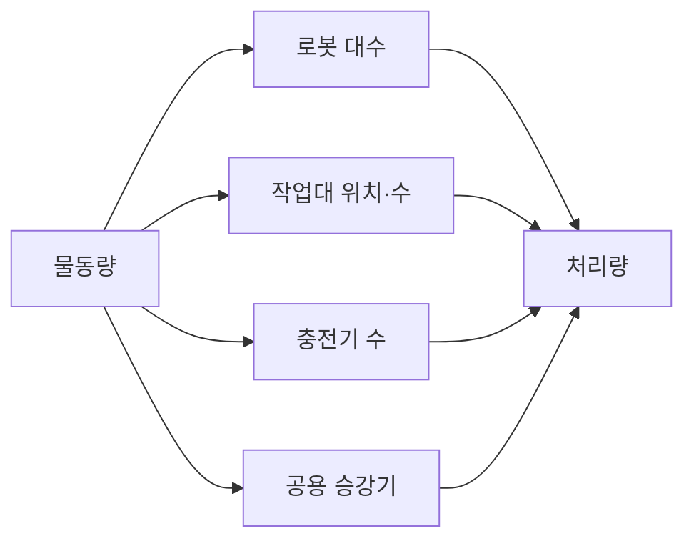

[홈](../../index.md) › [A. 업무·공급망 설계](index.md) › 3. 처리능력·거점·설비 계획

# 3. 처리능력·거점·설비 계획

!!! info "소속 대분류"
    [A. 업무·공급망 설계](index.md) — 핵심 질문:
    무슨 일을 왜, 얼마나 해야 하는가? [분류원문]

<!-- auto:area-tracks:start -->
!!! note "관련 연구 트랙"
    이 세부영역을 가로지르는 중점 연구 트랙과 확장 아이디어다. 트랙은 분류를 바꾸지 않으며, 트랙에서 확인된 사실은 이 페이지에 반영하도록 제안된다. 전체 매핑은 [확장 아이디어 연결 구조](../../ideas/index.md)에 있다.

    - [건축 도면 자동 인식](../../tracks/floorplan-recognition/index.md) — 함께 필요한 영역(○) · 확장 아이디어: [아이디어 3. 건축 도면 자동 인식](../../ideas/floorplan-recognition.md)
<!-- auto:area-tracks:end -->

<!-- auto:page-status:start -->
<!-- auto:page-status:end -->

## 1. 한 줄 정의

물동량에 필요한 로봇 수와 종류, 작업대·충전기 배치, 교대 운영, 여러 거점의 자원 배치를 결정 [분류원문]

## 2. SCM 관점의 질문

로봇을 늘려야 할까, 포장대나 엘리베이터가 병목일까? [분류원문]

## 3. 왜 중요한가

확인한 연구들을 보면 처리량은 로봇 수만으로 정해지지 않는다. 작업대 위치·수, 충전기 수, 공용 승강기도 함께 처리량을 좌우한다. 그래서 로봇을 늘릴지 병목 설비를 늘릴지는 공유 자원의 가동률을 함께 계산해야 판단할 수 있는 것으로 보인다. [추정][^ref-096][^ref-097][^ref-102][^ref-060][^ref-103]

필요 대수를 정하는 문제는 오래 연구돼 왔다. 2006년에 나온 두 서베이는 차량 소요대수 산정을 무인운반차(Automated Guided Vehicle, AGV) 시스템 설계의 핵심 과제 가운데 하나로 다룬다. 두 서베이는 저자가 서로 다르다. [사실][^ref-099][^ref-100]

그런데 로봇만 늘리면 다른 자원에서 막히는 사례가 보고돼 있다. 한 유통사 물류센터의 팔레트 이동 데이터로 시뮬레이션한 2025년 연구에서, 충전기가 부족하면 큰 지연이 생겼고 남으면 불필요한 비용이 생겼다. [사실][^ref-102] 한 3차 병원의 약품 배송 로봇 사례(2025년 6월 관찰)에서는 승강기 가동률이 높을수록 배송 실패가 많았고 배송 시간도 길어졌다. 이 결과는 병원 사례이며, 물류센터에 그대로 적용되는지는 확인되지 않았다. [사실][^ref-060]

## 4. 핵심 개념과 용어

처리능력 계획을 읽을 때 필요한 기본 용어는 다음과 같다. 소요대수 모델은 Vis(2006)의 분류에 따라 결정론적 모델, 확률(대기행렬) 모델, 시뮬레이션 모델의 세 부류로 나뉜다. [사실][^ref-100]

- **차량 소요대수 산정(Fleet Sizing)** — 물동량과 서비스 수준을 맞추는 데 필요한 로봇·운반 차량 대수를 정하는 계획 문제다. 모델은 위의 세 부류로 나뉜다. [사실][^ref-100]
- **로봇 이동형 풀필먼트 시스템(Robotic Mobile Fulfillment System, RMFS)** — 로봇이 상품을 담은 이동식 선반(pod)을 피킹 스테이션과 보충 스테이션으로 옮기는 창고 방식이다. 품목당 선반 수와 두 스테이션 수의 비율이 설계 변수가 된다. [사실][^ref-097]
- **반개방형 대기행렬 네트워크(Semi-Open Queueing Network, SOQN)** — 주문은 밖에서 들어오지만 로봇 같은 자원은 정해진 수만큼 순환하는 시스템을 해석하는 모델이다. RMFS의 재고 배치 연구와 충전 전략 연구에 쓰였다. [사실][^ref-097][^ref-098]
- **이산 사건 시뮬레이션(Discrete Event Simulation, DES)** — 사건이 일어나는 시점마다 시스템 상태를 갱신하는 시뮬레이션이다. RAWSim-O는 RMFS용 이산 사건 시뮬레이션이다. [사실][^ref-101]
- **충전 임계값(recharge_threshold)** — Open-RMF 플릿 어댑터 템플릿의 설정값이다. 배터리가 이 수준보다 낮으면 그 플릿의 로봇은 작업하지 않는다(확인일 2026-09-25). [사실][^ref-105]

## 5. 현장 시나리오 (물류 흐름의 어느 단계인지 명시)

이 시나리오는 성수기 물동량에 대비해 로봇을 더 들일지, 작업대와 충전기를 늘릴지 비교하는 계획 작업이다. 로봇 가동률과 처리량은 대기행렬 모델로 추정할 수 있다. [사실][^ref-096]

**물류 흐름 단계:** 적치 → 보충 → 피킹 → 포장

**시나리오:** 성수기 물동량 증가에 대비해 로봇 증차와 작업대·충전기 증설을 비교

| 항목 | 내용 |
|---|---|
| 시작 조건 | 상위 업무 시스템이 성수기 주문 도착률(물동량)을 넘긴다. 연계 대상: 물동량 예측 자체는 수요예측에서 받는 입력으로 보인다. [추정][^ref-096][^ref-100] |
| 작업 대상 | RMFS의 이동식 선반(pod)과 그 안의 품목. 품목당 선반 수가 설계 변수다. [사실][^ref-097] |
| 수행 자원 | 로봇은 선반을 운반하고, 피킹·보충 스테이션에서는 작업자가 일하며, 충전기가 로봇을 충전한다. 대기행렬 네트워크 모델로 로봇 가동률과 최대 주문 처리량을 해석적으로 추정할 수 있다. [사실][^ref-096] 피킹 스테이션과 보충 스테이션 수의 비율도 결정 변수다. [사실][^ref-097] |
| 제약 | 보관 구역 둘레에서 작업대가 어디에 있는지가 최대 처리량(처리 능력)에 영향을 준다. [사실][^ref-096] 포장대가 병목인지는 공유 자원의 가동률을 함께 계산해야 판단할 수 있을 것으로 보인다. 다만 물류센터 포장대를 병목으로 직접 분석한 1차 자료는 확인하지 못함. [추정][^ref-096][^ref-102] |
| 완료·인계 | 해당 없음 |
| 예외·성과 | 팔레트 이동 사례에서 충전기가 부족하면 큰 지연이, 남으면 불필요한 비용이 생겼다. [사실][^ref-102] |

다음은 설명을 위한 가상의 시나리오이다. 한 물류센터가 성수기를 앞두고 로봇을 몇 대 더 들일지, 피킹 스테이션이나 충전기를 늘릴지 정해야 한다. 계획자는 먼저 해석적 모델로 대안을 빠르게 추려 낸 뒤, 남은 대안을 시뮬레이션으로 확인하는 순서를 쓸 수 있을 것으로 보인다. [추정][^ref-096][^ref-101]

여러 층을 쓰는 센터라면 승강기도 공유 자원이다. 그러나 이번에 찾은 승강기 근거는 병원과 호텔 사례뿐이다. 물류센터 승강기의 정량 근거는 [11. 열린 질문](#11-열린-질문)으로 남긴다. [사실][^ref-060][^ref-103]

## 6. 대표 접근법과 기술

처리능력 계획에는 두 가지 방법이 함께 쓰이는 것으로 보인다. 설계 초기에는 해석적 대기행렬 모델로 대안을 빠르게 비교하고, 변동·배차 규칙·충전 상호작용은 이산 사건 시뮬레이션으로 반영한다. [추정][^ref-100][^ref-096][^ref-098][^ref-101][^ref-102][^ref-108]

자세한 내용은 주제 페이지 [3. 처리능력·거점·설비 계획 — 대표 접근법과 기술](../../topics/2026/2026-09-25-area03-s6.md)에 있다.

## 7. 관련 표준·프레임워크·오픈소스

이 영역에 참고할 도구는 시뮬레이터, 오케스트레이션 설정, 국내 인증 제도로 나뉜다. RAWSim-O는 RMFS 운영의 여러 결정 문제를 연구하는 오픈소스 이산 사건 시뮬레이션 프레임워크다. [사실][^ref-101]

자세한 내용은 주제 페이지 [3. 처리능력·거점·설비 계획 — 관련 표준·프레임워크·오픈소스](../../topics/2026/2026-09-25-area03-s7.md)에 있다.

## 8. 대표 연구와 자료

대표 자료는 RMFS 대기행렬 연구와 승강기 연구다. RMFS 연구는 작업대 배치와 스테이션 비율이 처리량에 주는 영향을 다루고, 승강기 연구는 호텔·병원에서 승강기가 배송에 주는 영향을 다룬다. [사실][^ref-096][^ref-097][^ref-060][^ref-103]

자세한 내용은 주제 페이지 [3. 처리능력·거점·설비 계획 — 대표 연구와 자료](../../topics/2026/2026-09-25-area03-s8.md)에 있다.

## 9. ROP가 직접 맡는 것과 외부와 연계하는 것 (부록 A 9장 기준)

연계 대상: 물동량 예측 자체는 상위 업무 시스템의 수요예측에서 받는 입력이다. ROP의 직접 범위는 그 물동량을 받아 로봇·작업대·충전기 소요를 계산하고 검증할 운영 데이터와 모델을 제공하는 쪽으로 보인다. [추정][^ref-096][^ref-100]

| 경계 | ROP가 직접 맡는 것 | 외부와 연계하는 것 |
|---|---|---|
| 상위 업무 시스템 | 물동량을 받아 로봇·작업대·충전기 소요를 계산·검증할 운영 데이터와 모델 | 연계 대상: 수요예측(물동량 예측) |
| 시설·설비 제어 | 승강기 대기·운행 시간을 처리능력 계산의 공유 자원 제약으로 반영 | 연계 대상: 승강기 운행·제어(10. 설비·건물 시스템 연동) |

충전 임계값, 충전기 배정, 작업 종료 후 동작은 오케스트레이션 계층의 플릿 설정값이다. 따라서 충전 설비 계획의 결과는 ROP 운영 설정으로 이어지는 것으로 보인다. 반대로 ROP가 쌓는 충전 대기·가동률 기록은 다음 설비 계획의 입력이 될 수 있다. 다만 이를 보여 주는 공개 사례는 확인하지 못했다. [추정][^ref-105][^ref-004][^ref-102]

호텔 연구는 승강기를 경로 계획 안의 대기·운행 시간으로 모델링했다. [사실][^ref-103] 승강기 제어는 이 영역의 범위가 아니며, 이 영역은 승강기 시간을 제약 입력으로 다루는 데까지만 맡는다. 이는 분류 원문 9장 시설·설비 제어 경계에 따른 이 위키의 판단이다. [의견] 경계 기준은 [범위 경계](../../about/scope-boundary.md)를 본다.

## 10. 다른 연구영역과의 연결 (번호와 이름을 함께 표기)

이 영역은 아래 다섯 영역과 이어진다.

- [16. 공용 자원·충전·에너지 최적화](../d-planning-and-optimization/16-shared-resource-charging-and-energy-optimization.md) — 충전 방식 비교, 충전소 위치 결정, 충전 임계값 설정이 두 영역에 모두 걸린다. [사실][^ref-098][^ref-109][^ref-105]
- [10. 설비·건물 시스템 연동](../c-connectivity-and-execution-foundation/10-facility-and-building-system-integration.md) — 여러 플릿이 공용 승강기를 쓰는 환경이 있다. 이 영역은 승강기를 제약으로 다루고, 승강기 제어는 저쪽이 맡는다. [사실][^ref-104][^ref-060]
- [4. 성과·경제성·프로세스 개선](04-performance-economics-and-process-improvement.md) — 충전 방식을 비용 면에서 비교할 때와 스마트물류센터 인증 평가에서 두 영역이 만난다. [사실][^ref-098][^ref-106]
- [22. 시뮬레이션·예측용 디지털 트윈](../f-deployment-verification-and-maintenance/22-simulation-and-predictive-digital-twin.md) — RMFS 시뮬레이터와 사례 시뮬레이션은 가정한 미래(증차·증설 대안)를 실험하는 용도로 연결된다. 현재 상태를 표현하는 8. 실시간 세계 상태·데이터 일관성과는 구분한다. [추정][^ref-101][^ref-102]
- [13. 작업 배정 — MRTA](../d-planning-and-optimization/13-task-allocation-mrta.md) — Open-RMF 플릿 어댑터 템플릿 설정에서는 충전 임계값보다 배터리가 낮은 로봇이 작업하지 않는다. [사실][^ref-105] 그래서 충전 설정이 배정 가능한 로봇 수에 영향을 주는 것으로 보인다. [추정][^ref-105]

## 11. 열린 질문

원문 정의에 있는 교대 운영과 여러 거점의 자원 배치는 이번 조사에서 근거 자료를 찾지 못했다. 그래서 본문에 쓰지 않고 주제 페이지의 질문으로 남긴다.

자세한 내용은 주제 페이지 [3. 처리능력·거점·설비 계획 — 열린 질문](../../topics/2026/2026-09-25-area03-s11.md)에 있다.

## 12. 최근 업데이트 (자동)

<!-- auto:area-recent:start -->
아직 기록된 업데이트가 없다.
<!-- auto:area-recent:end -->

## 13. 참고 자료 (각주)

[^ref-004]: Open Robotics, RMF Core Overview — Programming Multiple Robots with ROS 2, 미확인, https://osrf.github.io/ros2multirobotbook/rmf-core.html, 접근일 2026-09-25
[^ref-096]: Lamballais, T., Roy, D., & de Koster, M. B. M., Estimating performance in a Robotic Mobile Fulfillment System (EJOR 256(3), 976–990), 2017, https://repub.eur.nl/pub/107376/, 접근일 2026-09-25 (원문 미열람)
[^ref-097]: Lamballais, T., Roy, D., & de Koster, M. B. M., Inventory allocation in robotic mobile fulfillment systems, 2020, https://www.tandfonline.com/doi/abs/10.1080/24725854.2018.1560517, 접근일 2026-09-25 (원문 미열람)
[^ref-098]: Zou, B., Gong, Y., de Koster, R., & Xu, X., Evaluating battery charging and swapping strategies in a robotic mobile fulfillment system, 2018, https://www.sciencedirect.com/science/article/abs/pii/S0377221717310901, 접근일 2026-09-25 (원문 미열람)
[^ref-099]: Le-Anh, T., & de Koster, M. B. M., A review of design and control of automated guided vehicle systems, 2006, https://www.sciencedirect.com/science/article/abs/pii/S0377221705001840, 접근일 2026-09-25 (원문 미열람)
[^ref-100]: Vis, I. F. A., Survey of research in the design and control of automated guided vehicle systems, 2006, https://www.sciencedirect.com/science/article/abs/pii/S0377221704006459, 접근일 2026-09-25 (원문 미열람)
[^ref-101]: Merschformann, M. (RAWSim-O GitHub), RAWSim-O: A simulation framework for Robotic Mobile Fulfillment Systems (README), 미확인, https://github.com/merschformann/RAWSim-O, 접근일 2026-09-25
[^ref-102]: Springer(FAIM 2025 발표 논문, 저자 미확인), Simulation-Driven Approach for Dimensioning AMR Fleets in Distribution Centre Logistics, 2025, https://link.springer.com/chapter/10.1007/978-3-032-07675-5_69, 접근일 2026-09-25 (원문 미열람)
[^ref-060]: Lee, Y. 외(Digital Health), Feasibility of autonomous medication delivery robots considering elevator utilization in high-traffic hospital environments, 2026, https://doi.org/10.1177/20552076261437181, 접근일 2026-09-25 (원문 미열람)
[^ref-103]: PMC 게재 논문(저자 미확인), The Path Planning Problem of Robotic Delivery in Multi-Floor Hotel Environments, 미확인, https://pmc.ncbi.nlm.nih.gov/articles/PMC11946681/, 접근일 2026-09-25 (원문 미열람)
[^ref-104]: Open Robotics (open-rmf), rmf_demos — Demonstrations of Open-RMF (README), 미확인, https://github.com/open-rmf/rmf_demos, 접근일 2026-09-25
[^ref-105]: Open Robotics (open-rmf), fleet_adapter_template — fleet_adapter_template/config.yaml, 미확인, https://github.com/open-rmf/fleet_adapter_template/blob/main/fleet_adapter_template/config.yaml, 접근일 2026-09-25
[^ref-106]: 한국교통연구원(인증스마트물류센터), 인증스마트물류센터, 미확인, https://cslc.koti.re.kr/, 접근일 2026-09-25 (원문 미열람)
[^ref-108]: 이문수, 채준재(로지스틱스연구), AGV 기반 제조물류시스템의 성능평가를 위한 해석적 모형에 관한 연구 - 반도체 Tandem 레이아웃 시스템을 중심으로 -, 2010, https://www.kci.go.kr/kciportal/ci/sereArticleSearch/ciSereArtiView.kci?sereArticleSearchBean.artiId=ART001485142, 접근일 2026-09-25 (원문 미열람)
[^ref-109]: Stark, H.-G. 외, A Page-Rank-like Approach to Optimal Placement of Charging Stations in a Warehouse, 2024-06, https://arxiv.org/abs/2406.17003, 접근일 2026-09-25 (원문 미열람)
