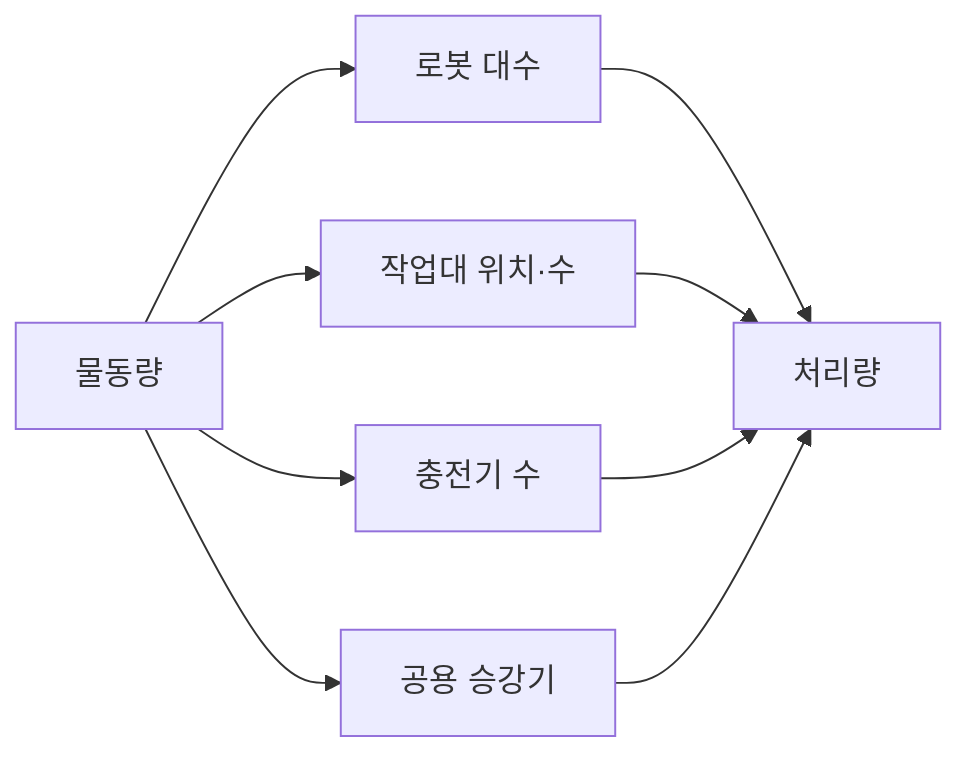

(너의 규칙은 시스템 프롬프트의 agents/shared-rules.md 와 agents/verifier.md 이다. 아래는 이번 실행의 컨텍스트와 입력이다.)

## 실행 컨텍스트

- run_id: 2026-09-25-10
- date: 2026-09-25
- run_type: area_deep_dive (영역 심화)
- 대상: 3. 처리능력·거점·설비 계획 (A. 업무·공급망 설계)
- 예산:
    - max_search_queries: 30
    - max_sources_per_run: 15
    - new_topic_pages: 1
    - page_updates: 2
    - max_retries: 2
- 환경 알림: web_fetch_available: false · fetch_mode: mirror_only (일반 웹 페이지 열람은 네트워크 정책으로 막혀 있다. raw.githubusercontent.com 은 열린다: 공식 문서가 GitHub 에 있는 출처는 입력의 config/source_mirrors.yaml 경로를 WebFetch 로 열어 원문을 읽고 sources[].fetched=true, fetched_via=github_raw, fetch_url 을 적는다. 입력에 원문 텍스트(data/source_texts)가 있는 출처는 fetched_via=inbox. 그 밖의 출처는 fetched=false 이며 코드가 신뢰도 상한(medium)을 강제한다 — 공통 규칙 0절 6항)
- 언어: ko
- verification_stage: second
- verifier_budget:
    - max_search_queries: 30
    - max_sources_per_run: 15
    - new_topic_pages: 1
    - page_updates: 2
    - max_retries: 2
- retry_count: 1
- max_retries: 2

## 입력

### runs/2026-09-25-10/target.json

```json
{
  "run_id": "2026-09-25-10",
  "date": "2026-09-25",
  "weekday": "Fri",
  "run_number": 10,
  "run_type": "area_deep_dive",
  "forced": true,
  "target": {
    "area_no": 3,
    "area_name": "3. 처리능력·거점·설비 계획",
    "category": "A. 업무·공급망 설계",
    "category_letter": "A"
  },
  "topic": null,
  "track": null,
  "corrections": [],
  "budget": {
    "max_search_queries": 30,
    "max_sources_per_run": 15,
    "new_topic_pages": 1,
    "page_updates": 2,
    "max_retries": 2
  },
  "priority_reason": null,
  "priority_questions": [],
  "excluded_areas": [],
  "lifted_areas": [],
  "deferred": {
    "monthly_recheck": false,
    "weekly_review": false
  },
  "selection_rationale": "CLI 지정 run_type=area_deep_dive, area=3"
}
```

### runs/2026-09-25-10/research.json

```json
{
  "run_id": "2026-09-25-10",
  "date": "2026-09-25",
  "run_type": "area_deep_dive",
  "target": {
    "area_no": 3,
    "area_name": "3. 처리능력·거점·설비 계획",
    "category": "A. 업무·공급망 설계"
  },
  "gaps": [
    "섹션 3. 왜 중요한가 비어 있음",
    "섹션 4. 핵심 개념과 용어 비어 있음",
    "섹션 5. 현장 시나리오 (물류 흐름의 어느 단계인지 명시) 비어 있음",
    "섹션 6. 대표 접근법과 기술 비어 있음",
    "섹션 7. 관련 표준·프레임워크·오픈소스 비어 있음",
    "섹션 8. 대표 연구와 자료 비어 있음",
    "섹션 9. ROP가 직접 맡는 것과 외부와 연계하는 것 (부록 A 9장 기준) 비어 있음",
    "섹션 10. 다른 연구영역과의 연결 (번호와 이름을 함께 표기) 비어 있음",
    "섹션 11. 열린 질문 비어 있음 — 대상 영역에 걸린 기존 열린 질문·정정 요청 없음",
    "원문 정의의 '교대 운영'과 '여러 거점의 자원 배치'는 이번 검색에서 1차 자료를 찾지 못해 약한 상태로 남음"
  ],
  "research_questions": [
    "로봇을 늘려야 할까, 포장대나 엘리베이터가 병목일까? [분류원문]",
    "물동량에서 로봇 소요대수(fleet size)를 산정하는 기존 방법(결정론적·대기행렬·시뮬레이션)은 무엇이며 어떤 입력을 요구하는가? (섹션 4·6·8 겨냥)",
    "작업대(피킹·보충 스테이션)의 수·위치와 로봇 수는 처리량에 어떻게 함께 작용하는가? (섹션 5·6 겨냥)",
    "충전 방식·충전기 수·위치는 소요대수와 처리량에 어떤 영향을 주며, 오케스트레이션 설정에는 어떻게 반영되는가? (섹션 6·7·10 겨냥)",
    "승강기 같은 공용 건물 설비는 다층 로봇 운영의 병목이 되는가, 정량 근거가 있는가? (섹션 3·5·10 겨냥)",
    "교대 운영·여러 거점 간 자원 배치를 다룬 자료와 한국 제도·연구(스마트물류센터 인증, 국내 AGV 해석 모형)는 무엇이 있는가? (섹션 7·8·11 겨냥)",
    "처리능력·설비 계획에서 ROP가 직접 맡을 것과 상위 업무 시스템·설비에 연계할 것의 경계는 어디인가? (섹션 9 겨냥)"
  ],
  "findings": [
    {
      "id": "f1",
      "claim": "Vis(2006)의 AGV 시스템 설계·제어 서베이는 차량 소요대수(fleet sizing) 산정 모델을 결정론적 모델, 확률(대기행렬) 모델, 시뮬레이션 모델의 세 부류로 나눈다.",
      "tag": "사실",
      "source_ids": [
        "ref-100"
      ],
      "cross_checked": false,
      "confidence": "medium",
      "evidence_excerpt": "검색 요약: 서베이는 fleet sizing 모델을 deterministic, stochastic, simulation 세 범주로 구분하고, 네트워크 흐름·선형계획 같은 결정론적 방법은 실제 운영 전에 필요 대수를 추정하는 데 쓸 수 있다고 정리. EJOR 170(3), 677-709.",
      "as_of": "2006",
      "flow_step": null,
      "flow_item": "수행 자원",
      "source_unopened": true
    },
    {
      "id": "f2",
      "claim": "서로 다른 저자의 두 AGV 서베이(Vis 2006, Le-Anh·de Koster 2006)는 모두 차량 소요대수 산정을 AGV 시스템 설계의 핵심 과제 가운데 하나로 다룬다.",
      "tag": "사실",
      "source_ids": [
        "ref-099",
        "ref-100"
      ],
      "cross_checked": true,
      "confidence": "medium",
      "evidence_excerpt": "Le-Anh·de Koster(EJOR 171, 2006) 요약: 핵심 과제로 guide-path design, determining vehicle requirements 등을 다룸. Vis(EJOR 170, 2006) 요약: fleet sizing 모델 세 범주 정리. 발행 저자·소속이 달라 독립 출처로 봄.",
      "as_of": "2006",
      "flow_step": null,
      "flow_item": "수행 자원",
      "source_unopened": true
    },
    {
      "id": "f3",
      "claim": "Le-Anh·de Koster(2006)는 차량 기반 사내 운송 시스템의 설계·제어 과제로 경로망 설계, 차량 소요대수 결정, 차량 스케줄링, 유휴 차량 대기 위치, 배터리 관리, 경로 계획, 교착(deadlock) 해소를 함께 다룬다.",
      "tag": "사실",
      "source_ids": [
        "ref-099"
      ],
      "cross_checked": false,
      "confidence": "medium",
      "evidence_excerpt": "검색 요약: guide-path design, determining vehicle requirements, vehicle scheduling, idle-vehicle positioning, battery management, vehicle routing and deadlock resolution. 제조·창고·물류센터·환적 터미널이 대상.",
      "as_of": "2006",
      "flow_step": null,
      "flow_item": "제약",
      "source_unopened": true
    },
    {
      "id": "f4",
      "claim": "Lamballais·Roy·de Koster(2017)는 로봇 이동형 풀필먼트 시스템(RMFS)의 단일·다품목 주문에 대해 대기행렬 네트워크 모델을 세워 최대 주문 처리량, 평균 주문 사이클 타임, 로봇 가동률을 해석적으로 추정하고, 모델이 로봇·작업대 가동률과 사이클 타임을 정확히 추정한다고 보고했다.",
      "tag": "사실",
      "source_ids": [
        "ref-096"
      ],
      "cross_checked": false,
      "confidence": "medium",
      "evidence_excerpt": "검색 요약: queueing network models for single-line and multi-line orders to analytically estimate maximum order throughput, average order cycle time, and robot utilization; 레이아웃·로봇 구역 전략을 빠르게 비교하는 데 쓸 수 있다. EJOR 256(2017) 976–990.",
      "as_of": "2017",
      "flow_step": "피킹",
      "flow_item": "수행 자원",
      "source_unopened": true
    },
    {
      "id": "f5",
      "claim": "같은 연구에서 RMFS의 최대 주문 처리량은 보관 구역의 가로·세로 비율에는 거의 민감하지 않았고 보관 구역 둘레의 작업대 위치에 영향을 받았다.",
      "tag": "사실",
      "source_ids": [
        "ref-096"
      ],
      "cross_checked": false,
      "confidence": "medium",
      "evidence_excerpt": "검색 요약: maximum order throughput is quite insensitive to the length-to-width ratio of the storage area, and is affected by the location of the workstations around the storage area.",
      "as_of": "2017",
      "flow_step": "피킹",
      "flow_item": "제약",
      "source_unopened": true
    },
    {
      "id": "f6",
      "claim": "Lamballais·Roy·de Koster(2020)는 RMFS에서 품목당 선반(pod) 수, 피킹 스테이션과 보충 스테이션 수의 비율, 선반당 보충 수준을 결정 변수로 두고, 재고를 여러 선반에 나누고 두 스테이션 비율을 최적으로 맞추며 선반이 비기 전에 보충할 때 처리량이 크게 좋아진다고 보고했다.",
      "tag": "사실",
      "source_ids": [
        "ref-097"
      ],
      "cross_checked": false,
      "confidence": "medium",
      "evidence_excerpt": "검색 요약: decision variables (1) number of pods per product, (2) ratio of pick stations to replenishment stations, (3) replenishment level per pod. 교차 클래스 매칭 다중 클래스 반개방형 대기행렬 네트워크(SOQN) 사용. IISE Transactions 52(1), 2020.",
      "as_of": "2020",
      "flow_step": "보충",
      "flow_item": "수행 자원",
      "source_unopened": true
    },
    {
      "id": "f7",
      "claim": "Zou 외(2018)는 RMFS 로봇의 배터리 운영 방식(플러그인 충전, 배터리 교환, 유도 충전)을 반개방형 대기행렬 네트워크와 시뮬레이션으로 비교해, 유도 충전이 출고 처리 시간에서 가장 좋고 배터리 비용이 낮으면 교환 방식이 플러그인 충전보다 저렴하다고 보고했다.",
      "tag": "사실",
      "source_ids": [
        "ref-098"
      ],
      "cross_checked": false,
      "confidence": "medium",
      "evidence_excerpt": "검색 요약: semi-open queuing network and simulation to compare strategies in cost and throughput time; inductive charging performs the best in retrieval throughput time; battery swapping is cheaper than plug-in charging when battery costs are low. EJOR 267(2), 733-753.",
      "as_of": "2018",
      "flow_step": "피킹",
      "flow_item": "제약",
      "source_unopened": true
    },
    {
      "id": "f8",
      "claim": "FAIM 2025 발표 연구는 대형 유통사 물류센터의 팔레트 이동 데이터로 만든 시뮬레이션 모델로 AMR 대수와 충전기 수를 함께 정하는 의사결정 지원 틀을 제시했고, 충전기가 부족하면 큰 지연이, 과잉이면 불필요한 비용이 생겼다고 보고했다.",
      "tag": "사실",
      "source_ids": [
        "ref-102"
      ],
      "cross_checked": false,
      "confidence": "medium",
      "evidence_excerpt": "검색 요약: determine the optimal fleet size of AMR robots and corresponding charging stations; 수요·가감속 등 변동을 확률분포로 반영. insufficient chargers led to significant system delays, whereas excessive capacity added unnecessary costs.",
      "as_of": "2025",
      "flow_step": "적치",
      "flow_item": "예외·성과",
      "source_unopened": true
    },
    {
      "id": "f9",
      "claim": "Stark 외(2024)는 전동 산업용 트럭·지게차 플릿을 쓰는 창고에서 충전소 위치를 정하기 위해 페이지랭크(PageRank)와 비슷한 그래프 모델을 제안했으며, 거리 기준에서 차량별 배터리 충전 상태(SOC) 기준으로 확장할 수 있다고 밝혔다.",
      "tag": "사실",
      "source_ids": [
        "ref-109"
      ],
      "cross_checked": false,
      "confidence": "medium",
      "evidence_excerpt": "arXiv 2406.17003 초록 요약: optimal positions for charging stations in a warehouse ... graph model easily extensible from simple distance based criteria to criteria like the state of charge (SOC). 프리프린트.",
      "as_of": "2024-06",
      "flow_step": null,
      "flow_item": "제약",
      "source_unopened": true
    },
    {
      "id": "f10",
      "claim": "다층 호텔 배송 로봇 경로 계획 연구는 로봇의 층간 이동 시간을 승강기 대기 시간(다른 승객 때문에 변동, 층별 평균값 사용)과 승강기 운행 시간(속도·층고로 고정)으로 나누고, 수치 실험에서 로봇 대수와 승강기 운영 시간이 전체 배송 효율에 크게 영향을 준다고 보고했다.",
      "tag": "사실",
      "source_ids": [
        "ref-103"
      ],
      "cross_checked": false,
      "confidence": "medium",
      "evidence_excerpt": "검색 요약: elevator waiting time is variable ... average elevator waiting time for each floor; the number of robots and elevator operation times significantly impact overall delivery efficiency. 승강기를 암묵적 경유지로 두고 다회차 차량 경로 문제(MTVRP)·ALNS로 풂.",
      "as_of": "2025",
      "flow_step": null,
      "flow_item": "제약",
      "source_unopened": true
    },
    {
      "id": "f11",
      "claim": "같은 연구의 고객 노드 60개 시나리오에서 승강기 운영 시간을 40초에서 100초로 늘리면 전체 이동 시간이 225초에서 500초로 약 두 배가 되었다.",
      "tag": "사실",
      "source_ids": [
        "ref-103"
      ],
      "cross_checked": false,
      "confidence": "low",
      "evidence_excerpt": "검색 요약: with 60 customer nodes, increasing elevator operation time from 40 s to 100 s nearly doubles the total travel time (from 225 s to 500 s). 호텔 다층 배송 수치 실험 조건이며 물류센터 값이 아님. 교차 확인 안 됨.",
      "as_of": "2025",
      "flow_step": null,
      "flow_item": "예외·성과",
      "source_unopened": true
    },
    {
      "id": "f12",
      "claim": "Lee 외(2026)는 한 3차 병원에서 2025-06-18~29 비긴급 약품 배송 122건을 분석해 승강기 가동률이 높을수록 배송 실패가 많고(대부분 승객·화물에 의한 물리적 막힘) 배송 시간도 길어졌으며, 몬테카를로 시뮬레이션으로 혼잡 시나리오별 실패 확률을 모형화했다.",
      "tag": "사실",
      "source_ids": [
        "ref-060"
      ],
      "cross_checked": false,
      "confidence": "medium",
      "evidence_excerpt": "검색 요약: 122 non-urgent missions (주중 80, 주말 42); a higher EOR was strongly associated with more delivery failures, with most failures resulting from physical obstruction by passengers or cargo. 로봇 전용 승강기가 드문 병원 환경. Digital Health 게재.",
      "as_of": "2026",
      "flow_step": null,
      "flow_item": "예외·성과",
      "source_unopened": true
    },
    {
      "id": "f13",
      "claim": "확인한 연구들에서 처리량은 로봇 수만이 아니라 작업대 위치·수(RMFS 대기행렬 모델), 충전기 수(AMR 시뮬레이션), 공용 승강기(병원·호텔 사례)에 함께 좌우되므로, '로봇을 늘릴지 병목 설비를 늘릴지'는 공유 자원의 가동률을 함께 계산해야 판단할 수 있을 것으로 보인다.",
      "tag": "추정",
      "source_ids": [
        "ref-096",
        "ref-097",
        "ref-102",
        "ref-060",
        "ref-103"
      ],
      "cross_checked": false,
      "confidence": "low",
      "evidence_excerpt": "f4·f5(작업대 위치·가동률), f6(스테이션 비율), f8(충전기 부족 시 지연), f10·f12(승강기 혼잡)를 분류 원문 SCM 질문에 대응시킨 추론. 물류센터에서 포장대를 직접 병목으로 다룬 1차 자료는 이번 검색에서 찾지 못함.",
      "as_of": "2026-09-25",
      "flow_step": "포장",
      "flow_item": "제약",
      "source_unopened": true
    },
    {
      "id": "f14",
      "claim": "RAWSim-O는 RMFS의 여러 운영 결정 문제(작업 배정, 경로 계획, 자원 배정 등)의 효과를 연구하기 위한 이산 사건 시뮬레이션 프레임워크로, GPL v3 이상 라이선스의 오픈소스로 공개되어 있다.",
      "tag": "사실",
      "source_ids": [
        "ref-101"
      ],
      "cross_checked": false,
      "confidence": "medium",
      "evidence_excerpt": "README 원문: \"RAWSim-O is a discrete event-based simulation for Robotic Mobile Fulfillment Systems.\" 로봇·선반(pod)·스테이션을 모델링. 대표 논문 Merschformann·Xie·Li, Logistics Research 11(1), 2018. (발행일 미확인, 확인일 기준)",
      "as_of": "2026-09-25",
      "flow_step": "피킹",
      "flow_item": null
    },
    {
      "id": "f15",
      "claim": "Open-RMF 공식 데모 저장소에는 로비·객실 층을 승강기 2대로 잇고 로봇 플릿 3개가 움직이는 호텔 월드와, 두 층을 승강기 2대로 잇는 클리닉 월드 등 여러 플릿이 공용 승강기를 쓰는 시뮬레이션 환경이 들어 있다.",
      "tag": "사실",
      "source_ids": [
        "ref-104"
      ],
      "cross_checked": false,
      "confidence": "medium",
      "evidence_excerpt": "rmf_demos README(원문 열람): Hotel World 는 lobby·guest levels, 2 lifts, 3 robot fleets; Clinic World 는 two levels connected by two lifts. 제조·물류 월드는 워크셀과 다중 AMR 플릿. 처리능력 계획용 도구라는 서술은 없음. (발행일 미확인, 확인일 기준)",
      "as_of": "2026-09-25",
      "flow_step": null,
      "flow_item": "수행 자원"
    },
    {
      "id": "f16",
      "claim": "Open-RMF 플릿 어댑터 템플릿 설정은 배터리 시스템(전압·용량·충전 전류), 이 값 아래에서는 로봇이 작업하지 않는 충전 임계값(recharge_threshold), 충전 목표 수준(recharge_soc), 로봇별 충전기, 배터리 소모 반영 여부, 작업 종료 후 동작(park·charge·nothing)을 플릿 단위로 적게 한다.",
      "tag": "사실",
      "source_ids": [
        "ref-105"
      ],
      "cross_checked": false,
      "confidence": "medium",
      "evidence_excerpt": "config.yaml 원문 주석: recharge_threshold \"Battery level below which robots in this fleet will not operate\"; recharge_soc, charger(로봇별), account_for_battery_drain: True, finishing_request: park. (발행일 미확인, 확인일 기준)",
      "as_of": "2026-09-25",
      "flow_step": null,
      "flow_item": "제약"
    },
    {
      "id": "f17",
      "claim": "Open-RMF 핵심 구성 설명은 플릿 어댑터 유형별로 로봇 배터리 상태를 읽는 기능과 배터리 추정 모듈(rmf_battery)을 두고 있다고 밝힌다.",
      "tag": "사실",
      "source_ids": [
        "ref-004"
      ],
      "cross_checked": false,
      "confidence": "medium",
      "evidence_excerpt": "rmf-core 원문: 어댑터 기능 목록에 \"Read battery status of the robot\", 구성요소에 rmf_battery(rmf battery estimation). 충전 임계값과 배정의 상호작용은 이 문서에 없음. (발행일 미확인, 확인일 기준)",
      "as_of": "2026-09-25",
      "flow_step": null,
      "flow_item": "수행 자원"
    },
    {
      "id": "f18",
      "claim": "충전 임계값·충전기 배정·작업 종료 후 동작이 오케스트레이션 계층의 플릿 설정값이므로, 충전 설비 계획(충전기 수·위치·충전 방식)의 결과는 ROP 운영 설정으로 이어지고, 반대로 ROP가 쌓는 충전 대기·가동률 기록이 다음 설비 계획의 입력이 되는 구조로 보인다.",
      "tag": "추정",
      "source_ids": [
        "ref-105",
        "ref-004",
        "ref-102"
      ],
      "cross_checked": false,
      "confidence": "low",
      "evidence_excerpt": "f16(설정 항목)·f17(배터리 상태 수집)·f8(충전기 수가 지연·비용을 좌우)에서 도출한 추론. 설비 계획 도구와 오케스트레이션 설정을 잇는 공개 사례는 확인하지 못함.",
      "as_of": "2026-09-25",
      "flow_step": null,
      "flow_item": "수행 자원",
      "source_unopened": false
    },
    {
      "id": "f19",
      "claim": "연계 대상: 소요대수·처리량 모델은 주문 도착률(물동량)을 입력으로 받으므로 물동량 예측 자체는 상위 업무 시스템의 수요예측에서 받는 입력이며, ROP 직접 범위는 그 물동량을 받아 로봇·작업대·충전기 소요를 계산·검증할 운영 데이터와 모델을 제공하는 쪽으로 보인다.",
      "tag": "추정",
      "source_ids": [
        "ref-096",
        "ref-100"
      ],
      "cross_checked": false,
      "confidence": "low",
      "evidence_excerpt": "f1·f4 의 모델이 주문 도착·작업 요청을 입력으로 두는 점과 분류 원문 9장 '상위 업무 시스템' 경계(수요예측은 연계 영역)를 대응시킨 추론.",
      "as_of": "2026-09-25",
      "flow_step": null,
      "flow_item": "시작 조건",
      "source_unopened": true
    },
    {
      "id": "f20",
      "claim": "스마트물류센터 인증제는 「물류시설의 개발 및 운영에 관한 법률」 제21조의4에 근거해 입고·보관·분류 등 물류처리 기능영역의 첨단화·자동화 수준과 시설 구조 성능·창고관리 시스템 등 기반영역을 평가하고 5개 등급으로 인증한다.",
      "tag": "사실",
      "source_ids": [
        "ref-106",
        "ref-107"
      ],
      "cross_checked": false,
      "confidence": "medium",
      "evidence_excerpt": "검색 요약: 법 제21조의 4에 의거 국가가 인증하고 행정적·재정적 혜택 부여; 기능영역(입고·보관·분류 등)·기반영역(구조적 성능, 창고관리 시스템 등) 평가; 등급 5단계. 세부 평가 지표에 로봇 대수·가동률 항목이 있는지는 미확인. (발행일 미확인, 확인일 기준)",
      "as_of": "2026-09-25",
      "flow_step": null,
      "flow_item": null,
      "source_unopened": true
    },
    {
      "id": "f21",
      "claim": "이문수·채준재(2010)는 반도체 탠덤(Tandem) 레이아웃 AGV 기반 제조물류시스템의 구역 단위 성능을 상태 의존성과 배차 규칙을 반영한 대기행렬 기반 해석적 모형으로 평가하고 시뮬레이션과 비교해 정확성을 검토했다.",
      "tag": "사실",
      "source_ids": [
        "ref-108"
      ],
      "cross_checked": false,
      "confidence": "medium",
      "evidence_excerpt": "KCI 서지·초록 요약: 로지스틱스연구 18(2), 89-104, 2010, DOI 10.15735/kls.2010.18.2.006. AGV 배차규칙을 반영하는 방법론 제시, 시뮬레이션 모델로 해석적 모형의 정확성 비교.",
      "as_of": "2010",
      "flow_step": null,
      "flow_item": "수행 자원",
      "source_unopened": true
    },
    {
      "id": "f22",
      "claim": "확인한 자료의 처리능력 계획 접근은 설계 초기에 빠르게 대안을 비교하는 해석적 대기행렬 모델(폐쇄형·반개방형)과, 변동·배차 규칙·충전 상호작용을 반영하는 이산 사건 시뮬레이션(RAWSim-O, 사례 시뮬레이션)이 함께 쓰이는 구조로 보인다.",
      "tag": "추정",
      "source_ids": [
        "ref-100",
        "ref-096",
        "ref-098",
        "ref-101",
        "ref-102",
        "ref-108"
      ],
      "cross_checked": false,
      "confidence": "low",
      "evidence_excerpt": "f1(세 부류), f4·f6·f7(대기행렬 모델+시뮬레이션 검증), f14(오픈소스 시뮬레이터), f8(사례 시뮬레이션), f21(해석 모형과 시뮬레이션 비교)에서 도출한 분류.",
      "as_of": "2026-09-25",
      "flow_step": null,
      "flow_item": null,
      "source_unopened": false
    }
  ],
  "sources": [
    {
      "id": "ref-004",
      "org": "Open Robotics",
      "title": "RMF Core Overview — Programming Multiple Robots with ROS 2",
      "published": null,
      "url": "https://osrf.github.io/ros2multirobotbook/rmf-core.html",
      "type": "오픈소스 문서",
      "reliability": "high",
      "accessed": "2026-09-25",
      "summary": "작업·교통 조율, Fleet Adapter, 설비 연동 구조 참고. 이번 실행은 어댑터의 배터리 상태 읽기와 rmf_battery 모듈 언급을 확인했다.",
      "fetched": true,
      "fetched_via": "github_raw",
      "fetch_url": "https://raw.githubusercontent.com/osrf/ros2multirobotbook/master/src/rmf-core.md",
      "source_unopened": false
    },
    {
      "id": "ref-096",
      "org": "Lamballais, T., Roy, D., & de Koster, M. B. M.",
      "title": "Estimating performance in a Robotic Mobile Fulfillment System",
      "published": "2017",
      "url": "https://repub.eur.nl/pub/107376/",
      "type": "논문",
      "reliability": "medium",
      "accessed": "2026-09-25",
      "summary": "원문 미열람. RMFS의 단일·다품목 주문 대기행렬 네트워크 모델로 최대 처리량·사이클 타임·로봇 가동률을 추정하고 작업대 위치 영향을 분석한 EJOR 256 논문.",
      "source_unopened": true,
      "fetched": false,
      "fetched_via": null,
      "fetch_url": null
    },
    {
      "id": "ref-097",
      "org": "Lamballais, T., Roy, D., & de Koster, M. B. M.",
      "title": "Inventory allocation in robotic mobile fulfillment systems",
      "published": "2020",
      "url": "https://www.tandfonline.com/doi/abs/10.1080/24725854.2018.1560517",
      "type": "논문",
      "reliability": "medium",
      "accessed": "2026-09-25",
      "summary": "원문 미열람. 품목당 선반 수, 피킹·보충 스테이션 비율, 보충 수준이 RMFS 처리량에 주는 영향을 교차 클래스 매칭 SOQN으로 분석한 IISE Transactions 논문.",
      "source_unopened": true,
      "fetched": false,
      "fetched_via": null,
      "fetch_url": null
    },
    {
      "id": "ref-098",
      "org": "Zou, B., Gong, Y., de Koster, R., & Xu, X.",
      "title": "Evaluating battery charging and swapping strategies in a robotic mobile fulfillment system",
      "published": "2018",
      "url": "https://www.sciencedirect.com/science/article/abs/pii/S0377221717310901",
      "type": "논문",
      "reliability": "medium",
      "accessed": "2026-09-25",
      "summary": "원문 미열람. RMFS 로봇의 플러그인 충전·배터리 교환·유도 충전 전략을 반개방형 대기행렬 네트워크와 시뮬레이션으로 비용·처리 시간 측면에서 비교한 EJOR 267(2) 논문.",
      "source_unopened": true,
      "fetched": false,
      "fetched_via": null,
      "fetch_url": null
    },
    {
      "id": "ref-099",
      "org": "Le-Anh, T., & de Koster, M. B. M.",
      "title": "A review of design and control of automated guided vehicle systems",
      "published": "2006",
      "url": "https://www.sciencedirect.com/science/article/abs/pii/S0377221705001840",
      "type": "논문",
      "reliability": "medium",
      "accessed": "2026-09-25",
      "summary": "원문 미열람. 경로망 설계, 차량 소요대수, 스케줄링, 유휴 차량 위치, 배터리 관리, 경로·교착 해소를 다룬 AGV 설계·제어 리뷰(EJOR 171).",
      "source_unopened": true,
      "fetched": false,
      "fetched_via": null,
      "fetch_url": null
    },
    {
      "id": "ref-100",
      "org": "Vis, I. F. A.",
      "title": "Survey of research in the design and control of automated guided vehicle systems",
      "published": "2006",
      "url": "https://www.sciencedirect.com/science/article/abs/pii/S0377221704006459",
      "type": "논문",
      "reliability": "medium",
      "accessed": "2026-09-25",
      "summary": "원문 미열람. 제조·물류·환적 시설의 AGV 설계·제어 연구를 정리하고 fleet sizing 모델을 결정론적·확률·시뮬레이션으로 분류한 서베이(EJOR 170(3)).",
      "source_unopened": true,
      "fetched": false,
      "fetched_via": null,
      "fetch_url": null
    },
    {
      "id": "ref-101",
      "org": "Merschformann, M. (RAWSim-O GitHub)",
      "title": "RAWSim-O: A simulation framework for Robotic Mobile Fulfillment Systems (README)",
      "published": null,
      "url": "https://github.com/merschformann/RAWSim-O",
      "type": "오픈소스 문서",
      "reliability": "high",
      "accessed": "2026-09-25",
      "summary": "RMFS의 여러 운영 결정 문제를 연구하기 위한 이산 사건 시뮬레이션 프레임워크의 공식 저장소 README. GPL v3 이상, 대표 논문 Logistics Research 11(1), 2018.",
      "fetched": true,
      "fetched_via": "github_raw",
      "fetch_url": "https://raw.githubusercontent.com/merschformann/RAWSim-O/main/README.md",
      "source_unopened": false
    },
    {
      "id": "ref-102",
      "org": "Springer(FAIM 2025 발표 논문, 저자 미확인)",
      "title": "Simulation-Driven Approach for Dimensioning AMR Fleets in Distribution Centre Logistics",
      "published": "2025",
      "url": "https://link.springer.com/chapter/10.1007/978-3-032-07675-5_69",
      "type": "논문",
      "reliability": "medium",
      "accessed": "2026-09-25",
      "summary": "원문 미열람. 유통사 물류센터 팔레트 이동 데이터로 AMR 대수와 충전기 수를 시뮬레이션으로 정하는 의사결정 지원 틀을 제시한 FAIM 2025 학술대회 논문.",
      "source_unopened": true,
      "fetched": false,
      "fetched_via": null,
      "fetch_url": null
    },
    {
      "id": "ref-060",
      "org": "Lee, Y. 외(Digital Health)",
      "title": "Feasibility of autonomous medication delivery robots considering elevator utilization in high-traffic hospital environments",
      "published": "2026",
      "url": "https://doi.org/10.1177/20552076261437181",
      "type": "논문",
      "reliability": "medium",
      "accessed": "2026-09-25",
      "summary": "원문 미열람. 3차 병원의 약품 배송 로봇 122건을 분석해 승강기 가동률이 배송 실패·지연에 주는 영향을 정량화하고 몬테카를로 시뮬레이션으로 혼잡 시나리오를 모형화한 논문.",
      "source_unopened": true,
      "fetched": false,
      "fetched_via": null,
      "fetch_url": null
    },
    {
      "id": "ref-103",
      "org": "PMC 게재 논문(저자 미확인)",
      "title": "The Path Planning Problem of Robotic Delivery in Multi-Floor Hotel Environments",
      "published": null,
      "url": "https://pmc.ncbi.nlm.nih.gov/articles/PMC11946681/",
      "type": "논문",
      "reliability": "medium",
      "accessed": "2026-09-25",
      "summary": "원문 미열람. 다층 호텔에서 승강기 대기·운행 시간을 반영한 다중 로봇 배송 경로 문제를 MTVRP로 정식화하고 ALNS로 푼 논문. 로봇 대수와 승강기 운영 시간의 영향을 수치 실험으로 보인다.",
      "source_unopened": true,
      "fetched": false,
      "fetched_via": null,
      "fetch_url": null
    },
    {
      "id": "ref-104",
      "org": "Open Robotics (open-rmf)",
      "title": "rmf_demos — Demonstrations of Open-RMF (README)",
      "published": null,
      "url": "https://github.com/open-rmf/rmf_demos",
      "type": "오픈소스 문서",
      "reliability": "high",
      "accessed": "2026-09-25",
      "summary": "Open-RMF 데모 월드(호텔·클리닉의 다층·다승강기·다플릿, 오피스, 공항, 캠퍼스, 제조·물류)를 설명하는 공식 저장소 README.",
      "fetched": true,
      "fetched_via": "github_raw",
      "fetch_url": "https://raw.githubusercontent.com/open-rmf/rmf_demos/main/README.md",
      "source_unopened": false
    },
    {
      "id": "ref-105",
      "org": "Open Robotics (open-rmf)",
      "title": "fleet_adapter_template — fleet_adapter_template/config.yaml",
      "published": null,
      "url": "https://github.com/open-rmf/fleet_adapter_template/blob/main/fleet_adapter_template/config.yaml",
      "type": "오픈소스 문서",
      "reliability": "high",
      "accessed": "2026-09-25",
      "summary": "Open-RMF 플릿 어댑터 템플릿 설정 파일. 배터리 시스템, 충전 임계값·목표 수준, 로봇별 충전기, 작업 능력, 작업 종료 후 동작 항목을 정의한다.",
      "fetched": true,
      "fetched_via": "github_raw",
      "fetch_url": "https://raw.githubusercontent.com/open-rmf/fleet_adapter_template/main/fleet_adapter_template/config.yaml",
      "source_unopened": false
    },
    {
      "id": "ref-106",
      "org": "한국교통연구원(인증스마트물류센터)",
      "title": "인증스마트물류센터",
      "published": null,
      "url": "https://cslc.koti.re.kr/",
      "type": "정부·연구기관",
      "reliability": "medium",
      "accessed": "2026-09-25",
      "summary": "원문 미열람. 국토교통부 스마트물류센터 인증제의 근거·평가 영역(기능영역·기반영역)·등급·혜택을 안내하는 인증 운영 사이트.",
      "source_unopened": true,
      "fetched": false,
      "fetched_via": null,
      "fetch_url": null
    },
    {
      "id": "ref-107",
      "org": "법제처 국가법령정보센터",
      "title": "물류시설의 개발 및 운영에 관한 법률",
      "published": null,
      "url": "https://www.law.go.kr/LSW/lsInfoP.do?lsId=000091",
      "type": "정부·연구기관",
      "reliability": "medium",
      "accessed": "2026-09-25",
      "summary": "원문 미열람. 물류시설 개발·운영의 근거 법률로 제21조의4에 스마트물류센터 인증 근거를 둔다(시행규칙 서식은 2025-04-01 개정).",
      "source_unopened": true,
      "fetched": false,
      "fetched_via": null,
      "fetch_url": null
    },
    {
      "id": "ref-108",
      "org": "이문수, 채준재(로지스틱스연구)",
      "title": "AGV 기반 제조물류시스템의 성능평가를 위한 해석적 모형에 관한 연구 - 반도체 Tandem 레이아웃 시스템을 중심으로 -",
      "published": "2010",
      "url": "https://www.kci.go.kr/kciportal/ci/sereArticleSearch/ciSereArtiView.kci?sereArticleSearchBean.artiId=ART001485142",
      "type": "논문",
      "reliability": "medium",
      "accessed": "2026-09-25",
      "summary": "원문 미열람. 반도체 탠덤 레이아웃 AGV 시스템의 구역 단위 성능을 대기행렬 기반 해석적 모형으로 평가하고 시뮬레이션과 비교한 국내 논문(로지스틱스연구 18(2)).",
      "source_unopened": true,
      "fetched": false,
      "fetched_via": null,
      "fetch_url": null
    },
    {
      "id": "ref-109",
      "org": "Stark, H.-G. 외",
      "title": "A Page-Rank-like Approach to Optimal Placement of Charging Stations in a Warehouse",
      "published": "2024-06",
      "url": "https://arxiv.org/abs/2406.17003",
      "type": "논문",
      "reliability": "medium",
      "accessed": "2026-09-25",
      "summary": "원문 미열람. 전동 산업용 트럭·지게차 플릿이 쓰는 창고의 충전소 위치를 페이지랭크형 그래프 모델로 정하는 방법을 제안한 프리프린트.",
      "source_unopened": true,
      "fetched": false,
      "fetched_via": null,
      "fetch_url": null
    }
  ],
  "page_proposals": [
    {
      "action": "update",
      "path": "docs/categories/a-business-supply-chain-design/03-capacity-site-and-facility-planning.md",
      "sections": [
        "3",
        "4",
        "5",
        "6",
        "7",
        "8",
        "9",
        "10",
        "11"
      ],
      "rationale": "섹션 3: f13·f8·f12(로봇 수만 늘려서는 처리량이 오르지 않는 공유 자원 병목) / 섹션 4: f1·f4·f6·f7·f16(소요대수 산정, RMFS, 반개방형 대기행렬 네트워크, 충전 임계값) / 섹션 5: 피킹 f4·f5(작업대 위치·가동률, 수행 자원·제약), 보충 f6(스테이션 비율), 적치 f8(팔레트 이동·충전기, 예외·성과), 포장 f13(병목 판단의 추정, 1차 자료 부족 명시) — 승강기 사례 f10·f11·f12 는 병원·호텔 사례임을 명시 / 섹션 6: f1·f2·f3·f22(해석 모델과 시뮬레이션), f7·f9(충전 방식·충전소 위치), f21(국내 해석 모형) / 섹션 7: f14(RAWSim-O), f15(Open-RMF 다층 데모), f16·f17(Open-RMF 배터리·충전 설정), f20(스마트물류센터 인증제) / 섹션 8: f4~f12, f21 / 섹션 9: f19(연계 대상: 물동량 예측), f18(충전 설비 계획과 ROP 설정의 연결) / 섹션 10: 16. 공용 자원·충전·에너지 최적화(f7·f9·f16), 10. 설비·건물 시스템 연동(f10·f12·f15), 4. 성과·경제성·프로세스 개선(f7 비용, f20), 22. 시뮬레이션·예측용 디지털 트윈(f14·f22 — 가정한 미래 실험 용도), 13. 작업 배정 — MRTA(f16 작업 능력·배정 조건) / 섹션 11: open_questions_new 4건. 다음 실행 후보: 10. 설비·건물 시스템 연동 페이지에 f10·f12·f15 반영 제안"
    }
  ],
  "glossary_candidates": [
    {
      "term_ko": "차량 소요대수 산정",
      "term_en": "Fleet Sizing",
      "definition": "예상 물동량과 서비스 수준(대기 시간·처리량) 목표를 만족하는 데 필요한 로봇·운반 차량의 최소 대수를 정하는 계획 문제이다."
    },
    {
      "term_ko": "로봇 이동형 풀필먼트 시스템",
      "term_en": "Robotic Mobile Fulfillment System (RMFS)",
      "definition": "로봇이 상품을 담은 이동식 선반(pod)을 작업대까지 옮기고 작업자가 그 앞에서 피킹·보충하는 부품-작업자(parts-to-picker) 방식의 자동화 창고 시스템이다."
    },
    {
      "term_ko": "반개방형 대기행렬 네트워크",
      "term_en": "Semi-Open Queueing Network (SOQN)",
      "definition": "외부에서 주문이 들어오되 로봇 같은 한정된 자원 수가 고정된 채 순환하는 시스템의 처리량·대기 시간을 해석적으로 추정하는 대기행렬 모델이다."
    },
    {
      "term_ko": "이산 사건 시뮬레이션",
      "term_en": "Discrete Event Simulation (DES)",
      "definition": "주문 도착·작업 완료 같은 사건이 일어나는 시점마다 시스템 상태를 갱신해 처리량·대기·가동률을 실험하는 시뮬레이션 방식이다."
    }
  ],
  "open_questions_new": [
    "여러 거점 사이에서 로봇을 재배치·공유하거나 성수기에 임대로 보충하는 결정을 다룬 학술·공공 자료나 국내 사례가 있는가? | 관련 영역: 3. 처리능력·거점·설비 계획, 4. 성과·경제성·프로세스 개선 | 근거: f22 | 종류: 일반",
    "교대조별 작업자 수와 로봇·작업대 수를 함께 정하는 처리능력 계획 모델이나 사례가 있는가? | 관련 영역: 3. 처리능력·거점·설비 계획, 18. 사람–로봇 협업·운영 인터페이스 | 근거: f6 | 종류: 일반",
    "국내 다층 물류센터에서 화물용 승강기나 층간 반송 설비가 로봇 처리량의 병목이 된다는 정량 자료가 있는가, 병원·호텔 사례의 승강기 혼잡 결과를 물류센터에 옮길 수 있는가? | 관련 영역: 3. 처리능력·거점·설비 계획, 10. 설비·건물 시스템 연동 | 근거: f12 | 종류: 일반",
    "스마트물류센터 인증의 세부 평가 지표에 로봇 대수·가동률·처리능력 같은 설비 계획 지표가 포함되는가? | 관련 영역: 3. 처리능력·거점·설비 계획, 4. 성과·경제성·프로세스 개선 | 근거: f20 | 종류: 일반"
  ],
  "open_questions_resolved": [],
  "self_check": {
    "source_count": 16,
    "cross_checked_count": 1,
    "unverified": [
      "f4~f12 는 논문 원문 미열람이라 수치·결론은 검색 요약 범위만 사용",
      "f11 호텔 시나리오 수치(40초→100초, 225초→500초) 교차 확인 실패, 신뢰도 low",
      "f12 병원 소재 국가와 저자 전체 목록 미확인",
      "ref-102·ref-103 저자 미확인, ref-103 발행일 미확인",
      "f20 인증 세부 평가 지표와 법 조문 원문 미확인(ref-106·ref-107 원문 미열람, 두 출처의 내용 일치 여부를 원문으로 보지 못해 교차 확인 false)",
      "f13 물류센터 포장대를 직접 병목으로 분석한 1차 자료 찾지 못함",
      "Open-RMF 작업 배정기가 배터리 소모를 입찰에 반영하는 방식은 검색 요약(API 문서)만 보고 finding 으로 내지 않음",
      "Zhen 외(2023, Transportation Science) RMFS 배치 결정 논문과 AMR 대수 산정 컨설팅 자료('병목은 인계 스테이션·승강기')는 출처 예산·신뢰도 문제로 넣지 않음"
    ],
    "scope_violations": [
      "f19: 물동량 예측(수요예측)은 분류 원문 9장 '상위 업무 시스템'의 외부 연계 영역이므로 '연계 대상: '으로 표시함",
      "f10·f11·f12: 승강기 제어 자체는 '시설·설비 제어' 연계 영역이며, 승강기를 공유 자원 제약으로만 다루도록 제안함"
    ],
    "budget_used": {
      "queries": 28,
      "sources": 15
    },
    "limits": "web_fetch_available: false · fetch_mode mirror_only. GitHub 공식 저장소 원문 3건(ref-101 RAWSim-O README, ref-104 rmf_demos README, ref-105 fleet_adapter_template config.yaml)과 재사용 ref-004(rmf-core.md)는 raw.githubusercontent.com 으로 열었고, 논문·정부 자료 11건은 검색 요약만 봐서 원문 미열람(신뢰도 상한 medium). 교차 확인은 f2 1건(서로 다른 저자의 두 서베이)뿐이다. 검색 28회/30, 신규 출처 15건/15(ref-096~ref-109, next_ref_id 기준)로 출처 상한에 도달해 Zhen 외(2023) 등은 넣지 못했다. 재사용 출처 1건(ref-004). 원문 정의의 '교대 운영'과 '여러 거점의 자원 배치'는 영어 검색 3회에서 1차 자료를 찾지 못해 열린 질문으로 올렸다. 한국 자료: 스마트물류센터 인증(ref-106·ref-107), 국내 AGV 해석 모형 논문(ref-108). 승강기 병목 근거는 병원·호텔 사례뿐이라 물류센터 적용은 열린 질문으로 남겼다. 27. AI·학습·적응과 모델 운영 관련 finding 없음. 8. 실시간 세계 상태·데이터 일관성과 22. 시뮬레이션·예측용 디지털 트윈을 섞지 않았으며, 시뮬레이터(f14·f15)는 가정한 미래를 실험하는 22. 시뮬레이션·예측용 디지털 트윈 쪽 연결로만 제안했다. 주의: 이전 브리프들이 ref-044~ref-103 을 서로 다른 출처에 부여한 이력이 있으므로 이번 ref-096~ref-109 의 id 충돌 여부는 퍼블리셔 확인이 필요하다."
  }
}
```

### runs/2026-09-25-10/verification.json

```json
{
  "run_id": "2026-09-25-10",
  "stage": "first",
  "verdict": "조건부 승인",
  "claim_checks": [
    {
      "finding_id": "f1",
      "source_exists": true,
      "supports_claim": true,
      "cross_checked": false,
      "tag_decision": "유지",
      "note": "원문 미열람. ref-100(Vis 2006, EJOR 170(3)) 실재는 브리프 검색 결과 일치로만 확인했다. 검증자 재검색은 예산 소진(리서치 28회 + 검증 2회 = 30회)으로 하지 못했다. 스니펫 범위의 서베이 분류 진술이며 수치 주장은 아니다. 단일 출처이고 발행 2006년이다."
    },
    {
      "finding_id": "f2",
      "source_exists": true,
      "supports_claim": true,
      "cross_checked": false,
      "tag_decision": "유지",
      "note": "원문 미열람. 브리프는 cross_checked true 라고 했지만 검증자가 두 출처(ref-099, ref-100)를 직접 확인하지 못해 false 로 둔다(검증 예산). 두 서베이가 모두 소요대수 산정을 다룬다는 진술은 각 스니펫 범위 안에 있다. 핵심 수치가 아니어서 [사실]을 유지하되, 페이지에 '교차 확인됨'으로 적지 않는다."
    },
    {
      "finding_id": "f3",
      "source_exists": true,
      "supports_claim": true,
      "cross_checked": false,
      "tag_decision": "유지",
      "note": "원문 미열람. ref-099(Le-Anh·de Koster 2006, EJOR 171) 스니펫에 과제 목록이 그대로 나온다. 단일 출처이고 발행 2006년이다."
    },
    {
      "finding_id": "f4",
      "source_exists": true,
      "supports_claim": true,
      "cross_checked": false,
      "tag_decision": "유지",
      "note": "원문 미열람. 검증 검색에서 EJOR 256(3), 976–990, 2017, 대기행렬 네트워크(SOQN 4종) 모델을 확인했다(Erasmus pure.eur.nl, ScienceDirect, CORE 검색 결과). 검색 결과에는 제1저자가 'Lamballais Tessensohn'으로 표기돼 있다. 브리프 URL repub.eur.nl/pub/107376 자체는 검색 결과에 나타나지 않았으므로 검색 결과의 ScienceDirect 또는 pure.eur.nl 주소로 바꾸는 것을 권한다. '정확히 추정' 부분은 브리프 스니펫 기준이다."
    },
    {
      "finding_id": "f5",
      "source_exists": true,
      "supports_claim": true,
      "cross_checked": false,
      "tag_decision": "유지",
      "note": "원문 미열람. 검증 검색 스니펫이 'tote throughput capacity is insensitive to the length-to-width ratio … affected by the position of workstations at the perimeter'를 확인한다. 스니펫의 대상은 '토트 처리 능력'이고 브리프는 '최대 주문 처리량'이라고 적어 표현이 조금 다르다. 수정 지시를 참조한다."
    },
    {
      "finding_id": "f6",
      "source_exists": true,
      "supports_claim": false,
      "cross_checked": false,
      "tag_decision": "강등",
      "note": "사실 → 추정. 원문 미열람. evidence_excerpt 스니펫에는 결정 변수 세 가지와 모델(SOQN)만 있다. '재고를 나누고 비율을 최적으로 맞추며 선반이 비기 전에 보충하면 처리량이 크게 좋아진다'는 결과 진술은 스니펫에 나타나지 않으므로 공통 규칙 0절 6항 (d)에 따라 강등한다."
    },
    {
      "finding_id": "f7",
      "source_exists": true,
      "supports_claim": true,
      "cross_checked": false,
      "tag_decision": "유지",
      "note": "원문 미열람. ref-098(Zou 외 2018, EJOR 267(2)) 스니펫에 유도 충전의 처리 시간 우위와 배터리 비용이 낮을 때 교환 방식이 더 싸다는 결과가 모두 있다. 단일 출처이며 RMFS 모델 조건의 결과다."
    },
    {
      "finding_id": "f8",
      "source_exists": true,
      "supports_claim": true,
      "cross_checked": false,
      "tag_decision": "유지",
      "note": "원문 미열람. ref-102(FAIM 2025, Springer 챕터)는 저자가 미확인이다. 스니펫은 AMR 대수와 충전소 수를 함께 정하는 틀, 그리고 충전기 부족 시 지연·과잉 시 비용을 뒷받침한다. '대형' 유통사라는 수식은 스니펫 발췌에 없다."
    },
    {
      "finding_id": "f9",
      "source_exists": true,
      "supports_claim": true,
      "cross_checked": false,
      "tag_decision": "유지",
      "note": "원문 미열람. arXiv 2406.17003 초록 스니펫이 창고 충전소 위치 결정과 SOC 기준으로의 확장 가능성을 뒷받침한다. 프리프린트이며 동료 심사는 미확인이다."
    },
    {
      "finding_id": "f10",
      "source_exists": true,
      "supports_claim": true,
      "cross_checked": false,
      "tag_decision": "유지",
      "note": "원문 미열람. 검증 검색(PubMed 40292915, PMC11946681)으로 제목, MTVRP·ALNS, 승강기를 암묵적 경유지로 둔 점, 고정 운행 시간과 층별 대기, '로봇 수와 승강기 운영 시간이 배송 효율에 크게 영향'을 확인했다. 호텔 환경 연구이며 물류센터 결과가 아니다. 저자는 미확인이다."
    },
    {
      "finding_id": "f11",
      "source_exists": true,
      "supports_claim": true,
      "cross_checked": false,
      "tag_decision": "강등",
      "note": "사실 → 추정. 원문 미열람. 40초→100초, 225초→500초 수치는 브리프 스니펫에만 있고, 검증 검색 스니펫에서는 다시 확인되지 않았다. 핵심 수치의 단일 출처이면서 호텔 수치 실험 조건이므로 강등한다."
    },
    {
      "finding_id": "f12",
      "source_exists": true,
      "supports_claim": true,
      "cross_checked": false,
      "tag_decision": "유지",
      "note": "원문 미열람. ref-060(Digital Health 2026, DOI 10.1177/20552076261437181) 스니펫이 122건(주중 80·주말 42), 승강기 가동률과 배송 실패의 연관, 물리적 막힘을 뒷받침한다. 병원 1곳 단기(12일) 관찰이며 국가·저자 전체는 미확인이다. 병원 사례임을 명시해야 한다."
    },
    {
      "finding_id": "f13",
      "source_exists": true,
      "supports_claim": true,
      "cross_checked": false,
      "tag_decision": "유지",
      "note": "추정 유지. f4·f5·f6·f8·f10·f12 를 종합한 브리프 자체 추론이다. 물류센터 포장대를 병목으로 직접 다룬 1차 자료가 없다는 한계를 스스로 밝혔다. flow_step '포장'은 근거 없는 추론 칸이다."
    },
    {
      "finding_id": "f14",
      "source_exists": true,
      "supports_claim": true,
      "cross_checked": false,
      "tag_decision": "유지",
      "note": "원문 확인(github_raw, RAWSim-O README): 'discrete event-based simulation for Robotic Mobile Fulfillment Systems', 여러 결정 문제의 효과 연구, GPL v3 이상, Merschformann·Xie·Li, Logistics Research 11(1), 2018. README 는 결정 문제를 구체적으로 나열하지 않는다. 따라서 괄호 안 예시 '(작업 배정, 경로 계획, 자원 배정 등)'는 원문에서 확인되지 않아 삭제를 지시한다."
    },
    {
      "finding_id": "f15",
      "source_exists": true,
      "supports_claim": true,
      "cross_checked": false,
      "tag_decision": "유지",
      "note": "원문 확인(github_raw, rmf_demos README). 호텔 월드는 로비와 객실 2개 층, 승강기 2대, 로봇 플릿 3개(로봇 4대)다. 클리닉 월드는 2개 층, 승강기 2대, 플릿 2개다. 제조·물류 월드는 워크셀과 다중 AMR 플릿이다. 처리능력 계획 도구라는 서술은 없다."
    },
    {
      "finding_id": "f16",
      "source_exists": true,
      "supports_claim": true,
      "cross_checked": false,
      "tag_decision": "유지",
      "note": "원문 확인(github_raw, fleet_adapter_template config.yaml)으로 다음을 확인했다. 배터리 시스템 voltage·capacity·charging_current, recharge_threshold 주석 원문 'Battery level below which robots in this fleet will not operate', recharge_soc, 로봇별 charger, account_for_battery_drain, finishing_request park·charge·nothing. 템플릿의 예시 값이며 오픈소스 문서다."
    },
    {
      "finding_id": "f17",
      "source_exists": true,
      "supports_claim": true,
      "cross_checked": false,
      "tag_decision": "유지",
      "note": "원문 확인(입력 data/source_texts/ref-004.txt). 'Read battery status of the robot'은 Full Control·Traffic Light·Read Only 세 어댑터 유형의 기능 목록에 있고, rmf_battery 는 'rmf battery estimation'으로 적혀 있다. 기존 참고문헌 ref-004 를 재사용한다."
    },
    {
      "finding_id": "f18",
      "source_exists": true,
      "supports_claim": true,
      "cross_checked": false,
      "tag_decision": "유지",
      "note": "추정 유지. f16·f17·f8 에서 이끌어 낸 추론이며 공개 사례는 없다. 근거 ref-102 가 원문 미열람인데도 브리프는 source_unopened false 로 표시했다. 원문 미열람 출처가 섞여 있으므로 신뢰도 low 를 유지한다."
    },
    {
      "finding_id": "f19",
      "source_exists": true,
      "supports_claim": true,
      "cross_checked": false,
      "tag_decision": "유지",
      "note": "추정 유지. '연계 대상:' 표시가 있다. 분류 원문 9장의 상위 업무 시스템 경계(수요예측은 외부 연계)와 맞는다. 원문 미열람 출처에 기댄다."
    },
    {
      "finding_id": "f20",
      "source_exists": true,
      "supports_claim": true,
      "cross_checked": false,
      "tag_decision": "유지",
      "note": "원문 미열람(ref-106 인증 사이트, ref-107 국가법령정보센터). 법 제21조의4 근거, 기능영역·기반영역, 5개 등급은 스니펫 범위다. 두 출처가 같은 제도를 말하지만 원문 대조가 없어 교차 확인은 false 다. 직전 브리프 2026-09-25-09 의 f23(국가물류통합정보센터 안내, 1~5등급)과 내용이 같다. 세부 평가 지표는 미확인이다."
    },
    {
      "finding_id": "f21",
      "source_exists": true,
      "supports_claim": true,
      "cross_checked": false,
      "tag_decision": "유지",
      "note": "원문 미열람. KCI 서지·초록 스니펫(로지스틱스연구 18(2), 89-104, 2010, DOI 10.15735/kls.2010.18.2.006)이 해석적 모형과 시뮬레이션 비교를 뒷받침한다. 반도체 제조물류 조건의 연구다."
    },
    {
      "finding_id": "f22",
      "source_exists": true,
      "supports_claim": true,
      "cross_checked": false,
      "tag_decision": "유지",
      "note": "추정 유지. f1·f4·f6·f7·f8·f14·f21 을 종합한 분류 추론이다. 원문을 연 출처(ref-101)와 미열람 출처가 섞여 있는데도 브리프는 source_unopened false 로 표시했다. 신뢰도 low 를 유지한다."
    }
  ],
  "category_fit": {
    "ok": true,
    "reassign_to": null
  },
  "scope_boundary": {
    "ok": true,
    "issues": [
      "f10·f11·f12: 승강기 운행·제어 자체는 분류 원문 9장 '시설·설비 제어'의 외부 연계 영역이다. 3. 처리능력·거점·설비 계획 페이지에서는 공유 자원 제약(병목 판단의 입력)으로만 다루고, 제어는 10. 설비·건물 시스템 연동 연계 대상으로 짧게 적어야 한다(수정 지시).",
      "f19: 물동량 예측(수요예측)은 상위 업무 시스템 연계 영역이다. '연계 대상'으로 이미 표시돼 있으며 9절에서 그대로 유지해야 한다."
    ]
  },
  "duplication": {
    "ok": true,
    "overlaps": [
      "f20(스마트물류센터 인증제, ref-106·ref-107)은 직전 브리프 2026-09-25-09 의 f23(ref-109 국가물류통합정보센터 안내, 기능영역·기반영역, 1~5등급)과 같은 제도를 다룬다. 두 실행이 모두 게시되면 같은 주장에 서로 다른 각주가 붙으므로 퍼블리셔가 참고문헌을 통합해야 한다.",
      "참고문헌 id 충돌: 이번 브리프의 ref-096~ref-109 은 2026-09-25-09(공정·워크플로 모델링)가 다른 출처(Open-RMF task_new, B2MML, OCEL 등)에 부여한 id 와 같은 범위다. 2026-09-25-02~06 브리프도 ref-044~ref-103 을 서로 다른 출처에 부여했다. docs/references/index.md 에는 ref-052 까지만 있다.",
      "f17 은 기존 참고문헌 ref-004(RMF Core Overview)를 재사용한다. 중복 등록하지 않는다."
    ]
  },
  "terminology": {
    "ok": true,
    "conflicts": []
  },
  "quotation_check": {
    "ok": true
  },
  "corrections_applied": [],
  "corrections_rejected": [],
  "required_fixes": [
    "원문 미열람 표기: ref-096, ref-097, ref-098, ref-099, ref-100, ref-102, ref-060, ref-103, ref-106, ref-107, ref-108, ref-109 의 각주 정의 접근일 뒤에 ' (원문 미열람)'을 붙이고, reference_updates 의 해당 항목에 source_unopened: true 를 넣는다 — web_fetch_available: false 환경이며 이 출처들은 검색 결과로만 확인됐다. 원문을 연 ref-004·ref-101·ref-104·ref-105 에는 붙이지 않는다.",
    "f6: 결정 변수 세 가지(품목당 선반 수, 피킹·보충 스테이션 비율, 선반당 보충 수준)와 모델(SOQN)은 출처 진술로 쓴다. '처리량이 크게 좋아진다'는 결과 문장은 [추정]으로 강등해 한 문장으로 분리하거나 삭제한다 — 결과 진술이 검색 스니펫에 나타나지 않는다.",
    "f11: [사실] → [추정]으로 강등한다. 호텔 다층 배송 수치 실험(고객 노드 60개) 조건임을 문장에 밝히고, 3. 왜 중요한가·5. 현장 시나리오의 물류센터 근거로 쓰지 않고 8. 대표 연구와 자료에서만 쓴다 — 핵심 수치이면서 단일 출처이고 검증 검색에서 다시 확인되지 않았다.",
    "f5: '최대 주문 처리량' 대신 '최대 처리량(처리 능력)'으로 쓴다 — 검증 검색 스니펫은 토트 처리 능력(tote throughput capacity)으로 표현한다.",
    "f14: 괄호 안 예시 '(작업 배정, 경로 계획, 자원 배정 등)'을 삭제하고 'RMFS 운영의 여러 결정 문제'로만 쓴다 — RAWSim-O README 원문은 결정 문제를 구체적으로 나열하지 않는다.",
    "f8: '대형 유통사'에서 '대형'을 뺀다. 출처 ref-102 의 저자가 미확인임을 각주 기관 칸 그대로('저자 미확인') 유지한다 — 스니펫 발췌에 규모 수식이 없다.",
    "f10·f11·f12: 본문에서 각각 호텔·호텔·병원 사례임을 명시한다. 물류센터 승강기 병목의 정량 근거가 없다는 점은 11. 열린 질문의 셋째 질문으로 연결한다. 승강기 제어는 10. 설비·건물 시스템 연동의 연계 대상으로만 적는다 — 분류 원문 9장 '시설·설비 제어' 경계.",
    "5. 현장 시나리오의 포장 행(f13)은 [추정]으로 두고 '물류센터 포장대를 병목으로 직접 분석한 1차 자료는 확인하지 못함'을 함께 적는다. 신뢰도를 보태는 표현을 쓰지 않는다 — f13 은 브리프 자체 추론이다.",
    "9. ROP가 직접 맡는 것과 외부와 연계하는 것 절: f19 는 '연계 대상:' 문구를 유지한다. f18 은 [추정]으로 두고 '공개 사례 미확인'을 병기한다 — 두 finding 모두 추론이며 분류 원문 9장 경계 판단이다.",
    "f2: 페이지에서 '두 독립 출처로 교차 확인됨'이라고 쓰지 않는다 — 검증자가 두 출처를 직접 확인하지 못했다(원문 미열람, 검증 예산 소진).",
    "f4·f5·f6 의 ref-096 각주: 기관 칸의 제1저자 표기가 검색 결과(Lamballais Tessensohn, T.)와 다를 수 있음을 알고 브리프 값을 그대로 쓰되, 발행 정보 'EJOR 256(3), 976–990, 2017'이 각주·본문에서 일치하게 한다 — 검증 검색에서 이 서지를 확인했다.",
    "11. 열린 질문: open_questions_new 4건을 그대로 옮기되, 관련 영역은 번호와 원문 명칭(예: '18. 사람–로봇 협업·운영 인터페이스')으로 적는다. 1. 한 줄 정의의 '교대 운영'·'여러 거점의 자원 배치'는 근거 자료가 없다는 사실만 적고 본문을 추측으로 채우지 않는다 — 브리프 gaps 가 1차 자료 부재를 밝혔다.",
    "10. 다른 연구영역과의 연결: 22. 시뮬레이션·예측용 디지털 트윈은 f14·f22 의 '가정한 미래를 실험' 용도로만 연결하고, 8. 실시간 세계 상태·데이터 일관성과 섞지 않는다 — 공통 규칙 6(원문 7장 구분)."
  ],
  "confidence": "medium",
  "verification_note": "판정: 조건부 승인. 이번 실행은 원문 열람이 차단된 환경에서 검증됐다(fetch_mode mirror_only: GitHub 공식 원문 ref-101·ref-104·ref-063과 입력 원문 ref-004만 열람). 확인 21건, 미확인 1건(f6), 교차 확인 0건. 강등: f6 사실 → 추정(결과 진술이 스니펫에 없음), f11 사실 → 추정(호텔 수치 실험의 단일 출처 핵심 수치). 원문 미열람 출처: ref-096, ref-097, ref-098, ref-099, ref-100, ref-102, ref-060, ref-103, ref-106, ref-107, ref-108, ref-109. 검증 검색은 리서치 28회에 더해 2회로 회당 상한 30회에 도달했다. 그래서 ref-096(Lamballais 외 2017)과 ref-103(호텔 다층 배송)만 검색으로 재확인했고, 나머지 미열람 출처는 브리프의 검색 결과 일치에 기댄다. 브리프 출처 원문 미열람 표시 누락: 없음. 다만 f18·f22 는 미열람 출처를 근거로 쓰면서 source_unopened false 로 표시돼 있다. 주의: 승강기 병목 근거는 병원·호텔 사례뿐이고, 포장대 병목과 교대 운영·여러 거점 자원 배치는 1차 자료가 없어 추정 또는 열린 질문으로 남는다. 참고문헌 id(ref-096~ref-109)가 직전 실행 2026-09-25-09 의 id 범위와 겹치므로 퍼블리셔가 게시 전에 id 충돌을 확인해야 한다. 스마트물류센터 인증제(f20)는 2026-09-25-09 의 f23 과 같은 제도라 각주 통합이 필요하다. 정정 요청 없음.",
  "retry_reason": null
}
```

### runs/2026-09-25-10/pages.json

```json
{
  "run_id": "2026-09-25-10",
  "outline": [
    {
      "path": "docs/categories/a-business-supply-chain-design/03-capacity-site-and-facility-planning.md",
      "section": "3. 왜 중요한가",
      "budget_chars": 650,
      "summary": "처리량은 로봇 수만이 아니라 작업대 위치·수, 충전기 수, 공용 승강기에도 함께 좌우되는 것으로 보인다. 그래서 로봇을 늘릴지 병목 설비를 늘릴지는 공유 자원의 가동률을 함께 계산해야 판단할 수 있다. [추정][^ref-096]",
      "planned_findings": [
        "f13",
        "f2",
        "f8",
        "f12"
      ]
    },
    {
      "path": "docs/categories/a-business-supply-chain-design/03-capacity-site-and-facility-planning.md",
      "section": "4. 핵심 개념과 용어",
      "budget_chars": 650,
      "summary": "차량 소요대수 산정, RMFS, 반개방형 대기행렬 네트워크, 이산 사건 시뮬레이션, 충전 임계값이 이 영역의 기본 용어다. [사실][^ref-100]",
      "planned_findings": [
        "f1",
        "f6",
        "f7",
        "f14",
        "f16"
      ]
    },
    {
      "path": "docs/categories/a-business-supply-chain-design/03-capacity-site-and-facility-planning.md",
      "section": "5. 현장 시나리오 (물류 흐름의 어느 단계인지 명시)",
      "budget_chars": 900,
      "summary": "성수기 물동량에 대비해 로봇을 더 들일지, 작업대·충전기를 늘릴지 비교하는 가상 시나리오다. 적치·보충·피킹·포장 단계를 다룬다. [추정][^ref-096]",
      "planned_findings": [
        "f19",
        "f6",
        "f4",
        "f5",
        "f13",
        "f8",
        "f22"
      ]
    },
    {
      "path": "docs/categories/a-business-supply-chain-design/03-capacity-site-and-facility-planning.md",
      "section": "6. 대표 접근법과 기술",
      "budget_chars": 900,
      "summary": "해석적 대기행렬 모델과 이산 사건 시뮬레이션을 함께 쓰는 구조로 보인다. 충전 방식과 충전소 위치는 별도 연구 주제다. [추정][^ref-100]",
      "planned_findings": [
        "f22",
        "f21",
        "f3",
        "f8",
        "f7",
        "f9"
      ]
    },
    {
      "path": "docs/categories/a-business-supply-chain-design/03-capacity-site-and-facility-planning.md",
      "section": "7. 관련 표준·프레임워크·오픈소스",
      "budget_chars": 650,
      "summary": "관련 도구로 RAWSim-O, Open-RMF의 데모와 배터리·충전 설정, 한국 스마트물류센터 인증제가 있다. [사실][^ref-101]",
      "planned_findings": [
        "f14",
        "f15",
        "f16",
        "f17",
        "f20"
      ]
    },
    {
      "path": "docs/categories/a-business-supply-chain-design/03-capacity-site-and-facility-planning.md",
      "section": "8. 대표 연구와 자료",
      "budget_chars": 800,
      "summary": "대표 자료는 RMFS 대기행렬 연구 두 편과 호텔·병원 승강기 연구 두 편이다. [사실][^ref-096][^ref-097][^ref-060][^ref-103]",
      "planned_findings": [
        "f4",
        "f5",
        "f6",
        "f10",
        "f11",
        "f12"
      ]
    },
    {
      "path": "docs/categories/a-business-supply-chain-design/03-capacity-site-and-facility-planning.md",
      "section": "9. ROP가 직접 맡는 것과 외부와 연계하는 것 (부록 A 9장 기준)",
      "budget_chars": 600,
      "summary": "물동량 예측은 연계 대상이다. ROP는 그 물동량으로 소요를 계산·검증할 운영 데이터와 모델을 제공하는 쪽으로 보인다. [추정][^ref-096]",
      "planned_findings": [
        "f19",
        "f18",
        "f10"
      ]
    },
    {
      "path": "docs/categories/a-business-supply-chain-design/03-capacity-site-and-facility-planning.md",
      "section": "10. 다른 연구영역과의 연결 (번호와 이름을 함께 표기)",
      "budget_chars": 550,
      "summary": "연결 영역은 16. 공용 자원·충전·에너지 최적화, 10. 설비·건물 시스템 연동, 4. 성과·경제성·프로세스 개선, 22. 시뮬레이션·예측용 디지털 트윈, 13. 작업 배정 — MRTA다.",
      "planned_findings": [
        "f7",
        "f9",
        "f16",
        "f10",
        "f12",
        "f15",
        "f20",
        "f14",
        "f22"
      ]
    },
    {
      "path": "docs/categories/a-business-supply-chain-design/03-capacity-site-and-facility-planning.md",
      "section": "11. 열린 질문",
      "budget_chars": 550,
      "summary": "여러 거점 사이의 자원 배치, 교대 운영, 물류센터 승강기 병목, 인증 지표에 관한 질문 4건이다.",
      "planned_findings": [
        "f22",
        "f6",
        "f12",
        "f20"
      ]
    }
  ],
  "pages": [
    {
      "path": "docs/categories/a-business-supply-chain-design/03-capacity-site-and-facility-planning.md",
      "action": "update",
      "status": "draft",
      "diff_summary": "3~11절 신규 작성(소요대수 산정 모델, 작업대·충전기·승강기 병목, 가상 시나리오, ROP 경계, 열린 질문 4건). 2차 수정: 8절 각주 보강, 10절 순위 문장 삭제·MRTA 범위 한정, 9절 사실·의견 분리, 11절 문구, sources 에서 ref-107 제외"
    },
    {
      "path": "docs/topics/2026/2026-09-25-area03-s8.md",
      "action": "create",
      "status": "draft",
      "diff_summary": "자동 분리: 3. 처리능력·거점·설비 계획 의 \"8. 대표 연구와 자료\" 절을 옮겼다. 2차 수정: 요약 문장 각주에 ref-097·ref-103 추가"
    },
    {
      "path": "docs/topics/2026/2026-09-25-area03-s6.md",
      "action": "create",
      "status": "draft",
      "diff_summary": "자동 분리: 3. 처리능력·거점·설비 계획 의 \"6. 대표 접근법과 기술\" 절을 옮겼다. 2차 수정: 드리프트 문장 삭제, 태그 없는 주장 3문장에 태그·각주"
    },
    {
      "path": "docs/topics/2026/2026-09-25-area03-s7.md",
      "action": "create",
      "status": "draft",
      "diff_summary": "자동 분리: 3. 처리능력·거점·설비 계획 의 \"7. 관련 표준·프레임워크·오픈소스\" 절을 옮겼다(2차 수정 없음, ref-107 인용 페이지)"
    },
    {
      "path": "docs/topics/2026/2026-09-25-area03-s11.md",
      "action": "create",
      "status": "draft",
      "diff_summary": "자동 분리: 3. 처리능력·거점·설비 계획 의 \"11. 열린 질문\" 절을 옮겼다(2차 수정 없음)"
    }
  ],
  "changelog_entry": "2026-09-25 | 3. 처리능력·거점·설비 계획 | 영역 심화로 3~11절 초안을 썼다(1차 조건부 승인 수정 13건, 2차 수정 지시 8건 이행) | run 2026-09-25-10",
  "index_updates": {
    "home_recent": "2026-09-25 — 3. 처리능력·거점·설비 계획: 3~11절 초안(로봇 소요대수 산정 모델, 작업대·충전기·승강기 병목, ROP 경계, 열린 질문 4건)",
    "category_recent": "2026-09-25 — 3. 처리능력·거점·설비 계획: 영역 심화 초안(대기행렬 모델과 시뮬레이션, 충전 설비, 승강기는 병원·호텔 사례로 한정)",
    "area_recent": "2026-09-25 — 3. 처리능력·거점·설비 계획: 3~11절 신규 작성, 신뢰도 medium"
  },
  "glossary_updates": [
    {
      "action": "new",
      "slug": "fleet-sizing",
      "term_ko": "차량 소요대수 산정",
      "term_en": "Fleet Sizing",
      "definition": "예상 물동량과 서비스 수준(대기 시간·처리량) 목표를 만족하는 데 필요한 로봇·운반 차량의 최소 대수를 정하는 계획 문제이다.",
      "description": "Vis(2006)는 소요대수 모델을 결정론적 모델, 확률(대기행렬) 모델, 시뮬레이션 모델의 세 부류로 나눈다.",
      "related_areas": [
        3,
        13,
        16
      ],
      "sources": [
        "ref-100",
        "ref-099"
      ]
    },
    {
      "action": "new",
      "slug": "robotic-mobile-fulfillment-system",
      "term_ko": "로봇 이동형 풀필먼트 시스템",
      "term_en": "Robotic Mobile Fulfillment System (RMFS)",
      "definition": "로봇이 상품을 담은 이동식 선반(pod)을 작업대까지 옮기고 작업자가 그 앞에서 피킹·보충하는 부품-작업자(parts-to-picker) 방식의 자동화 창고 시스템이다.",
      "related_areas": [
        3,
        13,
        16
      ],
      "sources": [
        "ref-096",
        "ref-097"
      ]
    },
    {
      "action": "new",
      "slug": "semi-open-queueing-network",
      "term_ko": "반개방형 대기행렬 네트워크",
      "term_en": "Semi-Open Queueing Network (SOQN)",
      "definition": "외부에서 주문이 들어오되 로봇 같은 한정된 자원 수가 고정된 채 순환하는 시스템의 처리량·대기 시간을 해석적으로 추정하는 대기행렬 모델이다.",
      "related_areas": [
        3,
        16
      ],
      "sources": [
        "ref-097",
        "ref-098"
      ]
    },
    {
      "action": "new",
      "slug": "discrete-event-simulation",
      "term_ko": "이산 사건 시뮬레이션",
      "term_en": "Discrete Event Simulation (DES)",
      "definition": "주문 도착·작업 완료 같은 사건이 일어나는 시점마다 시스템 상태를 갱신해 처리량·대기·가동률을 실험하는 시뮬레이션 방식이다.",
      "related_areas": [
        3,
        22
      ],
      "sources": [
        "ref-101"
      ]
    }
  ],
  "reference_updates": [
    {
      "id": "ref-004",
      "org": "Open Robotics",
      "title": "RMF Core Overview — Programming Multiple Robots with ROS 2",
      "published": null,
      "url": "https://osrf.github.io/ros2multirobotbook/rmf-core.html",
      "type": "오픈소스 문서",
      "reliability": "high",
      "accessed": "2026-09-25",
      "summary": "작업·교통 조율, Fleet Adapter, 설비 연동 구조 참고. 이번 실행은 어댑터의 배터리 상태 읽기와 rmf_battery 모듈 언급을 확인했다.",
      "source_unopened": false,
      "cited_by": [
        "docs/categories/a-business-supply-chain-design/03-capacity-site-and-facility-planning.md",
        "docs/topics/2026/2026-09-25-area03-s7.md"
      ]
    },
    {
      "id": "ref-096",
      "org": "Lamballais, T., Roy, D., & de Koster, M. B. M.",
      "title": "Estimating performance in a Robotic Mobile Fulfillment System",
      "published": "2017",
      "url": "https://repub.eur.nl/pub/107376/",
      "type": "논문",
      "reliability": "medium",
      "accessed": "2026-09-25",
      "summary": "원문 미열람. RMFS의 단일·다품목 주문 대기행렬 네트워크 모델로 최대 처리량·사이클 타임·로봇 가동률을 추정하고 작업대 위치 영향을 분석한 EJOR 256(3), 976–990 논문.",
      "source_unopened": true,
      "cited_by": [
        "docs/categories/a-business-supply-chain-design/03-capacity-site-and-facility-planning.md",
        "docs/topics/2026/2026-09-25-area03-s8.md",
        "docs/topics/2026/2026-09-25-area03-s6.md"
      ]
    },
    {
      "id": "ref-097",
      "org": "Lamballais, T., Roy, D., & de Koster, M. B. M.",
      "title": "Inventory allocation in robotic mobile fulfillment systems",
      "published": "2020",
      "url": "https://www.tandfonline.com/doi/abs/10.1080/24725854.2018.1560517",
      "type": "논문",
      "reliability": "medium",
      "accessed": "2026-09-25",
      "summary": "원문 미열람. 품목당 선반 수, 피킹·보충 스테이션 비율, 보충 수준이 RMFS 처리량에 주는 영향을 교차 클래스 매칭 SOQN으로 분석한 IISE Transactions 논문.",
      "source_unopened": true,
      "cited_by": [
        "docs/categories/a-business-supply-chain-design/03-capacity-site-and-facility-planning.md",
        "docs/topics/2026/2026-09-25-area03-s8.md"
      ]
    },
    {
      "id": "ref-098",
      "org": "Zou, B., Gong, Y., de Koster, R., & Xu, X.",
      "title": "Evaluating battery charging and swapping strategies in a robotic mobile fulfillment system",
      "published": "2018",
      "url": "https://www.sciencedirect.com/science/article/abs/pii/S0377221717310901",
      "type": "논문",
      "reliability": "medium",
      "accessed": "2026-09-25",
      "summary": "원문 미열람. RMFS 로봇의 플러그인 충전·배터리 교환·유도 충전 전략을 반개방형 대기행렬 네트워크와 시뮬레이션으로 비용·처리 시간 측면에서 비교한 EJOR 267(2) 논문.",
      "source_unopened": true,
      "cited_by": [
        "docs/categories/a-business-supply-chain-design/03-capacity-site-and-facility-planning.md",
        "docs/topics/2026/2026-09-25-area03-s6.md"
      ]
    },
    {
      "id": "ref-099",
      "org": "Le-Anh, T., & de Koster, M. B. M.",
      "title": "A review of design and control of automated guided vehicle systems",
      "published": "2006",
      "url": "https://www.sciencedirect.com/science/article/abs/pii/S0377221705001840",
      "type": "논문",
      "reliability": "medium",
      "accessed": "2026-09-25",
      "summary": "원문 미열람. 경로망 설계, 차량 소요대수, 스케줄링, 유휴 차량 위치, 배터리 관리, 경로·교착 해소를 다룬 AGV 설계·제어 리뷰(EJOR 171).",
      "source_unopened": true,
      "cited_by": [
        "docs/categories/a-business-supply-chain-design/03-capacity-site-and-facility-planning.md",
        "docs/topics/2026/2026-09-25-area03-s6.md"
      ]
    },
    {
      "id": "ref-100",
      "org": "Vis, I. F. A.",
      "title": "Survey of research in the design and control of automated guided vehicle systems",
      "published": "2006",
      "url": "https://www.sciencedirect.com/science/article/abs/pii/S0377221704006459",
      "type": "논문",
      "reliability": "medium",
      "accessed": "2026-09-25",
      "summary": "원문 미열람. 제조·물류·환적 시설의 AGV 설계·제어 연구를 정리하고 fleet sizing 모델을 결정론적·확률·시뮬레이션으로 분류한 서베이(EJOR 170(3)).",
      "source_unopened": true,
      "cited_by": [
        "docs/categories/a-business-supply-chain-design/03-capacity-site-and-facility-planning.md",
        "docs/topics/2026/2026-09-25-area03-s6.md"
      ]
    },
    {
      "id": "ref-101",
      "org": "Merschformann, M. (RAWSim-O GitHub)",
      "title": "RAWSim-O: A simulation framework for Robotic Mobile Fulfillment Systems (README)",
      "published": null,
      "url": "https://github.com/merschformann/RAWSim-O",
      "type": "오픈소스 문서",
      "reliability": "high",
      "accessed": "2026-09-25",
      "summary": "RMFS의 여러 운영 결정 문제를 연구하기 위한 이산 사건 시뮬레이션 프레임워크의 공식 저장소 README. GPL v3 이상, 대표 논문 Logistics Research 11(1), 2018.",
      "source_unopened": false,
      "cited_by": [
        "docs/categories/a-business-supply-chain-design/03-capacity-site-and-facility-planning.md",
        "docs/topics/2026/2026-09-25-area03-s6.md",
        "docs/topics/2026/2026-09-25-area03-s7.md"
      ]
    },
    {
      "id": "ref-102",
      "org": "Springer(FAIM 2025 발표 논문, 저자 미확인)",
      "title": "Simulation-Driven Approach for Dimensioning AMR Fleets in Distribution Centre Logistics",
      "published": "2025",
      "url": "https://link.springer.com/chapter/10.1007/978-3-032-07675-5_69",
      "type": "논문",
      "reliability": "medium",
      "accessed": "2026-09-25",
      "summary": "원문 미열람. 유통사 물류센터 팔레트 이동 데이터로 AMR 대수와 충전기 수를 시뮬레이션으로 정하는 의사결정 지원 틀을 제시한 FAIM 2025 학술대회 논문.",
      "source_unopened": true,
      "cited_by": [
        "docs/categories/a-business-supply-chain-design/03-capacity-site-and-facility-planning.md",
        "docs/topics/2026/2026-09-25-area03-s6.md"
      ]
    },
    {
      "id": "ref-060",
      "org": "Lee, Y. 외(Digital Health)",
      "title": "Feasibility of autonomous medication delivery robots considering elevator utilization in high-traffic hospital environments",
      "published": "2026",
      "url": "https://doi.org/10.1177/20552076261437181",
      "type": "논문",
      "reliability": "medium",
      "accessed": "2026-09-25",
      "summary": "원문 미열람. 3차 병원의 약품 배송 로봇 122건을 분석해 승강기 가동률이 배송 실패·지연에 주는 영향을 정량화하고 몬테카를로 시뮬레이션으로 혼잡 시나리오를 모형화한 논문.",
      "source_unopened": true,
      "cited_by": [
        "docs/categories/a-business-supply-chain-design/03-capacity-site-and-facility-planning.md",
        "docs/topics/2026/2026-09-25-area03-s8.md",
        "docs/topics/2026/2026-09-25-area03-s11.md"
      ]
    },
    {
      "id": "ref-103",
      "org": "PMC 게재 논문(저자 미확인)",
      "title": "The Path Planning Problem of Robotic Delivery in Multi-Floor Hotel Environments",
      "published": null,
      "url": "https://pmc.ncbi.nlm.nih.gov/articles/PMC11946681/",
      "type": "논문",
      "reliability": "medium",
      "accessed": "2026-09-25",
      "summary": "원문 미열람. 다층 호텔에서 승강기 대기·운행 시간을 반영한 다중 로봇 배송 경로 문제를 MTVRP로 정식화하고 ALNS로 푼 논문. 로봇 대수와 승강기 운영 시간의 영향을 수치 실험으로 보인다.",
      "source_unopened": true,
      "cited_by": [
        "docs/categories/a-business-supply-chain-design/03-capacity-site-and-facility-planning.md",
        "docs/topics/2026/2026-09-25-area03-s8.md",
        "docs/topics/2026/2026-09-25-area03-s11.md"
      ]
    },
    {
      "id": "ref-104",
      "org": "Open Robotics (open-rmf)",
      "title": "rmf_demos — Demonstrations of Open-RMF (README)",
      "published": null,
      "url": "https://github.com/open-rmf/rmf_demos",
      "type": "오픈소스 문서",
      "reliability": "high",
      "accessed": "2026-09-25",
      "summary": "Open-RMF 데모 월드(호텔·클리닉의 다층·다승강기·다플릿, 오피스, 공항, 캠퍼스, 제조·물류)를 설명하는 공식 저장소 README.",
      "source_unopened": false,
      "cited_by": [
        "docs/categories/a-business-supply-chain-design/03-capacity-site-and-facility-planning.md",
        "docs/topics/2026/2026-09-25-area03-s7.md"
      ]
    },
    {
      "id": "ref-105",
      "org": "Open Robotics (open-rmf)",
      "title": "fleet_adapter_template — fleet_adapter_template/config.yaml",
      "published": null,
      "url": "https://github.com/open-rmf/fleet_adapter_template/blob/main/fleet_adapter_template/config.yaml",
      "type": "오픈소스 문서",
      "reliability": "high",
      "accessed": "2026-09-25",
      "summary": "Open-RMF 플릿 어댑터 템플릿 설정 파일. 배터리 시스템, 충전 임계값·목표 수준, 로봇별 충전기, 작업 능력, 작업 종료 후 동작 항목을 정의한다.",
      "source_unopened": false,
      "cited_by": [
        "docs/categories/a-business-supply-chain-design/03-capacity-site-and-facility-planning.md",
        "docs/topics/2026/2026-09-25-area03-s7.md"
      ]
    },
    {
      "id": "ref-106",
      "org": "한국교통연구원(인증스마트물류센터)",
      "title": "인증스마트물류센터",
      "published": null,
      "url": "https://cslc.koti.re.kr/",
      "type": "정부·연구기관",
      "reliability": "medium",
      "accessed": "2026-09-25",
      "summary": "원문 미열람. 국토교통부 스마트물류센터 인증제의 근거·평가 영역(기능영역·기반영역)·등급·혜택을 안내하는 인증 운영 사이트.",
      "source_unopened": true,
      "cited_by": [
        "docs/categories/a-business-supply-chain-design/03-capacity-site-and-facility-planning.md",
        "docs/topics/2026/2026-09-25-area03-s7.md"
      ]
    },
    {
      "id": "ref-107",
      "org": "법제처 국가법령정보센터",
      "title": "물류시설의 개발 및 운영에 관한 법률",
      "published": null,
      "url": "https://www.law.go.kr/LSW/lsInfoP.do?lsId=000091",
      "type": "정부·연구기관",
      "reliability": "medium",
      "accessed": "2026-09-25",
      "summary": "원문 미열람. 물류시설 개발·운영의 근거 법률로 제21조의4에 스마트물류센터 인증 근거를 둔다(시행규칙 서식은 2025-04-01 개정).",
      "source_unopened": true,
      "cited_by": [
        "docs/topics/2026/2026-09-25-area03-s7.md"
      ]
    },
    {
      "id": "ref-108",
      "org": "이문수, 채준재(로지스틱스연구)",
      "title": "AGV 기반 제조물류시스템의 성능평가를 위한 해석적 모형에 관한 연구 - 반도체 Tandem 레이아웃 시스템을 중심으로 -",
      "published": "2010",
      "url": "https://www.kci.go.kr/kciportal/ci/sereArticleSearch/ciSereArtiView.kci?sereArticleSearchBean.artiId=ART001485142",
      "type": "논문",
      "reliability": "medium",
      "accessed": "2026-09-25",
      "summary": "원문 미열람. 반도체 탠덤 레이아웃 AGV 시스템의 구역 단위 성능을 대기행렬 기반 해석적 모형으로 평가하고 시뮬레이션과 비교한 국내 논문(로지스틱스연구 18(2)).",
      "source_unopened": true,
      "cited_by": [
        "docs/categories/a-business-supply-chain-design/03-capacity-site-and-facility-planning.md",
        "docs/topics/2026/2026-09-25-area03-s6.md"
      ]
    },
    {
      "id": "ref-109",
      "org": "Stark, H.-G. 외",
      "title": "A Page-Rank-like Approach to Optimal Placement of Charging Stations in a Warehouse",
      "published": "2024-06",
      "url": "https://arxiv.org/abs/2406.17003",
      "type": "논문",
      "reliability": "medium",
      "accessed": "2026-09-25",
      "summary": "원문 미열람. 전동 산업용 트럭·지게차 플릿이 쓰는 창고의 충전소 위치를 페이지랭크형 그래프 모델로 정하는 방법을 제안한 프리프린트.",
      "source_unopened": true,
      "cited_by": [
        "docs/categories/a-business-supply-chain-design/03-capacity-site-and-facility-planning.md",
        "docs/topics/2026/2026-09-25-area03-s6.md"
      ]
    }
  ],
  "open_question_updates": [
    {
      "action": "new",
      "question": "여러 거점 사이에서 로봇을 재배치·공유하거나 성수기에 임대로 보충하는 결정을 다룬 학술·공공 자료나 국내 사례가 있는가?",
      "areas": [
        3,
        4
      ],
      "status": "열림",
      "link": null
    },
    {
      "action": "new",
      "question": "교대조별 작업자 수와 로봇·작업대 수를 함께 정하는 처리능력 계획 모델이나 사례가 있는가?",
      "areas": [
        3,
        18
      ],
      "status": "열림",
      "link": null
    },
    {
      "action": "new",
      "question": "국내 다층 물류센터에서 화물용 승강기나 층간 반송 설비가 로봇 처리량의 병목이 된다는 정량 자료가 있는가, 병원·호텔 사례의 승강기 혼잡 결과를 물류센터에 옮길 수 있는가?",
      "areas": [
        3,
        10
      ],
      "status": "열림",
      "link": null
    },
    {
      "action": "new",
      "question": "스마트물류센터 인증의 세부 평가 지표에 로봇 대수·가동률·처리능력 같은 설비 계획 지표가 포함되는가?",
      "areas": [
        3,
        4
      ],
      "status": "열림",
      "link": null
    }
  ],
  "flow_matrix_updates": [
    {
      "step": "피킹",
      "item": "시작 조건",
      "link": "docs/categories/a-business-supply-chain-design/03-capacity-site-and-facility-planning.md#5-현장-시나리오-물류-흐름의-어느-단계인지-명시",
      "title": "3. 처리능력·거점·설비 계획"
    },
    {
      "step": "보충",
      "item": "작업 대상",
      "link": "docs/categories/a-business-supply-chain-design/03-capacity-site-and-facility-planning.md#5-현장-시나리오-물류-흐름의-어느-단계인지-명시",
      "title": "3. 처리능력·거점·설비 계획"
    },
    {
      "step": "피킹",
      "item": "작업 대상",
      "link": "docs/categories/a-business-supply-chain-design/03-capacity-site-and-facility-planning.md#5-현장-시나리오-물류-흐름의-어느-단계인지-명시",
      "title": "3. 처리능력·거점·설비 계획"
    },
    {
      "step": "보충",
      "item": "수행 자원",
      "link": "docs/categories/a-business-supply-chain-design/03-capacity-site-and-facility-planning.md#5-현장-시나리오-물류-흐름의-어느-단계인지-명시",
      "title": "3. 처리능력·거점·설비 계획"
    },
    {
      "step": "피킹",
      "item": "수행 자원",
      "link": "docs/categories/a-business-supply-chain-design/03-capacity-site-and-facility-planning.md#5-현장-시나리오-물류-흐름의-어느-단계인지-명시",
      "title": "3. 처리능력·거점·설비 계획"
    },
    {
      "step": "피킹",
      "item": "제약",
      "link": "docs/categories/a-business-supply-chain-design/03-capacity-site-and-facility-planning.md#5-현장-시나리오-물류-흐름의-어느-단계인지-명시",
      "title": "3. 처리능력·거점·설비 계획"
    },
    {
      "step": "포장",
      "item": "제약",
      "link": "docs/categories/a-business-supply-chain-design/03-capacity-site-and-facility-planning.md#5-현장-시나리오-물류-흐름의-어느-단계인지-명시",
      "title": "3. 처리능력·거점·설비 계획"
    },
    {
      "step": "적치",
      "item": "예외·성과",
      "link": "docs/categories/a-business-supply-chain-design/03-capacity-site-and-facility-planning.md#5-현장-시나리오-물류-흐름의-어느-단계인지-명시",
      "title": "3. 처리능력·거점·설비 계획"
    }
  ],
  "additional_research_requests": [
    "1. 한 줄 정의의 '교대 운영' 근거 조사: 교대조별 작업자·로봇·작업대 수를 함께 정하는 처리능력 모델이나 사례. 3·6절에 필요하다(이번 브리프에서 1차 자료 없음).",
    "1. 한 줄 정의의 '여러 거점의 자원 배치' 근거 조사: 거점 간 로봇 재배치·공유·임대 결정을 다룬 학술·공공 자료. 6·8절에 필요하다.",
    "5. 현장 시나리오의 '완료·인계' 칸과 포장 단계 제약 조사: 물류센터 포장대를 병목으로 직접 분석한 1차 자료가 필요하다. 지금 포장 행은 추정뿐이고 완료·인계 칸은 해당 없음으로 비어 있다.",
    "물류센터(병원·호텔이 아닌 곳)의 승강기·층간 반송 설비 병목 정량 자료 조사. 3절과 10. 설비·건물 시스템 연동 연결에 필요하다.",
    "스마트물류센터 인증 세부 평가 지표 원문 확인(ref-106·ref-107 원문 미열람). 2026-09-25-09 f23 출처와 각주를 통합하는 일도 퍼블리셔에게 요청한다.",
    "Open-RMF 작업 배정기가 배터리 소모를 입찰에 반영하는 방식을 원문으로 확인해 달라. 10절의 13. 작업 배정 — MRTA 연결을 추정에서 사실로 올리는 데 필요하다.",
    "ref-096 URL을 검색 결과로 확인된 ScienceDirect 또는 pure.eur.nl 주소로 바꿀지 검토해 달라. 제1저자 표기(Lamballais Tessensohn)도 확인이 필요하다.",
    "참고문헌 id ref-096~ref-067이 2026-09-25-09 등 이전 실행과 충돌하는지 게시 전에 퍼블리셔가 확인해야 한다.",
    "퍼블리셔 요청: 자동 분리 주제 페이지 4건의 9. 검증 노트를 게시 시 정본 형식(1차 판정 / 2차 판정, 건수, 신뢰도)으로 치환해 달라(2차 검증 노트 지적)."
  ],
  "fixes_applied": [
    "원문 미열람 표기 — 13절에서 ref-096·054·055·056·057·059·060·061·064·065·066·067 각주의 접근일 뒤에 ' (원문 미열람)'을 붙였고, reference_updates 해당 항목에 source_unopened: true를 넣었다. ref-004·058·062·063에는 붙이지 않았다.",
    "f6 — 8절에서 결정 변수 세 가지와 SOQN은 [사실]로 쓰고, '처리량이 크게 좋아진다'는 결과는 원문 미확인을 밝힌 별도 [추정] 문장으로 분리했다. 4절·5절에는 결정 변수만 썼다.",
    "f11 — [추정]으로 강등하고 호텔 수치 실험(고객 노드 60개) 조건과 '물류센터 값이 아니다'를 문장에 밝혔다. 3절·5절에는 쓰지 않고 8절에만 두었다.",
    "f5 — 5절 제약 칸과 8절에서 '최대 처리량(처리 능력)'으로 썼다.",
    "f14 — 괄호 속 예시를 빼고 4절·7절에서 'RMFS 운영의 여러 결정 문제'로만 썼다.",
    "f8 — 3절·5절·6절에서 '대형'을 빼고 '유통사'로 썼다. ref-102 각주 기관 칸은 '저자 미확인'을 그대로 두었다.",
    "f10·f11·f12 — 3절·8절에 호텔·호텔·병원 사례임을 밝혔다. 5절 끝과 11절 셋째 질문을 이어 물류센터 근거가 없음을 적었다. 승강기 제어는 9절 표와 10절에서 10. 설비·건물 시스템 연동의 연계 대상으로만 두었다.",
    "5절 포장(제약) — f13을 [추정]으로 두고 '물류센터 포장대를 병목으로 직접 분석한 1차 자료는 확인하지 못함'을 함께 적었다. 신뢰도를 높이는 표현은 쓰지 않았다.",
    "9절 — f19는 '연계 대상:' 문구로 시작하게 유지했고, f18은 [추정]으로 두면서 '공개 사례는 확인하지 못했다'를 병기했다.",
    "f2 — 3절에 두 서베이의 저자가 다르다는 사실만 적고 '교차 확인됨' 표현은 쓰지 않았다.",
    "ref-096 — 기관 칸은 브리프 값을 그대로 썼다. 서지 'EJOR 256(3), 976–990, 2017'은 각주 제목 괄호와 8절 본문에 같게 적었다.",
    "11절 — open_questions_new 4건을 옮기면서 관련 영역을 번호와 원문 명칭(예: 18. 사람–로봇 협업·운영 인터페이스)으로 적었다. '교대 운영'·'여러 거점의 자원 배치'는 근거 자료가 없다는 사실만 적었다.",
    "10절 — 22. 시뮬레이션·예측용 디지털 트윈은 가정한 미래(증차·증설 대안)를 실험하는 용도로만 연결했고, 8. 실시간 세계 상태·데이터 일관성과는 구분한다고 적었다.",
    "분량 초과 자동 분리: 3. 처리능력·거점·설비 계획 본문 7,075자 > 기준 4,000자 → 4개 절을 주제 페이지로 옮김, 남은 본문 3,977자",
    "2차: 8절 요약 각주 — 세부영역 8절 요약 문장과 주제 페이지 s8 의 1절 첫 줄·3절 첫 문단의 [사실] 뒤에 [^ref-097][^ref-103]을 더했다.",
    "2차: 10절 순위 표현 — '가장 가까운 연결은 충전 방식과 충전소 위치 연구다. [사실][^ref-098]'를 삭제하고 첫 문단을 '이 영역은 아래 다섯 영역과 이어진다.'라는 안내 문장으로 바꿨다.",
    "2차: 10절 13. 작업 배정 — MRTA 항목 — 첫 문장을 'Open-RMF 플릿 어댑터 템플릿 설정에서는 충전 임계값보다 배터리가 낮은 로봇이 작업하지 않는다. [사실][^ref-105]'으로 범위를 좁히고, 배정 영향 문장은 [추정][^ref-105]으로 분리했다.",
    "2차: 9절 마지막 문단 — '호텔 연구는 승강기를 경로 계획 안의 대기·운행 시간으로 모델링했다. [사실][^ref-103]'을 별도 문장으로 뗐고, 범위 문장은 '분류 원문 9장 시설·설비 제어 경계에 따른 이 위키의 판단이다. [의견]'으로 근거를 밝히며 ref-103 각주를 뗐다.",
    "2차: 주제 페이지 s6 드리프트 — '소요대수는 다른 설계 과제와 얽혀 있어 따로 떼어 정하기 어렵다.'(와 그 앞 '한계도 있다.')를 삭제하고 Le-Anh·de Koster 문장만 남겼다.",
    "2차: 주제 페이지 s6 태그 누락 — '대기행렬 모델은 … 추정한다.'에 [사실][^ref-096], '시뮬레이션은 … 쓰인다.'에 [추정][^ref-102], '충전 설비는 … 영향을 준다.'에 [사실][^ref-098]를 붙였다.",
    "2차: 11절 문구 — 세부영역 11절의 '아래 질문으로 남긴다'를 '주제 페이지의 질문으로 남긴다'로 고쳤다.",
    "2차: sources·cited_by 정합 — 세부영역 프런트매터 sources 에서 ref-107 를 뺐고, reference_updates 의 cited_by 를 실제 인용 페이지로 맞췄다(ref-107 는 s7 만, 분리 주제 페이지가 인용하는 출처에는 해당 주제 페이지 경로를 더함)."
  ],
  "standards_updates": [
    {
      "name": "RAWSim-O",
      "kind": "오픈소스",
      "org": "Merschformann, M. (RAWSim-O GitHub)",
      "url": "https://github.com/merschformann/RAWSim-O",
      "related_areas": [
        3,
        22
      ],
      "summary": "로봇 이동형 풀필먼트 시스템(RMFS) 운영의 여러 결정 문제를 연구하는 이산 사건 시뮬레이션 프레임워크다. 라이선스는 GPL v3 이상이다.",
      "ref_id": "ref-101"
    },
    {
      "name": "스마트물류센터 인증제",
      "kind": "평가 프로그램",
      "org": "한국교통연구원(인증스마트물류센터)",
      "url": "https://cslc.koti.re.kr/",
      "related_areas": [
        3,
        4
      ],
      "summary": "원문 미열람. 「물류시설의 개발 및 운영에 관한 법률」 제21조의4에 근거해 물류센터 기능영역·기반영역의 첨단화·자동화 수준을 평가하고 5개 등급으로 인증하는 제도다.",
      "ref_id": "ref-106"
    }
  ]
}
```

### runs/2026-09-25-10/pages/categories/a-business-supply-chain-design/03-capacity-site-and-facility-planning.md

````markdown
---
title: "3. 처리능력·거점·설비 계획"
type: area
category: "A. 업무·공급망 설계"
area_no: 3
related_areas: [16, 10, 4, 22, 13]
tags: [소요대수 산정, RMFS, 대기행렬 모델, 충전 설비, 승강기 병목]
status: draft
confidence: medium
created: 2026-09-24
updated: 2026-09-25
sources: [ref-004, ref-096, ref-097, ref-098, ref-099, ref-100, ref-101, ref-102, ref-060, ref-103, ref-104, ref-105, ref-106, ref-108, ref-109]
last_run: 2026-09-25
version: 2
---

[홈](../../index.md) › [A. 업무·공급망 설계](index.md) › 3. 처리능력·거점·설비 계획

# 3. 처리능력·거점·설비 계획

!!! info "소속 대분류"
    [A. 업무·공급망 설계](index.md) — 핵심 질문:
    무슨 일을 왜, 얼마나 해야 하는가? [분류원문]

<!-- auto:area-tracks:start -->
!!! note "관련 연구 트랙"
    이 세부영역을 가로지르는 중점 연구 트랙과 확장 아이디어다. 트랙은 분류를 바꾸지 않으며, 트랙에서 확인된 사실은 이 페이지에 반영하도록 제안된다. 전체 매핑은 [확장 아이디어 연결 구조](../../ideas/index.md)에 있다.

    - [건축 도면 자동 인식](../../tracks/floorplan-recognition/index.md) — 함께 필요한 영역(○) · 확장 아이디어: [아이디어 3. 건축 도면 자동 인식](../../ideas/floorplan-recognition.md)
<!-- auto:area-tracks:end -->

<!-- auto:page-status:start -->
<!-- auto:page-status:end -->

## 1. 한 줄 정의

물동량에 필요한 로봇 수와 종류, 작업대·충전기 배치, 교대 운영, 여러 거점의 자원 배치를 결정 [분류원문]

## 2. SCM 관점의 질문

로봇을 늘려야 할까, 포장대나 엘리베이터가 병목일까? [분류원문]

## 3. 왜 중요한가

확인한 연구들을 보면 처리량은 로봇 수만으로 정해지지 않는다. 작업대 위치·수, 충전기 수, 공용 승강기도 함께 처리량을 좌우한다. 그래서 로봇을 늘릴지 병목 설비를 늘릴지는 공유 자원의 가동률을 함께 계산해야 판단할 수 있는 것으로 보인다. [추정][^ref-096][^ref-097][^ref-102][^ref-060][^ref-103]

필요 대수를 정하는 문제는 오래 연구돼 왔다. 2006년에 나온 두 서베이는 차량 소요대수 산정을 무인운반차(Automated Guided Vehicle, AGV) 시스템 설계의 핵심 과제 가운데 하나로 다룬다. 두 서베이는 저자가 서로 다르다. [사실][^ref-099][^ref-100]

그런데 로봇만 늘리면 다른 자원에서 막히는 사례가 보고돼 있다. 한 유통사 물류센터의 팔레트 이동 데이터로 시뮬레이션한 2025년 연구에서, 충전기가 부족하면 큰 지연이 생겼고 남으면 불필요한 비용이 생겼다. [사실][^ref-102] 한 3차 병원의 약품 배송 로봇 사례(2025년 6월 관찰)에서는 승강기 가동률이 높을수록 배송 실패가 많았고 배송 시간도 길어졌다. 이 결과는 병원 사례이며, 물류센터에 그대로 적용되는지는 확인되지 않았다. [사실][^ref-060]



## 4. 핵심 개념과 용어

처리능력 계획을 읽을 때 필요한 기본 용어는 다음과 같다. 소요대수 모델은 Vis(2006)의 분류에 따라 결정론적 모델, 확률(대기행렬) 모델, 시뮬레이션 모델의 세 부류로 나뉜다. [사실][^ref-100]

- **차량 소요대수 산정(Fleet Sizing)** — 물동량과 서비스 수준을 맞추는 데 필요한 로봇·운반 차량 대수를 정하는 계획 문제다. 모델은 위의 세 부류로 나뉜다. [사실][^ref-100]
- **로봇 이동형 풀필먼트 시스템(Robotic Mobile Fulfillment System, RMFS)** — 로봇이 상품을 담은 이동식 선반(pod)을 피킹 스테이션과 보충 스테이션으로 옮기는 창고 방식이다. 품목당 선반 수와 두 스테이션 수의 비율이 설계 변수가 된다. [사실][^ref-097]
- **반개방형 대기행렬 네트워크(Semi-Open Queueing Network, SOQN)** — 주문은 밖에서 들어오지만 로봇 같은 자원은 정해진 수만큼 순환하는 시스템을 해석하는 모델이다. RMFS의 재고 배치 연구와 충전 전략 연구에 쓰였다. [사실][^ref-097][^ref-098]
- **이산 사건 시뮬레이션(Discrete Event Simulation, DES)** — 사건이 일어나는 시점마다 시스템 상태를 갱신하는 시뮬레이션이다. RAWSim-O는 RMFS용 이산 사건 시뮬레이션이다. [사실][^ref-101]
- **충전 임계값(recharge_threshold)** — Open-RMF 플릿 어댑터 템플릿의 설정값이다. 배터리가 이 수준보다 낮으면 그 플릿의 로봇은 작업하지 않는다(확인일 2026-09-25). [사실][^ref-105]

## 5. 현장 시나리오 (물류 흐름의 어느 단계인지 명시)

이 시나리오는 성수기 물동량에 대비해 로봇을 더 들일지, 작업대와 충전기를 늘릴지 비교하는 계획 작업이다. 로봇 가동률과 처리량은 대기행렬 모델로 추정할 수 있다. [사실][^ref-096]

**물류 흐름 단계:** 적치 → 보충 → 피킹 → 포장

**시나리오:** 성수기 물동량 증가에 대비해 로봇 증차와 작업대·충전기 증설을 비교

| 항목 | 내용 |
|---|---|
| 시작 조건 | 상위 업무 시스템이 성수기 주문 도착률(물동량)을 넘긴다. 연계 대상: 물동량 예측 자체는 수요예측에서 받는 입력으로 보인다. [추정][^ref-096][^ref-100] |
| 작업 대상 | RMFS의 이동식 선반(pod)과 그 안의 품목. 품목당 선반 수가 설계 변수다. [사실][^ref-097] |
| 수행 자원 | 로봇은 선반을 운반하고, 피킹·보충 스테이션에서는 작업자가 일하며, 충전기가 로봇을 충전한다. 대기행렬 네트워크 모델로 로봇 가동률과 최대 주문 처리량을 해석적으로 추정할 수 있다. [사실][^ref-096] 피킹 스테이션과 보충 스테이션 수의 비율도 결정 변수다. [사실][^ref-097] |
| 제약 | 보관 구역 둘레에서 작업대가 어디에 있는지가 최대 처리량(처리 능력)에 영향을 준다. [사실][^ref-096] 포장대가 병목인지는 공유 자원의 가동률을 함께 계산해야 판단할 수 있을 것으로 보인다. 다만 물류센터 포장대를 병목으로 직접 분석한 1차 자료는 확인하지 못함. [추정][^ref-096][^ref-102] |
| 완료·인계 | 해당 없음 |
| 예외·성과 | 팔레트 이동 사례에서 충전기가 부족하면 큰 지연이, 남으면 불필요한 비용이 생겼다. [사실][^ref-102] |

다음은 설명을 위한 가상의 시나리오이다. 한 물류센터가 성수기를 앞두고 로봇을 몇 대 더 들일지, 피킹 스테이션이나 충전기를 늘릴지 정해야 한다. 계획자는 먼저 해석적 모델로 대안을 빠르게 추려 낸 뒤, 남은 대안을 시뮬레이션으로 확인하는 순서를 쓸 수 있을 것으로 보인다. [추정][^ref-096][^ref-101]

여러 층을 쓰는 센터라면 승강기도 공유 자원이다. 그러나 이번에 찾은 승강기 근거는 병원과 호텔 사례뿐이다. 물류센터 승강기의 정량 근거는 [11. 열린 질문](#11-열린-질문)으로 남긴다. [사실][^ref-060][^ref-103]

## 6. 대표 접근법과 기술

처리능력 계획에는 두 가지 방법이 함께 쓰이는 것으로 보인다. 설계 초기에는 해석적 대기행렬 모델로 대안을 빠르게 비교하고, 변동·배차 규칙·충전 상호작용은 이산 사건 시뮬레이션으로 반영한다. [추정][^ref-100][^ref-096][^ref-098][^ref-101][^ref-102][^ref-108]

자세한 내용은 주제 페이지 [3. 처리능력·거점·설비 계획 — 대표 접근법과 기술](../../topics/2026/2026-09-25-area03-s6.md)에 있다.

## 7. 관련 표준·프레임워크·오픈소스

이 영역에 참고할 도구는 시뮬레이터, 오케스트레이션 설정, 국내 인증 제도로 나뉜다. RAWSim-O는 RMFS 운영의 여러 결정 문제를 연구하는 오픈소스 이산 사건 시뮬레이션 프레임워크다. [사실][^ref-101]

자세한 내용은 주제 페이지 [3. 처리능력·거점·설비 계획 — 관련 표준·프레임워크·오픈소스](../../topics/2026/2026-09-25-area03-s7.md)에 있다.

## 8. 대표 연구와 자료

대표 자료는 RMFS 대기행렬 연구와 승강기 연구다. RMFS 연구는 작업대 배치와 스테이션 비율이 처리량에 주는 영향을 다루고, 승강기 연구는 호텔·병원에서 승강기가 배송에 주는 영향을 다룬다. [사실][^ref-096][^ref-097][^ref-060][^ref-103]

자세한 내용은 주제 페이지 [3. 처리능력·거점·설비 계획 — 대표 연구와 자료](../../topics/2026/2026-09-25-area03-s8.md)에 있다.

## 9. ROP가 직접 맡는 것과 외부와 연계하는 것 (부록 A 9장 기준)

연계 대상: 물동량 예측 자체는 상위 업무 시스템의 수요예측에서 받는 입력이다. ROP의 직접 범위는 그 물동량을 받아 로봇·작업대·충전기 소요를 계산하고 검증할 운영 데이터와 모델을 제공하는 쪽으로 보인다. [추정][^ref-096][^ref-100]

| 경계 | ROP가 직접 맡는 것 | 외부와 연계하는 것 |
|---|---|---|
| 상위 업무 시스템 | 물동량을 받아 로봇·작업대·충전기 소요를 계산·검증할 운영 데이터와 모델 | 연계 대상: 수요예측(물동량 예측) |
| 시설·설비 제어 | 승강기 대기·운행 시간을 처리능력 계산의 공유 자원 제약으로 반영 | 연계 대상: 승강기 운행·제어(10. 설비·건물 시스템 연동) |

충전 임계값, 충전기 배정, 작업 종료 후 동작은 오케스트레이션 계층의 플릿 설정값이다. 따라서 충전 설비 계획의 결과는 ROP 운영 설정으로 이어지는 것으로 보인다. 반대로 ROP가 쌓는 충전 대기·가동률 기록은 다음 설비 계획의 입력이 될 수 있다. 다만 이를 보여 주는 공개 사례는 확인하지 못했다. [추정][^ref-105][^ref-004][^ref-102]

호텔 연구는 승강기를 경로 계획 안의 대기·운행 시간으로 모델링했다. [사실][^ref-103] 승강기 제어는 이 영역의 범위가 아니며, 이 영역은 승강기 시간을 제약 입력으로 다루는 데까지만 맡는다. 이는 분류 원문 9장 시설·설비 제어 경계에 따른 이 위키의 판단이다. [의견] 경계 기준은 [범위 경계](../../about/scope-boundary.md)를 본다.

## 10. 다른 연구영역과의 연결 (번호와 이름을 함께 표기)

이 영역은 아래 다섯 영역과 이어진다.

- [16. 공용 자원·충전·에너지 최적화](../d-planning-and-optimization/16-shared-resource-charging-and-energy-optimization.md) — 충전 방식 비교, 충전소 위치 결정, 충전 임계값 설정이 두 영역에 모두 걸린다. [사실][^ref-098][^ref-109][^ref-105]
- [10. 설비·건물 시스템 연동](../c-connectivity-and-execution-foundation/10-facility-and-building-system-integration.md) — 여러 플릿이 공용 승강기를 쓰는 환경이 있다. 이 영역은 승강기를 제약으로 다루고, 승강기 제어는 저쪽이 맡는다. [사실][^ref-104][^ref-060]
- [4. 성과·경제성·프로세스 개선](04-performance-economics-and-process-improvement.md) — 충전 방식을 비용 면에서 비교할 때와 스마트물류센터 인증 평가에서 두 영역이 만난다. [사실][^ref-098][^ref-106]
- [22. 시뮬레이션·예측용 디지털 트윈](../f-deployment-verification-and-maintenance/22-simulation-and-predictive-digital-twin.md) — RMFS 시뮬레이터와 사례 시뮬레이션은 가정한 미래(증차·증설 대안)를 실험하는 용도로 연결된다. 현재 상태를 표현하는 8. 실시간 세계 상태·데이터 일관성과는 구분한다. [추정][^ref-101][^ref-102]
- [13. 작업 배정 — MRTA](../d-planning-and-optimization/13-task-allocation-mrta.md) — Open-RMF 플릿 어댑터 템플릿 설정에서는 충전 임계값보다 배터리가 낮은 로봇이 작업하지 않는다. [사실][^ref-105] 그래서 충전 설정이 배정 가능한 로봇 수에 영향을 주는 것으로 보인다. [추정][^ref-105]

## 11. 열린 질문

원문 정의에 있는 교대 운영과 여러 거점의 자원 배치는 이번 조사에서 근거 자료를 찾지 못했다. 그래서 본문에 쓰지 않고 주제 페이지의 질문으로 남긴다.

자세한 내용은 주제 페이지 [3. 처리능력·거점·설비 계획 — 열린 질문](../../topics/2026/2026-09-25-area03-s11.md)에 있다.

## 12. 최근 업데이트 (자동)

<!-- auto:area-recent:start -->
아직 기록된 업데이트가 없다.
<!-- auto:area-recent:end -->

## 13. 참고 자료 (각주)

[^ref-004]: Open Robotics, RMF Core Overview — Programming Multiple Robots with ROS 2, 미확인, https://osrf.github.io/ros2multirobotbook/rmf-core.html, 접근일 2026-09-25
[^ref-096]: Lamballais, T., Roy, D., & de Koster, M. B. M., Estimating performance in a Robotic Mobile Fulfillment System (EJOR 256(3), 976–990), 2017, https://repub.eur.nl/pub/107376/, 접근일 2026-09-25 (원문 미열람)
[^ref-097]: Lamballais, T., Roy, D., & de Koster, M. B. M., Inventory allocation in robotic mobile fulfillment systems, 2020, https://www.tandfonline.com/doi/abs/10.1080/24725854.2018.1560517, 접근일 2026-09-25 (원문 미열람)
[^ref-098]: Zou, B., Gong, Y., de Koster, R., & Xu, X., Evaluating battery charging and swapping strategies in a robotic mobile fulfillment system, 2018, https://www.sciencedirect.com/science/article/abs/pii/S0377221717310901, 접근일 2026-09-25 (원문 미열람)
[^ref-099]: Le-Anh, T., & de Koster, M. B. M., A review of design and control of automated guided vehicle systems, 2006, https://www.sciencedirect.com/science/article/abs/pii/S0377221705001840, 접근일 2026-09-25 (원문 미열람)
[^ref-100]: Vis, I. F. A., Survey of research in the design and control of automated guided vehicle systems, 2006, https://www.sciencedirect.com/science/article/abs/pii/S0377221704006459, 접근일 2026-09-25 (원문 미열람)
[^ref-101]: Merschformann, M. (RAWSim-O GitHub), RAWSim-O: A simulation framework for Robotic Mobile Fulfillment Systems (README), 미확인, https://github.com/merschformann/RAWSim-O, 접근일 2026-09-25
[^ref-102]: Springer(FAIM 2025 발표 논문, 저자 미확인), Simulation-Driven Approach for Dimensioning AMR Fleets in Distribution Centre Logistics, 2025, https://link.springer.com/chapter/10.1007/978-3-032-07675-5_69, 접근일 2026-09-25 (원문 미열람)
[^ref-060]: Lee, Y. 외(Digital Health), Feasibility of autonomous medication delivery robots considering elevator utilization in high-traffic hospital environments, 2026, https://doi.org/10.1177/20552076261437181, 접근일 2026-09-25 (원문 미열람)
[^ref-103]: PMC 게재 논문(저자 미확인), The Path Planning Problem of Robotic Delivery in Multi-Floor Hotel Environments, 미확인, https://pmc.ncbi.nlm.nih.gov/articles/PMC11946681/, 접근일 2026-09-25 (원문 미열람)
[^ref-104]: Open Robotics (open-rmf), rmf_demos — Demonstrations of Open-RMF (README), 미확인, https://github.com/open-rmf/rmf_demos, 접근일 2026-09-25
[^ref-105]: Open Robotics (open-rmf), fleet_adapter_template — fleet_adapter_template/config.yaml, 미확인, https://github.com/open-rmf/fleet_adapter_template/blob/main/fleet_adapter_template/config.yaml, 접근일 2026-09-25
[^ref-106]: 한국교통연구원(인증스마트물류센터), 인증스마트물류센터, 미확인, https://cslc.koti.re.kr/, 접근일 2026-09-25 (원문 미열람)
[^ref-108]: 이문수, 채준재(로지스틱스연구), AGV 기반 제조물류시스템의 성능평가를 위한 해석적 모형에 관한 연구 - 반도체 Tandem 레이아웃 시스템을 중심으로 -, 2010, https://www.kci.go.kr/kciportal/ci/sereArticleSearch/ciSereArtiView.kci?sereArticleSearchBean.artiId=ART001485142, 접근일 2026-09-25 (원문 미열람)
[^ref-109]: Stark, H.-G. 외, A Page-Rank-like Approach to Optimal Placement of Charging Stations in a Warehouse, 2024-06, https://arxiv.org/abs/2406.17003, 접근일 2026-09-25 (원문 미열람)
````

### docs/categories/a-business-supply-chain-design/03-capacity-site-and-facility-planning.md

```markdown
---
title: "3. 처리능력·거점·설비 계획"
type: area
category: "A. 업무·공급망 설계"
area_no: 3
related_areas: []
tags: []
status: seed
created: 2026-09-24
updated: 2026-09-24
sources: []
version: 1
---

[홈](../../index.md) › [A. 업무·공급망 설계](index.md) › 3. 처리능력·거점·설비 계획

# 3. 처리능력·거점·설비 계획

!!! info "소속 대분류"
    [A. 업무·공급망 설계](index.md) — 핵심 질문:
    무슨 일을 왜, 얼마나 해야 하는가? [분류원문]

<!-- auto:area-tracks:start -->
!!! note "관련 연구 트랙"
    이 세부영역을 가로지르는 중점 연구 트랙과 확장 아이디어다. 트랙은 분류를 바꾸지 않으며, 트랙에서 확인된 사실은 이 페이지에 반영하도록 제안된다. 전체 매핑은 [확장 아이디어 연결 구조](../../ideas/index.md)에 있다.

    - [건축 도면 자동 인식](../../tracks/floorplan-recognition/index.md) — 함께 필요한 영역(○) · 확장 아이디어: [아이디어 3. 건축 도면 자동 인식](../../ideas/floorplan-recognition.md)
<!-- auto:area-tracks:end -->

## 1. 한 줄 정의

물동량에 필요한 로봇 수와 종류, 작업대·충전기 배치, 교대 운영, 여러 거점의 자원 배치를 결정 [분류원문]

## 2. SCM 관점의 질문

로봇을 늘려야 할까, 포장대나 엘리베이터가 병목일까? [분류원문]

## 3. 왜 중요한가

아직 작성되지 않음

## 4. 핵심 개념과 용어

아직 작성되지 않음

## 5. 현장 시나리오 (물류 흐름의 어느 단계인지 명시)

아직 작성되지 않음

## 6. 대표 접근법과 기술

아직 작성되지 않음

## 7. 관련 표준·프레임워크·오픈소스

아직 작성되지 않음

## 8. 대표 연구와 자료

아직 작성되지 않음

## 9. ROP가 직접 맡는 것과 외부와 연계하는 것 (부록 A 9장 기준)

아직 작성되지 않음

## 10. 다른 연구영역과의 연결 (번호와 이름을 함께 표기)

아직 작성되지 않음

## 11. 열린 질문

아직 작성되지 않음

## 12. 최근 업데이트 (자동)

<!-- auto:area-recent:start -->
아직 기록된 업데이트가 없다.
<!-- auto:area-recent:end -->

## 13. 참고 자료 (각주)

(아직 각주가 없다. 본문이 작성되면 출처 각주를 여기에 둔다.)
```

### runs/2026-09-25-10/pages/topics/2026/2026-09-25-area03-s8.md

```markdown
---
title: "3. 처리능력·거점·설비 계획 — 대표 연구와 자료"
type: topic
category: "A. 업무·공급망 설계"
primary_area_no: 3
related_areas: [16, 10, 4, 22, 13]
tags: [분리 페이지]
status: draft
confidence: medium
created: 2026-09-25
updated: 2026-09-25
sources: [ref-096, ref-097, ref-060, ref-103]
last_run: 2026-09-25
version: 1
split_from: docs/categories/a-business-supply-chain-design/03-capacity-site-and-facility-planning.md#8
---

[홈](../../index.md) › [주제](../index.md) › 3. 처리능력·거점·설비 계획 — 대표 연구와 자료

# 3. 처리능력·거점·설비 계획 — 대표 연구와 자료

<!-- auto:page-status:start -->
<!-- auto:page-status:end -->

## 1. 세 줄 요약

- 대표 자료는 RMFS 대기행렬 연구와 승강기 연구다. RMFS 연구는 작업대 배치와 스테이션 비율이 처리량에 주는 영향을 다루고, 승강기 연구는 호텔·병원에서 승강기가 배송에 주는 영향을 다룬다. [사실][^ref-096][^ref-097][^ref-060][^ref-103]
- 이 페이지는 [3. 처리능력·거점·설비 계획](../../categories/a-business-supply-chain-design/03-capacity-site-and-facility-planning.md) 페이지의 "대표 연구와 자료" 절이 분량 기준을 넘어 옮겨 온 것이다. 원 페이지의 검증을 거친 내용이며 새 주장은 없다.

## 2. 배경

[3. 처리능력·거점·설비 계획](../../categories/a-business-supply-chain-design/03-capacity-site-and-facility-planning.md) 페이지를 쓰는 과정에서 "대표 연구와 자료" 절의 분량이 세부영역 페이지 기준(4,000자)을 넘어, 내용을 줄이지 않고 이 주제 페이지로 분리했다.

## 3. 본문

대표 자료는 RMFS 대기행렬 연구와 승강기 연구다. RMFS 연구는 작업대 배치와 스테이션 비율이 처리량에 주는 영향을 다루고, 승강기 연구는 호텔·병원에서 승강기가 배송에 주는 영향을 다룬다. [사실][^ref-096][^ref-097][^ref-060][^ref-103]

- Lamballais·Roy·de Koster, Estimating performance in a Robotic Mobile Fulfillment System(EJOR 256(3), 976–990, 2017) — RMFS의 단일·다품목 주문에 대기행렬 네트워크 모델을 세웠다. 이 모델로 최대 주문 처리량, 평균 주문 사이클 타임, 로봇 가동률을 해석적으로 추정했고, 모델이 로봇·작업대 가동률과 사이클 타임을 정확히 추정한다고 보고했다. [사실][^ref-096] 최대 처리량(처리 능력)은 보관 구역의 가로·세로 비율에는 거의 민감하지 않았고, 보관 구역 둘레의 작업대 위치에 영향을 받았다. [사실][^ref-096]
- Lamballais·Roy·de Koster, Inventory allocation in robotic mobile fulfillment systems(IISE Transactions, 2020) — 결정 변수 세 가지(품목당 선반 수, 피킹·보충 스테이션 수의 비율, 선반당 보충 수준)를 교차 클래스 매칭 다중 클래스 SOQN으로 분석했다. [사실][^ref-097] 재고를 나누고 스테이션 비율을 맞추며 선반이 비기 전에 보충하면 처리량이 크게 좋아진다는 결과가 보고된 것으로 보이지만, 원문에서 확인하지 못했다. [추정][^ref-097]
- 다층 호텔 배송 로봇 경로 계획 연구(저자 미확인) — 호텔 사례다. 로봇의 층간 이동 시간을 두 부분으로 나눴다. 승강기 대기 시간은 층별 평균값을 쓰고, 승강기 운행 시간은 속도와 층고로 정해진 값을 쓴다. 이 연구에서는 로봇 대수와 승강기 운영 시간이 배송 효율에 크게 영향을 주었다. [사실][^ref-103] 호텔 수치 실험(고객 노드 60개) 조건에서 승강기 운영 시간을 40초에서 100초로 늘리자 전체 이동 시간이 225초에서 500초로 약 두 배가 되었다고 한다. 이 수치는 물류센터 값이 아니다. [추정][^ref-103]
- Lee 외, Digital Health(2026) — 병원 사례다. 한 3차 병원에서 2025-06-18~29에 수행된 비긴급 약품 배송 122건을 분석했다. 승강기 가동률이 높을수록 배송 실패가 많았는데, 실패는 대부분 승객·화물에 의한 물리적 막힘이었다. 연구진은 몬테카를로 시뮬레이션으로 혼잡 시나리오별 실패 확률을 모형화했다. [사실][^ref-060]

## 4. 현장 시나리오

현장 시나리오는 원 페이지의 [5. 현장 시나리오 (물류 흐름의 어느 단계인지 명시)](../../categories/a-business-supply-chain-design/03-capacity-site-and-facility-planning.md) 절에 있다.

## 5. ROP 관점의 시사점

ROP가 직접 맡는 것과 외부와 연계하는 것은 원 페이지의 [9. ROP가 직접 맡는 것과 외부와 연계하는 것 (부록 A 9장 기준)](../../categories/a-business-supply-chain-design/03-capacity-site-and-facility-planning.md) 절에 있다.

## 6. 연결되는 연구영역

- 주 연구영역: [3. 처리능력·거점·설비 계획](../../categories/a-business-supply-chain-design/03-capacity-site-and-facility-planning.md)
- 관련 영역: [16. 공용 자원·충전·에너지 최적화](../../categories/d-planning-and-optimization/16-shared-resource-charging-and-energy-optimization.md), [10. 설비·건물 시스템 연동](../../categories/c-connectivity-and-execution-foundation/10-facility-and-building-system-integration.md), [4. 성과·경제성·프로세스 개선](../../categories/a-business-supply-chain-design/04-performance-economics-and-process-improvement.md), [22. 시뮬레이션·예측용 디지털 트윈](../../categories/f-deployment-verification-and-maintenance/22-simulation-and-predictive-digital-twin.md), [13. 작업 배정 — MRTA](../../categories/d-planning-and-optimization/13-task-allocation-mrta.md)

## 7. 열린 질문

열린 질문은 원 페이지의 [11. 열린 질문](../../categories/a-business-supply-chain-design/03-capacity-site-and-facility-planning.md) 절과 [열린 질문](../../open-questions.md) 페이지에 모은다.

## 8. 출처

[^ref-096]: Lamballais, T., Roy, D., & de Koster, M. B. M., Estimating performance in a Robotic Mobile Fulfillment System (EJOR 256(3), 976–990), 2017, https://repub.eur.nl/pub/107376/, 접근일 2026-09-25 (원문 미열람)
[^ref-097]: Lamballais, T., Roy, D., & de Koster, M. B. M., Inventory allocation in robotic mobile fulfillment systems, 2020, https://www.tandfonline.com/doi/abs/10.1080/24725854.2018.1560517, 접근일 2026-09-25 (원문 미열람)
[^ref-060]: Lee, Y. 외(Digital Health), Feasibility of autonomous medication delivery robots considering elevator utilization in high-traffic hospital environments, 2026, https://doi.org/10.1177/20552076261437181, 접근일 2026-09-25 (원문 미열람)
[^ref-103]: PMC 게재 논문(저자 미확인), The Path Planning Problem of Robotic Delivery in Multi-Floor Hotel Environments, 미확인, https://pmc.ncbi.nlm.nih.gov/articles/PMC11946681/, 접근일 2026-09-25 (원문 미열람)

## 9. 검증 노트

원 페이지와 함께 실행 2026-09-25-10 의 1차·2차 검증을 거쳤다. 분리는 코드가 했고 내용은 바꾸지 않았다.

## 10. 이력

| 날짜 | 실행 id | 변경 |
|---|---|---|
| 2026-09-25 | 2026-09-25-10 | 3. 처리능력·거점·설비 계획 의 "대표 연구와 자료" 절에서 분리 |
```

### runs/2026-09-25-10/pages/topics/2026/2026-09-25-area03-s6.md

```markdown
---
title: "3. 처리능력·거점·설비 계획 — 대표 접근법과 기술"
type: topic
category: "A. 업무·공급망 설계"
primary_area_no: 3
related_areas: [16, 10, 4, 22, 13]
tags: [분리 페이지]
status: draft
confidence: medium
created: 2026-09-25
updated: 2026-09-25
sources: [ref-096, ref-098, ref-099, ref-100, ref-101, ref-102, ref-108, ref-109]
last_run: 2026-09-25
version: 1
split_from: docs/categories/a-business-supply-chain-design/03-capacity-site-and-facility-planning.md#6
---

[홈](../../index.md) › [주제](../index.md) › 3. 처리능력·거점·설비 계획 — 대표 접근법과 기술

# 3. 처리능력·거점·설비 계획 — 대표 접근법과 기술

<!-- auto:page-status:start -->
<!-- auto:page-status:end -->

## 1. 세 줄 요약

- 처리능력 계획에는 두 가지 방법이 함께 쓰이는 것으로 보인다. 설계 초기에는 해석적 대기행렬 모델로 대안을 빠르게 비교하고, 변동·배차 규칙·충전 상호작용은 이산 사건 시뮬레이션으로 반영한다. [추정][^ref-100][^ref-096][^ref-098][^ref-101][^ref-102][^ref-108]
- 이 페이지는 [3. 처리능력·거점·설비 계획](../../categories/a-business-supply-chain-design/03-capacity-site-and-facility-planning.md) 페이지의 "대표 접근법과 기술" 절이 분량 기준을 넘어 옮겨 온 것이다. 원 페이지의 검증을 거친 내용이며 새 주장은 없다.

## 2. 배경

[3. 처리능력·거점·설비 계획](../../categories/a-business-supply-chain-design/03-capacity-site-and-facility-planning.md) 페이지를 쓰는 과정에서 "대표 접근법과 기술" 절의 분량이 세부영역 페이지 기준(4,000자)을 넘어, 내용을 줄이지 않고 이 주제 페이지로 분리했다.

## 3. 본문

처리능력 계획에는 두 가지 방법이 함께 쓰이는 것으로 보인다. 설계 초기에는 해석적 대기행렬 모델로 대안을 빠르게 비교하고, 변동·배차 규칙·충전 상호작용은 이산 사건 시뮬레이션으로 반영한다. [추정][^ref-100][^ref-096][^ref-098][^ref-101][^ref-102][^ref-108]

### 해석적 모델

대기행렬 모델은 로봇·작업대 가동률과 처리량을 계산식으로 추정한다. [사실][^ref-096] 국내에서는 이문수·채준재(2010)가 반도체 탠덤(Tandem) 레이아웃의 AGV 제조물류시스템을 다뤘다. 이 연구는 상태 의존성과 배차 규칙을 반영한 대기행렬 기반 해석 모형으로 구역 단위 성능을 평가하고, 결과를 시뮬레이션과 비교했다. [사실][^ref-108]

Le-Anh·de Koster(2006)는 경로망 설계, 차량 소요대수, 스케줄링, 유휴 차량 대기 위치, 배터리 관리, 경로 계획, 교착(deadlock) 해소를 함께 다룬다. [사실][^ref-099]

### 시뮬레이션

시뮬레이션은 변동이 큰 조건에서 대수와 설비 수를 함께 정하는 데 쓰인다. [추정][^ref-102] FAIM 2025 발표 연구는 한 유통사 물류센터의 팔레트 이동 데이터로 시뮬레이션 모델을 만들었다. 이 모델로 AMR 대수와 충전기 수를 함께 정하는 의사결정 지원 틀을 제시했다. [사실][^ref-102]

### 충전 방식과 충전소 위치

충전 설비는 처리량과 비용에 함께 영향을 준다. [사실][^ref-098] Zou 외(2018)는 RMFS 로봇의 배터리 운영 방식 세 가지(플러그인 충전, 배터리 교환, 유도 충전)를 비교했다. 그 결과 유도 충전이 출고 처리 시간에서 가장 좋았고, 배터리 비용이 낮으면 교환 방식이 플러그인 충전보다 저렴했다. [사실][^ref-098] Stark 외(2024, 프리프린트)는 전동 산업용 트럭·지게차를 쓰는 창고에서 충전소 위치를 정하는 페이지랭크(PageRank)형 그래프 모델을 제안했다. 이 모델은 거리 기준에서 배터리 충전 상태(State of Charge, SOC) 기준으로 확장할 수 있다고 밝혔다. [사실][^ref-109]

## 4. 현장 시나리오

현장 시나리오는 원 페이지의 [5. 현장 시나리오 (물류 흐름의 어느 단계인지 명시)](../../categories/a-business-supply-chain-design/03-capacity-site-and-facility-planning.md) 절에 있다.

## 5. ROP 관점의 시사점

ROP가 직접 맡는 것과 외부와 연계하는 것은 원 페이지의 [9. ROP가 직접 맡는 것과 외부와 연계하는 것 (부록 A 9장 기준)](../../categories/a-business-supply-chain-design/03-capacity-site-and-facility-planning.md) 절에 있다.

## 6. 연결되는 연구영역

- 주 연구영역: [3. 처리능력·거점·설비 계획](../../categories/a-business-supply-chain-design/03-capacity-site-and-facility-planning.md)
- 관련 영역: [16. 공용 자원·충전·에너지 최적화](../../categories/d-planning-and-optimization/16-shared-resource-charging-and-energy-optimization.md), [10. 설비·건물 시스템 연동](../../categories/c-connectivity-and-execution-foundation/10-facility-and-building-system-integration.md), [4. 성과·경제성·프로세스 개선](../../categories/a-business-supply-chain-design/04-performance-economics-and-process-improvement.md), [22. 시뮬레이션·예측용 디지털 트윈](../../categories/f-deployment-verification-and-maintenance/22-simulation-and-predictive-digital-twin.md), [13. 작업 배정 — MRTA](../../categories/d-planning-and-optimization/13-task-allocation-mrta.md)

## 7. 열린 질문

열린 질문은 원 페이지의 [11. 열린 질문](../../categories/a-business-supply-chain-design/03-capacity-site-and-facility-planning.md) 절과 [열린 질문](../../open-questions.md) 페이지에 모은다.

## 8. 출처

[^ref-096]: Lamballais, T., Roy, D., & de Koster, M. B. M., Estimating performance in a Robotic Mobile Fulfillment System (EJOR 256(3), 976–990), 2017, https://repub.eur.nl/pub/107376/, 접근일 2026-09-25 (원문 미열람)
[^ref-098]: Zou, B., Gong, Y., de Koster, R., & Xu, X., Evaluating battery charging and swapping strategies in a robotic mobile fulfillment system, 2018, https://www.sciencedirect.com/science/article/abs/pii/S0377221717310901, 접근일 2026-09-25 (원문 미열람)
[^ref-099]: Le-Anh, T., & de Koster, M. B. M., A review of design and control of automated guided vehicle systems, 2006, https://www.sciencedirect.com/science/article/abs/pii/S0377221705001840, 접근일 2026-09-25 (원문 미열람)
[^ref-100]: Vis, I. F. A., Survey of research in the design and control of automated guided vehicle systems, 2006, https://www.sciencedirect.com/science/article/abs/pii/S0377221704006459, 접근일 2026-09-25 (원문 미열람)
[^ref-101]: Merschformann, M. (RAWSim-O GitHub), RAWSim-O: A simulation framework for Robotic Mobile Fulfillment Systems (README), 미확인, https://github.com/merschformann/RAWSim-O, 접근일 2026-09-25
[^ref-102]: Springer(FAIM 2025 발표 논문, 저자 미확인), Simulation-Driven Approach for Dimensioning AMR Fleets in Distribution Centre Logistics, 2025, https://link.springer.com/chapter/10.1007/978-3-032-07675-5_69, 접근일 2026-09-25 (원문 미열람)
[^ref-108]: 이문수, 채준재(로지스틱스연구), AGV 기반 제조물류시스템의 성능평가를 위한 해석적 모형에 관한 연구 - 반도체 Tandem 레이아웃 시스템을 중심으로 -, 2010, https://www.kci.go.kr/kciportal/ci/sereArticleSearch/ciSereArtiView.kci?sereArticleSearchBean.artiId=ART001485142, 접근일 2026-09-25 (원문 미열람)
[^ref-109]: Stark, H.-G. 외, A Page-Rank-like Approach to Optimal Placement of Charging Stations in a Warehouse, 2024-06, https://arxiv.org/abs/2406.17003, 접근일 2026-09-25 (원문 미열람)

## 9. 검증 노트

원 페이지와 함께 실행 2026-09-25-10 의 1차·2차 검증을 거쳤다. 분리는 코드가 했고 내용은 바꾸지 않았다.

## 10. 이력

| 날짜 | 실행 id | 변경 |
|---|---|---|
| 2026-09-25 | 2026-09-25-10 | 3. 처리능력·거점·설비 계획 의 "대표 접근법과 기술" 절에서 분리 |
```

### runs/2026-09-25-10/pages/topics/2026/2026-09-25-area03-s7.md

```markdown
---
title: "3. 처리능력·거점·설비 계획 — 관련 표준·프레임워크·오픈소스"
type: topic
category: "A. 업무·공급망 설계"
primary_area_no: 3
related_areas: [16, 10, 4, 22, 13]
tags: [분리 페이지]
status: draft
confidence: medium
created: 2026-09-25
updated: 2026-09-25
sources: [ref-004, ref-101, ref-104, ref-105, ref-106, ref-107]
last_run: 2026-09-25
version: 1
split_from: docs/categories/a-business-supply-chain-design/03-capacity-site-and-facility-planning.md#7
---

[홈](../../index.md) › [주제](../index.md) › 3. 처리능력·거점·설비 계획 — 관련 표준·프레임워크·오픈소스

# 3. 처리능력·거점·설비 계획 — 관련 표준·프레임워크·오픈소스

<!-- auto:page-status:start -->
<!-- auto:page-status:end -->

## 1. 세 줄 요약

- 이 영역에 참고할 도구는 시뮬레이터, 오케스트레이션 설정, 국내 인증 제도로 나뉜다. RAWSim-O는 RMFS 운영의 여러 결정 문제를 연구하는 오픈소스 이산 사건 시뮬레이션 프레임워크다. [사실][^ref-101]
- 이 페이지는 [3. 처리능력·거점·설비 계획](../../categories/a-business-supply-chain-design/03-capacity-site-and-facility-planning.md) 페이지의 "관련 표준·프레임워크·오픈소스" 절이 분량 기준을 넘어 옮겨 온 것이다. 원 페이지의 검증을 거친 내용이며 새 주장은 없다.

## 2. 배경

[3. 처리능력·거점·설비 계획](../../categories/a-business-supply-chain-design/03-capacity-site-and-facility-planning.md) 페이지를 쓰는 과정에서 "관련 표준·프레임워크·오픈소스" 절의 분량이 세부영역 페이지 기준(4,000자)을 넘어, 내용을 줄이지 않고 이 주제 페이지로 분리했다.

## 3. 본문

이 영역에 참고할 도구는 시뮬레이터, 오케스트레이션 설정, 국내 인증 제도로 나뉜다. RAWSim-O는 RMFS 운영의 여러 결정 문제를 연구하는 오픈소스 이산 사건 시뮬레이션 프레임워크다. [사실][^ref-101]

| 이름 | 유형 | 이 영역과의 관계 | 출처 |
|---|---|---|---|
| RAWSim-O | 오픈소스 | RMFS 운영의 여러 결정 문제가 어떤 효과를 내는지 연구하는 이산 사건 시뮬레이션이다. GPL v3 이상 라이선스이며 확인일은 2026-09-25다 | [사실][^ref-101] |
| Open-RMF 데모(rmf_demos) | 오픈소스 | 여러 플릿이 공용 승강기를 쓰는 시뮬레이션 환경이다. 호텔 월드는 로비·객실 층, 승강기 2대, 로봇 플릿 3개로, 클리닉 월드는 2개 층과 승강기 2대로 이루어진다. 처리능력 계획 도구라는 서술은 없다 | [사실][^ref-104] |
| Open-RMF 플릿 어댑터 템플릿 설정 | 오픈소스 | 플릿 단위로 적는 설정 항목이다. 배터리 시스템(전압·용량·충전 전류), 충전 임계값, 충전 목표 수준, 로봇별 충전기, 배터리 소모 반영 여부, 작업 종료 후 동작(park·charge·nothing)이 들어간다 | [사실][^ref-105] |
| Open-RMF 핵심 구성 | 오픈소스 | 플릿 어댑터 유형별로 로봇 배터리 상태를 읽는 기능이 있고, 배터리 추정 모듈(rmf_battery)이 있다 | [사실][^ref-004] |
| 스마트물류센터 인증제 | 평가 프로그램 | 「물류시설의 개발 및 운영에 관한 법률」 제21조의4에 근거한다. 입고·보관·분류 등 기능영역의 첨단화·자동화 수준과 시설 구조 성능·창고관리 시스템 등 기반영역을 평가해 5개 등급으로 인증한다. 로봇 대수·가동률 지표가 들어 있는지는 미확인이다 | [사실][^ref-106][^ref-107] |

전체 목록은 [표준·프레임워크 목록](../../standards/index.md)에 있다. 용어는 [오픈 RMF](../../glossary/open-rmf.md)와 [플릿 어댑터](../../glossary/fleet-adapter.md)를 본다.

## 4. 현장 시나리오

현장 시나리오는 원 페이지의 [5. 현장 시나리오 (물류 흐름의 어느 단계인지 명시)](../../categories/a-business-supply-chain-design/03-capacity-site-and-facility-planning.md) 절에 있다.

## 5. ROP 관점의 시사점

ROP가 직접 맡는 것과 외부와 연계하는 것은 원 페이지의 [9. ROP가 직접 맡는 것과 외부와 연계하는 것 (부록 A 9장 기준)](../../categories/a-business-supply-chain-design/03-capacity-site-and-facility-planning.md) 절에 있다.

## 6. 연결되는 연구영역

- 주 연구영역: [3. 처리능력·거점·설비 계획](../../categories/a-business-supply-chain-design/03-capacity-site-and-facility-planning.md)
- 관련 영역: [16. 공용 자원·충전·에너지 최적화](../../categories/d-planning-and-optimization/16-shared-resource-charging-and-energy-optimization.md), [10. 설비·건물 시스템 연동](../../categories/c-connectivity-and-execution-foundation/10-facility-and-building-system-integration.md), [4. 성과·경제성·프로세스 개선](../../categories/a-business-supply-chain-design/04-performance-economics-and-process-improvement.md), [22. 시뮬레이션·예측용 디지털 트윈](../../categories/f-deployment-verification-and-maintenance/22-simulation-and-predictive-digital-twin.md), [13. 작업 배정 — MRTA](../../categories/d-planning-and-optimization/13-task-allocation-mrta.md)

## 7. 열린 질문

열린 질문은 원 페이지의 [11. 열린 질문](../../categories/a-business-supply-chain-design/03-capacity-site-and-facility-planning.md) 절과 [열린 질문](../../open-questions.md) 페이지에 모은다.

## 8. 출처

[^ref-004]: Open Robotics, RMF Core Overview — Programming Multiple Robots with ROS 2, 미확인, https://osrf.github.io/ros2multirobotbook/rmf-core.html, 접근일 2026-09-25
[^ref-101]: Merschformann, M. (RAWSim-O GitHub), RAWSim-O: A simulation framework for Robotic Mobile Fulfillment Systems (README), 미확인, https://github.com/merschformann/RAWSim-O, 접근일 2026-09-25
[^ref-104]: Open Robotics (open-rmf), rmf_demos — Demonstrations of Open-RMF (README), 미확인, https://github.com/open-rmf/rmf_demos, 접근일 2026-09-25
[^ref-105]: Open Robotics (open-rmf), fleet_adapter_template — fleet_adapter_template/config.yaml, 미확인, https://github.com/open-rmf/fleet_adapter_template/blob/main/fleet_adapter_template/config.yaml, 접근일 2026-09-25
[^ref-106]: 한국교통연구원(인증스마트물류센터), 인증스마트물류센터, 미확인, https://cslc.koti.re.kr/, 접근일 2026-09-25 (원문 미열람)
[^ref-107]: 법제처 국가법령정보센터, 물류시설의 개발 및 운영에 관한 법률, 미확인, https://www.law.go.kr/LSW/lsInfoP.do?lsId=000091, 접근일 2026-09-25 (원문 미열람)

## 9. 검증 노트

원 페이지와 함께 실행 2026-09-25-10 의 1차·2차 검증을 거쳤다. 분리는 코드가 했고 내용은 바꾸지 않았다.

## 10. 이력

| 날짜 | 실행 id | 변경 |
|---|---|---|
| 2026-09-25 | 2026-09-25-10 | 3. 처리능력·거점·설비 계획 의 "관련 표준·프레임워크·오픈소스" 절에서 분리 |
```

### runs/2026-09-25-10/pages/topics/2026/2026-09-25-area03-s11.md

```markdown
---
title: "3. 처리능력·거점·설비 계획 — 열린 질문"
type: topic
category: "A. 업무·공급망 설계"
primary_area_no: 3
related_areas: [16, 10, 4, 22, 13]
tags: [분리 페이지]
status: draft
confidence: medium
created: 2026-09-25
updated: 2026-09-25
sources: [ref-060, ref-103]
last_run: 2026-09-25
version: 1
split_from: docs/categories/a-business-supply-chain-design/03-capacity-site-and-facility-planning.md#11
---

[홈](../../index.md) › [주제](../index.md) › 3. 처리능력·거점·설비 계획 — 열린 질문

# 3. 처리능력·거점·설비 계획 — 열린 질문

<!-- auto:page-status:start -->
<!-- auto:page-status:end -->

## 1. 세 줄 요약

- 원문 정의에 있는 교대 운영과 여러 거점의 자원 배치는 이번 조사에서 근거 자료를 찾지 못했다. 그래서 본문에 쓰지 않고 아래 질문으로 남긴다.
- 이 페이지는 [3. 처리능력·거점·설비 계획](../../categories/a-business-supply-chain-design/03-capacity-site-and-facility-planning.md) 페이지의 "열린 질문" 절이 분량 기준을 넘어 옮겨 온 것이다. 원 페이지의 검증을 거친 내용이며 새 주장은 없다.

## 2. 배경

[3. 처리능력·거점·설비 계획](../../categories/a-business-supply-chain-design/03-capacity-site-and-facility-planning.md) 페이지를 쓰는 과정에서 "열린 질문" 절의 분량이 세부영역 페이지 기준(4,000자)을 넘어, 내용을 줄이지 않고 이 주제 페이지로 분리했다.

## 3. 본문

원문 정의에 있는 교대 운영과 여러 거점의 자원 배치는 이번 조사에서 근거 자료를 찾지 못했다. 그래서 본문에 쓰지 않고 아래 질문으로 남긴다. 승강기 근거도 병원·호텔 사례뿐이다. [사실][^ref-060][^ref-103]

- (상태: 열림 · 제기 2026-09-25 · 실행 2026-09-25-10) 여러 거점 사이에서 로봇을 재배치하거나 공유하는 결정, 또는 성수기에 임대로 보충하는 결정을 다룬 학술·공공 자료나 국내 사례가 있는가? 관련 영역: 3. 처리능력·거점·설비 계획, 4. 성과·경제성·프로세스 개선
- (상태: 열림 · 제기 2026-09-25 · 실행 2026-09-25-10) 교대조별 작업자 수와 로봇·작업대 수를 함께 정하는 처리능력 계획 모델이나 사례가 있는가? 관련 영역: 3. 처리능력·거점·설비 계획, 18. 사람–로봇 협업·운영 인터페이스
- (상태: 열림 · 제기 2026-09-25 · 실행 2026-09-25-10) 국내 다층 물류센터에서 화물용 승강기나 층간 반송 설비가 로봇 처리량의 병목이 된다는 정량 자료가 있는가? 병원·호텔 사례의 승강기 혼잡 결과를 물류센터에 옮길 수 있는가? 관련 영역: 3. 처리능력·거점·설비 계획, 10. 설비·건물 시스템 연동
- (상태: 열림 · 제기 2026-09-25 · 실행 2026-09-25-10) 스마트물류센터 인증의 세부 평가 지표에 로봇 대수·가동률·처리능력 같은 설비 계획 지표가 들어 있는가? 관련 영역: 3. 처리능력·거점·설비 계획, 4. 성과·경제성·프로세스 개선

전체 목록은 [열린 질문](../../open-questions.md)에 있다.

## 4. 현장 시나리오

현장 시나리오는 원 페이지의 [5. 현장 시나리오 (물류 흐름의 어느 단계인지 명시)](../../categories/a-business-supply-chain-design/03-capacity-site-and-facility-planning.md) 절에 있다.

## 5. ROP 관점의 시사점

ROP가 직접 맡는 것과 외부와 연계하는 것은 원 페이지의 [9. ROP가 직접 맡는 것과 외부와 연계하는 것 (부록 A 9장 기준)](../../categories/a-business-supply-chain-design/03-capacity-site-and-facility-planning.md) 절에 있다.

## 6. 연결되는 연구영역

- 주 연구영역: [3. 처리능력·거점·설비 계획](../../categories/a-business-supply-chain-design/03-capacity-site-and-facility-planning.md)
- 관련 영역: [16. 공용 자원·충전·에너지 최적화](../../categories/d-planning-and-optimization/16-shared-resource-charging-and-energy-optimization.md), [10. 설비·건물 시스템 연동](../../categories/c-connectivity-and-execution-foundation/10-facility-and-building-system-integration.md), [4. 성과·경제성·프로세스 개선](../../categories/a-business-supply-chain-design/04-performance-economics-and-process-improvement.md), [22. 시뮬레이션·예측용 디지털 트윈](../../categories/f-deployment-verification-and-maintenance/22-simulation-and-predictive-digital-twin.md), [13. 작업 배정 — MRTA](../../categories/d-planning-and-optimization/13-task-allocation-mrta.md)

## 7. 열린 질문

열린 질문은 원 페이지의 [11. 열린 질문](../../categories/a-business-supply-chain-design/03-capacity-site-and-facility-planning.md) 절과 [열린 질문](../../open-questions.md) 페이지에 모은다.

## 8. 출처

[^ref-060]: Lee, Y. 외(Digital Health), Feasibility of autonomous medication delivery robots considering elevator utilization in high-traffic hospital environments, 2026, https://doi.org/10.1177/20552076261437181, 접근일 2026-09-25 (원문 미열람)
[^ref-103]: PMC 게재 논문(저자 미확인), The Path Planning Problem of Robotic Delivery in Multi-Floor Hotel Environments, 미확인, https://pmc.ncbi.nlm.nih.gov/articles/PMC11946681/, 접근일 2026-09-25 (원문 미열람)

## 9. 검증 노트

원 페이지와 함께 실행 2026-09-25-10 의 1차·2차 검증을 거쳤다. 분리는 코드가 했고 내용은 바꾸지 않았다.

## 10. 이력

| 날짜 | 실행 id | 변경 |
|---|---|---|
| 2026-09-25 | 2026-09-25-10 | 3. 처리능력·거점·설비 계획 의 "열린 질문" 절에서 분리 |
```

### templates/area.md

```markdown
---
title: "{{area_no}}. {{area_name}}"        # 원문 명칭 그대로. 예: "7. 화물·재고·자산 식별과 추적"
type: area
category: "{{category}}"                    # 소속 대분류 원문 명칭. 예: "B. 공통 정보·환경 모델"
area_no: {{area_no}}                        # 1~28 정수
related_areas: [{{related_areas}}]          # 10절에서 연결한 세부영역 번호. 예: [8, 12, 17]. 없으면 []
tags: [{{tags}}]                            # 핵심 용어 3~6개. 예: [EPCIS, 인계 확인, 자산 추적]. 시드면 []
status: {{status}}                          # seed | draft | verified | published | needs_update | deprecated
confidence: {{confidence}}                  # high | medium | low. 내용 검증 에이전트가 부여. 시드면 이 줄을 뺀다
created: {{created}}                        # YYYY-MM-DD. 페이지를 처음 만든 날
updated: {{updated}}                        # YYYY-MM-DD. 마지막으로 내용을 바꾼 날
sources: [{{sources}}]                      # 이 페이지 각주에 쓴 참고문헌 id. 예: [ref-003, ref-021]. 없으면 []
last_run: {{last_run}}                      # 이 페이지를 마지막으로 다룬 실행 날짜 YYYY-MM-DD. 시드면 이 줄을 뺀다
version: {{version}}                        # 정수. 시드 1, 갱신마다 +1
---
<!--
[템플릿] 세부 연구영역 페이지 (type: area)
경로: docs/categories/<대분류 slug>/<두 자리 번호-slug>.md  (아래 경로 규약 표)
쓰임: 구축 시 시드 생성 → 영역 심화 실행(1주기)에서 3~11절 작성 → 갱신·월간 재검증 실행에서 부분 갱신.
시드 규칙(4.4): 1절·2절의 원문 정의·질문, 소속 대분류, 원문 주석(2절의 "> 원문 주석:" 인용 블록. 예: 7. 화물·재고·자산 식별과 추적의 EPCIS 언급, 6. 지도·공간·위치 모델의 지도 버전 관리 포함 주석, 8. 실시간 세계 상태·데이터 일관성과 22. 시뮬레이션·예측용 디지털 트윈의 구분, 27. AI·학습·적응과 모델 운영의 교차 적용 주석)만 넣고, 3~11절은 제목만 두고 "아직 작성되지 않음"으로 표시한다. status 는 seed.
분량: 3~11절의 본문 글자 수(공백 포함, 표 구분 기호·각주 정의·프런트매터 제외)를 4,000자 이내로 한다. 넘치면 주제 페이지(docs/topics/)로 분리하고 이 페이지에서는 링크한다.
갱신 규칙: 갱신 실행에서는 기존 본문 중 유지할 부분과 바꿀 부분을 정하고, 브리프에 없는 새 사실을 더하지 않는다. 조건부 승인의 수정 목록은 모두 반영한다. 변경 요약은 pages.json 의 diff_summary 와 changelog_entry 로 내고(12절 최근 업데이트는 퍼블리셔가 채운다) version 을 올린다.
절 제목: 아래 13개 H2 문자열은 사양서 5.4 문구 그대로(괄호 설명 포함)이며 pipeline/checks/protect_source.py 의 AREA_SECTIONS 와 글자 단위로 같다. 괄호까지 포함해 그대로 쓴다. 다르면 "섹션 제목·순서 불일치"로 반려된다.

[공통 규칙] 모든 템플릿에 같은 규칙이 적용된다.
1. 자리 표시: {{...}} 는 모두 실제 값으로 바꾼다. 자리 표시({{ }})가 남은 페이지는 퍼블리셔가 반려한다. 값이 없는 선택 필드는 줄 자체를 지운다.
2. 섹션 제목과 순서는 고정이다. 제목 문구를 바꾸거나, 섹션을 빼거나, 순서를 바꾸지 않는다. 채울 근거가 없는 섹션은 제목 아래에 "아직 작성되지 않음" 한 줄만 둔다. 섹션 안의 소제목(###)은 자유롭게 둘 수 있다.
3. 자동 갱신 영역: auto:<key>:start 와 auto:<key>:end 마커 사이는 퍼블리셔 스크립트가 다시 쓴다. 마커를 지우거나 옮기지 않으며, 마커 사이의 내용은 손대지 않는다(새 페이지에서는 템플릿의 안내 문구를 그대로 둔다). 마커 밖의 본문은 스크립트가 건드리지 않는다.
4. 안내 주석 처리: 이 블록을 포함한 HTML 주석과 프런트매터의 # 주석은 완성 페이지에서 지운다. auto 마커 주석만 남긴다.
5. 문체: 한국어 평서체("~이다/~한다"), 짧은 단락, 전문용어는 첫 등장 시 영문 병기, 약어는 첫 등장 시 풀어 쓴다. 마케팅 표현 금지, 근거 없는 단정 금지. 독자는 SCM·로봇·기획 실무자이며 전문가가 아니어도 이해할 수 있어야 한다.
6. 항목 호칭: 대분류·세부영역은 항상 번호와 이름을 함께 쓴다. 예: "7. 화물·재고·자산 식별과 추적", "B. 공통 정보·환경 모델". "B-7", "2-1", "7번"처럼 코드·번호만으로 부르지 않는다. 표·도식·링크 텍스트 안에서도 같다.
7. 사실 표기: 주장 문장의 끝에 [사실] / [추정] / [의견] 중 하나와 각주를 함께 붙인다. 예: "GS1 EPCIS는 제품·자산의 상태·위치·이동·인계 이벤트를 공유하는 표준이다. [사실][^ref-003]". 트랙 가설은 [가설], 사용자가 experiments/ 에 넣은 실험 결과는 [사용자 실험]으로 표기하고, 둘 다 [사실]로 올리려면 내용 검증 에이전트의 판정이 필요하다. 벤더의 기능·성능 주장은 독립 출처로 확인되기 전까지 [추정]에 "벤더 주장"을 병기한다. 출처 없는 수치·사례는 쓰지 않는다. 핵심 수치는 2개 이상 출처로 교차 확인한다. 확인하지 못한 것은 지어내지 않고 "미확인"으로 남기거나 열린 질문으로 보낸다. 모든 사실에는 기준일(발행일 또는 확인일)을 남긴다. 서로 다른 출처가 충돌하면 한쪽을 고르지 않고 둘 다 제시하고 열린 질문에 올린다. "빠짐없이", "완전", "모든 기능" 같은 표현은 측정 결과(커버리지 지표)가 있을 때만 쓴다.
8. 분류 원문: _source/ROP_SCM_연구분야_분류.md 에서 가져온 문장은 한 글자도 바꾸지 않고(굵게·기울임 같은 마크다운 표기와 원문의 [1]~[10] 번호 표기 포함) 문장(또는 표) 끝에 [분류원문] 을 붙인다. 원문의 대분류·세부영역 명칭·번호·정의·질문은 변경·축약·병합하지 않는다. 세부영역을 새로 만들거나 분류를 확장하지 않는다. 필요해 보이면 열린 질문에 "분류 확장 제안"으로만 기록한다.
9. 각주: 본문에서는 [^ref-003] 형식으로 쓴다. 각주 정의는 페이지 마지막 "참고 자료" 또는 "출처" 섹션에 "[^ref-003]: 기관, 제목, 발행일, URL, 접근일 YYYY-MM-DD" 형식으로 둔다(시드 docs/references/ref-003.md·docs/about/what-is-rop.md 와 같은 형식. 예: "[^ref-003]: GS1, EPCIS and CBV Linked Data Model, 미확인, https://ref.gs1.org/epcis/, 접근일 2026-09-24"). 발행일을 모르면 발행일 자리에 "미확인"을 쓰고, 접근일은 날짜 앞에 "접근일 "을 붙인다. 원문을 열지 못한 출처는 접근일 뒤에 " (원문 미열람)"을 붙인다. 참고문헌 id 는 ref-001 ~ ref-010 이 분류 원문 12장의 1~10번에 대응한다(ref-001 ASCM SCOR, ref-002 ISA-95, ref-003 GS1 EPCIS, ref-004 Open-RMF, ref-005 Li et al. Lifelong MAPF, ref-006 Ma et al. MAPD, ref-007 NIST 협업 로봇 성능, ref-008 NIST ARIAC, ref-009 ROS 2 DDS-Security, ref-010 ROS 2 위협 모델). 새 출처는 ref-011 부터 리서치 브리프가 준 id 를 그대로 쓴다. 같은 주장에는 기존 각주를 재사용한다. 출처 원문 직접 인용은 출처당 1회, 짧은 구절만 허용하고 나머지는 요약·재서술한다. 표·그림은 복제하지 않고 필요하면 Mermaid로 직접 그린다.
10. 링크: 이 페이지의 위치 기준 상대 경로 마크다운 링크를 쓰고 .md 확장자를 포함한다. 링크 텍스트는 원문 명칭 그대로 쓴다.
11. 도식: mermaid 코드 펜스를 쓴다. 노드 id 는 영문으로, 표시 이름은 한국어 이름으로 쓴다. 도식 안에서도 번호만 쓰지 말고 이름을 쓴다.
12. 범위 경계: 분류 원문 9장을 기준으로 한다. 외부 연계 영역(수요예측·구매·재무·전사 재고정책 / 센서 인식·SLAM·로컬 회피·파지·모터·관절 제어 / 승강기·컨베이어·PLC·설비 안전 제어 / 배차·운송계획·운임·국제물류 / 의료·식품·위험물·실외 차량·드론 등의 전문 요구사항)은 "연계 대상"으로 짧게 다루고 ROP 직접 범위처럼 서술하지 않는다.
13. 교차 규칙: 27. AI·학습·적응과 모델 운영의 AI는 매뉴얼 해석은 5. 로봇 능력·작업 온톨로지와 21. 온보딩·설정·현장 시운전, 도면 해석은 6. 지도·공간·위치 모델, 학습 기반 배차는 13. 작업 배정 — MRTA, 장애 분석은 19. 모니터링·이상 탐지·원인 분석에 적용되는 연구 방법이다. AI 관련 내용은 27. AI·학습·적응과 모델 운영 페이지와 적용 대상 영역 페이지 양쪽에 연결한다. 8. 실시간 세계 상태·데이터 일관성(현재 상태를 표현)과 22. 시뮬레이션·예측용 디지털 트윈(가정한 미래를 실험)의 구분을 지킨다.
14. 날짜는 YYYY-MM-DD(Asia/Seoul). 실행 id 는 YYYY-MM-DD-NN(예 2026-09-25-01). 열린 질문 id 는 oq-001 부터, 트랙 백로그 질문 id 는 q<단계>-<두 자리>(예 q1-01), 참고문헌 id 는 ref-NNN.

[경로 규약] 대분류 폴더와 세부영역 파일. 같은 대분류 안의 세부영역은 파일명만으로, 다른 대분류의 세부영역은 ../<대분류 slug>/<파일>로 링크한다. 홈은 ../../index.md, 열린 질문은 ../../open-questions.md, 흐름 매트릭스는 ../../flow-matrix.md, 용어집은 ../../glossary/<slug>.md, 참고문헌은 ../../references/ref-NNN.md, 표준 목록은 ../../standards/index.md, 주제 페이지는 ../../topics/YYYY/YYYY-MM-DD-slug.md, 트랙 개요는 ../../tracks/manual-capability-ontology/index.md 이다.
| 대분류 | 핵심 질문 | 폴더 (docs/categories/ 아래, index.md 가 대분류 페이지) |
|-|-|-|
| A. 업무·공급망 설계 | 무슨 일을 왜, 얼마나 해야 하는가? | a-business-supply-chain-design/ |
| B. 공통 정보·환경 모델 | 로봇·물건·공간·상태를 어떻게 같은 의미로 이해할 것인가? | b-common-information-and-environment-model/ |
| C. 연결·실행 기반 | 계획한 작업을 실제 장비가 확실하게 수행하게 하려면? | c-connectivity-and-execution-foundation/ |
| D. 계획·최적화 | 누가, 언제, 어디로, 어떤 자원을 사용해 작업할 것인가? | d-planning-and-optimization/ |
| E. 협업·현장 운영 | 계획과 실제가 달라지는 상황에서 일을 어떻게 계속할 것인가? | e-collaboration-and-field-operations/ |
| F. 도입·검증·유지관리 | 새 현장에 설치하고, 변경하면서, 오래 운영하려면? | f-deployment-verification-and-maintenance/ |
| G. 안전·보안·지능·거버넌스 | 전체 영역에 어떤 공통 제약과 관리 체계를 적용할 것인가? | g-safety-security-intelligence-and-governance/ |

| 번호 | 세부영역(원문 명칭) | 대분류 | 파일 (docs/categories/ 아래) |
|-|-|-|-|
| 1 | 1. 주문·업무 시스템 연계 | A. 업무·공급망 설계 | a-business-supply-chain-design/01-order-and-business-system-integration.md |
| 2 | 2. 공정·워크플로 모델링 | A. 업무·공급망 설계 | a-business-supply-chain-design/02-process-and-workflow-modeling.md |
| 3 | 3. 처리능력·거점·설비 계획 | A. 업무·공급망 설계 | a-business-supply-chain-design/03-capacity-site-and-facility-planning.md |
| 4 | 4. 성과·경제성·프로세스 개선 | A. 업무·공급망 설계 | a-business-supply-chain-design/04-performance-economics-and-process-improvement.md |
| 5 | 5. 로봇 능력·작업 온톨로지 | B. 공통 정보·환경 모델 | b-common-information-and-environment-model/05-robot-capability-and-task-ontology.md |
| 6 | 6. 지도·공간·위치 모델 | B. 공통 정보·환경 모델 | b-common-information-and-environment-model/06-map-space-and-location-model.md |
| 7 | 7. 화물·재고·자산 식별과 추적 | B. 공통 정보·환경 모델 | b-common-information-and-environment-model/07-cargo-inventory-and-asset-identification-and-tracking.md |
| 8 | 8. 실시간 세계 상태·데이터 일관성 | B. 공통 정보·환경 모델 | b-common-information-and-environment-model/08-real-time-world-state-and-data-consistency.md |
| 9 | 9. 로봇·제조사 관제 연동 | C. 연결·실행 기반 | c-connectivity-and-execution-foundation/09-robot-and-vendor-fleet-manager-integration.md |
| 10 | 10. 설비·건물 시스템 연동 | C. 연결·실행 기반 | c-connectivity-and-execution-foundation/10-facility-and-building-system-integration.md |
| 11 | 11. 분산 시스템·통신·컴퓨팅 구조 | C. 연결·실행 기반 | c-connectivity-and-execution-foundation/11-distributed-systems-communication-and-computing.md |
| 12 | 12. 명령·작업 실행의 신뢰성 | C. 연결·실행 기반 | c-connectivity-and-execution-foundation/12-command-and-task-execution-reliability.md |
| 13 | 13. 작업 배정 — MRTA | D. 계획·최적화 | d-planning-and-optimization/13-task-allocation-mrta.md |
| 14 | 14. 작업 순서·스케줄링 | D. 계획·최적화 | d-planning-and-optimization/14-task-sequencing-and-scheduling.md |
| 15 | 15. 다중 로봇 경로·교통 관리 — MAPF | D. 계획·최적화 | d-planning-and-optimization/15-multi-robot-path-and-traffic-management-mapf.md |
| 16 | 16. 공용 자원·충전·에너지 최적화 | D. 계획·최적화 | d-planning-and-optimization/16-shared-resource-charging-and-energy-optimization.md |
| 17 | 17. 로봇 간 협업·물리적 인계 | E. 협업·현장 운영 | e-collaboration-and-field-operations/17-robot-to-robot-collaboration-and-physical-handover.md |
| 18 | 18. 사람–로봇 협업·운영 인터페이스 | E. 협업·현장 운영 | e-collaboration-and-field-operations/18-human-robot-collaboration-and-operator-interface.md |
| 19 | 19. 모니터링·이상 탐지·원인 분석 | E. 협업·현장 운영 | e-collaboration-and-field-operations/19-monitoring-anomaly-detection-and-root-cause-analysis.md |
| 20 | 20. 예외 복구·재계획·업무 연속성 | E. 협업·현장 운영 | e-collaboration-and-field-operations/20-exception-recovery-replanning-and-business-continuity.md |
| 21 | 21. 온보딩·설정·현장 시운전 | F. 도입·검증·유지관리 | f-deployment-verification-and-maintenance/21-onboarding-configuration-and-commissioning.md |
| 22 | 22. 시뮬레이션·예측용 디지털 트윈 | F. 도입·검증·유지관리 | f-deployment-verification-and-maintenance/22-simulation-and-predictive-digital-twin.md |
| 23 | 23. 시험·형식 검증·벤치마크 | F. 도입·검증·유지관리 | f-deployment-verification-and-maintenance/23-testing-formal-verification-and-benchmarking.md |
| 24 | 24. 자산·소프트웨어 수명주기 관리 | F. 도입·검증·유지관리 | f-deployment-verification-and-maintenance/24-asset-and-software-lifecycle-management.md |
| 25 | 25. 안전·위험 관리 | G. 안전·보안·지능·거버넌스 | g-safety-security-intelligence-and-governance/25-safety-and-risk-management.md |
| 26 | 26. 사이버보안·접근권한·개인정보 | G. 안전·보안·지능·거버넌스 | g-safety-security-intelligence-and-governance/26-cybersecurity-access-control-and-privacy.md |
| 27 | 27. AI·학습·적응과 모델 운영 | G. 안전·보안·지능·거버넌스 | g-safety-security-intelligence-and-governance/27-ai-learning-adaptation-and-model-operations.md |
| 28 | 28. 표준·상호운용성·다사업자 거버넌스 | G. 안전·보안·지능·거버넌스 | g-safety-security-intelligence-and-governance/28-standards-interoperability-and-multi-vendor-governance.md |
-->
[홈](../../index.md) › [{{category}}](index.md) › {{area_no}}. {{area_name}}

# {{area_no}}. {{area_name}}

!!! info "소속 대분류"
    [{{category}}](index.md) — 핵심 질문:
    {{category_core_question}} [분류원문]
<!-- 4.8: 세부영역 페이지 상단에 소속 대분류와 핵심 질문을 노출한다. 시드 28페이지(예: docs/categories/b-common-information-and-environment-model/05-robot-capability-and-task-ontology.md)·agents/storyteller.md 4.2·agents/verifier.md 11절 항목 3·부록 C 와 같은 세 줄 admonition 블록이다.
1줄: !!! info "소속 대분류"
2줄: 공백 4칸 + 대분류 링크 + " — 핵심 질문:" (콜론에서 줄이 끝난다. 콜론 뒤에 공백을 두지 않는다)
3줄: 공백 4칸 + 분류 원문 1장 표의 핵심 질문 문장 그대로(위 경로 규약의 대분류 표 참고) + " [분류원문]"
예(B. 공통 정보·환경 모델):
!!! info "소속 대분류"
    [B. 공통 정보·환경 모델](index.md) — 핵심 질문:
    로봇·물건·공간·상태를 어떻게 같은 의미로 이해할 것인가? [분류원문]
3줄은 태그를 뗀 문자열이 분류 원문 표 셀 하나와 글자 단위로 같아야 퍼블리셔 원문 보호 검사(protect_source.py 의 check_area·check_tagged_lines)를 통과한다. 링크와 핵심 질문을 한 줄에 합치면 태그 줄이 원문 셀과 달라져 반려된다. 갱신 실행에서는 입력으로 받은 시드의 이 세 줄을 들여쓰기·줄바꿈 위치까지 한 글자도 바꾸지 않고 그대로 둔다. 2차 검증(verifier.md 항목 3·부록 C)은 이 블록을 입력 시드와 줄바꿈까지 글자 단위로 대조하며, 한 줄로 합치거나 "**소속 대분류:** …" 단락으로 바꾸면 [분류원문] 훼손으로 불통과된다. -->

<!-- auto:area-tracks:start -->
<!-- auto:area-tracks:end -->
<!-- "관련 연구 트랙" 안내. 퍼블리셔가 config/tracks/*.yaml 의 primary_area·related_areas·idea_areas 에서 만든다(연결된 트랙이 없으면 빈 영역). 시드 28페이지 모두 admonition 블록 바로 아래에 이 마커가 있다. 마커를 지우거나 옮기지 않는다. -->

<!-- auto:page-status:start -->
<!-- auto:page-status:end -->
<!-- 페이지 상태 줄은 손으로 쓰지 않는다. 상태의 단일 원천은 프런트매터(status·confidence·version·updated·last_run)이며, 퍼블리셔가 이 마커 안에 "> 페이지 상태: … · 신뢰도: … · 페이지 버전: … · 마지막 갱신: … · 마지막 실행: …" 한 줄을 만든다. 마커 밖에 "페이지 상태:" 나 "> 상태: draft …" 같은 줄을 쓰면 check_frontmatter 가 반려한다. 시드 세부영역에는 이 마커가 없으며, 영역 심화 실행에서 area-tracks 마커 아래(1절 제목 위)에 빈 마커 두 줄을 넣는다. 새 시드를 이 템플릿으로 만들 때는 이 마커를 지운다. -->

## 1. 한 줄 정의

{{definition}} [분류원문]
<!--
분류 원문 표의 "무엇을 연구하는가" 칸 문장을 한 글자도 바꾸지 않고 옮기고 끝에 " [분류원문]" 을 붙인다. 예: "제품·박스·팔레트·운반구·로봇을 식별하고, 적재 관계·위치·인계 이력을 연결 [분류원문]".
이 절의 첫 내용 줄은 정의 문장 + " [분류원문]" 과 글자 단위로 같아야 한다. 태그 뒤에 각주나 다른 글자를 붙이지 않고, 이 절에는 다른 문장을 두지 않는다. 원문 주석은 이 절이 아니라 2절의 인용 블록에 둔다.
이 절의 문장은 에이전트가 수정하지 않는다. 퍼블리셔(pipeline/checks/protect_source.py check_area)가 _source/ 원문과 글자 단위로 대조한다.
-->

## 2. SCM 관점의 질문

{{scm_question}} [분류원문]

> 원문 주석: {{source_note_paragraph}} [분류원문]

{{source_note_footnote_sentence}}
<!--
첫 내용 줄은 분류 원문 표의 "SCM 관점의 질문" 칸 문장 + " [분류원문]" 과 글자 단위로 같아야 한다. 예: "로봇은 도착했는데 실제로 어떤 팔레트가 인계됐는가? [분류원문]". 수정 금지.
원문 주석: 분류 원문에서 이 세부영역을 "N번"으로 명시해 언급하는 표 아래 문단이 있는 영역(5. 로봇 능력·작업 온톨로지, 6. 지도·공간·위치 모델, 7. 화물·재고·자산 식별과 추적, 8. 실시간 세계 상태·데이터 일관성, 13. 작업 배정 — MRTA, 17. 로봇 간 협업·물리적 인계, 19. 모니터링·이상 탐지·원인 분석, 21. 온보딩·설정·현장 시운전, 22. 시뮬레이션·예측용 디지털 트윈, 27. AI·학습·적응과 모델 운영. 예: 7. 화물·재고·자산 식별과 추적의 EPCIS 언급, 6. 지도·공간·위치 모델의 지도 버전 관리 포함 주석, 8. 실시간 세계 상태·데이터 일관성과 22. 시뮬레이션·예측용 디지털 트윈의 구분, 27. AI·학습·적응과 모델 운영의 교차 적용 주석)은 문단마다 이 절 안에 "> 원문 주석: <문단 그대로> [분류원문]" 인용 블록 하나를 둔다. 굵게 표기와 원문의 [n] 번호를 그대로 두고, 인용 블록은 " [분류원문]" 으로 끝나야 하며 그 뒤에 각주를 붙이지 않는다. 한 문단이 여러 영역을 언급하면 각 영역 페이지에 같은 인용 블록을 둔다(27. AI·학습·적응과 모델 운영의 교차 규칙 문단은 5. 로봇 능력·작업 온톨로지, 6. 지도·공간·위치 모델, 13. 작업 배정 — MRTA, 19. 모니터링·이상 탐지·원인 분석, 21. 온보딩·설정·현장 시운전, 27. AI·학습·적응과 모델 운영 페이지에 둔다). 문단이 둘인 영역(6. 지도·공간·위치 모델)은 인용 블록도 둘이다. 원문 주석이 없는 영역은 인용 블록 줄과 각주 문장 줄을 지운다.
각주: 원문의 [n] 에 대응하는 참고문헌 각주는 인용 블록 밖의 별도 문장에 둔다. 예: "원문의 [3]은 참고문헌 [ref-003](../../references/ref-003.md)에 해당한다.[^ref-003]". 각주 정의는 13절에 둔다. [n] 이 없는 주석이면 각주 문장 줄을 지운다.
퍼블리셔(pipeline/checks/protect_source.py check_area)가 이 절의 첫 줄과 "> 원문 주석:" 인용 블록 목록을 _source/ 원문과 글자 단위로 대조한다. 인용 블록이 1절에 있거나, "원문 주석: "으로 시작하지 않거나, 태그 뒤에 각주가 붙으면 "원문 주석 인용 불일치"로 반려된다.
-->

## 3. 왜 중요한가

{{why_it_matters}}
<!--
2~4개의 짧은 단락. 이 영역이 없으면 공급망 운영에서 무엇이 막히는지, 로봇 개별 성능과 공급망 전체 성과가 어떻게 갈리는지를 쓴다. 2절의 SCM 관점 질문에서 출발한다.
주장마다 태그와 각주를 붙인다. 근거가 브리프에 없으면 [의견]으로 쓰거나 쓰지 않는다. 사례·수치는 출처가 있을 때만 쓴다.
-->

## 4. 핵심 개념과 용어

{{key_concepts}}
<!--
형식: "- **용어(영문)** — 한 줄 설명. [태그][^ref]" 목록. 3~8개.
약어는 첫 등장 시 풀어 쓴다. 예: "WES(Warehouse Execution System, 창고 실행 시스템)". 용어집에 있는 용어는 ../../glossary/<slug>.md 로 링크한다. 새 용어는 pages.json 의 glossary_updates 로도 낸다.
-->

## 5. 현장 시나리오 (물류 흐름의 어느 단계인지 명시)

**물류 흐름 단계:** {{flow_steps}}
<!-- 분류 원문 11장의 흐름 "입고 → 적치 → 보충 → 피킹 → 포장 → 출하 → 반품" 중 이 시나리오가 놓이는 단계를 이름으로 명시한다. 예: "피킹 → 포장". 여러 단계에 걸치면 모두 적는다. -->

**시나리오:** {{scenario_title}}
<!-- 한 현장의 구체적 작업 하나를 제목으로 쓴다. 예: "피킹한 박스를 포장대로 운반". -->

| 항목 | 내용 |
|---|---|
| 시작 조건 | {{trigger}} |
| 작업 대상 | {{object}} |
| 수행 자원 | {{resources}} |
| 제약 | {{constraints}} |
| 완료·인계 | {{completion_handover}} |
| 예외·성과 | {{exception_performance}} |

{{scenario_narrative}}
<!--
여섯 항목은 분류 원문 11장의 정의를 따른다. 시작 조건: 어떤 주문·재고·설비 이벤트가 작업을 발생시키는가 / 작업 대상: 어떤 화물·운반구를 다루는가 / 수행 자원: 로봇·사람·설비 중 누가 어떤 부분을 맡는가 / 제약: 납기·공간·적재량·설비·권한 제약은 무엇인가 / 완료·인계: 무엇이 확인돼야 업무 완료와 재고 변경을 인정하는가 / 예외·성과: 실패하면 누가 복구하며, 처리량·시간·비용에 어떤 영향을 주는가.
표 아래에 1~3단락으로 시나리오를 서술한다. 이 영역이 여섯 항목 중 어디에 관여하는지가 드러나야 한다. 지어낸 현장 수치는 쓰지 않는다(설명용 가상 시나리오임을 첫 문장에 밝힌다. 예: "다음은 설명을 위한 가상의 시나리오이다.").
다룬 칸(단계 × 항목)은 pages.json 의 flow_matrix_updates 로 함께 낸다. 흐름 매트릭스 페이지: ../../flow-matrix.md
-->

## 6. 대표 접근법과 기술

{{approaches}}
<!--
소제목(###)별로 접근법을 2~5개 정리한다. 각 접근법: 무엇을 해결하는가, 어떻게 동작하는가, 한계는 무엇인가. 주장마다 태그·각주.
벤더 제품의 기능·성능은 [추정]에 "벤더 주장"을 병기한다. 표·그림은 복제하지 않고 필요하면 mermaid 로 직접 그린다.
-->

## 7. 관련 표준·프레임워크·오픈소스

{{standards}}
<!--
표 형식: | 이름 | 유형(표준 / 오픈소스 / 평가 프로그램 / 프레임워크) | 이 영역과의 관계 | 출처 |. 각 행의 출처 칸에 각주.
표준·규격은 발행 기관의 공식 자료를 근거로 하고, 원문을 못 열었으면 "원문 미열람"을 표기한다. 대체·개정된 표준은 현재 버전을 확인해 기준일을 쓴다. 표준 목록 페이지(../../standards/index.md)와 용어집 링크를 함께 둔다.
-->

## 8. 대표 연구와 자료

{{key_research}}
<!--
목록 형식: "- 저자 또는 기관, 제목(연도) — 한두 문장 요약과 이 영역에서의 의미. [태그][^ref]". 3~8건. 학술 논문·표준·정부·연구기관 보고서를 우선하고 기사·벤더 문서는 보조로 둔다.
-->

## 9. ROP가 직접 맡는 것과 외부와 연계하는 것 (부록 A 9장 기준)

| 경계 | ROP가 직접 맡는 것 | 외부와 연계하는 것 |
|---|---|---|
| {{boundary_row}} | {{owned}} | {{external}} |

{{boundary_note}}
<!--
분류 원문 9장의 다섯 경계(상위 업무 시스템 / 로봇 자체 지능·제어 / 시설·설비 제어 / 거점 간 운송 / 업종별 조건) 중 이 영역에 해당하는 행만 골라 채운다(최소 1행). 이 표는 위키의 열 이름과 영역에 맞게 고쳐 쓴 셀을 섞은 합성 표이므로 행 끝에 [분류원문] 을 붙이지 않는다(원문의 줄도 셀도 아닌 문장에 태그가 붙으면 태그 줄 원문 대조에 실패한다). 원문 9장 표를 열 이름·셀까지 그대로 옮길 때만 표 아래 빈 줄 다음에 [분류원문] 한 줄을 두고, 영역에 맞게 고쳐 쓴 행·문장에는 태그를 붙이지 않고 주장에 [사실]/[추정]/[의견]과 각주를 붙인다. 원문 셀 문구를 인용할 때는 문장 안에 따옴표로 인용하고 범위 경계 페이지(../../about/scope-boundary.md)로 링크한다.
표 아래 1~2단락: 경계가 제품 전략에 따라 이동할 수 있다는 점과, 이 영역에서 이종 제조사를 연결하는 ROP가 어디까지를 인터페이스와 실행 보장으로 맡는지를 쓴다. 외부 연계 영역을 ROP 직접 범위처럼 서술하지 않는다. 범위 경계 페이지: ../../about/scope-boundary.md
-->

## 10. 다른 연구영역과의 연결 (번호와 이름을 함께 표기)

{{connections}}
<!--
목록 형식: "- [8. 실시간 세계 상태·데이터 일관성](08-real-time-world-state-and-data-consistency.md) — 연결 이유 한 문장". 다른 대분류의 영역은 ../<대분류 slug>/<파일>.md 로 링크한다(경로 규약 표 참고).
반드시 번호와 이름을 함께 쓴다. 여기에 적은 번호를 프런트매터 related_areas 에 넣는다.
교차 규칙: AI를 다루면 27. AI·학습·적응과 모델 운영을 연결한다. 8. 실시간 세계 상태·데이터 일관성(현재 상태를 표현)과 22. 시뮬레이션·예측용 디지털 트윈(가정한 미래를 실험)의 구분을 지킨다. 트랙과 관련된 영역이면 트랙 개요(../../tracks/manual-capability-ontology/index.md)도 연결한다.
-->

## 11. 열린 질문

{{open_questions}}
<!--
목록 형식: "- **oq-012** (상태: 열림 | 조사 중 | 해결 | 보류 · 제기 2026-09-25 · 실행 2026-09-25-01) 질문 문장". 해결된 질문은 답이 실린 페이지 링크를 덧붙인다.
새 질문·해결된 질문은 pages.json 의 open_question_updates 로도 낸다. 전체 목록: ../../open-questions.md
트랙 전용 질문(q1-01 형식)은 여기에 두지 않고 트랙 백로그(../../tracks/manual-capability-ontology/question-backlog.md)로 링크만 둔다.
출처가 충돌한 주장, 확인하지 못한 수치, "분류 확장 제안"은 여기에 질문으로 올린다.
-->

## 12. 최근 업데이트 (자동)

<!-- auto:area-recent:start -->
퍼블리셔가 자동으로 채운다.
<!-- auto:area-recent:end -->
<!-- 퍼블리셔가 이 영역을 다룬 실행과 주제 페이지를 최신순으로 넣는다(날짜 | 실행 id | 변경 요약 | 페이지 링크). 스토리텔러는 마커 사이를 건드리지 않는다. -->

## 13. 참고 자료 (각주)

{{footnotes}}
<!--
각주 정의만 둔다. 형식: "[^ref-003]: GS1, EPCIS and CBV Linked Data Model, 미확인, https://ref.gs1.org/epcis/, 접근일 2026-09-24"(공통 규칙 9). 본문에서 쓴 각주는 모두 여기에 정의하고, 정의만 있고 본문에 없는 각주는 지운다. 프런트매터 sources 와 일치시킨다.
시드 페이지는 2절 원문 주석의 [n] 에 대응하는 각주 정의만 둔다(없으면 "아직 작성되지 않음"). 각주 정의는 이 절에만 두고 [분류원문] 이 붙은 줄에는 붙이지 않는다.
-->
```

### templates/category.md

```markdown
---
title: "{{category}}"                       # 원문 명칭 그대로. 예: "B. 공통 정보·환경 모델"
type: category
category: "{{category}}"                    # title 과 같은 값
tags: [{{tags}}]                            # 선택. 없으면 []
status: {{status}}                          # seed | published. 시드 대분류 페이지는 seed 이며, "다른 대분류와의 연결"이 채워져 게시되면 published 로 바꾼다 [가정]
created: {{created}}                        # YYYY-MM-DD
updated: {{updated}}                        # YYYY-MM-DD
sources: [{{sources}}]                      # 원문 주석의 [n] 에 대응하는 참고문헌 id. 예: [ref-003]
version: {{version}}                        # 정수
---
<!--
[템플릿] 대분류 페이지 (type: category)
경로: docs/categories/<대분류 slug>/index.md
쓰임: 구축 시 원문 부분(핵심 질문·개요·세부 연구영역·이 대분류의 핵심 포인트)을 채워 만든다. "다른 대분류와의 연결"은 에이전트(스토리텔러)가 관련 영역을 다루는 실행에서 채우고, "세부 연구영역" 표(페이지·현재 상태 열 포함)와 "최근 업데이트"는 퍼블리셔가 자동 갱신한다.
여섯 섹션(4.3): 핵심 질문 / 개요 / 세부 연구영역 / 이 대분류의 핵심 포인트 / 다른 대분류와의 연결 / 최근 업데이트. 제목·순서 고정. H2 문자열은 사양서 4.3 문구 그대로이며 번호를 붙이지 않는다(pipeline/checks/protect_source.py 의 CATEGORY_SECTIONS 와 글자 단위로 같다. "1. 핵심 질문"처럼 번호를 붙이면 "섹션 제목·순서 불일치"로 반려된다). 각주 정의를 둘 자리로 번호 없는 "참고 자료" 절을 여섯 섹션 뒤에 하나 더 두었다. 이 절은 사양서 4.3 의 여섯 섹션에 없는 구축자 추가 절이다 [가정].

[공통 규칙] 모든 템플릿에 같은 규칙이 적용된다.
1. 자리 표시: {{...}} 는 모두 실제 값으로 바꾼다. 자리 표시({{ }})가 남은 페이지는 퍼블리셔가 반려한다. 값이 없는 선택 필드는 줄 자체를 지운다.
2. 섹션 제목과 순서는 고정이다. 제목 문구를 바꾸거나, 섹션을 빼거나, 순서를 바꾸지 않는다. 채울 근거가 없는 섹션은 제목 아래에 "아직 작성되지 않음" 한 줄만 둔다. 섹션 안의 소제목(###)은 자유롭게 둘 수 있다.
3. 자동 갱신 영역: auto:<key>:start 와 auto:<key>:end 마커 사이는 퍼블리셔 스크립트가 다시 쓴다. 마커를 지우거나 옮기지 않으며, 마커 사이의 내용은 손대지 않는다(새 페이지에서는 템플릿의 안내 문구를 그대로 둔다). 마커 밖의 본문은 스크립트가 건드리지 않는다.
4. 안내 주석 처리: 이 블록을 포함한 HTML 주석과 프런트매터의 # 주석은 완성 페이지에서 지운다. auto 마커 주석만 남긴다.
5. 문체: 한국어 평서체("~이다/~한다"), 짧은 단락, 전문용어는 첫 등장 시 영문 병기, 약어는 첫 등장 시 풀어 쓴다. 마케팅 표현 금지, 근거 없는 단정 금지. 독자는 SCM·로봇·기획 실무자이며 전문가가 아니어도 이해할 수 있어야 한다.
6. 항목 호칭: 대분류·세부영역은 항상 번호와 이름을 함께 쓴다. 예: "7. 화물·재고·자산 식별과 추적", "B. 공통 정보·환경 모델". "B-7", "2-1", "7번"처럼 코드·번호만으로 부르지 않는다. 표·도식·링크 텍스트 안에서도 같다.
7. 사실 표기: 주장 문장의 끝에 [사실] / [추정] / [의견] 중 하나와 각주를 함께 붙인다. 예: "GS1 EPCIS는 제품·자산의 상태·위치·이동·인계 이벤트를 공유하는 표준이다. [사실][^ref-003]". 트랙 가설은 [가설], 사용자가 experiments/ 에 넣은 실험 결과는 [사용자 실험]으로 표기하고, 둘 다 [사실]로 올리려면 내용 검증 에이전트의 판정이 필요하다. 벤더의 기능·성능 주장은 독립 출처로 확인되기 전까지 [추정]에 "벤더 주장"을 병기한다. 출처 없는 수치·사례는 쓰지 않는다. 핵심 수치는 2개 이상 출처로 교차 확인한다. 확인하지 못한 것은 지어내지 않고 "미확인"으로 남기거나 열린 질문으로 보낸다. 모든 사실에는 기준일(발행일 또는 확인일)을 남긴다. 서로 다른 출처가 충돌하면 한쪽을 고르지 않고 둘 다 제시하고 열린 질문에 올린다. "빠짐없이", "완전", "모든 기능" 같은 표현은 측정 결과(커버리지 지표)가 있을 때만 쓴다.
8. 분류 원문: _source/ROP_SCM_연구분야_분류.md 에서 가져온 문장은 한 글자도 바꾸지 않고(굵게·기울임 같은 마크다운 표기와 원문의 [1]~[10] 번호 표기 포함) 문장(또는 표) 끝에 [분류원문] 을 붙인다. 원문의 대분류·세부영역 명칭·번호·정의·질문은 변경·축약·병합하지 않는다. 세부영역을 새로 만들거나 분류를 확장하지 않는다. 필요해 보이면 열린 질문에 "분류 확장 제안"으로만 기록한다.
9. 각주: 본문에서는 [^ref-003] 형식으로 쓴다. 각주 정의는 페이지 마지막 "참고 자료" 또는 "출처" 섹션에 "[^ref-003]: 기관, 제목, 발행일, URL, 접근일 YYYY-MM-DD" 형식으로 둔다(시드 docs/references/ref-003.md·docs/about/what-is-rop.md 와 같은 형식. 예: "[^ref-003]: GS1, EPCIS and CBV Linked Data Model, 미확인, https://ref.gs1.org/epcis/, 접근일 2026-09-24"). 발행일을 모르면 발행일 자리에 "미확인"을 쓰고, 접근일은 날짜 앞에 "접근일 "을 붙인다. 원문을 열지 못한 출처는 접근일 뒤에 " (원문 미열람)"을 붙인다. 참고문헌 id 는 ref-001 ~ ref-010 이 분류 원문 12장의 1~10번에 대응한다(ref-001 ASCM SCOR, ref-002 ISA-95, ref-003 GS1 EPCIS, ref-004 Open-RMF, ref-005 Li et al. Lifelong MAPF, ref-006 Ma et al. MAPD, ref-007 NIST 협업 로봇 성능, ref-008 NIST ARIAC, ref-009 ROS 2 DDS-Security, ref-010 ROS 2 위협 모델). 새 출처는 ref-011 부터 리서치 브리프가 준 id 를 그대로 쓴다. 같은 주장에는 기존 각주를 재사용한다. 출처 원문 직접 인용은 출처당 1회, 짧은 구절만 허용하고 나머지는 요약·재서술한다. 표·그림은 복제하지 않고 필요하면 Mermaid로 직접 그린다.
10. 링크: 이 페이지의 위치 기준 상대 경로 마크다운 링크를 쓰고 .md 확장자를 포함한다. 링크 텍스트는 원문 명칭 그대로 쓴다.
11. 도식: mermaid 코드 펜스를 쓴다. 노드 id 는 영문으로, 표시 이름은 한국어 이름으로 쓴다. 도식 안에서도 번호만 쓰지 말고 이름을 쓴다.
12. 범위 경계: 분류 원문 9장을 기준으로 한다. 외부 연계 영역(수요예측·구매·재무·전사 재고정책 / 센서 인식·SLAM·로컬 회피·파지·모터·관절 제어 / 승강기·컨베이어·PLC·설비 안전 제어 / 배차·운송계획·운임·국제물류 / 의료·식품·위험물·실외 차량·드론 등의 전문 요구사항)은 "연계 대상"으로 짧게 다루고 ROP 직접 범위처럼 서술하지 않는다.
13. 교차 규칙: 27. AI·학습·적응과 모델 운영의 AI는 매뉴얼 해석은 5. 로봇 능력·작업 온톨로지와 21. 온보딩·설정·현장 시운전, 도면 해석은 6. 지도·공간·위치 모델, 학습 기반 배차는 13. 작업 배정 — MRTA, 장애 분석은 19. 모니터링·이상 탐지·원인 분석에 적용되는 연구 방법이다. AI 관련 내용은 27. AI·학습·적응과 모델 운영 페이지와 적용 대상 영역 페이지 양쪽에 연결한다. 8. 실시간 세계 상태·데이터 일관성(현재 상태를 표현)과 22. 시뮬레이션·예측용 디지털 트윈(가정한 미래를 실험)의 구분을 지킨다.
14. 날짜는 YYYY-MM-DD(Asia/Seoul). 실행 id 는 YYYY-MM-DD-NN(예 2026-09-25-01). 열린 질문 id 는 oq-001 부터, 트랙 백로그 질문 id 는 q<단계>-<두 자리>(예 q1-01), 참고문헌 id 는 ref-NNN.

[경로 규약] 이 페이지에서 홈은 ../../index.md, 같은 대분류의 세부영역은 <파일>.md, 다른 대분류는 ../<대분류 slug>/index.md 이다.
| 대분류 | 핵심 질문 | 폴더 (docs/categories/ 아래, index.md 가 대분류 페이지) |
|-|-|-|
| A. 업무·공급망 설계 | 무슨 일을 왜, 얼마나 해야 하는가? | a-business-supply-chain-design/ |
| B. 공통 정보·환경 모델 | 로봇·물건·공간·상태를 어떻게 같은 의미로 이해할 것인가? | b-common-information-and-environment-model/ |
| C. 연결·실행 기반 | 계획한 작업을 실제 장비가 확실하게 수행하게 하려면? | c-connectivity-and-execution-foundation/ |
| D. 계획·최적화 | 누가, 언제, 어디로, 어떤 자원을 사용해 작업할 것인가? | d-planning-and-optimization/ |
| E. 협업·현장 운영 | 계획과 실제가 달라지는 상황에서 일을 어떻게 계속할 것인가? | e-collaboration-and-field-operations/ |
| F. 도입·검증·유지관리 | 새 현장에 설치하고, 변경하면서, 오래 운영하려면? | f-deployment-verification-and-maintenance/ |
| G. 안전·보안·지능·거버넌스 | 전체 영역에 어떤 공통 제약과 관리 체계를 적용할 것인가? | g-safety-security-intelligence-and-governance/ |

| 번호 | 세부영역(원문 명칭) | 대분류 | 파일 (docs/categories/ 아래) |
|-|-|-|-|
| 1 | 1. 주문·업무 시스템 연계 | A. 업무·공급망 설계 | a-business-supply-chain-design/01-order-and-business-system-integration.md |
| 2 | 2. 공정·워크플로 모델링 | A. 업무·공급망 설계 | a-business-supply-chain-design/02-process-and-workflow-modeling.md |
| 3 | 3. 처리능력·거점·설비 계획 | A. 업무·공급망 설계 | a-business-supply-chain-design/03-capacity-site-and-facility-planning.md |
| 4 | 4. 성과·경제성·프로세스 개선 | A. 업무·공급망 설계 | a-business-supply-chain-design/04-performance-economics-and-process-improvement.md |
| 5 | 5. 로봇 능력·작업 온톨로지 | B. 공통 정보·환경 모델 | b-common-information-and-environment-model/05-robot-capability-and-task-ontology.md |
| 6 | 6. 지도·공간·위치 모델 | B. 공통 정보·환경 모델 | b-common-information-and-environment-model/06-map-space-and-location-model.md |
| 7 | 7. 화물·재고·자산 식별과 추적 | B. 공통 정보·환경 모델 | b-common-information-and-environment-model/07-cargo-inventory-and-asset-identification-and-tracking.md |
| 8 | 8. 실시간 세계 상태·데이터 일관성 | B. 공통 정보·환경 모델 | b-common-information-and-environment-model/08-real-time-world-state-and-data-consistency.md |
| 9 | 9. 로봇·제조사 관제 연동 | C. 연결·실행 기반 | c-connectivity-and-execution-foundation/09-robot-and-vendor-fleet-manager-integration.md |
| 10 | 10. 설비·건물 시스템 연동 | C. 연결·실행 기반 | c-connectivity-and-execution-foundation/10-facility-and-building-system-integration.md |
| 11 | 11. 분산 시스템·통신·컴퓨팅 구조 | C. 연결·실행 기반 | c-connectivity-and-execution-foundation/11-distributed-systems-communication-and-computing.md |
| 12 | 12. 명령·작업 실행의 신뢰성 | C. 연결·실행 기반 | c-connectivity-and-execution-foundation/12-command-and-task-execution-reliability.md |
| 13 | 13. 작업 배정 — MRTA | D. 계획·최적화 | d-planning-and-optimization/13-task-allocation-mrta.md |
| 14 | 14. 작업 순서·스케줄링 | D. 계획·최적화 | d-planning-and-optimization/14-task-sequencing-and-scheduling.md |
| 15 | 15. 다중 로봇 경로·교통 관리 — MAPF | D. 계획·최적화 | d-planning-and-optimization/15-multi-robot-path-and-traffic-management-mapf.md |
| 16 | 16. 공용 자원·충전·에너지 최적화 | D. 계획·최적화 | d-planning-and-optimization/16-shared-resource-charging-and-energy-optimization.md |
| 17 | 17. 로봇 간 협업·물리적 인계 | E. 협업·현장 운영 | e-collaboration-and-field-operations/17-robot-to-robot-collaboration-and-physical-handover.md |
| 18 | 18. 사람–로봇 협업·운영 인터페이스 | E. 협업·현장 운영 | e-collaboration-and-field-operations/18-human-robot-collaboration-and-operator-interface.md |
| 19 | 19. 모니터링·이상 탐지·원인 분석 | E. 협업·현장 운영 | e-collaboration-and-field-operations/19-monitoring-anomaly-detection-and-root-cause-analysis.md |
| 20 | 20. 예외 복구·재계획·업무 연속성 | E. 협업·현장 운영 | e-collaboration-and-field-operations/20-exception-recovery-replanning-and-business-continuity.md |
| 21 | 21. 온보딩·설정·현장 시운전 | F. 도입·검증·유지관리 | f-deployment-verification-and-maintenance/21-onboarding-configuration-and-commissioning.md |
| 22 | 22. 시뮬레이션·예측용 디지털 트윈 | F. 도입·검증·유지관리 | f-deployment-verification-and-maintenance/22-simulation-and-predictive-digital-twin.md |
| 23 | 23. 시험·형식 검증·벤치마크 | F. 도입·검증·유지관리 | f-deployment-verification-and-maintenance/23-testing-formal-verification-and-benchmarking.md |
| 24 | 24. 자산·소프트웨어 수명주기 관리 | F. 도입·검증·유지관리 | f-deployment-verification-and-maintenance/24-asset-and-software-lifecycle-management.md |
| 25 | 25. 안전·위험 관리 | G. 안전·보안·지능·거버넌스 | g-safety-security-intelligence-and-governance/25-safety-and-risk-management.md |
| 26 | 26. 사이버보안·접근권한·개인정보 | G. 안전·보안·지능·거버넌스 | g-safety-security-intelligence-and-governance/26-cybersecurity-access-control-and-privacy.md |
| 27 | 27. AI·학습·적응과 모델 운영 | G. 안전·보안·지능·거버넌스 | g-safety-security-intelligence-and-governance/27-ai-learning-adaptation-and-model-operations.md |
| 28 | 28. 표준·상호운용성·다사업자 거버넌스 | G. 안전·보안·지능·거버넌스 | g-safety-security-intelligence-and-governance/28-standards-interoperability-and-multi-vendor-governance.md |
-->
[홈](../../index.md) › {{category}}

# {{category}}

## 핵심 질문

{{core_question}} [분류원문]
<!-- 분류 원문 1장 표의 "핵심 질문" 칸 문장 그대로. 예: "로봇·물건·공간·상태를 어떻게 같은 의미로 이해할 것인가? [분류원문]". 수정 금지. -->

## 개요

{{overview_paragraph}} [분류원문]
<!-- 분류 원문에서 이 대분류 장의 첫 문단(표 위의 문단)을 굵게 표기까지 그대로 옮긴다. 예: "**로봇, 물건, 공간, 상태를 어떻게 같은 의미로 이해할 것인가**를 연구한다. 매뉴얼 온톨로지와 건축 도면 기반 지도가 주로 이 영역에 들어간다. [분류원문]". G. 안전·보안·지능·거버넌스처럼 첫 문단에 굵은 표기가 없는 장도 그대로 옮긴다. -->

## 세부 연구영역

표의 세부 연구영역·무엇을 연구하는가·SCM 관점의 질문 열은 원문 그대로이고, 페이지·현재 상태 열은 위키에서 덧붙인 것이다. 현재 상태는 퍼블리셔가 자동으로 갱신한다.

<!-- auto:category-area-table:start -->
| 세부 연구영역 | 무엇을 연구하는가 | SCM 관점의 질문 | 페이지 | 현재 상태 |
|---|---|---|---|---|
| **{{area_no}}. {{area_name}}** | {{what_to_research}} | {{scm_question}} | [{{area_no}}. {{area_name}}]({{area_file}}.md) | {{area_status}} |
| **{{area_no}}. {{area_name}}** | {{what_to_research}} | {{scm_question}} | [{{area_no}}. {{area_name}}]({{area_file}}.md) | {{area_status}} |
| **{{area_no}}. {{area_name}}** | {{what_to_research}} | {{scm_question}} | [{{area_no}}. {{area_name}}]({{area_file}}.md) | {{area_status}} |
| **{{area_no}}. {{area_name}}** | {{what_to_research}} | {{scm_question}} | [{{area_no}}. {{area_name}}]({{area_file}}.md) | {{area_status}} |

[분류원문]
<!-- auto:category-area-table:end -->
<!--
원문 표 4행을 그대로 옮기고(앞 3열은 원문 셀과 글자 단위로 같게, 첫 열의 굵은 표기 유지, 첫 열에 링크를 씌우지 않음), "페이지" 열에 세부영역 페이지 링크, "현재 상태" 열에 해당 페이지 프런트매터 status(seed | draft | verified | published | needs_update | deprecated)를 둔다(4.3 의 "링크와 현재 상태 열만 추가"). 표 바로 아래 빈 줄 다음에 [분류원문] 한 줄을 둔다. 퍼블리셔(pipeline/checks/protect_source.py check_category)가 각 행의 앞 3칸과 [분류원문] 줄을 원문과 대조한다.
표 전체는 auto:category-area-table 마커 안에 있고 퍼블리셔(pipeline/lib/render.py render_category_area_table)가 원문 파서와 세부영역 페이지의 status 로 다시 쓴다. 스토리텔러는 마커 사이를 건드리지 않는다. 마커 위의 안내 문장은 마커 밖이므로 그대로 둔다. 이 key 는 사양서에 없는 구축자 추가 key 이며, 시드 대분류 페이지·agents/shared-rules.md 6절의 auto key 목록·퍼블리셔(pipeline/lib/autoregion.py AUTO_KEYS)가 같은 값을 쓴다 [가정 — 사용자 결정 항목: 표 전체를 자동 영역으로 둘지, 표는 마커 밖에 두고 현재 상태 열만 갱신할지].
-->

## 이 대분류의 핵심 포인트

{{key_point_paragraphs}}
<!--
분류 원문에서 이 대분류 장의 표 아래 설명 문단들을 순서대로 모두 옮긴다. 문단마다 끝에 " [분류원문]" 을 붙이고, 그 줄에는 태그 뒤에 아무것도(각주 포함) 붙이지 않는다. 원문의 [n] 번호 표기는 문장 안에 그대로 둔다. 예: "... 참고 표준이다. [3] [분류원문]". 대응 각주 [^ref-00n] 은 이 절이 아니라 "참고 자료" 절의 별도 문장에 둔다. 굵게·기울임 표기를 유지한다. 에이전트는 이 절의 원문 문장을 고치지 않고, 원문 문단 뒤에 자기 문장을 덧붙이지도 않는다.
퍼블리셔(pipeline/checks/protect_source.py check_category)는 이 절에서 " [분류원문]" 으로 끝나는 줄만 모아 원문 문단 목록과 글자 단위로 대조한다. 태그 뒤에 각주를 붙이면 그 줄이 빠져 "핵심 포인트 문단 불일치"로 반려된다.
-->

## 다른 대분류와의 연결

{{category_connections}}
<!--
에이전트가 채운다. 목록 형식: "- [C. 연결·실행 기반](../c-connectivity-and-execution-foundation/index.md) — 이 대분류의 어떤 영역이 저 대분류의 어떤 영역과 왜 이어지는지 한두 문장(세부영역은 번호와 이름 함께)". 주장에는 태그·각주. 구축 시에는 "아직 작성되지 않음"으로 둔다.
G. 안전·보안·지능·거버넌스는 나머지 여섯 대분류 전체에 적용된다는 원문 취지를 반영한다. 27. AI·학습·적응과 모델 운영의 교차 규칙(매뉴얼 해석은 5. 로봇 능력·작업 온톨로지와 21. 온보딩·설정·현장 시운전, 도면 해석은 6. 지도·공간·위치 모델, 학습 기반 배차는 13. 작업 배정 — MRTA, 장애 분석은 19. 모니터링·이상 탐지·원인 분석)을 여기서도 지킨다.
-->

## 최근 업데이트

<!-- auto:category-recent:start -->
퍼블리셔가 자동으로 채운다.
<!-- auto:category-recent:end -->
<!-- 퍼블리셔가 이 대분류에 속한 세부영역·주제 페이지의 최근 변경을 최신순으로 넣는다(날짜 | 실행 id | 페이지 | 변경 요약). 마커 사이는 스토리텔러가 건드리지 않는다. -->

## 참고 자료

{{source_footnote_sentences}}

{{footnotes}}
<!-- "이 대분류의 핵심 포인트" 원문 문단의 [n] 에 대응하는 각주를 별도 문장으로 두고(예: "원문의 [3]은 참고문헌 [ref-003](../../references/ref-003.md)에 해당한다.[^ref-003]"), 그 아래에 각주 정의를 둔다. 형식: "[^ref-003]: 기관, 제목, 발행일, URL, 접근일 YYYY-MM-DD". "다른 대분류와의 연결"에서 쓴 각주도 여기에 둔다. 각주가 없으면 "없음". 이 절은 사양서 4.3 의 여섯 섹션 밖의 보조 절로, 5.3 의 각주 정의 자리를 위해 구축자가 추가했으며 번호를 붙이지 않는다 [가정]. -->
```

### templates/topic.md

```markdown
---
title: "{{title}}"                          # 주제 제목. 질문형 또는 명사구. 예: "로봇 도착과 팔레트 인계 확인은 어떻게 다른가"
type: topic
category: "{{category}}"                    # 주 연구영역이 속한 대분류 원문 명칭. 예: "B. 공통 정보·환경 모델"
primary_area_no: {{primary_area_no}}        # 주 연구영역 번호(1~28). 반드시 하나
track: {{track_slug}}                       # 트랙 실행에서 나온 주제 페이지만. 예: manual-capability-ontology. 아니면 이 줄을 뺀다
related_areas: [{{related_areas}}]          # 관련 영역 번호 0개 이상. 예: [8, 12]. 없으면 []
tags: [{{tags}}]                            # 핵심 용어 3~6개
status: {{status}}                          # draft | verified | published | needs_update | deprecated
confidence: {{confidence}}                  # high | medium | low. 내용 검증 에이전트가 부여
created: {{created}}                        # YYYY-MM-DD
updated: {{updated}}                        # YYYY-MM-DD
sources: [{{sources}}]                      # 이 페이지 각주에 쓴 참고문헌 id
last_run: {{last_run}}                      # 이 페이지를 마지막으로 다룬 실행 날짜
version: {{version}}                        # 정수. 신규 1, 갱신마다 +1
---
<!--
[템플릿] 주제 페이지 (type: topic)
경로: docs/topics/YYYY/YYYY-MM-DD-slug.md  (YYYY-MM-DD 는 생성한 실행 날짜, slug 는 영문 소문자·하이픈)
쓰임: 파이프라인 2주기부터의 주제 조사 실행, 세부영역 페이지가 4,000자를 넘어 분리한 글, 트랙 실행에서 하나의 질문을 깊게 다룬 글. 하루 신규 주제 페이지 상한은 daily_budget.new_topic_pages 를 따른다.
필수: 주 연구영역 하나(primary_area_no)와 0개 이상의 관련 영역. 트랙 실행에서 나온 페이지는 프런트매터에 track 을 넣고, 해당 트랙 단계 페이지의 3절(조사 결과)에서 이 페이지를 링크한다.
분량: 1~7절 텍스트 합계(공백 포함, 표 구분 기호·각주 정의·프런트매터 제외) 1,500~2,500자.
서사 골격: 왜 중요한가 → 현장에서 무슨 일이 벌어지는가(시나리오) → 무엇이 알려져 있는가(검증된 사실) → ROP는 무엇을 맡고 무엇을 연계하는가 → 다른 영역과 어떻게 이어지는가 → 아직 모르는 것.
브리프의 발견 사항(finding)만 쓴다. 새 사실을 더하지 않는다. 필요한 사실이 브리프에 없으면 본문에 넣지 않고 pages.json 의 additional_research_requests 에 기록한다.

[공통 규칙] 모든 템플릿에 같은 규칙이 적용된다.
1. 자리 표시: {{...}} 는 모두 실제 값으로 바꾼다. 자리 표시({{ }})가 남은 페이지는 퍼블리셔가 반려한다. 값이 없는 선택 필드는 줄 자체를 지운다.
2. 섹션 제목과 순서는 고정이다. 제목 문구를 바꾸거나, 섹션을 빼거나, 순서를 바꾸지 않는다. 채울 근거가 없는 섹션은 제목 아래에 "아직 작성되지 않음" 한 줄만 둔다. 섹션 안의 소제목(###)은 자유롭게 둘 수 있다.
3. 자동 갱신 영역: auto:<key>:start 와 auto:<key>:end 마커 사이는 퍼블리셔 스크립트가 다시 쓴다. 마커를 지우거나 옮기지 않으며, 마커 사이의 내용은 손대지 않는다(새 페이지에서는 템플릿의 안내 문구를 그대로 둔다). 마커 밖의 본문은 스크립트가 건드리지 않는다.
4. 안내 주석 처리: 이 블록을 포함한 HTML 주석과 프런트매터의 # 주석은 완성 페이지에서 지운다. auto 마커 주석만 남긴다.
5. 문체: 한국어 평서체("~이다/~한다"), 짧은 단락, 전문용어는 첫 등장 시 영문 병기, 약어는 첫 등장 시 풀어 쓴다. 마케팅 표현 금지, 근거 없는 단정 금지. 독자는 SCM·로봇·기획 실무자이며 전문가가 아니어도 이해할 수 있어야 한다.
6. 항목 호칭: 대분류·세부영역은 항상 번호와 이름을 함께 쓴다. 예: "7. 화물·재고·자산 식별과 추적", "B. 공통 정보·환경 모델". "B-7", "2-1", "7번"처럼 코드·번호만으로 부르지 않는다. 표·도식·링크 텍스트 안에서도 같다.
7. 사실 표기: 주장 문장의 끝에 [사실] / [추정] / [의견] 중 하나와 각주를 함께 붙인다. 예: "GS1 EPCIS는 제품·자산의 상태·위치·이동·인계 이벤트를 공유하는 표준이다. [사실][^ref-003]". 트랙 가설은 [가설], 사용자가 experiments/ 에 넣은 실험 결과는 [사용자 실험]으로 표기하고, 둘 다 [사실]로 올리려면 내용 검증 에이전트의 판정이 필요하다. 벤더의 기능·성능 주장은 독립 출처로 확인되기 전까지 [추정]에 "벤더 주장"을 병기한다. 출처 없는 수치·사례는 쓰지 않는다. 핵심 수치는 2개 이상 출처로 교차 확인한다. 확인하지 못한 것은 지어내지 않고 "미확인"으로 남기거나 열린 질문으로 보낸다. 모든 사실에는 기준일(발행일 또는 확인일)을 남긴다. 서로 다른 출처가 충돌하면 한쪽을 고르지 않고 둘 다 제시하고 열린 질문에 올린다. "빠짐없이", "완전", "모든 기능" 같은 표현은 측정 결과(커버리지 지표)가 있을 때만 쓴다.
8. 분류 원문: _source/ROP_SCM_연구분야_분류.md 에서 가져온 문장은 한 글자도 바꾸지 않고(굵게·기울임 같은 마크다운 표기와 원문의 [1]~[10] 번호 표기 포함) 문장(또는 표) 끝에 [분류원문] 을 붙인다. 원문의 대분류·세부영역 명칭·번호·정의·질문은 변경·축약·병합하지 않는다. 세부영역을 새로 만들거나 분류를 확장하지 않는다. 필요해 보이면 열린 질문에 "분류 확장 제안"으로만 기록한다.
9. 각주: 본문에서는 [^ref-003] 형식으로 쓴다. 각주 정의는 페이지 마지막 "참고 자료" 또는 "출처" 섹션에 "[^ref-003]: 기관, 제목, 발행일, URL, 접근일 YYYY-MM-DD" 형식으로 둔다(시드 docs/references/ref-003.md·docs/about/what-is-rop.md 와 같은 형식. 예: "[^ref-003]: GS1, EPCIS and CBV Linked Data Model, 미확인, https://ref.gs1.org/epcis/, 접근일 2026-09-24"). 발행일을 모르면 발행일 자리에 "미확인"을 쓰고, 접근일은 날짜 앞에 "접근일 "을 붙인다. 원문을 열지 못한 출처는 접근일 뒤에 " (원문 미열람)"을 붙인다. 참고문헌 id 는 ref-001 ~ ref-010 이 분류 원문 12장의 1~10번에 대응한다(ref-001 ASCM SCOR, ref-002 ISA-95, ref-003 GS1 EPCIS, ref-004 Open-RMF, ref-005 Li et al. Lifelong MAPF, ref-006 Ma et al. MAPD, ref-007 NIST 협업 로봇 성능, ref-008 NIST ARIAC, ref-009 ROS 2 DDS-Security, ref-010 ROS 2 위협 모델). 새 출처는 ref-011 부터 리서치 브리프가 준 id 를 그대로 쓴다. 같은 주장에는 기존 각주를 재사용한다. 출처 원문 직접 인용은 출처당 1회, 짧은 구절만 허용하고 나머지는 요약·재서술한다. 표·그림은 복제하지 않고 필요하면 Mermaid로 직접 그린다.
10. 링크: 이 페이지의 위치 기준 상대 경로 마크다운 링크를 쓰고 .md 확장자를 포함한다. 링크 텍스트는 원문 명칭 그대로 쓴다.
11. 도식: mermaid 코드 펜스를 쓴다. 노드 id 는 영문으로, 표시 이름은 한국어 이름으로 쓴다. 도식 안에서도 번호만 쓰지 말고 이름을 쓴다.
12. 범위 경계: 분류 원문 9장을 기준으로 한다. 외부 연계 영역(수요예측·구매·재무·전사 재고정책 / 센서 인식·SLAM·로컬 회피·파지·모터·관절 제어 / 승강기·컨베이어·PLC·설비 안전 제어 / 배차·운송계획·운임·국제물류 / 의료·식품·위험물·실외 차량·드론 등의 전문 요구사항)은 "연계 대상"으로 짧게 다루고 ROP 직접 범위처럼 서술하지 않는다.
13. 교차 규칙: 27. AI·학습·적응과 모델 운영의 AI는 매뉴얼 해석은 5. 로봇 능력·작업 온톨로지와 21. 온보딩·설정·현장 시운전, 도면 해석은 6. 지도·공간·위치 모델, 학습 기반 배차는 13. 작업 배정 — MRTA, 장애 분석은 19. 모니터링·이상 탐지·원인 분석에 적용되는 연구 방법이다. AI 관련 내용은 27. AI·학습·적응과 모델 운영 페이지와 적용 대상 영역 페이지 양쪽에 연결한다. 8. 실시간 세계 상태·데이터 일관성(현재 상태를 표현)과 22. 시뮬레이션·예측용 디지털 트윈(가정한 미래를 실험)의 구분을 지킨다.
14. 날짜는 YYYY-MM-DD(Asia/Seoul). 실행 id 는 YYYY-MM-DD-NN(예 2026-09-25-01). 열린 질문 id 는 oq-001 부터, 트랙 백로그 질문 id 는 q<단계>-<두 자리>(예 q1-01), 참고문헌 id 는 ref-NNN.

[경로 규약] 이 페이지에서 홈은 ../../index.md, 주제 목록은 ../index.md, 세부영역 페이지는 ../../categories/<대분류 slug>/<파일>, 대분류 페이지는 ../../categories/<대분류 slug>/index.md, 용어집은 ../../glossary/<slug>.md, 참고문헌은 ../../references/ref-NNN.md, 열린 질문은 ../../open-questions.md, 흐름 매트릭스는 ../../flow-matrix.md, 트랙은 ../../tracks/manual-capability-ontology/<파일>.md 이다.
| 대분류 | 핵심 질문 | 폴더 (docs/categories/ 아래, index.md 가 대분류 페이지) |
|-|-|-|
| A. 업무·공급망 설계 | 무슨 일을 왜, 얼마나 해야 하는가? | a-business-supply-chain-design/ |
| B. 공통 정보·환경 모델 | 로봇·물건·공간·상태를 어떻게 같은 의미로 이해할 것인가? | b-common-information-and-environment-model/ |
| C. 연결·실행 기반 | 계획한 작업을 실제 장비가 확실하게 수행하게 하려면? | c-connectivity-and-execution-foundation/ |
| D. 계획·최적화 | 누가, 언제, 어디로, 어떤 자원을 사용해 작업할 것인가? | d-planning-and-optimization/ |
| E. 협업·현장 운영 | 계획과 실제가 달라지는 상황에서 일을 어떻게 계속할 것인가? | e-collaboration-and-field-operations/ |
| F. 도입·검증·유지관리 | 새 현장에 설치하고, 변경하면서, 오래 운영하려면? | f-deployment-verification-and-maintenance/ |
| G. 안전·보안·지능·거버넌스 | 전체 영역에 어떤 공통 제약과 관리 체계를 적용할 것인가? | g-safety-security-intelligence-and-governance/ |

| 번호 | 세부영역(원문 명칭) | 대분류 | 파일 (docs/categories/ 아래) |
|-|-|-|-|
| 1 | 1. 주문·업무 시스템 연계 | A. 업무·공급망 설계 | a-business-supply-chain-design/01-order-and-business-system-integration.md |
| 2 | 2. 공정·워크플로 모델링 | A. 업무·공급망 설계 | a-business-supply-chain-design/02-process-and-workflow-modeling.md |
| 3 | 3. 처리능력·거점·설비 계획 | A. 업무·공급망 설계 | a-business-supply-chain-design/03-capacity-site-and-facility-planning.md |
| 4 | 4. 성과·경제성·프로세스 개선 | A. 업무·공급망 설계 | a-business-supply-chain-design/04-performance-economics-and-process-improvement.md |
| 5 | 5. 로봇 능력·작업 온톨로지 | B. 공통 정보·환경 모델 | b-common-information-and-environment-model/05-robot-capability-and-task-ontology.md |
| 6 | 6. 지도·공간·위치 모델 | B. 공통 정보·환경 모델 | b-common-information-and-environment-model/06-map-space-and-location-model.md |
| 7 | 7. 화물·재고·자산 식별과 추적 | B. 공통 정보·환경 모델 | b-common-information-and-environment-model/07-cargo-inventory-and-asset-identification-and-tracking.md |
| 8 | 8. 실시간 세계 상태·데이터 일관성 | B. 공통 정보·환경 모델 | b-common-information-and-environment-model/08-real-time-world-state-and-data-consistency.md |
| 9 | 9. 로봇·제조사 관제 연동 | C. 연결·실행 기반 | c-connectivity-and-execution-foundation/09-robot-and-vendor-fleet-manager-integration.md |
| 10 | 10. 설비·건물 시스템 연동 | C. 연결·실행 기반 | c-connectivity-and-execution-foundation/10-facility-and-building-system-integration.md |
| 11 | 11. 분산 시스템·통신·컴퓨팅 구조 | C. 연결·실행 기반 | c-connectivity-and-execution-foundation/11-distributed-systems-communication-and-computing.md |
| 12 | 12. 명령·작업 실행의 신뢰성 | C. 연결·실행 기반 | c-connectivity-and-execution-foundation/12-command-and-task-execution-reliability.md |
| 13 | 13. 작업 배정 — MRTA | D. 계획·최적화 | d-planning-and-optimization/13-task-allocation-mrta.md |
| 14 | 14. 작업 순서·스케줄링 | D. 계획·최적화 | d-planning-and-optimization/14-task-sequencing-and-scheduling.md |
| 15 | 15. 다중 로봇 경로·교통 관리 — MAPF | D. 계획·최적화 | d-planning-and-optimization/15-multi-robot-path-and-traffic-management-mapf.md |
| 16 | 16. 공용 자원·충전·에너지 최적화 | D. 계획·최적화 | d-planning-and-optimization/16-shared-resource-charging-and-energy-optimization.md |
| 17 | 17. 로봇 간 협업·물리적 인계 | E. 협업·현장 운영 | e-collaboration-and-field-operations/17-robot-to-robot-collaboration-and-physical-handover.md |
| 18 | 18. 사람–로봇 협업·운영 인터페이스 | E. 협업·현장 운영 | e-collaboration-and-field-operations/18-human-robot-collaboration-and-operator-interface.md |
| 19 | 19. 모니터링·이상 탐지·원인 분석 | E. 협업·현장 운영 | e-collaboration-and-field-operations/19-monitoring-anomaly-detection-and-root-cause-analysis.md |
| 20 | 20. 예외 복구·재계획·업무 연속성 | E. 협업·현장 운영 | e-collaboration-and-field-operations/20-exception-recovery-replanning-and-business-continuity.md |
| 21 | 21. 온보딩·설정·현장 시운전 | F. 도입·검증·유지관리 | f-deployment-verification-and-maintenance/21-onboarding-configuration-and-commissioning.md |
| 22 | 22. 시뮬레이션·예측용 디지털 트윈 | F. 도입·검증·유지관리 | f-deployment-verification-and-maintenance/22-simulation-and-predictive-digital-twin.md |
| 23 | 23. 시험·형식 검증·벤치마크 | F. 도입·검증·유지관리 | f-deployment-verification-and-maintenance/23-testing-formal-verification-and-benchmarking.md |
| 24 | 24. 자산·소프트웨어 수명주기 관리 | F. 도입·검증·유지관리 | f-deployment-verification-and-maintenance/24-asset-and-software-lifecycle-management.md |
| 25 | 25. 안전·위험 관리 | G. 안전·보안·지능·거버넌스 | g-safety-security-intelligence-and-governance/25-safety-and-risk-management.md |
| 26 | 26. 사이버보안·접근권한·개인정보 | G. 안전·보안·지능·거버넌스 | g-safety-security-intelligence-and-governance/26-cybersecurity-access-control-and-privacy.md |
| 27 | 27. AI·학습·적응과 모델 운영 | G. 안전·보안·지능·거버넌스 | g-safety-security-intelligence-and-governance/27-ai-learning-adaptation-and-model-operations.md |
| 28 | 28. 표준·상호운용성·다사업자 거버넌스 | G. 안전·보안·지능·거버넌스 | g-safety-security-intelligence-and-governance/28-standards-interoperability-and-multi-vendor-governance.md |
-->
[홈](../../index.md) › [주제](../index.md) › {{title}}

# {{title}}

**주 연구영역:** [{{primary_area_no}}. {{primary_area_name}}](../../categories/{{category_slug}}/{{area_file}}.md) · **관련 영역:** {{related_area_links_or_없음}} · **실행:** {{run_id}}
<!-- 관련 영역 링크는 "[8. 실시간 세계 상태·데이터 일관성](../../categories/b-common-information-and-environment-model/08-real-time-world-state-and-data-consistency.md)" 형식으로 쉼표 구분. 트랙 페이지면 "· **트랙:** [매뉴얼 기반 로봇 기능 온톨로지](../../tracks/manual-capability-ontology/index.md) 단계 n" 을 덧붙인다. -->

<!-- auto:page-status:start -->
<!-- auto:page-status:end -->
<!-- 페이지 상태 줄은 손으로 쓰지 않는다. 상태의 단일 원천은 프런트매터이며, 퍼블리셔가 이 마커 안에 "> 페이지 상태: … · 신뢰도: … · 페이지 버전: … · 마지막 갱신: … · 마지막 실행: …" 한 줄을 만든다. 마커 밖에 "페이지 상태:" 나 "> 상태: draft …" 같은 줄을 쓰면 check_frontmatter 가 반려한다. 새 페이지에는 빈 마커 두 줄만 둔다. -->

## 1. 세 줄 요약

- {{summary_line_1}}
- {{summary_line_2}}
- {{summary_line_3}}
<!-- 정확히 세 줄. 각 줄은 한 문장. 첫 줄은 무엇을 밝혔는가, 둘째 줄은 ROP 운영에 무엇을 뜻하는가, 셋째 줄은 무엇이 아직 확인되지 않았는가. 요약에도 핵심 주장에는 태그를 붙인다. -->

## 2. 배경

{{background}}
<!--
어느 연구영역의 어떤 질문에서 출발했는지 쓴다. 주 연구영역의 원문 "SCM 관점의 질문"을 인용하면 그대로 옮기고 [분류원문] 을 붙인다. 출발점이 열린 질문(oq-NNN)이나 트랙 백로그 질문(q1-01), 정정 요청, priority.yaml 의 우선 주제이면 그 id 와 링크를 적는다. 1~2단락.
-->

## 3. 본문

### {{subheading_1}}

{{body_1}}

### {{subheading_2}}

{{body_2}}
<!--
소제목은 자유(2~5개). 주장마다 태그·각주. 검증된 발견 사항만 쓰고 순서는 서사 골격을 따른다. 출처가 충돌하면 둘 다 제시하고 7절 열린 질문에 올린다.
표·그림 복제 금지. 도식이 필요하면 mermaid 로 그리고 도식 안에서도 이름을 쓴다. 벤더 주장은 [추정]에 "벤더 주장" 병기. 조건부 승인의 수정 목록을 모두 반영하고 pages.json 의 fixes_applied 에 표시한다.
-->

## 4. 현장 시나리오

**물류 흐름 단계:** {{flow_steps}}

**시나리오:** {{scenario_title}}

| 항목 | 내용 |
|---|---|
| 시작 조건 | {{trigger}} |
| 작업 대상 | {{object}} |
| 수행 자원 | {{resources}} |
| 제약 | {{constraints}} |
| 완료·인계 | {{completion_handover}} |
| 예외·성과 | {{exception_performance}} |

{{scenario_narrative}}
<!--
분류 원문 11장의 흐름(입고 → 적치 → 보충 → 피킹 → 포장 → 출하 → 반품)에서 단계를 이름으로 명시하고, 여섯 항목(시작 조건 / 작업 대상 / 수행 자원 / 제약 / 완료·인계 / 예외·성과)을 채운다. 이 주제와 직접 관련 없는 항목은 "해당 없음"으로 둔다. 설명용 가상 시나리오임을 첫 문장에 밝히고 지어낸 수치는 쓰지 않는다. 다룬 칸은 pages.json 의 flow_matrix_updates 로 낸다.
-->

## 5. ROP 관점의 시사점

**직접 범위:**
{{direct_scope_implications}}

**연계 범위:**
{{external_scope_implications}}
<!-- 분류 원문 9장의 경계를 기준으로 ROP가 직접 맡는 것과 외부와 연계하는 것을 나누어 쓴다. 각 항목은 목록으로, 주장마다 태그·각주. 외부 연계 영역을 ROP 직접 범위처럼 쓰지 않는다. -->

## 6. 연결되는 연구영역

{{connected_areas}}
<!-- 목록 형식: "- [13. 작업 배정 — MRTA](../../categories/d-planning-and-optimization/13-task-allocation-mrta.md) — 연결 이유 한 문장". 주 연구영역을 첫 줄에, 관련 영역을 그 아래에. 번호와 이름을 함께 쓴다. 여기 적은 번호는 프런트매터 primary_area_no·related_areas 와 일치시킨다. AI를 다루면 27. AI·학습·적응과 모델 운영을 함께 연결한다. -->

## 7. 열린 질문

{{open_questions}}
<!-- 목록 형식: "- **oq-012** (상태: 열림 · 제기 2026-09-25 · 실행 2026-09-25-01) 질문 문장". 이 글에서 새로 생긴 질문과 답한(해결한) 질문을 나누어 적고, 해결한 질문에는 답이 있는 절을 표시한다. 트랙 질문(q1-01)은 트랙 백로그 링크만 둔다. pages.json 의 open_question_updates 로도 낸다. 없으면 "없음"과 이유. -->

## 8. 출처

{{footnotes}}
<!-- 각주 정의만 둔다. 형식: "[^ref-003]: 기관, 제목, 발행일, URL, 접근일 YYYY-MM-DD". 본문의 각주와 프런트매터 sources 를 일치시킨다. 새 출처는 pages.json 의 reference_updates 로도 낸다. -->

## 9. 검증 노트

- 판정: 1차 {{first_verdict}} / 2차 {{second_verdict}}
- 확인·미확인: 확인 {{confirmed_count}}건 · 미확인 {{unconfirmed_count}}건 · 교차 확인 {{cross_checked_count}}건
- 강등된 주장: {{downgraded_claims_or_없음}}
- 검증자 주의: {{verification_note}}
- 신뢰도: {{confidence}}
<!-- 내용 검증 에이전트의 verification.json 에서 옮긴다. 판정 값: 1차 = 승인 | 조건부 승인 | 반려, 2차 = 통과 | 수정 후 재검증 | 불통과. 강등된 주장은 finding id 와 "사실 → 추정" 같은 변경을 적는다. "검증자 주의"는 verification_note 문구를 그대로 쓴다. 스토리텔러는 여기에 자기 의견을 넣지 않는다. -->

## 10. 이력

| 날짜 | 실행 id | 변경 | 버전 |
|---|---|---|---|
| {{date}} | {{run_id}} | {{change_summary}} | {{version}} |
<!-- 신규 작성은 "신규 작성". 갱신마다 한 행을 위에 추가하고 프런트매터 version 을 올린다. 정정 요청을 반영했으면 corr-NNN id 를 적는다. -->
```

### runs/2026-09-25-10/docs_tree.txt

```text
about/agents.md
about/how-to-contribute.md
about/idea-mapping.md
about/reading-guide.md
about/research-method.md
about/scope-boundary.md
about/what-is-rop.md
categories/a-business-supply-chain-design/01-order-and-business-system-integration.md
categories/a-business-supply-chain-design/02-process-and-workflow-modeling.md
categories/a-business-supply-chain-design/03-capacity-site-and-facility-planning.md
categories/a-business-supply-chain-design/04-performance-economics-and-process-improvement.md
categories/a-business-supply-chain-design/index.md
categories/b-common-information-and-environment-model/05-robot-capability-and-task-ontology.md
categories/b-common-information-and-environment-model/06-map-space-and-location-model.md
categories/b-common-information-and-environment-model/07-cargo-inventory-and-asset-identification-and-tracking.md
categories/b-common-information-and-environment-model/08-real-time-world-state-and-data-consistency.md
categories/b-common-information-and-environment-model/index.md
categories/c-connectivity-and-execution-foundation/09-robot-and-vendor-fleet-manager-integration.md
categories/c-connectivity-and-execution-foundation/10-facility-and-building-system-integration.md
categories/c-connectivity-and-execution-foundation/11-distributed-systems-communication-and-computing.md
categories/c-connectivity-and-execution-foundation/12-command-and-task-execution-reliability.md
categories/c-connectivity-and-execution-foundation/index.md
categories/d-planning-and-optimization/13-task-allocation-mrta.md
categories/d-planning-and-optimization/14-task-sequencing-and-scheduling.md
categories/d-planning-and-optimization/15-multi-robot-path-and-traffic-management-mapf.md
categories/d-planning-and-optimization/16-shared-resource-charging-and-energy-optimization.md
categories/d-planning-and-optimization/index.md
categories/e-collaboration-and-field-operations/17-robot-to-robot-collaboration-and-physical-handover.md
categories/e-collaboration-and-field-operations/18-human-robot-collaboration-and-operator-interface.md
categories/e-collaboration-and-field-operations/19-monitoring-anomaly-detection-and-root-cause-analysis.md
categories/e-collaboration-and-field-operations/20-exception-recovery-replanning-and-business-continuity.md
categories/e-collaboration-and-field-operations/index.md
categories/f-deployment-verification-and-maintenance/21-onboarding-configuration-and-commissioning.md
categories/f-deployment-verification-and-maintenance/22-simulation-and-predictive-digital-twin.md
categories/f-deployment-verification-and-maintenance/23-testing-formal-verification-and-benchmarking.md
categories/f-deployment-verification-and-maintenance/24-asset-and-software-lifecycle-management.md
categories/f-deployment-verification-and-maintenance/index.md
categories/g-safety-security-intelligence-and-governance/25-safety-and-risk-management.md
categories/g-safety-security-intelligence-and-governance/26-cybersecurity-access-control-and-privacy.md
categories/g-safety-security-intelligence-and-governance/27-ai-learning-adaptation-and-model-operations.md
categories/g-safety-security-intelligence-and-governance/28-standards-interoperability-and-multi-vendor-governance.md
categories/g-safety-security-intelligence-and-governance/index.md
changelog.md
corrections.md
flow-matrix.md
glossary/aggregation-event.md
glossary/ariac.md
glossary/association-event.md
glossary/business-location.md
glossary/capabilities-skills-services.md
glossary/cbv.md
glossary/cora.md
glossary/dds-security.md
glossary/digital-twin.md
glossary/epcis.md
glossary/fleet-adapter.md
glossary/giai.md
glossary/grai.md
glossary/index.md
glossary/isa-95.md
glossary/lifelong-mapf.md
glossary/mapf.md
glossary/mrta.md
glossary/multi-agent-pickup-and-delivery.md
glossary/open-rmf.md
glossary/pddl.md
glossary/read-point.md
glossary/scor.md
glossary/sscc.md
glossary/vda-5050.md
glossary/wes-wcs-wms-mes-tms.md
ideas/floorplan-recognition.md
ideas/index.md
ideas/nl-task-chatbot.md
ideas/robot-capability-ontology.md
index.md
logs/daily/2026-09-25.md
logs/index.md
metrics.md
open-questions.md
references/index.md
references/ref-001.md
references/ref-002.md
references/ref-003.md
references/ref-004.md
references/ref-005.md
references/ref-006.md
references/ref-007.md
references/ref-008.md
references/ref-009.md
references/ref-010.md
references/ref-011.md
references/ref-012.md
references/ref-013.md
references/ref-014.md
references/ref-015.md
references/ref-016.md
references/ref-017.md
references/ref-018.md
references/ref-019.md
references/ref-020.md
references/ref-021.md
references/ref-022.md
references/ref-023.md
references/ref-024.md
references/ref-025.md
references/ref-026.md
references/ref-027.md
references/ref-028.md
references/ref-029.md
references/ref-030.md
references/ref-031.md
references/ref-032.md
references/ref-033.md
references/ref-034.md
references/ref-035.md
references/ref-036.md
references/ref-037.md
references/ref-038.md
references/ref-039.md
references/ref-040.md
references/ref-041.md
references/ref-042.md
references/ref-043.md
references/ref-044.md
references/ref-045.md
references/ref-047.md
references/ref-048.md
references/ref-049.md
references/ref-050.md
references/ref-051.md
references/ref-052.md
standards/index.md
topics/2026/2026-09-25-area07-s6.md
topics/2026/2026-09-25-area07-s7.md
topics/2026/2026-09-25-epcis-event-design-for-robot-handover.md
topics/2026/2026-09-25-robot-load-reporting-handover-confirmation.md
topics/index.md
tracks/floorplan-recognition/experiments.md
tracks/floorplan-recognition/index.md
tracks/floorplan-recognition/log.md
tracks/floorplan-recognition/question-backlog.md
tracks/floorplan-recognition/space-graph-schema-draft.md
tracks/floorplan-recognition/stage-1-prior-work-and-products.md
tracks/floorplan-recognition/stage-2-data-and-standards.md
tracks/floorplan-recognition/stage-3-implementation-hypothesis.md
tracks/floorplan-recognition/stage-4-map-conversion-and-site-alignment.md
tracks/floorplan-recognition/stage-5-verification-and-hypotheses.md
tracks/manual-capability-ontology/document-type-matrix.md
tracks/manual-capability-ontology/evaluation-and-verification.md
tracks/manual-capability-ontology/experiments.md
tracks/manual-capability-ontology/index.md
tracks/manual-capability-ontology/log.md
tracks/manual-capability-ontology/model-standard-comparison.md
tracks/manual-capability-ontology/ontology-draft.md
tracks/manual-capability-ontology/question-backlog.md
tracks/manual-capability-ontology/stage-1-existing-models-and-standards.md
tracks/manual-capability-ontology/stage-2-document-types.md
tracks/manual-capability-ontology/stage-3-extraction-methods.md
tracks/manual-capability-ontology/stage-4-execution-grounding.md
tracks/manual-capability-ontology/stage-5-completeness-verification.md
tracks/manual-capability-ontology/stage-6-lifecycle-governance.md
tracks/manual-capability-ontology/stage-7-rop-scenarios-and-hypotheses.md
tracks/nl-task-chatbot/experiments.md
tracks/nl-task-chatbot/index.md
tracks/nl-task-chatbot/log.md
tracks/nl-task-chatbot/question-backlog.md
tracks/nl-task-chatbot/stage-1-prior-work-and-products.md
tracks/nl-task-chatbot/stage-2-data-and-standards.md
tracks/nl-task-chatbot/stage-3-implementation-hypothesis.md
tracks/nl-task-chatbot/stage-4-misinterpretation-safeguards.md
tracks/nl-task-chatbot/stage-5-verification-and-hypotheses.md
tracks/nl-task-chatbot/task-model-draft.md
```

### docs/glossary/index.md

```markdown
---
title: "용어집"
type: glossary
subtype: index
status: published
created: 2026-09-24
updated: 2026-09-24
version: 1
---

[홈](../index.md) › 용어집

# 용어집

이 위키에서 쓰는 용어의 한글·영문 표기와 한 줄 정의를 모은다. 용어마다 개별 페이지에 설명, 관련 연구영역, 출처를 둔다. 시드 용어는 SCOR, ISA-95, EPCIS, Open-RMF, Fleet Adapter, WES/WCS/WMS/MES/TMS, MRTA, MAPF, Lifelong MAPF, Multi-Agent Pickup and Delivery, ARIAC, DDS-Security, 디지털 트윈이다. 새 용어는 스토리텔러 에이전트가 제안하고 퍼블리셔가 반영한다.

아래 표는 용어 페이지의 프런트매터(term_ko, term_en, definition, related_areas)에서 자동으로 만든다.

## 용어 목록

<!-- auto:glossary-index:start -->
| 용어(한글) | 용어(영문) | 한 줄 정의 | 관련 영역 |
|---|---|---|---|
| [DDS 보안 규격](dds-security.md) | DDS Security (DDS-Security) | DDS(Data Distribution Service)의 보안 규격으로, ROS 2가 인증·암호화·접근통제 구조의 기반으로 통합했다. | [26. 사이버보안·접근권한·개인정보](../categories/g-safety-security-intelligence-and-governance/26-cybersecurity-access-control-and-privacy.md)<br>[11. 분산 시스템·통신·컴퓨팅 구조](../categories/c-connectivity-and-execution-foundation/11-distributed-systems-communication-and-computing.md)<br>[28. 표준·상호운용성·다사업자 거버넌스](../categories/g-safety-security-intelligence-and-governance/28-standards-interoperability-and-multi-vendor-governance.md) |
| [VDA 5050](vda-5050.md) | VDA 5050 | 독일자동차산업협회(VDA)와 VDMA가 정한 이동로봇(AGV·AMR)과 상위 관제(fleet control) 사이의 통신 인터페이스 권고안이며 현행판은 3.0.0이다. | [5. 로봇 능력·작업 온톨로지](../categories/b-common-information-and-environment-model/05-robot-capability-and-task-ontology.md)<br>[7. 화물·재고·자산 식별과 추적](../categories/b-common-information-and-environment-model/07-cargo-inventory-and-asset-identification-and-tracking.md)<br>[9. 로봇·제조사 관제 연동](../categories/c-connectivity-and-execution-foundation/09-robot-and-vendor-fleet-manager-integration.md) |
| [계획 도메인 정의 언어](pddl.md) | Planning Domain Definition Language (PDDL) | 자동 계획 문제에서 행동을 파라미터·전제조건·효과로 기술하고 도메인과 문제 인스턴스를 분리해 표현하는 언어이다. | [5. 로봇 능력·작업 온톨로지](../categories/b-common-information-and-environment-model/05-robot-capability-and-task-ontology.md) |
| [공급망 운영 참조 모델](scor.md) | Supply Chain Operations Reference (SCOR) | ASCM이 관리하는 공급망 프로세스 참조 모델로, 공급망을 계획·주문·조달·생산/가공·이행·반품 프로세스와 이를 아우르는 오케스트레이션 프로세스로 기술한다. | [1. 주문·업무 시스템 연계](../categories/a-business-supply-chain-design/01-order-and-business-system-integration.md)<br>[2. 공정·워크플로 모델링](../categories/a-business-supply-chain-design/02-process-and-workflow-modeling.md)<br>[4. 성과·경제성·프로세스 개선](../categories/a-business-supply-chain-design/04-performance-economics-and-process-improvement.md) |
| [글로벌 개별 자산 식별자](giai.md) | Global Individual Asset Identifier (GIAI) | 컨테이너·트럭·트레일러 같은 개별 자산을 식별하는 GS1 식별 키이다. | [7. 화물·재고·자산 식별과 추적](../categories/b-common-information-and-environment-model/07-cargo-inventory-and-asset-identification-and-tracking.md) |
| [글로벌 반환형 자산 식별자](grai.md) | Global Returnable Asset Identifier (GRAI) | 팔레트·상자·트레이·케그처럼 여러 번 재사용되는 운반구를 식별하는 GS1 식별 키이다. | [7. 화물·재고·자산 식별과 추적](../categories/b-common-information-and-environment-model/07-cargo-inventory-and-asset-identification-and-tracking.md) |
| [기업–제어 시스템 통합 표준](isa-95.md) | ISA-95 Enterprise-Control System Integration | 국제자동화협회(ISA)가 제정한, 기업 업무 시스템과 제조 운영·제어 시스템의 통합을 다루는 표준 시리즈이다. | [1. 주문·업무 시스템 연계](../categories/a-business-supply-chain-design/01-order-and-business-system-integration.md)<br>[2. 공정·워크플로 모델링](../categories/a-business-supply-chain-design/02-process-and-workflow-modeling.md)<br>[28. 표준·상호운용성·다사업자 거버넌스](../categories/g-safety-security-intelligence-and-governance/28-standards-interoperability-and-multi-vendor-governance.md) |
| [능력·스킬·서비스 모델](capabilities-skills-services.md) | Capabilities, Skills and Services (CSS) Model | Plattform Industrie 4.0 작업반이 제안한 정보 모델로, 구현과 무관한 기능 명세(능력)와 그 실행 가능한 구현(스킬), 제공 형태(서비스)를 구분한다. 이 위키의 온톨로지 초안에서는 CSS의 능력(capability)을 기능(Capability)으로 부른다. | [5. 로봇 능력·작업 온톨로지](../categories/b-common-information-and-environment-model/05-robot-capability-and-task-ontology.md)<br>[28. 표준·상호운용성·다사업자 거버넌스](../categories/g-safety-security-intelligence-and-governance/28-standards-interoperability-and-multi-vendor-governance.md) |
| [다중 로봇 작업 배정](mrta.md) | Multi-Robot Task Allocation (MRTA) | 여러 로봇과 여러 작업이 있을 때 어떤 로봇(또는 로봇 팀)이 어떤 작업을 맡을지 정하는 문제이다. | [13. 작업 배정 — MRTA](../categories/d-planning-and-optimization/13-task-allocation-mrta.md)<br>[5. 로봇 능력·작업 온톨로지](../categories/b-common-information-and-environment-model/05-robot-capability-and-task-ontology.md)<br>[14. 작업 순서·스케줄링](../categories/d-planning-and-optimization/14-task-sequencing-and-scheduling.md)<br>[16. 공용 자원·충전·에너지 최적화](../categories/d-planning-and-optimization/16-shared-resource-charging-and-energy-optimization.md) |
| [다중 에이전트 경로 찾기](mapf.md) | Multi-Agent Path Finding (MAPF) | 여러 에이전트(로봇)가 각자의 출발지에서 목적지까지 서로 충돌하지 않고 동시에 따라갈 수 있는 경로들을 계획하는 문제이다. | [15. 다중 로봇 경로·교통 관리 — MAPF](../categories/d-planning-and-optimization/15-multi-robot-path-and-traffic-management-mapf.md)<br>[6. 지도·공간·위치 모델](../categories/b-common-information-and-environment-model/06-map-space-and-location-model.md)<br>[16. 공용 자원·충전·에너지 최적화](../categories/d-planning-and-optimization/16-shared-resource-charging-and-energy-optimization.md) |
| [다중 에이전트 픽업·배송](multi-agent-pickup-and-delivery.md) | Multi-Agent Pickup and Delivery (MAPD) | 픽업 위치와 배송 위치가 있는 작업이 온라인으로 계속 들어올 때, 에이전트에 작업을 배정하고 충돌 없는 경로를 함께 계획하는 문제이다. | [13. 작업 배정 — MRTA](../categories/d-planning-and-optimization/13-task-allocation-mrta.md)<br>[15. 다중 로봇 경로·교통 관리 — MAPF](../categories/d-planning-and-optimization/15-multi-robot-path-and-traffic-management-mapf.md)<br>[14. 작업 순서·스케줄링](../categories/d-planning-and-optimization/14-task-sequencing-and-scheduling.md) |
| [디지털 트윈](digital-twin.md) | Digital Twin | 물리적 대상(장비·자재·공정·설비·제품 등)을 데이터로 연결된 가상 모델로 표현한 것이다. | [22. 시뮬레이션·예측용 디지털 트윈](../categories/f-deployment-verification-and-maintenance/22-simulation-and-predictive-digital-twin.md)<br>[8. 실시간 세계 상태·데이터 일관성](../categories/b-common-information-and-environment-model/08-real-time-world-state-and-data-consistency.md)<br>[23. 시험·형식 검증·벤치마크](../categories/f-deployment-verification-and-maintenance/23-testing-formal-verification-and-benchmarking.md) |
| [래스터–벡터 변환](raster-to-vector-conversion.md) | Raster-to-Vector Conversion | 픽셀 이미지로 된 평면도를 벽 선분·교차점·방 다각형 같은 기하 요소의 벡터 표현으로 바꾸는 처리이다. | [6. 지도·공간·위치 모델](../categories/b-common-information-and-environment-model/06-map-space-and-location-model.md)<br>[27. AI·학습·적응과 모델 운영](../categories/g-safety-security-intelligence-and-governance/27-ai-learning-adaptation-and-model-operations.md) |
| [로봇·자동화 핵심 온톨로지](cora.md) | Core Ontology for Robotics and Automation (CORA) | IEEE 1872-2015가 정한 로봇·자동화 분야의 가장 일반적인 개념·관계·공리를 담은 핵심 온톨로지이다. | [5. 로봇 능력·작업 온톨로지](../categories/b-common-information-and-environment-model/05-robot-capability-and-task-ontology.md)<br>[28. 표준·상호운용성·다사업자 거버넌스](../categories/g-safety-security-intelligence-and-governance/28-standards-interoperability-and-multi-vendor-governance.md) |
| [물류 단위 일련 코드](sscc.md) | Serial Shipping Container Code (SSCC) | 케이스·팔레트·소포 등 보관·운송을 위해 묶인 물류 단위를 고유하게 식별하는 18자리 GS1 식별 키이다. | [7. 화물·재고·자산 식별과 추적](../categories/b-common-information-and-environment-model/07-cargo-inventory-and-asset-identification-and-tracking.md) |
| [산업 자동화용 민첩 로봇 경진대회](ariac.md) | Agile Robotics for Industrial Automation Competition (ARIAC) | NIST가 운영하는 로봇 경진대회로, 변화하는 제조 환경에서 로봇의 계획·인식·행동과 적응성을 평가한다. | [23. 시험·형식 검증·벤치마크](../categories/f-deployment-verification-and-maintenance/23-testing-formal-verification-and-benchmarking.md)<br>[22. 시뮬레이션·예측용 디지털 트윈](../categories/f-deployment-verification-and-maintenance/22-simulation-and-predictive-digital-twin.md)<br>[20. 예외 복구·재계획·업무 연속성](../categories/e-collaboration-and-field-operations/20-exception-recovery-replanning-and-business-continuity.md) |
| [선형 시간 논리](linear-temporal-logic.md) | Linear Temporal Logic (LTL) | 작업의 순서·시간 제약을 명확한 의미로 기술하는 형식 논리이다. | [27. AI·학습·적응과 모델 운영](../categories/g-safety-security-intelligence-and-governance/27-ai-learning-adaptation-and-model-operations.md)<br>[23. 시험·형식 검증·벤치마크](../categories/f-deployment-verification-and-maintenance/23-testing-formal-verification-and-benchmarking.md)<br>[13. 작업 배정 — MRTA](../categories/d-planning-and-optimization/13-task-allocation-mrta.md) |
| [업무 위치](business-location.md) | Business Location (EPCIS bizLocation) | EPCIS 이벤트 뒤 다른 이벤트가 반박할 때까지 객체가 있다고 보는 업무상 위치를 나타내는 선택 필드이다. | [7. 화물·재고·자산 식별과 추적](../categories/b-common-information-and-environment-model/07-cargo-inventory-and-asset-identification-and-tracking.md)<br>[6. 지도·공간·위치 모델](../categories/b-common-information-and-environment-model/06-map-space-and-location-model.md) |
| [연결 이벤트](association-event.md) | AssociationEvent | 물리 객체를 상위 객체나 특정 물리 위치와 연결하거나 연결을 해제한 사실을 기록하는 EPCIS 2.0 이벤트 유형이다. | [7. 화물·재고·자산 식별과 추적](../categories/b-common-information-and-environment-model/07-cargo-inventory-and-asset-identification-and-tracking.md) |
| [오픈 RMF](open-rmf.md) | Open-RMF (Open Robotics Middleware Framework) | ROS 2 기반의 다중 로봇 조율 프레임워크로, 제조사별 플릿 어댑터와 건물 설비 인터페이스를 통해 로봇·문·승강기 등을 연결하고 작업·교통을 조율한다. | [9. 로봇·제조사 관제 연동](../categories/c-connectivity-and-execution-foundation/09-robot-and-vendor-fleet-manager-integration.md)<br>[10. 설비·건물 시스템 연동](../categories/c-connectivity-and-execution-foundation/10-facility-and-building-system-integration.md)<br>[15. 다중 로봇 경로·교통 관리 — MAPF](../categories/d-planning-and-optimization/15-multi-robot-path-and-traffic-management-mapf.md)<br>[13. 작업 배정 — MRTA](../categories/d-planning-and-optimization/13-task-allocation-mrta.md) |
| [작업 분해](task-decomposition.md) | Task Decomposition | 상위 지시나 목표를 로봇이 실행할 수 있는 하위 작업·동작의 순서나 구조로 나누는 일이다. | [13. 작업 배정 — MRTA](../categories/d-planning-and-optimization/13-task-allocation-mrta.md)<br>[14. 작업 순서·스케줄링](../categories/d-planning-and-optimization/14-task-sequencing-and-scheduling.md)<br>[2. 공정·워크플로 모델링](../categories/a-business-supply-chain-design/02-process-and-workflow-modeling.md)<br>[27. AI·학습·적응과 모델 운영](../categories/g-safety-security-intelligence-and-governance/27-ai-learning-adaptation-and-model-operations.md) |
| [전자 제품 코드 정보 서비스](epcis.md) | Electronic Product Code Information Services (EPCIS) | GS1이 정한, 제품·자산의 상태·위치·이동·인계에 관한 이벤트를 기록하고 공유하기 위한 표준이다. | [7. 화물·재고·자산 식별과 추적](../categories/b-common-information-and-environment-model/07-cargo-inventory-and-asset-identification-and-tracking.md)<br>[2. 공정·워크플로 모델링](../categories/a-business-supply-chain-design/02-process-and-workflow-modeling.md)<br>[17. 로봇 간 협업·물리적 인계](../categories/e-collaboration-and-field-operations/17-robot-to-robot-collaboration-and-physical-handover.md) |
| [지속형 다중 에이전트 경로 찾기](lifelong-mapf.md) | Lifelong Multi-Agent Path Finding (Lifelong MAPF) | 에이전트가 목적지에 도착하면 곧바로 새 목적지를 받아 계속 이동하는 조건에서 충돌 없는 경로를 계속 계획하는 MAPF의 변형이다. | [15. 다중 로봇 경로·교통 관리 — MAPF](../categories/d-planning-and-optimization/15-multi-robot-path-and-traffic-management-mapf.md)<br>[14. 작업 순서·스케줄링](../categories/d-planning-and-optimization/14-task-sequencing-and-scheduling.md)<br>[13. 작업 배정 — MRTA](../categories/d-planning-and-optimization/13-task-allocation-mrta.md) |
| [집계 이벤트](aggregation-event.md) | AggregationEvent | 상자를 팔레트에 싣거나 내리는 것처럼 상위 객체와 하위 객체의 물리적 결합·분리를 기록하는 EPCIS 이벤트 유형이다. | [7. 화물·재고·자산 식별과 추적](../categories/b-common-information-and-environment-model/07-cargo-inventory-and-asset-identification-and-tracking.md) |
| [창고 실행·창고 제어·창고 관리·제조 실행·운송 관리 시스템](wes-wcs-wms-mes-tms.md) | Warehouse Execution System / Warehouse Control System / Warehouse Management System / Manufacturing Execution System / Transportation Management System | 창고·생산·운송의 주문·재고·설비·공정을 관리하거나 실행하는 업무·실행 시스템 계열의 약어이며, ROP는 이들에서 작업 요청을 받아 로봇 작업으로 바꾸고 결과를 되돌려 주는 관계에 있다. | [1. 주문·업무 시스템 연계](../categories/a-business-supply-chain-design/01-order-and-business-system-integration.md)<br>[2. 공정·워크플로 모델링](../categories/a-business-supply-chain-design/02-process-and-workflow-modeling.md)<br>[10. 설비·건물 시스템 연동](../categories/c-connectivity-and-execution-foundation/10-facility-and-building-system-integration.md) |
| [파놉틱 심볼 스포팅](panoptic-symbol-spotting.md) | Panoptic Symbol Spotting | CAD 도면의 선 요소마다 문·창문 같은 셀 수 있는 기호의 개별 인스턴스와 벽 같은 셀 수 없는 영역의 의미를 함께 판별하는 과제이다. | [6. 지도·공간·위치 모델](../categories/b-common-information-and-environment-model/06-map-space-and-location-model.md)<br>[27. AI·학습·적응과 모델 운영](../categories/g-safety-security-intelligence-and-governance/27-ai-learning-adaptation-and-model-operations.md) |
| [판독 지점](read-point.md) | Read Point (EPCIS readPoint) | EPCIS 이벤트가 일어난 지점을 나타내는 선택 필드이다. | [7. 화물·재고·자산 식별과 추적](../categories/b-common-information-and-environment-model/07-cargo-inventory-and-asset-identification-and-tracking.md)<br>[17. 로봇 간 협업·물리적 인계](../categories/e-collaboration-and-field-operations/17-robot-to-robot-collaboration-and-physical-handover.md) |
| [평면도 인식](floor-plan-recognition.md) | Floor Plan Recognition | 평면도 이미지나 CAD 도면에서 벽·문·창문·계단 같은 건축 요소와 방 영역·유형을 자동으로 찾아내 구조화하는 작업이다. | [6. 지도·공간·위치 모델](../categories/b-common-information-and-environment-model/06-map-space-and-location-model.md)<br>[27. AI·학습·적응과 모델 운영](../categories/g-safety-security-intelligence-and-governance/27-ai-learning-adaptation-and-model-operations.md) |
| [플릿 어댑터](fleet-adapter.md) | Fleet Adapter | Open-RMF에서 제조사별 로봇 플릿(같은 관제 아래 묶인 로봇 무리)을 연결하기 위해 두는 제조사별 연결 구성요소이다. | [9. 로봇·제조사 관제 연동](../categories/c-connectivity-and-execution-foundation/09-robot-and-vendor-fleet-manager-integration.md)<br>[5. 로봇 능력·작업 온톨로지](../categories/b-common-information-and-environment-model/05-robot-capability-and-task-ontology.md)<br>[12. 명령·작업 실행의 신뢰성](../categories/c-connectivity-and-execution-foundation/12-command-and-task-execution-reliability.md)<br>[21. 온보딩·설정·현장 시운전](../categories/f-deployment-verification-and-maintenance/21-onboarding-configuration-and-commissioning.md) |
| [핵심 업무 어휘](cbv.md) | Core Business Vocabulary (CBV) | EPCIS 이벤트의 업무 단계·상태·인계 유형 등에 채울 표준 어휘 값을 정한 GS1 표준(ISO/IEC 19988)이다. | [7. 화물·재고·자산 식별과 추적](../categories/b-common-information-and-environment-model/07-cargo-inventory-and-asset-identification-and-tracking.md) |
| [행동 트리](behavior-tree.md) | Behavior Tree | 로봇 동작과 조건 확인을 트리 노드로 조합해 실행 구조를 표현하는 형식이다. | [12. 명령·작업 실행의 신뢰성](../categories/c-connectivity-and-execution-foundation/12-command-and-task-execution-reliability.md)<br>[27. AI·학습·적응과 모델 운영](../categories/g-safety-security-intelligence-and-governance/27-ai-learning-adaptation-and-model-operations.md)<br>[13. 작업 배정 — MRTA](../categories/d-planning-and-optimization/13-task-allocation-mrta.md) |
<!-- auto:glossary-index:end -->
```

### docs/references/index.md

```markdown
---
title: "참고문헌"
type: reference
subtype: index
status: published
created: 2026-09-24
updated: 2026-09-24
version: 1
---

[홈](../index.md) › 참고문헌

# 참고문헌

이 위키가 인용한 출처의 목록이다. 출처마다 id, 기관, 제목, 발행일, URL, 유형, 신뢰도, 접근일, 요약, 인용된 페이지를 개별 페이지에 둔다. 시드 10건(ref-001 ~ ref-010)은 분류 원문 12장의 참고 자료 1~10번에 그대로 대응한다. 새 출처는 리서치 에이전트가 제안하고 내용 검증 에이전트가 실재를 확인한 뒤 퍼블리셔가 추가한다.

신뢰도는 출처 유형을 기준으로 한다. 표준·정부·연구기관·논문·오픈소스 공식 문서는 high, 기사·보도자료·벤더 문서는 medium 이며, 내용 검증 에이전트가 원문을 열어 확인하면 조정할 수 있다. 다만 URL 을 열어 확인하지 못한 출처(원문 미열람)에는 유형과 무관하게 high 를 주지 않고 medium 상한을 적용한다. 시드 10건은 구축 환경의 네트워크 정책으로 URL 을 열지 못했으므로 모두 원문 미열람 상태이며, 각 페이지의 "원문 열람" 행에 그 사실을 적어 둔다. 외부 접속이 가능한 환경에서 `ROP_CHECK_URLS=1 bash pipeline/checks/run_all.sh` 를 실행한 뒤 `python3 pipeline/scaffold.py --apply-url-check` 를 실행하면 열림이 확인된 출처의 신뢰도가 유형 기준값으로 올라간다.

## 목록

<!-- auto:references-index:start -->
| id | 기관 | 제목 | 발행일 | 유형 | 신뢰도 | 접근일 | URL |
|---|---|---|---|---|---|---|---|
| [ref-001](ref-001.md) | ASCM | SCOR Digital Standard | 미확인 | 표준 | medium | 2026-09-24 | <https://www.ascm.org/corporate-solutions/standards-tools/scor-ds/> |
| [ref-002](ref-002.md) | ISA | Update to ISA-95 Standard Addresses Integration of Enterprise and Manufacturing Control Systems | 2025 | 기사 | medium | 2026-09-24 | <https://www.isa.org/news-press-releases/2025/april/update-to-isa-95-standard-addresses-integration-of> |
| [ref-003](ref-003.md) | GS1 | EPCIS and CBV Linked Data Model | 미확인 | 표준 | medium | 2026-09-24 | <https://ref.gs1.org/epcis/> |
| [ref-004](ref-004.md) | Open Robotics | RMF Core Overview — Programming Multiple Robots with ROS 2 | 미확인 | 오픈소스 문서 | high | 2026-09-25 | <https://osrf.github.io/ros2multirobotbook/rmf-core.html> |
| [ref-005](ref-005.md) | Li, J., Tinka, A., Kiesel, S., Durham, J. W., Kumar, T. K. S., & Koenig, S. | Lifelong Multi-Agent Path Finding in Large-Scale Warehouses | 2020 | 논문 | medium | 2026-09-24 | <https://arxiv.org/abs/2005.07371> |
| [ref-006](ref-006.md) | Ma, H., Li, J., Kumar, T. K. S., & Koenig, S. | Lifelong Multi-Agent Path Finding for Online Pickup and Delivery Tasks | 2017 | 논문 | medium | 2026-09-24 | <https://arxiv.org/abs/1705.10868> |
| [ref-007](ref-007.md) | NIST | Performance of Collaborative Robot Systems | 미확인 | 정부·연구기관 | medium | 2026-09-24 | <https://www.nist.gov/programs-projects/performance-collaborative-robot-systems> |
| [ref-008](ref-008.md) | NIST | ARIAC Documentation | 미확인 | 정부·연구기관 | high | 2026-09-25 | <https://pages.nist.gov/ARIAC_docs/en/latest/> |
| [ref-009](ref-009.md) | ROS 2 Design | ROS 2 DDS-Security Integration | 미확인 | 오픈소스 문서 | high | 2026-09-25 | <https://design.ros2.org/articles/ros2_dds_security.html> |
| [ref-010](ref-010.md) | ROS 2 Design | ROS 2 Robotic Systems Threat Model | 미확인 | 오픈소스 문서 | high | 2026-09-25 | <https://design.ros2.org/articles/ros2_threat_model.html> |
| [ref-011](ref-011.md) | ISO/IEC | ISO/IEC 19987:2024 - Information technology — EPC Information Services (EPCIS) | 2024-03 | 표준 | medium | 2026-09-25 | <https://www.iso.org/standard/85557.html> |
| [ref-012](ref-012.md) | ISO/IEC | ISO/IEC 19988:2024 - Information technology — GS1 Core Business Vocabulary (CBV) | 2024 | 표준 | medium | 2026-09-25 | <https://www.iso.org/standard/85558.html> |
| [ref-013](ref-013.md) | OpenEPCIS | EPCIS 2.0 and EPCIS 1.2 \| OpenEPCIS Docs | 미확인 | 오픈소스 문서 | medium | 2026-09-25 | <https://openepcis.io/docs/epcis/> |
| [ref-014](ref-014.md) | GS1 | Core Business Vocabulary (CBV) Standard | 미확인 | 표준 | medium | 2026-09-25 | <https://ref.gs1.org/standards/cbv/> |
| [ref-015](ref-015.md) | GS1 | EPCIS and CBV Implementation Guideline | 미확인 | 표준 | medium | 2026-09-25 | <https://www.gs1.org/docs/epc/EPCIS_Guideline.pdf> |
| [ref-016](ref-016.md) | GS1 | Serial Shipping Container Code (SSCC) | 미확인 | 표준 | medium | 2026-09-25 | <https://www.gs1.org/standards/id-keys/sscc> |
| [ref-017](ref-017.md) | GS1 Korea(대한상공회의소 유통물류진흥원) | SSCC (Serial Shipping Container Code) GS1 Information Vol. 21 | 2019-09 | 표준 | medium | 2026-09-25 | <http://www.gs1kr.org/front/service/File/SSCC%20%EB%B0%9C%EA%B0%84%20%EC%9E%90%EB%A3%8C.pdf> |
| [ref-018](ref-018.md) | GS1 | GS1 Logistic Label Guideline | 미확인 | 표준 | medium | 2026-09-25 | <https://www.gs1.org/docs/tl/GS1_Logistic_Label_Guideline.pdf> |
| [ref-019](ref-019.md) | GS1 | Global Returnable Asset Identifier (GRAI) | 미확인 | 표준 | medium | 2026-09-25 | <https://www.gs1.org/standards/id-keys/grai> |
| [ref-020](ref-020.md) | GS1 | Which GS1 identification key should be used for individual assets used to transport goods? (GS1 GO Customer Service Portal) | 미확인 | 표준 | medium | 2026-09-25 | <https://support.gs1.org/support/solutions/articles/43000734294-which-gs1-identification-key-should-be-used-for-individual-assets-used-to-transport-goods-> |
| [ref-021](ref-021.md) | GS1 | EPC Tag Data Standard | 미확인 | 표준 | medium | 2026-09-25 | <https://www.gs1.org/sites/default/files/docs/epc/GS1_EPC_TDS_i1_11.pdf> |
| [ref-022](ref-022.md) | VDA(Verband der Automobilindustrie) | VDA 5050 Version 2.0.0 — Interface for the communication between automated guided vehicles (AGV) and a master control | 2022-01 | 표준 | medium | 2026-09-25 | <https://www.vda.de/dam/jcr:f0c9c019-1506-4dee-998a-e92723fbf025/EN-VDA5050-V2_0_0.pdf> |
| [ref-023](ref-023.md) | Open Robotics | Workcells - Programming Multiple Robots with ROS 2 | 미확인 | 오픈소스 문서 | high | 2026-09-25 | <https://osrf.github.io/ros2multirobotbook/integration_workcells.html> |
| [ref-024](ref-024.md) | Singh, J. 외 | RFID tag readability issues with palletized loads of consumer goods | 2009 | 논문 | medium | 2026-09-25 | <https://onlinelibrary.wiley.com/doi/abs/10.1002/pts.864> |
| [ref-025](ref-025.md) | IEEE | 1872-2015 - IEEE Standard Ontologies for Robotics and Automation | 2015 | 표준 | medium | 2026-09-25 | <https://ieeexplore.ieee.org/document/7084073/> |
| [ref-026](ref-026.md) | IEEE | IEEE 1872.2-2021 - IEEE Standard for Autonomous Robotics (AuR) Ontology | 2022 | 표준 | medium | 2026-09-25 | <https://standards.ieee.org/standard/1872_2-2021.html> |
| [ref-027](ref-027.md) | Beetz, M., Beßler, D., Haidu, A., Pomarlan, M., Bozcuoglu, A. K., & Bartels, G. | KnowRob 2.0 — A 2nd Generation Knowledge Processing Framework for Cognition-Enabled Robotic Agents | 2018 | 논문 | medium | 2026-09-25 | <https://ai.uni-bremen.de/papers/beetz18knowrob.pdf> |
| [ref-028](ref-028.md) | Beßler, D. 외 | Foundations of the Socio-physical Model of Activities (SOMA) for Autonomous Robotic Agents | 2021 | 논문 | medium | 2026-09-25 | <https://arxiv.org/pdf/2011.11972> |
| [ref-029](ref-029.md) | McDermott, D. 외 | PDDL - The Planning Domain Definition Language | 1998 | 논문 | medium | 2026-09-25 | <https://www.researchgate.net/publication/2278933_PDDL_-_The_Planning_Domain_Definition_Language> |
| [ref-030](ref-030.md) | W3C / OGC | Semantic Sensor Network Ontology | 2017-10-19 | 표준 | medium | 2026-09-25 | <https://www.w3.org/TR/vocab-ssn/> |
| [ref-031](ref-031.md) | VDA / VDMA (VDA5050 GitHub) | VDA5050/VDA5050_EN.md — Official Specification document for the VDA 5050 | 미확인 | 표준 | high | 2026-09-25 | <https://github.com/VDA5050/VDA5050/blob/main/VDA5050_EN.md> |
| [ref-032](ref-032.md) | VDA(Verband der Automobilindustrie) | Version 3.0 of VDA 5050 released | 2026-04 | 표준 | medium | 2026-09-25 | <https://www.vda.de/en/press/press-releases/2026/260421_PM_VDA_5050_EN> |
| [ref-033](ref-033.md) | MassRobotics | Autonomous Mobile Robot Standards Published by MassRobotics | 2021-05 | 표준 | medium | 2026-09-25 | <https://www.massrobotics.org/autonomous-mobile-robot-standards-published-by-massrobotics/> |
| [ref-034](ref-034.md) | OPC Foundation / VDMA | OPC-40010-1 – OPC UA for Robotics - Part 1: Vertical Integration | 미확인 | 표준 | medium | 2026-09-25 | <https://reference.opcfoundation.org/specs/OPC-40010-1> |
| [ref-035](ref-035.md) | Plattform Industrie 4.0 | Information Model for Capabilities, Skills & Services | 2022-11 | 정부·연구기관 | medium | 2026-09-25 | <https://www.plattform-i40.de/IP/Redaktion/EN/Downloads/Publikation/CapabilitiesSkillsServices.html> |
| [ref-036](ref-036.md) | Köcher, A. 외 | A Reference Model for Common Understanding of Capabilities and Skills in Manufacturing | 2022 | 논문 | medium | 2026-09-25 | <https://arxiv.org/abs/2209.09632> |
| [ref-037](ref-037.md) | Vieira da Silva, L. M., Köcher, A., Gill, M. S., Weiss, M., & Fay, A. | Toward a Mapping of Capability and Skill Models using Asset Administration Shells and Ontologies | 2023-07 | 논문 | low | 2026-09-25 | <https://arxiv.org/abs/2307.00827> |
| [ref-038](ref-038.md) | Vieira da Silva, L. M., Köcher, A., & Fay, A. | A Capability and Skill Model for Heterogeneous Autonomous Robots | 2022-09 | 논문 | medium | 2026-09-25 | <https://arxiv.org/abs/2209.10900> |
| [ref-039](ref-039.md) | Open Robotics | Currently supported Tasks - Programming Multiple Robots with ROS 2 | 미확인 | 오픈소스 문서 | high | 2026-09-25 | <https://osrf.github.io/ros2multirobotbook/task_types.html> |
| [ref-040](ref-040.md) | Open Robotics | PerformAction Tutorial - Programming Multiple Robots with ROS 2 | 미확인 | 오픈소스 문서 | high | 2026-09-25 | <https://osrf.github.io/ros2multirobotbook/integration_fleets_action_tutorial.html> |
| [ref-041](ref-041.md) | Naqvi, M. R. 외(Scientific Reports) | Ontology-driven integration of advertised and operational capabilities in robots | 2025-10-02 | 논문 | medium | 2026-09-25 | <https://www.nature.com/articles/s41598-025-16649-3> |
| [ref-042](ref-042.md) | Aguado, E., Gomez, V., Hernando, M., Rossi, C., & Sanz, R. | A survey of ontology-enabled processes for dependable robot autonomy | 2024-07 | 논문 | medium | 2026-09-25 | <https://www.frontiersin.org/journals/robotics-and-ai/articles/10.3389/frobt.2024.1377897/full> |
| [ref-043](ref-043.md) | 신민종, 한영석, 정재윤 | 자산관리쉘 표준을 이용한 자율이동로봇 모니터링 시스템 설계 | 2024 | 논문 | medium | 2026-09-25 | <https://www.kci.go.kr/kciportal/ci/sereArticleSearch/ciSereArtiView.kci?sereArticleSearchBean.artiId=ART003140560> |
| [ref-044](ref-044.md) | GS1 | gs1/EPCIS — Ontology/CBV.ttl (Core Business Vocabulary ontology 2.0) | 2021-09-30 | 표준 | high | 2026-09-25 | <https://github.com/gs1/EPCIS/blob/master/Ontology/CBV.ttl> |
| [ref-045](ref-045.md) | GS1 | gs1/EPCIS — Ontology/EPCIS.ttl (EPCIS ontology 2.0) | 2021-09-30 | 표준 | high | 2026-09-25 | <https://github.com/gs1/EPCIS/blob/master/Ontology/EPCIS.ttl> |
| [ref-047](ref-047.md) | Open Robotics (open-rmf) | rmf_internal_msgs — rmf_dispenser_msgs/msg/DispenserRequest.msg | 미확인 | 오픈소스 문서 | high | 2026-09-25 | <https://github.com/open-rmf/rmf_internal_msgs/blob/main/rmf_dispenser_msgs/msg/DispenserRequest.msg> |
| [ref-048](ref-048.md) | Open Robotics (open-rmf) | rmf_internal_msgs — rmf_dispenser_msgs/msg/DispenserRequestItem.msg | 미확인 | 오픈소스 문서 | high | 2026-09-25 | <https://github.com/open-rmf/rmf_internal_msgs/blob/main/rmf_dispenser_msgs/msg/DispenserRequestItem.msg> |
| [ref-049](ref-049.md) | Open Robotics (open-rmf) | rmf_internal_msgs — rmf_ingestor_msgs/msg/IngestorResult.msg | 미확인 | 오픈소스 문서 | high | 2026-09-25 | <https://github.com/open-rmf/rmf_internal_msgs/blob/main/rmf_ingestor_msgs/msg/IngestorResult.msg> |
| [ref-050](ref-050.md) | Auto-ID Labs Korea(세종대학교), Byun, J. | Oliot EPCIS for GS1 EPCIS/CBV 2.0.0 (GitHub JaewookByun/epcis README) | 미확인 | 오픈소스 문서 | high | 2026-09-25 | <https://github.com/JaewookByun/epcis> |
| [ref-051](ref-051.md) | VDA / VDMA (VDA5050 GitHub) | VDA5050/VDA5050 — json_schemas/state.schema | 미확인 | 표준 | high | 2026-09-25 | <https://github.com/VDA5050/VDA5050/blob/main/json_schemas/state.schema> |
| [ref-052](ref-052.md) | VDA / VDMA (VDA5050 GitHub) | VDA5050/VDA5050 — README.md | 미확인 | 표준 | high | 2026-09-25 | <https://github.com/VDA5050/VDA5050/blob/main/README.md> |
| [ref-053](ref-053.md) | NVIDIA Research (NVlabs) | progprompt-vh — ProgPrompt: Generating Situated Robot Task Plans using Large Language Models (GitHub README) | 미확인 | 오픈소스 문서 | high | 2026-09-25 | <https://github.com/NVlabs/progprompt-vh> |
| [ref-054](ref-054.md) | Singh, I. 외 | ProgPrompt: Generating Situated Robot Task Plans using Large Language Models | 2022-09 | 논문 | medium | 2026-09-25 | <https://arxiv.org/abs/2209.11302> |
| [ref-055](ref-055.md) | Brown University H2R Lab | Lang2LTL — Code for paper Lang2LTL: Grounding Complex Natural Language Commands for Temporal Tasks in Unseen Environments (GitHub README) | 미확인 | 오픈소스 문서 | high | 2026-09-25 | <https://github.com/h2r/Lang2LTL> |
| [ref-056](ref-056.md) | Liu, J. X. 외 | Grounding Complex Natural Language Commands for Temporal Tasks in Unseen Environments | 2023-02 | 논문 | medium | 2026-09-25 | <https://arxiv.org/abs/2302.11649> |
| [ref-057](ref-057.md) | Tellex, S. 외 | Understanding Natural Language Commands for Robotic Navigation and Mobile Manipulation | 2011-08 | 논문 | medium | 2026-09-25 | <https://ojs.aaai.org/index.php/AAAI/article/view/7979> |
| [ref-058](ref-058.md) | Cohen, V., Liu, J. X., Mooney, R., Tellex, S., & Watkins, D. | A Survey of Robotic Language Grounding: Tradeoffs between Symbols and Embeddings | 2024-08 | 논문 | medium | 2026-09-25 | <https://www.ijcai.org/proceedings/2024/885> |
| [ref-059](ref-059.md) | Wang, Y. 외(DART-LLM 저자) | DART-LLM: Dependency-Aware Multi-Robot Task Decomposition and Execution using Large Language Models | 2024-11 | 논문 | medium | 2026-09-25 | <https://arxiv.org/abs/2411.09022> |
| [ref-061](ref-061.md) | Izzo, R. A., Bardaro, G., & Matteucci, M. (Politecnico di Milano AIRLab) | BTGenBot: Behavior Tree Generation for Robotic Tasks with Lightweight LLMs | 2024-03 | 논문 | medium | 2026-09-25 | <https://arxiv.org/abs/2403.12761> |
| [ref-062](ref-062.md) | CubiCasa (Kalervo, A. 외) | CubiCasa5k — README (CubiCasa5K: A Dataset and an Improved Multi-Task Model for Floorplan Image Analysis) | 미확인 | 오픈소스 문서 | medium | 2026-09-25 | <https://github.com/CubiCasa/CubiCasa5k> |
| [ref-063](ref-063.md) | Kalervo, A., Ylioinas, J., Häikiö, M., Karhu, A., & Kannala, J. | CubiCasa5K: A Dataset and an Improved Multi-Task Model for Floorplan Image Analysis | 2019-04 | 논문 | medium | 2026-09-25 | <https://arxiv.org/abs/1904.01920> |
| [ref-064](ref-064.md) | Zeng, Z., Li, X., Yu, Y. K., & Fu, C.-W. | DeepFloorplan — README (Deep Floor Plan Recognition using a Multi-task Network with Room-boundary-Guided Attention) | 2019 | 오픈소스 문서 | medium | 2026-09-25 | <https://github.com/zlzeng/DeepFloorplan> |
| [ref-065](ref-065.md) | Liu, C., Wu, J., Kohli, P., & Furukawa, Y. | FloorplanTransformation — README (Raster-to-Vector: Revisiting Floorplan Transformation) | 2017 | 오픈소스 문서 | medium | 2026-09-25 | <https://github.com/art-programmer/FloorplanTransformation> |
| [ref-066](ref-066.md) | FloorPlanCAD 프로젝트(Fan, Z. 외) | FloorPlanCAD Dataset — project page (floorplancad.github.io index.md) | 2021 | 오픈소스 문서 | medium | 2026-09-25 | <https://floorplancad.github.io/> |
| [ref-067](ref-067.md) | Fan, Z., Zhu, L., Li, H., Chen, X., Zhu, S., & Tan, P. | FloorPlanCAD: A Large-Scale CAD Drawing Dataset for Panoptic Symbol Spotting | 2021-05 | 논문 | medium | 2026-09-25 | <https://arxiv.org/abs/2105.07147> |
| [ref-068](ref-068.md) | Voxel51 (Hugging Face) | Voxel51/FloorPlanCAD · Datasets at Hugging Face | 미확인 | 오픈소스 문서 | medium | 2026-09-25 | <https://huggingface.co/datasets/Voxel51/FloorPlanCAD> |
| [ref-069](ref-069.md) | Pizarro, P. N., Hitschfeld, N., & Sipiran, I. (MLSTRUCT) | MLStructFP — README (Large-scale multi-unit floor plan dataset for architectural plan analysis and recognition) | 2023 | 오픈소스 문서 | medium | 2026-09-25 | <https://github.com/MLSTRUCT/MLStructFP> |
| [ref-070](ref-070.md) | Hu, S. 외 | Raster-to-Graph — README (Raster-to-Graph: Floorplan Recognition via Autoregressive Graph Prediction with an Attention Transformer) | 2024 | 오픈소스 문서 | medium | 2026-09-25 | <https://github.com/SizheHu/Raster-to-Graph> |
| [ref-071](ref-071.md) | Agour, M. 외 (ResPlan) | ResPlan — README (ResPlan: A Large-Scale Vector-Graph Dataset of 17,000 Residential Floor Plans) | 2025-08 | 오픈소스 문서 | medium | 2026-09-25 | <https://github.com/m-agour/ResPlan> |
| [ref-072](ref-072.md) | van Engelenburg, C. 외 (MSD) | msd — README (MSD: A Benchmark Dataset for Floor Plan Generation of Building Complexes) | 2024 | 오픈소스 문서 | medium | 2026-09-25 | <https://github.com/caspervanengelenburg/msd> |
| [ref-073](ref-073.md) | Luo, R. 외 | ArchCAD-400K: A Large-Scale CAD drawings Dataset and New Baseline for Panoptic Symbol Spotting | 2025-03 | 논문 | medium | 2026-09-25 | <https://arxiv.org/abs/2503.22346> |
| [ref-074](ref-074.md) | 한국지능정보사회진흥원(AI Hub) | 건축 도면 데이터 | 미확인 | 정부·연구기관 | medium | 2026-09-25 | <https://aihub.or.kr/aihubdata/data/view.do?dataSetSn=71465> |
| [ref-075](ref-075.md) | de las Heras, L.-P., Terrades, O. R., Robles, S., & Sánchez, G. | CVC-FP and SGT: a new database for structural floor plan analysis and its groundtruthing tool | 2015 | 논문 | medium | 2026-09-25 | <https://www.researchgate.net/publication/270597635_CVC-FP_and_SGT_a_new_database_for_structural_floor_plan_analysis_and_its_groundtruthing_tool> |
| [ref-076](ref-076.md) | DeFazio, D., Mehta, H., Wang, M., Yang, P., Blackburn, J., & Zhang, S. | Vision Language Models Can Parse Floor Plan Maps | 2024-09 | 논문 | medium | 2026-09-25 | <https://arxiv.org/abs/2409.12842> |
| [ref-077](ref-077.md) | DoorDet 저자(arXiv 2508.07714) | DoorDet: Semi-Automated Multi-Class Door Detection Dataset via Object Detection and Large Language Models | 2025-08 | 논문 | medium | 2026-09-25 | <https://arxiv.org/abs/2508.07714> |
| [ref-078](ref-078.md) | Kratochvila, L., de Jong, G., Arkesteijn, M., Zemcik, T., Bilik, S., Horak, K., & Rellermeyer, J. S. | Multi-Unit Floor Plan Recognition and Reconstruction Using Improved Semantic Segmentation of Raster-Wise Floor Plans | 2024-08 | 논문 | medium | 2026-09-25 | <https://arxiv.org/abs/2408.01526> |
| [ref-087](ref-087.md) | Google Research | SayCan (google-research/saycan README) | 미확인 | 오픈소스 문서 | medium | 2026-09-25 | <https://github.com/google-research/google-research/blob/master/saycan/README.md> |
| [ref-088](ref-088.md) | Ahn, M. 외(Google) | Do As I Can, Not As I Say: Grounding Language in Robotic Affordances | 2022-04 | 논문 | medium | 2026-09-25 | <https://arxiv.org/abs/2204.01691> |
| [ref-089](ref-089.md) | SMARTlab-Purdue (Purdue University) | SMART-LLM: Smart Multi-Agent Robot Task Planning using Large Language Models (GitHub README) | 미확인 | 오픈소스 문서 | medium | 2026-09-25 | <https://github.com/SMARTlab-Purdue/SMART-LLM> |
| [ref-090](ref-090.md) | Kannan, S. S., Venkatesh, V. L. N., & Min, B.-C. | SMART-LLM: Smart Multi-Agent Robot Task Planning using Large Language Models | 2023-09 | 논문 | medium | 2026-09-25 | <https://arxiv.org/abs/2309.10062> |
| [ref-091](ref-091.md) | Cranial-XIX (LLM+P 저자) | llm-pddl — LLM+P: Empowering Large Language Models with Optimal Planning Proficiency (GitHub README) | 미확인 | 오픈소스 문서 | medium | 2026-09-25 | <https://github.com/Cranial-XIX/llm-pddl> |
| [ref-092](ref-092.md) | Liu, B., Jiang, Y., Zhang, X., Liu, Q., Zhang, S., Biswas, J., & Stone, P. | LLM+P: Empowering Large Language Models with Optimal Planning Proficiency | 2023-04 | 논문 | medium | 2026-09-25 | <https://arxiv.org/abs/2304.11477> |
| [ref-093](ref-093.md) | Huang, W., Abbeel, P., Pathak, D., & Mordatch, I. | Language Models as Zero-Shot Planners: Extracting Actionable Knowledge for Embodied Agents | 2022-07 | 논문 | medium | 2026-09-25 | <https://proceedings.mlr.press/v162/huang22a.html> |
| [ref-094](ref-094.md) | Huang, W. (language-planner 공식 저장소) | language-planner — Official Code for "Language Models as Zero-Shot Planners" (GitHub README) | 미확인 | 오픈소스 문서 | medium | 2026-09-25 | <https://github.com/huangwl18/language-planner> |
| [ref-095](ref-095.md) | Google Research | Code as Policies: Language Model Programs for Embodied Control (google-research/code_as_policies README) | 미확인 | 오픈소스 문서 | medium | 2026-09-25 | <https://github.com/google-research/google-research/blob/master/code_as_policies/README.md> |
<!-- auto:references-index:end -->
```

### docs/open-questions.md

```markdown
---
title: "열린 질문"
type: questions
status: published
created: 2026-09-24
updated: 2026-09-24
version: 1
---

[홈](index.md) › 열린 질문

# 열린 질문

아직 해결되지 않은 질문의 목록이다. 질문마다 관련 영역, 제기일, 제기한 실행, 상태(열림 / 조사 중 / 해결 / 보류), 해결 시 링크를 둔다. 세 에이전트 모두 질문을 제기할 수 있고, 해결 판정은 내용 검증 에이전트가 한다. 서로 다른 출처가 충돌하면 한쪽을 고르지 않고 둘 다 제시한 뒤 여기에 올린다. 새 세부영역이 필요해 보이면 분류를 바꾸지 않고 "분류 확장 제안"으로 여기에 기록한다.

중점 연구 트랙 전용 질문은 트랙의 질문 백로그에 두고, 여기에는 링크만 둔다. 이 표는 `data/open_questions.json` 에서 자동으로 만든다.

## 목록

<!-- auto:open-questions:start -->
| id | 질문 | 관련 영역 | 제기일 | 제기한 실행 | 상태 | 해결 시 링크 |
|---|---|---|---|---|---|---|
| oq-001 | 로봇의 적재·하역 완료 신호(VDA 5050 drop 동작 완료, Open-RMF IngestorResult)를 EPCIS 인계 이벤트로 옮기는 표준 매핑이나 공개 구현 사례가 있는가? | [7. 화물·재고·자산 식별과 추적](categories/b-common-information-and-environment-model/07-cargo-inventory-and-asset-identification-and-tracking.md)<br>[17. 로봇 간 협업·물리적 인계](categories/e-collaboration-and-field-operations/17-robot-to-robot-collaboration-and-physical-handover.md)<br>[9. 로봇·제조사 관제 연동](categories/c-connectivity-and-execution-foundation/09-robot-and-vendor-fleet-manager-integration.md) | 2026-09-25 | 2026-09-25-01 | 열림 | — |
| oq-002 | 국내 물류센터에서 SSCC 라벨이나 EPCIS 이벤트를 로봇 작업 결과(적재·하역 완료)와 연결해 운영하는 사례가 있는가? | [7. 화물·재고·자산 식별과 추적](categories/b-common-information-and-environment-model/07-cargo-inventory-and-asset-identification-and-tracking.md)<br>[1. 주문·업무 시스템 연계](categories/a-business-supply-chain-design/01-order-and-business-system-integration.md) | 2026-09-25 | 2026-09-25-01 | 열림 | — |
| oq-003 | 로봇·게이트의 바코드·RFID 판독 실패나 오판독이 생기면 인계 확정을 보류·재스캔·사람 확인 중 어떤 기준으로 처리해야 하는가? | [7. 화물·재고·자산 식별과 추적](categories/b-common-information-and-environment-model/07-cargo-inventory-and-asset-identification-and-tracking.md)<br>[20. 예외 복구·재계획·업무 연속성](categories/e-collaboration-and-field-operations/20-exception-recovery-replanning-and-business-continuity.md) | 2026-09-25 | 2026-09-25-01 | 열림 | — |
| oq-004 | IEEE 1872 계열 로봇 온톨로지 표준이나 AAS 능력 서브모델을 KS로 부합화했거나 국내 로봇 관제 사업에 적용한 사례가 있는가? | [28. 표준·상호운용성·다사업자 거버넌스](categories/g-safety-security-intelligence-and-governance/28-standards-interoperability-and-multi-vendor-governance.md)<br>[5. 로봇 능력·작업 온톨로지](categories/b-common-information-and-environment-model/05-robot-capability-and-task-ontology.md) | 2026-09-25 | 2026-09-25-02 | 열림 | — |
| oq-005 | 출처 충돌: VDA 5050 3.0.0의 정확한 발행일은 언제인가? 검색 요약은 3.0 발행을 2026-03-19, 보도자료를 2026-04-20로 전하지만 보도자료 URL은 2026-04-21 계열이다. | [9. 로봇·제조사 관제 연동](categories/c-connectivity-and-execution-foundation/09-robot-and-vendor-fleet-manager-integration.md)<br>[28. 표준·상호운용성·다사업자 거버넌스](categories/g-safety-security-intelligence-and-governance/28-standards-interoperability-and-multi-vendor-governance.md) | 2026-09-25 | 2026-09-25-02 | 열림 | — |
| oq-006 | CBV의 loading·unloading이 운송 수단 적재로 정의되어 있을 때 시설 안 로봇의 적재·운반·하역은 어떤 업무 단계(bizStep) 값이나 사용자 정의 어휘로 기록해야 하는가? | [7. 화물·재고·자산 식별과 추적](categories/b-common-information-and-environment-model/07-cargo-inventory-and-asset-identification-and-tracking.md)<br>[17. 로봇 간 협업·물리적 인계](categories/e-collaboration-and-field-operations/17-robot-to-robot-collaboration-and-physical-handover.md) | 2026-09-25 | 2026-09-25-03 | 열림 | — |
| oq-007 | VDA 5050 3.0.0에서 관제가 loadId를 정할 때 SSCC 같은 GS1 키를 그대로 쓰도록 권고하거나 제약하는 규정이 있는가, 로봇이 판독한 식별자와 다르면 어떻게 보고하는가? | [7. 화물·재고·자산 식별과 추적](categories/b-common-information-and-environment-model/07-cargo-inventory-and-asset-identification-and-tracking.md)<br>[9. 로봇·제조사 관제 연동](categories/c-connectivity-and-execution-foundation/09-robot-and-vendor-fleet-manager-integration.md) | 2026-09-25 | 2026-09-25-03 | 열림 | — |

상태별 건수: 열림 7건

**트랙 전용 질문(트랙 백로그)**

- 매뉴얼 기반 로봇 기능 온톨로지: [질문 백로그](tracks/manual-capability-ontology/question-backlog.md) (열린 질문 39건)
- 자연어 업무 지시 챗봇: [질문 백로그](tracks/nl-task-chatbot/question-backlog.md) (열린 질문 21건)
- 건축 도면 자동 인식: [질문 백로그](tracks/floorplan-recognition/question-backlog.md) (열린 질문 20건)
<!-- auto:open-questions:end -->
```

### _source/ROP_SCM_연구분야_분류.md

```markdown
# SCM 관점의 로봇 오케스트레이션 플랫폼 연구분야

> 문서화: 2026-09-24  
> 범위: 7개 대분류·28개 세부 연구영역, ROP의 책임 경계, 기존 아이디어의 위치, SCM 기반 분석 방법  
> 이 문서는 앞선 대화의 분류 내용을 Markdown으로 정리한 자료다. 공식 단일 분류가 아니라 공급망 프레임워크·로봇 연구·실제 플랫폼 구조를 종합한 연구 범위 점검용 분류이며, 모든 항목을 직접 개발한다는 의미는 아니다.

## 1. 전체 관점

SCM 관점에서 ROP는 **주문·물류·생산 계획을 로봇과 현장 설비의 실제 행동으로 연결하고, 결과를 다시 업무 시스템에 반영하는 실행 플랫폼**으로 볼 수 있다.

연구 범위는 다음과 같이 구분한다.

| 대분류 | 핵심 질문 | 세부영역 |
|---|---|---|
| A. 업무·공급망 설계 | 무슨 일을 왜, 얼마나 해야 하는가? | 1–4 |
| B. 공통 정보·환경 모델 | 로봇·물건·공간·상태를 어떻게 같은 의미로 이해할 것인가? | 5–8 |
| C. 연결·실행 기반 | 계획한 작업을 실제 장비가 확실하게 수행하게 하려면? | 9–12 |
| D. 계획·최적화 | 누가, 언제, 어디로, 어떤 자원을 사용해 작업할 것인가? | 13–16 |
| E. 협업·현장 운영 | 계획과 실제가 달라지는 상황에서 일을 어떻게 계속할 것인가? | 17–20 |
| F. 도입·검증·유지관리 | 새 현장에 설치하고, 변경하면서, 오래 운영하려면? | 21–24 |
| G. 안전·보안·지능·거버넌스 | 전체 영역에 어떤 공통 제약과 관리 체계를 적용할 것인가? | 25–28 |

ASCM의 SCOR는 계획·주문·조달·생산/가공·이행·반품과 이를 아우르는 Orchestrate를 다룬다. **ROP는 이 중 물리적인 작업이 발생하는 부분을 연결하는 역할**로 접근할 수 있다. SCOR의 공급망 오케스트레이션과 로봇 오케스트레이션은 범위가 다르다. [1]

## 2. A — 업무·공급망 설계

**무슨 일을 왜, 얼마나 해야 하는가**를 연구한다. 로봇을 움직이기 전에 공급망의 요구를 실행 가능한 업무로 정의하는 영역이다.

| 세부 연구영역 | 무엇을 연구하는가 | SCM 관점의 질문 |
|---|---|---|
| **1. 주문·업무 시스템 연계** | ERP, WMS, MES, WES, TMS의 주문·재고·생산 요청을 받아 작업으로 변환하고, 변경·취소·완료를 다시 반영하는 방법 | 출고 우선순위가 바뀌면 이미 진행 중인 로봇 작업을 어떻게 바꿀까? |
| **2. 공정·워크플로 모델링** | 입고·검수·적치·보충·피킹·이송·생산·포장·출하·반품을 작업 단계로 분해하고, 선후관계와 완료 조건을 정의 | ‘운반 완료’와 ‘인수 확인·재고 반영 완료’를 어떻게 연결할까? |
| **3. 처리능력·거점·설비 계획** | 물동량에 필요한 로봇 수와 종류, 작업대·충전기 배치, 교대 운영, 여러 거점의 자원 배치를 결정 | 로봇을 늘려야 할까, 포장대나 엘리베이터가 병목일까? |
| **4. 성과·경제성·프로세스 개선** | 납기 준수율, 처리량, 리드타임, 재공품, 비용, 에너지 등을 측정하고 병목과 투자 효과를 분석 | 로봇 가동률 상승이 실제 출하량과 비용 개선으로 이어졌는가? |

핵심은 **로봇 개별 성능과 공급망 전체 성과를 구분하는 것**이다. 로봇이 물건을 더 빨리 가져와도 다음 공정이 막히면 대기 재고만 늘어날 수 있다.

기업 업무와 현장 운영·제어의 경계를 정리할 때는 ISA-95의 기업–제어 시스템 통합 관점이 참고가 된다. 실제 제품별로 WES·WCS·FMS·ROP의 책임은 겹칠 수 있다. [2]

## 3. B — 공통 정보·환경 모델

**로봇, 물건, 공간, 상태를 어떻게 같은 의미로 이해할 것인가**를 연구한다. 매뉴얼 온톨로지와 건축 도면 기반 지도가 주로 이 영역에 들어간다.

| 세부 연구영역 | 무엇을 연구하는가 | SCM 관점의 질문 |
|---|---|---|
| **5. 로봇 능력·작업 온톨로지** | 제조사별 기능·제약·장착 장비·실행 조건을 공통 모델로 표현하고, 작업 요구와 연결 | 같은 ‘운반 로봇’ 중 누가 이 화물을 실제로 취급할 수 있는가? |
| **6. 지도·공간·위치 모델** | BIM·CAD·센서 지도에서 이동 공간과 경로를 만들고, 로봇별 좌표계·층·목적지를 정렬 | 제조사마다 다른 지도에서 ‘3층 출하 대기장’을 어떻게 동일한 장소로 인식할까? |
| **7. 화물·재고·자산 식별과 추적** | 제품·박스·팔레트·운반구·로봇을 식별하고, 적재 관계·위치·인계 이력을 연결 | 로봇은 도착했는데 실제로 어떤 팔레트가 인계됐는가? |
| **8. 실시간 세계 상태·데이터 일관성** | 로봇·설비·공간·화물의 현재 상태를 통합하고, 시간 지연·누락·충돌·불확실성을 관리 | 문이 열려 있다는 정보가 30초 전이라면 지금도 통과 가능하다고 볼 수 있을까? |

**7번은 SCM 관점에서 특히 빠뜨리기 쉽다.** 로봇 위치를 추적하는 것과 화물의 위치·인계 책임을 추적하는 것은 다르다. GS1 EPCIS는 제품·자산의 상태, 위치, 이동, 인계에 관한 이벤트를 공유하는 참고 표준이다. [3]

6번에는 지도 생성뿐 아니라 **현장과 도면의 차이 확인, 지도 버전 관리, 위치추정 결과의 신뢰도**도 포함해야 한다.

## 4. C — 연결·실행 기반

**계획한 작업을 실제 장비가 확실하게 수행하게 하는 방법**을 연구한다. 공통 모델을 실제 명령·통신·실행으로 연결하는 영역이다.

| 세부 연구영역 | 무엇을 연구하는가 | SCM 관점의 질문 |
|---|---|---|
| **9. 로봇·제조사 관제 연동** | 제조사 API·SDK·표준 프로토콜을 연결하고 명령·상태·오류를 변환하는 어댑터 | 개별 로봇을 제어할까, 제조사 관제에 미션을 맡길까? |
| **10. 설비·건물 시스템 연동** | 컨베이어, 자동창고, 작업대, PLC, 문, 승강기, 출입통제 시스템과 작업을 연계 | 컨베이어 준비와 로봇 도착을 어떻게 맞출까? |
| **11. 분산 시스템·통신·컴퓨팅 구조** | 클라우드·현장 서버·로봇의 역할 분담, 네트워크 지연, 서비스 가용성, 데이터 전송 품질, 다거점 운영 | 인터넷이 끊겨도 현장에서 어디까지 계속 운영할 수 있을까? |
| **12. 명령·작업 실행의 신뢰성** | 접수·실행·완료·취소 상태, 제어권, 중복 요청 방지, 시간 초과, 재시작 후 상태 복원 | 응답이 끊긴 운반 요청을 다시 보내면 같은 화물을 두 번 처리하지 않을까? |

Open-RMF도 제조사별 Fleet Adapter와 건물 설비 인터페이스를 통해 로봇·문·승강기 등을 연결한다. **로봇 연결과 시설 연결을 함께 보는 것**이 필요하다. [4]

## 5. D — 계획·최적화

**누가, 언제, 어디로, 어떤 자원을 사용해 작업할 것인가**를 연구한다. 논문에서 작업 배정이나 경로 계획으로 많이 등장하는 영역이다. 네 항목은 분리해서 연구할 수 있지만 실제 운영에서는 서로 영향을 준다.

| 세부 연구영역 | 무엇을 연구하는가 | SCM 관점의 질문 |
|---|---|---|
| **13. 작업 배정 — MRTA** | 능력·위치·적재량·배터리·납기 등을 고려해 로봇 또는 로봇 팀에 작업을 배정 | 가장 가까운 로봇에 맡기는 것이 전체적으로도 유리한가? |
| **14. 작업 순서·스케줄링** | 주문 묶음, 작업 선후관계, 시간 제약, 공정 간 동기화, 긴급 작업 삽입 | 피킹·운반·포장이 서로 기다리지 않게 어떤 순서로 실행할까? |
| **15. 다중 로봇 경로·교통 관리 — MAPF** | 여러 로봇의 경로와 통과 시점을 조율하고, 혼잡·교착·우선권을 처리 | 서로 다른 제조사의 로봇이 좁은 통로에서 마주치면 누가 양보할까? |
| **16. 공용 자원·충전·에너지 최적화** | 충전기·승강기·작업대·대기 공간·버퍼의 예약과 배분, 충전 시점과 에너지 사용 계획 | 로봇들이 동시에 충전하거나 승강기를 기다리는 상황을 어떻게 줄일까? |

SCM에서는 **작업이 계속 새로 들어오는 조건**이 중요하다. 정해진 목적지까지 한 번 이동하는 문제와 지속적으로 주문이 들어오는 운영은 다르다. 이를 다루는 연구가 *Lifelong MAPF*, *Multi-Agent Pickup and Delivery*이다. [5][6]

## 6. E — 협업·현장 운영

**계획과 실제가 달라지는 상황에서 일을 어떻게 계속할 것인가**를 연구한다. 정상적인 시연과 실제 운영의 차이가 많이 드러나는 영역이다.

| 세부 연구영역 | 무엇을 연구하는가 | SCM 관점의 질문 |
|---|---|---|
| **17. 로봇 간 협업·물리적 인계** | 이동로봇–로봇팔 협업, 공동 운반, 작업 동기화, 인계 확인, 필요한 정보·인식 결과 공유 | AMR이 물건을 가져온 뒤 로봇팔이 안전하게 인수했음을 어떻게 확인할까? |
| **18. 사람–로봇 협업·운영 인터페이스** | 작업자에게 일 배정, 승인·수동 전환, 원격 조작, 설명 가능한 상태 표시, 인체공학 | 사람이 피킹하고 로봇이 운반할 때 서로 기다리지 않게 하려면? |
| **19. 모니터링·이상 탐지·원인 분석** | 로그·이벤트·성능 지표를 연결해 이상을 탐지하고, 로봇·설비·통신·공정 원인을 구분 | 지연 원인이 로봇 고장인지, 문인지, 앞 공정인지 어떻게 찾을까? |
| **20. 예외 복구·재계획·업무 연속성** | 고장·통신 단절·화물 누락·긴급 주문 등에 대해 재배정, 우회, 수동 처리, 제한 운영을 결정 | 운반 중 고장 난 로봇의 화물과 남은 주문은 어떻게 처리할까? |

17번의 협업은 이동로봇끼리 길을 양보하는 문제보다 넓다. **이동·조작·검사·사람 작업을 하나의 공정으로 묶는 문제**까지 포함한다. NIST도 이종 로봇과 사람의 협업 성능을 별도 연구·평가 대상으로 다룬다. [7]

## 7. F — 도입·검증·유지관리

**새 현장에 설치하고, 변경하면서, 오래 운영하는 방법**을 연구한다. 플랫폼 사업에서는 알고리즘 성능 못지않게 중요한 영역이다.

| 세부 연구영역 | 무엇을 연구하는가 | SCM 관점의 질문 |
|---|---|---|
| **21. 온보딩·설정·현장 시운전** | 로봇 등록, 기능 탐색, 문서 분석, 지도·설비 설정, 교정, 설치 절차 자동화 | 새 제조사나 새 물류센터를 추가할 때 반복 작업을 얼마나 줄일까? |
| **22. 시뮬레이션·예측용 디지털 트윈** | 로봇·설비·물동량을 가상 환경에서 재현하고, 배치·운영 정책·수요 변화의 효과를 예측 | 성수기 주문량이 늘면 어디가 먼저 막힐까? |
| **23. 시험·형식 검증·벤치마크** | 시뮬레이션·실기체 시험, 장애 주입, 교착·제약 위반 검증, 회귀시험, 성능 비교 | 업데이트 후 정상 상황뿐 아니라 장애 상황도 여전히 처리되는가? |
| **24. 자산·소프트웨어 수명주기 관리** | 고장 예측·정비, 배터리 열화, 펌웨어·어댑터·지도·모델 버전, 배포·복구, 장비 교체 | 제조사 펌웨어가 바뀌면 어떤 현장과 기능을 다시 검증해야 할까? |

8번의 실시간 모델이 **현재 상태를 표현**한다면, 22번은 그 모델을 이용해 **가정한 미래를 실험**한다. 구분해두면 디지털 트윈이라는 이름 아래 서로 다른 기능이 섞이지 않는다.

NIST의 ARIAC처럼 변화하는 제조 환경에서 로봇의 계획·인식·행동과 적응성을 평가하는 시험 환경도 참고할 수 있다. [8]

## 8. G — 안전·보안·지능·거버넌스

위 여섯 영역 전체에 적용되는 연구다. 마지막에 추가하는 부가기능으로 보면 누락되기 쉽다.

| 세부 연구영역 | 무엇을 연구하는가 | SCM 관점의 질문 |
|---|---|---|
| **25. 안전·위험 관리** | 로봇·사람·설비 상호작용의 위험, 안전 조건, 정지·재개 절차, 비상 상황 대응, 안전 책임 경계 | 여러 장비는 각각 안전해도 함께 움직일 때 새로운 위험이 생기지 않는가? |
| **26. 사이버보안·접근권한·개인정보** | 장비 인증, 통신 보호, 명령 권한, 원격 접속, 고객별 격리, 영상·작업자 데이터 보호 | 외부 유지보수 계정이 어느 로봇에 어떤 명령까지 내릴 수 있는가? |
| **27. AI·학습·적응과 모델 운영** | 문서·도면 해석, 수요·고장 예측, 학습 기반 계획, LLM 에이전트, 불확실성 평가, 모델 변경 관리 | AI가 만든 작업 계획이나 기능 해석을 어떤 기준으로 실행에 사용할까? |
| **28. 표준·상호운용성·다사업자 거버넌스** | 공통 규격, 적합성 시험, 제조사 간 책임, 데이터 소유권, API 변경 정책, 서비스 수준과 감사 이력 | 제조사·ROP·설비업체 중 누가 연동 오류를 수정하고 변경을 승인할까? |

ROS 2도 인증·암호화·접근권한과 보안 위협 모델을 별도로 다룬다. 기능 연동과 보안 연동은 함께 설계해야 하는 영역이다. [9][10]

27번의 AI는 특정 기능 하나에만 해당하지 않는다. **매뉴얼 해석은 5·21번, 도면 해석은 6번, 학습 기반 배차는 13번, 장애 분석은 19번**에 적용되는 연구 방법이다.

## 9. ROP가 직접 소유할 범위와 외부 연계 경계

전체를 연구하되 **ROP가 직접 소유할 범위는 별도로 정해야 한다.** 그렇지 않으면 SCM 시스템부터 로봇의 모터 제어까지 모두 만드는 프로젝트가 된다.

| 경계 | ROP에서 다룰 내용 | 주로 연계할 외부 영역 |
|---|---|---|
| **상위 업무 시스템** | 주문·납기·재고 제약을 받아 실행하고 결과 반영 | 수요예측, 구매, 재무, 전사 재고정책 |
| **로봇 자체 지능·제어** | 가능한 기능과 실행 조건, 상태·실패·완료 확인 | 센서 인식, SLAM, 로컬 회피, 파지, 모터·관절 제어 |
| **시설·설비 제어** | 작업 요청·예약·인계·상태 확인 | 승강기·컨베이어·PLC·설비 안전 제어 |
| **거점 간 운송** | 입출고 시간과 인계, 현장 작업 동기화 | 배차·운송계획·운임·국제물류 |
| **업종별 조건** | 해당 조건을 작업·경로·권한 제약으로 반영 | 의료·식품·위험물·실외 차량·드론 등의 전문 요구사항 |

이 경계는 제품 전략에 따라 이동할 수 있다. 자사 로봇까지 만드는 회사는 로컬 주행을 포함할 수 있지만, **이종 제조사를 연결하는 ROP는 그 기능을 제조사에 맡기고 인터페이스와 실행 보장을 담당할 수 있다.**

## 10. 논의한 아이디어의 연구영역 매핑

| 아이디어 | 중심 연구영역 | 함께 필요한 영역 |
|---|---|---|
| 매뉴얼 기반 로봇 온톨로지 | **5. 능력·작업 온톨로지** | 9. 어댑터, 21. 온보딩, 23. 검증, 24. 버전 관리 |
| 건축 도면 기반 이동 지도 | **6. 지도·공간 모델** | 15. 교통 관리, 21. 시운전, 22. 시뮬레이션 |
| 로봇과 건물 조건을 함께 판단 | **5+6+8. 능력·공간·현재 상태** | 13. 배정, 16. 자원, 25. 안전 |
| SCM 전체와 연결한 ROP | **1+2+4. 업무 연계·공정·성과** | C~G의 필요한 기능을 조합 |

## 11. SCM 관점의 연구 시작 방법

**기술 목록에 실제 물류 흐름을 교차해서 본다.**

첫 분석 대상으로 한 현장의 **입고 → 적치 → 보충 → 피킹 → 포장 → 출하 → 반품**을 잡고, 각 단계마다 다음 여섯 항목을 채운다.

1. **시작 조건:** 어떤 주문·재고·설비 이벤트가 작업을 발생시키는가?
2. **작업 대상:** 어떤 화물·운반구를 다루는가?
3. **수행 자원:** 로봇·사람·설비 중 누가 어떤 부분을 맡는가?
4. **제약:** 납기·공간·적재량·설비·권한 제약은 무엇인가?
5. **완료·인계:** 무엇이 확인돼야 업무 완료와 재고 변경을 인정하는가?
6. **예외·성과:** 실패하면 누가 복구하며, 처리량·시간·비용에 어떤 영향을 주는가?

예를 들어 **‘피킹한 박스를 포장대로 운반’**이라는 작업 하나에서도 로봇 배정, 경로, 포장대 수용능력, 화물 식별, 인계 확인, 고장 복구가 연결된다. 이 흐름을 먼저 정하면, 온톨로지와 지도 자동화가 **전체 공급망의 어느 비용과 병목을 줄이는 기술인지** 구체적으로 판단할 수 있다.

## 12. 참고 자료

아래는 앞선 답변에서 확인·인용한 공식 자료와 연구 논문이다. 분류표 전체를 단일 출처에서 가져온 것은 아니며, 세부 분류와 연구 질문은 이를 바탕으로 구성한 분석이다.

1. ASCM. [SCOR Digital Standard](https://www.ascm.org/corporate-solutions/standards-tools/scor-ds/). 공급망 프로세스 범위 참고.
2. ISA. [Update to ISA-95 Standard Addresses Integration of Enterprise and Manufacturing Control Systems](https://www.isa.org/news-press-releases/2025/april/update-to-isa-95-standard-addresses-integration-of), 2025. 기업 업무와 제조 운영·제어의 통합 경계 참고.
3. GS1. [EPCIS and CBV Linked Data Model](https://ref.gs1.org/epcis/). 제품·자산의 상태·위치·이동·인계 이벤트 모델 참고.
4. Open Robotics. [RMF Core Overview — Programming Multiple Robots with ROS 2](https://osrf.github.io/ros2multirobotbook/rmf-core.html). 작업·교통 조율, Fleet Adapter, 설비 연동 구조 참고.
5. Li, J., Tinka, A., Kiesel, S., Durham, J. W., Kumar, T. K. S., & Koenig, S. [Lifelong Multi-Agent Path Finding in Large-Scale Warehouses](https://arxiv.org/abs/2005.07371), 2020. 지속적으로 목표가 들어오는 다중 로봇 경로 계획 연구.
6. Ma, H., Li, J., Kumar, T. K. S., & Koenig, S. [Lifelong Multi-Agent Path Finding for Online Pickup and Delivery Tasks](https://arxiv.org/abs/1705.10868), 2017. 온라인 픽업·배송 작업의 배정과 충돌 없는 이동 연구.
7. NIST. [Performance of Collaborative Robot Systems](https://www.nist.gov/programs-projects/performance-collaborative-robot-systems). 사람–로봇 및 이종 로봇 협업 성능 평가 참고.
8. NIST. [ARIAC Documentation](https://pages.nist.gov/ARIAC_docs/en/latest/). 변화하는 제조 환경에서의 로봇 작업 수행·적응성 평가 참고.
9. ROS 2 Design. [ROS 2 DDS-Security Integration](https://design.ros2.org/articles/ros2_dds_security.html). 인증·암호화·접근통제 구조 참고.
10. ROS 2 Design. [ROS 2 Robotic Systems Threat Model](https://design.ros2.org/articles/ros2_threat_model.html). 로봇 시스템의 보안 위협과 대응 설계 참고.
```

### runs/2026-09-25-10/verification2.json

```json
{
  "run_id": "2026-09-25-10",
  "stage": "second",
  "verdict": "수정 후 재검증",
  "claim_checks": [],
  "category_fit": {
    "ok": true,
    "reassign_to": null
  },
  "scope_boundary": {
    "ok": true,
    "issues": []
  },
  "duplication": {
    "ok": true,
    "overlaps": [
      "1차에서 지적한 사항이 그대로 남아 있다. 스마트물류센터 인증제(ref-106·ref-107, 주제 페이지 docs/topics/2026/2026-09-25-area03-s7.md)는 2026-09-25-09 f23 과 같은 제도이므로 퍼블리셔가 참고문헌을 통합해야 한다.",
      "1차에서 지적한 사항이 그대로 남아 있다. 참고문헌 id ref-096~ref-109 이 2026-09-25-09 등 이전 실행이 준 id 와 겹칠 수 있다. docs_tree 의 references 는 ref-052 까지이고 ref-046 은 없다. 게시 전에 퍼블리셔가 확인해야 한다."
    ]
  },
  "terminology": {
    "ok": true,
    "conflicts": []
  },
  "quotation_check": {
    "ok": true
  },
  "corrections_applied": [],
  "corrections_rejected": [],
  "required_fixes": [
    "세부영역 페이지 8. 대표 연구와 자료 절의 요약 문장, 그리고 주제 페이지 docs/topics/2026/2026-09-25-area03-s8.md 의 1절 첫 줄과 3절 첫 문단(같은 문장): '스테이션 비율이 처리량에 주는 영향'과 '호텔'에 해당하는 각주가 없다. [사실] 뒤 각주에 [^ref-097]와 [^ref-103]을 더한다 — 지금 각주 ref-096·ref-060 만으로는 스테이션 비율(f6, ref-097)과 호텔 연구(f10, ref-103)가 뒷받침되지 않는다.",
    "세부영역 페이지 10. 다른 연구영역과의 연결 절 첫 문단: '가장 가까운 연결은 충전 방식과 충전소 위치 연구다. [사실][^ref-098]'를 삭제한다. 남기려면 태그를 [의견]으로 바꾸고 '구축자 의견'임을 밝힌다 — 순위 표현이 브리프의 어떤 finding 에도 없고 ref-098 도 이를 뒷받침하지 않는다.",
    "세부영역 페이지 10절의 13. 작업 배정 — MRTA 항목: 첫 문장 '충전 임계값보다 배터리가 낮은 로봇은 작업하지 않는다'의 범위를 'Open-RMF 플릿 어댑터 템플릿 설정에서는'으로 좁힌다 — f16 은 Open-RMF 템플릿 설정 주석에 관한 사실이며 일반 로봇에 관한 진술이 아니다.",
    "세부영역 페이지 9. ROP가 직접 맡는 것과 외부와 연계하는 것 절의 마지막 문단: '호텔 연구도 승강기를 경로 계획 안의 대기·운행 시간으로 모델링했다'는 별도 문장으로 떼어 [사실][^ref-103]을 붙인다. '승강기 제어는 이 영역의 범위가 아니다 … 제약 입력으로 다루는 데까지만 맡는다'는 [의견]으로 두되 '분류 원문 9장 시설·설비 제어 경계에 따른 판단'이라고 의견의 근거를 밝히고, ref-103 각주는 그 문장에서 뗀다 — [의견]에는 누구의 판단인지가 드러나야 하고, ref-103 은 범위 판단을 뒷받침하지 않는다.",
    "주제 페이지 docs/topics/2026/2026-09-25-area03-s6.md 3절 '해석적 모델' 소절: '소요대수는 다른 설계 과제와 얽혀 있어 따로 떼어 정하기 어렵다.'를 삭제하고 그 뒤 Le-Anh·de Koster 문장만 남긴다 — f3 은 리뷰가 다룬 과제 목록일 뿐이고, '따로 정하기 어렵다'는 결론은 브리프에 없다(드리프트).",
    "같은 주제 페이지(s6)의 태그 없는 주장 문장 세 개에 태그와 각주를 붙인다. '대기행렬 모델은 로봇·작업대 가동률과 처리량을 계산식으로 추정한다.' → [사실][^ref-096](f4). '시뮬레이션은 변동이 큰 조건에서 대수와 설비 수를 함께 정하는 데 쓰인다.' → [추정][^ref-102](f8·f22). '충전 설비는 처리량과 비용에 함께 영향을 준다.' → [사실][^ref-098](f7) — 주장 문장마다 태그와 각주가 있어야 한다.",
    "세부영역 페이지 11. 열린 질문 절: '그래서 본문에 쓰지 않고 아래 질문으로 남긴다'의 '아래'를 '주제 페이지의 질문'으로 고친다 — 자동 분리로 질문 목록이 주제 페이지로 옮겨져, 원 페이지 아래에는 질문이 없다.",
    "세부영역 페이지 프런트매터 sources 에서 ref-107 를 뺀다. 이 페이지 본문과 13절에는 ref-107 가 쓰이지 않는다(분리 뒤에는 주제 페이지 s7 에서만 쓰인다). pages.json reference_updates 의 cited_by 도 실제 인용 페이지로 맞춘다. ref-107 는 docs/topics/2026/2026-09-25-area03-s7.md 로 하고, 분리된 주제 페이지가 인용하는 다른 출처에도 그 주제 페이지 경로를 더한다 — 프런트매터 sources·각주·cited_by 가 일치해야 한다."
  ],
  "confidence": "medium",
  "verification_note": "판정: 조건부 승인. 이번 실행은 원문 열람이 차단된 환경에서 검증됐다(fetch_mode mirror_only). 원문을 연 출처는 GitHub 공식 원문 ref-101·ref-104·ref-063과 입력 원문 ref-004뿐이다. 확인 21건, 미확인 1건(f6), 교차 확인 0건. 강등: f6 사실 → 추정(결과 진술이 스니펫에 없음), f11 사실 → 추정(호텔 수치 실험의 단일 출처 핵심 수치). 원문 미열람 출처: ref-096, ref-097, ref-098, ref-099, ref-100, ref-102, ref-060, ref-103, ref-106, ref-107, ref-108, ref-109. 주의: 승강기 병목 근거는 병원·호텔 사례뿐이다. 포장대 병목과 교대 운영·여러 거점 자원 배치는 1차 자료가 없어 추정 또는 열린 질문으로 남는다. 참고문헌 id(ref-096~ref-109)가 이전 실행과 겹칠 수 있고, 스마트물류센터 인증제(f20)는 2026-09-25-09 f23 과 각주를 통합해야 한다. 정정 요청 없음. / 2차 수정 후 재검증. 1차 수정 지시 13건은 모두 이행을 확인했다(f6·f11 강등, '대형' 삭제, 원문 미열람 표기, 호텔·병원 사례 명시, 8. 실시간 세계 상태·데이터 일관성과 22. 시뮬레이션·예측용 디지털 트윈 구분). 드리프트 2건을 지적했다. 하나는 주제 페이지 s6 의 '소요대수는 따로 정하기 어렵다' 문장이고, 다른 하나는 10절의 '가장 가까운 연결' 순위 표현이다. 이 밖에 각주 누락·불일치 3건, 태그 없는 주장 3문장, [의견] 근거 미표시 1건을 지적했다. [분류원문]은 보존됐고, 소속 대분류 블록·1절·2절이 시드와 같다. 섹션 순서를 지켰고 링크는 docs_tree 기준으로 유효하다. 퍼블리셔 참고: 자동 분리된 주제 페이지 4건의 9. 검증 노트는 '1차·2차 검증을 거쳤다'고 미리 적혀 있다. 정본 형식(1차 판정 / 2차 대기, 건수, 신뢰도)과 다르므로 게시할 때 치환해야 한다. 분리 페이지의 세 줄 요약은 두 줄이다. 2차 검증에서는 추가 검색을 하지 않았다.",
  "retry_reason": null
}
```
