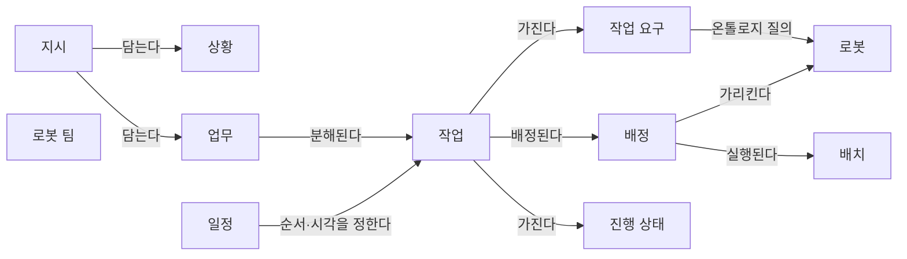
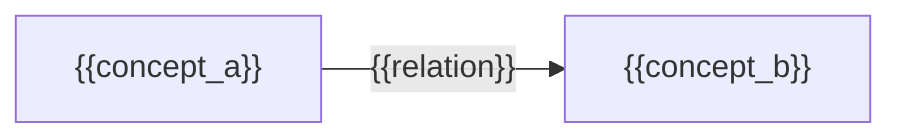

(너의 규칙은 시스템 프롬프트의 agents/shared-rules.md 와 agents/researcher.md 이다. 아래는 이번 실행의 컨텍스트와 입력이다.)

## 실행 컨텍스트

- run_id: 2026-09-25-12
- date: 2026-09-25
- run_type: track (트랙 실행)
- 대상: 트랙 nl-task-chatbot (자연어 업무 지시 챗봇) · 현재 단계: 단계 1. 선행 연구·제품 사례 조사 · 이번에 다룰 백로그 질문 id: q1-02 · 중심 세부영역: 13. 작업 배정 — MRTA (D. 계획·최적화)
- 예산:
    - max_search_queries: 40
    - max_sources_per_run: 20
    - new_topic_pages: 1
    - page_updates: 2
    - max_retries: 2
- 환경 알림: web_fetch_available: false · fetch_mode: mirror_only (일반 웹 페이지 열람은 네트워크 정책으로 막혀 있다. raw.githubusercontent.com 은 열린다: 공식 문서가 GitHub 에 있는 출처는 입력의 config/source_mirrors.yaml 경로를 WebFetch 로 열어 원문을 읽고 sources[].fetched=true, fetched_via=github_raw, fetch_url 을 적는다. 입력에 원문 텍스트(data/source_texts)가 있는 출처는 fetched_via=inbox. 그 밖의 출처는 fetched=false 이며 코드가 신뢰도 상한(medium)을 강제한다 — 공통 규칙 0절 6항)
- 언어: ko
- next_ref_id: ref-096

## 입력

### runs/2026-09-25-12/target.json

```json
{
  "run_id": "2026-09-25-12",
  "date": "2026-09-25",
  "weekday": "Fri",
  "run_number": 12,
  "run_type": "track",
  "forced": true,
  "target": {
    "area_no": 13,
    "area_name": "13. 작업 배정 — MRTA",
    "category": "D. 계획·최적화",
    "category_letter": "D"
  },
  "topic": null,
  "track": {
    "slug": "nl-task-chatbot",
    "name": "자연어 업무 지시 챗봇",
    "stage": 1,
    "stages": 5,
    "stage_name": "선행 연구·제품 사례 조사",
    "question_ids": [
      "q1-02"
    ],
    "user_questions": [],
    "runs_per_week": 3,
    "question_rationale": "사용자 지정 0건, 되돌아온 질문 0건, 현재 단계 열린 질문 5건 중 오래된 순"
  },
  "corrections": [],
  "budget": {
    "max_search_queries": 40,
    "max_sources_per_run": 20,
    "new_topic_pages": 1,
    "page_updates": 2,
    "max_retries": 2
  },
  "priority_reason": null,
  "priority_questions": [],
  "excluded_areas": [],
  "lifted_areas": [],
  "deferred": {
    "monthly_recheck": false,
    "weekly_review": true
  },
  "selection_rationale": "CLI 지정 run_type=track, area=13; 트랙 실행일(Fri, track_days 앞 3개) → 트랙 nl-task-chatbot 단계 1, 질문 q1-02 (사용자 지정 0건, 되돌아온 질문 0건, 현재 단계 열린 질문 5건 중 오래된 순)"
}
```

### docs/categories/d-planning-and-optimization/13-task-allocation-mrta.md

```markdown
---
title: "13. 작업 배정 — MRTA"
type: area
category: "D. 계획·최적화"
area_no: 13
related_areas: []
tags: []
status: seed
created: 2026-09-24
updated: 2026-09-24
sources: []
version: 1
---

[홈](../../index.md) › [D. 계획·최적화](index.md) › 13. 작업 배정 — MRTA

# 13. 작업 배정 — MRTA

!!! info "소속 대분류"
    [D. 계획·최적화](index.md) — 핵심 질문:
    누가, 언제, 어디로, 어떤 자원을 사용해 작업할 것인가? [분류원문]

<!-- auto:area-tracks:start -->
!!! note "관련 연구 트랙"
    이 세부영역을 가로지르는 중점 연구 트랙과 확장 아이디어다. 트랙은 분류를 바꾸지 않으며, 트랙에서 확인된 사실은 이 페이지에 반영하도록 제안된다. 전체 매핑은 [확장 아이디어 연결 구조](../../ideas/index.md)에 있다.

    - [매뉴얼 기반 로봇 기능 온톨로지](../../tracks/manual-capability-ontology/index.md) — 함께 필요한 영역(○) · 확장 아이디어: [아이디어 1. 로봇 기능 온톨로지](../../ideas/robot-capability-ontology.md)
    - [자연어 업무 지시 챗봇](../../tracks/nl-task-chatbot/index.md) — 중심 영역(●) · 확장 아이디어: [아이디어 2. 자연어 업무 지시 챗봇](../../ideas/nl-task-chatbot.md)
<!-- auto:area-tracks:end -->

## 1. 한 줄 정의

능력·위치·적재량·배터리·납기 등을 고려해 로봇 또는 로봇 팀에 작업을 배정 [분류원문]

## 2. SCM 관점의 질문

가장 가까운 로봇에 맡기는 것이 전체적으로도 유리한가? [분류원문]

> 원문 주석: 27번의 AI는 특정 기능 하나에만 해당하지 않는다. **매뉴얼 해석은 5·21번, 도면 해석은 6번, 학습 기반 배차는 13번, 장애 분석은 19번**에 적용되는 연구 방법이다. [분류원문]

## 3. 왜 중요한가

아직 작성되지 않음

## 4. 핵심 개념과 용어

아직 작성되지 않음

## 5. 현장 시나리오 (물류 흐름의 어느 단계인지 명시)

아직 작성되지 않음

## 6. 대표 접근법과 기술

아직 작성되지 않음

## 7. 관련 표준·프레임워크·오픈소스

아직 작성되지 않음

## 8. 대표 연구와 자료

아직 작성되지 않음

## 9. ROP가 직접 맡는 것과 외부와 연계하는 것 (부록 A 9장 기준)

아직 작성되지 않음

## 10. 다른 연구영역과의 연결 (번호와 이름을 함께 표기)

아직 작성되지 않음

## 11. 열린 질문

아직 작성되지 않음

## 12. 최근 업데이트 (자동)

<!-- auto:area-recent:start -->
아직 기록된 업데이트가 없다.
<!-- auto:area-recent:end -->

## 13. 참고 자료 (각주)

(아직 각주가 없다. 본문이 작성되면 출처 각주를 여기에 둔다.)
```

### docs/categories/d-planning-and-optimization/14-task-sequencing-and-scheduling.md (요약)

```markdown
# 14. 작업 순서·스케줄링

소속 대분류: D. 계획·최적화 · 상태: seed · 신뢰도: — · 마지막 갱신: 2026-09-24 · 버전: 1

## 1. 한 줄 정의

주문 묶음, 작업 선후관계, 시간 제약, 공정 간 동기화, 긴급 작업 삽입 [분류원문]

## 2. SCM 관점의 질문

피킹·운반·포장이 서로 기다리지 않게 어떤 순서로 실행할까? [분류원문]
```

### docs/categories/e-collaboration-and-field-operations/18-human-robot-collaboration-and-operator-interface.md (요약)

```markdown
# 18. 사람–로봇 협업·운영 인터페이스

소속 대분류: E. 협업·현장 운영 · 상태: seed · 신뢰도: — · 마지막 갱신: 2026-09-24 · 버전: 1

## 1. 한 줄 정의

작업자에게 일 배정, 승인·수동 전환, 원격 조작, 설명 가능한 상태 표시, 인체공학 [분류원문]

## 2. SCM 관점의 질문

사람이 피킹하고 로봇이 운반할 때 서로 기다리지 않게 하려면? [분류원문]
```

### docs/categories/g-safety-security-intelligence-and-governance/27-ai-learning-adaptation-and-model-operations.md (요약)

```markdown
# 27. AI·학습·적응과 모델 운영

소속 대분류: G. 안전·보안·지능·거버넌스 · 상태: seed · 신뢰도: — · 마지막 갱신: 2026-09-24 · 버전: 1

## 1. 한 줄 정의

문서·도면 해석, 수요·고장 예측, 학습 기반 계획, LLM 에이전트, 불확실성 평가, 모델 변경 관리 [분류원문]

## 2. SCM 관점의 질문

AI가 만든 작업 계획이나 기능 해석을 어떤 기준으로 실행에 사용할까? [분류원문]

> 원문 주석: 27번의 AI는 특정 기능 하나에만 해당하지 않는다. **매뉴얼 해석은 5·21번, 도면 해석은 6번, 학습 기반 배차는 13번, 장애 분석은 19번**에 적용되는 연구 방법이다. [분류원문]
```

### docs/categories/a-business-supply-chain-design/01-order-and-business-system-integration.md (요약)

```markdown
# 1. 주문·업무 시스템 연계

소속 대분류: A. 업무·공급망 설계 · 상태: seed · 신뢰도: — · 마지막 갱신: 2026-09-24 · 버전: 1

## 1. 한 줄 정의

ERP, WMS, MES, WES, TMS의 주문·재고·생산 요청을 받아 작업으로 변환하고, 변경·취소·완료를 다시 반영하는 방법 [분류원문]

## 2. SCM 관점의 질문

출고 우선순위가 바뀌면 이미 진행 중인 로봇 작업을 어떻게 바꿀까? [분류원문]
```

### docs/categories/a-business-supply-chain-design/02-process-and-workflow-modeling.md (요약)

```markdown
# 2. 공정·워크플로 모델링

소속 대분류: A. 업무·공급망 설계 · 상태: seed · 신뢰도: — · 마지막 갱신: 2026-09-24 · 버전: 1

## 1. 한 줄 정의

입고·검수·적치·보충·피킹·이송·생산·포장·출하·반품을 작업 단계로 분해하고, 선후관계와 완료 조건을 정의 [분류원문]

## 2. SCM 관점의 질문

‘운반 완료’와 ‘인수 확인·재고 반영 완료’를 어떻게 연결할까? [분류원문]
```

### docs/categories/b-common-information-and-environment-model/05-robot-capability-and-task-ontology.md (요약)

```markdown
# 5. 로봇 능력·작업 온톨로지

소속 대분류: B. 공통 정보·환경 모델 · 상태: seed · 신뢰도: — · 마지막 갱신: 2026-09-24 · 버전: 1

## 1. 한 줄 정의

제조사별 기능·제약·장착 장비·실행 조건을 공통 모델로 표현하고, 작업 요구와 연결 [분류원문]

## 2. SCM 관점의 질문

같은 ‘운반 로봇’ 중 누가 이 화물을 실제로 취급할 수 있는가? [분류원문]

> 원문 주석: 27번의 AI는 특정 기능 하나에만 해당하지 않는다. **매뉴얼 해석은 5·21번, 도면 해석은 6번, 학습 기반 배차는 13번, 장애 분석은 19번**에 적용되는 연구 방법이다. [분류원문]
```

### docs/categories/b-common-information-and-environment-model/06-map-space-and-location-model.md (요약)

```markdown
# 6. 지도·공간·위치 모델

소속 대분류: B. 공통 정보·환경 모델 · 상태: seed · 신뢰도: — · 마지막 갱신: 2026-09-24 · 버전: 1

## 1. 한 줄 정의

BIM·CAD·센서 지도에서 이동 공간과 경로를 만들고, 로봇별 좌표계·층·목적지를 정렬 [분류원문]

## 2. SCM 관점의 질문

제조사마다 다른 지도에서 ‘3층 출하 대기장’을 어떻게 동일한 장소로 인식할까? [분류원문]

> 원문 주석: 6번에는 지도 생성뿐 아니라 **현장과 도면의 차이 확인, 지도 버전 관리, 위치추정 결과의 신뢰도**도 포함해야 한다. [분류원문]

> 원문 주석: 27번의 AI는 특정 기능 하나에만 해당하지 않는다. **매뉴얼 해석은 5·21번, 도면 해석은 6번, 학습 기반 배차는 13번, 장애 분석은 19번**에 적용되는 연구 방법이다. [분류원문]
```

### docs/categories/b-common-information-and-environment-model/08-real-time-world-state-and-data-consistency.md (요약)

```markdown
# 8. 실시간 세계 상태·데이터 일관성

소속 대분류: B. 공통 정보·환경 모델 · 상태: seed · 신뢰도: — · 마지막 갱신: 2026-09-24 · 버전: 1

## 1. 한 줄 정의

로봇·설비·공간·화물의 현재 상태를 통합하고, 시간 지연·누락·충돌·불확실성을 관리 [분류원문]

## 2. SCM 관점의 질문

문이 열려 있다는 정보가 30초 전이라면 지금도 통과 가능하다고 볼 수 있을까? [분류원문]

> 원문 주석: 8번의 실시간 모델이 **현재 상태를 표현**한다면, 22번은 그 모델을 이용해 **가정한 미래를 실험**한다. 구분해두면 디지털 트윈이라는 이름 아래 서로 다른 기능이 섞이지 않는다. [분류원문]
```

### docs/categories/c-connectivity-and-execution-foundation/12-command-and-task-execution-reliability.md (요약)

```markdown
# 12. 명령·작업 실행의 신뢰성

소속 대분류: C. 연결·실행 기반 · 상태: seed · 신뢰도: — · 마지막 갱신: 2026-09-24 · 버전: 1

## 1. 한 줄 정의

접수·실행·완료·취소 상태, 제어권, 중복 요청 방지, 시간 초과, 재시작 후 상태 복원 [분류원문]

## 2. SCM 관점의 질문

응답이 끊긴 운반 요청을 다시 보내면 같은 화물을 두 번 처리하지 않을까? [분류원문]
```

### docs/categories/d-planning-and-optimization/16-shared-resource-charging-and-energy-optimization.md (요약)

```markdown
# 16. 공용 자원·충전·에너지 최적화

소속 대분류: D. 계획·최적화 · 상태: seed · 신뢰도: — · 마지막 갱신: 2026-09-24 · 버전: 1

## 1. 한 줄 정의

충전기·승강기·작업대·대기 공간·버퍼의 예약과 배분, 충전 시점과 에너지 사용 계획 [분류원문]

## 2. SCM 관점의 질문

로봇들이 동시에 충전하거나 승강기를 기다리는 상황을 어떻게 줄일까? [분류원문]
```

### docs/categories/e-collaboration-and-field-operations/19-monitoring-anomaly-detection-and-root-cause-analysis.md (요약)

```markdown
# 19. 모니터링·이상 탐지·원인 분석

소속 대분류: E. 협업·현장 운영 · 상태: seed · 신뢰도: — · 마지막 갱신: 2026-09-24 · 버전: 1

## 1. 한 줄 정의

로그·이벤트·성능 지표를 연결해 이상을 탐지하고, 로봇·설비·통신·공정 원인을 구분 [분류원문]

## 2. SCM 관점의 질문

지연 원인이 로봇 고장인지, 문인지, 앞 공정인지 어떻게 찾을까? [분류원문]

> 원문 주석: 27번의 AI는 특정 기능 하나에만 해당하지 않는다. **매뉴얼 해석은 5·21번, 도면 해석은 6번, 학습 기반 배차는 13번, 장애 분석은 19번**에 적용되는 연구 방법이다. [분류원문]
```

### docs/categories/e-collaboration-and-field-operations/20-exception-recovery-replanning-and-business-continuity.md (요약)

```markdown
# 20. 예외 복구·재계획·업무 연속성

소속 대분류: E. 협업·현장 운영 · 상태: seed · 신뢰도: — · 마지막 갱신: 2026-09-24 · 버전: 1

## 1. 한 줄 정의

고장·통신 단절·화물 누락·긴급 주문 등에 대해 재배정, 우회, 수동 처리, 제한 운영을 결정 [분류원문]

## 2. SCM 관점의 질문

운반 중 고장 난 로봇의 화물과 남은 주문은 어떻게 처리할까? [분류원문]
```

### docs/categories/f-deployment-verification-and-maintenance/23-testing-formal-verification-and-benchmarking.md (요약)

```markdown
# 23. 시험·형식 검증·벤치마크

소속 대분류: F. 도입·검증·유지관리 · 상태: seed · 신뢰도: — · 마지막 갱신: 2026-09-24 · 버전: 1

## 1. 한 줄 정의

시뮬레이션·실기체 시험, 장애 주입, 교착·제약 위반 검증, 회귀시험, 성능 비교 [분류원문]

## 2. SCM 관점의 질문

업데이트 후 정상 상황뿐 아니라 장애 상황도 여전히 처리되는가? [분류원문]
```

### docs/categories/g-safety-security-intelligence-and-governance/25-safety-and-risk-management.md (요약)

```markdown
# 25. 안전·위험 관리

소속 대분류: G. 안전·보안·지능·거버넌스 · 상태: seed · 신뢰도: — · 마지막 갱신: 2026-09-24 · 버전: 1

## 1. 한 줄 정의

로봇·사람·설비 상호작용의 위험, 안전 조건, 정지·재개 절차, 비상 상황 대응, 안전 책임 경계 [분류원문]

## 2. SCM 관점의 질문

여러 장비는 각각 안전해도 함께 움직일 때 새로운 위험이 생기지 않는가? [분류원문]
```

### docs/categories/g-safety-security-intelligence-and-governance/26-cybersecurity-access-control-and-privacy.md (요약)

```markdown
# 26. 사이버보안·접근권한·개인정보

소속 대분류: G. 안전·보안·지능·거버넌스 · 상태: seed · 신뢰도: — · 마지막 갱신: 2026-09-24 · 버전: 1

## 1. 한 줄 정의

장비 인증, 통신 보호, 명령 권한, 원격 접속, 고객별 격리, 영상·작업자 데이터 보호 [분류원문]

## 2. SCM 관점의 질문

외부 유지보수 계정이 어느 로봇에 어떤 명령까지 내릴 수 있는가? [분류원문]
```

### docs/categories/d-planning-and-optimization/15-multi-robot-path-and-traffic-management-mapf.md (요약)

```markdown
# 15. 다중 로봇 경로·교통 관리 — MAPF

소속 대분류: D. 계획·최적화 · 상태: seed · 신뢰도: — · 마지막 갱신: 2026-09-24 · 버전: 1

## 1. 한 줄 정의

여러 로봇의 경로와 통과 시점을 조율하고, 혼잡·교착·우선권을 처리 [분류원문]

## 2. SCM 관점의 질문

서로 다른 제조사의 로봇이 좁은 통로에서 마주치면 누가 양보할까? [분류원문]
```

### docs/glossary/index.md

```markdown
---
title: "용어집"
type: glossary
subtype: index
status: published
created: 2026-09-24
updated: 2026-09-24
version: 1
---

[홈](../index.md) › 용어집

# 용어집

이 위키에서 쓰는 용어의 한글·영문 표기와 한 줄 정의를 모은다. 용어마다 개별 페이지에 설명, 관련 연구영역, 출처를 둔다. 시드 용어는 SCOR, ISA-95, EPCIS, Open-RMF, Fleet Adapter, WES/WCS/WMS/MES/TMS, MRTA, MAPF, Lifelong MAPF, Multi-Agent Pickup and Delivery, ARIAC, DDS-Security, 디지털 트윈이다. 새 용어는 스토리텔러 에이전트가 제안하고 퍼블리셔가 반영한다.

아래 표는 용어 페이지의 프런트매터(term_ko, term_en, definition, related_areas)에서 자동으로 만든다.

## 용어 목록

<!-- auto:glossary-index:start -->
| 용어(한글) | 용어(영문) | 한 줄 정의 | 관련 영역 |
|---|---|---|---|
| [DDS 보안 규격](dds-security.md) | DDS Security (DDS-Security) | DDS(Data Distribution Service)의 보안 규격으로, ROS 2가 인증·암호화·접근통제 구조의 기반으로 통합했다. | [26. 사이버보안·접근권한·개인정보](../categories/g-safety-security-intelligence-and-governance/26-cybersecurity-access-control-and-privacy.md)<br>[11. 분산 시스템·통신·컴퓨팅 구조](../categories/c-connectivity-and-execution-foundation/11-distributed-systems-communication-and-computing.md)<br>[28. 표준·상호운용성·다사업자 거버넌스](../categories/g-safety-security-intelligence-and-governance/28-standards-interoperability-and-multi-vendor-governance.md) |
| [VDA 5050](vda-5050.md) | VDA 5050 | 독일자동차산업협회(VDA)와 VDMA가 정한 이동로봇(AGV·AMR)과 상위 관제(fleet control) 사이의 통신 인터페이스 권고안이며 현행판은 3.0.0이다. | [5. 로봇 능력·작업 온톨로지](../categories/b-common-information-and-environment-model/05-robot-capability-and-task-ontology.md)<br>[7. 화물·재고·자산 식별과 추적](../categories/b-common-information-and-environment-model/07-cargo-inventory-and-asset-identification-and-tracking.md)<br>[9. 로봇·제조사 관제 연동](../categories/c-connectivity-and-execution-foundation/09-robot-and-vendor-fleet-manager-integration.md) |
| [계획 도메인 정의 언어](pddl.md) | Planning Domain Definition Language (PDDL) | 자동 계획 문제에서 행동을 파라미터·전제조건·효과로 기술하고 도메인과 문제 인스턴스를 분리해 표현하는 언어이다. | [5. 로봇 능력·작업 온톨로지](../categories/b-common-information-and-environment-model/05-robot-capability-and-task-ontology.md) |
| [공급망 운영 참조 모델](scor.md) | Supply Chain Operations Reference (SCOR) | ASCM이 관리하는 공급망 프로세스 참조 모델로, 공급망을 계획·주문·조달·생산/가공·이행·반품 프로세스와 이를 아우르는 오케스트레이션 프로세스로 기술한다. | [1. 주문·업무 시스템 연계](../categories/a-business-supply-chain-design/01-order-and-business-system-integration.md)<br>[2. 공정·워크플로 모델링](../categories/a-business-supply-chain-design/02-process-and-workflow-modeling.md)<br>[4. 성과·경제성·프로세스 개선](../categories/a-business-supply-chain-design/04-performance-economics-and-process-improvement.md) |
| [글로벌 개별 자산 식별자](giai.md) | Global Individual Asset Identifier (GIAI) | 컨테이너·트럭·트레일러 같은 개별 자산을 식별하는 GS1 식별 키이다. | [7. 화물·재고·자산 식별과 추적](../categories/b-common-information-and-environment-model/07-cargo-inventory-and-asset-identification-and-tracking.md) |
| [글로벌 반환형 자산 식별자](grai.md) | Global Returnable Asset Identifier (GRAI) | 팔레트·상자·트레이·케그처럼 여러 번 재사용되는 운반구를 식별하는 GS1 식별 키이다. | [7. 화물·재고·자산 식별과 추적](../categories/b-common-information-and-environment-model/07-cargo-inventory-and-asset-identification-and-tracking.md) |
| [기업–제어 시스템 통합 표준](isa-95.md) | ISA-95 Enterprise-Control System Integration | 국제자동화협회(ISA)가 제정한, 기업 업무 시스템과 제조 운영·제어 시스템의 통합을 다루는 표준 시리즈이다. | [1. 주문·업무 시스템 연계](../categories/a-business-supply-chain-design/01-order-and-business-system-integration.md)<br>[2. 공정·워크플로 모델링](../categories/a-business-supply-chain-design/02-process-and-workflow-modeling.md)<br>[28. 표준·상호운용성·다사업자 거버넌스](../categories/g-safety-security-intelligence-and-governance/28-standards-interoperability-and-multi-vendor-governance.md) |
| [능력·스킬·서비스 모델](capabilities-skills-services.md) | Capabilities, Skills and Services (CSS) Model | Plattform Industrie 4.0 작업반이 제안한 정보 모델로, 구현과 무관한 기능 명세(능력)와 그 실행 가능한 구현(스킬), 제공 형태(서비스)를 구분한다. 이 위키의 온톨로지 초안에서는 CSS의 능력(capability)을 기능(Capability)으로 부른다. | [5. 로봇 능력·작업 온톨로지](../categories/b-common-information-and-environment-model/05-robot-capability-and-task-ontology.md)<br>[28. 표준·상호운용성·다사업자 거버넌스](../categories/g-safety-security-intelligence-and-governance/28-standards-interoperability-and-multi-vendor-governance.md) |
| [다중 로봇 작업 배정](mrta.md) | Multi-Robot Task Allocation (MRTA) | 여러 로봇과 여러 작업이 있을 때 어떤 로봇(또는 로봇 팀)이 어떤 작업을 맡을지 정하는 문제이다. | [13. 작업 배정 — MRTA](../categories/d-planning-and-optimization/13-task-allocation-mrta.md)<br>[5. 로봇 능력·작업 온톨로지](../categories/b-common-information-and-environment-model/05-robot-capability-and-task-ontology.md)<br>[14. 작업 순서·스케줄링](../categories/d-planning-and-optimization/14-task-sequencing-and-scheduling.md)<br>[16. 공용 자원·충전·에너지 최적화](../categories/d-planning-and-optimization/16-shared-resource-charging-and-energy-optimization.md) |
| [다중 에이전트 경로 찾기](mapf.md) | Multi-Agent Path Finding (MAPF) | 여러 에이전트(로봇)가 각자의 출발지에서 목적지까지 서로 충돌하지 않고 동시에 따라갈 수 있는 경로들을 계획하는 문제이다. | [15. 다중 로봇 경로·교통 관리 — MAPF](../categories/d-planning-and-optimization/15-multi-robot-path-and-traffic-management-mapf.md)<br>[6. 지도·공간·위치 모델](../categories/b-common-information-and-environment-model/06-map-space-and-location-model.md)<br>[16. 공용 자원·충전·에너지 최적화](../categories/d-planning-and-optimization/16-shared-resource-charging-and-energy-optimization.md) |
| [다중 에이전트 픽업·배송](multi-agent-pickup-and-delivery.md) | Multi-Agent Pickup and Delivery (MAPD) | 픽업 위치와 배송 위치가 있는 작업이 온라인으로 계속 들어올 때, 에이전트에 작업을 배정하고 충돌 없는 경로를 함께 계획하는 문제이다. | [13. 작업 배정 — MRTA](../categories/d-planning-and-optimization/13-task-allocation-mrta.md)<br>[15. 다중 로봇 경로·교통 관리 — MAPF](../categories/d-planning-and-optimization/15-multi-robot-path-and-traffic-management-mapf.md)<br>[14. 작업 순서·스케줄링](../categories/d-planning-and-optimization/14-task-sequencing-and-scheduling.md) |
| [디지털 트윈](digital-twin.md) | Digital Twin | 물리적 대상(장비·자재·공정·설비·제품 등)을 데이터로 연결된 가상 모델로 표현한 것이다. | [22. 시뮬레이션·예측용 디지털 트윈](../categories/f-deployment-verification-and-maintenance/22-simulation-and-predictive-digital-twin.md)<br>[8. 실시간 세계 상태·데이터 일관성](../categories/b-common-information-and-environment-model/08-real-time-world-state-and-data-consistency.md)<br>[23. 시험·형식 검증·벤치마크](../categories/f-deployment-verification-and-maintenance/23-testing-formal-verification-and-benchmarking.md) |
| [래스터–벡터 변환](raster-to-vector-conversion.md) | Raster-to-Vector Conversion | 픽셀 이미지로 된 평면도를 벽 선분·교차점·방 다각형 같은 기하 요소의 벡터 표현으로 바꾸는 처리이다. | [6. 지도·공간·위치 모델](../categories/b-common-information-and-environment-model/06-map-space-and-location-model.md)<br>[27. AI·학습·적응과 모델 운영](../categories/g-safety-security-intelligence-and-governance/27-ai-learning-adaptation-and-model-operations.md) |
| [로봇·자동화 핵심 온톨로지](cora.md) | Core Ontology for Robotics and Automation (CORA) | IEEE 1872-2015가 정한 로봇·자동화 분야의 가장 일반적인 개념·관계·공리를 담은 핵심 온톨로지이다. | [5. 로봇 능력·작업 온톨로지](../categories/b-common-information-and-environment-model/05-robot-capability-and-task-ontology.md)<br>[28. 표준·상호운용성·다사업자 거버넌스](../categories/g-safety-security-intelligence-and-governance/28-standards-interoperability-and-multi-vendor-governance.md) |
| [물류 단위 일련 코드](sscc.md) | Serial Shipping Container Code (SSCC) | 케이스·팔레트·소포 등 보관·운송을 위해 묶인 물류 단위를 고유하게 식별하는 18자리 GS1 식별 키이다. | [7. 화물·재고·자산 식별과 추적](../categories/b-common-information-and-environment-model/07-cargo-inventory-and-asset-identification-and-tracking.md) |
| [산업 자동화용 민첩 로봇 경진대회](ariac.md) | Agile Robotics for Industrial Automation Competition (ARIAC) | NIST가 운영하는 로봇 경진대회로, 변화하는 제조 환경에서 로봇의 계획·인식·행동과 적응성을 평가한다. | [23. 시험·형식 검증·벤치마크](../categories/f-deployment-verification-and-maintenance/23-testing-formal-verification-and-benchmarking.md)<br>[22. 시뮬레이션·예측용 디지털 트윈](../categories/f-deployment-verification-and-maintenance/22-simulation-and-predictive-digital-twin.md)<br>[20. 예외 복구·재계획·업무 연속성](../categories/e-collaboration-and-field-operations/20-exception-recovery-replanning-and-business-continuity.md) |
| [선형 시간 논리](linear-temporal-logic.md) | Linear Temporal Logic (LTL) | 작업의 순서·시간 제약을 명확한 의미로 기술하는 형식 논리이다. | [27. AI·학습·적응과 모델 운영](../categories/g-safety-security-intelligence-and-governance/27-ai-learning-adaptation-and-model-operations.md)<br>[23. 시험·형식 검증·벤치마크](../categories/f-deployment-verification-and-maintenance/23-testing-formal-verification-and-benchmarking.md)<br>[13. 작업 배정 — MRTA](../categories/d-planning-and-optimization/13-task-allocation-mrta.md) |
| [업무 위치](business-location.md) | Business Location (EPCIS bizLocation) | EPCIS 이벤트 뒤 다른 이벤트가 반박할 때까지 객체가 있다고 보는 업무상 위치를 나타내는 선택 필드이다. | [7. 화물·재고·자산 식별과 추적](../categories/b-common-information-and-environment-model/07-cargo-inventory-and-asset-identification-and-tracking.md)<br>[6. 지도·공간·위치 모델](../categories/b-common-information-and-environment-model/06-map-space-and-location-model.md) |
| [연결 이벤트](association-event.md) | AssociationEvent | 물리 객체를 상위 객체나 특정 물리 위치와 연결하거나 연결을 해제한 사실을 기록하는 EPCIS 2.0 이벤트 유형이다. | [7. 화물·재고·자산 식별과 추적](../categories/b-common-information-and-environment-model/07-cargo-inventory-and-asset-identification-and-tracking.md) |
| [오픈 RMF](open-rmf.md) | Open-RMF (Open Robotics Middleware Framework) | ROS 2 기반의 다중 로봇 조율 프레임워크로, 제조사별 플릿 어댑터와 건물 설비 인터페이스를 통해 로봇·문·승강기 등을 연결하고 작업·교통을 조율한다. | [9. 로봇·제조사 관제 연동](../categories/c-connectivity-and-execution-foundation/09-robot-and-vendor-fleet-manager-integration.md)<br>[10. 설비·건물 시스템 연동](../categories/c-connectivity-and-execution-foundation/10-facility-and-building-system-integration.md)<br>[15. 다중 로봇 경로·교통 관리 — MAPF](../categories/d-planning-and-optimization/15-multi-robot-path-and-traffic-management-mapf.md)<br>[13. 작업 배정 — MRTA](../categories/d-planning-and-optimization/13-task-allocation-mrta.md) |
| [작업 분해](task-decomposition.md) | Task Decomposition | 상위 지시나 목표를 로봇이 실행할 수 있는 하위 작업·동작의 순서나 구조로 나누는 일이다. | [13. 작업 배정 — MRTA](../categories/d-planning-and-optimization/13-task-allocation-mrta.md)<br>[14. 작업 순서·스케줄링](../categories/d-planning-and-optimization/14-task-sequencing-and-scheduling.md)<br>[2. 공정·워크플로 모델링](../categories/a-business-supply-chain-design/02-process-and-workflow-modeling.md)<br>[27. AI·학습·적응과 모델 운영](../categories/g-safety-security-intelligence-and-governance/27-ai-learning-adaptation-and-model-operations.md) |
| [전자 제품 코드 정보 서비스](epcis.md) | Electronic Product Code Information Services (EPCIS) | GS1이 정한, 제품·자산의 상태·위치·이동·인계에 관한 이벤트를 기록하고 공유하기 위한 표준이다. | [7. 화물·재고·자산 식별과 추적](../categories/b-common-information-and-environment-model/07-cargo-inventory-and-asset-identification-and-tracking.md)<br>[2. 공정·워크플로 모델링](../categories/a-business-supply-chain-design/02-process-and-workflow-modeling.md)<br>[17. 로봇 간 협업·물리적 인계](../categories/e-collaboration-and-field-operations/17-robot-to-robot-collaboration-and-physical-handover.md) |
| [지속형 다중 에이전트 경로 찾기](lifelong-mapf.md) | Lifelong Multi-Agent Path Finding (Lifelong MAPF) | 에이전트가 목적지에 도착하면 곧바로 새 목적지를 받아 계속 이동하는 조건에서 충돌 없는 경로를 계속 계획하는 MAPF의 변형이다. | [15. 다중 로봇 경로·교통 관리 — MAPF](../categories/d-planning-and-optimization/15-multi-robot-path-and-traffic-management-mapf.md)<br>[14. 작업 순서·스케줄링](../categories/d-planning-and-optimization/14-task-sequencing-and-scheduling.md)<br>[13. 작업 배정 — MRTA](../categories/d-planning-and-optimization/13-task-allocation-mrta.md) |
| [집계 이벤트](aggregation-event.md) | AggregationEvent | 상자를 팔레트에 싣거나 내리는 것처럼 상위 객체와 하위 객체의 물리적 결합·분리를 기록하는 EPCIS 이벤트 유형이다. | [7. 화물·재고·자산 식별과 추적](../categories/b-common-information-and-environment-model/07-cargo-inventory-and-asset-identification-and-tracking.md) |
| [창고 실행·창고 제어·창고 관리·제조 실행·운송 관리 시스템](wes-wcs-wms-mes-tms.md) | Warehouse Execution System / Warehouse Control System / Warehouse Management System / Manufacturing Execution System / Transportation Management System | 창고·생산·운송의 주문·재고·설비·공정을 관리하거나 실행하는 업무·실행 시스템 계열의 약어이며, ROP는 이들에서 작업 요청을 받아 로봇 작업으로 바꾸고 결과를 되돌려 주는 관계에 있다. | [1. 주문·업무 시스템 연계](../categories/a-business-supply-chain-design/01-order-and-business-system-integration.md)<br>[2. 공정·워크플로 모델링](../categories/a-business-supply-chain-design/02-process-and-workflow-modeling.md)<br>[10. 설비·건물 시스템 연동](../categories/c-connectivity-and-execution-foundation/10-facility-and-building-system-integration.md) |
| [파놉틱 심볼 스포팅](panoptic-symbol-spotting.md) | Panoptic Symbol Spotting | CAD 도면의 선 요소마다 문·창문 같은 셀 수 있는 기호의 개별 인스턴스와 벽 같은 셀 수 없는 영역의 의미를 함께 판별하는 과제이다. | [6. 지도·공간·위치 모델](../categories/b-common-information-and-environment-model/06-map-space-and-location-model.md)<br>[27. AI·학습·적응과 모델 운영](../categories/g-safety-security-intelligence-and-governance/27-ai-learning-adaptation-and-model-operations.md) |
| [판독 지점](read-point.md) | Read Point (EPCIS readPoint) | EPCIS 이벤트가 일어난 지점을 나타내는 선택 필드이다. | [7. 화물·재고·자산 식별과 추적](../categories/b-common-information-and-environment-model/07-cargo-inventory-and-asset-identification-and-tracking.md)<br>[17. 로봇 간 협업·물리적 인계](../categories/e-collaboration-and-field-operations/17-robot-to-robot-collaboration-and-physical-handover.md) |
| [평면도 인식](floor-plan-recognition.md) | Floor Plan Recognition | 평면도 이미지나 CAD 도면에서 벽·문·창문·계단 같은 건축 요소와 방 영역·유형을 자동으로 찾아내 구조화하는 작업이다. | [6. 지도·공간·위치 모델](../categories/b-common-information-and-environment-model/06-map-space-and-location-model.md)<br>[27. AI·학습·적응과 모델 운영](../categories/g-safety-security-intelligence-and-governance/27-ai-learning-adaptation-and-model-operations.md) |
| [플릿 어댑터](fleet-adapter.md) | Fleet Adapter | Open-RMF에서 제조사별 로봇 플릿(같은 관제 아래 묶인 로봇 무리)을 연결하기 위해 두는 제조사별 연결 구성요소이다. | [9. 로봇·제조사 관제 연동](../categories/c-connectivity-and-execution-foundation/09-robot-and-vendor-fleet-manager-integration.md)<br>[5. 로봇 능력·작업 온톨로지](../categories/b-common-information-and-environment-model/05-robot-capability-and-task-ontology.md)<br>[12. 명령·작업 실행의 신뢰성](../categories/c-connectivity-and-execution-foundation/12-command-and-task-execution-reliability.md)<br>[21. 온보딩·설정·현장 시운전](../categories/f-deployment-verification-and-maintenance/21-onboarding-configuration-and-commissioning.md) |
| [핵심 업무 어휘](cbv.md) | Core Business Vocabulary (CBV) | EPCIS 이벤트의 업무 단계·상태·인계 유형 등에 채울 표준 어휘 값을 정한 GS1 표준(ISO/IEC 19988)이다. | [7. 화물·재고·자산 식별과 추적](../categories/b-common-information-and-environment-model/07-cargo-inventory-and-asset-identification-and-tracking.md) |
| [행동 트리](behavior-tree.md) | Behavior Tree | 로봇 동작과 조건 확인을 트리 노드로 조합해 실행 구조를 표현하는 형식이다. | [12. 명령·작업 실행의 신뢰성](../categories/c-connectivity-and-execution-foundation/12-command-and-task-execution-reliability.md)<br>[27. AI·학습·적응과 모델 운영](../categories/g-safety-security-intelligence-and-governance/27-ai-learning-adaptation-and-model-operations.md)<br>[13. 작업 배정 — MRTA](../categories/d-planning-and-optimization/13-task-allocation-mrta.md) |
<!-- auto:glossary-index:end -->
```

### docs/references/index.md

```markdown
---
title: "참고문헌"
type: reference
subtype: index
status: published
created: 2026-09-24
updated: 2026-09-24
version: 1
---

[홈](../index.md) › 참고문헌

# 참고문헌

이 위키가 인용한 출처의 목록이다. 출처마다 id, 기관, 제목, 발행일, URL, 유형, 신뢰도, 접근일, 요약, 인용된 페이지를 개별 페이지에 둔다. 시드 10건(ref-001 ~ ref-010)은 분류 원문 12장의 참고 자료 1~10번에 그대로 대응한다. 새 출처는 리서치 에이전트가 제안하고 내용 검증 에이전트가 실재를 확인한 뒤 퍼블리셔가 추가한다.

신뢰도는 출처 유형을 기준으로 한다. 표준·정부·연구기관·논문·오픈소스 공식 문서는 high, 기사·보도자료·벤더 문서는 medium 이며, 내용 검증 에이전트가 원문을 열어 확인하면 조정할 수 있다. 다만 URL 을 열어 확인하지 못한 출처(원문 미열람)에는 유형과 무관하게 high 를 주지 않고 medium 상한을 적용한다. 시드 10건은 구축 환경의 네트워크 정책으로 URL 을 열지 못했으므로 모두 원문 미열람 상태이며, 각 페이지의 "원문 열람" 행에 그 사실을 적어 둔다. 외부 접속이 가능한 환경에서 `ROP_CHECK_URLS=1 bash pipeline/checks/run_all.sh` 를 실행한 뒤 `python3 pipeline/scaffold.py --apply-url-check` 를 실행하면 열림이 확인된 출처의 신뢰도가 유형 기준값으로 올라간다.

## 목록

<!-- auto:references-index:start -->
| id | 기관 | 제목 | 발행일 | 유형 | 신뢰도 | 접근일 | URL |
|---|---|---|---|---|---|---|---|
| [ref-001](ref-001.md) | ASCM | SCOR Digital Standard | 미확인 | 표준 | medium | 2026-09-24 | <https://www.ascm.org/corporate-solutions/standards-tools/scor-ds/> |
| [ref-002](ref-002.md) | ISA | Update to ISA-95 Standard Addresses Integration of Enterprise and Manufacturing Control Systems | 2025 | 기사 | medium | 2026-09-24 | <https://www.isa.org/news-press-releases/2025/april/update-to-isa-95-standard-addresses-integration-of> |
| [ref-003](ref-003.md) | GS1 | EPCIS and CBV Linked Data Model | 미확인 | 표준 | medium | 2026-09-24 | <https://ref.gs1.org/epcis/> |
| [ref-004](ref-004.md) | Open Robotics | RMF Core Overview — Programming Multiple Robots with ROS 2 | 미확인 | 오픈소스 문서 | high | 2026-09-25 | <https://osrf.github.io/ros2multirobotbook/rmf-core.html> |
| [ref-005](ref-005.md) | Li, J., Tinka, A., Kiesel, S., Durham, J. W., Kumar, T. K. S., & Koenig, S. | Lifelong Multi-Agent Path Finding in Large-Scale Warehouses | 2020 | 논문 | medium | 2026-09-24 | <https://arxiv.org/abs/2005.07371> |
| [ref-006](ref-006.md) | Ma, H., Li, J., Kumar, T. K. S., & Koenig, S. | Lifelong Multi-Agent Path Finding for Online Pickup and Delivery Tasks | 2017 | 논문 | medium | 2026-09-24 | <https://arxiv.org/abs/1705.10868> |
| [ref-007](ref-007.md) | NIST | Performance of Collaborative Robot Systems | 미확인 | 정부·연구기관 | medium | 2026-09-24 | <https://www.nist.gov/programs-projects/performance-collaborative-robot-systems> |
| [ref-008](ref-008.md) | NIST | ARIAC Documentation | 미확인 | 정부·연구기관 | high | 2026-09-25 | <https://pages.nist.gov/ARIAC_docs/en/latest/> |
| [ref-009](ref-009.md) | ROS 2 Design | ROS 2 DDS-Security Integration | 미확인 | 오픈소스 문서 | high | 2026-09-25 | <https://design.ros2.org/articles/ros2_dds_security.html> |
| [ref-010](ref-010.md) | ROS 2 Design | ROS 2 Robotic Systems Threat Model | 미확인 | 오픈소스 문서 | high | 2026-09-25 | <https://design.ros2.org/articles/ros2_threat_model.html> |
| [ref-011](ref-011.md) | ISO/IEC | ISO/IEC 19987:2024 - Information technology — EPC Information Services (EPCIS) | 2024-03 | 표준 | medium | 2026-09-25 | <https://www.iso.org/standard/85557.html> |
| [ref-012](ref-012.md) | ISO/IEC | ISO/IEC 19988:2024 - Information technology — GS1 Core Business Vocabulary (CBV) | 2024 | 표준 | medium | 2026-09-25 | <https://www.iso.org/standard/85558.html> |
| [ref-013](ref-013.md) | OpenEPCIS | EPCIS 2.0 and EPCIS 1.2 \| OpenEPCIS Docs | 미확인 | 오픈소스 문서 | medium | 2026-09-25 | <https://openepcis.io/docs/epcis/> |
| [ref-014](ref-014.md) | GS1 | Core Business Vocabulary (CBV) Standard | 미확인 | 표준 | medium | 2026-09-25 | <https://ref.gs1.org/standards/cbv/> |
| [ref-015](ref-015.md) | GS1 | EPCIS and CBV Implementation Guideline | 미확인 | 표준 | medium | 2026-09-25 | <https://www.gs1.org/docs/epc/EPCIS_Guideline.pdf> |
| [ref-016](ref-016.md) | GS1 | Serial Shipping Container Code (SSCC) | 미확인 | 표준 | medium | 2026-09-25 | <https://www.gs1.org/standards/id-keys/sscc> |
| [ref-017](ref-017.md) | GS1 Korea(대한상공회의소 유통물류진흥원) | SSCC (Serial Shipping Container Code) GS1 Information Vol. 21 | 2019-09 | 표준 | medium | 2026-09-25 | <http://www.gs1kr.org/front/service/File/SSCC%20%EB%B0%9C%EA%B0%84%20%EC%9E%90%EB%A3%8C.pdf> |
| [ref-018](ref-018.md) | GS1 | GS1 Logistic Label Guideline | 미확인 | 표준 | medium | 2026-09-25 | <https://www.gs1.org/docs/tl/GS1_Logistic_Label_Guideline.pdf> |
| [ref-019](ref-019.md) | GS1 | Global Returnable Asset Identifier (GRAI) | 미확인 | 표준 | medium | 2026-09-25 | <https://www.gs1.org/standards/id-keys/grai> |
| [ref-020](ref-020.md) | GS1 | Which GS1 identification key should be used for individual assets used to transport goods? (GS1 GO Customer Service Portal) | 미확인 | 표준 | medium | 2026-09-25 | <https://support.gs1.org/support/solutions/articles/43000734294-which-gs1-identification-key-should-be-used-for-individual-assets-used-to-transport-goods-> |
| [ref-021](ref-021.md) | GS1 | EPC Tag Data Standard | 미확인 | 표준 | medium | 2026-09-25 | <https://www.gs1.org/sites/default/files/docs/epc/GS1_EPC_TDS_i1_11.pdf> |
| [ref-022](ref-022.md) | VDA(Verband der Automobilindustrie) | VDA 5050 Version 2.0.0 — Interface for the communication between automated guided vehicles (AGV) and a master control | 2022-01 | 표준 | medium | 2026-09-25 | <https://www.vda.de/dam/jcr:f0c9c019-1506-4dee-998a-e92723fbf025/EN-VDA5050-V2_0_0.pdf> |
| [ref-023](ref-023.md) | Open Robotics | Workcells - Programming Multiple Robots with ROS 2 | 미확인 | 오픈소스 문서 | high | 2026-09-25 | <https://osrf.github.io/ros2multirobotbook/integration_workcells.html> |
| [ref-024](ref-024.md) | Singh, J. 외 | RFID tag readability issues with palletized loads of consumer goods | 2009 | 논문 | medium | 2026-09-25 | <https://onlinelibrary.wiley.com/doi/abs/10.1002/pts.864> |
| [ref-025](ref-025.md) | IEEE | 1872-2015 - IEEE Standard Ontologies for Robotics and Automation | 2015 | 표준 | medium | 2026-09-25 | <https://ieeexplore.ieee.org/document/7084073/> |
| [ref-026](ref-026.md) | IEEE | IEEE 1872.2-2021 - IEEE Standard for Autonomous Robotics (AuR) Ontology | 2022 | 표준 | medium | 2026-09-25 | <https://standards.ieee.org/standard/1872_2-2021.html> |
| [ref-027](ref-027.md) | Beetz, M., Beßler, D., Haidu, A., Pomarlan, M., Bozcuoglu, A. K., & Bartels, G. | KnowRob 2.0 — A 2nd Generation Knowledge Processing Framework for Cognition-Enabled Robotic Agents | 2018 | 논문 | medium | 2026-09-25 | <https://ai.uni-bremen.de/papers/beetz18knowrob.pdf> |
| [ref-028](ref-028.md) | Beßler, D. 외 | Foundations of the Socio-physical Model of Activities (SOMA) for Autonomous Robotic Agents | 2021 | 논문 | medium | 2026-09-25 | <https://arxiv.org/pdf/2011.11972> |
| [ref-029](ref-029.md) | McDermott, D. 외 | PDDL - The Planning Domain Definition Language | 1998 | 논문 | medium | 2026-09-25 | <https://www.researchgate.net/publication/2278933_PDDL_-_The_Planning_Domain_Definition_Language> |
| [ref-030](ref-030.md) | W3C / OGC | Semantic Sensor Network Ontology | 2017-10-19 | 표준 | medium | 2026-09-25 | <https://www.w3.org/TR/vocab-ssn/> |
| [ref-031](ref-031.md) | VDA / VDMA (VDA5050 GitHub) | VDA5050/VDA5050_EN.md — Official Specification document for the VDA 5050 | 미확인 | 표준 | high | 2026-09-25 | <https://github.com/VDA5050/VDA5050/blob/main/VDA5050_EN.md> |
| [ref-032](ref-032.md) | VDA(Verband der Automobilindustrie) | Version 3.0 of VDA 5050 released | 2026-04 | 표준 | medium | 2026-09-25 | <https://www.vda.de/en/press/press-releases/2026/260421_PM_VDA_5050_EN> |
| [ref-033](ref-033.md) | MassRobotics | Autonomous Mobile Robot Standards Published by MassRobotics | 2021-05 | 표준 | medium | 2026-09-25 | <https://www.massrobotics.org/autonomous-mobile-robot-standards-published-by-massrobotics/> |
| [ref-034](ref-034.md) | OPC Foundation / VDMA | OPC-40010-1 – OPC UA for Robotics - Part 1: Vertical Integration | 미확인 | 표준 | medium | 2026-09-25 | <https://reference.opcfoundation.org/specs/OPC-40010-1> |
| [ref-035](ref-035.md) | Plattform Industrie 4.0 | Information Model for Capabilities, Skills & Services | 2022-11 | 정부·연구기관 | medium | 2026-09-25 | <https://www.plattform-i40.de/IP/Redaktion/EN/Downloads/Publikation/CapabilitiesSkillsServices.html> |
| [ref-036](ref-036.md) | Köcher, A. 외 | A Reference Model for Common Understanding of Capabilities and Skills in Manufacturing | 2022 | 논문 | medium | 2026-09-25 | <https://arxiv.org/abs/2209.09632> |
| [ref-037](ref-037.md) | Vieira da Silva, L. M., Köcher, A., Gill, M. S., Weiss, M., & Fay, A. | Toward a Mapping of Capability and Skill Models using Asset Administration Shells and Ontologies | 2023-07 | 논문 | low | 2026-09-25 | <https://arxiv.org/abs/2307.00827> |
| [ref-038](ref-038.md) | Vieira da Silva, L. M., Köcher, A., & Fay, A. | A Capability and Skill Model for Heterogeneous Autonomous Robots | 2022-09 | 논문 | medium | 2026-09-25 | <https://arxiv.org/abs/2209.10900> |
| [ref-039](ref-039.md) | Open Robotics | Currently supported Tasks - Programming Multiple Robots with ROS 2 | 미확인 | 오픈소스 문서 | high | 2026-09-25 | <https://osrf.github.io/ros2multirobotbook/task_types.html> |
| [ref-040](ref-040.md) | Open Robotics | PerformAction Tutorial - Programming Multiple Robots with ROS 2 | 미확인 | 오픈소스 문서 | high | 2026-09-25 | <https://osrf.github.io/ros2multirobotbook/integration_fleets_action_tutorial.html> |
| [ref-041](ref-041.md) | Naqvi, M. R. 외(Scientific Reports) | Ontology-driven integration of advertised and operational capabilities in robots | 2025-10-02 | 논문 | medium | 2026-09-25 | <https://www.nature.com/articles/s41598-025-16649-3> |
| [ref-042](ref-042.md) | Aguado, E., Gomez, V., Hernando, M., Rossi, C., & Sanz, R. | A survey of ontology-enabled processes for dependable robot autonomy | 2024-07 | 논문 | medium | 2026-09-25 | <https://www.frontiersin.org/journals/robotics-and-ai/articles/10.3389/frobt.2024.1377897/full> |
| [ref-043](ref-043.md) | 신민종, 한영석, 정재윤 | 자산관리쉘 표준을 이용한 자율이동로봇 모니터링 시스템 설계 | 2024 | 논문 | medium | 2026-09-25 | <https://www.kci.go.kr/kciportal/ci/sereArticleSearch/ciSereArtiView.kci?sereArticleSearchBean.artiId=ART003140560> |
| [ref-044](ref-044.md) | GS1 | gs1/EPCIS — Ontology/CBV.ttl (Core Business Vocabulary ontology 2.0) | 2021-09-30 | 표준 | high | 2026-09-25 | <https://github.com/gs1/EPCIS/blob/master/Ontology/CBV.ttl> |
| [ref-045](ref-045.md) | GS1 | gs1/EPCIS — Ontology/EPCIS.ttl (EPCIS ontology 2.0) | 2021-09-30 | 표준 | high | 2026-09-25 | <https://github.com/gs1/EPCIS/blob/master/Ontology/EPCIS.ttl> |
| [ref-047](ref-047.md) | Open Robotics (open-rmf) | rmf_internal_msgs — rmf_dispenser_msgs/msg/DispenserRequest.msg | 미확인 | 오픈소스 문서 | high | 2026-09-25 | <https://github.com/open-rmf/rmf_internal_msgs/blob/main/rmf_dispenser_msgs/msg/DispenserRequest.msg> |
| [ref-048](ref-048.md) | Open Robotics (open-rmf) | rmf_internal_msgs — rmf_dispenser_msgs/msg/DispenserRequestItem.msg | 미확인 | 오픈소스 문서 | high | 2026-09-25 | <https://github.com/open-rmf/rmf_internal_msgs/blob/main/rmf_dispenser_msgs/msg/DispenserRequestItem.msg> |
| [ref-049](ref-049.md) | Open Robotics (open-rmf) | rmf_internal_msgs — rmf_ingestor_msgs/msg/IngestorResult.msg | 미확인 | 오픈소스 문서 | high | 2026-09-25 | <https://github.com/open-rmf/rmf_internal_msgs/blob/main/rmf_ingestor_msgs/msg/IngestorResult.msg> |
| [ref-050](ref-050.md) | Auto-ID Labs Korea(세종대학교), Byun, J. | Oliot EPCIS for GS1 EPCIS/CBV 2.0.0 (GitHub JaewookByun/epcis README) | 미확인 | 오픈소스 문서 | high | 2026-09-25 | <https://github.com/JaewookByun/epcis> |
| [ref-051](ref-051.md) | VDA / VDMA (VDA5050 GitHub) | VDA5050/VDA5050 — json_schemas/state.schema | 미확인 | 표준 | high | 2026-09-25 | <https://github.com/VDA5050/VDA5050/blob/main/json_schemas/state.schema> |
| [ref-052](ref-052.md) | VDA / VDMA (VDA5050 GitHub) | VDA5050/VDA5050 — README.md | 미확인 | 표준 | high | 2026-09-25 | <https://github.com/VDA5050/VDA5050/blob/main/README.md> |
| [ref-053](ref-053.md) | NVIDIA Research (NVlabs) | progprompt-vh — ProgPrompt: Generating Situated Robot Task Plans using Large Language Models (GitHub README) | 미확인 | 오픈소스 문서 | high | 2026-09-25 | <https://github.com/NVlabs/progprompt-vh> |
| [ref-054](ref-054.md) | Singh, I. 외 | ProgPrompt: Generating Situated Robot Task Plans using Large Language Models | 2022-09 | 논문 | medium | 2026-09-25 | <https://arxiv.org/abs/2209.11302> |
| [ref-055](ref-055.md) | Brown University H2R Lab | Lang2LTL — Code for paper Lang2LTL: Grounding Complex Natural Language Commands for Temporal Tasks in Unseen Environments (GitHub README) | 미확인 | 오픈소스 문서 | high | 2026-09-25 | <https://github.com/h2r/Lang2LTL> |
| [ref-056](ref-056.md) | Liu, J. X. 외 | Grounding Complex Natural Language Commands for Temporal Tasks in Unseen Environments | 2023-02 | 논문 | medium | 2026-09-25 | <https://arxiv.org/abs/2302.11649> |
| [ref-057](ref-057.md) | Tellex, S. 외 | Understanding Natural Language Commands for Robotic Navigation and Mobile Manipulation | 2011-08 | 논문 | medium | 2026-09-25 | <https://ojs.aaai.org/index.php/AAAI/article/view/7979> |
| [ref-058](ref-058.md) | Cohen, V., Liu, J. X., Mooney, R., Tellex, S., & Watkins, D. | A Survey of Robotic Language Grounding: Tradeoffs between Symbols and Embeddings | 2024-08 | 논문 | medium | 2026-09-25 | <https://www.ijcai.org/proceedings/2024/885> |
| [ref-059](ref-059.md) | Wang, Y. 외(DART-LLM 저자) | DART-LLM: Dependency-Aware Multi-Robot Task Decomposition and Execution using Large Language Models | 2024-11 | 논문 | medium | 2026-09-25 | <https://arxiv.org/abs/2411.09022> |
| [ref-061](ref-061.md) | Izzo, R. A., Bardaro, G., & Matteucci, M. (Politecnico di Milano AIRLab) | BTGenBot: Behavior Tree Generation for Robotic Tasks with Lightweight LLMs | 2024-03 | 논문 | medium | 2026-09-25 | <https://arxiv.org/abs/2403.12761> |
| [ref-062](ref-062.md) | CubiCasa (Kalervo, A. 외) | CubiCasa5k — README (CubiCasa5K: A Dataset and an Improved Multi-Task Model for Floorplan Image Analysis) | 미확인 | 오픈소스 문서 | medium | 2026-09-25 | <https://github.com/CubiCasa/CubiCasa5k> |
| [ref-063](ref-063.md) | Kalervo, A., Ylioinas, J., Häikiö, M., Karhu, A., & Kannala, J. | CubiCasa5K: A Dataset and an Improved Multi-Task Model for Floorplan Image Analysis | 2019-04 | 논문 | medium | 2026-09-25 | <https://arxiv.org/abs/1904.01920> |
| [ref-064](ref-064.md) | Zeng, Z., Li, X., Yu, Y. K., & Fu, C.-W. | DeepFloorplan — README (Deep Floor Plan Recognition using a Multi-task Network with Room-boundary-Guided Attention) | 2019 | 오픈소스 문서 | medium | 2026-09-25 | <https://github.com/zlzeng/DeepFloorplan> |
| [ref-065](ref-065.md) | Liu, C., Wu, J., Kohli, P., & Furukawa, Y. | FloorplanTransformation — README (Raster-to-Vector: Revisiting Floorplan Transformation) | 2017 | 오픈소스 문서 | medium | 2026-09-25 | <https://github.com/art-programmer/FloorplanTransformation> |
| [ref-066](ref-066.md) | FloorPlanCAD 프로젝트(Fan, Z. 외) | FloorPlanCAD Dataset — project page (floorplancad.github.io index.md) | 2021 | 오픈소스 문서 | medium | 2026-09-25 | <https://floorplancad.github.io/> |
| [ref-067](ref-067.md) | Fan, Z., Zhu, L., Li, H., Chen, X., Zhu, S., & Tan, P. | FloorPlanCAD: A Large-Scale CAD Drawing Dataset for Panoptic Symbol Spotting | 2021-05 | 논문 | medium | 2026-09-25 | <https://arxiv.org/abs/2105.07147> |
| [ref-068](ref-068.md) | Voxel51 (Hugging Face) | Voxel51/FloorPlanCAD · Datasets at Hugging Face | 미확인 | 오픈소스 문서 | medium | 2026-09-25 | <https://huggingface.co/datasets/Voxel51/FloorPlanCAD> |
| [ref-069](ref-069.md) | Pizarro, P. N., Hitschfeld, N., & Sipiran, I. (MLSTRUCT) | MLStructFP — README (Large-scale multi-unit floor plan dataset for architectural plan analysis and recognition) | 2023 | 오픈소스 문서 | medium | 2026-09-25 | <https://github.com/MLSTRUCT/MLStructFP> |
| [ref-070](ref-070.md) | Hu, S. 외 | Raster-to-Graph — README (Raster-to-Graph: Floorplan Recognition via Autoregressive Graph Prediction with an Attention Transformer) | 2024 | 오픈소스 문서 | medium | 2026-09-25 | <https://github.com/SizheHu/Raster-to-Graph> |
| [ref-071](ref-071.md) | Agour, M. 외 (ResPlan) | ResPlan — README (ResPlan: A Large-Scale Vector-Graph Dataset of 17,000 Residential Floor Plans) | 2025-08 | 오픈소스 문서 | medium | 2026-09-25 | <https://github.com/m-agour/ResPlan> |
| [ref-072](ref-072.md) | van Engelenburg, C. 외 (MSD) | msd — README (MSD: A Benchmark Dataset for Floor Plan Generation of Building Complexes) | 2024 | 오픈소스 문서 | medium | 2026-09-25 | <https://github.com/caspervanengelenburg/msd> |
| [ref-073](ref-073.md) | Luo, R. 외 | ArchCAD-400K: A Large-Scale CAD drawings Dataset and New Baseline for Panoptic Symbol Spotting | 2025-03 | 논문 | medium | 2026-09-25 | <https://arxiv.org/abs/2503.22346> |
| [ref-074](ref-074.md) | 한국지능정보사회진흥원(AI Hub) | 건축 도면 데이터 | 미확인 | 정부·연구기관 | medium | 2026-09-25 | <https://aihub.or.kr/aihubdata/data/view.do?dataSetSn=71465> |
| [ref-075](ref-075.md) | de las Heras, L.-P., Terrades, O. R., Robles, S., & Sánchez, G. | CVC-FP and SGT: a new database for structural floor plan analysis and its groundtruthing tool | 2015 | 논문 | medium | 2026-09-25 | <https://www.researchgate.net/publication/270597635_CVC-FP_and_SGT_a_new_database_for_structural_floor_plan_analysis_and_its_groundtruthing_tool> |
| [ref-076](ref-076.md) | DeFazio, D., Mehta, H., Wang, M., Yang, P., Blackburn, J., & Zhang, S. | Vision Language Models Can Parse Floor Plan Maps | 2024-09 | 논문 | medium | 2026-09-25 | <https://arxiv.org/abs/2409.12842> |
| [ref-077](ref-077.md) | DoorDet 저자(arXiv 2508.07714) | DoorDet: Semi-Automated Multi-Class Door Detection Dataset via Object Detection and Large Language Models | 2025-08 | 논문 | medium | 2026-09-25 | <https://arxiv.org/abs/2508.07714> |
| [ref-078](ref-078.md) | Kratochvila, L., de Jong, G., Arkesteijn, M., Zemcik, T., Bilik, S., Horak, K., & Rellermeyer, J. S. | Multi-Unit Floor Plan Recognition and Reconstruction Using Improved Semantic Segmentation of Raster-Wise Floor Plans | 2024-08 | 논문 | medium | 2026-09-25 | <https://arxiv.org/abs/2408.01526> |
| [ref-087](ref-087.md) | Google Research | SayCan (google-research/saycan README) | 미확인 | 오픈소스 문서 | medium | 2026-09-25 | <https://github.com/google-research/google-research/blob/master/saycan/README.md> |
| [ref-088](ref-088.md) | Ahn, M. 외(Google) | Do As I Can, Not As I Say: Grounding Language in Robotic Affordances | 2022-04 | 논문 | medium | 2026-09-25 | <https://arxiv.org/abs/2204.01691> |
| [ref-089](ref-089.md) | SMARTlab-Purdue (Purdue University) | SMART-LLM: Smart Multi-Agent Robot Task Planning using Large Language Models (GitHub README) | 미확인 | 오픈소스 문서 | medium | 2026-09-25 | <https://github.com/SMARTlab-Purdue/SMART-LLM> |
| [ref-090](ref-090.md) | Kannan, S. S., Venkatesh, V. L. N., & Min, B.-C. | SMART-LLM: Smart Multi-Agent Robot Task Planning using Large Language Models | 2023-09 | 논문 | medium | 2026-09-25 | <https://arxiv.org/abs/2309.10062> |
| [ref-091](ref-091.md) | Cranial-XIX (LLM+P 저자) | llm-pddl — LLM+P: Empowering Large Language Models with Optimal Planning Proficiency (GitHub README) | 미확인 | 오픈소스 문서 | medium | 2026-09-25 | <https://github.com/Cranial-XIX/llm-pddl> |
| [ref-092](ref-092.md) | Liu, B., Jiang, Y., Zhang, X., Liu, Q., Zhang, S., Biswas, J., & Stone, P. | LLM+P: Empowering Large Language Models with Optimal Planning Proficiency | 2023-04 | 논문 | medium | 2026-09-25 | <https://arxiv.org/abs/2304.11477> |
| [ref-093](ref-093.md) | Huang, W., Abbeel, P., Pathak, D., & Mordatch, I. | Language Models as Zero-Shot Planners: Extracting Actionable Knowledge for Embodied Agents | 2022-07 | 논문 | medium | 2026-09-25 | <https://proceedings.mlr.press/v162/huang22a.html> |
| [ref-094](ref-094.md) | Huang, W. (language-planner 공식 저장소) | language-planner — Official Code for "Language Models as Zero-Shot Planners" (GitHub README) | 미확인 | 오픈소스 문서 | medium | 2026-09-25 | <https://github.com/huangwl18/language-planner> |
| [ref-095](ref-095.md) | Google Research | Code as Policies: Language Model Programs for Embodied Control (google-research/code_as_policies README) | 미확인 | 오픈소스 문서 | medium | 2026-09-25 | <https://github.com/google-research/google-research/blob/master/code_as_policies/README.md> |
<!-- auto:references-index:end -->
```

### docs/open-questions.md

```markdown
---
title: "열린 질문"
type: questions
status: published
created: 2026-09-24
updated: 2026-09-24
version: 1
---

[홈](index.md) › 열린 질문

# 열린 질문

아직 해결되지 않은 질문의 목록이다. 질문마다 관련 영역, 제기일, 제기한 실행, 상태(열림 / 조사 중 / 해결 / 보류), 해결 시 링크를 둔다. 세 에이전트 모두 질문을 제기할 수 있고, 해결 판정은 내용 검증 에이전트가 한다. 서로 다른 출처가 충돌하면 한쪽을 고르지 않고 둘 다 제시한 뒤 여기에 올린다. 새 세부영역이 필요해 보이면 분류를 바꾸지 않고 "분류 확장 제안"으로 여기에 기록한다.

중점 연구 트랙 전용 질문은 트랙의 질문 백로그에 두고, 여기에는 링크만 둔다. 이 표는 `data/open_questions.json` 에서 자동으로 만든다.

## 목록

<!-- auto:open-questions:start -->
| id | 질문 | 관련 영역 | 제기일 | 제기한 실행 | 상태 | 해결 시 링크 |
|---|---|---|---|---|---|---|
| oq-001 | 로봇의 적재·하역 완료 신호(VDA 5050 drop 동작 완료, Open-RMF IngestorResult)를 EPCIS 인계 이벤트로 옮기는 표준 매핑이나 공개 구현 사례가 있는가? | [7. 화물·재고·자산 식별과 추적](categories/b-common-information-and-environment-model/07-cargo-inventory-and-asset-identification-and-tracking.md)<br>[17. 로봇 간 협업·물리적 인계](categories/e-collaboration-and-field-operations/17-robot-to-robot-collaboration-and-physical-handover.md)<br>[9. 로봇·제조사 관제 연동](categories/c-connectivity-and-execution-foundation/09-robot-and-vendor-fleet-manager-integration.md) | 2026-09-25 | 2026-09-25-01 | 열림 | — |
| oq-002 | 국내 물류센터에서 SSCC 라벨이나 EPCIS 이벤트를 로봇 작업 결과(적재·하역 완료)와 연결해 운영하는 사례가 있는가? | [7. 화물·재고·자산 식별과 추적](categories/b-common-information-and-environment-model/07-cargo-inventory-and-asset-identification-and-tracking.md)<br>[1. 주문·업무 시스템 연계](categories/a-business-supply-chain-design/01-order-and-business-system-integration.md) | 2026-09-25 | 2026-09-25-01 | 열림 | — |
| oq-003 | 로봇·게이트의 바코드·RFID 판독 실패나 오판독이 생기면 인계 확정을 보류·재스캔·사람 확인 중 어떤 기준으로 처리해야 하는가? | [7. 화물·재고·자산 식별과 추적](categories/b-common-information-and-environment-model/07-cargo-inventory-and-asset-identification-and-tracking.md)<br>[20. 예외 복구·재계획·업무 연속성](categories/e-collaboration-and-field-operations/20-exception-recovery-replanning-and-business-continuity.md) | 2026-09-25 | 2026-09-25-01 | 열림 | — |
| oq-004 | IEEE 1872 계열 로봇 온톨로지 표준이나 AAS 능력 서브모델을 KS로 부합화했거나 국내 로봇 관제 사업에 적용한 사례가 있는가? | [28. 표준·상호운용성·다사업자 거버넌스](categories/g-safety-security-intelligence-and-governance/28-standards-interoperability-and-multi-vendor-governance.md)<br>[5. 로봇 능력·작업 온톨로지](categories/b-common-information-and-environment-model/05-robot-capability-and-task-ontology.md) | 2026-09-25 | 2026-09-25-02 | 열림 | — |
| oq-005 | 출처 충돌: VDA 5050 3.0.0의 정확한 발행일은 언제인가? 검색 요약은 3.0 발행을 2026-03-19, 보도자료를 2026-04-20로 전하지만 보도자료 URL은 2026-04-21 계열이다. | [9. 로봇·제조사 관제 연동](categories/c-connectivity-and-execution-foundation/09-robot-and-vendor-fleet-manager-integration.md)<br>[28. 표준·상호운용성·다사업자 거버넌스](categories/g-safety-security-intelligence-and-governance/28-standards-interoperability-and-multi-vendor-governance.md) | 2026-09-25 | 2026-09-25-02 | 열림 | — |
| oq-006 | CBV의 loading·unloading이 운송 수단 적재로 정의되어 있을 때 시설 안 로봇의 적재·운반·하역은 어떤 업무 단계(bizStep) 값이나 사용자 정의 어휘로 기록해야 하는가? | [7. 화물·재고·자산 식별과 추적](categories/b-common-information-and-environment-model/07-cargo-inventory-and-asset-identification-and-tracking.md)<br>[17. 로봇 간 협업·물리적 인계](categories/e-collaboration-and-field-operations/17-robot-to-robot-collaboration-and-physical-handover.md) | 2026-09-25 | 2026-09-25-03 | 열림 | — |
| oq-007 | VDA 5050 3.0.0에서 관제가 loadId를 정할 때 SSCC 같은 GS1 키를 그대로 쓰도록 권고하거나 제약하는 규정이 있는가, 로봇이 판독한 식별자와 다르면 어떻게 보고하는가? | [7. 화물·재고·자산 식별과 추적](categories/b-common-information-and-environment-model/07-cargo-inventory-and-asset-identification-and-tracking.md)<br>[9. 로봇·제조사 관제 연동](categories/c-connectivity-and-execution-foundation/09-robot-and-vendor-fleet-manager-integration.md) | 2026-09-25 | 2026-09-25-03 | 열림 | — |

상태별 건수: 열림 7건

**트랙 전용 질문(트랙 백로그)**

- 매뉴얼 기반 로봇 기능 온톨로지: [질문 백로그](tracks/manual-capability-ontology/question-backlog.md) (열린 질문 39건)
- 자연어 업무 지시 챗봇: [질문 백로그](tracks/nl-task-chatbot/question-backlog.md) (열린 질문 21건)
- 건축 도면 자동 인식: [질문 백로그](tracks/floorplan-recognition/question-backlog.md) (열린 질문 20건)
<!-- auto:open-questions:end -->
```

### config/priority.yaml

```yaml
# config/priority.yaml — 사용자가 지정하는 우선 영역·주제·질문 (빌드 사양서 7.1, 7.4, 8.2)
#
# 비어 있으면 순환 규칙(config/rotation.yaml)만 따른다. 항목이 없는 키는 빈 목록([])으로 둔다.
# 네 키(areas, topics, questions, track_questions)는 빈 목록이라도 모두 있어야 하고, 항목의 필드 이름은 아래 예시와 같아야 한다.
# 항목의 뜻과 반영 시점은 config/README.md 와 docs/about/how-to-contribute.md 에 있다.
#
# 읽는 주체:
#   - pipeline/select_target.*  : areas·topics·questions 로 그날의 대상을 정한다(순환보다 우선, 7.1). questions 는 area_no 영역을 대상으로 올리고, 2주기에는 그 영역의 점수에도 더한다
#   - 리서치·검증 에이전트       : 이 파일 전문이 프롬프트의 "## 입력"에 들어간다. 대상 영역의 questions 는 조사 질문에 포함된다
#   - pipeline/select_target.*  : 트랙 실행의 대상 선정에서 track_questions 를 트랙 백로그(data/tracks/<slug>/backlog.json)에 제기 근거 "사용자"로 먼저 등록하고 그 실행의 질문으로 고른다
#   - 퍼블리셔                   : 대상 선정 뒤에 더해진 track_questions 를 같은 방식으로 등록한다(보완)
#
# area_no 는 1~28 의 세부영역 번호다. 사람이 읽기 쉽도록 주석에 영역 이름을 함께 적는다(예: 7. 화물·재고·자산 식별과 추적).
# 지정한 항목이 처리되면 목록에서 지워도 된다. 지우지 않으면 rotation.yaml 의 priority.skip_if_targeted_within_days 가 지난 뒤 다시 우선된다.
# 우선 지정은 조사 대상을 정할 뿐 검증 규칙과 하루 예산(daily_budget)을 바꾸지 않는다.

# 세부영역을 먼저 다루게 한다. weight 는 대상 선정 점수에 더하는 가중치, reason 은 로그(target.json·일일 로그)에 남는 지정 사유다.
areas: []
# 작성 예시:
# areas:
#   - area_no: 7            # 7. 화물·재고·자산 식별과 추적
#     weight: 10            # 대상 선정 점수에 더하는 가중치
#     reason: "인계 확인 사례가 부족하다"

# 특정 주제로 주제 조사(run_type topic)를 실행하게 한다. area_no 는 주 연구영역이다.
topics: []
# 작성 예시:
# topics:
#   - title: "팔레트 인계 확인에 EPCIS 이벤트를 쓰는 방법"
#     area_no: 7            # 주 연구영역: 7. 화물·재고·자산 식별과 추적
#     weight: 8

# 답을 찾게 할 질문이다. area_no 영역을 areas 와 같이 순환보다 먼저 대상으로 올리고(가중치는 rotation.yaml 의 priority.question_weight), 그 영역이 대상이 되면 리서치 에이전트의 조사 질문에 포함된다.
questions: []
# 작성 예시:
# questions:
#   - question: "로봇 도착과 실제 팔레트 인계를 어떤 이벤트로 구분해 기록하는가?"
#     area_no: 7            # 7. 화물·재고·자산 식별과 추적

# 트랙 백로그에 넣을 질문이다(8.2). 다음 트랙 실행의 대상 선정이 제기 근거 "사용자"로 백로그에 등록해 우선순위를 올린다(8.2).
# 처리 순서: 리서치 에이전트는 트랙 실행마다 현재 단계의 열린 질문 가운데 사용자 지정 → 앞 단계로 되돌아온 질문 → 오래된 순으로 1~3개를 고르므로(6.1),
# 현재 단계에 넣은 사용자 질문이 가장 앞에 온다. 사용자 질문이 여럿이면 priority(high → normal → low), 같으면 파일에 적힌 순이다 [가정].
# stage 가 현재 단계보다 앞이면 되돌아온 질문과 같이 다음 트랙 실행에서 우선 처리하고(8.2), 뒤이면 그 단계가 현재 단계가 될 때 다룬다 [가정].
track_questions: []
# 작성 예시:
# track_questions:
#   - track: manual-capability-ontology   # config/tracks/<slug>.yaml 의 slug
#     stage: 1              # 질문을 넣을 단계 번호(1~7). 예: 단계 1. 기존 능력 표현 모델과 표준 조사
#     question: "산업 상호운용 규격의 팩트시트는 적재 제약을 어떤 필드로 기술하는가?"
#     priority: high        # high / normal / low. 사용자 지정 질문이 여럿일 때 고르는 순서에만 쓴다 [가정]
```

### inbox/corrections.md

````markdown
# 정정 요청함 (inbox/corrections.md)

이 파일은 위키 내용에 대한 정정 요청을 모으는 곳이다. 형식, 처리 흐름, 거부되는 경우는 docs/corrections.md(정정 요청 안내)에 있다.

- 한 요청은 `## corr-NNN` 제목으로 시작하는 블록 하나다. id 는 corr-001 부터 순서대로 늘리며, 아래 "요청 목록"에 새 블록을 덧붙인다.
- 필드는 서식의 여섯 줄(페이지, 문제 문장, 근거, 요청일, 요청자, 상태)을 그대로 쓰고 값만 채운다. 각 필드는 한 줄로 쓴다. 페이지·문제 문장·근거·요청일은 빌드 사양서 7.4 의 필드이고, 요청자·상태는 구축자가 더한 것이다. [가정]
- 상태는 요청자가 `open` 으로 쓴다. `applied`(반영됨)·`rejected`(반영하지 않음)는 퍼블리셔가 바꾸고, 그때 "처리 실행"과 "처리 메모" 줄을 덧붙인다.
- 리서치 에이전트는 다음 실행에서 이 파일 전체를 읽는다. 대상 페이지에 걸린 `open` 요청은 반드시 조사 질문에 들어가고, 내용 검증 에이전트가 1차 검증 항목 11(정정 요청 반영 여부)로 확인하며, 처리 결과는 docs/changelog.md(변경 이력)에 남는다.
- 분류 원문의 명칭·번호·정의·질문은 정정 대상이 아니다. 새 주제나 우선 영역은 config/priority.yaml 에 적는다.

## 서식

아래 블록을 복사해 "요청 목록" 끝에 붙이고, 제목의 `corr-NNN` 을 실제 id 로 바꾼 뒤 값을 채운다. 코드 펜스 안의 서식은 요청으로 읽히지 않는다(정정 요청을 읽는 스크립트는 코드 펜스 안의 `## corr-` 줄을 제외해야 한다). [가정]

```markdown
## corr-NNN

- 페이지: docs/<경로>/<파일>.md
- 문제 문장: "페이지에 있는 문장을 태그까지 그대로 옮긴다"
- 근거: 출처 URL 또는 설명
- 요청일: YYYY-MM-DD
- 요청자: 이름 또는 역할
- 상태: open
```

## 요청 목록

(아직 요청이 없다.)
````

### runs/2026-09-25-10/research.md

```markdown
# 리서치 브리프 2026-09-25-10

| 항목 | 값 |
|---|---|
| 실행 id | 2026-09-25-10 |
| 날짜 | 2026-09-25 |
| 실행 유형 | area_deep_dive (영역 심화) |
| 대상 영역 | 3. 처리능력·거점·설비 계획 |
| 대분류 | A. 업무·공급망 설계 |

## 갭(비어 있거나 약한 섹션)

- 섹션 3. 왜 중요한가 비어 있음
- 섹션 4. 핵심 개념과 용어 비어 있음
- 섹션 5. 현장 시나리오 (물류 흐름의 어느 단계인지 명시) 비어 있음
- 섹션 6. 대표 접근법과 기술 비어 있음
- 섹션 7. 관련 표준·프레임워크·오픈소스 비어 있음
- 섹션 8. 대표 연구와 자료 비어 있음
- 섹션 9. ROP가 직접 맡는 것과 외부와 연계하는 것 (부록 A 9장 기준) 비어 있음
- 섹션 10. 다른 연구영역과의 연결 (번호와 이름을 함께 표기) 비어 있음
- 섹션 11. 열린 질문 비어 있음 — 대상 영역에 걸린 기존 열린 질문·정정 요청 없음
- 원문 정의의 '교대 운영'과 '여러 거점의 자원 배치'는 이번 검색에서 1차 자료를 찾지 못해 약한 상태로 남음

## 조사 질문

1. 로봇을 늘려야 할까, 포장대나 엘리베이터가 병목일까? [분류원문]
2. 물동량에서 로봇 소요대수(fleet size)를 산정하는 기존 방법(결정론적·대기행렬·시뮬레이션)은 무엇이며 어떤 입력을 요구하는가? (섹션 4·6·8 겨냥)
3. 작업대(피킹·보충 스테이션)의 수·위치와 로봇 수는 처리량에 어떻게 함께 작용하는가? (섹션 5·6 겨냥)
4. 충전 방식·충전기 수·위치는 소요대수와 처리량에 어떤 영향을 주며, 오케스트레이션 설정에는 어떻게 반영되는가? (섹션 6·7·10 겨냥)
5. 승강기 같은 공용 건물 설비는 다층 로봇 운영의 병목이 되는가, 정량 근거가 있는가? (섹션 3·5·10 겨냥)
6. 교대 운영·여러 거점 간 자원 배치를 다룬 자료와 한국 제도·연구(스마트물류센터 인증, 국내 AGV 해석 모형)는 무엇이 있는가? (섹션 7·8·11 겨냥)
7. 처리능력·설비 계획에서 ROP가 직접 맡을 것과 상위 업무 시스템·설비에 연계할 것의 경계는 어디인가? (섹션 9 겨냥)

## 발견 사항

| id | 태그 | 주장 | 출처 | 교차 확인 | 신뢰도 | 기준일 | 흐름 단계 / 항목 | 표시 |
|---|---|---|---|---|---|---|---|---|
| f1 | [사실] | Vis(2006)의 AGV 시스템 설계·제어 서베이는 차량 소요대수(fleet sizing) 산정 모델을 결정론적 모델, 확률(대기행렬) 모델, 시뮬레이션 모델의 세 부류로 나눈다. | ref-057 | 아니오 | medium | 2006 | 수행 자원 | 원문 미열람 |
| f2 | [사실] | 서로 다른 저자의 두 AGV 서베이(Vis 2006, Le-Anh·de Koster 2006)는 모두 차량 소요대수 산정을 AGV 시스템 설계의 핵심 과제 가운데 하나로 다룬다. | ref-056, ref-057 | 예 | medium | 2006 | 수행 자원 | 원문 미열람 |
| f3 | [사실] | Le-Anh·de Koster(2006)는 차량 기반 사내 운송 시스템의 설계·제어 과제로 경로망 설계, 차량 소요대수 결정, 차량 스케줄링, 유휴 차량 대기 위치, 배터리 관리, 경로 계획, 교착(deadlock) 해소를 함께 다룬다. | ref-056 | 아니오 | medium | 2006 | 제약 | 원문 미열람 |
| f4 | [사실] | Lamballais·Roy·de Koster(2017)는 로봇 이동형 풀필먼트 시스템(RMFS)의 단일·다품목 주문에 대해 대기행렬 네트워크 모델을 세워 최대 주문 처리량, 평균 주문 사이클 타임, 로봇 가동률을 해석적으로 추정하고, 모델이 로봇·작업대 가동률과 사이클 타임을 정확히 추정한다고 보고했다. | ref-053 | 아니오 | medium | 2017 | 피킹 / 수행 자원 | 원문 미열람 |
| f5 | [사실] | 같은 연구에서 RMFS의 최대 주문 처리량은 보관 구역의 가로·세로 비율에는 거의 민감하지 않았고 보관 구역 둘레의 작업대 위치에 영향을 받았다. | ref-053 | 아니오 | medium | 2017 | 피킹 / 제약 | 원문 미열람 |
| f6 | [사실] | Lamballais·Roy·de Koster(2020)는 RMFS에서 품목당 선반(pod) 수, 피킹 스테이션과 보충 스테이션 수의 비율, 선반당 보충 수준을 결정 변수로 두고, 재고를 여러 선반에 나누고 두 스테이션 비율을 최적으로 맞추며 선반이 비기 전에 보충할 때 처리량이 크게 좋아진다고 보고했다. | ref-054 | 아니오 | medium | 2020 | 보충 / 수행 자원 | 원문 미열람 |
| f7 | [사실] | Zou 외(2018)는 RMFS 로봇의 배터리 운영 방식(플러그인 충전, 배터리 교환, 유도 충전)을 반개방형 대기행렬 네트워크와 시뮬레이션으로 비교해, 유도 충전이 출고 처리 시간에서 가장 좋고 배터리 비용이 낮으면 교환 방식이 플러그인 충전보다 저렴하다고 보고했다. | ref-055 | 아니오 | medium | 2018 | 피킹 / 제약 | 원문 미열람 |
| f8 | [사실] | FAIM 2025 발표 연구는 대형 유통사 물류센터의 팔레트 이동 데이터로 만든 시뮬레이션 모델로 AMR 대수와 충전기 수를 함께 정하는 의사결정 지원 틀을 제시했고, 충전기가 부족하면 큰 지연이, 과잉이면 불필요한 비용이 생겼다고 보고했다. | ref-059 | 아니오 | medium | 2025 | 적치 / 예외·성과 | 원문 미열람 |
| f9 | [사실] | Stark 외(2024)는 전동 산업용 트럭·지게차 플릿을 쓰는 창고에서 충전소 위치를 정하기 위해 페이지랭크(PageRank)와 비슷한 그래프 모델을 제안했으며, 거리 기준에서 차량별 배터리 충전 상태(SOC) 기준으로 확장할 수 있다고 밝혔다. | ref-067 | 아니오 | medium | 2024-06 | 제약 | 원문 미열람 |
| f10 | [사실] | 다층 호텔 배송 로봇 경로 계획 연구는 로봇의 층간 이동 시간을 승강기 대기 시간(다른 승객 때문에 변동, 층별 평균값 사용)과 승강기 운행 시간(속도·층고로 고정)으로 나누고, 수치 실험에서 로봇 대수와 승강기 운영 시간이 전체 배송 효율에 크게 영향을 준다고 보고했다. | ref-061 | 아니오 | medium | 2025 | 제약 | 원문 미열람 |
| f11 | [사실] | 같은 연구의 고객 노드 60개 시나리오에서 승강기 운영 시간을 40초에서 100초로 늘리면 전체 이동 시간이 225초에서 500초로 약 두 배가 되었다. | ref-061 | 아니오 | low | 2025 | 예외·성과 | 원문 미열람 |
| f12 | [사실] | Lee 외(2026)는 한 3차 병원에서 2025-06-18~29 비긴급 약품 배송 122건을 분석해 승강기 가동률이 높을수록 배송 실패가 많고(대부분 승객·화물에 의한 물리적 막힘) 배송 시간도 길어졌으며, 몬테카를로 시뮬레이션으로 혼잡 시나리오별 실패 확률을 모형화했다. | ref-060 | 아니오 | medium | 2026 | 예외·성과 | 원문 미열람 |
| f13 | [추정] | 확인한 연구들에서 처리량은 로봇 수만이 아니라 작업대 위치·수(RMFS 대기행렬 모델), 충전기 수(AMR 시뮬레이션), 공용 승강기(병원·호텔 사례)에 함께 좌우되므로, '로봇을 늘릴지 병목 설비를 늘릴지'는 공유 자원의 가동률을 함께 계산해야 판단할 수 있을 것으로 보인다. | ref-053, ref-054, ref-059, ref-060, ref-061 | 아니오 | low | 2026-09-25 | 포장 / 제약 | 원문 미열람 |
| f14 | [사실] | RAWSim-O는 RMFS의 여러 운영 결정 문제(작업 배정, 경로 계획, 자원 배정 등)의 효과를 연구하기 위한 이산 사건 시뮬레이션 프레임워크로, GPL v3 이상 라이선스의 오픈소스로 공개되어 있다. | ref-058 | 아니오 | medium | 2026-09-25 | 피킹 | — |
| f15 | [사실] | Open-RMF 공식 데모 저장소에는 로비·객실 층을 승강기 2대로 잇고 로봇 플릿 3개가 움직이는 호텔 월드와, 두 층을 승강기 2대로 잇는 클리닉 월드 등 여러 플릿이 공용 승강기를 쓰는 시뮬레이션 환경이 들어 있다. | ref-062 | 아니오 | medium | 2026-09-25 | 수행 자원 | — |
| f16 | [사실] | Open-RMF 플릿 어댑터 템플릿 설정은 배터리 시스템(전압·용량·충전 전류), 이 값 아래에서는 로봇이 작업하지 않는 충전 임계값(recharge_threshold), 충전 목표 수준(recharge_soc), 로봇별 충전기, 배터리 소모 반영 여부, 작업 종료 후 동작(park·charge·nothing)을 플릿 단위로 적게 한다. | ref-063 | 아니오 | medium | 2026-09-25 | 제약 | — |
| f17 | [사실] | Open-RMF 핵심 구성 설명은 플릿 어댑터 유형별로 로봇 배터리 상태를 읽는 기능과 배터리 추정 모듈(rmf_battery)을 두고 있다고 밝힌다. | ref-004 | 아니오 | medium | 2026-09-25 | 수행 자원 | — |
| f18 | [추정] | 충전 임계값·충전기 배정·작업 종료 후 동작이 오케스트레이션 계층의 플릿 설정값이므로, 충전 설비 계획(충전기 수·위치·충전 방식)의 결과는 ROP 운영 설정으로 이어지고, 반대로 ROP가 쌓는 충전 대기·가동률 기록이 다음 설비 계획의 입력이 되는 구조로 보인다. | ref-063, ref-004, ref-059 | 아니오 | low | 2026-09-25 | 수행 자원 | — |
| f19 | [추정] | 연계 대상: 소요대수·처리량 모델은 주문 도착률(물동량)을 입력으로 받으므로 물동량 예측 자체는 상위 업무 시스템의 수요예측에서 받는 입력이며, ROP 직접 범위는 그 물동량을 받아 로봇·작업대·충전기 소요를 계산·검증할 운영 데이터와 모델을 제공하는 쪽으로 보인다. | ref-053, ref-057 | 아니오 | low | 2026-09-25 | 시작 조건 | 원문 미열람 |
| f20 | [사실] | 스마트물류센터 인증제는 「물류시설의 개발 및 운영에 관한 법률」 제21조의4에 근거해 입고·보관·분류 등 물류처리 기능영역의 첨단화·자동화 수준과 시설 구조 성능·창고관리 시스템 등 기반영역을 평가하고 5개 등급으로 인증한다. | ref-064, ref-065 | 아니오 | medium | 2026-09-25 | — | 원문 미열람 |
| f21 | [사실] | 이문수·채준재(2010)는 반도체 탠덤(Tandem) 레이아웃 AGV 기반 제조물류시스템의 구역 단위 성능을 상태 의존성과 배차 규칙을 반영한 대기행렬 기반 해석적 모형으로 평가하고 시뮬레이션과 비교해 정확성을 검토했다. | ref-066 | 아니오 | medium | 2010 | 수행 자원 | 원문 미열람 |
| f22 | [추정] | 확인한 자료의 처리능력 계획 접근은 설계 초기에 빠르게 대안을 비교하는 해석적 대기행렬 모델(폐쇄형·반개방형)과, 변동·배차 규칙·충전 상호작용을 반영하는 이산 사건 시뮬레이션(RAWSim-O, 사례 시뮬레이션)이 함께 쓰이는 구조로 보인다. | ref-057, ref-053, ref-055, ref-058, ref-059, ref-066 | 아니오 | low | 2026-09-25 | — | — |

### 근거 발췌

- **f1**: 검색 요약: 서베이는 fleet sizing 모델을 deterministic, stochastic, simulation 세 범주로 구분하고, 네트워크 흐름·선형계획 같은 결정론적 방법은 실제 운영 전에 필요 대수를 추정하는 데 쓸 수 있다고 정리. EJOR 170(3), 677-709.
- **f2**: Le-Anh·de Koster(EJOR 171, 2006) 요약: 핵심 과제로 guide-path design, determining vehicle requirements 등을 다룸. Vis(EJOR 170, 2006) 요약: fleet sizing 모델 세 범주 정리. 발행 저자·소속이 달라 독립 출처로 봄.
- **f3**: 검색 요약: guide-path design, determining vehicle requirements, vehicle scheduling, idle-vehicle positioning, battery management, vehicle routing and deadlock resolution. 제조·창고·물류센터·환적 터미널이 대상.
- **f4**: 검색 요약: queueing network models for single-line and multi-line orders to analytically estimate maximum order throughput, average order cycle time, and robot utilization; 레이아웃·로봇 구역 전략을 빠르게 비교하는 데 쓸 수 있다. EJOR 256(2017) 976–990.
- **f5**: 검색 요약: maximum order throughput is quite insensitive to the length-to-width ratio of the storage area, and is affected by the location of the workstations around the storage area.
- **f6**: 검색 요약: decision variables (1) number of pods per product, (2) ratio of pick stations to replenishment stations, (3) replenishment level per pod. 교차 클래스 매칭 다중 클래스 반개방형 대기행렬 네트워크(SOQN) 사용. IISE Transactions 52(1), 2020.
- **f7**: 검색 요약: semi-open queuing network and simulation to compare strategies in cost and throughput time; inductive charging performs the best in retrieval throughput time; battery swapping is cheaper than plug-in charging when battery costs are low. EJOR 267(2), 733-753.
- **f8**: 검색 요약: determine the optimal fleet size of AMR robots and corresponding charging stations; 수요·가감속 등 변동을 확률분포로 반영. insufficient chargers led to significant system delays, whereas excessive capacity added unnecessary costs.
- **f9**: arXiv 2406.17003 초록 요약: optimal positions for charging stations in a warehouse ... graph model easily extensible from simple distance based criteria to criteria like the state of charge (SOC). 프리프린트.
- **f10**: 검색 요약: elevator waiting time is variable ... average elevator waiting time for each floor; the number of robots and elevator operation times significantly impact overall delivery efficiency. 승강기를 암묵적 경유지로 두고 다회차 차량 경로 문제(MTVRP)·ALNS로 풂.
- **f11**: 검색 요약: with 60 customer nodes, increasing elevator operation time from 40 s to 100 s nearly doubles the total travel time (from 225 s to 500 s). 호텔 다층 배송 수치 실험 조건이며 물류센터 값이 아님. 교차 확인 안 됨.
- **f12**: 검색 요약: 122 non-urgent missions (주중 80, 주말 42); a higher EOR was strongly associated with more delivery failures, with most failures resulting from physical obstruction by passengers or cargo. 로봇 전용 승강기가 드문 병원 환경. Digital Health 게재.
- **f13**: f4·f5(작업대 위치·가동률), f6(스테이션 비율), f8(충전기 부족 시 지연), f10·f12(승강기 혼잡)를 분류 원문 SCM 질문에 대응시킨 추론. 물류센터에서 포장대를 직접 병목으로 다룬 1차 자료는 이번 검색에서 찾지 못함.
- **f14**: README 원문: "RAWSim-O is a discrete event-based simulation for Robotic Mobile Fulfillment Systems." 로봇·선반(pod)·스테이션을 모델링. 대표 논문 Merschformann·Xie·Li, Logistics Research 11(1), 2018. (발행일 미확인, 확인일 기준)
- **f15**: rmf_demos README(원문 열람): Hotel World 는 lobby·guest levels, 2 lifts, 3 robot fleets; Clinic World 는 two levels connected by two lifts. 제조·물류 월드는 워크셀과 다중 AMR 플릿. 처리능력 계획용 도구라는 서술은 없음. (발행일 미확인, 확인일 기준)
- **f16**: config.yaml 원문 주석: recharge_threshold "Battery level below which robots in this fleet will not operate"; recharge_soc, charger(로봇별), account_for_battery_drain: True, finishing_request: park. (발행일 미확인, 확인일 기준)
- **f17**: rmf-core 원문: 어댑터 기능 목록에 "Read battery status of the robot", 구성요소에 rmf_battery(rmf battery estimation). 충전 임계값과 배정의 상호작용은 이 문서에 없음. (발행일 미확인, 확인일 기준)
- **f18**: f16(설정 항목)·f17(배터리 상태 수집)·f8(충전기 수가 지연·비용을 좌우)에서 도출한 추론. 설비 계획 도구와 오케스트레이션 설정을 잇는 공개 사례는 확인하지 못함.
- **f19**: f1·f4 의 모델이 주문 도착·작업 요청을 입력으로 두는 점과 분류 원문 9장 '상위 업무 시스템' 경계(수요예측은 연계 영역)를 대응시킨 추론.
- **f20**: 검색 요약: 법 제21조의 4에 의거 국가가 인증하고 행정적·재정적 혜택 부여; 기능영역(입고·보관·분류 등)·기반영역(구조적 성능, 창고관리 시스템 등) 평가; 등급 5단계. 세부 평가 지표에 로봇 대수·가동률 항목이 있는지는 미확인. (발행일 미확인, 확인일 기준)
- **f21**: KCI 서지·초록 요약: 로지스틱스연구 18(2), 89-104, 2010, DOI 10.15735/kls.2010.18.2.006. AGV 배차규칙을 반영하는 방법론 제시, 시뮬레이션 모델로 해석적 모형의 정확성 비교.
- **f22**: f1(세 부류), f4·f6·f7(대기행렬 모델+시뮬레이션 검증), f14(오픈소스 시뮬레이터), f8(사례 시뮬레이션), f21(해석 모형과 시뮬레이션 비교)에서 도출한 분류.

## 출처

| id | 기관 | 제목 | 발행일 | 유형 | 신뢰도 | 접근일 | URL | 원문 미열람 |
|---|---|---|---|---|---|---|---|---|
| ref-004 | Open Robotics | RMF Core Overview — Programming Multiple Robots with ROS 2 | 미확인 | 오픈소스 문서 | high | 2026-09-25 | https://osrf.github.io/ros2multirobotbook/rmf-core.html | 아니오 |
| ref-053 | Lamballais, T., Roy, D., & de Koster, M. B. M. | Estimating performance in a Robotic Mobile Fulfillment System | 2017 | 논문 | medium | 2026-09-25 | https://repub.eur.nl/pub/107376/ | 예 |
| ref-054 | Lamballais, T., Roy, D., & de Koster, M. B. M. | Inventory allocation in robotic mobile fulfillment systems | 2020 | 논문 | medium | 2026-09-25 | https://www.tandfonline.com/doi/abs/10.1080/24725854.2018.1560517 | 예 |
| ref-055 | Zou, B., Gong, Y., de Koster, R., & Xu, X. | Evaluating battery charging and swapping strategies in a robotic mobile fulfillment system | 2018 | 논문 | medium | 2026-09-25 | https://www.sciencedirect.com/science/article/abs/pii/S0377221717310901 | 예 |
| ref-056 | Le-Anh, T., & de Koster, M. B. M. | A review of design and control of automated guided vehicle systems | 2006 | 논문 | medium | 2026-09-25 | https://www.sciencedirect.com/science/article/abs/pii/S0377221705001840 | 예 |
| ref-057 | Vis, I. F. A. | Survey of research in the design and control of automated guided vehicle systems | 2006 | 논문 | medium | 2026-09-25 | https://www.sciencedirect.com/science/article/abs/pii/S0377221704006459 | 예 |
| ref-058 | Merschformann, M. (RAWSim-O GitHub) | RAWSim-O: A simulation framework for Robotic Mobile Fulfillment Systems (README) | 미확인 | 오픈소스 문서 | high | 2026-09-25 | https://github.com/merschformann/RAWSim-O | 아니오 |
| ref-059 | Springer(FAIM 2025 발표 논문, 저자 미확인) | Simulation-Driven Approach for Dimensioning AMR Fleets in Distribution Centre Logistics | 2025 | 논문 | medium | 2026-09-25 | https://link.springer.com/chapter/10.1007/978-3-032-07675-5_69 | 예 |
| ref-060 | Lee, Y. 외(Digital Health) | Feasibility of autonomous medication delivery robots considering elevator utilization in high-traffic hospital environments | 2026 | 논문 | medium | 2026-09-25 | https://doi.org/10.1177/20552076261437181 | 예 |
| ref-061 | PMC 게재 논문(저자 미확인) | The Path Planning Problem of Robotic Delivery in Multi-Floor Hotel Environments | 미확인 | 논문 | medium | 2026-09-25 | https://pmc.ncbi.nlm.nih.gov/articles/PMC11946681/ | 예 |
| ref-062 | Open Robotics (open-rmf) | rmf_demos — Demonstrations of Open-RMF (README) | 미확인 | 오픈소스 문서 | high | 2026-09-25 | https://github.com/open-rmf/rmf_demos | 아니오 |
| ref-063 | Open Robotics (open-rmf) | fleet_adapter_template — fleet_adapter_template/config.yaml | 미확인 | 오픈소스 문서 | high | 2026-09-25 | https://github.com/open-rmf/fleet_adapter_template/blob/main/fleet_adapter_template/config.yaml | 아니오 |
| ref-064 | 한국교통연구원(인증스마트물류센터) | 인증스마트물류센터 | 미확인 | 정부·연구기관 | medium | 2026-09-25 | https://cslc.koti.re.kr/ | 예 |
| ref-065 | 법제처 국가법령정보센터 | 물류시설의 개발 및 운영에 관한 법률 | 미확인 | 정부·연구기관 | medium | 2026-09-25 | https://www.law.go.kr/LSW/lsInfoP.do?lsId=000091 | 예 |
| ref-066 | 이문수, 채준재(로지스틱스연구) | AGV 기반 제조물류시스템의 성능평가를 위한 해석적 모형에 관한 연구 - 반도체 Tandem 레이아웃 시스템을 중심으로 - | 2010 | 논문 | medium | 2026-09-25 | https://www.kci.go.kr/kciportal/ci/sereArticleSearch/ciSereArtiView.kci?sereArticleSearchBean.artiId=ART001485142 | 예 |
| ref-067 | Stark, H.-G. 외 | A Page-Rank-like Approach to Optimal Placement of Charging Stations in a Warehouse | 2024-06 | 논문 | medium | 2026-09-25 | https://arxiv.org/abs/2406.17003 | 예 |

### 출처 요약

- **ref-004**: 작업·교통 조율, Fleet Adapter, 설비 연동 구조 참고. 이번 실행은 어댑터의 배터리 상태 읽기와 rmf_battery 모듈 언급을 확인했다.
- **ref-053**: 원문 미열람. RMFS의 단일·다품목 주문 대기행렬 네트워크 모델로 최대 처리량·사이클 타임·로봇 가동률을 추정하고 작업대 위치 영향을 분석한 EJOR 256 논문.
- **ref-054**: 원문 미열람. 품목당 선반 수, 피킹·보충 스테이션 비율, 보충 수준이 RMFS 처리량에 주는 영향을 교차 클래스 매칭 SOQN으로 분석한 IISE Transactions 논문.
- **ref-055**: 원문 미열람. RMFS 로봇의 플러그인 충전·배터리 교환·유도 충전 전략을 반개방형 대기행렬 네트워크와 시뮬레이션으로 비용·처리 시간 측면에서 비교한 EJOR 267(2) 논문.
- **ref-056**: 원문 미열람. 경로망 설계, 차량 소요대수, 스케줄링, 유휴 차량 위치, 배터리 관리, 경로·교착 해소를 다룬 AGV 설계·제어 리뷰(EJOR 171).
- **ref-057**: 원문 미열람. 제조·물류·환적 시설의 AGV 설계·제어 연구를 정리하고 fleet sizing 모델을 결정론적·확률·시뮬레이션으로 분류한 서베이(EJOR 170(3)).
- **ref-058**: RMFS의 여러 운영 결정 문제를 연구하기 위한 이산 사건 시뮬레이션 프레임워크의 공식 저장소 README. GPL v3 이상, 대표 논문 Logistics Research 11(1), 2018.
- **ref-059**: 원문 미열람. 유통사 물류센터 팔레트 이동 데이터로 AMR 대수와 충전기 수를 시뮬레이션으로 정하는 의사결정 지원 틀을 제시한 FAIM 2025 학술대회 논문.
- **ref-060**: 원문 미열람. 3차 병원의 약품 배송 로봇 122건을 분석해 승강기 가동률이 배송 실패·지연에 주는 영향을 정량화하고 몬테카를로 시뮬레이션으로 혼잡 시나리오를 모형화한 논문.
- **ref-061**: 원문 미열람. 다층 호텔에서 승강기 대기·운행 시간을 반영한 다중 로봇 배송 경로 문제를 MTVRP로 정식화하고 ALNS로 푼 논문. 로봇 대수와 승강기 운영 시간의 영향을 수치 실험으로 보인다.
- **ref-062**: Open-RMF 데모 월드(호텔·클리닉의 다층·다승강기·다플릿, 오피스, 공항, 캠퍼스, 제조·물류)를 설명하는 공식 저장소 README.
- **ref-063**: Open-RMF 플릿 어댑터 템플릿 설정 파일. 배터리 시스템, 충전 임계값·목표 수준, 로봇별 충전기, 작업 능력, 작업 종료 후 동작 항목을 정의한다.
- **ref-064**: 원문 미열람. 국토교통부 스마트물류센터 인증제의 근거·평가 영역(기능영역·기반영역)·등급·혜택을 안내하는 인증 운영 사이트.
- **ref-065**: 원문 미열람. 물류시설 개발·운영의 근거 법률로 제21조의4에 스마트물류센터 인증 근거를 둔다(시행규칙 서식은 2025-04-01 개정).
- **ref-066**: 원문 미열람. 반도체 탠덤 레이아웃 AGV 시스템의 구역 단위 성능을 대기행렬 기반 해석적 모형으로 평가하고 시뮬레이션과 비교한 국내 논문(로지스틱스연구 18(2)).
- **ref-067**: 원문 미열람. 전동 산업용 트럭·지게차 플릿이 쓰는 창고의 충전소 위치를 페이지랭크형 그래프 모델로 정하는 방법을 제안한 프리프린트.

## 페이지 제안

| 동작 | 경로 | 섹션 | 이유 |
|---|---|---|---|
| update | docs/categories/a-business-supply-chain-design/03-capacity-site-and-facility-planning.md | 3, 4, 5, 6, 7, 8, 9, 10, 11 | 섹션 3: f13·f8·f12(로봇 수만 늘려서는 처리량이 오르지 않는 공유 자원 병목) / 섹션 4: f1·f4·f6·f7·f16(소요대수 산정, RMFS, 반개방형 대기행렬 네트워크, 충전 임계값) / 섹션 5: 피킹 f4·f5(작업대 위치·가동률, 수행 자원·제약), 보충 f6(스테이션 비율), 적치 f8(팔레트 이동·충전기, 예외·성과), 포장 f13(병목 판단의 추정, 1차 자료 부족 명시) — 승강기 사례 f10·f11·f12 는 병원·호텔 사례임을 명시 / 섹션 6: f1·f2·f3·f22(해석 모델과 시뮬레이션), f7·f9(충전 방식·충전소 위치), f21(국내 해석 모형) / 섹션 7: f14(RAWSim-O), f15(Open-RMF 다층 데모), f16·f17(Open-RMF 배터리·충전 설정), f20(스마트물류센터 인증제) / 섹션 8: f4~f12, f21 / 섹션 9: f19(연계 대상: 물동량 예측), f18(충전 설비 계획과 ROP 설정의 연결) / 섹션 10: 16. 공용 자원·충전·에너지 최적화(f7·f9·f16), 10. 설비·건물 시스템 연동(f10·f12·f15), 4. 성과·경제성·프로세스 개선(f7 비용, f20), 22. 시뮬레이션·예측용 디지털 트윈(f14·f22 — 가정한 미래 실험 용도), 13. 작업 배정 — MRTA(f16 작업 능력·배정 조건) / 섹션 11: open_questions_new 4건. 다음 실행 후보: 10. 설비·건물 시스템 연동 페이지에 f10·f12·f15 반영 제안 |

## 용어 후보

| 용어(한글) | 용어(영문) | 한 줄 정의 |
|---|---|---|
| 차량 소요대수 산정 | Fleet Sizing | 예상 물동량과 서비스 수준(대기 시간·처리량) 목표를 만족하는 데 필요한 로봇·운반 차량의 최소 대수를 정하는 계획 문제이다. |
| 로봇 이동형 풀필먼트 시스템 | Robotic Mobile Fulfillment System (RMFS) | 로봇이 상품을 담은 이동식 선반(pod)을 작업대까지 옮기고 작업자가 그 앞에서 피킹·보충하는 부품-작업자(parts-to-picker) 방식의 자동화 창고 시스템이다. |
| 반개방형 대기행렬 네트워크 | Semi-Open Queueing Network (SOQN) | 외부에서 주문이 들어오되 로봇 같은 한정된 자원 수가 고정된 채 순환하는 시스템의 처리량·대기 시간을 해석적으로 추정하는 대기행렬 모델이다. |
| 이산 사건 시뮬레이션 | Discrete Event Simulation (DES) | 주문 도착·작업 완료 같은 사건이 일어나는 시점마다 시스템 상태를 갱신해 처리량·대기·가동률을 실험하는 시뮬레이션 방식이다. |

## 열린 질문

새로 생긴 질문:

- 여러 거점 사이에서 로봇을 재배치·공유하거나 성수기에 임대로 보충하는 결정을 다룬 학술·공공 자료나 국내 사례가 있는가? | 관련 영역: 3. 처리능력·거점·설비 계획, 4. 성과·경제성·프로세스 개선 | 근거: f22 | 종류: 일반
- 교대조별 작업자 수와 로봇·작업대 수를 함께 정하는 처리능력 계획 모델이나 사례가 있는가? | 관련 영역: 3. 처리능력·거점·설비 계획, 18. 사람–로봇 협업·운영 인터페이스 | 근거: f6 | 종류: 일반
- 국내 다층 물류센터에서 화물용 승강기나 층간 반송 설비가 로봇 처리량의 병목이 된다는 정량 자료가 있는가, 병원·호텔 사례의 승강기 혼잡 결과를 물류센터에 옮길 수 있는가? | 관련 영역: 3. 처리능력·거점·설비 계획, 10. 설비·건물 시스템 연동 | 근거: f12 | 종류: 일반
- 스마트물류센터 인증의 세부 평가 지표에 로봇 대수·가동률·처리능력 같은 설비 계획 지표가 포함되는가? | 관련 영역: 3. 처리능력·거점·설비 계획, 4. 성과·경제성·프로세스 개선 | 근거: f20 | 종류: 일반

해결 제안(판정은 검증 에이전트):

- 없음

## 자체 점검

- 출처 수: 16 · 교차 확인: 1
- 예산 사용량: 검색 28회 · 신규 출처 15건
- 미확인 항목:
    - f4~f12 는 논문 원문 미열람이라 수치·결론은 검색 요약 범위만 사용
    - f11 호텔 시나리오 수치(40초→100초, 225초→500초) 교차 확인 실패, 신뢰도 low
    - f12 병원 소재 국가와 저자 전체 목록 미확인
    - ref-059·ref-061 저자 미확인, ref-061 발행일 미확인
    - f20 인증 세부 평가 지표와 법 조문 원문 미확인(ref-064·ref-065 원문 미열람, 두 출처의 내용 일치 여부를 원문으로 보지 못해 교차 확인 false)
    - f13 물류센터 포장대를 직접 병목으로 분석한 1차 자료 찾지 못함
    - Open-RMF 작업 배정기가 배터리 소모를 입찰에 반영하는 방식은 검색 요약(API 문서)만 보고 finding 으로 내지 않음
    - Zhen 외(2023, Transportation Science) RMFS 배치 결정 논문과 AMR 대수 산정 컨설팅 자료('병목은 인계 스테이션·승강기')는 출처 예산·신뢰도 문제로 넣지 않음
- 범위 경계 위반 의심:
    - f19: 물동량 예측(수요예측)은 분류 원문 9장 '상위 업무 시스템'의 외부 연계 영역이므로 '연계 대상: '으로 표시함
    - f10·f11·f12: 승강기 제어 자체는 '시설·설비 제어' 연계 영역이며, 승강기를 공유 자원 제약으로만 다루도록 제안함
- 한계: web_fetch_available: false · fetch_mode mirror_only. GitHub 공식 저장소 원문 3건(ref-058 RAWSim-O README, ref-062 rmf_demos README, ref-063 fleet_adapter_template config.yaml)과 재사용 ref-004(rmf-core.md)는 raw.githubusercontent.com 으로 열었고, 논문·정부 자료 11건은 검색 요약만 봐서 원문 미열람(신뢰도 상한 medium). 교차 확인은 f2 1건(서로 다른 저자의 두 서베이)뿐이다. 검색 28회/30, 신규 출처 15건/15(ref-053~ref-067, next_ref_id 기준)로 출처 상한에 도달해 Zhen 외(2023) 등은 넣지 못했다. 재사용 출처 1건(ref-004). 원문 정의의 '교대 운영'과 '여러 거점의 자원 배치'는 영어 검색 3회에서 1차 자료를 찾지 못해 열린 질문으로 올렸다. 한국 자료: 스마트물류센터 인증(ref-064·ref-065), 국내 AGV 해석 모형 논문(ref-066). 승강기 병목 근거는 병원·호텔 사례뿐이라 물류센터 적용은 열린 질문으로 남겼다. 27. AI·학습·적응과 모델 운영 관련 finding 없음. 8. 실시간 세계 상태·데이터 일관성과 22. 시뮬레이션·예측용 디지털 트윈을 섞지 않았으며, 시뮬레이터(f14·f15)는 가정한 미래를 실험하는 22. 시뮬레이션·예측용 디지털 트윈 쪽 연결로만 제안했다. 주의: 이전 브리프들이 ref-044~ref-061 을 서로 다른 출처에 부여한 이력이 있으므로 이번 ref-053~ref-067 의 id 충돌 여부는 퍼블리셔 확인이 필요하다.
```

### runs/2026-09-25-09/research.md

```markdown
# 리서치 브리프 2026-09-25-09

| 항목 | 값 |
|---|---|
| 실행 id | 2026-09-25-09 |
| 날짜 | 2026-09-25 |
| 실행 유형 | area_deep_dive (영역 심화) |
| 대상 영역 | 2. 공정·워크플로 모델링 |
| 대분류 | A. 업무·공급망 설계 |

## 갭(비어 있거나 약한 섹션)

- 섹션 3. 왜 중요한가 비어 있음
- 섹션 4. 핵심 개념과 용어 비어 있음
- 섹션 5. 현장 시나리오 (물류 흐름의 어느 단계인지 명시) 비어 있음
- 섹션 6. 대표 접근법과 기술 비어 있음
- 섹션 7. 관련 표준·프레임워크·오픈소스 비어 있음 — 페이지 각주 0건(용어집의 SCOR·ISA-95·EPCIS 항목만 이 영역에 연결됨)
- 섹션 8. 대표 연구와 자료 비어 있음
- 섹션 9. ROP가 직접 맡는 것과 외부와 연계하는 것 (부록 A 9장 기준) 비어 있음
- 섹션 10. 다른 연구영역과의 연결 (번호와 이름을 함께 표기) 비어 있음
- 섹션 11. 열린 질문 비어 있음 — 이 영역에 걸린 기존 열린 질문·정정 요청 없음

## 조사 질문

1. ‘운반 완료’와 ‘인수 확인·재고 반영 완료’를 어떻게 연결할까? [분류원문]
2. 업무 흐름을 작업 단계·선후관계·완료 조건으로 표현하는 표준 모델(BPMN, ISA-95/IEC 62264와 그 XML 구현 B2MML, SCOR)은 무엇이며 각각 무엇을 표현하는가? (섹션 4·6·7 겨냥)
3. 선후관계·병렬·대기 같은 제어 흐름을 교착 없이 설계했는지 형식적으로 점검하는 방법(워크플로 넷의 건전성 등)은 무엇인가? (섹션 6·8 겨냥)
4. 로봇 오케스트레이션 쪽 도구(Open-RMF 작업·단계, VDA 5050 동작 상태, BPMN 엔진 기반 다중 로봇 연구)는 작업 단계와 완료·실패를 어떻게 표현하는가? (섹션 5·6·7·8 겨냥)
5. 실행된 공정을 주문·화물·로봇 여러 객체에 걸친 이벤트 로그로 남겨 분석하는 표준(OCEL 2.0)은 무엇을 담는가? (섹션 8·10 겨냥)
6. 공정·워크플로 모델링에서 ROP가 직접 맡을 부분과 WMS·ERP·로봇 내부 제어에 맡길 부분의 경계는 어디인가? (섹션 9 겨냥)
7. 국내 제도·자료는 물류센터 처리 과정을 어떤 단계로 나누어 평가하는가? (한국 자료 우선 규칙, 섹션 3·5 겨냥)

## 발견 사항

| id | 태그 | 주장 | 출처 | 교차 확인 | 신뢰도 | 기준일 | 흐름 단계 / 항목 | 표시 |
|---|---|---|---|---|---|---|---|---|
| f1 | [사실] | ISO/IEC 19510은 OMG의 BPMN(Business Process Model and Notation, 비즈니스 프로세스 모델 및 표기법) 2.0.x를 공개 규격(PAS) 절차로 국제표준화한 것이며, BPMN은 업무 분석가부터 구현 개발자·운영 관리자까지 이해할 수 있는 프로세스 표기법을 목표로 한다. | ref-055 | 아니오 | medium | 2013 | — | 원문 미열람 |
| f2 | [추정] | Camunda 8 문서는 BPMN 메시지 대기 지점(수신 작업·메시지 중간 이벤트)이 활성화되면 메시지 이름과 상관 키(correlation key)로 구독을 만들고, 들어온 메시지를 이 구독에 맞춰 공정 인스턴스에 연결하며, 유지 시간(TTL) 동안 메시지를 보관하고 같은 이름·키·메시지 ID의 중복 메시지는 거부한다고 설명한다. | ref-056 | 아니오 | medium | 2026-09-25 | 완료·인계 | 벤더 주장 |
| f3 | [추정] | BPMN 모델에서 로봇 운반을 하나의 작업 단계로 두고 그 뒤에 WMS의 인수 확인 메시지를 기다리는 수신 단계를 두어 작업 id나 화물 식별자로 상관시키면, ‘운반 완료’와 ‘인수 확인·재고 반영 완료’를 서로 다른 완료 조건을 가진 연속 단계로 표현할 수 있을 것으로 보인다. | ref-055, ref-056, ref-044 | 아니오 | low | 2026-09-25 | 입고 / 완료·인계 | — |
| f4 | [사실] | IEC 62264-3:2016(ISA-95 Part 3)은 수준 4(업무 계획·물류)와 수준 2(공정 제어) 사이의 제조 운영 관리 활동을 생산·유지보수·품질·재고 운영 관리의 네 활동 모델로 정의하며, 재고 운영 관리는 수준 3에서 재고와 자재 이동을 조정·지시·관리·추적하는 활동이다. | ref-062 | 아니오 | medium | 2016 | — | 원문 미열람 |
| f5 | [사실] | B2MML은 MESA International이 ISA-95(IEC/ISO 62264)의 데이터 모델을 XML 스키마(XSD)로 구현한 것이며, 공식 저장소의 공통 스키마 머리말은 판 0701(2023)이고 ANSI/ISA-95.00.02-2018과 ANSI/ISA-95.00.05-2018을 기반으로 한다. | ref-060 | 아니오 | medium | 2023 | — | — |
| f6 | [사실] | B2MML의 운영 정의 스키마는 운영 세그먼트 사이 선후관계를 SegmentDependency 요소(의존 대상 DependentOperationsSegmentID)로 두고, 공통 스키마의 의존 유형은 NotFollow, PossibleParallel, NotInParallel, AtStart, AfterStart, AfterEnd, NoLaterAfterStart, NoEarlierAfterStart, NoLaterAfterEnd, NoEarlierAfterEnd, Other 값을 둔다. | ref-060, ref-061 | 아니오 | medium | 2023 | 제약 | — |
| f7 | [사실] | B2MML 공통 스키마의 자재 사용 유형(MaterialUse)에는 Consumed, Produced, Consumable, By-product Produced, Co-product Produced, Inventoried 등이 있어 공정 세그먼트가 자재를 소비하는지 생산하는지 재고로 두는지를 구분한다. | ref-060 | 아니오 | medium | 2023 | 작업 대상 | — |
| f8 | [추정] | ISA-95 세그먼트 의존 유형(예: AfterEnd, NotInParallel, NoLaterAfterEnd)을 창고 작업에 쓰면 ‘검수 종료 후 적치 시작’, ‘같은 도크의 상차와 하차 병행 금지’, ‘하역 종료 후 일정 시간 안에 입고 확정’ 같은 선후·병행·시간 제약을 단순 순서보다 세밀하게 표현할 수 있을 것으로 보인다. | ref-060, ref-061 | 아니오 | low | 2026-09-25 | 적치 / 제약 | — |
| f9 | [사실] | Open-RMF 문서는 작업(task)을 단계(phase)를 만들어 내는 객체로 보고, 배송 작업을 픽업 지점 이동·화물 수령·하역 지점 이동·화물 인도·복귀 단계로 나누며, Compose 유형으로 단계·활동의 순서를 직접 조합하게 하고, 여러 층 배송의 승강기 요청 같은 필수 단계는 필요할 때 자동으로 더한다. | ref-053 | 아니오 | medium | 2026-09-25 | 수행 자원 | — |
| f10 | [사실] | Open-RMF API의 작업 상태 스키마는 작업 상태를 uninitialized, blocked, error, failed, queued, standby, underway, delayed, skipped, canceled, killed, completed 12개 값으로 두고, 작업의 단계를 완료(completed)·진행(active)·대기(pending)로 나눠 보고하며 단계마다 이벤트 목록과 소요 시간 추정값을 담는다. | ref-054 | 아니오 | medium | 2026-09-25 | 예외·성과 | — |
| f11 | [사실] | VDA 5050 3.0.0 명세는 drop 동작의 완료(FINISHED)를 적재물이 이동로봇을 떠나고 로봇이 새 적재 상태를 보고한 때로 정의해, 로봇 쪽 완료가 화물의 물리적 인도까지만 가리킨다. | ref-031 | 아니오 | medium | 2026-09-25 | 출하 / 완료·인계 | — |
| f12 | [사실] | Open-RMF 배송 작업에서 로봇은 하역 지점에서 IngestorResult를 받을 때까지 IngestorRequest를 보내며, IngestorResult는 요청 id·결과를 보낸 워크셀 id·상태(ACKNOWLEDGED, SUCCESS, FAILED)만 담는다. | ref-023, ref-049 | 아니오 | medium | 2026-09-25 | 입고 / 완료·인계 | — |
| f13 | [사실] | GS1 CBV 2.0 온톨로지는 업무 단계 arriving을 ‘객체가 위치에 도착함’, receiving을 ‘객체를 위치에서 받아 수령자의 재고에 더함’, accepting을 ‘객체의 점유 또는 소유가 바뀜’, storing을 ‘위치 안에서 보관 구역으로 넣고 빼는 이동’으로 서로 다르게 정의한다. | ref-044 | 아니오 | medium | 2021-09-30 | 입고 / 완료·인계 | — |
| f14 | [추정] | 로봇 관제 규격의 완료 신호(VDA 5050 drop FINISHED, Open-RMF IngestorResult SUCCESS)는 CBV의 arriving 수준의 물리적 인도만 나타내고, 수령자 재고 반영(receiving)과 점유·소유 변경(accepting)은 다른 규격이 정의하므로, 공정 모델은 ‘운반 완료’와 ‘인수 확인·재고 반영 완료’를 서로 다른 단계와 완료 조건으로 두고 둘을 잇는 식별 키를 명시해야 할 것으로 보인다. | ref-031, ref-049, ref-044 | 아니오 | low | 2026-09-25 | 입고 / 완료·인계 | — |
| f15 | [사실] | ASCM의 SCOR 모델 Fulfill 프로세스는 B2C 이행(F1)을 Pick Product(F1.3), Pack Product(F1.4), Stage Product(F1.5) 등을 거쳐 Obtain Proof of Delivery or Customer Acceptance(F1.11)로 끝나는 단계로 나누고, B2B 이행(F2)에도 같은 계열의 단계(F2.3 피킹, F2.12 배송 증빙·고객 인수)를 둔다. | ref-066 | 아니오 | medium | 2026-09-25 | 출하 / 완료·인계 | 원문 미열람 |
| f16 | [사실] | 워크플로 넷(workflow net)은 워크플로의 제어 흐름을 모델링·분석하는 표준적 방법으로 쓰이는 페트리 넷의 한 부류이며, 그 건전성(soundness) 속성은 도메인 지식 없이 찾을 수 있는 교착(deadlock)·라이브락(livelock) 같은 이상이 없음을 보장한다. | ref-063, ref-064 | 아니오 | medium | 2022 | 예외·성과 | 원문 미열람 |
| f17 | [사실] | OCEL(Object-Centric Event Log) 2.0은 이벤트와 여러 객체(주문·품목·출하 등) 사이 관계를 명시적으로 기록하는 이벤트 로그 교환 표준으로, 객체 간 관계, 관계의 한정자(qualifier), 시간에 따라 바뀌는 객체 속성을 담고 SQLite·XML·JSON 세 교환 형식을 둔다. | ref-065 | 아니오 | medium | 2024-03 | 예외·성과 | 원문 미열람 |
| f18 | [추정] | 로봇 하역 한 건이 작업·로봇·팔레트·주문 여러 객체에 동시에 걸리는 ROP 실행 기록은 단일 사례 중심 로그보다 OCEL 2.0 같은 객체 중심 로그 구조에 맞아, 설계한 공정 모델과 실제 실행 흐름의 차이를 분석하는 근거가 될 수 있을 것으로 보인다. | ref-065, ref-054 | 아니오 | low | 2026-09-25 | 예외·성과 | — |
| f19 | [사실] | Corradini 외(2023)의 FaMe는 BPMN 요소 일부와 모델링 지침으로 다중 로봇 임무를 기술하고, 그 협업 모델을 로봇별 실행 프로세스로 자동 분할해 각 로봇에 내장한 ROS 2 연동 BPMN 엔진이 분산 실행하게 하는 프레임워크이다. | ref-057 | 아니오 | medium | 2023 | 수행 자원 | 원문 미열람 |
| f20 | [사실] | 스위스 장크트갈렌 대학 저장소의 경험 보고는 BPMN 2.0을 지원하는 Camunda Platform 7로 자율이동로봇 TurtleBot 4 Pro 두 대를 조율하면서, 업무 프로세스 관리 시스템(BPMS)을 로봇 안에서 돌리는 구성과 외부 노트북에서 돌리는 구성을 비교했다. | ref-058 | 아니오 | medium | 2026-09-25 | 수행 자원 | 원문 미열람 |
| f21 | [사실] | arXiv 2603.15427 비교 연구는 로봇 임무 기술 형식으로 행동 트리(Behavior Tree), 상태 기계, 계층적 작업 네트워크(HTN), BPMN 네 가지를 임무 수준에서 제어 구조·표현력·한계·도구 지원 기준으로 비교하고 전문가 검증으로 결과를 확인했다. | ref-059 | 아니오 | medium | 2026-03 | — | 원문 미열람 |
| f22 | [추정] | 연계 대상: 로봇 내부의 동작 실행 흐름(행동 트리·상태 기계로 구현되는 주행·파지 등)은 제조사 쪽 영역이고, ROP의 공정·워크플로 모델은 업무 단계(BPMN·ISA-95·SCOR 수준)와 로봇 작업 단위(Open-RMF 단계, VDA 5050 동작) 사이의 순서·대기·완료 조건을 맡는 층으로 나누는 것이 분류 원문 9장 경계와 맞아 보인다. | ref-059, ref-053, ref-055 | 아니오 | low | 2026-09-25 | 수행 자원 | — |
| f23 | [사실] | 국토교통부 스마트물류센터 인증은 입고·보관·피킹·출고 등 물류처리 과정별 첨단·자동화 정도를 보는 기능영역과 시설 구조 성능·성과관리 체계·정보시스템 도입 수준을 보는 기반영역으로 평가해 1~5등급을 부여한다. | ref-067 | 아니오 | medium | 2026-09-25 | — | 원문 미열람 |
| f24 | [추정] | 연계 대상: 수령자 재고에 더하는 재고 반영(CBV receiving)과 재고·자재 이동을 추적하는 재고 운영 관리(IEC 62264-3)는 WMS·MES 같은 상위 업무 시스템의 책임이며, ROP는 운반 완료 이벤트를 전달하고 인수 확인을 기다리거나 예외로 분기하는 공정 단계까지만 맡는 구조가 될 것으로 보인다. | ref-044, ref-062 | 아니오 | low | 2026-09-25 | 입고 / 완료·인계 | — |

### 근거 발췌

- **f1**: 검색 요약: ISO/IEC 19510 은 OMG BPMN 2.0.1 을 PAS 로 제출·처리해 ISO/IEC JTC1 이 준비했고, 2.0.2 가 2013년판으로 발행됨. 주 목표는 'readily understandable by all business users' 인 표기법. OMG 원문 미열람.
- **f2**: 벤더 주장: 공식 문서 원본 "A message is not sent to a process instance directly. Instead, the message correlation is based on subscriptions that contain the message name and the correlation key." TTL 버퍼링, 메시지 ID 로 중복 거부. (발행일 미확인, 확인일 기준)
- **f3**: f1(BPMN 표기)·f2(메시지 상관 구조)·f13(CBV receiving·accepting 정의)에서 도출한 추론. 이 구성을 물류 로봇에 적용한 표준·사례는 확인하지 못함.
- **f4**: ISO 소개 요약: four formal models — production, maintenance, quality and inventory operations management. 재고 운영 관리는 'coordinate, direct, manage and track inventory and material movement'. 원문 미열람.
- **f5**: B2MML-Common.xsd 머리말: 'Copyright 2023 MESA International, Version 0701'. ISA-95 Part 2(객체 모델 속성)·Part 5(업무–제조 트랜잭션) 2018판 기반. 저장소 README 는 ERP·SCM 과 MES·제어 시스템 통합용이라 밝힘.
- **f6**: B2MML-OperationsDefinition.xsd: SegmentDependency(SegmentDependencyType), DependentOperationsSegmentID. B2MML-Common.xsd DependencyType 열거값 11개. 두 파일 모두 MESA 저장소라 독립 교차 아님.
- **f7**: B2MML-Common.xsd MaterialUseType 열거: Consumable, Consumed, Produced, By-product Produced, Co-product Produced, Yield Produced, Material Consumed, Material Produced, 샘플 3종, Inventoried, Other.
- **f8**: f6 의 열거값을 물류 흐름 단계에 대응시킨 추론. ISA-95 는 제조 운영 관리 표준이며, 창고 물류 작업에 이 의존 유형을 적용한 사례는 확인하지 못함.
- **f9**: task_new 원본: task 는 'an object that generates phases'. 공개 API 단계 GoToPlace, PickUp, DropOff, PerformAction. Compose 는 'a sequence of phases'. RequestLift 같은 단계는 'automatically added to a task when necessary'. (발행일 미확인, 확인일 기준)
- **f10**: task_state.json: status 열거 12개, completed 'An array of the IDs of completed phases', active 'The ID of the active phase', pending 배열, 단계별 events·estimate_millis·시작·종료 시각. (발행일 미확인, 확인일 기준)
- **f11**: 3.0.0 main 사전 정의 action 표: drop "Load has left the mobile robot and mobile robot reports new load state." 이번 실행에서 다시 열지 않음. (재인용: 2026-09-25-07)
- **f12**: IngestorResult.msg 원본(이번 실행 재열람): request_guid, source_guid, uint8 status ACKNOWLEDGED=0·SUCCESS=1·FAILED=2. 요청 반복 흐름은 ref-023. 두 출처 모두 Open-RMF 라 독립 교차 아님. (재인용: 2026-09-25-03)
- **f13**: CBV.ttl 원문 receiving: "an object is being received at a location and is added to the receiver's inventory." accepting 은 possession and/or ownership 변경, arriving 은 위치 도착, storing 은 moved into and out of storage.
- **f14**: f11·f12(로봇·워크셀 완료 신호에 재고·당사자 정보 없음)와 f13(CBV 단계 정의)을 대응시킨 추론. 두 계층을 잇는 표준 매핑은 oq-001 로 여전히 미확인.
- **f15**: scor.ascm.org 검색 요약: F1.3 Pick Product, F1.4 Pack Product, F1.5 Stage Product, F1.11 Obtain Proof of Delivery or Customer Acceptance; F2.4 Pack and/or Kit Product, F2.12. 원문 미열람. (발행일 미확인, 확인일 기준)
- **f16**: 검색 요약: LICS 2022 논문은 workflow nets 가 'one of the standard ways to model and analyze workflows' 이고 soundness 검사에 쓰인다고 적음. FAC 논문 요약은 soundness 가 livelocks·deadlocks 부재를 보장한다고 적음. 둘 다 원문 미열람.
- **f17**: arXiv 2403.01975 검색 요약: OCEL 2.0 은 changes in objects, object relationships, qualifiers 를 표현하며 relational database(SQLite), XML, JSON 형식 제공. OCEL 1.0(2020) 확장. 원문 미열람.
- **f18**: f17(객체 간 관계를 담는 로그)과 f10(작업·단계 단위 상태 보고)에서 도출한 추론. 로봇 오케스트레이션 로그를 OCEL 로 분석한 사례는 확인하지 못함.
- **f19**: 검색 요약: collaboration 은 ROS2 에 맞게 설정되고 'automatically split into single executable processes, one for each robot'; 각 로봇이 BPMN 엔진 내장. Robotics and Autonomous Systems 160, 104322. 공식 저장소 README 로 서지만 확인.
- **f20**: 검색 요약: 두 로봇이 각자 로컬 BPMS 인스턴스로 서로 상호작용, ROS2 내비게이션과 공유 지도로 사전 좌표 간 이동. 원문 미열람. (발행일 미확인, 확인일 기준)
- **f21**: 검색 요약: 'focusing on mission-level descriptions rather than robot software development', 사람 업무 흐름·외부 장치 통합 지원 정도가 형식마다 다름. 원문 미열람.
- **f22**: f1·f9·f21 과 분류 원문 9장('로봇 자체 지능·제어'는 외부 연계)을 대응시킨 추론. 두 층의 상태를 잇는 표준 매핑은 확인하지 못함.
- **f23**: 국가물류통합정보센터 인증제 안내 검색 요약: 기능영역(물류처리 과정별 자동화)·기반영역(구조적 성능, 성과관리, 정보시스템) 구분, 1등급~5등급. 세부 배점 미확인. (발행일 미확인, 확인일 기준)
- **f24**: f4·f13 정의와 분류 원문 9장 '상위 업무 시스템'(ROP 는 주문·재고 제약을 받아 실행하고 결과 반영, 전사 재고정책은 외부) 경계를 대응시킨 추론.

## 출처

| id | 기관 | 제목 | 발행일 | 유형 | 신뢰도 | 접근일 | URL | 원문 미열람 |
|---|---|---|---|---|---|---|---|---|
| ref-023 | Open Robotics | Workcells - Programming Multiple Robots with ROS 2 | 미확인 | 오픈소스 문서 | medium | 2026-09-25 | https://osrf.github.io/ros2multirobotbook/integration_workcells.html | 아니오 |
| ref-031 | VDA / VDMA (VDA5050 GitHub) | VDA5050/VDA5050_EN.md — Official Specification document for the VDA 5050 | 미확인 | 표준 | medium | 2026-09-25 | https://github.com/VDA5050/VDA5050/blob/main/VDA5050_EN.md | 아니오 |
| ref-044 | GS1 | gs1/EPCIS — Ontology/CBV.ttl (Core Business Vocabulary ontology 2.0) | 2021-09-30 | 표준 | high | 2026-09-25 | https://github.com/gs1/EPCIS/blob/master/Ontology/CBV.ttl | 아니오 |
| ref-049 | Open Robotics (open-rmf) | rmf_internal_msgs — rmf_ingestor_msgs/msg/IngestorResult.msg | 미확인 | 오픈소스 문서 | high | 2026-09-25 | https://github.com/open-rmf/rmf_internal_msgs/blob/main/rmf_ingestor_msgs/msg/IngestorResult.msg | 아니오 |
| ref-053 | Open Robotics | Tasks in RMF (task_new) - Programming Multiple Robots with ROS 2 | 미확인 | 오픈소스 문서 | high | 2026-09-25 | https://osrf.github.io/ros2multirobotbook/task_new.html | 아니오 |
| ref-054 | Open Robotics (open-rmf) | rmf_api_msgs — rmf_api_msgs/schemas/task_state.json | 미확인 | 오픈소스 문서 | high | 2026-09-25 | https://github.com/open-rmf/rmf_api_msgs/blob/main/rmf_api_msgs/schemas/task_state.json | 아니오 |
| ref-055 | OMG(Object Management Group) | About the Business Process Model And Notation Specification Version 2.0 | 미확인 | 표준 | medium | 2026-09-25 | https://www.omg.org/spec/BPMN/2.0/About-BPMN | 예 |
| ref-056 | Camunda | Messages \| Camunda 8 Docs (camunda-docs: docs/components/concepts/messages.md) | 미확인 | 벤더 문서 | medium | 2026-09-25 | https://docs.camunda.io/docs/components/concepts/messages/ | 아니오 |
| ref-057 | Corradini, F., Pettinari, S., Re, B., Rossi, L., & Tiezzi, F. | A BPMN-driven framework for Multi-Robot System development | 2023 | 논문 | medium | 2026-09-25 | https://www.sciencedirect.com/science/article/abs/pii/S0921889022002111 | 예 |
| ref-058 | University of St. Gallen (Alexandria 저장소), 저자 미확인 | Autonomous Mobile Robots with Business Process Management Systems at the Edge | 미확인 | 논문 | medium | 2026-09-25 | https://alexandria.unisg.ch/server/api/core/bitstreams/3b1a80df-f89a-46d2-bbf3-118aac764282/content | 예 |
| ref-059 | arXiv:2603.15427 저자(미확인) | Formalisms for Robotic Mission Specification and Execution: A Comparative Analysis | 2026-03 | 논문 | medium | 2026-09-25 | https://arxiv.org/abs/2603.15427 | 예 |
| ref-060 | MESA International | B2MML-BatchML — Schema/B2MML-Common.xsd | 2023 | 표준 | high | 2026-09-25 | https://github.com/MESAInternational/B2MML-BatchML/blob/master/Schema/B2MML-Common.xsd | 아니오 |
| ref-061 | MESA International | B2MML-BatchML — Schema/B2MML-OperationsDefinition.xsd | 미확인 | 표준 | high | 2026-09-25 | https://github.com/MESAInternational/B2MML-BatchML/blob/master/Schema/B2MML-OperationsDefinition.xsd | 아니오 |
| ref-062 | IEC / ISO | IEC 62264-3:2016 - Enterprise-control system integration — Part 3: Activity models of manufacturing operations management | 2016 | 표준 | medium | 2026-09-25 | https://www.iso.org/standard/67480.html | 예 |
| ref-063 | Formal Aspects of Computing 게재 논문(저자 미확인) | Soundness of workflow nets: classification, decidability, and analysis | 2011 | 논문 | medium | 2026-09-25 | https://doi.org/10.1007/S00165-010-0161-4 | 예 |
| ref-064 | LICS 2022 논문(arXiv:2201.05588) 저자 미확인 | The complexity of soundness in workflow nets | 2022 | 논문 | medium | 2026-09-25 | https://arxiv.org/abs/2201.05588 | 예 |
| ref-065 | arXiv:2403.01975 저자(미확인) | OCEL (Object-Centric Event Log) 2.0 Specification | 2024-03 | 논문 | medium | 2026-09-25 | https://arxiv.org/abs/2403.01975 | 예 |
| ref-066 | ASCM | SCOR Model — Fulfill F1.3 Pick Product | 미확인 | 표준 | medium | 2026-09-25 | https://scor.ascm.org/processes/fulfill/F1.3 | 예 |
| ref-067 | 국가물류통합정보센터(국토교통부) | 스마트물류센터 인증제 안내 | 미확인 | 정부·연구기관 | medium | 2026-09-25 | https://www.nlic.go.kr/nlic/board0010.action?S_DOC_ID=5897&S_DOC_SEQ=&command=VIEW | 예 |

### 출처 요약

- **ref-023**: 원문 미열람. Open-RMF 의 적재(dispenser)·하역(ingestor) 워크셀 연동과 요청·결과 메시지 흐름을 설명하는 공식 문서(이번 실행은 재인용).
- **ref-031**: 원문 미열람. VDA 5050 공식 명세의 GitHub 저장소 본문(현재 main 은 3.0.0 판). pick·drop 동작 정의와 파라미터(이번 실행은 2026-09-25-07 재인용).
- **ref-044**: GS1 공식 EPCIS 저장소의 CBV 2.0 온톨로지(Turtle). 업무 단계(arriving·receiving·accepting·storing 등)·처분 상태의 정의 문구를 담는다. 초안 저장소라 ref.gs1.org 게시판과 판이 다를 수 있다.
- **ref-049**: Open-RMF 하역 워크셀 결과 메시지 정의. 요청 id, 워크셀 id, 상태(ACKNOWLEDGED·SUCCESS·FAILED)를 담는다.
- **ref-053**: Open-RMF 작업을 단계(phase)로 구성하는 방식, 배송·청소·순회·Compose 작업 유형, 자동으로 더해지는 필수 단계, 작업 요청 API 를 설명하는 공식 문서(mdBook 원본).
- **ref-054**: Open-RMF API 의 작업 상태 JSON 스키마. 작업 상태 12개 값, 완료·진행·대기 단계, 단계별 이벤트와 소요 시간 추정을 정의한다.
- **ref-055**: 원문 미열람. BPMN 2.0 명세의 OMG 공식 소개 페이지. ISO/IEC 19510 으로도 발행된 업무 프로세스 표기법과 실행 의미를 정의한다.
- **ref-056**: BPMN 엔진 Camunda 8 의 메시지 상관(메시지 이름·상관 키 구독, TTL 버퍼링, 메시지 ID 중복 거부) 동작을 설명하는 공식 문서의 저장소 원본.
- **ref-057**: 원문 미열람. BPMN 모델링 지침으로 다중 로봇 임무를 기술하고 로봇별 실행 프로세스로 분할해 ROS 2 연동 BPMN 엔진으로 분산 실행하는 FaMe 프레임워크 논문(Robotics and Autonomous Systems 160).
- **ref-058**: 원문 미열람. Camunda Platform 7 BPMS 로 TurtleBot 4 Pro 두 대를 조율하고 BPMS 를 로봇 안·밖에 두는 구성을 비교한 경험 보고.
- **ref-059**: 원문 미열람. 행동 트리·상태 기계·HTN·BPMN 을 로봇 임무 기술 형식으로 비교하고 전문가 검증을 거친 프리프린트.
- **ref-060**: ISA-95 의 XML 구현 B2MML(판 0701) 공통 스키마. 세그먼트 의존 유형·자재 사용 유형 등 열거값을 정의한다.
- **ref-061**: B2MML 운영 정의 스키마. 운영 세그먼트, 세그먼트 의존(SegmentDependency), 자재 명세·사용 유형 요소를 정의한다.
- **ref-062**: 원문 미열람. 수준 3 제조 운영 관리를 생산·유지보수·품질·재고 운영 관리 네 활동 모델로 정의한 ISA-95 Part 3 국제판의 ISO 소개 페이지.
- **ref-063**: 원문 미열람. 워크플로 넷 건전성 개념의 여러 변형을 분류하고 결정 가능성과 분석 방법을 정리한 논문.
- **ref-064**: 원문 미열람. 워크플로 넷이 워크플로 모델링·분석의 표준적 방법임을 전제로 건전성 판정의 계산 복잡도를 다룬 논문(ACM/IEEE LICS 2022).
- **ref-065**: 원문 미열람. 이벤트–객체·객체–객체 관계와 한정자, 변하는 객체 속성을 담는 객체 중심 이벤트 로그 표준 OCEL 2.0 명세.
- **ref-066**: 원문 미열람. SCOR Digital Standard 의 Fulfill 프로세스 단계(피킹·포장·대기·배송 증빙 또는 고객 인수 등) 정의 페이지.
- **ref-067**: 원문 미열람. 물류처리 과정별 자동화 수준(기능영역)과 시설·성과관리·정보시스템(기반영역)으로 물류센터를 평가해 등급을 주는 국내 인증제 안내.

## 페이지 제안

| 동작 | 경로 | 섹션 | 이유 |
|---|---|---|---|
| update | docs/categories/a-business-supply-chain-design/02-process-and-workflow-modeling.md | 3, 4, 5, 6, 7, 8, 9, 10, 11 | 섹션 3: f14·f15·f23(로봇 완료와 업무 완료의 차이, SCOR 이행 단계가 인수로 끝남, 국내 인증이 처리 과정별로 평가) / 섹션 4: f1(BPMN)·f6(세그먼트 의존)·f9(작업·단계)·f13(arriving·receiving·accepting)·f16(워크플로 넷·건전성)·f17(OCEL) / 섹션 5: 입고 완료·인계 f11·f12·f13·f14·f3, 적치 제약 f8, 출하 완료·인계 f15 — 흐름 단계와 여섯 항목 명시 / 섹션 6: f1·f2·f3·f6·f8·f9·f16·f19·f20·f21 / 섹션 7: f1(BPMN·ISO/IEC 19510), f4·f5·f6·f7(IEC 62264-3·B2MML), f9·f10(Open-RMF 작업·상태 스키마), f15(SCOR), f17(OCEL 2.0), f2(Camunda, 벤더 주장 병기) / 섹션 8: f16·f17·f19·f20·f21 / 섹션 9: f22·f24(로봇 내부 동작 흐름과 재고 확정은 연계 대상, ROP는 단계 순서·대기·완료 조건) / 섹션 10: 1. 주문·업무 시스템 연계(f4·f5·f24), 7. 화물·재고·자산 식별과 추적(f13·f14), 9. 로봇·제조사 관제 연동(f11·f12), 12. 명령·작업 실행의 신뢰성(f2·f10), 14. 작업 순서·스케줄링(f6·f8), 4. 성과·경제성·프로세스 개선(f17·f18), 23. 시험·형식 검증·벤치마크(f16) / 섹션 11: open_questions_new 3건과 기존 oq-001 연결(f14). 다음 실행 후보: 1. 주문·업무 시스템 연계 페이지 7절에 B2MML(f5) 반영 |

## 용어 후보

| 용어(한글) | 용어(영문) | 한 줄 정의 |
|---|---|---|
| 비즈니스 프로세스 모델 및 표기법 | Business Process Model and Notation (BPMN) | OMG가 정하고 ISO/IEC 19510으로도 발행된 업무 프로세스 표기법으로, 작업·이벤트·게이트웨이·흐름으로 업무 단계와 순서를 그리고 실행 의미를 정의한다. |
| 워크플로 넷 | Workflow Net (WF-net) | 시작·끝 장소를 하나씩 가진 페트리 넷으로 워크플로의 제어 흐름을 표현하며, 건전성 검사로 교착·라이브락 같은 설계 이상을 찾는 데 쓰인다. |
| 객체 중심 이벤트 로그 | Object-Centric Event Log (OCEL) | 하나의 이벤트를 주문·품목·출하 같은 여러 객체와 관계로 함께 기록하는 프로세스 마이닝용 이벤트 로그 표준 형식이다. |
| B2MML | Business To Manufacturing Markup Language (B2MML) | MESA International이 ISA-95(IEC 62264)의 데이터 모델을 XML 스키마로 구현한 교환 형식이다. |

## 열린 질문

새로 생긴 질문:

- 국내 물류센터는 로봇의 운반 완료와 WMS의 입고·인수 확정을 별도 단계로 두는가, 그렇다면 두 단계를 잇는 식별 키와 확정 대기 시간 기준은 무엇인가? | 관련 영역: 2. 공정·워크플로 모델링, 1. 주문·업무 시스템 연계 | 근거: f14 | 종류: 일반
- ISA-95 세그먼트 의존 유형(B2MML DependencyType)을 입고·적치·피킹·출하 같은 창고 물류 작업의 선후관계 표현에 적용한 사례나 확장이 있는가? | 관련 영역: 2. 공정·워크플로 모델링, 14. 작업 순서·스케줄링 | 근거: f8 | 종류: 일반
- 업무 프로세스 모델(BPMN 등)의 단계 상태와 로봇 작업 상태(Open-RMF 작업 상태, VDA 5050 동작 상태)를 동기화하는 표준 매핑이나 공개 구현이 있는가? | 관련 영역: 2. 공정·워크플로 모델링, 9. 로봇·제조사 관제 연동, 12. 명령·작업 실행의 신뢰성 | 근거: f22 | 종류: 일반

해결 제안(판정은 검증 에이전트):

- 없음

## 자체 점검

- 출처 수: 19 · 교차 확인: 0
- 예산 사용량: 검색 22회 · 신규 출처 15건
- 미확인 항목:
    - 모든 finding 교차 확인 실패: 표준·규격별로 발행 기관 한 곳의 자료만 확인(B2MML 두 파일, Open-RMF 두 출처는 같은 발행 주체)
    - f1 BPMN 명세 본문(OMG formal PDF) 원문 미열람 — 게이트웨이·수신 작업의 토큰 의미는 제3자 설명만 봐서 finding 으로 내지 않음
    - f4 IEC 62264-3 의 활동 세부 목록(정의 관리·배차·실행·추적 등)은 제3자 논문 요약에만 있어 finding 으로 내지 않음
    - ISA-88 절차 모델(절차·단위 절차·운영·단계)은 위키·블로그 요약만 확인되어 finding 으로 내지 않음
    - f15 SCOR Fulfill 단계 번호는 scor.ascm.org 검색 요약만 확인
    - f16 ref-063·ref-064 저자 목록 미확인, 워크플로 넷 정의 세부는 강의 슬라이드 요약이라 인용하지 않음
    - f17 ref-065 저자 목록 미확인
    - f19 FaMe 는 공식 저장소 README 로 서지(RAS 160, 104322)만 원문 확인, 기능 설명은 검색 요약
    - f20 ref-058 저자·발행일 미확인
    - f23 스마트물류센터 인증 세부 평가 항목·배점 미확인
    - ref-031·ref-023 은 이번 실행에서 다시 열지 않아 재인용
- 범위 경계 위반 의심:
    - f22: 로봇 내부 행동 트리·상태 기계는 분류 원문 9장 '로봇 자체 지능·제어'의 외부 연계 영역이므로 '연계 대상: '으로 표시함
    - f24: 재고 확정·재고 운영 관리는 상위 업무 시스템(WMS·MES) 영역이므로 '연계 대상: '으로 표시함
- 한계: fetch_mode mirror_only(web_fetch_available: false): raw.githubusercontent.com 공식 저장소 원문(Open-RMF task_new 원본·task_state.json·IngestorResult.msg, B2MML 스키마 2건, GS1 CBV.ttl, Camunda 문서 원본, FaMe README)은 열어 fetched=true 로 표시했다. OMG·ISO·ASCM·arXiv·ScienceDirect·국가물류통합정보센터 페이지는 원문 미열람이라 신뢰도 상한 medium. 모든 finding 이 단일 발행 주체 근거여서 교차 확인 0건이다. 검색 22회/30, 신규 출처 15건/15(ref-053~ref-067, next_ref_id 기준; 신규 출처 상한 도달로 ISA-88/PackML 원문 출처와 FaMe README 를 출처로 넣지 못함). 재사용 출처 4건(ref-023, ref-031, ref-044, ref-049). 주의: 이전 브리프 2026-09-25-04·05·06 도 ref-053~ref-061 을 다른 출처에 부여했으나 참고문헌 목록에 없으므로 실행 컨텍스트 next_ref_id 를 따랐다 — id 충돌 여부는 퍼블리셔 확인 필요. 한국 자료는 국토교통부 스마트물류센터 인증 안내 1건뿐이며, 국내 BPMN·물류 로봇 공정 모델링 학술 자료는 한·영 검색에서 찾지 못했다(검색된 국내 WMS 자료는 벤더 블로그·개인 저장소라 제외). 정정 요청·이 영역 열린 질문·priority 지정 없음. 27. AI·학습·적응과 모델 운영 관련 finding 없음. 8. 실시간 세계 상태·데이터 일관성과 22. 시뮬레이션·예측용 디지털 트윈 관련 주장은 내지 않았다. Camunda 문서의 기능 설명(f2)은 벤더 주장으로 표시했다.
```

### runs/2026-09-25-08/research.md

```markdown
# 리서치 브리프 2026-09-25-08

| 항목 | 값 |
|---|---|
| 실행 id | 2026-09-25-08 |
| 날짜 | 2026-09-25 |
| 실행 유형 | area_deep_dive (영역 심화) |
| 대상 영역 | 1. 주문·업무 시스템 연계 |
| 대분류 | A. 업무·공급망 설계 |

## 갭(비어 있거나 약한 섹션)

- 섹션 3. 왜 중요한가 비어 있음
- 섹션 4. 핵심 개념과 용어 비어 있음
- 섹션 5. 현장 시나리오 (물류 흐름의 어느 단계인지 명시) 비어 있음
- 섹션 6. 대표 접근법과 기술 비어 있음
- 섹션 7. 관련 표준·프레임워크·오픈소스 비어 있음
- 섹션 8. 대표 연구와 자료 비어 있음
- 섹션 9. ROP가 직접 맡는 것과 외부와 연계하는 것 (부록 A 9장 기준) 비어 있음
- 섹션 10. 다른 연구영역과의 연결 (번호와 이름을 함께 표기) 비어 있음
- 섹션 11. 열린 질문 비어 있음

## 조사 질문

1. 출고 우선순위가 바뀌면 이미 진행 중인 로봇 작업을 어떻게 바꿀까? [분류원문]
2. 상위 업무·실행 시스템(ERP·MES·WMS)과 하위 실행 계층 사이의 작업 요청·응답은 표준(ISA-95, B2MML, OPC UA for ISA-95)에서 어떤 단위와 동사로 표현되는가? (섹션 4·7 겨냥)
3. 로봇 관제 인터페이스(VDA 5050, Open-RMF)는 작업의 변경·취소·거부를 어떤 메시지와 상태로 처리하는가? (섹션 5·6 겨냥)
4. 상위 시스템의 변경·취소 지시를 진행 중인 로봇 작업으로 옮길 때 어떤 변환 규칙과 한계가 있는가? (섹션 6·9 겨냥)
5. 로봇 기반 풀필먼트의 운영 의사결정(주문 배정–작업 생성–작업 배정–경로)은 연구에서 어떻게 나뉘는가? (섹션 8·10 겨냥)
6. 국내 물류센터에서 WMS·WES·WCS 와 로봇 연동 역할 분담을 설명하는 자료가 있는가? (한국 자료 우선, 섹션 3·9 겨냥)

## 발견 사항

| id | 태그 | 주장 | 출처 | 교차 확인 | 신뢰도 | 기준일 | 흐름 단계 / 항목 | 표시 |
|---|---|---|---|---|---|---|---|---|
| f1 | [사실] | VDA 5050 3.0.0 에서 관제는 진행 중인 주문을 같은 orderId 를 유지하고 orderUpdateId 를 올린 주문 갱신으로 확장하며, 이미 공개(base)된 노드의 sequenceId 와 결정 지점의 내용은 바꾸지 않는다. | ref-031 | 아니오 | medium | 2026-09-25 | 시작 조건 | — |
| f2 | [사실] | VDA 5050 3.0.0 의 즉시 동작 cancelOrder 를 받으면 이동로봇은 가능한 한 빨리 멈추고, 예정 동작은 FAILED 로 보고하며, 모든 이동과 동작이 멈춘 뒤 cancelOrder 가 FINISHED 가 되고 로봇은 새 주문을 받을 수 있는 유휴 상태가 된다. | ref-031 | 아니오 | medium | 2026-09-25 | 예외·성과 | — |
| f3 | [사실] | VDA 5050 3.0.0 은 주문 거부 사유로 OUTDATED_ORDER_UPDATE(더 낮은 orderUpdateId), OTHER_ORDER_ACTIVE(진행 중 주문과 다른 orderId), ORDER_UPDATE_FOLLOWING_CANCEL(취소 뒤 갱신), INVALID_ORDER_ACTION 등의 오류 유형을 둔다. | ref-031 | 아니오 | medium | 2026-09-25 | 예외·성과 | — |
| f4 | [사실] | VDA 5050 명세의 범위는 관제(fleet control)와 이동로봇 사이 통신이며, 관제가 WMS·ERP 같은 상위 시스템에서 주문을 받는 인터페이스는 규정하지 않는다. | ref-031 | 아니오 | medium | 2026-09-25 | — | — |
| f5 | [사실] | Open-RMF 작업 요청 스키마(task_request)는 category 와 description 을 필수로, 우선순위(priority), 최早 시작 시각(unix_millis_earliest_start_time), 요청자(requester), 라벨(labels), 허용 플릿(fleet_name)을 선택 필드로 둔다. | ref-053 | 아니오 | medium | 2026-09-25 | 시작 조건 | — |
| f6 | [사실] | Open-RMF 작업 취소 요청(cancel_task_request)은 type 과 취소할 task_id 를 필수로, 취소 목적을 적는 labels 를 선택으로 둔다. | ref-054 | 아니오 | medium | 2026-09-25 | 예외·성과 | — |
| f7 | [사실] | Open-RMF 작업 상태 스키마(task_state)는 상태 값으로 uninitialized, blocked, error, failed, queued, standby, underway, delayed, skipped, canceled, killed, completed 를 두고, 배정 로봇(assigned_to)·예상 소요 시간·중단(interruptions)·취소(cancellation)·강제 종료(killed) 정보를 함께 담는다. | ref-055 | 아니오 | medium | 2026-09-25 | 완료·인계 | — |
| f8 | [사실] | Open-RMF 에서 작업은 /task_api_requests 토픽의 ApiRequest 로 보내며, dispatch_task_request 는 가장 적합한 플릿에, robot_task_request 는 특정 로봇에 작업을 맡긴다. | ref-056 | 아니오 | medium | 2026-09-25 | 수행 자원 | — |
| f9 | [사실] | B2MML 은 MESA International 이 공개한 ISA-95(IEC/ISO 62264) 데이터 모델의 XML 스키마(XSD) 구현으로, ERP·공급망 시스템과 제조 실행·제어 시스템의 통합에 쓰인다. | ref-057 | 아니오 | medium | 2026-09-25 | — | — |
| f10 | [사실] | B2MML 거래 프로파일 스키마는 거래 동사로 NOTIFY, GET, PROCESS, CHANGE, CANCEL, CONFIRM, SYNC ADD, SYNC CHANGE, SYNC DELETE 와 확장용 Other 를 정의한다. | ref-058 | 아니오 | medium | 2026-09-25 | 시작 조건 | — |
| f11 | [사실] | ISA-95 의 운영 관리 활동 모델에서 작업 일정(work schedule)은 하나 이상의 작업 요청(work request)으로, 작업 요청은 하나 이상의 작업 지시(job order)로 이루어지고, 실행된 작업은 작업 응답(job response)으로 보고되는 요청–응답 순환을 이룬다. | ref-059 | 아니오 | medium | 2026-09-25 | 완료·인계 | 원문 미열람 |
| f12 | [사실] | OPC UA for ISA-95 Part 4: Job Control 은 작업 지시 수신 객체에 Store·StoreAndStart·Update·Abort·RevokeStart·Pause·Resume 메서드를 두며, Abort 는 실행 중·중단·시작 전 작업 지시 모두에 쓸 수 있고 상태를 Aborted 로 바꾼다. | ref-059 | 아니오 | medium | 2026-09-25 | 예외·성과 | 원문 미열람 |
| f13 | [사실] | Merschformann 외는 로봇 이동식 풀필먼트 시스템(RMFS)의 운영 의사결정을 주문 배정(주문을 작업대에), 작업 생성, 로봇에 대한 작업 배정, 경로 계획의 네 단계로 나눈다. | ref-060 | 아니오 | medium | 2018-01 | 피킹 / 수행 자원 | 원문 미열람 |
| f14 | [추정] | 국내 로봇 기업 블로그는 WMS 가 창고 업무 관리를, WES·WCS 가 실행을 맡으며 WES 가 WMS 주문 정보를 바탕으로 출고 시간·SKU 수·주문 난이도에 따라 작업 우선순위를 자동 재정렬한다고 설명한다. | ref-061 | 아니오 | low | 2026-09-25 | 출하 / 시작 조건 | 원문 미열람, 벤더 주장 |
| f15 | [추정] | ISA-95 의 작업 지시–작업 응답 순환과 VDA 5050 주문–상태, Open-RMF 작업 요청–작업 상태는 모두 요청–응답 구조이지만, 이번 검색 범위에서 이들을 서로 옮기는 표준 매핑은 확인되지 않았다. | ref-059, ref-031, ref-053, ref-055 | 아니오 | low | 2026-09-25 | 완료·인계 | — |
| f16 | [추정] | 진행 중인 로봇 작업의 우선순위를 바꾸려 할 때 로봇 인터페이스 수준에서 쓸 수 있는 수단은 주문 갱신(공개되지 않은 경로의 연장), 취소 후 재지시(VDA 5050 cancelOrder, Open-RMF cancel_task_request), 요청 시점의 우선순위 지정 정도로 보여, 우선순위 변경 규칙 자체는 ROP 쪽 작업 대기열에서 정해야 할 것으로 보인다. | ref-031, ref-053, ref-054 | 아니오 | low | 2026-09-25 | 출하 / 예외·성과 | — |
| f17 | [추정] | 상위 시스템의 변경·취소 지시(B2MML CHANGE·CANCEL, OPC UA Job Control Update·Abort)는 로봇 쪽의 주문 갱신·취소·재지시로 번역해야 하며, 로봇이 이미 싣거나 옮긴 뒤라면 되돌림 작업이 추가로 생길 수 있어 번역이 일대일이 아닐 것으로 보인다. | ref-058, ref-059, ref-031, ref-054 | 아니오 | low | 2026-09-25 | 피킹 / 예외·성과 | — |
| f18 | [추정] | 연계 대상: 주문을 작업대·웨이브에 배정하고 재고를 할당하는 결정은 WMS·WES 등 상위 시스템의 몫이고, ROP는 작업 지시를 받아 로봇 작업으로 바꾸고 작업 응답(진행·완료·취소 결과)을 되돌리는 경계에 서는 것으로 보인다. | ref-059, ref-060, ref-031 | 아니오 | low | 2026-09-25 | 수행 자원 | — |

### 근거 발췌

- **f1**: 공식 저장소 main 명세: "The orderId stays the same and the orderUpdateId is incremented". 주문은 base(공개)와 horizon(미공개 예정 경로)으로 나뉘고 결정 지점 내용은 변경하지 않는다. (발행일 미확인, 확인일 기준)
- **f2**: 명세 재서술(요약 도구 경유): 선로 유도형은 다음 가능한 노드에서, 자유 주행형은 즉시 정지를 시도. 취소할 수 없는 동작은 완료 후 최종 상태를 보고한다. (발행일 미확인, 확인일 기준)
- **f3**: 명세의 주문 거부 절 재서술(요약 도구 경유). 그 밖에 VALIDATION_FAILURE, SAME_ORDER_UPDATE_ID, NO_ROUTE_TO_TARGET, MOBILE_ROBOT_NOT_AVAILABLE 등. 오류 유형 문자열의 글자 단위 일치는 미확인. (발행일 미확인, 확인일 기준)
- **f4**: 명세 범위 문구 재서술: 문서는 fleet control 과 mobile robots 사이 통신을 다루며 교통 관리 로직·다른 통신 인터페이스는 다루지 않는다. (발행일 미확인, 확인일 기준)
- **f5**: task_request.json: priority 는 "must match a priority schema supported by a fleet", requester 는 작업을 요청한 주체의 식별자. (발행일 미확인, 확인일 기준)
- **f6**: cancel_task_request.json: task_id "Specify the task ID to cancel", labels 는 dashboard 같은 값 또는 key=value 쌍. (발행일 미확인, 확인일 기준)
- **f7**: task_state.json status enum 과 최상위 필드 확인. estimate_millis·original_estimate_millis 로 예상 소요 시간 변화를 보고. (발행일 미확인, 확인일 기준)
- **f8**: task_new 원문: dispatch_task_request 는 "the best available fleet" 에 작업을 보낸다. 취소 요청의 JSON 스키마는 rmf_api_msgs 저장소에 있다고 안내. (발행일 미확인, 확인일 기준)
- **f9**: README: "An XML implementation of the ANSI/ISA-95, Enterprise-Control System Integration, family of standards". 구현 판 번호는 README 에 없음. (발행일 미확인, 확인일 기준)
- **f10**: B2MML-TransactionProfile.xsd 의 TransactionVerb1Type 열거값. 동사별 설명 문자열은 스키마에 없음. (발행일 미확인, 확인일 기준)
- **f11**: 검색 요약(OPC UA for ISA-95 Part 4 의 ISA-95 개요 절): Job Order 는 실행할 작업 단위의 요청, Job Response 는 작업 지시에 대한 수행 보고. (발행일 미확인, 확인일 기준)
- **f12**: 검색 요약(OPC 10031-4 6.2 절): StoreAndStart 성공 뒤 작업 지시는 AllowedToStart 상태, Update 로 작업 지시를 여전히 바꿀 수 있다. 판 번호(v1.00/v2.00)별 차이는 미확인. (발행일 미확인, 확인일 기준)
- **f13**: 검색 요약(arXiv 1801.06703): (1) Order Assignment (2) Task Creation (3) Task Allocation (4) Path Planning.
- **f14**: 벤더 주장: 검색 요약 기준. WES 의 우선순위 자동 재정렬과 WCS 의 AGV·로봇 실시간 제어는 제품 설명이며 독립 출처로 확인하지 못함. (발행일 미확인, 확인일 기준)
- **f15**: f1·f5·f7·f11 을 대응시킨 추론. VDA 5050 은 상위 인터페이스를 범위 밖으로 둔다(f4). 부재의 확인은 아님.
- **f16**: f1(갱신은 같은 orderId, base 불변)·f2·f3(진행 중 다른 orderId 는 OTHER_ORDER_ACTIVE 로 거부)·f5·f6 에서 도출. VDA 5050 주문의 우선순위 필드 유무는 확인하지 못함.
- **f17**: f10·f12 의 상위 동사·메서드와 f1·f2·f6 의 로봇 인터페이스 수단을 대응시킨 추론. cancelOrder 는 정지만 규정하고 화물 원위치 복귀는 규정하지 않음(열람 범위 기준).
- **f18**: f4(로봇 인터페이스는 상위 연계 미규정), f11(작업 지시·응답), f13(주문 배정과 작업 배정의 분리)과 분류 원문 9장 '상위 업무 시스템' 경계를 대응시킨 추론.

## 출처

| id | 기관 | 제목 | 발행일 | 유형 | 신뢰도 | 접근일 | URL | 원문 미열람 |
|---|---|---|---|---|---|---|---|---|
| ref-031 | VDA / VDMA (VDA5050 GitHub) | VDA5050/VDA5050_EN.md — Official Specification document for the VDA 5050 | 미확인 | 표준 | high | 2026-09-25 | https://github.com/VDA5050/VDA5050/blob/main/VDA5050_EN.md | 아니오 |
| ref-053 | Open Robotics (open-rmf) | rmf_api_msgs — rmf_api_msgs/schemas/task_request.json | 미확인 | 오픈소스 문서 | high | 2026-09-25 | https://github.com/open-rmf/rmf_api_msgs/blob/main/rmf_api_msgs/schemas/task_request.json | 아니오 |
| ref-054 | Open Robotics (open-rmf) | rmf_api_msgs — rmf_api_msgs/schemas/cancel_task_request.json | 미확인 | 오픈소스 문서 | high | 2026-09-25 | https://github.com/open-rmf/rmf_api_msgs/blob/main/rmf_api_msgs/schemas/cancel_task_request.json | 아니오 |
| ref-055 | Open Robotics (open-rmf) | rmf_api_msgs — rmf_api_msgs/schemas/task_state.json | 미확인 | 오픈소스 문서 | high | 2026-09-25 | https://github.com/open-rmf/rmf_api_msgs/blob/main/rmf_api_msgs/schemas/task_state.json | 아니오 |
| ref-056 | Open Robotics | Tasks in RMF (task_new) - Programming Multiple Robots with ROS 2 | 미확인 | 오픈소스 문서 | high | 2026-09-25 | https://osrf.github.io/ros2multirobotbook/task_new.html | 아니오 |
| ref-057 | MESA International | MESAInternational/B2MML-BatchML — README | 미확인 | 표준 | high | 2026-09-25 | https://github.com/MESAInternational/B2MML-BatchML | 아니오 |
| ref-058 | MESA International | B2MML-BatchML/Schema/B2MML-TransactionProfile.xsd | 미확인 | 표준 | high | 2026-09-25 | https://github.com/MESAInternational/B2MML-BatchML/blob/master/Schema/B2MML-TransactionProfile.xsd | 아니오 |
| ref-059 | OPC Foundation / ISA | OPC UA for ISA-95 - Part 4: Job Control (OPC 10031-4) | 미확인 | 표준 | medium | 2026-09-25 | https://reference.opcfoundation.org/ISA95JOBCONTROL/v200/docs/ | 예 |
| ref-060 | Merschformann, M. 외 | Decision Rules for Robotic Mobile Fulfillment Systems | 2018-01 | 논문 | medium | 2026-09-25 | https://arxiv.org/abs/1801.06703 | 예 |
| ref-061 | 씨메스(CMES Robotics) | 물류 자동화 시스템을 이해하는 첫 걸음 : WES · WCS · WMS, 무엇이 다를까요? | 미확인 | 벤더 문서 | low | 2026-09-25 | https://blog.cmesrobotics.ai/wes-wcs-wms | 예 |

### 출처 요약

- **ref-031**: VDA 5050 공식 명세의 GitHub 저장소 본문(현재 main 은 3.0.0 판). 주문 갱신·cancelOrder·주문 거부 오류 유형과 명세 범위를 확인했다.
- **ref-053**: Open-RMF 작업 요청 JSON 스키마. category·description 필수, 우선순위·최早 시작 시각·요청자·라벨·허용 플릿 선택 필드를 정의한다.
- **ref-054**: Open-RMF 작업 취소 요청 JSON 스키마. type·task_id 필수, labels 선택.
- **ref-055**: Open-RMF 작업 상태 JSON 스키마. 상태 값 12종과 배정 로봇·예상 시간·단계·중단·취소·강제 종료 필드를 정의한다.
- **ref-056**: Open-RMF 에 작업을 보내는 방법(dispatch_task_request, robot_task_request)과 취소 요청 스키마 위치를 안내하는 공식 문서.
- **ref-057**: ISA-95(IEC/ISO 62264) 데이터 모델을 XML 스키마로 구현한 B2MML·BatchML 공식 저장소 README.
- **ref-058**: B2MML 메시지의 거래 동사(NOTIFY·GET·PROCESS·CHANGE·CANCEL·CONFIRM·SYNC 계열)를 정의하는 공식 스키마 파일.
- **ref-059**: 원문 미열람. ISA-95 작업 지시·작업 응답 모델과 작업 지시 수신 객체의 Store·StoreAndStart·Update·Abort·Pause·Resume 메서드를 정의한 OPC UA 동반 규격의 공식 온라인 참조.
- **ref-060**: 원문 미열람. RMFS 의 운영 의사결정을 주문 배정·작업 생성·작업 배정·경로 계획으로 나누고 결정 규칙을 시뮬레이션으로 비교한 프리프린트.
- **ref-061**: 원문 미열람. 국내 로봇 기업이 WMS·WES·WCS 의 역할 차이와 로봇·설비 연동을 설명한 블로그 글.

## 페이지 제안

| 동작 | 경로 | 섹션 | 이유 |
|---|---|---|---|
| update | docs/categories/a-business-supply-chain-design/01-order-and-business-system-integration.md | 3, 4, 5, 6, 7, 8, 9, 10, 11 | 섹션 3: f4·f15(로봇 인터페이스는 상위 연계를 규정하지 않아 번역 계층이 필요) / 섹션 4: f11·f12(작업 지시·작업 응답), f10(B2MML 거래 동사), f7(작업 상태) / 섹션 5: f14·f16(출하 우선순위 변경 — 시작 조건·예외·성과), f17(피킹 중 취소 — 예외·성과), f13(피킹 수행 자원) / 섹션 6: f1·f2·f3·f5·f6·f16·f17 / 섹션 7: f9·f10(B2MML), f11·f12(OPC UA for ISA-95 Job Control), f1~f4(VDA 5050), f5~f8(Open-RMF 작업 API) / 섹션 8: f13 / 섹션 9: f18(연계 대상: 주문 배정·재고 할당), f4 / 섹션 10: 2. 공정·워크플로 모델링(f11), 12. 명령·작업 실행의 신뢰성(f3·f6), 13. 작업 배정 — MRTA(f13), 14. 작업 순서·스케줄링(f16), 20. 예외 복구·재계획·업무 연속성(f2·f17), 9. 로봇·제조사 관제 연동(f1·f8) / 섹션 11: open_questions_new 2건. f14 는 벤더 주장 병기 필수 |

## 용어 후보

| 용어(한글) | 용어(영문) | 한 줄 정의 |
|---|---|---|
| 작업 지시 | Job Order (ISA-95) | ISA-95 에서 작업 센터가 실행할 작업 단위의 요청으로, 작업 요청(work request)을 이루는 구성 요소이다. |
| 작업 응답 | Job Response (ISA-95) | ISA-95 에서 작업 지시에 대해 수행된 작업을 보고하는 정보이다. |
| B2MML | Business To Manufacturing Markup Language (B2MML) | MESA International 이 공개한 ISA-95 데이터 모델의 XML 스키마 구현이다. |

## 열린 질문

새로 생긴 질문:

- ISA-95 작업 지시·작업 응답(B2MML, OPC UA for ISA-95 Job Control)을 VDA 5050 주문·상태나 Open-RMF 작업 요청·상태로 옮기는 표준 매핑이나 공개 구현이 있는가? | 관련 영역: 1. 주문·업무 시스템 연계, 9. 로봇·제조사 관제 연동, 28. 표준·상호운용성·다사업자 거버넌스 | 근거: f15 | 종류: 일반
- 로봇이 이미 화물을 싣거나 옮긴 뒤 상위 시스템이 주문을 취소·변경하면 되돌림 작업과 재고 반영을 누가 어떤 규칙으로 정하는가(국내 물류센터 사례 포함)? | 관련 영역: 1. 주문·업무 시스템 연계, 20. 예외 복구·재계획·업무 연속성 | 근거: f17 | 종류: 일반

해결 제안(판정은 검증 에이전트):

- 없음

## 자체 점검

- 출처 수: 10 · 교차 확인: 0
- 예산 사용량: 검색 7회 · 신규 출처 9건
- 미확인 항목:
    - 모든 finding 교차 확인 실패: 규격별로 발행 기관 한 곳의 원문만 있음
    - f2·f3 는 VDA 5050 명세를 요약 도구 경유로 읽어 오류 유형 문자열의 글자 단위 일치 미확인
    - f11·f12 OPC UA for ISA-95 Job Control 원문 미열람(검색 요약), 판별 차이 미확인
    - f13 ref-060 원문 미열람
    - f14 벤더 주장이며 독립 출처 없음
    - VDA 5050 주문 메시지의 우선순위 필드 유무 미확인(f16)
    - ref-031·ref-053~ref-059·ref-061 발행일 미확인
- 범위 경계 위반 의심:
    - f18: 주문 배정·재고 할당은 분류 원문 9장 '상위 업무 시스템' 쪽이므로 '연계 대상: '으로 표시함
- 한계: 재실행 1회차(스키마 불일치 반려). 반려 사유 1(f20: 벤더 문서만 근거로 한 사실 태그에 vendor_claim 없음): 직전 반환값이 입력에 포함되지 않아 형식만 고칠 수 없었으므로 브리프를 다시 작성했고, 벤더 문서(ref-061)만 근거로 한 주장은 f14 하나로 두어 vendor_claim true·태그 추정·신뢰도 low·evidence_excerpt 첫머리 '벤더 주장: '으로 표시했다. 이번 브리프의 finding 번호는 직전 반환값과 대응하지 않는다. fetch_mode mirror_only: VDA 5050 명세, Open-RMF rmf_api_msgs 스키마 3건과 task_new 원본, B2MML README·거래 프로파일 스키마는 raw.githubusercontent.com 으로 열었다(fetched true). OPC 10031-4, arXiv 논문, 벤더 블로그는 원문 미열람(신뢰도 상한 medium). 검색 7회/30, 신규 출처 9건/15(ref-053~ref-061), 재사용 1건(ref-031). ref-001 SCOR·ref-002 ISA-95 는 이번 주장의 근거로 쓰지 않아 넣지 않았다. 한국 자료는 벤더 블로그 1건뿐이며 공공기관·학술 자료는 찾지 못했다. ERP·TMS·MES 연계 사례와 SCOR 관점 서술은 조사하지 못해 섹션 3·8 근거가 얇다. 27. AI·학습·적응과 모델 운영 관련 finding 없음.
```

### runs/2026-09-25-07/research.md

```markdown
# 리서치 브리프 2026-09-25-07

| 항목 | 값 |
|---|---|
| 실행 id | 2026-09-25-07 |
| 날짜 | 2026-09-25 |
| 실행 유형 | update (갱신) |
| 대상 영역 | 7. 화물·재고·자산 식별과 추적 |
| 대분류 | B. 공통 정보·환경 모델 |

## 갭(비어 있거나 약한 섹션)

- corr-001: 섹션 7. 관련 표준·프레임워크·오픈소스 — VDA 5050 행이 2.0.0만 적고 현행판(3.0.0)이 없으며, 공식 저장소 원문을 열 수 있는데도 '원문 미열람'으로 표시됨
- corr-002: 섹션 1. 한 줄 정의 — 분류원문 문장의 수정 요청(정정 대상 아님, 반영하지 않을 근거 필요)
- 섹션 11. 열린 질문 — oq-007(3.0.0 loadId 형식 규정)의 근거가 3.0.0 상태 스키마로 재확인되지 않음
- 용어집 VDA 5050 항목의 한 줄 정의가 팩트시트(factsheet) 메시지 정의로 되어 있고 현행판 표시 없음(대상 페이지 밖, 갱신 후보)

## 조사 질문

1. 로봇은 도착했는데 실제로 어떤 팔레트가 인계됐는가? [분류원문]
2. corr-001 VDA 5050의 현행판은 무엇이며, 적재물 보고(state 메시지의 loads 배열과 loadId)가 3.0.0에도 유지되는가? (섹션 7 겨냥)
3. corr-001 공식 저장소의 2.0.0 태그·main 원문을 열면 7절 VDA 5050 행의 '원문 미열람' 표시를 어떻게 바꿔야 하는가? (섹션 7 겨냥)
4. corr-002 한 줄 정의에 바코드·RFID 식별 수단을 넣어 달라는 요청은 분류원문 보호 규칙에 비추어 반영 가능한가, 식별 수단은 페이지 어디에서 이미 다루는가? (섹션 1·4·6 겨냥)
5. oq-007 VDA 5050 3.0.0에서 loadId의 형식(SSCC 같은 GS1 키)을 정하거나 제약하는 규정이 있는가? (섹션 11 겨냥)
6. oq-005 VDA 5050 3.0.0의 발행 시점은 언제인가? (섹션 7 현행판 표기 겨냥)

## 발견 사항

| id | 태그 | 주장 | 출처 | 교차 확인 | 신뢰도 | 기준일 | 흐름 단계 / 항목 | 표시 |
|---|---|---|---|---|---|---|---|---|
| f1 | [사실] | corr-001 관련: VDA 5050 공식 GitHub 저장소 main 브랜치의 명세 제목은 'Version 3.0.0'이며, 저장소 README는 main 브랜치가 최신 발행판(현재 3.0.0)을 담는다고 밝힌다. | ref-031, ref-052 | 아니오 | medium | 2026-09-25 | — | — |
| f2 | [사실] | corr-001 관련: VDA 5050 3.0.0(main)의 state 스키마에도 선택 배열 loads가 있으며 loadId(바코드·RFID 등 고유 식별 번호, 식별 가능하나 아직 식별 전이면 빈 값), loadType, loadPosition, weight(kg), boundingBoxReference, loadDimensions를 담고, 로봇이 적재 상태를 판단할 수 없으면 배열을 생략한다. | ref-051 | 아니오 | medium | 2026-09-25 | 작업 대상 | — |
| f3 | [사실] | corr-001 관련: VDA 5050 공식 저장소 2.0.0 태그의 명세 마크다운은 머리에 'Version 2.0.0 RELEASE CANDIDATE, FOR REVIEW' 문구를 두고, state 메시지의 선택 배열 loads와 loadId·loadType·loadPosition·weight를 3.0.0과 같은 의미로 정의한다. | ref-022 | 아니오 | medium | 2022-01 | 작업 대상 | 원문 미열람 |
| f4 | [사실] | corr-001 관련: VDA 5050 3.0.0 명세는 pick 완료를 '적재물이 이동로봇에 들어오고 새 적재 상태를 보고함', drop 완료를 '적재물이 이동로봇을 떠나고 새 적재 상태를 보고함'으로 정의하고, 두 동작의 선택 파라미터로 lhd·stationType·stationName·loadType·loadId를 둔다. | ref-031 | 아니오 | medium | 2026-09-25 | 출하 / 완료·인계 | — |
| f5 | [사실] | VDA는 2026년에 VDA 5050 3.0판을 발표해 자율도가 높은 이동로봇 통합을 위한 구역(zone) 개념 등을 더했으며, 정확한 발행일(2026-03-19 대 보도자료 2026-04 계열)은 여전히 확인되지 않았다. | ref-032, ref-052 | 아니오 | medium | 2026 | — | — |
| f6 | [의견] | corr-001 관련: 7절 VDA 5050 행은 현행판 3.0.0(공식 저장소 main 명세·state 스키마)과 2.0.0을 함께 적고, 열람 표시를 '공식 저장소 원문 확인(2.0.0은 태그의 RELEASE CANDIDATE 마크다운이며 VDA 게시 PDF와 일치 미확인)'으로 바꾸며, 적재물 식별 보고가 두 판 모두에 있다고 적는 것이 근거와 맞다. | ref-022, ref-031, ref-051 | 아니오 | medium | 2026-09-25 | — | — |
| f7 | [추정] | 이번 실행에서 연 VDA 5050 3.0.0 state 스키마의 loadId 설명은 형식을 바코드·RFID 예시로만 들 뿐 SSCC 같은 GS1 키를 지정하거나 제약하지 않으며, 식별 결과가 지시한 loadId와 다를 때의 보고 규칙은 열람 범위에서 확인되지 않았다. | ref-051, ref-031 | 아니오 | low | 2026-09-25 | 작업 대상 | — |
| f8 | [의견] | corr-002 관련: 한 줄 정의 문장은 분류원문이라 정정 대상이 아니므로 반영하지 않으며, 요청이 말한 식별 수단(GS1-128 바코드로 표시하는 SSCC, RFID 태그용 EPC 인코딩)은 정의를 바꾸지 않고도 이미 4절·6절에서 출처와 함께 다루고 있다. | ref-018, ref-021 | 아니오 | medium | 2026-09-25 | — | 원문 미열람 |

### 근거 발췌

- **f1**: corr-001 관련: README 원문 "The main branch contains the latest published version of VDA 5050 (currently version 3.0.0)." 명세 main 머리 제목 Version 3.0.0. 두 파일 모두 같은 저장소(같은 발행 주체)라 독립 교차 아님. (발행일 미확인, 확인일 기준)
- **f2**: corr-001 관련: state.schema(main) loads 설명 "If mobile robot cannot determine load state, leave the array out of the state." loadId 는 e.g., barcode or RFID. 2.0.0의 AGV 가 mobile robot 으로 바뀐 것 외에 필드 의미는 같다. (발행일 미확인, 확인일 기준)
- **f3**: corr-001 관련: 2.0.0 태그 원문 loads "Optional: If AGV cannot determine load state, leave the array out of the state." 머리말에 RELEASE CANDIDATE 문구가 있어 VDA 게시 PDF(2022-01)와 글자 단위 일치는 미확인.
- **f4**: corr-001 관련: 3.0.0 main 6.2.3 사전 정의 action 표: drop "Load has left the mobile robot and mobile robot reports new load state." loadId (string, optional). (발행일 미확인, 확인일 기준)
- **f5**: 검색 요약: VDA 보도자료 제목 'Version 3.0 of VDA 5050 released'(URL 260421 계열), 검색 요약은 발표일을 2026-03-19로 전함. README 는 3.0.0 을 최신 발행판으로 적음. 발행일 불일치는 oq-005 로 유지.
- **f6**: corr-001 관련: f1~f4 에서 도출한 반영 제안. 3.0.0 state.schema 와 2.0.0 태그 명세 모두 loads·loadId 를 정의함을 이번 실행에서 원문으로 확인.
- **f7**: state.schema(main) loadId 설명에 형식 규정 없음. 명세 마크다운은 열람 도구가 7장(메시지 명세) 앞에서 잘려 불일치 처리 규정 존재 여부를 확인하지 못함. 부재 확인이 아님. (발행일 미확인, 확인일 기준)
- **f8**: corr-002 관련: 공통 규칙 1(분류 원문 정의 변경 금지)과 정정 요청함 안내('분류 원문의 명칭·번호·정의·질문은 정정 대상이 아니다')가 근거. GS1-128·AI 00(ref-018), EPC TDS 1.11 RFID 인코딩(ref-021)은 페이지 4·6절에 이미 있음. '실시간으로' 추가도 원문에 없는 내용.

## 출처

| id | 기관 | 제목 | 발행일 | 유형 | 신뢰도 | 접근일 | URL | 원문 미열람 |
|---|---|---|---|---|---|---|---|---|
| ref-022 | VDA(Verband der Automobilindustrie) | VDA 5050 Version 2.0.0 — Interface for the communication between automated guided vehicles (AGV) and a master control | 2022-01 | 표준 | medium | 2026-09-25 | https://www.vda.de/dam/jcr:f0c9c019-1506-4dee-998a-e92723fbf025/EN-VDA5050-V2_0_0.pdf | 예 |
| ref-031 | VDA / VDMA (VDA5050 GitHub) | VDA5050/VDA5050_EN.md — Official Specification document for the VDA 5050 | 미확인 | 표준 | high | 2026-09-25 | https://github.com/VDA5050/VDA5050/blob/main/VDA5050_EN.md | 아니오 |
| ref-032 | VDA(Verband der Automobilindustrie) | Version 3.0 of VDA 5050 released | 2026-04 | 표준 | medium | 2026-09-25 | https://www.vda.de/en/press/press-releases/2026/260421_PM_VDA_5050_EN | 예 |
| ref-018 | GS1 | GS1 Logistic Label Guideline | 미확인 | 표준 | medium | 2026-09-25 | https://www.gs1.org/docs/tl/GS1_Logistic_Label_Guideline.pdf | 예 |
| ref-021 | GS1 | EPC Tag Data Standard | 미확인 | 표준 | medium | 2026-09-25 | https://www.gs1.org/sites/default/files/docs/epc/GS1_EPC_TDS_i1_11.pdf | 예 |
| ref-051 | VDA / VDMA (VDA5050 GitHub) | VDA5050/VDA5050 — json_schemas/state.schema | 미확인 | 표준 | high | 2026-09-25 | https://github.com/VDA5050/VDA5050/blob/main/json_schemas/state.schema | 아니오 |
| ref-052 | VDA / VDMA (VDA5050 GitHub) | VDA5050/VDA5050 — README.md | 미확인 | 표준 | high | 2026-09-25 | https://github.com/VDA5050/VDA5050/blob/main/README.md | 아니오 |

### 출처 요약

- **ref-022**: AGV·AMR 과 상위 관제 간 통신 권고안. order·state 메시지, pick/drop action, 적재물(loads) 보고 필드를 정의. 이번 실행은 공식 저장소 2.0.0 태그 마크다운(머리말 RELEASE CANDIDATE 문구)을 읽었으며 VDA 게시 PDF 와 글자 단위 일치는 미확인.
- **ref-031**: VDA 5050 공식 명세의 GitHub 저장소 본문(현재 main 은 3.0.0 판). pick·drop 동작 정의와 파라미터를 확인했다. 열람 도구 응답이 7장 앞에서 잘렸다.
- **ref-032**: 원문 미열람. 발행 기관의 VDA 5050 3.0 발행 보도자료. 구역 개념 등 자율도 높은 이동로봇 지원 확장을 소개.
- **ref-018**: 원문 미열람. SSCC 를 필수로 담는 GS1 물류 라벨의 구성·바코드·부착 규칙 가이드라인.
- **ref-021**: 원문 미열람. GS1 키를 RFID 태그의 EPC 로 인코딩하는 방식(SSCC-96, GRAI-96 등)을 정의한 GS1 표준(1.11판).
- **ref-051**: VDA 5050 공식 저장소 main(3.0.0)의 state 메시지 JSON 스키마. 선택 배열 loads 와 loadId·loadType·loadPosition·weight·boundingBoxReference·loadDimensions 의 설명을 담는다.
- **ref-052**: VDA 5050 공식 저장소 README. main 브랜치가 최신 발행판(현재 3.0.0)을 담는다고 밝히고 판 번호 규칙과 VDA 공식 문서 위치를 안내한다.

## 페이지 제안

| 동작 | 경로 | 섹션 | 이유 |
|---|---|---|---|
| update | docs/categories/b-common-information-and-environment-model/07-cargo-inventory-and-asset-identification-and-tracking.md | 7, 11 | corr-001 반영: f1·f2·f3·f4·f6 을 섹션 7 VDA 5050 행에(현행판 3.0.0 과 2.0.0 병기, 적재물 식별 보고가 두 판 모두에 있음, 열람 표시를 공식 저장소 원문 확인으로 교체하되 2.0.0 은 RELEASE CANDIDATE 태그 마크다운이라 게시 PDF 일치 미확인 명시, 각주 ref-031·ref-051 추가) / f5 는 현행판 표기 근거(발행일은 oq-005 로 미확인 유지) / f7 을 섹션 11 oq-007 항목 보강에(3.0.0 state 스키마 loadId 설명에 GS1 키 형식 규정 없음, 불일치 보고 규칙 미확인). corr-002 는 반영하지 않음: f8(분류원문 정의는 정정 대상 아님, 식별 수단은 4·6절에 이미 있음) — 섹션 1 변경 없음 |
| update | docs/glossary/vda-5050.md | — | 다음 실행 후보 겸 갱신 제안: 용어집의 VDA 5050 한 줄 정의가 팩트시트 메시지 정의('차량이 자신의 기능 정보를 상위 관제에 미리 알리는 메시지')로 되어 있어 규격 자체 정의(AGV·이동로봇과 상위 관제 사이 통신 인터페이스)와 맞지 않음. f1·f5 로 현행판 3.0.0 표기 추가 |

## 용어 후보

- 없음

## 열린 질문

새로 생긴 질문:

- 없음

해결 제안(판정은 검증 에이전트):

- 없음

## 자체 점검

- 출처 수: 7 · 교차 확인: 0
- 예산 사용량: 검색 2회 · 신규 출처 2건
- 미확인 항목:
    - f7 VDA 5050 3.0.0 명세 마크다운의 7장(메시지 명세) 이후는 열람 도구 응답이 잘려 loadId 불일치 보고 규정 존재 여부 미확인
    - 이전 실행 2026-09-25-03 f12 의 3.0.0 loadId 문구('Set by fleet control or mobile robot ...')는 이번에 잘린 응답 범위에서 다시 찾지 못함 — 3.0.0 state 스키마 설명은 '바코드·RFID 예시'로 2.0.0 과 같음. 두 문구가 서로 다른 위치(action 파라미터 설명 대 state 필드 설명)에 있는지 확인 필요
    - f3 2.0.0 태그 마크다운과 VDA 게시 PDF(ref-022 URL)의 글자 단위 일치 미확인
    - f5 VDA 5050 3.0.0 정확한 발행일(2026-03-19 대 2026-04 보도자료) 미확인 — oq-005 유지
    - ref-031·ref-051·ref-052 발행일 미확인
- 범위 경계 위반 의심:
    - 없음
- 한계: fetch_mode mirror_only: VDA 5050 공식 저장소 raw 원문(main 명세·README·state.schema, 2.0.0 태그 명세)을 열었고 VDA 게시 PDF·보도자료·GS1 페이지는 열지 못했다(ref-032·ref-018·ref-021 원문 미열람). 모든 근거가 같은 발행 주체(VDA/VDMA 또는 GS1)의 산출물이라 교차 확인 0건, finding 신뢰도 상한 medium. 갱신 실행이라 정정 요청 2건과 그에 걸린 열린 질문(oq-005, oq-007)만 차등 조사했다. corr-001: 반영 근거 f1~f6. corr-002: 반영하지 않을 근거 f8(분류원문 정의 보호). 검색 2회/30(한·영 각 1회), 신규 출처 2건/15(ref-051, ref-052), 재사용 5건(ref-022, ref-031, ref-032, ref-018, ref-021). oq-005·oq-007 은 해결하지 못해 해결 제안 없음. 용어집 VDA 5050 항목 정의 불일치를 발견해 갱신 제안으로 올렸다. 27. AI·학습·적응과 모델 운영 관련 finding 없음. 바코드·RFID 판독 자체는 연계 대상이라 다루지 않았다.
```

### runs/2026-09-25-06/research.md

```markdown
# 리서치 브리프 2026-09-25-06

| 항목 | 값 |
|---|---|
| 실행 id | 2026-09-25-06 |
| 날짜 | 2026-09-25 |
| 실행 유형 | track (트랙 실행) |
| 대상 영역 | 5. 로봇 능력·작업 온톨로지 |
| 대분류 | B. 공통 정보·환경 모델 |

트랙 실행: 트랙 `manual-capability-ontology` · 단계 1 · 답한 질문 q1-03, q1-04, q1-05

## 갭(비어 있거나 약한 섹션)

- 단계 1 질문 q1-03(조사 중, 이전 실행 부분 답), q1-04, q1-05 열림 — target.json 지정(사용자 지정 0건, 되돌아온 질문 0건, 오래된 순)
- 완료 조건: 모델·표준 비교표의 다섯 정보 항목 열(전제조건·파라미터 범위·적재·환경 제약·완료 확인 방법·오류의 의미)과 실행 인터페이스 연결 열 대부분 미조사, 모든 행 원문 미열람
- 완료 조건: ROP용 능력 개념 요구 목록 초안 미반영(q1-06 미조사)
- VDA 5050 팩트시트 필드 이름이 판 미확인(이전 실행 f11), IDTA 02020 구조가 제3자 논문 경유(이전 실행 f17)
- 5. 로봇 능력·작업 온톨로지 페이지 섹션 6. 대표 접근법과 기술, 섹션 7. 관련 표준·프레임워크·오픈소스 비어 있음

## 조사 질문

1. 같은 ‘운반 로봇’ 중 누가 이 화물을 실제로 취급할 수 있는가? [분류원문]
2. q1-03 이 모델들은 ROP가 배정·실행·검증에 필요로 하는 정보 — 전제조건, 파라미터 범위, 적재·환경 제약, 완료 확인 방법, 오류의 의미 — 를 얼마나 담는가? 빠진 것은 무엇인가? (공식 저장소 원문으로 VDA 5050 3.0.0 팩트시트·상태 스키마, IDTA 02020, MassRobotics, SOMA, OPC UA Robotics 노드셋 확인)
3. q1-04 능력 기술과 실행 인터페이스(명령·상태)는 기존 표준에서 어떻게 연결되는가?
4. q1-05 제조사마다 같은 이름의 기능('운반', '도킹', '리프트')이 다른 의미를 갖는 문제를 기존 모델은 어떻게 다루는가?
5. 모델·표준 비교표의 실행 인터페이스 연결 열과 다섯 정보 항목 열을 원문 기준으로 채울 수 있는가? (완료 조건 겨냥)
6. 국내 자료에서 능력·스킬 기반 로봇 작업 기술이나 이종 로봇 의미 상호운용을 다룬 연구가 있는가? (한국 자료 우선 규칙)

## 발견 사항

| id | 태그 | 주장 | 출처 | 교차 확인 | 신뢰도 | 기준일 | 흐름 단계 / 항목 | 표시 |
|---|---|---|---|---|---|---|---|---|
| f1 | [사실] | VDA 5050 공식 저장소 main(3.0.0판)의 팩트시트 JSON 스키마는 typeSpecification, physicalParameters, protocolLimits, protocolFeatures, mobileRobotGeometry, loadSpecification 을 필수 블록으로, mobileRobotConfiguration 을 선택 블록으로 둔다. | ref-044 | 아니오 | medium | 2026-09-25 | 수행 자원 | — |
| f2 | [사실] | VDA 5050 3.0.0 팩트시트의 적재 명세 loadSets 는 적재 유형(loadType)·적재 위치·적재 치수·최대 중량(maximumWeight)·적재 처리 높이·깊이·기울기의 최소·최대값, 적재 시 최대 속도·가감속, 픽·드롭 소요 시간(pickTime, dropTime)을 기술하는 필드를 둔다. | ref-044 | 아니오 | medium | 2026-09-25 | 제약 | — |
| f3 | [사실] | VDA 5050 3.0.0 팩트시트의 지원 동작 목록(mobileRobotActions)은 동작마다 actionType, actionDescription, actionScopes(INSTANT·NODE·EDGE·ZONE), actionParameters(key·valueDataType·description·isOptional), actionResult, blockingTypes(NONE·SOFT·SINGLE·HARD), pauseAllowed, cancelAllowed 를 기술한다. | ref-044 | 아니오 | medium | 2026-09-25 | 수행 자원 | — |
| f4 | [추정] | VDA 5050 3.0.0 팩트시트의 동작 파라미터 기술은 이름·자료형·설명·선택 여부만 담아 허용 값 범위와 실행 전제조건을 구조화된 필드로 담지 않으며, 범위 정보는 물리 파라미터·적재 명세 쪽 최소·최대 필드에 흩어져 있는 것으로 보인다. | ref-044 | 아니오 | low | 2026-09-25 | 제약 | — |
| f5 | [사실] | VDA 5050 3.0.0 상태 메시지의 동작 상태(actionStatus)는 WAITING, INITIALIZING, RUNNING, PAUSED, RETRIABLE, FINISHED, FAILED 일곱 값이며, RETRIABLE 은 실패했으나 재시도할 수 있는 동작을 뜻한다. | ref-045 | 아니오 | medium | 2026-09-25 | 완료·인계 | — |
| f6 | [사실] | VDA 5050 3.0.0 상태 메시지의 오류는 errorType·errorLevel 을 필수로, errorReferences·errorDescription·errorHint(와 번역)를 선택으로 담고, 오류 등급은 WARNING·URGENT·CRITICAL·FATAL 네 값으로 현재 주문 계속 가능 여부와 새 주문 수락 가능 여부에 따라 구분된다. | ref-045, ref-022 | 아니오 | medium | 2026-09-25 | 예외·성과 | — |
| f7 | [사실] | VDA 5050 3.0.0 명세는 사전 정의 동작마다 완료·실패 판정을 상태 필드로 정의해, pick 은 적재물이 차량에 들어오고 새 적재 상태를 보고하면 FINISHED, 스테이션이 예상과 달리 비어 있는 경우 등은 FAILED 이고, startCharging 은 충전이 시작되어 powerSupply.charging 이 true 로 보고되면 FINISHED 이다. | ref-031 | 아니오 | medium | 2026-09-25 | 완료·인계 | — |
| f8 | [사실] | MassRobotics AMR 상호운용 표준의 JSON 스키마는 식별 보고(identityReport)에 최대 속도·예상 가동 시간·충전기 유형·화물 설명·화물 최대 부피·최대 중량·제품 문서 링크 필드를, 상태 보고(statusReport)에 운영 상태(navigating·idle·charging·waitingHumanEvent 등)·배터리 잔량·남은 적재 용량 비율 필드를 둔다. | ref-048 | 아니오 | medium | 2026-09-25 | 수행 자원 | — |
| f9 | [사실] | IDTA 02020 Capability Description 서브모델 1.0은 능력을 구현과 무관한 기능 명세로 정의하고, 능력을 속성(최대 속도·허용 오차·온도 범위 등), 제약(전제조건·불변조건·사후조건을 담는 속성 제약과 순서 요구를 담는 전이 제약), 능력을 구현하는 스킬로 기술한다. | ref-046 | 아니오 | medium | 2026-09-25 | 제약 | 원문 미열람 |
| f10 | [사실] | IDTA 02020 템플릿 JSON 에는 CapabilitySet·CapabilityContainer·PropertySet 과 함께 CapabilityRealizedBy, CapabilityComposedOf, CapabilityGeneralizedBy, SameProperty 관계 요소와 ConstraintSet·PropertyConstraintContainer·TransitionConstraintContainer 제약 요소가 정의되어 있다. | ref-047 | 아니오 | medium | 2026-09-25 | — | 원문 미열람 |
| f11 | [사실] | SOMA 공식 저장소의 SOMA-ACT 온톨로지 파일은 활동의 실행 상태를 실패·성공·진행 중·취소·일시정지·대기 개체로 정의하고, 충족되지 않은 사후조건 같은 기대 불일치를 NonmanifestedSituation 클래스로 표현한다. | ref-050 | 아니오 | medium | 2026-09-25 | 예외·성과 | — |
| f12 | [사실] | OPC UA for Robotics 공식 노드셋 문서화 파일에는 MotionDeviceSystemType·MotionDeviceType·ControllerType 과 함께 TaskControlType, SafetyStateType, LoadType 형식과 운전 모드·실행 모드 열거형이 정의되어 있다. | ref-051 | 아니오 | medium | 2026-09-25 | — | — |
| f13 | [추정] | 공식 원문으로 확인한 범위에서 다섯 정보 항목은 흩어져 있어, 파라미터 범위·적재 제약은 VDA 5050 팩트시트의 물리 파라미터·적재 명세가, 완료 확인과 오류의 의미는 VDA 5050 상태 메시지의 동작별 완료 정의와 오류 등급이, 전제조건·사후조건은 IDTA 02020 의 속성 제약이 담으며, 한 규격의 능력 기술 안에 다섯 항목이 모두 구조화된 경우는 확인되지 않았다. | ref-044, ref-045, ref-031, ref-046 | 아니오 | low | 2026-09-25 | — | — |
| f14 | [사실] | VDA 5050 3.0.0 은 모든 이동로봇이 따르는 사전 정의 동작(pick, drop, startCharging 등)을 동작별 의미·파라미터·상태 전이와 함께 정하고, 사전 정의 동작으로 옮길 수 없는 동작만 제조사가 추가로 정의해 팩트시트의 지원 동작 목록에 같은 형식으로 선언하게 한다. | ref-031, ref-044 | 아니오 | medium | 2026-09-25 | 수행 자원 | — |
| f15 | [사실] | VDA 5050 3.0.0 명세는 이동로봇이 수행할 수 없는 동작(예: 최대 리프트 높이를 넘는 높이)을 담은 주문을 받으면 오류 유형 INVALID_ORDER_ACTION 으로 보고하게 해, 능력 한계와 명령의 불일치를 로봇 쪽 검증으로 드러낸다. | ref-031 | 아니오 | medium | 2026-09-25 | 예외·성과 | — |
| f16 | [사실] | Open-RMF 플릿 어댑터는 수행 가능한 동작을 설정의 rmf_fleet actions 키에 이름 목록으로만 선언하고, 작업 요청은 category(동작 이름)와 JSON description 으로 이를 호출하며, execute_action 콜백이 category·description·execution 을 받아 실행한 뒤 execution.finished() 로 완료를 알린다. | ref-040 | 아니오 | medium | 2026-09-25 | 완료·인계 | — |
| f17 | [사실] | 제조 분야 능력·스킬 참조 모델은 스킬을 OPC UA 같은 명확한 호출 인터페이스를 가진 능력의 구현으로 보고, 스킬 인터페이스로 상태 기계의 전이를 일으키거나 파라미터를 설정하게 한다. | ref-036 | 아니오 | medium | 2022 | 시작 조건 | 원문 미열람 |
| f18 | [사실] | OPC 30050(OPC UA for PackML)은 ISA-88 기반 상태 기계를 담은 정보 모델로, 인스턴스마다 가능한 상태·전이(AvailableStates, AvailableTransitions)를 제공하게 하고 장비 내부 상태와 명령을 표준 상태 모델과 표준 명령 집합으로 옮기게 한다. | ref-055 | 아니오 | medium | 2026-09-25 | 완료·인계 | 원문 미열람 |
| f19 | [사실] | 오픈소스 온톨로지 CaSkMan 은 제조 설비의 능력(입출력 제품을 가진 공정)과 스킬(상태 기계를 가진 실행 구현), 스킬 인터페이스(REST 웹서비스·OPC UA)를 연결하고, VDI 3682·VDI 2860·DIN 8580·ISA 88·DIN EN 61360 을 잇는 정렬 온톨로지로 자신을 소개한다. | ref-049 | 아니오 | medium | 2026-09-25 | — | — |
| f20 | [사실] | Jungbluth 외(2023)는 OPC UA 동반 규격 기반 정보 모델과 스킬 개념으로 주문 기반 생산의 운반 시스템을 제어하는 사례를 제시하며, 무인운반차(AGV) 통신은 VDA 5050 에 따른 MQTT 로 두고 스킬을 운반 단위의 자기 기술(self-description) 대안으로 논의한다. | ref-056 | 아니오 | medium | 2023 | 수행 자원 | 원문 미열람 |
| f21 | [추정] | 기존 표준에서 능력 기술과 실행 인터페이스의 연결은 두 방식으로 나뉘는 것으로 보이는데, VDA 5050·Open-RMF 는 같은 인터페이스 안에서 선언한 동작 이름을 명령과 상태 보고에 그대로 쓰는 방식이고, CSS·IDTA 02020·CaSkMan·PackML 계열은 별도 능력 모델을 스킬과 상태 기계 인터페이스로 잇는 방식이며, 두 방식을 서로 매핑한 표준은 검색 범위에서 찾지 못했다. | ref-044, ref-040, ref-046, ref-049, ref-036 | 아니오 | low | 2026-09-25 | — | — |
| f22 | [사실] | 이종 수중 로봇 협업용 SWARMs 온톨로지 논문은 서로 다른 로봇이 같은 용어를 다른 의미로 쓰는 문제(예: 한 로봇의 Position 은 지역 좌표, 다른 로봇은 각도 좌표)를 들고, 핵심 온톨로지로 임무·차량·통신·환경 인식 도메인 온톨로지를 서로 연결해 의미 상호운용을 확보하려 했다. | ref-053 | 아니오 | medium | 2017 | — | 원문 미열람 |
| f23 | [사실] | 자산관리셸(AAS) 메타모델 명세는 서브모델 요소의 의미를 semanticId 로 ECLASS·IEC 공통 데이터 사전(CDD) 같은 외부 사전의 식별자(IRDI 등)에 연결해 제조사·통합자·운영자가 같은 데이터를 모호하지 않게 이해하도록 한다. | ref-054 | 아니오 | medium | 2024 | — | 원문 미열람 |
| f24 | [사실] | CaSkMan 은 능력을 일반 Capability 인스턴스로 두지 말고 VDI 2860(취급 작업)·DIN 8580(제조 공정) 분류에서 파생한 하위 클래스로 기술하도록 권해, 기능 이름 대신 표준 분류 체계의 위치로 의미를 고정한다. | ref-049 | 아니오 | medium | 2026-09-25 | — | — |
| f25 | [사실] | Dussard 외(2023)는 로봇 능력을 구성요소 사이에 하드코딩된 연결로 두지 않고, 로봇이 가진 구성요소와 하위 능력으로부터 능력을 추론하는 온톨로지 기반 기술 방법을 제안했다. | ref-052 | 아니오 | medium | 2023-06 | — | 원문 미열람 |
| f26 | [추정] | 같은 이름 기능의 의미 차이에 대해 기존 모델은 고정 어휘로 동작 의미를 정의하는 방식(VDA 5050 사전 정의 동작), 외부 사전 식별자로 의미를 참조하는 방식(AAS semanticId), 표준 분류의 하위 클래스로 고정하는 방식(CaSkMan), 일반화·구성 관계로 능력 계층을 두는 방식(IDTA 02020), 핵심 온톨로지로 도메인 어휘를 잇는 방식(SWARMs), 구성요소에서 능력을 추론하는 방식을 쓰는 것으로 보이며, 제조사 추가 동작은 자유 문장 설명에 남아 이 문제가 풀리지 않는 것으로 보인다. | ref-031, ref-054, ref-049, ref-047, ref-053, ref-052 | 아니오 | low | 2026-09-25 | — | — |

### 근거 발췌

- **f1**: factsheet.schema 필수 항목: headerId, timestamp, version, manufacturer, serialNumber 와 위 여섯 블록. 2.0.0 의 agvGeometry 가 mobileRobotGeometry 로 이름이 바뀐 것으로 보임(2.0.0 원문과 필드 대조는 미실시). (발행일 미확인, 확인일 기준)
- **f2**: loadSets 필드: setName, loadType, loadPositions, boundingBoxReference, loadDimensions, maximumWeight, minimum/maximumLoadhandlingHeight·Depth·Tilt, maximumSpeed, maximumAcceleration, maximumDeceleration, pickTime, dropTime, description. (발행일 미확인, 확인일 기준)
- **f3**: factsheet.schema protocolFeatures/mobileRobotActions 의 필드 이름 확인. 이전 실행 f11 의 'agvActions' 는 2.x 이름으로 보이며 3.0.0 은 mobileRobotActions 이다. (발행일 미확인, 확인일 기준)
- **f4**: f2·f3 의 필드 목록에서 도출. actionParameters 하위 필드는 key, valueDataType, description, isOptional 뿐이었음. 조건은 자유 문장 description 에만 쓸 수 있을 것으로 추정.
- **f5**: state.schema: RETRIABLE = 실패했으나 재시도 가능, PAUSED = instantAction 또는 외부 트리거로 일시정지, FAILED = 동작 수행 불가. (발행일 미확인, 확인일 기준)
- **f6**: state.schema: CRITICAL = "Immediate attention required, mobile robot is unable to continue active order, but can accept new order." FATAL 은 사용자 개입 필요·새 주문 불가. 2.0.0(ref-022, 이번 실행 미열람)은 WARNING·FATAL 두 값. 같은 발행 기관이라 독립 교차 아님.
- **f7**: 공식 저장소 main 명세의 사전 정의 동작 표에서 pick·startCharging 정의 확인(요약 도구 경유 재서술). pick 파라미터: lhd, stationType, stationName, loadType, loadId, height, depth, side.
- **f8**: identityReport: maxSpeed, maxRunTime, chargerType, cargoType, cargoMaxVolume, cargoMaxWeight, productDocumentation. statusReport: operationalState, batteryPercentage, remainingRunTime, loadPercentageStillAvailable. 스키마 판 번호는 미확인. (발행일 미확인, 확인일 기준)
- **f9**: IDTA 공식 저장소 README: 요구 능력과 제공 능력의 "reliable comparison" 을 목표로 하며 IDTA 의 첫 공식 판(1.0). 이전 실행 f17(제3자 논문 경유)을 1차 자료로 대체. (발행일 미확인, 확인일 기준)
- **f10**: 템플릿의 각 요소 semanticId 는 https://admin-shell.io/idta/CapabilityDescription/<요소>/1/0 형식의 IDTA 자체 식별자. (발행일 미확인, 확인일 기준)
- **f11**: SOMA-ACT.owl: ExecutionStateRegion 과 ExecutionState_Failed/Succeeded/Active/Cancelled/Paused/Pending. NonmanifestedSituation 설명에 unfulfilled post-conditions 예시. 별도 'Failure' 이름 클래스는 이 파일에서 찾지 못함. (발행일 미확인, 확인일 기준)
- **f12**: Opc.Ua.Robotics.Nodeset2.documentation.csv 에서 형식 이름 확인. 메서드 목록과 각 형식이 어느 부(Part)에 속하는지는 요약 도구 결과가 불확실해 finding 으로 내지 않음. (발행일 미확인, 확인일 기준)
- **f13**: f1~f11 을 q1-03 의 다섯 항목에 대응시킨 추론. VDA 5050 은 완료 판정을 능력 기술(팩트시트)이 아니라 명세 본문의 동작 정의에 둔다. IEEE 1872 계열·SSN·PDDL·KnowRob 은 이번에도 원문 미열람.
- **f14**: 명세: "If there is no way to map some action to one of the actions of the following section, the mobile robot manufacturer can define additional actions that shall be used by fleet control." 두 출처 모두 VDA 공식 저장소라 독립 교차 아님.
- **f15**: 주문 거부 시나리오 절 요약(요약 도구 경유): 'receives an order with actions it cannot perform' → INVALID_ORDER_ACTION. 오류 등급 값은 글자 단위 미확인.
- **f16**: 튜토리얼 원문 예: rmf_fleet: actions: ["clean"]. 선언에 파라미터 스키마·전제조건·오류 의미를 적는 항목은 문서에 없음. (발행일 미확인, 확인일 기준)
- **f17**: 검색 요약: Skills are encapsulated implementations with a well-defined invocation interface (e.g., using OPC UA); skill interface 는 state machine 전이 트리거·파라미터 설정. 실행 직전 호출 가능성을 보는 PreconditionCheck·ContextCheck 언급(출처 논문 확정 못 함).
- **f18**: OPC Foundation 온라인 참조 검색 요약: PackML StateMachines 는 선택 구성요소 AvailableTransitions·AvailableStates 를 모든 인스턴스에 요구. 판·발행일 미확인. (발행일 미확인, 확인일 기준)
- **f19**: README: "an alignment ontology that connects" 여러 표준. 스킬 인터페이스는 REST(WADL)·OPC UA 두 기술로 상태 기계 메서드·전이를 노출. (발행일 미확인, 확인일 기준)
- **f20**: 검색 요약: GetTransporter(셔틀 요청·예약)·ReleaseSpecificShuttle 스킬이 운반 단위 주문을 제어하고 master control 역할. at – Automatisierungstechnik 게재.
- **f21**: f3·f5·f14·f16(인터페이스 내 이름 기반 연결)과 f9·f10·f17·f18·f19(능력–스킬–상태 기계)를 대응시킨 추론. f20 은 두 방식이 한 시스템에 함께 쓰인 사례로 보이나 매핑 규칙은 미확인.
- **f22**: 검색 요약: even when different vehicles use the same terminology, it is sometimes interpreted with different meanings. Sensors 17(3) 569.
- **f23**: 검색 요약: SubmodelElements shall stand for itself and shall be unambiguously identified by the semanticIds. IRDI 는 ISO/IEC 11179-6, ISO 29002, ISO 6532 기반.
- **f24**: README: 개발자는 "use one of the many subclasses" (예: DIN8580:Fraesen). (발행일 미확인, 확인일 기준)
- **f25**: arXiv 2306.07569 검색 요약: infer robot capabilities based on components the robot owns and low-level capabilities.
- **f26**: f10·f14·f22~f25 에서 도출한 추론. 물류 AMR 의 '운반'·'도킹'·'리프트' 를 직접 다룬 비교 연구는 검색 범위(11회)에서 찾지 못함.

## 출처

| id | 기관 | 제목 | 발행일 | 유형 | 신뢰도 | 접근일 | URL | 원문 미열람 |
|---|---|---|---|---|---|---|---|---|
| ref-022 | VDA(Verband der Automobilindustrie) | VDA 5050 Version 2.0.0 — Interface for the communication between automated guided vehicles (AGV) and a master control | 2022-01 | 표준 | medium | 2026-09-25 | https://www.vda.de/dam/jcr:f0c9c019-1506-4dee-998a-e92723fbf025/EN-VDA5050-V2_0_0.pdf | 예 |
| ref-031 | VDA / VDMA (VDA5050 GitHub) | VDA5050/VDA5050_EN.md — Official Specification document for the VDA 5050 | 미확인 | 표준 | high | 2026-09-25 | https://github.com/VDA5050/VDA5050/blob/main/VDA5050_EN.md | 아니오 |
| ref-036 | Köcher, A. 외 | A Reference Model for Common Understanding of Capabilities and Skills in Manufacturing | 2022 | 논문 | medium | 2026-09-25 | https://arxiv.org/abs/2209.09632 | 예 |
| ref-040 | Open Robotics | PerformAction Tutorial - Programming Multiple Robots with ROS 2 | 미확인 | 오픈소스 문서 | high | 2026-09-25 | https://osrf.github.io/ros2multirobotbook/integration_fleets_action_tutorial.html | 아니오 |
| ref-044 | VDA / VDMA (VDA5050 GitHub) | VDA5050/json_schemas/factsheet.schema | 미확인 | 표준 | high | 2026-09-25 | https://github.com/VDA5050/VDA5050/blob/main/json_schemas/factsheet.schema | 아니오 |
| ref-045 | VDA / VDMA (VDA5050 GitHub) | VDA5050/json_schemas/state.schema | 미확인 | 표준 | high | 2026-09-25 | https://github.com/VDA5050/VDA5050/blob/main/json_schemas/state.schema | 아니오 |
| ref-046 | IDTA(Industrial Digital Twin Association) | IDTA 02020 Capability Description 1.0 — README (admin-shell-io/submodel-templates) | 미확인 | 표준 | medium | 2026-09-25 | https://github.com/admin-shell-io/submodel-templates/tree/main/published/Capability%20Description/1/0 | 예 |
| ref-047 | IDTA(Industrial Digital Twin Association) | IDTA 02020_Template_Capability_Description.json | 미확인 | 표준 | medium | 2026-09-25 | https://github.com/admin-shell-io/submodel-templates/tree/main/published/Capability%20Description/1/0 | 예 |
| ref-048 | MassRobotics | MassRobotics-AMR/AMR_Interop_Standard — AMR_Interop_Standard.json | 미확인 | 표준 | high | 2026-09-25 | https://github.com/MassRobotics-AMR/AMR_Interop_Standard/blob/main/AMR_Interop_Standard.json | 아니오 |
| ref-049 | CaSkade-Automation (GitHub) | CaSkMan - An OWL ontology to model capabilities and skills in manufacturing (README) | 미확인 | 오픈소스 문서 | high | 2026-09-25 | https://github.com/CaSkade-Automation/CaSkMan | 아니오 |
| ref-050 | EASE CRC (ease-crc/soma) | SOMA — owl/SOMA-ACT.owl | 미확인 | 오픈소스 문서 | high | 2026-09-25 | https://github.com/ease-crc/soma/blob/master/owl/SOMA-ACT.owl | 아니오 |
| ref-051 | OPC Foundation / VDMA | UA-Nodeset Robotics — Opc.Ua.Robotics.Nodeset2.documentation.csv | 미확인 | 표준 | high | 2026-09-25 | https://github.com/OPCFoundation/UA-Nodeset/blob/latest/Robotics/Opc.Ua.Robotics.Nodeset2.documentation.csv | 아니오 |
| ref-052 | Dussard, B. 외 | Ontological Component-based Description of Robot Capabilities | 2023-06 | 논문 | medium | 2026-09-25 | https://arxiv.org/abs/2306.07569 | 예 |
| ref-053 | Li, X. 외(Sensors, MDPI) | SWARMs Ontology: A Common Information Model for the Cooperation of Underwater Robots | 2017 | 논문 | medium | 2026-09-25 | https://doi.org/10.3390/s17030569 | 예 |
| ref-054 | IDTA(Industrial Digital Twin Association) | Specification of the Asset Administration Shell Part 1: Metamodel (IDTA-01001-3-0-1) | 2024 | 표준 | medium | 2026-09-25 | https://industrialdigitaltwin.org/wp-content/uploads/2024/06/IDTA-01001-3-0-1_SpecificationAssetAdministrationShell_Part1_Metamodel.pdf | 예 |
| ref-055 | OPC Foundation / OMAC | OPC-30050 – OPC UA for PackML - Common Object Model: PackML | 미확인 | 표준 | medium | 2026-09-25 | https://reference.opcfoundation.org/specs/OPC-30050 | 예 |
| ref-056 | Jungbluth, S., Barth, T., Nußbaum, J., Hermann, J., & Ruskowski, M. | Developing a skill-based flexible transport system using OPC UA | 2023 | 논문 | medium | 2026-09-25 | https://www.degruyterbrill.com/document/doi/10.1515/auto-2022-0115/html?lang=en | 예 |

### 출처 요약

- **ref-022**: 원문 미열람. AGV·AMR 과 상위 관제 간 통신 권고안. order·state 메시지, pick/drop action, 적재물(loads) 보고 필드를 정의.
- **ref-031**: VDA 5050 공식 명세의 GitHub 저장소 본문(현재 main 은 3.0.0 판). 사전 정의 동작·추가 동작 규칙, 주문 거부 시나리오를 확인했다.
- **ref-036**: 원문 미열람. Plattform Industrie 4.0 작업반의 CSS 참조 모델을 정리한 논문. 능력·스킬·서비스의 정의와 관계를 제시.
- **ref-040**: 플릿 어댑터 설정에 사용자 정의 동작을 선언하고 execute_action 콜백으로 실행·완료를 알리는 방법을 설명하는 공식 튜토리얼.
- **ref-044**: VDA 5050 공식 저장소 main(3.0.0판)의 팩트시트 JSON 스키마. 유형 명세·물리 파라미터·지원 동작·적재 명세 블록의 필드를 정의한다.
- **ref-045**: VDA 5050 공식 저장소 main(3.0.0판)의 상태 메시지 JSON 스키마. 동작 상태 값과 오류 구조·오류 등급(WARNING·URGENT·CRITICAL·FATAL)을 정의한다.
- **ref-046**: IDTA 공식 서브모델 템플릿 저장소의 능력 기술 서브모델 1.0 안내. 능력·속성·제약(속성 제약·전이 제약)·스킬의 구조와 목적을 설명한다.
- **ref-047**: IDTA 02020 능력 기술 서브모델 템플릿 JSON. 능력·속성 집합과 realizedBy·composedOf·generalizedBy 관계, 제약 요소의 semanticId 를 담는다.
- **ref-048**: MassRobotics AMR 상호운용 표준의 공식 JSON 스키마. identityReport·statusReport 메시지 필드(최대 속도, 화물 최대 중량·부피, 운영 상태 등)를 정의한다.
- **ref-049**: 제조 설비의 능력·스킬·스킬 인터페이스(REST·OPC UA)를 기술하는 OWL 온톨로지 저장소 README. VDI 3682·VDI 2860·DIN 8580·ISA 88 등을 잇는 정렬 온톨로지로 소개한다.
- **ref-050**: SOMA 공식 저장소의 활동 모듈 OWL 파일. 실행 상태 영역(실패·성공·진행 중·취소·일시정지·대기)과 충족되지 않은 기대를 나타내는 클래스를 정의한다.
- **ref-051**: OPC UA for Robotics 공식 노드셋의 문서화 목록. 모션 장치 시스템·컨트롤러·작업 제어·안전 상태·부하 형식을 정의한다. 명세 본문은 아니다.
- **ref-052**: 원문 미열람. 로봇이 가진 구성요소와 하위 능력으로부터 능력을 추론하는 온톨로지 기반 기술 방법을 제안한 프리프린트.
- **ref-053**: 원문 미열람. 이종 수중 로봇 간 같은 용어의 의미 차이를 해결하려고 핵심 온톨로지로 도메인 온톨로지를 연결한 공통 정보 모델 논문(Sensors 17(3) 569).
- **ref-054**: 원문 미열람. 자산관리셸 메타모델 명세. 서브모델 요소의 의미를 semanticId 로 외부 사전(ECLASS·IEC CDD) 식별자에 연결하는 구조를 정의한다.
- **ref-055**: 원문 미열람. ISA-88 기반 PackML 상태 기계와 표준 명령을 OPC UA 정보 모델로 정의한 동반 규격의 공식 온라인 참조.
- **ref-056**: 원문 미열람. at – Automatisierungstechnik 게재 논문. OPC UA 정보 모델과 스킬 개념으로 운반 시스템을 제어하고 AGV 통신은 VDA 5050(MQTT)로 두는 사례를 제시한다.

## 페이지 제안

| 동작 | 경로 | 섹션 | 이유 |
|---|---|---|---|
| update | docs/tracks/manual-capability-ontology/stage-1-existing-models-and-standards.md | 2, 3, 4, 5, 6, 8, 9 | q1-03 답: f1·f2·f3·f4·f5·f6·f7·f8·f9·f10·f11·f12·f13 (신뢰도 medium) / q1-04 답: f14·f15·f16·f17·f18·f19·f20·f21 (신뢰도 medium) / q1-05 답: f22·f23·f24·f25·f26 (신뢰도 medium) — 질문 목록 상태, 조사 결과 q1-03(원문 기준으로 이전 부분 답 교체: 이전 f11 의 agvActions 는 3.0.0 mobileRobotActions, 이전 f17 은 IDTA 원문 f9·f10 으로 대체)·q1-04·q1-05 소제목, 남은 불확실성, 후속 질문, 완료 조건 현황, 출처, 이력 갱신 |
| update | docs/tracks/manual-capability-ontology/model-standard-comparison.md | 4, 5, 8 | 트랙 산출물 갱신: VDA 5050 행을 3.0.0 원문 기준으로(파라미터 범위 f2·f4, 적재 제약 f2, 완료 확인 f5·f7, 오류 f6, 실행 인터페이스 연결 f14·f15) 채우고 상태를 '확인'으로 / MassRobotics 행 f8 / AAS 능력·스킬·서비스 행 전제조건·제약 f9·f10(IDTA 원문) / KnowRob·SOMA 행 오류·완료 f11 / OPC UA Robotics 행 f12 / Open-RMF 행 실행 인터페이스 연결 f16 / 후보 밖 행 추가 제안: CaSkMan(f19·f24), OPC 30050 PackML(f18) / 5절 빠진 정보 요약을 f13·f21·f26 으로 갱신 |
| update | docs/tracks/manual-capability-ontology/ontology-draft.md | 2, 3, 4, 6 | 트랙 산출물 갱신: track.ontology_changes 가 검증 승인되면 반영(오류 등급 3.0.0 값, 실행 상태 개념, 스킬–실행 상태 관계, 기능 일반화·구성 관계, 기능 의미 참조 속성, 제약 종류 구분). 미승인 제안은 6절 질문으로 |
| update | docs/categories/b-common-information-and-environment-model/05-robot-capability-and-task-ontology.md | 6, 7 | 트랙 manual-capability-ontology 단계 1 반영 제안 (f9, f10, f14, f19, f21, f23, f24, f26): 섹션 6 능력–스킬–상태 기계 연결 방식과 같은 이름 기능의 의미 고정 방식, 섹션 7 IDTA 02020·CaSkMan·AAS semanticId. 아이디어 페이지 4절(필요한 데이터와 표준) 후보: f1·f2·f8·f9 |
| update | docs/categories/c-connectivity-and-execution-foundation/09-robot-and-vendor-fleet-manager-integration.md | 6, 7 | 트랙 manual-capability-ontology 단계 1 반영 제안 (f3, f5, f6, f7, f14, f15, f16, f20): VDA 5050 3.0.0 팩트시트 지원 동작·동작 상태·오류 등급·INVALID_ORDER_ACTION, Open-RMF 사용자 정의 동작, VDA 5050 과 OPC UA 스킬 병행 사례 |
| update | docs/categories/g-safety-security-intelligence-and-governance/28-standards-interoperability-and-multi-vendor-governance.md | 7 | 트랙 manual-capability-ontology 단계 1 반영 제안 (f8, f12, f18, f23): MassRobotics JSON 스키마, OPC UA Robotics 노드셋, OPC 30050 PackML, AAS semanticId·ECLASS 의미 참조 |

## 용어 후보

| 용어(한글) | 용어(영문) | 한 줄 정의 |
|---|---|---|
| 자산관리셸 | Asset Administration Shell (AAS) | 산업 자산의 정보를 서브모델 단위로 표준화해 디지털로 표현·교환하게 하는 인더스트리 4.0 의 디지털 트윈 구조로, 요소의 의미를 semanticId 로 외부 사전에 연결한다. |
| 팩트시트 | Factsheet (VDA 5050) | VDA 5050 에서 이동로봇이 유형 명세·물리 파라미터·지원 동작·적재 명세 등을 관제에 미리 알리는 메시지이다. |
| 의미 식별자 | semanticId | 자산관리셸의 요소가 ECLASS·IEC 공통 데이터 사전 같은 외부 사전의 어떤 개념을 뜻하는지 가리키는 참조 식별자이다. |

## 열린 질문

새로 생긴 질문:

- 국내 로봇 관제·물류 현장에서 제조사별 동작 이름(운반·도킹·리프트)을 공통 의미로 맞추는 사전이나 표준화 작업(ECLASS 부합, KS 등)이 있는가? | 관련 영역: 5. 로봇 능력·작업 온톨로지, 28. 표준·상호운용성·다사업자 거버넌스 | 근거: f26 | 종류: 일반

해결 제안(판정은 검증 에이전트):

- 없음

## 자체 점검

- 출처 수: 17 · 교차 확인: 0
- 예산 사용량: 검색 11회 · 신규 출처 13건
- 미확인 항목:
    - 모든 finding 교차 확인 실패: 공식 원문은 각 규격 발행 기관 한 곳의 산출물이고, 독립 2차 출처로 같은 내용을 확인하지 못함
    - f7·f15 는 WebFetch 요약 모델을 거친 명세 원문 재서술이라 글자 단위 일치 미확인(특히 INVALID_ORDER_ACTION 의 오류 등급)
    - f12 OPC UA Robotics 노드셋의 메서드 목록과 형식별 소속 부(Part) 미확인
    - f17 PreconditionCheck·ContextCheck 설명의 출처 논문 확정 못 함
    - ref-044~ref-051 발행일 미확인(저장소 파일), ref-048 스키마 판 번호 미확인
    - IEEE 1872 계열·SSN·PDDL·KnowRob 은 이번에도 원문 미열람이라 q1-03 의 해당 행 판정은 이전 실행 수준
    - ref-053 저자 표기(Li, X. 외)는 검색 결과에서 직접 확인하지 못함
    - VDA 5050 상호운용이 버전·제조사 확장·구현 품질에 좌우된다는 서술은 출처가 벤더 블로그로 보이고 발행 주체를 확정 못 해 finding 으로 내지 않음
- 범위 경계 위반 의심:
    - 없음
- 한계: fetch_mode mirror_only: raw.githubusercontent.com 공식 저장소 원문(VDA 5050 main 명세·factsheet/state 스키마, IDTA 02020 README·템플릿, MassRobotics JSON, CaSkMan README, SOMA-ACT.owl, OPC UA Robotics 노드셋 CSV, Open-RMF 튜토리얼 원본)은 열었고 fetched=true 로 표시했다. 논문·AAS 메타모델·OPC 30050 참조는 원문 미열람이며 신뢰도 상한 medium. 검색 11회/40, 신규 출처 13건/20(ref-044~ref-056). 재사용 출처 4건(ref-022, ref-031, ref-036, ref-040). 주의: 실행 컨텍스트의 next_ref_id(ref-044)를 따랐으나 이전 브리프 2026-09-25-03 도 ref-044~ref-050 을 다른 출처(GS1 CBV.ttl 등)에 부여했으므로 id 충돌 여부를 퍼블리셔가 확인해야 한다. 질문 선택: target.json 지정 q1-03·q1-04·q1-05. 세 질문 모두 답했으나 q1-03 은 IEEE 1872 계열·SSN·PDDL·KnowRob 행이 여전히 원문 미열람이다. f8(MassRobotics 스키마 필드)은 q1-08 의 근거가 되므로 다음 실행에서 q1-08 답에 재인용할 수 있다. f1·f3 은 q1-07(팩트시트 3.0 필드) 일부 근거이나 2.0.0 원문과 필드 대조는 하지 않았다. 한국 자료: 한·영 검색에서 로봇 능력·스킬 의미 상호운용을 다룬 국내 학술 자료를 찾지 못했다(국내 OPC UA 논문은 능력 기술과 무관해 제외). 27. AI·학습·적응과 모델 운영 관련 finding 없음. 용어집의 'VDA 5050' 항목 정의가 팩트시트 정의로 되어 있어 용어 충돌 점검이 필요해 보인다. 후속 질문 4건, 온톨로지 변경 제안 7건.

## 트랙 블록

- 트랙: manual-capability-ontology · 단계: 1
- 답한 질문 id: q1-03, q1-04, q1-05

### 새 질문

| 제안 id | 질문 | 보낼 단계 | 근거 finding |
|---|---|---|---|
| — | VDA 5050 3.0.0 팩트시트의 동작 파라미터에 허용 범위 필드가 없을 때, 제조사는 리프트 높이 같은 동작 한계를 물리 파라미터·적재 명세의 최소·최대 필드와 자유 문장 설명 가운데 어디에 적는가? | 1 | f4 |
| — | VDA 5050 사전 정의 동작(pick, drop, startCharging 등)과 IDTA 02020 능력·VDI 2860 취급 분류를 대응시키는 매핑 규칙을 만들 수 있는가, 제조사 추가 동작은 어떻게 처리하는가? | 4 | f21 |
| — | 제조사 매뉴얼·통합 가이드는 VDA 5050 추가 동작이나 Open-RMF 사용자 정의 동작의 의미·파라미터·완료 조건을 어떤 형식으로 설명하는가? | 2 | f16 |
| — | ECLASS 나 IEC 공통 데이터 사전에 이동로봇의 운반·도킹·리프트·충전 능력을 가리킬 수 있는 클래스·속성이 있는가? | 1 | f23 |

### 온톨로지 초안 변경 제안

| 동작 | 종류 | 이름 | 근거 finding | 설명 |
|---|---|---|---|---|
| modify | concept | 오류 (Error) | f6 | 등급 속성 값에 VDA 5050 3.0.0 의 WARNING·URGENT·CRITICAL·FATAL(현재 주문 계속 가능 여부·새 주문 수락 가능 여부로 구분)을 원문 기준으로 더하고, 속성에 참조(errorReferences)·조치 힌트(errorHint)를 더한다. v0.1 에서 3.0 등급을 제외한 이유(원문 미확인)가 해소됨. |
| add | concept | 실행 상태 (Execution State) | f5, f11, f18 | 기능·스킬 실행의 진행 단계(대기·준비·실행·일시정지·재시도 가능·완료·실패·취소 등). VDA 5050 actionStatus, SOMA 실행 상태, PackML 상태 기계에 대응. 완료 확인 방법의 판정 대상. |
| add | relation | 스킬 / 실행 상태를 드러낸다 / 실행 상태 | f17, f18, f19 | 스킬은 상태 기계로 실행 상태를 노출하고 인터페이스로 전이를 일으킨다. v0.1 6절의 '스킬 상태 기계 속성' 미해결 질문과 관련되며, 출처 확정 문제는 f18·f19 로 보완. |
| add | relation | 기능 / 일반화된다 / 기능 | f10, f24 | 구체 기능이 더 일반적인 기능의 하위 개념이 되는 관계(IDTA 02020 CapabilityGeneralizedBy, CaSkMan 의 분류 하위 클래스). 같은 이름 기능의 의미 차이를 계층 위치로 구분하는 데 쓴다. |
| add | relation | 기능 / 구성된다 / 기능 | f10 | 복합 기능이 하위 기능들로 이루어지는 관계(IDTA 02020 CapabilityComposedOf). 6절의 기능 단위 크기 질문(q4-03)과 관련. |
| modify | concept | 기능 (Capability) | f14, f23, f24 | 속성에 '의미 참조(외부 사전·표준 분류·표준 동작 이름의 식별자)'를 더한다. 제조사별 명칭과 공통 의미를 분리해 q1-05 문제를 다루기 위한 것. |
| modify | concept | 제약 (Constraint) | f9 | 종류 속성에 IDTA 02020 의 속성 제약(전제조건·불변조건·사후조건)과 전이 제약(순서 요구)을 더한다. 6절의 '전제조건을 실행 조건과 별도 개념으로 둘지' 질문과 겹치므로, 전제조건을 제약의 한 종류로 둘지 실행 조건으로 둘지는 검증 판단이 필요하다. |

### 단계 완료 조건 자체 평가

- 충족 여부(자체 평가): 미충족
- 못 채운 조건:
    - 모델·표준 비교표: VDA 5050·IDTA 02020·MassRobotics·Open-RMF·SOMA 행은 원문 근거가 생겼으나 IEEE 1872 계열·SSN·PDDL·KnowRob 행의 다섯 정보 항목 열은 여전히 원문 미열람·미조사
    - ROP용 능력 개념 요구 목록 초안이 온톨로지 초안에 미반영(q1-06 미조사)
    - q1-06, q1-07, q1-08 열림
```

### runs/2026-09-25-05/research.md

```markdown
# 리서치 브리프 2026-09-25-05

| 항목 | 값 |
|---|---|
| 실행 id | 2026-09-25-05 |
| 날짜 | 2026-09-25 |
| 실행 유형 | track (트랙 실행) |
| 대상 영역 | 6. 지도·공간·위치 모델 |
| 대분류 | B. 공통 정보·환경 모델 |

트랙 실행: 트랙 `floorplan-recognition` · 단계 1 · 답한 질문 q1-01

## 갭(비어 있거나 약한 섹션)

- 단계 1 질문 q1-01 열림(target.json 지정: 사용자 지정 0건, 되돌아온 질문 0건, 현재 단계 열린 질문 4건 중 오래된 순)
- 완료 조건: 선행 연구·데이터셋·제품 사례 비교가 아이디어 3. 건축 도면 자동 인식 페이지 3절에 없음
- 완료 조건: 인식 대상 요소 목록이 공간 그래프 스키마 초안에 미반영(v0 시드 상태)
- 6. 지도·공간·위치 모델 페이지 섹션 6. 대표 접근법과 기술, 섹션 7. 관련 표준·프레임워크·오픈소스, 섹션 8. 대표 연구와 자료 비어 있음
- 용어집에 트랙 glossary_targets(평면도 인식, 래스터–벡터 변환 등) 없음

## 조사 질문

1. 제조사마다 다른 지도에서 ‘3층 출하 대기장’을 어떻게 동일한 장소로 인식할까? [분류원문]
2. q1-01 평면도에서 벽·문·엘리베이터·계단을 인식하는 공개 데이터셋과 모델은 무엇이 있는가?
3. 래스터 이미지 평면도 데이터셋(CubiCasa5K, R2V, MLSTRUCT-FP 등)과 벡터 CAD 도면 데이터셋(FloorPlanCAD, ArchCAD-400K)은 각각 어떤 요소를 어떤 형식으로 라벨링하며, 엘리베이터·계단은 포함되는가? (단계 페이지 3절, 아이디어 페이지 3절 겨냥)
4. 인식 결과를 그래프(방·문·연결) 형태로 내는 모델·데이터셋이 있는가? (공간 그래프 스키마 초안 겨냥)
5. 국내(AI Hub 등) 공개 건축 도면 데이터셋은 어떤 도면 유형·요소를 다루는가? (한국 자료 우선 규칙)
6. 공개 데이터셋의 라이선스·접근 조건과 건물 유형(주거·상업·물류) 편중은 ROP 적용에 어떤 제약이 되는가? (단계 페이지 4절 남은 불확실성 겨냥)

## 발견 사항

| id | 태그 | 주장 | 출처 | 교차 확인 | 신뢰도 | 기준일 | 흐름 단계 / 항목 | 표시 |
|---|---|---|---|---|---|---|---|---|
| f1 | [사실] | CubiCasa5K는 5,000장의 평면도 이미지를 80개가 넘는 객체 범주로 다각형(polygon) 주석한 공개 데이터셋이며, 2019년 논문과 함께 공개되었다. | ref-044, ref-045 | 아니오 | medium | 2019-04 | — | — |
| f2 | [사실] | CubiCasa5K는 핀란드 부동산 마케팅 자료에서 온 CAD 기반 평면도로, 주석에는 방(부엌·침실·욕실·복도 등), 아이콘(창문·문·위생기구 등), 구조 요소(벽·난간·계단 등)가 포함되고 주석은 SVG 벡터 형식이다. | ref-045 | 아니오 | medium | 2019-04 | — | 원문 미열람 |
| f3 | [사실] | Liu 외(ICCV 2017)의 Raster-to-Vector 방법은 래스터 평면도 이미지를 벽·문(개구부)·방 유형·아이콘을 담은 벡터 표현으로 바꾸며, 원 래스터 이미지(LIFULL 데이터)는 라이선스 때문에 공유하지 않고 벡터 주석과 알고리즘이 생성한 10만 건 이상의 벡터 표현을 공개했다. | ref-047 | 아니오 | medium | 2017 | — | — |
| f4 | [사실] | Zeng 외(ICCV 2019)의 DeepFloorplan은 방 경계를 이용한 주의(attention) 다중 작업 신경망으로 벽·문·창문과 방 유형을 인식하며, Raster-to-Vector 이미지 815장에 픽셀 주석을 단 R2V 데이터셋과 R3D 데이터셋을 사용한다. | ref-046 | 아니오 | medium | 2019 | — | — |
| f5 | [사실] | FloorPlanCAD는 주거·상업 건물의 실제 CAD 도면 15,663장(초판 11,602장)을 SVG 벡터로 담고 35개 범주를 선 단위로 주석해 파놉틱 심볼 스포팅(panoptic symbol spotting) 과제를 정의한 데이터셋(ICCV 2021)이며, 주석은 CC BY-NC 4.0(비상업) 라이선스이고 프로젝트는 2022년 초 종료되었다. | ref-048, ref-049 | 아니오 | medium | 2021-10 | — | — |
| f6 | [사실] | FloorPlanCAD의 범주에는 문·창문·계단과 함께 설비 범주로 엘리베이터(elevator)·에스컬레이터(escalator)가 있고, 벽과 주차 구역은 셀 수 없는 'stuff' 범주로 주석된다. | ref-050, ref-049 | 아니오 | medium | 2026-09-25 | — | 원문 미열람 |
| f7 | [사실] | ArchCAD-400K(NeurIPS 2025)는 표준화된 건축 CAD 도면 5,538장을 잘라 만든 413,062개 조각에 기둥·보·문·창문·도면 기호 등 27개 범주를 주석한 데이터셋으로, 주거 건물은 14%이고 대형 공공·상업 시설이 다수이며 비상업 용도로 제한 공개된다. | ref-055 | 아니오 | medium | 2025 | — | 원문 미열람 |
| f8 | [사실] | MLSTRUCT-FP는 칠레 주거 건물 프로젝트에서 온 다세대 평면도 이미지 954장에 벽 사각형 70,873개와 슬래브(실내 영역) 다각형, 축척(px/m) 메타데이터를 JSON으로 주석한 데이터셋이며 Automation in Construction(2023)에 발표되었다. | ref-051 | 아니오 | medium | 2023 | — | — |
| f9 | [사실] | Raster-to-Graph(Computer Graphics Forum, EG 2024)는 평면도 인식을 벽 교차점·벽 선분을 순차 예측하는 구조 그래프 예측 문제로 바꾸고, LIFULL HOME'S 데이터에서 만든 1만 장 이상의 주거 평면도에 구조(벽)와 의미(방 유형·문) 주석을 달았으며 데이터는 LIFULL 이용 신청 뒤에 받을 수 있다. | ref-052 | 아니오 | medium | 2024 | — | — |
| f10 | [사실] | ResPlan은 온라인 부동산 매물에서 만든 주거 평면도 17,000건에 벽·문·창문·방·발코니의 벡터 형상(미터 좌표)과, 방 사이 연결을 via_door·adjacency·direct·via_window 네 유형의 엣지로 담은 그래프를 제공하며 데이터는 CC BY 4.0이다. | ref-053 | 아니오 | medium | 2025-08 | — | — |
| f11 | [사실] | Modified Swiss Dwellings(MSD, ECCV 2024)는 스위스 다세대 건물 평면도 5,300여 장(아파트 18,900여 호)을 방을 노드, 문·벽 등 연결을 엣지로 하는 그래프 구조로 담은 평면도 생성 벤치마크이며 인식용 데이터셋은 아니다. | ref-054 | 아니오 | medium | 2024 | — | — |
| f12 | [사실] | CVC-FP는 스캔한 실제 건축 평면도 122장을 출처·양식에 따라 네 묶음으로 나누고 요소와 공간·기능 관계를 주석한 데이터셋이다. | ref-057 | 아니오 | medium | 2026-09-25 | — | 원문 미열람 |
| f13 | [사실] | AI Hub의 '건축 도면 데이터'는 아파트·연립다세대·단독주택의 평면도·입면도·단면도·구조도를 대상으로 하며, 벽체·창문 등의 객체 인식(YOLOv5), 출입문·창호·벽체 구조 인식 세그멘테이션(DeepLabV3+), 도면 문자 인식(YOLOv5+CRNN) 학습 모델을 함께 제공한다. | ref-056 | 아니오 | medium | 2026-09-25 | — | 원문 미열람 |
| f14 | [사실] | Kratochvila 외(2024)는 다세대 래스터 평면도에서 벽·창문·계단·난간을 픽셀 단위로 분할하는 개선된 U-Net 계열 방법과, 분할 결과를 벡터화해 3D 모델을 만드는 재구성 단계를 제안했다. | ref-060 | 아니오 | medium | 2024-08 | — | 원문 미열람 |
| f15 | [의견] | DoorDet(2025) 저자들은 평면도의 세분화된 다중 유형 문 검출용 공개 데이터셋이 드물다고 보고, 객체 검출기로 문을 찾은 뒤 대규모 언어 모델(LLM)이 문 유형을 분류하고 사람이 검수하는 반자동 구축 절차를 제안했다. | ref-059 | 아니오 | medium | 2025-08 | — | 원문 미열람 |
| f16 | [사실] | DeFazio 외(2024)는 이동 로봇이 방 이름과 문 표시를 덧붙인 평면도 이미지를 시각-언어 모델(VLM)에 넣어 문 접근·통과를 포함한 이동 계획을 만드는 '지도 파싱(map parsing)'을 제안하고, 아홉 단계 이동 과제에서 성공률 0.96을 보고했다. | ref-058 | 아니오 | medium | 2024-09 | — | 원문 미열람 |
| f17 | [추정] | 이번에 확인한 공개 자료 가운데 엘리베이터를 범주로 명시한 것은 벡터 CAD 도면 데이터셋(FloorPlanCAD, 그리고 요약상 ArchCAD-400K)이고, 래스터 주거 평면도 데이터셋(CubiCasa5K, R2V, MLSTRUCT-FP, ResPlan)은 벽·문·창문·방(일부는 계단·난간) 중심이어서 엘리베이터 라벨은 확인되지 않았다. | ref-050, ref-055, ref-045, ref-046, ref-051, ref-053 | 아니오 | low | 2026-09-25 | — | — |
| f18 | [추정] | 확인한 공개 데이터셋은 주거 건물(핀란드·일본·칠레·스위스·국내 주택) 중심이거나 공공·상업 시설 CAD이며, 물류센터·창고 평면도와 로봇 충전 위치를 라벨로 담은 데이터셋은 이번 검색 범위에서 찾지 못했다. | ref-045, ref-051, ref-052, ref-054, ref-055, ref-056 | 아니오 | low | 2026-09-25 | — | — |
| f19 | [추정] | FloorPlanCAD·ArchCAD-400K 주석이 비상업 라이선스이고 R2V·Raster-to-Graph의 원 이미지가 LIFULL 이용 승인을 요구하므로, 상용 ROP가 이 데이터셋으로 학습한 모델을 그대로 쓰기에는 라이선스 검토가 필요할 것으로 보인다. | ref-048, ref-055, ref-047, ref-052 | 아니오 | low | 2026-09-25 | — | — |
| f20 | [추정] | Raster-to-Graph의 벽 구조 그래프, ResPlan의 유형 붙은 방 연결 엣지(via_door·adjacency 등), MSD의 방–연결 그래프는 공간 그래프 스키마 초안의 '공간 노드–문–공간 노드' 구조와 가까운 출력 형태이나, 층 간 연결(엘리베이터·계단)과 통과 조건은 담지 않는 것으로 보인다. | ref-052, ref-053, ref-054 | 아니오 | low | 2026-09-25 | — | — |
| f21 | [추정] | MLSTRUCT-FP(px/m 축척)와 ResPlan(미터 좌표)처럼 축척 정보를 함께 주는 데이터셋은 일부이고, 512×512로 정규화한 Raster-to-Graph처럼 축척 없이 이미지 좌표만 다루는 경우가 있어, 인식 결과를 로봇 지도 좌표로 옮기려면 축척 복원이 별도 과제가 될 것으로 보인다. | ref-051, ref-053, ref-052 | 아니오 | low | 2026-09-25 | — | — |

### 근거 발췌

- **f1**: README: "5000 samples annotated into over 80 floorplan object categories", 다각형으로 객체를 분리해 주석. 논문 arXiv 1904.01920. 두 출처 모두 같은 저자 계열이라 독립 교차 아님.
- **f2**: 검색 요약: 주석 범주는 Rooms, Icons(window, door, sink …), Structural components(walls, railings, storage, chimney, staircase). 원본은 Finnish real estate marketing 자료, 이미지당 SVG 주석.
- **f3**: README: LIFULL 래스터 이미지는 라이선스 제약으로 공유 불가, 벡터 주석과 "100,000+ vector-graphics representation" 공개. README 는 약 90% 정밀도·재현율을 저자 주장으로 적음.
- **f4**: README: "Deep Floor Plan Recognition using a Multi-task Network with Room-boundary-Guided Attention"(ICCV 2019), 데이터셋 R2V·R3D. 815장 수치는 검색 요약(R2V 설명)에서 확인.
- **f5**: 프로젝트 페이지 원본: 11,602 → 15,663 drawings, annotations under CC BY-NC 4.0, 저자는 원 도면 저작권을 갖지 않음, 프로젝트는 "shutdown in early 2022". 두 출처 모두 같은 저자.
- **f6**: 검색 요약(데이터셋 카드): Equipment classes include bath_tub, squat_toilet, urinal, toilet, elevator, escalator; wall·parking 이 전체 주석 요소의 약 27%. 전체 35개 범주 목록은 원문 미열람으로 미확인.
- **f7**: 검색 요약: 413,062 chunks from 5538 drawings, 27 categories, residential only 14%, restricted access to non-commercial use. 계단·엘리베이터 포함 여부는 요약에 언급만 있고 범주 목록 미확인.
- **f8**: README: 954 floor plan images, 70,873 rectangular wall segments(각도·두께·길이), slabs, scale factors in px/m. Pizarro·Hitschfeld·Sipiran, vol. 156, 105132, 2023. 데이터는 요청 양식으로 제공, 코드 MIT.
- **f9**: README: 9,804 train / 500 val / 500 test, 512×512, LIFULL HOME'S 데이터 이용 승인 후 주석을 Google Form 으로 제공, 저자는 직접 공유 권한 없음.
- **f10**: README: 13,053/1,632/1,632 분할, 17개 방 범주, edge 비율 via_door 54.2%·adjacency 35.2%·direct 7.6%·via_window 3.0%, metric coordinates, data CC BY 4.0 / code MIT. 논문은 심사 중(arXiv 2508.14006).
- **f11**: README: over 5,300 floor plans, 18,900+ apartments, node(방 형상·유형)·edge(연결 유형)·graph(전체 이미지) 속성. 검색 요약상 정제 과정에서 계단 등 비평면 기하를 제거하되 Stairs 영역 범주는 둠.
- **f12**: 검색 요약: CVC-FP has 122 scanned floor plan documents divided into four categories based on the origin and style; 고해상도, 구조 분석용 groundtruthing 도구 SGT 와 함께 발표. (발행일 미확인, 확인일 기준)
- **f13**: 검색 요약(AI Hub 페이지): 도면 유형 평면도·입면도·단면도·구조도/구조상세도, 2D 설계도면의 3D 모델링 자동 변환에 활용. 규모는 도면 48,033장, 객체 2,653,998건, 텍스트 304,462건으로 요약됨. 클래스 목록(계단·엘리베이터 포함 여부)은 미확인.
- **f14**: 검색 요약: MDA-Unet·MACU-Net 기반, skip connection·attention 개선, 재구성 단계가 분할된 평면도를 vectorize 해 3D 모델 생성. 대상 요소 walls, windows, stairs, railings. 엘리베이터는 언급 없음.
- **f15**: 검색 요약: "publicly available datasets specifically designed for fine-grained multi-class door detection remain scarce". 3단계: 단일 범주 검출 → LLM 분류 → human-in-the-loop. Neural Computing and Applications 게재.
- **f16**: 검색 요약: enhanced floor plan(labels, door indicators) + start·goal 텍스트 → VLM 이 navigation plan 생성, 실제 로봇에서 실행. GPT-4o·Claude-3.5 Sonnet 평가, 9 action 과제 success rate 0.96. 조건: 연구진의 실제 평면도 지도.
- **f17**: f2·f4·f6·f7·f8·f10 의 범주 기술을 대조한 추론. CubiCasa5K 80여 범주·AI Hub 클래스 전체 목록은 원문 미열람이라 엘리베이터 부재를 확정하지 못함.
- **f18**: f2·f7·f8·f9·f11·f13 의 데이터 출처에서 도출. 'floor plan … charging station detection dataset' 검색에서도 데이터셋은 나오지 않음. 부재의 확인은 아님.
- **f19**: f3·f5·f7·f9 의 라이선스·접근 조건에서 도출한 추론. CubiCasa5K·AI Hub 데이터의 상업 이용 조건은 원문 미열람으로 미확인.
- **f20**: f9·f10·f11 의 그래프 정의를 공간 그래프 스키마 초안 v0 의 관계(문이 두 공간 노드를 잇는다, 엘리베이터·계단이 층 사이를 잇는다)에 대응시킨 추론. 세 자료 모두 단일 층 평면도 기준.
- **f21**: f8·f9·f10 의 좌표·축척 기술에서 도출. 로봇 지도 변환 보정은 단계 4. 지도 변환 보정과 현장 정합의 질문(q4-01, q4-03)과 연결.

## 출처

| id | 기관 | 제목 | 발행일 | 유형 | 신뢰도 | 접근일 | URL | 원문 미열람 |
|---|---|---|---|---|---|---|---|---|
| ref-044 | CubiCasa (Kalervo, A. 외) | CubiCasa5k — README (CubiCasa5K: A Dataset and an Improved Multi-Task Model for Floorplan Image Analysis) | 미확인 | 오픈소스 문서 | high | 2026-09-25 | https://github.com/CubiCasa/CubiCasa5k | 아니오 |
| ref-045 | Kalervo, A., Ylioinas, J., Häikiö, M., Karhu, A., & Kannala, J. | CubiCasa5K: A Dataset and an Improved Multi-Task Model for Floorplan Image Analysis | 2019-04 | 논문 | medium | 2026-09-25 | https://arxiv.org/abs/1904.01920 | 예 |
| ref-046 | Zeng, Z., Li, X., Yu, Y. K., & Fu, C.-W. | DeepFloorplan — README (Deep Floor Plan Recognition using a Multi-task Network with Room-boundary-Guided Attention) | 2019 | 오픈소스 문서 | high | 2026-09-25 | https://github.com/zlzeng/DeepFloorplan | 아니오 |
| ref-047 | Liu, C., Wu, J., Kohli, P., & Furukawa, Y. | FloorplanTransformation — README (Raster-to-Vector: Revisiting Floorplan Transformation) | 2017 | 오픈소스 문서 | high | 2026-09-25 | https://github.com/art-programmer/FloorplanTransformation | 아니오 |
| ref-048 | FloorPlanCAD 프로젝트(Fan, Z. 외) | FloorPlanCAD Dataset — project page (floorplancad.github.io index.md) | 2021 | 오픈소스 문서 | high | 2026-09-25 | https://floorplancad.github.io/ | 아니오 |
| ref-049 | Fan, Z., Zhu, L., Li, H., Chen, X., Zhu, S., & Tan, P. | FloorPlanCAD: A Large-Scale CAD Drawing Dataset for Panoptic Symbol Spotting | 2021-05 | 논문 | medium | 2026-09-25 | https://arxiv.org/abs/2105.07147 | 예 |
| ref-050 | Voxel51 (Hugging Face) | Voxel51/FloorPlanCAD · Datasets at Hugging Face | 미확인 | 오픈소스 문서 | medium | 2026-09-25 | https://huggingface.co/datasets/Voxel51/FloorPlanCAD | 예 |
| ref-051 | Pizarro, P. N., Hitschfeld, N., & Sipiran, I. (MLSTRUCT) | MLStructFP — README (Large-scale multi-unit floor plan dataset for architectural plan analysis and recognition) | 2023 | 오픈소스 문서 | high | 2026-09-25 | https://github.com/MLSTRUCT/MLStructFP | 아니오 |
| ref-052 | Hu, S. 외 | Raster-to-Graph — README (Raster-to-Graph: Floorplan Recognition via Autoregressive Graph Prediction with an Attention Transformer) | 2024 | 오픈소스 문서 | high | 2026-09-25 | https://github.com/SizheHu/Raster-to-Graph | 아니오 |
| ref-053 | Agour, M. 외 (ResPlan) | ResPlan — README (ResPlan: A Large-Scale Vector-Graph Dataset of 17,000 Residential Floor Plans) | 2025-08 | 오픈소스 문서 | high | 2026-09-25 | https://github.com/m-agour/ResPlan | 아니오 |
| ref-054 | van Engelenburg, C. 외 (MSD) | msd — README (MSD: A Benchmark Dataset for Floor Plan Generation of Building Complexes) | 2024 | 오픈소스 문서 | high | 2026-09-25 | https://github.com/caspervanengelenburg/msd | 아니오 |
| ref-055 | Luo, R. 외 | ArchCAD-400K: A Large-Scale CAD drawings Dataset and New Baseline for Panoptic Symbol Spotting | 2025-03 | 논문 | medium | 2026-09-25 | https://arxiv.org/abs/2503.22346 | 예 |
| ref-056 | 한국지능정보사회진흥원(AI Hub) | 건축 도면 데이터 | 미확인 | 정부·연구기관 | medium | 2026-09-25 | https://aihub.or.kr/aihubdata/data/view.do?dataSetSn=71465 | 예 |
| ref-057 | de las Heras, L.-P., Terrades, O. R., Robles, S., & Sánchez, G. | CVC-FP and SGT: a new database for structural floor plan analysis and its groundtruthing tool | 미확인 | 논문 | medium | 2026-09-25 | https://www.researchgate.net/publication/270597635_CVC-FP_and_SGT_a_new_database_for_structural_floor_plan_analysis_and_its_groundtruthing_tool | 예 |
| ref-058 | DeFazio, D., Mehta, H., Wang, M., Yang, P., Blackburn, J., & Zhang, S. | Vision Language Models Can Parse Floor Plan Maps | 2024-09 | 논문 | medium | 2026-09-25 | https://arxiv.org/abs/2409.12842 | 예 |
| ref-059 | DoorDet 저자(arXiv 2508.07714) | DoorDet: Semi-Automated Multi-Class Door Detection Dataset via Object Detection and Large Language Models | 2025-08 | 논문 | medium | 2026-09-25 | https://arxiv.org/abs/2508.07714 | 예 |
| ref-060 | Kratochvila, L., de Jong, G., Arkesteijn, M., Zemcik, T., Bilik, S., Horak, K., & Rellermeyer, J. S. | Multi-Unit Floor Plan Recognition and Reconstruction Using Improved Semantic Segmentation of Raster-Wise Floor Plans | 2024-08 | 논문 | medium | 2026-09-25 | https://arxiv.org/abs/2408.01526 | 예 |

### 출처 요약

- **ref-044**: CubiCasa5K 데이터셋과 다중 작업 모델의 공식 저장소 README. 5,000장·80여 범주·다각형 주석을 설명한다.
- **ref-045**: 원문 미열람. 핀란드 부동산 평면도 5,000장의 SVG 주석 데이터셋과 다중 작업 인식 모델을 제시한 논문(SCIA 2019).
- **ref-046**: ICCV 2019 평면도 인식 모델의 공식 저장소 README. R2V·R3D 데이터셋과 벽·문·창문·방 유형 인식을 설명한다.
- **ref-047**: ICCV 2017 래스터→벡터 평면도 변환의 공식 저장소 README. LIFULL 이미지 비공개와 벡터 주석·생성 결과 공개를 안내한다.
- **ref-048**: FloorPlanCAD 데이터셋 공식 프로젝트 페이지 원본. 도면 수, CC BY-NC 4.0 주석 라이선스, 2022년 초 프로젝트 종료를 적는다.
- **ref-049**: 원문 미열람. 15,000여 CAD 평면도를 35개 범주로 선 단위 주석하고 파놉틱 심볼 스포팅 과제와 CNN-GCN 방법을 제시한 ICCV 2021 논문.
- **ref-050**: 원문 미열람. FloorPlanCAD 를 재배포한 제3자 데이터셋 카드. 설비 범주(엘리베이터·에스컬레이터 등)와 주석 형식을 설명한다.
- **ref-051**: MLSTRUCT-FP 데이터셋 적재 라이브러리 README. 954장, 벽 사각형·슬래브·축척 JSON 형식과 Automation in Construction 2023 인용을 적는다.
- **ref-052**: EG 2024 평면도 구조 그래프 인식 방법의 공식 저장소 README. 1만여 장 주거 평면도 주석과 LIFULL 데이터 이용 신청 조건을 안내한다.
- **ref-053**: 17,000건 주거 평면도의 벡터·그래프 데이터셋 README. 요소 범주, 엣지 유형, 미터 좌표, CC BY 4.0 라이선스를 적는다.
- **ref-054**: ECCV 2024 다세대 평면도 생성 벤치마크의 공식 저장소 README. 방–연결 그래프 구조를 설명한다.
- **ref-055**: 원문 미열람. 공공·상업 시설 중심 건축 CAD 도면 5,538장(413,062개 조각)의 27개 범주 주석 데이터셋과 DPSS 기준 모델을 제시한 NeurIPS 2025 논문.
- **ref-056**: 원문 미열람. 주택 유형별 평면도·입면도·단면도·구조도의 객체·문자 주석 데이터와 객체 인식·세그멘테이션·OCR 학습 모델을 제공하는 국내 AI 학습용 데이터 페이지.
- **ref-057**: 원문 미열람. 스캔 평면도 122장의 구조 분석용 데이터셋 CVC-FP 와 주석 도구 SGT 를 제시한 논문.
- **ref-058**: 원문 미열람. 이동 로봇이 평면도 이미지를 VLM 으로 해석해 이동 계획을 만드는 지도 파싱 과제와 실로봇 실험을 제시한 프리프린트.
- **ref-059**: 원문 미열람. 객체 검출기·LLM·사람 검수로 평면도의 다중 유형 문 검출 데이터셋을 반자동 구축하는 방법을 제시한 논문(Neural Computing and Applications 게재).
- **ref-060**: 원문 미열람. 다세대 래스터 평면도의 벽·창문·계단·난간 분할과 벡터화·3D 재구성 파이프라인을 제시한 프리프린트.

## 페이지 제안

| 동작 | 경로 | 섹션 | 이유 |
|---|---|---|---|
| update | docs/tracks/floorplan-recognition/stage-1-prior-work-and-products.md | 2, 3, 4, 5, 6, 8, 9 | q1-01 답: f1·f2·f3·f4·f5·f6·f7·f8·f9·f10·f11·f12·f13·f14·f15·f16·f17·f18·f19·f20·f21 (신뢰도 medium) — 단계 1 질문 목록 q1-01 상태 답함, 3절 q1-01 소제목(래스터 데이터셋·벡터 CAD 데이터셋·그래프 출력 모델·국내 데이터·로봇용 VLM 파싱), 4절 남은 불확실성(엘리베이터·충전 위치 라벨 부재 f17·f18, 라이선스 f19, 축척 f21), 5절 후속 질문, 6절 완료 조건 현황, 8절 출처, 9절 이력 |
| update | docs/ideas/floorplan-recognition.md | 3 | 아이디어 페이지 3절: 트랙 산출물 갱신. 선행 연구·데이터셋 비교표 초안(데이터셋별 입력 형식·규모·요소·엘리베이터/계단 포함 여부·라이선스): f1·f2·f3·f4·f5·f6·f7·f8·f9·f10·f11·f12·f13·f14, 로봇 적용 연구 f16, 한계 f17·f18·f19. 제품 사례(q1-02)는 아직 없음을 명시 |
| update | docs/tracks/floorplan-recognition/space-graph-schema-draft.md | 2, 3, 6 | 트랙 산출물 갱신: track.ontology_changes 가 검증 승인되면 개념(창문, 난간, 에스컬레이터)·관계(공간 노드 인접)·공간 노드 속성(방 유형) 반영, 초안 버전 v0.1. 미승인 제안과 f20·f21 은 6절 미해결 질문으로 |
| update | docs/categories/b-common-information-and-environment-model/06-map-space-and-location-model.md | 6, 7, 8 | 트랙 floorplan-recognition 단계 1 반영 제안 (f3, f4, f5, f8, f9, f10, f13, f16): 섹션 6 래스터→벡터·구조 그래프 인식 접근, 섹션 7 공개 데이터셋(CubiCasa5K, FloorPlanCAD, MLSTRUCT-FP, ResPlan, AI Hub 건축 도면 데이터), 섹션 8 DeepFloorplan·Raster-to-Graph·VLM 지도 파싱 연구 |
| update | docs/categories/g-safety-security-intelligence-and-governance/27-ai-learning-adaptation-and-model-operations.md | 8 | 트랙 floorplan-recognition 단계 1 반영 제안 (f4, f9, f15, f16): 교차 규칙에 따른 도면 해석 방법(다중 작업 신경망, 그래프 예측, LLM 보조 주석, VLM 평면도 파싱)을 6. 지도·공간·위치 모델 페이지와 양쪽 연결 |

## 용어 후보

| 용어(한글) | 용어(영문) | 한 줄 정의 |
|---|---|---|
| 평면도 인식 | Floor Plan Recognition | 평면도 이미지나 CAD 도면에서 벽·문·창문·계단 같은 건축 요소와 방 영역·유형을 자동으로 찾아내 구조화하는 작업이다. |
| 래스터–벡터 변환 | Raster-to-Vector Conversion | 픽셀 이미지로 된 평면도를 벽 선분·교차점·방 다각형 같은 기하 요소의 벡터 표현으로 바꾸는 처리이다. |
| 파놉틱 심볼 스포팅 | Panoptic Symbol Spotting | CAD 도면의 선 요소마다 문·창문 같은 셀 수 있는 기호의 개별 인스턴스와 벽 같은 셀 수 없는 영역의 의미를 함께 판별하는 과제이다. |

## 열린 질문

새로 생긴 질문:

- 없음

해결 제안(판정은 검증 에이전트):

- 없음

## 자체 점검

- 출처 수: 17 · 교차 확인: 0
- 예산 사용량: 검색 25회 · 신규 출처 17건
- 미확인 항목:
    - f2 CubiCasa5K 80여 범주 전체 목록(엘리베이터 포함 여부) 원문 미열람으로 미확인
    - f6 FloorPlanCAD 35개 범주 전체 목록은 제3자 데이터셋 카드 검색 요약에 기댐, 공식 범주 페이지 원본에는 목록이 없었음
    - f7 ArchCAD-400K 의 계단·엘리베이터 범주 포함 여부 미확인(요약에 언급만 있음)
    - f13 AI Hub 건축 도면 데이터 클래스 목록·이용 조건·규모 수치(48,033장 등)는 검색 요약만 확인
    - CubiCasa5K 라이선스(CC BY-NC 4.0 로 요약됨)는 제3자 저장소 요약이라 finding 으로 내지 않음
    - SESYD·ROBIN 데이터셋은 검색 요약 출처가 불분명해 finding 으로 내지 않음
    - 2025년 평면도 분석 리뷰(Automation in Construction, 2000–2025)는 요약 내용이 여러 리뷰와 섞여 출처로 넣지 않음
    - 모든 finding 교차 확인 실패: 데이터셋마다 저자 계열 1차 출처만 있음
    - ref-045·ref-049·ref-055·ref-057·ref-059·ref-060 저자 목록 일부는 검색 요약 기준
- 범위 경계 위반 의심:
    - 없음
- 한계: fetch_mode mirror_only(web_fetch_available: false): GitHub 공식 저장소 README 8건(ref-044, ref-046, ref-047, ref-048, ref-051, ref-052, ref-053, ref-054)은 raw.githubusercontent.com 으로 원문을 열었고, 논문·AI Hub·데이터셋 카드 9건은 검색 요약만 봐서 원문 미열람(신뢰도 상한 medium)이다. 열린 README 도 데이터셋마다 단일 출처라 finding 신뢰도는 medium 이하로 두었다. 검색 25회/40, 신규 출처 17건/20(ref-044~ref-060, next_ref_id 기준). 주의: 이전 브리프 2026-09-25-03 이 ref-044~ref-050 을 이미 다른 출처(GS1 EPCIS 온톨로지 등)에 부여했으나 참고문헌 목록에는 없고 실행 컨텍스트 next_ref_id 가 ref-044 이므로 컨텍스트 값을 따랐다 — id 충돌 여부는 퍼블리셔 확인 필요. 질문 선택: target.json 지정 q1-01(사용자 지정 0건, 되돌아온 질문 0건, 오래된 순). q1-01 은 데이터셋·모델 목록으로 답했으나 엘리베이터·충전 위치 라벨 존재 여부는 부재 추정(f17·f18)이다. 27. AI·학습·적응과 모델 운영 관련 finding(f4, f9, f15, f16)은 교차 규칙에 따라 6. 지도·공간·위치 모델과 함께 반영 제안했다. 8. 실시간 세계 상태·데이터 일관성과 22. 시뮬레이션·예측용 디지털 트윈 관련 주장은 내지 않았다. 제품 사례(q1-02)·충전 시설(q1-03)·현장 모델링 시간(q1-04)은 이번 범위 밖이라 다루지 않았다. 일반 열린 질문 신규 없음: 새 질문은 모두 트랙 전용이라 track.new_questions 에 올렸다. 후속 질문 4건, 온톨로지 변경 제안 5건. 한국 자료는 AI Hub 1건뿐이다.

## 트랙 블록

- 트랙: floorplan-recognition · 단계: 1
- 답한 질문 id: q1-01

### 새 질문

| 제안 id | 질문 | 보낼 단계 | 근거 finding |
|---|---|---|---|
| — | 물류센터·창고 평면도(랙·도크·충전 구역 포함)를 대상으로 한 공개 평면도 인식 데이터셋이나 모델이 있는가, 없으면 주거·상업 데이터셋으로 학습한 모델이 물류 시설 도면에 얼마나 옮겨지는가? | 1 | f18 |
| — | AI Hub 건축 도면 데이터와 CubiCasa5K 의 클래스 목록에 계단·엘리베이터가 포함되는지, 그리고 상업적 이용 조건은 무엇인가? | 2 | f17 |
| — | 축척 정보가 없는 래스터 평면도의 인식 결과를 로봇 지도 좌표(미터)로 옮기기 위해 축척을 어떻게 복원하는가(치수 문자 OCR, 문 폭 등 기준 요소, 현장 측정)? | 4 | f21 |
| — | 그래프 출력형 평면도 인식(구조 그래프, 방 연결 그래프)을 층 간 연결(엘리베이터·계단)과 통과 조건을 갖춘 공간 그래프로 확장하려면 무엇이 더 필요한가? | 3 | f20 |

### 온톨로지 초안 변경 제안

| 동작 | 종류 | 이름 | 근거 finding | 설명 |
|---|---|---|---|---|
| add | concept | 창문 (Window) | f2, f4, f10 | 공간 노드 경계에 놓이는 개구부로 로봇은 통과할 수 없다. 여러 인식 데이터셋의 기본 인식 대상이며, ResPlan 은 창문을 통한 연결(via_window)을 엣지 유형으로 둔다. 인식 대상 요소 목록(완료 조건)에 넣되 통과 불가 경계로 구분. |
| add | concept | 난간 (Railing) | f2, f14 | 벽처럼 통과할 수 없지만 시야는 열린 경계 요소. CubiCasa5K·Kratochvila 외(2024)의 인식 대상. 벽과 같은 개념으로 묶을지 별도로 둘지는 검증 판단 필요. |
| add | concept | 에스컬레이터 (Escalator) | f6 | 층 사이를 잇는 수직 이동 설비로 CAD 데이터셋에서 엘리베이터와 함께 범주로 주석된다. 대부분 로봇이 이용할 수 없는 연결이므로 로봇 능력과의 대조 대상. 근거가 원문 미열람 단일 출처라 신뢰도 낮음. |
| add | relation | 공간 노드 / 인접한다(문 없이) / 공간 노드 | f10, f11, f20 | 문을 거치지 않고 경계를 맞대거나 개방되어 이어진 공간 사이 관계. ResPlan 의 adjacency·direct 엣지, MSD 의 연결 유형에 대응. 기존 관계 '문 / 두 공간 노드를 잇는다'와 구분된다. |
| modify | concept | 공간 노드 (Space Node) | f3, f4, f9, f10 | 주요 속성에 '방 유형(부엌·침실·복도 등, 데이터셋별 분류 체계)'을 더한다. 주거 중심 분류라 물류 시설 구역 유형(출하 대기장 등)과의 대응은 미해결 질문으로 둔다. |

### 단계 완료 조건 자체 평가

- 충족 여부(자체 평가): 미충족
- 못 채운 조건:
    - 아이디어 3. 건축 도면 자동 인식 페이지 3절 비교에 제품 사례(q1-02)·충전 시설 사례(q1-03)가 없음
    - 인식 대상 요소 목록의 공간 그래프 스키마 초안 반영은 이번 온톨로지 변경 제안의 검증 승인 전
    - q1-02, q1-03, q1-04 열림
```

### runs/2026-09-25-04/research.md

```markdown
# 리서치 브리프 2026-09-25-04

| 항목 | 값 |
|---|---|
| 실행 id | 2026-09-25-04 |
| 날짜 | 2026-09-25 |
| 실행 유형 | track (트랙 실행) |
| 대상 영역 | 13. 작업 배정 — MRTA |
| 대분류 | D. 계획·최적화 |

트랙 실행: 트랙 `nl-task-chatbot` · 단계 1 · 답한 질문 q1-01

## 갭(비어 있거나 약한 섹션)

- 단계 1 질문 q1-01 열림(target.json 지정: 사용자 지정 0건, 되돌아온 질문 0건, 현재 단계 열린 질문 4건 중 오래된 순)
- 완료 조건: 지시 분해 접근의 유형 목록이 업무 분해·배정 설계 초안에 미반영(v0 시드 상태)
- 완료 조건: 아이디어 2. 자연어 업무 지시 챗봇 페이지 3절(선행 연구·제품 사례) 비어 있음
- 단계 1 페이지 3절 조사 결과·4절 결론·5절 후속 질문·8절 출처 비어 있음
- 13. 작업 배정 — MRTA 페이지 섹션 6. 대표 접근법과 기술, 섹션 8. 대표 연구와 자료 비어 있음(학습 기반·LLM 기반 배정 근거 없음)

## 조사 질문

1. 가장 가까운 로봇에 맡기는 것이 전체적으로도 유리한가? [분류원문]
2. q1-01 자연어 지시를 작업 단위로 분해하는 기존 접근은 무엇이 있는가?
3. LLM 이전의 자연어 지시 해석(확률 그래프 기반 기호 접지)은 지시를 어떤 구조로 나눴는가? (단계 1 페이지 3절, 13. 작업 배정 — MRTA 섹션 8 겨냥)
4. LLM 기반 분해 접근은 분해 결과를 어떤 형태(기술 순서, 프로그램 코드, PDDL·LTL 같은 형식 명세, 행동 트리·의존 그래프)로 내놓으며, 실행 가능한 단위는 누가 미리 정하는가? (업무 분해·배정 설계 초안 반영 겨냥)
5. 여러 로봇을 대상으로 한 분해 연구는 분해와 배정(팀 구성·할당)을 어떻게 이어 붙이는가? (13. 작업 배정 — MRTA 섹션 6 겨냥)
6. 국내(한국) 연구기관·학회에서 자연어 지시를 로봇 작업으로 분해한 연구가 있는가? (한국 자료 우선 규칙)

## 발견 사항

| id | 태그 | 주장 | 출처 | 교차 확인 | 신뢰도 | 기준일 | 흐름 단계 / 항목 | 표시 |
|---|---|---|---|---|---|---|---|---|
| f1 | [사실] | Tellex 외(AAAI 2011)의 일반화 접지 그래프(Generalized Grounding Graphs, G3)는 자연어 명령의 계층적·조합적 의미 구조에 따라 확률 그래프 모델을 명령마다 동적으로 만들고, 크라우드소싱으로 모은 명령–로봇 행동 쌍 말뭉치로 모델 파라미터를 학습해 명령에 맞는 계획을 찾는다. | ref-057 | 아니오 | medium | 2011-08 | 출하 / 시작 조건 | 원문 미열람 |
| f2 | [사실] | Huang 외(ICML 2022)는 충분히 큰 사전학습 언어모델이 추가 학습 없이 상위 과업(예: 아침 준비)을 중간 단계 계획으로 분해할 수 있으나 그 단계가 환경의 허용 동작에 정확히 대응하지 않는 경우가 많아, 시연 예시로 조건을 주고 생성된 단계를 의미가 가까운 허용 동작으로 옮기는 절차를 제안했다. | ref-048, ref-049 | 아니오 | medium | 2022-07 | — | — |
| f3 | [사실] | SayCan(Ahn 외 2022)은 언어모델이 상위 목표에 대해 각 로봇 기술의 쓸모를 평가하고, 강화학습으로 학습한 언어 조건 가치 함수(어포던스)가 그 기술이 현재 상태에서 실행 가능한지를 평가해 둘을 결합한 점수로 다음 기술을 고른다. | ref-051, ref-052 | 아니오 | medium | 2022-04 | — | — |
| f4 | [사실] | ProgPrompt(Singh 외 2022)는 환경의 가용 동작과 객체를 프로그램 형태로 명세하고 예시 프로그램을 함께 넣은 프롬프트로 LLM이 실행 가능한 계획 프로그램 전체를 생성하게 하며, 계획 안의 확인문(assertion)으로 실행 결과를 점검한다. | ref-053, ref-054 | 아니오 | medium | 2022-09 | — | — |
| f5 | [사실] | Code as Policies(Liang 외 2022)는 코드 생성 LLM이 자연어 명령과 몇 개의 예시(주석 형태 명령 + 정책 코드)를 받아 인식 API와 제어 기본 동작 API 호출을 조합한 로봇 정책 코드를 쓰게 하고, 정의되지 않은 함수를 재귀적으로 정의하는 계층적 코드 생성을 둔다. | ref-050 | 아니오 | medium | 2022-09 | — | — |
| f6 | [사실] | LLM+P(Liu 외 2023)는 자연어로 기술된 계획 문제를 LLM이 PDDL 문제 파일로 바꾸고, 고전 계획기(Fast Downward)가 해를 찾은 뒤 그 해를 다시 자연어로 옮기는 구조로, 계획 탐색 자체는 LLM이 아니라 계획기가 맡는다. | ref-046, ref-047 | 아니오 | medium | 2023-04 | — | — |
| f7 | [사실] | Lang2LTL(Liu 외 2023)은 사전학습 LLM으로 명령에서 지칭 표현(랜드마크·객체)을 뽑고, 그것을 실제 환경의 랜드마크에 접지한 뒤, 명령을 기호 명제를 쓴 선형 시간 논리(Linear Temporal Logic, LTL) 식으로 옮기는 모듈형 구조를 쓴다. | ref-055, ref-056 | 아니오 | medium | 2023-02 | — | — |
| f8 | [사실] | BTGenBot(2024)은 70억 파라미터 이하의 경량 LLM을 미세조정해 텍스트 과업 기술에서 XML 형식의 행동 트리(Behavior Tree)를 생성하고, 정적 구문 분석·검증 시스템·시뮬레이션·실제 로봇으로 생성 결과를 평가했다. | ref-061 | 아니오 | medium | 2024-03 | — | 원문 미열람 |
| f9 | [사실] | SMART-LLM(Kannan 외 2023)은 상위 지시를 받아 LLM이 프로그램형 few-shot 프롬프트로 작업 분해, 팀 구성(coalition formation), 작업 할당을 차례로 수행해 다중 로봇 작업 계획을 만들고, 로봇별 능력 목록을 담은 4개 난이도 범주의 벤치마크를 AI2-THOR 시뮬레이터에서 공개했다. | ref-044, ref-045 | 아니오 | medium | 2023-09 | 수행 자원 | — |
| f10 | [사실] | DART-LLM(2024)은 자연어 지시를 하위 작업으로 분해하면서 하위 작업 사이 의존을 방향 비순환 그래프(Directed Acyclic Graph, DAG)로 표현하고, 분해용 질의응답 LLM 모듈, 로봇 배정용 분해 함수(Breakdown Function) 모듈, 실행 모듈, 시각-언어 모델 기반 객체 검출기로 구성된다. | ref-059 | 아니오 | medium | 2024-11 | 제약 | 원문 미열람 |
| f11 | [사실] | Cohen 외(IJCAI 2024)의 로봇 언어 접지 서베이는 연구를 두 극 사이의 스펙트럼으로 정리한다: 언어를 사람이 정의한 형식 표현으로 옮기는 방식과, 언어를 저수준 로봇 정책으로 바로 이어지는 고차원 벡터 공간으로 옮기는 방식이다. | ref-058 | 아니오 | medium | 2024-08 | — | 원문 미열람 |
| f12 | [의견] | 같은 서베이는 형식 표현 방식이 의미를 정확히 표현하고 학습 문제를 줄이며 해석 가능성과 형식적 안전 보장의 틀을 주는 반면, 임베딩 방식은 수작업 기호 구조가 없어 더 일반적일 수 있으나 더 많은 데이터와 연산이 필요하다고 평가한다. | ref-058 | 아니오 | medium | 2024-08 | — | 원문 미열람 |
| f13 | [추정] | 조사한 접근은 분해 결과의 형태로 나누면 (1) 명령 구조에 맞춘 확률 그래프 접지(G3), (2) 미리 정한 기술·허용 동작의 순서(Huang 외, SayCan), (3) 실행 가능한 프로그램 코드(ProgPrompt, Code as Policies), (4) 형식 명세를 만들어 계획기에 넘김(LLM+P의 PDDL, Lang2LTL의 LTL), (5) 실행 구조 그래프(BTGenBot의 행동 트리, DART-LLM의 의존 DAG), (6) 분해·팀 구성·할당을 잇는 다중 로봇 파이프라인(SMART-LLM, DART-LLM)의 유형으로 묶을 수 있어 보인다. | ref-057, ref-048, ref-051, ref-053, ref-050, ref-046, ref-055, ref-061, ref-059, ref-044 | 아니오 | low | 2026-09-25 | — | — |
| f14 | [추정] | 조사한 LLM 기반 접근은 모두 실행 가능한 단위(기술 목록, 가용 동작·객체, 제어 API, PDDL 도메인, 랜드마크 목록, 로봇 능력 목록)를 사람이 미리 정의해 두고 LLM은 그 어휘 안에서 분해하므로, 실행 단위의 정의·예시 작성은 사람에게 남는 일로 보인다. | ref-049, ref-051, ref-053, ref-050, ref-046, ref-055, ref-044 | 아니오 | low | 2026-09-25 | 수행 자원 | — |
| f15 | [추정] | 조사한 LLM 기반 분해 연구의 평가 환경은 가정·주방 시뮬레이터(VirtualHome, AI2-THOR), 실내·도시 내비게이션, 건설 기계 시나리오였고, 팔레트 적재 같은 물류 지시를 직접 다룬 예는 이번 검색 범위에서 LLM 이전 연구인 G3 뿐이었다. | ref-049, ref-053, ref-044, ref-055, ref-059, ref-057 | 아니오 | low | 2026-09-25 | — | — |
| f16 | [추정] | SMART-LLM의 할당은 프롬프트에 넣은 로봇 능력 목록을 LLM이 추론해 정하는 방식으로, 이동 거리·납기·부하 같은 비용을 최적화 엔진으로 푸는 구조는 확인되지 않는다. | ref-044, ref-045 | 아니오 | low | 2023-09 | 수행 자원 | — |
| f17 | [추정] | LLM+P와 Lang2LTL처럼 LLM이 형식 명세만 만들고 계획·검증은 결정적 계획기나 논리 검사에 맡기는 구조는, LLM 출력이 실행 전에 형식적으로 점검될 수 있다는 점에서 오해석 방지와 연결되는 선행 사례로 보인다. | ref-046, ref-055, ref-058 | 아니오 | low | 2026-09-25 | 예외·성과 | — |

### 근거 발췌

- **f1**: 검색 요약: G3 는 명령의 hierarchical·compositional 의미 구조에 따라 그래프 모델을 인스턴스화하며, 예시 명령으로 'Put the tire pallet on the truck'(지게차형 이동 조작)을 든다. 반자동 구조 환경의 내비게이션·이동 조작 대상.
- **f2**: PMLR 162 요약: plans produced naively by LLMs often cannot map precisely to admissible actions. 공식 저장소 README(열람): GPT-3·Codex 에 상위 과업과 가용 동작을 주어 VirtualHome 의 허용 동작 단계로 분해.
- **f3**: README(열람): 로봇이 언어모델의 'hands and eyes' 역할을 하고 언어모델은 과업의 상위 의미 지식을 준다. arXiv 요약: 실제 주방에서 이동 로봇의 101개 과업으로 평가, 어포던스 접지로 비접지 기준선 대비 성능이 약 두 배.
- **f4**: README(열람): pythonic 프로그램으로 가용 동작·객체를 주고 VirtualHome 에서 생성 계획을 실행, assertion 으로 결과 검증. arXiv 요약: program-like specifications of the available actions and objects.
- **f5**: README(열람): LLMs can take in new commands and autonomously re-compose API calls to generate new policy code. 인식 API·제어 기본 동작을 쓰고 계층적 코드 생성으로 복잡한 추론을 처리. (발행일 미확인, 확인일 기준 아님: arXiv 2209.07753 기준)
- **f6**: README(열람): 'making plans based on problems decribed by natural language', fast-downward 계획기, 7개 도메인(barman, blocksworld, floortile, grippers, storage, termes, tyreworld). arXiv 요약: 자연어 → PDDL → 고전 계획기 → 자연어.
- **f7**: README(열람): referring expression recognition → grounding(OSM·CleanUp World) → lifted translation to LTL. arXiv 요약: LTL 의 명확한 의미로 장기 과업과 시간 제약 충족을 검증할 수 있다. 도시 규모 21개 환경, 실내 2곳 52개 명령.
- **f8**: arXiv 2403.12761 요약: 기존 행동 트리를 바탕으로 GPT-3.5 로 만든 미세조정 데이터셋, llama2·llama-chat·code-llama 를 9개 과업에서 비교. 생성 트리는 XML 파일로 저장되어 클라이언트가 파싱·실행.
- **f9**: README(열람): task decomposition, coalition formation, and task allocation 'guided by programmatic LLM prompts within the few-shot prompting paradigm'. 데이터는 AI2-THOR 평면도와 가용 로봇·능력을 지정.
- **f10**: arXiv 2411.09022 요약: 노드는 하위 작업, 방향 간선은 다른 하위 작업의 성공 완료에 대한 의존. 건설 로봇(다중 건설 기계) 시나리오, 세 난이도 수준에서 평가.
- **f11**: IJCAI-24 요약: two poles — manually defined formal representation of meaning / high-dimensional vector spaces that translate directly to low-level robot policy. pp. 7999-8009.
- **f12**: 검색 요약 재서술: formal representation → precision, smaller learning problem, interpretability, formal safety guarantees; embedding → potentially more general but more data and computing.
- **f13**: f1~f10 의 출력 형태를 묶은 분류. 서베이(f11)의 형식 표현–임베딩 스펙트럼에서는 (1)(4)(5)가 형식 표현 쪽에 가깝다. 이 여섯 유형 분류 자체를 제시한 출처는 확인하지 못함.
- **f14**: f2(허용 동작), f3(기술·가치 함수), f4(가용 동작·객체 명세), f5(API), f6(PDDL 도메인·계획기), f7(랜드마크 접지), f9(로봇별 능력 목록)에서 도출. 원문(README)으로 확인한 공통점이나 '사람에게 남는 일'이라는 해석은 추론.
- **f15**: f1·f2·f4·f7·f9·f10 의 평가 환경 정리. 검색 결과에 IMR-LLM(산업 다중 로봇, arXiv 2603.02669) 등 산업 적용 연구 제목이 보였으나 내용 미확인이라 제외. 부재의 확인은 아님.
- **f16**: README(열람)는 세 단계 모두 프로그램형 LLM 프롬프트로 수행한다고 적고 최적화 기법 언급은 없음. 논문 본문(미열람)의 할당 세부는 미확인.
- **f17**: f6(계획 탐색은 계획기), f7(LTL 로 시간 제약 충족 검증), f12(형식 표현의 안전 보장 틀)에서 도출. 이 구조가 잘못된 배정을 실제로 줄이는지는 확인하지 못함(트랙 가설 판정 대상).

## 출처

| id | 기관 | 제목 | 발행일 | 유형 | 신뢰도 | 접근일 | URL | 원문 미열람 |
|---|---|---|---|---|---|---|---|---|
| ref-044 | SMARTlab-Purdue (Purdue University) | SMART-LLM: Smart Multi-Agent Robot Task Planning using Large Language Models (GitHub README) | 미확인 | 오픈소스 문서 | high | 2026-09-25 | https://github.com/SMARTlab-Purdue/SMART-LLM | 아니오 |
| ref-045 | Kannan, S. S., Venkatesh, V. L. N., & Min, B.-C. | SMART-LLM: Smart Multi-Agent Robot Task Planning using Large Language Models | 2023-09 | 논문 | medium | 2026-09-25 | https://arxiv.org/abs/2309.10062 | 예 |
| ref-046 | Cranial-XIX (LLM+P 저자) | llm-pddl — LLM+P: Empowering Large Language Models with Optimal Planning Proficiency (GitHub README) | 미확인 | 오픈소스 문서 | high | 2026-09-25 | https://github.com/Cranial-XIX/llm-pddl | 아니오 |
| ref-047 | Liu, B., Jiang, Y., Zhang, X., Liu, Q., Zhang, S., Biswas, J., & Stone, P. | LLM+P: Empowering Large Language Models with Optimal Planning Proficiency | 2023-04 | 논문 | medium | 2026-09-25 | https://arxiv.org/abs/2304.11477 | 예 |
| ref-048 | Huang, W., Abbeel, P., Pathak, D., & Mordatch, I. | Language Models as Zero-Shot Planners: Extracting Actionable Knowledge for Embodied Agents | 2022-07 | 논문 | medium | 2026-09-25 | https://proceedings.mlr.press/v162/huang22a.html | 예 |
| ref-049 | Huang, W. (language-planner 공식 저장소) | language-planner — Official Code for "Language Models as Zero-Shot Planners" (GitHub README) | 미확인 | 오픈소스 문서 | high | 2026-09-25 | https://github.com/huangwl18/language-planner | 아니오 |
| ref-050 | Google Research | Code as Policies: Language Model Programs for Embodied Control (google-research/code_as_policies README) | 미확인 | 오픈소스 문서 | high | 2026-09-25 | https://github.com/google-research/google-research/blob/master/code_as_policies/README.md | 아니오 |
| ref-051 | Google Research | SayCan (google-research/saycan README) | 미확인 | 오픈소스 문서 | high | 2026-09-25 | https://github.com/google-research/google-research/blob/master/saycan/README.md | 아니오 |
| ref-052 | Ahn, M. 외(Google) | Do As I Can, Not As I Say: Grounding Language in Robotic Affordances | 2022-04 | 논문 | medium | 2026-09-25 | https://arxiv.org/abs/2204.01691 | 예 |
| ref-053 | NVIDIA Research (NVlabs) | progprompt-vh — ProgPrompt: Generating Situated Robot Task Plans using Large Language Models (GitHub README) | 미확인 | 오픈소스 문서 | high | 2026-09-25 | https://github.com/NVlabs/progprompt-vh | 아니오 |
| ref-054 | Singh, I. 외 | ProgPrompt: Generating Situated Robot Task Plans using Large Language Models | 2022-09 | 논문 | medium | 2026-09-25 | https://arxiv.org/abs/2209.11302 | 예 |
| ref-055 | Brown University H2R Lab | Lang2LTL — Code for paper Lang2LTL: Grounding Complex Natural Language Commands for Temporal Tasks in Unseen Environments (GitHub README) | 미확인 | 오픈소스 문서 | high | 2026-09-25 | https://github.com/h2r/Lang2LTL | 아니오 |
| ref-056 | Liu, J. X. 외 | Grounding Complex Natural Language Commands for Temporal Tasks in Unseen Environments | 2023-02 | 논문 | medium | 2026-09-25 | https://arxiv.org/abs/2302.11649 | 예 |
| ref-057 | Tellex, S. 외 | Understanding Natural Language Commands for Robotic Navigation and Mobile Manipulation | 2011-08 | 논문 | medium | 2026-09-25 | https://ojs.aaai.org/index.php/AAAI/article/view/7979 | 예 |
| ref-058 | Cohen, V., Liu, J. X., Mooney, R., Tellex, S., & Watkins, D. | A Survey of Robotic Language Grounding: Tradeoffs between Symbols and Embeddings | 2024-08 | 논문 | medium | 2026-09-25 | https://www.ijcai.org/proceedings/2024/885 | 예 |
| ref-059 | Wang, Y. 외(DART-LLM 저자) | DART-LLM: Dependency-Aware Multi-Robot Task Decomposition and Execution using Large Language Models | 2024-11 | 논문 | medium | 2026-09-25 | https://arxiv.org/abs/2411.09022 | 예 |
| ref-061 | Izzo, R. A., Bardaro, G., & Matteucci, M. (Politecnico di Milano AIRLab) | BTGenBot: Behavior Tree Generation for Robotic Tasks with Lightweight LLMs | 2024-03 | 논문 | medium | 2026-09-25 | https://arxiv.org/abs/2403.12761 | 예 |

### 출처 요약

- **ref-044**: SMART-LLM 공식 저장소 README. 작업 분해·팀 구성·작업 할당을 프로그램형 few-shot 프롬프트로 수행하고 AI2-THOR 로 검증하며 4개 범주 벤치마크 데이터를 제공한다.
- **ref-045**: 원문 미열람. 상위 지시를 LLM 으로 다중 로봇 작업 계획(분해·팀 구성·할당)으로 바꾸는 프레임워크와 벤치마크를 제안한 논문(IROS 2024 게재).
- **ref-046**: LLM+P 공식 코드 저장소 README. 자연어 문제를 PDDL 로 바꿔 fast-downward 계획기로 푸는 코드와 7개 도메인을 안내한다.
- **ref-047**: 원문 미열람. 자연어 계획 문제를 PDDL 로 바꿔 고전 계획기로 정확·최적 계획을 찾고 다시 자연어로 옮기는 LLM+P 를 제안한 프리프린트.
- **ref-048**: 원문 미열람. ICML 2022(PMLR 162) 논문. 언어모델이 상위 과업을 중간 단계 계획으로 분해하고 이를 허용 동작으로 옮기는 절차를 제안.
- **ref-049**: Huang 외(2022)의 공식 코드 저장소 README. 상위 과업과 가용 동작으로 LLM 을 프롬프트해 VirtualHome 허용 동작 단계로 분해하는 방법을 안내.
- **ref-050**: Code as Policies 공식 코드 README. 코드 생성 LLM 이 자연어 명령에서 인식 API·제어 기본 동작을 조합한 정책 코드를 쓰고 계층적 코드 생성을 쓰는 방법을 설명.
- **ref-051**: SayCan 공식 코드 README. LLM 이 상위 행동을 제안하고 가치 함수가 실제 실행 가능성으로 접지하는 구조를 설명.
- **ref-052**: 원문 미열람. LLM 의 과업 접지(Say)와 학습된 어포던스 가치 함수(Can)를 결합해 실제 주방 101개 과업에서 평가한 SayCan 논문(프리프린트).
- **ref-053**: ProgPrompt 공식 코드 README. 가용 동작·객체를 담은 파이썬식 프로그램 프롬프트로 계획을 생성해 VirtualHome 에서 실행하고 assertion 으로 검증.
- **ref-054**: 원문 미열람. 프로그램형 프롬프트로 LLM 이 상황에 맞는 실행 가능한 로봇 계획 프로그램을 생성하게 한 논문(ICRA 2023, 이후 Autonomous Robots 게재).
- **ref-055**: Lang2LTL 공식 코드 README. 지칭 표현 인식, 랜드마크 접지, LTL 로의 lifted 번역 모듈을 설명.
- **ref-056**: 원문 미열람. 사전학습 LLM 으로 내비게이션 명령을 LTL 명세로 접지하는 Lang2LTL 을 제안하고 21개 도시 환경·실내 로봇으로 평가한 논문(CoRL 2023).
- **ref-057**: 원문 미열람. AAAI 2011 논문. 명령의 조합적 의미 구조로 확률 그래프 모델(G3)을 만들어 내비게이션·이동 조작 명령을 계획으로 접지.
- **ref-058**: 원문 미열람. IJCAI-24 서베이. 로봇 언어 접지 연구를 형식 표현–임베딩 스펙트럼으로 정리하고 장단점을 비교.
- **ref-059**: 원문 미열람. 하위 작업 의존을 DAG 로 표현해 자연어 지시를 다중 로봇(건설 기계) 작업으로 분해·배정·실행하는 프레임워크 프리프린트.
- **ref-061**: 원문 미열람. 경량 LLM(7B 이하)을 미세조정해 과업 기술에서 XML 행동 트리를 생성하고 시뮬레이션·실제 로봇으로 평가한 프리프린트.

## 페이지 제안

| 동작 | 경로 | 섹션 | 이유 |
|---|---|---|---|
| update | docs/tracks/nl-task-chatbot/stage-1-prior-work-and-products.md | 2, 3, 4, 5, 6, 8, 9 | q1-01 답: f1·f2·f3·f4·f5·f6·f7·f8·f9·f10·f11·f12·f13·f14·f15·f16·f17 (신뢰도 medium) — 단계 1 질문 목록 q1-01 상태, 3절 'q1-01' 소제목(유형 분류 f13, 접근별 f1~f10, 서베이 관점 f11·f12, 사람에게 남는 일 f14, 평가 환경 한계 f15, 배정 방식 f16, 형식 명세 경유 f17), 4절 결론·불확실성, 5절 후속 질문, 6절 완료 조건 현황, 8절 출처, 9절 이력 갱신 |
| update | docs/tracks/nl-task-chatbot/task-model-draft.md | 2, 3, 4, 6 | 트랙 산출물 갱신(완료 조건 '지시 분해 접근의 유형 목록 반영'): track.ontology_changes 가 검증 승인되면 개념(허용 동작 목록, 형식 작업 명세, 로봇 팀)·관계(작업 선행 의존) 반영, 6절 '작업 단위 크기' 질문에 f13·f14 근거 연결. 미승인 제안은 6절 질문으로 |
| update | docs/ideas/nl-task-chatbot.md | 3 | 아이디어 페이지 3절: 선행 연구 비교(분해 결과 형태 유형 f13, 대표 연구 f1~f10, 사람에게 남는 일 f14, 물류 적용 한계 f15). 제품 사례(q1-02·q1-03)는 아직 없음을 명시 |
| update | docs/categories/d-planning-and-optimization/13-task-allocation-mrta.md | 6, 8 | 트랙 nl-task-chatbot 단계 1 반영 제안 (f9, f10, f16): 섹션 6 LLM 기반 분해·팀 구성·할당 파이프라인(학습 기반 배차의 한 갈래, 27. AI·학습·적응과 모델 운영과 양쪽 연결), 섹션 8 SMART-LLM·DART-LLM |
| update | docs/categories/g-safety-security-intelligence-and-governance/27-ai-learning-adaptation-and-model-operations.md | 6, 8 | 트랙 nl-task-chatbot 단계 1 반영 제안 (f3, f6, f7, f11, f12, f17): LLM 출력을 기술 가치 함수·계획기·LTL 로 접지·점검하는 방법, 형식 표현–임베딩 서베이. 적용 대상 영역 13. 작업 배정 — MRTA 과 함께 연결 |

## 용어 후보

| 용어(한글) | 용어(영문) | 한 줄 정의 |
|---|---|---|
| 작업 분해 | Task Decomposition | 상위 지시나 목표를 로봇이 실행할 수 있는 하위 작업·동작의 순서나 구조로 나누는 일이다. |
| 행동 트리 | Behavior Tree | 로봇 동작과 조건 확인을 트리 형태의 노드로 조합해 실행 순서·분기·재시도를 표현하는 작업 실행 구조이다. |
| 선형 시간 논리 | Linear Temporal Logic (LTL) | '언젠가', '항상', '~할 때까지' 같은 시간 연산자로 작업의 순서·시간 제약을 모호하지 않게 기술하는 형식 논리이다. |

## 열린 질문

새로 생긴 질문:

- 없음

해결 제안(판정은 검증 에이전트):

- 없음

## 자체 점검

- 출처 수: 17 · 교차 확인: 0
- 예산 사용량: 검색 17회 · 신규 출처 17건
- 미확인 항목:
    - 모든 finding 교차 확인 실패: 접근별 근거가 같은 저자 그룹의 논문과 공식 저장소 README 쌍이라 독립 출처가 아님
    - f1 G3 세부(말뭉치·예시 명령)는 검색 요약만 확인(ref-057 원문 미열람)
    - f3 '101개 과업, 성능 약 두 배'는 arXiv 검색 요약 범위(ref-052 원문 미열람)
    - f8 BTGenBot 공식 저장소 README 는 raw 경로 404 로 열지 못함
    - f10 DART-LLM 저자 표기(Wang, Y. 외)는 프로젝트 페이지 URL 에서 추정한 것으로 원문 저자 목록 미확인
    - f13 여섯 유형 분류를 제시한 단일 출처는 찾지 못함(추론)
    - f15 물류 현장 지시를 다룬 LLM 분해 연구의 부재는 확인이 아님; IMR-LLM(arXiv 2603.02669) 등은 내용 미확인이라 제외
    - f16 SMART-LLM 논문 본문의 할당 세부 미확인
    - 다중 로봇 LLM 서베이(arXiv 2502.03814, Autonomous Robots)는 검색 요약 문장이 서베이 자체의 주장인지 확정하지 못해 출처로 넣지 않음
    - 국내 연구: 한국어 검색 3회에서 자연어 지시의 작업 분해를 다룬 국내 기관·학회 자료를 찾지 못함
- 범위 경계 위반 의심:
    - 해당 없음: f3(가치 함수)·f5(제어 기본 동작 API)·f10(VLM 객체 검출)은 분해 결과를 접지하는 방식의 설명으로만 썼고, 센서 인식·파지·모터 제어(분류 원문 9장 '로봇 자체 지능·제어')를 ROP 직접 범위로 다루지 않음
- 한계: web_fetch_available: false · fetch_mode mirror_only. GitHub 공식 저장소 README 7건(ref-044, ref-046, ref-049, ref-050, ref-051, ref-053, ref-055)은 raw.githubusercontent.com 으로 원문을 열었고, 논문 10건은 원문 미열람(검색 요약 범위만 사용). README 와 논문은 같은 저자 그룹이라 교차 확인 0건, finding 신뢰도 상한 medium. 검색 17회/40, 신규 출처 17건/20(ref-044~ref-059, ref-061; ref-060 은 서베이 출처를 넣지 않기로 해 비워 둠). next_ref_id 가 ref-044 라 실행 컨텍스트 값을 따랐으나, 이전 브리프 2026-09-25-03 도 ref-044~ref-050 을 썼으므로 id 충돌 여부는 퍼블리셔 확인 필요. 질문 선택: target.json 지정 q1-01(오래된 순). q1-01 은 답했다(선행 연구 유형·대표 연구). 제품 사례와 LLM 의 담당 범위(q1-02), 운영 인터페이스 제품(q1-03), 상황 정보 추출·되묻기(q1-04)는 다루지 않았다. 한국 자료는 찾지 못했다. 교차 규칙: LLM 기반 배정 finding(f9·f16)은 13. 작업 배정 — MRTA 와 27. AI·학습·적응과 모델 운영 양쪽에 반영 제안했다. 온톨로지(업무 분해·배정 설계 초안) 변경 제안 4건, 후속 질문 3건.

## 트랙 블록

- 트랙: nl-task-chatbot · 단계: 1
- 답한 질문 id: q1-01

### 새 질문

| 제안 id | 질문 | 보낼 단계 | 근거 finding |
|---|---|---|---|
| — | 팔레트 이동·출하 준비 같은 물류·창고 현장 지시를 대상으로 한 LLM 작업 분해 연구나 지시–작업 데이터셋이 있는가, 가정용 시뮬레이터(VirtualHome, AI2-THOR) 결과를 물류 지시로 옮길 때 무엇이 달라지는가? (q1-01 에서 파생) | 1 | f15 |
| — | 분해 결과의 중간 표현(PDDL, LTL, 행동 트리, 의존 DAG) 가운데 업무 분해·배정 설계 초안의 작업 모델과 로봇 관제 인터페이스(VDA 5050 주문, Open-RMF 작업)로 옮기기 쉬운 것은 무엇이고 옮길 때 무엇이 빠지는가? (q1-01 에서 파생) | 2 | f13 |
| — | LLM 이 허용 동작 목록에 없는 동작이나 존재하지 않는 대상을 분해 결과에 넣을 때, 허용 동작 대응(Huang 외)·assertion(ProgPrompt)·계획기 검사(LLM+P) 같은 기존 장치는 각각 어떤 오류를 걸러내고 무엇을 놓치는가? (q1-01 에서 파생) | 4 | f14 |

### 온톨로지 초안 변경 제안

| 동작 | 종류 | 이름 | 근거 finding | 설명 |
|---|---|---|---|---|
| add | concept | 허용 동작 목록 (Admissible Action Set) | f2, f4, f14 | 분해 결과가 대응되어야 하는, 사람이 미리 정의한 실행 가능 동작·기술·API 의 집합. 로봇 기능 온톨로지의 기능(스킬)과 같은 대상일 수 있으므로 작업 요구·로봇과의 관계는 6절 질문으로 둔다. |
| add | concept | 형식 작업 명세 (Formal Task Specification) | f6, f7, f11, f17 | 업무를 작업으로 바꾸는 중간 표현(PDDL 문제, LTL 식 등). 계획기·검사기가 받아 결정적으로 처리한다. 업무와 작업 사이에 둘지 여부는 단계 3 판단. |
| add | relation | 작업 / 선행 의존한다 / 작업 | f10, f8 | 하위 작업 사이 의존(DAG 간선: 앞 작업의 성공 완료가 뒤 작업의 조건). v0 에서 작업의 속성 '선후관계'로만 있던 것을 관계로 드러낸다. 속성과 중복되므로 둘 중 하나로 정리 필요. |
| add | concept | 로봇 팀 (Coalition) | f9 | 하나의 작업을 함께 맡도록 구성된 로봇 묶음. 배정의 대상이 로봇 또는 로봇 팀일 수 있음(v0 작업 정의의 '로봇 팀' 언급과 연결). |

### 단계 완료 조건 자체 평가

- 충족 여부(자체 평가): 미충족
- 못 채운 조건:
    - 선행 연구·제품 사례 비교가 아이디어 2. 자연어 업무 지시 챗봇 3절에 실림: 연구 쪽 근거만 있고 제품 사례(q1-02·q1-03) 미조사
    - 지시 분해 접근의 유형 목록이 업무 분해·배정 설계 초안에 반영됨: 유형 분류(f13)와 변경 제안은 검증 승인 전
    - q1-02, q1-03, q1-04 열림
```

### config/tracks/nl-task-chatbot.yaml

```yaml
# 중점 연구 트랙 정의 — 자연어 업무 지시 챗봇 (확장 아이디어 2, 2026-09-25 편입)
# 형식은 첫 트랙(config/tracks/manual-capability-ontology.yaml)과 같다(빌드 사양서 8.2 "트랙 정의 파일 형식" + 구축자 추가 필드).
# 트랙은 분류를 바꾸지 않으며, 이 파일은 세부영역을 추가·병합하지 않는다. 세부영역은 데이터로는 번호로 적지만 페이지에서는 번호와 이름을 함께 쓴다.
slug: nl-task-chatbot
name: "자연어 업무 지시 챗봇"
status: active                     # active | paused | done
primary_area: 13                   # 13. 작업 배정 — MRTA
related_areas: [14, 18, 27, 1, 2, 5, 6, 8, 12, 16, 19, 20, 23, 25, 26]
# 중심(●): 13. 작업 배정 — MRTA, 14. 작업 순서·스케줄링, 18. 사람–로봇 협업·운영 인터페이스, 27. AI·학습·적응과 모델 운영
# 함께 필요(○): 1. 주문·업무 시스템 연계, 2. 공정·워크플로 모델링, 5. 로봇 능력·작업 온톨로지, 6. 지도·공간·위치 모델,
#   8. 실시간 세계 상태·데이터 일관성, 12. 명령·작업 실행의 신뢰성, 16. 공용 자원·충전·에너지 최적화, 19. 모니터링·이상 탐지·원인 분석,
#   20. 예외 복구·재계획·업무 연속성, 23. 시험·형식 검증·벤치마크, 25. 안전·위험 관리, 26. 사이버보안·접근권한·개인정보 (근거는 idea_area_notes)
current_stage: 1
stages: 5
runs_per_week: null                # 비우면 settings.track_runs_per_week(트랙 전체의 주당 횟수)를 따르고, 트랙 사이 배분은 settings.track_weights 가 정한다
budget: {max_sources_per_run: 20, max_search_queries: 40}

stage_names:
  1: "선행 연구·제품 사례 조사"
  2: "필요한 데이터와 표준 조사"
  3: "구현 가설 설계"
  4: "오해석 방지와 확인 절차"
  5: "검증 방법과 가설 판정"
stage_pages:
  1: stage-1-prior-work-and-products.md
  2: stage-2-data-and-standards.md
  3: stage-3-implementation-hypothesis.md
  4: stage-4-misinterpretation-safeguards.md
  5: stage-5-verification-and-hypotheses.md

order: 2                           # 트랙 표시 순서
research_goals:
  - "자연어 지시(상황과 처리할 일)를 ROP가 실행할 수 있는 작업 단위로 파악·분해하는 방법을 밝힌다."
  - "분해한 작업을 로봇 기능 온톨로지 질의로 적합한 로봇에 배정·배치하는 연결 방법을 밝힌다."
  - "LLM의 잘못된 해석이 로봇 배정과 실행으로 이어지지 않게 하는 확인 절차와 권한 경계를 정한다."
  - "작업 진행 관리와 스케줄링 결정을 LLM과 최적화 엔진 사이에 어떻게 나눌지 정한다."
  - "해석·분해 정확도와 배정 적합성을 검증하는 지표와 절차를 정한다."
draft_page: task-model-draft.md
draft_title: "업무 분해·배정 설계 초안"
draft_template: track-draft.md
draft_versions: task_model_versions.json
draft_version_label: "초안 버전"
stage_artifacts:
  3: [experiments.md]
  5: [experiments.md]
idea_no: 2
idea_name: "자연어 업무 지시 챗봇"
idea_definition: "사용자가 채팅으로 상황과 처리할 일을 입력하면 AI가 업무를 파악·분해하고, 온톨로지로 적합한 로봇을 찾아 배정·배치한 뒤 작업 진행과 스케줄링을 자동으로 관리"
idea_page: docs/ideas/nl-task-chatbot.md
idea_areas:
  primary: [13, 14, 18, 27]
  related: [1, 2, 5, 6, 8, 12, 16, 19, 20, 23, 25, 26]
idea_area_notes:
  13: "'온톨로지로 적합한 로봇을 찾아 배정'하는 일이 이 영역의 배정 문제다"
  14: "'작업 진행과 스케줄링을 자동으로 관리'하는 일이 이 영역의 순서·시간 제약·긴급 작업 삽입 문제다"
  18: "채팅은 작업자·관리자가 일을 지시하고 확인·승인하는 운영 인터페이스다"
  27: "이 영역 정의의 LLM 에이전트와, AI가 만든 작업 계획을 실행에 쓰는 기준을 묻는 이 영역의 질문이 해석과 오해석 방지 단계에 그대로 걸린다"
  1: "채팅 지시는 업무 시스템의 주문·요청과 나란히 들어오는 업무 요청이므로 변경·취소·완료 반영 규칙을 함께 본다"
  2: "분해 결과가 들어갈 작업 단계·선후관계·완료 조건의 틀을 이 영역이 정의한다"
  5: "'온톨로지로 적합한 로봇을 찾는' 질의의 대상이다(아이디어 1의 산출물)"
  6: "지시 속 장소 표현(예: 층·구역 이름)을 공간 노드로 해석한다(아이디어 3의 산출물)"
  8: "배정 시점의 로봇 위치·배터리·가용 상태를 현재 상태로 확인한다"
  12: "배정 뒤 명령의 접수·실행·완료·취소 상태와 같은 지시의 중복 처리 방지가 필요하다"
  16: "배치할 때 승강기·충전기 같은 공용 자원 예약을 함께 정한다"
  19: "'작업 진행 관리'에서 지연·이상을 탐지하고 원인을 설명한다"
  20: "진행 중 고장·지시 변경 때 재배정·재계획을 한다"
  23: "해석·배정 결과를 지시 시나리오 시험과 모델·프롬프트 변경 뒤 회귀시험으로 검증한다"
  25: "오해석이 위험한 동작으로 이어지지 않게 안전 조건을 확인 절차에 넣는다"
  26: "채팅 사용자가 어느 로봇·구역에 어떤 작업까지 지시할 수 있는지(명령 권한)와 대화 기록 보호를 정한다"
glossary_targets:
  - "작업 분해(task decomposition)"
  - "LLM 에이전트(LLM agent)"
  - "구조화 출력(structured output)"
  - "의도 인식(intent recognition)"
  - "슬롯 채우기(slot filling)"
  - "사람 확인 루프(human-in-the-loop)"
  - "혼합 정수 계획(Mixed Integer Linear Programming, MILP)"
  - "환각(hallucination)"
```

### docs/tracks/nl-task-chatbot/index.md

```markdown
---
title: "자연어 업무 지시 챗봇"
type: track
track: nl-task-chatbot
related_areas: [13, 14, 18, 27, 1, 2, 5, 6, 8, 12, 16, 19, 20, 23, 25, 26]
tags: [자연어 지시, 챗봇, LLM, 작업 분해, 작업 배정, 스케줄링, 중점 연구 트랙, 확장 아이디어]
status: published
created: 2026-09-25
updated: 2026-09-25
last_run: 2026-09-25
version: 2
---

[홈](../../index.md) › 중점 연구 트랙 › 자연어 업무 지시 챗봇

# 자연어 업무 지시 챗봇

> 트랙 상태: active · 현재 단계: 단계 1. 선행 연구·제품 사례 조사 · 마지막 트랙 실행: 2026-09-25

이 페이지는 중점 연구 트랙 "자연어 업무 지시 챗봇"의 개요다. 이 트랙은 [아이디어 2. 자연어 업무 지시 챗봇](../../ideas/nl-task-chatbot.md)(확장 아이디어 2)의 연구를 위해 2026-09-25에 추가되었다. 트랙(track)은 분류 원문의 7개 대분류·28개 세부 연구영역을 바꾸지 않고, 여러 세부영역을 가로지르는 하나의 연구 주제를 단계적으로 파고드는 집중 연구 프로그램이다. 페이지 구성·백로그 형식·단계 전환 규칙은 첫 트랙 [매뉴얼 기반 로봇 기능 온톨로지](../manual-capability-ontology/index.md)와 같고, 단계는 다섯 개다.

트랙 정의 파일은 `config/tracks/nl-task-chatbot.yaml`이다. 트랙 공통 운영 규칙(트랙 실행 1회가 반드시 내는 결과, 단계 전환, 트랙 조사 비중 설정)은 [에이전트 소개](../../about/agents.md)의 "트랙 실행이 일반 실행과 다른 점" 절에 있다. 세 확장 아이디어가 이어지는 구조와 공통 데이터 모델은 [확장 아이디어 연결 구조](../../ideas/index.md)에 있다. 첫 트랙 실행(2026-09-25-04)의 조사 결과는 [단계 1. 선행 연구·제품 사례 조사](stage-1-prior-work-and-products.md)에 있으며, 모든 조사 내용은 트랙 실행이 출처와 함께 채운다.

## 1. 컨셉

> 사용자가 채팅으로 상황과 처리할 일을 입력하면 AI가 업무를 파악·분해하고, 온톨로지로 적합한 로봇을 찾아 배정·배치한 뒤 작업 진행과 스케줄링을 자동으로 관리

위 문장은 사용자가 정의한 확장 아이디어 2의 문구를 그대로 옮긴 것이다. 문장의 "온톨로지"는 [매뉴얼 기반 로봇 기능 온톨로지](../manual-capability-ontology/index.md) 트랙(확장 아이디어 1)이 만드는 로봇 기능 온톨로지이며, [건축 도면 자동 인식](../floorplan-recognition/index.md) 트랙(확장 아이디어 3)이 공간 그래프로 적재하는 공간·시설도 함께 담는 것으로 본다. [가정] 이 트랙은 그 온톨로지를 만드는 쪽이 아니라 질의해 쓰는 쪽이다. 지시의 해석과 분해, 로봇 배정과 배치, 진행 관리와 스케줄링을 어디까지 자동화할 수 있는지, 그리고 대규모 언어 모델(Large Language Model, LLM)의 잘못된 해석이 로봇 배정으로 이어지지 않게 하려면 무엇이 필요한지를 묻는다.

## 2. 연구 목표

1. 자연어 지시(상황과 처리할 일)를 ROP가 실행할 수 있는 작업 단위로 파악·분해하는 방법을 밝힌다.
2. 분해한 작업을 로봇 기능 온톨로지 질의로 적합한 로봇에 배정·배치하는 연결 방법을 밝힌다.
3. LLM의 잘못된 해석이 로봇 배정과 실행으로 이어지지 않게 하는 확인 절차와 권한 경계를 정한다.
4. 작업 진행 관리와 스케줄링 결정을 LLM과 최적화 엔진 사이에 어떻게 나눌지 정한다.
5. 해석·분해 정확도와 배정 적합성을 검증하는 지표와 절차를 정한다.

목표 1은 단계 1·2·3, 목표 2는 단계 2·3, 목표 3은 단계 4, 목표 4는 단계 3, 목표 5는 단계 5에 주로 대응한다. [가정]

## 3. 가설과 판정 상태

| 가설 | 내용 | 판정 | 근거(단계·실행 id) |
|---|---|---|---|
| 가설 1 | 자연어 지시를 정해진 작업 모델([업무 분해·배정 설계 초안](task-model-draft.md))로 먼저 구조화하면, LLM이 로봇 명령을 직접 만드는 방식보다 잘못된 배정이 줄어든다. [가설] | 미판정 | 단계 5에서 판정 |
| 가설 2 | 적합한 로봇의 선택을 LLM의 판단 대신 온톨로지 질의(능력·제약 대조)에 맡기면 배정 근거를 설명하고 재현할 수 있다. [가설] | 미판정 | 단계 5에서 판정 |
| 가설 3 | 스케줄링 결정은 최적화 엔진이 맡고 LLM은 지시 해석·확인 대화·진행 설명을 맡는 분담이 운영을 더 안정적으로 만든다. [가설] | 미판정 | 단계 5에서 판정 |

판정 값은 지지 / 부분 지지 / 기각 / 미판정 네 가지다. 구축 시점에는 모두 미판정이며, 판정은 [단계 5. 검증 방법과 가설 판정](stage-5-verification-and-hypotheses.md)에서 내용 검증 에이전트의 승인을 받은 결과만 적는다. 가설은 `[사실]`로 승격되기 전까지 `[가설]` 태그를 유지한다. 가설 문장은 아이디어 정의에서 구축자가 도출한 것이다. [가정]

## 4. 관련 세부영역

이 트랙은 분류를 바꾸지 않는다. 아래 목록은 [확장 아이디어 연결 구조](../../ideas/index.md)의 매핑표(● 중심 영역, ○ 함께 필요한 영역)에서 자동으로 만들며, 원천은 트랙 정의의 `idea_areas`와 `idea_area_notes`다. 프런트매터 `related_areas`는 이 목록과 같다. 매핑은 구축자 제안이며 근거는 결정 기록에 남겼다. [가정]

<!-- auto:idea-areas:start -->
**중심 영역(●)**

- [13. 작업 배정 — MRTA](../../categories/d-planning-and-optimization/13-task-allocation-mrta.md) — '온톨로지로 적합한 로봇을 찾아 배정'하는 일이 이 영역의 배정 문제다
- [14. 작업 순서·스케줄링](../../categories/d-planning-and-optimization/14-task-sequencing-and-scheduling.md) — '작업 진행과 스케줄링을 자동으로 관리'하는 일이 이 영역의 순서·시간 제약·긴급 작업 삽입 문제다
- [18. 사람–로봇 협업·운영 인터페이스](../../categories/e-collaboration-and-field-operations/18-human-robot-collaboration-and-operator-interface.md) — 채팅은 작업자·관리자가 일을 지시하고 확인·승인하는 운영 인터페이스다
- [27. AI·학습·적응과 모델 운영](../../categories/g-safety-security-intelligence-and-governance/27-ai-learning-adaptation-and-model-operations.md) — 이 영역 정의의 LLM 에이전트와, AI가 만든 작업 계획을 실행에 쓰는 기준을 묻는 이 영역의 질문이 해석과 오해석 방지 단계에 그대로 걸린다

**함께 필요한 영역(○)**

- [1. 주문·업무 시스템 연계](../../categories/a-business-supply-chain-design/01-order-and-business-system-integration.md) — 채팅 지시는 업무 시스템의 주문·요청과 나란히 들어오는 업무 요청이므로 변경·취소·완료 반영 규칙을 함께 본다
- [2. 공정·워크플로 모델링](../../categories/a-business-supply-chain-design/02-process-and-workflow-modeling.md) — 분해 결과가 들어갈 작업 단계·선후관계·완료 조건의 틀을 이 영역이 정의한다
- [5. 로봇 능력·작업 온톨로지](../../categories/b-common-information-and-environment-model/05-robot-capability-and-task-ontology.md) — '온톨로지로 적합한 로봇을 찾는' 질의의 대상이다(아이디어 1의 산출물)
- [6. 지도·공간·위치 모델](../../categories/b-common-information-and-environment-model/06-map-space-and-location-model.md) — 지시 속 장소 표현(예: 층·구역 이름)을 공간 노드로 해석한다(아이디어 3의 산출물)
- [8. 실시간 세계 상태·데이터 일관성](../../categories/b-common-information-and-environment-model/08-real-time-world-state-and-data-consistency.md) — 배정 시점의 로봇 위치·배터리·가용 상태를 현재 상태로 확인한다
- [12. 명령·작업 실행의 신뢰성](../../categories/c-connectivity-and-execution-foundation/12-command-and-task-execution-reliability.md) — 배정 뒤 명령의 접수·실행·완료·취소 상태와 같은 지시의 중복 처리 방지가 필요하다
- [16. 공용 자원·충전·에너지 최적화](../../categories/d-planning-and-optimization/16-shared-resource-charging-and-energy-optimization.md) — 배치할 때 승강기·충전기 같은 공용 자원 예약을 함께 정한다
- [19. 모니터링·이상 탐지·원인 분석](../../categories/e-collaboration-and-field-operations/19-monitoring-anomaly-detection-and-root-cause-analysis.md) — '작업 진행 관리'에서 지연·이상을 탐지하고 원인을 설명한다
- [20. 예외 복구·재계획·업무 연속성](../../categories/e-collaboration-and-field-operations/20-exception-recovery-replanning-and-business-continuity.md) — 진행 중 고장·지시 변경 때 재배정·재계획을 한다
- [23. 시험·형식 검증·벤치마크](../../categories/f-deployment-verification-and-maintenance/23-testing-formal-verification-and-benchmarking.md) — 해석·배정 결과를 지시 시나리오 시험과 모델·프롬프트 변경 뒤 회귀시험으로 검증한다
- [25. 안전·위험 관리](../../categories/g-safety-security-intelligence-and-governance/25-safety-and-risk-management.md) — 오해석이 위험한 동작으로 이어지지 않게 안전 조건을 확인 절차에 넣는다
- [26. 사이버보안·접근권한·개인정보](../../categories/g-safety-security-intelligence-and-governance/26-cybersecurity-access-control-and-privacy.md) — 채팅 사용자가 어느 로봇·구역에 어떤 작업까지 지시할 수 있는지(명령 권한)와 대화 기록 보호를 정한다

매핑 전체와 다른 아이디어와의 비교는 [확장 아이디어 연결 구조](../../ideas/index.md)의 매핑표에 있다.
<!-- auto:idea-areas:end -->

## 5. 단계 진행 현황 표

다섯 단계는 각각 시작 질문에 답하고, 답하는 과정에서 생긴 후속 질문을 [질문 백로그](question-backlog.md)에 쌓고, 완료 조건을 채우면 다음 단계로 넘어간다. 뒤 단계에서 생긴 질문이 앞 단계를 다시 열 수 있다. 단계별로 밝힐 것과 완료 조건은 다음과 같다.

| 단계 | 밝힐 것 | 완료 조건 | 시작 질문 수 |
|---|---|---|---|
| [단계 1. 선행 연구·제품 사례 조사](stage-1-prior-work-and-products.md) | 자연어 지시를 작업으로 바꾸고 로봇에 배정하는 기존 연구와 제품은 무엇을 자동화하고 무엇을 사람에게 남기는가. | 선행 연구·제품 사례 비교가 [아이디어 2. 자연어 업무 지시 챗봇](../../ideas/nl-task-chatbot.md)의 "3. 선행 연구·제품 사례" 절에 실림; 지시 분해 접근의 유형 목록이 [업무 분해·배정 설계 초안](task-model-draft.md)에 반영됨 | 4 |
| [단계 2. 필요한 데이터와 표준 조사](stage-2-data-and-standards.md) | 지시를 작업으로 바꾸고 배정·스케줄링하는 데 필요한 정보 항목과, 그 정보를 표현·교환하는 기존 표준·형식은 무엇인가. | 필요한 데이터 항목과 표준·형식 목록이 [아이디어 2. 자연어 업무 지시 챗봇](../../ideas/nl-task-chatbot.md)의 "4. 필요한 데이터와 표준" 절에 실림; 작업 모델의 정보 항목이 [업무 분해·배정 설계 초안](task-model-draft.md)의 개념 목록 표에 반영됨 | 3 |
| [단계 3. 구현 가설 설계](stage-3-implementation-hypothesis.md) | 지시 해석부터 진행 관리까지의 처리 흐름에서 어느 부분을 LLM이 맡고 어느 부분을 온톨로지 질의와 최적화 엔진이 맡는가. | 처리 흐름·핵심 구성 요소·다른 아이디어와의 연결이 [아이디어 2. 자연어 업무 지시 챗봇](../../ideas/nl-task-chatbot.md)의 "5. 구현 가설" 절에 실림; [업무 분해·배정 설계 초안](task-model-draft.md)이 근거 finding과 함께 v0.1 이상으로 갱신됨; 사용자에게 제안하는 실험 계획이 [실험](experiments.md)에 실림 | 4 |
| [단계 4. 오해석 방지와 확인 절차](stage-4-misinterpretation-safeguards.md) | LLM의 잘못된 해석이 배정·실행으로 이어지기 전에 어디서, 어떤 방법으로 멈추는가. | 실행 전 검증 단계, 명령 권한, 제한 운영 기준을 담은 확인 절차 초안이 [업무 분해·배정 설계 초안](task-model-draft.md)의 미해결 모델링 질문과 [아이디어 2. 자연어 업무 지시 챗봇](../../ideas/nl-task-chatbot.md)의 "5. 구현 가설" 절에 반영됨 | 4 |
| [단계 5. 검증 방법과 가설 판정](stage-5-verification-and-hypotheses.md) | 챗봇이 지시를 맞게 해석하고 적합한 로봇을 배정했는지를 어떻게 측정하고, 가설 1~3을 어떻게 판정하는가. | 평가 지표와 검증 절차가 [아이디어 2. 자연어 업무 지시 챗봇](../../ideas/nl-task-chatbot.md)의 "6. 검증 방법" 절에 실림; 가설 판정표가 [트랙 개요](index.md)의 "3. 가설과 판정 상태"에 실림; 사용자에게 제안하는 실험 계획이 [실험](experiments.md)에 실림 | 3 |

아래 표는 퍼블리셔가 트랙 정의와 질문 백로그에서 자동으로 만든다(단계 / 상태 / 열린 질문 수 / 완료 조건 충족 여부).

<!-- auto:track-progress:start -->
| 단계 | 상태 | 열린 질문 수 | 완료 조건 충족 여부 |
|---|---|---|---|
| [단계 1. 선행 연구·제품 사례 조사](stage-1-prior-work-and-products.md) | 진행 중 | 5 | 미충족 |
| [단계 2. 필요한 데이터와 표준 조사](stage-2-data-and-standards.md) | 대기 | 4 | 미충족 |
| [단계 3. 구현 가설 설계](stage-3-implementation-hypothesis.md) | 대기 | 4 | 미충족 |
| [단계 4. 오해석 방지와 확인 절차](stage-4-misinterpretation-safeguards.md) | 대기 | 5 | 미충족 |
| [단계 5. 검증 방법과 가설 판정](stage-5-verification-and-hypotheses.md) | 대기 | 3 | 미충족 |

현재 단계: 단계 1. 선행 연구·제품 사례 조사 (1 / 5) · 트랙 상태: active
<!-- auto:track-progress:end -->

## 6. 살아있는 산출물 링크

- [업무 분해·배정 설계 초안](task-model-draft.md) — 현재 버전 v0.1. 아이디어 정의에서 도출한 v0 개념 10개·관계 9개에 검증을 거친 개념 로봇 팀을 더했다(실행 2026-09-25-04). 트랙 실행이 근거 finding과 함께 갱신한다.
- [아이디어 2. 자연어 업무 지시 챗봇](../../ideas/nl-task-chatbot.md) — 확장 아이디어 페이지. 3~6절(선행 연구·제품 사례, 필요한 데이터와 표준, 구현 가설, 검증 방법)을 이 트랙의 단계 1·2·3·4·5 실행이 채운다. 3절은 선행 연구 쪽만 작성되었다.
- [질문 백로그](question-backlog.md) — 최신 수치는 백로그 페이지의 자동 표를 따른다.
- [트랙 로그](log.md) — 실행별 기록
- [실험](experiments.md) — 제안된 실험 계획과 사용자 실험 결과 요약(선택). 현재 제안된 실험은 없다.

## 7. 최근 실행

<!-- auto:track-recent-runs:start -->
| 실행 id | 날짜 | 단계 | 판정(1차 / 2차) | 생성 / 갱신 | 일일 로그 |
|---|---|---|---|---|---|
| 2026-09-25-04 | 2026-09-25 | 단계 1. 선행 연구·제품 사례 조사 | 조건부 승인 / 통과 | 0 / 4 | [로그](../../logs/daily/2026-09-25.md) |
<!-- auto:track-recent-runs:end -->

## 8. 참고 자료

없음. 트랙 실행에서 출처가 생기면 각주 정의(`[^ref-NNN]: 기관, 제목, 발행일, URL, 접근일`)를 여기에 둔다. 이번 실행의 출처는 [단계 1. 선행 연구·제품 사례 조사](stage-1-prior-work-and-products.md)의 출처 절에 있다.
```

### docs/tracks/nl-task-chatbot/stage-1-prior-work-and-products.md

```markdown
---
title: "단계 1. 선행 연구·제품 사례 조사"
type: track-stage
track: nl-task-chatbot
stage: 1
related_areas: [27, 13, 18, 2]
tags: [선행 연구, 제품 사례, 작업 분해, LLM]
status: published
confidence: medium
created: 2026-09-25
updated: 2026-09-25
sources: [ref-053, ref-054, ref-055, ref-056, ref-057, ref-058, ref-059, ref-061, ref-089, ref-090, ref-091, ref-092, ref-093, ref-094, ref-095, ref-087, ref-088]
last_run: 2026-09-25
version: 2
---

[홈](../../index.md) › 중점 연구 트랙 › [자연어 업무 지시 챗봇](index.md) › 단계 1. 선행 연구·제품 사례 조사

# 단계 1. 선행 연구·제품 사례 조사

> 단계 상태: 진행 중 · 열린 질문: 4건 · 답한 질문: 1건 · 완료 조건: 미충족 · 마지막 실행: 2026-09-25

## 1. 이 단계에서 밝힐 것

> 자연어 지시를 작업으로 바꾸고 로봇에 배정하는 기존 연구와 제품은 무엇을 자동화하고 무엇을 사람에게 남기는가.

위 문장은 트랙 정의의 "밝힐 것"이다(트랙 정의의 단계별 밝힐 것과 완료 조건은 [트랙 개요](index.md)의 단계 진행 현황에 정리되어 있다). 조사 결과는 [아이디어 2. 자연어 업무 지시 챗봇](../../ideas/nl-task-chatbot.md)과 [업무 분해·배정 설계 초안](task-model-draft.md)으로 이어진다.

## 2. 질문 목록

이 단계의 시작 질문 4개와 이번 실행에서 생긴 후속 질문 1개다. q1-01은 사용자 요청의 시작 질문 문구 그대로이고, q1-02~q1-04는 구축자가 이 단계의 밝힐 것에서 정한 시작 질문이다. [가정] 상태와 답 위치는 [질문 백로그](question-backlog.md)와 일치시키며, 백로그의 "조사 중"은 이 표에서 "열림"으로 표시하고 "폐기"는 표에서 빼고 백로그에만 남긴다. 답은 3절의 질문 id로 시작하는 소제목에 실리고, 답 위치 칸에는 그 앵커 또는 주제 페이지 링크를 적는다. 제기 근거 칸에는 finding id 또는 "사용자"만 쓴다.

| id | 질문 | 상태 | 제기 근거 | 답한 실행 id | 답 위치 |
|---|---|---|---|---|---|
| q1-01 | 자연어 지시를 작업 단위로 분해하는 기존 접근은 무엇이 있는가? | 답함 | 사용자 | 2026-09-25-04 | [#q1-01](#q1-01) |
| q1-02 | LLM을 로봇 작업 계획이나 여러 로봇의 작업 배정에 쓴 연구·제품 사례는 무엇이 있고, 각각 LLM이 맡는 범위(해석·분해·배정·명령 생성)는 어디까지인가? | 열림 | 사용자 | | |
| q1-03 | 물류·시설 현장에서 채팅이나 음성으로 로봇·작업자에게 일을 지시하는 운영 인터페이스 제품은 무엇이 있고, 지시를 받은 뒤 확인·승인을 어떻게 받는가? | 열림 | 사용자 | | |
| q1-04 | 자연어 지시에서 장소·대상 화물·긴급도·기한 같은 상황 정보를 뽑아내는 기존 방법은 무엇이고, 빠진 정보는 어떻게 되묻는가? | 열림 | 사용자 | | |
| q1-05 | 물류·창고 현장 지시를 다룬 LLM 작업 분해 연구가 있는가, 가정용 시뮬레이터 결과를 물류 지시로 옮길 때 무엇이 달라지는가? | 열림 | f15, 실행 2026-09-25-04 | | |

## 3. 조사 결과

### q1-01 자연어 지시를 작업 단위로 분해하는 기존 접근 {#q1-01}

자연어 지시를 작업으로 나누는 기존 접근은 분해 결과를 어떤 형태로 내놓는지에 따라 여섯 유형으로 묶을 수 있다는 것이 이 위키의 정리이며, 이 분류 자체를 제시한 출처는 확인하지 못했다. [추정][^ref-057][^ref-093][^ref-087][^ref-054][^ref-095][^ref-091][^ref-055][^ref-061][^ref-059][^ref-089] 이번 실행(2026-09-25-04)에서 논문 원문은 열지 못했고(검색 요약 범위), 공식 코드 저장소 README 일부만 원문으로 읽었다. 각 접근의 논문과 README는 같은 저자 계열이라 독립 교차 확인은 없다.

#### 분해 결과 형태로 본 여섯 유형

| 유형 | 분해 결과의 형태 | 조사한 접근 |
|---|---|---|
| 유형 1. 확률 그래프 접지 | 명령의 의미 구조에 맞춰 만든 확률 그래프 모델 | G3(Tellex 외 2011) |
| 유형 2. 기술·허용 동작 순서 | 미리 정한 기술·허용 동작의 순서 | Huang 외 2022, SayCan |
| 유형 3. 프로그램 코드 | 실행 가능한 계획 프로그램·정책 코드 | ProgPrompt, Code as Policies |
| 유형 4. 형식 명세를 계획기에 넘김 | 계획 도메인 정의 언어 문제 파일, 선형 시간 논리 식 | LLM+P, Lang2LTL |
| 유형 5. 실행 구조 그래프 | 행동 트리, 하위 작업 의존 그래프 | BTGenBot, DART-LLM |
| 유형 6. 다중 로봇 파이프라인 | 분해·팀 구성·할당을 잇는 단계 | SMART-LLM, DART-LLM |

#### 접근별로 확인된 내용

- **G3**: Tellex 외(AAAI 2011)의 일반화 접지 그래프(Generalized Grounding Graphs, G3)는 자연어 명령의 계층적·조합적 의미 구조에 따라 확률 그래프 모델을 명령마다 동적으로 만들고, 크라우드소싱으로 모은 명령–로봇 행동 쌍 말뭉치로 파라미터를 학습해 명령에 맞는 계획을 찾는다. [사실][^ref-057]
- **Huang 외**: ICML 2022 논문은 충분히 큰 사전학습 언어모델이 추가 학습 없이 상위 과업을 중간 단계 계획으로 분해할 수 있으나 그 단계가 환경의 허용 동작에 정확히 대응하지 않는 경우가 많아, 시연 예시로 조건을 주고 생성된 단계를 의미가 가까운 허용 동작으로 옮기는 절차를 제안했다. [사실][^ref-093][^ref-094]
- **SayCan**: Ahn 외(2022)는 언어모델이 상위 목표에 대해 각 로봇 기술의 쓸모를 평가하고, 강화학습으로 학습한 언어 조건 가치 함수(어포던스)가 그 기술이 현재 상태에서 실행 가능한지를 평가해 둘을 결합한 점수로 다음 기술을 고른다. [사실][^ref-087][^ref-088]
- **ProgPrompt**: Singh 외(2022)는 환경의 가용 동작과 객체를 프로그램 형태로 명세하고 예시 프로그램을 함께 넣은 프롬프트로 LLM이 실행 가능한 계획 프로그램 전체를 생성하게 하며, 계획 안의 확인문(assertion)으로 실행 결과를 점검한다. [사실][^ref-054] 구현 코드는 공식 저장소로 따로 공개되어 있다. [사실][^ref-053]
- **Code as Policies**: 공식 README(확인일 2026-09-25 기준)에 따르면 코드 생성 LLM이 자연어 명령과 몇 개의 예시(주석 형태 명령과 정책 코드)를 받아 인식 API와 제어 기본 동작 API 호출을 조합한 로봇 정책 코드를 쓰고, 정의되지 않은 함수를 재귀적으로 정의하는 계층적 코드 생성을 둔다. [사실][^ref-095]
- **LLM+P**: Liu 외(2023)는 자연어로 기술된 계획 문제를 LLM이 [계획 도메인 정의 언어(Planning Domain Definition Language, PDDL)](../../glossary/pddl.md) 문제 파일로 바꾸고, 고전 계획기(Fast Downward)가 해를 찾은 뒤 그 해를 다시 자연어로 옮긴다. 계획 탐색 자체는 LLM이 아니라 계획기가 맡는다. [사실][^ref-091][^ref-092]
- **Lang2LTL**: Liu 외(2023)는 사전학습 LLM으로 명령에서 지칭 표현(랜드마크·객체)을 뽑고, 그것을 실제 환경의 랜드마크에 접지한 뒤, 명령을 기호 명제를 쓴 선형 시간 논리(Linear Temporal Logic, LTL) 식으로 옮기는 모듈형 구조를 쓴다. [사실][^ref-055][^ref-056]
- **BTGenBot**: 2024년 프리프린트는 70억 파라미터 이하의 경량 LLM을 미세조정해 텍스트 과업 기술에서 XML 형식의 행동 트리(Behavior Tree)를 생성하고, 정적 구문 분석·검증 시스템·시뮬레이션·실제 로봇으로 생성 결과를 평가했다. [사실][^ref-061]
- **SMART-LLM**: Kannan 외(2023)는 상위 지시를 받아 LLM이 프로그램형 few-shot 프롬프트로 작업 분해, 팀 구성(coalition formation), 작업 할당을 차례로 수행해 다중 로봇 작업 계획을 만들고, 로봇별 능력 목록을 담은 4개 난이도 범주의 벤치마크를 AI2-THOR 시뮬레이터에서 공개했다. [사실][^ref-089][^ref-090]
- **DART-LLM**: 2024년 프리프린트는 자연어 지시를 하위 작업으로 분해하면서 하위 작업 사이 의존을 방향 비순환 그래프(Directed Acyclic Graph, DAG)로 표현하고, 분해용 질의응답 LLM 모듈, 로봇 배정용 분해 함수 모듈, 실행 모듈, 시각-언어 모델 기반 객체 검출기로 구성된다. [사실][^ref-059]

가치 함수·제어 기본 동작·객체 검출은 여기서 분해 결과를 현장에 접지하는 방식의 설명으로만 다룬다. 센서 인식·파지·모터 제어 자체는 분류 원문 9장 기준으로 로봇 자체 지능·제어 쪽의 연계 대상이다.

#### 연구 지형: 형식 표현과 임베딩 사이

Cohen 외(IJCAI-24)의 로봇 언어 접지 서베이는 연구를 두 극 사이의 스펙트럼으로 정리한다. 한쪽은 언어를 사람이 정의한 형식 표현으로 옮기는 방식, 다른 쪽은 언어를 저수준 로봇 정책으로 바로 이어지는 고차원 벡터 공간으로 옮기는 방식이다. [사실][^ref-058] 서베이 저자들(Cohen 외, IJCAI-24)의 평가로는 형식 표현 방식이 의미를 정확히 표현하고 학습 문제를 줄이며 해석 가능성과 형식적 안전 보장의 틀을 주는 반면, 임베딩 방식은 수작업 기호 구조가 없어 더 일반적일 수 있으나 더 많은 데이터와 연산이 필요하다. [의견][^ref-058]

#### 무엇을 자동화하고 무엇을 사람에게 남기는가

- Huang 외, SayCan, ProgPrompt, Code as Policies, LLM+P, Lang2LTL, SMART-LLM 일곱 접근은 실행 가능한 단위(기술 목록, 가용 동작·객체, 제어 API, PDDL 도메인, 랜드마크 목록, 로봇 능력 목록)를 사람이 미리 정의해 두고 LLM은 그 어휘 안에서 분해하므로, 실행 단위의 정의와 예시 작성은 사람에게 남는 일로 보인다는 것이 이 위키의 정리(추론)다. [추정][^ref-094][^ref-087][^ref-054][^ref-095][^ref-091][^ref-055][^ref-089]
- SMART-LLM의 할당은 프롬프트에 넣은 로봇 능력 목록을 LLM이 추론해 정하는 방식이다. 이동 거리·납기·부하 같은 비용을 최적화 엔진으로 푸는 구조는 공식 저장소 README 기준으로 확인되지 않으며 논문 본문의 할당 세부는 미확인이다. [추정][^ref-089][^ref-090]
- LLM+P와 Lang2LTL처럼 LLM이 형식 명세만 만들고 계획·검증은 결정적 계획기나 논리 검사에 맡기는 구조는, LLM 출력을 실행 전에 형식적으로 점검할 수 있다는 점에서 오해석 방지와 이어지는 선행 사례로 보인다는 것이 이 위키의 정리다. 이 구조가 잘못된 배정을 실제로 줄이는지는 확인하지 못했다(트랙 가설 1의 판정 대상). [추정][^ref-091][^ref-055][^ref-058]
- 조사한 LLM 기반 분해 연구의 평가 환경은 가정·주방 시뮬레이터(VirtualHome, AI2-THOR), 실내·도시 내비게이션, 건설 기계 시나리오였고, 팔레트 적재 같은 물류 지시를 직접 다룬 예는 이번 검색 범위에서 LLM 이전 연구인 G3뿐이었다. 이는 이번 검색 범위의 결과이며 부재의 확인은 아니다. [추정][^ref-094][^ref-054][^ref-089][^ref-055][^ref-059][^ref-057]

## 4. 결론과 남은 불확실성

**결론**
- 자연어 지시의 분해 결과는 확률 그래프, 기술·허용 동작 순서, 프로그램 코드, 형식 명세, 실행 구조 그래프, 다중 로봇 파이프라인의 여섯 형태로 정리된다(이 위키의 정리). [추정][^ref-057][^ref-089]
- 조사한 일곱 LLM 기반 접근에서 실행 단위의 정의는 사람이 미리 해 두며, LLM은 그 어휘 안에서 분해한다. [추정][^ref-094][^ref-089]
- 여러 로봇을 대상으로 분해와 팀 구성·할당을 잇는 연구(SMART-LLM, DART-LLM)가 있다. [사실][^ref-089][^ref-059]

**남은 불확실성**
- 모든 접근이 논문 원문 미열람이며, 논문과 README가 같은 저자 계열이라 독립 교차 확인이 없다.
- SMART-LLM 논문 본문의 할당 방식 세부는 미확인이다.
- 물류·창고 지시를 다룬 LLM 분해 연구는 이번 검색 범위에서 확인되지 않았다(q1-05로 이어짐). 국내 연구기관·학회 자료는 찾지 못했다.
- 제품 사례(q1-02·q1-03)와 상황 정보 추출·되묻기(q1-04)는 아직 조사하지 않았다.
- 업무 분해·배정 설계 초안은 v0 → v0.1로 올렸다(개념 로봇 팀 추가). 허용 동작 목록, 형식 작업 명세, 작업 사이 선행 의존 관계는 기존 개념·속성과의 중복 또는 단계 3 판단 사항이라 표에 넣지 않고 [미해결 모델링 질문](task-model-draft.md#6-미해결-모델링-질문)으로 두었다.

## 5. 이 단계가 낳은 후속 질문

| 새 질문 id | 질문 | 보낼 단계 | 근거 finding id | 상태 |
|---|---|---|---|---|
| q1-05 | 물류·창고 현장 지시를 다룬 LLM 작업 분해 연구가 있는가, 가정용 시뮬레이터 결과를 물류 지시로 옮길 때 무엇이 달라지는가? | 단계 1. 선행 연구·제품 사례 조사 | f15(실행 2026-09-25-04) | 열림 |

이번 실행에서 함께 제기된 두 질문(분해 결과의 중간 표현을 작업 모델·관제 인터페이스로 옮기는 문제, 허용 동작 밖의 동작을 걸러내는 장치)은 각각 기존 백로그 질문 q2-02, q4-02와 겹쳐 새로 등록하지 않았다.

## 6. 완료 조건 충족 현황

충족 여부는 리서치 에이전트의 자체 평가를 스토리텔러 에이전트가 옮겨 적은 값이고, 최종 판정은 내용 검증 에이전트가 한다. 둘이 다르면 검증 판정을 따른다.

| 완료 조건 | 충족 여부 | 근거 | 검증 판정 |
|---|---|---|---|
| 선행 연구·제품 사례 비교가 [아이디어 2. 자연어 업무 지시 챗봇](../../ideas/nl-task-chatbot.md)의 "3. 선행 연구·제품 사례" 절에 실림 | 미충족 | 선행 연구 쪽만 실렸고 제품 사례(q1-02·q1-03)는 미조사 | 미충족 · 미승인 |
| 지시 분해 접근의 유형 목록이 [업무 분해·배정 설계 초안](task-model-draft.md)에 반영됨 | 미충족 | 유형 목록은 이 페이지 3절에 있고, 초안에는 로봇 팀 개념만 반영(v0.1) | 미충족 · 미승인 |

다음 단계로 전환: 아니오(제품 사례 미조사로 아이디어 2 3절 비교 미완, 지시 분해 유형 목록 미반영, 열린 질문 q1-02·q1-03·q1-04·q1-05)

## 7. 관련 세부영역

이 트랙은 분류를 바꾸지 않는다. 확인된 사실은 세부영역 페이지를 직접 고치지 않고 [트랙 로그](log.md)의 "세부영역 반영 제안"으로 남기며, 반영은 다음 해당 영역 실행에서 한다. 프런트매터 `related_areas`는 아래 목록과 같다.

- [27. AI·학습·적응과 모델 운영](../../categories/g-safety-security-intelligence-and-governance/27-ai-learning-adaptation-and-model-operations.md) — 이 영역 정의의 LLM 에이전트와, AI가 만든 작업 계획을 실행에 쓰는 기준을 묻는 이 영역의 질문이 해석과 오해석 방지 단계에 그대로 걸린다. 이번 실행: LLM 출력을 기술 가치 함수·계획기·LTL로 접지·점검하는 방법과 형식 표현–임베딩 서베이를 "6. 대표 접근법과 기술"·"8. 대표 연구와 자료"에 반영 제안(적용 대상 13. 작업 배정 — MRTA와 양쪽 연결)
- [13. 작업 배정 — MRTA](../../categories/d-planning-and-optimization/13-task-allocation-mrta.md) — '온톨로지로 적합한 로봇을 찾아 배정'하는 일이 이 영역의 배정 문제다. 이번 실행: LLM 기반 분해·팀 구성·할당 파이프라인(SMART-LLM, DART-LLM)을 "6. 대표 접근법과 기술"·"8. 대표 연구와 자료"에 반영 제안
- [18. 사람–로봇 협업·운영 인터페이스](../../categories/e-collaboration-and-field-operations/18-human-robot-collaboration-and-operator-interface.md) — 채팅은 작업자·관리자가 일을 지시하고 확인·승인하는 운영 인터페이스다
- [2. 공정·워크플로 모델링](../../categories/a-business-supply-chain-design/02-process-and-workflow-modeling.md) — 분해 결과가 들어갈 작업 단계·선후관계·완료 조건의 틀을 이 영역이 정의한다

## 8. 출처

[^ref-053]: NVIDIA Research (NVlabs), progprompt-vh — ProgPrompt: Generating Situated Robot Task Plans using Large Language Models (GitHub README), 미확인, https://github.com/NVlabs/progprompt-vh, 접근일 2026-09-25
[^ref-054]: Singh, I. 외, ProgPrompt: Generating Situated Robot Task Plans using Large Language Models, 2022-09, https://arxiv.org/abs/2209.11302, 접근일 2026-09-25 (원문 미열람)
[^ref-055]: Brown University H2R Lab, Lang2LTL — Code for paper Lang2LTL: Grounding Complex Natural Language Commands for Temporal Tasks in Unseen Environments (GitHub README), 미확인, https://github.com/h2r/Lang2LTL, 접근일 2026-09-25
[^ref-056]: Liu, J. X. 외, Grounding Complex Natural Language Commands for Temporal Tasks in Unseen Environments, 2023-02, https://arxiv.org/abs/2302.11649, 접근일 2026-09-25 (원문 미열람)
[^ref-057]: Tellex, S. 외, Understanding Natural Language Commands for Robotic Navigation and Mobile Manipulation, 2011-08, https://ojs.aaai.org/index.php/AAAI/article/view/7979, 접근일 2026-09-25 (원문 미열람)
[^ref-058]: Cohen, V., Liu, J. X., Mooney, R., Tellex, S., & Watkins, D., A Survey of Robotic Language Grounding: Tradeoffs between Symbols and Embeddings, 2024-08, https://www.ijcai.org/proceedings/2024/885, 접근일 2026-09-25 (원문 미열람)
[^ref-059]: Wang, Y. 외(DART-LLM 저자), DART-LLM: Dependency-Aware Multi-Robot Task Decomposition and Execution using Large Language Models, 2024-11, https://arxiv.org/abs/2411.09022, 접근일 2026-09-25 (원문 미열람)
[^ref-061]: Izzo, R. A., Bardaro, G., & Matteucci, M. (Politecnico di Milano AIRLab), BTGenBot: Behavior Tree Generation for Robotic Tasks with Lightweight LLMs, 2024-03, https://arxiv.org/abs/2403.12761, 접근일 2026-09-25 (원문 미열람)
[^ref-089]: SMARTlab-Purdue (Purdue University), SMART-LLM: Smart Multi-Agent Robot Task Planning using Large Language Models (GitHub README), 미확인, https://github.com/SMARTlab-Purdue/SMART-LLM, 접근일 2026-09-25
[^ref-090]: Kannan, S. S., Venkatesh, V. L. N., & Min, B.-C., SMART-LLM: Smart Multi-Agent Robot Task Planning using Large Language Models, 2023-09, https://arxiv.org/abs/2309.10062, 접근일 2026-09-25 (원문 미열람)
[^ref-091]: Cranial-XIX (LLM+P 저자), llm-pddl — LLM+P: Empowering Large Language Models with Optimal Planning Proficiency (GitHub README), 미확인, https://github.com/Cranial-XIX/llm-pddl, 접근일 2026-09-25
[^ref-092]: Liu, B., Jiang, Y., Zhang, X., Liu, Q., Zhang, S., Biswas, J., & Stone, P., LLM+P: Empowering Large Language Models with Optimal Planning Proficiency, 2023-04, https://arxiv.org/abs/2304.11477, 접근일 2026-09-25 (원문 미열람)
[^ref-093]: Huang, W., Abbeel, P., Pathak, D., & Mordatch, I., Language Models as Zero-Shot Planners: Extracting Actionable Knowledge for Embodied Agents, 2022-07, https://proceedings.mlr.press/v162/huang22a.html, 접근일 2026-09-25 (원문 미열람)
[^ref-094]: Huang, W. (language-planner 공식 저장소), language-planner — Official Code for "Language Models as Zero-Shot Planners" (GitHub README), 미확인, https://github.com/huangwl18/language-planner, 접근일 2026-09-25
[^ref-095]: Google Research, Code as Policies: Language Model Programs for Embodied Control (google-research/code_as_policies README), 미확인, https://github.com/google-research/google-research/blob/master/code_as_policies/README.md, 접근일 2026-09-25
[^ref-087]: Google Research, SayCan (google-research/saycan README), 미확인, https://github.com/google-research/google-research/blob/master/saycan/README.md, 접근일 2026-09-25
[^ref-088]: Ahn, M. 외(Google), Do As I Can, Not As I Say: Grounding Language in Robotic Affordances, 2022-04, https://arxiv.org/abs/2204.01691, 접근일 2026-09-25 (원문 미열람)

## 9. 이력

실행 id `build-2026-09-25`는 확장 아이디어 편입 때의 트랙 시드 생성을 나타내며, 파이프라인 실행이 아니므로 일일 로그가 없다.

| 날짜 | 실행 id | 답한 질문 | 새 질문 | 초안 변경 | 버전 |
|---|---|---|---|---|---|
| 2026-09-25 | 2026-09-25-04 | q1-01 | q1-05 | v0 → v0.1(개념 로봇 팀 추가) | 2 |
| 2026-09-25 | build-2026-09-25(트랙 시드, 파이프라인 실행 아님) | 없음 | 시드 q1-01~q1-04(4건, [질문 백로그](question-backlog.md)에 등록) | 없음(v0 시드는 [업무 분해·배정 설계 초안](task-model-draft.md)에서 생성) | 1 |
```

### data/tracks/nl-task-chatbot/backlog.json

```json
{
  "items": [
    {
      "id": "q1-01",
      "question": "자연어 지시를 작업 단위로 분해하는 기존 접근은 무엇이 있는가?",
      "stage": 1,
      "origin": "사용자",
      "status": "답함",
      "answered_run_id": "2026-09-25-04",
      "answer_link": "docs/tracks/nl-task-chatbot/stage-1-prior-work-and-products.md#q1-01",
      "created": "2026-09-25"
    },
    {
      "id": "q1-02",
      "question": "LLM을 로봇 작업 계획이나 여러 로봇의 작업 배정에 쓴 연구·제품 사례는 무엇이 있고, 각각 LLM이 맡는 범위(해석·분해·배정·명령 생성)는 어디까지인가?",
      "stage": 1,
      "origin": "사용자",
      "status": "열림",
      "answered_run_id": null,
      "answer_link": null,
      "created": "2026-09-25"
    },
    {
      "id": "q1-03",
      "question": "물류·시설 현장에서 채팅이나 음성으로 로봇·작업자에게 일을 지시하는 운영 인터페이스 제품은 무엇이 있고, 지시를 받은 뒤 확인·승인을 어떻게 받는가?",
      "stage": 1,
      "origin": "사용자",
      "status": "열림",
      "answered_run_id": null,
      "answer_link": null,
      "created": "2026-09-25"
    },
    {
      "id": "q1-04",
      "question": "자연어 지시에서 장소·대상 화물·긴급도·기한 같은 상황 정보를 뽑아내는 기존 방법은 무엇이고, 빠진 정보는 어떻게 되묻는가?",
      "stage": 1,
      "origin": "사용자",
      "status": "열림",
      "answered_run_id": null,
      "answer_link": null,
      "created": "2026-09-25"
    },
    {
      "id": "q2-01",
      "question": "채팅 지시를 작업으로 바꾸려면 어떤 정보(작업 종류, 장소, 대상 화물, 기한, 우선순위, 완료 조건)가 필요하고, 그 가운데 무엇을 로봇 기능 온톨로지·공간 그래프·업무 시스템에서 가져오는가?",
      "stage": 2,
      "origin": "사용자",
      "status": "열림",
      "answered_run_id": null,
      "answer_link": null,
      "created": "2026-09-25"
    },
    {
      "id": "q2-02",
      "question": "분해한 작업과 배정 결과를 표현하는 기존 표준·형식(작업·미션 기술, 워크플로 기술)은 무엇이 있고, ROP의 작업 모델에 비해 무엇이 빠지는가?",
      "stage": 2,
      "origin": "사용자",
      "status": "열림",
      "answered_run_id": null,
      "answer_link": null,
      "created": "2026-09-25"
    },
    {
      "id": "q2-03",
      "question": "해석·분해의 정확도를 평가하려면 어떤 지시–정답 작업 쌍 데이터가 필요하며, 쓸 수 있는 공개 데이터셋이 있는가?",
      "stage": 2,
      "origin": "사용자",
      "status": "열림",
      "answered_run_id": null,
      "answer_link": null,
      "created": "2026-09-25"
    },
    {
      "id": "q3-01",
      "question": "스케줄링 결정은 LLM과 최적화 엔진 중 어디에 맡기는가?",
      "stage": 3,
      "origin": "사용자",
      "status": "열림",
      "answered_run_id": null,
      "answer_link": null,
      "created": "2026-09-25"
    },
    {
      "id": "q3-02",
      "question": "지시 해석 → 작업 분해 → 능력 질의 → 배정 → 스케줄링 → 진행 관리의 흐름에서 단계마다 입력·출력은 무엇이고, 규칙·최적화처럼 결과가 정해진(결정적) 구성 요소는 어디에 두는가?",
      "stage": 3,
      "origin": "사용자",
      "status": "열림",
      "answered_run_id": null,
      "answer_link": null,
      "created": "2026-09-25"
    },
    {
      "id": "q3-03",
      "question": "온톨로지 질의가 수행 가능한 로봇을 찾지 못하거나 후보를 여럿 낼 때, 챗봇은 무엇을 사용자에게 되묻고 무엇을 스스로 정하는가?",
      "stage": 3,
      "origin": "사용자",
      "status": "열림",
      "answered_run_id": null,
      "answer_link": null,
      "created": "2026-09-25"
    },
    {
      "id": "q3-04",
      "question": "진행 중인 작업에 새 지시가 들어오거나 지시가 바뀌면(취소·우선순위 변경) 작업 모델과 일정은 어떻게 갱신하는가?",
      "stage": 3,
      "origin": "사용자",
      "status": "열림",
      "answered_run_id": null,
      "answer_link": null,
      "created": "2026-09-25"
    },
    {
      "id": "q4-01",
      "question": "LLM의 잘못된 해석이 로봇 배정으로 이어지지 않게 하는 확인 절차는 어떻게 두는가?",
      "stage": 4,
      "origin": "사용자",
      "status": "열림",
      "answered_run_id": null,
      "answer_link": null,
      "created": "2026-09-25"
    },
    {
      "id": "q4-02",
      "question": "해석 결과를 실행 전에 검증하는 방법(스키마 검증, 온톨로지 제약 대조, 사람 확인, 모의 실행)에는 무엇이 있고 각각 어떤 오류를 잡는가?",
      "stage": 4,
      "origin": "사용자",
      "status": "열림",
      "answered_run_id": null,
      "answer_link": null,
      "created": "2026-09-25"
    },
    {
      "id": "q4-03",
      "question": "채팅 사용자별 명령 권한(어느 로봇·구역·작업까지 지시할 수 있는가)과 지시·확인의 감사 기록은 어떻게 두는가?",
      "stage": 4,
      "origin": "사용자",
      "status": "열림",
      "answered_run_id": null,
      "answer_link": null,
      "created": "2026-09-25"
    },
    {
      "id": "q4-04",
      "question": "해석의 불확실성이 클 때 되묻기·사람 승인·실행 보류 같은 제한 운영으로 넘기는 기준은 무엇인가?",
      "stage": 4,
      "origin": "사용자",
      "status": "열림",
      "answered_run_id": null,
      "answer_link": null,
      "created": "2026-09-25"
    },
    {
      "id": "q5-01",
      "question": "해석·분해 정확도, 배정 적합성, 일정 품질을 각각 어떤 지표로 측정하는가?",
      "stage": 5,
      "origin": "사용자",
      "status": "열림",
      "answered_run_id": null,
      "answer_link": null,
      "created": "2026-09-25"
    },
    {
      "id": "q5-02",
      "question": "가상 현장·가상 로봇으로 지시 시나리오를 재현해 챗봇을 시험하는 방법과 그 한계는 무엇인가?",
      "stage": 5,
      "origin": "사용자",
      "status": "열림",
      "answered_run_id": null,
      "answer_link": null,
      "created": "2026-09-25"
    },
    {
      "id": "q5-03",
      "question": "가설 1~3은 단계 1~4의 결과로 어떻게 판정되는가?",
      "stage": 5,
      "origin": "사용자",
      "status": "열림",
      "answered_run_id": null,
      "answer_link": null,
      "created": "2026-09-25"
    },
    {
      "id": "q1-05",
      "question": "물류·창고 현장 지시를 다룬 LLM 작업 분해 연구가 있는가, 가정용 시뮬레이터 결과를 물류 지시로 옮길 때 무엇이 달라지는가?",
      "stage": 1,
      "origin": "f15",
      "status": "열림",
      "answered_run_id": null,
      "answer_link": null,
      "created": "2026-09-25",
      "origin_run_id": "2026-09-25-04"
    },
    {
      "id": "q1-06",
      "question": "팔레트 이동·출하 준비 같은 물류·창고 현장 지시를 대상으로 한 LLM 작업 분해 연구나 지시–작업 데이터셋이 있는가, 가정용 시뮬레이터(VirtualHome, AI2-THOR) 결과를 물류 지시로 옮길 때 무엇이 달라지는가? (q1-01 에서 파생)",
      "stage": 1,
      "origin": "f15",
      "status": "열림",
      "answered_run_id": null,
      "answer_link": null,
      "created": "2026-09-25",
      "origin_run_id": "2026-09-25-04"
    },
    {
      "id": "q2-04",
      "question": "분해 결과의 중간 표현(PDDL, LTL, 행동 트리, 의존 DAG) 가운데 업무 분해·배정 설계 초안의 작업 모델과 로봇 관제 인터페이스(VDA 5050 주문, Open-RMF 작업)로 옮기기 쉬운 것은 무엇이고 옮길 때 무엇이 빠지는가? (q1-01 에서 파생)",
      "stage": 2,
      "origin": "f13",
      "status": "열림",
      "answered_run_id": null,
      "answer_link": null,
      "created": "2026-09-25",
      "origin_run_id": "2026-09-25-04"
    },
    {
      "id": "q4-05",
      "question": "LLM 이 허용 동작 목록에 없는 동작이나 존재하지 않는 대상을 분해 결과에 넣을 때, 허용 동작 대응(Huang 외)·assertion(ProgPrompt)·계획기 검사(LLM+P) 같은 기존 장치는 각각 어떤 오류를 걸러내고 무엇을 놓치는가? (q1-01 에서 파생)",
      "stage": 4,
      "origin": "f14",
      "status": "열림",
      "answered_run_id": null,
      "answer_link": null,
      "created": "2026-09-25",
      "origin_run_id": "2026-09-25-04"
    }
  ]
}
```

### docs/tracks/nl-task-chatbot/task-model-draft.md

````markdown
---
title: "업무 분해·배정 설계 초안"
type: ontology-draft
track: nl-task-chatbot
ontology_version: '0.1'
related_areas: [13, 14, 18, 27, 1, 2, 5, 6, 8, 12, 16, 19, 20, 23, 25, 26]
tags: [작업 모델, 업무 분해, 배정, 배치, 스케줄, 확장 아이디어]
status: published
confidence: medium
created: 2026-09-25
updated: 2026-09-25
sources: [ref-054, ref-055, ref-059, ref-089, ref-090, ref-091, ref-093]
last_run: 2026-09-25
version: 2
---

[홈](../../index.md) › 중점 연구 트랙 › [자연어 업무 지시 챗봇](index.md) › 업무 분해·배정 설계 초안

# 업무 분해·배정 설계 초안 (v0.1)

<!-- auto:page-status:start -->
> 초안 버전: v0.1 · 페이지 상태: published · 신뢰도: medium · 페이지 버전: 2 · 마지막 갱신: 2026-09-25 · 마지막 실행: 2026-09-25
<!-- auto:page-status:end -->

## 1. 목적과 범위

이 페이지는 중점 연구 트랙 [자연어 업무 지시 챗봇](index.md)의 살아있는 산출물이다. 사용자가 채팅으로 준 지시가 어떤 단위로 파악·분해되고, 어떤 작업 요구를 거쳐 로봇에 배정·배치되며, 진행과 일정이 어떻게 관리되는지를 하나의 작업 모델로 표현하는 것이 목적이다. 이 작업 모델은 챗봇(LLM)이 내놓는 해석 결과의 형식이자, 온톨로지 질의와 최적화 엔진이 받는 입력의 형식이 된다. [가정]

v0은 확장 아이디어 2의 정의 문구(아래 인용)에 나오는 요소만으로 시드했다. 개념과 관계의 정의 문장은 구축자가 그 문구에서 도출한 것이므로 모두 "아이디어 정의 기반 [가정]"으로 표기했다. 출처 finding이 없는 개념·관계는 더 넣지 않는다. 이후 트랙 실행에서 리서치 에이전트가 근거 finding id와 함께 변경을 제안하고, 내용 검증 에이전트가 승인한 변경만 스토리텔러 에이전트가 반영하며 그때 초안 버전을 올린다. v0.1(실행 2026-09-25-04)에서는 검증이 승인한 개념 1개(로봇 팀)를 더했고, 승인되지 않은 제안 3건은 6절의 질문으로 두었다.

> 사용자가 채팅으로 상황과 처리할 일을 입력하면 AI가 업무를 파악·분해하고, 온톨로지로 적합한 로봇을 찾아 배정·배치한 뒤 작업 진행과 스케줄링을 자동으로 관리

초안 버전(프런트매터 `ontology_version`)은 페이지 버전(`version`)과 별개다. 키 이름은 첫 트랙의 온톨로지 초안과 같게 두어 파이프라인이 같은 방식으로 버전을 대조한다. [가정] 이 초안과 다른 아이디어의 공통 데이터 모델(공간 노드, 공용 자원, 로봇 능력, 작업)의 관계는 [확장 아이디어 연결 구조](../../ideas/index.md)에 있다.

## 2. 개념 목록 표

| 개념 | 정의 | 주요 속성 | 근거 출처 | 상태 |
|---|---|---|---|---|
| 지시(Instruction) | 사용자가 채팅으로 입력한 메시지 하나 또는 한 대화의 묶음. 상황과 처리할 일을 담는다. 아이디어 정의 기반 [가정] | 원문 메시지, 입력자, 입력 시각, 대화 id | 확장 아이디어 2의 정의 문구 | 초안 |
| 상황(Situation) | 지시가 전제하는 현장 조건. 장소·대상·시간 조건 같은 맥락이다. 아이디어 정의 기반 [가정] | 장소 표현, 대상 표현, 시간 조건(단계 2에서 확정) | 확장 아이디어 2의 정의 문구 | 초안 |
| 업무(Job) | 지시에서 파악한 처리할 일. 하나 이상의 작업으로 분해된다. 아이디어 정의 기반 [가정] | 목표, 기한, 우선순위, 완료 조건(단계 2에서 확정) | 확장 아이디어 2의 정의 문구 | 초안 |
| 작업(Task) | 업무를 분해한 실행 단위. 한 로봇(또는 로봇 팀)에 배정되는 크기다. 아이디어 정의 기반 [가정] | 작업 종류, 장소, 선후관계, 진행 상태 | 확장 아이디어 2의 정의 문구 | 초안 |
| 작업 요구(Task Requirement) | 작업이 요구하는 능력과 제약. 온톨로지 질의의 입력이며 [능력 온톨로지 초안](../manual-capability-ontology/ontology-draft.md)의 작업 요구와 같은 개념으로 본다. 아이디어 정의 기반 [가정] | 필요 능력, 제약(적재량·층·통과 조건) | 확장 아이디어 2의 정의 문구 | 초안 |
| 로봇(Robot) | 배정 대상. 능력과 제약은 로봇 기능 온톨로지에서 가져온다. 아이디어 정의 기반 [가정] | 식별자, 능력(온톨로지 참조), 현재 상태(8. 실시간 세계 상태·데이터 일관성에서 확인) | 확장 아이디어 2의 정의 문구 | 초안 |
| 로봇 팀(Coalition) | 하나의 작업을 함께 맡도록 구성된 로봇 묶음. 배정의 대상은 로봇 또는 로봇 팀일 수 있다. SMART-LLM은 작업 분해 뒤 팀 구성(coalition formation)과 작업 할당을 차례로 수행한다. [사실][^ref-089][^ref-090] | 구성 로봇, 맡은 작업 | finding f9 (실행 2026-09-25-04)[^ref-089] | 확정 |
| 배정(Assignment) | 작업과 로봇의 짝. 온톨로지 질의 결과(수행 가능한 로봇 후보) 가운데에서 고른다. 아이디어 정의 기반 [가정] | 작업, 로봇, 선택 근거, 확인 여부 | 확장 아이디어 2의 정의 문구 | 초안 |
| 배치(Dispatch) | 배정된 로봇에게 작업을 실제로 내보내는 실행 지시. 아이디어 정의 기반 [가정] | 명령, 보낸 시각, 실행 상태 | 확장 아이디어 2의 정의 문구 | 초안 |
| 일정(Schedule) | 작업들의 순서와 시각. 새 지시·지시 변경·예외에 따라 다시 계산된다. 아이디어 정의 기반 [가정] | 작업 순서, 시작·종료 예정 시각, 갱신 이유 | 확장 아이디어 2의 정의 문구 | 초안 |
| 진행 상태(Progress) | 작업이 접수·실행·완료·취소 가운데 어디에 있는지와 지연 여부. 아이디어 정의 기반 [가정] | 상태 값, 갱신 시각, 지연 사유 | 확장 아이디어 2의 정의 문구 | 초안 |

개념은 번호나 코드로 부르지 않고 이름으로 부른다. 상태 값은 초안(시드) / 제안(검증 승인 전) / 확정(검증 승인) / 폐기(이유 병기)이며, 폐기한 개념은 표에서 지우지 않고 상태만 바꾼다. 속성의 "(단계 n에서 확정)"은 그 단계의 조사 결과로 정한다는 뜻이다.

## 3. 관계 목록 표

| 주어 | 관계 | 목적어 | 근거 |
|---|---|---|---|
| 지시 | 상황과 업무를 담는다 | 상황, 업무 | 확장 아이디어 2의 정의 문구 — 아이디어 정의 기반 [가정] |
| 업무 | 작업으로 분해된다 | 작업 | 확장 아이디어 2의 정의 문구 — 아이디어 정의 기반 [가정] |
| 작업 | 작업 요구를 가진다 | 작업 요구 | 확장 아이디어 2의 정의 문구 — 아이디어 정의 기반 [가정] |
| 작업 요구 | 온톨로지 질의로 후보 로봇을 찾는다 | 로봇 | 확장 아이디어 2의 정의 문구 — 아이디어 정의 기반 [가정] |
| 작업 | 배정된다 | 배정 | 확장 아이디어 2의 정의 문구 — 아이디어 정의 기반 [가정] |
| 배정 | 로봇을 가리킨다 | 로봇 | 확장 아이디어 2의 정의 문구 — 아이디어 정의 기반 [가정] |
| 배정 | 배치로 실행된다 | 배치 | 확장 아이디어 2의 정의 문구 — 아이디어 정의 기반 [가정] |
| 일정 | 작업의 순서와 시각을 정한다 | 작업 | 확장 아이디어 2의 정의 문구 — 아이디어 정의 기반 [가정] |
| 작업 | 진행 상태를 가진다 | 진행 상태 | 확장 아이디어 2의 정의 문구 — 아이디어 정의 기반 [가정] |

관계의 방향은 주어에서 목적어로 읽는다. 카디널리티는 정하지 않았으며 6절의 미해결 질문으로 둔다. 로봇 팀과 다른 개념 사이의 관계(배정이 로봇 팀을 가리키는지 등)는 아직 검증된 근거가 없어 넣지 않았다.

## 4. 다이어그램



도식은 2절의 개념과 3절의 관계만 그렸다. 로봇 팀은 관계가 아직 정해지지 않아 따로 두었다.

## 5. 적용 예시

아직 없음. 단계 3(구현 가설 설계) 이후 공개 자료로 확인할 수 있는 사례 하나에 이 초안을 적용한 인스턴스 예를 둔다. 제품·제조사 자료에서 가져온 값은 `[추정]`에 "벤더 주장"을 병기한다.

## 6. 미해결 모델링 질문

v0을 아이디어 정의에서 도출하는 과정과 이후 트랙 실행에서 생긴 질문이다. 관련 id는 [질문 백로그](question-backlog.md)의 질문이다.

- 작업의 단위 크기를 어디서 끊는가. 업무 하나가 작업 몇 개로 나뉘어야 배정(13. 작업 배정 — MRTA)과 스케줄링(14. 작업 순서·스케줄링)에 모두 쓰이는지 정해지지 않았다. — 관련: q1-01, q3-02 [가정] 단계 1 조사에서는 기존 분해 연구가 기술·허용 동작 순서, 프로그램 코드, 형식 명세, 실행 구조 그래프 등 서로 다른 크기의 단위를 쓰며, 조사한 일곱 LLM 기반 접근에서는 실행 단위를 사람이 미리 정해 둔다는 정리가 나왔다(이 위키의 정리, [단계 1 조사 결과](stage-1-prior-work-and-products.md#q1-01)). [추정][^ref-093][^ref-054][^ref-089]
- 상황의 항목(장소·대상·긴급도·기한)과, 그 가운데 무엇을 지시에서 읽고 무엇을 업무 시스템·공간 그래프·온톨로지에서 가져오는지 정해지지 않았다. — 관련: q1-04, q2-01 [가정]
- 일정을 누가 계산하는가. 스케줄링 결정을 LLM과 최적화 엔진 가운데 어디에 맡기는지에 따라 일정 개념의 속성이 달라진다. — 관련: q3-01 [가정]
- 사용자 확인(승인)을 별도 개념으로 둘지, 배정의 속성(확인 여부)으로 둘지 정해지지 않았다. 확인 절차의 설계(단계 4)에 따른다. — 관련: q4-01, q4-04 [가정]
- 진행 중인 작업에 지시 변경(취소·우선순위 변경)이 들어올 때 지시·업무·작업 사이의 이력을 어떻게 남기는지 정해지지 않았다. — 관련: q3-04 [가정]
- 허용 동작 목록(Admissible Action Set)을 개념으로 둘 것인가. Huang 외, SayCan, ProgPrompt, Code as Policies, LLM+P, Lang2LTL, SMART-LLM 일곱 접근은 사람이 미리 정한 허용 동작·가용 동작·기술 목록 안에서 분해하는 것으로 보인다(이 위키의 정리). [추정][^ref-093][^ref-054][^ref-089] 이 목록이 매뉴얼 기반 로봇 기능 온톨로지의 기능, 공통 데이터 모델의 로봇 능력과 같은 대상일 수 있어 표에 넣지 않았다(실행 2026-09-25-04 검증 미승인). — 관련: q1-01, q2-01
- 형식 작업 명세(Formal Task Specification)를 업무와 작업 사이에 둘 것인가. LLM+P는 자연어 문제를 [계획 도메인 정의 언어(Planning Domain Definition Language, PDDL)](../../glossary/pddl.md) 문제 파일로 바꿔 고전 계획기에 넘기고, Lang2LTL은 명령을 선형 시간 논리(Linear Temporal Logic, LTL) 식으로 옮긴다. [사실][^ref-091][^ref-055] 이 중간 표현의 배치 위치는 단계 3에서 판단한다(실행 2026-09-25-04 검증 미승인). — 관련: q3-02
- 작업 사이 선행 의존을 관계(작업 / 선행 의존한다 / 작업)로 드러낼 것인가. DART-LLM은 하위 작업 사이 의존을 방향 비순환 그래프로 표현한다. [사실][^ref-059] v0 작업 속성 '선후관계'와 중복되므로 둘 중 하나로 정리해야 한다(실행 2026-09-25-04 검증 미승인). — 관련: q3-02

## 7. 버전 이력

아래 표는 퍼블리셔가 원천 데이터 `data/tracks/nl-task-chatbot/task_model_versions.json`에서 만든다. [가정]

<!-- auto:ontology-version-history:start -->
| 버전 | 날짜 | 변경 내용 | 근거 실행 id |
|---|---|---|---|
| 0 | 2026-09-25 | v0 시드: 확장 아이디어 2의 정의 문구에서 도출한 개념 10개·관계 9개(아이디어 정의 기반 [가정]) | build-2026-09-25 |
| 0.1 | 2026-09-25 | v0 → v0.1: 개념 '로봇 팀 (Coalition)' 추가(f9, 실행 2026-09-25-04). 거부 3건(허용 동작 목록, 형식 작업 명세, 작업 | 2026-09-25-04 |
<!-- auto:ontology-version-history:end -->

[^ref-054]: Singh, I. 외, ProgPrompt: Generating Situated Robot Task Plans using Large Language Models, 2022-09, https://arxiv.org/abs/2209.11302, 접근일 2026-09-25 (원문 미열람)
[^ref-055]: Brown University H2R Lab, Lang2LTL — Code for paper Lang2LTL: Grounding Complex Natural Language Commands for Temporal Tasks in Unseen Environments (GitHub README), 미확인, https://github.com/h2r/Lang2LTL, 접근일 2026-09-25
[^ref-059]: Wang, Y. 외(DART-LLM 저자), DART-LLM: Dependency-Aware Multi-Robot Task Decomposition and Execution using Large Language Models, 2024-11, https://arxiv.org/abs/2411.09022, 접근일 2026-09-25 (원문 미열람)
[^ref-089]: SMARTlab-Purdue (Purdue University), SMART-LLM: Smart Multi-Agent Robot Task Planning using Large Language Models (GitHub README), 미확인, https://github.com/SMARTlab-Purdue/SMART-LLM, 접근일 2026-09-25
[^ref-090]: Kannan, S. S., Venkatesh, V. L. N., & Min, B.-C., SMART-LLM: Smart Multi-Agent Robot Task Planning using Large Language Models, 2023-09, https://arxiv.org/abs/2309.10062, 접근일 2026-09-25 (원문 미열람)
[^ref-091]: Cranial-XIX (LLM+P 저자), llm-pddl — LLM+P: Empowering Large Language Models with Optimal Planning Proficiency (GitHub README), 미확인, https://github.com/Cranial-XIX/llm-pddl, 접근일 2026-09-25
[^ref-093]: Huang, W., Abbeel, P., Pathak, D., & Mordatch, I., Language Models as Zero-Shot Planners: Extracting Actionable Knowledge for Embodied Agents, 2022-07, https://proceedings.mlr.press/v162/huang22a.html, 접근일 2026-09-25 (원문 미열람)
````

### docs/ideas/nl-task-chatbot.md

```markdown
---
title: "아이디어 2. 자연어 업무 지시 챗봇"
type: idea
track: nl-task-chatbot
related_areas: [1, 2, 5, 6, 8, 12, 13, 14, 16, 18, 19, 20, 23, 25, 26, 27]
tags: [확장 아이디어, 자연어 지시, 챗봇, LLM, 작업 배정, 스케줄링]
status: published
created: 2026-09-25
updated: 2026-09-25
version: 2
sources: [ref-054, ref-055, ref-057, ref-058, ref-059, ref-061, ref-089, ref-090, ref-091, ref-093, ref-094, ref-095, ref-087]
confidence: medium
last_run: 2026-09-25
---

[홈](../index.md) › [확장 아이디어](index.md) › 아이디어 2. 자연어 업무 지시 챗봇

# 아이디어 2. 자연어 업무 지시 챗봇

<!-- auto:page-status:start -->
> 페이지 상태: published · 신뢰도: medium · 페이지 버전: 2 · 마지막 갱신: 2026-09-25 · 마지막 실행: 2026-09-25
<!-- auto:page-status:end -->

이 페이지는 확장 아이디어 2의 정리 페이지다. 이 아이디어는 새 중점 연구 트랙 [자연어 업무 지시 챗봇](../tracks/nl-task-chatbot/index.md)으로 연구하며, 트랙의 살아있는 산출물은 [업무 분해·배정 설계 초안](../tracks/nl-task-chatbot/task-model-draft.md)이다. 세 아이디어의 연결은 [확장 아이디어 연결 구조](index.md)에 있다. 3~6절은 트랙 실행이 출처와 함께 채우며, 그 전까지 조사하지 않은 내용은 쓰지 않는다.

## 1. 문제 정의

> 사용자가 채팅으로 상황과 처리할 일을 입력하면 AI가 업무를 파악·분해하고, 온톨로지로 적합한 로봇을 찾아 배정·배치한 뒤 작업 진행과 스케줄링을 자동으로 관리

위 문장은 사용자가 정의한 아이디어 문구를 그대로 옮긴 것이다.

**풀려는 현장 문제.** 분류 원문에서 이 문제와 가장 가까운 질문은 [13. 작업 배정 — MRTA](../categories/d-planning-and-optimization/13-task-allocation-mrta.md), [27. AI·학습·적응과 모델 운영](../categories/g-safety-security-intelligence-and-governance/27-ai-learning-adaptation-and-model-operations.md)의 SCM 관점 질문이다.

> 가장 가까운 로봇에 맡기는 것이 전체적으로도 유리한가? [분류원문]

> AI가 만든 작업 계획이나 기능 해석을 어떤 기준으로 실행에 사용할까? [분류원문]

현장에서 처리할 일은 주문·업무 시스템 밖에서도 말이나 메시지로 생기는데, 그 일을 로봇이 실행할 수 있는 작업으로 바꾸고 맞는 로봇을 고르고 순서를 정하는 일은 사람이 관제 화면에서 직접 해야 한다는 것이 이 아이디어가 전제하는 현장 문제다. 이 아이디어는 채팅 한 번으로 그 과정을 자동화하되, AI의 잘못된 해석이 로봇 배정으로 이어지지 않게 하려는 것이다. [가정]

## 2. 관련 세부 연구영역

매핑표 기준이다(● 중심 영역, ○ 함께 필요한 영역). 매핑은 연결을 더할 뿐 분류를 바꾸지 않으며, 원천은 트랙 정의 `config/tracks/nl-task-chatbot.yaml`의 `idea_areas`·`idea_area_notes`다.

<!-- auto:idea-areas:start -->
**중심 영역(●)**

- [13. 작업 배정 — MRTA](../categories/d-planning-and-optimization/13-task-allocation-mrta.md) — '온톨로지로 적합한 로봇을 찾아 배정'하는 일이 이 영역의 배정 문제다
- [14. 작업 순서·스케줄링](../categories/d-planning-and-optimization/14-task-sequencing-and-scheduling.md) — '작업 진행과 스케줄링을 자동으로 관리'하는 일이 이 영역의 순서·시간 제약·긴급 작업 삽입 문제다
- [18. 사람–로봇 협업·운영 인터페이스](../categories/e-collaboration-and-field-operations/18-human-robot-collaboration-and-operator-interface.md) — 채팅은 작업자·관리자가 일을 지시하고 확인·승인하는 운영 인터페이스다
- [27. AI·학습·적응과 모델 운영](../categories/g-safety-security-intelligence-and-governance/27-ai-learning-adaptation-and-model-operations.md) — 이 영역 정의의 LLM 에이전트와, AI가 만든 작업 계획을 실행에 쓰는 기준을 묻는 이 영역의 질문이 해석과 오해석 방지 단계에 그대로 걸린다

**함께 필요한 영역(○)**

- [1. 주문·업무 시스템 연계](../categories/a-business-supply-chain-design/01-order-and-business-system-integration.md) — 채팅 지시는 업무 시스템의 주문·요청과 나란히 들어오는 업무 요청이므로 변경·취소·완료 반영 규칙을 함께 본다
- [2. 공정·워크플로 모델링](../categories/a-business-supply-chain-design/02-process-and-workflow-modeling.md) — 분해 결과가 들어갈 작업 단계·선후관계·완료 조건의 틀을 이 영역이 정의한다
- [5. 로봇 능력·작업 온톨로지](../categories/b-common-information-and-environment-model/05-robot-capability-and-task-ontology.md) — '온톨로지로 적합한 로봇을 찾는' 질의의 대상이다(아이디어 1의 산출물)
- [6. 지도·공간·위치 모델](../categories/b-common-information-and-environment-model/06-map-space-and-location-model.md) — 지시 속 장소 표현(예: 층·구역 이름)을 공간 노드로 해석한다(아이디어 3의 산출물)
- [8. 실시간 세계 상태·데이터 일관성](../categories/b-common-information-and-environment-model/08-real-time-world-state-and-data-consistency.md) — 배정 시점의 로봇 위치·배터리·가용 상태를 현재 상태로 확인한다
- [12. 명령·작업 실행의 신뢰성](../categories/c-connectivity-and-execution-foundation/12-command-and-task-execution-reliability.md) — 배정 뒤 명령의 접수·실행·완료·취소 상태와 같은 지시의 중복 처리 방지가 필요하다
- [16. 공용 자원·충전·에너지 최적화](../categories/d-planning-and-optimization/16-shared-resource-charging-and-energy-optimization.md) — 배치할 때 승강기·충전기 같은 공용 자원 예약을 함께 정한다
- [19. 모니터링·이상 탐지·원인 분석](../categories/e-collaboration-and-field-operations/19-monitoring-anomaly-detection-and-root-cause-analysis.md) — '작업 진행 관리'에서 지연·이상을 탐지하고 원인을 설명한다
- [20. 예외 복구·재계획·업무 연속성](../categories/e-collaboration-and-field-operations/20-exception-recovery-replanning-and-business-continuity.md) — 진행 중 고장·지시 변경 때 재배정·재계획을 한다
- [23. 시험·형식 검증·벤치마크](../categories/f-deployment-verification-and-maintenance/23-testing-formal-verification-and-benchmarking.md) — 해석·배정 결과를 지시 시나리오 시험과 모델·프롬프트 변경 뒤 회귀시험으로 검증한다
- [25. 안전·위험 관리](../categories/g-safety-security-intelligence-and-governance/25-safety-and-risk-management.md) — 오해석이 위험한 동작으로 이어지지 않게 안전 조건을 확인 절차에 넣는다
- [26. 사이버보안·접근권한·개인정보](../categories/g-safety-security-intelligence-and-governance/26-cybersecurity-access-control-and-privacy.md) — 채팅 사용자가 어느 로봇·구역에 어떤 작업까지 지시할 수 있는지(명령 권한)와 대화 기록 보호를 정한다

매핑 전체와 다른 아이디어와의 비교는 [확장 아이디어 연결 구조](index.md)의 매핑표에 있다.
<!-- auto:idea-areas:end -->

## 3. 선행 연구·제품 사례

이 절은 현재 선행 연구 쪽만 담는다. 제품 사례(q1-02 LLM의 담당 범위, q1-03 채팅·음성 지시 운영 인터페이스 제품)는 아직 조사되지 않았다. 자세한 내용과 출처는 [단계 1. 선행 연구·제품 사례 조사](../tracks/nl-task-chatbot/stage-1-prior-work-and-products.md#q1-01)에 있다.

### 선행 연구: 분해 결과의 형태

자연어 지시를 작업으로 나누는 기존 연구는 분해 결과의 형태에 따라 여섯 유형으로 묶을 수 있다는 것이 이 위키의 정리(추론)이며, 이 분류를 제시한 출처는 확인하지 못했다. [추정][^ref-057][^ref-093][^ref-087][^ref-054][^ref-095][^ref-091][^ref-055][^ref-061][^ref-059][^ref-089]

| 유형 | 분해 결과의 형태 | 대표 연구 |
|---|---|---|
| 확률 그래프 접지 | 명령 구조에 맞춘 확률 그래프 모델 | G3(Tellex 외 2011) |
| 기술·허용 동작 순서 | 미리 정한 기술·허용 동작의 순서 | Huang 외 2022, SayCan |
| 프로그램 코드 | 실행 가능한 계획 프로그램·정책 코드 | ProgPrompt, Code as Policies |
| 형식 명세를 계획기에 넘김 | [계획 도메인 정의 언어(Planning Domain Definition Language, PDDL)](../glossary/pddl.md) 문제 파일, 선형 시간 논리(Linear Temporal Logic, LTL) 식 | LLM+P, Lang2LTL |
| 실행 구조 그래프 | 행동 트리, 하위 작업 의존 그래프 | BTGenBot, DART-LLM |
| 다중 로봇 파이프라인 | 분해·팀 구성·할당을 잇는 단계 | SMART-LLM, DART-LLM |

여러 로봇을 다룬 연구로 SMART-LLM은 LLM이 프로그램형 few-shot 프롬프트로 작업 분해, 팀 구성, 작업 할당을 차례로 수행한다. [사실][^ref-089][^ref-090] 이 할당에서 이동 거리·납기·부하 같은 비용을 최적화 엔진으로 푸는 구조는 공식 저장소 README 기준으로 확인되지 않으며 논문 본문의 할당 세부는 미확인이다. [추정][^ref-089][^ref-090]

### 무엇을 자동화하고 무엇을 사람에게 남기는가

- Huang 외, SayCan, ProgPrompt, Code as Policies, LLM+P, Lang2LTL, SMART-LLM 일곱 접근은 실행 가능한 단위(기술 목록, 가용 동작·객체, 제어 API, PDDL 도메인, 랜드마크 목록, 로봇 능력 목록)를 사람이 미리 정의해 두고 LLM은 그 어휘 안에서 분해하므로, 실행 단위의 정의와 예시 작성은 사람에게 남는 일로 보인다(이 위키의 정리). [추정][^ref-094][^ref-087][^ref-054][^ref-095][^ref-091][^ref-055][^ref-089]
- LLM이 형식 명세만 만들고 계획·검증은 결정적 계획기나 논리 검사에 맡기는 구조(LLM+P, Lang2LTL)는 LLM 출력을 실행 전에 형식적으로 점검할 수 있어 오해석 방지와 이어지는 선행 사례로 보인다. 잘못된 배정을 실제로 줄이는지는 확인하지 못했다(이 위키의 정리). [추정][^ref-091][^ref-055][^ref-058]
- 조사한 LLM 기반 분해 연구의 평가 환경은 가정·주방 시뮬레이터, 실내·도시 내비게이션, 건설 기계 시나리오였고, 물류 지시를 직접 다룬 예는 이번 검색 범위에서 LLM 이전 연구인 G3뿐이었다. 부재의 확인은 아니다(이 위키의 정리). [추정][^ref-094][^ref-054][^ref-089][^ref-055][^ref-059][^ref-057]

### 제품 사례

아직 조사되지 않음 — 단계 1의 q1-02·q1-03 트랙 실행이 채운다.

[^ref-054]: Singh, I. 외, ProgPrompt: Generating Situated Robot Task Plans using Large Language Models, 2022-09, https://arxiv.org/abs/2209.11302, 접근일 2026-09-25 (원문 미열람)
[^ref-055]: Brown University H2R Lab, Lang2LTL — Code for paper Lang2LTL: Grounding Complex Natural Language Commands for Temporal Tasks in Unseen Environments (GitHub README), 미확인, https://github.com/h2r/Lang2LTL, 접근일 2026-09-25
[^ref-057]: Tellex, S. 외, Understanding Natural Language Commands for Robotic Navigation and Mobile Manipulation, 2011-08, https://ojs.aaai.org/index.php/AAAI/article/view/7979, 접근일 2026-09-25 (원문 미열람)
[^ref-058]: Cohen, V., Liu, J. X., Mooney, R., Tellex, S., & Watkins, D., A Survey of Robotic Language Grounding: Tradeoffs between Symbols and Embeddings, 2024-08, https://www.ijcai.org/proceedings/2024/885, 접근일 2026-09-25 (원문 미열람)
[^ref-059]: Wang, Y. 외(DART-LLM 저자), DART-LLM: Dependency-Aware Multi-Robot Task Decomposition and Execution using Large Language Models, 2024-11, https://arxiv.org/abs/2411.09022, 접근일 2026-09-25 (원문 미열람)
[^ref-061]: Izzo, R. A., Bardaro, G., & Matteucci, M. (Politecnico di Milano AIRLab), BTGenBot: Behavior Tree Generation for Robotic Tasks with Lightweight LLMs, 2024-03, https://arxiv.org/abs/2403.12761, 접근일 2026-09-25 (원문 미열람)
[^ref-089]: SMARTlab-Purdue (Purdue University), SMART-LLM: Smart Multi-Agent Robot Task Planning using Large Language Models (GitHub README), 미확인, https://github.com/SMARTlab-Purdue/SMART-LLM, 접근일 2026-09-25
[^ref-090]: Kannan, S. S., Venkatesh, V. L. N., & Min, B.-C., SMART-LLM: Smart Multi-Agent Robot Task Planning using Large Language Models, 2023-09, https://arxiv.org/abs/2309.10062, 접근일 2026-09-25 (원문 미열람)
[^ref-091]: Cranial-XIX (LLM+P 저자), llm-pddl — LLM+P: Empowering Large Language Models with Optimal Planning Proficiency (GitHub README), 미확인, https://github.com/Cranial-XIX/llm-pddl, 접근일 2026-09-25
[^ref-093]: Huang, W., Abbeel, P., Pathak, D., & Mordatch, I., Language Models as Zero-Shot Planners: Extracting Actionable Knowledge for Embodied Agents, 2022-07, https://proceedings.mlr.press/v162/huang22a.html, 접근일 2026-09-25 (원문 미열람)
[^ref-094]: Huang, W. (language-planner 공식 저장소), language-planner — Official Code for "Language Models as Zero-Shot Planners" (GitHub README), 미확인, https://github.com/huangwl18/language-planner, 접근일 2026-09-25
[^ref-095]: Google Research, Code as Policies: Language Model Programs for Embodied Control (google-research/code_as_policies README), 미확인, https://github.com/google-research/google-research/blob/master/code_as_policies/README.md, 접근일 2026-09-25
[^ref-087]: Google Research, SayCan (google-research/saycan README), 미확인, https://github.com/google-research/google-research/blob/master/saycan/README.md, 접근일 2026-09-25

## 4. 필요한 데이터와 표준

아직 조사되지 않음 — [자연어 업무 지시 챗봇](../tracks/nl-task-chatbot/index.md) 트랙 실행이 채운다. 주로 [단계 2. 필요한 데이터와 표준 조사](../tracks/nl-task-chatbot/stage-2-data-and-standards.md)의 결과가 이 절에 실린다.

## 5. 구현 가설

아직 조사되지 않음 — [자연어 업무 지시 챗봇](../tracks/nl-task-chatbot/index.md) 트랙 실행이 채운다. 처리 흐름, 핵심 구성 요소, 다른 아이디어와의 연결을 [단계 3. 구현 가설 설계](../tracks/nl-task-chatbot/stage-3-implementation-hypothesis.md)와 [단계 4. 오해석 방지와 확인 절차](../tracks/nl-task-chatbot/stage-4-misinterpretation-safeguards.md)의 결과로 채운다. 다른 아이디어와의 연결 구조(구축자 제안)는 [확장 아이디어 연결 구조](index.md)에 있다.

## 6. 검증 방법

아직 조사되지 않음 — [자연어 업무 지시 챗봇](../tracks/nl-task-chatbot/index.md) 트랙 실행이 채운다. 주로 [단계 5. 검증 방법과 가설 판정](../tracks/nl-task-chatbot/stage-5-verification-and-hypotheses.md)의 결과가 이 절에 실린다.

## 7. 미해결 질문 백로그

아래 표는 퍼블리셔가 트랙 [질문 백로그](../tracks/nl-task-chatbot/question-backlog.md)의 원천 데이터에서 상태순(열림 → 조사 중 → 답함 → 보류 → 폐기)으로 자동으로 만든다.

<!-- auto:idea-backlog:start -->
원천: [질문 백로그](../tracks/nl-task-chatbot/question-backlog.md)([자연어 업무 지시 챗봇](../tracks/nl-task-chatbot/index.md) 트랙) · 열림 21건 · 답함 1건

| 상태 | id | 질문 | 단계 | 제기 근거 | 답 |
|---|---|---|---|---|---|
| 열림 | q1-02 | LLM을 로봇 작업 계획이나 여러 로봇의 작업 배정에 쓴 연구·제품 사례는 무엇이 있고, 각각 LLM이 맡는 범위(해석·분해·배정·명령 생성)는 어디까지인가? | [단계 1. 선행 연구·제품 사례 조사](../tracks/nl-task-chatbot/stage-1-prior-work-and-products.md) | 사용자 | — |
| 열림 | q1-03 | 물류·시설 현장에서 채팅이나 음성으로 로봇·작업자에게 일을 지시하는 운영 인터페이스 제품은 무엇이 있고, 지시를 받은 뒤 확인·승인을 어떻게 받는가? | [단계 1. 선행 연구·제품 사례 조사](../tracks/nl-task-chatbot/stage-1-prior-work-and-products.md) | 사용자 | — |
| 열림 | q1-04 | 자연어 지시에서 장소·대상 화물·긴급도·기한 같은 상황 정보를 뽑아내는 기존 방법은 무엇이고, 빠진 정보는 어떻게 되묻는가? | [단계 1. 선행 연구·제품 사례 조사](../tracks/nl-task-chatbot/stage-1-prior-work-and-products.md) | 사용자 | — |
| 열림 | q1-05 | 물류·창고 현장 지시를 다룬 LLM 작업 분해 연구가 있는가, 가정용 시뮬레이터 결과를 물류 지시로 옮길 때 무엇이 달라지는가? | [단계 1. 선행 연구·제품 사례 조사](../tracks/nl-task-chatbot/stage-1-prior-work-and-products.md) | f15 | — |
| 열림 | q1-06 | 팔레트 이동·출하 준비 같은 물류·창고 현장 지시를 대상으로 한 LLM 작업 분해 연구나 지시–작업 데이터셋이 있는가, 가정용 시뮬레이터(VirtualHome, AI2-THOR) 결과를 물류 지시로 옮길 때 무엇이 달라지는가? (q1-01 에서 파생) | [단계 1. 선행 연구·제품 사례 조사](../tracks/nl-task-chatbot/stage-1-prior-work-and-products.md) | f15 | — |
| 열림 | q2-01 | 채팅 지시를 작업으로 바꾸려면 어떤 정보(작업 종류, 장소, 대상 화물, 기한, 우선순위, 완료 조건)가 필요하고, 그 가운데 무엇을 로봇 기능 온톨로지·공간 그래프·업무 시스템에서 가져오는가? | [단계 2. 필요한 데이터와 표준 조사](../tracks/nl-task-chatbot/stage-2-data-and-standards.md) | 사용자 | — |
| 열림 | q2-02 | 분해한 작업과 배정 결과를 표현하는 기존 표준·형식(작업·미션 기술, 워크플로 기술)은 무엇이 있고, ROP의 작업 모델에 비해 무엇이 빠지는가? | [단계 2. 필요한 데이터와 표준 조사](../tracks/nl-task-chatbot/stage-2-data-and-standards.md) | 사용자 | — |
| 열림 | q2-03 | 해석·분해의 정확도를 평가하려면 어떤 지시–정답 작업 쌍 데이터가 필요하며, 쓸 수 있는 공개 데이터셋이 있는가? | [단계 2. 필요한 데이터와 표준 조사](../tracks/nl-task-chatbot/stage-2-data-and-standards.md) | 사용자 | — |
| 열림 | q2-04 | 분해 결과의 중간 표현(PDDL, LTL, 행동 트리, 의존 DAG) 가운데 업무 분해·배정 설계 초안의 작업 모델과 로봇 관제 인터페이스(VDA 5050 주문, Open-RMF 작업)로 옮기기 쉬운 것은 무엇이고 옮길 때 무엇이 빠지는가? (q1-01 에서 파생) | [단계 2. 필요한 데이터와 표준 조사](../tracks/nl-task-chatbot/stage-2-data-and-standards.md) | f13 | — |
| 열림 | q3-01 | 스케줄링 결정은 LLM과 최적화 엔진 중 어디에 맡기는가? | [단계 3. 구현 가설 설계](../tracks/nl-task-chatbot/stage-3-implementation-hypothesis.md) | 사용자 | — |
| 열림 | q3-02 | 지시 해석 → 작업 분해 → 능력 질의 → 배정 → 스케줄링 → 진행 관리의 흐름에서 단계마다 입력·출력은 무엇이고, 규칙·최적화처럼 결과가 정해진(결정적) 구성 요소는 어디에 두는가? | [단계 3. 구현 가설 설계](../tracks/nl-task-chatbot/stage-3-implementation-hypothesis.md) | 사용자 | — |
| 열림 | q3-03 | 온톨로지 질의가 수행 가능한 로봇을 찾지 못하거나 후보를 여럿 낼 때, 챗봇은 무엇을 사용자에게 되묻고 무엇을 스스로 정하는가? | [단계 3. 구현 가설 설계](../tracks/nl-task-chatbot/stage-3-implementation-hypothesis.md) | 사용자 | — |
| 열림 | q3-04 | 진행 중인 작업에 새 지시가 들어오거나 지시가 바뀌면(취소·우선순위 변경) 작업 모델과 일정은 어떻게 갱신하는가? | [단계 3. 구현 가설 설계](../tracks/nl-task-chatbot/stage-3-implementation-hypothesis.md) | 사용자 | — |
| 열림 | q4-01 | LLM의 잘못된 해석이 로봇 배정으로 이어지지 않게 하는 확인 절차는 어떻게 두는가? | [단계 4. 오해석 방지와 확인 절차](../tracks/nl-task-chatbot/stage-4-misinterpretation-safeguards.md) | 사용자 | — |
| 열림 | q4-02 | 해석 결과를 실행 전에 검증하는 방법(스키마 검증, 온톨로지 제약 대조, 사람 확인, 모의 실행)에는 무엇이 있고 각각 어떤 오류를 잡는가? | [단계 4. 오해석 방지와 확인 절차](../tracks/nl-task-chatbot/stage-4-misinterpretation-safeguards.md) | 사용자 | — |
| 열림 | q4-03 | 채팅 사용자별 명령 권한(어느 로봇·구역·작업까지 지시할 수 있는가)과 지시·확인의 감사 기록은 어떻게 두는가? | [단계 4. 오해석 방지와 확인 절차](../tracks/nl-task-chatbot/stage-4-misinterpretation-safeguards.md) | 사용자 | — |
| 열림 | q4-04 | 해석의 불확실성이 클 때 되묻기·사람 승인·실행 보류 같은 제한 운영으로 넘기는 기준은 무엇인가? | [단계 4. 오해석 방지와 확인 절차](../tracks/nl-task-chatbot/stage-4-misinterpretation-safeguards.md) | 사용자 | — |
| 열림 | q4-05 | LLM 이 허용 동작 목록에 없는 동작이나 존재하지 않는 대상을 분해 결과에 넣을 때, 허용 동작 대응(Huang 외)·assertion(ProgPrompt)·계획기 검사(LLM+P) 같은 기존 장치는 각각 어떤 오류를 걸러내고 무엇을 놓치는가? (q1-01 에서 파생) | [단계 4. 오해석 방지와 확인 절차](../tracks/nl-task-chatbot/stage-4-misinterpretation-safeguards.md) | f14 | — |
| 열림 | q5-01 | 해석·분해 정확도, 배정 적합성, 일정 품질을 각각 어떤 지표로 측정하는가? | [단계 5. 검증 방법과 가설 판정](../tracks/nl-task-chatbot/stage-5-verification-and-hypotheses.md) | 사용자 | — |
| 열림 | q5-02 | 가상 현장·가상 로봇으로 지시 시나리오를 재현해 챗봇을 시험하는 방법과 그 한계는 무엇인가? | [단계 5. 검증 방법과 가설 판정](../tracks/nl-task-chatbot/stage-5-verification-and-hypotheses.md) | 사용자 | — |
| 열림 | q5-03 | 가설 1~3은 단계 1~4의 결과로 어떻게 판정되는가? | [단계 5. 검증 방법과 가설 판정](../tracks/nl-task-chatbot/stage-5-verification-and-hypotheses.md) | 사용자 | — |
| 답함 | q1-01 | 자연어 지시를 작업 단위로 분해하는 기존 접근은 무엇이 있는가? | [단계 1. 선행 연구·제품 사례 조사](../tracks/nl-task-chatbot/stage-1-prior-work-and-products.md) | 사용자 | [답](../tracks/nl-task-chatbot/stage-1-prior-work-and-products.md#q1-01) |
<!-- auto:idea-backlog:end -->
```

### templates/track-draft.md

````markdown
---
title: "{{draft_title}}"                    # 트랙의 살아있는 초안 문서 이름. 트랙 정의(config/tracks/<slug>.yaml)의 draft_title. 예: "업무 분해·배정 설계 초안", "공간 그래프 스키마 초안". H1·이동 경로의 마지막 항목과 같은 문자열
type: ontology-draft                        # 트랙 초안 문서 유형. 첫 트랙의 온톨로지 초안과 같은 유형을 써서 퍼블리셔·검사가 같은 방식으로 다룬다 [가정]
track: {{track_slug}}                       # 예: nl-task-chatbot
ontology_version: "{{draft_version}}"       # 초안 버전(문자열). v0 시드는 "0", 검증이 승인한 변경을 반영할 때마다 "0.1", "0.2", … 로 올린다(pages.json 의 track_updates.ontology_draft_version 과 같은 값). 키 이름은 첫 트랙과 같게 둔다 [가정]
related_areas: [{{related_areas}}]          # 트랙 정의의 primary_area 와 related_areas
tags: [{{tags}}]
status: {{status}}                          # seed(v0) | draft | verified | published | needs_update | deprecated
confidence: {{confidence}}                  # high | medium | low. v0 시드는 이 줄을 뺀다
created: {{created}}                        # YYYY-MM-DD
updated: {{updated}}                        # YYYY-MM-DD
sources: [{{sources}}]                      # 개념·관계의 근거 참고문헌 id
last_run: {{last_run}}                      # 마지막으로 이 페이지를 바꾼 트랙 실행 날짜. 없으면 이 줄을 뺀다
version: {{version}}                        # 페이지 버전(정수). 초안 버전(ontology_version)과 별개
---
<!--
[템플릿] 트랙 초안 문서 (type: ontology-draft, 두 번째 이후 트랙용 일반 템플릿) [가정]
경로: docs/tracks/<트랙 slug>/<draft_page> — 파일명은 트랙 정의의 draft_page(예: task-model-draft.md, space-graph-schema-draft.md). 트랙 정의의 draft_template 이 이 파일(track-draft.md)을 가리킨다. 첫 트랙은 templates/ontology-draft.md 를 쓴다.
쓰임: 구축 시 v0 시드(그 트랙이 연구하는 확장 아이디어의 정의 문구에 나오는 요소만. 개념·관계의 근거 칸은 "아이디어 정의 기반 [가정]"). 이후 트랙 실행에서 스토리텔러가 내용 검증 에이전트가 승인한 변경(verification.json 의 ontology_changes_grounded 가 true 인 research.json 의 track.ontology_changes)만 반영하고 ontology_version 을 올린다. 주로 단계 2(필요한 데이터와 표준)·3(구현 가설 설계)·4의 결과로 갱신된다.
일곱 섹션: 목적과 범위 / 개념 목록 표 / 관계 목록 표 / 다이어그램 / 적용 예시 / 미해결 모델링 질문 / 버전 이력. 첫 트랙의 온톨로지 초안(사양서 5.4)과 같은 제목·순서이며 고정이다. 7절은 퍼블리셔가 원천 데이터 data/tracks/<slug>/<draft_versions>(트랙 정의의 draft_versions)에서 자동 갱신한다(auto key 는 첫 트랙과 같은 ontology-version-history).
상태 줄: H1 아래에 auto:page-status 마커만 둔다. 퍼블리셔가 "> 초안 버전: v… · 페이지 상태: … · 신뢰도: … · 페이지 버전: … · 마지막 갱신: … · 마지막 실행: …" 한 줄을 만든다(라벨은 트랙 정의의 draft_version_label). 마커 밖에 "페이지 상태:" 줄을 쓰면 check_frontmatter 가 반려한다.
규칙: 개념·관계의 추가·변경·삭제에는 근거 finding id 와 출처 각주가 있어야 한다. 근거 없는 개념·관계를 넣지 않는다. 기존 개념·관계와 충돌하는 변경은 검증이 승인하기 전에는 6절의 질문으로만 둔다. 삭제한 개념은 표에서 지우지 않고 상태를 "폐기"로 바꾸고 이유를 적는다. 다른 아이디어의 공통 데이터 모델(공간 노드, 공용 자원, 로봇 능력, 작업)과 겹치는 개념은 docs/ideas/index.md 의 정의와 같은 이름을 쓰고, 달라지면 6절 질문으로 올린다.

[공통 규칙] 모든 템플릿에 같은 규칙이 적용된다.
1. 자리 표시: {{...}} 는 모두 실제 값으로 바꾼다. 자리 표시({{ }})가 남은 페이지는 퍼블리셔가 반려한다. 값이 없는 선택 필드는 줄 자체를 지운다.
2. 섹션 제목과 순서는 고정이다. 제목 문구를 바꾸거나, 섹션을 빼거나, 순서를 바꾸지 않는다. 채울 근거가 없는 섹션은 제목 아래에 "아직 작성되지 않음" 한 줄만 둔다. 섹션 안의 소제목(###)은 자유롭게 둘 수 있다.
3. 자동 갱신 영역: auto:<key>:start 와 auto:<key>:end 마커 사이는 퍼블리셔 스크립트가 다시 쓴다. 마커를 지우거나 옮기지 않으며, 마커 사이의 내용은 손대지 않는다(새 페이지에서는 템플릿의 안내 문구를 그대로 둔다). 마커 밖의 본문은 스크립트가 건드리지 않는다.
4. 안내 주석 처리: 이 블록을 포함한 HTML 주석과 프런트매터의 # 주석은 완성 페이지에서 지운다. auto 마커 주석만 남긴다.
5. 문체: 한국어 평서체("~이다/~한다"), 짧은 단락, 전문용어는 첫 등장 시 영문 병기, 약어는 첫 등장 시 풀어 쓴다. 마케팅 표현 금지, 근거 없는 단정 금지. 독자는 SCM·로봇·기획 실무자이며 전문가가 아니어도 이해할 수 있어야 한다.
6. 항목 호칭: 대분류·세부영역은 항상 번호와 이름을 함께 쓴다. 예: "7. 화물·재고·자산 식별과 추적", "B. 공통 정보·환경 모델". "B-7", "2-1", "7번"처럼 코드·번호만으로 부르지 않는다. 표·도식·링크 텍스트 안에서도 같다.
7. 사실 표기: 주장 문장의 끝에 [사실] / [추정] / [의견] 중 하나와 각주를 함께 붙인다. 예: "GS1 EPCIS는 제품·자산의 상태·위치·이동·인계 이벤트를 공유하는 표준이다. [사실][^ref-003]". 트랙 가설은 [가설], 사용자가 experiments/ 에 넣은 실험 결과는 [사용자 실험]으로 표기하고, 둘 다 [사실]로 올리려면 내용 검증 에이전트의 판정이 필요하다. 벤더의 기능·성능 주장은 독립 출처로 확인되기 전까지 [추정]에 "벤더 주장"을 병기한다. 출처 없는 수치·사례는 쓰지 않는다. 핵심 수치는 2개 이상 출처로 교차 확인한다. 확인하지 못한 것은 지어내지 않고 "미확인"으로 남기거나 열린 질문으로 보낸다. 모든 사실에는 기준일(발행일 또는 확인일)을 남긴다. 서로 다른 출처가 충돌하면 한쪽을 고르지 않고 둘 다 제시하고 열린 질문에 올린다. "빠짐없이", "완전", "모든 기능" 같은 표현은 측정 결과(커버리지 지표)가 있을 때만 쓴다.
8. 분류 원문: _source/ROP_SCM_연구분야_분류.md 에서 가져온 문장은 한 글자도 바꾸지 않고(굵게·기울임 같은 마크다운 표기와 원문의 [1]~[10] 번호 표기 포함) 문장(또는 표) 끝에 [분류원문] 을 붙인다. 원문의 대분류·세부영역 명칭·번호·정의·질문은 변경·축약·병합하지 않는다. 세부영역을 새로 만들거나 분류를 확장하지 않는다. 필요해 보이면 열린 질문에 "분류 확장 제안"으로만 기록한다.
9. 각주: 본문에서는 [^ref-003] 형식으로 쓴다. 각주 정의는 페이지 마지막 "참고 자료" 또는 "출처" 섹션에 "[^ref-003]: 기관, 제목, 발행일, URL, 접근일 YYYY-MM-DD" 형식으로 둔다(시드 docs/references/ref-003.md·docs/about/what-is-rop.md 와 같은 형식. 예: "[^ref-003]: GS1, EPCIS and CBV Linked Data Model, 미확인, https://ref.gs1.org/epcis/, 접근일 2026-09-24"). 발행일을 모르면 발행일 자리에 "미확인"을 쓰고, 접근일은 날짜 앞에 "접근일 "을 붙인다. 원문을 열지 못한 출처는 접근일 뒤에 " (원문 미열람)"을 붙인다. 참고문헌 id 는 ref-001 ~ ref-010 이 분류 원문 12장의 1~10번에 대응한다(ref-001 ASCM SCOR, ref-002 ISA-95, ref-003 GS1 EPCIS, ref-004 Open-RMF, ref-005 Li et al. Lifelong MAPF, ref-006 Ma et al. MAPD, ref-007 NIST 협업 로봇 성능, ref-008 NIST ARIAC, ref-009 ROS 2 DDS-Security, ref-010 ROS 2 위협 모델). 새 출처는 ref-011 부터 리서치 브리프가 준 id 를 그대로 쓴다. 같은 주장에는 기존 각주를 재사용한다. 출처 원문 직접 인용은 출처당 1회, 짧은 구절만 허용하고 나머지는 요약·재서술한다. 표·그림은 복제하지 않고 필요하면 Mermaid로 직접 그린다.
10. 링크: 이 페이지의 위치 기준 상대 경로 마크다운 링크를 쓰고 .md 확장자를 포함한다. 링크 텍스트는 원문 명칭 그대로 쓴다.
11. 도식: mermaid 코드 펜스를 쓴다. 노드 id 는 영문으로, 표시 이름은 한국어 이름으로 쓴다. 도식 안에서도 번호만 쓰지 말고 이름을 쓴다.
12. 범위 경계: 분류 원문 9장을 기준으로 한다. 외부 연계 영역(수요예측·구매·재무·전사 재고정책 / 센서 인식·SLAM·로컬 회피·파지·모터·관절 제어 / 승강기·컨베이어·PLC·설비 안전 제어 / 배차·운송계획·운임·국제물류 / 의료·식품·위험물·실외 차량·드론 등의 전문 요구사항)은 "연계 대상"으로 짧게 다루고 ROP 직접 범위처럼 서술하지 않는다.
13. 교차 규칙: 27. AI·학습·적응과 모델 운영의 AI는 매뉴얼 해석은 5. 로봇 능력·작업 온톨로지와 21. 온보딩·설정·현장 시운전, 도면 해석은 6. 지도·공간·위치 모델, 학습 기반 배차는 13. 작업 배정 — MRTA, 장애 분석은 19. 모니터링·이상 탐지·원인 분석에 적용되는 연구 방법이다. AI 관련 내용은 27. AI·학습·적응과 모델 운영 페이지와 적용 대상 영역 페이지 양쪽에 연결한다. 8. 실시간 세계 상태·데이터 일관성(현재 상태를 표현)과 22. 시뮬레이션·예측용 디지털 트윈(가정한 미래를 실험)의 구분을 지킨다.
14. 날짜는 YYYY-MM-DD(Asia/Seoul). 실행 id 는 YYYY-MM-DD-NN(예 2026-09-25-01). 열린 질문 id 는 oq-001 부터, 트랙 백로그 질문 id 는 q<단계>-<두 자리>(예 q1-01), 참고문헌 id 는 ref-NNN.

[경로 규약] 이 페이지에서 홈은 ../../index.md, 트랙 개요는 index.md, 단계 페이지·산출물은 <파일>.md, 세부영역은 ../../categories/<대분류 slug>/<파일>.md, 용어집은 ../../glossary/<slug>.md 이다.
| 번호 | 세부영역(원문 명칭) | 대분류 | 파일 (docs/categories/ 아래) |
|-|-|-|-|
| 1 | 1. 주문·업무 시스템 연계 | A. 업무·공급망 설계 | a-business-supply-chain-design/01-order-and-business-system-integration.md |
| 2 | 2. 공정·워크플로 모델링 | A. 업무·공급망 설계 | a-business-supply-chain-design/02-process-and-workflow-modeling.md |
| 3 | 3. 처리능력·거점·설비 계획 | A. 업무·공급망 설계 | a-business-supply-chain-design/03-capacity-site-and-facility-planning.md |
| 4 | 4. 성과·경제성·프로세스 개선 | A. 업무·공급망 설계 | a-business-supply-chain-design/04-performance-economics-and-process-improvement.md |
| 5 | 5. 로봇 능력·작업 온톨로지 | B. 공통 정보·환경 모델 | b-common-information-and-environment-model/05-robot-capability-and-task-ontology.md |
| 6 | 6. 지도·공간·위치 모델 | B. 공통 정보·환경 모델 | b-common-information-and-environment-model/06-map-space-and-location-model.md |
| 7 | 7. 화물·재고·자산 식별과 추적 | B. 공통 정보·환경 모델 | b-common-information-and-environment-model/07-cargo-inventory-and-asset-identification-and-tracking.md |
| 8 | 8. 실시간 세계 상태·데이터 일관성 | B. 공통 정보·환경 모델 | b-common-information-and-environment-model/08-real-time-world-state-and-data-consistency.md |
| 9 | 9. 로봇·제조사 관제 연동 | C. 연결·실행 기반 | c-connectivity-and-execution-foundation/09-robot-and-vendor-fleet-manager-integration.md |
| 10 | 10. 설비·건물 시스템 연동 | C. 연결·실행 기반 | c-connectivity-and-execution-foundation/10-facility-and-building-system-integration.md |
| 11 | 11. 분산 시스템·통신·컴퓨팅 구조 | C. 연결·실행 기반 | c-connectivity-and-execution-foundation/11-distributed-systems-communication-and-computing.md |
| 12 | 12. 명령·작업 실행의 신뢰성 | C. 연결·실행 기반 | c-connectivity-and-execution-foundation/12-command-and-task-execution-reliability.md |
| 13 | 13. 작업 배정 — MRTA | D. 계획·최적화 | d-planning-and-optimization/13-task-allocation-mrta.md |
| 14 | 14. 작업 순서·스케줄링 | D. 계획·최적화 | d-planning-and-optimization/14-task-sequencing-and-scheduling.md |
| 15 | 15. 다중 로봇 경로·교통 관리 — MAPF | D. 계획·최적화 | d-planning-and-optimization/15-multi-robot-path-and-traffic-management-mapf.md |
| 16 | 16. 공용 자원·충전·에너지 최적화 | D. 계획·최적화 | d-planning-and-optimization/16-shared-resource-charging-and-energy-optimization.md |
| 17 | 17. 로봇 간 협업·물리적 인계 | E. 협업·현장 운영 | e-collaboration-and-field-operations/17-robot-to-robot-collaboration-and-physical-handover.md |
| 18 | 18. 사람–로봇 협업·운영 인터페이스 | E. 협업·현장 운영 | e-collaboration-and-field-operations/18-human-robot-collaboration-and-operator-interface.md |
| 19 | 19. 모니터링·이상 탐지·원인 분석 | E. 협업·현장 운영 | e-collaboration-and-field-operations/19-monitoring-anomaly-detection-and-root-cause-analysis.md |
| 20 | 20. 예외 복구·재계획·업무 연속성 | E. 협업·현장 운영 | e-collaboration-and-field-operations/20-exception-recovery-replanning-and-business-continuity.md |
| 21 | 21. 온보딩·설정·현장 시운전 | F. 도입·검증·유지관리 | f-deployment-verification-and-maintenance/21-onboarding-configuration-and-commissioning.md |
| 22 | 22. 시뮬레이션·예측용 디지털 트윈 | F. 도입·검증·유지관리 | f-deployment-verification-and-maintenance/22-simulation-and-predictive-digital-twin.md |
| 23 | 23. 시험·형식 검증·벤치마크 | F. 도입·검증·유지관리 | f-deployment-verification-and-maintenance/23-testing-formal-verification-and-benchmarking.md |
| 24 | 24. 자산·소프트웨어 수명주기 관리 | F. 도입·검증·유지관리 | f-deployment-verification-and-maintenance/24-asset-and-software-lifecycle-management.md |
| 25 | 25. 안전·위험 관리 | G. 안전·보안·지능·거버넌스 | g-safety-security-intelligence-and-governance/25-safety-and-risk-management.md |
| 26 | 26. 사이버보안·접근권한·개인정보 | G. 안전·보안·지능·거버넌스 | g-safety-security-intelligence-and-governance/26-cybersecurity-access-control-and-privacy.md |
| 27 | 27. AI·학습·적응과 모델 운영 | G. 안전·보안·지능·거버넌스 | g-safety-security-intelligence-and-governance/27-ai-learning-adaptation-and-model-operations.md |
| 28 | 28. 표준·상호운용성·다사업자 거버넌스 | G. 안전·보안·지능·거버넌스 | g-safety-security-intelligence-and-governance/28-standards-interoperability-and-multi-vendor-governance.md |
-->
[홈](../../index.md) › 중점 연구 트랙 › [{{track_name}}](index.md) › {{draft_title}}

# {{draft_title}} (v{{draft_version}})

<!-- auto:page-status:start -->
<!-- auto:page-status:end -->

## 1. 목적과 범위

{{purpose_and_scope}}
<!-- 이 초안이 무엇을 표현하는지, 어느 트랙·아이디어의 살아있는 산출물인지, v0 을 무엇에서 시드했는지(아이디어 정의 문구 인용), 범위 밖(분류 원문 9장 경계). 한두 단락. -->

## 2. 개념 목록 표

| 개념 | 정의 | 주요 속성 | 근거 출처 | 상태 |
|---|---|---|---|---|
| {{concept_name}} | {{definition}} | {{attributes}} | {{evidence}} | {{concept_status}} |
<!-- 개념 이름은 한국어(영문 병기). 근거 출처: v0 은 "아이디어 정의 기반 [가정]", 이후는 finding id 와 각주. 상태: 초안 | 제안 | 확정 | 폐기 -->

## 3. 관계 목록 표

| 주어 | 관계 | 목적어 | 근거 |
|---|---|---|---|
| {{subject}} | {{relation}} | {{object}} | {{evidence}} |

## 4. 다이어그램


<!-- 2절의 개념과 3절의 관계만 그린다. 노드 id 는 영문, 표시 이름은 한국어 개념 이름. -->

## 5. 적용 예시

{{example_or_아직 없음}}
<!-- 공개 자료로 확인할 수 있는 사례 하나에 이 초안을 적용한 인스턴스 예. 제품·제조사 자료의 값은 [추정]에 "벤더 주장" 병기. 없으면 "아직 없음"과 언제 채우는지. -->

## 6. 미해결 모델링 질문

- {{question}} — 관련: {{backlog_ids}}
<!-- 질문 백로그(question-backlog.md)의 id 를 쓴다. 검증이 승인하지 않은 제안도 여기에 질문으로 둔다. -->

## 7. 버전 이력

아래 표는 퍼블리셔가 원천 데이터 `data/tracks/{{track_slug}}/{{draft_versions}}`에서 만든다.

<!-- auto:ontology-version-history:start -->
퍼블리셔가 자동으로 채운다.
<!-- auto:ontology-version-history:end -->
````
