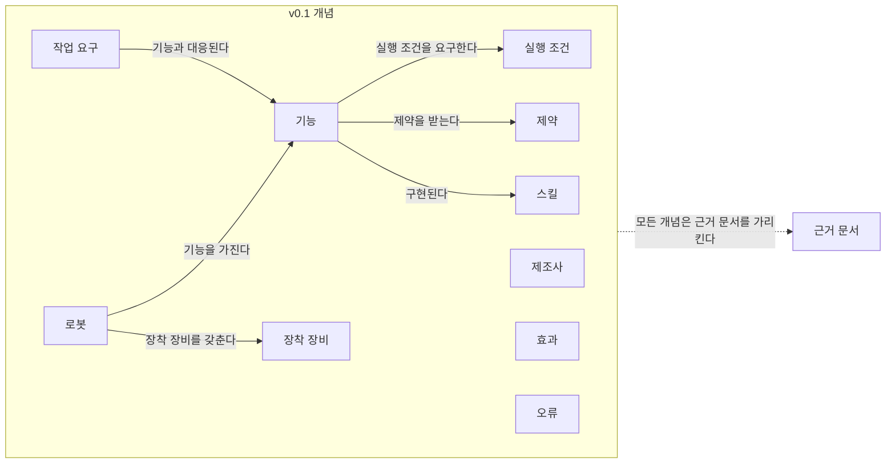
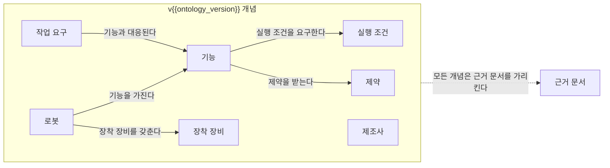

(너의 규칙은 시스템 프롬프트의 agents/shared-rules.md 와 agents/verifier.md 이다. 아래는 이번 실행의 컨텍스트와 입력이다.)

## 실행 컨텍스트

- run_id: 2026-09-25-16
- date: 2026-09-25
- run_type: track (트랙 실행)
- 대상: 트랙 manual-capability-ontology (매뉴얼 기반 로봇 기능 온톨로지) · 현재 단계: 단계 1. 기존 능력 표현 모델과 표준 조사 · 이번에 다룰 백로그 질문 id: q1-03, q1-04, q1-05 · 중심 세부영역: 5. 로봇 능력·작업 온톨로지 (B. 공통 정보·환경 모델)
- 예산:
    - max_search_queries: 40
    - max_sources_per_run: 20
    - new_topic_pages: 1
    - page_updates: 2
    - max_retries: 2
- 환경 알림: web_fetch_available: false · fetch_mode: mirror_only (일반 웹 페이지 열람은 네트워크 정책으로 막혀 있다. raw.githubusercontent.com 은 열린다: 공식 문서가 GitHub 에 있는 출처는 입력의 config/source_mirrors.yaml 경로를 WebFetch 로 열어 원문을 읽고 sources[].fetched=true, fetched_via=github_raw, fetch_url 을 적는다. 입력에 원문 텍스트(data/source_texts)가 있는 출처는 fetched_via=inbox. 그 밖의 출처는 fetched=false 이며 코드가 신뢰도 상한(medium)을 강제한다 — 공통 규칙 0절 6항)
- 언어: ko
- verification_stage: first
- verifier_budget:
    - max_search_queries: 40
    - max_sources_per_run: 20
    - new_topic_pages: 1
    - page_updates: 2
    - max_retries: 2

## 입력

### runs/2026-09-25-16/target.json

```json
{
  "run_id": "2026-09-25-16",
  "date": "2026-09-25",
  "weekday": "Fri",
  "run_number": 16,
  "run_type": "track",
  "forced": true,
  "target": {
    "area_no": 5,
    "area_name": "5. 로봇 능력·작업 온톨로지",
    "category": "B. 공통 정보·환경 모델",
    "category_letter": "B"
  },
  "topic": null,
  "track": {
    "slug": "manual-capability-ontology",
    "name": "매뉴얼 기반 로봇 기능 온톨로지",
    "stage": 1,
    "stages": 7,
    "stage_name": "기존 능력 표현 모델과 표준 조사",
    "question_ids": [
      "q1-03",
      "q1-04",
      "q1-05"
    ],
    "user_questions": [],
    "runs_per_week": 3,
    "question_rationale": "사용자 지정 0건, 되돌아온 질문 0건, 현재 단계 열린 질문 6건 중 오래된 순"
  },
  "corrections": [],
  "budget": {
    "max_search_queries": 40,
    "max_sources_per_run": 20,
    "new_topic_pages": 1,
    "page_updates": 2,
    "max_retries": 2
  },
  "priority_reason": null,
  "priority_questions": [],
  "excluded_areas": [],
  "lifted_areas": [],
  "deferred": {
    "monthly_recheck": false,
    "weekly_review": true
  },
  "selection_rationale": "CLI 지정 run_type=track, area=5; 트랙 실행일(Fri, track_days 앞 3개) → 트랙 manual-capability-ontology 단계 1, 질문 q1-03, q1-04, q1-05 (사용자 지정 0건, 되돌아온 질문 0건, 현재 단계 열린 질문 6건 중 오래된 순)"
}
```

### runs/2026-09-25-16/research.json

```json
{
  "run_id": "2026-09-25-16",
  "date": "2026-09-25",
  "run_type": "track",
  "target": {
    "area_no": 5,
    "area_name": "5. 로봇 능력·작업 온톨로지",
    "category": "B. 공통 정보·환경 모델"
  },
  "gaps": [
    "단계 1 질문 q1-03(조사 중, 2026-09-25-02 부분 답), q1-04, q1-05 열림(target.json 지정: 사용자 지정 0건, 되돌아온 질문 0건, 현재 단계 열린 질문 6건 중 오래된 순)",
    "완료 조건: 모델·표준 비교표의 다섯 정보 항목 열(전제조건·파라미터 범위·적재·환경 제약·완료 확인 방법·오류의 의미)과 '실행 인터페이스 연결' 열 대부분 미조사, 모든 행 원문 미열람",
    "완료 조건: ROP용 능력 개념 요구 목록 초안이 온톨로지 초안에 미반영(q1-06 미조사)",
    "온톨로지 초안 6절: 스킬의 상태 기계·실행 인터페이스 설명 출처 미확정, 오류 개념에 VDA 5050 3.0 등급 제외, 제조사와 기능 사이 관계 없음",
    "5. 로봇 능력·작업 온톨로지 페이지 섹션 4·6·7 비어 있음",
    "용어집에 트랙 glossary_targets 중 자산 관리 셸, VDA 5050 팩트시트 없음"
  ],
  "research_questions": [
    "같은 ‘운반 로봇’ 중 누가 이 화물을 실제로 취급할 수 있는가? [분류원문]",
    "q1-03 이 모델들은 ROP가 배정·실행·검증에 필요로 하는 정보 — 전제조건, 파라미터 범위, 적재·환경 제약, 완료 확인 방법, 오류의 의미 — 를 얼마나 담는가? 빠진 것은 무엇인가?",
    "q1-04 능력 기술과 실행 인터페이스(명령·상태)는 기존 표준에서 어떻게 연결되는가?",
    "q1-05 제조사마다 같은 이름의 기능('운반', '도킹', '리프트')이 다른 의미를 갖는 문제를 기존 모델은 어떻게 다루는가?",
    "VDA 5050 3.0.0 원문(공식 저장소 main)의 팩트시트·상태 스키마는 적재 명세·action 정의·오류 등급을 어떻게 두며, 2.0.0 기준 서술과 무엇이 다른가? (단계 1 페이지 3절, 비교표 VDA 5050 행, 온톨로지 초안 오류 개념 겨냥)",
    "국내 표준(KS)·연구에 로봇 기능·모듈을 기술하는 정보 모델이 있는가? (한국 자료 우선 규칙, 28. 표준·상호운용성·다사업자 거버넌스 연결)"
  ],
  "findings": [
    {
      "id": "f1",
      "claim": "VDA 5050 공식 저장소 main 브랜치의 팩트시트 스키마는 적재 명세(loadSpecification)를 적재 위치 목록(loadPositions)과 적재 세트(loadSets)로 두고, 적재 세트마다 적재 유형, 적재 치수(길이·너비·높이), 최대 중량(maximumWeight), 적재 취급 높이·깊이·기울기의 최소·최대, 적재 시 최대 속도·가감속, 적재·하역 소요 시간(pickTime·dropTime)을 기술하게 한다.",
      "tag": "사실",
      "source_ids": [
        "ref-125"
      ],
      "cross_checked": false,
      "confidence": "medium",
      "evidence_excerpt": "factsheet.schema loadSets 필드: setName, loadType, loadPositions, boundingBoxReference, loadDimensions, maximumWeight, minimum/maximumLoadhandlingHeight·Depth·Tilt, maximumSpeed, maximumAcceleration, maximumDeceleration, pickTime, dropTime, description. (발행일 미확인, 확인일 기준)",
      "as_of": "2026-09-25",
      "flow_step": null,
      "flow_item": "제약"
    },
    {
      "id": "f2",
      "claim": "같은 팩트시트 스키마는 지원 기능(protocolFeatures)의 로봇 action 목록(mobileRobotActions)에 action 유형·설명, 적용 범위(INSTANT·NODE·EDGE·ZONE), 파라미터(키·데이터형·설명·선택 여부), 결과 설명(actionResult), 차단 유형(NONE·SOFT·SINGLE·HARD), 일시정지·취소 허용 여부를 둔다.",
      "tag": "사실",
      "source_ids": [
        "ref-125"
      ],
      "cross_checked": false,
      "confidence": "medium",
      "evidence_excerpt": "mobileRobotActions: actionType, actionDescription, actionScopes, actionParameters(key, valueDataType: BOOL·NUMBER·INTEGER·STRING·OBJECT·ARRAY, description, isOptional), actionResult, blockingTypes, pauseAllowed, cancelAllowed. (발행일 미확인, 확인일 기준)",
      "as_of": "2026-09-25",
      "flow_step": null,
      "flow_item": null
    },
    {
      "id": "f3",
      "claim": "이번에 연 VDA 5050 팩트시트 스키마에서 action 파라미터는 데이터형만 두고 허용 값 범위를 두지 않으며, 전제조건이나 오류 의미를 기술하는 블록은 확인되지 않았다(오류는 상태 메시지 쪽 배열 길이 한계로만 언급).",
      "tag": "추정",
      "source_ids": [
        "ref-125"
      ],
      "cross_checked": false,
      "confidence": "low",
      "evidence_excerpt": "열람 도구 응답: 스키마에 오류·전제조건 블록 없음, protocolLimits.maximumArrayLengths 에 state.errors 길이 한계만 있음. 스키마 전체를 글자 단위로 대조하지 않아 부재의 확정은 아님. (발행일 미확인, 확인일 기준)",
      "as_of": "2026-09-25",
      "flow_step": null,
      "flow_item": null
    },
    {
      "id": "f4",
      "claim": "VDA 5050 3.0.0 명세는 사전 정의 action pick·drop 에 적재 장치(lhd)·스테이션 유형·스테이션 이름·적재 유형·적재 id·높이·깊이·측면을 선택 파라미터로 두고, 완료(FINISHED)를 적재물이 로봇에 들어왔거나(pick) 떠났고(drop) 로봇이 새 적재 상태를 보고한 때로 정의한다.",
      "tag": "사실",
      "source_ids": [
        "ref-031"
      ],
      "cross_checked": false,
      "confidence": "medium",
      "evidence_excerpt": "명세 표 4: pick finished 'Load has entered the mobile robot and mobile robot reports new load state', drop 은 'Load has left…'. 파라미터 lhd, stationType, stationName, loadType, loadId, height, depth, side. (발행일 미확인, 확인일 기준)",
      "as_of": "2026-09-25",
      "flow_step": "피킹",
      "flow_item": "완료·인계"
    },
    {
      "id": "f5",
      "claim": "VDA 5050 공식 저장소 main 의 상태 스키마는 오류 등급을 WARNING(계속 가능, 즉시 조치 불필요)·URGENT(계속 가능, 즉시 조치 필요)·CRITICAL(현재 주문 계속 불가)·FATAL(새 주문 수락 불가, 사용자 개입 필요) 넷으로 두고, 오류에 설명(errorDescription)·해결 힌트(errorHint)와 번역을, action 상태에 WAITING·INITIALIZING·RUNNING·RETRIABLE·PAUSED·FINISHED·FAILED 를 둔다.",
      "tag": "사실",
      "source_ids": [
        "ref-051"
      ],
      "cross_checked": false,
      "confidence": "medium",
      "evidence_excerpt": "state.schema errorLevel: WARNING 'No immediate attention required…', URGENT, CRITICAL 'unable to continue active order', FATAL 'User intervention required…'. RETRIABLE 'Actions that failed, but can be retried'. (발행일 미확인, 확인일 기준)",
      "as_of": "2026-09-25",
      "flow_step": null,
      "flow_item": "예외·성과"
    },
    {
      "id": "f6",
      "claim": "IDTA 02020 능력 기술(Capability Description) 1.0 서브모델은 능력을 물리·가상 세계에 효과를 내는 기능의 구현 독립 명세로 정의하고, 속성(최대 속도·공차·온도 범위 등)과 두 종류의 제약 — 속성 제약(전제조건·불변조건·사후조건)과 능력 사이 순서·병행을 정하는 전이 제약 — 을 두며, 능력은 스킬로 구현된다고 설명한다.",
      "tag": "사실",
      "source_ids": [
        "ref-126",
        "ref-127"
      ],
      "cross_checked": false,
      "confidence": "medium",
      "evidence_excerpt": "README: capability 'implementation-independent specification of a function in industrial production to achieve an effect in the physical or virtual world'. 제약: property constraints(preconditions, invariants, postconditions), transition constraints. 두 파일 모두 IDTA 저장소라 독립 교차 아님.",
      "as_of": "2026-09-25",
      "flow_step": null,
      "flow_item": "제약"
    },
    {
      "id": "f7",
      "claim": "IDTA 02020 템플릿 JSON 은 CapabilitySet → CapabilityContainer 아래에 Capability(한정자 Required·Offered·NotAssigned), PropertySet(Property·Range 등), CapabilityRelations(CapabilityRealizedBy, ComposedOfSet, GeneralizedBySet), ConstraintSet(BasicConstraint·CustomConstraint·OCLConstraint·OperationConstraint, 전이 제약 컨테이너)을 두고 요소마다 semanticId 를 붙인다.",
      "tag": "사실",
      "source_ids": [
        "ref-127"
      ],
      "cross_checked": false,
      "confidence": "medium",
      "evidence_excerpt": "템플릿 idShort: CapabilitySet, CapabilityContainer, Capability, PropertyRange(Range), CapabilityRealizedBy(RelationshipElement, 'Relationship between Capability element and Skill implementation'), OCLConstraint(File), TransitionConditionalType. (발행일 미확인, 확인일 기준)",
      "as_of": "2026-09-25",
      "flow_step": null,
      "flow_item": null
    },
    {
      "id": "f8",
      "claim": "MassRobotics AMR 상호운용 표준의 공식 JSON 스키마는 식별 보고(identityReport)에 최대 속도·예상 가동 시간·충전기 유형·화물 최대 부피·화물 최대 중량(kg)과 자유 서술 화물 유형(cargoType)을, 상태 보고(statusReport)에 운용 상태 9종·배터리 비율·남은 적재 여유 비율·문자열 오류 코드 배열을 둔다.",
      "tag": "사실",
      "source_ids": [
        "ref-129"
      ],
      "cross_checked": false,
      "confidence": "medium",
      "evidence_excerpt": "identityReport: maxSpeed, maxRunTime, chargerType, cargoMaxVolume, cargoMaxWeight, cargoType; statusReport operationalState: navigating, idle, disabled, offline, charging, waitingHumanEvent 등, loadPercentageStillAvailable, errorCodes(문자열 배열). (발행일 미확인, 확인일 기준)",
      "as_of": "2026-09-25",
      "flow_step": null,
      "flow_item": "수행 자원"
    },
    {
      "id": "f9",
      "claim": "IDTA 02047 무인운반차(AGV) 기술 데이터 1.0 템플릿은 최대 적재 질량, 적재·무적재 시 최대 등판·측경사 각, 최대 속도의 명세값(AsSpecified)과 운용값(AsOperated), 가동 시간 명세·운용값, 위치추정·정위치 정확도, 실외 사용 적합 여부와 요구 환경 조건, 부착 장비 인터페이스를 속성으로 두고 다수 속성에 ECLASS IRDI 를 semanticId 로 붙인다.",
      "tag": "사실",
      "source_ids": [
        "ref-131"
      ],
      "cross_checked": false,
      "confidence": "medium",
      "evidence_excerpt": "TechnicalParameters: MaxLoadMass, MaxClimbingInclinationMaxLoad/WithoutLoad, SpeedMaxWithMaxLoadAsSpecified/AsOperated, MaxRunTimeAsSpecified/AsOperated, PositioningAccuracy, SuitableForOutdoorUse, InterfacesForAttachments; semanticId 0173-1#02-… (발행일 미확인, 확인일 기준)",
      "as_of": "2026-09-25",
      "flow_step": null,
      "flow_item": "제약"
    },
    {
      "id": "f10",
      "claim": "SkiROS2 는 스킬을 행동 트리로 조합하는 ROS 기반 플랫폼으로, 스킬마다 실행 전 전제조건(pre-condition)·실행 중 유지조건(hold-condition)·실행 후 사후조건(post-condition)을 두고, 의미 데이터베이스 형태의 세계 모델로 스킬 파라미터를 자동 추론한다.",
      "tag": "사실",
      "source_ids": [
        "ref-138"
      ],
      "cross_checked": false,
      "confidence": "medium",
      "evidence_excerpt": "README: 'a platform to create complex robot behaviors by composing skills … into behavior trees', skill model with 'pre-, hold- and post-conditions', world model 'as a semantic database'. ROS Melodic·Noetic, ROS 2 Humble 이식 진행. (발행일 미확인, 확인일 기준)",
      "as_of": "2026-09-25",
      "flow_step": null,
      "flow_item": null
    },
    {
      "id": "f11",
      "claim": "OPC UA for Robotics 공식 노드셋 문서는 모션 장치 시스템·컨트롤러·모션 장치·축·동력 전달계·부하(LoadType)·안전 상태(비상정지·보호정지) 유형과, 프로그램을 이름·노드로 적재하고 시작·정지하는 작업 제어(TaskControlType)와 운영 상태 기계를 정의하며, 목록에서 능력·스킬 유형은 확인되지 않았다.",
      "tag": "사실",
      "source_ids": [
        "ref-130"
      ],
      "cross_checked": false,
      "confidence": "medium",
      "evidence_excerpt": "documentation.csv: MotionDeviceSystemType, ControllerType, TaskControlType(LoadByNodeId, LoadByName, UnloadProgram, Start, Stop), TaskControlStateMachineType, SafetyStateType, LoadType. 판 표기 v100 링크. 명세 본문 아님. (발행일 미확인, 확인일 기준)",
      "as_of": "2026-09-25",
      "flow_step": null,
      "flow_item": null
    },
    {
      "id": "f12",
      "claim": "Electronics(2026) 게재 연구는 이종 다중 로봇 작업 배정에서 수행 가능성 판단이 기존에는 특정 최적화기·계획기 안에 묻혀 있고 공간 통행 가능성이 적재 상태에 따른 변화를 반영하지 못한다고 지적하고, 로봇·작업·장소의 의미 모델과 선언적·절차적 혼합 추론으로 다축 능력 조건과 적재 상태별 장소 도달 가능성을 판정하는 방법을 제안했다.",
      "tag": "사실",
      "source_ids": [
        "ref-133"
      ],
      "cross_checked": false,
      "confidence": "medium",
      "evidence_excerpt": "검색 요약: 'spatial traversability has been assessed against static criteria that cannot capture the changes induced by a robot's loaded state'; 'multi-axis capability conditions and loaded-state place reachability'. Electronics 15(16) 3562. 원문 미열람.",
      "as_of": "2026-08-11",
      "flow_step": null,
      "flow_item": "제약",
      "source_unopened": true
    },
    {
      "id": "f13",
      "claim": "원문을 연 모델 기준으로 다섯 정보 항목은 흩어져 담긴다: 전제조건은 IDTA 02020 속성 제약·SkiROS2 스킬 조건이, 파라미터 범위는 IDTA 02020 Range 속성이(VDA 5050 팩트시트는 데이터형만), 적재·환경 제약은 VDA 5050 적재 세트·IDTA 02047·MassRobotics 화물 최대값이, 완료 확인은 VDA 5050 pick·drop 완료 정의·IDTA 02020 사후조건·SkiROS2 사후조건이, 오류 의미는 VDA 5050 오류 등급·힌트가 담으며, 다섯을 한 모델이 모두 담는 경우는 확인되지 않았다.",
      "tag": "추정",
      "source_ids": [
        "ref-125",
        "ref-031",
        "ref-051",
        "ref-127",
        "ref-131",
        "ref-129",
        "ref-138"
      ],
      "cross_checked": false,
      "confidence": "low",
      "evidence_excerpt": "f1~f10 을 다섯 항목에 대응시킨 종합. IEEE 1872 계열·KnowRob·SSN/SOSA 는 이번에도 항목별 원문 대조를 못 해 이 종합에 넣지 않음. 오류 복구 절차를 구조화한 모델은 VDA 5050 RETRIABLE·errorHint(자유 서술) 외에 확인 못 함.",
      "as_of": "2026-09-25",
      "flow_step": null,
      "flow_item": "예외·성과"
    },
    {
      "id": "f14",
      "claim": "IDTA 02047 이 속도·가동 시간을 명세값(AsSpecified)과 운용값(AsOperated)으로 나눠 두는 것은 RCO 가 구분한 광고 능력과 운용 능력에 대응하는 표현으로 보여, 능력 온톨로지의 '능력 출처 구분' 속성을 산업 서브모델의 값 쌍으로 채울 수 있을 것으로 보인다.",
      "tag": "추정",
      "source_ids": [
        "ref-131",
        "ref-041"
      ],
      "cross_checked": false,
      "confidence": "low",
      "evidence_excerpt": "f9 의 AsSpecified·AsOperated 속성 쌍과 RCO(advertised·operational capability) 정의를 대응시킨 추론. IDTA 문서가 두 값의 정의를 어떻게 적는지는 PDF 본문을 열지 않아 미확인.",
      "as_of": "2026-09-25",
      "flow_step": null,
      "flow_item": null
    },
    {
      "id": "f15",
      "claim": "분류 원문의 질문(같은 운반 로봇 중 누가 이 화물을 실제로 취급할 수 있는가)에 답하려면 화물의 치수·중량·적재 높이를 로봇의 적재 명세(VDA 5050 적재 세트, MassRobotics 화물 최대값, IDTA 02047 최대 적재 질량)와 대조하고, 적재 상태에서의 경로·장소 도달 가능성까지 판정해야 할 것으로 보이며, 어느 표준도 이 대조 규칙 자체는 정하지 않는다.",
      "tag": "추정",
      "source_ids": [
        "ref-125",
        "ref-129",
        "ref-131",
        "ref-133"
      ],
      "cross_checked": false,
      "confidence": "low",
      "evidence_excerpt": "f1·f8·f9(로봇 쪽 적재 기술)와 f12(적재 상태별 도달 가능성)에서 도출한 추론. 화물 쪽 속성은 7. 화물·재고·자산 식별과 추적의 식별·적재 관계에서 와야 함.",
      "as_of": "2026-09-25",
      "flow_step": "피킹",
      "flow_item": "수행 자원"
    },
    {
      "id": "f16",
      "claim": "VDA 5050 3.0.0 명세는 로봇의 능력을 팩트시트 토픽으로 관제에 알리게 하고(지원 구역 이름은 팩트시트 유형 명세의 supportedZones 에 추가), 사전 정의 action 으로 옮길 수 없는 동작은 제조사가 추가 action 을 정의해 관제가 쓰도록 한다.",
      "tag": "사실",
      "source_ids": [
        "ref-031"
      ],
      "cross_checked": false,
      "confidence": "medium",
      "evidence_excerpt": "명세: 'If there is no way to map some action to one of the actions of the following section, the mobile robot manufacturer can define additional actions that shall be used by fleet control.' (발행일 미확인, 확인일 기준)",
      "as_of": "2026-09-25",
      "flow_step": null,
      "flow_item": null
    },
    {
      "id": "f17",
      "claim": "VDA 5050 에서 능력 기술과 명령의 연결은 팩트시트의 action 정의(actionType·파라미터 키·적용 범위·차단 유형)와 주문·즉시 action 의 actionType·파라미터가 같은 이름으로 맞물리는 방식이며, 관제가 보내기 전에 팩트시트로 검증해야 한다는 규정은 이번 열람 범위에서 확인되지 않았다.",
      "tag": "추정",
      "source_ids": [
        "ref-125",
        "ref-031"
      ],
      "cross_checked": false,
      "confidence": "low",
      "evidence_excerpt": "f2 의 팩트시트 action 필드와 명세의 action 구조를 대응시킨 추론. 열람 도구 응답은 검증 의무 규정이 명시되지 않았다고 답함(부재의 확정 아님).",
      "as_of": "2026-09-25",
      "flow_step": null,
      "flow_item": null
    },
    {
      "id": "f18",
      "claim": "Open-RMF 문서는 플릿이 수행할 수 있는 사용자 정의 동작을 config.yaml 의 actions 목록(예: clean)으로 선언하고, 작업 요청의 category(동작 이름)와 description(동작별 내용)을 어댑터의 execute_action 이 받아 처리한 뒤 execution.finished() 로 완료를 알리게 하며, 파라미터 스키마·전제조건·구조화된 실패 보고는 설명하지 않는다.",
      "tag": "사실",
      "source_ids": [
        "ref-040"
      ],
      "cross_checked": false,
      "confidence": "medium",
      "evidence_excerpt": "튜토리얼 원본: actions: [\"clean\"], category·description, 'if category == 'clean': self.perform_clean(description['zone'])', 완료는 self.execution.finished(). (발행일 미확인, 확인일 기준)",
      "as_of": "2026-09-25",
      "flow_step": null,
      "flow_item": "완료·인계"
    },
    {
      "id": "f19",
      "claim": "Plattform Industrie 4.0 작업반의 능력·스킬 참조 모델은 스킬을 능력이 명세한 기능의 실행 가능한 구현으로 정의하고, 모든 스킬이 조화된 상태 기계를 따르고 그 상태 기계를 스킬 인터페이스로 노출해 현재 상태 감시와 전이 호출을 하게 하며, OPC UA 구현에서는 SkillType 객체가 실현하는 능력을 ontologyURL 로 가리킨다.",
      "tag": "사실",
      "source_ids": [
        "ref-036"
      ],
      "cross_checked": false,
      "confidence": "medium",
      "evidence_excerpt": "검색 요약: skill 'an executable implementation of an encapsulated (automation) function specified by a capability'; 상태 기계는 skill interface 로 노출; SkillType 의 ontologyURL 과 SkillStateMachine. 원문 미열람.",
      "as_of": "2022",
      "flow_step": null,
      "flow_item": null,
      "source_unopened": true
    },
    {
      "id": "f20",
      "claim": "CaSkMan 온톨로지는 기계가 능력을 제공하고(providesCapability) 능력이 스킬로 실현되며(isRealizedBy) 스킬이 ISA 88 상태 기계와 REST 또는 OPC UA 스킬 인터페이스로 실행되는 구조를 두고, 능력 분류에 VDI 2860(핸들링)·DIN 8580(제조 공정) 분류 체계와 VDI 3682 공정 모델을 쓴다.",
      "tag": "사실",
      "source_ids": [
        "ref-128"
      ],
      "cross_checked": false,
      "confidence": "medium",
      "evidence_excerpt": "README: CSS:providesCapability, CSS:isRealizedBy, CaSkMan:RestSkillInterface, Cap:OpcUaSkillInterface, ISA 88 state machine, VDI 2860·DIN 8580 taxonomies, IEC 61360 속성. 제조 기계 대상이며 이동로봇 사례는 README 에 없음. (발행일 미확인, 확인일 기준)",
      "as_of": "2026-09-25",
      "flow_step": null,
      "flow_item": null
    },
    {
      "id": "f21",
      "claim": "Sidorenko 외(Procedia Manufacturing 55, 2021)는 스킬을 유한 상태 기계로 모델링해 OPC UA 로 노출하고, I4.0 언어의 '스킬 실행' 상호작용 프로토콜 메시지와 상호작용 상태 기계를 자산관리셸(AAS)에 표현하는 방법을 제시했다.",
      "tag": "사실",
      "source_ids": [
        "ref-132"
      ],
      "cross_checked": false,
      "confidence": "medium",
      "evidence_excerpt": "검색 요약: skills modeled as finite state machines and exposed by means of OPC UA enabling their orchestration; 'skill execution' semantic interaction protocol and its representation in an AAS. pp. 191-199. 원문 미열람.",
      "as_of": "2021",
      "flow_step": null,
      "flow_item": null,
      "source_unopened": true
    },
    {
      "id": "f22",
      "claim": "IDTA 02020 1.0 은 능력과 스킬 구현 사이를 CapabilityRealizedBy 관계 요소로만 잇고, README 는 스킬의 실행 인터페이스(명령·상태)를 이 서브모델에서 정하지 않는다.",
      "tag": "사실",
      "source_ids": [
        "ref-127",
        "ref-126"
      ],
      "cross_checked": false,
      "confidence": "medium",
      "evidence_excerpt": "템플릿: CapabilityRealizedBy(RelationshipElement, ZeroToMany). README 열람 응답: 'realized by skills' 관계 외에 실행 인터페이스 연결 방법은 기술하지 않음. (발행일 미확인, 확인일 기준)",
      "as_of": "2026-09-25",
      "flow_step": null,
      "flow_item": null
    },
    {
      "id": "f23",
      "claim": "MassRobotics AMR 상호운용 표준의 공식 JSON 스키마는 식별 보고와 상태 보고 두 메시지 유형만 정의해, 로봇에 명령을 보내는 메시지를 두지 않는다.",
      "tag": "사실",
      "source_ids": [
        "ref-129"
      ],
      "cross_checked": false,
      "confidence": "medium",
      "evidence_excerpt": "스키마 메시지 유형: identityReport, statusReport. 명령·작업 지시 메시지 없음(스키마 파일 기준). (발행일 미확인, 확인일 기준)",
      "as_of": "2026-09-25",
      "flow_step": null,
      "flow_item": null
    },
    {
      "id": "f24",
      "claim": "ISO 22166-202:2025 는 서비스 로봇 소프트웨어 모듈의 정보 모델 요구사항을 정하며, 설계·개발과 실행 시점에 쓰이는 인터페이스·속성·구성·실행 관련 정보를 구조화해 기술하게 한다.",
      "tag": "사실",
      "source_ids": [
        "ref-135"
      ],
      "cross_checked": false,
      "confidence": "medium",
      "evidence_excerpt": "검색 요약(ISO 소개): 'focuses on interfaces, properties, composition and execution-specific information, which are related to software modules', runtime and design/developing stages. 원문 미열람.",
      "as_of": "2025",
      "flow_step": null,
      "flow_item": null,
      "source_unopened": true
    },
    {
      "id": "f25",
      "claim": "한국산업표준 KS B 7321-2 '로봇 — 서비스 로봇 모듈용 정보 모델 — 제2부: 소프트웨어 모듈용 정보 모델'이 국가표준 목록에 있으며, ISO 22166-202 와 같은 주제를 다루는 대응 표준으로 보인다.",
      "tag": "추정",
      "source_ids": [
        "ref-136",
        "ref-135"
      ],
      "cross_checked": false,
      "confidence": "low",
      "evidence_excerpt": "KSSN 검색 결과의 표준 제목만 확인. 부합화 여부·제정일·본문은 미확인(검색 요약이 대응 관계를 언급하나 1차 확인 아님). 원문 미열람.",
      "as_of": "2026-09-25",
      "flow_step": null,
      "flow_item": null,
      "source_unopened": true
    },
    {
      "id": "f26",
      "claim": "확인한 표준에서 능력 기술과 실행 인터페이스의 연결은 (1) 같은 프로토콜 안에서 action 이름으로 맞물리는 방식(VDA 5050 팩트시트–주문 action, Open-RMF 선언 동작–execute_action), (2) 능력–스킬–스킬 인터페이스(상태 기계, OPC UA·REST)를 모델 안에서 잇는 방식(CSS 참조 모델, CaSkMan, AAS 스킬 실행 프로토콜), (3) 연결이 없는 방식(보고 전용 MassRobotics, 프로그램 단위 제어만 있는 OPC UA Robotics, 관계만 둔 IDTA 02020)으로 나뉘어, ROP 는 능력 온톨로지와 제조사 프로토콜의 action 이름·파라미터를 잇는 매핑 계층을 따로 가져야 할 것으로 보인다.",
      "tag": "추정",
      "source_ids": [
        "ref-125",
        "ref-031",
        "ref-040",
        "ref-036",
        "ref-128",
        "ref-132",
        "ref-129",
        "ref-130",
        "ref-127"
      ],
      "cross_checked": false,
      "confidence": "low",
      "evidence_excerpt": "f16~f23 을 연결 방식별로 묶은 이 위키의 분류. 이 3분류를 제시한 단일 출처는 확인하지 못함. 이동로봇 표준(VDA 5050)과 CSS 스킬 상태 기계를 잇는 공개 매핑도 찾지 못함.",
      "as_of": "2026-09-25",
      "flow_step": null,
      "flow_item": null
    },
    {
      "id": "f27",
      "claim": "IEEE 1872-2015 는 로봇·자동화 분야의 지식 표현·추론과 로봇–사람 사이 소통의 공식 참조 어휘로 쓰이도록, 개념을 더 정확히 정의하고 공동체의 공통 이해를 높이며 로봇 시스템 사이 데이터 통합과 정보 전달을 돕는 것을 목적으로 한다.",
      "tag": "사실",
      "source_ids": [
        "ref-025"
      ],
      "cross_checked": false,
      "confidence": "medium",
      "evidence_excerpt": "검색 요약: 'formal reference vocabulary for communicating knowledge about R&A'; 'Facilitates data integration and transfer of information among robotic systems'. 원문 미열람.",
      "as_of": "2015",
      "flow_step": null,
      "flow_item": null,
      "source_unopened": true
    },
    {
      "id": "f28",
      "claim": "VDA 5050 3.0.0 명세는 사전 정의 action 29종(startPause, startCharging, stopCharging, initializePosition, pick, drop, detectObject, finePositioning, waitForTrigger, cancelOrder, factsheetRequest 등)의 이름·파라미터·상태별 의미를 표로 고정하고 쓸 수 있으면 정의된 파라미터를 쓰도록 하며, 이 목록에 dock·lift 라는 이름의 action 은 없다.",
      "tag": "사실",
      "source_ids": [
        "ref-031"
      ],
      "cross_checked": false,
      "confidence": "medium",
      "evidence_excerpt": "명세 표 4 의 사전 정의 actionType 목록을 열람 도구로 확인. 목록 외 동작은 제조사 정의 action(f16). 표 전체를 글자 단위로 대조하지는 않음. (발행일 미확인, 확인일 기준)",
      "as_of": "2026-09-25",
      "flow_step": null,
      "flow_item": null
    },
    {
      "id": "f29",
      "claim": "IDTA 의 AAS 명세 Part 3a 는 IEC 61360 데이터 명세를 두어, 속성의 의미를 ECLASS·IEC 공통 데이터 사전(CDD) 같은 IEC 61360 기반 사전의 개념 기술을 가리키는 semanticId 로 정하게 한다.",
      "tag": "사실",
      "source_ids": [
        "ref-134"
      ],
      "cross_checked": false,
      "confidence": "medium",
      "evidence_excerpt": "검색 요약: ECLASS 와 IEC CDD 는 IEC 61360 기반 사전이며, 개념 기술(concept description)과 SemanticID 로 의미를 정한다. 원문 미열람.",
      "as_of": "2024-07",
      "flow_step": null,
      "flow_item": null,
      "source_unopened": true
    },
    {
      "id": "f30",
      "claim": "IDTA 02047 템플릿은 제조사명·최대 적재 질량·속도 같은 속성에 ECLASS IRDI(0173-1#02-…)를 semanticId 로 붙여, 제조사가 쓰는 속성 이름과 무관하게 속성의 의미를 외부 사전 항목으로 고정한다.",
      "tag": "사실",
      "source_ids": [
        "ref-131"
      ],
      "cross_checked": false,
      "confidence": "medium",
      "evidence_excerpt": "템플릿 JSON: GeneralInformation 과 SpecificDescriptions 속성에 0173-1#02-AAO677, 0173-1#02-ABJ258 등 ECLASS IRDI. 능력(기능) 단위가 아니라 속성 단위의 고정임. (발행일 미확인, 확인일 기준)",
      "as_of": "2026-09-25",
      "flow_step": null,
      "flow_item": null
    },
    {
      "id": "f31",
      "claim": "IDTA 02020 템플릿은 능력 사이에 일반화(CapabilityGeneralizedBy, 구체 능력→일반 능력)·구성(CapabilityComposedOf) 관계와 속성 사이 동일성(SameProperty) 관계를 두어, 제조사별 구체 능력을 공통 상위 능력에 연결할 수 있게 한다.",
      "tag": "사실",
      "source_ids": [
        "ref-127"
      ],
      "cross_checked": false,
      "confidence": "medium",
      "evidence_excerpt": "템플릿: GeneralizedBySet/CapabilityGeneralizedBy 'Relationship between specific capability and more generalized one', ComposedOfSet/CapabilityComposedOf, PropertyContainer/SameProperty. (발행일 미확인, 확인일 기준)",
      "as_of": "2026-09-25",
      "flow_step": null,
      "flow_item": null
    },
    {
      "id": "f32",
      "claim": "Dussard 외(2023)는 로봇의 구성 요소와 저수준 능력으로부터 에이전트의 능력을 추론하는 온톨로지 방법을 제안해, 로봇이 할 수 있는 일을 구성 요소 기반으로 일반화해 판단하게 했다.",
      "tag": "사실",
      "source_ids": [
        "ref-137"
      ],
      "cross_checked": false,
      "confidence": "medium",
      "evidence_excerpt": "검색 요약: 'an ontological means of inferring agent capabilities based on components and low-level capabilities'. WOSRA 2023 발표. 원문 미열람.",
      "as_of": "2023-06",
      "flow_step": null,
      "flow_item": null,
      "source_unopened": true
    },
    {
      "id": "f33",
      "claim": "RCO 논문은 참조 능력 온톨로지가 표준 어휘와 추론 규칙을 제공해 서로 다른 제조사·구성의 로봇을 같은 기준으로 비교(벤치마크)할 수 있게 한다고 주장한다.",
      "tag": "의견",
      "source_ids": [
        "ref-041"
      ],
      "cross_checked": false,
      "confidence": "medium",
      "evidence_excerpt": "검색 요약: reference capability ontology 'facilitates cross-platform comparisons by providing a standardized vocabulary and reasoning logic', 조달 판단을 마케팅 주장 대신 온톨로지 기준 지표로. 원문 미열람.",
      "as_of": "2025-10-02",
      "flow_step": null,
      "flow_item": null,
      "source_unopened": true
    },
    {
      "id": "f34",
      "claim": "Open-RMF 의 사용자 정의 동작은 플릿 설정에 선언한 자유 문자열 이름이고 그 의미는 어댑터 코드의 분기 구현이 정하므로, 서로 다른 플릿이 같은 이름('clean', 'dock' 등)으로 다른 동작을 수행할 수 있을 것으로 보인다.",
      "tag": "추정",
      "source_ids": [
        "ref-040"
      ],
      "cross_checked": false,
      "confidence": "low",
      "evidence_excerpt": "f18 의 선언·분기 구조에서 도출. 튜토리얼에 동작 이름의 의미를 공통 어휘로 등록하는 장치는 없음(열람 범위 기준, 부재 확정 아님).",
      "as_of": "2026-09-25",
      "flow_step": null,
      "flow_item": null
    },
    {
      "id": "f35",
      "claim": "같은 이름 기능의 의미 차이를 기존 모델은 (1) 공통 참조 어휘·상위 온톨로지(IEEE 1872, RCO), (2) 표준이 이름·파라미터·완료 의미를 고정한 사전 정의 동작과 제조사 확장의 분리(VDA 5050), (3) 외부 사전을 가리키는 의미 식별자(AAS semanticId, ECLASS·IEC CDD), (4) 분류 체계·일반화 관계·구성 요소 기반 추론(IDTA 02020, CaSkMan, Dussard 외)으로 다루는 것으로 보이나, 두 제조사의 '도킹'·'리프트'가 실제로 같은 동작인지를 판정하는 방법은 확인되지 않았고 MassRobotics·Open-RMF 는 자유 서술·자유 이름에 맡긴다.",
      "tag": "추정",
      "source_ids": [
        "ref-025",
        "ref-041",
        "ref-031",
        "ref-134",
        "ref-131",
        "ref-127",
        "ref-128",
        "ref-137",
        "ref-129",
        "ref-040"
      ],
      "cross_checked": false,
      "confidence": "low",
      "evidence_excerpt": "f27~f34 와 f8(cargoType 자유 서술)을 접근 방식별로 묶은 이 위키의 분류. 동작 의미 동일성 판정 방법은 한·영 검색 범위에서 찾지 못함(부재 확정 아님).",
      "as_of": "2026-09-25",
      "flow_step": null,
      "flow_item": null
    }
  ],
  "sources": [
    {
      "id": "ref-025",
      "org": "IEEE",
      "title": "1872-2015 - IEEE Standard Ontologies for Robotics and Automation",
      "published": "2015",
      "url": "https://ieeexplore.ieee.org/document/7084073/",
      "type": "표준",
      "reliability": "medium",
      "accessed": "2026-09-25",
      "summary": "원문 미열람. 로봇·자동화 분야의 핵심 온톨로지 CORA 와 보조 온톨로지를 정한 IEEE 표준. 이번 실행은 표준의 목적(공식 참조 어휘, 시스템 간 데이터 통합)을 검색 요약으로 확인했다.",
      "source_unopened": true,
      "fetched": false,
      "fetched_via": null,
      "fetch_url": null
    },
    {
      "id": "ref-031",
      "org": "VDA / VDMA (VDA5050 GitHub)",
      "title": "VDA5050/VDA5050_EN.md — Official Specification document for the VDA 5050",
      "published": null,
      "url": "https://github.com/VDA5050/VDA5050/blob/main/VDA5050_EN.md",
      "type": "표준",
      "reliability": "high",
      "accessed": "2026-09-25",
      "summary": "VDA 5050 공식 명세의 GitHub 저장소 본문(main 은 3.0.0 판). 이번 실행은 사전 정의 action 목록·pick·drop 파라미터와 완료 정의, 제조사 정의 action 규정, 팩트시트 역할을 확인했다.",
      "fetched": true,
      "fetched_via": "github_raw",
      "fetch_url": "https://raw.githubusercontent.com/VDA5050/VDA5050/main/VDA5050_EN.md",
      "source_unopened": false
    },
    {
      "id": "ref-036",
      "org": "Köcher, A. 외",
      "title": "A Reference Model for Common Understanding of Capabilities and Skills in Manufacturing",
      "published": "2022",
      "url": "https://arxiv.org/abs/2209.09632",
      "type": "논문",
      "reliability": "medium",
      "accessed": "2026-09-25",
      "summary": "원문 미열람. Plattform Industrie 4.0 작업반의 능력·스킬 참조 모델. 스킬 정의, 조화된 상태 기계와 스킬 인터페이스, OPC UA SkillType(ontologyURL) 설명을 검색 요약으로 확인했다.",
      "source_unopened": true,
      "fetched": false,
      "fetched_via": null,
      "fetch_url": null
    },
    {
      "id": "ref-040",
      "org": "Open Robotics",
      "title": "PerformAction Tutorial - Programming Multiple Robots with ROS 2",
      "published": null,
      "url": "https://osrf.github.io/ros2multirobotbook/integration_fleets_action_tutorial.html",
      "type": "오픈소스 문서",
      "reliability": "high",
      "accessed": "2026-09-25",
      "summary": "Open-RMF 플릿 어댑터에 사용자 정의 동작을 선언(actions)하고 execute_action 으로 처리해 execution.finished() 로 완료를 알리는 방법을 설명하는 공식 문서(mdBook 원본).",
      "fetched": true,
      "fetched_via": "github_raw",
      "fetch_url": "https://raw.githubusercontent.com/osrf/ros2multirobotbook/master/src/integration_fleets_action_tutorial.md",
      "source_unopened": false
    },
    {
      "id": "ref-041",
      "org": "Naqvi, M. R. 외(Scientific Reports)",
      "title": "Ontology-driven integration of advertised and operational capabilities in robots",
      "published": "2025-10-02",
      "url": "https://www.nature.com/articles/s41598-025-16649-3",
      "type": "논문",
      "reliability": "medium",
      "accessed": "2026-09-25",
      "summary": "원문 미열람. 광고 능력과 운용 능력을 구분하는 로봇 능력 온톨로지(RCO) 논문. 이번 실행은 참조 능력 온톨로지가 제조사 간 비교 기준이 된다는 주장을 검색 요약으로 확인했다.",
      "source_unopened": true,
      "fetched": false,
      "fetched_via": null,
      "fetch_url": null
    },
    {
      "id": "ref-051",
      "org": "VDA / VDMA (VDA5050 GitHub)",
      "title": "VDA5050/VDA5050 — json_schemas/state.schema",
      "published": null,
      "url": "https://github.com/VDA5050/VDA5050/blob/main/json_schemas/state.schema",
      "type": "표준",
      "reliability": "high",
      "accessed": "2026-09-25",
      "summary": "VDA 5050 상태 메시지 JSON 스키마(main). 오류 등급 4종(WARNING·URGENT·CRITICAL·FATAL)과 설명·힌트, action 상태 7종(RETRIABLE 포함), 적재 정보 필드를 정의한다.",
      "fetched": true,
      "fetched_via": "github_raw",
      "fetch_url": "https://raw.githubusercontent.com/VDA5050/VDA5050/main/json_schemas/state.schema",
      "source_unopened": false
    },
    {
      "id": "ref-125",
      "org": "VDA / VDMA (VDA5050 GitHub)",
      "title": "VDA5050/VDA5050 — json_schemas/factsheet.schema",
      "published": null,
      "url": "https://github.com/VDA5050/VDA5050/blob/main/json_schemas/factsheet.schema",
      "type": "표준",
      "reliability": "high",
      "accessed": "2026-09-25",
      "summary": "VDA 5050 팩트시트 JSON 스키마(main). 적재 명세(적재 세트별 치수·최대 중량·취급 높이 등), 지원 action 정의(파라미터·적용 범위·차단 유형·일시정지·취소 허용), 물리 파라미터를 정의한다.",
      "fetched": true,
      "fetched_via": "github_raw",
      "fetch_url": "https://raw.githubusercontent.com/VDA5050/VDA5050/main/json_schemas/factsheet.schema",
      "source_unopened": false
    },
    {
      "id": "ref-126",
      "org": "IDTA (admin-shell-io/submodel-templates)",
      "title": "Capability Description 1.0 — README (IDTA 02020 Submodel Capability Description)",
      "published": null,
      "url": "https://github.com/admin-shell-io/submodel-templates/blob/main/published/Capability%20Description/1/0/README.md",
      "type": "표준",
      "reliability": "high",
      "accessed": "2026-09-25",
      "summary": "IDTA 공식 저장소의 능력 기술 서브모델 1.0 README. 능력 정의, 속성, 속성 제약(전제·불변·사후조건)과 전이 제약, 스킬에 의한 구현을 설명한다.",
      "fetched": true,
      "fetched_via": "github_raw",
      "fetch_url": "https://raw.githubusercontent.com/admin-shell-io/submodel-templates/main/published/Capability%20Description/1/0/README.md",
      "source_unopened": false
    },
    {
      "id": "ref-127",
      "org": "IDTA (admin-shell-io/submodel-templates)",
      "title": "IDTA 02020_Template_Capability_Description.json",
      "published": null,
      "url": "https://github.com/admin-shell-io/submodel-templates/blob/main/published/Capability%20Description/1/0/IDTA%2002020_Template_Capability_Description.json",
      "type": "표준",
      "reliability": "high",
      "accessed": "2026-09-25",
      "summary": "능력 기술 서브모델 1.0 템플릿 JSON. CapabilitySet·CapabilityContainer·PropertySet·ConstraintSet·CapabilityRealizedBy·GeneralizedBy·ComposedOf·SameProperty 요소와 semanticId 를 정의한다.",
      "fetched": true,
      "fetched_via": "github_raw",
      "fetch_url": "https://raw.githubusercontent.com/admin-shell-io/submodel-templates/main/published/Capability%20Description/1/0/IDTA%2002020_Template_Capability_Description.json",
      "source_unopened": false
    },
    {
      "id": "ref-128",
      "org": "CaSkade-Automation (Köcher, A. 외)",
      "title": "CaSkMan — An OWL ontology to model capabilities and skills in manufacturing (GitHub README)",
      "published": null,
      "url": "https://github.com/CaSkade-Automation/CaSkMan",
      "type": "오픈소스 문서",
      "reliability": "high",
      "accessed": "2026-09-25",
      "summary": "제조 기계의 능력·스킬을 모델링하는 OWL 온톨로지의 공식 저장소 README. 능력 제공·스킬 실현 관계, ISA 88 상태 기계, REST·OPC UA 스킬 인터페이스, VDI 2860·DIN 8580 분류 체계를 설명한다.",
      "fetched": true,
      "fetched_via": "github_raw",
      "fetch_url": "https://raw.githubusercontent.com/CaSkade-Automation/CaSkMan/master/README.md",
      "source_unopened": false
    },
    {
      "id": "ref-129",
      "org": "MassRobotics (MassRobotics-AMR GitHub)",
      "title": "AMR_Interop_Standard — AMR_Interop_Standard.json",
      "published": null,
      "url": "https://github.com/MassRobotics-AMR/AMR_Interop_Standard/blob/main/AMR_Interop_Standard.json",
      "type": "표준",
      "reliability": "high",
      "accessed": "2026-09-25",
      "summary": "MassRobotics AMR 상호운용 표준의 공식 JSON 스키마. 식별 보고(제조사·모델·최대 속도·화물 최대 부피·중량 등)와 상태 보고(운용 상태·배터리·적재 여유·오류 코드) 두 메시지를 정의한다.",
      "fetched": true,
      "fetched_via": "github_raw",
      "fetch_url": "https://raw.githubusercontent.com/MassRobotics-AMR/AMR_Interop_Standard/main/AMR_Interop_Standard.json",
      "source_unopened": false
    },
    {
      "id": "ref-130",
      "org": "OPC Foundation (UA-Nodeset GitHub)",
      "title": "UA-Nodeset Robotics — Opc.Ua.Robotics.Nodeset2.documentation.csv",
      "published": null,
      "url": "https://github.com/OPCFoundation/UA-Nodeset/blob/latest/Robotics/Opc.Ua.Robotics.Nodeset2.documentation.csv",
      "type": "표준",
      "reliability": "high",
      "accessed": "2026-09-25",
      "summary": "OPC UA for Robotics 정보 모델의 공식 노드셋 문서화 CSV. 모션 장치 시스템·컨트롤러·작업 제어(프로그램 적재·시작·정지)·안전 상태·부하 유형 등을 나열한다. 명세 본문은 아니다.",
      "fetched": true,
      "fetched_via": "github_raw",
      "fetch_url": "https://raw.githubusercontent.com/OPCFoundation/UA-Nodeset/latest/Robotics/Opc.Ua.Robotics.Nodeset2.documentation.csv",
      "source_unopened": false
    },
    {
      "id": "ref-131",
      "org": "IDTA (admin-shell-io/submodel-templates)",
      "title": "IDTA 02047-1-0 Template_TechnicalDataForAGV.json",
      "published": null,
      "url": "https://github.com/admin-shell-io/submodel-templates/blob/main/published/Technical%20Data%20for%20Automated%20Guided%20Vehicles/1/0/IDTA%2002047-1-0%20Template_TechnicalDataForAGV.json",
      "type": "표준",
      "reliability": "high",
      "accessed": "2026-09-25",
      "summary": "무인운반차 기술 데이터 서브모델 1.0 템플릿 JSON. 최대 적재 질량, 등판 각, 명세·운용 속도, 정확도, 환경 조건 등 속성과 ECLASS semanticId 를 정의한다.",
      "fetched": true,
      "fetched_via": "github_raw",
      "fetch_url": "https://raw.githubusercontent.com/admin-shell-io/submodel-templates/main/published/Technical%20Data%20for%20Automated%20Guided%20Vehicles/1/0/IDTA%2002047-1-0%20Template_TechnicalDataForAGV.json",
      "source_unopened": false
    },
    {
      "id": "ref-132",
      "org": "Sidorenko, A., Volkmann, M., Motsch, W., Wagner, A., & Ruskowski, M.",
      "title": "An OPC UA Model of the Skill Execution Interaction Protocol for the Active Asset Administration Shell",
      "published": "2021",
      "url": "https://www.sciencedirect.com/science/article/pii/S2351978921002249",
      "type": "논문",
      "reliability": "medium",
      "accessed": "2026-09-25",
      "summary": "원문 미열람. 스킬을 유한 상태 기계로 OPC UA 에 노출하고 I4.0 언어의 스킬 실행 상호작용 프로토콜을 AAS 에 표현한 Procedia Manufacturing 55 논문.",
      "source_unopened": true,
      "fetched": false,
      "fetched_via": null,
      "fetch_url": null
    },
    {
      "id": "ref-133",
      "org": "Electronics(MDPI) 게재 논문 저자(미확인)",
      "title": "Semantic Feasibility Reasoning for Heterogeneous Multi-Robot Task Allocation",
      "published": "2026-08-11",
      "url": "https://doi.org/10.3390/electronics15163562",
      "type": "논문",
      "reliability": "medium",
      "accessed": "2026-09-25",
      "summary": "원문 미열람. 로봇·작업·장소의 의미 모델과 혼합 추론으로 이종 로봇의 작업 수행 가능성과 적재 상태별 장소 도달 가능성을 판정하는 방법을 제안한 논문(Electronics 15(16) 3562).",
      "source_unopened": true,
      "fetched": false,
      "fetched_via": null,
      "fetch_url": null
    },
    {
      "id": "ref-134",
      "org": "IDTA(Industrial Digital Twin Association)",
      "title": "Specification of the Asset Administration Shell Part 3a: Data Specification – IEC 61360 (IDTA-01003-a-3-0-2)",
      "published": "2024-07",
      "url": "https://industrialdigitaltwin.org/wp-content/uploads/2024/07/IDTA-01003-a-3-0-2_SpecificationAssetAdministrationShell_Part3a_DataSpecification_IEC613601.pdf",
      "type": "표준",
      "reliability": "medium",
      "accessed": "2026-09-25",
      "summary": "원문 미열람. AAS 요소의 의미를 IEC 61360 기반 사전(ECLASS, IEC CDD)의 개념 기술로 정하는 데이터 명세 문서.",
      "source_unopened": true,
      "fetched": false,
      "fetched_via": null,
      "fetch_url": null
    },
    {
      "id": "ref-135",
      "org": "ISO",
      "title": "ISO 22166-202:2025 - Robotics — Modularity for service robots — Part 202: Information model for software modules",
      "published": "2025",
      "url": "https://www.iso.org/standard/84589.html",
      "type": "표준",
      "reliability": "medium",
      "accessed": "2026-09-25",
      "summary": "원문 미열람. 서비스 로봇 소프트웨어 모듈의 인터페이스·속성·구성·실행 관련 정보를 기술하는 정보 모델 요구사항을 정한 국제표준의 ISO 소개 페이지.",
      "source_unopened": true,
      "fetched": false,
      "fetched_via": null,
      "fetch_url": null
    },
    {
      "id": "ref-136",
      "org": "국가표준인증 종합정보센터(KSSN)",
      "title": "KS B 7321-2 로봇 — 서비스 로봇 모듈용 정보 모델 — 제2부: 소프트웨어 모듈용 정보 모델",
      "published": null,
      "url": "https://www.kssn.net/search/stddetail.do?itemNo=K001010147546",
      "type": "표준",
      "reliability": "medium",
      "accessed": "2026-09-25",
      "summary": "원문 미열람. 서비스 로봇 소프트웨어 모듈의 정보 모델을 다루는 한국산업표준의 KSSN 상세 페이지. 제정일·부합화 여부는 미확인.",
      "source_unopened": true,
      "fetched": false,
      "fetched_via": null,
      "fetch_url": null
    },
    {
      "id": "ref-137",
      "org": "Dussard, B. 외",
      "title": "Ontological Component-based Description of Robot Capabilities",
      "published": "2023-06",
      "url": "https://arxiv.org/abs/2306.07569",
      "type": "논문",
      "reliability": "medium",
      "accessed": "2026-09-25",
      "summary": "원문 미열람. 로봇 구성 요소와 저수준 능력으로부터 에이전트 능력을 온톨로지로 추론하는 방법을 제안한 프리프린트(WOSRA 2023).",
      "source_unopened": true,
      "fetched": false,
      "fetched_via": null,
      "fetch_url": null
    },
    {
      "id": "ref-138",
      "org": "RVMI lab, Aalborg University (SkiROS2 GitHub)",
      "title": "SkiROS2 — README (skill-based robot control platform)",
      "published": null,
      "url": "https://github.com/RVMI/skiros2",
      "type": "오픈소스 문서",
      "reliability": "high",
      "accessed": "2026-09-25",
      "summary": "스킬을 행동 트리로 조합하고 스킬마다 전제·유지·사후조건을 두며 의미 데이터베이스 세계 모델로 파라미터를 추론하는 ROS 기반 플랫폼의 공식 저장소 README.",
      "fetched": true,
      "fetched_via": "github_raw",
      "fetch_url": "https://raw.githubusercontent.com/RVMI/skiros2/master/README.md",
      "source_unopened": false
    }
  ],
  "page_proposals": [
    {
      "action": "update",
      "path": "docs/tracks/manual-capability-ontology/stage-1-existing-models-and-standards.md",
      "sections": [
        "2",
        "3",
        "4",
        "5",
        "6",
        "8",
        "9"
      ],
      "rationale": "q1-03 답: f1·f2·f3·f4·f5·f6·f7·f8·f9·f10·f11·f12·f13·f14·f15 (신뢰도 medium) / q1-04 답: f16·f17·f18·f19·f20·f21·f22·f23·f24·f25·f26 (신뢰도 medium) / q1-05 답: f27·f28·f29·f30·f31·f32·f33·f34·f35 (신뢰도 medium) — 2절 q1-03·q1-04·q1-05 상태 답함, 3절 q1-03 소제목을 부분 답에서 원문 열람 근거 기반 답으로 교체(다섯 항목 대응 f13, SCM 질문 f15), q1-04·q1-05 소제목 신설(연결 방식 3분류 f26, 의미 차이 대응 4방식 f35), 4절 결론 갱신(VDA 5050 3.0.0 오류 등급 4종 f5 로 기존 '3.0.0 기능 목록 미확인' 일부 해소), 5절 후속 질문, 6절 완료 조건 현황, 8절 출처, 9절 이력"
    },
    {
      "action": "update",
      "path": "docs/tracks/manual-capability-ontology/model-standard-comparison.md",
      "sections": [
        "4",
        "5",
        "8"
      ],
      "rationale": "트랙 산출물 갱신: VDA 5050 행(f1·f2·f3·f4·f5·f16·f17, 3.0.0 main 원문 열람), MassRobotics 행(f8·f23), OPC UA Robotics 행(f11), AAS 능력·스킬·서비스 행(f6·f7·f22·f31), Open-RMF 행(f18·f34), 실행 인터페이스 연결 열(f19·f20·f21·f26) 채움. 후보 밖 행 추가 제안: IDTA 02047 AGV 기술 데이터(f9·f30), SkiROS2(f10), CaSkMan(f20). 5절 빠진 정보 요약을 f13 으로 갱신"
    },
    {
      "action": "update",
      "path": "docs/tracks/manual-capability-ontology/ontology-draft.md",
      "sections": [
        "2",
        "3",
        "4",
        "6"
      ],
      "rationale": "트랙 산출물 갱신: track.ontology_changes 가 검증 승인되면 오류 등급 값(f5), 제약 종류(f6·f10), 스킬 인터페이스 개념과 관계(f19·f20·f21), 기능의 의미 식별자·일반화 관계(f29·f30·f31), 능력 출처 값 예(f14) 반영. 6절의 '스킬 상태 기계·실행 인터페이스 출처 미확정' 질문은 f20(원문 열람)으로 근거 보강"
    },
    {
      "action": "update",
      "path": "docs/ideas/robot-capability-ontology.md",
      "sections": [
        "3",
        "4"
      ],
      "rationale": "아이디어 페이지 3절: 능력–스킬–실행 인터페이스 모델 사례(f19·f20·f21, SkiROS2 f10), 수행 가능성 판정 연구(f12) / 아이디어 페이지 4절: 필요한 표준(VDA 5050 팩트시트 f1·f2, IDTA 02020 f6·f7, IDTA 02047 f9, MassRobotics f8, ECLASS semanticId f29·f30). 범위 능력 '충전'은 VDA 5050 startCharging·stopCharging(f28), '적재'는 적재 명세(f1)로 연결"
    },
    {
      "action": "update",
      "path": "docs/categories/b-common-information-and-environment-model/05-robot-capability-and-task-ontology.md",
      "sections": [
        "4",
        "6",
        "7"
      ],
      "rationale": "트랙 manual-capability-ontology 단계 1 반영 제안 (f6, f13, f15, f19, f26, f35): 섹션 4 능력·스킬·스킬 인터페이스, 속성 제약(전제·불변·사후조건), 의미 식별자 / 섹션 6 능력–명령 연결 방식 3분류와 이름 의미 차이 대응 4방식 / 섹션 7 VDA 5050 팩트시트, IDTA 02020·02047, MassRobotics 스키마, CaSkMan, SkiROS2"
    },
    {
      "action": "update",
      "path": "docs/categories/c-connectivity-and-execution-foundation/09-robot-and-vendor-fleet-manager-integration.md",
      "sections": [
        "6",
        "7"
      ],
      "rationale": "트랙 manual-capability-ontology 단계 1 반영 제안 (f5, f16, f17, f18, f23, f28, f34): 어댑터가 능력 선언을 명령으로 옮기는 방식(VDA 5050 팩트시트–action, Open-RMF 선언 동작–execute_action), VDA 5050 3.0.0 오류 등급·action 상태, MassRobotics 보고 전용 구조"
    },
    {
      "action": "update",
      "path": "docs/categories/g-safety-security-intelligence-and-governance/28-standards-interoperability-and-multi-vendor-governance.md",
      "sections": [
        "7"
      ],
      "rationale": "트랙 manual-capability-ontology 단계 1 반영 제안 (f24, f25, f27, f29, f30, f35): 공통 어휘(IEEE 1872), 의미 식별자(AAS IEC 61360·ECLASS), 서비스 로봇 모듈 정보 모델(ISO 22166-202, KS B 7321-2)"
    }
  ],
  "glossary_candidates": [
    {
      "term_ko": "자산 관리 셸",
      "term_en": "Asset Administration Shell (AAS)",
      "definition": "산업 자산의 정보를 서브모델 단위로 표준화해 교환하는 디지털 트윈 표현 체계로, IDTA 가 능력 기술(02020)·AGV 기술 데이터(02047) 같은 서브모델 템플릿을 공개한다."
    },
    {
      "term_ko": "VDA 5050 팩트시트",
      "term_en": "VDA 5050 factsheet",
      "definition": "VDA 5050 에서 이동로봇이 관제에 자신의 유형·물리 파라미터·적재 명세·지원 action 을 알리는 메시지이다."
    },
    {
      "term_ko": "의미 식별자",
      "term_en": "Semantic ID (semanticId)",
      "definition": "AAS 요소가 가리키는 외부 사전(ECLASS·IEC CDD 등)의 개념 식별자로, 요소 이름과 무관하게 속성·능력의 의미를 고정하는 데 쓴다."
    }
  ],
  "open_questions_new": [
    "KS B 7321-2(서비스 로봇 모듈용 정보 모델 — 소프트웨어 모듈)가 ISO 22166-202와 부합화된 표준인지, 국내 물류 로봇·관제 사업에 적용한 사례가 있는가? | 관련 영역: 28. 표준·상호운용성·다사업자 거버넌스, 5. 로봇 능력·작업 온톨로지 | 근거: f25 | 종류: 일반"
  ],
  "open_questions_resolved": [],
  "self_check": {
    "source_count": 20,
    "cross_checked_count": 0,
    "unverified": [
      "모든 finding 교차 확인 실패: 표준·모델마다 발행 주체 한 곳의 자료만 있음(IDTA README·템플릿, VDA 명세·스키마는 같은 발행 주체)",
      "f3·f17·f34 는 열람 도구 응답 기준의 부재 관찰이며 스키마·문서 전체를 글자 단위로 대조하지 않음",
      "f11 OPC UA Robotics 노드셋 판(v100 링크 표기)과 명세 본문 미확인",
      "f12·f19·f21·f24·f27·f29·f32·f33 원문 미열람(검색 요약 범위)",
      "f25 KS B 7321-2 와 ISO 22166-202 의 부합화 여부·제정일 미확인",
      "q1-03: IEEE 1872 계열·KnowRob·SOMA·SSN/SOSA 의 다섯 정보 항목별 충족 정도는 이번에도 원문 대조 못 함(SOMA README 는 열었으나 하위 온톨로지 설명 없음)",
      "ref-133 저자 미확인, ref-125~ref-131·ref-136·ref-138 발행일 미확인",
      "oq-005(VDA 5050 3.0.0 정확한 발행일) 미해결"
    ],
    "scope_violations": [
      "f10 SkiROS2 는 로봇 내부 행동 트리 실행 플랫폼으로 분류 원문 9장 '로봇 자체 지능·제어' 쪽이므로 스킬 조건 표현 사례로만 쓰고 ROP 직접 범위로 서술하지 않음",
      "f11 OPC UA Robotics 의 모션 장치·축·안전 정지 유형은 로봇 제어 쪽이며 능력 기술 유무 판단에만 사용"
    ],
    "budget_used": {
      "queries": 15,
      "sources": 14
    },
    "limits": "web_fetch_available: false · fetch_mode mirror_only. GitHub 공식 저장소 원문 11건을 raw.githubusercontent.com 으로 열었다(재사용 ref-031 VDA 5050 명세, ref-051 state.schema, ref-040 PerformAction 원본 / 신규 ref-125 factsheet.schema, ref-126·ref-127 IDTA 02020 README·템플릿, ref-128 CaSkMan, ref-129 MassRobotics 스키마, ref-130 OPC UA Robotics 노드셋 CSV, ref-131 IDTA 02047 템플릿, ref-138 SkiROS2). 논문·ISO·KS·IDTA PDF 등 9건은 검색 요약만 봐서 원문 미열람(신뢰도 상한 medium). 교차 확인 0건. 검색 15회/40, 신규 출처 14건/20(ref-125~ref-138, next_ref_id 기준), 재사용 6건(ref-025, ref-031, ref-036, ref-040, ref-041, ref-051). 질문 선택: target.json 지정 q1-03·q1-04·q1-05. q1-03 은 원문을 연 산업 규격·서브모델·오픈소스 기준으로 다섯 항목 대응을 답했으나 학술 온톨로지(CORA·KnowRob·SSN)는 항목별 대조를 못 해 종합 신뢰도 medium 으로 봄. 참고: f8(MassRobotics 식별 보고의 cargoMaxWeight·cargoMaxVolume·maxSpeed 등)은 이번 대상이 아닌 q1-08 의 답 근거가 되므로 다음 트랙 실행에서 q1-08 답으로 쓰도록 제안한다. f5 는 온톨로지 초안 오류 개념의 '3.0 등급 제외' 메모와 단계 1 페이지의 '3.0.0 새 오류 등급 CRITICAL·URGENT(검색 요약)' 서술을 main 스키마 원문으로 보강한다(3.0.0 은 WARNING·URGENT·CRITICAL·FATAL 넷). 한국 자료: KS B 7321-2(ref-136) 존재만 확인, VDA 5050 국내 적용은 벤더 뉴스뿐이라 넣지 않음. 교차 규칙: 27. AI·학습·적응과 모델 운영 관련 finding 없음. 8. 실시간 세계 상태·데이터 일관성·22. 시뮬레이션·예측용 디지털 트윈 관련 주장 없음. 후속 질문 4건, 온톨로지 변경 제안 6건, 일반 열린 질문 1건."
  },
  "track": {
    "slug": "manual-capability-ontology",
    "stage": 1,
    "answered_question_ids": [
      "q1-03",
      "q1-04",
      "q1-05"
    ],
    "new_questions": [
      {
        "question": "VDA 5050 팩트시트의 action 파라미터는 데이터형만 두고 허용 범위를 두지 않는데, 파라미터 범위를 IDTA 02020 PropertyRange 같은 능력 모델 쪽 속성으로 보완해 action 파라미터와 맞출 수 있는가? (q1-03 에서 파생)",
        "stage": 4,
        "rationale_finding_id": "f3"
      },
      {
        "question": "CSS 참조 모델의 스킬 상태 기계(SkillType·SkillStateMachine)와 VDA 5050 action 상태(WAITING~FAILED·RETRIABLE), Open-RMF execute_action 완료 신호를 하나의 스킬 실행 상태 모델로 대응시킬 수 있는가? (q1-04 에서 파생)",
        "stage": 4,
        "rationale_finding_id": "f26"
      },
      {
        "question": "ECLASS·IEC CDD 에 이동로봇의 범위 능력(이동·계단·적재·도어 조작·충전)과 그 속성을 기술하는 항목이 있는가, 있으면 능력 온톨로지의 의미 식별자로 쓸 수 있는가? (q1-05 에서 파생)",
        "stage": 1,
        "rationale_finding_id": "f30"
      },
      {
        "question": "서로 다른 제조사가 정의한 사용자 정의 action(예: 도킹·리프트)이 같은 동작인지를 파라미터·완료 정의·효과 비교로 판정하는 시험 절차를 어떻게 둘 것인가? (q1-05 에서 파생)",
        "stage": 5,
        "rationale_finding_id": "f35"
      }
    ],
    "ontology_changes": [
      {
        "op": "modify",
        "kind": "concept",
        "name": "오류 (Error)",
        "evidence_finding_ids": [
          "f5"
        ],
        "description": "속성 '등급'의 값을 VDA 5050 3.0.0(main 상태 스키마) 기준 WARNING·URGENT·CRITICAL·FATAL 로 갱신하고, 속성 '해결 힌트(errorHint)'와 '재시도 가능 여부(action 상태 RETRIABLE)'를 더한다. v0.1 의 '복구 가능성(미확인)'을 이 두 속성으로 구체화한다. 2.0.0 의 WARNING·FATAL 값과는 판 표기로 구분."
      },
      {
        "op": "modify",
        "kind": "concept",
        "name": "제약 (Constraint)",
        "evidence_finding_ids": [
          "f6",
          "f10"
        ],
        "description": "속성 '종류'에 적용 시점 구분(전제조건·유지(불변)조건·사후조건)을 더한다(IDTA 02020 속성 제약, SkiROS2 스킬 조건). 기존 실행 조건과의 경계 질문(6절)과 충돌할 수 있어, 실행 조건을 '실행 시점에 확인하는 전제·유지 조건'으로 한정할지 검증 판단 필요."
      },
      {
        "op": "add",
        "kind": "concept",
        "name": "스킬 인터페이스 (Skill Interface)",
        "evidence_finding_ids": [
          "f19",
          "f20",
          "f21"
        ],
        "description": "스킬을 호출하고 실행 상태를 드러내는 접점. 속성: 프로토콜(OPC UA·REST·VDA 5050 action·Open-RMF 동작 등), 상태 기계, 호출 방법. 온톨로지 초안 6절의 '스킬 상태 기계·실행 인터페이스 출처 미확정' 질문을 f20(원문 열람) 근거로 해소하는 제안. 관계 '스킬 / 노출된다 / 스킬 인터페이스'와 함께 둔다."
      },
      {
        "op": "add",
        "kind": "relation",
        "name": "스킬 / 노출된다 / 스킬 인터페이스",
        "evidence_finding_ids": [
          "f19",
          "f20"
        ],
        "description": "CSS 참조 모델(스킬 상태 기계를 스킬 인터페이스로 노출)과 CaSkMan(REST·OPC UA 스킬 인터페이스) 근거. 스킬 인터페이스 개념 추가가 승인될 때만 반영."
      },
      {
        "op": "add",
        "kind": "relation",
        "name": "기능 / 일반화된다 / 기능",
        "evidence_finding_ids": [
          "f31",
          "f35"
        ],
        "description": "제조사별 구체 기능을 공통 상위 기능에 잇는 관계(IDTA 02020 CapabilityGeneralizedBy). 같은 이름 기능의 의미 차이(q1-05)와 6절의 '제조사와 기능 관계' 질문에 대한 부분 대응."
      },
      {
        "op": "modify",
        "kind": "concept",
        "name": "기능 (Capability)",
        "evidence_finding_ids": [
          "f29",
          "f30",
          "f14"
        ],
        "description": "속성 '의미 식별자(외부 사전·분류 체계 참조: ECLASS·IEC CDD IRDI 등)'를 더하고, 기존 속성 '능력 출처 구분'의 값 예로 IDTA 02047 의 명세값(AsSpecified)·운용값(AsOperated) 쌍을 메모한다(f14 는 추정)."
      }
    ],
    "stage_completion_self_assessment": {
      "met": false,
      "missing": [
        "모델·표준 비교표: 산업 규격 행은 이번 근거로 채울 수 있으나 IEEE 1872 계열·KnowRob·SOMA·SSN/SOSA 행의 다섯 정보 항목은 여전히 미조사",
        "ROP용 능력 개념 요구 목록 초안이 온톨로지 초안에 미반영(q1-06 미조사)",
        "q1-06, q1-07, q1-08 열림"
      ]
    }
  }
}
```

### docs/categories/b-common-information-and-environment-model/05-robot-capability-and-task-ontology.md

```markdown
---
title: "5. 로봇 능력·작업 온톨로지"
type: area
category: "B. 공통 정보·환경 모델"
area_no: 5
related_areas: []
tags: []
status: seed
created: 2026-09-24
updated: 2026-09-24
sources: []
version: 1
---

[홈](../../index.md) › [B. 공통 정보·환경 모델](index.md) › 5. 로봇 능력·작업 온톨로지

# 5. 로봇 능력·작업 온톨로지

!!! info "소속 대분류"
    [B. 공통 정보·환경 모델](index.md) — 핵심 질문:
    로봇·물건·공간·상태를 어떻게 같은 의미로 이해할 것인가? [분류원문]

<!-- auto:area-tracks:start -->
!!! note "관련 연구 트랙"
    이 세부영역을 가로지르는 중점 연구 트랙과 확장 아이디어다. 트랙은 분류를 바꾸지 않으며, 트랙에서 확인된 사실은 이 페이지에 반영하도록 제안된다. 전체 매핑은 [확장 아이디어 연결 구조](../../ideas/index.md)에 있다.

    - [매뉴얼 기반 로봇 기능 온톨로지](../../tracks/manual-capability-ontology/index.md) — 중심 영역(●) · 확장 아이디어: [아이디어 1. 로봇 기능 온톨로지](../../ideas/robot-capability-ontology.md)
    - [자연어 업무 지시 챗봇](../../tracks/nl-task-chatbot/index.md) — 함께 필요한 영역(○) · 확장 아이디어: [아이디어 2. 자연어 업무 지시 챗봇](../../ideas/nl-task-chatbot.md)
    - [건축 도면 자동 인식](../../tracks/floorplan-recognition/index.md) — 함께 필요한 영역(○) · 확장 아이디어: [아이디어 3. 건축 도면 자동 인식](../../ideas/floorplan-recognition.md)
<!-- auto:area-tracks:end -->

## 1. 한 줄 정의

제조사별 기능·제약·장착 장비·실행 조건을 공통 모델로 표현하고, 작업 요구와 연결 [분류원문]

## 2. SCM 관점의 질문

같은 ‘운반 로봇’ 중 누가 이 화물을 실제로 취급할 수 있는가? [분류원문]

> 원문 주석: 27번의 AI는 특정 기능 하나에만 해당하지 않는다. **매뉴얼 해석은 5·21번, 도면 해석은 6번, 학습 기반 배차는 13번, 장애 분석은 19번**에 적용되는 연구 방법이다. [분류원문]

## 3. 왜 중요한가

아직 작성되지 않음

## 4. 핵심 개념과 용어

아직 작성되지 않음

## 5. 현장 시나리오 (물류 흐름의 어느 단계인지 명시)

아직 작성되지 않음

## 6. 대표 접근법과 기술

아직 작성되지 않음

## 7. 관련 표준·프레임워크·오픈소스

아직 작성되지 않음

## 8. 대표 연구와 자료

아직 작성되지 않음

## 9. ROP가 직접 맡는 것과 외부와 연계하는 것 (부록 A 9장 기준)

아직 작성되지 않음

## 10. 다른 연구영역과의 연결 (번호와 이름을 함께 표기)

아직 작성되지 않음

## 11. 열린 질문

아직 작성되지 않음

## 12. 최근 업데이트 (자동)

<!-- auto:area-recent:start -->
아직 기록된 업데이트가 없다.
<!-- auto:area-recent:end -->

## 13. 참고 자료 (각주)

(아직 각주가 없다. 본문이 작성되면 출처 각주를 여기에 둔다.)
```

### docs/categories/c-connectivity-and-execution-foundation/09-robot-and-vendor-fleet-manager-integration.md (요약)

```markdown
# 9. 로봇·제조사 관제 연동

소속 대분류: C. 연결·실행 기반 · 상태: seed · 신뢰도: — · 마지막 갱신: 2026-09-24 · 버전: 1

## 1. 한 줄 정의

제조사 API·SDK·표준 프로토콜을 연결하고 명령·상태·오류를 변환하는 어댑터 [분류원문]

## 2. SCM 관점의 질문

개별 로봇을 제어할까, 제조사 관제에 미션을 맡길까? [분류원문]
```

### docs/categories/f-deployment-verification-and-maintenance/21-onboarding-configuration-and-commissioning.md (요약)

```markdown
# 21. 온보딩·설정·현장 시운전

소속 대분류: F. 도입·검증·유지관리 · 상태: seed · 신뢰도: — · 마지막 갱신: 2026-09-24 · 버전: 1

## 1. 한 줄 정의

로봇 등록, 기능 탐색, 문서 분석, 지도·설비 설정, 교정, 설치 절차 자동화 [분류원문]

## 2. SCM 관점의 질문

새 제조사나 새 물류센터를 추가할 때 반복 작업을 얼마나 줄일까? [분류원문]

> 원문 주석: 27번의 AI는 특정 기능 하나에만 해당하지 않는다. **매뉴얼 해석은 5·21번, 도면 해석은 6번, 학습 기반 배차는 13번, 장애 분석은 19번**에 적용되는 연구 방법이다. [분류원문]
```

### docs/categories/f-deployment-verification-and-maintenance/23-testing-formal-verification-and-benchmarking.md (요약)

```markdown
# 23. 시험·형식 검증·벤치마크

소속 대분류: F. 도입·검증·유지관리 · 상태: seed · 신뢰도: — · 마지막 갱신: 2026-09-24 · 버전: 1

## 1. 한 줄 정의

시뮬레이션·실기체 시험, 장애 주입, 교착·제약 위반 검증, 회귀시험, 성능 비교 [분류원문]

## 2. SCM 관점의 질문

업데이트 후 정상 상황뿐 아니라 장애 상황도 여전히 처리되는가? [분류원문]
```

### docs/categories/f-deployment-verification-and-maintenance/24-asset-and-software-lifecycle-management.md (요약)

```markdown
# 24. 자산·소프트웨어 수명주기 관리

소속 대분류: F. 도입·검증·유지관리 · 상태: seed · 신뢰도: — · 마지막 갱신: 2026-09-24 · 버전: 1

## 1. 한 줄 정의

고장 예측·정비, 배터리 열화, 펌웨어·어댑터·지도·모델 버전, 배포·복구, 장비 교체 [분류원문]

## 2. SCM 관점의 질문

제조사 펌웨어가 바뀌면 어떤 현장과 기능을 다시 검증해야 할까? [분류원문]
```

### docs/categories/g-safety-security-intelligence-and-governance/27-ai-learning-adaptation-and-model-operations.md (요약)

```markdown
# 27. AI·학습·적응과 모델 운영

소속 대분류: G. 안전·보안·지능·거버넌스 · 상태: seed · 신뢰도: — · 마지막 갱신: 2026-09-24 · 버전: 1

## 1. 한 줄 정의

문서·도면 해석, 수요·고장 예측, 학습 기반 계획, LLM 에이전트, 불확실성 평가, 모델 변경 관리 [분류원문]

## 2. SCM 관점의 질문

AI가 만든 작업 계획이나 기능 해석을 어떤 기준으로 실행에 사용할까? [분류원문]

> 원문 주석: 27번의 AI는 특정 기능 하나에만 해당하지 않는다. **매뉴얼 해석은 5·21번, 도면 해석은 6번, 학습 기반 배차는 13번, 장애 분석은 19번**에 적용되는 연구 방법이다. [분류원문]
```

### docs/categories/b-common-information-and-environment-model/08-real-time-world-state-and-data-consistency.md (요약)

```markdown
# 8. 실시간 세계 상태·데이터 일관성

소속 대분류: B. 공통 정보·환경 모델 · 상태: seed · 신뢰도: — · 마지막 갱신: 2026-09-24 · 버전: 1

## 1. 한 줄 정의

로봇·설비·공간·화물의 현재 상태를 통합하고, 시간 지연·누락·충돌·불확실성을 관리 [분류원문]

## 2. SCM 관점의 질문

문이 열려 있다는 정보가 30초 전이라면 지금도 통과 가능하다고 볼 수 있을까? [분류원문]

> 원문 주석: 8번의 실시간 모델이 **현재 상태를 표현**한다면, 22번은 그 모델을 이용해 **가정한 미래를 실험**한다. 구분해두면 디지털 트윈이라는 이름 아래 서로 다른 기능이 섞이지 않는다. [분류원문]
```

### docs/categories/c-connectivity-and-execution-foundation/12-command-and-task-execution-reliability.md (요약)

```markdown
# 12. 명령·작업 실행의 신뢰성

소속 대분류: C. 연결·실행 기반 · 상태: seed · 신뢰도: — · 마지막 갱신: 2026-09-24 · 버전: 1

## 1. 한 줄 정의

접수·실행·완료·취소 상태, 제어권, 중복 요청 방지, 시간 초과, 재시작 후 상태 복원 [분류원문]

## 2. SCM 관점의 질문

응답이 끊긴 운반 요청을 다시 보내면 같은 화물을 두 번 처리하지 않을까? [분류원문]
```

### docs/categories/d-planning-and-optimization/13-task-allocation-mrta.md (요약)

```markdown
# 13. 작업 배정 — MRTA

소속 대분류: D. 계획·최적화 · 상태: seed · 신뢰도: — · 마지막 갱신: 2026-09-24 · 버전: 1

## 1. 한 줄 정의

능력·위치·적재량·배터리·납기 등을 고려해 로봇 또는 로봇 팀에 작업을 배정 [분류원문]

## 2. SCM 관점의 질문

가장 가까운 로봇에 맡기는 것이 전체적으로도 유리한가? [분류원문]

> 원문 주석: 27번의 AI는 특정 기능 하나에만 해당하지 않는다. **매뉴얼 해석은 5·21번, 도면 해석은 6번, 학습 기반 배차는 13번, 장애 분석은 19번**에 적용되는 연구 방법이다. [분류원문]
```

### docs/categories/g-safety-security-intelligence-and-governance/25-safety-and-risk-management.md (요약)

```markdown
# 25. 안전·위험 관리

소속 대분류: G. 안전·보안·지능·거버넌스 · 상태: seed · 신뢰도: — · 마지막 갱신: 2026-09-24 · 버전: 1

## 1. 한 줄 정의

로봇·사람·설비 상호작용의 위험, 안전 조건, 정지·재개 절차, 비상 상황 대응, 안전 책임 경계 [분류원문]

## 2. SCM 관점의 질문

여러 장비는 각각 안전해도 함께 움직일 때 새로운 위험이 생기지 않는가? [분류원문]
```

### docs/categories/g-safety-security-intelligence-and-governance/28-standards-interoperability-and-multi-vendor-governance.md (요약)

```markdown
# 28. 표준·상호운용성·다사업자 거버넌스

소속 대분류: G. 안전·보안·지능·거버넌스 · 상태: seed · 신뢰도: — · 마지막 갱신: 2026-09-24 · 버전: 1

## 1. 한 줄 정의

공통 규격, 적합성 시험, 제조사 간 책임, 데이터 소유권, API 변경 정책, 서비스 수준과 감사 이력 [분류원문]

## 2. SCM 관점의 질문

제조사·ROP·설비업체 중 누가 연동 오류를 수정하고 변경을 승인할까? [분류원문]
```

### docs/categories/c-connectivity-and-execution-foundation/10-facility-and-building-system-integration.md (요약)

```markdown
# 10. 설비·건물 시스템 연동

소속 대분류: C. 연결·실행 기반 · 상태: seed · 신뢰도: — · 마지막 갱신: 2026-09-24 · 버전: 1

## 1. 한 줄 정의

컨베이어, 자동창고, 작업대, PLC, 문, 승강기, 출입통제 시스템과 작업을 연계 [분류원문]

## 2. SCM 관점의 질문

컨베이어 준비와 로봇 도착을 어떻게 맞출까? [분류원문]
```

### docs/categories/d-planning-and-optimization/16-shared-resource-charging-and-energy-optimization.md (요약)

```markdown
# 16. 공용 자원·충전·에너지 최적화

소속 대분류: D. 계획·최적화 · 상태: seed · 신뢰도: — · 마지막 갱신: 2026-09-24 · 버전: 1

## 1. 한 줄 정의

충전기·승강기·작업대·대기 공간·버퍼의 예약과 배분, 충전 시점과 에너지 사용 계획 [분류원문]

## 2. SCM 관점의 질문

로봇들이 동시에 충전하거나 승강기를 기다리는 상황을 어떻게 줄일까? [분류원문]
```

### docs/categories/b-common-information-and-environment-model/06-map-space-and-location-model.md (요약)

```markdown
# 6. 지도·공간·위치 모델

소속 대분류: B. 공통 정보·환경 모델 · 상태: seed · 신뢰도: — · 마지막 갱신: 2026-09-24 · 버전: 1

## 1. 한 줄 정의

BIM·CAD·센서 지도에서 이동 공간과 경로를 만들고, 로봇별 좌표계·층·목적지를 정렬 [분류원문]

## 2. SCM 관점의 질문

제조사마다 다른 지도에서 ‘3층 출하 대기장’을 어떻게 동일한 장소로 인식할까? [분류원문]

> 원문 주석: 6번에는 지도 생성뿐 아니라 **현장과 도면의 차이 확인, 지도 버전 관리, 위치추정 결과의 신뢰도**도 포함해야 한다. [분류원문]

> 원문 주석: 27번의 AI는 특정 기능 하나에만 해당하지 않는다. **매뉴얼 해석은 5·21번, 도면 해석은 6번, 학습 기반 배차는 13번, 장애 분석은 19번**에 적용되는 연구 방법이다. [분류원문]
```

### docs/categories/b-common-information-and-environment-model/07-cargo-inventory-and-asset-identification-and-tracking.md (요약)

```markdown
# 7. 화물·재고·자산 식별과 추적

소속 대분류: B. 공통 정보·환경 모델 · 상태: published · 신뢰도: medium · 마지막 갱신: 2026-09-25 · 버전: 4

## 1. 한 줄 정의

제품·박스·팔레트·운반구·로봇을 식별하고, 적재 관계·위치·인계 이력을 연결 [분류원문]

## 2. SCM 관점의 질문

로봇은 도착했는데 실제로 어떤 팔레트가 인계됐는가? [분류원문]

> 원문 주석: **7번은 SCM 관점에서 특히 빠뜨리기 쉽다.** 로봇 위치를 추적하는 것과 화물의 위치·인계 책임을 추적하는 것은 다르다. GS1 EPCIS는 제품·자산의 상태, 위치, 이동, 인계에 관한 이벤트를 공유하는 참고 표준이다. [3] [분류원문]

원문의 [3]은 참고문헌 [ref-003](../../references/ref-003.md)에 해당한다.[^ref-003]
```

### docs/glossary/index.md

```markdown
---
title: "용어집"
type: glossary
subtype: index
status: published
created: 2026-09-24
updated: 2026-09-24
version: 1
---

[홈](../index.md) › 용어집

# 용어집

이 위키에서 쓰는 용어의 한글·영문 표기와 한 줄 정의를 모은다. 용어마다 개별 페이지에 설명, 관련 연구영역, 출처를 둔다. 시드 용어는 SCOR, ISA-95, EPCIS, Open-RMF, Fleet Adapter, WES/WCS/WMS/MES/TMS, MRTA, MAPF, Lifelong MAPF, Multi-Agent Pickup and Delivery, ARIAC, DDS-Security, 디지털 트윈이다. 새 용어는 스토리텔러 에이전트가 제안하고 퍼블리셔가 반영한다.

아래 표는 용어 페이지의 프런트매터(term_ko, term_en, definition, related_areas)에서 자동으로 만든다.

## 용어 목록

<!-- auto:glossary-index:start -->
| 용어(한글) | 용어(영문) | 한 줄 정의 | 관련 영역 |
|---|---|---|---|
| [B2MML](b2mml.md) | Business To Manufacturing Markup Language (B2MML) | MESA International이 ISA-95(IEC 62264)의 데이터 모델을 XML 스키마로 구현한 교환 형식이다. | [1. 주문·업무 시스템 연계](../categories/a-business-supply-chain-design/01-order-and-business-system-integration.md)<br>[2. 공정·워크플로 모델링](../categories/a-business-supply-chain-design/02-process-and-workflow-modeling.md)<br>[14. 작업 순서·스케줄링](../categories/d-planning-and-optimization/14-task-sequencing-and-scheduling.md) |
| [DDS 보안 규격](dds-security.md) | DDS Security (DDS-Security) | DDS(Data Distribution Service)의 보안 규격으로, ROS 2가 인증·암호화·접근통제 구조의 기반으로 통합했다. | [26. 사이버보안·접근권한·개인정보](../categories/g-safety-security-intelligence-and-governance/26-cybersecurity-access-control-and-privacy.md)<br>[11. 분산 시스템·통신·컴퓨팅 구조](../categories/c-connectivity-and-execution-foundation/11-distributed-systems-communication-and-computing.md)<br>[28. 표준·상호운용성·다사업자 거버넌스](../categories/g-safety-security-intelligence-and-governance/28-standards-interoperability-and-multi-vendor-governance.md) |
| [VDA 5050](vda-5050.md) | VDA 5050 | 독일자동차산업협회(VDA)와 VDMA가 정한 이동로봇(AGV·AMR)과 상위 관제(fleet control) 사이의 통신 인터페이스 권고안이며 현행판은 3.0.0이다. | [5. 로봇 능력·작업 온톨로지](../categories/b-common-information-and-environment-model/05-robot-capability-and-task-ontology.md)<br>[7. 화물·재고·자산 식별과 추적](../categories/b-common-information-and-environment-model/07-cargo-inventory-and-asset-identification-and-tracking.md)<br>[9. 로봇·제조사 관제 연동](../categories/c-connectivity-and-execution-foundation/09-robot-and-vendor-fleet-manager-integration.md) |
| [객체 중심 이벤트 로그](ocel.md) | Object-Centric Event Log (OCEL) | 이벤트와 여러 객체 사이 관계, 관계의 한정자, 시간에 따라 바뀌는 객체 속성을 기록하는 이벤트 로그 교환 표준이며, 2.0판은 SQLite·XML·JSON 형식을 둔다. | [2. 공정·워크플로 모델링](../categories/a-business-supply-chain-design/02-process-and-workflow-modeling.md)<br>[4. 성과·경제성·프로세스 개선](../categories/a-business-supply-chain-design/04-performance-economics-and-process-improvement.md)<br>[19. 모니터링·이상 탐지·원인 분석](../categories/e-collaboration-and-field-operations/19-monitoring-anomaly-detection-and-root-cause-analysis.md) |
| [계획 도메인 정의 언어](pddl.md) | Planning Domain Definition Language (PDDL) | 자동 계획 문제에서 행동을 파라미터·전제조건·효과로 기술하고 도메인과 문제 인스턴스를 분리해 표현하는 언어이다. | [5. 로봇 능력·작업 온톨로지](../categories/b-common-information-and-environment-model/05-robot-capability-and-task-ontology.md) |
| [공급망 운영 참조 모델](scor.md) | Supply Chain Operations Reference (SCOR) | ASCM이 관리하는 공급망 프로세스 참조 모델로, 공급망을 계획·주문·조달·생산/가공·이행·반품 프로세스와 이를 아우르는 오케스트레이션 프로세스로 기술한다. | [1. 주문·업무 시스템 연계](../categories/a-business-supply-chain-design/01-order-and-business-system-integration.md)<br>[2. 공정·워크플로 모델링](../categories/a-business-supply-chain-design/02-process-and-workflow-modeling.md)<br>[4. 성과·경제성·프로세스 개선](../categories/a-business-supply-chain-design/04-performance-economics-and-process-improvement.md) |
| [글로벌 개별 자산 식별자](giai.md) | Global Individual Asset Identifier (GIAI) | 컨테이너·트럭·트레일러 같은 개별 자산을 식별하는 GS1 식별 키이다. | [7. 화물·재고·자산 식별과 추적](../categories/b-common-information-and-environment-model/07-cargo-inventory-and-asset-identification-and-tracking.md) |
| [글로벌 반환형 자산 식별자](grai.md) | Global Returnable Asset Identifier (GRAI) | 팔레트·상자·트레이·케그처럼 여러 번 재사용되는 운반구를 식별하는 GS1 식별 키이다. | [7. 화물·재고·자산 식별과 추적](../categories/b-common-information-and-environment-model/07-cargo-inventory-and-asset-identification-and-tracking.md) |
| [기업–제어 시스템 통합 표준](isa-95.md) | ISA-95 Enterprise-Control System Integration | 국제자동화협회(ISA)가 제정한, 기업 업무 시스템과 제조 운영·제어 시스템의 통합을 다루는 표준 시리즈이다. | [1. 주문·업무 시스템 연계](../categories/a-business-supply-chain-design/01-order-and-business-system-integration.md)<br>[2. 공정·워크플로 모델링](../categories/a-business-supply-chain-design/02-process-and-workflow-modeling.md)<br>[28. 표준·상호운용성·다사업자 거버넌스](../categories/g-safety-security-intelligence-and-governance/28-standards-interoperability-and-multi-vendor-governance.md) |
| [능력·스킬·서비스 모델](capabilities-skills-services.md) | Capabilities, Skills and Services (CSS) Model | Plattform Industrie 4.0 작업반이 제안한 정보 모델로, 구현과 무관한 기능 명세(능력)와 그 실행 가능한 구현(스킬), 제공 형태(서비스)를 구분한다. 이 위키의 온톨로지 초안에서는 CSS의 능력(capability)을 기능(Capability)으로 부른다. | [5. 로봇 능력·작업 온톨로지](../categories/b-common-information-and-environment-model/05-robot-capability-and-task-ontology.md)<br>[28. 표준·상호운용성·다사업자 거버넌스](../categories/g-safety-security-intelligence-and-governance/28-standards-interoperability-and-multi-vendor-governance.md) |
| [다중 로봇 작업 배정](mrta.md) | Multi-Robot Task Allocation (MRTA) | 여러 로봇과 여러 작업이 있을 때 어떤 로봇(또는 로봇 팀)이 어떤 작업을 맡을지 정하는 문제이다. | [13. 작업 배정 — MRTA](../categories/d-planning-and-optimization/13-task-allocation-mrta.md)<br>[5. 로봇 능력·작업 온톨로지](../categories/b-common-information-and-environment-model/05-robot-capability-and-task-ontology.md)<br>[14. 작업 순서·스케줄링](../categories/d-planning-and-optimization/14-task-sequencing-and-scheduling.md)<br>[16. 공용 자원·충전·에너지 최적화](../categories/d-planning-and-optimization/16-shared-resource-charging-and-energy-optimization.md) |
| [다중 에이전트 경로 찾기](mapf.md) | Multi-Agent Path Finding (MAPF) | 여러 에이전트(로봇)가 각자의 출발지에서 목적지까지 서로 충돌하지 않고 동시에 따라갈 수 있는 경로들을 계획하는 문제이다. | [15. 다중 로봇 경로·교통 관리 — MAPF](../categories/d-planning-and-optimization/15-multi-robot-path-and-traffic-management-mapf.md)<br>[6. 지도·공간·위치 모델](../categories/b-common-information-and-environment-model/06-map-space-and-location-model.md)<br>[16. 공용 자원·충전·에너지 최적화](../categories/d-planning-and-optimization/16-shared-resource-charging-and-energy-optimization.md) |
| [다중 에이전트 픽업·배송](multi-agent-pickup-and-delivery.md) | Multi-Agent Pickup and Delivery (MAPD) | 픽업 위치와 배송 위치가 있는 작업이 온라인으로 계속 들어올 때, 에이전트에 작업을 배정하고 충돌 없는 경로를 함께 계획하는 문제이다. | [13. 작업 배정 — MRTA](../categories/d-planning-and-optimization/13-task-allocation-mrta.md)<br>[15. 다중 로봇 경로·교통 관리 — MAPF](../categories/d-planning-and-optimization/15-multi-robot-path-and-traffic-management-mapf.md)<br>[14. 작업 순서·스케줄링](../categories/d-planning-and-optimization/14-task-sequencing-and-scheduling.md) |
| [디지털 트윈](digital-twin.md) | Digital Twin | 물리적 대상(장비·자재·공정·설비·제품 등)을 데이터로 연결된 가상 모델로 표현한 것이다. | [22. 시뮬레이션·예측용 디지털 트윈](../categories/f-deployment-verification-and-maintenance/22-simulation-and-predictive-digital-twin.md)<br>[8. 실시간 세계 상태·데이터 일관성](../categories/b-common-information-and-environment-model/08-real-time-world-state-and-data-consistency.md)<br>[23. 시험·형식 검증·벤치마크](../categories/f-deployment-verification-and-maintenance/23-testing-formal-verification-and-benchmarking.md) |
| [래스터–벡터 변환](raster-to-vector-conversion.md) | Raster-to-Vector Conversion | 픽셀 이미지로 된 평면도를 벽 선분·교차점·방 다각형 같은 기하 요소의 벡터 표현으로 바꾸는 처리이다. | [6. 지도·공간·위치 모델](../categories/b-common-information-and-environment-model/06-map-space-and-location-model.md)<br>[27. AI·학습·적응과 모델 운영](../categories/g-safety-security-intelligence-and-governance/27-ai-learning-adaptation-and-model-operations.md) |
| [로봇 이동형 풀필먼트 시스템](robotic-mobile-fulfillment-system.md) | Robotic Mobile Fulfillment System (RMFS) | 로봇이 상품을 담은 이동식 선반(pod)을 작업대까지 옮기고 작업자가 그 앞에서 피킹·보충하는 부품-작업자(parts-to-picker) 방식의 자동화 창고 시스템이다. | [3. 처리능력·거점·설비 계획](../categories/a-business-supply-chain-design/03-capacity-site-and-facility-planning.md)<br>[13. 작업 배정 — MRTA](../categories/d-planning-and-optimization/13-task-allocation-mrta.md)<br>[16. 공용 자원·충전·에너지 최적화](../categories/d-planning-and-optimization/16-shared-resource-charging-and-energy-optimization.md) |
| [로봇·자동화 핵심 온톨로지](cora.md) | Core Ontology for Robotics and Automation (CORA) | IEEE 1872-2015가 정한 로봇·자동화 분야의 가장 일반적인 개념·관계·공리를 담은 핵심 온톨로지이다. | [5. 로봇 능력·작업 온톨로지](../categories/b-common-information-and-environment-model/05-robot-capability-and-task-ontology.md)<br>[28. 표준·상호운용성·다사업자 거버넌스](../categories/g-safety-security-intelligence-and-governance/28-standards-interoperability-and-multi-vendor-governance.md) |
| [물류 단위 일련 코드](sscc.md) | Serial Shipping Container Code (SSCC) | 케이스·팔레트·소포 등 보관·운송을 위해 묶인 물류 단위를 고유하게 식별하는 18자리 GS1 식별 키이다. | [7. 화물·재고·자산 식별과 추적](../categories/b-common-information-and-environment-model/07-cargo-inventory-and-asset-identification-and-tracking.md) |
| [반개방형 대기행렬 네트워크](semi-open-queueing-network.md) | Semi-Open Queueing Network (SOQN) | 외부에서 주문이 들어오되 로봇 같은 한정된 자원 수가 고정된 채 순환하는 시스템의 처리량·대기 시간을 해석적으로 추정하는 대기행렬 모델이다. | [3. 처리능력·거점·설비 계획](../categories/a-business-supply-chain-design/03-capacity-site-and-facility-planning.md)<br>[16. 공용 자원·충전·에너지 최적화](../categories/d-planning-and-optimization/16-shared-resource-charging-and-energy-optimization.md) |
| [비즈니스 프로세스 모델 및 표기법](bpmn.md) | Business Process Model and Notation (BPMN) | OMG가 정한 업무 프로세스 표기법으로, ISO/IEC 19510:2013은 OMG BPMN 2.0.1을 PAS 절차로 국제표준화한 것이다. | [2. 공정·워크플로 모델링](../categories/a-business-supply-chain-design/02-process-and-workflow-modeling.md)<br>[12. 명령·작업 실행의 신뢰성](../categories/c-connectivity-and-execution-foundation/12-command-and-task-execution-reliability.md) |
| [산업 자동화용 민첩 로봇 경진대회](ariac.md) | Agile Robotics for Industrial Automation Competition (ARIAC) | NIST가 운영하는 로봇 경진대회로, 변화하는 제조 환경에서 로봇의 계획·인식·행동과 적응성을 평가한다. | [23. 시험·형식 검증·벤치마크](../categories/f-deployment-verification-and-maintenance/23-testing-formal-verification-and-benchmarking.md)<br>[22. 시뮬레이션·예측용 디지털 트윈](../categories/f-deployment-verification-and-maintenance/22-simulation-and-predictive-digital-twin.md)<br>[20. 예외 복구·재계획·업무 연속성](../categories/e-collaboration-and-field-operations/20-exception-recovery-replanning-and-business-continuity.md) |
| [선형 시간 논리](linear-temporal-logic.md) | Linear Temporal Logic (LTL) | 작업의 순서·시간 제약을 명확한 의미로 기술하는 형식 논리이다. | [27. AI·학습·적응과 모델 운영](../categories/g-safety-security-intelligence-and-governance/27-ai-learning-adaptation-and-model-operations.md)<br>[23. 시험·형식 검증·벤치마크](../categories/f-deployment-verification-and-maintenance/23-testing-formal-verification-and-benchmarking.md)<br>[13. 작업 배정 — MRTA](../categories/d-planning-and-optimization/13-task-allocation-mrta.md) |
| [업무 위치](business-location.md) | Business Location (EPCIS bizLocation) | EPCIS 이벤트 뒤 다른 이벤트가 반박할 때까지 객체가 있다고 보는 업무상 위치를 나타내는 선택 필드이다. | [7. 화물·재고·자산 식별과 추적](../categories/b-common-information-and-environment-model/07-cargo-inventory-and-asset-identification-and-tracking.md)<br>[6. 지도·공간·위치 모델](../categories/b-common-information-and-environment-model/06-map-space-and-location-model.md) |
| [연결 이벤트](association-event.md) | AssociationEvent | 물리 객체를 상위 객체나 특정 물리 위치와 연결하거나 연결을 해제한 사실을 기록하는 EPCIS 2.0 이벤트 유형이다. | [7. 화물·재고·자산 식별과 추적](../categories/b-common-information-and-environment-model/07-cargo-inventory-and-asset-identification-and-tracking.md) |
| [오픈 RMF](open-rmf.md) | Open-RMF (Open Robotics Middleware Framework) | ROS 2 기반의 다중 로봇 조율 프레임워크로, 제조사별 플릿 어댑터와 건물 설비 인터페이스를 통해 로봇·문·승강기 등을 연결하고 작업·교통을 조율한다. | [9. 로봇·제조사 관제 연동](../categories/c-connectivity-and-execution-foundation/09-robot-and-vendor-fleet-manager-integration.md)<br>[10. 설비·건물 시스템 연동](../categories/c-connectivity-and-execution-foundation/10-facility-and-building-system-integration.md)<br>[15. 다중 로봇 경로·교통 관리 — MAPF](../categories/d-planning-and-optimization/15-multi-robot-path-and-traffic-management-mapf.md)<br>[13. 작업 배정 — MRTA](../categories/d-planning-and-optimization/13-task-allocation-mrta.md) |
| [워크플로 넷](workflow-net.md) | Workflow Net (WF-net) | 워크플로를 모델링·분석하는 표준적 방법 가운데 하나로 쓰이는 페트리 넷의 한 부류이다. | [2. 공정·워크플로 모델링](../categories/a-business-supply-chain-design/02-process-and-workflow-modeling.md)<br>[23. 시험·형식 검증·벤치마크](../categories/f-deployment-verification-and-maintenance/23-testing-formal-verification-and-benchmarking.md) |
| [이산 사건 시뮬레이션](discrete-event-simulation.md) | Discrete Event Simulation (DES) | 주문 도착·작업 완료 같은 사건이 일어나는 시점마다 시스템 상태를 갱신해 처리량·대기·가동률을 실험하는 시뮬레이션 방식이다. | [3. 처리능력·거점·설비 계획](../categories/a-business-supply-chain-design/03-capacity-site-and-facility-planning.md)<br>[22. 시뮬레이션·예측용 디지털 트윈](../categories/f-deployment-verification-and-maintenance/22-simulation-and-predictive-digital-twin.md) |
| [작업 분해](task-decomposition.md) | Task Decomposition | 상위 지시나 목표를 로봇이 실행할 수 있는 하위 작업·동작의 순서나 구조로 나누는 일이다. | [13. 작업 배정 — MRTA](../categories/d-planning-and-optimization/13-task-allocation-mrta.md)<br>[14. 작업 순서·스케줄링](../categories/d-planning-and-optimization/14-task-sequencing-and-scheduling.md)<br>[2. 공정·워크플로 모델링](../categories/a-business-supply-chain-design/02-process-and-workflow-modeling.md)<br>[27. AI·학습·적응과 모델 운영](../categories/g-safety-security-intelligence-and-governance/27-ai-learning-adaptation-and-model-operations.md) |
| [전자 제품 코드 정보 서비스](epcis.md) | Electronic Product Code Information Services (EPCIS) | GS1이 정한, 제품·자산의 상태·위치·이동·인계에 관한 이벤트를 기록하고 공유하기 위한 표준이다. | [7. 화물·재고·자산 식별과 추적](../categories/b-common-information-and-environment-model/07-cargo-inventory-and-asset-identification-and-tracking.md)<br>[2. 공정·워크플로 모델링](../categories/a-business-supply-chain-design/02-process-and-workflow-modeling.md)<br>[17. 로봇 간 협업·물리적 인계](../categories/e-collaboration-and-field-operations/17-robot-to-robot-collaboration-and-physical-handover.md) |
| [지속형 다중 에이전트 경로 찾기](lifelong-mapf.md) | Lifelong Multi-Agent Path Finding (Lifelong MAPF) | 에이전트가 목적지에 도착하면 곧바로 새 목적지를 받아 계속 이동하는 조건에서 충돌 없는 경로를 계속 계획하는 MAPF의 변형이다. | [15. 다중 로봇 경로·교통 관리 — MAPF](../categories/d-planning-and-optimization/15-multi-robot-path-and-traffic-management-mapf.md)<br>[14. 작업 순서·스케줄링](../categories/d-planning-and-optimization/14-task-sequencing-and-scheduling.md)<br>[13. 작업 배정 — MRTA](../categories/d-planning-and-optimization/13-task-allocation-mrta.md) |
| [집계 이벤트](aggregation-event.md) | AggregationEvent | 상자를 팔레트에 싣거나 내리는 것처럼 상위 객체와 하위 객체의 물리적 결합·분리를 기록하는 EPCIS 이벤트 유형이다. | [7. 화물·재고·자산 식별과 추적](../categories/b-common-information-and-environment-model/07-cargo-inventory-and-asset-identification-and-tracking.md) |
| [차량 소요대수 산정](fleet-sizing.md) | Fleet Sizing | 예상 물동량과 서비스 수준(대기 시간·처리량) 목표를 만족하는 데 필요한 로봇·운반 차량의 최소 대수를 정하는 계획 문제이다. | [3. 처리능력·거점·설비 계획](../categories/a-business-supply-chain-design/03-capacity-site-and-facility-planning.md)<br>[13. 작업 배정 — MRTA](../categories/d-planning-and-optimization/13-task-allocation-mrta.md)<br>[16. 공용 자원·충전·에너지 최적화](../categories/d-planning-and-optimization/16-shared-resource-charging-and-energy-optimization.md) |
| [창고 실행·창고 제어·창고 관리·제조 실행·운송 관리 시스템](wes-wcs-wms-mes-tms.md) | Warehouse Execution System / Warehouse Control System / Warehouse Management System / Manufacturing Execution System / Transportation Management System | 창고·생산·운송의 주문·재고·설비·공정을 관리하거나 실행하는 업무·실행 시스템 계열의 약어이며, ROP는 이들에서 작업 요청을 받아 로봇 작업으로 바꾸고 결과를 되돌려 주는 관계에 있다. | [1. 주문·업무 시스템 연계](../categories/a-business-supply-chain-design/01-order-and-business-system-integration.md)<br>[2. 공정·워크플로 모델링](../categories/a-business-supply-chain-design/02-process-and-workflow-modeling.md)<br>[10. 설비·건물 시스템 연동](../categories/c-connectivity-and-execution-foundation/10-facility-and-building-system-integration.md) |
| [파놉틱 심볼 스포팅](panoptic-symbol-spotting.md) | Panoptic Symbol Spotting | CAD 도면의 선 요소마다 문·창문 같은 셀 수 있는 기호의 개별 인스턴스와 벽 같은 셀 수 없는 영역의 의미를 함께 판별하는 과제이다. | [6. 지도·공간·위치 모델](../categories/b-common-information-and-environment-model/06-map-space-and-location-model.md)<br>[27. AI·학습·적응과 모델 운영](../categories/g-safety-security-intelligence-and-governance/27-ai-learning-adaptation-and-model-operations.md) |
| [판독 지점](read-point.md) | Read Point (EPCIS readPoint) | EPCIS 이벤트가 일어난 지점을 나타내는 선택 필드이다. | [7. 화물·재고·자산 식별과 추적](../categories/b-common-information-and-environment-model/07-cargo-inventory-and-asset-identification-and-tracking.md)<br>[17. 로봇 간 협업·물리적 인계](../categories/e-collaboration-and-field-operations/17-robot-to-robot-collaboration-and-physical-handover.md) |
| [평면도 인식](floor-plan-recognition.md) | Floor Plan Recognition | 평면도 이미지나 CAD 도면에서 벽·문·창문·계단 같은 건축 요소와 방 영역·유형을 자동으로 찾아내 구조화하는 작업이다. | [6. 지도·공간·위치 모델](../categories/b-common-information-and-environment-model/06-map-space-and-location-model.md)<br>[27. AI·학습·적응과 모델 운영](../categories/g-safety-security-intelligence-and-governance/27-ai-learning-adaptation-and-model-operations.md) |
| [플릿 어댑터](fleet-adapter.md) | Fleet Adapter | Open-RMF에서 제조사별 로봇 플릿(같은 관제 아래 묶인 로봇 무리)을 연결하기 위해 두는 제조사별 연결 구성요소이다. | [9. 로봇·제조사 관제 연동](../categories/c-connectivity-and-execution-foundation/09-robot-and-vendor-fleet-manager-integration.md)<br>[5. 로봇 능력·작업 온톨로지](../categories/b-common-information-and-environment-model/05-robot-capability-and-task-ontology.md)<br>[12. 명령·작업 실행의 신뢰성](../categories/c-connectivity-and-execution-foundation/12-command-and-task-execution-reliability.md)<br>[21. 온보딩·설정·현장 시운전](../categories/f-deployment-verification-and-maintenance/21-onboarding-configuration-and-commissioning.md) |
| [핵심 업무 어휘](cbv.md) | Core Business Vocabulary (CBV) | EPCIS 이벤트의 업무 단계·상태·인계 유형 등에 채울 표준 어휘 값을 정한 GS1 표준(ISO/IEC 19988)이다. | [7. 화물·재고·자산 식별과 추적](../categories/b-common-information-and-environment-model/07-cargo-inventory-and-asset-identification-and-tracking.md) |
| [행동 트리](behavior-tree.md) | Behavior Tree | 로봇 동작과 조건 확인을 트리 노드로 조합해 실행 구조를 표현하는 형식이다. | [12. 명령·작업 실행의 신뢰성](../categories/c-connectivity-and-execution-foundation/12-command-and-task-execution-reliability.md)<br>[27. AI·학습·적응과 모델 운영](../categories/g-safety-security-intelligence-and-governance/27-ai-learning-adaptation-and-model-operations.md)<br>[13. 작업 배정 — MRTA](../categories/d-planning-and-optimization/13-task-allocation-mrta.md) |
<!-- auto:glossary-index:end -->
```

### docs/references/index.md

```markdown
---
title: "참고문헌"
type: reference
subtype: index
status: published
created: 2026-09-24
updated: 2026-09-24
version: 1
---

[홈](../index.md) › 참고문헌

# 참고문헌

이 위키가 인용한 출처의 목록이다. 출처마다 id, 기관, 제목, 발행일, URL, 유형, 신뢰도, 접근일, 요약, 인용된 페이지를 개별 페이지에 둔다. 시드 10건(ref-001 ~ ref-010)은 분류 원문 12장의 참고 자료 1~10번에 그대로 대응한다. 새 출처는 리서치 에이전트가 제안하고 내용 검증 에이전트가 실재를 확인한 뒤 퍼블리셔가 추가한다.

신뢰도는 출처 유형을 기준으로 한다. 표준·정부·연구기관·논문·오픈소스 공식 문서는 high, 기사·보도자료·벤더 문서는 medium 이며, 내용 검증 에이전트가 원문을 열어 확인하면 조정할 수 있다. 다만 URL 을 열어 확인하지 못한 출처(원문 미열람)에는 유형과 무관하게 high 를 주지 않고 medium 상한을 적용한다. 시드 10건은 구축 환경의 네트워크 정책으로 URL 을 열지 못했으므로 모두 원문 미열람 상태이며, 각 페이지의 "원문 열람" 행에 그 사실을 적어 둔다. 외부 접속이 가능한 환경에서 `ROP_CHECK_URLS=1 bash pipeline/checks/run_all.sh` 를 실행한 뒤 `python3 pipeline/scaffold.py --apply-url-check` 를 실행하면 열림이 확인된 출처의 신뢰도가 유형 기준값으로 올라간다.

## 목록

<!-- auto:references-index:start -->
| id | 기관 | 제목 | 발행일 | 유형 | 신뢰도 | 접근일 | URL |
|---|---|---|---|---|---|---|---|
| [ref-001](ref-001.md) | ASCM | SCOR Digital Standard | 미확인 | 표준 | medium | 2026-09-24 | <https://www.ascm.org/corporate-solutions/standards-tools/scor-ds/> |
| [ref-002](ref-002.md) | ISA | Update to ISA-95 Standard Addresses Integration of Enterprise and Manufacturing Control Systems | 2025 | 기사 | medium | 2026-09-24 | <https://www.isa.org/news-press-releases/2025/april/update-to-isa-95-standard-addresses-integration-of> |
| [ref-003](ref-003.md) | GS1 | EPCIS and CBV Linked Data Model | 미확인 | 표준 | medium | 2026-09-24 | <https://ref.gs1.org/epcis/> |
| [ref-004](ref-004.md) | Open Robotics | RMF Core Overview — Programming Multiple Robots with ROS 2 | 미확인 | 오픈소스 문서 | high | 2026-09-25 | <https://osrf.github.io/ros2multirobotbook/rmf-core.html> |
| [ref-005](ref-005.md) | Li, J., Tinka, A., Kiesel, S., Durham, J. W., Kumar, T. K. S., & Koenig, S. | Lifelong Multi-Agent Path Finding in Large-Scale Warehouses | 2020 | 논문 | medium | 2026-09-24 | <https://arxiv.org/abs/2005.07371> |
| [ref-006](ref-006.md) | Ma, H., Li, J., Kumar, T. K. S., & Koenig, S. | Lifelong Multi-Agent Path Finding for Online Pickup and Delivery Tasks | 2017 | 논문 | medium | 2026-09-24 | <https://arxiv.org/abs/1705.10868> |
| [ref-007](ref-007.md) | NIST | Performance of Collaborative Robot Systems | 미확인 | 정부·연구기관 | medium | 2026-09-24 | <https://www.nist.gov/programs-projects/performance-collaborative-robot-systems> |
| [ref-008](ref-008.md) | NIST | ARIAC Documentation | 미확인 | 정부·연구기관 | high | 2026-09-25 | <https://pages.nist.gov/ARIAC_docs/en/latest/> |
| [ref-009](ref-009.md) | ROS 2 Design | ROS 2 DDS-Security Integration | 미확인 | 오픈소스 문서 | high | 2026-09-25 | <https://design.ros2.org/articles/ros2_dds_security.html> |
| [ref-010](ref-010.md) | ROS 2 Design | ROS 2 Robotic Systems Threat Model | 미확인 | 오픈소스 문서 | high | 2026-09-25 | <https://design.ros2.org/articles/ros2_threat_model.html> |
| [ref-011](ref-011.md) | ISO/IEC | ISO/IEC 19987:2024 - Information technology — EPC Information Services (EPCIS) | 2024-03 | 표준 | medium | 2026-09-25 | <https://www.iso.org/standard/85557.html> |
| [ref-012](ref-012.md) | ISO/IEC | ISO/IEC 19988:2024 - Information technology — GS1 Core Business Vocabulary (CBV) | 2024 | 표준 | medium | 2026-09-25 | <https://www.iso.org/standard/85558.html> |
| [ref-013](ref-013.md) | OpenEPCIS | EPCIS 2.0 and EPCIS 1.2 \| OpenEPCIS Docs | 미확인 | 오픈소스 문서 | medium | 2026-09-25 | <https://openepcis.io/docs/epcis/> |
| [ref-014](ref-014.md) | GS1 | Core Business Vocabulary (CBV) Standard | 미확인 | 표준 | medium | 2026-09-25 | <https://ref.gs1.org/standards/cbv/> |
| [ref-015](ref-015.md) | GS1 | EPCIS and CBV Implementation Guideline | 미확인 | 표준 | medium | 2026-09-25 | <https://www.gs1.org/docs/epc/EPCIS_Guideline.pdf> |
| [ref-016](ref-016.md) | GS1 | Serial Shipping Container Code (SSCC) | 미확인 | 표준 | medium | 2026-09-25 | <https://www.gs1.org/standards/id-keys/sscc> |
| [ref-017](ref-017.md) | GS1 Korea(대한상공회의소 유통물류진흥원) | SSCC (Serial Shipping Container Code) GS1 Information Vol. 21 | 2019-09 | 표준 | medium | 2026-09-25 | <http://www.gs1kr.org/front/service/File/SSCC%20%EB%B0%9C%EA%B0%84%20%EC%9E%90%EB%A3%8C.pdf> |
| [ref-018](ref-018.md) | GS1 | GS1 Logistic Label Guideline | 미확인 | 표준 | medium | 2026-09-25 | <https://www.gs1.org/docs/tl/GS1_Logistic_Label_Guideline.pdf> |
| [ref-019](ref-019.md) | GS1 | Global Returnable Asset Identifier (GRAI) | 미확인 | 표준 | medium | 2026-09-25 | <https://www.gs1.org/standards/id-keys/grai> |
| [ref-020](ref-020.md) | GS1 | Which GS1 identification key should be used for individual assets used to transport goods? (GS1 GO Customer Service Portal) | 미확인 | 표준 | medium | 2026-09-25 | <https://support.gs1.org/support/solutions/articles/43000734294-which-gs1-identification-key-should-be-used-for-individual-assets-used-to-transport-goods-> |
| [ref-021](ref-021.md) | GS1 | EPC Tag Data Standard | 미확인 | 표준 | medium | 2026-09-25 | <https://www.gs1.org/sites/default/files/docs/epc/GS1_EPC_TDS_i1_11.pdf> |
| [ref-022](ref-022.md) | VDA(Verband der Automobilindustrie) | VDA 5050 Version 2.0.0 — Interface for the communication between automated guided vehicles (AGV) and a master control | 2022-01 | 표준 | medium | 2026-09-25 | <https://www.vda.de/dam/jcr:f0c9c019-1506-4dee-998a-e92723fbf025/EN-VDA5050-V2_0_0.pdf> |
| [ref-023](ref-023.md) | Open Robotics | Workcells - Programming Multiple Robots with ROS 2 | 미확인 | 오픈소스 문서 | high | 2026-09-25 | <https://osrf.github.io/ros2multirobotbook/integration_workcells.html> |
| [ref-024](ref-024.md) | Singh, J. 외 | RFID tag readability issues with palletized loads of consumer goods | 2009 | 논문 | medium | 2026-09-25 | <https://onlinelibrary.wiley.com/doi/abs/10.1002/pts.864> |
| [ref-025](ref-025.md) | IEEE | 1872-2015 - IEEE Standard Ontologies for Robotics and Automation | 2015 | 표준 | medium | 2026-09-25 | <https://ieeexplore.ieee.org/document/7084073/> |
| [ref-026](ref-026.md) | IEEE | IEEE 1872.2-2021 - IEEE Standard for Autonomous Robotics (AuR) Ontology | 2022 | 표준 | medium | 2026-09-25 | <https://standards.ieee.org/standard/1872_2-2021.html> |
| [ref-027](ref-027.md) | Beetz, M., Beßler, D., Haidu, A., Pomarlan, M., Bozcuoglu, A. K., & Bartels, G. | KnowRob 2.0 — A 2nd Generation Knowledge Processing Framework for Cognition-Enabled Robotic Agents | 2018 | 논문 | medium | 2026-09-25 | <https://ai.uni-bremen.de/papers/beetz18knowrob.pdf> |
| [ref-028](ref-028.md) | Beßler, D. 외 | Foundations of the Socio-physical Model of Activities (SOMA) for Autonomous Robotic Agents | 2021 | 논문 | medium | 2026-09-25 | <https://arxiv.org/pdf/2011.11972> |
| [ref-029](ref-029.md) | McDermott, D. 외 | PDDL - The Planning Domain Definition Language | 1998 | 논문 | medium | 2026-09-25 | <https://www.researchgate.net/publication/2278933_PDDL_-_The_Planning_Domain_Definition_Language> |
| [ref-030](ref-030.md) | W3C / OGC | Semantic Sensor Network Ontology | 2017-10-19 | 표준 | medium | 2026-09-25 | <https://www.w3.org/TR/vocab-ssn/> |
| [ref-031](ref-031.md) | VDA / VDMA (VDA5050 GitHub) | VDA5050/VDA5050_EN.md — Official Specification document for the VDA 5050 | 미확인 | 표준 | high | 2026-09-25 | <https://github.com/VDA5050/VDA5050/blob/main/VDA5050_EN.md> |
| [ref-032](ref-032.md) | VDA(Verband der Automobilindustrie) | Version 3.0 of VDA 5050 released | 2026-04 | 표준 | medium | 2026-09-25 | <https://www.vda.de/en/press/press-releases/2026/260421_PM_VDA_5050_EN> |
| [ref-033](ref-033.md) | MassRobotics | Autonomous Mobile Robot Standards Published by MassRobotics | 2021-05 | 표준 | medium | 2026-09-25 | <https://www.massrobotics.org/autonomous-mobile-robot-standards-published-by-massrobotics/> |
| [ref-034](ref-034.md) | OPC Foundation / VDMA | OPC-40010-1 – OPC UA for Robotics - Part 1: Vertical Integration | 미확인 | 표준 | medium | 2026-09-25 | <https://reference.opcfoundation.org/specs/OPC-40010-1> |
| [ref-035](ref-035.md) | Plattform Industrie 4.0 | Information Model for Capabilities, Skills & Services | 2022-11 | 정부·연구기관 | medium | 2026-09-25 | <https://www.plattform-i40.de/IP/Redaktion/EN/Downloads/Publikation/CapabilitiesSkillsServices.html> |
| [ref-036](ref-036.md) | Köcher, A. 외 | A Reference Model for Common Understanding of Capabilities and Skills in Manufacturing | 2022 | 논문 | medium | 2026-09-25 | <https://arxiv.org/abs/2209.09632> |
| [ref-037](ref-037.md) | Vieira da Silva, L. M., Köcher, A., Gill, M. S., Weiss, M., & Fay, A. | Toward a Mapping of Capability and Skill Models using Asset Administration Shells and Ontologies | 2023-07 | 논문 | low | 2026-09-25 | <https://arxiv.org/abs/2307.00827> |
| [ref-038](ref-038.md) | Vieira da Silva, L. M., Köcher, A., & Fay, A. | A Capability and Skill Model for Heterogeneous Autonomous Robots | 2022-09 | 논문 | medium | 2026-09-25 | <https://arxiv.org/abs/2209.10900> |
| [ref-039](ref-039.md) | Open Robotics | Currently supported Tasks - Programming Multiple Robots with ROS 2 | 미확인 | 오픈소스 문서 | high | 2026-09-25 | <https://osrf.github.io/ros2multirobotbook/task_types.html> |
| [ref-040](ref-040.md) | Open Robotics | PerformAction Tutorial - Programming Multiple Robots with ROS 2 | 미확인 | 오픈소스 문서 | high | 2026-09-25 | <https://osrf.github.io/ros2multirobotbook/integration_fleets_action_tutorial.html> |
| [ref-041](ref-041.md) | Naqvi, M. R. 외(Scientific Reports) | Ontology-driven integration of advertised and operational capabilities in robots | 2025-10-02 | 논문 | medium | 2026-09-25 | <https://www.nature.com/articles/s41598-025-16649-3> |
| [ref-042](ref-042.md) | Aguado, E., Gomez, V., Hernando, M., Rossi, C., & Sanz, R. | A survey of ontology-enabled processes for dependable robot autonomy | 2024-07 | 논문 | medium | 2026-09-25 | <https://www.frontiersin.org/journals/robotics-and-ai/articles/10.3389/frobt.2024.1377897/full> |
| [ref-043](ref-043.md) | 신민종, 한영석, 정재윤 | 자산관리쉘 표준을 이용한 자율이동로봇 모니터링 시스템 설계 | 2024 | 논문 | medium | 2026-09-25 | <https://www.kci.go.kr/kciportal/ci/sereArticleSearch/ciSereArtiView.kci?sereArticleSearchBean.artiId=ART003140560> |
| [ref-044](ref-044.md) | GS1 | gs1/EPCIS — Ontology/CBV.ttl (Core Business Vocabulary ontology 2.0) | 2021-09-30 | 표준 | high | 2026-09-25 | <https://github.com/gs1/EPCIS/blob/master/Ontology/CBV.ttl> |
| [ref-045](ref-045.md) | GS1 | gs1/EPCIS — Ontology/EPCIS.ttl (EPCIS ontology 2.0) | 2021-09-30 | 표준 | high | 2026-09-25 | <https://github.com/gs1/EPCIS/blob/master/Ontology/EPCIS.ttl> |
| [ref-047](ref-047.md) | Open Robotics (open-rmf) | rmf_internal_msgs — rmf_dispenser_msgs/msg/DispenserRequest.msg | 미확인 | 오픈소스 문서 | high | 2026-09-25 | <https://github.com/open-rmf/rmf_internal_msgs/blob/main/rmf_dispenser_msgs/msg/DispenserRequest.msg> |
| [ref-048](ref-048.md) | Open Robotics (open-rmf) | rmf_internal_msgs — rmf_dispenser_msgs/msg/DispenserRequestItem.msg | 미확인 | 오픈소스 문서 | high | 2026-09-25 | <https://github.com/open-rmf/rmf_internal_msgs/blob/main/rmf_dispenser_msgs/msg/DispenserRequestItem.msg> |
| [ref-049](ref-049.md) | Open Robotics (open-rmf) | rmf_internal_msgs — rmf_ingestor_msgs/msg/IngestorResult.msg | 미확인 | 오픈소스 문서 | high | 2026-09-25 | <https://github.com/open-rmf/rmf_internal_msgs/blob/main/rmf_ingestor_msgs/msg/IngestorResult.msg> |
| [ref-050](ref-050.md) | Auto-ID Labs Korea(세종대학교), Byun, J. | Oliot EPCIS for GS1 EPCIS/CBV 2.0.0 (GitHub JaewookByun/epcis README) | 미확인 | 오픈소스 문서 | high | 2026-09-25 | <https://github.com/JaewookByun/epcis> |
| [ref-051](ref-051.md) | VDA / VDMA (VDA5050 GitHub) | VDA5050/VDA5050 — json_schemas/state.schema | 미확인 | 표준 | high | 2026-09-25 | <https://github.com/VDA5050/VDA5050/blob/main/json_schemas/state.schema> |
| [ref-052](ref-052.md) | VDA / VDMA (VDA5050 GitHub) | VDA5050/VDA5050 — README.md | 미확인 | 표준 | high | 2026-09-25 | <https://github.com/VDA5050/VDA5050/blob/main/README.md> |
| [ref-053](ref-053.md) | NVIDIA Research (NVlabs) | progprompt-vh — ProgPrompt: Generating Situated Robot Task Plans using Large Language Models (GitHub README) | 미확인 | 오픈소스 문서 | high | 2026-09-25 | <https://github.com/NVlabs/progprompt-vh> |
| [ref-054](ref-054.md) | Singh, I. 외 | ProgPrompt: Generating Situated Robot Task Plans using Large Language Models | 2022-09 | 논문 | medium | 2026-09-25 | <https://arxiv.org/abs/2209.11302> |
| [ref-055](ref-055.md) | Brown University H2R Lab | Lang2LTL — Code for paper Lang2LTL: Grounding Complex Natural Language Commands for Temporal Tasks in Unseen Environments (GitHub README) | 미확인 | 오픈소스 문서 | high | 2026-09-25 | <https://github.com/h2r/Lang2LTL> |
| [ref-056](ref-056.md) | Liu, J. X. 외 | Grounding Complex Natural Language Commands for Temporal Tasks in Unseen Environments | 2023-02 | 논문 | medium | 2026-09-25 | <https://arxiv.org/abs/2302.11649> |
| [ref-057](ref-057.md) | Tellex, S. 외 | Understanding Natural Language Commands for Robotic Navigation and Mobile Manipulation | 2011-08 | 논문 | medium | 2026-09-25 | <https://ojs.aaai.org/index.php/AAAI/article/view/7979> |
| [ref-058](ref-058.md) | Cohen, V., Liu, J. X., Mooney, R., Tellex, S., & Watkins, D. | A Survey of Robotic Language Grounding: Tradeoffs between Symbols and Embeddings | 2024-08 | 논문 | medium | 2026-09-25 | <https://www.ijcai.org/proceedings/2024/885> |
| [ref-059](ref-059.md) | Wang, Y. 외(DART-LLM 저자) | DART-LLM: Dependency-Aware Multi-Robot Task Decomposition and Execution using Large Language Models | 2024-11 | 논문 | medium | 2026-09-25 | <https://arxiv.org/abs/2411.09022> |
| [ref-060](ref-060.md) | Lee, Y. 외(Digital Health) | Feasibility of autonomous medication delivery robots considering elevator utilization in high-traffic hospital environments | 2026 | 논문 | medium | 2026-09-25 | <https://doi.org/10.1177/20552076261437181> |
| [ref-061](ref-061.md) | Izzo, R. A., Bardaro, G., & Matteucci, M. (Politecnico di Milano AIRLab) | BTGenBot: Behavior Tree Generation for Robotic Tasks with Lightweight LLMs | 2024-03 | 논문 | medium | 2026-09-25 | <https://arxiv.org/abs/2403.12761> |
| [ref-062](ref-062.md) | CubiCasa (Kalervo, A. 외) | CubiCasa5k — README (CubiCasa5K: A Dataset and an Improved Multi-Task Model for Floorplan Image Analysis) | 미확인 | 오픈소스 문서 | medium | 2026-09-25 | <https://github.com/CubiCasa/CubiCasa5k> |
| [ref-063](ref-063.md) | Kalervo, A., Ylioinas, J., Häikiö, M., Karhu, A., & Kannala, J. | CubiCasa5K: A Dataset and an Improved Multi-Task Model for Floorplan Image Analysis | 2019-04 | 논문 | medium | 2026-09-25 | <https://arxiv.org/abs/1904.01920> |
| [ref-064](ref-064.md) | Zeng, Z., Li, X., Yu, Y. K., & Fu, C.-W. | DeepFloorplan — README (Deep Floor Plan Recognition using a Multi-task Network with Room-boundary-Guided Attention) | 2019 | 오픈소스 문서 | medium | 2026-09-25 | <https://github.com/zlzeng/DeepFloorplan> |
| [ref-065](ref-065.md) | Liu, C., Wu, J., Kohli, P., & Furukawa, Y. | FloorplanTransformation — README (Raster-to-Vector: Revisiting Floorplan Transformation) | 2017 | 오픈소스 문서 | medium | 2026-09-25 | <https://github.com/art-programmer/FloorplanTransformation> |
| [ref-066](ref-066.md) | FloorPlanCAD 프로젝트(Fan, Z. 외) | FloorPlanCAD Dataset — project page (floorplancad.github.io index.md) | 2021 | 오픈소스 문서 | medium | 2026-09-25 | <https://floorplancad.github.io/> |
| [ref-067](ref-067.md) | Fan, Z., Zhu, L., Li, H., Chen, X., Zhu, S., & Tan, P. | FloorPlanCAD: A Large-Scale CAD Drawing Dataset for Panoptic Symbol Spotting | 2021-05 | 논문 | medium | 2026-09-25 | <https://arxiv.org/abs/2105.07147> |
| [ref-068](ref-068.md) | Voxel51 (Hugging Face) | Voxel51/FloorPlanCAD · Datasets at Hugging Face | 미확인 | 오픈소스 문서 | medium | 2026-09-25 | <https://huggingface.co/datasets/Voxel51/FloorPlanCAD> |
| [ref-069](ref-069.md) | Pizarro, P. N., Hitschfeld, N., & Sipiran, I. (MLSTRUCT) | MLStructFP — README (Large-scale multi-unit floor plan dataset for architectural plan analysis and recognition) | 2023 | 오픈소스 문서 | medium | 2026-09-25 | <https://github.com/MLSTRUCT/MLStructFP> |
| [ref-070](ref-070.md) | Hu, S. 외 | Raster-to-Graph — README (Raster-to-Graph: Floorplan Recognition via Autoregressive Graph Prediction with an Attention Transformer) | 2024 | 오픈소스 문서 | medium | 2026-09-25 | <https://github.com/SizheHu/Raster-to-Graph> |
| [ref-071](ref-071.md) | Agour, M. 외 (ResPlan) | ResPlan — README (ResPlan: A Large-Scale Vector-Graph Dataset of 17,000 Residential Floor Plans) | 2025-08 | 오픈소스 문서 | medium | 2026-09-25 | <https://github.com/m-agour/ResPlan> |
| [ref-072](ref-072.md) | van Engelenburg, C. 외 (MSD) | msd — README (MSD: A Benchmark Dataset for Floor Plan Generation of Building Complexes) | 2024 | 오픈소스 문서 | medium | 2026-09-25 | <https://github.com/caspervanengelenburg/msd> |
| [ref-073](ref-073.md) | Luo, R. 외 | ArchCAD-400K: A Large-Scale CAD drawings Dataset and New Baseline for Panoptic Symbol Spotting | 2025-03 | 논문 | medium | 2026-09-25 | <https://arxiv.org/abs/2503.22346> |
| [ref-074](ref-074.md) | 한국지능정보사회진흥원(AI Hub) | 건축 도면 데이터 | 미확인 | 정부·연구기관 | medium | 2026-09-25 | <https://aihub.or.kr/aihubdata/data/view.do?dataSetSn=71465> |
| [ref-075](ref-075.md) | de las Heras, L.-P., Terrades, O. R., Robles, S., & Sánchez, G. | CVC-FP and SGT: a new database for structural floor plan analysis and its groundtruthing tool | 2015 | 논문 | medium | 2026-09-25 | <https://www.researchgate.net/publication/270597635_CVC-FP_and_SGT_a_new_database_for_structural_floor_plan_analysis_and_its_groundtruthing_tool> |
| [ref-076](ref-076.md) | DeFazio, D., Mehta, H., Wang, M., Yang, P., Blackburn, J., & Zhang, S. | Vision Language Models Can Parse Floor Plan Maps | 2024-09 | 논문 | medium | 2026-09-25 | <https://arxiv.org/abs/2409.12842> |
| [ref-077](ref-077.md) | DoorDet 저자(arXiv 2508.07714) | DoorDet: Semi-Automated Multi-Class Door Detection Dataset via Object Detection and Large Language Models | 2025-08 | 논문 | medium | 2026-09-25 | <https://arxiv.org/abs/2508.07714> |
| [ref-078](ref-078.md) | Kratochvila, L., de Jong, G., Arkesteijn, M., Zemcik, T., Bilik, S., Horak, K., & Rellermeyer, J. S. | Multi-Unit Floor Plan Recognition and Reconstruction Using Improved Semantic Segmentation of Raster-Wise Floor Plans | 2024-08 | 논문 | medium | 2026-09-25 | <https://arxiv.org/abs/2408.01526> |
| [ref-087](ref-087.md) | Google Research | SayCan (google-research/saycan README) | 미확인 | 오픈소스 문서 | medium | 2026-09-25 | <https://github.com/google-research/google-research/blob/master/saycan/README.md> |
| [ref-088](ref-088.md) | Ahn, M. 외(Google) | Do As I Can, Not As I Say: Grounding Language in Robotic Affordances | 2022-04 | 논문 | medium | 2026-09-25 | <https://arxiv.org/abs/2204.01691> |
| [ref-089](ref-089.md) | SMARTlab-Purdue (Purdue University) | SMART-LLM: Smart Multi-Agent Robot Task Planning using Large Language Models (GitHub README) | 미확인 | 오픈소스 문서 | medium | 2026-09-25 | <https://github.com/SMARTlab-Purdue/SMART-LLM> |
| [ref-090](ref-090.md) | Kannan, S. S., Venkatesh, V. L. N., & Min, B.-C. | SMART-LLM: Smart Multi-Agent Robot Task Planning using Large Language Models | 2023-09 | 논문 | medium | 2026-09-25 | <https://arxiv.org/abs/2309.10062> |
| [ref-091](ref-091.md) | Cranial-XIX (LLM+P 저자) | llm-pddl — LLM+P: Empowering Large Language Models with Optimal Planning Proficiency (GitHub README) | 미확인 | 오픈소스 문서 | medium | 2026-09-25 | <https://github.com/Cranial-XIX/llm-pddl> |
| [ref-092](ref-092.md) | Liu, B., Jiang, Y., Zhang, X., Liu, Q., Zhang, S., Biswas, J., & Stone, P. | LLM+P: Empowering Large Language Models with Optimal Planning Proficiency | 2023-04 | 논문 | medium | 2026-09-25 | <https://arxiv.org/abs/2304.11477> |
| [ref-093](ref-093.md) | Huang, W., Abbeel, P., Pathak, D., & Mordatch, I. | Language Models as Zero-Shot Planners: Extracting Actionable Knowledge for Embodied Agents | 2022-07 | 논문 | medium | 2026-09-25 | <https://proceedings.mlr.press/v162/huang22a.html> |
| [ref-094](ref-094.md) | Huang, W. (language-planner 공식 저장소) | language-planner — Official Code for "Language Models as Zero-Shot Planners" (GitHub README) | 미확인 | 오픈소스 문서 | medium | 2026-09-25 | <https://github.com/huangwl18/language-planner> |
| [ref-095](ref-095.md) | Google Research | Code as Policies: Language Model Programs for Embodied Control (google-research/code_as_policies README) | 미확인 | 오픈소스 문서 | medium | 2026-09-25 | <https://github.com/google-research/google-research/blob/master/code_as_policies/README.md> |
| [ref-096](ref-096.md) | Lamballais, T., Roy, D., & de Koster, M. B. M. | Estimating performance in a Robotic Mobile Fulfillment System | 2017 | 논문 | medium | 2026-09-25 | <https://repub.eur.nl/pub/107376/> |
| [ref-097](ref-097.md) | Lamballais, T., Roy, D., & de Koster, M. B. M. | Inventory allocation in robotic mobile fulfillment systems | 2020 | 논문 | medium | 2026-09-25 | <https://www.tandfonline.com/doi/abs/10.1080/24725854.2018.1560517> |
| [ref-098](ref-098.md) | Zou, B., Gong, Y., de Koster, R., & Xu, X. | Evaluating battery charging and swapping strategies in a robotic mobile fulfillment system | 2018 | 논문 | medium | 2026-09-25 | <https://www.sciencedirect.com/science/article/abs/pii/S0377221717310901> |
| [ref-099](ref-099.md) | Le-Anh, T., & de Koster, M. B. M. | A review of design and control of automated guided vehicle systems | 2006 | 논문 | medium | 2026-09-25 | <https://www.sciencedirect.com/science/article/abs/pii/S0377221705001840> |
| [ref-100](ref-100.md) | Vis, I. F. A. | Survey of research in the design and control of automated guided vehicle systems | 2006 | 논문 | medium | 2026-09-25 | <https://www.sciencedirect.com/science/article/abs/pii/S0377221704006459> |
| [ref-101](ref-101.md) | Merschformann, M. (RAWSim-O GitHub) | RAWSim-O: A simulation framework for Robotic Mobile Fulfillment Systems (README) | 미확인 | 오픈소스 문서 | high | 2026-09-25 | <https://github.com/merschformann/RAWSim-O> |
| [ref-102](ref-102.md) | Springer(FAIM 2025 발표 논문, 저자 미확인) | Simulation-Driven Approach for Dimensioning AMR Fleets in Distribution Centre Logistics | 2025 | 논문 | medium | 2026-09-25 | <https://link.springer.com/chapter/10.1007/978-3-032-07675-5_69> |
| [ref-103](ref-103.md) | PMC 게재 논문(저자 미확인) | The Path Planning Problem of Robotic Delivery in Multi-Floor Hotel Environments | 미확인 | 논문 | medium | 2026-09-25 | <https://pmc.ncbi.nlm.nih.gov/articles/PMC11946681/> |
| [ref-104](ref-104.md) | Open Robotics (open-rmf) | rmf_demos — Demonstrations of Open-RMF (README) | 미확인 | 오픈소스 문서 | high | 2026-09-25 | <https://github.com/open-rmf/rmf_demos> |
| [ref-105](ref-105.md) | Open Robotics (open-rmf) | fleet_adapter_template — fleet_adapter_template/config.yaml | 미확인 | 오픈소스 문서 | high | 2026-09-25 | <https://github.com/open-rmf/fleet_adapter_template/blob/main/fleet_adapter_template/config.yaml> |
| [ref-106](ref-106.md) | 한국교통연구원(인증스마트물류센터) | 인증스마트물류센터 | 미확인 | 정부·연구기관 | medium | 2026-09-25 | <https://cslc.koti.re.kr/> |
| [ref-107](ref-107.md) | 법제처 국가법령정보센터 | 물류시설의 개발 및 운영에 관한 법률 | 미확인 | 정부·연구기관 | medium | 2026-09-25 | <https://www.law.go.kr/LSW/lsInfoP.do?lsId=000091> |
| [ref-108](ref-108.md) | 이문수, 채준재(로지스틱스연구) | AGV 기반 제조물류시스템의 성능평가를 위한 해석적 모형에 관한 연구 - 반도체 Tandem 레이아웃 시스템을 중심으로 - | 2010 | 논문 | medium | 2026-09-25 | <https://www.kci.go.kr/kciportal/ci/sereArticleSearch/ciSereArtiView.kci?sereArticleSearchBean.artiId=ART001485142> |
| [ref-109](ref-109.md) | Stark, H.-G. 외 | A Page-Rank-like Approach to Optimal Placement of Charging Stations in a Warehouse | 2024-06 | 논문 | medium | 2026-09-25 | <https://arxiv.org/abs/2406.17003> |
| [ref-110](ref-110.md) | Open Robotics | Tasks in RMF (task_new) - Programming Multiple Robots with ROS 2 | 미확인 | 오픈소스 문서 | high | 2026-09-25 | <https://osrf.github.io/ros2multirobotbook/task_new.html> |
| [ref-111](ref-111.md) | Open Robotics (open-rmf) | rmf_api_msgs — rmf_api_msgs/schemas/task_state.json | 미확인 | 오픈소스 문서 | high | 2026-09-25 | <https://github.com/open-rmf/rmf_api_msgs/blob/main/rmf_api_msgs/schemas/task_state.json> |
| [ref-112](ref-112.md) | OMG(Object Management Group) | About the Business Process Model And Notation Specification Version 2.0 | 미확인 | 표준 | medium | 2026-09-25 | <https://www.omg.org/spec/BPMN/2.0/About-BPMN> |
| [ref-113](ref-113.md) | Camunda | Messages \| Camunda 8 Docs (camunda-docs: docs/components/concepts/messages.md) | 미확인 | 벤더 문서 | medium | 2026-09-25 | <https://docs.camunda.io/docs/components/concepts/messages/> |
| [ref-114](ref-114.md) | Corradini, F., Pettinari, S., Re, B., Rossi, L., & Tiezzi, F. | A BPMN-driven framework for Multi-Robot System development | 2023 | 논문 | medium | 2026-09-25 | <https://www.sciencedirect.com/science/article/abs/pii/S0921889022002111> |
| [ref-116](ref-116.md) | Filippone, G., Pettinari, S., & Pelliccione, P. | Formalisms for Robotic Mission Specification and Execution: A Comparative Analysis | 2026-03 | 논문 | medium | 2026-09-25 | <https://arxiv.org/abs/2603.15427> |
| [ref-117](ref-117.md) | MESA International | B2MML-BatchML — Schema/B2MML-Common.xsd | 2023 | 표준 | high | 2026-09-25 | <https://github.com/MESAInternational/B2MML-BatchML/blob/master/Schema/B2MML-Common.xsd> |
| [ref-118](ref-118.md) | MESA International | B2MML-BatchML — Schema/B2MML-OperationsDefinition.xsd | 미확인 | 표준 | high | 2026-09-25 | <https://github.com/MESAInternational/B2MML-BatchML/blob/master/Schema/B2MML-OperationsDefinition.xsd> |
| [ref-119](ref-119.md) | IEC / ISO | IEC 62264-3:2016 - Enterprise-control system integration — Part 3: Activity models of manufacturing operations management | 2016 | 표준 | medium | 2026-09-25 | <https://www.iso.org/standard/67480.html> |
| [ref-121](ref-121.md) | Blondin, M., Mazowiecki, F., & Offtermatt, P. (LICS 2022) | The complexity of soundness in workflow nets | 2022 | 논문 | medium | 2026-09-25 | <https://arxiv.org/abs/2201.05588> |
| [ref-122](ref-122.md) | arXiv:2403.01975 저자(미확인) | OCEL (Object-Centric Event Log) 2.0 Specification | 2024-03 | 논문 | medium | 2026-09-25 | <https://arxiv.org/abs/2403.01975> |
| [ref-123](ref-123.md) | ASCM | SCOR Model — Fulfill F1.3 Pick Product | 미확인 | 표준 | medium | 2026-09-25 | <https://scor.ascm.org/processes/fulfill/F1.3> |
| [ref-124](ref-124.md) | 국가물류통합정보센터(국토교통부) | 스마트물류센터 인증제 안내 | 미확인 | 정부·연구기관 | medium | 2026-09-25 | <https://www.nlic.go.kr/nlic/board0010.action?S_DOC_ID=5897&S_DOC_SEQ=&command=VIEW> |
<!-- auto:references-index:end -->
```

### docs/open-questions.md

```markdown
---
title: "열린 질문"
type: questions
status: published
created: 2026-09-24
updated: 2026-09-24
version: 1
---

[홈](index.md) › 열린 질문

# 열린 질문

아직 해결되지 않은 질문의 목록이다. 질문마다 관련 영역, 제기일, 제기한 실행, 상태(열림 / 조사 중 / 해결 / 보류), 해결 시 링크를 둔다. 세 에이전트 모두 질문을 제기할 수 있고, 해결 판정은 내용 검증 에이전트가 한다. 서로 다른 출처가 충돌하면 한쪽을 고르지 않고 둘 다 제시한 뒤 여기에 올린다. 새 세부영역이 필요해 보이면 분류를 바꾸지 않고 "분류 확장 제안"으로 여기에 기록한다.

중점 연구 트랙 전용 질문은 트랙의 질문 백로그에 두고, 여기에는 링크만 둔다. 이 표는 `data/open_questions.json` 에서 자동으로 만든다.

## 목록

<!-- auto:open-questions:start -->
| id | 질문 | 관련 영역 | 제기일 | 제기한 실행 | 상태 | 해결 시 링크 |
|---|---|---|---|---|---|---|
| oq-001 | 로봇의 적재·하역 완료 신호(VDA 5050 drop 동작 완료, Open-RMF IngestorResult)를 EPCIS 인계 이벤트로 옮기는 표준 매핑이나 공개 구현 사례가 있는가? | [7. 화물·재고·자산 식별과 추적](categories/b-common-information-and-environment-model/07-cargo-inventory-and-asset-identification-and-tracking.md)<br>[17. 로봇 간 협업·물리적 인계](categories/e-collaboration-and-field-operations/17-robot-to-robot-collaboration-and-physical-handover.md)<br>[9. 로봇·제조사 관제 연동](categories/c-connectivity-and-execution-foundation/09-robot-and-vendor-fleet-manager-integration.md) | 2026-09-25 | 2026-09-25-01 | 열림 | — |
| oq-002 | 국내 물류센터에서 SSCC 라벨이나 EPCIS 이벤트를 로봇 작업 결과(적재·하역 완료)와 연결해 운영하는 사례가 있는가? | [7. 화물·재고·자산 식별과 추적](categories/b-common-information-and-environment-model/07-cargo-inventory-and-asset-identification-and-tracking.md)<br>[1. 주문·업무 시스템 연계](categories/a-business-supply-chain-design/01-order-and-business-system-integration.md) | 2026-09-25 | 2026-09-25-01 | 열림 | — |
| oq-003 | 로봇·게이트의 바코드·RFID 판독 실패나 오판독이 생기면 인계 확정을 보류·재스캔·사람 확인 중 어떤 기준으로 처리해야 하는가? | [7. 화물·재고·자산 식별과 추적](categories/b-common-information-and-environment-model/07-cargo-inventory-and-asset-identification-and-tracking.md)<br>[20. 예외 복구·재계획·업무 연속성](categories/e-collaboration-and-field-operations/20-exception-recovery-replanning-and-business-continuity.md) | 2026-09-25 | 2026-09-25-01 | 열림 | — |
| oq-004 | IEEE 1872 계열 로봇 온톨로지 표준이나 AAS 능력 서브모델을 KS로 부합화했거나 국내 로봇 관제 사업에 적용한 사례가 있는가? | [28. 표준·상호운용성·다사업자 거버넌스](categories/g-safety-security-intelligence-and-governance/28-standards-interoperability-and-multi-vendor-governance.md)<br>[5. 로봇 능력·작업 온톨로지](categories/b-common-information-and-environment-model/05-robot-capability-and-task-ontology.md) | 2026-09-25 | 2026-09-25-02 | 열림 | — |
| oq-005 | 출처 충돌: VDA 5050 3.0.0의 정확한 발행일은 언제인가? 검색 요약은 3.0 발행을 2026-03-19, 보도자료를 2026-04-20로 전하지만 보도자료 URL은 2026-04-21 계열이다. | [9. 로봇·제조사 관제 연동](categories/c-connectivity-and-execution-foundation/09-robot-and-vendor-fleet-manager-integration.md)<br>[28. 표준·상호운용성·다사업자 거버넌스](categories/g-safety-security-intelligence-and-governance/28-standards-interoperability-and-multi-vendor-governance.md) | 2026-09-25 | 2026-09-25-02 | 열림 | — |
| oq-006 | CBV의 loading·unloading이 운송 수단 적재로 정의되어 있을 때 시설 안 로봇의 적재·운반·하역은 어떤 업무 단계(bizStep) 값이나 사용자 정의 어휘로 기록해야 하는가? | [7. 화물·재고·자산 식별과 추적](categories/b-common-information-and-environment-model/07-cargo-inventory-and-asset-identification-and-tracking.md)<br>[17. 로봇 간 협업·물리적 인계](categories/e-collaboration-and-field-operations/17-robot-to-robot-collaboration-and-physical-handover.md) | 2026-09-25 | 2026-09-25-03 | 열림 | — |
| oq-007 | VDA 5050 3.0.0에서 관제가 loadId를 정할 때 SSCC 같은 GS1 키를 그대로 쓰도록 권고하거나 제약하는 규정이 있는가, 로봇이 판독한 식별자와 다르면 어떻게 보고하는가? | [7. 화물·재고·자산 식별과 추적](categories/b-common-information-and-environment-model/07-cargo-inventory-and-asset-identification-and-tracking.md)<br>[9. 로봇·제조사 관제 연동](categories/c-connectivity-and-execution-foundation/09-robot-and-vendor-fleet-manager-integration.md) | 2026-09-25 | 2026-09-25-03 | 열림 | — |
| oq-008 | 여러 거점 사이에서 로봇을 재배치·공유하거나 성수기에 임대로 보충하는 결정을 다룬 학술·공공 자료나 국내 사례가 있는가? | [3. 처리능력·거점·설비 계획](categories/a-business-supply-chain-design/03-capacity-site-and-facility-planning.md)<br>[4. 성과·경제성·프로세스 개선](categories/a-business-supply-chain-design/04-performance-economics-and-process-improvement.md) | 2026-09-25 | 2026-09-25-10 | 열림 | — |
| oq-009 | 교대조별 작업자 수와 로봇·작업대 수를 함께 정하는 처리능력 계획 모델이나 사례가 있는가? | [3. 처리능력·거점·설비 계획](categories/a-business-supply-chain-design/03-capacity-site-and-facility-planning.md)<br>[18. 사람–로봇 협업·운영 인터페이스](categories/e-collaboration-and-field-operations/18-human-robot-collaboration-and-operator-interface.md) | 2026-09-25 | 2026-09-25-10 | 열림 | — |
| oq-010 | 국내 다층 물류센터에서 화물용 승강기나 층간 반송 설비가 로봇 처리량의 병목이 된다는 정량 자료가 있는가, 병원·호텔 사례의 승강기 혼잡 결과를 물류센터에 옮길 수 있는가? | [3. 처리능력·거점·설비 계획](categories/a-business-supply-chain-design/03-capacity-site-and-facility-planning.md)<br>[10. 설비·건물 시스템 연동](categories/c-connectivity-and-execution-foundation/10-facility-and-building-system-integration.md) | 2026-09-25 | 2026-09-25-10 | 열림 | — |
| oq-011 | 스마트물류센터 인증의 세부 평가 지표에 로봇 대수·가동률·처리능력 같은 설비 계획 지표가 포함되는가? | [3. 처리능력·거점·설비 계획](categories/a-business-supply-chain-design/03-capacity-site-and-facility-planning.md)<br>[4. 성과·경제성·프로세스 개선](categories/a-business-supply-chain-design/04-performance-economics-and-process-improvement.md) | 2026-09-25 | 2026-09-25-10 | 열림 | — |
| oq-012 | 국내 물류센터는 로봇의 운반 완료와 WMS의 입고·인수 확정을 별도 단계로 두는가, 그렇다면 두 단계를 잇는 식별 키와 확정 대기 시간 기준은 무엇인가? | [2. 공정·워크플로 모델링](categories/a-business-supply-chain-design/02-process-and-workflow-modeling.md)<br>[1. 주문·업무 시스템 연계](categories/a-business-supply-chain-design/01-order-and-business-system-integration.md) | 2026-09-25 | 2026-09-25-09 | 열림 | — |
| oq-013 | ISA-95 세그먼트 의존 유형(B2MML DependencyType)을 입고·적치·피킹·출하 같은 창고 물류 작업의 선후관계 표현에 적용한 사례나 확장이 있는가? | [2. 공정·워크플로 모델링](categories/a-business-supply-chain-design/02-process-and-workflow-modeling.md)<br>[14. 작업 순서·스케줄링](categories/d-planning-and-optimization/14-task-sequencing-and-scheduling.md) | 2026-09-25 | 2026-09-25-09 | 열림 | — |
| oq-014 | 업무 프로세스 모델(BPMN 등)의 단계 상태와 로봇 작업 상태(Open-RMF 작업 상태, VDA 5050 동작 상태)를 동기화하는 표준 매핑이나 공개 구현이 있는가? | [2. 공정·워크플로 모델링](categories/a-business-supply-chain-design/02-process-and-workflow-modeling.md)<br>[9. 로봇·제조사 관제 연동](categories/c-connectivity-and-execution-foundation/09-robot-and-vendor-fleet-manager-integration.md)<br>[12. 명령·작업 실행의 신뢰성](categories/c-connectivity-and-execution-foundation/12-command-and-task-execution-reliability.md) | 2026-09-25 | 2026-09-25-09 | 열림 | — |

상태별 건수: 열림 14건

**트랙 전용 질문(트랙 백로그)**

- 매뉴얼 기반 로봇 기능 온톨로지: [질문 백로그](tracks/manual-capability-ontology/question-backlog.md) (열린 질문 39건)
- 자연어 업무 지시 챗봇: [질문 백로그](tracks/nl-task-chatbot/question-backlog.md) (열린 질문 21건)
- 건축 도면 자동 인식: [질문 백로그](tracks/floorplan-recognition/question-backlog.md) (열린 질문 20건)
<!-- auto:open-questions:end -->
```

### inbox/corrections.md

````markdown
# 정정 요청함 (inbox/corrections.md)

이 파일은 위키 내용에 대한 정정 요청을 모으는 곳이다. 형식, 처리 흐름, 거부되는 경우는 docs/corrections.md(정정 요청 안내)에 있다.

- 한 요청은 `## corr-NNN` 제목으로 시작하는 블록 하나다. id 는 corr-001 부터 순서대로 늘리며, 아래 "요청 목록"에 새 블록을 덧붙인다.
- 필드는 서식의 여섯 줄(페이지, 문제 문장, 근거, 요청일, 요청자, 상태)을 그대로 쓰고 값만 채운다. 각 필드는 한 줄로 쓴다. 페이지·문제 문장·근거·요청일은 빌드 사양서 7.4 의 필드이고, 요청자·상태는 구축자가 더한 것이다. [가정]
- 상태는 요청자가 `open` 으로 쓴다. `applied`(반영됨)·`rejected`(반영하지 않음)는 퍼블리셔가 바꾸고, 그때 "처리 실행"과 "처리 메모" 줄을 덧붙인다.
- 리서치 에이전트는 다음 실행에서 이 파일 전체를 읽는다. 대상 페이지에 걸린 `open` 요청은 반드시 조사 질문에 들어가고, 내용 검증 에이전트가 1차 검증 항목 11(정정 요청 반영 여부)로 확인하며, 처리 결과는 docs/changelog.md(변경 이력)에 남는다.
- 분류 원문의 명칭·번호·정의·질문은 정정 대상이 아니다. 새 주제나 우선 영역은 config/priority.yaml 에 적는다.

## 서식

아래 블록을 복사해 "요청 목록" 끝에 붙이고, 제목의 `corr-NNN` 을 실제 id 로 바꾼 뒤 값을 채운다. 코드 펜스 안의 서식은 요청으로 읽히지 않는다(정정 요청을 읽는 스크립트는 코드 펜스 안의 `## corr-` 줄을 제외해야 한다). [가정]

```markdown
## corr-NNN

- 페이지: docs/<경로>/<파일>.md
- 문제 문장: "페이지에 있는 문장을 태그까지 그대로 옮긴다"
- 근거: 출처 URL 또는 설명
- 요청일: YYYY-MM-DD
- 요청자: 이름 또는 역할
- 상태: open
```

## 요청 목록

(아직 요청이 없다.)
````

### config/priority.yaml

```yaml
# config/priority.yaml — 사용자가 지정하는 우선 영역·주제·질문 (빌드 사양서 7.1, 7.4, 8.2)
#
# 비어 있으면 순환 규칙(config/rotation.yaml)만 따른다. 항목이 없는 키는 빈 목록([])으로 둔다.
# 네 키(areas, topics, questions, track_questions)는 빈 목록이라도 모두 있어야 하고, 항목의 필드 이름은 아래 예시와 같아야 한다.
# 항목의 뜻과 반영 시점은 config/README.md 와 docs/about/how-to-contribute.md 에 있다.
#
# 읽는 주체:
#   - pipeline/select_target.*  : areas·topics·questions 로 그날의 대상을 정한다(순환보다 우선, 7.1). questions 는 area_no 영역을 대상으로 올리고, 2주기에는 그 영역의 점수에도 더한다
#   - 리서치·검증 에이전트       : 이 파일 전문이 프롬프트의 "## 입력"에 들어간다. 대상 영역의 questions 는 조사 질문에 포함된다
#   - pipeline/select_target.*  : 트랙 실행의 대상 선정에서 track_questions 를 트랙 백로그(data/tracks/<slug>/backlog.json)에 제기 근거 "사용자"로 먼저 등록하고 그 실행의 질문으로 고른다
#   - 퍼블리셔                   : 대상 선정 뒤에 더해진 track_questions 를 같은 방식으로 등록한다(보완)
#
# area_no 는 1~28 의 세부영역 번호다. 사람이 읽기 쉽도록 주석에 영역 이름을 함께 적는다(예: 7. 화물·재고·자산 식별과 추적).
# 지정한 항목이 처리되면 목록에서 지워도 된다. 지우지 않으면 rotation.yaml 의 priority.skip_if_targeted_within_days 가 지난 뒤 다시 우선된다.
# 우선 지정은 조사 대상을 정할 뿐 검증 규칙과 하루 예산(daily_budget)을 바꾸지 않는다.

# 세부영역을 먼저 다루게 한다. weight 는 대상 선정 점수에 더하는 가중치, reason 은 로그(target.json·일일 로그)에 남는 지정 사유다.
areas: []
# 작성 예시:
# areas:
#   - area_no: 7            # 7. 화물·재고·자산 식별과 추적
#     weight: 10            # 대상 선정 점수에 더하는 가중치
#     reason: "인계 확인 사례가 부족하다"

# 특정 주제로 주제 조사(run_type topic)를 실행하게 한다. area_no 는 주 연구영역이다.
topics: []
# 작성 예시:
# topics:
#   - title: "팔레트 인계 확인에 EPCIS 이벤트를 쓰는 방법"
#     area_no: 7            # 주 연구영역: 7. 화물·재고·자산 식별과 추적
#     weight: 8

# 답을 찾게 할 질문이다. area_no 영역을 areas 와 같이 순환보다 먼저 대상으로 올리고(가중치는 rotation.yaml 의 priority.question_weight), 그 영역이 대상이 되면 리서치 에이전트의 조사 질문에 포함된다.
questions: []
# 작성 예시:
# questions:
#   - question: "로봇 도착과 실제 팔레트 인계를 어떤 이벤트로 구분해 기록하는가?"
#     area_no: 7            # 7. 화물·재고·자산 식별과 추적

# 트랙 백로그에 넣을 질문이다(8.2). 다음 트랙 실행의 대상 선정이 제기 근거 "사용자"로 백로그에 등록해 우선순위를 올린다(8.2).
# 처리 순서: 리서치 에이전트는 트랙 실행마다 현재 단계의 열린 질문 가운데 사용자 지정 → 앞 단계로 되돌아온 질문 → 오래된 순으로 1~3개를 고르므로(6.1),
# 현재 단계에 넣은 사용자 질문이 가장 앞에 온다. 사용자 질문이 여럿이면 priority(high → normal → low), 같으면 파일에 적힌 순이다 [가정].
# stage 가 현재 단계보다 앞이면 되돌아온 질문과 같이 다음 트랙 실행에서 우선 처리하고(8.2), 뒤이면 그 단계가 현재 단계가 될 때 다룬다 [가정].
track_questions: []
# 작성 예시:
# track_questions:
#   - track: manual-capability-ontology   # config/tracks/<slug>.yaml 의 slug
#     stage: 1              # 질문을 넣을 단계 번호(1~7). 예: 단계 1. 기존 능력 표현 모델과 표준 조사
#     question: "산업 상호운용 규격의 팩트시트는 적재 제약을 어떤 필드로 기술하는가?"
#     priority: high        # high / normal / low. 사용자 지정 질문이 여럿일 때 고르는 순서에만 쓴다 [가정]
```

### runs/2026-09-25-15/research.md

```markdown
# 리서치 브리프 2026-09-25-15

| 항목 | 값 |
|---|---|
| 실행 id | 2026-09-25-15 |
| 날짜 | 2026-09-25 |
| 실행 유형 | area_deep_dive (영역 심화) |
| 대상 영역 | 5. 로봇 능력·작업 온톨로지 |
| 대분류 | B. 공통 정보·환경 모델 |

## 갭(비어 있거나 약한 섹션)

- 섹션 3. 왜 중요한가 비어 있음
- 섹션 4. 핵심 개념과 용어 비어 있음 — 트랙 반영 제안(능력·스킬 구분, 전제조건·효과, 광고 능력·운용 능력) 미반영
- 섹션 5. 현장 시나리오 (물류 흐름의 어느 단계인지 명시) 비어 있음
- 섹션 6. 대표 접근법과 기술 비어 있음
- 섹션 7. 관련 표준·프레임워크·오픈소스 비어 있음 — 트랙 반영 제안(IEEE 1872 계열, SSN/SOSA, CSS, IDTA 02020) 미반영이며 IDTA 02020 은 제3자 논문 경유 근거뿐
- 섹션 8. 대표 연구와 자료 비어 있음 — 트랙 반영 제안(KnowRob 2.0, SOMA, RCO, 서베이, 이종 자율 로봇 능력·스킬 모델, 국내 KCI 논문) 미반영
- 섹션 9. ROP가 직접 맡는 것과 외부와 연계하는 것 (부록 A 9장 기준) 비어 있음
- 섹션 10. 다른 연구영역과의 연결 (번호와 이름을 함께 표기) 비어 있음
- 섹션 11. 열린 질문 비어 있음 — 이 영역에 걸린 기존 열린 질문 oq-004 연결 필요
- 프런트매터 related_areas·sources 비어 있음

## 조사 질문

1. 같은 ‘운반 로봇’ 중 누가 이 화물을 실제로 취급할 수 있는가? [분류원문]
2. 로봇의 기능·제약·장착 장비·실행 조건을 공통으로 표현하는 표준·온톨로지(IEEE 1872 계열, W3C SSN/SOSA, CSS 모델, IDTA 02020, SOMA 등)는 무엇이며 각각 무엇을 표현하는가? (섹션 4·7, 트랙 반영 제안 4·7절 겨냥)
3. 물류 이동로봇 인터페이스(VDA 5050 팩트시트, MassRobotics, Open-RMF)는 적재·작업 능력을 어떤 필드로 선언하며, 무엇이 구조화되지 않고 남는가? (섹션 5·6 겨냥)
4. 작업 요구와 로봇 능력을 대조해 배정 가능성을 판단하는 연구는 무엇을 입력으로 쓰고 결과를 어떻게 배정기에 넘기는가? (섹션 6·8·10 겨냥)
5. 매뉴얼·로봇 기술 기술서에서 능력 모델을 자동으로 만드는 방법(교차 규칙에 따른 27. AI·학습·적응과 모델 운영의 적용)은 무엇이며 결과를 어떻게 검증하는가? (섹션 6·8 겨냥)
6. oq-004 국내 표준(KS)이나 국내 연구에서 로봇 능력·모듈 정보 모델을 다룬 것이 있는가? (섹션 7·8·11, 한국 자료 우선)
7. 능력 모델에서 ROP가 직접 맡을 부분과 로봇 자체 지능·제어(파지·인식·로컬 회피)에 맡길 부분의 경계는 어디인가? (섹션 9 겨냥)

## 발견 사항

| id | 태그 | 주장 | 출처 | 교차 확인 | 신뢰도 | 기준일 | 흐름 단계 / 항목 | 표시 |
|---|---|---|---|---|---|---|---|---|
| f1 | [사실] | VDA 5050 공식 저장소 main(3.0.0판)의 팩트시트 스키마는 헤더 항목과 함께 typeSpecification(로봇 등급·능력), physicalParameters, protocolLimits, protocolFeatures, mobileRobotGeometry, loadSpecification(적재 능력의 추상 명세)을 필수 블록으로 둔다. | ref-125 | 아니오 | medium | 2026-09-25 | 수행 자원 | — |
| f2 | [사실] | VDA 5050 3.0.0 팩트시트의 적재 명세 loadSets 는 적재 유형(loadType, 예 EPAL), 적재 치수, 최대 중량(maximumWeight), 최소·최대 적재 처리 높이, 픽·드롭 소요 시간(pickTime, dropTime)을 기술한다. | ref-125 | 아니오 | medium | 2026-09-25 | 적치 / 제약 | — |
| f3 | [사실] | VDA 5050 3.0.0 팩트시트의 지원 동작 목록(mobileRobotActions)은 동작마다 actionType, 자유 문장 설명(actionDescription), 허용 범위(actionScopes), 파라미터(key·valueDataType·isOptional), 일시정지 가능 여부(pauseAllowed), 취소 가능 여부(cancelAllowed)를 기술한다. | ref-125 | 아니오 | medium | 2026-09-25 | 수행 자원 | — |
| f4 | [추정] | VDA 5050 3.0.0 팩트시트의 동작 파라미터 기술에는 허용 값 범위나 실행 전제조건을 담는 구조화 필드가 없어, 그런 조건은 자유 문장 설명이나 적재 명세의 최소·최대 필드에 흩어져 기술될 것으로 보인다. | ref-125 | 아니오 | low | 2026-09-25 | 제약 | — |
| f5 | [사실] | MassRobotics AMR 상호운용 표준 JSON 스키마는 식별 보고에 최대 속도·예상 가동 시간·충전기 유형·화물 설명(cargoType)·화물 최대 부피·최대 중량·제품 문서 링크를, 상태 보고에 운영 상태(navigating·idle·charging·waitingHumanEvent 등 9개 값)와 남은 적재 용량 비율을 둔다. | ref-127 | 아니오 | medium | 2026-09-25 | 수행 자원 | — |
| f6 | [추정] | VDA 5050 팩트시트의 loadType 과 MassRobotics 의 cargoType 은 모두 적재물 유형을 문자열로 적게 할 뿐 공통 어휘를 지정하지 않으므로, 제조사 간 화물 취급 가능 여부를 맞추려면 적재물 유형 사전이 별도로 필요할 것으로 보인다. | ref-125, ref-127 | 아니오 | low | 2026-09-25 | 적치 / 작업 대상 | — |
| f7 | [사실] | Open-RMF 플릿 어댑터 템플릿 설정은 플릿이 수행할 수 있는 RMF 작업 유형(task_capabilities: loop, delivery 등), 사용자 정의 동작 이름 목록(actions), 작업 종료 후 동작(finishing_request: park·charge·nothing)을 플릿 단위로 선언하게 한다. | ref-105 | 아니오 | medium | 2026-09-25 | 수행 자원 | — |
| f8 | [사실] | Open-RMF 에서 사용자 정의 동작은 설정의 actions 목록에 이름으로만 선언되고, 작업 요청의 category(동작 이름)와 JSON description 으로 호출되며, 어댑터가 로봇 API 의 완료를 확인한 뒤 execution.finished() 를 호출해 완료를 알린다. | ref-040 | 아니오 | medium | 2026-09-25 | 완료·인계 | — |
| f9 | [사실] | IDTA 02020 Capability Description 서브모델 1.0 은 능력을 속성(최대 속도·허용 오차·온도 범위 등), 전제조건·불변조건·사후조건 역할의 속성 제약과 순서·병렬 흐름을 정하는 전이 제약, 능력을 구현하는 스킬로 기술하며, 요구 능력과 제공 능력의 신뢰할 수 있는 비교를 목적으로 한다. | ref-126 | 아니오 | medium | 2026-09-25 | 제약 | 원문 미열람 |
| f10 | [사실] | 능력(capability)은 구현과 무관한 기능 명세이고 스킬(skill)은 OPC UA 같은 호출 인터페이스를 가진 능력의 구현이라는 구분을 IDTA 02020 과 CaSkMan 온톨로지가 공통으로 쓰며, 두 자료 모두 Plattform Industrie 4.0 의 능력·스킬·서비스(CSS) 모델 계열이다. | ref-126, ref-128, ref-035 | 예 | medium | 2026-09-25 | — | — |
| f11 | [사실] | CaSkMan 은 설비 구조, 추상 능력, 상태 기계를 가진 실행 스킬, 속성을 모델링하고 VDI 3682(공정 입출력), VDI 2860(취급 작업 분류), DIN 8580(제조 공정 분류), ISA 88(상태 기계), IEC 61360(속성 형식 기술)을 잇는 정렬 온톨로지이다. | ref-128 | 아니오 | medium | 2026-09-25 | — | — |
| f12 | [사실] | IDTA 02047 Technical Data for AGV 1.0 은 여러 제조사·유형의 무인운반차를 한 생산 환경에서 운영하기 위해 제조사 독립적인 기술 데이터를 자산관리셸(AAS) 서브모델로 표준화하려는 명세이다. | ref-131 | 아니오 | medium | 2026-09-25 | 수행 자원 | 원문 미열람 |
| f13 | [사실] | W3C/OGC SSN 의 System Capabilities 모듈은 특정 조건(Condition) 아래 시스템의 정확도·범위 등 능력(SystemCapability), 정상 운용 범위(OperatingRange), 벗어나면 손상되는 생존 범위(SurvivalRange)를 hasSystemCapability·inCondition 관계로 기술한다. | ref-132 | 아니오 | medium | 2026-09-25 | 제약 | — |
| f14 | [사실] | SOMA 는 DUL(DOLCE+DnS Ultralite) 상위 온톨로지를 확장한 OWL 활동 온톨로지로, 로봇 에이전트의 의도·계획·움직임·물체와의 접촉 같은 활동 측면을 표현한다. | ref-130, ref-028 | 아니오 | medium | 2026-09-25 | — | — |
| f15 | [사실] | 헬무트 슈미트 대학 연구실이 공개한 IEEE 1872.2 AuR 온톨로지 OWL 구현은 로봇이 제공하고 기능 실행으로 수행되는 기능(function), 로봇 간·물체와의 상호작용, 환경을 기술하며 IEEE 1872 를 DUL·SUMO 상위 온톨로지로 확장하는 제3자 구현이다. | ref-129, ref-026 | 아니오 | medium | 2026-09-25 | — | — |
| f16 | [사실] | IEEE 1872-2015 는 로봇·자동화 분야의 일반 개념·관계·공리를 담은 핵심 온톨로지(CORA)를 정한 IEEE 표준 온톨로지이다. | ref-025 | 아니오 | medium | 2015 | — | 원문 미열람 |
| f17 | [사실] | KnowRob 2.0(Beetz 외, 2018)은 인지 기반 로봇 에이전트를 위한 2세대 지식 처리 프레임워크이다. | ref-027 | 아니오 | medium | 2018 | — | 원문 미열람 |
| f18 | [사실] | PDDL 은 행동을 파라미터·전제조건·효과로 기술하고 도메인과 문제 인스턴스를 분리해 표현하는 계획 언어이다. | ref-029 | 아니오 | medium | 1998 | 시작 조건 | 원문 미열람 |
| f19 | [사실] | Naqvi 외(Scientific Reports, 2025)는 제조사가 광고한 능력(advertised capabilities)과 운용 중 관측된 능력(operational capabilities)을 온톨로지로 구분해 통합하는 방법을 제시했다. | ref-041 | 아니오 | medium | 2025-10-02 | 예외·성과 | 원문 미열람 |
| f20 | [사실] | Aguado 외(2024)는 자율 로봇의 신뢰성(dependability)을 위해 온톨로지를 쓰는 프로세스를 정리한 서베이를 발표했다. | ref-042 | 아니오 | medium | 2024-07 | — | 원문 미열람 |
| f21 | [사실] | Vieira da Silva·Köcher·Fay(2022)는 이종 자율 로봇을 위한 능력·스킬 모델을 제안했다. | ref-038 | 아니오 | medium | 2022-09 | — | 원문 미열람 |
| f22 | [사실] | 신민종·한영석·정재윤(2024)은 자산관리셸 표준을 이용한 자율이동로봇 모니터링 시스템 설계 논문을 국내 학술지에 게재했다. | ref-043 | 아니오 | medium | 2024 | — | 원문 미열람 |
| f23 | [사실] | Electronics(2026-08) 게재 연구는 로봇·작업·장소의 의미 모델과 선언적·절차적 혼합 추론으로 다축 능력 조건과 적재 상태에 따른 장소 도달 가능성을 판정하고, 결과를 배정 알고리즘과 무관한 공통 입력(ReasonerOutput)으로 넘기는 이종 다중 로봇 작업 배정용 실행 가능성 추론을 제안했다. | ref-133 | 아니오 | medium | 2026-08-11 | 적치 / 제약 | 원문 미열람 |
| f24 | [사실] | Kluge-Wilkes 외의 CAPILANO 는 이종 조립 자원과 그 결합 능력을 OWL 온톨로지로 기술하고 SPARQL 질의와 가용성을 고려한 연속 작업 배정(Python)을 하나의 틀로 묶어 라인리스 이동 조립 시스템에 적용했다. | ref-134 | 아니오 | medium | 2026-09-25 | 수행 자원 | 원문 미열람 |
| f25 | [사실] | Vieira da Silva 외(ETFA 2024)는 여러 LLM 과 프롬프트 기법으로 복잡도가 다른 능력 온톨로지를 생성하고, RDF 구문 검사·OWL 추론·SHACL 제약에 기반한 반자동 품질 검사로 복잡한 능력에서도 오류가 거의 없었다고 보고했다. | ref-135 | 아니오 | medium | 2024-04 | — | 원문 미열람 |
| f26 | [사실] | Dussard·Sarthou(ICSR 2026)는 URDF 로봇 기술 파일의 식별자를 LLM 으로 해석해 기존 온톨로지 개념으로 분류·채우고, 여러 질의의 다수결과 구문·스키마 수준 검증으로 신뢰성을 높이는 파이프라인을 제안했다. | ref-136 | 아니오 | medium | 2026-06 | — | 원문 미열람 |
| f27 | [사실] | ISO 22166-201:2024 는 서비스 로봇 모듈의 상호운용성·재사용성·조립 가능성을 위해 모듈 공통 정보 모델(CIM)의 구조와 속성·하위 클래스의 의미를 정한 국제표준이다. | ref-137 | 아니오 | medium | 2024 | — | 원문 미열람 |
| f28 | [사실] | 국가표준 KS B 7321-2 '로봇 — 서비스 로봇 모듈용 정보 모델 — 제2부: 소프트웨어 모듈용 정보 모델'이 KSSN 에 등록되어 있다. | ref-138 | 아니오 | medium | 2026-09-25 | — | 원문 미열람 |
| f29 | [추정] | 같은 운반 로봇 가운데 어느 로봇이 특정 화물을 실제로 취급할 수 있는지는 적재 명세(적재 유형·최대 중량·처리 높이), 지원 동작, 현재 상태(남은 적재 용량·운영 상태), 적재 상태에서의 경로 통과 가능성을 함께 대조해야 판단할 수 있어 한 규격의 필드만으로는 결정되지 않을 것으로 보인다. | ref-125, ref-127, ref-133 | 아니오 | low | 2026-09-25 | 적치 / 수행 자원 | — |
| f30 | [추정] | 기존 표준에서 능력 기술과 실행의 연결은 같은 인터페이스 안에서 선언한 동작 이름을 명령·완료 보고에 그대로 쓰는 방식(VDA 5050, Open-RMF)과, 별도 능력 모델을 상태 기계를 가진 스킬 인터페이스로 잇는 방식(IDTA 02020, CaSkMan)으로 나뉘는 것으로 보인다. | ref-125, ref-040, ref-126, ref-128 | 아니오 | low | 2026-09-25 | 완료·인계 | — |
| f31 | [추정] | 매뉴얼·로봇 기술 파일에서 능력 온톨로지를 LLM 으로 만드는 연구들은 생성 결과를 기존 온톨로지 스키마·추론기·SHACL 같은 형식 검증에 통과시키는 절차를 공통으로 두는 것으로 보여, 문서 기반 능력 모델 구축에서도 생성과 검증을 분리한 구조가 필요할 것으로 보인다. | ref-135, ref-136 | 아니오 | low | 2026-09-25 | — | 원문 미열람 |
| f32 | [추정] | 연계 대상: 파지·센서 인식·로컬 회피 같은 능력의 실제 구현과 성능 보장은 분류 원문 9장의 로봇 자체 지능·제어 쪽이며, 이종 제조사를 연결하는 ROP는 제조사가 선언한 능력·제약(팩트시트·능력 서브모델)을 공통 모델로 모아 작업 요구와 대조하고 실행 결과로 선언과 실제의 차이를 기록하는 쪽을 맡는 것으로 보인다. | ref-125, ref-126, ref-041 | 아니오 | low | 2026-09-25 | 수행 자원 | — |
| f33 | [사실] | Meseguer Valenzuela·Blanes Noguera(2025)는 의료·물류 등에서 쓰이는 이동로봇 플릿의 작업 배정 문제를 에너지 소비와 필요 로봇 수 최소화 관점에서 정리하고 AI 기반 방법을 포함한 주요 최적화 알고리즘을 검토했다. | ref-139 | 아니오 | medium | 2025-01 | — | 원문 미열람 |

### 근거 발췌

- **f1**: factsheet.schema 원문: typeSpecification 'These parameters generally specify the class and the capabilities', loadSpecification 'Abstract specification of load capabilities'. (발행일 미확인, 확인일 기준)
- **f2**: loadSets: setName, loadType 'Type of load e.g., EPAL, XLT1200', loadDimensions, maximumWeight(kg), minimum/maximumLoadhandlingHeight(m), pickTime·dropTime(초). (발행일 미확인, 확인일 기준)
- **f3**: actionDescription 'Free text: description of the action'; valueDataType 은 BOOL, NUMBER, INTEGER, STRING, OBJECT, ARRAY 중 하나. (발행일 미확인, 확인일 기준)
- **f4**: actionParameters 하위 필드는 key, valueDataType, isOptional 뿐임을 원문에서 확인한 데서 도출한 추론. 이전 실행과 같은 결론. (재인용: 2026-09-25-06)
- **f5**: cargoMaxWeight 'Max weight of cargo in kg', productDocumentation 'Link to product documenation', loadPercentageStillAvailable 'Percentage of capacity still available'(0~100). (발행일 미확인, 확인일 기준)
- **f6**: loadType 설명은 예시('EPAL, XLT1200')만, cargoType 설명은 'Discription of cargo' 뿐임을 두 원문에서 확인한 데서 도출. 공통 어휘 부재의 확인은 아님.
- **f7**: config.yaml 주석: task_capabilities 'Specify the types of RMF Tasks that robots in this fleet are capable of performing'. (발행일 미확인, 확인일 기준)
- **f8**: 튜토리얼 원본 예: actions: ["clean"], description {"zone": "clean_lobby"}, is_command_completed() 확인 후 self.execution.finished(). (발행일 미확인, 확인일 기준)
- **f9**: IDTA 저장소 README 원문: 'reliable comparison between required and provided capabilities', 속성 제약은 'preconditions, invariants, or postconditions'. IDTA 첫 공식판 1.0. 이전 제3자 논문 경유 근거를 대체. (발행일 미확인, 확인일 기준)
- **f10**: IDTA: 'implementation-independent specification of a function'. CaSkMan README: 스킬은 'An encapsulated implementation with a well-defined invocation interface (e.g., using OPC UA)', CSS 참조 모델 위에 구축. 발행 주체가 달라 독립으로 봄(같은 CSS 계열).
- **f11**: README 원문: ISA 88 은 'a state machine which is widely used in automation', 스킬 인터페이스 기술은 WADL·OPC UA. (발행일 미확인, 확인일 기준)
- **f12**: README 원문: 'Different types of vehicles and vehicles from different manufacturers have to be operated in one production environment'. AAS 메타모델 3.0 호환. 세부 필드는 README 범위에서 미확인. (발행일 미확인, 확인일 기준)
- **f13**: ssn-system.ttl: SurvivalRange 'If the SurvivalRange is violated, the System is damaged and SystemCapability specifications may no longer hold'. 작업반 저장소 편집본이라 /TR 권고안과 문구가 다를 수 있음. (발행일 미확인, 확인일 기준)
- **f14**: SOMA 공식 저장소 README: 'an ontological model of activities', 'fully implemented in form of an OWL ontology which is based on the DOLCE+DnS Ultralite (DUL)'. 논문(ref-028) 원문 미열람.
- **f15**: README 원문: 'A function is provided by a robot, which is actually executable via function execution.' IEEE 공식 산출물이라는 표시는 없음. 표준 원문(ref-026) 미열람.
- **f16**: 표준 제목 'IEEE Standard Ontologies for Robotics and Automation'(2015). 용어집 CORA 항목과 같은 근거. 원문 미열람. (재인용: 2026-09-25-02)
- **f17**: 논문 제목 수준의 서지 확인. 원문 미열람. (재인용: 2026-09-25-02)
- **f18**: McDermott 외(1998) PDDL 문서. 용어집 PDDL 항목과 같은 근거. 원문 미열람. (재인용: 2026-09-25-02)
- **f19**: 논문 제목 'Ontology-driven integration of advertised and operational capabilities in robots'(2025-10-02). 세부 모델은 원문 미열람. (재인용: 2026-09-25-02)
- **f20**: Frontiers in Robotics and AI 2024-07 게재, 제목 수준 확인. 원문 미열람. (재인용: 2026-09-25-02)
- **f21**: arXiv 2209.10900 'A Capability and Skill Model for Heterogeneous Autonomous Robots'. 원문 미열람. (재인용: 2026-09-25-02)
- **f22**: KCI 서지 기준 게재 사실만 확인, 능력 기술 포함 여부는 미확인. 원문 미열람. (재인용: 2026-09-25-02)
- **f23**: 검색 요약: 기존 연구는 실행 가능성을 특정 최적화기 안에서 다루고 통행 가능성을 'static criteria that cannot capture the changes induced by a robot's loaded state'로 평가. 15(16) 3562. 저자 미확인.
- **f24**: 검색 요약: Protégé OWL 모델, SPARQL 기반 질의, 'consecutive and availability-aware task allocation', 배정의 선형 확장성 시연. 제조 조립 대상이며 물류는 아님.
- **f25**: arXiv 2404.17524 검색 요약: 'semi-automated approach based on RDF syntax checking, OWL reasoning, and SHACL constraints', 'almost free of errors'. 저자 주장이며 실험 조건은 원문 미열람.
- **f26**: arXiv 2606.17073 검색 요약: 'majority voting across multiple LLM queries along with syntactic and schema-level validation'. LAAS-CNRS. 초기 결과 단계.
- **f27**: ISO 소개 요약: CIM 으로 모듈을 쉽게 연결하고 데이터 교환, 'interoperability, reusability, and automatic composability'. Part 202:2025 는 소프트웨어 모듈 정보 모델. 원문 미열람.
- **f28**: KSSN 검색 결과 표제 기준. 제정일·ISO 22166 부합 여부·내용은 원문 미열람으로 미확인. (발행일 미확인, 확인일 기준)
- **f29**: f2·f3(팩트시트 적재·동작), f5(MassRobotics 상태의 남은 용량), f23(적재 상태 도달 가능성)을 분류 원문 SCM 질문에 대응시킨 추론.
- **f30**: f3·f8(이름 기반 선언·호출)과 f9·f10·f11(능력–스킬–상태 기계)을 대조한 추론. 두 방식을 매핑한 표준은 확인하지 못함. (재인용: 2026-09-25-06)
- **f31**: f25(RDF·OWL·SHACL 반자동 검사)와 f26(다수결·스키마 검증)에서 도출. 물류 로봇 매뉴얼 대상 사례는 이번 검색에서 확인하지 못함.
- **f32**: f1·f9(제조사 선언 구조), f19(광고 능력과 운용 능력 구분)를 분류 원문 9장 '로봇 자체 지능·제어' 경계와 대응시킨 추론.
- **f33**: arXiv 2501.08726 검색 요약: TA 는 'minimization of energy consumption and quantity of necessary robots'를 위한 핵심 주제. 원문 미열람.

## 출처

| id | 기관 | 제목 | 발행일 | 유형 | 신뢰도 | 접근일 | URL | 원문 미열람 |
|---|---|---|---|---|---|---|---|---|
| ref-125 | VDA / VDMA (VDA5050 GitHub) | VDA5050/VDA5050 — json_schemas/factsheet.schema | 미확인 | 표준 | high | 2026-09-25 | https://github.com/VDA5050/VDA5050/blob/main/json_schemas/factsheet.schema | 아니오 |
| ref-126 | IDTA(Industrial Digital Twin Association) | IDTA 02020 Capability Description 1.0 — README (admin-shell-io/submodel-templates) | 미확인 | 표준 | medium | 2026-09-25 | https://github.com/admin-shell-io/submodel-templates/tree/main/published/Capability%20Description | 예 |
| ref-127 | MassRobotics | MassRobotics-AMR/AMR_Interop_Standard — AMR_Interop_Standard.json | 미확인 | 표준 | high | 2026-09-25 | https://github.com/MassRobotics-AMR/AMR_Interop_Standard/blob/main/AMR_Interop_Standard.json | 아니오 |
| ref-128 | CaSkade-Automation (GitHub) | CaSkMan - An OWL ontology to model capabilities and skills in manufacturing (README) | 미확인 | 오픈소스 문서 | high | 2026-09-25 | https://github.com/CaSkade-Automation/CaSkMan | 아니오 |
| ref-129 | Helmut Schmidt University, Institute of Automation Technology (hsu-aut GitHub) | IndustrialStandard-ODP-IEEE1872-2 — README (IEEE 1872.2 AuR ontology OWL implementation) | 미확인 | 오픈소스 문서 | medium | 2026-09-25 | https://github.com/hsu-aut/IndustrialStandard-ODP-IEEE1872-2 | 아니오 |
| ref-130 | EASE CRC (ease-crc/soma) | SOMA — README (Socio-physical Model of Activities) | 미확인 | 오픈소스 문서 | high | 2026-09-25 | https://github.com/ease-crc/soma | 아니오 |
| ref-131 | IDTA(Industrial Digital Twin Association) | IDTA 02047 Technical Data for Automated Guided Vehicles 1.0 — README (admin-shell-io/submodel-templates) | 미확인 | 표준 | medium | 2026-09-25 | https://github.com/admin-shell-io/submodel-templates/tree/main/published/Technical%20Data%20for%20Automated%20Guided%20Vehicles | 예 |
| ref-132 | W3C / OGC Spatial Data on the Web WG (w3c/sdw GitHub) | ssn/integrated/ssn-system.ttl (SSN System Capabilities module) | 미확인 | 표준 | medium | 2026-09-25 | https://github.com/w3c/sdw/blob/gh-pages/ssn/integrated/ssn-system.ttl | 아니오 |
| ref-133 | Electronics(MDPI) 게재 논문(저자 미확인) | Semantic Feasibility Reasoning for Heterogeneous Multi-Robot Task Allocation | 2026-08-11 | 논문 | medium | 2026-09-25 | https://doi.org/10.3390/electronics15163562 | 예 |
| ref-134 | Kluge-Wilkes, A. 외(RWTH Aachen WZL) | Ontology-based task allocation for heterogeneous resources in Line-less Mobile Assembly Systems | 미확인 | 논문 | medium | 2026-09-25 | https://www.techrxiv.org/users/685235/articles/679210-ontology-based-task-allocation-for-heterogeneous-resources-in-line-less-mobile-assembly-systems | 예 |
| ref-135 | Vieira da Silva, L. M., Köcher, A. 외 | On the Use of Large Language Models to Generate Capability Ontologies | 2024-04 | 논문 | medium | 2026-09-25 | https://arxiv.org/abs/2404.17524 | 예 |
| ref-136 | Dussard, B., & Sarthou, G. (LAAS-CNRS) | Extracting Semantics: LLM-Guided Automatic Population of Robot Ontology from URDF | 2026-06 | 논문 | medium | 2026-09-25 | https://arxiv.org/abs/2606.17073 | 예 |
| ref-137 | ISO | ISO 22166-201:2024 - Robotics — Modularity for service robots — Part 201: Common information model for modules | 2024 | 표준 | medium | 2026-09-25 | https://www.iso.org/standard/82334.html | 예 |
| ref-138 | 국가표준인증통합정보시스템(KSSN) | KS B 7321-2 로봇 — 서비스 로봇 모듈용 정보 모델 — 제2부: 소프트웨어 모듈용 정보 모델 | 미확인 | 표준 | medium | 2026-09-25 | https://www.kssn.net/search/stddetail.do?itemNo=K001010147546 | 예 |
| ref-139 | Meseguer Valenzuela, A., & Blanes Noguera, F. | Task Allocation in Mobile Robot Fleets: A review | 2025-01 | 논문 | medium | 2026-09-25 | https://arxiv.org/abs/2501.08726 | 예 |
| ref-025 | IEEE | 1872-2015 - IEEE Standard Ontologies for Robotics and Automation | 2015 | 표준 | medium | 2026-09-25 | https://ieeexplore.ieee.org/document/7084073/ | 예 |
| ref-026 | IEEE | IEEE 1872.2-2021 - IEEE Standard for Autonomous Robotics (AuR) Ontology | 2022 | 표준 | medium | 2026-09-25 | https://standards.ieee.org/standard/1872_2-2021.html | 예 |
| ref-027 | Beetz, M., Beßler, D., Haidu, A., Pomarlan, M., Bozcuoglu, A. K., & Bartels, G. | KnowRob 2.0 — A 2nd Generation Knowledge Processing Framework for Cognition-Enabled Robotic Agents | 2018 | 논문 | medium | 2026-09-25 | https://ai.uni-bremen.de/papers/beetz18knowrob.pdf | 예 |
| ref-028 | Beßler, D. 외 | Foundations of the Socio-physical Model of Activities (SOMA) for Autonomous Robotic Agents | 2021 | 논문 | medium | 2026-09-25 | https://arxiv.org/pdf/2011.11972 | 예 |
| ref-029 | McDermott, D. 외 | PDDL - The Planning Domain Definition Language | 1998 | 논문 | medium | 2026-09-25 | https://www.researchgate.net/publication/2278933_PDDL_-_The_Planning_Domain_Definition_Language | 예 |
| ref-035 | Plattform Industrie 4.0 | Information Model for Capabilities, Skills & Services | 2022-11 | 정부·연구기관 | medium | 2026-09-25 | https://www.plattform-i40.de/IP/Redaktion/EN/Downloads/Publikation/CapabilitiesSkillsServices.html | 예 |
| ref-038 | Vieira da Silva, L. M., Köcher, A., & Fay, A. | A Capability and Skill Model for Heterogeneous Autonomous Robots | 2022-09 | 논문 | medium | 2026-09-25 | https://arxiv.org/abs/2209.10900 | 예 |
| ref-040 | Open Robotics | PerformAction Tutorial - Programming Multiple Robots with ROS 2 | 미확인 | 오픈소스 문서 | high | 2026-09-25 | https://osrf.github.io/ros2multirobotbook/integration_fleets_action_tutorial.html | 아니오 |
| ref-041 | Naqvi, M. R. 외(Scientific Reports) | Ontology-driven integration of advertised and operational capabilities in robots | 2025-10-02 | 논문 | medium | 2026-09-25 | https://www.nature.com/articles/s41598-025-16649-3 | 예 |
| ref-042 | Aguado, E., Gomez, V., Hernando, M., Rossi, C., & Sanz, R. | A survey of ontology-enabled processes for dependable robot autonomy | 2024-07 | 논문 | medium | 2026-09-25 | https://www.frontiersin.org/journals/robotics-and-ai/articles/10.3389/frobt.2024.1377897/full | 예 |
| ref-043 | 신민종, 한영석, 정재윤 | 자산관리쉘 표준을 이용한 자율이동로봇 모니터링 시스템 설계 | 2024 | 논문 | medium | 2026-09-25 | https://www.kci.go.kr/kciportal/ci/sereArticleSearch/ciSereArtiView.kci?sereArticleSearchBean.artiId=ART003140560 | 예 |
| ref-105 | Open Robotics (open-rmf) | fleet_adapter_template — fleet_adapter_template/config.yaml | 미확인 | 오픈소스 문서 | high | 2026-09-25 | https://github.com/open-rmf/fleet_adapter_template/blob/main/fleet_adapter_template/config.yaml | 아니오 |

### 출처 요약

- **ref-125**: VDA 5050 공식 저장소 main(3.0.0판)의 팩트시트 JSON 스키마. 유형 명세·물리 파라미터·지원 동작·적재 명세 블록의 필드를 정의한다.
- **ref-126**: IDTA 공식 서브모델 템플릿 저장소의 능력 기술 서브모델 1.0 안내. 능력 정의, 속성, 속성 제약·전이 제약, 스킬과의 관계, 요구·제공 능력 비교 목적을 설명한다.
- **ref-127**: MassRobotics AMR 상호운용 표준의 공식 JSON 스키마. 식별 보고(최대 속도·화물 최대 중량·부피 등)와 상태 보고(운영 상태·남은 적재 용량) 필드를 정의한다.
- **ref-128**: 제조 설비의 능력·스킬·스킬 인터페이스·속성을 기술하는 OWL 정렬 온톨로지 저장소 README. VDI 3682·VDI 2860·DIN 8580·ISA 88·IEC 61360 과 CSS 참조 모델을 잇는다.
- **ref-129**: IEEE 1872.2 AuR 온톨로지를 OWL 로 구현한 제3자 저장소 README. 로봇 기능과 기능 실행, 상호작용·환경 기술을 설명하며 IEEE 표준 본문은 아니다.
- **ref-130**: SOMA 공식 저장소 README. DUL 상위 온톨로지를 확장해 로봇 에이전트의 활동을 표현하는 OWL 온톨로지임을 설명한다.
- **ref-131**: 여러 제조사·유형의 무인운반차를 통합하기 위한 제조사 독립 기술 데이터 AAS 서브모델 1.0 안내.
- **ref-132**: SSN 온톨로지의 System Capabilities 모듈 파일. 시스템 능력·운용 범위·생존 범위·조건과 관계를 정의한다. 작업반 저장소 편집본이라 /TR 권고안과 문구가 다를 수 있다.
- **ref-133**: 원문 미열람. 로봇·작업·장소 의미 모델과 혼합 추론으로 능력 조건과 적재 상태 도달 가능성을 판정하고 배정기 독립 출력으로 넘기는 방법을 제안한 논문(Electronics 15(16) 3562).
- **ref-134**: 원문 미열람. 이종 조립 자원의 능력을 OWL 온톨로지(CAPILANO)로 기술하고 SPARQL 질의와 가용성 기반 작업 배정을 결합한 프리프린트.
- **ref-135**: 원문 미열람. LLM 으로 능력 온톨로지를 생성하고 RDF 구문 검사·OWL 추론·SHACL 로 품질을 반자동 검사한 연구(IEEE ETFA 2024).
- **ref-136**: 원문 미열람. URDF 로봇 기술을 LLM 으로 해석해 로봇 온톨로지를 채우고 다수결·스키마 검증으로 신뢰성을 높이는 파이프라인(ICSR 2026).
- **ref-137**: 원문 미열람. 서비스 로봇 모듈의 상호운용·재사용·조립을 위한 공통 정보 모델의 구조와 속성 의미를 정한 국제표준의 ISO 소개 페이지.
- **ref-138**: 원문 미열람. 서비스 로봇 소프트웨어 모듈의 정보 모델을 다루는 국내 KS 표준의 KSSN 상세 페이지.
- **ref-139**: 원문 미열람. 의료·물류 등 이동로봇 플릿의 작업 배정 문제와 AI 기반 방법을 포함한 최적화 알고리즘을 검토한 리뷰 프리프린트.
- **ref-025**: 원문 미열람. 로봇·자동화 분야 핵심 온톨로지(CORA)를 정한 IEEE 표준.
- **ref-026**: 원문 미열람. 자율 로봇 분야 온톨로지(AuR)를 정한 IEEE 표준.
- **ref-027**: 원문 미열람. 인지 기반 로봇 에이전트를 위한 2세대 지식 처리 프레임워크 논문.
- **ref-028**: 원문 미열람. 자율 로봇 에이전트의 활동 온톨로지 SOMA 의 기초를 제시한 논문.
- **ref-029**: 원문 미열람. 행동을 파라미터·전제조건·효과로 기술하는 계획 도메인 정의 언어 문서.
- **ref-035**: 원문 미열람. 능력·스킬·서비스(CSS) 정보 모델을 제안한 Plattform Industrie 4.0 토론 문서.
- **ref-038**: 원문 미열람. 이종 자율 로봇을 위한 능력·스킬 모델을 제안한 프리프린트.
- **ref-040**: 플릿 어댑터 설정에 사용자 정의 동작을 선언하고 작업 요청으로 호출한 뒤 execution.finished() 로 완료를 알리는 방법을 설명하는 공식 튜토리얼(mdBook 원본).
- **ref-041**: 원문 미열람. 로봇의 광고 능력과 운용 능력을 온톨로지로 통합하는 방법을 제시한 논문.
- **ref-042**: 원문 미열람. 자율 로봇 신뢰성을 위한 온톨로지 활용 프로세스 서베이.
- **ref-043**: 원문 미열람. 자산관리셸 표준으로 자율이동로봇 모니터링 시스템을 설계한 국내 논문.
- **ref-105**: Open-RMF 플릿 어댑터 템플릿 설정 파일. 작업 능력(task_capabilities), 사용자 정의 동작, 작업 종료 후 동작, 배터리·충전 항목을 정의한다.

## 페이지 제안

| 동작 | 경로 | 섹션 | 이유 |
|---|---|---|---|
| update | docs/categories/b-common-information-and-environment-model/05-robot-capability-and-task-ontology.md | 3, 4, 5, 6, 7, 8, 9, 10, 11 | 섹션 3: f29·f6·f19(화물 취급 가능 여부는 여러 규격 필드를 함께 대조해야 하고, 제조사 선언과 운용 능력이 다를 수 있음) / 섹션 4: f10(능력·스킬 구분, 트랙 반영 제안 CSS), f18(전제조건·효과, 트랙 반영 제안 PDDL), f19(광고 능력·운용 능력, 트랙 반영 제안 RCO), f9(속성 제약·전이 제약), f13(운용 범위·생존 범위) / 섹션 5: 적치 단계 — 작업 대상 f6, 제약 f2·f23, 수행 자원 f29(팔레트 유형·중량·처리 높이 대조), 완료·인계 f8·f30 / 섹션 6: f23·f24(온톨로지 기반 실행 가능성 추론·배정), f30(능력–실행 연결 두 방식), f25·f26·f31(문서·URDF 에서 LLM 으로 능력 온톨로지 생성과 형식 검증 — 교차 규칙에 따라 27. AI·학습·적응과 모델 운영과 양쪽 연결), f4 / 섹션 7: f1·f2·f3(VDA 5050 팩트시트), f5(MassRobotics), f7·f8(Open-RMF), f9·f12(IDTA 02020·02047, 트랙 반영 제안의 IDTA 02020 [추정]을 IDTA 원문 근거로 대체), f11(CaSkMan), f13(SSN System Capabilities, 트랙 반영 제안 f6·f7), f15·f16(IEEE 1872 계열), f27·f28(ISO 22166-201, KS B 7321-2) / 섹션 8: f14(SOMA), f17(KnowRob 2.0), f19(RCO), f20(서베이), f21(이종 자율 로봇 능력·스킬 모델), f22(국내 KCI, 게재 사실만), f23·f24·f25·f26 / 섹션 9: f32(연계 대상: 능력의 실제 구현·성능은 제조사, ROP는 선언 수집·대조·차이 기록) / 섹션 10: 13. 작업 배정 — MRTA(f23·f24·f33), 9. 로봇·제조사 관제 연동(f1·f3·f7·f8), 7. 화물·재고·자산 식별과 추적(f2·f6), 8. 실시간 세계 상태·데이터 일관성(f5 상태 보고·f19 운용 능력), 21. 온보딩·설정·현장 시운전(f25·f26 매뉴얼 해석), 27. AI·학습·적응과 모델 운영(f25·f26·f31), 28. 표준·상호운용성·다사업자 거버넌스(f12·f27·f28), 12. 명령·작업 실행의 신뢰성(f8·f30) / 섹션 11: 기존 oq-004 연결(f27·f28 부분 근거), open_questions_new 2건. 트랙 반영 제안 3건(2026-09-25-02, 4·7·8절)은 이번 실행에서 재확인·보강해 반영 대상으로 넣음. 다음 실행 후보: 13. 작업 배정 — MRTA 페이지 6·8절에 f23·f24 반영 |

## 용어 후보

| 용어(한글) | 용어(영문) | 한 줄 정의 |
|---|---|---|
| 스킬 | Skill | 구현과 무관하게 명세한 능력(capability)을 실제로 실행하는 캡슐화된 구현으로, OPC UA 같은 호출 인터페이스와 상태 기계를 가진다. |
| 팩트시트 | Factsheet (VDA 5050) | VDA 5050에서 이동로봇이 유형 명세·물리 파라미터·지원 동작·적재 명세를 관제에 미리 알리는 메시지이다. |
| 자산관리셸 | Asset Administration Shell (AAS) | 산업 자산의 정보를 서브모델 단위로 표준화해 디지털로 표현·교환하게 하는 인더스트리 4.0의 디지털 표현 구조이다. |
| 형상 제약 언어 | Shapes Constraint Language (SHACL) | RDF 그래프가 정해진 구조·값 조건을 지키는지 검증하는 W3C 제약 언어로, 생성된 온톨로지의 품질 검사에 쓰인다. |

## 열린 질문

새로 생긴 질문:

- VDA 5050 팩트시트의 loadType 과 MassRobotics 의 cargoType 이 자유 문자열일 때 팔레트·용기 같은 적재물 유형을 제조사 사이에 같은 의미로 맞출 공통 어휘나 코드 체계가 있는가? | 관련 영역: 5. 로봇 능력·작업 온톨로지, 7. 화물·재고·자산 식별과 추적 | 근거: f6 | 종류: 일반
- 제조사가 문서로 선언한 능력(팩트시트·매뉴얼)과 현장에서 관측한 운용 능력(적재 후 속도, 배터리 저하 등)이 다를 때 작업 배정은 어느 값을 기준으로 삼고 능력 모델을 어떻게 갱신하는가? | 관련 영역: 5. 로봇 능력·작업 온톨로지, 8. 실시간 세계 상태·데이터 일관성, 13. 작업 배정 — MRTA | 근거: f19 | 종류: 일반

해결 제안(판정은 검증 에이전트):

- 없음

## 자체 점검

- 출처 수: 27 · 교차 확인: 1
- 예산 사용량: 검색 19회 · 신규 출처 15건
- 미확인 항목:
    - f10 외 모든 finding 교차 확인 실패: 규격·연구마다 발행 주체 한 곳의 자료만 확인
    - f10 의 두 출처(IDTA 02020, CaSkMan)는 발행 주체가 다르나 같은 CSS 계열 연구진이 관여해 독립성이 약할 수 있음
    - ref-133 저자 미확인, ref-134 발행 연도 미확인(2022~2023 추정이라 null)
    - ref-138 KS B 7321-2 제정일·ISO 22166 부합 여부·제1부 존재 여부 미확인
    - f12 IDTA 02047 의 세부 필드(적재량·치수·속도)는 README 범위에서 미확인
    - f13 SSN 은 작업반 저장소 편집본(ttl)이며 /TR 권고안(ref-030)과 글자 단위 일치 미확인
    - f16~f22 는 기존 참고문헌의 제목 수준 재인용이며 원문 미열람
    - 물류 로봇 매뉴얼에서 능력 모델을 LLM 으로 추출한 공개 사례는 찾지 못함(f31)
    - OPC UA Robotics(ref-034)·KnowRob 저장소는 이번에 열지 않음
- 범위 경계 위반 의심:
    - f32: 파지·센서 인식·로컬 회피 능력의 실제 구현은 분류 원문 9장 '로봇 자체 지능·제어'의 외부 연계 영역이므로 '연계 대상: '으로 표시함
    - f24: 제조 조립 시스템 대상 연구이므로 물류 적용 사례처럼 서술하지 않도록 방법 참고로만 제안
- 한계: fetch_mode mirror_only(web_fetch_available: false). raw.githubusercontent.com 공식 원문 8건(ref-125 VDA 5050 factsheet.schema, ref-126 IDTA 02020 README, ref-127 MassRobotics JSON, ref-128 CaSkMan README, ref-129 HSU IEEE 1872.2 OWL README, ref-130 SOMA README, ref-131 IDTA 02047 README, ref-132 SSN ssn-system.ttl)과 재사용 2건(ref-040, ref-105)은 원문을 열었다. 논문·ISO·KSSN 과 재사용 논문·표준 10건은 원문 미열람이라 신뢰도 상한 medium. 검색 19회/30, 신규 출처 15건/15(ref-125~ref-139, next_ref_id 기준)로 신규 출처 상한에 도달했다. 재사용 12건. 주의: 이전 트랙 실행 2026-09-25-06 이 VDA 5050 팩트시트·IDTA 02020·MassRobotics·CaSkMan 등을 ref-044~ref-056 으로 제안했으나 참고문헌 목록의 해당 id 는 다른 출처(GS1·VDA state.schema 등)이므로 이번에 새 id 로 부여했다. 퍼블리셔가 중복 여부를 확인해야 한다. 트랙 반영 제안 3건은 모두 다루었다. IDTA 02020 은 IDTA 원문(f9)으로 근거를 대체했고 SSN 은 System Capabilities 모듈 파일로 확인했다(f13). CORA·1872.2·KnowRob·RCO·서베이·KCI 는 기존 출처를 제목 수준으로 재인용했다. 한국 자료: KS B 7321-2(표제만), 기존 KCI 1건. oq-004 는 IEEE 1872 계열·AAS 능력 서브모델의 KS 부합 여부를 확인하지 못해 해결로 제안하지 않았다(국내 모듈 정보 모델 KS 존재만 부분 근거). 27. AI·학습·적응과 모델 운영 관련 finding(f25·f26·f31)은 교차 규칙에 따라 5. 로봇 능력·작업 온톨로지와 21. 온보딩·설정·현장 시운전에 연결하도록 제안했다. 8. 실시간 세계 상태·데이터 일관성은 상태 보고·운용 능력 연결로만 다루었고 22. 시뮬레이션·예측용 디지털 트윈과 섞지 않았다. 검색 결과로 확인하지 못한 국내 ETRI·한국로봇산업진흥원 자료와 벤더 관제 규격(CRCS 등)은 출처로 넣지 않았다.
```

### runs/2026-09-25-14/research.md

```markdown
# 리서치 브리프 2026-09-25-14

| 항목 | 값 |
|---|---|
| 실행 id | 2026-09-25-14 |
| 날짜 | 2026-09-25 |
| 실행 유형 | area_deep_dive (영역 심화) |
| 대상 영역 | 4. 성과·경제성·프로세스 개선 |
| 대분류 | A. 업무·공급망 설계 |

## 갭(비어 있거나 약한 섹션)

- 섹션 3. 왜 중요한가 비어 있음
- 섹션 4. 핵심 개념과 용어 비어 있음
- 섹션 5. 현장 시나리오 (물류 흐름의 어느 단계인지 명시) 비어 있음
- 섹션 6. 대표 접근법과 기술 비어 있음
- 섹션 7. 관련 표준·프레임워크·오픈소스 비어 있음 — 용어집 SCOR 항목만 이 영역에 연결됨
- 섹션 8. 대표 연구와 자료 비어 있음
- 섹션 9. ROP가 직접 맡는 것과 외부와 연계하는 것 (부록 A 9장 기준) 비어 있음
- 섹션 10. 다른 연구영역과의 연결 (번호와 이름을 함께 표기) 비어 있음
- 섹션 11. 열린 질문 비어 있음 — 이 영역에 걸린 기존 열린 질문 oq-008, oq-011 있음, 정정 요청 없음

## 조사 질문

1. 로봇 가동률 상승이 실제 출하량과 비용 개선으로 이어졌는가? [분류원문]
2. 납기 준수율·처리량·리드타임·가동률 같은 성과 지표를 정의하는 표준·벤치마크(ISO 22400, SCOR, WERC DC Measures)는 무엇이며 각각 어떤 지표를 어떻게 정의하는가? (섹션 4·7 겨냥)
3. 처리량·재공품·리드타임의 관계와 병목을 찾는 방법(리틀의 법칙, 활성 구간 기반 병목 탐지, 프로세스 마이닝)은 무엇인가? (섹션 4·6 겨냥)
4. 로봇 창고 연구는 로봇 수·작업대·충전·에너지·운영 규칙이 처리량과 비용에 주는 영향을 어떻게 평가했는가? (섹션 5·6·8 겨냥)
5. ROP가 쌓는 실행 기록(로봇 상태, 작업 상태)으로 어떤 성과 지표를 계산할 수 있고, 무엇은 상위 업무 시스템 데이터가 있어야 하는가? (섹션 9·10 겨냥)
6. oq-011 스마트물류센터 인증의 세부 평가 기준에 성과관리·설비 지표가 어떻게 들어가는가, 국내 물류 로봇 도입의 투자 효과 자료는 무엇이 있는가? (한국 자료 우선, 섹션 3·8·11 겨냥)
7. oq-008 여러 거점 간 로봇 재배치·성수기 임대 보충의 경제성을 다룬 학술·공공 자료가 있는가? (섹션 11 겨냥)

## 발견 사항

| id | 태그 | 주장 | 출처 | 교차 확인 | 신뢰도 | 기준일 | 흐름 단계 / 항목 | 표시 |
|---|---|---|---|---|---|---|---|---|
| f1 | [사실] | ISO 22400-2:2014는 제조 운영 관리용 핵심성과지표(KPI)를 공식·구성 요소·시간 특성·단위와 함께 정의하며, 처리율(throughput rate), 가동 효율, 종합설비효율(OEE), 가용성, 품질률, 재고 회전율, 평균 고장 간격·수리 시간 등 30여 개 지표를 담는다. | ref-110 | 아니오 | medium | 2014 | 예외·성과 | 원문 미열람 |
| f2 | [사실] | ISO 22400-2에서 종합설비효율(OEE)은 가용성·효과성(성능)·품질률의 곱으로 정의되고 계획 가동 시간(PBT) 같은 시간 상태 모델을 기준으로 계산되며, 2부의 개정안(ISO/DIS 22400-2)이 진행 중이다. | ref-110 | 아니오 | medium | 2014 | 예외·성과 | 원문 미열람 |
| f3 | [의견] | Computers & Industrial Engineering(2020) 게재 논문은 ISO 22400의 OEE 정의가 판마다 서로 어긋나고 나카지마의 TPM 원래 정식화와도 달라 불완전하다고 평가하고, 둘을 맞추는 암묵적 가정을 제시했다. | ref-113 | 아니오 | medium | 2020 | — | 원문 미열람 |
| f4 | [사실] | ASCM SCOR의 완전 고객 주문 이행률(RL.1.1 Perfect Customer Order Fulfillment)은 완전 주문 수를 전체 주문 수로 나눈 비율이며, 주문의 모든 품목 줄이 완전해야 완전 주문으로 보고, 하위 지표로 완납 주문 비율(RL.2.1), 최초 약속일 대비 납기 성과(RL.2.2), 주문 문서 정확도(RL.2.3), 무손상 상태(RL.2.4)를 둔다. | ref-111 | 아니오 | medium | 2026-09-25 | 출하 / 완료·인계 | 원문 미열람 |
| f5 | [사실] | SCOR의 대표 성과 지표는 신뢰성(완전 주문 이행), 대응성(주문 이행 사이클 타임), 비용(공급망 관리 총비용) 같은 성과 속성별로 나뉘어, 로봇 운영 지표보다 상위의 주문·공급망 단위 성과를 잰다. | ref-001, ref-111 | 아니오 | medium | 2026-09-25 | 예외·성과 | 원문 미열람 |
| f6 | [사실] | WERC DC Measures 연례 조사는 물류센터 운영자가 꼽는 주요 지표로 정시 출하율, 평균 창고 용량 사용률, 주문 피킹 정확도, 입고–적치 소요 시간(dock-to-stock cycle time)을 다루며, 2026년 보고서는 주문 피킹 정확도를 품질 지표로 명시했다. | ref-112 | 아니오 | medium | 2025 | 입고 / 완료·인계 | 원문 미열람 |
| f7 | [사실] | 리틀의 법칙(Little's Law)은 재공품(WIP) = 처리량(TH) × 사이클 타임(CT)의 관계이며, Hopp·Spearman의 팩토리 피직스는 병목 속도에서 최대 처리량을 내는 임계 재공품(critical WIP)을 넘으면 처리량은 늘지 않고 대기 때문에 사이클 타임만 길어진다고 본다. | ref-114 | 아니오 | medium | 2026-09-25 | 예외·성과 | 원문 미열람 |
| f8 | [추정] | 리틀의 법칙과 RMFS 대기행렬 연구를 함께 보면, 작업대·포장대 같은 병목의 처리 속도를 넘어 로봇 작업을 더 투입하면 로봇 가동률은 올라가도 출하 처리량은 늘지 않고 주문 사이클 타임만 길어질 수 있어, 로봇 가동률 상승이 곧 출하량 증가를 뜻하지 않을 것으로 보인다. | ref-114, ref-096, ref-097 | 아니오 | low | 2026-09-25 | 피킹 / 예외·성과 | 원문 미열람 |
| f9 | [사실] | Lamballais·Roy·de Koster(2017)의 RMFS 대기행렬 모델은 최대 주문 처리량·평균 주문 사이클 타임·로봇 가동률을 함께 추정하며, 처리량은 보관 구역 둘레의 작업대 위치에 영향을 받았다. | ref-096 | 아니오 | medium | 2017 | 피킹 / 수행 자원 | 원문 미열람 |
| f10 | [사실] | Ghelichi·Kilaru(2021)는 협업형 AMR 피킹 방식 두 가지(라스트 마일 배송형 LMD, 통로 만남형 MIA)의 해석적 모델을 세워, 처리율·피킹 구역 크기·클러스터 크기가 성과를 가장 크게 좌우하고, 피킹 주기가 높을 때 LMD가 필요한 로봇 수를 줄이며 MIA는 로봇이 더 필요하지만 작업자 참여를 높인다고 보고했다. | ref-117 | 아니오 | medium | 2021 | 피킹 / 수행 자원 | 원문 미열람 |
| f11 | [사실] | Azadeh·de Koster·Roy(2019)의 리뷰는 로봇형 처리 시스템(셔틀 기반 저장·반출, 컴팩트 저장, RMFS 등)이 공간을 적게 쓰고 수요 변동에 유연하며 24시간 운영할 수 있다고 정리하고, 연구를 시스템 분석·설계 최적화·운영 계획·통제로 나누면서 많은 신규 시스템이 학술적으로 거의 연구되지 않았다고 지적했다. | ref-116 | 아니오 | medium | 2019 | — | 원문 미열람 |
| f12 | [사실] | Omega(2024) 게재 RMFS 에너지 연구는 일반·긴급 주문의 동적 우선순위 정책을 평가해 처리량과 에너지 소비 사이에 절충이 있음을 보이고, 제안한 우선순위 규칙이 선착순(FCFS) 대비 에너지 소비를 3.41% 줄이고 처리량을 26.07% 높였다고 보고했다. | ref-118 | 아니오 | medium | 2024 | 피킹 / 예외·성과 | 원문 미열람 |
| f13 | [사실] | 충전 설비 결정은 비용과 처리 시간의 절충으로 연구되어, RMFS에서는 배터리 비용이 낮으면 배터리 교환이 플러그인 충전보다 저렴했고, AMR 물류센터 시뮬레이션에서는 충전기가 부족하면 큰 지연이, 과잉이면 불필요한 비용이 생겼다. | ref-098, ref-102 | 아니오 | medium | 2025 | 적치 / 제약 | 원문 미열람 |
| f14 | [사실] | 처리량 병목 탐지 문헌에서 활성 구간 방법(Roser 외 2001)은 중단 없이 가장 오래 가동 중인 자원을 순간 병목으로 보고, 병목을 순간·평균·이동(shifting) 병목으로 구분하며, 버퍼 재고와 결합해 병목 이동을 예측하는 데까지 확장되었다. | ref-115 | 아니오 | medium | 2023 | 예외·성과 | 원문 미열람 |
| f15 | [추정] | 활성 구간 방법은 자원별 가동·유휴 시각 기록만으로 계산되므로, ROP가 수집하는 로봇 상태(작업 중·유휴·충전·오류) 기록과 작업대·승강기 이벤트를 쓰면 로봇·작업대·설비 가운데 이동하는 병목을 찾는 데 적용할 수 있을 것으로 보인다. | ref-115, ref-121 | 아니오 | low | 2026-09-25 | 예외·성과 | — |
| f16 | [사실] | Open-RMF API의 로봇 상태 스키마(robot_state)는 로봇 상태를 uninitialized, offline, shutdown, idle, charging, working, error 일곱 값으로 두고, 배터리 충전 상태(0.0~1.0), 현재 작업 id, 운영자가 조치할 문제(issues), 위치, 시각(unix_millis_time)을 함께 보고한다. | ref-121 | 아니오 | medium | 2026-09-25 | 수행 자원 | — |
| f17 | [사실] | Open-RMF API의 작업 상태 스키마(task_state)는 작업 시작·종료 시각(unix_millis_start_time, unix_millis_finish_time), 최초 예상 소요 시간과 현재 예상 소요 시간(original_estimate_millis, estimate_millis), 12개 상태 값, 배정 로봇, 단계, 중단·취소·강제 종료 정보를 담는다. | ref-120 | 아니오 | medium | 2026-09-25 | 완료·인계 | — |
| f18 | [추정] | 로봇·작업 상태 기록으로 로봇 가동률(작업 중 시간 비율), 충전·오류 시간 비율, 작업 사이클 타임과 예상 대비 편차, 취소·실패 비율 같은 운영 지표는 ROP 안에서 계산할 수 있으나, 완전 주문 이행률·주문 이행 사이클 타임 같은 주문 단위 지표는 WMS·ERP의 주문 데이터와 연결해야 계산될 것으로 보인다. | ref-120, ref-121, ref-111 | 아니오 | low | 2026-09-25 | 출하 / 예외·성과 | — |
| f19 | [사실] | PM4Py는 Fraunhofer FIT에서 분사한 Process Intelligence Solutions가 관리하는 오픈소스 파이썬 프로세스 마이닝 라이브러리로, 프로세스 발견 등 알고리즘을 제공하고 객체 중심 이벤트 로그(OCEL)를 선택 기능으로 두며, 공개판은 AGPL-3.0이고 상용 라이선스를 별도로 둔다. | ref-119 | 아니오 | medium | 2026-09-25 | — | — |
| f20 | [사실] | 창고 업무 개선을 위한 프로세스 마이닝 사례 연구는 SAP 창고 관리 모듈 테이블에서 이벤트 로그를 뽑아 ProM의 Heuristic Miner로 분석했고, 병목 분석에서 자재가 고층 랙에 오래 머물고 고층 랙 사이를 옮겨 다니는 흐름을 찾았다. | ref-122 | 아니오 | medium | 2015 | 적치 / 예외·성과 | 원문 미열람 |
| f21 | [추정] | 오토스토어가 발표한 경제성 연구는 국내 도입 기업 5곳이 3년간 시스템 도입 비용 87.4억 원 대비 약 156.7억 원의 경제적 효과, 순현재가치 약 69.2억 원, 투자 회수 18개월, ROI 79%를 거뒀다고 밝혔다. | ref-123 | 아니오 | low | 2026-09-25 | 예외·성과 | 원문 미열람, 벤더 주장 |
| f22 | [사실] | oq-011 관련: 스마트물류센터 인증은 기반영역에서 성과관리 체계를 평가하며, 세부 항목 판단 기준을 데이터 관리 기반 구축(5등급), 실시간 모니터링(4등급), 관리와 통제(3등급), 최적화(2등급), 자율운영(1등급)의 단계로 둔다. | ref-106 | 아니오 | medium | 2026-09-25 | — | 원문 미열람 |
| f23 | [의견] | 박정수·안영효(2010)는 화주기업과 물류기업이 공동으로 핵심성과지표(KPI)를 관리하는 방법을 다루며, 경영환경 변화에 대응하려면 KPI를 분석해 빠르게 피드백하는 체계가 필요하다고 보았다. | ref-124 | 아니오 | medium | 2010 | — | 원문 미열람 |
| f24 | [추정] | 연계 대상: 투자 수익률·순현재가치·회수 기간 같은 재무적 투자 평가와 원가 배분은 재무 등 상위 업무 영역의 몫이고, ROP는 그 입력이 되는 처리량·가동률·충전·예외 같은 실행 데이터를 제공하고 운영 규칙 변경의 효과를 측정하는 쪽을 맡는 것으로 보인다. | ref-123, ref-110, ref-121 | 아니오 | low | 2026-09-25 | — | — |
| f25 | [추정] | 분류 원문의 질문(로봇 가동률 상승이 출하량·비용 개선으로 이어졌는가)에 답하려면 같은 기간의 로봇 운영 지표(가동률·충전·오류 시간)와 주문 단위 지표(완전 주문 이행률, 주문 이행 사이클 타임)와 비용을 함께 비교해야 하며, 처리량이 작업대 같은 공유 자원에 묶이는 연구 결과로 볼 때 가동률만으로는 판단할 수 없을 것으로 보인다. | ref-096, ref-111, ref-121, ref-114 | 아니오 | low | 2026-09-25 | 출하 / 예외·성과 | — |

### 근거 발췌

- **f1**: 검색 요약: specifies a selected number of KPIs ... by means of their formula and corresponding elements, their time behaviour, their unit/dimension. Part 2 는 34개 KPI 정의로 요약됨(개수는 제3자 요약). 원문 미열람.
- **f2**: 검색 요약: OEE = Availability x Effectiveness x Quality Ratio; Planned busy time(PBT). ISO 사이트에 ISO/DIS 22400-2(표준 번호 87563) 페이지가 별도로 있음. 원문 미열람.
- **f3**: 검색 요약: ISO 22400 standard OEE ... versions seem inconsistent ... differs from established scientific literature; the standard appears to be incomplete. CIE 145, 106518. 원문 미열람.
- **f4**: 검색 요약: (Total perfect orders / Total number of orders) x 100%, an order is perfect if the individual line items making up that order are all perfect; RL.2.1~RL.2.4. scor.ascm.org 원문 미열람. (발행일 미확인, 확인일 기준)
- **f5**: 검색 요약: headline metrics include Perfect Order Fulfillment (reliability), Order Fulfillment Cycle Time (responsiveness), Total Supply Chain Management Cost (cost). 두 출처 모두 ASCM이라 독립 교차 아님. (발행일 미확인, 확인일 기준)
- **f6**: 검색 요약: most important DC metrics, including on-time shipments, average warehouse capacity used, order picking accuracy and dock-to-stock cycle time. 벤치마크 수치는 2차 요약 경유라 넣지 않음. 원문 미열람.
- **f7**: 검색 요약: WIP = TH × CT; Critical WIP (W0) ... Any WIP above this critical level would not result in additional throughput, but rather increases cycle time. 원문 미열람. (발행일 미확인, 확인일 기준)
- **f8**: f7(임계 재공품 이상에서 처리량 정체)과 f9(작업대 위치·가동률이 처리량을 좌우), RMFS 스테이션 비율 연구(재인용: 2026-09-25-10)를 분류 원문 SCM 질문에 대응시킨 추론.
- **f9**: 검색 요약: queueing network models ... estimate maximum order throughput, average order cycle time, and robot utilization; affected by the location of the workstations. EJOR 256. (재인용: 2026-09-25-10)
- **f10**: 검색 요약: Throughput rate, picking area and cluster size are the most decisive factors; LMD outperform MIA at higher pick cycles, reducing the required number of robots; MIA requires more robots but improve picker engagement. Applied Mathematical Modelling. 원문 미열람.
- **f11**: 검색 요약: require little space, provide flexibility in managing varying demand requirements, and are able to work 24/7; system analysis, design optimization, and operations planning and control. Transportation Science 53(4) 917-945. 원문 미열람.
- **f12**: 검색 요약: trade-off between order throughput and energy consumption; proposed priority rule reduces energy consumption by 3.41% and increases throughput by 26.07% compared to FCFS. 모델·시뮬레이션 조건의 값이며 현장 실측 아님. 원문 미열람.
- **f13**: 검색 요약: battery swapping is cheaper than plug-in charging when battery costs are low(EJOR 267(2)); insufficient chargers led to significant system delays, whereas excessive capacity added unnecessary costs(FAIM 2025). 두 출처는 서로 다른 부분을 뒷받침. (재인용: 2026-09-25-10)
- **f14**: 검색 요약: the process with the longest active period is the bottleneck ... three types of throughput bottleneck: momentary, average, and shifting. Production & Manufacturing Research 체계적 리뷰(2023). 원문 미열람.
- **f15**: f14(활성 구간 정의)와 f16(robot_state 상태 값·시각)을 대응시킨 추론. 제조 라인 중심 방법이며 이동 로봇·작업대 혼합 창고에 적용한 사례는 확인하지 못함.
- **f16**: 원문 status enum: uninitialized, offline, shutdown, idle, charging, working, error; battery "State of charge of the battery. Values range from 0.0 (depleted) to 1.0". (발행일 미확인, 확인일 기준)
- **f17**: 원문 필드: unix_millis_start_time, unix_millis_finish_time, original_estimate_millis·estimate_millis "An estimate, in milliseconds, of how long the subject will take to complete", interruptions, cancellation, killed. (발행일 미확인, 확인일 기준)
- **f18**: f16·f17(로봇·작업 상태 필드에 주문·품목 줄 정보 없음)과 f4(완전 주문은 주문의 모든 품목 줄 기준)를 대응시킨 추론.
- **f19**: README 원문: "PM4Py is a python library that supports state-of-the-art process mining algorithms in Python." OCEL 2.0 전면 지원은 검색 요약에만 있어 주장에 넣지 않음. (발행일 미확인, 확인일 기준)
- **f20**: 검색 요약: extracting activities from SAP Warehouse Management module tables ... Heuristic Miner Algorithm in PROM; material spent a long time in high racks and transferred between high racks. 원문 미열람.
- **f21**: 벤더 주장: 검색 요약 기준. 보관 면적 75% 절감, 피킹 오류 99% 감소 등 효과를 근거로 제시. 연구 수행 주체·방법론 미확인, 독립 출처 없음. (발행일 미확인, 확인일 기준)
- **f22**: 검색 요약: 세부항목 평가의 판단기준은 5등급 데이터 관리 기반 구축, 4등급 실시간 모니터링, 3등급 관리와 통제, 2등급 최적화, 1등급 자율운영. 로봇 대수·가동률 같은 개별 지표의 포함 여부는 여전히 미확인. (발행일 미확인, 확인일 기준)
- **f23**: KCI 검색 요약: 화주기업과 물류기업의 공동 핵심성과지표 관리방법, KPI를 분석하여 빠르게 피드백할 수 있는 메커니즘의 필요성. 유통경영학회지 게재. 원문 미열람.
- **f24**: f21(재무 지표 구성), f1(운영 관리 수준 KPI), f16(로봇 상태 데이터)과 분류 원문 9장 '상위 업무 시스템'(재무는 외부 연계) 경계를 대응시킨 추론.
- **f25**: f4·f5(주문·비용 지표), f7·f8(재공품–처리량–사이클 타임), f9(작업대가 처리량 좌우), f16(가동률 원천 데이터)에서 도출한 추론. 이를 실증한 공개 사례는 찾지 못함.

## 출처

| id | 기관 | 제목 | 발행일 | 유형 | 신뢰도 | 접근일 | URL | 원문 미열람 |
|---|---|---|---|---|---|---|---|---|
| ref-001 | ASCM | SCOR Digital Standard | 미확인 | 표준 | medium | 2026-09-25 | https://www.ascm.org/corporate-solutions/standards-tools/scor-ds/ | 예 |
| ref-096 | Lamballais, T., Roy, D., & de Koster, M. B. M. | Estimating performance in a Robotic Mobile Fulfillment System | 2017 | 논문 | medium | 2026-09-25 | https://repub.eur.nl/pub/107376/ | 예 |
| ref-097 | Lamballais, T., Roy, D., & de Koster, M. B. M. | Inventory allocation in robotic mobile fulfillment systems | 2020 | 논문 | medium | 2026-09-25 | https://www.tandfonline.com/doi/abs/10.1080/24725854.2018.1560517 | 예 |
| ref-098 | Zou, B., Gong, Y., de Koster, R., & Xu, X. | Evaluating battery charging and swapping strategies in a robotic mobile fulfillment system | 2018 | 논문 | medium | 2026-09-25 | https://www.sciencedirect.com/science/article/abs/pii/S0377221717310901 | 예 |
| ref-102 | Springer(FAIM 2025 발표 논문, 저자 미확인) | Simulation-Driven Approach for Dimensioning AMR Fleets in Distribution Centre Logistics | 2025 | 논문 | medium | 2026-09-25 | https://link.springer.com/chapter/10.1007/978-3-032-07675-5_69 | 예 |
| ref-106 | 한국교통연구원(인증스마트물류센터) | 인증스마트물류센터 | 미확인 | 정부·연구기관 | medium | 2026-09-25 | https://cslc.koti.re.kr/ | 예 |
| ref-110 | ISO | ISO 22400-2:2014 - Automation systems and integration — Key performance indicators (KPIs) for manufacturing operations management — Part 2: Definitions and descriptions | 2014 | 표준 | medium | 2026-09-25 | https://www.iso.org/standard/54497.html | 예 |
| ref-111 | ASCM | SCOR Model — Performance: Reliability RL.1.1 Perfect Customer Order Fulfillment | 미확인 | 표준 | medium | 2026-09-25 | https://scor.ascm.org/performance/reliability/RL.1.1 | 예 |
| ref-112 | WERC(Warehousing Education and Research Council) | WERC DC Measures Survey - 2025 | 2025 | 업계 보고서 | medium | 2026-09-25 | https://wercmetrics.werc.org/WERC-DC-Measures-Survey-2025.pdf | 예 |
| ref-113 | Computers & Industrial Engineering 게재 논문(저자 미확인) | Overall Equipment Effectiveness: consistency of ISO standard with literature | 2020 | 논문 | medium | 2026-09-25 | https://www.sciencedirect.com/science/article/abs/pii/S0360835220302527 | 예 |
| ref-114 | Project Production Institute | Little’s Law – A Practical Approach to Understanding Production System Performance | 미확인 | 업계 보고서 | medium | 2026-09-25 | https://projectproduction.org/journal/littles-law-a-practical-approach-to-understanding-production-system-performance/ | 예 |
| ref-115 | Production & Manufacturing Research 게재 논문(저자 미확인, Chalmers 공개본) | Throughput bottleneck detection in manufacturing: a systematic review of the literature on methods and operationalization modes | 2023 | 논문 | medium | 2026-09-25 | https://www.tandfonline.com/doi/full/10.1080/21693277.2023.2283031 | 예 |
| ref-116 | Azadeh, K., de Koster, R., & Roy, D. | Robotized and Automated Warehouse Systems: Review and Recent Developments | 2019 | 논문 | medium | 2026-09-25 | https://pubsonline.informs.org/doi/abs/10.1287/trsc.2018.0873 | 예 |
| ref-117 | Ghelichi, Z., & Kilaru, S. | Analytical models for collaborative autonomous mobile robot solutions in fulfillment centers | 2021 | 논문 | medium | 2026-09-25 | https://www.sciencedirect.com/science/article/pii/S0307904X20305801 | 예 |
| ref-118 | Omega 게재 논문(저자 미확인) | The role of energy consumption in robotic mobile fulfillment systems: Performance evaluation and operating policies with dynamic priority | 2024 | 논문 | medium | 2026-09-25 | https://www.sciencedirect.com/science/article/abs/pii/S0305048324001336 | 예 |
| ref-119 | Process Intelligence Solutions (PM4Py GitHub) | pm4py — Official public repository for PM4Py (Process Mining for Python) (README) | 미확인 | 오픈소스 문서 | high | 2026-09-25 | https://github.com/process-intelligence-solutions/pm4py | 아니오 |
| ref-120 | Open Robotics (open-rmf) | rmf_api_msgs — rmf_api_msgs/schemas/task_state.json | 미확인 | 오픈소스 문서 | high | 2026-09-25 | https://github.com/open-rmf/rmf_api_msgs/blob/main/rmf_api_msgs/schemas/task_state.json | 아니오 |
| ref-121 | Open Robotics (open-rmf) | rmf_api_msgs — rmf_api_msgs/schemas/robot_state.json | 미확인 | 오픈소스 문서 | high | 2026-09-25 | https://github.com/open-rmf/rmf_api_msgs/blob/main/rmf_api_msgs/schemas/robot_state.json | 아니오 |
| ref-122 | Springer(학술대회 발표 논문, 저자 미확인) | Material Movement Analysis for Warehouse Business Process Improvement with Process Mining: A Case Study | 2015 | 논문 | medium | 2026-09-25 | https://link.springer.com/chapter/10.1007/978-3-319-19509-4_9 | 예 |
| ref-123 | CIO Korea | 오토스토어, 물류 자동화 시스템의 경제적 효과 연구 보고서 발표 | 미확인 | 기사 | low | 2026-09-25 | https://www.cio.com/article/3517636/%EC%98%A4%ED%86%A0%EC%8A%A4%ED%86%A0%EC%96%B4-%EB%AC%BC%EB%A5%98-%EC%9E%90%EB%8F%99%ED%99%94-%EC%8B%9C%EC%8A%A4%ED%85%9C%EC%9D%98-%EA%B2%BD%EC%A0%9C%EC%A0%81-%ED%9A%A8%EA%B3%BC-%EC%97%B0%EA%B5%AC.html | 예 |
| ref-124 | 박정수, 안영효(유통경영학회지) | 화주기업과 물류기업의 공동 핵심성과지표 관리방법에 대한 연구 | 2010 | 논문 | medium | 2026-09-25 | https://www.kci.go.kr/kciportal/ci/sereArticleSearch/ciSereArtiView.kci?sereArticleSearchBean.artiId=ART001434387 | 예 |

### 출처 요약

- **ref-001**: 원문 미열람. ASCM이 관리하는 공급망 운영 참조 모델(SCOR DS)의 공식 소개 페이지. 프로세스와 성과 지표 체계를 담는다.
- **ref-096**: 원문 미열람. RMFS의 대기행렬 네트워크 모델로 최대 처리량·사이클 타임·로봇 가동률을 추정하고 작업대 위치 영향을 분석한 EJOR 256 논문.
- **ref-097**: 원문 미열람. 품목당 선반 수, 피킹·보충 스테이션 비율, 보충 수준이 RMFS 처리량에 주는 영향을 분석한 IISE Transactions 논문.
- **ref-098**: 원문 미열람. RMFS 로봇의 플러그인 충전·배터리 교환·유도 충전을 비용·처리 시간 측면에서 비교한 EJOR 267(2) 논문.
- **ref-102**: 원문 미열람. 물류센터 팔레트 이동 데이터로 AMR 대수와 충전기 수를 시뮬레이션으로 정하는 의사결정 지원 틀을 제시한 학술대회 논문.
- **ref-106**: 원문 미열람. 국토교통부 스마트물류센터 인증제의 근거·평가 영역(기능영역·기반영역)·심사기준·등급을 안내하는 인증 운영 사이트.
- **ref-110**: 원문 미열람. 제조 운영 관리용 KPI의 공식·구성 요소·시간 특성·단위를 정의한 국제표준(처리율, OEE, 가용성, 품질률 등).
- **ref-111**: 원문 미열람. SCOR 신뢰성 성과 지표 완전 고객 주문 이행률의 정의·계산식·하위 지표 페이지.
- **ref-112**: 원문 미열람. 물류센터 운영 지표(정시 출하, 용량 사용률, 피킹 정확도, 입고–적치 소요 시간 등)를 조사해 벤치마크를 내는 협회 연례 보고서.
- **ref-113**: 원문 미열람. ISO 22400의 OEE 정의가 판마다, 그리고 기존 문헌·실무와 어긋나는 점을 분석하고 정합을 위한 가정을 제시한 논문(CIE 145).
- **ref-114**: 원문 미열람. 리틀의 법칙과 팩토리 피직스의 임계 재공품 개념으로 처리량·재공품·사이클 타임 관계를 설명한 협회 저널 글.
- **ref-115**: 원문 미열람. 제조 처리량 병목 탐지 방법(활성 구간 방법 등)과 운영 방식을 체계적으로 정리한 리뷰.
- **ref-116**: 원문 미열람. 셔틀·컴팩트 저장·RMFS 등 로봇형·자동화 창고 시스템 연구를 분석·설계·운영으로 나눠 정리한 Transportation Science 리뷰.
- **ref-117**: 원문 미열람. 협업형 AMR 피킹 방식(LMD, MIA)의 성과를 해석적 모델로 비교한 Applied Mathematical Modelling 논문.
- **ref-118**: 원문 미열람. RMFS에서 일반·긴급 주문의 동적 우선순위 정책이 처리 시간과 에너지 소비에 주는 영향을 평가한 논문.
- **ref-119**: 오픈소스 파이썬 프로세스 마이닝 라이브러리 PM4Py 공식 저장소 README. 관리 주체, 라이선스(AGPL-3.0·상용), 설치와 선택 기능(OCEL 등)을 안내한다.
- **ref-120**: Open-RMF API 작업 상태 JSON 스키마. 작업 시작·종료 시각, 최초·현재 예상 소요 시간, 상태 12종, 배정 로봇, 단계, 중단·취소 정보를 정의한다.
- **ref-121**: Open-RMF API 로봇 상태 JSON 스키마. 상태 7종(유휴·충전·작업 중·오류 등), 배터리 충전 상태, 현재 작업 id, 문제 목록, 위치, 시각을 정의한다.
- **ref-122**: 원문 미열람. SAP 창고 관리 모듈 데이터로 이벤트 로그를 만들어 프로세스 마이닝으로 창고 자재 이동의 병목을 분석한 사례 연구.
- **ref-123**: 원문 미열람. 오토스토어가 국내 도입 기업 5곳의 3년간 도입 비용 대비 경제적 효과(NPV, 회수 기간, ROI)를 분석했다고 발표한 내용을 전한 기사(벤더 발표).
- **ref-124**: 원문 미열람. 화주기업과 물류기업이 공동으로 KPI를 관리하고 빠르게 피드백하는 방법을 다룬 국내 논문.

## 페이지 제안

| 동작 | 경로 | 섹션 | 이유 |
|---|---|---|---|
| update | docs/categories/a-business-supply-chain-design/04-performance-economics-and-process-improvement.md | 3, 4, 5, 6, 7, 8, 9, 10, 11 | 섹션 3: f8·f25(로봇 가동률이 출하량을 보장하지 않음, 운영·주문·비용 지표를 함께 봐야 함), f22(국내 인증이 성과관리 체계를 평가) / 섹션 4: f1·f2(ISO 22400 KPI·OEE), f4·f5(SCOR 완전 주문 이행·사이클 타임·비용), f6(입고–적치 소요 시간·피킹 정확도), f7(리틀의 법칙·임계 재공품), f14(순간·이동 병목) / 섹션 5: 입고 완료·인계 f6, 적치 예외·성과 f20, 적치 제약 f13, 피킹 수행 자원 f9·f10, 피킹 예외·성과 f8·f12, 출하 완료·인계 f4, 출하 예외·성과 f18·f25 / 섹션 6: f7·f8(흐름 법칙), f9·f10(해석적 모델), f12·f13(에너지·충전 비용 절충), f14·f15(병목 탐지), f19·f20(프로세스 마이닝) / 섹션 7: f1·f2·f3(ISO 22400과 OEE 정합성 비판 병기), f4·f5(SCOR), f6(WERC DC Measures), f16·f17(Open-RMF 로봇·작업 상태 스키마), f19(PM4Py), f22(스마트물류센터 인증) / 섹션 8: f3, f9~f14, f20, f23(국내 KPI 연구), f21(벤더 주장 병기 필수) / 섹션 9: f18(ROP 안에서 계산 가능한 운영 지표 대 주문 데이터가 필요한 지표), f24(연계 대상: 재무 투자 평가) / 섹션 10: 1. 주문·업무 시스템 연계(f18 주문 단위 지표), 2. 공정·워크플로 모델링(f19·f20 프로세스 마이닝), 3. 처리능력·거점·설비 계획(f9·f10), 16. 공용 자원·충전·에너지 최적화(f12·f13), 19. 모니터링·이상 탐지·원인 분석(f14·f15), 8. 실시간 세계 상태·데이터 일관성(f16 현재 상태 기록), 22. 시뮬레이션·예측용 디지털 트윈(f12·f13 가정한 정책 실험) / 섹션 11: open_questions_new 4건, 기존 oq-008(미해결)·oq-011(f22로 부분 보강, 개별 지표 미확인). 다음 실행 후보: ASTM F45 이동로봇 성능 시험 방법(23. 시험·형식 검증·벤치마크)과 인간–로봇 협업 피킹 현장 실험(18. 사람–로봇 협업·운영 인터페이스)은 출처 예산으로 넣지 못함 |

## 용어 후보

| 용어(한글) | 용어(영문) | 한 줄 정의 |
|---|---|---|
| 종합설비효율 | Overall Equipment Effectiveness (OEE) | 설비의 가용성·성능(효과성)·품질률을 곱해 계획된 시간 대비 실제로 좋은 산출을 낸 비율을 나타내는 지표로, ISO 22400-2가 제조 운영 관리 KPI의 하나로 정의한다. |
| 완전 주문 이행률 | Perfect Order Fulfillment | 납기·수량·문서·상태가 모두 요구대로 충족된 주문의 비율로, SCOR의 신뢰성 대표 지표(RL.1.1)이다. |
| 리틀의 법칙 | Little's Law | 안정된 흐름에서 재공품(WIP)이 처리량과 사이클 타임의 곱과 같다는 관계로, 처리량·재고·리드타임을 함께 해석하는 기준이 된다. |
| 프로세스 마이닝 | Process Mining | 시스템에 남은 이벤트 로그로 실제 업무 흐름을 발견하고 설계와 비교하며 대기·병목을 분석하는 기법이다. |

## 열린 질문

새로 생긴 질문:

- 로봇 상태 기록(작업 중·유휴·충전·오류)과 WMS·ERP의 주문 이행 지표(완전 주문 이행률, 주문 이행 사이클 타임)를 같은 기간·같은 주문 단위로 연결해 로봇 도입이 출하량·비용 개선으로 이어졌는지 검증한 공개 사례가 있는가? | 관련 영역: 4. 성과·경제성·프로세스 개선, 1. 주문·업무 시스템 연계 | 근거: f25 | 종류: 일반
- 창고 이동로봇 플릿에 ISO 22400식 OEE(가용성·성능·품질)를 적용하는 합의된 정의가 있는가, 충전·대기·교통 정체 시간은 어느 손실로 분류해야 하는가? | 관련 영역: 4. 성과·경제성·프로세스 개선, 16. 공용 자원·충전·에너지 최적화 | 근거: f2 | 종류: 일반
- 벤더 발표가 아닌 공공·학술 자료로 국내 물류 로봇 도입의 투자 효과(생산성·비용·회수 기간)를 측정한 결과가 있는가? | 관련 영역: 4. 성과·경제성·프로세스 개선, 3. 처리능력·거점·설비 계획 | 근거: f21 | 종류: 일반
- 이동로봇·작업대·승강기가 섞인 창고 흐름에 활성 구간 기반 이동 병목 탐지나 객체 중심 프로세스 마이닝을 적용한 연구가 있는가? | 관련 영역: 4. 성과·경제성·프로세스 개선, 19. 모니터링·이상 탐지·원인 분석 | 근거: f15 | 종류: 일반

해결 제안(판정은 검증 에이전트):

- 없음

## 자체 점검

- 출처 수: 21 · 교차 확인: 0
- 예산 사용량: 검색 28회 · 신규 출처 15건
- 미확인 항목:
    - 모든 finding 교차 확인 실패: 표준·연구마다 발행 주체 한 곳의 자료만 확인(f5 의 ref-001·ref-111 은 모두 ASCM)
    - f1 ISO 22400-2 KPI 개수(34개)는 제3자 요약 기준
    - f6 WERC 벤치마크 수치(최우수 피킹 정확도·입고–적치 시간 등)는 2차 요약 경유라 finding 으로 내지 않음
    - f7 ref-114 발행일 미확인
    - f12 Omega 논문 저자·실험 조건 미확인
    - f21 오토스토어 연구의 수행 주체·방법론 미확인(벤더 주장)
    - f22 스마트물류센터 인증 세부 항목에 로봇 대수·가동률 지표가 있는지 여전히 미확인 — oq-011 미해결
    - oq-008 로봇 재배치·성수기 임대(RaaS)는 벤더·블로그 자료만 나와 finding 으로 내지 않음 — 미해결
    - ref-113·ref-115·ref-118·ref-122 저자 미확인, ref-123 발행일 미확인
    - 인간–로봇 협업 피킹 현장 실험(Pasparakis·de Vries·de Koster, Logistics Research)과 ASTM F45 이동로봇 성능 시험 방법은 출처 상한으로 넣지 못함
- 범위 경계 위반 의심:
    - f24: 재무적 투자 평가(ROI·NPV·원가)는 분류 원문 9장 '상위 업무 시스템'의 재무 연계 영역이므로 '연계 대상: '으로 표시함
    - f21: 벤더의 경제 효과 주장은 vendor_claim 으로 표시하고 ROP 직접 범위로 서술하지 않음
- 한계: web_fetch_available: false · fetch_mode mirror_only. GitHub 공식 저장소 원문 3건(ref-119 PM4Py README, ref-120 task_state.json, ref-121 robot_state.json)만 raw.githubusercontent.com 으로 열었고, ISO·ASCM·WERC·논문·기사 12건은 검색 요약만 봐서 원문 미열람(신뢰도 상한 medium). 교차 확인 0건. 검색 28회/30, 신규 출처 15건/15(ref-110~ref-124, next_ref_id 기준)로 출처 상한에 도달했다. 재사용 6건(ref-001, ref-096, ref-097, ref-098, ref-102, ref-106). 이전 브리프에서 Open-RMF task_state.json 에 ref-054·ref-098 을 붙인 이력이 있으나 참고문헌 목록의 해당 id 는 다른 출처라 새 id(ref-120)를 붙였다 — 퍼블리셔가 중복을 확인해야 한다. 한국 자료: 스마트물류센터 인증 심사 기준(ref-106), 국내 KPI 논문(ref-124), 벤더 경제성 발표 기사(ref-123). 국내 공공 기관의 물류 로봇 투자 효과 실측 자료는 찾지 못했다. oq-011 은 f22 로 부분 보강했으나 해결 아님, oq-008 은 학술·공공 자료를 찾지 못했다. 에너지 지표는 RMFS 모델 연구(f12)와 충전 비용 절충(f13)뿐이고 현장 실측 자료는 없다. 27. AI·학습·적응과 모델 운영 관련 finding 없음. 8. 실시간 세계 상태·데이터 일관성(현재 로봇 상태 기록, f16)과 22. 시뮬레이션·예측용 디지털 트윈(정책·투자 대안의 가정 실험, f12·f13)은 구분해 연결을 제안했다.
```

### runs/2026-09-25-13/research.md

```markdown
# 리서치 브리프 2026-09-25-13

| 항목 | 값 |
|---|---|
| 실행 id | 2026-09-25-13 |
| 날짜 | 2026-09-25 |
| 실행 유형 | area_deep_dive (영역 심화) |
| 대상 영역 | 1. 주문·업무 시스템 연계 |
| 대분류 | A. 업무·공급망 설계 |

## 갭(비어 있거나 약한 섹션)

- 섹션 3. 왜 중요한가 비어 있음
- 섹션 4. 핵심 개념과 용어 비어 있음
- 섹션 5. 현장 시나리오 (물류 흐름의 어느 단계인지 명시) 비어 있음
- 섹션 6. 대표 접근법과 기술 비어 있음
- 섹션 7. 관련 표준·프레임워크·오픈소스 비어 있음
- 섹션 8. 대표 연구와 자료 비어 있음
- 섹션 9. ROP가 직접 맡는 것과 외부와 연계하는 것 (부록 A 9장 기준) 비어 있음
- 섹션 10. 다른 연구영역과의 연결 (번호와 이름을 함께 표기) 비어 있음
- 섹션 11. 열린 질문 비어 있음 — 이 영역에 걸린 기존 열린 질문은 oq-002 1건, 정정 요청 없음
- 이전 실행 2026-09-25-08 이 같은 영역을 조사했으나 그 출처(ref-110~ref-118 제안분)가 참고문헌 목록에 없어 게시되지 않은 것으로 보여, 원문을 다시 열어 새 id 로 재조사함

## 조사 질문

1. 출고 우선순위가 바뀌면 이미 진행 중인 로봇 작업을 어떻게 바꿀까? [분류원문]
2. 로봇 관제 인터페이스(VDA 5050, Open-RMF)는 진행 중인 작업의 갱신·일시정지·취소·되감기를 어떤 메시지와 상태로 처리하며, 무엇이 바뀌지 않는가? (섹션 5·6·7 겨냥)
3. 상위 업무·실행 시스템과 하위 실행 계층 사이의 작업 요청·변경·취소는 ISA-95 계열 표준(B2MML 거래 동사, OPC UA for ISA-95 Job Control 메서드)에서 어떻게 표현되는가? (섹션 4·7 겨냥)
4. SCOR 같은 공급망 참조 모델은 주문(Order)과 이행(Fulfill)을 어떻게 나누며, 이는 ERP·WMS·TMS 와 ROP 사이 경계에 어떤 기준을 주는가? (섹션 3·9 겨냥)
5. 동적으로 도착하는 주문·긴급 주문을 진행 중인 피킹 사이클에 끼워 넣는 개입형(interventionist) 전략과 웨이브·웨이브리스 출고 지시 연구는 무엇을 보여 주는가? (섹션 6·8 겨냥)
6. 상위 시스템(WMS·MES·ERP)과 다제조사 로봇 관제를 연동한 연구·국내 실증 사례가 있는가? (섹션 5·8, 한국 자료 우선, oq-002 관련)
7. 주문·업무 시스템 연계에서 ROP가 직접 맡을 부분과 상위 업무 시스템·로봇 제조사에 맡길 부분의 경계는 어디인가? (섹션 9·10 겨냥)

## 발견 사항

| id | 태그 | 주장 | 출처 | 교차 확인 | 신뢰도 | 기준일 | 흐름 단계 / 항목 | 표시 |
|---|---|---|---|---|---|---|---|---|
| f1 | [사실] | VDA 5050 3.0.0 명세는 관제(fleet control)와 이동로봇 사이의 통신만 다루며, 주변 설비·외부 IT 시스템 같은 다른 통신 인터페이스와 교통 관리 로직은 범위 밖으로 둔다. | ref-031 | 아니오 | medium | 2026-09-25 | — | — |
| f2 | [사실] | VDA 5050 3.0.0 에서 관제는 진행 중인 주문을 같은 orderId 에 orderUpdateId 를 올린 주문 갱신으로 바꿀 수 있지만, 이미 공개된 base 는 바꿀 수 없고(로봇이 이미 실행했다고 가정) 공개되지 않은 horizon 만 수정·삭제하거나 base 를 다르게 연장할 수 있다. | ref-031 | 아니오 | medium | 2026-09-25 | 출하 / 제약 | — |
| f3 | [추정] | 이번에 연 VDA 5050 3.0.0 명세에서는 주문(order) 메시지의 우선순위 필드를 찾지 못해, 로봇 인터페이스 수준에서 주문 간 우선순위를 표현하는 수단은 확인되지 않았다. | ref-031 | 아니오 | low | 2026-09-25 | 출하 / 시작 조건 | — |
| f4 | [사실] | VDA 5050 3.0.0 에서 이동로봇은 이전 주문의 마지막 노드와 모든 동작을 마쳤거나 cancelOrder 를 끝내 유휴 상태일 때만 다른 orderId 의 새 주문을 받으며, 진행 중에 다른 orderId 가 오면 OTHER_ORDER_ACTIVE 로 거부한다. | ref-031 | 아니오 | medium | 2026-09-25 | 예외·성과 | — |
| f5 | [사실] | VDA 5050 3.0.0 의 즉시 동작 cancelOrder 를 받으면 이동로봇은 가능한 한 빨리 멈추고 예정·실행 중 동작을 FAILED 로 보고하되, 취소할 수 없는 동작(cancelAllowed=false)은 끝날 때까지 RUNNING 으로 계속하며 그 뒤에 cancelOrder 가 FINISHED 가 된다. | ref-031 | 아니오 | medium | 2026-09-25 | 피킹 / 예외·성과 | — |
| f6 | [사실] | VDA 5050 3.0.0 의 즉시 동작 startPause 는 다음 노드 도달을 기다리지 않고 자동 주행을 멈추고 일시정지 가능한 동작만 멈추며, stopPause 는 주행과 동작을 재개한다. | ref-031 | 아니오 | medium | 2026-09-25 | 예외·성과 | — |
| f7 | [사실] | Open-RMF 작업 요청 스키마(task_request)는 category·description 을 필수로 두고, 플릿이 지원하는 우선순위 스키마에 맞춰야 하는 priority, 최早 시작 시각, 요청 시각, 요청자, 라벨, 입찰할 수 있는 플릿 이름을 선택 필드로 둔다. | ref-110 | 아니오 | medium | 2026-09-25 | 시작 조건 | — |
| f8 | [사실] | Open-RMF API 는 이미 요청한 작업에 대해 task_id 로 지정하는 취소 요청(cancel_task_request), 중단 요청(interrupt_task_request), 지정한 단계의 처음부터 다시 시작시키는 되감기 요청(rewind_task_request, phase_id 필수)을 별도 스키마로 둔다. | ref-111, ref-112, ref-113 | 아니오 | medium | 2026-09-25 | 예외·성과 | — |
| f9 | [사실] | Open-RMF 작업 상태 스키마(task_state)는 상태 값 uninitialized·blocked·error·failed·queued·standby·underway·delayed·skipped·canceled·killed·completed 와 함께 배정 로봇, 최초·현재 예상 소요 시간, 완료·진행·대기 단계, 중단(interruptions)·취소(cancellation)·강제 종료(killed) 요청 정보를 담는다. | ref-114 | 아니오 | medium | 2026-09-25 | 완료·인계 | — |
| f10 | [사실] | Open-RMF 공식 문서는 작업을 /task_api_requests 토픽의 ApiRequest 로 보내며, dispatch_task_request 는 가장 적합한 플릿에, robot_task_request 는 특정 로봇에 작업을 맡기고, 별도 요청으로 작업 취소나 단계 건너뛰기를 할 수 있다고 안내한다. | ref-115 | 아니오 | medium | 2026-09-25 | 수행 자원 | — |
| f11 | [사실] | MESA International 의 B2MML 거래 프로파일 스키마(판 0701, 2023, ANSI/ISA-95.00.02-2018·95.00.05-2018 기반)는 거래 동사로 NOTIFY, GET, PROCESS, CHANGE, CANCEL, CONFIRM, SYNC ADD, SYNC CHANGE, SYNC DELETE 와 확장용 Other 를 정의한다. | ref-116 | 아니오 | medium | 2023 | 시작 조건 | — |
| f12 | [사실] | OPC Foundation 공식 노드셋의 OPC UA for ISA-95 Job Control(판 2.0.0, 2024-01-31)은 작업 지시 처리에 Store, StoreAndStart, Start, RevokeStart, Pause, Resume, Stop, Update, Abort, Cancel, Clear 메서드와 작업 응답 조회 메서드를 두고, 작업 지시 데이터형과 작업 응답 데이터형을 함께 정의한다. | ref-117 | 아니오 | medium | 2024-01-31 | 시작 조건 | — |
| f13 | [사실] | OPC UA for ISA-95 Job Control 명세는 Pause 로 시작된 작업 지시를 Interrupted 로, Resume 으로 다시 Running 으로 바꾸고, Abort 는 실행 중·중단·시작 전(AllowedToStart, NotAllowedToStart) 작업 지시 모두에 쓸 수 있어 Aborted 로 바꾸며, Aborted·Ended 가 된 작업 지시는 Clear 로 지운다. | ref-118 | 아니오 | medium | 2026-09-25 | 예외·성과 | 원문 미열람 |
| f14 | [사실] | ISA 는 2025년 ISA-95 Part 1(ANSI/ISA-95.00.01-2025, IEC 62264-1 Mod)을 개정 발행하며, 이 표준 계열이 물류 시스템과 제조 제어 시스템의 통합을 기술하고 개정판이 기업 영역과 제조·제어 영역의 경계를 더 분명히 한다고 밝혔다. | ref-002 | 아니오 | medium | 2025-04 | — | 원문 미열람 |
| f15 | [사실] | ASCM 의 SCOR Digital Standard 는 공급망을 Orchestrate, Plan, Order, Source, Transform, Fulfill, Return 프로세스로 나누고, Order 를 위치·결제·가격·이행 상태 등 주문 데이터를 포함한 고객 구매 활동으로, Fulfill 을 배송 일정·피킹·포장·출하 등 주문 이행 활동으로 정의한다. | ref-122 | 아니오 | medium | 2025 | 출하 / 시작 조건 | 원문 미열람 |
| f16 | [사실] | Yu·Srinivas(2025)는 작업자가 피킹하고 AMR 이 운반하는 협업 동적 주문 피킹 문제(CHR-DOPP)에서 새 주문을 진행 중인 AMR·작업자 피킹 사이클에 반영하는 개입형 전략 두 가지(AMR 가용성·근접도 기반 반응형, 진행 중 사이클 교란을 줄이는 조건부형)를 제안하고, 개입 없는 협업 시스템보다 평균 주문 완료 시간과 평균 총 지연이 크게 좋았다고 보고했다. | ref-119 | 아니오 | medium | 2025 | 피킹 / 예외·성과 | 원문 미열람 |
| f17 | [사실] | Lorenz 외(2025)는 주문이 동적으로 도착하는 온라인 주문 묶음·순서·경로 문제에서 새 주문이 올 때마다 현재 해를 다시 최적화하는 재최적화(Reopt)를 수동 카트와 로봇 카트 조건에서 분석하고, 확률적 가정 아래 거의 확실하게 점근적 최적임을 보였으며 개입형·비개입형 재최적화를 구분했다. | ref-120 | 아니오 | medium | 2025 | 피킹 / 시작 조건 | 원문 미열람 |
| f18 | [사실] | Gallien·Weber(2010)는 미국 온라인 소매업체 자료로 자동 분류기가 있는 창고의 웨이브리스(연속) 출고 지시 모델을 검증하고, 제안한 웨이브리스 정책이 모든 시나리오에서 가장 좋은 웨이브 정책 이상의 처리량을 더 낮은 교착(gridlock) 확률로 냈다고 보고했다. | ref-121 | 아니오 | medium | 2010 | 포장 / 시작 조건 | 원문 미열람 |
| f19 | [사실] | Applied Sciences(2025) 게재 사례 연구는 자동차 부문 GreenAuto 프로젝트에서 여러 제조사의 AGV·AMR 을 한 지도에서 감시·관리하는 플릿 관리 소프트웨어를 만들고, MES·ERP 에는 REST API 로 정형 데이터를, 로봇 이벤트는 MQTT 로 발행하는 구조를 두며 VDA 5050 연동은 향후 과제로 설계했다. | ref-123 | 아니오 | medium | 2025 | 수행 자원 | 원문 미열람 |
| f20 | [사실] | 2025년 1월 기사에 따르면 통합 물류 플랫폼 운영사 테크타카는 자사 WMS 와 플로틱의 오더 피킹용 자율주행로봇 30대를 연동하는 자동화 모델을 남이천 물류센터에서 실증하는 협력을 발표했다. | ref-124 | 아니오 | low | 2025-01 | 피킹 / 수행 자원 | 원문 미열람 |
| f21 | [추정] | 확인한 로봇 인터페이스에서 진행 중 작업의 우선순위를 바꾸는 수단은 요청 시점 우선순위 지정(Open-RMF), 공개되지 않은 경로의 주문 갱신(VDA 5050), 일시정지·중단, 취소 후 재지시, 단계 되감기 정도로 보여, 출고 우선순위가 바뀔 때 어떤 작업을 끊고 무엇을 먼저 할지 정하는 규칙은 ROP 쪽 작업 대기열·재계획 로직이 맡아야 할 것으로 보인다. | ref-031, ref-110, ref-111, ref-112, ref-113 | 아니오 | low | 2026-09-25 | 출하 / 예외·성과 | — |
| f22 | [추정] | 상위 시스템의 변경·취소 지시(B2MML CHANGE·CANCEL, OPC UA Job Control Update·Pause·Abort)는 로봇 쪽 주문 갱신·일시정지·취소·재지시로 옮겨야 하지만, 취소할 수 없는 동작은 끝까지 수행되고 base 는 바뀌지 않으므로 번역이 일대일이 아니며, 이미 화물을 실은 뒤라면 되돌림 작업이 추가로 필요할 것으로 보인다. | ref-116, ref-117, ref-118, ref-031 | 아니오 | low | 2026-09-25 | 피킹 / 예외·성과 | — |
| f23 | [추정] | ISA-95 계열의 작업 지시–작업 응답(B2MML, OPC UA Job Control)과 VDA 5050 주문–상태, Open-RMF 작업 요청–작업 상태는 모두 요청–응답 구조이지만 이번 검색 범위에서 이들을 서로 옮기는 표준 매핑은 확인되지 않았고, 확인한 연동 사례는 자체 REST·MQTT 인터페이스를 썼다. | ref-031, ref-117, ref-110, ref-114, ref-123 | 아니오 | low | 2026-09-25 | 완료·인계 | — |
| f24 | [추정] | 연계 대상: 주문 접수·출고 지시 방식(웨이브·웨이브리스)과 출고 우선순위 결정은 ERP·WMS·WES 같은 상위 업무 시스템의 몫이고, ROP 는 그 결과를 작업 요청의 우선순위·시작 시각·마감 제약으로 받아 로봇 작업으로 바꾸고 진행·완료·취소 결과를 되돌리는 경계에 서는 것으로 보인다. | ref-122, ref-121, ref-002, ref-110 | 아니오 | low | 2026-09-25 | 출하 / 시작 조건 | — |
| f25 | [추정] | 동적 피킹 연구(개입형 전략, 재최적화)가 진행 중 사이클에 새 주문을 반영할 때 완료 시간·지연이 개선됨을 보이므로, ROP 는 대기열 수준 재정렬만이 아니라 실행 중 작업의 수정도 지원하되 교란 비용을 조건으로 판단하는 구조가 필요할 것으로 보인다. | ref-119, ref-120 | 아니오 | low | 2026-09-25 | 피킹 / 예외·성과 | 원문 미열람 |

### 근거 발췌

- **f1**: 공식 저장소 main 명세 범위 절: 'standardized communication interface between a fleet control system and mobile robots'. 범위 밖으로 Traffic Management Logic, Other Communication Interfaces 등 열거. (발행일 미확인, 확인일 기준)
- **f2**: 명세: 'the base cannot be changed'; 'The horizon may be modified or deleted entirely with any order update'. 갱신의 첫 노드는 이전 주문의 마지막 공개 노드와 같아야 함. (발행일 미확인, 확인일 기준)
- **f3**: 열람 도구가 명세 원문에서 order 메시지의 priority 필드가 없다고 답함. order.schema 를 직접 대조하지 않아 부재의 확정은 아님. (발행일 미확인, 확인일 기준)
- **f4**: 주문 수락 흐름: 로봇이 'idle and not waiting for an update' 여야 새 orderId 수락. 거부 오류 유형 OTHER_ORDER_ACTIVE, OUTDATED_ORDER_UPDATE, SAME_ORDER_UPDATE_ID, INVALID_ORDER_ACTION 등. (발행일 미확인, 확인일 기준)
- **f5**: 명세: 'If the action cannot be cancelled, the actionState of that action should reflect that by reporting RUNNING while it is running.' 선로 유도형은 다음 가능한 노드에서, 자유 주행형은 즉시 정지. (발행일 미확인, 확인일 기준)
- **f6**: 명세 사전 정의 동작 표: startPause 'No more automatic driving - reaching next node is not necessary. Actions that can be paused (pauseAllowed=true), shall be paused, other actions continue.' (발행일 미확인, 확인일 기준)
- **f7**: task_request.json: priority 'This must match a priority schema supported by a fleet.'; fleet_name 을 지정하면 'only the named fleet(s) will bid for this task'. (발행일 미확인, 확인일 기준)
- **f8**: rewind_task_request.json: phase_id 'The task will restart at the beginning of this phase.' 취소·중단 요청은 type·task_id 필수, 목적을 적는 labels 선택. 세 파일 모두 같은 저장소. (발행일 미확인, 확인일 기준)
- **f9**: task_state.json 최상위 필드 booking, assigned_to, original_estimate_millis, estimate_millis, phases, completed, active, pending, interruptions, cancellation, killed. (발행일 미확인, 확인일 기준)
- **f10**: task_new 원본: dispatch_task_request 는 'the best available fleet', 'send requests to RMF to cancel a task or skip a phase'. (발행일 미확인, 확인일 기준)
- **f11**: B2MML-TransactionProfile.xsd 머리말 'Copyright 2023 MESA International, Version 0701'. 동사별 의미 설명과 응답 코드 열거는 이 파일에 없음.
- **f12**: 노드셋 문서화 CSV 메서드 목록과 nodeset2.xml 머리의 Version 2.0.0, 2024-01-31. ISA95JobOrderDataType·ISA95JobResponseDataType 정의. 메서드별 상태 전이는 이 파일로 확인 못 함.
- **f13**: 검색 요약(OPC 10031-4 6.2 절): Abort 는 'while the job order is running, interrupted or not even started'; Clear 는 클라이언트가 최종 결과를 받은 뒤 호출. 원문 미열람.
- **f14**: 검색 요약(ISA 보도자료): 'describe the integration of logistics systems with manufacturing control systems'; 2010판 Part 1 대비 'highlight the boundary between enterprise and manufacturing and control domains'. 원문 미열람.
- **f15**: 검색 요약(SCOR DS 소개 문서): Order 'activities associated with the customer purchase of products and services, including ... fulfillment status'; 기존 Deliver 를 Order 와 Fulfill 로 나눔. 원문 미열람. (발행일 2025판 기준)
- **f16**: 검색 요약: 'allowing ongoing AMR and worker pick cycles to be updated with new requests'; 지표 AOCT·AWTD·ATT. Transportation Research Part E 197, 104082. 원문 미열람.
- **f17**: 검색 요약: 비개입형은 피커가 거점으로 돌아올 때 새 주문을 반영, Reopt 'almost surely asymptotically optimal'. Networks(Wiley) 2025, arXiv 2409.12619. 원문 미열람.
- **f18**: 검색 요약: waveless policy 'yielded larger or equal throughput than the best performing wave-based policy with a lower gridlock probability'. MSOM 12(4) 642-662. 원문 미열람.
- **f19**: 검색 요약: 'REST API for exposing structured data to systems like MES and ERP, and an MQTT broker for real-time event publishing'; 'designed to support future integration with the VDA 5050 protocol'. 원문 미열람.
- **f20**: 검색 요약(머니투데이): 아르고 WMS 와 자율주행로봇 연동으로 동선·작업 속도 개선 모델 설계, 남이천 물류센터 실증, 로봇 30대 지원. 발표 단계이며 결과는 미확인. 원문 미열람.
- **f21**: f2·f3·f4·f5·f6(VDA 5050)과 f7·f8(Open-RMF)에서 도출한 추론. 로봇 인터페이스 표준 가운데 우선순위 재정렬 규칙을 정한 것은 확인하지 못함.
- **f22**: f11·f12·f13 의 상위 동사·메서드와 f2·f5 의 로봇 쪽 제약을 대응시킨 추론. cancelOrder 는 정지만 규정하고 화물 원위치 복귀는 규정하지 않음(열람 범위 기준).
- **f23**: f1(VDA 5050 은 외부 IT 인터페이스를 범위 밖에 둠), f9·f12 의 상태·응답 구조, f19 의 자체 API 사례에서 도출. 부재의 확인은 아님.
- **f24**: f15(SCOR Order·Fulfill), f18(출고 지시 정책 연구), f14(기업–제어 경계), f7(요청 필드)과 분류 원문 9장 '상위 업무 시스템' 경계를 대응시킨 추론.
- **f25**: f16(조건부 전략이 교란 최소화), f17(Reopt 의 개입형·비개입형 구분)에서 도출. 두 연구 모두 로봇 관제 인터페이스 제약(f2·f5)은 다루지 않은 것으로 보임.

## 출처

| id | 기관 | 제목 | 발행일 | 유형 | 신뢰도 | 접근일 | URL | 원문 미열람 |
|---|---|---|---|---|---|---|---|---|
| ref-031 | VDA / VDMA (VDA5050 GitHub) | VDA5050/VDA5050_EN.md — Official Specification document for the VDA 5050 | 미확인 | 표준 | high | 2026-09-25 | https://github.com/VDA5050/VDA5050/blob/main/VDA5050_EN.md | 아니오 |
| ref-002 | ISA | Update to ISA-95 Standard Addresses Integration of Enterprise and Manufacturing Control Systems | 2025 | 기사 | medium | 2026-09-25 | https://www.isa.org/news-press-releases/2025/april/update-to-isa-95-standard-addresses-integration-of | 예 |
| ref-110 | Open Robotics (open-rmf) | rmf_api_msgs — rmf_api_msgs/schemas/task_request.json | 미확인 | 오픈소스 문서 | high | 2026-09-25 | https://github.com/open-rmf/rmf_api_msgs/blob/main/rmf_api_msgs/schemas/task_request.json | 아니오 |
| ref-111 | Open Robotics (open-rmf) | rmf_api_msgs — rmf_api_msgs/schemas/cancel_task_request.json | 미확인 | 오픈소스 문서 | high | 2026-09-25 | https://github.com/open-rmf/rmf_api_msgs/blob/main/rmf_api_msgs/schemas/cancel_task_request.json | 아니오 |
| ref-112 | Open Robotics (open-rmf) | rmf_api_msgs — rmf_api_msgs/schemas/interrupt_task_request.json | 미확인 | 오픈소스 문서 | high | 2026-09-25 | https://github.com/open-rmf/rmf_api_msgs/blob/main/rmf_api_msgs/schemas/interrupt_task_request.json | 아니오 |
| ref-113 | Open Robotics (open-rmf) | rmf_api_msgs — rmf_api_msgs/schemas/rewind_task_request.json | 미확인 | 오픈소스 문서 | high | 2026-09-25 | https://github.com/open-rmf/rmf_api_msgs/blob/main/rmf_api_msgs/schemas/rewind_task_request.json | 아니오 |
| ref-114 | Open Robotics (open-rmf) | rmf_api_msgs — rmf_api_msgs/schemas/task_state.json | 미확인 | 오픈소스 문서 | high | 2026-09-25 | https://github.com/open-rmf/rmf_api_msgs/blob/main/rmf_api_msgs/schemas/task_state.json | 아니오 |
| ref-115 | Open Robotics | Tasks in RMF (task_new) - Programming Multiple Robots with ROS 2 | 미확인 | 오픈소스 문서 | high | 2026-09-25 | https://osrf.github.io/ros2multirobotbook/task_new.html | 아니오 |
| ref-116 | MESA International | B2MML-BatchML/Schema/B2MML-TransactionProfile.xsd | 2023 | 표준 | high | 2026-09-25 | https://github.com/MESAInternational/B2MML-BatchML/blob/master/Schema/B2MML-TransactionProfile.xsd | 아니오 |
| ref-117 | OPC Foundation | UA-Nodeset ISA95-JOBCONTROL — opc.ua.isa95-jobcontrol.nodeset2 (NodeSet2.xml·documentation.csv) | 2024-01-31 | 표준 | high | 2026-09-25 | https://github.com/OPCFoundation/UA-Nodeset/tree/latest/ISA95-JOBCONTROL | 아니오 |
| ref-118 | OPC Foundation / ISA | OPC UA for ISA-95 - Part 4: Job Control - 6.2 ObjectTypes (OPC 10031-4) | 미확인 | 표준 | medium | 2026-09-25 | https://reference.opcfoundation.org/specs/OPC-10031-4/6.2 | 예 |
| ref-119 | Yu, S., & Srinivas, S. | Collaborative Human–Robot Teaming for Dynamic Order Picking: Interventionist strategies for improving warehouse intralogistics operations | 2025 | 논문 | medium | 2026-09-25 | https://www.sciencedirect.com/science/article/abs/pii/S1366554525001231 | 예 |
| ref-120 | Lorenz 외 (Networks, Wiley) | Picking Operations in Warehouses With Dynamically Arriving Orders: How Good is Reoptimization? | 2025 | 논문 | medium | 2026-09-25 | https://onlinelibrary.wiley.com/doi/full/10.1002/net.22281 | 예 |
| ref-121 | Gallien, J., & Weber, T. G. | To Wave or Not to Wave? Order Release Policies for Warehouses with an Automated Sorter | 2010 | 논문 | medium | 2026-09-25 | https://pubsonline.informs.org/doi/abs/10.1287/msom.1100.0291 | 예 |
| ref-122 | ASCM | SCOR Digital Standard — Introduction and Front Matter (SCOR Version 14.0, 2025) | 2025 | 표준 | medium | 2026-09-25 | https://www.ascm.org/globalassets/ascm_website_assets/docs/scor/intro-and-front-matter-scor-digital-standard-2025.pdf | 예 |
| ref-123 | Applied Sciences(MDPI) 게재 논문 저자(미확인) | Integrated Fleet Management of Mobile Robots for Enhancing Industrial Efficiency: A Case Study on Interoperability in Multi-Brand Environments Within the Automotive Sector | 2025 | 논문 | medium | 2026-09-25 | https://www.mdpi.com/2076-3417/15/13/7235 | 예 |
| ref-124 | 머니투데이 | 물류센터 관리시스템에 로봇 연동…"물류 자동화 새 표준 만든다" | 2025-01 | 기사 | low | 2026-09-25 | https://news.mt.co.kr/mtview.php?no=2025012116183583251 | 예 |

### 출처 요약

- **ref-031**: VDA 5050 공식 명세의 GitHub 저장소 본문(현재 main 은 3.0.0 판). 이번 실행은 범위, 주문 갱신, cancelOrder·startPause, 주문 수락·거부 규칙을 확인했다.
- **ref-002**: 원문 미열람. ANSI/ISA-95.00.01-2025(Part 1) 개정 발행을 알리는 ISA 보도자료. 기업 영역과 제조·제어 영역의 경계를 강조한다.
- **ref-110**: Open-RMF 작업 요청 JSON 스키마. category·description 필수, 우선순위·시작 시각·요청자·라벨·허용 플릿 선택 필드.
- **ref-111**: Open-RMF 작업 취소 요청 JSON 스키마. type·task_id 필수, labels 선택.
- **ref-112**: Open-RMF 작업 중단 요청 JSON 스키마. type·task_id 필수, 중단 목적 labels 선택.
- **ref-113**: Open-RMF 작업 되감기 요청 JSON 스키마. type·task_id·phase_id 필수, 지정 단계의 처음부터 재시작.
- **ref-114**: Open-RMF 작업 상태 JSON 스키마. 상태 값 12종과 배정 로봇·예상 시간·단계·중단·취소·강제 종료 필드를 정의한다.
- **ref-115**: Open-RMF 에 작업을 보내는 방법(dispatch_task_request, robot_task_request)과 취소·단계 건너뛰기 요청을 안내하는 공식 문서(mdBook 원본).
- **ref-116**: ISA-95 의 XML 구현 B2MML(판 0701)의 거래 프로파일 스키마. 거래 동사(NOTIFY·GET·PROCESS·CHANGE·CANCEL·CONFIRM·SYNC 계열)를 정의한다.
- **ref-117**: OPC UA for ISA-95 Part 4: Job Control 의 공식 노드셋(판 2.0.0). 작업 지시 수신 메서드와 작업 지시·응답 데이터형을 정의한다. 명세 본문은 아니다.
- **ref-118**: 원문 미열람. 작업 지시 수신 객체의 Pause·Resume·Abort·Clear 등 메서드와 작업 지시 상태 전이를 정의한 OPC UA 동반 규격의 공식 온라인 참조.
- **ref-119**: 원문 미열람. 작업자–AMR 협업 동적 주문 피킹에서 새 주문을 진행 중 사이클에 반영하는 개입형 전략을 제안한 Transportation Research Part E 197 논문.
- **ref-120**: 원문 미열람. 동적 도착 주문의 온라인 묶음·순서·경로 문제에서 재최적화의 성능을 수동·로봇 카트 조건으로 분석한 논문(arXiv 2409.12619).
- **ref-121**: 원문 미열람. 자동 분류기 창고의 웨이브·웨이브리스 출고 지시 정책을 실제 소매업체 자료로 비교한 MSOM 12(4) 논문.
- **ref-122**: 원문 미열람. SCOR DS 의 7개 프로세스(Orchestrate·Plan·Order·Source·Transform·Fulfill·Return)와 정의를 소개하는 ASCM 공식 소개 문서.
- **ref-123**: 원문 미열람. 다제조사 AGV·AMR 통합 플릿 관리 소프트웨어를 GreenAuto 프로젝트 사례로 제시하고 MES·ERP REST 연동과 MQTT 이벤트 구조를 설명한 논문(Applied Sciences 15(13) 7235).
- **ref-124**: 원문 미열람. 테크타카 WMS 와 플로틱 자율주행로봇 연동 실증(남이천 물류센터) 협력 발표를 전한 기사.

## 페이지 제안

| 동작 | 경로 | 섹션 | 이유 |
|---|---|---|---|
| update | docs/categories/a-business-supply-chain-design/01-order-and-business-system-integration.md | 3, 4, 5, 6, 7, 8, 9, 10, 11 | 섹션 3: f1·f23(로봇 인터페이스는 상위 연계를 규정하지 않아 번역 계층 필요), f15(SCOR 의 Order·Fulfill 구분) / 섹션 4: f2(주문 갱신·base·horizon), f11(B2MML 거래 동사), f12·f13(작업 지시·작업 응답과 상태), f9(작업 상태), f18(웨이브·웨이브리스 출고 지시) / 섹션 5: 출하 우선순위 변경 f21(시작 조건·예외·성과)·f2·f3, 피킹 중 취소 f5·f22(예외·성과), 피킹 수행 자원 f16·f20, 포장·출고 지시 f18 — 흐름 단계와 여섯 항목 명시 / 섹션 6: f2·f4·f5·f6·f7·f8·f10·f21·f22·f25 / 섹션 7: f1~f6(VDA 5050 3.0.0), f7~f10(Open-RMF 작업 API), f11(B2MML), f12·f13(OPC UA for ISA-95 Job Control), f14(ISA-95 Part 1 2025), f15(SCOR DS) / 섹션 8: f16·f17·f18·f19, 국내 사례 f20(기사, 발표 단계임을 명시) / 섹션 9: f24(연계 대상: 출고 지시·우선순위 결정), f1, f23 / 섹션 10: 2. 공정·워크플로 모델링(f12), 9. 로봇·제조사 관제 연동(f1·f2·f10), 12. 명령·작업 실행의 신뢰성(f4·f8), 13. 작업 배정 — MRTA(f10·f16), 14. 작업 순서·스케줄링(f17·f21), 20. 예외 복구·재계획·업무 연속성(f5·f22), 28. 표준·상호운용성·다사업자 거버넌스(f23) / 섹션 11: open_questions_new 3건과 기존 oq-002 연결(f20) |

## 용어 후보

| 용어(한글) | 용어(영문) | 한 줄 정의 |
|---|---|---|
| 작업 지시 | Job Order (ISA-95) | ISA-95 계열에서 하위 실행 계층이 수행할 작업 단위의 요청으로, OPC UA for ISA-95 Job Control 은 이를 저장·시작·갱신·일시정지·중단하는 메서드를 둔다. |
| B2MML | Business To Manufacturing Markup Language (B2MML) | MESA International 이 ISA-95(IEC 62264)의 데이터 모델과 거래를 XML 스키마로 구현한 교환 형식이다. |
| 웨이브리스 출고 지시 | Waveless Order Release | 주문을 큰 묶음(웨이브)으로 모아 내리지 않고 도착·여유 용량에 따라 연속으로 현장에 내려보내는 출고 지시 방식이다. |

## 열린 질문

새로 생긴 질문:

- 상위 시스템의 출고 우선순위(납기·운송 마감)를 Open-RMF 우선순위 스키마나 ROP 작업 대기열 규칙으로 옮겨 진행 중 작업을 재정렬하는 공개 설계나 사례가 있는가? | 관련 영역: 1. 주문·업무 시스템 연계, 14. 작업 순서·스케줄링 | 근거: f21 | 종류: 일반
- ISA-95 작업 지시·작업 응답(B2MML, OPC UA for ISA-95 Job Control)을 VDA 5050 주문·상태나 Open-RMF 작업 요청·상태로 옮기는 표준 매핑이나 공개 구현이 있는가? | 관련 영역: 1. 주문·업무 시스템 연계, 9. 로봇·제조사 관제 연동, 28. 표준·상호운용성·다사업자 거버넌스 | 근거: f23 | 종류: 일반
- 로봇이 이미 화물을 싣거나 옮긴 뒤 상위 시스템이 주문을 취소·변경하면 되돌림 작업과 재고 반영을 누가 어떤 규칙으로 정하는가(국내 물류센터 사례 포함)? | 관련 영역: 1. 주문·업무 시스템 연계, 20. 예외 복구·재계획·업무 연속성 | 근거: f22 | 종류: 일반

해결 제안(판정은 검증 에이전트):

- 없음

## 자체 점검

- 출처 수: 17 · 교차 확인: 0
- 예산 사용량: 검색 20회 · 신규 출처 15건
- 미확인 항목:
    - 모든 finding 교차 확인 실패: 규격마다 발행 기관 한 곳의 원문만 있고(Open-RMF 스키마 4건은 같은 저장소), 논문은 단일 출처
    - f3 VDA 5050 order 메시지 우선순위 필드 부재는 열람 도구 응답 기준이며 order.schema 직접 대조 안 함
    - f13 OPC 10031-4 상태 전이는 검색 요약만 확인(ref-118 원문 미열람), 노드셋 CSV 로는 메서드 이름만 확인
    - f14·f15·f16·f17·f18·f19 원문 미열람(검색 요약 범위만 사용)
    - f20 국내 실증은 발표 기사뿐이며 결과 미확인
    - ref-120 제1저자 이름 전체와 ref-123 저자 미확인
    - ref-031·ref-110~ref-115 발행일 미확인
    - TMS 연계(운송 마감·도크 배정)와 MES 생산 지시 연계는 1차 자료를 충분히 찾지 못함
- 범위 경계 위반 의심:
    - f24: 출고 지시 정책·우선순위 결정은 분류 원문 9장 '상위 업무 시스템' 쪽이므로 '연계 대상: '으로 표시함
    - f18: 웨이브·웨이브리스 출고 지시는 WMS·WES 정책이므로 ROP 직접 범위가 아니라 입력 조건으로만 쓰도록 제안
- 한계: fetch_mode mirror_only(web_fetch_available: false): raw.githubusercontent.com 공식 저장소 원문(VDA 5050 main 명세, Open-RMF rmf_api_msgs 스키마 5건과 task_new 원본, B2MML 거래 프로파일 스키마, OPC UA ISA-95 Job Control 노드셋)은 열어 fetched=true 로 표시했다. ISA 보도자료·OPC 온라인 참조·ASCM 문서·논문 4건·기사는 원문 미열람(신뢰도 상한 medium, 기사 low). 교차 확인 0건. 검색 20회/30, 신규 출처 15건/15(ref-110~ref-124, next_ref_id 기준)로 출처 상한에 도달해 Ceven·Gue(2017) 웨이브 출고 시각 연구, Open-RMF 입찰(task.md) 문서, SYNAOS 벤더 글(WMS/ERP–VDA 5050 번역 주장), 씨메스 벤더 블로그(WES 우선순위 재정렬 주장)는 넣지 못했다. 재사용 출처 2건(ref-031, ref-002). 이전 실행 2026-09-25-08 이 같은 영역을 조사했으나 그 출처 id 가 참고문헌 목록에 없어 게시되지 않은 것으로 보고 원문을 다시 열어 새 id 로 기록했다(같은 URL 이 이전 브리프의 ref-110~ref-118 제안과 겹치므로 퍼블리셔 확인 필요). 한국 자료는 기사 1건(발표 단계)뿐이며 학술·공공 자료는 한국어 검색 4회에서 찾지 못했다. oq-002 는 해결하지 못했다. 27. AI·학습·적응과 모델 운영 관련 finding 없음. 8. 실시간 세계 상태·데이터 일관성과 22. 시뮬레이션·예측용 디지털 트윈 관련 주장은 내지 않았다.
```

### runs/2026-09-25-12/research.md

```markdown
# 리서치 브리프 2026-09-25-12

| 항목 | 값 |
|---|---|
| 실행 id | 2026-09-25-12 |
| 날짜 | 2026-09-25 |
| 실행 유형 | track (트랙 실행) |
| 대상 영역 | 13. 작업 배정 — MRTA |
| 대분류 | D. 계획·최적화 |

트랙 실행: 트랙 `nl-task-chatbot` · 단계 1 · 답한 질문 q1-02

## 갭(비어 있거나 약한 섹션)

- 단계 1 질문 q1-02 열림(target.json 지정: 사용자 지정 0건, 되돌아온 질문 0건, 현재 단계 열린 질문 5건 중 오래된 순)
- 완료 조건: 아이디어 2. 자연어 업무 지시 챗봇 페이지 3절의 '제품 사례' 소절이 비어 있음(아직 조사되지 않음)
- 완료 조건: 지시 분해 접근의 유형 목록이 업무 분해·배정 설계 초안에 미반영(v0.1)
- 단계 1 페이지 3절에 q1-02 소제목 없음. 기존 q1-01 답은 LLM이 맡는 범위(해석·분해·배정·명령 생성)를 접근별로 구분하지 않음
- 13. 작업 배정 — MRTA 페이지 섹션 6. 대표 접근법과 기술, 섹션 8. 대표 연구와 자료 비어 있음(LLM과 최적화 기법을 결합한 배정 근거 없음)

## 조사 질문

1. 가장 가까운 로봇에 맡기는 것이 전체적으로도 유리한가? [분류원문]
2. q1-02 LLM을 로봇 작업 계획이나 여러 로봇의 작업 배정에 쓴 연구·제품 사례는 무엇이 있고, 각각 LLM이 맡는 범위(해석·분해·배정·명령 생성)는 어디까지인가?
3. LLM이 분해한 결과를 선형계획·혼합 정수 계획·PDDL 계획기 같은 결정적 해법에 넘겨 배정·계획을 맡기는 다중 로봇 연구는 무엇이 있고, LLM이 직접 배정하는 방식과 비교한 결과가 있는가? (단계 1 페이지 3절, 13. 작업 배정 — MRTA 섹션 6 겨냥)
4. 로봇 API·도구 목록을 LLM 에이전트에 주어 자연어를 로봇 명령으로 바꾸는 공개 프레임워크(ChatGPT for Robotics, ROSA, RAI)는 명령 생성 범위와 확인 장치를 어떻게 두는가? (단계 1 페이지 3절, 27. AI·학습·적응과 모델 운영 겨냥)
5. 로봇 관제·운영 제품(InOrbit, Formant 등)은 LLM에 어떤 일(질의응답, 분석, 미션 실행)을 맡긴다고 밝히는가? (아이디어 2 페이지 3절 제품 사례 겨냥)
6. 국내 연구기관·기업의 LLM 기반 로봇 관제 연구·제품 사례가 있는가? (한국 자료 우선 규칙)

## 발견 사항

| id | 태그 | 주장 | 출처 | 교차 확인 | 신뢰도 | 기준일 | 흐름 단계 / 항목 | 표시 |
|---|---|---|---|---|---|---|---|---|
| f1 | [사실] | LaMMA-P(ICRA 2025)는 이종 다중 로봇의 장기 과업에서 LLM이 하위 과업 분해와 로봇 배정을 맡고, 하위 과업별 PDDL 문제를 만든 뒤 고전 계획기(Fast Downward)가 계획을 생성하며, 전제조건 식별·과업 배정·문제 생성·PDDL 검증·계획·하위 계획 결합의 여섯 모듈로 구성된다. | ref-096, ref-097 | 아니오 | medium | 2024-09 | 수행 자원 | — |
| f2 | [사실] | LaMMA-P 저자들은 AI2-THOR 기반 가정 과업 벤치마크 MAT-THOR에서 기존 LM 기반 다중 에이전트 계획기보다 성공률이 105%, 효율이 36% 높았다고 보고했다. | ref-096 | 아니오 | medium | 2024-09 | 예외·성과 | — |
| f3 | [사실] | LiP-LLM(IEEE RA-L)은 LLM이 기술(skill) 목록과 기술 사이 선후 의존 그래프를 생성하고, 로봇에 대한 과업 배정은 선형계획(Linear Programming)으로 푸는 3단계 구조를 쓴다. | ref-099 | 아니오 | medium | 2024-10 | 수행 자원 | 원문 미열람 |
| f4 | [사실] | LiP-LLM 저자들은 선형계획으로 배정할 때 배정 오류가 적었고 의존 그래프 덕분에 병렬 실행되는 과업이 늘어 실행 효율이 좋아졌다고 보고했다. | ref-099 | 아니오 | medium | 2024-10 | 예외·성과 | 원문 미열람 |
| f5 | [사실] | Peng 외(2025)는 로컬 LLM과 도메인 지식 베이스를 결합해 자연어 과업 기술을 혼합 정수 선형 계획(MILP) 모델로 바꾸고 다시 실행 가능한 코드로 옮기는 2단계 자동 정식화 틀을 제안하고, 시공간 제약 추출 평균 정확도 82%, MILP 코드 생성 평균 정확도 90%를 보고했다. | ref-100 | 아니오 | medium | 2025-03 | 제약 | 원문 미열람 |
| f6 | [사실] | IMR-LLM(ICRA 2026)은 산업용 다중 로봇 과업에서 LLM이 선언 그래프(disjunctive graph) 구성을 돕고 결정적 해법으로 상위 과업 계획을 구한 뒤, 공정 트리(process tree)로 LLM이 저수준 실행 프로그램을 생성하게 하며, 세 복잡도 수준의 IMR-Bench를 공개했다. | ref-103, ref-104 | 아니오 | medium | 2026-03 | 제약 | — |
| f7 | [사실] | COHERENT는 중앙 과업 배정자 LLM이 과업을 하위 과업으로 분해해 쿼드로터·로봇 개·로봇 팔에 배정하고, 각 로봇 실행자가 실행 가능한 동작을 골라 자기 성찰 피드백을 보내면 배정자가 계획을 고치는 제안–실행–피드백–조정(PEFA) 반복을 쓴다. | ref-102 | 아니오 | medium | 2024-09 | 수행 자원 | — |
| f8 | [사실] | LangGraph 기반 과업 배정 에이전트(LTAA) 연구는 TEACh 데이터의 건설 작업 시나리오에서 LLM 기반 배정을 동적 계획법·Q-러닝·DQN과 비교해, 로봇 전문화가 강한 설정에서 과업 완료율 77%로 비교 기법보다 높았다고 보고했다. | ref-101 | 아니오 | medium | 2025-12 | 예외·성과 | 원문 미열람 |
| f9 | [사실] | LLM 기반 다중 로봇 시스템 서베이(Autonomous Robots 게재)는 LLM의 적용을 상위 과업 배정, 중간 수준 동작 계획, 저수준 동작 생성, 사람 개입의 네 층으로 분류한다. | ref-098 | 아니오 | medium | 2025-02 | — | 원문 미열람 |
| f10 | [사실] | Microsoft의 ChatGPT for Robotics 연구는 로봇의 저수준 구현에 대응하는 고수준 함수 라이브러리를 사람이 정의해 프롬프트에 주고 ChatGPT가 그 함수를 호출하는 코드를 생성하게 하며, 프롬프트 사례를 공유하는 PromptCraft-Robotics 저장소를 공개했다. | ref-107, ref-108 | 아니오 | medium | 2023-07 | — | — |
| f11 | [사실] | NASA JPL의 ROSA는 LangChain 기반 에이전트로 ROS 1(Noetic)·ROS 2(Humble·Iron·Jazzy) 시스템을 자연어로 조회·진단·조작하며, 개발자는 LangChain 도구 함수를 추가해 에이전트가 쓸 수 있는 행동을 정한다. | ref-105, ref-106 | 아니오 | medium | 2026-09-25 | 수행 자원 | — |
| f12 | [추정] | 이번에 연 ROSA의 README와 사용자 정의 에이전트 문서에는 LLM이 고른 로봇 조작 도구를 실행 전에 사람이 확인하거나 권한을 제한하는 장치에 대한 설명이 없었다. | ref-105, ref-106 | 아니오 | low | 2026-09-25 | 예외·성과 | — |
| f13 | [사실] | Robotec.ai의 RAI는 ROS 2(Jazzy·Humble)용 제조사 무관 에이전트 프레임워크로, 다중 에이전트·음성 인식·음성 합성·인식 도구·시뮬레이션 연동·벤치마크(rai_bench) 패키지를 Apache 2.0 라이선스로 공개한다. | ref-109 | 아니오 | medium | 2026-09-25 | — | — |
| f14 | [사실] | 한국전자기술연구원 연구진은 LangChain 에이전트의 도구를 ROS 2 토픽·서비스 인터페이스로 정의해 사용자의 자연어 명령을 ROS 2 로봇 제어 명령으로 바꾸고 로봇별 위치·상태를 실시간 모니터링하는 다중 로봇 관제 시스템을 구현했다고 발표했다. | ref-114 | 아니오 | medium | 2026-09-25 | 수행 자원 | 원문 미열람 |
| f15 | [추정] | InOrbit은 2024년 RobOps Copilot을 LLM으로 로봇 운영 데이터에 대해 사용자가 선호하는 언어로 질문하고 설명·분석을 받는 도구로 발표했으며, Microsoft Teams·Slack 같은 메신저에서 쓰게 했다고 밝혔다. | ref-110 | 아니오 | low | 2024-05 | — | 원문 미열람, 벤더 주장 |
| f16 | [추정] | InOrbit은 2026년 Automate에서 RobOps Copilot을 운영자가 음성을 포함한 자연어로 로봇 동작 정의, 실시간 데이터 조회, 성능 분석, 로봇 미션 실행, 보고서 생성을 하는 에이전트형 AI 계층으로 소개했다. | ref-111 | 아니오 | low | 2026-06 | 시작 조건 | 원문 미열람, 벤더 주장 |
| f17 | [추정] | Formant는 2025년 F3를 자연어 질의에 답·시각화·로봇 직접 제어로 응답하고 상시 에이전트가 플릿을 감시·분석·권고하는 로봇 운영 플랫폼으로 발표했다. | ref-112 | 아니오 | low | 2025-06-30 | — | 원문 미열람, 벤더 주장 |
| f18 | [추정] | 국내 로봇 통합관제 기업 다임리서치는 통합관제 솔루션 xMS의 운영 데이터를 바탕으로 자연어 질문에 답하고 장애 원인과 대응 방안을 제시하는 온프레미스 AI 에이전트 '다비스(DARVIS)'를 개발 중이며 2027년 상반기 1.0 출시를 계획한다고 밝혔다. | ref-113 | 아니오 | low | 2026-08-27 | 예외·성과 | 원문 미열람, 벤더 주장 |
| f19 | [추정] | 조사한 연구에서 LLM이 맡는 범위는 (1) 분해와 배정을 LLM이 모두 하는 방식(SMART-LLM, COHERENT, LTAA), (2) LLM은 분해·의존 그래프·정식화를 만들고 배정·계획은 선형계획·MILP·PDDL 계획기·결정적 해법이 맡는 방식(LiP-LLM, Peng 외, LaMMA-P의 계획 단계, IMR-LLM, LLM+P), (3) 사람이 정한 로봇 API·도구 안에서 LLM이 명령·코드를 생성하는 방식(ChatGPT for Robotics, ROSA, RAI, 한국전자기술연구원 사례)으로 나뉘는 것으로 보인다. | ref-089, ref-102, ref-101, ref-099, ref-100, ref-096, ref-103, ref-091, ref-107, ref-105, ref-109, ref-114 | 아니오 | low | 2026-09-25 | 수행 자원 | — |
| f20 | [추정] | 확인한 제품 자료에서 LLM의 역할은 운영 데이터 질의·설명·진단에서 시작해 자연어로 미션을 실행하는 쪽으로 넓어지는 흐름이 보이지만, 공개 자료에서는 미션이 미리 정의된 것을 호출하는지 새로 분해하는지와 실행 전 확인·권한 장치가 확인되지 않는다. | ref-110, ref-111, ref-112, ref-113 | 아니오 | low | 2026-09-25 | 시작 조건 | 원문 미열람 |
| f21 | [추정] | 이번에 확인한 LLM 다중 로봇 배정 연구의 평가 환경은 가정 과업 시뮬레이터(AI2-THOR 기반 MAT-THOR, OmniGibson), 건설 시나리오, 산업 조립 벤치마크(IMR-Bench)였고, 물류센터·창고 작업 지시를 다룬 연구는 이번 검색 범위에서 찾지 못했다. | ref-096, ref-102, ref-101, ref-103 | 아니오 | low | 2026-09-25 | — | — |

### 근거 발췌

- **f1**: README(원문 열람): LLM이 task decomposition·allocation, Fast Downward가 PDDL 계획. 여섯 모듈 이름은 arXiv 2409.20560 검색 요약(Precondition Identifier, Task Allocator, Problem Generator, PDDL Validator 등). 논문·README 같은 저자 계열.
- **f2**: README 원문: "105% higher success rate and 36% higher efficiency than existing LM-based multiagent planners". 조건: MAT-THOR(가정 과업 두 복잡도 수준, AI2-THOR 시뮬레이터). 저자 보고 수치이며 독립 재현 미확인.
- **f3**: arXiv 2410.21040 검색 요약: three steps: skill list generation and dependency graph generation by LLMs, and task allocation using linear programming. IEEE RA-L 게재.
- **f4**: 검색 요약: linear programming led to fewer allocation errors; almost no failures in task allocation when using linear programming; more tasks executed in parallel. 실험 조건(환경·비교 대상) 세부는 원문 미열람.
- **f5**: arXiv 2503.13813 검색 요약: DeepSeek-R1-Distill-Qwen-32B 로 제약 추출(82%), Qwen2.5-Coder-7B-Instruct 로 MILP 코드 생성(90%). 다중 로봇 작업 배정·스케줄링, 생산 제약 대상.
- **f6**: arXiv 2603.02669 검색 요약: LLMs assist in constructing disjunctive graphs and employ deterministic solving methods; 산업 시나리오는 가정용보다 선후 제약이 엄격. README(열람)는 ICRA 2026 표기만 확인.
- **f7**: README(원문 열람): 5개 장면(아파트·정원·식료품점·식당 등) 100개 장기 과업 벤치마크, OmniGibson·Isaac Sim 기반. 배정과 동작 선택 모두 LLM 몫.
- **f8**: arXiv 2512.02810 검색 요약: Heavy Excels 설정 77% task completion, 다단계 검증·계층적 재시도, 동적 프롬프트로 토큰 94.6%·배정 시간 86% 절감. MILP 같은 정확 최적화와의 비교는 요약에 없음.
- **f9**: arXiv 2502.03814 검색 요약: categorizing applications across high-level task allocation, mid-level motion planning, low-level action generation, and human intervention. 과업 분해 사례로 SMART-LLM·DART-LLM을 든다.
- **f10**: PromptCraft README(열람): 드론 점검·조작·내비게이션 프롬프트 예와 AirSim 기반 시뮬레이터. 논문 요약: high-level function library that ... map to existing low-level implementations; 대화로 닫힌 고리 추론.
- **f11**: README(열람): TurtleSim·Spot 조작 예시. Custom Agents 문서(열람): "Pass in a list of LangChain @tool functions or Tool objects using the tools parameter." (발행일 미확인, 확인일 기준)
- **f12**: 두 문서 모두 도구 추가·프롬프트 설정만 설명. 다른 위키 문서(FAQ, Developer Documentation)는 열지 않아 부재 확인이 아님. (발행일 미확인, 확인일 기준)
- **f13**: README(원문 열람): Husarion ROSbot XL 데모, NoMaD 내비게이션 연동. 안전·사람 승인·도구 제한 기능은 README에 설명 없음. (발행일 미확인, 확인일 기준)
- **f14**: 학술대회 초록 검색 요약: 프롬프트·페르소나 수정으로 같은 에이전트를 단일 로봇 환경에도 적용, 기존 GUI 관제의 확장성 한계를 겨냥. 발표 학술대회 이름·일자 미확인. (발행일 미확인, 확인일 기준)
- **f15**: 벤더 주장: Automate 2024 발표 보도자료 검색 요약. 이때 기능은 데이터 질의·설명·최적화 판단 지원이며 로봇 명령 실행은 언급되지 않음.
- **f16**: 벤더 주장: 보도자료 검색 요약 "trigger robot missions ... by simply stating their intent", 다제조사 AMR 상호운용 시연. 미션 실행 전 확인·승인 절차는 요약에 없음.
- **f17**: 벤더 주장: Business Wire 보도자료(2025-06-30) 검색 요약. 다단계 조사를 하는 자율 AI 에이전트 언급. 제어 범위·승인 방식은 미확인.
- **f18**: 벤더 주장: 기사 검색 요약. xMS 는 국내 30개 고객사 50여 공정에 적용되었다고 함. 예시 질문은 '멈춰 있는 로봇 수', '설비 정지 영향'으로 조회·진단 중심.
- **f19**: f1·f3·f5~f8·f10·f11·f13·f14 와 기존 SMART-LLM(ref-089)·LLM+P(ref-091) 근거를 LLM 담당 범위로 묶은 이 위키의 분류. 이 3분류를 제시한 단일 출처는 확인하지 못함. LaMMA-P 는 배정은 LLM, 계획은 계획기라 (1)(2)에 걸침.
- **f20**: f15(2024 질의·설명)→f16(2026 미션 실행), f17(직접 제어), f18(조회·진단)에서 도출. 모두 보도자료·기사 검색 요약이라 제품 문서 수준의 확인이 아님. 부재의 확인이 아님.
- **f21**: f2·f7·f8·f6 의 평가 환경 정리. 제조 공정 대상 MILP 연구(f5)도 물류 지시는 아님. q1-05 와 연결되며 부재의 확인은 아님.

## 출처

| id | 기관 | 제목 | 발행일 | 유형 | 신뢰도 | 접근일 | URL | 원문 미열람 |
|---|---|---|---|---|---|---|---|---|
| ref-059 | Wang, Y. 외(DART-LLM 저자) | DART-LLM: Dependency-Aware Multi-Robot Task Decomposition and Execution using Large Language Models | 2024-11 | 논문 | medium | 2026-09-25 | https://arxiv.org/abs/2411.09022 | 예 |
| ref-089 | SMARTlab-Purdue (Purdue University) | SMART-LLM: Smart Multi-Agent Robot Task Planning using Large Language Models (GitHub README) | 미확인 | 오픈소스 문서 | medium | 2026-09-25 | https://github.com/SMARTlab-Purdue/SMART-LLM | 예 |
| ref-091 | Cranial-XIX (LLM+P 저자) | llm-pddl — LLM+P: Empowering Large Language Models with Optimal Planning Proficiency (GitHub README) | 미확인 | 오픈소스 문서 | medium | 2026-09-25 | https://github.com/Cranial-XIX/llm-pddl | 예 |
| ref-096 | TASL Lab (LaMMA-P 저자) | LaMMA-P: Generalizable Multi-Agent Long-Horizon Task Allocation and Planning with LM-Driven PDDL Planner (GitHub README) | 미확인 | 오픈소스 문서 | high | 2026-09-25 | https://github.com/tasl-lab/LaMMA-P | 아니오 |
| ref-097 | Zhang, X. 외(LaMMA-P 저자) | LaMMA-P: Generalizable Multi-Agent Long-Horizon Task Allocation and Planning with LM-Driven PDDL Planner | 2024-09 | 논문 | medium | 2026-09-25 | https://arxiv.org/abs/2409.20560 | 예 |
| ref-098 | Autonomous Robots 게재 서베이(arXiv 2502.03814) 저자 | Large Language Models for Multi-Robot Systems: A Survey | 2025-02 | 논문 | medium | 2026-09-25 | https://arxiv.org/abs/2502.03814 | 예 |
| ref-099 | Obata, K. 외(Taniguchi 연구실) | LiP-LLM: Integrating Linear Programming and dependency graph with Large Language Models for multi-robot task planning | 2024-10 | 논문 | medium | 2026-09-25 | https://arxiv.org/abs/2410.21040 | 예 |
| ref-100 | Peng, M., Chen, Z., Yang, J., Huang, J., Shi, Z., Liu, Q., Li, X., & Gao, L. | Automatic MILP Model Construction for Multi-Robot Task Allocation and Scheduling Based on Large Language Models | 2025-03 | 논문 | medium | 2026-09-25 | https://arxiv.org/abs/2503.13813 | 예 |
| ref-101 | arXiv 2512.02810 저자(미확인) | Phase-Adaptive LLM Framework with Multi-Stage Validation for Construction Robot Task Allocation: A Systematic Benchmark Against Traditional Optimization Algorithms | 2025-12 | 논문 | medium | 2026-09-25 | https://arxiv.org/abs/2512.02810 | 예 |
| ref-102 | SHAILAB-IPEC (COHERENT 저자) | COHERENT: Collaboration of Heterogeneous Multi-Robot System with Large Language Models (GitHub README) | 미확인 | 오픈소스 문서 | high | 2026-09-25 | https://github.com/SHAILAB-IPEC/COHERENT | 아니오 |
| ref-103 | Su, X., Xu, J., van Kaick, O., Xu, K., & Hu, R. | IMR-LLM: Industrial Multi-Robot Task Planning and Program Generation using Large Language Models | 2026-03 | 논문 | medium | 2026-09-25 | https://arxiv.org/abs/2603.02669 | 예 |
| ref-104 | Su, X. (IMR-LLM 공식 저장소) | IMR-LLM-Code — Industrial Multi-Robot Task Planning and Program Generation using Large Language Models (ICRA 2026) (GitHub README) | 미확인 | 오픈소스 문서 | high | 2026-09-25 | https://github.com/XiangyuSu611/IMR-LLM-Code | 아니오 |
| ref-105 | NASA Jet Propulsion Laboratory (nasa-jpl) | ROSA — ROS Agent (GitHub README) | 미확인 | 오픈소스 문서 | high | 2026-09-25 | https://github.com/nasa-jpl/rosa | 아니오 |
| ref-106 | NASA Jet Propulsion Laboratory (nasa-jpl) | Custom Agents · nasa-jpl/rosa Wiki | 미확인 | 오픈소스 문서 | high | 2026-09-25 | https://github.com/nasa-jpl/rosa/wiki/Custom-Agents | 아니오 |
| ref-107 | Microsoft | PromptCraft-Robotics (GitHub README) | 미확인 | 오픈소스 문서 | high | 2026-09-25 | https://github.com/microsoft/PromptCraft-Robotics | 아니오 |
| ref-108 | Vemprala, S. 외(Microsoft) | ChatGPT for Robotics: Design Principles and Model Abilities | 2023-07 | 논문 | medium | 2026-09-25 | https://arxiv.org/abs/2306.17582 | 예 |
| ref-109 | Robotec.ai (RobotecAI) | RAI — vendor agnostic agentic framework for Physical AI robotics (GitHub README) | 미확인 | 오픈소스 문서 | high | 2026-09-25 | https://github.com/RobotecAI/rai | 아니오 |
| ref-110 | InOrbit.AI (RoboticsTomorrow 게재 보도자료) | InOrbit Unveils RobOps Copilot for AI-Powered Robot Optimization at Automate 2024 | 2024-05-01 | 벤더 문서 | low | 2026-09-25 | https://www.roboticstomorrow.com/news/2024/05/01/inorbit-unveils-robops-copilot-for-ai-powered-robot-optimization-at-automate-2024/22505/ | 예 |
| ref-111 | InOrbit.AI (RoboticsTomorrow 게재 보도자료) | InOrbit.AI Demonstrates the Future of Multi-Vendor Robot Orchestration and Physical AI at Automate 2026 | 2026-06-22 | 벤더 문서 | low | 2026-09-25 | https://www.roboticstomorrow.com/news/2026/06/22/inorbitai-demonstrates-the-future-of-multi-vendor-robot-orchestration-and-physical-ai-at-automate-2026/26757/ | 예 |
| ref-112 | Formant (Business Wire 보도자료) | Formant F3 Brings Generative AI and Agentic Reasoning to Robot Ops | 2025-06-30 | 벤더 문서 | low | 2026-09-25 | https://www.businesswire.com/news/home/20250630008190/en/Formant-F3-Brings-Generative-AI-and-Agentic-Reasoning-to-Robot-Ops | 예 |
| ref-113 | 와우테일 | 다임리서치, 중기부-인텔 '인지니어스' 글로벌 협업 기업 선정 | 2026-08-27 | 기사 | low | 2026-09-25 | https://wowtale.net/2026/08/27/263530/ | 예 |
| ref-114 | 이종록, 황정훈, 박민철(한국전자기술연구원) | LLM 기반 로봇관제시스템의 Agent AI 구축 | 미확인 | 논문 | medium | 2026-09-25 | https://d2j16w31g89z0j.cloudfront.net/site/2026w/abs/0560-YDVVV.pdf | 예 |

### 출처 요약

- **ref-059**: 원문 미열람. 하위 작업 의존을 DAG 로 표현해 자연어 지시를 다중 로봇(건설 기계) 작업으로 분해·배정·실행하는 프레임워크 프리프린트.
- **ref-089**: SMART-LLM 공식 저장소 README. 작업 분해·팀 구성·작업 할당을 프로그램형 few-shot 프롬프트로 수행하고 AI2-THOR 로 검증한다.
- **ref-091**: LLM+P 공식 코드 저장소 README. 자연어 문제를 PDDL 로 바꿔 fast-downward 계획기로 푸는 코드를 안내한다.
- **ref-096**: LaMMA-P 공식 저장소 README. LLM 이 하위 과업 분해·배정을, Fast Downward 가 PDDL 계획을 맡는 구조와 MAT-THOR 벤치마크, ICRA 2025 게재를 안내한다.
- **ref-097**: 원문 미열람. 자연어 지시를 전제조건 식별·과업 배정·PDDL 문제 생성·검증·계획·하위 계획 결합 모듈로 처리하는 다중 에이전트 계획 프레임워크 논문(ICRA 2025). 저자 표기는 검색 결과 기준 미확인.
- **ref-098**: 원문 미열람. LLM 의 다중 로봇 시스템 적용을 상위 과업 배정·중간 동작 계획·저수준 동작 생성·사람 개입으로 분류한 서베이(Autonomous Robots 게재).
- **ref-099**: 원문 미열람. LLM 이 기술 목록·의존 그래프를 만들고 선형계획으로 로봇 배정을 푸는 다중 로봇 과업 계획 논문(IEEE RA-L 게재). 저자 표기는 검색 결과 기준 미확인.
- **ref-100**: 원문 미열람. 로컬 LLM 과 지식 베이스로 자연어 과업 기술을 MILP 모델과 실행 코드로 자동 변환하는 다중 로봇 배정·스케줄링 프리프린트.
- **ref-101**: 원문 미열람. LangGraph 기반 LLM 과업 배정 에이전트를 건설 작업 시나리오에서 동적 계획법·Q-러닝·DQN 과 비교한 프리프린트.
- **ref-102**: COHERENT 공식 저장소 README. 제안–실행–피드백–조정(PEFA) 반복, 이종 로봇 3종, 100개 장기 과업 벤치마크와 시뮬레이터 구성을 설명한다.
- **ref-103**: 원문 미열람. LLM 이 선언 그래프 구성을 돕고 결정적 해법으로 상위 계획을, 공정 트리로 저수준 프로그램을 생성하는 산업용 다중 로봇 프레임워크와 IMR-Bench 논문(ICRA 2026).
- **ref-104**: IMR-LLM 코드 저장소 README. 제목과 ICRA 2026 게재 표기만 담고 방법 세부는 없다.
- **ref-105**: ROS 1·ROS 2 시스템을 자연어로 조회·진단·조작하는 LangChain 기반 AI 에이전트 ROSA 의 공식 저장소 README.
- **ref-106**: ROSA 에 LangChain 도구와 프롬프트를 더해 로봇별 사용자 정의 에이전트를 만드는 방법을 설명하는 공식 위키 문서.
- **ref-107**: 로봇 분야 LLM 프롬프트 사례를 공유하는 Microsoft 저장소 README. 드론·조작·내비게이션 프롬프트 예와 AirSim 기반 ChatGPT 시뮬레이터를 안내한다.
- **ref-108**: 원문 미열람. 고수준 로봇 함수 라이브러리와 프롬프트 설계 원칙으로 ChatGPT 가 로봇 과업 코드를 생성하게 한 Microsoft 연구(2023-02 기술 보고서, arXiv 2023-07 판). 저자 표기는 검색 결과 기준 미확인.
- **ref-109**: ROS 2 용 제조사 무관 다중 에이전트 프레임워크 RAI 의 공식 README. 음성·인식·시뮬레이션·벤치마크 패키지와 Apache 2.0 라이선스를 안내한다.
- **ref-110**: 원문 미열람. LLM 으로 로봇 운영 데이터 질의·설명을 제공하는 RobOps Copilot 을 발표한 InOrbit 보도자료.
- **ref-111**: 원문 미열람. 다제조사 AMR 상호운용 시연과 자연어·음성으로 미션을 실행하는 RobOps Copilot 을 소개한 InOrbit 보도자료.
- **ref-112**: 원문 미열람. 자연어 질의·로봇 제어·상시 에이전트 감시를 내세운 로봇 운영 플랫폼 F3 발표 보도자료.
- **ref-113**: 원문 미열람. 다임리서치가 통합관제 xMS 데이터를 쓰는 온프레미스 AI 에이전트 다비스(DARVIS)를 개발하고 2027년 상반기 출시를 계획한다는 기사.
- **ref-114**: 원문 미열람. LangChain 에이전트 도구를 ROS 2 토픽·서비스로 정의해 자연어 명령을 로봇 제어 명령으로 바꾸는 다중 로봇 관제 시스템 구현을 보고한 국내 학술대회 초록. 학술대회 이름·일자 미확인.

## 페이지 제안

| 동작 | 경로 | 섹션 | 이유 |
|---|---|---|---|
| update | docs/tracks/nl-task-chatbot/stage-1-prior-work-and-products.md | 2, 3, 4, 5, 6, 8, 9 | q1-02 답: f1·f2·f3·f4·f5·f6·f7·f8·f9·f10·f11·f12·f13·f14·f15·f16·f17·f18·f19·f20·f21 (신뢰도 medium) — 2절 q1-02 상태 답함, 3절 q1-02 소제목(LLM 담당 범위 3분류 f19, 서베이 4층 f9, LLM+결정적 해법 f1·f3·f4·f5·f6, LLM 직접 배정 f7·f8, 도구 기반 명령 생성 f10·f11·f12·f13·f14, 제품 사례 f15~f18·f20 벤더 주장 병기, 평가 환경 한계 f21), 4절 결론·불확실성, 5절 후속 질문, 6절 완료 조건 현황, 8절 출처, 9절 이력 |
| update | docs/ideas/nl-task-chatbot.md | 3 | 아이디어 페이지 3절: 트랙 산출물 갱신. '제품 사례' 소절에 f15·f16·f17·f18·f20(모두 벤더 주장 병기, 국내 사례 f18)과 공개 프레임워크 f11·f13·f14, 선행 연구 소절에 LLM 담당 범위 3분류 f19와 LLM+최적화 결합 사례 f3·f5·f6 추가. q1-03(채팅·음성 지시 제품의 확인·승인)은 아직 미조사임을 명시 |
| update | docs/categories/d-planning-and-optimization/13-task-allocation-mrta.md | 6, 8 | 트랙 nl-task-chatbot 단계 1 반영 제안 (f1, f3, f4, f5, f7, f8, f19): 섹션 6 LLM 기반 배정의 두 방식(LLM 직접 배정 대 LLM 정식화+선형계획·MILP·계획기), 섹션 8 LaMMA-P·LiP-LLM·Peng 외·COHERENT·LTAA 비교 연구. 학습 기반 배차의 교차 규칙에 따라 27. AI·학습·적응과 모델 운영과 양쪽 연결 |
| update | docs/categories/g-safety-security-intelligence-and-governance/27-ai-learning-adaptation-and-model-operations.md | 6, 8 | 트랙 nl-task-chatbot 단계 1 반영 제안 (f9, f10, f11, f12, f13, f14, f19): LLM 다중 로봇 서베이의 4층 분류, 도구·함수 라이브러리 기반 LLM 에이전트(ChatGPT for Robotics, ROSA, RAI, 국내 KETI 사례)와 확인 장치 부재 관찰. 적용 대상 13. 작업 배정 — MRTA 와 함께 연결 |
| update | docs/categories/e-collaboration-and-field-operations/18-human-robot-collaboration-and-operator-interface.md | 6, 7 | 트랙 nl-task-chatbot 단계 1 반영 제안 (f15, f16, f17, f18, f20): 로봇 운영 제품의 자연어·음성 인터페이스(InOrbit RobOps Copilot, Formant F3, 다임리서치 다비스) — 모두 벤더 주장 병기, 확인·승인 절차 미확인 |

## 용어 후보

| 용어(한글) | 용어(영문) | 한 줄 정의 |
|---|---|---|
| LLM 에이전트 | LLM Agent | 대규모 언어 모델이 사람이 정해 준 도구·함수(로봇 API, 조회 기능 등)를 골라 호출하며 여러 단계로 과업을 수행하도록 구성한 소프트웨어이다. |
| 혼합 정수 선형 계획 | Mixed Integer Linear Programming (MILP) | 일부 결정 변수가 정수여야 하는 선형 목적함수·선형 제약 최적화 문제로, 작업 배정·스케줄링 같은 조합 결정을 정식화하고 해법기로 푸는 데 쓰인다. |

## 열린 질문

새로 생긴 질문:

- 없음

해결 제안(판정은 검증 에이전트):

- 없음

## 자체 점검

- 출처 수: 22 · 교차 확인: 0
- 예산 사용량: 검색 23회 · 신규 출처 19건
- 미확인 항목:
    - 모든 finding 교차 확인 실패: 연구별 근거가 같은 저자 계열의 논문·README 쌍이거나 단일 출처
    - f1 LaMMA-P 여섯 모듈 이름은 arXiv 검색 요약 기준(README 는 LLM 분해·배정과 Fast Downward 구조만 확인)
    - f2·f4·f5·f8 수치는 저자 보고값이며 독립 재현 미확인, f4·f5·f8 은 원문 미열람
    - f6 IMR-LLM 방법 세부는 arXiv 검색 요약만 확인(README 에 방법 설명 없음)
    - f12 ROSA 확인·권한 장치 부재는 연 문서 두 건 기준이며 FAQ·개발자 문서 미열람
    - f14 한국전자기술연구원 초록의 학술대회 이름·발표일 미확인
    - f15~f18 제품 기능은 보도자료·기사 검색 요약이며 제품 문서 미열람(벤더 주장)
    - ref-097·ref-099·ref-101·ref-108 저자 표기 일부 검색 결과 기준
    - Nayantra(Open-RMF+MCP 자연어 플릿 제어)는 커뮤니티 게시글만 확인되어 출처로 넣지 않음
    - LA-RCS(국내 저자, arXiv 2505.18214)는 서지만 확인하고 내용을 보지 못해 넣지 않음
- 범위 경계 위반 의심:
    - 없음
- 한계: web_fetch_available: false · fetch_mode mirror_only. GitHub 공식 저장소 원문 8건(ref-096 LaMMA-P, ref-102 COHERENT, ref-104 IMR-LLM, ref-105·ref-106 ROSA README·위키, ref-107 PromptCraft, ref-109 RAI)은 raw.githubusercontent.com 으로 열었고, 논문·보도자료·기사·학술대회 초록 11건은 검색 요약만 봐서 원문 미열람(신뢰도 상한 medium, 벤더·기사 low). 검색 23회/40, 신규 출처 19건/20(ref-096~ref-114, next_ref_id 기준). 재사용 3건(ref-059, ref-089, ref-091; f19 종합에만 사용). 질문 선택: target.json 지정 q1-02 1건. q1-02 는 연구(LLM 직접 배정 / LLM 정식화+결정적 해법 / 도구 기반 명령 생성)와 제품(InOrbit·Formant·다임리서치)으로 답했으나 제품은 모두 벤더 주장이다. 한국 자료: 한국전자기술연구원 학술대회 초록(ref-114), 다임리서치 기사(ref-113). 교차 규칙: LLM 기반 배정 finding 은 13. 작업 배정 — MRTA 와 27. AI·학습·적응과 모델 운영 양쪽에 반영 제안했다. 범위: ROSA·RAI·ChatGPT for Robotics 의 저수준 제어 연동은 LLM 담당 범위 설명으로만 썼고 로봇 자체 제어를 ROP 직접 범위로 다루지 않았다. 8. 실시간 세계 상태·데이터 일관성과 22. 시뮬레이션·예측용 디지털 트윈 관련 주장은 내지 않았다. 일반 열린 질문 신규 없음: 새 질문은 모두 트랙 전용이라 track.new_questions 에 올렸다. 후속 질문 2건. 온톨로지 변경 제안 1건(배정 속성 수정). 용어 후보는 트랙 glossary_targets 가운데 근거 finding 이 있는 2건(LLM 에이전트 f11·f14, MILP f5)만 냈다.

## 트랙 블록

- 트랙: nl-task-chatbot · 단계: 1
- 답한 질문 id: q1-02

### 새 질문

| 제안 id | 질문 | 보낼 단계 | 근거 finding |
|---|---|---|---|
| — | 같은 다중 로봇 배정 과업에서 LLM이 직접 배정하는 방식과 LLM이 정식화하고 선형계획·MILP 해법기가 배정하는 방식을 배정 오류율·일정 품질·계산 시간으로 비교한 연구가 있는가? (q1-02 에서 파생) | 3 | f8 |
| — | InOrbit RobOps Copilot·Formant F3 같은 운영 제품의 자연어 미션 실행은 미리 정의된 미션을 호출하는 것인가, 지시를 새로 분해하는 것인가, 실행 전에 어떤 확인·권한 장치를 두는가? (q1-02 에서 파생, 제품 문서 확인 필요) | 1 | f20 |

### 온톨로지 초안 변경 제안

| 동작 | 종류 | 이름 | 근거 finding | 설명 |
|---|---|---|---|---|
| modify | concept | 배정 (Assignment) | f3, f5, f7, f19 | 주요 속성에 '배정 산출 방식(LLM 직접 추론 / 선형계획·MILP 같은 최적화 해법 / 규칙)'을 더한다. 조사한 연구는 배정을 LLM 이 직접 하거나(COHERENT) LLM 이 만든 의존 그래프·정식화를 해법기가 푸는(LiP-LLM, Peng 외) 방식으로 나뉘어, 배정 근거의 설명·재현(가설 2)에 산출 방식 기록이 필요하다. 기존 속성 '선택 근거'와 합칠지는 검증 판단. |

### 단계 완료 조건 자체 평가

- 충족 여부(자체 평가): 미충족
- 못 채운 조건:
    - 아이디어 2. 자연어 업무 지시 챗봇 3절 비교: 제품 사례 근거가 벤더 보도자료 수준이고 채팅·음성 지시 제품의 확인·승인(q1-03) 미조사
    - 지시 분해 접근의 유형 목록이 업무 분해·배정 설계 초안에 미반영
    - q1-03, q1-04, q1-05, q1-06 열림
```

### runs/2026-09-25-11/research.md

```markdown
# 리서치 브리프 2026-09-25-11

| 항목 | 값 |
|---|---|
| 실행 id | 2026-09-25-11 |
| 날짜 | 2026-09-25 |
| 실행 유형 | track (트랙 실행) |
| 대상 영역 | 6. 지도·공간·위치 모델 |
| 대분류 | B. 공통 정보·환경 모델 |

트랙 실행: 트랙 `floorplan-recognition` · 단계 1 · 답한 질문 q1-02

## 갭(비어 있거나 약한 섹션)

- 단계 1 질문 q1-02 열림(target.json 지정: 사용자 지정 0건, 되돌아온 질문 0건, 현재 단계 열린 질문 4건 중 오래된 순)
- 완료 조건: 아이디어 3. 건축 도면 자동 인식 페이지 3절의 '제품 사례' 소절이 '아직 조사되지 않음(q1-02)' 상태
- 단계 1 페이지 3절에 입력 형식(래스터 이미지·벡터 CAD·BIM/IFC)별 로봇용 지도·공간 모델 생성 사례가 없음
- 6. 지도·공간·위치 모델 페이지 섹션 6. 대표 접근법과 기술, 섹션 7. 관련 표준·프레임워크·오픈소스, 섹션 8. 대표 연구와 자료, 섹션 9. ROP가 직접 맡는 것과 외부와 연계하는 것 비어 있음
- 용어집에 트랙 glossary_targets 중 BIM·IFC·IndoorGML·공간 그래프·위상 지도·점유 격자 지도·지도 정합 없음

## 조사 질문

1. 제조사마다 다른 지도에서 ‘3층 출하 대기장’을 어떻게 동일한 장소로 인식할까? [분류원문]
2. q1-02 건축 도면(CAD·BIM·스캔 이미지)에서 로봇용 지도나 공간 모델을 자동으로 만드는 연구·제품 사례는 무엇이 있고, 입력 형식마다 무엇을 자동화하는가?
3. 래스터 평면도 이미지는 로봇 관제·오픈소스 도구에서 배경 캔버스·위치추정 기준 가운데 어떤 용도로 쓰이며, 축척·층 정렬·충전 위치 주석은 누가 하는가? (단계 페이지 3절, 공간 그래프 스키마 초안 겨냥)
4. 벡터 CAD(DXF·DWG) 도면에서 위상·거리 지도를 자동으로 만드는 연구·도구는 무엇을 자동화하고 무엇을 사람에게 남기는가? (아이디어 페이지 3절 겨냥)
5. BIM/IFC 모델에서 점유 격자 지도·위상 그래프·IndoorGML을 생성하는 연구·도구는 무엇이며, 도면(as-planned)과 현장(as-built) 차이를 어떻게 다루는가? (6. 지도·공간·위치 모델 섹션 6·7·8 겨냥)
6. 국내 연구는 BIM과 로봇 지도·경로계획 연계를 어떻게 평가하는가? (한국 자료 우선 규칙)
7. 도면 기반 지도 생성에서 ROP가 직접 맡을 부분과 로봇 자체 위치추정·SLAM에 맡길 부분의 경계는 어디인가? (6. 지도·공간·위치 모델 섹션 9 겨냥)

## 발견 사항

| id | 태그 | 주장 | 출처 | 교차 확인 | 신뢰도 | 기준일 | 흐름 단계 / 항목 | 표시 |
|---|---|---|---|---|---|---|---|---|
| f1 | [사실] | Open-RMF의 traffic-editor는 평면도 이미지를 배경 캔버스로 들여와 사람이 벽·문·승강기·주행 차선을 정점 클릭으로 주석하게 하며, 축척은 기본값(1픽셀=5cm) 뒤에 두 점 사이 실제 거리를 입력하는 측정으로 맞추고, 여러 층은 층 사이에 수직으로 겹치는 기준점(fiducial)으로 정렬하며, 주석 결과에서 building_map_generator가 시뮬레이션 월드를 자동 생성한다. | ref-079 | 아니오 | medium | 2026-09-25 | — | — |
| f2 | [사실] | 같은 traffic-editor 문서는 로봇 지도를 레이어로 평면도 위에 올려 축척·이동·회전 변환으로 두 지도를 맞추게 하고, 주행 차선 위 정점에 is_charger 속성을 켜면 플릿 어댑터가 그 지점을 충전소로 다루게 해, 충전 위치는 도면 인식이 아니라 사람이 주석하는 항목으로 둔다. | ref-079 | 아니오 | medium | 2026-09-25 | 수행 자원 | — |
| f3 | [사실] | Open-RMF 통합 문서는 로봇 경로 지도의 경유점마다 층 이름(B1·L1 등)과 층 안의 미터 단위 (x, y) 좌표를 요구하고, 지도 데이터가 텍스트로 주어지면 건물 구조와의 좌표계·정렬을 화면 캡처로 점검하라고 권한다. | ref-080 | 아니오 | medium | 2026-09-25 | — | — |
| f4 | [추정] | MiR Fleet Enterprise 문서는 CAD에서 만든 평면도를 PNG로 올려 지도로 쓸 수 있고 올릴 때 축척은 1m당 20픽셀이어야 하며 X-Y 위치와 회전을 조정할 수 있다고 설명한다. | ref-092 | 아니오 | low | 2025-01 | — | 원문 미열람, 벤더 주장 |
| f5 | [사실] | Boniardi 외(IROS 2017)는 건축 CAD 평면도를 2D 라이다 위치추정의 기준 지도로 직접 쓰되, 벽 근처 가구·장비가 도면 요소를 가리는 문제를 포즈 그래프 SLAM과 GICP 기반 스캔–지도 정합으로 다뤘다. | ref-087 | 아니오 | medium | 2017 | — | 원문 미열람 |
| f6 | [사실] | Boniardi 외(IROS 2019)는 단안 카메라 영상에서 합성곱 신경망으로 방 배치 경계를 추출해 입자 필터로 건축 평면도와 맞추는 위치추정을 제안하며, 같은 센서로 수집한 지도를 전문가가 만들어야 하는 설치 부담을 줄이는 것을 동기로 든다. | ref-088 | 아니오 | medium | 2019-03 | — | 원문 미열람 |
| f7 | [사실] | Zhang 외(2025)는 건축 CAD 파일에서 구조 레이어를 분리하고 AreaGraph 기반 위상 분할로 이동 가능 공간의 계층 그래프를 만들며, CAD 문자로 방 이름을 붙이고 여러 층을 하나로 합친 계층형 위상·거리 지도(osmAG, OpenStreetMap 형식)를 자동 생성해 위치추정·경로계획·주행 제어에 썼다. | ref-083, ref-084 | 아니오 | medium | 2025-07 | — | — |
| f8 | [사실] | osmAG-from-cad 공식 저장소는 DXF를 기본 입력으로 받아 DXF→SVG→PNG→AreaGraph 분할→osmAG.osm 순으로 처리하고, DWG는 외부 변환기(ODA File Converter)가 필요하며 문자 기반 방 이름 붙이기는 기본으로 꺼져 있고 실험에 쓴 캠퍼스 CAD 도면은 비공개라 공개하지 않는다고 밝힌다. | ref-084 | 아니오 | medium | 2026-09-25 | — | — |
| f9 | [추정] | Pointr는 MapScale이 DWG·DXF·벡터 PDF·GeoJSON 도면을 사람용 실내 지도 형식(IMDF)으로 수작업 없이 변환하고 경로를 자동 생성한다고 소개하나, 이는 사람 길안내용 지도이며 로봇 지도 생성 사례는 아니다. | ref-093 | 아니오 | low | 2026-09-25 | — | 원문 미열람, 벤더 주장 |
| f10 | [추정] | Navitec Systems는 자사 플릿 관제가 실제 CAD 파일을 화면에 렌더링해 시각화하고, 지도 작성·경로·스테이션 계획을 서비스로 제공한다고 소개한다. | ref-095 | 아니오 | low | 2026-09-25 | — | 원문 미열람, 벤더 주장 |
| f11 | [사실] | Vega-Torres 외(ECPPM 2022, arXiv 2023)는 여러 층의 복잡한 BIM(IFC) 모델에서 구조 요소만 담은 2D 점유 격자 지도를 자동 생성하고, BIM에서 뽑은 격자 지도로 AMCL 위치추정을 하는 기존 연구들이 BIM이 현실을 정확히 나타낸다고 가정하지만 가구·잡동사니와 설계(as-planned)–시공(as-built) 편차 때문에 그렇지 않다고 지적했다. | ref-081 | 아니오 | medium | 2023-08 | — | 원문 미열람 |
| f12 | [사실] | Ogm2Pgbm 공식 저장소는 TLS 점군이나 BIM/CAD 모델에서 만든 점유 격자 지도를 Cartographer(.pbstream)·SLAM Toolbox(.posegraph)용 포즈 그래프 지도로 바꾸며, 입력 격자 지도에서 장애물 내부를 모두 검게 칠하는 사람의 정리 작업을 요구한다. | ref-082 | 아니오 | medium | 2026-09-25 | — | — |
| f13 | [사실] | Braga 외(Frontiers in Robotics and AI, 2025)의 BIRS는 IFC를 BIM과 ROS 사이 교환 형식으로 삼아 Dynamo 스크립트로 IFC 클래스·파라미터를 XML로 뽑고 Python으로 ROS 형식으로 옮겨 위상·거리 지도를 만들며, 통행 조건을 가중치로 담은 방향 하이퍼그래프에서 경로를 계획하고 건설 현장에서 실험했다. | ref-085 | 아니오 | medium | 2025-03 | — | 원문 미열람 |
| f14 | [사실] | Palacz 외(ICAISC 2019)는 IFC 모델에서 건물 배치의 하이퍼그래프를 만들고 방 크기·문 방향·문 유형을 속성으로 붙여, 공간 통과와 문 열기에 드는 비용을 고려한 수정 최단 경로 탐색으로 실내 로봇 경로를 계획했다. | ref-086 | 아니오 | medium | 2019 | — | 원문 미열람 |
| f15 | [사실] | ifc2indoorgml(ISPRS Archives 2022)은 IFC 데이터에서 실내 공간 표준 IndoorGML 모델을 자동 생성하는 오픈소스 도구이며, 저자들은 IndoorGML이 개념은 탄탄하나 실용 도구가 부족해 만들기 어렵다는 점을 개발 동기로 든다. | ref-090 | 아니오 | medium | 2022 | — | 원문 미열람 |
| f16 | [사실] | BIM-SLAM(2024)은 BIM 모델에서 점유 격자 지도를 만들고 IFC로 로봇이 질의할 수 있는 URDF 건물 월드를 생성하며, 다중 세션 SLAM의 앵커링으로 모델 세션과 실측 데이터를 정렬한다. | ref-094 | 아니오 | medium | 2024-08 | — | 원문 미열람 |
| f17 | [사실] | arXiv 2408.01737 연구는 건축 도면에서 만든 계층 그래프(A-Graph)와 3D 라이다로 온라인 추정한 상황 그래프(S-Graph)를 결합해, 로봇 위치와 함께 도면(as-planned)과 현장(as-built)의 전역 정렬·구조 편차를 실시간으로 추정하며, 최대 35cm·15도 편차까지 견고했다고 보고했다. | ref-089 | 아니오 | medium | 2024-08 | — | 원문 미열람 |
| f18 | [사실] | 국내 체계적 문헌고찰(한국산학기술학회논문지 2025)은 2020~2025년 BIM–건설로봇 통합 문헌 1,356편을 분석해 연구가 시뮬레이션에 치우치고 BIM–로봇 연계는 단방향 IFC 변환이 다수이며, 실시간 양방향 연계·설계–제어 종단 간 흐름·현장 검증과 지표 보고가 부족하다고 정리했다. | ref-091 | 아니오 | medium | 2025 | — | 원문 미열람 |
| f19 | [추정] | 확인한 사례를 입력 형식별로 보면, 래스터 평면도 이미지는 사람이 축척을 맞추고 요소를 주석하는 배경(traffic-editor, MiR Fleet)이나 위치추정 기준(Boniardi 외)으로 쓰이고, 벡터 CAD는 구조 레이어 분리와 위상 분할까지 자동화되며(osmAG), BIM/IFC는 IfcSpace·IfcDoor 같은 의미 클래스 덕분에 점유 격자 지도·위상 그래프·IndoorGML 생성이 자동화되는 것으로 보인다. | ref-079, ref-092, ref-087, ref-083, ref-084, ref-081, ref-085, ref-090 | 아니오 | low | 2026-09-25 | — | — |
| f20 | [추정] | 확인한 도면 기반 지도 생성 사례에서 도면과 현장의 차이(설계–시공 편차, 가구·장비)와 주행 차선·충전 위치 같은 로봇 운영 요소는 자동 생성 결과에 담기지 않고 위치추정 쪽 보정이나 사람의 주석으로 남는 것으로 보인다. | ref-079, ref-081, ref-087, ref-089, ref-082 | 아니오 | low | 2026-09-25 | 제약 | — |
| f21 | [추정] | 이번에 확인한 제품 쪽 근거(MiR Fleet, Navitec, Pointr)는 도면 가져오기·시각화·사람용 지도 변환에 관한 벤더 설명뿐이고, 물류 로봇 관제 제품이 도면에서 문·승강기·충전 위치를 자동 추출해 지도와 공용 자원 목록을 만든다는 공개 근거는 찾지 못했다. | ref-092, ref-095, ref-093 | 아니오 | low | 2026-09-25 | — | 원문 미열람 |
| f22 | [추정] | 연계 대상: 도면·BIM을 기준으로 한 로봇 위치추정과 SLAM(Boniardi 외, Ogm2Pgbm, diS-Graph 계열)은 분류 원문 9장의 로봇 자체 지능·제어 쪽이므로, 이종 제조사를 연결하는 ROP는 도면에서 만든 층별 지도·공간 그래프의 좌표·층 이름 정렬과 버전 관리를 맡고 로컬 지도 생성·위치추정은 제조사 쪽에 맡기는 경계가 될 것으로 보인다. | ref-087, ref-082, ref-089, ref-080 | 아니오 | low | 2026-09-25 | — | — |

### 근거 발췌

- **f1**: mdBook 원본(traffic-editor.md): 배경 이미지를 'a canvas upon which to draw the intended robot traffic maps'로 쓴다. 기본 축척 1px=5cm, measurement 로 거리 지정, fiducial 로 층 정렬, building_map_generator 로 'auto-generate simulation worlds'. (발행일 미확인, 확인일 기준)
- **f2**: 원본: 로봇 지도는 layers 탭 Add 로 넣고 'setting the scale ... along with applying translations and rotation'. is_charger 는 차선 위 정점이면 rmf_fleet_adapter 가 충전소로 취급. (발행일 미확인, 확인일 기준)
- **f3**: integration_nav-maps 원본: 'level name (B1, L1, L2, etc.)', '(x, y) location in meters within the level', 스크린샷은 좌표계와 건물 구조 정렬의 'sanity-checking'에 유용. (발행일 미확인, 확인일 기준)
- **f4**: 벤더 주장: 검색 요약 기준. 평면도 .png 업로드(MiR 시스템에서 내보낸 것 또는 CAD 파일로 만든 것), 'the scale must be 20 pixels to 1 m', 배치 X-Y·회전 조정. 문서 판 1.2(2025-01), 유통사 사이트 게재본.
- **f5**: 검색 요약: only parts of the architectural CAD drawing match current robot observations; 포즈 그래프를 CAD 도면에 정렬하는 제약을 GICP 로 얻음. pp. 3318–3324.
- **f6**: 검색 요약: CNN 으로 room layout edges 예측, particle filter 로 floor plan 과 정합. 기존 방식은 'tedious labor by experts' 가 필요해 설치 용이성을 제한. arXiv 1903.01804.
- **f7**: arXiv 2507.00552 검색 요약: isolates key structural layers from the raw CAD data, AreaGraph-based topological segmentation, 층 병합·문자 라벨 연결. 동기는 SLAM 기반 지도 작성의 시간·노동·견고성 한계. 두 출처 같은 저자라 독립 교차 아님.
- **f8**: README 원문: DWG 변환은 'not part of the default reproducibility path', 출력은 'standard OSM XML with indoor room geometry, passage topology, and optional semantic room names'. 도면은 'non-public institutional building data'. (발행일 미확인, 확인일 기준)
- **f9**: 벤더 주장: 검색 요약 'MapScale® AI converts your CAD files into IMDF — no manual work needed', 지원 형식 DWG, DXF, PDF(Vector), GeoJSON, auto-routing. (발행일 미확인, 확인일 기준)
- **f10**: 벤더 주장: 검색 요약 'renders your actual CAD file for precise, trustworthy visualization'; 서비스에 mapping, route and station planning. CAD 에서 경로·설비를 자동 추출하는지는 미확인. (발행일 미확인, 확인일 기준)
- **f11**: 검색 요약: 2D OGMs are automatically generated from complex BIM models ... only represent structural elements; 'most of these studies assume that the BIM model precisely represents the real world, which is rarely true'.
- **f12**: README 원문: OGM 은 'TLS Point cloud or a BIM/CAD model' 에서 생성 가능, 'no white areas within any obstacles' 가 되도록 정리. 인용 Vega Torres et al. 2022(ECPPM), Zenodo DOI 10.5281/zenodo.7330270. (발행일 미확인, 확인일 기준)
- **f13**: 검색 요약: 'A Dynamo Script extracts IFC classes and parameters, storing data in an XML database', BIRS 가 BIM 에서 topological and metric maps 생성, 일방향 통로는 단일 방향 간선. UWB 비콘으로 장비 위치추정 병행. 2025-03-26 게재.
- **f14**: 검색 요약: room dimensions, directionality and types of doors 를 하이퍼그래프 속성으로 저장, costs incurred by the robot during passing through different spaces and opening doors. pp. 654-665.
- **f15**: 검색 요약: 'allows automatic generation of IndoorGML models from IFC data'; IndoorGML 'suffers from a lack of practical tools and remains hard to produce'. XLIII-B4-2022, pp. 295.
- **f16**: 검색 요약: creates a URDF building world using IFC that a robot can directly query; method to generate an OGM from the BIM model; multi-session anchoring 으로 실측 데이터 정렬. arXiv 2408.15870.
- **f17**: 검색 요약: 'estimate global alignment and structural deviations between as-planned and as-built environments in real-time'; robustness to structural deviations up to 35 cm and 15 degrees(시뮬레이션·실제 데이터셋 조건, 단일 출처 수치).
- **f18**: 검색 요약: 1,356편, PRISMA 선별, LDA 주제 군집; 주제에 BIM 기반 로봇 경로 계획 포함; '단방향 IFC 변환이 다수'. 26(11), 218-225. 건설로봇 대상이며 물류 로봇 대상은 아님.
- **f19**: f1·f4·f5(래스터), f7·f8(벡터 CAD), f11·f13·f14·f15·f16(BIM/IFC)을 입력 형식별로 묶은 분류. 이 분류를 제시한 단일 출처는 확인하지 못함. 래스터 이미지 자동 인식(단계 1 q1-01 데이터셋)과 로봇 지도 생성을 잇는 공개 사례는 이번에 찾지 못함.
- **f20**: f1·f2(차선·is_charger 수동 주석), f11(as-planned/as-built 편차), f5(가구 가림), f17(편차 추정), f12(격자 지도 수동 정리)에서 도출한 추론. 충전 위치를 도면에서 인식한 사례는 q1-03 범위로 이번에 조사하지 않음.
- **f21**: f4·f9·f10 에서 도출. 검색 11회(한·영) 범위의 부재이며 부재 확인은 아님. OTTO·ABB·SEER 등 관제 소프트웨어 소개는 CAD 가져오기 기능을 명시하지 않아 출처로 넣지 않음.
- **f22**: f3(경유점에 층 이름·미터 좌표 요구, 정렬 점검), f5·f12·f17(위치추정·SLAM)과 분류 원문 9장 경계를 대응시킨 추론.

## 출처

| id | 기관 | 제목 | 발행일 | 유형 | 신뢰도 | 접근일 | URL | 원문 미열람 |
|---|---|---|---|---|---|---|---|---|
| ref-079 | Open Robotics | Traffic Editor - Programming Multiple Robots with ROS 2 | 미확인 | 오픈소스 문서 | high | 2026-09-25 | https://osrf.github.io/ros2multirobotbook/traffic-editor.html | 아니오 |
| ref-080 | Open Robotics | Navigation Maps (integration_nav-maps) - Programming Multiple Robots with ROS 2 | 미확인 | 오픈소스 문서 | high | 2026-09-25 | https://osrf.github.io/ros2multirobotbook/integration_nav-maps.html | 아니오 |
| ref-081 | Vega-Torres, M. A. 외 | Occupancy Grid Map to Pose Graph-based Map: Robust BIM-based 2D-LiDAR Localization for Lifelong Indoor Navigation in Changing and Dynamic Environments | 2023-08 | 논문 | medium | 2026-09-25 | https://arxiv.org/abs/2308.05443 | 예 |
| ref-082 | Vega-Torres, M. A. (MigVega GitHub) | Ogm2Pgbm — README (Robust BIM-based 2D-LiDAR Localization for Lifelong Indoor Navigation in Changing and Dynamic Environments) | 미확인 | 오픈소스 문서 | high | 2026-09-25 | https://github.com/MigVega/Ogm2Pgbm | 아니오 |
| ref-083 | Zhang, J. 외 | Generation of Indoor Open Street Maps for Robot Navigation from CAD Files | 2025-07 | 논문 | medium | 2026-09-25 | https://arxiv.org/abs/2507.00552 | 예 |
| ref-084 | Zhang, J. (jiajiezhang7 GitHub) | osmAG-from-cad — README (CAD-to-osmAG pipeline) | 미확인 | 오픈소스 문서 | high | 2026-09-25 | https://github.com/jiajiezhang7/osmAG-from-cad | 아니오 |
| ref-085 | Braga, R. G., Tahir, M. O., Karimi, S., Dah-Achinanon, U., Iordanova, I., & St-Onge, D. | Intuitive BIM-aided robotic navigation and assets localization with semantic user interfaces | 2025-03-26 | 논문 | medium | 2026-09-25 | https://www.frontiersin.org/journals/robotics-and-ai/articles/10.3389/frobt.2025.1548684/full | 예 |
| ref-086 | Palacz, W., Ślusarczyk, G., Strug, B., & Grabska, E. | Indoor Robot Navigation Using Graph Models Based on BIM/IFC | 2019 | 논문 | medium | 2026-09-25 | https://www.researchgate.net/publication/333410520_Indoor_Robot_Navigation_Using_Graph_Models_Based_on_BIMIFC | 예 |
| ref-087 | Boniardi, F., Caselitz, T., Kümmerle, R., & Burgard, W. | Robust LiDAR-based localization in architectural floor plans | 2017 | 논문 | medium | 2026-09-25 | http://ais.informatik.uni-freiburg.de/publications/papers/boniardi17iros.pdf | 예 |
| ref-088 | Boniardi, F., Valada, A., Mohan, R., Caselitz, T., & Burgard, W. | Robot Localization in Floor Plans Using a Room Layout Edge Extraction Network | 2019-03 | 논문 | medium | 2026-09-25 | https://arxiv.org/abs/1903.01804 | 예 |
| ref-089 | arXiv:2408.01737 저자(미확인) | Tightly Coupled SLAM with Imprecise Architectural Plans | 2024-08 | 논문 | medium | 2026-09-25 | https://arxiv.org/abs/2408.01737 | 예 |
| ref-090 | Biljecki, F. 외(저자 목록 미확인) | IFC2INDOORGML: An Open-Source Tool for Generating IndoorGML from IFC | 2022 | 논문 | medium | 2026-09-25 | https://isprs-archives.copernicus.org/articles/XLIII-B4-2022/295/2022/ | 예 |
| ref-091 | 한국산학기술학회논문지(저자 미확인) | BIM-건설로봇 통합 연구의 체계적 문헌고찰 | 2025 | 논문 | medium | 2026-09-25 | https://dspace.kci.go.kr/handle/kci/2317197 | 예 |
| ref-092 | Mobile Industrial Robots(MiR) | MiR Fleet Enterprise Documentation Version 1.2 (en) | 2025-01 | 벤더 문서 | low | 2026-09-25 | https://jk.de/media/a2/50/ce/1738939330/mir_fleet_enterprise_documentation_1.2_en.pdf?ts=1738939330 | 예 |
| ref-093 | Pointr | IMDF from Floor Plan & CAD Conversion Services | 미확인 | 벤더 문서 | low | 2026-09-25 | https://www.pointr.tech/technology/imdf | 예 |
| ref-094 | arXiv:2408.15870 저자(미확인) | BIM-SLAM: Integrating BIM Models in Multi-session SLAM for Lifelong Mapping using 3D LiDAR | 2024-08 | 논문 | medium | 2026-09-25 | https://arxiv.org/abs/2408.15870 | 예 |
| ref-095 | Navitec Systems | Universal Fleet Control Software for AGVs & AMRs | 미확인 | 벤더 문서 | low | 2026-09-25 | https://navitecsystems.com/universal-fleet-control/ | 예 |

### 출처 요약

- **ref-079**: Open-RMF traffic-editor 사용 설명. 평면도 이미지를 배경으로 벽·문·승강기·차선·충전 정점을 주석하고, 측정으로 축척을 맞추며, 기준점으로 층을 정렬하고, 시뮬레이션 월드를 생성하는 방법을 설명한다.
- **ref-080**: Open-RMF 통합 시 로봇 경로 지도 데이터 요건(경유점의 층 이름, 층 안 미터 좌표)과 건물 구조와의 정렬 점검 방법을 안내하는 문서.
- **ref-081**: 원문 미열람. BIM(IFC) 모델에서 2D 점유 격자 지도를 자동 생성하고 포즈 그래프 지도로 바꿔 설계–시공 편차가 있는 환경에서 라이다 위치추정을 견고하게 하는 방법(ECPPM 2022 발표, arXiv 게재).
- **ref-082**: 점군이나 BIM/CAD에서 만든 점유 격자 지도를 Cartographer·SLAM Toolbox용 포즈 그래프 지도로 바꾸는 오픈소스 코드의 공식 README.
- **ref-083**: 원문 미열람. 건축 CAD 파일에서 구조 레이어 분리와 AreaGraph 위상 분할로 계층형 실내 지도(osmAG)를 자동 생성하고 로봇 위치추정·경로계획에 쓴 프리프린트.
- **ref-084**: DXF 도면을 SVG·PNG를 거쳐 AreaGraph로 분할해 osmAG(OSM XML)로 만드는 파이프라인의 공식 저장소 README. DWG 변환 조건과 도면 데이터 비공개를 밝힌다.
- **ref-085**: 원문 미열람. IFC에서 추출한 건물 정보로 ROS용 위상·거리 지도와 하이퍼그래프 경로계획을 만들고 UWB로 장비 위치를 찾는 건설 현장 로봇 플랫폼 논문(Frontiers in Robotics and AI).
- **ref-086**: 원문 미열람. IFC에서 건물 배치 하이퍼그래프를 만들고 문 방향·유형 등 속성과 통과 비용으로 실내 로봇 경로를 계획한 ICAISC 2019 논문.
- **ref-087**: 원문 미열람. 건축 CAD 평면도를 기준 지도로 2D 라이다 위치추정을 하며 가구 가림 문제를 포즈 그래프 SLAM과 GICP 정합으로 다룬 IROS 2017 논문.
- **ref-088**: 원문 미열람. 단안 카메라 영상에서 방 배치 경계를 CNN으로 추출해 입자 필터로 건축 평면도와 맞추는 위치추정 방법(IROS 2019).
- **ref-089**: 원문 미열람. 건축 도면에서 만든 A-Graph와 라이다 S-Graph를 결합해 위치추정과 함께 도면–현장 구조 편차를 실시간 추정하는 SLAM 프리프린트.
- **ref-090**: 원문 미열람. IFC에서 IndoorGML 실내 공간 모델을 자동 생성하는 오픈소스 도구를 소개한 ISPRS Archives XLIII-B4-2022 논문.
- **ref-091**: 원문 미열람. 2020~2025년 BIM–건설로봇 통합 문헌 1,356편을 PRISMA·LDA로 분석해 연구 주제와 한계(단방향 IFC 변환, 현장 검증 부족)를 정리한 국내 문헌고찰(26권 11호).
- **ref-092**: 원문 미열람. MiR Fleet Enterprise 사용 문서(유통사 사이트 게재본). 평면도 PNG 업로드·축척·배치 조정 기능을 설명한다.
- **ref-093**: 원문 미열람. CAD 도면을 사람용 실내 지도 형식 IMDF로 변환하는 MapScale 서비스 소개(지원 형식·자동 경로 생성).
- **ref-094**: 원문 미열람. BIM에서 점유 격자 지도와 IFC 기반 URDF 건물 월드를 만들고 다중 세션 SLAM으로 실측 데이터와 정렬하는 프리프린트.
- **ref-095**: 원문 미열람. AGV·AMR 플릿 관제 제품 소개. CAD 파일 렌더링 시각화, 경로 계획, 외부 설비 연동을 설명한다.

## 페이지 제안

| 동작 | 경로 | 섹션 | 이유 |
|---|---|---|---|
| update | docs/tracks/floorplan-recognition/stage-1-prior-work-and-products.md | 2, 3, 4, 5, 6, 8, 9 | q1-02 답: f1·f2·f3·f4·f5·f6·f7·f8·f9·f10·f11·f12·f13·f14·f15·f16·f17·f18·f19·f20·f21·f22 (신뢰도 medium) — 질문 목록 q1-02 상태 답함, 3절 q1-02 소제목(래스터 이미지 f1·f2·f4·f5·f6, 벡터 CAD f7·f8·f9·f10, BIM/IFC f11~f16, 도면–현장 편차 f17, 국내 문헌고찰 f18, 입력 형식별 종합 f19, 남는 수작업 f20, 제품 근거 한계 f21, 범위 경계 f22), 4절 결론·불확실성(제품 근거는 벤더 주장뿐), 5절 후속 질문, 6절 완료 조건 현황, 8절 출처, 9절 이력 |
| update | docs/ideas/floorplan-recognition.md | 3 | 아이디어 페이지 3절: '제품 사례' 소절을 채움 — 입력 형식별 로봇 지도 생성 연구(f5·f6·f7·f11·f13·f14·f16·f17), 오픈소스 도구(f1·f2·f8·f12·f15), 제품 사례는 벤더 주장 병기(f4·f9·f10), 한계(f20·f21). 완료 조건 1의 제품 사례 비교 근거 |
| update | docs/tracks/floorplan-recognition/space-graph-schema-draft.md | 2, 6 | 트랙 산출물 갱신: track.ontology_changes 가 검증 승인되면 개념(층간 정렬 기준점)·속성(층별 지도 축척·변환, 문 통과 방향·유형·비용, 평면도 형식 값) 반영. 미승인 제안과 f17·f20 은 6절 미해결 질문(q4-02·q4-03)으로 |
| update | docs/categories/b-common-information-and-environment-model/06-map-space-and-location-model.md | 6, 7, 8, 9 | 트랙 floorplan-recognition 단계 1 반영 제안 (f1, f3, f7, f11, f13, f14, f15, f17, f19, f22): 섹션 6 입력 형식별 도면→지도 생성 접근, 섹션 7 Open-RMF traffic-editor·osmAG·ifc2indoorgml·Ogm2Pgbm, 섹션 8 Boniardi 외·Vega-Torres 외·diS-Graph·BIRS, 섹션 9 위치추정·SLAM은 연계 대상(f22) |
| update | docs/categories/f-deployment-verification-and-maintenance/21-onboarding-configuration-and-commissioning.md | 6, 8 | 트랙 floorplan-recognition 단계 1 반영 제안 (f1, f2, f4, f6, f18, f20): 현장 시운전에서 도면을 배경으로 한 수동 주석·축척 맞춤, 지도 작성 노동을 줄이려는 평면도 위치추정 동기, 국내 문헌고찰의 현장 검증 부족 |
| update | docs/categories/g-safety-security-intelligence-and-governance/28-standards-interoperability-and-multi-vendor-governance.md | 7 | 트랙 floorplan-recognition 단계 1 반영 제안 (f7, f13, f15): 공간 정보 교환 형식으로서 IFC·IndoorGML·OSM 기반 osmAG |

## 용어 후보

| 용어(한글) | 용어(영문) | 한 줄 정의 |
|---|---|---|
| 점유 격자 지도 | Occupancy Grid Map (OGM) | 공간을 일정 크기 칸으로 나누고 칸마다 점유·빈 공간·미지 여부를 적어 로봇 위치추정과 경로계획에 쓰는 지도 표현이다. |
| 산업 기초 클래스 | Industry Foundation Classes (IFC) | BIM 소프트웨어 사이에서 건물 요소(공간·문·벽 등)와 속성을 교환하기 위한 개방형 데이터 스키마로, IfcSpace·IfcDoor 같은 클래스로 건축 요소를 기술한다. |
| IndoorGML | IndoorGML | 실내 공간을 셀 공간과 그 경계, 노드·엣지로 이루어진 연결 그래프로 표현하는 OGC 실내 공간 정보 표준이다. |
| 위상 지도 | Topological Map | 정확한 좌표 대신 방·구역 같은 장소를 노드로, 통로·문 같은 연결을 엣지로 두어 공간의 연결 관계를 표현하는 지도이다. |

## 열린 질문

새로 생긴 질문:

- 국내 물류센터에서 설계 도면(CAD·BIM)을 로봇 지도 작성이나 시운전에 실제로 활용한 사례가 있는가, 있다면 도면–현장 차이를 어떻게 확인했는가? | 관련 영역: 6. 지도·공간·위치 모델, 21. 온보딩·설정·현장 시운전 | 근거: f18 | 종류: 일반

해결 제안(판정은 검증 에이전트):

- 없음

## 자체 점검

- 출처 수: 17 · 교차 확인: 0
- 예산 사용량: 검색 31회 · 신규 출처 17건
- 미확인 항목:
    - 모든 finding 교차 확인 실패: 사례마다 저자 계열 1차 출처만 있음(f7·f8 은 같은 저자라 독립 아님)
    - f4·f9·f10 벤더 주장이며 독립 출처로 확인하지 못함, ref-092 는 유통사 사이트 게재본
    - f5·f6·f11·f13~f18 논문 원문 미열람(검색 요약 범위)
    - f17 편차 35cm·15도 수치 단일 출처, ref-089·ref-094 저자 목록 미확인
    - ref-090 저자 목록 일부 미확인, ref-091 저자 미확인
    - IEEE 'BIM-to-Robot Mapping' 논문(11019519)은 검색 요약 문장이 여러 논문과 섞여 출처로 넣지 않음
    - OTTO 설정 시간 50% 단축 주장은 CAD 도면과 무관하고 벤더 주장이라 q1-04 후보로만 남기고 넣지 않음
    - Kollmorgen NDC8·SEER Roboshop 의 CAD 가져오기 기능은 검색 결과로 확인하지 못함
- 범위 경계 위반 의심:
    - f5·f6·f12·f17: 도면 기반 위치추정·SLAM 은 분류 원문 9장 '로봇 자체 지능·제어' 연계 영역이므로 도면 해석·지도 정합 관점으로만 기술하고 f22 에 '연계 대상: '으로 경계를 표시함
- 한계: fetch_mode mirror_only(web_fetch_available: false): raw.githubusercontent.com 공식 원문 4건(ref-079 traffic-editor, ref-080 integration_nav-maps, ref-082 Ogm2Pgbm README, ref-084 osmAG-from-cad README)은 열었고 나머지 13건은 검색 요약만 봐서 원문 미열람(신뢰도 상한 medium). 검색 31회/40, 신규 출처 17건/20(ref-079~ref-095, next_ref_id 기준), 재사용 0건. 질문 선택: target.json 지정 q1-02. q1-02 는 연구·오픈소스 쪽은 입력 형식별로 답했으나 제품 쪽은 벤더 주장 3건뿐이라 종합 신뢰도 medium. 래스터 이미지 자동 인식(q1-01 의 데이터셋·모델)을 로봇 지도까지 이은 공개 사례는 찾지 못했다(f19). 한국 자료: KCI 문헌고찰 1건(ref-091, 건설로봇 대상), 물류 분야 국내 사례는 찾지 못해 열린 질문으로 올림. 27. AI·학습·적응과 모델 운영 관련 finding 은 f6(CNN 기반 평면도 위치추정) 정도이며 6. 지도·공간·위치 모델과 함께 다뤘다. 22. 시뮬레이션·예측용 디지털 트윈 연결은 f1 의 시뮬레이션 월드 생성뿐이며 8. 실시간 세계 상태·데이터 일관성과 섞지 않았다. 후속 질문 3건, 온톨로지 변경 제안 4건.

## 트랙 블록

- 트랙: floorplan-recognition · 단계: 1
- 답한 질문 id: q1-02

### 새 질문

| 제안 id | 질문 | 보낼 단계 | 근거 finding |
|---|---|---|---|
| — | 물류 로봇 관제 제품 가운데 CAD·BIM 도면에서 문·승강기·충전 위치를 자동으로 가져와 지도와 공용 자원 목록을 만드는 기능을 공개 매뉴얼·API 문서로 확인할 수 있는 것이 있는가? (q1-02 에서 파생) | 1 | f21 |
| — | 공간 그래프 교환 형식으로 IndoorGML, osmAG(OSM XML), Open-RMF building.yaml 가운데 무엇을 기준으로 삼을 수 있고 서로 변환할 때 무엇이 빠지는가? (q1-02 에서 파생) | 2 | f19 |
| — | 도면(as-planned)과 현장(as-built)의 구조 편차를 추정하는 방법(A-Graph·S-Graph 결합 등)을 ROP 지도 정합 절차에 넣으려면 허용 편차 기준과 사람 확인 지점을 어떻게 두는가? (q1-02 에서 파생) | 4 | f17 |

### 온톨로지 초안 변경 제안

| 동작 | 종류 | 이름 | 근거 finding | 설명 |
|---|---|---|---|---|
| add | concept | 층간 정렬 기준점 (Alignment Fiducial) | f1, f3 | 여러 층 도면에서 수직으로 겹치는 것으로 기대되는 지점으로, 층 사이 좌표 변환과 축척을 계산하는 데 쓴다(Open-RMF traffic-editor). 층·층별 지도와 관계를 가지며 단계 4. 지도 변환 보정과 현장 정합의 q4-03 과 연결된다. |
| modify | concept | 층별 지도 (Floor Map) | f1, f2, f3, f4 | 속성에 '축척(미터당 픽셀)', '도면 대비 변환(이동·회전)', '층 이름'을 더한다. 경유점마다 층 이름과 미터 좌표를 요구하는 관제 요건(f3)과 도면–로봇 지도 정렬(f2)의 근거. |
| modify | concept | 문 (Door) | f13, f14 | 속성에 '통과 방향(일방향 여부)', '문 유형', '통과 비용'을 더한다. IFC 기반 하이퍼그래프 경로계획 연구들의 속성. 통과 조건을 엣지에 둘지 문 속성에 둘지는 q3-02 와 함께 판단 필요. |
| modify | concept | 평면도 (Floor Plan) | f1, f8, f11, f19 | 속성 '형식'의 값을 래스터 이미지, 벡터 CAD(DXF·DWG), BIM 모델(IFC)로 정하고, 형식마다 자동화 수준이 다름(f19)을 메모한다. v0 의 '(단계 2에서 확정)' 표시는 유지하되 값 후보를 근거와 함께 둔다. |

### 단계 완료 조건 자체 평가

- 충족 여부(자체 평가): 미충족
- 못 채운 조건:
    - 아이디어 3. 건축 도면 자동 인식 3절 제품 사례는 벤더 주장 근거뿐이며 이번 반영 제안의 검증 승인 전
    - q1-03, q1-04, q1-05 열림(막힌 질문)
```

### runs/2026-09-25-10/research.md

```markdown
# 리서치 브리프 2026-09-25-10

| 항목 | 값 |
|---|---|
| 실행 id | 2026-09-25-10 |
| 날짜 | 2026-09-25 |
| 실행 유형 | area_deep_dive (영역 심화) |
| 대상 영역 | 3. 처리능력·거점·설비 계획 |
| 대분류 | A. 업무·공급망 설계 |

## 갭(비어 있거나 약한 섹션)

- 섹션 3. 왜 중요한가 비어 있음
- 섹션 4. 핵심 개념과 용어 비어 있음
- 섹션 5. 현장 시나리오 (물류 흐름의 어느 단계인지 명시) 비어 있음
- 섹션 6. 대표 접근법과 기술 비어 있음
- 섹션 7. 관련 표준·프레임워크·오픈소스 비어 있음
- 섹션 8. 대표 연구와 자료 비어 있음
- 섹션 9. ROP가 직접 맡는 것과 외부와 연계하는 것 (부록 A 9장 기준) 비어 있음
- 섹션 10. 다른 연구영역과의 연결 (번호와 이름을 함께 표기) 비어 있음
- 섹션 11. 열린 질문 비어 있음 — 대상 영역에 걸린 기존 열린 질문·정정 요청 없음
- 원문 정의의 '교대 운영'과 '여러 거점의 자원 배치'는 이번 검색에서 1차 자료를 찾지 못해 약한 상태로 남음

## 조사 질문

1. 로봇을 늘려야 할까, 포장대나 엘리베이터가 병목일까? [분류원문]
2. 물동량에서 로봇 소요대수(fleet size)를 산정하는 기존 방법(결정론적·대기행렬·시뮬레이션)은 무엇이며 어떤 입력을 요구하는가? (섹션 4·6·8 겨냥)
3. 작업대(피킹·보충 스테이션)의 수·위치와 로봇 수는 처리량에 어떻게 함께 작용하는가? (섹션 5·6 겨냥)
4. 충전 방식·충전기 수·위치는 소요대수와 처리량에 어떤 영향을 주며, 오케스트레이션 설정에는 어떻게 반영되는가? (섹션 6·7·10 겨냥)
5. 승강기 같은 공용 건물 설비는 다층 로봇 운영의 병목이 되는가, 정량 근거가 있는가? (섹션 3·5·10 겨냥)
6. 교대 운영·여러 거점 간 자원 배치를 다룬 자료와 한국 제도·연구(스마트물류센터 인증, 국내 AGV 해석 모형)는 무엇이 있는가? (섹션 7·8·11 겨냥)
7. 처리능력·설비 계획에서 ROP가 직접 맡을 것과 상위 업무 시스템·설비에 연계할 것의 경계는 어디인가? (섹션 9 겨냥)

## 발견 사항

| id | 태그 | 주장 | 출처 | 교차 확인 | 신뢰도 | 기준일 | 흐름 단계 / 항목 | 표시 |
|---|---|---|---|---|---|---|---|---|
| f1 | [사실] | Vis(2006)의 AGV 시스템 설계·제어 서베이는 차량 소요대수(fleet sizing) 산정 모델을 결정론적 모델, 확률(대기행렬) 모델, 시뮬레이션 모델의 세 부류로 나눈다. | ref-100 | 아니오 | medium | 2006 | 수행 자원 | 원문 미열람 |
| f2 | [사실] | 서로 다른 저자의 두 AGV 서베이(Vis 2006, Le-Anh·de Koster 2006)는 모두 차량 소요대수 산정을 AGV 시스템 설계의 핵심 과제 가운데 하나로 다룬다. | ref-099, ref-100 | 예 | medium | 2006 | 수행 자원 | 원문 미열람 |
| f3 | [사실] | Le-Anh·de Koster(2006)는 차량 기반 사내 운송 시스템의 설계·제어 과제로 경로망 설계, 차량 소요대수 결정, 차량 스케줄링, 유휴 차량 대기 위치, 배터리 관리, 경로 계획, 교착(deadlock) 해소를 함께 다룬다. | ref-099 | 아니오 | medium | 2006 | 제약 | 원문 미열람 |
| f4 | [사실] | Lamballais·Roy·de Koster(2017)는 로봇 이동형 풀필먼트 시스템(RMFS)의 단일·다품목 주문에 대해 대기행렬 네트워크 모델을 세워 최대 주문 처리량, 평균 주문 사이클 타임, 로봇 가동률을 해석적으로 추정하고, 모델이 로봇·작업대 가동률과 사이클 타임을 정확히 추정한다고 보고했다. | ref-096 | 아니오 | medium | 2017 | 피킹 / 수행 자원 | 원문 미열람 |
| f5 | [사실] | 같은 연구에서 RMFS의 최대 주문 처리량은 보관 구역의 가로·세로 비율에는 거의 민감하지 않았고 보관 구역 둘레의 작업대 위치에 영향을 받았다. | ref-096 | 아니오 | medium | 2017 | 피킹 / 제약 | 원문 미열람 |
| f6 | [사실] | Lamballais·Roy·de Koster(2020)는 RMFS에서 품목당 선반(pod) 수, 피킹 스테이션과 보충 스테이션 수의 비율, 선반당 보충 수준을 결정 변수로 두고, 재고를 여러 선반에 나누고 두 스테이션 비율을 최적으로 맞추며 선반이 비기 전에 보충할 때 처리량이 크게 좋아진다고 보고했다. | ref-097 | 아니오 | medium | 2020 | 보충 / 수행 자원 | 원문 미열람 |
| f7 | [사실] | Zou 외(2018)는 RMFS 로봇의 배터리 운영 방식(플러그인 충전, 배터리 교환, 유도 충전)을 반개방형 대기행렬 네트워크와 시뮬레이션으로 비교해, 유도 충전이 출고 처리 시간에서 가장 좋고 배터리 비용이 낮으면 교환 방식이 플러그인 충전보다 저렴하다고 보고했다. | ref-098 | 아니오 | medium | 2018 | 피킹 / 제약 | 원문 미열람 |
| f8 | [사실] | FAIM 2025 발표 연구는 대형 유통사 물류센터의 팔레트 이동 데이터로 만든 시뮬레이션 모델로 AMR 대수와 충전기 수를 함께 정하는 의사결정 지원 틀을 제시했고, 충전기가 부족하면 큰 지연이, 과잉이면 불필요한 비용이 생겼다고 보고했다. | ref-102 | 아니오 | medium | 2025 | 적치 / 예외·성과 | 원문 미열람 |
| f9 | [사실] | Stark 외(2024)는 전동 산업용 트럭·지게차 플릿을 쓰는 창고에서 충전소 위치를 정하기 위해 페이지랭크(PageRank)와 비슷한 그래프 모델을 제안했으며, 거리 기준에서 차량별 배터리 충전 상태(SOC) 기준으로 확장할 수 있다고 밝혔다. | ref-109 | 아니오 | medium | 2024-06 | 제약 | 원문 미열람 |
| f10 | [사실] | 다층 호텔 배송 로봇 경로 계획 연구는 로봇의 층간 이동 시간을 승강기 대기 시간(다른 승객 때문에 변동, 층별 평균값 사용)과 승강기 운행 시간(속도·층고로 고정)으로 나누고, 수치 실험에서 로봇 대수와 승강기 운영 시간이 전체 배송 효율에 크게 영향을 준다고 보고했다. | ref-103 | 아니오 | medium | 2025 | 제약 | 원문 미열람 |
| f11 | [사실] | 같은 연구의 고객 노드 60개 시나리오에서 승강기 운영 시간을 40초에서 100초로 늘리면 전체 이동 시간이 225초에서 500초로 약 두 배가 되었다. | ref-103 | 아니오 | low | 2025 | 예외·성과 | 원문 미열람 |
| f12 | [사실] | Lee 외(2026)는 한 3차 병원에서 2025-06-18~29 비긴급 약품 배송 122건을 분석해 승강기 가동률이 높을수록 배송 실패가 많고(대부분 승객·화물에 의한 물리적 막힘) 배송 시간도 길어졌으며, 몬테카를로 시뮬레이션으로 혼잡 시나리오별 실패 확률을 모형화했다. | ref-060 | 아니오 | medium | 2026 | 예외·성과 | 원문 미열람 |
| f13 | [추정] | 확인한 연구들에서 처리량은 로봇 수만이 아니라 작업대 위치·수(RMFS 대기행렬 모델), 충전기 수(AMR 시뮬레이션), 공용 승강기(병원·호텔 사례)에 함께 좌우되므로, '로봇을 늘릴지 병목 설비를 늘릴지'는 공유 자원의 가동률을 함께 계산해야 판단할 수 있을 것으로 보인다. | ref-096, ref-097, ref-102, ref-060, ref-103 | 아니오 | low | 2026-09-25 | 포장 / 제약 | 원문 미열람 |
| f14 | [사실] | RAWSim-O는 RMFS의 여러 운영 결정 문제(작업 배정, 경로 계획, 자원 배정 등)의 효과를 연구하기 위한 이산 사건 시뮬레이션 프레임워크로, GPL v3 이상 라이선스의 오픈소스로 공개되어 있다. | ref-101 | 아니오 | medium | 2026-09-25 | 피킹 | — |
| f15 | [사실] | Open-RMF 공식 데모 저장소에는 로비·객실 층을 승강기 2대로 잇고 로봇 플릿 3개가 움직이는 호텔 월드와, 두 층을 승강기 2대로 잇는 클리닉 월드 등 여러 플릿이 공용 승강기를 쓰는 시뮬레이션 환경이 들어 있다. | ref-104 | 아니오 | medium | 2026-09-25 | 수행 자원 | — |
| f16 | [사실] | Open-RMF 플릿 어댑터 템플릿 설정은 배터리 시스템(전압·용량·충전 전류), 이 값 아래에서는 로봇이 작업하지 않는 충전 임계값(recharge_threshold), 충전 목표 수준(recharge_soc), 로봇별 충전기, 배터리 소모 반영 여부, 작업 종료 후 동작(park·charge·nothing)을 플릿 단위로 적게 한다. | ref-105 | 아니오 | medium | 2026-09-25 | 제약 | — |
| f17 | [사실] | Open-RMF 핵심 구성 설명은 플릿 어댑터 유형별로 로봇 배터리 상태를 읽는 기능과 배터리 추정 모듈(rmf_battery)을 두고 있다고 밝힌다. | ref-004 | 아니오 | medium | 2026-09-25 | 수행 자원 | — |
| f18 | [추정] | 충전 임계값·충전기 배정·작업 종료 후 동작이 오케스트레이션 계층의 플릿 설정값이므로, 충전 설비 계획(충전기 수·위치·충전 방식)의 결과는 ROP 운영 설정으로 이어지고, 반대로 ROP가 쌓는 충전 대기·가동률 기록이 다음 설비 계획의 입력이 되는 구조로 보인다. | ref-105, ref-004, ref-102 | 아니오 | low | 2026-09-25 | 수행 자원 | — |
| f19 | [추정] | 연계 대상: 소요대수·처리량 모델은 주문 도착률(물동량)을 입력으로 받으므로 물동량 예측 자체는 상위 업무 시스템의 수요예측에서 받는 입력이며, ROP 직접 범위는 그 물동량을 받아 로봇·작업대·충전기 소요를 계산·검증할 운영 데이터와 모델을 제공하는 쪽으로 보인다. | ref-096, ref-100 | 아니오 | low | 2026-09-25 | 시작 조건 | 원문 미열람 |
| f20 | [사실] | 스마트물류센터 인증제는 「물류시설의 개발 및 운영에 관한 법률」 제21조의4에 근거해 입고·보관·분류 등 물류처리 기능영역의 첨단화·자동화 수준과 시설 구조 성능·창고관리 시스템 등 기반영역을 평가하고 5개 등급으로 인증한다. | ref-106, ref-107 | 아니오 | medium | 2026-09-25 | — | 원문 미열람 |
| f21 | [사실] | 이문수·채준재(2010)는 반도체 탠덤(Tandem) 레이아웃 AGV 기반 제조물류시스템의 구역 단위 성능을 상태 의존성과 배차 규칙을 반영한 대기행렬 기반 해석적 모형으로 평가하고 시뮬레이션과 비교해 정확성을 검토했다. | ref-108 | 아니오 | medium | 2010 | 수행 자원 | 원문 미열람 |
| f22 | [추정] | 확인한 자료의 처리능력 계획 접근은 설계 초기에 빠르게 대안을 비교하는 해석적 대기행렬 모델(폐쇄형·반개방형)과, 변동·배차 규칙·충전 상호작용을 반영하는 이산 사건 시뮬레이션(RAWSim-O, 사례 시뮬레이션)이 함께 쓰이는 구조로 보인다. | ref-100, ref-096, ref-098, ref-101, ref-102, ref-108 | 아니오 | low | 2026-09-25 | — | — |

### 근거 발췌

- **f1**: 검색 요약: 서베이는 fleet sizing 모델을 deterministic, stochastic, simulation 세 범주로 구분하고, 네트워크 흐름·선형계획 같은 결정론적 방법은 실제 운영 전에 필요 대수를 추정하는 데 쓸 수 있다고 정리. EJOR 170(3), 677-709.
- **f2**: Le-Anh·de Koster(EJOR 171, 2006) 요약: 핵심 과제로 guide-path design, determining vehicle requirements 등을 다룸. Vis(EJOR 170, 2006) 요약: fleet sizing 모델 세 범주 정리. 발행 저자·소속이 달라 독립 출처로 봄.
- **f3**: 검색 요약: guide-path design, determining vehicle requirements, vehicle scheduling, idle-vehicle positioning, battery management, vehicle routing and deadlock resolution. 제조·창고·물류센터·환적 터미널이 대상.
- **f4**: 검색 요약: queueing network models for single-line and multi-line orders to analytically estimate maximum order throughput, average order cycle time, and robot utilization; 레이아웃·로봇 구역 전략을 빠르게 비교하는 데 쓸 수 있다. EJOR 256(2017) 976–990.
- **f5**: 검색 요약: maximum order throughput is quite insensitive to the length-to-width ratio of the storage area, and is affected by the location of the workstations around the storage area.
- **f6**: 검색 요약: decision variables (1) number of pods per product, (2) ratio of pick stations to replenishment stations, (3) replenishment level per pod. 교차 클래스 매칭 다중 클래스 반개방형 대기행렬 네트워크(SOQN) 사용. IISE Transactions 52(1), 2020.
- **f7**: 검색 요약: semi-open queuing network and simulation to compare strategies in cost and throughput time; inductive charging performs the best in retrieval throughput time; battery swapping is cheaper than plug-in charging when battery costs are low. EJOR 267(2), 733-753.
- **f8**: 검색 요약: determine the optimal fleet size of AMR robots and corresponding charging stations; 수요·가감속 등 변동을 확률분포로 반영. insufficient chargers led to significant system delays, whereas excessive capacity added unnecessary costs.
- **f9**: arXiv 2406.17003 초록 요약: optimal positions for charging stations in a warehouse ... graph model easily extensible from simple distance based criteria to criteria like the state of charge (SOC). 프리프린트.
- **f10**: 검색 요약: elevator waiting time is variable ... average elevator waiting time for each floor; the number of robots and elevator operation times significantly impact overall delivery efficiency. 승강기를 암묵적 경유지로 두고 다회차 차량 경로 문제(MTVRP)·ALNS로 풂.
- **f11**: 검색 요약: with 60 customer nodes, increasing elevator operation time from 40 s to 100 s nearly doubles the total travel time (from 225 s to 500 s). 호텔 다층 배송 수치 실험 조건이며 물류센터 값이 아님. 교차 확인 안 됨.
- **f12**: 검색 요약: 122 non-urgent missions (주중 80, 주말 42); a higher EOR was strongly associated with more delivery failures, with most failures resulting from physical obstruction by passengers or cargo. 로봇 전용 승강기가 드문 병원 환경. Digital Health 게재.
- **f13**: f4·f5(작업대 위치·가동률), f6(스테이션 비율), f8(충전기 부족 시 지연), f10·f12(승강기 혼잡)를 분류 원문 SCM 질문에 대응시킨 추론. 물류센터에서 포장대를 직접 병목으로 다룬 1차 자료는 이번 검색에서 찾지 못함.
- **f14**: README 원문: "RAWSim-O is a discrete event-based simulation for Robotic Mobile Fulfillment Systems." 로봇·선반(pod)·스테이션을 모델링. 대표 논문 Merschformann·Xie·Li, Logistics Research 11(1), 2018. (발행일 미확인, 확인일 기준)
- **f15**: rmf_demos README(원문 열람): Hotel World 는 lobby·guest levels, 2 lifts, 3 robot fleets; Clinic World 는 two levels connected by two lifts. 제조·물류 월드는 워크셀과 다중 AMR 플릿. 처리능력 계획용 도구라는 서술은 없음. (발행일 미확인, 확인일 기준)
- **f16**: config.yaml 원문 주석: recharge_threshold "Battery level below which robots in this fleet will not operate"; recharge_soc, charger(로봇별), account_for_battery_drain: True, finishing_request: park. (발행일 미확인, 확인일 기준)
- **f17**: rmf-core 원문: 어댑터 기능 목록에 "Read battery status of the robot", 구성요소에 rmf_battery(rmf battery estimation). 충전 임계값과 배정의 상호작용은 이 문서에 없음. (발행일 미확인, 확인일 기준)
- **f18**: f16(설정 항목)·f17(배터리 상태 수집)·f8(충전기 수가 지연·비용을 좌우)에서 도출한 추론. 설비 계획 도구와 오케스트레이션 설정을 잇는 공개 사례는 확인하지 못함.
- **f19**: f1·f4 의 모델이 주문 도착·작업 요청을 입력으로 두는 점과 분류 원문 9장 '상위 업무 시스템' 경계(수요예측은 연계 영역)를 대응시킨 추론.
- **f20**: 검색 요약: 법 제21조의 4에 의거 국가가 인증하고 행정적·재정적 혜택 부여; 기능영역(입고·보관·분류 등)·기반영역(구조적 성능, 창고관리 시스템 등) 평가; 등급 5단계. 세부 평가 지표에 로봇 대수·가동률 항목이 있는지는 미확인. (발행일 미확인, 확인일 기준)
- **f21**: KCI 서지·초록 요약: 로지스틱스연구 18(2), 89-104, 2010, DOI 10.15735/kls.2010.18.2.006. AGV 배차규칙을 반영하는 방법론 제시, 시뮬레이션 모델로 해석적 모형의 정확성 비교.
- **f22**: f1(세 부류), f4·f6·f7(대기행렬 모델+시뮬레이션 검증), f14(오픈소스 시뮬레이터), f8(사례 시뮬레이션), f21(해석 모형과 시뮬레이션 비교)에서 도출한 분류.

## 출처

| id | 기관 | 제목 | 발행일 | 유형 | 신뢰도 | 접근일 | URL | 원문 미열람 |
|---|---|---|---|---|---|---|---|---|
| ref-004 | Open Robotics | RMF Core Overview — Programming Multiple Robots with ROS 2 | 미확인 | 오픈소스 문서 | high | 2026-09-25 | https://osrf.github.io/ros2multirobotbook/rmf-core.html | 아니오 |
| ref-096 | Lamballais, T., Roy, D., & de Koster, M. B. M. | Estimating performance in a Robotic Mobile Fulfillment System | 2017 | 논문 | medium | 2026-09-25 | https://repub.eur.nl/pub/107376/ | 예 |
| ref-097 | Lamballais, T., Roy, D., & de Koster, M. B. M. | Inventory allocation in robotic mobile fulfillment systems | 2020 | 논문 | medium | 2026-09-25 | https://www.tandfonline.com/doi/abs/10.1080/24725854.2018.1560517 | 예 |
| ref-098 | Zou, B., Gong, Y., de Koster, R., & Xu, X. | Evaluating battery charging and swapping strategies in a robotic mobile fulfillment system | 2018 | 논문 | medium | 2026-09-25 | https://www.sciencedirect.com/science/article/abs/pii/S0377221717310901 | 예 |
| ref-099 | Le-Anh, T., & de Koster, M. B. M. | A review of design and control of automated guided vehicle systems | 2006 | 논문 | medium | 2026-09-25 | https://www.sciencedirect.com/science/article/abs/pii/S0377221705001840 | 예 |
| ref-100 | Vis, I. F. A. | Survey of research in the design and control of automated guided vehicle systems | 2006 | 논문 | medium | 2026-09-25 | https://www.sciencedirect.com/science/article/abs/pii/S0377221704006459 | 예 |
| ref-101 | Merschformann, M. (RAWSim-O GitHub) | RAWSim-O: A simulation framework for Robotic Mobile Fulfillment Systems (README) | 미확인 | 오픈소스 문서 | high | 2026-09-25 | https://github.com/merschformann/RAWSim-O | 아니오 |
| ref-102 | Springer(FAIM 2025 발표 논문, 저자 미확인) | Simulation-Driven Approach for Dimensioning AMR Fleets in Distribution Centre Logistics | 2025 | 논문 | medium | 2026-09-25 | https://link.springer.com/chapter/10.1007/978-3-032-07675-5_69 | 예 |
| ref-060 | Lee, Y. 외(Digital Health) | Feasibility of autonomous medication delivery robots considering elevator utilization in high-traffic hospital environments | 2026 | 논문 | medium | 2026-09-25 | https://doi.org/10.1177/20552076261437181 | 예 |
| ref-103 | PMC 게재 논문(저자 미확인) | The Path Planning Problem of Robotic Delivery in Multi-Floor Hotel Environments | 미확인 | 논문 | medium | 2026-09-25 | https://pmc.ncbi.nlm.nih.gov/articles/PMC11946681/ | 예 |
| ref-104 | Open Robotics (open-rmf) | rmf_demos — Demonstrations of Open-RMF (README) | 미확인 | 오픈소스 문서 | high | 2026-09-25 | https://github.com/open-rmf/rmf_demos | 아니오 |
| ref-105 | Open Robotics (open-rmf) | fleet_adapter_template — fleet_adapter_template/config.yaml | 미확인 | 오픈소스 문서 | high | 2026-09-25 | https://github.com/open-rmf/fleet_adapter_template/blob/main/fleet_adapter_template/config.yaml | 아니오 |
| ref-106 | 한국교통연구원(인증스마트물류센터) | 인증스마트물류센터 | 미확인 | 정부·연구기관 | medium | 2026-09-25 | https://cslc.koti.re.kr/ | 예 |
| ref-107 | 법제처 국가법령정보센터 | 물류시설의 개발 및 운영에 관한 법률 | 미확인 | 정부·연구기관 | medium | 2026-09-25 | https://www.law.go.kr/LSW/lsInfoP.do?lsId=000091 | 예 |
| ref-108 | 이문수, 채준재(로지스틱스연구) | AGV 기반 제조물류시스템의 성능평가를 위한 해석적 모형에 관한 연구 - 반도체 Tandem 레이아웃 시스템을 중심으로 - | 2010 | 논문 | medium | 2026-09-25 | https://www.kci.go.kr/kciportal/ci/sereArticleSearch/ciSereArtiView.kci?sereArticleSearchBean.artiId=ART001485142 | 예 |
| ref-109 | Stark, H.-G. 외 | A Page-Rank-like Approach to Optimal Placement of Charging Stations in a Warehouse | 2024-06 | 논문 | medium | 2026-09-25 | https://arxiv.org/abs/2406.17003 | 예 |

### 출처 요약

- **ref-004**: 작업·교통 조율, Fleet Adapter, 설비 연동 구조 참고. 이번 실행은 어댑터의 배터리 상태 읽기와 rmf_battery 모듈 언급을 확인했다.
- **ref-096**: 원문 미열람. RMFS의 단일·다품목 주문 대기행렬 네트워크 모델로 최대 처리량·사이클 타임·로봇 가동률을 추정하고 작업대 위치 영향을 분석한 EJOR 256 논문.
- **ref-097**: 원문 미열람. 품목당 선반 수, 피킹·보충 스테이션 비율, 보충 수준이 RMFS 처리량에 주는 영향을 교차 클래스 매칭 SOQN으로 분석한 IISE Transactions 논문.
- **ref-098**: 원문 미열람. RMFS 로봇의 플러그인 충전·배터리 교환·유도 충전 전략을 반개방형 대기행렬 네트워크와 시뮬레이션으로 비용·처리 시간 측면에서 비교한 EJOR 267(2) 논문.
- **ref-099**: 원문 미열람. 경로망 설계, 차량 소요대수, 스케줄링, 유휴 차량 위치, 배터리 관리, 경로·교착 해소를 다룬 AGV 설계·제어 리뷰(EJOR 171).
- **ref-100**: 원문 미열람. 제조·물류·환적 시설의 AGV 설계·제어 연구를 정리하고 fleet sizing 모델을 결정론적·확률·시뮬레이션으로 분류한 서베이(EJOR 170(3)).
- **ref-101**: RMFS의 여러 운영 결정 문제를 연구하기 위한 이산 사건 시뮬레이션 프레임워크의 공식 저장소 README. GPL v3 이상, 대표 논문 Logistics Research 11(1), 2018.
- **ref-102**: 원문 미열람. 유통사 물류센터 팔레트 이동 데이터로 AMR 대수와 충전기 수를 시뮬레이션으로 정하는 의사결정 지원 틀을 제시한 FAIM 2025 학술대회 논문.
- **ref-060**: 원문 미열람. 3차 병원의 약품 배송 로봇 122건을 분석해 승강기 가동률이 배송 실패·지연에 주는 영향을 정량화하고 몬테카를로 시뮬레이션으로 혼잡 시나리오를 모형화한 논문.
- **ref-103**: 원문 미열람. 다층 호텔에서 승강기 대기·운행 시간을 반영한 다중 로봇 배송 경로 문제를 MTVRP로 정식화하고 ALNS로 푼 논문. 로봇 대수와 승강기 운영 시간의 영향을 수치 실험으로 보인다.
- **ref-104**: Open-RMF 데모 월드(호텔·클리닉의 다층·다승강기·다플릿, 오피스, 공항, 캠퍼스, 제조·물류)를 설명하는 공식 저장소 README.
- **ref-105**: Open-RMF 플릿 어댑터 템플릿 설정 파일. 배터리 시스템, 충전 임계값·목표 수준, 로봇별 충전기, 작업 능력, 작업 종료 후 동작 항목을 정의한다.
- **ref-106**: 원문 미열람. 국토교통부 스마트물류센터 인증제의 근거·평가 영역(기능영역·기반영역)·등급·혜택을 안내하는 인증 운영 사이트.
- **ref-107**: 원문 미열람. 물류시설 개발·운영의 근거 법률로 제21조의4에 스마트물류센터 인증 근거를 둔다(시행규칙 서식은 2025-04-01 개정).
- **ref-108**: 원문 미열람. 반도체 탠덤 레이아웃 AGV 시스템의 구역 단위 성능을 대기행렬 기반 해석적 모형으로 평가하고 시뮬레이션과 비교한 국내 논문(로지스틱스연구 18(2)).
- **ref-109**: 원문 미열람. 전동 산업용 트럭·지게차 플릿이 쓰는 창고의 충전소 위치를 페이지랭크형 그래프 모델로 정하는 방법을 제안한 프리프린트.

## 페이지 제안

| 동작 | 경로 | 섹션 | 이유 |
|---|---|---|---|
| update | docs/categories/a-business-supply-chain-design/03-capacity-site-and-facility-planning.md | 3, 4, 5, 6, 7, 8, 9, 10, 11 | 섹션 3: f13·f8·f12(로봇 수만 늘려서는 처리량이 오르지 않는 공유 자원 병목) / 섹션 4: f1·f4·f6·f7·f16(소요대수 산정, RMFS, 반개방형 대기행렬 네트워크, 충전 임계값) / 섹션 5: 피킹 f4·f5(작업대 위치·가동률, 수행 자원·제약), 보충 f6(스테이션 비율), 적치 f8(팔레트 이동·충전기, 예외·성과), 포장 f13(병목 판단의 추정, 1차 자료 부족 명시) — 승강기 사례 f10·f11·f12 는 병원·호텔 사례임을 명시 / 섹션 6: f1·f2·f3·f22(해석 모델과 시뮬레이션), f7·f9(충전 방식·충전소 위치), f21(국내 해석 모형) / 섹션 7: f14(RAWSim-O), f15(Open-RMF 다층 데모), f16·f17(Open-RMF 배터리·충전 설정), f20(스마트물류센터 인증제) / 섹션 8: f4~f12, f21 / 섹션 9: f19(연계 대상: 물동량 예측), f18(충전 설비 계획과 ROP 설정의 연결) / 섹션 10: 16. 공용 자원·충전·에너지 최적화(f7·f9·f16), 10. 설비·건물 시스템 연동(f10·f12·f15), 4. 성과·경제성·프로세스 개선(f7 비용, f20), 22. 시뮬레이션·예측용 디지털 트윈(f14·f22 — 가정한 미래 실험 용도), 13. 작업 배정 — MRTA(f16 작업 능력·배정 조건) / 섹션 11: open_questions_new 4건. 다음 실행 후보: 10. 설비·건물 시스템 연동 페이지에 f10·f12·f15 반영 제안 |

## 용어 후보

| 용어(한글) | 용어(영문) | 한 줄 정의 |
|---|---|---|
| 차량 소요대수 산정 | Fleet Sizing | 예상 물동량과 서비스 수준(대기 시간·처리량) 목표를 만족하는 데 필요한 로봇·운반 차량의 최소 대수를 정하는 계획 문제이다. |
| 로봇 이동형 풀필먼트 시스템 | Robotic Mobile Fulfillment System (RMFS) | 로봇이 상품을 담은 이동식 선반(pod)을 작업대까지 옮기고 작업자가 그 앞에서 피킹·보충하는 부품-작업자(parts-to-picker) 방식의 자동화 창고 시스템이다. |
| 반개방형 대기행렬 네트워크 | Semi-Open Queueing Network (SOQN) | 외부에서 주문이 들어오되 로봇 같은 한정된 자원 수가 고정된 채 순환하는 시스템의 처리량·대기 시간을 해석적으로 추정하는 대기행렬 모델이다. |
| 이산 사건 시뮬레이션 | Discrete Event Simulation (DES) | 주문 도착·작업 완료 같은 사건이 일어나는 시점마다 시스템 상태를 갱신해 처리량·대기·가동률을 실험하는 시뮬레이션 방식이다. |

## 열린 질문

새로 생긴 질문:

- 여러 거점 사이에서 로봇을 재배치·공유하거나 성수기에 임대로 보충하는 결정을 다룬 학술·공공 자료나 국내 사례가 있는가? | 관련 영역: 3. 처리능력·거점·설비 계획, 4. 성과·경제성·프로세스 개선 | 근거: f22 | 종류: 일반
- 교대조별 작업자 수와 로봇·작업대 수를 함께 정하는 처리능력 계획 모델이나 사례가 있는가? | 관련 영역: 3. 처리능력·거점·설비 계획, 18. 사람–로봇 협업·운영 인터페이스 | 근거: f6 | 종류: 일반
- 국내 다층 물류센터에서 화물용 승강기나 층간 반송 설비가 로봇 처리량의 병목이 된다는 정량 자료가 있는가, 병원·호텔 사례의 승강기 혼잡 결과를 물류센터에 옮길 수 있는가? | 관련 영역: 3. 처리능력·거점·설비 계획, 10. 설비·건물 시스템 연동 | 근거: f12 | 종류: 일반
- 스마트물류센터 인증의 세부 평가 지표에 로봇 대수·가동률·처리능력 같은 설비 계획 지표가 포함되는가? | 관련 영역: 3. 처리능력·거점·설비 계획, 4. 성과·경제성·프로세스 개선 | 근거: f20 | 종류: 일반

해결 제안(판정은 검증 에이전트):

- 없음

## 자체 점검

- 출처 수: 16 · 교차 확인: 1
- 예산 사용량: 검색 28회 · 신규 출처 15건
- 미확인 항목:
    - f4~f12 는 논문 원문 미열람이라 수치·결론은 검색 요약 범위만 사용
    - f11 호텔 시나리오 수치(40초→100초, 225초→500초) 교차 확인 실패, 신뢰도 low
    - f12 병원 소재 국가와 저자 전체 목록 미확인
    - ref-102·ref-103 저자 미확인, ref-103 발행일 미확인
    - f20 인증 세부 평가 지표와 법 조문 원문 미확인(ref-106·ref-107 원문 미열람, 두 출처의 내용 일치 여부를 원문으로 보지 못해 교차 확인 false)
    - f13 물류센터 포장대를 직접 병목으로 분석한 1차 자료 찾지 못함
    - Open-RMF 작업 배정기가 배터리 소모를 입찰에 반영하는 방식은 검색 요약(API 문서)만 보고 finding 으로 내지 않음
    - Zhen 외(2023, Transportation Science) RMFS 배치 결정 논문과 AMR 대수 산정 컨설팅 자료('병목은 인계 스테이션·승강기')는 출처 예산·신뢰도 문제로 넣지 않음
- 범위 경계 위반 의심:
    - f19: 물동량 예측(수요예측)은 분류 원문 9장 '상위 업무 시스템'의 외부 연계 영역이므로 '연계 대상: '으로 표시함
    - f10·f11·f12: 승강기 제어 자체는 '시설·설비 제어' 연계 영역이며, 승강기를 공유 자원 제약으로만 다루도록 제안함
- 한계: web_fetch_available: false · fetch_mode mirror_only. GitHub 공식 저장소 원문 3건(ref-101 RAWSim-O README, ref-104 rmf_demos README, ref-105 fleet_adapter_template config.yaml)과 재사용 ref-004(rmf-core.md)는 raw.githubusercontent.com 으로 열었고, 논문·정부 자료 11건은 검색 요약만 봐서 원문 미열람(신뢰도 상한 medium). 교차 확인은 f2 1건(서로 다른 저자의 두 서베이)뿐이다. 검색 28회/30, 신규 출처 15건/15(ref-096~ref-109, next_ref_id 기준)로 출처 상한에 도달해 Zhen 외(2023) 등은 넣지 못했다. 재사용 출처 1건(ref-004). 원문 정의의 '교대 운영'과 '여러 거점의 자원 배치'는 영어 검색 3회에서 1차 자료를 찾지 못해 열린 질문으로 올렸다. 한국 자료: 스마트물류센터 인증(ref-106·ref-107), 국내 AGV 해석 모형 논문(ref-108). 승강기 병목 근거는 병원·호텔 사례뿐이라 물류센터 적용은 열린 질문으로 남겼다. 27. AI·학습·적응과 모델 운영 관련 finding 없음. 8. 실시간 세계 상태·데이터 일관성과 22. 시뮬레이션·예측용 디지털 트윈을 섞지 않았으며, 시뮬레이터(f14·f15)는 가정한 미래를 실험하는 22. 시뮬레이션·예측용 디지털 트윈 쪽 연결로만 제안했다. 주의: 이전 브리프들이 ref-044~ref-103 을 서로 다른 출처에 부여한 이력이 있으므로 이번 ref-096~ref-109 의 id 충돌 여부는 퍼블리셔 확인이 필요하다.
```

### runs/2026-09-25-09/research.md

```markdown
# 리서치 브리프 2026-09-25-09

| 항목 | 값 |
|---|---|
| 실행 id | 2026-09-25-09 |
| 날짜 | 2026-09-25 |
| 실행 유형 | area_deep_dive (영역 심화) |
| 대상 영역 | 2. 공정·워크플로 모델링 |
| 대분류 | A. 업무·공급망 설계 |

## 갭(비어 있거나 약한 섹션)

- 섹션 3. 왜 중요한가 비어 있음
- 섹션 4. 핵심 개념과 용어 비어 있음
- 섹션 5. 현장 시나리오 (물류 흐름의 어느 단계인지 명시) 비어 있음
- 섹션 6. 대표 접근법과 기술 비어 있음
- 섹션 7. 관련 표준·프레임워크·오픈소스 비어 있음 — 페이지 각주 0건(용어집의 SCOR·ISA-95·EPCIS 항목만 이 영역에 연결됨)
- 섹션 8. 대표 연구와 자료 비어 있음
- 섹션 9. ROP가 직접 맡는 것과 외부와 연계하는 것 (부록 A 9장 기준) 비어 있음
- 섹션 10. 다른 연구영역과의 연결 (번호와 이름을 함께 표기) 비어 있음
- 섹션 11. 열린 질문 비어 있음 — 이 영역에 걸린 기존 열린 질문·정정 요청 없음

## 조사 질문

1. ‘운반 완료’와 ‘인수 확인·재고 반영 완료’를 어떻게 연결할까? [분류원문]
2. 업무 흐름을 작업 단계·선후관계·완료 조건으로 표현하는 표준 모델(BPMN, ISA-95/IEC 62264와 그 XML 구현 B2MML, SCOR)은 무엇이며 각각 무엇을 표현하는가? (섹션 4·6·7 겨냥)
3. 선후관계·병렬·대기 같은 제어 흐름을 교착 없이 설계했는지 형식적으로 점검하는 방법(워크플로 넷의 건전성 등)은 무엇인가? (섹션 6·8 겨냥)
4. 로봇 오케스트레이션 쪽 도구(Open-RMF 작업·단계, VDA 5050 동작 상태, BPMN 엔진 기반 다중 로봇 연구)는 작업 단계와 완료·실패를 어떻게 표현하는가? (섹션 5·6·7·8 겨냥)
5. 실행된 공정을 주문·화물·로봇 여러 객체에 걸친 이벤트 로그로 남겨 분석하는 표준(OCEL 2.0)은 무엇을 담는가? (섹션 8·10 겨냥)
6. 공정·워크플로 모델링에서 ROP가 직접 맡을 부분과 WMS·ERP·로봇 내부 제어에 맡길 부분의 경계는 어디인가? (섹션 9 겨냥)
7. 국내 제도·자료는 물류센터 처리 과정을 어떤 단계로 나누어 평가하는가? (한국 자료 우선 규칙, 섹션 3·5 겨냥)

## 발견 사항

| id | 태그 | 주장 | 출처 | 교차 확인 | 신뢰도 | 기준일 | 흐름 단계 / 항목 | 표시 |
|---|---|---|---|---|---|---|---|---|
| f1 | [사실] | ISO/IEC 19510은 OMG의 BPMN(Business Process Model and Notation, 비즈니스 프로세스 모델 및 표기법) 2.0.x를 공개 규격(PAS) 절차로 국제표준화한 것이며, BPMN은 업무 분석가부터 구현 개발자·운영 관리자까지 이해할 수 있는 프로세스 표기법을 목표로 한다. | ref-112 | 아니오 | medium | 2013 | — | 원문 미열람 |
| f2 | [추정] | Camunda 8 문서는 BPMN 메시지 대기 지점(수신 작업·메시지 중간 이벤트)이 활성화되면 메시지 이름과 상관 키(correlation key)로 구독을 만들고, 들어온 메시지를 이 구독에 맞춰 공정 인스턴스에 연결하며, 유지 시간(TTL) 동안 메시지를 보관하고 같은 이름·키·메시지 ID의 중복 메시지는 거부한다고 설명한다. | ref-113 | 아니오 | medium | 2026-09-25 | 완료·인계 | 벤더 주장 |
| f3 | [추정] | BPMN 모델에서 로봇 운반을 하나의 작업 단계로 두고 그 뒤에 WMS의 인수 확인 메시지를 기다리는 수신 단계를 두어 작업 id나 화물 식별자로 상관시키면, ‘운반 완료’와 ‘인수 확인·재고 반영 완료’를 서로 다른 완료 조건을 가진 연속 단계로 표현할 수 있을 것으로 보인다. | ref-112, ref-113, ref-044 | 아니오 | low | 2026-09-25 | 입고 / 완료·인계 | — |
| f4 | [사실] | IEC 62264-3:2016(ISA-95 Part 3)은 수준 4(업무 계획·물류)와 수준 2(공정 제어) 사이의 제조 운영 관리 활동을 생산·유지보수·품질·재고 운영 관리의 네 활동 모델로 정의하며, 재고 운영 관리는 수준 3에서 재고와 자재 이동을 조정·지시·관리·추적하는 활동이다. | ref-119 | 아니오 | medium | 2016 | — | 원문 미열람 |
| f5 | [사실] | B2MML은 MESA International이 ISA-95(IEC/ISO 62264)의 데이터 모델을 XML 스키마(XSD)로 구현한 것이며, 공식 저장소의 공통 스키마 머리말은 판 0701(2023)이고 ANSI/ISA-95.00.02-2018과 ANSI/ISA-95.00.05-2018을 기반으로 한다. | ref-117 | 아니오 | medium | 2023 | — | — |
| f6 | [사실] | B2MML의 운영 정의 스키마는 운영 세그먼트 사이 선후관계를 SegmentDependency 요소(의존 대상 DependentOperationsSegmentID)로 두고, 공통 스키마의 의존 유형은 NotFollow, PossibleParallel, NotInParallel, AtStart, AfterStart, AfterEnd, NoLaterAfterStart, NoEarlierAfterStart, NoLaterAfterEnd, NoEarlierAfterEnd, Other 값을 둔다. | ref-117, ref-118 | 아니오 | medium | 2023 | 제약 | — |
| f7 | [사실] | B2MML 공통 스키마의 자재 사용 유형(MaterialUse)에는 Consumed, Produced, Consumable, By-product Produced, Co-product Produced, Inventoried 등이 있어 공정 세그먼트가 자재를 소비하는지 생산하는지 재고로 두는지를 구분한다. | ref-117 | 아니오 | medium | 2023 | 작업 대상 | — |
| f8 | [추정] | ISA-95 세그먼트 의존 유형(예: AfterEnd, NotInParallel, NoLaterAfterEnd)을 창고 작업에 쓰면 ‘검수 종료 후 적치 시작’, ‘같은 도크의 상차와 하차 병행 금지’, ‘하역 종료 후 일정 시간 안에 입고 확정’ 같은 선후·병행·시간 제약을 단순 순서보다 세밀하게 표현할 수 있을 것으로 보인다. | ref-117, ref-118 | 아니오 | low | 2026-09-25 | 적치 / 제약 | — |
| f9 | [사실] | Open-RMF 문서는 작업(task)을 단계(phase)를 만들어 내는 객체로 보고, 배송 작업을 픽업 지점 이동·화물 수령·하역 지점 이동·화물 인도·복귀 단계로 나누며, Compose 유형으로 단계·활동의 순서를 직접 조합하게 하고, 여러 층 배송의 승강기 요청 같은 필수 단계는 필요할 때 자동으로 더한다. | ref-110 | 아니오 | medium | 2026-09-25 | 수행 자원 | — |
| f10 | [사실] | Open-RMF API의 작업 상태 스키마는 작업 상태를 uninitialized, blocked, error, failed, queued, standby, underway, delayed, skipped, canceled, killed, completed 12개 값으로 두고, 작업의 단계를 완료(completed)·진행(active)·대기(pending)로 나눠 보고하며 단계마다 이벤트 목록과 소요 시간 추정값을 담는다. | ref-111 | 아니오 | medium | 2026-09-25 | 예외·성과 | — |
| f11 | [사실] | VDA 5050 3.0.0 명세는 drop 동작의 완료(FINISHED)를 적재물이 이동로봇을 떠나고 로봇이 새 적재 상태를 보고한 때로 정의해, 로봇 쪽 완료가 화물의 물리적 인도까지만 가리킨다. | ref-031 | 아니오 | medium | 2026-09-25 | 출하 / 완료·인계 | — |
| f12 | [사실] | Open-RMF 배송 작업에서 로봇은 하역 지점에서 IngestorResult를 받을 때까지 IngestorRequest를 보내며, IngestorResult는 요청 id·결과를 보낸 워크셀 id·상태(ACKNOWLEDGED, SUCCESS, FAILED)만 담는다. | ref-023, ref-049 | 아니오 | medium | 2026-09-25 | 입고 / 완료·인계 | — |
| f13 | [사실] | GS1 CBV 2.0 온톨로지는 업무 단계 arriving을 ‘객체가 위치에 도착함’, receiving을 ‘객체를 위치에서 받아 수령자의 재고에 더함’, accepting을 ‘객체의 점유 또는 소유가 바뀜’, storing을 ‘위치 안에서 보관 구역으로 넣고 빼는 이동’으로 서로 다르게 정의한다. | ref-044 | 아니오 | medium | 2021-09-30 | 입고 / 완료·인계 | — |
| f14 | [추정] | 로봇 관제 규격의 완료 신호(VDA 5050 drop FINISHED, Open-RMF IngestorResult SUCCESS)는 CBV의 arriving 수준의 물리적 인도만 나타내고, 수령자 재고 반영(receiving)과 점유·소유 변경(accepting)은 다른 규격이 정의하므로, 공정 모델은 ‘운반 완료’와 ‘인수 확인·재고 반영 완료’를 서로 다른 단계와 완료 조건으로 두고 둘을 잇는 식별 키를 명시해야 할 것으로 보인다. | ref-031, ref-049, ref-044 | 아니오 | low | 2026-09-25 | 입고 / 완료·인계 | — |
| f15 | [사실] | ASCM의 SCOR 모델 Fulfill 프로세스는 B2C 이행(F1)을 Pick Product(F1.3), Pack Product(F1.4), Stage Product(F1.5) 등을 거쳐 Obtain Proof of Delivery or Customer Acceptance(F1.11)로 끝나는 단계로 나누고, B2B 이행(F2)에도 같은 계열의 단계(F2.3 피킹, F2.12 배송 증빙·고객 인수)를 둔다. | ref-123 | 아니오 | medium | 2026-09-25 | 출하 / 완료·인계 | 원문 미열람 |
| f16 | [사실] | 워크플로 넷(workflow net)은 워크플로의 제어 흐름을 모델링·분석하는 표준적 방법으로 쓰이는 페트리 넷의 한 부류이며, 그 건전성(soundness) 속성은 도메인 지식 없이 찾을 수 있는 교착(deadlock)·라이브락(livelock) 같은 이상이 없음을 보장한다. | ref-120, ref-121 | 아니오 | medium | 2022 | 예외·성과 | 원문 미열람 |
| f17 | [사실] | OCEL(Object-Centric Event Log) 2.0은 이벤트와 여러 객체(주문·품목·출하 등) 사이 관계를 명시적으로 기록하는 이벤트 로그 교환 표준으로, 객체 간 관계, 관계의 한정자(qualifier), 시간에 따라 바뀌는 객체 속성을 담고 SQLite·XML·JSON 세 교환 형식을 둔다. | ref-122 | 아니오 | medium | 2024-03 | 예외·성과 | 원문 미열람 |
| f18 | [추정] | 로봇 하역 한 건이 작업·로봇·팔레트·주문 여러 객체에 동시에 걸리는 ROP 실행 기록은 단일 사례 중심 로그보다 OCEL 2.0 같은 객체 중심 로그 구조에 맞아, 설계한 공정 모델과 실제 실행 흐름의 차이를 분석하는 근거가 될 수 있을 것으로 보인다. | ref-122, ref-111 | 아니오 | low | 2026-09-25 | 예외·성과 | — |
| f19 | [사실] | Corradini 외(2023)의 FaMe는 BPMN 요소 일부와 모델링 지침으로 다중 로봇 임무를 기술하고, 그 협업 모델을 로봇별 실행 프로세스로 자동 분할해 각 로봇에 내장한 ROS 2 연동 BPMN 엔진이 분산 실행하게 하는 프레임워크이다. | ref-114 | 아니오 | medium | 2023 | 수행 자원 | 원문 미열람 |
| f20 | [사실] | 스위스 장크트갈렌 대학 저장소의 경험 보고는 BPMN 2.0을 지원하는 Camunda Platform 7로 자율이동로봇 TurtleBot 4 Pro 두 대를 조율하면서, 업무 프로세스 관리 시스템(BPMS)을 로봇 안에서 돌리는 구성과 외부 노트북에서 돌리는 구성을 비교했다. | ref-115 | 아니오 | medium | 2026-09-25 | 수행 자원 | 원문 미열람 |
| f21 | [사실] | arXiv 2603.15427 비교 연구는 로봇 임무 기술 형식으로 행동 트리(Behavior Tree), 상태 기계, 계층적 작업 네트워크(HTN), BPMN 네 가지를 임무 수준에서 제어 구조·표현력·한계·도구 지원 기준으로 비교하고 전문가 검증으로 결과를 확인했다. | ref-116 | 아니오 | medium | 2026-03 | — | 원문 미열람 |
| f22 | [추정] | 연계 대상: 로봇 내부의 동작 실행 흐름(행동 트리·상태 기계로 구현되는 주행·파지 등)은 제조사 쪽 영역이고, ROP의 공정·워크플로 모델은 업무 단계(BPMN·ISA-95·SCOR 수준)와 로봇 작업 단위(Open-RMF 단계, VDA 5050 동작) 사이의 순서·대기·완료 조건을 맡는 층으로 나누는 것이 분류 원문 9장 경계와 맞아 보인다. | ref-116, ref-110, ref-112 | 아니오 | low | 2026-09-25 | 수행 자원 | — |
| f23 | [사실] | 국토교통부 스마트물류센터 인증은 입고·보관·피킹·출고 등 물류처리 과정별 첨단·자동화 정도를 보는 기능영역과 시설 구조 성능·성과관리 체계·정보시스템 도입 수준을 보는 기반영역으로 평가해 1~5등급을 부여한다. | ref-124 | 아니오 | medium | 2026-09-25 | — | 원문 미열람 |
| f24 | [추정] | 연계 대상: 수령자 재고에 더하는 재고 반영(CBV receiving)과 재고·자재 이동을 추적하는 재고 운영 관리(IEC 62264-3)는 WMS·MES 같은 상위 업무 시스템의 책임이며, ROP는 운반 완료 이벤트를 전달하고 인수 확인을 기다리거나 예외로 분기하는 공정 단계까지만 맡는 구조가 될 것으로 보인다. | ref-044, ref-119 | 아니오 | low | 2026-09-25 | 입고 / 완료·인계 | — |

### 근거 발췌

- **f1**: 검색 요약: ISO/IEC 19510 은 OMG BPMN 2.0.1 을 PAS 로 제출·처리해 ISO/IEC JTC1 이 준비했고, 2.0.2 가 2013년판으로 발행됨. 주 목표는 'readily understandable by all business users' 인 표기법. OMG 원문 미열람.
- **f2**: 벤더 주장: 공식 문서 원본 "A message is not sent to a process instance directly. Instead, the message correlation is based on subscriptions that contain the message name and the correlation key." TTL 버퍼링, 메시지 ID 로 중복 거부. (발행일 미확인, 확인일 기준)
- **f3**: f1(BPMN 표기)·f2(메시지 상관 구조)·f13(CBV receiving·accepting 정의)에서 도출한 추론. 이 구성을 물류 로봇에 적용한 표준·사례는 확인하지 못함.
- **f4**: ISO 소개 요약: four formal models — production, maintenance, quality and inventory operations management. 재고 운영 관리는 'coordinate, direct, manage and track inventory and material movement'. 원문 미열람.
- **f5**: B2MML-Common.xsd 머리말: 'Copyright 2023 MESA International, Version 0701'. ISA-95 Part 2(객체 모델 속성)·Part 5(업무–제조 트랜잭션) 2018판 기반. 저장소 README 는 ERP·SCM 과 MES·제어 시스템 통합용이라 밝힘.
- **f6**: B2MML-OperationsDefinition.xsd: SegmentDependency(SegmentDependencyType), DependentOperationsSegmentID. B2MML-Common.xsd DependencyType 열거값 11개. 두 파일 모두 MESA 저장소라 독립 교차 아님.
- **f7**: B2MML-Common.xsd MaterialUseType 열거: Consumable, Consumed, Produced, By-product Produced, Co-product Produced, Yield Produced, Material Consumed, Material Produced, 샘플 3종, Inventoried, Other.
- **f8**: f6 의 열거값을 물류 흐름 단계에 대응시킨 추론. ISA-95 는 제조 운영 관리 표준이며, 창고 물류 작업에 이 의존 유형을 적용한 사례는 확인하지 못함.
- **f9**: task_new 원본: task 는 'an object that generates phases'. 공개 API 단계 GoToPlace, PickUp, DropOff, PerformAction. Compose 는 'a sequence of phases'. RequestLift 같은 단계는 'automatically added to a task when necessary'. (발행일 미확인, 확인일 기준)
- **f10**: task_state.json: status 열거 12개, completed 'An array of the IDs of completed phases', active 'The ID of the active phase', pending 배열, 단계별 events·estimate_millis·시작·종료 시각. (발행일 미확인, 확인일 기준)
- **f11**: 3.0.0 main 사전 정의 action 표: drop "Load has left the mobile robot and mobile robot reports new load state." 이번 실행에서 다시 열지 않음. (재인용: 2026-09-25-07)
- **f12**: IngestorResult.msg 원본(이번 실행 재열람): request_guid, source_guid, uint8 status ACKNOWLEDGED=0·SUCCESS=1·FAILED=2. 요청 반복 흐름은 ref-023. 두 출처 모두 Open-RMF 라 독립 교차 아님. (재인용: 2026-09-25-03)
- **f13**: CBV.ttl 원문 receiving: "an object is being received at a location and is added to the receiver's inventory." accepting 은 possession and/or ownership 변경, arriving 은 위치 도착, storing 은 moved into and out of storage.
- **f14**: f11·f12(로봇·워크셀 완료 신호에 재고·당사자 정보 없음)와 f13(CBV 단계 정의)을 대응시킨 추론. 두 계층을 잇는 표준 매핑은 oq-001 로 여전히 미확인.
- **f15**: scor.ascm.org 검색 요약: F1.3 Pick Product, F1.4 Pack Product, F1.5 Stage Product, F1.11 Obtain Proof of Delivery or Customer Acceptance; F2.4 Pack and/or Kit Product, F2.12. 원문 미열람. (발행일 미확인, 확인일 기준)
- **f16**: 검색 요약: LICS 2022 논문은 workflow nets 가 'one of the standard ways to model and analyze workflows' 이고 soundness 검사에 쓰인다고 적음. FAC 논문 요약은 soundness 가 livelocks·deadlocks 부재를 보장한다고 적음. 둘 다 원문 미열람.
- **f17**: arXiv 2403.01975 검색 요약: OCEL 2.0 은 changes in objects, object relationships, qualifiers 를 표현하며 relational database(SQLite), XML, JSON 형식 제공. OCEL 1.0(2020) 확장. 원문 미열람.
- **f18**: f17(객체 간 관계를 담는 로그)과 f10(작업·단계 단위 상태 보고)에서 도출한 추론. 로봇 오케스트레이션 로그를 OCEL 로 분석한 사례는 확인하지 못함.
- **f19**: 검색 요약: collaboration 은 ROS2 에 맞게 설정되고 'automatically split into single executable processes, one for each robot'; 각 로봇이 BPMN 엔진 내장. Robotics and Autonomous Systems 160, 104322. 공식 저장소 README 로 서지만 확인.
- **f20**: 검색 요약: 두 로봇이 각자 로컬 BPMS 인스턴스로 서로 상호작용, ROS2 내비게이션과 공유 지도로 사전 좌표 간 이동. 원문 미열람. (발행일 미확인, 확인일 기준)
- **f21**: 검색 요약: 'focusing on mission-level descriptions rather than robot software development', 사람 업무 흐름·외부 장치 통합 지원 정도가 형식마다 다름. 원문 미열람.
- **f22**: f1·f9·f21 과 분류 원문 9장('로봇 자체 지능·제어'는 외부 연계)을 대응시킨 추론. 두 층의 상태를 잇는 표준 매핑은 확인하지 못함.
- **f23**: 국가물류통합정보센터 인증제 안내 검색 요약: 기능영역(물류처리 과정별 자동화)·기반영역(구조적 성능, 성과관리, 정보시스템) 구분, 1등급~5등급. 세부 배점 미확인. (발행일 미확인, 확인일 기준)
- **f24**: f4·f13 정의와 분류 원문 9장 '상위 업무 시스템'(ROP 는 주문·재고 제약을 받아 실행하고 결과 반영, 전사 재고정책은 외부) 경계를 대응시킨 추론.

## 출처

| id | 기관 | 제목 | 발행일 | 유형 | 신뢰도 | 접근일 | URL | 원문 미열람 |
|---|---|---|---|---|---|---|---|---|
| ref-023 | Open Robotics | Workcells - Programming Multiple Robots with ROS 2 | 미확인 | 오픈소스 문서 | medium | 2026-09-25 | https://osrf.github.io/ros2multirobotbook/integration_workcells.html | 아니오 |
| ref-031 | VDA / VDMA (VDA5050 GitHub) | VDA5050/VDA5050_EN.md — Official Specification document for the VDA 5050 | 미확인 | 표준 | medium | 2026-09-25 | https://github.com/VDA5050/VDA5050/blob/main/VDA5050_EN.md | 아니오 |
| ref-044 | GS1 | gs1/EPCIS — Ontology/CBV.ttl (Core Business Vocabulary ontology 2.0) | 2021-09-30 | 표준 | high | 2026-09-25 | https://github.com/gs1/EPCIS/blob/master/Ontology/CBV.ttl | 아니오 |
| ref-049 | Open Robotics (open-rmf) | rmf_internal_msgs — rmf_ingestor_msgs/msg/IngestorResult.msg | 미확인 | 오픈소스 문서 | high | 2026-09-25 | https://github.com/open-rmf/rmf_internal_msgs/blob/main/rmf_ingestor_msgs/msg/IngestorResult.msg | 아니오 |
| ref-110 | Open Robotics | Tasks in RMF (task_new) - Programming Multiple Robots with ROS 2 | 미확인 | 오픈소스 문서 | high | 2026-09-25 | https://osrf.github.io/ros2multirobotbook/task_new.html | 아니오 |
| ref-111 | Open Robotics (open-rmf) | rmf_api_msgs — rmf_api_msgs/schemas/task_state.json | 미확인 | 오픈소스 문서 | high | 2026-09-25 | https://github.com/open-rmf/rmf_api_msgs/blob/main/rmf_api_msgs/schemas/task_state.json | 아니오 |
| ref-112 | OMG(Object Management Group) | About the Business Process Model And Notation Specification Version 2.0 | 미확인 | 표준 | medium | 2026-09-25 | https://www.omg.org/spec/BPMN/2.0/About-BPMN | 예 |
| ref-113 | Camunda | Messages \| Camunda 8 Docs (camunda-docs: docs/components/concepts/messages.md) | 미확인 | 벤더 문서 | medium | 2026-09-25 | https://docs.camunda.io/docs/components/concepts/messages/ | 아니오 |
| ref-114 | Corradini, F., Pettinari, S., Re, B., Rossi, L., & Tiezzi, F. | A BPMN-driven framework for Multi-Robot System development | 2023 | 논문 | medium | 2026-09-25 | https://www.sciencedirect.com/science/article/abs/pii/S0921889022002111 | 예 |
| ref-115 | University of St. Gallen (Alexandria 저장소), 저자 미확인 | Autonomous Mobile Robots with Business Process Management Systems at the Edge | 미확인 | 논문 | medium | 2026-09-25 | https://alexandria.unisg.ch/server/api/core/bitstreams/3b1a80df-f89a-46d2-bbf3-118aac764282/content | 예 |
| ref-116 | arXiv:2603.15427 저자(미확인) | Formalisms for Robotic Mission Specification and Execution: A Comparative Analysis | 2026-03 | 논문 | medium | 2026-09-25 | https://arxiv.org/abs/2603.15427 | 예 |
| ref-117 | MESA International | B2MML-BatchML — Schema/B2MML-Common.xsd | 2023 | 표준 | high | 2026-09-25 | https://github.com/MESAInternational/B2MML-BatchML/blob/master/Schema/B2MML-Common.xsd | 아니오 |
| ref-118 | MESA International | B2MML-BatchML — Schema/B2MML-OperationsDefinition.xsd | 미확인 | 표준 | high | 2026-09-25 | https://github.com/MESAInternational/B2MML-BatchML/blob/master/Schema/B2MML-OperationsDefinition.xsd | 아니오 |
| ref-119 | IEC / ISO | IEC 62264-3:2016 - Enterprise-control system integration — Part 3: Activity models of manufacturing operations management | 2016 | 표준 | medium | 2026-09-25 | https://www.iso.org/standard/67480.html | 예 |
| ref-120 | Formal Aspects of Computing 게재 논문(저자 미확인) | Soundness of workflow nets: classification, decidability, and analysis | 2011 | 논문 | medium | 2026-09-25 | https://doi.org/10.1007/S00165-010-0161-4 | 예 |
| ref-121 | LICS 2022 논문(arXiv:2201.05588) 저자 미확인 | The complexity of soundness in workflow nets | 2022 | 논문 | medium | 2026-09-25 | https://arxiv.org/abs/2201.05588 | 예 |
| ref-122 | arXiv:2403.01975 저자(미확인) | OCEL (Object-Centric Event Log) 2.0 Specification | 2024-03 | 논문 | medium | 2026-09-25 | https://arxiv.org/abs/2403.01975 | 예 |
| ref-123 | ASCM | SCOR Model — Fulfill F1.3 Pick Product | 미확인 | 표준 | medium | 2026-09-25 | https://scor.ascm.org/processes/fulfill/F1.3 | 예 |
| ref-124 | 국가물류통합정보센터(국토교통부) | 스마트물류센터 인증제 안내 | 미확인 | 정부·연구기관 | medium | 2026-09-25 | https://www.nlic.go.kr/nlic/board0010.action?S_DOC_ID=5897&S_DOC_SEQ=&command=VIEW | 예 |

### 출처 요약

- **ref-023**: 원문 미열람. Open-RMF 의 적재(dispenser)·하역(ingestor) 워크셀 연동과 요청·결과 메시지 흐름을 설명하는 공식 문서(이번 실행은 재인용).
- **ref-031**: 원문 미열람. VDA 5050 공식 명세의 GitHub 저장소 본문(현재 main 은 3.0.0 판). pick·drop 동작 정의와 파라미터(이번 실행은 2026-09-25-07 재인용).
- **ref-044**: GS1 공식 EPCIS 저장소의 CBV 2.0 온톨로지(Turtle). 업무 단계(arriving·receiving·accepting·storing 등)·처분 상태의 정의 문구를 담는다. 초안 저장소라 ref.gs1.org 게시판과 판이 다를 수 있다.
- **ref-049**: Open-RMF 하역 워크셀 결과 메시지 정의. 요청 id, 워크셀 id, 상태(ACKNOWLEDGED·SUCCESS·FAILED)를 담는다.
- **ref-110**: Open-RMF 작업을 단계(phase)로 구성하는 방식, 배송·청소·순회·Compose 작업 유형, 자동으로 더해지는 필수 단계, 작업 요청 API 를 설명하는 공식 문서(mdBook 원본).
- **ref-111**: Open-RMF API 의 작업 상태 JSON 스키마. 작업 상태 12개 값, 완료·진행·대기 단계, 단계별 이벤트와 소요 시간 추정을 정의한다.
- **ref-112**: 원문 미열람. BPMN 2.0 명세의 OMG 공식 소개 페이지. ISO/IEC 19510 으로도 발행된 업무 프로세스 표기법과 실행 의미를 정의한다.
- **ref-113**: BPMN 엔진 Camunda 8 의 메시지 상관(메시지 이름·상관 키 구독, TTL 버퍼링, 메시지 ID 중복 거부) 동작을 설명하는 공식 문서의 저장소 원본.
- **ref-114**: 원문 미열람. BPMN 모델링 지침으로 다중 로봇 임무를 기술하고 로봇별 실행 프로세스로 분할해 ROS 2 연동 BPMN 엔진으로 분산 실행하는 FaMe 프레임워크 논문(Robotics and Autonomous Systems 160).
- **ref-115**: 원문 미열람. Camunda Platform 7 BPMS 로 TurtleBot 4 Pro 두 대를 조율하고 BPMS 를 로봇 안·밖에 두는 구성을 비교한 경험 보고.
- **ref-116**: 원문 미열람. 행동 트리·상태 기계·HTN·BPMN 을 로봇 임무 기술 형식으로 비교하고 전문가 검증을 거친 프리프린트.
- **ref-117**: ISA-95 의 XML 구현 B2MML(판 0701) 공통 스키마. 세그먼트 의존 유형·자재 사용 유형 등 열거값을 정의한다.
- **ref-118**: B2MML 운영 정의 스키마. 운영 세그먼트, 세그먼트 의존(SegmentDependency), 자재 명세·사용 유형 요소를 정의한다.
- **ref-119**: 원문 미열람. 수준 3 제조 운영 관리를 생산·유지보수·품질·재고 운영 관리 네 활동 모델로 정의한 ISA-95 Part 3 국제판의 ISO 소개 페이지.
- **ref-120**: 원문 미열람. 워크플로 넷 건전성 개념의 여러 변형을 분류하고 결정 가능성과 분석 방법을 정리한 논문.
- **ref-121**: 원문 미열람. 워크플로 넷이 워크플로 모델링·분석의 표준적 방법임을 전제로 건전성 판정의 계산 복잡도를 다룬 논문(ACM/IEEE LICS 2022).
- **ref-122**: 원문 미열람. 이벤트–객체·객체–객체 관계와 한정자, 변하는 객체 속성을 담는 객체 중심 이벤트 로그 표준 OCEL 2.0 명세.
- **ref-123**: 원문 미열람. SCOR Digital Standard 의 Fulfill 프로세스 단계(피킹·포장·대기·배송 증빙 또는 고객 인수 등) 정의 페이지.
- **ref-124**: 원문 미열람. 물류처리 과정별 자동화 수준(기능영역)과 시설·성과관리·정보시스템(기반영역)으로 물류센터를 평가해 등급을 주는 국내 인증제 안내.

## 페이지 제안

| 동작 | 경로 | 섹션 | 이유 |
|---|---|---|---|
| update | docs/categories/a-business-supply-chain-design/02-process-and-workflow-modeling.md | 3, 4, 5, 6, 7, 8, 9, 10, 11 | 섹션 3: f14·f15·f23(로봇 완료와 업무 완료의 차이, SCOR 이행 단계가 인수로 끝남, 국내 인증이 처리 과정별로 평가) / 섹션 4: f1(BPMN)·f6(세그먼트 의존)·f9(작업·단계)·f13(arriving·receiving·accepting)·f16(워크플로 넷·건전성)·f17(OCEL) / 섹션 5: 입고 완료·인계 f11·f12·f13·f14·f3, 적치 제약 f8, 출하 완료·인계 f15 — 흐름 단계와 여섯 항목 명시 / 섹션 6: f1·f2·f3·f6·f8·f9·f16·f19·f20·f21 / 섹션 7: f1(BPMN·ISO/IEC 19510), f4·f5·f6·f7(IEC 62264-3·B2MML), f9·f10(Open-RMF 작업·상태 스키마), f15(SCOR), f17(OCEL 2.0), f2(Camunda, 벤더 주장 병기) / 섹션 8: f16·f17·f19·f20·f21 / 섹션 9: f22·f24(로봇 내부 동작 흐름과 재고 확정은 연계 대상, ROP는 단계 순서·대기·완료 조건) / 섹션 10: 1. 주문·업무 시스템 연계(f4·f5·f24), 7. 화물·재고·자산 식별과 추적(f13·f14), 9. 로봇·제조사 관제 연동(f11·f12), 12. 명령·작업 실행의 신뢰성(f2·f10), 14. 작업 순서·스케줄링(f6·f8), 4. 성과·경제성·프로세스 개선(f17·f18), 23. 시험·형식 검증·벤치마크(f16) / 섹션 11: open_questions_new 3건과 기존 oq-001 연결(f14). 다음 실행 후보: 1. 주문·업무 시스템 연계 페이지 7절에 B2MML(f5) 반영 |

## 용어 후보

| 용어(한글) | 용어(영문) | 한 줄 정의 |
|---|---|---|
| 비즈니스 프로세스 모델 및 표기법 | Business Process Model and Notation (BPMN) | OMG가 정하고 ISO/IEC 19510으로도 발행된 업무 프로세스 표기법으로, 작업·이벤트·게이트웨이·흐름으로 업무 단계와 순서를 그리고 실행 의미를 정의한다. |
| 워크플로 넷 | Workflow Net (WF-net) | 시작·끝 장소를 하나씩 가진 페트리 넷으로 워크플로의 제어 흐름을 표현하며, 건전성 검사로 교착·라이브락 같은 설계 이상을 찾는 데 쓰인다. |
| 객체 중심 이벤트 로그 | Object-Centric Event Log (OCEL) | 하나의 이벤트를 주문·품목·출하 같은 여러 객체와 관계로 함께 기록하는 프로세스 마이닝용 이벤트 로그 표준 형식이다. |
| B2MML | Business To Manufacturing Markup Language (B2MML) | MESA International이 ISA-95(IEC 62264)의 데이터 모델을 XML 스키마로 구현한 교환 형식이다. |

## 열린 질문

새로 생긴 질문:

- 국내 물류센터는 로봇의 운반 완료와 WMS의 입고·인수 확정을 별도 단계로 두는가, 그렇다면 두 단계를 잇는 식별 키와 확정 대기 시간 기준은 무엇인가? | 관련 영역: 2. 공정·워크플로 모델링, 1. 주문·업무 시스템 연계 | 근거: f14 | 종류: 일반
- ISA-95 세그먼트 의존 유형(B2MML DependencyType)을 입고·적치·피킹·출하 같은 창고 물류 작업의 선후관계 표현에 적용한 사례나 확장이 있는가? | 관련 영역: 2. 공정·워크플로 모델링, 14. 작업 순서·스케줄링 | 근거: f8 | 종류: 일반
- 업무 프로세스 모델(BPMN 등)의 단계 상태와 로봇 작업 상태(Open-RMF 작업 상태, VDA 5050 동작 상태)를 동기화하는 표준 매핑이나 공개 구현이 있는가? | 관련 영역: 2. 공정·워크플로 모델링, 9. 로봇·제조사 관제 연동, 12. 명령·작업 실행의 신뢰성 | 근거: f22 | 종류: 일반

해결 제안(판정은 검증 에이전트):

- 없음

## 자체 점검

- 출처 수: 19 · 교차 확인: 0
- 예산 사용량: 검색 22회 · 신규 출처 15건
- 미확인 항목:
    - 모든 finding 교차 확인 실패: 표준·규격별로 발행 기관 한 곳의 자료만 확인(B2MML 두 파일, Open-RMF 두 출처는 같은 발행 주체)
    - f1 BPMN 명세 본문(OMG formal PDF) 원문 미열람 — 게이트웨이·수신 작업의 토큰 의미는 제3자 설명만 봐서 finding 으로 내지 않음
    - f4 IEC 62264-3 의 활동 세부 목록(정의 관리·배차·실행·추적 등)은 제3자 논문 요약에만 있어 finding 으로 내지 않음
    - ISA-88 절차 모델(절차·단위 절차·운영·단계)은 위키·블로그 요약만 확인되어 finding 으로 내지 않음
    - f15 SCOR Fulfill 단계 번호는 scor.ascm.org 검색 요약만 확인
    - f16 ref-120·ref-121 저자 목록 미확인, 워크플로 넷 정의 세부는 강의 슬라이드 요약이라 인용하지 않음
    - f17 ref-122 저자 목록 미확인
    - f19 FaMe 는 공식 저장소 README 로 서지(RAS 160, 104322)만 원문 확인, 기능 설명은 검색 요약
    - f20 ref-115 저자·발행일 미확인
    - f23 스마트물류센터 인증 세부 평가 항목·배점 미확인
    - ref-031·ref-023 은 이번 실행에서 다시 열지 않아 재인용
- 범위 경계 위반 의심:
    - f22: 로봇 내부 행동 트리·상태 기계는 분류 원문 9장 '로봇 자체 지능·제어'의 외부 연계 영역이므로 '연계 대상: '으로 표시함
    - f24: 재고 확정·재고 운영 관리는 상위 업무 시스템(WMS·MES) 영역이므로 '연계 대상: '으로 표시함
- 한계: fetch_mode mirror_only(web_fetch_available: false): raw.githubusercontent.com 공식 저장소 원문(Open-RMF task_new 원본·task_state.json·IngestorResult.msg, B2MML 스키마 2건, GS1 CBV.ttl, Camunda 문서 원본, FaMe README)은 열어 fetched=true 로 표시했다. OMG·ISO·ASCM·arXiv·ScienceDirect·국가물류통합정보센터 페이지는 원문 미열람이라 신뢰도 상한 medium. 모든 finding 이 단일 발행 주체 근거여서 교차 확인 0건이다. 검색 22회/30, 신규 출처 15건/15(ref-110~ref-124, next_ref_id 기준; 신규 출처 상한 도달로 ISA-88/PackML 원문 출처와 FaMe README 를 출처로 넣지 못함). 재사용 출처 4건(ref-023, ref-031, ref-044, ref-049). 주의: 이전 브리프 2026-09-25-04·05·06 도 ref-110~ref-118 을 다른 출처에 부여했으나 참고문헌 목록에 없으므로 실행 컨텍스트 next_ref_id 를 따랐다 — id 충돌 여부는 퍼블리셔 확인 필요. 한국 자료는 국토교통부 스마트물류센터 인증 안내 1건뿐이며, 국내 BPMN·물류 로봇 공정 모델링 학술 자료는 한·영 검색에서 찾지 못했다(검색된 국내 WMS 자료는 벤더 블로그·개인 저장소라 제외). 정정 요청·이 영역 열린 질문·priority 지정 없음. 27. AI·학습·적응과 모델 운영 관련 finding 없음. 8. 실시간 세계 상태·데이터 일관성과 22. 시뮬레이션·예측용 디지털 트윈 관련 주장은 내지 않았다. Camunda 문서의 기능 설명(f2)은 벤더 주장으로 표시했다.
```

### _source/ROP_SCM_연구분야_분류.md

```markdown
# SCM 관점의 로봇 오케스트레이션 플랫폼 연구분야

> 문서화: 2026-09-24  
> 범위: 7개 대분류·28개 세부 연구영역, ROP의 책임 경계, 기존 아이디어의 위치, SCM 기반 분석 방법  
> 이 문서는 앞선 대화의 분류 내용을 Markdown으로 정리한 자료다. 공식 단일 분류가 아니라 공급망 프레임워크·로봇 연구·실제 플랫폼 구조를 종합한 연구 범위 점검용 분류이며, 모든 항목을 직접 개발한다는 의미는 아니다.

## 1. 전체 관점

SCM 관점에서 ROP는 **주문·물류·생산 계획을 로봇과 현장 설비의 실제 행동으로 연결하고, 결과를 다시 업무 시스템에 반영하는 실행 플랫폼**으로 볼 수 있다.

연구 범위는 다음과 같이 구분한다.

| 대분류 | 핵심 질문 | 세부영역 |
|---|---|---|
| A. 업무·공급망 설계 | 무슨 일을 왜, 얼마나 해야 하는가? | 1–4 |
| B. 공통 정보·환경 모델 | 로봇·물건·공간·상태를 어떻게 같은 의미로 이해할 것인가? | 5–8 |
| C. 연결·실행 기반 | 계획한 작업을 실제 장비가 확실하게 수행하게 하려면? | 9–12 |
| D. 계획·최적화 | 누가, 언제, 어디로, 어떤 자원을 사용해 작업할 것인가? | 13–16 |
| E. 협업·현장 운영 | 계획과 실제가 달라지는 상황에서 일을 어떻게 계속할 것인가? | 17–20 |
| F. 도입·검증·유지관리 | 새 현장에 설치하고, 변경하면서, 오래 운영하려면? | 21–24 |
| G. 안전·보안·지능·거버넌스 | 전체 영역에 어떤 공통 제약과 관리 체계를 적용할 것인가? | 25–28 |

ASCM의 SCOR는 계획·주문·조달·생산/가공·이행·반품과 이를 아우르는 Orchestrate를 다룬다. **ROP는 이 중 물리적인 작업이 발생하는 부분을 연결하는 역할**로 접근할 수 있다. SCOR의 공급망 오케스트레이션과 로봇 오케스트레이션은 범위가 다르다. [1]

## 2. A — 업무·공급망 설계

**무슨 일을 왜, 얼마나 해야 하는가**를 연구한다. 로봇을 움직이기 전에 공급망의 요구를 실행 가능한 업무로 정의하는 영역이다.

| 세부 연구영역 | 무엇을 연구하는가 | SCM 관점의 질문 |
|---|---|---|
| **1. 주문·업무 시스템 연계** | ERP, WMS, MES, WES, TMS의 주문·재고·생산 요청을 받아 작업으로 변환하고, 변경·취소·완료를 다시 반영하는 방법 | 출고 우선순위가 바뀌면 이미 진행 중인 로봇 작업을 어떻게 바꿀까? |
| **2. 공정·워크플로 모델링** | 입고·검수·적치·보충·피킹·이송·생산·포장·출하·반품을 작업 단계로 분해하고, 선후관계와 완료 조건을 정의 | ‘운반 완료’와 ‘인수 확인·재고 반영 완료’를 어떻게 연결할까? |
| **3. 처리능력·거점·설비 계획** | 물동량에 필요한 로봇 수와 종류, 작업대·충전기 배치, 교대 운영, 여러 거점의 자원 배치를 결정 | 로봇을 늘려야 할까, 포장대나 엘리베이터가 병목일까? |
| **4. 성과·경제성·프로세스 개선** | 납기 준수율, 처리량, 리드타임, 재공품, 비용, 에너지 등을 측정하고 병목과 투자 효과를 분석 | 로봇 가동률 상승이 실제 출하량과 비용 개선으로 이어졌는가? |

핵심은 **로봇 개별 성능과 공급망 전체 성과를 구분하는 것**이다. 로봇이 물건을 더 빨리 가져와도 다음 공정이 막히면 대기 재고만 늘어날 수 있다.

기업 업무와 현장 운영·제어의 경계를 정리할 때는 ISA-95의 기업–제어 시스템 통합 관점이 참고가 된다. 실제 제품별로 WES·WCS·FMS·ROP의 책임은 겹칠 수 있다. [2]

## 3. B — 공통 정보·환경 모델

**로봇, 물건, 공간, 상태를 어떻게 같은 의미로 이해할 것인가**를 연구한다. 매뉴얼 온톨로지와 건축 도면 기반 지도가 주로 이 영역에 들어간다.

| 세부 연구영역 | 무엇을 연구하는가 | SCM 관점의 질문 |
|---|---|---|
| **5. 로봇 능력·작업 온톨로지** | 제조사별 기능·제약·장착 장비·실행 조건을 공통 모델로 표현하고, 작업 요구와 연결 | 같은 ‘운반 로봇’ 중 누가 이 화물을 실제로 취급할 수 있는가? |
| **6. 지도·공간·위치 모델** | BIM·CAD·센서 지도에서 이동 공간과 경로를 만들고, 로봇별 좌표계·층·목적지를 정렬 | 제조사마다 다른 지도에서 ‘3층 출하 대기장’을 어떻게 동일한 장소로 인식할까? |
| **7. 화물·재고·자산 식별과 추적** | 제품·박스·팔레트·운반구·로봇을 식별하고, 적재 관계·위치·인계 이력을 연결 | 로봇은 도착했는데 실제로 어떤 팔레트가 인계됐는가? |
| **8. 실시간 세계 상태·데이터 일관성** | 로봇·설비·공간·화물의 현재 상태를 통합하고, 시간 지연·누락·충돌·불확실성을 관리 | 문이 열려 있다는 정보가 30초 전이라면 지금도 통과 가능하다고 볼 수 있을까? |

**7번은 SCM 관점에서 특히 빠뜨리기 쉽다.** 로봇 위치를 추적하는 것과 화물의 위치·인계 책임을 추적하는 것은 다르다. GS1 EPCIS는 제품·자산의 상태, 위치, 이동, 인계에 관한 이벤트를 공유하는 참고 표준이다. [3]

6번에는 지도 생성뿐 아니라 **현장과 도면의 차이 확인, 지도 버전 관리, 위치추정 결과의 신뢰도**도 포함해야 한다.

## 4. C — 연결·실행 기반

**계획한 작업을 실제 장비가 확실하게 수행하게 하는 방법**을 연구한다. 공통 모델을 실제 명령·통신·실행으로 연결하는 영역이다.

| 세부 연구영역 | 무엇을 연구하는가 | SCM 관점의 질문 |
|---|---|---|
| **9. 로봇·제조사 관제 연동** | 제조사 API·SDK·표준 프로토콜을 연결하고 명령·상태·오류를 변환하는 어댑터 | 개별 로봇을 제어할까, 제조사 관제에 미션을 맡길까? |
| **10. 설비·건물 시스템 연동** | 컨베이어, 자동창고, 작업대, PLC, 문, 승강기, 출입통제 시스템과 작업을 연계 | 컨베이어 준비와 로봇 도착을 어떻게 맞출까? |
| **11. 분산 시스템·통신·컴퓨팅 구조** | 클라우드·현장 서버·로봇의 역할 분담, 네트워크 지연, 서비스 가용성, 데이터 전송 품질, 다거점 운영 | 인터넷이 끊겨도 현장에서 어디까지 계속 운영할 수 있을까? |
| **12. 명령·작업 실행의 신뢰성** | 접수·실행·완료·취소 상태, 제어권, 중복 요청 방지, 시간 초과, 재시작 후 상태 복원 | 응답이 끊긴 운반 요청을 다시 보내면 같은 화물을 두 번 처리하지 않을까? |

Open-RMF도 제조사별 Fleet Adapter와 건물 설비 인터페이스를 통해 로봇·문·승강기 등을 연결한다. **로봇 연결과 시설 연결을 함께 보는 것**이 필요하다. [4]

## 5. D — 계획·최적화

**누가, 언제, 어디로, 어떤 자원을 사용해 작업할 것인가**를 연구한다. 논문에서 작업 배정이나 경로 계획으로 많이 등장하는 영역이다. 네 항목은 분리해서 연구할 수 있지만 실제 운영에서는 서로 영향을 준다.

| 세부 연구영역 | 무엇을 연구하는가 | SCM 관점의 질문 |
|---|---|---|
| **13. 작업 배정 — MRTA** | 능력·위치·적재량·배터리·납기 등을 고려해 로봇 또는 로봇 팀에 작업을 배정 | 가장 가까운 로봇에 맡기는 것이 전체적으로도 유리한가? |
| **14. 작업 순서·스케줄링** | 주문 묶음, 작업 선후관계, 시간 제약, 공정 간 동기화, 긴급 작업 삽입 | 피킹·운반·포장이 서로 기다리지 않게 어떤 순서로 실행할까? |
| **15. 다중 로봇 경로·교통 관리 — MAPF** | 여러 로봇의 경로와 통과 시점을 조율하고, 혼잡·교착·우선권을 처리 | 서로 다른 제조사의 로봇이 좁은 통로에서 마주치면 누가 양보할까? |
| **16. 공용 자원·충전·에너지 최적화** | 충전기·승강기·작업대·대기 공간·버퍼의 예약과 배분, 충전 시점과 에너지 사용 계획 | 로봇들이 동시에 충전하거나 승강기를 기다리는 상황을 어떻게 줄일까? |

SCM에서는 **작업이 계속 새로 들어오는 조건**이 중요하다. 정해진 목적지까지 한 번 이동하는 문제와 지속적으로 주문이 들어오는 운영은 다르다. 이를 다루는 연구가 *Lifelong MAPF*, *Multi-Agent Pickup and Delivery*이다. [5][6]

## 6. E — 협업·현장 운영

**계획과 실제가 달라지는 상황에서 일을 어떻게 계속할 것인가**를 연구한다. 정상적인 시연과 실제 운영의 차이가 많이 드러나는 영역이다.

| 세부 연구영역 | 무엇을 연구하는가 | SCM 관점의 질문 |
|---|---|---|
| **17. 로봇 간 협업·물리적 인계** | 이동로봇–로봇팔 협업, 공동 운반, 작업 동기화, 인계 확인, 필요한 정보·인식 결과 공유 | AMR이 물건을 가져온 뒤 로봇팔이 안전하게 인수했음을 어떻게 확인할까? |
| **18. 사람–로봇 협업·운영 인터페이스** | 작업자에게 일 배정, 승인·수동 전환, 원격 조작, 설명 가능한 상태 표시, 인체공학 | 사람이 피킹하고 로봇이 운반할 때 서로 기다리지 않게 하려면? |
| **19. 모니터링·이상 탐지·원인 분석** | 로그·이벤트·성능 지표를 연결해 이상을 탐지하고, 로봇·설비·통신·공정 원인을 구분 | 지연 원인이 로봇 고장인지, 문인지, 앞 공정인지 어떻게 찾을까? |
| **20. 예외 복구·재계획·업무 연속성** | 고장·통신 단절·화물 누락·긴급 주문 등에 대해 재배정, 우회, 수동 처리, 제한 운영을 결정 | 운반 중 고장 난 로봇의 화물과 남은 주문은 어떻게 처리할까? |

17번의 협업은 이동로봇끼리 길을 양보하는 문제보다 넓다. **이동·조작·검사·사람 작업을 하나의 공정으로 묶는 문제**까지 포함한다. NIST도 이종 로봇과 사람의 협업 성능을 별도 연구·평가 대상으로 다룬다. [7]

## 7. F — 도입·검증·유지관리

**새 현장에 설치하고, 변경하면서, 오래 운영하는 방법**을 연구한다. 플랫폼 사업에서는 알고리즘 성능 못지않게 중요한 영역이다.

| 세부 연구영역 | 무엇을 연구하는가 | SCM 관점의 질문 |
|---|---|---|
| **21. 온보딩·설정·현장 시운전** | 로봇 등록, 기능 탐색, 문서 분석, 지도·설비 설정, 교정, 설치 절차 자동화 | 새 제조사나 새 물류센터를 추가할 때 반복 작업을 얼마나 줄일까? |
| **22. 시뮬레이션·예측용 디지털 트윈** | 로봇·설비·물동량을 가상 환경에서 재현하고, 배치·운영 정책·수요 변화의 효과를 예측 | 성수기 주문량이 늘면 어디가 먼저 막힐까? |
| **23. 시험·형식 검증·벤치마크** | 시뮬레이션·실기체 시험, 장애 주입, 교착·제약 위반 검증, 회귀시험, 성능 비교 | 업데이트 후 정상 상황뿐 아니라 장애 상황도 여전히 처리되는가? |
| **24. 자산·소프트웨어 수명주기 관리** | 고장 예측·정비, 배터리 열화, 펌웨어·어댑터·지도·모델 버전, 배포·복구, 장비 교체 | 제조사 펌웨어가 바뀌면 어떤 현장과 기능을 다시 검증해야 할까? |

8번의 실시간 모델이 **현재 상태를 표현**한다면, 22번은 그 모델을 이용해 **가정한 미래를 실험**한다. 구분해두면 디지털 트윈이라는 이름 아래 서로 다른 기능이 섞이지 않는다.

NIST의 ARIAC처럼 변화하는 제조 환경에서 로봇의 계획·인식·행동과 적응성을 평가하는 시험 환경도 참고할 수 있다. [8]

## 8. G — 안전·보안·지능·거버넌스

위 여섯 영역 전체에 적용되는 연구다. 마지막에 추가하는 부가기능으로 보면 누락되기 쉽다.

| 세부 연구영역 | 무엇을 연구하는가 | SCM 관점의 질문 |
|---|---|---|
| **25. 안전·위험 관리** | 로봇·사람·설비 상호작용의 위험, 안전 조건, 정지·재개 절차, 비상 상황 대응, 안전 책임 경계 | 여러 장비는 각각 안전해도 함께 움직일 때 새로운 위험이 생기지 않는가? |
| **26. 사이버보안·접근권한·개인정보** | 장비 인증, 통신 보호, 명령 권한, 원격 접속, 고객별 격리, 영상·작업자 데이터 보호 | 외부 유지보수 계정이 어느 로봇에 어떤 명령까지 내릴 수 있는가? |
| **27. AI·학습·적응과 모델 운영** | 문서·도면 해석, 수요·고장 예측, 학습 기반 계획, LLM 에이전트, 불확실성 평가, 모델 변경 관리 | AI가 만든 작업 계획이나 기능 해석을 어떤 기준으로 실행에 사용할까? |
| **28. 표준·상호운용성·다사업자 거버넌스** | 공통 규격, 적합성 시험, 제조사 간 책임, 데이터 소유권, API 변경 정책, 서비스 수준과 감사 이력 | 제조사·ROP·설비업체 중 누가 연동 오류를 수정하고 변경을 승인할까? |

ROS 2도 인증·암호화·접근권한과 보안 위협 모델을 별도로 다룬다. 기능 연동과 보안 연동은 함께 설계해야 하는 영역이다. [9][10]

27번의 AI는 특정 기능 하나에만 해당하지 않는다. **매뉴얼 해석은 5·21번, 도면 해석은 6번, 학습 기반 배차는 13번, 장애 분석은 19번**에 적용되는 연구 방법이다.

## 9. ROP가 직접 소유할 범위와 외부 연계 경계

전체를 연구하되 **ROP가 직접 소유할 범위는 별도로 정해야 한다.** 그렇지 않으면 SCM 시스템부터 로봇의 모터 제어까지 모두 만드는 프로젝트가 된다.

| 경계 | ROP에서 다룰 내용 | 주로 연계할 외부 영역 |
|---|---|---|
| **상위 업무 시스템** | 주문·납기·재고 제약을 받아 실행하고 결과 반영 | 수요예측, 구매, 재무, 전사 재고정책 |
| **로봇 자체 지능·제어** | 가능한 기능과 실행 조건, 상태·실패·완료 확인 | 센서 인식, SLAM, 로컬 회피, 파지, 모터·관절 제어 |
| **시설·설비 제어** | 작업 요청·예약·인계·상태 확인 | 승강기·컨베이어·PLC·설비 안전 제어 |
| **거점 간 운송** | 입출고 시간과 인계, 현장 작업 동기화 | 배차·운송계획·운임·국제물류 |
| **업종별 조건** | 해당 조건을 작업·경로·권한 제약으로 반영 | 의료·식품·위험물·실외 차량·드론 등의 전문 요구사항 |

이 경계는 제품 전략에 따라 이동할 수 있다. 자사 로봇까지 만드는 회사는 로컬 주행을 포함할 수 있지만, **이종 제조사를 연결하는 ROP는 그 기능을 제조사에 맡기고 인터페이스와 실행 보장을 담당할 수 있다.**

## 10. 논의한 아이디어의 연구영역 매핑

| 아이디어 | 중심 연구영역 | 함께 필요한 영역 |
|---|---|---|
| 매뉴얼 기반 로봇 온톨로지 | **5. 능력·작업 온톨로지** | 9. 어댑터, 21. 온보딩, 23. 검증, 24. 버전 관리 |
| 건축 도면 기반 이동 지도 | **6. 지도·공간 모델** | 15. 교통 관리, 21. 시운전, 22. 시뮬레이션 |
| 로봇과 건물 조건을 함께 판단 | **5+6+8. 능력·공간·현재 상태** | 13. 배정, 16. 자원, 25. 안전 |
| SCM 전체와 연결한 ROP | **1+2+4. 업무 연계·공정·성과** | C~G의 필요한 기능을 조합 |

## 11. SCM 관점의 연구 시작 방법

**기술 목록에 실제 물류 흐름을 교차해서 본다.**

첫 분석 대상으로 한 현장의 **입고 → 적치 → 보충 → 피킹 → 포장 → 출하 → 반품**을 잡고, 각 단계마다 다음 여섯 항목을 채운다.

1. **시작 조건:** 어떤 주문·재고·설비 이벤트가 작업을 발생시키는가?
2. **작업 대상:** 어떤 화물·운반구를 다루는가?
3. **수행 자원:** 로봇·사람·설비 중 누가 어떤 부분을 맡는가?
4. **제약:** 납기·공간·적재량·설비·권한 제약은 무엇인가?
5. **완료·인계:** 무엇이 확인돼야 업무 완료와 재고 변경을 인정하는가?
6. **예외·성과:** 실패하면 누가 복구하며, 처리량·시간·비용에 어떤 영향을 주는가?

예를 들어 **‘피킹한 박스를 포장대로 운반’**이라는 작업 하나에서도 로봇 배정, 경로, 포장대 수용능력, 화물 식별, 인계 확인, 고장 복구가 연결된다. 이 흐름을 먼저 정하면, 온톨로지와 지도 자동화가 **전체 공급망의 어느 비용과 병목을 줄이는 기술인지** 구체적으로 판단할 수 있다.

## 12. 참고 자료

아래는 앞선 답변에서 확인·인용한 공식 자료와 연구 논문이다. 분류표 전체를 단일 출처에서 가져온 것은 아니며, 세부 분류와 연구 질문은 이를 바탕으로 구성한 분석이다.

1. ASCM. [SCOR Digital Standard](https://www.ascm.org/corporate-solutions/standards-tools/scor-ds/). 공급망 프로세스 범위 참고.
2. ISA. [Update to ISA-95 Standard Addresses Integration of Enterprise and Manufacturing Control Systems](https://www.isa.org/news-press-releases/2025/april/update-to-isa-95-standard-addresses-integration-of), 2025. 기업 업무와 제조 운영·제어의 통합 경계 참고.
3. GS1. [EPCIS and CBV Linked Data Model](https://ref.gs1.org/epcis/). 제품·자산의 상태·위치·이동·인계 이벤트 모델 참고.
4. Open Robotics. [RMF Core Overview — Programming Multiple Robots with ROS 2](https://osrf.github.io/ros2multirobotbook/rmf-core.html). 작업·교통 조율, Fleet Adapter, 설비 연동 구조 참고.
5. Li, J., Tinka, A., Kiesel, S., Durham, J. W., Kumar, T. K. S., & Koenig, S. [Lifelong Multi-Agent Path Finding in Large-Scale Warehouses](https://arxiv.org/abs/2005.07371), 2020. 지속적으로 목표가 들어오는 다중 로봇 경로 계획 연구.
6. Ma, H., Li, J., Kumar, T. K. S., & Koenig, S. [Lifelong Multi-Agent Path Finding for Online Pickup and Delivery Tasks](https://arxiv.org/abs/1705.10868), 2017. 온라인 픽업·배송 작업의 배정과 충돌 없는 이동 연구.
7. NIST. [Performance of Collaborative Robot Systems](https://www.nist.gov/programs-projects/performance-collaborative-robot-systems). 사람–로봇 및 이종 로봇 협업 성능 평가 참고.
8. NIST. [ARIAC Documentation](https://pages.nist.gov/ARIAC_docs/en/latest/). 변화하는 제조 환경에서의 로봇 작업 수행·적응성 평가 참고.
9. ROS 2 Design. [ROS 2 DDS-Security Integration](https://design.ros2.org/articles/ros2_dds_security.html). 인증·암호화·접근통제 구조 참고.
10. ROS 2 Design. [ROS 2 Robotic Systems Threat Model](https://design.ros2.org/articles/ros2_threat_model.html). 로봇 시스템의 보안 위협과 대응 설계 참고.
```

### data/source_texts/ref-031.txt (원문 텍스트, fetched_via=inbox 또는 github_raw)

````text


# Interface for the Communication between Mobile Robots and a Fleet Control

## VDA 5050

## Version 3.0.0


# Disclaimer
The following explanations are intended to provide guidance for implementing an interface that enables communication between mobile robots and a fleet management system. They are intended to be freely accessible to all users and are non-binding. Any party choosing to apply these guidelines is responsible for ensuring their correct and appropriate use in each specific case.
Users must consider the applicable state of the art at the time the guidelines are applied. The use of these proposals does not relieve any party of responsibility for its own actions. These statements do not claim to be exhaustive, nor do they constitute an authoritative interpretation of existing laws. They do not replace the need to review and comply with relevant policies, legislation, or regulations.
In addition, the specific characteristics of the respective products and their various potential applications must be considered. All users act at their own risk. Any liability on the part of the VDA and VDMA or any individuals involved in the development or application of these proposals is excluded.
If you identify any inaccuracies in the application of these proposals or potential risks of misinterpretation, please notify the VDA immediately so that any necessary corrections can be made.

**Publisher**
Verband der Automobilindustrie e. V. (VDA)
Behrenstraße 35, 10117 Berlin,
Germany
www.vda.de

**Copyright**
Association of the Automotive Industry (VDA)
Reproduction and any other form of reproduction is only permitted with specification of the source.

Version 3.0.0

## Table of contents
[0 Foreword](#0-foreword)<br>
[1 Introduction](#1-introduction)<br>
[2 Scope](#2-scope)<br>
[3 Definitions](#3-definitions)<br>
  [3.1 Mobile Robot](#31-mobile-robot)<br>
  [3.2 Moving](#32-moving)<br>
  [3.3 Driving](#33-driving)<br>
  [3.4 Automatic driving](#34-automatic-driving)<br>
  [3.5 Manual driving](#35-manual-driving)<br>
  [3.6 Line-guided mobile robot](#36-line-guided-mobile-robot)<br>
  [3.7 Freely navigating mobile robot](#37-freely-navigating-mobile-robot)<br>
[4 Transport protocol](#4-transport-protocol)<br>
  [4.1 Connection handling, security and QoS](#41-connection-handling-security-and-qos)<br>
  [4.2 Topic levels](#42-topic-levels)<br>
  [4.3 Topics for communication](#43-topics-for-communication)<br>
[5 Process and content of communication](#5-process-and-content-of-communication)<br>
  [5.1 General](#51-general)<br>
  [5.2 Implementation Phase](#52-implementation-phase)<br>
  [5.3 Functions of the fleet control](#53-functions-of-the-fleet-control)<br>
  [5.4 Functions of the mobile robots](#54-functions-of-the-mobile-robots)<br>
[6 Protocol specification](#6-protocol-specification)<br>
  [6.1 Order](#61-order)<br>
    [6.1.1 Concept and logic](#611-concept-and-logic)<br>
    [6.1.2 Orders and order updates](#612-orders-and-order-update)<br>
    [6.1.3 Order cancellation](#613-order-cancellation)<br>
    [6.1.4 Order rejection](#614-order-rejection)<br>
    [6.1.5 Corridors](#615-corridors)<br>
  [6.2 Actions](#62-actions)<br>
    [6.2.1 Instant actions](#621-instant-actions)<br>
    [6.2.2 Action blocking types and sequence](#622-action-blocking-types-and-sequence)<br>
    [6.2.3 Predefined actions](#623-predefined-actions)<br>
  [6.3 Maps](#63-maps)<br>
    [6.3.1 Map distribution](#631-map-distribution)<br>
    [6.3.2 Maps in mobile robot state](#632-maps-in-the-mobile-robot-state)<br>
    [6.3.3 Map download](#633-map-download)<br>
    [6.3.4 Enable downloaded maps](#634-enable-downloaded-maps)<br>
    [6.3.5 Delete maps on the mobile robot](#635-delete-maps-on-the-mobile-robot)<br>
  [6.4 Zones](#64-zones)<br>
    [6.4.1 Zone types](#641-zone-types)<br>
    [6.4.2 Zone set transfer](#642-zone-set-transfer)<br>
    [6.4.3 Communication for interactive zones](#643-communication-for-interactive-zones)<br>
    [6.4.4 Interaction between zones](#644-interactions-between-zones)<br>
    [6.4.5 Error handling within zones](#645-error-handling-within-zones)<br>
  [6.5 Connection](#65-connection)<br>
  [6.6 State](#66-state)<br>
    [6.6.1 Concept and logic](#661-concept-and-logic)<br>
    [6.6.2 Traversal of nodes and edges](#662-traversal-of-nodes-and-edges)<br>
    [6.6.3 Base request](#663-base-request)<br>
    [6.6.4 Information](#664-information)<br>
    [6.6.5 Errors](#665-errors)<br>
    [6.6.6 Operating Mode](#666-operating-mode)<br>
    [6.6.7 Clearing the order on the mobile robot](#667-clearing-the-order-on-the-mobile-robot)<br>
    [6.6.8 Idle state of the mobile robot](#668-idle-state-of-the-mobile-robot)<br>
    [6.6.9 Action states](#669-action-states)<br>
    [6.6.10 Request use of Corridors](#6610-request-use-of-corridors)<br>
  [6.7 Visualization](#67-visualization)<br>
  [6.8 Sharing of planned paths for freely navigating mobile robots](#68-sharing-of-planned-paths-for-freely-navigating-mobile-robots)<br>
  [6.9 Request/response mechanism](#69-requestresponse-mechanism)<br>
  [6.10 Factsheet](#610-factsheet)<br>
[7 Message specification](#7-message-specification)<br>
  [7.1 Symbols of the tables and meaning of formatting](#71-symbols-of-the-tables-and-meaning-of-formatting)<br>
    [7.1.1 Optional fields](#711-optional-fields)<br>
    [7.1.2 Permitted characters and field lengths](#712-permitted-characters-and-field-lengths)<br>
    [7.1.3 Notation of fields, topics and enumerations](#713-notation-of-fields-topics-and-enumerations)<br>
    [7.1.4 JSON data types](#714-json-data-types)<br>
  [7.2 Protocol header](#72-protocol-header)<br>
  [7.3 Implementation of the order message](#73-implementation-of-the-order-message)<br>
    [7.3.1 Format of action parameters](#731-format-of-action-parameters)<br>
  [7.4 Implementation of the instantAction message](#74-implementation-of-the-instantaction-message)<br>
  [7.5 Implementation of the response message](#75-implementation-of-the-response-message)<br>
  [7.6 Implementation of the zoneSet message](#76-implementation-of-the-zoneset-message)<br>
  [7.7 Implementation of the connection message](#77-implementation-of-the-connection-message)<br>
  [7.8 Implementation of the state message](#78-implementation-of-the-state-message)<br>
  [7.9 Implementation of the visualization message](#79-implementation-of-the-visualization-message)<br>
  [7.10 Implementation of the factsheet message](#710-implementation-of-the-factsheet-message)<br>

# 0 Foreword

The specification for this interface has been jointly developed by the Verband der Automobilindustrie e. V. (VDA) and the VDMA e. V. (Mechanical Engineering Industry Association).
The VDA represents the German automotive sector, including OEMs and Tier‑1/Tier‑n suppliers, and contributes its expertise in vehicle architectures, system integration, and safety‑critical communication.
The VDMA represents companies across the European mechanical and plant engineering industry and brings extensive knowledge in automation technology, machinery interoperability, and production system standardization.
Both organizations collaborate to ensure that the interface specification reflects current engineering requirements, supports robust and scalable system integration, and enables consistent data exchange across heterogeneous environments. Their joint development process emphasizes harmonized communication models, compatibility with established industrial standards, and long‑term maintainability of cross‑domain interfaces. This cooperation ensures that the resulting specification can be reliably implemented in automotive, machinery, and mixed‑industry applications, supporting high interoperability, operational safety, and future-proof system architectures.
The Institute for Material Handling and Logistics (IFL) at Karlsruhe Institute of Technology (KIT) is part of the department of mechanical engineering and focuses on combining research, teaching, and industrial application. Its interdisciplinary team works on future logistics challenges, including material flow analysis, automation, robotics, digitalization, AI, sustainability, and system design.
The Institute has been commissioned by the VDA and the VDMA to oversee the development of the VDA 5050. It contributes to this process by taking the lead in development, supporting issue review, and managing the official GitHub repository.

# 1 Introduction
This recommendation describes the communication interface for exchanging information between central fleet control and mobile robots.
The objective of this recommendation is to support the integration and efficient operation of mobile robot fleets under the supervision of a centralized fleet control system. This is achieved through the implementation of a standardized, vendor neutral communication interface that ensures interoperability between the fleet control system and individual mobile robots.
Various national technical guidelines and legal frameworks may offer general orientation in this context. They could provide indicative information on aspects such as planning, operation, safety, or coordination of automated systems. In addition, national standards and regulatory provisions may help ensure that technical processes and terminology are considered within a consistent overall framework.
The recommendation uses a semantic versioning schema. Major version changes (x.0.0) typically involve breaking changes, such as the introduction of new non optional fields. Minor version changes (3.x.0) generally introduce new features, for example the addition of an optional parameter for visualization. Patch version changes (3.0.x) usually address smaller corrections, such as fixing typographical errors in the documentation.
Stakeholders are invited to submit proposals for modifications or enhancements to the interface. Such proposals shall be submitted via the GitHub repository at: <https://github.com/vda5050/vda5050>.

# 2 Scope

This document describes a standardized and vendor-neutral communication interface between a fleet control system and mobile robots. Its purpose is to provide a common reference that supports interoperability in environments where multiple mobile robots operate under the coordination of a fleet control system. The use of this specification is optional and non-binding, and its application is at the discretion of the respective stakeholders.

The objectives of this specification are:

- to reduce complexity when connecting mobile robots to a fleet control system.
- to enable the coordinated operation of heterogeneous mobile robot fleets from different manufacturers within a shared physical environment.
- to provide a generic and domain independent set of interface definitions applicable to mobile robots with varying navigation principles, physical dimensions, load handling or manipulation capabilities, and autonomy levels.

This specification does not address the following topics:

- Safety Requirements: This document does not define functional, operational, or system safety requirements and shall not be regarded or applied as a safety standard.
- Traffic Management Logic: Strategies, algorithms, or decision making processes for traffic coordination (e.g., routing, prioritization, congestion handling, or deadlock resolution) are not included.
- Other Communication Interfaces: Interfaces unrelated to the communication between a fleet control system and mobile robots are excluded, such as interfaces to peripheral equipment, infrastructure components, or external IT systems.
- Project Coordination and Implementation Procedures: Project management activities, integration methodologies, commissioning workflows, validation and acceptance procedures, and similar organizational processes are not covered.
- Operational Responsibilities: This document does not allocate responsibilities among operators, system integrators, vehicle manufacturers, or fleet control providers with respect to planning, operation, maintenance, or safety.
- Cybersecurity Measures: Mechanisms, technologies, or processes for secure communication or data protection are not specified.

# 3 Definitions
The following terms and definitions apply for the purposes of this document. Terms that are not officially defined by standardization organizations may be interpreted differently in other contexts.

## 3.1 Mobile Robot
A driverless system for material transport primarily in operational settings, controlled by automation independently of their level of autonomy [Source ISO 3691-4]

## 3.2 Moving
State in which a mobile robot or any of its components undergoes a change in spatial position or orientation, including movement of wheels, load handling devices, or the robot body.

## 3.3 Driving
Operating state in which the mobile robot has a non zero translational and/or rotational velocity.

## 3.4 Automatic driving
Driving state in which the mobile robot operates without human intervention.

## 3.5 Manual driving
Driving state in which the mobile robot operates under direct human control.

## 3.6 Line-guided mobile robot
Mobile robots that follow predefined trajectories. Predefined trajectories are sent by fleet control as part of the order or defined on the robot, either explicitly or implicitly as the direct connection between nodes.

## 3.7 Freely navigating mobile robot
Mobile robots that plan their own trajectories. If fleet control sends a trajectory within the order, the robot shall follow this trajectory.

# 4 Transport protocol

Communication is expected to be done via wireless networks, considering the effects of connection failures and potential loss of messages.

The message protocol is Message Queuing Telemetry Transport (MQTT), which is to be used in combination with a JSON format.
MQTT 3.1.1 is the minimum required version for compatibility.
MQTT allows the distribution of messages to subchannels, which are called "topics".
Participants in the MQTT network subscribe to these topics and receive information that concerns them.

The JSON format allows for future extensions of the protocol with additional parameters as well as validation against schemas.

### 4.1 Connection handling, security and QoS

The MQTT protocol provides the option of setting a last will message for a client.
If the client disconnects unexpectedly for any reason, the last will is distributed by the broker to other subscribed clients.
The use of this feature is described in Section [6.5 Connection](#65-connection).

If the mobile robot disconnects from the broker, it keeps all the order information and fulfills the order up to the last released node.

To reduce the communication overhead, the MQTT QoS level 0 (Best Effort) shall be used for the topics `order`, `instantActions`, `state`, `factsheet`, `zoneSet`, `responses` and `visualization`. QoS level 1 (At Least Once) shall be used for the topic `connection`.

Protocol security needs to be taken into account by broker configuration, but is not addressed within this guideline.

### 4.2 Topic levels

The MQTT topic structure is not strictly defined due to the mandatory topic structure of cloud providers.
For a cloud-based MQTT broker the topic structure might have to be adapted individually, but it should roughly follow the proposed structure.
The topic names defined in the following sections are mandatory.

For a local broker the MQTT topic levels are suggested as followed:

**interfaceName/majorVersion/manufacturer/serialNumber/topic**

Example:
```
vda5050/v3/KIT/0001/order
```

MQTT Topic Level | Data type | Description
---|---|---
interfaceName | string | Name of the used interface
majorVersion | string | Major version number of the VDA 5050 recommendation, preceded by "v"
manufacturer | string | Manufacturer of the mobile robot.
serialNumber | string | Unique mobile robot serial number consisting of the following characters: <br>A-Z <br>a-z <br>0-9 <br>_ <br>. <br>: <br>-
topic | string | Topic (e.g., order or state) see Section [4.4 Topics for Communication](#43-topics-for-communication)

>Table 1 Explanation of suggested MQTT topic levels

Since the `/` character is used to define topic hierarchies, it shall not be used in any of the aforementioned fields.
Wildcard characters `+` and `#` as well as the character `$` that is reserved for broker internal topics should not be used either.

### 4.3 Topics for communication

The protocol uses the following topics for information exchange between fleet control and mobile robots.

Topic name | Published by | Subscribed by | Used for | Implementation | Schema
---|---|---|---|---|---
order | fleet control | mobile robot | Communication of orders | mandatory | order.schema
instantActions | fleet control | mobile robot | Communication of the actions that are to be executed immediately | mandatory | instantActions.schema
state | mobile robot | fleet control | Communication of the mobile robot state | mandatory | state.schema
visualization | mobile robot | visualization systems | High frequency communication of position and planned path | optional | visualization.schema
connection | broker / mobile robot | fleet control | Indicates when mobile robot connection is lost. Not to be used by fleet control for checking the mobile robot health, added for an MQTT protocol level check of connection | mandatory | connection.schema
factsheet | mobile robot | fleet control | Parameters or vendor-specific information to assist set-up of the mobile robot in fleet control | mandatory | factsheet.schema
zoneSet | fleet control | mobile robot | Transfer of zone sets from fleet control to the mobile robot | optional | zoneSet.schema
responses | fleet control | mobile robot | Fleet control's responses to requests from within the mobile robot's state | optional | responses.schema

>Table 2 Topics for communication between fleet control and mobile robot

# 5 Process and content of communication

## 5.1 General

There are at least the following participants for the operation of driverless transport system:

- The operator of the DTS provides basic information
- The fleet control organizes and manages the operation
- The mobile robot carries out the orders

Figure 1 describes the communication content during the operational phase.
During implementation or modification, the mobile robot and the fleet control are manually configured.


>Figure 1 - Structure of the information flow

## 5.2 Implementation Phase

During the implementation phase, the DTS consisting of fleet control and mobile robots is set up.
The necessary framework conditions are defined by the operator and the required information is either entered manually by them or stored in the fleet control by importing from other systems.
Essentially, this concerns the following content:

- Definition of routes:
Using the Layout Interchange Format (LIF), routes can be imported to the fleet control. The LIF is a file format of track layouts for exchange between the integrator of the driverless transport mobile robots and a (third-party) fleet control system (LIF – Layout Interchange Format, VDMA 2024-03).
Alternatively, routes can also be implemented manually in the fleet control by the operator.
Routes can be one-way streets, restricted for certain mobile robot groups (based on the size ratios), etc.
- Route network configuration:
Within the routes, stations for loading and unloading, battery charging stations, peripheral environments (gates, elevators, barriers), waiting positions, buffer stations, etc. are defined.
- Mobile robot configuration: The physical properties of a mobile robot (size, available load carrier mounts, etc.) are stored by the operator.
The mobile robot shall communicate this information via the topic `factsheet` in a specific way that is defined in Section [7.10 Implementation of the factsheet message](#710-implementation-of-the-factsheet-message) of this document.

The configuration of routes and the route network described above are not part of this document.
They form the basis for enabling order control and driving course assignment by the fleet control based on this information and the transport requirements to be completed.
The resulting orders to be executed by the robotic fleet are transferred to the individual mobile robots via MQTT.
The mobile robot then continuously reports its status to the fleet control in parallel with the execution of the order, also using MQTT.

## 5.3 Functions of the fleet control

The fleet control system performs, at minimum, the following functions:

- Assignment of orders to the mobile robots
- Route calculation and guidance of line-guided mobile robots (taking into account the limitations of the individual physical properties of each mobile robot, e.g., size, maneuverability, etc.)
- Detection and resolution of blockages ("deadlocks")
- Energy management: Charging orders can interrupt transfer orders
- Traffic control: Buffer routes and waiting positions
- (Temporary) changes in the environment, such as freeing certain areas or changing the maximum speed
- Communication with peripheral systems such as doors, gates, elevators, etc.
- Detection and resolution of communication errors

## 5.4 Functions of the mobile robots

Each mobile robot shall perform the following functions:

- Localization
- Execution of associated routes (line-guided or freely navigating)
- Execution of actions
- Continuous transmission of its status

# 6 Protocol specification

The following section describes the details of the communication protocol.
The protocol specifies the communication between the fleet control and the mobile robot.

## 6.1 Order

The topic `order` is the MQTT topic via which the mobile robot receives an order, containing instructions for the robot to move or execute actions.

### 6.1.1 Concept and logic

The core of a transport order is a node-edge-graph segment defining the route to be travelled.
The mobile robot is expected to traverse the nodes and edges to fulfill the order.
The full graph of all connected nodes and edges is held by fleet control. It may contain restrictions, e.g., which mobile robot is allowed to traverse which edge.
These restrictions will not be communicated to the mobile robot.
The fleet control only includes edges in an order which the concerning mobile robot is allowed to traverse.


>Figure 2 - Graph representation in fleet control and graph transmitted in orders

The nodes and edges are passed as two lists in the order message.
The order of the nodes and edges within those lists also governs the sequence in which the nodes and edges shall be traversed. The 'sequenceId' is shared between nodes and edges and defines the sequence of traversal. The first node has a `sequenceId` of 0, the first edge has a `sequenceId` of 1, the second node has a `sequenceId` of 2, etc. An edge with `sequenceId` n connects the nodes with `sequenceId` n-1 and n+1. The `sequenceId` shall be continuous within an order.

For a valid order, there shall be at least one node and the number of edges shall be equal to the number of nodes minus one.

The first node of an order (`sequenceId` = 0) shall be trivially reachable for the mobile robot and always be released.
This means either that the mobile robot is already standing on the node, or that the mobile robot is in the node's deviation range. As such, the first node shall not be reported in the `nodeStates`.

Nodes and edges both have a boolean attribute `released`.
If a node or edge is released, the mobile robot is expected to traverse it.
If a node or edge is not released, the mobile robot shall not traverse it.

An edge can be released only if both the start and the end node of the edge are released.

After an unreleased edge, no released nodes or edges can follow in the sequence.

The set of released nodes and edges are called the "base".
The set of unreleased nodes and edges are called the "horizon".

It is valid to send an order without a horizon.

An order message does not necessarily describe the full transport order.
For traffic control and to accommodate resource constrained mobile robots, the full transport order (which might consist of many nodes and edges) can be split up into many sub-orders, which are connected via their `orderId` and `orderUpdateId`.
The process of updating an order is described in the next section.

### 6.1.2 Orders and order update

To support traffic management, fleet control can split the path communicated via order into two parts:

- *"Base"*: This is the defined route that the mobile robot is allowed to travel. All nodes and edges of the base route have already been released by the fleet control for the mobile robot. The last node of the base is called decision point.
- *"Horizon"*: This is the route currently planned by fleet control for the mobile robot to travel after the decision point. The horizon route has not yet been released by the fleet control.

The mobile robot shall stop at the decision point if no further nodes and edges are added to the base. In order to ensure a fluent movement, the fleet control should extend the base before the mobile robot reaches the decision point, if the traffic situation allows for it.

Since MQTT is an asynchronous protocol and transmission via wireless networks is not reliable, the base cannot be changed. The fleet control shall therefore assume that the base has already been executed by the mobile robot. A later section describes a procedure to cancel an order, but this is also considered unreliable due to the communication limitations mentioned above.

The fleet control can change the horizon by sending an updated route to the mobile robot which includes the changed list of nodes and edges. The procedure for changing the horizon route is shown in Figure 3.


>Figure 3 - Procedure for expanding the driving route "Horizon"

In Figure 3, an initial order is first sent by the fleet control at time t = 0.
Figure 4 shows the pseudocode of a possible order.
For the sake of readability, a complete JSON example has been omitted here.

```
{
	orderId: "1234",
	orderUpdateId:0,
	nodes: [
	 	 f {released: true},
	 	 d {released: true},
	 	 g {released: true},
	 	 b {released: false},
	 	 h {released: false}
	],
	edges: [
		e1 {released: true},
		e3 {released: true},
		e8 {released: false},
		e9 {released: false}
	]
}
```
>Figure 4 Pseudocode of an order.

At a later point in time, the order is extended by sending an order update (see pseudocode in Figure 5).
Note that the `orderUpdateId` is incremented and that the first node of the order update corresponds to the last base node of the previous order message, the stitching node. The other nodes and edges from the previous base are not resent.

This ensures that the mobile robot can also perform the order update, i.e., that the first node of the order update is reachable by executing the edges already known to the mobile robot.

```
{
	orderId: "1234",
	orderUpdateId: 1,
	nodes: [
		g {released: true},
		b {released: true},
		h {released: true},
		i {released: false}
	],
	edges: [
		e8 {released: true},
		e9 {released: true},
		e10 {released: false}
	]
}
```
>Figure 5 Pseudocode of an order update. Note the change of the `orderUpdateId`.

This also aids in the event that an order update is lost (e.g., due to an unreliable wireless network).
The mobile robot can always check that the last known base node has the same `nodeId` (and `sequenceId`) as the first node of a new order update.

Also note that node g is the only base node that is sent again.
Since the base cannot be changed, a retransmission of nodes f and d is not valid.


>Figure 6 - Regular update process - order extension.

Figure 6 describes how an order should be extended.
It shows the information that is currently available on the mobile robot.
The `orderId` stays the same and the `orderUpdateId` is incremented.

It is important that the contents of the decision point (node g in Figure 6) are not changed. This means actions, deviation range, etc., shall be resent (see Figure 7, `orderUpdateId` 1).
In order to release actions for the mobile robot to execute on a node it is already positioned on through an order update, the fleet control shall re-send this node once with all meta-data (including potentially already 'FINISHED'/'RUNNING' actions) from the previous order update, which will not be executed again by the mobile robot, and then add a node with the now newly released actions to be executed with this order update. This node can have the same `nodeId` as the decision node or a different `nodeId` but the same position as the decision node. The `sequenceId` of the new node is always the `sequenceId` of the decision node plus 2.


>Figure 7 - Order update with additional stitching node (e.g., to execute new actions on decision point)

The horizon may be modified or deleted entirely with any order update, or the base may be extended in a way different from the previous horizon.

Once a `sequenceId` is assigned and the node is released, it does not change with order updates (see Figure 6).

Figure 8 describes the process of accepting an order or order update.


>Figure 8 - The process of accepting an order or order update.

1) **Is received order valid?**:
All formatting and JSON data types are correct?

2) **Is received order new or an update of the current order?**:
Is `orderId` of the received order different to `orderId` of order the mobile robot currently holds?

3) **Is mobile robot idle and not waiting for an update?**:
Is the mobile robot in an idle state according to [6.6.8 Idle state of the mobile robot](#668-idle-state-of-the-mobile-robot) and not waiting for an update? Since nodes and edges and the corresponding action states of the order horizon are also included inside the state, the mobile robot might still have a horizon and therefore is waiting for an update and executing an order.

4) **Is OrderUpdateId 0?**: Is the `orderUpdateId` of the new order 0?

5) **Is start of new order close enough to current position?**:	Is the mobile robot already standing on the node, or is it in the node's deviation range ([6.1.1 Concept and logic](#611-concept-and-logic))?

6) **Is received order update deprecated?**: Is `orderUpdateId` less than or equal to one currently on the mobile robot?

7) **Is order update following cancelOrder?**: No further order updates to the cancelled order shall be sent by the fleet control or accepted by the mobile robot.

8) **Is received order update currently on mobile robot?**: Is `orderUpdateId` equal to the one currently on the mobile robot?

9) **Is the received update a valid continuation of the currently still running order?**:	Is the first node of the received order the current decision point according to the order update chapter? The mobile robot is still moving or executing actions related to the base released in previous order updates or still has a horizon and is therefore waiting for a continuation of the order. In this case, the order update is only accepted if the first node of the new base is equal to the last node of the previous base.

10) **Is the received update a valid continuation of the previously completed order?**: Is the first node of the received order the current decision point according to the order update chapter? The mobile robot is not executing any actions anymore neither is it waiting for a continuation of the order (meaning that it has completed its base with all related actions and does not have a horizon). In this case, the order update is only accepted if the first node of the new base is equal to the last node of the previous base.

11) **Populate/append** new states to the `actionStates`/`nodeStates`/`edgeStates`.

#### 6.1.2.1 Finishing an order

After the mobile robot has traversed the last node of an order and has finished all order related movement and actions, it is idle and shall be ready to receive a new order (see [6.6.8 Idle state of the mobile robot](#668-idle-state-of-the-mobile-robot)).

### 6.1.3 Order cancellation

Fleet control can cancel an active order using the instantAction `cancelOrder`.

Fleet control can optionally pass an `orderId` to reference which order shall be canceled.
After receiving the instantAction `cancelOrder`, the mobile robot shall attempt to stop as soon as possible.
For line-guided mobile robots, this could be the next feasible node. A freely navigating mobile robot shall stop as soon as possible, not merely at the next node.

If there are actions in the `actionStates` scheduled, these actions shall be cancelled and report 'FAILED' in their `actionState`.
If there are actions in the `actionStates` running, those actions should be cancelled and also be reported as 'FAILED'.
If the action cannot be cancelled, the `actionState` of that action should reflect that by reporting 'RUNNING' while it is running, and after that the respective state ('FINISHED', if successful and 'FAILED', if not).
While there are running actions in the `actionStates`, the cancelOrder action shall report 'RUNNING' until all actions are cancelled/finished. Actions that cannot be cancelled (cancelAllowed = false) shall be finished.
After all movement of the mobile robot and all of the actions in the `actionStates` are stopped, the `cancelOrder` action status shall report 'FINISHED'.
The mobile robot shall then be idle and ready to receive new orders.

The `orderId` and `orderUpdateId` are kept.

Figure 9 shows the expected behavior for different mobile robot capabilities.


>Figure 9 - Expected behavior after a `cancelOrder`.

#### 6.1.3.1 Receiving a new order after cancellation

After the cancellation of an order, the mobile robot is idle and shall be ready to receive a new order. No further order updates to the cancelled order shall be sent by the fleet control. If the mobile robot receives an order update it shall report an error of type 'ORDER_UPDATE_FOLLOWING_CANCEL' and level 'WARNING'.

In the case of a mobile robot that can only localize itself on a node, the new order shall begin on the node the mobile robot is now standing on (see also Figure 4).

In case of a mobile robot that can stop in between nodes, fleet control can decide how to start the next order.
The mobile robot shall accept both methods.

There are two options:

- The first node of the new order is a temporary node that is positioned at the mobile robot's current position. The mobile robot shall then recognize that this node is trivially reachable and accept the order.
- The first node of the new order is the last traversed node of the previous order. The allowed deviation of this node is set large enough to ensure that the mobile robot is within this range. Thus, the mobile robot shall immediately treat this node as traversed and accept the order.

#### 6.1.3.2 Receiving a cancelOrder action when mobile robot is idle

If the mobile robot receives a `cancelOrder` instant action but the mobile robot is currently idle, or the `orderId` specified in the action does not match the `orderId` of the mobile robot’s currently active order, the `cancelOrder` action shall be reported as 'FAILED'.

The mobile robot shall report an error of type 'NO_ORDER_TO_CANCEL' with the level set to 'WARNING'. The `actionId` of the `instantAction` shall be passed as an `errorReference`.

### 6.1.4 Order rejection

There are several scenarios, when an order shall be rejected.
These scenarios are shown in Figure 8 and described below.

#### 6.1.4.1 Mobile robot receives a malformed order

Resolution:

1. The mobile robot shall not take over the new order in its internal buffer.
2. The mobile robot shall report an error of type 'VALIDATION_FAILURE' and level 'WARNING‘
3. The warning shall be reported until the mobile robot has accepted a new order.

#### 6.1.4.2 Mobile robot receives an order with optional fields it cannot use

Resolution:

1. The mobile robot shall not take over the new order in its internal buffer
2. The mobile robot shall report an error of type 'UNSUPPORTED_PARAMETER' with level 'CRITICAL' and the erroneous fields as errorReferences
3. The error shall be reported until the mobile robot has accepted a new order.

#### 6.1.4.3 Mobile robot receives an order with actions it cannot perform

Example:

- lifting height higher than maximum lifting height
- lifting actions although no stroke is installed, etc.

Resolution:

1. The mobile robot shall not take over the new order in its internal buffer
2. The mobile robot shall report an error of type 'INVALID_ORDER_ACTION' with level 'WARNING' and the erroneous fields as errorReferences
3. The warning shall be reported until the mobile robot has accepted a new order.

#### 6.1.4.4 Mobile robot receives an order with the same orderId, but a lower orderUpdateId than the current orderUpdateId

Resolution:

1. The mobile robot shall not take over the new order in its internal buffer.
2. The mobile robot shall keep the previous order in its buffer.
3. The mobile robot shall report an error of type 'OUTDATED_ORDER_UPDATE' and level 'WARNING'.
4. The mobile robot shall continue with executing the previous order.
5. The warning shall be reported until the mobile robot has accepted a new order.

#### 6.1.4.5 Mobile robot receives an order with the same orderId and same orderUpdateId as the current orderUpdateId

Example:

- Fleet control resends the order because it did not yet receive any state message with the respective `orderUpdateId`.

Resolution:

1. The mobile robot shall not take over the new order in its internal buffer.
2. The mobile robot shall keep the previous order in its buffer.
3. Reporting depends on the content of the message:
	- If the content of the new order is the same as the content of the previous one, the mobile robot shall ignore the new order.
	- If the content of the new order differs, the mobile robot shall report an error of type 'SAME_ORDER_UPDATE_ID' and level 'WARNING'.
4. The mobile robot shall continue with executing the previous order.
5. The warning shall be reported until the mobile robot has accepted a new order.

#### 6.1.4.6 Mobile robot receives an order with orderId different to the orderId of an active order

Resolution:

1. The mobile robot shall not take over the new order in its internal buffer.
2. The mobile robot keeps the previous order in its buffer.
3. The mobile robot shall report an error of type 'OTHER_ORDER_ACTIVE' and level 'WARNING'.
4. The mobile robot shall continue with executing the previous order.
5. The warning shall be reported until the mobile robot has accepted a new order.

#### 6.1.4.7 Mobile robot receives an order with the start node being out of range

Resolution:

1. The mobile robot shall not take over the new order in its internal buffer.
2. The mobile robot shall report an error of type 'START_NODE_OUT_OF_RANGE' and level 'WARNING'.
3. The warning shall be reported until the mobile robot has accepted a new order.

#### 6.1.4.8 Mobile robot receives an order with at least one node not being reachable

Resolution:

1. The mobile robot shall not take over the new order in its internal buffer.
2. The mobile robot shall report an error of type 'NO_ROUTE_TO_TARGET' and level 'WARNING'.
3. The warning shall be reported until the mobile robot has accepted a new order.

#### 6.1.4.9 Mobile robot receives an order while in an operating mode that does not allow new orders

Resolution:

1. The mobile robot shall not take over the new order in its internal buffer.
2. The mobile robot shall report an error of type 'MOBILE_ROBOT_NOT_AVAILABLE' and level 'WARNING'.
3. The warning shall be reported until the mobile robot is in an order mode that allows for new orders.

#### 6.1.4.10 Mobile robot receives an order containing nodes with unknown mapId

Resolution:

1. The mobile robot shall not take over the new order in its internal buffer.
2. The mobile robot shall report an error of type 'UNKNOWN_MAP_ID' and level 'WARNING'.
3. The warning shall be reported until the mobile robot has accepted a new order.

### 6.1.5 Corridors

The optional `corridor` edge attribute allows the mobile robot to deviate from the edge trajectory for obstacle avoidance and defines the boundaries within which the mobile robot is allowed to operate.
To use the `corridor` attribute, a predefined trajectory is required that the mobile robot would follow if no `corridor` attribute was defined. This can be either the trajectory defined on the mobile robot known to the fleet control or the trajectory sent in an order. The behavior of a mobile robot using the `corridor` attribute is still the behavior of a line-guided mobile robot, except that it is allowed to temporarily deviate from a trajectory to avoid obstacles.
Note that a corridor communicated within an order is released for the mobile robot by default. If the `releaseRequired` flag is set to true, the mobile robot shall request approval from fleet control before using the corridor as described in chapter [6.6.10 Request use of Corridors](#6610-request-use-of-corridors).

*Remark:
An edge inside an order defines a logical connection between two nodes and not necessarily the (real) trajectory that a mobile robot follows when driving from the start node to the end node.
Depending on the mobile robot type, the trajectory that a mobile robot takes between the start and end nodes is either defined by fleet control via the trajectory edge attribute or assigned to the mobile robot as a predefined trajectory.
Depending on the internal state of the mobile robot, the selected trajectory may vary.*


>Figure 10 - Edges with a `corridor` attribute that defines the left and right boundaries within which a mobile robot is allowed to deviate from its predefined trajectory to avoid obstacles. On the left, the kinematic center defines the allowed deviation, while on the right, the contour of the mobile robot, possibly extended by the load, defines the allowed deviation. This is defined by the `corridorReferencePoint` parameter.
The area in which the mobile robot is allowed to navigate independently (and deviate from the original edge trajectory) is defined by a left and a right boundary.
The optional `corridorReferencePoint` field specifies whether the mobile robot control point or the mobile robot contour should be inside the defined boundary.
The boundaries of the edges shall be defined in such a way that the mobile robot is inside the boundaries of the new and now current edge as soon as it passes a node.
Instead of setting the corridor boundaries to zero, fleet control shall not use the `corridor` attribute if the mobile robot shall not deviate from the trajectory.

The mobile robot's motion control software shall constantly check that the mobile robot is within the defined boundaries.
If not, the mobile robot shall stop because it is out of the allowed navigation space and report an error of type 'OUTSIDE_OF_CORRIDOR' with level 'CRITICAL'.
The fleet control can decide if user interaction is required or if the mobile robot can continue by canceling the current order and sending a new order to the mobile robot with corridor information that allows the mobile robot to move again.

*Remark: Allowing the mobile robot to deviate from the trajectory increases the possible footprint of the mobile robot during driving. This circumstance shall be considered during initial operation, and when the fleet control makes a traffic control decision based on the mobile robot's footprint.*
See also Section [6.6.2 Traversal of nodes and edges](#662-traversal-of-nodes-and-edges) for further information.

## 6.2 Actions

If the mobile robot supports actions other than driving, these actions are instructed via the `actions` array that is attached to a node or an edge, sent via the separate topic `instantActions` (see section [6.2.1 Instant actions](#621-instant-actions)) or configured via action zones (see section [6.4.1 Zone types](#641-zone-types)).
Actions that are to be executed on an edge shall only run while the mobile robot is on the edge (see Section [6.6.2 Traversal of nodes and entering/leaving edges, triggering of actions](#662-traversal-of-nodes-and-enteringleaving-edges-triggering-of-actions)).

Actions that are triggered on nodes can run as long as they need to run and should be self-terminating (e.g., an audio signal that lasts for five seconds or a pick action, that is finished after picking up a load) or formulated pairwise (e.g., "activateWarningLights" and "deactivateWarningLights").

### 6.2.1 Instant Actions

In certain cases, it is necessary to send actions to the mobile robot that need to be performed immediately.
This is possible by publishing an `instantAction` message to the topic `instantActions`.
These actions shall not conflict with the content of the mobile robot's current order (e.g., `instantAction` to lower fork, while order says to raise fork).

Some examples for which instant actions could be relevant are:

- pause the mobile robot without changing anything in the current order
- resume order after pause
- activate signal (optical, audio, etc.)

When a mobile robot receives an `instantAction`, an appropriate `actionStatus` shall be added to the `instantActionStates` array of the mobile robot's state.
The `actionStatus` shall be updated according to the progress of the action.
See also Figure 11 for the different transitions of an `actionStatus`.
The `blockingType` of an instant action is always 'NONE'.

When the mobile robot receives an `instantAction` it cannot execute, it shall report an 'INVALID_INSTANT_ACTION' error with level 'WARNING' and the `actionId` of the `instantAction` as `errorReference`.

### 6.2.2 Action blocking types and sequence

The order of multiple actions in a list defines the sequence in which the mobile robot shall execute them.

The parallel execution of actions is governed by their respective `blockingType`.
Actions can have four distinct blocking types, described in Table 3.

-| Parallel execution allowed | Parallel execution not allowed
---|---|---
Automatic driving allowed | NONE | SINGLE
Automatic driving not allowed | SOFT | HARD

>Table 3 Definition of action blocking types dependent on driving and parallel execution

Figure 11 describes how the mobile robot shall handle the blocking type of actions. Whenever the mobile robot arrives at a point where new actions are to be executed (i.e., when it reaches a node, edge, or action zone), the actions are enqueued in the same sequence as the actions array. This queue is continually processed as shown in Figure 11. If the blocking type of any action in the queue is 'SOFT' or 'HARD', the mobile robot shall stop automatic driving. Actions are collected for parallel execution if the action's blocking type is 'NONE' or 'SOFT'. If an action with blocking type 'SINGLE' or 'HARD' is to be executed, all collected parallel actions shall be 'FINISHED' or 'FAILED' before starting the action. If there are no more actions with blocking type 'SOFT' or 'HARD' in the queue, the mobile robot can resume automatic driving. 'FINISHED' or 'FAILED' actions shall be removed from the queue.


>Figure 11 - Handling multiple actions

### 6.2.3 Predefined Actions

This section presents predefined actions that shall be used by the mobile robot, if the mobile robot's capabilities map to the action description.
If there is a sensible way to use the defined parameters, they shall be used.
Additional parameters can be defined, if they are needed to execute an action successfully.
The actions `cancelOrder`, `startPause` and `stopPause` shall be supported by every mobile robot.

If there is no way to map some action to one of the actions of the following section, the mobile robot manufacturer can define additional actions that shall be used by fleet control.

#### 6.2.3.1 Definition, parameters, effects and scope

action type | counter action | description | idempotent | parameters | linked state | instant | node | edge | zone
---|---|---|---|---|---|---|---|---|---
startPause | stopPause | Activates the pause mode. <br>A linked state is required, because many mobile robots can be paused by using a hardware switch. <br>No more automatic driving - reaching next node is not necessary. Actions that can be paused (`pauseAllowed`=`true`), shall be paused, other actions continue. Order execution is resumed after stopPause. | yes | - | paused | yes | no | no | no
stopPause | startPause | Deactivates the pause mode. <br>Movement and all other actions will be resumed (if any). <br>A linked state is required because many mobile robots can be paused by using a hardware switch. <br>stopPause can also restart mobile robots that were stopped with a hardware button that triggered startPause (if configured). | yes | - | paused | yes | no | no | no
startHibernation | stopHibernation | Initiates hibernate mode, in which the mobile robot shall remain connected to the MQTT broker but no longer needs to send state messages. The mobile robot shall report this action as 'FINISHED' before discontinuing publishing state messages and publish a connection state of 'HIBERNATING'. If the mobile robot has an active order, it shall clear it. Reaching the next node is not required.<br>While in 'HIBERNATING' connection state, mobile robot shall not be moving. The mobile robot shall only receive and respond to the instant action 'stopHibernation' and shall not respond to any other commands, such as orders or additional instant actions. <br>If the mobile robot's battery becomes critically low while in this mode, the mobile robot may stop 'HIBERNATING' autonomously to report an error. In case a wake‑up time is set, the mobile robot is able to autonomously exit the 'HIBERNATING' connection state at the specified time and will publish the corresponding connection state transition before resuming normal operation. | yes | wakeUpTime (string, optional) | - | yes | no | no
stopHibernation | startHibernation | Ends hibernate mode. To initiate wake‑up while the mobile robot is in the 'HIBERNATING' state, a control device (onboard or external) shall subscribe to the `instantAction` topic and remain connected to the MQTT broker. Because the mobile robots standard control device may be partially shut down during hibernation, the wake‑up may be triggered by a distinct MQTT client (separate from the mobile robots usual communication client).<br>Upon success, the mobile robot shall publish the connection state ONLINE.| yes | - | - | yes | no | no
shutdown | - | Initiates a coordinated shutdown of the mobile robot, where it disconnects from the MQTT broker. The execution of the shutdown action requires the mobile robot to be in an idle state. There is no way using the VDA 5050 protocol to automatically restart due to the connection being terminated.<br>If a mobile robot is in hibernate mode but should be shut down, it shall first exit hibernation (via stopHibernation) before executing shutdown.| yes | - | - | yes | no | no | no
startCharging | stopCharging | Activates the charging process. <br>Charging can be done on a charging spot (mobile robot stopped) or on a charging lane (while driving). <br>Protection against overcharging is the responsibility of the mobile robot. | yes | - | powerSupply.charging | yes | yes | no | no
stopCharging | startCharging | Discontinues the charging process. <br>The charging process can also be interrupted by the mobile robot or the charging station, e.g., if the battery is full. | yes | - | powerSupply.charging | yes | yes | no | no
initializePosition | - | Resets (overrides) the pose of the mobile robot with the given parameters. | yes | x (float64)<br>y (float64)<br>theta (float64)<br>mapId (string)<br>lastNodeId (string) | mobileRobotPosition.x<br>mobileRobotPosition.y<br>mobileRobotPosition.theta<br>mobileRobotPosition.mapId<br>lastNodeId<br> maps | yes | yes<br>(Elevator) | no | no
enableMap | - | Enable a previously downloaded map explicitly to be used in orders without initializing a new position. | yes | mapId (string)<br>mapVersion (string) | maps | yes | yes | no | no
downloadMap | - | Trigger the download of a new map. Active during the download. Errors reported in mobile robot state. Finished after verifying the successful download, preparing the map for use and setting the map in the state. | yes | mapId (string)<br>mapVersion (string)<br>mapDownloadLink (string)<br>mapHash (string, optional) | maps | yes | no | no | no
deleteMap | - | Trigger the removal of a map from the mobile robot's memory. | yes | mapId (string)<br>mapVersion (string) | maps | yes | no | no | no
downloadZoneSet | - | Trigger the download of a zone set. Active during the download. Errors reported in mobile robot state. Finished after verifying the successful download, preparing the zone set for use and setting the zone set in the state. | yes | zoneSetId (string)<br>zoneSetDownloadLink (string)<br>zoneSetHash (string, optional) | zoneSets | yes | no | no | no
enableZoneSet | - | Enable a previously downloaded zone set explicitly to be used in orders. | yes | zoneSetId (string)<br> | zoneSets | yes | yes | no | no
deleteZoneSet | - | Trigger the removal of a zone set from the mobile robot's memory. | yes | zoneSetId (string) | zoneSets | yes | no | no | no
clearInstantActions | - | Removes all finished or failed instant actions from the mobile robot state. | yes | - | instantActionStates | yes | yes | no | no
clearZoneActions | - | Removes all finished or failed zone actions from the mobile robot's state. | yes | - | zoneActionStates | yes | yes | no | no
stateRequest | - | Requests the mobile robot to send a new state message. | yes | - | - | yes | no | no | no
logReport | - | Requests the mobile robot to generate and store a log report. | yes | reason<br>(string) | - | yes | no | no | no
pick | drop<br><br>(if automated) | Request the mobile robot to pick a load. <br>Mobile robots with multiple load handling devices can process multiple pick operations in parallel. <br>In this case, the parameter lhd needs to be present (e.g., LHD1). <br>The parameter stationType informs how the pick operation is handled in detail (e.g., floor location, rack location, passive conveyor, active conveyor, etc.). <br>The load type informs about the load unit and can be used to switch field for example (e.g., EPAL, INDU, etc). <br>For preparing the load handling device (e.g., pre-lift operations based on the height parameter), the action could be announced in the horizon in advance. <br>But, pre-Lift operations, etc., are not reported as 'RUNNING' in the mobile robot state, because the associated node is not released yet.<br>If on an edge, the mobile robot can use its sensing device to detect the position for picking the node. | no |lhd (string, optional)<br>stationType (string, optional)<br>stationName (string, optional)<br>loadType (string, optional) <br>loadId (string, optional)<br>height (float64, optional)<br>defines bottom of the load related to the floor<br>depth (float64, optional) for forklifts<br>side (string, optional) e.g., conveyor | .load | no | yes | yes | no
drop | pick<br><br>(if automated) | Request the mobile robot to drop a load. <br>See action pick for more details. | no | lhd (string, optional)<br>stationType (string, optional)<br>stationName (string, optional)<br>loadType (string, optional)<br>loadId (string, optional)<br>height (float64, optional)<br>depth (float64, optional) <br>… | .load | no | yes | yes | no
detectObject | - | Mobile robot detects object (e.g., load, charging spot, free parking position). | yes | objectType (string, optional) | - | no | yes | yes | yes
finePositioning | - | On a node, mobile robot will position exactly on a target.<br>The mobile robot is allowed to deviate from its node position.<br>On an edge, the mobile robot will e.g., align on stationary equipment while traversing an edge. | yes | stationType (string, optional)<br>stationName (string, optional) | - | no | yes | yes | yes
waitForTrigger | - | Mobile robot shall wait for a trigger of the type defined specified in the triggerType parameter, which is an array of strings. Two predefined values shall be used when semantically appropriate: 'FLEET_CONTROL' if the trigger originates from the fleet control, and 'LOCAL' if the trigger comes from an input on the mobile robot (e.g., button press, manual loading). If none of the predefined values meet the specific requirements, custom values can be defined. <br>Fleet control is responsible for handling the timeout and shall cancel the order if necessary. | yes | triggerType [string] (array) | - | no | yes | no | yes
trigger | - | Fleet control system notifies the mobile robot that a waitForTrigger action has been released. Typically, this occurs when the fleet control system receives information from a third-party system indicating that the process the mobile robot was waiting for has completed. | yes | - | - | yes | no | no | no
retry | - | Mobile robot retries action defined via actionId that is currently in state RETRIABLE. | yes | actionId (string) | - | yes | no | no | no
skipRetry | - | Mobile robot shall skip the action defined via actionId that is currently in state RETRIABLE, setting action to FAILED. | yes | actionId (string) | - | yes | no | no | no
cancelOrder | - | Mobile robot stops as soon as possible. This could be immediately or on the next node. See Chapter 6.1.3 Order cancellation. | yes | orderId (string, optional) | - | yes | no | no | no
factsheetRequest | - | Requests the mobile robot to send a factsheet | yes | - | - | yes | no | no | no
updateCertificate | - | Request the mobile robot to download and activate a new certificate set, the service parameter is an extensible enum with the predefined parameter 'MQTT' to be used for mqtt connection. | yes | service (string)<br>keyDownloadLink (string)<br>certificateDownloadLink (string)<br>certificateAuthorityDownloadLink (string, optional) | - | yes | no | no | no

>Table 4 - Predefined actions and their scope (instant, node, edge, zone)

#### 6.2.3.2 Action states
…(발췌: 전체 207,642자 중 앞 59,038자)
````

### data/source_texts/ref-040.txt (원문 텍스트, fetched_via=inbox 또는 github_raw)

````text
# PerformAction Tutorial (Python)

This tutorial is an extension of the Fleet Adapter Tutorial and will guide you to write custom actions in your fleet adapter. While RMF offers a few standard tasks, we understand that different robots may be equipped and programmed to perform different types of actions, such as cleaning, object-picking, teleoperation, and so on. By supporting custom tasks, users can trigger a custom action specified in the fleet adapter's `config.yaml` beforehand, and RMF would relinquish control of the robot until it is signalled that the robot has completed the custom action. You may explore the [Supporting a new Task in RMF](./task_new.md) section to read more about supporting custom tasks and how you can create your own task JSON to be sent to RMF.

In this tutorial, we will refer to a simplified version of the `rmf_demos_fleet_adapter` to implement a `Clean` PerformAction capability in our fleet adapter.

## 1. Define the PerformAction in the fleet `config.yaml`

We will need to define the name of the action in the fleet configuration, so that RMF recognizes this action as performable when a task is submitted and is able to dispatch it to a fleet that can fulfil it. In our `config.yaml` under the `rmf_fleet` section, we can provide a list of performable actions for our fleet. For example, let's define `clean` as an action supported by this fleet:

```yaml
rmf_fleet:
  actions: ["clean"]
```

## 2. Apply action execution logic inside our fleet adapter

After RMF receives a task consisting of this action and dispatches it to the right fleet, the fleet adapter's `execute_action(~)` callback will be triggered. The `category` parsed to this callback corresponds to the action name that we have previously defined, and the `description` consists of any details about the action that we might be interested in.

Assume that this is the task JSON submitted to RMF:
```json
{
  "type": "dispatch_task_request",
  "request": {
    "unix_millis_earliest_start_time": start_time,
    "category": "clean",
    "description": {
      "zone": "clean_lobby"
    }
  }
}
```

In our example, the `category` provided would be `clean`, and the `description` would contain which cleaning zone this task is directing our robot to, which is `clean_lobby`. Hence, we will need to implement the logic in our `execute_action(~)`:

```python
    def execute_action(self, category: str, description: dict, execution):
        self.execution = execution

        if category == 'clean':
            self.perform_clean(description['zone'])

    def perform_clean(self, zone):
        if self.api.start_activity(self.name, 'clean', zone):
            self.node.get_logger().info(
                f'Commanding [{self.name}] to clean zone [{zone}]'
            )
        else:
            self.node.get_logger().error(
                f'Fleet manager for [{self.name}] does not know how to '
                f'clean zone [{zone}]. We will terminate the activity.'
            )
            self.execution.finished()
            self.execution = None
```

Since our fleet may be capable of performing multiple custom actions, we will need to conduct a check to ensure that the `category` received matches the robot API that we are targeting. Upon receiving a `clean` action, we can trigger the robot's API accordingly.

## 3. Implement the robot API for the custom action

This is where the `start_activity(~)` method inside `RobotClientAPI.py` comes into play. We would require it to implement the API call to the robot to start the cleaning activity. As an example, if the robot API uses REST to make calls to the robot, the implemented method may look like this:

```python
    def start_activity(
        self,
        robot_name: str,
        activity: str,
        label: str
    ):
        ''' Request the robot to begin a process. This is specific to the robot
            and the use case. For example, load/unload a cart for Deliverybot
            or begin cleaning a zone for a cleaning robot.'''
        url = (
            self.prefix +
            f"/open-rmf/rmf_demos_fm/start_activity?robot_name={robot_name}"
        )
        # data fields: task, map_name, destination{}, data{}
        data = {'activity': activity, 'label': label}
        try:
            response = requests.post(url, timeout=self.timeout, json=data)
            response.raise_for_status()
            if self.debug:
                print(f'Response: {response.json()}')

            if response.json()['success']:
                return True

            # If we get a response with success=False, then
            return False
        except HTTPError as http_err:
            print(f'HTTP error for {robot_name} in start_activity: {http_err}')
        except Exception as err:
            print(f'Other error {robot_name} in start_activity: {err}')
        return False
```

## 4. Complete the action

Since we stored a `self.execution` object in our `RobotAdapter`, we will be notified when any execution (navigation, stop, or action) is completed as the update loop continually calls `is_command_completed` to check on its status.

```python
    def update(self, state):
        activity_identifier = None
        if self.execution:
            if self.api.is_command_completed():
                self.execution.finished()
                self.execution = None
            else:
                activity_identifier = self.execution.identifier
```

If your implementation requires a separate callback to mark the execution as finished, you can create a new function to conduct this check and call `self.execution.finished()` when the action is completed.
````

### config/tracks/manual-capability-ontology.yaml

```yaml
# 중점 연구 트랙 정의 — 매뉴얼 기반 로봇 기능 온톨로지 (빌드 사양서 8.1 · 8.2)
# 형식은 8.2 "트랙 정의 파일 형식" 그대로다. 트랙은 분류를 바꾸지 않으며, 이 파일은 세부영역을 추가·병합하지 않는다.
# 퍼블리셔(pipeline/lib/render.py)는 slug, name, status, current_stage, stages 를 읽어 홈의 트랙 현황과
# 트랙 개요의 단계 진행 현황을 만든다. 대상 선정 스크립트는 runs_per_week 와 budget 을 읽는다.
slug: manual-capability-ontology
name: "매뉴얼 기반 로봇 기능 온톨로지"
status: active                     # active | paused | done
primary_area: 5                    # 5. 로봇 능력·작업 온톨로지
related_areas: [9, 21, 23, 24, 27, 8, 12, 13, 25, 28, 10, 16]
# 9. 로봇·제조사 관제 연동, 21. 온보딩·설정·현장 시운전, 23. 시험·형식 검증·벤치마크, 24. 자산·소프트웨어 수명주기 관리(분류 원문 10장 매핑),
# 27. AI·학습·적응과 모델 운영(분류 원문 8장 교차 규칙),
# 8. 실시간 세계 상태·데이터 일관성, 12. 명령·작업 실행의 신뢰성, 13. 작업 배정 — MRTA, 25. 안전·위험 관리, 28. 표준·상호운용성·다사업자 거버넌스(활용처 추가 연결, 구축자 제안),
# 10. 설비·건물 시스템 연동, 16. 공용 자원·충전·에너지 최적화(확장 아이디어 1의 범위 능력 "도어 조작"·"충전"으로 추가 연결, 2026-09-25 [가정])
current_stage: 1
stages: 7
runs_per_week: null                # 비우면 settings.track_runs_per_week(트랙 전체의 주당 횟수)를 따르고, 트랙 사이 배분은 settings.track_weights 가 정한다
budget: {max_sources_per_run: 20, max_search_queries: 40}

# --- 아래는 구축자가 추가한 필드 [가정] ------------------------------------------------------
# stage_names: 단계 번호 → 단계 이름(사양서 8.1 의 "단계 n. <이름>" 제목에서 이름 부분). 표시할 때는 "단계 1. 기존 능력 표현 모델과 표준 조사"처럼 번호와 이름을 함께 쓴다.
stage_names:
  1: "기존 능력 표현 모델과 표준 조사"
  2: "로봇 문서 유형과 정보 구조 조사"
  3: "비정형 문서에서 온톨로지를 추출하는 방법 조사"
  4: "온톨로지를 실행에 연결하는 방법 조사"
  5: "완전성과 정확성을 검증하는 방법 조사"
  6: "변경 관리·운영·거버넌스 조사"
  7: "ROP 활용 시나리오 종합과 가설 판정"
# stage_pages: 단계 번호 → 단계 페이지 파일명(docs/tracks/manual-capability-ontology/ 아래, 사양서 3장 경로 규약)
stage_pages:
  1: stage-1-existing-models-and-standards.md
  2: stage-2-document-types.md
  3: stage-3-extraction-methods.md
  4: stage-4-execution-grounding.md
  5: stage-5-completeness-verification.md
  6: stage-6-lifecycle-governance.md
  7: stage-7-rop-scenarios-and-hypotheses.md
# 퍼블리셔가 단계 상태·완료 조건 판정을 기록하려면 render.py 가 읽는 선택 키를 쓴다 [가정]:
#   stage_status: {1: "진행 중"}        # 대기 | 진행 중 | 완료 | 재개. 없으면 current_stage 기준으로 계산한다
#   stage_completion: {1: false}       # 내용 검증 에이전트의 stage_complete 판정. 없으면 current_stage 앞 단계만 충족으로 본다

# --- 다중 트랙·확장 아이디어 편입 때 더한 필드 (2026-09-25) [가정] ------------------------------------
order: 1                           # 트랙 표시 순서(홈 트랙 현황·내비게이션·아이디어 매핑표). 첫 트랙이 맨 앞
research_goals:                    # 트랙 개요 "2. 연구 목표"와 같은 문장. 1~3은 사양서 8.1, 4~5는 확장 아이디어 1 편입으로 추가
  - "비정형 문서에서 로봇의 기능·실행 조건·제약·인터페이스 정보를 온톨로지로 구조화하는 방법을 밝힌다."
  - "그 온톨로지를 ROP의 온보딩·작업 배정·실행·검증에 연결하는 방법을 밝힌다."
  - "\"빠짐없이\"를 측정하고 검증하는 방법을 정한다."
  - "작업 할당 질의: 작업을 할당할 때 수행 가능한 로봇을 온톨로지 질의로 찾는 방법과 질의 형식을 밝힌다."
  - "신규 로봇 온보딩 시 능력 정의 초안 자동 생성: 새 로봇의 매뉴얼·SDK 문서에서 능력 정의 초안을 자동으로 만드는 방법과 사람 검토 지점을 밝힌다."
scope_capabilities: [이동, 계단, 적재, 도어 조작, 충전]   # 확장 아이디어 1이 우선 다루는 능력(아이디어 정의 문구 그대로)
# 살아있는 초안 문서. 트랙마다 자기 초안을 선언한다(pipeline/lib/paths.py track_draft_page·track_draft_versions, agent_runner 입력)
draft_page: ontology-draft.md
draft_title: "능력 온톨로지 초안"
draft_template: ontology-draft.md          # templates/ 아래 파일명
draft_versions: ontology_versions.json     # data/tracks/<slug>/ 아래 버전 이력 원천(auto:ontology-version-history)
draft_version_label: "온톨로지 버전"         # auto:page-status 줄의 초안 버전 라벨
# 단계가 만드는 산출물 페이지(docs/tracks/<slug>/ 아래). 트랙 실행의 입력에 더해진다
stage_artifacts:
  1: [model-standard-comparison.md]
  2: [document-type-matrix.md]
  3: [experiments.md]
  5: [evaluation-and-verification.md, experiments.md]
  7: [experiments.md]
# 확장 아이디어 1 (docs/ideas/). 정의 문구는 사용자 요청 원문 그대로다
idea_no: 1
idea_name: "로봇 기능 온톨로지"
idea_definition: "로봇 매뉴얼·SDK 문서에서 로봇별 능력(이동·계단·적재·도어 조작·충전)과 제약을 추출해 온톨로지로 정리. 작업 할당 시 수행 가능한 로봇을 질의로 찾고, 신규 로봇 온보딩 시 능력 정의 초안을 자동 생성"
idea_page: docs/ideas/robot-capability-ontology.md
# 28개 세부영역 × 아이디어 매핑(docs/ideas/index.md 매핑표·세부영역 페이지 "관련 연구 트랙"의 원천). primary = ● 중심 영역, related = ○ 함께 필요한 영역.
# 매핑 근거는 idea_area_notes 와 결정 기록에 있다. 매핑은 연결을 더할 뿐 분류를 바꾸지 않는다
idea_areas:
  primary: [5]
  related: [8, 9, 10, 12, 13, 16, 21, 23, 24, 25, 27, 28]
idea_area_notes:
  5: "분류 원문 10장이 매뉴얼 기반 로봇 온톨로지의 중심 연구영역으로 둔다. 능력·제약을 공통 모델로 표현하는 일 자체다"
  8: "능력의 실행 조건(배터리·적재량·문 상태)을 실행 시점에 판단하는 쪽이다(기존 트랙의 활용처 연결)"
  9: "분류 원문 10장의 함께 필요한 영역(어댑터). SDK 문서의 능력 기술을 실제 명령·상태로 잇는다"
  10: "범위 능력 '도어 조작'. 로봇이 문·승강기를 직접 다루는지 설비 연동으로 여는지의 경계가 능력 정의에 들어간다"
  12: "능력과 명령의 연결. 할당한 작업이 실행 단계에서 확실히 수행되는지와 이어진다(기존 트랙의 활용처 연결)"
  13: "연구 목표 4 '작업 할당 질의'. 수행 가능한 로봇을 질의로 찾는 결과가 배정의 입력이다"
  16: "범위 능력 '충전'. 충전 능력·조건이 충전기 배분과 충전 시점 계획의 입력이 된다"
  21: "분류 원문 10장의 함께 필요한 영역(온보딩)이며 연구 목표 5 '능력 정의 초안 자동 생성'의 적용처다"
  23: "분류 원문 10장의 함께 필요한 영역(검증). 추출한 능력과 질의 결과를 시험으로 확인한다"
  24: "분류 원문 10장의 함께 필요한 영역(버전 관리). 문서·펌웨어 개정에 따라 능력 정의가 바뀐다"
  25: "문서에 적힌 안전 제약을 능력의 제약으로 담는다(기존 트랙의 활용처 연결)"
  27: "분류 원문 8장의 교차 규칙: 매뉴얼 해석은 이 영역의 방법이 5. 로봇 능력·작업 온톨로지와 21. 온보딩·설정·현장 시운전에 적용되는 것이다"
  28: "능력 기술 표준과 제조사·ROP 사이의 책임(기존 트랙의 활용처 연결)"
# 용어집에 더할 핵심 용어(리서치·스토리텔러가 근거와 함께 용어집 항목을 제안한다) [가정]
glossary_targets:
  - "로봇 능력 온톨로지(robot capability ontology)"
  - "능력·스킬·서비스 모델(Capabilities, Skills and Services, CSS)"
  - "역량 질문(competency question)"
  - "SPARQL"
  - "능력 기반 작업 배정(capability-based task allocation)"
  - "온톨로지 학습(ontology learning)"
  - "자산 관리 셸(Asset Administration Shell)"
  - "VDA 5050 팩트시트(factsheet)"
```

### docs/tracks/manual-capability-ontology/index.md

```markdown
---
title: "매뉴얼 기반 로봇 기능 온톨로지"
type: track
track: manual-capability-ontology
related_areas: [5, 9, 21, 23, 24, 27, 8, 12, 13, 25, 28, 10, 16]
tags: [온톨로지, 매뉴얼, 로봇 능력, 중점 연구 트랙, 확장 아이디어]
status: published
created: 2026-09-24
updated: 2026-09-25
sources: [ref-004]
last_run: 2026-09-25
version: 3
---

[홈](../../index.md) › 중점 연구 트랙 › 매뉴얼 기반 로봇 기능 온톨로지

# 매뉴얼 기반 로봇 기능 온톨로지

> 트랙 상태: active · 현재 단계: 단계 1. 기존 능력 표현 모델과 표준 조사 · 마지막 트랙 실행: 2026-09-25

이 페이지는 중점 연구 트랙 "매뉴얼 기반 로봇 기능 온톨로지"의 개요다. 트랙(track)은 분류 원문의 7개 대분류·28개 세부 연구영역을 바꾸지 않고, 여러 세부영역을 가로지르는 하나의 연구 주제를 단계적으로 파고드는 집중 연구 프로그램이다. 이 트랙은 로봇 매뉴얼 같은 비정형 문서에서 로봇의 기능을 구조화한 온톨로지(ontology)를 만들고, 그것을 로봇 오케스트레이션 플랫폼(Robot Orchestration Platform, ROP)의 온보딩·작업 배정·실행·검증에 잇는 방법을 일곱 단계로 조사한다.

트랙의 모든 페이지는 관련 세부영역에 연결되며, 트랙을 이유로 세부영역을 추가·병합하지 않는다. 트랙에서 확인된 사실은 해당 세부영역 페이지에 반영하도록 제안만 하고, 반영은 그 영역을 다루는 실행에서 한다. 트랙 정의 파일은 `config/tracks/manual-capability-ontology.yaml`이다. 트랙 공통 운영 규칙(주 7회 실행 중 2회 배정, 트랙 실행 1회가 반드시 내는 결과 여섯 가지, 단계 전환, 트랙 추가)은 [에이전트 소개](../../about/agents.md)의 "트랙 실행이 일반 실행과 다른 점" 절에, 백로그 항목 형식과 질문 선정 순서는 [질문 백로그](question-backlog.md)에, 실험 규칙은 [실험](experiments.md)에 있다. 트랙 출처 규칙(표준·규격은 발행 기관의 공식 자료 우선, 원문을 못 열면 "원문 미열람" 표시, 제조사 문서의 기능·성능은 `[추정]`에 "벤더 주장" 병기, 온톨로지 초안 변경에는 근거 finding id 필수)도 같은 절과 [읽기 가이드](../../about/reading-guide.md)에 있다.

## 1. 컨셉

> 로봇 매뉴얼과 기타 기술 설명서 같은 비정형 문서를 온톨로지로 구현해, ROP에서 로봇 기능을 빠짐없이 활용한다.

위 문장은 사용자가 정의한 트랙 컨셉을 그대로 옮긴 것이다. 문장 안의 "빠짐없이"는 사용자 정의의 인용이며, 이 트랙의 페이지에서 에이전트가 자신의 문장으로 쓸 때는 커버리지 측정 결과가 있을 때만 그 표현을 쓴다. 그 전까지는 목표로만 서술한다.

컨셉은 [5. 로봇 능력·작업 온톨로지](../../categories/b-common-information-and-environment-model/05-robot-capability-and-task-ontology.md)에서 출발한다. 이 영역은 제조사별 기능·제약·장착 장비·실행 조건을 공통 모델로 표현하고 작업 요구와 연결하는 일을 다루는데, 이 트랙은 그 공통 모델을 제조사 문서에서 시작해 어디까지 만들 수 있는지, 그리고 무엇이 문서 밖에 남는지를 묻는다.

**확장 아이디어 1과의 관계.** 2026-09-25에 사용자가 제안한 확장 아이디어 1([아이디어 1. 로봇 기능 온톨로지](../../ideas/robot-capability-ontology.md))은 새 트랙을 만들지 않고 이 트랙을 넓혀 연구한다. 아이디어의 정의 문구는 다음과 같다.

> 로봇 매뉴얼·SDK 문서에서 로봇별 능력(이동·계단·적재·도어 조작·충전)과 제약을 추출해 온톨로지로 정리. 작업 할당 시 수행 가능한 로봇을 질의로 찾고, 신규 로봇 온보딩 시 능력 정의 초안을 자동 생성

이에 따라 연구 목표 4 "작업 할당 질의"와 목표 5 "신규 로봇 온보딩 시 능력 정의 초안 자동 생성"을 더했고, 괄호 안 다섯 능력(이동·계단·적재·도어 조작·충전)을 이 트랙이 먼저 다루는 범위 능력으로 둔다(트랙 정의의 `scope_capabilities`). 범위 능력은 조사 순서를 정할 뿐이며, 근거 finding 없이 [능력 온톨로지 초안](ontology-draft.md)에 개념으로 넣지 않는다. 세 확장 아이디어의 연결은 [확장 아이디어 연결 구조](../../ideas/index.md)에 있다.

## 2. 연구 목표

1. 비정형 문서에서 로봇의 기능·실행 조건·제약·인터페이스 정보를 온톨로지로 구조화하는 방법을 밝힌다.
2. 그 온톨로지를 ROP의 온보딩·작업 배정·실행·검증에 연결하는 방법을 밝힌다.
3. "빠짐없이"를 측정하고 검증하는 방법을 정한다.
4. 작업 할당 질의: 작업을 할당할 때 수행 가능한 로봇을 온톨로지 질의로 찾는 방법과 질의 형식을 밝힌다.
5. 신규 로봇 온보딩 시 능력 정의 초안 자동 생성: 새 로봇의 매뉴얼·SDK 문서에서 능력 정의 초안을 자동으로 만드는 방법과 사람 검토 지점을 밝힌다.

목표 1~3은 트랙 정의(사양서 8.1)의 목표이고, 목표 4·5는 확장 아이디어 1 편입(2026-09-25)으로 더한 목표다. 목표는 단계 1~3(목표 1), 단계 4·6·7(목표 2), 단계 5(목표 3), 단계 4·5·7(목표 4), 단계 3·7(목표 5)에 주로 대응한다. 목표 4·5의 시작 질문은 q3-07·q3-08·q4-07·q4-08·q5-06·q7-02다([질문 백로그](question-backlog.md)). [가정]

## 3. 가설과 판정 상태

| 가설 | 내용 | 판정 | 근거(단계·실행 id) |
|---|---|---|---|
| 가설 1 | 매뉴얼·기술 설명서만으로 실행에 필요한 기능 정보의 대부분을 구조화할 수 있다. 어디까지 가능하고 무엇이 빠지는지가 핵심 질문이다. [가설] | 미판정 | 단계 7에서 판정 |
| 가설 2 | 공통 능력 온톨로지가 있으면 제조사·기종이 달라도 작업 요구와 기능을 같은 기준으로 맞출 수 있다. [가설] | 미판정 | 단계 7에서 판정 |
| 가설 3 | 문서 기반 온톨로지는 새 로봇 온보딩의 반복 작업과 기능 누락을 줄인다. [가설] | 미판정 | 단계 7에서 판정 |

판정 값은 지지 / 부분 지지 / 기각 / 미판정 네 가지다. 구축 시점에는 셋 다 미판정이며, 판정은 [단계 7. ROP 활용 시나리오 종합과 가설 판정](stage-7-rop-scenarios-and-hypotheses.md)에서 내용 검증 에이전트의 승인을 받은 결과만 적는다. 가설은 `[사실]`로 승격되기 전까지 `[가설]` 태그를 유지하며, 사용자가 `experiments/`에 넣은 실험 결과는 `[사용자 실험]`으로 표기되어 판정 근거가 될 수 있다. 판정이 바뀌면 이 표 아래에 날짜·실행 id·바뀐 이유를 한 줄씩 남긴다.

## 4. 관련 세부영역

이 트랙은 분류를 바꾸지 않는다. 아래 세 묶음 중 앞의 둘은 분류 원문에 있는 매핑과 교차 규칙이고, 마지막 묶음은 구축자가 활용처로 덧붙인 연결이다. 마지막 묶음은 구축자 제안이며 분류 변경이 아니다. 프런트매터 `related_areas`는 이 목록과 같다.

**중심 영역**

- [5. 로봇 능력·작업 온톨로지](../../categories/b-common-information-and-environment-model/05-robot-capability-and-task-ontology.md) — 트랙이 출발하는 영역이다. [능력 온톨로지 초안](ontology-draft.md) v0의 개념은 이 영역의 원문 정의에서만 가져왔다. 트랙에서 확인된 사실은 이 영역 페이지의 "4. 핵심 개념과 용어"와 "7. 관련 표준·프레임워크·오픈소스" 절에 반영을 제안한다.

**함께 필요한 영역** (분류 원문 10장의 매핑 그대로. 표 원문은 [논의한 아이디어의 연구영역 매핑](../../about/idea-mapping.md)에 있다)

- [9. 로봇·제조사 관제 연동](../../categories/c-connectivity-and-execution-foundation/09-robot-and-vendor-fleet-manager-integration.md) — 능력을 실제 명령·상태로 잇는 어댑터. 단계 1(능력 기술과 실행 인터페이스의 연결)과 단계 4(능력→명령 매핑)에서 다룬다.
- [21. 온보딩·설정·현장 시운전](../../categories/f-deployment-verification-and-maintenance/21-onboarding-configuration-and-commissioning.md) — 로봇 등록·기능 탐색·문서 분석이 온보딩 절차의 일부다. 단계 2(문서 유형)와 단계 7(온보딩 시나리오)에서 다루며, 가설 3의 판정 근거가 된다.
- [23. 시험·형식 검증·벤치마크](../../categories/f-deployment-verification-and-maintenance/23-testing-formal-verification-and-benchmarking.md) — 추출된 능력 모델을 시뮬레이션·실기체 시험으로 검증하는 방법. 단계 5에서 다룬다.
- [24. 자산·소프트웨어 수명주기 관리](../../categories/f-deployment-verification-and-maintenance/24-asset-and-software-lifecycle-management.md) — 문서·펌웨어·어댑터 버전이 바뀔 때 온톨로지를 어떻게 따라가게 할지. 단계 6에서 다룬다.

9. 로봇·제조사 관제 연동에 관해 분류 원문 4장은 다음 참고 사례를 든다. 단계 1의 시작 질문에 나오는 Open-RMF Fleet Adapter가 여기에 해당한다.

> Open-RMF도 제조사별 Fleet Adapter와 건물 설비 인터페이스를 통해 로봇·문·승강기 등을 연결한다. **로봇 연결과 시설 연결을 함께 보는 것**이 필요하다. [4] [분류원문][^ref-004]

**교차 규칙으로 연결되는 영역** (분류 원문 8장)

- [27. AI·학습·적응과 모델 운영](../../categories/g-safety-security-intelligence-and-governance/27-ai-learning-adaptation-and-model-operations.md) — 매뉴얼 해석은 이 영역의 방법이 5. 로봇 능력·작업 온톨로지와 21. 온보딩·설정·현장 시운전에 적용되는 것으로 다룬다. 단계 3(LLM 기반 추출)과 단계 6(AI가 해석한 기능 정보를 실행에 쓰는 기준)에서 다루며, AI 관련 내용은 이 영역 페이지와 적용 대상 영역 페이지 양쪽에 연결한다.

> 27번의 AI는 특정 기능 하나에만 해당하지 않는다. **매뉴얼 해석은 5·21번, 도면 해석은 6번, 학습 기반 배차는 13번, 장애 분석은 19번**에 적용되는 연구 방법이다. [분류원문]

**활용처로 추가 연결하는 영역** (구축자 제안이며 분류 변경이 아님)

- [8. 실시간 세계 상태·데이터 일관성](../../categories/b-common-information-and-environment-model/08-real-time-world-state-and-data-consistency.md) — 실행 조건의 실시간 판단. 온톨로지가 정의한 실행 조건을 실행 시점에 판단하는 쪽이다. 단계 4에서 다룬다.
- [12. 명령·작업 실행의 신뢰성](../../categories/c-connectivity-and-execution-foundation/12-command-and-task-execution-reliability.md) — 능력과 명령의 연결. 단계 4에서 다룬다.
- [13. 작업 배정 — MRTA](../../categories/d-planning-and-optimization/13-task-allocation-mrta.md) — 능력 기반 배정. 단계 4와 단계 7에서 다룬다.
- [25. 안전·위험 관리](../../categories/g-safety-security-intelligence-and-governance/25-safety-and-risk-management.md) — 문서에 적힌 안전 제약. 단계 7에서 다룬다.
- [28. 표준·상호운용성·다사업자 거버넌스](../../categories/g-safety-security-intelligence-and-governance/28-standards-interoperability-and-multi-vendor-governance.md) — 능력 기술 표준과 책임. 단계 1과 단계 6에서 다룬다.

**확장 아이디어 1의 범위 능력으로 추가 연결하는 영역** (2026-09-25, 구축자 제안이며 분류 변경이 아님)

- [10. 설비·건물 시스템 연동](../../categories/c-connectivity-and-execution-foundation/10-facility-and-building-system-integration.md) — 범위 능력 "도어 조작". 로봇이 문·승강기를 직접 다루는지 설비 연동으로 여는지의 경계가 능력 정의에 들어간다. 단계 1과 단계 4에서 다룬다.
- [16. 공용 자원·충전·에너지 최적화](../../categories/d-planning-and-optimization/16-shared-resource-charging-and-energy-optimization.md) — 범위 능력 "충전". 충전 능력과 조건이 충전기 배분과 충전 시점 계획의 입력이 된다. 단계 4와 단계 7에서 다룬다.

세 확장 아이디어와 28개 세부 연구영역의 매핑표(● 중심 영역, ○ 함께 필요한 영역)는 [확장 아이디어 연결 구조](../../ideas/index.md)에 있고, 이 트랙의 매핑은 위 네 묶음과 같다.

## 5. 단계 진행 현황 표

일곱 단계는 각각 시작 질문에 답하고, 답하는 과정에서 생긴 후속 질문을 [질문 백로그](question-backlog.md)에 쌓고, 완료 조건을 채우면 다음 단계로 넘어간다. 뒤 단계에서 생긴 질문이 앞 단계를 다시 열 수 있다. 단계별로 밝힐 것과 완료 조건은 다음과 같다. 문장은 트랙 정의를 옮긴 것이되, 트랙 정의가 "부록 A 9·12번"처럼 번호로만 부른 세부영역은 항목 호칭 규칙에 따라 번호와 이름을 함께 적었고, 산출물 이름에는 페이지 링크를 붙였다. 시작 질문은 각 단계 페이지와 [질문 백로그](question-backlog.md)에 있다.

| 단계 | 밝힐 것 | 완료 조건 | 시작 질문 수 |
|---|---|---|---|
| [단계 1. 기존 능력 표현 모델과 표준 조사](stage-1-existing-models-and-standards.md) | 로봇의 능력·스킬·작업을 표현하는 기존 온톨로지와 표준이 무엇을 담고 무엇을 못 담는가. | [모델·표준 비교표](model-standard-comparison.md) 작성, ROP용 능력 개념 요구 목록 초안이 [온톨로지 초안](ontology-draft.md)에 반영됨 | 6 |
| [단계 2. 로봇 문서 유형과 정보 구조 조사](stage-2-document-types.md) | 로봇 제조사 문서에 기능 정보가 어떤 유형·형태로 흩어져 있는가. | [문서 유형 × 정보 항목 매트릭스](document-type-matrix.md), 공개 문서 샘플 목록 | 5 |
| [단계 3. 비정형 문서에서 온톨로지를 추출하는 방법 조사](stage-3-extraction-methods.md) | 문서를 구조로 바꾸는 방법의 현재 수준·정확도·한계. | 추출 방법 비교표, 추출 파이프라인 후보안 2~3개와 비교 기준 | 6 |
| [단계 4. 온톨로지를 실행에 연결하는 방법 조사](stage-4-execution-grounding.md) | 구조화된 능력을 실제 명령·조건·확인으로 잇는 방법. 9. 로봇·제조사 관제 연동, 12. 명령·작업 실행의 신뢰성과 연결한다. | 능력→명령 매핑 규칙 초안이 [온톨로지 초안](ontology-draft.md)에 반영됨 | 5 |
| [단계 5. 완전성과 정확성을 검증하는 방법 조사](stage-5-completeness-verification.md) | "빠짐없이"를 어떻게 측정하고 오류를 어떻게 잡는가. 23. 시험·형식 검증·벤치마크와 연결한다. | [평가 지표 정의와 검증 절차 초안](evaluation-and-verification.md) | 4 |
| [단계 6. 변경 관리·운영·거버넌스 조사](stage-6-lifecycle-governance.md) | 문서와 펌웨어가 바뀌는 동안 온톨로지를 어떻게 유지하는가. 24. 자산·소프트웨어 수명주기 관리, 27. AI·학습·적응과 모델 운영, 28. 표준·상호운용성·다사업자 거버넌스와 연결한다. | 온톨로지 수명주기 절차 초안 | 4 |
| [단계 7. ROP 활용 시나리오 종합과 가설 판정](stage-7-rop-scenarios-and-hypotheses.md) | 온톨로지가 ROP 운영에서 실제로 무엇을 바꾸는가. | 시나리오 4종, 가설 판정표, 사용자에게 제안하는 [실험 계획](experiments.md) | 1 |

아래 표는 퍼블리셔가 트랙 정의와 질문 백로그에서 자동으로 만든다(단계 / 상태 / 열린 질문 수 / 완료 조건 충족 여부). 상태 값은 대기 / 진행 중 / 완료 / 재개(뒤 단계에서 되돌아온 질문이 있음)이고, 완료 조건 충족 여부는 내용 검증 에이전트의 판정을 따른다.

<!-- auto:track-progress:start -->
| 단계 | 상태 | 열린 질문 수 | 완료 조건 충족 여부 |
|---|---|---|---|
| [단계 1. 기존 능력 표현 모델과 표준 조사](stage-1-existing-models-and-standards.md) | 진행 중 | 6 | 미충족 |
| [단계 2. 로봇 문서 유형과 정보 구조 조사](stage-2-document-types.md) | 대기 | 5 | 미충족 |
| [단계 3. 비정형 문서에서 온톨로지를 추출하는 방법 조사](stage-3-extraction-methods.md) | 대기 | 8 | 미충족 |
| [단계 4. 온톨로지를 실행에 연결하는 방법 조사](stage-4-execution-grounding.md) | 대기 | 8 | 미충족 |
| [단계 5. 완전성과 정확성을 검증하는 방법 조사](stage-5-completeness-verification.md) | 대기 | 6 | 미충족 |
| [단계 6. 변경 관리·운영·거버넌스 조사](stage-6-lifecycle-governance.md) | 대기 | 4 | 미충족 |
| [단계 7. ROP 활용 시나리오 종합과 가설 판정](stage-7-rop-scenarios-and-hypotheses.md) | 대기 | 2 | 미충족 |

현재 단계: 단계 1. 기존 능력 표현 모델과 표준 조사 (1 / 7) · 트랙 상태: active
<!-- auto:track-progress:end -->

## 6. 살아있는 산출물 링크

- [능력 온톨로지 초안](ontology-draft.md) — 현재 버전 v0.1. v0 시드(개념 8개·관계 6개)에 단계 1 실행 2026-09-25-02에서 검증 승인된 변경(개념 효과·스킬·오류, 관계 기능 / 구현된다 / 스킬, 기능의 능력 출처 구분 속성)을 반영했다.
- [모델·표준 비교표](model-standard-comparison.md) — 단계 1 산출물. 단계 1 실행 2026-09-25-02에서 초안 작성(후보 10행과 후보 밖 2행, 다섯 정보 항목 열 대부분 미조사, 모든 행 원문 미열람).
- [문서 유형 매트릭스](document-type-matrix.md) — 단계 2 산출물. 빈 틀(단계 2 실행에서 채운다).
- [평가 지표와 검증 절차](evaluation-and-verification.md) — 단계 5 산출물. 빈 틀(단계 5 실행에서 채운다).
- [질문 백로그](question-backlog.md) — 열린 질문 39건 · 답한 질문 2건(확장 아이디어 1 편입 2026-09-25 기준. 최신 수치는 백로그 페이지의 자동 표를 따른다)
- [트랙 로그](log.md) — 실행별 기록
- [실험](experiments.md) — 제안된 실험 계획과 사용자 실험 결과 요약(선택). 현재 제안된 실험은 없다.
- [아이디어 1. 로봇 기능 온톨로지](../../ideas/robot-capability-ontology.md) — 확장 아이디어 페이지(문제 정의, 관련 세부 연구영역, 선행 연구·제품 사례, 필요한 데이터와 표준, 구현 가설, 검증 방법, 미해결 질문 백로그). 3~6절은 이 트랙의 실행이 채운다.

## 7. 최근 실행

<!-- auto:track-recent-runs:start -->
| 실행 id | 날짜 | 단계 | 판정(1차 / 2차) | 생성 / 갱신 | 일일 로그 |
|---|---|---|---|---|---|
| 2026-09-25-02 | 2026-09-25 | 단계 1. 기존 능력 표현 모델과 표준 조사 | 조건부 승인 / 통과 | 0 / 4 | [로그](../../logs/daily/2026-09-25.md) |
<!-- auto:track-recent-runs:end -->

## 8. 참고 자료

[^ref-004]: Open Robotics, RMF Core Overview — Programming Multiple Robots with ROS 2, 미확인, https://osrf.github.io/ros2multirobotbook/rmf-core.html, 접근일 2026-09-24 (원문 미열람)
```

### docs/tracks/manual-capability-ontology/stage-1-existing-models-and-standards.md

```markdown
---
title: "단계 1. 기존 능력 표현 모델과 표준 조사"
type: track-stage
track: manual-capability-ontology
stage: 1
related_areas: [5, 27, 9, 28]
tags: [능력 온톨로지, 산업 상호운용 규격, 모델·표준 비교표, ROP용 능력 개념]
status: published
confidence: medium
created: 2026-09-24
updated: 2026-09-25
sources: [ref-022, ref-025, ref-026, ref-027, ref-028, ref-029, ref-030, ref-031, ref-032, ref-033, ref-034, ref-035, ref-036, ref-037, ref-038, ref-039, ref-040, ref-041, ref-042, ref-043]
last_run: 2026-09-25
version: 2
---

[홈](../../index.md) › 중점 연구 트랙 › [매뉴얼 기반 로봇 기능 온톨로지](index.md) › 단계 1. 기존 능력 표현 모델과 표준 조사

# 단계 1. 기존 능력 표현 모델과 표준 조사

> 단계 상태: 진행 중 · 열린 질문: 6건 · 답한 질문: 2건 · 완료 조건: 미충족 · 마지막 실행: 2026-09-25

## 1. 이 단계에서 밝힐 것

> 로봇의 능력·스킬·작업을 표현하는 기존 온톨로지와 표준이 무엇을 담고 무엇을 못 담는가.

위 문장은 트랙 정의의 "밝힐 것"을 그대로 옮긴 것이다(트랙 정의의 단계별 밝힐 것과 완료 조건은 [트랙 개요](index.md)의 단계 진행 현황에 정리되어 있다). 이 단계는 트랙의 중심 영역인 [5. 로봇 능력·작업 온톨로지](../../categories/b-common-information-and-environment-model/05-robot-capability-and-task-ontology.md)에서 출발한다. 조사 결과는 [모델·표준 비교표](model-standard-comparison.md)와, 로봇 오케스트레이션 플랫폼(Robot Orchestration Platform, ROP)용 능력 개념 요구 목록 초안의 형태로 [능력 온톨로지 초안](ontology-draft.md)에 반영된다.

## 2. 질문 목록

이 단계의 시작 질문 6개와, 실행 2026-09-25-02에서 생겨 이 단계로 들어온 후속 질문 2개다. 시작 질문 문장은 괄호 안의 내용까지 트랙 정의 그대로다. 괄호 안의 이름은 리서치 에이전트가 실재·최신성을 확인해야 할 출처 후보이지 확인된 출처가 아니다. 후보 이름 속 약어(IEEE, PDDL, W3C, VDA, OPC UA 등)는 트랙 정의의 후보 이름 그대로 두며, 실재를 확인한 뒤 발행 기관의 공식 명칭으로 풀어 쓴다. 상태와 답 위치는 [질문 백로그](question-backlog.md)와 일치시키며, 백로그의 "조사 중"은 이 표에서 "열림"으로 표시하고 "폐기"는 표에서 빼고 백로그에만 남긴다. [가정] 답은 3절의 질문 id로 시작하는 소제목에 실리고, 답 위치 칸에는 그 앵커(예: `#q1-01`) 또는 주제 페이지 링크를 적는다. 뒤 단계에서 되돌아온 질문은 이 단계 태그로 이 표에 추가하고 다음 트랙 실행에서 우선 처리한다. 제기 근거 칸의 값은 [질문 백로그](question-backlog.md)의 항목 형식과 같이 finding id(제안한 실행의 발견 사항 id) 또는 "사용자" 가운데 하나만 쓴다. 시드 질문은 사용자가 정의한 트랙 정의의 시작 질문이므로 백로그와 같게 "사용자"로 적는다.

페이지 상단의 단계 상태 줄(단계 상태 · 열린 질문 · 답한 질문 · 완료 조건 · 마지막 실행)은 퍼블리셔가 다시 쓰는 자동 갱신 영역이 아니라, 스토리텔러 에이전트가 이 페이지를 갱신할 때 [질문 백로그](question-backlog.md)와 맞추는 값이다. 기준값은 [트랙 개요](index.md)의 단계 진행 현황 자동 표(상태·열린 질문 수·완료 조건 충족 여부)와 최근 실행 자동 표(마지막 실행)이며, 이 줄과 그 표가 다르면 그 표를 따른다. [가정]

| id | 질문 | 상태 | 제기 근거 | 답한 실행 id | 답 위치 |
|---|---|---|---|---|---|
| q1-01 | 로봇 능력·작업을 표현하는 온톨로지·지식 모델에는 무엇이 있고 각각 무엇을 표현하는가? (후보: IEEE 1872 CORA, IEEE 1872.2 자율 로봇 온톨로지, KnowRob·SOMA, PDDL 계열 행동 모델, W3C SSN/SOSA) | 답함 | 사용자 | 2026-09-25-02 | [#q1-01](#q1-01) |
| q1-02 | 산업 상호운용 규격은 로봇 기능을 어떤 형식으로 기술하는가? (후보: VDA 5050의 팩트시트, MassRobotics AMR 상호운용 표준, OPC UA Robotics, Asset Administration Shell의 능력·스킬·서비스 모델, Open-RMF Fleet Adapter의 기능 기술) | 답함 | 사용자 | 2026-09-25-02 | [#q1-02](#q1-02) |
| q1-03 | 이 모델들은 ROP가 배정·실행·검증에 필요로 하는 정보 — 전제조건, 파라미터 범위, 적재·환경 제약, 완료 확인 방법, 오류의 의미 — 를 얼마나 담는가? 빠진 것은 무엇인가? | 열림 | 사용자 | | |
| q1-04 | 능력 기술과 실행 인터페이스(명령·상태)는 기존 표준에서 어떻게 연결되는가? | 열림 | 사용자 | | |
| q1-05 | 제조사마다 같은 이름의 기능('운반', '도킹', '리프트')이 다른 의미를 갖는 문제를 기존 모델은 어떻게 다루는가? | 열림 | 사용자 | | |
| q1-06 | 부록 A 5번 정의의 요소(제조사별 기능·제약·장착 장비·실행 조건, 작업 요구)를 기준으로 ROP용 능력 개념에 무엇을 더 추가해야 하는가? | 열림 | 사용자 | | |
| q1-07 | VDA 5050 3.0에서 팩트시트(유형 명세·적재 명세·지원 action)의 필드가 2.0 대비 어떻게 바뀌었으며, 적재 제약을 어떤 필드로 기술하는가? | 열림 | f12, 실행 2026-09-25-02 | | |
| q1-08 | MassRobotics AMR 상호운용 표준의 setup·status 메시지 스키마에는 로봇 능력(적재량, 지원 작업, 부착 장비)을 기술하는 필드가 있는가? | 열림 | f13, 실행 2026-09-25-02 | | |

표의 질문 문장은 트랙 정의(q1-01~q1-06)와 리서치 브리프(q1-07·q1-08) 그대로 두었다. 다음은 구축자 보충이다. q1-06의 "부록 A 5번 정의"에서 5번은 [5. 로봇 능력·작업 온톨로지](../../categories/b-common-information-and-environment-model/05-robot-capability-and-task-ontology.md)를 가리킨다. "부록 A"는 이 위키의 분류 원문(`_source/ROP_SCM_연구분야_분류.md`)을 뜻한다. q1-02의 AMR은 자율이동로봇(Autonomous Mobile Robot, AMR)이다.

## 3. 조사 결과

이번 실행(2026-09-25-02)은 페이지 열람이 차단된 환경에서 이루어졌다. 아래 출처는 모두 검색 결과의 기관·제목·URL 일치로만 실재를 확인했고 원문을 열지 못했으며, 핵심 주장마다 독립 출처로 교차 확인된 것은 없다. 조사 결과를 모은 표는 [모델·표준 비교표](model-standard-comparison.md)에, 반영된 개념 변경은 [능력 온톨로지 초안](ontology-draft.md) v0.1에 있다.

### q1-01 로봇 능력·작업을 표현하는 온톨로지·지식 모델 {#q1-01}

로봇 분야의 공통 어휘로는 IEEE(Institute of Electrical and Electronics Engineers)의 표준 계열이 있다. IEEE 1872-2015는 로봇·자동화 분야의 가장 일반적인 개념·관계·공리를 정한 핵심 온톨로지 CORA(Core Ontology for Robotics and Automation)와 보조 온톨로지 CORAX·POS·RPARTS로 구성되며, 상위 온톨로지 SUMO에 연결된다(2015년 발행). [사실][^ref-025] IEEE 1872.2-2021은 CORA를 확장해 자율 로봇(Autonomous Robotics, AuR)의 설계 패턴·시스템 아키텍처를 표현하는 온톨로지 표준이다(2022년 발행). [사실][^ref-026]

로봇이 작업을 추론하는 데 쓰는 지식 모델도 있다. KnowRob 2.0은 Prolog로 구현된 로봇용 지식 처리 프레임워크로, 논리 표현의 일부를 실시간 센서·운동 데이터와 모션 계획 결과에서 필요할 때 만들어 조작 행동을 추론하게 한다(2018년 논문 기준). [사실][^ref-027] SOMA(Socio-physical Model of Activities)는 DUL 기반으로 일상 활동의 물리·사회적 맥락을 표현하는 로봇용 온톨로지이며, 행동·로봇·어포던스·실행 실패를 다루는 하위 온톨로지를 가진다(2021년 논문 기준). [사실][^ref-028]

행동을 계획 문제로 기술하는 모델로는 계획 도메인 정의 언어(Planning Domain Definition Language, PDDL)가 있다. PDDL은 1998년 AIPS-98 계획 경진대회를 위해 McDermott 등이 만든 언어로, 파라미터를 가진 행동을 전제조건(precondition)과 효과(effect)로 기술하고 도메인 기술과 문제 인스턴스를 분리한다. [사실][^ref-029] 센서·액추에이터 쪽에서는 W3C(World Wide Web Consortium)와 OGC(Open Geospatial Consortium)의 공동 표준인 Semantic Sensor Network Ontology(SSN)가 2017-10-19 W3C 권고안으로 발행되었고, 경량 핵심 모듈 SOSA와 확장 모듈 SSN으로 센서·액추에이터·샘플러와 관측·작동·샘플링 활동 및 사용된 절차(procedure)를 표현한다. [사실][^ref-030] SSN의 System Capabilities 모듈은 특정 조건(Condition) 아래의 시스템 성능(SystemCapability), 정상 운용 범위(OperatingRange), 손상 없이 견디는 범위(SurvivalRange)를 표현하는 클래스를 둔다. [사실][^ref-030]

후보 밖에서도 두 자료가 확인됐다. Robotic Capability Ontology(RCO)를 제안한 2025년 논문은 로봇 능력을 제조사가 명시한 광고 능력(advertised capability)과 실제 운용 성능을 반영한 운용 능력(operational capability)으로 구분한다. [사실][^ref-041] 자율 로봇의 신뢰성을 위한 온톨로지 활용을 조사한 2024년 서베이는 조사 대상 온톨로지가 주로 행동의 선택·배열(자율성·계획·행위 개념)과 비상 상황 극복(고장·적응 개념)에 관련된다고 정리한다. [사실][^ref-042]

### q1-02 산업 상호운용 규격의 로봇 기능 기술 형식 {#q1-02}

독일자동차산업협회(Verband der Automobilindustrie, VDA)의 VDA 5050 2.0.0(2022년 1월판) 기준으로, 차량은 팩트시트(factsheet) 토픽으로 자신의 기능(차량 유형, 구동 방식 등)을 상위 관제(master control)에 미리 알린다. [추정][^ref-022] 팩트시트는 유형 명세(typeSpecification), 물리 파라미터(physicalParameters), 프로토콜 한계(protocolLimits), 지원 기능(protocolFeatures, 지원 action 목록과 action 범위·결과 설명 포함), 차량 기하(agvGeometry), 적재 명세(loadSpecification) 블록으로 구성되는 것으로 보인다(판 미확인 — GitHub main 브랜치, 구현 라이브러리 문서 혼재). [추정][^ref-031] 2.0.0 기준 상태 메시지는 오류를 유형(errorType)·등급(errorLevel: WARNING 또는 FATAL)·설명·참조로 보고하고, action 완료는 actionStatus 가 finished 로 바뀐 상태 메시지로 알린다. [사실][^ref-022]

VDA 5050은 3.0.0판이 2026년에 발행되어(3.0.0 발행 2026-03, 보도자료 2026-04) 자율도 높은 이동로봇 통합을 위해 인터페이스를 확장했다. [사실][^ref-032] 확장 내용으로 구역(zone) 개념, 경로 공유, 새 오류 등급 CRITICAL·URGENT, 절전 모드 action 추가와 기존 궤적·회랑 방식 유지가 거론되지만, 이 목록은 검색 요약 기준이며 원문 미열람이다. [추정][^ref-032] 위의 2.0.0 기준 서술이 3.0.0에서 어떻게 바뀌었는지는 미확인이다.

MassRobotics AMR 상호운용 표준 1.0(2021년 5월)은 식별·설정(setup) 메시지와 상태(status) 메시지 두 가지로 제조사·모델, 위치·속도·방향, 상태(health), 작업·가용 상태를 공유하게 한다. [사실][^ref-033] OPC UA(Open Platform Communications Unified Architecture) for Robotics Part 1: Vertical Integration(OPC 40010-1, 판·발행일 미확인)은 VDMA(Verband Deutscher Maschinen- und Anlagenbau)와 OPC Foundation이 만든 동반 규격으로, 모션 장치 시스템(컨트롤러 1대와 모션 장치 1..n대)의 자산 관리·상태 감시 데이터를 상위 시스템(공장 제어·제조 실행 시스템(Manufacturing Execution System, MES)·클라우드)에 제공하는 정보 모델을 정의한다. [사실][^ref-034]

Plattform Industrie 4.0의 능력·스킬·서비스(Capabilities, Skills and Services, CSS) 정보 모델 토론 문서(2022년 11월)는 능력(capability)을 구현과 무관한 기능 명세로, 스킬(skill)을 그 능력의 실행 가능한 구현으로 구분하고 서비스(service)와의 관계를 정한다. [사실][^ref-035][^ref-036] 이 위키의 [능력 온톨로지 초안](ontology-draft.md)에서는 CSS의 능력(capability)을 기능(Capability)으로 부른다. 자산관리셸(Asset Administration Shell, AAS) 쪽에서는 IDTA 02020 Capability Description 서브모델이 능력을 CapabilitySet 안의 CapabilityContainer로 표현하고, 속성(PropertySet), 제약(ConditionContainer), 속성과 스킬 파라미터를 잇는 realizedBy 관계를 두는 것으로 설명된다(IDTA 원문 미열람, 제3자 논문 경유). [추정][^ref-037] Vieira da Silva·Köcher·Fay(2022)는 제조 분야의 능력·스킬 모델을 이종 자율 로봇 팀에 적용·확장하고, AAS 서브모델과 능력·스킬 온톨로지 사이의 양방향 매핑 개념을 제시했다. [사실][^ref-038] 국내에서는 신민종·한영석·정재윤의 논문 「자산관리쉘 표준을 이용한 자율이동로봇 모니터링 시스템 설계」가 한국전자거래학회지 29권 4호 203-213쪽(2024)에 게재되었다(논문 본문 내용은 미확인). [사실][^ref-043]

Open-RMF는 청소(Clean)·배송(Delivery)·순회(Loop) 작업 유형을 지원하며, 플릿 어댑터 설정의 작업 능력(task capabilities) 항목으로 플릿이 수행할 수 있는 작업 유형을 선언한다(확인일 2026-09-25). [사실][^ref-039] 플릿 어댑터는 설정 파일에 수행 가능한 사용자 정의 동작(performable actions) 목록을 둘 수 있고, 해당 동작이 배정되면 execute_action 콜백이 호출되며 RMF는 완료 신호를 받을 때까지 로봇 제어를 어댑터에 넘긴다(확인일 2026-09-25). [사실][^ref-040]

### q1-03 ROP가 필요로 하는 다섯 정보의 담김 정도 (부분 답)

후보별로 다섯 정보 항목(전제조건, 파라미터 범위, 적재·환경 제약, 완료 확인 방법, 오류의 의미)의 충족 정도는 원문으로 확인하지 못해 항목별 판정표를 만들지 않았다. 아래는 검색 요약에서 끌어낸 질적 추론이다.

조사한 모델 가운데 전제조건·효과는 PDDL이, 파라미터와 제약은 SSN 운용 범위가, 적재 제약은 VDA 5050 팩트시트 적재 명세(판 미확인)가 각각 일부씩 담는 것으로 보이며, 다섯 정보 항목을 한 모델이 모두 담는 경우는 검색 범위에서 확인되지 않았다. [추정][^ref-029][^ref-030][^ref-031] IDTA 02020 능력 서브모델의 제약(ConditionContainer)도 파라미터·제약의 일부를 담을 수 있는 것으로 보이나, 이 판단은 IDTA 원문이 아닌 제3자 논문 경유의 추정에 기댄다. [추정][^ref-037]

오류의 의미를 구조화해 담는 것은 SOMA의 실행 실패 하위 온톨로지와 VDA 5050(2.0.0 기준)의 오류 등급 정도이고, 능력 기술 안에 완료 확인 방법을 명시하는 항목은 조사한 모델에서 확인되지 않았다. [추정][^ref-028][^ref-022] Open-RMF의 능력 선언은 작업 유형과 이름 붙은 사용자 정의 동작 수준에 머물러, 선언 자체에는 전제조건·파라미터 범위·오류의 의미가 담기지 않고 완료 판정은 어댑터 구현이 보내는 완료 신호에 맡겨지는 것으로 보인다(검색 범위 한정). [추정][^ref-039][^ref-040] OPC 40010-1은 자산 관리·상태 감시가 목적이어서, ROP의 작업 배정에 필요한 작업 단위 능력과 그 전제조건·완료 확인 방법은 이 규격의 범위 밖에 있을 가능성이 높다(Part 2 이후 부의 범위는 미확인). [추정][^ref-034]

단계 1의 시사점으로, 매뉴얼에서 가져온 능력 정보는 RCO의 구분으로는 제조사가 명시한 광고 능력에 해당하므로, ROP가 배정에 쓰려면 현장 운용 성능(운용 능력)으로 보완·검증하는 절차가 필요할 것으로 보인다. [추정][^ref-041] 이 추정은 트랙 가설 1의 판정 근거로 쓰지 않는다.

## 4. 결론과 남은 불확실성

**결론**

- 로봇 능력을 표현하는 기존 모델로 IEEE 1872 계열 온톨로지, KnowRob·SOMA, PDDL, W3C SSN/SOSA가 확인됐고, 각각 공통 개념·관계, 조작 행동 추론·활동 맥락, 행동의 전제조건·효과, 센서·작동과 운용 범위를 표현한다. [사실][^ref-025][^ref-026][^ref-027][^ref-028][^ref-029][^ref-030]
- CSS 모델은 능력(구현 독립 명세)과 스킬(실행 가능한 구현)을 구분한다. [사실][^ref-035][^ref-036]
- 산업 규격 쪽 기능 기술은 VDA 5050 팩트시트(2.0.0 기준), Open-RMF 작업 유형·사용자 정의 동작 선언처럼 관제 연동 메시지·설정 안에 들어 있다. [추정][^ref-022][^ref-039][^ref-040] MassRobotics AMR 상호운용 표준 1.0은 setup·status 메시지로 제조사·모델, 위치·속도·방향, 상태, 작업·가용 상태를 공유하게 한다. [사실][^ref-033] 이 메시지에 로봇 능력을 기술하는 필드가 있는지는 미확인이다(후속 질문 q1-08).
- 다섯 정보 항목을 한 모델이 모두 담는 경우는 검색 범위에서 확인되지 않았다. [추정][^ref-029][^ref-030][^ref-031]
- [능력 온톨로지 초안](ontology-draft.md)은 v0 → v0.1로 올랐다: 효과·스킬·오류 개념, "기능 / 구현된다 / 스킬" 관계, 기능의 능력 출처 구분(광고 능력 / 운용 능력) 속성이 반영됐다. 제안된 전제조건 개념은 기존 실행 조건과 정의가 겹쳐 반영하지 않고 초안 6절 질문으로 두었다.

**남은 불확실성**

- 모든 출처가 원문 미열람이며 교차 확인은 0건이다. 표준 대부분은 발행 기관 소개·검색 요약 수준에서만 확인됐다.
- q1-03 부분 답: 후보별로 다섯 정보 항목의 충족 정도를 원문으로 확인하지 못해 항목별 판정표를 만들 근거가 없다.
- VDA 5050 팩트시트의 블록·필드 이름은 판이 미확인이다(GitHub main 브랜치, 구현 라이브러리 문서 혼재).
- VDA 5050 3.0.0의 정확한 발행일이 미확인이다. 검색 요약은 3.0 발행을 2026-03-19, 보도자료를 2026-04-20로 전하지만 보도자료 URL은 260421 계열이다. 3.0.0의 기능 목록도 원문으로 확인하지 못했다.
- MassRobotics setup·status 메시지의 필드 목록과 2.0의 현재 상태는 미확인이다.
- CSS 계열 스킬의 FeasibilityCheck·PreconditionCheck 설명은 출처 미확정이다.
- IDTA 02020 서브모델 구조는 IDTA 원문이 아니라 제3자 논문 경유로만 확인했다.
- OPC 40010-1의 판·발행일과 Part 2 이후 부의 범위는 미확인이다.
- 국내 논문(신민종·한영석·정재윤, 2024)은 게재 사실만 확인했고 본문 내용은 미확인이다.
- ref-031·ref-034·ref-039·ref-040의 발행일은 미확인이다.

## 5. 이 단계가 낳은 후속 질문

| 새 질문 id | 질문 | 보낼 단계 | 근거 finding id | 상태 |
|---|---|---|---|---|
| q1-07 | VDA 5050 3.0에서 팩트시트(유형 명세·적재 명세·지원 action)의 필드가 2.0 대비 어떻게 바뀌었으며, 적재 제약을 어떤 필드로 기술하는가? | 단계 1. 기존 능력 표현 모델과 표준 조사 | f12 (실행 2026-09-25-02) | 열림 |
| q1-08 | MassRobotics AMR 상호운용 표준의 setup·status 메시지 스키마에는 로봇 능력(적재량, 지원 작업, 부착 장비)을 기술하는 필드가 있는가? | 단계 1. 기존 능력 표현 모델과 표준 조사 | f13 (실행 2026-09-25-02) | 열림 |
| q4-06 | IDTA 02020 능력 서브모델의 속성·제약(ConditionContainer)과 VDA 5050 팩트시트의 적재 명세·지원 action 을 서로 매핑할 수 있는가, 매핑하면 무엇이 남는가? | 단계 4. 온톨로지를 실행에 연결하는 방법 조사 | f17 (실행 2026-09-25-02) | 열림 |
| q5-05 | 제조사 매뉴얼에서 추출한 광고 능력과 현장 시험으로 확인한 운용 능력의 차이를 어떤 지표로 측정하고 온톨로지에 함께 기록할 것인가? | 단계 5. 완전성과 정확성을 검증하는 방법 조사 | f27 (실행 2026-09-25-02) | 열림 |

같은 질문은 [질문 백로그](question-backlog.md)에 등록된다(백로그 반영은 퍼블리셔가 한다).

## 6. 완료 조건 충족 현황

완료 조건은 트랙 정의의 문장을 옮기되 파일명은 페이지 링크로 바꾸고, 조건이 여러 항목이면 행을 나눴다. 트랙 정의의 문장은 아래 인용 블록에 그대로 두었고, [트랙 개요](index.md)의 단계 진행 현황 표에도 같은 조건이 링크를 붙인 형태로 있다. 충족 여부는 리서치 에이전트의 자체 평가(research.json 의 track 블록)를 스토리텔러 에이전트가 옮겨 적은 값이고, 최종 판정은 내용 검증 에이전트가 한다. 둘이 다르면 검증 판정을 따른다.

> 완료 조건: 모델·표준 비교표(`model-standard-comparison.md`) 작성, ROP용 능력 개념 요구 목록 초안이 온톨로지 초안에 반영됨.

| 완료 조건 | 충족 여부 | 근거 | 검증 판정 |
|---|---|---|---|
| 모델·표준 비교표([model-standard-comparison.md](model-standard-comparison.md)) 작성 | 미충족 | [모델·표준 비교표](model-standard-comparison.md)에 후보 10행의 발행 기관·종류를 채우고 후보 밖 2행을 더했으나, 다섯 정보 항목 열은 대부분 미조사다(모든 행 원문 미열람) | 미충족 · 미승인 |
| ROP용 능력 개념 요구 목록 초안이 온톨로지 초안에 반영됨 | 미충족 | [능력 온톨로지 초안](ontology-draft.md) v0.1에 효과·스킬·오류 개념과 기능 속성 수정이 반영됐으나, q1-06을 조사하지 않아 요구 목록 초안은 없다 | 미충족 · 미승인 |

다음 단계로 전환: 아니오(비교표의 다섯 정보 항목 열 대부분 미조사, ROP용 능력 개념 요구 목록 초안 미반영, 막힌 질문 q1-03·q1-04·q1-05·q1-06)

## 7. 관련 세부영역

이 트랙은 분류를 바꾸지 않는다. 각 항목 뒤에는 이 단계에서 확인된 사실을 그 영역 페이지의 어느 절에 반영하자고 제안할지를 적었다. 반영 제안은 세부영역 페이지를 직접 고치지 않고 [트랙 로그](log.md)의 "세부영역 반영 제안" 항목으로 남기며, 반영은 다음 해당 영역 실행에서 한다. 프런트매터 `related_areas`는 아래 목록과 같다.

**중심 영역**

- [5. 로봇 능력·작업 온톨로지](../../categories/b-common-information-and-environment-model/05-robot-capability-and-task-ontology.md) — 트랙이 출발하는 영역이다. 실행 2026-09-25-02에서 "4. 핵심 개념과 용어"(능력·스킬 구분, 전제조건·효과, 광고 능력·운용 능력), "7. 관련 표준·프레임워크·오픈소스"(IEEE 1872 계열, SSN/SOSA, CSS, IDTA 02020), "8. 대표 연구와 자료"(KnowRob·SOMA, RCO, 서베이, 국내 논문) 절에 반영을 제안했다.

**연구 방법으로 연결되는 영역(분류 원문 8장의 교차 규칙)**

- [27. AI·학습·적응과 모델 운영](../../categories/g-safety-security-intelligence-and-governance/27-ai-learning-adaptation-and-model-operations.md) — 매뉴얼 해석은 이 영역의 방법이 5. 로봇 능력·작업 온톨로지와 21. 온보딩·설정·현장 시운전에 적용되는 것으로 다룬다. 단계 1에서는 기존 모델·표준이 AI가 해석한 기능 정보(신뢰도, 근거 위치)를 담을 자리를 갖는지의 관점으로 연결한다. 이번 실행에서는 이 영역에 해당하는 발견 사항이 없어 반영 제안을 내지 않았다.

**이 단계의 질문이 언급하는 영역(트랙 개요의 배정에 따른 추가 연결, [가정])**

- [9. 로봇·제조사 관제 연동](../../categories/c-connectivity-and-execution-foundation/09-robot-and-vendor-fleet-manager-integration.md) — q1-04(능력 기술과 실행 인터페이스의 연결)와 q1-02의 Open-RMF Fleet Adapter 후보가 이 영역의 어댑터 문제에 닿는다. 실행 2026-09-25-02에서 "7. 관련 표준·프레임워크·오픈소스" 절에 VDA 5050 팩트시트·오류 보고, MassRobotics 메시지, Open-RMF 작업 능력·사용자 정의 동작의 반영을 제안했다.
- [28. 표준·상호운용성·다사업자 거버넌스](../../categories/g-safety-security-intelligence-and-governance/28-standards-interoperability-and-multi-vendor-governance.md) — q1-02의 산업 상호운용 규격 조사가 이 영역의 공통 규격·적합성 시험에 닿는다. 실행 2026-09-25-02에서 "7. 관련 표준·프레임워크·오픈소스" 절에 능력 기술 관련 표준·규격의 발행 기관과 현재 판의 반영을 제안했다.

## 8. 출처

[^ref-022]: VDA(Verband der Automobilindustrie), VDA 5050 Version 2.0.0 — Interface for the communication between automated guided vehicles (AGV) and a master control, 2022-01, https://www.vda.de/dam/jcr:f0c9c019-1506-4dee-998a-e92723fbf025/EN-VDA5050-V2_0_0.pdf, 접근일 2026-09-25 (원문 미열람)
[^ref-025]: IEEE, 1872-2015 - IEEE Standard Ontologies for Robotics and Automation, 2015, https://ieeexplore.ieee.org/document/7084073/, 접근일 2026-09-25 (원문 미열람)
[^ref-026]: IEEE, IEEE 1872.2-2021 - IEEE Standard for Autonomous Robotics (AuR) Ontology, 2022, https://standards.ieee.org/standard/1872_2-2021.html, 접근일 2026-09-25 (원문 미열람)
[^ref-027]: Beetz, M., Beßler, D., Haidu, A., Pomarlan, M., Bozcuoglu, A. K., & Bartels, G., KnowRob 2.0 — A 2nd Generation Knowledge Processing Framework for Cognition-Enabled Robotic Agents, 2018, https://ai.uni-bremen.de/papers/beetz18knowrob.pdf, 접근일 2026-09-25 (원문 미열람)
[^ref-028]: Beßler, D. 외, Foundations of the Socio-physical Model of Activities (SOMA) for Autonomous Robotic Agents, 2021, https://arxiv.org/pdf/2011.11972, 접근일 2026-09-25 (원문 미열람)
[^ref-029]: McDermott, D. 외, PDDL - The Planning Domain Definition Language, 1998, https://www.researchgate.net/publication/2278933_PDDL_-_The_Planning_Domain_Definition_Language, 접근일 2026-09-25 (원문 미열람)
[^ref-030]: W3C / OGC, Semantic Sensor Network Ontology, 2017-10-19, https://www.w3.org/TR/vocab-ssn/, 접근일 2026-09-25 (원문 미열람)
[^ref-031]: VDA / VDMA (VDA5050 GitHub), VDA5050/VDA5050_EN.md — Official Specification document for the VDA 5050, 미확인, https://github.com/VDA5050/VDA5050/blob/main/VDA5050_EN.md, 접근일 2026-09-25 (원문 미열람)
[^ref-032]: VDA(Verband der Automobilindustrie), Version 3.0 of VDA 5050 released, 2026-04, https://www.vda.de/en/press/press-releases/2026/260421_PM_VDA_5050_EN, 접근일 2026-09-25 (원문 미열람)
[^ref-033]: MassRobotics, Autonomous Mobile Robot Standards Published by MassRobotics, 2021-05, https://www.massrobotics.org/autonomous-mobile-robot-standards-published-by-massrobotics/, 접근일 2026-09-25 (원문 미열람)
[^ref-034]: OPC Foundation / VDMA, OPC-40010-1 – OPC UA for Robotics - Part 1: Vertical Integration, 미확인, https://reference.opcfoundation.org/specs/OPC-40010-1, 접근일 2026-09-25 (원문 미열람)
[^ref-035]: Plattform Industrie 4.0, Information Model for Capabilities, Skills & Services, 2022-11, https://www.plattform-i40.de/IP/Redaktion/EN/Downloads/Publikation/CapabilitiesSkillsServices.html, 접근일 2026-09-25 (원문 미열람)
[^ref-036]: Köcher, A. 외, A Reference Model for Common Understanding of Capabilities and Skills in Manufacturing, 2022, https://arxiv.org/abs/2209.09632, 접근일 2026-09-25 (원문 미열람)
[^ref-037]: Vieira da Silva, L. M., Köcher, A., Gill, M. S., Weiss, M., & Fay, A., Toward a Mapping of Capability and Skill Models using Asset Administration Shells and Ontologies, 2023-07, https://arxiv.org/abs/2307.00827, 접근일 2026-09-25 (원문 미열람)
[^ref-038]: Vieira da Silva, L. M., Köcher, A., & Fay, A., A Capability and Skill Model for Heterogeneous Autonomous Robots, 2022-09, https://arxiv.org/abs/2209.10900, 접근일 2026-09-25 (원문 미열람)
[^ref-039]: Open Robotics, Currently supported Tasks - Programming Multiple Robots with ROS 2, 미확인, https://osrf.github.io/ros2multirobotbook/task_types.html, 접근일 2026-09-25 (원문 미열람)
[^ref-040]: Open Robotics, PerformAction Tutorial - Programming Multiple Robots with ROS 2, 미확인, https://osrf.github.io/ros2multirobotbook/integration_fleets_action_tutorial.html, 접근일 2026-09-25 (원문 미열람)
[^ref-041]: Naqvi, M. R. 외(Scientific Reports), Ontology-driven integration of advertised and operational capabilities in robots, 2025-10-02, https://www.nature.com/articles/s41598-025-16649-3, 접근일 2026-09-25 (원문 미열람)
[^ref-042]: Aguado, E., Gomez, V., Hernando, M., Rossi, C., & Sanz, R., A survey of ontology-enabled processes for dependable robot autonomy, 2024-07, https://www.frontiersin.org/journals/robotics-and-ai/articles/10.3389/frobt.2024.1377897/full, 접근일 2026-09-25 (원문 미열람)
[^ref-043]: 신민종, 한영석, 정재윤, 자산관리쉘 표준을 이용한 자율이동로봇 모니터링 시스템 설계, 2024, https://www.kci.go.kr/kciportal/ci/sereArticleSearch/ciSereArtiView.kci?sereArticleSearchBean.artiId=ART003140560, 접근일 2026-09-25 (원문 미열람)

## 9. 이력

실행 id는 트랙 실행의 id(YYYY-MM-DD-NN)이며, 구축 시드 항목은 [트랙 로그](log.md)와 같은 표기 `build-2026-09-24`를 쓴다. 이 값은 실행 id가 아니라 위키 구축 시점을 나타내며, 파이프라인 실행이 아니므로 일일 로그가 없다.

| 날짜 | 실행 id | 답한 질문 | 새 질문 | 온톨로지 변경 | 버전 |
|---|---|---|---|---|---|
| 2026-09-25 | 2026-09-25-02 | q1-01, q1-02(q1-03 부분 답) | q1-07, q1-08, q4-06, q5-05 | v0 → v0.1 | 2 |
| 2026-09-24 | build-2026-09-24(구축 시드, 파이프라인 실행 아님) | 없음 | 시드 q1-01~q1-06(6건, 구축 시 [질문 백로그](question-backlog.md)에 등록) | 없음(v0 시드는 [능력 온톨로지 초안](ontology-draft.md)에서 생성) | 1 |
```

### data/tracks/manual-capability-ontology/backlog.json

```json
{
  "items": [
    {
      "id": "q1-01",
      "question": "로봇 능력·작업을 표현하는 온톨로지·지식 모델에는 무엇이 있고 각각 무엇을 표현하는가? (후보: IEEE 1872 CORA, IEEE 1872.2 자율 로봇 온톨로지, KnowRob·SOMA, PDDL 계열 행동 모델, W3C SSN/SOSA)",
      "stage": 1,
      "origin": "사용자",
      "status": "답함",
      "answered_run_id": "2026-09-25-02",
      "answer_link": "docs/tracks/manual-capability-ontology/stage-1-existing-models-and-standards.md#q1-01",
      "created": "2026-09-24"
    },
    {
      "id": "q1-02",
      "question": "산업 상호운용 규격은 로봇 기능을 어떤 형식으로 기술하는가? (후보: VDA 5050의 팩트시트, MassRobotics AMR 상호운용 표준, OPC UA Robotics, Asset Administration Shell의 능력·스킬·서비스 모델, Open-RMF Fleet Adapter의 기능 기술)",
      "stage": 1,
      "origin": "사용자",
      "status": "답함",
      "answered_run_id": "2026-09-25-02",
      "answer_link": "docs/tracks/manual-capability-ontology/stage-1-existing-models-and-standards.md#q1-02",
      "created": "2026-09-24"
    },
    {
      "id": "q1-03",
      "question": "이 모델들은 ROP가 배정·실행·검증에 필요로 하는 정보 — 전제조건, 파라미터 범위, 적재·환경 제약, 완료 확인 방법, 오류의 의미 — 를 얼마나 담는가? 빠진 것은 무엇인가?",
      "stage": 1,
      "origin": "사용자",
      "status": "조사 중",
      "answered_run_id": null,
      "answer_link": null,
      "created": "2026-09-24"
    },
    {
      "id": "q1-04",
      "question": "능력 기술과 실행 인터페이스(명령·상태)는 기존 표준에서 어떻게 연결되는가?",
      "stage": 1,
      "origin": "사용자",
      "status": "열림",
      "answered_run_id": null,
      "answer_link": null,
      "created": "2026-09-24"
    },
    {
      "id": "q1-05",
      "question": "제조사마다 같은 이름의 기능('운반', '도킹', '리프트')이 다른 의미를 갖는 문제를 기존 모델은 어떻게 다루는가?",
      "stage": 1,
      "origin": "사용자",
      "status": "열림",
      "answered_run_id": null,
      "answer_link": null,
      "created": "2026-09-24"
    },
    {
      "id": "q1-06",
      "question": "부록 A 5번 정의의 요소(제조사별 기능·제약·장착 장비·실행 조건, 작업 요구)를 기준으로 ROP용 능력 개념에 무엇을 더 추가해야 하는가?",
      "stage": 1,
      "origin": "사용자",
      "status": "열림",
      "answered_run_id": null,
      "answer_link": null,
      "created": "2026-09-24"
    },
    {
      "id": "q2-01",
      "question": "제조사가 제공하는 문서 유형(사용자 매뉴얼, 통합·API 가이드, 사양서·데이터시트, 안전 매뉴얼, 오류 코드표, 릴리스 노트, 치수도·도면)은 무엇이며 각각 어떤 기능 정보를 담는가?",
      "stage": 2,
      "origin": "사용자",
      "status": "열림",
      "answered_run_id": null,
      "answer_link": null,
      "created": "2026-09-24"
    },
    {
      "id": "q2-02",
      "question": "기능 정보는 어떤 형태(문장, 표, 그림·다이어그램, 코드 예제, 파라미터 표)로 존재하며 형태별 추출 난이도는 어떠한가?",
      "stage": 2,
      "origin": "사용자",
      "status": "열림",
      "answered_run_id": null,
      "answer_link": null,
      "created": "2026-09-24"
    },
    {
      "id": "q2-03",
      "question": "공개적으로 접근할 수 있는 대표 문서 샘플(AMR, 협동로봇, 로봇팔 등)은 무엇이고 이용 조건은 어떠한가?",
      "stage": 2,
      "origin": "사용자",
      "status": "열림",
      "answered_run_id": null,
      "answer_link": null,
      "created": "2026-09-24"
    },
    {
      "id": "q2-04",
      "question": "문서에 없지만 실행에 필요한 정보(암묵지)는 무엇이고 어디서 보완하는가(제조사 문의, 시험, 커뮤니티)?",
      "stage": 2,
      "origin": "사용자",
      "status": "열림",
      "answered_run_id": null,
      "answer_link": null,
      "created": "2026-09-24"
    },
    {
      "id": "q2-05",
      "question": "언어·문서 버전·옵션 장비에 따라 같은 기종의 정보가 어떻게 달라지는가?",
      "stage": 2,
      "origin": "사용자",
      "status": "열림",
      "answered_run_id": null,
      "answer_link": null,
      "created": "2026-09-24"
    },
    {
      "id": "q3-01",
      "question": "PDF·HTML의 레이아웃·표·그림을 보존해 파싱하는 방법과 도구는 무엇이고, 로봇 문서에서 어떤 결과를 내는가?",
      "stage": 3,
      "origin": "사용자",
      "status": "열림",
      "answered_run_id": null,
      "answer_link": null,
      "created": "2026-09-24"
    },
    {
      "id": "q3-02",
      "question": "텍스트에서 온톨로지를 만드는 연구(온톨로지 학습, 정보 추출, 지식그래프 구축)의 현재 수준과 한계는?",
      "stage": 3,
      "origin": "사용자",
      "status": "열림",
      "answered_run_id": null,
      "answer_link": null,
      "created": "2026-09-24"
    },
    {
      "id": "q3-03",
      "question": "LLM 기반 추출(스키마 유도, 온톨로지 기반 추출, 그래프 기반 검색 증강)은 정확도·재현성·환각 측면에서 어떤 결과를 보이는가?",
      "stage": 3,
      "origin": "사용자",
      "status": "열림",
      "answered_run_id": null,
      "answer_link": null,
      "created": "2026-09-24"
    },
    {
      "id": "q3-04",
      "question": "추출 결과에 출처(문서·페이지·문장)를 붙여 추적하는 방법은?",
      "stage": 3,
      "origin": "사용자",
      "status": "열림",
      "answered_run_id": null,
      "answer_link": null,
      "created": "2026-09-24"
    },
    {
      "id": "q3-05",
      "question": "사람 검토 루프를 어디에 두어야 비용 대비 효과가 큰가?",
      "stage": 3,
      "origin": "사용자",
      "status": "열림",
      "answered_run_id": null,
      "answer_link": null,
      "created": "2026-09-24"
    },
    {
      "id": "q3-06",
      "question": "기존 온톨로지(단계 1)에 맞추어 추출하는 방식과 문서에서 새 개념을 유도하는 방식은 어떻게 다르고 무엇을 섞어야 하는가?",
      "stage": 3,
      "origin": "사용자",
      "status": "열림",
      "answered_run_id": null,
      "answer_link": null,
      "created": "2026-09-24"
    },
    {
      "id": "q4-01",
      "question": "추출된 능력을 명령(API 호출·미션 파라미터), 전제조건, 완료 확인으로 연결하는 방법은?",
      "stage": 4,
      "origin": "사용자",
      "status": "열림",
      "answered_run_id": null,
      "answer_link": null,
      "created": "2026-09-24"
    },
    {
      "id": "q4-02",
      "question": "문서의 기능 기술과 실제 API 동작이 다를 때 어떻게 발견하고 처리하는가?",
      "stage": 4,
      "origin": "사용자",
      "status": "열림",
      "answered_run_id": null,
      "answer_link": null,
      "created": "2026-09-24"
    },
    {
      "id": "q4-03",
      "question": "능력의 단위 크기(원자 동작 vs 복합 작업)를 어떻게 정해야 배정(13번)과 실행(12번)에 모두 쓰이는가?",
      "stage": 4,
      "origin": "사용자",
      "status": "열림",
      "answered_run_id": null,
      "answer_link": null,
      "created": "2026-09-24"
    },
    {
      "id": "q4-04",
      "question": "실행 조건(배터리, 적재량, 환경, 안전 상태)을 온톨로지에서 실행 시점 판단(8번)으로 어떻게 넘기는가?",
      "stage": 4,
      "origin": "사용자",
      "status": "열림",
      "answered_run_id": null,
      "answer_link": null,
      "created": "2026-09-24"
    },
    {
      "id": "q4-05",
      "question": "제조사 관제에 미션을 맡기는 구조와 개별 로봇을 직접 제어하는 구조에서 능력 모델은 어떻게 달라지는가?",
      "stage": 4,
      "origin": "사용자",
      "status": "열림",
      "answered_run_id": null,
      "answer_link": null,
      "created": "2026-09-24"
    },
    {
      "id": "q5-01",
      "question": "문서 대비 커버리지, 기준 정답(gold) 구축, 역량 질문(competency questions), 전문가 검토 합의 중 무엇을 어떤 조합으로 쓰는가?",
      "stage": 5,
      "origin": "사용자",
      "status": "열림",
      "answered_run_id": null,
      "answer_link": null,
      "created": "2026-09-24"
    },
    {
      "id": "q5-02",
      "question": "추출 오류(없는 기능, 잘못된 제약, 누락된 조건)의 비용은 각각 어떻게 다르고 어떻게 탐지하는가?",
      "stage": 5,
      "origin": "사용자",
      "status": "열림",
      "answered_run_id": null,
      "answer_link": null,
      "created": "2026-09-24"
    },
    {
      "id": "q5-03",
      "question": "온톨로지 품질 평가 방법론(일관성·완전성·정확성)에는 무엇이 있는가?",
      "stage": 5,
      "origin": "사용자",
      "status": "열림",
      "answered_run_id": null,
      "answer_link": null,
      "created": "2026-09-24"
    },
    {
      "id": "q5-04",
      "question": "시뮬레이션·실기체 시험으로 능력 모델을 검증하는 방법과 한계는?",
      "stage": 5,
      "origin": "사용자",
      "status": "열림",
      "answered_run_id": null,
      "answer_link": null,
      "created": "2026-09-24"
    },
    {
      "id": "q6-01",
      "question": "펌웨어·문서 개정 시 재추출, 차이 검출, 재검증 절차는 어떻게 두는가?",
      "stage": 6,
      "origin": "사용자",
      "status": "열림",
      "answered_run_id": null,
      "answer_link": null,
      "created": "2026-09-24"
    },
    {
      "id": "q6-02",
      "question": "온톨로지 버전과 로봇 기종·펌웨어·어댑터 버전은 어떻게 대응시키는가?",
      "stage": 6,
      "origin": "사용자",
      "status": "열림",
      "answered_run_id": null,
      "answer_link": null,
      "created": "2026-09-24"
    },
    {
      "id": "q6-03",
      "question": "제조사·ROP·설비업체 사이에서 기능 기술의 정확성 책임과 데이터 소유권은 어떻게 나누는가?",
      "stage": 6,
      "origin": "사용자",
      "status": "열림",
      "answered_run_id": null,
      "answer_link": null,
      "created": "2026-09-24"
    },
    {
      "id": "q6-04",
      "question": "AI가 해석한 기능 정보를 실행에 사용하는 기준(신뢰도 문턱, 사람 승인, 제한 운영)은 무엇인가?",
      "stage": 6,
      "origin": "사용자",
      "status": "열림",
      "answered_run_id": null,
      "answer_link": null,
      "created": "2026-09-24"
    },
    {
      "id": "q7-01",
      "question": "온보딩(21번), 능력 기반 배정(13번), 안전 제약 반영(25번), 이종 제조사 통합(9번) 각각을 부록 A 11장의 여섯 항목(시작 조건, 작업 대상, 수행 자원, 제약, 완료·인계, 예외·성과)으로 시나리오화하면 온톨로지가 어느 항목을 바꾸는가? 가설 1~3은 단계 1~6의 결과로 어떻게 판정되는가?",
      "stage": 7,
      "origin": "사용자",
      "status": "열림",
      "answered_run_id": null,
      "answer_link": null,
      "created": "2026-09-24"
    },
    {
      "id": "q1-07",
      "question": "VDA 5050 3.0에서 팩트시트(유형 명세·적재 명세·지원 action)의 필드가 2.0 대비 어떻게 바뀌었으며, 적재 제약을 어떤 필드로 기술하는가?",
      "stage": 1,
      "origin": "f12",
      "status": "열림",
      "answered_run_id": null,
      "answer_link": null,
      "created": "2026-09-25",
      "origin_run_id": "2026-09-25-02"
    },
    {
      "id": "q1-08",
      "question": "MassRobotics AMR 상호운용 표준의 setup·status 메시지 스키마에는 로봇 능력(적재량, 지원 작업, 부착 장비)을 기술하는 필드가 있는가?",
      "stage": 1,
      "origin": "f13",
      "status": "열림",
      "answered_run_id": null,
      "answer_link": null,
      "created": "2026-09-25",
      "origin_run_id": "2026-09-25-02"
    },
    {
      "id": "q4-06",
      "question": "IDTA 02020 능력 서브모델의 속성·제약(ConditionContainer)과 VDA 5050 팩트시트의 적재 명세·지원 action 을 서로 매핑할 수 있는가, 매핑하면 무엇이 남는가?",
      "stage": 4,
      "origin": "f17",
      "status": "열림",
      "answered_run_id": null,
      "answer_link": null,
      "created": "2026-09-25",
      "origin_run_id": "2026-09-25-02"
    },
    {
      "id": "q5-05",
      "question": "제조사 매뉴얼에서 추출한 광고 능력과 현장 시험으로 확인한 운용 능력의 차이를 어떤 지표로 측정하고 온톨로지에 함께 기록할 것인가?",
      "stage": 5,
      "origin": "f27",
      "status": "열림",
      "answered_run_id": null,
      "answer_link": null,
      "created": "2026-09-25",
      "origin_run_id": "2026-09-25-02"
    },
    {
      "id": "q3-07",
      "question": "매뉴얼에서 능력과 제약을 추출할 때 가장 자주 틀리는 유형은 무엇인가?",
      "stage": 3,
      "origin": "사용자",
      "status": "열림",
      "answered_run_id": null,
      "answer_link": null,
      "created": "2026-09-25"
    },
    {
      "id": "q3-08",
      "question": "신규 로봇의 매뉴얼·SDK 문서에서 능력 정의 초안을 자동 생성할 때, 초안을 어떤 형식(능력 목록·제약·장착 장비·근거 문서 위치)으로 내고 사람이 검토할 항목(추출 신뢰도가 낮은 값, 문서에 없는 값)을 어떻게 표시하는가? (범위 능력: 이동·계단·적재·도어 조작·충전)",
      "stage": 3,
      "origin": "사용자",
      "status": "열림",
      "answered_run_id": null,
      "answer_link": null,
      "created": "2026-09-25"
    },
    {
      "id": "q4-07",
      "question": "\"이 작업을 할 수 있는 로봇\" 질의를 어떤 형식으로 표현하는가?",
      "stage": 4,
      "origin": "사용자",
      "status": "열림",
      "answered_run_id": null,
      "answer_link": null,
      "created": "2026-09-25"
    },
    {
      "id": "q4-08",
      "question": "작업 할당 질의에서 온톨로지의 정적 능력·제약과 실행 시점의 동적 상태(위치·배터리·적재 상태)를 어느 단계에서 합치고, 질의 결과(수행 가능한 로봇 후보)를 작업 배정에 어떤 형태로 넘기는가?",
      "stage": 4,
      "origin": "사용자",
      "status": "열림",
      "answered_run_id": null,
      "answer_link": null,
      "created": "2026-09-25"
    },
    {
      "id": "q5-06",
      "question": "작업 할당 질의가 수행할 수 없는 로봇을 후보로 내거나 수행할 수 있는 로봇을 빠뜨리는 오류를 어떤 역량 질문(competency questions) 세트와 정답 기준으로 시험하는가?",
      "stage": 5,
      "origin": "사용자",
      "status": "열림",
      "answered_run_id": null,
      "answer_link": null,
      "created": "2026-09-25"
    },
    {
      "id": "q7-02",
      "question": "신규 로봇 온보딩에서 자동 생성한 능력 정의 초안은 수작업 정의와 비교해 소요 시간과 기능 누락을 얼마나 줄이는가? 이를 어떤 실험으로 측정하고 가설 3 판정에 쓰는가?",
      "stage": 7,
      "origin": "사용자",
      "status": "열림",
      "answered_run_id": null,
      "answer_link": null,
      "created": "2026-09-25"
    }
  ]
}
```

### docs/tracks/manual-capability-ontology/ontology-draft.md

````markdown
---
title: "능력 온톨로지 초안"
type: ontology-draft
track: manual-capability-ontology
ontology_version: '0.1'
related_areas: [5, 8, 9, 12, 13, 21, 23, 24, 25, 27, 28]
tags: [온톨로지, 로봇 능력, 실행 조건, 제약, 근거 문서, 스킬]
status: published
confidence: medium
created: 2026-09-24
updated: 2026-09-25
sources: [ref-022, ref-028, ref-029, ref-035, ref-037, ref-041]
last_run: 2026-09-25
version: 2
---

[홈](../../index.md) › 중점 연구 트랙 › [매뉴얼 기반 로봇 기능 온톨로지](index.md) › 능력 온톨로지 초안

# 능력 온톨로지 초안 (v0.1)

<!-- auto:page-status:start -->
> 온톨로지 버전: v0.1 · 페이지 상태: published · 신뢰도: medium · 페이지 버전: 2 · 마지막 갱신: 2026-09-25 · 마지막 실행: 2026-09-25
<!-- auto:page-status:end -->

v0.1은 [단계 1. 기존 능력 표현 모델과 표준 조사](stage-1-existing-models-and-standards.md)의 트랙 실행 2026-09-25-02에서 내용 검증 에이전트가 승인한 변경(개념 효과·스킬·오류 추가, 관계 "기능 / 구현된다 / 스킬" 추가, 기능의 속성 수정)을 반영한 버전이다. 함께 제안된 전제조건 개념은 기존 실행 조건과 정의가 겹쳐 반영하지 않고 6절 질문으로 두었다. 새로 더한 행의 근거 출처는 모두 원문 미열람 상태다.

## 1. 목적과 범위

이 페이지는 중점 연구 트랙 [매뉴얼 기반 로봇 기능 온톨로지](index.md)의 살아있는 산출물이다. 로봇의 기능(capability), 그 기능을 실행하기 위한 실행 조건과 제약, 기능을 가능하게 하는 장착 장비, 업무 쪽에서 요구하는 작업 요구, 그리고 이 모든 정보의 근거가 되는 문서를, 로봇 오케스트레이션 플랫폼(Robot Orchestration Platform, ROP)이 온보딩·배정·실행·검증에 쓸 수 있는 하나의 공통 모델로 표현하는 것이 목적이다. 온톨로지(ontology)는 여기서 개념과 개념 사이의 관계를 명시적으로 정한 구조화된 어휘를 뜻한다.

출발점은 분류 원문 [5. 로봇 능력·작업 온톨로지](../../categories/b-common-information-and-environment-model/05-robot-capability-and-task-ontology.md)의 정의와 질문이다.

> 제조사별 기능·제약·장착 장비·실행 조건을 공통 모델로 표현하고, 작업 요구와 연결 [분류원문]

> 같은 ‘운반 로봇’ 중 누가 이 화물을 실제로 취급할 수 있는가? [분류원문]

버전 0(v0)은 이 정의에 나오는 요소(제조사별 기능·제약·장착 장비·실행 조건, 작업 요구)와 트랙 정의(빌드 사양서 8.1)가 더한 근거 문서(출처 문서·페이지)만으로 시드했다. 트랙 정의는 v0의 개념 8개와 관계 6개를 모두 "[분류원문] 기반 [가정]"으로 표기하라고 하므로, 2절과 3절의 v0 행을 그렇게 표기했다. 개념 7개(로봇, 제조사, 기능, 제약, 장착 장비, 실행 조건, 작업 요구)와 관계 5개의 정의 문장은 원문 정의에서 구축자가 도출한 것이다. 근거 문서 개념과 "모든 개념은 근거 문서를 가리킨다" 관계는 분류 원문 5. 로봇 능력·작업 온톨로지의 정의에 직접 나오지 않고 트랙 정의가 더한 것이므로, 표기는 같게 하되 근거 열에 그 사실을 병기해 구분했다. [가정] 출처 finding이 없는 개념·관계는 넣지 않았고, 앞으로도 넣지 않는다. 이후 트랙 실행에서 리서치 에이전트가 근거 finding id와 함께 변경을 제안하고, 내용 검증 에이전트가 승인한 변경만 스토리텔러 에이전트가 반영하며 그때 온톨로지 버전을 올린다. v0.1부터는 트랙 실행의 finding을 근거로 한 행이 더해졌다. 주로 단계 1(기존 모델·표준 대비 ROP용 능력 개념 요구 목록), 단계 3(추출 방식), 단계 4(능력→명령 매핑 규칙)의 결과로 갱신된다.

이 온톨로지가 목표로 하는 ROP 활용처는 새 로봇의 온보딩([21. 온보딩·설정·현장 시운전](../../categories/f-deployment-verification-and-maintenance/21-onboarding-configuration-and-commissioning.md)), 능력 기반 배정([13. 작업 배정 — MRTA](../../categories/d-planning-and-optimization/13-task-allocation-mrta.md)), 명령 실행([9. 로봇·제조사 관제 연동](../../categories/c-connectivity-and-execution-foundation/09-robot-and-vendor-fleet-manager-integration.md), [12. 명령·작업 실행의 신뢰성](../../categories/c-connectivity-and-execution-foundation/12-command-and-task-execution-reliability.md)), 검증([23. 시험·형식 검증·벤치마크](../../categories/f-deployment-verification-and-maintenance/23-testing-formal-verification-and-benchmarking.md))이다. 이는 목표이며, 어느 활용처에서 실제로 쓰일 수 있는지는 단계 4·7의 결과로 판단한다.

범위 밖도 정해 둔다. 분류 원문 9장의 "로봇 자체 지능·제어" 경계에 따라, 센서 인식·SLAM·로컬 회피·파지·모터·관절 제어는 제조사에 맡기는 연계 대상이며 이 온톨로지는 그 내부 동작을 표현하지 않는다. 온톨로지가 표현하는 것은 ROP가 다루는 "가능한 기능과 실행 조건, 상태·실패·완료 확인" 쪽이다. 경계의 원문은 [ROP가 직접 소유할 범위와 외부 연계 경계](../../about/scope-boundary.md)에 있다. [가정]

페이지 상태와 온톨로지 버전은 별개다. 구축 시점의 v0 시드는 같은 트랙의 개요·백로그·로그 페이지와 같이 게시 상태(`published`)로 두었고, 내용 검증 에이전트가 승인한 첫 변경을 반영한 v0.1(실행 2026-09-25-02)부터 일반 페이지와 같은 상태 흐름(스토리텔러 에이전트의 `draft` → 2차 검증 → 퍼블리셔의 `published`)을 따른다. [가정]

## 2. 개념 목록 표

| 개념 | 정의 | 주요 속성 | 근거 출처 | 상태 |
|---|---|---|---|---|
| 로봇(Robot) | 제조사가 만든 특정 기종의 개체로, 기능을 가지고 장착 장비를 갖춘다. [분류원문] 기반 [가정] | 기종, 제조사, 식별자, 펌웨어 버전(단계 6에서 확정) | 분류 원문 5. 로봇 능력·작업 온톨로지 정의 | 초안 |
| 제조사(Manufacturer) | 로봇과 그 문서를 만들어 제공하는 주체. 정의의 "제조사별"이 뜻하듯 같은 이름의 기능이 제조사마다 다른 의미를 가질 수 있어 기능 해석의 기준점이 된다. [분류원문] 기반 [가정] | 이름, 제공 문서 목록 | 분류 원문 5. 로봇 능력·작업 온톨로지 정의 | 초안 |
| 기능(Capability) | 로봇이 수행할 수 있는 동작 또는 작업의 단위. 실행 조건을 요구하고 제약을 받으며, 작업 요구와 대응된다. [분류원문] 기반 [가정] | 이름, 제조사별 명칭, 파라미터(단계 1·4에서 확정), 단위 크기(단계 4 질문), 능력 출처 구분(광고 능력 / 운용 능력) | 분류 원문 5. 로봇 능력·작업 온톨로지 정의. 속성 "능력 출처 구분"은 finding f8 (실행 2026-09-25-02)[^ref-041]. 매뉴얼 등 근거 문서에서 온 값은 제조사가 명시한 광고 능력에 해당한다는 해석은 [추정] (finding f27, 실행 2026-09-25-02)[^ref-041] | 확정 |
| 제약(Constraint) | 기능의 수행 범위를 제한하는 조건. 분류 원문 11장이 드는 납기·공간·적재량·설비·권한 제약이 후보 종류다. [분류원문] 기반 [가정] | 종류, 값 또는 범위, 적용 대상 기능 | 분류 원문 5. 로봇 능력·작업 온톨로지 정의 | 초안 |
| 장착 장비(Mounted Equipment) | 로봇에 부착되어 기능을 가능하게 하거나 바꾸는 장비. 옵션 장비에 따라 같은 기종의 기능이 달라질 수 있다(단계 2 질문). [분류원문] 기반 [가정] | 이름, 장착 여부, 관련 기능 | 분류 원문 5. 로봇 능력·작업 온톨로지 정의 | 초안 |
| 실행 조건(Execution Condition) | 기능을 실제로 실행하려면 실행 시점에 충족돼야 하는 조건. 실행 시점의 판단은 8. 실시간 세계 상태·데이터 일관성으로 넘긴다(단계 4 질문). [분류원문] 기반 [가정] | 조건 항목, 확인 방법, 확인 시점 | 분류 원문 5. 로봇 능력·작업 온톨로지 정의 | 초안 |
| 작업 요구(Task Requirement) | 업무 쪽에서 요구하는 작업의 내용과 조건. 기능과 대응되어 "누가 이 화물을 실제로 취급할 수 있는가"에 답하는 기준이 된다. [분류원문] 기반 [가정] | 작업 종류, 대상 화물·운반구, 요구 조건 | 분류 원문 5. 로봇 능력·작업 온톨로지 정의 | 초안 |
| 근거 문서(Evidence Document) | 개념 인스턴스의 출처가 되는 문서와 그 안의 위치(출처 문서·페이지). 문서에서 가져온 기능·성능 값은 독립 출처로 확인되기 전까지 벤더 주장이다. [분류원문] 기반 [가정] | 문서 이름, 발행 주체, 버전, 페이지·절, 접근일 | 트랙 정의(빌드 사양서 8.1)가 더한 개념 — 온톨로지 초안 v0의 "근거 문서(출처 문서·페이지)"와 트랙 출처 규칙. 분류 원문 5. 로봇 능력·작업 온톨로지 정의에는 직접 나오지 않음 | 초안 |
| 효과(Effect) | 기능 수행 뒤 세계 상태에 생기는 변화. PDDL 행동의 효과와 CSS 모델의 능력 정의(효과를 내는 기능)에 대응한다. | 변화 내용, 대상 상태 | finding f5·f15 (실행 2026-09-25-02)[^ref-029][^ref-035] | 확정 |
| 스킬(Skill) | 기능(능력)의 실행 가능한 구현. | 이름, 구현하는 기능 | finding f15·f17 (실행 2026-09-25-02)[^ref-035][^ref-037] | 확정 |
| 오류(Error) | 기능·스킬 실행 중 보고되는 실패·이상. | 유형, 등급(VDA 5050 2.0.0의 WARNING·FATAL), 설명, 복구 가능성(미확인) | finding f22·f26 (실행 2026-09-25-02)[^ref-022][^ref-028] | 확정 |

개념은 번호나 코드로 부르지 않고 이름으로 부른다. 상태 값은 초안(시드) / 제안(검증 승인 전) / 확정(검증 승인) / 폐기(이유 병기)이며, 폐기한 개념은 표에서 지우지 않고 상태만 바꾼다. 이 표의 기능(Capability)은 능력·스킬·서비스(Capabilities, Skills and Services, CSS) 모델의 능력(capability), 곧 구현과 무관한 기능 명세에 대응시켜 부른다.

## 3. 관계 목록 표

| 주어 | 관계 | 목적어 | 근거 |
|---|---|---|---|
| 로봇 | 기능을 가진다 | 기능 | 분류 원문 5. 로봇 능력·작업 온톨로지 정의 — [분류원문] 기반 [가정] |
| 로봇 | 장착 장비를 갖춘다 | 장착 장비 | 분류 원문 5. 로봇 능력·작업 온톨로지 정의 — [분류원문] 기반 [가정] |
| 기능 | 실행 조건을 요구한다 | 실행 조건 | 분류 원문 5. 로봇 능력·작업 온톨로지 정의 — [분류원문] 기반 [가정] |
| 기능 | 제약을 받는다 | 제약 | 분류 원문 5. 로봇 능력·작업 온톨로지 정의 — [분류원문] 기반 [가정] |
| 작업 요구 | 기능과 대응된다 | 기능 | 분류 원문 5. 로봇 능력·작업 온톨로지 정의 — [분류원문] 기반 [가정] |
| 모든 개념 | 근거 문서를 가리킨다 | 근거 문서 | 트랙 정의(빌드 사양서 8.1)가 더한 관계 — 온톨로지 초안 v0과 트랙 출처 규칙. 분류 원문 5. 로봇 능력·작업 온톨로지 정의에는 직접 나오지 않음 — [분류원문] 기반 [가정] |
| 기능 | 구현된다 (1:N, 하나 이상의 스킬로) | 스킬 | finding f15·f17 (실행 2026-09-25-02)[^ref-035][^ref-037] — ref-037은 원문 미열람, IDTA 원문 아님 (확정) |

v0의 여섯 관계는 트랙 정의(빌드 사양서 8.1)의 v0 관계를 그대로 옮긴 것이고, v0.1에서 "기능 / 구현된다 / 스킬" 관계가 더해졌다. 관계의 방향은 주어에서 목적어로 읽는다. v0 관계의 카디널리티(한 로봇이 몇 개의 기능을 가지는지 등)는 정하지 않았으며 6절의 미해결 질문으로 둔다. 제조사는 아직 관계에 등장하지 않고, 효과와 오류도 다른 개념과의 관계가 승인되지 않았다(6절 참고).

## 4. 다이어그램



도식은 2절의 개념 11개와 3절의 관계 7개만 그렸다. "모든 개념은 근거 문서를 가리킨다"는 개념마다 선을 긋는 대신 개념 묶음에서 근거 문서로 가는 점선 하나로 나타냈다. 제조사·효과·오류는 승인된 관계가 없어 선 없이 놓여 있다.

## 5. 적용 예시

아직 없음(단계 2 이후 공개 문서 한 기종에 적용).

단계 2에서 공개적으로 접근할 수 있는 문서 샘플이 정해지면, 한 기종에 이 온톨로지를 적용한 인스턴스 예를 여기에 둔다. 문서에서 가져온 기능·성능 값은 모두 `[추정]`에 "벤더 주장"을 병기하고 문서·페이지를 근거로 적는다. 문서에 없어서 채우지 못한 개념은 "미확인(문서에 없음)"으로 남겨 가설 1(문서만으로 어디까지 구조화할 수 있는가)의 근거로 쓴다.

## 6. 미해결 모델링 질문

v0를 정의에서 도출하는 과정에서 생긴 질문과, v0.1에서 내용 검증 에이전트가 반영하지 않은 제안이다. 구축자가 적은 항목은 [가정]이며, 답은 트랙 실행에서 근거와 함께 나와야 한다. 관련 백로그 질문 id는 [질문 백로그](question-backlog.md)의 질문이다.

- 제조사와 로봇·기능 사이의 관계가 없다. 정의의 "제조사별"을 어떤 관계로 표현할지(로봇이 제조사에 속하는지, 기능 이름이 제조사에 종속되는지)가 정해지지 않았다. — 관련: q1-05, q1-06(단계 1. 기존 능력 표현 모델과 표준 조사) [가정]
- 실행 조건과 제약의 경계가 정해지지 않았다. 배터리 잔량이나 적재량은 실행 시점에 확인하는 실행 조건인지, 기능의 범위를 제한하는 제약인지, 둘 다인지 구분 기준이 필요하다. 또한 전제조건(PDDL 행동 전제조건, f5)을 실행 조건과 별도 개념으로 둘지 정해지지 않았다(실행 2026-09-25-02의 전제조건 개념 제안은 기존 실행 조건과 정의가 겹쳐 반영하지 않았다)[^ref-029]. — 관련: q1-03(단계 1), q4-04(단계 4. 온톨로지를 실행에 연결하는 방법 조사) [가정]
- 스킬이 상태 기계로 실행 상태를 드러내고 OPC UA·REST 같은 실행 인터페이스로 호출된다는 설명을 스킬의 속성에 넣을지 정해지지 않았다. 이 설명의 출처가 확정되지 않아(실행 2026-09-25-02) 반영하지 않았다. — 관련: q1-04(단계 1) [가정]
- 효과와 오류를 기능·스킬 가운데 무엇에 연결할지, 효과를 완료 확인 방법의 기준으로 쓸 수 있는지 정해지지 않았다. — 관련: q1-03(단계 1), q4-01(단계 4) [가정]
- 기능의 능력 출처 구분(광고 능력 / 운용 능력)의 차이를 어떤 지표로 측정하고 함께 기록할지 정해지지 않았다. — 관련: q5-05(단계 5. 완전성과 정확성을 검증하는 방법 조사) [가정]
- 기능의 단위 크기(원자 동작인지 복합 작업인지)와 그에 따른 관계의 카디널리티가 정해지지 않았다. 단위 크기가 정해져야 배정과 실행에 모두 쓰이는 관계를 정할 수 있다. — 관련: q4-03(단계 4) [가정]
- 작업 요구와 기능의 대응을 무엇으로 판정하는가. "같은 ‘운반 로봇’ 중 누가 이 화물을 실제로 취급할 수 있는가"에 답하려면 작업 요구가 다루는 화물·운반구의 정보([7. 화물·재고·자산 식별과 추적](../../categories/b-common-information-and-environment-model/07-cargo-inventory-and-asset-identification-and-tracking.md))와 기능의 제약을 맞추는 규칙이 필요하다. — 관련: q1-03, q1-06(단계 1) [가정]
- 근거 문서의 단위(문서·페이지·문장)와 버전을 어떻게 둘지 정해지지 않았다. 같은 기종이라도 언어·문서 버전·옵션 장비에 따라 정보가 달라질 수 있어 근거 문서에 버전이 필요할 수 있다. — 관련: q2-05(단계 2. 로봇 문서 유형과 정보 구조 조사), q3-04(단계 3. 비정형 문서에서 온톨로지를 추출하는 방법 조사), q6-02(단계 6. 변경 관리·운영·거버넌스 조사) [가정]

내용 검증 에이전트가 승인하지 않은 개념·관계 제안이 생기면 이 절에 질문으로 둔다.

## 7. 버전 이력

아래 표는 퍼블리셔가 원천 데이터 `data/tracks/manual-capability-ontology/ontology_versions.json`에서 만든다. v0 시드 행도 그 파일에 들어 있어 다시 만들어도 사라지지 않는다. [가정]

<!-- auto:ontology-version-history:start -->
| 버전 | 날짜 | 변경 내용 | 근거 실행 id |
|---|---|---|---|
| 0 | 2026-09-24 | v0 시드: 분류 원문 5. 로봇 능력·작업 온톨로지 정의에서 도출한 개념 7개·관계 5개와 트랙 정의가 더한 근거 문서 개념 1개·관계 1개(개념 8개·관계 6개) | build-2026-09-24 |
| 0.1 | 2026-09-25 | v0 → v0.1: 개념 '효과' 추가(f5·f15), 개념 '스킬' 추가(f15·f17, 정의 축소), 개념 '오류' 추가(f22·f26, 3.0 등급 제외), 관계 '기능 | 2026-09-25-02 |
<!-- auto:ontology-version-history:end -->

[^ref-022]: VDA(Verband der Automobilindustrie), VDA 5050 Version 2.0.0 — Interface for the communication between automated guided vehicles (AGV) and a master control, 2022-01, https://www.vda.de/dam/jcr:f0c9c019-1506-4dee-998a-e92723fbf025/EN-VDA5050-V2_0_0.pdf, 접근일 2026-09-25 (원문 미열람)
[^ref-028]: Beßler, D. 외, Foundations of the Socio-physical Model of Activities (SOMA) for Autonomous Robotic Agents, 2021, https://arxiv.org/pdf/2011.11972, 접근일 2026-09-25 (원문 미열람)
[^ref-029]: McDermott, D. 외, PDDL - The Planning Domain Definition Language, 1998, https://www.researchgate.net/publication/2278933_PDDL_-_The_Planning_Domain_Definition_Language, 접근일 2026-09-25 (원문 미열람)
[^ref-035]: Plattform Industrie 4.0, Information Model for Capabilities, Skills & Services, 2022-11, https://www.plattform-i40.de/IP/Redaktion/EN/Downloads/Publikation/CapabilitiesSkillsServices.html, 접근일 2026-09-25 (원문 미열람)
[^ref-037]: Vieira da Silva, L. M., Köcher, A., Gill, M. S., Weiss, M., & Fay, A., Toward a Mapping of Capability and Skill Models using Asset Administration Shells and Ontologies, 2023-07, https://arxiv.org/abs/2307.00827, 접근일 2026-09-25 (원문 미열람)
[^ref-041]: Naqvi, M. R. 외(Scientific Reports), Ontology-driven integration of advertised and operational capabilities in robots, 2025-10-02, https://www.nature.com/articles/s41598-025-16649-3, 접근일 2026-09-25 (원문 미열람)
````

### docs/ideas/robot-capability-ontology.md

```markdown
---
title: "아이디어 1. 로봇 기능 온톨로지"
type: idea
track: manual-capability-ontology
related_areas: [5, 8, 9, 10, 12, 13, 16, 21, 23, 24, 25, 27, 28]
tags: [확장 아이디어, 로봇 능력, 온톨로지, 작업 할당 질의, 온보딩]
status: seed
created: 2026-09-25
updated: 2026-09-25
version: 1
---

[홈](../index.md) › [확장 아이디어](index.md) › 아이디어 1. 로봇 기능 온톨로지

# 아이디어 1. 로봇 기능 온톨로지

<!-- auto:page-status:start -->
> 페이지 상태: seed · 신뢰도: 미부여 · 페이지 버전: 1 · 마지막 갱신: 2026-09-25 · 마지막 실행: 없음
<!-- auto:page-status:end -->

이 페이지는 확장 아이디어 1의 정리 페이지다. 이 아이디어는 새 트랙을 만들지 않고 기존 중점 연구 트랙 [매뉴얼 기반 로봇 기능 온톨로지](../tracks/manual-capability-ontology/index.md)를 넓혀 연구한다. 그 트랙에 연구 목표 4 "작업 할당 질의"와 목표 5 "신규 로봇 온보딩 시 능력 정의 초안 자동 생성"을 더했고, 관련 질문을 [질문 백로그](../tracks/manual-capability-ontology/question-backlog.md)에 보강했다. 세 아이디어의 연결은 [확장 아이디어 연결 구조](index.md)에 있다. 3~6절은 트랙 실행이 출처와 함께 채우며, 그 전까지 조사하지 않은 내용은 쓰지 않는다.

## 1. 문제 정의

> 로봇 매뉴얼·SDK 문서에서 로봇별 능력(이동·계단·적재·도어 조작·충전)과 제약을 추출해 온톨로지로 정리. 작업 할당 시 수행 가능한 로봇을 질의로 찾고, 신규 로봇 온보딩 시 능력 정의 초안을 자동 생성

위 문장은 사용자가 정의한 아이디어 문구를 그대로 옮긴 것이다. 괄호 안 다섯 능력(이동·계단·적재·도어 조작·충전)은 이 아이디어가 먼저 다루는 범위 능력이다.

**풀려는 현장 문제.** 분류 원문은 이 문제를 [5. 로봇 능력·작업 온톨로지](../categories/b-common-information-and-environment-model/05-robot-capability-and-task-ontology.md)와 [21. 온보딩·설정·현장 시운전](../categories/f-deployment-verification-and-maintenance/21-onboarding-configuration-and-commissioning.md)의 SCM 관점 질문으로 묻는다.

> 같은 ‘운반 로봇’ 중 누가 이 화물을 실제로 취급할 수 있는가? [분류원문]

> 새 제조사나 새 물류센터를 추가할 때 반복 작업을 얼마나 줄일까? [분류원문]

로봇의 능력과 제약은 제조사 문서에 제각각의 형식으로 적혀 있어, 작업을 맡길 로봇을 고를 때마다 사람이 문서를 다시 찾아 판단하고, 새 로봇을 들일 때마다 능력 정의를 처음부터 손으로 쓰게 된다는 것이 이 아이디어가 전제하는 현장 문제다. 이 아이디어는 능력·제약을 하나의 모델로 모아 배정할 때는 질의로 후보 로봇을 찾고, 온보딩할 때는 문서에서 능력 정의 초안을 만들어 사람이 검토만 하게 하려는 것이다. [가정]

## 2. 관련 세부 연구영역

매핑표 기준이다(● 중심 영역, ○ 함께 필요한 영역). 매핑은 연결을 더할 뿐 분류를 바꾸지 않으며, 원천은 트랙 정의 `config/tracks/manual-capability-ontology.yaml`의 `idea_areas`·`idea_area_notes`다.

<!-- auto:idea-areas:start -->
**중심 영역(●)**

- [5. 로봇 능력·작업 온톨로지](../categories/b-common-information-and-environment-model/05-robot-capability-and-task-ontology.md) — 분류 원문 10장이 매뉴얼 기반 로봇 온톨로지의 중심 연구영역으로 둔다. 능력·제약을 공통 모델로 표현하는 일 자체다

**함께 필요한 영역(○)**

- [8. 실시간 세계 상태·데이터 일관성](../categories/b-common-information-and-environment-model/08-real-time-world-state-and-data-consistency.md) — 능력의 실행 조건(배터리·적재량·문 상태)을 실행 시점에 판단하는 쪽이다(기존 트랙의 활용처 연결)
- [9. 로봇·제조사 관제 연동](../categories/c-connectivity-and-execution-foundation/09-robot-and-vendor-fleet-manager-integration.md) — 분류 원문 10장의 함께 필요한 영역(어댑터). SDK 문서의 능력 기술을 실제 명령·상태로 잇는다
- [10. 설비·건물 시스템 연동](../categories/c-connectivity-and-execution-foundation/10-facility-and-building-system-integration.md) — 범위 능력 '도어 조작'. 로봇이 문·승강기를 직접 다루는지 설비 연동으로 여는지의 경계가 능력 정의에 들어간다
- [12. 명령·작업 실행의 신뢰성](../categories/c-connectivity-and-execution-foundation/12-command-and-task-execution-reliability.md) — 능력과 명령의 연결. 할당한 작업이 실행 단계에서 확실히 수행되는지와 이어진다(기존 트랙의 활용처 연결)
- [13. 작업 배정 — MRTA](../categories/d-planning-and-optimization/13-task-allocation-mrta.md) — 연구 목표 4 '작업 할당 질의'. 수행 가능한 로봇을 질의로 찾는 결과가 배정의 입력이다
- [16. 공용 자원·충전·에너지 최적화](../categories/d-planning-and-optimization/16-shared-resource-charging-and-energy-optimization.md) — 범위 능력 '충전'. 충전 능력·조건이 충전기 배분과 충전 시점 계획의 입력이 된다
- [21. 온보딩·설정·현장 시운전](../categories/f-deployment-verification-and-maintenance/21-onboarding-configuration-and-commissioning.md) — 분류 원문 10장의 함께 필요한 영역(온보딩)이며 연구 목표 5 '능력 정의 초안 자동 생성'의 적용처다
- [23. 시험·형식 검증·벤치마크](../categories/f-deployment-verification-and-maintenance/23-testing-formal-verification-and-benchmarking.md) — 분류 원문 10장의 함께 필요한 영역(검증). 추출한 능력과 질의 결과를 시험으로 확인한다
- [24. 자산·소프트웨어 수명주기 관리](../categories/f-deployment-verification-and-maintenance/24-asset-and-software-lifecycle-management.md) — 분류 원문 10장의 함께 필요한 영역(버전 관리). 문서·펌웨어 개정에 따라 능력 정의가 바뀐다
- [25. 안전·위험 관리](../categories/g-safety-security-intelligence-and-governance/25-safety-and-risk-management.md) — 문서에 적힌 안전 제약을 능력의 제약으로 담는다(기존 트랙의 활용처 연결)
- [27. AI·학습·적응과 모델 운영](../categories/g-safety-security-intelligence-and-governance/27-ai-learning-adaptation-and-model-operations.md) — 분류 원문 8장의 교차 규칙: 매뉴얼 해석은 이 영역의 방법이 5. 로봇 능력·작업 온톨로지와 21. 온보딩·설정·현장 시운전에 적용되는 것이다
- [28. 표준·상호운용성·다사업자 거버넌스](../categories/g-safety-security-intelligence-and-governance/28-standards-interoperability-and-multi-vendor-governance.md) — 능력 기술 표준과 제조사·ROP 사이의 책임(기존 트랙의 활용처 연결)

매핑 전체와 다른 아이디어와의 비교는 [확장 아이디어 연결 구조](index.md)의 매핑표에 있다.
<!-- auto:idea-areas:end -->

## 3. 선행 연구·제품 사례

아직 이 페이지로 정리되지 않음 — [매뉴얼 기반 로봇 기능 온톨로지](../tracks/manual-capability-ontology/index.md) 트랙 실행이 채운다. 기존 능력 표현 모델과 표준의 조사 결과는 [단계 1. 기존 능력 표현 모델과 표준 조사](../tracks/manual-capability-ontology/stage-1-existing-models-and-standards.md)의 조사 결과와 [모델·표준 비교표](../tracks/manual-capability-ontology/model-standard-comparison.md)에 먼저 쌓이고 있다.

## 4. 필요한 데이터와 표준

아직 이 페이지로 정리되지 않음 — [매뉴얼 기반 로봇 기능 온톨로지](../tracks/manual-capability-ontology/index.md) 트랙 실행이 채운다. 문서 유형과 정보 구조는 [단계 2. 로봇 문서 유형과 정보 구조 조사](../tracks/manual-capability-ontology/stage-2-document-types.md)와 [문서 유형 매트릭스](../tracks/manual-capability-ontology/document-type-matrix.md)에서 다룬다.

## 5. 구현 가설

아직 조사되지 않음 — [매뉴얼 기반 로봇 기능 온톨로지](../tracks/manual-capability-ontology/index.md) 트랙 실행이 채운다. 처리 흐름(문서 → 추출 → 온톨로지 → 질의·초안 생성)은 [단계 3. 비정형 문서에서 온톨로지를 추출하는 방법 조사](../tracks/manual-capability-ontology/stage-3-extraction-methods.md)와 [단계 4. 온톨로지를 실행에 연결하는 방법 조사](../tracks/manual-capability-ontology/stage-4-execution-grounding.md)에서, 핵심 구성 요소는 [능력 온톨로지 초안](../tracks/manual-capability-ontology/ontology-draft.md)에서 다룬다. 다른 아이디어와의 연결 구조(구축자 제안)는 [확장 아이디어 연결 구조](index.md)에 있다.

## 6. 검증 방법

아직 조사되지 않음 — [매뉴얼 기반 로봇 기능 온톨로지](../tracks/manual-capability-ontology/index.md) 트랙 실행이 채운다. 검증 방법은 [단계 5. 완전성과 정확성을 검증하는 방법 조사](../tracks/manual-capability-ontology/stage-5-completeness-verification.md)와 [평가 지표와 검증 절차](../tracks/manual-capability-ontology/evaluation-and-verification.md)에서 다룬다.

## 7. 미해결 질문 백로그

아래 표는 퍼블리셔가 트랙 [질문 백로그](../tracks/manual-capability-ontology/question-backlog.md)의 원천 데이터에서 상태순(열림 → 조사 중 → 답함 → 보류 → 폐기)으로 자동으로 만든다.

<!-- auto:idea-backlog:start -->
원천: [질문 백로그](../tracks/manual-capability-ontology/question-backlog.md)([매뉴얼 기반 로봇 기능 온톨로지](../tracks/manual-capability-ontology/index.md) 트랙) · 열림 38건 · 조사 중 1건 · 답함 2건

| 상태 | id | 질문 | 단계 | 제기 근거 | 답 |
|---|---|---|---|---|---|
| 열림 | q1-04 | 능력 기술과 실행 인터페이스(명령·상태)는 기존 표준에서 어떻게 연결되는가? | [단계 1. 기존 능력 표현 모델과 표준 조사](../tracks/manual-capability-ontology/stage-1-existing-models-and-standards.md) | 사용자 | — |
| 열림 | q1-05 | 제조사마다 같은 이름의 기능('운반', '도킹', '리프트')이 다른 의미를 갖는 문제를 기존 모델은 어떻게 다루는가? | [단계 1. 기존 능력 표현 모델과 표준 조사](../tracks/manual-capability-ontology/stage-1-existing-models-and-standards.md) | 사용자 | — |
| 열림 | q1-06 | 부록 A 5번 정의의 요소(제조사별 기능·제약·장착 장비·실행 조건, 작업 요구)를 기준으로 ROP용 능력 개념에 무엇을 더 추가해야 하는가? | [단계 1. 기존 능력 표현 모델과 표준 조사](../tracks/manual-capability-ontology/stage-1-existing-models-and-standards.md) | 사용자 | — |
| 열림 | q1-07 | VDA 5050 3.0에서 팩트시트(유형 명세·적재 명세·지원 action)의 필드가 2.0 대비 어떻게 바뀌었으며, 적재 제약을 어떤 필드로 기술하는가? | [단계 1. 기존 능력 표현 모델과 표준 조사](../tracks/manual-capability-ontology/stage-1-existing-models-and-standards.md) | f12 | — |
| 열림 | q1-08 | MassRobotics AMR 상호운용 표준의 setup·status 메시지 스키마에는 로봇 능력(적재량, 지원 작업, 부착 장비)을 기술하는 필드가 있는가? | [단계 1. 기존 능력 표현 모델과 표준 조사](../tracks/manual-capability-ontology/stage-1-existing-models-and-standards.md) | f13 | — |
| 열림 | q2-01 | 제조사가 제공하는 문서 유형(사용자 매뉴얼, 통합·API 가이드, 사양서·데이터시트, 안전 매뉴얼, 오류 코드표, 릴리스 노트, 치수도·도면)은 무엇이며 각각 어떤 기능 정보를 담는가? | [단계 2. 로봇 문서 유형과 정보 구조 조사](../tracks/manual-capability-ontology/stage-2-document-types.md) | 사용자 | — |
| 열림 | q2-02 | 기능 정보는 어떤 형태(문장, 표, 그림·다이어그램, 코드 예제, 파라미터 표)로 존재하며 형태별 추출 난이도는 어떠한가? | [단계 2. 로봇 문서 유형과 정보 구조 조사](../tracks/manual-capability-ontology/stage-2-document-types.md) | 사용자 | — |
| 열림 | q2-03 | 공개적으로 접근할 수 있는 대표 문서 샘플(AMR, 협동로봇, 로봇팔 등)은 무엇이고 이용 조건은 어떠한가? | [단계 2. 로봇 문서 유형과 정보 구조 조사](../tracks/manual-capability-ontology/stage-2-document-types.md) | 사용자 | — |
| 열림 | q2-04 | 문서에 없지만 실행에 필요한 정보(암묵지)는 무엇이고 어디서 보완하는가(제조사 문의, 시험, 커뮤니티)? | [단계 2. 로봇 문서 유형과 정보 구조 조사](../tracks/manual-capability-ontology/stage-2-document-types.md) | 사용자 | — |
| 열림 | q2-05 | 언어·문서 버전·옵션 장비에 따라 같은 기종의 정보가 어떻게 달라지는가? | [단계 2. 로봇 문서 유형과 정보 구조 조사](../tracks/manual-capability-ontology/stage-2-document-types.md) | 사용자 | — |
| 열림 | q3-01 | PDF·HTML의 레이아웃·표·그림을 보존해 파싱하는 방법과 도구는 무엇이고, 로봇 문서에서 어떤 결과를 내는가? | [단계 3. 비정형 문서에서 온톨로지를 추출하는 방법 조사](../tracks/manual-capability-ontology/stage-3-extraction-methods.md) | 사용자 | — |
| 열림 | q3-02 | 텍스트에서 온톨로지를 만드는 연구(온톨로지 학습, 정보 추출, 지식그래프 구축)의 현재 수준과 한계는? | [단계 3. 비정형 문서에서 온톨로지를 추출하는 방법 조사](../tracks/manual-capability-ontology/stage-3-extraction-methods.md) | 사용자 | — |
| 열림 | q3-03 | LLM 기반 추출(스키마 유도, 온톨로지 기반 추출, 그래프 기반 검색 증강)은 정확도·재현성·환각 측면에서 어떤 결과를 보이는가? | [단계 3. 비정형 문서에서 온톨로지를 추출하는 방법 조사](../tracks/manual-capability-ontology/stage-3-extraction-methods.md) | 사용자 | — |
| 열림 | q3-04 | 추출 결과에 출처(문서·페이지·문장)를 붙여 추적하는 방법은? | [단계 3. 비정형 문서에서 온톨로지를 추출하는 방법 조사](../tracks/manual-capability-ontology/stage-3-extraction-methods.md) | 사용자 | — |
| 열림 | q3-05 | 사람 검토 루프를 어디에 두어야 비용 대비 효과가 큰가? | [단계 3. 비정형 문서에서 온톨로지를 추출하는 방법 조사](../tracks/manual-capability-ontology/stage-3-extraction-methods.md) | 사용자 | — |
| 열림 | q3-06 | 기존 온톨로지(단계 1)에 맞추어 추출하는 방식과 문서에서 새 개념을 유도하는 방식은 어떻게 다르고 무엇을 섞어야 하는가? | [단계 3. 비정형 문서에서 온톨로지를 추출하는 방법 조사](../tracks/manual-capability-ontology/stage-3-extraction-methods.md) | 사용자 | — |
| 열림 | q3-07 | 매뉴얼에서 능력과 제약을 추출할 때 가장 자주 틀리는 유형은 무엇인가? | [단계 3. 비정형 문서에서 온톨로지를 추출하는 방법 조사](../tracks/manual-capability-ontology/stage-3-extraction-methods.md) | 사용자 | — |
| 열림 | q3-08 | 신규 로봇의 매뉴얼·SDK 문서에서 능력 정의 초안을 자동 생성할 때, 초안을 어떤 형식(능력 목록·제약·장착 장비·근거 문서 위치)으로 내고 사람이 검토할 항목(추출 신뢰도가 낮은 값, 문서에 없는 값)을 어떻게 표시하는가? (범위 능력: 이동·계단·적재·도어 조작·충전) | [단계 3. 비정형 문서에서 온톨로지를 추출하는 방법 조사](../tracks/manual-capability-ontology/stage-3-extraction-methods.md) | 사용자 | — |
| 열림 | q4-01 | 추출된 능력을 명령(API 호출·미션 파라미터), 전제조건, 완료 확인으로 연결하는 방법은? | [단계 4. 온톨로지를 실행에 연결하는 방법 조사](../tracks/manual-capability-ontology/stage-4-execution-grounding.md) | 사용자 | — |
| 열림 | q4-02 | 문서의 기능 기술과 실제 API 동작이 다를 때 어떻게 발견하고 처리하는가? | [단계 4. 온톨로지를 실행에 연결하는 방법 조사](../tracks/manual-capability-ontology/stage-4-execution-grounding.md) | 사용자 | — |
| 열림 | q4-03 | 능력의 단위 크기(원자 동작 vs 복합 작업)를 어떻게 정해야 배정(13번)과 실행(12번)에 모두 쓰이는가? | [단계 4. 온톨로지를 실행에 연결하는 방법 조사](../tracks/manual-capability-ontology/stage-4-execution-grounding.md) | 사용자 | — |
| 열림 | q4-04 | 실행 조건(배터리, 적재량, 환경, 안전 상태)을 온톨로지에서 실행 시점 판단(8번)으로 어떻게 넘기는가? | [단계 4. 온톨로지를 실행에 연결하는 방법 조사](../tracks/manual-capability-ontology/stage-4-execution-grounding.md) | 사용자 | — |
| 열림 | q4-05 | 제조사 관제에 미션을 맡기는 구조와 개별 로봇을 직접 제어하는 구조에서 능력 모델은 어떻게 달라지는가? | [단계 4. 온톨로지를 실행에 연결하는 방법 조사](../tracks/manual-capability-ontology/stage-4-execution-grounding.md) | 사용자 | — |
| 열림 | q4-06 | IDTA 02020 능력 서브모델의 속성·제약(ConditionContainer)과 VDA 5050 팩트시트의 적재 명세·지원 action 을 서로 매핑할 수 있는가, 매핑하면 무엇이 남는가? | [단계 4. 온톨로지를 실행에 연결하는 방법 조사](../tracks/manual-capability-ontology/stage-4-execution-grounding.md) | f17 | — |
| 열림 | q4-07 | "이 작업을 할 수 있는 로봇" 질의를 어떤 형식으로 표현하는가? | [단계 4. 온톨로지를 실행에 연결하는 방법 조사](../tracks/manual-capability-ontology/stage-4-execution-grounding.md) | 사용자 | — |
| 열림 | q4-08 | 작업 할당 질의에서 온톨로지의 정적 능력·제약과 실행 시점의 동적 상태(위치·배터리·적재 상태)를 어느 단계에서 합치고, 질의 결과(수행 가능한 로봇 후보)를 작업 배정에 어떤 형태로 넘기는가? | [단계 4. 온톨로지를 실행에 연결하는 방법 조사](../tracks/manual-capability-ontology/stage-4-execution-grounding.md) | 사용자 | — |
| 열림 | q5-01 | 문서 대비 커버리지, 기준 정답(gold) 구축, 역량 질문(competency questions), 전문가 검토 합의 중 무엇을 어떤 조합으로 쓰는가? | [단계 5. 완전성과 정확성을 검증하는 방법 조사](../tracks/manual-capability-ontology/stage-5-completeness-verification.md) | 사용자 | — |
| 열림 | q5-02 | 추출 오류(없는 기능, 잘못된 제약, 누락된 조건)의 비용은 각각 어떻게 다르고 어떻게 탐지하는가? | [단계 5. 완전성과 정확성을 검증하는 방법 조사](../tracks/manual-capability-ontology/stage-5-completeness-verification.md) | 사용자 | — |
| 열림 | q5-03 | 온톨로지 품질 평가 방법론(일관성·완전성·정확성)에는 무엇이 있는가? | [단계 5. 완전성과 정확성을 검증하는 방법 조사](../tracks/manual-capability-ontology/stage-5-completeness-verification.md) | 사용자 | — |
| 열림 | q5-04 | 시뮬레이션·실기체 시험으로 능력 모델을 검증하는 방법과 한계는? | [단계 5. 완전성과 정확성을 검증하는 방법 조사](../tracks/manual-capability-ontology/stage-5-completeness-verification.md) | 사용자 | — |
| 열림 | q5-05 | 제조사 매뉴얼에서 추출한 광고 능력과 현장 시험으로 확인한 운용 능력의 차이를 어떤 지표로 측정하고 온톨로지에 함께 기록할 것인가? | [단계 5. 완전성과 정확성을 검증하는 방법 조사](../tracks/manual-capability-ontology/stage-5-completeness-verification.md) | f27 | — |
| 열림 | q5-06 | 작업 할당 질의가 수행할 수 없는 로봇을 후보로 내거나 수행할 수 있는 로봇을 빠뜨리는 오류를 어떤 역량 질문(competency questions) 세트와 정답 기준으로 시험하는가? | [단계 5. 완전성과 정확성을 검증하는 방법 조사](../tracks/manual-capability-ontology/stage-5-completeness-verification.md) | 사용자 | — |
| 열림 | q6-01 | 펌웨어·문서 개정 시 재추출, 차이 검출, 재검증 절차는 어떻게 두는가? | [단계 6. 변경 관리·운영·거버넌스 조사](../tracks/manual-capability-ontology/stage-6-lifecycle-governance.md) | 사용자 | — |
| 열림 | q6-02 | 온톨로지 버전과 로봇 기종·펌웨어·어댑터 버전은 어떻게 대응시키는가? | [단계 6. 변경 관리·운영·거버넌스 조사](../tracks/manual-capability-ontology/stage-6-lifecycle-governance.md) | 사용자 | — |
| 열림 | q6-03 | 제조사·ROP·설비업체 사이에서 기능 기술의 정확성 책임과 데이터 소유권은 어떻게 나누는가? | [단계 6. 변경 관리·운영·거버넌스 조사](../tracks/manual-capability-ontology/stage-6-lifecycle-governance.md) | 사용자 | — |
| 열림 | q6-04 | AI가 해석한 기능 정보를 실행에 사용하는 기준(신뢰도 문턱, 사람 승인, 제한 운영)은 무엇인가? | [단계 6. 변경 관리·운영·거버넌스 조사](../tracks/manual-capability-ontology/stage-6-lifecycle-governance.md) | 사용자 | — |
| 열림 | q7-01 | 온보딩(21번), 능력 기반 배정(13번), 안전 제약 반영(25번), 이종 제조사 통합(9번) 각각을 부록 A 11장의 여섯 항목(시작 조건, 작업 대상, 수행 자원, 제약, 완료·인계, 예외·성과)으로 시나리오화하면 온톨로지가 어느 항목을 바꾸는가? 가설 1~3은 단계 1~6의 결과로 어떻게 판정되는가? | [단계 7. ROP 활용 시나리오 종합과 가설 판정](../tracks/manual-capability-ontology/stage-7-rop-scenarios-and-hypotheses.md) | 사용자 | — |
| 열림 | q7-02 | 신규 로봇 온보딩에서 자동 생성한 능력 정의 초안은 수작업 정의와 비교해 소요 시간과 기능 누락을 얼마나 줄이는가? 이를 어떤 실험으로 측정하고 가설 3 판정에 쓰는가? | [단계 7. ROP 활용 시나리오 종합과 가설 판정](../tracks/manual-capability-ontology/stage-7-rop-scenarios-and-hypotheses.md) | 사용자 | — |
| 조사 중 | q1-03 | 이 모델들은 ROP가 배정·실행·검증에 필요로 하는 정보 — 전제조건, 파라미터 범위, 적재·환경 제약, 완료 확인 방법, 오류의 의미 — 를 얼마나 담는가? 빠진 것은 무엇인가? | [단계 1. 기존 능력 표현 모델과 표준 조사](../tracks/manual-capability-ontology/stage-1-existing-models-and-standards.md) | 사용자 | — |
| 답함 | q1-01 | 로봇 능력·작업을 표현하는 온톨로지·지식 모델에는 무엇이 있고 각각 무엇을 표현하는가? (후보: IEEE 1872 CORA, IEEE 1872.2 자율 로봇 온톨로지, KnowRob·SOMA, PDDL 계열 행동 모델, W3C SSN/SOSA) | [단계 1. 기존 능력 표현 모델과 표준 조사](../tracks/manual-capability-ontology/stage-1-existing-models-and-standards.md) | 사용자 | [답](../tracks/manual-capability-ontology/stage-1-existing-models-and-standards.md#q1-01) |
| 답함 | q1-02 | 산업 상호운용 규격은 로봇 기능을 어떤 형식으로 기술하는가? (후보: VDA 5050의 팩트시트, MassRobotics AMR 상호운용 표준, OPC UA Robotics, Asset Administration Shell의 능력·스킬·서비스 모델, Open-RMF Fleet Adapter의 기능 기술) | [단계 1. 기존 능력 표현 모델과 표준 조사](../tracks/manual-capability-ontology/stage-1-existing-models-and-standards.md) | 사용자 | [답](../tracks/manual-capability-ontology/stage-1-existing-models-and-standards.md#q1-02) |
<!-- auto:idea-backlog:end -->
```

### docs/tracks/manual-capability-ontology/model-standard-comparison.md

```markdown
---
title: "모델·표준 비교표"
type: track
subtype: comparison
track: manual-capability-ontology
related_areas: [5, 9, 28]
tags: [모델·표준 비교표, 능력 온톨로지, 산업 상호운용 규격, 단계 1 산출물]
status: published
confidence: medium
created: 2026-09-24
updated: 2026-09-25
sources: [ref-022, ref-025, ref-026, ref-027, ref-028, ref-029, ref-030, ref-031, ref-032, ref-033, ref-034, ref-035, ref-036, ref-037, ref-038, ref-039, ref-040, ref-041]
last_run: 2026-09-25
version: 2
---

[홈](../../index.md) › 중점 연구 트랙 › [매뉴얼 기반 로봇 기능 온톨로지](index.md) › 모델·표준 비교표

# 모델·표준 비교표

> 산출 단계: [단계 1. 기존 능력 표현 모델과 표준 조사](stage-1-existing-models-and-standards.md) · 상태: 초안 · 조사된 후보: 10 / 10(후보 밖 2행 추가, 모든 행 원문 미열람) · 마지막 실행: 2026-09-25

## 1. 목적과 쓰임

이 페이지는 중점 연구 트랙 [매뉴얼 기반 로봇 기능 온톨로지](index.md)의 단계 1 산출물이다. 로봇의 능력·스킬·작업을 표현하는 기존 온톨로지(ontology)·지식 모델과 산업 상호운용 규격이, 로봇 오케스트레이션 플랫폼(Robot Orchestration Platform, ROP)이 배정·실행·검증에 필요로 하는 정보를 얼마나 담는지를 같은 열로 비교한다.

단계 1의 완료 조건 첫 항목("모델·표준 비교표 작성")이 이 표다. 표에서 드러난 빠진 정보는 ROP용 능력 개념 요구 목록 초안의 입력이 되고, 요구 목록 자체는 근거 finding id와 함께 [능력 온톨로지 초안](ontology-draft.md)에 반영된다.

구축 시점에는 빈 틀이다. 단계 1 트랙 실행에서 스토리텔러 에이전트가 내용 검증 에이전트의 승인을 받은 발견 사항만으로 채운다. 이후 단계에서도 보강할 수 있다. 예를 들어 단계 4(온톨로지를 실행에 연결하는 방법 조사)의 능력→명령 매핑 결과는 "실행 인터페이스 연결" 열을, 단계 6(변경 관리·운영·거버넌스 조사)의 표준·책임 조사는 "출처"와 "상태" 열을 보강할 수 있다. [가정]

## 2. 비교 대상 후보

행의 열 개는 트랙 정의에 있는 단계 1의 시작 질문 q1-01과 q1-02가 괄호 안에 든 후보를 그대로 옮긴 것이다. 후보는 리서치 에이전트가 실재·최신성(발행 기관, 현재 버전, 대체·폐기 여부, 원문 접근 가능 여부)을 확인해야 할 조사 대상이지, 확인된 출처가 아니다. 이 페이지의 어떤 행도 그 모델·표준이 실재하거나 현재 유효하다는 주장이 아니다. 후보 이름 속 약어(IEEE, PDDL, W3C, VDA, OPC UA 등)는 트랙 정의의 후보 이름 그대로 두며, 실재를 확인한 뒤 발행 기관의 공식 명칭으로 풀어 쓴다(6절). 후보 이름 속 AMR은 자율이동로봇(Autonomous Mobile Robot, AMR)을 뜻한다.

확인 결과 실재하지 않거나, 다른 것으로 대체되었거나, 트랙 범위 밖이면 행을 지우지 않고 상태를 "제외"로 바꾸고 이유를 적는다. 후보 밖의 모델·표준이 조사에서 나오면 근거 finding id와 함께 행을 추가할 수 있다. [가정]

두 질문의 원문은 [단계 1. 기존 능력 표현 모델과 표준 조사](stage-1-existing-models-and-standards.md)의 2절과 [질문 백로그](question-backlog.md)에 있다.

## 3. 열의 뜻

비교 열 가운데 전제조건, 파라미터 범위, 적재·환경 제약, 완료 확인 방법, 오류의 의미 다섯 개는 시작 질문 q1-03이 "ROP가 배정·실행·검증에 필요로 하는 정보"로 든 항목을 그대로 열 이름으로 쓴 것이다. 나머지 열(후보, 제시한 질문, 발행 기관, 종류, 실행 인터페이스 연결, 출처, 상태)은 행을 식별하고 근거를 남기기 위한 것이다. 열은 모두 12개다. 각 열의 뜻과 값은 구축자가 정했다. [가정]

| 열 | 뜻 | 값 |
|---|---|---|
| 후보 | 비교 대상 모델·표준의 이름. 2절의 후보 목록과 같다 | 트랙 정의의 후보 이름. 조사 후 공식 명칭으로 고쳐 쓰면 원래 이름을 괄호로 남긴다(6절) |
| 제시한 질문 | 이 후보를 든 시작 질문의 id | q1-01 / q1-02 |
| 발행 기관 | 모델·규격을 발행하거나 유지하는 기관·프로젝트 | 기관명. 확인 전에는 "미조사" |
| 종류 | 온톨로지, 지식 모델, 행동 모델, 산업 규격, 오픈소스 인터페이스 등 | 확인 전에는 "미조사" |
| 전제조건 | 기능을 실행하기 전에 충족돼야 하는 조건을 표현하는가, 어떤 형식인가 | 담음(형식) / 부분(무엇이 빠지는지) / 없음 / 미조사 |
| 파라미터 범위 | 기능의 파라미터와 허용 범위(값·단위)를 표현하는가 | 같음 |
| 적재·환경 제약 | 적재량·치수·바닥·경사·온도 같은 적재·환경 제약을 표현하는가 | 같음 |
| 완료 확인 방법 | 기능 수행의 완료를 무엇으로 확인하는지 표현하는가 | 같음 |
| 오류의 의미 | 오류·실패 상태와 그 의미(원인, 복구 가능성)를 표현하는가 | 같음 |
| 실행 인터페이스 연결 | 능력 기술이 명령·상태 인터페이스와 어떻게 이어지는가(q1-04) | 짧은 설명. 확인 전에는 "미조사" |
| 출처 | 발행 기관의 공식 자료 각주 id. 원문을 못 열었으면 "원문 미열람" 병기 | `[^ref-NNN]` 형식 |
| 상태 | 행의 조사 상태 | 미조사 / 조사 중 / 확인 / 원문 미열람 / 제외(이유) |

## 4. 비교표

| 후보 | 제시한 질문 | 발행 기관 | 종류 | 전제조건 | 파라미터 범위 | 적재·환경 제약 | 완료 확인 방법 | 오류의 의미 | 실행 인터페이스 연결 | 출처 | 상태 |
|---|---|---|---|---|---|---|---|---|---|---|---|
| IEEE 1872 CORA | q1-01 | IEEE | 온톨로지 표준(1872-2015, 핵심 온톨로지 CORA와 보조 온톨로지 CORAX·POS·RPARTS) [사실] | 미조사 | 미조사 | 미조사 | 미조사 | 미조사 | 미조사 | [^ref-025] | 원문 미열람 |
| IEEE 1872.2 자율 로봇 온톨로지 | q1-01 | IEEE | 온톨로지 표준(1872.2-2021, 2022년 발행, CORA 확장) [사실] | 미조사 | 미조사 | 미조사 | 미조사 | 미조사 | 미조사 | [^ref-026] | 원문 미열람 |
| KnowRob·SOMA | q1-01 | Beetz 외(KnowRob 2.0 논문, 2018) / Beßler 외(SOMA 논문, 2021) | 지식 처리 프레임워크(KnowRob) / 활동 온톨로지(SOMA) [사실] | 미조사 | 미조사 | 미조사 | 미조사 | 부분: SOMA의 실행 실패 하위 온톨로지 [추정] | 미조사 | [^ref-027][^ref-028] | 원문 미열람 |
| PDDL 계열 행동 모델 | q1-01 | McDermott 등(AIPS-98 계획 경진대회용, 1998) | 행동 계획 언어 [사실] | 담음(형식): 행동의 전제조건·효과 [사실]. ROP 요구 대비 충족 정도는 미확인 | 부분: 행동 파라미터는 있음 [사실], 허용 범위 표현은 미조사 | 미조사 | 미조사 | 미조사 | 미조사 | [^ref-029] | 원문 미열람 |
| W3C SSN/SOSA | q1-01 | W3C·OGC | 온톨로지 표준(W3C 권고안 2017-10-19) [사실] | 미조사 | 부분: 조건 아래 시스템 성능(SystemCapability)·정상 운용 범위(OperatingRange) [추정] | 부분: 조건(Condition)·손상 없이 견디는 범위(SurvivalRange), 적재 제약은 미조사 [추정] | 미조사 | 미조사 | 미조사 | [^ref-030] | 원문 미열람 |
| VDA 5050의 팩트시트 | q1-02 | VDA | 산업 인터페이스 규격. 서술 기준 2.0.0(2022-01), 3.0.0이 2026년에 발행됨(발행 2026-03, 보도자료 2026-04) [사실] | 미조사 | 부분: 물리 파라미터·프로토콜 한계 블록 [추정] — 판 미확인(GitHub main 브랜치, 구현 라이브러리 문서 혼재) | 부분: 적재 명세(loadSpecification) 블록 [추정] — 판 미확인(GitHub main 브랜치, 구현 라이브러리 문서 혼재) | 팩트시트에는 확인되지 않음, 2.0.0 상태 메시지의 actionStatus finished로 완료 보고 [추정] | 부분: 2.0.0 상태 메시지의 오류 유형·등급(WARNING·FATAL)·설명·참조 [사실] | 미조사 | [^ref-022][^ref-031][^ref-032] | 원문 미열람 |
| MassRobotics AMR 상호운용 표준 | q1-02 | MassRobotics | AMR 상호운용 표준 1.0(2021-05), setup·status 메시지 [사실] | 미조사 | 미조사 | 미조사 | 미조사 | 미조사 | 미조사 | [^ref-033] | 원문 미열람 |
| OPC UA Robotics | q1-02 | OPC Foundation·VDMA | OPC UA 동반 규격(OPC 40010-1 Part 1: Vertical Integration, 판·발행일 미확인) [사실] | 미조사 | 미조사 | 미조사 | 미조사 | 미조사 | 미조사 | [^ref-034] | 원문 미열람 |
| Asset Administration Shell의 능력·스킬·서비스 모델 | q1-02 | Plattform Industrie 4.0(CSS 토론 문서, 2022-11) / IDTA(02020 Capability Description 서브모델) | 정보 모델(CSS) [사실] / AAS 서브모델(IDTA 02020) [추정] | 미조사 | 부분: 속성(PropertySet)과 스킬 파라미터를 잇는 realizedBy 관계 [추정] — IDTA 원문 미열람, 제3자 논문 경유 | 부분: 제약(ConditionContainer) [추정] — IDTA 원문 미열람, 제3자 논문 경유 | 미조사 | 미조사 | 미조사 | [^ref-035][^ref-036][^ref-037] | 원문 미열람 |
| Open-RMF Fleet Adapter의 기능 기술 | q1-02 | Open Robotics | 오픈소스 다중 로봇 조율 프레임워크의 플릿 어댑터 설정(작업 유형 Clean·Delivery·Loop, 사용자 정의 동작) [사실] | 미조사 | 미조사 | 미조사 | 능력 선언 안에서는 확인되지 않음 [추정] | 미조사 | 사용자 정의 동작 배정 시 execute_action 콜백 호출, 완료 신호까지 로봇 제어를 어댑터에 넘김 [사실] | [^ref-039][^ref-040] | 원문 미열람 |
| Robotic Capability Ontology(RCO) (후보 밖) | 후보 밖 — finding f8, 실행 2026-09-25-02 | Naqvi 외(Scientific Reports, 2025-10-02) | 온톨로지(광고 능력·운용 능력 구분) [사실] | 미조사 | 미조사 | 미조사 | 미조사 | 미조사 | 미조사 | [^ref-041] | 원문 미열람 |
| 이종 자율 로봇 능력·스킬 모델 (후보 밖) | 후보 밖 — finding f18, 실행 2026-09-25-02 | Vieira da Silva·Köcher·Fay(2022-09) | 능력·스킬 모델, AAS 서브모델–온톨로지 양방향 매핑 개념 [사실] | 미조사 | 미조사 | 미조사 | 미조사 | 미조사 | 미조사 | [^ref-038] | 원문 미열람 |

표는 요약이며, 태그가 붙은 근거 문장은 [단계 1. 기존 능력 표현 모델과 표준 조사](stage-1-existing-models-and-standards.md)의 3절에 있다. 칸의 [사실]·[추정]은 근거 문장의 태그 수준이다. 모든 행은 원문을 열지 못한 환경(실행 2026-09-25-02)에서 검색 결과로만 채웠으므로 상태가 "원문 미열람"이다. 다섯 정보 항목 칸은 근거 발견 사항이 직접 뒷받침하는 칸만 채웠고, 나머지는 "미조사"로 두었다. VDA 5050 행은 2.0.0 기준 서술이며, 3.0.0에서의 변경은 미확인이다(후속 질문 q1-07).

## 5. 빠진 정보 요약

아래는 실행 2026-09-25-02의 질적 추론이며, 후보별 항목 충족 정도는 원문으로 확인하지 못했다(단계 1의 q1-03은 부분 답 상태다).

- **전제조건**: 형식으로 확인된 것은 PDDL의 행동 전제조건·효과뿐이다. [추정][^ref-029]
- **파라미터 범위·적재·환경 제약**: SSN 운용 범위, VDA 5050 팩트시트 적재 명세(판 미확인)가 각각 일부씩 담는 것으로 보인다. [추정][^ref-030][^ref-031] IDTA 02020 능력 서브모델의 제약도 일부를 담는 것으로 보이나 제3자 논문 경유다. [추정][^ref-037]
- **완료 확인 방법**: 능력 기술 안에 완료 확인 방법을 명시하는 항목은 조사한 모델에서 확인되지 않았다. [추정][^ref-028][^ref-022]
- **오류의 의미**: 구조화해 담는 것은 SOMA의 실행 실패 하위 온톨로지와 VDA 5050(2.0.0 기준)의 오류 등급 정도다. [추정][^ref-028][^ref-022]
- **종합**: 다섯 정보 항목을 한 모델이 모두 담는 경우는 검색 범위에서 확인되지 않았다. [추정][^ref-029][^ref-030][^ref-031]

ROP용 능력 개념 요구 목록 초안은 아직 없다(q1-06 미조사). 이번 실행에서 승인된 개념 변경(효과·스킬·오류, 기능의 능력 출처 구분)은 [능력 온톨로지 초안](ontology-draft.md) v0.1에 반영됐다.

## 6. 갱신 규칙

- 갱신 주체는 스토리텔러 에이전트이며, 내용 검증 에이전트가 승인한 발견 사항만 반영한다(갱신 주체 규칙은 [에이전트 소개](../../about/agents.md)의 "트랙 실행이 일반 실행과 다른 점" 절에 있다).
- 표준·규격은 발행 기관의 공식 자료를 우선한다. 유료라 원문을 못 열면 공식 요약·공개 초안·발행 기관 소개 자료를 쓰고 "원문 미열람"을 표시한다. 벤더 문서에서 가져온 기능·성능은 `[추정]`에 "벤더 주장"을 병기한다.
- 후보 이름은 조사 후 발행 기관의 공식 명칭과 현재 버전으로 고쳐 쓸 수 있다. 그 경우 트랙 정의의 원래 후보 이름을 괄호로 남긴다. [가정]
- 행은 지우지 않는다. 제외는 상태로 표시하고 이유를 적는다.
- 이 페이지에는 퍼블리셔가 다시 쓰는 자동 갱신 영역(auto 마커)이 없다. 상단 상태 줄의 숫자는 갱신할 때 스토리텔러가 이 페이지의 표와 맞춘다. 상태 줄의 "마지막 실행"은 [트랙 개요](index.md)의 최근 실행 자동 표를, 산출 단계의 완료 조건 충족 여부는 같은 페이지의 단계 진행 현황 자동 표를 기준값으로 삼고, 이 줄과 그 표가 다르면 그 표를 따른다. [가정]
- 변경 요약은 8절 이력과 [트랙 로그](log.md)에 남긴다.

## 7. 출처

[^ref-022]: VDA(Verband der Automobilindustrie), VDA 5050 Version 2.0.0 — Interface for the communication between automated guided vehicles (AGV) and a master control, 2022-01, https://www.vda.de/dam/jcr:f0c9c019-1506-4dee-998a-e92723fbf025/EN-VDA5050-V2_0_0.pdf, 접근일 2026-09-25 (원문 미열람)
[^ref-025]: IEEE, 1872-2015 - IEEE Standard Ontologies for Robotics and Automation, 2015, https://ieeexplore.ieee.org/document/7084073/, 접근일 2026-09-25 (원문 미열람)
[^ref-026]: IEEE, IEEE 1872.2-2021 - IEEE Standard for Autonomous Robotics (AuR) Ontology, 2022, https://standards.ieee.org/standard/1872_2-2021.html, 접근일 2026-09-25 (원문 미열람)
[^ref-027]: Beetz, M., Beßler, D., Haidu, A., Pomarlan, M., Bozcuoglu, A. K., & Bartels, G., KnowRob 2.0 — A 2nd Generation Knowledge Processing Framework for Cognition-Enabled Robotic Agents, 2018, https://ai.uni-bremen.de/papers/beetz18knowrob.pdf, 접근일 2026-09-25 (원문 미열람)
[^ref-028]: Beßler, D. 외, Foundations of the Socio-physical Model of Activities (SOMA) for Autonomous Robotic Agents, 2021, https://arxiv.org/pdf/2011.11972, 접근일 2026-09-25 (원문 미열람)
[^ref-029]: McDermott, D. 외, PDDL - The Planning Domain Definition Language, 1998, https://www.researchgate.net/publication/2278933_PDDL_-_The_Planning_Domain_Definition_Language, 접근일 2026-09-25 (원문 미열람)
[^ref-030]: W3C / OGC, Semantic Sensor Network Ontology, 2017-10-19, https://www.w3.org/TR/vocab-ssn/, 접근일 2026-09-25 (원문 미열람)
[^ref-031]: VDA / VDMA (VDA5050 GitHub), VDA5050/VDA5050_EN.md — Official Specification document for the VDA 5050, 미확인, https://github.com/VDA5050/VDA5050/blob/main/VDA5050_EN.md, 접근일 2026-09-25 (원문 미열람)
[^ref-032]: VDA(Verband der Automobilindustrie), Version 3.0 of VDA 5050 released, 2026-04, https://www.vda.de/en/press/press-releases/2026/260421_PM_VDA_5050_EN, 접근일 2026-09-25 (원문 미열람)
[^ref-033]: MassRobotics, Autonomous Mobile Robot Standards Published by MassRobotics, 2021-05, https://www.massrobotics.org/autonomous-mobile-robot-standards-published-by-massrobotics/, 접근일 2026-09-25 (원문 미열람)
[^ref-034]: OPC Foundation / VDMA, OPC-40010-1 – OPC UA for Robotics - Part 1: Vertical Integration, 미확인, https://reference.opcfoundation.org/specs/OPC-40010-1, 접근일 2026-09-25 (원문 미열람)
[^ref-035]: Plattform Industrie 4.0, Information Model for Capabilities, Skills & Services, 2022-11, https://www.plattform-i40.de/IP/Redaktion/EN/Downloads/Publikation/CapabilitiesSkillsServices.html, 접근일 2026-09-25 (원문 미열람)
[^ref-036]: Köcher, A. 외, A Reference Model for Common Understanding of Capabilities and Skills in Manufacturing, 2022, https://arxiv.org/abs/2209.09632, 접근일 2026-09-25 (원문 미열람)
[^ref-037]: Vieira da Silva, L. M., Köcher, A., Gill, M. S., Weiss, M., & Fay, A., Toward a Mapping of Capability and Skill Models using Asset Administration Shells and Ontologies, 2023-07, https://arxiv.org/abs/2307.00827, 접근일 2026-09-25 (원문 미열람)
[^ref-038]: Vieira da Silva, L. M., Köcher, A., & Fay, A., A Capability and Skill Model for Heterogeneous Autonomous Robots, 2022-09, https://arxiv.org/abs/2209.10900, 접근일 2026-09-25 (원문 미열람)
[^ref-039]: Open Robotics, Currently supported Tasks - Programming Multiple Robots with ROS 2, 미확인, https://osrf.github.io/ros2multirobotbook/task_types.html, 접근일 2026-09-25 (원문 미열람)
[^ref-040]: Open Robotics, PerformAction Tutorial - Programming Multiple Robots with ROS 2, 미확인, https://osrf.github.io/ros2multirobotbook/integration_fleets_action_tutorial.html, 접근일 2026-09-25 (원문 미열람)
[^ref-041]: Naqvi, M. R. 외(Scientific Reports), Ontology-driven integration of advertised and operational capabilities in robots, 2025-10-02, https://www.nature.com/articles/s41598-025-16649-3, 접근일 2026-09-25 (원문 미열람)

## 8. 이력

실행 id는 트랙 실행의 id(YYYY-MM-DD-NN)이며, 구축 시드 항목은 [트랙 로그](log.md)와 같은 표기 `build-2026-09-24`를 쓴다. 이 값은 실행 id가 아니라 위키 구축 시점을 나타내며, 파이프라인 실행이 아니므로 일일 로그가 없다.

| 날짜 | 실행 id | 변경 | 버전 |
|---|---|---|---|
| 2026-09-25 | 2026-09-25-02 | 초안 작성: 후보 10행의 발행 기관·종류 채움, 근거가 있는 정보 항목 칸만 태그와 함께 채움, 모든 행 원문 미열람, 후보 밖 2행(RCO, 이종 자율 로봇 능력·스킬 모델) 추가, 빠진 정보 요약 작성 | 2 |
| 2026-09-24 | build-2026-09-24(구축 시드, 파이프라인 실행 아님) | 빈 틀 생성: 후보 10행, 비교 열 12개(후보 열 포함) 정의, 모든 칸 미조사 | 1 |
```

### templates/ontology-draft.md

````markdown
---
title: "{{ontology_title}}"                 # 트랙의 살아있는 온톨로지 산출물 이름. 트랙 정의에서 정한다. 첫 트랙(manual-capability-ontology)의 값은 "능력 온톨로지 초안". H1·이동 경로의 마지막 항목과 같은 문자열 [가정]
type: ontology-draft
track: {{track_slug}}                       # 예: manual-capability-ontology
ontology_version: "{{ontology_version}}"    # 온톨로지 자체 버전(문자열). v0 시드는 "0", 이후 검증이 승인한 변경을 반영할 때마다 "0.1", "0.2", … 로 올린다(pages.json 의 track_updates.ontology_draft_version 과 같은 값). 제목·상태 줄에는 "v" 를 붙여 v0, v0.1 로 쓴다 [가정]
related_areas: [{{related_areas}}]          # 예: [5, 9, 12, 13, 21, 23, 24, 25, 27, 28]
tags: [{{tags}}]                            # 예: [온톨로지, 로봇 능력, 실행 조건]
status: {{status}}                          # seed(v0) | draft | verified | published | needs_update | deprecated
confidence: {{confidence}}                  # high | medium | low. v0 시드는 이 줄을 뺀다
created: {{created}}                        # YYYY-MM-DD
updated: {{updated}}                        # YYYY-MM-DD
sources: [{{sources}}]                      # 개념·관계의 근거 참고문헌 id
last_run: {{last_run}}                      # 마지막으로 이 페이지를 바꾼 트랙 실행 날짜. 없으면 이 줄을 뺀다
version: {{version}}                        # 페이지 버전(정수). 온톨로지 버전(ontology_version)과 별개
---
<!--
[템플릿] 온톨로지 초안 페이지 (type: ontology-draft)
경로: docs/tracks/<트랙 slug>/ontology-draft.md
쓰임: 구축 시 v0 시드(분류 원문 5. 로봇 능력·작업 온톨로지의 정의에서 가져온 개념만. 개념: 로봇, 제조사, 기능, 제약, 장착 장비, 실행 조건, 작업 요구, 근거 문서(출처 문서·페이지) / 관계: 로봇은 기능을 가진다, 로봇은 장착 장비를 갖춘다, 기능은 실행 조건을 요구한다, 기능은 제약을 받는다, 작업 요구는 기능과 대응된다, 모든 개념은 근거 문서를 가리킨다. 근거 칸은 "[분류원문] 기반 [가정]"). 이후 트랙 실행에서 스토리텔러가 내용 검증 에이전트가 승인한 변경(verification.json 의 ontology_changes_grounded 가 true 인 research.json 의 track.ontology_changes)만 반영하고 ontology_version 을 올린다. 단계 1·3·4의 결과로 주로 갱신된다.
일곱 섹션(5.4): 목적과 범위 / 개념 목록 표 / 관계 목록 표 / 다이어그램 / 적용 예시 / 미해결 모델링 질문 / 버전 이력. 제목·순서 고정. H2 는 아래 문자열 그대로이며 시드 docs/tracks/manual-capability-ontology/ontology-draft.md 의 H2 와 같다(2·3절 제목의 "표"는 사양서 5.4 제목 본문이므로 뺄 수 없다. 괄호 안 열 목록은 제목에 넣지 않는다). 7절은 퍼블리셔가 자동 갱신한다.
자리 표시 {{ontology_title}}: 이 트랙의 온톨로지 산출물 이름. 첫 트랙은 "능력 온톨로지 초안"(프런트매터 title, 이동 경로 마지막 항목, H1 의 버전 앞부분이 모두 같은 값). 새 트랙은 그 트랙 정의에 맞는 이름을 정한다.
규칙: 개념·관계의 추가·변경·삭제에는 근거 finding id 와 출처 각주가 있어야 한다. 근거 없는 개념·관계를 넣지 않는다. 기존 개념·관계와 충돌하는 변경은 검증이 승인하기 전에는 6절의 질문으로만 둔다. 삭제한 개념은 표에서 지우지 않고 상태를 "폐기"로 바꾸고 이유를 적는다. "빠짐없이·완전"은 커버리지 측정 결과가 있을 때만 쓴다.

[공통 규칙] 모든 템플릿에 같은 규칙이 적용된다.
1. 자리 표시: {{...}} 는 모두 실제 값으로 바꾼다. 자리 표시({{ }})가 남은 페이지는 퍼블리셔가 반려한다. 값이 없는 선택 필드는 줄 자체를 지운다.
2. 섹션 제목과 순서는 고정이다. 제목 문구를 바꾸거나, 섹션을 빼거나, 순서를 바꾸지 않는다. 채울 근거가 없는 섹션은 제목 아래에 "아직 작성되지 않음" 한 줄만 둔다. 섹션 안의 소제목(###)은 자유롭게 둘 수 있다.
3. 자동 갱신 영역: auto:<key>:start 와 auto:<key>:end 마커 사이는 퍼블리셔 스크립트가 다시 쓴다. 마커를 지우거나 옮기지 않으며, 마커 사이의 내용은 손대지 않는다(새 페이지에서는 템플릿의 안내 문구를 그대로 둔다). 마커 밖의 본문은 스크립트가 건드리지 않는다.
4. 안내 주석 처리: 이 블록을 포함한 HTML 주석과 프런트매터의 # 주석은 완성 페이지에서 지운다. auto 마커 주석만 남긴다.
5. 문체: 한국어 평서체("~이다/~한다"), 짧은 단락, 전문용어는 첫 등장 시 영문 병기, 약어는 첫 등장 시 풀어 쓴다. 마케팅 표현 금지, 근거 없는 단정 금지. 독자는 SCM·로봇·기획 실무자이며 전문가가 아니어도 이해할 수 있어야 한다.
6. 항목 호칭: 대분류·세부영역은 항상 번호와 이름을 함께 쓴다. 예: "7. 화물·재고·자산 식별과 추적", "B. 공통 정보·환경 모델". "B-7", "2-1", "7번"처럼 코드·번호만으로 부르지 않는다. 표·도식·링크 텍스트 안에서도 같다.
7. 사실 표기: 주장 문장의 끝에 [사실] / [추정] / [의견] 중 하나와 각주를 함께 붙인다. 예: "GS1 EPCIS는 제품·자산의 상태·위치·이동·인계 이벤트를 공유하는 표준이다. [사실][^ref-003]". 트랙 가설은 [가설], 사용자가 experiments/ 에 넣은 실험 결과는 [사용자 실험]으로 표기하고, 둘 다 [사실]로 올리려면 내용 검증 에이전트의 판정이 필요하다. 벤더의 기능·성능 주장은 독립 출처로 확인되기 전까지 [추정]에 "벤더 주장"을 병기한다. 출처 없는 수치·사례는 쓰지 않는다. 핵심 수치는 2개 이상 출처로 교차 확인한다. 확인하지 못한 것은 지어내지 않고 "미확인"으로 남기거나 열린 질문으로 보낸다. 모든 사실에는 기준일(발행일 또는 확인일)을 남긴다. 서로 다른 출처가 충돌하면 한쪽을 고르지 않고 둘 다 제시하고 열린 질문에 올린다. "빠짐없이", "완전", "모든 기능" 같은 표현은 측정 결과(커버리지 지표)가 있을 때만 쓴다.
8. 분류 원문: _source/ROP_SCM_연구분야_분류.md 에서 가져온 문장은 한 글자도 바꾸지 않고(굵게·기울임 같은 마크다운 표기와 원문의 [1]~[10] 번호 표기 포함) 문장(또는 표) 끝에 [분류원문] 을 붙인다. 원문의 대분류·세부영역 명칭·번호·정의·질문은 변경·축약·병합하지 않는다. 세부영역을 새로 만들거나 분류를 확장하지 않는다. 필요해 보이면 열린 질문에 "분류 확장 제안"으로만 기록한다.
9. 각주: 본문에서는 [^ref-003] 형식으로 쓴다. 각주 정의는 페이지 마지막 "참고 자료" 또는 "출처" 섹션에 "[^ref-003]: 기관, 제목, 발행일, URL, 접근일 YYYY-MM-DD" 형식으로 둔다(시드 docs/references/ref-003.md·docs/about/what-is-rop.md 와 같은 형식. 예: "[^ref-003]: GS1, EPCIS and CBV Linked Data Model, 미확인, https://ref.gs1.org/epcis/, 접근일 2026-09-24"). 발행일을 모르면 발행일 자리에 "미확인"을 쓰고, 접근일은 날짜 앞에 "접근일 "을 붙인다. 원문을 열지 못한 출처는 접근일 뒤에 " (원문 미열람)"을 붙인다. 참고문헌 id 는 ref-001 ~ ref-010 이 분류 원문 12장의 1~10번에 대응한다(ref-001 ASCM SCOR, ref-002 ISA-95, ref-003 GS1 EPCIS, ref-004 Open-RMF, ref-005 Li et al. Lifelong MAPF, ref-006 Ma et al. MAPD, ref-007 NIST 협업 로봇 성능, ref-008 NIST ARIAC, ref-009 ROS 2 DDS-Security, ref-010 ROS 2 위협 모델). 새 출처는 ref-011 부터 리서치 브리프가 준 id 를 그대로 쓴다. 같은 주장에는 기존 각주를 재사용한다. 출처 원문 직접 인용은 출처당 1회, 짧은 구절만 허용하고 나머지는 요약·재서술한다. 표·그림은 복제하지 않고 필요하면 Mermaid로 직접 그린다.
10. 링크: 이 페이지의 위치 기준 상대 경로 마크다운 링크를 쓰고 .md 확장자를 포함한다. 링크 텍스트는 원문 명칭 그대로 쓴다.
11. 도식: mermaid 코드 펜스를 쓴다. 노드 id 는 영문으로, 표시 이름은 한국어 이름으로 쓴다. 도식 안에서도 번호만 쓰지 말고 이름을 쓴다.
12. 범위 경계: 분류 원문 9장을 기준으로 한다. 외부 연계 영역(수요예측·구매·재무·전사 재고정책 / 센서 인식·SLAM·로컬 회피·파지·모터·관절 제어 / 승강기·컨베이어·PLC·설비 안전 제어 / 배차·운송계획·운임·국제물류 / 의료·식품·위험물·실외 차량·드론 등의 전문 요구사항)은 "연계 대상"으로 짧게 다루고 ROP 직접 범위처럼 서술하지 않는다.
13. 교차 규칙: 27. AI·학습·적응과 모델 운영의 AI는 매뉴얼 해석은 5. 로봇 능력·작업 온톨로지와 21. 온보딩·설정·현장 시운전, 도면 해석은 6. 지도·공간·위치 모델, 학습 기반 배차는 13. 작업 배정 — MRTA, 장애 분석은 19. 모니터링·이상 탐지·원인 분석에 적용되는 연구 방법이다. AI 관련 내용은 27. AI·학습·적응과 모델 운영 페이지와 적용 대상 영역 페이지 양쪽에 연결한다. 8. 실시간 세계 상태·데이터 일관성(현재 상태를 표현)과 22. 시뮬레이션·예측용 디지털 트윈(가정한 미래를 실험)의 구분을 지킨다.
14. 날짜는 YYYY-MM-DD(Asia/Seoul). 실행 id 는 YYYY-MM-DD-NN(예 2026-09-25-01). 열린 질문 id 는 oq-001 부터, 트랙 백로그 질문 id 는 q<단계>-<두 자리>(예 q1-01), 참고문헌 id 는 ref-NNN.

[경로 규약] 이 페이지에서 홈은 ../../index.md, 트랙 개요는 index.md, 단계 페이지·산출물은 <파일>.md, 세부영역은 ../../categories/<대분류 slug>/<파일>.md, 용어집은 ../../glossary/<slug>.md 이다.
| 번호 | 세부영역(원문 명칭) | 대분류 | 파일 (docs/categories/ 아래) |
|-|-|-|-|
| 1 | 1. 주문·업무 시스템 연계 | A. 업무·공급망 설계 | a-business-supply-chain-design/01-order-and-business-system-integration.md |
| 2 | 2. 공정·워크플로 모델링 | A. 업무·공급망 설계 | a-business-supply-chain-design/02-process-and-workflow-modeling.md |
| 3 | 3. 처리능력·거점·설비 계획 | A. 업무·공급망 설계 | a-business-supply-chain-design/03-capacity-site-and-facility-planning.md |
| 4 | 4. 성과·경제성·프로세스 개선 | A. 업무·공급망 설계 | a-business-supply-chain-design/04-performance-economics-and-process-improvement.md |
| 5 | 5. 로봇 능력·작업 온톨로지 | B. 공통 정보·환경 모델 | b-common-information-and-environment-model/05-robot-capability-and-task-ontology.md |
| 6 | 6. 지도·공간·위치 모델 | B. 공통 정보·환경 모델 | b-common-information-and-environment-model/06-map-space-and-location-model.md |
| 7 | 7. 화물·재고·자산 식별과 추적 | B. 공통 정보·환경 모델 | b-common-information-and-environment-model/07-cargo-inventory-and-asset-identification-and-tracking.md |
| 8 | 8. 실시간 세계 상태·데이터 일관성 | B. 공통 정보·환경 모델 | b-common-information-and-environment-model/08-real-time-world-state-and-data-consistency.md |
| 9 | 9. 로봇·제조사 관제 연동 | C. 연결·실행 기반 | c-connectivity-and-execution-foundation/09-robot-and-vendor-fleet-manager-integration.md |
| 10 | 10. 설비·건물 시스템 연동 | C. 연결·실행 기반 | c-connectivity-and-execution-foundation/10-facility-and-building-system-integration.md |
| 11 | 11. 분산 시스템·통신·컴퓨팅 구조 | C. 연결·실행 기반 | c-connectivity-and-execution-foundation/11-distributed-systems-communication-and-computing.md |
| 12 | 12. 명령·작업 실행의 신뢰성 | C. 연결·실행 기반 | c-connectivity-and-execution-foundation/12-command-and-task-execution-reliability.md |
| 13 | 13. 작업 배정 — MRTA | D. 계획·최적화 | d-planning-and-optimization/13-task-allocation-mrta.md |
| 14 | 14. 작업 순서·스케줄링 | D. 계획·최적화 | d-planning-and-optimization/14-task-sequencing-and-scheduling.md |
| 15 | 15. 다중 로봇 경로·교통 관리 — MAPF | D. 계획·최적화 | d-planning-and-optimization/15-multi-robot-path-and-traffic-management-mapf.md |
| 16 | 16. 공용 자원·충전·에너지 최적화 | D. 계획·최적화 | d-planning-and-optimization/16-shared-resource-charging-and-energy-optimization.md |
| 17 | 17. 로봇 간 협업·물리적 인계 | E. 협업·현장 운영 | e-collaboration-and-field-operations/17-robot-to-robot-collaboration-and-physical-handover.md |
| 18 | 18. 사람–로봇 협업·운영 인터페이스 | E. 협업·현장 운영 | e-collaboration-and-field-operations/18-human-robot-collaboration-and-operator-interface.md |
| 19 | 19. 모니터링·이상 탐지·원인 분석 | E. 협업·현장 운영 | e-collaboration-and-field-operations/19-monitoring-anomaly-detection-and-root-cause-analysis.md |
| 20 | 20. 예외 복구·재계획·업무 연속성 | E. 협업·현장 운영 | e-collaboration-and-field-operations/20-exception-recovery-replanning-and-business-continuity.md |
| 21 | 21. 온보딩·설정·현장 시운전 | F. 도입·검증·유지관리 | f-deployment-verification-and-maintenance/21-onboarding-configuration-and-commissioning.md |
| 22 | 22. 시뮬레이션·예측용 디지털 트윈 | F. 도입·검증·유지관리 | f-deployment-verification-and-maintenance/22-simulation-and-predictive-digital-twin.md |
| 23 | 23. 시험·형식 검증·벤치마크 | F. 도입·검증·유지관리 | f-deployment-verification-and-maintenance/23-testing-formal-verification-and-benchmarking.md |
| 24 | 24. 자산·소프트웨어 수명주기 관리 | F. 도입·검증·유지관리 | f-deployment-verification-and-maintenance/24-asset-and-software-lifecycle-management.md |
| 25 | 25. 안전·위험 관리 | G. 안전·보안·지능·거버넌스 | g-safety-security-intelligence-and-governance/25-safety-and-risk-management.md |
| 26 | 26. 사이버보안·접근권한·개인정보 | G. 안전·보안·지능·거버넌스 | g-safety-security-intelligence-and-governance/26-cybersecurity-access-control-and-privacy.md |
| 27 | 27. AI·학습·적응과 모델 운영 | G. 안전·보안·지능·거버넌스 | g-safety-security-intelligence-and-governance/27-ai-learning-adaptation-and-model-operations.md |
| 28 | 28. 표준·상호운용성·다사업자 거버넌스 | G. 안전·보안·지능·거버넌스 | g-safety-security-intelligence-and-governance/28-standards-interoperability-and-multi-vendor-governance.md |
-->
[홈](../../index.md) › 중점 연구 트랙 › [{{track_name}}](index.md) › {{ontology_title}}

# {{ontology_title}} (v{{ontology_version}})

<!-- auto:page-status:start -->
<!-- auto:page-status:end -->
<!-- 상태 줄은 손으로 쓰지 않는다. 퍼블리셔가 프런트매터에서 "> 온톨로지 버전: v… · 페이지 상태: … · 신뢰도: … · 페이지 버전: … · 마지막 갱신: … · 마지막 실행: …" 한 줄을 만든다(초안 버전 라벨은 트랙 정의의 draft_version_label). 온톨로지 버전은 프런트매터 ontology_version 만 올린다. 마커 밖에 "페이지 상태:" 줄을 쓰면 check_frontmatter 가 반려한다. 마지막 변경 실행 id 는 7절 버전 이력에 남는다. -->

## 1. 목적과 범위

{{purpose_and_scope}}
<!--
2~4단락. 이 온톨로지가 무엇을 표현하려 하는지(로봇의 기능·실행 조건·제약·장착 장비·작업 요구와 그 근거 문서), ROP의 어느 활용처(온보딩, 능력 기반 배정, 실행, 검증)를 목표로 하는지, 무엇을 범위 밖에 두는지(예: 로봇 내부 제어, 센서 인식 알고리즘)를 쓴다. 분류 원문 5. 로봇 능력·작업 온톨로지의 정의 문장을 인용하면 그대로 옮기고 [분류원문] 을 붙인다. 목표는 목표로만 서술하고 달성했다고 쓰지 않는다.
-->

## 2. 개념 목록 표

| 개념 | 정의 | 주요 속성 | 근거 출처 | 상태 |
|---|---|---|---|---|
| {{concept_name}} | {{definition}} | {{attributes}} | {{evidence}} | {{concept_status}} |
<!--
개념 이름은 한국어 이름(영문 병기 가능. 예: "기능(Capability)"). 정의는 한 문장. 주요 속성은 쉼표 구분(예: "이름, 파라미터 범위, 전제조건, 완료 확인 방법"). 근거 출처: v0 시드는 "[분류원문] 기반 [가정]", 이후 변경은 "finding f3 (실행 2026-09-26-01)[^ref-012]" 처럼 finding id·실행 id·각주. 상태 값: 초안(v0 시드의 값) | 제안(검증 승인 전) | 확정(검증 승인) | 폐기(이유 병기) [가정 — 사양서에 없는 구축자 정의 값. 시드 페이지 docs/tracks/manual-capability-ontology/ontology-draft.md 와 같다].
표를 다이어그램·관계 목록과 일치시킨다. 개념을 번호나 코드로 부르지 않는다.
-->

## 3. 관계 목록 표

| 주어 | 관계 | 목적어 | 근거 |
|---|---|---|---|
| {{subject}} | {{predicate}} | {{object}} | {{evidence}} |
<!-- 주어·목적어는 2절의 개념 이름 그대로. 관계는 동사구(예: "기능을 가진다", "실행 조건을 요구한다", "근거 문서를 가리킨다"). 근거 칸은 2절과 같은 형식. 관계에도 상태가 필요하면 근거 칸 끝에 "(제안)" 또는 "(확정)"을 붙인다. 카디널리티나 방향이 중요하면 관계 칸에 괄호로 적는다(예: "기능을 가진다 (1:N)"). -->

## 4. 다이어그램



{{diagram_note}}
<!--
2·3절과 같은 개념·관계만 그린다. 노드 id 는 영문, 표시 이름은 한국어 개념 이름. 번호·코드로 노드를 부르지 않는다. 개념이 15개를 넘으면 하위 그룹(subgraph)으로 나눈다.
위 도식은 v0 시드이며 2절의 개념 8개(제조사 포함)와 3절의 관계 6개를 모두 담는다. "모든 개념은 근거 문서를 가리킨다"는 개념마다 선을 긋는 대신 개념 묶음(subgraph)에서 근거 문서로 가는 점선 하나로 나타내고, 제조사는 v0 관계에 없으므로 선 없이 둔다(제조사와 로봇·기능의 관계는 6절의 미해결 질문). 근거 없는 관계를 도식에만 더하지 않는다.
도식 아래 한 줄({{diagram_note}})로 무엇을 묶어 그렸는지 밝힌다. v0 기본값: "도식은 2절의 개념 8개와 3절의 관계 6개만 그렸다. "모든 개념은 근거 문서를 가리킨다"는 개념마다 선을 긋는 대신 개념 묶음에서 근거 문서로 가는 점선 하나로 나타냈다. 제조사는 v0에 관계가 없어 선 없이 놓여 있다." 버전이 오르면 도식과 이 문장을 2·3절에 맞게 함께 고친다.
-->

## 5. 적용 예시

**대상 기종:** {{robot_model}} ({{vendor}}) · **근거 문서:** {{document_title_and_pages}}[^{{ref_id}}]

| 인스턴스 | 개념 | 값 | 근거(문서·페이지) | 태그 |
|---|---|---|---|---|
| {{instance}} | {{concept}} | {{value}} | {{doc_page}} | [추정] 벤더 주장 |

{{example_notes}}
<!--
공개 문서(제조사 매뉴얼·사양서·통합 가이드)를 확인할 수 있는 한 기종에 온톨로지를 적용한 인스턴스 예. 문서에서 가져온 기능·성능 값은 모두 "[추정] 벤더 주장"으로 표기하고 문서·페이지를 근거로 적는다. 문서에 없어서 채우지 못한 개념은 값 칸에 "미확인(문서에 없음)" 으로 남겨 가설 1의 근거로 쓴다. 표 아래에 무엇이 채워졌고 무엇이 빠졌는지 한두 단락. 아직 예시가 없으면 "아직 작성되지 않음".
-->

## 6. 미해결 모델링 질문

{{modeling_questions}}
<!-- 목록 형식: "- **q1-07** (단계 1. 기존 능력 표현 모델과 표준 조사 · 상태: 열림) 질문 문장 — 왜 미해결인지 한 줄". 예: 능력의 단위 크기(원자 동작 대 복합 작업), 같은 이름의 기능이 제조사마다 다른 의미를 갖는 문제, 실행 조건과 제약의 경계. 백로그(question-backlog.md)의 id 를 쓰고 상태를 일치시킨다. 검증이 승인하지 않은 개념·관계 제안도 여기에 질문으로 둔다. 없으면 "없음". -->

## 7. 버전 이력

<!-- auto:ontology-version-history:start -->
퍼블리셔가 자동으로 채운다.
<!-- auto:ontology-version-history:end -->
<!-- 퍼블리셔가 표를 만든다: | 버전 | 날짜 | 변경 내용 | 근거 실행 id |. 변경 내용은 pages.json 의 track_updates.log_entry 와 research.json 의 track.ontology_changes(op·kind·name)에서 요약한다. v0 행은 "시드: 분류 원문 5. 로봇 능력·작업 온톨로지 정의의 개념 8개·관계 6개 · 근거 실행 id: 구축". 마커 사이는 스토리텔러가 건드리지 않는다. 스토리텔러는 프런트매터 ontology_version 과 제목의 버전만 올린다. -->

{{footnotes}}
<!-- 각주 정의만 둔다. 형식: "[^ref-012]: 기관, 제목, 발행일, URL, 접근일 YYYY-MM-DD". 5.4 의 온톨로지 초안 일곱 절에는 출처 절이 없으므로 2·5절에서 쓴 [^ref-NNN] 의 정의는 7절 auto 마커 아래(페이지 끝)에 둔다 [가정]. 정의가 없는 참조는 check_links 가 반려한다. 프런트매터 sources 와 일치시킨다. v0 시드처럼 각주가 없으면 이 줄을 지운다. -->
````
