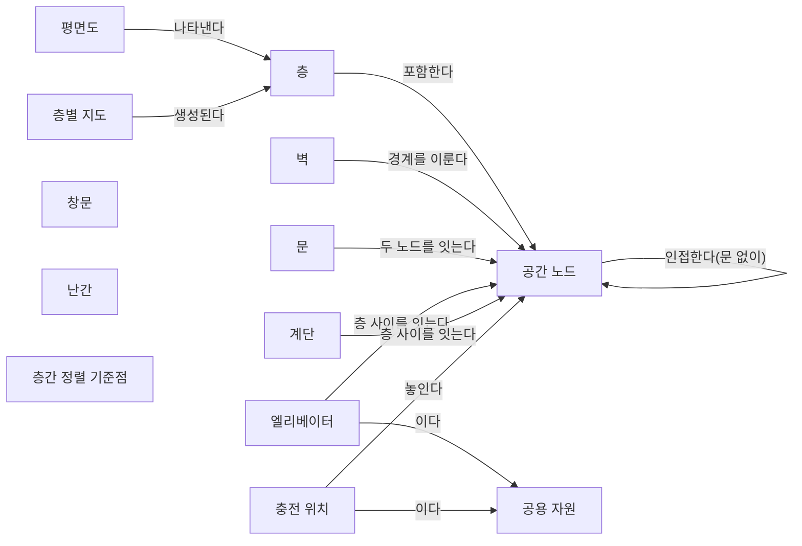
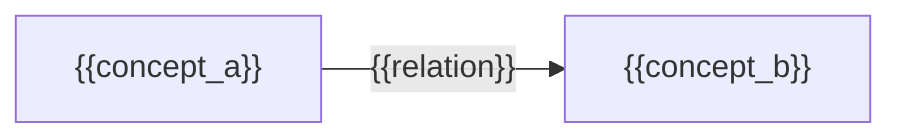

(너의 규칙은 시스템 프롬프트의 agents/shared-rules.md 와 agents/verifier.md 이다. 아래는 이번 실행의 컨텍스트와 입력이다.)

## 실행 컨텍스트

- run_id: 2026-09-25-19
- date: 2026-09-25
- run_type: track (트랙 실행)
- 대상: 트랙 floorplan-recognition (건축 도면 자동 인식) · 현재 단계: 단계 1. 선행 연구·제품 사례 조사 · 이번에 다룰 백로그 질문 id: q1-03 · 중심 세부영역: 6. 지도·공간·위치 모델 (B. 공통 정보·환경 모델)
- 예산:
    - max_search_queries: 40
    - max_sources_per_run: 20
    - new_topic_pages: 1
    - page_updates: 2
    - max_retries: 2
- 환경 알림: web_fetch_available: false · fetch_mode: mirror_only (일반 웹 페이지 열람은 네트워크 정책으로 막혀 있다. raw.githubusercontent.com 은 열린다: 공식 문서가 GitHub 에 있는 출처는 입력의 config/source_mirrors.yaml 경로를 WebFetch 로 열어 원문을 읽고 sources[].fetched=true, fetched_via=github_raw, fetch_url 을 적는다. 입력에 원문 텍스트(data/source_texts)가 있는 출처는 fetched_via=inbox. 그 밖의 출처는 fetched=false 이며 코드가 신뢰도 상한(medium)을 강제한다 — 공통 규칙 0절 6항)
- 언어: ko
- verification_stage: first
- verifier_budget:
    - max_search_queries: 40
    - max_sources_per_run: 20
    - new_topic_pages: 1
    - page_updates: 2
    - max_retries: 2

## 입력

### runs/2026-09-25-19/target.json

```json
{
  "run_id": "2026-09-25-19",
  "date": "2026-09-25",
  "weekday": "Fri",
  "run_number": 19,
  "run_type": "track",
  "forced": true,
  "target": {
    "area_no": 6,
    "area_name": "6. 지도·공간·위치 모델",
    "category": "B. 공통 정보·환경 모델",
    "category_letter": "B"
  },
  "topic": null,
  "track": {
    "slug": "floorplan-recognition",
    "name": "건축 도면 자동 인식",
    "stage": 1,
    "stages": 5,
    "stage_name": "선행 연구·제품 사례 조사",
    "question_ids": [
      "q1-03"
    ],
    "user_questions": [],
    "runs_per_week": 3,
    "question_rationale": "사용자 지정 0건, 되돌아온 질문 0건, 현재 단계 열린 질문 5건 중 오래된 순"
  },
  "corrections": [],
  "budget": {
    "max_search_queries": 40,
    "max_sources_per_run": 20,
    "new_topic_pages": 1,
    "page_updates": 2,
    "max_retries": 2
  },
  "priority_reason": null,
  "priority_questions": [],
  "excluded_areas": [],
  "lifted_areas": [],
  "deferred": {
    "monthly_recheck": false,
    "weekly_review": true
  },
  "selection_rationale": "CLI 지정 run_type=track, area=6; 트랙 실행일(Fri, track_days 앞 3개) → 트랙 floorplan-recognition 단계 1, 질문 q1-03 (사용자 지정 0건, 되돌아온 질문 0건, 현재 단계 열린 질문 5건 중 오래된 순)"
}
```

### runs/2026-09-25-19/research.json

```json
{
  "run_id": "2026-09-25-19",
  "date": "2026-09-25",
  "run_type": "track",
  "target": {
    "area_no": 6,
    "area_name": "6. 지도·공간·위치 모델",
    "category": "B. 공통 정보·환경 모델"
  },
  "gaps": [
    "단계 1 질문 q1-03 열림(target.json 지정: 사용자 지정 0건, 되돌아온 질문 0건, 현재 단계 열린 질문 5건 중 오래된 순)",
    "단계 1 페이지 3절에 q1-03 소제목 없음. q1-02 답은 충전 위치를 traffic-editor 의 is_charger 수동 주석 한 사례로만 다룸",
    "공간 그래프 스키마 초안: 충전 위치·공용 자원 개념이 '초안' 상태이고 작업대(작업 스테이션) 개념이 없으며, 6절 질문 '작업대·대기 공간·버퍼를 도면에서 인식할지 도면 밖 정보로 보완할지'(q1-03) 미해결",
    "아이디어 3. 건축 도면 자동 인식 4절(필요한 데이터와 표준) 비어 있음 — 충전 위치·스테이션을 담는 표준(IFC, VDMA LIF, VDA 5050)에 관한 근거 없음",
    "6. 지도·공간·위치 모델 페이지 섹션 6·7 비어 있음, 16. 공용 자원·충전·에너지 최적화 페이지에 충전 위치 정보 출처 근거 없음",
    "완료 조건: 두 조건 모두 자체 평가 충족이나 검증 승인 전, 막힌 질문 q1-04·q1-05·q1-06·q1-07 열림"
  ],
  "research_questions": [
    "제조사마다 다른 지도에서 ‘3층 출하 대기장’을 어떻게 동일한 장소로 인식할까? [분류원문]",
    "q1-03 충전 위치·작업대처럼 로봇 운영에 쓰는 시설을 도면에서 인식하거나 도면 밖 정보로 보완한 사례가 있는가?",
    "오픈소스 관제·지도 도구(Open-RMF traffic-editor, Nav2 도킹)와 제조사 문서(MiR)는 충전소·작업 스테이션 위치를 어떻게 등록하고, 도면 인식·수동 주석·현장 감지 가운데 무엇에 기대는가? (단계 페이지 3절, 공간 그래프 스키마 초안 2절 겨냥)",
    "BIM(IFC 4.3)의 표준 클래스는 엘리베이터·충전 설비·작업대를 어떤 클래스·유형 값으로 담을 수 있는가? (아이디어 페이지 4절, 단계 2 q2-01·q2-02 선행 근거)",
    "VDA 5050 3.0.0 과 VDMA 레이아웃 교환 형식(LIF)은 충전소·적재 스테이션을 어떤 구조(스테이션, 상호작용 노드, action)로 표현하며, 그 정보는 누가 만드는가? (28. 표준·상호운용성·다사업자 거버넌스, 16. 공용 자원·충전·에너지 최적화 겨냥)",
    "현장 스캔·객체 검출·무선 측위처럼 도면 밖 정보로 창고·공장의 설비·스테이션 위치를 채운 연구는 무엇이 있는가? (21. 온보딩·설정·현장 시운전, 22. 시뮬레이션·예측용 디지털 트윈 겨냥)",
    "국내 물류센터에서 도면이나 레이아웃 자료로 충전소·작업대 위치를 로봇 관제에 등록한 사례가 있는가? (한국 자료 우선 규칙, oq-022 관련)"
  ],
  "findings": [
    {
      "id": "f1",
      "claim": "Open-RMF traffic-editor 문서는 주행 차선 위 경유점의 속성으로 충전소(is_charger), 주차 위치(is_parking_spot), 대기 지점(is_holding_point), 도킹 이름(dock_name), 배송 작업의 픽업 디스펜서(pickup_dispenser)·하역 인제스터(dropoff_ingestor) 작업셀 이름을 두며, 이 값은 사람이 편집기에서 경유점마다 입력한다.",
      "tag": "사실",
      "source_ids": [
        "ref-079"
      ],
      "cross_checked": false,
      "confidence": "medium",
      "evidence_excerpt": "mdBook 원본 traffic-editor.md: is_charger 는 시스템이 'treat this as a charging station', pickup_dispenser 는 'the dispenser workcell for Delivery Task'. dock_name 은 MODE_DOCKING 요청을 보냄. (발행일 미확인, 확인일 기준)",
      "as_of": "2026-09-25",
      "flow_step": null,
      "flow_item": "수행 자원"
    },
    {
      "id": "f2",
      "claim": "이번에 연 traffic-editor 원본에는 충전소·작업셀 같은 운영 시설을 배경 평면도 이미지에서 자동으로 인식하는 기능에 대한 설명이 없고, 시설 속성은 모두 수동 주석으로 설명된다.",
      "tag": "추정",
      "source_ids": [
        "ref-079"
      ],
      "cross_checked": false,
      "confidence": "low",
      "evidence_excerpt": "열람 도구 응답: 작업셀·디스펜서는 'manually annotated', 평면도 이미지에서 자동 인식되는 요소는 문서에 없음. 부재의 확정은 아님. (발행일 미확인, 확인일 기준)",
      "as_of": "2026-09-25",
      "flow_step": null,
      "flow_item": null
    },
    {
      "id": "f3",
      "claim": "VDA 5050 3.0.0 명세에서 충전은 노드·엣지에 두는 startCharging·stopCharging action 으로, 적재 스테이션은 pick·drop action 의 선택 파라미터(stationType·stationName 등)로 표현되며, 10종의 구역(zone) 유형(BLOCKED·LINE_GUIDED·RELEASE·SPEED_LIMIT·ACTION 등)은 주행 제약·교통 관리용이고 충전소나 작업 스테이션을 구역 유형으로 두지 않는다.",
      "tag": "사실",
      "source_ids": [
        "ref-031"
      ],
      "cross_checked": false,
      "confidence": "medium",
      "evidence_excerpt": "공식 저장소 main 명세 열람: startCharging 선택 파라미터 stationType 예 'charging spot'·'charging lane'; zone 은 BLOCKED 'Mobile robots shall not enter this zone' 등 행동 제약. (발행일 미확인, 확인일 기준)",
      "as_of": "2026-09-25",
      "flow_step": null,
      "flow_item": "제약"
    },
    {
      "id": "f4",
      "claim": "VDA 5050 3.0.0 명세는 도입 단계에서 VDMA 의 레이아웃 교환 형식(LIF, VDMA 2024-03)으로 경로(route)를 관제에 가져올 수 있다고 적고, 지도는 mapId·mapVersion 으로 식별해 관제가 downloadMap·enableMap action 으로 배포·활성화하게 한다.",
      "tag": "사실",
      "source_ids": [
        "ref-031"
      ],
      "cross_checked": false,
      "confidence": "medium",
      "evidence_excerpt": "명세 5.2절 열람: 'using the Layout Interchange Format (LIF), routes can be imported to the fleet control'. 6.3.1절: 새 주문 수락 전 각 mapId 의 지도 보유 확인. (발행일 미확인, 확인일 기준)",
      "as_of": "2026-09-25",
      "flow_step": null,
      "flow_item": null
    },
    {
      "id": "f5",
      "claim": "VDMA 가 공개한 LIF 공식 저장소 README 는 LIF 를 무인운반 차량 통합사업자가 주행 레이아웃(엣지·노드·스테이션의 모음)을 상위 관제에 넘기기 위한 교환 형식으로 정의하며, 1.0.0 판(2023-09)이 VDA 5050 인터페이스 정의의 영향을 받았다고 밝힌다.",
      "tag": "사실",
      "source_ids": [
        "ref-228"
      ],
      "cross_checked": false,
      "confidence": "medium",
      "evidence_excerpt": "README 원문: 'an interchange format for a track layout (e.g.: collection of edges, nodes and stations)'. VDMA, Version 1.0.0, September 2023, 'a non-binding approach'.",
      "as_of": "2023-09",
      "flow_step": null,
      "flow_item": null
    },
    {
      "id": "f6",
      "claim": "LIF 1.0.0 지침 기반 제3자 JSON 스키마에서 스테이션은 식별자, 상호작용 노드 목록(interactionNodeIds), 위치(x·y 미터, 선택 방향 theta), 높이·이름·설명만 두고 스테이션 유형 필드가 없으며, 노드의 차종별 속성에 action 을 두고 레이아웃은 층(layoutLevelId)·버전(layoutVersion)을 갖는다.",
      "tag": "사실",
      "source_ids": [
        "ref-229"
      ],
      "cross_checked": false,
      "confidence": "medium",
      "evidence_excerpt": "lif-schema.json 열람: interactionNodeIds 'List of node IDs where the station interacts', stationHeight 'if applicable, in meters', layoutVersion 은 변경마다 증가 권고. VDMA 공식이 아닌 제3자 파서 저장소 스키마. (발행일 미확인, 확인일 기준)",
      "as_of": "2026-09-25",
      "flow_step": null,
      "flow_item": "수행 자원"
    },
    {
      "id": "f7",
      "claim": "VDA 5050 과 LIF 에서는 충전소·적재 스테이션의 종류가 스테이션 유형 값이 아니라 상호작용 노드에 걸린 action(startCharging, pick·drop)과 이름으로 드러나고 레이아웃은 로봇 통합사업자가 만들어 넘기는 것으로 보여, 건물 도면에서 인식한 공간 그래프와는 별도 출처의 시설 정보가 될 것으로 보인다.",
      "tag": "추정",
      "source_ids": [
        "ref-031",
        "ref-228",
        "ref-229"
      ],
      "cross_checked": false,
      "confidence": "low",
      "evidence_excerpt": "f3·f5·f6 에서 도출한 추론. LIF 공식 지침 PDF 본문은 열지 못해 스테이션 유형 필드 부재는 제3자 스키마 기준이며 확정 아님.",
      "as_of": "2026-09-25",
      "flow_step": null,
      "flow_item": null
    },
    {
      "id": "f8",
      "claim": "IFC 4.3 개발 저장소 문서는 IfcTransportElement 를 시설 안에서 사람·동물·물품을 옮기는 운송 관련 객체의 일반화로 정의하고 엘리베이터·에스컬레이터·무빙워크를 예로 들어, BIM 모델에서는 엘리베이터가 표준 클래스로 담길 수 있다.",
      "tag": "사실",
      "source_ids": [
        "ref-230"
      ],
      "cross_checked": false,
      "confidence": "medium",
      "evidence_excerpt": "IfcTransportElement.md 원문: 'A transport element is a generalization of all transport related objects that move people, animals or goods within a Facility.' 개발 브랜치라 게시판과 문구 차이 가능. (발행일 미확인, 확인일 기준)",
      "as_of": "2026-09-25",
      "flow_step": null,
      "flow_item": null
    },
    {
      "id": "f9",
      "claim": "IFC 4.3 개발 저장소의 콘센트 유형 열거(IfcOutletTypeEnum: 음향영상·통신·전원·데이터·전화 콘센트)와 전기기기 유형 열거(IfcElectricApplianceTypeEnum: 식기세척기·복사기·자판기 등)에는 차량·로봇 충전 설비를 뜻하는 값이 없고 USERDEFINED·NOTDEFINED 만 남는다.",
      "tag": "사실",
      "source_ids": [
        "ref-231",
        "ref-232"
      ],
      "cross_checked": false,
      "confidence": "medium",
      "evidence_excerpt": "두 열거 파일 원문 열람: POWEROUTLET 'An outlet used for connecting electrical devices requiring power', 가전 16종 + USERDEFINED·NOTDEFINED. 두 파일은 같은 발행 주체라 독립 교차 아님. (발행일 미확인, 확인일 기준)",
      "as_of": "2026-09-25",
      "flow_step": null,
      "flow_item": null
    },
    {
      "id": "f10",
      "claim": "BIM(IFC) 입력에서 엘리베이터는 표준 클래스로 얻을 수 있지만 로봇 충전소는 이번에 확인한 IFC 4.3 유형 값에 없어, 사용자 정의 유형·속성 세트로 따로 모델링되거나 설계 도면에 아예 담기지 않을 가능성이 클 것으로 보인다.",
      "tag": "추정",
      "source_ids": [
        "ref-230",
        "ref-231",
        "ref-232"
      ],
      "cross_checked": false,
      "confidence": "low",
      "evidence_excerpt": "f8·f9 에서 도출. IFC 전체 클래스(예: IfcElectricFlowStorageDevice, IfcFurniture)와 속성 세트를 모두 대조하지는 않아 부재의 확정 아님. 작업대의 IFC 표현도 미확인.",
      "as_of": "2026-09-25",
      "flow_step": null,
      "flow_item": null
    },
    {
      "id": "f11",
      "claim": "Beinschob 외(Robotics and Autonomous Systems 87, 2017)는 다중 AGV 도입의 병목으로 정밀 2D 지도 작성, 픽업·하역 위치의 3D 좌표 지정, 사람의 경로망(roadmap) 설계를 들고, 3D 레이저 스캐너로 벽·문·랙의 크기·위치·방향을 담은 의미 지도를 만들어 경로망을 자동 설계하는 반자동 방법을 제시했다.",
      "tag": "사실",
      "source_ids": [
        "ref-234"
      ],
      "cross_checked": false,
      "confidence": "medium",
      "evidence_excerpt": "검색 요약: 병목은 'precise 2D mapping of the plant, 3D geo-referencing of pick-up/drop positions and the manual design of the roadmap'; 위치 정보가 없거나 틀려 현장 수정 필요. PAN-Robots(FP7). 원문 미열람.",
      "as_of": "2017",
      "flow_step": "적치",
      "flow_item": "시작 조건",
      "source_unopened": true
    },
    {
      "id": "f12",
      "claim": "Digani 외(IROS 2014)는 산업 창고의 의미 지도에서 얻은 자유 공간 지도를 바탕으로 커버리지·연결성·경로 중복성을 고려해 다중 AGV 경로망을 자동 생성하는 방법을 제안했다.",
      "tag": "사실",
      "source_ids": [
        "ref-235"
      ],
      "cross_checked": false,
      "confidence": "medium",
      "evidence_excerpt": "검색 요약: 'coverage, connectivity, and redundancy of paths', 대수적 연결도(algebraic connectivity)를 우선. 작업 지점(픽업·하역) 입력 방식은 원문 미열람으로 미확인.",
      "as_of": "2014",
      "flow_step": null,
      "flow_item": null,
      "source_unopened": true
    },
    {
      "id": "f13",
      "claim": "MiR 충전 스테이션(MiR Charge 24V) 운영 매뉴얼은 사용자가 로봇을 충전기 1m 안으로 직접 몰고 가 지도에 충전기 유형 마커를 만든 뒤 마커 감지 기능을 쓰면 충전기의 V자 마커로 위치·방향이 자동 설정된다고 설명한다.",
      "tag": "추정",
      "source_ids": [
        "ref-236"
      ],
      "cross_checked": false,
      "confidence": "low",
      "evidence_excerpt": "벤더 주장: 검색 요약 'manually drive the robot so its front is facing the MiR Charge 24V and is within one meter', Detect marker 가 'automatically sets the X, Y, and Orientation values'. 매뉴얼 게재 사이트 사본. 원문 미열람.",
      "as_of": "2026-09-25",
      "flow_step": null,
      "flow_item": "수행 자원",
      "source_unopened": true,
      "vendor_claim": true
    },
    {
      "id": "f14",
      "claim": "연계 대상: Nav2 도킹 프레임워크는 도크 위치를 설정 파라미터나 도크 데이터베이스 YAML 에 유형·좌표계·자세로 사람이 적고, 실행 시 AprilTag 같은 검출기가 내는 detected_dock_pose 로 자세를 보정하며, README 에는 지도·평면도에서 도크 위치를 도출하는 방법이 없다.",
      "tag": "사실",
      "source_ids": [
        "ref-233"
      ],
      "cross_checked": false,
      "confidence": "medium",
      "evidence_excerpt": "README 열람: dock_database 항목 예 'type: \"dockv3\", frame: map, pose: [0.3, 0.3, 0.0]', 'detected_dock_pose' 구독으로 보정. 평면도 도출 부재는 열람 도구 응답 기준. (발행일 미확인, 확인일 기준)",
      "as_of": "2026-09-25",
      "flow_step": null,
      "flow_item": "수행 자원"
    },
    {
      "id": "f15",
      "claim": "Sommer·Stjepandić·Stobrawa·von Soden(Journal of Industrial Information Integration, 2023)은 공장 계획용으로 현장 스캔과 객체 인식으로 생산 레이아웃과 설비 의미를 기록해 건조 환경(built environment)의 디지털 트윈을 자동 생성하는 방법을 다뤘다.",
      "tag": "사실",
      "source_ids": [
        "ref-237"
      ],
      "cross_checked": false,
      "confidence": "medium",
      "evidence_excerpt": "검색 요약: 'fast scans of the production and subsequent object recognition can record the production layout and production semantic'; 과제로 트윈 갱신·가림(occlusion). 원문 미열람.",
      "as_of": "2023",
      "flow_step": null,
      "flow_item": null,
      "source_unopened": true
    },
    {
      "id": "f16",
      "claim": "Braga 외(2025)의 BIRS 는 IFC 에서 만든 위상·거리 지도와 별도로 UWB(초광대역) 비콘으로 현장 장비·자산의 위치를 찾아, BIM 에 없는 자산 위치를 무선 측위로 보완했다.",
      "tag": "사실",
      "source_ids": [
        "ref-085"
      ],
      "cross_checked": false,
      "confidence": "medium",
      "evidence_excerpt": "검색 요약: BIM 기반 경로계획과 함께 UWB 비콘으로 장비 위치추정 병행, 논문 제목의 'assets localization'. 건설 현장 대상. 원문 미열람. (재인용: 2026-09-25-11)",
      "as_of": "2025-03-26",
      "flow_step": null,
      "flow_item": null,
      "source_unopened": true
    },
    {
      "id": "f17",
      "claim": "Stark 외(2024)는 전동 산업용 트럭 플릿이 쓰는 창고에서 충전소 위치를 페이지랭크형 그래프 모델로 정하는 방법을 제안해, 충전 위치를 도면에서 읽는 대상이 아니라 설비 계획의 결정 대상으로 다뤘다.",
      "tag": "사실",
      "source_ids": [
        "ref-109"
      ],
      "cross_checked": false,
      "confidence": "medium",
      "evidence_excerpt": "arXiv 2406.17003 초록 요약: 'optimal positions for charging stations in a warehouse', 거리 기준에서 SOC 기준으로 확장 가능. 원문 미열람. (재인용: 2026-09-25-10)",
      "as_of": "2024-06",
      "flow_step": null,
      "flow_item": "제약",
      "source_unopened": true
    },
    {
      "id": "f18",
      "claim": "이번 검색 범위에서 로봇 충전소·작업 스테이션을 건축 도면에서 자동 인식한 사례는 찾지 못했고, 확인한 사례는 (1) 도면 배경 지도 위 사람의 주석(traffic-editor, MiR 마커), (2) 현장 감지로 위치 보정(MiR V자 마커, Nav2 AprilTag, 3D 스캔 의미 지도, 스캔·객체 인식 디지털 트윈, UWB 측위), (3) 통합사업자가 넘기는 레이아웃 교환(LIF 스테이션과 VDA 5050 action), (4) 설비 계획 최적화(충전소 배치)로 도면 밖 정보를 채우는 방식으로 나뉘는 것으로 보인다.",
      "tag": "추정",
      "source_ids": [
        "ref-079",
        "ref-236",
        "ref-233",
        "ref-234",
        "ref-237",
        "ref-085",
        "ref-228",
        "ref-229",
        "ref-031",
        "ref-109"
      ],
      "cross_checked": false,
      "confidence": "low",
      "evidence_excerpt": "f1·f2·f3·f6·f11·f13~f17 을 보완 방식별로 묶은 이 위키의 분류. 이 4분류를 제시한 단일 출처는 확인하지 못함. 한·영 검색 15회 범위의 부재이며 부재 확인은 아님.",
      "as_of": "2026-09-25",
      "flow_step": null,
      "flow_item": "수행 자원"
    },
    {
      "id": "f19",
      "claim": "확인한 표현들에서 충전소·작업 스테이션은 시설 자체의 위치와 로봇이 접근·도킹하는 지점(traffic-editor 경유점과 dock_name, LIF 상호작용 노드, Nav2 도크 자세)을 따로 두는 것으로 보여, 공간 그래프에서도 시설 위치와 접근 지점, 정보 출처(도면 인식·수동 주석·현장 감지·레이아웃 교환)를 구분해야 할 것으로 보인다.",
      "tag": "추정",
      "source_ids": [
        "ref-079",
        "ref-229",
        "ref-233"
      ],
      "cross_checked": false,
      "confidence": "low",
      "evidence_excerpt": "f1(경유점 속성), f6(stationPosition 과 interactionNodeIds 분리), f14(도크 자세와 검출 보정)에서 도출한 설계 추론.",
      "as_of": "2026-09-25",
      "flow_step": null,
      "flow_item": "완료·인계"
    },
    {
      "id": "f20",
      "claim": "연계 대상: 충전기 앞 정밀 도킹과 마커 감지(MiR V자 마커, Nav2 도킹)는 분류 원문 9장의 로봇 자체 지능·제어 쪽이므로, 이종 제조사를 연결하는 ROP 는 충전소·스테이션의 목록과 대략 위치, 접근 지점, 제조사 action(startCharging, pick·drop)으로의 매핑과 정보 출처 관리를 맡는 경계가 될 것으로 보인다.",
      "tag": "추정",
      "source_ids": [
        "ref-236",
        "ref-233",
        "ref-031",
        "ref-229"
      ],
      "cross_checked": false,
      "confidence": "low",
      "evidence_excerpt": "f3·f6·f13·f14 와 분류 원문 9장 '로봇 자체 지능·제어'(로컬 회피·모터 제어는 외부) 경계를 대응시킨 추론.",
      "as_of": "2026-09-25",
      "flow_step": null,
      "flow_item": null
    }
  ],
  "sources": [
    {
      "id": "ref-031",
      "org": "VDA / VDMA (VDA5050 GitHub)",
      "title": "VDA5050/VDA5050_EN.md — Official Specification document for the VDA 5050",
      "published": null,
      "url": "https://github.com/VDA5050/VDA5050/blob/main/VDA5050_EN.md",
      "type": "표준",
      "reliability": "high",
      "accessed": "2026-09-25",
      "summary": "VDA 5050 공식 명세의 GitHub 저장소 본문(main 은 3.0.0 판). 이번 실행은 구역 유형 10종, 지도 배포(downloadMap·enableMap), startCharging·pick·drop 의 stationType 파라미터, LIF 로 경로를 가져오는 규정을 확인했다.",
      "fetched": true,
      "fetched_via": "github_raw",
      "fetch_url": "https://raw.githubusercontent.com/VDA5050/VDA5050/main/VDA5050_EN.md",
      "source_unopened": false
    },
    {
      "id": "ref-079",
      "org": "Open Robotics",
      "title": "Traffic Editor - Programming Multiple Robots with ROS 2",
      "published": null,
      "url": "https://osrf.github.io/ros2multirobotbook/traffic-editor.html",
      "type": "오픈소스 문서",
      "reliability": "high",
      "accessed": "2026-09-25",
      "summary": "Open-RMF traffic-editor 사용 설명(mdBook 원본). 이번 실행은 경유점 속성(is_charger, is_parking_spot, is_holding_point, dock_name, pickup_dispenser, dropoff_ingestor 등)이 수동 주석임을 확인했다.",
      "fetched": true,
      "fetched_via": "github_raw",
      "fetch_url": "https://raw.githubusercontent.com/osrf/ros2multirobotbook/master/src/traffic-editor.md",
      "source_unopened": false
    },
    {
      "id": "ref-085",
      "org": "Braga, R. G., Tahir, M. O., Karimi, S., Dah-Achinanon, U., Iordanova, I., & St-Onge, D.",
      "title": "Intuitive BIM-aided robotic navigation and assets localization with semantic user interfaces",
      "published": "2025-03-26",
      "url": "https://www.frontiersin.org/journals/robotics-and-ai/articles/10.3389/frobt.2025.1548684/full",
      "type": "논문",
      "reliability": "medium",
      "accessed": "2026-09-25",
      "summary": "원문 미열람. IFC 에서 추출한 건물 정보로 ROS 용 위상·거리 지도와 하이퍼그래프 경로계획을 만들고 UWB 로 장비 위치를 찾는 건설 현장 로봇 플랫폼 논문.",
      "source_unopened": true,
      "fetched": false,
      "fetched_via": null,
      "fetch_url": null
    },
    {
      "id": "ref-109",
      "org": "Stark, H.-G. 외",
      "title": "A Page-Rank-like Approach to Optimal Placement of Charging Stations in a Warehouse",
      "published": "2024-06",
      "url": "https://arxiv.org/abs/2406.17003",
      "type": "논문",
      "reliability": "medium",
      "accessed": "2026-09-25",
      "summary": "원문 미열람. 전동 산업용 트럭·지게차 플릿이 쓰는 창고의 충전소 위치를 페이지랭크형 그래프 모델로 정하는 방법을 제안한 프리프린트.",
      "source_unopened": true,
      "fetched": false,
      "fetched_via": null,
      "fetch_url": null
    },
    {
      "id": "ref-228",
      "org": "VDMA (Intralogistics-2X-LIF GitHub)",
      "title": "Layout-Interchange-Format — README (Repository for the Layout Interchange Format (LIF) developed by the VDMA)",
      "published": "2023-09",
      "url": "https://github.com/Intralogistics-2X-LIF/Layout-Interchange-Format",
      "type": "표준",
      "reliability": "high",
      "accessed": "2026-09-25",
      "summary": "VDMA 의 레이아웃 교환 형식(LIF) 공식 저장소 README. 통합사업자가 엣지·노드·스테이션으로 된 주행 레이아웃을 상위 관제에 넘기는 형식이며 1.0.0 판(2023-09)이 VDA 5050 의 영향을 받았다고 밝힌다.",
      "fetched": true,
      "fetched_via": "github_raw",
      "fetch_url": "https://raw.githubusercontent.com/Intralogistics-2X-LIF/Layout-Interchange-Format/main/README.md",
      "source_unopened": false
    },
    {
      "id": "ref-229",
      "org": "continua-systems (GitHub)",
      "title": "vdma-lif — schema/lif-schema.json (JSON parsers and models for the VDMA LIF)",
      "published": null,
      "url": "https://github.com/continua-systems/vdma-lif/blob/main/schema/lif-schema.json",
      "type": "오픈소스 문서",
      "reliability": "medium",
      "accessed": "2026-09-25",
      "summary": "LIF 1.0.0 지침 문서를 바탕으로 제3자가 만든 JSON 스키마. 레이아웃(층·버전), 노드·엣지의 차종별 속성과 action, 스테이션(상호작용 노드·위치·높이·이름) 필드를 정의한다. VDMA 공식 산출물은 아니다.",
      "fetched": true,
      "fetched_via": "github_raw",
      "fetch_url": "https://raw.githubusercontent.com/continua-systems/vdma-lif/main/schema/lif-schema.json",
      "source_unopened": false
    },
    {
      "id": "ref-230",
      "org": "buildingSMART (IFC4.3.x-development GitHub)",
      "title": "IFC 4.3 — IfcTransportElement (docs/schemas/core/IfcProductExtension/Entities/IfcTransportElement.md)",
      "published": null,
      "url": "https://github.com/buildingSMART/IFC4.3.x-development/blob/ifc4.3-main/docs/schemas/core/IfcProductExtension/Entities/IfcTransportElement.md",
      "type": "표준",
      "reliability": "high",
      "accessed": "2026-09-25",
      "summary": "IFC 4.3 문서 개발 원본의 운송 요소 클래스 정의. 엘리베이터·에스컬레이터·무빙워크 등 시설 안에서 사람·물품을 옮기는 객체의 일반화로 정의한다. 게시판(ADD2)과 문구가 다를 수 있다.",
      "fetched": true,
      "fetched_via": "github_raw",
      "fetch_url": "https://raw.githubusercontent.com/buildingSMART/IFC4.3.x-development/ifc4.3-main/docs/schemas/core/IfcProductExtension/Entities/IfcTransportElement.md",
      "source_unopened": false
    },
    {
      "id": "ref-231",
      "org": "buildingSMART (IFC4.3.x-development GitHub)",
      "title": "IFC 4.3 — IfcOutletTypeEnum (docs/schemas/domain/IfcElectricalDomain/Types/IfcOutletTypeEnum.md)",
      "published": null,
      "url": "https://github.com/buildingSMART/IFC4.3.x-development/blob/ifc4.3-main/docs/schemas/domain/IfcElectricalDomain/Types/IfcOutletTypeEnum.md",
      "type": "표준",
      "reliability": "high",
      "accessed": "2026-09-25",
      "summary": "IFC 4.3 콘센트 유형 열거의 개발 원본. 음향영상·통신·전원·데이터·전화 콘센트와 USERDEFINED·NOTDEFINED 를 둔다.",
      "fetched": true,
      "fetched_via": "github_raw",
      "fetch_url": "https://raw.githubusercontent.com/buildingSMART/IFC4.3.x-development/ifc4.3-main/docs/schemas/domain/IfcElectricalDomain/Types/IfcOutletTypeEnum.md",
      "source_unopened": false
    },
    {
      "id": "ref-232",
      "org": "buildingSMART (IFC4.3.x-development GitHub)",
      "title": "IFC 4.3 — IfcElectricApplianceTypeEnum (docs/schemas/domain/IfcElectricalDomain/Types/IfcElectricApplianceTypeEnum.md)",
      "published": null,
      "url": "https://github.com/buildingSMART/IFC4.3.x-development/blob/ifc4.3-main/docs/schemas/domain/IfcElectricalDomain/Types/IfcElectricApplianceTypeEnum.md",
      "type": "표준",
      "reliability": "high",
      "accessed": "2026-09-25",
      "summary": "IFC 4.3 전기기기 유형 열거의 개발 원본. 식기세척기·냉장고·복사기·자판기 등 가전·사무기기 16종과 USERDEFINED·NOTDEFINED 를 둔다.",
      "fetched": true,
      "fetched_via": "github_raw",
      "fetch_url": "https://raw.githubusercontent.com/buildingSMART/IFC4.3.x-development/ifc4.3-main/docs/schemas/domain/IfcElectricalDomain/Types/IfcElectricApplianceTypeEnum.md",
      "source_unopened": false
    },
    {
      "id": "ref-233",
      "org": "ROS Navigation (ros-navigation/navigation2 GitHub)",
      "title": "nav2_docking — README (Open Navigation's Nav2 Docking Framework)",
      "published": null,
      "url": "https://github.com/ros-navigation/navigation2/blob/main/nav2_docking/README.md",
      "type": "오픈소스 문서",
      "reliability": "high",
      "accessed": "2026-09-25",
      "summary": "Nav2 도킹 서버 공식 README. 도크 위치를 파라미터나 도크 데이터베이스 YAML(유형·좌표계·자세)로 정의하고 검출기가 내는 detected_dock_pose 로 자세를 보정하는 구조를 설명한다.",
      "fetched": true,
      "fetched_via": "github_raw",
      "fetch_url": "https://raw.githubusercontent.com/ros-navigation/navigation2/main/nav2_docking/README.md",
      "source_unopened": false
    },
    {
      "id": "ref-234",
      "org": "Beinschob, P., Meyer, M., Reinke, C., Digani, V., Secchi, C., & Sabattini, L.",
      "title": "Semi-automated map creation for fast deployment of AGV fleets in modern logistics",
      "published": "2017",
      "url": "https://www.sciencedirect.com/science/article/abs/pii/S0921889015302724",
      "type": "논문",
      "reliability": "medium",
      "accessed": "2026-09-25",
      "summary": "원문 미열람. 3D 레이저 스캐너로 벽·문·랙을 담은 의미 지도를 만들고 AGV 경로망을 자동 설계해 다중 AGV 도입 시간을 줄이는 방법을 제시한 Robotics and Autonomous Systems 87 논문(PAN-Robots).",
      "source_unopened": true,
      "fetched": false,
      "fetched_via": null,
      "fetch_url": null
    },
    {
      "id": "ref-235",
      "org": "Digani, V., Sabattini, L., Secchi, C., & Fantuzzi, C.",
      "title": "An automatic approach for the generation of the roadmap for multi-AGV systems in an industrial environment",
      "published": "2014",
      "url": "https://www.researchgate.net/publication/286354583_An_automatic_approach_for_the_generation_of_the_roadmap_for_multi-AGV_systems_in_an_industrial_environment",
      "type": "논문",
      "reliability": "medium",
      "accessed": "2026-09-25",
      "summary": "원문 미열람. 산업 창고의 자유 공간 지도에서 커버리지·연결성·중복성을 고려해 다중 AGV 경로망을 자동 생성하는 방법을 제안한 IROS 2014 논문.",
      "source_unopened": true,
      "fetched": false,
      "fetched_via": null,
      "fetch_url": null
    },
    {
      "id": "ref-236",
      "org": "Mobile Industrial Robots(MiR) (ManualsLib 게재본)",
      "title": "MiR Charge 24V Operating Manual — Setting charging station markers on the map",
      "published": null,
      "url": "https://www.manualslib.com/manual/1941068/Mir-Mir-Charge-24v.html?page=23",
      "type": "벤더 문서",
      "reliability": "low",
      "accessed": "2026-09-25",
      "summary": "원문 미열람. MiR 충전 스테이션 운영 매뉴얼의 게재 사이트 사본. 로봇을 충전기 앞으로 몰고 가 지도에 충전기 마커를 만들고 마커 감지로 위치·방향을 설정하는 절차를 설명한다.",
      "source_unopened": true,
      "fetched": false,
      "fetched_via": null,
      "fetch_url": null
    },
    {
      "id": "ref-237",
      "org": "Sommer, M., Stjepandić, J., Stobrawa, S., & von Soden, M.",
      "title": "Automated generation of digital twin for a built environment using scan and object detection as input for production planning",
      "published": "2023",
      "url": "https://www.sciencedirect.com/science/article/abs/pii/S2452414X23000353",
      "type": "논문",
      "reliability": "medium",
      "accessed": "2026-09-25",
      "summary": "원문 미열람. 공장 계획을 위해 현장 스캔과 객체 인식으로 생산 레이아웃·설비 의미를 기록해 건조 환경 디지털 트윈을 자동 생성하는 방법을 다룬 Journal of Industrial Information Integration 논문.",
      "source_unopened": true,
      "fetched": false,
      "fetched_via": null,
      "fetch_url": null
    }
  ],
  "page_proposals": [
    {
      "action": "update",
      "path": "docs/tracks/floorplan-recognition/stage-1-prior-work-and-products.md",
      "sections": [
        "2",
        "3",
        "4",
        "5",
        "6",
        "8",
        "9"
      ],
      "rationale": "q1-03 답: f1·f2·f3·f4·f5·f6·f7·f8·f9·f10·f11·f12·f13·f14·f15·f16·f17·f18·f19·f20 (신뢰도 medium) — 2절 q1-03 상태 답함, 3절 q1-03 소제목 신설(도면 배경 위 수동 주석 f1·f2·f13, BIM 표준 클래스의 한계 f8·f9·f10, 레이아웃 교환 형식 f3·f4·f5·f6·f7, 현장 감지·스캔·측위 보완 f11·f12·f14·f15·f16, 설비 계획 결정 f17, 종합 4분류 f18, 시설 위치·접근 지점 분리 f19, 범위 경계 f20; f13 벤더 주장 병기), 4절 결론·불확실성, 5절 후속 질문, 6절 완료 조건 현황, 8절 출처, 9절 이력. 참고: 백로그 q1-07 은 q1-06 과 같은 문장(실행 2026-09-25-11 중복 등록)이므로 폐기 처리 검토 필요"
    },
    {
      "action": "update",
      "path": "docs/tracks/floorplan-recognition/space-graph-schema-draft.md",
      "sections": [
        "2",
        "6"
      ],
      "rationale": "트랙 산출물 갱신: track.ontology_changes 가 검증 승인되면 개념 '작업 스테이션' 추가(f1·f3·f6), '충전 위치' 속성(정보 출처, 접근 지점·도킹 이름) 추가(f1·f6·f14·f19), '엘리베이터' 속성 'BIM 대응 클래스(IfcTransportElement)' 추가(f8). 미승인 제안과 f10(IFC 에 로봇 충전 유형 없음)·f7(레이아웃 교환 정보와의 병합)은 6절 질문으로. 6절의 '작업대·대기 공간·버퍼를 도면 밖 정보로 보완할지'(q1-03) 항목에 f18 근거 보강"
    },
    {
      "action": "update",
      "path": "docs/ideas/floorplan-recognition.md",
      "sections": [
        "3",
        "4"
      ],
      "rationale": "아이디어 페이지 3절: 운영 시설(충전소·작업 스테이션) 보완 사례 소절 — f11·f12(3D 스캔 의미 지도·경로망 자동 생성), f15(스캔·객체 인식 디지털 트윈), f16(UWB 자산 측위), f13(MiR 마커, 벤더 주장), f14(Nav2 도킹), f18(도면에서 자동 인식한 사례는 찾지 못함) / 아이디어 페이지 4절: 필요한 데이터와 표준 — IFC 4.3 의 엘리베이터 클래스와 로봇 충전 유형 부재(f8·f9·f10), VDMA LIF 스테이션 구조(f5·f6), VDA 5050 3.0.0 의 충전·적재 action 과 구역·지도 배포(f3·f4). 4절은 단계 2 조사 전 선행 근거임을 명시"
    },
    {
      "action": "update",
      "path": "docs/categories/b-common-information-and-environment-model/06-map-space-and-location-model.md",
      "sections": [
        "6",
        "7"
      ],
      "rationale": "트랙 floorplan-recognition 단계 1 반영 제안 (f1, f4, f5, f6, f8, f11, f18): 섹션 6 도면 밖 정보로 운영 시설 위치를 채우는 방식(수동 주석·현장 감지·레이아웃 교환), 3D 스캔 의미 지도 기반 경로망 설계 / 섹션 7 VDMA LIF, IFC 4.3 IfcTransportElement, VDA 5050 지도 배포(mapId·mapVersion)"
    },
    {
      "action": "update",
      "path": "docs/categories/d-planning-and-optimization/16-shared-resource-charging-and-energy-optimization.md",
      "sections": [
        "6",
        "7"
      ],
      "rationale": "트랙 floorplan-recognition 단계 1 반영 제안 (f1, f3, f9, f13, f14, f17, f19, f20): 충전소 목록·위치의 정보 출처(수동 주석, 충전기 마커 감지, 도크 데이터베이스), 충전을 노드 action(startCharging)으로 표현하는 VDA 5050, 충전소 배치 최적화, 시설 위치와 접근 지점 분리. 정밀 도킹은 연계 대상(f20)"
    },
    {
      "action": "update",
      "path": "docs/categories/g-safety-security-intelligence-and-governance/28-standards-interoperability-and-multi-vendor-governance.md",
      "sections": [
        "7"
      ],
      "rationale": "트랙 floorplan-recognition 단계 1 반영 제안 (f4, f5, f6, f7, f8, f9): 레이아웃 교환 형식 VDMA LIF(통합사업자→관제), VDA 5050 의 LIF 참조, IFC 4.3 의 운송 요소 클래스와 충전 설비 유형 값 부재"
    }
  ],
  "glossary_candidates": [
    {
      "term_ko": "레이아웃 교환 형식",
      "term_en": "Layout Interchange Format (LIF)",
      "definition": "VDMA가 정한, 무인운반 차량 통합사업자가 노드·엣지·스테이션으로 된 주행 레이아웃을 상위 관제 시스템에 넘기기 위한 교환 형식이다."
    }
  ],
  "open_questions_new": [],
  "open_questions_resolved": [],
  "self_check": {
    "source_count": 14,
    "cross_checked_count": 0,
    "unverified": [
      "모든 finding 교차 확인 실패: 사례·표준마다 발행 주체 한 곳의 자료만 있음(f9 의 두 IFC 열거 파일은 같은 발행 주체)",
      "f2·f14 의 '평면도 자동 인식·도출 부재'는 열람 도구 응답 기준이며 문서 전체를 글자 단위로 대조하지 않음",
      "f6 LIF 스테이션 유형 필드 부재는 제3자 스키마(ref-229) 기준이며 VDMA 공식 지침 PDF 와 공식 저장소 스키마 파일은 열지 못함(공식 저장소 추정 경로 404)",
      "f10 IFC 4.3 의 다른 클래스(IfcElectricFlowStorageDevice, IfcFurniture 등)·속성 세트에 로봇 충전소·작업대 표현이 있는지 미확인",
      "f11·f12·f15·f16·f17 논문 원문 미열람(검색 요약 범위), f12 의 작업 지점 입력 방식 미확인",
      "f13 MiR 충전기 마커 절차는 매뉴얼 게재 사이트 사본의 검색 요약이며 벤더 주장",
      "Kollmorgen NDC8 의 DWG·DXF 가져오기와 스테이션 설정은 검색으로 확인하지 못해 넣지 않음",
      "국내 물류센터에서 도면·레이아웃 자료로 충전소·작업대를 관제에 등록한 사례는 한국어 검색 2회에서 찾지 못함(개인 저장소·마케팅 자료만 나와 넣지 않음, oq-022 미해결)",
      "ref-229·ref-230~ref-233·ref-236 발행일 미확인"
    ],
    "scope_violations": [
      "f14·f20: 충전기 앞 정밀 도킹과 마커 감지는 분류 원문 9장 '로봇 자체 지능·제어' 연계 영역이므로 '연계 대상: '으로 표시하고 도크 위치 정보의 출처 사례로만 씀",
      "f13: MiR 마커 감지는 벤더 기능 주장이므로 vendor_claim 으로 표시하고 ROP 직접 범위로 서술하지 않음",
      "f15: 공장 디지털 트윈 자동 생성은 가정한 미래를 실험하는 22. 시뮬레이션·예측용 디지털 트윈 쪽 연결로만 쓰고 8. 실시간 세계 상태·데이터 일관성과 섞지 않음"
    ],
    "budget_used": {
      "queries": 15,
      "sources": 10
    },
    "limits": "web_fetch_available: false · fetch_mode mirror_only. raw.githubusercontent.com 으로 원문 8건을 열었다(재사용 ref-079 traffic-editor 원본, ref-031 VDA 5050 main 명세 / 신규 ref-228 LIF 공식 README, ref-229 제3자 LIF 스키마, ref-230~ref-232 IFC 4.3 개발 원본 3건, ref-233 Nav2 도킹 README). 논문·벤더 매뉴얼 6건(재사용 ref-085·ref-109 포함)은 검색 요약만 봐서 원문 미열람(신뢰도 상한 medium, 벤더 low). 교차 확인 0건. 검색 15회/40, 신규 출처 10건/20(ref-228~ref-237), 재사용 4건(ref-031, ref-079, ref-085, ref-109). 질문 선택: target.json 지정 q1-03 1건. q1-03 은 '도면에서 운영 시설을 자동 인식한 사례는 검색 범위에서 찾지 못했고, 도면 밖 정보(수동 주석·현장 감지·레이아웃 교환·설비 계획)로 보완한다'로 답했으며 종합 신뢰도 medium 으로 본다(부재는 확인이 아님). 한국 자료: 찾지 못함. 교차 규칙: 27. AI·학습·적응과 모델 운영 관련 finding 은 f15(객체 인식 기반 트윈 생성) 정도이며 도면 해석이 아니라 현장 스캔 해석이어서 6. 지도·공간·위치 모델·22. 시뮬레이션·예측용 디지털 트윈 쪽으로만 연결했다. 백로그 참고: q1-07 은 q1-06 과 같은 질문의 중복 등록(실행 2026-09-25-11)으로 보여 폐기 처리 검토를 제안한다. 일반 열린 질문 신규 없음(새 질문은 모두 트랙 전용). 후속 질문 2건, 온톨로지 변경 제안 3건."
  },
  "track": {
    "slug": "floorplan-recognition",
    "stage": 1,
    "answered_question_ids": [
      "q1-03"
    ],
    "new_questions": [
      {
        "question": "로봇 충전소·작업 스테이션처럼 IFC 4.3 표준 유형 값에 없는 운영 시설을 BIM 에 담으려면 사용자 정의 유형·속성 세트로 표현해야 하는가, 이를 정한 IDS·속성 세트 관례나 사례가 있는가? (q1-03 에서 파생)",
        "stage": 2,
        "rationale_finding_id": "f10"
      },
      {
        "question": "도면에서 만든 공간 그래프와 로봇 통합사업자가 넘기는 레이아웃(VDMA LIF 스테이션·노드, VDA 5050 지도)을 하나로 합칠 때 스테이션·충전소의 식별자와 좌표를 어떻게 대응시키고 어느 쪽을 기준으로 삼는가? (q1-03 에서 파생)",
        "stage": 3,
        "rationale_finding_id": "f7"
      }
    ],
    "ontology_changes": [
      {
        "op": "add",
        "kind": "concept",
        "name": "작업 스테이션 (Work Station)",
        "evidence_finding_ids": [
          "f1",
          "f3",
          "f6"
        ],
        "description": "로봇이 적재·하역·작업 인계를 하는 고정 시설(작업대·디스펜서·인제스터·적재 스테이션). 속성: 이름, 위치, 접근 지점(상호작용 노드), 관련 action(pick·drop 등), 정보 출처. Open-RMF 의 pickup_dispenser·dropoff_ingestor 작업셀, VDA 5050 pick·drop 의 stationName, LIF 스테이션 근거. 공용 자원에 포함할지는 검증 판단(작업대는 16. 공용 자원·충전·에너지 최적화 정의에 포함). 아이디어 정의 문구에는 없는 개념이어서 초안 1절 범위와의 관계를 검토 필요."
      },
      {
        "op": "modify",
        "kind": "concept",
        "name": "충전 위치 (Charging Location)",
        "evidence_finding_ids": [
          "f1",
          "f6",
          "f14",
          "f19"
        ],
        "description": "속성에 '정보 출처(도면 인식 / 수동 주석 / 현장 감지 / 레이아웃 교환)'와 '접근 지점(도킹 이름·접근 자세)'을 더한다. traffic-editor 의 is_charger·dock_name, LIF 의 stationPosition 과 interactionNodeIds 분리, Nav2 도크 데이터베이스의 자세 근거. 정보 출처 값 목록은 f18(추정)에서 나온 분류이므로 값은 후보로 둔다."
      },
      {
        "op": "modify",
        "kind": "concept",
        "name": "엘리베이터 (Elevator)",
        "evidence_finding_ids": [
          "f8"
        ],
        "description": "속성에 'BIM 대응 클래스(IFC 4.3 IfcTransportElement, 예: 엘리베이터)'를 더한다. 개발 브랜치 원본 근거이며 게시판 판과의 일치, 유형 열거 값 이름은 단계 2(q2-01)에서 확정."
      }
    ],
    "stage_completion_self_assessment": {
      "met": false,
      "missing": [
        "막힌 질문 q1-04·q1-05·q1-06·q1-07 열림(q1-07 은 q1-06 중복으로 보임)",
        "완료 조건 두 항목(아이디어 3절 비교, 공간 그래프 스키마 초안의 인식 대상 요소 반영)은 자체 평가 충족이나 검증 승인 전"
      ]
    }
  }
}
```

### docs/categories/b-common-information-and-environment-model/06-map-space-and-location-model.md

```markdown
---
title: "6. 지도·공간·위치 모델"
type: area
category: "B. 공통 정보·환경 모델"
area_no: 6
related_areas: []
tags: []
status: seed
created: 2026-09-24
updated: 2026-09-24
sources: []
version: 1
---

[홈](../../index.md) › [B. 공통 정보·환경 모델](index.md) › 6. 지도·공간·위치 모델

# 6. 지도·공간·위치 모델

!!! info "소속 대분류"
    [B. 공통 정보·환경 모델](index.md) — 핵심 질문:
    로봇·물건·공간·상태를 어떻게 같은 의미로 이해할 것인가? [분류원문]

<!-- auto:area-tracks:start -->
!!! note "관련 연구 트랙"
    이 세부영역을 가로지르는 중점 연구 트랙과 확장 아이디어다. 트랙은 분류를 바꾸지 않으며, 트랙에서 확인된 사실은 이 페이지에 반영하도록 제안된다. 전체 매핑은 [확장 아이디어 연결 구조](../../ideas/index.md)에 있다.

    - [자연어 업무 지시 챗봇](../../tracks/nl-task-chatbot/index.md) — 함께 필요한 영역(○) · 확장 아이디어: [아이디어 2. 자연어 업무 지시 챗봇](../../ideas/nl-task-chatbot.md)
    - [건축 도면 자동 인식](../../tracks/floorplan-recognition/index.md) — 중심 영역(●) · 확장 아이디어: [아이디어 3. 건축 도면 자동 인식](../../ideas/floorplan-recognition.md)
<!-- auto:area-tracks:end -->

## 1. 한 줄 정의

BIM·CAD·센서 지도에서 이동 공간과 경로를 만들고, 로봇별 좌표계·층·목적지를 정렬 [분류원문]

## 2. SCM 관점의 질문

제조사마다 다른 지도에서 ‘3층 출하 대기장’을 어떻게 동일한 장소로 인식할까? [분류원문]

> 원문 주석: 6번에는 지도 생성뿐 아니라 **현장과 도면의 차이 확인, 지도 버전 관리, 위치추정 결과의 신뢰도**도 포함해야 한다. [분류원문]

> 원문 주석: 27번의 AI는 특정 기능 하나에만 해당하지 않는다. **매뉴얼 해석은 5·21번, 도면 해석은 6번, 학습 기반 배차는 13번, 장애 분석은 19번**에 적용되는 연구 방법이다. [분류원문]

## 3. 왜 중요한가

아직 작성되지 않음

## 4. 핵심 개념과 용어

아직 작성되지 않음

## 5. 현장 시나리오 (물류 흐름의 어느 단계인지 명시)

아직 작성되지 않음

## 6. 대표 접근법과 기술

아직 작성되지 않음

## 7. 관련 표준·프레임워크·오픈소스

아직 작성되지 않음

## 8. 대표 연구와 자료

아직 작성되지 않음

## 9. ROP가 직접 맡는 것과 외부와 연계하는 것 (부록 A 9장 기준)

아직 작성되지 않음

## 10. 다른 연구영역과의 연결 (번호와 이름을 함께 표기)

아직 작성되지 않음

## 11. 열린 질문

아직 작성되지 않음

## 12. 최근 업데이트 (자동)

<!-- auto:area-recent:start -->
아직 기록된 업데이트가 없다.
<!-- auto:area-recent:end -->

## 13. 참고 자료 (각주)

(아직 각주가 없다. 본문이 작성되면 출처 각주를 여기에 둔다.)
```

### docs/categories/d-planning-and-optimization/15-multi-robot-path-and-traffic-management-mapf.md (요약)

```markdown
# 15. 다중 로봇 경로·교통 관리 — MAPF

소속 대분류: D. 계획·최적화 · 상태: seed · 신뢰도: — · 마지막 갱신: 2026-09-24 · 버전: 1

## 1. 한 줄 정의

여러 로봇의 경로와 통과 시점을 조율하고, 혼잡·교착·우선권을 처리 [분류원문]

## 2. SCM 관점의 질문

서로 다른 제조사의 로봇이 좁은 통로에서 마주치면 누가 양보할까? [분류원문]
```

### docs/categories/f-deployment-verification-and-maintenance/21-onboarding-configuration-and-commissioning.md (요약)

```markdown
# 21. 온보딩·설정·현장 시운전

소속 대분류: F. 도입·검증·유지관리 · 상태: seed · 신뢰도: — · 마지막 갱신: 2026-09-24 · 버전: 1

## 1. 한 줄 정의

로봇 등록, 기능 탐색, 문서 분석, 지도·설비 설정, 교정, 설치 절차 자동화 [분류원문]

## 2. SCM 관점의 질문

새 제조사나 새 물류센터를 추가할 때 반복 작업을 얼마나 줄일까? [분류원문]

> 원문 주석: 27번의 AI는 특정 기능 하나에만 해당하지 않는다. **매뉴얼 해석은 5·21번, 도면 해석은 6번, 학습 기반 배차는 13번, 장애 분석은 19번**에 적용되는 연구 방법이다. [분류원문]
```

### docs/categories/f-deployment-verification-and-maintenance/22-simulation-and-predictive-digital-twin.md (요약)

```markdown
# 22. 시뮬레이션·예측용 디지털 트윈

소속 대분류: F. 도입·검증·유지관리 · 상태: seed · 신뢰도: — · 마지막 갱신: 2026-09-24 · 버전: 1

## 1. 한 줄 정의

로봇·설비·물동량을 가상 환경에서 재현하고, 배치·운영 정책·수요 변화의 효과를 예측 [분류원문]

## 2. SCM 관점의 질문

성수기 주문량이 늘면 어디가 먼저 막힐까? [분류원문]

> 원문 주석: 8번의 실시간 모델이 **현재 상태를 표현**한다면, 22번은 그 모델을 이용해 **가정한 미래를 실험**한다. 구분해두면 디지털 트윈이라는 이름 아래 서로 다른 기능이 섞이지 않는다. [분류원문]
```

### docs/categories/g-safety-security-intelligence-and-governance/27-ai-learning-adaptation-and-model-operations.md (요약)

```markdown
# 27. AI·학습·적응과 모델 운영

소속 대분류: G. 안전·보안·지능·거버넌스 · 상태: seed · 신뢰도: — · 마지막 갱신: 2026-09-24 · 버전: 1

## 1. 한 줄 정의

문서·도면 해석, 수요·고장 예측, 학습 기반 계획, LLM 에이전트, 불확실성 평가, 모델 변경 관리 [분류원문]

## 2. SCM 관점의 질문

AI가 만든 작업 계획이나 기능 해석을 어떤 기준으로 실행에 사용할까? [분류원문]

> 원문 주석: 27번의 AI는 특정 기능 하나에만 해당하지 않는다. **매뉴얼 해석은 5·21번, 도면 해석은 6번, 학습 기반 배차는 13번, 장애 분석은 19번**에 적용되는 연구 방법이다. [분류원문]
```

### docs/categories/a-business-supply-chain-design/03-capacity-site-and-facility-planning.md (요약)

```markdown
# 3. 처리능력·거점·설비 계획

소속 대분류: A. 업무·공급망 설계 · 상태: published · 신뢰도: medium · 마지막 갱신: 2026-09-25 · 버전: 2

## 1. 한 줄 정의

물동량에 필요한 로봇 수와 종류, 작업대·충전기 배치, 교대 운영, 여러 거점의 자원 배치를 결정 [분류원문]

## 2. SCM 관점의 질문

로봇을 늘려야 할까, 포장대나 엘리베이터가 병목일까? [분류원문]
```

### docs/categories/b-common-information-and-environment-model/05-robot-capability-and-task-ontology.md (요약)

```markdown
# 5. 로봇 능력·작업 온톨로지

소속 대분류: B. 공통 정보·환경 모델 · 상태: published · 신뢰도: medium · 마지막 갱신: 2026-09-25 · 버전: 2

## 1. 한 줄 정의

제조사별 기능·제약·장착 장비·실행 조건을 공통 모델로 표현하고, 작업 요구와 연결 [분류원문]

## 2. SCM 관점의 질문

같은 ‘운반 로봇’ 중 누가 이 화물을 실제로 취급할 수 있는가? [분류원문]

> 원문 주석: 27번의 AI는 특정 기능 하나에만 해당하지 않는다. **매뉴얼 해석은 5·21번, 도면 해석은 6번, 학습 기반 배차는 13번, 장애 분석은 19번**에 적용되는 연구 방법이다. [분류원문]
```

### docs/categories/b-common-information-and-environment-model/08-real-time-world-state-and-data-consistency.md (요약)

```markdown
# 8. 실시간 세계 상태·데이터 일관성

소속 대분류: B. 공통 정보·환경 모델 · 상태: seed · 신뢰도: — · 마지막 갱신: 2026-09-24 · 버전: 1

## 1. 한 줄 정의

로봇·설비·공간·화물의 현재 상태를 통합하고, 시간 지연·누락·충돌·불확실성을 관리 [분류원문]

## 2. SCM 관점의 질문

문이 열려 있다는 정보가 30초 전이라면 지금도 통과 가능하다고 볼 수 있을까? [분류원문]

> 원문 주석: 8번의 실시간 모델이 **현재 상태를 표현**한다면, 22번은 그 모델을 이용해 **가정한 미래를 실험**한다. 구분해두면 디지털 트윈이라는 이름 아래 서로 다른 기능이 섞이지 않는다. [분류원문]
```

### docs/categories/c-connectivity-and-execution-foundation/10-facility-and-building-system-integration.md (요약)

```markdown
# 10. 설비·건물 시스템 연동

소속 대분류: C. 연결·실행 기반 · 상태: seed · 신뢰도: — · 마지막 갱신: 2026-09-24 · 버전: 1

## 1. 한 줄 정의

컨베이어, 자동창고, 작업대, PLC, 문, 승강기, 출입통제 시스템과 작업을 연계 [분류원문]

## 2. SCM 관점의 질문

컨베이어 준비와 로봇 도착을 어떻게 맞출까? [분류원문]
```

### docs/categories/d-planning-and-optimization/16-shared-resource-charging-and-energy-optimization.md (요약)

```markdown
# 16. 공용 자원·충전·에너지 최적화

소속 대분류: D. 계획·최적화 · 상태: seed · 신뢰도: — · 마지막 갱신: 2026-09-24 · 버전: 1

## 1. 한 줄 정의

충전기·승강기·작업대·대기 공간·버퍼의 예약과 배분, 충전 시점과 에너지 사용 계획 [분류원문]

## 2. SCM 관점의 질문

로봇들이 동시에 충전하거나 승강기를 기다리는 상황을 어떻게 줄일까? [분류원문]
```

### docs/categories/f-deployment-verification-and-maintenance/23-testing-formal-verification-and-benchmarking.md (요약)

```markdown
# 23. 시험·형식 검증·벤치마크

소속 대분류: F. 도입·검증·유지관리 · 상태: seed · 신뢰도: — · 마지막 갱신: 2026-09-24 · 버전: 1

## 1. 한 줄 정의

시뮬레이션·실기체 시험, 장애 주입, 교착·제약 위반 검증, 회귀시험, 성능 비교 [분류원문]

## 2. SCM 관점의 질문

업데이트 후 정상 상황뿐 아니라 장애 상황도 여전히 처리되는가? [분류원문]
```

### docs/categories/f-deployment-verification-and-maintenance/24-asset-and-software-lifecycle-management.md (요약)

```markdown
# 24. 자산·소프트웨어 수명주기 관리

소속 대분류: F. 도입·검증·유지관리 · 상태: seed · 신뢰도: — · 마지막 갱신: 2026-09-24 · 버전: 1

## 1. 한 줄 정의

고장 예측·정비, 배터리 열화, 펌웨어·어댑터·지도·모델 버전, 배포·복구, 장비 교체 [분류원문]

## 2. SCM 관점의 질문

제조사 펌웨어가 바뀌면 어떤 현장과 기능을 다시 검증해야 할까? [분류원문]
```

### docs/categories/g-safety-security-intelligence-and-governance/28-standards-interoperability-and-multi-vendor-governance.md (요약)

```markdown
# 28. 표준·상호운용성·다사업자 거버넌스

소속 대분류: G. 안전·보안·지능·거버넌스 · 상태: seed · 신뢰도: — · 마지막 갱신: 2026-09-24 · 버전: 1

## 1. 한 줄 정의

공통 규격, 적합성 시험, 제조사 간 책임, 데이터 소유권, API 변경 정책, 서비스 수준과 감사 이력 [분류원문]

## 2. SCM 관점의 질문

제조사·ROP·설비업체 중 누가 연동 오류를 수정하고 변경을 승인할까? [분류원문]
```

### docs/categories/b-common-information-and-environment-model/07-cargo-inventory-and-asset-identification-and-tracking.md (요약)

```markdown
# 7. 화물·재고·자산 식별과 추적

소속 대분류: B. 공통 정보·환경 모델 · 상태: published · 신뢰도: medium · 마지막 갱신: 2026-09-25 · 버전: 4

## 1. 한 줄 정의

제품·박스·팔레트·운반구·로봇을 식별하고, 적재 관계·위치·인계 이력을 연결 [분류원문]

## 2. SCM 관점의 질문

로봇은 도착했는데 실제로 어떤 팔레트가 인계됐는가? [분류원문]

> 원문 주석: **7번은 SCM 관점에서 특히 빠뜨리기 쉽다.** 로봇 위치를 추적하는 것과 화물의 위치·인계 책임을 추적하는 것은 다르다. GS1 EPCIS는 제품·자산의 상태, 위치, 이동, 인계에 관한 이벤트를 공유하는 참고 표준이다. [3] [분류원문]

원문의 [3]은 참고문헌 [ref-003](../../references/ref-003.md)에 해당한다.[^ref-003]
```

### docs/glossary/index.md

```markdown
---
title: "용어집"
type: glossary
subtype: index
status: published
created: 2026-09-24
updated: 2026-09-24
version: 1
---

[홈](../index.md) › 용어집

# 용어집

이 위키에서 쓰는 용어의 한글·영문 표기와 한 줄 정의를 모은다. 용어마다 개별 페이지에 설명, 관련 연구영역, 출처를 둔다. 시드 용어는 SCOR, ISA-95, EPCIS, Open-RMF, Fleet Adapter, WES/WCS/WMS/MES/TMS, MRTA, MAPF, Lifelong MAPF, Multi-Agent Pickup and Delivery, ARIAC, DDS-Security, 디지털 트윈이다. 새 용어는 스토리텔러 에이전트가 제안하고 퍼블리셔가 반영한다.

아래 표는 용어 페이지의 프런트매터(term_ko, term_en, definition, related_areas)에서 자동으로 만든다.

## 용어 목록

<!-- auto:glossary-index:start -->
| 용어(한글) | 용어(영문) | 한 줄 정의 | 관련 영역 |
|---|---|---|---|
| [B2MML](b2mml.md) | Business To Manufacturing Markup Language (B2MML) | MESA International이 ISA-95(IEC 62264)의 데이터 모델을 XML 스키마로 구현한 교환 형식이다. | [1. 주문·업무 시스템 연계](../categories/a-business-supply-chain-design/01-order-and-business-system-integration.md)<br>[2. 공정·워크플로 모델링](../categories/a-business-supply-chain-design/02-process-and-workflow-modeling.md)<br>[14. 작업 순서·스케줄링](../categories/d-planning-and-optimization/14-task-sequencing-and-scheduling.md) |
| [DDS 보안 규격](dds-security.md) | DDS Security (DDS-Security) | DDS(Data Distribution Service)의 보안 규격으로, ROS 2가 인증·암호화·접근통제 구조의 기반으로 통합했다. | [26. 사이버보안·접근권한·개인정보](../categories/g-safety-security-intelligence-and-governance/26-cybersecurity-access-control-and-privacy.md)<br>[11. 분산 시스템·통신·컴퓨팅 구조](../categories/c-connectivity-and-execution-foundation/11-distributed-systems-communication-and-computing.md)<br>[28. 표준·상호운용성·다사업자 거버넌스](../categories/g-safety-security-intelligence-and-governance/28-standards-interoperability-and-multi-vendor-governance.md) |
| [IndoorGML](indoorgml.md) | IndoorGML | IFC 데이터에서 자동 생성하는 도구(ifc2indoorgml)의 대상이 되는 실내 공간 정보 표준이다. | [6. 지도·공간·위치 모델](../categories/b-common-information-and-environment-model/06-map-space-and-location-model.md)<br>[28. 표준·상호운용성·다사업자 거버넌스](../categories/g-safety-security-intelligence-and-governance/28-standards-interoperability-and-multi-vendor-governance.md) |
| [VDA 5050](vda-5050.md) | VDA 5050 | VDA 5050에서 이동로봇이 유형 명세·물리 파라미터·지원 동작·적재 명세를 관제에 미리 알리는 메시지이다. | [5. 로봇 능력·작업 온톨로지](../categories/b-common-information-and-environment-model/05-robot-capability-and-task-ontology.md)<br>[7. 화물·재고·자산 식별과 추적](../categories/b-common-information-and-environment-model/07-cargo-inventory-and-asset-identification-and-tracking.md)<br>[9. 로봇·제조사 관제 연동](../categories/c-connectivity-and-execution-foundation/09-robot-and-vendor-fleet-manager-integration.md) |
| [객체 중심 이벤트 로그](ocel.md) | Object-Centric Event Log (OCEL) | 이벤트와 여러 객체 사이 관계, 관계의 한정자, 시간에 따라 바뀌는 객체 속성을 기록하는 이벤트 로그 교환 표준이며, 2.0판은 SQLite·XML·JSON 형식을 둔다. | [2. 공정·워크플로 모델링](../categories/a-business-supply-chain-design/02-process-and-workflow-modeling.md)<br>[4. 성과·경제성·프로세스 개선](../categories/a-business-supply-chain-design/04-performance-economics-and-process-improvement.md)<br>[19. 모니터링·이상 탐지·원인 분석](../categories/e-collaboration-and-field-operations/19-monitoring-anomaly-detection-and-root-cause-analysis.md) |
| [계획 도메인 정의 언어](pddl.md) | Planning Domain Definition Language (PDDL) | 자동 계획 문제에서 행동을 파라미터·전제조건·효과로 기술하고 도메인과 문제 인스턴스를 분리해 표현하는 언어이다. | [5. 로봇 능력·작업 온톨로지](../categories/b-common-information-and-environment-model/05-robot-capability-and-task-ontology.md) |
| [공급망 운영 참조 모델](scor.md) | Supply Chain Operations Reference (SCOR) | ASCM이 관리하는 공급망 프로세스 참조 모델로, 공급망을 계획·주문·조달·생산/가공·이행·반품 프로세스와 이를 아우르는 오케스트레이션 프로세스로 기술한다. | [1. 주문·업무 시스템 연계](../categories/a-business-supply-chain-design/01-order-and-business-system-integration.md)<br>[2. 공정·워크플로 모델링](../categories/a-business-supply-chain-design/02-process-and-workflow-modeling.md)<br>[4. 성과·경제성·프로세스 개선](../categories/a-business-supply-chain-design/04-performance-economics-and-process-improvement.md) |
| [글로벌 개별 자산 식별자](giai.md) | Global Individual Asset Identifier (GIAI) | 컨테이너·트럭·트레일러 같은 개별 자산을 식별하는 GS1 식별 키이다. | [7. 화물·재고·자산 식별과 추적](../categories/b-common-information-and-environment-model/07-cargo-inventory-and-asset-identification-and-tracking.md) |
| [글로벌 반환형 자산 식별자](grai.md) | Global Returnable Asset Identifier (GRAI) | 팔레트·상자·트레이·케그처럼 여러 번 재사용되는 운반구를 식별하는 GS1 식별 키이다. | [7. 화물·재고·자산 식별과 추적](../categories/b-common-information-and-environment-model/07-cargo-inventory-and-asset-identification-and-tracking.md) |
| [기업–제어 시스템 통합 표준](isa-95.md) | ISA-95 Enterprise-Control System Integration | ISA-95 계열에서 하위 실행 계층이 수행할 작업 단위의 요청으로, OPC UA for ISA-95 Job Control 은 이를 저장·시작·갱신·일시정지·중단하는 메서드를 둔다. | [1. 주문·업무 시스템 연계](../categories/a-business-supply-chain-design/01-order-and-business-system-integration.md)<br>[2. 공정·워크플로 모델링](../categories/a-business-supply-chain-design/02-process-and-workflow-modeling.md)<br>[28. 표준·상호운용성·다사업자 거버넌스](../categories/g-safety-security-intelligence-and-governance/28-standards-interoperability-and-multi-vendor-governance.md) |
| [능력·스킬·서비스 모델](capabilities-skills-services.md) | Capabilities, Skills and Services (CSS) Model | Plattform Industrie 4.0 작업반이 제안한 정보 모델로, 구현과 무관한 기능 명세(능력)와 그 실행 가능한 구현(스킬), 제공 형태(서비스)를 구분한다. 이 위키의 온톨로지 초안에서는 CSS의 능력(capability)을 기능(Capability)으로 부른다. | [5. 로봇 능력·작업 온톨로지](../categories/b-common-information-and-environment-model/05-robot-capability-and-task-ontology.md)<br>[28. 표준·상호운용성·다사업자 거버넌스](../categories/g-safety-security-intelligence-and-governance/28-standards-interoperability-and-multi-vendor-governance.md) |
| [다중 로봇 작업 배정](mrta.md) | Multi-Robot Task Allocation (MRTA) | 여러 로봇과 여러 작업이 있을 때 어떤 로봇(또는 로봇 팀)이 어떤 작업을 맡을지 정하는 문제이다. | [13. 작업 배정 — MRTA](../categories/d-planning-and-optimization/13-task-allocation-mrta.md)<br>[5. 로봇 능력·작업 온톨로지](../categories/b-common-information-and-environment-model/05-robot-capability-and-task-ontology.md)<br>[14. 작업 순서·스케줄링](../categories/d-planning-and-optimization/14-task-sequencing-and-scheduling.md)<br>[16. 공용 자원·충전·에너지 최적화](../categories/d-planning-and-optimization/16-shared-resource-charging-and-energy-optimization.md) |
| [다중 에이전트 경로 찾기](mapf.md) | Multi-Agent Path Finding (MAPF) | 여러 에이전트(로봇)가 각자의 출발지에서 목적지까지 서로 충돌하지 않고 동시에 따라갈 수 있는 경로들을 계획하는 문제이다. | [15. 다중 로봇 경로·교통 관리 — MAPF](../categories/d-planning-and-optimization/15-multi-robot-path-and-traffic-management-mapf.md)<br>[6. 지도·공간·위치 모델](../categories/b-common-information-and-environment-model/06-map-space-and-location-model.md)<br>[16. 공용 자원·충전·에너지 최적화](../categories/d-planning-and-optimization/16-shared-resource-charging-and-energy-optimization.md) |
| [다중 에이전트 픽업·배송](multi-agent-pickup-and-delivery.md) | Multi-Agent Pickup and Delivery (MAPD) | 픽업 위치와 배송 위치가 있는 작업이 온라인으로 계속 들어올 때, 에이전트에 작업을 배정하고 충돌 없는 경로를 함께 계획하는 문제이다. | [13. 작업 배정 — MRTA](../categories/d-planning-and-optimization/13-task-allocation-mrta.md)<br>[15. 다중 로봇 경로·교통 관리 — MAPF](../categories/d-planning-and-optimization/15-multi-robot-path-and-traffic-management-mapf.md)<br>[14. 작업 순서·스케줄링](../categories/d-planning-and-optimization/14-task-sequencing-and-scheduling.md) |
| [디지털 트윈](digital-twin.md) | Digital Twin | 물리적 대상(장비·자재·공정·설비·제품 등)을 데이터로 연결된 가상 모델로 표현한 것이다. | [22. 시뮬레이션·예측용 디지털 트윈](../categories/f-deployment-verification-and-maintenance/22-simulation-and-predictive-digital-twin.md)<br>[8. 실시간 세계 상태·데이터 일관성](../categories/b-common-information-and-environment-model/08-real-time-world-state-and-data-consistency.md)<br>[23. 시험·형식 검증·벤치마크](../categories/f-deployment-verification-and-maintenance/23-testing-formal-verification-and-benchmarking.md) |
| [래스터–벡터 변환](raster-to-vector-conversion.md) | Raster-to-Vector Conversion | 픽셀 이미지로 된 평면도를 벽 선분·교차점·방 다각형 같은 기하 요소의 벡터 표현으로 바꾸는 처리이다. | [6. 지도·공간·위치 모델](../categories/b-common-information-and-environment-model/06-map-space-and-location-model.md)<br>[27. AI·학습·적응과 모델 운영](../categories/g-safety-security-intelligence-and-governance/27-ai-learning-adaptation-and-model-operations.md) |
| [로봇 이동형 풀필먼트 시스템](robotic-mobile-fulfillment-system.md) | Robotic Mobile Fulfillment System (RMFS) | 로봇이 상품을 담은 이동식 선반(pod)을 작업대까지 옮기고 작업자가 그 앞에서 피킹·보충하는 부품-작업자(parts-to-picker) 방식의 자동화 창고 시스템이다. | [3. 처리능력·거점·설비 계획](../categories/a-business-supply-chain-design/03-capacity-site-and-facility-planning.md)<br>[13. 작업 배정 — MRTA](../categories/d-planning-and-optimization/13-task-allocation-mrta.md)<br>[16. 공용 자원·충전·에너지 최적화](../categories/d-planning-and-optimization/16-shared-resource-charging-and-energy-optimization.md) |
| [로봇·자동화 핵심 온톨로지](cora.md) | Core Ontology for Robotics and Automation (CORA) | IEEE 1872-2015가 정한 로봇·자동화 분야의 가장 일반적인 개념·관계·공리를 담은 핵심 온톨로지이다. | [5. 로봇 능력·작업 온톨로지](../categories/b-common-information-and-environment-model/05-robot-capability-and-task-ontology.md)<br>[28. 표준·상호운용성·다사업자 거버넌스](../categories/g-safety-security-intelligence-and-governance/28-standards-interoperability-and-multi-vendor-governance.md) |
| [리틀의 법칙](littles-law.md) | Little's Law | 재공품(WIP)이 처리량(TH)과 사이클 타임(CT)의 곱과 같다는 관계로, 처리량·재공품·리드타임을 함께 해석하는 기준이 된다. | [4. 성과·경제성·프로세스 개선](../categories/a-business-supply-chain-design/04-performance-economics-and-process-improvement.md)<br>[3. 처리능력·거점·설비 계획](../categories/a-business-supply-chain-design/03-capacity-site-and-facility-planning.md) |
| [물류 단위 일련 코드](sscc.md) | Serial Shipping Container Code (SSCC) | 케이스·팔레트·소포 등 보관·운송을 위해 묶인 물류 단위를 고유하게 식별하는 18자리 GS1 식별 키이다. | [7. 화물·재고·자산 식별과 추적](../categories/b-common-information-and-environment-model/07-cargo-inventory-and-asset-identification-and-tracking.md) |
| [반개방형 대기행렬 네트워크](semi-open-queueing-network.md) | Semi-Open Queueing Network (SOQN) | 외부에서 주문이 들어오되 로봇 같은 한정된 자원 수가 고정된 채 순환하는 시스템의 처리량·대기 시간을 해석적으로 추정하는 대기행렬 모델이다. | [3. 처리능력·거점·설비 계획](../categories/a-business-supply-chain-design/03-capacity-site-and-facility-planning.md)<br>[16. 공용 자원·충전·에너지 최적화](../categories/d-planning-and-optimization/16-shared-resource-charging-and-energy-optimization.md) |
| [비즈니스 프로세스 모델 및 표기법](bpmn.md) | Business Process Model and Notation (BPMN) | OMG가 정한 업무 프로세스 표기법으로, ISO/IEC 19510:2013은 OMG BPMN 2.0.1을 PAS 절차로 국제표준화한 것이다. | [2. 공정·워크플로 모델링](../categories/a-business-supply-chain-design/02-process-and-workflow-modeling.md)<br>[12. 명령·작업 실행의 신뢰성](../categories/c-connectivity-and-execution-foundation/12-command-and-task-execution-reliability.md) |
| [산업 기초 클래스](ifc.md) | Industry Foundation Classes (IFC) | IfcSpace·IfcDoor 같은 클래스로 건물 요소를 담는 BIM 교환 형식이다. | [6. 지도·공간·위치 모델](../categories/b-common-information-and-environment-model/06-map-space-and-location-model.md)<br>[28. 표준·상호운용성·다사업자 거버넌스](../categories/g-safety-security-intelligence-and-governance/28-standards-interoperability-and-multi-vendor-governance.md) |
| [산업 자동화용 민첩 로봇 경진대회](ariac.md) | Agile Robotics for Industrial Automation Competition (ARIAC) | NIST가 운영하는 로봇 경진대회로, 변화하는 제조 환경에서 로봇의 계획·인식·행동과 적응성을 평가한다. | [23. 시험·형식 검증·벤치마크](../categories/f-deployment-verification-and-maintenance/23-testing-formal-verification-and-benchmarking.md)<br>[22. 시뮬레이션·예측용 디지털 트윈](../categories/f-deployment-verification-and-maintenance/22-simulation-and-predictive-digital-twin.md)<br>[20. 예외 복구·재계획·업무 연속성](../categories/e-collaboration-and-field-operations/20-exception-recovery-replanning-and-business-continuity.md) |
| [선형 시간 논리](linear-temporal-logic.md) | Linear Temporal Logic (LTL) | 작업의 순서·시간 제약을 명확한 의미로 기술하는 형식 논리이다. | [27. AI·학습·적응과 모델 운영](../categories/g-safety-security-intelligence-and-governance/27-ai-learning-adaptation-and-model-operations.md)<br>[23. 시험·형식 검증·벤치마크](../categories/f-deployment-verification-and-maintenance/23-testing-formal-verification-and-benchmarking.md)<br>[13. 작업 배정 — MRTA](../categories/d-planning-and-optimization/13-task-allocation-mrta.md) |
| [스킬](skill.md) | Skill | 구현과 무관하게 명세한 능력(capability)을 실제로 실행하는 캡슐화된 구현으로, OPC UA 같은 호출 인터페이스를 가지며 상태 기계를 가질 수 있다(예: CaSkMan 의 ISA 88 상태 기계). | [5. 로봇 능력·작업 온톨로지](../categories/b-common-information-and-environment-model/05-robot-capability-and-task-ontology.md)<br>[9. 로봇·제조사 관제 연동](../categories/c-connectivity-and-execution-foundation/09-robot-and-vendor-fleet-manager-integration.md)<br>[12. 명령·작업 실행의 신뢰성](../categories/c-connectivity-and-execution-foundation/12-command-and-task-execution-reliability.md) |
| [업무 위치](business-location.md) | Business Location (EPCIS bizLocation) | EPCIS 이벤트 뒤 다른 이벤트가 반박할 때까지 객체가 있다고 보는 업무상 위치를 나타내는 선택 필드이다. | [7. 화물·재고·자산 식별과 추적](../categories/b-common-information-and-environment-model/07-cargo-inventory-and-asset-identification-and-tracking.md)<br>[6. 지도·공간·위치 모델](../categories/b-common-information-and-environment-model/06-map-space-and-location-model.md) |
| [연결 이벤트](association-event.md) | AssociationEvent | 물리 객체를 상위 객체나 특정 물리 위치와 연결하거나 연결을 해제한 사실을 기록하는 EPCIS 2.0 이벤트 유형이다. | [7. 화물·재고·자산 식별과 추적](../categories/b-common-information-and-environment-model/07-cargo-inventory-and-asset-identification-and-tracking.md) |
| [오픈 RMF](open-rmf.md) | Open-RMF (Open Robotics Middleware Framework) | ROS 2 기반의 다중 로봇 조율 프레임워크로, 제조사별 플릿 어댑터와 건물 설비 인터페이스를 통해 로봇·문·승강기 등을 연결하고 작업·교통을 조율한다. | [9. 로봇·제조사 관제 연동](../categories/c-connectivity-and-execution-foundation/09-robot-and-vendor-fleet-manager-integration.md)<br>[10. 설비·건물 시스템 연동](../categories/c-connectivity-and-execution-foundation/10-facility-and-building-system-integration.md)<br>[15. 다중 로봇 경로·교통 관리 — MAPF](../categories/d-planning-and-optimization/15-multi-robot-path-and-traffic-management-mapf.md)<br>[13. 작업 배정 — MRTA](../categories/d-planning-and-optimization/13-task-allocation-mrta.md) |
| [완전 주문 이행률](perfect-order-fulfillment.md) | Perfect Order Fulfillment | 완전 주문 수를 전체 주문 수로 나눈 비율로, 주문의 모든 품목 줄이 완전해야 완전 주문으로 보는 SCOR의 신뢰성 대표 지표(RL.1.1)이다. | [4. 성과·경제성·프로세스 개선](../categories/a-business-supply-chain-design/04-performance-economics-and-process-improvement.md)<br>[1. 주문·업무 시스템 연계](../categories/a-business-supply-chain-design/01-order-and-business-system-integration.md) |
| [워크플로 넷](workflow-net.md) | Workflow Net (WF-net) | 워크플로를 모델링·분석하는 표준적 방법 가운데 하나로 쓰이는 페트리 넷의 한 부류이다. | [2. 공정·워크플로 모델링](../categories/a-business-supply-chain-design/02-process-and-workflow-modeling.md)<br>[23. 시험·형식 검증·벤치마크](../categories/f-deployment-verification-and-maintenance/23-testing-formal-verification-and-benchmarking.md) |
| [웨이브리스 출고 지시](waveless-order-release.md) | Waveless Order Release | 주문을 큰 묶음(웨이브)으로 모아 내리지 않고 도착·여유 용량에 따라 연속으로 현장에 내려보내는 출고 지시 방식이다. | [1. 주문·업무 시스템 연계](../categories/a-business-supply-chain-design/01-order-and-business-system-integration.md)<br>[14. 작업 순서·스케줄링](../categories/d-planning-and-optimization/14-task-sequencing-and-scheduling.md) |
| [위상 지도](topological-map.md) | Topological Map | 정확한 좌표 대신 방·구역 같은 장소를 노드로, 통로·문 같은 연결을 엣지로 두어 공간의 연결 관계를 표현하는 지도이다. | [6. 지도·공간·위치 모델](../categories/b-common-information-and-environment-model/06-map-space-and-location-model.md)<br>[15. 다중 로봇 경로·교통 관리 — MAPF](../categories/d-planning-and-optimization/15-multi-robot-path-and-traffic-management-mapf.md) |
| [이산 사건 시뮬레이션](discrete-event-simulation.md) | Discrete Event Simulation (DES) | 주문 도착·작업 완료 같은 사건이 일어나는 시점마다 시스템 상태를 갱신해 처리량·대기·가동률을 실험하는 시뮬레이션 방식이다. | [3. 처리능력·거점·설비 계획](../categories/a-business-supply-chain-design/03-capacity-site-and-facility-planning.md)<br>[22. 시뮬레이션·예측용 디지털 트윈](../categories/f-deployment-verification-and-maintenance/22-simulation-and-predictive-digital-twin.md) |
| [자산관리셸](asset-administration-shell.md) | Asset Administration Shell (AAS) | 산업 자산의 정보를 서브모델 단위로 표준화해 디지털로 표현·교환하게 하는 인더스트리 4.0의 디지털 표현 구조이다. | [5. 로봇 능력·작업 온톨로지](../categories/b-common-information-and-environment-model/05-robot-capability-and-task-ontology.md)<br>[28. 표준·상호운용성·다사업자 거버넌스](../categories/g-safety-security-intelligence-and-governance/28-standards-interoperability-and-multi-vendor-governance.md) |
| [작업 분해](task-decomposition.md) | Task Decomposition | 상위 지시나 목표를 로봇이 실행할 수 있는 하위 작업·동작의 순서나 구조로 나누는 일이다. | [13. 작업 배정 — MRTA](../categories/d-planning-and-optimization/13-task-allocation-mrta.md)<br>[14. 작업 순서·스케줄링](../categories/d-planning-and-optimization/14-task-sequencing-and-scheduling.md)<br>[2. 공정·워크플로 모델링](../categories/a-business-supply-chain-design/02-process-and-workflow-modeling.md)<br>[27. AI·학습·적응과 모델 운영](../categories/g-safety-security-intelligence-and-governance/27-ai-learning-adaptation-and-model-operations.md) |
| [전자 제품 코드 정보 서비스](epcis.md) | Electronic Product Code Information Services (EPCIS) | GS1이 정한, 제품·자산의 상태·위치·이동·인계에 관한 이벤트를 기록하고 공유하기 위한 표준이다. | [7. 화물·재고·자산 식별과 추적](../categories/b-common-information-and-environment-model/07-cargo-inventory-and-asset-identification-and-tracking.md)<br>[2. 공정·워크플로 모델링](../categories/a-business-supply-chain-design/02-process-and-workflow-modeling.md)<br>[17. 로봇 간 협업·물리적 인계](../categories/e-collaboration-and-field-operations/17-robot-to-robot-collaboration-and-physical-handover.md) |
| [점유 격자 지도](occupancy-grid-map.md) | Occupancy Grid Map (OGM) | 공간을 일정 크기 칸으로 나누고 칸마다 점유·빈 공간·미지 여부를 적어 로봇 위치추정과 경로계획에 쓰는 지도 표현이다. | [6. 지도·공간·위치 모델](../categories/b-common-information-and-environment-model/06-map-space-and-location-model.md) |
| [종합설비효율](overall-equipment-effectiveness.md) | Overall Equipment Effectiveness (OEE) | 설비의 가용성·효과성(성능)·품질률을 곱해 구하는 지표로, ISO 22400-2(2014판)가 제조 운영 관리 KPI의 하나로 정의한다. | [4. 성과·경제성·프로세스 개선](../categories/a-business-supply-chain-design/04-performance-economics-and-process-improvement.md)<br>[16. 공용 자원·충전·에너지 최적화](../categories/d-planning-and-optimization/16-shared-resource-charging-and-energy-optimization.md) |
| [지속형 다중 에이전트 경로 찾기](lifelong-mapf.md) | Lifelong Multi-Agent Path Finding (Lifelong MAPF) | 에이전트가 목적지에 도착하면 곧바로 새 목적지를 받아 계속 이동하는 조건에서 충돌 없는 경로를 계속 계획하는 MAPF의 변형이다. | [15. 다중 로봇 경로·교통 관리 — MAPF](../categories/d-planning-and-optimization/15-multi-robot-path-and-traffic-management-mapf.md)<br>[14. 작업 순서·스케줄링](../categories/d-planning-and-optimization/14-task-sequencing-and-scheduling.md)<br>[13. 작업 배정 — MRTA](../categories/d-planning-and-optimization/13-task-allocation-mrta.md) |
| [집계 이벤트](aggregation-event.md) | AggregationEvent | 상자를 팔레트에 싣거나 내리는 것처럼 상위 객체와 하위 객체의 물리적 결합·분리를 기록하는 EPCIS 이벤트 유형이다. | [7. 화물·재고·자산 식별과 추적](../categories/b-common-information-and-environment-model/07-cargo-inventory-and-asset-identification-and-tracking.md) |
| [차량 소요대수 산정](fleet-sizing.md) | Fleet Sizing | 예상 물동량과 서비스 수준(대기 시간·처리량) 목표를 만족하는 데 필요한 로봇·운반 차량의 최소 대수를 정하는 계획 문제이다. | [3. 처리능력·거점·설비 계획](../categories/a-business-supply-chain-design/03-capacity-site-and-facility-planning.md)<br>[13. 작업 배정 — MRTA](../categories/d-planning-and-optimization/13-task-allocation-mrta.md)<br>[16. 공용 자원·충전·에너지 최적화](../categories/d-planning-and-optimization/16-shared-resource-charging-and-energy-optimization.md) |
| [창고 실행·창고 제어·창고 관리·제조 실행·운송 관리 시스템](wes-wcs-wms-mes-tms.md) | Warehouse Execution System / Warehouse Control System / Warehouse Management System / Manufacturing Execution System / Transportation Management System | 창고·생산·운송의 주문·재고·설비·공정을 관리하거나 실행하는 업무·실행 시스템 계열의 약어이며, ROP는 이들에서 작업 요청을 받아 로봇 작업으로 바꾸고 결과를 되돌려 주는 관계에 있다. | [1. 주문·업무 시스템 연계](../categories/a-business-supply-chain-design/01-order-and-business-system-integration.md)<br>[2. 공정·워크플로 모델링](../categories/a-business-supply-chain-design/02-process-and-workflow-modeling.md)<br>[10. 설비·건물 시스템 연동](../categories/c-connectivity-and-execution-foundation/10-facility-and-building-system-integration.md) |
| [파놉틱 심볼 스포팅](panoptic-symbol-spotting.md) | Panoptic Symbol Spotting | CAD 도면의 선 요소마다 문·창문 같은 셀 수 있는 기호의 개별 인스턴스와 벽 같은 셀 수 없는 영역의 의미를 함께 판별하는 과제이다. | [6. 지도·공간·위치 모델](../categories/b-common-information-and-environment-model/06-map-space-and-location-model.md)<br>[27. AI·학습·적응과 모델 운영](../categories/g-safety-security-intelligence-and-governance/27-ai-learning-adaptation-and-model-operations.md) |
| [판독 지점](read-point.md) | Read Point (EPCIS readPoint) | EPCIS 이벤트가 일어난 지점을 나타내는 선택 필드이다. | [7. 화물·재고·자산 식별과 추적](../categories/b-common-information-and-environment-model/07-cargo-inventory-and-asset-identification-and-tracking.md)<br>[17. 로봇 간 협업·물리적 인계](../categories/e-collaboration-and-field-operations/17-robot-to-robot-collaboration-and-physical-handover.md) |
| [평면도 인식](floor-plan-recognition.md) | Floor Plan Recognition | 평면도 이미지나 CAD 도면에서 벽·문·창문·계단 같은 건축 요소와 방 영역·유형을 자동으로 찾아내 구조화하는 작업이다. | [6. 지도·공간·위치 모델](../categories/b-common-information-and-environment-model/06-map-space-and-location-model.md)<br>[27. AI·학습·적응과 모델 운영](../categories/g-safety-security-intelligence-and-governance/27-ai-learning-adaptation-and-model-operations.md) |
| [프로세스 마이닝](process-mining.md) | Process Mining | 시스템에 남은 이벤트 로그로 실제 업무 흐름을 발견하고 대기·병목을 분석하는 기법이다. | [4. 성과·경제성·프로세스 개선](../categories/a-business-supply-chain-design/04-performance-economics-and-process-improvement.md)<br>[2. 공정·워크플로 모델링](../categories/a-business-supply-chain-design/02-process-and-workflow-modeling.md)<br>[19. 모니터링·이상 탐지·원인 분석](../categories/e-collaboration-and-field-operations/19-monitoring-anomaly-detection-and-root-cause-analysis.md) |
| [플릿 어댑터](fleet-adapter.md) | Fleet Adapter | Open-RMF에서 제조사별 로봇 플릿(같은 관제 아래 묶인 로봇 무리)을 연결하기 위해 두는 제조사별 연결 구성요소이다. | [9. 로봇·제조사 관제 연동](../categories/c-connectivity-and-execution-foundation/09-robot-and-vendor-fleet-manager-integration.md)<br>[5. 로봇 능력·작업 온톨로지](../categories/b-common-information-and-environment-model/05-robot-capability-and-task-ontology.md)<br>[12. 명령·작업 실행의 신뢰성](../categories/c-connectivity-and-execution-foundation/12-command-and-task-execution-reliability.md)<br>[21. 온보딩·설정·현장 시운전](../categories/f-deployment-verification-and-maintenance/21-onboarding-configuration-and-commissioning.md) |
| [핵심 업무 어휘](cbv.md) | Core Business Vocabulary (CBV) | EPCIS 이벤트의 업무 단계·상태·인계 유형 등에 채울 표준 어휘 값을 정한 GS1 표준(ISO/IEC 19988)이다. | [7. 화물·재고·자산 식별과 추적](../categories/b-common-information-and-environment-model/07-cargo-inventory-and-asset-identification-and-tracking.md) |
| [행동 트리](behavior-tree.md) | Behavior Tree | 로봇 동작과 조건 확인을 트리 노드로 조합해 실행 구조를 표현하는 형식이다. | [12. 명령·작업 실행의 신뢰성](../categories/c-connectivity-and-execution-foundation/12-command-and-task-execution-reliability.md)<br>[27. AI·학습·적응과 모델 운영](../categories/g-safety-security-intelligence-and-governance/27-ai-learning-adaptation-and-model-operations.md)<br>[13. 작업 배정 — MRTA](../categories/d-planning-and-optimization/13-task-allocation-mrta.md) |
| [형상 제약 언어](shacl.md) | Shapes Constraint Language (SHACL) | RDF 그래프가 정해진 구조·값 조건을 지키는지 검증하는 W3C 제약 언어로, 생성된 온톨로지의 품질 검사에 쓰인다. | [5. 로봇 능력·작업 온톨로지](../categories/b-common-information-and-environment-model/05-robot-capability-and-task-ontology.md)<br>[27. AI·학습·적응과 모델 운영](../categories/g-safety-security-intelligence-and-governance/27-ai-learning-adaptation-and-model-operations.md) |
<!-- auto:glossary-index:end -->
```

### docs/references/index.md

```markdown
---
title: "참고문헌"
type: reference
subtype: index
status: published
created: 2026-09-24
updated: 2026-09-24
version: 1
---

[홈](../index.md) › 참고문헌

# 참고문헌

이 위키가 인용한 출처의 목록이다. 출처마다 id, 기관, 제목, 발행일, URL, 유형, 신뢰도, 접근일, 요약, 인용된 페이지를 개별 페이지에 둔다. 시드 10건(ref-001 ~ ref-010)은 분류 원문 12장의 참고 자료 1~10번에 그대로 대응한다. 새 출처는 리서치 에이전트가 제안하고 내용 검증 에이전트가 실재를 확인한 뒤 퍼블리셔가 추가한다.

신뢰도는 출처 유형을 기준으로 한다. 표준·정부·연구기관·논문·오픈소스 공식 문서는 high, 기사·보도자료·벤더 문서는 medium 이며, 내용 검증 에이전트가 원문을 열어 확인하면 조정할 수 있다. 다만 URL 을 열어 확인하지 못한 출처(원문 미열람)에는 유형과 무관하게 high 를 주지 않고 medium 상한을 적용한다. 시드 10건은 구축 환경의 네트워크 정책으로 URL 을 열지 못했으므로 모두 원문 미열람 상태이며, 각 페이지의 "원문 열람" 행에 그 사실을 적어 둔다. 외부 접속이 가능한 환경에서 `ROP_CHECK_URLS=1 bash pipeline/checks/run_all.sh` 를 실행한 뒤 `python3 pipeline/scaffold.py --apply-url-check` 를 실행하면 열림이 확인된 출처의 신뢰도가 유형 기준값으로 올라간다.

## 목록

<!-- auto:references-index:start -->
| id | 기관 | 제목 | 발행일 | 유형 | 신뢰도 | 접근일 | URL |
|---|---|---|---|---|---|---|---|
| [ref-001](ref-001.md) | ASCM | SCOR Digital Standard | 미확인 | 표준 | medium | 2026-09-24 | <https://www.ascm.org/corporate-solutions/standards-tools/scor-ds/> |
| [ref-002](ref-002.md) | ISA | Update to ISA-95 Standard Addresses Integration of Enterprise and Manufacturing Control Systems | 2025 | 기사 | medium | 2026-09-24 | <https://www.isa.org/news-press-releases/2025/april/update-to-isa-95-standard-addresses-integration-of> |
| [ref-003](ref-003.md) | GS1 | EPCIS and CBV Linked Data Model | 미확인 | 표준 | medium | 2026-09-24 | <https://ref.gs1.org/epcis/> |
| [ref-004](ref-004.md) | Open Robotics | RMF Core Overview — Programming Multiple Robots with ROS 2 | 미확인 | 오픈소스 문서 | high | 2026-09-25 | <https://osrf.github.io/ros2multirobotbook/rmf-core.html> |
| [ref-005](ref-005.md) | Li, J., Tinka, A., Kiesel, S., Durham, J. W., Kumar, T. K. S., & Koenig, S. | Lifelong Multi-Agent Path Finding in Large-Scale Warehouses | 2020 | 논문 | medium | 2026-09-24 | <https://arxiv.org/abs/2005.07371> |
| [ref-006](ref-006.md) | Ma, H., Li, J., Kumar, T. K. S., & Koenig, S. | Lifelong Multi-Agent Path Finding for Online Pickup and Delivery Tasks | 2017 | 논문 | medium | 2026-09-24 | <https://arxiv.org/abs/1705.10868> |
| [ref-007](ref-007.md) | NIST | Performance of Collaborative Robot Systems | 미확인 | 정부·연구기관 | medium | 2026-09-24 | <https://www.nist.gov/programs-projects/performance-collaborative-robot-systems> |
| [ref-008](ref-008.md) | NIST | ARIAC Documentation | 미확인 | 정부·연구기관 | high | 2026-09-25 | <https://pages.nist.gov/ARIAC_docs/en/latest/> |
| [ref-009](ref-009.md) | ROS 2 Design | ROS 2 DDS-Security Integration | 미확인 | 오픈소스 문서 | high | 2026-09-25 | <https://design.ros2.org/articles/ros2_dds_security.html> |
| [ref-010](ref-010.md) | ROS 2 Design | ROS 2 Robotic Systems Threat Model | 미확인 | 오픈소스 문서 | high | 2026-09-25 | <https://design.ros2.org/articles/ros2_threat_model.html> |
| [ref-011](ref-011.md) | ISO/IEC | ISO/IEC 19987:2024 - Information technology — EPC Information Services (EPCIS) | 2024-03 | 표준 | medium | 2026-09-25 | <https://www.iso.org/standard/85557.html> |
| [ref-012](ref-012.md) | ISO/IEC | ISO/IEC 19988:2024 - Information technology — GS1 Core Business Vocabulary (CBV) | 2024 | 표준 | medium | 2026-09-25 | <https://www.iso.org/standard/85558.html> |
| [ref-013](ref-013.md) | OpenEPCIS | EPCIS 2.0 and EPCIS 1.2 \| OpenEPCIS Docs | 미확인 | 오픈소스 문서 | medium | 2026-09-25 | <https://openepcis.io/docs/epcis/> |
| [ref-014](ref-014.md) | GS1 | Core Business Vocabulary (CBV) Standard | 미확인 | 표준 | medium | 2026-09-25 | <https://ref.gs1.org/standards/cbv/> |
| [ref-015](ref-015.md) | GS1 | EPCIS and CBV Implementation Guideline | 미확인 | 표준 | medium | 2026-09-25 | <https://www.gs1.org/docs/epc/EPCIS_Guideline.pdf> |
| [ref-016](ref-016.md) | GS1 | Serial Shipping Container Code (SSCC) | 미확인 | 표준 | medium | 2026-09-25 | <https://www.gs1.org/standards/id-keys/sscc> |
| [ref-017](ref-017.md) | GS1 Korea(대한상공회의소 유통물류진흥원) | SSCC (Serial Shipping Container Code) GS1 Information Vol. 21 | 2019-09 | 표준 | medium | 2026-09-25 | <http://www.gs1kr.org/front/service/File/SSCC%20%EB%B0%9C%EA%B0%84%20%EC%9E%90%EB%A3%8C.pdf> |
| [ref-018](ref-018.md) | GS1 | GS1 Logistic Label Guideline | 미확인 | 표준 | medium | 2026-09-25 | <https://www.gs1.org/docs/tl/GS1_Logistic_Label_Guideline.pdf> |
| [ref-019](ref-019.md) | GS1 | Global Returnable Asset Identifier (GRAI) | 미확인 | 표준 | medium | 2026-09-25 | <https://www.gs1.org/standards/id-keys/grai> |
| [ref-020](ref-020.md) | GS1 | Which GS1 identification key should be used for individual assets used to transport goods? (GS1 GO Customer Service Portal) | 미확인 | 표준 | medium | 2026-09-25 | <https://support.gs1.org/support/solutions/articles/43000734294-which-gs1-identification-key-should-be-used-for-individual-assets-used-to-transport-goods-> |
| [ref-021](ref-021.md) | GS1 | EPC Tag Data Standard | 미확인 | 표준 | medium | 2026-09-25 | <https://www.gs1.org/sites/default/files/docs/epc/GS1_EPC_TDS_i1_11.pdf> |
| [ref-022](ref-022.md) | VDA(Verband der Automobilindustrie) | VDA 5050 Version 2.0.0 — Interface for the communication between automated guided vehicles (AGV) and a master control | 2022-01 | 표준 | medium | 2026-09-25 | <https://www.vda.de/dam/jcr:f0c9c019-1506-4dee-998a-e92723fbf025/EN-VDA5050-V2_0_0.pdf> |
| [ref-023](ref-023.md) | Open Robotics | Workcells - Programming Multiple Robots with ROS 2 | 미확인 | 오픈소스 문서 | high | 2026-09-25 | <https://osrf.github.io/ros2multirobotbook/integration_workcells.html> |
| [ref-024](ref-024.md) | Singh, J. 외 | RFID tag readability issues with palletized loads of consumer goods | 2009 | 논문 | medium | 2026-09-25 | <https://onlinelibrary.wiley.com/doi/abs/10.1002/pts.864> |
| [ref-025](ref-025.md) | IEEE | 1872-2015 - IEEE Standard Ontologies for Robotics and Automation | 2015 | 표준 | medium | 2026-09-25 | <https://ieeexplore.ieee.org/document/7084073/> |
| [ref-026](ref-026.md) | IEEE | IEEE 1872.2-2021 - IEEE Standard for Autonomous Robotics (AuR) Ontology | 2022 | 표준 | medium | 2026-09-25 | <https://standards.ieee.org/standard/1872_2-2021.html> |
| [ref-027](ref-027.md) | Beetz, M., Beßler, D., Haidu, A., Pomarlan, M., Bozcuoglu, A. K., & Bartels, G. | KnowRob 2.0 — A 2nd Generation Knowledge Processing Framework for Cognition-Enabled Robotic Agents | 2018 | 논문 | medium | 2026-09-25 | <https://ai.uni-bremen.de/papers/beetz18knowrob.pdf> |
| [ref-028](ref-028.md) | Beßler, D. 외 | Foundations of the Socio-physical Model of Activities (SOMA) for Autonomous Robotic Agents | 2021 | 논문 | medium | 2026-09-25 | <https://arxiv.org/pdf/2011.11972> |
| [ref-029](ref-029.md) | McDermott, D. 외 | PDDL - The Planning Domain Definition Language | 1998 | 논문 | medium | 2026-09-25 | <https://www.researchgate.net/publication/2278933_PDDL_-_The_Planning_Domain_Definition_Language> |
| [ref-030](ref-030.md) | W3C / OGC | Semantic Sensor Network Ontology | 2017-10-19 | 표준 | medium | 2026-09-25 | <https://www.w3.org/TR/vocab-ssn/> |
| [ref-031](ref-031.md) | VDA / VDMA (VDA5050 GitHub) | VDA5050/VDA5050_EN.md — Official Specification document for the VDA 5050 | 미확인 | 표준 | high | 2026-09-25 | <https://github.com/VDA5050/VDA5050/blob/main/VDA5050_EN.md> |
| [ref-032](ref-032.md) | VDA(Verband der Automobilindustrie) | Version 3.0 of VDA 5050 released | 2026-04 | 표준 | medium | 2026-09-25 | <https://www.vda.de/en/press/press-releases/2026/260421_PM_VDA_5050_EN> |
| [ref-033](ref-033.md) | MassRobotics | Autonomous Mobile Robot Standards Published by MassRobotics | 2021-05 | 표준 | medium | 2026-09-25 | <https://www.massrobotics.org/autonomous-mobile-robot-standards-published-by-massrobotics/> |
| [ref-034](ref-034.md) | OPC Foundation / VDMA | OPC-40010-1 – OPC UA for Robotics - Part 1: Vertical Integration | 미확인 | 표준 | medium | 2026-09-25 | <https://reference.opcfoundation.org/specs/OPC-40010-1> |
| [ref-035](ref-035.md) | Plattform Industrie 4.0 | Information Model for Capabilities, Skills & Services | 2022-11 | 정부·연구기관 | medium | 2026-09-25 | <https://www.plattform-i40.de/IP/Redaktion/EN/Downloads/Publikation/CapabilitiesSkillsServices.html> |
| [ref-036](ref-036.md) | Köcher, A. 외 | A Reference Model for Common Understanding of Capabilities and Skills in Manufacturing | 2022 | 논문 | medium | 2026-09-25 | <https://arxiv.org/abs/2209.09632> |
| [ref-037](ref-037.md) | Vieira da Silva, L. M., Köcher, A., Gill, M. S., Weiss, M., & Fay, A. | Toward a Mapping of Capability and Skill Models using Asset Administration Shells and Ontologies | 2023-07 | 논문 | low | 2026-09-25 | <https://arxiv.org/abs/2307.00827> |
| [ref-038](ref-038.md) | Vieira da Silva, L. M., Köcher, A., & Fay, A. | A Capability and Skill Model for Heterogeneous Autonomous Robots | 2022-09 | 논문 | medium | 2026-09-25 | <https://arxiv.org/abs/2209.10900> |
| [ref-039](ref-039.md) | Open Robotics | Currently supported Tasks - Programming Multiple Robots with ROS 2 | 미확인 | 오픈소스 문서 | high | 2026-09-25 | <https://osrf.github.io/ros2multirobotbook/task_types.html> |
| [ref-040](ref-040.md) | Open Robotics | PerformAction Tutorial - Programming Multiple Robots with ROS 2 | 미확인 | 오픈소스 문서 | high | 2026-09-25 | <https://osrf.github.io/ros2multirobotbook/integration_fleets_action_tutorial.html> |
| [ref-041](ref-041.md) | Naqvi, M. R. 외(Scientific Reports) | Ontology-driven integration of advertised and operational capabilities in robots | 2025-10-02 | 논문 | medium | 2026-09-25 | <https://www.nature.com/articles/s41598-025-16649-3> |
| [ref-042](ref-042.md) | Aguado, E., Gomez, V., Hernando, M., Rossi, C., & Sanz, R. | A survey of ontology-enabled processes for dependable robot autonomy | 2024-07 | 논문 | medium | 2026-09-25 | <https://www.frontiersin.org/journals/robotics-and-ai/articles/10.3389/frobt.2024.1377897/full> |
| [ref-043](ref-043.md) | 신민종, 한영석, 정재윤 | 자산관리쉘 표준을 이용한 자율이동로봇 모니터링 시스템 설계 | 2024 | 논문 | medium | 2026-09-25 | <https://www.kci.go.kr/kciportal/ci/sereArticleSearch/ciSereArtiView.kci?sereArticleSearchBean.artiId=ART003140560> |
| [ref-044](ref-044.md) | GS1 | gs1/EPCIS — Ontology/CBV.ttl (Core Business Vocabulary ontology 2.0) | 2021-09-30 | 표준 | high | 2026-09-25 | <https://github.com/gs1/EPCIS/blob/master/Ontology/CBV.ttl> |
| [ref-045](ref-045.md) | GS1 | gs1/EPCIS — Ontology/EPCIS.ttl (EPCIS ontology 2.0) | 2021-09-30 | 표준 | high | 2026-09-25 | <https://github.com/gs1/EPCIS/blob/master/Ontology/EPCIS.ttl> |
| [ref-047](ref-047.md) | Open Robotics (open-rmf) | rmf_internal_msgs — rmf_dispenser_msgs/msg/DispenserRequest.msg | 미확인 | 오픈소스 문서 | high | 2026-09-25 | <https://github.com/open-rmf/rmf_internal_msgs/blob/main/rmf_dispenser_msgs/msg/DispenserRequest.msg> |
| [ref-048](ref-048.md) | Open Robotics (open-rmf) | rmf_internal_msgs — rmf_dispenser_msgs/msg/DispenserRequestItem.msg | 미확인 | 오픈소스 문서 | high | 2026-09-25 | <https://github.com/open-rmf/rmf_internal_msgs/blob/main/rmf_dispenser_msgs/msg/DispenserRequestItem.msg> |
| [ref-049](ref-049.md) | Open Robotics (open-rmf) | rmf_internal_msgs — rmf_ingestor_msgs/msg/IngestorResult.msg | 미확인 | 오픈소스 문서 | high | 2026-09-25 | <https://github.com/open-rmf/rmf_internal_msgs/blob/main/rmf_ingestor_msgs/msg/IngestorResult.msg> |
| [ref-050](ref-050.md) | Auto-ID Labs Korea(세종대학교), Byun, J. | Oliot EPCIS for GS1 EPCIS/CBV 2.0.0 (GitHub JaewookByun/epcis README) | 미확인 | 오픈소스 문서 | high | 2026-09-25 | <https://github.com/JaewookByun/epcis> |
| [ref-051](ref-051.md) | VDA / VDMA (VDA5050 GitHub) | VDA5050/VDA5050 — json_schemas/state.schema | 미확인 | 표준 | high | 2026-09-25 | <https://github.com/VDA5050/VDA5050/blob/main/json_schemas/state.schema> |
| [ref-052](ref-052.md) | VDA / VDMA (VDA5050 GitHub) | VDA5050/VDA5050 — README.md | 미확인 | 표준 | high | 2026-09-25 | <https://github.com/VDA5050/VDA5050/blob/main/README.md> |
| [ref-053](ref-053.md) | NVIDIA Research (NVlabs) | progprompt-vh — ProgPrompt: Generating Situated Robot Task Plans using Large Language Models (GitHub README) | 미확인 | 오픈소스 문서 | high | 2026-09-25 | <https://github.com/NVlabs/progprompt-vh> |
| [ref-054](ref-054.md) | Singh, I. 외 | ProgPrompt: Generating Situated Robot Task Plans using Large Language Models | 2022-09 | 논문 | medium | 2026-09-25 | <https://arxiv.org/abs/2209.11302> |
| [ref-055](ref-055.md) | Brown University H2R Lab | Lang2LTL — Code for paper Lang2LTL: Grounding Complex Natural Language Commands for Temporal Tasks in Unseen Environments (GitHub README) | 미확인 | 오픈소스 문서 | high | 2026-09-25 | <https://github.com/h2r/Lang2LTL> |
| [ref-056](ref-056.md) | Liu, J. X. 외 | Grounding Complex Natural Language Commands for Temporal Tasks in Unseen Environments | 2023-02 | 논문 | medium | 2026-09-25 | <https://arxiv.org/abs/2302.11649> |
| [ref-057](ref-057.md) | Tellex, S. 외 | Understanding Natural Language Commands for Robotic Navigation and Mobile Manipulation | 2011-08 | 논문 | medium | 2026-09-25 | <https://ojs.aaai.org/index.php/AAAI/article/view/7979> |
| [ref-058](ref-058.md) | Cohen, V., Liu, J. X., Mooney, R., Tellex, S., & Watkins, D. | A Survey of Robotic Language Grounding: Tradeoffs between Symbols and Embeddings | 2024-08 | 논문 | medium | 2026-09-25 | <https://www.ijcai.org/proceedings/2024/885> |
| [ref-059](ref-059.md) | Wang, Y. 외(DART-LLM 저자) | DART-LLM: Dependency-Aware Multi-Robot Task Decomposition and Execution using Large Language Models | 2024-11 | 논문 | medium | 2026-09-25 | <https://arxiv.org/abs/2411.09022> |
| [ref-060](ref-060.md) | Lee, Y. 외(Digital Health) | Feasibility of autonomous medication delivery robots considering elevator utilization in high-traffic hospital environments | 2026 | 논문 | medium | 2026-09-25 | <https://doi.org/10.1177/20552076261437181> |
| [ref-061](ref-061.md) | Izzo, R. A., Bardaro, G., & Matteucci, M. (Politecnico di Milano AIRLab) | BTGenBot: Behavior Tree Generation for Robotic Tasks with Lightweight LLMs | 2024-03 | 논문 | medium | 2026-09-25 | <https://arxiv.org/abs/2403.12761> |
| [ref-062](ref-062.md) | CubiCasa (Kalervo, A. 외) | CubiCasa5k — README (CubiCasa5K: A Dataset and an Improved Multi-Task Model for Floorplan Image Analysis) | 미확인 | 오픈소스 문서 | medium | 2026-09-25 | <https://github.com/CubiCasa/CubiCasa5k> |
| [ref-063](ref-063.md) | Kalervo, A., Ylioinas, J., Häikiö, M., Karhu, A., & Kannala, J. | CubiCasa5K: A Dataset and an Improved Multi-Task Model for Floorplan Image Analysis | 2019-04 | 논문 | medium | 2026-09-25 | <https://arxiv.org/abs/1904.01920> |
| [ref-064](ref-064.md) | Zeng, Z., Li, X., Yu, Y. K., & Fu, C.-W. | DeepFloorplan — README (Deep Floor Plan Recognition using a Multi-task Network with Room-boundary-Guided Attention) | 2019 | 오픈소스 문서 | medium | 2026-09-25 | <https://github.com/zlzeng/DeepFloorplan> |
| [ref-065](ref-065.md) | Liu, C., Wu, J., Kohli, P., & Furukawa, Y. | FloorplanTransformation — README (Raster-to-Vector: Revisiting Floorplan Transformation) | 2017 | 오픈소스 문서 | medium | 2026-09-25 | <https://github.com/art-programmer/FloorplanTransformation> |
| [ref-066](ref-066.md) | FloorPlanCAD 프로젝트(Fan, Z. 외) | FloorPlanCAD Dataset — project page (floorplancad.github.io index.md) | 2021 | 오픈소스 문서 | medium | 2026-09-25 | <https://floorplancad.github.io/> |
| [ref-067](ref-067.md) | Fan, Z., Zhu, L., Li, H., Chen, X., Zhu, S., & Tan, P. | FloorPlanCAD: A Large-Scale CAD Drawing Dataset for Panoptic Symbol Spotting | 2021-05 | 논문 | medium | 2026-09-25 | <https://arxiv.org/abs/2105.07147> |
| [ref-068](ref-068.md) | Voxel51 (Hugging Face) | Voxel51/FloorPlanCAD · Datasets at Hugging Face | 미확인 | 오픈소스 문서 | medium | 2026-09-25 | <https://huggingface.co/datasets/Voxel51/FloorPlanCAD> |
| [ref-069](ref-069.md) | Pizarro, P. N., Hitschfeld, N., & Sipiran, I. (MLSTRUCT) | MLStructFP — README (Large-scale multi-unit floor plan dataset for architectural plan analysis and recognition) | 2023 | 오픈소스 문서 | medium | 2026-09-25 | <https://github.com/MLSTRUCT/MLStructFP> |
| [ref-070](ref-070.md) | Hu, S. 외 | Raster-to-Graph — README (Raster-to-Graph: Floorplan Recognition via Autoregressive Graph Prediction with an Attention Transformer) | 2024 | 오픈소스 문서 | medium | 2026-09-25 | <https://github.com/SizheHu/Raster-to-Graph> |
| [ref-071](ref-071.md) | Agour, M. 외 (ResPlan) | ResPlan — README (ResPlan: A Large-Scale Vector-Graph Dataset of 17,000 Residential Floor Plans) | 2025-08 | 오픈소스 문서 | medium | 2026-09-25 | <https://github.com/m-agour/ResPlan> |
| [ref-072](ref-072.md) | van Engelenburg, C. 외 (MSD) | msd — README (MSD: A Benchmark Dataset for Floor Plan Generation of Building Complexes) | 2024 | 오픈소스 문서 | medium | 2026-09-25 | <https://github.com/caspervanengelenburg/msd> |
| [ref-073](ref-073.md) | Luo, R. 외 | ArchCAD-400K: A Large-Scale CAD drawings Dataset and New Baseline for Panoptic Symbol Spotting | 2025-03 | 논문 | medium | 2026-09-25 | <https://arxiv.org/abs/2503.22346> |
| [ref-074](ref-074.md) | 한국지능정보사회진흥원(AI Hub) | 건축 도면 데이터 | 미확인 | 정부·연구기관 | medium | 2026-09-25 | <https://aihub.or.kr/aihubdata/data/view.do?dataSetSn=71465> |
| [ref-075](ref-075.md) | de las Heras, L.-P., Terrades, O. R., Robles, S., & Sánchez, G. | CVC-FP and SGT: a new database for structural floor plan analysis and its groundtruthing tool | 2015 | 논문 | medium | 2026-09-25 | <https://www.researchgate.net/publication/270597635_CVC-FP_and_SGT_a_new_database_for_structural_floor_plan_analysis_and_its_groundtruthing_tool> |
| [ref-076](ref-076.md) | DeFazio, D., Mehta, H., Wang, M., Yang, P., Blackburn, J., & Zhang, S. | Vision Language Models Can Parse Floor Plan Maps | 2024-09 | 논문 | medium | 2026-09-25 | <https://arxiv.org/abs/2409.12842> |
| [ref-077](ref-077.md) | DoorDet 저자(arXiv 2508.07714) | DoorDet: Semi-Automated Multi-Class Door Detection Dataset via Object Detection and Large Language Models | 2025-08 | 논문 | medium | 2026-09-25 | <https://arxiv.org/abs/2508.07714> |
| [ref-078](ref-078.md) | Kratochvila, L., de Jong, G., Arkesteijn, M., Zemcik, T., Bilik, S., Horak, K., & Rellermeyer, J. S. | Multi-Unit Floor Plan Recognition and Reconstruction Using Improved Semantic Segmentation of Raster-Wise Floor Plans | 2024-08 | 논문 | medium | 2026-09-25 | <https://arxiv.org/abs/2408.01526> |
| [ref-079](ref-079.md) | Open Robotics | Traffic Editor - Programming Multiple Robots with ROS 2 | 미확인 | 오픈소스 문서 | high | 2026-09-25 | <https://osrf.github.io/ros2multirobotbook/traffic-editor.html> |
| [ref-080](ref-080.md) | Open Robotics | Navigation Maps (integration_nav-maps) - Programming Multiple Robots with ROS 2 | 미확인 | 오픈소스 문서 | high | 2026-09-25 | <https://osrf.github.io/ros2multirobotbook/integration_nav-maps.html> |
| [ref-081](ref-081.md) | Vega-Torres, M. A. 외 | Occupancy Grid Map to Pose Graph-based Map: Robust BIM-based 2D-LiDAR Localization for Lifelong Indoor Navigation in Changing and Dynamic Environments | 2023-08 | 논문 | medium | 2026-09-25 | <https://arxiv.org/abs/2308.05443> |
| [ref-082](ref-082.md) | Vega-Torres, M. A. (MigVega GitHub) | Ogm2Pgbm — README (Robust BIM-based 2D-LiDAR Localization for Lifelong Indoor Navigation in Changing and Dynamic Environments) | 미확인 | 오픈소스 문서 | high | 2026-09-25 | <https://github.com/MigVega/Ogm2Pgbm> |
| [ref-083](ref-083.md) | Zhang, J. 외 | Generation of Indoor Open Street Maps for Robot Navigation from CAD Files | 2025-07 | 논문 | medium | 2026-09-25 | <https://arxiv.org/abs/2507.00552> |
| [ref-084](ref-084.md) | Zhang, J. (jiajiezhang7 GitHub) | osmAG-from-cad — README (CAD-to-osmAG pipeline) | 미확인 | 오픈소스 문서 | high | 2026-09-25 | <https://github.com/jiajiezhang7/osmAG-from-cad> |
| [ref-085](ref-085.md) | Braga, R. G., Tahir, M. O., Karimi, S., Dah-Achinanon, U., Iordanova, I., & St-Onge, D. | Intuitive BIM-aided robotic navigation and assets localization with semantic user interfaces | 2025-03-26 | 논문 | medium | 2026-09-25 | <https://www.frontiersin.org/journals/robotics-and-ai/articles/10.3389/frobt.2025.1548684/full> |
| [ref-086](ref-086.md) | Palacz, W., Ślusarczyk, G., Strug, B., & Grabska, E. | Indoor Robot Navigation Using Graph Models Based on BIM/IFC | 2019 | 논문 | medium | 2026-09-25 | <https://www.researchgate.net/publication/333410520_Indoor_Robot_Navigation_Using_Graph_Models_Based_on_BIMIFC> |
| [ref-087](ref-087.md) | Google Research | SayCan (google-research/saycan README) | 미확인 | 오픈소스 문서 | medium | 2026-09-25 | <https://github.com/google-research/google-research/blob/master/saycan/README.md> |
| [ref-088](ref-088.md) | Ahn, M. 외(Google) | Do As I Can, Not As I Say: Grounding Language in Robotic Affordances | 2022-04 | 논문 | medium | 2026-09-25 | <https://arxiv.org/abs/2204.01691> |
| [ref-089](ref-089.md) | SMARTlab-Purdue (Purdue University) | SMART-LLM: Smart Multi-Agent Robot Task Planning using Large Language Models (GitHub README) | 미확인 | 오픈소스 문서 | medium | 2026-09-25 | <https://github.com/SMARTlab-Purdue/SMART-LLM> |
| [ref-090](ref-090.md) | Kannan, S. S., Venkatesh, V. L. N., & Min, B.-C. | SMART-LLM: Smart Multi-Agent Robot Task Planning using Large Language Models | 2023-09 | 논문 | medium | 2026-09-25 | <https://arxiv.org/abs/2309.10062> |
| [ref-091](ref-091.md) | Cranial-XIX (LLM+P 저자) | llm-pddl — LLM+P: Empowering Large Language Models with Optimal Planning Proficiency (GitHub README) | 미확인 | 오픈소스 문서 | medium | 2026-09-25 | <https://github.com/Cranial-XIX/llm-pddl> |
| [ref-092](ref-092.md) | Liu, B., Jiang, Y., Zhang, X., Liu, Q., Zhang, S., Biswas, J., & Stone, P. | LLM+P: Empowering Large Language Models with Optimal Planning Proficiency | 2023-04 | 논문 | medium | 2026-09-25 | <https://arxiv.org/abs/2304.11477> |
| [ref-093](ref-093.md) | Huang, W., Abbeel, P., Pathak, D., & Mordatch, I. | Language Models as Zero-Shot Planners: Extracting Actionable Knowledge for Embodied Agents | 2022-07 | 논문 | medium | 2026-09-25 | <https://proceedings.mlr.press/v162/huang22a.html> |
| [ref-094](ref-094.md) | Huang, W. (language-planner 공식 저장소) | language-planner — Official Code for "Language Models as Zero-Shot Planners" (GitHub README) | 미확인 | 오픈소스 문서 | medium | 2026-09-25 | <https://github.com/huangwl18/language-planner> |
| [ref-095](ref-095.md) | Google Research | Code as Policies: Language Model Programs for Embodied Control (google-research/code_as_policies README) | 미확인 | 오픈소스 문서 | medium | 2026-09-25 | <https://github.com/google-research/google-research/blob/master/code_as_policies/README.md> |
| [ref-096](ref-096.md) | Lamballais, T., Roy, D., & de Koster, M. B. M. | Estimating performance in a Robotic Mobile Fulfillment System | 2017 | 논문 | medium | 2026-09-25 | <https://repub.eur.nl/pub/107376/> |
| [ref-097](ref-097.md) | Lamballais, T., Roy, D., & de Koster, M. B. M. | Inventory allocation in robotic mobile fulfillment systems | 2020 | 논문 | medium | 2026-09-25 | <https://www.tandfonline.com/doi/abs/10.1080/24725854.2018.1560517> |
| [ref-098](ref-098.md) | Zou, B., Gong, Y., de Koster, R., & Xu, X. | Evaluating battery charging and swapping strategies in a robotic mobile fulfillment system | 2018 | 논문 | medium | 2026-09-25 | <https://www.sciencedirect.com/science/article/abs/pii/S0377221717310901> |
| [ref-099](ref-099.md) | Le-Anh, T., & de Koster, M. B. M. | A review of design and control of automated guided vehicle systems | 2006 | 논문 | medium | 2026-09-25 | <https://www.sciencedirect.com/science/article/abs/pii/S0377221705001840> |
| [ref-100](ref-100.md) | Vis, I. F. A. | Survey of research in the design and control of automated guided vehicle systems | 2006 | 논문 | medium | 2026-09-25 | <https://www.sciencedirect.com/science/article/abs/pii/S0377221704006459> |
| [ref-101](ref-101.md) | Merschformann, M. (RAWSim-O GitHub) | RAWSim-O: A simulation framework for Robotic Mobile Fulfillment Systems (README) | 미확인 | 오픈소스 문서 | high | 2026-09-25 | <https://github.com/merschformann/RAWSim-O> |
| [ref-102](ref-102.md) | Springer(FAIM 2025 발표 논문, 저자 미확인) | Simulation-Driven Approach for Dimensioning AMR Fleets in Distribution Centre Logistics | 2025 | 논문 | medium | 2026-09-25 | <https://link.springer.com/chapter/10.1007/978-3-032-07675-5_69> |
| [ref-103](ref-103.md) | PMC 게재 논문(저자 미확인) | The Path Planning Problem of Robotic Delivery in Multi-Floor Hotel Environments | 미확인 | 논문 | medium | 2026-09-25 | <https://pmc.ncbi.nlm.nih.gov/articles/PMC11946681/> |
| [ref-104](ref-104.md) | Open Robotics (open-rmf) | rmf_demos — Demonstrations of Open-RMF (README) | 미확인 | 오픈소스 문서 | high | 2026-09-25 | <https://github.com/open-rmf/rmf_demos> |
| [ref-105](ref-105.md) | Open Robotics (open-rmf) | fleet_adapter_template — fleet_adapter_template/config.yaml | 미확인 | 오픈소스 문서 | high | 2026-09-25 | <https://github.com/open-rmf/fleet_adapter_template/blob/main/fleet_adapter_template/config.yaml> |
| [ref-106](ref-106.md) | 한국교통연구원(인증스마트물류센터) | 인증스마트물류센터 | 미확인 | 정부·연구기관 | medium | 2026-09-25 | <https://cslc.koti.re.kr/> |
| [ref-107](ref-107.md) | 법제처 국가법령정보센터 | 물류시설의 개발 및 운영에 관한 법률 | 미확인 | 정부·연구기관 | medium | 2026-09-25 | <https://www.law.go.kr/LSW/lsInfoP.do?lsId=000091> |
| [ref-108](ref-108.md) | 이문수, 채준재(로지스틱스연구) | AGV 기반 제조물류시스템의 성능평가를 위한 해석적 모형에 관한 연구 - 반도체 Tandem 레이아웃 시스템을 중심으로 - | 2010 | 논문 | medium | 2026-09-25 | <https://www.kci.go.kr/kciportal/ci/sereArticleSearch/ciSereArtiView.kci?sereArticleSearchBean.artiId=ART001485142> |
| [ref-109](ref-109.md) | Stark, H.-G. 외 | A Page-Rank-like Approach to Optimal Placement of Charging Stations in a Warehouse | 2024-06 | 논문 | medium | 2026-09-25 | <https://arxiv.org/abs/2406.17003> |
| [ref-110](ref-110.md) | Open Robotics | Tasks in RMF (task_new) - Programming Multiple Robots with ROS 2 | 미확인 | 오픈소스 문서 | high | 2026-09-25 | <https://osrf.github.io/ros2multirobotbook/task_new.html> |
| [ref-111](ref-111.md) | Open Robotics (open-rmf) | rmf_api_msgs — rmf_api_msgs/schemas/task_state.json | 미확인 | 오픈소스 문서 | high | 2026-09-25 | <https://github.com/open-rmf/rmf_api_msgs/blob/main/rmf_api_msgs/schemas/task_state.json> |
| [ref-112](ref-112.md) | OMG(Object Management Group) | About the Business Process Model And Notation Specification Version 2.0 | 미확인 | 표준 | medium | 2026-09-25 | <https://www.omg.org/spec/BPMN/2.0/About-BPMN> |
| [ref-113](ref-113.md) | Camunda | Messages \| Camunda 8 Docs (camunda-docs: docs/components/concepts/messages.md) | 미확인 | 벤더 문서 | medium | 2026-09-25 | <https://docs.camunda.io/docs/components/concepts/messages/> |
| [ref-114](ref-114.md) | Corradini, F., Pettinari, S., Re, B., Rossi, L., & Tiezzi, F. | A BPMN-driven framework for Multi-Robot System development | 2023 | 논문 | medium | 2026-09-25 | <https://www.sciencedirect.com/science/article/abs/pii/S0921889022002111> |
| [ref-115](ref-115.md) | Production & Manufacturing Research 게재 논문(저자 미확인, Chalmers 공개본) | Throughput bottleneck detection in manufacturing: a systematic review of the literature on methods and operationalization modes | 2023 | 논문 | medium | 2026-09-25 | <https://www.tandfonline.com/doi/full/10.1080/21693277.2023.2283031> |
| [ref-116](ref-116.md) | Filippone, G., Pettinari, S., & Pelliccione, P. | Formalisms for Robotic Mission Specification and Execution: A Comparative Analysis | 2026-03 | 논문 | medium | 2026-09-25 | <https://arxiv.org/abs/2603.15427> |
| [ref-117](ref-117.md) | MESA International | B2MML-BatchML — Schema/B2MML-Common.xsd | 2023 | 표준 | high | 2026-09-25 | <https://github.com/MESAInternational/B2MML-BatchML/blob/master/Schema/B2MML-Common.xsd> |
| [ref-118](ref-118.md) | MESA International | B2MML-BatchML — Schema/B2MML-OperationsDefinition.xsd | 미확인 | 표준 | high | 2026-09-25 | <https://github.com/MESAInternational/B2MML-BatchML/blob/master/Schema/B2MML-OperationsDefinition.xsd> |
| [ref-119](ref-119.md) | IEC / ISO | IEC 62264-3:2016 - Enterprise-control system integration — Part 3: Activity models of manufacturing operations management | 2016 | 표준 | medium | 2026-09-25 | <https://www.iso.org/standard/67480.html> |
| [ref-120](ref-120.md) | Boniardi, F., Valada, A., Mohan, R., Caselitz, T., & Burgard, W. | Robot Localization in Floor Plans Using a Room Layout Edge Extraction Network | 2019-03 | 논문 | medium | 2026-09-25 | <https://arxiv.org/abs/1903.01804> |
| [ref-121](ref-121.md) | Blondin, M., Mazowiecki, F., & Offtermatt, P. (LICS 2022) | The complexity of soundness in workflow nets | 2022 | 논문 | medium | 2026-09-25 | <https://arxiv.org/abs/2201.05588> |
| [ref-122](ref-122.md) | arXiv:2403.01975 저자(미확인) | OCEL (Object-Centric Event Log) 2.0 Specification | 2024-03 | 논문 | medium | 2026-09-25 | <https://arxiv.org/abs/2403.01975> |
| [ref-123](ref-123.md) | ASCM | SCOR Model — Fulfill F1.3 Pick Product | 미확인 | 표준 | medium | 2026-09-25 | <https://scor.ascm.org/processes/fulfill/F1.3> |
| [ref-124](ref-124.md) | 국가물류통합정보센터(국토교통부) | 스마트물류센터 인증제 안내 | 미확인 | 정부·연구기관 | medium | 2026-09-25 | <https://www.nlic.go.kr/nlic/board0010.action?S_DOC_ID=5897&S_DOC_SEQ=&command=VIEW> |
| [ref-125](ref-125.md) | Open Robotics (open-rmf) | rmf_api_msgs — rmf_api_msgs/schemas/task_request.json | 미확인 | 오픈소스 문서 | medium | 2026-09-25 | <https://github.com/open-rmf/rmf_api_msgs/blob/main/rmf_api_msgs/schemas/task_request.json> |
| [ref-126](ref-126.md) | Open Robotics (open-rmf) | rmf_api_msgs — rmf_api_msgs/schemas/cancel_task_request.json | 미확인 | 오픈소스 문서 | medium | 2026-09-25 | <https://github.com/open-rmf/rmf_api_msgs/blob/main/rmf_api_msgs/schemas/cancel_task_request.json> |
| [ref-127](ref-127.md) | Open Robotics (open-rmf) | rmf_api_msgs — rmf_api_msgs/schemas/interrupt_task_request.json | 미확인 | 오픈소스 문서 | medium | 2026-09-25 | <https://github.com/open-rmf/rmf_api_msgs/blob/main/rmf_api_msgs/schemas/interrupt_task_request.json> |
| [ref-128](ref-128.md) | Open Robotics (open-rmf) | rmf_api_msgs — rmf_api_msgs/schemas/rewind_task_request.json | 미확인 | 오픈소스 문서 | medium | 2026-09-25 | <https://github.com/open-rmf/rmf_api_msgs/blob/main/rmf_api_msgs/schemas/rewind_task_request.json> |
| [ref-129](ref-129.md) | MESA International | B2MML-BatchML/Schema/B2MML-TransactionProfile.xsd | 2023 | 표준 | medium | 2026-09-25 | <https://github.com/MESAInternational/B2MML-BatchML/blob/master/Schema/B2MML-TransactionProfile.xsd> |
| [ref-130](ref-130.md) | OPC Foundation | UA-Nodeset ISA95-JOBCONTROL — opc.ua.isa95-jobcontrol.nodeset2 (NodeSet2.xml·documentation.csv) | 2024-01-31 | 표준 | medium | 2026-09-25 | <https://github.com/OPCFoundation/UA-Nodeset/tree/latest/ISA95-JOBCONTROL> |
| [ref-131](ref-131.md) | OPC Foundation / ISA | OPC UA for ISA-95 - Part 4: Job Control - 6.2 ObjectTypes (OPC 10031-4) | 미확인 | 표준 | medium | 2026-09-25 | <https://reference.opcfoundation.org/specs/OPC-10031-4/6.2> |
| [ref-132](ref-132.md) | Yu, S., & Srinivas, S. | Collaborative Human–Robot Teaming for Dynamic Order Picking: Interventionist strategies for improving warehouse intralogistics operations | 2025 | 논문 | medium | 2026-09-25 | <https://www.sciencedirect.com/science/article/abs/pii/S1366554525001231> |
| [ref-133](ref-133.md) | Lorenz, Otto, & Gendreau (Networks, Wiley) | Picking Operations in Warehouses With Dynamically Arriving Orders: How Good is Reoptimization? | 2025 | 논문 | medium | 2026-09-25 | <https://onlinelibrary.wiley.com/doi/full/10.1002/net.22281> |
| [ref-134](ref-134.md) | Gallien, J., & Weber, T. G. | To Wave or Not to Wave? Order Release Policies for Warehouses with an Automated Sorter | 2010 | 논문 | medium | 2026-09-25 | <https://pubsonline.informs.org/doi/abs/10.1287/msom.1100.0291> |
| [ref-135](ref-135.md) | ASCM | SCOR Digital Standard — Introduction and Front Matter (SCOR Version 14.0, 2025) | 2025 | 표준 | medium | 2026-09-25 | <https://www.ascm.org/globalassets/ascm_website_assets/docs/scor/intro-and-front-matter-scor-digital-standard-2025.pdf> |
| [ref-136](ref-136.md) | Applied Sciences(MDPI) 게재 논문 저자(미확인) | Integrated Fleet Management of Mobile Robots for Enhancing Industrial Efficiency: A Case Study on Interoperability in Multi-Brand Environments Within the Automotive Sector | 2025 | 논문 | medium | 2026-09-25 | <https://www.mdpi.com/2076-3417/15/13/7235> |
| [ref-137](ref-137.md) | 머니투데이 | 물류센터 관리시스템에 로봇 연동…"물류 자동화 새 표준 만든다" | 2025-01 | 기사 | low | 2026-09-25 | <https://news.mt.co.kr/mtview.php?no=2025012116183583251> |
| [ref-138](ref-138.md) | 국가표준인증통합정보시스템(KSSN) | KS B 7321-2 로봇 — 서비스 로봇 모듈용 정보 모델 — 제2부: 소프트웨어 모듈용 정보 모델 | 미확인 | 표준 | medium | 2026-09-25 | <https://www.kssn.net/search/stddetail.do?itemNo=K001010147546> |
| [ref-139](ref-139.md) | ISO | ISO 22400-2:2014 - Automation systems and integration — Key performance indicators (KPIs) for manufacturing operations management — Part 2: Definitions and descriptions | 2014 | 표준 | medium | 2026-09-25 | <https://www.iso.org/standard/54497.html> |
| [ref-140](ref-140.md) | ASCM | SCOR Model — Performance: Reliability RL.1.1 Perfect Customer Order Fulfillment | 미확인 | 표준 | medium | 2026-09-25 | <https://scor.ascm.org/performance/reliability/RL.1.1> |
| [ref-141](ref-141.md) | WERC(Warehousing Education and Research Council) | WERC DC Measures Survey - 2025 | 2025 | 업계 보고서 | medium | 2026-09-25 | <https://wercmetrics.werc.org/WERC-DC-Measures-Survey-2025.pdf> |
| [ref-142](ref-142.md) | Computers & Industrial Engineering 게재 논문(저자 미확인) | Overall Equipment Effectiveness: consistency of ISO standard with literature | 2020 | 논문 | medium | 2026-09-25 | <https://www.sciencedirect.com/science/article/abs/pii/S0360835220302527> |
| [ref-143](ref-143.md) | Project Production Institute | Little’s Law – A Practical Approach to Understanding Production System Performance | 미확인 | 업계 보고서 | medium | 2026-09-25 | <https://projectproduction.org/journal/littles-law-a-practical-approach-to-understanding-production-system-performance/> |
| [ref-144](ref-144.md) | Azadeh, K., de Koster, R., & Roy, D. | Robotized and Automated Warehouse Systems: Review and Recent Developments | 2019 | 논문 | medium | 2026-09-25 | <https://pubsonline.informs.org/doi/abs/10.1287/trsc.2018.0873> |
| [ref-145](ref-145.md) | Ghelichi, Z., & Kilaru, S. | Analytical models for collaborative autonomous mobile robot solutions in fulfillment centers | 2021 | 논문 | medium | 2026-09-25 | <https://www.sciencedirect.com/science/article/pii/S0307904X20305801> |
| [ref-146](ref-146.md) | Omega 게재 논문(저자 미확인) | The role of energy consumption in robotic mobile fulfillment systems: Performance evaluation and operating policies with dynamic priority | 2024 | 논문 | medium | 2026-09-25 | <https://www.sciencedirect.com/science/article/abs/pii/S0305048324001336> |
| [ref-147](ref-147.md) | Process Intelligence Solutions (PM4Py GitHub) | pm4py — Official public repository for PM4Py (Process Mining for Python) (README) | 미확인 | 오픈소스 문서 | high | 2026-09-25 | <https://github.com/process-intelligence-solutions/pm4py> |
| [ref-148](ref-148.md) | Open Robotics (open-rmf) | rmf_api_msgs — rmf_api_msgs/schemas/robot_state.json | 미확인 | 오픈소스 문서 | high | 2026-09-25 | <https://github.com/open-rmf/rmf_api_msgs/blob/main/rmf_api_msgs/schemas/robot_state.json> |
| [ref-149](ref-149.md) | Springer(학술대회 발표 논문, 저자 미확인) | Material Movement Analysis for Warehouse Business Process Improvement with Process Mining: A Case Study | 2015 | 논문 | medium | 2026-09-25 | <https://link.springer.com/chapter/10.1007/978-3-319-19509-4_9> |
| [ref-150](ref-150.md) | CIO Korea | 오토스토어, 물류 자동화 시스템의 경제적 효과 연구 보고서 발표 | 미확인 | 기사 | low | 2026-09-25 | <https://www.cio.com/article/3517636/%EC%98%A4%ED%86%A0%EC%8A%A4%ED%86%A0%EC%96%B4-%EB%AC%BC%EB%A5%98-%EC%9E%90%EB%8F%99%ED%99%94-%EC%8B%9C%EC%8A%A4%ED%85%9C%EC%9D%98-%EA%B2%BD%EC%A0%9C%EC%A0%81-%ED%9A%A8%EA%B3%BC-%EC%97%B0%EA%B5%AC.html> |
| [ref-151](ref-151.md) | 박정수, 안영효(유통경영학회지) | 화주기업과 물류기업의 공동 핵심성과지표 관리방법에 대한 연구 | 2010 | 논문 | medium | 2026-09-25 | <https://www.kci.go.kr/kciportal/ci/sereArticleSearch/ciSereArtiView.kci?sereArticleSearchBean.artiId=ART001434387> |
| [ref-152](ref-152.md) | Meseguer Valenzuela, A., & Blanes Noguera, F. | Task Allocation in Mobile Robot Fleets: A review | 2025-01 | 논문 | medium | 2026-09-25 | <https://arxiv.org/abs/2501.08726> |
| [ref-220](ref-220.md) | Pointr | IMDF from Floor Plan & CAD Conversion Services | 미확인 | 벤더 문서 | low | 2026-09-25 | <https://www.pointr.tech/technology/imdf> |
| [ref-221](ref-221.md) | Vega Torres, M. A., Braun, A., & Borrmann, A. | BIM-SLAM: Integrating BIM Models in Multi-session SLAM for Lifelong Mapping using 3D LiDAR | 2024-08 | 논문 | medium | 2026-09-25 | <https://arxiv.org/abs/2408.15870> |
| [ref-222](ref-222.md) | Navitec Systems | Universal Fleet Control Software for AGVs & AMRs | 미확인 | 벤더 문서 | low | 2026-09-25 | <https://navitecsystems.com/universal-fleet-control/> |
| [ref-223](ref-223.md) | Boniardi, F., Caselitz, T., Kümmerle, R., & Burgard, W. | Robust LiDAR-based localization in architectural floor plans | 2017 | 논문 | medium | 2026-09-25 | <http://ais.informatik.uni-freiburg.de/publications/papers/boniardi17iros.pdf> |
| [ref-224](ref-224.md) | Shaheer, M., Millan-Romera, J. A., Bavle, H., Giberna, M., Sanchez-Lopez, J. L., Civera, J., & Voos, H. | Tightly Coupled SLAM with Imprecise Architectural Plans | 2024-08 | 논문 | medium | 2026-09-25 | <https://arxiv.org/abs/2408.01737> |
| [ref-225](ref-225.md) | Diakité, A. A., Díaz-Vilariño, L., Biljecki, F., Isikdag, Ü., Simmons, S., Li, K., & Zlatanova, S. | IFC2INDOORGML: An Open-Source Tool for Generating IndoorGML from IFC | 2022 | 논문 | medium | 2026-09-25 | <https://isprs-archives.copernicus.org/articles/XLIII-B4-2022/295/2022/> |
| [ref-226](ref-226.md) | 박근홍, 박병준, 이슬기(한국산학기술학회논문지) | BIM-건설로봇 통합 연구의 체계적 문헌고찰 (한국산학기술학회논문지 26(11), 218-225, DOI 10.5762/KAIS.2025.26.11.218) | 2025 | 논문 | medium | 2026-09-25 | <https://www.kci.go.kr/kciportal/ci/sereArticleSearch/ciSereArtiView.kci?sereArticleSearchBean.artiId=ART003269295> |
| [ref-227](ref-227.md) | Mobile Industrial Robots(MiR) | MiR Fleet Enterprise Documentation Version 1.2 (en) — 유통사(jk.de) 게재본 | 2025-01 | 벤더 문서 | low | 2026-09-25 | <https://jk.de/media/a2/50/ce/1738939330/mir_fleet_enterprise_documentation_1.2_en.pdf?ts=1738939330> |
| [ref-228](ref-228.md) | VDA / VDMA (VDA5050 GitHub) | VDA5050/VDA5050 — json_schemas/factsheet.schema | 미확인 | 표준 | high | 2026-09-25 | <https://github.com/VDA5050/VDA5050/blob/main/json_schemas/factsheet.schema> |
| [ref-229](ref-229.md) | IDTA(Industrial Digital Twin Association) | IDTA 02020 Capability Description 1.0 — README (admin-shell-io/submodel-templates) | 미확인 | 표준 | medium | 2026-09-25 | <https://github.com/admin-shell-io/submodel-templates/tree/main/published/Capability%20Description> |
| [ref-230](ref-230.md) | MassRobotics | MassRobotics-AMR/AMR_Interop_Standard — AMR_Interop_Standard.json | 미확인 | 표준 | high | 2026-09-25 | <https://github.com/MassRobotics-AMR/AMR_Interop_Standard/blob/main/AMR_Interop_Standard.json> |
| [ref-231](ref-231.md) | CaSkade-Automation (GitHub) | CaSkMan - An OWL ontology to model capabilities and skills in manufacturing (README) | 미확인 | 오픈소스 문서 | high | 2026-09-25 | <https://github.com/CaSkade-Automation/CaSkMan> |
| [ref-232](ref-232.md) | Helmut Schmidt University, Institute of Automation Technology (hsu-aut GitHub) | IndustrialStandard-ODP-IEEE1872-2 — README (IEEE 1872.2 AuR ontology OWL implementation) | 미확인 | 오픈소스 문서 | medium | 2026-09-25 | <https://github.com/hsu-aut/IndustrialStandard-ODP-IEEE1872-2> |
| [ref-233](ref-233.md) | EASE CRC (ease-crc/soma) | SOMA — README (Socio-physical Model of Activities) | 미확인 | 오픈소스 문서 | high | 2026-09-25 | <https://github.com/ease-crc/soma> |
| [ref-234](ref-234.md) | IDTA(Industrial Digital Twin Association) | IDTA 02047 Technical Data for Automated Guided Vehicles 1.0 — README (admin-shell-io/submodel-templates) | 미확인 | 표준 | medium | 2026-09-25 | <https://github.com/admin-shell-io/submodel-templates/tree/main/published/Technical%20Data%20for%20Automated%20Guided%20Vehicles> |
| [ref-235](ref-235.md) | W3C / OGC Spatial Data on the Web WG (w3c/sdw GitHub) | ssn/integrated/ssn-system.ttl (SSN System Capabilities module) | 미확인 | 표준 | medium | 2026-09-25 | <https://github.com/w3c/sdw/blob/gh-pages/ssn/integrated/ssn-system.ttl> |
| [ref-236](ref-236.md) | Electronics(MDPI) 게재 논문(저자 미확인) | Semantic Feasibility Reasoning for Heterogeneous Multi-Robot Task Allocation | 2026-08-11 | 논문 | medium | 2026-09-25 | <https://doi.org/10.3390/electronics15163562> |
| [ref-237](ref-237.md) | Kluge-Wilkes, A. 외(RWTH Aachen WZL) | Ontology-based task allocation for heterogeneous resources in Line-less Mobile Assembly Systems | 2022 | 논문 | medium | 2026-09-25 | <https://www.techrxiv.org/users/685235/articles/679210-ontology-based-task-allocation-for-heterogeneous-resources-in-line-less-mobile-assembly-systems> |
| [ref-238](ref-238.md) | Vieira da Silva, L. M., Köcher, A., Gehlhoff, F., & Fay, A. | On the Use of Large Language Models to Generate Capability Ontologies | 2024-04 | 논문 | medium | 2026-09-25 | <https://arxiv.org/abs/2404.17524> |
| [ref-239](ref-239.md) | Dussard, B., & Sarthou, G. (LAAS-CNRS) | Extracting Semantics: LLM-Guided Automatic Population of Robot Ontology from URDF | 2026-06 | 논문 | medium | 2026-09-25 | <https://arxiv.org/abs/2606.17073> |
| [ref-240](ref-240.md) | ISO | ISO 22166-201:2024 - Robotics — Modularity for service robots — Part 201: Common information model for modules | 2024-02 | 표준 | medium | 2026-09-25 | <https://www.iso.org/standard/82334.html> |
<!-- auto:references-index:end -->
```

### docs/open-questions.md

```markdown
---
title: "열린 질문"
type: questions
status: published
created: 2026-09-24
updated: 2026-09-24
version: 1
---

[홈](index.md) › 열린 질문

# 열린 질문

아직 해결되지 않은 질문의 목록이다. 질문마다 관련 영역, 제기일, 제기한 실행, 상태(열림 / 조사 중 / 해결 / 보류), 해결 시 링크를 둔다. 세 에이전트 모두 질문을 제기할 수 있고, 해결 판정은 내용 검증 에이전트가 한다. 서로 다른 출처가 충돌하면 한쪽을 고르지 않고 둘 다 제시한 뒤 여기에 올린다. 새 세부영역이 필요해 보이면 분류를 바꾸지 않고 "분류 확장 제안"으로 여기에 기록한다.

중점 연구 트랙 전용 질문은 트랙의 질문 백로그에 두고, 여기에는 링크만 둔다. 이 표는 `data/open_questions.json` 에서 자동으로 만든다.

## 목록

<!-- auto:open-questions:start -->
| id | 질문 | 관련 영역 | 제기일 | 제기한 실행 | 상태 | 해결 시 링크 |
|---|---|---|---|---|---|---|
| oq-001 | 로봇의 적재·하역 완료 신호(VDA 5050 drop 동작 완료, Open-RMF IngestorResult)를 EPCIS 인계 이벤트로 옮기는 표준 매핑이나 공개 구현 사례가 있는가? | [7. 화물·재고·자산 식별과 추적](categories/b-common-information-and-environment-model/07-cargo-inventory-and-asset-identification-and-tracking.md)<br>[17. 로봇 간 협업·물리적 인계](categories/e-collaboration-and-field-operations/17-robot-to-robot-collaboration-and-physical-handover.md)<br>[9. 로봇·제조사 관제 연동](categories/c-connectivity-and-execution-foundation/09-robot-and-vendor-fleet-manager-integration.md) | 2026-09-25 | 2026-09-25-01 | 열림 | — |
| oq-002 | 국내 물류센터에서 SSCC 라벨이나 EPCIS 이벤트를 로봇 작업 결과(적재·하역 완료)와 연결해 운영하는 사례가 있는가? | [7. 화물·재고·자산 식별과 추적](categories/b-common-information-and-environment-model/07-cargo-inventory-and-asset-identification-and-tracking.md)<br>[1. 주문·업무 시스템 연계](categories/a-business-supply-chain-design/01-order-and-business-system-integration.md) | 2026-09-25 | 2026-09-25-01 | 열림 | — |
| oq-003 | 로봇·게이트의 바코드·RFID 판독 실패나 오판독이 생기면 인계 확정을 보류·재스캔·사람 확인 중 어떤 기준으로 처리해야 하는가? | [7. 화물·재고·자산 식별과 추적](categories/b-common-information-and-environment-model/07-cargo-inventory-and-asset-identification-and-tracking.md)<br>[20. 예외 복구·재계획·업무 연속성](categories/e-collaboration-and-field-operations/20-exception-recovery-replanning-and-business-continuity.md) | 2026-09-25 | 2026-09-25-01 | 열림 | — |
| oq-004 | IEEE 1872 계열 로봇 온톨로지 표준이나 AAS 능력 서브모델을 KS로 부합화했거나 국내 로봇 관제 사업에 적용한 사례가 있는가? | [28. 표준·상호운용성·다사업자 거버넌스](categories/g-safety-security-intelligence-and-governance/28-standards-interoperability-and-multi-vendor-governance.md)<br>[5. 로봇 능력·작업 온톨로지](categories/b-common-information-and-environment-model/05-robot-capability-and-task-ontology.md) | 2026-09-25 | 2026-09-25-02 | 열림 | — |
| oq-005 | 출처 충돌: VDA 5050 3.0.0의 정확한 발행일은 언제인가? 검색 요약은 3.0 발행을 2026-03-19, 보도자료를 2026-04-20로 전하지만 보도자료 URL은 2026-04-21 계열이다. | [9. 로봇·제조사 관제 연동](categories/c-connectivity-and-execution-foundation/09-robot-and-vendor-fleet-manager-integration.md)<br>[28. 표준·상호운용성·다사업자 거버넌스](categories/g-safety-security-intelligence-and-governance/28-standards-interoperability-and-multi-vendor-governance.md) | 2026-09-25 | 2026-09-25-02 | 열림 | — |
| oq-006 | CBV의 loading·unloading이 운송 수단 적재로 정의되어 있을 때 시설 안 로봇의 적재·운반·하역은 어떤 업무 단계(bizStep) 값이나 사용자 정의 어휘로 기록해야 하는가? | [7. 화물·재고·자산 식별과 추적](categories/b-common-information-and-environment-model/07-cargo-inventory-and-asset-identification-and-tracking.md)<br>[17. 로봇 간 협업·물리적 인계](categories/e-collaboration-and-field-operations/17-robot-to-robot-collaboration-and-physical-handover.md) | 2026-09-25 | 2026-09-25-03 | 열림 | — |
| oq-007 | VDA 5050 3.0.0에서 관제가 loadId를 정할 때 SSCC 같은 GS1 키를 그대로 쓰도록 권고하거나 제약하는 규정이 있는가, 로봇이 판독한 식별자와 다르면 어떻게 보고하는가? | [7. 화물·재고·자산 식별과 추적](categories/b-common-information-and-environment-model/07-cargo-inventory-and-asset-identification-and-tracking.md)<br>[9. 로봇·제조사 관제 연동](categories/c-connectivity-and-execution-foundation/09-robot-and-vendor-fleet-manager-integration.md) | 2026-09-25 | 2026-09-25-03 | 열림 | — |
| oq-008 | 여러 거점 사이에서 로봇을 재배치·공유하거나 성수기에 임대로 보충하는 결정을 다룬 학술·공공 자료나 국내 사례가 있는가? | [3. 처리능력·거점·설비 계획](categories/a-business-supply-chain-design/03-capacity-site-and-facility-planning.md)<br>[4. 성과·경제성·프로세스 개선](categories/a-business-supply-chain-design/04-performance-economics-and-process-improvement.md) | 2026-09-25 | 2026-09-25-10 | 열림 | — |
| oq-009 | 교대조별 작업자 수와 로봇·작업대 수를 함께 정하는 처리능력 계획 모델이나 사례가 있는가? | [3. 처리능력·거점·설비 계획](categories/a-business-supply-chain-design/03-capacity-site-and-facility-planning.md)<br>[18. 사람–로봇 협업·운영 인터페이스](categories/e-collaboration-and-field-operations/18-human-robot-collaboration-and-operator-interface.md) | 2026-09-25 | 2026-09-25-10 | 열림 | — |
| oq-010 | 국내 다층 물류센터에서 화물용 승강기나 층간 반송 설비가 로봇 처리량의 병목이 된다는 정량 자료가 있는가, 병원·호텔 사례의 승강기 혼잡 결과를 물류센터에 옮길 수 있는가? | [3. 처리능력·거점·설비 계획](categories/a-business-supply-chain-design/03-capacity-site-and-facility-planning.md)<br>[10. 설비·건물 시스템 연동](categories/c-connectivity-and-execution-foundation/10-facility-and-building-system-integration.md) | 2026-09-25 | 2026-09-25-10 | 열림 | — |
| oq-011 | 스마트물류센터 인증의 세부 평가 지표에 로봇 대수·가동률·처리능력 같은 설비 계획 지표가 포함되는가? | [3. 처리능력·거점·설비 계획](categories/a-business-supply-chain-design/03-capacity-site-and-facility-planning.md)<br>[4. 성과·경제성·프로세스 개선](categories/a-business-supply-chain-design/04-performance-economics-and-process-improvement.md) | 2026-09-25 | 2026-09-25-10 | 열림 | — |
| oq-012 | 국내 물류센터는 로봇의 운반 완료와 WMS의 입고·인수 확정을 별도 단계로 두는가, 그렇다면 두 단계를 잇는 식별 키와 확정 대기 시간 기준은 무엇인가? | [2. 공정·워크플로 모델링](categories/a-business-supply-chain-design/02-process-and-workflow-modeling.md)<br>[1. 주문·업무 시스템 연계](categories/a-business-supply-chain-design/01-order-and-business-system-integration.md) | 2026-09-25 | 2026-09-25-09 | 열림 | — |
| oq-013 | ISA-95 세그먼트 의존 유형(B2MML DependencyType)을 입고·적치·피킹·출하 같은 창고 물류 작업의 선후관계 표현에 적용한 사례나 확장이 있는가? | [2. 공정·워크플로 모델링](categories/a-business-supply-chain-design/02-process-and-workflow-modeling.md)<br>[14. 작업 순서·스케줄링](categories/d-planning-and-optimization/14-task-sequencing-and-scheduling.md) | 2026-09-25 | 2026-09-25-09 | 열림 | — |
| oq-014 | 업무 프로세스 모델(BPMN 등)의 단계 상태와 로봇 작업 상태(Open-RMF 작업 상태, VDA 5050 동작 상태)를 동기화하는 표준 매핑이나 공개 구현이 있는가? | [2. 공정·워크플로 모델링](categories/a-business-supply-chain-design/02-process-and-workflow-modeling.md)<br>[9. 로봇·제조사 관제 연동](categories/c-connectivity-and-execution-foundation/09-robot-and-vendor-fleet-manager-integration.md)<br>[12. 명령·작업 실행의 신뢰성](categories/c-connectivity-and-execution-foundation/12-command-and-task-execution-reliability.md) | 2026-09-25 | 2026-09-25-09 | 열림 | — |
| oq-015 | 로봇 상태 기록(작업 중·유휴·충전·오류)과 WMS·ERP의 주문 이행 지표(완전 주문 이행률, 주문 이행 사이클 타임)를 같은 기간·같은 주문 단위로 연결해 로봇 도입이 출하량·비용 개선으로 이어졌는지 검증한 공개 사례가 있는가? | [4. 성과·경제성·프로세스 개선](categories/a-business-supply-chain-design/04-performance-economics-and-process-improvement.md)<br>[1. 주문·업무 시스템 연계](categories/a-business-supply-chain-design/01-order-and-business-system-integration.md) | 2026-09-25 | 2026-09-25-14 | 열림 | — |
| oq-016 | 창고 이동로봇 플릿에 ISO 22400식 OEE(가용성·성능·품질)를 적용하는 합의된 정의가 있는가, 충전·대기·교통 정체 시간은 어느 손실로 분류해야 하는가? | [4. 성과·경제성·프로세스 개선](categories/a-business-supply-chain-design/04-performance-economics-and-process-improvement.md)<br>[16. 공용 자원·충전·에너지 최적화](categories/d-planning-and-optimization/16-shared-resource-charging-and-energy-optimization.md) | 2026-09-25 | 2026-09-25-14 | 열림 | — |
| oq-017 | 벤더 발표가 아닌 공공·학술 자료로 국내 물류 로봇 도입의 투자 효과(생산성·비용·회수 기간)를 측정한 결과가 있는가? | [4. 성과·경제성·프로세스 개선](categories/a-business-supply-chain-design/04-performance-economics-and-process-improvement.md)<br>[3. 처리능력·거점·설비 계획](categories/a-business-supply-chain-design/03-capacity-site-and-facility-planning.md) | 2026-09-25 | 2026-09-25-14 | 열림 | — |
| oq-018 | 이동로봇·작업대·승강기가 섞인 창고 흐름에 활성 구간 기반 이동 병목 탐지나 객체 중심 프로세스 마이닝을 적용한 연구가 있는가? | [4. 성과·경제성·프로세스 개선](categories/a-business-supply-chain-design/04-performance-economics-and-process-improvement.md)<br>[19. 모니터링·이상 탐지·원인 분석](categories/e-collaboration-and-field-operations/19-monitoring-anomaly-detection-and-root-cause-analysis.md) | 2026-09-25 | 2026-09-25-14 | 열림 | — |
| oq-019 | 상위 시스템의 출고 우선순위(납기·운송 마감)를 Open-RMF 우선순위 스키마나 ROP 작업 대기열 규칙으로 옮겨 진행 중 작업을 재정렬하는 공개 설계나 사례가 있는가? | [1. 주문·업무 시스템 연계](categories/a-business-supply-chain-design/01-order-and-business-system-integration.md)<br>[14. 작업 순서·스케줄링](categories/d-planning-and-optimization/14-task-sequencing-and-scheduling.md) | 2026-09-25 | 2026-09-25-13 | 열림 | — |
| oq-020 | ISA-95 작업 지시·작업 응답(B2MML, OPC UA for ISA-95 Job Control)을 VDA 5050 주문·상태나 Open-RMF 작업 요청·상태로 옮기는 표준 매핑이나 공개 구현이 있는가? | [1. 주문·업무 시스템 연계](categories/a-business-supply-chain-design/01-order-and-business-system-integration.md)<br>[9. 로봇·제조사 관제 연동](categories/c-connectivity-and-execution-foundation/09-robot-and-vendor-fleet-manager-integration.md)<br>[28. 표준·상호운용성·다사업자 거버넌스](categories/g-safety-security-intelligence-and-governance/28-standards-interoperability-and-multi-vendor-governance.md) | 2026-09-25 | 2026-09-25-13 | 열림 | — |
| oq-021 | 로봇이 이미 화물을 싣거나 옮긴 뒤 상위 시스템이 주문을 취소·변경하면 되돌림 작업과 재고 반영을 누가 어떤 규칙으로 정하는가(국내 물류센터 사례 포함)? | [1. 주문·업무 시스템 연계](categories/a-business-supply-chain-design/01-order-and-business-system-integration.md)<br>[20. 예외 복구·재계획·업무 연속성](categories/e-collaboration-and-field-operations/20-exception-recovery-replanning-and-business-continuity.md) | 2026-09-25 | 2026-09-25-13 | 열림 | — |
| oq-022 | 국내 물류센터에서 설계 도면(CAD·BIM)을 로봇 지도 작성이나 시운전에 실제로 활용한 사례가 있는가, 있다면 도면–현장 차이를 어떻게 확인했는가? | [6. 지도·공간·위치 모델](categories/b-common-information-and-environment-model/06-map-space-and-location-model.md)<br>[21. 온보딩·설정·현장 시운전](categories/f-deployment-verification-and-maintenance/21-onboarding-configuration-and-commissioning.md) | 2026-09-25 | 2026-09-25-11 | 열림 | — |
| oq-023 | VDA 5050 팩트시트의 loadType 과 MassRobotics 의 cargoType 이 자유 문자열일 때 팔레트·용기 같은 적재물 유형을 제조사 사이에 같은 의미로 맞출 공통 어휘나 코드 체계가 있는가? | [5. 로봇 능력·작업 온톨로지](categories/b-common-information-and-environment-model/05-robot-capability-and-task-ontology.md)<br>[7. 화물·재고·자산 식별과 추적](categories/b-common-information-and-environment-model/07-cargo-inventory-and-asset-identification-and-tracking.md) | 2026-09-25 | 2026-09-25-15 | 열림 | — |
| oq-024 | 제조사가 문서로 선언한 능력(팩트시트·매뉴얼)과 현장에서 관측한 운용 능력(적재 후 속도, 배터리 저하 등)이 다를 때 작업 배정은 어느 값을 기준으로 삼고 능력 모델을 어떻게 갱신하는가? | [5. 로봇 능력·작업 온톨로지](categories/b-common-information-and-environment-model/05-robot-capability-and-task-ontology.md)<br>[8. 실시간 세계 상태·데이터 일관성](categories/b-common-information-and-environment-model/08-real-time-world-state-and-data-consistency.md)<br>[13. 작업 배정 — MRTA](categories/d-planning-and-optimization/13-task-allocation-mrta.md) | 2026-09-25 | 2026-09-25-15 | 열림 | — |

상태별 건수: 열림 24건

**트랙 전용 질문(트랙 백로그)**

- 매뉴얼 기반 로봇 기능 온톨로지: [질문 백로그](tracks/manual-capability-ontology/question-backlog.md) (열린 질문 39건)
- 자연어 업무 지시 챗봇: [질문 백로그](tracks/nl-task-chatbot/question-backlog.md) (열린 질문 21건)
- 건축 도면 자동 인식: [질문 백로그](tracks/floorplan-recognition/question-backlog.md) (열린 질문 23건)
<!-- auto:open-questions:end -->
```

### inbox/corrections.md

````markdown
# 정정 요청함 (inbox/corrections.md)

이 파일은 위키 내용에 대한 정정 요청을 모으는 곳이다. 형식, 처리 흐름, 거부되는 경우는 docs/corrections.md(정정 요청 안내)에 있다.

- 한 요청은 `## corr-NNN` 제목으로 시작하는 블록 하나다. id 는 corr-001 부터 순서대로 늘리며, 아래 "요청 목록"에 새 블록을 덧붙인다.
- 필드는 서식의 여섯 줄(페이지, 문제 문장, 근거, 요청일, 요청자, 상태)을 그대로 쓰고 값만 채운다. 각 필드는 한 줄로 쓴다. 페이지·문제 문장·근거·요청일은 빌드 사양서 7.4 의 필드이고, 요청자·상태는 구축자가 더한 것이다. [가정]
- 상태는 요청자가 `open` 으로 쓴다. `applied`(반영됨)·`rejected`(반영하지 않음)는 퍼블리셔가 바꾸고, 그때 "처리 실행"과 "처리 메모" 줄을 덧붙인다.
- 리서치 에이전트는 다음 실행에서 이 파일 전체를 읽는다. 대상 페이지에 걸린 `open` 요청은 반드시 조사 질문에 들어가고, 내용 검증 에이전트가 1차 검증 항목 11(정정 요청 반영 여부)로 확인하며, 처리 결과는 docs/changelog.md(변경 이력)에 남는다.
- 분류 원문의 명칭·번호·정의·질문은 정정 대상이 아니다. 새 주제나 우선 영역은 config/priority.yaml 에 적는다.

## 서식

아래 블록을 복사해 "요청 목록" 끝에 붙이고, 제목의 `corr-NNN` 을 실제 id 로 바꾼 뒤 값을 채운다. 코드 펜스 안의 서식은 요청으로 읽히지 않는다(정정 요청을 읽는 스크립트는 코드 펜스 안의 `## corr-` 줄을 제외해야 한다). [가정]

```markdown
## corr-NNN

- 페이지: docs/<경로>/<파일>.md
- 문제 문장: "페이지에 있는 문장을 태그까지 그대로 옮긴다"
- 근거: 출처 URL 또는 설명
- 요청일: YYYY-MM-DD
- 요청자: 이름 또는 역할
- 상태: open
```

## 요청 목록

(아직 요청이 없다.)
````

### config/priority.yaml

```yaml
# config/priority.yaml — 사용자가 지정하는 우선 영역·주제·질문 (빌드 사양서 7.1, 7.4, 8.2)
#
# 비어 있으면 순환 규칙(config/rotation.yaml)만 따른다. 항목이 없는 키는 빈 목록([])으로 둔다.
# 네 키(areas, topics, questions, track_questions)는 빈 목록이라도 모두 있어야 하고, 항목의 필드 이름은 아래 예시와 같아야 한다.
# 항목의 뜻과 반영 시점은 config/README.md 와 docs/about/how-to-contribute.md 에 있다.
#
# 읽는 주체:
#   - pipeline/select_target.*  : areas·topics·questions 로 그날의 대상을 정한다(순환보다 우선, 7.1). questions 는 area_no 영역을 대상으로 올리고, 2주기에는 그 영역의 점수에도 더한다
#   - 리서치·검증 에이전트       : 이 파일 전문이 프롬프트의 "## 입력"에 들어간다. 대상 영역의 questions 는 조사 질문에 포함된다
#   - pipeline/select_target.*  : 트랙 실행의 대상 선정에서 track_questions 를 트랙 백로그(data/tracks/<slug>/backlog.json)에 제기 근거 "사용자"로 먼저 등록하고 그 실행의 질문으로 고른다
#   - 퍼블리셔                   : 대상 선정 뒤에 더해진 track_questions 를 같은 방식으로 등록한다(보완)
#
# area_no 는 1~28 의 세부영역 번호다. 사람이 읽기 쉽도록 주석에 영역 이름을 함께 적는다(예: 7. 화물·재고·자산 식별과 추적).
# 지정한 항목이 처리되면 목록에서 지워도 된다. 지우지 않으면 rotation.yaml 의 priority.skip_if_targeted_within_days 가 지난 뒤 다시 우선된다.
# 우선 지정은 조사 대상을 정할 뿐 검증 규칙과 하루 예산(daily_budget)을 바꾸지 않는다.

# 세부영역을 먼저 다루게 한다. weight 는 대상 선정 점수에 더하는 가중치, reason 은 로그(target.json·일일 로그)에 남는 지정 사유다.
areas: []
# 작성 예시:
# areas:
#   - area_no: 7            # 7. 화물·재고·자산 식별과 추적
#     weight: 10            # 대상 선정 점수에 더하는 가중치
#     reason: "인계 확인 사례가 부족하다"

# 특정 주제로 주제 조사(run_type topic)를 실행하게 한다. area_no 는 주 연구영역이다.
topics: []
# 작성 예시:
# topics:
#   - title: "팔레트 인계 확인에 EPCIS 이벤트를 쓰는 방법"
#     area_no: 7            # 주 연구영역: 7. 화물·재고·자산 식별과 추적
#     weight: 8

# 답을 찾게 할 질문이다. area_no 영역을 areas 와 같이 순환보다 먼저 대상으로 올리고(가중치는 rotation.yaml 의 priority.question_weight), 그 영역이 대상이 되면 리서치 에이전트의 조사 질문에 포함된다.
questions: []
# 작성 예시:
# questions:
#   - question: "로봇 도착과 실제 팔레트 인계를 어떤 이벤트로 구분해 기록하는가?"
#     area_no: 7            # 7. 화물·재고·자산 식별과 추적

# 트랙 백로그에 넣을 질문이다(8.2). 다음 트랙 실행의 대상 선정이 제기 근거 "사용자"로 백로그에 등록해 우선순위를 올린다(8.2).
# 처리 순서: 리서치 에이전트는 트랙 실행마다 현재 단계의 열린 질문 가운데 사용자 지정 → 앞 단계로 되돌아온 질문 → 오래된 순으로 1~3개를 고르므로(6.1),
# 현재 단계에 넣은 사용자 질문이 가장 앞에 온다. 사용자 질문이 여럿이면 priority(high → normal → low), 같으면 파일에 적힌 순이다 [가정].
# stage 가 현재 단계보다 앞이면 되돌아온 질문과 같이 다음 트랙 실행에서 우선 처리하고(8.2), 뒤이면 그 단계가 현재 단계가 될 때 다룬다 [가정].
track_questions: []
# 작성 예시:
# track_questions:
#   - track: manual-capability-ontology   # config/tracks/<slug>.yaml 의 slug
#     stage: 1              # 질문을 넣을 단계 번호(1~7). 예: 단계 1. 기존 능력 표현 모델과 표준 조사
#     question: "산업 상호운용 규격의 팩트시트는 적재 제약을 어떤 필드로 기술하는가?"
#     priority: high        # high / normal / low. 사용자 지정 질문이 여럿일 때 고르는 순서에만 쓴다 [가정]
```

### runs/2026-09-25-18/research.md

```markdown
# 리서치 브리프 2026-09-25-18

| 항목 | 값 |
|---|---|
| 실행 id | 2026-09-25-18 |
| 날짜 | 2026-09-25 |
| 실행 유형 | area_deep_dive (영역 심화) |
| 대상 영역 | 8. 실시간 세계 상태·데이터 일관성 |
| 대분류 | B. 공통 정보·환경 모델 |

## 갭(비어 있거나 약한 섹션)

- 섹션 3. 왜 중요한가 비어 있음
- 섹션 4. 핵심 개념과 용어 비어 있음 — 시각 개념(발생 시각·기록 시각·허용 경과 시간), 상태 품질, 정정 이벤트 용어 없음
- 섹션 5. 현장 시나리오 (물류 흐름의 어느 단계인지 명시) 비어 있음
- 섹션 6. 대표 접근법과 기술 비어 있음
- 섹션 7. 관련 표준·프레임워크·오픈소스 비어 있음
- 섹션 8. 대표 연구와 자료 비어 있음
- 섹션 9. ROP가 직접 맡는 것과 외부와 연계하는 것 (부록 A 9장 기준) 비어 있음
- 섹션 10. 다른 연구영역과의 연결 (번호와 이름을 함께 표기) 비어 있음 — 22. 시뮬레이션·예측용 디지털 트윈과의 구분 근거 필요
- 섹션 11. 열린 질문 비어 있음 — 이 영역에 걸린 기존 열린 질문·정정 요청 없음
- 프런트매터 related_areas·sources 비어 있음

## 조사 질문

1. 문이 열려 있다는 정보가 30초 전이라면 지금도 통과 가능하다고 볼 수 있을까? [분류원문]
2. 로봇 관제 인터페이스(VDA 5050, Open-RMF)와 설비 인터페이스(문·승강기)는 상태를 얼마나 자주, 어떤 시각·품질 정보와 함께 보고하며, 연결이 끊기거나 상태가 오래되면 무엇을 규정하는가? (섹션 5·7 겨냥)
3. 메시지 계층(ROS 2 QoS, MQTT Sparkplug, OPC UA)은 정보의 오래됨(staleness)·순서 뒤바뀜·품질을 어떤 장치로 표현하는가? (섹션 4·6·7 겨냥)
4. 사건 기록 표준(GS1 EPCIS, W3C SOSA)은 발생 시각과 기록 시각, 잘못된 기록의 정정을 어떻게 다루는가? (섹션 4·6, 7. 화물·재고·자산 식별과 추적 연결)
5. 정보 신선도(Age of Information), 대상 지속성 모델, 복제 데이터 수렴(CRDT), 판독 데이터 정제 같은 연구는 세계 상태의 지연·누락·충돌·불확실성 관리에 어떤 방법을 주는가? (섹션 6·8 겨냥)
6. 재고 기록과 실물의 불일치는 얼마나 흔하며, 디지털 트윈 분류(디지털 모델·섀도·트윈, ISO 23247)는 8. 실시간 세계 상태·데이터 일관성과 22. 시뮬레이션·예측용 디지털 트윈의 경계에 어떤 기준을 주는가? (섹션 3·10 겨냥, 국내 연구 포함)
7. 세계 상태 관리에서 ROP가 직접 맡을 부분과 로봇 자체 위치추정·설비 제어에 맡길 부분의 경계는 어디인가? (섹션 9 겨냥)

## 발견 사항

| id | 태그 | 주장 | 출처 | 교차 확인 | 신뢰도 | 기준일 | 흐름 단계 / 항목 | 표시 |
|---|---|---|---|---|---|---|---|---|
| f1 | [사실] | VDA 5050 3.0.0 명세는 이동로봇의 상태(state) 메시지를 주문 수신·적재 변화·오류·운전 상태 변화 같은 관련 사건이 생길 때, 그리고 적어도 30초마다 발행하도록 정한다. | ref-031 | 아니오 | medium | 2026-09-25 | 제약 | — |
| f2 | [사실] | VDA 5050 3.0.0 은 연결 상태를 connection 토픽의 ONLINE·OFFLINE·CONNECTION_BROKEN 으로 알리며, 예기치 않게 끊기면 MQTT 브로커가 미리 등록된 유언(last will) 메시지로 CONNECTION_BROKEN 을 대신 발행하고, connection 토픽만 QoS 1 이고 order·state·visualization 등은 QoS 0(최선 노력)이다. | ref-031 | 아니오 | medium | 2026-09-25 | 예외·성과 | — |
| f3 | [추정] | 이번에 연 VDA 5050 3.0.0 명세에서는 관제가 오래된 상태 메시지나 연결 끊김에 어떻게 대응해야 하는지, 시각 동기화 방식을 무엇으로 할지에 대한 규정을 찾지 못했다. | ref-031 | 아니오 | low | 2026-09-25 | 예외·성과 | — |
| f4 | [사실] | VDA 5050 공식 저장소 main 의 상태 스키마는 ISO 8601 시각(timestamp), 마지막 도달 노드(lastNodeId·lastNodeSequenceId), 새 base 요청(newBaseRequest), 지도별 위치와 위치추정 여부(localized)·위치추정 품질(localizationScore, 0~1)·위치 편차 범위(deviationRange)·지도 id(mapId), 취급 중인 적재물(loads), 일시정지·운전 모드·안전 상태를 담는다. | ref-051 | 아니오 | medium | 2026-09-25 | 피킹 / 작업 대상 | — |
| f5 | [사실] | Open-RMF API 로봇 상태 스키마는 밀리초 단위 시각(unix_millis_time), 지도 이름과 x·y·yaw 위치, 상태 7종(uninitialized·offline·shutdown·idle·charging·working·error), 운영자가 조치할 문제(issues), 배터리 충전 상태를 한 메시지에 담는다. | ref-148 | 아니오 | medium | 2026-09-25 | 수행 자원 | — |
| f6 | [사실] | Open-RMF 에서 문 장치 노드는 문 상태(DoorState: 시각 door_time, 문 이름, 현재 모드)를 /door_states 토픽으로 발행하고, 문 어댑터가 진행 중인 로봇 작업을 방해할 수 있는 요청을 막는 상태 감독자 역할을 하며, 어댑터를 거치지 않은 직접 요청은 어댑터가 이전 상태로 되돌린다. | ref-184, ref-186 | 아니오 | medium | 2026-09-25 | 제약 | — |
| f7 | [사실] | Open-RMF 승강기 상태(LiftState)는 시각(lift_time), 현재·목적 층, 승강기 문 상태, 운행 상태, 운영 모드(사람·AGV·화재·오프라인·비상), 제어권을 받은 세션 id 를 담고, 승강기 어댑터는 승강기의 내부 상태와 목표 상태를 추적하다가 적절할 때만 요청을 승강기 노드로 넘긴다. | ref-185, ref-187 | 아니오 | medium | 2026-09-25 | 제약 | — |
| f8 | [추정] | 이번에 연 Open-RMF 문·승강기 연동 문서에는 상태 발행 주기나 오래된 상태를 판정·처리하는 규칙이 적혀 있지 않았다. | ref-184, ref-185 | 아니오 | low | 2026-09-25 | — | — |
| f9 | [사실] | ROS 2 QoS 는 연속 발행 사이의 최대 간격(Deadline), 발행에서 수신까지 이 시간을 넘으면 오래되었거나 만료된 것으로 보는 수명(Lifespan), 발행자가 살아 있음을 알려야 하는 최대 기간(Liveliness·Lease Duration)을 정책으로 두고, 기한 초과·생존성 상실을 이벤트 콜백으로 알린다. | ref-183 | 아니오 | medium | 2026-09-25 | 예외·성과 | — |
| f10 | [사실] | Eclipse Sparkplug 사양은 에지 노드의 NDEATH 를 받거나 호스트 애플리케이션이 MQTT 서버와 연결을 잃으면 관련 측정값을 모두 STALE 품질로 표시하게 하고, 0~255 순번(seq)으로 순서 뒤바뀜을 감지해 재정렬 대기 시간이 지나도 빠진 메시지가 오지 않으면 재탄생(Rebirth) 요청으로 전체 상태를 다시 받게 한다. | ref-188 | 아니오 | medium | 2026-09-25 | 예외·성과 | — |
| f11 | [사실] | OPC UA 의 DataValue 는 값과 함께 데이터 원천이 값에 붙인 시각(SourceTimestamp), 서버가 값을 받았거나 정확하다고 안 시각(ServerTimestamp), 값의 사용 가능성을 Good·Uncertain·Bad 로 나타내는 상태 코드(StatusCode)를 담는다. | ref-182 | 아니오 | medium | 2026-09-25 | — | 원문 미열람 |
| f12 | [사실] | 정보 나이(Age of Information, AoI)는 수신 측이 가진 최신 갱신이 생성된 뒤 흐른 시간으로 정의되어, 개별 메시지의 지연이 아니라 수신 측 정보가 얼마나 최신인지를 재는 지표로 연구되어 왔다. | ref-189 | 아니오 | medium | 2021-05 | — | 원문 미열람 |
| f13 | [추정] | 분류 원문의 질문(30초 전 '문 열림' 정보로 지금 통과할 수 있는가)에 대해, 확인한 표준·프레임워크는 시각 필드·주기 발행·수명·생존성·STALE 표시 같은 장치만 주고 대상별 허용 경과 시간은 정하지 않으므로, ROP가 문·승강기 같은 대상마다 허용 경과 시간을 정하고 넘으면 통과를 확정하기 전에 설비 어댑터에 다시 요청·확인하는 규칙을 가져야 할 것으로 보인다. | ref-031, ref-183, ref-188, ref-184, ref-189 | 아니오 | low | 2026-09-25 | 적치 / 제약 | — |
| f14 | [사실] | GS1 EPCIS 온톨로지는 이벤트가 일어났다고 캡처 애플리케이션이 주장하는 시각(eventTime)과 저장소가 기록한 시각(recordTime)을 구분하고, 발생 장소의 시간대 차이(eventTimeZoneOffset)를 함께 둔다. | ref-045 | 아니오 | medium | 2021-09-30 | 완료·인계 | — |
| f15 | [사실] | EPCIS 는 앞선 이벤트가 틀렸다고 선언하는 오류 선언(errorDeclaration)에 선언 시각(declarationTime), 사유(CBV 의 did_not_occur·incorrect_data), 정정 이벤트 id 목록(correctiveEventIDs)을 두어, 원 기록을 지우지 않고 뒤 이벤트로 바로잡게 한다. | ref-045, ref-044 | 아니오 | medium | 2021-09-30 | 완료·인계 | — |
| f16 | [추정] | EPCIS 의 오류 선언 방식을 참고하면, ROP 의 세계 상태 이력도 잘못 들어온 상태(예: 인계 완료로 잘못 보고된 적재)를 덮어쓰지 않고 정정 기록을 덧붙이는 방식으로 두어야 인계 분쟁 때 원 기록과 정정 근거를 함께 추적할 수 있을 것으로 보인다. | ref-045, ref-044 | 아니오 | low | 2026-09-25 | 출하 / 완료·인계 | — |
| f17 | [사실] | W3C/OGC SOSA 는 관측 결과가 대상에 적용되는 시각(phenomenonTime)과 관측 활동이 끝난 시각(resultTime)을 구분해 정의한다. | ref-030 | 아니오 | medium | 2017-10-19 | — | 원문 미열람 |
| f18 | [추정] | SOSA(phenomenonTime·resultTime), EPCIS(eventTime·recordTime), OPC UA(SourceTimestamp·ServerTimestamp)가 모두 '사실이 성립한 시각'과 '시스템이 받거나 기록한 시각'을 나누므로, ROP 세계 상태의 각 값에도 최소한 이 두 시각과 품질 표시를 함께 두어야 오래됨·순서 역전을 판단할 수 있을 것으로 보인다. | ref-030, ref-045, ref-182 | 아니오 | low | 2026-09-25 | — | — |
| f19 | [사실] | Open-RMF 의 교통 일정(traffic schedule) 데이터베이스는 각 플릿이 보고한 로봇 예정 경로를 모아 지연·취소·경로 변경을 계속 반영하는 살아 있는 데이터베이스로, 충돌이 예상되면 관련 플릿 관리자에게 알려 협상을 시작하게 한다. | ref-004 | 아니오 | medium | 2026-09-25 | 제약 | — |
| f20 | [사실] | DeHoratius·Raman(2008)은 한 소매업체 37개 매장의 재고 기록 약 37만 건을 조사해 65%가 실물과 맞지 않았고, 실사(audit)는 부정확성을 줄이며 매장 환경의 복잡성과 유통 구조는 늘린다고 보고했다. | ref-192 | 아니오 | medium | 2008 | 보충 / 예외·성과 | 원문 미열람 |
| f21 | [추정] | 재고 기록이 실물과 자주 어긋난다는 연구 결과로 볼 때, ROP의 화물 상태는 WMS 기록을 그대로 참값으로 두지 말고 로봇이 보고한 적재물 식별(VDA 5050 loads)이나 판독 결과를 대조 근거로 함께 보관해 불일치를 드러내야 할 것으로 보인다. | ref-192, ref-051 | 아니오 | low | 2026-09-25 | 피킹 / 작업 대상 | — |
| f22 | [사실] | RFID 판독 스트림에는 놓친 판독(false negative)과 잘못된 판독(false positive)이 섞이며, 판독 데이터 정제 연구는 창 크기를 적응적으로 바꾸는 슬라이딩 윈도(SMURF 등)로 이를 줄이고, 이동 태그 환경을 겨냥한 WSTD 는 SMURF 보다 전체 오류가 약 30% 적었다고 보고했다. | ref-194 | 아니오 | medium | 2012 | 입고 / 완료·인계 | 원문 미열람 |
| f23 | [사실] | Perpetua(IROS 2025)는 반정적 환경에서 관측 사이에 사라지거나 다시 나타나는 요소를 지속(persistence)·출현(emergence) 필터의 혼합으로 베이즈 방식으로 모델링해, 마지막 관측 뒤 요소의 현재·미래 상태를 확률로 예측한다. | ref-193 | 아니오 | medium | 2025-07 | — | 원문 미열람 |
| f24 | [사실] | 무충돌 복제 데이터 타입(CRDT)은 각 복제본을 다른 복제본과 조율하지 않고 수정할 수 있고, 같은 갱신 집합을 받은 복제본들이 수학적으로 정해진 규칙에 따라 결정적으로 같은 상태에 수렴하도록 설계된 데이터 타입이다. | ref-196 | 아니오 | medium | 2018-05 | — | 원문 미열람 |
| f25 | [추정] | CRDT 식 수렴은 관측 기록 모음처럼 순서와 무관하게 합칠 수 있는 상태에는 맞지만, 문·승강기 사용권처럼 한 시점에 하나의 주체만 가져야 하는 자원은 Open-RMF 문·승강기 어댑터나 승강기 세션처럼 단일 감독자가 판정하는 구조가 필요할 것으로 보인다. | ref-196, ref-184, ref-185 | 아니오 | low | 2026-09-25 | 제약 | — |
| f26 | [사실] | ISO 23247 은 제조 디지털 트윈을 관측 가능한 제조 요소(인력·장비·자재·공정·시설·환경·제품·지원 문서)의 목적에 맞는 디지털 표현으로서 요소와 표현 사이에 동기화가 있는 것으로 정의하고, 장비 상태 변화를 모으는 장치 통신 계층과 모델을 갱신하는 디지털 트윈 계층을 나눈다. | ref-190 | 아니오 | medium | 2026-09-25 | — | 원문 미열람 |
| f27 | [사실] | Kritzinger 외(2018)는 제조 디지털 트윈 문헌을 통합 수준으로 분류해, 물리 대상과 자동 데이터 교환이 없는 디지털 모델, 물리→디지털 한 방향 자동 흐름이 있는 디지털 섀도(digital shadow), 양방향 자동 흐름이 있는 디지털 트윈을 구분했다. | ref-191 | 아니오 | medium | 2018 | — | 원문 미열람 |
| f28 | [추정] | 8. 실시간 세계 상태·데이터 일관성이 다루는 현재 상태 표현은 현장에서 자동으로 갱신되는 표현(디지털 섀도, ISO 23247 의 동기화된 표현)에 가깝고, 그 표현을 복제해 가정한 미래를 실험하는 쪽은 22. 시뮬레이션·예측용 디지털 트윈의 몫으로 나누는 것이 분류 원문의 구분과 맞을 것으로 보인다. | ref-191, ref-190 | 아니오 | low | 2026-09-25 | — | 원문 미열람 |
| f29 | [사실] | 김지형(2023)은 국내 학술지 게재 논문에서 OPC UA 와 상용 연결 솔루션(FLEXING CPS·FLEXING EDGE)으로 이기종 로봇과 PLC 의 데이터를 수집해 실시간 3D 디지털 트윈을 구축하는 설계·구현을 제시했다. | ref-195 | 아니오 | medium | 2023 | 수행 자원 | 원문 미열람 |
| f30 | [추정] | 연계 대상: 로봇의 위치추정과 그 품질 계산은 분류 원문 9장의 로봇 자체 지능·제어 쪽이며, ROP 는 로봇이 보고한 위치추정 여부·품질 점수·편차 범위와 보고 시각을 받아 그 위치를 얼마나 믿을지 판단하는 쪽을 맡는 것으로 보인다. | ref-051 | 아니오 | low | 2026-09-25 | 수행 자원 | — |
| f31 | [추정] | ROP 의 직접 범위는 로봇 관제 인터페이스(VDA 5050·Open-RMF)의 로봇 상태, 설비 어댑터의 문·승강기 상태, EPCIS 같은 업무 이벤트를 시각·품질 정보와 함께 하나의 세계 상태로 모으고 불일치를 드러내는 것이며, 설비 자체 제어와 센서 융합은 외부에 맡기는 경계가 될 것으로 보인다. | ref-031, ref-184, ref-045 | 아니오 | low | 2026-09-25 | — | — |

### 근거 발췌

- **f1**: 6.6 State: 'published when relevant events occur or at least every 30 seconds'. 사건 예: 주문 수신, 적재 변화, 오류, 운전 모드·주행 상태·안전 상태·동작 상태 변화. (발행일 미확인, 확인일 기준)
- **f2**: 6.5 Connection: 연결이 예기치 않게 끊기면 브로커가 last will 을 connectionState 'CONNECTION_BROKEN' 으로 발행. 4.1: connection 은 QoS 1, 나머지 토픽은 QoS 0. (발행일 미확인, 확인일 기준)
- **f3**: 열람 도구 응답: 관제의 오래된 상태·연결 끊김 대응과 NTP 등 시각 동기화는 명세에 정의되지 않음. 전문을 글자 단위로 대조하지 않아 부재의 확정은 아님. (발행일 미확인, 확인일 기준)
- **f4**: state.schema: timestamp 'ISO8601 format (YYYY-MM-DDTHH:mm:ss.fffZ)'; localized 'True: ... x, y, and theta can be trusted'; localizationScore 0.0 unknown~1.0 known; 'Each floor has its own map'. (발행일 미확인, 확인일 기준)
- **f5**: robot_state.json: unix_millis_time, location(map·x·y·yaw), status 'A simple token representing the status of the robot', issues 'operators need to address'. (발행일 미확인, 확인일 기준)
- **f6**: 문서: door adapter 는 'state supervisor ensuring that the doors are not acting on requests that might obstruct an ongoing mobile robot task'. DoorState.msg 필드: door_time, door_name, current_mode. (발행일 미확인, 확인일 기준)
- **f7**: LiftState.msg: lift_time, current_floor, destination_floor, door_state, motion_state, mode(fire·emergency 등은 읽기만), session_id. 문서: adapter 'keeping track of the internal and desired state of the lift'. (발행일 미확인, 확인일 기준)
- **f8**: 두 문서 열람 응답: 발행 빈도·staleness 언급 없음. 메시지 정의는 시각 필드만 둔다. 다른 구현 코드는 보지 않아 부재의 확정은 아님. (발행일 미확인, 확인일 기준)
- **f9**: Lifespan: 'the maximum amount of time between the publishing and the reception of a message without the message being considered stale or expired'. 이벤트: offered/requested deadline missed, liveliness lost/changed. (Jazzy 판 문서 원본)
- **f10**: 'Host Applications MUST mark all metrics that were included in the previous NBIRTH as STALE'; reorder timeout 만료 시 'Node Control/Rebirth' NCMD 전송. (발행일 미확인, 확인일 기준)
- **f11**: 검색 요약(OPC 10000-4 7.11): StatusCode 'can be used as an indicator of the usability of the value'; Uncertain·Bad 는 SubCode 로 이유 표시. 원문 미열람. (발행일 미확인, 확인일 기준)
- **f12**: 검색 요약: AoI 는 'time elapsed since the latest received update was generated'; 시각 표시된 상태 갱신을 보내는 저지연 사이버물리 시스템 설계·최적화 서베이(IEEE JSAC 39(5), 2021). 원문 미열람.
- **f13**: f1(30초 주기), f9(Lifespan·Deadline), f10(STALE), f6·f8(문 상태에 시각만 있고 오래됨 규칙 없음), f12(AoI)를 분류 원문 SCM 질문에 대응시킨 추론. 허용 경과 시간 값을 정한 출처는 찾지 못함.
- **f14**: EPCIS.ttl: eventTime 'The date and time at which the EPCIS Capturing Applications asserts the event occurred'; recordTime 은 저장소 기록 시각으로 캡처 시 무시되고 조회 결과에 나타남.
- **f15**: EPCIS.ttl: errorDeclaration 'indicates that this event serves to assert that the assertions made by a prior event are in error'. CBV.ttl: did_not_occur 는 정정 이벤트 없음, incorrect_data 는 뒤 이벤트가 바로잡을 수 있음. 두 파일 같은 발행 주체.
- **f16**: f15 의 오류 선언·정정 이벤트 구조를 로봇 상태 이력에 옮긴 추론. 로봇 관제 표준에서 같은 정정 구조를 둔 예는 이번 열람 범위에서 확인하지 못함.
- **f17**: sosa.ttl: phenomenonTime 'The time that the Result of an Observation ... applies to the FeatureOfInterest'; resultTime 'the instant of time when the Observation ... was completed'. 작업반 저장소 편집본이라 /TR 권고안과 문구가 다를 수 있음.
- **f18**: f11·f14·f17 의 시각 구분을 대응시킨 추론. 세 표준이 서로를 참조한다는 근거는 확인하지 못했고 이름·정의가 조금씩 다름.
- **f19**: rmf-core 원본: 'a living database whose contents will change over time to reflect delays, cancellations, or route changes'; 충돌 감지 시 conflict notice 와 협상, 제3자 판정. (발행일 미확인, 확인일 기준)
- **f20**: 검색 요약: 'nearly 370,000 inventory records from 37 stores of one retailer and found 65% to be inaccurate'. Management Science 54(4) 627-641. 소매 매장 조건이며 물류센터 값이 아님. 원문 미열람.
- **f21**: f20(기록 부정확성)과 f4(상태에 적재물 식별 포함)를 대응시킨 추론. 로봇 관측으로 WMS 재고를 정정한 공개 사례는 찾지 못함.
- **f22**: 검색 요약: 'In mobile environments, WSTD performs better than SMURF, producing approximately 30% less overall errors'. Sensors 12(4) 4187. 실험 조건 원문 미열람.
- **f23**: 검색 요약: 'chains together mixtures of "persistence" and "emergence" filters to model the probability that features will disappear or reappear in a formal Bayesian framework'. 원문 미열람.
- **f24**: 검색 요약: '(1) any replica can be modified without coordinating ... (2) when any two replicas have received the same set of updates, they reach the same state deterministically'. 원문 미열람.
- **f25**: f24(조율 없는 수렴)와 f6·f7(어댑터가 요청을 감독, session_id 로 제어권 부여)을 대조한 추론. 로봇 세계 상태에 CRDT 를 적용한 사례는 이번 검색에서 확인하지 못함.
- **f26**: 검색 요약(NIST 해설): 'fit for purpose digital representation of an observable manufacturing element with synchronization between the element and its digital representation'. Part 4 는 동기화용 기술 식별. 원문 미열람. (발행일 미확인, 확인일 기준)
- **f27**: 검색 요약: Digital Model 은 'does not use any form of automated data exchange', Digital Shadow 는 'automated one-way data flow'. IFAC-PapersOnLine 51(11), 2018. 원문 미열람.
- **f28**: f26·f27 의 분류를 분류 원문 7장 주석(현재 상태 표현 대 가정한 미래 실험)에 대응시킨 추론. 두 출처는 제조 대상이며 로봇 오케스트레이션에 이 구분을 적용한 문헌은 찾지 못함.
- **f29**: 검색 요약: 이기종 로봇·PLC 대응을 위해 연결 솔루션과 OPC UA 활용, 데이터 수집·전달과 3D 디지털 트윈 시뮬레이션 담당. 게재지 이름은 검색 요약마다 다름(열린 질문). 제조 대상, 원문 미열람.
- **f30**: f4 의 localized·localizationScore·deviationRange 필드를 분류 원문 9장 경계(로봇 자체 지능·제어는 연계 영역)와 대응시킨 추론.
- **f31**: f1·f6·f14 와 분류 원문 9장('시설·설비 제어'는 작업 요청·예약·인계·상태 확인만 ROP)을 대응시킨 추론.

## 출처

| id | 기관 | 제목 | 발행일 | 유형 | 신뢰도 | 접근일 | URL | 원문 미열람 |
|---|---|---|---|---|---|---|---|---|
| ref-004 | Open Robotics | RMF Core Overview — Programming Multiple Robots with ROS 2 | 미확인 | 오픈소스 문서 | high | 2026-09-25 | https://osrf.github.io/ros2multirobotbook/rmf-core.html | 아니오 |
| ref-030 | W3C / OGC | Semantic Sensor Network Ontology | 2017-10-19 | 표준 | medium | 2026-09-25 | https://www.w3.org/TR/vocab-ssn/ | 예 |
| ref-031 | VDA / VDMA (VDA5050 GitHub) | VDA5050/VDA5050_EN.md — Official Specification document for the VDA 5050 | 미확인 | 표준 | high | 2026-09-25 | https://github.com/VDA5050/VDA5050/blob/main/VDA5050_EN.md | 아니오 |
| ref-044 | GS1 | gs1/EPCIS — Ontology/CBV.ttl (Core Business Vocabulary ontology 2.0) | 2021-09-30 | 표준 | high | 2026-09-25 | https://github.com/gs1/EPCIS/blob/master/Ontology/CBV.ttl | 아니오 |
| ref-045 | GS1 | gs1/EPCIS — Ontology/EPCIS.ttl (EPCIS ontology 2.0) | 2021-09-30 | 표준 | high | 2026-09-25 | https://github.com/gs1/EPCIS/blob/master/Ontology/EPCIS.ttl | 아니오 |
| ref-051 | VDA / VDMA (VDA5050 GitHub) | VDA5050/VDA5050 — json_schemas/state.schema | 미확인 | 표준 | high | 2026-09-25 | https://github.com/VDA5050/VDA5050/blob/main/json_schemas/state.schema | 아니오 |
| ref-148 | Open Robotics (open-rmf) | rmf_api_msgs — rmf_api_msgs/schemas/robot_state.json | 미확인 | 오픈소스 문서 | high | 2026-09-25 | https://github.com/open-rmf/rmf_api_msgs/blob/main/rmf_api_msgs/schemas/robot_state.json | 아니오 |
| ref-182 | OPC Foundation | OPC Unified Architecture – Part 4: Services - 7.11 DataValue | 미확인 | 표준 | medium | 2026-09-25 | https://reference.opcfoundation.org/specs/OPC-10000-4/7.11 | 예 |
| ref-183 | Open Robotics (ROS 2 Documentation) | Quality of Service settings — ROS 2 Documentation: Jazzy | 미확인 | 오픈소스 문서 | high | 2026-09-25 | https://docs.ros.org/en/jazzy/Concepts/Intermediate/About-Quality-of-Service-Settings.html | 아니오 |
| ref-184 | Open Robotics | Doors (integration_doors) - Programming Multiple Robots with ROS 2 | 미확인 | 오픈소스 문서 | high | 2026-09-25 | https://osrf.github.io/ros2multirobotbook/integration_doors.html | 아니오 |
| ref-185 | Open Robotics | Lifts (integration_lifts) - Programming Multiple Robots with ROS 2 | 미확인 | 오픈소스 문서 | high | 2026-09-25 | https://osrf.github.io/ros2multirobotbook/integration_lifts.html | 아니오 |
| ref-186 | Open Robotics (open-rmf) | rmf_internal_msgs — rmf_door_msgs/msg/DoorState.msg | 미확인 | 오픈소스 문서 | high | 2026-09-25 | https://github.com/open-rmf/rmf_internal_msgs/blob/main/rmf_door_msgs/msg/DoorState.msg | 아니오 |
| ref-187 | Open Robotics (open-rmf) | rmf_internal_msgs — rmf_lift_msgs/msg/LiftState.msg | 미확인 | 오픈소스 문서 | high | 2026-09-25 | https://github.com/open-rmf/rmf_internal_msgs/blob/main/rmf_lift_msgs/msg/LiftState.msg | 아니오 |
| ref-188 | Eclipse Foundation (eclipse-sparkplug GitHub) | Sparkplug Specification — Chapter 5 Operational Behavior (Sparkplug_5_Operational_Behavior.adoc) | 미확인 | 표준 | high | 2026-09-25 | https://github.com/eclipse-sparkplug/sparkplug/blob/master/specification/src/main/asciidoc/chapters/Sparkplug_5_Operational_Behavior.adoc | 아니오 |
| ref-189 | Yates, R. D., Sun, Y., Brown, D. R., Kaul, S. K., Modiano, E., & Ulukus, S. | Age of Information: An Introduction and Survey | 2021-05 | 논문 | medium | 2026-09-25 | https://arxiv.org/abs/2007.08564 | 예 |
| ref-190 | NIST | DIGITAL TWINS FOR ADVANCED MANUFACTURING: THE STANDARDIZED APPROACH | 미확인 | 정부·연구기관 | medium | 2026-09-25 | https://tsapps.nist.gov/publication/get_pdf.cfm?pub_id=957417 | 예 |
| ref-191 | Kritzinger, W., Karner, M., Traar, G., Henjes, J., & Sihn, W. | Digital Twin in manufacturing: A categorical literature review and classification | 2018 | 논문 | medium | 2026-09-25 | https://www.sciencedirect.com/science/article/pii/S2405896318316021 | 예 |
| ref-192 | DeHoratius, N., & Raman, A. | Inventory Record Inaccuracy: An Empirical Analysis | 2008 | 논문 | medium | 2026-09-25 | https://pubsonline.informs.org/doi/10.1287/mnsc.1070.0789 | 예 |
| ref-193 | Saavedra-Ruiz, M., Nashed, S. B., Gauthier, C., & Paull, L. | Perpetua: Multi-Hypothesis Persistence Modeling for Semi-Static Environments | 2025-07 | 논문 | medium | 2026-09-25 | https://arxiv.org/abs/2507.18808 | 예 |
| ref-194 | Massawe, L. V. 외(Sensors) | Reducing False Negative Reads in RFID Data Streams Using an Adaptive Sliding-Window Approach | 2012 | 논문 | medium | 2026-09-25 | https://doi.org/10.3390/s120404187 | 예 |
| ref-195 | 김지형 | OPC UA를 활용한 이기종 로봇의 실시간 디지털 트윈 설계 및 구현 | 2023 | 논문 | medium | 2026-09-25 | https://www.kci.go.kr/kciportal/ci/sereArticleSearch/ciSereArtiView.kci?sereArticleSearchBean.artiId=ART002993454 | 예 |
| ref-196 | Preguiça, N., Baquero, C., & Shapiro, M. | Conflict-free Replicated Data Types (CRDTs) | 2018-05 | 논문 | medium | 2026-09-25 | https://arxiv.org/abs/1805.06358 | 예 |

### 출처 요약

- **ref-004**: 작업·교통 조율, Fleet Adapter, 설비 연동 구조 참고. 이번 실행은 교통 일정 데이터베이스(지연·취소·경로 변경 반영, 충돌 감지와 협상)를 확인했다.
- **ref-030**: 관측·센서·액추에이션을 기술하는 W3C/OGC 온톨로지. 이번 실행은 작업반 저장소의 sosa.ttl(편집본)로 phenomenonTime·resultTime 정의를 확인했다.
- **ref-031**: VDA 5050 공식 명세의 GitHub 저장소 본문(main 은 3.0.0 판). 이번 실행은 상태 발행 조건(사건 발생 시와 최소 30초마다), connection 토픽과 last will, 토픽별 MQTT QoS 를 확인했다.
- **ref-044**: CBV 2.0 어휘의 온톨로지 원본. 이번 실행은 오류 사유 어휘 did_not_occur·incorrect_data 를 확인했다.
- **ref-045**: EPCIS 2.0 온톨로지 원본. 이번 실행은 eventTime·recordTime·eventTimeZoneOffset 과 오류 선언(declarationTime·reason·correctiveEventIDs) 정의를 확인했다.
- **ref-051**: VDA 5050 상태 메시지 JSON 스키마(main). 이번 실행은 시각 형식, 마지막 노드, 위치추정 여부·품질·편차 범위, 지도 id, 적재물, 운전·안전 상태 필드를 확인했다.
- **ref-148**: Open-RMF API 로봇 상태 JSON 스키마. 시각(unix_millis_time), 위치, 상태 7종, 문제 목록, 배터리 충전 상태를 정의한다.
- **ref-182**: 원문 미열람. OPC UA 데이터 값 구조(값, SourceTimestamp, ServerTimestamp, StatusCode)와 시각·품질의 의미를 정의한 공식 온라인 참조.
- **ref-183**: ROS 2 QoS 정책(History·Reliability·Durability·Deadline·Lifespan·Liveliness·Lease Duration)과 QoS 이벤트를 설명하는 공식 문서(ros2_documentation 저장소 jazzy 브랜치 원본).
- **ref-184**: Open-RMF 문 연동 문서(mdBook 원본). 문 노드의 상태 발행, 문 어댑터의 요청 감독과 직접 요청 되돌림을 설명한다.
- **ref-185**: Open-RMF 승강기 연동 문서(mdBook 원본). 승강기 노드의 상태 발행과 승강기 어댑터의 내부·목표 상태 추적, 요청 중계를 설명한다.
- **ref-186**: Open-RMF 문 상태 메시지 정의. 시각(door_time), 문 이름, 현재 모드 세 필드를 둔다.
- **ref-187**: Open-RMF 승강기 상태 메시지 정의. 시각, 이용 가능·현재·목적 층, 문·운행 상태, 운영 모드, 세션 id 를 둔다.
- **ref-188**: MQTT 기반 산업 데이터 사양 Sparkplug 의 운영 동작 장. 연결 끊김·NDEATH 시 STALE 표시, 순번으로 순서 역전 감지, 재정렬 대기와 재탄생 요청, 호스트 STATE 메시지를 규정한다.
- **ref-189**: 원문 미열람. 시각 표시된 상태 갱신의 신선도 지표인 정보 나이(AoI)의 정의와 설계·최적화 연구를 정리한 서베이(IEEE JSAC 39(5), arXiv 2020 게재).
- **ref-190**: 원문 미열람. ISO 23247 제조 디지털 트윈 프레임워크의 정의(동기화된 디지털 표현), 관측 가능한 제조 요소, 계층 구조를 해설한 NIST 발표 자료.
- **ref-191**: 원문 미열람. 제조 디지털 트윈 문헌을 데이터 통합 수준에 따라 디지털 모델·디지털 섀도·디지털 트윈으로 분류한 IFAC-PapersOnLine 논문.
- **ref-192**: 원문 미열람. 한 소매업체 37개 매장의 재고 기록 약 37만 건을 분석해 기록 부정확성의 정도와 요인을 밝힌 Management Science 54(4) 논문.
- **ref-193**: 원문 미열람. 반정적 환경 요소의 사라짐·재출현을 지속·출현 필터 혼합으로 모델링해 미래 상태를 예측하는 방법(IROS 2025).
- **ref-194**: 원문 미열람. RFID 판독 스트림의 누락 판독을 적응형 슬라이딩 윈도(WSTD)로 줄이고 SMURF 와 비교한 논문(Sensors 12(4)). 저자 목록 일부 미확인.
- **ref-195**: 원문 미열람. OPC UA 와 연결 솔루션으로 이기종 로봇·PLC 데이터를 모아 실시간 3D 디지털 트윈을 구축한 국내 논문. 게재지 이름은 검색 요약마다 달라 미확인.
- **ref-196**: 원문 미열람. 조율 없이 수정하고 같은 갱신을 받으면 같은 상태로 수렴하는 복제 데이터 타입(CRDT)의 정의와 설계를 정리한 해설 프리프린트.

## 페이지 제안

| 동작 | 경로 | 섹션 | 이유 |
|---|---|---|---|
| update | docs/categories/b-common-information-and-environment-model/08-real-time-world-state-and-data-consistency.md | 3, 4, 5, 6, 7, 8, 9, 10, 11 | 섹션 3: f13(30초 전 문 상태 판단은 표준이 정하지 않아 ROP 규칙 필요), f20·f21(기록–실물 불일치) / 섹션 4: f12(정보 나이), f14·f17·f11·f18(발생 시각·기록 시각·품질), f9(Deadline·Lifespan·Liveliness), f15(오류 선언·정정 이벤트), f24(CRDT), f27(디지털 섀도) / 섹션 5: 적치·이동 중 문 통과 제약 f6·f13, 승강기 층간 이동 제약 f7, 입고 판독 누락 f22(완료·인계), 피킹 적재물 식별 f4·f21(작업 대상), 출하 인계 정정 f16(완료·인계), 보충 재고 기록 오류 f20(예외·성과) — 흐름 단계와 여섯 항목 명시 / 섹션 6: f10(STALE·순번·재탄생), f9, f19(교통 일정 DB), f16, f18, f22(판독 정제), f23(지속성 모델), f25(단일 감독자 대 수렴) / 섹션 7: f1·f2·f3·f4(VDA 5050 3.0.0), f5·f6·f7·f8·f19(Open-RMF 로봇·문·승강기·교통 일정), f9(ROS 2 QoS), f10(Sparkplug), f11(OPC UA DataValue), f14·f15(EPCIS·CBV), f17(SOSA), f26(ISO 23247) / 섹션 8: f12, f20, f22, f23, f24, f27, 국내 f29 / 섹션 9: f30(연계 대상: 위치추정), f31(직접 범위) / 섹션 10: 22. 시뮬레이션·예측용 디지털 트윈(f28, 현재 상태 표현과 가정한 미래 실험 구분), 7. 화물·재고·자산 식별과 추적(f14·f15·f21), 10. 설비·건물 시스템 연동(f6·f7), 9. 로봇·제조사 관제 연동(f1·f2·f4), 11. 분산 시스템·통신·컴퓨팅 구조(f9·f10·f24), 15. 다중 로봇 경로·교통 관리 — MAPF(f19), 6. 지도·공간·위치 모델(f4 mapId·위치 품질), 19. 모니터링·이상 탐지·원인 분석(f10 STALE·f2 연결 끊김) / 섹션 11: open_questions_new 4건. 다음 실행 후보: 10. 설비·건물 시스템 연동 페이지에 f6·f7·f8 반영 |

## 용어 후보

| 용어(한글) | 용어(영문) | 한 줄 정의 |
|---|---|---|
| 정보 나이 | Age of Information (AoI) | 수신 측이 가진 최신 상태 갱신이 생성된 뒤 흐른 시간으로, 정보가 얼마나 최신인지를 재는 지표이다. |
| 디지털 섀도 | Digital Shadow | 물리 대상의 상태가 디지털 표현으로 한 방향 자동 흐름으로만 반영되는 단계의 디지털 표현으로, 디지털 모델·디지털 트윈과 구분된다. |
| 무충돌 복제 데이터 타입 | Conflict-free Replicated Data Type (CRDT) | 여러 복제본을 조율 없이 수정해도 같은 갱신을 받으면 정해진 규칙으로 같은 상태에 수렴하도록 설계된 데이터 타입이다. |

## 열린 질문

새로 생긴 질문:

- 문·승강기·충전기 같은 설비 상태 정보를 몇 초까지 믿고 통과·배정을 확정할지 정한 표준이나 국내 현장 기준이 있는가, 없으면 대상별 허용 경과 시간을 어떤 근거로 정할 것인가? | 관련 영역: 8. 실시간 세계 상태·데이터 일관성, 10. 설비·건물 시스템 연동 | 근거: f13 | 종류: 일반
- 상태 보고 주기와 시각 체계가 다른 로봇(VDA 5050 최소 30초 주기, Open-RMF 밀리초 시각)이 섞일 때 공통 세계 상태의 시각 동기화 방식과 허용 시계 오차를 규정한 자료나 사례가 있는가? | 관련 영역: 8. 실시간 세계 상태·데이터 일관성, 9. 로봇·제조사 관제 연동, 11. 분산 시스템·통신·컴퓨팅 구조 | 근거: f3 | 종류: 일반
- 로봇이 보고한 적재물 식별·판독 결과와 WMS 재고 기록이 어긋날 때 어느 쪽을 기준으로 삼고 정정 기록을 누가 발행하는가(국내 물류센터 사례 포함)? | 관련 영역: 8. 실시간 세계 상태·데이터 일관성, 7. 화물·재고·자산 식별과 추적 | 근거: f21 | 종류: 일반
- 출처 충돌: 김지형(2023) 'OPC UA를 활용한 이기종 로봇의 실시간 디지털 트윈 설계 및 구현'의 게재 학술지가 검색 요약에 따라 지능정보논문지와 한국인터넷방송통신학회논문지로 다르게 나온다. 어느 쪽이 맞는가? | 관련 영역: 8. 실시간 세계 상태·데이터 일관성 | 근거: ref-195 | 종류: 출처 충돌

해결 제안(판정은 검증 에이전트):

- 없음

## 자체 점검

- 출처 수: 22 · 교차 확인: 0
- 예산 사용량: 검색 18회 · 신규 출처 15건
- 미확인 항목:
    - 모든 finding 교차 확인 실패: 표준·프레임워크마다 발행 주체 한 곳의 자료만 있음(f6·f7 은 같은 Open-RMF 저장소 계열, f15 의 EPCIS·CBV 는 같은 GS1 저장소)
    - f3·f8 은 열람 도구 응답 기준의 부재 관찰이며 문서 전체를 글자 단위로 대조하지 않음
    - f11·f12·f20·f22·f23·f24·f26·f27·f29 원문 미열람(검색 요약 범위)
    - f20 65% 수치는 소매 매장 조건이며 물류센터 재고 기록 정확도 자료는 찾지 못함
    - f26 ISO 23247 표준 원문 미열람(NIST 해설 자료 경유)
    - ref-194 저자 목록 일부, ref-195 게재지 이름 미확인(출처 충돌로 열린 질문)
    - ref-182·ref-183·ref-184·ref-185·ref-186·ref-187·ref-188·ref-190 발행일 미확인
    - ROS 2 설계 문서 qos.md(2019)에는 Deadline·Lifespan·Liveliness 가 없어 ros2_documentation 원본으로 확인함
    - Toris·Chernova(ICRA 2017) 시간 지속성 모델은 서지만 확인되고 URL 을 확인하지 못해 넣지 않음
    - 국내 물류센터에서 설비 상태 신선도나 로봇–WMS 재고 불일치를 다룬 자료는 찾지 못함
- 범위 경계 위반 의심:
    - f30: 위치추정·품질 계산은 분류 원문 9장 '로봇 자체 지능·제어' 연계 영역이므로 '연계 대상: '으로 표시함
    - f6·f7: 문·승강기 제어 자체는 '시설·설비 제어' 연계 영역이며, 상태 확인·요청 감독 관점으로만 제안함
    - f23: 대상 지속성 모델은 로봇 지도 연구이며 ROP 세계 상태에 적용하는 방법 참고로만 제안함
- 한계: web_fetch_available: false · fetch_mode mirror_only. GitHub 공식 저장소 원문 13건을 raw.githubusercontent.com 으로 열었다(재사용 ref-004 rmf-core, ref-030 SOSA 편집본, ref-031 VDA 5050 명세, ref-044 CBV.ttl, ref-045 EPCIS.ttl, ref-051 state.schema, ref-148 robot_state.json / 신규 ref-183 ROS 2 QoS 문서, ref-184·ref-185 Open-RMF 문·승강기 문서, ref-186·ref-187 DoorState·LiftState 메시지, ref-188 Sparkplug 5장). OPC UA 온라인 참조·NIST 해설·논문 7건은 검색 요약만 봐서 원문 미열람(신뢰도 상한 medium). 교차 확인 0건. 검색 18회/30, 신규 출처 15건/15(ref-182~ref-196)로 출처 상한에 도달해 KIIT 2023 MQTT 이기종 로봇 디지털 트윈 논문, Toris·Chernova(2017), 자동물류시스템 디지털트윈 국내 논문은 넣지 못했다. 재사용 7건. 한국 자료: KCI 논문 1건(ref-195, 제조 대상)뿐이며 물류센터 세계 상태·재고 불일치 국내 자료는 찾지 못해 열린 질문으로 올렸다. 분류 원문 SCM 질문(30초 전 문 상태)은 f13 으로 답했으나 허용 경과 시간 값을 정한 출처가 없어 추정이다. 8. 실시간 세계 상태·데이터 일관성과 22. 시뮬레이션·예측용 디지털 트윈은 f26·f27·f28 로 구분 근거만 두고 섞지 않았다. 27. AI·학습·적응과 모델 운영 관련 finding 없음. 새 id 는 이 실행에 예약된 ref-182~ref-211 구간을 썼으나 이전 브리프 2026-09-25-13 이 같은 번호대(ref-182~ref-192)를 다른 출처에 제안한 이력이 있어 퍼블리셔의 충돌 확인이 필요하다.
```

### runs/2026-09-25-17/research.md

```markdown
# 리서치 브리프 2026-09-25-17

| 항목 | 값 |
|---|---|
| 실행 id | 2026-09-25-17 |
| 날짜 | 2026-09-25 |
| 실행 유형 | area_deep_dive (영역 심화) |
| 대상 영역 | 6. 지도·공간·위치 모델 |
| 대분류 | B. 공통 정보·환경 모델 |

## 갭(비어 있거나 약한 섹션)

- 섹션 3. 왜 중요한가 비어 있음
- 섹션 4. 핵심 개념과 용어 비어 있음 — 좌표계·층·지도 정합·지도 버전·위치추정 신뢰도 용어 없음
- 섹션 5. 현장 시나리오 (물류 흐름의 어느 단계인지 명시) 비어 있음
- 섹션 6. 대표 접근법과 기술 비어 있음 — 트랙 반영 제안(평면도 인식 세 갈래) 미반영
- 섹션 7. 관련 표준·프레임워크·오픈소스 비어 있음 — 트랙 반영 제안(공개 데이터셋·오픈소스) 미반영
- 섹션 8. 대표 연구와 자료 비어 있음 — 트랙 반영 제안(DeepFloorplan, Raster-to-Graph, VLM 지도 파싱) 미반영
- 섹션 9. ROP가 직접 맡는 것과 외부와 연계하는 것 (부록 A 9장 기준) 비어 있음
- 섹션 10. 다른 연구영역과의 연결 (번호와 이름을 함께 표기) 비어 있음
- 섹션 11. 열린 질문 비어 있음 — 트랙 반영 제안(창고 평면도·충전 위치 라벨 데이터셋 부재) 미반영, 이 영역에 걸린 기존 열린 질문·정정 요청 없음
- 원문 주석이 요구하는 '현장과 도면의 차이 확인, 지도 버전 관리, 위치추정 결과의 신뢰도' 근거 없음
- 이전 트랙 실행 2026-09-25-11 이 traffic-editor·osmAG·BIM 지도 생성 출처를 ref-079~ref-095 로 제안했으나 참고문헌 목록의 해당 id 는 다른 출처라 게시되지 않은 것으로 보여 필요한 것은 새 id 로 다시 열었음

## 조사 질문

1. 제조사마다 다른 지도에서 ‘3층 출하 대기장’을 어떻게 동일한 장소로 인식할까? [분류원문]
2. 이동로봇 인터페이스 규격(VDA 5050, MassRobotics, Open-RMF, ISO 21423)은 위치·지도·좌표계·층을 어떤 필드로 표현하며, 제조사 사이 좌표 변환은 어떻게 하는가? (섹션 4·6·7 겨냥)
3. 지도 버전 관리와 배포(지도 활성화·교체, 변경 탐지)는 규격과 연구에서 어떻게 다루는가? (원문 주석, 섹션 6·7 겨냥)
4. 위치추정 결과의 신뢰도는 규격에서 어떻게 보고되고, 연구는 위치추정 안전성·무결성을 어떻게 정량화하는가? (원문 주석, 섹션 4·6·8 겨냥)
5. 건축 도면(래스터·벡터 CAD·BIM/IFC)과 실내 공간 표준(IFC, IndoorGML, ISO 19164, LIF)은 이동 공간·경로·장소를 어떻게 기술하며, 도면과 현장의 차이는 어떻게 확인하는가? (섹션 6·7·8, 트랙 반영 제안 겨냥)
6. 업무상 장소(출하 대기장·도크)를 식별하는 업무 식별자(GS1 GLN)와 로봇 지도 위 장소를 잇는 방법이 있는가, 국내 연구·표준은 무엇이 있는가? (섹션 5·10, 한국 자료 우선)
7. 지도·공간·위치 모델에서 ROP가 직접 맡을 부분과 로봇 자체 위치추정·SLAM에 맡길 부분의 경계는 어디인가? (섹션 9 겨냥)

## 발견 사항

| id | 태그 | 주장 | 출처 | 교차 확인 | 신뢰도 | 기준일 | 흐름 단계 / 항목 | 표시 |
|---|---|---|---|---|---|---|---|---|
| f1 | [사실] | VDA 5050 3.0.0 명세는 이동로봇 위치를 프로젝트별 좌표계(오른손 좌표계, 미터·라디안) 안의 x·y·theta 와 함께 위치추정 초기화 여부(positionInitialized), 자세 신뢰도 0~1 값(localizationScore), 노드에서의 위치 정확도 범위(deviationRange), 사용 중인 좌표계를 가리키는 지도 식별자(mapId)로 보고하게 한다. | ref-031 | 아니오 | medium | 2026-09-25 | 완료·인계 | — |
| f2 | [사실] | VDA 5050 3.0.0 은 로봇 상태의 지도 목록에 mapId·mapVersion·mapStatus(ENABLED/DISABLED)를 필수로 두고, 즉시 동작 downloadMap(지도 내려받기)·enableMap(내려받은 지도 활성화, 같은 지도의 다른 판은 비활성화)·deleteMap(지도 삭제)으로 관제가 지도 판을 배포·교체하게 한다. | ref-031 | 아니오 | medium | 2026-09-25 | — | — |
| f3 | [사실] | VDA 5050 3.0.0 은 지도마다 구역 집합(zoneSetId, 하나의 mapId 에 연결)을 두고 mapId 당 하나만 활성화하게 하며, 구역 유형으로 통행 금지(BLOCKED)·속도 제한(SPEED_LIMIT)·우선(PRIORITY)·방향 지정(DIRECTED) 등을 정의한다. | ref-031 | 아니오 | medium | 2026-09-25 | 제약 | — |
| f4 | [사실] | MassRobotics AMR 상호운용 표준의 공식 JSON 스키마는 상태 보고의 위치를 x·y·z·각도(쿼터니언)와 참조하는 평면 기준(planarDatum, UUID)으로 두지만, 평면 기준의 원점·좌표계를 정의하는 메시지와 위치추정 신뢰도 필드는 스키마에 두지 않는다. | ref-033 | 아니오 | medium | 2026-09-25 | — | 원문 미열람 |
| f5 | [사실] | Open-RMF API 의 로봇 상태 스키마는 위치를 지도 이름(map)·x·y·yaw 네 필수 필드의 2차원 위치(location_2D)로 보고하며, 위치추정 불확실성을 담는 필드는 두지 않는다. | ref-148, ref-155 | 아니오 | medium | 2026-09-25 | — | — |
| f6 | [사실] | Open-RMF traffic-editor 는 평면도 이미지를 로봇 교통 지도를 그리는 배경으로 들여와 기본 축척(1픽셀=5cm)을 두 점 사이 실측 거리 입력으로 보정하고, 층마다 대응하는 기준점(fiducial) 2쌍 이상으로 층 사이 이동·회전·축척 변환을 구하며, 로봇이 만든 지도를 레이어로 올려 축척·이동·회전으로 평면도에 맞추게 한다. | ref-152 | 아니오 | medium | 2026-09-25 | — | — |
| f7 | [사실] | traffic-editor 는 경로 정점에 충전 위치(is_charger)·주차 위치(is_parking_spot)·대기 지점(is_holding_point)·이름 붙은 장소 속성을 사람이 주석하게 하고, 문(여닫이·미닫이 등 유형)·승강기·벽을 함께 기술한 결과를 .building.yaml 로 저장하며 building_map_generator 가 이를 시뮬레이션 월드로 만든다. | ref-152 | 아니오 | medium | 2026-09-25 | 수행 자원 | — |
| f8 | [사실] | Open-RMF 통합 문서는 로봇 경로 지도로 경유점마다 층 이름(B1·L1 등)과 층 안 미터 단위 (x, y) 좌표, 충전·주차·비상 대피 지점 같은 기능 속성을, 간선마다 일방·양방향과 속도 제한을 요구하고, 받을 수 있는 형식으로 YAML·XML·텍스트·DXF·DWG·SVG 를 들며 텍스트 자료는 화면 캡처로 좌표계·건물 정렬을 점검하라고 권한다. | ref-153 | 아니오 | medium | 2026-09-25 | — | — |
| f9 | [사실] | Open-RMF 플릿 어댑터는 로봇 좌표계가 RMF 와 다를 때 층별로 같은 위치를 가리키는 RMF 좌표와 로봇 좌표 쌍(reference_coordinates)을 설정에 적고, nudged 라이브러리로 두 좌표계 사이 회전·축척·이동 변환과 변환 오차를 추정하며, 대응 경유점을 4개 이상 두도록 권한다. | ref-154, ref-105 | 아니오 | medium | 2026-09-25 | — | — |
| f10 | [사실] | ROS 의 REP 105 는 이동로봇 좌표계를 연속적이지만 한없이 드리프트할 수 있는 odom 과, 드리프트가 크지 않은 대신 위치 보정 때문에 불연속 점프가 생기는 장기 전역 기준 map 으로 나누고, 여러 지도를 오가는 경우 공통 기준으로 earth 좌표계를 두게 한다. | ref-156 | 아니오 | medium | 2026-09-25 | — | — |
| f11 | [사실] | VDMA 의 LIF(Layout Interchange Format) 1.0.0(2023-09)은 무인운반차 통합사가 간선·노드·스테이션으로 이루어진 주행 레이아웃을 제3자 중앙 관제 시스템에 처음 넘기기 위한 교환 형식이며, VDA 5050 인터페이스 정의의 영향을 받았다. | ref-160 | 아니오 | medium | 2023-09 | — | — |
| f12 | [사실] | ISO 21423 은 서로 다른 공급사의 산업용 자율이동로봇(AMR) 시스템과 플릿 관리자 사이의 상호운용을 위한 통신을 다루는 ISO 로봇 분야 규격이며, 발행 여부는 이번 확인 범위에서 미확인이다. | ref-161 | 아니오 | medium | 2026-09-25 | — | 원문 미열람 |
| f13 | [추정] | ISO 21423 초안은 같은 환경의 모든 이동로봇과 플릿 관리자가 기준점 3개 이상으로 정의한 공유 공통 좌표계(CCS)로 위치를 주고받고 지도 변환을 하게 하는 것으로 요약된다. | ref-161 | 아니오 | low | 2026-09-25 | — | 원문 미열람 |
| f14 | [사실] | IFC 4.3 문서는 IfcSpace 를 건물 안에서 특정 기능을 제공하는 실제·이론상 경계 지어진 면적·체적으로 정의하고, 공간을 건물 층(IfcBuildingStorey)에 집합 관계(IfcRelAggregates)로 연결하며, 공간 바닥 높이(ElevationWithFlooring)를 속성으로 둔다. | ref-157 | 아니오 | medium | 2026-09-25 | — | — |
| f15 | [사실] | OGC IndoorGML 2.0 은 Part 1 개념 모델이 공개되었고 Part 2 인코딩은 작업 중이며, Part 2a XML 인코딩 초안은 실내 공간 분할(CellSpace·경계), 공간 연결을 나타내는 노드·엣지의 쌍대 그래프, 의미별 주제 레이어(ThematicLayer), 레이어 간 연결(InterLayerConnection)을 GML 3.2.1 로 인코딩한다. | ref-158 | 아니오 | medium | 2026-09-25 | — | — |
| f16 | [사실] | ISO 19164:2024 는 건물 실내 위치 기반 응용에 공통으로 필요한 실내 지물의 의미 분류 체계와 속성·지물 간 연관을 정하며 기하·위상 기술은 다루지 않고, OGC IndoorGML 이 이를 구현하는 표준으로 소개된다. | ref-159 | 아니오 | medium | 2024 | — | 원문 미열람 |
| f17 | [사실] | GS1 글로벌 로케이션 번호(GLN)는 물리적 위치와 그 안의 하위 위치(도크 문·보관 위치 등)를 식별할 수 있고, 하위 위치는 GLN 확장 요소로도 식별하되 이 확장 요소는 조직 내부나 거래 당사자 간 합의로만 쓴다. | ref-164 | 아니오 | medium | 2026-09-25 | 출하 / 완료·인계 | 원문 미열람 |
| f18 | [추정] | 분류 원문 질문(제조사마다 다른 지도에서 ‘3층 출하 대기장’을 같은 장소로 인식)에 답하려면 (1) 층별 좌표 변환(Open-RMF 기준 좌표 쌍, ISO 21423 공통 좌표계 초안), (2) 지도·층 식별자 대응(VDA 5050 mapId, Open-RMF 지도·층 이름, MassRobotics planarDatum), (3) 업무 장소 식별자(GLN 하위 위치)와 지도 위 이름 붙은 경유점·스테이션의 대응 표가 함께 필요할 것으로 보이며, 이 대응을 한 규격이 정하는 것은 확인되지 않았다. | ref-154, ref-161, ref-031, ref-153, ref-033, ref-164, ref-152 | 아니오 | low | 2026-09-25 | 출하 / 완료·인계 | — |
| f19 | [사실] | Prakhya 외의 평생 3D 지도 작성 틀은 동적 점 제거, 여러 세션 지도의 자동 정합, 두 지도 사이 추가·제거 변화 탐지, 현재 상태의 기준 지도 하나와 변화분만 저장해 이전 세션 지도를 복원하고 두 세션 간 변화를 조회하는 지도 버전 관리로 구성된다. | ref-162 | 아니오 | medium | 2025-01 | — | 원문 미열람 |
| f20 | [추정] | 랙·팔레트 배치 변경으로 지도가 바뀌는 창고에서는 변화 탐지로 만든 새 지도 판을 제조사마다 배포·활성화(VDA 5050 mapVersion·enableMap)해야 하므로, 여러 제조사 지도의 판 번호와 활성 시점을 함께 기록하지 않으면 같은 장소의 좌표 대응이 판마다 어긋날 수 있을 것으로 보인다. | ref-031, ref-162, ref-154 | 아니오 | low | 2026-09-25 | 적치 / 예외·성과 | — |
| f21 | [사실] | Abdul Hafez·Joerger·Spenko(IJRR 2025)는 항공 분야의 무결성 위험(integrity risk) 지표를 EKF 기반 SLAM 위치추정에 적용해 센서 측정 결함을 고려한 위치추정 안전성을 정량화했고, 데이터 연관 오류가 이 지표로만 예측되는 큰 위치 성능 저하를 낼 수 있다고 보고했다. | ref-163 | 아니오 | medium | 2025-05 | 예외·성과 | 원문 미열람 |
| f22 | [추정] | 확인한 규격에서 위치추정 신뢰도는 VDA 5050 만 0~1 점수와 정확도 범위로 보고하고 MassRobotics 스키마와 Open-RMF 로봇 상태에는 해당 필드가 없어, 이종 제조사 로봇의 위치 신뢰도를 같은 기준으로 비교·수용하는 규칙은 ROP 쪽에서 따로 정해야 할 것으로 보인다. | ref-031, ref-033, ref-155 | 아니오 | low | 2026-09-25 | 예외·성과 | — |
| f23 | [사실] | arXiv 2408.01737 연구는 건축 도면에서 만든 계층 그래프(A-Graph)와 3D 라이다로 추정한 상황 그래프(S-Graph)를 결합해 로봇 위치와 함께 도면(as-planned)과 현장(as-built)의 정렬·구조 편차를 실시간 추정하고, 최대 35cm·15도 편차까지 견고했다고 보고했다. | ref-166 | 아니오 | medium | 2024-08 | — | 원문 미열람 |
| f24 | [사실] | 노주형 외(로봇학회 논문지, 2026)는 3D 라이다–IMU SLAM 과 다중 센서 비용 지도로 탐사 경계를 만들고 RGB-D 카메라와 4자유도 팔로 승강기 버튼을 눌러 층을 옮겨 가며 사람 개입 없이 다층 실내 지도를 구축하는 시스템을 제시했다. | ref-165 | 아니오 | medium | 2026 | — | 원문 미열람 |
| f25 | [사실] | 래스터 평면도 인식 연구에는 방 경계 유도 주의를 쓰는 다중 작업 신경망으로 벽·문·방 유형을 분할하는 DeepFloorplan 과, 래스터 평면도의 의미 분할을 개선해 다세대 평면도를 인식·재구성하는 Kratochvila 외(2024)가 있다. | ref-064, ref-078 | 아니오 | medium | 2024-08 | — | 원문 미열람 |
| f26 | [사실] | 평면도를 기하 구조로 바꾸는 접근에는 래스터 평면도를 벽 선분·방 다각형 같은 벡터 표현으로 바꾸는 Raster-to-Vector(2017)와, 주의 트랜스포머로 평면도의 구조 그래프를 자기회귀 방식으로 예측하는 Raster-to-Graph(2024)가 있다. | ref-065, ref-070 | 아니오 | medium | 2024 | — | 원문 미열람 |
| f27 | [사실] | 벡터 CAD 도면 인식은 선 요소마다 문·창문 같은 기호 인스턴스와 벽 같은 영역 의미를 함께 판별하는 파놉틱 심볼 스포팅 과제로 다뤄지며, FloorPlanCAD(2021)와 ArchCAD-400K(2025)가 이 과제용 대규모 데이터셋을 공개했다. | ref-067, ref-073 | 예 | medium | 2025-03 | — | 원문 미열람 |
| f28 | [사실] | 공개 평면도 데이터셋으로 CubiCasa5K(평면도 이미지 분석), MLStructFP(다세대 평면도), ResPlan(주거 평면도 1만 7천 건의 벡터·그래프), 국내 AI Hub 건축 도면 데이터가 있다. | ref-063, ref-069, ref-071, ref-074 | 아니오 | medium | 2025-08 | — | 원문 미열람 |
| f29 | [추정] | 이전 트랙 실행은 FloorPlanCAD 주석이 비상업(CC BY-NC 4.0) 조건이고 ResPlan 이 CC BY 4.0 이라고 보고해, 공개 평면도 데이터셋을 상용 도면 인식에 쓰려면 데이터셋별 라이선스 검토가 필요할 것으로 보인다. | ref-066, ref-071 | 아니오 | low | 2026-09-25 | — | 원문 미열람 |
| f30 | [사실] | DeFazio 외(2024)는 시각–언어 모델(VLM)이 평면도 지도를 해석해 로봇 이동 과업 계획에 쓸 수 있는지 평가했고, 조밀하게 라벨이 붙은 평면도와 최대 아홉 단계 과업 조건에서 GPT-4o 의 성공률 0.96 을 보고했다. | ref-076 | 아니오 | medium | 2024-09 | — | 원문 미열람 |
| f31 | [추정] | 도면에서 만든 지도·공간 모델에는 충전·대기 위치 같은 로봇 운영 요소와 도면–현장 편차가 자동으로 담기지 않아, traffic-editor 처럼 사람이 주석하고 축척·정렬을 맞추거나 위치추정 쪽에서 편차를 추정하는 단계가 남는 것으로 보인다. | ref-152, ref-166, ref-153 | 아니오 | low | 2026-09-25 | 제약 | — |
| f32 | [추정] | 연계 대상: 로컬 지도 작성·SLAM·위치추정 계산은 분류 원문 9장의 로봇 자체 지능·제어 쪽이고, 이종 제조사를 연결하는 ROP는 제조사 지도와 공통 좌표계 사이 변환, 층·지도 식별자와 업무 장소 대응, 지도 판 관리, 보고된 위치 신뢰도의 수용 기준을 맡는 경계가 될 것으로 보인다. | ref-156, ref-031, ref-154, ref-163 | 아니오 | low | 2026-09-25 | — | — |

### 근거 발췌

- **f1**: 공식 저장소 main 명세: localizationScore 는 'confidence of the pose'(0~1), deviationRange 는 노드 위치 정확도, 좌표는 'project-specific coordinate system', 'right-handed … z-axis pointing skywards'. (발행일 미확인, 확인일 기준)
- **f2**: 명세: maps 배열은 'mandatory fields mapId, mapVersion, and mapStatus'; enableMap 은 'Enable a previously downloaded map explicitly'. (발행일 미확인, 확인일 기준)
- **f3**: 명세: 'Only a single zone set can be active at once for each mapId'. 윤곽 기반 BLOCKED·LINE_GUIDED·RELEASE·COORDINATED_REPLANNING·SPEED_LIMIT·ACTION, 운동 중심 기반 PRIORITY·PENALTY·DIRECTED·BIDIRECTED. (발행일 미확인, 확인일 기준)
- **f4**: 스키마 location: planarDatum 'Id of planarDatum AMR is referencing'(UUID), angle 'Quaternion representation of an angle'. 열람 응답상 planarDatum 정의 메시지·신뢰도 필드 없음(스키마 파일 기준, 부재 확정 아님). (발행일 미확인, 확인일 기준)
- **f5**: location_2D.json: required map, x, y, yaw(map 은 string). robot_state.json 은 location 을 이 스키마로 참조하고 불확실성 필드는 없음(열람 범위 기준). 두 파일 같은 저장소. (발행일 미확인, 확인일 기준)
- **f6**: mdBook 원본: 'a canvas upon which to draw the intended robot traffic maps'; 'two or more pairs of corresponding markers … a geometric transformation (translation, rotation and scale) may be derived'. (발행일 미확인, 확인일 기준)
- **f7**: 원본: 정점 속성 is_charger, is_parking_spot, is_holding_point, 작업 배정용 이름; 문 유형 hinged·double_hinged·sliding·double_sliding; building_map_generator 가 시뮬레이션 월드 생성. (발행일 미확인, 확인일 기준)
- **f8**: 원본: 'level name (B1, L1, L2, etc.)', '(x, y) location in meters within the level', 스크린샷은 'sanity-checking' 에 유용. (발행일 미확인, 확인일 기준)
- **f9**: 튜토리얼 원본: 'A minimum of 4 matching waypoints is recommended.'; tf = nudged.estimate(rmf_coords, robot_coords). 템플릿 config.yaml 의 L1 rmf·robot 좌표 4쌍 예. 두 출처 같은 기관이라 독립 교차 아님. (발행일 미확인, 확인일 기준)
- **f10**: REP 105 원본: map 은 'is not continuous', 'discrete jumps', 'a long-term global reference'; odom 은 'can drift over time, without any bounds'. (발행일 미확인, 확인일 기준)
- **f11**: README: 'an interchange format for a track layout (e.g.: collection of edges, nodes and stations)'; 'influenced by … the VDA5050 interface definition'. 레벨·좌표 세부 필드는 README 범위에서 미확인.
- **f12**: 검색 요약(ISO 페이지): 'specifies communication protocols enabling interoperability among industrial autonomous mobile robot (AMR) systems produced by different vendors'. 요약들은 DIS·FDIS 단계와 2026년 중 발행 가능성을 전함. 원문 미열람.
- **f13**: 검색 요약: 'must use a shared coordinate system (CCS), defined by at least three reference points, to communicate positions and facilitate map transformation'. 요약의 출처가 ISO 원문인지 해설 기사인지 불분명. 원문 미열람.
- **f14**: IfcSpace.md: 'A space represents an area or volume bounded actually or theoretically'; 'A space is associated to a building storey'. 개발 브랜치 원본이라 게시판 IFC 4.3 ADD2 와 문구가 다를 수 있음. (발행일 미확인, 확인일 기준)
- **f15**: SWG 저장소 README: Part I Conceptual Model 공개, Part II Encoding 은 'ongoing work'. 26-042: 'Candidate SWG Draft', 'compliant with GML version 3.2.1'. (발행일 미확인, 확인일 기준)
- **f16**: 검색 요약: 'core semantic classification system of essential indoor features'; 'geometric and topological descriptions of indoor features are not considered'. IndoorGML 구현 관계는 요약·TC211 발표 자료 기준. 원문 미열람.
- **f17**: 검색 요약: 'A physical location within another physical location (sub-location) can be allocated its own GLN'; 확장 요소는 'SHALL only be used internally … or through mutual agreement'. 원문 미열람. (발행일 미확인, 확인일 기준)
- **f18**: f1·f4·f5·f7·f8·f9·f13·f17 을 분류 원문 SCM 질문에 대응시킨 추론. 업무 식별자와 로봇 지도 장소를 잇는 공개 매핑은 이번 검색 범위에서 찾지 못함(부재 확정 아님).
- **f19**: 검색 요약: 'map version control maintains a single base map … and stores the detected positive and negative changes', 이전 세션 지도 복원 가능. 휴대형·로봇 탑재 3D 라이다 대상. 원문 미열람.
- **f20**: f2(지도 판 배포·활성화), f19(버전 관리), f9(좌표 쌍 기반 변환)에서 도출한 추론. 제조사 간 지도 판 동기화를 다룬 공개 자료는 찾지 못함.
- **f21**: 검색 요약: 'utilize integrity risk, a widely used performance metric in aviation, to quantify SLAM-based mobile robot's localization safety'; IJRR 44(6) 972-988. 원문 미열람.
- **f22**: f1·f4·f5 를 대조한 추론. localizationScore 의 계산 방법은 제조사 몫이라 점수 사이 비교 가능성도 확인되지 않음.
- **f23**: 검색 요약: 'estimate global alignment and structural deviations between as-planned and as-built environments in real-time', 35cm·15도(단일 출처 수치). 원문 미열람. (재인용: 2026-09-25-11)
- **f24**: 검색 요약: 3D LiDAR–IMU 기반 SLAM, 4-DoF 매니퓰레이터로 버튼 누르기, 21(1) 48-57. 원문 미열람.
- **f25**: 두 출처의 제목·요지 수준 재인용(Multi-task Network with Room-boundary-Guided Attention; Improved Semantic Segmentation of Raster-Wise Floor Plans). 이번 실행 원문 미열람. (재인용: 2026-09-25-05)
- **f26**: 두 저장소 README 제목 기준 재인용. 이번 실행 원문 미열람. (재인용: 2026-09-25-05)
- **f27**: 두 논문 제목이 모두 'Panoptic Symbol Spotting' 용 CAD 도면 데이터셋을 명시(저자 집단이 다름). 이번 실행 원문 미열람. (재인용: 2026-09-25-05)
- **f28**: 각 출처의 제목 수준 재인용. 물류센터·창고 평면도를 대상으로 한 데이터셋은 이 목록에 없음. 이번 실행 원문 미열람. (재인용: 2026-09-25-05)
- **f29**: 라이선스 값은 이전 실행 보고의 재인용이며 이번 실행에서 원문으로 다시 확인하지 못함. (재인용: 2026-09-25-05)
- **f30**: 단일 출처 수치이며 조건은 라벨 밀도가 높은 평면도·최대 9단계 과업. 이번 실행 원문 미열람. (재인용: 2026-09-25-05)
- **f31**: f6·f7(수동 주석·축척·정렬), f8(정렬 점검 권고), f23(편차 추정)에서 도출. 원문 주석의 '현장과 도면의 차이 확인' 요구에 대응.
- **f32**: f1·f2·f9·f10·f21 을 분류 원문 9장 '로봇 자체 지능·제어'(센서 인식, SLAM, 로컬 회피) 경계와 대응시킨 추론.

## 출처

| id | 기관 | 제목 | 발행일 | 유형 | 신뢰도 | 접근일 | URL | 원문 미열람 |
|---|---|---|---|---|---|---|---|---|
| ref-031 | VDA / VDMA (VDA5050 GitHub) | VDA5050/VDA5050_EN.md — Official Specification document for the VDA 5050 | 미확인 | 표준 | high | 2026-09-25 | https://github.com/VDA5050/VDA5050/blob/main/VDA5050_EN.md | 아니오 |
| ref-033 | MassRobotics | Autonomous Mobile Robot Standards Published by MassRobotics | 2021-05 | 표준 | medium | 2026-09-25 | https://www.massrobotics.org/autonomous-mobile-robot-standards-published-by-massrobotics/ | 예 |
| ref-105 | Open Robotics (open-rmf) | fleet_adapter_template — fleet_adapter_template/config.yaml | 미확인 | 오픈소스 문서 | high | 2026-09-25 | https://github.com/open-rmf/fleet_adapter_template/blob/main/fleet_adapter_template/config.yaml | 아니오 |
| ref-148 | Open Robotics (open-rmf) | rmf_api_msgs — rmf_api_msgs/schemas/robot_state.json | 미확인 | 오픈소스 문서 | high | 2026-09-25 | https://github.com/open-rmf/rmf_api_msgs/blob/main/rmf_api_msgs/schemas/robot_state.json | 아니오 |
| ref-063 | Kalervo, A., Ylioinas, J., Häikiö, M., Karhu, A., & Kannala, J. | CubiCasa5K: A Dataset and an Improved Multi-Task Model for Floorplan Image Analysis | 2019-04 | 논문 | medium | 2026-09-25 | https://arxiv.org/abs/1904.01920 | 예 |
| ref-064 | Zeng, Z., Li, X., Yu, Y. K., & Fu, C.-W. | DeepFloorplan — README (Deep Floor Plan Recognition using a Multi-task Network with Room-boundary-Guided Attention) | 2019 | 오픈소스 문서 | medium | 2026-09-25 | https://github.com/zlzeng/DeepFloorplan | 예 |
| ref-065 | Liu, C., Wu, J., Kohli, P., & Furukawa, Y. | FloorplanTransformation — README (Raster-to-Vector: Revisiting Floorplan Transformation) | 2017 | 오픈소스 문서 | medium | 2026-09-25 | https://github.com/art-programmer/FloorplanTransformation | 예 |
| ref-066 | FloorPlanCAD 프로젝트(Fan, Z. 외) | FloorPlanCAD Dataset — project page (floorplancad.github.io index.md) | 2021 | 오픈소스 문서 | medium | 2026-09-25 | https://floorplancad.github.io/ | 예 |
| ref-067 | Fan, Z., Zhu, L., Li, H., Chen, X., Zhu, S., & Tan, P. | FloorPlanCAD: A Large-Scale CAD Drawing Dataset for Panoptic Symbol Spotting | 2021-05 | 논문 | medium | 2026-09-25 | https://arxiv.org/abs/2105.07147 | 예 |
| ref-069 | Pizarro, P. N., Hitschfeld, N., & Sipiran, I. (MLSTRUCT) | MLStructFP — README (Large-scale multi-unit floor plan dataset for architectural plan analysis and recognition) | 2023 | 오픈소스 문서 | medium | 2026-09-25 | https://github.com/MLSTRUCT/MLStructFP | 예 |
| ref-070 | Hu, S. 외 | Raster-to-Graph — README (Raster-to-Graph: Floorplan Recognition via Autoregressive Graph Prediction with an Attention Transformer) | 2024 | 오픈소스 문서 | medium | 2026-09-25 | https://github.com/SizheHu/Raster-to-Graph | 예 |
| ref-071 | Agour, M. 외 (ResPlan) | ResPlan — README (ResPlan: A Large-Scale Vector-Graph Dataset of 17,000 Residential Floor Plans) | 2025-08 | 오픈소스 문서 | medium | 2026-09-25 | https://github.com/m-agour/ResPlan | 예 |
| ref-073 | Luo, R. 외 | ArchCAD-400K: A Large-Scale CAD drawings Dataset and New Baseline for Panoptic Symbol Spotting | 2025-03 | 논문 | medium | 2026-09-25 | https://arxiv.org/abs/2503.22346 | 예 |
| ref-074 | 한국지능정보사회진흥원(AI Hub) | 건축 도면 데이터 | 미확인 | 정부·연구기관 | medium | 2026-09-25 | https://aihub.or.kr/aihubdata/data/view.do?dataSetSn=71465 | 예 |
| ref-076 | DeFazio, D., Mehta, H., Wang, M., Yang, P., Blackburn, J., & Zhang, S. | Vision Language Models Can Parse Floor Plan Maps | 2024-09 | 논문 | medium | 2026-09-25 | https://arxiv.org/abs/2409.12842 | 예 |
| ref-078 | Kratochvila, L., de Jong, G., Arkesteijn, M., Zemcik, T., Bilik, S., Horak, K., & Rellermeyer, J. S. | Multi-Unit Floor Plan Recognition and Reconstruction Using Improved Semantic Segmentation of Raster-Wise Floor Plans | 2024-08 | 논문 | medium | 2026-09-25 | https://arxiv.org/abs/2408.01526 | 예 |
| ref-152 | Open Robotics | Traffic Editor - Programming Multiple Robots with ROS 2 | 미확인 | 오픈소스 문서 | high | 2026-09-25 | https://osrf.github.io/ros2multirobotbook/traffic-editor.html | 아니오 |
| ref-153 | Open Robotics | Navigation Maps (integration_nav-maps) - Programming Multiple Robots with ROS 2 | 미확인 | 오픈소스 문서 | high | 2026-09-25 | https://osrf.github.io/ros2multirobotbook/integration_nav-maps.html | 아니오 |
| ref-154 | Open Robotics | Fleet Adapter Tutorial - Programming Multiple Robots with ROS 2 | 미확인 | 오픈소스 문서 | high | 2026-09-25 | https://osrf.github.io/ros2multirobotbook/integration_fleets_adapter_tutorial.html | 아니오 |
| ref-155 | Open Robotics (open-rmf) | rmf_api_msgs — rmf_api_msgs/schemas/location_2D.json | 미확인 | 오픈소스 문서 | high | 2026-09-25 | https://github.com/open-rmf/rmf_api_msgs/blob/main/rmf_api_msgs/schemas/location_2D.json | 아니오 |
| ref-156 | ROS (ros-infrastructure/rep) | REP 105 -- Coordinate Frames for Mobile Platforms | 미확인 | 오픈소스 문서 | high | 2026-09-25 | https://www.ros.org/reps/rep-0105.html | 아니오 |
| ref-157 | buildingSMART International | IFC 4.3 documentation — IfcSpace (IFC4.3.x-development) | 미확인 | 표준 | high | 2026-09-25 | https://github.com/buildingSMART/IFC4.3.x-development/blob/ifc4.3-main/docs/schemas/core/IfcProductExtension/Entities/IfcSpace.md | 아니오 |
| ref-158 | OGC IndoorGML SWG (opengeospatial/IndoorGML-SWG GitHub) | IndoorGML-SWG — README and OGC IndoorGML 2.0 Part 2a – XML Encoding (26-042, Candidate SWG Draft) | 미확인 | 표준 | medium | 2026-09-25 | https://github.com/opengeospatial/IndoorGML-SWG | 아니오 |
| ref-159 | ISO | ISO 19164:2024 - Geographic information — Indoor feature model | 2024 | 표준 | medium | 2026-09-25 | https://www.iso.org/standard/83153.html | 예 |
| ref-160 | VDMA (Intralogistics-2X-LIF GitHub) | Layout-Interchange-Format — README (LIF – Layout Interchange Format, Version 1.0.0) | 2023-09 | 표준 | medium | 2026-09-25 | https://github.com/Intralogistics-2X-LIF/Layout-Interchange-Format | 아니오 |
| ref-161 | ISO | ISO 21423 - Robotics — Industrial mobile robots — Communications and interoperability | 미확인 | 표준 | medium | 2026-09-25 | https://www.iso.org/standard/86749.html | 예 |
| ref-162 | Prakhya, S. M., Yang, L., & Liu, Z. | Lifelong 3D Mapping Framework for Hand-held & Robot-mounted LiDAR Mapping Systems | 2025-01 | 논문 | medium | 2026-09-25 | https://arxiv.org/abs/2501.18110 | 예 |
| ref-163 | Abdul Hafez, O., Joerger, M., & Spenko, M. | Quantifying mobile robot localization safety for an EKF-based SLAM estimator: An integrity monitoring approach | 2025-05 | 논문 | medium | 2026-09-25 | https://journals.sagepub.com/doi/10.1177/02783649241287797 | 예 |
| ref-164 | GS1 | Identifying a physical location - GLN | 미확인 | 표준 | medium | 2026-09-25 | https://www.gs1.org/standards/id-keys/gln/physical-location | 예 |
| ref-165 | 노주형, 강규리, 김연찬, 심현철(로봇학회 논문지) | 탐사 및 엘리베이터 연계를 이용한 완전 자율 다층 실내 지도 구축 시스템 | 2026 | 논문 | medium | 2026-09-25 | https://www.kci.go.kr/kciportal/landing/article.kci?arti_id=ART003305667 | 예 |
| ref-166 | arXiv:2408.01737 저자(미확인) | Tightly Coupled SLAM with Imprecise Architectural Plans | 2024-08 | 논문 | medium | 2026-09-25 | https://arxiv.org/abs/2408.01737 | 예 |

### 출처 요약

- **ref-031**: VDA 5050 공식 명세의 GitHub 저장소 본문(main 은 3.0.0 판). 이번 실행은 위치·위치추정 신뢰도 필드, 지도 판 배포 동작, 구역 집합, 좌표계 규정을 확인했다.
- **ref-033**: MassRobotics AMR 상호운용 표준 발표. 이번 실행은 공식 저장소의 표준 JSON 스키마(발표 페이지 본문 아님)를 열어 상태 보고의 위치·planarDatum 필드를 확인했다.
- **ref-105**: Open-RMF 플릿 어댑터 템플릿 설정 파일. 이번 실행은 층별 RMF·로봇 기준 좌표 쌍(reference_coordinates) 예를 확인했다.
- **ref-148**: Open-RMF API 로봇 상태 JSON 스키마. 위치를 location_2D 스키마로 참조하며 위치추정 불확실성 필드는 두지 않는다.
- **ref-063**: 원문 미열람. 평면도 이미지 분석용 데이터셋과 다중 작업 모델을 제시한 논문.
- **ref-064**: 원문 미열람. 방 경계 유도 주의를 쓰는 다중 작업 신경망 평면도 인식 코드 저장소.
- **ref-065**: 원문 미열람. 래스터 평면도를 벡터 표현으로 바꾸는 Raster-to-Vector 코드 저장소.
- **ref-066**: 원문 미열람. FloorPlanCAD 데이터셋 프로젝트 페이지(데이터·라이선스 안내).
- **ref-067**: 원문 미열람. 파놉틱 심볼 스포팅 과제용 대규모 CAD 도면 데이터셋 논문.
- **ref-069**: 원문 미열람. 다세대 평면도 분석·인식용 대규모 데이터셋 저장소.
- **ref-070**: 원문 미열람. 주의 트랜스포머로 평면도 구조 그래프를 자기회귀 예측하는 코드 저장소.
- **ref-071**: 원문 미열람. 주거 평면도 1만 7천 건의 벡터·그래프 데이터셋 저장소.
- **ref-073**: 원문 미열람. 파놉틱 심볼 스포팅용 대규모 CAD 도면 데이터셋과 기준 모델 논문.
- **ref-074**: 원문 미열람. AI Hub 가 공개한 국내 건축 도면 학습 데이터 안내 페이지.
- **ref-076**: 원문 미열람. 시각–언어 모델의 평면도 지도 해석과 로봇 과업 계획 성능을 평가한 프리프린트.
- **ref-078**: 원문 미열람. 래스터 평면도 의미 분할을 개선해 다세대 평면도를 인식·재구성한 프리프린트.
- **ref-152**: 평면도 이미지를 배경으로 벽·문·승강기·차선·충전 정점을 주석하고, 측정으로 축척을, 기준점으로 층을 맞추며, 로봇 지도를 레이어로 정렬하는 Open-RMF 도구 설명(mdBook 원본).
- **ref-153**: Open-RMF 통합 시 로봇 경로 지도 요건(경유점 층 이름·미터 좌표·기능 속성, 간선 방향·속도, 받는 형식)과 정렬 점검 방법을 안내하는 문서(mdBook 원본).
- **ref-154**: 플릿 어댑터 작성 튜토리얼(mdBook 원본). 로봇 좌표계와 RMF 좌표계를 기준 좌표 쌍과 nudged 라이브러리로 변환하는 방법과 권장 대응점 수를 설명한다.
- **ref-155**: Open-RMF API 의 2차원 위치 스키마. 지도 이름(map)·x·y·yaw 를 필수 필드로 정의한다.
- **ref-156**: ROS 이동 플랫폼 좌표계 규약. base_link·odom·map·earth 좌표계의 의미와 연속성·드리프트 특성, 여러 지도에서의 earth 좌표계 사용을 정한다(저장소 원본 rst).
- **ref-157**: IFC 4.3 의 IfcSpace 정의 원본(개발 브랜치). 공간 정의, 건물 층과의 집합 관계, PredefinedType·ElevationWithFlooring 속성을 설명한다. 게시판 ADD2 와 문구가 다를 수 있다.
- **ref-158**: IndoorGML 표준 작업반 저장소. README 는 2.0 Part 1 개념 모델 공개와 Part 2 인코딩 작업 중임을, 26-042 초안은 CellSpace·쌍대 그래프·주제 레이어·레이어 간 연결의 XML 인코딩을 담는다. 초안이라 신뢰도 medium.
- **ref-159**: 원문 미열람. 실내 지물의 의미 분류 체계와 속성·연관을 정한 국제표준의 ISO 소개 페이지. 기하·위상 기술은 범위 밖이다.
- **ref-160**: VDMA 가 발행한 무인운반차 주행 레이아웃(간선·노드·스테이션) 교환 형식 LIF 저장소 README. 저장소 계정이 VDMA 공식 계정인지는 확인하지 못해 medium 으로 둔다.
- **ref-161**: 원문 미열람. 서로 다른 공급사의 산업용 이동로봇·플릿 관리자 사이 통신·상호운용을 다루는 ISO 규격 페이지. 발행 여부는 미확인.
- **ref-162**: 원문 미열람. 동적 점 제거, 다세션 정합, 변화 탐지, 기준 지도와 변화분 기반 지도 버전 관리로 이루어진 평생 3D 지도 작성 틀(IEEE 저널 게재본 있음).
- **ref-163**: 원문 미열람. 항공의 무결성 위험 지표로 EKF 기반 SLAM 이동로봇의 위치추정 안전성을 정량화한 IJRR 44(6) 논문.
- **ref-164**: 원문 미열람. GLN 으로 물리적 위치와 하위 위치(도크 문·보관 위치 등)를 식별하고 GLN 확장 요소를 쓰는 조건을 안내하는 GS1 페이지.
- **ref-165**: 원문 미열람. 3D 라이다–IMU SLAM 탐사와 팔로 승강기 버튼을 눌러 층을 옮기며 다층 실내 지도를 자율 구축하는 국내 논문(21권 1호).
- **ref-166**: 원문 미열람. 건축 도면 그래프와 라이다 상황 그래프를 결합해 위치와 도면–현장 구조 편차를 실시간 추정하는 SLAM 프리프린트.

## 페이지 제안

| 동작 | 경로 | 섹션 | 이유 |
|---|---|---|---|
| update | docs/categories/b-common-information-and-environment-model/06-map-space-and-location-model.md | 3, 4, 5, 6, 7, 8, 9, 10, 11 | 섹션 3: f18(제조사별 좌표계·지도 식별자·업무 장소가 따로 놀아 같은 장소 인식에 대응 계층 필요), f20·f22(지도 판·위치 신뢰도가 제조사마다 다름) / 섹션 4: f1(mapId·localizationScore·deviationRange), f2(지도 판·활성화), f3(구역 집합), f10(map·odom·earth 좌표계), f6(기준점·축척), f14(IfcSpace), f15(IndoorGML 셀 공간·쌍대 그래프), f17(GLN 하위 위치), f21(무결성 위험) / 섹션 5: 출하 단계 — 완료·인계 f17·f18(3층 출하 대기장 도착 확인을 업무 장소 식별자와 지도 장소 대응으로), 적치 단계 예외·성과 f20(레이아웃 변경 뒤 지도 판 불일치), 예외·성과 f22 — 흐름 단계와 여섯 항목 명시 / 섹션 6: f9·f6(기준점 기반 좌표 변환), f2·f19·f20(지도 버전 관리), f21·f22(위치추정 신뢰도), f23·f31(도면–현장 편차), 트랙 반영 제안 6절(평면도 인식 세 갈래) f25·f26·f27 — 교차 규칙에 따라 도면 해석 AI 는 27. AI·학습·적응과 모델 운영과 양쪽 연결, 축척 복원이 별도 과제라는 이전 제안은 이번에 재확인 못 해 넣지 않음 / 섹션 7: f1~f3(VDA 5050 3.0.0), f4(MassRobotics), f5·f6~f9(Open-RMF traffic-editor·경로 지도·어댑터 변환·API 위치), f10(REP 105), f11(LIF), f12·f13(ISO 21423, 추정 병기), f14(IFC), f15·f16(IndoorGML·ISO 19164), f17(GS1 GLN), 트랙 반영 제안 7절 f28·f29(공개 데이터셋, 라이선스는 추정) / 섹션 8: f19·f21·f23·f24(국내 다층 지도 구축), 트랙 반영 제안 8절 f25·f26·f30(VLM 은 도면 해석 방법으로만) / 섹션 9: f32(연계 대상: SLAM·위치추정은 로봇 쪽, ROP 는 좌표 변환·식별자 대응·지도 판·신뢰도 수용 기준) / 섹션 10: 7. 화물·재고·자산 식별과 추적(f17 업무 위치·GLN), 8. 실시간 세계 상태·데이터 일관성(f1·f5 현재 위치 보고, f22), 9. 로봇·제조사 관제 연동(f1~f5·f9), 10. 설비·건물 시스템 연동(f7·f24 승강기·문), 15. 다중 로봇 경로·교통 관리 — MAPF(f3·f8 간선·구역), 21. 온보딩·설정·현장 시운전(f6·f9·f31 시운전 정렬), 22. 시뮬레이션·예측용 디지털 트윈(f7 시뮬레이션 월드 생성만), 24. 자산·소프트웨어 수명주기 관리(f2·f19 지도 판), 25. 안전·위험 관리(f21), 27. AI·학습·적응과 모델 운영(f25~f30), 28. 표준·상호운용성·다사업자 거버넌스(f11~f13·f15·f16) / 섹션 11: open_questions_new 3건과 트랙 반영 제안 11절(창고 평면도·충전 위치 라벨 데이터셋 부재, 트랙 백로그 q1-05·q2-04 연결 — 이번 실행은 재조사하지 않았으므로 트랙 근거 그대로 연결). 트랙 반영 제안 4건(2026-09-25-05) 모두 다룸 |

## 용어 후보

| 용어(한글) | 용어(영문) | 한 줄 정의 |
|---|---|---|
| IndoorGML | IndoorGML | 실내 공간을 셀 공간과 그 경계, 공간 연결을 나타내는 노드·엣지의 쌍대 그래프, 주제 레이어로 표현하는 OGC 실내 공간 정보 표준이다. |
| 산업 기초 클래스 | Industry Foundation Classes (IFC) | BIM 소프트웨어 사이에서 공간(IfcSpace)·층·문 같은 건물 요소와 속성을 교환하기 위한 buildingSMART 의 개방형 데이터 스키마이다. |
| 레이아웃 교환 형식 | Layout Interchange Format (LIF) | 무인운반차 통합사가 노드·간선·스테이션으로 이루어진 주행 레이아웃을 제3자 관제 시스템에 넘기기 위해 VDMA 가 정한 교환 형식이다. |
| 지도 정합 | Map Alignment | 서로 다른 로봇·도면의 지도 좌표계를 대응점으로 구한 회전·축척·이동 변환으로 공통 좌표계에 맞추는 일이다. |

## 열린 질문

새로 생긴 질문:

- ISO 21423 의 공통 좌표계(CCS)는 발행판에서 어떻게 정의되며, VDA 5050 mapId·Open-RMF 지도·층 이름·MassRobotics planarDatum 과 어떻게 대응하는가? | 관련 영역: 6. 지도·공간·위치 모델, 28. 표준·상호운용성·다사업자 거버넌스 | 근거: f13 | 종류: 일반
- 제조사마다 계산 방식이 다른 위치추정 신뢰도(VDA 5050 localizationScore 등)나 신뢰도 필드가 없는 로봇의 위치 보고를 ROP 가 같은 기준으로 수용·거부하는 방법이 있는가? | 관련 영역: 6. 지도·공간·위치 모델, 8. 실시간 세계 상태·데이터 일관성 | 근거: f22 | 종류: 일반
- 국내 물류센터에서 GLN 하위 위치나 WMS 로케이션 코드를 로봇 지도 위 경유점·스테이션과 대응시켜 목적지로 쓰는 사례가 있는가? | 관련 영역: 6. 지도·공간·위치 모델, 7. 화물·재고·자산 식별과 추적 | 근거: f17 | 종류: 일반

해결 제안(판정은 검증 에이전트):

- 없음

## 자체 점검

- 출처 수: 31 · 교차 확인: 1
- 예산 사용량: 검색 16회 · 신규 출처 15건
- 미확인 항목:
    - f13 ISO 21423 공통 좌표계 '기준점 3개 이상' 서술의 1차 출처(ISO 원문 여부) 미확인, 발행 여부 미확인
    - f11 LIF 의 레벨·좌표·차량 유형별 속성 필드는 README 범위에서 미확인, 저장소가 VDMA 공식 계정인지 미확인
    - f12·f16·f17·f19·f21·f23·f24 원문 미열람(검색 요약 범위)
    - f23 편차 35cm·15도 수치 단일 출처
    - f25~f30 은 이전 트랙 실행 2026-09-25-05 근거의 재인용이며 이번 실행에서 원문을 다시 열지 않음
    - 트랙 반영 제안의 '축척 복원은 별도 과제'([추정] f21, 2026-09-25-05)와 엘리베이터 라벨 관련 근거는 이번에 확인하지 못해 finding 으로 내지 않음
    - IndoorGML 2.0 Part 1(22-045r5) 본문은 파일 크기 한도로 열지 못해 Part 2a 초안과 README 로만 확인
    - GitHub 원문 출처 대부분 발행일 미확인, ref-166 저자 미확인
    - 모든 finding 교차 확인 실패(f27 제외): 규격·연구마다 발행 주체 한 곳 자료만 확인, f9 두 출처는 같은 기관
- 범위 경계 위반 의심:
    - f10·f19·f21·f23·f24: SLAM·위치추정·지도 작성은 분류 원문 9장 '로봇 자체 지능·제어'의 연계 영역이므로 좌표계 규약·지도 판·신뢰도 수용 관점으로만 쓰고 f32 에 '연계 대상: '으로 경계를 표시함
    - f24: 승강기 버튼을 누르는 팔 조작은 로봇 자체 제어이므로 다층 지도 구축 사례로만 인용
- 한계: web_fetch_available: false · fetch_mode mirror_only. raw.githubusercontent.com 공식 저장소 원문 11건을 열었다(재사용 ref-031 VDA 5050 명세, ref-033 MassRobotics JSON 스키마, ref-105 어댑터 config.yaml, ref-148 robot_state.json / 신규 ref-152 traffic-editor, ref-153 integration_nav-maps, ref-154 어댑터 튜토리얼, ref-155 location_2D.json, ref-156 REP 105, ref-157 IfcSpace, ref-158 IndoorGML SWG README·26-042, ref-160 LIF README). ISO·GS1·논문 7건과 재사용 평면도 출처 12건은 원문 미열람(신뢰도 상한 medium). 검색 16회/30, 신규 출처 15건/15(ref-152~ref-166, next_ref_id 기준)로 출처 상한에 도달해 국가기술표준원 로봇 승강기 탑승 KS 보도자료(10. 설비·건물 시스템 연동 쪽), Automate ISO 21423 해설, 국내 IndoorGML 개념 논문(KCI), LT-mapper 는 넣지 못했다. 재사용 16건. 교차 확인은 f27 1건뿐. 주의: 이전 트랙 실행 2026-09-25-11 이 traffic-editor 등을 ref-079~ref-095 로 제안했으나 참고문헌 목록의 해당 id 는 다른 출처(ref-087 SayCan 등)라 이번에 새 id 로 부여했다 — 퍼블리셔가 URL 중복을 확인해야 한다. 트랙 반영 제안 4건(2026-09-25-05, 6·7·8·11절)은 재인용 finding(f25~f30)과 페이지 제안으로 다루었다. 한국 자료: KCI 다층 지도 구축 논문(ref-165), AI Hub 건축 도면 데이터(ref-074 재사용). 교차 규칙: 도면 해석 AI finding(f25~f30)은 27. AI·학습·적응과 모델 운영과 6. 지도·공간·위치 모델 양쪽 연결을 제안했다. 8. 실시간 세계 상태·데이터 일관성은 현재 위치 보고 연결로만, 22. 시뮬레이션·예측용 디지털 트윈은 시뮬레이션 월드 생성 연결로만 제안해 섞지 않았다.
```

### runs/2026-09-25-11/research.md

```markdown
# 리서치 브리프 2026-09-25-11

| 항목 | 값 |
|---|---|
| 실행 id | 2026-09-25-11 |
| 날짜 | 2026-09-25 |
| 실행 유형 | track (트랙 실행) |
| 대상 영역 | 6. 지도·공간·위치 모델 |
| 대분류 | B. 공통 정보·환경 모델 |

트랙 실행: 트랙 `floorplan-recognition` · 단계 1 · 답한 질문 q1-02

## 갭(비어 있거나 약한 섹션)

- 단계 1 질문 q1-02 열림(target.json 지정: 사용자 지정 0건, 되돌아온 질문 0건, 현재 단계 열린 질문 4건 중 오래된 순)
- 완료 조건: 아이디어 3. 건축 도면 자동 인식 페이지 3절의 '제품 사례' 소절이 '아직 조사되지 않음(q1-02)' 상태
- 단계 1 페이지 3절에 입력 형식(래스터 이미지·벡터 CAD·BIM/IFC)별 로봇용 지도·공간 모델 생성 사례가 없음
- 6. 지도·공간·위치 모델 페이지 섹션 6. 대표 접근법과 기술, 섹션 7. 관련 표준·프레임워크·오픈소스, 섹션 8. 대표 연구와 자료, 섹션 9. ROP가 직접 맡는 것과 외부와 연계하는 것 비어 있음
- 용어집에 트랙 glossary_targets 중 BIM·IFC·IndoorGML·공간 그래프·위상 지도·점유 격자 지도·지도 정합 없음

## 조사 질문

1. 제조사마다 다른 지도에서 ‘3층 출하 대기장’을 어떻게 동일한 장소로 인식할까? [분류원문]
2. q1-02 건축 도면(CAD·BIM·스캔 이미지)에서 로봇용 지도나 공간 모델을 자동으로 만드는 연구·제품 사례는 무엇이 있고, 입력 형식마다 무엇을 자동화하는가?
3. 래스터 평면도 이미지는 로봇 관제·오픈소스 도구에서 배경 캔버스·위치추정 기준 가운데 어떤 용도로 쓰이며, 축척·층 정렬·충전 위치 주석은 누가 하는가? (단계 페이지 3절, 공간 그래프 스키마 초안 겨냥)
4. 벡터 CAD(DXF·DWG) 도면에서 위상·거리 지도를 자동으로 만드는 연구·도구는 무엇을 자동화하고 무엇을 사람에게 남기는가? (아이디어 페이지 3절 겨냥)
5. BIM/IFC 모델에서 점유 격자 지도·위상 그래프·IndoorGML을 생성하는 연구·도구는 무엇이며, 도면(as-planned)과 현장(as-built) 차이를 어떻게 다루는가? (6. 지도·공간·위치 모델 섹션 6·7·8 겨냥)
6. 국내 연구는 BIM과 로봇 지도·경로계획 연계를 어떻게 평가하는가? (한국 자료 우선 규칙)
7. 도면 기반 지도 생성에서 ROP가 직접 맡을 부분과 로봇 자체 위치추정·SLAM에 맡길 부분의 경계는 어디인가? (6. 지도·공간·위치 모델 섹션 9 겨냥)

## 발견 사항

| id | 태그 | 주장 | 출처 | 교차 확인 | 신뢰도 | 기준일 | 흐름 단계 / 항목 | 표시 |
|---|---|---|---|---|---|---|---|---|
| f1 | [사실] | Open-RMF의 traffic-editor는 평면도 이미지를 배경 캔버스로 들여와 사람이 벽·문·승강기·주행 차선을 정점 클릭으로 주석하게 하며, 축척은 기본값(1픽셀=5cm) 뒤에 두 점 사이 실제 거리를 입력하는 측정으로 맞추고, 여러 층은 층 사이에 수직으로 겹치는 기준점(fiducial)으로 정렬하며, 주석 결과에서 building_map_generator가 시뮬레이션 월드를 자동 생성한다. | ref-079 | 아니오 | medium | 2026-09-25 | — | — |
| f2 | [사실] | 같은 traffic-editor 문서는 로봇 지도를 레이어로 평면도 위에 올려 축척·이동·회전 변환으로 두 지도를 맞추게 하고, 주행 차선 위 정점에 is_charger 속성을 켜면 플릿 어댑터가 그 지점을 충전소로 다루게 해, 충전 위치는 도면 인식이 아니라 사람이 주석하는 항목으로 둔다. | ref-079 | 아니오 | medium | 2026-09-25 | 수행 자원 | — |
| f3 | [사실] | Open-RMF 통합 문서는 로봇 경로 지도의 경유점마다 층 이름(B1·L1 등)과 층 안의 미터 단위 (x, y) 좌표를 요구하고, 지도 데이터가 텍스트로 주어지면 건물 구조와의 좌표계·정렬을 화면 캡처로 점검하라고 권한다. | ref-080 | 아니오 | medium | 2026-09-25 | — | — |
| f4 | [추정] | MiR Fleet Enterprise 문서는 CAD에서 만든 평면도를 PNG로 올려 지도로 쓸 수 있고 올릴 때 축척은 1m당 20픽셀이어야 하며 X-Y 위치와 회전을 조정할 수 있다고 설명한다. | ref-138 | 아니오 | low | 2025-01 | — | 원문 미열람, 벤더 주장 |
| f5 | [사실] | Boniardi 외(IROS 2017)는 건축 CAD 평면도를 2D 라이다 위치추정의 기준 지도로 직접 쓰되, 벽 근처 가구·장비가 도면 요소를 가리는 문제를 포즈 그래프 SLAM과 GICP 기반 스캔–지도 정합으로 다뤘다. | ref-212 | 아니오 | medium | 2017 | — | 원문 미열람 |
| f6 | [사실] | Boniardi 외(IROS 2019)는 단안 카메라 영상에서 합성곱 신경망으로 방 배치 경계를 추출해 입자 필터로 건축 평면도와 맞추는 위치추정을 제안하며, 같은 센서로 수집한 지도를 전문가가 만들어야 하는 설치 부담을 줄이는 것을 동기로 든다. | ref-213 | 아니오 | medium | 2019-03 | — | 원문 미열람 |
| f7 | [사실] | Zhang 외(2025)는 건축 CAD 파일에서 구조 레이어를 분리하고 AreaGraph 기반 위상 분할로 이동 가능 공간의 계층 그래프를 만들며, CAD 문자로 방 이름을 붙이고 여러 층을 하나로 합친 계층형 위상·거리 지도(osmAG, OpenStreetMap 형식)를 자동 생성해 위치추정·경로계획·주행 제어에 썼다. | ref-083, ref-084 | 아니오 | medium | 2025-07 | — | — |
| f8 | [사실] | osmAG-from-cad 공식 저장소는 DXF를 기본 입력으로 받아 DXF→SVG→PNG→AreaGraph 분할→osmAG.osm 순으로 처리하고, DWG는 외부 변환기(ODA File Converter)가 필요하며 문자 기반 방 이름 붙이기는 기본으로 꺼져 있고 실험에 쓴 캠퍼스 CAD 도면은 비공개라 공개하지 않는다고 밝힌다. | ref-084 | 아니오 | medium | 2026-09-25 | — | — |
| f9 | [추정] | Pointr는 MapScale이 DWG·DXF·벡터 PDF·GeoJSON 도면을 사람용 실내 지도 형식(IMDF)으로 수작업 없이 변환하고 경로를 자동 생성한다고 소개하나, 이는 사람 길안내용 지도이며 로봇 지도 생성 사례는 아니다. | ref-217 | 아니오 | low | 2026-09-25 | — | 원문 미열람, 벤더 주장 |
| f10 | [추정] | Navitec Systems는 자사 플릿 관제가 실제 CAD 파일을 화면에 렌더링해 시각화하고, 지도 작성·경로·스테이션 계획을 서비스로 제공한다고 소개한다. | ref-219 | 아니오 | low | 2026-09-25 | — | 원문 미열람, 벤더 주장 |
| f11 | [사실] | Vega-Torres 외(ECPPM 2022, arXiv 2023)는 여러 층의 복잡한 BIM(IFC) 모델에서 구조 요소만 담은 2D 점유 격자 지도를 자동 생성하고, BIM에서 뽑은 격자 지도로 AMCL 위치추정을 하는 기존 연구들이 BIM이 현실을 정확히 나타낸다고 가정하지만 가구·잡동사니와 설계(as-planned)–시공(as-built) 편차 때문에 그렇지 않다고 지적했다. | ref-081 | 아니오 | medium | 2023-08 | — | 원문 미열람 |
| f12 | [사실] | Ogm2Pgbm 공식 저장소는 TLS 점군이나 BIM/CAD 모델에서 만든 점유 격자 지도를 Cartographer(.pbstream)·SLAM Toolbox(.posegraph)용 포즈 그래프 지도로 바꾸며, 입력 격자 지도에서 장애물 내부를 모두 검게 칠하는 사람의 정리 작업을 요구한다. | ref-082 | 아니오 | medium | 2026-09-25 | — | — |
| f13 | [사실] | Braga 외(Frontiers in Robotics and AI, 2025)의 BIRS는 IFC를 BIM과 ROS 사이 교환 형식으로 삼아 Dynamo 스크립트로 IFC 클래스·파라미터를 XML로 뽑고 Python으로 ROS 형식으로 옮겨 위상·거리 지도를 만들며, 통행 조건을 가중치로 담은 방향 하이퍼그래프에서 경로를 계획하고 건설 현장에서 실험했다. | ref-085 | 아니오 | medium | 2025-03 | — | 원문 미열람 |
| f14 | [사실] | Palacz 외(ICAISC 2019)는 IFC 모델에서 건물 배치의 하이퍼그래프를 만들고 방 크기·문 방향·문 유형을 속성으로 붙여, 공간 통과와 문 열기에 드는 비용을 고려한 수정 최단 경로 탐색으로 실내 로봇 경로를 계획했다. | ref-086 | 아니오 | medium | 2019 | — | 원문 미열람 |
| f15 | [사실] | ifc2indoorgml(ISPRS Archives 2022)은 IFC 데이터에서 실내 공간 표준 IndoorGML 모델을 자동 생성하는 오픈소스 도구이며, 저자들은 IndoorGML이 개념은 탄탄하나 실용 도구가 부족해 만들기 어렵다는 점을 개발 동기로 든다. | ref-215 | 아니오 | medium | 2022 | — | 원문 미열람 |
| f16 | [사실] | BIM-SLAM(2024)은 BIM 모델에서 점유 격자 지도를 만들고 IFC로 로봇이 질의할 수 있는 URDF 건물 월드를 생성하며, 다중 세션 SLAM의 앵커링으로 모델 세션과 실측 데이터를 정렬한다. | ref-218 | 아니오 | medium | 2024-08 | — | 원문 미열람 |
| f17 | [사실] | arXiv 2408.01737 연구는 건축 도면에서 만든 계층 그래프(A-Graph)와 3D 라이다로 온라인 추정한 상황 그래프(S-Graph)를 결합해, 로봇 위치와 함께 도면(as-planned)과 현장(as-built)의 전역 정렬·구조 편차를 실시간으로 추정하며, 최대 35cm·15도 편차까지 견고했다고 보고했다. | ref-214 | 아니오 | medium | 2024-08 | — | 원문 미열람 |
| f18 | [사실] | 국내 체계적 문헌고찰(한국산학기술학회논문지 2025)은 2020~2025년 BIM–건설로봇 통합 문헌 1,356편을 분석해 연구가 시뮬레이션에 치우치고 BIM–로봇 연계는 단방향 IFC 변환이 다수이며, 실시간 양방향 연계·설계–제어 종단 간 흐름·현장 검증과 지표 보고가 부족하다고 정리했다. | ref-216 | 아니오 | medium | 2025 | — | 원문 미열람 |
| f19 | [추정] | 확인한 사례를 입력 형식별로 보면, 래스터 평면도 이미지는 사람이 축척을 맞추고 요소를 주석하는 배경(traffic-editor, MiR Fleet)이나 위치추정 기준(Boniardi 외)으로 쓰이고, 벡터 CAD는 구조 레이어 분리와 위상 분할까지 자동화되며(osmAG), BIM/IFC는 IfcSpace·IfcDoor 같은 의미 클래스 덕분에 점유 격자 지도·위상 그래프·IndoorGML 생성이 자동화되는 것으로 보인다. | ref-079, ref-138, ref-212, ref-083, ref-084, ref-081, ref-085, ref-215 | 아니오 | low | 2026-09-25 | — | — |
| f20 | [추정] | 확인한 도면 기반 지도 생성 사례에서 도면과 현장의 차이(설계–시공 편차, 가구·장비)와 주행 차선·충전 위치 같은 로봇 운영 요소는 자동 생성 결과에 담기지 않고 위치추정 쪽 보정이나 사람의 주석으로 남는 것으로 보인다. | ref-079, ref-081, ref-212, ref-214, ref-082 | 아니오 | low | 2026-09-25 | 제약 | — |
| f21 | [추정] | 이번에 확인한 제품 쪽 근거(MiR Fleet, Navitec, Pointr)는 도면 가져오기·시각화·사람용 지도 변환에 관한 벤더 설명뿐이고, 물류 로봇 관제 제품이 도면에서 문·승강기·충전 위치를 자동 추출해 지도와 공용 자원 목록을 만든다는 공개 근거는 찾지 못했다. | ref-138, ref-219, ref-217 | 아니오 | low | 2026-09-25 | — | 원문 미열람 |
| f22 | [추정] | 연계 대상: 도면·BIM을 기준으로 한 로봇 위치추정과 SLAM(Boniardi 외, Ogm2Pgbm, diS-Graph 계열)은 분류 원문 9장의 로봇 자체 지능·제어 쪽이므로, 이종 제조사를 연결하는 ROP는 도면에서 만든 층별 지도·공간 그래프의 좌표·층 이름 정렬과 버전 관리를 맡고 로컬 지도 생성·위치추정은 제조사 쪽에 맡기는 경계가 될 것으로 보인다. | ref-212, ref-082, ref-214, ref-080 | 아니오 | low | 2026-09-25 | — | — |

### 근거 발췌

- **f1**: mdBook 원본(traffic-editor.md): 배경 이미지를 'a canvas upon which to draw the intended robot traffic maps'로 쓴다. 기본 축척 1px=5cm, measurement 로 거리 지정, fiducial 로 층 정렬, building_map_generator 로 'auto-generate simulation worlds'. (발행일 미확인, 확인일 기준)
- **f2**: 원본: 로봇 지도는 layers 탭 Add 로 넣고 'setting the scale ... along with applying translations and rotation'. is_charger 는 차선 위 정점이면 rmf_fleet_adapter 가 충전소로 취급. (발행일 미확인, 확인일 기준)
- **f3**: integration_nav-maps 원본: 'level name (B1, L1, L2, etc.)', '(x, y) location in meters within the level', 스크린샷은 좌표계와 건물 구조 정렬의 'sanity-checking'에 유용. (발행일 미확인, 확인일 기준)
- **f4**: 벤더 주장: 검색 요약 기준. 평면도 .png 업로드(MiR 시스템에서 내보낸 것 또는 CAD 파일로 만든 것), 'the scale must be 20 pixels to 1 m', 배치 X-Y·회전 조정. 문서 판 1.2(2025-01), 유통사 사이트 게재본.
- **f5**: 검색 요약: only parts of the architectural CAD drawing match current robot observations; 포즈 그래프를 CAD 도면에 정렬하는 제약을 GICP 로 얻음. pp. 3318–3324.
- **f6**: 검색 요약: CNN 으로 room layout edges 예측, particle filter 로 floor plan 과 정합. 기존 방식은 'tedious labor by experts' 가 필요해 설치 용이성을 제한. arXiv 1903.01804.
- **f7**: arXiv 2507.00552 검색 요약: isolates key structural layers from the raw CAD data, AreaGraph-based topological segmentation, 층 병합·문자 라벨 연결. 동기는 SLAM 기반 지도 작성의 시간·노동·견고성 한계. 두 출처 같은 저자라 독립 교차 아님.
- **f8**: README 원문: DWG 변환은 'not part of the default reproducibility path', 출력은 'standard OSM XML with indoor room geometry, passage topology, and optional semantic room names'. 도면은 'non-public institutional building data'. (발행일 미확인, 확인일 기준)
- **f9**: 벤더 주장: 검색 요약 'MapScale® AI converts your CAD files into IMDF — no manual work needed', 지원 형식 DWG, DXF, PDF(Vector), GeoJSON, auto-routing. (발행일 미확인, 확인일 기준)
- **f10**: 벤더 주장: 검색 요약 'renders your actual CAD file for precise, trustworthy visualization'; 서비스에 mapping, route and station planning. CAD 에서 경로·설비를 자동 추출하는지는 미확인. (발행일 미확인, 확인일 기준)
- **f11**: 검색 요약: 2D OGMs are automatically generated from complex BIM models ... only represent structural elements; 'most of these studies assume that the BIM model precisely represents the real world, which is rarely true'.
- **f12**: README 원문: OGM 은 'TLS Point cloud or a BIM/CAD model' 에서 생성 가능, 'no white areas within any obstacles' 가 되도록 정리. 인용 Vega Torres et al. 2022(ECPPM), Zenodo DOI 10.5281/zenodo.7330270. (발행일 미확인, 확인일 기준)
- **f13**: 검색 요약: 'A Dynamo Script extracts IFC classes and parameters, storing data in an XML database', BIRS 가 BIM 에서 topological and metric maps 생성, 일방향 통로는 단일 방향 간선. UWB 비콘으로 장비 위치추정 병행. 2025-03-26 게재.
- **f14**: 검색 요약: room dimensions, directionality and types of doors 를 하이퍼그래프 속성으로 저장, costs incurred by the robot during passing through different spaces and opening doors. pp. 654-665.
- **f15**: 검색 요약: 'allows automatic generation of IndoorGML models from IFC data'; IndoorGML 'suffers from a lack of practical tools and remains hard to produce'. XLIII-B4-2022, pp. 295.
- **f16**: 검색 요약: creates a URDF building world using IFC that a robot can directly query; method to generate an OGM from the BIM model; multi-session anchoring 으로 실측 데이터 정렬. arXiv 2408.15870.
- **f17**: 검색 요약: 'estimate global alignment and structural deviations between as-planned and as-built environments in real-time'; robustness to structural deviations up to 35 cm and 15 degrees(시뮬레이션·실제 데이터셋 조건, 단일 출처 수치).
- **f18**: 검색 요약: 1,356편, PRISMA 선별, LDA 주제 군집; 주제에 BIM 기반 로봇 경로 계획 포함; '단방향 IFC 변환이 다수'. 26(11), 218-225. 건설로봇 대상이며 물류 로봇 대상은 아님.
- **f19**: f1·f4·f5(래스터), f7·f8(벡터 CAD), f11·f13·f14·f15·f16(BIM/IFC)을 입력 형식별로 묶은 분류. 이 분류를 제시한 단일 출처는 확인하지 못함. 래스터 이미지 자동 인식(단계 1 q1-01 데이터셋)과 로봇 지도 생성을 잇는 공개 사례는 이번에 찾지 못함.
- **f20**: f1·f2(차선·is_charger 수동 주석), f11(as-planned/as-built 편차), f5(가구 가림), f17(편차 추정), f12(격자 지도 수동 정리)에서 도출한 추론. 충전 위치를 도면에서 인식한 사례는 q1-03 범위로 이번에 조사하지 않음.
- **f21**: f4·f9·f10 에서 도출. 검색 11회(한·영) 범위의 부재이며 부재 확인은 아님. OTTO·ABB·SEER 등 관제 소프트웨어 소개는 CAD 가져오기 기능을 명시하지 않아 출처로 넣지 않음.
- **f22**: f3(경유점에 층 이름·미터 좌표 요구, 정렬 점검), f5·f12·f17(위치추정·SLAM)과 분류 원문 9장 경계를 대응시킨 추론.

## 출처

| id | 기관 | 제목 | 발행일 | 유형 | 신뢰도 | 접근일 | URL | 원문 미열람 |
|---|---|---|---|---|---|---|---|---|
| ref-079 | Open Robotics | Traffic Editor - Programming Multiple Robots with ROS 2 | 미확인 | 오픈소스 문서 | high | 2026-09-25 | https://osrf.github.io/ros2multirobotbook/traffic-editor.html | 아니오 |
| ref-080 | Open Robotics | Navigation Maps (integration_nav-maps) - Programming Multiple Robots with ROS 2 | 미확인 | 오픈소스 문서 | high | 2026-09-25 | https://osrf.github.io/ros2multirobotbook/integration_nav-maps.html | 아니오 |
| ref-081 | Vega-Torres, M. A. 외 | Occupancy Grid Map to Pose Graph-based Map: Robust BIM-based 2D-LiDAR Localization for Lifelong Indoor Navigation in Changing and Dynamic Environments | 2023-08 | 논문 | medium | 2026-09-25 | https://arxiv.org/abs/2308.05443 | 예 |
| ref-082 | Vega-Torres, M. A. (MigVega GitHub) | Ogm2Pgbm — README (Robust BIM-based 2D-LiDAR Localization for Lifelong Indoor Navigation in Changing and Dynamic Environments) | 미확인 | 오픈소스 문서 | high | 2026-09-25 | https://github.com/MigVega/Ogm2Pgbm | 아니오 |
| ref-083 | Zhang, J. 외 | Generation of Indoor Open Street Maps for Robot Navigation from CAD Files | 2025-07 | 논문 | medium | 2026-09-25 | https://arxiv.org/abs/2507.00552 | 예 |
| ref-084 | Zhang, J. (jiajiezhang7 GitHub) | osmAG-from-cad — README (CAD-to-osmAG pipeline) | 미확인 | 오픈소스 문서 | high | 2026-09-25 | https://github.com/jiajiezhang7/osmAG-from-cad | 아니오 |
| ref-085 | Braga, R. G., Tahir, M. O., Karimi, S., Dah-Achinanon, U., Iordanova, I., & St-Onge, D. | Intuitive BIM-aided robotic navigation and assets localization with semantic user interfaces | 2025-03-26 | 논문 | medium | 2026-09-25 | https://www.frontiersin.org/journals/robotics-and-ai/articles/10.3389/frobt.2025.1548684/full | 예 |
| ref-086 | Palacz, W., Ślusarczyk, G., Strug, B., & Grabska, E. | Indoor Robot Navigation Using Graph Models Based on BIM/IFC | 2019 | 논문 | medium | 2026-09-25 | https://www.researchgate.net/publication/333410520_Indoor_Robot_Navigation_Using_Graph_Models_Based_on_BIMIFC | 예 |
| ref-212 | Boniardi, F., Caselitz, T., Kümmerle, R., & Burgard, W. | Robust LiDAR-based localization in architectural floor plans | 2017 | 논문 | medium | 2026-09-25 | http://ais.informatik.uni-freiburg.de/publications/papers/boniardi17iros.pdf | 예 |
| ref-213 | Boniardi, F., Valada, A., Mohan, R., Caselitz, T., & Burgard, W. | Robot Localization in Floor Plans Using a Room Layout Edge Extraction Network | 2019-03 | 논문 | medium | 2026-09-25 | https://arxiv.org/abs/1903.01804 | 예 |
| ref-214 | arXiv:2408.01737 저자(미확인) | Tightly Coupled SLAM with Imprecise Architectural Plans | 2024-08 | 논문 | medium | 2026-09-25 | https://arxiv.org/abs/2408.01737 | 예 |
| ref-215 | Biljecki, F. 외(저자 목록 미확인) | IFC2INDOORGML: An Open-Source Tool for Generating IndoorGML from IFC | 2022 | 논문 | medium | 2026-09-25 | https://isprs-archives.copernicus.org/articles/XLIII-B4-2022/295/2022/ | 예 |
| ref-216 | 한국산학기술학회논문지(저자 미확인) | BIM-건설로봇 통합 연구의 체계적 문헌고찰 | 2025 | 논문 | medium | 2026-09-25 | https://dspace.kci.go.kr/handle/kci/2317197 | 예 |
| ref-138 | Mobile Industrial Robots(MiR) | MiR Fleet Enterprise Documentation Version 1.2 (en) | 2025-01 | 벤더 문서 | low | 2026-09-25 | https://jk.de/media/a2/50/ce/1738939330/mir_fleet_enterprise_documentation_1.2_en.pdf?ts=1738939330 | 예 |
| ref-217 | Pointr | IMDF from Floor Plan & CAD Conversion Services | 미확인 | 벤더 문서 | low | 2026-09-25 | https://www.pointr.tech/technology/imdf | 예 |
| ref-218 | arXiv:2408.15870 저자(미확인) | BIM-SLAM: Integrating BIM Models in Multi-session SLAM for Lifelong Mapping using 3D LiDAR | 2024-08 | 논문 | medium | 2026-09-25 | https://arxiv.org/abs/2408.15870 | 예 |
| ref-219 | Navitec Systems | Universal Fleet Control Software for AGVs & AMRs | 미확인 | 벤더 문서 | low | 2026-09-25 | https://navitecsystems.com/universal-fleet-control/ | 예 |

### 출처 요약

- **ref-079**: Open-RMF traffic-editor 사용 설명. 평면도 이미지를 배경으로 벽·문·승강기·차선·충전 정점을 주석하고, 측정으로 축척을 맞추며, 기준점으로 층을 정렬하고, 시뮬레이션 월드를 생성하는 방법을 설명한다.
- **ref-080**: Open-RMF 통합 시 로봇 경로 지도 데이터 요건(경유점의 층 이름, 층 안 미터 좌표)과 건물 구조와의 정렬 점검 방법을 안내하는 문서.
- **ref-081**: 원문 미열람. BIM(IFC) 모델에서 2D 점유 격자 지도를 자동 생성하고 포즈 그래프 지도로 바꿔 설계–시공 편차가 있는 환경에서 라이다 위치추정을 견고하게 하는 방법(ECPPM 2022 발표, arXiv 게재).
- **ref-082**: 점군이나 BIM/CAD에서 만든 점유 격자 지도를 Cartographer·SLAM Toolbox용 포즈 그래프 지도로 바꾸는 오픈소스 코드의 공식 README.
- **ref-083**: 원문 미열람. 건축 CAD 파일에서 구조 레이어 분리와 AreaGraph 위상 분할로 계층형 실내 지도(osmAG)를 자동 생성하고 로봇 위치추정·경로계획에 쓴 프리프린트.
- **ref-084**: DXF 도면을 SVG·PNG를 거쳐 AreaGraph로 분할해 osmAG(OSM XML)로 만드는 파이프라인의 공식 저장소 README. DWG 변환 조건과 도면 데이터 비공개를 밝힌다.
- **ref-085**: 원문 미열람. IFC에서 추출한 건물 정보로 ROS용 위상·거리 지도와 하이퍼그래프 경로계획을 만들고 UWB로 장비 위치를 찾는 건설 현장 로봇 플랫폼 논문(Frontiers in Robotics and AI).
- **ref-086**: 원문 미열람. IFC에서 건물 배치 하이퍼그래프를 만들고 문 방향·유형 등 속성과 통과 비용으로 실내 로봇 경로를 계획한 ICAISC 2019 논문.
- **ref-212**: 원문 미열람. 건축 CAD 평면도를 기준 지도로 2D 라이다 위치추정을 하며 가구 가림 문제를 포즈 그래프 SLAM과 GICP 정합으로 다룬 IROS 2017 논문.
- **ref-213**: 원문 미열람. 단안 카메라 영상에서 방 배치 경계를 CNN으로 추출해 입자 필터로 건축 평면도와 맞추는 위치추정 방법(IROS 2019).
- **ref-214**: 원문 미열람. 건축 도면에서 만든 A-Graph와 라이다 S-Graph를 결합해 위치추정과 함께 도면–현장 구조 편차를 실시간 추정하는 SLAM 프리프린트.
- **ref-215**: 원문 미열람. IFC에서 IndoorGML 실내 공간 모델을 자동 생성하는 오픈소스 도구를 소개한 ISPRS Archives XLIII-B4-2022 논문.
- **ref-216**: 원문 미열람. 2020~2025년 BIM–건설로봇 통합 문헌 1,356편을 PRISMA·LDA로 분석해 연구 주제와 한계(단방향 IFC 변환, 현장 검증 부족)를 정리한 국내 문헌고찰(26권 11호).
- **ref-138**: 원문 미열람. MiR Fleet Enterprise 사용 문서(유통사 사이트 게재본). 평면도 PNG 업로드·축척·배치 조정 기능을 설명한다.
- **ref-217**: 원문 미열람. CAD 도면을 사람용 실내 지도 형식 IMDF로 변환하는 MapScale 서비스 소개(지원 형식·자동 경로 생성).
- **ref-218**: 원문 미열람. BIM에서 점유 격자 지도와 IFC 기반 URDF 건물 월드를 만들고 다중 세션 SLAM으로 실측 데이터와 정렬하는 프리프린트.
- **ref-219**: 원문 미열람. AGV·AMR 플릿 관제 제품 소개. CAD 파일 렌더링 시각화, 경로 계획, 외부 설비 연동을 설명한다.

## 페이지 제안

| 동작 | 경로 | 섹션 | 이유 |
|---|---|---|---|
| update | docs/tracks/floorplan-recognition/stage-1-prior-work-and-products.md | 2, 3, 4, 5, 6, 8, 9 | q1-02 답: f1·f2·f3·f4·f5·f6·f7·f8·f9·f10·f11·f12·f13·f14·f15·f16·f17·f18·f19·f20·f21·f22 (신뢰도 medium) — 질문 목록 q1-02 상태 답함, 3절 q1-02 소제목(래스터 이미지 f1·f2·f4·f5·f6, 벡터 CAD f7·f8·f9·f10, BIM/IFC f11~f16, 도면–현장 편차 f17, 국내 문헌고찰 f18, 입력 형식별 종합 f19, 남는 수작업 f20, 제품 근거 한계 f21, 범위 경계 f22), 4절 결론·불확실성(제품 근거는 벤더 주장뿐), 5절 후속 질문, 6절 완료 조건 현황, 8절 출처, 9절 이력 |
| update | docs/ideas/floorplan-recognition.md | 3 | 아이디어 페이지 3절: '제품 사례' 소절을 채움 — 입력 형식별 로봇 지도 생성 연구(f5·f6·f7·f11·f13·f14·f16·f17), 오픈소스 도구(f1·f2·f8·f12·f15), 제품 사례는 벤더 주장 병기(f4·f9·f10), 한계(f20·f21). 완료 조건 1의 제품 사례 비교 근거 |
| update | docs/tracks/floorplan-recognition/space-graph-schema-draft.md | 2, 6 | 트랙 산출물 갱신: track.ontology_changes 가 검증 승인되면 개념(층간 정렬 기준점)·속성(층별 지도 축척·변환, 문 통과 방향·유형·비용, 평면도 형식 값) 반영. 미승인 제안과 f17·f20 은 6절 미해결 질문(q4-02·q4-03)으로 |
| update | docs/categories/b-common-information-and-environment-model/06-map-space-and-location-model.md | 6, 7, 8, 9 | 트랙 floorplan-recognition 단계 1 반영 제안 (f1, f3, f7, f11, f13, f14, f15, f17, f19, f22): 섹션 6 입력 형식별 도면→지도 생성 접근, 섹션 7 Open-RMF traffic-editor·osmAG·ifc2indoorgml·Ogm2Pgbm, 섹션 8 Boniardi 외·Vega-Torres 외·diS-Graph·BIRS, 섹션 9 위치추정·SLAM은 연계 대상(f22) |
| update | docs/categories/f-deployment-verification-and-maintenance/21-onboarding-configuration-and-commissioning.md | 6, 8 | 트랙 floorplan-recognition 단계 1 반영 제안 (f1, f2, f4, f6, f18, f20): 현장 시운전에서 도면을 배경으로 한 수동 주석·축척 맞춤, 지도 작성 노동을 줄이려는 평면도 위치추정 동기, 국내 문헌고찰의 현장 검증 부족 |
| update | docs/categories/g-safety-security-intelligence-and-governance/28-standards-interoperability-and-multi-vendor-governance.md | 7 | 트랙 floorplan-recognition 단계 1 반영 제안 (f7, f13, f15): 공간 정보 교환 형식으로서 IFC·IndoorGML·OSM 기반 osmAG |

## 용어 후보

| 용어(한글) | 용어(영문) | 한 줄 정의 |
|---|---|---|
| 점유 격자 지도 | Occupancy Grid Map (OGM) | 공간을 일정 크기 칸으로 나누고 칸마다 점유·빈 공간·미지 여부를 적어 로봇 위치추정과 경로계획에 쓰는 지도 표현이다. |
| 산업 기초 클래스 | Industry Foundation Classes (IFC) | BIM 소프트웨어 사이에서 건물 요소(공간·문·벽 등)와 속성을 교환하기 위한 개방형 데이터 스키마로, IfcSpace·IfcDoor 같은 클래스로 건축 요소를 기술한다. |
| IndoorGML | IndoorGML | 실내 공간을 셀 공간과 그 경계, 노드·엣지로 이루어진 연결 그래프로 표현하는 OGC 실내 공간 정보 표준이다. |
| 위상 지도 | Topological Map | 정확한 좌표 대신 방·구역 같은 장소를 노드로, 통로·문 같은 연결을 엣지로 두어 공간의 연결 관계를 표현하는 지도이다. |

## 열린 질문

새로 생긴 질문:

- 국내 물류센터에서 설계 도면(CAD·BIM)을 로봇 지도 작성이나 시운전에 실제로 활용한 사례가 있는가, 있다면 도면–현장 차이를 어떻게 확인했는가? | 관련 영역: 6. 지도·공간·위치 모델, 21. 온보딩·설정·현장 시운전 | 근거: f18 | 종류: 일반

해결 제안(판정은 검증 에이전트):

- 없음

## 자체 점검

- 출처 수: 17 · 교차 확인: 0
- 예산 사용량: 검색 31회 · 신규 출처 17건
- 미확인 항목:
    - 모든 finding 교차 확인 실패: 사례마다 저자 계열 1차 출처만 있음(f7·f8 은 같은 저자라 독립 아님)
    - f4·f9·f10 벤더 주장이며 독립 출처로 확인하지 못함, ref-138 는 유통사 사이트 게재본
    - f5·f6·f11·f13~f18 논문 원문 미열람(검색 요약 범위)
    - f17 편차 35cm·15도 수치 단일 출처, ref-214·ref-218 저자 목록 미확인
    - ref-215 저자 목록 일부 미확인, ref-216 저자 미확인
    - IEEE 'BIM-to-Robot Mapping' 논문(11019519)은 검색 요약 문장이 여러 논문과 섞여 출처로 넣지 않음
    - OTTO 설정 시간 50% 단축 주장은 CAD 도면과 무관하고 벤더 주장이라 q1-04 후보로만 남기고 넣지 않음
    - Kollmorgen NDC8·SEER Roboshop 의 CAD 가져오기 기능은 검색 결과로 확인하지 못함
- 범위 경계 위반 의심:
    - f5·f6·f12·f17: 도면 기반 위치추정·SLAM 은 분류 원문 9장 '로봇 자체 지능·제어' 연계 영역이므로 도면 해석·지도 정합 관점으로만 기술하고 f22 에 '연계 대상: '으로 경계를 표시함
- 한계: fetch_mode mirror_only(web_fetch_available: false): raw.githubusercontent.com 공식 원문 4건(ref-079 traffic-editor, ref-080 integration_nav-maps, ref-082 Ogm2Pgbm README, ref-084 osmAG-from-cad README)은 열었고 나머지 13건은 검색 요약만 봐서 원문 미열람(신뢰도 상한 medium). 검색 31회/40, 신규 출처 17건/20(ref-079~ref-219, next_ref_id 기준), 재사용 0건. 질문 선택: target.json 지정 q1-02. q1-02 는 연구·오픈소스 쪽은 입력 형식별로 답했으나 제품 쪽은 벤더 주장 3건뿐이라 종합 신뢰도 medium. 래스터 이미지 자동 인식(q1-01 의 데이터셋·모델)을 로봇 지도까지 이은 공개 사례는 찾지 못했다(f19). 한국 자료: KCI 문헌고찰 1건(ref-216, 건설로봇 대상), 물류 분야 국내 사례는 찾지 못해 열린 질문으로 올림. 27. AI·학습·적응과 모델 운영 관련 finding 은 f6(CNN 기반 평면도 위치추정) 정도이며 6. 지도·공간·위치 모델과 함께 다뤘다. 22. 시뮬레이션·예측용 디지털 트윈 연결은 f1 의 시뮬레이션 월드 생성뿐이며 8. 실시간 세계 상태·데이터 일관성과 섞지 않았다. 후속 질문 3건, 온톨로지 변경 제안 4건.

## 트랙 블록

- 트랙: floorplan-recognition · 단계: 1
- 답한 질문 id: q1-02

### 새 질문

| 제안 id | 질문 | 보낼 단계 | 근거 finding |
|---|---|---|---|
| — | 물류 로봇 관제 제품 가운데 CAD·BIM 도면에서 문·승강기·충전 위치를 자동으로 가져와 지도와 공용 자원 목록을 만드는 기능을 공개 매뉴얼·API 문서로 확인할 수 있는 것이 있는가? (q1-02 에서 파생) | 1 | f21 |
| — | 공간 그래프 교환 형식으로 IndoorGML, osmAG(OSM XML), Open-RMF building.yaml 가운데 무엇을 기준으로 삼을 수 있고 서로 변환할 때 무엇이 빠지는가? (q1-02 에서 파생) | 2 | f19 |
| — | 도면(as-planned)과 현장(as-built)의 구조 편차를 추정하는 방법(A-Graph·S-Graph 결합 등)을 ROP 지도 정합 절차에 넣으려면 허용 편차 기준과 사람 확인 지점을 어떻게 두는가? (q1-02 에서 파생) | 4 | f17 |

### 온톨로지 초안 변경 제안

| 동작 | 종류 | 이름 | 근거 finding | 설명 |
|---|---|---|---|---|
| add | concept | 층간 정렬 기준점 (Alignment Fiducial) | f1, f3 | 여러 층 도면에서 수직으로 겹치는 것으로 기대되는 지점으로, 층 사이 좌표 변환과 축척을 계산하는 데 쓴다(Open-RMF traffic-editor). 층·층별 지도와 관계를 가지며 단계 4. 지도 변환 보정과 현장 정합의 q4-03 과 연결된다. |
| modify | concept | 층별 지도 (Floor Map) | f1, f2, f3, f4 | 속성에 '축척(미터당 픽셀)', '도면 대비 변환(이동·회전)', '층 이름'을 더한다. 경유점마다 층 이름과 미터 좌표를 요구하는 관제 요건(f3)과 도면–로봇 지도 정렬(f2)의 근거. |
| modify | concept | 문 (Door) | f13, f14 | 속성에 '통과 방향(일방향 여부)', '문 유형', '통과 비용'을 더한다. IFC 기반 하이퍼그래프 경로계획 연구들의 속성. 통과 조건을 엣지에 둘지 문 속성에 둘지는 q3-02 와 함께 판단 필요. |
| modify | concept | 평면도 (Floor Plan) | f1, f8, f11, f19 | 속성 '형식'의 값을 래스터 이미지, 벡터 CAD(DXF·DWG), BIM 모델(IFC)로 정하고, 형식마다 자동화 수준이 다름(f19)을 메모한다. v0 의 '(단계 2에서 확정)' 표시는 유지하되 값 후보를 근거와 함께 둔다. |

### 단계 완료 조건 자체 평가

- 충족 여부(자체 평가): 미충족
- 못 채운 조건:
    - 아이디어 3. 건축 도면 자동 인식 3절 제품 사례는 벤더 주장 근거뿐이며 이번 반영 제안의 검증 승인 전
    - q1-03, q1-04, q1-05 열림(막힌 질문)
```

### runs/2026-09-25-05/research.md

```markdown
# 리서치 브리프 2026-09-25-05

| 항목 | 값 |
|---|---|
| 실행 id | 2026-09-25-05 |
| 날짜 | 2026-09-25 |
| 실행 유형 | track (트랙 실행) |
| 대상 영역 | 6. 지도·공간·위치 모델 |
| 대분류 | B. 공통 정보·환경 모델 |

트랙 실행: 트랙 `floorplan-recognition` · 단계 1 · 답한 질문 q1-01

## 갭(비어 있거나 약한 섹션)

- 단계 1 질문 q1-01 열림(target.json 지정: 사용자 지정 0건, 되돌아온 질문 0건, 현재 단계 열린 질문 4건 중 오래된 순)
- 완료 조건: 선행 연구·데이터셋·제품 사례 비교가 아이디어 3. 건축 도면 자동 인식 페이지 3절에 없음
- 완료 조건: 인식 대상 요소 목록이 공간 그래프 스키마 초안에 미반영(v0 시드 상태)
- 6. 지도·공간·위치 모델 페이지 섹션 6. 대표 접근법과 기술, 섹션 7. 관련 표준·프레임워크·오픈소스, 섹션 8. 대표 연구와 자료 비어 있음
- 용어집에 트랙 glossary_targets(평면도 인식, 래스터–벡터 변환 등) 없음

## 조사 질문

1. 제조사마다 다른 지도에서 ‘3층 출하 대기장’을 어떻게 동일한 장소로 인식할까? [분류원문]
2. q1-01 평면도에서 벽·문·엘리베이터·계단을 인식하는 공개 데이터셋과 모델은 무엇이 있는가?
3. 래스터 이미지 평면도 데이터셋(CubiCasa5K, R2V, MLSTRUCT-FP 등)과 벡터 CAD 도면 데이터셋(FloorPlanCAD, ArchCAD-400K)은 각각 어떤 요소를 어떤 형식으로 라벨링하며, 엘리베이터·계단은 포함되는가? (단계 페이지 3절, 아이디어 페이지 3절 겨냥)
4. 인식 결과를 그래프(방·문·연결) 형태로 내는 모델·데이터셋이 있는가? (공간 그래프 스키마 초안 겨냥)
5. 국내(AI Hub 등) 공개 건축 도면 데이터셋은 어떤 도면 유형·요소를 다루는가? (한국 자료 우선 규칙)
6. 공개 데이터셋의 라이선스·접근 조건과 건물 유형(주거·상업·물류) 편중은 ROP 적용에 어떤 제약이 되는가? (단계 페이지 4절 남은 불확실성 겨냥)

## 발견 사항

| id | 태그 | 주장 | 출처 | 교차 확인 | 신뢰도 | 기준일 | 흐름 단계 / 항목 | 표시 |
|---|---|---|---|---|---|---|---|---|
| f1 | [사실] | CubiCasa5K는 5,000장의 평면도 이미지를 80개가 넘는 객체 범주로 다각형(polygon) 주석한 공개 데이터셋이며, 2019년 논문과 함께 공개되었다. | ref-044, ref-045 | 아니오 | medium | 2019-04 | — | — |
| f2 | [사실] | CubiCasa5K는 핀란드 부동산 마케팅 자료에서 온 CAD 기반 평면도로, 주석에는 방(부엌·침실·욕실·복도 등), 아이콘(창문·문·위생기구 등), 구조 요소(벽·난간·계단 등)가 포함되고 주석은 SVG 벡터 형식이다. | ref-045 | 아니오 | medium | 2019-04 | — | 원문 미열람 |
| f3 | [사실] | Liu 외(ICCV 2017)의 Raster-to-Vector 방법은 래스터 평면도 이미지를 벽·문(개구부)·방 유형·아이콘을 담은 벡터 표현으로 바꾸며, 원 래스터 이미지(LIFULL 데이터)는 라이선스 때문에 공유하지 않고 벡터 주석과 알고리즘이 생성한 10만 건 이상의 벡터 표현을 공개했다. | ref-047 | 아니오 | medium | 2017 | — | — |
| f4 | [사실] | Zeng 외(ICCV 2019)의 DeepFloorplan은 방 경계를 이용한 주의(attention) 다중 작업 신경망으로 벽·문·창문과 방 유형을 인식하며, Raster-to-Vector 이미지 815장에 픽셀 주석을 단 R2V 데이터셋과 R3D 데이터셋을 사용한다. | ref-046 | 아니오 | medium | 2019 | — | — |
| f5 | [사실] | FloorPlanCAD는 주거·상업 건물의 실제 CAD 도면 15,663장(초판 11,602장)을 SVG 벡터로 담고 35개 범주를 선 단위로 주석해 파놉틱 심볼 스포팅(panoptic symbol spotting) 과제를 정의한 데이터셋(ICCV 2021)이며, 주석은 CC BY-NC 4.0(비상업) 라이선스이고 프로젝트는 2022년 초 종료되었다. | ref-048, ref-049 | 아니오 | medium | 2021-10 | — | — |
| f6 | [사실] | FloorPlanCAD의 범주에는 문·창문·계단과 함께 설비 범주로 엘리베이터(elevator)·에스컬레이터(escalator)가 있고, 벽과 주차 구역은 셀 수 없는 'stuff' 범주로 주석된다. | ref-050, ref-049 | 아니오 | medium | 2026-09-25 | — | 원문 미열람 |
| f7 | [사실] | ArchCAD-400K(NeurIPS 2025)는 표준화된 건축 CAD 도면 5,538장을 잘라 만든 413,062개 조각에 기둥·보·문·창문·도면 기호 등 27개 범주를 주석한 데이터셋으로, 주거 건물은 14%이고 대형 공공·상업 시설이 다수이며 비상업 용도로 제한 공개된다. | ref-055 | 아니오 | medium | 2025 | — | 원문 미열람 |
| f8 | [사실] | MLSTRUCT-FP는 칠레 주거 건물 프로젝트에서 온 다세대 평면도 이미지 954장에 벽 사각형 70,873개와 슬래브(실내 영역) 다각형, 축척(px/m) 메타데이터를 JSON으로 주석한 데이터셋이며 Automation in Construction(2023)에 발표되었다. | ref-051 | 아니오 | medium | 2023 | — | — |
| f9 | [사실] | Raster-to-Graph(Computer Graphics Forum, EG 2024)는 평면도 인식을 벽 교차점·벽 선분을 순차 예측하는 구조 그래프 예측 문제로 바꾸고, LIFULL HOME'S 데이터에서 만든 1만 장 이상의 주거 평면도에 구조(벽)와 의미(방 유형·문) 주석을 달았으며 데이터는 LIFULL 이용 신청 뒤에 받을 수 있다. | ref-052 | 아니오 | medium | 2024 | — | — |
| f10 | [사실] | ResPlan은 온라인 부동산 매물에서 만든 주거 평면도 17,000건에 벽·문·창문·방·발코니의 벡터 형상(미터 좌표)과, 방 사이 연결을 via_door·adjacency·direct·via_window 네 유형의 엣지로 담은 그래프를 제공하며 데이터는 CC BY 4.0이다. | ref-053 | 아니오 | medium | 2025-08 | — | — |
| f11 | [사실] | Modified Swiss Dwellings(MSD, ECCV 2024)는 스위스 다세대 건물 평면도 5,300여 장(아파트 18,900여 호)을 방을 노드, 문·벽 등 연결을 엣지로 하는 그래프 구조로 담은 평면도 생성 벤치마크이며 인식용 데이터셋은 아니다. | ref-054 | 아니오 | medium | 2024 | — | — |
| f12 | [사실] | CVC-FP는 스캔한 실제 건축 평면도 122장을 출처·양식에 따라 네 묶음으로 나누고 요소와 공간·기능 관계를 주석한 데이터셋이다. | ref-057 | 아니오 | medium | 2026-09-25 | — | 원문 미열람 |
| f13 | [사실] | AI Hub의 '건축 도면 데이터'는 아파트·연립다세대·단독주택의 평면도·입면도·단면도·구조도를 대상으로 하며, 벽체·창문 등의 객체 인식(YOLOv5), 출입문·창호·벽체 구조 인식 세그멘테이션(DeepLabV3+), 도면 문자 인식(YOLOv5+CRNN) 학습 모델을 함께 제공한다. | ref-056 | 아니오 | medium | 2026-09-25 | — | 원문 미열람 |
| f14 | [사실] | Kratochvila 외(2024)는 다세대 래스터 평면도에서 벽·창문·계단·난간을 픽셀 단위로 분할하는 개선된 U-Net 계열 방법과, 분할 결과를 벡터화해 3D 모델을 만드는 재구성 단계를 제안했다. | ref-060 | 아니오 | medium | 2024-08 | — | 원문 미열람 |
| f15 | [의견] | DoorDet(2025) 저자들은 평면도의 세분화된 다중 유형 문 검출용 공개 데이터셋이 드물다고 보고, 객체 검출기로 문을 찾은 뒤 대규모 언어 모델(LLM)이 문 유형을 분류하고 사람이 검수하는 반자동 구축 절차를 제안했다. | ref-059 | 아니오 | medium | 2025-08 | — | 원문 미열람 |
| f16 | [사실] | DeFazio 외(2024)는 이동 로봇이 방 이름과 문 표시를 덧붙인 평면도 이미지를 시각-언어 모델(VLM)에 넣어 문 접근·통과를 포함한 이동 계획을 만드는 '지도 파싱(map parsing)'을 제안하고, 아홉 단계 이동 과제에서 성공률 0.96을 보고했다. | ref-058 | 아니오 | medium | 2024-09 | — | 원문 미열람 |
| f17 | [추정] | 이번에 확인한 공개 자료 가운데 엘리베이터를 범주로 명시한 것은 벡터 CAD 도면 데이터셋(FloorPlanCAD, 그리고 요약상 ArchCAD-400K)이고, 래스터 주거 평면도 데이터셋(CubiCasa5K, R2V, MLSTRUCT-FP, ResPlan)은 벽·문·창문·방(일부는 계단·난간) 중심이어서 엘리베이터 라벨은 확인되지 않았다. | ref-050, ref-055, ref-045, ref-046, ref-051, ref-053 | 아니오 | low | 2026-09-25 | — | — |
| f18 | [추정] | 확인한 공개 데이터셋은 주거 건물(핀란드·일본·칠레·스위스·국내 주택) 중심이거나 공공·상업 시설 CAD이며, 물류센터·창고 평면도와 로봇 충전 위치를 라벨로 담은 데이터셋은 이번 검색 범위에서 찾지 못했다. | ref-045, ref-051, ref-052, ref-054, ref-055, ref-056 | 아니오 | low | 2026-09-25 | — | — |
| f19 | [추정] | FloorPlanCAD·ArchCAD-400K 주석이 비상업 라이선스이고 R2V·Raster-to-Graph의 원 이미지가 LIFULL 이용 승인을 요구하므로, 상용 ROP가 이 데이터셋으로 학습한 모델을 그대로 쓰기에는 라이선스 검토가 필요할 것으로 보인다. | ref-048, ref-055, ref-047, ref-052 | 아니오 | low | 2026-09-25 | — | — |
| f20 | [추정] | Raster-to-Graph의 벽 구조 그래프, ResPlan의 유형 붙은 방 연결 엣지(via_door·adjacency 등), MSD의 방–연결 그래프는 공간 그래프 스키마 초안의 '공간 노드–문–공간 노드' 구조와 가까운 출력 형태이나, 층 간 연결(엘리베이터·계단)과 통과 조건은 담지 않는 것으로 보인다. | ref-052, ref-053, ref-054 | 아니오 | low | 2026-09-25 | — | — |
| f21 | [추정] | MLSTRUCT-FP(px/m 축척)와 ResPlan(미터 좌표)처럼 축척 정보를 함께 주는 데이터셋은 일부이고, 512×512로 정규화한 Raster-to-Graph처럼 축척 없이 이미지 좌표만 다루는 경우가 있어, 인식 결과를 로봇 지도 좌표로 옮기려면 축척 복원이 별도 과제가 될 것으로 보인다. | ref-051, ref-053, ref-052 | 아니오 | low | 2026-09-25 | — | — |

### 근거 발췌

- **f1**: README: "5000 samples annotated into over 80 floorplan object categories", 다각형으로 객체를 분리해 주석. 논문 arXiv 1904.01920. 두 출처 모두 같은 저자 계열이라 독립 교차 아님.
- **f2**: 검색 요약: 주석 범주는 Rooms, Icons(window, door, sink …), Structural components(walls, railings, storage, chimney, staircase). 원본은 Finnish real estate marketing 자료, 이미지당 SVG 주석.
- **f3**: README: LIFULL 래스터 이미지는 라이선스 제약으로 공유 불가, 벡터 주석과 "100,000+ vector-graphics representation" 공개. README 는 약 90% 정밀도·재현율을 저자 주장으로 적음.
- **f4**: README: "Deep Floor Plan Recognition using a Multi-task Network with Room-boundary-Guided Attention"(ICCV 2019), 데이터셋 R2V·R3D. 815장 수치는 검색 요약(R2V 설명)에서 확인.
- **f5**: 프로젝트 페이지 원본: 11,602 → 15,663 drawings, annotations under CC BY-NC 4.0, 저자는 원 도면 저작권을 갖지 않음, 프로젝트는 "shutdown in early 2022". 두 출처 모두 같은 저자.
- **f6**: 검색 요약(데이터셋 카드): Equipment classes include bath_tub, squat_toilet, urinal, toilet, elevator, escalator; wall·parking 이 전체 주석 요소의 약 27%. 전체 35개 범주 목록은 원문 미열람으로 미확인.
- **f7**: 검색 요약: 413,062 chunks from 5538 drawings, 27 categories, residential only 14%, restricted access to non-commercial use. 계단·엘리베이터 포함 여부는 요약에 언급만 있고 범주 목록 미확인.
- **f8**: README: 954 floor plan images, 70,873 rectangular wall segments(각도·두께·길이), slabs, scale factors in px/m. Pizarro·Hitschfeld·Sipiran, vol. 156, 105132, 2023. 데이터는 요청 양식으로 제공, 코드 MIT.
- **f9**: README: 9,804 train / 500 val / 500 test, 512×512, LIFULL HOME'S 데이터 이용 승인 후 주석을 Google Form 으로 제공, 저자는 직접 공유 권한 없음.
- **f10**: README: 13,053/1,632/1,632 분할, 17개 방 범주, edge 비율 via_door 54.2%·adjacency 35.2%·direct 7.6%·via_window 3.0%, metric coordinates, data CC BY 4.0 / code MIT. 논문은 심사 중(arXiv 2508.14006).
- **f11**: README: over 5,300 floor plans, 18,900+ apartments, node(방 형상·유형)·edge(연결 유형)·graph(전체 이미지) 속성. 검색 요약상 정제 과정에서 계단 등 비평면 기하를 제거하되 Stairs 영역 범주는 둠.
- **f12**: 검색 요약: CVC-FP has 122 scanned floor plan documents divided into four categories based on the origin and style; 고해상도, 구조 분석용 groundtruthing 도구 SGT 와 함께 발표. (발행일 미확인, 확인일 기준)
- **f13**: 검색 요약(AI Hub 페이지): 도면 유형 평면도·입면도·단면도·구조도/구조상세도, 2D 설계도면의 3D 모델링 자동 변환에 활용. 규모는 도면 48,033장, 객체 2,653,998건, 텍스트 304,462건으로 요약됨. 클래스 목록(계단·엘리베이터 포함 여부)은 미확인.
- **f14**: 검색 요약: MDA-Unet·MACU-Net 기반, skip connection·attention 개선, 재구성 단계가 분할된 평면도를 vectorize 해 3D 모델 생성. 대상 요소 walls, windows, stairs, railings. 엘리베이터는 언급 없음.
- **f15**: 검색 요약: "publicly available datasets specifically designed for fine-grained multi-class door detection remain scarce". 3단계: 단일 범주 검출 → LLM 분류 → human-in-the-loop. Neural Computing and Applications 게재.
- **f16**: 검색 요약: enhanced floor plan(labels, door indicators) + start·goal 텍스트 → VLM 이 navigation plan 생성, 실제 로봇에서 실행. GPT-4o·Claude-3.5 Sonnet 평가, 9 action 과제 success rate 0.96. 조건: 연구진의 실제 평면도 지도.
- **f17**: f2·f4·f6·f7·f8·f10 의 범주 기술을 대조한 추론. CubiCasa5K 80여 범주·AI Hub 클래스 전체 목록은 원문 미열람이라 엘리베이터 부재를 확정하지 못함.
- **f18**: f2·f7·f8·f9·f11·f13 의 데이터 출처에서 도출. 'floor plan … charging station detection dataset' 검색에서도 데이터셋은 나오지 않음. 부재의 확인은 아님.
- **f19**: f3·f5·f7·f9 의 라이선스·접근 조건에서 도출한 추론. CubiCasa5K·AI Hub 데이터의 상업 이용 조건은 원문 미열람으로 미확인.
- **f20**: f9·f10·f11 의 그래프 정의를 공간 그래프 스키마 초안 v0 의 관계(문이 두 공간 노드를 잇는다, 엘리베이터·계단이 층 사이를 잇는다)에 대응시킨 추론. 세 자료 모두 단일 층 평면도 기준.
- **f21**: f8·f9·f10 의 좌표·축척 기술에서 도출. 로봇 지도 변환 보정은 단계 4. 지도 변환 보정과 현장 정합의 질문(q4-01, q4-03)과 연결.

## 출처

| id | 기관 | 제목 | 발행일 | 유형 | 신뢰도 | 접근일 | URL | 원문 미열람 |
|---|---|---|---|---|---|---|---|---|
| ref-044 | CubiCasa (Kalervo, A. 외) | CubiCasa5k — README (CubiCasa5K: A Dataset and an Improved Multi-Task Model for Floorplan Image Analysis) | 미확인 | 오픈소스 문서 | high | 2026-09-25 | https://github.com/CubiCasa/CubiCasa5k | 아니오 |
| ref-045 | Kalervo, A., Ylioinas, J., Häikiö, M., Karhu, A., & Kannala, J. | CubiCasa5K: A Dataset and an Improved Multi-Task Model for Floorplan Image Analysis | 2019-04 | 논문 | medium | 2026-09-25 | https://arxiv.org/abs/1904.01920 | 예 |
| ref-046 | Zeng, Z., Li, X., Yu, Y. K., & Fu, C.-W. | DeepFloorplan — README (Deep Floor Plan Recognition using a Multi-task Network with Room-boundary-Guided Attention) | 2019 | 오픈소스 문서 | high | 2026-09-25 | https://github.com/zlzeng/DeepFloorplan | 아니오 |
| ref-047 | Liu, C., Wu, J., Kohli, P., & Furukawa, Y. | FloorplanTransformation — README (Raster-to-Vector: Revisiting Floorplan Transformation) | 2017 | 오픈소스 문서 | high | 2026-09-25 | https://github.com/art-programmer/FloorplanTransformation | 아니오 |
| ref-048 | FloorPlanCAD 프로젝트(Fan, Z. 외) | FloorPlanCAD Dataset — project page (floorplancad.github.io index.md) | 2021 | 오픈소스 문서 | high | 2026-09-25 | https://floorplancad.github.io/ | 아니오 |
| ref-049 | Fan, Z., Zhu, L., Li, H., Chen, X., Zhu, S., & Tan, P. | FloorPlanCAD: A Large-Scale CAD Drawing Dataset for Panoptic Symbol Spotting | 2021-05 | 논문 | medium | 2026-09-25 | https://arxiv.org/abs/2105.07147 | 예 |
| ref-050 | Voxel51 (Hugging Face) | Voxel51/FloorPlanCAD · Datasets at Hugging Face | 미확인 | 오픈소스 문서 | medium | 2026-09-25 | https://huggingface.co/datasets/Voxel51/FloorPlanCAD | 예 |
| ref-051 | Pizarro, P. N., Hitschfeld, N., & Sipiran, I. (MLSTRUCT) | MLStructFP — README (Large-scale multi-unit floor plan dataset for architectural plan analysis and recognition) | 2023 | 오픈소스 문서 | high | 2026-09-25 | https://github.com/MLSTRUCT/MLStructFP | 아니오 |
| ref-052 | Hu, S. 외 | Raster-to-Graph — README (Raster-to-Graph: Floorplan Recognition via Autoregressive Graph Prediction with an Attention Transformer) | 2024 | 오픈소스 문서 | high | 2026-09-25 | https://github.com/SizheHu/Raster-to-Graph | 아니오 |
| ref-053 | Agour, M. 외 (ResPlan) | ResPlan — README (ResPlan: A Large-Scale Vector-Graph Dataset of 17,000 Residential Floor Plans) | 2025-08 | 오픈소스 문서 | high | 2026-09-25 | https://github.com/m-agour/ResPlan | 아니오 |
| ref-054 | van Engelenburg, C. 외 (MSD) | msd — README (MSD: A Benchmark Dataset for Floor Plan Generation of Building Complexes) | 2024 | 오픈소스 문서 | high | 2026-09-25 | https://github.com/caspervanengelenburg/msd | 아니오 |
| ref-055 | Luo, R. 외 | ArchCAD-400K: A Large-Scale CAD drawings Dataset and New Baseline for Panoptic Symbol Spotting | 2025-03 | 논문 | medium | 2026-09-25 | https://arxiv.org/abs/2503.22346 | 예 |
| ref-056 | 한국지능정보사회진흥원(AI Hub) | 건축 도면 데이터 | 미확인 | 정부·연구기관 | medium | 2026-09-25 | https://aihub.or.kr/aihubdata/data/view.do?dataSetSn=71465 | 예 |
| ref-057 | de las Heras, L.-P., Terrades, O. R., Robles, S., & Sánchez, G. | CVC-FP and SGT: a new database for structural floor plan analysis and its groundtruthing tool | 미확인 | 논문 | medium | 2026-09-25 | https://www.researchgate.net/publication/270597635_CVC-FP_and_SGT_a_new_database_for_structural_floor_plan_analysis_and_its_groundtruthing_tool | 예 |
| ref-058 | DeFazio, D., Mehta, H., Wang, M., Yang, P., Blackburn, J., & Zhang, S. | Vision Language Models Can Parse Floor Plan Maps | 2024-09 | 논문 | medium | 2026-09-25 | https://arxiv.org/abs/2409.12842 | 예 |
| ref-059 | DoorDet 저자(arXiv 2508.07714) | DoorDet: Semi-Automated Multi-Class Door Detection Dataset via Object Detection and Large Language Models | 2025-08 | 논문 | medium | 2026-09-25 | https://arxiv.org/abs/2508.07714 | 예 |
| ref-060 | Kratochvila, L., de Jong, G., Arkesteijn, M., Zemcik, T., Bilik, S., Horak, K., & Rellermeyer, J. S. | Multi-Unit Floor Plan Recognition and Reconstruction Using Improved Semantic Segmentation of Raster-Wise Floor Plans | 2024-08 | 논문 | medium | 2026-09-25 | https://arxiv.org/abs/2408.01526 | 예 |

### 출처 요약

- **ref-044**: CubiCasa5K 데이터셋과 다중 작업 모델의 공식 저장소 README. 5,000장·80여 범주·다각형 주석을 설명한다.
- **ref-045**: 원문 미열람. 핀란드 부동산 평면도 5,000장의 SVG 주석 데이터셋과 다중 작업 인식 모델을 제시한 논문(SCIA 2019).
- **ref-046**: ICCV 2019 평면도 인식 모델의 공식 저장소 README. R2V·R3D 데이터셋과 벽·문·창문·방 유형 인식을 설명한다.
- **ref-047**: ICCV 2017 래스터→벡터 평면도 변환의 공식 저장소 README. LIFULL 이미지 비공개와 벡터 주석·생성 결과 공개를 안내한다.
- **ref-048**: FloorPlanCAD 데이터셋 공식 프로젝트 페이지 원본. 도면 수, CC BY-NC 4.0 주석 라이선스, 2022년 초 프로젝트 종료를 적는다.
- **ref-049**: 원문 미열람. 15,000여 CAD 평면도를 35개 범주로 선 단위 주석하고 파놉틱 심볼 스포팅 과제와 CNN-GCN 방법을 제시한 ICCV 2021 논문.
- **ref-050**: 원문 미열람. FloorPlanCAD 를 재배포한 제3자 데이터셋 카드. 설비 범주(엘리베이터·에스컬레이터 등)와 주석 형식을 설명한다.
- **ref-051**: MLSTRUCT-FP 데이터셋 적재 라이브러리 README. 954장, 벽 사각형·슬래브·축척 JSON 형식과 Automation in Construction 2023 인용을 적는다.
- **ref-052**: EG 2024 평면도 구조 그래프 인식 방법의 공식 저장소 README. 1만여 장 주거 평면도 주석과 LIFULL 데이터 이용 신청 조건을 안내한다.
- **ref-053**: 17,000건 주거 평면도의 벡터·그래프 데이터셋 README. 요소 범주, 엣지 유형, 미터 좌표, CC BY 4.0 라이선스를 적는다.
- **ref-054**: ECCV 2024 다세대 평면도 생성 벤치마크의 공식 저장소 README. 방–연결 그래프 구조를 설명한다.
- **ref-055**: 원문 미열람. 공공·상업 시설 중심 건축 CAD 도면 5,538장(413,062개 조각)의 27개 범주 주석 데이터셋과 DPSS 기준 모델을 제시한 NeurIPS 2025 논문.
- **ref-056**: 원문 미열람. 주택 유형별 평면도·입면도·단면도·구조도의 객체·문자 주석 데이터와 객체 인식·세그멘테이션·OCR 학습 모델을 제공하는 국내 AI 학습용 데이터 페이지.
- **ref-057**: 원문 미열람. 스캔 평면도 122장의 구조 분석용 데이터셋 CVC-FP 와 주석 도구 SGT 를 제시한 논문.
- **ref-058**: 원문 미열람. 이동 로봇이 평면도 이미지를 VLM 으로 해석해 이동 계획을 만드는 지도 파싱 과제와 실로봇 실험을 제시한 프리프린트.
- **ref-059**: 원문 미열람. 객체 검출기·LLM·사람 검수로 평면도의 다중 유형 문 검출 데이터셋을 반자동 구축하는 방법을 제시한 논문(Neural Computing and Applications 게재).
- **ref-060**: 원문 미열람. 다세대 래스터 평면도의 벽·창문·계단·난간 분할과 벡터화·3D 재구성 파이프라인을 제시한 프리프린트.

## 페이지 제안

| 동작 | 경로 | 섹션 | 이유 |
|---|---|---|---|
| update | docs/tracks/floorplan-recognition/stage-1-prior-work-and-products.md | 2, 3, 4, 5, 6, 8, 9 | q1-01 답: f1·f2·f3·f4·f5·f6·f7·f8·f9·f10·f11·f12·f13·f14·f15·f16·f17·f18·f19·f20·f21 (신뢰도 medium) — 단계 1 질문 목록 q1-01 상태 답함, 3절 q1-01 소제목(래스터 데이터셋·벡터 CAD 데이터셋·그래프 출력 모델·국내 데이터·로봇용 VLM 파싱), 4절 남은 불확실성(엘리베이터·충전 위치 라벨 부재 f17·f18, 라이선스 f19, 축척 f21), 5절 후속 질문, 6절 완료 조건 현황, 8절 출처, 9절 이력 |
| update | docs/ideas/floorplan-recognition.md | 3 | 아이디어 페이지 3절: 트랙 산출물 갱신. 선행 연구·데이터셋 비교표 초안(데이터셋별 입력 형식·규모·요소·엘리베이터/계단 포함 여부·라이선스): f1·f2·f3·f4·f5·f6·f7·f8·f9·f10·f11·f12·f13·f14, 로봇 적용 연구 f16, 한계 f17·f18·f19. 제품 사례(q1-02)는 아직 없음을 명시 |
| update | docs/tracks/floorplan-recognition/space-graph-schema-draft.md | 2, 3, 6 | 트랙 산출물 갱신: track.ontology_changes 가 검증 승인되면 개념(창문, 난간, 에스컬레이터)·관계(공간 노드 인접)·공간 노드 속성(방 유형) 반영, 초안 버전 v0.1. 미승인 제안과 f20·f21 은 6절 미해결 질문으로 |
| update | docs/categories/b-common-information-and-environment-model/06-map-space-and-location-model.md | 6, 7, 8 | 트랙 floorplan-recognition 단계 1 반영 제안 (f3, f4, f5, f8, f9, f10, f13, f16): 섹션 6 래스터→벡터·구조 그래프 인식 접근, 섹션 7 공개 데이터셋(CubiCasa5K, FloorPlanCAD, MLSTRUCT-FP, ResPlan, AI Hub 건축 도면 데이터), 섹션 8 DeepFloorplan·Raster-to-Graph·VLM 지도 파싱 연구 |
| update | docs/categories/g-safety-security-intelligence-and-governance/27-ai-learning-adaptation-and-model-operations.md | 8 | 트랙 floorplan-recognition 단계 1 반영 제안 (f4, f9, f15, f16): 교차 규칙에 따른 도면 해석 방법(다중 작업 신경망, 그래프 예측, LLM 보조 주석, VLM 평면도 파싱)을 6. 지도·공간·위치 모델 페이지와 양쪽 연결 |

## 용어 후보

| 용어(한글) | 용어(영문) | 한 줄 정의 |
|---|---|---|
| 평면도 인식 | Floor Plan Recognition | 평면도 이미지나 CAD 도면에서 벽·문·창문·계단 같은 건축 요소와 방 영역·유형을 자동으로 찾아내 구조화하는 작업이다. |
| 래스터–벡터 변환 | Raster-to-Vector Conversion | 픽셀 이미지로 된 평면도를 벽 선분·교차점·방 다각형 같은 기하 요소의 벡터 표현으로 바꾸는 처리이다. |
| 파놉틱 심볼 스포팅 | Panoptic Symbol Spotting | CAD 도면의 선 요소마다 문·창문 같은 셀 수 있는 기호의 개별 인스턴스와 벽 같은 셀 수 없는 영역의 의미를 함께 판별하는 과제이다. |

## 열린 질문

새로 생긴 질문:

- 없음

해결 제안(판정은 검증 에이전트):

- 없음

## 자체 점검

- 출처 수: 17 · 교차 확인: 0
- 예산 사용량: 검색 25회 · 신규 출처 17건
- 미확인 항목:
    - f2 CubiCasa5K 80여 범주 전체 목록(엘리베이터 포함 여부) 원문 미열람으로 미확인
    - f6 FloorPlanCAD 35개 범주 전체 목록은 제3자 데이터셋 카드 검색 요약에 기댐, 공식 범주 페이지 원본에는 목록이 없었음
    - f7 ArchCAD-400K 의 계단·엘리베이터 범주 포함 여부 미확인(요약에 언급만 있음)
    - f13 AI Hub 건축 도면 데이터 클래스 목록·이용 조건·규모 수치(48,033장 등)는 검색 요약만 확인
    - CubiCasa5K 라이선스(CC BY-NC 4.0 로 요약됨)는 제3자 저장소 요약이라 finding 으로 내지 않음
    - SESYD·ROBIN 데이터셋은 검색 요약 출처가 불분명해 finding 으로 내지 않음
    - 2025년 평면도 분석 리뷰(Automation in Construction, 2000–2025)는 요약 내용이 여러 리뷰와 섞여 출처로 넣지 않음
    - 모든 finding 교차 확인 실패: 데이터셋마다 저자 계열 1차 출처만 있음
    - ref-045·ref-049·ref-055·ref-057·ref-059·ref-060 저자 목록 일부는 검색 요약 기준
- 범위 경계 위반 의심:
    - 없음
- 한계: fetch_mode mirror_only(web_fetch_available: false): GitHub 공식 저장소 README 8건(ref-044, ref-046, ref-047, ref-048, ref-051, ref-052, ref-053, ref-054)은 raw.githubusercontent.com 으로 원문을 열었고, 논문·AI Hub·데이터셋 카드 9건은 검색 요약만 봐서 원문 미열람(신뢰도 상한 medium)이다. 열린 README 도 데이터셋마다 단일 출처라 finding 신뢰도는 medium 이하로 두었다. 검색 25회/40, 신규 출처 17건/20(ref-044~ref-060, next_ref_id 기준). 주의: 이전 브리프 2026-09-25-03 이 ref-044~ref-050 을 이미 다른 출처(GS1 EPCIS 온톨로지 등)에 부여했으나 참고문헌 목록에는 없고 실행 컨텍스트 next_ref_id 가 ref-044 이므로 컨텍스트 값을 따랐다 — id 충돌 여부는 퍼블리셔 확인 필요. 질문 선택: target.json 지정 q1-01(사용자 지정 0건, 되돌아온 질문 0건, 오래된 순). q1-01 은 데이터셋·모델 목록으로 답했으나 엘리베이터·충전 위치 라벨 존재 여부는 부재 추정(f17·f18)이다. 27. AI·학습·적응과 모델 운영 관련 finding(f4, f9, f15, f16)은 교차 규칙에 따라 6. 지도·공간·위치 모델과 함께 반영 제안했다. 8. 실시간 세계 상태·데이터 일관성과 22. 시뮬레이션·예측용 디지털 트윈 관련 주장은 내지 않았다. 제품 사례(q1-02)·충전 시설(q1-03)·현장 모델링 시간(q1-04)은 이번 범위 밖이라 다루지 않았다. 일반 열린 질문 신규 없음: 새 질문은 모두 트랙 전용이라 track.new_questions 에 올렸다. 후속 질문 4건, 온톨로지 변경 제안 5건. 한국 자료는 AI Hub 1건뿐이다.

## 트랙 블록

- 트랙: floorplan-recognition · 단계: 1
- 답한 질문 id: q1-01

### 새 질문

| 제안 id | 질문 | 보낼 단계 | 근거 finding |
|---|---|---|---|
| — | 물류센터·창고 평면도(랙·도크·충전 구역 포함)를 대상으로 한 공개 평면도 인식 데이터셋이나 모델이 있는가, 없으면 주거·상업 데이터셋으로 학습한 모델이 물류 시설 도면에 얼마나 옮겨지는가? | 1 | f18 |
| — | AI Hub 건축 도면 데이터와 CubiCasa5K 의 클래스 목록에 계단·엘리베이터가 포함되는지, 그리고 상업적 이용 조건은 무엇인가? | 2 | f17 |
| — | 축척 정보가 없는 래스터 평면도의 인식 결과를 로봇 지도 좌표(미터)로 옮기기 위해 축척을 어떻게 복원하는가(치수 문자 OCR, 문 폭 등 기준 요소, 현장 측정)? | 4 | f21 |
| — | 그래프 출력형 평면도 인식(구조 그래프, 방 연결 그래프)을 층 간 연결(엘리베이터·계단)과 통과 조건을 갖춘 공간 그래프로 확장하려면 무엇이 더 필요한가? | 3 | f20 |

### 온톨로지 초안 변경 제안

| 동작 | 종류 | 이름 | 근거 finding | 설명 |
|---|---|---|---|---|
| add | concept | 창문 (Window) | f2, f4, f10 | 공간 노드 경계에 놓이는 개구부로 로봇은 통과할 수 없다. 여러 인식 데이터셋의 기본 인식 대상이며, ResPlan 은 창문을 통한 연결(via_window)을 엣지 유형으로 둔다. 인식 대상 요소 목록(완료 조건)에 넣되 통과 불가 경계로 구분. |
| add | concept | 난간 (Railing) | f2, f14 | 벽처럼 통과할 수 없지만 시야는 열린 경계 요소. CubiCasa5K·Kratochvila 외(2024)의 인식 대상. 벽과 같은 개념으로 묶을지 별도로 둘지는 검증 판단 필요. |
| add | concept | 에스컬레이터 (Escalator) | f6 | 층 사이를 잇는 수직 이동 설비로 CAD 데이터셋에서 엘리베이터와 함께 범주로 주석된다. 대부분 로봇이 이용할 수 없는 연결이므로 로봇 능력과의 대조 대상. 근거가 원문 미열람 단일 출처라 신뢰도 낮음. |
| add | relation | 공간 노드 / 인접한다(문 없이) / 공간 노드 | f10, f11, f20 | 문을 거치지 않고 경계를 맞대거나 개방되어 이어진 공간 사이 관계. ResPlan 의 adjacency·direct 엣지, MSD 의 연결 유형에 대응. 기존 관계 '문 / 두 공간 노드를 잇는다'와 구분된다. |
| modify | concept | 공간 노드 (Space Node) | f3, f4, f9, f10 | 주요 속성에 '방 유형(부엌·침실·복도 등, 데이터셋별 분류 체계)'을 더한다. 주거 중심 분류라 물류 시설 구역 유형(출하 대기장 등)과의 대응은 미해결 질문으로 둔다. |

### 단계 완료 조건 자체 평가

- 충족 여부(자체 평가): 미충족
- 못 채운 조건:
    - 아이디어 3. 건축 도면 자동 인식 페이지 3절 비교에 제품 사례(q1-02)·충전 시설 사례(q1-03)가 없음
    - 인식 대상 요소 목록의 공간 그래프 스키마 초안 반영은 이번 온톨로지 변경 제안의 검증 승인 전
    - q1-02, q1-03, q1-04 열림
```

### _source/ROP_SCM_연구분야_분류.md

```markdown
# SCM 관점의 로봇 오케스트레이션 플랫폼 연구분야

> 문서화: 2026-09-24  
> 범위: 7개 대분류·28개 세부 연구영역, ROP의 책임 경계, 기존 아이디어의 위치, SCM 기반 분석 방법  
> 이 문서는 앞선 대화의 분류 내용을 Markdown으로 정리한 자료다. 공식 단일 분류가 아니라 공급망 프레임워크·로봇 연구·실제 플랫폼 구조를 종합한 연구 범위 점검용 분류이며, 모든 항목을 직접 개발한다는 의미는 아니다.

## 1. 전체 관점

SCM 관점에서 ROP는 **주문·물류·생산 계획을 로봇과 현장 설비의 실제 행동으로 연결하고, 결과를 다시 업무 시스템에 반영하는 실행 플랫폼**으로 볼 수 있다.

연구 범위는 다음과 같이 구분한다.

| 대분류 | 핵심 질문 | 세부영역 |
|---|---|---|
| A. 업무·공급망 설계 | 무슨 일을 왜, 얼마나 해야 하는가? | 1–4 |
| B. 공통 정보·환경 모델 | 로봇·물건·공간·상태를 어떻게 같은 의미로 이해할 것인가? | 5–8 |
| C. 연결·실행 기반 | 계획한 작업을 실제 장비가 확실하게 수행하게 하려면? | 9–12 |
| D. 계획·최적화 | 누가, 언제, 어디로, 어떤 자원을 사용해 작업할 것인가? | 13–16 |
| E. 협업·현장 운영 | 계획과 실제가 달라지는 상황에서 일을 어떻게 계속할 것인가? | 17–20 |
| F. 도입·검증·유지관리 | 새 현장에 설치하고, 변경하면서, 오래 운영하려면? | 21–24 |
| G. 안전·보안·지능·거버넌스 | 전체 영역에 어떤 공통 제약과 관리 체계를 적용할 것인가? | 25–28 |

ASCM의 SCOR는 계획·주문·조달·생산/가공·이행·반품과 이를 아우르는 Orchestrate를 다룬다. **ROP는 이 중 물리적인 작업이 발생하는 부분을 연결하는 역할**로 접근할 수 있다. SCOR의 공급망 오케스트레이션과 로봇 오케스트레이션은 범위가 다르다. [1]

## 2. A — 업무·공급망 설계

**무슨 일을 왜, 얼마나 해야 하는가**를 연구한다. 로봇을 움직이기 전에 공급망의 요구를 실행 가능한 업무로 정의하는 영역이다.

| 세부 연구영역 | 무엇을 연구하는가 | SCM 관점의 질문 |
|---|---|---|
| **1. 주문·업무 시스템 연계** | ERP, WMS, MES, WES, TMS의 주문·재고·생산 요청을 받아 작업으로 변환하고, 변경·취소·완료를 다시 반영하는 방법 | 출고 우선순위가 바뀌면 이미 진행 중인 로봇 작업을 어떻게 바꿀까? |
| **2. 공정·워크플로 모델링** | 입고·검수·적치·보충·피킹·이송·생산·포장·출하·반품을 작업 단계로 분해하고, 선후관계와 완료 조건을 정의 | ‘운반 완료’와 ‘인수 확인·재고 반영 완료’를 어떻게 연결할까? |
| **3. 처리능력·거점·설비 계획** | 물동량에 필요한 로봇 수와 종류, 작업대·충전기 배치, 교대 운영, 여러 거점의 자원 배치를 결정 | 로봇을 늘려야 할까, 포장대나 엘리베이터가 병목일까? |
| **4. 성과·경제성·프로세스 개선** | 납기 준수율, 처리량, 리드타임, 재공품, 비용, 에너지 등을 측정하고 병목과 투자 효과를 분석 | 로봇 가동률 상승이 실제 출하량과 비용 개선으로 이어졌는가? |

핵심은 **로봇 개별 성능과 공급망 전체 성과를 구분하는 것**이다. 로봇이 물건을 더 빨리 가져와도 다음 공정이 막히면 대기 재고만 늘어날 수 있다.

기업 업무와 현장 운영·제어의 경계를 정리할 때는 ISA-95의 기업–제어 시스템 통합 관점이 참고가 된다. 실제 제품별로 WES·WCS·FMS·ROP의 책임은 겹칠 수 있다. [2]

## 3. B — 공통 정보·환경 모델

**로봇, 물건, 공간, 상태를 어떻게 같은 의미로 이해할 것인가**를 연구한다. 매뉴얼 온톨로지와 건축 도면 기반 지도가 주로 이 영역에 들어간다.

| 세부 연구영역 | 무엇을 연구하는가 | SCM 관점의 질문 |
|---|---|---|
| **5. 로봇 능력·작업 온톨로지** | 제조사별 기능·제약·장착 장비·실행 조건을 공통 모델로 표현하고, 작업 요구와 연결 | 같은 ‘운반 로봇’ 중 누가 이 화물을 실제로 취급할 수 있는가? |
| **6. 지도·공간·위치 모델** | BIM·CAD·센서 지도에서 이동 공간과 경로를 만들고, 로봇별 좌표계·층·목적지를 정렬 | 제조사마다 다른 지도에서 ‘3층 출하 대기장’을 어떻게 동일한 장소로 인식할까? |
| **7. 화물·재고·자산 식별과 추적** | 제품·박스·팔레트·운반구·로봇을 식별하고, 적재 관계·위치·인계 이력을 연결 | 로봇은 도착했는데 실제로 어떤 팔레트가 인계됐는가? |
| **8. 실시간 세계 상태·데이터 일관성** | 로봇·설비·공간·화물의 현재 상태를 통합하고, 시간 지연·누락·충돌·불확실성을 관리 | 문이 열려 있다는 정보가 30초 전이라면 지금도 통과 가능하다고 볼 수 있을까? |

**7번은 SCM 관점에서 특히 빠뜨리기 쉽다.** 로봇 위치를 추적하는 것과 화물의 위치·인계 책임을 추적하는 것은 다르다. GS1 EPCIS는 제품·자산의 상태, 위치, 이동, 인계에 관한 이벤트를 공유하는 참고 표준이다. [3]

6번에는 지도 생성뿐 아니라 **현장과 도면의 차이 확인, 지도 버전 관리, 위치추정 결과의 신뢰도**도 포함해야 한다.

## 4. C — 연결·실행 기반

**계획한 작업을 실제 장비가 확실하게 수행하게 하는 방법**을 연구한다. 공통 모델을 실제 명령·통신·실행으로 연결하는 영역이다.

| 세부 연구영역 | 무엇을 연구하는가 | SCM 관점의 질문 |
|---|---|---|
| **9. 로봇·제조사 관제 연동** | 제조사 API·SDK·표준 프로토콜을 연결하고 명령·상태·오류를 변환하는 어댑터 | 개별 로봇을 제어할까, 제조사 관제에 미션을 맡길까? |
| **10. 설비·건물 시스템 연동** | 컨베이어, 자동창고, 작업대, PLC, 문, 승강기, 출입통제 시스템과 작업을 연계 | 컨베이어 준비와 로봇 도착을 어떻게 맞출까? |
| **11. 분산 시스템·통신·컴퓨팅 구조** | 클라우드·현장 서버·로봇의 역할 분담, 네트워크 지연, 서비스 가용성, 데이터 전송 품질, 다거점 운영 | 인터넷이 끊겨도 현장에서 어디까지 계속 운영할 수 있을까? |
| **12. 명령·작업 실행의 신뢰성** | 접수·실행·완료·취소 상태, 제어권, 중복 요청 방지, 시간 초과, 재시작 후 상태 복원 | 응답이 끊긴 운반 요청을 다시 보내면 같은 화물을 두 번 처리하지 않을까? |

Open-RMF도 제조사별 Fleet Adapter와 건물 설비 인터페이스를 통해 로봇·문·승강기 등을 연결한다. **로봇 연결과 시설 연결을 함께 보는 것**이 필요하다. [4]

## 5. D — 계획·최적화

**누가, 언제, 어디로, 어떤 자원을 사용해 작업할 것인가**를 연구한다. 논문에서 작업 배정이나 경로 계획으로 많이 등장하는 영역이다. 네 항목은 분리해서 연구할 수 있지만 실제 운영에서는 서로 영향을 준다.

| 세부 연구영역 | 무엇을 연구하는가 | SCM 관점의 질문 |
|---|---|---|
| **13. 작업 배정 — MRTA** | 능력·위치·적재량·배터리·납기 등을 고려해 로봇 또는 로봇 팀에 작업을 배정 | 가장 가까운 로봇에 맡기는 것이 전체적으로도 유리한가? |
| **14. 작업 순서·스케줄링** | 주문 묶음, 작업 선후관계, 시간 제약, 공정 간 동기화, 긴급 작업 삽입 | 피킹·운반·포장이 서로 기다리지 않게 어떤 순서로 실행할까? |
| **15. 다중 로봇 경로·교통 관리 — MAPF** | 여러 로봇의 경로와 통과 시점을 조율하고, 혼잡·교착·우선권을 처리 | 서로 다른 제조사의 로봇이 좁은 통로에서 마주치면 누가 양보할까? |
| **16. 공용 자원·충전·에너지 최적화** | 충전기·승강기·작업대·대기 공간·버퍼의 예약과 배분, 충전 시점과 에너지 사용 계획 | 로봇들이 동시에 충전하거나 승강기를 기다리는 상황을 어떻게 줄일까? |

SCM에서는 **작업이 계속 새로 들어오는 조건**이 중요하다. 정해진 목적지까지 한 번 이동하는 문제와 지속적으로 주문이 들어오는 운영은 다르다. 이를 다루는 연구가 *Lifelong MAPF*, *Multi-Agent Pickup and Delivery*이다. [5][6]

## 6. E — 협업·현장 운영

**계획과 실제가 달라지는 상황에서 일을 어떻게 계속할 것인가**를 연구한다. 정상적인 시연과 실제 운영의 차이가 많이 드러나는 영역이다.

| 세부 연구영역 | 무엇을 연구하는가 | SCM 관점의 질문 |
|---|---|---|
| **17. 로봇 간 협업·물리적 인계** | 이동로봇–로봇팔 협업, 공동 운반, 작업 동기화, 인계 확인, 필요한 정보·인식 결과 공유 | AMR이 물건을 가져온 뒤 로봇팔이 안전하게 인수했음을 어떻게 확인할까? |
| **18. 사람–로봇 협업·운영 인터페이스** | 작업자에게 일 배정, 승인·수동 전환, 원격 조작, 설명 가능한 상태 표시, 인체공학 | 사람이 피킹하고 로봇이 운반할 때 서로 기다리지 않게 하려면? |
| **19. 모니터링·이상 탐지·원인 분석** | 로그·이벤트·성능 지표를 연결해 이상을 탐지하고, 로봇·설비·통신·공정 원인을 구분 | 지연 원인이 로봇 고장인지, 문인지, 앞 공정인지 어떻게 찾을까? |
| **20. 예외 복구·재계획·업무 연속성** | 고장·통신 단절·화물 누락·긴급 주문 등에 대해 재배정, 우회, 수동 처리, 제한 운영을 결정 | 운반 중 고장 난 로봇의 화물과 남은 주문은 어떻게 처리할까? |

17번의 협업은 이동로봇끼리 길을 양보하는 문제보다 넓다. **이동·조작·검사·사람 작업을 하나의 공정으로 묶는 문제**까지 포함한다. NIST도 이종 로봇과 사람의 협업 성능을 별도 연구·평가 대상으로 다룬다. [7]

## 7. F — 도입·검증·유지관리

**새 현장에 설치하고, 변경하면서, 오래 운영하는 방법**을 연구한다. 플랫폼 사업에서는 알고리즘 성능 못지않게 중요한 영역이다.

| 세부 연구영역 | 무엇을 연구하는가 | SCM 관점의 질문 |
|---|---|---|
| **21. 온보딩·설정·현장 시운전** | 로봇 등록, 기능 탐색, 문서 분석, 지도·설비 설정, 교정, 설치 절차 자동화 | 새 제조사나 새 물류센터를 추가할 때 반복 작업을 얼마나 줄일까? |
| **22. 시뮬레이션·예측용 디지털 트윈** | 로봇·설비·물동량을 가상 환경에서 재현하고, 배치·운영 정책·수요 변화의 효과를 예측 | 성수기 주문량이 늘면 어디가 먼저 막힐까? |
| **23. 시험·형식 검증·벤치마크** | 시뮬레이션·실기체 시험, 장애 주입, 교착·제약 위반 검증, 회귀시험, 성능 비교 | 업데이트 후 정상 상황뿐 아니라 장애 상황도 여전히 처리되는가? |
| **24. 자산·소프트웨어 수명주기 관리** | 고장 예측·정비, 배터리 열화, 펌웨어·어댑터·지도·모델 버전, 배포·복구, 장비 교체 | 제조사 펌웨어가 바뀌면 어떤 현장과 기능을 다시 검증해야 할까? |

8번의 실시간 모델이 **현재 상태를 표현**한다면, 22번은 그 모델을 이용해 **가정한 미래를 실험**한다. 구분해두면 디지털 트윈이라는 이름 아래 서로 다른 기능이 섞이지 않는다.

NIST의 ARIAC처럼 변화하는 제조 환경에서 로봇의 계획·인식·행동과 적응성을 평가하는 시험 환경도 참고할 수 있다. [8]

## 8. G — 안전·보안·지능·거버넌스

위 여섯 영역 전체에 적용되는 연구다. 마지막에 추가하는 부가기능으로 보면 누락되기 쉽다.

| 세부 연구영역 | 무엇을 연구하는가 | SCM 관점의 질문 |
|---|---|---|
| **25. 안전·위험 관리** | 로봇·사람·설비 상호작용의 위험, 안전 조건, 정지·재개 절차, 비상 상황 대응, 안전 책임 경계 | 여러 장비는 각각 안전해도 함께 움직일 때 새로운 위험이 생기지 않는가? |
| **26. 사이버보안·접근권한·개인정보** | 장비 인증, 통신 보호, 명령 권한, 원격 접속, 고객별 격리, 영상·작업자 데이터 보호 | 외부 유지보수 계정이 어느 로봇에 어떤 명령까지 내릴 수 있는가? |
| **27. AI·학습·적응과 모델 운영** | 문서·도면 해석, 수요·고장 예측, 학습 기반 계획, LLM 에이전트, 불확실성 평가, 모델 변경 관리 | AI가 만든 작업 계획이나 기능 해석을 어떤 기준으로 실행에 사용할까? |
| **28. 표준·상호운용성·다사업자 거버넌스** | 공통 규격, 적합성 시험, 제조사 간 책임, 데이터 소유권, API 변경 정책, 서비스 수준과 감사 이력 | 제조사·ROP·설비업체 중 누가 연동 오류를 수정하고 변경을 승인할까? |

ROS 2도 인증·암호화·접근권한과 보안 위협 모델을 별도로 다룬다. 기능 연동과 보안 연동은 함께 설계해야 하는 영역이다. [9][10]

27번의 AI는 특정 기능 하나에만 해당하지 않는다. **매뉴얼 해석은 5·21번, 도면 해석은 6번, 학습 기반 배차는 13번, 장애 분석은 19번**에 적용되는 연구 방법이다.

## 9. ROP가 직접 소유할 범위와 외부 연계 경계

전체를 연구하되 **ROP가 직접 소유할 범위는 별도로 정해야 한다.** 그렇지 않으면 SCM 시스템부터 로봇의 모터 제어까지 모두 만드는 프로젝트가 된다.

| 경계 | ROP에서 다룰 내용 | 주로 연계할 외부 영역 |
|---|---|---|
| **상위 업무 시스템** | 주문·납기·재고 제약을 받아 실행하고 결과 반영 | 수요예측, 구매, 재무, 전사 재고정책 |
| **로봇 자체 지능·제어** | 가능한 기능과 실행 조건, 상태·실패·완료 확인 | 센서 인식, SLAM, 로컬 회피, 파지, 모터·관절 제어 |
| **시설·설비 제어** | 작업 요청·예약·인계·상태 확인 | 승강기·컨베이어·PLC·설비 안전 제어 |
| **거점 간 운송** | 입출고 시간과 인계, 현장 작업 동기화 | 배차·운송계획·운임·국제물류 |
| **업종별 조건** | 해당 조건을 작업·경로·권한 제약으로 반영 | 의료·식품·위험물·실외 차량·드론 등의 전문 요구사항 |

이 경계는 제품 전략에 따라 이동할 수 있다. 자사 로봇까지 만드는 회사는 로컬 주행을 포함할 수 있지만, **이종 제조사를 연결하는 ROP는 그 기능을 제조사에 맡기고 인터페이스와 실행 보장을 담당할 수 있다.**

## 10. 논의한 아이디어의 연구영역 매핑

| 아이디어 | 중심 연구영역 | 함께 필요한 영역 |
|---|---|---|
| 매뉴얼 기반 로봇 온톨로지 | **5. 능력·작업 온톨로지** | 9. 어댑터, 21. 온보딩, 23. 검증, 24. 버전 관리 |
| 건축 도면 기반 이동 지도 | **6. 지도·공간 모델** | 15. 교통 관리, 21. 시운전, 22. 시뮬레이션 |
| 로봇과 건물 조건을 함께 판단 | **5+6+8. 능력·공간·현재 상태** | 13. 배정, 16. 자원, 25. 안전 |
| SCM 전체와 연결한 ROP | **1+2+4. 업무 연계·공정·성과** | C~G의 필요한 기능을 조합 |

## 11. SCM 관점의 연구 시작 방법

**기술 목록에 실제 물류 흐름을 교차해서 본다.**

첫 분석 대상으로 한 현장의 **입고 → 적치 → 보충 → 피킹 → 포장 → 출하 → 반품**을 잡고, 각 단계마다 다음 여섯 항목을 채운다.

1. **시작 조건:** 어떤 주문·재고·설비 이벤트가 작업을 발생시키는가?
2. **작업 대상:** 어떤 화물·운반구를 다루는가?
3. **수행 자원:** 로봇·사람·설비 중 누가 어떤 부분을 맡는가?
4. **제약:** 납기·공간·적재량·설비·권한 제약은 무엇인가?
5. **완료·인계:** 무엇이 확인돼야 업무 완료와 재고 변경을 인정하는가?
6. **예외·성과:** 실패하면 누가 복구하며, 처리량·시간·비용에 어떤 영향을 주는가?

예를 들어 **‘피킹한 박스를 포장대로 운반’**이라는 작업 하나에서도 로봇 배정, 경로, 포장대 수용능력, 화물 식별, 인계 확인, 고장 복구가 연결된다. 이 흐름을 먼저 정하면, 온톨로지와 지도 자동화가 **전체 공급망의 어느 비용과 병목을 줄이는 기술인지** 구체적으로 판단할 수 있다.

## 12. 참고 자료

아래는 앞선 답변에서 확인·인용한 공식 자료와 연구 논문이다. 분류표 전체를 단일 출처에서 가져온 것은 아니며, 세부 분류와 연구 질문은 이를 바탕으로 구성한 분석이다.

1. ASCM. [SCOR Digital Standard](https://www.ascm.org/corporate-solutions/standards-tools/scor-ds/). 공급망 프로세스 범위 참고.
2. ISA. [Update to ISA-95 Standard Addresses Integration of Enterprise and Manufacturing Control Systems](https://www.isa.org/news-press-releases/2025/april/update-to-isa-95-standard-addresses-integration-of), 2025. 기업 업무와 제조 운영·제어의 통합 경계 참고.
3. GS1. [EPCIS and CBV Linked Data Model](https://ref.gs1.org/epcis/). 제품·자산의 상태·위치·이동·인계 이벤트 모델 참고.
4. Open Robotics. [RMF Core Overview — Programming Multiple Robots with ROS 2](https://osrf.github.io/ros2multirobotbook/rmf-core.html). 작업·교통 조율, Fleet Adapter, 설비 연동 구조 참고.
5. Li, J., Tinka, A., Kiesel, S., Durham, J. W., Kumar, T. K. S., & Koenig, S. [Lifelong Multi-Agent Path Finding in Large-Scale Warehouses](https://arxiv.org/abs/2005.07371), 2020. 지속적으로 목표가 들어오는 다중 로봇 경로 계획 연구.
6. Ma, H., Li, J., Kumar, T. K. S., & Koenig, S. [Lifelong Multi-Agent Path Finding for Online Pickup and Delivery Tasks](https://arxiv.org/abs/1705.10868), 2017. 온라인 픽업·배송 작업의 배정과 충돌 없는 이동 연구.
7. NIST. [Performance of Collaborative Robot Systems](https://www.nist.gov/programs-projects/performance-collaborative-robot-systems). 사람–로봇 및 이종 로봇 협업 성능 평가 참고.
8. NIST. [ARIAC Documentation](https://pages.nist.gov/ARIAC_docs/en/latest/). 변화하는 제조 환경에서의 로봇 작업 수행·적응성 평가 참고.
9. ROS 2 Design. [ROS 2 DDS-Security Integration](https://design.ros2.org/articles/ros2_dds_security.html). 인증·암호화·접근통제 구조 참고.
10. ROS 2 Design. [ROS 2 Robotic Systems Threat Model](https://design.ros2.org/articles/ros2_threat_model.html). 로봇 시스템의 보안 위협과 대응 설계 참고.
```

### data/source_texts/ref-031.txt (원문 텍스트, fetched_via=inbox 또는 github_raw)

````text


# Interface for the Communication between Mobile Robots and a Fleet Control

## VDA 5050

## Version 3.0.0


# Disclaimer
The following explanations are intended to provide guidance for implementing an interface that enables communication between mobile robots and a fleet management system. They are intended to be freely accessible to all users and are non-binding. Any party choosing to apply these guidelines is responsible for ensuring their correct and appropriate use in each specific case.
Users must consider the applicable state of the art at the time the guidelines are applied. The use of these proposals does not relieve any party of responsibility for its own actions. These statements do not claim to be exhaustive, nor do they constitute an authoritative interpretation of existing laws. They do not replace the need to review and comply with relevant policies, legislation, or regulations.
In addition, the specific characteristics of the respective products and their various potential applications must be considered. All users act at their own risk. Any liability on the part of the VDA and VDMA or any individuals involved in the development or application of these proposals is excluded.
If you identify any inaccuracies in the application of these proposals or potential risks of misinterpretation, please notify the VDA immediately so that any necessary corrections can be made.

**Publisher**
Verband der Automobilindustrie e. V. (VDA)
Behrenstraße 35, 10117 Berlin,
Germany
www.vda.de

**Copyright**
Association of the Automotive Industry (VDA)
Reproduction and any other form of reproduction is only permitted with specification of the source.

Version 3.0.0

## Table of contents
[0 Foreword](#0-foreword)<br>
[1 Introduction](#1-introduction)<br>
[2 Scope](#2-scope)<br>
[3 Definitions](#3-definitions)<br>
  [3.1 Mobile Robot](#31-mobile-robot)<br>
  [3.2 Moving](#32-moving)<br>
  [3.3 Driving](#33-driving)<br>
  [3.4 Automatic driving](#34-automatic-driving)<br>
  [3.5 Manual driving](#35-manual-driving)<br>
  [3.6 Line-guided mobile robot](#36-line-guided-mobile-robot)<br>
  [3.7 Freely navigating mobile robot](#37-freely-navigating-mobile-robot)<br>
[4 Transport protocol](#4-transport-protocol)<br>
  [4.1 Connection handling, security and QoS](#41-connection-handling-security-and-qos)<br>
  [4.2 Topic levels](#42-topic-levels)<br>
  [4.3 Topics for communication](#43-topics-for-communication)<br>
[5 Process and content of communication](#5-process-and-content-of-communication)<br>
  [5.1 General](#51-general)<br>
  [5.2 Implementation Phase](#52-implementation-phase)<br>
  [5.3 Functions of the fleet control](#53-functions-of-the-fleet-control)<br>
  [5.4 Functions of the mobile robots](#54-functions-of-the-mobile-robots)<br>
[6 Protocol specification](#6-protocol-specification)<br>
  [6.1 Order](#61-order)<br>
    [6.1.1 Concept and logic](#611-concept-and-logic)<br>
    [6.1.2 Orders and order updates](#612-orders-and-order-update)<br>
    [6.1.3 Order cancellation](#613-order-cancellation)<br>
    [6.1.4 Order rejection](#614-order-rejection)<br>
    [6.1.5 Corridors](#615-corridors)<br>
  [6.2 Actions](#62-actions)<br>
    [6.2.1 Instant actions](#621-instant-actions)<br>
    [6.2.2 Action blocking types and sequence](#622-action-blocking-types-and-sequence)<br>
    [6.2.3 Predefined actions](#623-predefined-actions)<br>
  [6.3 Maps](#63-maps)<br>
    [6.3.1 Map distribution](#631-map-distribution)<br>
    [6.3.2 Maps in mobile robot state](#632-maps-in-the-mobile-robot-state)<br>
    [6.3.3 Map download](#633-map-download)<br>
    [6.3.4 Enable downloaded maps](#634-enable-downloaded-maps)<br>
    [6.3.5 Delete maps on the mobile robot](#635-delete-maps-on-the-mobile-robot)<br>
  [6.4 Zones](#64-zones)<br>
    [6.4.1 Zone types](#641-zone-types)<br>
    [6.4.2 Zone set transfer](#642-zone-set-transfer)<br>
    [6.4.3 Communication for interactive zones](#643-communication-for-interactive-zones)<br>
    [6.4.4 Interaction between zones](#644-interactions-between-zones)<br>
    [6.4.5 Error handling within zones](#645-error-handling-within-zones)<br>
  [6.5 Connection](#65-connection)<br>
  [6.6 State](#66-state)<br>
    [6.6.1 Concept and logic](#661-concept-and-logic)<br>
    [6.6.2 Traversal of nodes and edges](#662-traversal-of-nodes-and-edges)<br>
    [6.6.3 Base request](#663-base-request)<br>
    [6.6.4 Information](#664-information)<br>
    [6.6.5 Errors](#665-errors)<br>
    [6.6.6 Operating Mode](#666-operating-mode)<br>
    [6.6.7 Clearing the order on the mobile robot](#667-clearing-the-order-on-the-mobile-robot)<br>
    [6.6.8 Idle state of the mobile robot](#668-idle-state-of-the-mobile-robot)<br>
    [6.6.9 Action states](#669-action-states)<br>
    [6.6.10 Request use of Corridors](#6610-request-use-of-corridors)<br>
  [6.7 Visualization](#67-visualization)<br>
  [6.8 Sharing of planned paths for freely navigating mobile robots](#68-sharing-of-planned-paths-for-freely-navigating-mobile-robots)<br>
  [6.9 Request/response mechanism](#69-requestresponse-mechanism)<br>
  [6.10 Factsheet](#610-factsheet)<br>
[7 Message specification](#7-message-specification)<br>
  [7.1 Symbols of the tables and meaning of formatting](#71-symbols-of-the-tables-and-meaning-of-formatting)<br>
    [7.1.1 Optional fields](#711-optional-fields)<br>
    [7.1.2 Permitted characters and field lengths](#712-permitted-characters-and-field-lengths)<br>
    [7.1.3 Notation of fields, topics and enumerations](#713-notation-of-fields-topics-and-enumerations)<br>
    [7.1.4 JSON data types](#714-json-data-types)<br>
  [7.2 Protocol header](#72-protocol-header)<br>
  [7.3 Implementation of the order message](#73-implementation-of-the-order-message)<br>
    [7.3.1 Format of action parameters](#731-format-of-action-parameters)<br>
  [7.4 Implementation of the instantAction message](#74-implementation-of-the-instantaction-message)<br>
  [7.5 Implementation of the response message](#75-implementation-of-the-response-message)<br>
  [7.6 Implementation of the zoneSet message](#76-implementation-of-the-zoneset-message)<br>
  [7.7 Implementation of the connection message](#77-implementation-of-the-connection-message)<br>
  [7.8 Implementation of the state message](#78-implementation-of-the-state-message)<br>
  [7.9 Implementation of the visualization message](#79-implementation-of-the-visualization-message)<br>
  [7.10 Implementation of the factsheet message](#710-implementation-of-the-factsheet-message)<br>

# 0 Foreword

The specification for this interface has been jointly developed by the Verband der Automobilindustrie e. V. (VDA) and the VDMA e. V. (Mechanical Engineering Industry Association).
The VDA represents the German automotive sector, including OEMs and Tier‑1/Tier‑n suppliers, and contributes its expertise in vehicle architectures, system integration, and safety‑critical communication.
The VDMA represents companies across the European mechanical and plant engineering industry and brings extensive knowledge in automation technology, machinery interoperability, and production system standardization.
Both organizations collaborate to ensure that the interface specification reflects current engineering requirements, supports robust and scalable system integration, and enables consistent data exchange across heterogeneous environments. Their joint development process emphasizes harmonized communication models, compatibility with established industrial standards, and long‑term maintainability of cross‑domain interfaces. This cooperation ensures that the resulting specification can be reliably implemented in automotive, machinery, and mixed‑industry applications, supporting high interoperability, operational safety, and future-proof system architectures.
The Institute for Material Handling and Logistics (IFL) at Karlsruhe Institute of Technology (KIT) is part of the department of mechanical engineering and focuses on combining research, teaching, and industrial application. Its interdisciplinary team works on future logistics challenges, including material flow analysis, automation, robotics, digitalization, AI, sustainability, and system design.
The Institute has been commissioned by the VDA and the VDMA to oversee the development of the VDA 5050. It contributes to this process by taking the lead in development, supporting issue review, and managing the official GitHub repository.

# 1 Introduction
This recommendation describes the communication interface for exchanging information between central fleet control and mobile robots.
The objective of this recommendation is to support the integration and efficient operation of mobile robot fleets under the supervision of a centralized fleet control system. This is achieved through the implementation of a standardized, vendor neutral communication interface that ensures interoperability between the fleet control system and individual mobile robots.
Various national technical guidelines and legal frameworks may offer general orientation in this context. They could provide indicative information on aspects such as planning, operation, safety, or coordination of automated systems. In addition, national standards and regulatory provisions may help ensure that technical processes and terminology are considered within a consistent overall framework.
The recommendation uses a semantic versioning schema. Major version changes (x.0.0) typically involve breaking changes, such as the introduction of new non optional fields. Minor version changes (3.x.0) generally introduce new features, for example the addition of an optional parameter for visualization. Patch version changes (3.0.x) usually address smaller corrections, such as fixing typographical errors in the documentation.
Stakeholders are invited to submit proposals for modifications or enhancements to the interface. Such proposals shall be submitted via the GitHub repository at: <https://github.com/vda5050/vda5050>.

# 2 Scope

This document describes a standardized and vendor-neutral communication interface between a fleet control system and mobile robots. Its purpose is to provide a common reference that supports interoperability in environments where multiple mobile robots operate under the coordination of a fleet control system. The use of this specification is optional and non-binding, and its application is at the discretion of the respective stakeholders.

The objectives of this specification are:

- to reduce complexity when connecting mobile robots to a fleet control system.
- to enable the coordinated operation of heterogeneous mobile robot fleets from different manufacturers within a shared physical environment.
- to provide a generic and domain independent set of interface definitions applicable to mobile robots with varying navigation principles, physical dimensions, load handling or manipulation capabilities, and autonomy levels.

This specification does not address the following topics:

- Safety Requirements: This document does not define functional, operational, or system safety requirements and shall not be regarded or applied as a safety standard.
- Traffic Management Logic: Strategies, algorithms, or decision making processes for traffic coordination (e.g., routing, prioritization, congestion handling, or deadlock resolution) are not included.
- Other Communication Interfaces: Interfaces unrelated to the communication between a fleet control system and mobile robots are excluded, such as interfaces to peripheral equipment, infrastructure components, or external IT systems.
- Project Coordination and Implementation Procedures: Project management activities, integration methodologies, commissioning workflows, validation and acceptance procedures, and similar organizational processes are not covered.
- Operational Responsibilities: This document does not allocate responsibilities among operators, system integrators, vehicle manufacturers, or fleet control providers with respect to planning, operation, maintenance, or safety.
- Cybersecurity Measures: Mechanisms, technologies, or processes for secure communication or data protection are not specified.

# 3 Definitions
The following terms and definitions apply for the purposes of this document. Terms that are not officially defined by standardization organizations may be interpreted differently in other contexts.

## 3.1 Mobile Robot
A driverless system for material transport primarily in operational settings, controlled by automation independently of their level of autonomy [Source ISO 3691-4]

## 3.2 Moving
State in which a mobile robot or any of its components undergoes a change in spatial position or orientation, including movement of wheels, load handling devices, or the robot body.

## 3.3 Driving
Operating state in which the mobile robot has a non zero translational and/or rotational velocity.

## 3.4 Automatic driving
Driving state in which the mobile robot operates without human intervention.

## 3.5 Manual driving
Driving state in which the mobile robot operates under direct human control.

## 3.6 Line-guided mobile robot
Mobile robots that follow predefined trajectories. Predefined trajectories are sent by fleet control as part of the order or defined on the robot, either explicitly or implicitly as the direct connection between nodes.

## 3.7 Freely navigating mobile robot
Mobile robots that plan their own trajectories. If fleet control sends a trajectory within the order, the robot shall follow this trajectory.

# 4 Transport protocol

Communication is expected to be done via wireless networks, considering the effects of connection failures and potential loss of messages.

The message protocol is Message Queuing Telemetry Transport (MQTT), which is to be used in combination with a JSON format.
MQTT 3.1.1 is the minimum required version for compatibility.
MQTT allows the distribution of messages to subchannels, which are called "topics".
Participants in the MQTT network subscribe to these topics and receive information that concerns them.

The JSON format allows for future extensions of the protocol with additional parameters as well as validation against schemas.

### 4.1 Connection handling, security and QoS

The MQTT protocol provides the option of setting a last will message for a client.
If the client disconnects unexpectedly for any reason, the last will is distributed by the broker to other subscribed clients.
The use of this feature is described in Section [6.5 Connection](#65-connection).

If the mobile robot disconnects from the broker, it keeps all the order information and fulfills the order up to the last released node.

To reduce the communication overhead, the MQTT QoS level 0 (Best Effort) shall be used for the topics `order`, `instantActions`, `state`, `factsheet`, `zoneSet`, `responses` and `visualization`. QoS level 1 (At Least Once) shall be used for the topic `connection`.

Protocol security needs to be taken into account by broker configuration, but is not addressed within this guideline.

### 4.2 Topic levels

The MQTT topic structure is not strictly defined due to the mandatory topic structure of cloud providers.
For a cloud-based MQTT broker the topic structure might have to be adapted individually, but it should roughly follow the proposed structure.
The topic names defined in the following sections are mandatory.

For a local broker the MQTT topic levels are suggested as followed:

**interfaceName/majorVersion/manufacturer/serialNumber/topic**

Example:
```
vda5050/v3/KIT/0001/order
```

MQTT Topic Level | Data type | Description
---|---|---
interfaceName | string | Name of the used interface
majorVersion | string | Major version number of the VDA 5050 recommendation, preceded by "v"
manufacturer | string | Manufacturer of the mobile robot.
serialNumber | string | Unique mobile robot serial number consisting of the following characters: <br>A-Z <br>a-z <br>0-9 <br>_ <br>. <br>: <br>-
topic | string | Topic (e.g., order or state) see Section [4.4 Topics for Communication](#43-topics-for-communication)

>Table 1 Explanation of suggested MQTT topic levels

Since the `/` character is used to define topic hierarchies, it shall not be used in any of the aforementioned fields.
Wildcard characters `+` and `#` as well as the character `$` that is reserved for broker internal topics should not be used either.

### 4.3 Topics for communication

The protocol uses the following topics for information exchange between fleet control and mobile robots.

Topic name | Published by | Subscribed by | Used for | Implementation | Schema
---|---|---|---|---|---
order | fleet control | mobile robot | Communication of orders | mandatory | order.schema
instantActions | fleet control | mobile robot | Communication of the actions that are to be executed immediately | mandatory | instantActions.schema
state | mobile robot | fleet control | Communication of the mobile robot state | mandatory | state.schema
visualization | mobile robot | visualization systems | High frequency communication of position and planned path | optional | visualization.schema
connection | broker / mobile robot | fleet control | Indicates when mobile robot connection is lost. Not to be used by fleet control for checking the mobile robot health, added for an MQTT protocol level check of connection | mandatory | connection.schema
factsheet | mobile robot | fleet control | Parameters or vendor-specific information to assist set-up of the mobile robot in fleet control | mandatory | factsheet.schema
zoneSet | fleet control | mobile robot | Transfer of zone sets from fleet control to the mobile robot | optional | zoneSet.schema
responses | fleet control | mobile robot | Fleet control's responses to requests from within the mobile robot's state | optional | responses.schema

>Table 2 Topics for communication between fleet control and mobile robot

# 5 Process and content of communication

## 5.1 General

There are at least the following participants for the operation of driverless transport system:

- The operator of the DTS provides basic information
- The fleet control organizes and manages the operation
- The mobile robot carries out the orders

Figure 1 describes the communication content during the operational phase.
During implementation or modification, the mobile robot and the fleet control are manually configured.


>Figure 1 - Structure of the information flow

## 5.2 Implementation Phase

During the implementation phase, the DTS consisting of fleet control and mobile robots is set up.
The necessary framework conditions are defined by the operator and the required information is either entered manually by them or stored in the fleet control by importing from other systems.
Essentially, this concerns the following content:

- Definition of routes:
Using the Layout Interchange Format (LIF), routes can be imported to the fleet control. The LIF is a file format of track layouts for exchange between the integrator of the driverless transport mobile robots and a (third-party) fleet control system (LIF – Layout Interchange Format, VDMA 2024-03).
Alternatively, routes can also be implemented manually in the fleet control by the operator.
Routes can be one-way streets, restricted for certain mobile robot groups (based on the size ratios), etc.
- Route network configuration:
Within the routes, stations for loading and unloading, battery charging stations, peripheral environments (gates, elevators, barriers), waiting positions, buffer stations, etc. are defined.
- Mobile robot configuration: The physical properties of a mobile robot (size, available load carrier mounts, etc.) are stored by the operator.
The mobile robot shall communicate this information via the topic `factsheet` in a specific way that is defined in Section [7.10 Implementation of the factsheet message](#710-implementation-of-the-factsheet-message) of this document.

The configuration of routes and the route network described above are not part of this document.
They form the basis for enabling order control and driving course assignment by the fleet control based on this information and the transport requirements to be completed.
The resulting orders to be executed by the robotic fleet are transferred to the individual mobile robots via MQTT.
The mobile robot then continuously reports its status to the fleet control in parallel with the execution of the order, also using MQTT.

## 5.3 Functions of the fleet control

The fleet control system performs, at minimum, the following functions:

- Assignment of orders to the mobile robots
- Route calculation and guidance of line-guided mobile robots (taking into account the limitations of the individual physical properties of each mobile robot, e.g., size, maneuverability, etc.)
- Detection and resolution of blockages ("deadlocks")
- Energy management: Charging orders can interrupt transfer orders
- Traffic control: Buffer routes and waiting positions
- (Temporary) changes in the environment, such as freeing certain areas or changing the maximum speed
- Communication with peripheral systems such as doors, gates, elevators, etc.
- Detection and resolution of communication errors

## 5.4 Functions of the mobile robots

Each mobile robot shall perform the following functions:

- Localization
- Execution of associated routes (line-guided or freely navigating)
- Execution of actions
- Continuous transmission of its status

# 6 Protocol specification

The following section describes the details of the communication protocol.
The protocol specifies the communication between the fleet control and the mobile robot.

## 6.1 Order

The topic `order` is the MQTT topic via which the mobile robot receives an order, containing instructions for the robot to move or execute actions.

### 6.1.1 Concept and logic

The core of a transport order is a node-edge-graph segment defining the route to be travelled.
The mobile robot is expected to traverse the nodes and edges to fulfill the order.
The full graph of all connected nodes and edges is held by fleet control. It may contain restrictions, e.g., which mobile robot is allowed to traverse which edge.
These restrictions will not be communicated to the mobile robot.
The fleet control only includes edges in an order which the concerning mobile robot is allowed to traverse.


>Figure 2 - Graph representation in fleet control and graph transmitted in orders

The nodes and edges are passed as two lists in the order message.
The order of the nodes and edges within those lists also governs the sequence in which the nodes and edges shall be traversed. The 'sequenceId' is shared between nodes and edges and defines the sequence of traversal. The first node has a `sequenceId` of 0, the first edge has a `sequenceId` of 1, the second node has a `sequenceId` of 2, etc. An edge with `sequenceId` n connects the nodes with `sequenceId` n-1 and n+1. The `sequenceId` shall be continuous within an order.

For a valid order, there shall be at least one node and the number of edges shall be equal to the number of nodes minus one.

The first node of an order (`sequenceId` = 0) shall be trivially reachable for the mobile robot and always be released.
This means either that the mobile robot is already standing on the node, or that the mobile robot is in the node's deviation range. As such, the first node shall not be reported in the `nodeStates`.

Nodes and edges both have a boolean attribute `released`.
If a node or edge is released, the mobile robot is expected to traverse it.
If a node or edge is not released, the mobile robot shall not traverse it.

An edge can be released only if both the start and the end node of the edge are released.

After an unreleased edge, no released nodes or edges can follow in the sequence.

The set of released nodes and edges are called the "base".
The set of unreleased nodes and edges are called the "horizon".

It is valid to send an order without a horizon.

An order message does not necessarily describe the full transport order.
For traffic control and to accommodate resource constrained mobile robots, the full transport order (which might consist of many nodes and edges) can be split up into many sub-orders, which are connected via their `orderId` and `orderUpdateId`.
The process of updating an order is described in the next section.

### 6.1.2 Orders and order update

To support traffic management, fleet control can split the path communicated via order into two parts:

- *"Base"*: This is the defined route that the mobile robot is allowed to travel. All nodes and edges of the base route have already been released by the fleet control for the mobile robot. The last node of the base is called decision point.
- *"Horizon"*: This is the route currently planned by fleet control for the mobile robot to travel after the decision point. The horizon route has not yet been released by the fleet control.

The mobile robot shall stop at the decision point if no further nodes and edges are added to the base. In order to ensure a fluent movement, the fleet control should extend the base before the mobile robot reaches the decision point, if the traffic situation allows for it.

Since MQTT is an asynchronous protocol and transmission via wireless networks is not reliable, the base cannot be changed. The fleet control shall therefore assume that the base has already been executed by the mobile robot. A later section describes a procedure to cancel an order, but this is also considered unreliable due to the communication limitations mentioned above.

The fleet control can change the horizon by sending an updated route to the mobile robot which includes the changed list of nodes and edges. The procedure for changing the horizon route is shown in Figure 3.


>Figure 3 - Procedure for expanding the driving route "Horizon"

In Figure 3, an initial order is first sent by the fleet control at time t = 0.
Figure 4 shows the pseudocode of a possible order.
For the sake of readability, a complete JSON example has been omitted here.

```
{
	orderId: "1234",
	orderUpdateId:0,
	nodes: [
	 	 f {released: true},
	 	 d {released: true},
	 	 g {released: true},
	 	 b {released: false},
	 	 h {released: false}
	],
	edges: [
		e1 {released: true},
		e3 {released: true},
		e8 {released: false},
		e9 {released: false}
	]
}
```
>Figure 4 Pseudocode of an order.

At a later point in time, the order is extended by sending an order update (see pseudocode in Figure 5).
Note that the `orderUpdateId` is incremented and that the first node of the order update corresponds to the last base node of the previous order message, the stitching node. The other nodes and edges from the previous base are not resent.

This ensures that the mobile robot can also perform the order update, i.e., that the first node of the order update is reachable by executing the edges already known to the mobile robot.

```
{
	orderId: "1234",
	orderUpdateId: 1,
	nodes: [
		g {released: true},
		b {released: true},
		h {released: true},
		i {released: false}
	],
	edges: [
		e8 {released: true},
		e9 {released: true},
		e10 {released: false}
	]
}
```
>Figure 5 Pseudocode of an order update. Note the change of the `orderUpdateId`.

This also aids in the event that an order update is lost (e.g., due to an unreliable wireless network).
The mobile robot can always check that the last known base node has the same `nodeId` (and `sequenceId`) as the first node of a new order update.

Also note that node g is the only base node that is sent again.
Since the base cannot be changed, a retransmission of nodes f and d is not valid.


>Figure 6 - Regular update process - order extension.

Figure 6 describes how an order should be extended.
It shows the information that is currently available on the mobile robot.
The `orderId` stays the same and the `orderUpdateId` is incremented.

It is important that the contents of the decision point (node g in Figure 6) are not changed. This means actions, deviation range, etc., shall be resent (see Figure 7, `orderUpdateId` 1).
In order to release actions for the mobile robot to execute on a node it is already positioned on through an order update, the fleet control shall re-send this node once with all meta-data (including potentially already 'FINISHED'/'RUNNING' actions) from the previous order update, which will not be executed again by the mobile robot, and then add a node with the now newly released actions to be executed with this order update. This node can have the same `nodeId` as the decision node or a different `nodeId` but the same position as the decision node. The `sequenceId` of the new node is always the `sequenceId` of the decision node plus 2.


>Figure 7 - Order update with additional stitching node (e.g., to execute new actions on decision point)

The horizon may be modified or deleted entirely with any order update, or the base may be extended in a way different from the previous horizon.

Once a `sequenceId` is assigned and the node is released, it does not change with order updates (see Figure 6).

Figure 8 describes the process of accepting an order or order update.


>Figure 8 - The process of accepting an order or order update.

1) **Is received order valid?**:
All formatting and JSON data types are correct?

2) **Is received order new or an update of the current order?**:
Is `orderId` of the received order different to `orderId` of order the mobile robot currently holds?

3) **Is mobile robot idle and not waiting for an update?**:
Is the mobile robot in an idle state according to [6.6.8 Idle state of the mobile robot](#668-idle-state-of-the-mobile-robot) and not waiting for an update? Since nodes and edges and the corresponding action states of the order horizon are also included inside the state, the mobile robot might still have a horizon and therefore is waiting for an update and executing an order.

4) **Is OrderUpdateId 0?**: Is the `orderUpdateId` of the new order 0?

5) **Is start of new order close enough to current position?**:	Is the mobile robot already standing on the node, or is it in the node's deviation range ([6.1.1 Concept and logic](#611-concept-and-logic))?

6) **Is received order update deprecated?**: Is `orderUpdateId` less than or equal to one currently on the mobile robot?

7) **Is order update following cancelOrder?**: No further order updates to the cancelled order shall be sent by the fleet control or accepted by the mobile robot.

8) **Is received order update currently on mobile robot?**: Is `orderUpdateId` equal to the one currently on the mobile robot?

9) **Is the received update a valid continuation of the currently still running order?**:	Is the first node of the received order the current decision point according to the order update chapter? The mobile robot is still moving or executing actions related to the base released in previous order updates or still has a horizon and is therefore waiting for a continuation of the order. In this case, the order update is only accepted if the first node of the new base is equal to the last node of the previous base.

10) **Is the received update a valid continuation of the previously completed order?**: Is the first node of the received order the current decision point according to the order update chapter? The mobile robot is not executing any actions anymore neither is it waiting for a continuation of the order (meaning that it has completed its base with all related actions and does not have a horizon). In this case, the order update is only accepted if the first node of the new base is equal to the last node of the previous base.

11) **Populate/append** new states to the `actionStates`/`nodeStates`/`edgeStates`.

#### 6.1.2.1 Finishing an order

After the mobile robot has traversed the last node of an order and has finished all order related movement and actions, it is idle and shall be ready to receive a new order (see [6.6.8 Idle state of the mobile robot](#668-idle-state-of-the-mobile-robot)).

### 6.1.3 Order cancellation

Fleet control can cancel an active order using the instantAction `cancelOrder`.

Fleet control can optionally pass an `orderId` to reference which order shall be canceled.
After receiving the instantAction `cancelOrder`, the mobile robot shall attempt to stop as soon as possible.
For line-guided mobile robots, this could be the next feasible node. A freely navigating mobile robot shall stop as soon as possible, not merely at the next node.

If there are actions in the `actionStates` scheduled, these actions shall be cancelled and report 'FAILED' in their `actionState`.
If there are actions in the `actionStates` running, those actions should be cancelled and also be reported as 'FAILED'.
If the action cannot be cancelled, the `actionState` of that action should reflect that by reporting 'RUNNING' while it is running, and after that the respective state ('FINISHED', if successful and 'FAILED', if not).
While there are running actions in the `actionStates`, the cancelOrder action shall report 'RUNNING' until all actions are cancelled/finished. Actions that cannot be cancelled (cancelAllowed = false) shall be finished.
After all movement of the mobile robot and all of the actions in the `actionStates` are stopped, the `cancelOrder` action status shall report 'FINISHED'.
The mobile robot shall then be idle and ready to receive new orders.

The `orderId` and `orderUpdateId` are kept.

Figure 9 shows the expected behavior for different mobile robot capabilities.


>Figure 9 - Expected behavior after a `cancelOrder`.

#### 6.1.3.1 Receiving a new order after cancellation

After the cancellation of an order, the mobile robot is idle and shall be ready to receive a new order. No further order updates to the cancelled order shall be sent by the fleet control. If the mobile robot receives an order update it shall report an error of type 'ORDER_UPDATE_FOLLOWING_CANCEL' and level 'WARNING'.

In the case of a mobile robot that can only localize itself on a node, the new order shall begin on the node the mobile robot is now standing on (see also Figure 4).

In case of a mobile robot that can stop in between nodes, fleet control can decide how to start the next order.
The mobile robot shall accept both methods.

There are two options:

- The first node of the new order is a temporary node that is positioned at the mobile robot's current position. The mobile robot shall then recognize that this node is trivially reachable and accept the order.
- The first node of the new order is the last traversed node of the previous order. The allowed deviation of this node is set large enough to ensure that the mobile robot is within this range. Thus, the mobile robot shall immediately treat this node as traversed and accept the order.

#### 6.1.3.2 Receiving a cancelOrder action when mobile robot is idle

If the mobile robot receives a `cancelOrder` instant action but the mobile robot is currently idle, or the `orderId` specified in the action does not match the `orderId` of the mobile robot’s currently active order, the `cancelOrder` action shall be reported as 'FAILED'.

The mobile robot shall report an error of type 'NO_ORDER_TO_CANCEL' with the level set to 'WARNING'. The `actionId` of the `instantAction` shall be passed as an `errorReference`.

### 6.1.4 Order rejection

There are several scenarios, when an order shall be rejected.
These scenarios are shown in Figure 8 and described below.

#### 6.1.4.1 Mobile robot receives a malformed order

Resolution:

1. The mobile robot shall not take over the new order in its internal buffer.
2. The mobile robot shall report an error of type 'VALIDATION_FAILURE' and level 'WARNING‘
3. The warning shall be reported until the mobile robot has accepted a new order.

#### 6.1.4.2 Mobile robot receives an order with optional fields it cannot use

Resolution:

1. The mobile robot shall not take over the new order in its internal buffer
2. The mobile robot shall report an error of type 'UNSUPPORTED_PARAMETER' with level 'CRITICAL' and the erroneous fields as errorReferences
3. The error shall be reported until the mobile robot has accepted a new order.

#### 6.1.4.3 Mobile robot receives an order with actions it cannot perform

Example:

- lifting height higher than maximum lifting height
- lifting actions although no stroke is installed, etc.

Resolution:

1. The mobile robot shall not take over the new order in its internal buffer
2. The mobile robot shall report an error of type 'INVALID_ORDER_ACTION' with level 'WARNING' and the erroneous fields as errorReferences
3. The warning shall be reported until the mobile robot has accepted a new order.

#### 6.1.4.4 Mobile robot receives an order with the same orderId, but a lower orderUpdateId than the current orderUpdateId

Resolution:

1. The mobile robot shall not take over the new order in its internal buffer.
2. The mobile robot shall keep the previous order in its buffer.
3. The mobile robot shall report an error of type 'OUTDATED_ORDER_UPDATE' and level 'WARNING'.
4. The mobile robot shall continue with executing the previous order.
5. The warning shall be reported until the mobile robot has accepted a new order.

#### 6.1.4.5 Mobile robot receives an order with the same orderId and same orderUpdateId as the current orderUpdateId

Example:

- Fleet control resends the order because it did not yet receive any state message with the respective `orderUpdateId`.

Resolution:

1. The mobile robot shall not take over the new order in its internal buffer.
2. The mobile robot shall keep the previous order in its buffer.
3. Reporting depends on the content of the message:
	- If the content of the new order is the same as the content of the previous one, the mobile robot shall ignore the new order.
	- If the content of the new order differs, the mobile robot shall report an error of type 'SAME_ORDER_UPDATE_ID' and level 'WARNING'.
4. The mobile robot shall continue with executing the previous order.
5. The warning shall be reported until the mobile robot has accepted a new order.

#### 6.1.4.6 Mobile robot receives an order with orderId different to the orderId of an active order

Resolution:

1. The mobile robot shall not take over the new order in its internal buffer.
2. The mobile robot keeps the previous order in its buffer.
3. The mobile robot shall report an error of type 'OTHER_ORDER_ACTIVE' and level 'WARNING'.
4. The mobile robot shall continue with executing the previous order.
5. The warning shall be reported until the mobile robot has accepted a new order.

#### 6.1.4.7 Mobile robot receives an order with the start node being out of range

Resolution:

1. The mobile robot shall not take over the new order in its internal buffer.
2. The mobile robot shall report an error of type 'START_NODE_OUT_OF_RANGE' and level 'WARNING'.
3. The warning shall be reported until the mobile robot has accepted a new order.

#### 6.1.4.8 Mobile robot receives an order with at least one node not being reachable

Resolution:

1. The mobile robot shall not take over the new order in its internal buffer.
2. The mobile robot shall report an error of type 'NO_ROUTE_TO_TARGET' and level 'WARNING'.
3. The warning shall be reported until the mobile robot has accepted a new order.

#### 6.1.4.9 Mobile robot receives an order while in an operating mode that does not allow new orders

Resolution:

1. The mobile robot shall not take over the new order in its internal buffer.
2. The mobile robot shall report an error of type 'MOBILE_ROBOT_NOT_AVAILABLE' and level 'WARNING'.
3. The warning shall be reported until the mobile robot is in an order mode that allows for new orders.

#### 6.1.4.10 Mobile robot receives an order containing nodes with unknown mapId

Resolution:

1. The mobile robot shall not take over the new order in its internal buffer.
2. The mobile robot shall report an error of type 'UNKNOWN_MAP_ID' and level 'WARNING'.
3. The warning shall be reported until the mobile robot has accepted a new order.

### 6.1.5 Corridors

The optional `corridor` edge attribute allows the mobile robot to deviate from the edge trajectory for obstacle avoidance and defines the boundaries within which the mobile robot is allowed to operate.
To use the `corridor` attribute, a predefined trajectory is required that the mobile robot would follow if no `corridor` attribute was defined. This can be either the trajectory defined on the mobile robot known to the fleet control or the trajectory sent in an order. The behavior of a mobile robot using the `corridor` attribute is still the behavior of a line-guided mobile robot, except that it is allowed to temporarily deviate from a trajectory to avoid obstacles.
Note that a corridor communicated within an order is released for the mobile robot by default. If the `releaseRequired` flag is set to true, the mobile robot shall request approval from fleet control before using the corridor as described in chapter [6.6.10 Request use of Corridors](#6610-request-use-of-corridors).

*Remark:
An edge inside an order defines a logical connection between two nodes and not necessarily the (real) trajectory that a mobile robot follows when driving from the start node to the end node.
Depending on the mobile robot type, the trajectory that a mobile robot takes between the start and end nodes is either defined by fleet control via the trajectory edge attribute or assigned to the mobile robot as a predefined trajectory.
Depending on the internal state of the mobile robot, the selected trajectory may vary.*


>Figure 10 - Edges with a `corridor` attribute that defines the left and right boundaries within which a mobile robot is allowed to deviate from its predefined trajectory to avoid obstacles. On the left, the kinematic center defines the allowed deviation, while on the right, the contour of the mobile robot, possibly extended by the load, defines the allowed deviation. This is defined by the `corridorReferencePoint` parameter.
The area in which the mobile robot is allowed to navigate independently (and deviate from the original edge trajectory) is defined by a left and a right boundary.
The optional `corridorReferencePoint` field specifies whether the mobile robot control point or the mobile robot contour should be inside the defined boundary.
The boundaries of the edges shall be defined in such a way that the mobile robot is inside the boundaries of the new and now current edge as soon as it passes a node.
Instead of setting the corridor boundaries to zero, fleet control shall not use the `corridor` attribute if the mobile robot shall not deviate from the trajectory.

The mobile robot's motion control software shall constantly check that the mobile robot is within the defined boundaries.
If not, the mobile robot shall stop because it is out of the allowed navigation space and report an error of type 'OUTSIDE_OF_CORRIDOR' with level 'CRITICAL'.
The fleet control can decide if user interaction is required or if the mobile robot can continue by canceling the current order and sending a new order to the mobile robot with corridor information that allows the mobile robot to move again.

*Remark: Allowing the mobile robot to deviate from the trajectory increases the possible footprint of the mobile robot during driving. This circumstance shall be considered during initial operation, and when the fleet control makes a traffic control decision based on the mobile robot's footprint.*
See also Section [6.6.2 Traversal of nodes and edges](#662-traversal-of-nodes-and-edges) for further information.

## 6.2 Actions

If the mobile robot supports actions other than driving, these actions are instructed via the `actions` array that is attached to a node or an edge, sent via the separate topic `instantActions` (see section [6.2.1 Instant actions](#621-instant-actions)) or configured via action zones (see section [6.4.1 Zone types](#641-zone-types)).
Actions that are to be executed on an edge shall only run while the mobile robot is on the edge (see Section [6.6.2 Traversal of nodes and entering/leaving edges, triggering of actions](#662-traversal-of-nodes-and-enteringleaving-edges-triggering-of-actions)).

Actions that are triggered on nodes can run as long as they need to run and should be self-terminating (e.g., an audio signal that lasts for five seconds or a pick action, that is finished after picking up a load) or formulated pairwise (e.g., "activateWarningLights" and "deactivateWarningLights").

### 6.2.1 Instant Actions

In certain cases, it is necessary to send actions to the mobile robot that need to be performed immediately.
This is possible by publishing an `instantAction` message to the topic `instantActions`.
These actions shall not conflict with the content of the mobile robot's current order (e.g., `instantAction` to lower fork, while order says to raise fork).

Some examples for which instant actions could be relevant are:

- pause the mobile robot without changing anything in the current order
- resume order after pause
- activate signal (optical, audio, etc.)

When a mobile robot receives an `instantAction`, an appropriate `actionStatus` shall be added to the `instantActionStates` array of the mobile robot's state.
The `actionStatus` shall be updated according to the progress of the action.
See also Figure 11 for the different transitions of an `actionStatus`.
The `blockingType` of an instant action is always 'NONE'.

When the mobile robot receives an `instantAction` it cannot execute, it shall report an 'INVALID_INSTANT_ACTION' error with level 'WARNING' and the `actionId` of the `instantAction` as `errorReference`.

### 6.2.2 Action blocking types and sequence

The order of multiple actions in a list defines the sequence in which the mobile robot shall execute them.

The parallel execution of actions is governed by their respective `blockingType`.
Actions can have four distinct blocking types, described in Table 3.

-| Parallel execution allowed | Parallel execution not allowed
---|---|---
Automatic driving allowed | NONE | SINGLE
Automatic driving not allowed | SOFT | HARD

>Table 3 Definition of action blocking types dependent on driving and parallel execution

Figure 11 describes how the mobile robot shall handle the blocking type of actions. Whenever the mobile robot arrives at a point where new actions are to be executed (i.e., when it reaches a node, edge, or action zone), the actions are enqueued in the same sequence as the actions array. This queue is continually processed as shown in Figure 11. If the blocking type of any action in the queue is 'SOFT' or 'HARD', the mobile robot shall stop automatic driving. Actions are collected for parallel execution if the action's blocking type is 'NONE' or 'SOFT'. If an action with blocking type 'SINGLE' or 'HARD' is to be executed, all collected parallel actions shall be 'FINISHED' or 'FAILED' before starting the action. If there are no more actions with blocking type 'SOFT' or 'HARD' in the queue, the mobile robot can resume automatic driving. 'FINISHED' or 'FAILED' actions shall be removed from the queue.


>Figure 11 - Handling multiple actions

### 6.2.3 Predefined Actions

This section presents predefined actions that shall be used by the mobile robot, if the mobile robot's capabilities map to the action description.
If there is a sensible way to use the defined parameters, they shall be used.
Additional parameters can be defined, if they are needed to execute an action successfully.
The actions `cancelOrder`, `startPause` and `stopPause` shall be supported by every mobile robot.

If there is no way to map some action to one of the actions of the following section, the mobile robot manufacturer can define additional actions that shall be used by fleet control.

#### 6.2.3.1 Definition, parameters, effects and scope

action type | counter action | description | idempotent | parameters | linked state | instant | node | edge | zone
---|---|---|---|---|---|---|---|---|---
startPause | stopPause | Activates the pause mode. <br>A linked state is required, because many mobile robots can be paused by using a hardware switch. <br>No more automatic driving - reaching next node is not necessary. Actions that can be paused (`pauseAllowed`=`true`), shall be paused, other actions continue. Order execution is resumed after stopPause. | yes | - | paused | yes | no | no | no
stopPause | startPause | Deactivates the pause mode. <br>Movement and all other actions will be resumed (if any). <br>A linked state is required because many mobile robots can be paused by using a hardware switch. <br>stopPause can also restart mobile robots that were stopped with a hardware button that triggered startPause (if configured). | yes | - | paused | yes | no | no | no
startHibernation | stopHibernation | Initiates hibernate mode, in which the mobile robot shall remain connected to the MQTT broker but no longer needs to send state messages. The mobile robot shall report this action as 'FINISHED' before discontinuing publishing state messages and publish a connection state of 'HIBERNATING'. If the mobile robot has an active order, it shall clear it. Reaching the next node is not required.<br>While in 'HIBERNATING' connection state, mobile robot shall not be moving. The mobile robot shall only receive and respond to the instant action 'stopHibernation' and shall not respond to any other commands, such as orders or additional instant actions. <br>If the mobile robot's battery becomes critically low while in this mode, the mobile robot may stop 'HIBERNATING' autonomously to report an error. In case a wake‑up time is set, the mobile robot is able to autonomously exit the 'HIBERNATING' connection state at the specified time and will publish the corresponding connection state transition before resuming normal operation. | yes | wakeUpTime (string, optional) | - | yes | no | no
stopHibernation | startHibernation | Ends hibernate mode. To initiate wake‑up while the mobile robot is in the 'HIBERNATING' state, a control device (onboard or external) shall subscribe to the `instantAction` topic and remain connected to the MQTT broker. Because the mobile robots standard control device may be partially shut down during hibernation, the wake‑up may be triggered by a distinct MQTT client (separate from the mobile robots usual communication client).<br>Upon success, the mobile robot shall publish the connection state ONLINE.| yes | - | - | yes | no | no
shutdown | - | Initiates a coordinated shutdown of the mobile robot, where it disconnects from the MQTT broker. The execution of the shutdown action requires the mobile robot to be in an idle state. There is no way using the VDA 5050 protocol to automatically restart due to the connection being terminated.<br>If a mobile robot is in hibernate mode but should be shut down, it shall first exit hibernation (via stopHibernation) before executing shutdown.| yes | - | - | yes | no | no | no
startCharging | stopCharging | Activates the charging process. <br>Charging can be done on a charging spot (mobile robot stopped) or on a charging lane (while driving). <br>Protection against overcharging is the responsibility of the mobile robot. | yes | - | powerSupply.charging | yes | yes | no | no
stopCharging | startCharging | Discontinues the charging process. <br>The charging process can also be interrupted by the mobile robot or the charging station, e.g., if the battery is full. | yes | - | powerSupply.charging | yes | yes | no | no
initializePosition | - | Resets (overrides) the pose of the mobile robot with the given parameters. | yes | x (float64)<br>y (float64)<br>theta (float64)<br>mapId (string)<br>lastNodeId (string) | mobileRobotPosition.x<br>mobileRobotPosition.y<br>mobileRobotPosition.theta<br>mobileRobotPosition.mapId<br>lastNodeId<br> maps | yes | yes<br>(Elevator) | no | no
enableMap | - | Enable a previously downloaded map explicitly to be used in orders without initializing a new position. | yes | mapId (string)<br>mapVersion (string) | maps | yes | yes | no | no
downloadMap | - | Trigger the download of a new map. Active during the download. Errors reported in mobile robot state. Finished after verifying the successful download, preparing the map for use and setting the map in the state. | yes | mapId (string)<br>mapVersion (string)<br>mapDownloadLink (string)<br>mapHash (string, optional) | maps | yes | no | no | no
deleteMap | - | Trigger the removal of a map from the mobile robot's memory. | yes | mapId (string)<br>mapVersion (string) | maps | yes | no | no | no
downloadZoneSet | - | Trigger the download of a zone set. Active during the download. Errors reported in mobile robot state. Finished after verifying the successful download, preparing the zone set for use and setting the zone set in the state. | yes | zoneSetId (string)<br>zoneSetDownloadLink (string)<br>zoneSetHash (string, optional) | zoneSets | yes | no | no | no
enableZoneSet | - | Enable a previously downloaded zone set explicitly to be used in orders. | yes | zoneSetId (string)<br> | zoneSets | yes | yes | no | no
deleteZoneSet | - | Trigger the removal of a zone set from the mobile robot's memory. | yes | zoneSetId (string) | zoneSets | yes | no | no | no
clearInstantActions | - | Removes all finished or failed instant actions from the mobile robot state. | yes | - | instantActionStates | yes | yes | no | no
clearZoneActions | - | Removes all finished or failed zone actions from the mobile robot's state. | yes | - | zoneActionStates | yes | yes | no | no
stateRequest | - | Requests the mobile robot to send a new state message. | yes | - | - | yes | no | no | no
logReport | - | Requests the mobile robot to generate and store a log report. | yes | reason<br>(string) | - | yes | no | no | no
pick | drop<br><br>(if automated) | Request the mobile robot to pick a load. <br>Mobile robots with multiple load handling devices can process multiple pick operations in parallel. <br>In this case, the parameter lhd needs to be present (e.g., LHD1). <br>The parameter stationType informs how the pick operation is handled in detail (e.g., floor location, rack location, passive conveyor, active conveyor, etc.). <br>The load type informs about the load unit and can be used to switch field for example (e.g., EPAL, INDU, etc). <br>For preparing the load handling device (e.g., pre-lift operations based on the height parameter), the action could be announced in the horizon in advance. <br>But, pre-Lift operations, etc., are not reported as 'RUNNING' in the mobile robot state, because the associated node is not released yet.<br>If on an edge, the mobile robot can use its sensing device to detect the position for picking the node. | no |lhd (string, optional)<br>stationType (string, optional)<br>stationName (string, optional)<br>loadType (string, optional) <br>loadId (string, optional)<br>height (float64, optional)<br>defines bottom of the load related to the floor<br>depth (float64, optional) for forklifts<br>side (string, optional) e.g., conveyor | .load | no | yes | yes | no
drop | pick<br><br>(if automated) | Request the mobile robot to drop a load. <br>See action pick for more details. | no | lhd (string, optional)<br>stationType (string, optional)<br>stationName (string, optional)<br>loadType (string, optional)<br>loadId (string, optional)<br>height (float64, optional)<br>depth (float64, optional) <br>… | .load | no | yes | yes | no
detectObject | - | Mobile robot detects object (e.g., load, charging spot, free parking position). | yes | objectType (string, optional) | - | no | yes | yes | yes
finePositioning | - | On a node, mobile robot will position exactly on a target.<br>The mobile robot is allowed to deviate from its node position.<br>On an edge, the mobile robot will e.g., align on stationary equipment while traversing an edge. | yes | stationType (string, optional)<br>stationName (string, optional) | - | no | yes | yes | yes
waitForTrigger | - | Mobile robot shall wait for a trigger of the type defined specified in the triggerType parameter, which is an array of strings. Two predefined values shall be used when semantically appropriate: 'FLEET_CONTROL' if the trigger originates from the fleet control, and 'LOCAL' if the trigger comes from an input on the mobile robot (e.g., button press, manual loading). If none of the predefined values meet the specific requirements, custom values can be defined. <br>Fleet control is responsible for handling the timeout and shall cancel the order if necessary. | yes | triggerType [string] (array) | - | no | yes | no | yes
trigger | - | Fleet control system notifies the mobile robot that a waitForTrigger action has been released. Typically, this occurs when the fleet control system receives information from a third-party system indicating that the process the mobile robot was waiting for has completed. | yes | - | - | yes | no | no | no
retry | - | Mobile robot retries action defined via actionId that is currently in state RETRIABLE. | yes | actionId (string) | - | yes | no | no | no
skipRetry | - | Mobile robot shall skip the action defined via actionId that is currently in state RETRIABLE, setting action to FAILED. | yes | actionId (string) | - | yes | no | no | no
cancelOrder | - | Mobile robot stops as soon as possible. This could be immediately or on the next node. See Chapter 6.1.3 Order cancellation. | yes | orderId (string, optional) | - | yes | no | no | no
factsheetRequest | - | Requests the mobile robot to send a factsheet | yes | - | - | yes | no | no | no
updateCertificate | - | Request the mobile robot to download and activate a new certificate set, the service parameter is an extensible enum with the predefined parameter 'MQTT' to be used for mqtt connection. | yes | service (string)<br>keyDownloadLink (string)<br>certificateDownloadLink (string)<br>certificateAuthorityDownloadLink (string, optional) | - | yes | no | no | no

>Table 4 - Predefined actions and their scope (instant, node, edge, zone)

#### 6.2.3.2 Action states

action type | 'INITIALIZING' | 'RUNNING' | 'PAUSED' | 'FINISHED' | 'FAILED' | 'RETRIABLE'
---|---|---|---|---|---|---
startPause | - | Activation of the mode is in preparation.<br>If the mobile robot supports an instant transition, this state can be omitted. | - | Mobile robot is not moving. <br>All pauseable actions are paused. <br> The pause mode has been activated. <br>The mobile robot reports paused: "true". | The pause mode cannot be activated for some reason (e.g., overridden by hardware switch).
stopPause | - | Deactivation of the mode is in preparation. <br>If the mobile robot supports an instant transition, this state can be omitted. | - | The pause mode has been deactivated. <br>All paused actions are resumed. <br>The mobile robot reports paused: "false". | The pause mode cannot be deactivated for some reason (e.g., overridden by hardware switch). | -
startHibernation | - | Activation of the hibernate mode is in preparation. If the mobile robot supports an instant transition, this state can be omitted.| - | Mobile robot is not moving. The active order has been cleared, if any. No state messages are sent by the mobile robot. <br>Hibernate mode has been activated. The mobile robot reports connection state "HIBERNATING".| The HIBERNATING connection state could not be published (e.g., overridden by a hardware switch).| -
stopHibernation | - | Deactivation of the hibernate mode is in preparation. If the mobile robot supports an instant transition, this state can be omitted.| - | Hibernate mode has been deactivated.<br>The mobile robot reports connectionState "ONLINE".| The hibernate mode could not be deactivated (e.g., overridden by a hardware switch).| -
shutdown | - | Activation of the OFFLINE connection state is in preparation. If the mobile robot supports an instant transition, this state can be omitted.| - | Mobile robot is not moving. The connection between mobile robot and broker is terminated in a coordinated way.<br>The mobile robot reports connection state "OFFLINE".| The shutdown cannot be executed for some reason (e.g., mobile robot is not in idle state, overridden by a hardware switch).| -
startCharging | - | Activation of the charging process is in progress (communication with charger is running). <br>If the mobile robot supports an instant transition, this state can be omitted. | - | The charging process has been started. <br>The mobile robot reports powerSupply.charging: "true". | The charging process could not be started for some reason (e.g., not aligned to charger). Charging problems should correspond with an error. | The charging process could not be initiated. The mobile robot is waiting for intervention from fleet control or an operator.
stopCharging | - | Deactivation of the charging process is in progress (communication with charger is running). <br>If the mobile robot supports an instant transition, this state can be omitted. | - | The charging process has been stopped. <br>The mobile robot reports powerSupply.charging: "false" | The charging process could not be stopped for some reason (e.g., not aligned to charger).<br> Charging problems should correspond with an error. | -
initializePosition | - | Initializing of the new pose in progress (confidence checks, etc.). <br>If the mobile robot supports an instant transition, this state can be omitted. | - | The pose has been reset. <br>The mobile robot reports <br>mobileRobotPosition.x = x, <br>mobileRobotPosition.y = y, <br>mobileRobotPosition.theta = theta <br>mobileRobotPosition.mapId = mapId <br>mobileRobotPosition.lastNodeId = lastNodeId | The pose is not valid or cannot be reset. <br>General localization problems should correspond with an error. | -
downloadMap | Initialize the connection to the map server. | Mobile robot is downloading the map. | - | The download has finished. Mobile robot updates its state by setting the mapId/mapVersion and the corresponding mapStatus to 'DISABLED'. | The download failed, updated in mobile robot state (e.g., connection lost, Map server unreachable, mapId/mapVersion not existing on map server). | Download failed or was interrupted. The mobile robot is waiting for intervention from fleet control.
enableMap | - | The mobile robot enables the map with the requested mapId and mapVersion and disables any other map with the same mapId. | - | The map has been enabled. The mobile robot updates the corresponding mapStatus of the requested map to 'ENABLED' and the other versions with same mapId to 'DISABLED'. | The requested combination of mapId/mapVersion does not exist.| -
deleteMap | - | Mobile robot deletes map with requested mapId and mapVersion from its internal memory. | - | The map has been deleted. The mobile robot removes mapId/mapVersion from its state. | The map could not be deleted, e.g., because map is currently in use or requested combination of mapId/mapVersion has already been deleted before. | -
downloadZoneSet | Initialize the connection to the zone set server. | Mobile robot is downloading the zone set. | - | The download has finished. The mobile robot updates its state by setting a corresponding zoneSet object in its state with zoneSetStatus 'DISABLED'. | The download failed, updated in mobile robot state (e.g., connection lost, server unreachable, zone set not existing, zone set with same zoneSetId already on mobile robot). | Download failed or was interrupted. The mobile robot is waiting for intervention from fleet control.
enableZoneSet | - | Mobile robot enables the zone set with the requested zoneSetId and disables any other zone set for the same mapId. | - | The zone set has been enabled. The mobile robot updates the corresponding zoneSetStatus of the requested zoneSet to 'ENABLED' and the other zone sets for the same mapId to 'DISABLED'. | The requested zone set does not exist.| -
deleteZoneSet | - | Mobile robot deletes the zone set with requested zoneSetId from its internal memory. | - | The zone set has been deleted. The mobile robot removes zoneSet object from its state. | The zone set could not be deleted, deleted, e.g., because zone set is currently in use or the requested zone set has already been deleted before. | -
clearInstantActions | - | | - | The instant actions array has been cleaned from all FINISHED or FAILED instantActions. | - | -
clearZoneActions | - | | - | The zone actions array has been cleaned from all FINISHED or FAILED instantActions. | - | -
stateRequest | - | - | - | The state has been communicated | - | -
logReport | - | The report is being generated. <br>If the mobile robot supports an instant generation, this state can be omitted. | - | The report has been stored. <br>The name of the log is reported as part of the action state. | The report can not be stored (e.g., no space).| -
pick | Initializing of the pick process, e.g., outstanding lift operations. | The pick process is running (mobile robot is moving into station, load handling device is busy, communication with station is running, etc.). | The pick process is being paused, e.g., if a safety field is violated. <br>After removing the violation, the pick process continues. | Pick has been done. <br>Load has entered the mobile robot and mobile robot reports new load state. | Pick failed, e.g., station is unexpected empty. <br> Failed pick operations should correspond with an error. | Pick failed, but is retriable. The mobile robot is waiting for intervention from fleet control or an operator.
drop | Initializing of the drop process, e.g., outstanding lift operations. | The drop process is running (mobile robot is moving into station, load handling device is busy, communication with station is running, etc.). | The drop process is being paused, e.g., if a safety field is violated. <br>After removing the violation the drop process continues. | Drop has been done. <br>Load has left the mobile robot and mobile robot reports new load state. | Drop failed, e.g., station is unexpected occupied. <br>Failed drop operations should correspond with an error. | Drop failed, but is retriable. The mobile robot is waiting for intervention from fleet control or an operator.
detectObject | - | Object detection is running. | - | Object has been detected. | Could not detect the object. | Object detection failed, but is retriable. The mobile robot is waiting for intervention from fleet control or an operator.
finePositioning | - | Mobile robot positions itself exactly on a target. | The fine positioning process is being paused, e.g., if a safety field is violated. <br> The fine positioning continues after e.g. the violation had been resolved. | Goal position in reference to the station has been reached. | Goal position in reference to the station could not be reached. | Fine positioning failed but is retriable. The mobile robot is waiting for intervention from fleet control or an operator.
waitForTrigger | - | Mobile robot is waiting for the trigger | - | Trigger has been triggered. | waitForTrigger fails, if order has been canceled. | -
cancelOrder | - | Mobile robot is stopping or driving, until it reaches the next node. | - | Mobile robot is not moving. Mobile robot has canceled executing the order and is in idle state. | <br>Mobile robot has no active order<br>The previous order has already been canceled.<br>Passed orderId does not match the currently active orderId. | -
factsheetRequest | - | - | - | The factsheet has been communicated | - | -
updateCertificate | - | Mobile robot is downloading and installing certificates | - | Certificates have been downloaded, installed and are active. | Download or installation failed. | -

>Table 5 - Expected behavior in action states of predefined actions

#### 6.2.3.3 Update mobile robot certificate

For security reasons, mobile robot communication (at least for fleet management) should be secured. Typically, communication to the MQTT broker is secured via TLS, which requires one or more root certificates and a mobile robot-specific key pair. The parameter `service` specifies the service (e.g., 'MQTT') for which the certificates are to be used. The parameter `certificateAuthorityDownloadLink` specifies the URL for the root certificate(s). The parameters `certificateDownloadLink` and `keyDownloadLink` specify the URLs for the mobile robot-specific public and private keys.

The download shall be secured via TLS as well, since the sender of the instantAction cannot be verified. It is also advisable to validate the certificate chain before it is activated.

## 6.3 Maps

To ensure consistent navigation among different types of mobile robots, the position is always specified in reference to the project-specific coordinate system (see Figure 12). The project-specific coordinate system is referring to the coordinate system that is defined for the interaction between fleet control and the mobile robot.
For the differentiation between different levels of a site or location, a unique `mapId` is used.
The map coordinate system is to be specified as a right-handed coordinate system with the z-axis pointing skywards.
A positive rotation therefore is to be understood as a counterclockwise rotation.
The mobile robot coordinate system is also specified as a right-handed coordinate system (ISO 9787 4.1) with the x-axis pointing in the forward direction of the mobile robot and the z-axis pointing upward (ISO 9787 5.5). The mobile robot reference point is defined as (0,0,0) in the mobile robot reference frame, unless specified otherwise.


>Figure 12 - Coordinate system with sample mobile robot and orientation

The X, Y, and Z coordinates shall be given in meters.
The orientation shall be in radians and shall be within -Pi and +Pi.

### 6.3.1 Map distribution

To enable an automatic map distribution and intelligent management of restarting the mobile robots if necessary, fleet control can manage the maps on the mobile robot.

The map files to be distributed are stored on a dedicated map server that is accessible by the mobile robots. To ensure efficient transmission, each transmission should consist of a single file. If multiple maps or files are required, they should be bundled or packed into a single file. The process of transferring a map from the map server to a mobile robot is a pull operation, initiated by the fleet control triggering a download command using an `instantAction`.

Each map is uniquely identified by a combination of a map identifier (field `mapId`) and a map version (field `mapVersion`). The map identifier describes a specific area of the mobile robot's physical workspace, and the map version indicates updates to previous versions. Before accepting a new order, the mobile robot shall check that there is a map on the mobile robot for each map identifier in the requested order. If a corresponding `mapId` is missing in the list of available maps, the mobile robot shall report an error of type 'UNKNOWN_MAP_ID' and level 'WARNING'. It is the responsibility of the fleet control to ensure that the correct maps are enabled to operate the mobile robot.

In order to minimize downtime and make it easier for the fleet control to synchronize the process of enabling of new maps, maps shall be pre-loaded or buffered on the mobile robots. The status of the maps on the mobile robot is reflected in the mobile robot's state. Transferring a map to a mobile robot and enabling the map are different processes. To enable a pre-loaded map on a mobile robot, the fleet control shall send an instant action. As a result, any other map with the same map identifier but a different map version shall be disabled by the mobile robot.

Deletion of maps can also be done by the fleet control via an instant action.

The map distribution process is shown in Figure 13.


>Figure 13 - Communication required between fleet control, mobile robot and map server to download, enable, and delete a map.

### 6.3.2 Maps in the mobile robot state

The `mapId` field in the `mobileRobotPosition` of the state represents the currently active map.

Information about the maps available on a mobile robot is presented in the `maps` array, which is a component of the state message. Each entry in this array is a JSON object consisting of the mandatory fields `mapId`, `mapVersion`, and `mapStatus`, which can be either 'ENABLED' or 'DISABLED'. An 'ENABLED' map can be used by the mobile robot if necessary. A 'DISABLED' map shall not be used. The status of the download process is indicated by the current action not being completed. Errors are also reported in the state.
Note that multiple maps with different `mapId` can be enabled at the same time. There shall only be one version of maps with the same `mapId` enabled at a time. If the `maps` array is empty, no maps are currently available on the mobile robot.

### 6.3.3 Map download

The map download shall be triggered by the `downloadMap` instant action from the fleet control. It shall contain the mandatory parameters `mapId` and `mapDownloadLink` under which the map is stored on the map server and which can be accessed by the mobile robot.

The mobile robot sets the `actionStatus` to 'RUNNING' as soon as it starts downloading the map file. If the download is successful, the `actionStatus` is updated to 'FINISHED'. If the download is unsuccessful, the status is set to 'FAILED'. Once the download has been successfully completed, the map shall be added to the array of `maps` in the state. Maps shall not be reported in the state until they are ready to be enabled.

The process of downloading a map shall not modify, delete, enable, or disable any existing maps on the mobile robot.
The mobile robot shall reject the download of a map with a `mapId` and `mapVersion` that is already on the mobile robot. An error of type 'DUPLICATE_MAP' and level 'WARNING' shall be reported, and the status of the instant action shall be set to 'FAILED'. The fleet control shall first delete the map on the mobile robot and then restart the download.

### 6.3.4 Enable downloaded maps

There are two ways to enable a map on a mobile robot:

1. **Fleet control enables map**: Use the `enableMap` instant action to set a map to 'ENABLED' on the mobile robot. Other Versions of the same `mapId` with different `mapVersion` are set to 'DISABLED'.
2. **Manually enable a map on the mobile robot**: In some cases, it might be necessary to enable the maps on the mobile robot directly. The result shall be reported in the mobile robot state.

Fleet control shall ensure that the correct maps are activated on the mobile robot when sending the corresponding `mapId` as part of a `nodePosition` in an order.
If the mobile robot is to be set to a specific position on a new map, the `initializePosition` instant action shall be used.

### 6.3.5 Delete maps on the mobile robot

The fleet control can request the deletion of a specific map from a mobile robot. This shall be done by using the instant action `deleteMap`. When a mobile robot runs out of memory, it should report this to the fleet control, which can then initiate the deletion of maps. The mobile robot itself shall not delete maps.
After successfully deleting a map, the mobile robot shall remove the corresponding entry from its `maps` array in the state message.

## 6.4 Zones

Zones are used to define rules for specific areas of the mobile robot workspace. In this way, zones allow mobile robots to navigate freely between nodes while giving the fleet control the ability to manage traffic. Zones can be used to locally deny mobile robots access to areas or to link access to conditions (zone types: 'BLOCKED' and 'RELEASE'). It is also possible to enforce specific behavior while within the zone (zone types: 'LINE_GUIDED', 'SPEED_LIMIT', 'COORDINATED_REPLANNING', and 'ACTION') or influence the driving behavior by incentivizing or penalizing certain areas (zone types: 'PRIORITY' and 'PENALTY') or giving a predefined driving direction (zone types: 'DIRECTED', 'BIDIRECTED'). The zone types are defined in the following sections.

Potential conflicts in orders due to overlapping of zones or combination of zone and edge properties and how to resolve them are addressed in section [6.4.4 Interaction between zones](#644-interactions-between-zones). For released nodes that are part of the order but are restricted due to zones (e.g., node located within a 'BLOCKED' or 'RELEASE' zone), the robot is expected to act according to the zones (e.g., not enter or wait for 'GRANTED' state of the request).
Some mobile robots cannot process zones at all, while other mobile robots might only be able to work with a certain subset of zone types, such as 'BLOCKED'. All mobile robots shall therefore report to fleet control which zones they are able to understand by adding the according zone names to the `supportedZones` array under `typeSpecifications` in their factsheet.
Also (virtually) line-guided mobile robots can choose to support zone-based navigation if they can implement the logic of the corresponding zone types defined in the following.
A zone set shall only be changed and distributed by fleet control to keep consistency in the system.

### 6.4.1 Zone types

Two categories of zones are distinguished: contour-based zones and kinematic center-based zones. This distinction is based on the different conditions for when the mobile robot is considered to be entering and exiting zones.

#### 6.4.1.1 Contour-based zones

For contour-based zones, the contour of the mobile robot (including its load) determines zone entry and exit. Any part of the contour entering the zone is a zone entry. As soon as no part of the mobile robot's contour remains within the zone, it is a zone exit.


>Figure 14 - Depiction of a mobile robot entering a zone based on its contour (left) and a loaded mobile robot with corresponding extended bounding box exiting a zone (right)

The following contour-based zones are defined:

| **Zone Type**| **Zone Parameters** | **Data type** | **Description** |
| --- | --- | --- | --- |
| BLOCKED | none | | Mobile robots shall not enter this zone. If a mobile robot has entered the zone or finds itself within one, it shall stop and throw an 'BLOCKED_ZONE_VIOLATION' error with level set to 'CRITICAL'.|
| LINE_GUIDED | none | | No free navigation is allowed in this zone, mobile robots shall follow the predefined trajectories on edges. Mobile robots may only enter this zone if the route is explicitly specified by the fleet control in the form of a node-edge graph. Any movement of the mobile robot that requires it to enter this zone shall follow a predefined trajectory. When entering the zone, the mobile robot shall be on the trajectory of the edge that crosses the zone. The edges that enter and are inside the line-guided zone require a trajectory sent from the fleet control or a predefined trajectory on the mobile robot. A corridor can be sent to allow the mobile robot to deviate from the trajectory. |
| RELEASE | | - | Mobile robots are only allowed entering this zone once they have been granted access through fleet control. |
| | releaseLossBehavior | string | Enum {'STOP', 'CONTINUE', 'EVACUATE'}<br>When the access to this zone is revoked or expired, the mobile robot can either 'STOP', 'CONTINUE', or 'EVACUATE' the zone. This action is only executed, when the mobile robot is already in the zone and the release expires or is revoked. If not defined, the mobile robot is expected to STOP and report an error.<br>'STOP': Mobile robot stops and sends a 'RELEASE_LOST' error with level 'CRITICAL'.<br>'EVACUATE': Execute the evacuation behavior of the mobile robot to leave the zone, keeping the `zoneRequest` object granting release in its state until the zone is left.<br>'CONTINUE': If the release is revoked or expires after the mobile robot has already entered the zone, the mobile robot continues its path, keeping the `zoneRequest` object granting the zone release in its state. If the order ends inside the zone, the mobile robot waits for a new order.|
| COORDINATED_REPLANNING | none | | No autonomous replanning is allowed within this zone. Mobile robots are only allowed adjusting their path if granted permission by fleet control. |
| SPEED_LIMIT | | | Mobile robots shall not drive faster than the defined maximum speed within this zone. |
| | maximumSpeed | float64 | Maximum permitted speed for mobile robot within the zone in m/s. The speed limit shall already be reached upon entering the zone.|
| ACTION | | | The mobile robot shall perform predefined actions when entering, traversing, or exiting the zone. The factsheet defines which actions can be executed when. |
| | entryActions[action] | array | Actions to be triggered when entering the zone. Empty array, if no actions required. |
| | duringActions[action] | array | Actions to be executed while crossing the zone. Empty array, if no actions required. |
| | exitActions[action] | array | Actions to be triggered when leaving the zone. Empty array, if no actions required. |

>Table 6 - Contour-based zone types and their parameters

#### 6.4.1.2 Kinematic center-based zones

In kinematic center-based zones, the mobile robot's kinematic center determines its entry and exit of the zones. When the mobile robot's kinematic center is inside a zone, the mobile robot shall follow the defined behavior.
'PRIORITY' and 'PENALTY' zones are zones which only influence the path planning of mobile robots.
'DIRECTED' zones define a preferred direction of travel within the zone. 'BIDIRECTED' zones define a travel direction and its opposite direction to be used. Other directions shall be avoided. The `directedLimitation` and `bidirectedLimitation` enums specify the limits within which the mobile robot may deviate from its direction of travel. The direction of travel is the velocity vector in the project-specific coordinate system.


>Figure 15 - Depiction of a mobile robot entering a zone based on its kinematic center (left) and a loaded mobile robot exiting a zone based on its kinematic center (right)

| **Zone Type**| **Zone Parameters** | **Data type** | **Description** |
| --- | --- | --- | --- |
| PRIORITY | | | The workspace encompassed by this zone is associated with an incentive for the mobile robot to plan its route through this zone compared to an otherwise equivalent area without such a zone on the map.|
| | priorityFactor | float64 | [0.0...1.0]<br>Relative factor that determines the preference of the zone over a workspace without a zone. 0.0 means no preference, as if there was no zone, 1.0 is maximum preference.|
| PENALTY | | | The workspace encompassed by this zone is associated with a disincentive for the mobile robot to plan its route through this zone compared to an otherwise equivalent area without such a zone on the map.|
| | penaltyFactor | float64 | [0.0...1.0]<br> Relative factor that determines the penalty of the zone compared to a workspace without that zone. 0.0 means no penalty, as if there was no zone, 1.0 is the maximum penalty, causing the mobile robot to take this path only if it cannot find any other feasible route. |
| DIRECTED | | | Mobile robots shall traverse this zone in a specific direction of travel. |
| | direction | float64 | Preferred direction of travel within the zone in radians. The direction of travel is the angular orientation of the mobile robot's velocity vector in the project-specific coordinate system. |
| | directedLimitation | string | Enum {'SOFT','RESTRICTED','STRICT'}<br>SOFT: Mobile robots may deviate from the defined direction of travel, but should avoid it, RESTRICTED: The mobile robot may deviate from the defined direction of travel, e.g., to avoid an obstacle, but shall never traverse opposite to the defined direction of travel, STRICT: The mobile robot shall maintain the defined direction of travel as precisely as its technical capabilities allow. |
| BIDIRECTED | | | While in this zone, mobile robots shall only move in the defined direction of travel and its direct opposite (+ Pi), mobile robots should not cross this zone in any other direction. |
 | direction | float64 | Preferred direction of travel within the zone in radians. The direction of travel is the angular orientation of the mobile robot's velocity vector in the project-specific coordinate system.|
| | bidirectedLimitation | string | Enum {'SOFT', 'RESTRICTED'}<\br>SOFT: Mobile robots may deviate from the defined directions of travel, but should avoid it, RESTRICTED: The mobile robot shall not traverse in any other direction than the directions of travel, except for obstacle avoidance. |

>Table 7 - Kinematic center-based zone types and their parameters

### 6.4.2 Zone set transfer

Zone sets shall only be changed and distributed by fleet control to keep consistency in the system. The preferred way to distribute zone sets is via the `zoneSet` topic. If the mobile robot supports zones, the update via the `zoneSet` topic shall be supported. Larger zone sets can also be shared through the `downloadZoneSet` instant action, following the map distribution concept in figure 13.

A `zoneSet` is an array of `zone` objects with a globally unique identifier, `zoneSetId`. It is associated with a single map referenced through the `mapId`. The `mapVersion` shall not be referenced, as the same zone set might be intended to be used for several versions of one map. In general, several zone sets can be defined in addition to a single map and it is upon fleet control to ensure that the right zone set is enabled for each map on the mobile robot. As with maps, the `zoneSetStatus` indicates which zone set is currently used by the mobile robot. Only a single zone set can be active at once for each `mapId` on the mobile robot. Zones shall not extend beyond the spatial boundaries of a map.
The content of a zone set with a unique `zoneSetId` shall not change. If changes are required within a zone set, it shall be referenced with a new `zoneSetId`.

The `zoneSetStatus` of a newly added zone set shall always be set to 'DISABLED' and shall be enabled through the `enableZoneSet` instant action before use.

If the mobile robot receives a new zone set via the `zoneSet` topic or `downloadZoneSet` instant action with the same `zoneSetId` as an existing one, it shall not take over the zone set in its internal memory and report an error of type 'DUPLICATE_ZONE_SET' and level 'WARNING' for a reasonable amount of time for the fleet control to notice that the zone update failed.

## 6.4.3 Communication for interactive zones

For communicating requests for the interactive zones 'RELEASE' and 'COORDINATED_REPLANNING', the field `zoneRequests` in the state message is used. The separate topic `responses` is used by fleet control to respond to these requests.

Before entering an interactive zone, the mobile robot shall state a request.
A request before entry of an interactive zone is necessary, even if the order contains released nodes within the zone.
The mobile robot decides at which point before entering the zone to make its requests.
If the response is not received in time, the mobile robot shall not enter the zone.

Requests shall only be made for zones of enabled zone sets. Zone requests can also be made for zone sets belonging to maps that the mobile robot is not currently on.

The `requestId` allows fleet control to distinguish between different requests and allows the mobile robot to issue several alternative requests for the same zone at the same time.
Each request attempt shall use a unique identifier per mobile robot. Ids can be reused after a mobile robot restart.

For requests to enter a 'RELEASE' zone, a `zoneRequest` object of `requestType` 'ACCESS' shall be added to the state message.
For permission to enter a 'COORINATED_REPLANNING' zone with a planned path or for replanning its path within the zone, the `requestType` shall be set to 'REPLANNING'.
For a 'REPLANNING' request, the planned path shall be added as NURBS to the `trajectory` field of the `zoneRequest`. Multiple requests with different trajectories for the same zone can be made. Each path shall be requested with its own `zoneRequest` object.
If a mobile robot requires access to a workspace covered by two or more 'RELEASE' zones, it shall request access and receive approval for all necessary zones before entering the area.
If a mobile robot navigates through a workspace on the map that is covered by two or more 'COORDINATED REPLANNING' zones, it shall request its path within this area individually for each zone and receive approval from the fleet control before entering or changing paths.

The parameter `requestStatus` shall be initially set to 'REQUESTED' by the mobile robot when stating its request.

Fleet control responds to zone requests via the `responses` topic.
The response message contains an array of `response` objects. Each `response` shall only respond to a single request referenced by the `requestId`.
Each response has a `responseType` that is either 'GRANTED', 'QUEUED', 'REVOKED', or 'REJECTED'.
If the `responseType` is 'GRANTED', the mobile robot is allowed to enter the zone or use the requested trajectory.
Fleet control can set the `responseType` to 'QUEUED' to acknowledge the mobile robot's request without giving permission, informing the mobile robot that its request is being processed.
If the `responseType` is 'REJECTED', the mobile robot shall not enter the zone or use the requested trajectory.
The `responseType` 'REVOKED' indicates that the permission is no longer valid. The fleet control shall assume a 'REVOKED' request as still being 'GRANTED', until the `requestStatus` of the mobile robot is set to 'REVOKED'.
The `response` object can include a `leaseExpiry` which specifies until when a 'GRANTED' request is valid. To extend the `leaseExpiry` fleet control can resend a response message with an updated `leaseExpiry` time.

The mobile robot shall acknowledge the fleet controls response by setting the `requestStatus` accordingly and keep the request for as long as it considers the information relevant. See also Section [6.9 Request/response mechanism](#69-requestresponse-mechanism).

The interaction between the mobile robot and the fleet control for 'RELEASE' zones shall be according to Figure 16.

While the mobile robot remains in the 'RELEASE' zone, it keeps the `zoneRequest` object in its state and continues to report `requestStatus` as 'GRANTED' to inform fleet control that it is still inside the zone. After mobile robot has exited the zone, it shall remove the corresponding `zoneRequest` entry from its state message.
When receiving a response with `responseType` 'REVOKED', the mobile robot shall remove the request from its state. When the `leaseExpiry` has passed, the requestStatus shall be set to 'EXPIRED' and the zone shall not be entered. If the mobile robot is already inside the 'RELEASE' zone when the `leaseExpiry` has passed or the request is 'REVOKED', it shall report a warning and react according to the `releaseLossBehavior` defined in the zone definition.


>Figure 16 - Zone request behavior for a RELEASE zone.

The interaction between the mobile robot and the fleet control for 'COORDINATED_REPLANNING' zones shall be according to Figure 17.

The mobile robot shall choose one of the trajectories of all 'GRANTED' requests to the zone and set the corresponding `requestStatus`to 'GRANTED' while removing all other requests from its state.
When receiving a response with `responseType` 'REVOKED', the mobile robot shall remove the request from its state and not enter the 'COORDINATED_REPLANNING' zone. When the `leaseExpiry` has passed, the `requestStatus` shall be set to 'EXPIRED' and the zone shall not be entered. If the mobile robot is already inside the 'RELEASE' zone when the `leaseExpiry` has passed or the request is 'REVOKED', it shall stop driving and report a warning. To continue, the mobile robot shall state a new request.


>Figure 17 - Zone request behavior for a COORDINATED_REPLANNING zone.

### 6.4.4 Interactions between zones

In the following matrix possible interactions between zones are described. The matrix is symmetric, as the interaction between two zones is the same, regardless of the order in which they are considered. For each combination, there is either a zone behavior that is overrulling the other (e.g., a 'BLOCKED' zone overrules a 'LINE_GUIDED' zone) or there is no conflict (e.g., a 'LINE_GUIDED' zone and a 'COORDINATED_REPLANNING' zone). 'DIRECTED' and 'BIDIRECTED' zones shall not overlap, since this might lead to an undefined behavior. The column No Zone defines the behavior for contour-based zones, where mobile robots can be inside a defined zone type and an area without a zone at the same time. For kinematic center-based zones the mobile robot can only be completely within or outside the zone, so there is no possible interaction.

| |**BLOCKED**|**RELEASE**|**LINE_GUIDED**|**COORDINATED_REPLANNING**|**SPEED_LIMIT**|**ACTION**|**PRIORITY**|**PENALTY**|**DIRECTED**|**BIDIRECTED**|**No Zone**|**EDGE-PROPERTIES**
---|---|---|---|---|---|---|---|---|---|---|---|---
**BLOCKED**|BLOCKED|BLOCKED|BLOCKED|BLOCKED|BLOCKED|BLOCKED|BLOCKED|BLOCKED|BLOCKED|BLOCKED|BLOCKED|BLOCKED|
**RELEASE**||No Conflict|No Conflict|No Conflict|No Conflict|No Conflict|No Conflict|No Conflict|No Conflict|No Conflict|No Conflict|No Conflict
**LINE_GUIDED**|||No conflict|LINE_GUIDED|No Conflict| (1) |LINE_GUIDED|LINE_GUIDED|LINE_GUIDED|No conflict|LINE_GUIDED|No conflict
**COORDINATED_REPLANNING**||||(2)|No conflict|(1)|No conflict|No conflict|No conflict|No conflict|COORDINATED_REPLANNING|(3)
**SPEED_LIMIT** |||||(4)|No conflict|No conflict|No conflict|No conflict|No conflict|SPEED_LIMIT|(4)
**ACTION** ||||||(5)|No conflict|No conflict|No conflict|No conflict|ACTION|(5)
**PRIORITY** |||||||(6)|(6)|No conflict|No conflict|(7)|No conflict
**PENALTY** ||||||||(6)|No conflict|No conflict|(7)|No conflict
**DIRECTED** |||||||||(8)|(8)|(7)|(9)
**BIDIRECTED** ||||||||||(8)|(7)|(9)

>Table 8 - Interaction matrix for zones

1) If actions would conflict with other zones' behavior, report a 'ZONE_ACTION_CONFLICT' error with level 'CRITICAL' (order error) and stop the mobile robot.
2) Planned trajectory required to be granted for all 'COORDINATED_REPLANNING' zones.
3) If a trajectory is predefined for the edge, it shall be sent in the zone request.
4) The lowest of the competing `maximumSpeed` values applies.
5) Execute all actions.
6) The most restrictive one is always selected here; for PRIORITY zones, the lowest `priorityFactor` is used; for overlapping PRIORITY and PENALTY zones, the highest `penaltyFactor` is used; for overlapping PENALTY zones, the highest `penaltyFactor` is used.
7) For kinematic center-based zones the mobile robot can only be completely within or outside the zone, so this overlap is not possible.
8) Zones shall not overlap, since the behavior is not defined.
9) A `trajectory` as part of the edge properties shall override the directed and bidirected zones.

### 6.4.5 Error handling within zones

If at any point of the order execution, a mobile robot realizes, that it can not reach a node in its order, it shall report a 'NODE_UNREACHABLE' error with level 'CRITICAL' to the fleet control. The fleet control shall then decide how to proceed. The mobile robot shall not try to reach the node again, but wait for further instructions from the fleet control.

## 6.5 Connection

During the connection of a mobile robot client to the broker, a last will topic and message shall be set, which is published by the broker upon disconnection of the mobile robot client from the broker.
Thus, the fleet control can detect a disconnection event by subscribing the connection topics of all mobile robots.
The disconnection is detected via a heartbeat that is exchanged between the broker and the client.
Thus, the fleet control can detect a disconnection event by subscribing to the `connection` topic of each mobile robot.

As a result, the timestamp and headerId fields will always be outdated.

Mobile robot wants to disconnect gracefully:

1. Mobile robot sends "vda5050/v3/manufacturer/serialNumber/connection" with `connectionState` set to `OFFLINE`.
2. Disconnect the MQTT connection with a disconnect command.

Mobile robot comes online:

1. Set the last will to "vda5050/v3/manufacturer/serialNumber/connection" with the field `connectionState` set to 'CONNECTION_BROKEN', when the MQTT connection is created.
2. Send the topic "vda5050/v3/manufacturer/serialNumber/connection" with `connectionState` set to 'ONLINE'.

All messages on this topic shall be sent with a `retained` flag.

When connection between the mobile robot and the broker stops unexpectedly, the broker will send the last will to the topic: "vda5050/v3/manufacturer/serialNumber/connection" with the field `connectionState` set to 'CONNECTION_BROKEN'.

## 6.6 State

The mobile robot state shall be published on a single topic.
Compared to separate messages (e.g., for current order progress, battery state and errors), using a single topic reduces the workload of both the broker and the fleet control system when handling messages, while also keeping the mobile robot state information synchronized.

The mobile robot state message shall be published when relevant events occur or at least every 30 seconds.

The following events shall trigger a transmission of the state message:

- Receiving an order
- Receiving an order update
- Changes in the `load` object
- Change in the `errors` array
- Change in the `operatingMode` field
- Change in the `driving` field
- Change in the `paused` field
- Change in the `safetyState` object
- Change in the `newBaseRequest` field
- Change in the `lastNodeId` or `lastNodeSequenceId` field
- Change in the `edgeRequests` or `zoneRequests` arrays
- Change in the `powerSupply.charging` field
- Change in the `nodeStates` or `edgeStates` arrays
- Change in the `actionStates`, `instantActionStates` or `zoneActionStates` arrays
- Change in the `zoneSets` array
- Change in the `maps` array

*Remark: For above mentioned arrays, changes in the individual items of the array as well as adding or removing entries shall trigger a state message transmission.*

There should be an effort to curb the amount of communication.
If two events correlate with each other (e.g., the receiving of a new order usually forces an update of the `nodeStates` and `edgeStates`; as does the driving over a node), it is sensible to trigger one state update instead of multiple. The minimum time between two consecutive state messages is defined by the factsheet ([7.10 Implementation of the factsheet message](#710-implementation-of-the-factsheet-message) `protocolLimits.timing.minimumStateInterval`) .

### 6.6.1 Concept and logic

The order progress is tracked by the `nodeStates` and `edgeStates`.
Additionally, if the mobile robot is capable of determining its current position, it shall publish it via the `mobileRobotPosition` field.

The `nodeStates` and `edgeStates` include all upcoming nodes and edges for the mobile robot to traverse.


>Figure 18 - Order information provided by the state topic. Only the ID of the last node and the remaining nodes and edges are transmitted

### 6.6.2 Traversal of nodes and edges

The mobile robot decides on its own when a node should count as traversed.
A requirement for the traversal is that the mobile robot's control point shall be within the node's `allowedDeviationXY` and its orientation within `allowedDeviationTheta`.
The `allowedDeviationXY` defines at what point a line-guided mobile robot can deviate from its predefined trajectory, to cut the corner along a smoother path rather than reaching the node's exact position. When leaving the `allowedDeviationXY` the mobile robot shall be back on its predefined trajectory of the subsequent edge.
If the edge attribute `corridor` of the subsequent edge is set, these boundaries should be met additionally.

In case the mobile robot is located too far away from the first node of an order, the fleet control can add an extended `allowedDeviationXY` to this node to include the mobile robot's current position.

The mobile robot shall report the traversal of a node by removing its `nodeState` from the `nodeStates` array and setting the `lastNodeId` and `lastNodeSequenceId` to the traversed node's values.

As soon as the mobile robot reports the node as traversed, the mobile robot shall trigger the actions associated with the node, if any.
The traversal of a node also necessarily implies leaving the edge that is leading up to the node.
The edge shall then also be removed from the `edgeStates` and the actions that were active on the edge shall be finished.

The traversal of the node also marks the moment when the mobile robot enters the following edge, if there is one.
The edge's actions shall be triggered, if any.
An exception to this rule is if the mobile robot shall stop on the node (because of a soft or hard blocking action) – then the mobile robot only enters the following edge once it begins driving again.

When an active order exists, the fields `lastNodeId` and `lastNodeSequenceId` shall be updated only when the mobile robot traverses a released node that is part of this order. For example if a physically line‑guided mobile robot detects a physical marker/tag that is not part of the active order’s `nodes`, this detection shall not lead to a change of `lastNodeId` or `lastNodeSequenceId`.


>Figure 19 - Depiction of `nodeStates`, `edgeStates`, and `actionStates` during order handling

#### 6.6.2.1 Definition of allowedDeviationXY as an ellipse

The allowedDeviationXY is defined as an ellipse around the node position to allow more flexible approaches to the node.


>Figure 20 - allowedDeviation ellipse

### 6.6.3 Base request

If the mobile robot detects that its base is running short, it can set the `newBaseRequest` flag to "true" to attempt to prevent unnecessary braking.

### 6.6.4 Information

The mobile robot can submit arbitrary additional information to the fleet control via the `information` array.
It is up to the mobile robot to decide how long it reports information via an information message.

The fleet control shall not use the information for logic; they shall only be used for visualization and debugging purposes.

### 6.6.5 Errors

The mobile robot reports any issues via the `errors` array.

#### 6.6.5.1 Error levels

The issues can have four levels: 'WARNING', 'URGENT', 'CRITICAL', and 'FATAL'.

- A 'WARNING' level issue does not require immediate attention. The mobile robot can continue its current order and is able to take new orders. The error might be self-resolving, e.g., a dirty LiDar-scanner.
- An 'URGENT' level issue, e.g., a low battery level, requires immediate attention. The mobile robot can continue its current order and is able to take new orders.
- A 'CRITICAL' level issue requires immediate attention, e.g., trying to pick an object, that is not there. The mobile robot shall not continue driving since it can not continue its current order but is able to take new orders.
- A 'FATAL' level issue requires user intervention, e.g., losing localization. The mobile robot shall not continue driving since it can neither continue its currently active order nor take any new orders.

The mobile robot can add references that help with finding the cause of the error via the `errorReferences` array.
The fields `errorDescription` and `errorHint` may provide human-readable text explaining the error or suggesting a possible resolution.

Regardless of the level of the issue, the mobile robot shall never clear its order due to it.

#### 6.6.5.2 Error references

If an error occurs due to an erroneous order or execution failure, the mobile robot can return meaningful error references in the field `errorReferences` to support finding the cause of the error.
This can include the following information:

- `headerId`
- Topic (`order` or `instantAction`)
- `orderId` and `orderUpdateId` if error was caused by an order update
- `actionId` if error was caused by an action
- List of parameters if error was caused by erroneous action parameters

#### 6.6.5.3 Error translations

For both `errorDescription` and `errorHint`, the mobile robot can provide translations by using the `errorDescriptionTranslations` and `errorHintTranslations` arrays.
Each translation consists of an ISO 639-1 language code and the corresponding translated text.

#### 6.6.5.4 Predefined error types

The mobile robot shall use predefined error types to report specific issues. The following table lists the predefined error types and their description.

Error Type | Error level | Description | Reference | Report duration
---|---|---|---|---
'UNSUPPORTED_PARAMETER' | 'CRITICAL' | Receival of message with an unsupported optional parameter. | Name of parameter | Until new order is accepted.
'NO_ORDER_TO_CANCEL' | 'WARNING'  | The mobile robot received a `cancelOrder` action, but it does not have an active order to cancel. | `actionId` of `cancelOrder` | Until new order is accepted.
'VALIDATION_FAILURE'|'WARNING'| Receival of malformed order. | If possible, `orderId` and `orderUpdateId` of rejected message. | Until new order is accepted.
'INVALID_ORDER_ACTION' | 'WARNING' | Receival of an order containing unsupported actions. | `orderId` and `orderUpdateId` of rejected message. | Until new order is accepted.
'INVALID_INSTANT_ACTION' | 'WARNING' | Receival of an unsupported instant action. | `actionId` of `instantAction` | Until new instant action is accepted.
'OUTDATED_ORDER_UPDATE'| 'WARNING' | Receival of an order with correct `orderId` but outdated `orderUpdateId`. | `orderId` and `orderUpdateId` of rejected message. | Until new order is accepted.
'SAME_ORDER_UPDATE_ID' | 'WARNING' | Receival of a duplicate order message (same `orderId` and `orderUpdateId`) | `orderId` and `orderUpdateId` of rejected message. | Until new order is accepted.
'ORDER_UPDATE_FOLLOWING_CANCEL' | 'WARNING' | Receival of an order update for an order that has already been cancelled. | `orderId` and `orderUpdateId` of rejected message. | Until new order is accepted.
'OUTSIDE_OF_CORRIDOR' | 'CRITICAL' | Leaving the corridor defined for an edge. | `edgeId` | Until the mobile robot is no longer violating the corridor boundaries.
'INSUFFICIENT_MEMORY' | 'URGENT' | Mobile robot does not have enough memory to process received order. | If possible, `orderId` and `orderUpdateId` of rejected message. | Until new order is accepted.
'DUPLICATE_MAP' | 'WARNING' | Receival of a map with `mapId` and `mapVersion` already existing. | `mapId` and `mapVersion` of duplicate | Until a new map related instantAction was accepted.
'BLOCKED_ZONE_VIOLATION' | 'CRITICAL' | Entering a 'BLOCKED' zone. | `zoneId` | Until the mobile robot is no longer violating the blocked zone.
'DUPLICATE_ZONE_SET' | 'WARNING' | Receival of a zone set with `zoneSetId` already existing. | `zoneSetId` or `actionId` of `instantAction` | Reasonable amount of time for the fleet control to notice that the zone update failed.
'RELEASE_LOST' | 'CRITICAL' | Losing the release for a 'RELEASE' zone. | `zoneId` | Until the mobile robot is no longer within the 'RELEASE' zone or is granted a the release again.
'ZONE_ACTION_CONFLICT' | 'CRITICAL' | Conflict between zone behavior and zone actions. | `zoneId` of 'ACTION' zone | Until the mobile robot is no longer violating the zone behavior.
'NODE_UNREACHABLE'|'CRITICAL'| The mobile robot cannot reach a node in its order. | `nodeId` | Until new order is accepted.
'LOCALIZATION_ERROR'|'FATAL'| The mobile robot is not localized. | | Until localization is regained.
'NO_ROUTE_TO_TARGET' | 'WARNING' | Receival of an order with at least one unreachable node. | `orderId` | Until new order is accepted.
'OTHER_ORDER_ACTIVE' | 'WARNING' | Receival of a new order while another order is still active. | `orderId` | Until new order is accepted.
'START_NODE_OUT_OF_RANGE' | 'WARNING' | Receival of an order with unreachable first node. | `orderId` | Until new order is accepted.
'MOBILE_ROBOT_NOT_AVAILABLE' | 'WARNING' | Receival of an order while not in 'AUTOMATIC', 'SEMIAUTOMATIC' or 'INTERVENED' operating mode. | `orderId` | Until operating mode allows for new orders
'UNKNOWN_MAP_ID' | 'WARNING' | Receival of an order containing nodes referencing an unknown `mapId`. | `orderId` | Until new order is accepted.

> Table 9 - Predefined error types

### 6.6.6 Operating Mode

For regular order execution, fleet control shall be in full control of the mobile robot. There are however situations where this is not possible, e.g., when manual interaction on the mobile robot is required. The mobile robot shall report this using the field `operatingMode`.

The following lists describe the values of the field `operatingMode`, their meaning, and implications on the interaction between mobile robot and fleet control:

Operating Mode | Description
---|---
AUTOMATIC | Fleet control is in full control of the mobile robot. <br>Mobile robot moves and executes actions based on orders from the fleet control.
SEMIAUTOMATIC | Fleet control is in control of the mobile robot.<br> Mobile robot moves and executes actions based on orders from the fleet control. <br>The driving speed is controlled by the HMI.<br>The steering is under automatic control.
INTERVENED | Fleet control is not in control of the mobile robot. The mobile robot is reporting its state correctly.<br>HMI can be used to control the steering, velocity and handling devices of the mobile robot.<br>Fleet control is allowed to send orders or order updates to the mobile robot to be executed after changing back into operating mode 'AUTOMATIC' or 'SEMI-AUTOMATIC'. Fleet control shall not send any instant action except `cancelOrder`.<br>The mobile robot shall not clear the order but shall remove all zone requests from the state, also if the mobile robot is already inside a 'RELEASE' zone. (*Remark: If necessary, the fleet control can continue to track the position of the mobile robot and decide whether clearance for other mobile robots is possible.*) The mobile robot shall not request any permissions to enter a 'RELEASE' zone or for replanning inside a 'COORDINATED_REPLANNING' zone.<br>If entering operating mode 'INTERVENED' has any impact on running actions the mobile robot shall reflect this in the state message accordingly.<br>If the mobile robot leaves this operating mode and does not directly switch into 'AUTOMATIC' or 'SEMI-AUTOMATIC' mode it shall act according to new operating mode. If the mobile robot leaves this operating mode and switches directly into 'AUTOMATIC' or 'SEMI-AUTOMATIC' mode the mobile robot shall continue executing any current order. If the mobile robot detects during operating mode 'INTERVENED' that a continuation of the current order is not possible the mobile robot shall switch into operating mode 'MANUAL' and act accordingly.
MANUAL | Fleet control is not in control of the mobile robot. <br>Fleet control shall not send orders or actions to the mobile robot. <br>HMI can be used to control the steering, velocity and handling devices of the mobile robot.<br>The position of the mobile robot is sent to the fleet control.<br>When the mobile robot enters this mode, it immediately clears any current order.<br>If, while being in this mode, the mobile robot detects that it is being moved to a position where the current value of `lastNodeId` cannot be used as a start node of a new order, it shall set `lastNodeId` to an empty string ("").
STARTUP | Fleet control is not in control of the mobile robot. The mobile robot is starting up and not ready to receive orders. State message parameters may be incomplete or invalid until startup is finished.
SERVICE | Fleet control is not in control of the mobile robot. <br>Fleet control shall not send orders or actions to the mobile robot. <br>When the mobile robot enters this mode, it immediately clears any current order.<br>The mobile robot shall set `lastNodeId` to an empty string ("").<br>Authorized personnel can reconfigure the mobile robot.
TEACH_IN | Fleet control is not in control of the mobile robot. <br>Fleet control shall not send orders or actions to the mobile robot. <br>When the mobile robot enters this mode, it immediately clears any current order.<br>The mobile robot shall set `lastNodeId` to an empty string ("").<br>The mobile robot is being taught, e.g., mapping is done by an operator.

>Table 10 - Operating modes of the mobile robot

Operating Mode | Fleet Control in control | Valid state message content | Clear order when entering | Set `lastNodeId` to empty | Clear zone requests when entering | Sending instant actions allowed | Sending orders allowed
--- | --- | --- | --- | --- | --- | --- | ---
AUTOMATIC | YES | YES | NO | NO | NO | YES | YES
SEMIAUTOMATIC | YES | YES | NO | NO | NO | YES | YES
INTERVENED | NO | YES | NO | NO | YES | Only `cancelOrder` allowed | YES
MANUAL | NO | YES | YES | YES, if continuation of order is not possible | YES | NO | NO
STARTUP | NO | NO | YES | YES | YES | NO | NO
SERVICE | NO | YES | YES | YES | YES | NO | NO
TEACH_IN | NO | YES | YES | YES | YES | NO | NO

>Table 11 - Overview of operating modes and their implications

### 6.6.7 Clearing the order on the mobile robot

In response to one of the following events, the mobile robot shall stop executing the current order:

- The mobile robot is changing the operating mode to 'MANUAL', 'STARTUP', 'SERVICE' or 'TEACH_IN' (see also [6.6.6 Operating Mode](#666-operating-mode)).
- The mobile robot receives a `cancelOrder` instant action from fleet control.
- The mobile robot receives a `startHibernation` instant action.

In these cases the mobile robot shall clear its current order which means that:

- Any scheduled actions in the `actionStates` shall be cancelled and be reported as 'FAILED' in `actionStates`.
- Any running action in the `actionStates` that
	- can be cancelled (cancelAllowed = true) shall be cancelled and be reported as 'FAILED' in `actionStates`.
	- cannot be cancelled (cancelAllowed = false) shall be reflected by reporting 'RUNNING' while being executed, and afterwards as the respective state ('FINISHED' if successful, 'FAILED' otherwise).
- The value of `orderId`, `orderUpdateId`, `lastNodeId` and `lastNodeSequenceId` remain unchanged.
- The arrays `nodeStates` and `edgeStates` are set to empty lists.
- Any requests shall be removed from the state.

As long as the actions of an order are not in state 'FINISHED' or 'FAILED' the mobile robot shall not report operating mode 'MANUAL', 'SERVICE' or 'TEACH_IN'. `nodesStates` and `edgeStates` shall not be emptied before the operating mode 'MANUAL', 'SERVICE' or 'TEACH_IN' is reported.

An order cancellation can only be triggered by fleet control.

### 6.6.8 Idle state of the mobile robot

A mobile robot is idle if its `nodeStates` and `edgeStates` are empty and all actions in the `actionStates` are either 'FINISHED' or 'FAILED'. A new order shall only be accepted if the mobile robot is idle. An order update can be accepted when the mobile robot is idle or during order execution. When idle, a mobile robot can execute instantActions.

### 6.6.9 Action states

When a mobile robot receives an `action` as part of the order (attached to a `node` or `edge` of an order), it shall report this `action` with an `actionState` in its `actionStates` array.
When a mobile robot receives an `instantAction`, it shall report this `action` with an `actionState` in its `instantActionStates` array.
When a mobile robot executes a `zoneAction`, it shall report this `action` with an `actionState` in its `zoneActionStates` array. Optionally, a mobile robot can report any planned `zoneAction` here.

The current stage of an action shall be reflected in the field `actionStatus` of the corresponding `actionState` (see Table 2).

actionStatus | Description
---|---
'WAITING' | Action was received by the mobile robot but the corresponding node was not yet traversed or the corresponding edge was not yet entered.
'INITIALIZING' | Action was triggered, preparatory measures are initiated.
'RUNNING' | The action is running.
'PAUSED' | The action is paused because of a pause instantAction or external trigger (pause button on the mobile robot)
'RETRIABLE' | Actions that failed, but can be retried, specified by the retriable parameter in the action of an order. Transition from this state is triggered by a retry or skipRetry instantAction or an external trigger.
'FINISHED' | The action is finished. <br>A result is reported via the `actionResult`.
'FAILED' | Action could not be finished for whatever reason.

>Table 12 - Feasible values for the `actionStatus` field

All possible action state transitions are visualized in Figure 21 and examples are given in the following matrix:
…(발췌: 전체 207,642자 중 앞 119,109자)
````

### config/tracks/floorplan-recognition.yaml

```yaml
# 중점 연구 트랙 정의 — 건축 도면 자동 인식 (확장 아이디어 3, 2026-09-25 편입)
# 형식은 첫 트랙(config/tracks/manual-capability-ontology.yaml)과 같다(빌드 사양서 8.2 "트랙 정의 파일 형식" + 구축자 추가 필드).
# 트랙은 분류를 바꾸지 않으며, 이 파일은 세부영역을 추가·병합하지 않는다. 분류 원문 10장의 "건축 도면 기반 이동 지도"가 이 트랙의 출발점이다.
slug: floorplan-recognition
name: "건축 도면 자동 인식"
status: active                     # active | paused | done
primary_area: 6                    # 6. 지도·공간·위치 모델
related_areas: [15, 21, 22, 27, 3, 5, 8, 10, 16, 23, 24, 28]
# 중심(●): 6. 지도·공간·위치 모델 (분류 원문 10장)
# 함께 필요(○): 15. 다중 로봇 경로·교통 관리 — MAPF, 21. 온보딩·설정·현장 시운전, 22. 시뮬레이션·예측용 디지털 트윈(분류 원문 10장),
#   27. AI·학습·적응과 모델 운영(분류 원문 8장 교차 규칙: 도면 해석은 6. 지도·공간·위치 모델에 적용),
#   3. 처리능력·거점·설비 계획, 5. 로봇 능력·작업 온톨로지, 8. 실시간 세계 상태·데이터 일관성, 10. 설비·건물 시스템 연동,
#   16. 공용 자원·충전·에너지 최적화, 23. 시험·형식 검증·벤치마크, 24. 자산·소프트웨어 수명주기 관리, 28. 표준·상호운용성·다사업자 거버넌스 (구축자 제안, 근거는 idea_area_notes)
current_stage: 1
stages: 5
runs_per_week: null                # 비우면 settings.track_runs_per_week(트랙 전체의 주당 횟수)를 따르고, 트랙 사이 배분은 settings.track_weights 가 정한다
budget: {max_sources_per_run: 20, max_search_queries: 40}

stage_names:
  1: "선행 연구·제품 사례 조사"
  2: "필요한 데이터와 표준 조사"
  3: "구현 가설 설계"
  4: "지도 변환 보정과 현장 정합"
  5: "검증 방법과 가설 판정"
stage_pages:
  1: stage-1-prior-work-and-products.md
  2: stage-2-data-and-standards.md
  3: stage-3-implementation-hypothesis.md
  4: stage-4-map-conversion-and-site-alignment.md
  5: stage-5-verification-and-hypotheses.md

order: 3                           # 트랙 표시 순서
research_goals:
  - "평면도에서 벽·문·엘리베이터·계단·충전 위치를 인식하는 방법의 현재 수준과 한계를 밝힌다."
  - "인식 결과로 층별 지도와 공용 자원 목록을 자동 생성하고 공간 그래프로 온톨로지에 적재하는 방법을 밝힌다."
  - "인식 결과를 로봇 내비게이션 지도로 바꾸는 보정과 도면–현장 정합 방법을 밝힌다."
  - "현장 모델링 시간 단축과 시뮬레이션 초기값으로서의 쓸모를 측정하는 방법을 정한다."
draft_page: space-graph-schema-draft.md
draft_title: "공간 그래프 스키마 초안"
draft_template: track-draft.md
draft_versions: space_graph_versions.json
draft_version_label: "초안 버전"
stage_artifacts:
  3: [experiments.md]
  5: [experiments.md]
idea_no: 3
idea_name: "건축 도면 자동 인식"
idea_definition: "평면도에서 벽·문·엘리베이터·계단·충전 위치를 인식해 층별 지도와 공용 자원 목록을 자동 생성하고, 공간 그래프로 온톨로지에 적재. 현장 모델링 시간을 줄이고 시뮬레이션 초기값으로 사용"
idea_page: docs/ideas/floorplan-recognition.md
idea_areas:
  primary: [6]
  related: [3, 5, 8, 10, 15, 16, 21, 22, 23, 24, 27, 28]
idea_area_notes:
  6: "분류 원문 10장이 건축 도면 기반 이동 지도의 중심 연구영역으로 두며, BIM·CAD에서 이동 공간을 만들고 층·목적지를 정렬하는 일 자체다"
  3: "층별 지도와 공용 자원 목록이 충전기·작업대 배치와 설비 계획의 입력이 된다"
  5: "'공간 그래프로 온톨로지에 적재'한 공간·시설이 로봇 능력(계단·도어 조작·충전)과 대조된다(아이디어 1과의 연결)"
  8: "공간 노드(문·엘리베이터)에 붙는 현재 상태를 실시간으로 갱신하는 쪽이다"
  10: "인식한 문·엘리베이터가 설비·건물 시스템 연동 지점이 된다"
  15: "분류 원문 10장의 함께 필요한 영역(교통 관리). 공간 그래프가 경로·통로 조율의 바탕이다"
  16: "인식한 충전 위치·엘리베이터가 공용 자원 목록이 되어 예약·배분의 대상이 된다"
  21: "분류 원문 10장의 함께 필요한 영역(시운전). '현장 모델링 시간을 줄이는' 적용처다"
  22: "분류 원문 10장의 함께 필요한 영역(시뮬레이션). 생성한 지도를 '시뮬레이션 초기값으로 사용'한다"
  23: "인식 결과와 생성한 지도를 시뮬레이션·실기체 주행 시험으로 검증한다"
  24: "도면 개정에 따른 지도 버전 관리가 필요하다(이 영역 정의의 지도 버전)"
  27: "분류 원문 8장의 교차 규칙: 도면 해석은 이 영역의 방법이 6. 지도·공간·위치 모델에 적용되는 것이다"
  28: "공간 그래프를 표현하는 표준(BIM·IFC, 실내 공간 표준)과 데이터 교환 형식을 본다"
glossary_targets:
  - "평면도 인식(floor plan recognition)"
  - "래스터–벡터 변환(raster-to-vector)"
  - "BIM(Building Information Modeling)"
  - "IFC(Industry Foundation Classes)"
  - "IndoorGML"
  - "공간 그래프(space graph)"
  - "위상 지도(topological map)"
  - "점유 격자 지도(occupancy grid map)"
  - "지도 정합(map alignment)"
```

### docs/tracks/floorplan-recognition/index.md

```markdown
---
title: "건축 도면 자동 인식"
type: track
track: floorplan-recognition
related_areas: [6, 15, 21, 22, 27, 3, 5, 8, 10, 16, 23, 24, 28]
tags: [평면도 인식, 건축 도면, 공간 그래프, 층별 지도, 공용 자원, 중점 연구 트랙, 확장 아이디어]
status: published
created: 2026-09-25
updated: 2026-09-25
last_run: 2026-09-25
version: 3
---

[홈](../../index.md) › 중점 연구 트랙 › 건축 도면 자동 인식

# 건축 도면 자동 인식

> 트랙 상태: active · 현재 단계: 단계 1. 선행 연구·제품 사례 조사 · 마지막 트랙 실행: 2026-09-25

이 페이지는 중점 연구 트랙 "건축 도면 자동 인식"의 개요다. 이 트랙은 [아이디어 3. 건축 도면 자동 인식](../../ideas/floorplan-recognition.md)(확장 아이디어 3)의 연구를 위해 2026-09-25에 추가되었다. 트랙(track)은 분류 원문의 7개 대분류·28개 세부 연구영역을 바꾸지 않고, 여러 세부영역을 가로지르는 하나의 연구 주제를 단계적으로 파고드는 집중 연구 프로그램이다. 페이지 구성·백로그 형식·단계 전환 규칙은 첫 트랙 [매뉴얼 기반 로봇 기능 온톨로지](../manual-capability-ontology/index.md)와 같고, 단계는 다섯 개다.

트랙 정의 파일은 `config/tracks/floorplan-recognition.yaml`이다. 트랙 공통 운영 규칙(트랙 실행 1회가 반드시 내는 결과, 단계 전환, 트랙 조사 비중 설정)은 [에이전트 소개](../../about/agents.md)의 "트랙 실행이 일반 실행과 다른 점" 절에 있다. 세 확장 아이디어가 이어지는 구조와 공통 데이터 모델은 [확장 아이디어 연결 구조](../../ideas/index.md)에 있다. 조사 결과는 각 단계 페이지와 아래 살아있는 산출물에 실리며, 모든 조사 내용은 트랙 실행이 출처와 함께 채운다. 첫 결과는 실행 2026-09-25-05에서 [단계 1. 선행 연구·제품 사례 조사](stage-1-prior-work-and-products.md)에 실렸다.

## 1. 컨셉

> 평면도에서 벽·문·엘리베이터·계단·충전 위치를 인식해 층별 지도와 공용 자원 목록을 자동 생성하고, 공간 그래프로 온톨로지에 적재. 현장 모델링 시간을 줄이고 시뮬레이션 초기값으로 사용

위 문장은 사용자가 정의한 확장 아이디어 3의 문구를 그대로 옮긴 것이다. 이 트랙은 분류 원문 10장의 "건축 도면 기반 이동 지도" 아이디어에서 출발한다([논의한 아이디어의 연구영역 매핑](../../about/idea-mapping.md)). 인식 결과(공간·시설)는 공간 그래프로 [매뉴얼 기반 로봇 기능 온톨로지](../manual-capability-ontology/index.md) 트랙(확장 아이디어 1)의 온톨로지에 들어가고, [자연어 업무 지시 챗봇](../nl-task-chatbot/index.md) 트랙(확장 아이디어 2)이 그 온톨로지를 질의해 장소를 해석하고 로봇을 고르는 구조를 전제로 한다. [가정] 도면을 로봇이 실제로 쓰는 지도로 바꿀 때의 보정과 도면–현장 차이는 [6. 지도·공간·위치 모델](../../categories/b-common-information-and-environment-model/06-map-space-and-location-model.md)의 원문 주석이 요구하는 범위와 겹친다.

## 2. 연구 목표

1. 평면도에서 벽·문·엘리베이터·계단·충전 위치를 인식하는 방법의 현재 수준과 한계를 밝힌다.
2. 인식 결과로 층별 지도와 공용 자원 목록을 자동 생성하고 공간 그래프로 온톨로지에 적재하는 방법을 밝힌다.
3. 인식 결과를 로봇 내비게이션 지도로 바꾸는 보정과 도면–현장 정합 방법을 밝힌다.
4. 현장 모델링 시간 단축과 시뮬레이션 초기값으로서의 쓸모를 측정하는 방법을 정한다.

목표 1은 단계 1·2, 목표 2는 단계 2·3, 목표 3은 단계 4, 목표 4는 단계 5에 주로 대응한다. [가정]

## 3. 가설과 판정 상태

| 가설 | 내용 | 판정 | 근거(단계·실행 id) |
|---|---|---|---|
| 가설 1 | 평면도 인식만으로 벽·문·엘리베이터·계단·충전 위치의 대부분을 추출해 층별 지도와 공용 자원 목록의 초안을 만들 수 있다. 무엇이 빠지고 사람이 어디를 보정해야 하는지가 핵심 질문이다. [가설] | 미판정 | 단계 5에서 판정 |
| 가설 2 | 인식 결과를 공간 그래프로 온톨로지에 적재하면 로봇 능력(계단·도어 조작·충전)과 공간 조건을 같은 기준으로 대조할 수 있다. [가설] | 미판정 | 단계 5에서 판정 |
| 가설 3 | 도면 기반 자동 생성은 현장 모델링 시간을 줄이고, 생성한 지도는 시뮬레이션 초기값으로 쓸 수 있다. [가설] | 미판정 | 단계 5에서 판정 |

판정 값은 지지 / 부분 지지 / 기각 / 미판정 네 가지다. 구축 시점에는 모두 미판정이며, 판정은 [단계 5. 검증 방법과 가설 판정](stage-5-verification-and-hypotheses.md)에서 내용 검증 에이전트의 승인을 받은 결과만 적는다. 가설은 `[사실]`로 승격되기 전까지 `[가설]` 태그를 유지한다. 가설 문장은 아이디어 정의에서 구축자가 도출한 것이다. [가정]

## 4. 관련 세부영역

이 트랙은 분류를 바꾸지 않는다. 아래 목록은 [확장 아이디어 연결 구조](../../ideas/index.md)의 매핑표(● 중심 영역, ○ 함께 필요한 영역)에서 자동으로 만들며, 원천은 트랙 정의의 `idea_areas`와 `idea_area_notes`다. 프런트매터 `related_areas`는 이 목록과 같다. 매핑은 구축자 제안이며 근거는 결정 기록에 남겼다. [가정]

<!-- auto:idea-areas:start -->
**중심 영역(●)**

- [6. 지도·공간·위치 모델](../../categories/b-common-information-and-environment-model/06-map-space-and-location-model.md) — 분류 원문 10장이 건축 도면 기반 이동 지도의 중심 연구영역으로 두며, BIM·CAD에서 이동 공간을 만들고 층·목적지를 정렬하는 일 자체다

**함께 필요한 영역(○)**

- [3. 처리능력·거점·설비 계획](../../categories/a-business-supply-chain-design/03-capacity-site-and-facility-planning.md) — 층별 지도와 공용 자원 목록이 충전기·작업대 배치와 설비 계획의 입력이 된다
- [5. 로봇 능력·작업 온톨로지](../../categories/b-common-information-and-environment-model/05-robot-capability-and-task-ontology.md) — '공간 그래프로 온톨로지에 적재'한 공간·시설이 로봇 능력(계단·도어 조작·충전)과 대조된다(아이디어 1과의 연결)
- [8. 실시간 세계 상태·데이터 일관성](../../categories/b-common-information-and-environment-model/08-real-time-world-state-and-data-consistency.md) — 공간 노드(문·엘리베이터)에 붙는 현재 상태를 실시간으로 갱신하는 쪽이다
- [10. 설비·건물 시스템 연동](../../categories/c-connectivity-and-execution-foundation/10-facility-and-building-system-integration.md) — 인식한 문·엘리베이터가 설비·건물 시스템 연동 지점이 된다
- [15. 다중 로봇 경로·교통 관리 — MAPF](../../categories/d-planning-and-optimization/15-multi-robot-path-and-traffic-management-mapf.md) — 분류 원문 10장의 함께 필요한 영역(교통 관리). 공간 그래프가 경로·통로 조율의 바탕이다
- [16. 공용 자원·충전·에너지 최적화](../../categories/d-planning-and-optimization/16-shared-resource-charging-and-energy-optimization.md) — 인식한 충전 위치·엘리베이터가 공용 자원 목록이 되어 예약·배분의 대상이 된다
- [21. 온보딩·설정·현장 시운전](../../categories/f-deployment-verification-and-maintenance/21-onboarding-configuration-and-commissioning.md) — 분류 원문 10장의 함께 필요한 영역(시운전). '현장 모델링 시간을 줄이는' 적용처다
- [22. 시뮬레이션·예측용 디지털 트윈](../../categories/f-deployment-verification-and-maintenance/22-simulation-and-predictive-digital-twin.md) — 분류 원문 10장의 함께 필요한 영역(시뮬레이션). 생성한 지도를 '시뮬레이션 초기값으로 사용'한다
- [23. 시험·형식 검증·벤치마크](../../categories/f-deployment-verification-and-maintenance/23-testing-formal-verification-and-benchmarking.md) — 인식 결과와 생성한 지도를 시뮬레이션·실기체 주행 시험으로 검증한다
- [24. 자산·소프트웨어 수명주기 관리](../../categories/f-deployment-verification-and-maintenance/24-asset-and-software-lifecycle-management.md) — 도면 개정에 따른 지도 버전 관리가 필요하다(이 영역 정의의 지도 버전)
- [27. AI·학습·적응과 모델 운영](../../categories/g-safety-security-intelligence-and-governance/27-ai-learning-adaptation-and-model-operations.md) — 분류 원문 8장의 교차 규칙: 도면 해석은 이 영역의 방법이 6. 지도·공간·위치 모델에 적용되는 것이다
- [28. 표준·상호운용성·다사업자 거버넌스](../../categories/g-safety-security-intelligence-and-governance/28-standards-interoperability-and-multi-vendor-governance.md) — 공간 그래프를 표현하는 표준(BIM·IFC, 실내 공간 표준)과 데이터 교환 형식을 본다

매핑 전체와 다른 아이디어와의 비교는 [확장 아이디어 연결 구조](../../ideas/index.md)의 매핑표에 있다.
<!-- auto:idea-areas:end -->

## 5. 단계 진행 현황 표

다섯 단계는 각각 시작 질문에 답하고, 답하는 과정에서 생긴 후속 질문을 [질문 백로그](question-backlog.md)에 쌓고, 완료 조건을 채우면 다음 단계로 넘어간다. 뒤 단계에서 생긴 질문이 앞 단계를 다시 열 수 있다. 단계별로 밝힐 것과 완료 조건은 다음과 같다.

| 단계 | 밝힐 것 | 완료 조건 | 시작 질문 수 |
|---|---|---|---|
| [단계 1. 선행 연구·제품 사례 조사](stage-1-prior-work-and-products.md) | 평면도·건축 도면에서 공간 요소를 인식하고 로봇용 지도·공간 모델을 만드는 기존 연구·데이터셋·제품은 무엇을 자동화하고 무엇을 남기는가. | 선행 연구·데이터셋·제품 사례 비교가 [아이디어 3. 건축 도면 자동 인식](../../ideas/floorplan-recognition.md)의 "3. 선행 연구·제품 사례" 절에 실림; 인식 대상 요소 목록이 [공간 그래프 스키마 초안](space-graph-schema-draft.md)에 반영됨 | 4 |
| [단계 2. 필요한 데이터와 표준 조사](stage-2-data-and-standards.md) | 도면 입력 형식마다 어떤 공간 정보가 들어 있고, 공간 그래프·층별 지도·공용 자원 목록을 어떤 표준·형식으로 표현하고 교환하는가. | 입력 형식별 정보 항목과 표준·형식 목록이 [아이디어 3. 건축 도면 자동 인식](../../ideas/floorplan-recognition.md)의 "4. 필요한 데이터와 표준" 절에 실림; 표준과 대응시킨 노드·엣지 유형이 [공간 그래프 스키마 초안](space-graph-schema-draft.md)의 개념·관계 목록 표에 반영됨 | 3 |
| [단계 3. 구현 가설 설계](stage-3-implementation-hypothesis.md) | 인식에서 온톨로지 적재까지의 처리 흐름은 어떻게 되고, 공간 그래프가 배정·경로·자원 예약·시뮬레이션에 모두 쓰이려면 어떤 구조여야 하는가. | 처리 흐름·핵심 구성 요소·다른 아이디어와의 연결이 [아이디어 3. 건축 도면 자동 인식](../../ideas/floorplan-recognition.md)의 "5. 구현 가설" 절에 실림; [공간 그래프 스키마 초안](space-graph-schema-draft.md)이 근거 finding과 함께 v0.1 이상으로 갱신됨; 사용자에게 제안하는 실험 계획이 [실험](experiments.md)에 실림 | 4 |
| [단계 4. 지도 변환 보정과 현장 정합](stage-4-map-conversion-and-site-alignment.md) | 도면에서 얻은 공간 그래프를 로봇이 실제로 주행하는 지도로 바꿀 때 무엇을 보정하고, 도면과 현장의 차이를 어떻게 찾고 관리하는가. | 보정 항목 목록과 도면–현장 정합 절차 초안이 [공간 그래프 스키마 초안](space-graph-schema-draft.md)의 미해결 모델링 질문과 [아이디어 3. 건축 도면 자동 인식](../../ideas/floorplan-recognition.md)의 "5. 구현 가설" 절에 반영됨 | 4 |
| [단계 5. 검증 방법과 가설 판정](stage-5-verification-and-hypotheses.md) | 인식·지도 품질과 현장 모델링 시간 단축 효과를 어떻게 측정하고, 가설 1~3을 어떻게 판정하는가. | 평가 지표와 검증 절차가 [아이디어 3. 건축 도면 자동 인식](../../ideas/floorplan-recognition.md)의 "6. 검증 방법" 절에 실림; 가설 판정표가 [트랙 개요](index.md)의 "3. 가설과 판정 상태"에 실림; 사용자에게 제안하는 실험 계획이 [실험](experiments.md)에 실림 | 3 |

아래 표는 퍼블리셔가 트랙 정의와 질문 백로그에서 자동으로 만든다(단계 / 상태 / 열린 질문 수 / 완료 조건 충족 여부).

<!-- auto:track-progress:start -->
| 단계 | 상태 | 열린 질문 수 | 완료 조건 충족 여부 |
|---|---|---|---|
| [단계 1. 선행 연구·제품 사례 조사](stage-1-prior-work-and-products.md) | 진행 중 | 5 | 미충족 |
| [단계 2. 필요한 데이터와 표준 조사](stage-2-data-and-standards.md) | 대기 | 5 | 미충족 |
| [단계 3. 구현 가설 설계](stage-3-implementation-hypothesis.md) | 대기 | 4 | 미충족 |
| [단계 4. 지도 변환 보정과 현장 정합](stage-4-map-conversion-and-site-alignment.md) | 대기 | 6 | 미충족 |
| [단계 5. 검증 방법과 가설 판정](stage-5-verification-and-hypotheses.md) | 대기 | 3 | 미충족 |

현재 단계: 단계 1. 선행 연구·제품 사례 조사 (1 / 5) · 트랙 상태: active
<!-- auto:track-progress:end -->

## 6. 살아있는 산출물 링크

- [공간 그래프 스키마 초안](space-graph-schema-draft.md) — 현재 버전 v0.2. 실행 2026-09-25-05에서 창문·난간 개념과 문 없는 인접 관계를 더하고 공간 노드에 방 유형 속성을 넣었으며 벽·문·계단·공간 노드를 확정했다. 실행 2026-09-25-11에서 층간 정렬 기준점을 더하고 층별 지도(축척·도면 대비 변환)와 평면도(형식 값 후보)를 확정했으며, 문 속성 추가 제안은 미해결 질문으로 두었다.
- [아이디어 3. 건축 도면 자동 인식](../../ideas/floorplan-recognition.md) — 확장 아이디어 페이지. 3절(선행 연구·제품 사례)에 공개 데이터셋 비교(실행 2026-09-25-05)와 도면→로봇 지도 연구·오픈소스 도구 비교, 제품 사례(벤더 주장 병기, 실행 2026-09-25-11)가 실렸다. 4~6절은 단계 2·3·4·5 실행이 채운다.
- [질문 백로그](question-backlog.md) — 시작 질문 18건과 후속 질문 4건(실행 2026-09-25-05의 3건, 실행 2026-09-25-11의 1건). q1-01·q1-02 답함. 최신 수치는 백로그 페이지의 자동 표를 따른다.
- [트랙 로그](log.md) — 실행별 기록
- [실험](experiments.md) — 제안된 실험 계획과 사용자 실험 결과 요약(선택). 현재 제안된 실험은 없다.

## 7. 최근 실행

<!-- auto:track-recent-runs:start -->
| 실행 id | 날짜 | 단계 | 판정(1차 / 2차) | 생성 / 갱신 | 일일 로그 |
|---|---|---|---|---|---|
| 2026-09-25-11 | 2026-09-25 | 단계 1. 선행 연구·제품 사례 조사 | 조건부 승인 / 통과 | 0 / 4 | [로그](../../logs/daily/2026-09-25.md) |
| 2026-09-25-05 | 2026-09-25 | 단계 1. 선행 연구·제품 사례 조사 | 조건부 승인 / 통과 | 0 / 4 | [로그](../../logs/daily/2026-09-25.md) |
<!-- auto:track-recent-runs:end -->

## 8. 참고 자료

없음. 트랙 실행에서 출처가 생기면 각주 정의(`[^ref-NNN]: 기관, 제목, 발행일, URL, 접근일`)를 여기에 둔다.
```

### docs/tracks/floorplan-recognition/stage-1-prior-work-and-products.md

```markdown
---
title: "단계 1. 선행 연구·제품 사례 조사"
type: track-stage
track: floorplan-recognition
stage: 1
related_areas: [6, 27, 21, 22, 28]
tags: [평면도 인식, 공개 데이터셋, 선행 연구, 제품 사례]
status: published
confidence: medium
created: 2026-09-25
updated: 2026-09-25
sources: [ref-062, ref-063, ref-064, ref-065, ref-066, ref-067, ref-068, ref-069, ref-070, ref-071, ref-072, ref-073, ref-074, ref-075, ref-076, ref-077, ref-078, ref-079, ref-080, ref-081, ref-082, ref-083, ref-084, ref-085, ref-086, ref-120, ref-220, ref-221, ref-222, ref-223, ref-224, ref-225, ref-226, ref-227]
last_run: 2026-09-25
version: 3
---

[홈](../../index.md) › 중점 연구 트랙 › [건축 도면 자동 인식](index.md) › 단계 1. 선행 연구·제품 사례 조사

# 단계 1. 선행 연구·제품 사례 조사

> 단계 상태: 진행 중 · 열린 질문: 4건 · 답한 질문: 2건 · 완료 조건: 충족 · 마지막 실행: 2026-09-25

## 1. 이 단계에서 밝힐 것

> 평면도·건축 도면에서 공간 요소를 인식하고 로봇용 지도·공간 모델을 만드는 기존 연구·데이터셋·제품은 무엇을 자동화하고 무엇을 남기는가.

위 문장은 트랙 정의의 "밝힐 것"이다(트랙 정의의 단계별 밝힐 것과 완료 조건은 [트랙 개요](index.md)의 단계 진행 현황에 정리되어 있다). 조사 결과는 [아이디어 3. 건축 도면 자동 인식](../../ideas/floorplan-recognition.md)과 [공간 그래프 스키마 초안](space-graph-schema-draft.md)으로 이어진다.

## 2. 질문 목록

이 단계의 시작 질문 4개다. q1-01은 사용자 요청의 시작 질문 문구 그대로이고, 나머지는 구축자가 이 단계의 밝힐 것에서 정한 시작 질문이다. [가정] 상태와 답 위치는 [질문 백로그](question-backlog.md)와 일치시키며, 백로그의 "조사 중"은 이 표에서 "열림"으로 표시하고 "폐기"는 표에서 빼고 백로그에만 남긴다. 답은 3절의 질문 id로 시작하는 소제목에 실리고, 답 위치 칸에는 그 앵커 또는 주제 페이지 링크를 적는다. 제기 근거 칸에는 finding id 또는 "사용자"만 쓴다.

| id | 질문 | 상태 | 제기 근거 | 답한 실행 id | 답 위치 |
|---|---|---|---|---|---|
| q1-01 | 평면도에서 벽·문·엘리베이터·계단을 인식하는 공개 데이터셋과 모델은 무엇이 있는가? | 답함 | 사용자 | 2026-09-25-05 | [3절 q1-01](#q1-01) |
| q1-02 | 건축 도면(CAD·BIM·스캔 이미지)에서 로봇용 지도나 공간 모델을 자동으로 만드는 연구·제품 사례는 무엇이 있고, 입력 형식마다 무엇을 자동화하는가? | 답함 | 사용자 | 2026-09-25-11 | [3절 q1-02](#q1-02) |
| q1-03 | 충전 위치·작업대처럼 로봇 운영에 쓰는 시설을 도면에서 인식하거나 도면 밖 정보로 보완한 사례가 있는가? | 열림 | 사용자 | | |
| q1-04 | 로봇을 새 현장에 들일 때 지도 작성과 공용 자원 등록에 드는 시간과 반복 작업은 어떤 자료로 확인할 수 있는가? | 열림 | 사용자 | | |
| q1-05 | 물류센터·창고 평면도(랙·도크·충전 구역 포함)를 대상으로 한 공개 평면도 인식 데이터셋이나 모델이 있는가, 없으면 주거·상업 데이터셋으로 학습한 모델이 물류 시설 도면에 얼마나 옮겨지는가? | 열림 | f18, 실행 2026-09-25-05 | | |
| q1-06 | 물류 로봇 관제 제품 가운데 CAD·BIM 도면에서 문·승강기·충전 위치를 자동으로 가져와 지도와 공용 자원 목록을 만드는 기능을 공개 매뉴얼·API 문서로 확인할 수 있는 것이 있는가? | 열림 | f21, 실행 2026-09-25-11 | | |

## 3. 조사 결과

### q1-01 평면도에서 벽·문·엘리베이터·계단을 인식하는 공개 데이터셋과 모델 {#q1-01}

이번 실행(2026-09-25-05)에서 확인한 공개 자료를 입력 형식에 따라 래스터 평면도 이미지, 벡터 CAD 도면, 그래프 출력형, 국내 공공 데이터, 로봇용 평면도 해석 연구로 나누어 정리한다. 데이터셋마다 저자 계열의 1차 출처만 있어 교차 확인된 항목은 없다. 데이터셋별 비교표는 [아이디어 3. 건축 도면 자동 인식](../../ideas/floorplan-recognition.md)의 "3. 선행 연구·제품 사례" 절에 있다.

#### 래스터 평면도 이미지 데이터셋과 모델

CubiCasa5K는 평면도 이미지 5,000장을 80개가 넘는 객체 범주로 다각형(polygon) 주석한 공개 데이터셋이며 2019년 논문과 함께 공개되었다. [사실][^ref-062][^ref-063] 원본은 핀란드 부동산 마케팅 자료의 CAD 기반 평면도이고, 주석은 방(부엌·침실·욕실·복도 등), 아이콘(창문·문·위생기구 등), 구조 요소(벽·난간·계단 등)를 SVG 벡터 형식으로 담는다. [사실][^ref-063]

Liu 외(ICCV 2017)의 래스터–벡터 변환(Raster-to-Vector) 방법은 래스터 평면도 이미지를 벽·문(개구부)·방 유형·아이콘을 담은 벡터 표현으로 바꾼다. 원 래스터 이미지(LIFULL 데이터)는 라이선스 때문에 공유하지 않고, 벡터 주석과 알고리즘이 생성한 10만 건 이상의 벡터 표현을 공개했다. [사실][^ref-065]

Zeng 외(ICCV 2019)의 DeepFloorplan은 방 경계를 이용한 주의(attention) 다중 작업 신경망으로 벽·문·창문과 방 유형을 인식하며, Raster-to-Vector 이미지 815장에 픽셀 주석을 단 R2V 데이터셋과 R3D 데이터셋을 쓴다. [사실][^ref-064]

MLSTRUCT-FP는 다세대 평면도 이미지 954장에 벽 사각형 70,873개와 슬래브(실내 영역) 다각형, 축척(px/m) 메타데이터를 JSON으로 주석한 데이터셋이며 Automation in Construction(2023)에 발표되었다. [사실][^ref-069] 평면도의 출처 국가는 공식 저장소 설명에서 확인하지 못했다(미확인).

CVC-FP는 스캔한 실제 건축 평면도 122장을 출처·양식에 따라 네 묶음으로 나누고 요소와 공간·기능 관계를 주석한 데이터셋이다(2015년 발표). [사실][^ref-075]

Kratochvila 외(2024)는 다세대 래스터 평면도에서 벽·창문·계단·난간을 픽셀 단위로 분할하는 개선된 U-Net 계열 방법과, 분할 결과를 벡터화해 3D 모델을 만드는 재구성 단계를 제안했다. [사실][^ref-078]

DoorDet(2025) 저자들은 평면도의 세분화된 다중 유형 문 검출용 공개 데이터셋이 드물다고 보고, 객체 검출기로 문을 찾은 뒤 대규모 언어 모델(Large Language Model, LLM)이 문 유형을 분류하고 사람이 검수하는 반자동 구축 절차를 제안했다. [의견][^ref-077]

#### 벡터 CAD 도면 데이터셋

FloorPlanCAD는 주거·상업 건물의 실제 CAD 도면 15,663장(초판 11,602장)을 SVG 벡터로 담고 35개 범주를 선 단위로 주석해 파놉틱 심볼 스포팅(panoptic symbol spotting) 과제를 정의한 데이터셋(ICCV 2021)이다. 주석은 CC BY-NC 4.0(비상업) 라이선스이고 프로젝트는 2022년 초 종료되었다. [사실][^ref-066][^ref-067]

FloorPlanCAD를 재배포한 제3자 데이터셋 카드의 검색 요약에 따르면 범주에 문·창문·계단과 함께 설비 범주로 엘리베이터(elevator)·에스컬레이터(escalator)가 있다. 공식 프로젝트 페이지에는 범주 목록이 없어 이 내용은 제3자 카드에만 기댄다(2026-09-25 확인). [추정][^ref-068]

ArchCAD-400K(NeurIPS 2025)는 표준화된 건축 CAD 도면 5,538장을 잘라 만든 413,062개 조각에 기둥·보 같은 구조 요소와 문·창문 같은 비구조 요소 등 27개 범주를 주석한 데이터셋이다. 주거 건물은 14%이고 대형 공공·상업 시설이 다수이며, 비상업 용도로 제한 공개된다. [사실][^ref-073]

#### 그래프 형태로 결과를 내는 데이터셋

Raster-to-Graph(Computer Graphics Forum, EG 2024)는 평면도 인식을 벽 교차점·벽 선분을 순차 예측하는 구조 그래프 예측 문제로 바꾸고, LIFULL HOME'S 데이터에서 만든 1만 장 이상의 주거 평면도에 구조(벽)와 의미(방 유형·문) 주석을 달았다. 데이터는 LIFULL 이용 신청 뒤에 받을 수 있다. [사실][^ref-070]

ResPlan은 온라인 부동산 매물에서 만든 주거 평면도 17,000건에 벽·문·창문·방·발코니의 벡터 형상(미터 좌표)과, 방 사이 연결을 via_door·adjacency·direct·via_window 네 유형의 엣지로 담은 그래프를 제공하며 데이터는 CC BY 4.0이다(2025년 8월 기준). [사실][^ref-071]

Modified Swiss Dwellings(MSD, ECCV 2024)는 스위스 다세대 건물 평면도 5,300여 장(아파트 18,900여 호)을 방을 노드, 문·벽 등 연결을 엣지로 하는 그래프 구조로 담은 평면도 생성 벤치마크이며 인식용 데이터셋은 아니다. [사실][^ref-072]

#### 국내 공공 데이터

한국지능정보사회진흥원 AI Hub의 '건축 도면 데이터'는 아파트·연립다세대·단독주택의 평면도·입면도·단면도·구조도를 대상으로 하며, 벽체·창문 등의 객체 인식(YOLOv5), 출입문·창호·벽체 구조 인식 세그멘테이션(DeepLabV3+), 도면 문자 인식(YOLOv5+CRNN) 학습 모델을 함께 제공한다(2026-09-25 확인). [사실][^ref-074]

#### 로봇용 평면도 해석 연구

DeFazio 외(2024)는 이동 로봇이 방 이름과 문 표시를 덧붙인 평면도 이미지를 시각-언어 모델(Vision-Language Model, VLM)에 넣어 문 접근·통과를 포함한 이동 계획을 만드는 '지도 파싱(map parsing)'을 제안했다. [사실][^ref-076] 이 연구가 보고한 성공률 0.96은 GPT-4o를 쓰고 연구진이 라벨을 조밀하게 덧붙인 평면도에서 최대 아홉 단계 이동 과제를 수행한 조건의 값이며, 단일 출처 수치다. [사실][^ref-076] 이 위키에서는 이 연구를 도면 해석 방법으로만 다룬다. 로컬 주행과 경로 실행은 분류 원문 9장 경계에 따라 로봇 자체 지능·제어 쪽의 연계 대상이다.

#### 엘리베이터·계단 라벨과 ROP 적용상 한계

이번에 확인한 공개 자료 가운데 엘리베이터를 범주로 명시한 것은 벡터 CAD 도면 데이터셋(FloorPlanCAD — 제3자 데이터셋 카드 근거, 그리고 검색 요약상 ArchCAD-400K)이고, 래스터 주거 평면도 데이터셋(CubiCasa5K, R2V, MLSTRUCT-FP, ResPlan)은 벽·문·창문·방(일부는 계단·난간) 중심이어서 엘리베이터 라벨은 확인되지 않았다. CubiCasa5K와 AI Hub 데이터의 전체 클래스 목록은 원문을 열지 못해 엘리베이터 부재를 확정하지 못했다. [추정][^ref-068][^ref-073][^ref-063][^ref-064][^ref-069][^ref-071]

확인한 공개 데이터셋은 주거 건물(핀란드·일본·스위스·국내 주택) 중심이거나 공공·상업 시설 CAD이며, 물류센터·창고 평면도와 로봇 충전 위치를 라벨로 담은 데이터셋은 이번 검색 범위에서 찾지 못했다. 찾지 못했다는 뜻이며 없다는 것이 확인된 것은 아니다. [추정][^ref-063][^ref-069][^ref-070][^ref-072][^ref-073][^ref-074]

FloorPlanCAD·ArchCAD-400K 주석이 비상업 라이선스이고 R2V·Raster-to-Graph의 원 이미지가 LIFULL 이용 승인을 요구하므로, 상용 ROP가 이 데이터셋으로 학습한 모델을 그대로 쓰기에는 라이선스 검토가 필요할 것으로 보인다. [추정][^ref-066][^ref-073][^ref-065][^ref-070]

Raster-to-Graph의 벽 구조 그래프, ResPlan의 유형 붙은 방 연결 엣지(via_door·adjacency 등), MSD의 방–연결 그래프는 [공간 그래프 스키마 초안](space-graph-schema-draft.md)의 '공간 노드–문–공간 노드' 구조와 가까운 출력 형태이나, 층 간 연결(엘리베이터·계단)과 통과 조건은 담지 않는 것으로 보인다. [추정][^ref-070][^ref-071][^ref-072]

MLSTRUCT-FP(px/m 축척)와 ResPlan(미터 좌표)처럼 축척 정보를 함께 주는 데이터셋은 일부이고, 512×512로 정규화한 Raster-to-Graph처럼 축척 없이 이미지 좌표만 다루는 경우가 있어, 인식 결과를 로봇 지도 좌표로 옮기려면 축척 복원이 별도 과제가 될 것으로 보인다. [추정][^ref-069][^ref-071][^ref-070]

### q1-02 건축 도면에서 로봇용 지도·공간 모델을 자동으로 만드는 연구·제품 사례 {#q1-02}

이번 실행(2026-09-25-11)에서 확인한 사례를 입력 형식에 따라 래스터 평면도 이미지, 벡터 CAD 도면, BIM(Building Information Modeling)/IFC(Industry Foundation Classes) 모델로 나누고, 도면–현장 차이, 입력 형식별 종합, 제품 쪽 근거, ROP 범위 경계를 이어서 정리한다. 사례마다 저자 계열의 1차 출처만 있어 교차 확인된 항목은 없다. 원문을 연 출처는 Open-RMF 문서 두 건과 GitHub 저장소 README 두 건이고, 나머지는 검색 요약 범위다. 입력 형식별 비교표는 [아이디어 3. 건축 도면 자동 인식](../../ideas/floorplan-recognition.md)의 "3. 선행 연구·제품 사례" 절에 있다.

#### 래스터 평면도 이미지: 사람이 주석하는 배경과 위치추정 기준

Open-RMF의 교통 편집기(traffic-editor)는 평면도 이미지를 배경 캔버스로 들여와 사람이 벽·문·승강기·주행 차선을 정점 클릭으로 주석하게 한다. 축척은 기본값(1픽셀=5cm)에서 시작해 두 점 사이 실제 거리를 입력하는 측정으로 맞추고, 여러 층은 층 사이에 수직으로 겹치는 기준점(fiducial)으로 정렬한다(발행일 미확인, 2026-09-25 확인). [사실][^ref-079]

같은 도구에서는 주석 결과로부터 building_map_generator가 시뮬레이션 월드를 자동 생성한다. [사실][^ref-079] 이 기능은 [22. 시뮬레이션·예측용 디지털 트윈](../../categories/f-deployment-verification-and-maintenance/22-simulation-and-predictive-digital-twin.md)과 이어지는 지점으로만 다루며, 현재 상태를 표현하는 8. 실시간 세계 상태·데이터 일관성과는 구분한다.

같은 문서는 로봇 지도를 레이어로 평면도 위에 올려 축척·이동·회전 변환으로 두 지도를 맞추게 하고, 주행 차선 위 정점에 is_charger 속성을 켜면 플릿 어댑터(rmf_fleet_adapter)가 그 지점을 충전소로 다룬다. [사실][^ref-079]

Open-RMF 통합 문서는 로봇 경로 지도의 경유점마다 층 이름(B1·L1 등)과 층 안의 미터 단위 (x, y) 좌표를 요구하고, 지도 데이터가 텍스트로 주어지면 건물 구조와의 좌표계·정렬을 화면 캡처로 점검하라고 권한다(발행일 미확인, 2026-09-25 확인). [사실][^ref-080]

MiR Fleet Enterprise 문서(1.2판, 2025-01, 제조사 공식 사이트가 아닌 유통사 게재본)는 CAD에서 만든 평면도를 PNG로 올려 지도로 쓸 수 있고, 올릴 때 축척은 1m당 20픽셀이어야 하며 X-Y 위치와 회전을 조정할 수 있다고 설명한다. [추정] 벤더 주장[^ref-227]

Boniardi 외(IROS 2017)는 건축 CAD 평면도를 2D 라이다 위치추정의 기준 지도로 쓰면서, 벽 근처 가구·장비가 도면 요소를 가리는 문제를 포즈 그래프를 도면에 맞추는 제약과 GICP 기반 스캔–지도 정합으로 다뤘다. [사실][^ref-223] Boniardi 외(IROS 2019, arXiv 2019-03)는 단안 카메라 영상에서 합성곱 신경망(Convolutional Neural Network, CNN)으로 방 배치 경계를 추출해 입자 필터로 건축 평면도와 맞추는 방법을 제안했고, 같은 센서로 수집한 지도를 전문가가 만들어야 하는 설치 부담을 줄이는 것을 동기로 들었다. [사실][^ref-120] 두 연구는 이 위키에서 도면을 기준으로 한 지도 정합·도면 해석 방법으로만 소개한다. 위치추정 자체는 분류 원문 9장의 로봇 자체 지능·제어 쪽 연계 대상이다. 학습 모델로 도면을 해석하는 방법이므로 [27. AI·학습·적응과 모델 운영](../../categories/g-safety-security-intelligence-and-governance/27-ai-learning-adaptation-and-model-operations.md)과도 연결한다.

#### 벡터 CAD 도면: 구조 레이어 분리와 위상 분할

Zhang 외(2025-07 프리프린트)는 건축 CAD 파일에서 구조 레이어를 분리하고 AreaGraph 기반 위상 분할로 이동 가능 공간의 계층 그래프를 만들며, CAD 문자로 방 이름을 붙이고 여러 층을 하나로 합친 계층형 위상·거리 지도(osmAG, OpenStreetMap 형식)를 자동 생성해 위치추정·경로계획·주행 제어에 썼다. [사실][^ref-083][^ref-084] 두 출처는 같은 저자의 논문과 저장소라 독립 교차 확인이 아니다.

osmAG-from-cad 공식 저장소는 DXF를 기본 입력으로 받아 DXF→SVG→PNG→AreaGraph 분할→osmAG.osm 순으로 처리한다. DWG는 외부 변환기(ODA File Converter)가 필요하고, 문자 기반 방 이름 붙이기는 기본으로 꺼져 있으며, 실험에 쓴 캠퍼스 CAD 도면은 비공개 기관 자료라 공개하지 않는다(발행일 미확인, 2026-09-25 확인). [사실][^ref-084]

Navitec Systems는 자사 플릿 관제가 실제 CAD 파일을 화면에 렌더링해 시각화하고, 지도 작성·경로·스테이션 계획을 서비스로 제공한다고 소개한다. CAD에서 경로·설비를 자동 추출하는지는 미확인이다. [추정] 벤더 주장[^ref-222]

Pointr는 MapScale이 DWG·DXF·벡터 PDF·GeoJSON 도면을 사람용 실내 지도 형식(IMDF)으로 수작업 없이 변환하고 경로를 자동 생성한다고 소개한다. 이는 사람 길안내용 지도이며 로봇 지도 생성 사례가 아니다. [추정] 벤더 주장[^ref-220]

#### BIM/IFC 모델: 점유 격자 지도·위상 그래프·IndoorGML 생성

Vega-Torres 외(ECPPM 2022, arXiv 2023-08)는 여러 층의 복잡한 BIM(IFC) 모델에서 구조 요소만 담은 2D 점유 격자 지도(Occupancy Grid Map)를 자동 생성했다. 이들은 BIM에서 뽑은 격자 지도로 위치추정을 하는 기존 연구들이 BIM이 현실을 정확히 나타낸다고 가정하지만, 가구·잡동사니와 설계(as-planned)–시공(as-built) 편차 때문에 그렇지 않다고 지적했다. [사실][^ref-081]

Ogm2Pgbm 공식 저장소는 지상 레이저 스캐너(TLS) 점군이나 BIM/CAD 모델에서 만든 점유 격자 지도를 Cartographer(.pbstream)·SLAM Toolbox(.posegraph)용 포즈 그래프 지도로 바꾸며, 입력 격자 지도에서 장애물 내부를 모두 검게 칠하는 사람의 정리 작업을 요구한다(발행일 미확인, 2026-09-25 확인). [사실][^ref-082]

BIM-SLAM(Vega Torres·Braun·Borrmann, arXiv 2024-08)은 BIM 모델에서 세션 데이터(포즈 그래프 지도·기술자)를 만들고 다중 세션 앵커링으로 실측 데이터를 정렬하며, BIM에 없는 새 요소를 재구성한다. [사실][^ref-221] IFC로 로봇이 질의할 수 있는 URDF 건물 월드를 만들고 BIM에서 점유 격자 지도를 생성한다는 내용은 검색 요약 기준이며 미확인이다. [추정][^ref-221] Vega-Torres 외, Ogm2Pgbm, BIM-SLAM은 같은 뮌헨공대(TUM) 저자 그룹의 근거여서 서로 독립 출처가 아니다.

Braga 외(Frontiers in Robotics and AI, 2025-03-26)의 BIRS는 IFC를 BIM과 ROS 사이 교환 형식으로 삼아 Dynamo 스크립트로 IFC 클래스·파라미터를 XML로 뽑고 Python으로 ROS 형식으로 옮겨 위상·거리 지도를 만들며, 통행 조건을 가중치로 담은 방향 하이퍼그래프에서 경로를 계획하고 건설 현장에서 실험했다. [사실][^ref-085]

Palacz 외(ICAISC 2019)는 IFC 모델에서 건물 배치의 하이퍼그래프를 만들고 방 크기·문 방향·문 유형을 속성으로 붙여, 공간 통과와 문 열기에 드는 비용을 고려한 수정 최단 경로 탐색으로 실내 로봇 경로를 계획했다. [사실][^ref-086]

ifc2indoorgml(ISPRS Archives XLIII-B4-2022)은 IFC 데이터에서 실내 공간 표준 IndoorGML 모델을 자동 생성하는 오픈소스 도구이며, 저자들은 IndoorGML이 개념은 탄탄하나 실용 도구가 부족해 만들기 어렵다는 점을 개발 동기로 든다. [사실][^ref-225]

국내 체계적 문헌고찰(한국산학기술학회논문지, 2025)은 2020~2025년 BIM–건설로봇 통합 문헌 1,356편을 분석해 연구가 시뮬레이션에 치우치고 BIM–로봇 연계는 단방향 IFC 변환이 다수이며, 실시간 양방향 연계·설계–제어 종단 간 흐름·현장 검증과 지표 보고가 부족하다고 정리했다. 대상은 건설로봇이며 물류 로봇이 아니다. [사실][^ref-226]

#### 도면–현장 차이를 함께 추정하는 연구

Shaheer 외(arXiv 2024-08 제출, 2025-06 개정)는 건축 도면에서 만든 계층 그래프(A-Graph)와 3D 라이다로 온라인 추정한 상황 그래프(S-Graph)를 결합해, 로봇 위치와 함께 도면(as-planned)과 현장(as-built)의 전역 정렬·구조 편차를 실시간으로 추정했다. [사실][^ref-224] 이 연구가 보고한 최대 35cm·15도 편차까지의 견고성은 시뮬레이션·실제 데이터셋 실험 조건의 단일 출처 수치다. [사실][^ref-224] 이 연구도 도면–현장 정합 방법으로만 다루며, SLAM 자체는 로봇 자체 지능·제어 쪽 연계 대상이다.

#### 입력 형식별 종합과 남는 수작업

확인한 사례를 입력 형식별로 보면, 래스터 평면도 이미지는 사람이 축척을 맞추고 요소를 주석하는 배경(traffic-editor, MiR Fleet)이나 위치추정 기준(Boniardi 외)으로 쓰이고, 벡터 CAD는 구조 레이어 분리와 위상 분할까지 자동화되며(osmAG), BIM/IFC는 IfcSpace·IfcDoor 같은 의미 클래스 덕분에[^ref-086] 점유 격자 지도·위상 그래프·IndoorGML 생성이 자동화되는 것으로 보인다. 이 분류를 제시한 단일 출처는 없고, q1-01의 래스터 이미지 자동 인식을 로봇 지도까지 이은 공개 사례는 이번에 찾지 못했다. [추정][^ref-079][^ref-227][^ref-223][^ref-083][^ref-084][^ref-081][^ref-085][^ref-225]

확인한 사례 범위에서는 도면과 현장의 차이(설계–시공 편차, 가구·장비)와 주행 차선·충전 위치 같은 로봇 운영 요소가 자동 생성 결과에 담기지 않고 위치추정 쪽 보정이나 사람의 주석으로 남는 것으로 보인다. traffic-editor의 is_charger처럼 충전 위치도 도면 인식이 아니라 사람이 주석하는 항목으로 두는 것으로 읽힌다. [추정][^ref-079][^ref-081][^ref-223][^ref-224][^ref-082]

이번에 확인한 제품 쪽 근거(MiR Fleet, Navitec, Pointr)는 도면 가져오기·시각화·사람용 지도 변환에 관한 벤더 설명뿐이고, 물류 로봇 관제 제품이 도면에서 문·승강기·충전 위치를 자동 추출해 지도와 공용 자원 목록을 만든다는 공개 근거는 찾지 못했다. 검색 범위 안의 부재이며 부재가 확인된 것은 아니다(후속 질문 q1-06). [추정][^ref-227][^ref-222][^ref-220]

#### ROP 범위 경계

연계 대상: 도면·BIM을 기준으로 한 로봇 위치추정과 SLAM(Boniardi 외, Ogm2Pgbm, A-Graph·S-Graph 계열)은 분류 원문 9장의 로봇 자체 지능·제어 쪽이므로, 이종 제조사를 연결하는 ROP는 도면에서 만든 층별 지도·공간 그래프의 좌표·층 이름 정렬과 버전 관리를 맡고 로컬 지도 생성·위치추정은 제조사 쪽에 맡기는 경계가 될 것으로 보인다. [추정][^ref-223][^ref-082][^ref-224][^ref-080]

## 4. 결론과 남은 불확실성

**결론**
- q1-01의 답으로 래스터 평면도 데이터셋·모델(CubiCasa5K, Raster-to-Vector·DeepFloorplan, MLSTRUCT-FP, CVC-FP), 벡터 CAD 데이터셋(FloorPlanCAD, ArchCAD-400K), 그래프 출력형 데이터셋(Raster-to-Graph, ResPlan, MSD), 국내 AI Hub 건축 도면 데이터를 확인했다. [사실][^ref-062][^ref-064][^ref-065][^ref-066][^ref-069][^ref-070][^ref-071][^ref-072][^ref-073][^ref-074][^ref-075]
- 계단은 CubiCasa5K와 Kratochvila 외(2024)에서 인식 대상으로 확인됐다. [사실][^ref-063][^ref-078]
- 벽·문·창문은 확인한 자료 대부분에서 기본 인식 대상인 것으로 보인다(여러 자료의 범주 기술을 대조한 종합 판단). [추정][^ref-063][^ref-064][^ref-078]
- 방 연결을 그래프로 내는 자료가 있어 공간 그래프 스키마 초안의 '공간 노드–문–공간 노드' 구조와 출력 형태가 가깝다. [추정][^ref-070][^ref-071][^ref-072]
- q1-02의 답으로, Open-RMF traffic-editor는 평면도 이미지를 배경으로 사람이 벽·문·승강기·차선을 주석하고 측정으로 축척을, 기준점으로 층을 맞추게 하며, 관제 연동에는 경유점마다 층 이름과 미터 좌표가 필요하다. [사실][^ref-079][^ref-080]
- 벡터 CAD(osmAG-from-cad)와 BIM/IFC(점유 격자 지도 생성, BIRS, ifc2indoorgml)에서 로봇용 위상·거리 지도나 실내 공간 모델을 자동 생성하는 연구·오픈소스 도구가 있다. [사실][^ref-084][^ref-081][^ref-085][^ref-225]
- 입력 형식이 구조화될수록(래스터 → 벡터 CAD → BIM/IFC) 자동화 범위가 넓어지는 것으로 보인다. [추정][^ref-079][^ref-084][^ref-081][^ref-086]

**남은 불확실성**
- 엘리베이터 범주는 벡터 CAD 데이터셋에서만, 그것도 제3자 데이터셋 카드와 검색 요약으로만 확인됐다. CubiCasa5K·AI Hub 데이터의 전체 클래스 목록은 미확인이다(후속 질문 q2-04). [추정][^ref-068][^ref-073]
- 물류센터·창고 평면도와 충전 위치 라벨을 담은 데이터셋은 찾지 못했으며 부재가 확인된 것은 아니다(후속 질문 q1-05). [추정][^ref-063][^ref-074]
- 다수 데이터셋이 비상업 라이선스이거나 승인제로 접근하므로 상용 적용 전 라이선스 검토가 필요할 것으로 보인다. CubiCasa5K·AI Hub 데이터의 상업 이용 조건은 미확인이다. [추정][^ref-066][^ref-073]
- 축척 정보가 없는 데이터셋이 있어 로봇 지도 좌표로 옮길 때 축척 복원 방법이 필요하다(후속 질문 q4-05). [추정][^ref-070]
- 교차 확인된 항목은 없고, 원문을 열지 못한 출처(ref-063, ref-067, ref-068, ref-073, ref-074, ref-075, ref-076, ref-077, ref-078)에 기댄 내용은 검색 요약 범위다.
- q1-02의 제품 쪽 근거는 벤더 주장 3건(MiR Fleet, Navitec, Pointr)뿐이고, 도면에서 문·승강기·충전 위치를 자동 추출하는 물류 로봇 관제 제품의 공개 근거가 없다는 것은 검색 범위 기준이다(후속 질문 q1-06). [추정][^ref-227][^ref-222][^ref-220]
- q1-02의 연구 근거도 저자 계열 1차 출처뿐이고, Vega-Torres 외·Ogm2Pgbm·BIM-SLAM은 같은 TUM 저자 그룹이다. BIM-SLAM의 URDF 건물 월드·점유 격자 지도 생성은 미확인이고, A-Graph·S-Graph 연구의 35cm·15도 수치는 단일 출처다. 원문을 열지 못한 출처(ref-081, ref-083, ref-085, ref-086, ref-120, ref-220~ref-227)에 기댄 내용은 검색 요약 범위다.
- 국내 체계적 문헌고찰은 건설로봇을 대상으로 한다. [사실][^ref-226] 물류 분야의 국내 도면 활용 사례는 이번 검색 범위에서 찾지 못했다(부재 확인 아님, 열린 질문으로 올림).
- 온톨로지 변경: [공간 그래프 스키마 초안](space-graph-schema-draft.md)을 v0에서 v0.1로 올렸다(창문·난간 개념, 문 없는 인접 관계, 공간 노드의 방 유형 속성 추가, 벽·문·계단·공간 노드 확정). 에스컬레이터는 근거가 강등된 제3자 단일 출처라 반영하지 않고 초안 6절 질문으로 두었다.
- 온톨로지 변경(실행 2026-09-25-11): 초안을 v0.1에서 v0.2로 올렸다(층간 정렬 기준점 추가, 층별 지도·평면도 확정). 문에 통과 방향·문 유형·통과 비용 속성을 더하는 제안은 통과 조건을 엣지에 둘지 문 속성에 둘지(q3-02)가 미결이어서 반영하지 않고 초안 6절 질문으로 두었다.

## 5. 이 단계가 낳은 후속 질문

| 새 질문 id | 질문 | 보낼 단계 | 근거 finding id | 상태 |
|---|---|---|---|---|
| q1-05 | 물류센터·창고 평면도(랙·도크·충전 구역 포함)를 대상으로 한 공개 평면도 인식 데이터셋이나 모델이 있는가, 없으면 주거·상업 데이터셋으로 학습한 모델이 물류 시설 도면에 얼마나 옮겨지는가? | 단계 1. 선행 연구·제품 사례 조사 | f18 (실행 2026-09-25-05) | 열림 |
| q2-04 | AI Hub 건축 도면 데이터와 CubiCasa5K 의 클래스 목록에 계단·엘리베이터가 포함되는지, 그리고 상업적 이용 조건은 무엇인가? | [단계 2. 필요한 데이터와 표준 조사](stage-2-data-and-standards.md) | f17 (실행 2026-09-25-05) | 열림 |
| q4-05 | 축척 정보가 없는 래스터 평면도의 인식 결과를 로봇 지도 좌표(미터)로 옮기기 위해 축척을 어떻게 복원하는가(치수 문자 OCR, 문 폭 등 기준 요소, 현장 측정)? | [단계 4. 지도 변환 보정과 현장 정합](stage-4-map-conversion-and-site-alignment.md) | f21 (실행 2026-09-25-05) | 열림 |
| q1-06 | 물류 로봇 관제 제품 가운데 CAD·BIM 도면에서 문·승강기·충전 위치를 자동으로 가져와 지도와 공용 자원 목록을 만드는 기능을 공개 매뉴얼·API 문서로 확인할 수 있는 것이 있는가? | 단계 1. 선행 연구·제품 사례 조사 | f21 (실행 2026-09-25-11) | 열림 |

그래프 출력형 평면도 인식을 층 간 연결(엘리베이터·계단)과 통과 조건을 갖춘 공간 그래프로 확장하는 질문(근거 f20)은 기존 질문 q3-02와 같은 뜻이어서 새로 등록하지 않았다. f20은 [단계 3. 구현 가설 설계](stage-3-implementation-hypothesis.md)의 q3-02 관련 근거로 연결한다.

실행 2026-09-25-11에서 제기된 공간 그래프 교환 형식 질문(근거 f19)은 기존 q2-01·q2-03과 같은 뜻이어서 새로 등록하지 않았다. IndoorGML(ifc2indoorgml이 IFC에서 생성), osmAG(OSM XML), Open-RMF traffic-editor 주석 결과가 [단계 2. 필요한 데이터와 표준 조사](stage-2-data-and-standards.md)의 q2-01·q2-03 조사 후보다.

도면(as-planned)과 현장(as-built)의 구조 편차 추정 방법을 지도 정합 절차에 넣는 질문(근거 f17)은 기존 q4-02와 같은 뜻이어서 새로 등록하지 않았다. f17(A-Graph·S-Graph 결합 연구)은 [단계 4. 지도 변환 보정과 현장 정합](stage-4-map-conversion-and-site-alignment.md)의 q4-02 관련 근거로 연결한다.

## 6. 완료 조건 충족 현황

충족 여부는 리서치 에이전트의 자체 평가를 스토리텔러 에이전트가 옮겨 적은 값이고, 최종 판정은 내용 검증 에이전트가 한다. 둘이 다르면 검증 판정을 따른다.

| 완료 조건 | 충족 여부 | 근거 | 검증 판정 |
|---|---|---|---|
| 선행 연구·데이터셋·제품 사례 비교가 [아이디어 3. 건축 도면 자동 인식](../../ideas/floorplan-recognition.md)의 "3. 선행 연구·제품 사례" 절에 실림 | 충족 | 데이터셋 비교(실행 2026-09-25-05)에 이어 도면→로봇 지도 연구·오픈소스 도구 비교와 제품 사례가 실렸다(실행 2026-09-25-11). 제품 쪽 근거는 벤더 주장 3건뿐이다 | 충족 · 미승인 |
| 인식 대상 요소 목록이 [공간 그래프 스키마 초안](space-graph-schema-draft.md)에 반영됨 | 충족 | 초안 v0.1에 창문·난간 추가, 벽·문·계단 확정(실행 2026-09-25-05). v0.2에서 층간 정렬 기준점 추가(실행 2026-09-25-11) | 충족 · 미승인 |

다음 단계로 전환: 아니오(막힌 질문 q1-03·q1-04·q1-05·q1-06)

## 7. 관련 세부영역

이 트랙은 분류를 바꾸지 않는다. 확인된 사실은 세부영역 페이지를 직접 고치지 않고 [트랙 로그](log.md)의 "세부영역 반영 제안"으로 남기며, 반영은 다음 해당 영역 실행에서 한다. 프런트매터 `related_areas`는 아래 목록과 같다.

- [6. 지도·공간·위치 모델](../../categories/b-common-information-and-environment-model/06-map-space-and-location-model.md) — 분류 원문 10장이 건축 도면 기반 이동 지도의 중심 연구영역으로 두며, BIM·CAD에서 이동 공간을 만들고 층·목적지를 정렬하는 일 자체다. 실행 2026-09-25-11의 반영 제안: 6. 대표 접근법과 기술, 7. 관련 표준·프레임워크·오픈소스, 8. 대표 연구와 자료, 9. ROP가 직접 맡는 것과 외부와 연계하는 것 (부록 A 9장 기준)
- [27. AI·학습·적응과 모델 운영](../../categories/g-safety-security-intelligence-and-governance/27-ai-learning-adaptation-and-model-operations.md) — 분류 원문 8장의 교차 규칙: 도면 해석은 이 영역의 방법이 6. 지도·공간·위치 모델에 적용되는 것이다
- [21. 온보딩·설정·현장 시운전](../../categories/f-deployment-verification-and-maintenance/21-onboarding-configuration-and-commissioning.md) — 분류 원문 10장의 함께 필요한 영역(시운전). '현장 모델링 시간을 줄이는' 적용처다. 실행 2026-09-25-11의 반영 제안: 6. 대표 접근법과 기술, 8. 대표 연구와 자료
- [22. 시뮬레이션·예측용 디지털 트윈](../../categories/f-deployment-verification-and-maintenance/22-simulation-and-predictive-digital-twin.md) — Open-RMF traffic-editor 주석 결과에서 시뮬레이션 월드를 생성하는 연결 지점(이번 실행의 반영 제안은 없음)
- [28. 표준·상호운용성·다사업자 거버넌스](../../categories/g-safety-security-intelligence-and-governance/28-standards-interoperability-and-multi-vendor-governance.md) — 공간 정보 교환 형식(IFC·IndoorGML·osmAG). 실행 2026-09-25-11의 반영 제안: 7. 관련 표준·프레임워크·오픈소스(IFC·IndoorGML은 발행 기관 자료로 확인하지 않음)

## 8. 출처

[^ref-062]: CubiCasa (Kalervo, A. 외), CubiCasa5k — README (CubiCasa5K: A Dataset and an Improved Multi-Task Model for Floorplan Image Analysis), 미확인, https://github.com/CubiCasa/CubiCasa5k, 접근일 2026-09-25
[^ref-063]: Kalervo, A., Ylioinas, J., Häikiö, M., Karhu, A., & Kannala, J., CubiCasa5K: A Dataset and an Improved Multi-Task Model for Floorplan Image Analysis, 2019-04, https://arxiv.org/abs/1904.01920, 접근일 2026-09-25 (원문 미열람)
[^ref-064]: Zeng, Z., Li, X., Yu, Y. K., & Fu, C.-W., DeepFloorplan — README (Deep Floor Plan Recognition using a Multi-task Network with Room-boundary-Guided Attention), 2019, https://github.com/zlzeng/DeepFloorplan, 접근일 2026-09-25
[^ref-065]: Liu, C., Wu, J., Kohli, P., & Furukawa, Y., FloorplanTransformation — README (Raster-to-Vector: Revisiting Floorplan Transformation), 2017, https://github.com/art-programmer/FloorplanTransformation, 접근일 2026-09-25
[^ref-066]: FloorPlanCAD 프로젝트(Fan, Z. 외), FloorPlanCAD Dataset — project page (floorplancad.github.io index.md), 2021, https://floorplancad.github.io/, 접근일 2026-09-25
[^ref-067]: Fan, Z., Zhu, L., Li, H., Chen, X., Zhu, S., & Tan, P., FloorPlanCAD: A Large-Scale CAD Drawing Dataset for Panoptic Symbol Spotting, 2021-05, https://arxiv.org/abs/2105.07147, 접근일 2026-09-25 (원문 미열람)
[^ref-068]: Voxel51 (Hugging Face), Voxel51/FloorPlanCAD · Datasets at Hugging Face, 미확인, https://huggingface.co/datasets/Voxel51/FloorPlanCAD, 접근일 2026-09-25 (원문 미열람)
[^ref-069]: Pizarro, P. N., Hitschfeld, N., & Sipiran, I. (MLSTRUCT), MLStructFP — README (Large-scale multi-unit floor plan dataset for architectural plan analysis and recognition), 2023, https://github.com/MLSTRUCT/MLStructFP, 접근일 2026-09-25
[^ref-070]: Hu, S. 외, Raster-to-Graph — README (Raster-to-Graph: Floorplan Recognition via Autoregressive Graph Prediction with an Attention Transformer), 2024, https://github.com/SizheHu/Raster-to-Graph, 접근일 2026-09-25
[^ref-071]: Agour, M. 외 (ResPlan), ResPlan — README (ResPlan: A Large-Scale Vector-Graph Dataset of 17,000 Residential Floor Plans), 2025-08, https://github.com/m-agour/ResPlan, 접근일 2026-09-25
[^ref-072]: van Engelenburg, C. 외 (MSD), msd — README (MSD: A Benchmark Dataset for Floor Plan Generation of Building Complexes), 2024, https://github.com/caspervanengelenburg/msd, 접근일 2026-09-25
[^ref-073]: Luo, R. 외, ArchCAD-400K: A Large-Scale CAD drawings Dataset and New Baseline for Panoptic Symbol Spotting, 2025-03, https://arxiv.org/abs/2503.22346, 접근일 2026-09-25 (원문 미열람)
[^ref-074]: 한국지능정보사회진흥원(AI Hub), 건축 도면 데이터, 미확인, https://aihub.or.kr/aihubdata/data/view.do?dataSetSn=71465, 접근일 2026-09-25 (원문 미열람)
[^ref-075]: de las Heras, L.-P., Terrades, O. R., Robles, S., & Sánchez, G., CVC-FP and SGT: a new database for structural floor plan analysis and its groundtruthing tool, 2015, https://www.researchgate.net/publication/270597635_CVC-FP_and_SGT_a_new_database_for_structural_floor_plan_analysis_and_its_groundtruthing_tool, 접근일 2026-09-25 (원문 미열람)
[^ref-076]: DeFazio, D., Mehta, H., Wang, M., Yang, P., Blackburn, J., & Zhang, S., Vision Language Models Can Parse Floor Plan Maps, 2024-09, https://arxiv.org/abs/2409.12842, 접근일 2026-09-25 (원문 미열람)
[^ref-077]: DoorDet 저자(arXiv 2508.07714), DoorDet: Semi-Automated Multi-Class Door Detection Dataset via Object Detection and Large Language Models, 2025-08, https://arxiv.org/abs/2508.07714, 접근일 2026-09-25 (원문 미열람)
[^ref-078]: Kratochvila, L., de Jong, G., Arkesteijn, M., Zemcik, T., Bilik, S., Horak, K., & Rellermeyer, J. S., Multi-Unit Floor Plan Recognition and Reconstruction Using Improved Semantic Segmentation of Raster-Wise Floor Plans, 2024-08, https://arxiv.org/abs/2408.01526, 접근일 2026-09-25 (원문 미열람)
[^ref-079]: Open Robotics, Traffic Editor - Programming Multiple Robots with ROS 2, 미확인, https://osrf.github.io/ros2multirobotbook/traffic-editor.html, 접근일 2026-09-25
[^ref-080]: Open Robotics, Navigation Maps (integration_nav-maps) - Programming Multiple Robots with ROS 2, 미확인, https://osrf.github.io/ros2multirobotbook/integration_nav-maps.html, 접근일 2026-09-25
[^ref-081]: Vega-Torres, M. A. 외, Occupancy Grid Map to Pose Graph-based Map: Robust BIM-based 2D-LiDAR Localization for Lifelong Indoor Navigation in Changing and Dynamic Environments, 2023-08, https://arxiv.org/abs/2308.05443, 접근일 2026-09-25 (원문 미열람)
[^ref-082]: Vega-Torres, M. A. (MigVega GitHub), Ogm2Pgbm — README (Robust BIM-based 2D-LiDAR Localization for Lifelong Indoor Navigation in Changing and Dynamic Environments), 미확인, https://github.com/MigVega/Ogm2Pgbm, 접근일 2026-09-25
[^ref-083]: Zhang, J. 외, Generation of Indoor Open Street Maps for Robot Navigation from CAD Files, 2025-07, https://arxiv.org/abs/2507.00552, 접근일 2026-09-25 (원문 미열람)
[^ref-084]: Zhang, J. (jiajiezhang7 GitHub), osmAG-from-cad — README (CAD-to-osmAG pipeline), 미확인, https://github.com/jiajiezhang7/osmAG-from-cad, 접근일 2026-09-25
[^ref-085]: Braga, R. G., Tahir, M. O., Karimi, S., Dah-Achinanon, U., Iordanova, I., & St-Onge, D., Intuitive BIM-aided robotic navigation and assets localization with semantic user interfaces, 2025-03-26, https://www.frontiersin.org/journals/robotics-and-ai/articles/10.3389/frobt.2025.1548684/full, 접근일 2026-09-25 (원문 미열람)
[^ref-086]: Palacz, W., Ślusarczyk, G., Strug, B., & Grabska, E., Indoor Robot Navigation Using Graph Models Based on BIM/IFC, 2019, https://www.researchgate.net/publication/333410520_Indoor_Robot_Navigation_Using_Graph_Models_Based_on_BIMIFC, 접근일 2026-09-25 (원문 미열람)
[^ref-120]: Boniardi, F., Valada, A., Mohan, R., Caselitz, T., & Burgard, W., Robot Localization in Floor Plans Using a Room Layout Edge Extraction Network, 2019-03, https://arxiv.org/abs/1903.01804, 접근일 2026-09-25 (원문 미열람)
[^ref-220]: Pointr, IMDF from Floor Plan & CAD Conversion Services, 미확인, https://www.pointr.tech/technology/imdf, 접근일 2026-09-25 (원문 미열람)
[^ref-221]: Vega Torres, M. A., Braun, A., & Borrmann, A., BIM-SLAM: Integrating BIM Models in Multi-session SLAM for Lifelong Mapping using 3D LiDAR, 2024-08, https://arxiv.org/abs/2408.15870, 접근일 2026-09-25 (원문 미열람)
[^ref-222]: Navitec Systems, Universal Fleet Control Software for AGVs & AMRs, 미확인, https://navitecsystems.com/universal-fleet-control/, 접근일 2026-09-25 (원문 미열람)
[^ref-223]: Boniardi, F., Caselitz, T., Kümmerle, R., & Burgard, W., Robust LiDAR-based localization in architectural floor plans, 2017, http://ais.informatik.uni-freiburg.de/publications/papers/boniardi17iros.pdf, 접근일 2026-09-25 (원문 미열람)
[^ref-224]: Shaheer, M., Millan-Romera, J. A., Bavle, H., Giberna, M., Sanchez-Lopez, J. L., Civera, J., & Voos, H., Tightly Coupled SLAM with Imprecise Architectural Plans (arXiv 2024-08 제출, 2025-06 개정), 2024-08, https://arxiv.org/abs/2408.01737, 접근일 2026-09-25 (원문 미열람)
[^ref-225]: Diakité, A. A., Díaz-Vilariño, L., Biljecki, F., Isikdag, Ü., Simmons, S., Li, K., & Zlatanova, S., IFC2INDOORGML: An Open-Source Tool for Generating IndoorGML from IFC, 2022, https://isprs-archives.copernicus.org/articles/XLIII-B4-2022/295/2022/, 접근일 2026-09-25 (원문 미열람)
[^ref-226]: 박근홍, 박병준, 이슬기(한국산학기술학회논문지), BIM-건설로봇 통합 연구의 체계적 문헌고찰 (한국산학기술학회논문지 26(11), 218-225, DOI 10.5762/KAIS.2025.26.11.218), 2025, https://www.kci.go.kr/kciportal/ci/sereArticleSearch/ciSereArtiView.kci?sereArticleSearchBean.artiId=ART003269295, 접근일 2026-09-25 (원문 미열람)
[^ref-227]: Mobile Industrial Robots(MiR), MiR Fleet Enterprise Documentation Version 1.2 (en) — 유통사(jk.de) 게재본, 2025-01, https://jk.de/media/a2/50/ce/1738939330/mir_fleet_enterprise_documentation_1.2_en.pdf?ts=1738939330, 접근일 2026-09-25 (원문 미열람)

## 9. 이력

실행 id `build-2026-09-25`는 확장 아이디어 편입 때의 트랙 시드 생성을 나타내며, 파이프라인 실행이 아니므로 일일 로그가 없다.

| 날짜 | 실행 id | 답한 질문 | 새 질문 | 초안 변경 | 버전 |
|---|---|---|---|---|---|
| 2026-09-25 | 2026-09-25-11 | q1-02 | q1-06 | v0.1 → v0.2 | 3 |
| 2026-09-25 | 2026-09-25-05 | q1-01 | q1-05, q2-04, q4-05 | v0 → v0.1 | 2 |
| 2026-09-25 | build-2026-09-25(트랙 시드, 파이프라인 실행 아님) | 없음 | 시드 q1-01~q1-04(4건, [질문 백로그](question-backlog.md)에 등록) | 없음(v0 시드는 [공간 그래프 스키마 초안](space-graph-schema-draft.md)에서 생성) | 1 |
```

### data/tracks/floorplan-recognition/backlog.json

```json
{
  "items": [
    {
      "id": "q1-01",
      "question": "평면도에서 벽·문·엘리베이터·계단을 인식하는 공개 데이터셋과 모델은 무엇이 있는가?",
      "stage": 1,
      "origin": "사용자",
      "status": "답함",
      "answered_run_id": "2026-09-25-05",
      "answer_link": "docs/tracks/floorplan-recognition/stage-1-prior-work-and-products.md#q1-01",
      "created": "2026-09-25"
    },
    {
      "id": "q1-02",
      "question": "건축 도면(CAD·BIM·스캔 이미지)에서 로봇용 지도나 공간 모델을 자동으로 만드는 연구·제품 사례는 무엇이 있고, 입력 형식마다 무엇을 자동화하는가?",
      "stage": 1,
      "origin": "사용자",
      "status": "답함",
      "answered_run_id": "2026-09-25-11",
      "answer_link": "docs/tracks/floorplan-recognition/stage-1-prior-work-and-products.md#q1-02",
      "created": "2026-09-25"
    },
    {
      "id": "q1-03",
      "question": "충전 위치·작업대처럼 로봇 운영에 쓰는 시설을 도면에서 인식하거나 도면 밖 정보로 보완한 사례가 있는가?",
      "stage": 1,
      "origin": "사용자",
      "status": "열림",
      "answered_run_id": null,
      "answer_link": null,
      "created": "2026-09-25"
    },
    {
      "id": "q1-04",
      "question": "로봇을 새 현장에 들일 때 지도 작성과 공용 자원 등록에 드는 시간과 반복 작업은 어떤 자료로 확인할 수 있는가?",
      "stage": 1,
      "origin": "사용자",
      "status": "열림",
      "answered_run_id": null,
      "answer_link": null,
      "created": "2026-09-25"
    },
    {
      "id": "q2-01",
      "question": "공간 그래프를 표현하는 기존 표준(예: BIM·IFC, 실내 공간 표준)은 무엇이 있는가?",
      "stage": 2,
      "origin": "사용자",
      "status": "열림",
      "answered_run_id": null,
      "answer_link": null,
      "created": "2026-09-25"
    },
    {
      "id": "q2-02",
      "question": "도면 입력 형식(벡터 CAD, BIM 모델, 래스터 스캔)마다 벽·문·엘리베이터·계단·충전 위치 정보가 어떻게 들어 있고 무엇이 빠지는가?",
      "stage": 2,
      "origin": "사용자",
      "status": "열림",
      "answered_run_id": null,
      "answer_link": null,
      "created": "2026-09-25"
    },
    {
      "id": "q2-03",
      "question": "층별 지도와 공용 자원 목록을 로봇 관제와 ROP가 받아들이는 형식(제조사 지도 형식, 지도 교환 형식)은 무엇이 있는가?",
      "stage": 2,
      "origin": "사용자",
      "status": "열림",
      "answered_run_id": null,
      "answer_link": null,
      "created": "2026-09-25"
    },
    {
      "id": "q3-01",
      "question": "인식 → 벡터화 → 공간 그래프 생성 → 온톨로지 적재의 흐름에서 단계마다 입력·출력은 무엇이고 사람 검토는 어디에 두는가?",
      "stage": 3,
      "origin": "사용자",
      "status": "열림",
      "answered_run_id": null,
      "answer_link": null,
      "created": "2026-09-25"
    },
    {
      "id": "q3-02",
      "question": "공간 그래프의 노드(방·구역·문·엘리베이터·계단·충전 위치)와 엣지(연결·통과 조건)를 어떤 단위로 정해야 배정·경로·자원 예약에 모두 쓰이는가?",
      "stage": 3,
      "origin": "사용자",
      "status": "열림",
      "answered_run_id": null,
      "answer_link": null,
      "created": "2026-09-25"
    },
    {
      "id": "q3-03",
      "question": "인식한 공간·시설을 로봇 기능 온톨로지의 능력(계단·도어 조작·충전)과 어떻게 이어 \"이 로봇이 이 경로를 갈 수 있는가\"를 판단하게 하는가?",
      "stage": 3,
      "origin": "사용자",
      "status": "열림",
      "answered_run_id": null,
      "answer_link": null,
      "created": "2026-09-25"
    },
    {
      "id": "q3-04",
      "question": "생성한 층별 지도를 시뮬레이션 초기값으로 쓰려면 어떤 정보가 더 필요한가?",
      "stage": 3,
      "origin": "사용자",
      "status": "열림",
      "answered_run_id": null,
      "answer_link": null,
      "created": "2026-09-25"
    },
    {
      "id": "q4-01",
      "question": "인식 결과를 로봇 내비게이션 지도로 바꿀 때 필요한 보정은 무엇인가?",
      "stage": 4,
      "origin": "사용자",
      "status": "열림",
      "answered_run_id": null,
      "answer_link": null,
      "created": "2026-09-25"
    },
    {
      "id": "q4-02",
      "question": "도면과 현장의 차이(개보수, 가구·랙 배치, 임시 장애물)를 어떻게 찾아 지도에 반영하는가?",
      "stage": 4,
      "origin": "사용자",
      "status": "열림",
      "answered_run_id": null,
      "answer_link": null,
      "created": "2026-09-25"
    },
    {
      "id": "q4-03",
      "question": "도면 좌표계와 로봇별 지도 좌표계를 정렬하고 층·목적지 이름을 맞추는 방법은 무엇인가?",
      "stage": 4,
      "origin": "사용자",
      "status": "열림",
      "answered_run_id": null,
      "answer_link": null,
      "created": "2026-09-25"
    },
    {
      "id": "q4-04",
      "question": "도면과 지도가 바뀔 때 버전 관리와 재검증은 어떻게 두는가?",
      "stage": 4,
      "origin": "사용자",
      "status": "열림",
      "answered_run_id": null,
      "answer_link": null,
      "created": "2026-09-25"
    },
    {
      "id": "q5-01",
      "question": "요소별 인식 정확도(검출·위치 오차)와 지도 품질(주행 성공률, 경로 차이)을 어떤 지표로 측정하는가?",
      "stage": 5,
      "origin": "사용자",
      "status": "열림",
      "answered_run_id": null,
      "answer_link": null,
      "created": "2026-09-25"
    },
    {
      "id": "q5-02",
      "question": "현장 모델링 시간 단축 효과를 어떤 기준(수작업 대비 소요 시간, 수정 횟수)으로 측정하는가?",
      "stage": 5,
      "origin": "사용자",
      "status": "열림",
      "answered_run_id": null,
      "answer_link": null,
      "created": "2026-09-25"
    },
    {
      "id": "q5-03",
      "question": "가설 1~3은 단계 1~4의 결과로 어떻게 판정되는가?",
      "stage": 5,
      "origin": "사용자",
      "status": "열림",
      "answered_run_id": null,
      "answer_link": null,
      "created": "2026-09-25"
    },
    {
      "id": "q1-05",
      "question": "물류센터·창고 평면도(랙·도크·충전 구역 포함)를 대상으로 한 공개 평면도 인식 데이터셋이나 모델이 있는가, 없으면 주거·상업 데이터셋으로 학습한 모델이 물류 시설 도면에 얼마나 옮겨지는가?",
      "stage": 1,
      "origin": "f18",
      "status": "열림",
      "answered_run_id": null,
      "answer_link": null,
      "created": "2026-09-25",
      "origin_run_id": "2026-09-25-05"
    },
    {
      "id": "q2-04",
      "question": "AI Hub 건축 도면 데이터와 CubiCasa5K 의 클래스 목록에 계단·엘리베이터가 포함되는지, 그리고 상업적 이용 조건은 무엇인가?",
      "stage": 2,
      "origin": "f17",
      "status": "열림",
      "answered_run_id": null,
      "answer_link": null,
      "created": "2026-09-25",
      "origin_run_id": "2026-09-25-05"
    },
    {
      "id": "q4-05",
      "question": "축척 정보가 없는 래스터 평면도의 인식 결과를 로봇 지도 좌표(미터)로 옮기기 위해 축척을 어떻게 복원하는가(치수 문자 OCR, 문 폭 등 기준 요소, 현장 측정)?",
      "stage": 4,
      "origin": "f21",
      "status": "열림",
      "answered_run_id": null,
      "answer_link": null,
      "created": "2026-09-25",
      "origin_run_id": "2026-09-25-05"
    },
    {
      "id": "q1-06",
      "question": "물류 로봇 관제 제품 가운데 CAD·BIM 도면에서 문·승강기·충전 위치를 자동으로 가져와 지도와 공용 자원 목록을 만드는 기능을 공개 매뉴얼·API 문서로 확인할 수 있는 것이 있는가?",
      "stage": 1,
      "origin": "f21",
      "status": "열림",
      "answered_run_id": null,
      "answer_link": null,
      "created": "2026-09-25",
      "origin_run_id": "2026-09-25-11"
    },
    {
      "id": "q1-07",
      "question": "물류 로봇 관제 제품 가운데 CAD·BIM 도면에서 문·승강기·충전 위치를 자동으로 가져와 지도와 공용 자원 목록을 만드는 기능을 공개 매뉴얼·API 문서로 확인할 수 있는 것이 있는가? (q1-02 에서 파생)",
      "stage": 1,
      "origin": "f21",
      "status": "열림",
      "answered_run_id": null,
      "answer_link": null,
      "created": "2026-09-25",
      "origin_run_id": "2026-09-25-11"
    },
    {
      "id": "q2-05",
      "question": "공간 그래프 교환 형식으로 IndoorGML, osmAG(OSM XML), Open-RMF building.yaml 가운데 무엇을 기준으로 삼을 수 있고 서로 변환할 때 무엇이 빠지는가? (q1-02 에서 파생)",
      "stage": 2,
      "origin": "f19",
      "status": "열림",
      "answered_run_id": null,
      "answer_link": null,
      "created": "2026-09-25",
      "origin_run_id": "2026-09-25-11"
    },
    {
      "id": "q4-06",
      "question": "도면(as-planned)과 현장(as-built)의 구조 편차를 추정하는 방법(A-Graph·S-Graph 결합 등)을 ROP 지도 정합 절차에 넣으려면 허용 편차 기준과 사람 확인 지점을 어떻게 두는가? (q1-02 에서 파생)",
      "stage": 4,
      "origin": "f17",
      "status": "열림",
      "answered_run_id": null,
      "answer_link": null,
      "created": "2026-09-25",
      "origin_run_id": "2026-09-25-11"
    }
  ]
}
```

### docs/tracks/floorplan-recognition/space-graph-schema-draft.md

````markdown
---
title: "공간 그래프 스키마 초안"
type: ontology-draft
track: floorplan-recognition
ontology_version: '0.2'
related_areas: [6, 15, 21, 22, 27, 3, 5, 8, 10, 16, 23, 24, 28]
tags: [공간 그래프, 스키마, 층별 지도, 공용 자원, 확장 아이디어]
status: published
confidence: medium
created: 2026-09-25
updated: 2026-09-25
sources: [ref-063, ref-064, ref-065, ref-068, ref-069, ref-070, ref-071, ref-072, ref-078, ref-079, ref-080, ref-081, ref-082, ref-084, ref-085, ref-086, ref-223, ref-224]
last_run: 2026-09-25
version: 3
---

[홈](../../index.md) › 중점 연구 트랙 › [건축 도면 자동 인식](index.md) › 공간 그래프 스키마 초안

# 공간 그래프 스키마 초안 (v0.2)

<!-- auto:page-status:start -->
> 초안 버전: v0.2 · 페이지 상태: published · 신뢰도: medium · 페이지 버전: 3 · 마지막 갱신: 2026-09-25 · 마지막 실행: 2026-09-25
<!-- auto:page-status:end -->

## 1. 목적과 범위

이 페이지는 중점 연구 트랙 [건축 도면 자동 인식](index.md)의 살아있는 산출물이다. 평면도에서 인식한 벽·문·엘리베이터·계단·충전 위치를 층별 지도, 공용 자원 목록, 공간 그래프로 표현하는 스키마(개념과 관계)를 정하는 것이 목적이다. 이 공간 그래프는 로봇 기능 온톨로지에 적재되어 로봇 능력과 대조되고, 자연어 업무 지시 챗봇이 장소를 해석하는 기준이 된다. [가정]

v0은 확장 아이디어 3의 정의 문구(아래 인용)에 나오는 요소만으로 시드했다. 개념과 관계의 정의 문장은 구축자가 그 문구에서 도출한 것이므로 모두 "아이디어 정의 기반 [가정]"으로 표기했다. 출처 finding이 없는 개념·관계는 더 넣지 않는다. 이후 트랙 실행에서 리서치 에이전트가 근거 finding id와 함께 변경을 제안하고, 내용 검증 에이전트가 승인한 변경만 스토리텔러 에이전트가 반영하며 그때 초안 버전을 올린다.

> 평면도에서 벽·문·엘리베이터·계단·충전 위치를 인식해 층별 지도와 공용 자원 목록을 자동 생성하고, 공간 그래프로 온톨로지에 적재. 현장 모델링 시간을 줄이고 시뮬레이션 초기값으로 사용

초안 버전(프런트매터 `ontology_version`)은 페이지 버전(`version`)과 별개다. 키 이름은 첫 트랙의 온톨로지 초안과 같게 두어 파이프라인이 같은 방식으로 버전을 대조한다. [가정] 이 초안과 다른 아이디어의 공통 데이터 모델(공간 노드, 공용 자원, 로봇 능력, 작업)의 관계는 [확장 아이디어 연결 구조](../../ideas/index.md)에 있다.

## 2. 개념 목록 표

| 개념 | 정의 | 주요 속성 | 근거 출처 | 상태 |
|---|---|---|---|---|
| 평면도(Floor Plan) | 인식의 입력이 되는 층별 건축 도면. 모든 인식 요소의 근거 도면이 된다. 아이디어 정의 기반 [가정] | 도면 이름, 형식(값 후보: 래스터 이미지, 벡터 CAD(DXF·DWG), BIM 모델(IFC) — 단계 2에서 확정), 층, 버전 | 확장 아이디어 3의 정의 문구; 속성 '형식' 값 후보는 finding f1·f8·f11 (실행 2026-09-25-11)[^ref-079][^ref-084][^ref-081] | 확정 |
| 층(Floor) | 건물의 한 층. 층별 지도와 공간 노드의 묶음 단위다. 아이디어 정의 기반 [가정] | 층 이름, 높이 기준(단계 4에서 확정) | 확장 아이디어 3의 정의 문구 | 초안 |
| 공간 노드(Space Node) | 로봇이 머물거나 지나가는 공간 단위(방·구역·통로 등). 공간 그래프의 노드다. 아이디어 정의 기반 [가정] | 종류, 층, 경계, 이름·별칭, 방 유형(부엌·침실·복도 등, 데이터셋마다 분류 체계가 다름) | 확장 아이디어 3의 정의 문구; 속성 '방 유형'은 finding f3·f4·f9·f10 (실행 2026-09-25-05)[^ref-065][^ref-064][^ref-070][^ref-071] | 확정 |
| 벽(Wall) | 공간 노드의 경계를 이루고 통과할 수 없는 요소. 아이디어 정의 기반 [가정] | 위치, 두께(단계 1·2에서 확정) | 확장 아이디어 3의 정의 문구; finding f2·f4·f8 (실행 2026-09-25-05)[^ref-063][^ref-064][^ref-069] | 확정 |
| 문(Door) | 두 공간 노드를 잇는 통과 지점. 아이디어 정의 기반 [가정] | 위치, 폭, 여닫는 방식·연동 여부(10. 설비·건물 시스템 연동) | 확장 아이디어 3의 정의 문구; finding f4·f10 (실행 2026-09-25-05)[^ref-064][^ref-071] | 확정 |
| 창문(Window) | 공간 노드의 경계에 놓이는 개구부. 여러 평면도 인식 데이터셋의 인식 대상이며, ResPlan은 창문을 통한 방 연결(via_window)을 엣지 유형으로 둔다. 이 초안에서는 문과 달리 로봇이 지나는 연결로 쓰지 않는 경계 요소로 구분한다. | 위치 | finding f2·f4·f10 (실행 2026-09-25-05)[^ref-063][^ref-064][^ref-071] | 확정 |
| 난간(Railing) | 벽처럼 경계를 이루는 요소로 CubiCasa5K와 Kratochvila 외(2024)의 인식 대상이다. 벽과 같은 개념으로 묶을지는 6절 질문으로 둔다. | 위치 | finding f2·f14 (실행 2026-09-25-05)[^ref-063][^ref-078] | 확정 |
| 엘리베이터(Elevator) | 서로 다른 층의 공간 노드를 잇는 수직 이동 설비. 공용 자원이다. 아이디어 정의 기반 [가정] | 위치, 운행 층, 연동 여부 | 확장 아이디어 3의 정의 문구 | 초안 |
| 계단(Stairs) | 서로 다른 층의 공간 노드를 잇는 수직 이동 경로. 로봇의 계단 능력이 있어야 지날 수 있다. 아이디어 정의 기반 [가정] | 위치, 잇는 층 | 확장 아이디어 3의 정의 문구; finding f2·f14 (실행 2026-09-25-05)[^ref-063][^ref-078] | 확정 |
| 충전 위치(Charging Location) | 로봇이 충전하는 자리. 공용 자원이다. 아이디어 정의 기반 [가정] | 위치, 수(단계 1·2에서 확정) | 확장 아이디어 3의 정의 문구 | 초안 |
| 공용 자원(Shared Resource) | 여러 로봇이 나눠 쓰는 시설. 엘리베이터와 충전 위치가 시드 인스턴스다. 아이디어 정의 기반 [가정] | 종류, 위치(공간 노드), 수용량·예약 조건(16. 공용 자원·충전·에너지 최적화) | 확장 아이디어 3의 정의 문구 | 초안 |
| 층별 지도(Floor Map) | 한 층의 인식 결과로 자동 생성한 지도. 로봇 내비게이션 지도로 바꾸려면 보정이 필요하다(단계 4). 아이디어 정의 기반 [가정] | 층, 좌표계, 축척(미터당 픽셀), 도면 대비 변환(이동·회전), 생성 시각, 보정 이력 | 확장 아이디어 3의 정의 문구; 속성 '축척'·'도면 대비 변환'은 finding f1·f2·f3 (실행 2026-09-25-11)[^ref-079][^ref-080]. 층 이름은 '층' 개념의 속성이며 관계 '층별 지도 / 층에서 생성된다'로 잇는다 | 확정 |
| 층간 정렬 기준점(Alignment Fiducial) | 여러 층 도면에서 수직으로 겹칠 것으로 기대되는 지점. 층 사이 축척과 정렬(좌표 변환)을 맞추는 데 쓴다(Open-RMF traffic-editor). 관제 쪽은 경유점마다 층 이름과 층 안의 미터 좌표를 요구한다. | 층, 도면 위 위치 | finding f1·f3 (실행 2026-09-25-11)[^ref-079][^ref-080] | 확정 |

개념은 번호나 코드로 부르지 않고 이름으로 부른다. 상태 값은 초안(시드) / 제안(검증 승인 전) / 확정(검증 승인) / 폐기(이유 병기)이며, 폐기한 개념은 표에서 지우지 않고 상태만 바꾼다. 속성의 "(단계 n에서 확정)"은 그 단계의 조사 결과로 정한다는 뜻이다. v0.1(실행 2026-09-25-05)의 추가·확정은 내용 검증 에이전트가 승인한 변경만 반영한 것이다. v0.2(실행 2026-09-25-11)에서는 검증이 승인한 대로 층간 정렬 기준점을 추가하고 층별 지도·평면도를 확정했으며, 벤더 주장(MiR Fleet 축척 요건)과 추정(입력 형식별 자동화 수준 종합)은 근거 칸에 넣지 않았다. 문에 통과 방향·문 유형·통과 비용 속성을 더하는 제안은 반영하지 않고 6절 질문으로 두었다.

## 3. 관계 목록 표

| 주어 | 관계 | 목적어 | 근거 |
|---|---|---|---|
| 평면도 | 층을 나타낸다 | 층 | 확장 아이디어 3의 정의 문구 — 아이디어 정의 기반 [가정] |
| 층 | 공간 노드를 포함한다 | 공간 노드 | 확장 아이디어 3의 정의 문구 — 아이디어 정의 기반 [가정] |
| 벽 | 공간 노드의 경계를 이룬다 | 공간 노드 | 확장 아이디어 3의 정의 문구 — 아이디어 정의 기반 [가정] |
| 문 | 두 공간 노드를 잇는다 | 공간 노드 | 확장 아이디어 3의 정의 문구 — 아이디어 정의 기반 [가정] |
| 공간 노드 | 인접한다(문 없이) | 공간 노드 | finding f10 (실행 2026-09-25-05)[^ref-071] — 문을 거치지 않고 경계를 맞대거나 개방되어 이어진 공간 사이 관계. ResPlan의 adjacency·direct 엣지에 대응하며 '문 / 두 공간 노드를 잇는다'와 구분한다 |
| 엘리베이터·계단 | 서로 다른 층의 공간 노드를 잇는다 | 공간 노드 | 확장 아이디어 3의 정의 문구 — 아이디어 정의 기반 [가정] |
| 충전 위치 | 공간 노드에 놓인다 | 공간 노드 | 확장 아이디어 3의 정의 문구 — 아이디어 정의 기반 [가정] |
| 엘리베이터·충전 위치 | 공용 자원이다 | 공용 자원 | 확장 아이디어 3의 정의 문구 — 아이디어 정의 기반 [가정] |
| 층별 지도 | 층에서 생성된다 | 층 | 확장 아이디어 3의 정의 문구 — 아이디어 정의 기반 [가정] |
| 모든 인식 요소 | 근거 평면도를 가리킨다 | 평면도 | 확장 아이디어 3의 정의 문구 — 아이디어 정의 기반 [가정] |

관계의 방향은 주어에서 목적어로 읽는다. 카디널리티는 정하지 않았으며 6절의 미해결 질문으로 둔다. 창문·난간과 공간 노드 사이의 관계는 아직 승인된 근거가 없어 표에 넣지 않았다(6절). 층간 정렬 기준점과 층·층별 지도 사이의 관계도 승인된 관계가 없어 넣지 않았다(6절).

## 4. 다이어그램



도식은 2절의 개념과 3절의 관계만 그렸다. 창문·난간·층간 정렬 기준점은 개념으로만 확정했고 관계가 정해지지 않아 연결선 없이 두었다.

## 5. 적용 예시

아직 없음. 단계 3(구현 가설 설계) 이후 공개 자료로 확인할 수 있는 사례 하나에 이 초안을 적용한 인스턴스 예를 둔다. 제품·제조사 자료에서 가져온 값은 `[추정]`에 "벤더 주장"을 병기한다.

## 6. 미해결 모델링 질문

v0을 아이디어 정의에서 도출하는 과정과 v0.1 갱신(실행 2026-09-25-05), v0.2 갱신(실행 2026-09-25-11)에서 생긴 질문이다. 관련 id는 [질문 백로그](question-backlog.md)의 질문이다.

- 공간 노드의 단위(방·구역·통로를 어디서 나누는가)와 엣지의 통과 조건(문 폭, 문 열림 필요, 엘리베이터 탑승)을 어떻게 정해야 배정·경로·자원 예약에 모두 쓰이는지 정해지지 않았다. — 관련: q3-02 [가정]
- 공간 그래프를 로봇 기능 온톨로지와 어떤 관계로 잇는가. "이 로봇이 이 경로를 갈 수 있는가"를 판단하려면 계단·도어 조작·충전 능력과 공간 요소의 대응 규칙이 필요하다. — 관련: q3-03 [가정]
- 표준(BIM·IFC, 실내 공간 표준)의 공간·시설 개념과 이 스키마의 개념을 어떻게 대응시키는가. — 관련: q2-01 [가정]
- 도면 좌표계와 로봇별 지도 좌표계의 정렬 정보, 도면–현장 차이, 지도 버전을 층별 지도의 속성으로 둘지 별도 개념으로 둘지 정해지지 않았다. — 관련: q4-02, q4-03, q4-04 [가정]
- 작업대·대기 공간·버퍼처럼 정의 문구에 없는 공용 자원을 도면에서 인식할지, 도면 밖 정보로 보완할지 정해지지 않았다. — 관련: q1-03 [가정]
- 에스컬레이터(Escalator)를 층 사이를 잇는 개념으로 둘지 정하지 않았다. FloorPlanCAD의 설비 범주에 엘리베이터와 함께 있다는 근거가 제3자 데이터셋 카드의 검색 요약뿐이고, 로봇이 이용할 수 있는지에 대한 근거도 없어 v0.1에 반영하지 않았다. [추정][^ref-068] — 관련: q3-02
- 난간을 벽과 같은 개념으로 묶을지 별도로 둘지, 창문·난간이 공간 노드의 경계를 이루는 관계를 둘지 정해지지 않았다. — 관련: q3-02
- 공간 노드의 방 유형은 주거 중심 분류(부엌·침실·복도 등)라 물류 시설 구역 유형(출하 대기장 등)과의 대응이 정해지지 않았다. — 관련: q1-05, q3-02
- 그래프 출력형 평면도 인식 결과(Raster-to-Graph의 벽 구조 그래프, ResPlan의 방 연결 엣지, MSD의 방–연결 그래프)는 이 스키마의 '공간 노드–문–공간 노드' 구조와 가깝지만 층 간 연결(엘리베이터·계단)과 통과 조건은 담지 않는 것으로 보여 확장 방법이 필요하다. [추정][^ref-070][^ref-071][^ref-072] — 관련: q3-02
- 축척 정보가 없는 인식 결과(예: 512×512로 정규화한 Raster-to-Graph)를 층별 지도의 좌표계로 옮기려면 축척 복원이 필요할 것으로 보인다. [추정][^ref-069][^ref-071][^ref-070] — 관련: q4-05, q4-01, q4-03
- 문 통과 조건을 어디에 둘지 정해지지 않았다. BIRS는 통행 조건을 가중치로 담은 방향 하이퍼그래프에서 경로를 계획했다. [사실][^ref-085] Palacz 외는 방 크기·문 방향·문 유형을 하이퍼그래프 속성으로 두고 공간 통과·문 열기 비용을 고려했다. [사실][^ref-086] 통과 조건을 엣지에 둘지 문 속성에 둘지 정해지기 전까지 문 개념에 통과 방향·문 유형·통과 비용 속성을 더하지 않았다(v0.2, 실행 2026-09-25-11). — 관련: q3-02
- 층간 정렬 기준점을 층·층별 지도와 어떤 관계로 잇는지(어느 층 쌍의 변환을 정하는지) 정해지지 않았다. — 관련: q4-03
- 위 q4-02·q4-03 항목의 근거 보강: 건축 도면에서 만든 그래프와 라이다로 추정한 그래프를 결합해 도면(as-planned)과 현장(as-built)의 전역 정렬·구조 편차를 실시간 추정하는 연구가 있다(arXiv 2024-08 제출, 2025-06 개정). [사실][^ref-224] 확인한 사례 범위에서는 도면–현장 차이와 주행 차선·충전 위치가 자동 생성 결과에 담기지 않고 위치추정 쪽 보정이나 사람 주석으로 남는 것으로 보인다. [추정][^ref-079][^ref-081][^ref-223][^ref-224][^ref-082] 도면–현장 편차는 새 개념으로 넣지 않았다. — 관련: q4-02, q4-03
- 평면도 형식(래스터 이미지, 벡터 CAD, BIM 모델)마다 자동화 수준이 다를 것으로 보이나 입력 형식별 종합은 추정이어서 개념 근거 칸에 넣지 않았다. [추정][^ref-079][^ref-084][^ref-081] — 관련: q2-02

## 7. 버전 이력

아래 표는 퍼블리셔가 원천 데이터 `data/tracks/floorplan-recognition/space_graph_versions.json`에서 만든다. [가정]

<!-- auto:ontology-version-history:start -->
| 버전 | 날짜 | 변경 내용 | 근거 실행 id |
|---|---|---|---|
| 0 | 2026-09-25 | v0 시드: 확장 아이디어 3의 정의 문구에서 도출한 개념 10개·관계 9개(아이디어 정의 기반 [가정]) | build-2026-09-25 |
| 0.1 | 2026-09-25 | v0 → v0.1(2026-09-25, 근거 실행 2026-09-25-05): 개념 '창문'(f2·f4·f10)·'난간'(f2·f14) 추가, 관계 '공간 노드 | 2026-09-25-05 |
| 0.2 | 2026-09-25 | v0.1 → v0.2(2026-09-25, 근거 실행 2026-09-25-11): 개념 '층간 정렬 기준점' 추가(f1·f3), '층별 지도' 속성 축척·도면 대비 변환 추가·확정(f1·f2·f3), '평면도' 형식 값 후보 추가·확정(f1·f8·f11). 거부: 문 속성 추가(f13·f14 → 6절 질문, q3-02) | 2026-09-25-11 |
<!-- auto:ontology-version-history:end -->

[^ref-063]: Kalervo, A., Ylioinas, J., Häikiö, M., Karhu, A., & Kannala, J., CubiCasa5K: A Dataset and an Improved Multi-Task Model for Floorplan Image Analysis, 2019-04, https://arxiv.org/abs/1904.01920, 접근일 2026-09-25 (원문 미열람)
[^ref-064]: Zeng, Z., Li, X., Yu, Y. K., & Fu, C.-W., DeepFloorplan — README (Deep Floor Plan Recognition using a Multi-task Network with Room-boundary-Guided Attention), 2019, https://github.com/zlzeng/DeepFloorplan, 접근일 2026-09-25
[^ref-065]: Liu, C., Wu, J., Kohli, P., & Furukawa, Y., FloorplanTransformation — README (Raster-to-Vector: Revisiting Floorplan Transformation), 2017, https://github.com/art-programmer/FloorplanTransformation, 접근일 2026-09-25
[^ref-068]: Voxel51 (Hugging Face), Voxel51/FloorPlanCAD · Datasets at Hugging Face, 미확인, https://huggingface.co/datasets/Voxel51/FloorPlanCAD, 접근일 2026-09-25 (원문 미열람)
[^ref-069]: Pizarro, P. N., Hitschfeld, N., & Sipiran, I. (MLSTRUCT), MLStructFP — README (Large-scale multi-unit floor plan dataset for architectural plan analysis and recognition), 2023, https://github.com/MLSTRUCT/MLStructFP, 접근일 2026-09-25
[^ref-070]: Hu, S. 외, Raster-to-Graph — README (Raster-to-Graph: Floorplan Recognition via Autoregressive Graph Prediction with an Attention Transformer), 2024, https://github.com/SizheHu/Raster-to-Graph, 접근일 2026-09-25
[^ref-071]: Agour, M. 외 (ResPlan), ResPlan — README (ResPlan: A Large-Scale Vector-Graph Dataset of 17,000 Residential Floor Plans), 2025-08, https://github.com/m-agour/ResPlan, 접근일 2026-09-25
[^ref-072]: van Engelenburg, C. 외 (MSD), msd — README (MSD: A Benchmark Dataset for Floor Plan Generation of Building Complexes), 2024, https://github.com/caspervanengelenburg/msd, 접근일 2026-09-25
[^ref-078]: Kratochvila, L., de Jong, G., Arkesteijn, M., Zemcik, T., Bilik, S., Horak, K., & Rellermeyer, J. S., Multi-Unit Floor Plan Recognition and Reconstruction Using Improved Semantic Segmentation of Raster-Wise Floor Plans, 2024-08, https://arxiv.org/abs/2408.01526, 접근일 2026-09-25 (원문 미열람)
[^ref-079]: Open Robotics, Traffic Editor - Programming Multiple Robots with ROS 2, 미확인, https://osrf.github.io/ros2multirobotbook/traffic-editor.html, 접근일 2026-09-25
[^ref-080]: Open Robotics, Navigation Maps (integration_nav-maps) - Programming Multiple Robots with ROS 2, 미확인, https://osrf.github.io/ros2multirobotbook/integration_nav-maps.html, 접근일 2026-09-25
[^ref-081]: Vega-Torres, M. A. 외, Occupancy Grid Map to Pose Graph-based Map: Robust BIM-based 2D-LiDAR Localization for Lifelong Indoor Navigation in Changing and Dynamic Environments, 2023-08, https://arxiv.org/abs/2308.05443, 접근일 2026-09-25 (원문 미열람)
[^ref-082]: Vega-Torres, M. A. (MigVega GitHub), Ogm2Pgbm — README (Robust BIM-based 2D-LiDAR Localization for Lifelong Indoor Navigation in Changing and Dynamic Environments), 미확인, https://github.com/MigVega/Ogm2Pgbm, 접근일 2026-09-25
[^ref-084]: Zhang, J. (jiajiezhang7 GitHub), osmAG-from-cad — README (CAD-to-osmAG pipeline), 미확인, https://github.com/jiajiezhang7/osmAG-from-cad, 접근일 2026-09-25
[^ref-085]: Braga, R. G., Tahir, M. O., Karimi, S., Dah-Achinanon, U., Iordanova, I., & St-Onge, D., Intuitive BIM-aided robotic navigation and assets localization with semantic user interfaces, 2025-03-26, https://www.frontiersin.org/journals/robotics-and-ai/articles/10.3389/frobt.2025.1548684/full, 접근일 2026-09-25 (원문 미열람)
[^ref-086]: Palacz, W., Ślusarczyk, G., Strug, B., & Grabska, E., Indoor Robot Navigation Using Graph Models Based on BIM/IFC, 2019, https://www.researchgate.net/publication/333410520_Indoor_Robot_Navigation_Using_Graph_Models_Based_on_BIMIFC, 접근일 2026-09-25 (원문 미열람)
[^ref-223]: Boniardi, F., Caselitz, T., Kümmerle, R., & Burgard, W., Robust LiDAR-based localization in architectural floor plans, 2017, http://ais.informatik.uni-freiburg.de/publications/papers/boniardi17iros.pdf, 접근일 2026-09-25 (원문 미열람)
[^ref-224]: Shaheer, M., Millan-Romera, J. A., Bavle, H., Giberna, M., Sanchez-Lopez, J. L., Civera, J., & Voos, H., Tightly Coupled SLAM with Imprecise Architectural Plans (arXiv 2024-08 제출, 2025-06 개정), 2024-08, https://arxiv.org/abs/2408.01737, 접근일 2026-09-25 (원문 미열람)
````

### docs/ideas/floorplan-recognition.md

```markdown
---
title: "아이디어 3. 건축 도면 자동 인식"
type: idea
track: floorplan-recognition
related_areas: [3, 5, 6, 8, 10, 15, 16, 21, 22, 23, 24, 27, 28]
tags: [확장 아이디어, 평면도 인식, 건축 도면, 공간 그래프, 층별 지도, 공용 자원]
status: published
confidence: medium
created: 2026-09-25
updated: 2026-09-25
sources: [ref-062, ref-063, ref-064, ref-065, ref-066, ref-067, ref-068, ref-069, ref-070, ref-071, ref-072, ref-073, ref-074, ref-075, ref-076, ref-077, ref-078, ref-079, ref-081, ref-082, ref-083, ref-084, ref-085, ref-086, ref-120, ref-220, ref-221, ref-222, ref-223, ref-224, ref-225, ref-226, ref-227]
last_run: 2026-09-25
version: 3
---

[홈](../index.md) › [확장 아이디어](index.md) › 아이디어 3. 건축 도면 자동 인식

# 아이디어 3. 건축 도면 자동 인식

<!-- auto:page-status:start -->
> 페이지 상태: published · 신뢰도: medium · 페이지 버전: 3 · 마지막 갱신: 2026-09-25 · 마지막 실행: 2026-09-25
<!-- auto:page-status:end -->

이 페이지는 확장 아이디어 3의 정리 페이지다. 이 아이디어는 새 중점 연구 트랙 [건축 도면 자동 인식](../tracks/floorplan-recognition/index.md)으로 연구하며, 트랙의 살아있는 산출물은 [공간 그래프 스키마 초안](../tracks/floorplan-recognition/space-graph-schema-draft.md)이다. 세 아이디어의 연결은 [확장 아이디어 연결 구조](index.md)에 있다. 3~6절은 트랙 실행이 출처와 함께 채우며, 그 전까지 조사하지 않은 내용은 쓰지 않는다.

## 1. 문제 정의

> 평면도에서 벽·문·엘리베이터·계단·충전 위치를 인식해 층별 지도와 공용 자원 목록을 자동 생성하고, 공간 그래프로 온톨로지에 적재. 현장 모델링 시간을 줄이고 시뮬레이션 초기값으로 사용

위 문장은 사용자가 정의한 아이디어 문구를 그대로 옮긴 것이다.

**풀려는 현장 문제.** 분류 원문에서 이 문제와 가장 가까운 질문은 [6. 지도·공간·위치 모델](../categories/b-common-information-and-environment-model/06-map-space-and-location-model.md), [21. 온보딩·설정·현장 시운전](../categories/f-deployment-verification-and-maintenance/21-onboarding-configuration-and-commissioning.md)의 SCM 관점 질문이다.

> 제조사마다 다른 지도에서 ‘3층 출하 대기장’을 어떻게 동일한 장소로 인식할까? [분류원문]

> 새 제조사나 새 물류센터를 추가할 때 반복 작업을 얼마나 줄일까? [분류원문]

로봇을 새 현장에 들일 때 층별 지도, 문·엘리베이터·계단 같은 통과 지점, 충전 위치 같은 공용 자원을 사람이 현장에서 하나씩 만들고 등록해야 하며, 이 모델링이 도입 시간을 늘린다는 것이 이 아이디어가 전제하는 현장 문제다. 이 아이디어는 이미 있는 평면도에서 그 정보를 자동으로 뽑아 초안을 만들고, 같은 결과를 온톨로지와 시뮬레이션에 함께 쓰려는 것이다. [가정]

## 2. 관련 세부 연구영역

매핑표 기준이다(● 중심 영역, ○ 함께 필요한 영역). 매핑은 연결을 더할 뿐 분류를 바꾸지 않으며, 원천은 트랙 정의 `config/tracks/floorplan-recognition.yaml`의 `idea_areas`·`idea_area_notes`다.

<!-- auto:idea-areas:start -->
**중심 영역(●)**

- [6. 지도·공간·위치 모델](../categories/b-common-information-and-environment-model/06-map-space-and-location-model.md) — 분류 원문 10장이 건축 도면 기반 이동 지도의 중심 연구영역으로 두며, BIM·CAD에서 이동 공간을 만들고 층·목적지를 정렬하는 일 자체다

**함께 필요한 영역(○)**

- [3. 처리능력·거점·설비 계획](../categories/a-business-supply-chain-design/03-capacity-site-and-facility-planning.md) — 층별 지도와 공용 자원 목록이 충전기·작업대 배치와 설비 계획의 입력이 된다
- [5. 로봇 능력·작업 온톨로지](../categories/b-common-information-and-environment-model/05-robot-capability-and-task-ontology.md) — '공간 그래프로 온톨로지에 적재'한 공간·시설이 로봇 능력(계단·도어 조작·충전)과 대조된다(아이디어 1과의 연결)
- [8. 실시간 세계 상태·데이터 일관성](../categories/b-common-information-and-environment-model/08-real-time-world-state-and-data-consistency.md) — 공간 노드(문·엘리베이터)에 붙는 현재 상태를 실시간으로 갱신하는 쪽이다
- [10. 설비·건물 시스템 연동](../categories/c-connectivity-and-execution-foundation/10-facility-and-building-system-integration.md) — 인식한 문·엘리베이터가 설비·건물 시스템 연동 지점이 된다
- [15. 다중 로봇 경로·교통 관리 — MAPF](../categories/d-planning-and-optimization/15-multi-robot-path-and-traffic-management-mapf.md) — 분류 원문 10장의 함께 필요한 영역(교통 관리). 공간 그래프가 경로·통로 조율의 바탕이다
- [16. 공용 자원·충전·에너지 최적화](../categories/d-planning-and-optimization/16-shared-resource-charging-and-energy-optimization.md) — 인식한 충전 위치·엘리베이터가 공용 자원 목록이 되어 예약·배분의 대상이 된다
- [21. 온보딩·설정·현장 시운전](../categories/f-deployment-verification-and-maintenance/21-onboarding-configuration-and-commissioning.md) — 분류 원문 10장의 함께 필요한 영역(시운전). '현장 모델링 시간을 줄이는' 적용처다
- [22. 시뮬레이션·예측용 디지털 트윈](../categories/f-deployment-verification-and-maintenance/22-simulation-and-predictive-digital-twin.md) — 분류 원문 10장의 함께 필요한 영역(시뮬레이션). 생성한 지도를 '시뮬레이션 초기값으로 사용'한다
- [23. 시험·형식 검증·벤치마크](../categories/f-deployment-verification-and-maintenance/23-testing-formal-verification-and-benchmarking.md) — 인식 결과와 생성한 지도를 시뮬레이션·실기체 주행 시험으로 검증한다
- [24. 자산·소프트웨어 수명주기 관리](../categories/f-deployment-verification-and-maintenance/24-asset-and-software-lifecycle-management.md) — 도면 개정에 따른 지도 버전 관리가 필요하다(이 영역 정의의 지도 버전)
- [27. AI·학습·적응과 모델 운영](../categories/g-safety-security-intelligence-and-governance/27-ai-learning-adaptation-and-model-operations.md) — 분류 원문 8장의 교차 규칙: 도면 해석은 이 영역의 방법이 6. 지도·공간·위치 모델에 적용되는 것이다
- [28. 표준·상호운용성·다사업자 거버넌스](../categories/g-safety-security-intelligence-and-governance/28-standards-interoperability-and-multi-vendor-governance.md) — 공간 그래프를 표현하는 표준(BIM·IFC, 실내 공간 표준)과 데이터 교환 형식을 본다

매핑 전체와 다른 아이디어와의 비교는 [확장 아이디어 연결 구조](index.md)의 매핑표에 있다.
<!-- auto:idea-areas:end -->

## 3. 선행 연구·제품 사례

평면도에서 벽·문·창문·계단을 인식하는 공개 데이터셋은 래스터 이미지, 벡터 CAD, 그래프 출력형으로 나뉘며, 엘리베이터 범주는 벡터 CAD 쪽에서만 제3자 자료로 확인됐다. [추정][^ref-068][^ref-073] 도면에서 로봇용 지도를 만드는 사례는 래스터 이미지는 사람이 주석하는 배경, 벡터 CAD는 위상 분할 자동화, BIM/IFC는 격자 지도·위상 그래프·IndoorGML 자동 생성으로 나뉘는 것으로 보이며, 제품 쪽 근거는 벤더 주장뿐이다. [추정][^ref-079][^ref-084][^ref-081][^ref-227] 이 절은 [단계 1. 선행 연구·제품 사례 조사](../tracks/floorplan-recognition/stage-1-prior-work-and-products.md#q1-01)의 실행 2026-09-25-05 결과와 [q1-02 답](../tracks/floorplan-recognition/stage-1-prior-work-and-products.md#q1-02)(실행 2026-09-25-11)이며, 문장별 태그와 상세는 그 단계 페이지에 있다.

### 공개 데이터셋 비교 (2026-09-25 기준)

아래 표는 검증된 발견 사항으로 직접 만든 것이며 출처의 표를 옮긴 것이 아니다. 각 행의 내용은 근거 열 출처에서 확인한 사실이고, FloorPlanCAD의 엘리베이터 칸만 제3자 카드에 기댄 추정이다. "미확인"은 이번 실행에서 확인하지 못했다는 뜻이다.

| 자료 | 입력 형식 | 규모 | 주요 인식 요소 | 엘리베이터·계단 | 접근 조건 | 근거 |
|---|---|---|---|---|---|---|
| CubiCasa5K | 래스터 이미지, 주석 SVG | 5,000장, 80여 범주 | 방, 창문·문 등 아이콘, 벽·난간·계단 등 | 계단 있음, 엘리베이터 미확인 | 미확인 | [^ref-062][^ref-063] |
| Raster-to-Vector(R2V) | 래스터 → 벡터 | 벡터 표현 10만 건 이상 공개 | 벽·문(개구부)·방 유형·아이콘 | 미확인 | 원 이미지 비공개(LIFULL 라이선스) | [^ref-065] |
| DeepFloorplan(R2V·R3D) | 래스터, 픽셀 주석 | R2V 815장 | 벽·문·창문·방 유형 | 미확인 | 미확인 | [^ref-064] |
| MLSTRUCT-FP | 래스터 + JSON | 954장, 벽 사각형 70,873개 | 벽·슬래브·축척(px/m) | 미확인 | 요청 양식으로 제공 | [^ref-069] |
| CVC-FP | 스캔 평면도 | 122장 | 요소와 공간·기능 관계 | 미확인 | 미확인 | [^ref-075] |
| FloorPlanCAD | 벡터 CAD(SVG) | 15,663장, 35개 범주 | 선 단위 범주 주석 | 엘리베이터·에스컬레이터 범주(제3자 카드 근거, 추정) | 주석 CC BY-NC 4.0, 2022년 초 종료 | [^ref-066][^ref-067][^ref-068] |
| ArchCAD-400K | 벡터 CAD 조각 | 도면 5,538장 → 413,062조각, 27개 범주 | 기둥·보, 문·창문 | 미확인 | 비상업 용도 제한 | [^ref-073] |
| Raster-to-Graph | 래스터 → 구조 그래프 | 1만 장 이상 | 벽 교차점·선분, 방 유형·문 | 미확인 | LIFULL 이용 신청 | [^ref-070] |
| ResPlan | 벡터 + 그래프 | 17,000건 | 벽·문·창문·방·발코니, 방 연결 엣지 4유형 | 미확인 | CC BY 4.0 | [^ref-071] |
| MSD(생성 벤치마크) | 그래프 | 5,300여 장 | 방 노드·연결 엣지 | 미확인 | 미확인 | [^ref-072] |
| AI Hub 건축 도면 데이터 | 평면도·입면도·단면도·구조도 | 미확인 | 벽체·창문 객체, 출입문·창호·벽체 분할, 도면 문자 | 미확인 | 미확인 | [^ref-074] |

### 관련 모델과 로봇 적용 연구

- Kratochvila 외(2024)는 다세대 래스터 평면도에서 벽·창문·계단·난간을 분할하고 벡터화해 3D 모델을 만드는 방법을 제안했다. [사실][^ref-078]
- DoorDet(2025) 저자들은 세분화된 문 검출용 공개 데이터셋이 드물다고 보고 객체 검출기·대규모 언어 모델(Large Language Model, LLM)·사람 검수를 잇는 반자동 구축 절차를 제안했다. [의견][^ref-077]
- DeFazio 외(2024)는 라벨을 덧붙인 평면도를 시각-언어 모델(Vision-Language Model, VLM)로 해석해 문 통과를 포함한 이동 계획을 만드는 지도 파싱을 제안했고, GPT-4o·조밀 라벨 평면도·최대 아홉 단계 과제 조건에서 성공률 0.96을 보고했다(단일 출처). [사실][^ref-076] 이 위키는 이를 도면 해석 방법으로만 다루며, 로컬 주행·경로 실행은 로봇 쪽 연계 대상이다.

### 도면에서 로봇용 지도·공간 모델을 만드는 연구와 도구 (2026-09-25 기준)

아래 표는 q1-02에서 검증된 발견 사항으로 직접 만든 것이며 출처의 표를 옮긴 것이 아니다. "미확인"은 이번 실행에서 확인하지 못했다는 뜻이다. 위치추정·SLAM을 쓰는 연구는 도면을 기준으로 한 지도 정합·도면 해석 방법으로만 소개하며, 위치추정 자체는 로봇 자체 지능·제어 쪽 연계 대상이다. Vega-Torres 외, Ogm2Pgbm, BIM-SLAM은 같은 TUM 저자 그룹의 근거다.

| 입력 형식 | 사례 | 구분 | 자동화하는 것 | 사람에게 남는 것 | 근거 |
|---|---|---|---|---|---|
| 래스터 평면도 이미지 | Open-RMF traffic-editor | 오픈소스 도구 | 주석 결과에서 시뮬레이션 월드 생성 | 벽·문·승강기·차선 주석, 측정으로 축척 맞춤, 층 기준점, 충전 정점(is_charger) 지정 | [^ref-079] |
| 건축 CAD 평면도 | Boniardi 외(2017) | 연구 | 도면을 기준 지도로 한 스캔–도면 정합 | 미확인 | [^ref-223] |
| 건축 평면도 + 카메라 영상 | Boniardi 외(2019) | 연구 | CNN 방 배치 경계 추출과 평면도 정합 | 미확인 | [^ref-120] |
| 벡터 CAD(DXF, DWG는 외부 변환) | osmAG(Zhang 외 2025, osmAG-from-cad) | 연구·오픈소스 도구 | 구조 레이어 분리, AreaGraph 위상 분할, 층 병합, OSM 형식 계층 지도 생성 | DWG 변환, 문자 기반 방 이름(기본 꺼짐) | [^ref-083][^ref-084] |
| BIM(IFC) | Vega-Torres 외(2022·2023) | 연구 | 구조 요소만 담은 2D 점유 격자 지도 생성 | 가구·설계–시공 편차는 담기지 않음 | [^ref-081] |
| BIM/CAD 기반 격자 지도 | Ogm2Pgbm | 오픈소스 도구 | 포즈 그래프 지도로 변환 | 장애물 내부 채우기 정리 | [^ref-082] |
| BIM + 실측 데이터 | BIM-SLAM(2024) | 연구 | BIM에서 세션 데이터 생성, 다중 세션 앵커링 정렬 | 미확인 | [^ref-221] |
| BIM(IFC) | BIRS(Braga 외 2025) | 연구 | 위상·거리 지도, 방향 하이퍼그래프 경로계획 | 미확인 | [^ref-085] |
| BIM(IFC) | Palacz 외(2019) | 연구 | 하이퍼그래프와 방 크기·문 방향·문 유형 속성, 통과 비용 경로 탐색 | 미확인 | [^ref-086] |
| BIM(IFC) | ifc2indoorgml(2022) | 오픈소스 도구 | IndoorGML 모델 자동 생성 | 미확인 | [^ref-225] |
| 건축 도면 + 3D 라이다 | A-Graph·S-Graph 결합(Shaheer 외) | 연구 | 도면–현장 전역 정렬·구조 편차 실시간 추정 | 미확인 | [^ref-224] |

### 제품 사례

- MiR Fleet Enterprise 문서(1.2판, 2025-01, 제조사 공식 사이트가 아닌 유통사 게재본)는 CAD에서 만든 평면도를 PNG로 올려 지도로 쓸 수 있고, 축척은 1m당 20픽셀이어야 하며 X-Y 위치와 회전을 조정할 수 있다고 설명한다. [추정] 벤더 주장[^ref-227]
- Navitec Systems는 자사 플릿 관제가 실제 CAD 파일을 렌더링해 시각화하고 지도 작성·경로·스테이션 계획을 서비스로 제공한다고 소개한다. CAD에서 경로·설비를 자동 추출하는지는 미확인이다. [추정] 벤더 주장[^ref-222]
- Pointr는 MapScale이 DWG·DXF·벡터 PDF·GeoJSON 도면을 사람용 실내 지도 형식(IMDF)으로 수작업 없이 변환하고 경로를 자동 생성한다고 소개한다. 사람 길안내용 지도이며 로봇 지도 사례가 아니다. [추정] 벤더 주장[^ref-220]
- 물류 로봇 관제 제품이 도면에서 문·승강기·충전 위치를 자동 추출해 지도와 공용 자원 목록을 만든다는 공개 근거는 이번 검색 범위에서 찾지 못했다(부재 확인은 아님, 후속 질문 q1-06). [추정][^ref-227][^ref-222][^ref-220]

### 한계

- 물류센터·창고 평면도와 충전 위치를 라벨로 담은 데이터셋은 이번 검색 범위에서 찾지 못했다(부재 확인은 아님). [추정][^ref-063][^ref-069][^ref-070][^ref-072][^ref-073][^ref-074]
- 비상업 라이선스·승인제 접근이 많아 상용 ROP에 쓰려면 라이선스 검토가 필요할 것으로 보인다. [추정][^ref-066][^ref-073][^ref-065][^ref-070]
- 확인한 사례 범위에서는 도면–현장 차이(설계–시공 편차, 가구·장비)와 주행 차선·충전 위치 같은 로봇 운영 요소가 자동 생성 결과에 담기지 않고 위치추정 쪽 보정이나 사람의 주석으로 남는 것으로 보인다. [추정][^ref-079][^ref-081][^ref-223][^ref-224][^ref-082]
- 국내 체계적 문헌고찰(2025)은 BIM–건설로봇 연계가 단방향 IFC 변환이 다수이고 현장 검증과 지표 보고가 부족하다고 정리했으며, 대상은 건설로봇이다. [사실][^ref-226] 물류 분야의 국내 도면 활용 사례는 이번 검색 범위에서 찾지 못했다(부재 확인 아님).

[^ref-062]: CubiCasa (Kalervo, A. 외), CubiCasa5k — README (CubiCasa5K: A Dataset and an Improved Multi-Task Model for Floorplan Image Analysis), 미확인, https://github.com/CubiCasa/CubiCasa5k, 접근일 2026-09-25
[^ref-063]: Kalervo, A., Ylioinas, J., Häikiö, M., Karhu, A., & Kannala, J., CubiCasa5K: A Dataset and an Improved Multi-Task Model for Floorplan Image Analysis, 2019-04, https://arxiv.org/abs/1904.01920, 접근일 2026-09-25 (원문 미열람)
[^ref-064]: Zeng, Z., Li, X., Yu, Y. K., & Fu, C.-W., DeepFloorplan — README (Deep Floor Plan Recognition using a Multi-task Network with Room-boundary-Guided Attention), 2019, https://github.com/zlzeng/DeepFloorplan, 접근일 2026-09-25
[^ref-065]: Liu, C., Wu, J., Kohli, P., & Furukawa, Y., FloorplanTransformation — README (Raster-to-Vector: Revisiting Floorplan Transformation), 2017, https://github.com/art-programmer/FloorplanTransformation, 접근일 2026-09-25
[^ref-066]: FloorPlanCAD 프로젝트(Fan, Z. 외), FloorPlanCAD Dataset — project page (floorplancad.github.io index.md), 2021, https://floorplancad.github.io/, 접근일 2026-09-25
[^ref-067]: Fan, Z., Zhu, L., Li, H., Chen, X., Zhu, S., & Tan, P., FloorPlanCAD: A Large-Scale CAD Drawing Dataset for Panoptic Symbol Spotting, 2021-05, https://arxiv.org/abs/2105.07147, 접근일 2026-09-25 (원문 미열람)
[^ref-068]: Voxel51 (Hugging Face), Voxel51/FloorPlanCAD · Datasets at Hugging Face, 미확인, https://huggingface.co/datasets/Voxel51/FloorPlanCAD, 접근일 2026-09-25 (원문 미열람)
[^ref-069]: Pizarro, P. N., Hitschfeld, N., & Sipiran, I. (MLSTRUCT), MLStructFP — README (Large-scale multi-unit floor plan dataset for architectural plan analysis and recognition), 2023, https://github.com/MLSTRUCT/MLStructFP, 접근일 2026-09-25
[^ref-070]: Hu, S. 외, Raster-to-Graph — README (Raster-to-Graph: Floorplan Recognition via Autoregressive Graph Prediction with an Attention Transformer), 2024, https://github.com/SizheHu/Raster-to-Graph, 접근일 2026-09-25
[^ref-071]: Agour, M. 외 (ResPlan), ResPlan — README (ResPlan: A Large-Scale Vector-Graph Dataset of 17,000 Residential Floor Plans), 2025-08, https://github.com/m-agour/ResPlan, 접근일 2026-09-25
[^ref-072]: van Engelenburg, C. 외 (MSD), msd — README (MSD: A Benchmark Dataset for Floor Plan Generation of Building Complexes), 2024, https://github.com/caspervanengelenburg/msd, 접근일 2026-09-25
[^ref-073]: Luo, R. 외, ArchCAD-400K: A Large-Scale CAD drawings Dataset and New Baseline for Panoptic Symbol Spotting, 2025-03, https://arxiv.org/abs/2503.22346, 접근일 2026-09-25 (원문 미열람)
[^ref-074]: 한국지능정보사회진흥원(AI Hub), 건축 도면 데이터, 미확인, https://aihub.or.kr/aihubdata/data/view.do?dataSetSn=71465, 접근일 2026-09-25 (원문 미열람)
[^ref-075]: de las Heras, L.-P., Terrades, O. R., Robles, S., & Sánchez, G., CVC-FP and SGT: a new database for structural floor plan analysis and its groundtruthing tool, 2015, https://www.researchgate.net/publication/270597635_CVC-FP_and_SGT_a_new_database_for_structural_floor_plan_analysis_and_its_groundtruthing_tool, 접근일 2026-09-25 (원문 미열람)
[^ref-076]: DeFazio, D., Mehta, H., Wang, M., Yang, P., Blackburn, J., & Zhang, S., Vision Language Models Can Parse Floor Plan Maps, 2024-09, https://arxiv.org/abs/2409.12842, 접근일 2026-09-25 (원문 미열람)
[^ref-077]: DoorDet 저자(arXiv 2508.07714), DoorDet: Semi-Automated Multi-Class Door Detection Dataset via Object Detection and Large Language Models, 2025-08, https://arxiv.org/abs/2508.07714, 접근일 2026-09-25 (원문 미열람)
[^ref-078]: Kratochvila, L., de Jong, G., Arkesteijn, M., Zemcik, T., Bilik, S., Horak, K., & Rellermeyer, J. S., Multi-Unit Floor Plan Recognition and Reconstruction Using Improved Semantic Segmentation of Raster-Wise Floor Plans, 2024-08, https://arxiv.org/abs/2408.01526, 접근일 2026-09-25 (원문 미열람)
[^ref-079]: Open Robotics, Traffic Editor - Programming Multiple Robots with ROS 2, 미확인, https://osrf.github.io/ros2multirobotbook/traffic-editor.html, 접근일 2026-09-25
[^ref-081]: Vega-Torres, M. A. 외, Occupancy Grid Map to Pose Graph-based Map: Robust BIM-based 2D-LiDAR Localization for Lifelong Indoor Navigation in Changing and Dynamic Environments, 2023-08, https://arxiv.org/abs/2308.05443, 접근일 2026-09-25 (원문 미열람)
[^ref-082]: Vega-Torres, M. A. (MigVega GitHub), Ogm2Pgbm — README (Robust BIM-based 2D-LiDAR Localization for Lifelong Indoor Navigation in Changing and Dynamic Environments), 미확인, https://github.com/MigVega/Ogm2Pgbm, 접근일 2026-09-25
[^ref-083]: Zhang, J. 외, Generation of Indoor Open Street Maps for Robot Navigation from CAD Files, 2025-07, https://arxiv.org/abs/2507.00552, 접근일 2026-09-25 (원문 미열람)
[^ref-084]: Zhang, J. (jiajiezhang7 GitHub), osmAG-from-cad — README (CAD-to-osmAG pipeline), 미확인, https://github.com/jiajiezhang7/osmAG-from-cad, 접근일 2026-09-25
[^ref-085]: Braga, R. G., Tahir, M. O., Karimi, S., Dah-Achinanon, U., Iordanova, I., & St-Onge, D., Intuitive BIM-aided robotic navigation and assets localization with semantic user interfaces, 2025-03-26, https://www.frontiersin.org/journals/robotics-and-ai/articles/10.3389/frobt.2025.1548684/full, 접근일 2026-09-25 (원문 미열람)
[^ref-086]: Palacz, W., Ślusarczyk, G., Strug, B., & Grabska, E., Indoor Robot Navigation Using Graph Models Based on BIM/IFC, 2019, https://www.researchgate.net/publication/333410520_Indoor_Robot_Navigation_Using_Graph_Models_Based_on_BIMIFC, 접근일 2026-09-25 (원문 미열람)
[^ref-120]: Boniardi, F., Valada, A., Mohan, R., Caselitz, T., & Burgard, W., Robot Localization in Floor Plans Using a Room Layout Edge Extraction Network, 2019-03, https://arxiv.org/abs/1903.01804, 접근일 2026-09-25 (원문 미열람)
[^ref-220]: Pointr, IMDF from Floor Plan & CAD Conversion Services, 미확인, https://www.pointr.tech/technology/imdf, 접근일 2026-09-25 (원문 미열람)
[^ref-221]: Vega Torres, M. A., Braun, A., & Borrmann, A., BIM-SLAM: Integrating BIM Models in Multi-session SLAM for Lifelong Mapping using 3D LiDAR, 2024-08, https://arxiv.org/abs/2408.15870, 접근일 2026-09-25 (원문 미열람)
[^ref-222]: Navitec Systems, Universal Fleet Control Software for AGVs & AMRs, 미확인, https://navitecsystems.com/universal-fleet-control/, 접근일 2026-09-25 (원문 미열람)
[^ref-223]: Boniardi, F., Caselitz, T., Kümmerle, R., & Burgard, W., Robust LiDAR-based localization in architectural floor plans, 2017, http://ais.informatik.uni-freiburg.de/publications/papers/boniardi17iros.pdf, 접근일 2026-09-25 (원문 미열람)
[^ref-224]: Shaheer, M., Millan-Romera, J. A., Bavle, H., Giberna, M., Sanchez-Lopez, J. L., Civera, J., & Voos, H., Tightly Coupled SLAM with Imprecise Architectural Plans (arXiv 2024-08 제출, 2025-06 개정), 2024-08, https://arxiv.org/abs/2408.01737, 접근일 2026-09-25 (원문 미열람)
[^ref-225]: Diakité, A. A., Díaz-Vilariño, L., Biljecki, F., Isikdag, Ü., Simmons, S., Li, K., & Zlatanova, S., IFC2INDOORGML: An Open-Source Tool for Generating IndoorGML from IFC, 2022, https://isprs-archives.copernicus.org/articles/XLIII-B4-2022/295/2022/, 접근일 2026-09-25 (원문 미열람)
[^ref-226]: 박근홍, 박병준, 이슬기(한국산학기술학회논문지), BIM-건설로봇 통합 연구의 체계적 문헌고찰 (한국산학기술학회논문지 26(11), 218-225, DOI 10.5762/KAIS.2025.26.11.218), 2025, https://www.kci.go.kr/kciportal/ci/sereArticleSearch/ciSereArtiView.kci?sereArticleSearchBean.artiId=ART003269295, 접근일 2026-09-25 (원문 미열람)
[^ref-227]: Mobile Industrial Robots(MiR), MiR Fleet Enterprise Documentation Version 1.2 (en) — 유통사(jk.de) 게재본, 2025-01, https://jk.de/media/a2/50/ce/1738939330/mir_fleet_enterprise_documentation_1.2_en.pdf?ts=1738939330, 접근일 2026-09-25 (원문 미열람)

## 4. 필요한 데이터와 표준

아직 조사되지 않음 — [건축 도면 자동 인식](../tracks/floorplan-recognition/index.md) 트랙 실행이 채운다. 주로 [단계 2. 필요한 데이터와 표준 조사](../tracks/floorplan-recognition/stage-2-data-and-standards.md)의 결과가 이 절에 실린다.

## 5. 구현 가설

아직 조사되지 않음 — [건축 도면 자동 인식](../tracks/floorplan-recognition/index.md) 트랙 실행이 채운다. 처리 흐름, 핵심 구성 요소, 다른 아이디어와의 연결을 [단계 3. 구현 가설 설계](../tracks/floorplan-recognition/stage-3-implementation-hypothesis.md)와 [단계 4. 지도 변환 보정과 현장 정합](../tracks/floorplan-recognition/stage-4-map-conversion-and-site-alignment.md)의 결과로 채운다. 다른 아이디어와의 연결 구조(구축자 제안)는 [확장 아이디어 연결 구조](index.md)에 있다.

## 6. 검증 방법

아직 조사되지 않음 — [건축 도면 자동 인식](../tracks/floorplan-recognition/index.md) 트랙 실행이 채운다. 주로 [단계 5. 검증 방법과 가설 판정](../tracks/floorplan-recognition/stage-5-verification-and-hypotheses.md)의 결과가 이 절에 실린다.

## 7. 미해결 질문 백로그

아래 표는 퍼블리셔가 트랙 [질문 백로그](../tracks/floorplan-recognition/question-backlog.md)의 원천 데이터에서 상태순(열림 → 조사 중 → 답함 → 보류 → 폐기)으로 자동으로 만든다.

<!-- auto:idea-backlog:start -->
원천: [질문 백로그](../tracks/floorplan-recognition/question-backlog.md)([건축 도면 자동 인식](../tracks/floorplan-recognition/index.md) 트랙) · 열림 23건 · 답함 2건

| 상태 | id | 질문 | 단계 | 제기 근거 | 답 |
|---|---|---|---|---|---|
| 열림 | q1-03 | 충전 위치·작업대처럼 로봇 운영에 쓰는 시설을 도면에서 인식하거나 도면 밖 정보로 보완한 사례가 있는가? | [단계 1. 선행 연구·제품 사례 조사](../tracks/floorplan-recognition/stage-1-prior-work-and-products.md) | 사용자 | — |
| 열림 | q1-04 | 로봇을 새 현장에 들일 때 지도 작성과 공용 자원 등록에 드는 시간과 반복 작업은 어떤 자료로 확인할 수 있는가? | [단계 1. 선행 연구·제품 사례 조사](../tracks/floorplan-recognition/stage-1-prior-work-and-products.md) | 사용자 | — |
| 열림 | q1-05 | 물류센터·창고 평면도(랙·도크·충전 구역 포함)를 대상으로 한 공개 평면도 인식 데이터셋이나 모델이 있는가, 없으면 주거·상업 데이터셋으로 학습한 모델이 물류 시설 도면에 얼마나 옮겨지는가? | [단계 1. 선행 연구·제품 사례 조사](../tracks/floorplan-recognition/stage-1-prior-work-and-products.md) | f18 | — |
| 열림 | q1-06 | 물류 로봇 관제 제품 가운데 CAD·BIM 도면에서 문·승강기·충전 위치를 자동으로 가져와 지도와 공용 자원 목록을 만드는 기능을 공개 매뉴얼·API 문서로 확인할 수 있는 것이 있는가? | [단계 1. 선행 연구·제품 사례 조사](../tracks/floorplan-recognition/stage-1-prior-work-and-products.md) | f21 | — |
| 열림 | q1-07 | 물류 로봇 관제 제품 가운데 CAD·BIM 도면에서 문·승강기·충전 위치를 자동으로 가져와 지도와 공용 자원 목록을 만드는 기능을 공개 매뉴얼·API 문서로 확인할 수 있는 것이 있는가? (q1-02 에서 파생) | [단계 1. 선행 연구·제품 사례 조사](../tracks/floorplan-recognition/stage-1-prior-work-and-products.md) | f21 | — |
| 열림 | q2-01 | 공간 그래프를 표현하는 기존 표준(예: BIM·IFC, 실내 공간 표준)은 무엇이 있는가? | [단계 2. 필요한 데이터와 표준 조사](../tracks/floorplan-recognition/stage-2-data-and-standards.md) | 사용자 | — |
| 열림 | q2-02 | 도면 입력 형식(벡터 CAD, BIM 모델, 래스터 스캔)마다 벽·문·엘리베이터·계단·충전 위치 정보가 어떻게 들어 있고 무엇이 빠지는가? | [단계 2. 필요한 데이터와 표준 조사](../tracks/floorplan-recognition/stage-2-data-and-standards.md) | 사용자 | — |
| 열림 | q2-03 | 층별 지도와 공용 자원 목록을 로봇 관제와 ROP가 받아들이는 형식(제조사 지도 형식, 지도 교환 형식)은 무엇이 있는가? | [단계 2. 필요한 데이터와 표준 조사](../tracks/floorplan-recognition/stage-2-data-and-standards.md) | 사용자 | — |
| 열림 | q2-04 | AI Hub 건축 도면 데이터와 CubiCasa5K 의 클래스 목록에 계단·엘리베이터가 포함되는지, 그리고 상업적 이용 조건은 무엇인가? | [단계 2. 필요한 데이터와 표준 조사](../tracks/floorplan-recognition/stage-2-data-and-standards.md) | f17 | — |
| 열림 | q2-05 | 공간 그래프 교환 형식으로 IndoorGML, osmAG(OSM XML), Open-RMF building.yaml 가운데 무엇을 기준으로 삼을 수 있고 서로 변환할 때 무엇이 빠지는가? (q1-02 에서 파생) | [단계 2. 필요한 데이터와 표준 조사](../tracks/floorplan-recognition/stage-2-data-and-standards.md) | f19 | — |
| 열림 | q3-01 | 인식 → 벡터화 → 공간 그래프 생성 → 온톨로지 적재의 흐름에서 단계마다 입력·출력은 무엇이고 사람 검토는 어디에 두는가? | [단계 3. 구현 가설 설계](../tracks/floorplan-recognition/stage-3-implementation-hypothesis.md) | 사용자 | — |
| 열림 | q3-02 | 공간 그래프의 노드(방·구역·문·엘리베이터·계단·충전 위치)와 엣지(연결·통과 조건)를 어떤 단위로 정해야 배정·경로·자원 예약에 모두 쓰이는가? | [단계 3. 구현 가설 설계](../tracks/floorplan-recognition/stage-3-implementation-hypothesis.md) | 사용자 | — |
| 열림 | q3-03 | 인식한 공간·시설을 로봇 기능 온톨로지의 능력(계단·도어 조작·충전)과 어떻게 이어 "이 로봇이 이 경로를 갈 수 있는가"를 판단하게 하는가? | [단계 3. 구현 가설 설계](../tracks/floorplan-recognition/stage-3-implementation-hypothesis.md) | 사용자 | — |
| 열림 | q3-04 | 생성한 층별 지도를 시뮬레이션 초기값으로 쓰려면 어떤 정보가 더 필요한가? | [단계 3. 구현 가설 설계](../tracks/floorplan-recognition/stage-3-implementation-hypothesis.md) | 사용자 | — |
| 열림 | q4-01 | 인식 결과를 로봇 내비게이션 지도로 바꿀 때 필요한 보정은 무엇인가? | [단계 4. 지도 변환 보정과 현장 정합](../tracks/floorplan-recognition/stage-4-map-conversion-and-site-alignment.md) | 사용자 | — |
| 열림 | q4-02 | 도면과 현장의 차이(개보수, 가구·랙 배치, 임시 장애물)를 어떻게 찾아 지도에 반영하는가? | [단계 4. 지도 변환 보정과 현장 정합](../tracks/floorplan-recognition/stage-4-map-conversion-and-site-alignment.md) | 사용자 | — |
| 열림 | q4-03 | 도면 좌표계와 로봇별 지도 좌표계를 정렬하고 층·목적지 이름을 맞추는 방법은 무엇인가? | [단계 4. 지도 변환 보정과 현장 정합](../tracks/floorplan-recognition/stage-4-map-conversion-and-site-alignment.md) | 사용자 | — |
| 열림 | q4-04 | 도면과 지도가 바뀔 때 버전 관리와 재검증은 어떻게 두는가? | [단계 4. 지도 변환 보정과 현장 정합](../tracks/floorplan-recognition/stage-4-map-conversion-and-site-alignment.md) | 사용자 | — |
| 열림 | q4-05 | 축척 정보가 없는 래스터 평면도의 인식 결과를 로봇 지도 좌표(미터)로 옮기기 위해 축척을 어떻게 복원하는가(치수 문자 OCR, 문 폭 등 기준 요소, 현장 측정)? | [단계 4. 지도 변환 보정과 현장 정합](../tracks/floorplan-recognition/stage-4-map-conversion-and-site-alignment.md) | f21 | — |
| 열림 | q4-06 | 도면(as-planned)과 현장(as-built)의 구조 편차를 추정하는 방법(A-Graph·S-Graph 결합 등)을 ROP 지도 정합 절차에 넣으려면 허용 편차 기준과 사람 확인 지점을 어떻게 두는가? (q1-02 에서 파생) | [단계 4. 지도 변환 보정과 현장 정합](../tracks/floorplan-recognition/stage-4-map-conversion-and-site-alignment.md) | f17 | — |
| 열림 | q5-01 | 요소별 인식 정확도(검출·위치 오차)와 지도 품질(주행 성공률, 경로 차이)을 어떤 지표로 측정하는가? | [단계 5. 검증 방법과 가설 판정](../tracks/floorplan-recognition/stage-5-verification-and-hypotheses.md) | 사용자 | — |
| 열림 | q5-02 | 현장 모델링 시간 단축 효과를 어떤 기준(수작업 대비 소요 시간, 수정 횟수)으로 측정하는가? | [단계 5. 검증 방법과 가설 판정](../tracks/floorplan-recognition/stage-5-verification-and-hypotheses.md) | 사용자 | — |
| 열림 | q5-03 | 가설 1~3은 단계 1~4의 결과로 어떻게 판정되는가? | [단계 5. 검증 방법과 가설 판정](../tracks/floorplan-recognition/stage-5-verification-and-hypotheses.md) | 사용자 | — |
| 답함 | q1-01 | 평면도에서 벽·문·엘리베이터·계단을 인식하는 공개 데이터셋과 모델은 무엇이 있는가? | [단계 1. 선행 연구·제품 사례 조사](../tracks/floorplan-recognition/stage-1-prior-work-and-products.md) | 사용자 | [답](../tracks/floorplan-recognition/stage-1-prior-work-and-products.md#q1-01) |
| 답함 | q1-02 | 건축 도면(CAD·BIM·스캔 이미지)에서 로봇용 지도나 공간 모델을 자동으로 만드는 연구·제품 사례는 무엇이 있고, 입력 형식마다 무엇을 자동화하는가? | [단계 1. 선행 연구·제품 사례 조사](../tracks/floorplan-recognition/stage-1-prior-work-and-products.md) | 사용자 | [답](../tracks/floorplan-recognition/stage-1-prior-work-and-products.md#q1-02) |
<!-- auto:idea-backlog:end -->
```

### templates/track-draft.md

````markdown
---
title: "{{draft_title}}"                    # 트랙의 살아있는 초안 문서 이름. 트랙 정의(config/tracks/<slug>.yaml)의 draft_title. 예: "업무 분해·배정 설계 초안", "공간 그래프 스키마 초안". H1·이동 경로의 마지막 항목과 같은 문자열
type: ontology-draft                        # 트랙 초안 문서 유형. 첫 트랙의 온톨로지 초안과 같은 유형을 써서 퍼블리셔·검사가 같은 방식으로 다룬다 [가정]
track: {{track_slug}}                       # 예: nl-task-chatbot
ontology_version: "{{draft_version}}"       # 초안 버전(문자열). v0 시드는 "0", 검증이 승인한 변경을 반영할 때마다 "0.1", "0.2", … 로 올린다(pages.json 의 track_updates.ontology_draft_version 과 같은 값). 키 이름은 첫 트랙과 같게 둔다 [가정]
related_areas: [{{related_areas}}]          # 트랙 정의의 primary_area 와 related_areas
tags: [{{tags}}]
status: {{status}}                          # seed(v0) | draft | verified | published | needs_update | deprecated
confidence: {{confidence}}                  # high | medium | low. v0 시드는 이 줄을 뺀다
created: {{created}}                        # YYYY-MM-DD
updated: {{updated}}                        # YYYY-MM-DD
sources: [{{sources}}]                      # 개념·관계의 근거 참고문헌 id
last_run: {{last_run}}                      # 마지막으로 이 페이지를 바꾼 트랙 실행 날짜. 없으면 이 줄을 뺀다
version: {{version}}                        # 페이지 버전(정수). 초안 버전(ontology_version)과 별개
---
<!--
[템플릿] 트랙 초안 문서 (type: ontology-draft, 두 번째 이후 트랙용 일반 템플릿) [가정]
경로: docs/tracks/<트랙 slug>/<draft_page> — 파일명은 트랙 정의의 draft_page(예: task-model-draft.md, space-graph-schema-draft.md). 트랙 정의의 draft_template 이 이 파일(track-draft.md)을 가리킨다. 첫 트랙은 templates/ontology-draft.md 를 쓴다.
쓰임: 구축 시 v0 시드(그 트랙이 연구하는 확장 아이디어의 정의 문구에 나오는 요소만. 개념·관계의 근거 칸은 "아이디어 정의 기반 [가정]"). 이후 트랙 실행에서 스토리텔러가 내용 검증 에이전트가 승인한 변경(verification.json 의 ontology_changes_grounded 가 true 인 research.json 의 track.ontology_changes)만 반영하고 ontology_version 을 올린다. 주로 단계 2(필요한 데이터와 표준)·3(구현 가설 설계)·4의 결과로 갱신된다.
일곱 섹션: 목적과 범위 / 개념 목록 표 / 관계 목록 표 / 다이어그램 / 적용 예시 / 미해결 모델링 질문 / 버전 이력. 첫 트랙의 온톨로지 초안(사양서 5.4)과 같은 제목·순서이며 고정이다. 7절은 퍼블리셔가 원천 데이터 data/tracks/<slug>/<draft_versions>(트랙 정의의 draft_versions)에서 자동 갱신한다(auto key 는 첫 트랙과 같은 ontology-version-history).
상태 줄: H1 아래에 auto:page-status 마커만 둔다. 퍼블리셔가 "> 초안 버전: v… · 페이지 상태: … · 신뢰도: … · 페이지 버전: … · 마지막 갱신: … · 마지막 실행: …" 한 줄을 만든다(라벨은 트랙 정의의 draft_version_label). 마커 밖에 "페이지 상태:" 줄을 쓰면 check_frontmatter 가 반려한다.
규칙: 개념·관계의 추가·변경·삭제에는 근거 finding id 와 출처 각주가 있어야 한다. 근거 없는 개념·관계를 넣지 않는다. 기존 개념·관계와 충돌하는 변경은 검증이 승인하기 전에는 6절의 질문으로만 둔다. 삭제한 개념은 표에서 지우지 않고 상태를 "폐기"로 바꾸고 이유를 적는다. 다른 아이디어의 공통 데이터 모델(공간 노드, 공용 자원, 로봇 능력, 작업)과 겹치는 개념은 docs/ideas/index.md 의 정의와 같은 이름을 쓰고, 달라지면 6절 질문으로 올린다.

[공통 규칙] 모든 템플릿에 같은 규칙이 적용된다.
1. 자리 표시: {{...}} 는 모두 실제 값으로 바꾼다. 자리 표시({{ }})가 남은 페이지는 퍼블리셔가 반려한다. 값이 없는 선택 필드는 줄 자체를 지운다.
2. 섹션 제목과 순서는 고정이다. 제목 문구를 바꾸거나, 섹션을 빼거나, 순서를 바꾸지 않는다. 채울 근거가 없는 섹션은 제목 아래에 "아직 작성되지 않음" 한 줄만 둔다. 섹션 안의 소제목(###)은 자유롭게 둘 수 있다.
3. 자동 갱신 영역: auto:<key>:start 와 auto:<key>:end 마커 사이는 퍼블리셔 스크립트가 다시 쓴다. 마커를 지우거나 옮기지 않으며, 마커 사이의 내용은 손대지 않는다(새 페이지에서는 템플릿의 안내 문구를 그대로 둔다). 마커 밖의 본문은 스크립트가 건드리지 않는다.
4. 안내 주석 처리: 이 블록을 포함한 HTML 주석과 프런트매터의 # 주석은 완성 페이지에서 지운다. auto 마커 주석만 남긴다.
5. 문체: 한국어 평서체("~이다/~한다"), 짧은 단락, 전문용어는 첫 등장 시 영문 병기, 약어는 첫 등장 시 풀어 쓴다. 마케팅 표현 금지, 근거 없는 단정 금지. 독자는 SCM·로봇·기획 실무자이며 전문가가 아니어도 이해할 수 있어야 한다.
6. 항목 호칭: 대분류·세부영역은 항상 번호와 이름을 함께 쓴다. 예: "7. 화물·재고·자산 식별과 추적", "B. 공통 정보·환경 모델". "B-7", "2-1", "7번"처럼 코드·번호만으로 부르지 않는다. 표·도식·링크 텍스트 안에서도 같다.
7. 사실 표기: 주장 문장의 끝에 [사실] / [추정] / [의견] 중 하나와 각주를 함께 붙인다. 예: "GS1 EPCIS는 제품·자산의 상태·위치·이동·인계 이벤트를 공유하는 표준이다. [사실][^ref-003]". 트랙 가설은 [가설], 사용자가 experiments/ 에 넣은 실험 결과는 [사용자 실험]으로 표기하고, 둘 다 [사실]로 올리려면 내용 검증 에이전트의 판정이 필요하다. 벤더의 기능·성능 주장은 독립 출처로 확인되기 전까지 [추정]에 "벤더 주장"을 병기한다. 출처 없는 수치·사례는 쓰지 않는다. 핵심 수치는 2개 이상 출처로 교차 확인한다. 확인하지 못한 것은 지어내지 않고 "미확인"으로 남기거나 열린 질문으로 보낸다. 모든 사실에는 기준일(발행일 또는 확인일)을 남긴다. 서로 다른 출처가 충돌하면 한쪽을 고르지 않고 둘 다 제시하고 열린 질문에 올린다. "빠짐없이", "완전", "모든 기능" 같은 표현은 측정 결과(커버리지 지표)가 있을 때만 쓴다.
8. 분류 원문: _source/ROP_SCM_연구분야_분류.md 에서 가져온 문장은 한 글자도 바꾸지 않고(굵게·기울임 같은 마크다운 표기와 원문의 [1]~[10] 번호 표기 포함) 문장(또는 표) 끝에 [분류원문] 을 붙인다. 원문의 대분류·세부영역 명칭·번호·정의·질문은 변경·축약·병합하지 않는다. 세부영역을 새로 만들거나 분류를 확장하지 않는다. 필요해 보이면 열린 질문에 "분류 확장 제안"으로만 기록한다.
9. 각주: 본문에서는 [^ref-003] 형식으로 쓴다. 각주 정의는 페이지 마지막 "참고 자료" 또는 "출처" 섹션에 "[^ref-003]: 기관, 제목, 발행일, URL, 접근일 YYYY-MM-DD" 형식으로 둔다(시드 docs/references/ref-003.md·docs/about/what-is-rop.md 와 같은 형식. 예: "[^ref-003]: GS1, EPCIS and CBV Linked Data Model, 미확인, https://ref.gs1.org/epcis/, 접근일 2026-09-24"). 발행일을 모르면 발행일 자리에 "미확인"을 쓰고, 접근일은 날짜 앞에 "접근일 "을 붙인다. 원문을 열지 못한 출처는 접근일 뒤에 " (원문 미열람)"을 붙인다. 참고문헌 id 는 ref-001 ~ ref-010 이 분류 원문 12장의 1~10번에 대응한다(ref-001 ASCM SCOR, ref-002 ISA-95, ref-003 GS1 EPCIS, ref-004 Open-RMF, ref-005 Li et al. Lifelong MAPF, ref-006 Ma et al. MAPD, ref-007 NIST 협업 로봇 성능, ref-008 NIST ARIAC, ref-009 ROS 2 DDS-Security, ref-010 ROS 2 위협 모델). 새 출처는 ref-011 부터 리서치 브리프가 준 id 를 그대로 쓴다. 같은 주장에는 기존 각주를 재사용한다. 출처 원문 직접 인용은 출처당 1회, 짧은 구절만 허용하고 나머지는 요약·재서술한다. 표·그림은 복제하지 않고 필요하면 Mermaid로 직접 그린다.
10. 링크: 이 페이지의 위치 기준 상대 경로 마크다운 링크를 쓰고 .md 확장자를 포함한다. 링크 텍스트는 원문 명칭 그대로 쓴다.
11. 도식: mermaid 코드 펜스를 쓴다. 노드 id 는 영문으로, 표시 이름은 한국어 이름으로 쓴다. 도식 안에서도 번호만 쓰지 말고 이름을 쓴다.
12. 범위 경계: 분류 원문 9장을 기준으로 한다. 외부 연계 영역(수요예측·구매·재무·전사 재고정책 / 센서 인식·SLAM·로컬 회피·파지·모터·관절 제어 / 승강기·컨베이어·PLC·설비 안전 제어 / 배차·운송계획·운임·국제물류 / 의료·식품·위험물·실외 차량·드론 등의 전문 요구사항)은 "연계 대상"으로 짧게 다루고 ROP 직접 범위처럼 서술하지 않는다.
13. 교차 규칙: 27. AI·학습·적응과 모델 운영의 AI는 매뉴얼 해석은 5. 로봇 능력·작업 온톨로지와 21. 온보딩·설정·현장 시운전, 도면 해석은 6. 지도·공간·위치 모델, 학습 기반 배차는 13. 작업 배정 — MRTA, 장애 분석은 19. 모니터링·이상 탐지·원인 분석에 적용되는 연구 방법이다. AI 관련 내용은 27. AI·학습·적응과 모델 운영 페이지와 적용 대상 영역 페이지 양쪽에 연결한다. 8. 실시간 세계 상태·데이터 일관성(현재 상태를 표현)과 22. 시뮬레이션·예측용 디지털 트윈(가정한 미래를 실험)의 구분을 지킨다.
14. 날짜는 YYYY-MM-DD(Asia/Seoul). 실행 id 는 YYYY-MM-DD-NN(예 2026-09-25-01). 열린 질문 id 는 oq-001 부터, 트랙 백로그 질문 id 는 q<단계>-<두 자리>(예 q1-01), 참고문헌 id 는 ref-NNN.

[경로 규약] 이 페이지에서 홈은 ../../index.md, 트랙 개요는 index.md, 단계 페이지·산출물은 <파일>.md, 세부영역은 ../../categories/<대분류 slug>/<파일>.md, 용어집은 ../../glossary/<slug>.md 이다.
| 번호 | 세부영역(원문 명칭) | 대분류 | 파일 (docs/categories/ 아래) |
|-|-|-|-|
| 1 | 1. 주문·업무 시스템 연계 | A. 업무·공급망 설계 | a-business-supply-chain-design/01-order-and-business-system-integration.md |
| 2 | 2. 공정·워크플로 모델링 | A. 업무·공급망 설계 | a-business-supply-chain-design/02-process-and-workflow-modeling.md |
| 3 | 3. 처리능력·거점·설비 계획 | A. 업무·공급망 설계 | a-business-supply-chain-design/03-capacity-site-and-facility-planning.md |
| 4 | 4. 성과·경제성·프로세스 개선 | A. 업무·공급망 설계 | a-business-supply-chain-design/04-performance-economics-and-process-improvement.md |
| 5 | 5. 로봇 능력·작업 온톨로지 | B. 공통 정보·환경 모델 | b-common-information-and-environment-model/05-robot-capability-and-task-ontology.md |
| 6 | 6. 지도·공간·위치 모델 | B. 공통 정보·환경 모델 | b-common-information-and-environment-model/06-map-space-and-location-model.md |
| 7 | 7. 화물·재고·자산 식별과 추적 | B. 공통 정보·환경 모델 | b-common-information-and-environment-model/07-cargo-inventory-and-asset-identification-and-tracking.md |
| 8 | 8. 실시간 세계 상태·데이터 일관성 | B. 공통 정보·환경 모델 | b-common-information-and-environment-model/08-real-time-world-state-and-data-consistency.md |
| 9 | 9. 로봇·제조사 관제 연동 | C. 연결·실행 기반 | c-connectivity-and-execution-foundation/09-robot-and-vendor-fleet-manager-integration.md |
| 10 | 10. 설비·건물 시스템 연동 | C. 연결·실행 기반 | c-connectivity-and-execution-foundation/10-facility-and-building-system-integration.md |
| 11 | 11. 분산 시스템·통신·컴퓨팅 구조 | C. 연결·실행 기반 | c-connectivity-and-execution-foundation/11-distributed-systems-communication-and-computing.md |
| 12 | 12. 명령·작업 실행의 신뢰성 | C. 연결·실행 기반 | c-connectivity-and-execution-foundation/12-command-and-task-execution-reliability.md |
| 13 | 13. 작업 배정 — MRTA | D. 계획·최적화 | d-planning-and-optimization/13-task-allocation-mrta.md |
| 14 | 14. 작업 순서·스케줄링 | D. 계획·최적화 | d-planning-and-optimization/14-task-sequencing-and-scheduling.md |
| 15 | 15. 다중 로봇 경로·교통 관리 — MAPF | D. 계획·최적화 | d-planning-and-optimization/15-multi-robot-path-and-traffic-management-mapf.md |
| 16 | 16. 공용 자원·충전·에너지 최적화 | D. 계획·최적화 | d-planning-and-optimization/16-shared-resource-charging-and-energy-optimization.md |
| 17 | 17. 로봇 간 협업·물리적 인계 | E. 협업·현장 운영 | e-collaboration-and-field-operations/17-robot-to-robot-collaboration-and-physical-handover.md |
| 18 | 18. 사람–로봇 협업·운영 인터페이스 | E. 협업·현장 운영 | e-collaboration-and-field-operations/18-human-robot-collaboration-and-operator-interface.md |
| 19 | 19. 모니터링·이상 탐지·원인 분석 | E. 협업·현장 운영 | e-collaboration-and-field-operations/19-monitoring-anomaly-detection-and-root-cause-analysis.md |
| 20 | 20. 예외 복구·재계획·업무 연속성 | E. 협업·현장 운영 | e-collaboration-and-field-operations/20-exception-recovery-replanning-and-business-continuity.md |
| 21 | 21. 온보딩·설정·현장 시운전 | F. 도입·검증·유지관리 | f-deployment-verification-and-maintenance/21-onboarding-configuration-and-commissioning.md |
| 22 | 22. 시뮬레이션·예측용 디지털 트윈 | F. 도입·검증·유지관리 | f-deployment-verification-and-maintenance/22-simulation-and-predictive-digital-twin.md |
| 23 | 23. 시험·형식 검증·벤치마크 | F. 도입·검증·유지관리 | f-deployment-verification-and-maintenance/23-testing-formal-verification-and-benchmarking.md |
| 24 | 24. 자산·소프트웨어 수명주기 관리 | F. 도입·검증·유지관리 | f-deployment-verification-and-maintenance/24-asset-and-software-lifecycle-management.md |
| 25 | 25. 안전·위험 관리 | G. 안전·보안·지능·거버넌스 | g-safety-security-intelligence-and-governance/25-safety-and-risk-management.md |
| 26 | 26. 사이버보안·접근권한·개인정보 | G. 안전·보안·지능·거버넌스 | g-safety-security-intelligence-and-governance/26-cybersecurity-access-control-and-privacy.md |
| 27 | 27. AI·학습·적응과 모델 운영 | G. 안전·보안·지능·거버넌스 | g-safety-security-intelligence-and-governance/27-ai-learning-adaptation-and-model-operations.md |
| 28 | 28. 표준·상호운용성·다사업자 거버넌스 | G. 안전·보안·지능·거버넌스 | g-safety-security-intelligence-and-governance/28-standards-interoperability-and-multi-vendor-governance.md |
-->
[홈](../../index.md) › 중점 연구 트랙 › [{{track_name}}](index.md) › {{draft_title}}

# {{draft_title}} (v{{draft_version}})

<!-- auto:page-status:start -->
<!-- auto:page-status:end -->

## 1. 목적과 범위

{{purpose_and_scope}}
<!-- 이 초안이 무엇을 표현하는지, 어느 트랙·아이디어의 살아있는 산출물인지, v0 을 무엇에서 시드했는지(아이디어 정의 문구 인용), 범위 밖(분류 원문 9장 경계). 한두 단락. -->

## 2. 개념 목록 표

| 개념 | 정의 | 주요 속성 | 근거 출처 | 상태 |
|---|---|---|---|---|
| {{concept_name}} | {{definition}} | {{attributes}} | {{evidence}} | {{concept_status}} |
<!-- 개념 이름은 한국어(영문 병기). 근거 출처: v0 은 "아이디어 정의 기반 [가정]", 이후는 finding id 와 각주. 상태: 초안 | 제안 | 확정 | 폐기 -->

## 3. 관계 목록 표

| 주어 | 관계 | 목적어 | 근거 |
|---|---|---|---|
| {{subject}} | {{relation}} | {{object}} | {{evidence}} |

## 4. 다이어그램


<!-- 2절의 개념과 3절의 관계만 그린다. 노드 id 는 영문, 표시 이름은 한국어 개념 이름. -->

## 5. 적용 예시

{{example_or_아직 없음}}
<!-- 공개 자료로 확인할 수 있는 사례 하나에 이 초안을 적용한 인스턴스 예. 제품·제조사 자료의 값은 [추정]에 "벤더 주장" 병기. 없으면 "아직 없음"과 언제 채우는지. -->

## 6. 미해결 모델링 질문

- {{question}} — 관련: {{backlog_ids}}
<!-- 질문 백로그(question-backlog.md)의 id 를 쓴다. 검증이 승인하지 않은 제안도 여기에 질문으로 둔다. -->

## 7. 버전 이력

아래 표는 퍼블리셔가 원천 데이터 `data/tracks/{{track_slug}}/{{draft_versions}}`에서 만든다.

<!-- auto:ontology-version-history:start -->
퍼블리셔가 자동으로 채운다.
<!-- auto:ontology-version-history:end -->
````
