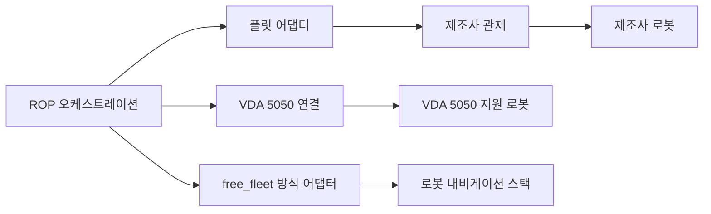

[홈](../../index.md) › [주제](../index.md) › 9. 로봇·제조사 관제 연동 — 대표 접근법과 기술

# 9. 로봇·제조사 관제 연동 — 대표 접근법과 기술

<!-- auto:page-status:start -->
<!-- auto:page-status:end -->

## 1. 세 줄 요약

- Open-RMF 플릿 어댑터는 제조사 관제나 로봇 API가 허용하는 제어 수준에 따라 전체 제어·신호등·읽기 전용 가운데 하나로 RMF에 붙는다. [사실][^ref-004][^ref-258] 아래는 이번 조사에서 확인한 연동 방식이다.
- 이 페이지는 [9. 로봇·제조사 관제 연동](../../categories/c-connectivity-and-execution-foundation/09-robot-and-vendor-fleet-manager-integration.md) 페이지의 "대표 접근법과 기술" 절이 분량 기준을 넘어 옮겨 온 것이다. 원 페이지의 검증을 거친 내용이며 새 주장은 없다.

## 2. 배경

[9. 로봇·제조사 관제 연동](../../categories/c-connectivity-and-execution-foundation/09-robot-and-vendor-fleet-manager-integration.md) 페이지를 쓰는 과정에서 "대표 접근법과 기술" 절의 분량이 세부영역 페이지 기준(4,000자)을 넘어, 내용을 줄이지 않고 이 주제 페이지로 분리했다.

## 3. 본문

Open-RMF 플릿 어댑터는 제조사 관제나 로봇 API가 허용하는 제어 수준에 따라 전체 제어·신호등·읽기 전용 가운데 하나로 RMF에 붙는다. [사실][^ref-004][^ref-258] 아래는 이번 조사에서 확인한 연동 방식이다.

### 제조사 관제 API에 붙는 어댑터

Open-RMF 플릿 어댑터 튜토리얼은 로봇·제조사 관제 API에 이동 명령(목적지 좌표·지도 이름·선택 속도 제한), 정지, 사용자 정의 동작 시작, 위치([x, y, theta])·현재 지도 이름·배터리 충전 상태 조회, 명령 완료 확인을 요구하고, navigate·stop·execute_action 세 콜백을 RMF 명령 실행의 기본으로 둔다. [사실][^ref-153] 로봇별 상태 조회는 비동기 갱신 루프로 처리해 한 로봇의 조회 오류가 다른 로봇의 상태 갱신을 막지 않게 한다. [사실][^ref-153]

어댑터 템플릿 설정은 제조사 관제 접속 정보(주소·사용자·암호), RMF 지도와 로봇 지도의 좌표 대응점 목록(reference_coordinates), 속도·가속 한계와 차체 반경, 배터리 사양, 플릿이 수행할 수 있는 작업 유형(task_capabilities)을 플릿 단위로 적게 한다(값은 템플릿 예시값). [사실][^ref-105]

### 표준 프로토콜로 연결: VDA 5050

VDA 5050 3.0.0은 관제에서 로봇으로 가는 order·instantActions·zoneSet·responses 토픽과 로봇에서 관제로 가는 state·visualization·connection·factsheet 토픽을 둔다. [사실][^ref-031] 주문 갱신은 orderId·orderUpdateId로 추적한다. [사실][^ref-031]

connection 토픽은 ONLINE·OFFLINE·CONNECTION_BROKEN·HIBERNATING 상태를 두며, 로봇은 연결할 때 CONNECTION_BROKEN을 담은 MQTT 유언 메시지(last will)를 설정해 비정상 단절 시 브로커가 관제에 대신 알리게 한다. [사실][^ref-031] 교통 관리 로직과 교통 조정 알고리즘은 명세 범위에서 빠져 있어 교통 조정 방식은 관제 구현에 맡겨진다. [사실][^ref-031]

### 로봇 내비게이션 스택에 직접 붙는 방식

Open-RMF의 free_fleet은 fleet_adapter_template 기반 Python 플릿 어댑터로, 제조사 관제를 거치지 않고 각 로봇의 Nav2(ROS 2 Jazzy)·Nav1(ROS 1 Noetic) 내비게이션 스택에 zenoh 통신 계층으로 직접 접속한다. [사실][^ref-264] Nav1 통합은 시뮬레이션과 ROS 1 Noetic에서만 시험됐다. [사실][^ref-264] 이는 연동 방식의 사례이며, 주행 기능 자체의 범위는 9절을 따른다.

### 상태·오류 변환표

Open-RMF 로봇 상태 스키마는 상태 값을 uninitialized·offline·shutdown·idle·charging·working·error 일곱 가지로 두고, 운영자가 알아야 할 문제를 범주(category)와 자유 형식 상세(detail)로 된 issues 배열로 보고한다. [사실][^ref-148] 인터페이스마다 상태 어휘가 달라(Open-RMF 로봇 상태 7종, VDA 5050 action 상태·주문 거절 오류 유형, MassRobotics 운용 상태 9종) 어댑터는 이를 ROP 공통 상태·오류로 옮기는 변환표를 가져야 할 것으로 보이며, 이들 사이의 공개 표준 매핑은 이번 검색에서 확인하지 못했다. [추정][^ref-148][^ref-031][^ref-230]

## 4. 현장 시나리오

현장 시나리오는 원 페이지의 [5. 현장 시나리오 (물류 흐름의 어느 단계인지 명시)](../../categories/c-connectivity-and-execution-foundation/09-robot-and-vendor-fleet-manager-integration.md) 절에 있다.

## 5. ROP 관점의 시사점

ROP가 직접 맡는 것과 외부와 연계하는 것은 원 페이지의 [9. ROP가 직접 맡는 것과 외부와 연계하는 것 (부록 A 9장 기준)](../../categories/c-connectivity-and-execution-foundation/09-robot-and-vendor-fleet-manager-integration.md) 절에 있다.

## 6. 연결되는 연구영역

- 주 연구영역: [9. 로봇·제조사 관제 연동](../../categories/c-connectivity-and-execution-foundation/09-robot-and-vendor-fleet-manager-integration.md)
- 관련 영역: [5. 로봇 능력·작업 온톨로지](../../categories/b-common-information-and-environment-model/05-robot-capability-and-task-ontology.md), [6. 지도·공간·위치 모델](../../categories/b-common-information-and-environment-model/06-map-space-and-location-model.md), [10. 설비·건물 시스템 연동](../../categories/c-connectivity-and-execution-foundation/10-facility-and-building-system-integration.md), [11. 분산 시스템·통신·컴퓨팅 구조](../../categories/c-connectivity-and-execution-foundation/11-distributed-systems-communication-and-computing.md), [12. 명령·작업 실행의 신뢰성](../../categories/c-connectivity-and-execution-foundation/12-command-and-task-execution-reliability.md), [13. 작업 배정 — MRTA](../../categories/d-planning-and-optimization/13-task-allocation-mrta.md), [15. 다중 로봇 경로·교통 관리 — MAPF](../../categories/d-planning-and-optimization/15-multi-robot-path-and-traffic-management-mapf.md), [20. 예외 복구·재계획·업무 연속성](../../categories/e-collaboration-and-field-operations/20-exception-recovery-replanning-and-business-continuity.md)

## 7. 열린 질문

열린 질문은 원 페이지의 [11. 열린 질문](../../categories/c-connectivity-and-execution-foundation/09-robot-and-vendor-fleet-manager-integration.md) 절과 [열린 질문](../../open-questions.md) 페이지에 모은다.

## 8. 출처

[^ref-004]: Open Robotics, RMF Core Overview — Programming Multiple Robots with ROS 2, 미확인, https://osrf.github.io/ros2multirobotbook/rmf-core.html, 접근일 2026-09-25
[^ref-031]: VDA / VDMA (VDA5050 GitHub), VDA5050/VDA5050_EN.md — Official Specification document for the VDA 5050, 미확인, https://github.com/VDA5050/VDA5050/blob/main/VDA5050_EN.md, 접근일 2026-09-25
[^ref-105]: Open Robotics (open-rmf), fleet_adapter_template — fleet_adapter_template/config.yaml, 미확인, https://github.com/open-rmf/fleet_adapter_template/blob/main/fleet_adapter_template/config.yaml, 접근일 2026-09-25
[^ref-148]: Open Robotics (open-rmf), rmf_api_msgs — rmf_api_msgs/schemas/robot_state.json, 미확인, https://github.com/open-rmf/rmf_api_msgs/blob/main/rmf_api_msgs/schemas/robot_state.json, 접근일 2026-09-25
[^ref-230]: MassRobotics, MassRobotics-AMR/AMR_Interop_Standard — AMR_Interop_Standard.json, 미확인, https://github.com/MassRobotics-AMR/AMR_Interop_Standard/blob/main/AMR_Interop_Standard.json, 접근일 2026-09-25 (원문 미열람)
[^ref-258]: Open Robotics, Mobile Robot Fleets (integration_fleets) - Programming Multiple Robots with ROS 2, 미확인, https://osrf.github.io/ros2multirobotbook/integration_fleets.html, 접근일 2026-09-25
[^ref-153]: Open Robotics, Fleet Adapter Tutorial (integration_fleets_adapter_tutorial) - Programming Multiple Robots with ROS 2, 미확인, https://osrf.github.io/ros2multirobotbook/integration_fleets_adapter_tutorial.html, 접근일 2026-09-25
[^ref-264]: Open Robotics (open-rmf), free_fleet — README (A free fleet management system), 미확인, https://github.com/open-rmf/free_fleet, 접근일 2026-09-25

## 9. 검증 노트

원 페이지와 함께 실행 2026-09-25-20 의 1차·2차 검증을 거쳤다. 분리는 코드가 했고 내용은 바꾸지 않았다.

## 10. 이력

| 날짜 | 실행 id | 변경 |
|---|---|---|
| 2026-09-25 | 2026-09-25-20 | 9. 로봇·제조사 관제 연동 의 "대표 접근법과 기술" 절에서 분리 |
