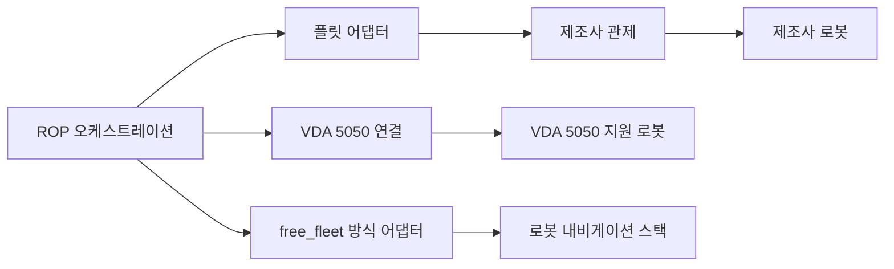

(너의 규칙은 시스템 프롬프트의 agents/shared-rules.md 와 agents/verifier.md 이다. 아래는 이번 실행의 컨텍스트와 입력이다.)

## 실행 컨텍스트

- run_id: 2026-09-25-20
- date: 2026-09-25
- run_type: area_deep_dive (영역 심화)
- 대상: 9. 로봇·제조사 관제 연동 (C. 연결·실행 기반)
- 예산:
    - max_search_queries: 30
    - max_sources_per_run: 15
    - new_topic_pages: 1
    - page_updates: 2
    - max_retries: 2
- 환경 알림: web_fetch_available: false · fetch_mode: mirror_only (일반 웹 페이지 열람은 네트워크 정책으로 막혀 있다. raw.githubusercontent.com 은 열린다: 공식 문서가 GitHub 에 있는 출처는 입력의 config/source_mirrors.yaml 경로를 WebFetch 로 열어 원문을 읽고 sources[].fetched=true, fetched_via=github_raw, fetch_url 을 적는다. 입력에 원문 텍스트(data/source_texts)가 있는 출처는 fetched_via=inbox. 그 밖의 출처는 fetched=false 이며 코드가 신뢰도 상한(medium)을 강제한다 — 공통 규칙 0절 6항)
- 언어: ko
- verification_stage: second
- verifier_budget:
    - max_search_queries: 30
    - max_sources_per_run: 15
    - new_topic_pages: 1
    - page_updates: 2
    - max_retries: 2
- retry_count: 1
- max_retries: 2

## 입력

### runs/2026-09-25-20/target.json

```json
{
  "run_id": "2026-09-25-20",
  "date": "2026-09-25",
  "weekday": "Fri",
  "run_number": 20,
  "run_type": "area_deep_dive",
  "forced": true,
  "target": {
    "area_no": 9,
    "area_name": "9. 로봇·제조사 관제 연동",
    "category": "C. 연결·실행 기반",
    "category_letter": "C"
  },
  "topic": null,
  "track": null,
  "corrections": [],
  "budget": {
    "max_search_queries": 30,
    "max_sources_per_run": 15,
    "new_topic_pages": 1,
    "page_updates": 2,
    "max_retries": 2
  },
  "priority_reason": null,
  "priority_questions": [],
  "excluded_areas": [],
  "lifted_areas": [],
  "deferred": {
    "monthly_recheck": false,
    "weekly_review": false
  },
  "selection_rationale": "CLI 지정 run_type=area_deep_dive, area=9"
}
```

### runs/2026-09-25-20/research.json

```json
{
  "run_id": "2026-09-25-20",
  "date": "2026-09-25",
  "run_type": "area_deep_dive",
  "target": {
    "area_no": 9,
    "area_name": "9. 로봇·제조사 관제 연동",
    "category": "C. 연결·실행 기반"
  },
  "gaps": [
    "섹션 3. 왜 중요한가 비어 있음",
    "섹션 4. 핵심 개념과 용어 비어 있음 — 플릿 어댑터 제어 수준, 관제(fleet control)·제조사 관제, 저수준·고수준 연동 구분 없음",
    "섹션 5. 현장 시나리오 (물류 흐름의 어느 단계인지 명시) 비어 있음",
    "섹션 6. 대표 접근법과 기술 비어 있음",
    "섹션 7. 관련 표준·프레임워크·오픈소스 비어 있음 — 트랙 반영 제안(2026-09-25-02: VDA 5050 팩트시트·상태 오류 보고, 3.0.0 발행, MassRobotics 메시지, Open-RMF 작업 능력·사용자 정의 동작) 미반영",
    "섹션 8. 대표 연구와 자료 비어 있음",
    "섹션 9. ROP가 직접 맡는 것과 외부와 연계하는 것 (부록 A 9장 기준) 비어 있음",
    "섹션 10. 다른 연구영역과의 연결 (번호와 이름을 함께 표기) 비어 있음",
    "섹션 11. 열린 질문 비어 있음 — 이 영역에 걸린 기존 열린 질문 oq-001, oq-005, oq-007, oq-014, oq-020 연결 필요",
    "프런트매터 related_areas·sources 비어 있음"
  ],
  "research_questions": [
    "개별 로봇을 제어할까, 제조사 관제에 미션을 맡길까? [분류원문]",
    "제조사 관제와 연동하는 방식(로봇 직접 제어, 제조사 관제에 작업 위임, 상태만 수신)은 어떻게 구분되며 각 방식은 제조사 쪽에 어떤 API·기능을 요구하는가? (섹션 3·4·6 겨냥)",
    "VDA 5050·MassRobotics·Open-RMF 는 명령·상태·오류·연결 단절을 어떤 메시지로 다루며, 어댑터가 변환해야 할 것은 무엇인가? (섹션 6·7, 트랙 반영 제안 겨냥)",
    "제조사 API·표준 프로토콜을 연결하는 공개 어댑터 구현(Open-RMF 어댑터, VDA 5050 커넥터)과 이종 플릿 통합 연구·사례에는 무엇이 있는가? (섹션 7·8 겨냥)",
    "국내 물류·서비스 현장에서 이기종 로봇 통합 관제는 어떤 방식으로 구현되고 있는가? (섹션 5·8, 한국 자료 우선)",
    "어댑터 계층에서 ROP가 직접 맡을 것과 로봇 자체 주행·제조사 관제에 맡길 것의 경계는 어디인가? (섹션 9 겨냥)",
    "oq-005·oq-014·oq-020 과 관련해 VDA 5050 판 정보와 상태 매핑에 새 근거가 있는가? (섹션 11 겨냥)"
  ],
  "findings": [
    {
      "id": "f1",
      "claim": "Open-RMF 문서는 플릿 어댑터를 RMF가 받는 제어 수준에 따라 전체 제어(Full Control)·신호등(Traffic Light)·읽기 전용(Read Only)·인터페이스 없음(No Interface) 네 범주로 나누며, 전체 제어는 실시간 상태와 개별 로봇 경로의 전체 제어를, 신호등은 상태와 로봇별 일시정지·재개 제어를, 읽기 전용은 정기 상태 보고만을 RMF에 준다.",
      "tag": "사실",
      "source_ids": [
        "ref-004",
        "ref-258"
      ],
      "cross_checked": false,
      "confidence": "medium",
      "evidence_excerpt": "rmf-core 원본: Traffic Light 는 'status as well as pause/resume control over each mobile robot', Read Only 는 다른 플릿이 충돌을 피하도록 상태만 제공, No Interface 는 RMF 환경에서 동작하지 않음. 두 출처 모두 Open Robotics 라 독립 교차 아님.",
      "as_of": "2026-09-25",
      "flow_step": null,
      "flow_item": "수행 자원"
    },
    {
      "id": "f2",
      "claim": "Open-RMF 의 전체 제어 어댑터는 제조사 관제(또는 로봇 API)가 로봇이 따를 명시적 경로를 지정할 수 있고 그 경로를 언제든 중단해 새 경로로 바꿀 수 있으며 이동 중 위치를 실시간으로 갱신해 주기를 요구한다.",
      "tag": "사실",
      "source_ids": [
        "ref-258"
      ],
      "cross_checked": false,
      "confidence": "medium",
      "evidence_excerpt": "integration_fleets 원본: 'explicit paths for the robot to follow, and that the path can be interrupted at any time and replaced with a new path', 위치는 'live as the robots are moving'. (발행일 미확인, 확인일 기준)",
      "as_of": "2026-09-25",
      "flow_step": null,
      "flow_item": "제약"
    },
    {
      "id": "f3",
      "claim": "Open-RMF 플릿 어댑터는 제조사별 API를 RMF 교통 스케줄·협상 시스템의 인터페이스에 잇고, 로봇의 예상 이동 경로(itinerary)를 시설 전체의 중앙 교통 스케줄에 보고해 플릿 사이 충돌을 찾아 협상하게 한다.",
      "tag": "사실",
      "source_ids": [
        "ref-004"
      ],
      "cross_checked": false,
      "confidence": "medium",
      "evidence_excerpt": "rmf-core 원본: 어댑터는 'connects its fleet-specific API to the interfaces of the core RMF traffic scheduling and negotiation system', 교통 스케줄은 'a centralized database of all the intended robot traffic trajectories'. (발행일 미확인, 확인일 기준)",
      "as_of": "2026-09-25",
      "flow_step": null,
      "flow_item": null
    },
    {
      "id": "f4",
      "claim": "Open-RMF 통합 개요는 ROS 1·ROS 2 를 직접 쓰는 로봇, REST·XMLRPC 같은 공식 API를 제공하는 제조사 관제, SQL 데이터베이스 같은 다른 통신 수단을 모두 연동 경로로 들고, 어댑터를 하드웨어별 인터페이스와 RMF 범용 인터페이스 사이의 다리로 설명한다.",
      "tag": "사실",
      "source_ids": [
        "ref-259"
      ],
      "cross_checked": false,
      "confidence": "medium",
      "evidence_excerpt": "integration 원본: Adapters 'bridge between the hardware-specific interfaces and the general purpose interfaces of RMF'; 제조사 관제의 REST·XMLRPC API, SQL DB 경로 언급. (발행일 미확인, 확인일 기준)",
      "as_of": "2026-09-25",
      "flow_step": null,
      "flow_item": null
    },
    {
      "id": "f5",
      "claim": "Open-RMF 플릿 어댑터 튜토리얼은 로봇·제조사 관제 API에 이동 명령(navigate: 목적지 좌표·지도 이름·선택 속도 제한), 정지(stop), 사용자 정의 동작 시작(start_activity), 위치([x, y, theta])·현재 지도 이름·배터리 충전 상태 조회, 명령 완료 확인(is_command_completed)을 요구하고, navigate·stop·execute_action 세 콜백을 RMF 명령 실행의 기본으로 둔다.",
      "tag": "사실",
      "source_ids": [
        "ref-153"
      ],
      "cross_checked": false,
      "confidence": "medium",
      "evidence_excerpt": "튜토리얼 원본: navigate 'takes in the destination coordinates from RMF, desired map name and optional speed limit'; is_command_completed 'Checks if the robot has completed the ongoing process or task'. (발행일 미확인, 확인일 기준)",
      "as_of": "2026-09-25",
      "flow_step": null,
      "flow_item": "완료·인계"
    },
    {
      "id": "f6",
      "claim": "Open-RMF 플릿 어댑터 튜토리얼은 로봇별 상태 조회를 비동기 갱신 루프로 처리해 한 로봇의 상태 조회 오류가 다른 로봇의 상태 갱신을 막지 않게 한다.",
      "tag": "사실",
      "source_ids": [
        "ref-153"
      ],
      "cross_checked": false,
      "confidence": "medium",
      "evidence_excerpt": "튜토리얼 원본: 'any error in retrieving the status from one robot won't block the other robots from updating'. (발행일 미확인, 확인일 기준)",
      "as_of": "2026-09-25",
      "flow_step": null,
      "flow_item": "예외·성과"
    },
    {
      "id": "f7",
      "claim": "Open-RMF 플릿 어댑터 템플릿 설정은 제조사 관제 접속 정보(주소·사용자·암호), RMF 지도 좌표와 로봇 지도 좌표의 대응점 목록(reference_coordinates), 속도·가속 한계와 차체 반경, 배터리 사양, 플릿이 수행할 수 있는 작업 유형(task_capabilities)을 플릿 단위로 적게 한다.",
      "tag": "사실",
      "source_ids": [
        "ref-105"
      ],
      "cross_checked": false,
      "confidence": "medium",
      "evidence_excerpt": "config.yaml 원본: fleet_manager prefix·user·password, reference_coordinates L1 rmf·robot 좌표 쌍, linear [0.5, 0.75], footprint 0.3, battery voltage·capacity, task_capabilities loop·delivery. (발행일 미확인, 확인일 기준)",
      "as_of": "2026-09-25",
      "flow_step": null,
      "flow_item": "수행 자원"
    },
    {
      "id": "f8",
      "claim": "Open-RMF 로봇 상태 스키마는 로봇 상태 값을 uninitialized·offline·shutdown·idle·charging·working·error 일곱 가지로 두고, 운영자가 알아야 할 문제를 범주(category)와 자유 형식 상세(detail)로 된 issues 배열로 보고한다.",
      "tag": "사실",
      "source_ids": [
        "ref-148"
      ],
      "cross_checked": false,
      "confidence": "medium",
      "evidence_excerpt": "robot_state.json 원본: status enum 7개, issues 항목은 category(문자열)와 detail(object·array·string). (발행일 미확인, 확인일 기준)",
      "as_of": "2026-09-25",
      "flow_step": null,
      "flow_item": "예외·성과"
    },
    {
      "id": "f9",
      "claim": "Open-RMF 의 free_fleet 은 fleet_adapter_template 기반 Python 플릿 어댑터로, 제조사 관제를 거치지 않고 각 로봇의 Nav2(ROS 2 Jazzy)·Nav1(ROS 1 Noetic) 내비게이션 스택에 zenoh 통신 계층으로 직접 접속한다.",
      "tag": "사실",
      "source_ids": [
        "ref-264"
      ],
      "cross_checked": false,
      "confidence": "medium",
      "evidence_excerpt": "README 원본: 'uses zenoh as a communication layer between each robot and the fleet adapter, allowing access and control over the navigation stacks of the robots'. Nav1 은 시뮬레이션에서만 시험. (발행일 미확인, 확인일 기준)",
      "as_of": "2026-09-25",
      "flow_step": null,
      "flow_item": null
    },
    {
      "id": "f10",
      "claim": "Open-RMF 커뮤니티 어댑터 목록은 MiR(MiR Fleet)·OTTO Motors·Clearpath·InOrbit 등 제조사·플랫폼별 플릿 어댑터와 KONE 등 승강기 어댑터, 문·기기 어댑터를 함께 모아 둔다.",
      "tag": "사실",
      "source_ids": [
        "ref-262"
      ],
      "cross_checked": false,
      "confidence": "medium",
      "evidence_excerpt": "awesome_adapters README: 'Integrate robot fleets, elevators/lifts, doors, workcells and devices quickly with these available adapters.' 플릿 어댑터 16~17건, 승강기 3건, 문 4건. 각 어댑터의 제어 수준은 미확인. (발행일 미확인, 확인일 기준)",
      "as_of": "2026-09-25",
      "flow_step": null,
      "flow_item": null
    },
    {
      "id": "f11",
      "claim": "VDA 5050 은 서로 다른 제조사의 AGV·AMR 을 하나의 관제(fleet control, master control)로 운용하기 위한 제조사 중립 통신 인터페이스이다.",
      "tag": "사실",
      "source_ids": [
        "ref-031",
        "ref-267"
      ],
      "cross_checked": true,
      "confidence": "medium",
      "evidence_excerpt": "명세 원본: 'standardized and vendor-neutral communication interface between a fleet control system and mobile robots'. Franke 외(2023) 요약: VDA 5050 은 이종 AGV 플릿 제어 표준화의 첫 접근, 벤더 종속 방지 목적.",
      "as_of": "2026-09-25",
      "flow_step": null,
      "flow_item": null,
      "source_unopened": false
    },
    {
      "id": "f12",
      "claim": "VDA 5050 3.0.0 은 MQTT(최소 3.1.1)와 JSON 을 쓰며, 관제→로봇 방향의 order·instantActions·zoneSet·responses 토픽과 로봇→관제 방향의 state·visualization·connection·factsheet 토픽을 둔다.",
      "tag": "사실",
      "source_ids": [
        "ref-031"
      ],
      "cross_checked": false,
      "confidence": "medium",
      "evidence_excerpt": "명세 원본: 'MQTT 3.1.1 is the minimum required version', JSON 형식, 토픽 8종. (발행일 미확인, 확인일 기준)",
      "as_of": "2026-09-25",
      "flow_step": null,
      "flow_item": null
    },
    {
      "id": "f13",
      "claim": "VDA 5050 3.0.0 주문은 노드·엣지 그래프를 sequenceId 순서로 보내며 실행이 허용된 base 구간과 계획만 된 horizon 구간으로 나누고, orderId·orderUpdateId 로 주문 갱신을 추적한다.",
      "tag": "사실",
      "source_ids": [
        "ref-031"
      ],
      "cross_checked": false,
      "confidence": "medium",
      "evidence_excerpt": "명세 원본: 주문 갱신의 첫 노드는 'corresponds to the last base node of the previous order'. (발행일 미확인, 확인일 기준)",
      "as_of": "2026-09-25",
      "flow_step": null,
      "flow_item": "시작 조건"
    },
    {
      "id": "f14",
      "claim": "VDA 5050 3.0.0 에서 로봇은 받을 수 없는 주문을 상태 메시지의 오류로 거절하며, 거절 오류 유형에 VALIDATION_FAILURE·UNSUPPORTED_PARAMETER·INVALID_ORDER_ACTION·OUTDATED_ORDER_UPDATE·SAME_ORDER_UPDATE_ID·START_NODE_OUT_OF_RANGE·NO_ROUTE_TO_TARGET 등이 있다.",
      "tag": "사실",
      "source_ids": [
        "ref-031"
      ],
      "cross_checked": false,
      "confidence": "medium",
      "evidence_excerpt": "명세 원본의 주문 거절 규칙에서 오류 유형 확인. 유형별 오류 등급은 열람 도구 응답만으로 확정하지 않음. (발행일 미확인, 확인일 기준)",
      "as_of": "2026-09-25",
      "flow_step": null,
      "flow_item": "예외·성과"
    },
    {
      "id": "f15",
      "claim": "VDA 5050 3.0.0 의 connection 토픽은 ONLINE·CONNECTION_BROKEN·HIBERNATING 상태를 두고, 로봇이 연결할 때 CONNECTION_BROKEN 을 담은 MQTT 유언 메시지(last will)를 설정해 비정상 단절 시 브로커가 관제에 대신 알리게 한다.",
      "tag": "사실",
      "source_ids": [
        "ref-031"
      ],
      "cross_checked": false,
      "confidence": "medium",
      "evidence_excerpt": "명세 원본: 'Set the last will to … connectionState set to CONNECTION_BROKEN, when the MQTT connection is created'; connection 메시지는 retained 플래그. (발행일 미확인, 확인일 기준)",
      "as_of": "2026-09-25",
      "flow_step": null,
      "flow_item": "예외·성과"
    },
    {
      "id": "f16",
      "claim": "VDA 5050 3.0.0 상태 메시지는 현재 orderId·orderUpdateId, 마지막으로 지난 노드(lastNodeId·lastNodeSequenceId), action 진행 상태(actionStates: INITIALIZING·RUNNING·PAUSED·FINISHED·FAILED·RETRIABLE 등)를 보고한다.",
      "tag": "사실",
      "source_ids": [
        "ref-031"
      ],
      "cross_checked": false,
      "confidence": "medium",
      "evidence_excerpt": "명세 원본: actionStates 는 'updated according to the progress of the action'. 2026-09-25-16 실행의 상태 스키마 확인(WAITING 포함 7종)과 일치. (발행일 미확인, 확인일 기준)",
      "as_of": "2026-09-25",
      "flow_step": null,
      "flow_item": "완료·인계"
    },
    {
      "id": "f17",
      "claim": "VDA 5050 3.0.0 은 교통 관리 로직과 교통 조정 알고리즘·의사결정을 문서 범위에서 제외해, 교통 조정 방식은 관제 구현에 맡긴다.",
      "tag": "사실",
      "source_ids": [
        "ref-031"
      ],
      "cross_checked": false,
      "confidence": "medium",
      "evidence_excerpt": "명세 원본의 범위 절: 'traffic management logic', 'algorithms or decision making processes for traffic coordination' 제외. (발행일 미확인, 확인일 기준)",
      "as_of": "2026-09-25",
      "flow_step": null,
      "flow_item": null
    },
    {
      "id": "f18",
      "claim": "VDA 5050 3.0.0 은 로봇이 적재 명세·지원 action 을 담은 팩트시트를 factsheet 토픽으로 관제에 알리게 하고, 사전 정의 action 으로 옮길 수 없는 동작은 제조사가 추가 action 을 정의해 관제가 쓰게 한다.",
      "tag": "사실",
      "source_ids": [
        "ref-031",
        "ref-228"
      ],
      "cross_checked": false,
      "confidence": "medium",
      "evidence_excerpt": "명세: 'the mobile robot manufacturer can define additional actions that shall be used by fleet control'. 팩트시트 스키마의 loadSpecification·mobileRobotActions. 같은 발행 주체라 독립 교차 아님. (재인용: 2026-09-25-16)",
      "as_of": "2026-09-25",
      "flow_step": null,
      "flow_item": "수행 자원",
      "source_unopened": false
    },
    {
      "id": "f19",
      "claim": "VDA 5050 공식 저장소 main 명세의 판 표기는 3.0.0 이며, VDA 는 3.0 판 발행을 보도자료로 알렸다(정확한 발행일은 기존 열린 질문 oq-005 의 출처 충돌로 남음).",
      "tag": "사실",
      "source_ids": [
        "ref-031",
        "ref-032"
      ],
      "cross_checked": false,
      "confidence": "medium",
      "evidence_excerpt": "명세 원본 머리말·표제 판 표기 3.0.0. 보도자료(2026-04 계열 URL)는 이번에 열지 못함. 두 출처 모두 VDA 계열이라 독립 교차 아님.",
      "as_of": "2026-09-25",
      "flow_step": null,
      "flow_item": null,
      "source_unopened": false
    },
    {
      "id": "f20",
      "claim": "MassRobotics AMR 상호운용 표준은 여러 제조사 AMR 이 같은 공간에서 위치·속도·방향·상태·작업 가용성 정보를 공유하게 하는 것을 목적으로 하며, 공식 JSON 스키마는 식별 보고(identityReport)와 상태 보고(statusReport) 두 메시지만 정의해 로봇에 명령을 보내는 메시지를 두지 않는다.",
      "tag": "사실",
      "source_ids": [
        "ref-261",
        "ref-230"
      ],
      "cross_checked": false,
      "confidence": "medium",
      "evidence_excerpt": "README 원본: 'location, speed, direction, health, tasking / availability and other performance characteristics'. 스키마 메시지 유형 두 가지(재인용: 2026-09-25-16). 트랙 제안의 'setup·status' 명칭은 스키마 기준 identityReport·statusReport.",
      "as_of": "2026-09-25",
      "flow_step": null,
      "flow_item": null,
      "source_unopened": true
    },
    {
      "id": "f21",
      "claim": "InOrbit 이 공개한 ros_amr_interop 저장소는 ROS 2 로봇을 MQTT 기반 VDA 5050 관제에 연결하는 VDA5050 커넥터와, ROS 2 데이터를 YAML 매핑으로 MassRobotics 상호운용 수신기에 보내는 송신 노드를 제공한다.",
      "tag": "사실",
      "source_ids": [
        "ref-263"
      ],
      "cross_checked": false,
      "confidence": "medium",
      "evidence_excerpt": "README 원본: massrobotics_amr_sender_py 는 'takes input from a ROS2 system and publishes it to a Mass Robotics Interop compliant Receiver'; VDA5050 connector·messages·serializer(Galactic). (발행일 미확인, 확인일 기준)",
      "as_of": "2026-09-25",
      "flow_step": null,
      "flow_item": null
    },
    {
      "id": "f22",
      "claim": "Interact Analysis 는 다중 플릿 오케스트레이션을 제3자 관제가 로봇에 직접 접속해 제어하는 저수준 제어(Low-Level Control, 현재 가장 흔함)와 제3자 관제가 각 제조사 관제에 작업을 넘기는 고수준 제어(High Level Control, 늘어나는 중)로 나누고, 장기적으로 어느 쪽이 쓰일지는 아직 정해지지 않았다고 본다.",
      "tag": "의견",
      "source_ids": [
        "ref-265"
      ],
      "cross_checked": false,
      "confidence": "medium",
      "evidence_excerpt": "검색 요약: 'directly interface with the mobile robots (Low-Level Control)', 'feed tasks to the proprietary fleet management systems (High Level Control)', 'The jury is still out'. 원문 미열람. (발행일 미확인, 확인일 기준)",
      "as_of": "2026-09-25",
      "flow_step": null,
      "flow_item": "수행 자원",
      "source_unopened": true
    },
    {
      "id": "f23",
      "claim": "ARM Institute 의 IO-AMRs 과제는 AMR 제조사마다 자체 플릿 관리 소프트웨어를 써서 여러 브랜드를 섞은 플릿 운영이 어렵다는 문제를 다루며, 다중 지도 관리자·연결 계층·전역 플릿 관리자를 만드는 것을 목표로 한다.",
      "tag": "사실",
      "source_ids": [
        "ref-266"
      ],
      "cross_checked": false,
      "confidence": "medium",
      "evidence_excerpt": "검색 요약: 'each AMR vendor uses their custom Fleet Management software platform', 'multi-map manager, connectivity layer, and global fleet manager'. 원문 미열람. (발행일 미확인, 확인일 기준)",
      "as_of": "2026-09-25",
      "flow_step": null,
      "flow_item": null,
      "source_unopened": true
    },
    {
      "id": "f24",
      "claim": "Franke 외(2023)는 VDA 5050 이 AGV·관제 사이 인터페이스만 다루고 AGV·관제와 주변 설비(periphery) 사이 인터페이스는 다루지 않는다고 지적하고, 소프트웨어 공급사·하드웨어 제조사·사용자 워크숍으로 새 표준 인터페이스 요구를 정리했다.",
      "tag": "사실",
      "source_ids": [
        "ref-267"
      ],
      "cross_checked": false,
      "confidence": "medium",
      "evidence_excerpt": "검색 요약: 'further interfaces between the AGV, a master control and the surrounding periphery are not considered in VDA 5050'. Logistics Journal: Proceedings 2023. 원문 미열람.",
      "as_of": "2023",
      "flow_step": null,
      "flow_item": null,
      "source_unopened": true
    },
    {
      "id": "f25",
      "claim": "2026년 ScienceDirect 게재 연구는 상용 다중 제조사 AMR 플릿과 천장 반송 차량(OHT)·바닥 AGV 사이의 작업 조정을 하나의 소프트웨어 정의 공장(Software-Defined Factory) 틀에 넣고 통신·위치추정·경로계획·작업 배정을 중앙 시스템이 다루는 이종 플릿 제어 시스템을 제안했다.",
      "tag": "사실",
      "source_ids": [
        "ref-268"
      ],
      "cross_checked": false,
      "confidence": "medium",
      "evidence_excerpt": "검색 요약: 'centralized architecture … manages communication, localization, navigation, and task allocation in a heterogeneous multi-vendor fleet deployed in real-world scenarios'. 저자·권호 미확인, 원문 미열람.",
      "as_of": "2026",
      "flow_step": null,
      "flow_item": null,
      "source_unopened": true
    },
    {
      "id": "f26",
      "claim": "Applied Sciences(2025) 사례 연구는 자동차 공장에서 여러 제조사 AGV·AMR 의 위치·상태 데이터를 하나의 지도와 웹 플랫폼으로 통합해 감시하는 플릿 관리 소프트웨어를 개발하고 작업 상태 갱신 평균 지연 120 ms 를 보고했으며, 향후 VDA 5050 통합을 고려한 구조를 두었다.",
      "tag": "사실",
      "source_ids": [
        "ref-136"
      ],
      "cross_checked": false,
      "confidence": "medium",
      "evidence_excerpt": "검색 요약: 'average latency of 120 ms for task status updates and an interface refresh rate of less than 1 s'; GreenAuto 과제, VDA 5050 향후 통합 고려. 원문 미열람, 측정 조건 미확인.",
      "as_of": "2025",
      "flow_step": null,
      "flow_item": "예외·성과",
      "source_unopened": true
    },
    {
      "id": "f27",
      "claim": "MiR 이 기존 RESTful 로봇 인터페이스를 MQTT 와 연결해 자사 AMR 과 타사 관제 사이에 VDA 5050 메시지를 주고받게 하는 어댑터 'MiR VDA 5050' 을 출시했다고 국내 전문지가 보도했다.",
      "tag": "추정",
      "source_ids": [
        "ref-269"
      ],
      "cross_checked": false,
      "confidence": "low",
      "evidence_excerpt": "벤더 주장: 검색 요약 '미르의 기존 RESTful 로봇 인터페이스를 MQTT 프로토콜과 연결해 미르 AMR과 타사 시스템 간의 쉬운 VDA 메시지 교환'. 원문 미열람. (발행일 미확인, 확인일 기준)",
      "as_of": "2026-09-25",
      "flow_step": null,
      "flow_item": null,
      "source_unopened": true,
      "vendor_claim": true
    },
    {
      "id": "f28",
      "claim": "클로봇은 브랜드·이동 방식과 무관하게 이기종 로봇을 하나의 시스템처럼 관제한다는 클라우드 기반 플릿 관리 시스템(CROMS)을 제공한다고 밝힌다.",
      "tag": "추정",
      "source_ids": [
        "ref-270"
      ],
      "cross_checked": false,
      "confidence": "low",
      "evidence_excerpt": "벤더 주장: 검색 요약 'cloud-based heterogeneous multi-robot control system (FMS)', 브랜드·이동 방식과 무관하게 단일 시스템으로 관제. 원문 미열람. (발행일 미확인, 확인일 기준)",
      "as_of": "2026-09-25",
      "flow_step": null,
      "flow_item": null,
      "source_unopened": true,
      "vendor_claim": true
    },
    {
      "id": "f29",
      "claim": "카카오모빌리티는 서비스 요청을 로봇 실행 단위로 추상화하는 Task, 이기종 로봇을 통합 표준 API 로 잇는 Command Interface, 장애 시 작업을 다른 로봇에 재배정하는 Reallocation, 건물 인프라·기존 시스템을 잇는 Integration Backbone 을 로봇 플랫폼 구성으로 발표했다.",
      "tag": "추정",
      "source_ids": [
        "ref-271"
      ],
      "cross_checked": false,
      "confidence": "low",
      "evidence_excerpt": "벤더 주장: 기사 검색 요약의 네 구성 요소 설명과 '특정 제조사에 종속되지 않는' 오케스트레이터 지향. 가동률 8배 등 성과 수치는 벤더 발표라 넣지 않음. 원문 미열람.",
      "as_of": "2026-05",
      "flow_step": null,
      "flow_item": null,
      "source_unopened": true,
      "vendor_claim": true
    },
    {
      "id": "f30",
      "claim": "노바테크가 현대자동차그룹 메타플랜트 아메리카에서 12종 약 300대의 이기종 물류 로봇을 자사 오케스트레이션 플랫폼 하나로 통합 운영한다고 보도됐다.",
      "tag": "추정",
      "source_ids": [
        "ref-272"
      ],
      "cross_checked": false,
      "confidence": "low",
      "evidence_excerpt": "벤더 주장: 기사 검색 요약 '약 300대, 12종의 이기종 물류 로봇을 하나의 플랫폼으로 통합', 플랫폼 'PiPER'. 원문 미열람, 독립 확인 없음.",
      "as_of": "2026-07-14",
      "flow_step": null,
      "flow_item": "수행 자원",
      "source_unopened": true,
      "vendor_claim": true
    },
    {
      "id": "f31",
      "claim": "VDA 5050 3.0.0 의 사전 정의 action pick·drop 은 적재물이 로봇에 들어왔거나(pick) 떠났고(drop) 로봇이 새 적재 상태를 보고했을 때를 완료(FINISHED)로 정의해, 관제는 action 상태와 적재 상태로 운반 작업의 적재·하역 완료를 확인할 수 있다.",
      "tag": "사실",
      "source_ids": [
        "ref-031"
      ],
      "cross_checked": false,
      "confidence": "medium",
      "evidence_excerpt": "명세 표: pick finished 'Load has entered the mobile robot and mobile robot reports new load state'. (재인용: 2026-09-25-16)",
      "as_of": "2026-09-25",
      "flow_step": "출하",
      "flow_item": "완료·인계"
    },
    {
      "id": "f32",
      "claim": "출하 운반에서 상위 시스템의 운반 요청은 ROP 가 연동 방식에 따라 VDA 5050 주문(노드·엣지와 pick·drop action)이나 제조사 관제·Open-RMF 어댑터의 이동·동작 명령으로 바꿔 전달해야 할 것으로 보인다.",
      "tag": "추정",
      "source_ids": [
        "ref-031",
        "ref-153"
      ],
      "cross_checked": false,
      "confidence": "low",
      "evidence_excerpt": "f13(주문 구조)·f31(pick·drop 완료)·f5(navigate·start_activity) 를 출하 흐름의 시작 조건에 대응시킨 추론.",
      "as_of": "2026-09-25",
      "flow_step": "출하",
      "flow_item": "시작 조건"
    },
    {
      "id": "f33",
      "claim": "출하 운반 중 주문 거절 오류(NO_ROUTE_TO_TARGET 등)나 연결 단절(CONNECTION_BROKEN), 상태 error 가 보고되면 ROP 는 이를 공통 예외로 옮겨 다른 로봇·플릿 재배정이나 사람 확인으로 넘겨야 할 것으로 보인다.",
      "tag": "추정",
      "source_ids": [
        "ref-031",
        "ref-148"
      ],
      "cross_checked": false,
      "confidence": "low",
      "evidence_excerpt": "f14·f15(VDA 5050 거절 오류·연결 상태)와 f8(Open-RMF 상태 error·issues)을 출하 흐름의 예외 처리에 대응시킨 추론. 복구 규칙 자체는 20. 예외 복구·재계획·업무 연속성의 과제.",
      "as_of": "2026-09-25",
      "flow_step": "출하",
      "flow_item": "예외·성과"
    },
    {
      "id": "f34",
      "claim": "분류 원문의 질문(개별 로봇을 제어할까, 제조사 관제에 미션을 맡길까)에 대해, 개별 로봇 제어(저수준 제어·전체 제어·VDA 5050 직접 연결)는 ROP 가 경로·교통을 통합 조정할 수 있는 대신 제조사가 경로 지정·중단·교체 API 나 VDA 5050 지원을 제공해야 하고, 제조사 관제 위임(고수준 제어)이나 신호등·읽기 전용 수준 연동은 연동 부담이 작은 대신 공용 통로·승강기·문에서의 조정이 일시정지·재개나 상태 관측에 그칠 것으로 보인다.",
      "tag": "추정",
      "source_ids": [
        "ref-004",
        "ref-258",
        "ref-265",
        "ref-031"
      ],
      "cross_checked": false,
      "confidence": "low",
      "evidence_excerpt": "f1·f2(Open-RMF 제어 수준과 전체 제어 요구), f22(저수준·고수준 구분), f11·f17(VDA 5050 관제 역할, 교통 로직 범위 밖)을 대조한 추론. 두 방식의 처리량·비용을 비교한 정량 자료는 찾지 못함.",
      "as_of": "2026-09-25",
      "flow_step": null,
      "flow_item": "수행 자원",
      "source_unopened": false
    },
    {
      "id": "f35",
      "claim": "연계 대상: 로컬 경로 계획·장애물 회피·위치추정 같은 로봇 자체 주행 기능은 로봇·제조사 쪽에 남고, 이종 제조사를 잇는 ROP 의 어댑터는 명령·상태·오류 변환, 지도 좌표 변환, 완료 확인, 교통·설비 조정 인터페이스를 맡는 것으로 보인다.",
      "tag": "추정",
      "source_ids": [
        "ref-031",
        "ref-258",
        "ref-105",
        "ref-153"
      ],
      "cross_checked": false,
      "confidence": "low",
      "evidence_excerpt": "f5·f7(어댑터가 다루는 명령·상태·좌표 대응점), f17(VDA 5050 은 교통 로직 제외), 분류 원문 9장 '로봇 자체 지능·제어' 경계를 대응시킨 추론.",
      "as_of": "2026-09-25",
      "flow_step": null,
      "flow_item": null
    },
    {
      "id": "f36",
      "claim": "로봇·관제 인터페이스마다 상태 어휘가 달라(Open-RMF 로봇 상태 7종, VDA 5050 action 상태·주문 거절 오류 유형, MassRobotics 운용 상태 9종) 어댑터는 이를 ROP 공통 상태·오류로 옮기는 변환표를 가져야 할 것으로 보이며, 이들 사이의 공개 표준 매핑은 이번 검색에서 확인하지 못했다.",
      "tag": "추정",
      "source_ids": [
        "ref-148",
        "ref-031",
        "ref-230"
      ],
      "cross_checked": false,
      "confidence": "low",
      "evidence_excerpt": "f8·f14·f16 과 MassRobotics operationalState 9종(재인용: 2026-09-25-15)을 대조한 추론. 매핑 부재는 검색 범위 기준이며 확정 아님.",
      "as_of": "2026-09-25",
      "flow_step": null,
      "flow_item": "예외·성과",
      "source_unopened": false
    }
  ],
  "sources": [
    {
      "id": "ref-004",
      "org": "Open Robotics",
      "title": "RMF Core Overview — Programming Multiple Robots with ROS 2",
      "published": null,
      "url": "https://osrf.github.io/ros2multirobotbook/rmf-core.html",
      "type": "오픈소스 문서",
      "reliability": "high",
      "accessed": "2026-09-25",
      "summary": "작업·교통 조율, Fleet Adapter, 설비 연동 구조 참고. 이번 실행은 플릿 어댑터 제어 수준 4범주와 교통 스케줄 보고 구조를 원본에서 확인했다.",
      "fetched": true,
      "fetched_via": "github_raw",
      "fetch_url": "https://raw.githubusercontent.com/osrf/ros2multirobotbook/master/src/rmf-core.md",
      "source_unopened": false
    },
    {
      "id": "ref-031",
      "org": "VDA / VDMA (VDA5050 GitHub)",
      "title": "VDA5050/VDA5050_EN.md — Official Specification document for the VDA 5050",
      "published": null,
      "url": "https://github.com/VDA5050/VDA5050/blob/main/VDA5050_EN.md",
      "type": "표준",
      "reliability": "high",
      "accessed": "2026-09-25",
      "summary": "VDA 5050 공식 명세 본문(main 은 3.0.0 판). 이번 실행은 목적·MQTT 토픽·주문 구조·주문 거절 오류·연결 상태·상태 보고·범위 제외 사항을 확인했다.",
      "fetched": true,
      "fetched_via": "github_raw",
      "fetch_url": "https://raw.githubusercontent.com/VDA5050/VDA5050/main/VDA5050_EN.md",
      "source_unopened": false
    },
    {
      "id": "ref-032",
      "org": "VDA(Verband der Automobilindustrie)",
      "title": "Version 3.0 of VDA 5050 released",
      "published": "2026-04",
      "url": "https://www.vda.de/en/press/press-releases/2026/260421_PM_VDA_5050_EN",
      "type": "표준",
      "reliability": "medium",
      "accessed": "2026-09-25",
      "summary": "원문 미열람. VDA 5050 3.0 판 발행을 알린 VDA 보도자료.",
      "source_unopened": true,
      "fetched": false,
      "fetched_via": null,
      "fetch_url": null
    },
    {
      "id": "ref-105",
      "org": "Open Robotics (open-rmf)",
      "title": "fleet_adapter_template — fleet_adapter_template/config.yaml",
      "published": null,
      "url": "https://github.com/open-rmf/fleet_adapter_template/blob/main/fleet_adapter_template/config.yaml",
      "type": "오픈소스 문서",
      "reliability": "high",
      "accessed": "2026-09-25",
      "summary": "Open-RMF 플릿 어댑터 템플릿 설정 파일. 제조사 관제 접속 정보, 지도 좌표 대응점, 속도·차체 한계, 배터리, 작업 능력 항목을 정의한다.",
      "fetched": true,
      "fetched_via": "github_raw",
      "fetch_url": "https://raw.githubusercontent.com/open-rmf/fleet_adapter_template/main/fleet_adapter_template/config.yaml",
      "source_unopened": false
    },
    {
      "id": "ref-136",
      "org": "Applied Sciences(MDPI) 게재 논문 저자(미확인)",
      "title": "Integrated Fleet Management of Mobile Robots for Enhancing Industrial Efficiency: A Case Study on Interoperability in Multi-Brand Environments Within the Automotive Sector",
      "published": "2025",
      "url": "https://www.mdpi.com/2076-3417/15/13/7235",
      "type": "논문",
      "reliability": "medium",
      "accessed": "2026-09-25",
      "summary": "원문 미열람. 자동차 공장의 다중 제조사 AGV·AMR 위치·상태를 통합 감시하는 플릿 관리 소프트웨어 사례 연구.",
      "source_unopened": true,
      "fetched": false,
      "fetched_via": null,
      "fetch_url": null
    },
    {
      "id": "ref-148",
      "org": "Open Robotics (open-rmf)",
      "title": "rmf_api_msgs — rmf_api_msgs/schemas/robot_state.json",
      "published": null,
      "url": "https://github.com/open-rmf/rmf_api_msgs/blob/main/rmf_api_msgs/schemas/robot_state.json",
      "type": "오픈소스 문서",
      "reliability": "high",
      "accessed": "2026-09-25",
      "summary": "Open-RMF API 의 로봇 상태 스키마. 상태 값 7종, 위치·배터리, 문제(issues) 보고 필드를 정의한다.",
      "fetched": true,
      "fetched_via": "github_raw",
      "fetch_url": "https://raw.githubusercontent.com/open-rmf/rmf_api_msgs/main/rmf_api_msgs/schemas/robot_state.json",
      "source_unopened": false
    },
    {
      "id": "ref-228",
      "org": "VDA / VDMA (VDA5050 GitHub)",
      "title": "VDA5050/VDA5050 — json_schemas/factsheet.schema",
      "published": null,
      "url": "https://github.com/VDA5050/VDA5050/blob/main/json_schemas/factsheet.schema",
      "type": "표준",
      "reliability": "medium",
      "accessed": "2026-09-25",
      "summary": "원문 미열람. 이번 실행에서는 다시 열지 않았다(2026-09-25-15·16 실행에서 원문 확인). VDA 5050 팩트시트 JSON 스키마로 유형 명세·적재 명세·지원 action 을 정의한다.",
      "source_unopened": true,
      "fetched": false,
      "fetched_via": null,
      "fetch_url": null
    },
    {
      "id": "ref-230",
      "org": "MassRobotics",
      "title": "MassRobotics-AMR/AMR_Interop_Standard — AMR_Interop_Standard.json",
      "published": null,
      "url": "https://github.com/MassRobotics-AMR/AMR_Interop_Standard/blob/main/AMR_Interop_Standard.json",
      "type": "표준",
      "reliability": "medium",
      "accessed": "2026-09-25",
      "summary": "원문 미열람. 이번 실행에서는 다시 열지 않았다(2026-09-25-15·16 실행에서 원문 확인). 식별 보고와 상태 보고 두 메시지를 정의한 MassRobotics 공식 JSON 스키마.",
      "source_unopened": true,
      "fetched": false,
      "fetched_via": null,
      "fetch_url": null
    },
    {
      "id": "ref-258",
      "org": "Open Robotics",
      "title": "Mobile Robot Fleets (integration_fleets) - Programming Multiple Robots with ROS 2",
      "published": null,
      "url": "https://osrf.github.io/ros2multirobotbook/integration_fleets.html",
      "type": "오픈소스 문서",
      "reliability": "high",
      "accessed": "2026-09-25",
      "summary": "Open-RMF 에 모바일 로봇 플릿을 연동하는 범주(전체 제어·간편 전체 제어·신호등·읽기 전용)와 각 범주가 제조사 관제에 요구하는 기능을 설명하는 공식 문서(mdBook 원본).",
      "fetched": true,
      "fetched_via": "github_raw",
      "fetch_url": "https://raw.githubusercontent.com/osrf/ros2multirobotbook/master/src/integration_fleets.md",
      "source_unopened": false
    },
    {
      "id": "ref-259",
      "org": "Open Robotics",
      "title": "Integration (integration) - Programming Multiple Robots with ROS 2",
      "published": null,
      "url": "https://osrf.github.io/ros2multirobotbook/integration.html",
      "type": "오픈소스 문서",
      "reliability": "high",
      "accessed": "2026-09-25",
      "summary": "Open-RMF 통합 개요. 어댑터가 하드웨어별 인터페이스와 RMF 범용 인터페이스를 잇는 역할과 ROS·제조사 관제 API·DB 등 연동 경로를 설명한다(mdBook 원본).",
      "fetched": true,
      "fetched_via": "github_raw",
      "fetch_url": "https://raw.githubusercontent.com/osrf/ros2multirobotbook/master/src/integration.md",
      "source_unopened": false
    },
    {
      "id": "ref-153",
      "org": "Open Robotics",
      "title": "Fleet Adapter Tutorial (integration_fleets_adapter_tutorial) - Programming Multiple Robots with ROS 2",
      "published": null,
      "url": "https://osrf.github.io/ros2multirobotbook/integration_fleets_adapter_tutorial.html",
      "type": "오픈소스 문서",
      "reliability": "high",
      "accessed": "2026-09-25",
      "summary": "플릿 어댑터가 로봇·제조사 관제 API 에 요구하는 이동·정지·동작·위치·배터리·완료 확인 함수와 비동기 상태 갱신 구조를 설명하는 튜토리얼(mdBook 원본).",
      "fetched": true,
      "fetched_via": "github_raw",
      "fetch_url": "https://raw.githubusercontent.com/osrf/ros2multirobotbook/master/src/integration_fleets_adapter_tutorial.md",
      "source_unopened": false
    },
    {
      "id": "ref-261",
      "org": "MassRobotics",
      "title": "MassRobotics-AMR/AMR_Interop_Standard — README",
      "published": null,
      "url": "https://github.com/MassRobotics-AMR/AMR_Interop_Standard",
      "type": "표준",
      "reliability": "medium",
      "accessed": "2026-09-25",
      "summary": "MassRobotics AMR 상호운용 표준 공식 저장소 README. 다중 제조사 AMR 의 위치·상태·작업 가용성 정보 공유라는 목적과 스키마·예제 구성을 설명한다.",
      "fetched": false,
      "fetched_via": null,
      "fetch_url": "https://raw.githubusercontent.com/MassRobotics-AMR/AMR_Interop_Standard/main/README.md",
      "source_unopened": true
    },
    {
      "id": "ref-262",
      "org": "Open Robotics (open-rmf)",
      "title": "awesome_adapters — A curated list of adapters from the community which can be used with Open-RMF (README)",
      "published": null,
      "url": "https://github.com/open-rmf/awesome_adapters",
      "type": "오픈소스 문서",
      "reliability": "high",
      "accessed": "2026-09-25",
      "summary": "Open-RMF 와 함께 쓸 수 있는 커뮤니티 플릿·승강기·문·기기 어댑터 목록.",
      "fetched": true,
      "fetched_via": "github_raw",
      "fetch_url": "https://raw.githubusercontent.com/open-rmf/awesome_adapters/main/README.md",
      "source_unopened": false
    },
    {
      "id": "ref-263",
      "org": "InOrbit (inorbit-ai GitHub)",
      "title": "ros_amr_interop — README (ROS packages for AMR interoperability: VDA5050 connector, MassRobotics AMR sender)",
      "published": null,
      "url": "https://github.com/inorbit-ai/ros_amr_interop",
      "type": "오픈소스 문서",
      "reliability": "high",
      "accessed": "2026-09-25",
      "summary": "ROS 2 로봇을 VDA 5050 관제에 연결하는 커넥터와 MassRobotics 상호운용 수신기로 데이터를 보내는 송신 노드를 담은 저장소 README.",
      "fetched": true,
      "fetched_via": "github_raw",
      "fetch_url": "https://raw.githubusercontent.com/inorbit-ai/ros_amr_interop/main/README.md",
      "source_unopened": false
    },
    {
      "id": "ref-264",
      "org": "Open Robotics (open-rmf)",
      "title": "free_fleet — README (A free fleet management system)",
      "published": null,
      "url": "https://github.com/open-rmf/free_fleet",
      "type": "오픈소스 문서",
      "reliability": "high",
      "accessed": "2026-09-25",
      "summary": "zenoh 로 각 로봇의 Nav2·Nav1 내비게이션 스택에 직접 접속하는 Python 플릿 어댑터의 README.",
      "fetched": true,
      "fetched_via": "github_raw",
      "fetch_url": "https://raw.githubusercontent.com/open-rmf/free_fleet/main/README.md",
      "source_unopened": false
    },
    {
      "id": "ref-265",
      "org": "Interact Analysis",
      "title": "AMR Multi-Fleet Orchestration Software Explained",
      "published": null,
      "url": "https://interactanalysis.com/insight/amr-multi-fleet-orchestration-software/",
      "type": "업계 보고서",
      "reliability": "medium",
      "accessed": "2026-09-25",
      "summary": "원문 미열람. 다중 플릿 오케스트레이션 소프트웨어를 저수준 제어(로봇 직접 제어)와 고수준 제어(제조사 관제에 작업 위임)로 구분해 설명한 시장조사 기관 분석.",
      "source_unopened": true,
      "fetched": false,
      "fetched_via": null,
      "fetch_url": null
    },
    {
      "id": "ref-266",
      "org": "ARM Institute",
      "title": "Interoperability and Orchestration of Autonomous Mobile Robots (IO-AMRs)",
      "published": null,
      "url": "https://arminstitute.org/projects/interoperability-and-orchestration-of-autonomous-mobile-robots-io-amrs/",
      "type": "정부·연구기관",
      "reliability": "medium",
      "accessed": "2026-09-25",
      "summary": "원문 미열람. 제조사별 플릿 관리 소프트웨어로 인한 혼합 플릿 운영 문제를 다루는 ARM Institute 과제 소개 페이지.",
      "source_unopened": true,
      "fetched": false,
      "fetched_via": null,
      "fetch_url": null
    },
    {
      "id": "ref-267",
      "org": "Franke, S., Lünsch, D., Jost, J., & Roidl, M.",
      "title": "Identification of requirements and opportunities for new types of standardized interfaces for AGV systems based on the VDA 5050 concept",
      "published": "2023",
      "url": "https://www.researchgate.net/publication/374741902_Identification_of_requirements_and_opportunities_for_new_types_of_standardized_interfaces_for_AGV_systems_based_on_the_VDA_5050_concept",
      "type": "논문",
      "reliability": "medium",
      "accessed": "2026-09-25",
      "summary": "원문 미열람. VDA 5050 이 다루지 않는 AGV·관제·주변 설비 인터페이스 요구를 문헌과 업계 워크숍으로 정리한 Logistics Journal: Proceedings 2023 논문.",
      "source_unopened": true,
      "fetched": false,
      "fetched_via": null,
      "fetch_url": null
    },
    {
      "id": "ref-268",
      "org": "ScienceDirect 게재 논문(저자 미확인)",
      "title": "Heterogeneous multi-agent fleet control system for material handling in a Software-Defined Factory",
      "published": "2026",
      "url": "https://www.sciencedirect.com/science/article/abs/pii/S0278612526000166",
      "type": "논문",
      "reliability": "medium",
      "accessed": "2026-09-25",
      "summary": "원문 미열람. 다중 제조사 AMR·OHT·AGV 를 한 소프트웨어 정의 공장 틀에서 중앙 제어하는 이종 플릿 제어 시스템을 제안한 논문.",
      "source_unopened": true,
      "fetched": false,
      "fetched_via": null,
      "fetch_url": null
    },
    {
      "id": "ref-269",
      "org": "헬로티(HelloT)",
      "title": "미르, 다기종 모바일 로봇 연동 SW 어댑터 ‘MiR VDA 5050’ 론칭",
      "published": null,
      "url": "https://www.hellot.net/news/article.html?no=99467",
      "type": "기사",
      "reliability": "low",
      "accessed": "2026-09-25",
      "summary": "원문 미열람. MiR 의 VDA 5050 어댑터 출시를 전한 국내 전문지 기사.",
      "source_unopened": true,
      "fetched": false,
      "fetched_via": null,
      "fetch_url": null
    },
    {
      "id": "ref-270",
      "org": "클로봇(Clobot)",
      "title": "통합 로봇 관제 플랫폼 크롬스[CROMS]",
      "published": null,
      "url": "https://clobot.co.kr/croms",
      "type": "벤더 문서",
      "reliability": "low",
      "accessed": "2026-09-25",
      "summary": "원문 미열람. 이기종 다중 로봇을 통합 관제한다는 클라우드 기반 플릿 관리 시스템 제품 소개 페이지.",
      "source_unopened": true,
      "fetched": false,
      "fetched_via": null,
      "fetch_url": null
    },
    {
      "id": "ref-271",
      "org": "디지털투데이",
      "title": "카카오모빌리티, 로봇 플랫폼 사업 본격화...\"이기종 로봇 통합 운영\"",
      "published": "2026-05",
      "url": "https://www.digitaltoday.co.kr/news/articleView.html?idxno=665333",
      "type": "기사",
      "reliability": "low",
      "accessed": "2026-09-25",
      "summary": "원문 미열람. 카카오모빌리티의 이기종 로봇 플랫폼 구성(Task·Command Interface·Reallocation·Integration Backbone) 발표를 전한 기사.",
      "source_unopened": true,
      "fetched": false,
      "fetched_via": null,
      "fetch_url": null
    },
    {
      "id": "ref-272",
      "org": "머니투데이",
      "title": "\"로봇 통합 관제 기술, 인정받았다\"..노바테크, 70억원 투자 유치",
      "published": "2026-07-14",
      "url": "https://www.mt.co.kr/industry/2026/07/14/2026071409414468672",
      "type": "기사",
      "reliability": "low",
      "accessed": "2026-09-25",
      "summary": "원문 미열람. 노바테크의 이기종 물류 로봇 오케스트레이션 플랫폼과 현대차그룹 미국 공장 적용을 전한 기사.",
      "source_unopened": true,
      "fetched": false,
      "fetched_via": null,
      "fetch_url": null
    }
  ],
  "page_proposals": [
    {
      "action": "update",
      "path": "docs/categories/c-connectivity-and-execution-foundation/09-robot-and-vendor-fleet-manager-integration.md",
      "sections": [
        "3",
        "4",
        "5",
        "6",
        "7",
        "8",
        "9",
        "10",
        "11"
      ],
      "rationale": "섹션 3: f23·f22·f34(제조사별 관제 소프트웨어로 혼합 플릿 운영이 어렵고, 직접 제어와 관제 위임 사이 선택이 필요함) / 섹션 4: f1(제어 수준 4범주), f11·f12(관제·VDA 5050 토픽), f22(저수준·고수준 제어), f13(base·horizon) / 섹션 5: 출하 흐름 — 시작 조건 f32, 수행 자원 f34, 완료·인계 f31·f16, 예외·성과 f33·f14·f15 / 섹션 6: f2·f5·f6·f7(어댑터 API 요구·비동기 갱신·좌표 대응), f9(로봇 직접 접속), f36(상태 변환표), f34(방식 비교) / 섹션 7: f11~f19(VDA 5050 3.0.0: 트랙 반영 제안의 팩트시트 [추정]·오류 보고·action 완료 보고·3.0.0 발행을 3.0.0 명세 원본 근거 f18·f14·f16·f19 로 대체), f20(MassRobotics 식별·상태 보고, 트랙 제안의 'setup·status' 명칭을 스키마 명칭으로 정정), f7·f5(Open-RMF 작업 능력 선언·사용자 정의 동작, 트랙 제안 f19·f20 반영), f3·f10·f21 / 섹션 8: f24·f25·f26 연구, f27~f30 국내 사례(모두 벤더 주장·기사) / 섹션 9: f35(연계 대상: 로컬 주행은 제조사), f17 / 섹션 10: 10. 설비·건물 시스템 연동(f24, f10 승강기·문 어댑터), 12. 명령·작업 실행의 신뢰성(f13·f14·f15·f16), 15. 다중 로봇 경로·교통 관리 — MAPF(f1·f3·f17), 5. 로봇 능력·작업 온톨로지(f18·f7), 11. 분산 시스템·통신·컴퓨팅 구조(f12·f15), 13. 작업 배정 — MRTA(f29 재배정), 20. 예외 복구·재계획·업무 연속성(f33), 6. 지도·공간·위치 모델(f7 좌표 대응) / 섹션 11: 기존 oq-001·oq-005·oq-007·oq-014·oq-020 연결, open_questions_new 3건. 트랙 반영 제안 1건(2026-09-25-02, 7절)을 이번 조사로 재확인해 반영 대상에 넣음. 다음 실행 후보: 10. 설비·건물 시스템 연동 페이지 7절에 f10·f24 반영"
    }
  ],
  "glossary_candidates": [
    {
      "term_ko": "플릿 관리 시스템",
      "term_en": "Fleet Management System (FMS)",
      "definition": "여러 이동로봇에 작업을 배정하고 경로·상태를 관리하는 관제 소프트웨어로, 로봇 제조사가 자사 로봇용으로 제공하는 경우가 많다."
    },
    {
      "term_ko": "다중 플릿 오케스트레이션",
      "term_en": "Multi-Fleet Orchestration",
      "definition": "제조사가 다른 여러 로봇 플릿을 제3자 관제가 한곳에서 조율하는 것으로, 로봇을 직접 제어하는 저수준 방식과 제조사 관제에 작업을 넘기는 고수준 방식이 있다."
    },
    {
      "term_ko": "엠큐티티",
      "term_en": "Message Queuing Telemetry Transport (MQTT)",
      "definition": "브로커를 거쳐 토픽 단위로 메시지를 발행·구독하는 경량 메시징 프로토콜로, VDA 5050 이 관제와 이동로봇 사이 통신에 쓴다."
    }
  ],
  "open_questions_new": [
    "국내 물류센터에서 로봇을 직접 제어하는 방식과 제조사 관제에 작업을 넘기는 방식 가운데 어느 쪽이 쓰이는지, 선택 기준이나 처리량·연동 비용을 비교한 공개 자료가 있는가? | 관련 영역: 9. 로봇·제조사 관제 연동, 3. 처리능력·거점·설비 계획 | 근거: f22 | 종류: 일반",
    "제조사 관제가 일시정지·재개나 상태 보고만 허용할 때 공용 통로·승강기·문에서 다른 플릿과의 교착을 어떻게 막는가, 제어 수준에 따른 교통 성능 차이를 측정한 연구가 있는가? | 관련 영역: 9. 로봇·제조사 관제 연동, 15. 다중 로봇 경로·교통 관리 — MAPF | 근거: f1 | 종류: 일반",
    "Open-RMF 로봇 상태, VDA 5050 action 상태·오류, MassRobotics 운용 상태를 하나의 공통 상태·오류 어휘로 옮기는 표준 매핑이나 공개 구현이 있는가? | 관련 영역: 9. 로봇·제조사 관제 연동, 12. 명령·작업 실행의 신뢰성, 19. 모니터링·이상 탐지·원인 분석 | 근거: f36 | 종류: 일반"
  ],
  "open_questions_resolved": [],
  "self_check": {
    "source_count": 23,
    "cross_checked_count": 1,
    "unverified": [
      "f1 은 Open Robotics 문서 두 개라 독립 교차 아님",
      "f18·f19·f20 은 같은 발행 주체(VDA, MassRobotics) 자료 두 개라 독립 교차 아님",
      "f14 주문 거절 오류 유형별 오류 등급은 열람 도구 응답만으로 확정하지 않아 넣지 않음",
      "f10 어댑터 목록 각 항목의 제어 수준 미확인",
      "f22·f23·f24·f25·f26 원문 미열람(검색 요약 범위), ref-265·ref-266 발행일 미확인, ref-268 저자·권호 미확인",
      "f26 의 120 ms 수치 측정 조건 미확인",
      "f27~f30 벤더 주장·기사이며 독립 확인 없음. 클로봇 자체 명령 규격(CRCS)은 출처 URL 을 특정하지 못해 넣지 않음",
      "oq-005(VDA 5050 3.0.0 정확한 발행일) 미해결",
      "oq-014·oq-020 관련 표준 매핑은 이번에도 찾지 못함"
    ],
    "scope_violations": [
      "f35: 로컬 경로 계획·장애물 회피·위치추정은 분류 원문 9장 '로봇 자체 지능·제어'의 외부 연계 영역이므로 '연계 대상: '으로 표시함",
      "f9: free_fleet 은 로봇 내비게이션 스택에 직접 접속하는 구현이므로 로봇 주행 기능 자체를 ROP 직접 범위로 서술하지 않도록 연동 방식 사례로만 제안",
      "f25: 제조 공장(OHT·AGV) 대상 연구이므로 물류센터 적용 사례처럼 서술하지 않도록 방법 참고로만 제안"
    ],
    "budget_used": {
      "queries": 17,
      "sources": 15
    },
    "limits": "web_fetch_available: false · fetch_mode mirror_only. raw.githubusercontent.com 공식 원문을 열었다: 재사용 ref-004(rmf-core)·ref-031(VDA 5050 3.0.0 명세)·ref-105(어댑터 템플릿 설정)·ref-148(robot_state 스키마), 신규 ref-258·ref-259·ref-153(Open-RMF 통합 문서 원본)·ref-261(MassRobotics README)·ref-262(awesome_adapters)·ref-263(InOrbit ros_amr_interop)·ref-264(free_fleet). openTCS VDA 5050 어댑터와 InOrbit 저장소의 한 브랜치는 404 로 열지 못해 opentcs 는 출처에서 뺐다. 업계 보고서·연구기관·논문·기사·벤더 페이지 8건과 재사용 4건(ref-032·ref-136·ref-228·ref-230)은 원문 미열람이라 신뢰도 상한 medium(벤더·기사는 low). 검색 17회/30, 신규 출처 15건/15(ref-258~ref-272)로 신규 출처 상한에 도달해 SYNAOS 비교 글·DiVA 학위논문·MiR 공식 VDA 5050 페이지는 넣지 않았다. 교차 확인 1건(f11: VDA 5050 목적, 명세 원본과 Franke 외). 트랙 반영 제안 1건(2026-09-25-02)은 모두 다루었다: 팩트시트 기능 알림은 2.0.0 기준 [추정]에서 3.0.0 명세 원본 근거(f18)로, 상태 오류·action 완료 보고는 f14·f16·f31 로, 3.0.0 발행은 f19(발행일은 oq-005 로 남김)로, MassRobotics 는 f20(메시지 명칭은 스키마 기준 identityReport·statusReport)으로, Open-RMF 작업 능력·사용자 정의 동작은 f5·f7 로 재확인했다. 한국 자료: 국내 표준(TTA·KS)에서 이기종 로봇 관제 인터페이스 표준은 찾지 못했고, 국내 사례는 기사·벤더 자료(f27~f30)뿐이라 벤더 주장으로 표시했다. 27. AI·학습·적응과 모델 운영 관련 finding 없음. 8. 실시간 세계 상태·데이터 일관성과 22. 시뮬레이션·예측용 디지털 트윈 관련 주장 없음. 분류원문 질문(개별 로봇 제어 대 제조사 관제 위임)은 f34 로 추정 수준 답만 냈고 정량 비교 자료는 찾지 못했다."
  }
}
```

### runs/2026-09-25-20/verification.json

```json
{
  "run_id": "2026-09-25-20",
  "stage": "first",
  "verdict": "조건부 승인",
  "retry_reason": null,
  "claim_checks": [
    {
      "finding_id": "f1",
      "source_exists": true,
      "supports_claim": true,
      "cross_checked": false,
      "tag_decision": "유지",
      "note": "확인: ref-004 원문(data/source_texts)에 제어 수준 4범주 표와 각 범주 설명(Full Control 은 live status updates·경로 전체 제어, Traffic Light 는 status 와 pause/resume, Read Only 는 regular status updates)이 있다. ref-258 은 raw 원본을 검증자가 열어 Full Control·Easy Full Control·Traffic Light 범주를 확인했다. 두 출처 모두 Open Robotics 라 독립 교차 아님. 발행일 미확인."
    },
    {
      "finding_id": "f2",
      "source_exists": true,
      "supports_claim": true,
      "cross_checked": false,
      "tag_decision": "유지",
      "note": "확인: ref-258 raw 원본(integration_fleets.md)에 명시 경로 지정, 언제든 중단·교체 가능, 이동 중 위치 실시간 갱신 요구가 있다. 단일 출처, 발행일 미확인."
    },
    {
      "finding_id": "f3",
      "source_exists": true,
      "supports_claim": true,
      "cross_checked": false,
      "tag_decision": "유지",
      "note": "확인: ref-004 원문의 Fleet Adapters 절(어댑터가 제조사별 API 를 RMF 교통 일정·협상 인터페이스에 연결)과 Traffic Schedule 절(예정 궤적의 중앙 데이터베이스, 충돌 시 협상). 단일 발행 주체."
    },
    {
      "finding_id": "f4",
      "source_exists": true,
      "supports_claim": false,
      "cross_checked": false,
      "tag_decision": "강등",
      "note": "부분 일치: '어댑터가 하드웨어별 인터페이스와 RMF 범용 인터페이스를 잇는다'는 ref-259 본문에 있다. 그러나 ROS 1·ROS 2 로봇, REST·XMLRPC API, SQL DB 연동 경로 열거는 mdBook 원본의 주석 처리된(게시 페이지에 렌더링되지 않는) 요구사항 메모에만 있어, 게시된 통합 개요가 이를 든다고 볼 수 없다. 어댑터 역할 부분만 [사실]로 남기고 연동 경로 열거는 삭제한다."
    },
    {
      "finding_id": "f5",
      "source_exists": true,
      "supports_claim": true,
      "cross_checked": false,
      "tag_decision": "유지",
      "note": "확인: ref-153 raw 원본에 navigate(robot_name, position, map, speed_limit)·start_activity·stop·position([x, y, theta])·map·battery_soc·is_command_completed 와 navigate·stop·execute_action 콜백이 있다. 발행일 미확인."
    },
    {
      "finding_id": "f6",
      "source_exists": true,
      "supports_claim": true,
      "cross_checked": false,
      "tag_decision": "유지",
      "note": "확인: ref-153 원본의 비동기 갱신 루프 문장(한 로봇의 상태 조회 오류가 다른 로봇 갱신을 막지 않음)."
    },
    {
      "finding_id": "f7",
      "source_exists": true,
      "supports_claim": true,
      "cross_checked": false,
      "tag_decision": "유지",
      "note": "확인: ref-105 config.yaml 원본에 fleet_manager prefix·user·password, reference_coordinates(L1, 4쌍), linear 0.5·0.75, footprint 0.3, battery(12V·24Ahr), task_capabilities(loop·delivery)가 있다. 템플릿 예시값이다."
    },
    {
      "finding_id": "f8",
      "source_exists": true,
      "supports_claim": true,
      "cross_checked": false,
      "tag_decision": "유지",
      "note": "확인: ref-148 robot_state.json 원본의 status enum 7종과 issues(category 문자열, detail 은 object·array·string)."
    },
    {
      "finding_id": "f9",
      "source_exists": true,
      "supports_claim": true,
      "cross_checked": false,
      "tag_decision": "유지",
      "note": "확인: ref-264 README 원본(fleet_adapter_template 기반 Python 플릿 어댑터, zenoh 로 내비게이션 스택 접근). Nav1 통합은 시뮬레이션·ROS 1 Noetic 에서만 시험됐다는 단서가 있어 본문에 병기해야 한다."
    },
    {
      "finding_id": "f10",
      "source_exists": true,
      "supports_claim": true,
      "cross_checked": false,
      "tag_decision": "유지",
      "note": "확인: ref-262 README 원본에 MiR·MiRFleet·OTTO Motors·Clearpath·InOrbit 등 플릿 어댑터 17건, KONE 등 승강기 3건, 문 4건. 브리프는 어댑터별 제어 수준을 미확인으로 두었으므로 본문에 제어 수준을 쓰지 않는다."
    },
    {
      "finding_id": "f11",
      "source_exists": true,
      "supports_claim": true,
      "cross_checked": true,
      "tag_decision": "유지",
      "note": "확인: ref-031 원문 1·2장(표준화된 제조사 중립 인터페이스, 이종 제조사 플릿의 공유 환경 운용 목적). ref-267 은 검색 결과로 실재 확인(Logistics Journal: Proceedings 2023, 제조사 종속 회피·VDA 5050 을 표준화의 첫 접근으로 기술). 발행 주체가 달라 교차 확인으로 인정. ref-267 원문 미열람이므로 medium."
    },
    {
      "finding_id": "f12",
      "source_exists": true,
      "supports_claim": true,
      "cross_checked": false,
      "tag_decision": "유지",
      "note": "확인: ref-031 4장(MQTT 3.1.1 최소, JSON)과 표 2(토픽 8종, 방향). connection 은 발행 주체가 '브로커 / 로봇'이다. 단일 출처."
    },
    {
      "finding_id": "f13",
      "source_exists": true,
      "supports_claim": true,
      "cross_checked": false,
      "tag_decision": "유지",
      "note": "확인: ref-031 6.1.1·6.1.2(sequenceId, base·horizon, orderId·orderUpdateId, stitching node)."
    },
    {
      "finding_id": "f14",
      "source_exists": true,
      "supports_claim": true,
      "cross_checked": false,
      "tag_decision": "유지",
      "note": "확인: ref-031 6.1.4 와 표 9 에 열거된 오류 유형 모두 있음. 원문상 UNSUPPORTED_PARAMETER 는 CRITICAL, 나머지는 WARNING 이나 브리프가 등급을 넣지 않았으므로 본문에 등급을 쓰지 않는다."
    },
    {
      "finding_id": "f15",
      "source_exists": true,
      "supports_claim": true,
      "cross_checked": false,
      "tag_decision": "유지",
      "note": "확인: ref-031 6.5(last will 을 CONNECTION_BROKEN 으로 설정, retained 플래그). 다만 connection 상태에는 OFFLINE(정상 종료)도 있어 상태 목록을 ONLINE·OFFLINE·CONNECTION_BROKEN·HIBERNATING 으로 적어야 한다(2026-09-25-18 브리프 f2 와도 일치)."
    },
    {
      "finding_id": "f16",
      "source_exists": true,
      "supports_claim": true,
      "cross_checked": false,
      "tag_decision": "유지",
      "note": "확인: ref-031 6.6.2(lastNodeId·lastNodeSequenceId), 6.2.3.2(action 상태 INITIALIZING·RUNNING·PAUSED·FINISHED·FAILED·RETRIABLE). '등' 표기 유지."
    },
    {
      "finding_id": "f17",
      "source_exists": true,
      "supports_claim": true,
      "cross_checked": false,
      "tag_decision": "유지",
      "note": "확인: ref-031 2장 범위 제외(Traffic Management Logic). 같은 명세 5.3 은 교착 탐지·교통 제어를 관제의 기능으로 열거하므로 '관제 구현에 맡긴다'는 서술과 부합한다."
    },
    {
      "finding_id": "f18",
      "source_exists": true,
      "supports_claim": true,
      "cross_checked": false,
      "tag_decision": "유지",
      "note": "확인: ref-031 6.2.3(제조사가 추가 action 을 정의해 관제가 쓰게 함)과 표 2 의 factsheet 토픽. 팩트시트의 적재 명세·지원 action 필드는 ref-228(이번 실행 미열람, 2026-09-25-15·16 에서 열람)에 기댄다. 같은 발행 주체, 독립 교차 아님."
    },
    {
      "finding_id": "f19",
      "source_exists": true,
      "supports_claim": true,
      "cross_checked": false,
      "tag_decision": "유지",
      "note": "확인: ref-031 표제 'Version 3.0.0'. ref-032 보도자료는 원문 미열람(참고문헌 목록에 등재된 출처). 정확한 발행일은 oq-005 로 남기고 '미확인'으로 쓴다."
    },
    {
      "finding_id": "f20",
      "source_exists": true,
      "supports_claim": true,
      "cross_checked": false,
      "tag_decision": "유지",
      "note": "확인: 검증자가 ref-261 README 원본(목적: 위치·속도·방향·건강·작업 가용성)과 ref-230 JSON 원본(identityReport·statusReport 두 메시지, 명령 메시지 없음)을 raw 로 열어 확인. 브리프는 ref-261 을 fetched:false 로 적었으나 한계 항목에는 열었다고 적어 표시가 어긋난다. 같은 발행 주체."
    },
    {
      "finding_id": "f21",
      "source_exists": true,
      "supports_claim": true,
      "cross_checked": false,
      "tag_decision": "유지",
      "note": "확인: ref-263 README 원본(massrobotics_amr_sender_py 설명, VDA5050 패키지). 빌드 표 기준 VDA5050 패키지는 ROS 2 Galactic, MassRobotics 송신 노드는 Foxy·Galactic 대상이어서 배포판을 병기해야 한다."
    },
    {
      "finding_id": "f22",
      "source_exists": true,
      "supports_claim": true,
      "cross_checked": false,
      "tag_decision": "유지",
      "note": "검색 결과 일치(원문 미열람): Interact Analysis 페이지 실재, 저수준 제어가 현재 가장 흔하고 고수준 제어가 늘고 있다는 요약 확인. [의견]은 Interact Analysis 의 의견으로 주체를 밝힌다. 발행일 미확인."
    },
    {
      "finding_id": "f23",
      "source_exists": true,
      "supports_claim": true,
      "cross_checked": false,
      "tag_decision": "유지",
      "note": "검색 결과 일치(원문 미열람): ARM Institute IO-AMRs 페이지 실재, 제조사별 FMS 문제와 multi-map manager·connectivity layer·global fleet manager 목표 확인. 발행일 미확인."
    },
    {
      "finding_id": "f24",
      "source_exists": true,
      "supports_claim": true,
      "cross_checked": false,
      "tag_decision": "유지",
      "note": "검색 결과 일치(원문 미열람): Logistics Journal: Proceedings 2023 실재, 주변 설비 인터페이스 미포함 지적과 공급사·제조사·사용자 워크숍 확인."
    },
    {
      "finding_id": "f25",
      "source_exists": true,
      "supports_claim": true,
      "cross_checked": false,
      "tag_decision": "유지",
      "note": "검색 결과 일치(원문 미열람): ScienceDirect 논문 실재, 중앙 구조의 통신·위치추정·주행·작업 배정, 다중 제조사 AMR 과 OHT·AGV 조정 확인. 제조 공장 대상이며 저자·권호 미확인."
    },
    {
      "finding_id": "f26",
      "source_exists": true,
      "supports_claim": true,
      "cross_checked": false,
      "tag_decision": "유지",
      "note": "검색 결과 일치(원문 미열람): Applied Sciences 2025(doi 10.3390/app15137235) 실재, GreenAuto 과제·다중 제조사 위치·상태 통합 지도·웹 플랫폼 확인. 120 ms 수치는 검증자 검색 요약에는 나타나지 않고 브리프 스니펫에만 있어 단일 출처·측정 조건 미확인으로 표기해야 한다."
    },
    {
      "finding_id": "f27",
      "source_exists": true,
      "supports_claim": true,
      "cross_checked": false,
      "tag_decision": "유지",
      "note": "검색 결과 일치(원문 미열람): 헬로티 기사 실재, RESTful 인터페이스–MQTT 연결 서술 확인(ZDNet·로봇신문도 같은 발표를 보도하나 같은 보도자료 기반이라 독립 아님). [추정]·벤더 주장 유지."
    },
    {
      "finding_id": "f28",
      "source_exists": true,
      "supports_claim": true,
      "cross_checked": false,
      "tag_decision": "유지",
      "note": "검색 결과 일치(원문 미열람): clobot.co.kr/croms 실재, 브랜드·이동 방식과 무관한 단일 시스템 관제 문구 확인. [추정]·벤더 주장 유지."
    },
    {
      "finding_id": "f29",
      "source_exists": true,
      "supports_claim": true,
      "cross_checked": false,
      "tag_decision": "유지",
      "note": "검색 결과 일치(원문 미열람): 디지털투데이 기사 실재, Task·Command Interface·Reallocation·Integration Backbone 네 구성 확인. 성과 수치는 넣지 않는다. [추정]·벤더 주장 유지."
    },
    {
      "finding_id": "f30",
      "source_exists": true,
      "supports_claim": true,
      "cross_checked": false,
      "tag_decision": "유지",
      "note": "검색 결과 일치(원문 미열람): 머니투데이 기사 실재, 12종 300여 대 단일 플랫폼 관제(여러 매체가 같은 투자 발표를 보도, 독립 아님). 대상은 전기차 생산 공장(HMGMA)이며 물류센터 사례가 아니다. [추정]·벤더 주장 유지."
    },
    {
      "finding_id": "f31",
      "source_exists": true,
      "supports_claim": true,
      "cross_checked": false,
      "tag_decision": "유지",
      "note": "확인: ref-031 표 5 의 pick·drop FINISHED 정의(적재물이 로봇에 들어오거나 떠나고 로봇이 새 적재 상태를 보고)."
    },
    {
      "finding_id": "f32",
      "source_exists": true,
      "supports_claim": true,
      "cross_checked": false,
      "tag_decision": "유지",
      "note": "[추정] 추론으로 적정. 근거 f13·f31·f5 가 모두 확인됨. 출하 / 시작 조건."
    },
    {
      "finding_id": "f33",
      "source_exists": true,
      "supports_claim": true,
      "cross_checked": false,
      "tag_decision": "유지",
      "note": "[추정] 추론으로 적정. 근거 f14·f15·f8 확인. 복구 규칙은 20. 예외 복구·재계획·업무 연속성으로 연결만 한다. 명세상 connection 토픽은 로봇 건강 확인용이 아니라는 단서가 있음."
    },
    {
      "finding_id": "f34",
      "source_exists": true,
      "supports_claim": true,
      "cross_checked": false,
      "tag_decision": "유지",
      "note": "[추정] 추론으로 적정. 분류 원문 SCM 질문에 대한 답이며 정량 비교 자료가 없다는 한계를 본문에 남긴다. ref-265 는 원문 미열람."
    },
    {
      "finding_id": "f35",
      "source_exists": true,
      "supports_claim": true,
      "cross_checked": false,
      "tag_decision": "유지",
      "note": "[추정]·'연계 대상:' 표시 적정. 분류 원문 9장 '로봇 자체 지능·제어' 경계와 일치."
    },
    {
      "finding_id": "f36",
      "source_exists": true,
      "supports_claim": true,
      "cross_checked": false,
      "tag_decision": "유지",
      "note": "[추정] 적정. 검증자가 ref-230 JSON 원본에서 MassRobotics operationalState 9종(navigating·idle·disabled·offline·charging·waitingHumanEvent·waitingExternalEvent·waitingInternalEvent·manualOverride)을 확인했다. 공개 매핑 부재는 검색 범위 기준."
    }
  ],
  "category_fit": {
    "ok": true,
    "reassign_to": null
  },
  "scope_boundary": {
    "ok": true,
    "issues": []
  },
  "duplication": {
    "ok": true,
    "overlaps": [
      "f15(VDA 5050 connection 상태)는 2026-09-25-18 브리프 f2(8. 실시간 세계 상태·데이터 일관성)와 같은 내용이다 — ref-031 각주를 재사용하고 상태 목록을 OFFLINE 포함으로 맞춘다",
      "f8·f36 의 Open-RMF 로봇 상태 7종은 2026-09-25-18 브리프 f5 와 같은 ref-148 근거다 — 각주 재사용",
      "f36 의 상태 매핑 질문은 oq-014(BPMN–로봇 작업 상태)·oq-020(ISA-95–VDA 5050·Open-RMF)과 인접하나 로봇 인터페이스 간 상태 매핑이라 별개 질문으로 둔다",
      "참고: 2026-09-25-19 브리프가 ref-228~ref-237 을 LIF·IFC 등 다른 출처에 부여했으나 게시된 참고문헌 목록에서 ref-228 은 VDA 5050 팩트시트 스키마, ref-230 은 MassRobotics JSON 이다. 이번 실행의 ref-228·ref-230 사용은 게시 목록과 일치한다. 신규 ref-258~ref-272 는 미게시 실행과의 번호 충돌을 퍼블리셔가 확인해야 한다"
    ]
  },
  "terminology": {
    "ok": false,
    "conflicts": [
      "용어집 'VDA 5050' 항목의 한 줄 정의가 팩트시트 메시지의 정의('이동로봇이 유형 명세·물리 파라미터·지원 동작·적재 명세를 관제에 미리 알리는 메시지')로 잘못 들어가 있다 — f11 근거로 표준 자체 정의로 갱신 필요",
      "용어 후보 '엠큐티티'는 용어집의 표기 관례(약어 대신 뜻을 옮긴 한글 명칭 + 영문 병기)와 맞지 않는다"
    ]
  },
  "quotation_check": {
    "ok": true,
    "issues": [
      "브리프 evidence_excerpt 가 ref-031(f11~f19, f31)과 ref-153(f5·f6)에서 여러 구절을 인용한다. 페이지에서는 출처당 직접 인용 1회만 허용되므로 나머지는 재서술해야 한다(수정 지시로 처리)"
    ]
  },
  "corrections_applied": [],
  "corrections_rejected": [],
  "required_fixes": [
    "f4: '어댑터가 하드웨어별 인터페이스와 RMF 범용 인터페이스를 잇는다'는 부분만 [사실][^ref-259]로 쓰고, ROS 1·ROS 2·REST·XMLRPC·SQL DB 연동 경로 열거는 본문에서 삭제한다 — 그 열거는 mdBook 원본의 주석 처리된 메모에만 있고 게시 페이지에는 나타나지 않는다.",
    "f15: VDA 5050 connection 상태를 ONLINE·OFFLINE·CONNECTION_BROKEN·HIBERNATING 네 값으로 적는다 — ref-031 6.5·표 5 에 OFFLINE(정상 종료)이 있다.",
    "f9: free_fleet 서술에 'Nav1 통합은 시뮬레이션과 ROS 1 Noetic 에서만 시험됨'을 병기하고, 로봇 주행 기능 자체가 아니라 '제조사 관제를 거치지 않고 로봇 내비게이션 스택에 직접 붙는 연동 방식의 사례'로만 6절에 쓴다 — 범위 경계(로봇 자체 지능·제어는 연계 대상).",
    "f21: InOrbit ros_amr_interop 서술에 대상 ROS 2 배포판(VDA5050 패키지 Galactic, MassRobotics 송신 노드 Foxy·Galactic)을 기준일과 함께 병기한다 — README 빌드 표 기준이다.",
    "f10: 커뮤니티 어댑터 목록 서술에 어댑터별 제어 수준을 적지 않는다 — 브리프가 미확인으로 둔 항목이다.",
    "f22: [의견] 문장에 'Interact Analysis 의 분석(의견)'임을 주체로 밝히고 각주 [^ref-265]를 단다.",
    "f25·f30: 두 사례가 제조 공장(소프트웨어 정의 공장, 현대차그룹 전기차 생산 거점) 대상임을 명시하고 물류센터 적용 사례처럼 쓰지 않는다 — f25 는 방법 참고, f30 은 [추정] '벤더 주장'.",
    "f26: 120 ms 평균 지연 수치에 '단일 출처, 측정 조건 미확인'을 병기하고 핵심 결론 근거로 쓰지 않는다.",
    "f27·f28·f29·f30: 모두 [추정]에 '벤더 주장'을 병기하고, 기사에 나온 성과 수치(가동률 배수 등)는 넣지 않는다 — 독립 확인이 없다.",
    "f19: VDA 5050 3.0.0 발행일은 '미확인'으로 쓰고 oq-005(출처 충돌)를 11절에 연결한다. oq-005 를 해결로 바꾸지 않는다.",
    "7절 트랙 반영 제안(2026-09-25-02) 반영: 팩트시트는 2.0.0 기준 [추정] 대신 3.0.0 명세 근거(f18, [사실])로, MassRobotics 메시지 명칭은 'setup·status' 대신 스키마 명칭 identityReport·statusReport(f20)로 적는다.",
    "f32·f33·f34·f35·f36: [추정] 태그를 유지하고, 5절 시나리오는 '출하' 단계와 여섯 항목(시작 조건·수행 자원·완료·인계·예외·성과)을 명시하며, f35 는 '연계 대상:' 표시를 유지해 9절에 둔다. f34 에는 '두 방식의 처리량·비용 정량 비교 자료는 찾지 못함'을 남긴다.",
    "인용: ref-031 과 ref-153 에서 직접 인용은 각 1회만 쓰고 나머지 evidence_excerpt 내용은 한국어로 재서술한다 — 출처당 직접 인용 1회 규칙.",
    "각주·참고문헌: 브리프에서 fetched:false 인 ref-032·ref-136·ref-228·ref-230·ref-261·ref-265·ref-266·ref-267·ref-268·ref-269·ref-270·ref-271·ref-272 의 각주 정의 접근일 뒤에 ' (원문 미열람)'을 붙이고 reference_updates 의 해당 항목에 source_unopened: true 를 넣는다 — web_fetch_available: false 환경 규칙.",
    "용어집: 'VDA 5050' 항목 정의를 f11 근거로 '서로 다른 제조사의 이동로봇을 하나의 관제로 운용하기 위한 제조사 중립 통신 인터페이스' 취지로 갱신(action: update)한다 — 현재 정의는 팩트시트 메시지의 정의다.",
    "용어집 후보 'MQTT'의 term_ko 를 음차 '엠큐티티' 대신 뜻을 옮긴 명칭(예: '메시지 큐잉 원격 측정 전송')으로 바꾸고 영문 Message Queuing Telemetry Transport (MQTT)를 병기한다 — 용어집 표기 관례.",
    "10절 연결은 모두 번호와 이름을 함께 쓴다(10. 설비·건물 시스템 연동, 12. 명령·작업 실행의 신뢰성, 15. 다중 로봇 경로·교통 관리 — MAPF, 5. 로봇 능력·작업 온톨로지, 11. 분산 시스템·통신·컴퓨팅 구조, 13. 작업 배정 — MRTA, 20. 예외 복구·재계획·업무 연속성, 6. 지도·공간·위치 모델)."
  ],
  "confidence": "medium",
  "verification_note": "판정: 조건부 승인. 이번 실행은 원문 열람이 차단된 환경에서 검증됐다(fetch_mode mirror_only; GitHub 공식 저장소 원문과 입력 원문 텍스트만 열람). 확인 35건, 미확인 1건(f4), 교차 확인 1건(f11: VDA 5050 명세와 Franke 외 2023). 강등: f4 사실 → 어댑터 역할 부분만 사실로 축소(연동 경로 열거 삭제, 원본 주석에만 있음). 원문 미열람 출처: ref-032, ref-136, ref-228, ref-265, ref-266, ref-267, ref-268, ref-269, ref-270, ref-271, ref-272(검색 결과 일치로 실재 확인). ref-230·ref-261 은 브리프에서 미열람으로 표시됐으나 검증자가 공식 저장소 원문을 열어 f20·f36 을 확인했다(브리프의 ref-261 fetched 표시가 한계 항목과 어긋남). 주의: Open-RMF·VDA 5050·MassRobotics 주장은 각각 발행 주체 한 곳의 문서에 기대며 대부분 발행일 미확인이다. 분류 원문 질문(개별 로봇 제어 대 제조사 관제 위임)의 답은 추정 수준이며 처리량·비용 정량 비교는 없다. 국내 사례(f27~f30)는 모두 기사·벤더 주장이고 f25·f30 은 제조 공장 대상이다. VDA 5050 3.0.0 발행일은 oq-005 로 미해결. 검증 검색 9회(누적 26/30). 신규 ref-258~ref-272 는 미게시 실행과의 번호 충돌 확인이 필요하다."
}
```

### runs/2026-09-25-20/pages.json

```json
{
  "run_id": "2026-09-25-20",
  "outline": [
    {
      "path": "docs/categories/c-connectivity-and-execution-foundation/09-robot-and-vendor-fleet-manager-integration.md",
      "section": "3. 왜 중요한가",
      "budget_chars": 750,
      "summary": "AMR 제조사마다 자체 플릿 관리 소프트웨어를 써서 여러 브랜드를 섞은 플릿 운영이 어렵다. [사실][^ref-266] 직접 제어와 관제 위임 가운데 무엇을 고르느냐에 따라 ROP의 교통 조정 범위와 제조사 요구 API가 달라질 것으로 보인다. [추정][^ref-004][^ref-258]",
      "planned_findings": [
        "f23",
        "f11",
        "f22",
        "f34"
      ]
    },
    {
      "path": "docs/categories/c-connectivity-and-execution-foundation/09-robot-and-vendor-fleet-manager-integration.md",
      "section": "4. 핵심 개념과 용어",
      "budget_chars": 1100,
      "summary": "플릿 어댑터는 제조사별 API를 Open-RMF 교통 스케줄·협상 인터페이스에 잇고 [사실][^ref-004], 제어 수준은 전체 제어·신호등·읽기 전용·인터페이스 없음으로 나뉜다. [사실][^ref-004][^ref-258]",
      "planned_findings": [
        "f3",
        "f4",
        "f1",
        "f22",
        "f12",
        "f13",
        "f18"
      ]
    },
    {
      "path": "docs/categories/c-connectivity-and-execution-foundation/09-robot-and-vendor-fleet-manager-integration.md",
      "section": "5. 현장 시나리오 (물류 흐름의 어느 단계인지 명시)",
      "budget_chars": 1400,
      "summary": "출하 단계에서 제조사가 다른 AMR로 출하 팔레트를 운반하는 가상 시나리오로, 요청 변환·제어 수준 선택·완료 확인·오류 변환에 이 영역이 관여한다. [추정][^ref-031][^ref-153]",
      "planned_findings": [
        "f32",
        "f34",
        "f2",
        "f31",
        "f5",
        "f33"
      ]
    },
    {
      "path": "docs/categories/c-connectivity-and-execution-foundation/09-robot-and-vendor-fleet-manager-integration.md",
      "section": "6. 대표 접근법과 기술",
      "budget_chars": 1700,
      "summary": "Open-RMF 플릿 어댑터는 제조사 관제나 로봇 API가 허용하는 제어 수준에 따라 RMF에 붙는다. [사실][^ref-004][^ref-258] 제조사 API 어댑터, VDA 5050 직접 연결, 내비게이션 스택 직접 접속, 상태·오류 변환표를 정리한다.",
      "planned_findings": [
        "f1",
        "f5",
        "f6",
        "f7",
        "f12",
        "f13",
        "f15",
        "f17",
        "f9",
        "f8",
        "f36"
      ]
    },
    {
      "path": "docs/categories/c-connectivity-and-execution-foundation/09-robot-and-vendor-fleet-manager-integration.md",
      "section": "7. 관련 표준·프레임워크·오픈소스",
      "budget_chars": 1400,
      "summary": "VDA 5050 3.0.0은 제조사 중립 관제–로봇 인터페이스이며 팩트시트·주문 거절 오류·action 상태 보고를 둔다. [사실][^ref-031] MassRobotics 표준은 identityReport·statusReport 두 메시지만 정의한다. [사실][^ref-261][^ref-230]",
      "planned_findings": [
        "f11",
        "f19",
        "f18",
        "f14",
        "f16",
        "f20",
        "f7",
        "f5",
        "f9",
        "f10",
        "f21"
      ]
    },
    {
      "path": "docs/categories/c-connectivity-and-execution-foundation/09-robot-and-vendor-fleet-manager-integration.md",
      "section": "8. 대표 연구와 자료",
      "budget_chars": 1200,
      "summary": "VDA 5050이 주변 설비 인터페이스를 다루지 않는다는 한계를 지적한 연구가 있다. [사실][^ref-267] 이번 조사에서 찾은 국내 자료는 기사·벤더 발표뿐이다.",
      "planned_findings": [
        "f24",
        "f25",
        "f26",
        "f23",
        "f27",
        "f28",
        "f29",
        "f30"
      ]
    },
    {
      "path": "docs/categories/c-connectivity-and-execution-foundation/09-robot-and-vendor-fleet-manager-integration.md",
      "section": "9. ROP가 직접 맡는 것과 외부와 연계하는 것 (부록 A 9장 기준)",
      "budget_chars": 850,
      "summary": "이종 제조사를 잇는 ROP의 어댑터는 명령·상태·오류 변환, 좌표 변환, 완료 확인, 교통·설비 조정 인터페이스를 맡고, 로컬 주행 기능은 연계 대상으로 로봇·제조사에 남는 것으로 보인다. [추정][^ref-031][^ref-258][^ref-105][^ref-153]",
      "planned_findings": [
        "f35",
        "f17",
        "f24",
        "f10",
        "f9"
      ]
    },
    {
      "path": "docs/categories/c-connectivity-and-execution-foundation/09-robot-and-vendor-fleet-manager-integration.md",
      "section": "10. 다른 연구영역과의 연결 (번호와 이름을 함께 표기)",
      "budget_chars": 900,
      "summary": "능력 선언은 5. 로봇 능력·작업 온톨로지, 좌표 대응은 6. 지도·공간·위치 모델, 주문·오류 상태는 12. 명령·작업 실행의 신뢰성과 이어지는 것으로 보인다. [추정][^ref-031][^ref-105]",
      "planned_findings": [
        "f18",
        "f7",
        "f24",
        "f10",
        "f15",
        "f14",
        "f29",
        "f17",
        "f33"
      ]
    },
    {
      "path": "docs/categories/c-connectivity-and-execution-foundation/09-robot-and-vendor-fleet-manager-integration.md",
      "section": "11. 열린 질문",
      "budget_chars": 1000,
      "summary": "기존 열린 질문 oq-001·oq-005·oq-007·oq-014·oq-020을 연결하고 제어 방식 비교, 제어 수준별 교통 성능, 상태 어휘 매핑 질문 3건을 새로 올린다.",
      "planned_findings": [
        "f19",
        "f22",
        "f1",
        "f36"
      ]
    }
  ],
  "pages": [
    {
      "path": "docs/categories/c-connectivity-and-execution-foundation/09-robot-and-vendor-fleet-manager-integration.md",
      "action": "update",
      "status": "draft",
      "diff_summary": "섹션 3~11 신규 작성(제어 수준 4범주, 어댑터 API 요구, VDA 5050 3.0.0, MassRobotics, 출하 시나리오), 트랙 반영 제안 7절 반영, 페이지 상태 표식 추가. 2차 수정: 9절 설비 행 태그 분리·free_fleet 문장 태그와 ref-264 각주 추가, 8절 요약 문장 교체"
    },
    {
      "path": "docs/topics/2026/2026-09-25-area09-s7.md",
      "action": "create",
      "status": "draft",
      "diff_summary": "자동 분리: 9. 로봇·제조사 관제 연동 의 \"7. 관련 표준·프레임워크·오픈소스\" 절(1,784자)을 옮겼다"
    },
    {
      "path": "docs/topics/2026/2026-09-25-area09-s8.md",
      "action": "create",
      "status": "draft",
      "diff_summary": "자동 분리: 9. 로봇·제조사 관제 연동 의 \"8. 대표 연구와 자료\" 절(1,706자)을 옮겼다. 2차 수정: 1절·3절 첫 요약 문장을 ref-267 범위 문장과 조사 범위 설명 두 문장으로 교체"
    },
    {
      "path": "docs/topics/2026/2026-09-25-area09-s6.md",
      "action": "create",
      "status": "draft",
      "diff_summary": "자동 분리: 9. 로봇·제조사 관제 연동 의 \"6. 대표 접근법과 기술\" 절(1,498자)을 옮겼다"
    },
    {
      "path": "docs/topics/2026/2026-09-25-area09-s11.md",
      "action": "create",
      "status": "draft",
      "diff_summary": "자동 분리: 9. 로봇·제조사 관제 연동 의 \"11. 열린 질문\" 절(1,297자)을 옮겼다"
    },
    {
      "path": "docs/topics/2026/2026-09-25-area09-s4.md",
      "action": "create",
      "status": "draft",
      "diff_summary": "자동 분리: 9. 로봇·제조사 관제 연동 의 \"4. 핵심 개념과 용어\" 절(1,070자)을 옮겼다"
    },
    {
      "path": "docs/topics/2026/2026-09-25-area09-s10.md",
      "action": "create",
      "status": "draft",
      "diff_summary": "자동 분리: 9. 로봇·제조사 관제 연동 의 \"10. 다른 연구영역과의 연결 (번호와 이름을 함께 표기)\" 절(815자)을 옮겼다. 세부영역 링크를 주제 페이지 위치 기준 경로로 고쳤다. 2차 수정: 12. 명령·작업 실행의 신뢰성 연결 문장 태그를 [추정]으로"
    }
  ],
  "changelog_entry": "2026-09-25 | 9. 로봇·제조사 관제 연동 | 영역 심화: 3~11절 신규 작성(제어 수준·어댑터 API·VDA 5050 3.0.0·MassRobotics·출하 시나리오), 트랙 반영 제안 1건 반영 | run 2026-09-25-20",
  "index_updates": {
    "home_recent": "2026-09-25 — 9. 로봇·제조사 관제 연동: 3~11절 신규 작성(Open-RMF 제어 수준 4범주, VDA 5050 3.0.0 주문·오류·연결 상태, 출하 운반 시나리오)",
    "category_recent": "2026-09-25 — 9. 로봇·제조사 관제 연동: 영역 심화 초안(직접 제어 대 제조사 관제 위임, 어댑터가 맡는 변환과 연계 경계)",
    "area_recent": "2026-09-25 — 9. 로봇·제조사 관제 연동: 3~11절 신규 작성, 트랙 반영 제안(2026-09-25-02)을 7절에 반영"
  },
  "glossary_updates": [
    {
      "action": "update",
      "slug": "vda-5050",
      "term_ko": "VDA 5050",
      "term_en": "VDA 5050",
      "definition": "서로 다른 제조사의 AGV·AMR을 하나의 관제로 운용하기 위한 제조사 중립 통신 인터페이스이다.",
      "description": "3.0.0판은 MQTT와 JSON을 쓰며 관제→로봇 order·instantActions·zoneSet·responses 토픽과 로봇→관제 state·visualization·connection·factsheet 토픽을 둔다. 팩트시트는 이 표준 안의 메시지 하나로, 로봇이 적재 명세·지원 action을 관제에 알린다.",
      "related_areas": [
        9,
        5,
        7,
        28
      ],
      "sources": [
        "ref-031",
        "ref-267"
      ]
    },
    {
      "action": "new",
      "slug": "fleet-management-system",
      "term_ko": "플릿 관리 시스템",
      "term_en": "Fleet Management System (FMS)",
      "definition": "여러 이동로봇에 작업을 배정하고 경로·상태를 관리하는 관제 소프트웨어로, 로봇 제조사가 자사 로봇용으로 제공하는 경우가 많다.",
      "description": "AMR 제조사마다 자체 플릿 관리 소프트웨어를 써서 여러 브랜드를 섞은 플릿 운영이 어렵다는 문제가 연구 과제로 다뤄진다.",
      "related_areas": [
        9,
        13
      ],
      "sources": [
        "ref-266"
      ]
    },
    {
      "action": "new",
      "slug": "multi-fleet-orchestration",
      "term_ko": "다중 플릿 오케스트레이션",
      "term_en": "Multi-Fleet Orchestration",
      "definition": "제조사가 다른 여러 로봇 플릿을 제3자 관제가 한곳에서 조율하는 것으로, 로봇을 직접 제어하는 저수준 방식과 제조사 관제에 작업을 넘기는 고수준 방식이 있다.",
      "description": "저수준·고수준 구분은 Interact Analysis의 분석(의견)에 따른 것이다.",
      "related_areas": [
        9,
        13,
        15
      ],
      "sources": [
        "ref-265"
      ]
    },
    {
      "action": "new",
      "slug": "mqtt",
      "term_ko": "메시지 큐잉 원격 측정 전송",
      "term_en": "Message Queuing Telemetry Transport (MQTT)",
      "definition": "브로커를 거쳐 토픽 단위로 메시지를 발행·구독하는 경량 메시징 프로토콜로, VDA 5050이 관제와 이동로봇 사이 통신에 쓴다.",
      "description": "VDA 5050 3.0.0은 최소 3.1.1판을 요구하고, 로봇이 연결 시 설정한 유언 메시지(last will)로 비정상 단절을 관제에 알린다.",
      "related_areas": [
        9,
        11
      ],
      "sources": [
        "ref-031"
      ]
    }
  ],
  "reference_updates": [
    {
      "id": "ref-004",
      "org": "Open Robotics",
      "title": "RMF Core Overview — Programming Multiple Robots with ROS 2",
      "published": null,
      "url": "https://osrf.github.io/ros2multirobotbook/rmf-core.html",
      "type": "오픈소스 문서",
      "reliability": "high",
      "accessed": "2026-09-25",
      "summary": "작업·교통 조율, Fleet Adapter, 설비 연동 구조 참고. 플릿 어댑터 제어 수준 4범주와 교통 스케줄 보고 구조를 원본에서 확인했다.",
      "cited_by": [
        "docs/categories/c-connectivity-and-execution-foundation/09-robot-and-vendor-fleet-manager-integration.md"
      ],
      "source_unopened": false
    },
    {
      "id": "ref-031",
      "org": "VDA / VDMA (VDA5050 GitHub)",
      "title": "VDA5050/VDA5050_EN.md — Official Specification document for the VDA 5050",
      "published": null,
      "url": "https://github.com/VDA5050/VDA5050/blob/main/VDA5050_EN.md",
      "type": "표준",
      "reliability": "high",
      "accessed": "2026-09-25",
      "summary": "VDA 5050 공식 명세 본문(main 은 3.0.0 판). 목적·MQTT 토픽·주문 구조·주문 거절 오류·연결 상태·상태 보고·범위 제외 사항을 확인했다.",
      "cited_by": [
        "docs/categories/c-connectivity-and-execution-foundation/09-robot-and-vendor-fleet-manager-integration.md"
      ],
      "source_unopened": false
    },
    {
      "id": "ref-032",
      "org": "VDA(Verband der Automobilindustrie)",
      "title": "Version 3.0 of VDA 5050 released",
      "published": "2026-04",
      "url": "https://www.vda.de/en/press/press-releases/2026/260421_PM_VDA_5050_EN",
      "type": "표준",
      "reliability": "medium",
      "accessed": "2026-09-25",
      "summary": "원문 미열람. VDA 5050 3.0 판 발행을 알린 VDA 보도자료.",
      "cited_by": [
        "docs/topics/2026/2026-09-25-area09-s7.md"
      ],
      "source_unopened": true
    },
    {
      "id": "ref-105",
      "org": "Open Robotics (open-rmf)",
      "title": "fleet_adapter_template — fleet_adapter_template/config.yaml",
      "published": null,
      "url": "https://github.com/open-rmf/fleet_adapter_template/blob/main/fleet_adapter_template/config.yaml",
      "type": "오픈소스 문서",
      "reliability": "high",
      "accessed": "2026-09-25",
      "summary": "Open-RMF 플릿 어댑터 템플릿 설정 파일. 제조사 관제 접속 정보, 지도 좌표 대응점, 속도·차체 한계, 배터리, 작업 능력 항목을 정의한다.",
      "cited_by": [
        "docs/categories/c-connectivity-and-execution-foundation/09-robot-and-vendor-fleet-manager-integration.md"
      ],
      "source_unopened": false
    },
    {
      "id": "ref-136",
      "org": "Applied Sciences(MDPI) 게재 논문 저자(미확인)",
      "title": "Integrated Fleet Management of Mobile Robots for Enhancing Industrial Efficiency: A Case Study on Interoperability in Multi-Brand Environments Within the Automotive Sector",
      "published": "2025",
      "url": "https://www.mdpi.com/2076-3417/15/13/7235",
      "type": "논문",
      "reliability": "medium",
      "accessed": "2026-09-25",
      "summary": "원문 미열람. 자동차 공장의 다중 제조사 AGV·AMR 위치·상태를 통합 감시하는 플릿 관리 소프트웨어 사례 연구.",
      "cited_by": [
        "docs/topics/2026/2026-09-25-area09-s8.md"
      ],
      "source_unopened": true
    },
    {
      "id": "ref-148",
      "org": "Open Robotics (open-rmf)",
      "title": "rmf_api_msgs — rmf_api_msgs/schemas/robot_state.json",
      "published": null,
      "url": "https://github.com/open-rmf/rmf_api_msgs/blob/main/rmf_api_msgs/schemas/robot_state.json",
      "type": "오픈소스 문서",
      "reliability": "high",
      "accessed": "2026-09-25",
      "summary": "Open-RMF API 의 로봇 상태 스키마. 상태 값 7종, 위치·배터리, 문제(issues) 보고 필드를 정의한다.",
      "cited_by": [
        "docs/categories/c-connectivity-and-execution-foundation/09-robot-and-vendor-fleet-manager-integration.md"
      ],
      "source_unopened": false
    },
    {
      "id": "ref-228",
      "org": "VDA / VDMA (VDA5050 GitHub)",
      "title": "VDA5050/VDA5050 — json_schemas/factsheet.schema",
      "published": null,
      "url": "https://github.com/VDA5050/VDA5050/blob/main/json_schemas/factsheet.schema",
      "type": "표준",
      "reliability": "medium",
      "accessed": "2026-09-25",
      "summary": "원문 미열람. 이번 실행에서는 다시 열지 않았다(2026-09-25-15·16 실행에서 원문 확인). VDA 5050 팩트시트 JSON 스키마로 유형 명세·적재 명세·지원 action 을 정의한다.",
      "cited_by": [
        "docs/topics/2026/2026-09-25-area09-s7.md"
      ],
      "source_unopened": true
    },
    {
      "id": "ref-230",
      "org": "MassRobotics",
      "title": "MassRobotics-AMR/AMR_Interop_Standard — AMR_Interop_Standard.json",
      "published": null,
      "url": "https://github.com/MassRobotics-AMR/AMR_Interop_Standard/blob/main/AMR_Interop_Standard.json",
      "type": "표준",
      "reliability": "medium",
      "accessed": "2026-09-25",
      "summary": "원문 미열람. 이번 실행에서는 다시 열지 않았다(2026-09-25-15·16 실행에서 원문 확인). 식별 보고와 상태 보고 두 메시지를 정의한 MassRobotics 공식 JSON 스키마.",
      "cited_by": [
        "docs/topics/2026/2026-09-25-area09-s7.md"
      ],
      "source_unopened": true
    },
    {
      "id": "ref-258",
      "org": "Open Robotics",
      "title": "Mobile Robot Fleets (integration_fleets) - Programming Multiple Robots with ROS 2",
      "published": null,
      "url": "https://osrf.github.io/ros2multirobotbook/integration_fleets.html",
      "type": "오픈소스 문서",
      "reliability": "high",
      "accessed": "2026-09-25",
      "summary": "Open-RMF 에 모바일 로봇 플릿을 연동하는 범주(전체 제어·간편 전체 제어·신호등·읽기 전용)와 각 범주가 제조사 관제에 요구하는 기능을 설명하는 공식 문서(mdBook 원본).",
      "cited_by": [
        "docs/categories/c-connectivity-and-execution-foundation/09-robot-and-vendor-fleet-manager-integration.md"
      ],
      "source_unopened": false
    },
    {
      "id": "ref-259",
      "org": "Open Robotics",
      "title": "Integration (integration) - Programming Multiple Robots with ROS 2",
      "published": null,
      "url": "https://osrf.github.io/ros2multirobotbook/integration.html",
      "type": "오픈소스 문서",
      "reliability": "high",
      "accessed": "2026-09-25",
      "summary": "Open-RMF 통합 개요. 어댑터가 하드웨어별 인터페이스와 RMF 범용 인터페이스를 잇는 역할을 설명한다(mdBook 원본).",
      "cited_by": [
        "docs/categories/c-connectivity-and-execution-foundation/09-robot-and-vendor-fleet-manager-integration.md"
      ],
      "source_unopened": false
    },
    {
      "id": "ref-153",
      "org": "Open Robotics",
      "title": "Fleet Adapter Tutorial (integration_fleets_adapter_tutorial) - Programming Multiple Robots with ROS 2",
      "published": null,
      "url": "https://osrf.github.io/ros2multirobotbook/integration_fleets_adapter_tutorial.html",
      "type": "오픈소스 문서",
      "reliability": "high",
      "accessed": "2026-09-25",
      "summary": "플릿 어댑터가 로봇·제조사 관제 API 에 요구하는 이동·정지·동작·위치·배터리·완료 확인 함수와 비동기 상태 갱신 구조를 설명하는 튜토리얼(mdBook 원본).",
      "cited_by": [
        "docs/categories/c-connectivity-and-execution-foundation/09-robot-and-vendor-fleet-manager-integration.md"
      ],
      "source_unopened": false
    },
    {
      "id": "ref-261",
      "org": "MassRobotics",
      "title": "MassRobotics-AMR/AMR_Interop_Standard — README",
      "published": null,
      "url": "https://github.com/MassRobotics-AMR/AMR_Interop_Standard",
      "type": "표준",
      "reliability": "medium",
      "accessed": "2026-09-25",
      "summary": "원문 미열람. MassRobotics AMR 상호운용 표준 공식 저장소 README. 다중 제조사 AMR 의 위치·상태·작업 가용성 정보 공유라는 목적과 스키마·예제 구성을 설명한다.",
      "cited_by": [
        "docs/topics/2026/2026-09-25-area09-s7.md"
      ],
      "source_unopened": true
    },
    {
      "id": "ref-262",
      "org": "Open Robotics (open-rmf)",
      "title": "awesome_adapters — A curated list of adapters from the community which can be used with Open-RMF (README)",
      "published": null,
      "url": "https://github.com/open-rmf/awesome_adapters",
      "type": "오픈소스 문서",
      "reliability": "high",
      "accessed": "2026-09-25",
      "summary": "Open-RMF 와 함께 쓸 수 있는 커뮤니티 플릿·승강기·문·기기 어댑터 목록.",
      "cited_by": [
        "docs/categories/c-connectivity-and-execution-foundation/09-robot-and-vendor-fleet-manager-integration.md"
      ],
      "source_unopened": false
    },
    {
      "id": "ref-263",
      "org": "InOrbit (inorbit-ai GitHub)",
      "title": "ros_amr_interop — README (ROS packages for AMR interoperability: VDA5050 connector, MassRobotics AMR sender)",
      "published": null,
      "url": "https://github.com/inorbit-ai/ros_amr_interop",
      "type": "오픈소스 문서",
      "reliability": "high",
      "accessed": "2026-09-25",
      "summary": "ROS 2 로봇을 VDA 5050 관제에 연결하는 커넥터와 MassRobotics 상호운용 수신기로 데이터를 보내는 송신 노드를 담은 저장소 README.",
      "cited_by": [
        "docs/topics/2026/2026-09-25-area09-s7.md"
      ],
      "source_unopened": false
    },
    {
      "id": "ref-264",
      "org": "Open Robotics (open-rmf)",
      "title": "free_fleet — README (A free fleet management system)",
      "published": null,
      "url": "https://github.com/open-rmf/free_fleet",
      "type": "오픈소스 문서",
      "reliability": "high",
      "accessed": "2026-09-25",
      "summary": "zenoh 로 각 로봇의 Nav2·Nav1 내비게이션 스택에 직접 접속하는 Python 플릿 어댑터의 README.",
      "cited_by": [
        "docs/categories/c-connectivity-and-execution-foundation/09-robot-and-vendor-fleet-manager-integration.md",
        "docs/topics/2026/2026-09-25-area09-s6.md",
        "docs/topics/2026/2026-09-25-area09-s7.md"
      ],
      "source_unopened": false
    },
    {
      "id": "ref-265",
      "org": "Interact Analysis",
      "title": "AMR Multi-Fleet Orchestration Software Explained",
      "published": null,
      "url": "https://interactanalysis.com/insight/amr-multi-fleet-orchestration-software/",
      "type": "업계 보고서",
      "reliability": "medium",
      "accessed": "2026-09-25",
      "summary": "원문 미열람. 다중 플릿 오케스트레이션 소프트웨어를 저수준 제어(로봇 직접 제어)와 고수준 제어(제조사 관제에 작업 위임)로 구분해 설명한 시장조사 기관 분석.",
      "cited_by": [
        "docs/categories/c-connectivity-and-execution-foundation/09-robot-and-vendor-fleet-manager-integration.md"
      ],
      "source_unopened": true
    },
    {
      "id": "ref-266",
      "org": "ARM Institute",
      "title": "Interoperability and Orchestration of Autonomous Mobile Robots (IO-AMRs)",
      "published": null,
      "url": "https://arminstitute.org/projects/interoperability-and-orchestration-of-autonomous-mobile-robots-io-amrs/",
      "type": "정부·연구기관",
      "reliability": "medium",
      "accessed": "2026-09-25",
      "summary": "원문 미열람. 제조사별 플릿 관리 소프트웨어로 인한 혼합 플릿 운영 문제를 다루는 ARM Institute 과제 소개 페이지.",
      "cited_by": [
        "docs/categories/c-connectivity-and-execution-foundation/09-robot-and-vendor-fleet-manager-integration.md"
      ],
      "source_unopened": true
    },
    {
      "id": "ref-267",
      "org": "Franke, S., Lünsch, D., Jost, J., & Roidl, M.",
      "title": "Identification of requirements and opportunities for new types of standardized interfaces for AGV systems based on the VDA 5050 concept",
      "published": "2023",
      "url": "https://www.researchgate.net/publication/374741902_Identification_of_requirements_and_opportunities_for_new_types_of_standardized_interfaces_for_AGV_systems_based_on_the_VDA_5050_concept",
      "type": "논문",
      "reliability": "medium",
      "accessed": "2026-09-25",
      "summary": "원문 미열람. VDA 5050 이 다루지 않는 AGV·관제·주변 설비 인터페이스 요구를 문헌과 업계 워크숍으로 정리한 Logistics Journal: Proceedings 2023 논문.",
      "cited_by": [
        "docs/categories/c-connectivity-and-execution-foundation/09-robot-and-vendor-fleet-manager-integration.md"
      ],
      "source_unopened": true
    },
    {
      "id": "ref-268",
      "org": "ScienceDirect 게재 논문(저자 미확인)",
      "title": "Heterogeneous multi-agent fleet control system for material handling in a Software-Defined Factory",
      "published": "2026",
      "url": "https://www.sciencedirect.com/science/article/abs/pii/S0278612526000166",
      "type": "논문",
      "reliability": "medium",
      "accessed": "2026-09-25",
      "summary": "원문 미열람. 다중 제조사 AMR·OHT·AGV 를 한 소프트웨어 정의 공장 틀에서 중앙 제어하는 이종 플릿 제어 시스템을 제안한 논문.",
      "cited_by": [
        "docs/topics/2026/2026-09-25-area09-s8.md"
      ],
      "source_unopened": true
    },
    {
      "id": "ref-269",
      "org": "헬로티(HelloT)",
      "title": "미르, 다기종 모바일 로봇 연동 SW 어댑터 ‘MiR VDA 5050’ 론칭",
      "published": null,
      "url": "https://www.hellot.net/news/article.html?no=99467",
      "type": "기사",
      "reliability": "low",
      "accessed": "2026-09-25",
      "summary": "원문 미열람. MiR 의 VDA 5050 어댑터 출시를 전한 국내 전문지 기사.",
      "cited_by": [
        "docs/topics/2026/2026-09-25-area09-s8.md"
      ],
      "source_unopened": true
    },
    {
      "id": "ref-270",
      "org": "클로봇(Clobot)",
      "title": "통합 로봇 관제 플랫폼 크롬스[CROMS]",
      "published": null,
      "url": "https://clobot.co.kr/croms",
      "type": "벤더 문서",
      "reliability": "low",
      "accessed": "2026-09-25",
      "summary": "원문 미열람. 이기종 다중 로봇을 통합 관제한다는 클라우드 기반 플릿 관리 시스템 제품 소개 페이지.",
      "cited_by": [
        "docs/topics/2026/2026-09-25-area09-s8.md"
      ],
      "source_unopened": true
    },
    {
      "id": "ref-271",
      "org": "디지털투데이",
      "title": "카카오모빌리티, 로봇 플랫폼 사업 본격화...\"이기종 로봇 통합 운영\"",
      "published": "2026-05",
      "url": "https://www.digitaltoday.co.kr/news/articleView.html?idxno=665333",
      "type": "기사",
      "reliability": "low",
      "accessed": "2026-09-25",
      "summary": "원문 미열람. 카카오모빌리티의 이기종 로봇 플랫폼 구성(Task·Command Interface·Reallocation·Integration Backbone) 발표를 전한 기사.",
      "cited_by": [
        "docs/topics/2026/2026-09-25-area09-s8.md",
        "docs/topics/2026/2026-09-25-area09-s10.md"
      ],
      "source_unopened": true
    },
    {
      "id": "ref-272",
      "org": "머니투데이",
      "title": "\"로봇 통합 관제 기술, 인정받았다\"..노바테크, 70억원 투자 유치",
      "published": "2026-07-14",
      "url": "https://www.mt.co.kr/industry/2026/07/14/2026071409414468672",
      "type": "기사",
      "reliability": "low",
      "accessed": "2026-09-25",
      "summary": "원문 미열람. 노바테크의 이기종 물류 로봇 오케스트레이션 플랫폼과 현대차그룹 미국 공장 적용을 전한 기사.",
      "cited_by": [
        "docs/topics/2026/2026-09-25-area09-s8.md"
      ],
      "source_unopened": true
    }
  ],
  "open_question_updates": [
    {
      "action": "new",
      "question": "국내 물류센터에서 로봇을 직접 제어하는 방식과 제조사 관제에 작업을 넘기는 방식 가운데 어느 쪽이 쓰이는지, 선택 기준이나 처리량·연동 비용을 비교한 공개 자료가 있는가?",
      "areas": [
        9,
        3
      ],
      "status": "열림",
      "link": null
    },
    {
      "action": "new",
      "question": "제조사 관제가 일시정지·재개나 상태 보고만 허용할 때 공용 통로·승강기·문에서 다른 플릿과의 교착을 어떻게 막는가, 제어 수준에 따른 교통 성능 차이를 측정한 연구가 있는가?",
      "areas": [
        9,
        15
      ],
      "status": "열림",
      "link": null
    },
    {
      "action": "new",
      "question": "Open-RMF 로봇 상태, VDA 5050 action 상태·오류, MassRobotics 운용 상태를 하나의 공통 상태·오류 어휘로 옮기는 표준 매핑이나 공개 구현이 있는가?",
      "areas": [
        9,
        12,
        19
      ],
      "status": "열림",
      "link": null
    }
  ],
  "flow_matrix_updates": [
    {
      "step": "출하",
      "item": "시작 조건",
      "link": "docs/categories/c-connectivity-and-execution-foundation/09-robot-and-vendor-fleet-manager-integration.md#5-현장-시나리오-물류-흐름의-어느-단계인지-명시",
      "title": "9. 로봇·제조사 관제 연동"
    },
    {
      "step": "출하",
      "item": "수행 자원",
      "link": "docs/categories/c-connectivity-and-execution-foundation/09-robot-and-vendor-fleet-manager-integration.md#5-현장-시나리오-물류-흐름의-어느-단계인지-명시",
      "title": "9. 로봇·제조사 관제 연동"
    },
    {
      "step": "출하",
      "item": "제약",
      "link": "docs/categories/c-connectivity-and-execution-foundation/09-robot-and-vendor-fleet-manager-integration.md#5-현장-시나리오-물류-흐름의-어느-단계인지-명시",
      "title": "9. 로봇·제조사 관제 연동"
    },
    {
      "step": "출하",
      "item": "완료·인계",
      "link": "docs/categories/c-connectivity-and-execution-foundation/09-robot-and-vendor-fleet-manager-integration.md#5-현장-시나리오-물류-흐름의-어느-단계인지-명시",
      "title": "9. 로봇·제조사 관제 연동"
    },
    {
      "step": "출하",
      "item": "예외·성과",
      "link": "docs/categories/c-connectivity-and-execution-foundation/09-robot-and-vendor-fleet-manager-integration.md#5-현장-시나리오-물류-흐름의-어느-단계인지-명시",
      "title": "9. 로봇·제조사 관제 연동"
    }
  ],
  "standards_updates": [
    {
      "name": "free_fleet (Open-RMF 플릿 어댑터)",
      "kind": "오픈소스",
      "org": "Open Robotics (open-rmf)",
      "url": "https://github.com/open-rmf/free_fleet",
      "related_areas": [
        9
      ],
      "summary": "fleet_adapter_template 기반 Python 플릿 어댑터로, 제조사 관제를 거치지 않고 로봇의 Nav2·Nav1 내비게이션 스택에 zenoh 로 직접 접속한다(Nav1 은 시뮬레이션·ROS 1 Noetic 에서만 시험).",
      "ref_id": "ref-264"
    },
    {
      "name": "ros_amr_interop (VDA5050 커넥터·MassRobotics 송신 노드)",
      "kind": "오픈소스",
      "org": "InOrbit",
      "url": "https://github.com/inorbit-ai/ros_amr_interop",
      "related_areas": [
        9,
        28
      ],
      "summary": "ROS 2 로봇을 MQTT 기반 VDA 5050 관제에 연결하는 커넥터(ROS 2 Galactic)와 MassRobotics 상호운용 수신기로 데이터를 보내는 송신 노드(Foxy·Galactic)를 제공한다(README 기준, 확인일 2026-09-25).",
      "ref_id": "ref-263"
    },
    {
      "name": "Open-RMF fleet_adapter_template",
      "kind": "오픈소스",
      "org": "Open Robotics (open-rmf)",
      "url": "https://github.com/open-rmf/fleet_adapter_template/blob/main/fleet_adapter_template/config.yaml",
      "related_areas": [
        9
      ],
      "summary": "제조사 관제 접속 정보, RMF–로봇 지도 좌표 대응점, 속도·차체 한계, 배터리, 작업 능력(task_capabilities)을 플릿 단위로 적는 플릿 어댑터 템플릿이다.",
      "ref_id": "ref-105"
    }
  ],
  "additional_research_requests": [
    "3·5절: 개별 로봇 직접 제어와 제조사 관제 위임의 처리량·연동 비용을 정량 비교한 자료(국내 물류센터 우선) — 현재 f34 는 추정 수준이다.",
    "7절·11절: VDA 5050 3.0.0 의 정확한 발행일(ref-032 보도자료 원문 열람) — oq-005 출처 충돌 해소에 필요하다.",
    "7절: awesome_adapters(ref-262) 각 어댑터가 Open-RMF 의 어느 제어 수준(전체 제어·신호등·읽기 전용)으로 붙는지 — 브리프에서 미확인이라 본문에 쓰지 않았다.",
    "8절: 국내 표준(TTA·KS)이나 공공 연구기관 자료 가운데 이기종 로봇 관제 인터페이스를 다룬 것 — 이번에는 기사·벤더 자료뿐이었다.",
    "8절: ref-136 의 120 ms 지연 측정 조건과 ref-268 의 저자·권호 확인(원문 열람).",
    "대분류 C. 연결·실행 기반 페이지의 '다른 대분류와의 연결' 절은 C 대분류 세부영역 심화가 끝난 뒤로 미룬다(예산·규칙).",
    "퍼블리셔: 신규 참고문헌 ref-258~ref-272 가 미게시 실행의 번호와 충돌하지 않는지 확인이 필요하다(1차 검증 지적). ref-228·ref-230 의 게시 신뢰도(high)를 이번 medium 으로 낮출지도 판단이 필요하다(2차 검증 참고).",
    "pipeline 담당: 자동 분리 코드가 세부영역 절을 주제 페이지로 옮길 때 상대 링크를 주제 페이지 위치 기준으로 다시 쓰고, reference_updates 의 cited_by 에 분리 주제 페이지를 더하며, '아래 표는'·'(6절)' 같은 원 절 기준 지시어를 처리해야 한다(2차 검증 참고)."
  ],
  "fixes_applied": [
    "f4: 어댑터 역할만 [사실] — 4절 플릿 어댑터 항목에 '하드웨어별 인터페이스와 RMF 범용 인터페이스 사이의 다리'만 [사실][^ref-259]로 쓰고 ROS 1·ROS 2·REST·XMLRPC·SQL DB 연동 경로 열거는 넣지 않았다.",
    "f15: connection 상태 네 값 — 6절 VDA 5050 소제목에 ONLINE·OFFLINE·CONNECTION_BROKEN·HIBERNATING 으로 적었다.",
    "f9: free_fleet — 6절 '로봇 내비게이션 스택에 직접 붙는 방식'에 연동 방식 사례로만 쓰고 'Nav1 통합은 시뮬레이션과 ROS 1 Noetic 에서만 시험됐다'를 병기했으며, 9절에서 주행 기능은 ROP 로 가져오지 않음을 밝혔다.",
    "f21: ros_amr_interop — 7절 표 행에 README 빌드 표 기준(확인일 2026-09-25) VDA5050 패키지 Galactic, MassRobotics 송신 노드 Foxy·Galactic 을 병기했다.",
    "f10: 7절 awesome_adapters 행에 어댑터 목록만 쓰고 어댑터별 제어 수준은 적지 않았다(추가 조사 요청으로 이동).",
    "f22: 3·4절의 [의견] 문장에 'Interact Analysis 는 자사 분석(의견)에서' / 'Interact Analysis 의 구분(의견)'으로 주체를 밝히고 [^ref-265] 각주를 달았다.",
    "f25·f30: 8절에서 f25 는 '제조 공장 대상 연구이므로 방법 참고로 본다', f30 은 '[추정] 벤더 주장' 과 '대상은 전기차 생산 공장이며 물류센터 사례가 아니다'를 명시했다.",
    "f26: 8절에서 120 ms 수치를 별도 문장으로 두고 '단일 출처이고 측정 조건은 미확인'을 병기했으며 결론 근거로 쓰지 않았다.",
    "f27·f28·f29·f30: 8절 보조 자료와 10절 13. 작업 배정 — MRTA 연결에서 모두 '[추정] 벤더 주장'으로 쓰고 가동률 배수 등 성과 수치는 넣지 않았다.",
    "f19: 7절 VDA 5050 3.0.0 행에 발행일 '미확인'과 oq-005 를 적고, 11절에 oq-005 를 열림 상태로 연결했다(해결로 바꾸지 않음).",
    "트랙 반영 제안: 7절 표에 팩트시트를 3.0.0 명세 근거 f18 [사실][^ref-031][^ref-228]로, MassRobotics 메시지를 identityReport·statusReport(f20)로 적고, 오류·action 보고(f14·f16)와 Open-RMF 작업 능력·사용자 정의 동작(f7·f5)도 반영했다.",
    "f32~f36: [추정] 태그를 유지했고, 5절 시나리오를 '출하' 단계와 여섯 항목 표로 썼으며(작업 대상은 해당 없음), f35 는 9절 표에 '연계 대상:' 표시로 두고, f34 뒤에 '두 방식의 처리량·비용을 정량 비교한 자료는 찾지 못했다'를 남겼다.",
    "인용: ref-031·ref-153 을 포함한 모든 출처에서 직접 인용을 쓰지 않고 evidence_excerpt 내용을 한국어로 재서술했다.",
    "각주·참고문헌: ref-032·136·228·230·261·265·266·267·268·269·270·271·272 의 각주 정의 접근일 뒤에 ' (원문 미열람)'을 붙이고 reference_updates 해당 항목에 source_unopened: true 를 넣었다(ref-261 summary 도 '원문 미열람. '으로 시작).",
    "용어집: glossary_updates 에 'VDA 5050' 항목을 action update 로 내고 정의를 '서로 다른 제조사의 AGV·AMR을 하나의 관제로 운용하기 위한 제조사 중립 통신 인터페이스'로 바꿨다(근거 ref-031·ref-267).",
    "용어집: MQTT 후보의 term_ko 를 '메시지 큐잉 원격 측정 전송'으로 바꾸고 term_en 에 Message Queuing Telemetry Transport (MQTT)를 두었으며 본문 4절도 같은 표기로 썼다.",
    "10절: 연결 여덟 개를 모두 번호와 이름(5. 로봇 능력·작업 온톨로지, 6. 지도·공간·위치 모델, 10. 설비·건물 시스템 연동, 11. 분산 시스템·통신·컴퓨팅 구조, 12. 명령·작업 실행의 신뢰성, 13. 작업 배정 — MRTA, 15. 다중 로봇 경로·교통 관리 — MAPF, 20. 예외 복구·재계획·업무 연속성)으로 쓰고 related_areas 와 맞췄다.",
    "분량 초과 자동 분리: 9. 로봇·제조사 관제 연동 본문 10,808자 > 기준 4,000자 → 6개 절을 주제 페이지로 옮김, 남은 본문 3,585자",
    "형식 검증 재작성: docs/topics/2026/2026-09-25-area09-s10.md 의 세부영역 링크 9개(1절 1개, 3절 8개)를 주제 페이지 위치 기준 ../../categories/<대분류 slug>/<파일>.md 경로로 고쳤다. 세부영역 페이지 9절의 오탈자 '이이종'을 '이종'으로 고치고, 세부영역 페이지 프런트매터 sources 를 남은 본문 각주 정의(11건)와 일치시켰다. 주장·태그·각주 내용은 바꾸지 않았다.",
    "2차: 9절 표 '시설·설비 제어' 행 — 'ROP가 직접 맡는 것' 칸을 '로봇 작업과 설비를 잇는 별도 인터페이스. [추정][^ref-031][^ref-258][^ref-105][^ref-153]'과 별도 문장 'VDA 5050은 AGV·관제와 주변 설비 사이 인터페이스를 다루지 않는다. [사실][^ref-267]'로 나눴다.",
    "2차: 8절 요약 문장 — 세부영역 페이지 8절과 주제 페이지 2026-09-25-area09-s8 의 1절 첫 항목·3절 첫 문장을 'VDA 5050이 주변 설비 인터페이스를 다루지 않는다는 한계를 지적한 연구가 있다. [사실][^ref-267]'과 태그·각주 없는 '이번 조사에서 찾은 국내 자료는 기사·벤더 발표뿐이다.'로 바꿨다(이종 플릿 중앙 제어 구조는 3절 목록의 ref-268 항목에 이미 [사실][^ref-268]로 있어 요약에서는 뺐다).",
    "2차: 주제 페이지 2026-09-25-area09-s10 3절 '12. 명령·작업 실행의 신뢰성' 항목의 태그를 [사실]에서 [추정]으로 바꿨다(각주 [^ref-031] 유지).",
    "2차: 세부영역 페이지 9절 마지막 단락 free_fleet 문장 끝에 [추정][^ref-264]를 붙이고, 13절에 ref-264 각주 정의(주제 페이지 s6 의 정의 줄 그대로, 원문 미열람 표기 없음)를 더했으며, 프런트매터 sources 에 ref-264 를 넣고 reference_updates 의 ref-264 cited_by 에 세부영역 페이지를 더했다."
  ]
}
```

### runs/2026-09-25-20/format_check.md

```markdown
# 형식 검증 결과(pages)

- 판정: 통과
```

### runs/2026-09-25-20/pages/categories/c-connectivity-and-execution-foundation/09-robot-and-vendor-fleet-manager-integration.md

```markdown
---
title: "9. 로봇·제조사 관제 연동"
type: area
category: "C. 연결·실행 기반"
area_no: 9
related_areas: [5, 6, 10, 11, 12, 13, 15, 20]
tags: [플릿 어댑터, VDA 5050, Open-RMF, MassRobotics, 제조사 관제, 명령·상태 변환]
status: draft
confidence: medium
created: 2026-09-24
updated: 2026-09-25
sources: [ref-004, ref-031, ref-105, ref-148, ref-258, ref-259, ref-153, ref-262, ref-264, ref-265, ref-266, ref-267]
last_run: 2026-09-25
version: 2
---

[홈](../../index.md) › [C. 연결·실행 기반](index.md) › 9. 로봇·제조사 관제 연동

# 9. 로봇·제조사 관제 연동

!!! info "소속 대분류"
    [C. 연결·실행 기반](index.md) — 핵심 질문:
    계획한 작업을 실제 장비가 확실하게 수행하게 하려면? [분류원문]

<!-- auto:area-tracks:start -->
!!! note "관련 연구 트랙"
    이 세부영역을 가로지르는 중점 연구 트랙과 확장 아이디어다. 트랙은 분류를 바꾸지 않으며, 트랙에서 확인된 사실은 이 페이지에 반영하도록 제안된다. 전체 매핑은 [확장 아이디어 연결 구조](../../ideas/index.md)에 있다.

    - [매뉴얼 기반 로봇 기능 온톨로지](../../tracks/manual-capability-ontology/index.md) — 함께 필요한 영역(○) · 확장 아이디어: [아이디어 1. 로봇 기능 온톨로지](../../ideas/robot-capability-ontology.md)
<!-- auto:area-tracks:end -->

<!-- auto:page-status:start -->
<!-- auto:page-status:end -->

## 1. 한 줄 정의

제조사 API·SDK·표준 프로토콜을 연결하고 명령·상태·오류를 변환하는 어댑터 [분류원문]

## 2. SCM 관점의 질문

개별 로봇을 제어할까, 제조사 관제에 미션을 맡길까? [분류원문]

## 3. 왜 중요한가

AMR(Autonomous Mobile Robot, 자율이동로봇) 제조사마다 자체 플릿 관리 소프트웨어를 쓰기 때문에 여러 브랜드를 섞은 플릿을 한 현장에서 운영하기 어렵다는 문제가 연구 과제로 다뤄지고 있다. [사실][^ref-266] 미국 ARM Institute의 IO-AMRs 과제는 이 문제를 풀려고 다중 지도 관리자·연결 계층·전역 플릿 관리자를 만드는 것을 목표로 한다. [사실][^ref-266]

표준 쪽에서도 같은 문제를 다룬다. VDA 5050은 서로 다른 제조사의 AGV(Automated Guided Vehicle, 무인운반차)·AMR을 하나의 관제(fleet control)로 운용하기 위한 제조사 중립 통신 인터페이스이다. [사실][^ref-031][^ref-267]

이 영역의 SCM 질문은 개별 로봇을 직접 제어할지, 제조사 관제에 작업을 맡길지이다. Interact Analysis는 자사 분석(의견)에서 제3자 관제가 로봇에 직접 접속하는 저수준 제어가 현재 가장 흔하고 제조사 관제에 작업을 넘기는 고수준 제어가 늘고 있으나, 장기적으로 어느 쪽이 쓰일지는 아직 정해지지 않았다고 본다. [의견][^ref-265] 어느 쪽을 고르느냐에 따라 ROP가 공용 통로·승강기·문에서 다른 플릿과 교통을 조정할 수 있는 정도와 제조사에 요구해야 할 API가 달라질 것으로 보인다. [추정][^ref-004][^ref-258]

## 4. 핵심 개념과 용어

**[플릿 어댑터](../../glossary/fleet-adapter.md)(Fleet Adapter)** — Open-RMF에서 제조사별 API를 RMF 교통 스케줄·협상 시스템의 인터페이스에 잇고, 로봇의 예상 이동 경로(itinerary)를 시설 전체의 중앙 교통 스케줄에 보고해 플릿 사이 충돌을 찾아 협상하게 하는 구성요소이다. [사실][^ref-004] Open-RMF 통합 문서는 어댑터를 하드웨어별 인터페이스와 RMF 범용 인터페이스 사이의 다리로 설명한다. [사실][^ref-259]

자세한 내용은 주제 페이지 [9. 로봇·제조사 관제 연동 — 핵심 개념과 용어](../../topics/2026/2026-09-25-area09-s4.md)에 있다.

## 5. 현장 시나리오 (물류 흐름의 어느 단계인지 명시)

**물류 흐름 단계:** 출하

**시나리오:** 출하 팔레트를 제조사가 다른 AMR로 출하 도크까지 운반

| 항목 | 내용 |
|---|---|
| 시작 조건 | 상위 시스템이 출하 팔레트 운반을 요청하면, ROP는 연동 방식에 따라 이를 VDA 5050 주문(노드·엣지와 pick·drop action)이나 제조사 관제·Open-RMF 어댑터의 이동·동작 명령으로 바꿔 전달해야 할 것으로 보인다. [추정][^ref-031][^ref-153] |
| 작업 대상 | 해당 없음(화물 식별은 [7. 화물·재고·자산 식별과 추적](../b-common-information-and-environment-model/07-cargo-inventory-and-asset-identification-and-tracking.md)에서 다룬다) |
| 수행 자원 | 개별 로봇 제어(저수준 제어·전체 제어·VDA 5050 직접 연결)는 ROP가 경로·교통을 통합 조정할 수 있는 대신 제조사가 경로 지정·중단·교체 API나 VDA 5050 지원을 제공해야 하고, 제조사 관제 위임이나 신호등·읽기 전용 수준 연동은 연동 부담이 작은 대신 공용 통로·승강기·문에서의 조정이 일시정지·재개나 상태 관측에 그칠 것으로 보인다. [추정][^ref-004][^ref-258][^ref-265][^ref-031] 두 방식의 처리량·비용을 정량 비교한 자료는 이번 조사에서 찾지 못했다. |
| 제약 | Open-RMF 전체 제어로 붙이려면 제조사 관제(또는 로봇 API)가 로봇이 따를 명시적 경로를 지정할 수 있고, 그 경로를 언제든 중단해 새 경로로 바꿀 수 있으며, 이동 중 위치를 실시간으로 갱신해 주어야 한다. [사실][^ref-258] |
| 완료·인계 | VDA 5050 3.0.0의 pick·drop action은 적재물이 로봇에 들어왔거나 떠났고 로봇이 새 적재 상태를 보고했을 때를 완료(FINISHED)로 정의하므로, 관제는 action 상태와 적재 상태로 적재·하역 완료를 확인할 수 있다. [사실][^ref-031] Open-RMF 어댑터 튜토리얼은 로봇·제조사 관제 API에 명령 완료 확인 함수를 요구한다. [사실][^ref-153] |
| 예외·성과 | 주문 거절 오류(NO_ROUTE_TO_TARGET 등), 연결 단절(CONNECTION_BROKEN), Open-RMF 로봇 상태 error가 보고되면 ROP는 이를 공통 예외로 옮겨 다른 로봇·플릿 재배정이나 사람 확인으로 넘겨야 할 것으로 보인다. [추정][^ref-031][^ref-148] |

다음은 설명을 위한 가상의 시나리오이다. 한 물류센터가 VDA 5050을 지원하는 A사 AMR 플릿과 자체 관제 API만 여는 B사 AMR 플릿을 함께 쓰고, ROP가 상위 시스템의 출하 운반 요청을 두 플릿에 나눠 준다고 가정한다.

A사 플릿에는 ROP가 주문을 직접 보내고 pick·drop action 완료로 적재·하역을 확인한다. B사 플릿은 제조사 관제가 경로 교체를 허용하지 않으면 신호등이나 읽기 전용 수준으로만 붙으므로, 공용 통로에서 ROP가 할 수 있는 일이 일시정지·재개나 관측으로 좁아진다. 오류가 나면 두 플릿의 서로 다른 오류 어휘를 공통 예외로 옮긴 뒤 복구를 [20. 예외 복구·재계획·업무 연속성](../e-collaboration-and-field-operations/20-exception-recovery-replanning-and-business-continuity.md)의 규칙에 넘긴다.

## 6. 대표 접근법과 기술

Open-RMF 플릿 어댑터는 제조사 관제나 로봇 API가 허용하는 제어 수준에 따라 전체 제어·신호등·읽기 전용 가운데 하나로 RMF에 붙는다. [사실][^ref-004][^ref-258] 아래는 이번 조사에서 확인한 연동 방식이다.

자세한 내용은 주제 페이지 [9. 로봇·제조사 관제 연동 — 대표 접근법과 기술](../../topics/2026/2026-09-25-area09-s6.md)에 있다.

## 7. 관련 표준·프레임워크·오픈소스

VDA 5050 3.0.0은 제조사 중립 관제–로봇 인터페이스로서 팩트시트, 주문 거절 오류, action 진행 상태 보고를 둔다. [사실][^ref-031] 아래 표는 이 영역이 참조하는 표준과 공개 구현이다.

자세한 내용은 주제 페이지 [9. 로봇·제조사 관제 연동 — 관련 표준·프레임워크·오픈소스](../../topics/2026/2026-09-25-area09-s7.md)에 있다.

## 8. 대표 연구와 자료

VDA 5050이 주변 설비 인터페이스를 다루지 않는다는 한계를 지적한 연구가 있다. [사실][^ref-267] 이번 조사에서 찾은 국내 자료는 기사·벤더 발표뿐이다.

자세한 내용은 주제 페이지 [9. 로봇·제조사 관제 연동 — 대표 연구와 자료](../../topics/2026/2026-09-25-area09-s8.md)에 있다.

## 9. ROP가 직접 맡는 것과 외부와 연계하는 것 (부록 A 9장 기준)

| 경계 | ROP가 직접 맡는 것 | 외부와 연계하는 것 |
|---|---|---|
| 로봇 자체 지능·제어 | 이종 제조사를 잇는 어댑터의 명령·상태·오류 변환, 지도 좌표 변환, 완료 확인, 교통·설비 조정 인터페이스 [추정][^ref-031][^ref-258][^ref-105][^ref-153] | 연계 대상: 로컬 경로 계획·장애물 회피·위치추정 같은 로봇 자체 주행 기능은 로봇·제조사 쪽에 남는 것으로 보인다. [추정][^ref-031][^ref-258][^ref-105][^ref-153] |
| 시설·설비 제어 | 로봇 작업과 설비를 잇는 별도 인터페이스. [추정][^ref-031][^ref-258][^ref-105][^ref-153] VDA 5050은 AGV·관제와 주변 설비 사이 인터페이스를 다루지 않는다. [사실][^ref-267] | 연계 대상: 승강기·문 제어 자체. Open-RMF 커뮤니티는 승강기·문 어댑터를 플릿 어댑터와 따로 둔다. [사실][^ref-262] |

이종 제조사를 잇는 ROP의 어댑터는 명령·상태·오류 변환, 지도 좌표 변환, 완료 확인, 교통·설비 조정 인터페이스를 맡는 것으로 보인다. [추정][^ref-031][^ref-258][^ref-105][^ref-153] 교통 조정은 VDA 5050 명세 범위 밖이어서 관제 구현의 몫으로 남는다. [사실][^ref-031]

분류 원문 9장은 이 경계가 제품 전략에 따라 이동할 수 있다고 보며, 이종 제조사를 연결하는 ROP는 로컬 주행 기능을 제조사에 맡기고 "인터페이스와 실행 보장을 담당할 수 있다"고 적는다([범위 경계](../../about/scope-boundary.md)). free_fleet처럼 내비게이션 스택에 직접 붙는 방식도 주행 기능을 ROP로 가져오는 것이 아니라 연결 지점을 바꾸는 것이다. [추정][^ref-264]

## 10. 다른 연구영역과의 연결 (번호와 이름을 함께 표기)

[5. 로봇 능력·작업 온톨로지](../b-common-information-and-environment-model/05-robot-capability-and-task-ontology.md) — VDA 5050 팩트시트와 Open-RMF task_capabilities 선언은 능력 모델과 맞춰야 할 입력으로 보인다. [추정][^ref-031][^ref-105]

자세한 내용은 주제 페이지 [9. 로봇·제조사 관제 연동 — 다른 연구영역과의 연결](../../topics/2026/2026-09-25-area09-s10.md)에 있다.

## 11. 열린 질문

이 영역에 걸린 기존 질문과 이번 실행에서 새로 올린 질문이다. 전체 목록은 [열린 질문](../../open-questions.md)에 있다.

자세한 내용은 주제 페이지 [9. 로봇·제조사 관제 연동 — 열린 질문](../../topics/2026/2026-09-25-area09-s11.md)에 있다.

## 12. 최근 업데이트 (자동)

<!-- auto:area-recent:start -->
아직 기록된 업데이트가 없다.
<!-- auto:area-recent:end -->

## 13. 참고 자료 (각주)

[^ref-004]: Open Robotics, RMF Core Overview — Programming Multiple Robots with ROS 2, 미확인, https://osrf.github.io/ros2multirobotbook/rmf-core.html, 접근일 2026-09-25
[^ref-031]: VDA / VDMA (VDA5050 GitHub), VDA5050/VDA5050_EN.md — Official Specification document for the VDA 5050, 미확인, https://github.com/VDA5050/VDA5050/blob/main/VDA5050_EN.md, 접근일 2026-09-25
[^ref-105]: Open Robotics (open-rmf), fleet_adapter_template — fleet_adapter_template/config.yaml, 미확인, https://github.com/open-rmf/fleet_adapter_template/blob/main/fleet_adapter_template/config.yaml, 접근일 2026-09-25
[^ref-148]: Open Robotics (open-rmf), rmf_api_msgs — rmf_api_msgs/schemas/robot_state.json, 미확인, https://github.com/open-rmf/rmf_api_msgs/blob/main/rmf_api_msgs/schemas/robot_state.json, 접근일 2026-09-25
[^ref-258]: Open Robotics, Mobile Robot Fleets (integration_fleets) - Programming Multiple Robots with ROS 2, 미확인, https://osrf.github.io/ros2multirobotbook/integration_fleets.html, 접근일 2026-09-25
[^ref-259]: Open Robotics, Integration (integration) - Programming Multiple Robots with ROS 2, 미확인, https://osrf.github.io/ros2multirobotbook/integration.html, 접근일 2026-09-25
[^ref-153]: Open Robotics, Fleet Adapter Tutorial (integration_fleets_adapter_tutorial) - Programming Multiple Robots with ROS 2, 미확인, https://osrf.github.io/ros2multirobotbook/integration_fleets_adapter_tutorial.html, 접근일 2026-09-25
[^ref-262]: Open Robotics (open-rmf), awesome_adapters — A curated list of adapters from the community which can be used with Open-RMF (README), 미확인, https://github.com/open-rmf/awesome_adapters, 접근일 2026-09-25
[^ref-264]: Open Robotics (open-rmf), free_fleet — README (A free fleet management system), 미확인, https://github.com/open-rmf/free_fleet, 접근일 2026-09-25
[^ref-265]: Interact Analysis, AMR Multi-Fleet Orchestration Software Explained, 미확인, https://interactanalysis.com/insight/amr-multi-fleet-orchestration-software/, 접근일 2026-09-25 (원문 미열람)
[^ref-266]: ARM Institute, Interoperability and Orchestration of Autonomous Mobile Robots (IO-AMRs), 미확인, https://arminstitute.org/projects/interoperability-and-orchestration-of-autonomous-mobile-robots-io-amrs/, 접근일 2026-09-25 (원문 미열람)
[^ref-267]: Franke, S., Lünsch, D., Jost, J., & Roidl, M., Identification of requirements and opportunities for new types of standardized interfaces for AGV systems based on the VDA 5050 concept, 2023, https://www.researchgate.net/publication/374741902_Identification_of_requirements_and_opportunities_for_new_types_of_standardized_interfaces_for_AGV_systems_based_on_the_VDA_5050_concept, 접근일 2026-09-25 (원문 미열람)
```

### docs/categories/c-connectivity-and-execution-foundation/09-robot-and-vendor-fleet-manager-integration.md

```markdown
---
title: "9. 로봇·제조사 관제 연동"
type: area
category: "C. 연결·실행 기반"
area_no: 9
related_areas: []
tags: []
status: seed
created: 2026-09-24
updated: 2026-09-24
sources: []
version: 1
---

[홈](../../index.md) › [C. 연결·실행 기반](index.md) › 9. 로봇·제조사 관제 연동

# 9. 로봇·제조사 관제 연동

!!! info "소속 대분류"
    [C. 연결·실행 기반](index.md) — 핵심 질문:
    계획한 작업을 실제 장비가 확실하게 수행하게 하려면? [분류원문]

<!-- auto:area-tracks:start -->
!!! note "관련 연구 트랙"
    이 세부영역을 가로지르는 중점 연구 트랙과 확장 아이디어다. 트랙은 분류를 바꾸지 않으며, 트랙에서 확인된 사실은 이 페이지에 반영하도록 제안된다. 전체 매핑은 [확장 아이디어 연결 구조](../../ideas/index.md)에 있다.

    - [매뉴얼 기반 로봇 기능 온톨로지](../../tracks/manual-capability-ontology/index.md) — 함께 필요한 영역(○) · 확장 아이디어: [아이디어 1. 로봇 기능 온톨로지](../../ideas/robot-capability-ontology.md)
<!-- auto:area-tracks:end -->

## 1. 한 줄 정의

제조사 API·SDK·표준 프로토콜을 연결하고 명령·상태·오류를 변환하는 어댑터 [분류원문]

## 2. SCM 관점의 질문

개별 로봇을 제어할까, 제조사 관제에 미션을 맡길까? [분류원문]

## 3. 왜 중요한가

아직 작성되지 않음

## 4. 핵심 개념과 용어

아직 작성되지 않음

## 5. 현장 시나리오 (물류 흐름의 어느 단계인지 명시)

아직 작성되지 않음

## 6. 대표 접근법과 기술

아직 작성되지 않음

## 7. 관련 표준·프레임워크·오픈소스

아직 작성되지 않음

## 8. 대표 연구와 자료

아직 작성되지 않음

## 9. ROP가 직접 맡는 것과 외부와 연계하는 것 (부록 A 9장 기준)

아직 작성되지 않음

## 10. 다른 연구영역과의 연결 (번호와 이름을 함께 표기)

아직 작성되지 않음

## 11. 열린 질문

아직 작성되지 않음

## 12. 최근 업데이트 (자동)

<!-- auto:area-recent:start -->
아직 기록된 업데이트가 없다.
<!-- auto:area-recent:end -->

## 13. 참고 자료 (각주)

(아직 각주가 없다. 본문이 작성되면 출처 각주를 여기에 둔다.)
```

### runs/2026-09-25-20/pages/topics/2026/2026-09-25-area09-s7.md

```markdown
---
title: "9. 로봇·제조사 관제 연동 — 관련 표준·프레임워크·오픈소스"
type: topic
category: "C. 연결·실행 기반"
primary_area_no: 9
related_areas: [5, 6, 10, 11, 12, 13, 15, 20]
tags: [분리 페이지]
status: draft
confidence: medium
created: 2026-09-25
updated: 2026-09-25
sources: [ref-031, ref-032, ref-105, ref-228, ref-230, ref-153, ref-261, ref-262, ref-263, ref-264]
last_run: 2026-09-25
version: 1
split_from: docs/categories/c-connectivity-and-execution-foundation/09-robot-and-vendor-fleet-manager-integration.md#7
---

[홈](../../index.md) › [주제](../index.md) › 9. 로봇·제조사 관제 연동 — 관련 표준·프레임워크·오픈소스

# 9. 로봇·제조사 관제 연동 — 관련 표준·프레임워크·오픈소스

<!-- auto:page-status:start -->
<!-- auto:page-status:end -->

## 1. 세 줄 요약

- VDA 5050 3.0.0은 제조사 중립 관제–로봇 인터페이스로서 팩트시트, 주문 거절 오류, action 진행 상태 보고를 둔다. [사실][^ref-031] 아래 표는 이 영역이 참조하는 표준과 공개 구현이다.
- 이 페이지는 [9. 로봇·제조사 관제 연동](../../categories/c-connectivity-and-execution-foundation/09-robot-and-vendor-fleet-manager-integration.md) 페이지의 "관련 표준·프레임워크·오픈소스" 절이 분량 기준을 넘어 옮겨 온 것이다. 원 페이지의 검증을 거친 내용이며 새 주장은 없다.

## 2. 배경

[9. 로봇·제조사 관제 연동](../../categories/c-connectivity-and-execution-foundation/09-robot-and-vendor-fleet-manager-integration.md) 페이지를 쓰는 과정에서 "관련 표준·프레임워크·오픈소스" 절의 분량이 세부영역 페이지 기준(4,000자)을 넘어, 내용을 줄이지 않고 이 주제 페이지로 분리했다.

## 3. 본문

VDA 5050 3.0.0은 제조사 중립 관제–로봇 인터페이스로서 팩트시트, 주문 거절 오류, action 진행 상태 보고를 둔다. [사실][^ref-031] 아래 표는 이 영역이 참조하는 표준과 공개 구현이다.

| 이름 | 유형 | 이 영역과의 관계 | 출처 |
|---|---|---|---|
| VDA 5050 3.0.0 | 표준 | 공식 저장소 main 명세의 판 표기는 3.0.0이고 VDA가 3.0 판 발행을 보도자료로 알렸으나, 정확한 발행일은 미확인이다(oq-005). [사실][^ref-031][^ref-032] | ref-031, ref-032 |
| VDA 5050 팩트시트 | 표준 | 로봇이 적재 명세·지원 action을 담은 팩트시트를 factsheet 토픽으로 관제에 알리고, 사전 정의 action으로 옮길 수 없는 동작은 제조사가 추가 action을 정의해 관제가 쓰게 한다. [사실][^ref-031][^ref-228] | ref-031, ref-228 |
| VDA 5050 오류·action 보고 | 표준 | 로봇은 받을 수 없는 주문을 상태 메시지의 오류로 거절하며, 거절 오류 유형에 VALIDATION_FAILURE·UNSUPPORTED_PARAMETER·INVALID_ORDER_ACTION·OUTDATED_ORDER_UPDATE·SAME_ORDER_UPDATE_ID·START_NODE_OUT_OF_RANGE·NO_ROUTE_TO_TARGET 등이 있다. [사실][^ref-031] 상태 메시지는 현재 orderId·orderUpdateId, 마지막으로 지난 노드(lastNodeId·lastNodeSequenceId), action 진행 상태(INITIALIZING·RUNNING·PAUSED·FINISHED·FAILED·RETRIABLE 등)를 보고한다. [사실][^ref-031] | ref-031 |
| MassRobotics AMR 상호운용 표준 | 표준 | 여러 제조사 AMR이 같은 공간에서 위치·속도·방향·상태·작업 가용성 정보를 공유하게 하는 것이 목적이며, 공식 JSON 스키마는 식별 보고(identityReport)와 상태 보고(statusReport) 두 메시지만 정의해 로봇에 명령을 보내는 메시지를 두지 않는다. [사실][^ref-261][^ref-230] | ref-261, ref-230 |
| Open-RMF 플릿 어댑터 | 오픈소스 | 어댑터 설정에 플릿이 수행할 수 있는 작업 유형(task_capabilities)을 선언하고 [사실][^ref-105], 사용자 정의 동작 시작(start_activity)과 execute_action 콜백으로 제조사 고유 동작을 실행한다. [사실][^ref-153] | ref-105, ref-153 |
| free_fleet | 오픈소스 | 제조사 관제 없이 로봇 내비게이션 스택에 zenoh로 붙는 Python 플릿 어댑터(6절). [사실][^ref-264] | ref-264 |
| awesome_adapters | 오픈소스 | Open-RMF 커뮤니티 어댑터 목록으로, MiR(MiR Fleet)·OTTO Motors·Clearpath·InOrbit 등 제조사·플랫폼별 플릿 어댑터와 KONE 등 승강기 어댑터, 문·기기 어댑터를 함께 모아 둔다. [사실][^ref-262] | ref-262 |
| ros_amr_interop | 오픈소스 | InOrbit이 공개한 저장소로, ROS 2 로봇을 MQTT 기반 VDA 5050 관제에 연결하는 VDA5050 커넥터와 ROS 2 데이터를 YAML 매핑으로 MassRobotics 상호운용 수신기에 보내는 송신 노드를 제공한다. [사실][^ref-263] README 빌드 표 기준(확인일 2026-09-25) VDA5050 패키지는 ROS 2 Galactic, MassRobotics 송신 노드는 Foxy·Galactic 대상이다. [사실][^ref-263] | ref-263 |

표준 전체 목록은 [표준·프레임워크 목록](../../standards/index.md)에 있고, 용어는 [VDA 5050](../../glossary/vda-5050.md)·[오픈 RMF](../../glossary/open-rmf.md) 항목을 본다.

## 4. 현장 시나리오

현장 시나리오는 원 페이지의 [5. 현장 시나리오 (물류 흐름의 어느 단계인지 명시)](../../categories/c-connectivity-and-execution-foundation/09-robot-and-vendor-fleet-manager-integration.md) 절에 있다.

## 5. ROP 관점의 시사점

ROP가 직접 맡는 것과 외부와 연계하는 것은 원 페이지의 [9. ROP가 직접 맡는 것과 외부와 연계하는 것 (부록 A 9장 기준)](../../categories/c-connectivity-and-execution-foundation/09-robot-and-vendor-fleet-manager-integration.md) 절에 있다.

## 6. 연결되는 연구영역

- 주 연구영역: [9. 로봇·제조사 관제 연동](../../categories/c-connectivity-and-execution-foundation/09-robot-and-vendor-fleet-manager-integration.md)
- 관련 영역: [5. 로봇 능력·작업 온톨로지](../../categories/b-common-information-and-environment-model/05-robot-capability-and-task-ontology.md), [6. 지도·공간·위치 모델](../../categories/b-common-information-and-environment-model/06-map-space-and-location-model.md), [10. 설비·건물 시스템 연동](../../categories/c-connectivity-and-execution-foundation/10-facility-and-building-system-integration.md), [11. 분산 시스템·통신·컴퓨팅 구조](../../categories/c-connectivity-and-execution-foundation/11-distributed-systems-communication-and-computing.md), [12. 명령·작업 실행의 신뢰성](../../categories/c-connectivity-and-execution-foundation/12-command-and-task-execution-reliability.md), [13. 작업 배정 — MRTA](../../categories/d-planning-and-optimization/13-task-allocation-mrta.md), [15. 다중 로봇 경로·교통 관리 — MAPF](../../categories/d-planning-and-optimization/15-multi-robot-path-and-traffic-management-mapf.md), [20. 예외 복구·재계획·업무 연속성](../../categories/e-collaboration-and-field-operations/20-exception-recovery-replanning-and-business-continuity.md)

## 7. 열린 질문

열린 질문은 원 페이지의 [11. 열린 질문](../../categories/c-connectivity-and-execution-foundation/09-robot-and-vendor-fleet-manager-integration.md) 절과 [열린 질문](../../open-questions.md) 페이지에 모은다.

## 8. 출처

[^ref-031]: VDA / VDMA (VDA5050 GitHub), VDA5050/VDA5050_EN.md — Official Specification document for the VDA 5050, 미확인, https://github.com/VDA5050/VDA5050/blob/main/VDA5050_EN.md, 접근일 2026-09-25
[^ref-032]: VDA(Verband der Automobilindustrie), Version 3.0 of VDA 5050 released, 2026-04, https://www.vda.de/en/press/press-releases/2026/260421_PM_VDA_5050_EN, 접근일 2026-09-25 (원문 미열람)
[^ref-105]: Open Robotics (open-rmf), fleet_adapter_template — fleet_adapter_template/config.yaml, 미확인, https://github.com/open-rmf/fleet_adapter_template/blob/main/fleet_adapter_template/config.yaml, 접근일 2026-09-25
[^ref-228]: VDA / VDMA (VDA5050 GitHub), VDA5050/VDA5050 — json_schemas/factsheet.schema, 미확인, https://github.com/VDA5050/VDA5050/blob/main/json_schemas/factsheet.schema, 접근일 2026-09-25 (원문 미열람)
[^ref-230]: MassRobotics, MassRobotics-AMR/AMR_Interop_Standard — AMR_Interop_Standard.json, 미확인, https://github.com/MassRobotics-AMR/AMR_Interop_Standard/blob/main/AMR_Interop_Standard.json, 접근일 2026-09-25 (원문 미열람)
[^ref-153]: Open Robotics, Fleet Adapter Tutorial (integration_fleets_adapter_tutorial) - Programming Multiple Robots with ROS 2, 미확인, https://osrf.github.io/ros2multirobotbook/integration_fleets_adapter_tutorial.html, 접근일 2026-09-25
[^ref-261]: MassRobotics, MassRobotics-AMR/AMR_Interop_Standard — README, 미확인, https://github.com/MassRobotics-AMR/AMR_Interop_Standard, 접근일 2026-09-25 (원문 미열람)
[^ref-262]: Open Robotics (open-rmf), awesome_adapters — A curated list of adapters from the community which can be used with Open-RMF (README), 미확인, https://github.com/open-rmf/awesome_adapters, 접근일 2026-09-25
[^ref-263]: InOrbit (inorbit-ai GitHub), ros_amr_interop — README (ROS packages for AMR interoperability: VDA5050 connector, MassRobotics AMR sender), 미확인, https://github.com/inorbit-ai/ros_amr_interop, 접근일 2026-09-25
[^ref-264]: Open Robotics (open-rmf), free_fleet — README (A free fleet management system), 미확인, https://github.com/open-rmf/free_fleet, 접근일 2026-09-25

## 9. 검증 노트

원 페이지와 함께 실행 2026-09-25-20 의 1차·2차 검증을 거쳤다. 분리는 코드가 했고 내용은 바꾸지 않았다.

## 10. 이력

| 날짜 | 실행 id | 변경 |
|---|---|---|
| 2026-09-25 | 2026-09-25-20 | 9. 로봇·제조사 관제 연동 의 "관련 표준·프레임워크·오픈소스" 절에서 분리 |
```

### runs/2026-09-25-20/pages/topics/2026/2026-09-25-area09-s8.md

```markdown
---
title: "9. 로봇·제조사 관제 연동 — 대표 연구와 자료"
type: topic
category: "C. 연결·실행 기반"
primary_area_no: 9
related_areas: [5, 6, 10, 11, 12, 13, 15, 20]
tags: [분리 페이지]
status: draft
confidence: medium
created: 2026-09-25
updated: 2026-09-25
sources: [ref-136, ref-266, ref-267, ref-268, ref-269, ref-270, ref-271, ref-272]
last_run: 2026-09-25
version: 1
split_from: docs/categories/c-connectivity-and-execution-foundation/09-robot-and-vendor-fleet-manager-integration.md#8
---

[홈](../../index.md) › [주제](../index.md) › 9. 로봇·제조사 관제 연동 — 대표 연구와 자료

# 9. 로봇·제조사 관제 연동 — 대표 연구와 자료

<!-- auto:page-status:start -->
<!-- auto:page-status:end -->

## 1. 세 줄 요약

- VDA 5050이 주변 설비 인터페이스를 다루지 않는다는 한계를 지적한 연구가 있다. [사실][^ref-267] 이번 조사에서 찾은 국내 자료는 기사·벤더 발표뿐이다.
- 이 페이지는 [9. 로봇·제조사 관제 연동](../../categories/c-connectivity-and-execution-foundation/09-robot-and-vendor-fleet-manager-integration.md) 페이지의 "대표 연구와 자료" 절이 분량 기준을 넘어 옮겨 온 것이다. 원 페이지의 검증을 거친 내용이며 새 주장은 없다.

## 2. 배경

[9. 로봇·제조사 관제 연동](../../categories/c-connectivity-and-execution-foundation/09-robot-and-vendor-fleet-manager-integration.md) 페이지를 쓰는 과정에서 "대표 연구와 자료" 절의 분량이 세부영역 페이지 기준(4,000자)을 넘어, 내용을 줄이지 않고 이 주제 페이지로 분리했다.

## 3. 본문

VDA 5050이 주변 설비 인터페이스를 다루지 않는다는 한계를 지적한 연구가 있다. [사실][^ref-267] 이번 조사에서 찾은 국내 자료는 기사·벤더 발표뿐이다.

- Franke, S., Lünsch, D., Jost, J., & Roidl, M., Identification of requirements and opportunities for new types of standardized interfaces for AGV systems based on the VDA 5050 concept(2023) — VDA 5050이 AGV·관제 사이 인터페이스만 다루고 AGV·관제와 주변 설비 사이 인터페이스는 다루지 않는다고 지적하고, 소프트웨어 공급사·하드웨어 제조사·사용자 워크숍으로 새 표준 인터페이스 요구를 정리했다. [사실][^ref-267]
- ScienceDirect 게재 논문(저자 미확인), Heterogeneous multi-agent fleet control system for material handling in a Software-Defined Factory(2026) — 상용 다중 제조사 AMR 플릿과 천장 반송 차량(OHT)·바닥 AGV 사이의 작업 조정을 한 소프트웨어 정의 공장 틀에 넣고, 통신·위치추정·경로계획·작업 배정을 중앙 시스템이 다루는 이종 플릿 제어 시스템을 제안했다. [사실][^ref-268] 제조 공장 대상 연구이므로 물류센터 사례가 아니라 방법 참고로 본다.
- Applied Sciences 게재 논문(저자 미확인), Integrated Fleet Management of Mobile Robots for Enhancing Industrial Efficiency(2025) — 자동차 공장에서 여러 제조사 AGV·AMR의 위치·상태를 하나의 지도와 웹 플랫폼으로 통합해 감시하는 플릿 관리 소프트웨어를 개발했고, 향후 VDA 5050 통합을 고려한 구조를 두었다. [사실][^ref-136] 작업 상태 갱신 평균 지연 120 ms를 보고했으나 단일 출처이고 측정 조건은 미확인이다. [사실][^ref-136]
- ARM Institute, Interoperability and Orchestration of Autonomous Mobile Robots(IO-AMRs, 연도 미확인) — 제조사별 플릿 관리 소프트웨어로 인한 혼합 플릿 운영 문제를 다루는 과제이다(3절). [사실][^ref-266]

다음은 보조 자료이며 모두 독립 확인이 없다.

- 헬로티 기사 — MiR이 기존 RESTful 로봇 인터페이스를 MQTT와 연결해 자사 AMR과 타사 관제 사이에 VDA 5050 메시지를 주고받게 하는 어댑터 'MiR VDA 5050'을 출시했다고 보도했다. [추정] 벤더 주장[^ref-269]
- 클로봇 제품 소개 — 브랜드·이동 방식과 무관하게 이기종 로봇을 하나의 시스템처럼 관제한다는 클라우드 기반 플릿 관리 시스템(CROMS)을 제공한다고 밝힌다. [추정] 벤더 주장[^ref-270]
- 디지털투데이 기사(2026-05) — 카카오모빌리티가 서비스 요청을 로봇 실행 단위로 추상화하는 Task, 이기종 로봇을 통합 표준 API로 잇는 Command Interface, 장애 시 작업을 다른 로봇에 재배정하는 Reallocation, 건물 인프라·기존 시스템을 잇는 Integration Backbone을 로봇 플랫폼 구성으로 발표했다. [추정] 벤더 주장[^ref-271]
- 머니투데이 기사(2026-07-14) — 노바테크가 현대자동차그룹 메타플랜트 아메리카에서 12종 약 300대의 이기종 물류 로봇을 자사 오케스트레이션 플랫폼 하나로 통합 운영한다고 보도됐다. [추정] 벤더 주장[^ref-272] 대상은 전기차 생산 공장이며 물류센터 사례가 아니다.

## 4. 현장 시나리오

현장 시나리오는 원 페이지의 [5. 현장 시나리오 (물류 흐름의 어느 단계인지 명시)](../../categories/c-connectivity-and-execution-foundation/09-robot-and-vendor-fleet-manager-integration.md) 절에 있다.

## 5. ROP 관점의 시사점

ROP가 직접 맡는 것과 외부와 연계하는 것은 원 페이지의 [9. ROP가 직접 맡는 것과 외부와 연계하는 것 (부록 A 9장 기준)](../../categories/c-connectivity-and-execution-foundation/09-robot-and-vendor-fleet-manager-integration.md) 절에 있다.

## 6. 연결되는 연구영역

- 주 연구영역: [9. 로봇·제조사 관제 연동](../../categories/c-connectivity-and-execution-foundation/09-robot-and-vendor-fleet-manager-integration.md)
- 관련 영역: [5. 로봇 능력·작업 온톨로지](../../categories/b-common-information-and-environment-model/05-robot-capability-and-task-ontology.md), [6. 지도·공간·위치 모델](../../categories/b-common-information-and-environment-model/06-map-space-and-location-model.md), [10. 설비·건물 시스템 연동](../../categories/c-connectivity-and-execution-foundation/10-facility-and-building-system-integration.md), [11. 분산 시스템·통신·컴퓨팅 구조](../../categories/c-connectivity-and-execution-foundation/11-distributed-systems-communication-and-computing.md), [12. 명령·작업 실행의 신뢰성](../../categories/c-connectivity-and-execution-foundation/12-command-and-task-execution-reliability.md), [13. 작업 배정 — MRTA](../../categories/d-planning-and-optimization/13-task-allocation-mrta.md), [15. 다중 로봇 경로·교통 관리 — MAPF](../../categories/d-planning-and-optimization/15-multi-robot-path-and-traffic-management-mapf.md), [20. 예외 복구·재계획·업무 연속성](../../categories/e-collaboration-and-field-operations/20-exception-recovery-replanning-and-business-continuity.md)

## 7. 열린 질문

열린 질문은 원 페이지의 [11. 열린 질문](../../categories/c-connectivity-and-execution-foundation/09-robot-and-vendor-fleet-manager-integration.md) 절과 [열린 질문](../../open-questions.md) 페이지에 모은다.

## 8. 출처

[^ref-136]: Applied Sciences(MDPI) 게재 논문 저자(미확인), Integrated Fleet Management of Mobile Robots for Enhancing Industrial Efficiency: A Case Study on Interoperability in Multi-Brand Environments Within the Automotive Sector, 2025, https://www.mdpi.com/2076-3417/15/13/7235, 접근일 2026-09-25 (원문 미열람)
[^ref-266]: ARM Institute, Interoperability and Orchestration of Autonomous Mobile Robots (IO-AMRs), 미확인, https://arminstitute.org/projects/interoperability-and-orchestration-of-autonomous-mobile-robots-io-amrs/, 접근일 2026-09-25 (원문 미열람)
[^ref-267]: Franke, S., Lünsch, D., Jost, J., & Roidl, M., Identification of requirements and opportunities for new types of standardized interfaces for AGV systems based on the VDA 5050 concept, 2023, https://www.researchgate.net/publication/374741902_Identification_of_requirements_and_opportunities_for_new_types_of_standardized_interfaces_for_AGV_systems_based_on_the_VDA_5050_concept, 접근일 2026-09-25 (원문 미열람)
[^ref-268]: ScienceDirect 게재 논문(저자 미확인), Heterogeneous multi-agent fleet control system for material handling in a Software-Defined Factory, 2026, https://www.sciencedirect.com/science/article/abs/pii/S0278612526000166, 접근일 2026-09-25 (원문 미열람)
[^ref-269]: 헬로티(HelloT), 미르, 다기종 모바일 로봇 연동 SW 어댑터 ‘MiR VDA 5050’ 론칭, 미확인, https://www.hellot.net/news/article.html?no=99467, 접근일 2026-09-25 (원문 미열람)
[^ref-270]: 클로봇(Clobot), 통합 로봇 관제 플랫폼 크롬스[CROMS], 미확인, https://clobot.co.kr/croms, 접근일 2026-09-25 (원문 미열람)
[^ref-271]: 디지털투데이, 카카오모빌리티, 로봇 플랫폼 사업 본격화..."이기종 로봇 통합 운영", 2026-05, https://www.digitaltoday.co.kr/news/articleView.html?idxno=665333, 접근일 2026-09-25 (원문 미열람)
[^ref-272]: 머니투데이, "로봇 통합 관제 기술, 인정받았다"..노바테크, 70억원 투자 유치, 2026-07-14, https://www.mt.co.kr/industry/2026/07/14/2026071409414468672, 접근일 2026-09-25 (원문 미열람)

## 9. 검증 노트

원 페이지와 함께 실행 2026-09-25-20 의 1차·2차 검증을 거쳤다. 분리는 코드가 했고 내용은 바꾸지 않았다.

## 10. 이력

| 날짜 | 실행 id | 변경 |
|---|---|---|
| 2026-09-25 | 2026-09-25-20 | 9. 로봇·제조사 관제 연동 의 "대표 연구와 자료" 절에서 분리 |
```

### runs/2026-09-25-20/pages/topics/2026/2026-09-25-area09-s6.md

````markdown
---
title: "9. 로봇·제조사 관제 연동 — 대표 접근법과 기술"
type: topic
category: "C. 연결·실행 기반"
primary_area_no: 9
related_areas: [5, 6, 10, 11, 12, 13, 15, 20]
tags: [분리 페이지]
status: draft
confidence: medium
created: 2026-09-25
updated: 2026-09-25
sources: [ref-004, ref-031, ref-105, ref-148, ref-230, ref-258, ref-153, ref-264]
last_run: 2026-09-25
version: 1
split_from: docs/categories/c-connectivity-and-execution-foundation/09-robot-and-vendor-fleet-manager-integration.md#6
---

[홈](../../index.md) › [주제](../index.md) › 9. 로봇·제조사 관제 연동 — 대표 접근법과 기술

# 9. 로봇·제조사 관제 연동 — 대표 접근법과 기술

<!-- auto:page-status:start -->
<!-- auto:page-status:end -->

## 1. 세 줄 요약

- Open-RMF 플릿 어댑터는 제조사 관제나 로봇 API가 허용하는 제어 수준에 따라 전체 제어·신호등·읽기 전용 가운데 하나로 RMF에 붙는다. [사실][^ref-004][^ref-258] 아래는 이번 조사에서 확인한 연동 방식이다.
- 이 페이지는 [9. 로봇·제조사 관제 연동](../../categories/c-connectivity-and-execution-foundation/09-robot-and-vendor-fleet-manager-integration.md) 페이지의 "대표 접근법과 기술" 절이 분량 기준을 넘어 옮겨 온 것이다. 원 페이지의 검증을 거친 내용이며 새 주장은 없다.

## 2. 배경

[9. 로봇·제조사 관제 연동](../../categories/c-connectivity-and-execution-foundation/09-robot-and-vendor-fleet-manager-integration.md) 페이지를 쓰는 과정에서 "대표 접근법과 기술" 절의 분량이 세부영역 페이지 기준(4,000자)을 넘어, 내용을 줄이지 않고 이 주제 페이지로 분리했다.

## 3. 본문

Open-RMF 플릿 어댑터는 제조사 관제나 로봇 API가 허용하는 제어 수준에 따라 전체 제어·신호등·읽기 전용 가운데 하나로 RMF에 붙는다. [사실][^ref-004][^ref-258] 아래는 이번 조사에서 확인한 연동 방식이다.



### 제조사 관제 API에 붙는 어댑터

Open-RMF 플릿 어댑터 튜토리얼은 로봇·제조사 관제 API에 이동 명령(목적지 좌표·지도 이름·선택 속도 제한), 정지, 사용자 정의 동작 시작, 위치([x, y, theta])·현재 지도 이름·배터리 충전 상태 조회, 명령 완료 확인을 요구하고, navigate·stop·execute_action 세 콜백을 RMF 명령 실행의 기본으로 둔다. [사실][^ref-153] 로봇별 상태 조회는 비동기 갱신 루프로 처리해 한 로봇의 조회 오류가 다른 로봇의 상태 갱신을 막지 않게 한다. [사실][^ref-153]

어댑터 템플릿 설정은 제조사 관제 접속 정보(주소·사용자·암호), RMF 지도와 로봇 지도의 좌표 대응점 목록(reference_coordinates), 속도·가속 한계와 차체 반경, 배터리 사양, 플릿이 수행할 수 있는 작업 유형(task_capabilities)을 플릿 단위로 적게 한다(값은 템플릿 예시값). [사실][^ref-105]

### 표준 프로토콜로 연결: VDA 5050

VDA 5050 3.0.0은 관제에서 로봇으로 가는 order·instantActions·zoneSet·responses 토픽과 로봇에서 관제로 가는 state·visualization·connection·factsheet 토픽을 둔다. [사실][^ref-031] 주문 갱신은 orderId·orderUpdateId로 추적한다. [사실][^ref-031]

connection 토픽은 ONLINE·OFFLINE·CONNECTION_BROKEN·HIBERNATING 상태를 두며, 로봇은 연결할 때 CONNECTION_BROKEN을 담은 MQTT 유언 메시지(last will)를 설정해 비정상 단절 시 브로커가 관제에 대신 알리게 한다. [사실][^ref-031] 교통 관리 로직과 교통 조정 알고리즘은 명세 범위에서 빠져 있어 교통 조정 방식은 관제 구현에 맡겨진다. [사실][^ref-031]

### 로봇 내비게이션 스택에 직접 붙는 방식

Open-RMF의 free_fleet은 fleet_adapter_template 기반 Python 플릿 어댑터로, 제조사 관제를 거치지 않고 각 로봇의 Nav2(ROS 2 Jazzy)·Nav1(ROS 1 Noetic) 내비게이션 스택에 zenoh 통신 계층으로 직접 접속한다. [사실][^ref-264] Nav1 통합은 시뮬레이션과 ROS 1 Noetic에서만 시험됐다. [사실][^ref-264] 이는 연동 방식의 사례이며, 주행 기능 자체의 범위는 9절을 따른다.

### 상태·오류 변환표

Open-RMF 로봇 상태 스키마는 상태 값을 uninitialized·offline·shutdown·idle·charging·working·error 일곱 가지로 두고, 운영자가 알아야 할 문제를 범주(category)와 자유 형식 상세(detail)로 된 issues 배열로 보고한다. [사실][^ref-148] 인터페이스마다 상태 어휘가 달라(Open-RMF 로봇 상태 7종, VDA 5050 action 상태·주문 거절 오류 유형, MassRobotics 운용 상태 9종) 어댑터는 이를 ROP 공통 상태·오류로 옮기는 변환표를 가져야 할 것으로 보이며, 이들 사이의 공개 표준 매핑은 이번 검색에서 확인하지 못했다. [추정][^ref-148][^ref-031][^ref-230]

## 4. 현장 시나리오

현장 시나리오는 원 페이지의 [5. 현장 시나리오 (물류 흐름의 어느 단계인지 명시)](../../categories/c-connectivity-and-execution-foundation/09-robot-and-vendor-fleet-manager-integration.md) 절에 있다.

## 5. ROP 관점의 시사점

ROP가 직접 맡는 것과 외부와 연계하는 것은 원 페이지의 [9. ROP가 직접 맡는 것과 외부와 연계하는 것 (부록 A 9장 기준)](../../categories/c-connectivity-and-execution-foundation/09-robot-and-vendor-fleet-manager-integration.md) 절에 있다.

## 6. 연결되는 연구영역

- 주 연구영역: [9. 로봇·제조사 관제 연동](../../categories/c-connectivity-and-execution-foundation/09-robot-and-vendor-fleet-manager-integration.md)
- 관련 영역: [5. 로봇 능력·작업 온톨로지](../../categories/b-common-information-and-environment-model/05-robot-capability-and-task-ontology.md), [6. 지도·공간·위치 모델](../../categories/b-common-information-and-environment-model/06-map-space-and-location-model.md), [10. 설비·건물 시스템 연동](../../categories/c-connectivity-and-execution-foundation/10-facility-and-building-system-integration.md), [11. 분산 시스템·통신·컴퓨팅 구조](../../categories/c-connectivity-and-execution-foundation/11-distributed-systems-communication-and-computing.md), [12. 명령·작업 실행의 신뢰성](../../categories/c-connectivity-and-execution-foundation/12-command-and-task-execution-reliability.md), [13. 작업 배정 — MRTA](../../categories/d-planning-and-optimization/13-task-allocation-mrta.md), [15. 다중 로봇 경로·교통 관리 — MAPF](../../categories/d-planning-and-optimization/15-multi-robot-path-and-traffic-management-mapf.md), [20. 예외 복구·재계획·업무 연속성](../../categories/e-collaboration-and-field-operations/20-exception-recovery-replanning-and-business-continuity.md)

## 7. 열린 질문

열린 질문은 원 페이지의 [11. 열린 질문](../../categories/c-connectivity-and-execution-foundation/09-robot-and-vendor-fleet-manager-integration.md) 절과 [열린 질문](../../open-questions.md) 페이지에 모은다.

## 8. 출처

[^ref-004]: Open Robotics, RMF Core Overview — Programming Multiple Robots with ROS 2, 미확인, https://osrf.github.io/ros2multirobotbook/rmf-core.html, 접근일 2026-09-25
[^ref-031]: VDA / VDMA (VDA5050 GitHub), VDA5050/VDA5050_EN.md — Official Specification document for the VDA 5050, 미확인, https://github.com/VDA5050/VDA5050/blob/main/VDA5050_EN.md, 접근일 2026-09-25
[^ref-105]: Open Robotics (open-rmf), fleet_adapter_template — fleet_adapter_template/config.yaml, 미확인, https://github.com/open-rmf/fleet_adapter_template/blob/main/fleet_adapter_template/config.yaml, 접근일 2026-09-25
[^ref-148]: Open Robotics (open-rmf), rmf_api_msgs — rmf_api_msgs/schemas/robot_state.json, 미확인, https://github.com/open-rmf/rmf_api_msgs/blob/main/rmf_api_msgs/schemas/robot_state.json, 접근일 2026-09-25
[^ref-230]: MassRobotics, MassRobotics-AMR/AMR_Interop_Standard — AMR_Interop_Standard.json, 미확인, https://github.com/MassRobotics-AMR/AMR_Interop_Standard/blob/main/AMR_Interop_Standard.json, 접근일 2026-09-25 (원문 미열람)
[^ref-258]: Open Robotics, Mobile Robot Fleets (integration_fleets) - Programming Multiple Robots with ROS 2, 미확인, https://osrf.github.io/ros2multirobotbook/integration_fleets.html, 접근일 2026-09-25
[^ref-153]: Open Robotics, Fleet Adapter Tutorial (integration_fleets_adapter_tutorial) - Programming Multiple Robots with ROS 2, 미확인, https://osrf.github.io/ros2multirobotbook/integration_fleets_adapter_tutorial.html, 접근일 2026-09-25
[^ref-264]: Open Robotics (open-rmf), free_fleet — README (A free fleet management system), 미확인, https://github.com/open-rmf/free_fleet, 접근일 2026-09-25

## 9. 검증 노트

원 페이지와 함께 실행 2026-09-25-20 의 1차·2차 검증을 거쳤다. 분리는 코드가 했고 내용은 바꾸지 않았다.

## 10. 이력

| 날짜 | 실행 id | 변경 |
|---|---|---|
| 2026-09-25 | 2026-09-25-20 | 9. 로봇·제조사 관제 연동 의 "대표 접근법과 기술" 절에서 분리 |
````

### runs/2026-09-25-20/pages/topics/2026/2026-09-25-area09-s11.md

```markdown
---
title: "9. 로봇·제조사 관제 연동 — 열린 질문"
type: topic
category: "C. 연결·실행 기반"
primary_area_no: 9
related_areas: [5, 6, 10, 11, 12, 13, 15, 20]
tags: [분리 페이지]
status: draft
confidence: medium
created: 2026-09-25
updated: 2026-09-25
sources: []
last_run: 2026-09-25
version: 1
split_from: docs/categories/c-connectivity-and-execution-foundation/09-robot-and-vendor-fleet-manager-integration.md#11
---

[홈](../../index.md) › [주제](../index.md) › 9. 로봇·제조사 관제 연동 — 열린 질문

# 9. 로봇·제조사 관제 연동 — 열린 질문

<!-- auto:page-status:start -->
<!-- auto:page-status:end -->

## 1. 세 줄 요약

- 이 영역에 걸린 기존 질문과 이번 실행에서 새로 올린 질문이다. 전체 목록은 [열린 질문](../../open-questions.md)에 있다.
- 이 페이지는 [9. 로봇·제조사 관제 연동](../../categories/c-connectivity-and-execution-foundation/09-robot-and-vendor-fleet-manager-integration.md) 페이지의 "열린 질문" 절이 분량 기준을 넘어 옮겨 온 것이다. 원 페이지의 검증을 거친 내용이며 새 주장은 없다.

## 2. 배경

[9. 로봇·제조사 관제 연동](../../categories/c-connectivity-and-execution-foundation/09-robot-and-vendor-fleet-manager-integration.md) 페이지를 쓰는 과정에서 "열린 질문" 절의 분량이 세부영역 페이지 기준(4,000자)을 넘어, 내용을 줄이지 않고 이 주제 페이지로 분리했다.

## 3. 본문

이 영역에 걸린 기존 질문과 이번 실행에서 새로 올린 질문이다. 전체 목록은 [열린 질문](../../open-questions.md)에 있다.

- **oq-001** (열림 · 제기 2026-09-25 · 실행 2026-09-25-01) 로봇의 적재·하역 완료 신호(VDA 5050 drop 동작 완료, Open-RMF IngestorResult)를 EPCIS 인계 이벤트로 옮기는 표준 매핑이나 공개 구현 사례가 있는가?
- **oq-005** (열림 · 제기 2026-09-25 · 실행 2026-09-25-02) 출처 충돌: VDA 5050 3.0.0의 정확한 발행일은 언제인가? 검색 요약은 3.0 발행을 2026-03-19, 보도자료를 2026-04-20로 전하지만 보도자료 URL은 2026-04-21 계열이다.
- **oq-007** (열림 · 제기 2026-09-25 · 실행 2026-09-25-03) VDA 5050 3.0.0에서 관제가 loadId를 정할 때 SSCC 같은 GS1 키를 그대로 쓰도록 권고하거나 제약하는 규정이 있는가, 로봇이 판독한 식별자와 다르면 어떻게 보고하는가?
- **oq-014** (열림 · 제기 2026-09-25 · 실행 2026-09-25-09) 업무 프로세스 모델(BPMN 등)의 단계 상태와 로봇 작업 상태(Open-RMF 작업 상태, VDA 5050 동작 상태)를 동기화하는 표준 매핑이나 공개 구현이 있는가?
- **oq-020** (열림 · 제기 2026-09-25 · 실행 2026-09-25-13) ISA-95 작업 지시·작업 응답(B2MML, OPC UA for ISA-95 Job Control)을 VDA 5050 주문·상태나 Open-RMF 작업 요청·상태로 옮기는 표준 매핑이나 공개 구현이 있는가?
- **신규** (열림 · 제기 2026-09-25 · 실행 2026-09-25-20) 국내 물류센터에서 로봇을 직접 제어하는 방식과 제조사 관제에 작업을 넘기는 방식 가운데 어느 쪽이 쓰이는지, 선택 기준이나 처리량·연동 비용을 비교한 공개 자료가 있는가?
- **신규** (열림 · 제기 2026-09-25 · 실행 2026-09-25-20) 제조사 관제가 일시정지·재개나 상태 보고만 허용할 때 공용 통로·승강기·문에서 다른 플릿과의 교착을 어떻게 막는가, 제어 수준에 따른 교통 성능 차이를 측정한 연구가 있는가?
- **신규** (열림 · 제기 2026-09-25 · 실행 2026-09-25-20) Open-RMF 로봇 상태, VDA 5050 action 상태·오류, MassRobotics 운용 상태를 하나의 공통 상태·오류 어휘로 옮기는 표준 매핑이나 공개 구현이 있는가?

## 4. 현장 시나리오

현장 시나리오는 원 페이지의 [5. 현장 시나리오 (물류 흐름의 어느 단계인지 명시)](../../categories/c-connectivity-and-execution-foundation/09-robot-and-vendor-fleet-manager-integration.md) 절에 있다.

## 5. ROP 관점의 시사점

ROP가 직접 맡는 것과 외부와 연계하는 것은 원 페이지의 [9. ROP가 직접 맡는 것과 외부와 연계하는 것 (부록 A 9장 기준)](../../categories/c-connectivity-and-execution-foundation/09-robot-and-vendor-fleet-manager-integration.md) 절에 있다.

## 6. 연결되는 연구영역

- 주 연구영역: [9. 로봇·제조사 관제 연동](../../categories/c-connectivity-and-execution-foundation/09-robot-and-vendor-fleet-manager-integration.md)
- 관련 영역: [5. 로봇 능력·작업 온톨로지](../../categories/b-common-information-and-environment-model/05-robot-capability-and-task-ontology.md), [6. 지도·공간·위치 모델](../../categories/b-common-information-and-environment-model/06-map-space-and-location-model.md), [10. 설비·건물 시스템 연동](../../categories/c-connectivity-and-execution-foundation/10-facility-and-building-system-integration.md), [11. 분산 시스템·통신·컴퓨팅 구조](../../categories/c-connectivity-and-execution-foundation/11-distributed-systems-communication-and-computing.md), [12. 명령·작업 실행의 신뢰성](../../categories/c-connectivity-and-execution-foundation/12-command-and-task-execution-reliability.md), [13. 작업 배정 — MRTA](../../categories/d-planning-and-optimization/13-task-allocation-mrta.md), [15. 다중 로봇 경로·교통 관리 — MAPF](../../categories/d-planning-and-optimization/15-multi-robot-path-and-traffic-management-mapf.md), [20. 예외 복구·재계획·업무 연속성](../../categories/e-collaboration-and-field-operations/20-exception-recovery-replanning-and-business-continuity.md)

## 7. 열린 질문

열린 질문은 원 페이지의 [11. 열린 질문](../../categories/c-connectivity-and-execution-foundation/09-robot-and-vendor-fleet-manager-integration.md) 절과 [열린 질문](../../open-questions.md) 페이지에 모은다.

## 8. 출처

이 절에는 각주가 없다.

## 9. 검증 노트

원 페이지와 함께 실행 2026-09-25-20 의 1차·2차 검증을 거쳤다. 분리는 코드가 했고 내용은 바꾸지 않았다.

## 10. 이력

| 날짜 | 실행 id | 변경 |
|---|---|---|
| 2026-09-25 | 2026-09-25-20 | 9. 로봇·제조사 관제 연동 의 "열린 질문" 절에서 분리 |
```

### runs/2026-09-25-20/pages/topics/2026/2026-09-25-area09-s4.md

```markdown
---
title: "9. 로봇·제조사 관제 연동 — 핵심 개념과 용어"
type: topic
category: "C. 연결·실행 기반"
primary_area_no: 9
related_areas: [5, 6, 10, 11, 12, 13, 15, 20]
tags: [분리 페이지]
status: draft
confidence: medium
created: 2026-09-25
updated: 2026-09-25
sources: [ref-004, ref-031, ref-228, ref-258, ref-259, ref-265, ref-266]
last_run: 2026-09-25
version: 1
split_from: docs/categories/c-connectivity-and-execution-foundation/09-robot-and-vendor-fleet-manager-integration.md#4
---

[홈](../../index.md) › [주제](../index.md) › 9. 로봇·제조사 관제 연동 — 핵심 개념과 용어

# 9. 로봇·제조사 관제 연동 — 핵심 개념과 용어

<!-- auto:page-status:start -->
<!-- auto:page-status:end -->

## 1. 세 줄 요약

- **[플릿 어댑터](../../glossary/fleet-adapter.md)(Fleet Adapter)** — Open-RMF에서 제조사별 API를 RMF 교통 스케줄·협상 시스템의 인터페이스에 잇고, 로봇의 예상 이동 경로(itinerary)를 시설 전체의 중앙 교통 스케줄에 보고해 플릿 사이 충돌을 찾아 협상하게 하는 구성요소이다. [사실][^ref-004] Open-RMF 통합 문서는 어댑터를 하드웨어별 인터페이스와 RMF 범용 인터페이스 사이의 다리로 설명한다. [사실][^ref-259]
- 이 페이지는 [9. 로봇·제조사 관제 연동](../../categories/c-connectivity-and-execution-foundation/09-robot-and-vendor-fleet-manager-integration.md) 페이지의 "핵심 개념과 용어" 절이 분량 기준을 넘어 옮겨 온 것이다. 원 페이지의 검증을 거친 내용이며 새 주장은 없다.

## 2. 배경

[9. 로봇·제조사 관제 연동](../../categories/c-connectivity-and-execution-foundation/09-robot-and-vendor-fleet-manager-integration.md) 페이지를 쓰는 과정에서 "핵심 개념과 용어" 절의 분량이 세부영역 페이지 기준(4,000자)을 넘어, 내용을 줄이지 않고 이 주제 페이지로 분리했다.

## 3. 본문

- **[플릿 어댑터](../../glossary/fleet-adapter.md)(Fleet Adapter)** — Open-RMF에서 제조사별 API를 RMF 교통 스케줄·협상 시스템의 인터페이스에 잇고, 로봇의 예상 이동 경로(itinerary)를 시설 전체의 중앙 교통 스케줄에 보고해 플릿 사이 충돌을 찾아 협상하게 하는 구성요소이다. [사실][^ref-004] Open-RMF 통합 문서는 어댑터를 하드웨어별 인터페이스와 RMF 범용 인터페이스 사이의 다리로 설명한다. [사실][^ref-259]
- **제어 수준(control level)** — Open-RMF는 플릿 어댑터를 RMF가 받는 제어 수준에 따라 전체 제어(Full Control)·신호등(Traffic Light)·읽기 전용(Read Only)·인터페이스 없음(No Interface) 네 범주로 나눈다. [사실][^ref-004][^ref-258] 전체 제어는 실시간 상태와 개별 로봇 경로의 전체 제어를, 신호등은 상태와 로봇별 일시정지·재개 제어를, 읽기 전용은 정기 상태 보고만을 RMF에 준다. [사실][^ref-004][^ref-258]
- **플릿 관리 시스템(Fleet Management System, FMS)·제조사 관제** — 로봇 제조사가 자사 로봇용으로 제공하는 관제 소프트웨어로, AMR 제조사마다 자체 플랫폼을 쓴다. [사실][^ref-266]
- **저수준 제어·고수준 제어(Low-Level Control, High Level Control)** — Interact Analysis의 구분(의견)으로, 제3자 관제가 로봇에 직접 접속해 제어하면 저수준, 각 제조사 관제에 작업을 넘기면 고수준이다. [의견][^ref-265]
- **메시지 큐잉 원격 측정 전송(Message Queuing Telemetry Transport, MQTT)** — VDA 5050 3.0.0이 JSON(JavaScript Object Notation)과 함께 쓰는 메시징 프로토콜로, 명세는 최소 3.1.1판을 요구한다. [사실][^ref-031]
- **주문의 base·horizon 구간** — VDA 5050 3.0.0 주문은 노드·엣지 그래프를 순서 번호(sequenceId)대로 보내며, 실행이 허용된 base 구간과 계획만 된 horizon 구간으로 나눈다. [사실][^ref-031]
- **팩트시트(factsheet)** — VDA 5050에서 로봇이 적재 명세·지원 action을 관제에 알리는 메시지이다. [사실][^ref-031][^ref-228]

## 4. 현장 시나리오

현장 시나리오는 원 페이지의 [5. 현장 시나리오 (물류 흐름의 어느 단계인지 명시)](../../categories/c-connectivity-and-execution-foundation/09-robot-and-vendor-fleet-manager-integration.md) 절에 있다.

## 5. ROP 관점의 시사점

ROP가 직접 맡는 것과 외부와 연계하는 것은 원 페이지의 [9. ROP가 직접 맡는 것과 외부와 연계하는 것 (부록 A 9장 기준)](../../categories/c-connectivity-and-execution-foundation/09-robot-and-vendor-fleet-manager-integration.md) 절에 있다.

## 6. 연결되는 연구영역

- 주 연구영역: [9. 로봇·제조사 관제 연동](../../categories/c-connectivity-and-execution-foundation/09-robot-and-vendor-fleet-manager-integration.md)
- 관련 영역: [5. 로봇 능력·작업 온톨로지](../../categories/b-common-information-and-environment-model/05-robot-capability-and-task-ontology.md), [6. 지도·공간·위치 모델](../../categories/b-common-information-and-environment-model/06-map-space-and-location-model.md), [10. 설비·건물 시스템 연동](../../categories/c-connectivity-and-execution-foundation/10-facility-and-building-system-integration.md), [11. 분산 시스템·통신·컴퓨팅 구조](../../categories/c-connectivity-and-execution-foundation/11-distributed-systems-communication-and-computing.md), [12. 명령·작업 실행의 신뢰성](../../categories/c-connectivity-and-execution-foundation/12-command-and-task-execution-reliability.md), [13. 작업 배정 — MRTA](../../categories/d-planning-and-optimization/13-task-allocation-mrta.md), [15. 다중 로봇 경로·교통 관리 — MAPF](../../categories/d-planning-and-optimization/15-multi-robot-path-and-traffic-management-mapf.md), [20. 예외 복구·재계획·업무 연속성](../../categories/e-collaboration-and-field-operations/20-exception-recovery-replanning-and-business-continuity.md)

## 7. 열린 질문

열린 질문은 원 페이지의 [11. 열린 질문](../../categories/c-connectivity-and-execution-foundation/09-robot-and-vendor-fleet-manager-integration.md) 절과 [열린 질문](../../open-questions.md) 페이지에 모은다.

## 8. 출처

[^ref-004]: Open Robotics, RMF Core Overview — Programming Multiple Robots with ROS 2, 미확인, https://osrf.github.io/ros2multirobotbook/rmf-core.html, 접근일 2026-09-25
[^ref-031]: VDA / VDMA (VDA5050 GitHub), VDA5050/VDA5050_EN.md — Official Specification document for the VDA 5050, 미확인, https://github.com/VDA5050/VDA5050/blob/main/VDA5050_EN.md, 접근일 2026-09-25
[^ref-228]: VDA / VDMA (VDA5050 GitHub), VDA5050/VDA5050 — json_schemas/factsheet.schema, 미확인, https://github.com/VDA5050/VDA5050/blob/main/json_schemas/factsheet.schema, 접근일 2026-09-25 (원문 미열람)
[^ref-258]: Open Robotics, Mobile Robot Fleets (integration_fleets) - Programming Multiple Robots with ROS 2, 미확인, https://osrf.github.io/ros2multirobotbook/integration_fleets.html, 접근일 2026-09-25
[^ref-259]: Open Robotics, Integration (integration) - Programming Multiple Robots with ROS 2, 미확인, https://osrf.github.io/ros2multirobotbook/integration.html, 접근일 2026-09-25
[^ref-265]: Interact Analysis, AMR Multi-Fleet Orchestration Software Explained, 미확인, https://interactanalysis.com/insight/amr-multi-fleet-orchestration-software/, 접근일 2026-09-25 (원문 미열람)
[^ref-266]: ARM Institute, Interoperability and Orchestration of Autonomous Mobile Robots (IO-AMRs), 미확인, https://arminstitute.org/projects/interoperability-and-orchestration-of-autonomous-mobile-robots-io-amrs/, 접근일 2026-09-25 (원문 미열람)

## 9. 검증 노트

원 페이지와 함께 실행 2026-09-25-20 의 1차·2차 검증을 거쳤다. 분리는 코드가 했고 내용은 바꾸지 않았다.

## 10. 이력

| 날짜 | 실행 id | 변경 |
|---|---|---|
| 2026-09-25 | 2026-09-25-20 | 9. 로봇·제조사 관제 연동 의 "핵심 개념과 용어" 절에서 분리 |
```

### runs/2026-09-25-20/pages/topics/2026/2026-09-25-area09-s10.md

```markdown
---
title: "9. 로봇·제조사 관제 연동 — 다른 연구영역과의 연결"
type: topic
category: "C. 연결·실행 기반"
primary_area_no: 9
related_areas: [5, 6, 10, 11, 12, 13, 15, 20]
tags: [분리 페이지]
status: draft
confidence: medium
created: 2026-09-25
updated: 2026-09-25
sources: [ref-004, ref-031, ref-105, ref-148, ref-262, ref-267, ref-271]
last_run: 2026-09-25
version: 1
split_from: docs/categories/c-connectivity-and-execution-foundation/09-robot-and-vendor-fleet-manager-integration.md#10
---

[홈](../../index.md) › [주제](../index.md) › 9. 로봇·제조사 관제 연동 — 다른 연구영역과의 연결

# 9. 로봇·제조사 관제 연동 — 다른 연구영역과의 연결

<!-- auto:page-status:start -->
<!-- auto:page-status:end -->

## 1. 세 줄 요약

- [5. 로봇 능력·작업 온톨로지](../../categories/b-common-information-and-environment-model/05-robot-capability-and-task-ontology.md) — VDA 5050 팩트시트와 Open-RMF task_capabilities 선언은 능력 모델과 맞춰야 할 입력으로 보인다. [추정][^ref-031][^ref-105]
- 이 페이지는 [9. 로봇·제조사 관제 연동](../../categories/c-connectivity-and-execution-foundation/09-robot-and-vendor-fleet-manager-integration.md) 페이지의 "다른 연구영역과의 연결" 절이 분량 기준을 넘어 옮겨 온 것이다. 원 페이지의 검증을 거친 내용이며 새 주장은 없다.

## 2. 배경

[9. 로봇·제조사 관제 연동](../../categories/c-connectivity-and-execution-foundation/09-robot-and-vendor-fleet-manager-integration.md) 페이지를 쓰는 과정에서 "다른 연구영역과의 연결 (번호와 이름을 함께 표기)" 절의 분량이 세부영역 페이지 기준(4,000자)을 넘어, 내용을 줄이지 않고 이 주제 페이지로 분리했다.

## 3. 본문

- [5. 로봇 능력·작업 온톨로지](../../categories/b-common-information-and-environment-model/05-robot-capability-and-task-ontology.md) — VDA 5050 팩트시트와 Open-RMF task_capabilities 선언은 능력 모델과 맞춰야 할 입력으로 보인다. [추정][^ref-031][^ref-105]
- [6. 지도·공간·위치 모델](../../categories/b-common-information-and-environment-model/06-map-space-and-location-model.md) — 어댑터 설정의 RMF 지도–로봇 지도 좌표 대응점(reference_coordinates)이 지도 모델과 이어지는 지점으로 보인다. [추정][^ref-105]
- [10. 설비·건물 시스템 연동](../../categories/c-connectivity-and-execution-foundation/10-facility-and-building-system-integration.md) — VDA 5050은 주변 설비 인터페이스를 다루지 않는다. [사실][^ref-267] Open-RMF 커뮤니티 목록은 승강기·문 어댑터를 플릿 어댑터와 함께 모은다. [사실][^ref-262]
- [11. 분산 시스템·통신·컴퓨팅 구조](../../categories/c-connectivity-and-execution-foundation/11-distributed-systems-communication-and-computing.md) — VDA 5050은 MQTT 브로커와 유언 메시지로 연결 단절을 관제에 알린다. [사실][^ref-031]
- [12. 명령·작업 실행의 신뢰성](../../categories/c-connectivity-and-execution-foundation/12-command-and-task-execution-reliability.md) — 주문 갱신 id, 주문 거절 오류, action 진행 상태는 명령 실행 상태 관리의 재료이다. [추정][^ref-031]
- [13. 작업 배정 — MRTA](../../categories/d-planning-and-optimization/13-task-allocation-mrta.md) — 장애 시 작업을 다른 로봇에 넘기는 재배정은 배정 문제와 이어진다. [추정] 벤더 주장[^ref-271]
- [15. 다중 로봇 경로·교통 관리 — MAPF](../../categories/d-planning-and-optimization/15-multi-robot-path-and-traffic-management-mapf.md) — Open-RMF는 어댑터가 보고한 예상 경로로 플릿 사이 충돌을 협상하고 [사실][^ref-004], VDA 5050은 교통 조정 알고리즘을 범위 밖으로 둔다. [사실][^ref-031]
- [20. 예외 복구·재계획·업무 연속성](../../categories/e-collaboration-and-field-operations/20-exception-recovery-replanning-and-business-continuity.md) — 거절 오류·연결 단절·로봇 error 뒤의 재배정·사람 확인 규칙이 필요할 것으로 보인다. [추정][^ref-031][^ref-148]

중점 연구 트랙 [매뉴얼 기반 로봇 기능 온톨로지](../../tracks/manual-capability-ontology/index.md)가 이 페이지 7절 반영을 제안했고(실행 2026-09-25-02), 이번 실행에서 VDA 5050 3.0.0 명세와 MassRobotics 스키마 근거로 반영했다.

## 4. 현장 시나리오

현장 시나리오는 원 페이지의 [5. 현장 시나리오 (물류 흐름의 어느 단계인지 명시)](../../categories/c-connectivity-and-execution-foundation/09-robot-and-vendor-fleet-manager-integration.md) 절에 있다.

## 5. ROP 관점의 시사점

ROP가 직접 맡는 것과 외부와 연계하는 것은 원 페이지의 [9. ROP가 직접 맡는 것과 외부와 연계하는 것 (부록 A 9장 기준)](../../categories/c-connectivity-and-execution-foundation/09-robot-and-vendor-fleet-manager-integration.md) 절에 있다.

## 6. 연결되는 연구영역

- 주 연구영역: [9. 로봇·제조사 관제 연동](../../categories/c-connectivity-and-execution-foundation/09-robot-and-vendor-fleet-manager-integration.md)
- 관련 영역: [5. 로봇 능력·작업 온톨로지](../../categories/b-common-information-and-environment-model/05-robot-capability-and-task-ontology.md), [6. 지도·공간·위치 모델](../../categories/b-common-information-and-environment-model/06-map-space-and-location-model.md), [10. 설비·건물 시스템 연동](../../categories/c-connectivity-and-execution-foundation/10-facility-and-building-system-integration.md), [11. 분산 시스템·통신·컴퓨팅 구조](../../categories/c-connectivity-and-execution-foundation/11-distributed-systems-communication-and-computing.md), [12. 명령·작업 실행의 신뢰성](../../categories/c-connectivity-and-execution-foundation/12-command-and-task-execution-reliability.md), [13. 작업 배정 — MRTA](../../categories/d-planning-and-optimization/13-task-allocation-mrta.md), [15. 다중 로봇 경로·교통 관리 — MAPF](../../categories/d-planning-and-optimization/15-multi-robot-path-and-traffic-management-mapf.md), [20. 예외 복구·재계획·업무 연속성](../../categories/e-collaboration-and-field-operations/20-exception-recovery-replanning-and-business-continuity.md)

## 7. 열린 질문

열린 질문은 원 페이지의 [11. 열린 질문](../../categories/c-connectivity-and-execution-foundation/09-robot-and-vendor-fleet-manager-integration.md) 절과 [열린 질문](../../open-questions.md) 페이지에 모은다.

## 8. 출처

[^ref-004]: Open Robotics, RMF Core Overview — Programming Multiple Robots with ROS 2, 미확인, https://osrf.github.io/ros2multirobotbook/rmf-core.html, 접근일 2026-09-25
[^ref-031]: VDA / VDMA (VDA5050 GitHub), VDA5050/VDA5050_EN.md — Official Specification document for the VDA 5050, 미확인, https://github.com/VDA5050/VDA5050/blob/main/VDA5050_EN.md, 접근일 2026-09-25
[^ref-105]: Open Robotics (open-rmf), fleet_adapter_template — fleet_adapter_template/config.yaml, 미확인, https://github.com/open-rmf/fleet_adapter_template/blob/main/fleet_adapter_template/config.yaml, 접근일 2026-09-25
[^ref-148]: Open Robotics (open-rmf), rmf_api_msgs — rmf_api_msgs/schemas/robot_state.json, 미확인, https://github.com/open-rmf/rmf_api_msgs/blob/main/rmf_api_msgs/schemas/robot_state.json, 접근일 2026-09-25
[^ref-262]: Open Robotics (open-rmf), awesome_adapters — A curated list of adapters from the community which can be used with Open-RMF (README), 미확인, https://github.com/open-rmf/awesome_adapters, 접근일 2026-09-25
[^ref-267]: Franke, S., Lünsch, D., Jost, J., & Roidl, M., Identification of requirements and opportunities for new types of standardized interfaces for AGV systems based on the VDA 5050 concept, 2023, https://www.researchgate.net/publication/374741902_Identification_of_requirements_and_opportunities_for_new_types_of_standardized_interfaces_for_AGV_systems_based_on_the_VDA_5050_concept, 접근일 2026-09-25 (원문 미열람)
[^ref-271]: 디지털투데이, 카카오모빌리티, 로봇 플랫폼 사업 본격화..."이기종 로봇 통합 운영", 2026-05, https://www.digitaltoday.co.kr/news/articleView.html?idxno=665333, 접근일 2026-09-25 (원문 미열람)

## 9. 검증 노트

원 페이지와 함께 실행 2026-09-25-20 의 1차·2차 검증을 거쳤다. 분리는 코드가 했고 내용은 바꾸지 않았다.

## 10. 이력

| 날짜 | 실행 id | 변경 |
|---|---|---|
| 2026-09-25 | 2026-09-25-20 | 9. 로봇·제조사 관제 연동 의 "다른 연구영역과의 연결" 절에서 분리 |
```

### runs/2026-09-25-20/docs_tree.txt

```text
about/agents.md
about/how-to-contribute.md
about/idea-mapping.md
about/reading-guide.md
about/research-method.md
about/scope-boundary.md
about/what-is-rop.md
categories/a-business-supply-chain-design/01-order-and-business-system-integration.md
categories/a-business-supply-chain-design/02-process-and-workflow-modeling.md
categories/a-business-supply-chain-design/03-capacity-site-and-facility-planning.md
categories/a-business-supply-chain-design/04-performance-economics-and-process-improvement.md
categories/a-business-supply-chain-design/index.md
categories/b-common-information-and-environment-model/05-robot-capability-and-task-ontology.md
categories/b-common-information-and-environment-model/06-map-space-and-location-model.md
categories/b-common-information-and-environment-model/07-cargo-inventory-and-asset-identification-and-tracking.md
categories/b-common-information-and-environment-model/08-real-time-world-state-and-data-consistency.md
categories/b-common-information-and-environment-model/index.md
categories/c-connectivity-and-execution-foundation/09-robot-and-vendor-fleet-manager-integration.md
categories/c-connectivity-and-execution-foundation/10-facility-and-building-system-integration.md
categories/c-connectivity-and-execution-foundation/11-distributed-systems-communication-and-computing.md
categories/c-connectivity-and-execution-foundation/12-command-and-task-execution-reliability.md
categories/c-connectivity-and-execution-foundation/index.md
categories/d-planning-and-optimization/13-task-allocation-mrta.md
categories/d-planning-and-optimization/14-task-sequencing-and-scheduling.md
categories/d-planning-and-optimization/15-multi-robot-path-and-traffic-management-mapf.md
categories/d-planning-and-optimization/16-shared-resource-charging-and-energy-optimization.md
categories/d-planning-and-optimization/index.md
categories/e-collaboration-and-field-operations/17-robot-to-robot-collaboration-and-physical-handover.md
categories/e-collaboration-and-field-operations/18-human-robot-collaboration-and-operator-interface.md
categories/e-collaboration-and-field-operations/19-monitoring-anomaly-detection-and-root-cause-analysis.md
categories/e-collaboration-and-field-operations/20-exception-recovery-replanning-and-business-continuity.md
categories/e-collaboration-and-field-operations/index.md
categories/f-deployment-verification-and-maintenance/21-onboarding-configuration-and-commissioning.md
categories/f-deployment-verification-and-maintenance/22-simulation-and-predictive-digital-twin.md
categories/f-deployment-verification-and-maintenance/23-testing-formal-verification-and-benchmarking.md
categories/f-deployment-verification-and-maintenance/24-asset-and-software-lifecycle-management.md
categories/f-deployment-verification-and-maintenance/index.md
categories/g-safety-security-intelligence-and-governance/25-safety-and-risk-management.md
categories/g-safety-security-intelligence-and-governance/26-cybersecurity-access-control-and-privacy.md
categories/g-safety-security-intelligence-and-governance/27-ai-learning-adaptation-and-model-operations.md
categories/g-safety-security-intelligence-and-governance/28-standards-interoperability-and-multi-vendor-governance.md
categories/g-safety-security-intelligence-and-governance/index.md
changelog.md
corrections.md
flow-matrix.md
glossary/aggregation-event.md
glossary/ariac.md
glossary/asset-administration-shell.md
glossary/association-event.md
glossary/b2mml.md
glossary/behavior-tree.md
glossary/bpmn.md
glossary/business-location.md
glossary/capabilities-skills-services.md
glossary/cbv.md
glossary/cora.md
glossary/dds-security.md
glossary/digital-twin.md
glossary/discrete-event-simulation.md
glossary/epcis.md
glossary/fleet-adapter.md
glossary/fleet-sizing.md
glossary/floor-plan-recognition.md
glossary/giai.md
glossary/grai.md
glossary/ifc.md
glossary/index.md
glossary/indoorgml.md
glossary/isa-95.md
glossary/lifelong-mapf.md
glossary/linear-temporal-logic.md
glossary/littles-law.md
glossary/mapf.md
glossary/mrta.md
glossary/multi-agent-pickup-and-delivery.md
glossary/occupancy-grid-map.md
glossary/ocel.md
glossary/open-rmf.md
glossary/overall-equipment-effectiveness.md
glossary/panoptic-symbol-spotting.md
glossary/pddl.md
glossary/perfect-order-fulfillment.md
glossary/process-mining.md
glossary/raster-to-vector-conversion.md
glossary/read-point.md
glossary/robotic-mobile-fulfillment-system.md
glossary/scor.md
glossary/semi-open-queueing-network.md
glossary/shacl.md
glossary/skill.md
glossary/sscc.md
glossary/task-decomposition.md
glossary/topological-map.md
glossary/vda-5050.md
glossary/waveless-order-release.md
glossary/wes-wcs-wms-mes-tms.md
glossary/workflow-net.md
ideas/floorplan-recognition.md
ideas/index.md
ideas/nl-task-chatbot.md
ideas/robot-capability-ontology.md
index.md
logs/daily/2026-09-25.md
logs/index.md
metrics.md
open-questions.md
references/index.md
references/ref-001.md
references/ref-002.md
references/ref-003.md
references/ref-004.md
references/ref-005.md
references/ref-006.md
references/ref-007.md
references/ref-008.md
references/ref-009.md
references/ref-010.md
references/ref-011.md
references/ref-012.md
references/ref-013.md
references/ref-014.md
references/ref-015.md
references/ref-016.md
references/ref-017.md
references/ref-018.md
references/ref-019.md
references/ref-020.md
references/ref-021.md
references/ref-022.md
references/ref-023.md
references/ref-024.md
references/ref-025.md
references/ref-026.md
references/ref-027.md
references/ref-028.md
references/ref-029.md
references/ref-030.md
references/ref-031.md
references/ref-032.md
references/ref-033.md
references/ref-034.md
references/ref-035.md
references/ref-036.md
references/ref-037.md
references/ref-038.md
references/ref-039.md
references/ref-040.md
references/ref-041.md
references/ref-042.md
references/ref-043.md
references/ref-044.md
references/ref-045.md
references/ref-047.md
references/ref-048.md
references/ref-049.md
references/ref-050.md
references/ref-051.md
references/ref-052.md
references/ref-053.md
references/ref-054.md
references/ref-055.md
references/ref-056.md
references/ref-057.md
references/ref-058.md
references/ref-059.md
references/ref-060.md
references/ref-061.md
references/ref-062.md
references/ref-063.md
references/ref-064.md
references/ref-065.md
references/ref-066.md
references/ref-067.md
references/ref-068.md
references/ref-069.md
references/ref-070.md
references/ref-071.md
references/ref-072.md
references/ref-073.md
references/ref-074.md
references/ref-075.md
references/ref-076.md
references/ref-077.md
references/ref-078.md
references/ref-079.md
references/ref-080.md
references/ref-081.md
references/ref-082.md
references/ref-083.md
references/ref-084.md
references/ref-085.md
references/ref-086.md
references/ref-087.md
references/ref-088.md
references/ref-089.md
references/ref-090.md
references/ref-091.md
references/ref-092.md
references/ref-093.md
references/ref-094.md
references/ref-095.md
references/ref-096.md
references/ref-097.md
references/ref-098.md
references/ref-099.md
references/ref-100.md
references/ref-101.md
references/ref-102.md
references/ref-103.md
references/ref-104.md
references/ref-105.md
references/ref-106.md
references/ref-107.md
references/ref-108.md
references/ref-109.md
references/ref-110.md
references/ref-111.md
references/ref-112.md
references/ref-113.md
references/ref-114.md
references/ref-115.md
references/ref-116.md
references/ref-117.md
references/ref-118.md
references/ref-119.md
references/ref-120.md
references/ref-121.md
references/ref-122.md
references/ref-123.md
references/ref-124.md
references/ref-125.md
references/ref-126.md
references/ref-127.md
references/ref-128.md
references/ref-129.md
references/ref-130.md
references/ref-131.md
references/ref-132.md
references/ref-133.md
references/ref-134.md
references/ref-135.md
references/ref-136.md
references/ref-137.md
references/ref-138.md
references/ref-139.md
references/ref-140.md
references/ref-141.md
references/ref-142.md
references/ref-143.md
references/ref-144.md
references/ref-145.md
references/ref-146.md
references/ref-147.md
references/ref-148.md
references/ref-149.md
references/ref-150.md
references/ref-151.md
references/ref-152.md
references/ref-220.md
references/ref-221.md
references/ref-222.md
references/ref-223.md
references/ref-224.md
references/ref-225.md
references/ref-226.md
references/ref-227.md
references/ref-228.md
references/ref-229.md
references/ref-230.md
references/ref-231.md
references/ref-232.md
references/ref-233.md
references/ref-234.md
references/ref-235.md
references/ref-236.md
references/ref-237.md
references/ref-238.md
references/ref-239.md
references/ref-240.md
standards/index.md
topics/2026/2026-09-25-area01-s11.md
topics/2026/2026-09-25-area01-s3.md
topics/2026/2026-09-25-area01-s4.md
topics/2026/2026-09-25-area01-s6.md
topics/2026/2026-09-25-area01-s7.md
topics/2026/2026-09-25-area01-s8.md
topics/2026/2026-09-25-area02-s10.md
topics/2026/2026-09-25-area02-s11.md
topics/2026/2026-09-25-area02-s4.md
topics/2026/2026-09-25-area02-s6.md
topics/2026/2026-09-25-area02-s7.md
topics/2026/2026-09-25-area02-s8.md
topics/2026/2026-09-25-area03-s11.md
topics/2026/2026-09-25-area03-s6.md
topics/2026/2026-09-25-area03-s7.md
topics/2026/2026-09-25-area03-s8.md
topics/2026/2026-09-25-area04-s11.md
topics/2026/2026-09-25-area04-s4.md
topics/2026/2026-09-25-area04-s6.md
topics/2026/2026-09-25-area04-s7.md
topics/2026/2026-09-25-area04-s8.md
topics/2026/2026-09-25-area05-s4.md
topics/2026/2026-09-25-area05-s6.md
topics/2026/2026-09-25-area05-s7.md
topics/2026/2026-09-25-area05-s8.md
topics/2026/2026-09-25-area07-s6.md
topics/2026/2026-09-25-area07-s7.md
topics/2026/2026-09-25-epcis-event-design-for-robot-handover.md
topics/2026/2026-09-25-robot-load-reporting-handover-confirmation.md
topics/index.md
tracks/floorplan-recognition/experiments.md
tracks/floorplan-recognition/index.md
tracks/floorplan-recognition/log.md
tracks/floorplan-recognition/question-backlog.md
tracks/floorplan-recognition/space-graph-schema-draft.md
tracks/floorplan-recognition/stage-1-prior-work-and-products.md
tracks/floorplan-recognition/stage-2-data-and-standards.md
tracks/floorplan-recognition/stage-3-implementation-hypothesis.md
tracks/floorplan-recognition/stage-4-map-conversion-and-site-alignment.md
tracks/floorplan-recognition/stage-5-verification-and-hypotheses.md
tracks/manual-capability-ontology/document-type-matrix.md
tracks/manual-capability-ontology/evaluation-and-verification.md
tracks/manual-capability-ontology/experiments.md
tracks/manual-capability-ontology/index.md
tracks/manual-capability-ontology/log.md
tracks/manual-capability-ontology/model-standard-comparison.md
tracks/manual-capability-ontology/ontology-draft.md
tracks/manual-capability-ontology/question-backlog.md
tracks/manual-capability-ontology/stage-1-existing-models-and-standards.md
tracks/manual-capability-ontology/stage-2-document-types.md
tracks/manual-capability-ontology/stage-3-extraction-methods.md
tracks/manual-capability-ontology/stage-4-execution-grounding.md
tracks/manual-capability-ontology/stage-5-completeness-verification.md
tracks/manual-capability-ontology/stage-6-lifecycle-governance.md
tracks/manual-capability-ontology/stage-7-rop-scenarios-and-hypotheses.md
tracks/nl-task-chatbot/experiments.md
tracks/nl-task-chatbot/index.md
tracks/nl-task-chatbot/log.md
tracks/nl-task-chatbot/question-backlog.md
tracks/nl-task-chatbot/stage-1-prior-work-and-products.md
tracks/nl-task-chatbot/stage-2-data-and-standards.md
tracks/nl-task-chatbot/stage-3-implementation-hypothesis.md
tracks/nl-task-chatbot/stage-4-misinterpretation-safeguards.md
tracks/nl-task-chatbot/stage-5-verification-and-hypotheses.md
tracks/nl-task-chatbot/task-model-draft.md
```

### docs/glossary/index.md

```markdown
---
title: "용어집"
type: glossary
subtype: index
status: published
created: 2026-09-24
updated: 2026-09-24
version: 1
---

[홈](../index.md) › 용어집

# 용어집

이 위키에서 쓰는 용어의 한글·영문 표기와 한 줄 정의를 모은다. 용어마다 개별 페이지에 설명, 관련 연구영역, 출처를 둔다. 시드 용어는 SCOR, ISA-95, EPCIS, Open-RMF, Fleet Adapter, WES/WCS/WMS/MES/TMS, MRTA, MAPF, Lifelong MAPF, Multi-Agent Pickup and Delivery, ARIAC, DDS-Security, 디지털 트윈이다. 새 용어는 스토리텔러 에이전트가 제안하고 퍼블리셔가 반영한다.

아래 표는 용어 페이지의 프런트매터(term_ko, term_en, definition, related_areas)에서 자동으로 만든다.

## 용어 목록

<!-- auto:glossary-index:start -->
| 용어(한글) | 용어(영문) | 한 줄 정의 | 관련 영역 |
|---|---|---|---|
| [B2MML](b2mml.md) | Business To Manufacturing Markup Language (B2MML) | MESA International이 ISA-95(IEC 62264)의 데이터 모델을 XML 스키마로 구현한 교환 형식이다. | [1. 주문·업무 시스템 연계](../categories/a-business-supply-chain-design/01-order-and-business-system-integration.md)<br>[2. 공정·워크플로 모델링](../categories/a-business-supply-chain-design/02-process-and-workflow-modeling.md)<br>[14. 작업 순서·스케줄링](../categories/d-planning-and-optimization/14-task-sequencing-and-scheduling.md) |
| [DDS 보안 규격](dds-security.md) | DDS Security (DDS-Security) | DDS(Data Distribution Service)의 보안 규격으로, ROS 2가 인증·암호화·접근통제 구조의 기반으로 통합했다. | [26. 사이버보안·접근권한·개인정보](../categories/g-safety-security-intelligence-and-governance/26-cybersecurity-access-control-and-privacy.md)<br>[11. 분산 시스템·통신·컴퓨팅 구조](../categories/c-connectivity-and-execution-foundation/11-distributed-systems-communication-and-computing.md)<br>[28. 표준·상호운용성·다사업자 거버넌스](../categories/g-safety-security-intelligence-and-governance/28-standards-interoperability-and-multi-vendor-governance.md) |
| [IndoorGML](indoorgml.md) | IndoorGML | 실내 공간을 셀 공간(CellSpace)과 그 경계, 공간 연결을 나타내는 노드·엣지의 쌍대 그래프, 의미별 주제 레이어로 표현하는 OGC 실내 공간 정보 표준이다. | [6. 지도·공간·위치 모델](../categories/b-common-information-and-environment-model/06-map-space-and-location-model.md)<br>[28. 표준·상호운용성·다사업자 거버넌스](../categories/g-safety-security-intelligence-and-governance/28-standards-interoperability-and-multi-vendor-governance.md) |
| [LLM 에이전트](llm-agent.md) | LLM Agent | 대규모 언어 모델이 사람이 정해 준 도구·함수(로봇 API, 조회 기능 등)를 골라 호출하며 여러 단계로 작업을 수행하도록 구성한 소프트웨어이다. | [27. AI·학습·적응과 모델 운영](../categories/g-safety-security-intelligence-and-governance/27-ai-learning-adaptation-and-model-operations.md)<br>[13. 작업 배정 — MRTA](../categories/d-planning-and-optimization/13-task-allocation-mrta.md)<br>[18. 사람–로봇 협업·운영 인터페이스](../categories/e-collaboration-and-field-operations/18-human-robot-collaboration-and-operator-interface.md) |
| [VDA 5050 팩트시트](vda-5050-factsheet.md) | VDA 5050 factsheet | VDA 5050에서 이동로봇이 관제에 자신의 유형·물리 파라미터·적재 명세·지원 action을 알리는 메시지이다. | [5. 로봇 능력·작업 온톨로지](../categories/b-common-information-and-environment-model/05-robot-capability-and-task-ontology.md)<br>[9. 로봇·제조사 관제 연동](../categories/c-connectivity-and-execution-foundation/09-robot-and-vendor-fleet-manager-integration.md) |
| [VDA 5050](vda-5050.md) | VDA 5050 | VDA 5050에서 이동로봇이 유형 명세·물리 파라미터·지원 동작·적재 명세를 관제에 미리 알리는 메시지이다. | [5. 로봇 능력·작업 온톨로지](../categories/b-common-information-and-environment-model/05-robot-capability-and-task-ontology.md)<br>[7. 화물·재고·자산 식별과 추적](../categories/b-common-information-and-environment-model/07-cargo-inventory-and-asset-identification-and-tracking.md)<br>[9. 로봇·제조사 관제 연동](../categories/c-connectivity-and-execution-foundation/09-robot-and-vendor-fleet-manager-integration.md) |
| [객체 중심 이벤트 로그](ocel.md) | Object-Centric Event Log (OCEL) | 이벤트와 여러 객체 사이 관계, 관계의 한정자, 시간에 따라 바뀌는 객체 속성을 기록하는 이벤트 로그 교환 표준이며, 2.0판은 SQLite·XML·JSON 형식을 둔다. | [2. 공정·워크플로 모델링](../categories/a-business-supply-chain-design/02-process-and-workflow-modeling.md)<br>[4. 성과·경제성·프로세스 개선](../categories/a-business-supply-chain-design/04-performance-economics-and-process-improvement.md)<br>[19. 모니터링·이상 탐지·원인 분석](../categories/e-collaboration-and-field-operations/19-monitoring-anomaly-detection-and-root-cause-analysis.md) |
| [계획 도메인 정의 언어](pddl.md) | Planning Domain Definition Language (PDDL) | 자동 계획 문제에서 행동을 파라미터·전제조건·효과로 기술하고 도메인과 문제 인스턴스를 분리해 표현하는 언어이다. | [5. 로봇 능력·작업 온톨로지](../categories/b-common-information-and-environment-model/05-robot-capability-and-task-ontology.md) |
| [공급망 운영 참조 모델](scor.md) | Supply Chain Operations Reference (SCOR) | ASCM이 관리하는 공급망 프로세스 참조 모델로, 공급망을 계획·주문·조달·생산/가공·이행·반품 프로세스와 이를 아우르는 오케스트레이션 프로세스로 기술한다. | [1. 주문·업무 시스템 연계](../categories/a-business-supply-chain-design/01-order-and-business-system-integration.md)<br>[2. 공정·워크플로 모델링](../categories/a-business-supply-chain-design/02-process-and-workflow-modeling.md)<br>[4. 성과·경제성·프로세스 개선](../categories/a-business-supply-chain-design/04-performance-economics-and-process-improvement.md) |
| [글로벌 개별 자산 식별자](giai.md) | Global Individual Asset Identifier (GIAI) | 컨테이너·트럭·트레일러 같은 개별 자산을 식별하는 GS1 식별 키이다. | [7. 화물·재고·자산 식별과 추적](../categories/b-common-information-and-environment-model/07-cargo-inventory-and-asset-identification-and-tracking.md) |
| [글로벌 반환형 자산 식별자](grai.md) | Global Returnable Asset Identifier (GRAI) | 팔레트·상자·트레이·케그처럼 여러 번 재사용되는 운반구를 식별하는 GS1 식별 키이다. | [7. 화물·재고·자산 식별과 추적](../categories/b-common-information-and-environment-model/07-cargo-inventory-and-asset-identification-and-tracking.md) |
| [기업–제어 시스템 통합 표준](isa-95.md) | ISA-95 Enterprise-Control System Integration | ISA-95 계열에서 하위 실행 계층이 수행할 작업 단위의 요청으로, OPC UA for ISA-95 Job Control 은 이를 저장·시작·갱신·일시정지·중단하는 메서드를 둔다. | [1. 주문·업무 시스템 연계](../categories/a-business-supply-chain-design/01-order-and-business-system-integration.md)<br>[2. 공정·워크플로 모델링](../categories/a-business-supply-chain-design/02-process-and-workflow-modeling.md)<br>[28. 표준·상호운용성·다사업자 거버넌스](../categories/g-safety-security-intelligence-and-governance/28-standards-interoperability-and-multi-vendor-governance.md) |
| [능력·스킬·서비스 모델](capabilities-skills-services.md) | Capabilities, Skills and Services (CSS) Model | Plattform Industrie 4.0 작업반이 제안한 정보 모델로, 구현과 무관한 기능 명세(능력)와 그 실행 가능한 구현(스킬), 제공 형태(서비스)를 구분한다. 이 위키의 온톨로지 초안에서는 CSS의 능력(capability)을 기능(Capability)으로 부른다. | [5. 로봇 능력·작업 온톨로지](../categories/b-common-information-and-environment-model/05-robot-capability-and-task-ontology.md)<br>[28. 표준·상호운용성·다사업자 거버넌스](../categories/g-safety-security-intelligence-and-governance/28-standards-interoperability-and-multi-vendor-governance.md) |
| [다중 로봇 작업 배정](mrta.md) | Multi-Robot Task Allocation (MRTA) | 여러 로봇과 여러 작업이 있을 때 어떤 로봇(또는 로봇 팀)이 어떤 작업을 맡을지 정하는 문제이다. | [13. 작업 배정 — MRTA](../categories/d-planning-and-optimization/13-task-allocation-mrta.md)<br>[5. 로봇 능력·작업 온톨로지](../categories/b-common-information-and-environment-model/05-robot-capability-and-task-ontology.md)<br>[14. 작업 순서·스케줄링](../categories/d-planning-and-optimization/14-task-sequencing-and-scheduling.md)<br>[16. 공용 자원·충전·에너지 최적화](../categories/d-planning-and-optimization/16-shared-resource-charging-and-energy-optimization.md) |
| [다중 에이전트 경로 찾기](mapf.md) | Multi-Agent Path Finding (MAPF) | 여러 에이전트(로봇)가 각자의 출발지에서 목적지까지 서로 충돌하지 않고 동시에 따라갈 수 있는 경로들을 계획하는 문제이다. | [15. 다중 로봇 경로·교통 관리 — MAPF](../categories/d-planning-and-optimization/15-multi-robot-path-and-traffic-management-mapf.md)<br>[6. 지도·공간·위치 모델](../categories/b-common-information-and-environment-model/06-map-space-and-location-model.md)<br>[16. 공용 자원·충전·에너지 최적화](../categories/d-planning-and-optimization/16-shared-resource-charging-and-energy-optimization.md) |
| [다중 에이전트 픽업·배송](multi-agent-pickup-and-delivery.md) | Multi-Agent Pickup and Delivery (MAPD) | 픽업 위치와 배송 위치가 있는 작업이 온라인으로 계속 들어올 때, 에이전트에 작업을 배정하고 충돌 없는 경로를 함께 계획하는 문제이다. | [13. 작업 배정 — MRTA](../categories/d-planning-and-optimization/13-task-allocation-mrta.md)<br>[15. 다중 로봇 경로·교통 관리 — MAPF](../categories/d-planning-and-optimization/15-multi-robot-path-and-traffic-management-mapf.md)<br>[14. 작업 순서·스케줄링](../categories/d-planning-and-optimization/14-task-sequencing-and-scheduling.md) |
| [디지털 트윈](digital-twin.md) | Digital Twin | 물리적 대상(장비·자재·공정·설비·제품 등)을 데이터로 연결된 가상 모델로 표현한 것이다. | [22. 시뮬레이션·예측용 디지털 트윈](../categories/f-deployment-verification-and-maintenance/22-simulation-and-predictive-digital-twin.md)<br>[8. 실시간 세계 상태·데이터 일관성](../categories/b-common-information-and-environment-model/08-real-time-world-state-and-data-consistency.md)<br>[23. 시험·형식 검증·벤치마크](../categories/f-deployment-verification-and-maintenance/23-testing-formal-verification-and-benchmarking.md) |
| [래스터–벡터 변환](raster-to-vector-conversion.md) | Raster-to-Vector Conversion | 픽셀 이미지로 된 평면도를 벽 선분·교차점·방 다각형 같은 기하 요소의 벡터 표현으로 바꾸는 처리이다. | [6. 지도·공간·위치 모델](../categories/b-common-information-and-environment-model/06-map-space-and-location-model.md)<br>[27. AI·학습·적응과 모델 운영](../categories/g-safety-security-intelligence-and-governance/27-ai-learning-adaptation-and-model-operations.md) |
| [레이아웃 교환 형식](layout-interchange-format.md) | Layout Interchange Format (LIF) | 무인운반차 통합사가 노드·간선·스테이션으로 이루어진 주행 레이아웃을 제3자 중앙 관제 시스템에 넘기기 위해 VDMA 가 정한 교환 형식이다. | [6. 지도·공간·위치 모델](../categories/b-common-information-and-environment-model/06-map-space-and-location-model.md)<br>[9. 로봇·제조사 관제 연동](../categories/c-connectivity-and-execution-foundation/09-robot-and-vendor-fleet-manager-integration.md)<br>[16. 공용 자원·충전·에너지 최적화](../categories/d-planning-and-optimization/16-shared-resource-charging-and-energy-optimization.md)<br>[28. 표준·상호운용성·다사업자 거버넌스](../categories/g-safety-security-intelligence-and-governance/28-standards-interoperability-and-multi-vendor-governance.md) |
| [로봇 이동형 풀필먼트 시스템](robotic-mobile-fulfillment-system.md) | Robotic Mobile Fulfillment System (RMFS) | 로봇이 상품을 담은 이동식 선반(pod)을 작업대까지 옮기고 작업자가 그 앞에서 피킹·보충하는 부품-작업자(parts-to-picker) 방식의 자동화 창고 시스템이다. | [3. 처리능력·거점·설비 계획](../categories/a-business-supply-chain-design/03-capacity-site-and-facility-planning.md)<br>[13. 작업 배정 — MRTA](../categories/d-planning-and-optimization/13-task-allocation-mrta.md)<br>[16. 공용 자원·충전·에너지 최적화](../categories/d-planning-and-optimization/16-shared-resource-charging-and-energy-optimization.md) |
| [로봇·자동화 핵심 온톨로지](cora.md) | Core Ontology for Robotics and Automation (CORA) | IEEE 1872-2015가 정한 로봇·자동화 분야의 가장 일반적인 개념·관계·공리를 담은 핵심 온톨로지이다. | [5. 로봇 능력·작업 온톨로지](../categories/b-common-information-and-environment-model/05-robot-capability-and-task-ontology.md)<br>[28. 표준·상호운용성·다사업자 거버넌스](../categories/g-safety-security-intelligence-and-governance/28-standards-interoperability-and-multi-vendor-governance.md) |
| [리틀의 법칙](littles-law.md) | Little's Law | 재공품(WIP)이 처리량(TH)과 사이클 타임(CT)의 곱과 같다는 관계로, 처리량·재공품·리드타임을 함께 해석하는 기준이 된다. | [4. 성과·경제성·프로세스 개선](../categories/a-business-supply-chain-design/04-performance-economics-and-process-improvement.md)<br>[3. 처리능력·거점·설비 계획](../categories/a-business-supply-chain-design/03-capacity-site-and-facility-planning.md) |
| [물류 단위 일련 코드](sscc.md) | Serial Shipping Container Code (SSCC) | 케이스·팔레트·소포 등 보관·운송을 위해 묶인 물류 단위를 고유하게 식별하는 18자리 GS1 식별 키이다. | [7. 화물·재고·자산 식별과 추적](../categories/b-common-information-and-environment-model/07-cargo-inventory-and-asset-identification-and-tracking.md) |
| [반개방형 대기행렬 네트워크](semi-open-queueing-network.md) | Semi-Open Queueing Network (SOQN) | 외부에서 주문이 들어오되 로봇 같은 한정된 자원 수가 고정된 채 순환하는 시스템의 처리량·대기 시간을 해석적으로 추정하는 대기행렬 모델이다. | [3. 처리능력·거점·설비 계획](../categories/a-business-supply-chain-design/03-capacity-site-and-facility-planning.md)<br>[16. 공용 자원·충전·에너지 최적화](../categories/d-planning-and-optimization/16-shared-resource-charging-and-energy-optimization.md) |
| [비즈니스 프로세스 모델 및 표기법](bpmn.md) | Business Process Model and Notation (BPMN) | OMG가 정한 업무 프로세스 표기법으로, ISO/IEC 19510:2013은 OMG BPMN 2.0.1을 PAS 절차로 국제표준화한 것이다. | [2. 공정·워크플로 모델링](../categories/a-business-supply-chain-design/02-process-and-workflow-modeling.md)<br>[12. 명령·작업 실행의 신뢰성](../categories/c-connectivity-and-execution-foundation/12-command-and-task-execution-reliability.md) |
| [산업 기초 클래스](ifc.md) | Industry Foundation Classes (IFC) | buildingSMART 의 BIM 데이터 스키마로, IFC 4.3 은 건물 안에서 특정 기능을 제공하는 경계 지어진 면적·체적을 IfcSpace 로 정의하고 건물 층(IfcBuildingStorey)에 집합 관계로 연결한다. | [6. 지도·공간·위치 모델](../categories/b-common-information-and-environment-model/06-map-space-and-location-model.md)<br>[28. 표준·상호운용성·다사업자 거버넌스](../categories/g-safety-security-intelligence-and-governance/28-standards-interoperability-and-multi-vendor-governance.md) |
| [산업 자동화용 민첩 로봇 경진대회](ariac.md) | Agile Robotics for Industrial Automation Competition (ARIAC) | NIST가 운영하는 로봇 경진대회로, 변화하는 제조 환경에서 로봇의 계획·인식·행동과 적응성을 평가한다. | [23. 시험·형식 검증·벤치마크](../categories/f-deployment-verification-and-maintenance/23-testing-formal-verification-and-benchmarking.md)<br>[22. 시뮬레이션·예측용 디지털 트윈](../categories/f-deployment-verification-and-maintenance/22-simulation-and-predictive-digital-twin.md)<br>[20. 예외 복구·재계획·업무 연속성](../categories/e-collaboration-and-field-operations/20-exception-recovery-replanning-and-business-continuity.md) |
| [선형 시간 논리](linear-temporal-logic.md) | Linear Temporal Logic (LTL) | 작업의 순서·시간 제약을 명확한 의미로 기술하는 형식 논리이다. | [27. AI·학습·적응과 모델 운영](../categories/g-safety-security-intelligence-and-governance/27-ai-learning-adaptation-and-model-operations.md)<br>[23. 시험·형식 검증·벤치마크](../categories/f-deployment-verification-and-maintenance/23-testing-formal-verification-and-benchmarking.md)<br>[13. 작업 배정 — MRTA](../categories/d-planning-and-optimization/13-task-allocation-mrta.md) |
| [스킬](skill.md) | Skill | 구현과 무관하게 명세한 능력(capability)을 실제로 실행하는 캡슐화된 구현으로, OPC UA 같은 호출 인터페이스를 가지며 상태 기계를 가질 수 있다(예: CaSkMan 의 ISA 88 상태 기계). | [5. 로봇 능력·작업 온톨로지](../categories/b-common-information-and-environment-model/05-robot-capability-and-task-ontology.md)<br>[9. 로봇·제조사 관제 연동](../categories/c-connectivity-and-execution-foundation/09-robot-and-vendor-fleet-manager-integration.md)<br>[12. 명령·작업 실행의 신뢰성](../categories/c-connectivity-and-execution-foundation/12-command-and-task-execution-reliability.md) |
| [업무 위치](business-location.md) | Business Location (EPCIS bizLocation) | EPCIS 이벤트 뒤 다른 이벤트가 반박할 때까지 객체가 있다고 보는 업무상 위치를 나타내는 선택 필드이다. | [7. 화물·재고·자산 식별과 추적](../categories/b-common-information-and-environment-model/07-cargo-inventory-and-asset-identification-and-tracking.md)<br>[6. 지도·공간·위치 모델](../categories/b-common-information-and-environment-model/06-map-space-and-location-model.md) |
| [연결 이벤트](association-event.md) | AssociationEvent | 물리 객체를 상위 객체나 특정 물리 위치와 연결하거나 연결을 해제한 사실을 기록하는 EPCIS 2.0 이벤트 유형이다. | [7. 화물·재고·자산 식별과 추적](../categories/b-common-information-and-environment-model/07-cargo-inventory-and-asset-identification-and-tracking.md) |
| [오픈 RMF](open-rmf.md) | Open-RMF (Open Robotics Middleware Framework) | ROS 2 기반의 다중 로봇 조율 프레임워크로, 제조사별 플릿 어댑터와 건물 설비 인터페이스를 통해 로봇·문·승강기 등을 연결하고 작업·교통을 조율한다. | [9. 로봇·제조사 관제 연동](../categories/c-connectivity-and-execution-foundation/09-robot-and-vendor-fleet-manager-integration.md)<br>[10. 설비·건물 시스템 연동](../categories/c-connectivity-and-execution-foundation/10-facility-and-building-system-integration.md)<br>[15. 다중 로봇 경로·교통 관리 — MAPF](../categories/d-planning-and-optimization/15-multi-robot-path-and-traffic-management-mapf.md)<br>[13. 작업 배정 — MRTA](../categories/d-planning-and-optimization/13-task-allocation-mrta.md) |
| [완전 주문 이행률](perfect-order-fulfillment.md) | Perfect Order Fulfillment | 완전 주문 수를 전체 주문 수로 나눈 비율로, 주문의 모든 품목 줄이 완전해야 완전 주문으로 보는 SCOR의 신뢰성 대표 지표(RL.1.1)이다. | [4. 성과·경제성·프로세스 개선](../categories/a-business-supply-chain-design/04-performance-economics-and-process-improvement.md)<br>[1. 주문·업무 시스템 연계](../categories/a-business-supply-chain-design/01-order-and-business-system-integration.md) |
| [워크플로 넷](workflow-net.md) | Workflow Net (WF-net) | 워크플로를 모델링·분석하는 표준적 방법 가운데 하나로 쓰이는 페트리 넷의 한 부류이다. | [2. 공정·워크플로 모델링](../categories/a-business-supply-chain-design/02-process-and-workflow-modeling.md)<br>[23. 시험·형식 검증·벤치마크](../categories/f-deployment-verification-and-maintenance/23-testing-formal-verification-and-benchmarking.md) |
| [웨이브리스 출고 지시](waveless-order-release.md) | Waveless Order Release | 주문을 큰 묶음(웨이브)으로 모아 내리지 않고 도착·여유 용량에 따라 연속으로 현장에 내려보내는 출고 지시 방식이다. | [1. 주문·업무 시스템 연계](../categories/a-business-supply-chain-design/01-order-and-business-system-integration.md)<br>[14. 작업 순서·스케줄링](../categories/d-planning-and-optimization/14-task-sequencing-and-scheduling.md) |
| [위상 지도](topological-map.md) | Topological Map | 정확한 좌표 대신 방·구역 같은 장소를 노드로, 통로·문 같은 연결을 엣지로 두어 공간의 연결 관계를 표현하는 지도이다. | [6. 지도·공간·위치 모델](../categories/b-common-information-and-environment-model/06-map-space-and-location-model.md)<br>[15. 다중 로봇 경로·교통 관리 — MAPF](../categories/d-planning-and-optimization/15-multi-robot-path-and-traffic-management-mapf.md) |
| [의미 식별자](semantic-id.md) | Semantic ID (semanticId) | AAS 요소의 의미를 외부 사전(ECLASS·IEC CDD 등)의 개념 기술이나 IDTA 자체 식별자로 가리키는 식별자이다. | [5. 로봇 능력·작업 온톨로지](../categories/b-common-information-and-environment-model/05-robot-capability-and-task-ontology.md)<br>[28. 표준·상호운용성·다사업자 거버넌스](../categories/g-safety-security-intelligence-and-governance/28-standards-interoperability-and-multi-vendor-governance.md) |
| [이산 사건 시뮬레이션](discrete-event-simulation.md) | Discrete Event Simulation (DES) | 주문 도착·작업 완료 같은 사건이 일어나는 시점마다 시스템 상태를 갱신해 처리량·대기·가동률을 실험하는 시뮬레이션 방식이다. | [3. 처리능력·거점·설비 계획](../categories/a-business-supply-chain-design/03-capacity-site-and-facility-planning.md)<br>[22. 시뮬레이션·예측용 디지털 트윈](../categories/f-deployment-verification-and-maintenance/22-simulation-and-predictive-digital-twin.md) |
| [자산관리셸](asset-administration-shell.md) | Asset Administration Shell (AAS) | 산업 자산의 정보를 서브모델 단위로 기술하는 표준 체계로, IDTA가 능력 기술(IDTA 02020)·무인운반차 기술 데이터(IDTA 02047) 같은 서브모델 템플릿을 공개한다. | [5. 로봇 능력·작업 온톨로지](../categories/b-common-information-and-environment-model/05-robot-capability-and-task-ontology.md)<br>[9. 로봇·제조사 관제 연동](../categories/c-connectivity-and-execution-foundation/09-robot-and-vendor-fleet-manager-integration.md)<br>[28. 표준·상호운용성·다사업자 거버넌스](../categories/g-safety-security-intelligence-and-governance/28-standards-interoperability-and-multi-vendor-governance.md) |
| [작업 분해](task-decomposition.md) | Task Decomposition | 상위 지시나 목표를 로봇이 실행할 수 있는 하위 작업·동작의 순서나 구조로 나누는 일이다. | [13. 작업 배정 — MRTA](../categories/d-planning-and-optimization/13-task-allocation-mrta.md)<br>[14. 작업 순서·스케줄링](../categories/d-planning-and-optimization/14-task-sequencing-and-scheduling.md)<br>[2. 공정·워크플로 모델링](../categories/a-business-supply-chain-design/02-process-and-workflow-modeling.md)<br>[27. AI·학습·적응과 모델 운영](../categories/g-safety-security-intelligence-and-governance/27-ai-learning-adaptation-and-model-operations.md) |
| [전자 제품 코드 정보 서비스](epcis.md) | Electronic Product Code Information Services (EPCIS) | GS1이 정한, 제품·자산의 상태·위치·이동·인계에 관한 이벤트를 기록하고 공유하기 위한 표준이다. | [7. 화물·재고·자산 식별과 추적](../categories/b-common-information-and-environment-model/07-cargo-inventory-and-asset-identification-and-tracking.md)<br>[2. 공정·워크플로 모델링](../categories/a-business-supply-chain-design/02-process-and-workflow-modeling.md)<br>[17. 로봇 간 협업·물리적 인계](../categories/e-collaboration-and-field-operations/17-robot-to-robot-collaboration-and-physical-handover.md) |
| [점유 격자 지도](occupancy-grid-map.md) | Occupancy Grid Map (OGM) | 공간을 일정 크기 칸으로 나누고 칸마다 점유·빈 공간·미지 여부를 적어 로봇 위치추정과 경로계획에 쓰는 지도 표현이다. | [6. 지도·공간·위치 모델](../categories/b-common-information-and-environment-model/06-map-space-and-location-model.md) |
| [종합설비효율](overall-equipment-effectiveness.md) | Overall Equipment Effectiveness (OEE) | 설비의 가용성·효과성(성능)·품질률을 곱해 구하는 지표로, ISO 22400-2(2014판)가 제조 운영 관리 KPI의 하나로 정의한다. | [4. 성과·경제성·프로세스 개선](../categories/a-business-supply-chain-design/04-performance-economics-and-process-improvement.md)<br>[16. 공용 자원·충전·에너지 최적화](../categories/d-planning-and-optimization/16-shared-resource-charging-and-energy-optimization.md) |
| [지도 정합](map-alignment.md) | Map Alignment | 서로 다른 로봇·도면의 지도 좌표계를 대응점으로 구한 회전·축척·이동 변환으로 공통 좌표계에 맞추는 일이다. | [6. 지도·공간·위치 모델](../categories/b-common-information-and-environment-model/06-map-space-and-location-model.md)<br>[9. 로봇·제조사 관제 연동](../categories/c-connectivity-and-execution-foundation/09-robot-and-vendor-fleet-manager-integration.md)<br>[21. 온보딩·설정·현장 시운전](../categories/f-deployment-verification-and-maintenance/21-onboarding-configuration-and-commissioning.md) |
| [지속형 다중 에이전트 경로 찾기](lifelong-mapf.md) | Lifelong Multi-Agent Path Finding (Lifelong MAPF) | 에이전트가 목적지에 도착하면 곧바로 새 목적지를 받아 계속 이동하는 조건에서 충돌 없는 경로를 계속 계획하는 MAPF의 변형이다. | [15. 다중 로봇 경로·교통 관리 — MAPF](../categories/d-planning-and-optimization/15-multi-robot-path-and-traffic-management-mapf.md)<br>[14. 작업 순서·스케줄링](../categories/d-planning-and-optimization/14-task-sequencing-and-scheduling.md)<br>[13. 작업 배정 — MRTA](../categories/d-planning-and-optimization/13-task-allocation-mrta.md) |
| [집계 이벤트](aggregation-event.md) | AggregationEvent | 상자를 팔레트에 싣거나 내리는 것처럼 상위 객체와 하위 객체의 물리적 결합·분리를 기록하는 EPCIS 이벤트 유형이다. | [7. 화물·재고·자산 식별과 추적](../categories/b-common-information-and-environment-model/07-cargo-inventory-and-asset-identification-and-tracking.md) |
| [차량 소요대수 산정](fleet-sizing.md) | Fleet Sizing | 예상 물동량과 서비스 수준(대기 시간·처리량) 목표를 만족하는 데 필요한 로봇·운반 차량의 최소 대수를 정하는 계획 문제이다. | [3. 처리능력·거점·설비 계획](../categories/a-business-supply-chain-design/03-capacity-site-and-facility-planning.md)<br>[13. 작업 배정 — MRTA](../categories/d-planning-and-optimization/13-task-allocation-mrta.md)<br>[16. 공용 자원·충전·에너지 최적화](../categories/d-planning-and-optimization/16-shared-resource-charging-and-energy-optimization.md) |
| [창고 실행·창고 제어·창고 관리·제조 실행·운송 관리 시스템](wes-wcs-wms-mes-tms.md) | Warehouse Execution System / Warehouse Control System / Warehouse Management System / Manufacturing Execution System / Transportation Management System | 창고·생산·운송의 주문·재고·설비·공정을 관리하거나 실행하는 업무·실행 시스템 계열의 약어이며, ROP는 이들에서 작업 요청을 받아 로봇 작업으로 바꾸고 결과를 되돌려 주는 관계에 있다. | [1. 주문·업무 시스템 연계](../categories/a-business-supply-chain-design/01-order-and-business-system-integration.md)<br>[2. 공정·워크플로 모델링](../categories/a-business-supply-chain-design/02-process-and-workflow-modeling.md)<br>[10. 설비·건물 시스템 연동](../categories/c-connectivity-and-execution-foundation/10-facility-and-building-system-integration.md) |
| [파놉틱 심볼 스포팅](panoptic-symbol-spotting.md) | Panoptic Symbol Spotting | CAD 도면의 선 요소마다 문·창문 같은 셀 수 있는 기호의 개별 인스턴스와 벽 같은 셀 수 없는 영역의 의미를 함께 판별하는 과제이다. | [6. 지도·공간·위치 모델](../categories/b-common-information-and-environment-model/06-map-space-and-location-model.md)<br>[27. AI·학습·적응과 모델 운영](../categories/g-safety-security-intelligence-and-governance/27-ai-learning-adaptation-and-model-operations.md) |
| [판독 지점](read-point.md) | Read Point (EPCIS readPoint) | EPCIS 이벤트가 일어난 지점을 나타내는 선택 필드이다. | [7. 화물·재고·자산 식별과 추적](../categories/b-common-information-and-environment-model/07-cargo-inventory-and-asset-identification-and-tracking.md)<br>[17. 로봇 간 협업·물리적 인계](../categories/e-collaboration-and-field-operations/17-robot-to-robot-collaboration-and-physical-handover.md) |
| [평면도 인식](floor-plan-recognition.md) | Floor Plan Recognition | 평면도 이미지나 CAD 도면에서 벽·문·창문·계단 같은 건축 요소와 방 영역·유형을 자동으로 찾아내 구조화하는 작업이다. | [6. 지도·공간·위치 모델](../categories/b-common-information-and-environment-model/06-map-space-and-location-model.md)<br>[27. AI·학습·적응과 모델 운영](../categories/g-safety-security-intelligence-and-governance/27-ai-learning-adaptation-and-model-operations.md) |
| [프로세스 마이닝](process-mining.md) | Process Mining | 시스템에 남은 이벤트 로그로 실제 업무 흐름을 발견하고 대기·병목을 분석하는 기법이다. | [4. 성과·경제성·프로세스 개선](../categories/a-business-supply-chain-design/04-performance-economics-and-process-improvement.md)<br>[2. 공정·워크플로 모델링](../categories/a-business-supply-chain-design/02-process-and-workflow-modeling.md)<br>[19. 모니터링·이상 탐지·원인 분석](../categories/e-collaboration-and-field-operations/19-monitoring-anomaly-detection-and-root-cause-analysis.md) |
| [플릿 어댑터](fleet-adapter.md) | Fleet Adapter | Open-RMF에서 제조사별 로봇 플릿(같은 관제 아래 묶인 로봇 무리)을 연결하기 위해 두는 제조사별 연결 구성요소이다. | [9. 로봇·제조사 관제 연동](../categories/c-connectivity-and-execution-foundation/09-robot-and-vendor-fleet-manager-integration.md)<br>[5. 로봇 능력·작업 온톨로지](../categories/b-common-information-and-environment-model/05-robot-capability-and-task-ontology.md)<br>[12. 명령·작업 실행의 신뢰성](../categories/c-connectivity-and-execution-foundation/12-command-and-task-execution-reliability.md)<br>[21. 온보딩·설정·현장 시운전](../categories/f-deployment-verification-and-maintenance/21-onboarding-configuration-and-commissioning.md) |
| [핵심 업무 어휘](cbv.md) | Core Business Vocabulary (CBV) | EPCIS 이벤트의 업무 단계·상태·인계 유형 등에 채울 표준 어휘 값을 정한 GS1 표준(ISO/IEC 19988)이다. | [7. 화물·재고·자산 식별과 추적](../categories/b-common-information-and-environment-model/07-cargo-inventory-and-asset-identification-and-tracking.md) |
| [행동 트리](behavior-tree.md) | Behavior Tree | 로봇 동작과 조건 확인을 트리 노드로 조합해 실행 구조를 표현하는 형식이다. | [12. 명령·작업 실행의 신뢰성](../categories/c-connectivity-and-execution-foundation/12-command-and-task-execution-reliability.md)<br>[27. AI·학습·적응과 모델 운영](../categories/g-safety-security-intelligence-and-governance/27-ai-learning-adaptation-and-model-operations.md)<br>[13. 작업 배정 — MRTA](../categories/d-planning-and-optimization/13-task-allocation-mrta.md) |
| [형상 제약 언어](shacl.md) | Shapes Constraint Language (SHACL) | RDF 그래프가 정해진 구조·값 조건을 지키는지 검증하는 W3C 제약 언어로, 생성된 온톨로지의 품질 검사에 쓰인다. | [5. 로봇 능력·작업 온톨로지](../categories/b-common-information-and-environment-model/05-robot-capability-and-task-ontology.md)<br>[27. AI·학습·적응과 모델 운영](../categories/g-safety-security-intelligence-and-governance/27-ai-learning-adaptation-and-model-operations.md) |
| [혼합 정수 계획](milp.md) | Mixed Integer Linear Programming (MILP) | 일부 결정 변수가 정수여야 하는 선형 목적함수·선형 제약 최적화 문제로, 작업 배정·스케줄링 같은 조합 결정을 정식화해 해법기로 푸는 데 쓰인다. | [13. 작업 배정 — MRTA](../categories/d-planning-and-optimization/13-task-allocation-mrta.md)<br>[14. 작업 순서·스케줄링](../categories/d-planning-and-optimization/14-task-sequencing-and-scheduling.md)<br>[27. AI·학습·적응과 모델 운영](../categories/g-safety-security-intelligence-and-governance/27-ai-learning-adaptation-and-model-operations.md) |
<!-- auto:glossary-index:end -->
```

### docs/references/index.md

```markdown
---
title: "참고문헌"
type: reference
subtype: index
status: published
created: 2026-09-24
updated: 2026-09-24
version: 1
---

[홈](../index.md) › 참고문헌

# 참고문헌

이 위키가 인용한 출처의 목록이다. 출처마다 id, 기관, 제목, 발행일, URL, 유형, 신뢰도, 접근일, 요약, 인용된 페이지를 개별 페이지에 둔다. 시드 10건(ref-001 ~ ref-010)은 분류 원문 12장의 참고 자료 1~10번에 그대로 대응한다. 새 출처는 리서치 에이전트가 제안하고 내용 검증 에이전트가 실재를 확인한 뒤 퍼블리셔가 추가한다.

신뢰도는 출처 유형을 기준으로 한다. 표준·정부·연구기관·논문·오픈소스 공식 문서는 high, 기사·보도자료·벤더 문서는 medium 이며, 내용 검증 에이전트가 원문을 열어 확인하면 조정할 수 있다. 다만 URL 을 열어 확인하지 못한 출처(원문 미열람)에는 유형과 무관하게 high 를 주지 않고 medium 상한을 적용한다. 시드 10건은 구축 환경의 네트워크 정책으로 URL 을 열지 못했으므로 모두 원문 미열람 상태이며, 각 페이지의 "원문 열람" 행에 그 사실을 적어 둔다. 외부 접속이 가능한 환경에서 `ROP_CHECK_URLS=1 bash pipeline/checks/run_all.sh` 를 실행한 뒤 `python3 pipeline/scaffold.py --apply-url-check` 를 실행하면 열림이 확인된 출처의 신뢰도가 유형 기준값으로 올라간다.

## 목록

<!-- auto:references-index:start -->
| id | 기관 | 제목 | 발행일 | 유형 | 신뢰도 | 접근일 | URL |
|---|---|---|---|---|---|---|---|
| [ref-001](ref-001.md) | ASCM | SCOR Digital Standard | 미확인 | 표준 | medium | 2026-09-24 | <https://www.ascm.org/corporate-solutions/standards-tools/scor-ds/> |
| [ref-002](ref-002.md) | ISA | Update to ISA-95 Standard Addresses Integration of Enterprise and Manufacturing Control Systems | 2025 | 기사 | medium | 2026-09-24 | <https://www.isa.org/news-press-releases/2025/april/update-to-isa-95-standard-addresses-integration-of> |
| [ref-003](ref-003.md) | GS1 | EPCIS and CBV Linked Data Model | 미확인 | 표준 | medium | 2026-09-24 | <https://ref.gs1.org/epcis/> |
| [ref-004](ref-004.md) | Open Robotics | RMF Core Overview — Programming Multiple Robots with ROS 2 | 미확인 | 오픈소스 문서 | high | 2026-09-25 | <https://osrf.github.io/ros2multirobotbook/rmf-core.html> |
| [ref-005](ref-005.md) | Li, J., Tinka, A., Kiesel, S., Durham, J. W., Kumar, T. K. S., & Koenig, S. | Lifelong Multi-Agent Path Finding in Large-Scale Warehouses | 2020 | 논문 | medium | 2026-09-24 | <https://arxiv.org/abs/2005.07371> |
| [ref-006](ref-006.md) | Ma, H., Li, J., Kumar, T. K. S., & Koenig, S. | Lifelong Multi-Agent Path Finding for Online Pickup and Delivery Tasks | 2017 | 논문 | medium | 2026-09-24 | <https://arxiv.org/abs/1705.10868> |
| [ref-007](ref-007.md) | NIST | Performance of Collaborative Robot Systems | 미확인 | 정부·연구기관 | medium | 2026-09-24 | <https://www.nist.gov/programs-projects/performance-collaborative-robot-systems> |
| [ref-008](ref-008.md) | NIST | ARIAC Documentation | 미확인 | 정부·연구기관 | high | 2026-09-25 | <https://pages.nist.gov/ARIAC_docs/en/latest/> |
| [ref-009](ref-009.md) | ROS 2 Design | ROS 2 DDS-Security Integration | 미확인 | 오픈소스 문서 | high | 2026-09-25 | <https://design.ros2.org/articles/ros2_dds_security.html> |
| [ref-010](ref-010.md) | ROS 2 Design | ROS 2 Robotic Systems Threat Model | 미확인 | 오픈소스 문서 | high | 2026-09-25 | <https://design.ros2.org/articles/ros2_threat_model.html> |
| [ref-011](ref-011.md) | ISO/IEC | ISO/IEC 19987:2024 - Information technology — EPC Information Services (EPCIS) | 2024-03 | 표준 | medium | 2026-09-25 | <https://www.iso.org/standard/85557.html> |
| [ref-012](ref-012.md) | ISO/IEC | ISO/IEC 19988:2024 - Information technology — GS1 Core Business Vocabulary (CBV) | 2024 | 표준 | medium | 2026-09-25 | <https://www.iso.org/standard/85558.html> |
| [ref-013](ref-013.md) | OpenEPCIS | EPCIS 2.0 and EPCIS 1.2 \| OpenEPCIS Docs | 미확인 | 오픈소스 문서 | medium | 2026-09-25 | <https://openepcis.io/docs/epcis/> |
| [ref-014](ref-014.md) | GS1 | Core Business Vocabulary (CBV) Standard | 미확인 | 표준 | medium | 2026-09-25 | <https://ref.gs1.org/standards/cbv/> |
| [ref-015](ref-015.md) | GS1 | EPCIS and CBV Implementation Guideline | 미확인 | 표준 | medium | 2026-09-25 | <https://www.gs1.org/docs/epc/EPCIS_Guideline.pdf> |
| [ref-016](ref-016.md) | GS1 | Serial Shipping Container Code (SSCC) | 미확인 | 표준 | medium | 2026-09-25 | <https://www.gs1.org/standards/id-keys/sscc> |
| [ref-017](ref-017.md) | GS1 Korea(대한상공회의소 유통물류진흥원) | SSCC (Serial Shipping Container Code) GS1 Information Vol. 21 | 2019-09 | 표준 | medium | 2026-09-25 | <http://www.gs1kr.org/front/service/File/SSCC%20%EB%B0%9C%EA%B0%84%20%EC%9E%90%EB%A3%8C.pdf> |
| [ref-018](ref-018.md) | GS1 | GS1 Logistic Label Guideline | 미확인 | 표준 | medium | 2026-09-25 | <https://www.gs1.org/docs/tl/GS1_Logistic_Label_Guideline.pdf> |
| [ref-019](ref-019.md) | GS1 | Global Returnable Asset Identifier (GRAI) | 미확인 | 표준 | medium | 2026-09-25 | <https://www.gs1.org/standards/id-keys/grai> |
| [ref-020](ref-020.md) | GS1 | Which GS1 identification key should be used for individual assets used to transport goods? (GS1 GO Customer Service Portal) | 미확인 | 표준 | medium | 2026-09-25 | <https://support.gs1.org/support/solutions/articles/43000734294-which-gs1-identification-key-should-be-used-for-individual-assets-used-to-transport-goods-> |
| [ref-021](ref-021.md) | GS1 | EPC Tag Data Standard | 미확인 | 표준 | medium | 2026-09-25 | <https://www.gs1.org/sites/default/files/docs/epc/GS1_EPC_TDS_i1_11.pdf> |
| [ref-022](ref-022.md) | VDA(Verband der Automobilindustrie) | VDA 5050 Version 2.0.0 — Interface for the communication between automated guided vehicles (AGV) and a master control | 2022-01 | 표준 | medium | 2026-09-25 | <https://www.vda.de/dam/jcr:f0c9c019-1506-4dee-998a-e92723fbf025/EN-VDA5050-V2_0_0.pdf> |
| [ref-023](ref-023.md) | Open Robotics | Workcells - Programming Multiple Robots with ROS 2 | 미확인 | 오픈소스 문서 | high | 2026-09-25 | <https://osrf.github.io/ros2multirobotbook/integration_workcells.html> |
| [ref-024](ref-024.md) | Singh, J. 외 | RFID tag readability issues with palletized loads of consumer goods | 2009 | 논문 | medium | 2026-09-25 | <https://onlinelibrary.wiley.com/doi/abs/10.1002/pts.864> |
| [ref-025](ref-025.md) | IEEE | 1872-2015 - IEEE Standard Ontologies for Robotics and Automation | 2015 | 표준 | medium | 2026-09-25 | <https://ieeexplore.ieee.org/document/7084073/> |
| [ref-026](ref-026.md) | IEEE | IEEE 1872.2-2021 - IEEE Standard for Autonomous Robotics (AuR) Ontology | 2022 | 표준 | medium | 2026-09-25 | <https://standards.ieee.org/standard/1872_2-2021.html> |
| [ref-027](ref-027.md) | Beetz, M., Beßler, D., Haidu, A., Pomarlan, M., Bozcuoglu, A. K., & Bartels, G. | KnowRob 2.0 — A 2nd Generation Knowledge Processing Framework for Cognition-Enabled Robotic Agents | 2018 | 논문 | medium | 2026-09-25 | <https://ai.uni-bremen.de/papers/beetz18knowrob.pdf> |
| [ref-028](ref-028.md) | Beßler, D. 외 | Foundations of the Socio-physical Model of Activities (SOMA) for Autonomous Robotic Agents | 2021 | 논문 | medium | 2026-09-25 | <https://arxiv.org/pdf/2011.11972> |
| [ref-029](ref-029.md) | McDermott, D. 외 | PDDL - The Planning Domain Definition Language | 1998 | 논문 | medium | 2026-09-25 | <https://www.researchgate.net/publication/2278933_PDDL_-_The_Planning_Domain_Definition_Language> |
| [ref-030](ref-030.md) | W3C / OGC | Semantic Sensor Network Ontology | 2017-10-19 | 표준 | medium | 2026-09-25 | <https://www.w3.org/TR/vocab-ssn/> |
| [ref-031](ref-031.md) | VDA / VDMA (VDA5050 GitHub) | VDA5050/VDA5050_EN.md — Official Specification document for the VDA 5050 | 미확인 | 표준 | high | 2026-09-25 | <https://github.com/VDA5050/VDA5050/blob/main/VDA5050_EN.md> |
| [ref-032](ref-032.md) | VDA(Verband der Automobilindustrie) | Version 3.0 of VDA 5050 released | 2026-04 | 표준 | medium | 2026-09-25 | <https://www.vda.de/en/press/press-releases/2026/260421_PM_VDA_5050_EN> |
| [ref-033](ref-033.md) | MassRobotics | Autonomous Mobile Robot Standards Published by MassRobotics | 2021-05 | 표준 | medium | 2026-09-25 | <https://www.massrobotics.org/autonomous-mobile-robot-standards-published-by-massrobotics/> |
| [ref-034](ref-034.md) | OPC Foundation / VDMA | OPC-40010-1 – OPC UA for Robotics - Part 1: Vertical Integration | 미확인 | 표준 | medium | 2026-09-25 | <https://reference.opcfoundation.org/specs/OPC-40010-1> |
| [ref-035](ref-035.md) | Plattform Industrie 4.0 | Information Model for Capabilities, Skills & Services | 2022-11 | 정부·연구기관 | medium | 2026-09-25 | <https://www.plattform-i40.de/IP/Redaktion/EN/Downloads/Publikation/CapabilitiesSkillsServices.html> |
| [ref-036](ref-036.md) | Köcher, A. 외 | A Reference Model for Common Understanding of Capabilities and Skills in Manufacturing | 2022 | 논문 | medium | 2026-09-25 | <https://arxiv.org/abs/2209.09632> |
| [ref-037](ref-037.md) | Vieira da Silva, L. M., Köcher, A., Gill, M. S., Weiss, M., & Fay, A. | Toward a Mapping of Capability and Skill Models using Asset Administration Shells and Ontologies | 2023-07 | 논문 | low | 2026-09-25 | <https://arxiv.org/abs/2307.00827> |
| [ref-038](ref-038.md) | Vieira da Silva, L. M., Köcher, A., & Fay, A. | A Capability and Skill Model for Heterogeneous Autonomous Robots | 2022-09 | 논문 | medium | 2026-09-25 | <https://arxiv.org/abs/2209.10900> |
| [ref-039](ref-039.md) | Open Robotics | Currently supported Tasks - Programming Multiple Robots with ROS 2 | 미확인 | 오픈소스 문서 | high | 2026-09-25 | <https://osrf.github.io/ros2multirobotbook/task_types.html> |
| [ref-040](ref-040.md) | Open Robotics | PerformAction Tutorial - Programming Multiple Robots with ROS 2 | 미확인 | 오픈소스 문서 | high | 2026-09-25 | <https://osrf.github.io/ros2multirobotbook/integration_fleets_action_tutorial.html> |
| [ref-041](ref-041.md) | Naqvi, M. R. 외(Scientific Reports) | Ontology-driven integration of advertised and operational capabilities in robots | 2025-10-02 | 논문 | medium | 2026-09-25 | <https://www.nature.com/articles/s41598-025-16649-3> |
| [ref-042](ref-042.md) | Aguado, E., Gomez, V., Hernando, M., Rossi, C., & Sanz, R. | A survey of ontology-enabled processes for dependable robot autonomy | 2024-07 | 논문 | medium | 2026-09-25 | <https://www.frontiersin.org/journals/robotics-and-ai/articles/10.3389/frobt.2024.1377897/full> |
| [ref-043](ref-043.md) | 신민종, 한영석, 정재윤 | 자산관리쉘 표준을 이용한 자율이동로봇 모니터링 시스템 설계 | 2024 | 논문 | medium | 2026-09-25 | <https://www.kci.go.kr/kciportal/ci/sereArticleSearch/ciSereArtiView.kci?sereArticleSearchBean.artiId=ART003140560> |
| [ref-044](ref-044.md) | GS1 | gs1/EPCIS — Ontology/CBV.ttl (Core Business Vocabulary ontology 2.0) | 2021-09-30 | 표준 | high | 2026-09-25 | <https://github.com/gs1/EPCIS/blob/master/Ontology/CBV.ttl> |
| [ref-045](ref-045.md) | GS1 | gs1/EPCIS — Ontology/EPCIS.ttl (EPCIS ontology 2.0) | 2021-09-30 | 표준 | high | 2026-09-25 | <https://github.com/gs1/EPCIS/blob/master/Ontology/EPCIS.ttl> |
| [ref-046](ref-046.md) | VDMA (Intralogistics-2X-LIF GitHub) | Layout-Interchange-Format — README (Repository for the Layout Interchange Format (LIF) developed by the VDMA) | 2023-09 | 표준 | medium | 2026-09-25 | <https://github.com/Intralogistics-2X-LIF/Layout-Interchange-Format> |
| [ref-047](ref-047.md) | Open Robotics (open-rmf) | rmf_internal_msgs — rmf_dispenser_msgs/msg/DispenserRequest.msg | 미확인 | 오픈소스 문서 | high | 2026-09-25 | <https://github.com/open-rmf/rmf_internal_msgs/blob/main/rmf_dispenser_msgs/msg/DispenserRequest.msg> |
| [ref-048](ref-048.md) | Open Robotics (open-rmf) | rmf_internal_msgs — rmf_dispenser_msgs/msg/DispenserRequestItem.msg | 미확인 | 오픈소스 문서 | high | 2026-09-25 | <https://github.com/open-rmf/rmf_internal_msgs/blob/main/rmf_dispenser_msgs/msg/DispenserRequestItem.msg> |
| [ref-049](ref-049.md) | Open Robotics (open-rmf) | rmf_internal_msgs — rmf_ingestor_msgs/msg/IngestorResult.msg | 미확인 | 오픈소스 문서 | high | 2026-09-25 | <https://github.com/open-rmf/rmf_internal_msgs/blob/main/rmf_ingestor_msgs/msg/IngestorResult.msg> |
| [ref-050](ref-050.md) | Auto-ID Labs Korea(세종대학교), Byun, J. | Oliot EPCIS for GS1 EPCIS/CBV 2.0.0 (GitHub JaewookByun/epcis README) | 미확인 | 오픈소스 문서 | high | 2026-09-25 | <https://github.com/JaewookByun/epcis> |
| [ref-051](ref-051.md) | VDA / VDMA (VDA5050 GitHub) | VDA5050/VDA5050 — json_schemas/state.schema | 미확인 | 표준 | high | 2026-09-25 | <https://github.com/VDA5050/VDA5050/blob/main/json_schemas/state.schema> |
| [ref-052](ref-052.md) | VDA / VDMA (VDA5050 GitHub) | VDA5050/VDA5050 — README.md | 미확인 | 표준 | high | 2026-09-25 | <https://github.com/VDA5050/VDA5050/blob/main/README.md> |
| [ref-053](ref-053.md) | NVIDIA Research (NVlabs) | progprompt-vh — ProgPrompt: Generating Situated Robot Task Plans using Large Language Models (GitHub README) | 미확인 | 오픈소스 문서 | high | 2026-09-25 | <https://github.com/NVlabs/progprompt-vh> |
| [ref-054](ref-054.md) | Singh, I. 외 | ProgPrompt: Generating Situated Robot Task Plans using Large Language Models | 2022-09 | 논문 | medium | 2026-09-25 | <https://arxiv.org/abs/2209.11302> |
| [ref-055](ref-055.md) | Brown University H2R Lab | Lang2LTL — Code for paper Lang2LTL: Grounding Complex Natural Language Commands for Temporal Tasks in Unseen Environments (GitHub README) | 미확인 | 오픈소스 문서 | high | 2026-09-25 | <https://github.com/h2r/Lang2LTL> |
| [ref-056](ref-056.md) | Liu, J. X. 외 | Grounding Complex Natural Language Commands for Temporal Tasks in Unseen Environments | 2023-02 | 논문 | medium | 2026-09-25 | <https://arxiv.org/abs/2302.11649> |
| [ref-057](ref-057.md) | Tellex, S. 외 | Understanding Natural Language Commands for Robotic Navigation and Mobile Manipulation | 2011-08 | 논문 | medium | 2026-09-25 | <https://ojs.aaai.org/index.php/AAAI/article/view/7979> |
| [ref-058](ref-058.md) | Cohen, V., Liu, J. X., Mooney, R., Tellex, S., & Watkins, D. | A Survey of Robotic Language Grounding: Tradeoffs between Symbols and Embeddings | 2024-08 | 논문 | medium | 2026-09-25 | <https://www.ijcai.org/proceedings/2024/885> |
| [ref-059](ref-059.md) | Wang, Y. 외(DART-LLM 저자) | DART-LLM: Dependency-Aware Multi-Robot Task Decomposition and Execution using Large Language Models | 2024-11 | 논문 | medium | 2026-09-25 | <https://arxiv.org/abs/2411.09022> |
| [ref-060](ref-060.md) | Lee, Y. 외(Digital Health) | Feasibility of autonomous medication delivery robots considering elevator utilization in high-traffic hospital environments | 2026 | 논문 | medium | 2026-09-25 | <https://doi.org/10.1177/20552076261437181> |
| [ref-061](ref-061.md) | Izzo, R. A., Bardaro, G., & Matteucci, M. (Politecnico di Milano AIRLab) | BTGenBot: Behavior Tree Generation for Robotic Tasks with Lightweight LLMs | 2024-03 | 논문 | medium | 2026-09-25 | <https://arxiv.org/abs/2403.12761> |
| [ref-062](ref-062.md) | CubiCasa (Kalervo, A. 외) | CubiCasa5k — README (CubiCasa5K: A Dataset and an Improved Multi-Task Model for Floorplan Image Analysis) | 미확인 | 오픈소스 문서 | medium | 2026-09-25 | <https://github.com/CubiCasa/CubiCasa5k> |
| [ref-063](ref-063.md) | Kalervo, A., Ylioinas, J., Häikiö, M., Karhu, A., & Kannala, J. | CubiCasa5K: A Dataset and an Improved Multi-Task Model for Floorplan Image Analysis | 2019-04 | 논문 | medium | 2026-09-25 | <https://arxiv.org/abs/1904.01920> |
| [ref-064](ref-064.md) | Zeng, Z., Li, X., Yu, Y. K., & Fu, C.-W. | DeepFloorplan — README (Deep Floor Plan Recognition using a Multi-task Network with Room-boundary-Guided Attention) | 2019 | 오픈소스 문서 | medium | 2026-09-25 | <https://github.com/zlzeng/DeepFloorplan> |
| [ref-065](ref-065.md) | Liu, C., Wu, J., Kohli, P., & Furukawa, Y. | FloorplanTransformation — README (Raster-to-Vector: Revisiting Floorplan Transformation) | 2017 | 오픈소스 문서 | medium | 2026-09-25 | <https://github.com/art-programmer/FloorplanTransformation> |
| [ref-066](ref-066.md) | FloorPlanCAD 프로젝트(Fan, Z. 외) | FloorPlanCAD Dataset — project page (floorplancad.github.io index.md) | 2021 | 오픈소스 문서 | medium | 2026-09-25 | <https://floorplancad.github.io/> |
| [ref-067](ref-067.md) | Fan, Z., Zhu, L., Li, H., Chen, X., Zhu, S., & Tan, P. | FloorPlanCAD: A Large-Scale CAD Drawing Dataset for Panoptic Symbol Spotting | 2021-05 | 논문 | medium | 2026-09-25 | <https://arxiv.org/abs/2105.07147> |
| [ref-068](ref-068.md) | Voxel51 (Hugging Face) | Voxel51/FloorPlanCAD · Datasets at Hugging Face | 미확인 | 오픈소스 문서 | medium | 2026-09-25 | <https://huggingface.co/datasets/Voxel51/FloorPlanCAD> |
| [ref-069](ref-069.md) | Pizarro, P. N., Hitschfeld, N., & Sipiran, I. (MLSTRUCT) | MLStructFP — README (Large-scale multi-unit floor plan dataset for architectural plan analysis and recognition) | 2023 | 오픈소스 문서 | medium | 2026-09-25 | <https://github.com/MLSTRUCT/MLStructFP> |
| [ref-070](ref-070.md) | Hu, S. 외 | Raster-to-Graph — README (Raster-to-Graph: Floorplan Recognition via Autoregressive Graph Prediction with an Attention Transformer) | 2024 | 오픈소스 문서 | medium | 2026-09-25 | <https://github.com/SizheHu/Raster-to-Graph> |
| [ref-071](ref-071.md) | Agour, M. 외 (ResPlan) | ResPlan — README (ResPlan: A Large-Scale Vector-Graph Dataset of 17,000 Residential Floor Plans) | 2025-08 | 오픈소스 문서 | medium | 2026-09-25 | <https://github.com/m-agour/ResPlan> |
| [ref-072](ref-072.md) | van Engelenburg, C. 외 (MSD) | msd — README (MSD: A Benchmark Dataset for Floor Plan Generation of Building Complexes) | 2024 | 오픈소스 문서 | medium | 2026-09-25 | <https://github.com/caspervanengelenburg/msd> |
| [ref-073](ref-073.md) | Luo, R. 외 | ArchCAD-400K: A Large-Scale CAD drawings Dataset and New Baseline for Panoptic Symbol Spotting | 2025-03 | 논문 | medium | 2026-09-25 | <https://arxiv.org/abs/2503.22346> |
| [ref-074](ref-074.md) | 한국지능정보사회진흥원(AI Hub) | 건축 도면 데이터 | 미확인 | 정부·연구기관 | medium | 2026-09-25 | <https://aihub.or.kr/aihubdata/data/view.do?dataSetSn=71465> |
| [ref-075](ref-075.md) | de las Heras, L.-P., Terrades, O. R., Robles, S., & Sánchez, G. | CVC-FP and SGT: a new database for structural floor plan analysis and its groundtruthing tool | 2015 | 논문 | medium | 2026-09-25 | <https://www.researchgate.net/publication/270597635_CVC-FP_and_SGT_a_new_database_for_structural_floor_plan_analysis_and_its_groundtruthing_tool> |
| [ref-076](ref-076.md) | DeFazio, D., Mehta, H., Wang, M., Yang, P., Blackburn, J., & Zhang, S. | Vision Language Models Can Parse Floor Plan Maps | 2024-09 | 논문 | medium | 2026-09-25 | <https://arxiv.org/abs/2409.12842> |
| [ref-077](ref-077.md) | DoorDet 저자(arXiv 2508.07714) | DoorDet: Semi-Automated Multi-Class Door Detection Dataset via Object Detection and Large Language Models | 2025-08 | 논문 | medium | 2026-09-25 | <https://arxiv.org/abs/2508.07714> |
| [ref-078](ref-078.md) | Kratochvila, L., de Jong, G., Arkesteijn, M., Zemcik, T., Bilik, S., Horak, K., & Rellermeyer, J. S. | Multi-Unit Floor Plan Recognition and Reconstruction Using Improved Semantic Segmentation of Raster-Wise Floor Plans | 2024-08 | 논문 | medium | 2026-09-25 | <https://arxiv.org/abs/2408.01526> |
| [ref-079](ref-079.md) | Open Robotics | Traffic Editor - Programming Multiple Robots with ROS 2 | 미확인 | 오픈소스 문서 | high | 2026-09-25 | <https://osrf.github.io/ros2multirobotbook/traffic-editor.html> |
| [ref-080](ref-080.md) | Open Robotics | Navigation Maps (integration_nav-maps) - Programming Multiple Robots with ROS 2 | 미확인 | 오픈소스 문서 | high | 2026-09-25 | <https://osrf.github.io/ros2multirobotbook/integration_nav-maps.html> |
| [ref-081](ref-081.md) | Vega-Torres, M. A. 외 | Occupancy Grid Map to Pose Graph-based Map: Robust BIM-based 2D-LiDAR Localization for Lifelong Indoor Navigation in Changing and Dynamic Environments | 2023-08 | 논문 | medium | 2026-09-25 | <https://arxiv.org/abs/2308.05443> |
| [ref-082](ref-082.md) | Vega-Torres, M. A. (MigVega GitHub) | Ogm2Pgbm — README (Robust BIM-based 2D-LiDAR Localization for Lifelong Indoor Navigation in Changing and Dynamic Environments) | 미확인 | 오픈소스 문서 | high | 2026-09-25 | <https://github.com/MigVega/Ogm2Pgbm> |
| [ref-083](ref-083.md) | Zhang, J. 외 | Generation of Indoor Open Street Maps for Robot Navigation from CAD Files | 2025-07 | 논문 | medium | 2026-09-25 | <https://arxiv.org/abs/2507.00552> |
| [ref-084](ref-084.md) | Zhang, J. (jiajiezhang7 GitHub) | osmAG-from-cad — README (CAD-to-osmAG pipeline) | 미확인 | 오픈소스 문서 | high | 2026-09-25 | <https://github.com/jiajiezhang7/osmAG-from-cad> |
| [ref-085](ref-085.md) | Braga, R. G., Tahir, M. O., Karimi, S., Dah-Achinanon, U., Iordanova, I., & St-Onge, D. | Intuitive BIM-aided robotic navigation and assets localization with semantic user interfaces | 2025-03-26 | 논문 | medium | 2026-09-25 | <https://www.frontiersin.org/journals/robotics-and-ai/articles/10.3389/frobt.2025.1548684/full> |
| [ref-086](ref-086.md) | Palacz, W., Ślusarczyk, G., Strug, B., & Grabska, E. | Indoor Robot Navigation Using Graph Models Based on BIM/IFC | 2019 | 논문 | medium | 2026-09-25 | <https://www.researchgate.net/publication/333410520_Indoor_Robot_Navigation_Using_Graph_Models_Based_on_BIMIFC> |
| [ref-087](ref-087.md) | Google Research | SayCan (google-research/saycan README) | 미확인 | 오픈소스 문서 | medium | 2026-09-25 | <https://github.com/google-research/google-research/blob/master/saycan/README.md> |
| [ref-088](ref-088.md) | Ahn, M. 외(Google) | Do As I Can, Not As I Say: Grounding Language in Robotic Affordances | 2022-04 | 논문 | medium | 2026-09-25 | <https://arxiv.org/abs/2204.01691> |
| [ref-089](ref-089.md) | SMARTlab-Purdue (Purdue University) | SMART-LLM: Smart Multi-Agent Robot Task Planning using Large Language Models (GitHub README) | 미확인 | 오픈소스 문서 | medium | 2026-09-25 | <https://github.com/SMARTlab-Purdue/SMART-LLM> |
| [ref-090](ref-090.md) | Kannan, S. S., Venkatesh, V. L. N., & Min, B.-C. | SMART-LLM: Smart Multi-Agent Robot Task Planning using Large Language Models | 2023-09 | 논문 | medium | 2026-09-25 | <https://arxiv.org/abs/2309.10062> |
| [ref-091](ref-091.md) | Cranial-XIX (LLM+P 저자) | llm-pddl — LLM+P: Empowering Large Language Models with Optimal Planning Proficiency (GitHub README) | 미확인 | 오픈소스 문서 | medium | 2026-09-25 | <https://github.com/Cranial-XIX/llm-pddl> |
| [ref-092](ref-092.md) | Liu, B., Jiang, Y., Zhang, X., Liu, Q., Zhang, S., Biswas, J., & Stone, P. | LLM+P: Empowering Large Language Models with Optimal Planning Proficiency | 2023-04 | 논문 | medium | 2026-09-25 | <https://arxiv.org/abs/2304.11477> |
| [ref-093](ref-093.md) | Huang, W., Abbeel, P., Pathak, D., & Mordatch, I. | Language Models as Zero-Shot Planners: Extracting Actionable Knowledge for Embodied Agents | 2022-07 | 논문 | medium | 2026-09-25 | <https://proceedings.mlr.press/v162/huang22a.html> |
| [ref-094](ref-094.md) | Huang, W. (language-planner 공식 저장소) | language-planner — Official Code for "Language Models as Zero-Shot Planners" (GitHub README) | 미확인 | 오픈소스 문서 | medium | 2026-09-25 | <https://github.com/huangwl18/language-planner> |
| [ref-095](ref-095.md) | Google Research | Code as Policies: Language Model Programs for Embodied Control (google-research/code_as_policies README) | 미확인 | 오픈소스 문서 | medium | 2026-09-25 | <https://github.com/google-research/google-research/blob/master/code_as_policies/README.md> |
| [ref-096](ref-096.md) | Lamballais, T., Roy, D., & de Koster, M. B. M. | Estimating performance in a Robotic Mobile Fulfillment System | 2017 | 논문 | medium | 2026-09-25 | <https://repub.eur.nl/pub/107376/> |
| [ref-097](ref-097.md) | Lamballais, T., Roy, D., & de Koster, M. B. M. | Inventory allocation in robotic mobile fulfillment systems | 2020 | 논문 | medium | 2026-09-25 | <https://www.tandfonline.com/doi/abs/10.1080/24725854.2018.1560517> |
| [ref-098](ref-098.md) | Zou, B., Gong, Y., de Koster, R., & Xu, X. | Evaluating battery charging and swapping strategies in a robotic mobile fulfillment system | 2018 | 논문 | medium | 2026-09-25 | <https://www.sciencedirect.com/science/article/abs/pii/S0377221717310901> |
| [ref-099](ref-099.md) | Le-Anh, T., & de Koster, M. B. M. | A review of design and control of automated guided vehicle systems | 2006 | 논문 | medium | 2026-09-25 | <https://www.sciencedirect.com/science/article/abs/pii/S0377221705001840> |
| [ref-100](ref-100.md) | Vis, I. F. A. | Survey of research in the design and control of automated guided vehicle systems | 2006 | 논문 | medium | 2026-09-25 | <https://www.sciencedirect.com/science/article/abs/pii/S0377221704006459> |
| [ref-101](ref-101.md) | Merschformann, M. (RAWSim-O GitHub) | RAWSim-O: A simulation framework for Robotic Mobile Fulfillment Systems (README) | 미확인 | 오픈소스 문서 | high | 2026-09-25 | <https://github.com/merschformann/RAWSim-O> |
| [ref-102](ref-102.md) | Springer(FAIM 2025 발표 논문, 저자 미확인) | Simulation-Driven Approach for Dimensioning AMR Fleets in Distribution Centre Logistics | 2025 | 논문 | medium | 2026-09-25 | <https://link.springer.com/chapter/10.1007/978-3-032-07675-5_69> |
| [ref-103](ref-103.md) | PMC 게재 논문(저자 미확인) | The Path Planning Problem of Robotic Delivery in Multi-Floor Hotel Environments | 미확인 | 논문 | medium | 2026-09-25 | <https://pmc.ncbi.nlm.nih.gov/articles/PMC11946681/> |
| [ref-104](ref-104.md) | Open Robotics (open-rmf) | rmf_demos — Demonstrations of Open-RMF (README) | 미확인 | 오픈소스 문서 | high | 2026-09-25 | <https://github.com/open-rmf/rmf_demos> |
| [ref-105](ref-105.md) | Open Robotics (open-rmf) | fleet_adapter_template — fleet_adapter_template/config.yaml | 미확인 | 오픈소스 문서 | high | 2026-09-25 | <https://github.com/open-rmf/fleet_adapter_template/blob/main/fleet_adapter_template/config.yaml> |
| [ref-106](ref-106.md) | 한국교통연구원(인증스마트물류센터) | 인증스마트물류센터 | 미확인 | 정부·연구기관 | medium | 2026-09-25 | <https://cslc.koti.re.kr/> |
| [ref-107](ref-107.md) | 법제처 국가법령정보센터 | 물류시설의 개발 및 운영에 관한 법률 | 미확인 | 정부·연구기관 | medium | 2026-09-25 | <https://www.law.go.kr/LSW/lsInfoP.do?lsId=000091> |
| [ref-108](ref-108.md) | 이문수, 채준재(로지스틱스연구) | AGV 기반 제조물류시스템의 성능평가를 위한 해석적 모형에 관한 연구 - 반도체 Tandem 레이아웃 시스템을 중심으로 - | 2010 | 논문 | medium | 2026-09-25 | <https://www.kci.go.kr/kciportal/ci/sereArticleSearch/ciSereArtiView.kci?sereArticleSearchBean.artiId=ART001485142> |
| [ref-109](ref-109.md) | Stark, H.-G. 외 | A Page-Rank-like Approach to Optimal Placement of Charging Stations in a Warehouse | 2024-06 | 논문 | medium | 2026-09-25 | <https://arxiv.org/abs/2406.17003> |
| [ref-110](ref-110.md) | Open Robotics | Tasks in RMF (task_new) - Programming Multiple Robots with ROS 2 | 미확인 | 오픈소스 문서 | high | 2026-09-25 | <https://osrf.github.io/ros2multirobotbook/task_new.html> |
| [ref-111](ref-111.md) | Open Robotics (open-rmf) | rmf_api_msgs — rmf_api_msgs/schemas/task_state.json | 미확인 | 오픈소스 문서 | high | 2026-09-25 | <https://github.com/open-rmf/rmf_api_msgs/blob/main/rmf_api_msgs/schemas/task_state.json> |
| [ref-112](ref-112.md) | OMG(Object Management Group) | About the Business Process Model And Notation Specification Version 2.0 | 미확인 | 표준 | medium | 2026-09-25 | <https://www.omg.org/spec/BPMN/2.0/About-BPMN> |
| [ref-113](ref-113.md) | Camunda | Messages \| Camunda 8 Docs (camunda-docs: docs/components/concepts/messages.md) | 미확인 | 벤더 문서 | medium | 2026-09-25 | <https://docs.camunda.io/docs/components/concepts/messages/> |
| [ref-114](ref-114.md) | Corradini, F., Pettinari, S., Re, B., Rossi, L., & Tiezzi, F. | A BPMN-driven framework for Multi-Robot System development | 2023 | 논문 | medium | 2026-09-25 | <https://www.sciencedirect.com/science/article/abs/pii/S0921889022002111> |
| [ref-115](ref-115.md) | Production & Manufacturing Research 게재 논문(저자 미확인, Chalmers 공개본) | Throughput bottleneck detection in manufacturing: a systematic review of the literature on methods and operationalization modes | 2023 | 논문 | medium | 2026-09-25 | <https://www.tandfonline.com/doi/full/10.1080/21693277.2023.2283031> |
| [ref-116](ref-116.md) | Filippone, G., Pettinari, S., & Pelliccione, P. | Formalisms for Robotic Mission Specification and Execution: A Comparative Analysis | 2026-03 | 논문 | medium | 2026-09-25 | <https://arxiv.org/abs/2603.15427> |
| [ref-117](ref-117.md) | MESA International | B2MML-BatchML — Schema/B2MML-Common.xsd | 2023 | 표준 | high | 2026-09-25 | <https://github.com/MESAInternational/B2MML-BatchML/blob/master/Schema/B2MML-Common.xsd> |
| [ref-118](ref-118.md) | MESA International | B2MML-BatchML — Schema/B2MML-OperationsDefinition.xsd | 미확인 | 표준 | high | 2026-09-25 | <https://github.com/MESAInternational/B2MML-BatchML/blob/master/Schema/B2MML-OperationsDefinition.xsd> |
| [ref-119](ref-119.md) | IEC / ISO | IEC 62264-3:2016 - Enterprise-control system integration — Part 3: Activity models of manufacturing operations management | 2016 | 표준 | medium | 2026-09-25 | <https://www.iso.org/standard/67480.html> |
| [ref-120](ref-120.md) | Boniardi, F., Valada, A., Mohan, R., Caselitz, T., & Burgard, W. | Robot Localization in Floor Plans Using a Room Layout Edge Extraction Network | 2019-03 | 논문 | medium | 2026-09-25 | <https://arxiv.org/abs/1903.01804> |
| [ref-121](ref-121.md) | Blondin, M., Mazowiecki, F., & Offtermatt, P. (LICS 2022) | The complexity of soundness in workflow nets | 2022 | 논문 | medium | 2026-09-25 | <https://arxiv.org/abs/2201.05588> |
| [ref-122](ref-122.md) | arXiv:2403.01975 저자(미확인) | OCEL (Object-Centric Event Log) 2.0 Specification | 2024-03 | 논문 | medium | 2026-09-25 | <https://arxiv.org/abs/2403.01975> |
| [ref-123](ref-123.md) | ASCM | SCOR Model — Fulfill F1.3 Pick Product | 미확인 | 표준 | medium | 2026-09-25 | <https://scor.ascm.org/processes/fulfill/F1.3> |
| [ref-124](ref-124.md) | 국가물류통합정보센터(국토교통부) | 스마트물류센터 인증제 안내 | 미확인 | 정부·연구기관 | medium | 2026-09-25 | <https://www.nlic.go.kr/nlic/board0010.action?S_DOC_ID=5897&S_DOC_SEQ=&command=VIEW> |
| [ref-125](ref-125.md) | Open Robotics (open-rmf) | rmf_api_msgs — rmf_api_msgs/schemas/task_request.json | 미확인 | 오픈소스 문서 | medium | 2026-09-25 | <https://github.com/open-rmf/rmf_api_msgs/blob/main/rmf_api_msgs/schemas/task_request.json> |
| [ref-126](ref-126.md) | Open Robotics (open-rmf) | rmf_api_msgs — rmf_api_msgs/schemas/cancel_task_request.json | 미확인 | 오픈소스 문서 | medium | 2026-09-25 | <https://github.com/open-rmf/rmf_api_msgs/blob/main/rmf_api_msgs/schemas/cancel_task_request.json> |
| [ref-127](ref-127.md) | Open Robotics (open-rmf) | rmf_api_msgs — rmf_api_msgs/schemas/interrupt_task_request.json | 미확인 | 오픈소스 문서 | medium | 2026-09-25 | <https://github.com/open-rmf/rmf_api_msgs/blob/main/rmf_api_msgs/schemas/interrupt_task_request.json> |
| [ref-128](ref-128.md) | Open Robotics (open-rmf) | rmf_api_msgs — rmf_api_msgs/schemas/rewind_task_request.json | 미확인 | 오픈소스 문서 | medium | 2026-09-25 | <https://github.com/open-rmf/rmf_api_msgs/blob/main/rmf_api_msgs/schemas/rewind_task_request.json> |
| [ref-129](ref-129.md) | MESA International | B2MML-BatchML/Schema/B2MML-TransactionProfile.xsd | 2023 | 표준 | medium | 2026-09-25 | <https://github.com/MESAInternational/B2MML-BatchML/blob/master/Schema/B2MML-TransactionProfile.xsd> |
| [ref-130](ref-130.md) | OPC Foundation | UA-Nodeset ISA95-JOBCONTROL — opc.ua.isa95-jobcontrol.nodeset2 (NodeSet2.xml·documentation.csv) | 2024-01-31 | 표준 | medium | 2026-09-25 | <https://github.com/OPCFoundation/UA-Nodeset/tree/latest/ISA95-JOBCONTROL> |
| [ref-131](ref-131.md) | OPC Foundation / ISA | OPC UA for ISA-95 - Part 4: Job Control - 6.2 ObjectTypes (OPC 10031-4) | 미확인 | 표준 | medium | 2026-09-25 | <https://reference.opcfoundation.org/specs/OPC-10031-4/6.2> |
| [ref-132](ref-132.md) | Yu, S., & Srinivas, S. | Collaborative Human–Robot Teaming for Dynamic Order Picking: Interventionist strategies for improving warehouse intralogistics operations | 2025 | 논문 | medium | 2026-09-25 | <https://www.sciencedirect.com/science/article/abs/pii/S1366554525001231> |
| [ref-133](ref-133.md) | Lorenz, Otto, & Gendreau (Networks, Wiley) | Picking Operations in Warehouses With Dynamically Arriving Orders: How Good is Reoptimization? | 2025 | 논문 | medium | 2026-09-25 | <https://onlinelibrary.wiley.com/doi/full/10.1002/net.22281> |
| [ref-134](ref-134.md) | Gallien, J., & Weber, T. G. | To Wave or Not to Wave? Order Release Policies for Warehouses with an Automated Sorter | 2010 | 논문 | medium | 2026-09-25 | <https://pubsonline.informs.org/doi/abs/10.1287/msom.1100.0291> |
| [ref-135](ref-135.md) | ASCM | SCOR Digital Standard — Introduction and Front Matter (SCOR Version 14.0, 2025) | 2025 | 표준 | medium | 2026-09-25 | <https://www.ascm.org/globalassets/ascm_website_assets/docs/scor/intro-and-front-matter-scor-digital-standard-2025.pdf> |
| [ref-136](ref-136.md) | Applied Sciences(MDPI) 게재 논문 저자(미확인) | Integrated Fleet Management of Mobile Robots for Enhancing Industrial Efficiency: A Case Study on Interoperability in Multi-Brand Environments Within the Automotive Sector | 2025 | 논문 | medium | 2026-09-25 | <https://www.mdpi.com/2076-3417/15/13/7235> |
| [ref-137](ref-137.md) | 머니투데이 | 물류센터 관리시스템에 로봇 연동…"물류 자동화 새 표준 만든다" | 2025-01 | 기사 | low | 2026-09-25 | <https://news.mt.co.kr/mtview.php?no=2025012116183583251> |
| [ref-138](ref-138.md) | 국가표준인증통합정보시스템(KSSN) | KS B 7321-2 로봇 — 서비스 로봇 모듈용 정보 모델 — 제2부: 소프트웨어 모듈용 정보 모델 | 미확인 | 표준 | medium | 2026-09-25 | <https://www.kssn.net/search/stddetail.do?itemNo=K001010147546> |
| [ref-139](ref-139.md) | ISO | ISO 22400-2:2014 - Automation systems and integration — Key performance indicators (KPIs) for manufacturing operations management — Part 2: Definitions and descriptions | 2014 | 표준 | medium | 2026-09-25 | <https://www.iso.org/standard/54497.html> |
| [ref-140](ref-140.md) | ASCM | SCOR Model — Performance: Reliability RL.1.1 Perfect Customer Order Fulfillment | 미확인 | 표준 | medium | 2026-09-25 | <https://scor.ascm.org/performance/reliability/RL.1.1> |
| [ref-141](ref-141.md) | WERC(Warehousing Education and Research Council) | WERC DC Measures Survey - 2025 | 2025 | 업계 보고서 | medium | 2026-09-25 | <https://wercmetrics.werc.org/WERC-DC-Measures-Survey-2025.pdf> |
| [ref-142](ref-142.md) | Computers & Industrial Engineering 게재 논문(저자 미확인) | Overall Equipment Effectiveness: consistency of ISO standard with literature | 2020 | 논문 | medium | 2026-09-25 | <https://www.sciencedirect.com/science/article/abs/pii/S0360835220302527> |
| [ref-143](ref-143.md) | Project Production Institute | Little’s Law – A Practical Approach to Understanding Production System Performance | 미확인 | 업계 보고서 | medium | 2026-09-25 | <https://projectproduction.org/journal/littles-law-a-practical-approach-to-understanding-production-system-performance/> |
| [ref-144](ref-144.md) | Azadeh, K., de Koster, R., & Roy, D. | Robotized and Automated Warehouse Systems: Review and Recent Developments | 2019 | 논문 | medium | 2026-09-25 | <https://pubsonline.informs.org/doi/abs/10.1287/trsc.2018.0873> |
| [ref-145](ref-145.md) | Ghelichi, Z., & Kilaru, S. | Analytical models for collaborative autonomous mobile robot solutions in fulfillment centers | 2021 | 논문 | medium | 2026-09-25 | <https://www.sciencedirect.com/science/article/pii/S0307904X20305801> |
| [ref-146](ref-146.md) | Omega 게재 논문(저자 미확인) | The role of energy consumption in robotic mobile fulfillment systems: Performance evaluation and operating policies with dynamic priority | 2024 | 논문 | medium | 2026-09-25 | <https://www.sciencedirect.com/science/article/abs/pii/S0305048324001336> |
| [ref-147](ref-147.md) | Process Intelligence Solutions (PM4Py GitHub) | pm4py — Official public repository for PM4Py (Process Mining for Python) (README) | 미확인 | 오픈소스 문서 | high | 2026-09-25 | <https://github.com/process-intelligence-solutions/pm4py> |
| [ref-148](ref-148.md) | Open Robotics (open-rmf) | rmf_api_msgs — rmf_api_msgs/schemas/robot_state.json | 미확인 | 오픈소스 문서 | high | 2026-09-25 | <https://github.com/open-rmf/rmf_api_msgs/blob/main/rmf_api_msgs/schemas/robot_state.json> |
| [ref-149](ref-149.md) | Springer(학술대회 발표 논문, 저자 미확인) | Material Movement Analysis for Warehouse Business Process Improvement with Process Mining: A Case Study | 2015 | 논문 | medium | 2026-09-25 | <https://link.springer.com/chapter/10.1007/978-3-319-19509-4_9> |
| [ref-150](ref-150.md) | CIO Korea | 오토스토어, 물류 자동화 시스템의 경제적 효과 연구 보고서 발표 | 미확인 | 기사 | low | 2026-09-25 | <https://www.cio.com/article/3517636/%EC%98%A4%ED%86%A0%EC%8A%A4%ED%86%A0%EC%96%B4-%EB%AC%BC%EB%A5%98-%EC%9E%90%EB%8F%99%ED%99%94-%EC%8B%9C%EC%8A%A4%ED%85%9C%EC%9D%98-%EA%B2%BD%EC%A0%9C%EC%A0%81-%ED%9A%A8%EA%B3%BC-%EC%97%B0%EA%B5%AC.html> |
| [ref-151](ref-151.md) | 박정수, 안영효(유통경영학회지) | 화주기업과 물류기업의 공동 핵심성과지표 관리방법에 대한 연구 | 2010 | 논문 | medium | 2026-09-25 | <https://www.kci.go.kr/kciportal/ci/sereArticleSearch/ciSereArtiView.kci?sereArticleSearchBean.artiId=ART001434387> |
| [ref-152](ref-152.md) | Meseguer Valenzuela, A., & Blanes Noguera, F. | Task Allocation in Mobile Robot Fleets: A review | 2025-01 | 논문 | medium | 2026-09-25 | <https://arxiv.org/abs/2501.08726> |
| [ref-153](ref-153.md) | Open Robotics | Fleet Adapter Tutorial - Programming Multiple Robots with ROS 2 | 미확인 | 오픈소스 문서 | high | 2026-09-25 | <https://osrf.github.io/ros2multirobotbook/integration_fleets_adapter_tutorial.html> |
| [ref-154](ref-154.md) | Open Robotics (open-rmf) | rmf_api_msgs — rmf_api_msgs/schemas/location_2D.json | 미확인 | 오픈소스 문서 | high | 2026-09-25 | <https://github.com/open-rmf/rmf_api_msgs/blob/main/rmf_api_msgs/schemas/location_2D.json> |
| [ref-155](ref-155.md) | ROS (ros-infrastructure/rep) | REP 105 -- Coordinate Frames for Mobile Platforms | 미확인 | 오픈소스 문서 | high | 2026-09-25 | <https://www.ros.org/reps/rep-0105.html> |
| [ref-156](ref-156.md) | buildingSMART International | IFC 4.3 documentation — IfcSpace (IFC4.3.x-development) | 미확인 | 표준 | high | 2026-09-25 | <https://github.com/buildingSMART/IFC4.3.x-development/blob/ifc4.3-main/docs/schemas/core/IfcProductExtension/Entities/IfcSpace.md> |
| [ref-157](ref-157.md) | OGC IndoorGML SWG (opengeospatial/IndoorGML-SWG GitHub) | IndoorGML-SWG — README and OGC IndoorGML 2.0 Part 2a – XML Encoding (26-042, Candidate SWG Draft) | 미확인 | 표준 | medium | 2026-09-25 | <https://github.com/opengeospatial/IndoorGML-SWG> |
| [ref-158](ref-158.md) | ISO | ISO 19164:2024 - Geographic information — Indoor feature model | 2024 | 표준 | medium | 2026-09-25 | <https://www.iso.org/standard/83153.html> |
| [ref-159](ref-159.md) | ISO | ISO 21423 - Robotics — Industrial mobile robots — Communications and interoperability | 미확인 | 표준 | medium | 2026-09-25 | <https://www.iso.org/standard/86749.html> |
| [ref-160](ref-160.md) | Prakhya, S. M., Yang, L., & Liu, Z. | Lifelong 3D Mapping Framework for Hand-held & Robot-mounted LiDAR Mapping Systems | 2025-01 | 논문 | medium | 2026-09-25 | <https://arxiv.org/abs/2501.18110> |
| [ref-161](ref-161.md) | Abdul Hafez, O., Joerger, M., & Spenko, M. | Quantifying mobile robot localization safety for an EKF-based SLAM estimator: An integrity monitoring approach | 2025-05 | 논문 | medium | 2026-09-25 | <https://journals.sagepub.com/doi/10.1177/02783649241287797> |
| [ref-162](ref-162.md) | GS1 | Identifying a physical location - GLN | 미확인 | 표준 | medium | 2026-09-25 | <https://www.gs1.org/standards/id-keys/gln/physical-location> |
| [ref-163](ref-163.md) | 노주형, 강규리, 김연찬, 심현철(로봇학회 논문지) | 탐사 및 엘리베이터 연계를 이용한 완전 자율 다층 실내 지도 구축 시스템 | 2026 | 논문 | medium | 2026-09-25 | <https://www.kci.go.kr/kciportal/landing/article.kci?arti_id=ART003305667> |
| [ref-164](ref-164.md) | TASL Lab (LaMMA-P 저자) | LaMMA-P: Generalizable Multi-Agent Long-Horizon Task Allocation and Planning with LM-Driven PDDL Planner (GitHub README) | 미확인 | 오픈소스 문서 | medium | 2026-09-25 | <https://github.com/tasl-lab/LaMMA-P> |
| [ref-165](ref-165.md) | Autonomous Robots 게재 서베이(arXiv 2502.03814) 저자 | Large Language Models for Multi-Robot Systems: A Survey | 2025-02 | 논문 | medium | 2026-09-25 | <https://arxiv.org/abs/2502.03814> |
| [ref-166](ref-166.md) | Obata, K., Aoki, T., Horii, T., Taniguchi, T., & Nagai, T. | LiP-LLM: Integrating Linear Programming and dependency graph with Large Language Models for multi-robot task planning | 2024-10 | 논문 | medium | 2026-09-25 | <https://arxiv.org/abs/2410.21040> |
| [ref-167](ref-167.md) | Peng, M., Chen, Z., Yang, J., Huang, J., Shi, Z., Liu, Q., Li, X., & Gao, L. | Automatic MILP Model Construction for Multi-Robot Task Allocation and Scheduling Based on Large Language Models | 2025-03 | 논문 | medium | 2026-09-25 | <https://arxiv.org/abs/2503.13813> |
| [ref-168](ref-168.md) | Kaitha, S., & Yu, S. 외(arXiv 2512.02810) | Phase-Adaptive LLM Framework with Multi-Stage Validation for Construction Robot Task Allocation: A Systematic Benchmark Against Traditional Optimization Algorithms | 2025-12 | 논문 | medium | 2026-09-25 | <https://arxiv.org/abs/2512.02810> |
| [ref-169](ref-169.md) | SHAILAB-IPEC (COHERENT 저자) | COHERENT: Collaboration of Heterogeneous Multi-Robot System with Large Language Models (GitHub README) | 미확인 | 오픈소스 문서 | medium | 2026-09-25 | <https://github.com/SHAILAB-IPEC/COHERENT> |
| [ref-170](ref-170.md) | Su, X., Xu, J., van Kaick, O., Xu, K., & Hu, R. | IMR-LLM: Industrial Multi-Robot Task Planning and Program Generation using Large Language Models | 2026-03 | 논문 | medium | 2026-09-25 | <https://arxiv.org/abs/2603.02669> |
| [ref-171](ref-171.md) | NASA Jet Propulsion Laboratory (nasa-jpl) | ROSA — ROS Agent (GitHub README) | 미확인 | 오픈소스 문서 | medium | 2026-09-25 | <https://github.com/nasa-jpl/rosa> |
| [ref-172](ref-172.md) | NASA Jet Propulsion Laboratory (nasa-jpl) | Custom Agents · nasa-jpl/rosa Wiki | 미확인 | 오픈소스 문서 | medium | 2026-09-25 | <https://github.com/nasa-jpl/rosa/wiki/Custom-Agents> |
| [ref-173](ref-173.md) | Microsoft | PromptCraft-Robotics (GitHub README) | 미확인 | 오픈소스 문서 | medium | 2026-09-25 | <https://github.com/microsoft/PromptCraft-Robotics> |
| [ref-174](ref-174.md) | Vemprala, S., Bonatti, R., Bucker, A., & Kapoor, A. (Microsoft) | ChatGPT for Robotics: Design Principles and Model Abilities | 2023-07 | 논문 | medium | 2026-09-25 | <https://arxiv.org/abs/2306.17582> |
| [ref-175](ref-175.md) | Robotec.ai (RobotecAI) | RAI — vendor agnostic agentic framework for Physical AI robotics (GitHub README) | 미확인 | 오픈소스 문서 | medium | 2026-09-25 | <https://github.com/RobotecAI/rai> |
| [ref-176](ref-176.md) | InOrbit.AI | InOrbit Unveils RobOps Copilot for AI-Powered Robot Optimization at Automate 2024 | 2024-05 | 벤더 문서 | low | 2026-09-25 | <https://www.inorbit.ai/press/inorbit-robops-copilot> |
| [ref-177](ref-177.md) | InOrbit.AI (RoboticsTomorrow 게재 보도자료) | InOrbit.AI Demonstrates the Future of Multi-Vendor Robot Orchestration and Physical AI at Automate 2026 | 2026-06-22 | 벤더 문서 | low | 2026-09-25 | <https://www.roboticstomorrow.com/news/2026/06/22/inorbitai-demonstrates-the-future-of-multi-vendor-robot-orchestration-and-physical-ai-at-automate-2026/26757/> |
| [ref-178](ref-178.md) | Formant (Business Wire 보도자료) | Formant F3 Brings Generative AI and Agentic Reasoning to Robot Ops | 2025-06-30 | 벤더 문서 | low | 2026-09-25 | <https://www.businesswire.com/news/home/20250630008190/en/Formant-F3-Brings-Generative-AI-and-Agentic-Reasoning-to-Robot-Ops> |
| [ref-179](ref-179.md) | 와우테일 | 다임리서치, 중기부-인텔 '인지니어스' 글로벌 협업 기업 선정 | 2026-08-27 | 기사 | low | 2026-09-25 | <https://wowtale.net/2026/08/27/263530/> |
| [ref-180](ref-180.md) | 이종록, 황정훈, 박민철(한국전자기술연구원) | LLM 기반 로봇관제시스템의 Agent AI 구축 | 미확인 | 논문 | medium | 2026-09-25 | <https://d2j16w31g89z0j.cloudfront.net/site/2026w/abs/0560-YDVVV.pdf> |
| [ref-181](ref-181.md) | Shi, G., Wu, Y., Kumar, V., & Sukhatme, G. S. | PIP-LLM: Integrating PDDL-Integer Programming with LLMs for Coordinating Multi-Robot Teams Using Natural Language | 2025-10 | 논문 | medium | 2026-09-25 | <https://arxiv.org/abs/2510.22784> |
| [ref-212](ref-212.md) | continua-systems (GitHub) | vdma-lif — schema/lif-schema.json (JSON parsers and models for the VDMA LIF, VDMA 공식 산출물이 아닌 제3자 스키마) | 미확인 | 오픈소스 문서 | medium | 2026-09-25 | <https://github.com/continua-systems/vdma-lif/blob/main/schema/lif-schema.json> |
| [ref-213](ref-213.md) | buildingSMART (IFC4.3.x-development GitHub) | IFC 4.3 — IfcTransportElement (개발 브랜치 ifc4.3-main 원본, 게시판 IFC 4.3 ADD2와 문구가 다를 수 있음) | 미확인 | 표준 | medium | 2026-09-25 | <https://github.com/buildingSMART/IFC4.3.x-development/blob/ifc4.3-main/docs/schemas/core/IfcProductExtension/Entities/IfcTransportElement.md> |
| [ref-214](ref-214.md) | buildingSMART (IFC4.3.x-development GitHub) | IFC 4.3 — IfcOutletTypeEnum (개발 브랜치 ifc4.3-main 원본, 게시판 IFC 4.3 ADD2와 문구가 다를 수 있음) | 미확인 | 표준 | medium | 2026-09-25 | <https://github.com/buildingSMART/IFC4.3.x-development/blob/ifc4.3-main/docs/schemas/domain/IfcElectricalDomain/Types/IfcOutletTypeEnum.md> |
| [ref-215](ref-215.md) | buildingSMART (IFC4.3.x-development GitHub) | IFC 4.3 — IfcElectricApplianceTypeEnum (개발 브랜치 ifc4.3-main 원본, 게시판 IFC 4.3 ADD2와 문구가 다를 수 있음) | 미확인 | 표준 | medium | 2026-09-25 | <https://github.com/buildingSMART/IFC4.3.x-development/blob/ifc4.3-main/docs/schemas/domain/IfcElectricalDomain/Types/IfcElectricApplianceTypeEnum.md> |
| [ref-216](ref-216.md) | ROS Navigation (ros-navigation/navigation2 GitHub) | nav2_docking — README (Open Navigation's Nav2 Docking Framework) | 미확인 | 오픈소스 문서 | medium | 2026-09-25 | <https://github.com/ros-navigation/navigation2/blob/main/nav2_docking/README.md> |
| [ref-217](ref-217.md) | Beinschob, P., Meyer, M., Reinke, C., Digani, V., Secchi, C., & Sabattini, L. | Semi-automated map creation for fast deployment of AGV fleets in modern logistics | 2017 | 논문 | medium | 2026-09-25 | <https://www.sciencedirect.com/science/article/abs/pii/S0921889015302724> |
| [ref-218](ref-218.md) | Digani, V., Sabattini, L., Secchi, C., & Fantuzzi, C. | An automatic approach for the generation of the roadmap for multi-AGV systems in an industrial environment | 2014 | 논문 | medium | 2026-09-25 | <https://www.researchgate.net/publication/286354583_An_automatic_approach_for_the_generation_of_the_roadmap_for_multi-AGV_systems_in_an_industrial_environment> |
| [ref-219](ref-219.md) | Mobile Industrial Robots(MiR) (ManualsLib 게재본) | MiR Charge 24V Operating Manual — Setting charging station markers on the map (제조사 공식 사이트가 아닌 매뉴얼 게재 사이트 사본) | 미확인 | 벤더 문서 | low | 2026-09-25 | <https://www.manualslib.com/manual/1941068/Mir-Mir-Charge-24v.html?page=23> |
| [ref-220](ref-220.md) | Pointr | IMDF from Floor Plan & CAD Conversion Services | 미확인 | 벤더 문서 | low | 2026-09-25 | <https://www.pointr.tech/technology/imdf> |
| [ref-221](ref-221.md) | Vega Torres, M. A., Braun, A., & Borrmann, A. | BIM-SLAM: Integrating BIM Models in Multi-session SLAM for Lifelong Mapping using 3D LiDAR | 2024-08 | 논문 | medium | 2026-09-25 | <https://arxiv.org/abs/2408.15870> |
| [ref-222](ref-222.md) | Navitec Systems | Universal Fleet Control Software for AGVs & AMRs | 미확인 | 벤더 문서 | low | 2026-09-25 | <https://navitecsystems.com/universal-fleet-control/> |
| [ref-223](ref-223.md) | Boniardi, F., Caselitz, T., Kümmerle, R., & Burgard, W. | Robust LiDAR-based localization in architectural floor plans | 2017 | 논문 | medium | 2026-09-25 | <http://ais.informatik.uni-freiburg.de/publications/papers/boniardi17iros.pdf> |
| [ref-224](ref-224.md) | Shaheer, M., Millan-Romera, J. A., Bavle, H., Giberna, M., Sanchez-Lopez, J. L., Civera, J., & Voos, H. | Tightly Coupled SLAM with Imprecise Architectural Plans | 2024-08 | 논문 | medium | 2026-09-25 | <https://arxiv.org/abs/2408.01737> |
| [ref-225](ref-225.md) | Diakité, A. A., Díaz-Vilariño, L., Biljecki, F., Isikdag, Ü., Simmons, S., Li, K., & Zlatanova, S. | IFC2INDOORGML: An Open-Source Tool for Generating IndoorGML from IFC | 2022 | 논문 | medium | 2026-09-25 | <https://isprs-archives.copernicus.org/articles/XLIII-B4-2022/295/2022/> |
| [ref-226](ref-226.md) | 박근홍, 박병준, 이슬기(한국산학기술학회논문지) | BIM-건설로봇 통합 연구의 체계적 문헌고찰 (한국산학기술학회논문지 26(11), 218-225, DOI 10.5762/KAIS.2025.26.11.218) | 2025 | 논문 | medium | 2026-09-25 | <https://www.kci.go.kr/kciportal/ci/sereArticleSearch/ciSereArtiView.kci?sereArticleSearchBean.artiId=ART003269295> |
| [ref-227](ref-227.md) | Mobile Industrial Robots(MiR) | MiR Fleet Enterprise Documentation Version 1.2 (en) — 유통사(jk.de) 게재본 | 2025-01 | 벤더 문서 | low | 2026-09-25 | <https://jk.de/media/a2/50/ce/1738939330/mir_fleet_enterprise_documentation_1.2_en.pdf?ts=1738939330> |
| [ref-228](ref-228.md) | VDA / VDMA (VDA5050 GitHub) | VDA5050/VDA5050 — json_schemas/factsheet.schema | 미확인 | 표준 | high | 2026-09-25 | <https://github.com/VDA5050/VDA5050/blob/main/json_schemas/factsheet.schema> |
| [ref-229](ref-229.md) | IDTA(Industrial Digital Twin Association) | IDTA 02020 Capability Description 1.0 — README (admin-shell-io/submodel-templates) | 미확인 | 표준 | medium | 2026-09-25 | <https://github.com/admin-shell-io/submodel-templates/tree/main/published/Capability%20Description> |
| [ref-230](ref-230.md) | MassRobotics | MassRobotics-AMR/AMR_Interop_Standard — AMR_Interop_Standard.json | 미확인 | 표준 | high | 2026-09-25 | <https://github.com/MassRobotics-AMR/AMR_Interop_Standard/blob/main/AMR_Interop_Standard.json> |
| [ref-231](ref-231.md) | CaSkade-Automation (GitHub) | CaSkMan - An OWL ontology to model capabilities and skills in manufacturing (README) | 미확인 | 오픈소스 문서 | high | 2026-09-25 | <https://github.com/CaSkade-Automation/CaSkMan> |
| [ref-232](ref-232.md) | Helmut Schmidt University, Institute of Automation Technology (hsu-aut GitHub) | IndustrialStandard-ODP-IEEE1872-2 — README (IEEE 1872.2 AuR ontology OWL implementation) | 미확인 | 오픈소스 문서 | medium | 2026-09-25 | <https://github.com/hsu-aut/IndustrialStandard-ODP-IEEE1872-2> |
| [ref-233](ref-233.md) | EASE CRC (ease-crc/soma) | SOMA — README (Socio-physical Model of Activities) | 미확인 | 오픈소스 문서 | high | 2026-09-25 | <https://github.com/ease-crc/soma> |
| [ref-234](ref-234.md) | IDTA(Industrial Digital Twin Association) | IDTA 02047 Technical Data for Automated Guided Vehicles 1.0 — README (admin-shell-io/submodel-templates) | 미확인 | 표준 | medium | 2026-09-25 | <https://github.com/admin-shell-io/submodel-templates/tree/main/published/Technical%20Data%20for%20Automated%20Guided%20Vehicles> |
| [ref-235](ref-235.md) | W3C / OGC Spatial Data on the Web WG (w3c/sdw GitHub) | ssn/integrated/ssn-system.ttl (SSN System Capabilities module) | 미확인 | 표준 | medium | 2026-09-25 | <https://github.com/w3c/sdw/blob/gh-pages/ssn/integrated/ssn-system.ttl> |
| [ref-236](ref-236.md) | Electronics(MDPI) 게재 논문(저자 미확인) | Semantic Feasibility Reasoning for Heterogeneous Multi-Robot Task Allocation | 2026-08-11 | 논문 | medium | 2026-09-25 | <https://doi.org/10.3390/electronics15163562> |
| [ref-237](ref-237.md) | Kluge-Wilkes, A. 외(RWTH Aachen WZL) | Ontology-based task allocation for heterogeneous resources in Line-less Mobile Assembly Systems | 2022 | 논문 | medium | 2026-09-25 | <https://www.techrxiv.org/users/685235/articles/679210-ontology-based-task-allocation-for-heterogeneous-resources-in-line-less-mobile-assembly-systems> |
| [ref-238](ref-238.md) | Vieira da Silva, L. M., Köcher, A., Gehlhoff, F., & Fay, A. | On the Use of Large Language Models to Generate Capability Ontologies | 2024-04 | 논문 | medium | 2026-09-25 | <https://arxiv.org/abs/2404.17524> |
| [ref-239](ref-239.md) | Dussard, B., & Sarthou, G. (LAAS-CNRS) | Extracting Semantics: LLM-Guided Automatic Population of Robot Ontology from URDF | 2026-06 | 논문 | medium | 2026-09-25 | <https://arxiv.org/abs/2606.17073> |
| [ref-240](ref-240.md) | ISO | ISO 22166-201:2024 - Robotics — Modularity for service robots — Part 201: Common information model for modules | 2024-02 | 표준 | medium | 2026-09-25 | <https://www.iso.org/standard/82334.html> |
| [ref-241](ref-241.md) | Sommer, M., Stjepandić, J., Stobrawa, S., & von Soden, M. | Automated generation of digital twin for a built environment using scan and object detection as input for production planning | 2023 | 논문 | medium | 2026-09-25 | <https://www.sciencedirect.com/science/article/abs/pii/S2452414X23000353> |
| [ref-242](ref-242.md) | Rivera, C., Byrd, G., Booker, M., Kemp, B., Gaines, A., Holmes, E., Uplinger, J., de Melo, C. M., & Handelman, D.(JHU APL·JHU·DEVCOM ARL) | FLEET: Formal Language-Grounded Scheduling for Heterogeneous Robot Teams | 2025-10 | 논문 | medium | 2026-09-25 | <https://arxiv.org/abs/2510.07417> |
| [ref-243](ref-243.md) | IDTA (admin-shell-io/submodel-templates) | IDTA 02020_Template_Capability_Description.json | 미확인 | 표준 | high | 2026-09-25 | <https://github.com/admin-shell-io/submodel-templates/blob/main/published/Capability%20Description/1/0/IDTA%2002020_Template_Capability_Description.json> |
| [ref-244](ref-244.md) | OPC Foundation (UA-Nodeset GitHub) | UA-Nodeset Robotics — Opc.Ua.Robotics.Nodeset2.documentation.csv | 미확인 | 표준 | high | 2026-09-25 | <https://github.com/OPCFoundation/UA-Nodeset/blob/latest/Robotics/Opc.Ua.Robotics.Nodeset2.documentation.csv> |
| [ref-245](ref-245.md) | IDTA (admin-shell-io/submodel-templates) | IDTA 02047-1-0 Template_TechnicalDataForAGV.json | 미확인 | 표준 | high | 2026-09-25 | <https://github.com/admin-shell-io/submodel-templates/blob/main/published/Technical%20Data%20for%20Automated%20Guided%20Vehicles/1/0/IDTA%2002047-1-0%20Template_TechnicalDataForAGV.json> |
| [ref-246](ref-246.md) | Sidorenko, A., Volkmann, M., Motsch, W., Wagner, A., & Ruskowski, M. | An OPC UA Model of the Skill Execution Interaction Protocol for the Active Asset Administration Shell | 2021 | 논문 | medium | 2026-09-25 | <https://www.sciencedirect.com/science/article/pii/S2351978921002249> |
| [ref-247](ref-247.md) | IDTA(Industrial Digital Twin Association) | Specification of the Asset Administration Shell Part 3a: Data Specification – IEC 61360 (IDTA-01003-a-3-0-2) | 2024-07 | 표준 | medium | 2026-09-25 | <https://industrialdigitaltwin.org/wp-content/uploads/2024/07/IDTA-01003-a-3-0-2_SpecificationAssetAdministrationShell_Part3a_DataSpecification_IEC613601.pdf> |
| [ref-248](ref-248.md) | ISO | ISO 22166-202:2025 - Robotics — Modularity for service robots — Part 202: Information model for software modules | 2025 | 표준 | medium | 2026-09-25 | <https://www.iso.org/standard/84589.html> |
| [ref-249](ref-249.md) | Dussard, B. 외 | Ontological Component-based Description of Robot Capabilities | 2023-06 | 논문 | medium | 2026-09-25 | <https://arxiv.org/abs/2306.07569> |
| [ref-250](ref-250.md) | RVMI lab, Aalborg University (SkiROS2 GitHub) | SkiROS2 — README (skill-based robot control platform) | 미확인 | 오픈소스 문서 | high | 2026-09-25 | <https://github.com/RVMI/skiros2> |
<!-- auto:references-index:end -->
```

### docs/open-questions.md

```markdown
---
title: "열린 질문"
type: questions
status: published
created: 2026-09-24
updated: 2026-09-24
version: 1
---

[홈](index.md) › 열린 질문

# 열린 질문

아직 해결되지 않은 질문의 목록이다. 질문마다 관련 영역, 제기일, 제기한 실행, 상태(열림 / 조사 중 / 해결 / 보류), 해결 시 링크를 둔다. 세 에이전트 모두 질문을 제기할 수 있고, 해결 판정은 내용 검증 에이전트가 한다. 서로 다른 출처가 충돌하면 한쪽을 고르지 않고 둘 다 제시한 뒤 여기에 올린다. 새 세부영역이 필요해 보이면 분류를 바꾸지 않고 "분류 확장 제안"으로 여기에 기록한다.

중점 연구 트랙 전용 질문은 트랙의 질문 백로그에 두고, 여기에는 링크만 둔다. 이 표는 `data/open_questions.json` 에서 자동으로 만든다.

## 목록

<!-- auto:open-questions:start -->
| id | 질문 | 관련 영역 | 제기일 | 제기한 실행 | 상태 | 해결 시 링크 |
|---|---|---|---|---|---|---|
| oq-001 | 로봇의 적재·하역 완료 신호(VDA 5050 drop 동작 완료, Open-RMF IngestorResult)를 EPCIS 인계 이벤트로 옮기는 표준 매핑이나 공개 구현 사례가 있는가? | [7. 화물·재고·자산 식별과 추적](categories/b-common-information-and-environment-model/07-cargo-inventory-and-asset-identification-and-tracking.md)<br>[17. 로봇 간 협업·물리적 인계](categories/e-collaboration-and-field-operations/17-robot-to-robot-collaboration-and-physical-handover.md)<br>[9. 로봇·제조사 관제 연동](categories/c-connectivity-and-execution-foundation/09-robot-and-vendor-fleet-manager-integration.md) | 2026-09-25 | 2026-09-25-01 | 열림 | — |
| oq-002 | 국내 물류센터에서 SSCC 라벨이나 EPCIS 이벤트를 로봇 작업 결과(적재·하역 완료)와 연결해 운영하는 사례가 있는가? | [7. 화물·재고·자산 식별과 추적](categories/b-common-information-and-environment-model/07-cargo-inventory-and-asset-identification-and-tracking.md)<br>[1. 주문·업무 시스템 연계](categories/a-business-supply-chain-design/01-order-and-business-system-integration.md) | 2026-09-25 | 2026-09-25-01 | 열림 | — |
| oq-003 | 로봇·게이트의 바코드·RFID 판독 실패나 오판독이 생기면 인계 확정을 보류·재스캔·사람 확인 중 어떤 기준으로 처리해야 하는가? | [7. 화물·재고·자산 식별과 추적](categories/b-common-information-and-environment-model/07-cargo-inventory-and-asset-identification-and-tracking.md)<br>[20. 예외 복구·재계획·업무 연속성](categories/e-collaboration-and-field-operations/20-exception-recovery-replanning-and-business-continuity.md) | 2026-09-25 | 2026-09-25-01 | 열림 | — |
| oq-004 | IEEE 1872 계열 로봇 온톨로지 표준이나 AAS 능력 서브모델을 KS로 부합화했거나 국내 로봇 관제 사업에 적용한 사례가 있는가? | [28. 표준·상호운용성·다사업자 거버넌스](categories/g-safety-security-intelligence-and-governance/28-standards-interoperability-and-multi-vendor-governance.md)<br>[5. 로봇 능력·작업 온톨로지](categories/b-common-information-and-environment-model/05-robot-capability-and-task-ontology.md) | 2026-09-25 | 2026-09-25-02 | 열림 | — |
| oq-005 | 출처 충돌: VDA 5050 3.0.0의 정확한 발행일은 언제인가? 검색 요약은 3.0 발행을 2026-03-19, 보도자료를 2026-04-20로 전하지만 보도자료 URL은 2026-04-21 계열이다. | [9. 로봇·제조사 관제 연동](categories/c-connectivity-and-execution-foundation/09-robot-and-vendor-fleet-manager-integration.md)<br>[28. 표준·상호운용성·다사업자 거버넌스](categories/g-safety-security-intelligence-and-governance/28-standards-interoperability-and-multi-vendor-governance.md) | 2026-09-25 | 2026-09-25-02 | 열림 | — |
| oq-006 | CBV의 loading·unloading이 운송 수단 적재로 정의되어 있을 때 시설 안 로봇의 적재·운반·하역은 어떤 업무 단계(bizStep) 값이나 사용자 정의 어휘로 기록해야 하는가? | [7. 화물·재고·자산 식별과 추적](categories/b-common-information-and-environment-model/07-cargo-inventory-and-asset-identification-and-tracking.md)<br>[17. 로봇 간 협업·물리적 인계](categories/e-collaboration-and-field-operations/17-robot-to-robot-collaboration-and-physical-handover.md) | 2026-09-25 | 2026-09-25-03 | 열림 | — |
| oq-007 | VDA 5050 3.0.0에서 관제가 loadId를 정할 때 SSCC 같은 GS1 키를 그대로 쓰도록 권고하거나 제약하는 규정이 있는가, 로봇이 판독한 식별자와 다르면 어떻게 보고하는가? | [7. 화물·재고·자산 식별과 추적](categories/b-common-information-and-environment-model/07-cargo-inventory-and-asset-identification-and-tracking.md)<br>[9. 로봇·제조사 관제 연동](categories/c-connectivity-and-execution-foundation/09-robot-and-vendor-fleet-manager-integration.md) | 2026-09-25 | 2026-09-25-03 | 열림 | — |
| oq-008 | 여러 거점 사이에서 로봇을 재배치·공유하거나 성수기에 임대로 보충하는 결정을 다룬 학술·공공 자료나 국내 사례가 있는가? | [3. 처리능력·거점·설비 계획](categories/a-business-supply-chain-design/03-capacity-site-and-facility-planning.md)<br>[4. 성과·경제성·프로세스 개선](categories/a-business-supply-chain-design/04-performance-economics-and-process-improvement.md) | 2026-09-25 | 2026-09-25-10 | 열림 | — |
| oq-009 | 교대조별 작업자 수와 로봇·작업대 수를 함께 정하는 처리능력 계획 모델이나 사례가 있는가? | [3. 처리능력·거점·설비 계획](categories/a-business-supply-chain-design/03-capacity-site-and-facility-planning.md)<br>[18. 사람–로봇 협업·운영 인터페이스](categories/e-collaboration-and-field-operations/18-human-robot-collaboration-and-operator-interface.md) | 2026-09-25 | 2026-09-25-10 | 열림 | — |
| oq-010 | 국내 다층 물류센터에서 화물용 승강기나 층간 반송 설비가 로봇 처리량의 병목이 된다는 정량 자료가 있는가, 병원·호텔 사례의 승강기 혼잡 결과를 물류센터에 옮길 수 있는가? | [3. 처리능력·거점·설비 계획](categories/a-business-supply-chain-design/03-capacity-site-and-facility-planning.md)<br>[10. 설비·건물 시스템 연동](categories/c-connectivity-and-execution-foundation/10-facility-and-building-system-integration.md) | 2026-09-25 | 2026-09-25-10 | 열림 | — |
| oq-011 | 스마트물류센터 인증의 세부 평가 지표에 로봇 대수·가동률·처리능력 같은 설비 계획 지표가 포함되는가? | [3. 처리능력·거점·설비 계획](categories/a-business-supply-chain-design/03-capacity-site-and-facility-planning.md)<br>[4. 성과·경제성·프로세스 개선](categories/a-business-supply-chain-design/04-performance-economics-and-process-improvement.md) | 2026-09-25 | 2026-09-25-10 | 열림 | — |
| oq-012 | 국내 물류센터는 로봇의 운반 완료와 WMS의 입고·인수 확정을 별도 단계로 두는가, 그렇다면 두 단계를 잇는 식별 키와 확정 대기 시간 기준은 무엇인가? | [2. 공정·워크플로 모델링](categories/a-business-supply-chain-design/02-process-and-workflow-modeling.md)<br>[1. 주문·업무 시스템 연계](categories/a-business-supply-chain-design/01-order-and-business-system-integration.md) | 2026-09-25 | 2026-09-25-09 | 열림 | — |
| oq-013 | ISA-95 세그먼트 의존 유형(B2MML DependencyType)을 입고·적치·피킹·출하 같은 창고 물류 작업의 선후관계 표현에 적용한 사례나 확장이 있는가? | [2. 공정·워크플로 모델링](categories/a-business-supply-chain-design/02-process-and-workflow-modeling.md)<br>[14. 작업 순서·스케줄링](categories/d-planning-and-optimization/14-task-sequencing-and-scheduling.md) | 2026-09-25 | 2026-09-25-09 | 열림 | — |
| oq-014 | 업무 프로세스 모델(BPMN 등)의 단계 상태와 로봇 작업 상태(Open-RMF 작업 상태, VDA 5050 동작 상태)를 동기화하는 표준 매핑이나 공개 구현이 있는가? | [2. 공정·워크플로 모델링](categories/a-business-supply-chain-design/02-process-and-workflow-modeling.md)<br>[9. 로봇·제조사 관제 연동](categories/c-connectivity-and-execution-foundation/09-robot-and-vendor-fleet-manager-integration.md)<br>[12. 명령·작업 실행의 신뢰성](categories/c-connectivity-and-execution-foundation/12-command-and-task-execution-reliability.md) | 2026-09-25 | 2026-09-25-09 | 열림 | — |
| oq-015 | 로봇 상태 기록(작업 중·유휴·충전·오류)과 WMS·ERP의 주문 이행 지표(완전 주문 이행률, 주문 이행 사이클 타임)를 같은 기간·같은 주문 단위로 연결해 로봇 도입이 출하량·비용 개선으로 이어졌는지 검증한 공개 사례가 있는가? | [4. 성과·경제성·프로세스 개선](categories/a-business-supply-chain-design/04-performance-economics-and-process-improvement.md)<br>[1. 주문·업무 시스템 연계](categories/a-business-supply-chain-design/01-order-and-business-system-integration.md) | 2026-09-25 | 2026-09-25-14 | 열림 | — |
| oq-016 | 창고 이동로봇 플릿에 ISO 22400식 OEE(가용성·성능·품질)를 적용하는 합의된 정의가 있는가, 충전·대기·교통 정체 시간은 어느 손실로 분류해야 하는가? | [4. 성과·경제성·프로세스 개선](categories/a-business-supply-chain-design/04-performance-economics-and-process-improvement.md)<br>[16. 공용 자원·충전·에너지 최적화](categories/d-planning-and-optimization/16-shared-resource-charging-and-energy-optimization.md) | 2026-09-25 | 2026-09-25-14 | 열림 | — |
| oq-017 | 벤더 발표가 아닌 공공·학술 자료로 국내 물류 로봇 도입의 투자 효과(생산성·비용·회수 기간)를 측정한 결과가 있는가? | [4. 성과·경제성·프로세스 개선](categories/a-business-supply-chain-design/04-performance-economics-and-process-improvement.md)<br>[3. 처리능력·거점·설비 계획](categories/a-business-supply-chain-design/03-capacity-site-and-facility-planning.md) | 2026-09-25 | 2026-09-25-14 | 열림 | — |
| oq-018 | 이동로봇·작업대·승강기가 섞인 창고 흐름에 활성 구간 기반 이동 병목 탐지나 객체 중심 프로세스 마이닝을 적용한 연구가 있는가? | [4. 성과·경제성·프로세스 개선](categories/a-business-supply-chain-design/04-performance-economics-and-process-improvement.md)<br>[19. 모니터링·이상 탐지·원인 분석](categories/e-collaboration-and-field-operations/19-monitoring-anomaly-detection-and-root-cause-analysis.md) | 2026-09-25 | 2026-09-25-14 | 열림 | — |
| oq-019 | 상위 시스템의 출고 우선순위(납기·운송 마감)를 Open-RMF 우선순위 스키마나 ROP 작업 대기열 규칙으로 옮겨 진행 중 작업을 재정렬하는 공개 설계나 사례가 있는가? | [1. 주문·업무 시스템 연계](categories/a-business-supply-chain-design/01-order-and-business-system-integration.md)<br>[14. 작업 순서·스케줄링](categories/d-planning-and-optimization/14-task-sequencing-and-scheduling.md) | 2026-09-25 | 2026-09-25-13 | 열림 | — |
| oq-020 | ISA-95 작업 지시·작업 응답(B2MML, OPC UA for ISA-95 Job Control)을 VDA 5050 주문·상태나 Open-RMF 작업 요청·상태로 옮기는 표준 매핑이나 공개 구현이 있는가? | [1. 주문·업무 시스템 연계](categories/a-business-supply-chain-design/01-order-and-business-system-integration.md)<br>[9. 로봇·제조사 관제 연동](categories/c-connectivity-and-execution-foundation/09-robot-and-vendor-fleet-manager-integration.md)<br>[28. 표준·상호운용성·다사업자 거버넌스](categories/g-safety-security-intelligence-and-governance/28-standards-interoperability-and-multi-vendor-governance.md) | 2026-09-25 | 2026-09-25-13 | 열림 | — |
| oq-021 | 로봇이 이미 화물을 싣거나 옮긴 뒤 상위 시스템이 주문을 취소·변경하면 되돌림 작업과 재고 반영을 누가 어떤 규칙으로 정하는가(국내 물류센터 사례 포함)? | [1. 주문·업무 시스템 연계](categories/a-business-supply-chain-design/01-order-and-business-system-integration.md)<br>[20. 예외 복구·재계획·업무 연속성](categories/e-collaboration-and-field-operations/20-exception-recovery-replanning-and-business-continuity.md) | 2026-09-25 | 2026-09-25-13 | 열림 | — |
| oq-022 | 국내 물류센터에서 설계 도면(CAD·BIM)을 로봇 지도 작성이나 시운전에 실제로 활용한 사례가 있는가, 있다면 도면–현장 차이를 어떻게 확인했는가? | [6. 지도·공간·위치 모델](categories/b-common-information-and-environment-model/06-map-space-and-location-model.md)<br>[21. 온보딩·설정·현장 시운전](categories/f-deployment-verification-and-maintenance/21-onboarding-configuration-and-commissioning.md) | 2026-09-25 | 2026-09-25-11 | 열림 | — |
| oq-023 | VDA 5050 팩트시트의 loadType 과 MassRobotics 의 cargoType 이 자유 문자열일 때 팔레트·용기 같은 적재물 유형을 제조사 사이에 같은 의미로 맞출 공통 어휘나 코드 체계가 있는가? | [5. 로봇 능력·작업 온톨로지](categories/b-common-information-and-environment-model/05-robot-capability-and-task-ontology.md)<br>[7. 화물·재고·자산 식별과 추적](categories/b-common-information-and-environment-model/07-cargo-inventory-and-asset-identification-and-tracking.md) | 2026-09-25 | 2026-09-25-15 | 열림 | — |
| oq-024 | 제조사가 문서로 선언한 능력(팩트시트·매뉴얼)과 현장에서 관측한 운용 능력(적재 후 속도, 배터리 저하 등)이 다를 때 작업 배정은 어느 값을 기준으로 삼고 능력 모델을 어떻게 갱신하는가? | [5. 로봇 능력·작업 온톨로지](categories/b-common-information-and-environment-model/05-robot-capability-and-task-ontology.md)<br>[8. 실시간 세계 상태·데이터 일관성](categories/b-common-information-and-environment-model/08-real-time-world-state-and-data-consistency.md)<br>[13. 작업 배정 — MRTA](categories/d-planning-and-optimization/13-task-allocation-mrta.md) | 2026-09-25 | 2026-09-25-15 | 열림 | — |
| oq-025 | 출처 충돌: VDMA LIF 의 판과 발행일은 무엇인가(VDA 5050 3.0.0 은 VDMA 2024-03 으로 인용하고, LIF 공식 저장소 README 는 1.0.0 판을 2023-09 로 적는다)? | [28. 표준·상호운용성·다사업자 거버넌스](categories/g-safety-security-intelligence-and-governance/28-standards-interoperability-and-multi-vendor-governance.md)<br>[6. 지도·공간·위치 모델](categories/b-common-information-and-environment-model/06-map-space-and-location-model.md) | 2026-09-25 | 2026-09-25-19 | 열림 | — |
| oq-026 | KS B 7321-2(서비스 로봇 모듈용 정보 모델 — 소프트웨어 모듈)가 ISO 22166-202와 부합화된 표준인지, 국내 물류 로봇·관제 사업에 적용한 사례가 있는가? (IEEE 1872 계열·AAS 능력 서브모델의 KS 부합화를 묻는 oq-004와 연결된다) | [28. 표준·상호운용성·다사업자 거버넌스](categories/g-safety-security-intelligence-and-governance/28-standards-interoperability-and-multi-vendor-governance.md)<br>[5. 로봇 능력·작업 온톨로지](categories/b-common-information-and-environment-model/05-robot-capability-and-task-ontology.md) | 2026-09-25 | 2026-09-25-16 | 열림 | — |
| oq-027 | ISO 21423 의 공통 좌표계(CCS)는 발행판에서 어떻게 정의되며, VDA 5050 mapId·Open-RMF 지도·층 이름·MassRobotics planarDatum 과 어떻게 대응하는가? | [6. 지도·공간·위치 모델](categories/b-common-information-and-environment-model/06-map-space-and-location-model.md)<br>[28. 표준·상호운용성·다사업자 거버넌스](categories/g-safety-security-intelligence-and-governance/28-standards-interoperability-and-multi-vendor-governance.md) | 2026-09-25 | 2026-09-25-17 | 열림 | — |
| oq-028 | 제조사마다 계산 방식이 다른 위치추정 신뢰도(VDA 5050 localizationScore 등)나 신뢰도 필드가 없는 로봇의 위치 보고를 ROP 가 같은 기준으로 수용·거부하는 방법이 있는가? | [6. 지도·공간·위치 모델](categories/b-common-information-and-environment-model/06-map-space-and-location-model.md)<br>[8. 실시간 세계 상태·데이터 일관성](categories/b-common-information-and-environment-model/08-real-time-world-state-and-data-consistency.md) | 2026-09-25 | 2026-09-25-17 | 열림 | — |
| oq-029 | 국내 물류센터에서 GLN 하위 위치나 WMS 로케이션 코드를 로봇 지도 위 경유점·스테이션과 대응시켜 목적지로 쓰는 사례가 있는가? | [6. 지도·공간·위치 모델](categories/b-common-information-and-environment-model/06-map-space-and-location-model.md)<br>[7. 화물·재고·자산 식별과 추적](categories/b-common-information-and-environment-model/07-cargo-inventory-and-asset-identification-and-tracking.md) | 2026-09-25 | 2026-09-25-17 | 열림 | — |
| oq-030 | 출처 충돌: LTAA(arXiv 2512.02810) 초록 요약은 로봇 전문화가 강한 설정에서 LLM 배정이 작업 완료율 77%로 전통 기법을 모두 앞섰다고 하지만, 다른 2차 요약은 동적 계획법의 완료율이 더 높다고 적는다. 어느 쪽이 원문 결과인가? | [13. 작업 배정 — MRTA](categories/d-planning-and-optimization/13-task-allocation-mrta.md)<br>[27. AI·학습·적응과 모델 운영](categories/g-safety-security-intelligence-and-governance/27-ai-learning-adaptation-and-model-operations.md) | 2026-09-25 | 2026-09-25-21 | 열림 | — |

상태별 건수: 열림 30건

**트랙 전용 질문(트랙 백로그)**

- 매뉴얼 기반 로봇 기능 온톨로지: [질문 백로그](tracks/manual-capability-ontology/question-backlog.md) (열린 질문 44건)
- 자연어 업무 지시 챗봇: [질문 백로그](tracks/nl-task-chatbot/question-backlog.md) (열린 질문 22건)
- 건축 도면 자동 인식: [질문 백로그](tracks/floorplan-recognition/question-backlog.md) (열린 질문 20건)
<!-- auto:open-questions:end -->
```

### _source/ROP_SCM_연구분야_분류.md

```markdown
# SCM 관점의 로봇 오케스트레이션 플랫폼 연구분야

> 문서화: 2026-09-24  
> 범위: 7개 대분류·28개 세부 연구영역, ROP의 책임 경계, 기존 아이디어의 위치, SCM 기반 분석 방법  
> 이 문서는 앞선 대화의 분류 내용을 Markdown으로 정리한 자료다. 공식 단일 분류가 아니라 공급망 프레임워크·로봇 연구·실제 플랫폼 구조를 종합한 연구 범위 점검용 분류이며, 모든 항목을 직접 개발한다는 의미는 아니다.

## 1. 전체 관점

SCM 관점에서 ROP는 **주문·물류·생산 계획을 로봇과 현장 설비의 실제 행동으로 연결하고, 결과를 다시 업무 시스템에 반영하는 실행 플랫폼**으로 볼 수 있다.

연구 범위는 다음과 같이 구분한다.

| 대분류 | 핵심 질문 | 세부영역 |
|---|---|---|
| A. 업무·공급망 설계 | 무슨 일을 왜, 얼마나 해야 하는가? | 1–4 |
| B. 공통 정보·환경 모델 | 로봇·물건·공간·상태를 어떻게 같은 의미로 이해할 것인가? | 5–8 |
| C. 연결·실행 기반 | 계획한 작업을 실제 장비가 확실하게 수행하게 하려면? | 9–12 |
| D. 계획·최적화 | 누가, 언제, 어디로, 어떤 자원을 사용해 작업할 것인가? | 13–16 |
| E. 협업·현장 운영 | 계획과 실제가 달라지는 상황에서 일을 어떻게 계속할 것인가? | 17–20 |
| F. 도입·검증·유지관리 | 새 현장에 설치하고, 변경하면서, 오래 운영하려면? | 21–24 |
| G. 안전·보안·지능·거버넌스 | 전체 영역에 어떤 공통 제약과 관리 체계를 적용할 것인가? | 25–28 |

ASCM의 SCOR는 계획·주문·조달·생산/가공·이행·반품과 이를 아우르는 Orchestrate를 다룬다. **ROP는 이 중 물리적인 작업이 발생하는 부분을 연결하는 역할**로 접근할 수 있다. SCOR의 공급망 오케스트레이션과 로봇 오케스트레이션은 범위가 다르다. [1]

## 2. A — 업무·공급망 설계

**무슨 일을 왜, 얼마나 해야 하는가**를 연구한다. 로봇을 움직이기 전에 공급망의 요구를 실행 가능한 업무로 정의하는 영역이다.

| 세부 연구영역 | 무엇을 연구하는가 | SCM 관점의 질문 |
|---|---|---|
| **1. 주문·업무 시스템 연계** | ERP, WMS, MES, WES, TMS의 주문·재고·생산 요청을 받아 작업으로 변환하고, 변경·취소·완료를 다시 반영하는 방법 | 출고 우선순위가 바뀌면 이미 진행 중인 로봇 작업을 어떻게 바꿀까? |
| **2. 공정·워크플로 모델링** | 입고·검수·적치·보충·피킹·이송·생산·포장·출하·반품을 작업 단계로 분해하고, 선후관계와 완료 조건을 정의 | ‘운반 완료’와 ‘인수 확인·재고 반영 완료’를 어떻게 연결할까? |
| **3. 처리능력·거점·설비 계획** | 물동량에 필요한 로봇 수와 종류, 작업대·충전기 배치, 교대 운영, 여러 거점의 자원 배치를 결정 | 로봇을 늘려야 할까, 포장대나 엘리베이터가 병목일까? |
| **4. 성과·경제성·프로세스 개선** | 납기 준수율, 처리량, 리드타임, 재공품, 비용, 에너지 등을 측정하고 병목과 투자 효과를 분석 | 로봇 가동률 상승이 실제 출하량과 비용 개선으로 이어졌는가? |

핵심은 **로봇 개별 성능과 공급망 전체 성과를 구분하는 것**이다. 로봇이 물건을 더 빨리 가져와도 다음 공정이 막히면 대기 재고만 늘어날 수 있다.

기업 업무와 현장 운영·제어의 경계를 정리할 때는 ISA-95의 기업–제어 시스템 통합 관점이 참고가 된다. 실제 제품별로 WES·WCS·FMS·ROP의 책임은 겹칠 수 있다. [2]

## 3. B — 공통 정보·환경 모델

**로봇, 물건, 공간, 상태를 어떻게 같은 의미로 이해할 것인가**를 연구한다. 매뉴얼 온톨로지와 건축 도면 기반 지도가 주로 이 영역에 들어간다.

| 세부 연구영역 | 무엇을 연구하는가 | SCM 관점의 질문 |
|---|---|---|
| **5. 로봇 능력·작업 온톨로지** | 제조사별 기능·제약·장착 장비·실행 조건을 공통 모델로 표현하고, 작업 요구와 연결 | 같은 ‘운반 로봇’ 중 누가 이 화물을 실제로 취급할 수 있는가? |
| **6. 지도·공간·위치 모델** | BIM·CAD·센서 지도에서 이동 공간과 경로를 만들고, 로봇별 좌표계·층·목적지를 정렬 | 제조사마다 다른 지도에서 ‘3층 출하 대기장’을 어떻게 동일한 장소로 인식할까? |
| **7. 화물·재고·자산 식별과 추적** | 제품·박스·팔레트·운반구·로봇을 식별하고, 적재 관계·위치·인계 이력을 연결 | 로봇은 도착했는데 실제로 어떤 팔레트가 인계됐는가? |
| **8. 실시간 세계 상태·데이터 일관성** | 로봇·설비·공간·화물의 현재 상태를 통합하고, 시간 지연·누락·충돌·불확실성을 관리 | 문이 열려 있다는 정보가 30초 전이라면 지금도 통과 가능하다고 볼 수 있을까? |

**7번은 SCM 관점에서 특히 빠뜨리기 쉽다.** 로봇 위치를 추적하는 것과 화물의 위치·인계 책임을 추적하는 것은 다르다. GS1 EPCIS는 제품·자산의 상태, 위치, 이동, 인계에 관한 이벤트를 공유하는 참고 표준이다. [3]

6번에는 지도 생성뿐 아니라 **현장과 도면의 차이 확인, 지도 버전 관리, 위치추정 결과의 신뢰도**도 포함해야 한다.

## 4. C — 연결·실행 기반

**계획한 작업을 실제 장비가 확실하게 수행하게 하는 방법**을 연구한다. 공통 모델을 실제 명령·통신·실행으로 연결하는 영역이다.

| 세부 연구영역 | 무엇을 연구하는가 | SCM 관점의 질문 |
|---|---|---|
| **9. 로봇·제조사 관제 연동** | 제조사 API·SDK·표준 프로토콜을 연결하고 명령·상태·오류를 변환하는 어댑터 | 개별 로봇을 제어할까, 제조사 관제에 미션을 맡길까? |
| **10. 설비·건물 시스템 연동** | 컨베이어, 자동창고, 작업대, PLC, 문, 승강기, 출입통제 시스템과 작업을 연계 | 컨베이어 준비와 로봇 도착을 어떻게 맞출까? |
| **11. 분산 시스템·통신·컴퓨팅 구조** | 클라우드·현장 서버·로봇의 역할 분담, 네트워크 지연, 서비스 가용성, 데이터 전송 품질, 다거점 운영 | 인터넷이 끊겨도 현장에서 어디까지 계속 운영할 수 있을까? |
| **12. 명령·작업 실행의 신뢰성** | 접수·실행·완료·취소 상태, 제어권, 중복 요청 방지, 시간 초과, 재시작 후 상태 복원 | 응답이 끊긴 운반 요청을 다시 보내면 같은 화물을 두 번 처리하지 않을까? |

Open-RMF도 제조사별 Fleet Adapter와 건물 설비 인터페이스를 통해 로봇·문·승강기 등을 연결한다. **로봇 연결과 시설 연결을 함께 보는 것**이 필요하다. [4]

## 5. D — 계획·최적화

**누가, 언제, 어디로, 어떤 자원을 사용해 작업할 것인가**를 연구한다. 논문에서 작업 배정이나 경로 계획으로 많이 등장하는 영역이다. 네 항목은 분리해서 연구할 수 있지만 실제 운영에서는 서로 영향을 준다.

| 세부 연구영역 | 무엇을 연구하는가 | SCM 관점의 질문 |
|---|---|---|
| **13. 작업 배정 — MRTA** | 능력·위치·적재량·배터리·납기 등을 고려해 로봇 또는 로봇 팀에 작업을 배정 | 가장 가까운 로봇에 맡기는 것이 전체적으로도 유리한가? |
| **14. 작업 순서·스케줄링** | 주문 묶음, 작업 선후관계, 시간 제약, 공정 간 동기화, 긴급 작업 삽입 | 피킹·운반·포장이 서로 기다리지 않게 어떤 순서로 실행할까? |
| **15. 다중 로봇 경로·교통 관리 — MAPF** | 여러 로봇의 경로와 통과 시점을 조율하고, 혼잡·교착·우선권을 처리 | 서로 다른 제조사의 로봇이 좁은 통로에서 마주치면 누가 양보할까? |
| **16. 공용 자원·충전·에너지 최적화** | 충전기·승강기·작업대·대기 공간·버퍼의 예약과 배분, 충전 시점과 에너지 사용 계획 | 로봇들이 동시에 충전하거나 승강기를 기다리는 상황을 어떻게 줄일까? |

SCM에서는 **작업이 계속 새로 들어오는 조건**이 중요하다. 정해진 목적지까지 한 번 이동하는 문제와 지속적으로 주문이 들어오는 운영은 다르다. 이를 다루는 연구가 *Lifelong MAPF*, *Multi-Agent Pickup and Delivery*이다. [5][6]

## 6. E — 협업·현장 운영

**계획과 실제가 달라지는 상황에서 일을 어떻게 계속할 것인가**를 연구한다. 정상적인 시연과 실제 운영의 차이가 많이 드러나는 영역이다.

| 세부 연구영역 | 무엇을 연구하는가 | SCM 관점의 질문 |
|---|---|---|
| **17. 로봇 간 협업·물리적 인계** | 이동로봇–로봇팔 협업, 공동 운반, 작업 동기화, 인계 확인, 필요한 정보·인식 결과 공유 | AMR이 물건을 가져온 뒤 로봇팔이 안전하게 인수했음을 어떻게 확인할까? |
| **18. 사람–로봇 협업·운영 인터페이스** | 작업자에게 일 배정, 승인·수동 전환, 원격 조작, 설명 가능한 상태 표시, 인체공학 | 사람이 피킹하고 로봇이 운반할 때 서로 기다리지 않게 하려면? |
| **19. 모니터링·이상 탐지·원인 분석** | 로그·이벤트·성능 지표를 연결해 이상을 탐지하고, 로봇·설비·통신·공정 원인을 구분 | 지연 원인이 로봇 고장인지, 문인지, 앞 공정인지 어떻게 찾을까? |
| **20. 예외 복구·재계획·업무 연속성** | 고장·통신 단절·화물 누락·긴급 주문 등에 대해 재배정, 우회, 수동 처리, 제한 운영을 결정 | 운반 중 고장 난 로봇의 화물과 남은 주문은 어떻게 처리할까? |

17번의 협업은 이동로봇끼리 길을 양보하는 문제보다 넓다. **이동·조작·검사·사람 작업을 하나의 공정으로 묶는 문제**까지 포함한다. NIST도 이종 로봇과 사람의 협업 성능을 별도 연구·평가 대상으로 다룬다. [7]

## 7. F — 도입·검증·유지관리

**새 현장에 설치하고, 변경하면서, 오래 운영하는 방법**을 연구한다. 플랫폼 사업에서는 알고리즘 성능 못지않게 중요한 영역이다.

| 세부 연구영역 | 무엇을 연구하는가 | SCM 관점의 질문 |
|---|---|---|
| **21. 온보딩·설정·현장 시운전** | 로봇 등록, 기능 탐색, 문서 분석, 지도·설비 설정, 교정, 설치 절차 자동화 | 새 제조사나 새 물류센터를 추가할 때 반복 작업을 얼마나 줄일까? |
| **22. 시뮬레이션·예측용 디지털 트윈** | 로봇·설비·물동량을 가상 환경에서 재현하고, 배치·운영 정책·수요 변화의 효과를 예측 | 성수기 주문량이 늘면 어디가 먼저 막힐까? |
| **23. 시험·형식 검증·벤치마크** | 시뮬레이션·실기체 시험, 장애 주입, 교착·제약 위반 검증, 회귀시험, 성능 비교 | 업데이트 후 정상 상황뿐 아니라 장애 상황도 여전히 처리되는가? |
| **24. 자산·소프트웨어 수명주기 관리** | 고장 예측·정비, 배터리 열화, 펌웨어·어댑터·지도·모델 버전, 배포·복구, 장비 교체 | 제조사 펌웨어가 바뀌면 어떤 현장과 기능을 다시 검증해야 할까? |

8번의 실시간 모델이 **현재 상태를 표현**한다면, 22번은 그 모델을 이용해 **가정한 미래를 실험**한다. 구분해두면 디지털 트윈이라는 이름 아래 서로 다른 기능이 섞이지 않는다.

NIST의 ARIAC처럼 변화하는 제조 환경에서 로봇의 계획·인식·행동과 적응성을 평가하는 시험 환경도 참고할 수 있다. [8]

## 8. G — 안전·보안·지능·거버넌스

위 여섯 영역 전체에 적용되는 연구다. 마지막에 추가하는 부가기능으로 보면 누락되기 쉽다.

| 세부 연구영역 | 무엇을 연구하는가 | SCM 관점의 질문 |
|---|---|---|
| **25. 안전·위험 관리** | 로봇·사람·설비 상호작용의 위험, 안전 조건, 정지·재개 절차, 비상 상황 대응, 안전 책임 경계 | 여러 장비는 각각 안전해도 함께 움직일 때 새로운 위험이 생기지 않는가? |
| **26. 사이버보안·접근권한·개인정보** | 장비 인증, 통신 보호, 명령 권한, 원격 접속, 고객별 격리, 영상·작업자 데이터 보호 | 외부 유지보수 계정이 어느 로봇에 어떤 명령까지 내릴 수 있는가? |
| **27. AI·학습·적응과 모델 운영** | 문서·도면 해석, 수요·고장 예측, 학습 기반 계획, LLM 에이전트, 불확실성 평가, 모델 변경 관리 | AI가 만든 작업 계획이나 기능 해석을 어떤 기준으로 실행에 사용할까? |
| **28. 표준·상호운용성·다사업자 거버넌스** | 공통 규격, 적합성 시험, 제조사 간 책임, 데이터 소유권, API 변경 정책, 서비스 수준과 감사 이력 | 제조사·ROP·설비업체 중 누가 연동 오류를 수정하고 변경을 승인할까? |

ROS 2도 인증·암호화·접근권한과 보안 위협 모델을 별도로 다룬다. 기능 연동과 보안 연동은 함께 설계해야 하는 영역이다. [9][10]

27번의 AI는 특정 기능 하나에만 해당하지 않는다. **매뉴얼 해석은 5·21번, 도면 해석은 6번, 학습 기반 배차는 13번, 장애 분석은 19번**에 적용되는 연구 방법이다.

## 9. ROP가 직접 소유할 범위와 외부 연계 경계

전체를 연구하되 **ROP가 직접 소유할 범위는 별도로 정해야 한다.** 그렇지 않으면 SCM 시스템부터 로봇의 모터 제어까지 모두 만드는 프로젝트가 된다.

| 경계 | ROP에서 다룰 내용 | 주로 연계할 외부 영역 |
|---|---|---|
| **상위 업무 시스템** | 주문·납기·재고 제약을 받아 실행하고 결과 반영 | 수요예측, 구매, 재무, 전사 재고정책 |
| **로봇 자체 지능·제어** | 가능한 기능과 실행 조건, 상태·실패·완료 확인 | 센서 인식, SLAM, 로컬 회피, 파지, 모터·관절 제어 |
| **시설·설비 제어** | 작업 요청·예약·인계·상태 확인 | 승강기·컨베이어·PLC·설비 안전 제어 |
| **거점 간 운송** | 입출고 시간과 인계, 현장 작업 동기화 | 배차·운송계획·운임·국제물류 |
| **업종별 조건** | 해당 조건을 작업·경로·권한 제약으로 반영 | 의료·식품·위험물·실외 차량·드론 등의 전문 요구사항 |

이 경계는 제품 전략에 따라 이동할 수 있다. 자사 로봇까지 만드는 회사는 로컬 주행을 포함할 수 있지만, **이종 제조사를 연결하는 ROP는 그 기능을 제조사에 맡기고 인터페이스와 실행 보장을 담당할 수 있다.**

## 10. 논의한 아이디어의 연구영역 매핑

| 아이디어 | 중심 연구영역 | 함께 필요한 영역 |
|---|---|---|
| 매뉴얼 기반 로봇 온톨로지 | **5. 능력·작업 온톨로지** | 9. 어댑터, 21. 온보딩, 23. 검증, 24. 버전 관리 |
| 건축 도면 기반 이동 지도 | **6. 지도·공간 모델** | 15. 교통 관리, 21. 시운전, 22. 시뮬레이션 |
| 로봇과 건물 조건을 함께 판단 | **5+6+8. 능력·공간·현재 상태** | 13. 배정, 16. 자원, 25. 안전 |
| SCM 전체와 연결한 ROP | **1+2+4. 업무 연계·공정·성과** | C~G의 필요한 기능을 조합 |

## 11. SCM 관점의 연구 시작 방법

**기술 목록에 실제 물류 흐름을 교차해서 본다.**

첫 분석 대상으로 한 현장의 **입고 → 적치 → 보충 → 피킹 → 포장 → 출하 → 반품**을 잡고, 각 단계마다 다음 여섯 항목을 채운다.

1. **시작 조건:** 어떤 주문·재고·설비 이벤트가 작업을 발생시키는가?
2. **작업 대상:** 어떤 화물·운반구를 다루는가?
3. **수행 자원:** 로봇·사람·설비 중 누가 어떤 부분을 맡는가?
4. **제약:** 납기·공간·적재량·설비·권한 제약은 무엇인가?
5. **완료·인계:** 무엇이 확인돼야 업무 완료와 재고 변경을 인정하는가?
6. **예외·성과:** 실패하면 누가 복구하며, 처리량·시간·비용에 어떤 영향을 주는가?

예를 들어 **‘피킹한 박스를 포장대로 운반’**이라는 작업 하나에서도 로봇 배정, 경로, 포장대 수용능력, 화물 식별, 인계 확인, 고장 복구가 연결된다. 이 흐름을 먼저 정하면, 온톨로지와 지도 자동화가 **전체 공급망의 어느 비용과 병목을 줄이는 기술인지** 구체적으로 판단할 수 있다.

## 12. 참고 자료

아래는 앞선 답변에서 확인·인용한 공식 자료와 연구 논문이다. 분류표 전체를 단일 출처에서 가져온 것은 아니며, 세부 분류와 연구 질문은 이를 바탕으로 구성한 분석이다.

1. ASCM. [SCOR Digital Standard](https://www.ascm.org/corporate-solutions/standards-tools/scor-ds/). 공급망 프로세스 범위 참고.
2. ISA. [Update to ISA-95 Standard Addresses Integration of Enterprise and Manufacturing Control Systems](https://www.isa.org/news-press-releases/2025/april/update-to-isa-95-standard-addresses-integration-of), 2025. 기업 업무와 제조 운영·제어의 통합 경계 참고.
3. GS1. [EPCIS and CBV Linked Data Model](https://ref.gs1.org/epcis/). 제품·자산의 상태·위치·이동·인계 이벤트 모델 참고.
4. Open Robotics. [RMF Core Overview — Programming Multiple Robots with ROS 2](https://osrf.github.io/ros2multirobotbook/rmf-core.html). 작업·교통 조율, Fleet Adapter, 설비 연동 구조 참고.
5. Li, J., Tinka, A., Kiesel, S., Durham, J. W., Kumar, T. K. S., & Koenig, S. [Lifelong Multi-Agent Path Finding in Large-Scale Warehouses](https://arxiv.org/abs/2005.07371), 2020. 지속적으로 목표가 들어오는 다중 로봇 경로 계획 연구.
6. Ma, H., Li, J., Kumar, T. K. S., & Koenig, S. [Lifelong Multi-Agent Path Finding for Online Pickup and Delivery Tasks](https://arxiv.org/abs/1705.10868), 2017. 온라인 픽업·배송 작업의 배정과 충돌 없는 이동 연구.
7. NIST. [Performance of Collaborative Robot Systems](https://www.nist.gov/programs-projects/performance-collaborative-robot-systems). 사람–로봇 및 이종 로봇 협업 성능 평가 참고.
8. NIST. [ARIAC Documentation](https://pages.nist.gov/ARIAC_docs/en/latest/). 변화하는 제조 환경에서의 로봇 작업 수행·적응성 평가 참고.
9. ROS 2 Design. [ROS 2 DDS-Security Integration](https://design.ros2.org/articles/ros2_dds_security.html). 인증·암호화·접근통제 구조 참고.
10. ROS 2 Design. [ROS 2 Robotic Systems Threat Model](https://design.ros2.org/articles/ros2_threat_model.html). 로봇 시스템의 보안 위협과 대응 설계 참고.
```

### runs/2026-09-25-20/verification2.json

```json
{
  "run_id": "2026-09-25-20",
  "stage": "second",
  "verdict": "수정 후 재검증",
  "claim_checks": [
    {
      "finding_id": "f35",
      "source_exists": true,
      "supports_claim": true,
      "cross_checked": false,
      "tag_decision": "강등",
      "note": "2차: 1차에서 [추정] 유지로 처분한 f35(ROP 어댑터가 교통·설비 조정 인터페이스를 맡음)의 일부가 세부영역 페이지 9절 표 '시설·설비 제어' 행의 'ROP가 직접 맡는 것' 칸에서 [사실][^ref-267]로 올라갔다. ref-267(f24)은 VDA 5050이 주변 설비 인터페이스를 다루지 않는다는 것만 뒷받침하고, ROP가 그 인터페이스를 맡는다는 판단은 뒷받침하지 않는다. ROP 담당 서술은 [추정]으로 되돌린다."
    },
    {
      "finding_id": "f24",
      "source_exists": true,
      "supports_claim": false,
      "cross_checked": false,
      "tag_decision": "강등",
      "note": "2차: 세부영역 페이지 8절과 주제 페이지 2026-09-25-area09-s8(1절·3절 첫 문장)의 요약 문장이 f24(ref-267) 하나로 '이종 플릿 중앙 제어 구조'(f25, ref-268)와 '국내 자료는 기사·벤더 발표뿐'(self_check 조사 범위 기술로, finding이 아님)까지 [사실]로 묶었다. ref-267이 뒷받침하는 것은 VDA 5050 범위 한계 부분뿐이다. f24 자체의 처분(유지)은 바뀌지 않는다. 이 요약 문장만 고친다."
    }
  ],
  "category_fit": {
    "ok": true,
    "reassign_to": null
  },
  "scope_boundary": {
    "ok": true,
    "issues": []
  },
  "duplication": {
    "ok": true,
    "overlaps": [
      "f15·f8의 ref-031·ref-148 각주는 2026-09-25-18과 같은 id를 재사용했다(1차 지시대로)."
    ]
  },
  "terminology": {
    "ok": true,
    "conflicts": []
  },
  "quotation_check": {
    "ok": true
  },
  "corrections_applied": [],
  "corrections_rejected": [],
  "required_fixes": [
    "세부영역 페이지 9절 표 '시설·설비 제어' 행 'ROP가 직접 맡는 것' 칸: '로봇 작업과 설비를 잇는 별도 인터페이스'는 f35의 추론이므로 [추정][^ref-031][^ref-258][^ref-105][^ref-153]을 붙인다. 괄호 안 'VDA 5050은 AGV·관제와 주변 설비 사이 인터페이스를 다루지 않는다'는 별도 문장으로 떼어 [사실][^ref-267]을 단다. 이유: 추론이 [사실]로 올라갔고, ref-267은 ROP의 담당 범위를 말하지 않는다.",
    "8절 요약 문장(세부영역 페이지 8절, 주제 페이지 docs/topics/2026/2026-09-25-area09-s8.md의 1절 첫 항목·3절 첫 문장): '학술 자료는 VDA 5050의 적용 범위 한계와 이종 플릿 중앙 제어 구조를 다루고, 국내 자료는 기사·벤더 발표뿐이다. [사실][^ref-267]'을 다음 두 문장으로 고친다. 첫 문장은 'VDA 5050이 주변 설비 인터페이스를 다루지 않는다는 한계를 지적한 연구가 있다. [사실][^ref-267]'이다. 둘째 문장은 태그·각주 없는 조사 범위 설명 '이번 조사에서 찾은 국내 자료는 기사·벤더 발표뿐이다.'이다. 주제 페이지에서 이종 플릿 중앙 제어 구조 언급을 남기려면 그 부분에 [사실][^ref-268]을 따로 단다. 이유: ref-267은 f24만 뒷받침하고, 국내 자료 부재는 finding이 아니라 self_check의 조사 범위 기술이다.",
    "주제 페이지 docs/topics/2026/2026-09-25-area09-s10.md 3절의 '12. 명령·작업 실행의 신뢰성' 항목: '주문 갱신 id, 주문 거절 오류, action 진행 상태는 명령 실행 상태 관리의 재료이다. [사실][^ref-031]'의 태그를 [추정]으로 바꾼다(각주 유지). 이유: 영역 간 연결 판단은 브리프 rationale의 추론이고 VDA 5050 명세의 진술이 아니다. 같은 항목의 다른 영역 연결 문장들은 이미 [추정]이다.",
    "세부영역 페이지 9절 마지막 단락의 'free_fleet처럼 내비게이션 스택에 직접 붙는 방식도 주행 기능을 ROP로 가져오는 것이 아니라 연결 지점을 바꾸는 것이다.'에는 태그가 없다. 이 문장에 [추정][^ref-264]를 붙이고, 13절에 ref-264 각주 정의를 더한다(주제 페이지 s6의 정의 줄 그대로. 원문 열람 출처이므로 '(원문 미열람)' 표기 없음). 프런트매터 sources에도 ref-264를 더한다. 이유: 주장 문장에는 태그와 각주가 있어야 하며, 이 문장은 f9·f35에 근거한 해석이다."
  ],
  "confidence": "medium",
  "verification_note": "판정: 조건부 승인 / 2차 수정 후 재검증. 이번 실행은 원문 열람이 차단된 환경에서 검증됐다(fetch_mode mirror_only; GitHub 공식 저장소 원문과 입력 원문 텍스트만 열람). 확인 35건, 미확인 1건(f4), 교차 확인 1건(f11: VDA 5050 명세와 Franke 외 2023). 강등: f4 사실 → 어댑터 역할 부분만 사실로 축소(연동 경로 열거 삭제). 원문 미열람 출처: ref-032, ref-136, ref-228, ref-265, ref-266, ref-267, ref-268, ref-269, ref-270, ref-271, ref-272(검색 결과 일치로 실재 확인). ref-230·ref-261은 브리프에서 미열람으로 표시됐지만, 검증자가 1차에서 공식 저장소 원문을 열어 확인했다. 주의: Open-RMF·VDA 5050·MassRobotics에 관한 주장은 각각 발행 주체 한 곳의 문서에 기대며, 대부분 발행일이 미확인이다. 분류 원문 질문(개별 로봇 제어 대 제조사 관제 위임)의 답은 추정 수준이고 처리량·비용 정량 비교는 없다. 국내 사례(f27~f30)는 모두 기사·벤더 주장이며, f25·f30은 제조 공장 대상이다. VDA 5050 3.0.0 발행일은 oq-005로 미해결이다. / 2차 수정 후 재검증. 드리프트 4건 처리 필요: 9절 표에서 ROP 담당 서술이 [사실]로 상향됨, 8절 요약 문장이 ref-267 범위를 넘음, 주제 페이지 s10의 12번 연결 문장이 [사실]로 상향됨, 9절 free_fleet 해석 문장에 태그 없음. 1차 수정 지시 17건은 모두 이행 확인했다. [분류원문] 보존, 섹션 순서 준수, 링크 유효. 참고(수정 지시 아님): reference_updates가 ref-228·ref-230의 신뢰도를 게시 목록의 high에서 medium으로 낮춘다. 이는 이번 실행에서 다시 열지 않은 것을 반영한 1차 지시의 결과다. 이전 실행에서 원문을 확인한 기존 참고문헌 페이지의 신뢰도를 낮출지는 퍼블리셔가 판단해야 한다. 자동 분리 뒤에도 reference_updates의 cited_by가 원 페이지만 가리킨다(ref-004·ref-031·ref-265 등은 분리된 주제 페이지에서도 인용됨). 분리 주제 페이지의 '아래 표는'·'(6절)' 같은 원 절 기준 지시어가 남아 있으므로 pipeline 담당에게 알린다.",
  "retry_reason": null
}
```
