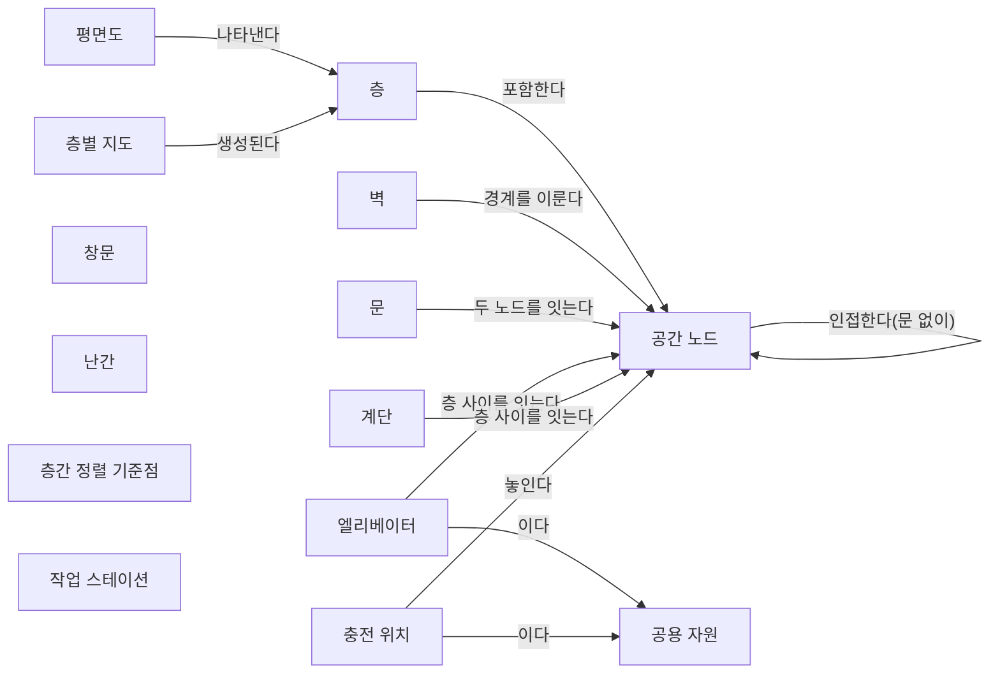
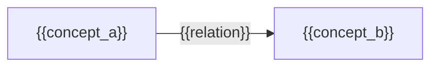

(너의 규칙은 시스템 프롬프트의 agents/shared-rules.md 와 agents/storyteller.md 이다. 아래는 이번 실행의 컨텍스트와 입력이다.)

## 실행 컨텍스트

- run_id: 2026-09-25-22
- date: 2026-09-25
- run_type: track (트랙 실행)
- 대상: 트랙 floorplan-recognition (건축 도면 자동 인식) · 현재 단계: 단계 1. 선행 연구·제품 사례 조사 · 이번에 다룰 백로그 질문 id: q1-04 · 중심 세부영역: 6. 지도·공간·위치 모델 (B. 공통 정보·환경 모델)
- 예산:
    - max_search_queries: 40
    - max_sources_per_run: 20
    - new_topic_pages: 1
    - page_updates: 2
    - max_retries: 2
- 환경 알림: web_fetch_available: false · fetch_mode: mirror_only (일반 웹 페이지 열람은 네트워크 정책으로 막혀 있다. raw.githubusercontent.com 은 열린다: 공식 문서가 GitHub 에 있는 출처는 입력의 config/source_mirrors.yaml 경로를 WebFetch 로 열어 원문을 읽고 sources[].fetched=true, fetched_via=github_raw, fetch_url 을 적는다. 입력에 원문 텍스트(data/source_texts)가 있는 출처는 fetched_via=inbox. 그 밖의 출처는 fetched=false 이며 코드가 신뢰도 상한(medium)을 강제한다 — 공통 규칙 0절 6항)
- 언어: ko
- retry_count: 1
- max_retries: 2

## 입력

### runs/2026-09-25-22/target.json

```json
{
  "run_id": "2026-09-25-22",
  "date": "2026-09-25",
  "weekday": "Fri",
  "run_number": 22,
  "run_type": "track",
  "forced": true,
  "target": {
    "area_no": 6,
    "area_name": "6. 지도·공간·위치 모델",
    "category": "B. 공통 정보·환경 모델",
    "category_letter": "B"
  },
  "topic": null,
  "track": {
    "slug": "floorplan-recognition",
    "name": "건축 도면 자동 인식",
    "stage": 1,
    "stages": 5,
    "stage_name": "선행 연구·제품 사례 조사",
    "question_ids": [
      "q1-04"
    ],
    "user_questions": [],
    "runs_per_week": 3,
    "question_rationale": "사용자 지정 0건, 되돌아온 질문 0건, 현재 단계 열린 질문 3건 중 오래된 순"
  },
  "corrections": [],
  "budget": {
    "max_search_queries": 40,
    "max_sources_per_run": 20,
    "new_topic_pages": 1,
    "page_updates": 2,
    "max_retries": 2
  },
  "priority_reason": null,
  "priority_questions": [],
  "excluded_areas": [],
  "lifted_areas": [],
  "deferred": {
    "monthly_recheck": false,
    "weekly_review": true
  },
  "selection_rationale": "CLI 지정 run_type=track, area=6; 트랙 실행일(Fri, track_days 앞 3개) → 트랙 floorplan-recognition 단계 1, 질문 q1-04 (사용자 지정 0건, 되돌아온 질문 0건, 현재 단계 열린 질문 3건 중 오래된 순)"
}
```

### runs/2026-09-25-22/research.json

```json
{
  "run_id": "2026-09-25-22",
  "date": "2026-09-25",
  "run_type": "track",
  "target": {
    "area_no": 6,
    "area_name": "6. 지도·공간·위치 모델",
    "category": "B. 공통 정보·환경 모델"
  },
  "gaps": [
    "단계 1 질문 q1-04 열림(target.json 지정: 사용자 지정 0건, 되돌아온 질문 0건, 현재 단계 열린 질문 3건 중 오래된 순)",
    "단계 1 페이지 3절에 q1-04 소제목 없음. q1-02·q1-03 답은 수작업이 남는다는 것만 보이고, 그 수작업에 드는 시간·반복 횟수를 확인할 자료는 다루지 않음",
    "아이디어 3. 건축 도면 자동 인식 6절(검증 방법) 비어 있음 — 가설 3(현장 모델링 시간 단축)을 판정할 기준 시간 자료 없음",
    "21. 온보딩·설정·현장 시운전 페이지 섹션 3. 왜 중요한가, 섹션 6. 대표 접근법과 기술 비어 있음(지도 작성·경로망 설계·자원 등록 부담의 근거 없음)",
    "완료 조건: 두 조건 모두 자체 평가 충족이나 검증 승인 전, 막힌 질문 q1-05·q1-06 열림"
  ],
  "research_questions": [
    "제조사마다 다른 지도에서 ‘3층 출하 대기장’을 어떻게 동일한 장소로 인식할까? [분류원문]",
    "q1-04 로봇을 새 현장에 들일 때 지도 작성과 공용 자원 등록에 드는 시간과 반복 작업은 어떤 자료로 확인할 수 있는가?",
    "AGV·AMR 도입의 지도 작성·경로망(roadmap) 설계·픽업/하역 위치 지정 부담을 정량 또는 정성으로 다룬 학술·공공 과제 자료는 무엇이 있는가? (단계 페이지 3절, 21. 온보딩·설정·현장 시운전 섹션 3·6 겨냥)",
    "제조사·오픈소스 도구 문서는 지도 작성과 충전소·스테이션 등록을 어떤 절차로 두며, 그 절차 가운데 현장·제조사마다 반복되는 작업은 무엇인가? (공간 그래프 스키마 초안, 아이디어 페이지 3절 겨냥)",
    "다중 제조사 현장에서 같은 레이아웃을 제조사·관제 형식별로 다시 입력하는 부담을 다룬 자료가 있는가? (28. 표준·상호운용성·다사업자 거버넌스, VDMA LIF 겨냥)",
    "국내 물류·서비스 현장에서 지도 작성·시운전 소요 시간을 공개한 연구·공공 자료가 있는가? (한국 자료 우선 규칙, oq-022 관련)",
    "가설 3(도면 기반 자동 생성이 현장 모델링 시간을 줄인다)을 판정하려면 어떤 기준 시간 자료를 비교 대상으로 쓸 수 있는가? (아이디어 페이지 6절, 단계 5 q5-02 선행 근거)"
  ],
  "findings": [
    {
      "id": "f1",
      "claim": "Beinschob 외(2017)는 다중 AGV 도입의 긴 설치 시간 원인으로 공장의 정밀 2D 지도 작성, 픽업·하역 위치의 3D 좌표 지정, 전문 기술자의 수작업 경로망 설계를 들고, 지도 작성에 숙련 인력이 필요하며 하역 지점 위치 정보가 없거나 부정확해 현장에서 고쳐야 하는 경우가 많다고 지적했다.",
      "tag": "사실",
      "source_ids": [
        "ref-217"
      ],
      "cross_checked": false,
      "confidence": "medium",
      "evidence_excerpt": "검색 요약: 'precise 2D mapping of the plant, 3D geo-referencing of pick-up/drop positions and the manual design of the roadmap'; 경로망은 전문 기술자가 'tedious process'로 수작업 최적화. 소요 시간 수치 없음. 원문 미열람. (재인용: 2026-09-25-19)",
      "as_of": "2017",
      "flow_step": null,
      "flow_item": "시작 조건",
      "source_unopened": true
    },
    {
      "id": "f2",
      "claim": "유럽연합 CORDIS 기사는 FP7 과제 PAN-Robots의 반자동 3D 지도 작성·경로망 자동 설계 시스템이 AGV 시스템 설치 기간을 6개월에서 2개월로 줄여 공장 가동 중단 시간을 아낄 수 있다고 전한다(과제 측 보고값, 비교 조건 미확인).",
      "tag": "사실",
      "source_ids": [
        "ref-318"
      ],
      "cross_checked": false,
      "confidence": "medium",
      "evidence_excerpt": "검색 요약: 'The PAN-ROBOTS system can be installed in two instead of six months, saving on factory outage time.' 대상 공장 규모·비교 기준·측정 방법은 요약에 없음. 원문 미열람. (발행일 미확인, 확인일 기준)",
      "as_of": "2026-09-25",
      "flow_step": null,
      "flow_item": "예외·성과",
      "source_unopened": true
    },
    {
      "id": "f3",
      "claim": "Beinschob·Reinke(2015)는 반사판 기반 AGV가 위치추정을 위해 수백에서 수천 개의 반사판 설치를 요구하는 등 도입에 큰 노력과 투자가 들며, PAN-Robots가 자연 지형지물 기반의 반자동 공장 탐사로 설치 시간과 비용을 줄이려 한다고 밝혔다.",
      "tag": "사실",
      "source_ids": [
        "ref-319"
      ],
      "cross_checked": false,
      "confidence": "medium",
      "evidence_excerpt": "검색 요약: AGV 는 'designated infrastructure and readily available maps' 가 필요해 'high effort and investment'; 반사판 'hundreds or even thousands'. 원문 미열람.",
      "as_of": "2015",
      "flow_step": null,
      "flow_item": null,
      "source_unopened": true
    },
    {
      "id": "f4",
      "claim": "다중 AGV 경로망 자동 설계 연구(IEEE, 2023)는 경로망이 보통 전문가가 설계하며 시간이 많이 들고 문제의 복잡도 때문에 최적이 아닐 수 있다고 보고, 시뮬레이션 기반 자동 설계 경로망이 연결성·중복성에서 수작업 경로망보다 낫다고 보고했다.",
      "tag": "사실",
      "source_ids": [
        "ref-320"
      ],
      "cross_checked": false,
      "confidence": "medium",
      "evidence_excerpt": "검색 요약: 'roadmaps are designed by experts, which is time consuming and may lead to suboptimal solutions'; 개미 군집 최적화와 SIPP 기반 MAPF 시뮬레이터로 평가. 저자 목록 미확인, 원문 미열람.",
      "as_of": "2023",
      "flow_step": null,
      "flow_item": null,
      "source_unopened": true
    },
    {
      "id": "f5",
      "claim": "arXiv 2511.07175(2025)는 산업 현장의 수작업 경로망 생성이 시간·비용이 많이 들고 최적이 아니라고 지적하며, 자유 공간의 볼록 모서리와 스테이션 상호작용 지점에 노드를 두고 운송 수요를 반영해 경로망을 자동 생성하는 방법을 제안했다.",
      "tag": "사실",
      "source_ids": [
        "ref-321"
      ],
      "cross_checked": false,
      "confidence": "medium",
      "evidence_excerpt": "검색 요약: 'Manual roadmap generation in industrial practice is time-consuming, costly, and often suboptimal.' 노드는 'convex corner points of the free space and at station interaction points'. 원문 미열람.",
      "as_of": "2025-11",
      "flow_step": null,
      "flow_item": null,
      "source_unopened": true
    },
    {
      "id": "f6",
      "claim": "Heselden·Das(ICRA 2024 Field Robotics 워크숍)는 새 환경에 로봇을 배치할 때 지도 작성이 시간이 많이 드는 과정이고 지도 관리가 체계적이지 않으면 위험하다고 보고, 위치·객체·위상·점유 정보를 표준화한 지도 처리 방식과 템플릿·절차적 생성으로 빠진 데이터를 채우는 관리 스크립트를 제안했다.",
      "tag": "사실",
      "source_ids": [
        "ref-322"
      ],
      "cross_checked": false,
      "confidence": "medium",
      "evidence_excerpt": "검색 요약: 'mapping is a time-consuming process for deploying robotic systems to new environments, and map handling is risk-prone when not managed effectively'. 농업·도로·실내 사례 데이터셋 포함. 원문 미열람.",
      "as_of": "2024-04",
      "flow_step": null,
      "flow_item": null,
      "source_unopened": true
    },
    {
      "id": "f7",
      "claim": "오픈소스 SLAM Toolbox의 README는 약 30,000 제곱피트까지 실시간의 5배 이상, 약 60,000 제곱피트까지 3배 속도로 지도를 처리하고 200,000 제곱피트 시설에서 쓰였다고 적으며, 저장한 포즈 그래프에서 이어서 지도를 작성하는 기능·지도 병합·수동 그래프 편집을 제공한다.",
      "tag": "사실",
      "source_ids": [
        "ref-323"
      ],
      "cross_checked": false,
      "confidence": "medium",
      "evidence_excerpt": "README 원문: 'mapping building at 5x+ real-time up to about 30,000 sq. ft. and 3x real-time up to about 60,000 sq. ft.' 프로젝트 문서의 보고값이며 데이터 수집을 위한 주행 시간은 포함하지 않음. (발행일 미확인, 확인일 기준)",
      "as_of": "2026-09-25",
      "flow_step": null,
      "flow_item": null
    },
    {
      "id": "f8",
      "claim": "SLAM 계산 자체가 실시간보다 빠르게 처리된다는 보고(f7)와 설치 병목으로 지도 작성·위치 지정·경로망 설계를 든 연구(f1, f4, f5)를 함께 보면, 현장 모델링 시간의 큰 부분은 계산보다 데이터 수집 주행과 사람의 후처리·주석·설계에서 나오는 것으로 보인다.",
      "tag": "추정",
      "source_ids": [
        "ref-323",
        "ref-217",
        "ref-320",
        "ref-321"
      ],
      "cross_checked": false,
      "confidence": "low",
      "evidence_excerpt": "f1·f4·f5·f7 에서 도출한 추론. 단계별 소요 시간을 나눠 측정한 자료는 이번 검색 범위에서 찾지 못함.",
      "as_of": "2026-09-25",
      "flow_step": null,
      "flow_item": null,
      "source_unopened": false
    },
    {
      "id": "f9",
      "claim": "MiR250 사용자 매뉴얼(매뉴얼 게재 사이트 사본)은 지도를 만들 때 로봇을 수동 모드로 두고 사람이 현장 전체를 몰고 다니며 레이저 스캔으로 지도를 기록한 뒤 지도를 설정하도록 안내한다.",
      "tag": "추정",
      "source_ids": [
        "ref-326"
      ],
      "cross_checked": false,
      "confidence": "low",
      "evidence_excerpt": "벤더 주장: 검색 요약 — Manual Mode 에서 'drive the robot around manually, capturing the layout', 전 구역을 돈 뒤 'Finish Mapping'. 매뉴얼 104쪽. 소요 시간 수치 없음. 원문 미열람. (발행일 미확인, 확인일 기준)",
      "as_of": "2026-09-25",
      "flow_step": null,
      "flow_item": "수행 자원",
      "source_unopened": true,
      "vendor_claim": true
    },
    {
      "id": "f10",
      "claim": "BlueBotics는 AGV 시운전을 지도 작성·설정·시험·직원 교육 단계로 설명하며, 나중에 차량을 추가할 때는 현장 지도가 이미 있어 지도 작성 단계를 빼고, 시운전 기간을 가르는 주요 요인은 내비게이션 방식이라고 밝힌다.",
      "tag": "추정",
      "source_ids": [
        "ref-325"
      ],
      "cross_checked": false,
      "confidence": "low",
      "evidence_excerpt": "벤더 주장: 검색 요약 'if adding vehicles later, your integrator will probably exclude the mapping step since your site map will already exist'; 'The main factor determining commissioning times is the type of navigation technology'. 원문 미열람. (발행일 미확인, 확인일 기준)",
      "as_of": "2026-09-25",
      "flow_step": null,
      "flow_item": null,
      "source_unopened": true,
      "vendor_claim": true
    },
    {
      "id": "f11",
      "claim": "OTTO Motors는 소프트웨어 개정으로 자사 내부 시험에서 시설 지도와 새 작업 흐름을 설정하는 시간이 이전 판보다 50% 줄었고, 충전기·팔레트 같은 여러 끝점의 설정을 한 번에 복제·변경하며 시설 일부만 다시 지도화해 시운전 시간을 줄일 수 있다고 밝힌다.",
      "tag": "추정",
      "source_ids": [
        "ref-324"
      ],
      "cross_checked": false,
      "confidence": "low",
      "evidence_excerpt": "벤더 주장: 검색 요약 'Internal testing has shown that it takes a user 50% less time to set-up facility maps and new workflows'; 'replicate configurations ... multiple endpoints—such as chargers and pallets'. 측정 조건 미공개. 원문 미열람. (발행일 미확인, 확인일 기준)",
      "as_of": "2026-09-25",
      "flow_step": null,
      "flow_item": "수행 자원",
      "source_unopened": true,
      "vendor_claim": true
    },
    {
      "id": "f12",
      "claim": "Open-RMF traffic-editor 문서는 충전소·주차 위치·대기 지점·도킹 이름·픽업 디스펜서·하역 인제스터를 주행 차선 경유점마다 사람이 편집기에서 입력하게 해, 현장마다 공용 자원 등록이 수작업 주석으로 반복된다.",
      "tag": "사실",
      "source_ids": [
        "ref-079"
      ],
      "cross_checked": false,
      "confidence": "medium",
      "evidence_excerpt": "경유점 속성 is_charger·is_parking_spot·is_holding_point·dock_name·pickup_dispenser·dropoff_ingestor 가 편집기 입력 항목. 소요 시간 기록은 없음. (재인용: 2026-09-25-19)",
      "as_of": "2026-09-25",
      "flow_step": null,
      "flow_item": "수행 자원",
      "source_unopened": true
    },
    {
      "id": "f13",
      "claim": "Open-RMF 플릿 어댑터 템플릿 설정은 플릿마다 RMF 지도 좌표와 로봇 지도 좌표의 대응점(reference_coordinates), 속도·차체·배터리 사양, 수행 가능 작업 유형을 적게 해, 제조사 플릿을 하나 더할 때마다 좌표 정렬과 설정이 반복된다.",
      "tag": "사실",
      "source_ids": [
        "ref-105"
      ],
      "cross_checked": false,
      "confidence": "medium",
      "evidence_excerpt": "config.yaml: reference_coordinates 에 층별 rmf·robot 좌표 쌍, linear·footprint·battery·task_capabilities 항목. (재인용: 2026-09-25-20)",
      "as_of": "2026-09-25",
      "flow_step": null,
      "flow_item": "수행 자원",
      "source_unopened": true
    },
    {
      "id": "f14",
      "claim": "VDMA 레이아웃 교환 형식(LIF) 공식 저장소 README는 무인운반 차량 통합사업자가 엣지·노드·스테이션으로 된 주행 레이아웃을 제3자 중앙 관제에 처음 넘겨 쓰고 통합하게 하는 것을 목적으로 적는다(1.0.0 판, 2023-09).",
      "tag": "사실",
      "source_ids": [
        "ref-046"
      ],
      "cross_checked": false,
      "confidence": "medium",
      "evidence_excerpt": "README 원문: 'The integrator of the driverless transport vehicles will be able to initially transfer a track layout to a central (third-party) master control system'. 작업량·시간 절감 수치는 README 에 없음.",
      "as_of": "2023-09",
      "flow_step": null,
      "flow_item": null
    },
    {
      "id": "f15",
      "claim": "LIF 해설을 낸 업체 ScaliRo는 다중 제조사 프로젝트에서 레이아웃을 중복 작성하는 비용이 프로젝트당 수 인일(person-day)에 이르고, 형식 사이 수작업 전달이 좌표 오기·스테이션 누락 같은 오류를 낳아 시운전 때 충돌·교통 막힘으로 드러난다고 주장한다.",
      "tag": "추정",
      "source_ids": [
        "ref-327"
      ],
      "cross_checked": false,
      "confidence": "low",
      "evidence_excerpt": "벤더 주장: 검색 요약 'the cost of redundant layout creation quickly adds up to several person-days per project'. 근거 자료·측정 방법 미공개. 원문 미열람. (발행일 미확인, 확인일 기준)",
      "as_of": "2026-09-25",
      "flow_step": null,
      "flow_item": "예외·성과",
      "source_unopened": true,
      "vendor_claim": true
    },
    {
      "id": "f16",
      "claim": "노주형 외(로봇학회 논문지 21(1), 2026)는 3D 라이다–IMU SLAM 기반 탐사와 RGB-D 카메라·4자유도 매니퓰레이터로 엘리베이터 버튼을 누르는 층간 이동을 결합해, 다층 실내 지도를 사람 개입 없이 처음부터 끝까지 자율로 구축하는 시스템을 제안했다.",
      "tag": "사실",
      "source_ids": [
        "ref-163"
      ],
      "cross_checked": false,
      "confidence": "medium",
      "evidence_excerpt": "검색 요약: 3D LiDAR–IMU SLAM 기반 효율적 프런티어 생성, 다중 센서 융합 코스트맵, 버튼 누르기로 엘리베이터 연계, 'completely autonomously'. pp. 48-57. 소요 시간 수치는 요약에 없음. 원문 미열람.",
      "as_of": "2026",
      "flow_step": null,
      "flow_item": null,
      "source_unopened": true
    },
    {
      "id": "f17",
      "claim": "이번 검색 범위에서 현장 모델링 시간과 반복 작업을 확인할 수 있는 자료는 (1) 설치 병목을 정성적으로 기술한 연구(Beinschob 외, 경로망 자동 설계 연구, Heselden·Das), (2) 과제 측 설치 기간 비교(PAN-Robots 6개월→2개월), (3) 벤더의 내부 시험·주장(OTTO 50%, ScaliRo 수 인일), (4) 반복 작업 항목을 드러내는 도구·형식 문서(traffic-editor 주석, 플릿 어댑터 좌표 대응점, LIF 전달, MiR 수동 주행 지도 작성)로 나뉘고, 단계별 소요 시간을 독립적으로 측정한 시간 연구는 찾지 못한 것으로 보인다.",
      "tag": "추정",
      "source_ids": [
        "ref-217",
        "ref-320",
        "ref-322",
        "ref-318",
        "ref-324",
        "ref-327",
        "ref-079",
        "ref-105",
        "ref-046",
        "ref-326"
      ],
      "cross_checked": false,
      "confidence": "low",
      "evidence_excerpt": "f1~f6·f9~f15 를 자료 유형별로 묶은 이 위키의 분류. 한·영 검색 25회 범위의 부재이며 부재 확인은 아님.",
      "as_of": "2026-09-25",
      "flow_step": null,
      "flow_item": null,
      "source_unopened": false
    },
    {
      "id": "f18",
      "claim": "확인한 자료에서 새 현장·새 제조사마다 반복되는 작업은 지도 작성 주행(층마다), 픽업·하역·충전 위치 지정, 경로망 설계, 제조사 지도와 공통 지도의 좌표 대응, 제조사·관제 형식별 레이아웃 재입력으로 정리되며, 이 가운데 위치 지정·경로망 초안·좌표 대응이 도면 기반 자동 생성이 줄일 후보로 보인다.",
      "tag": "추정",
      "source_ids": [
        "ref-217",
        "ref-079",
        "ref-105",
        "ref-046",
        "ref-327",
        "ref-321",
        "ref-163"
      ],
      "cross_checked": false,
      "confidence": "low",
      "evidence_excerpt": "f1·f5·f12·f13·f14·f15·f16 에서 도출한 설계 추론. 자동화로 실제로 줄어드는 시간은 측정 자료가 없어 가설 3 판정(단계 5, q5-02)으로 넘김.",
      "as_of": "2026-09-25",
      "flow_step": null,
      "flow_item": "수행 자원",
      "source_unopened": false
    },
    {
      "id": "f19",
      "claim": "연계 대상: SLAM 지도 작성 주행과 로봇 쪽 위치추정 지도의 생성은 분류 원문 9장의 로봇 자체 지능·제어 쪽이므로, 이종 제조사를 연결하는 ROP가 시간 단축을 측정·책임질 대상은 공용 자원 등록, 좌표·층 이름 정렬, 레이아웃 전달·버전 관리 같은 ROP 쪽 설정 작업이 될 것으로 보인다.",
      "tag": "추정",
      "source_ids": [
        "ref-323",
        "ref-326",
        "ref-105",
        "ref-046"
      ],
      "cross_checked": false,
      "confidence": "low",
      "evidence_excerpt": "f7·f9(로봇 쪽 SLAM 지도 작성)와 f13·f14(관제·ROP 쪽 설정·전달)를 분류 원문 9장 경계에 대응시킨 추론.",
      "as_of": "2026-09-25",
      "flow_step": null,
      "flow_item": null,
      "source_unopened": false
    }
  ],
  "sources": [
    {
      "id": "ref-079",
      "org": "Open Robotics",
      "title": "Traffic Editor - Programming Multiple Robots with ROS 2",
      "published": null,
      "url": "https://osrf.github.io/ros2multirobotbook/traffic-editor.html",
      "type": "오픈소스 문서",
      "reliability": "medium",
      "accessed": "2026-09-25",
      "summary": "원문 미열람. 이번 실행에서는 다시 열지 않았다(2026-09-25-11·19 실행에서 원문 확인). 평면도 배경 위에 벽·문·차선·충전소·작업셀을 사람이 주석하는 Open-RMF 편집기 설명.",
      "source_unopened": true,
      "fetched": false,
      "fetched_via": null,
      "fetch_url": null
    },
    {
      "id": "ref-105",
      "org": "Open Robotics (open-rmf)",
      "title": "fleet_adapter_template — fleet_adapter_template/config.yaml",
      "published": null,
      "url": "https://github.com/open-rmf/fleet_adapter_template/blob/main/fleet_adapter_template/config.yaml",
      "type": "오픈소스 문서",
      "reliability": "medium",
      "accessed": "2026-09-25",
      "summary": "원문 미열람. 이번 실행에서는 다시 열지 않았다(2026-09-25-20 실행에서 원문 확인). 플릿별 관제 접속 정보·지도 좌표 대응점·속도·배터리·작업 능력을 적는 Open-RMF 어댑터 설정 파일.",
      "source_unopened": true,
      "fetched": false,
      "fetched_via": null,
      "fetch_url": null
    },
    {
      "id": "ref-217",
      "org": "Beinschob, P., Meyer, M., Reinke, C., Digani, V., Secchi, C., & Sabattini, L.",
      "title": "Semi-automated map creation for fast deployment of AGV fleets in modern logistics",
      "published": "2017",
      "url": "https://www.sciencedirect.com/science/article/abs/pii/S0921889015302724",
      "type": "논문",
      "reliability": "medium",
      "accessed": "2026-09-25",
      "summary": "원문 미열람. 3D 레이저 스캐너 의미 지도로 경로망을 자동 설계해 다중 AGV 도입 시간을 줄이는 방법과 설치 병목(지도 작성·위치 지정·경로망 설계)을 다룬 논문(PAN-Robots).",
      "source_unopened": true,
      "fetched": false,
      "fetched_via": null,
      "fetch_url": null
    },
    {
      "id": "ref-046",
      "org": "VDMA (Intralogistics-2X-LIF GitHub)",
      "title": "Layout-Interchange-Format — README (Repository for the Layout Interchange Format (LIF) developed by the VDMA)",
      "published": "2023-09",
      "url": "https://github.com/Intralogistics-2X-LIF/Layout-Interchange-Format",
      "type": "표준",
      "reliability": "medium",
      "accessed": "2026-09-25",
      "summary": "VDMA 레이아웃 교환 형식 공식 저장소 README. 통합사업자가 엣지·노드·스테이션 주행 레이아웃을 제3자 관제에 넘기는 목적과 1.0.0 판(2023-09)을 적는다.",
      "fetched": true,
      "fetched_via": "github_raw",
      "fetch_url": "https://raw.githubusercontent.com/Intralogistics-2X-LIF/Layout-Interchange-Format/main/README.md",
      "source_unopened": false
    },
    {
      "id": "ref-318",
      "org": "European Commission (CORDIS)",
      "title": "PAN-ROBOTS: Automating logistics for the factory of the future",
      "published": null,
      "url": "https://cordis.europa.eu/article/id/160857-panrobots-automating-logistics-for-the-factory-of-the-future",
      "type": "정부·연구기관",
      "reliability": "medium",
      "accessed": "2026-09-25",
      "summary": "원문 미열람. FP7 과제 PAN-Robots의 반자동 3D 지도 작성·AGV 시스템 성과를 소개하며 설치 기간을 6개월에서 2개월로 줄일 수 있다고 전하는 EU 연구 성과 기사.",
      "source_unopened": true,
      "fetched": false,
      "fetched_via": null,
      "fetch_url": null
    },
    {
      "id": "ref-319",
      "org": "Beinschob, P., & Reinke, C.",
      "title": "Graph SLAM based mapping for AGV localization in large-scale warehouses",
      "published": "2015",
      "url": "https://ieeexplore.ieee.org/document/7312637/",
      "type": "논문",
      "reliability": "medium",
      "accessed": "2026-09-25",
      "summary": "원문 미열람. 반사판 기반 AGV의 설치 부담을 지적하고 그래프 SLAM으로 대형 창고 지도를 만들어 AGV 위치추정에 쓰는 방법을 다룬 PAN-Robots 계열 학회 논문.",
      "source_unopened": true,
      "fetched": false,
      "fetched_via": null,
      "fetch_url": null
    },
    {
      "id": "ref-320",
      "org": "IEEE 게재 논문 저자(미확인)",
      "title": "Simulation-Based Approach for Automatic Roadmap Design in Multi-AGV Systems",
      "published": "2023",
      "url": "https://ieeexplore.ieee.org/document/10287275/",
      "type": "논문",
      "reliability": "medium",
      "accessed": "2026-09-25",
      "summary": "원문 미열람. 개미 군집 최적화와 MAPF 시뮬레이터로 다중 AGV 경로망을 자동 설계하고 전문가 수작업 경로망과 비교한 논문.",
      "source_unopened": true,
      "fetched": false,
      "fetched_via": null,
      "fetch_url": null
    },
    {
      "id": "ref-321",
      "org": "arXiv 2511.07175 저자(미확인)",
      "title": "Automated Generation of Continuous-Space Roadmaps for Routing Mobile Robot Fleets",
      "published": "2025-11",
      "url": "https://arxiv.org/abs/2511.07175",
      "type": "논문",
      "reliability": "medium",
      "accessed": "2026-09-25",
      "summary": "원문 미열람. 수작업 경로망 생성의 시간·비용 문제를 지적하고 스테이션 상호작용 지점과 운송 수요를 반영한 연속 공간 경로망 자동 생성 방법을 제안한 프리프린트.",
      "source_unopened": true,
      "fetched": false,
      "fetched_via": null,
      "fetch_url": null
    },
    {
      "id": "ref-322",
      "org": "Heselden, J. R., & Das, G. P.",
      "title": "Unified Map Handling for Robotic Systems: Enhancing Interoperability and Efficiency Across Diverse Environments",
      "published": "2024-04",
      "url": "https://arxiv.org/abs/2404.13499",
      "type": "논문",
      "reliability": "medium",
      "accessed": "2026-09-25",
      "summary": "원문 미열람. 새 환경 배치에서 지도 작성이 시간이 많이 든다는 문제를 들고 표준화한 지도 처리 방식과 생성 보조 스크립트를 제안한 ICRA 2024 워크숍 논문.",
      "source_unopened": true,
      "fetched": false,
      "fetched_via": null,
      "fetch_url": null
    },
    {
      "id": "ref-323",
      "org": "Macenski, S. (SteveMacenski GitHub)",
      "title": "slam_toolbox — README (Slam Toolbox for lifelong mapping and localization in potentially massive maps with ROS)",
      "published": null,
      "url": "https://github.com/SteveMacenski/slam_toolbox",
      "type": "오픈소스 문서",
      "reliability": "medium",
      "accessed": "2026-09-25",
      "summary": "ROS 2 SLAM Toolbox 공식 README. 처리 속도·적용 시설 규모, 저장한 포즈 그래프에서 이어 작성·병합·수동 편집 기능을 설명한다.",
      "fetched": true,
      "fetched_via": "github_raw",
      "fetch_url": "https://raw.githubusercontent.com/SteveMacenski/slam_toolbox/ros2/README.md",
      "source_unopened": false
    },
    {
      "id": "ref-324",
      "org": "OTTO Motors (Rockwell Automation)",
      "title": "Maximize AMR productivity and simplify commissioning with our latest software release",
      "published": null,
      "url": "https://ottomotors.com/blog/amr-productivity-software-release/",
      "type": "벤더 문서",
      "reliability": "low",
      "accessed": "2026-09-25",
      "summary": "원문 미열람. 시설 지도·작업 흐름 설정 시간 단축(내부 시험 50%), 충전기 등 끝점 설정 일괄 복제, 부분 재지도화 기능을 소개한 제조사 블로그.",
      "source_unopened": true,
      "fetched": false,
      "fetched_via": null,
      "fetch_url": null
    },
    {
      "id": "ref-325",
      "org": "BlueBotics",
      "title": "7 Tips to Ensure AGV Commissioning Success",
      "published": null,
      "url": "https://bluebotics.com/7-tips-to-ensure-agv-commissioning-success/",
      "type": "벤더 문서",
      "reliability": "low",
      "accessed": "2026-09-25",
      "summary": "원문 미열람. AGV 시운전 단계(지도 작성·설정·시험·교육)와 시운전 기간을 좌우하는 요인을 설명한 내비게이션 기술 업체 글.",
      "source_unopened": true,
      "fetched": false,
      "fetched_via": null,
      "fetch_url": null
    },
    {
      "id": "ref-326",
      "org": "Mobile Industrial Robots(MiR) (ManualsLib 게재본)",
      "title": "MiR250 User Manual — Creating and configuring a map (page 104, 제조사 공식 사이트가 아닌 매뉴얼 게재 사이트 사본)",
      "published": null,
      "url": "https://www.manualslib.com/manual/1941073/Mir-Mir250.html?page=104",
      "type": "벤더 문서",
      "reliability": "low",
      "accessed": "2026-09-25",
      "summary": "원문 미열람. 로봇을 수동 모드로 몰아 지도를 기록하고 설정하는 MiR250 지도 작성 절차를 설명한 사용자 매뉴얼 사본.",
      "source_unopened": true,
      "fetched": false,
      "fetched_via": null,
      "fetch_url": null
    },
    {
      "id": "ref-327",
      "org": "ScaliRo",
      "title": "LIF – Layout Interchange Format Explained",
      "published": null,
      "url": "https://scaliro.de/en/lif/",
      "type": "벤더 문서",
      "reliability": "low",
      "accessed": "2026-09-25",
      "summary": "원문 미열람. VDMA LIF의 구조와 도입 동기(다중 제조사 레이아웃 중복 작성 비용, 수작업 전달 오류)를 설명한 관제 소프트웨어 업체 해설.",
      "source_unopened": true,
      "fetched": false,
      "fetched_via": null,
      "fetch_url": null
    },
    {
      "id": "ref-163",
      "org": "노주형, 강규리, 김연찬, 심현철(로봇학회 논문지)",
      "title": "탐사 및 엘리베이터 연계를 이용한 완전 자율 다층 실내 지도 구축 시스템 (로봇학회 논문지 21(1), 48-57)",
      "published": "2026",
      "url": "https://www.kci.go.kr/kciportal/landing/article.kci?arti_id=ART003305667",
      "type": "논문",
      "reliability": "medium",
      "accessed": "2026-09-25",
      "summary": "원문 미열람. 자율 탐사 SLAM과 매니퓰레이터의 엘리베이터 버튼 조작을 결합해 다층 실내 지도를 자율 구축하는 국내 연구.",
      "source_unopened": true,
      "fetched": false,
      "fetched_via": null,
      "fetch_url": null
    }
  ],
  "page_proposals": [
    {
      "action": "update",
      "path": "docs/tracks/floorplan-recognition/stage-1-prior-work-and-products.md",
      "sections": [
        "2",
        "3",
        "4",
        "5",
        "6",
        "8",
        "9"
      ],
      "rationale": "q1-04 답: f1·f2·f3·f4·f5·f6·f7·f8·f9·f10·f11·f12·f13·f14·f15·f16·f17·f18·f19 (신뢰도 medium) — 2절 q1-04 상태 답함, 3절 q1-04 소제목 신설(설치 병목 연구 f1·f3·f4·f5·f6, 과제 측 설치 기간 비교 f2, SLAM 처리 속도와 병목 위치 f7·f8, 제조사·도구 문서의 반복 작업 f9·f10·f11·f12·f13, 다중 제조사 레이아웃 전달 f14·f15, 국내 다층 자율 지도 연구 f16, 자료 유형 종합 f17, 반복 작업 목록 f18, 범위 경계 f19; f9·f10·f11·f15 벤더 주장 병기), 4절 결론·불확실성(독립 시간 측정 자료 부재는 검색 범위 기준), 5절 후속 질문, 6절 완료 조건 현황, 8절 출처, 9절 이력"
    },
    {
      "action": "update",
      "path": "docs/ideas/floorplan-recognition.md",
      "sections": [
        "3",
        "6"
      ],
      "rationale": "아이디어 페이지 3절: 현장 모델링 부담 근거 소절 — f1·f2·f4·f5(설치 병목·경로망 수작업), f11·f15(벤더 주장), f17 / 아이디어 페이지 6절: 가설 3 판정의 비교 기준 후보로 PAN-Robots 설치 기간 비교(f2, 과제 보고값), 반복 작업 항목 목록(f18)을 단계 5 조사 전 선행 근거로 명시. 6절 본격 작성은 단계 5(q5-02)"
    },
    {
      "action": "update",
      "path": "docs/categories/f-deployment-verification-and-maintenance/21-onboarding-configuration-and-commissioning.md",
      "sections": [
        "3",
        "6",
        "8"
      ],
      "rationale": "트랙 floorplan-recognition 단계 1 반영 제안 (f1, f2, f4, f6, f10, f11, f13, f18): 섹션 3 새 현장 도입의 지도 작성·위치 지정·경로망 설계 병목, 섹션 6 반복 작업 항목과 기존 지도 재사용·설정 복제, 섹션 8 Beinschob 외·PAN-Robots·경로망 자동 설계 연구. 벤더 주장(f10, f11)은 [추정] 병기"
    },
    {
      "action": "update",
      "path": "docs/categories/d-planning-and-optimization/15-multi-robot-path-and-traffic-management-mapf.md",
      "sections": [
        "6",
        "8"
      ],
      "rationale": "트랙 floorplan-recognition 단계 1 반영 제안 (f4, f5): 경로망 수작업 설계의 한계와 자동 경로망 생성(시뮬레이션·MAPF 평가, 스테이션 상호작용 지점 반영)"
    },
    {
      "action": "update",
      "path": "docs/categories/b-common-information-and-environment-model/06-map-space-and-location-model.md",
      "sections": [
        "3",
        "9"
      ],
      "rationale": "트랙 floorplan-recognition 단계 1 반영 제안 (f6, f7, f13, f14, f19): 섹션 3 지도 작성이 새 환경 배치의 시간 병목이라는 근거, 섹션 9 SLAM 지도 작성은 연계 대상이고 좌표 정렬·레이아웃 전달은 ROP 쪽이라는 경계"
    }
  ],
  "glossary_candidates": [
    {
      "term_ko": "경로망",
      "term_en": "Roadmap",
      "definition": "다중 AGV·이동로봇이 따라 달릴 수 있는 노드와 엣지의 주행 경로 그래프로, 현장 도입 때 전문가가 설계하거나 자동 생성한다."
    },
    {
      "term_ko": "지도 정합",
      "term_en": "Map Alignment",
      "definition": "도면·공통 지도와 제조사별 로봇 지도를 축척·이동·회전 변환이나 좌표 대응점으로 맞춰 같은 위치를 같은 좌표로 가리키게 하는 작업이다."
    }
  ],
  "open_questions_new": [],
  "open_questions_resolved": [],
  "self_check": {
    "source_count": 15,
    "cross_checked_count": 0,
    "unverified": [
      "모든 finding 교차 확인 실패: 자료마다 발행 주체 한 곳의 근거만 있음",
      "f2 PAN-Robots 6개월→2개월은 CORDIS 기사 검색 요약의 과제 측 보고값이며 대상 공장·비교 기준·측정 방법 미확인",
      "f7 SLAM Toolbox 처리 속도는 프로젝트 문서의 보고값이며 독립 측정 아님",
      "f9·f10·f11·f15 벤더 주장이며 독립 확인 없음, OTTO 50% 는 내부 시험 조건 미공개",
      "ref-320·ref-321 저자 목록 미확인, ref-318·ref-323~ref-327 발행일 미확인",
      "f16 국내 연구의 소요 시간 수치는 요약에 없어 미확인",
      "단계별(지도 작성 주행·위치 지정·경로망 설계·자원 등록) 소요 시간을 독립적으로 측정한 시간 연구는 찾지 못함",
      "국내 물류센터의 지도 작성·시운전 소요 시간 공개 자료는 찾지 못함(기사·벤더 소개 글만 나와 넣지 않음, oq-022 미해결)"
    ],
    "scope_violations": [
      "f7·f9·f16: SLAM 지도 작성·자율 탐사는 분류 원문 9장 '로봇 자체 지능·제어' 연계 영역이므로 지도 작성 시간·부담의 근거로만 쓰고 f19 에 '연계 대상: '으로 경계를 표시함",
      "f15: 관제 업체의 비용 주장은 vendor_claim 으로 표시하고 ROP 직접 범위 근거로 쓰지 않음"
    ],
    "budget_used": {
      "queries": 25,
      "sources": 11
    },
    "limits": "web_fetch_available: false · fetch_mode mirror_only. raw.githubusercontent.com 으로 원문 2건을 열었다(재사용 ref-046 LIF README, 신규 ref-323 SLAM Toolbox README). 신규 논문·EU 기사·벤더 글 9건과 재사용 3건(ref-079, ref-105, ref-217; 이번에 다시 열지 않음)은 원문 미열람이라 신뢰도 상한 medium(벤더 low). 검색 25회/40, 신규 출처 11건/20(ref-318~ref-163, 예약 구간 안). 교차 확인 0건. 질문 선택: target.json 지정 q1-04 1건. q1-04 는 '어떤 자료로 확인할 수 있는가'에 자료 유형 네 가지(f17)와 반복 작업 목록(f18)으로 답했으나, 단계별 소요 시간을 독립 측정한 자료는 찾지 못해 수치 근거는 과제 보고값(f2)과 벤더 주장(f11·f15)뿐이다. 한국 자료: KCI 다층 자율 지도 구축 연구 1건(ref-163). 로봇 친화형 건축물 인증 지표(KCI) 자료도 찾았으나 지도 작성 시간과 직접 관련이 확인되지 않아 넣지 않았다. 교차 규칙: 27. AI·학습·적응과 모델 운영 관련 finding 없음. 8. 실시간 세계 상태·데이터 일관성과 22. 시뮬레이션·예측용 디지털 트윈 관련 주장 없음(가상 시운전 기간 단축 주장은 출처가 벤더·2차 요약뿐이라 넣지 않음). 일반 열린 질문 신규 없음(새 질문은 트랙 전용). 온톨로지 변경 없음: q1-04 는 시간·작업 부담 자료에 관한 질문이며 공간 그래프 개념·관계의 새 근거를 주지 않는다. 후속 질문 2건."
  },
  "track": {
    "slug": "floorplan-recognition",
    "stage": 1,
    "answered_question_ids": [
      "q1-04"
    ],
    "new_questions": [
      {
        "question": "PAN-Robots 과제가 보고한 설치 기간 6개월→2개월의 비교 조건(대상 공장 규모, 기준 시스템, 단계별 소요 시간)을 과제 결과 보고서·산출물로 확인해, 도면 기반 자동 생성의 시간 단축 효과를 판정할 기준 자료로 쓸 수 있는가? (q1-04 에서 파생)",
        "stage": 5,
        "rationale_finding_id": "f2"
      },
      {
        "question": "국내 물류센터에서 로봇 도입 시 지도 작성·충전소 등 공용 자원 등록·제조사별 좌표 정렬에 든 시간을 단계별로 공개한 공공·학술 자료나 사례가 있는가? (q1-04 에서 파생)",
        "stage": 1,
        "rationale_finding_id": "f17"
      }
    ],
    "ontology_changes": [],
    "stage_completion_self_assessment": {
      "met": false,
      "missing": [
        "막힌 질문 q1-05·q1-06 열림",
        "완료 조건 두 항목(아이디어 3절 비교, 공간 그래프 스키마 초안의 인식 대상 요소 반영)은 자체 평가 충족이나 검증 승인 전"
      ]
    }
  }
}
```

### runs/2026-09-25-22/verification.json

```json
{
  "run_id": "2026-09-25-22",
  "stage": "first",
  "verdict": "조건부 승인",
  "claim_checks": [
    {
      "finding_id": "f1",
      "source_exists": true,
      "supports_claim": true,
      "cross_checked": false,
      "tag_decision": "유지",
      "note": "확인: 검증 검색 요약에 정밀 2D 지도 작성·픽업/하역 위치 3D 좌표 지정·수작업 경로망 설계 병목, 숙련 인력 필요, 하역 지점 위치의 현장 수정이 모두 나타난다(Robotics and Autonomous Systems 87, 281-295, 2017). 원문 미열람(검색 결과 일치). 기존 ref-217 재사용이며 단계 페이지 q1-03의 Beinschob 외 문장과 겹친다. 단일 출처."
    },
    {
      "finding_id": "f2",
      "source_exists": true,
      "supports_claim": true,
      "cross_checked": false,
      "tag_decision": "강등",
      "note": "사실 → 추정: '6개월 대신 2개월' 구절은 검증 검색에서 확인됐으나 phys.org(2015-04)·EC newsroom 재게재본은 같은 EU 원문의 재게재라 독립 출처가 아니다. 가설 3 판정에 쓰일 핵심 수치가 단일 출처이고 비교 조건이 미확인이다. 기준일 as_of 2026-09-25 는 틀렸다 — 재게재 기사 기준 2015-04 로 표기하고 CORDIS 원 게재일은 미확인으로 둔다. 원문 미열람."
    },
    {
      "finding_id": "f3",
      "source_exists": true,
      "supports_claim": true,
      "cross_checked": false,
      "tag_decision": "유지",
      "note": "확인: IEEE ICCP 2015 발표, 반사판 수백~수천 개, 숙련 인력 설치, 'high effort and investment', PAN-Robots 반자동 탐사로 설치 시간·비용 절감이 검색 요약에 나타난다. 원문 미열람(검색 결과 일치)."
    },
    {
      "finding_id": "f4",
      "source_exists": true,
      "supports_claim": false,
      "cross_checked": false,
      "tag_decision": "강등",
      "note": "부분 뒷받침: 개미 군집 최적화 기반 경로망 생성과 SIPP 기반 MAPF 시뮬레이터 평가, 처리량 기반 플릿 규모 제안은 확인됐다. '연결성·중복성에서 수작업 경로망보다 낫다'는 비교는 검증 검색에서도 브리프 발췌에서도 나타나지 않는다(연결성·중복성은 Digani 외 2014, ref-218 의 기준이다). 이 절은 삭제한다. 서지 정정: IEEE Transactions on Automation Science and Engineering 21(4), 6190-6201, 2024 게재(IEEE Xplore 문서 10287275, 2023 온라인 공개). 저자 미확인. 원문 미열람."
    },
    {
      "finding_id": "f5",
      "source_exists": true,
      "supports_claim": true,
      "cross_checked": false,
      "tag_decision": "유지",
      "note": "확인: arXiv 2511.07175, 2025-11-10 제출, 저자 Marvin Rüdt·Constantin Enke·Kai Furmans(KIT 물류·물자취급연구소 IFL). v2 제목은 'Continuous-Space Roadmap Generation for Mobile Robot Fleets with Distance Constraints and Geometry-Aware Discretization'로 바뀌었다. 스테이션 간 운송 수요 반영이 확인됐다. 노드 배치 세부(볼록 모서리)는 v1 요약 기준이다. 원문 미열람."
    },
    {
      "finding_id": "f6",
      "source_exists": true,
      "supports_claim": true,
      "cross_checked": false,
      "tag_decision": "유지",
      "note": "확인: Heselden·Das, arXiv 2404.13499(2024-04-21), ICRA 2024 Field Robotics 워크숍. 지도 작성이 시간이 많이 든다는 문제의식, 템플릿·절차적 생성, 농업·도로·실내 데이터셋이 검색 요약에 나타난다. 원문 미열람."
    },
    {
      "finding_id": "f7",
      "source_exists": true,
      "supports_claim": true,
      "cross_checked": false,
      "tag_decision": "유지",
      "note": "확인: 검증 에이전트가 raw.githubusercontent.com 의 ros2 브랜치 README 를 열었다. 5x+ 실시간(약 30,000 sq ft)·3x(약 60,000 sq ft)·200,000 sq ft 건물 사례와 이어서 작성·병합·수동 그래프 편집 기능이 일치한다. 이것은 프로젝트 문서의 자체 벤치마크 보고값이며 독립 측정이 아니다. SLAM 은 분류 원문 9장의 연계 대상이다."
    },
    {
      "finding_id": "f8",
      "source_exists": true,
      "supports_claim": true,
      "cross_checked": false,
      "tag_decision": "유지",
      "note": "f1·f4·f5·f7 에서 도출한 추론이며 [추정] 이 맞다. f4 의 비교 절을 삭제해도 경로망 수작업 설계라는 근거는 남는다. 단계별 시간 측정 자료는 없다."
    },
    {
      "finding_id": "f9",
      "source_exists": true,
      "supports_claim": false,
      "cross_checked": false,
      "tag_decision": "유지",
      "note": "ManualsLib 의 MiR250 매뉴얼 104쪽 'Creating and configuring a map' 페이지는 실재한다. 검증 검색 요약에는 페이지 주제만 나오고 수동 주행 절차는 나오지 않아 세부 내용은 리서치 스니펫에만 기댄다. [추정] 벤더 주장과 제조사 공식 사이트가 아닌 게재본임을 병기하는 조건으로 유지한다. 원문 미열람."
    },
    {
      "finding_id": "f10",
      "source_exists": true,
      "supports_claim": false,
      "cross_checked": false,
      "tag_decision": "삭제",
      "note": "BlueBotics 글은 실재하지만 검증 검색 요약에는 일반 팁 7개만 나온다. 인용 구절 두 개('exclude the mapping step', 'main factor … navigation technology')를 정확한 구절로 검색해도 찾지 못했다. 벤더 문서의 확인되지 않은 주장이므로 삭제하고 ref-325 는 미사용 출처로 뺀다. 원문 미열람."
    },
    {
      "finding_id": "f11",
      "source_exists": true,
      "supports_claim": true,
      "cross_checked": false,
      "tag_decision": "유지",
      "note": "확인: OTTO 블로그와 The Robot Report 가 소프트웨어 2.28 판(2023-03 전후)의 '내부 시험 50% 단축'을 전한다. The Robot Report 는 벤더 발표를 옮긴 것이라 독립 확인이 아니다. [추정] 벤더 주장을 유지한다. 발행일은 미확인 대신 2023(2.28 판 발표 기준)으로 고친다. 원문 미열람."
    },
    {
      "finding_id": "f12",
      "source_exists": true,
      "supports_claim": false,
      "cross_checked": false,
      "tag_decision": "강등",
      "note": "검증 에이전트가 ros2multirobotbook 의 traffic-editor.md 미러를 열었다. 경유점 속성(is_charger·is_parking_spot·is_holding_point·dock_name·pickup_dispenser·dropoff_ingestor)을 GUI 속성 패널에서 사람이 입력한다는 부분은 [사실] 로 확인됐다. '현장마다 공용 자원 등록이 수작업 주석으로 반복된다'는 문서에 없는 추론이므로 이 절만 [추정] 으로 분리한다. 기존 단계 페이지 q1-03 문장과 겹치므로 ref-079 기존 각주를 재사용한다."
    },
    {
      "finding_id": "f13",
      "source_exists": true,
      "supports_claim": false,
      "cross_checked": false,
      "tag_decision": "강등",
      "note": "검증 에이전트가 raw config.yaml 을 열었다. 층별 reference_coordinates(rmf·robot 좌표 쌍), linear·footprint·battery, task_capabilities 항목은 [사실] 로 확인됐다. '플릿을 하나 더할 때마다 좌표 정렬과 설정이 반복된다'는 추론이므로 [추정] 으로 분리한다."
    },
    {
      "finding_id": "f14",
      "source_exists": true,
      "supports_claim": true,
      "cross_checked": false,
      "tag_decision": "유지",
      "note": "확인: 검증 에이전트가 LIF 공식 README(raw)를 열었다. 'Version 1.0.0 - September 2023'과 통합사업자→제3자 중앙 관제 전달 목적이 일치한다. 단계 페이지·아이디어 4절의 기존 LIF 문장과 겹친다. 판·발행일 충돌은 oq-025 에 이미 올라 있다."
    },
    {
      "finding_id": "f15",
      "source_exists": true,
      "supports_claim": false,
      "cross_checked": false,
      "tag_decision": "강등",
      "note": "ScaliRo 해설은 실재하고 '다중 제조사 프로젝트에서 중복 레이아웃 작성 비용이 프로젝트당 수 인일' 구절은 확인됐다. 뒷부분(좌표 오기·스테이션 누락 → 시운전 때 충돌·교통 막힘)은 브리프 발췌에도 검증 검색 요약에도 없으므로 삭제한다. [추정] 벤더 주장은 유지한다. 원문 미열람."
    },
    {
      "finding_id": "f16",
      "source_exists": true,
      "supports_claim": true,
      "cross_checked": false,
      "tag_decision": "유지",
      "note": "출처 중복: ref-163 은 참고문헌에 이미 있는 ref-163 과 같은 논문·같은 KCI URL 이다. ref-163 을 재사용하고 ref-163 은 만들지 않는다. 내용은 기존 6. 지도·공간·위치 모델 페이지 인용과 일치한다. 자율 탐사 SLAM·엘리베이터 버튼 조작은 연계 대상이다. 소요 시간 수치는 없다. 원문 미열람."
    },
    {
      "finding_id": "f17",
      "source_exists": true,
      "supports_claim": true,
      "cross_checked": false,
      "tag_decision": "유지",
      "note": "자료 유형별로 묶은 이 위키의 분류이며 [추정] 이 맞다. f10 삭제에 따라 근거 목록에 BlueBotics 를 넣지 않는다. 부재는 검색 범위 기준(검색 25회)으로 적는다."
    },
    {
      "finding_id": "f18",
      "source_exists": true,
      "supports_claim": true,
      "cross_checked": false,
      "tag_decision": "유지",
      "note": "설계 추론이며 [추정] 이 맞다. 각주는 ref-163 대신 ref-163 을 쓰고, f15 의 삭제된 오류 절에 기대지 않게 서술한다."
    },
    {
      "finding_id": "f19",
      "source_exists": true,
      "supports_claim": true,
      "cross_checked": false,
      "tag_decision": "유지",
      "note": "분류 원문 9장 경계를 적용한 추론이며 '연계 대상:' 표시가 있다. [추정] 이 맞다."
    }
  ],
  "category_fit": {
    "ok": true,
    "reassign_to": null
  },
  "scope_boundary": {
    "ok": true,
    "issues": []
  },
  "duplication": {
    "ok": false,
    "overlaps": [
      "ref-163(노주형 외, 로봇학회 논문지 21(1))은 참고문헌에 이미 있는 ref-163 과 같은 논문·같은 URL 이다",
      "f1 은 단계 1 페이지 q1-03 절과 아이디어 3절의 Beinschob 외(2017, ref-217) 문장과 겹친다",
      "f12 는 단계 1 페이지 q1-03 절의 traffic-editor 경유점 속성 문장(ref-079)과 겹친다",
      "f14 는 단계 1 페이지 q1-03 절과 아이디어 4절의 LIF README 문장(ref-046)과 겹친다. 판·발행일 충돌은 oq-025 로 이미 올라 있다"
    ]
  },
  "terminology": {
    "ok": false,
    "conflicts": [
      "용어 후보 '지도 정합(Map Alignment)'은 용어집에 이미 있다(map-alignment.md). 신규로 등록하지 않고 기존 정의를 쓴다"
    ]
  },
  "quotation_check": {
    "ok": true
  },
  "corrections_applied": [],
  "corrections_rejected": [],
  "required_fixes": [
    "f10: 삭제한다. 본문·아이디어 페이지·21. 온보딩·설정·현장 시운전 반영 제안 어디에도 넣지 않는다. BlueBotics 인용 구절은 검증 검색에서 확인되지 않았다. ref-325 는 미사용 출처가 되므로 reference_updates·각주·프런트매터 sources 에서 뺀다.",
    "f16·f18: 출처 ref-163 을 만들지 않고 기존 ref-163 각주(참고문헌 페이지의 줄 그대로)를 쓴다 — 같은 논문·같은 URL 의 중복이다.",
    "f2: [사실] → [추정]으로 강등한다. 문장 안에 '과제 측 보고값, 비교 조건·측정 방법 미확인'을 유지한다. 기준일은 '2015-04 (재게재 기사 기준, CORDIS 원 게재일 미확인)'로 적는다 — 핵심 수치가 단일 출처이고 재게재본은 독립 출처가 아니다.",
    "f4: '시뮬레이션 기반 자동 설계 경로망이 연결성·중복성에서 수작업 경로망보다 낫다' 절을 삭제한다. 개미 군집 최적화 기반 경로망 생성과 SIPP 기반 MAPF 시뮬레이터 평가, 처리량 기반 플릿 규모 제안만 쓴다. ref-320 발행 정보는 'IEEE Transactions on Automation Science and Engineering 21(4), 2024 (2023 온라인 공개)'로 고친다 — 비교 절은 출처가 뒷받침하지 않는다.",
    "f5: ref-321 기관 칸을 'Rüdt, M., Enke, C., & Furmans, K. (KIT)'로 고치고, v2 제목이 'Continuous-Space Roadmap Generation for Mobile Robot Fleets with Distance Constraints and Geometry-Aware Discretization'로 바뀌었음을 각주에 적는다 — 검증 검색으로 저자와 판을 확인했다.",
    "f12: 경유점 속성을 편집기에서 사람이 입력한다는 부분은 [사실]로 두고, '현장마다 공용 자원 등록이 수작업 주석으로 반복된다'는 별도 문장으로 떼어 [추정]으로 쓴다. 단계 페이지 q1-03 에 같은 문장이 있으므로 q1-04 절에서는 그 문장을 짧게 참조하고 기존 ref-079 각주를 재사용한다.",
    "f13: 플릿별 설정 항목(층별 좌표 대응점, 속도·차체·배터리, 작업 능력)은 [사실]로 두고, '플릿을 더할 때마다 좌표 정렬과 설정이 반복된다'는 [추정]으로 분리한다 — 설정 파일 구조에서 한 추론이다.",
    "f15: '형식 사이 수작업 전달이 좌표 오기·스테이션 누락 오류를 낳아 시운전 때 충돌·교통 막힘으로 드러난다' 절을 삭제한다. '다중 제조사 프로젝트에서 중복 레이아웃 작성 비용이 수 인일' 부분만 [추정] 벤더 주장으로 남긴다 — 뒷부분은 출처 발췌에 없다.",
    "f7: '프로젝트 문서의 자체 벤치마크 보고값(독립 측정 아님)'을 문장에 병기한다. SLAM 지도 작성은 로봇 자체 지능·제어 쪽 연계 대상임을 같은 소절에 밝힌다. f16 의 자율 탐사 SLAM·엘리베이터 버튼 조작도 연계 대상으로 짧게 다룬다.",
    "f9: [추정] 뒤에 '벤더 주장'을 병기하고, 제조사 공식 사이트가 아닌 매뉴얼 게재 사이트 사본임을 밝힌다.",
    "f11: [추정] 벤더 주장을 유지하고 '내부 시험, 측정 조건 미공개'를 병기한다. ref-324 발행일은 2023(소프트웨어 2.28 판 발표 기준)으로 적는다.",
    "ref-318·ref-319·ref-320·ref-321·ref-322·ref-324·ref-326·ref-327: 각주 정의의 접근일 뒤에 ' (원문 미열람)'을 붙이고, reference_updates 의 해당 항목에 source_unopened: true 를 넣는다. ref-079·ref-105·ref-046·ref-217·ref-163 은 참고문헌 페이지의 기존 각주 줄을 그대로 복사한다.",
    "용어 후보 '지도 정합(Map Alignment)'은 glossary_updates 에 신규로 넣지 않는다. 기존 용어 페이지 map-alignment.md 에 링크만 한다. '경로망(Roadmap)'만 신규 후보로 둔다.",
    "아이디어 페이지 6절: '단계 5 조사 전 선행 근거'라고 먼저 밝히고 PAN-Robots 설치 기간 비교(f2)를 [추정] 과제 측 보고값으로 쓴다. 기준 시간 자료를 독립 측정한 연구는 이번 검색 범위에서 찾지 못했음(부재 확인 아님)을 적는다. 벤더 수치(f11·f15)는 가설 3 판정 근거로 쓰지 않는다고 명시한다.",
    "세부영역 반영 제안(21. 온보딩·설정·현장 시운전, 15. 다중 로봇 경로·교통 관리 — MAPF, 6. 지도·공간·위치 모델)은 세부영역 페이지를 직접 고치지 않고 area_reflection_proposals 로만 낸다. f10 을 빼고, f4 는 비교 절을 뺀 내용만 넣는다.",
    "단계 1 페이지 6절: 완료 조건 두 항목은 '충족'으로 두고, 아래 줄은 '다음 단계로 전환: 아니오(막힌 질문 q1-05·q1-06 과 이번에 등록할 국내 소요 시간 질문)'로 쓴다. 상태 줄의 단계 상태는 '진행 중'으로 둔다."
  ],
  "confidence": "medium",
  "verification_note": "판정: 조건부 승인. 이번 실행은 원문 열람이 차단된 환경에서 검증됐다(fetch_mode mirror_only). 확인 13건, 미확인 6건(f4·f9·f10·f12·f13·f15), 교차 확인 0건. 강등: f2 사실 → 추정(핵심 수치 단일 출처·재게재본은 독립 아님), f4 비교 절 삭제, f12·f13 반복 추론 절을 추정으로 분리, f15 오류 절 삭제. 삭제: f10(BlueBotics 인용 구절 미확인, ref-325 미사용 출처). 원문 미열람 출처: ref-217, ref-318, ref-319, ref-320, ref-321, ref-322, ref-324, ref-326, ref-327, ref-163(ref-163 대체). 검증 에이전트가 GitHub 원본으로 ref-046·ref-323·ref-079·ref-105 를 열어 f7·f12·f13·f14 를 확인했다. 출처 중복: ref-163 은 ref-163 과 같은 논문이다. 용어: '지도 정합'은 기존 용어라 신규 등록하지 않는다. 주의: q1-04 의 답은 '현장 모델링 시간과 반복 작업은 정성 연구, 과제 측 보고값(PAN-Robots 6개월→2개월), 벤더 주장(OTTO 50%, ScaliRo 수 인일), 도구·형식 문서로만 확인된다'는 자료 유형 정리(추정)다. 단계별 소요 시간을 독립적으로 측정한 자료는 검색 범위(리서치 25회, 검증 11회)에서 찾지 못했고 부재가 확인된 것은 아니다. 수치는 가설 3 판정 근거로 쓰기 전에 재확인이 필요하다. 검색은 리서치 25회와 검증 11회를 합쳐 36회/40회를 썼다. 온톨로지 변경 승인: 없음 / 거부: 없음(제안 없음). 단계 완료 조건: 충족(아이디어 3절 비교와 공간 그래프 스키마 초안의 인식 대상 요소가 이전 실행에서 채워짐). 단계 전환: 미승인(막힌 질문 q1-05·q1-06, 이번 실행의 국내 소요 시간 신규 질문). 폐기 질문 q1-07·q2-05·q4-06 은 전환을 막지 않는다.",
  "retry_reason": null,
  "track_checks": {
    "standard_sources_ok": true,
    "vendor_claims_tagged": true,
    "ontology_changes_grounded": true,
    "backlog_duplicates": [],
    "stage_tag_issues": [],
    "completeness_wording_ok": true,
    "stage_complete": true,
    "stage_transition_approved": false
  }
}
```

### docs/categories/b-common-information-and-environment-model/06-map-space-and-location-model.md

```markdown
---
title: "6. 지도·공간·위치 모델"
type: area
category: "B. 공통 정보·환경 모델"
area_no: 6
related_areas: [7, 8, 9, 10, 15, 21, 22, 24, 25, 27, 28]
tags: [좌표계 정렬, 지도 버전 관리, 위치추정 신뢰도, 실내 공간 모델, 평면도 인식]
status: published
confidence: medium
created: 2026-09-24
updated: 2026-09-25
sources: [ref-031, ref-051, ref-063, ref-064, ref-065, ref-066, ref-067, ref-069, ref-070, ref-071, ref-073, ref-074, ref-076, ref-078, ref-079, ref-080, ref-105, ref-148, ref-153, ref-154, ref-155, ref-156, ref-157, ref-158, ref-046, ref-159, ref-160, ref-161, ref-162, ref-163, ref-224, ref-230]
last_run: 2026-09-25
version: 2
---

[홈](../../index.md) › [B. 공통 정보·환경 모델](index.md) › 6. 지도·공간·위치 모델

# 6. 지도·공간·위치 모델

!!! info "소속 대분류"
    [B. 공통 정보·환경 모델](index.md) — 핵심 질문:
    로봇·물건·공간·상태를 어떻게 같은 의미로 이해할 것인가? [분류원문]

<!-- auto:area-tracks:start -->
!!! note "관련 연구 트랙"
    이 세부영역을 가로지르는 중점 연구 트랙과 확장 아이디어다. 트랙은 분류를 바꾸지 않으며, 트랙에서 확인된 사실은 이 페이지에 반영하도록 제안된다. 전체 매핑은 [확장 아이디어 연결 구조](../../ideas/index.md)에 있다.

    - [자연어 업무 지시 챗봇](../../tracks/nl-task-chatbot/index.md) — 함께 필요한 영역(○) · 확장 아이디어: [아이디어 2. 자연어 업무 지시 챗봇](../../ideas/nl-task-chatbot.md)
    - [건축 도면 자동 인식](../../tracks/floorplan-recognition/index.md) — 중심 영역(●) · 확장 아이디어: [아이디어 3. 건축 도면 자동 인식](../../ideas/floorplan-recognition.md)
<!-- auto:area-tracks:end -->

<!-- auto:page-status:start -->
> 페이지 상태: published · 신뢰도: medium · 페이지 버전: 2 · 마지막 갱신: 2026-09-25 · 마지막 실행: 2026-09-25
<!-- auto:page-status:end -->

## 1. 한 줄 정의

BIM·CAD·센서 지도에서 이동 공간과 경로를 만들고, 로봇별 좌표계·층·목적지를 정렬 [분류원문]

## 2. SCM 관점의 질문

제조사마다 다른 지도에서 ‘3층 출하 대기장’을 어떻게 동일한 장소로 인식할까? [분류원문]

> 원문 주석: 6번에는 지도 생성뿐 아니라 **현장과 도면의 차이 확인, 지도 버전 관리, 위치추정 결과의 신뢰도**도 포함해야 한다. [분류원문]

> 원문 주석: 27번의 AI는 특정 기능 하나에만 해당하지 않는다. **매뉴얼 해석은 5·21번, 도면 해석은 6번, 학습 기반 배차는 13번, 장애 분석은 19번**에 적용되는 연구 방법이다. [분류원문]

## 3. 왜 중요한가

제조사마다 로봇이 위치를 적는 좌표계와 지도 식별 방식이 달라서, 같은 장소를 가리키려면 좌표 변환·지도 식별자·업무 장소 식별자를 잇는 대응 계층이 필요할 것으로 보인다. [추정][^ref-153][^ref-031][^ref-162]

자세한 내용은 주제 페이지 [6. 지도·공간·위치 모델 — 왜 중요한가](../../topics/2026/2026-09-25-area06-s3.md)에 있다.

## 4. 핵심 개념과 용어

이 영역의 기본 단위는 좌표계이며, ROS 의 REP 105 는 이동로봇 좌표계를 연속적인 odom 과 장기 전역 기준인 map 으로 나눈다. [사실][^ref-155]

자세한 내용은 주제 페이지 [6. 지도·공간·위치 모델 — 핵심 개념과 용어](../../topics/2026/2026-09-25-area06-s4.md)에 있다.

## 5. 현장 시나리오 (물류 흐름의 어느 단계인지 명시)

다음은 설명을 위한 가상의 시나리오이다.

**물류 흐름 단계:** 출하

**시나리오:** 출고 팔레트를 제조사가 다른 로봇으로 ‘3층 출하 대기장’까지 운반

| 항목 | 내용 |
|---|---|
| 시작 조건 | 상위 업무 시스템이 출고 주문의 팔레트를 ‘3층 출하 대기장’으로 옮기라는 작업을 ROP에 내린다. |
| 작업 대상 | 출고 팔레트 한 개. 팔레트 식별과 인계 기록은 [7. 화물·재고·자산 식별과 추적](07-cargo-inventory-and-asset-identification-and-tracking.md)이 맡는다. |
| 수행 자원 | 제조사가 다른 이동로봇 두 대(한 대는 VDA 5050, 한 대는 Open-RMF 플릿 어댑터로 연동), 층을 옮기는 화물용 승강기, 대기장 담당 작업자. 경로 지도의 대기 지점·이름 붙은 장소는 traffic-editor 같은 도구로 사람이 주석한다. [사실][^ref-079] |
| 제약 | 두 로봇의 지도·좌표계가 다르고, VDA 5050 로봇은 지도마다 하나만 활성화되는 구역 집합의 통행 금지·속도 제한 구역을 따른다. [사실][^ref-031] 도면에서 만든 지도에는 대기 위치 같은 운영 요소와 도면–현장 편차가 자동으로 담기지 않아 사람의 주석·정렬 단계가 남는 것으로 보인다. [추정][^ref-079][^ref-080][^ref-224] |
| 완료·인계 | 로봇이 보고한 위치(지도 식별자와 좌표)가 대기장 경유점·스테이션과 대응되고, 그 장소가 업무 위치 식별자와 대응될 때 도착을 인정할 수 있을 것으로 보인다. [추정][^ref-031][^ref-153][^ref-162] GLN 은 도크 문·보관 위치 같은 하위 위치를 식별할 수 있고, GLN 확장 요소는 조직 내부나 거래 당사자 간 합의로만 쓴다. [사실][^ref-162] |
| 예외·성과 | 한 로봇은 위치추정 품질 점수를 보내고 다른 로봇은 신뢰도 필드 없이 위치만 보내면, 도착 판정을 같은 기준으로 받는 규칙을 ROP가 따로 정해야 할 것으로 보인다. [추정][^ref-031][^ref-051][^ref-230][^ref-154] 랙 배치 변경 뒤 한 제조사 지도만 새 판으로 바뀌면 같은 대기장의 좌표 대응이 판마다 어긋날 수 있다. [추정][^ref-031][^ref-160][^ref-153] |

이 시나리오에서 지도·공간·위치 모델이 관여하는 칸은 제약, 완료·인계, 예외·성과다. 작업자가 대기장에서 팔레트를 확인하기 전에 ROP는 두 로봇이 서로 다른 지도로 보고한 좌표를 같은 장소로 읽어야 한다.

대응 표에 없는 좌표가 보고되거나 활성 지도 판이 대응 표를 만들 때의 판과 다르면, 도착 판정을 보류하고 작업자 확인으로 넘기는 흐름을 가정할 수 있다. 이때 층 이동을 맡는 승강기 제어는 [10. 설비·건물 시스템 연동](../c-connectivity-and-execution-foundation/10-facility-and-building-system-integration.md)의 몫이다.

## 6. 대표 접근법과 기술

제조사 지도를 공통 기준에 맞추는 대표 방법은 같은 위치를 가리키는 좌표 쌍으로 두 좌표계 사이의 회전·축척·이동 변환을 추정하는 것이다. [사실][^ref-153]

자세한 내용은 주제 페이지 [6. 지도·공간·위치 모델 — 대표 접근법과 기술](../../topics/2026/2026-09-25-area06-s6.md)에 있다.

## 7. 관련 표준·프레임워크·오픈소스

위치·지도·좌표계를 표현하는 방식은 로봇 인터페이스 규격마다 다르고, 실내 공간 표준(IFC·IndoorGML·ISO 19164)과 업무 위치 식별자(GS1 GLN)는 각각 따로 정의돼 있다. [사실][^ref-031][^ref-154][^ref-230][^ref-156][^ref-157][^ref-162]

자세한 내용은 주제 페이지 [6. 지도·공간·위치 모델 — 관련 표준·프레임워크·오픈소스](../../topics/2026/2026-09-25-area06-s7.md)에 있다.

## 8. 대표 연구와 자료

이 영역의 연구는 지도 변화 관리, 위치추정 안전성, 도면–현장 정렬, 평면도 인식으로 나뉘며, 아래 가운데 SLAM·위치추정 기술 자체는 로봇 쪽 연계 대상으로 읽는다. [추정][^ref-160][^ref-161][^ref-224]

자세한 내용은 주제 페이지 [6. 지도·공간·위치 모델 — 대표 연구와 자료](../../topics/2026/2026-09-25-area06-s8.md)에 있다.

## 9. ROP가 직접 맡는 것과 외부와 연계하는 것 (부록 A 9장 기준)

이종 제조사를 연결하는 ROP는 위치를 계산하기보다 제조사들이 보고한 위치·지도를 공통 기준에 맞추고 받아들이는 쪽을 맡는 경계가 될 것으로 보인다. [추정][^ref-031][^ref-153]

| 경계 | ROP가 직접 맡는 것 | 외부와 연계하는 것 |
|---|---|---|
| 로봇 자체 지능·제어 | 제조사 지도와 공통 좌표계 사이 변환, 지도 판 관리, 보고된 위치 신뢰도의 수용 기준 [추정][^ref-031][^ref-153] | 연계 대상: 로컬 지도 작성·SLAM·위치추정 계산과 그 안전성 감시 [추정][^ref-155][^ref-161] |
| 상위 업무 시스템 | 층·지도 식별자와 업무 장소(GLN 하위 위치 등)의 대응 [추정][^ref-162][^ref-031] | 연계 대상: 업무 위치 식별자 자체의 부여·관리(GLN 확장 요소는 조직 내부나 거래 당사자 간 합의로만 쓴다) [추정][^ref-162] |

분류 원문 9장은 이 경계가 제품 전략에 따라 이동할 수 있고, 이종 제조사를 연결하는 ROP는 로컬 주행 같은 기능을 "제조사에 맡기고 인터페이스와 실행 보장을 담당할 수 있다"고 본다([범위 경계](../../about/scope-boundary.md)).

연계 대상: 8절의 평생 3D 지도 작성, 무결성 감시, 도면 기반 SLAM, 다층 지도 자율 구축과 REP 105 의 좌표계 운용은 로봇 자체 지능·제어 쪽 기술이며, 이 페이지는 이를 좌표계 규약·지도 판·신뢰도 수용 관점으로만 다룬다. [추정][^ref-155][^ref-160][^ref-161][^ref-224][^ref-163]

## 10. 다른 연구영역과의 연결 (번호와 이름을 함께 표기)

지도·공간·위치 모델은 로봇 인터페이스, 업무 위치, 현재 상태, 도면 해석을 잇는 기준 정보라 여러 영역과 맞닿는다. [추정][^ref-031][^ref-162]

자세한 내용은 주제 페이지 [6. 지도·공간·위치 모델 — 다른 연구영역과의 연결](../../topics/2026/2026-09-25-area06-s10.md)에 있다.

## 11. 열린 질문

이 영역에서는 공통 좌표계 규격의 확정 내용, 위치 신뢰도의 수용 기준, 업무 위치와 지도 장소의 대응 사례, 도면 활용 사례가 아직 확인되지 않았다. [추정][^ref-159][^ref-031][^ref-162]

- **oq-022** (상태: 열림 · 제기 2026-09-25 · 실행 2026-09-25-11) 국내 물류센터에서 설계 도면(CAD·BIM)을 로봇 지도 작성이나 시운전에 실제로 활용한 사례가 있는가, 있다면 도면–현장 차이를 어떻게 확인했는가?
- (신규 · 상태: 열림 · 제기 2026-09-25 · 실행 2026-09-25-17) ISO 21423 의 공통 좌표계(CCS)는 발행판에서 어떻게 정의되며, VDA 5050 mapId·Open-RMF 지도·층 이름·MassRobotics planarDatum 과 어떻게 대응하는가? 현재는 초안 해설 요약만 있고 기준점 개수는 미확인이다. [추정][^ref-159]
- (신규 · 상태: 열림 · 제기 2026-09-25 · 실행 2026-09-25-17) 제조사마다 계산 방식이 다른 위치추정 신뢰도(VDA 5050 localizationScore 등)나 신뢰도 필드가 없는 로봇의 위치 보고를 ROP 가 같은 기준으로 수용·거부하는 방법이 있는가?
- (신규 · 상태: 열림 · 제기 2026-09-25 · 실행 2026-09-25-17) 국내 물류센터에서 GLN 하위 위치나 WMS 로케이션 코드를 로봇 지도 위 경유점·스테이션과 대응시켜 목적지로 쓰는 사례가 있는가?
- 물류센터·창고 평면도를 대상으로 한 공개 데이터셋은 이전 실행이 정리한 목록에 없었다(부재 확인 아님). [추정][^ref-063][^ref-069][^ref-071][^ref-074] 관련 트랙 질문은 [건축 도면 자동 인식 질문 백로그](../../tracks/floorplan-recognition/question-backlog.md)에 있다.

전체 목록: [열린 질문](../../open-questions.md)

## 12. 최근 업데이트 (자동)

<!-- auto:area-recent:start -->
- 2026-09-25 · 갱신 · [6. 지도·공간·위치 모델](06-map-space-and-location-model.md) — 영역 심화: 섹션 3~11 신규 작성, 페이지 상태 자동 영역 표식 추가, 트랙 반영 제안 가운데 브리프 근거가 있는 것(평면도 인식·데이터셋·traffic-editor·경로 지도 요건·9절 경계)만 반영 (실행 2026-09-25-17)
- 2026-09-25 · 생성 · [6. 지도·공간·위치 모델 — 관련 표준·프레임워크·오픈소스](../../topics/2026/2026-09-25-area06-s7.md) — 자동 분리: 6. 지도·공간·위치 모델 의 "7. 관련 표준·프레임워크·오픈소스" 절을 옮겼다. 2차 수정: GS1 GLN 행을 [사실] 식별 문장과 [추정] 대응 문장으로 나눔 (실행 2026-09-25-17)
- 2026-09-25 · 생성 · [6. 지도·공간·위치 모델 — 대표 접근법과 기술](../../topics/2026/2026-09-25-area06-s6.md) — 자동 분리: 6. 지도·공간·위치 모델 의 "6. 대표 접근법과 기술" 절(1,863자)을 옮겼다. 형식 수정: 27. AI·학습·적응과 모델 운영 링크를 주제 페이지 위치 기준 경로로 고침 (실행 2026-09-25-17)
- 2026-09-25 · 생성 · [6. 지도·공간·위치 모델 — 대표 연구와 자료](../../topics/2026/2026-09-25-area06-s8.md) — 자동 분리: 6. 지도·공간·위치 모델 의 "8. 대표 연구와 자료" 절(1,701자)을 옮겼다 (실행 2026-09-25-17)
- 2026-09-25 · 생성 · [6. 지도·공간·위치 모델 — 핵심 개념과 용어](../../topics/2026/2026-09-25-area06-s4.md) — 자동 분리: 6. 지도·공간·위치 모델 의 "4. 핵심 개념과 용어" 절(1,382자)을 옮겼다 (실행 2026-09-25-17)
<!-- auto:area-recent:end -->

## 13. 참고 자료 (각주)

[^ref-031]: VDA / VDMA (VDA5050 GitHub), VDA5050/VDA5050_EN.md — Official Specification document for the VDA 5050, 미확인, https://github.com/VDA5050/VDA5050/blob/main/VDA5050_EN.md, 접근일 2026-09-25
[^ref-051]: VDA / VDMA (VDA5050 GitHub), VDA5050/VDA5050 — json_schemas/state.schema, 미확인, https://github.com/VDA5050/VDA5050/blob/main/json_schemas/state.schema, 접근일 2026-09-25
[^ref-063]: Kalervo, A., Ylioinas, J., Häikiö, M., Karhu, A., & Kannala, J., CubiCasa5K: A Dataset and an Improved Multi-Task Model for Floorplan Image Analysis, 2019-04, https://arxiv.org/abs/1904.01920, 접근일 2026-09-25 (원문 미열람)
[^ref-069]: Pizarro, P. N., Hitschfeld, N., & Sipiran, I. (MLSTRUCT), MLStructFP — README (Large-scale multi-unit floor plan dataset for architectural plan analysis and recognition), 2023, https://github.com/MLSTRUCT/MLStructFP, 접근일 2026-09-25 (원문 미열람)
[^ref-071]: Agour, M. 외 (ResPlan), ResPlan — README (ResPlan: A Large-Scale Vector-Graph Dataset of 17,000 Residential Floor Plans), 2025-08, https://github.com/m-agour/ResPlan, 접근일 2026-09-25 (원문 미열람)
[^ref-074]: 한국지능정보사회진흥원(AI Hub), 건축 도면 데이터, 미확인, https://aihub.or.kr/aihubdata/data/view.do?dataSetSn=71465, 접근일 2026-09-25 (원문 미열람)
[^ref-079]: Open Robotics, Traffic Editor - Programming Multiple Robots with ROS 2, 미확인, https://osrf.github.io/ros2multirobotbook/traffic-editor.html, 접근일 2026-09-25
[^ref-080]: Open Robotics, Navigation Maps (integration_nav-maps) - Programming Multiple Robots with ROS 2, 미확인, https://osrf.github.io/ros2multirobotbook/integration_nav-maps.html, 접근일 2026-09-25
[^ref-153]: Open Robotics, Fleet Adapter Tutorial - Programming Multiple Robots with ROS 2, 미확인, https://osrf.github.io/ros2multirobotbook/integration_fleets_adapter_tutorial.html, 접근일 2026-09-25
[^ref-154]: Open Robotics (open-rmf), rmf_api_msgs — rmf_api_msgs/schemas/location_2D.json, 미확인, https://github.com/open-rmf/rmf_api_msgs/blob/main/rmf_api_msgs/schemas/location_2D.json, 접근일 2026-09-25
[^ref-155]: ROS (ros-infrastructure/rep), REP 105 -- Coordinate Frames for Mobile Platforms, 미확인, https://www.ros.org/reps/rep-0105.html, 접근일 2026-09-25
[^ref-156]: buildingSMART International, IFC 4.3 documentation — IfcSpace (IFC4.3.x-development), 미확인, https://github.com/buildingSMART/IFC4.3.x-development/blob/ifc4.3-main/docs/schemas/core/IfcProductExtension/Entities/IfcSpace.md, 접근일 2026-09-25
[^ref-157]: OGC IndoorGML SWG (opengeospatial/IndoorGML-SWG GitHub), IndoorGML-SWG — README and OGC IndoorGML 2.0 Part 2a – XML Encoding (26-042, Candidate SWG Draft), 미확인, https://github.com/opengeospatial/IndoorGML-SWG, 접근일 2026-09-25
[^ref-159]: ISO, ISO 21423 - Robotics — Industrial mobile robots — Communications and interoperability, 미확인, https://www.iso.org/standard/86749.html, 접근일 2026-09-25 (원문 미열람)
[^ref-160]: Prakhya, S. M., Yang, L., & Liu, Z., Lifelong 3D Mapping Framework for Hand-held & Robot-mounted LiDAR Mapping Systems, 2025-01, https://arxiv.org/abs/2501.18110, 접근일 2026-09-25 (원문 미열람)
[^ref-161]: Abdul Hafez, O., Joerger, M., & Spenko, M., Quantifying mobile robot localization safety for an EKF-based SLAM estimator: An integrity monitoring approach, 2025-05, https://journals.sagepub.com/doi/10.1177/02783649241287797, 접근일 2026-09-25 (원문 미열람)
[^ref-162]: GS1, Identifying a physical location - GLN, 미확인, https://www.gs1.org/standards/id-keys/gln/physical-location, 접근일 2026-09-25 (원문 미열람)
[^ref-163]: 노주형, 강규리, 김연찬, 심현철(로봇학회 논문지), 탐사 및 엘리베이터 연계를 이용한 완전 자율 다층 실내 지도 구축 시스템, 2026, https://www.kci.go.kr/kciportal/landing/article.kci?arti_id=ART003305667, 접근일 2026-09-25 (원문 미열람)
[^ref-224]: Shaheer, M., Millan-Romera, J. A., Bavle, H., Giberna, M., Sanchez-Lopez, J. L., Civera, J., & Voos, H., Tightly Coupled SLAM with Imprecise Architectural Plans, 2024-08, https://arxiv.org/abs/2408.01737, 접근일 2026-09-25 (원문 미열람)
[^ref-230]: MassRobotics, MassRobotics-AMR/AMR_Interop_Standard — AMR_Interop_Standard.json, 미확인, https://github.com/MassRobotics-AMR/AMR_Interop_Standard/blob/main/AMR_Interop_Standard.json, 접근일 2026-09-25
```

### docs/categories/b-common-information-and-environment-model/index.md

```markdown
---
title: "B. 공통 정보·환경 모델"
type: category
status: seed
created: 2026-09-24
updated: 2026-09-24
version: 1
---

[홈](../../index.md) › B. 공통 정보·환경 모델

# B. 공통 정보·환경 모델

## 핵심 질문

로봇·물건·공간·상태를 어떻게 같은 의미로 이해할 것인가? [분류원문]

## 개요

**로봇, 물건, 공간, 상태를 어떻게 같은 의미로 이해할 것인가**를 연구한다. 매뉴얼 온톨로지와 건축 도면 기반 지도가 주로 이 영역에 들어간다. [분류원문]

## 세부 연구영역

표의 세부 연구영역·무엇을 연구하는가·SCM 관점의 질문 열은 원문 그대로이고, 페이지·현재 상태 열은 위키에서 덧붙인 것이다. 현재 상태는 퍼블리셔가 자동으로 갱신한다.

<!-- auto:category-area-table:start -->
| 세부 연구영역 | 무엇을 연구하는가 | SCM 관점의 질문 | 페이지 | 현재 상태 |
|---|---|---|---|---|
| **5. 로봇 능력·작업 온톨로지** | 제조사별 기능·제약·장착 장비·실행 조건을 공통 모델로 표현하고, 작업 요구와 연결 | 같은 ‘운반 로봇’ 중 누가 이 화물을 실제로 취급할 수 있는가? | [5. 로봇 능력·작업 온톨로지](05-robot-capability-and-task-ontology.md) | published |
| **6. 지도·공간·위치 모델** | BIM·CAD·센서 지도에서 이동 공간과 경로를 만들고, 로봇별 좌표계·층·목적지를 정렬 | 제조사마다 다른 지도에서 ‘3층 출하 대기장’을 어떻게 동일한 장소로 인식할까? | [6. 지도·공간·위치 모델](06-map-space-and-location-model.md) | published |
| **7. 화물·재고·자산 식별과 추적** | 제품·박스·팔레트·운반구·로봇을 식별하고, 적재 관계·위치·인계 이력을 연결 | 로봇은 도착했는데 실제로 어떤 팔레트가 인계됐는가? | [7. 화물·재고·자산 식별과 추적](07-cargo-inventory-and-asset-identification-and-tracking.md) | published |
| **8. 실시간 세계 상태·데이터 일관성** | 로봇·설비·공간·화물의 현재 상태를 통합하고, 시간 지연·누락·충돌·불확실성을 관리 | 문이 열려 있다는 정보가 30초 전이라면 지금도 통과 가능하다고 볼 수 있을까? | [8. 실시간 세계 상태·데이터 일관성](08-real-time-world-state-and-data-consistency.md) | seed |

[분류원문]
<!-- auto:category-area-table:end -->

## 이 대분류의 핵심 포인트

**7번은 SCM 관점에서 특히 빠뜨리기 쉽다.** 로봇 위치를 추적하는 것과 화물의 위치·인계 책임을 추적하는 것은 다르다. GS1 EPCIS는 제품·자산의 상태, 위치, 이동, 인계에 관한 이벤트를 공유하는 참고 표준이다. [3] [분류원문]

6번에는 지도 생성뿐 아니라 **현장과 도면의 차이 확인, 지도 버전 관리, 위치추정 결과의 신뢰도**도 포함해야 한다. [분류원문]

## 다른 대분류와의 연결

아직 작성되지 않음(에이전트가 채운다).

## 최근 업데이트

<!-- auto:category-recent:start -->
- 2026-09-25 · 갱신 · [6. 지도·공간·위치 모델](06-map-space-and-location-model.md) — 영역 심화: 섹션 3~11 신규 작성, 페이지 상태 자동 영역 표식 추가, 트랙 반영 제안 가운데 브리프 근거가 있는 것(평면도 인식·데이터셋·traffic-editor·경로 지도 요건·9절 경계)만 반영 (실행 2026-09-25-17)
- 2026-09-25 · 생성 · [6. 지도·공간·위치 모델 — 관련 표준·프레임워크·오픈소스](../../topics/2026/2026-09-25-area06-s7.md) — 자동 분리: 6. 지도·공간·위치 모델 의 "7. 관련 표준·프레임워크·오픈소스" 절을 옮겼다. 2차 수정: GS1 GLN 행을 [사실] 식별 문장과 [추정] 대응 문장으로 나눔 (실행 2026-09-25-17)
- 2026-09-25 · 생성 · [6. 지도·공간·위치 모델 — 대표 접근법과 기술](../../topics/2026/2026-09-25-area06-s6.md) — 자동 분리: 6. 지도·공간·위치 모델 의 "6. 대표 접근법과 기술" 절(1,863자)을 옮겼다. 형식 수정: 27. AI·학습·적응과 모델 운영 링크를 주제 페이지 위치 기준 경로로 고침 (실행 2026-09-25-17)
- 2026-09-25 · 생성 · [6. 지도·공간·위치 모델 — 대표 연구와 자료](../../topics/2026/2026-09-25-area06-s8.md) — 자동 분리: 6. 지도·공간·위치 모델 의 "8. 대표 연구와 자료" 절(1,701자)을 옮겼다 (실행 2026-09-25-17)
- 2026-09-25 · 생성 · [6. 지도·공간·위치 모델 — 핵심 개념과 용어](../../topics/2026/2026-09-25-area06-s4.md) — 자동 분리: 6. 지도·공간·위치 모델 의 "4. 핵심 개념과 용어" 절(1,382자)을 옮겼다 (실행 2026-09-25-17)
<!-- auto:category-recent:end -->

## 참고 자료

원문의 [3]은 참고문헌 [ref-003](../../references/ref-003.md)에 해당한다.[^ref-003]

[^ref-003]: GS1, EPCIS and CBV Linked Data Model, 미확인, https://ref.gs1.org/epcis/, 접근일 2026-09-24
```

### templates/track-stage.md

```markdown
---
title: "단계 {{stage_no}}. {{stage_name}}"   # 예: "단계 1. 기존 능력 표현 모델과 표준 조사"
type: track-stage
track: {{track_slug}}                       # 예: manual-capability-ontology
stage: {{stage_no}}                         # 1~7 정수
related_areas: [{{related_areas}}]          # 이 단계와 연결되는 세부영역 번호. 예: [5, 9, 28]
tags: [{{tags}}]                            # 예: [능력 온톨로지, VDA 5050, AAS]
status: {{status}}                          # seed(시작 질문만 있음) | draft | verified | published | needs_update | deprecated
confidence: {{confidence}}                  # high | medium | low. 3절 조사 결과가 생긴 뒤 내용 검증 에이전트가 부여. 시드면 이 줄을 뺀다
created: {{created}}                        # YYYY-MM-DD
updated: {{updated}}                        # YYYY-MM-DD
sources: [{{sources}}]                      # 8절 각주의 참고문헌 id
last_run: {{last_run}}                      # 이 단계를 마지막으로 다룬 트랙 실행 날짜. 없으면 이 줄을 뺀다
version: {{version}}                        # 정수
---
<!--
[템플릿] 트랙 단계 페이지 (type: track-stage)
경로: docs/tracks/<트랙 slug>/stage-<n>-<slug>.md. 첫 트랙의 일곱 단계: stage-1-existing-models-and-standards.md(단계 1. 기존 능력 표현 모델과 표준 조사), stage-2-document-types.md(단계 2. 로봇 문서 유형과 정보 구조 조사), stage-3-extraction-methods.md(단계 3. 비정형 문서에서 온톨로지를 추출하는 방법 조사), stage-4-execution-grounding.md(단계 4. 온톨로지를 실행에 연결하는 방법 조사), stage-5-completeness-verification.md(단계 5. 완전성과 정확성을 검증하는 방법 조사), stage-6-lifecycle-governance.md(단계 6. 변경 관리·운영·거버넌스 조사), stage-7-rop-scenarios-and-hypotheses.md(단계 7. ROP 활용 시나리오 종합과 가설 판정).
쓰임: 구축 시 시드(1절 밝힐 것, 2절에 트랙 정의의 시작 질문을 백로그 id 와 함께 수록, 6절에 완료 조건, 7절 관련 세부영역). 트랙 실행마다 스토리텔러가 2~6절·8절·9절을 갱신한다.
아홉 섹션(5.4): 이 단계에서 밝힐 것 / 질문 목록 / 조사 결과 / 결론과 남은 불확실성 / 이 단계가 낳은 후속 질문 / 완료 조건 충족 현황 / 관련 세부영역 / 출처 / 이력. 제목·순서 고정.
트랙 실행 1회의 필수 결과: (1) 현재 단계의 열린 질문 1~3개에 답한다 (2) 후속 질문을 근거와 함께 백로그에 올린다(없으면 "없음"과 이유) (3) 온톨로지 초안 변경 여부를 판단하고 근거를 남긴다 (4) 완료 조건 충족 여부를 평가한다(최종 판정은 내용 검증 에이전트) (5) 관련 세부영역 페이지에 반영할 내용을 제안한다 (6) 트랙 로그에 기록한다.
트랙 출처 규칙: 표준·규격은 발행 기관의 공식 자료를 우선하고 원문을 못 열면 "원문 미열람" 표기. 제조사 문서는 문서 구조·정보 형태의 사례로만 인용하고 기능·성능은 [추정]에 "벤더 주장" 병기. 온톨로지 초안의 개념·관계 변경에는 근거 finding id 가 있어야 한다. "빠짐없이·완전·모든 기능"은 측정 결과가 있을 때만 쓴다.
분량: 3절이 길어지면(단계 전체 6,000자 초과 기준 [가정 — 사양서 5.4 에 없는 구축자 기준. 5.4 는 주제 페이지 1,500~2,500자·세부영역 페이지 4,000자만 정한다]) 질문 단위로 주제 페이지(docs/topics/, 프런트매터 track 포함)로 분리하고 3절에서 링크한다.

[공통 규칙] 모든 템플릿에 같은 규칙이 적용된다.
1. 자리 표시: {{...}} 는 모두 실제 값으로 바꾼다. 자리 표시({{ }})가 남은 페이지는 퍼블리셔가 반려한다. 값이 없는 선택 필드는 줄 자체를 지운다.
2. 섹션 제목과 순서는 고정이다. 제목 문구를 바꾸거나, 섹션을 빼거나, 순서를 바꾸지 않는다. 채울 근거가 없는 섹션은 제목 아래에 "아직 작성되지 않음" 한 줄만 둔다. 섹션 안의 소제목(###)은 자유롭게 둘 수 있다.
3. 자동 갱신 영역: auto:<key>:start 와 auto:<key>:end 마커 사이는 퍼블리셔 스크립트가 다시 쓴다. 마커를 지우거나 옮기지 않으며, 마커 사이의 내용은 손대지 않는다(새 페이지에서는 템플릿의 안내 문구를 그대로 둔다). 마커 밖의 본문은 스크립트가 건드리지 않는다.
4. 안내 주석 처리: 이 블록을 포함한 HTML 주석과 프런트매터의 # 주석은 완성 페이지에서 지운다. auto 마커 주석만 남긴다.
5. 문체: 한국어 평서체("~이다/~한다"), 짧은 단락, 전문용어는 첫 등장 시 영문 병기, 약어는 첫 등장 시 풀어 쓴다. 마케팅 표현 금지, 근거 없는 단정 금지. 독자는 SCM·로봇·기획 실무자이며 전문가가 아니어도 이해할 수 있어야 한다.
6. 항목 호칭: 대분류·세부영역은 항상 번호와 이름을 함께 쓴다. 예: "7. 화물·재고·자산 식별과 추적", "B. 공통 정보·환경 모델". "B-7", "2-1", "7번"처럼 코드·번호만으로 부르지 않는다. 표·도식·링크 텍스트 안에서도 같다.
7. 사실 표기: 주장 문장의 끝에 [사실] / [추정] / [의견] 중 하나와 각주를 함께 붙인다. 예: "GS1 EPCIS는 제품·자산의 상태·위치·이동·인계 이벤트를 공유하는 표준이다. [사실][^ref-003]". 트랙 가설은 [가설], 사용자가 experiments/ 에 넣은 실험 결과는 [사용자 실험]으로 표기하고, 둘 다 [사실]로 올리려면 내용 검증 에이전트의 판정이 필요하다. 벤더의 기능·성능 주장은 독립 출처로 확인되기 전까지 [추정]에 "벤더 주장"을 병기한다. 출처 없는 수치·사례는 쓰지 않는다. 핵심 수치는 2개 이상 출처로 교차 확인한다. 확인하지 못한 것은 지어내지 않고 "미확인"으로 남기거나 열린 질문으로 보낸다. 모든 사실에는 기준일(발행일 또는 확인일)을 남긴다. 서로 다른 출처가 충돌하면 한쪽을 고르지 않고 둘 다 제시하고 열린 질문에 올린다. "빠짐없이", "완전", "모든 기능" 같은 표현은 측정 결과(커버리지 지표)가 있을 때만 쓴다.
8. 분류 원문: _source/ROP_SCM_연구분야_분류.md 에서 가져온 문장은 한 글자도 바꾸지 않고(굵게·기울임 같은 마크다운 표기와 원문의 [1]~[10] 번호 표기 포함) 문장(또는 표) 끝에 [분류원문] 을 붙인다. 원문의 대분류·세부영역 명칭·번호·정의·질문은 변경·축약·병합하지 않는다. 세부영역을 새로 만들거나 분류를 확장하지 않는다. 필요해 보이면 열린 질문에 "분류 확장 제안"으로만 기록한다.
9. 각주: 본문에서는 [^ref-003] 형식으로 쓴다. 각주 정의는 페이지 마지막 "참고 자료" 또는 "출처" 섹션에 "[^ref-003]: 기관, 제목, 발행일, URL, 접근일 YYYY-MM-DD" 형식으로 둔다(시드 docs/references/ref-003.md·docs/about/what-is-rop.md 와 같은 형식. 예: "[^ref-003]: GS1, EPCIS and CBV Linked Data Model, 미확인, https://ref.gs1.org/epcis/, 접근일 2026-09-24"). 발행일을 모르면 발행일 자리에 "미확인"을 쓰고, 접근일은 날짜 앞에 "접근일 "을 붙인다. 원문을 열지 못한 출처는 접근일 뒤에 " (원문 미열람)"을 붙인다. 참고문헌 id 는 ref-001 ~ ref-010 이 분류 원문 12장의 1~10번에 대응한다(ref-001 ASCM SCOR, ref-002 ISA-95, ref-003 GS1 EPCIS, ref-004 Open-RMF, ref-005 Li et al. Lifelong MAPF, ref-006 Ma et al. MAPD, ref-007 NIST 협업 로봇 성능, ref-008 NIST ARIAC, ref-009 ROS 2 DDS-Security, ref-010 ROS 2 위협 모델). 새 출처는 ref-011 부터 리서치 브리프가 준 id 를 그대로 쓴다. 같은 주장에는 기존 각주를 재사용한다. 출처 원문 직접 인용은 출처당 1회, 짧은 구절만 허용하고 나머지는 요약·재서술한다. 표·그림은 복제하지 않고 필요하면 Mermaid로 직접 그린다.
10. 링크: 이 페이지의 위치 기준 상대 경로 마크다운 링크를 쓰고 .md 확장자를 포함한다. 링크 텍스트는 원문 명칭 그대로 쓴다.
11. 도식: mermaid 코드 펜스를 쓴다. 노드 id 는 영문으로, 표시 이름은 한국어 이름으로 쓴다. 도식 안에서도 번호만 쓰지 말고 이름을 쓴다.
12. 범위 경계: 분류 원문 9장을 기준으로 한다. 외부 연계 영역(수요예측·구매·재무·전사 재고정책 / 센서 인식·SLAM·로컬 회피·파지·모터·관절 제어 / 승강기·컨베이어·PLC·설비 안전 제어 / 배차·운송계획·운임·국제물류 / 의료·식품·위험물·실외 차량·드론 등의 전문 요구사항)은 "연계 대상"으로 짧게 다루고 ROP 직접 범위처럼 서술하지 않는다.
13. 교차 규칙: 27. AI·학습·적응과 모델 운영의 AI는 매뉴얼 해석은 5. 로봇 능력·작업 온톨로지와 21. 온보딩·설정·현장 시운전, 도면 해석은 6. 지도·공간·위치 모델, 학습 기반 배차는 13. 작업 배정 — MRTA, 장애 분석은 19. 모니터링·이상 탐지·원인 분석에 적용되는 연구 방법이다. AI 관련 내용은 27. AI·학습·적응과 모델 운영 페이지와 적용 대상 영역 페이지 양쪽에 연결한다. 8. 실시간 세계 상태·데이터 일관성(현재 상태를 표현)과 22. 시뮬레이션·예측용 디지털 트윈(가정한 미래를 실험)의 구분을 지킨다.
14. 날짜는 YYYY-MM-DD(Asia/Seoul). 실행 id 는 YYYY-MM-DD-NN(예 2026-09-25-01). 열린 질문 id 는 oq-001 부터, 트랙 백로그 질문 id 는 q<단계>-<두 자리>(예 q1-01), 참고문헌 id 는 ref-NNN.

[경로 규약] 이 페이지에서 홈은 ../../index.md, 트랙 개요는 index.md, 다른 단계·산출물은 <파일>.md(ontology-draft.md, model-standard-comparison.md, document-type-matrix.md, evaluation-and-verification.md, question-backlog.md, log.md, experiments.md), 세부영역은 ../../categories/<대분류 slug>/<파일>.md, 주제 페이지는 ../../topics/YYYY/<파일>.md, 열린 질문은 ../../open-questions.md 이다.
| 번호 | 세부영역(원문 명칭) | 대분류 | 파일 (docs/categories/ 아래) |
|-|-|-|-|
| 1 | 1. 주문·업무 시스템 연계 | A. 업무·공급망 설계 | a-business-supply-chain-design/01-order-and-business-system-integration.md |
| 2 | 2. 공정·워크플로 모델링 | A. 업무·공급망 설계 | a-business-supply-chain-design/02-process-and-workflow-modeling.md |
| 3 | 3. 처리능력·거점·설비 계획 | A. 업무·공급망 설계 | a-business-supply-chain-design/03-capacity-site-and-facility-planning.md |
| 4 | 4. 성과·경제성·프로세스 개선 | A. 업무·공급망 설계 | a-business-supply-chain-design/04-performance-economics-and-process-improvement.md |
| 5 | 5. 로봇 능력·작업 온톨로지 | B. 공통 정보·환경 모델 | b-common-information-and-environment-model/05-robot-capability-and-task-ontology.md |
| 6 | 6. 지도·공간·위치 모델 | B. 공통 정보·환경 모델 | b-common-information-and-environment-model/06-map-space-and-location-model.md |
| 7 | 7. 화물·재고·자산 식별과 추적 | B. 공통 정보·환경 모델 | b-common-information-and-environment-model/07-cargo-inventory-and-asset-identification-and-tracking.md |
| 8 | 8. 실시간 세계 상태·데이터 일관성 | B. 공통 정보·환경 모델 | b-common-information-and-environment-model/08-real-time-world-state-and-data-consistency.md |
| 9 | 9. 로봇·제조사 관제 연동 | C. 연결·실행 기반 | c-connectivity-and-execution-foundation/09-robot-and-vendor-fleet-manager-integration.md |
| 10 | 10. 설비·건물 시스템 연동 | C. 연결·실행 기반 | c-connectivity-and-execution-foundation/10-facility-and-building-system-integration.md |
| 11 | 11. 분산 시스템·통신·컴퓨팅 구조 | C. 연결·실행 기반 | c-connectivity-and-execution-foundation/11-distributed-systems-communication-and-computing.md |
| 12 | 12. 명령·작업 실행의 신뢰성 | C. 연결·실행 기반 | c-connectivity-and-execution-foundation/12-command-and-task-execution-reliability.md |
| 13 | 13. 작업 배정 — MRTA | D. 계획·최적화 | d-planning-and-optimization/13-task-allocation-mrta.md |
| 14 | 14. 작업 순서·스케줄링 | D. 계획·최적화 | d-planning-and-optimization/14-task-sequencing-and-scheduling.md |
| 15 | 15. 다중 로봇 경로·교통 관리 — MAPF | D. 계획·최적화 | d-planning-and-optimization/15-multi-robot-path-and-traffic-management-mapf.md |
| 16 | 16. 공용 자원·충전·에너지 최적화 | D. 계획·최적화 | d-planning-and-optimization/16-shared-resource-charging-and-energy-optimization.md |
| 17 | 17. 로봇 간 협업·물리적 인계 | E. 협업·현장 운영 | e-collaboration-and-field-operations/17-robot-to-robot-collaboration-and-physical-handover.md |
| 18 | 18. 사람–로봇 협업·운영 인터페이스 | E. 협업·현장 운영 | e-collaboration-and-field-operations/18-human-robot-collaboration-and-operator-interface.md |
| 19 | 19. 모니터링·이상 탐지·원인 분석 | E. 협업·현장 운영 | e-collaboration-and-field-operations/19-monitoring-anomaly-detection-and-root-cause-analysis.md |
| 20 | 20. 예외 복구·재계획·업무 연속성 | E. 협업·현장 운영 | e-collaboration-and-field-operations/20-exception-recovery-replanning-and-business-continuity.md |
| 21 | 21. 온보딩·설정·현장 시운전 | F. 도입·검증·유지관리 | f-deployment-verification-and-maintenance/21-onboarding-configuration-and-commissioning.md |
| 22 | 22. 시뮬레이션·예측용 디지털 트윈 | F. 도입·검증·유지관리 | f-deployment-verification-and-maintenance/22-simulation-and-predictive-digital-twin.md |
| 23 | 23. 시험·형식 검증·벤치마크 | F. 도입·검증·유지관리 | f-deployment-verification-and-maintenance/23-testing-formal-verification-and-benchmarking.md |
| 24 | 24. 자산·소프트웨어 수명주기 관리 | F. 도입·검증·유지관리 | f-deployment-verification-and-maintenance/24-asset-and-software-lifecycle-management.md |
| 25 | 25. 안전·위험 관리 | G. 안전·보안·지능·거버넌스 | g-safety-security-intelligence-and-governance/25-safety-and-risk-management.md |
| 26 | 26. 사이버보안·접근권한·개인정보 | G. 안전·보안·지능·거버넌스 | g-safety-security-intelligence-and-governance/26-cybersecurity-access-control-and-privacy.md |
| 27 | 27. AI·학습·적응과 모델 운영 | G. 안전·보안·지능·거버넌스 | g-safety-security-intelligence-and-governance/27-ai-learning-adaptation-and-model-operations.md |
| 28 | 28. 표준·상호운용성·다사업자 거버넌스 | G. 안전·보안·지능·거버넌스 | g-safety-security-intelligence-and-governance/28-standards-interoperability-and-multi-vendor-governance.md |
-->
[홈](../../index.md) › 중점 연구 트랙 › [{{track_name}}](index.md) › 단계 {{stage_no}}. {{stage_name}}

# 단계 {{stage_no}}. {{stage_name}}

> 단계 상태: {{stage_status}} · 열린 질문: {{open_count}}건 · 답한 질문: {{answered_count}}건 · 완료 조건: {{completion_status}} · 마지막 실행: {{last_run_or_없음}}
<!-- 단계 상태 값: 대기 | 진행 중 | 완료 | 재개(뒤 단계에서 되돌아온 질문이 있음) [가정 — 사양서에 없는 구축자 정의 값. 퍼블리셔(pipeline/lib/render.py render_track_progress)와 config/tracks/<slug>.yaml 의 stage_status 가 같은 값을 쓴다]. 완료 조건 값: 충족(검증 승인) | 미충족 두 값뿐이다. 퍼블리셔의 진행 현황 표(트랙 개요 5절)와 같은 값이며, 완료 조건 가운데 일부만 채운 경우도 이 줄은 "미충족"이다(어느 항목이 채워졌는지는 6절 표의 행으로 나타낸다). 숫자는 2절·6절과 맞춘다. 이 줄과 트랙 개요 5절 자동 표가 다르면 그 표를 따른다(시드 단계 페이지와 같다). -->

## 1. 이 단계에서 밝힐 것

{{stage_goal}}
<!-- 트랙 정의의 "밝힐 것" 문장을 그대로 쓴다(사용자·구축자 정의이므로 태그 없음). 예: 단계 1 "로봇의 능력·스킬·작업을 표현하는 기존 온톨로지와 표준이 무엇을 담고 무엇을 못 담는가." 이어서 이 단계가 분류 원문의 어느 세부영역(번호와 이름)과 연결되는지 한 문장. -->

## 2. 질문 목록

| id | 질문 | 상태 | 제기 근거 | 답한 실행 id | 답 위치 |
|---|---|---|---|---|---|
| {{q_id}} | {{question}} | {{q_status}} | {{origin}} | {{answered_run_id}} | {{answer_link}} |
<!--
id 는 백로그 id(q<단계>-<두 자리>, 예 q1-01). 시작 질문은 트랙 정의의 문장을 그대로 쓰고 괄호 안의 출처 후보 이름도 유지한다. 상태 값: 답함 | 열림 | 보류(사양서 5.4). 백로그의 "조사 중"은 이 표에서 "열림"으로, "폐기"는 표에서 빼고 백로그에만 남긴다 [가정]. 제기 근거 값은 사양서 8.2 대로 두 가지뿐이다: finding id(예 "f3, 실행 2026-09-26-01" — finding id 는 실행마다 f1 부터 다시 시작하므로 실행 id 를 함께 적는다) | "사용자"(트랙 정의의 시작 질문과 config/priority.yaml 의 track_questions 로 들어온 질문). 시드 질문도 사용자가 정의한 시작 질문이므로 "사용자"로 적는다(시드 단계 페이지·data/tracks/<slug>/backlog.json 의 origin 값과 같고, schemas/pages.schema.json 의 backlog_updates[].origin 패턴 "f<숫자> | 사용자"와 같다). 이 두 가지 밖의 값은 쓰지 않는다. 뒤 단계에서 앞 단계로 되돌아온 질문은 제기 근거가 아니라 단계 태그로 나타낸다: 그 질문은 앞 단계 태그(백로그의 stage 값과 id 의 단계 부분)로 이 표에 들어가고, 제기 근거 칸에는 그 질문을 낳은 finding id 와 실행 id 를 적는다. 답 위치: 3절의 소제목 앵커(#q1-01) 또는 주제 페이지 링크. 열린 질문은 답한 실행 id·답 위치를 비워 둔다("").
뒤 단계에서 되돌아온 질문은 이 단계 태그로 여기에 추가하고 다음 트랙 실행에서 우선 처리한다. 백로그(question-backlog.md)와 상태를 일치시키고, 변경은 pages.json 의 track_updates.backlog_updates 로 낸다.
-->

## 3. 조사 결과

### {{q_id}} {{question_short}}

{{answer}}
<!--
답한 질문마다 소제목 하나("### q1-01 … {#q1-01}" 형식, 질문 id 로 시작하고 끝에 명시 id 를 붙여 2절의 답 위치 앵커 `#q1-01` 로 쓴다). 소제목 아래에 답(2~5단락)을 쓰고 주장마다 태그·각주를 붙인다. 근거 finding id 는 문장에 쓰지 않고 각주와 트랙 로그에만 남긴다. 표준 이름은 발행 기관과 현재 버전·기준일을 밝힌다. 제조사 문서 인용은 문서 구조·정보 형태의 사례로만.
답이 주제 페이지로 분리됐으면 세 줄 요약과 링크만 둔다. 이 단계에서 나온 주제 페이지(프런트매터 track 포함)는 모두 여기서 링크한다.
단계 7. ROP 활용 시나리오 종합과 가설 판정에서는 온보딩(21. 온보딩·설정·현장 시운전), 능력 기반 배정(13. 작업 배정 — MRTA), 안전 제약 반영(25. 안전·위험 관리), 이종 제조사 통합(9. 로봇·제조사 관제 연동)의 시나리오 4종을 각각 여섯 항목 표(시작 조건 / 작업 대상 / 수행 자원 / 제약 / 완료·인계 / 예외·성과)로 쓰고 온톨로지가 어느 항목을 바꾸는지 표시한다. 가설 판정표(가설 / 판정 / 근거 단계·실행 id)를 이 절 끝에 두고, 판정은 검증 승인을 받은 것만 적는다.
-->

## 4. 결론과 남은 불확실성

**결론**
- {{conclusion}}

**남은 불확실성**
- {{uncertainty}}
<!-- 결론은 이번 실행까지 답한 질문에서 확인된 것만 목록으로, 각 항목 끝에 태그·각주. 불확실성은 미확인 항목, 출처 충돌, 원문 미열람 표준, 벤더 주장에 기댄 부분을 적는다. 온톨로지 초안에 반영한 변경(버전)과 반영하지 않은 이유를 한 줄로 쓴다. -->

## 5. 이 단계가 낳은 후속 질문

| 새 질문 id | 질문 | 보낼 단계 | 근거 finding id | 상태 |
|---|---|---|---|---|
| {{new_q_id}} | {{new_question}} | {{target_stage}} | {{finding_id}} | {{status}} |
<!-- 보낼 단계는 번호와 이름(예: "단계 3. 비정형 문서에서 온톨로지를 추출하는 방법 조사"). 앞 단계로 보내는 질문은 그 단계 태그로 백로그에 들어가 다음 실행에서 우선 처리된다. 백로그와 중복되는 질문은 만들지 않는다. 없으면 표 대신 "없음"과 이유(예: "이번 실행의 답이 모두 시작 질문 범위 안에 있었다"). pages.json 의 track_updates.backlog_updates 로도 낸다. -->

## 6. 완료 조건 충족 현황

| 완료 조건 | 충족 여부 | 근거 | 검증 판정 |
|---|---|---|---|
| {{completion_criterion}} | {{met_or_not}} | {{evidence_link}} | {{verifier_decision}} |

{{completion_note}}
<!--
완료 조건은 트랙 정의에서 그대로 옮긴다. 첫 트랙: 단계 1 "모델·표준 비교표 작성, ROP용 능력 개념 요구 목록 초안이 온톨로지 초안에 반영됨" / 단계 2 "문서 유형 × 정보 항목 매트릭스, 공개 문서 샘플 목록" / 단계 3 "추출 방법 비교표, 추출 파이프라인 후보안 2~3개와 비교 기준" / 단계 4 "능력→명령 매핑 규칙 초안이 온톨로지 초안에 반영됨" / 단계 5 "평가 지표 정의와 검증 절차 초안" / 단계 6 "온톨로지 수명주기 절차 초안" / 단계 7 "시나리오 4종, 가설 판정표, 사용자에게 제안하는 실험 계획". 조건이 여러 항목이면 행을 나눈다.
충족 여부 값: 충족 | 미충족 두 값뿐이다(퍼블리셔 진행 현황 표와 같은 값). 한 조건의 일부만 채웠으면 조건을 더 작은 항목으로 나눠 행마다 충족 | 미충족을 적고, 채운 부분과 모자란 부분은 근거 칸에 쓴다. "부분 충족" 같은 세 번째 값은 쓰지 않는다. 근거는 산출물 페이지 링크. 검증 판정: 내용 검증 에이전트의 stage_complete 값(true → "충족", false → "미충족")과 stage_transition_approved(true → "전환 승인", false → "미승인") [가정]. 구축 시점처럼 판정이 없으면 "없음(구축 시점, 판정 전)"(시드와 같다), 판정 전인 트랙 실행에서는 "없음(판정 전)". 표 아래에 "다음 단계로 전환: 예 | 아니오(막힌 질문 id)" 를 한 줄로 쓴다. 스토리텔러의 자체 평가와 검증 판정이 다르면 검증 판정을 따른다.
-->

## 7. 관련 세부영역

{{related_area_links}}
<!-- 목록 형식: "- [5. 로봇 능력·작업 온톨로지](../../categories/b-common-information-and-environment-model/05-robot-capability-and-task-ontology.md) — 이 단계에서 확인된 사실 중 그 영역 페이지의 어느 절(예: 7. 관련 표준·프레임워크·오픈소스)에 반영을 제안하는지". 번호와 이름을 함께 쓴다. 반영 제안은 pages.json 의 area_reflection_proposals 로 내고, 반영은 다음 해당 영역 실행에서 한다. 프런트매터 related_areas 와 일치시킨다. -->

## 8. 출처

{{footnotes}}
<!-- 각주 정의만 둔다. 형식: "[^ref-011]: 기관, 제목, 발행일, URL, 접근일 YYYY-MM-DD". 원문 미열람은 접근일 뒤에 " (원문 미열람)". 프런트매터 sources 와 일치시킨다. -->

## 9. 이력

| 날짜 | 실행 id | 답한 질문 | 새 질문 | 온톨로지 변경 | 버전 |
|---|---|---|---|---|---|
| {{date}} | {{run_id}} | {{answered_ids}} | {{new_ids_or_없음}} | {{ontology_change_or_없음}} | {{version}} |
<!-- 시드 생성은 실행 id "구축", 답한 질문 "없음". 트랙 실행마다 한 행을 위에 추가하고 프런트매터 version 을 올린다. 온톨로지 변경 칸에는 "v0.1 → v0.2" 처럼 버전 변화 또는 "없음". -->
```

### templates/track-overview.md

```markdown
---
title: "{{track_name}}"                     # 트랙 이름. 예: "매뉴얼 기반 로봇 기능 온톨로지"
type: track
track: {{track_slug}}                       # 예: manual-capability-ontology (config/tracks/<slug>.yaml 의 slug)
related_areas: [{{related_areas}}]          # 트랙 정의의 primary_area 와 related_areas. 예: [5, 9, 21, 23, 24, 27, 8, 12, 13, 25, 28]
tags: [{{tags}}]                            # 예: [온톨로지, 매뉴얼, 로봇 능력]
status: {{status}}                          # 페이지 상태. 구축 시 published
confidence: {{confidence}}                  # 선택. 3절 가설 판정이 나오기 전에는 이 줄을 뺀다
created: {{created}}                        # YYYY-MM-DD
updated: {{updated}}                        # YYYY-MM-DD
sources: [{{sources}}]                      # 8절 각주의 참고문헌 id
last_run: {{last_run}}                      # 마지막 트랙 실행 날짜. 없으면 이 줄을 뺀다
version: {{version}}                        # 정수
---
<!--
[템플릿] 트랙 개요 페이지 (type: track)
경로: docs/tracks/<트랙 slug>/index.md
쓰임: 구축 시 트랙 정의(config/tracks/<slug>.yaml 과 사양서 8장)로 1~4절·6절·8절을 만든다. 스토리텔러는 트랙 실행에서 3절(가설 판정, 단계 7 이후)과 4절·6절·8절을 갱신한다. 5절(단계 진행 현황)과 7절(최근 실행)은 퍼블리셔가 자동 갱신한다.
여덟 섹션(5.4): 컨셉 / 연구 목표 / 가설과 판정 상태 / 관련 세부영역 / 단계 진행 현황 표 / 살아있는 산출물 링크 / 최근 실행 / 참고 자료. 제목·순서 고정. H2 는 아래 문자열 그대로이며 시드 docs/tracks/manual-capability-ontology/index.md 의 H2 와 같다(5절 제목의 "표"는 사양서 5.4 제목 본문이므로 뺄 수 없다. 괄호 안 설명구 "(단계 / 상태 / …)"·"(자동)" 은 제목에 넣지 않는다).
트랙은 분류를 바꾸지 않는다. 트랙 페이지도 관련 세부영역에 연결하고, 트랙에서 확인된 사실은 세부영역 페이지에 반영하도록 제안(pages.json 의 area_reflection_proposals)한다.
첫 트랙(manual-capability-ontology)의 기본값을 아래 각 절의 안내에 적어 두었다. 다른 트랙은 그 트랙의 정의로 바꾼다.

[공통 규칙] 모든 템플릿에 같은 규칙이 적용된다.
1. 자리 표시: {{...}} 는 모두 실제 값으로 바꾼다. 자리 표시({{ }})가 남은 페이지는 퍼블리셔가 반려한다. 값이 없는 선택 필드는 줄 자체를 지운다.
2. 섹션 제목과 순서는 고정이다. 제목 문구를 바꾸거나, 섹션을 빼거나, 순서를 바꾸지 않는다. 채울 근거가 없는 섹션은 제목 아래에 "아직 작성되지 않음" 한 줄만 둔다. 섹션 안의 소제목(###)은 자유롭게 둘 수 있다.
3. 자동 갱신 영역: auto:<key>:start 와 auto:<key>:end 마커 사이는 퍼블리셔 스크립트가 다시 쓴다. 마커를 지우거나 옮기지 않으며, 마커 사이의 내용은 손대지 않는다(새 페이지에서는 템플릿의 안내 문구를 그대로 둔다). 마커 밖의 본문은 스크립트가 건드리지 않는다.
4. 안내 주석 처리: 이 블록을 포함한 HTML 주석과 프런트매터의 # 주석은 완성 페이지에서 지운다. auto 마커 주석만 남긴다.
5. 문체: 한국어 평서체("~이다/~한다"), 짧은 단락, 전문용어는 첫 등장 시 영문 병기, 약어는 첫 등장 시 풀어 쓴다. 마케팅 표현 금지, 근거 없는 단정 금지. 독자는 SCM·로봇·기획 실무자이며 전문가가 아니어도 이해할 수 있어야 한다.
6. 항목 호칭: 대분류·세부영역은 항상 번호와 이름을 함께 쓴다. 예: "7. 화물·재고·자산 식별과 추적", "B. 공통 정보·환경 모델". "B-7", "2-1", "7번"처럼 코드·번호만으로 부르지 않는다. 표·도식·링크 텍스트 안에서도 같다.
7. 사실 표기: 주장 문장의 끝에 [사실] / [추정] / [의견] 중 하나와 각주를 함께 붙인다. 예: "GS1 EPCIS는 제품·자산의 상태·위치·이동·인계 이벤트를 공유하는 표준이다. [사실][^ref-003]". 트랙 가설은 [가설], 사용자가 experiments/ 에 넣은 실험 결과는 [사용자 실험]으로 표기하고, 둘 다 [사실]로 올리려면 내용 검증 에이전트의 판정이 필요하다. 벤더의 기능·성능 주장은 독립 출처로 확인되기 전까지 [추정]에 "벤더 주장"을 병기한다. 출처 없는 수치·사례는 쓰지 않는다. 핵심 수치는 2개 이상 출처로 교차 확인한다. 확인하지 못한 것은 지어내지 않고 "미확인"으로 남기거나 열린 질문으로 보낸다. 모든 사실에는 기준일(발행일 또는 확인일)을 남긴다. 서로 다른 출처가 충돌하면 한쪽을 고르지 않고 둘 다 제시하고 열린 질문에 올린다. "빠짐없이", "완전", "모든 기능" 같은 표현은 측정 결과(커버리지 지표)가 있을 때만 쓴다.
8. 분류 원문: _source/ROP_SCM_연구분야_분류.md 에서 가져온 문장은 한 글자도 바꾸지 않고(굵게·기울임 같은 마크다운 표기와 원문의 [1]~[10] 번호 표기 포함) 문장(또는 표) 끝에 [분류원문] 을 붙인다. 원문의 대분류·세부영역 명칭·번호·정의·질문은 변경·축약·병합하지 않는다. 세부영역을 새로 만들거나 분류를 확장하지 않는다. 필요해 보이면 열린 질문에 "분류 확장 제안"으로만 기록한다.
9. 각주: 본문에서는 [^ref-003] 형식으로 쓴다. 각주 정의는 페이지 마지막 "참고 자료" 또는 "출처" 섹션에 "[^ref-003]: 기관, 제목, 발행일, URL, 접근일 YYYY-MM-DD" 형식으로 둔다(시드 docs/references/ref-003.md·docs/about/what-is-rop.md 와 같은 형식. 예: "[^ref-003]: GS1, EPCIS and CBV Linked Data Model, 미확인, https://ref.gs1.org/epcis/, 접근일 2026-09-24"). 발행일을 모르면 발행일 자리에 "미확인"을 쓰고, 접근일은 날짜 앞에 "접근일 "을 붙인다. 원문을 열지 못한 출처는 접근일 뒤에 " (원문 미열람)"을 붙인다. 참고문헌 id 는 ref-001 ~ ref-010 이 분류 원문 12장의 1~10번에 대응한다(ref-001 ASCM SCOR, ref-002 ISA-95, ref-003 GS1 EPCIS, ref-004 Open-RMF, ref-005 Li et al. Lifelong MAPF, ref-006 Ma et al. MAPD, ref-007 NIST 협업 로봇 성능, ref-008 NIST ARIAC, ref-009 ROS 2 DDS-Security, ref-010 ROS 2 위협 모델). 새 출처는 ref-011 부터 리서치 브리프가 준 id 를 그대로 쓴다. 같은 주장에는 기존 각주를 재사용한다. 출처 원문 직접 인용은 출처당 1회, 짧은 구절만 허용하고 나머지는 요약·재서술한다. 표·그림은 복제하지 않고 필요하면 Mermaid로 직접 그린다.
10. 링크: 이 페이지의 위치 기준 상대 경로 마크다운 링크를 쓰고 .md 확장자를 포함한다. 링크 텍스트는 원문 명칭 그대로 쓴다.
11. 도식: mermaid 코드 펜스를 쓴다. 노드 id 는 영문으로, 표시 이름은 한국어 이름으로 쓴다. 도식 안에서도 번호만 쓰지 말고 이름을 쓴다.
12. 범위 경계: 분류 원문 9장을 기준으로 한다. 외부 연계 영역(수요예측·구매·재무·전사 재고정책 / 센서 인식·SLAM·로컬 회피·파지·모터·관절 제어 / 승강기·컨베이어·PLC·설비 안전 제어 / 배차·운송계획·운임·국제물류 / 의료·식품·위험물·실외 차량·드론 등의 전문 요구사항)은 "연계 대상"으로 짧게 다루고 ROP 직접 범위처럼 서술하지 않는다.
13. 교차 규칙: 27. AI·학습·적응과 모델 운영의 AI는 매뉴얼 해석은 5. 로봇 능력·작업 온톨로지와 21. 온보딩·설정·현장 시운전, 도면 해석은 6. 지도·공간·위치 모델, 학습 기반 배차는 13. 작업 배정 — MRTA, 장애 분석은 19. 모니터링·이상 탐지·원인 분석에 적용되는 연구 방법이다. AI 관련 내용은 27. AI·학습·적응과 모델 운영 페이지와 적용 대상 영역 페이지 양쪽에 연결한다. 8. 실시간 세계 상태·데이터 일관성(현재 상태를 표현)과 22. 시뮬레이션·예측용 디지털 트윈(가정한 미래를 실험)의 구분을 지킨다.
14. 날짜는 YYYY-MM-DD(Asia/Seoul). 실행 id 는 YYYY-MM-DD-NN(예 2026-09-25-01). 열린 질문 id 는 oq-001 부터, 트랙 백로그 질문 id 는 q<단계>-<두 자리>(예 q1-01), 참고문헌 id 는 ref-NNN.

[경로 규약] 이 페이지에서 홈은 ../../index.md, 트랙 페이지는 <파일>.md(stage-1-existing-models-and-standards.md, stage-2-document-types.md, stage-3-extraction-methods.md, stage-4-execution-grounding.md, stage-5-completeness-verification.md, stage-6-lifecycle-governance.md, stage-7-rop-scenarios-and-hypotheses.md, ontology-draft.md, model-standard-comparison.md, document-type-matrix.md, evaluation-and-verification.md, question-backlog.md, log.md, experiments.md), 세부영역은 ../../categories/<대분류 slug>/<파일>.md, 열린 질문은 ../../open-questions.md, 소개의 아이디어 매핑은 ../../about/idea-mapping.md 이다.
| 번호 | 세부영역(원문 명칭) | 대분류 | 파일 (docs/categories/ 아래) |
|-|-|-|-|
| 1 | 1. 주문·업무 시스템 연계 | A. 업무·공급망 설계 | a-business-supply-chain-design/01-order-and-business-system-integration.md |
| 2 | 2. 공정·워크플로 모델링 | A. 업무·공급망 설계 | a-business-supply-chain-design/02-process-and-workflow-modeling.md |
| 3 | 3. 처리능력·거점·설비 계획 | A. 업무·공급망 설계 | a-business-supply-chain-design/03-capacity-site-and-facility-planning.md |
| 4 | 4. 성과·경제성·프로세스 개선 | A. 업무·공급망 설계 | a-business-supply-chain-design/04-performance-economics-and-process-improvement.md |
| 5 | 5. 로봇 능력·작업 온톨로지 | B. 공통 정보·환경 모델 | b-common-information-and-environment-model/05-robot-capability-and-task-ontology.md |
| 6 | 6. 지도·공간·위치 모델 | B. 공통 정보·환경 모델 | b-common-information-and-environment-model/06-map-space-and-location-model.md |
| 7 | 7. 화물·재고·자산 식별과 추적 | B. 공통 정보·환경 모델 | b-common-information-and-environment-model/07-cargo-inventory-and-asset-identification-and-tracking.md |
| 8 | 8. 실시간 세계 상태·데이터 일관성 | B. 공통 정보·환경 모델 | b-common-information-and-environment-model/08-real-time-world-state-and-data-consistency.md |
| 9 | 9. 로봇·제조사 관제 연동 | C. 연결·실행 기반 | c-connectivity-and-execution-foundation/09-robot-and-vendor-fleet-manager-integration.md |
| 10 | 10. 설비·건물 시스템 연동 | C. 연결·실행 기반 | c-connectivity-and-execution-foundation/10-facility-and-building-system-integration.md |
| 11 | 11. 분산 시스템·통신·컴퓨팅 구조 | C. 연결·실행 기반 | c-connectivity-and-execution-foundation/11-distributed-systems-communication-and-computing.md |
| 12 | 12. 명령·작업 실행의 신뢰성 | C. 연결·실행 기반 | c-connectivity-and-execution-foundation/12-command-and-task-execution-reliability.md |
| 13 | 13. 작업 배정 — MRTA | D. 계획·최적화 | d-planning-and-optimization/13-task-allocation-mrta.md |
| 14 | 14. 작업 순서·스케줄링 | D. 계획·최적화 | d-planning-and-optimization/14-task-sequencing-and-scheduling.md |
| 15 | 15. 다중 로봇 경로·교통 관리 — MAPF | D. 계획·최적화 | d-planning-and-optimization/15-multi-robot-path-and-traffic-management-mapf.md |
| 16 | 16. 공용 자원·충전·에너지 최적화 | D. 계획·최적화 | d-planning-and-optimization/16-shared-resource-charging-and-energy-optimization.md |
| 17 | 17. 로봇 간 협업·물리적 인계 | E. 협업·현장 운영 | e-collaboration-and-field-operations/17-robot-to-robot-collaboration-and-physical-handover.md |
| 18 | 18. 사람–로봇 협업·운영 인터페이스 | E. 협업·현장 운영 | e-collaboration-and-field-operations/18-human-robot-collaboration-and-operator-interface.md |
| 19 | 19. 모니터링·이상 탐지·원인 분석 | E. 협업·현장 운영 | e-collaboration-and-field-operations/19-monitoring-anomaly-detection-and-root-cause-analysis.md |
| 20 | 20. 예외 복구·재계획·업무 연속성 | E. 협업·현장 운영 | e-collaboration-and-field-operations/20-exception-recovery-replanning-and-business-continuity.md |
| 21 | 21. 온보딩·설정·현장 시운전 | F. 도입·검증·유지관리 | f-deployment-verification-and-maintenance/21-onboarding-configuration-and-commissioning.md |
| 22 | 22. 시뮬레이션·예측용 디지털 트윈 | F. 도입·검증·유지관리 | f-deployment-verification-and-maintenance/22-simulation-and-predictive-digital-twin.md |
| 23 | 23. 시험·형식 검증·벤치마크 | F. 도입·검증·유지관리 | f-deployment-verification-and-maintenance/23-testing-formal-verification-and-benchmarking.md |
| 24 | 24. 자산·소프트웨어 수명주기 관리 | F. 도입·검증·유지관리 | f-deployment-verification-and-maintenance/24-asset-and-software-lifecycle-management.md |
| 25 | 25. 안전·위험 관리 | G. 안전·보안·지능·거버넌스 | g-safety-security-intelligence-and-governance/25-safety-and-risk-management.md |
| 26 | 26. 사이버보안·접근권한·개인정보 | G. 안전·보안·지능·거버넌스 | g-safety-security-intelligence-and-governance/26-cybersecurity-access-control-and-privacy.md |
| 27 | 27. AI·학습·적응과 모델 운영 | G. 안전·보안·지능·거버넌스 | g-safety-security-intelligence-and-governance/27-ai-learning-adaptation-and-model-operations.md |
| 28 | 28. 표준·상호운용성·다사업자 거버넌스 | G. 안전·보안·지능·거버넌스 | g-safety-security-intelligence-and-governance/28-standards-interoperability-and-multi-vendor-governance.md |
-->
[홈](../../index.md) › 중점 연구 트랙 › {{track_name}}

# {{track_name}}

> 트랙 상태: {{track_status}} · 현재 단계: 단계 {{current_stage_no}}. {{current_stage_name}} · 마지막 트랙 실행: {{last_run_or_없음}}
<!-- 시드와 같은 형식이다(예: "> 트랙 상태: active · 현재 단계: 단계 1. 기존 능력 표현 모델과 표준 조사 · 마지막 트랙 실행: 없음"). 트랙 상태는 config/tracks/<slug>.yaml 의 status(active | paused | done). 현재 단계는 "단계 " + 번호 + ". " + 이름. 이 줄은 auto 마커 밖이므로 퍼블리셔가 고치지 않는다. 스토리텔러가 트랙 실행마다 개요 페이지를 pages 에 넣어 이 줄의 현재 단계·마지막 트랙 실행을 갱신한다(agents/storyteller.md 7절). -->

## 1. 컨셉

> {{concept_sentence}}

<!-- 사용자 정의 문장을 그대로 인용한다. 첫 트랙의 문장: "로봇 매뉴얼과 기타 기술 설명서 같은 비정형 문서를 온톨로지로 구현해, ROP에서 로봇 기능을 빠짐없이 활용한다." 이 문장 안의 "빠짐없이"는 사용자 정의의 인용이므로 그대로 두되, 에이전트 자신의 문장에서는 측정 결과가 있을 때만 쓴다. 인용 아래에 한두 문장으로 이 컨셉이 어느 세부영역(번호와 이름)에서 출발하는지 쓴다. -->

## 2. 연구 목표

1. {{goal_1}}
2. {{goal_2}}
3. {{goal_3}}
<!-- 트랙 정의의 목표를 번호 목록으로. 첫 트랙: (1) 비정형 문서에서 로봇의 기능·실행 조건·제약·인터페이스 정보를 온톨로지로 구조화하는 방법을 밝힌다 (2) 그 온톨로지를 ROP의 온보딩·작업 배정·실행·검증에 연결하는 방법을 밝힌다 (3) "빠짐없이"를 측정하고 검증하는 방법을 정한다. 목표는 태그 없이 쓴다. -->

## 3. 가설과 판정 상태

| 가설 | 내용 | 판정 | 근거(단계·실행 id) |
|---|---|---|---|
| 가설 1 | {{hypothesis_1}} [가설] | {{verdict}} | {{evidence}} |
| 가설 2 | {{hypothesis_2}} [가설] | {{verdict}} | {{evidence}} |
| 가설 3 | {{hypothesis_3}} [가설] | {{verdict}} | {{evidence}} |

{{hypothesis_notes}}
<!--
내용 칸의 문장 끝에 [가설] 을 붙인다. 판정 값: 지지 | 부분 지지 | 기각 | 미판정. 구축 시에는 모두 "미판정"이고 근거 칸은 "단계 7에서 판정". 판정은 단계 7. ROP 활용 시나리오 종합과 가설 판정에서 내용 검증 에이전트의 승인을 받은 결과만 적고, 근거 칸에 단계 페이지 링크와 실행 id 를 쓴다. 판정이 바뀌면 표 아래에 날짜·실행 id·바뀐 이유를 한 줄씩 남긴다.
첫 트랙의 가설: 가설 1 "매뉴얼·기술 설명서만으로 실행에 필요한 기능 정보의 대부분을 구조화할 수 있다. 어디까지 가능하고 무엇이 빠지는지가 핵심 질문이다." / 가설 2 "공통 능력 온톨로지가 있으면 제조사·기종이 달라도 작업 요구와 기능을 같은 기준으로 맞출 수 있다." / 가설 3 "문서 기반 온톨로지는 새 로봇 온보딩의 반복 작업과 기능 누락을 줄인다."
-->

## 4. 관련 세부영역

**중심 영역**
- {{primary_area_link}}

**함께 필요한 영역** (분류 원문 10장의 매핑)
- {{mapped_area_links}}

**교차 규칙으로 연결되는 영역** (분류 원문 8장)
- {{cross_rule_area_links}}

**활용처로 추가 연결하는 영역** (구축자 제안이며 분류 변경이 아님)
- {{additional_area_links}}
<!--
목록 형식: "- [5. 로봇 능력·작업 온톨로지](../../categories/b-common-information-and-environment-model/05-robot-capability-and-task-ontology.md) — 이 트랙에서의 역할 한 줄". 번호와 이름을 함께 쓴다.
첫 트랙: 중심 5. 로봇 능력·작업 온톨로지 / 함께 필요한 영역 9. 로봇·제조사 관제 연동, 21. 온보딩·설정·현장 시운전, 23. 시험·형식 검증·벤치마크, 24. 자산·소프트웨어 수명주기 관리 / 교차 규칙 27. AI·학습·적응과 모델 운영(매뉴얼 해석은 5. 로봇 능력·작업 온톨로지와 21. 온보딩·설정·현장 시운전에 적용되는 방법) / 추가 연결 8. 실시간 세계 상태·데이터 일관성(실행 조건의 실시간 판단), 12. 명령·작업 실행의 신뢰성(능력과 명령의 연결), 13. 작업 배정 — MRTA(능력 기반 배정), 25. 안전·위험 관리(문서에 적힌 안전 제약), 28. 표준·상호운용성·다사업자 거버넌스(능력 기술 표준과 책임).
프런트매터 related_areas 와 일치시킨다. 세부영역을 추가·병합하지 않는다.
-->

## 5. 단계 진행 현황 표

<!-- auto:track-progress:start -->
퍼블리셔가 자동으로 채운다.
<!-- auto:track-progress:end -->
<!--
퍼블리셔(pipeline/lib/render.py render_track_progress)가 data/tracks/<slug>/backlog.json 과 트랙 정의(config/tracks/<slug>.yaml)에서 표를 만든다: | 단계 | 상태 | 열린 질문 수 | 완료 조건 충족 여부 |. 단계 칸은 번호와 이름 + 단계 페이지 링크(예: "[단계 1. 기존 능력 표현 모델과 표준 조사](stage-1-existing-models-and-standards.md)"). 상태 값: 대기 | 진행 중 | 완료 | 재개(뒤 단계에서 되돌아온 질문이 있음) [가정 — 사양서에 없는 구축자 정의 값. 트랙 정의의 stage_status 가 없으면 current_stage 앞은 완료, 현재는 진행 중, 뒤는 대기로 계산한다]. 완료 조건 충족 여부: 충족 | 미충족 [가정 — 트랙 정의의 stage_completion(내용 검증 에이전트의 stage_complete 판정)에서 가져오고, 없으면 current_stage 앞 단계만 충족으로 본다]. 표 아래에 "현재 단계: 단계 n. <단계 이름> (n / <전체 단계 수>) · 트랙 상태: <status>" 한 줄(시드 예: "현재 단계: 단계 1. 기존 능력 표현 모델과 표준 조사 (1 / 7) · 트랙 상태: active"). 마커 사이는 스토리텔러가 건드리지 않는다. 구축 시에는 마커 위(마커 밖)에 단계별 밝힐 것·완료 조건·시작 질문 수 표를 둘 수 있다(시드와 같다).
-->

## 6. 살아있는 산출물 링크

- [{{ontology_title}}](ontology-draft.md) — 현재 버전 v{{ontology_version}}. {{one_line}}
- [모델·표준 비교표](model-standard-comparison.md) — 단계 1 산출물. {{one_line}}
- [문서 유형 매트릭스](document-type-matrix.md) — 단계 2 산출물. {{one_line}}
- [평가 지표와 검증 절차](evaluation-and-verification.md) — 단계 5 산출물. {{one_line}}
- [질문 백로그](question-backlog.md) — 열린 질문 {{open_count}}건 · 답한 질문 {{answered_count}}건
- [트랙 로그](log.md) — 실행별 기록
- [실험](experiments.md) — 제안된 실험 계획과 사용자 실험 결과 요약(선택)
<!-- {{ontology_title}} 은 온톨로지 초안 페이지의 title(첫 트랙은 "능력 온톨로지 초안"). 네 산출물(온톨로지 초안, 비교표, 매트릭스, 평가 절차)은 필수 링크. 각 줄 끝에 현재 상태 한 줄(예: "빈 틀", "v0 시드", "단계 1 실행 2026-09-26-01 에서 초안 작성"). 숫자는 백로그 페이지와 맞춘다. -->

## 7. 최근 실행

<!-- auto:track-recent-runs:start -->
퍼블리셔가 자동으로 채운다.
<!-- auto:track-recent-runs:end -->
<!-- 퍼블리셔가 최근 트랙 실행 5건을 넣는다(날짜 | 실행 id | 단계 | 답한 질문 id | 새 질문 수 | 온톨로지 변경 | 트랙 로그 링크). 마커 사이는 건드리지 않는다. -->

## 8. 참고 자료

{{footnotes}}
<!-- 각주 정의만 둔다. 형식: "[^ref-003]: 기관, 제목, 발행일, URL, 접근일 YYYY-MM-DD". 트랙 정의 문서(사양서 8장)는 출처가 아니라 설정이므로 각주로 달지 않는다. 구축 시 각주가 없으면 "없음". -->
```

### templates/topic.md

```markdown
---
title: "{{title}}"                          # 주제 제목. 질문형 또는 명사구. 예: "로봇 도착과 팔레트 인계 확인은 어떻게 다른가"
type: topic
category: "{{category}}"                    # 주 연구영역이 속한 대분류 원문 명칭. 예: "B. 공통 정보·환경 모델"
primary_area_no: {{primary_area_no}}        # 주 연구영역 번호(1~28). 반드시 하나
track: {{track_slug}}                       # 트랙 실행에서 나온 주제 페이지만. 예: manual-capability-ontology. 아니면 이 줄을 뺀다
related_areas: [{{related_areas}}]          # 관련 영역 번호 0개 이상. 예: [8, 12]. 없으면 []
tags: [{{tags}}]                            # 핵심 용어 3~6개
status: {{status}}                          # draft | verified | published | needs_update | deprecated
confidence: {{confidence}}                  # high | medium | low. 내용 검증 에이전트가 부여
created: {{created}}                        # YYYY-MM-DD
updated: {{updated}}                        # YYYY-MM-DD
sources: [{{sources}}]                      # 이 페이지 각주에 쓴 참고문헌 id
last_run: {{last_run}}                      # 이 페이지를 마지막으로 다룬 실행 날짜
version: {{version}}                        # 정수. 신규 1, 갱신마다 +1
---
<!--
[템플릿] 주제 페이지 (type: topic)
경로: docs/topics/YYYY/YYYY-MM-DD-slug.md  (YYYY-MM-DD 는 생성한 실행 날짜, slug 는 영문 소문자·하이픈)
쓰임: 파이프라인 2주기부터의 주제 조사 실행, 세부영역 페이지가 4,000자를 넘어 분리한 글, 트랙 실행에서 하나의 질문을 깊게 다룬 글. 하루 신규 주제 페이지 상한은 daily_budget.new_topic_pages 를 따른다.
필수: 주 연구영역 하나(primary_area_no)와 0개 이상의 관련 영역. 트랙 실행에서 나온 페이지는 프런트매터에 track 을 넣고, 해당 트랙 단계 페이지의 3절(조사 결과)에서 이 페이지를 링크한다.
분량: 1~7절 텍스트 합계(공백 포함, 표 구분 기호·각주 정의·프런트매터 제외) 1,500~2,500자.
서사 골격: 왜 중요한가 → 현장에서 무슨 일이 벌어지는가(시나리오) → 무엇이 알려져 있는가(검증된 사실) → ROP는 무엇을 맡고 무엇을 연계하는가 → 다른 영역과 어떻게 이어지는가 → 아직 모르는 것.
브리프의 발견 사항(finding)만 쓴다. 새 사실을 더하지 않는다. 필요한 사실이 브리프에 없으면 본문에 넣지 않고 pages.json 의 additional_research_requests 에 기록한다.

[공통 규칙] 모든 템플릿에 같은 규칙이 적용된다.
1. 자리 표시: {{...}} 는 모두 실제 값으로 바꾼다. 자리 표시({{ }})가 남은 페이지는 퍼블리셔가 반려한다. 값이 없는 선택 필드는 줄 자체를 지운다.
2. 섹션 제목과 순서는 고정이다. 제목 문구를 바꾸거나, 섹션을 빼거나, 순서를 바꾸지 않는다. 채울 근거가 없는 섹션은 제목 아래에 "아직 작성되지 않음" 한 줄만 둔다. 섹션 안의 소제목(###)은 자유롭게 둘 수 있다.
3. 자동 갱신 영역: auto:<key>:start 와 auto:<key>:end 마커 사이는 퍼블리셔 스크립트가 다시 쓴다. 마커를 지우거나 옮기지 않으며, 마커 사이의 내용은 손대지 않는다(새 페이지에서는 템플릿의 안내 문구를 그대로 둔다). 마커 밖의 본문은 스크립트가 건드리지 않는다.
4. 안내 주석 처리: 이 블록을 포함한 HTML 주석과 프런트매터의 # 주석은 완성 페이지에서 지운다. auto 마커 주석만 남긴다.
5. 문체: 한국어 평서체("~이다/~한다"), 짧은 단락, 전문용어는 첫 등장 시 영문 병기, 약어는 첫 등장 시 풀어 쓴다. 마케팅 표현 금지, 근거 없는 단정 금지. 독자는 SCM·로봇·기획 실무자이며 전문가가 아니어도 이해할 수 있어야 한다.
6. 항목 호칭: 대분류·세부영역은 항상 번호와 이름을 함께 쓴다. 예: "7. 화물·재고·자산 식별과 추적", "B. 공통 정보·환경 모델". "B-7", "2-1", "7번"처럼 코드·번호만으로 부르지 않는다. 표·도식·링크 텍스트 안에서도 같다.
7. 사실 표기: 주장 문장의 끝에 [사실] / [추정] / [의견] 중 하나와 각주를 함께 붙인다. 예: "GS1 EPCIS는 제품·자산의 상태·위치·이동·인계 이벤트를 공유하는 표준이다. [사실][^ref-003]". 트랙 가설은 [가설], 사용자가 experiments/ 에 넣은 실험 결과는 [사용자 실험]으로 표기하고, 둘 다 [사실]로 올리려면 내용 검증 에이전트의 판정이 필요하다. 벤더의 기능·성능 주장은 독립 출처로 확인되기 전까지 [추정]에 "벤더 주장"을 병기한다. 출처 없는 수치·사례는 쓰지 않는다. 핵심 수치는 2개 이상 출처로 교차 확인한다. 확인하지 못한 것은 지어내지 않고 "미확인"으로 남기거나 열린 질문으로 보낸다. 모든 사실에는 기준일(발행일 또는 확인일)을 남긴다. 서로 다른 출처가 충돌하면 한쪽을 고르지 않고 둘 다 제시하고 열린 질문에 올린다. "빠짐없이", "완전", "모든 기능" 같은 표현은 측정 결과(커버리지 지표)가 있을 때만 쓴다.
8. 분류 원문: _source/ROP_SCM_연구분야_분류.md 에서 가져온 문장은 한 글자도 바꾸지 않고(굵게·기울임 같은 마크다운 표기와 원문의 [1]~[10] 번호 표기 포함) 문장(또는 표) 끝에 [분류원문] 을 붙인다. 원문의 대분류·세부영역 명칭·번호·정의·질문은 변경·축약·병합하지 않는다. 세부영역을 새로 만들거나 분류를 확장하지 않는다. 필요해 보이면 열린 질문에 "분류 확장 제안"으로만 기록한다.
9. 각주: 본문에서는 [^ref-003] 형식으로 쓴다. 각주 정의는 페이지 마지막 "참고 자료" 또는 "출처" 섹션에 "[^ref-003]: 기관, 제목, 발행일, URL, 접근일 YYYY-MM-DD" 형식으로 둔다(시드 docs/references/ref-003.md·docs/about/what-is-rop.md 와 같은 형식. 예: "[^ref-003]: GS1, EPCIS and CBV Linked Data Model, 미확인, https://ref.gs1.org/epcis/, 접근일 2026-09-24"). 발행일을 모르면 발행일 자리에 "미확인"을 쓰고, 접근일은 날짜 앞에 "접근일 "을 붙인다. 원문을 열지 못한 출처는 접근일 뒤에 " (원문 미열람)"을 붙인다. 참고문헌 id 는 ref-001 ~ ref-010 이 분류 원문 12장의 1~10번에 대응한다(ref-001 ASCM SCOR, ref-002 ISA-95, ref-003 GS1 EPCIS, ref-004 Open-RMF, ref-005 Li et al. Lifelong MAPF, ref-006 Ma et al. MAPD, ref-007 NIST 협업 로봇 성능, ref-008 NIST ARIAC, ref-009 ROS 2 DDS-Security, ref-010 ROS 2 위협 모델). 새 출처는 ref-011 부터 리서치 브리프가 준 id 를 그대로 쓴다. 같은 주장에는 기존 각주를 재사용한다. 출처 원문 직접 인용은 출처당 1회, 짧은 구절만 허용하고 나머지는 요약·재서술한다. 표·그림은 복제하지 않고 필요하면 Mermaid로 직접 그린다.
10. 링크: 이 페이지의 위치 기준 상대 경로 마크다운 링크를 쓰고 .md 확장자를 포함한다. 링크 텍스트는 원문 명칭 그대로 쓴다.
11. 도식: mermaid 코드 펜스를 쓴다. 노드 id 는 영문으로, 표시 이름은 한국어 이름으로 쓴다. 도식 안에서도 번호만 쓰지 말고 이름을 쓴다.
12. 범위 경계: 분류 원문 9장을 기준으로 한다. 외부 연계 영역(수요예측·구매·재무·전사 재고정책 / 센서 인식·SLAM·로컬 회피·파지·모터·관절 제어 / 승강기·컨베이어·PLC·설비 안전 제어 / 배차·운송계획·운임·국제물류 / 의료·식품·위험물·실외 차량·드론 등의 전문 요구사항)은 "연계 대상"으로 짧게 다루고 ROP 직접 범위처럼 서술하지 않는다.
13. 교차 규칙: 27. AI·학습·적응과 모델 운영의 AI는 매뉴얼 해석은 5. 로봇 능력·작업 온톨로지와 21. 온보딩·설정·현장 시운전, 도면 해석은 6. 지도·공간·위치 모델, 학습 기반 배차는 13. 작업 배정 — MRTA, 장애 분석은 19. 모니터링·이상 탐지·원인 분석에 적용되는 연구 방법이다. AI 관련 내용은 27. AI·학습·적응과 모델 운영 페이지와 적용 대상 영역 페이지 양쪽에 연결한다. 8. 실시간 세계 상태·데이터 일관성(현재 상태를 표현)과 22. 시뮬레이션·예측용 디지털 트윈(가정한 미래를 실험)의 구분을 지킨다.
14. 날짜는 YYYY-MM-DD(Asia/Seoul). 실행 id 는 YYYY-MM-DD-NN(예 2026-09-25-01). 열린 질문 id 는 oq-001 부터, 트랙 백로그 질문 id 는 q<단계>-<두 자리>(예 q1-01), 참고문헌 id 는 ref-NNN.

[경로 규약] 이 페이지에서 홈은 ../../index.md, 주제 목록은 ../index.md, 세부영역 페이지는 ../../categories/<대분류 slug>/<파일>, 대분류 페이지는 ../../categories/<대분류 slug>/index.md, 용어집은 ../../glossary/<slug>.md, 참고문헌은 ../../references/ref-NNN.md, 열린 질문은 ../../open-questions.md, 흐름 매트릭스는 ../../flow-matrix.md, 트랙은 ../../tracks/manual-capability-ontology/<파일>.md 이다.
| 대분류 | 핵심 질문 | 폴더 (docs/categories/ 아래, index.md 가 대분류 페이지) |
|-|-|-|
| A. 업무·공급망 설계 | 무슨 일을 왜, 얼마나 해야 하는가? | a-business-supply-chain-design/ |
| B. 공통 정보·환경 모델 | 로봇·물건·공간·상태를 어떻게 같은 의미로 이해할 것인가? | b-common-information-and-environment-model/ |
| C. 연결·실행 기반 | 계획한 작업을 실제 장비가 확실하게 수행하게 하려면? | c-connectivity-and-execution-foundation/ |
| D. 계획·최적화 | 누가, 언제, 어디로, 어떤 자원을 사용해 작업할 것인가? | d-planning-and-optimization/ |
| E. 협업·현장 운영 | 계획과 실제가 달라지는 상황에서 일을 어떻게 계속할 것인가? | e-collaboration-and-field-operations/ |
| F. 도입·검증·유지관리 | 새 현장에 설치하고, 변경하면서, 오래 운영하려면? | f-deployment-verification-and-maintenance/ |
| G. 안전·보안·지능·거버넌스 | 전체 영역에 어떤 공통 제약과 관리 체계를 적용할 것인가? | g-safety-security-intelligence-and-governance/ |

| 번호 | 세부영역(원문 명칭) | 대분류 | 파일 (docs/categories/ 아래) |
|-|-|-|-|
| 1 | 1. 주문·업무 시스템 연계 | A. 업무·공급망 설계 | a-business-supply-chain-design/01-order-and-business-system-integration.md |
| 2 | 2. 공정·워크플로 모델링 | A. 업무·공급망 설계 | a-business-supply-chain-design/02-process-and-workflow-modeling.md |
| 3 | 3. 처리능력·거점·설비 계획 | A. 업무·공급망 설계 | a-business-supply-chain-design/03-capacity-site-and-facility-planning.md |
| 4 | 4. 성과·경제성·프로세스 개선 | A. 업무·공급망 설계 | a-business-supply-chain-design/04-performance-economics-and-process-improvement.md |
| 5 | 5. 로봇 능력·작업 온톨로지 | B. 공통 정보·환경 모델 | b-common-information-and-environment-model/05-robot-capability-and-task-ontology.md |
| 6 | 6. 지도·공간·위치 모델 | B. 공통 정보·환경 모델 | b-common-information-and-environment-model/06-map-space-and-location-model.md |
| 7 | 7. 화물·재고·자산 식별과 추적 | B. 공통 정보·환경 모델 | b-common-information-and-environment-model/07-cargo-inventory-and-asset-identification-and-tracking.md |
| 8 | 8. 실시간 세계 상태·데이터 일관성 | B. 공통 정보·환경 모델 | b-common-information-and-environment-model/08-real-time-world-state-and-data-consistency.md |
| 9 | 9. 로봇·제조사 관제 연동 | C. 연결·실행 기반 | c-connectivity-and-execution-foundation/09-robot-and-vendor-fleet-manager-integration.md |
| 10 | 10. 설비·건물 시스템 연동 | C. 연결·실행 기반 | c-connectivity-and-execution-foundation/10-facility-and-building-system-integration.md |
| 11 | 11. 분산 시스템·통신·컴퓨팅 구조 | C. 연결·실행 기반 | c-connectivity-and-execution-foundation/11-distributed-systems-communication-and-computing.md |
| 12 | 12. 명령·작업 실행의 신뢰성 | C. 연결·실행 기반 | c-connectivity-and-execution-foundation/12-command-and-task-execution-reliability.md |
| 13 | 13. 작업 배정 — MRTA | D. 계획·최적화 | d-planning-and-optimization/13-task-allocation-mrta.md |
| 14 | 14. 작업 순서·스케줄링 | D. 계획·최적화 | d-planning-and-optimization/14-task-sequencing-and-scheduling.md |
| 15 | 15. 다중 로봇 경로·교통 관리 — MAPF | D. 계획·최적화 | d-planning-and-optimization/15-multi-robot-path-and-traffic-management-mapf.md |
| 16 | 16. 공용 자원·충전·에너지 최적화 | D. 계획·최적화 | d-planning-and-optimization/16-shared-resource-charging-and-energy-optimization.md |
| 17 | 17. 로봇 간 협업·물리적 인계 | E. 협업·현장 운영 | e-collaboration-and-field-operations/17-robot-to-robot-collaboration-and-physical-handover.md |
| 18 | 18. 사람–로봇 협업·운영 인터페이스 | E. 협업·현장 운영 | e-collaboration-and-field-operations/18-human-robot-collaboration-and-operator-interface.md |
| 19 | 19. 모니터링·이상 탐지·원인 분석 | E. 협업·현장 운영 | e-collaboration-and-field-operations/19-monitoring-anomaly-detection-and-root-cause-analysis.md |
| 20 | 20. 예외 복구·재계획·업무 연속성 | E. 협업·현장 운영 | e-collaboration-and-field-operations/20-exception-recovery-replanning-and-business-continuity.md |
| 21 | 21. 온보딩·설정·현장 시운전 | F. 도입·검증·유지관리 | f-deployment-verification-and-maintenance/21-onboarding-configuration-and-commissioning.md |
| 22 | 22. 시뮬레이션·예측용 디지털 트윈 | F. 도입·검증·유지관리 | f-deployment-verification-and-maintenance/22-simulation-and-predictive-digital-twin.md |
| 23 | 23. 시험·형식 검증·벤치마크 | F. 도입·검증·유지관리 | f-deployment-verification-and-maintenance/23-testing-formal-verification-and-benchmarking.md |
| 24 | 24. 자산·소프트웨어 수명주기 관리 | F. 도입·검증·유지관리 | f-deployment-verification-and-maintenance/24-asset-and-software-lifecycle-management.md |
| 25 | 25. 안전·위험 관리 | G. 안전·보안·지능·거버넌스 | g-safety-security-intelligence-and-governance/25-safety-and-risk-management.md |
| 26 | 26. 사이버보안·접근권한·개인정보 | G. 안전·보안·지능·거버넌스 | g-safety-security-intelligence-and-governance/26-cybersecurity-access-control-and-privacy.md |
| 27 | 27. AI·학습·적응과 모델 운영 | G. 안전·보안·지능·거버넌스 | g-safety-security-intelligence-and-governance/27-ai-learning-adaptation-and-model-operations.md |
| 28 | 28. 표준·상호운용성·다사업자 거버넌스 | G. 안전·보안·지능·거버넌스 | g-safety-security-intelligence-and-governance/28-standards-interoperability-and-multi-vendor-governance.md |
-->
[홈](../../index.md) › [주제](../index.md) › {{title}}

# {{title}}

**주 연구영역:** [{{primary_area_no}}. {{primary_area_name}}](../../categories/{{category_slug}}/{{area_file}}.md) · **관련 영역:** {{related_area_links_or_없음}} · **실행:** {{run_id}}
<!-- 관련 영역 링크는 "[8. 실시간 세계 상태·데이터 일관성](../../categories/b-common-information-and-environment-model/08-real-time-world-state-and-data-consistency.md)" 형식으로 쉼표 구분. 트랙 페이지면 "· **트랙:** [매뉴얼 기반 로봇 기능 온톨로지](../../tracks/manual-capability-ontology/index.md) 단계 n" 을 덧붙인다. -->

<!-- auto:page-status:start -->
<!-- auto:page-status:end -->
<!-- 페이지 상태 줄은 손으로 쓰지 않는다. 상태의 단일 원천은 프런트매터이며, 퍼블리셔가 이 마커 안에 "> 페이지 상태: … · 신뢰도: … · 페이지 버전: … · 마지막 갱신: … · 마지막 실행: …" 한 줄을 만든다. 마커 밖에 "페이지 상태:" 나 "> 상태: draft …" 같은 줄을 쓰면 check_frontmatter 가 반려한다. 새 페이지에는 빈 마커 두 줄만 둔다. -->

## 1. 세 줄 요약

- {{summary_line_1}}
- {{summary_line_2}}
- {{summary_line_3}}
<!-- 정확히 세 줄. 각 줄은 한 문장. 첫 줄은 무엇을 밝혔는가, 둘째 줄은 ROP 운영에 무엇을 뜻하는가, 셋째 줄은 무엇이 아직 확인되지 않았는가. 요약에도 핵심 주장에는 태그를 붙인다. -->

## 2. 배경

{{background}}
<!--
어느 연구영역의 어떤 질문에서 출발했는지 쓴다. 주 연구영역의 원문 "SCM 관점의 질문"을 인용하면 그대로 옮기고 [분류원문] 을 붙인다. 출발점이 열린 질문(oq-NNN)이나 트랙 백로그 질문(q1-01), 정정 요청, priority.yaml 의 우선 주제이면 그 id 와 링크를 적는다. 1~2단락.
-->

## 3. 본문

### {{subheading_1}}

{{body_1}}

### {{subheading_2}}

{{body_2}}
<!--
소제목은 자유(2~5개). 주장마다 태그·각주. 검증된 발견 사항만 쓰고 순서는 서사 골격을 따른다. 출처가 충돌하면 둘 다 제시하고 7절 열린 질문에 올린다.
표·그림 복제 금지. 도식이 필요하면 mermaid 로 그리고 도식 안에서도 이름을 쓴다. 벤더 주장은 [추정]에 "벤더 주장" 병기. 조건부 승인의 수정 목록을 모두 반영하고 pages.json 의 fixes_applied 에 표시한다.
-->

## 4. 현장 시나리오

**물류 흐름 단계:** {{flow_steps}}

**시나리오:** {{scenario_title}}

| 항목 | 내용 |
|---|---|
| 시작 조건 | {{trigger}} |
| 작업 대상 | {{object}} |
| 수행 자원 | {{resources}} |
| 제약 | {{constraints}} |
| 완료·인계 | {{completion_handover}} |
| 예외·성과 | {{exception_performance}} |

{{scenario_narrative}}
<!--
분류 원문 11장의 흐름(입고 → 적치 → 보충 → 피킹 → 포장 → 출하 → 반품)에서 단계를 이름으로 명시하고, 여섯 항목(시작 조건 / 작업 대상 / 수행 자원 / 제약 / 완료·인계 / 예외·성과)을 채운다. 이 주제와 직접 관련 없는 항목은 "해당 없음"으로 둔다. 설명용 가상 시나리오임을 첫 문장에 밝히고 지어낸 수치는 쓰지 않는다. 다룬 칸은 pages.json 의 flow_matrix_updates 로 낸다.
-->

## 5. ROP 관점의 시사점

**직접 범위:**
{{direct_scope_implications}}

**연계 범위:**
{{external_scope_implications}}
<!-- 분류 원문 9장의 경계를 기준으로 ROP가 직접 맡는 것과 외부와 연계하는 것을 나누어 쓴다. 각 항목은 목록으로, 주장마다 태그·각주. 외부 연계 영역을 ROP 직접 범위처럼 쓰지 않는다. -->

## 6. 연결되는 연구영역

{{connected_areas}}
<!-- 목록 형식: "- [13. 작업 배정 — MRTA](../../categories/d-planning-and-optimization/13-task-allocation-mrta.md) — 연결 이유 한 문장". 주 연구영역을 첫 줄에, 관련 영역을 그 아래에. 번호와 이름을 함께 쓴다. 여기 적은 번호는 프런트매터 primary_area_no·related_areas 와 일치시킨다. AI를 다루면 27. AI·학습·적응과 모델 운영을 함께 연결한다. -->

## 7. 열린 질문

{{open_questions}}
<!-- 목록 형식: "- **oq-012** (상태: 열림 · 제기 2026-09-25 · 실행 2026-09-25-01) 질문 문장". 이 글에서 새로 생긴 질문과 답한(해결한) 질문을 나누어 적고, 해결한 질문에는 답이 있는 절을 표시한다. 트랙 질문(q1-01)은 트랙 백로그 링크만 둔다. pages.json 의 open_question_updates 로도 낸다. 없으면 "없음"과 이유. -->

## 8. 출처

{{footnotes}}
<!-- 각주 정의만 둔다. 형식: "[^ref-003]: 기관, 제목, 발행일, URL, 접근일 YYYY-MM-DD". 본문의 각주와 프런트매터 sources 를 일치시킨다. 새 출처는 pages.json 의 reference_updates 로도 낸다. -->

## 9. 검증 노트

- 판정: 1차 {{first_verdict}} / 2차 {{second_verdict}}
- 확인·미확인: 확인 {{confirmed_count}}건 · 미확인 {{unconfirmed_count}}건 · 교차 확인 {{cross_checked_count}}건
- 강등된 주장: {{downgraded_claims_or_없음}}
- 검증자 주의: {{verification_note}}
- 신뢰도: {{confidence}}
<!-- 내용 검증 에이전트의 verification.json 에서 옮긴다. 판정 값: 1차 = 승인 | 조건부 승인 | 반려, 2차 = 통과 | 수정 후 재검증 | 불통과. 강등된 주장은 finding id 와 "사실 → 추정" 같은 변경을 적는다. "검증자 주의"는 verification_note 문구를 그대로 쓴다. 스토리텔러는 여기에 자기 의견을 넣지 않는다. -->

## 10. 이력

| 날짜 | 실행 id | 변경 | 버전 |
|---|---|---|---|
| {{date}} | {{run_id}} | {{change_summary}} | {{version}} |
<!-- 신규 작성은 "신규 작성". 갱신마다 한 행을 위에 추가하고 프런트매터 version 을 올린다. 정정 요청을 반영했으면 corr-NNN id 를 적는다. -->
```

### docs/glossary/index.md

```markdown
---
title: "용어집"
type: glossary
subtype: index
status: published
created: 2026-09-24
updated: 2026-09-24
version: 1
---

[홈](../index.md) › 용어집

# 용어집

이 위키에서 쓰는 용어의 한글·영문 표기와 한 줄 정의를 모은다. 용어마다 개별 페이지에 설명, 관련 연구영역, 출처를 둔다. 시드 용어는 SCOR, ISA-95, EPCIS, Open-RMF, Fleet Adapter, WES/WCS/WMS/MES/TMS, MRTA, MAPF, Lifelong MAPF, Multi-Agent Pickup and Delivery, ARIAC, DDS-Security, 디지털 트윈이다. 새 용어는 스토리텔러 에이전트가 제안하고 퍼블리셔가 반영한다.

아래 표는 용어 페이지의 프런트매터(term_ko, term_en, definition, related_areas)에서 자동으로 만든다.

## 용어 목록

<!-- auto:glossary-index:start -->
| 용어(한글) | 용어(영문) | 한 줄 정의 | 관련 영역 |
|---|---|---|---|
| [B2MML](b2mml.md) | Business To Manufacturing Markup Language (B2MML) | MESA International이 ISA-95(IEC 62264)의 데이터 모델을 XML 스키마로 구현한 교환 형식이다. | [1. 주문·업무 시스템 연계](../categories/a-business-supply-chain-design/01-order-and-business-system-integration.md)<br>[2. 공정·워크플로 모델링](../categories/a-business-supply-chain-design/02-process-and-workflow-modeling.md)<br>[14. 작업 순서·스케줄링](../categories/d-planning-and-optimization/14-task-sequencing-and-scheduling.md) |
| [DDS 보안 규격](dds-security.md) | DDS Security (DDS-Security) | DDS(Data Distribution Service)의 보안 규격으로, ROS 2가 인증·암호화·접근통제 구조의 기반으로 통합했다. | [26. 사이버보안·접근권한·개인정보](../categories/g-safety-security-intelligence-and-governance/26-cybersecurity-access-control-and-privacy.md)<br>[11. 분산 시스템·통신·컴퓨팅 구조](../categories/c-connectivity-and-execution-foundation/11-distributed-systems-communication-and-computing.md)<br>[28. 표준·상호운용성·다사업자 거버넌스](../categories/g-safety-security-intelligence-and-governance/28-standards-interoperability-and-multi-vendor-governance.md) |
| [IndoorGML](indoorgml.md) | IndoorGML | 실내 공간을 셀 공간(CellSpace)과 그 경계, 공간 연결을 나타내는 노드·엣지의 쌍대 그래프, 의미별 주제 레이어로 표현하는 OGC 실내 공간 정보 표준이다. | [6. 지도·공간·위치 모델](../categories/b-common-information-and-environment-model/06-map-space-and-location-model.md)<br>[28. 표준·상호운용성·다사업자 거버넌스](../categories/g-safety-security-intelligence-and-governance/28-standards-interoperability-and-multi-vendor-governance.md) |
| [LLM 에이전트](llm-agent.md) | LLM Agent | 대규모 언어 모델이 사람이 정해 준 도구·함수(로봇 API, 조회 기능 등)를 골라 호출하며 여러 단계로 작업을 수행하도록 구성한 소프트웨어이다. | [27. AI·학습·적응과 모델 운영](../categories/g-safety-security-intelligence-and-governance/27-ai-learning-adaptation-and-model-operations.md)<br>[13. 작업 배정 — MRTA](../categories/d-planning-and-optimization/13-task-allocation-mrta.md)<br>[18. 사람–로봇 협업·운영 인터페이스](../categories/e-collaboration-and-field-operations/18-human-robot-collaboration-and-operator-interface.md) |
| [VDA 5050 팩트시트](vda-5050-factsheet.md) | VDA 5050 factsheet | VDA 5050에서 이동로봇이 관제에 자신의 유형·물리 파라미터·적재 명세·지원 action을 알리는 메시지이다. | [5. 로봇 능력·작업 온톨로지](../categories/b-common-information-and-environment-model/05-robot-capability-and-task-ontology.md)<br>[9. 로봇·제조사 관제 연동](../categories/c-connectivity-and-execution-foundation/09-robot-and-vendor-fleet-manager-integration.md) |
| [VDA 5050](vda-5050.md) | VDA 5050 | 서로 다른 제조사의 AGV·AMR을 하나의 관제로 운용하기 위한 제조사 중립 통신 인터페이스이다. | [5. 로봇 능력·작업 온톨로지](../categories/b-common-information-and-environment-model/05-robot-capability-and-task-ontology.md)<br>[7. 화물·재고·자산 식별과 추적](../categories/b-common-information-and-environment-model/07-cargo-inventory-and-asset-identification-and-tracking.md)<br>[9. 로봇·제조사 관제 연동](../categories/c-connectivity-and-execution-foundation/09-robot-and-vendor-fleet-manager-integration.md)<br>[28. 표준·상호운용성·다사업자 거버넌스](../categories/g-safety-security-intelligence-and-governance/28-standards-interoperability-and-multi-vendor-governance.md) |
| [객체 중심 이벤트 로그](ocel.md) | Object-Centric Event Log (OCEL) | 이벤트와 여러 객체 사이 관계, 관계의 한정자, 시간에 따라 바뀌는 객체 속성을 기록하는 이벤트 로그 교환 표준이며, 2.0판은 SQLite·XML·JSON 형식을 둔다. | [2. 공정·워크플로 모델링](../categories/a-business-supply-chain-design/02-process-and-workflow-modeling.md)<br>[4. 성과·경제성·프로세스 개선](../categories/a-business-supply-chain-design/04-performance-economics-and-process-improvement.md)<br>[19. 모니터링·이상 탐지·원인 분석](../categories/e-collaboration-and-field-operations/19-monitoring-anomaly-detection-and-root-cause-analysis.md) |
| [계획 도메인 정의 언어](pddl.md) | Planning Domain Definition Language (PDDL) | 자동 계획 문제에서 행동을 파라미터·전제조건·효과로 기술하고 도메인과 문제 인스턴스를 분리해 표현하는 언어이다. | [5. 로봇 능력·작업 온톨로지](../categories/b-common-information-and-environment-model/05-robot-capability-and-task-ontology.md) |
| [공급망 운영 참조 모델](scor.md) | Supply Chain Operations Reference (SCOR) | ASCM이 관리하는 공급망 프로세스 참조 모델로, 공급망을 계획·주문·조달·생산/가공·이행·반품 프로세스와 이를 아우르는 오케스트레이션 프로세스로 기술한다. | [1. 주문·업무 시스템 연계](../categories/a-business-supply-chain-design/01-order-and-business-system-integration.md)<br>[2. 공정·워크플로 모델링](../categories/a-business-supply-chain-design/02-process-and-workflow-modeling.md)<br>[4. 성과·경제성·프로세스 개선](../categories/a-business-supply-chain-design/04-performance-economics-and-process-improvement.md) |
| [글로벌 개별 자산 식별자](giai.md) | Global Individual Asset Identifier (GIAI) | 컨테이너·트럭·트레일러 같은 개별 자산을 식별하는 GS1 식별 키이다. | [7. 화물·재고·자산 식별과 추적](../categories/b-common-information-and-environment-model/07-cargo-inventory-and-asset-identification-and-tracking.md) |
| [글로벌 반환형 자산 식별자](grai.md) | Global Returnable Asset Identifier (GRAI) | 팔레트·상자·트레이·케그처럼 여러 번 재사용되는 운반구를 식별하는 GS1 식별 키이다. | [7. 화물·재고·자산 식별과 추적](../categories/b-common-information-and-environment-model/07-cargo-inventory-and-asset-identification-and-tracking.md) |
| [기업–제어 시스템 통합 표준](isa-95.md) | ISA-95 Enterprise-Control System Integration | ISA-95 계열에서 하위 실행 계층이 수행할 작업 단위의 요청으로, OPC UA for ISA-95 Job Control 은 이를 저장·시작·갱신·일시정지·중단하는 메서드를 둔다. | [1. 주문·업무 시스템 연계](../categories/a-business-supply-chain-design/01-order-and-business-system-integration.md)<br>[2. 공정·워크플로 모델링](../categories/a-business-supply-chain-design/02-process-and-workflow-modeling.md)<br>[28. 표준·상호운용성·다사업자 거버넌스](../categories/g-safety-security-intelligence-and-governance/28-standards-interoperability-and-multi-vendor-governance.md) |
| [능력·스킬·서비스 모델](capabilities-skills-services.md) | Capabilities, Skills and Services (CSS) Model | Plattform Industrie 4.0 작업반이 제안한 정보 모델로, 구현과 무관한 기능 명세(능력)와 그 실행 가능한 구현(스킬), 제공 형태(서비스)를 구분한다. 이 위키의 온톨로지 초안에서는 CSS의 능력(capability)을 기능(Capability)으로 부른다. | [5. 로봇 능력·작업 온톨로지](../categories/b-common-information-and-environment-model/05-robot-capability-and-task-ontology.md)<br>[28. 표준·상호운용성·다사업자 거버넌스](../categories/g-safety-security-intelligence-and-governance/28-standards-interoperability-and-multi-vendor-governance.md) |
| [다중 로봇 작업 배정](mrta.md) | Multi-Robot Task Allocation (MRTA) | 여러 로봇과 여러 작업이 있을 때 어떤 로봇(또는 로봇 팀)이 어떤 작업을 맡을지 정하는 문제이다. | [13. 작업 배정 — MRTA](../categories/d-planning-and-optimization/13-task-allocation-mrta.md)<br>[5. 로봇 능력·작업 온톨로지](../categories/b-common-information-and-environment-model/05-robot-capability-and-task-ontology.md)<br>[14. 작업 순서·스케줄링](../categories/d-planning-and-optimization/14-task-sequencing-and-scheduling.md)<br>[16. 공용 자원·충전·에너지 최적화](../categories/d-planning-and-optimization/16-shared-resource-charging-and-energy-optimization.md) |
| [다중 에이전트 경로 찾기](mapf.md) | Multi-Agent Path Finding (MAPF) | 여러 에이전트(로봇)가 각자의 출발지에서 목적지까지 서로 충돌하지 않고 동시에 따라갈 수 있는 경로들을 계획하는 문제이다. | [15. 다중 로봇 경로·교통 관리 — MAPF](../categories/d-planning-and-optimization/15-multi-robot-path-and-traffic-management-mapf.md)<br>[6. 지도·공간·위치 모델](../categories/b-common-information-and-environment-model/06-map-space-and-location-model.md)<br>[16. 공용 자원·충전·에너지 최적화](../categories/d-planning-and-optimization/16-shared-resource-charging-and-energy-optimization.md) |
| [다중 에이전트 픽업·배송](multi-agent-pickup-and-delivery.md) | Multi-Agent Pickup and Delivery (MAPD) | 픽업 위치와 배송 위치가 있는 작업이 온라인으로 계속 들어올 때, 에이전트에 작업을 배정하고 충돌 없는 경로를 함께 계획하는 문제이다. | [13. 작업 배정 — MRTA](../categories/d-planning-and-optimization/13-task-allocation-mrta.md)<br>[15. 다중 로봇 경로·교통 관리 — MAPF](../categories/d-planning-and-optimization/15-multi-robot-path-and-traffic-management-mapf.md)<br>[14. 작업 순서·스케줄링](../categories/d-planning-and-optimization/14-task-sequencing-and-scheduling.md) |
| [다중 플릿 오케스트레이션](multi-fleet-orchestration.md) | Multi-Fleet Orchestration | 제조사가 다른 여러 로봇 플릿을 제3자 관제가 한곳에서 조율하는 것으로, 로봇을 직접 제어하는 저수준 방식과 제조사 관제에 작업을 넘기는 고수준 방식이 있다. | [9. 로봇·제조사 관제 연동](../categories/c-connectivity-and-execution-foundation/09-robot-and-vendor-fleet-manager-integration.md)<br>[13. 작업 배정 — MRTA](../categories/d-planning-and-optimization/13-task-allocation-mrta.md)<br>[15. 다중 로봇 경로·교통 관리 — MAPF](../categories/d-planning-and-optimization/15-multi-robot-path-and-traffic-management-mapf.md) |
| [디지털 트윈](digital-twin.md) | Digital Twin | 물리적 대상(장비·자재·공정·설비·제품 등)을 데이터로 연결된 가상 모델로 표현한 것이다. | [22. 시뮬레이션·예측용 디지털 트윈](../categories/f-deployment-verification-and-maintenance/22-simulation-and-predictive-digital-twin.md)<br>[8. 실시간 세계 상태·데이터 일관성](../categories/b-common-information-and-environment-model/08-real-time-world-state-and-data-consistency.md)<br>[23. 시험·형식 검증·벤치마크](../categories/f-deployment-verification-and-maintenance/23-testing-formal-verification-and-benchmarking.md) |
| [래스터–벡터 변환](raster-to-vector-conversion.md) | Raster-to-Vector Conversion | 픽셀 이미지로 된 평면도를 벽 선분·교차점·방 다각형 같은 기하 요소의 벡터 표현으로 바꾸는 처리이다. | [6. 지도·공간·위치 모델](../categories/b-common-information-and-environment-model/06-map-space-and-location-model.md)<br>[27. AI·학습·적응과 모델 운영](../categories/g-safety-security-intelligence-and-governance/27-ai-learning-adaptation-and-model-operations.md) |
| [레이아웃 교환 형식](layout-interchange-format.md) | Layout Interchange Format (LIF) | 무인운반차 통합사가 노드·간선·스테이션으로 이루어진 주행 레이아웃을 제3자 중앙 관제 시스템에 넘기기 위해 VDMA 가 정한 교환 형식이다. | [6. 지도·공간·위치 모델](../categories/b-common-information-and-environment-model/06-map-space-and-location-model.md)<br>[9. 로봇·제조사 관제 연동](../categories/c-connectivity-and-execution-foundation/09-robot-and-vendor-fleet-manager-integration.md)<br>[16. 공용 자원·충전·에너지 최적화](../categories/d-planning-and-optimization/16-shared-resource-charging-and-energy-optimization.md)<br>[28. 표준·상호운용성·다사업자 거버넌스](../categories/g-safety-security-intelligence-and-governance/28-standards-interoperability-and-multi-vendor-governance.md) |
| [로봇 이동형 풀필먼트 시스템](robotic-mobile-fulfillment-system.md) | Robotic Mobile Fulfillment System (RMFS) | 로봇이 상품을 담은 이동식 선반(pod)을 작업대까지 옮기고 작업자가 그 앞에서 피킹·보충하는 부품-작업자(parts-to-picker) 방식의 자동화 창고 시스템이다. | [3. 처리능력·거점·설비 계획](../categories/a-business-supply-chain-design/03-capacity-site-and-facility-planning.md)<br>[13. 작업 배정 — MRTA](../categories/d-planning-and-optimization/13-task-allocation-mrta.md)<br>[16. 공용 자원·충전·에너지 최적화](../categories/d-planning-and-optimization/16-shared-resource-charging-and-energy-optimization.md) |
| [로봇·자동화 핵심 온톨로지](cora.md) | Core Ontology for Robotics and Automation (CORA) | IEEE 1872-2015가 정한 로봇·자동화 분야의 가장 일반적인 개념·관계·공리를 담은 핵심 온톨로지이다. | [5. 로봇 능력·작업 온톨로지](../categories/b-common-information-and-environment-model/05-robot-capability-and-task-ontology.md)<br>[28. 표준·상호운용성·다사업자 거버넌스](../categories/g-safety-security-intelligence-and-governance/28-standards-interoperability-and-multi-vendor-governance.md) |
| [리틀의 법칙](littles-law.md) | Little's Law | 재공품(WIP)이 처리량(TH)과 사이클 타임(CT)의 곱과 같다는 관계로, 처리량·재공품·리드타임을 함께 해석하는 기준이 된다. | [4. 성과·경제성·프로세스 개선](../categories/a-business-supply-chain-design/04-performance-economics-and-process-improvement.md)<br>[3. 처리능력·거점·설비 계획](../categories/a-business-supply-chain-design/03-capacity-site-and-facility-planning.md) |
| [메시지 큐잉 원격 측정 전송](mqtt.md) | Message Queuing Telemetry Transport (MQTT) | 브로커를 거쳐 토픽 단위로 메시지를 발행·구독하는 경량 메시징 프로토콜로, VDA 5050이 관제와 이동로봇 사이 통신에 쓴다. | [9. 로봇·제조사 관제 연동](../categories/c-connectivity-and-execution-foundation/09-robot-and-vendor-fleet-manager-integration.md)<br>[11. 분산 시스템·통신·컴퓨팅 구조](../categories/c-connectivity-and-execution-foundation/11-distributed-systems-communication-and-computing.md) |
| [물류 단위 일련 코드](sscc.md) | Serial Shipping Container Code (SSCC) | 케이스·팔레트·소포 등 보관·운송을 위해 묶인 물류 단위를 고유하게 식별하는 18자리 GS1 식별 키이다. | [7. 화물·재고·자산 식별과 추적](../categories/b-common-information-and-environment-model/07-cargo-inventory-and-asset-identification-and-tracking.md) |
| [반개방형 대기행렬 네트워크](semi-open-queueing-network.md) | Semi-Open Queueing Network (SOQN) | 외부에서 주문이 들어오되 로봇 같은 한정된 자원 수가 고정된 채 순환하는 시스템의 처리량·대기 시간을 해석적으로 추정하는 대기행렬 모델이다. | [3. 처리능력·거점·설비 계획](../categories/a-business-supply-chain-design/03-capacity-site-and-facility-planning.md)<br>[16. 공용 자원·충전·에너지 최적화](../categories/d-planning-and-optimization/16-shared-resource-charging-and-energy-optimization.md) |
| [비즈니스 프로세스 모델 및 표기법](bpmn.md) | Business Process Model and Notation (BPMN) | OMG가 정한 업무 프로세스 표기법으로, ISO/IEC 19510:2013은 OMG BPMN 2.0.1을 PAS 절차로 국제표준화한 것이다. | [2. 공정·워크플로 모델링](../categories/a-business-supply-chain-design/02-process-and-workflow-modeling.md)<br>[12. 명령·작업 실행의 신뢰성](../categories/c-connectivity-and-execution-foundation/12-command-and-task-execution-reliability.md) |
| [산업 기초 클래스](ifc.md) | Industry Foundation Classes (IFC) | buildingSMART 의 BIM 데이터 스키마로, IFC 4.3 은 건물 안에서 특정 기능을 제공하는 경계 지어진 면적·체적을 IfcSpace 로 정의하고 건물 층(IfcBuildingStorey)에 집합 관계로 연결한다. | [6. 지도·공간·위치 모델](../categories/b-common-information-and-environment-model/06-map-space-and-location-model.md)<br>[28. 표준·상호운용성·다사업자 거버넌스](../categories/g-safety-security-intelligence-and-governance/28-standards-interoperability-and-multi-vendor-governance.md) |
| [산업 자동화용 민첩 로봇 경진대회](ariac.md) | Agile Robotics for Industrial Automation Competition (ARIAC) | NIST가 운영하는 로봇 경진대회로, 변화하는 제조 환경에서 로봇의 계획·인식·행동과 적응성을 평가한다. | [23. 시험·형식 검증·벤치마크](../categories/f-deployment-verification-and-maintenance/23-testing-formal-verification-and-benchmarking.md)<br>[22. 시뮬레이션·예측용 디지털 트윈](../categories/f-deployment-verification-and-maintenance/22-simulation-and-predictive-digital-twin.md)<br>[20. 예외 복구·재계획·업무 연속성](../categories/e-collaboration-and-field-operations/20-exception-recovery-replanning-and-business-continuity.md) |
| [선형 시간 논리](linear-temporal-logic.md) | Linear Temporal Logic (LTL) | 작업의 순서·시간 제약을 명확한 의미로 기술하는 형식 논리이다. | [27. AI·학습·적응과 모델 운영](../categories/g-safety-security-intelligence-and-governance/27-ai-learning-adaptation-and-model-operations.md)<br>[23. 시험·형식 검증·벤치마크](../categories/f-deployment-verification-and-maintenance/23-testing-formal-verification-and-benchmarking.md)<br>[13. 작업 배정 — MRTA](../categories/d-planning-and-optimization/13-task-allocation-mrta.md) |
| [스킬](skill.md) | Skill | 구현과 무관하게 명세한 능력(capability)을 실제로 실행하는 캡슐화된 구현으로, OPC UA 같은 호출 인터페이스를 가지며 상태 기계를 가질 수 있다(예: CaSkMan 의 ISA 88 상태 기계). | [5. 로봇 능력·작업 온톨로지](../categories/b-common-information-and-environment-model/05-robot-capability-and-task-ontology.md)<br>[9. 로봇·제조사 관제 연동](../categories/c-connectivity-and-execution-foundation/09-robot-and-vendor-fleet-manager-integration.md)<br>[12. 명령·작업 실행의 신뢰성](../categories/c-connectivity-and-execution-foundation/12-command-and-task-execution-reliability.md) |
| [업무 위치](business-location.md) | Business Location (EPCIS bizLocation) | EPCIS 이벤트 뒤 다른 이벤트가 반박할 때까지 객체가 있다고 보는 업무상 위치를 나타내는 선택 필드이다. | [7. 화물·재고·자산 식별과 추적](../categories/b-common-information-and-environment-model/07-cargo-inventory-and-asset-identification-and-tracking.md)<br>[6. 지도·공간·위치 모델](../categories/b-common-information-and-environment-model/06-map-space-and-location-model.md) |
| [연결 이벤트](association-event.md) | AssociationEvent | 물리 객체를 상위 객체나 특정 물리 위치와 연결하거나 연결을 해제한 사실을 기록하는 EPCIS 2.0 이벤트 유형이다. | [7. 화물·재고·자산 식별과 추적](../categories/b-common-information-and-environment-model/07-cargo-inventory-and-asset-identification-and-tracking.md) |
| [오픈 RMF](open-rmf.md) | Open-RMF (Open Robotics Middleware Framework) | ROS 2 기반의 다중 로봇 조율 프레임워크로, 제조사별 플릿 어댑터와 건물 설비 인터페이스를 통해 로봇·문·승강기 등을 연결하고 작업·교통을 조율한다. | [9. 로봇·제조사 관제 연동](../categories/c-connectivity-and-execution-foundation/09-robot-and-vendor-fleet-manager-integration.md)<br>[10. 설비·건물 시스템 연동](../categories/c-connectivity-and-execution-foundation/10-facility-and-building-system-integration.md)<br>[15. 다중 로봇 경로·교통 관리 — MAPF](../categories/d-planning-and-optimization/15-multi-robot-path-and-traffic-management-mapf.md)<br>[13. 작업 배정 — MRTA](../categories/d-planning-and-optimization/13-task-allocation-mrta.md) |
| [완전 주문 이행률](perfect-order-fulfillment.md) | Perfect Order Fulfillment | 완전 주문 수를 전체 주문 수로 나눈 비율로, 주문의 모든 품목 줄이 완전해야 완전 주문으로 보는 SCOR의 신뢰성 대표 지표(RL.1.1)이다. | [4. 성과·경제성·프로세스 개선](../categories/a-business-supply-chain-design/04-performance-economics-and-process-improvement.md)<br>[1. 주문·업무 시스템 연계](../categories/a-business-supply-chain-design/01-order-and-business-system-integration.md) |
| [워크플로 넷](workflow-net.md) | Workflow Net (WF-net) | 워크플로를 모델링·분석하는 표준적 방법 가운데 하나로 쓰이는 페트리 넷의 한 부류이다. | [2. 공정·워크플로 모델링](../categories/a-business-supply-chain-design/02-process-and-workflow-modeling.md)<br>[23. 시험·형식 검증·벤치마크](../categories/f-deployment-verification-and-maintenance/23-testing-formal-verification-and-benchmarking.md) |
| [웨이브리스 출고 지시](waveless-order-release.md) | Waveless Order Release | 주문을 큰 묶음(웨이브)으로 모아 내리지 않고 도착·여유 용량에 따라 연속으로 현장에 내려보내는 출고 지시 방식이다. | [1. 주문·업무 시스템 연계](../categories/a-business-supply-chain-design/01-order-and-business-system-integration.md)<br>[14. 작업 순서·스케줄링](../categories/d-planning-and-optimization/14-task-sequencing-and-scheduling.md) |
| [위상 지도](topological-map.md) | Topological Map | 정확한 좌표 대신 방·구역 같은 장소를 노드로, 통로·문 같은 연결을 엣지로 두어 공간의 연결 관계를 표현하는 지도이다. | [6. 지도·공간·위치 모델](../categories/b-common-information-and-environment-model/06-map-space-and-location-model.md)<br>[15. 다중 로봇 경로·교통 관리 — MAPF](../categories/d-planning-and-optimization/15-multi-robot-path-and-traffic-management-mapf.md) |
| [의미 식별자](semantic-id.md) | Semantic ID (semanticId) | AAS 요소의 의미를 외부 사전(ECLASS·IEC CDD 등)의 개념 기술이나 IDTA 자체 식별자로 가리키는 식별자이다. | [5. 로봇 능력·작업 온톨로지](../categories/b-common-information-and-environment-model/05-robot-capability-and-task-ontology.md)<br>[28. 표준·상호운용성·다사업자 거버넌스](../categories/g-safety-security-intelligence-and-governance/28-standards-interoperability-and-multi-vendor-governance.md) |
| [이산 사건 시뮬레이션](discrete-event-simulation.md) | Discrete Event Simulation (DES) | 주문 도착·작업 완료 같은 사건이 일어나는 시점마다 시스템 상태를 갱신해 처리량·대기·가동률을 실험하는 시뮬레이션 방식이다. | [3. 처리능력·거점·설비 계획](../categories/a-business-supply-chain-design/03-capacity-site-and-facility-planning.md)<br>[22. 시뮬레이션·예측용 디지털 트윈](../categories/f-deployment-verification-and-maintenance/22-simulation-and-predictive-digital-twin.md) |
| [자산관리셸](asset-administration-shell.md) | Asset Administration Shell (AAS) | 산업 자산의 정보를 서브모델 단위로 기술하는 표준 체계로, IDTA가 능력 기술(IDTA 02020)·무인운반차 기술 데이터(IDTA 02047) 같은 서브모델 템플릿을 공개한다. | [5. 로봇 능력·작업 온톨로지](../categories/b-common-information-and-environment-model/05-robot-capability-and-task-ontology.md)<br>[9. 로봇·제조사 관제 연동](../categories/c-connectivity-and-execution-foundation/09-robot-and-vendor-fleet-manager-integration.md)<br>[28. 표준·상호운용성·다사업자 거버넌스](../categories/g-safety-security-intelligence-and-governance/28-standards-interoperability-and-multi-vendor-governance.md) |
| [작업 분해](task-decomposition.md) | Task Decomposition | 상위 지시나 목표를 로봇이 실행할 수 있는 하위 작업·동작의 순서나 구조로 나누는 일이다. | [13. 작업 배정 — MRTA](../categories/d-planning-and-optimization/13-task-allocation-mrta.md)<br>[14. 작업 순서·스케줄링](../categories/d-planning-and-optimization/14-task-sequencing-and-scheduling.md)<br>[2. 공정·워크플로 모델링](../categories/a-business-supply-chain-design/02-process-and-workflow-modeling.md)<br>[27. AI·학습·적응과 모델 운영](../categories/g-safety-security-intelligence-and-governance/27-ai-learning-adaptation-and-model-operations.md) |
| [전자 제품 코드 정보 서비스](epcis.md) | Electronic Product Code Information Services (EPCIS) | GS1이 정한, 제품·자산의 상태·위치·이동·인계에 관한 이벤트를 기록하고 공유하기 위한 표준이다. | [7. 화물·재고·자산 식별과 추적](../categories/b-common-information-and-environment-model/07-cargo-inventory-and-asset-identification-and-tracking.md)<br>[2. 공정·워크플로 모델링](../categories/a-business-supply-chain-design/02-process-and-workflow-modeling.md)<br>[17. 로봇 간 협업·물리적 인계](../categories/e-collaboration-and-field-operations/17-robot-to-robot-collaboration-and-physical-handover.md) |
| [점유 격자 지도](occupancy-grid-map.md) | Occupancy Grid Map (OGM) | 공간을 일정 크기 칸으로 나누고 칸마다 점유·빈 공간·미지 여부를 적어 로봇 위치추정과 경로계획에 쓰는 지도 표현이다. | [6. 지도·공간·위치 모델](../categories/b-common-information-and-environment-model/06-map-space-and-location-model.md) |
| [종합설비효율](overall-equipment-effectiveness.md) | Overall Equipment Effectiveness (OEE) | 설비의 가용성·효과성(성능)·품질률을 곱해 구하는 지표로, ISO 22400-2(2014판)가 제조 운영 관리 KPI의 하나로 정의한다. | [4. 성과·경제성·프로세스 개선](../categories/a-business-supply-chain-design/04-performance-economics-and-process-improvement.md)<br>[16. 공용 자원·충전·에너지 최적화](../categories/d-planning-and-optimization/16-shared-resource-charging-and-energy-optimization.md) |
| [지도 정합](map-alignment.md) | Map Alignment | 서로 다른 로봇·도면의 지도 좌표계를 대응점으로 구한 회전·축척·이동 변환으로 공통 좌표계에 맞추는 일이다. | [6. 지도·공간·위치 모델](../categories/b-common-information-and-environment-model/06-map-space-and-location-model.md)<br>[9. 로봇·제조사 관제 연동](../categories/c-connectivity-and-execution-foundation/09-robot-and-vendor-fleet-manager-integration.md)<br>[21. 온보딩·설정·현장 시운전](../categories/f-deployment-verification-and-maintenance/21-onboarding-configuration-and-commissioning.md) |
| [지속형 다중 에이전트 경로 찾기](lifelong-mapf.md) | Lifelong Multi-Agent Path Finding (Lifelong MAPF) | 에이전트가 목적지에 도착하면 곧바로 새 목적지를 받아 계속 이동하는 조건에서 충돌 없는 경로를 계속 계획하는 MAPF의 변형이다. | [15. 다중 로봇 경로·교통 관리 — MAPF](../categories/d-planning-and-optimization/15-multi-robot-path-and-traffic-management-mapf.md)<br>[14. 작업 순서·스케줄링](../categories/d-planning-and-optimization/14-task-sequencing-and-scheduling.md)<br>[13. 작업 배정 — MRTA](../categories/d-planning-and-optimization/13-task-allocation-mrta.md) |
| [집계 이벤트](aggregation-event.md) | AggregationEvent | 상자를 팔레트에 싣거나 내리는 것처럼 상위 객체와 하위 객체의 물리적 결합·분리를 기록하는 EPCIS 이벤트 유형이다. | [7. 화물·재고·자산 식별과 추적](../categories/b-common-information-and-environment-model/07-cargo-inventory-and-asset-identification-and-tracking.md) |
| [차량 소요대수 산정](fleet-sizing.md) | Fleet Sizing | 예상 물동량과 서비스 수준(대기 시간·처리량) 목표를 만족하는 데 필요한 로봇·운반 차량의 최소 대수를 정하는 계획 문제이다. | [3. 처리능력·거점·설비 계획](../categories/a-business-supply-chain-design/03-capacity-site-and-facility-planning.md)<br>[13. 작업 배정 — MRTA](../categories/d-planning-and-optimization/13-task-allocation-mrta.md)<br>[16. 공용 자원·충전·에너지 최적화](../categories/d-planning-and-optimization/16-shared-resource-charging-and-energy-optimization.md) |
| [창고 실행·창고 제어·창고 관리·제조 실행·운송 관리 시스템](wes-wcs-wms-mes-tms.md) | Warehouse Execution System / Warehouse Control System / Warehouse Management System / Manufacturing Execution System / Transportation Management System | 창고·생산·운송의 주문·재고·설비·공정을 관리하거나 실행하는 업무·실행 시스템 계열의 약어이며, ROP는 이들에서 작업 요청을 받아 로봇 작업으로 바꾸고 결과를 되돌려 주는 관계에 있다. | [1. 주문·업무 시스템 연계](../categories/a-business-supply-chain-design/01-order-and-business-system-integration.md)<br>[2. 공정·워크플로 모델링](../categories/a-business-supply-chain-design/02-process-and-workflow-modeling.md)<br>[10. 설비·건물 시스템 연동](../categories/c-connectivity-and-execution-foundation/10-facility-and-building-system-integration.md) |
| [파놉틱 심볼 스포팅](panoptic-symbol-spotting.md) | Panoptic Symbol Spotting | CAD 도면의 선 요소마다 문·창문 같은 셀 수 있는 기호의 개별 인스턴스와 벽 같은 셀 수 없는 영역의 의미를 함께 판별하는 과제이다. | [6. 지도·공간·위치 모델](../categories/b-common-information-and-environment-model/06-map-space-and-location-model.md)<br>[27. AI·학습·적응과 모델 운영](../categories/g-safety-security-intelligence-and-governance/27-ai-learning-adaptation-and-model-operations.md) |
| [판독 지점](read-point.md) | Read Point (EPCIS readPoint) | EPCIS 이벤트가 일어난 지점을 나타내는 선택 필드이다. | [7. 화물·재고·자산 식별과 추적](../categories/b-common-information-and-environment-model/07-cargo-inventory-and-asset-identification-and-tracking.md)<br>[17. 로봇 간 협업·물리적 인계](../categories/e-collaboration-and-field-operations/17-robot-to-robot-collaboration-and-physical-handover.md) |
| [평면도 인식](floor-plan-recognition.md) | Floor Plan Recognition | 평면도 이미지나 CAD 도면에서 벽·문·창문·계단 같은 건축 요소와 방 영역·유형을 자동으로 찾아내 구조화하는 작업이다. | [6. 지도·공간·위치 모델](../categories/b-common-information-and-environment-model/06-map-space-and-location-model.md)<br>[27. AI·학습·적응과 모델 운영](../categories/g-safety-security-intelligence-and-governance/27-ai-learning-adaptation-and-model-operations.md) |
| [프로세스 마이닝](process-mining.md) | Process Mining | 시스템에 남은 이벤트 로그로 실제 업무 흐름을 발견하고 대기·병목을 분석하는 기법이다. | [4. 성과·경제성·프로세스 개선](../categories/a-business-supply-chain-design/04-performance-economics-and-process-improvement.md)<br>[2. 공정·워크플로 모델링](../categories/a-business-supply-chain-design/02-process-and-workflow-modeling.md)<br>[19. 모니터링·이상 탐지·원인 분석](../categories/e-collaboration-and-field-operations/19-monitoring-anomaly-detection-and-root-cause-analysis.md) |
| [플릿 관리 시스템](fleet-management-system.md) | Fleet Management System (FMS) | 여러 이동로봇에 작업을 배정하고 경로·상태를 관리하는 관제 소프트웨어로, 로봇 제조사가 자사 로봇용으로 제공하는 경우가 많다. | [9. 로봇·제조사 관제 연동](../categories/c-connectivity-and-execution-foundation/09-robot-and-vendor-fleet-manager-integration.md)<br>[13. 작업 배정 — MRTA](../categories/d-planning-and-optimization/13-task-allocation-mrta.md) |
| [플릿 어댑터](fleet-adapter.md) | Fleet Adapter | Open-RMF에서 제조사별 로봇 플릿(같은 관제 아래 묶인 로봇 무리)을 연결하기 위해 두는 제조사별 연결 구성요소이다. | [9. 로봇·제조사 관제 연동](../categories/c-connectivity-and-execution-foundation/09-robot-and-vendor-fleet-manager-integration.md)<br>[5. 로봇 능력·작업 온톨로지](../categories/b-common-information-and-environment-model/05-robot-capability-and-task-ontology.md)<br>[12. 명령·작업 실행의 신뢰성](../categories/c-connectivity-and-execution-foundation/12-command-and-task-execution-reliability.md)<br>[21. 온보딩·설정·현장 시운전](../categories/f-deployment-verification-and-maintenance/21-onboarding-configuration-and-commissioning.md) |
| [핵심 업무 어휘](cbv.md) | Core Business Vocabulary (CBV) | EPCIS 이벤트의 업무 단계·상태·인계 유형 등에 채울 표준 어휘 값을 정한 GS1 표준(ISO/IEC 19988)이다. | [7. 화물·재고·자산 식별과 추적](../categories/b-common-information-and-environment-model/07-cargo-inventory-and-asset-identification-and-tracking.md) |
| [행동 트리](behavior-tree.md) | Behavior Tree | 로봇 동작과 조건 확인을 트리 노드로 조합해 실행 구조를 표현하는 형식이다. | [12. 명령·작업 실행의 신뢰성](../categories/c-connectivity-and-execution-foundation/12-command-and-task-execution-reliability.md)<br>[27. AI·학습·적응과 모델 운영](../categories/g-safety-security-intelligence-and-governance/27-ai-learning-adaptation-and-model-operations.md)<br>[13. 작업 배정 — MRTA](../categories/d-planning-and-optimization/13-task-allocation-mrta.md) |
| [형상 제약 언어](shacl.md) | Shapes Constraint Language (SHACL) | RDF 그래프가 정해진 구조·값 조건을 지키는지 검증하는 W3C 제약 언어로, 생성된 온톨로지의 품질 검사에 쓰인다. | [5. 로봇 능력·작업 온톨로지](../categories/b-common-information-and-environment-model/05-robot-capability-and-task-ontology.md)<br>[27. AI·학습·적응과 모델 운영](../categories/g-safety-security-intelligence-and-governance/27-ai-learning-adaptation-and-model-operations.md) |
| [혼합 정수 계획](milp.md) | Mixed Integer Linear Programming (MILP) | 일부 결정 변수가 정수여야 하는 선형 목적함수·선형 제약 최적화 문제로, 작업 배정·스케줄링 같은 조합 결정을 정식화해 해법기로 푸는 데 쓰인다. | [13. 작업 배정 — MRTA](../categories/d-planning-and-optimization/13-task-allocation-mrta.md)<br>[14. 작업 순서·스케줄링](../categories/d-planning-and-optimization/14-task-sequencing-and-scheduling.md)<br>[27. AI·학습·적응과 모델 운영](../categories/g-safety-security-intelligence-and-governance/27-ai-learning-adaptation-and-model-operations.md) |
<!-- auto:glossary-index:end -->
```

### docs/references/index.md

```markdown
---
title: "참고문헌"
type: reference
subtype: index
status: published
created: 2026-09-24
updated: 2026-09-24
version: 1
---

[홈](../index.md) › 참고문헌

# 참고문헌

이 위키가 인용한 출처의 목록이다. 출처마다 id, 기관, 제목, 발행일, URL, 유형, 신뢰도, 접근일, 요약, 인용된 페이지를 개별 페이지에 둔다. 시드 10건(ref-001 ~ ref-010)은 분류 원문 12장의 참고 자료 1~10번에 그대로 대응한다. 새 출처는 리서치 에이전트가 제안하고 내용 검증 에이전트가 실재를 확인한 뒤 퍼블리셔가 추가한다.

신뢰도는 출처 유형을 기준으로 한다. 표준·정부·연구기관·논문·오픈소스 공식 문서는 high, 기사·보도자료·벤더 문서는 medium 이며, 내용 검증 에이전트가 원문을 열어 확인하면 조정할 수 있다. 다만 URL 을 열어 확인하지 못한 출처(원문 미열람)에는 유형과 무관하게 high 를 주지 않고 medium 상한을 적용한다. 시드 10건은 구축 환경의 네트워크 정책으로 URL 을 열지 못했으므로 모두 원문 미열람 상태이며, 각 페이지의 "원문 열람" 행에 그 사실을 적어 둔다. 외부 접속이 가능한 환경에서 `ROP_CHECK_URLS=1 bash pipeline/checks/run_all.sh` 를 실행한 뒤 `python3 pipeline/scaffold.py --apply-url-check` 를 실행하면 열림이 확인된 출처의 신뢰도가 유형 기준값으로 올라간다.

## 목록

<!-- auto:references-index:start -->
| id | 기관 | 제목 | 발행일 | 유형 | 신뢰도 | 접근일 | URL |
|---|---|---|---|---|---|---|---|
| [ref-001](ref-001.md) | ASCM | SCOR Digital Standard | 미확인 | 표준 | medium | 2026-09-24 | <https://www.ascm.org/corporate-solutions/standards-tools/scor-ds/> |
| [ref-002](ref-002.md) | ISA | Update to ISA-95 Standard Addresses Integration of Enterprise and Manufacturing Control Systems | 2025 | 기사 | medium | 2026-09-24 | <https://www.isa.org/news-press-releases/2025/april/update-to-isa-95-standard-addresses-integration-of> |
| [ref-003](ref-003.md) | GS1 | EPCIS and CBV Linked Data Model | 미확인 | 표준 | medium | 2026-09-24 | <https://ref.gs1.org/epcis/> |
| [ref-004](ref-004.md) | Open Robotics | RMF Core Overview — Programming Multiple Robots with ROS 2 | 미확인 | 오픈소스 문서 | high | 2026-09-25 | <https://osrf.github.io/ros2multirobotbook/rmf-core.html> |
| [ref-005](ref-005.md) | Li, J., Tinka, A., Kiesel, S., Durham, J. W., Kumar, T. K. S., & Koenig, S. | Lifelong Multi-Agent Path Finding in Large-Scale Warehouses | 2020 | 논문 | medium | 2026-09-24 | <https://arxiv.org/abs/2005.07371> |
| [ref-006](ref-006.md) | Ma, H., Li, J., Kumar, T. K. S., & Koenig, S. | Lifelong Multi-Agent Path Finding for Online Pickup and Delivery Tasks | 2017 | 논문 | medium | 2026-09-24 | <https://arxiv.org/abs/1705.10868> |
| [ref-007](ref-007.md) | NIST | Performance of Collaborative Robot Systems | 미확인 | 정부·연구기관 | medium | 2026-09-24 | <https://www.nist.gov/programs-projects/performance-collaborative-robot-systems> |
| [ref-008](ref-008.md) | NIST | ARIAC Documentation | 미확인 | 정부·연구기관 | high | 2026-09-25 | <https://pages.nist.gov/ARIAC_docs/en/latest/> |
| [ref-009](ref-009.md) | ROS 2 Design | ROS 2 DDS-Security Integration | 미확인 | 오픈소스 문서 | high | 2026-09-25 | <https://design.ros2.org/articles/ros2_dds_security.html> |
| [ref-010](ref-010.md) | ROS 2 Design | ROS 2 Robotic Systems Threat Model | 미확인 | 오픈소스 문서 | high | 2026-09-25 | <https://design.ros2.org/articles/ros2_threat_model.html> |
| [ref-011](ref-011.md) | ISO/IEC | ISO/IEC 19987:2024 - Information technology — EPC Information Services (EPCIS) | 2024-03 | 표준 | medium | 2026-09-25 | <https://www.iso.org/standard/85557.html> |
| [ref-012](ref-012.md) | ISO/IEC | ISO/IEC 19988:2024 - Information technology — GS1 Core Business Vocabulary (CBV) | 2024 | 표준 | medium | 2026-09-25 | <https://www.iso.org/standard/85558.html> |
| [ref-013](ref-013.md) | OpenEPCIS | EPCIS 2.0 and EPCIS 1.2 \| OpenEPCIS Docs | 미확인 | 오픈소스 문서 | medium | 2026-09-25 | <https://openepcis.io/docs/epcis/> |
| [ref-014](ref-014.md) | GS1 | Core Business Vocabulary (CBV) Standard | 미확인 | 표준 | medium | 2026-09-25 | <https://ref.gs1.org/standards/cbv/> |
| [ref-015](ref-015.md) | GS1 | EPCIS and CBV Implementation Guideline | 미확인 | 표준 | medium | 2026-09-25 | <https://www.gs1.org/docs/epc/EPCIS_Guideline.pdf> |
| [ref-016](ref-016.md) | GS1 | Serial Shipping Container Code (SSCC) | 미확인 | 표준 | medium | 2026-09-25 | <https://www.gs1.org/standards/id-keys/sscc> |
| [ref-017](ref-017.md) | GS1 Korea(대한상공회의소 유통물류진흥원) | SSCC (Serial Shipping Container Code) GS1 Information Vol. 21 | 2019-09 | 표준 | medium | 2026-09-25 | <http://www.gs1kr.org/front/service/File/SSCC%20%EB%B0%9C%EA%B0%84%20%EC%9E%90%EB%A3%8C.pdf> |
| [ref-018](ref-018.md) | GS1 | GS1 Logistic Label Guideline | 미확인 | 표준 | medium | 2026-09-25 | <https://www.gs1.org/docs/tl/GS1_Logistic_Label_Guideline.pdf> |
| [ref-019](ref-019.md) | GS1 | Global Returnable Asset Identifier (GRAI) | 미확인 | 표준 | medium | 2026-09-25 | <https://www.gs1.org/standards/id-keys/grai> |
| [ref-020](ref-020.md) | GS1 | Which GS1 identification key should be used for individual assets used to transport goods? (GS1 GO Customer Service Portal) | 미확인 | 표준 | medium | 2026-09-25 | <https://support.gs1.org/support/solutions/articles/43000734294-which-gs1-identification-key-should-be-used-for-individual-assets-used-to-transport-goods-> |
| [ref-021](ref-021.md) | GS1 | EPC Tag Data Standard | 미확인 | 표준 | medium | 2026-09-25 | <https://www.gs1.org/sites/default/files/docs/epc/GS1_EPC_TDS_i1_11.pdf> |
| [ref-022](ref-022.md) | VDA(Verband der Automobilindustrie) | VDA 5050 Version 2.0.0 — Interface for the communication between automated guided vehicles (AGV) and a master control | 2022-01 | 표준 | medium | 2026-09-25 | <https://www.vda.de/dam/jcr:f0c9c019-1506-4dee-998a-e92723fbf025/EN-VDA5050-V2_0_0.pdf> |
| [ref-023](ref-023.md) | Open Robotics | Workcells - Programming Multiple Robots with ROS 2 | 미확인 | 오픈소스 문서 | high | 2026-09-25 | <https://osrf.github.io/ros2multirobotbook/integration_workcells.html> |
| [ref-024](ref-024.md) | Singh, J. 외 | RFID tag readability issues with palletized loads of consumer goods | 2009 | 논문 | medium | 2026-09-25 | <https://onlinelibrary.wiley.com/doi/abs/10.1002/pts.864> |
| [ref-025](ref-025.md) | IEEE | 1872-2015 - IEEE Standard Ontologies for Robotics and Automation | 2015 | 표준 | medium | 2026-09-25 | <https://ieeexplore.ieee.org/document/7084073/> |
| [ref-026](ref-026.md) | IEEE | IEEE 1872.2-2021 - IEEE Standard for Autonomous Robotics (AuR) Ontology | 2022 | 표준 | medium | 2026-09-25 | <https://standards.ieee.org/standard/1872_2-2021.html> |
| [ref-027](ref-027.md) | Beetz, M., Beßler, D., Haidu, A., Pomarlan, M., Bozcuoglu, A. K., & Bartels, G. | KnowRob 2.0 — A 2nd Generation Knowledge Processing Framework for Cognition-Enabled Robotic Agents | 2018 | 논문 | medium | 2026-09-25 | <https://ai.uni-bremen.de/papers/beetz18knowrob.pdf> |
| [ref-028](ref-028.md) | Beßler, D. 외 | Foundations of the Socio-physical Model of Activities (SOMA) for Autonomous Robotic Agents | 2021 | 논문 | medium | 2026-09-25 | <https://arxiv.org/pdf/2011.11972> |
| [ref-029](ref-029.md) | McDermott, D. 외 | PDDL - The Planning Domain Definition Language | 1998 | 논문 | medium | 2026-09-25 | <https://www.researchgate.net/publication/2278933_PDDL_-_The_Planning_Domain_Definition_Language> |
| [ref-030](ref-030.md) | W3C / OGC | Semantic Sensor Network Ontology | 2017-10-19 | 표준 | medium | 2026-09-25 | <https://www.w3.org/TR/vocab-ssn/> |
| [ref-031](ref-031.md) | VDA / VDMA (VDA5050 GitHub) | VDA5050/VDA5050_EN.md — Official Specification document for the VDA 5050 | 미확인 | 표준 | high | 2026-09-25 | <https://github.com/VDA5050/VDA5050/blob/main/VDA5050_EN.md> |
| [ref-032](ref-032.md) | VDA(Verband der Automobilindustrie) | Version 3.0 of VDA 5050 released | 2026-04 | 표준 | medium | 2026-09-25 | <https://www.vda.de/en/press/press-releases/2026/260421_PM_VDA_5050_EN> |
| [ref-033](ref-033.md) | MassRobotics | Autonomous Mobile Robot Standards Published by MassRobotics | 2021-05 | 표준 | medium | 2026-09-25 | <https://www.massrobotics.org/autonomous-mobile-robot-standards-published-by-massrobotics/> |
| [ref-034](ref-034.md) | OPC Foundation / VDMA | OPC-40010-1 – OPC UA for Robotics - Part 1: Vertical Integration | 미확인 | 표준 | medium | 2026-09-25 | <https://reference.opcfoundation.org/specs/OPC-40010-1> |
| [ref-035](ref-035.md) | Plattform Industrie 4.0 | Information Model for Capabilities, Skills & Services | 2022-11 | 정부·연구기관 | medium | 2026-09-25 | <https://www.plattform-i40.de/IP/Redaktion/EN/Downloads/Publikation/CapabilitiesSkillsServices.html> |
| [ref-036](ref-036.md) | Köcher, A. 외 | A Reference Model for Common Understanding of Capabilities and Skills in Manufacturing | 2022 | 논문 | medium | 2026-09-25 | <https://arxiv.org/abs/2209.09632> |
| [ref-037](ref-037.md) | Vieira da Silva, L. M., Köcher, A., Gill, M. S., Weiss, M., & Fay, A. | Toward a Mapping of Capability and Skill Models using Asset Administration Shells and Ontologies | 2023-07 | 논문 | low | 2026-09-25 | <https://arxiv.org/abs/2307.00827> |
| [ref-038](ref-038.md) | Vieira da Silva, L. M., Köcher, A., & Fay, A. | A Capability and Skill Model for Heterogeneous Autonomous Robots | 2022-09 | 논문 | medium | 2026-09-25 | <https://arxiv.org/abs/2209.10900> |
| [ref-039](ref-039.md) | Open Robotics | Currently supported Tasks - Programming Multiple Robots with ROS 2 | 미확인 | 오픈소스 문서 | high | 2026-09-25 | <https://osrf.github.io/ros2multirobotbook/task_types.html> |
| [ref-040](ref-040.md) | Open Robotics | PerformAction Tutorial - Programming Multiple Robots with ROS 2 | 미확인 | 오픈소스 문서 | high | 2026-09-25 | <https://osrf.github.io/ros2multirobotbook/integration_fleets_action_tutorial.html> |
| [ref-041](ref-041.md) | Naqvi, M. R. 외(Scientific Reports) | Ontology-driven integration of advertised and operational capabilities in robots | 2025-10-02 | 논문 | medium | 2026-09-25 | <https://www.nature.com/articles/s41598-025-16649-3> |
| [ref-042](ref-042.md) | Aguado, E., Gomez, V., Hernando, M., Rossi, C., & Sanz, R. | A survey of ontology-enabled processes for dependable robot autonomy | 2024-07 | 논문 | medium | 2026-09-25 | <https://www.frontiersin.org/journals/robotics-and-ai/articles/10.3389/frobt.2024.1377897/full> |
| [ref-043](ref-043.md) | 신민종, 한영석, 정재윤 | 자산관리쉘 표준을 이용한 자율이동로봇 모니터링 시스템 설계 | 2024 | 논문 | medium | 2026-09-25 | <https://www.kci.go.kr/kciportal/ci/sereArticleSearch/ciSereArtiView.kci?sereArticleSearchBean.artiId=ART003140560> |
| [ref-044](ref-044.md) | GS1 | gs1/EPCIS — Ontology/CBV.ttl (Core Business Vocabulary ontology 2.0) | 2021-09-30 | 표준 | high | 2026-09-25 | <https://github.com/gs1/EPCIS/blob/master/Ontology/CBV.ttl> |
| [ref-045](ref-045.md) | GS1 | gs1/EPCIS — Ontology/EPCIS.ttl (EPCIS ontology 2.0) | 2021-09-30 | 표준 | high | 2026-09-25 | <https://github.com/gs1/EPCIS/blob/master/Ontology/EPCIS.ttl> |
| [ref-046](ref-046.md) | VDMA (Intralogistics-2X-LIF GitHub) | Layout-Interchange-Format — README (Repository for the Layout Interchange Format (LIF) developed by the VDMA) | 2023-09 | 표준 | medium | 2026-09-25 | <https://github.com/Intralogistics-2X-LIF/Layout-Interchange-Format> |
| [ref-047](ref-047.md) | Open Robotics (open-rmf) | rmf_internal_msgs — rmf_dispenser_msgs/msg/DispenserRequest.msg | 미확인 | 오픈소스 문서 | high | 2026-09-25 | <https://github.com/open-rmf/rmf_internal_msgs/blob/main/rmf_dispenser_msgs/msg/DispenserRequest.msg> |
| [ref-048](ref-048.md) | Open Robotics (open-rmf) | rmf_internal_msgs — rmf_dispenser_msgs/msg/DispenserRequestItem.msg | 미확인 | 오픈소스 문서 | high | 2026-09-25 | <https://github.com/open-rmf/rmf_internal_msgs/blob/main/rmf_dispenser_msgs/msg/DispenserRequestItem.msg> |
| [ref-049](ref-049.md) | Open Robotics (open-rmf) | rmf_internal_msgs — rmf_ingestor_msgs/msg/IngestorResult.msg | 미확인 | 오픈소스 문서 | high | 2026-09-25 | <https://github.com/open-rmf/rmf_internal_msgs/blob/main/rmf_ingestor_msgs/msg/IngestorResult.msg> |
| [ref-050](ref-050.md) | Auto-ID Labs Korea(세종대학교), Byun, J. | Oliot EPCIS for GS1 EPCIS/CBV 2.0.0 (GitHub JaewookByun/epcis README) | 미확인 | 오픈소스 문서 | high | 2026-09-25 | <https://github.com/JaewookByun/epcis> |
| [ref-051](ref-051.md) | VDA / VDMA (VDA5050 GitHub) | VDA5050/VDA5050 — json_schemas/state.schema | 미확인 | 표준 | high | 2026-09-25 | <https://github.com/VDA5050/VDA5050/blob/main/json_schemas/state.schema> |
| [ref-052](ref-052.md) | VDA / VDMA (VDA5050 GitHub) | VDA5050/VDA5050 — README.md | 미확인 | 표준 | high | 2026-09-25 | <https://github.com/VDA5050/VDA5050/blob/main/README.md> |
| [ref-053](ref-053.md) | NVIDIA Research (NVlabs) | progprompt-vh — ProgPrompt: Generating Situated Robot Task Plans using Large Language Models (GitHub README) | 미확인 | 오픈소스 문서 | high | 2026-09-25 | <https://github.com/NVlabs/progprompt-vh> |
| [ref-054](ref-054.md) | Singh, I. 외 | ProgPrompt: Generating Situated Robot Task Plans using Large Language Models | 2022-09 | 논문 | medium | 2026-09-25 | <https://arxiv.org/abs/2209.11302> |
| [ref-055](ref-055.md) | Brown University H2R Lab | Lang2LTL — Code for paper Lang2LTL: Grounding Complex Natural Language Commands for Temporal Tasks in Unseen Environments (GitHub README) | 미확인 | 오픈소스 문서 | high | 2026-09-25 | <https://github.com/h2r/Lang2LTL> |
| [ref-056](ref-056.md) | Liu, J. X. 외 | Grounding Complex Natural Language Commands for Temporal Tasks in Unseen Environments | 2023-02 | 논문 | medium | 2026-09-25 | <https://arxiv.org/abs/2302.11649> |
| [ref-057](ref-057.md) | Tellex, S. 외 | Understanding Natural Language Commands for Robotic Navigation and Mobile Manipulation | 2011-08 | 논문 | medium | 2026-09-25 | <https://ojs.aaai.org/index.php/AAAI/article/view/7979> |
| [ref-058](ref-058.md) | Cohen, V., Liu, J. X., Mooney, R., Tellex, S., & Watkins, D. | A Survey of Robotic Language Grounding: Tradeoffs between Symbols and Embeddings | 2024-08 | 논문 | medium | 2026-09-25 | <https://www.ijcai.org/proceedings/2024/885> |
| [ref-059](ref-059.md) | Wang, Y. 외(DART-LLM 저자) | DART-LLM: Dependency-Aware Multi-Robot Task Decomposition and Execution using Large Language Models | 2024-11 | 논문 | medium | 2026-09-25 | <https://arxiv.org/abs/2411.09022> |
| [ref-060](ref-060.md) | Lee, Y. 외(Digital Health) | Feasibility of autonomous medication delivery robots considering elevator utilization in high-traffic hospital environments | 2026 | 논문 | medium | 2026-09-25 | <https://doi.org/10.1177/20552076261437181> |
| [ref-061](ref-061.md) | Izzo, R. A., Bardaro, G., & Matteucci, M. (Politecnico di Milano AIRLab) | BTGenBot: Behavior Tree Generation for Robotic Tasks with Lightweight LLMs | 2024-03 | 논문 | medium | 2026-09-25 | <https://arxiv.org/abs/2403.12761> |
| [ref-062](ref-062.md) | CubiCasa (Kalervo, A. 외) | CubiCasa5k — README (CubiCasa5K: A Dataset and an Improved Multi-Task Model for Floorplan Image Analysis) | 미확인 | 오픈소스 문서 | medium | 2026-09-25 | <https://github.com/CubiCasa/CubiCasa5k> |
| [ref-063](ref-063.md) | Kalervo, A., Ylioinas, J., Häikiö, M., Karhu, A., & Kannala, J. | CubiCasa5K: A Dataset and an Improved Multi-Task Model for Floorplan Image Analysis | 2019-04 | 논문 | medium | 2026-09-25 | <https://arxiv.org/abs/1904.01920> |
| [ref-064](ref-064.md) | Zeng, Z., Li, X., Yu, Y. K., & Fu, C.-W. | DeepFloorplan — README (Deep Floor Plan Recognition using a Multi-task Network with Room-boundary-Guided Attention) | 2019 | 오픈소스 문서 | medium | 2026-09-25 | <https://github.com/zlzeng/DeepFloorplan> |
| [ref-065](ref-065.md) | Liu, C., Wu, J., Kohli, P., & Furukawa, Y. | FloorplanTransformation — README (Raster-to-Vector: Revisiting Floorplan Transformation) | 2017 | 오픈소스 문서 | medium | 2026-09-25 | <https://github.com/art-programmer/FloorplanTransformation> |
| [ref-066](ref-066.md) | FloorPlanCAD 프로젝트(Fan, Z. 외) | FloorPlanCAD Dataset — project page (floorplancad.github.io index.md) | 2021 | 오픈소스 문서 | medium | 2026-09-25 | <https://floorplancad.github.io/> |
| [ref-067](ref-067.md) | Fan, Z., Zhu, L., Li, H., Chen, X., Zhu, S., & Tan, P. | FloorPlanCAD: A Large-Scale CAD Drawing Dataset for Panoptic Symbol Spotting | 2021-05 | 논문 | medium | 2026-09-25 | <https://arxiv.org/abs/2105.07147> |
| [ref-068](ref-068.md) | Voxel51 (Hugging Face) | Voxel51/FloorPlanCAD · Datasets at Hugging Face | 미확인 | 오픈소스 문서 | medium | 2026-09-25 | <https://huggingface.co/datasets/Voxel51/FloorPlanCAD> |
| [ref-069](ref-069.md) | Pizarro, P. N., Hitschfeld, N., & Sipiran, I. (MLSTRUCT) | MLStructFP — README (Large-scale multi-unit floor plan dataset for architectural plan analysis and recognition) | 2023 | 오픈소스 문서 | medium | 2026-09-25 | <https://github.com/MLSTRUCT/MLStructFP> |
| [ref-070](ref-070.md) | Hu, S. 외 | Raster-to-Graph — README (Raster-to-Graph: Floorplan Recognition via Autoregressive Graph Prediction with an Attention Transformer) | 2024 | 오픈소스 문서 | medium | 2026-09-25 | <https://github.com/SizheHu/Raster-to-Graph> |
| [ref-071](ref-071.md) | Agour, M. 외 (ResPlan) | ResPlan — README (ResPlan: A Large-Scale Vector-Graph Dataset of 17,000 Residential Floor Plans) | 2025-08 | 오픈소스 문서 | medium | 2026-09-25 | <https://github.com/m-agour/ResPlan> |
| [ref-072](ref-072.md) | van Engelenburg, C. 외 (MSD) | msd — README (MSD: A Benchmark Dataset for Floor Plan Generation of Building Complexes) | 2024 | 오픈소스 문서 | medium | 2026-09-25 | <https://github.com/caspervanengelenburg/msd> |
| [ref-073](ref-073.md) | Luo, R. 외 | ArchCAD-400K: A Large-Scale CAD drawings Dataset and New Baseline for Panoptic Symbol Spotting | 2025-03 | 논문 | medium | 2026-09-25 | <https://arxiv.org/abs/2503.22346> |
| [ref-074](ref-074.md) | 한국지능정보사회진흥원(AI Hub) | 건축 도면 데이터 | 미확인 | 정부·연구기관 | medium | 2026-09-25 | <https://aihub.or.kr/aihubdata/data/view.do?dataSetSn=71465> |
| [ref-075](ref-075.md) | de las Heras, L.-P., Terrades, O. R., Robles, S., & Sánchez, G. | CVC-FP and SGT: a new database for structural floor plan analysis and its groundtruthing tool | 2015 | 논문 | medium | 2026-09-25 | <https://www.researchgate.net/publication/270597635_CVC-FP_and_SGT_a_new_database_for_structural_floor_plan_analysis_and_its_groundtruthing_tool> |
| [ref-076](ref-076.md) | DeFazio, D., Mehta, H., Wang, M., Yang, P., Blackburn, J., & Zhang, S. | Vision Language Models Can Parse Floor Plan Maps | 2024-09 | 논문 | medium | 2026-09-25 | <https://arxiv.org/abs/2409.12842> |
| [ref-077](ref-077.md) | DoorDet 저자(arXiv 2508.07714) | DoorDet: Semi-Automated Multi-Class Door Detection Dataset via Object Detection and Large Language Models | 2025-08 | 논문 | medium | 2026-09-25 | <https://arxiv.org/abs/2508.07714> |
| [ref-078](ref-078.md) | Kratochvila, L., de Jong, G., Arkesteijn, M., Zemcik, T., Bilik, S., Horak, K., & Rellermeyer, J. S. | Multi-Unit Floor Plan Recognition and Reconstruction Using Improved Semantic Segmentation of Raster-Wise Floor Plans | 2024-08 | 논문 | medium | 2026-09-25 | <https://arxiv.org/abs/2408.01526> |
| [ref-079](ref-079.md) | Open Robotics | Traffic Editor - Programming Multiple Robots with ROS 2 | 미확인 | 오픈소스 문서 | high | 2026-09-25 | <https://osrf.github.io/ros2multirobotbook/traffic-editor.html> |
| [ref-080](ref-080.md) | Open Robotics | Navigation Maps (integration_nav-maps) - Programming Multiple Robots with ROS 2 | 미확인 | 오픈소스 문서 | high | 2026-09-25 | <https://osrf.github.io/ros2multirobotbook/integration_nav-maps.html> |
| [ref-081](ref-081.md) | Vega-Torres, M. A. 외 | Occupancy Grid Map to Pose Graph-based Map: Robust BIM-based 2D-LiDAR Localization for Lifelong Indoor Navigation in Changing and Dynamic Environments | 2023-08 | 논문 | medium | 2026-09-25 | <https://arxiv.org/abs/2308.05443> |
| [ref-082](ref-082.md) | Vega-Torres, M. A. (MigVega GitHub) | Ogm2Pgbm — README (Robust BIM-based 2D-LiDAR Localization for Lifelong Indoor Navigation in Changing and Dynamic Environments) | 미확인 | 오픈소스 문서 | high | 2026-09-25 | <https://github.com/MigVega/Ogm2Pgbm> |
| [ref-083](ref-083.md) | Zhang, J. 외 | Generation of Indoor Open Street Maps for Robot Navigation from CAD Files | 2025-07 | 논문 | medium | 2026-09-25 | <https://arxiv.org/abs/2507.00552> |
| [ref-084](ref-084.md) | Zhang, J. (jiajiezhang7 GitHub) | osmAG-from-cad — README (CAD-to-osmAG pipeline) | 미확인 | 오픈소스 문서 | high | 2026-09-25 | <https://github.com/jiajiezhang7/osmAG-from-cad> |
| [ref-085](ref-085.md) | Braga, R. G., Tahir, M. O., Karimi, S., Dah-Achinanon, U., Iordanova, I., & St-Onge, D. | Intuitive BIM-aided robotic navigation and assets localization with semantic user interfaces | 2025-03-26 | 논문 | medium | 2026-09-25 | <https://www.frontiersin.org/journals/robotics-and-ai/articles/10.3389/frobt.2025.1548684/full> |
| [ref-086](ref-086.md) | Palacz, W., Ślusarczyk, G., Strug, B., & Grabska, E. | Indoor Robot Navigation Using Graph Models Based on BIM/IFC | 2019 | 논문 | medium | 2026-09-25 | <https://www.researchgate.net/publication/333410520_Indoor_Robot_Navigation_Using_Graph_Models_Based_on_BIMIFC> |
| [ref-087](ref-087.md) | Google Research | SayCan (google-research/saycan README) | 미확인 | 오픈소스 문서 | medium | 2026-09-25 | <https://github.com/google-research/google-research/blob/master/saycan/README.md> |
| [ref-088](ref-088.md) | Ahn, M. 외(Google) | Do As I Can, Not As I Say: Grounding Language in Robotic Affordances | 2022-04 | 논문 | medium | 2026-09-25 | <https://arxiv.org/abs/2204.01691> |
| [ref-089](ref-089.md) | SMARTlab-Purdue (Purdue University) | SMART-LLM: Smart Multi-Agent Robot Task Planning using Large Language Models (GitHub README) | 미확인 | 오픈소스 문서 | medium | 2026-09-25 | <https://github.com/SMARTlab-Purdue/SMART-LLM> |
| [ref-090](ref-090.md) | Kannan, S. S., Venkatesh, V. L. N., & Min, B.-C. | SMART-LLM: Smart Multi-Agent Robot Task Planning using Large Language Models | 2023-09 | 논문 | medium | 2026-09-25 | <https://arxiv.org/abs/2309.10062> |
| [ref-091](ref-091.md) | Cranial-XIX (LLM+P 저자) | llm-pddl — LLM+P: Empowering Large Language Models with Optimal Planning Proficiency (GitHub README) | 미확인 | 오픈소스 문서 | medium | 2026-09-25 | <https://github.com/Cranial-XIX/llm-pddl> |
| [ref-092](ref-092.md) | Liu, B., Jiang, Y., Zhang, X., Liu, Q., Zhang, S., Biswas, J., & Stone, P. | LLM+P: Empowering Large Language Models with Optimal Planning Proficiency | 2023-04 | 논문 | medium | 2026-09-25 | <https://arxiv.org/abs/2304.11477> |
| [ref-093](ref-093.md) | Huang, W., Abbeel, P., Pathak, D., & Mordatch, I. | Language Models as Zero-Shot Planners: Extracting Actionable Knowledge for Embodied Agents | 2022-07 | 논문 | medium | 2026-09-25 | <https://proceedings.mlr.press/v162/huang22a.html> |
| [ref-094](ref-094.md) | Huang, W. (language-planner 공식 저장소) | language-planner — Official Code for "Language Models as Zero-Shot Planners" (GitHub README) | 미확인 | 오픈소스 문서 | medium | 2026-09-25 | <https://github.com/huangwl18/language-planner> |
| [ref-095](ref-095.md) | Google Research | Code as Policies: Language Model Programs for Embodied Control (google-research/code_as_policies README) | 미확인 | 오픈소스 문서 | medium | 2026-09-25 | <https://github.com/google-research/google-research/blob/master/code_as_policies/README.md> |
| [ref-096](ref-096.md) | Lamballais, T., Roy, D., & de Koster, M. B. M. | Estimating performance in a Robotic Mobile Fulfillment System | 2017 | 논문 | medium | 2026-09-25 | <https://repub.eur.nl/pub/107376/> |
| [ref-097](ref-097.md) | Lamballais, T., Roy, D., & de Koster, M. B. M. | Inventory allocation in robotic mobile fulfillment systems | 2020 | 논문 | medium | 2026-09-25 | <https://www.tandfonline.com/doi/abs/10.1080/24725854.2018.1560517> |
| [ref-098](ref-098.md) | Zou, B., Gong, Y., de Koster, R., & Xu, X. | Evaluating battery charging and swapping strategies in a robotic mobile fulfillment system | 2018 | 논문 | medium | 2026-09-25 | <https://www.sciencedirect.com/science/article/abs/pii/S0377221717310901> |
| [ref-099](ref-099.md) | Le-Anh, T., & de Koster, M. B. M. | A review of design and control of automated guided vehicle systems | 2006 | 논문 | medium | 2026-09-25 | <https://www.sciencedirect.com/science/article/abs/pii/S0377221705001840> |
| [ref-100](ref-100.md) | Vis, I. F. A. | Survey of research in the design and control of automated guided vehicle systems | 2006 | 논문 | medium | 2026-09-25 | <https://www.sciencedirect.com/science/article/abs/pii/S0377221704006459> |
| [ref-101](ref-101.md) | Merschformann, M. (RAWSim-O GitHub) | RAWSim-O: A simulation framework for Robotic Mobile Fulfillment Systems (README) | 미확인 | 오픈소스 문서 | high | 2026-09-25 | <https://github.com/merschformann/RAWSim-O> |
| [ref-102](ref-102.md) | Springer(FAIM 2025 발표 논문, 저자 미확인) | Simulation-Driven Approach for Dimensioning AMR Fleets in Distribution Centre Logistics | 2025 | 논문 | medium | 2026-09-25 | <https://link.springer.com/chapter/10.1007/978-3-032-07675-5_69> |
| [ref-103](ref-103.md) | PMC 게재 논문(저자 미확인) | The Path Planning Problem of Robotic Delivery in Multi-Floor Hotel Environments | 미확인 | 논문 | medium | 2026-09-25 | <https://pmc.ncbi.nlm.nih.gov/articles/PMC11946681/> |
| [ref-104](ref-104.md) | Open Robotics (open-rmf) | rmf_demos — Demonstrations of Open-RMF (README) | 미확인 | 오픈소스 문서 | high | 2026-09-25 | <https://github.com/open-rmf/rmf_demos> |
| [ref-105](ref-105.md) | Open Robotics (open-rmf) | fleet_adapter_template — fleet_adapter_template/config.yaml | 미확인 | 오픈소스 문서 | high | 2026-09-25 | <https://github.com/open-rmf/fleet_adapter_template/blob/main/fleet_adapter_template/config.yaml> |
| [ref-106](ref-106.md) | 한국교통연구원(인증스마트물류센터) | 인증스마트물류센터 | 미확인 | 정부·연구기관 | medium | 2026-09-25 | <https://cslc.koti.re.kr/> |
| [ref-107](ref-107.md) | 법제처 국가법령정보센터 | 물류시설의 개발 및 운영에 관한 법률 | 미확인 | 정부·연구기관 | medium | 2026-09-25 | <https://www.law.go.kr/LSW/lsInfoP.do?lsId=000091> |
| [ref-108](ref-108.md) | 이문수, 채준재(로지스틱스연구) | AGV 기반 제조물류시스템의 성능평가를 위한 해석적 모형에 관한 연구 - 반도체 Tandem 레이아웃 시스템을 중심으로 - | 2010 | 논문 | medium | 2026-09-25 | <https://www.kci.go.kr/kciportal/ci/sereArticleSearch/ciSereArtiView.kci?sereArticleSearchBean.artiId=ART001485142> |
| [ref-109](ref-109.md) | Stark, H.-G. 외 | A Page-Rank-like Approach to Optimal Placement of Charging Stations in a Warehouse | 2024-06 | 논문 | medium | 2026-09-25 | <https://arxiv.org/abs/2406.17003> |
| [ref-110](ref-110.md) | Open Robotics | Tasks in RMF (task_new) - Programming Multiple Robots with ROS 2 | 미확인 | 오픈소스 문서 | high | 2026-09-25 | <https://osrf.github.io/ros2multirobotbook/task_new.html> |
| [ref-111](ref-111.md) | Open Robotics (open-rmf) | rmf_api_msgs — rmf_api_msgs/schemas/task_state.json | 미확인 | 오픈소스 문서 | high | 2026-09-25 | <https://github.com/open-rmf/rmf_api_msgs/blob/main/rmf_api_msgs/schemas/task_state.json> |
| [ref-112](ref-112.md) | OMG(Object Management Group) | About the Business Process Model And Notation Specification Version 2.0 | 미확인 | 표준 | medium | 2026-09-25 | <https://www.omg.org/spec/BPMN/2.0/About-BPMN> |
| [ref-113](ref-113.md) | Camunda | Messages \| Camunda 8 Docs (camunda-docs: docs/components/concepts/messages.md) | 미확인 | 벤더 문서 | medium | 2026-09-25 | <https://docs.camunda.io/docs/components/concepts/messages/> |
| [ref-114](ref-114.md) | Corradini, F., Pettinari, S., Re, B., Rossi, L., & Tiezzi, F. | A BPMN-driven framework for Multi-Robot System development | 2023 | 논문 | medium | 2026-09-25 | <https://www.sciencedirect.com/science/article/abs/pii/S0921889022002111> |
| [ref-115](ref-115.md) | Production & Manufacturing Research 게재 논문(저자 미확인, Chalmers 공개본) | Throughput bottleneck detection in manufacturing: a systematic review of the literature on methods and operationalization modes | 2023 | 논문 | medium | 2026-09-25 | <https://www.tandfonline.com/doi/full/10.1080/21693277.2023.2283031> |
| [ref-116](ref-116.md) | Filippone, G., Pettinari, S., & Pelliccione, P. | Formalisms for Robotic Mission Specification and Execution: A Comparative Analysis | 2026-03 | 논문 | medium | 2026-09-25 | <https://arxiv.org/abs/2603.15427> |
| [ref-117](ref-117.md) | MESA International | B2MML-BatchML — Schema/B2MML-Common.xsd | 2023 | 표준 | high | 2026-09-25 | <https://github.com/MESAInternational/B2MML-BatchML/blob/master/Schema/B2MML-Common.xsd> |
| [ref-118](ref-118.md) | MESA International | B2MML-BatchML — Schema/B2MML-OperationsDefinition.xsd | 미확인 | 표준 | high | 2026-09-25 | <https://github.com/MESAInternational/B2MML-BatchML/blob/master/Schema/B2MML-OperationsDefinition.xsd> |
| [ref-119](ref-119.md) | IEC / ISO | IEC 62264-3:2016 - Enterprise-control system integration — Part 3: Activity models of manufacturing operations management | 2016 | 표준 | medium | 2026-09-25 | <https://www.iso.org/standard/67480.html> |
| [ref-120](ref-120.md) | Boniardi, F., Valada, A., Mohan, R., Caselitz, T., & Burgard, W. | Robot Localization in Floor Plans Using a Room Layout Edge Extraction Network | 2019-03 | 논문 | medium | 2026-09-25 | <https://arxiv.org/abs/1903.01804> |
| [ref-121](ref-121.md) | Blondin, M., Mazowiecki, F., & Offtermatt, P. (LICS 2022) | The complexity of soundness in workflow nets | 2022 | 논문 | medium | 2026-09-25 | <https://arxiv.org/abs/2201.05588> |
| [ref-122](ref-122.md) | arXiv:2403.01975 저자(미확인) | OCEL (Object-Centric Event Log) 2.0 Specification | 2024-03 | 논문 | medium | 2026-09-25 | <https://arxiv.org/abs/2403.01975> |
| [ref-123](ref-123.md) | ASCM | SCOR Model — Fulfill F1.3 Pick Product | 미확인 | 표준 | medium | 2026-09-25 | <https://scor.ascm.org/processes/fulfill/F1.3> |
| [ref-124](ref-124.md) | 국가물류통합정보센터(국토교통부) | 스마트물류센터 인증제 안내 | 미확인 | 정부·연구기관 | medium | 2026-09-25 | <https://www.nlic.go.kr/nlic/board0010.action?S_DOC_ID=5897&S_DOC_SEQ=&command=VIEW> |
| [ref-125](ref-125.md) | Open Robotics (open-rmf) | rmf_api_msgs — rmf_api_msgs/schemas/task_request.json | 미확인 | 오픈소스 문서 | medium | 2026-09-25 | <https://github.com/open-rmf/rmf_api_msgs/blob/main/rmf_api_msgs/schemas/task_request.json> |
| [ref-126](ref-126.md) | Open Robotics (open-rmf) | rmf_api_msgs — rmf_api_msgs/schemas/cancel_task_request.json | 미확인 | 오픈소스 문서 | medium | 2026-09-25 | <https://github.com/open-rmf/rmf_api_msgs/blob/main/rmf_api_msgs/schemas/cancel_task_request.json> |
| [ref-127](ref-127.md) | Open Robotics (open-rmf) | rmf_api_msgs — rmf_api_msgs/schemas/interrupt_task_request.json | 미확인 | 오픈소스 문서 | medium | 2026-09-25 | <https://github.com/open-rmf/rmf_api_msgs/blob/main/rmf_api_msgs/schemas/interrupt_task_request.json> |
| [ref-128](ref-128.md) | Open Robotics (open-rmf) | rmf_api_msgs — rmf_api_msgs/schemas/rewind_task_request.json | 미확인 | 오픈소스 문서 | medium | 2026-09-25 | <https://github.com/open-rmf/rmf_api_msgs/blob/main/rmf_api_msgs/schemas/rewind_task_request.json> |
| [ref-129](ref-129.md) | MESA International | B2MML-BatchML/Schema/B2MML-TransactionProfile.xsd | 2023 | 표준 | medium | 2026-09-25 | <https://github.com/MESAInternational/B2MML-BatchML/blob/master/Schema/B2MML-TransactionProfile.xsd> |
| [ref-130](ref-130.md) | OPC Foundation | UA-Nodeset ISA95-JOBCONTROL — opc.ua.isa95-jobcontrol.nodeset2 (NodeSet2.xml·documentation.csv) | 2024-01-31 | 표준 | medium | 2026-09-25 | <https://github.com/OPCFoundation/UA-Nodeset/tree/latest/ISA95-JOBCONTROL> |
| [ref-131](ref-131.md) | OPC Foundation / ISA | OPC UA for ISA-95 - Part 4: Job Control - 6.2 ObjectTypes (OPC 10031-4) | 미확인 | 표준 | medium | 2026-09-25 | <https://reference.opcfoundation.org/specs/OPC-10031-4/6.2> |
| [ref-132](ref-132.md) | Yu, S., & Srinivas, S. | Collaborative Human–Robot Teaming for Dynamic Order Picking: Interventionist strategies for improving warehouse intralogistics operations | 2025 | 논문 | medium | 2026-09-25 | <https://www.sciencedirect.com/science/article/abs/pii/S1366554525001231> |
| [ref-133](ref-133.md) | Lorenz, Otto, & Gendreau (Networks, Wiley) | Picking Operations in Warehouses With Dynamically Arriving Orders: How Good is Reoptimization? | 2025 | 논문 | medium | 2026-09-25 | <https://onlinelibrary.wiley.com/doi/full/10.1002/net.22281> |
| [ref-134](ref-134.md) | Gallien, J., & Weber, T. G. | To Wave or Not to Wave? Order Release Policies for Warehouses with an Automated Sorter | 2010 | 논문 | medium | 2026-09-25 | <https://pubsonline.informs.org/doi/abs/10.1287/msom.1100.0291> |
| [ref-135](ref-135.md) | ASCM | SCOR Digital Standard — Introduction and Front Matter (SCOR Version 14.0, 2025) | 2025 | 표준 | medium | 2026-09-25 | <https://www.ascm.org/globalassets/ascm_website_assets/docs/scor/intro-and-front-matter-scor-digital-standard-2025.pdf> |
| [ref-136](ref-136.md) | Applied Sciences(MDPI) 게재 논문 저자(미확인) | Integrated Fleet Management of Mobile Robots for Enhancing Industrial Efficiency: A Case Study on Interoperability in Multi-Brand Environments Within the Automotive Sector | 2025 | 논문 | medium | 2026-09-25 | <https://www.mdpi.com/2076-3417/15/13/7235> |
| [ref-137](ref-137.md) | 머니투데이 | 물류센터 관리시스템에 로봇 연동…"물류 자동화 새 표준 만든다" | 2025-01 | 기사 | low | 2026-09-25 | <https://news.mt.co.kr/mtview.php?no=2025012116183583251> |
| [ref-138](ref-138.md) | 국가표준인증통합정보시스템(KSSN) | KS B 7321-2 로봇 — 서비스 로봇 모듈용 정보 모델 — 제2부: 소프트웨어 모듈용 정보 모델 | 미확인 | 표준 | medium | 2026-09-25 | <https://www.kssn.net/search/stddetail.do?itemNo=K001010147546> |
| [ref-139](ref-139.md) | ISO | ISO 22400-2:2014 - Automation systems and integration — Key performance indicators (KPIs) for manufacturing operations management — Part 2: Definitions and descriptions | 2014 | 표준 | medium | 2026-09-25 | <https://www.iso.org/standard/54497.html> |
| [ref-140](ref-140.md) | ASCM | SCOR Model — Performance: Reliability RL.1.1 Perfect Customer Order Fulfillment | 미확인 | 표준 | medium | 2026-09-25 | <https://scor.ascm.org/performance/reliability/RL.1.1> |
| [ref-141](ref-141.md) | WERC(Warehousing Education and Research Council) | WERC DC Measures Survey - 2025 | 2025 | 업계 보고서 | medium | 2026-09-25 | <https://wercmetrics.werc.org/WERC-DC-Measures-Survey-2025.pdf> |
| [ref-142](ref-142.md) | Computers & Industrial Engineering 게재 논문(저자 미확인) | Overall Equipment Effectiveness: consistency of ISO standard with literature | 2020 | 논문 | medium | 2026-09-25 | <https://www.sciencedirect.com/science/article/abs/pii/S0360835220302527> |
| [ref-143](ref-143.md) | Project Production Institute | Little’s Law – A Practical Approach to Understanding Production System Performance | 미확인 | 업계 보고서 | medium | 2026-09-25 | <https://projectproduction.org/journal/littles-law-a-practical-approach-to-understanding-production-system-performance/> |
| [ref-144](ref-144.md) | Azadeh, K., de Koster, R., & Roy, D. | Robotized and Automated Warehouse Systems: Review and Recent Developments | 2019 | 논문 | medium | 2026-09-25 | <https://pubsonline.informs.org/doi/abs/10.1287/trsc.2018.0873> |
| [ref-145](ref-145.md) | Ghelichi, Z., & Kilaru, S. | Analytical models for collaborative autonomous mobile robot solutions in fulfillment centers | 2021 | 논문 | medium | 2026-09-25 | <https://www.sciencedirect.com/science/article/pii/S0307904X20305801> |
| [ref-146](ref-146.md) | Omega 게재 논문(저자 미확인) | The role of energy consumption in robotic mobile fulfillment systems: Performance evaluation and operating policies with dynamic priority | 2024 | 논문 | medium | 2026-09-25 | <https://www.sciencedirect.com/science/article/abs/pii/S0305048324001336> |
| [ref-147](ref-147.md) | Process Intelligence Solutions (PM4Py GitHub) | pm4py — Official public repository for PM4Py (Process Mining for Python) (README) | 미확인 | 오픈소스 문서 | high | 2026-09-25 | <https://github.com/process-intelligence-solutions/pm4py> |
| [ref-148](ref-148.md) | Open Robotics (open-rmf) | rmf_api_msgs — rmf_api_msgs/schemas/robot_state.json | 미확인 | 오픈소스 문서 | high | 2026-09-25 | <https://github.com/open-rmf/rmf_api_msgs/blob/main/rmf_api_msgs/schemas/robot_state.json> |
| [ref-149](ref-149.md) | Springer(학술대회 발표 논문, 저자 미확인) | Material Movement Analysis for Warehouse Business Process Improvement with Process Mining: A Case Study | 2015 | 논문 | medium | 2026-09-25 | <https://link.springer.com/chapter/10.1007/978-3-319-19509-4_9> |
| [ref-150](ref-150.md) | CIO Korea | 오토스토어, 물류 자동화 시스템의 경제적 효과 연구 보고서 발표 | 미확인 | 기사 | low | 2026-09-25 | <https://www.cio.com/article/3517636/%EC%98%A4%ED%86%A0%EC%8A%A4%ED%86%A0%EC%96%B4-%EB%AC%BC%EB%A5%98-%EC%9E%90%EB%8F%99%ED%99%94-%EC%8B%9C%EC%8A%A4%ED%85%9C%EC%9D%98-%EA%B2%BD%EC%A0%9C%EC%A0%81-%ED%9A%A8%EA%B3%BC-%EC%97%B0%EA%B5%AC.html> |
| [ref-151](ref-151.md) | 박정수, 안영효(유통경영학회지) | 화주기업과 물류기업의 공동 핵심성과지표 관리방법에 대한 연구 | 2010 | 논문 | medium | 2026-09-25 | <https://www.kci.go.kr/kciportal/ci/sereArticleSearch/ciSereArtiView.kci?sereArticleSearchBean.artiId=ART001434387> |
| [ref-152](ref-152.md) | Meseguer Valenzuela, A., & Blanes Noguera, F. | Task Allocation in Mobile Robot Fleets: A review | 2025-01 | 논문 | medium | 2026-09-25 | <https://arxiv.org/abs/2501.08726> |
| [ref-153](ref-153.md) | Open Robotics | Fleet Adapter Tutorial - Programming Multiple Robots with ROS 2 | 미확인 | 오픈소스 문서 | high | 2026-09-25 | <https://osrf.github.io/ros2multirobotbook/integration_fleets_adapter_tutorial.html> |
| [ref-154](ref-154.md) | Open Robotics (open-rmf) | rmf_api_msgs — rmf_api_msgs/schemas/location_2D.json | 미확인 | 오픈소스 문서 | high | 2026-09-25 | <https://github.com/open-rmf/rmf_api_msgs/blob/main/rmf_api_msgs/schemas/location_2D.json> |
| [ref-155](ref-155.md) | ROS (ros-infrastructure/rep) | REP 105 -- Coordinate Frames for Mobile Platforms | 미확인 | 오픈소스 문서 | high | 2026-09-25 | <https://www.ros.org/reps/rep-0105.html> |
| [ref-156](ref-156.md) | buildingSMART International | IFC 4.3 documentation — IfcSpace (IFC4.3.x-development) | 미확인 | 표준 | high | 2026-09-25 | <https://github.com/buildingSMART/IFC4.3.x-development/blob/ifc4.3-main/docs/schemas/core/IfcProductExtension/Entities/IfcSpace.md> |
| [ref-157](ref-157.md) | OGC IndoorGML SWG (opengeospatial/IndoorGML-SWG GitHub) | IndoorGML-SWG — README and OGC IndoorGML 2.0 Part 2a – XML Encoding (26-042, Candidate SWG Draft) | 미확인 | 표준 | medium | 2026-09-25 | <https://github.com/opengeospatial/IndoorGML-SWG> |
| [ref-158](ref-158.md) | ISO | ISO 19164:2024 - Geographic information — Indoor feature model | 2024 | 표준 | medium | 2026-09-25 | <https://www.iso.org/standard/83153.html> |
| [ref-159](ref-159.md) | ISO | ISO 21423 - Robotics — Industrial mobile robots — Communications and interoperability | 미확인 | 표준 | medium | 2026-09-25 | <https://www.iso.org/standard/86749.html> |
| [ref-160](ref-160.md) | Prakhya, S. M., Yang, L., & Liu, Z. | Lifelong 3D Mapping Framework for Hand-held & Robot-mounted LiDAR Mapping Systems | 2025-01 | 논문 | medium | 2026-09-25 | <https://arxiv.org/abs/2501.18110> |
| [ref-161](ref-161.md) | Abdul Hafez, O., Joerger, M., & Spenko, M. | Quantifying mobile robot localization safety for an EKF-based SLAM estimator: An integrity monitoring approach | 2025-05 | 논문 | medium | 2026-09-25 | <https://journals.sagepub.com/doi/10.1177/02783649241287797> |
| [ref-162](ref-162.md) | GS1 | Identifying a physical location - GLN | 미확인 | 표준 | medium | 2026-09-25 | <https://www.gs1.org/standards/id-keys/gln/physical-location> |
| [ref-163](ref-163.md) | 노주형, 강규리, 김연찬, 심현철(로봇학회 논문지) | 탐사 및 엘리베이터 연계를 이용한 완전 자율 다층 실내 지도 구축 시스템 | 2026 | 논문 | medium | 2026-09-25 | <https://www.kci.go.kr/kciportal/landing/article.kci?arti_id=ART003305667> |
| [ref-164](ref-164.md) | TASL Lab (LaMMA-P 저자) | LaMMA-P: Generalizable Multi-Agent Long-Horizon Task Allocation and Planning with LM-Driven PDDL Planner (GitHub README) | 미확인 | 오픈소스 문서 | medium | 2026-09-25 | <https://github.com/tasl-lab/LaMMA-P> |
| [ref-165](ref-165.md) | Autonomous Robots 게재 서베이(arXiv 2502.03814) 저자 | Large Language Models for Multi-Robot Systems: A Survey | 2025-02 | 논문 | medium | 2026-09-25 | <https://arxiv.org/abs/2502.03814> |
| [ref-166](ref-166.md) | Obata, K., Aoki, T., Horii, T., Taniguchi, T., & Nagai, T. | LiP-LLM: Integrating Linear Programming and dependency graph with Large Language Models for multi-robot task planning | 2024-10 | 논문 | medium | 2026-09-25 | <https://arxiv.org/abs/2410.21040> |
| [ref-167](ref-167.md) | Peng, M., Chen, Z., Yang, J., Huang, J., Shi, Z., Liu, Q., Li, X., & Gao, L. | Automatic MILP Model Construction for Multi-Robot Task Allocation and Scheduling Based on Large Language Models | 2025-03 | 논문 | medium | 2026-09-25 | <https://arxiv.org/abs/2503.13813> |
| [ref-168](ref-168.md) | Kaitha, S., & Yu, S. 외(arXiv 2512.02810) | Phase-Adaptive LLM Framework with Multi-Stage Validation for Construction Robot Task Allocation: A Systematic Benchmark Against Traditional Optimization Algorithms | 2025-12 | 논문 | medium | 2026-09-25 | <https://arxiv.org/abs/2512.02810> |
| [ref-169](ref-169.md) | SHAILAB-IPEC (COHERENT 저자) | COHERENT: Collaboration of Heterogeneous Multi-Robot System with Large Language Models (GitHub README) | 미확인 | 오픈소스 문서 | medium | 2026-09-25 | <https://github.com/SHAILAB-IPEC/COHERENT> |
| [ref-170](ref-170.md) | Su, X., Xu, J., van Kaick, O., Xu, K., & Hu, R. | IMR-LLM: Industrial Multi-Robot Task Planning and Program Generation using Large Language Models | 2026-03 | 논문 | medium | 2026-09-25 | <https://arxiv.org/abs/2603.02669> |
| [ref-171](ref-171.md) | NASA Jet Propulsion Laboratory (nasa-jpl) | ROSA — ROS Agent (GitHub README) | 미확인 | 오픈소스 문서 | medium | 2026-09-25 | <https://github.com/nasa-jpl/rosa> |
| [ref-172](ref-172.md) | NASA Jet Propulsion Laboratory (nasa-jpl) | Custom Agents · nasa-jpl/rosa Wiki | 미확인 | 오픈소스 문서 | medium | 2026-09-25 | <https://github.com/nasa-jpl/rosa/wiki/Custom-Agents> |
| [ref-173](ref-173.md) | Microsoft | PromptCraft-Robotics (GitHub README) | 미확인 | 오픈소스 문서 | medium | 2026-09-25 | <https://github.com/microsoft/PromptCraft-Robotics> |
| [ref-174](ref-174.md) | Vemprala, S., Bonatti, R., Bucker, A., & Kapoor, A. (Microsoft) | ChatGPT for Robotics: Design Principles and Model Abilities | 2023-07 | 논문 | medium | 2026-09-25 | <https://arxiv.org/abs/2306.17582> |
| [ref-175](ref-175.md) | Robotec.ai (RobotecAI) | RAI — vendor agnostic agentic framework for Physical AI robotics (GitHub README) | 미확인 | 오픈소스 문서 | medium | 2026-09-25 | <https://github.com/RobotecAI/rai> |
| [ref-176](ref-176.md) | InOrbit.AI | InOrbit Unveils RobOps Copilot for AI-Powered Robot Optimization at Automate 2024 | 2024-05 | 벤더 문서 | low | 2026-09-25 | <https://www.inorbit.ai/press/inorbit-robops-copilot> |
| [ref-177](ref-177.md) | InOrbit.AI (RoboticsTomorrow 게재 보도자료) | InOrbit.AI Demonstrates the Future of Multi-Vendor Robot Orchestration and Physical AI at Automate 2026 | 2026-06-22 | 벤더 문서 | low | 2026-09-25 | <https://www.roboticstomorrow.com/news/2026/06/22/inorbitai-demonstrates-the-future-of-multi-vendor-robot-orchestration-and-physical-ai-at-automate-2026/26757/> |
| [ref-178](ref-178.md) | Formant (Business Wire 보도자료) | Formant F3 Brings Generative AI and Agentic Reasoning to Robot Ops | 2025-06-30 | 벤더 문서 | low | 2026-09-25 | <https://www.businesswire.com/news/home/20250630008190/en/Formant-F3-Brings-Generative-AI-and-Agentic-Reasoning-to-Robot-Ops> |
| [ref-179](ref-179.md) | 와우테일 | 다임리서치, 중기부-인텔 '인지니어스' 글로벌 협업 기업 선정 | 2026-08-27 | 기사 | low | 2026-09-25 | <https://wowtale.net/2026/08/27/263530/> |
| [ref-180](ref-180.md) | 이종록, 황정훈, 박민철(한국전자기술연구원) | LLM 기반 로봇관제시스템의 Agent AI 구축 | 미확인 | 논문 | medium | 2026-09-25 | <https://d2j16w31g89z0j.cloudfront.net/site/2026w/abs/0560-YDVVV.pdf> |
| [ref-181](ref-181.md) | Shi, G., Wu, Y., Kumar, V., & Sukhatme, G. S. | PIP-LLM: Integrating PDDL-Integer Programming with LLMs for Coordinating Multi-Robot Teams Using Natural Language | 2025-10 | 논문 | medium | 2026-09-25 | <https://arxiv.org/abs/2510.22784> |
| [ref-212](ref-212.md) | continua-systems (GitHub) | vdma-lif — schema/lif-schema.json (JSON parsers and models for the VDMA LIF, VDMA 공식 산출물이 아닌 제3자 스키마) | 미확인 | 오픈소스 문서 | medium | 2026-09-25 | <https://github.com/continua-systems/vdma-lif/blob/main/schema/lif-schema.json> |
| [ref-213](ref-213.md) | buildingSMART (IFC4.3.x-development GitHub) | IFC 4.3 — IfcTransportElement (개발 브랜치 ifc4.3-main 원본, 게시판 IFC 4.3 ADD2와 문구가 다를 수 있음) | 미확인 | 표준 | medium | 2026-09-25 | <https://github.com/buildingSMART/IFC4.3.x-development/blob/ifc4.3-main/docs/schemas/core/IfcProductExtension/Entities/IfcTransportElement.md> |
| [ref-214](ref-214.md) | buildingSMART (IFC4.3.x-development GitHub) | IFC 4.3 — IfcOutletTypeEnum (개발 브랜치 ifc4.3-main 원본, 게시판 IFC 4.3 ADD2와 문구가 다를 수 있음) | 미확인 | 표준 | medium | 2026-09-25 | <https://github.com/buildingSMART/IFC4.3.x-development/blob/ifc4.3-main/docs/schemas/domain/IfcElectricalDomain/Types/IfcOutletTypeEnum.md> |
| [ref-215](ref-215.md) | buildingSMART (IFC4.3.x-development GitHub) | IFC 4.3 — IfcElectricApplianceTypeEnum (개발 브랜치 ifc4.3-main 원본, 게시판 IFC 4.3 ADD2와 문구가 다를 수 있음) | 미확인 | 표준 | medium | 2026-09-25 | <https://github.com/buildingSMART/IFC4.3.x-development/blob/ifc4.3-main/docs/schemas/domain/IfcElectricalDomain/Types/IfcElectricApplianceTypeEnum.md> |
| [ref-216](ref-216.md) | ROS Navigation (ros-navigation/navigation2 GitHub) | nav2_docking — README (Open Navigation's Nav2 Docking Framework) | 미확인 | 오픈소스 문서 | medium | 2026-09-25 | <https://github.com/ros-navigation/navigation2/blob/main/nav2_docking/README.md> |
| [ref-217](ref-217.md) | Beinschob, P., Meyer, M., Reinke, C., Digani, V., Secchi, C., & Sabattini, L. | Semi-automated map creation for fast deployment of AGV fleets in modern logistics | 2017 | 논문 | medium | 2026-09-25 | <https://www.sciencedirect.com/science/article/abs/pii/S0921889015302724> |
| [ref-218](ref-218.md) | Digani, V., Sabattini, L., Secchi, C., & Fantuzzi, C. | An automatic approach for the generation of the roadmap for multi-AGV systems in an industrial environment | 2014 | 논문 | medium | 2026-09-25 | <https://www.researchgate.net/publication/286354583_An_automatic_approach_for_the_generation_of_the_roadmap_for_multi-AGV_systems_in_an_industrial_environment> |
| [ref-219](ref-219.md) | Mobile Industrial Robots(MiR) (ManualsLib 게재본) | MiR Charge 24V Operating Manual — Setting charging station markers on the map (제조사 공식 사이트가 아닌 매뉴얼 게재 사이트 사본) | 미확인 | 벤더 문서 | low | 2026-09-25 | <https://www.manualslib.com/manual/1941068/Mir-Mir-Charge-24v.html?page=23> |
| [ref-220](ref-220.md) | Pointr | IMDF from Floor Plan & CAD Conversion Services | 미확인 | 벤더 문서 | low | 2026-09-25 | <https://www.pointr.tech/technology/imdf> |
| [ref-221](ref-221.md) | Vega Torres, M. A., Braun, A., & Borrmann, A. | BIM-SLAM: Integrating BIM Models in Multi-session SLAM for Lifelong Mapping using 3D LiDAR | 2024-08 | 논문 | medium | 2026-09-25 | <https://arxiv.org/abs/2408.15870> |
| [ref-222](ref-222.md) | Navitec Systems | Universal Fleet Control Software for AGVs & AMRs | 미확인 | 벤더 문서 | low | 2026-09-25 | <https://navitecsystems.com/universal-fleet-control/> |
| [ref-223](ref-223.md) | Boniardi, F., Caselitz, T., Kümmerle, R., & Burgard, W. | Robust LiDAR-based localization in architectural floor plans | 2017 | 논문 | medium | 2026-09-25 | <http://ais.informatik.uni-freiburg.de/publications/papers/boniardi17iros.pdf> |
| [ref-224](ref-224.md) | Shaheer, M., Millan-Romera, J. A., Bavle, H., Giberna, M., Sanchez-Lopez, J. L., Civera, J., & Voos, H. | Tightly Coupled SLAM with Imprecise Architectural Plans | 2024-08 | 논문 | medium | 2026-09-25 | <https://arxiv.org/abs/2408.01737> |
| [ref-225](ref-225.md) | Diakité, A. A., Díaz-Vilariño, L., Biljecki, F., Isikdag, Ü., Simmons, S., Li, K., & Zlatanova, S. | IFC2INDOORGML: An Open-Source Tool for Generating IndoorGML from IFC | 2022 | 논문 | medium | 2026-09-25 | <https://isprs-archives.copernicus.org/articles/XLIII-B4-2022/295/2022/> |
| [ref-226](ref-226.md) | 박근홍, 박병준, 이슬기(한국산학기술학회논문지) | BIM-건설로봇 통합 연구의 체계적 문헌고찰 (한국산학기술학회논문지 26(11), 218-225, DOI 10.5762/KAIS.2025.26.11.218) | 2025 | 논문 | medium | 2026-09-25 | <https://www.kci.go.kr/kciportal/ci/sereArticleSearch/ciSereArtiView.kci?sereArticleSearchBean.artiId=ART003269295> |
| [ref-227](ref-227.md) | Mobile Industrial Robots(MiR) | MiR Fleet Enterprise Documentation Version 1.2 (en) — 유통사(jk.de) 게재본 | 2025-01 | 벤더 문서 | low | 2026-09-25 | <https://jk.de/media/a2/50/ce/1738939330/mir_fleet_enterprise_documentation_1.2_en.pdf?ts=1738939330> |
| [ref-228](ref-228.md) | VDA / VDMA (VDA5050 GitHub) | VDA5050/VDA5050 — json_schemas/factsheet.schema | 미확인 | 표준 | high | 2026-09-25 | <https://github.com/VDA5050/VDA5050/blob/main/json_schemas/factsheet.schema> |
| [ref-229](ref-229.md) | IDTA(Industrial Digital Twin Association) | IDTA 02020 Capability Description 1.0 — README (admin-shell-io/submodel-templates) | 미확인 | 표준 | medium | 2026-09-25 | <https://github.com/admin-shell-io/submodel-templates/tree/main/published/Capability%20Description> |
| [ref-230](ref-230.md) | MassRobotics | MassRobotics-AMR/AMR_Interop_Standard — AMR_Interop_Standard.json | 미확인 | 표준 | high | 2026-09-25 | <https://github.com/MassRobotics-AMR/AMR_Interop_Standard/blob/main/AMR_Interop_Standard.json> |
| [ref-231](ref-231.md) | CaSkade-Automation (GitHub) | CaSkMan - An OWL ontology to model capabilities and skills in manufacturing (README) | 미확인 | 오픈소스 문서 | high | 2026-09-25 | <https://github.com/CaSkade-Automation/CaSkMan> |
| [ref-232](ref-232.md) | Helmut Schmidt University, Institute of Automation Technology (hsu-aut GitHub) | IndustrialStandard-ODP-IEEE1872-2 — README (IEEE 1872.2 AuR ontology OWL implementation) | 미확인 | 오픈소스 문서 | medium | 2026-09-25 | <https://github.com/hsu-aut/IndustrialStandard-ODP-IEEE1872-2> |
| [ref-233](ref-233.md) | EASE CRC (ease-crc/soma) | SOMA — README (Socio-physical Model of Activities) | 미확인 | 오픈소스 문서 | high | 2026-09-25 | <https://github.com/ease-crc/soma> |
| [ref-234](ref-234.md) | IDTA(Industrial Digital Twin Association) | IDTA 02047 Technical Data for Automated Guided Vehicles 1.0 — README (admin-shell-io/submodel-templates) | 미확인 | 표준 | medium | 2026-09-25 | <https://github.com/admin-shell-io/submodel-templates/tree/main/published/Technical%20Data%20for%20Automated%20Guided%20Vehicles> |
| [ref-235](ref-235.md) | W3C / OGC Spatial Data on the Web WG (w3c/sdw GitHub) | ssn/integrated/ssn-system.ttl (SSN System Capabilities module) | 미확인 | 표준 | medium | 2026-09-25 | <https://github.com/w3c/sdw/blob/gh-pages/ssn/integrated/ssn-system.ttl> |
| [ref-236](ref-236.md) | Electronics(MDPI) 게재 논문(저자 미확인) | Semantic Feasibility Reasoning for Heterogeneous Multi-Robot Task Allocation | 2026-08-11 | 논문 | medium | 2026-09-25 | <https://doi.org/10.3390/electronics15163562> |
| [ref-237](ref-237.md) | Kluge-Wilkes, A. 외(RWTH Aachen WZL) | Ontology-based task allocation for heterogeneous resources in Line-less Mobile Assembly Systems | 2022 | 논문 | medium | 2026-09-25 | <https://www.techrxiv.org/users/685235/articles/679210-ontology-based-task-allocation-for-heterogeneous-resources-in-line-less-mobile-assembly-systems> |
| [ref-238](ref-238.md) | Vieira da Silva, L. M., Köcher, A., Gehlhoff, F., & Fay, A. | On the Use of Large Language Models to Generate Capability Ontologies | 2024-04 | 논문 | medium | 2026-09-25 | <https://arxiv.org/abs/2404.17524> |
| [ref-239](ref-239.md) | Dussard, B., & Sarthou, G. (LAAS-CNRS) | Extracting Semantics: LLM-Guided Automatic Population of Robot Ontology from URDF | 2026-06 | 논문 | medium | 2026-09-25 | <https://arxiv.org/abs/2606.17073> |
| [ref-240](ref-240.md) | ISO | ISO 22166-201:2024 - Robotics — Modularity for service robots — Part 201: Common information model for modules | 2024-02 | 표준 | medium | 2026-09-25 | <https://www.iso.org/standard/82334.html> |
| [ref-241](ref-241.md) | Sommer, M., Stjepandić, J., Stobrawa, S., & von Soden, M. | Automated generation of digital twin for a built environment using scan and object detection as input for production planning | 2023 | 논문 | medium | 2026-09-25 | <https://www.sciencedirect.com/science/article/abs/pii/S2452414X23000353> |
| [ref-242](ref-242.md) | Rivera, C., Byrd, G., Booker, M., Kemp, B., Gaines, A., Holmes, E., Uplinger, J., de Melo, C. M., & Handelman, D.(JHU APL·JHU·DEVCOM ARL) | FLEET: Formal Language-Grounded Scheduling for Heterogeneous Robot Teams | 2025-10 | 논문 | medium | 2026-09-25 | <https://arxiv.org/abs/2510.07417> |
| [ref-243](ref-243.md) | IDTA (admin-shell-io/submodel-templates) | IDTA 02020_Template_Capability_Description.json | 미확인 | 표준 | high | 2026-09-25 | <https://github.com/admin-shell-io/submodel-templates/blob/main/published/Capability%20Description/1/0/IDTA%2002020_Template_Capability_Description.json> |
| [ref-244](ref-244.md) | OPC Foundation (UA-Nodeset GitHub) | UA-Nodeset Robotics — Opc.Ua.Robotics.Nodeset2.documentation.csv | 미확인 | 표준 | high | 2026-09-25 | <https://github.com/OPCFoundation/UA-Nodeset/blob/latest/Robotics/Opc.Ua.Robotics.Nodeset2.documentation.csv> |
| [ref-245](ref-245.md) | IDTA (admin-shell-io/submodel-templates) | IDTA 02047-1-0 Template_TechnicalDataForAGV.json | 미확인 | 표준 | high | 2026-09-25 | <https://github.com/admin-shell-io/submodel-templates/blob/main/published/Technical%20Data%20for%20Automated%20Guided%20Vehicles/1/0/IDTA%2002047-1-0%20Template_TechnicalDataForAGV.json> |
| [ref-246](ref-246.md) | Sidorenko, A., Volkmann, M., Motsch, W., Wagner, A., & Ruskowski, M. | An OPC UA Model of the Skill Execution Interaction Protocol for the Active Asset Administration Shell | 2021 | 논문 | medium | 2026-09-25 | <https://www.sciencedirect.com/science/article/pii/S2351978921002249> |
| [ref-247](ref-247.md) | IDTA(Industrial Digital Twin Association) | Specification of the Asset Administration Shell Part 3a: Data Specification – IEC 61360 (IDTA-01003-a-3-0-2) | 2024-07 | 표준 | medium | 2026-09-25 | <https://industrialdigitaltwin.org/wp-content/uploads/2024/07/IDTA-01003-a-3-0-2_SpecificationAssetAdministrationShell_Part3a_DataSpecification_IEC613601.pdf> |
| [ref-248](ref-248.md) | ISO | ISO 22166-202:2025 - Robotics — Modularity for service robots — Part 202: Information model for software modules | 2025 | 표준 | medium | 2026-09-25 | <https://www.iso.org/standard/84589.html> |
| [ref-249](ref-249.md) | Dussard, B. 외 | Ontological Component-based Description of Robot Capabilities | 2023-06 | 논문 | medium | 2026-09-25 | <https://arxiv.org/abs/2306.07569> |
| [ref-250](ref-250.md) | RVMI lab, Aalborg University (SkiROS2 GitHub) | SkiROS2 — README (skill-based robot control platform) | 미확인 | 오픈소스 문서 | high | 2026-09-25 | <https://github.com/RVMI/skiros2> |
| [ref-251](ref-251.md) | Open Robotics | Mobile Robot Fleets (integration_fleets) - Programming Multiple Robots with ROS 2 | 미확인 | 오픈소스 문서 | high | 2026-09-25 | <https://osrf.github.io/ros2multirobotbook/integration_fleets.html> |
| [ref-252](ref-252.md) | Open Robotics | Integration (integration) - Programming Multiple Robots with ROS 2 | 미확인 | 오픈소스 문서 | high | 2026-09-25 | <https://osrf.github.io/ros2multirobotbook/integration.html> |
| [ref-253](ref-253.md) | MassRobotics | MassRobotics-AMR/AMR_Interop_Standard — README | 미확인 | 표준 | medium | 2026-09-25 | <https://github.com/MassRobotics-AMR/AMR_Interop_Standard> |
| [ref-254](ref-254.md) | Open Robotics (open-rmf) | awesome_adapters — A curated list of adapters from the community which can be used with Open-RMF (README) | 미확인 | 오픈소스 문서 | high | 2026-09-25 | <https://github.com/open-rmf/awesome_adapters> |
| [ref-255](ref-255.md) | InOrbit (inorbit-ai GitHub) | ros_amr_interop — README (ROS packages for AMR interoperability: VDA5050 connector, MassRobotics AMR sender) | 미확인 | 오픈소스 문서 | high | 2026-09-25 | <https://github.com/inorbit-ai/ros_amr_interop> |
| [ref-256](ref-256.md) | Open Robotics (open-rmf) | free_fleet — README (A free fleet management system) | 미확인 | 오픈소스 문서 | high | 2026-09-25 | <https://github.com/open-rmf/free_fleet> |
| [ref-257](ref-257.md) | Interact Analysis | AMR Multi-Fleet Orchestration Software Explained | 미확인 | 업계 보고서 | medium | 2026-09-25 | <https://interactanalysis.com/insight/amr-multi-fleet-orchestration-software/> |
| [ref-258](ref-258.md) | ARM Institute | Interoperability and Orchestration of Autonomous Mobile Robots (IO-AMRs) | 미확인 | 정부·연구기관 | medium | 2026-09-25 | <https://arminstitute.org/projects/interoperability-and-orchestration-of-autonomous-mobile-robots-io-amrs/> |
| [ref-259](ref-259.md) | Franke, S., Lünsch, D., Jost, J., & Roidl, M. | Identification of requirements and opportunities for new types of standardized interfaces for AGV systems based on the VDA 5050 concept | 2023 | 논문 | medium | 2026-09-25 | <https://www.researchgate.net/publication/374741902_Identification_of_requirements_and_opportunities_for_new_types_of_standardized_interfaces_for_AGV_systems_based_on_the_VDA_5050_concept> |
| [ref-260](ref-260.md) | ScienceDirect 게재 논문(저자 미확인) | Heterogeneous multi-agent fleet control system for material handling in a Software-Defined Factory | 2026 | 논문 | medium | 2026-09-25 | <https://www.sciencedirect.com/science/article/abs/pii/S0278612526000166> |
| [ref-261](ref-261.md) | 헬로티(HelloT) | 미르, 다기종 모바일 로봇 연동 SW 어댑터 ‘MiR VDA 5050’ 론칭 | 미확인 | 기사 | low | 2026-09-25 | <https://www.hellot.net/news/article.html?no=99467> |
| [ref-262](ref-262.md) | 클로봇(Clobot) | 통합 로봇 관제 플랫폼 크롬스[CROMS] | 미확인 | 벤더 문서 | low | 2026-09-25 | <https://clobot.co.kr/croms> |
| [ref-263](ref-263.md) | 디지털투데이 | 카카오모빌리티, 로봇 플랫폼 사업 본격화..."이기종 로봇 통합 운영" | 2026-05 | 기사 | low | 2026-09-25 | <https://www.digitaltoday.co.kr/news/articleView.html?idxno=665333> |
| [ref-264](ref-264.md) | 머니투데이 | "로봇 통합 관제 기술, 인정받았다"..노바테크, 70억원 투자 유치 | 2026-07-14 | 기사 | low | 2026-09-25 | <https://www.mt.co.kr/industry/2026/07/14/2026071409414468672> |
<!-- auto:references-index:end -->
```

### docs/standards/index.md

```markdown
---
title: "표준·프레임워크 목록"
type: standard
subtype: index
status: published
created: 2026-09-24
updated: 2026-09-24
version: 3
---

[홈](../index.md) › 표준·프레임워크 목록

# 표준·프레임워크 목록

이 위키가 참조하는 표준·오픈소스·평가 프로그램·프레임워크를 관련 세부영역과 함께 정리한다. 시드 8건은 분류 원문 12장의 참고 자료 가운데 표준·오픈소스·평가 프로그램·프레임워크에 해당하는 항목이며(12장 참고 자료 목록의 다섯째·여섯째 항목인 Li 등 2020, Ma 등 2017 논문은 제외), 각 항목의 출처는 [참고문헌](../references/index.md)의 ref-001 ~ ref-010 에 대응한다. 시드 표는 아래 "시드 목록"에 손으로 두고, 리서치 에이전트가 제안하고 내용 검증 에이전트가 실재와 최신성을 확인한 새 항목은 퍼블리셔가 "추가 항목"의 자동 갱신 영역에 표로 넣는다. [가정]

종류는 네 가지로 나눈다. **표준**은 표준 기관이 제정·관리하는 규격, **오픈소스**는 공개 저장소로 배포되는 소프트웨어와 그 공식 문서, **평가 프로그램**은 연구기관이 운영하는 성능 평가·경진대회, **프레임워크**는 규범적 규격은 아니지만 구조·어휘·설계 관점을 제공하는 참조 모델·설계 문서다. SCOR(Supply Chain Operations Reference)의 종류는 참고문헌 ref-001 의 유형(표준)과 같게 표준으로 두었고, ROS 2(Robot Operating System 2) DDS-Security와 ROS 2 위협 모델은 규격 본문이 아니라 ROS 2 설계 문서이므로 둘 다 프레임워크로 두었다. 이 둘은 구축자의 분류이며 검증 에이전트가 바꿀 수 있다. [가정]

관련 세부영역은 번호와 이름을 함께 쓴다. "원문 12장 요약" 열은 분류 원문 12장의 요약 구절을 그대로 옮긴 것이다. 세부 내용과 근거는 이름 열의 링크(용어집 항목)와 출처 열의 참고문헌 페이지에서 본다.

## 시드 목록

| 이름 | 종류 | 발행 기관 | 관련 세부영역 | 원문 12장 요약 | 출처 |
|---|---|---|---|---|---|
| [SCOR (SCOR Digital Standard)](../glossary/scor.md) | 표준 | ASCM(Association for Supply Chain Management) | [1. 주문·업무 시스템 연계](../categories/a-business-supply-chain-design/01-order-and-business-system-integration.md) · [2. 공정·워크플로 모델링](../categories/a-business-supply-chain-design/02-process-and-workflow-modeling.md) · [4. 성과·경제성·프로세스 개선](../categories/a-business-supply-chain-design/04-performance-economics-and-process-improvement.md) | 공급망 프로세스 범위 참고. [분류원문] | [ref-001](../references/ref-001.md)[^ref-001] |
| [ISA-95 (ANSI/ISA-95)](../glossary/isa-95.md) | 표준 | ISA(International Society of Automation) | [1. 주문·업무 시스템 연계](../categories/a-business-supply-chain-design/01-order-and-business-system-integration.md) · [2. 공정·워크플로 모델링](../categories/a-business-supply-chain-design/02-process-and-workflow-modeling.md) · [28. 표준·상호운용성·다사업자 거버넌스](../categories/g-safety-security-intelligence-and-governance/28-standards-interoperability-and-multi-vendor-governance.md) | 기업 업무와 제조 운영·제어의 통합 경계 참고. [분류원문] | [ref-002](../references/ref-002.md)[^ref-002] |
| [GS1 EPCIS](../glossary/epcis.md) | 표준 | GS1 | [7. 화물·재고·자산 식별과 추적](../categories/b-common-information-and-environment-model/07-cargo-inventory-and-asset-identification-and-tracking.md) · [2. 공정·워크플로 모델링](../categories/a-business-supply-chain-design/02-process-and-workflow-modeling.md) · [17. 로봇 간 협업·물리적 인계](../categories/e-collaboration-and-field-operations/17-robot-to-robot-collaboration-and-physical-handover.md) | 제품·자산의 상태·위치·이동·인계 이벤트 모델 참고. [분류원문] | [ref-003](../references/ref-003.md)[^ref-003] |
| [Open-RMF](../glossary/open-rmf.md) | 오픈소스 | Open Robotics | [9. 로봇·제조사 관제 연동](../categories/c-connectivity-and-execution-foundation/09-robot-and-vendor-fleet-manager-integration.md) · [10. 설비·건물 시스템 연동](../categories/c-connectivity-and-execution-foundation/10-facility-and-building-system-integration.md) · [15. 다중 로봇 경로·교통 관리 — MAPF](../categories/d-planning-and-optimization/15-multi-robot-path-and-traffic-management-mapf.md) · [13. 작업 배정 — MRTA](../categories/d-planning-and-optimization/13-task-allocation-mrta.md) | 작업·교통 조율, Fleet Adapter, 설비 연동 구조 참고. [분류원문] | [ref-004](../references/ref-004.md)[^ref-004] |
| [ROS 2 DDS-Security (ROS 2 DDS-Security Integration)](../glossary/dds-security.md) | 프레임워크 | ROS 2 Design | [26. 사이버보안·접근권한·개인정보](../categories/g-safety-security-intelligence-and-governance/26-cybersecurity-access-control-and-privacy.md) · [11. 분산 시스템·통신·컴퓨팅 구조](../categories/c-connectivity-and-execution-foundation/11-distributed-systems-communication-and-computing.md) · [28. 표준·상호운용성·다사업자 거버넌스](../categories/g-safety-security-intelligence-and-governance/28-standards-interoperability-and-multi-vendor-governance.md) | 인증·암호화·접근통제 구조 참고. [분류원문] | [ref-009](../references/ref-009.md)[^ref-009] |
| ROS 2 위협 모델 (ROS 2 Robotic Systems Threat Model) | 프레임워크 | ROS 2 Design | [26. 사이버보안·접근권한·개인정보](../categories/g-safety-security-intelligence-and-governance/26-cybersecurity-access-control-and-privacy.md) · [25. 안전·위험 관리](../categories/g-safety-security-intelligence-and-governance/25-safety-and-risk-management.md) · [28. 표준·상호운용성·다사업자 거버넌스](../categories/g-safety-security-intelligence-and-governance/28-standards-interoperability-and-multi-vendor-governance.md) | 로봇 시스템의 보안 위협과 대응 설계 참고. [분류원문] | [ref-010](../references/ref-010.md)[^ref-010] |
| NIST 협업 로봇 성능 (Performance of Collaborative Robot Systems) | 평가 프로그램 | NIST(National Institute of Standards and Technology) | [17. 로봇 간 협업·물리적 인계](../categories/e-collaboration-and-field-operations/17-robot-to-robot-collaboration-and-physical-handover.md) · [18. 사람–로봇 협업·운영 인터페이스](../categories/e-collaboration-and-field-operations/18-human-robot-collaboration-and-operator-interface.md) · [23. 시험·형식 검증·벤치마크](../categories/f-deployment-verification-and-maintenance/23-testing-formal-verification-and-benchmarking.md) | 사람–로봇 및 이종 로봇 협업 성능 평가 참고. [분류원문] | [ref-007](../references/ref-007.md)[^ref-007] |
| [ARIAC](../glossary/ariac.md) | 평가 프로그램 | NIST | [23. 시험·형식 검증·벤치마크](../categories/f-deployment-verification-and-maintenance/23-testing-formal-verification-and-benchmarking.md) · [22. 시뮬레이션·예측용 디지털 트윈](../categories/f-deployment-verification-and-maintenance/22-simulation-and-predictive-digital-twin.md) · [20. 예외 복구·재계획·업무 연속성](../categories/e-collaboration-and-field-operations/20-exception-recovery-replanning-and-business-continuity.md) | 변화하는 제조 환경에서의 로봇 작업 수행·적응성 평가 참고. [분류원문] | [ref-008](../references/ref-008.md)[^ref-008] |

## 추가 항목

리서치·검증을 거쳐 새로 등록되는 항목은 퍼블리셔가 아래 자동 갱신 영역에 표로 넣는다. 그 표의 열 구성(이름 | 기관 | 종류 | 관련 영역 | 참고문헌 | URL)은 퍼블리셔 렌더러를 따르며, 위의 시드 표는 이 영역 밖에 있어 자동 갱신이 지우지 않는다. [가정]

<!-- auto:standards-table:start -->
| 이름 | 기관 | 종류 | 관련 영역 | 참고문헌 | URL |
|---|---|---|---|---|---|
| GS1 EPCIS 2.0 (ISO/IEC 19987:2024) | ISO/IEC · GS1 | 표준 | [7. 화물·재고·자산 식별과 추적](../categories/b-common-information-and-environment-model/07-cargo-inventory-and-asset-identification-and-tracking.md) | [ref-011](../references/ref-011.md) | <https://www.iso.org/standard/85557.html> |
| GS1 CBV (Core Business Vocabulary) | GS1 | 표준 | [7. 화물·재고·자산 식별과 추적](../categories/b-common-information-and-environment-model/07-cargo-inventory-and-asset-identification-and-tracking.md) | [ref-014](../references/ref-014.md) | <https://ref.gs1.org/standards/cbv/> |
| SSCC (Serial Shipping Container Code) | GS1 | 표준 | [7. 화물·재고·자산 식별과 추적](../categories/b-common-information-and-environment-model/07-cargo-inventory-and-asset-identification-and-tracking.md) | [ref-016](../references/ref-016.md) | <https://www.gs1.org/standards/id-keys/sscc> |
| GS1 Logistic Label Guideline | GS1 | 표준 | [7. 화물·재고·자산 식별과 추적](../categories/b-common-information-and-environment-model/07-cargo-inventory-and-asset-identification-and-tracking.md) | [ref-018](../references/ref-018.md) | <https://www.gs1.org/docs/tl/GS1_Logistic_Label_Guideline.pdf> |
| GRAI (Global Returnable Asset Identifier) | GS1 | 표준 | [7. 화물·재고·자산 식별과 추적](../categories/b-common-information-and-environment-model/07-cargo-inventory-and-asset-identification-and-tracking.md) | [ref-019](../references/ref-019.md) | <https://www.gs1.org/standards/id-keys/grai> |
| GIAI (Global Individual Asset Identifier) | GS1 | 표준 | [7. 화물·재고·자산 식별과 추적](../categories/b-common-information-and-environment-model/07-cargo-inventory-and-asset-identification-and-tracking.md) | [ref-020](../references/ref-020.md) | <https://support.gs1.org/support/solutions/articles/43000734294-which-gs1-identification-key-should-be-used-for-individual-assets-used-to-transport-goods-> |
| EPC Tag Data Standard (1.11판) | GS1 | 표준 | [7. 화물·재고·자산 식별과 추적](../categories/b-common-information-and-environment-model/07-cargo-inventory-and-asset-identification-and-tracking.md) | [ref-021](../references/ref-021.md) | <https://www.gs1.org/sites/default/files/docs/epc/GS1_EPC_TDS_i1_11.pdf> |
| VDA 5050 (2.0.0) | VDA(Verband der Automobilindustrie) | 표준 | [7. 화물·재고·자산 식별과 추적](../categories/b-common-information-and-environment-model/07-cargo-inventory-and-asset-identification-and-tracking.md)<br>[9. 로봇·제조사 관제 연동](../categories/c-connectivity-and-execution-foundation/09-robot-and-vendor-fleet-manager-integration.md) | [ref-022](../references/ref-022.md) | <https://www.vda.de/dam/jcr:f0c9c019-1506-4dee-998a-e92723fbf025/EN-VDA5050-V2_0_0.pdf> |
| OpenEPCIS | OpenEPCIS | 오픈소스 | [7. 화물·재고·자산 식별과 추적](../categories/b-common-information-and-environment-model/07-cargo-inventory-and-asset-identification-and-tracking.md) | [ref-013](../references/ref-013.md) | <https://openepcis.io/docs/epcis/> |
| IEEE 1872-2015 Standard Ontologies for Robotics and Automation (CORA) | IEEE | 표준 | [5. 로봇 능력·작업 온톨로지](../categories/b-common-information-and-environment-model/05-robot-capability-and-task-ontology.md)<br>[28. 표준·상호운용성·다사업자 거버넌스](../categories/g-safety-security-intelligence-and-governance/28-standards-interoperability-and-multi-vendor-governance.md) | [ref-025](../references/ref-025.md) | <https://ieeexplore.ieee.org/document/7084073/> |
| IEEE 1872.2-2021 Standard for Autonomous Robotics (AuR) Ontology | IEEE | 표준 | [5. 로봇 능력·작업 온톨로지](../categories/b-common-information-and-environment-model/05-robot-capability-and-task-ontology.md)<br>[28. 표준·상호운용성·다사업자 거버넌스](../categories/g-safety-security-intelligence-and-governance/28-standards-interoperability-and-multi-vendor-governance.md) | [ref-026](../references/ref-026.md) | <https://standards.ieee.org/standard/1872_2-2021.html> |
| W3C/OGC Semantic Sensor Network Ontology (SSN/SOSA) | W3C / OGC | 표준 | [5. 로봇 능력·작업 온톨로지](../categories/b-common-information-and-environment-model/05-robot-capability-and-task-ontology.md) | [ref-030](../references/ref-030.md) | <https://www.w3.org/TR/vocab-ssn/> |
| VDA 5050 (3.0.0) | VDA(Verband der Automobilindustrie) | 표준 | [9. 로봇·제조사 관제 연동](../categories/c-connectivity-and-execution-foundation/09-robot-and-vendor-fleet-manager-integration.md)<br>[28. 표준·상호운용성·다사업자 거버넌스](../categories/g-safety-security-intelligence-and-governance/28-standards-interoperability-and-multi-vendor-governance.md) | [ref-032](../references/ref-032.md) | <https://www.vda.de/en/press/press-releases/2026/260421_PM_VDA_5050_EN> |
| MassRobotics AMR Interoperability Standard (1.0) | MassRobotics | 표준 | [9. 로봇·제조사 관제 연동](../categories/c-connectivity-and-execution-foundation/09-robot-and-vendor-fleet-manager-integration.md)<br>[28. 표준·상호운용성·다사업자 거버넌스](../categories/g-safety-security-intelligence-and-governance/28-standards-interoperability-and-multi-vendor-governance.md) | [ref-033](../references/ref-033.md) | <https://www.massrobotics.org/autonomous-mobile-robot-standards-published-by-massrobotics/> |
| OPC UA for Robotics Part 1: Vertical Integration (OPC 40010-1) | OPC Foundation / VDMA | 표준 | [9. 로봇·제조사 관제 연동](../categories/c-connectivity-and-execution-foundation/09-robot-and-vendor-fleet-manager-integration.md)<br>[28. 표준·상호운용성·다사업자 거버넌스](../categories/g-safety-security-intelligence-and-governance/28-standards-interoperability-and-multi-vendor-governance.md) | [ref-034](../references/ref-034.md) | <https://reference.opcfoundation.org/specs/OPC-40010-1> |
| Information Model for Capabilities, Skills & Services (CSS) | Plattform Industrie 4.0 | 프레임워크 | [5. 로봇 능력·작업 온톨로지](../categories/b-common-information-and-environment-model/05-robot-capability-and-task-ontology.md)<br>[28. 표준·상호운용성·다사업자 거버넌스](../categories/g-safety-security-intelligence-and-governance/28-standards-interoperability-and-multi-vendor-governance.md) | [ref-035](../references/ref-035.md) | <https://www.plattform-i40.de/IP/Redaktion/EN/Downloads/Publikation/CapabilitiesSkillsServices.html> |
| Oliot EPCIS (GS1 EPCIS/CBV 2.0 오픈소스 구현) | Auto-ID Labs Korea(세종대학교) | 오픈소스 | [7. 화물·재고·자산 식별과 추적](../categories/b-common-information-and-environment-model/07-cargo-inventory-and-asset-identification-and-tracking.md) | [ref-050](../references/ref-050.md) | <https://github.com/JaewookByun/epcis> |
| RAWSim-O | Merschformann, M. (RAWSim-O GitHub) | 오픈소스 | [3. 처리능력·거점·설비 계획](../categories/a-business-supply-chain-design/03-capacity-site-and-facility-planning.md)<br>[22. 시뮬레이션·예측용 디지털 트윈](../categories/f-deployment-verification-and-maintenance/22-simulation-and-predictive-digital-twin.md) | [ref-101](../references/ref-101.md) | <https://github.com/merschformann/RAWSim-O> |
| 스마트물류센터 인증제 | 한국교통연구원(인증스마트물류센터) | 평가 프로그램 | [3. 처리능력·거점·설비 계획](../categories/a-business-supply-chain-design/03-capacity-site-and-facility-planning.md)<br>[4. 성과·경제성·프로세스 개선](../categories/a-business-supply-chain-design/04-performance-economics-and-process-improvement.md) | [ref-106](../references/ref-106.md) | <https://cslc.koti.re.kr/> |
| BPMN 2.0 (ISO/IEC 19510:2013) | OMG(Object Management Group) · ISO/IEC | 표준 | [2. 공정·워크플로 모델링](../categories/a-business-supply-chain-design/02-process-and-workflow-modeling.md)<br>[12. 명령·작업 실행의 신뢰성](../categories/c-connectivity-and-execution-foundation/12-command-and-task-execution-reliability.md) | [ref-112](../references/ref-112.md) | <https://www.omg.org/spec/BPMN/2.0/About-BPMN> |
| IEC 62264-3:2016 (ISA-95 Part 3) 제조 운영 관리 활동 모델 | IEC / ISO | 표준 | [1. 주문·업무 시스템 연계](../categories/a-business-supply-chain-design/01-order-and-business-system-integration.md)<br>[2. 공정·워크플로 모델링](../categories/a-business-supply-chain-design/02-process-and-workflow-modeling.md) | [ref-119](../references/ref-119.md) | <https://www.iso.org/standard/67480.html> |
| B2MML (Business To Manufacturing Markup Language, 판 0701) | MESA International | 표준 | [1. 주문·업무 시스템 연계](../categories/a-business-supply-chain-design/01-order-and-business-system-integration.md)<br>[2. 공정·워크플로 모델링](../categories/a-business-supply-chain-design/02-process-and-workflow-modeling.md)<br>[14. 작업 순서·스케줄링](../categories/d-planning-and-optimization/14-task-sequencing-and-scheduling.md) | [ref-117](../references/ref-117.md) | <https://github.com/MESAInternational/B2MML-BatchML/blob/master/Schema/B2MML-Common.xsd> |
| OCEL 2.0 (Object-Centric Event Log) | arXiv:2403.01975 저자(미확인) | 표준 | [2. 공정·워크플로 모델링](../categories/a-business-supply-chain-design/02-process-and-workflow-modeling.md)<br>[4. 성과·경제성·프로세스 개선](../categories/a-business-supply-chain-design/04-performance-economics-and-process-improvement.md)<br>[19. 모니터링·이상 탐지·원인 분석](../categories/e-collaboration-and-field-operations/19-monitoring-anomaly-detection-and-root-cause-analysis.md) | [ref-122](../references/ref-122.md) | <https://arxiv.org/abs/2403.01975> |
| ISO 22400-2:2014 제조 운영 관리 KPI 정의 | ISO | 표준 | [4. 성과·경제성·프로세스 개선](../categories/a-business-supply-chain-design/04-performance-economics-and-process-improvement.md) | [ref-139](../references/ref-139.md) | <https://www.iso.org/standard/54497.html> |
| WERC DC Measures | WERC(Warehousing Education and Research Council) | 평가 프로그램 | [4. 성과·경제성·프로세스 개선](../categories/a-business-supply-chain-design/04-performance-economics-and-process-improvement.md) | [ref-141](../references/ref-141.md) | <https://wercmetrics.werc.org/WERC-DC-Measures-Survey-2025.pdf> |
| PM4Py | Process Intelligence Solutions | 오픈소스 | [4. 성과·경제성·프로세스 개선](../categories/a-business-supply-chain-design/04-performance-economics-and-process-improvement.md)<br>[2. 공정·워크플로 모델링](../categories/a-business-supply-chain-design/02-process-and-workflow-modeling.md)<br>[19. 모니터링·이상 탐지·원인 분석](../categories/e-collaboration-and-field-operations/19-monitoring-anomaly-detection-and-root-cause-analysis.md) | [ref-147](../references/ref-147.md) | <https://github.com/process-intelligence-solutions/pm4py> |
| OPC UA for ISA-95 Part 4: Job Control (OPC 10031-4, 노드셋 2.0.0) | OPC Foundation / ISA | 표준 | [1. 주문·업무 시스템 연계](../categories/a-business-supply-chain-design/01-order-and-business-system-integration.md)<br>[2. 공정·워크플로 모델링](../categories/a-business-supply-chain-design/02-process-and-workflow-modeling.md)<br>[28. 표준·상호운용성·다사업자 거버넌스](../categories/g-safety-security-intelligence-and-governance/28-standards-interoperability-and-multi-vendor-governance.md) | [ref-130](../references/ref-130.md) | <https://github.com/OPCFoundation/UA-Nodeset/tree/latest/ISA95-JOBCONTROL> |
| osmAG-from-cad (CAD-to-osmAG 파이프라인) | Zhang, J. (jiajiezhang7 GitHub) | 오픈소스 | [6. 지도·공간·위치 모델](../categories/b-common-information-and-environment-model/06-map-space-and-location-model.md) | [ref-084](../references/ref-084.md) | <https://github.com/jiajiezhang7/osmAG-from-cad> |
| Ogm2Pgbm | Vega-Torres, M. A. (MigVega GitHub) | 오픈소스 | [6. 지도·공간·위치 모델](../categories/b-common-information-and-environment-model/06-map-space-and-location-model.md) | [ref-082](../references/ref-082.md) | <https://github.com/MigVega/Ogm2Pgbm> |
| ifc2indoorgml | Diakité, A. A. 외 | 오픈소스 | [6. 지도·공간·위치 모델](../categories/b-common-information-and-environment-model/06-map-space-and-location-model.md)<br>[28. 표준·상호운용성·다사업자 거버넌스](../categories/g-safety-security-intelligence-and-governance/28-standards-interoperability-and-multi-vendor-governance.md) | [ref-225](../references/ref-225.md) | <https://isprs-archives.copernicus.org/articles/XLIII-B4-2022/295/2022/> |
| IDTA 02020 Capability Description 1.0 | IDTA(Industrial Digital Twin Association) | 표준 | [5. 로봇 능력·작업 온톨로지](../categories/b-common-information-and-environment-model/05-robot-capability-and-task-ontology.md)<br>[28. 표준·상호운용성·다사업자 거버넌스](../categories/g-safety-security-intelligence-and-governance/28-standards-interoperability-and-multi-vendor-governance.md) | [ref-229](../references/ref-229.md) | <https://github.com/admin-shell-io/submodel-templates/tree/main/published/Capability%20Description> |
| IDTA 02047 Technical Data for Automated Guided Vehicles 1.0 | IDTA(Industrial Digital Twin Association) | 표준 | [5. 로봇 능력·작업 온톨로지](../categories/b-common-information-and-environment-model/05-robot-capability-and-task-ontology.md)<br>[28. 표준·상호운용성·다사업자 거버넌스](../categories/g-safety-security-intelligence-and-governance/28-standards-interoperability-and-multi-vendor-governance.md) | [ref-234](../references/ref-234.md) | <https://github.com/admin-shell-io/submodel-templates/tree/main/published/Technical%20Data%20for%20Automated%20Guided%20Vehicles> |
| CaSkMan | CaSkade-Automation (GitHub) | 오픈소스 | [5. 로봇 능력·작업 온톨로지](../categories/b-common-information-and-environment-model/05-robot-capability-and-task-ontology.md) | [ref-231](../references/ref-231.md) | <https://github.com/CaSkade-Automation/CaSkMan> |
| SOMA (Socio-physical Model of Activities) | EASE CRC | 오픈소스 | [5. 로봇 능력·작업 온톨로지](../categories/b-common-information-and-environment-model/05-robot-capability-and-task-ontology.md) | [ref-233](../references/ref-233.md) | <https://github.com/ease-crc/soma> |
| IEEE 1872.2 AuR 온톨로지 OWL 구현(IndustrialStandard-ODP-IEEE1872-2) | Helmut Schmidt University, Institute of Automation Technology | 오픈소스 | [5. 로봇 능력·작업 온톨로지](../categories/b-common-information-and-environment-model/05-robot-capability-and-task-ontology.md)<br>[28. 표준·상호운용성·다사업자 거버넌스](../categories/g-safety-security-intelligence-and-governance/28-standards-interoperability-and-multi-vendor-governance.md) | [ref-232](../references/ref-232.md) | <https://github.com/hsu-aut/IndustrialStandard-ODP-IEEE1872-2> |
| ISO 22166-201:2024 서비스 로봇 모듈 공통 정보 모델 | ISO | 표준 | [5. 로봇 능력·작업 온톨로지](../categories/b-common-information-and-environment-model/05-robot-capability-and-task-ontology.md)<br>[28. 표준·상호운용성·다사업자 거버넌스](../categories/g-safety-security-intelligence-and-governance/28-standards-interoperability-and-multi-vendor-governance.md) | [ref-240](../references/ref-240.md) | <https://www.iso.org/standard/82334.html> |
| KS B 7321-2 서비스 로봇 모듈용 정보 모델 — 제2부: 소프트웨어 모듈용 정보 모델 | 국가표준인증통합정보시스템(KSSN) | 표준 | [5. 로봇 능력·작업 온톨로지](../categories/b-common-information-and-environment-model/05-robot-capability-and-task-ontology.md)<br>[28. 표준·상호운용성·다사업자 거버넌스](../categories/g-safety-security-intelligence-and-governance/28-standards-interoperability-and-multi-vendor-governance.md) | [ref-138](../references/ref-138.md) | <https://www.kssn.net/search/stddetail.do?itemNo=K001010147546> |
| VDMA LIF (Layout Interchange Format) | VDMA | 표준 | [28. 표준·상호운용성·다사업자 거버넌스](../categories/g-safety-security-intelligence-and-governance/28-standards-interoperability-and-multi-vendor-governance.md)<br>[6. 지도·공간·위치 모델](../categories/b-common-information-and-environment-model/06-map-space-and-location-model.md)<br>[9. 로봇·제조사 관제 연동](../categories/c-connectivity-and-execution-foundation/09-robot-and-vendor-fleet-manager-integration.md) | [ref-046](../references/ref-046.md) | <https://github.com/Intralogistics-2X-LIF/Layout-Interchange-Format> |
| IFC 4.3 (Industry Foundation Classes, 개발 저장소 ifc4.3-main) | buildingSMART | 표준 | [6. 지도·공간·위치 모델](../categories/b-common-information-and-environment-model/06-map-space-and-location-model.md)<br>[28. 표준·상호운용성·다사업자 거버넌스](../categories/g-safety-security-intelligence-and-governance/28-standards-interoperability-and-multi-vendor-governance.md) | [ref-213](../references/ref-213.md) | <https://github.com/buildingSMART/IFC4.3.x-development/blob/ifc4.3-main/docs/schemas/core/IfcProductExtension/Entities/IfcTransportElement.md> |
| Nav2 Docking Framework (nav2_docking) | ROS Navigation (Open Navigation) | 오픈소스 | [16. 공용 자원·충전·에너지 최적화](../categories/d-planning-and-optimization/16-shared-resource-charging-and-energy-optimization.md)<br>[6. 지도·공간·위치 모델](../categories/b-common-information-and-environment-model/06-map-space-and-location-model.md) | [ref-216](../references/ref-216.md) | <https://github.com/ros-navigation/navigation2/blob/main/nav2_docking/README.md> |
| IDTA 02020 Capability Description (AAS 서브모델 1.0) | IDTA(Industrial Digital Twin Association) | 표준 | [5. 로봇 능력·작업 온톨로지](../categories/b-common-information-and-environment-model/05-robot-capability-and-task-ontology.md)<br>[28. 표준·상호운용성·다사업자 거버넌스](../categories/g-safety-security-intelligence-and-governance/28-standards-interoperability-and-multi-vendor-governance.md) | [ref-243](../references/ref-243.md) | <https://github.com/admin-shell-io/submodel-templates/blob/main/published/Capability%20Description/1/0/IDTA%2002020_Template_Capability_Description.json> |
| IDTA 02047 Technical Data for Automated Guided Vehicles (1.0) | IDTA(Industrial Digital Twin Association) | 표준 | [5. 로봇 능력·작업 온톨로지](../categories/b-common-information-and-environment-model/05-robot-capability-and-task-ontology.md)<br>[9. 로봇·제조사 관제 연동](../categories/c-connectivity-and-execution-foundation/09-robot-and-vendor-fleet-manager-integration.md) | [ref-245](../references/ref-245.md) | <https://github.com/admin-shell-io/submodel-templates/blob/main/published/Technical%20Data%20for%20Automated%20Guided%20Vehicles/1/0/IDTA%2002047-1-0%20Template_TechnicalDataForAGV.json> |
| AAS Part 3a: Data Specification – IEC 61360 (IDTA-01003-a 3.0.2) | IDTA(Industrial Digital Twin Association) | 표준 | [28. 표준·상호운용성·다사업자 거버넌스](../categories/g-safety-security-intelligence-and-governance/28-standards-interoperability-and-multi-vendor-governance.md)<br>[5. 로봇 능력·작업 온톨로지](../categories/b-common-information-and-environment-model/05-robot-capability-and-task-ontology.md) | [ref-247](../references/ref-247.md) | <https://industrialdigitaltwin.org/wp-content/uploads/2024/07/IDTA-01003-a-3-0-2_SpecificationAssetAdministrationShell_Part3a_DataSpecification_IEC613601.pdf> |
| ISO 22166-202:2025 서비스 로봇 소프트웨어 모듈 정보 모델 | ISO | 표준 | [28. 표준·상호운용성·다사업자 거버넌스](../categories/g-safety-security-intelligence-and-governance/28-standards-interoperability-and-multi-vendor-governance.md)<br>[5. 로봇 능력·작업 온톨로지](../categories/b-common-information-and-environment-model/05-robot-capability-and-task-ontology.md) | [ref-248](../references/ref-248.md) | <https://www.iso.org/standard/84589.html> |
| KS B 7321-2 로봇 — 서비스 로봇 모듈용 정보 모델 — 제2부: 소프트웨어 모듈용 정보 모델 | 국가표준인증통합정보시스템(KSSN) | 표준 | [28. 표준·상호운용성·다사업자 거버넌스](../categories/g-safety-security-intelligence-and-governance/28-standards-interoperability-and-multi-vendor-governance.md)<br>[5. 로봇 능력·작업 온톨로지](../categories/b-common-information-and-environment-model/05-robot-capability-and-task-ontology.md) | [ref-138](../references/ref-138.md) | <https://www.kssn.net/search/stddetail.do?itemNo=K001010147546> |
| SkiROS2 | RVMI lab, Aalborg University | 오픈소스 | [5. 로봇 능력·작업 온톨로지](../categories/b-common-information-and-environment-model/05-robot-capability-and-task-ontology.md) | [ref-250](../references/ref-250.md) | <https://github.com/RVMI/skiros2> |
| LIF (Layout Interchange Format) 1.0.0 | VDMA | 표준 | [6. 지도·공간·위치 모델](../categories/b-common-information-and-environment-model/06-map-space-and-location-model.md)<br>[9. 로봇·제조사 관제 연동](../categories/c-connectivity-and-execution-foundation/09-robot-and-vendor-fleet-manager-integration.md)<br>[28. 표준·상호운용성·다사업자 거버넌스](../categories/g-safety-security-intelligence-and-governance/28-standards-interoperability-and-multi-vendor-governance.md) | [ref-046](../references/ref-046.md) | <https://github.com/Intralogistics-2X-LIF/Layout-Interchange-Format> |
| ISO 21423 Industrial mobile robots — Communications and interoperability | ISO | 표준 | [6. 지도·공간·위치 모델](../categories/b-common-information-and-environment-model/06-map-space-and-location-model.md)<br>[9. 로봇·제조사 관제 연동](../categories/c-connectivity-and-execution-foundation/09-robot-and-vendor-fleet-manager-integration.md)<br>[28. 표준·상호운용성·다사업자 거버넌스](../categories/g-safety-security-intelligence-and-governance/28-standards-interoperability-and-multi-vendor-governance.md) | [ref-159](../references/ref-159.md) | <https://www.iso.org/standard/86749.html> |
| IFC 4.3 (IfcSpace) | buildingSMART International | 표준 | [6. 지도·공간·위치 모델](../categories/b-common-information-and-environment-model/06-map-space-and-location-model.md)<br>[28. 표준·상호운용성·다사업자 거버넌스](../categories/g-safety-security-intelligence-and-governance/28-standards-interoperability-and-multi-vendor-governance.md) | [ref-156](../references/ref-156.md) | <https://github.com/buildingSMART/IFC4.3.x-development/blob/ifc4.3-main/docs/schemas/core/IfcProductExtension/Entities/IfcSpace.md> |
| OGC IndoorGML 2.0 | OGC | 표준 | [6. 지도·공간·위치 모델](../categories/b-common-information-and-environment-model/06-map-space-and-location-model.md)<br>[28. 표준·상호운용성·다사업자 거버넌스](../categories/g-safety-security-intelligence-and-governance/28-standards-interoperability-and-multi-vendor-governance.md) | [ref-157](../references/ref-157.md) | <https://github.com/opengeospatial/IndoorGML-SWG> |
| ISO 19164:2024 Indoor feature model | ISO | 표준 | [6. 지도·공간·위치 모델](../categories/b-common-information-and-environment-model/06-map-space-and-location-model.md)<br>[28. 표준·상호운용성·다사업자 거버넌스](../categories/g-safety-security-intelligence-and-governance/28-standards-interoperability-and-multi-vendor-governance.md) | [ref-158](../references/ref-158.md) | <https://www.iso.org/standard/83153.html> |
| GS1 GLN (Global Location Number) | GS1 | 표준 | [6. 지도·공간·위치 모델](../categories/b-common-information-and-environment-model/06-map-space-and-location-model.md)<br>[7. 화물·재고·자산 식별과 추적](../categories/b-common-information-and-environment-model/07-cargo-inventory-and-asset-identification-and-tracking.md) | [ref-162](../references/ref-162.md) | <https://www.gs1.org/standards/id-keys/gln/physical-location> |
| REP 105 Coordinate Frames for Mobile Platforms | ROS (ros-infrastructure/rep) | 프레임워크 | [6. 지도·공간·위치 모델](../categories/b-common-information-and-environment-model/06-map-space-and-location-model.md)<br>[9. 로봇·제조사 관제 연동](../categories/c-connectivity-and-execution-foundation/09-robot-and-vendor-fleet-manager-integration.md) | [ref-155](../references/ref-155.md) | <https://www.ros.org/reps/rep-0105.html> |
| ROSA (ROS Agent) | NASA Jet Propulsion Laboratory | 오픈소스 | [27. AI·학습·적응과 모델 운영](../categories/g-safety-security-intelligence-and-governance/27-ai-learning-adaptation-and-model-operations.md)<br>[18. 사람–로봇 협업·운영 인터페이스](../categories/e-collaboration-and-field-operations/18-human-robot-collaboration-and-operator-interface.md) | [ref-171](../references/ref-171.md) | <https://github.com/nasa-jpl/rosa> |
| RAI | Robotec.ai | 오픈소스 | [27. AI·학습·적응과 모델 운영](../categories/g-safety-security-intelligence-and-governance/27-ai-learning-adaptation-and-model-operations.md)<br>[18. 사람–로봇 협업·운영 인터페이스](../categories/e-collaboration-and-field-operations/18-human-robot-collaboration-and-operator-interface.md) | [ref-175](../references/ref-175.md) | <https://github.com/RobotecAI/rai> |
| free_fleet (Open-RMF 플릿 어댑터) | Open Robotics (open-rmf) | 오픈소스 | [9. 로봇·제조사 관제 연동](../categories/c-connectivity-and-execution-foundation/09-robot-and-vendor-fleet-manager-integration.md) | [ref-256](../references/ref-256.md) | <https://github.com/open-rmf/free_fleet> |
| ros_amr_interop (VDA5050 커넥터·MassRobotics 송신 노드) | InOrbit | 오픈소스 | [9. 로봇·제조사 관제 연동](../categories/c-connectivity-and-execution-foundation/09-robot-and-vendor-fleet-manager-integration.md)<br>[28. 표준·상호운용성·다사업자 거버넌스](../categories/g-safety-security-intelligence-and-governance/28-standards-interoperability-and-multi-vendor-governance.md) | [ref-255](../references/ref-255.md) | <https://github.com/inorbit-ai/ros_amr_interop> |
| Open-RMF fleet_adapter_template | Open Robotics (open-rmf) | 오픈소스 | [9. 로봇·제조사 관제 연동](../categories/c-connectivity-and-execution-foundation/09-robot-and-vendor-fleet-manager-integration.md) | [ref-105](../references/ref-105.md) | <https://github.com/open-rmf/fleet_adapter_template/blob/main/fleet_adapter_template/config.yaml> |
<!-- auto:standards-table:end -->

## 읽는 법

- 표의 항목 이름에 링크가 있으면 용어집 항목으로 이어진다. ROS 2 위협 모델과 NIST 협업 로봇 성능은 아직 용어집 항목이 없다.
- ROS 2 DDS-Security 행은 ROS 2 설계 문서 "ROS 2 DDS-Security Integration"을 가리킨다. 그 바탕이 되는 객체 관리 그룹(OMG, Object Management Group)의 DDS(Data Distribution Service) 보안 규격 DDS-Security(표준)는 용어집 항목 [DDS 보안 규격 (DDS-Security)](../glossary/dds-security.md)에서 다루며, 규격 자체는 검증을 거쳐 별도 행으로 등록될 수 있다.
- 관련 세부영역은 구축자가 분류 원문의 인용 위치와 각 항목의 성격을 바탕으로 배정한 것이며, 세부영역 페이지의 "7. 관련 표준·프레임워크·오픈소스" 절이 채워지면 그에 맞춰 조정한다. [가정]
- 표준의 현행 판본·발행일은 대부분 미확인이다. 이번 구축에서는 출처 원문을 열지 못했으므로 아래 각주에 "(원문 미열람)"을 표시했다. 판본이 바뀌거나 대체된 표준은 월간 재검증에서 `needs_update` 또는 `deprecated` 로 처리한다.
- 여기 실린 항목의 기능·성능에 관한 주장은 이 위키에서 확인하지 않았다. 각 항목의 근거 문장과 태그는 용어집 항목과 세부영역 페이지에서 본다.

## 출처

[^ref-001]: ASCM, SCOR Digital Standard, 미확인, https://www.ascm.org/corporate-solutions/standards-tools/scor-ds/, 접근일 2026-09-24 (원문 미열람)
[^ref-002]: ISA, Update to ISA-95 Standard Addresses Integration of Enterprise and Manufacturing Control Systems, 2025, https://www.isa.org/news-press-releases/2025/april/update-to-isa-95-standard-addresses-integration-of, 접근일 2026-09-24 (원문 미열람)
[^ref-003]: GS1, EPCIS and CBV Linked Data Model, 미확인, https://ref.gs1.org/epcis/, 접근일 2026-09-24 (원문 미열람)
[^ref-004]: Open Robotics, RMF Core Overview — Programming Multiple Robots with ROS 2, 미확인, https://osrf.github.io/ros2multirobotbook/rmf-core.html, 접근일 2026-09-24 (원문 미열람)
[^ref-007]: NIST, Performance of Collaborative Robot Systems, 미확인, https://www.nist.gov/programs-projects/performance-collaborative-robot-systems, 접근일 2026-09-24 (원문 미열람)
[^ref-008]: NIST, ARIAC Documentation, 미확인, https://pages.nist.gov/ARIAC_docs/en/latest/, 접근일 2026-09-24 (원문 미열람)
[^ref-009]: ROS 2 Design, ROS 2 DDS-Security Integration, 미확인, https://design.ros2.org/articles/ros2_dds_security.html, 접근일 2026-09-24 (원문 미열람)
[^ref-010]: ROS 2 Design, ROS 2 Robotic Systems Threat Model, 미확인, https://design.ros2.org/articles/ros2_threat_model.html, 접근일 2026-09-24 (원문 미열람)

- 참고문헌 페이지: [ref-001](../references/ref-001.md), [ref-002](../references/ref-002.md), [ref-003](../references/ref-003.md), [ref-004](../references/ref-004.md), [ref-007](../references/ref-007.md), [ref-008](../references/ref-008.md), [ref-009](../references/ref-009.md), [ref-010](../references/ref-010.md)
- [용어집](../glossary/index.md)
```

### docs/open-questions.md

```markdown
---
title: "열린 질문"
type: questions
status: published
created: 2026-09-24
updated: 2026-09-24
version: 1
---

[홈](index.md) › 열린 질문

# 열린 질문

아직 해결되지 않은 질문의 목록이다. 질문마다 관련 영역, 제기일, 제기한 실행, 상태(열림 / 조사 중 / 해결 / 보류), 해결 시 링크를 둔다. 세 에이전트 모두 질문을 제기할 수 있고, 해결 판정은 내용 검증 에이전트가 한다. 서로 다른 출처가 충돌하면 한쪽을 고르지 않고 둘 다 제시한 뒤 여기에 올린다. 새 세부영역이 필요해 보이면 분류를 바꾸지 않고 "분류 확장 제안"으로 여기에 기록한다.

중점 연구 트랙 전용 질문은 트랙의 질문 백로그에 두고, 여기에는 링크만 둔다. 이 표는 `data/open_questions.json` 에서 자동으로 만든다.

## 목록

<!-- auto:open-questions:start -->
| id | 질문 | 관련 영역 | 제기일 | 제기한 실행 | 상태 | 해결 시 링크 |
|---|---|---|---|---|---|---|
| oq-001 | 로봇의 적재·하역 완료 신호(VDA 5050 drop 동작 완료, Open-RMF IngestorResult)를 EPCIS 인계 이벤트로 옮기는 표준 매핑이나 공개 구현 사례가 있는가? | [7. 화물·재고·자산 식별과 추적](categories/b-common-information-and-environment-model/07-cargo-inventory-and-asset-identification-and-tracking.md)<br>[17. 로봇 간 협업·물리적 인계](categories/e-collaboration-and-field-operations/17-robot-to-robot-collaboration-and-physical-handover.md)<br>[9. 로봇·제조사 관제 연동](categories/c-connectivity-and-execution-foundation/09-robot-and-vendor-fleet-manager-integration.md) | 2026-09-25 | 2026-09-25-01 | 열림 | — |
| oq-002 | 국내 물류센터에서 SSCC 라벨이나 EPCIS 이벤트를 로봇 작업 결과(적재·하역 완료)와 연결해 운영하는 사례가 있는가? | [7. 화물·재고·자산 식별과 추적](categories/b-common-information-and-environment-model/07-cargo-inventory-and-asset-identification-and-tracking.md)<br>[1. 주문·업무 시스템 연계](categories/a-business-supply-chain-design/01-order-and-business-system-integration.md) | 2026-09-25 | 2026-09-25-01 | 열림 | — |
| oq-003 | 로봇·게이트의 바코드·RFID 판독 실패나 오판독이 생기면 인계 확정을 보류·재스캔·사람 확인 중 어떤 기준으로 처리해야 하는가? | [7. 화물·재고·자산 식별과 추적](categories/b-common-information-and-environment-model/07-cargo-inventory-and-asset-identification-and-tracking.md)<br>[20. 예외 복구·재계획·업무 연속성](categories/e-collaboration-and-field-operations/20-exception-recovery-replanning-and-business-continuity.md) | 2026-09-25 | 2026-09-25-01 | 열림 | — |
| oq-004 | IEEE 1872 계열 로봇 온톨로지 표준이나 AAS 능력 서브모델을 KS로 부합화했거나 국내 로봇 관제 사업에 적용한 사례가 있는가? | [28. 표준·상호운용성·다사업자 거버넌스](categories/g-safety-security-intelligence-and-governance/28-standards-interoperability-and-multi-vendor-governance.md)<br>[5. 로봇 능력·작업 온톨로지](categories/b-common-information-and-environment-model/05-robot-capability-and-task-ontology.md) | 2026-09-25 | 2026-09-25-02 | 열림 | — |
| oq-005 | 출처 충돌: VDA 5050 3.0.0의 정확한 발행일은 언제인가? 검색 요약은 3.0 발행을 2026-03-19, 보도자료를 2026-04-20로 전하지만 보도자료 URL은 2026-04-21 계열이다. | [9. 로봇·제조사 관제 연동](categories/c-connectivity-and-execution-foundation/09-robot-and-vendor-fleet-manager-integration.md)<br>[28. 표준·상호운용성·다사업자 거버넌스](categories/g-safety-security-intelligence-and-governance/28-standards-interoperability-and-multi-vendor-governance.md) | 2026-09-25 | 2026-09-25-02 | 열림 | — |
| oq-006 | CBV의 loading·unloading이 운송 수단 적재로 정의되어 있을 때 시설 안 로봇의 적재·운반·하역은 어떤 업무 단계(bizStep) 값이나 사용자 정의 어휘로 기록해야 하는가? | [7. 화물·재고·자산 식별과 추적](categories/b-common-information-and-environment-model/07-cargo-inventory-and-asset-identification-and-tracking.md)<br>[17. 로봇 간 협업·물리적 인계](categories/e-collaboration-and-field-operations/17-robot-to-robot-collaboration-and-physical-handover.md) | 2026-09-25 | 2026-09-25-03 | 열림 | — |
| oq-007 | VDA 5050 3.0.0에서 관제가 loadId를 정할 때 SSCC 같은 GS1 키를 그대로 쓰도록 권고하거나 제약하는 규정이 있는가, 로봇이 판독한 식별자와 다르면 어떻게 보고하는가? | [7. 화물·재고·자산 식별과 추적](categories/b-common-information-and-environment-model/07-cargo-inventory-and-asset-identification-and-tracking.md)<br>[9. 로봇·제조사 관제 연동](categories/c-connectivity-and-execution-foundation/09-robot-and-vendor-fleet-manager-integration.md) | 2026-09-25 | 2026-09-25-03 | 열림 | — |
| oq-008 | 여러 거점 사이에서 로봇을 재배치·공유하거나 성수기에 임대로 보충하는 결정을 다룬 학술·공공 자료나 국내 사례가 있는가? | [3. 처리능력·거점·설비 계획](categories/a-business-supply-chain-design/03-capacity-site-and-facility-planning.md)<br>[4. 성과·경제성·프로세스 개선](categories/a-business-supply-chain-design/04-performance-economics-and-process-improvement.md) | 2026-09-25 | 2026-09-25-10 | 열림 | — |
| oq-009 | 교대조별 작업자 수와 로봇·작업대 수를 함께 정하는 처리능력 계획 모델이나 사례가 있는가? | [3. 처리능력·거점·설비 계획](categories/a-business-supply-chain-design/03-capacity-site-and-facility-planning.md)<br>[18. 사람–로봇 협업·운영 인터페이스](categories/e-collaboration-and-field-operations/18-human-robot-collaboration-and-operator-interface.md) | 2026-09-25 | 2026-09-25-10 | 열림 | — |
| oq-010 | 국내 다층 물류센터에서 화물용 승강기나 층간 반송 설비가 로봇 처리량의 병목이 된다는 정량 자료가 있는가, 병원·호텔 사례의 승강기 혼잡 결과를 물류센터에 옮길 수 있는가? | [3. 처리능력·거점·설비 계획](categories/a-business-supply-chain-design/03-capacity-site-and-facility-planning.md)<br>[10. 설비·건물 시스템 연동](categories/c-connectivity-and-execution-foundation/10-facility-and-building-system-integration.md) | 2026-09-25 | 2026-09-25-10 | 열림 | — |
| oq-011 | 스마트물류센터 인증의 세부 평가 지표에 로봇 대수·가동률·처리능력 같은 설비 계획 지표가 포함되는가? | [3. 처리능력·거점·설비 계획](categories/a-business-supply-chain-design/03-capacity-site-and-facility-planning.md)<br>[4. 성과·경제성·프로세스 개선](categories/a-business-supply-chain-design/04-performance-economics-and-process-improvement.md) | 2026-09-25 | 2026-09-25-10 | 열림 | — |
| oq-012 | 국내 물류센터는 로봇의 운반 완료와 WMS의 입고·인수 확정을 별도 단계로 두는가, 그렇다면 두 단계를 잇는 식별 키와 확정 대기 시간 기준은 무엇인가? | [2. 공정·워크플로 모델링](categories/a-business-supply-chain-design/02-process-and-workflow-modeling.md)<br>[1. 주문·업무 시스템 연계](categories/a-business-supply-chain-design/01-order-and-business-system-integration.md) | 2026-09-25 | 2026-09-25-09 | 열림 | — |
| oq-013 | ISA-95 세그먼트 의존 유형(B2MML DependencyType)을 입고·적치·피킹·출하 같은 창고 물류 작업의 선후관계 표현에 적용한 사례나 확장이 있는가? | [2. 공정·워크플로 모델링](categories/a-business-supply-chain-design/02-process-and-workflow-modeling.md)<br>[14. 작업 순서·스케줄링](categories/d-planning-and-optimization/14-task-sequencing-and-scheduling.md) | 2026-09-25 | 2026-09-25-09 | 열림 | — |
| oq-014 | 업무 프로세스 모델(BPMN 등)의 단계 상태와 로봇 작업 상태(Open-RMF 작업 상태, VDA 5050 동작 상태)를 동기화하는 표준 매핑이나 공개 구현이 있는가? | [2. 공정·워크플로 모델링](categories/a-business-supply-chain-design/02-process-and-workflow-modeling.md)<br>[9. 로봇·제조사 관제 연동](categories/c-connectivity-and-execution-foundation/09-robot-and-vendor-fleet-manager-integration.md)<br>[12. 명령·작업 실행의 신뢰성](categories/c-connectivity-and-execution-foundation/12-command-and-task-execution-reliability.md) | 2026-09-25 | 2026-09-25-09 | 열림 | — |
| oq-015 | 로봇 상태 기록(작업 중·유휴·충전·오류)과 WMS·ERP의 주문 이행 지표(완전 주문 이행률, 주문 이행 사이클 타임)를 같은 기간·같은 주문 단위로 연결해 로봇 도입이 출하량·비용 개선으로 이어졌는지 검증한 공개 사례가 있는가? | [4. 성과·경제성·프로세스 개선](categories/a-business-supply-chain-design/04-performance-economics-and-process-improvement.md)<br>[1. 주문·업무 시스템 연계](categories/a-business-supply-chain-design/01-order-and-business-system-integration.md) | 2026-09-25 | 2026-09-25-14 | 열림 | — |
| oq-016 | 창고 이동로봇 플릿에 ISO 22400식 OEE(가용성·성능·품질)를 적용하는 합의된 정의가 있는가, 충전·대기·교통 정체 시간은 어느 손실로 분류해야 하는가? | [4. 성과·경제성·프로세스 개선](categories/a-business-supply-chain-design/04-performance-economics-and-process-improvement.md)<br>[16. 공용 자원·충전·에너지 최적화](categories/d-planning-and-optimization/16-shared-resource-charging-and-energy-optimization.md) | 2026-09-25 | 2026-09-25-14 | 열림 | — |
| oq-017 | 벤더 발표가 아닌 공공·학술 자료로 국내 물류 로봇 도입의 투자 효과(생산성·비용·회수 기간)를 측정한 결과가 있는가? | [4. 성과·경제성·프로세스 개선](categories/a-business-supply-chain-design/04-performance-economics-and-process-improvement.md)<br>[3. 처리능력·거점·설비 계획](categories/a-business-supply-chain-design/03-capacity-site-and-facility-planning.md) | 2026-09-25 | 2026-09-25-14 | 열림 | — |
| oq-018 | 이동로봇·작업대·승강기가 섞인 창고 흐름에 활성 구간 기반 이동 병목 탐지나 객체 중심 프로세스 마이닝을 적용한 연구가 있는가? | [4. 성과·경제성·프로세스 개선](categories/a-business-supply-chain-design/04-performance-economics-and-process-improvement.md)<br>[19. 모니터링·이상 탐지·원인 분석](categories/e-collaboration-and-field-operations/19-monitoring-anomaly-detection-and-root-cause-analysis.md) | 2026-09-25 | 2026-09-25-14 | 열림 | — |
| oq-019 | 상위 시스템의 출고 우선순위(납기·운송 마감)를 Open-RMF 우선순위 스키마나 ROP 작업 대기열 규칙으로 옮겨 진행 중 작업을 재정렬하는 공개 설계나 사례가 있는가? | [1. 주문·업무 시스템 연계](categories/a-business-supply-chain-design/01-order-and-business-system-integration.md)<br>[14. 작업 순서·스케줄링](categories/d-planning-and-optimization/14-task-sequencing-and-scheduling.md) | 2026-09-25 | 2026-09-25-13 | 열림 | — |
| oq-020 | ISA-95 작업 지시·작업 응답(B2MML, OPC UA for ISA-95 Job Control)을 VDA 5050 주문·상태나 Open-RMF 작업 요청·상태로 옮기는 표준 매핑이나 공개 구현이 있는가? | [1. 주문·업무 시스템 연계](categories/a-business-supply-chain-design/01-order-and-business-system-integration.md)<br>[9. 로봇·제조사 관제 연동](categories/c-connectivity-and-execution-foundation/09-robot-and-vendor-fleet-manager-integration.md)<br>[28. 표준·상호운용성·다사업자 거버넌스](categories/g-safety-security-intelligence-and-governance/28-standards-interoperability-and-multi-vendor-governance.md) | 2026-09-25 | 2026-09-25-13 | 열림 | — |
| oq-021 | 로봇이 이미 화물을 싣거나 옮긴 뒤 상위 시스템이 주문을 취소·변경하면 되돌림 작업과 재고 반영을 누가 어떤 규칙으로 정하는가(국내 물류센터 사례 포함)? | [1. 주문·업무 시스템 연계](categories/a-business-supply-chain-design/01-order-and-business-system-integration.md)<br>[20. 예외 복구·재계획·업무 연속성](categories/e-collaboration-and-field-operations/20-exception-recovery-replanning-and-business-continuity.md) | 2026-09-25 | 2026-09-25-13 | 열림 | — |
| oq-022 | 국내 물류센터에서 설계 도면(CAD·BIM)을 로봇 지도 작성이나 시운전에 실제로 활용한 사례가 있는가, 있다면 도면–현장 차이를 어떻게 확인했는가? | [6. 지도·공간·위치 모델](categories/b-common-information-and-environment-model/06-map-space-and-location-model.md)<br>[21. 온보딩·설정·현장 시운전](categories/f-deployment-verification-and-maintenance/21-onboarding-configuration-and-commissioning.md) | 2026-09-25 | 2026-09-25-11 | 열림 | — |
| oq-023 | VDA 5050 팩트시트의 loadType 과 MassRobotics 의 cargoType 이 자유 문자열일 때 팔레트·용기 같은 적재물 유형을 제조사 사이에 같은 의미로 맞출 공통 어휘나 코드 체계가 있는가? | [5. 로봇 능력·작업 온톨로지](categories/b-common-information-and-environment-model/05-robot-capability-and-task-ontology.md)<br>[7. 화물·재고·자산 식별과 추적](categories/b-common-information-and-environment-model/07-cargo-inventory-and-asset-identification-and-tracking.md) | 2026-09-25 | 2026-09-25-15 | 열림 | — |
| oq-024 | 제조사가 문서로 선언한 능력(팩트시트·매뉴얼)과 현장에서 관측한 운용 능력(적재 후 속도, 배터리 저하 등)이 다를 때 작업 배정은 어느 값을 기준으로 삼고 능력 모델을 어떻게 갱신하는가? | [5. 로봇 능력·작업 온톨로지](categories/b-common-information-and-environment-model/05-robot-capability-and-task-ontology.md)<br>[8. 실시간 세계 상태·데이터 일관성](categories/b-common-information-and-environment-model/08-real-time-world-state-and-data-consistency.md)<br>[13. 작업 배정 — MRTA](categories/d-planning-and-optimization/13-task-allocation-mrta.md) | 2026-09-25 | 2026-09-25-15 | 열림 | — |
| oq-025 | 출처 충돌: VDMA LIF 의 판과 발행일은 무엇인가(VDA 5050 3.0.0 은 VDMA 2024-03 으로 인용하고, LIF 공식 저장소 README 는 1.0.0 판을 2023-09 로 적는다)? | [28. 표준·상호운용성·다사업자 거버넌스](categories/g-safety-security-intelligence-and-governance/28-standards-interoperability-and-multi-vendor-governance.md)<br>[6. 지도·공간·위치 모델](categories/b-common-information-and-environment-model/06-map-space-and-location-model.md) | 2026-09-25 | 2026-09-25-19 | 열림 | — |
| oq-026 | KS B 7321-2(서비스 로봇 모듈용 정보 모델 — 소프트웨어 모듈)가 ISO 22166-202와 부합화된 표준인지, 국내 물류 로봇·관제 사업에 적용한 사례가 있는가? (IEEE 1872 계열·AAS 능력 서브모델의 KS 부합화를 묻는 oq-004와 연결된다) | [28. 표준·상호운용성·다사업자 거버넌스](categories/g-safety-security-intelligence-and-governance/28-standards-interoperability-and-multi-vendor-governance.md)<br>[5. 로봇 능력·작업 온톨로지](categories/b-common-information-and-environment-model/05-robot-capability-and-task-ontology.md) | 2026-09-25 | 2026-09-25-16 | 열림 | — |
| oq-027 | ISO 21423 의 공통 좌표계(CCS)는 발행판에서 어떻게 정의되며, VDA 5050 mapId·Open-RMF 지도·층 이름·MassRobotics planarDatum 과 어떻게 대응하는가? | [6. 지도·공간·위치 모델](categories/b-common-information-and-environment-model/06-map-space-and-location-model.md)<br>[28. 표준·상호운용성·다사업자 거버넌스](categories/g-safety-security-intelligence-and-governance/28-standards-interoperability-and-multi-vendor-governance.md) | 2026-09-25 | 2026-09-25-17 | 열림 | — |
| oq-028 | 제조사마다 계산 방식이 다른 위치추정 신뢰도(VDA 5050 localizationScore 등)나 신뢰도 필드가 없는 로봇의 위치 보고를 ROP 가 같은 기준으로 수용·거부하는 방법이 있는가? | [6. 지도·공간·위치 모델](categories/b-common-information-and-environment-model/06-map-space-and-location-model.md)<br>[8. 실시간 세계 상태·데이터 일관성](categories/b-common-information-and-environment-model/08-real-time-world-state-and-data-consistency.md) | 2026-09-25 | 2026-09-25-17 | 열림 | — |
| oq-029 | 국내 물류센터에서 GLN 하위 위치나 WMS 로케이션 코드를 로봇 지도 위 경유점·스테이션과 대응시켜 목적지로 쓰는 사례가 있는가? | [6. 지도·공간·위치 모델](categories/b-common-information-and-environment-model/06-map-space-and-location-model.md)<br>[7. 화물·재고·자산 식별과 추적](categories/b-common-information-and-environment-model/07-cargo-inventory-and-asset-identification-and-tracking.md) | 2026-09-25 | 2026-09-25-17 | 열림 | — |
| oq-030 | 출처 충돌: LTAA(arXiv 2512.02810) 초록 요약은 로봇 전문화가 강한 설정에서 LLM 배정이 작업 완료율 77%로 전통 기법을 모두 앞섰다고 하지만, 다른 2차 요약은 동적 계획법의 완료율이 더 높다고 적는다. 어느 쪽이 원문 결과인가? | [13. 작업 배정 — MRTA](categories/d-planning-and-optimization/13-task-allocation-mrta.md)<br>[27. AI·학습·적응과 모델 운영](categories/g-safety-security-intelligence-and-governance/27-ai-learning-adaptation-and-model-operations.md) | 2026-09-25 | 2026-09-25-21 | 열림 | — |
| oq-031 | 국내 물류센터에서 로봇을 직접 제어하는 방식과 제조사 관제에 작업을 넘기는 방식 가운데 어느 쪽이 쓰이는지, 선택 기준이나 처리량·연동 비용을 비교한 공개 자료가 있는가? | [9. 로봇·제조사 관제 연동](categories/c-connectivity-and-execution-foundation/09-robot-and-vendor-fleet-manager-integration.md)<br>[3. 처리능력·거점·설비 계획](categories/a-business-supply-chain-design/03-capacity-site-and-facility-planning.md) | 2026-09-25 | 2026-09-25-20 | 열림 | — |
| oq-032 | 제조사 관제가 일시정지·재개나 상태 보고만 허용할 때 공용 통로·승강기·문에서 다른 플릿과의 교착을 어떻게 막는가, 제어 수준에 따른 교통 성능 차이를 측정한 연구가 있는가? | [9. 로봇·제조사 관제 연동](categories/c-connectivity-and-execution-foundation/09-robot-and-vendor-fleet-manager-integration.md)<br>[15. 다중 로봇 경로·교통 관리 — MAPF](categories/d-planning-and-optimization/15-multi-robot-path-and-traffic-management-mapf.md) | 2026-09-25 | 2026-09-25-20 | 열림 | — |
| oq-033 | Open-RMF 로봇 상태, VDA 5050 action 상태·오류, MassRobotics 운용 상태를 하나의 공통 상태·오류 어휘로 옮기는 표준 매핑이나 공개 구현이 있는가? | [9. 로봇·제조사 관제 연동](categories/c-connectivity-and-execution-foundation/09-robot-and-vendor-fleet-manager-integration.md)<br>[12. 명령·작업 실행의 신뢰성](categories/c-connectivity-and-execution-foundation/12-command-and-task-execution-reliability.md)<br>[19. 모니터링·이상 탐지·원인 분석](categories/e-collaboration-and-field-operations/19-monitoring-anomaly-detection-and-root-cause-analysis.md) | 2026-09-25 | 2026-09-25-20 | 열림 | — |

상태별 건수: 열림 33건

**트랙 전용 질문(트랙 백로그)**

- 매뉴얼 기반 로봇 기능 온톨로지: [질문 백로그](tracks/manual-capability-ontology/question-backlog.md) (열린 질문 44건)
- 자연어 업무 지시 챗봇: [질문 백로그](tracks/nl-task-chatbot/question-backlog.md) (열린 질문 22건)
- 건축 도면 자동 인식: [질문 백로그](tracks/floorplan-recognition/question-backlog.md) (열린 질문 20건)
<!-- auto:open-questions:end -->
```

### runs/2026-09-25-22/docs_tree.txt

```text
about/agents.md
about/how-to-contribute.md
about/idea-mapping.md
about/reading-guide.md
about/research-method.md
about/scope-boundary.md
about/what-is-rop.md
categories/a-business-supply-chain-design/01-order-and-business-system-integration.md
categories/a-business-supply-chain-design/02-process-and-workflow-modeling.md
categories/a-business-supply-chain-design/03-capacity-site-and-facility-planning.md
categories/a-business-supply-chain-design/04-performance-economics-and-process-improvement.md
categories/a-business-supply-chain-design/index.md
categories/b-common-information-and-environment-model/05-robot-capability-and-task-ontology.md
categories/b-common-information-and-environment-model/06-map-space-and-location-model.md
categories/b-common-information-and-environment-model/07-cargo-inventory-and-asset-identification-and-tracking.md
categories/b-common-information-and-environment-model/08-real-time-world-state-and-data-consistency.md
categories/b-common-information-and-environment-model/index.md
categories/c-connectivity-and-execution-foundation/09-robot-and-vendor-fleet-manager-integration.md
categories/c-connectivity-and-execution-foundation/10-facility-and-building-system-integration.md
categories/c-connectivity-and-execution-foundation/11-distributed-systems-communication-and-computing.md
categories/c-connectivity-and-execution-foundation/12-command-and-task-execution-reliability.md
categories/c-connectivity-and-execution-foundation/index.md
categories/d-planning-and-optimization/13-task-allocation-mrta.md
categories/d-planning-and-optimization/14-task-sequencing-and-scheduling.md
categories/d-planning-and-optimization/15-multi-robot-path-and-traffic-management-mapf.md
categories/d-planning-and-optimization/16-shared-resource-charging-and-energy-optimization.md
categories/d-planning-and-optimization/index.md
categories/e-collaboration-and-field-operations/17-robot-to-robot-collaboration-and-physical-handover.md
categories/e-collaboration-and-field-operations/18-human-robot-collaboration-and-operator-interface.md
categories/e-collaboration-and-field-operations/19-monitoring-anomaly-detection-and-root-cause-analysis.md
categories/e-collaboration-and-field-operations/20-exception-recovery-replanning-and-business-continuity.md
categories/e-collaboration-and-field-operations/index.md
categories/f-deployment-verification-and-maintenance/21-onboarding-configuration-and-commissioning.md
categories/f-deployment-verification-and-maintenance/22-simulation-and-predictive-digital-twin.md
categories/f-deployment-verification-and-maintenance/23-testing-formal-verification-and-benchmarking.md
categories/f-deployment-verification-and-maintenance/24-asset-and-software-lifecycle-management.md
categories/f-deployment-verification-and-maintenance/index.md
categories/g-safety-security-intelligence-and-governance/25-safety-and-risk-management.md
categories/g-safety-security-intelligence-and-governance/26-cybersecurity-access-control-and-privacy.md
categories/g-safety-security-intelligence-and-governance/27-ai-learning-adaptation-and-model-operations.md
categories/g-safety-security-intelligence-and-governance/28-standards-interoperability-and-multi-vendor-governance.md
categories/g-safety-security-intelligence-and-governance/index.md
changelog.md
corrections.md
flow-matrix.md
glossary/aggregation-event.md
glossary/ariac.md
glossary/asset-administration-shell.md
glossary/association-event.md
glossary/b2mml.md
glossary/behavior-tree.md
glossary/bpmn.md
glossary/business-location.md
glossary/capabilities-skills-services.md
glossary/cbv.md
glossary/cora.md
glossary/dds-security.md
glossary/digital-twin.md
glossary/discrete-event-simulation.md
glossary/epcis.md
glossary/fleet-adapter.md
glossary/fleet-sizing.md
glossary/floor-plan-recognition.md
glossary/giai.md
glossary/grai.md
glossary/ifc.md
glossary/index.md
glossary/indoorgml.md
glossary/isa-95.md
glossary/layout-interchange-format.md
glossary/lifelong-mapf.md
glossary/linear-temporal-logic.md
glossary/littles-law.md
glossary/mapf.md
glossary/mrta.md
glossary/multi-agent-pickup-and-delivery.md
glossary/occupancy-grid-map.md
glossary/ocel.md
glossary/open-rmf.md
glossary/overall-equipment-effectiveness.md
glossary/panoptic-symbol-spotting.md
glossary/pddl.md
glossary/perfect-order-fulfillment.md
glossary/process-mining.md
glossary/raster-to-vector-conversion.md
glossary/read-point.md
glossary/robotic-mobile-fulfillment-system.md
glossary/scor.md
glossary/semi-open-queueing-network.md
glossary/shacl.md
glossary/skill.md
glossary/sscc.md
glossary/task-decomposition.md
glossary/topological-map.md
glossary/vda-5050.md
glossary/waveless-order-release.md
glossary/wes-wcs-wms-mes-tms.md
glossary/workflow-net.md
ideas/floorplan-recognition.md
ideas/index.md
ideas/nl-task-chatbot.md
ideas/robot-capability-ontology.md
index.md
logs/daily/2026-09-25.md
logs/index.md
metrics.md
open-questions.md
references/index.md
references/ref-001.md
references/ref-002.md
references/ref-003.md
references/ref-004.md
references/ref-005.md
references/ref-006.md
references/ref-007.md
references/ref-008.md
references/ref-009.md
references/ref-010.md
references/ref-011.md
references/ref-012.md
references/ref-013.md
references/ref-014.md
references/ref-015.md
references/ref-016.md
references/ref-017.md
references/ref-018.md
references/ref-019.md
references/ref-020.md
references/ref-021.md
references/ref-022.md
references/ref-023.md
references/ref-024.md
references/ref-025.md
references/ref-026.md
references/ref-027.md
references/ref-028.md
references/ref-029.md
references/ref-030.md
references/ref-031.md
references/ref-032.md
references/ref-033.md
references/ref-034.md
references/ref-035.md
references/ref-036.md
references/ref-037.md
references/ref-038.md
references/ref-039.md
references/ref-040.md
references/ref-041.md
references/ref-042.md
references/ref-043.md
references/ref-044.md
references/ref-045.md
references/ref-046.md
references/ref-047.md
references/ref-048.md
references/ref-049.md
references/ref-050.md
references/ref-051.md
references/ref-052.md
references/ref-053.md
references/ref-054.md
references/ref-055.md
references/ref-056.md
references/ref-057.md
references/ref-058.md
references/ref-059.md
references/ref-060.md
references/ref-061.md
references/ref-062.md
references/ref-063.md
references/ref-064.md
references/ref-065.md
references/ref-066.md
references/ref-067.md
references/ref-068.md
references/ref-069.md
references/ref-070.md
references/ref-071.md
references/ref-072.md
references/ref-073.md
references/ref-074.md
references/ref-075.md
references/ref-076.md
references/ref-077.md
references/ref-078.md
references/ref-079.md
references/ref-080.md
references/ref-081.md
references/ref-082.md
references/ref-083.md
references/ref-084.md
references/ref-085.md
references/ref-086.md
references/ref-087.md
references/ref-088.md
references/ref-089.md
references/ref-090.md
references/ref-091.md
references/ref-092.md
references/ref-093.md
references/ref-094.md
references/ref-095.md
references/ref-096.md
references/ref-097.md
references/ref-098.md
references/ref-099.md
references/ref-100.md
references/ref-101.md
references/ref-102.md
references/ref-103.md
references/ref-104.md
references/ref-105.md
references/ref-106.md
references/ref-107.md
references/ref-108.md
references/ref-109.md
references/ref-110.md
references/ref-111.md
references/ref-112.md
references/ref-113.md
references/ref-114.md
references/ref-115.md
references/ref-116.md
references/ref-117.md
references/ref-118.md
references/ref-119.md
references/ref-120.md
references/ref-121.md
references/ref-122.md
references/ref-123.md
references/ref-124.md
references/ref-125.md
references/ref-126.md
references/ref-127.md
references/ref-128.md
references/ref-129.md
references/ref-130.md
references/ref-131.md
references/ref-132.md
references/ref-133.md
references/ref-134.md
references/ref-135.md
references/ref-136.md
references/ref-137.md
references/ref-138.md
references/ref-139.md
references/ref-140.md
references/ref-141.md
references/ref-142.md
references/ref-143.md
references/ref-144.md
references/ref-145.md
references/ref-146.md
references/ref-147.md
references/ref-148.md
references/ref-149.md
references/ref-150.md
references/ref-151.md
references/ref-152.md
references/ref-212.md
references/ref-213.md
references/ref-214.md
references/ref-215.md
references/ref-216.md
references/ref-217.md
references/ref-218.md
references/ref-219.md
references/ref-220.md
references/ref-221.md
references/ref-222.md
references/ref-223.md
references/ref-224.md
references/ref-225.md
references/ref-226.md
references/ref-227.md
references/ref-228.md
references/ref-229.md
references/ref-230.md
references/ref-231.md
references/ref-232.md
references/ref-233.md
references/ref-234.md
references/ref-235.md
references/ref-236.md
references/ref-237.md
references/ref-238.md
references/ref-239.md
references/ref-240.md
references/ref-241.md
standards/index.md
topics/2026/2026-09-25-area01-s11.md
topics/2026/2026-09-25-area01-s3.md
topics/2026/2026-09-25-area01-s4.md
topics/2026/2026-09-25-area01-s6.md
topics/2026/2026-09-25-area01-s7.md
topics/2026/2026-09-25-area01-s8.md
topics/2026/2026-09-25-area02-s10.md
topics/2026/2026-09-25-area02-s11.md
topics/2026/2026-09-25-area02-s4.md
topics/2026/2026-09-25-area02-s6.md
topics/2026/2026-09-25-area02-s7.md
topics/2026/2026-09-25-area02-s8.md
topics/2026/2026-09-25-area03-s11.md
topics/2026/2026-09-25-area03-s6.md
topics/2026/2026-09-25-area03-s7.md
topics/2026/2026-09-25-area03-s8.md
topics/2026/2026-09-25-area04-s11.md
topics/2026/2026-09-25-area04-s4.md
topics/2026/2026-09-25-area04-s6.md
topics/2026/2026-09-25-area04-s7.md
topics/2026/2026-09-25-area04-s8.md
topics/2026/2026-09-25-area05-s4.md
topics/2026/2026-09-25-area05-s6.md
topics/2026/2026-09-25-area05-s7.md
topics/2026/2026-09-25-area05-s8.md
topics/2026/2026-09-25-area07-s6.md
topics/2026/2026-09-25-area07-s7.md
topics/2026/2026-09-25-epcis-event-design-for-robot-handover.md
topics/2026/2026-09-25-robot-load-reporting-handover-confirmation.md
topics/index.md
tracks/floorplan-recognition/experiments.md
tracks/floorplan-recognition/index.md
tracks/floorplan-recognition/log.md
tracks/floorplan-recognition/question-backlog.md
tracks/floorplan-recognition/space-graph-schema-draft.md
tracks/floorplan-recognition/stage-1-prior-work-and-products.md
tracks/floorplan-recognition/stage-2-data-and-standards.md
tracks/floorplan-recognition/stage-3-implementation-hypothesis.md
tracks/floorplan-recognition/stage-4-map-conversion-and-site-alignment.md
tracks/floorplan-recognition/stage-5-verification-and-hypotheses.md
tracks/manual-capability-ontology/document-type-matrix.md
tracks/manual-capability-ontology/evaluation-and-verification.md
tracks/manual-capability-ontology/experiments.md
tracks/manual-capability-ontology/index.md
tracks/manual-capability-ontology/log.md
tracks/manual-capability-ontology/model-standard-comparison.md
tracks/manual-capability-ontology/ontology-draft.md
tracks/manual-capability-ontology/question-backlog.md
tracks/manual-capability-ontology/stage-1-existing-models-and-standards.md
tracks/manual-capability-ontology/stage-2-document-types.md
tracks/manual-capability-ontology/stage-3-extraction-methods.md
tracks/manual-capability-ontology/stage-4-execution-grounding.md
tracks/manual-capability-ontology/stage-5-completeness-verification.md
tracks/manual-capability-ontology/stage-6-lifecycle-governance.md
tracks/manual-capability-ontology/stage-7-rop-scenarios-and-hypotheses.md
tracks/nl-task-chatbot/experiments.md
tracks/nl-task-chatbot/index.md
tracks/nl-task-chatbot/log.md
tracks/nl-task-chatbot/question-backlog.md
tracks/nl-task-chatbot/stage-1-prior-work-and-products.md
tracks/nl-task-chatbot/stage-2-data-and-standards.md
tracks/nl-task-chatbot/stage-3-implementation-hypothesis.md
tracks/nl-task-chatbot/stage-4-misinterpretation-safeguards.md
tracks/nl-task-chatbot/stage-5-verification-and-hypotheses.md
tracks/nl-task-chatbot/task-model-draft.md
```

### inbox/corrections.md

````markdown
# 정정 요청함 (inbox/corrections.md)

이 파일은 위키 내용에 대한 정정 요청을 모으는 곳이다. 형식, 처리 흐름, 거부되는 경우는 docs/corrections.md(정정 요청 안내)에 있다.

- 한 요청은 `## corr-NNN` 제목으로 시작하는 블록 하나다. id 는 corr-001 부터 순서대로 늘리며, 아래 "요청 목록"에 새 블록을 덧붙인다.
- 필드는 서식의 여섯 줄(페이지, 문제 문장, 근거, 요청일, 요청자, 상태)을 그대로 쓰고 값만 채운다. 각 필드는 한 줄로 쓴다. 페이지·문제 문장·근거·요청일은 빌드 사양서 7.4 의 필드이고, 요청자·상태는 구축자가 더한 것이다. [가정]
- 상태는 요청자가 `open` 으로 쓴다. `applied`(반영됨)·`rejected`(반영하지 않음)는 퍼블리셔가 바꾸고, 그때 "처리 실행"과 "처리 메모" 줄을 덧붙인다.
- 리서치 에이전트는 다음 실행에서 이 파일 전체를 읽는다. 대상 페이지에 걸린 `open` 요청은 반드시 조사 질문에 들어가고, 내용 검증 에이전트가 1차 검증 항목 11(정정 요청 반영 여부)로 확인하며, 처리 결과는 docs/changelog.md(변경 이력)에 남는다.
- 분류 원문의 명칭·번호·정의·질문은 정정 대상이 아니다. 새 주제나 우선 영역은 config/priority.yaml 에 적는다.

## 서식

아래 블록을 복사해 "요청 목록" 끝에 붙이고, 제목의 `corr-NNN` 을 실제 id 로 바꾼 뒤 값을 채운다. 코드 펜스 안의 서식은 요청으로 읽히지 않는다(정정 요청을 읽는 스크립트는 코드 펜스 안의 `## corr-` 줄을 제외해야 한다). [가정]

```markdown
## corr-NNN

- 페이지: docs/<경로>/<파일>.md
- 문제 문장: "페이지에 있는 문장을 태그까지 그대로 옮긴다"
- 근거: 출처 URL 또는 설명
- 요청일: YYYY-MM-DD
- 요청자: 이름 또는 역할
- 상태: open
```

## 요청 목록

(아직 요청이 없다.)
````

### config/tracks/floorplan-recognition.yaml

```yaml
# 중점 연구 트랙 정의 — 건축 도면 자동 인식 (확장 아이디어 3, 2026-09-25 편입)
# 형식은 첫 트랙(config/tracks/manual-capability-ontology.yaml)과 같다(빌드 사양서 8.2 "트랙 정의 파일 형식" + 구축자 추가 필드).
# 트랙은 분류를 바꾸지 않으며, 이 파일은 세부영역을 추가·병합하지 않는다. 분류 원문 10장의 "건축 도면 기반 이동 지도"가 이 트랙의 출발점이다.
slug: floorplan-recognition
name: "건축 도면 자동 인식"
status: active                     # active | paused | done
primary_area: 6                    # 6. 지도·공간·위치 모델
related_areas: [15, 21, 22, 27, 3, 5, 8, 10, 16, 23, 24, 28]
# 중심(●): 6. 지도·공간·위치 모델 (분류 원문 10장)
# 함께 필요(○): 15. 다중 로봇 경로·교통 관리 — MAPF, 21. 온보딩·설정·현장 시운전, 22. 시뮬레이션·예측용 디지털 트윈(분류 원문 10장),
#   27. AI·학습·적응과 모델 운영(분류 원문 8장 교차 규칙: 도면 해석은 6. 지도·공간·위치 모델에 적용),
#   3. 처리능력·거점·설비 계획, 5. 로봇 능력·작업 온톨로지, 8. 실시간 세계 상태·데이터 일관성, 10. 설비·건물 시스템 연동,
#   16. 공용 자원·충전·에너지 최적화, 23. 시험·형식 검증·벤치마크, 24. 자산·소프트웨어 수명주기 관리, 28. 표준·상호운용성·다사업자 거버넌스 (구축자 제안, 근거는 idea_area_notes)
current_stage: 1
stages: 5
runs_per_week: null                # 비우면 settings.track_runs_per_week(트랙 전체의 주당 횟수)를 따르고, 트랙 사이 배분은 settings.track_weights 가 정한다
budget: {max_sources_per_run: 20, max_search_queries: 40}

stage_names:
  1: "선행 연구·제품 사례 조사"
  2: "필요한 데이터와 표준 조사"
  3: "구현 가설 설계"
  4: "지도 변환 보정과 현장 정합"
  5: "검증 방법과 가설 판정"
stage_pages:
  1: stage-1-prior-work-and-products.md
  2: stage-2-data-and-standards.md
  3: stage-3-implementation-hypothesis.md
  4: stage-4-map-conversion-and-site-alignment.md
  5: stage-5-verification-and-hypotheses.md

order: 3                           # 트랙 표시 순서
research_goals:
  - "평면도에서 벽·문·엘리베이터·계단·충전 위치를 인식하는 방법의 현재 수준과 한계를 밝힌다."
  - "인식 결과로 층별 지도와 공용 자원 목록을 자동 생성하고 공간 그래프로 온톨로지에 적재하는 방법을 밝힌다."
  - "인식 결과를 로봇 내비게이션 지도로 바꾸는 보정과 도면–현장 정합 방법을 밝힌다."
  - "현장 모델링 시간 단축과 시뮬레이션 초기값으로서의 쓸모를 측정하는 방법을 정한다."
draft_page: space-graph-schema-draft.md
draft_title: "공간 그래프 스키마 초안"
draft_template: track-draft.md
draft_versions: space_graph_versions.json
draft_version_label: "초안 버전"
stage_artifacts:
  3: [experiments.md]
  5: [experiments.md]
idea_no: 3
idea_name: "건축 도면 자동 인식"
idea_definition: "평면도에서 벽·문·엘리베이터·계단·충전 위치를 인식해 층별 지도와 공용 자원 목록을 자동 생성하고, 공간 그래프로 온톨로지에 적재. 현장 모델링 시간을 줄이고 시뮬레이션 초기값으로 사용"
idea_page: docs/ideas/floorplan-recognition.md
idea_areas:
  primary: [6]
  related: [3, 5, 8, 10, 15, 16, 21, 22, 23, 24, 27, 28]
idea_area_notes:
  6: "분류 원문 10장이 건축 도면 기반 이동 지도의 중심 연구영역으로 두며, BIM·CAD에서 이동 공간을 만들고 층·목적지를 정렬하는 일 자체다"
  3: "층별 지도와 공용 자원 목록이 충전기·작업대 배치와 설비 계획의 입력이 된다"
  5: "'공간 그래프로 온톨로지에 적재'한 공간·시설이 로봇 능력(계단·도어 조작·충전)과 대조된다(아이디어 1과의 연결)"
  8: "공간 노드(문·엘리베이터)에 붙는 현재 상태를 실시간으로 갱신하는 쪽이다"
  10: "인식한 문·엘리베이터가 설비·건물 시스템 연동 지점이 된다"
  15: "분류 원문 10장의 함께 필요한 영역(교통 관리). 공간 그래프가 경로·통로 조율의 바탕이다"
  16: "인식한 충전 위치·엘리베이터가 공용 자원 목록이 되어 예약·배분의 대상이 된다"
  21: "분류 원문 10장의 함께 필요한 영역(시운전). '현장 모델링 시간을 줄이는' 적용처다"
  22: "분류 원문 10장의 함께 필요한 영역(시뮬레이션). 생성한 지도를 '시뮬레이션 초기값으로 사용'한다"
  23: "인식 결과와 생성한 지도를 시뮬레이션·실기체 주행 시험으로 검증한다"
  24: "도면 개정에 따른 지도 버전 관리가 필요하다(이 영역 정의의 지도 버전)"
  27: "분류 원문 8장의 교차 규칙: 도면 해석은 이 영역의 방법이 6. 지도·공간·위치 모델에 적용되는 것이다"
  28: "공간 그래프를 표현하는 표준(BIM·IFC, 실내 공간 표준)과 데이터 교환 형식을 본다"
glossary_targets:
  - "평면도 인식(floor plan recognition)"
  - "래스터–벡터 변환(raster-to-vector)"
  - "BIM(Building Information Modeling)"
  - "IFC(Industry Foundation Classes)"
  - "IndoorGML"
  - "공간 그래프(space graph)"
  - "위상 지도(topological map)"
  - "점유 격자 지도(occupancy grid map)"
  - "지도 정합(map alignment)"
```

### docs/tracks/floorplan-recognition/index.md

```markdown
---
title: "건축 도면 자동 인식"
type: track
track: floorplan-recognition
related_areas: [6, 15, 21, 22, 27, 3, 5, 8, 10, 16, 23, 24, 28]
tags: [평면도 인식, 건축 도면, 공간 그래프, 층별 지도, 공용 자원, 중점 연구 트랙, 확장 아이디어]
status: published
created: 2026-09-25
updated: 2026-09-25
last_run: 2026-09-25
version: 4
---

[홈](../../index.md) › 중점 연구 트랙 › 건축 도면 자동 인식

# 건축 도면 자동 인식

> 트랙 상태: active · 현재 단계: 단계 1. 선행 연구·제품 사례 조사 · 마지막 트랙 실행: 2026-09-25

이 페이지는 중점 연구 트랙 "건축 도면 자동 인식"의 개요다. 이 트랙은 [아이디어 3. 건축 도면 자동 인식](../../ideas/floorplan-recognition.md)(확장 아이디어 3)의 연구를 위해 2026-09-25에 추가되었다. 트랙(track)은 분류 원문의 7개 대분류·28개 세부 연구영역을 바꾸지 않고, 여러 세부영역을 가로지르는 하나의 연구 주제를 단계적으로 파고드는 집중 연구 프로그램이다. 페이지 구성·백로그 형식·단계 전환 규칙은 첫 트랙 [매뉴얼 기반 로봇 기능 온톨로지](../manual-capability-ontology/index.md)와 같고, 단계는 다섯 개다.

트랙 정의 파일은 `config/tracks/floorplan-recognition.yaml`이다. 트랙 공통 운영 규칙(트랙 실행 1회가 반드시 내는 결과, 단계 전환, 트랙 조사 비중 설정)은 [에이전트 소개](../../about/agents.md)의 "트랙 실행이 일반 실행과 다른 점" 절에 있다. 세 확장 아이디어가 이어지는 구조와 공통 데이터 모델은 [확장 아이디어 연결 구조](../../ideas/index.md)에 있다. 조사 결과는 각 단계 페이지와 아래 살아있는 산출물에 실리며, 모든 조사 내용은 트랙 실행이 출처와 함께 채운다. 첫 결과는 실행 2026-09-25-05에서 [단계 1. 선행 연구·제품 사례 조사](stage-1-prior-work-and-products.md)에 실렸다.

## 1. 컨셉

> 평면도에서 벽·문·엘리베이터·계단·충전 위치를 인식해 층별 지도와 공용 자원 목록을 자동 생성하고, 공간 그래프로 온톨로지에 적재. 현장 모델링 시간을 줄이고 시뮬레이션 초기값으로 사용

위 문장은 사용자가 정의한 확장 아이디어 3의 문구를 그대로 옮긴 것이다. 이 트랙은 분류 원문 10장의 "건축 도면 기반 이동 지도" 아이디어에서 출발한다([논의한 아이디어의 연구영역 매핑](../../about/idea-mapping.md)). 인식 결과(공간·시설)는 공간 그래프로 [매뉴얼 기반 로봇 기능 온톨로지](../manual-capability-ontology/index.md) 트랙(확장 아이디어 1)의 온톨로지에 들어가고, [자연어 업무 지시 챗봇](../nl-task-chatbot/index.md) 트랙(확장 아이디어 2)이 그 온톨로지를 질의해 장소를 해석하고 로봇을 고르는 구조를 전제로 한다. [가정] 도면을 로봇이 실제로 쓰는 지도로 바꿀 때의 보정과 도면–현장 차이는 [6. 지도·공간·위치 모델](../../categories/b-common-information-and-environment-model/06-map-space-and-location-model.md)의 원문 주석이 요구하는 범위와 겹친다.

## 2. 연구 목표

1. 평면도에서 벽·문·엘리베이터·계단·충전 위치를 인식하는 방법의 현재 수준과 한계를 밝힌다.
2. 인식 결과로 층별 지도와 공용 자원 목록을 자동 생성하고 공간 그래프로 온톨로지에 적재하는 방법을 밝힌다.
3. 인식 결과를 로봇 내비게이션 지도로 바꾸는 보정과 도면–현장 정합 방법을 밝힌다.
4. 현장 모델링 시간 단축과 시뮬레이션 초기값으로서의 쓸모를 측정하는 방법을 정한다.

목표 1은 단계 1·2, 목표 2는 단계 2·3, 목표 3은 단계 4, 목표 4는 단계 5에 주로 대응한다. [가정]

## 3. 가설과 판정 상태

| 가설 | 내용 | 판정 | 근거(단계·실행 id) |
|---|---|---|---|
| 가설 1 | 평면도 인식만으로 벽·문·엘리베이터·계단·충전 위치의 대부분을 추출해 층별 지도와 공용 자원 목록의 초안을 만들 수 있다. 무엇이 빠지고 사람이 어디를 보정해야 하는지가 핵심 질문이다. [가설] | 미판정 | 단계 5에서 판정 |
| 가설 2 | 인식 결과를 공간 그래프로 온톨로지에 적재하면 로봇 능력(계단·도어 조작·충전)과 공간 조건을 같은 기준으로 대조할 수 있다. [가설] | 미판정 | 단계 5에서 판정 |
| 가설 3 | 도면 기반 자동 생성은 현장 모델링 시간을 줄이고, 생성한 지도는 시뮬레이션 초기값으로 쓸 수 있다. [가설] | 미판정 | 단계 5에서 판정 |

판정 값은 지지 / 부분 지지 / 기각 / 미판정 네 가지다. 구축 시점에는 모두 미판정이며, 판정은 [단계 5. 검증 방법과 가설 판정](stage-5-verification-and-hypotheses.md)에서 내용 검증 에이전트의 승인을 받은 결과만 적는다. 가설은 `[사실]`로 승격되기 전까지 `[가설]` 태그를 유지한다. 가설 문장은 아이디어 정의에서 구축자가 도출한 것이다. [가정]

## 4. 관련 세부영역

이 트랙은 분류를 바꾸지 않는다. 아래 목록은 [확장 아이디어 연결 구조](../../ideas/index.md)의 매핑표(● 중심 영역, ○ 함께 필요한 영역)에서 자동으로 만들며, 원천은 트랙 정의의 `idea_areas`와 `idea_area_notes`다. 프런트매터 `related_areas`는 이 목록과 같다. 매핑은 구축자 제안이며 근거는 결정 기록에 남겼다. [가정]

<!-- auto:idea-areas:start -->
**중심 영역(●)**

- [6. 지도·공간·위치 모델](../../categories/b-common-information-and-environment-model/06-map-space-and-location-model.md) — 분류 원문 10장이 건축 도면 기반 이동 지도의 중심 연구영역으로 두며, BIM·CAD에서 이동 공간을 만들고 층·목적지를 정렬하는 일 자체다

**함께 필요한 영역(○)**

- [3. 처리능력·거점·설비 계획](../../categories/a-business-supply-chain-design/03-capacity-site-and-facility-planning.md) — 층별 지도와 공용 자원 목록이 충전기·작업대 배치와 설비 계획의 입력이 된다
- [5. 로봇 능력·작업 온톨로지](../../categories/b-common-information-and-environment-model/05-robot-capability-and-task-ontology.md) — '공간 그래프로 온톨로지에 적재'한 공간·시설이 로봇 능력(계단·도어 조작·충전)과 대조된다(아이디어 1과의 연결)
- [8. 실시간 세계 상태·데이터 일관성](../../categories/b-common-information-and-environment-model/08-real-time-world-state-and-data-consistency.md) — 공간 노드(문·엘리베이터)에 붙는 현재 상태를 실시간으로 갱신하는 쪽이다
- [10. 설비·건물 시스템 연동](../../categories/c-connectivity-and-execution-foundation/10-facility-and-building-system-integration.md) — 인식한 문·엘리베이터가 설비·건물 시스템 연동 지점이 된다
- [15. 다중 로봇 경로·교통 관리 — MAPF](../../categories/d-planning-and-optimization/15-multi-robot-path-and-traffic-management-mapf.md) — 분류 원문 10장의 함께 필요한 영역(교통 관리). 공간 그래프가 경로·통로 조율의 바탕이다
- [16. 공용 자원·충전·에너지 최적화](../../categories/d-planning-and-optimization/16-shared-resource-charging-and-energy-optimization.md) — 인식한 충전 위치·엘리베이터가 공용 자원 목록이 되어 예약·배분의 대상이 된다
- [21. 온보딩·설정·현장 시운전](../../categories/f-deployment-verification-and-maintenance/21-onboarding-configuration-and-commissioning.md) — 분류 원문 10장의 함께 필요한 영역(시운전). '현장 모델링 시간을 줄이는' 적용처다
- [22. 시뮬레이션·예측용 디지털 트윈](../../categories/f-deployment-verification-and-maintenance/22-simulation-and-predictive-digital-twin.md) — 분류 원문 10장의 함께 필요한 영역(시뮬레이션). 생성한 지도를 '시뮬레이션 초기값으로 사용'한다
- [23. 시험·형식 검증·벤치마크](../../categories/f-deployment-verification-and-maintenance/23-testing-formal-verification-and-benchmarking.md) — 인식 결과와 생성한 지도를 시뮬레이션·실기체 주행 시험으로 검증한다
- [24. 자산·소프트웨어 수명주기 관리](../../categories/f-deployment-verification-and-maintenance/24-asset-and-software-lifecycle-management.md) — 도면 개정에 따른 지도 버전 관리가 필요하다(이 영역 정의의 지도 버전)
- [27. AI·학습·적응과 모델 운영](../../categories/g-safety-security-intelligence-and-governance/27-ai-learning-adaptation-and-model-operations.md) — 분류 원문 8장의 교차 규칙: 도면 해석은 이 영역의 방법이 6. 지도·공간·위치 모델에 적용되는 것이다
- [28. 표준·상호운용성·다사업자 거버넌스](../../categories/g-safety-security-intelligence-and-governance/28-standards-interoperability-and-multi-vendor-governance.md) — 공간 그래프를 표현하는 표준(BIM·IFC, 실내 공간 표준)과 데이터 교환 형식을 본다

매핑 전체와 다른 아이디어와의 비교는 [확장 아이디어 연결 구조](../../ideas/index.md)의 매핑표에 있다.
<!-- auto:idea-areas:end -->

## 5. 단계 진행 현황 표

다섯 단계는 각각 시작 질문에 답하고, 답하는 과정에서 생긴 후속 질문을 [질문 백로그](question-backlog.md)에 쌓고, 완료 조건을 채우면 다음 단계로 넘어간다. 뒤 단계에서 생긴 질문이 앞 단계를 다시 열 수 있다. 단계별로 밝힐 것과 완료 조건은 다음과 같다.

| 단계 | 밝힐 것 | 완료 조건 | 시작 질문 수 |
|---|---|---|---|
| [단계 1. 선행 연구·제품 사례 조사](stage-1-prior-work-and-products.md) | 평면도·건축 도면에서 공간 요소를 인식하고 로봇용 지도·공간 모델을 만드는 기존 연구·데이터셋·제품은 무엇을 자동화하고 무엇을 남기는가. | 선행 연구·데이터셋·제품 사례 비교가 [아이디어 3. 건축 도면 자동 인식](../../ideas/floorplan-recognition.md)의 "3. 선행 연구·제품 사례" 절에 실림; 인식 대상 요소 목록이 [공간 그래프 스키마 초안](space-graph-schema-draft.md)에 반영됨 | 4 |
| [단계 2. 필요한 데이터와 표준 조사](stage-2-data-and-standards.md) | 도면 입력 형식마다 어떤 공간 정보가 들어 있고, 공간 그래프·층별 지도·공용 자원 목록을 어떤 표준·형식으로 표현하고 교환하는가. | 입력 형식별 정보 항목과 표준·형식 목록이 [아이디어 3. 건축 도면 자동 인식](../../ideas/floorplan-recognition.md)의 "4. 필요한 데이터와 표준" 절에 실림; 표준과 대응시킨 노드·엣지 유형이 [공간 그래프 스키마 초안](space-graph-schema-draft.md)의 개념·관계 목록 표에 반영됨 | 3 |
| [단계 3. 구현 가설 설계](stage-3-implementation-hypothesis.md) | 인식에서 온톨로지 적재까지의 처리 흐름은 어떻게 되고, 공간 그래프가 배정·경로·자원 예약·시뮬레이션에 모두 쓰이려면 어떤 구조여야 하는가. | 처리 흐름·핵심 구성 요소·다른 아이디어와의 연결이 [아이디어 3. 건축 도면 자동 인식](../../ideas/floorplan-recognition.md)의 "5. 구현 가설" 절에 실림; [공간 그래프 스키마 초안](space-graph-schema-draft.md)이 근거 finding과 함께 v0.1 이상으로 갱신됨; 사용자에게 제안하는 실험 계획이 [실험](experiments.md)에 실림 | 4 |
| [단계 4. 지도 변환 보정과 현장 정합](stage-4-map-conversion-and-site-alignment.md) | 도면에서 얻은 공간 그래프를 로봇이 실제로 주행하는 지도로 바꿀 때 무엇을 보정하고, 도면과 현장의 차이를 어떻게 찾고 관리하는가. | 보정 항목 목록과 도면–현장 정합 절차 초안이 [공간 그래프 스키마 초안](space-graph-schema-draft.md)의 미해결 모델링 질문과 [아이디어 3. 건축 도면 자동 인식](../../ideas/floorplan-recognition.md)의 "5. 구현 가설" 절에 반영됨 | 4 |
| [단계 5. 검증 방법과 가설 판정](stage-5-verification-and-hypotheses.md) | 인식·지도 품질과 현장 모델링 시간 단축 효과를 어떻게 측정하고, 가설 1~3을 어떻게 판정하는가. | 평가 지표와 검증 절차가 [아이디어 3. 건축 도면 자동 인식](../../ideas/floorplan-recognition.md)의 "6. 검증 방법" 절에 실림; 가설 판정표가 [트랙 개요](index.md)의 "3. 가설과 판정 상태"에 실림; 사용자에게 제안하는 실험 계획이 [실험](experiments.md)에 실림 | 3 |

아래 표는 퍼블리셔가 트랙 정의와 질문 백로그에서 자동으로 만든다(단계 / 상태 / 열린 질문 수 / 완료 조건 충족 여부).

<!-- auto:track-progress:start -->
| 단계 | 상태 | 열린 질문 수 | 완료 조건 충족 여부 |
|---|---|---|---|
| [단계 1. 선행 연구·제품 사례 조사](stage-1-prior-work-and-products.md) | 진행 중 | 3 | 미충족 |
| [단계 2. 필요한 데이터와 표준 조사](stage-2-data-and-standards.md) | 대기 | 5 | 미충족 |
| [단계 3. 구현 가설 설계](stage-3-implementation-hypothesis.md) | 대기 | 4 | 미충족 |
| [단계 4. 지도 변환 보정과 현장 정합](stage-4-map-conversion-and-site-alignment.md) | 대기 | 5 | 미충족 |
| [단계 5. 검증 방법과 가설 판정](stage-5-verification-and-hypotheses.md) | 대기 | 3 | 미충족 |

현재 단계: 단계 1. 선행 연구·제품 사례 조사 (1 / 5) · 트랙 상태: active
<!-- auto:track-progress:end -->

## 6. 살아있는 산출물 링크

- [공간 그래프 스키마 초안](space-graph-schema-draft.md) — 현재 버전 v0.3. 실행 2026-09-25-05에서 창문·난간 개념과 문 없는 인접 관계를 더하고 공간 노드에 방 유형 속성을 넣었으며 벽·문·계단·공간 노드를 확정했다. 실행 2026-09-25-11에서 층간 정렬 기준점을 더하고 층별 지도(축척·도면 대비 변환)와 평면도(형식 값 후보)를 확정했으며, 문 속성 추가 제안은 미해결 질문으로 두었다. 실행 2026-09-25-19에서 작업 스테이션 개념을 더하고 충전 위치(접근 지점 속성)·엘리베이터(BIM 대응 클래스 속성)를 확정했으며, 정보 출처 속성과 작업 스테이션의 공용 자원 포함 여부는 미해결 질문으로 두었다.
- [아이디어 3. 건축 도면 자동 인식](../../ideas/floorplan-recognition.md) — 확장 아이디어 페이지. 3절(선행 연구·제품 사례)에 공개 데이터셋 비교(실행 2026-09-25-05), 도면→로봇 지도 연구·오픈소스 도구 비교와 제품 사례(벤더 주장 병기, 실행 2026-09-25-11), 운영 시설(충전소·작업 스테이션) 보완 사례(실행 2026-09-25-19)가 실렸다. 4절에는 단계 2 조사 전 선행 근거로 IFC 4.3·VDMA LIF·VDA 5050의 시설 표현이 실렸다(실행 2026-09-25-19). 5·6절은 단계 3·4·5 실행이 채운다.
- [질문 백로그](question-backlog.md) — 시작 질문 18건과 후속 질문 5건(실행 2026-09-25-05의 3건, 실행 2026-09-25-11의 1건, 실행 2026-09-25-19의 1건). 실행 2026-09-25-11에서 중복 등록된 q1-07·q2-05·q4-06은 실행 2026-09-25-19에서 폐기했다. q1-01·q1-02·q1-03 답함. 최신 수치는 백로그 페이지의 자동 표를 따른다.
- [트랙 로그](log.md) — 실행별 기록
- [실험](experiments.md) — 제안된 실험 계획과 사용자 실험 결과 요약(선택). 현재 제안된 실험은 없다.

## 7. 최근 실행

<!-- auto:track-recent-runs:start -->
| 실행 id | 날짜 | 단계 | 판정(1차 / 2차) | 생성 / 갱신 | 일일 로그 |
|---|---|---|---|---|---|
| 2026-09-25-19 | 2026-09-25 | 단계 1. 선행 연구·제품 사례 조사 | 조건부 승인 / 통과 | 0 / 4 | [로그](../../logs/daily/2026-09-25.md) |
| 2026-09-25-11 | 2026-09-25 | 단계 1. 선행 연구·제품 사례 조사 | 조건부 승인 / 통과 | 0 / 4 | [로그](../../logs/daily/2026-09-25.md) |
| 2026-09-25-05 | 2026-09-25 | 단계 1. 선행 연구·제품 사례 조사 | 조건부 승인 / 통과 | 0 / 4 | [로그](../../logs/daily/2026-09-25.md) |
<!-- auto:track-recent-runs:end -->

## 8. 참고 자료

없음. 트랙 실행에서 출처가 생기면 각주 정의(`[^ref-NNN]: 기관, 제목, 발행일, URL, 접근일`)를 여기에 둔다.
```

### docs/tracks/floorplan-recognition/stage-1-prior-work-and-products.md

```markdown
---
title: "단계 1. 선행 연구·제품 사례 조사"
type: track-stage
track: floorplan-recognition
stage: 1
related_areas: [6, 27, 21, 22, 28, 16, 3]
tags: [평면도 인식, 공개 데이터셋, 선행 연구, 제품 사례, 운영 시설]
status: published
confidence: medium
created: 2026-09-25
updated: 2026-09-25
sources: [ref-031, ref-062, ref-063, ref-064, ref-065, ref-066, ref-067, ref-068, ref-069, ref-070, ref-071, ref-072, ref-073, ref-074, ref-075, ref-076, ref-077, ref-078, ref-079, ref-080, ref-081, ref-082, ref-083, ref-084, ref-085, ref-086, ref-109, ref-120, ref-220, ref-221, ref-222, ref-223, ref-224, ref-225, ref-226, ref-227, ref-046, ref-212, ref-213, ref-214, ref-215, ref-216, ref-217, ref-218, ref-219, ref-241]
last_run: 2026-09-25
version: 4
---

[홈](../../index.md) › 중점 연구 트랙 › [건축 도면 자동 인식](index.md) › 단계 1. 선행 연구·제품 사례 조사

# 단계 1. 선행 연구·제품 사례 조사

> 단계 상태: 진행 중 · 열린 질문: 3건 · 답한 질문: 3건 · 완료 조건: 충족 · 마지막 실행: 2026-09-25

## 1. 이 단계에서 밝힐 것

> 평면도·건축 도면에서 공간 요소를 인식하고 로봇용 지도·공간 모델을 만드는 기존 연구·데이터셋·제품은 무엇을 자동화하고 무엇을 남기는가.

위 문장은 트랙 정의의 "밝힐 것"이다(트랙 정의의 단계별 밝힐 것과 완료 조건은 [트랙 개요](index.md)의 단계 진행 현황에 정리되어 있다). 조사 결과는 [아이디어 3. 건축 도면 자동 인식](../../ideas/floorplan-recognition.md)과 [공간 그래프 스키마 초안](space-graph-schema-draft.md)으로 이어진다.

## 2. 질문 목록

이 단계의 시작 질문 4개다. q1-01은 사용자 요청의 시작 질문 문구 그대로이고, 나머지는 구축자가 이 단계의 밝힐 것에서 정한 시작 질문이다. [가정] 상태와 답 위치는 [질문 백로그](question-backlog.md)와 일치시키며, 백로그의 "조사 중"은 이 표에서 "열림"으로 표시하고 "폐기"는 표에서 빼고 백로그에만 남긴다. 답은 3절의 질문 id로 시작하는 소제목에 실리고, 답 위치 칸에는 그 앵커 또는 주제 페이지 링크를 적는다. 제기 근거 칸에는 finding id 또는 "사용자"만 쓴다.

| id | 질문 | 상태 | 제기 근거 | 답한 실행 id | 답 위치 |
|---|---|---|---|---|---|
| q1-01 | 평면도에서 벽·문·엘리베이터·계단을 인식하는 공개 데이터셋과 모델은 무엇이 있는가? | 답함 | 사용자 | 2026-09-25-05 | [3절 q1-01](#q1-01) |
| q1-02 | 건축 도면(CAD·BIM·스캔 이미지)에서 로봇용 지도나 공간 모델을 자동으로 만드는 연구·제품 사례는 무엇이 있고, 입력 형식마다 무엇을 자동화하는가? | 답함 | 사용자 | 2026-09-25-11 | [3절 q1-02](#q1-02) |
| q1-03 | 충전 위치·작업대처럼 로봇 운영에 쓰는 시설을 도면에서 인식하거나 도면 밖 정보로 보완한 사례가 있는가? | 답함 | 사용자 | 2026-09-25-19 | [3절 q1-03](#q1-03) |
| q1-04 | 로봇을 새 현장에 들일 때 지도 작성과 공용 자원 등록에 드는 시간과 반복 작업은 어떤 자료로 확인할 수 있는가? | 열림 | 사용자 | | |
| q1-05 | 물류센터·창고 평면도(랙·도크·충전 구역 포함)를 대상으로 한 공개 평면도 인식 데이터셋이나 모델이 있는가, 없으면 주거·상업 데이터셋으로 학습한 모델이 물류 시설 도면에 얼마나 옮겨지는가? | 열림 | f18, 실행 2026-09-25-05 | | |
| q1-06 | 물류 로봇 관제 제품 가운데 CAD·BIM 도면에서 문·승강기·충전 위치를 자동으로 가져와 지도와 공용 자원 목록을 만드는 기능을 공개 매뉴얼·API 문서로 확인할 수 있는 것이 있는가? | 열림 | f21, 실행 2026-09-25-11 | | |

## 3. 조사 결과

### q1-01 평면도에서 벽·문·엘리베이터·계단을 인식하는 공개 데이터셋과 모델 {#q1-01}

이번 실행(2026-09-25-05)에서 확인한 공개 자료를 입력 형식에 따라 래스터 평면도 이미지, 벡터 CAD 도면, 그래프 출력형, 국내 공공 데이터, 로봇용 평면도 해석 연구로 나누어 정리한다. 데이터셋마다 저자 계열의 1차 출처만 있어 교차 확인된 항목은 없다. 데이터셋별 비교표는 [아이디어 3. 건축 도면 자동 인식](../../ideas/floorplan-recognition.md)의 "3. 선행 연구·제품 사례" 절에 있다.

#### 래스터 평면도 이미지 데이터셋과 모델

CubiCasa5K는 평면도 이미지 5,000장을 80개가 넘는 객체 범주로 다각형(polygon) 주석한 공개 데이터셋이며 2019년 논문과 함께 공개되었다. [사실][^ref-062][^ref-063] 원본은 핀란드 부동산 마케팅 자료의 CAD 기반 평면도이고, 주석은 방(부엌·침실·욕실·복도 등), 아이콘(창문·문·위생기구 등), 구조 요소(벽·난간·계단 등)를 SVG 벡터 형식으로 담는다. [사실][^ref-063]

Liu 외(ICCV 2017)의 래스터–벡터 변환(Raster-to-Vector) 방법은 래스터 평면도 이미지를 벽·문(개구부)·방 유형·아이콘을 담은 벡터 표현으로 바꾼다. 원 래스터 이미지(LIFULL 데이터)는 라이선스 때문에 공유하지 않고, 벡터 주석과 알고리즘이 생성한 10만 건 이상의 벡터 표현을 공개했다. [사실][^ref-065]

Zeng 외(ICCV 2019)의 DeepFloorplan은 방 경계를 이용한 주의(attention) 다중 작업 신경망으로 벽·문·창문과 방 유형을 인식하며, Raster-to-Vector 이미지 815장에 픽셀 주석을 단 R2V 데이터셋과 R3D 데이터셋을 쓴다. [사실][^ref-064]

MLSTRUCT-FP는 다세대 평면도 이미지 954장에 벽 사각형 70,873개와 슬래브(실내 영역) 다각형, 축척(px/m) 메타데이터를 JSON으로 주석한 데이터셋이며 Automation in Construction(2023)에 발표되었다. [사실][^ref-069] 평면도의 출처 국가는 공식 저장소 설명에서 확인하지 못했다(미확인).

CVC-FP는 스캔한 실제 건축 평면도 122장을 출처·양식에 따라 네 묶음으로 나누고 요소와 공간·기능 관계를 주석한 데이터셋이다(2015년 발표). [사실][^ref-075]

Kratochvila 외(2024)는 다세대 래스터 평면도에서 벽·창문·계단·난간을 픽셀 단위로 분할하는 개선된 U-Net 계열 방법과, 분할 결과를 벡터화해 3D 모델을 만드는 재구성 단계를 제안했다. [사실][^ref-078]

DoorDet(2025) 저자들은 평면도의 세분화된 다중 유형 문 검출용 공개 데이터셋이 드물다고 보고, 객체 검출기로 문을 찾은 뒤 대규모 언어 모델(Large Language Model, LLM)이 문 유형을 분류하고 사람이 검수하는 반자동 구축 절차를 제안했다. [의견][^ref-077]

#### 벡터 CAD 도면 데이터셋

FloorPlanCAD는 주거·상업 건물의 실제 CAD 도면 15,663장(초판 11,602장)을 SVG 벡터로 담고 35개 범주를 선 단위로 주석해 파놉틱 심볼 스포팅(panoptic symbol spotting) 과제를 정의한 데이터셋(ICCV 2021)이다. 주석은 CC BY-NC 4.0(비상업) 라이선스이고 프로젝트는 2022년 초 종료되었다. [사실][^ref-066][^ref-067]

FloorPlanCAD를 재배포한 제3자 데이터셋 카드의 검색 요약에 따르면 범주에 문·창문·계단과 함께 설비 범주로 엘리베이터(elevator)·에스컬레이터(escalator)가 있다. 공식 프로젝트 페이지에는 범주 목록이 없어 이 내용은 제3자 카드에만 기댄다(2026-09-25 확인). [추정][^ref-068]

ArchCAD-400K(NeurIPS 2025)는 표준화된 건축 CAD 도면 5,538장을 잘라 만든 413,062개 조각에 기둥·보 같은 구조 요소와 문·창문 같은 비구조 요소 등 27개 범주를 주석한 데이터셋이다. 주거 건물은 14%이고 대형 공공·상업 시설이 다수이며, 비상업 용도로 제한 공개된다. [사실][^ref-073]

#### 그래프 형태로 결과를 내는 데이터셋

Raster-to-Graph(Computer Graphics Forum, EG 2024)는 평면도 인식을 벽 교차점·벽 선분을 순차 예측하는 구조 그래프 예측 문제로 바꾸고, LIFULL HOME'S 데이터에서 만든 1만 장 이상의 주거 평면도에 구조(벽)와 의미(방 유형·문) 주석을 달았다. 데이터는 LIFULL 이용 신청 뒤에 받을 수 있다. [사실][^ref-070]

ResPlan은 온라인 부동산 매물에서 만든 주거 평면도 17,000건에 벽·문·창문·방·발코니의 벡터 형상(미터 좌표)과, 방 사이 연결을 via_door·adjacency·direct·via_window 네 유형의 엣지로 담은 그래프를 제공하며 데이터는 CC BY 4.0이다(2025년 8월 기준). [사실][^ref-071]

Modified Swiss Dwellings(MSD, ECCV 2024)는 스위스 다세대 건물 평면도 5,300여 장(아파트 18,900여 호)을 방을 노드, 문·벽 등 연결을 엣지로 하는 그래프 구조로 담은 평면도 생성 벤치마크이며 인식용 데이터셋은 아니다. [사실][^ref-072]

#### 국내 공공 데이터

한국지능정보사회진흥원 AI Hub의 '건축 도면 데이터'는 아파트·연립다세대·단독주택의 평면도·입면도·단면도·구조도를 대상으로 하며, 벽체·창문 등의 객체 인식(YOLOv5), 출입문·창호·벽체 구조 인식 세그멘테이션(DeepLabV3+), 도면 문자 인식(YOLOv5+CRNN) 학습 모델을 함께 제공한다(2026-09-25 확인). [사실][^ref-074]

#### 로봇용 평면도 해석 연구

DeFazio 외(2024)는 이동 로봇이 방 이름과 문 표시를 덧붙인 평면도 이미지를 시각-언어 모델(Vision-Language Model, VLM)에 넣어 문 접근·통과를 포함한 이동 계획을 만드는 '지도 파싱(map parsing)'을 제안했다. [사실][^ref-076] 이 연구가 보고한 성공률 0.96은 GPT-4o를 쓰고 연구진이 라벨을 조밀하게 덧붙인 평면도에서 최대 아홉 단계 이동 과제를 수행한 조건의 값이며, 단일 출처 수치다. [사실][^ref-076] 이 위키에서는 이 연구를 도면 해석 방법으로만 다룬다. 로컬 주행과 경로 실행은 분류 원문 9장 경계에 따라 로봇 자체 지능·제어 쪽의 연계 대상이다.

#### 엘리베이터·계단 라벨과 ROP 적용상 한계

이번에 확인한 공개 자료 가운데 엘리베이터를 범주로 명시한 것은 벡터 CAD 도면 데이터셋(FloorPlanCAD — 제3자 데이터셋 카드 근거, 그리고 검색 요약상 ArchCAD-400K)이고, 래스터 주거 평면도 데이터셋(CubiCasa5K, R2V, MLSTRUCT-FP, ResPlan)은 벽·문·창문·방(일부는 계단·난간) 중심이어서 엘리베이터 라벨은 확인되지 않았다. CubiCasa5K와 AI Hub 데이터의 전체 클래스 목록은 원문을 열지 못해 엘리베이터 부재를 확정하지 못했다. [추정][^ref-068][^ref-073][^ref-063][^ref-064][^ref-069][^ref-071]

확인한 공개 데이터셋은 주거 건물(핀란드·일본·스위스·국내 주택) 중심이거나 공공·상업 시설 CAD이며, 물류센터·창고 평면도와 로봇 충전 위치를 라벨로 담은 데이터셋은 이번 검색 범위에서 찾지 못했다. 찾지 못했다는 뜻이며 없다는 것이 확인된 것은 아니다. [추정][^ref-063][^ref-069][^ref-070][^ref-072][^ref-073][^ref-074]

FloorPlanCAD·ArchCAD-400K 주석이 비상업 라이선스이고 R2V·Raster-to-Graph의 원 이미지가 LIFULL 이용 승인을 요구하므로, 상용 ROP가 이 데이터셋으로 학습한 모델을 그대로 쓰기에는 라이선스 검토가 필요할 것으로 보인다. [추정][^ref-066][^ref-073][^ref-065][^ref-070]

Raster-to-Graph의 벽 구조 그래프, ResPlan의 유형 붙은 방 연결 엣지(via_door·adjacency 등), MSD의 방–연결 그래프는 [공간 그래프 스키마 초안](space-graph-schema-draft.md)의 '공간 노드–문–공간 노드' 구조와 가까운 출력 형태이나, 층 간 연결(엘리베이터·계단)과 통과 조건은 담지 않는 것으로 보인다. [추정][^ref-070][^ref-071][^ref-072]

MLSTRUCT-FP(px/m 축척)와 ResPlan(미터 좌표)처럼 축척 정보를 함께 주는 데이터셋은 일부이고, 512×512로 정규화한 Raster-to-Graph처럼 축척 없이 이미지 좌표만 다루는 경우가 있어, 인식 결과를 로봇 지도 좌표로 옮기려면 축척 복원이 별도 과제가 될 것으로 보인다. [추정][^ref-069][^ref-071][^ref-070]

### q1-02 건축 도면에서 로봇용 지도·공간 모델을 자동으로 만드는 연구·제품 사례 {#q1-02}

이번 실행(2026-09-25-11)에서 확인한 사례를 입력 형식에 따라 래스터 평면도 이미지, 벡터 CAD 도면, BIM(Building Information Modeling)/IFC(Industry Foundation Classes) 모델로 나누고, 도면–현장 차이, 입력 형식별 종합, 제품 쪽 근거, ROP 범위 경계를 이어서 정리한다. 사례마다 저자 계열의 1차 출처만 있어 교차 확인된 항목은 없다. 원문을 연 출처는 Open-RMF 문서 두 건과 GitHub 저장소 README 두 건이고, 나머지는 검색 요약 범위다. 입력 형식별 비교표는 [아이디어 3. 건축 도면 자동 인식](../../ideas/floorplan-recognition.md)의 "3. 선행 연구·제품 사례" 절에 있다.

#### 래스터 평면도 이미지: 사람이 주석하는 배경과 위치추정 기준

Open-RMF의 교통 편집기(traffic-editor)는 평면도 이미지를 배경 캔버스로 들여와 사람이 벽·문·승강기·주행 차선을 정점 클릭으로 주석하게 한다. 축척은 기본값(1픽셀=5cm)에서 시작해 두 점 사이 실제 거리를 입력하는 측정으로 맞추고, 여러 층은 층 사이에 수직으로 겹치는 기준점(fiducial)으로 정렬한다(발행일 미확인, 2026-09-25 확인). [사실][^ref-079]

같은 도구에서는 주석 결과로부터 building_map_generator가 시뮬레이션 월드를 자동 생성한다. [사실][^ref-079] 이 기능은 [22. 시뮬레이션·예측용 디지털 트윈](../../categories/f-deployment-verification-and-maintenance/22-simulation-and-predictive-digital-twin.md)과 이어지는 지점으로만 다루며, 현재 상태를 표현하는 8. 실시간 세계 상태·데이터 일관성과는 구분한다.

같은 문서는 로봇 지도를 레이어로 평면도 위에 올려 축척·이동·회전 변환으로 두 지도를 맞추게 하고, 주행 차선 위 정점에 is_charger 속성을 켜면 플릿 어댑터(rmf_fleet_adapter)가 그 지점을 충전소로 다룬다. [사실][^ref-079]

Open-RMF 통합 문서는 로봇 경로 지도의 경유점마다 층 이름(B1·L1 등)과 층 안의 미터 단위 (x, y) 좌표를 요구하고, 지도 데이터가 텍스트로 주어지면 건물 구조와의 좌표계·정렬을 화면 캡처로 점검하라고 권한다(발행일 미확인, 2026-09-25 확인). [사실][^ref-080]

MiR Fleet Enterprise 문서(1.2판, 2025-01, 제조사 공식 사이트가 아닌 유통사 게재본)는 CAD에서 만든 평면도를 PNG로 올려 지도로 쓸 수 있고, 올릴 때 축척은 1m당 20픽셀이어야 하며 X-Y 위치와 회전을 조정할 수 있다고 설명한다. [추정] 벤더 주장[^ref-227]

Boniardi 외(IROS 2017)는 건축 CAD 평면도를 2D 라이다 위치추정의 기준 지도로 쓰면서, 벽 근처 가구·장비가 도면 요소를 가리는 문제를 포즈 그래프를 도면에 맞추는 제약과 GICP 기반 스캔–지도 정합으로 다뤘다. [사실][^ref-223] Boniardi 외(IROS 2019, arXiv 2019-03)는 단안 카메라 영상에서 합성곱 신경망(Convolutional Neural Network, CNN)으로 방 배치 경계를 추출해 입자 필터로 건축 평면도와 맞추는 방법을 제안했고, 같은 센서로 수집한 지도를 전문가가 만들어야 하는 설치 부담을 줄이는 것을 동기로 들었다. [사실][^ref-120] 두 연구는 이 위키에서 도면을 기준으로 한 지도 정합·도면 해석 방법으로만 소개한다. 위치추정 자체는 분류 원문 9장의 로봇 자체 지능·제어 쪽 연계 대상이다. 학습 모델로 도면을 해석하는 방법이므로 [27. AI·학습·적응과 모델 운영](../../categories/g-safety-security-intelligence-and-governance/27-ai-learning-adaptation-and-model-operations.md)과도 연결한다.

#### 벡터 CAD 도면: 구조 레이어 분리와 위상 분할

Zhang 외(2025-07 프리프린트)는 건축 CAD 파일에서 구조 레이어를 분리하고 AreaGraph 기반 위상 분할로 이동 가능 공간의 계층 그래프를 만들며, CAD 문자로 방 이름을 붙이고 여러 층을 하나로 합친 계층형 위상·거리 지도(osmAG, OpenStreetMap 형식)를 자동 생성해 위치추정·경로계획·주행 제어에 썼다. [사실][^ref-083][^ref-084] 두 출처는 같은 저자의 논문과 저장소라 독립 교차 확인이 아니다.

osmAG-from-cad 공식 저장소는 DXF를 기본 입력으로 받아 DXF→SVG→PNG→AreaGraph 분할→osmAG.osm 순으로 처리한다. DWG는 외부 변환기(ODA File Converter)가 필요하고, 문자 기반 방 이름 붙이기는 기본으로 꺼져 있으며, 실험에 쓴 캠퍼스 CAD 도면은 비공개 기관 자료라 공개하지 않는다(발행일 미확인, 2026-09-25 확인). [사실][^ref-084]

Navitec Systems는 자사 플릿 관제가 실제 CAD 파일을 화면에 렌더링해 시각화하고, 지도 작성·경로·스테이션 계획을 서비스로 제공한다고 소개한다. CAD에서 경로·설비를 자동 추출하는지는 미확인이다. [추정] 벤더 주장[^ref-222]

Pointr는 MapScale이 DWG·DXF·벡터 PDF·GeoJSON 도면을 사람용 실내 지도 형식(IMDF)으로 수작업 없이 변환하고 경로를 자동 생성한다고 소개한다. 이는 사람 길안내용 지도이며 로봇 지도 생성 사례가 아니다. [추정] 벤더 주장[^ref-220]

#### BIM/IFC 모델: 점유 격자 지도·위상 그래프·IndoorGML 생성

Vega-Torres 외(ECPPM 2022, arXiv 2023-08)는 여러 층의 복잡한 BIM(IFC) 모델에서 구조 요소만 담은 2D 점유 격자 지도(Occupancy Grid Map)를 자동 생성했다. 이들은 BIM에서 뽑은 격자 지도로 위치추정을 하는 기존 연구들이 BIM이 현실을 정확히 나타낸다고 가정하지만, 가구·잡동사니와 설계(as-planned)–시공(as-built) 편차 때문에 그렇지 않다고 지적했다. [사실][^ref-081]

Ogm2Pgbm 공식 저장소는 지상 레이저 스캐너(TLS) 점군이나 BIM/CAD 모델에서 만든 점유 격자 지도를 Cartographer(.pbstream)·SLAM Toolbox(.posegraph)용 포즈 그래프 지도로 바꾸며, 입력 격자 지도에서 장애물 내부를 모두 검게 칠하는 사람의 정리 작업을 요구한다(발행일 미확인, 2026-09-25 확인). [사실][^ref-082]

BIM-SLAM(Vega Torres·Braun·Borrmann, arXiv 2024-08)은 BIM 모델에서 세션 데이터(포즈 그래프 지도·기술자)를 만들고 다중 세션 앵커링으로 실측 데이터를 정렬하며, BIM에 없는 새 요소를 재구성한다. [사실][^ref-221] IFC로 로봇이 질의할 수 있는 URDF 건물 월드를 만들고 BIM에서 점유 격자 지도를 생성한다는 내용은 검색 요약 기준이며 미확인이다. [추정][^ref-221] Vega-Torres 외, Ogm2Pgbm, BIM-SLAM은 같은 뮌헨공대(TUM) 저자 그룹의 근거여서 서로 독립 출처가 아니다.

Braga 외(Frontiers in Robotics and AI, 2025-03-26)의 BIRS는 IFC를 BIM과 ROS 사이 교환 형식으로 삼아 Dynamo 스크립트로 IFC 클래스·파라미터를 XML로 뽑고 Python으로 ROS 형식으로 옮겨 위상·거리 지도를 만들며, 통행 조건을 가중치로 담은 방향 하이퍼그래프에서 경로를 계획하고 건설 현장에서 실험했다. [사실][^ref-085]

Palacz 외(ICAISC 2019)는 IFC 모델에서 건물 배치의 하이퍼그래프를 만들고 방 크기·문 방향·문 유형을 속성으로 붙여, 공간 통과와 문 열기에 드는 비용을 고려한 수정 최단 경로 탐색으로 실내 로봇 경로를 계획했다. [사실][^ref-086]

ifc2indoorgml(ISPRS Archives XLIII-B4-2022)은 IFC 데이터에서 실내 공간 표준 IndoorGML 모델을 자동 생성하는 오픈소스 도구이며, 저자들은 IndoorGML이 개념은 탄탄하나 실용 도구가 부족해 만들기 어렵다는 점을 개발 동기로 든다. [사실][^ref-225]

국내 체계적 문헌고찰(한국산학기술학회논문지, 2025)은 2020~2025년 BIM–건설로봇 통합 문헌 1,356편을 분석해 연구가 시뮬레이션에 치우치고 BIM–로봇 연계는 단방향 IFC 변환이 다수이며, 실시간 양방향 연계·설계–제어 종단 간 흐름·현장 검증과 지표 보고가 부족하다고 정리했다. 대상은 건설로봇이며 물류 로봇이 아니다. [사실][^ref-226]

#### 도면–현장 차이를 함께 추정하는 연구

Shaheer 외(arXiv 2024-08 제출, 2025-06 개정)는 건축 도면에서 만든 계층 그래프(A-Graph)와 3D 라이다로 온라인 추정한 상황 그래프(S-Graph)를 결합해, 로봇 위치와 함께 도면(as-planned)과 현장(as-built)의 전역 정렬·구조 편차를 실시간으로 추정했다. [사실][^ref-224] 이 연구가 보고한 최대 35cm·15도 편차까지의 견고성은 시뮬레이션·실제 데이터셋 실험 조건의 단일 출처 수치다. [사실][^ref-224] 이 연구도 도면–현장 정합 방법으로만 다루며, SLAM 자체는 로봇 자체 지능·제어 쪽 연계 대상이다.

#### 입력 형식별 종합과 남는 수작업

확인한 사례를 입력 형식별로 보면, 래스터 평면도 이미지는 사람이 축척을 맞추고 요소를 주석하는 배경(traffic-editor, MiR Fleet)이나 위치추정 기준(Boniardi 외)으로 쓰이고, 벡터 CAD는 구조 레이어 분리와 위상 분할까지 자동화되며(osmAG), BIM/IFC는 IfcSpace·IfcDoor 같은 의미 클래스 덕분에[^ref-086] 점유 격자 지도·위상 그래프·IndoorGML 생성이 자동화되는 것으로 보인다. 이 분류를 제시한 단일 출처는 없고, q1-01의 래스터 이미지 자동 인식을 로봇 지도까지 이은 공개 사례는 이번에 찾지 못했다. [추정][^ref-079][^ref-227][^ref-223][^ref-083][^ref-084][^ref-081][^ref-085][^ref-225]

확인한 사례 범위에서는 도면과 현장의 차이(설계–시공 편차, 가구·장비)와 주행 차선·충전 위치 같은 로봇 운영 요소가 자동 생성 결과에 담기지 않고 위치추정 쪽 보정이나 사람의 주석으로 남는 것으로 보인다. traffic-editor의 is_charger처럼 충전 위치도 도면 인식이 아니라 사람이 주석하는 항목으로 두는 것으로 읽힌다. [추정][^ref-079][^ref-081][^ref-223][^ref-224][^ref-082]

이번에 확인한 제품 쪽 근거(MiR Fleet, Navitec, Pointr)는 도면 가져오기·시각화·사람용 지도 변환에 관한 벤더 설명뿐이고, 물류 로봇 관제 제품이 도면에서 문·승강기·충전 위치를 자동 추출해 지도와 공용 자원 목록을 만든다는 공개 근거는 찾지 못했다. 검색 범위 안의 부재이며 부재가 확인된 것은 아니다(후속 질문 q1-06). [추정][^ref-227][^ref-222][^ref-220]

#### ROP 범위 경계

연계 대상: 도면·BIM을 기준으로 한 로봇 위치추정과 SLAM(Boniardi 외, Ogm2Pgbm, A-Graph·S-Graph 계열)은 분류 원문 9장의 로봇 자체 지능·제어 쪽이므로, 이종 제조사를 연결하는 ROP는 도면에서 만든 층별 지도·공간 그래프의 좌표·층 이름 정렬과 버전 관리를 맡고 로컬 지도 생성·위치추정은 제조사 쪽에 맡기는 경계가 될 것으로 보인다. [추정][^ref-223][^ref-082][^ref-224][^ref-080]

### q1-03 충전 위치·작업대 같은 운영 시설을 도면에서 인식하거나 도면 밖 정보로 보완한 사례 {#q1-03}

이번 검색 범위(한·영 검색 15회)에서 로봇 충전소·작업 스테이션을 건축 도면에서 자동 인식한 사례는 찾지 못했고, 확인한 사례는 사람의 주석, 현장 감지, 레이아웃 교환, 설비 계획으로 도면 밖 정보를 채우는 것으로 보인다(아래 종합 참조). [추정][^ref-079][^ref-216][^ref-046][^ref-109] 이번 실행(2026-09-25-19)에서 원문을 연 출처는 GitHub 원본 8건(traffic-editor 문서, VDA 5050 명세, LIF 공식 README, 제3자 LIF 스키마, IFC 4.3 개발 원본 3건, Nav2 도킹 README)이고, 논문과 벤더 매뉴얼은 검색 요약 범위다. 교차 확인된 항목은 없다.

#### 도면 배경 위 사람의 주석

q1-02에서 본 충전소 속성(is_charger) 외에도, Open-RMF traffic-editor 문서는 주행 차선 위 경유점의 속성으로 주차 위치(is_parking_spot), 대기 지점(is_holding_point), 도킹 이름(dock_name), 배송 작업의 픽업 디스펜서(pickup_dispenser)·하역 인제스터(dropoff_ingestor) 작업셀 이름을 두며, 이 값은 사람이 편집기에서 경유점마다 입력한다(발행일 미확인, 2026-09-25 확인). [사실][^ref-079]

이번에 연 이 문서에는 충전소·작업셀 같은 운영 시설을 배경 평면도 이미지에서 자동으로 인식하는 기능 설명이 없고, 시설 속성은 편집기에서 사람이 입력하는 것으로 설명된다. 설명을 찾지 못했다는 뜻이며 기능 부재를 확정한 것은 아니다. [추정][^ref-079]

MiR 충전 스테이션(MiR Charge 24V) 운영 매뉴얼(제조사 공식 사이트가 아닌 매뉴얼 게재 사이트 사본)은 사용자가 로봇을 충전기 1m 안으로 직접 몰고 가 지도에 충전기 유형 마커를 만든 뒤 마커 감지 기능을 쓰면 충전기의 V자 마커로 위치·방향이 자동 설정된다고 설명한다. [추정] 벤더 주장[^ref-219]

#### BIM(IFC 4.3) 표준 클래스의 범위

아래 IFC 근거는 buildingSMART 개발 저장소의 개발 브랜치(ifc4.3-main) 원본이며, 게시판 IFC 4.3 ADD2와 문구가 다를 수 있다.

IFC 4.3 개발 원본은 IfcTransportElement를 시설 안에서 사람·동물·물품을 옮기는 운송 관련 객체의 일반화로 정의하고 엘리베이터·에스컬레이터·무빙워크를 예로 들어, BIM 모델에서는 엘리베이터가 표준 클래스로 담길 수 있다. [사실][^ref-213]

같은 개발 원본의 콘센트 유형 열거(IfcOutletTypeEnum: 음향영상·통신·전원·데이터·전화 콘센트)와 전기기기 유형 열거(IfcElectricApplianceTypeEnum: 식기세척기·복사기·자판기 등)에는 차량·로봇 충전 설비를 뜻하는 값이 없고 USERDEFINED·NOTDEFINED만 남는다. 두 파일은 같은 발행 주체의 것이라 독립 교차 확인이 아니다. [사실][^ref-214][^ref-215]

따라서 BIM(IFC) 입력에서 엘리베이터는 표준 클래스로 얻을 수 있지만 로봇 충전소는 이번에 확인한 유형 값에 없어, 사용자 정의 유형·속성 세트로 따로 모델링되거나 설계 도면에 아예 담기지 않을 가능성이 클 것으로 보인다. IFC의 다른 클래스·속성 세트는 대조하지 않았고, 작업대의 IFC 표현도 미확인이다(후속 질문 q2-06). [추정][^ref-213][^ref-214][^ref-215]

#### 레이아웃 교환 형식과 제조사 인터페이스의 시설 표현

VDA 5050 3.0.0 명세(공식 GitHub 저장소 main, 2026-09-25 확인)에서 충전은 즉시 동작(instantAction) 또는 노드 동작으로 쓰는 startCharging·stopCharging으로 표현되고, 적재 스테이션은 pick·drop 동작의 선택 파라미터(stationType·stationName 등)로 표현된다. 주행 제약·교통 관리용 구역(zone) 유형 10종(BLOCKED·LINE_GUIDED·RELEASE·SPEED_LIMIT·ACTION 등)에는 충전소나 작업 스테이션을 뜻하는 유형이 없다. [사실][^ref-031]

같은 명세는 도입 단계에서 VDMA의 레이아웃 교환 형식(Layout Interchange Format, LIF)으로 경로를 관제에 가져올 수 있다고 적고 LIF를 'VDMA 2024-03'으로 인용하며, 지도는 mapId·mapVersion으로 식별해 관제가 downloadMap·enableMap 동작으로 배포·활성화하게 한다. [사실][^ref-031]

VDMA의 LIF 공식 저장소 README는 LIF를 무인운반 차량 통합사업자가 주행 레이아웃(엣지·노드·스테이션의 모음)을 상위 관제에 넘기기 위한 구속력 없는 교환 형식으로 정의하고, 1.0.0 판을 2023-09로 적으며 VDA 5050 인터페이스 정의의 영향을 받았다고 밝힌다. [사실][^ref-046] 두 출처가 적은 LIF의 판·발행일(VDMA 2024-03 대 1.0.0·2023-09)은 서로 다르며, 이 위키는 한쪽을 고르지 않고 [열린 질문](../../open-questions.md)으로 올렸다.

VDMA 공식 산출물이 아닌 제3자(continua-systems)가 LIF 1.0.0 지침을 바탕으로 만든 JSON 스키마에서는 스테이션이 식별자, 상호작용 노드 목록(interactionNodeIds), 위치(x·y 미터, 선택 방향 theta), 높이·이름·설명만 갖고 스테이션 유형 필드가 없으며, 노드의 차종별 속성에 동작(action)을 두고 레이아웃은 층(layoutLevelId)·버전(layoutVersion)을 갖는다. [사실][^ref-212] VDMA 공식 지침 본문은 열지 못해 이 구조를 LIF 표준 자체의 구조로 확정하지 못했다.

이를 종합하면 VDA 5050과 LIF에서는 충전소·적재 스테이션의 종류가 스테이션 유형 값이 아니라 상호작용 노드에 걸린 동작(startCharging, pick·drop)과 이름으로 드러나는 것으로 보이고, LIF는 통합사업자가 관제에 레이아웃을 넘기는 교환 형식으로 정의되므로, 이 정보는 건물 도면에서 인식한 공간 그래프와는 별도 출처의 시설 정보가 될 것으로 보인다. 스테이션 유형 필드가 없다는 점은 제3자 스키마 기준이다. [추정][^ref-031][^ref-046][^ref-212] 두 정보의 식별자·좌표 대응은 [단계 4. 지도 변환 보정과 현장 정합](stage-4-map-conversion-and-site-alignment.md)의 q4-03에서 다룬다.

#### 현장 감지·스캔·측위로 보완하는 사례

연계 대상: Nav2 도킹 프레임워크는 도크 위치를 설정 파라미터나 도크 데이터베이스 YAML에 유형·좌표계·자세로 사람이 적고, 실행 시 AprilTag 같은 검출기가 내는 검출 자세(detected_dock_pose)로 자세를 보정하며, README에는 지도·평면도에서 도크 위치를 도출하는 방법이 없다(발행일 미확인, 2026-09-25 확인). [사실][^ref-216]

Beinschob 외(Robotics and Autonomous Systems 87, 2017)는 다중 AGV 도입의 병목으로 정밀 2D 지도 작성, 픽업·하역 위치의 3D 좌표 지정, 사람의 경로망(roadmap) 설계를 들고, 3D 레이저 스캐너로 벽·문·랙의 크기·위치·방향을 담은 의미 지도를 만들어 경로망을 자동 설계하는 반자동 방법을 제시했다. [사실][^ref-217]

Digani 외(IROS 2014)는 산업 창고에서 커버리지·연결성·경로 중복성을 고려해 다중 AGV 경로망을 자동 생성하는 방법을 제안했다(입력 조건과 작업 지점 입력 방식은 미확인). [사실][^ref-218]

Sommer·Stjepandić·Stobrawa·von Soden(Journal of Industrial Information Integration, 2023)은 공장 계획용으로 현장 스캔과 객체 인식으로 생산 레이아웃과 설비 의미를 기록해 건조 환경(built environment)의 디지털 트윈을 자동 생성하는 방법을 다뤘다. [사실][^ref-241] 이 연구는 계획용 트윈이므로 [22. 시뮬레이션·예측용 디지털 트윈](../../categories/f-deployment-verification-and-maintenance/22-simulation-and-predictive-digital-twin.md)과만 연결하고, 현재 상태를 표현하는 8. 실시간 세계 상태·데이터 일관성과 섞지 않는다.

Braga 외(2025)의 BIRS는 IFC에서 만든 위상·거리 지도와 별도로 UWB(초광대역) 비콘으로 현장 장비·자산의 위치를 찾아, BIM에 없는 자산 위치를 무선 측위로 보완했다. 대상은 건설 현장이다. [사실][^ref-085]

#### 설비 계획에서 정하는 충전 위치

Stark 외(2024-06 프리프린트)는 전동 산업용 트럭 플릿이 쓰는 창고에서 충전소 최적 위치를 페이지랭크형 그래프 모델로 정하는 방법을 제안했다. [사실][^ref-109] 충전기 배치는 이 위키에서 [3. 처리능력·거점·설비 계획](../../categories/a-business-supply-chain-design/03-capacity-site-and-facility-planning.md)으로 연결한다.

#### 종합: 네 가지 보완 방식과 시설 위치·접근 지점

이번 검색 범위(한·영 검색 15회)에서 로봇 충전소·작업 스테이션을 건축 도면에서 자동 인식한 사례는 찾지 못했다. 확인한 사례는 (1) 도면 배경 지도 위 사람의 주석(traffic-editor, MiR 마커 — 벤더 주장), (2) 현장 감지로 위치 보정(MiR V자 마커 — 벤더 주장, Nav2 AprilTag, 3D 스캔 의미 지도, 스캔·객체 인식 디지털 트윈, UWB 측위), (3) 통합사업자가 넘기는 레이아웃 교환(LIF 스테이션과 VDA 5050 동작), (4) 설비 계획 최적화(충전소 배치)로 도면 밖 정보를 채우는 방식으로 나뉘는 것으로 보인다. 이 분류는 이 위키가 만든 것이며 부재는 검색 범위 기준이다. [추정][^ref-079][^ref-219][^ref-216][^ref-217][^ref-241][^ref-085][^ref-046][^ref-212][^ref-031][^ref-109]

확인한 표현들에서 충전소·작업 스테이션은 시설 자체의 위치와 로봇이 접근·도킹하는 지점(traffic-editor 경유점과 dock_name, 제3자 LIF 스키마의 상호작용 노드, Nav2 도크 자세)을 따로 두는 것으로 보여, 공간 그래프에서도 시설 위치와 접근 지점, 정보 출처를 구분해야 할 것으로 보인다. [추정][^ref-079][^ref-212][^ref-216]

#### ROP 범위 경계

연계 대상: 충전기 앞 정밀 도킹과 마커 감지(MiR V자 마커 — 벤더 주장, Nav2 도킹)는 분류 원문 9장의 로봇 자체 지능·제어 쪽이므로, 이종 제조사를 연결하는 ROP는 충전소·스테이션의 목록과 대략 위치, 접근 지점, 제조사 동작(startCharging, pick·drop)으로의 매핑과 정보 출처 관리를 맡는 경계가 될 것으로 보인다. [추정][^ref-219][^ref-216][^ref-031][^ref-212]

## 4. 결론과 남은 불확실성

**결론**
- q1-01의 답으로 래스터 평면도 데이터셋·모델(CubiCasa5K, Raster-to-Vector·DeepFloorplan, MLSTRUCT-FP, CVC-FP), 벡터 CAD 데이터셋(FloorPlanCAD, ArchCAD-400K), 그래프 출력형 데이터셋(Raster-to-Graph, ResPlan, MSD), 국내 AI Hub 건축 도면 데이터를 확인했다. [사실][^ref-062][^ref-064][^ref-065][^ref-066][^ref-069][^ref-070][^ref-071][^ref-072][^ref-073][^ref-074][^ref-075]
- 계단은 CubiCasa5K와 Kratochvila 외(2024)에서 인식 대상으로 확인됐다. [사실][^ref-063][^ref-078]
- 벽·문·창문은 확인한 자료 대부분에서 기본 인식 대상인 것으로 보인다(여러 자료의 범주 기술을 대조한 종합 판단). [추정][^ref-063][^ref-064][^ref-078]
- 방 연결을 그래프로 내는 자료가 있어 공간 그래프 스키마 초안의 '공간 노드–문–공간 노드' 구조와 출력 형태가 가깝다. [추정][^ref-070][^ref-071][^ref-072]
- q1-02의 답으로, Open-RMF traffic-editor는 평면도 이미지를 배경으로 사람이 벽·문·승강기·차선을 주석하고 측정으로 축척을, 기준점으로 층을 맞추게 하며, 관제 연동에는 경유점마다 층 이름과 미터 좌표가 필요하다. [사실][^ref-079][^ref-080]
- 벡터 CAD(osmAG-from-cad)와 BIM/IFC(점유 격자 지도 생성, BIRS, ifc2indoorgml)에서 로봇용 위상·거리 지도나 실내 공간 모델을 자동 생성하는 연구·오픈소스 도구가 있다. [사실][^ref-084][^ref-081][^ref-085][^ref-225]
- 입력 형식이 구조화될수록(래스터 → 벡터 CAD → BIM/IFC) 자동화 범위가 넓어지는 것으로 보인다. [추정][^ref-079][^ref-084][^ref-081][^ref-086]
- q1-03의 답으로, 도면에서 운영 시설(충전소·작업 스테이션)을 자동 인식한 사례는 이번 검색 범위(한·영 검색 15회)에서 찾지 못했고, 확인한 사례는 사람의 주석·현장 감지·레이아웃 교환·설비 계획으로 도면 밖 정보를 채우는 것으로 보인다. 없다고 확인한 것은 아니다. [추정][^ref-079][^ref-216][^ref-046][^ref-109]
- Open-RMF traffic-editor는 충전소·주차·대기 지점·도킹 이름·픽업 디스펜서·하역 인제스터 작업셀을 경유점 속성으로 사람이 입력하게 한다. [사실][^ref-079]
- VDA 5050 3.0.0은 충전을 startCharging·stopCharging 동작으로, 적재 스테이션을 pick·drop 동작의 파라미터로 표현하며 구역 유형에 충전소·작업 스테이션을 두지 않는다. [사실][^ref-031]
- IFC 4.3 개발 원본에서 엘리베이터는 IfcTransportElement로 담을 수 있으나, 확인한 콘센트·전기기기 유형 열거에는 로봇 충전 설비 값이 없다. [사실][^ref-213][^ref-214][^ref-215]

**남은 불확실성**
- 엘리베이터 범주는 벡터 CAD 데이터셋에서만, 그것도 제3자 데이터셋 카드와 검색 요약으로만 확인됐다. CubiCasa5K·AI Hub 데이터의 전체 클래스 목록은 미확인이다(후속 질문 q2-04). [추정][^ref-068][^ref-073]
- 물류센터·창고 평면도와 충전 위치 라벨을 담은 데이터셋은 찾지 못했으며 부재가 확인된 것은 아니다(후속 질문 q1-05). [추정][^ref-063][^ref-074]
- 다수 데이터셋이 비상업 라이선스이거나 승인제로 접근하므로 상용 적용 전 라이선스 검토가 필요할 것으로 보인다. CubiCasa5K·AI Hub 데이터의 상업 이용 조건은 미확인이다. [추정][^ref-066][^ref-073]
- 축척 정보가 없는 데이터셋이 있어 로봇 지도 좌표로 옮길 때 축척 복원 방법이 필요하다(후속 질문 q4-05). [추정][^ref-070]
- 교차 확인된 항목은 없고, 원문을 열지 못한 출처(ref-063, ref-067, ref-068, ref-073, ref-074, ref-075, ref-076, ref-077, ref-078)에 기댄 내용은 검색 요약 범위다.
- q1-02의 제품 쪽 근거는 벤더 주장 3건(MiR Fleet, Navitec, Pointr)뿐이고, 도면에서 문·승강기·충전 위치를 자동 추출하는 물류 로봇 관제 제품의 공개 근거가 없다는 것은 검색 범위 기준이다(후속 질문 q1-06). [추정][^ref-227][^ref-222][^ref-220]
- q1-02의 연구 근거도 저자 계열 1차 출처뿐이고, Vega-Torres 외·Ogm2Pgbm·BIM-SLAM은 같은 TUM 저자 그룹이다. BIM-SLAM의 URDF 건물 월드·점유 격자 지도 생성은 미확인이고, A-Graph·S-Graph 연구의 35cm·15도 수치는 단일 출처다. 원문을 열지 못한 출처(ref-081, ref-083, ref-085, ref-086, ref-120, ref-220~ref-227)에 기댄 내용은 검색 요약 범위다.
- 국내 체계적 문헌고찰은 건설로봇을 대상으로 한다. [사실][^ref-226] 물류 분야의 국내 도면 활용 사례는 이번 검색 범위에서 찾지 못했다(부재 확인 아님, 열린 질문으로 올림).
- q1-03: LIF의 판·발행일은 VDA 5050 3.0.0(VDMA 2024-03)과 LIF 공식 README(1.0.0, 2023-09)가 서로 달라 열린 질문으로 올렸다. LIF 스테이션 구조는 VDMA 공식이 아닌 제3자 스키마 기준이다. [사실][^ref-031][^ref-046][^ref-212]
- q1-03: IFC 근거는 개발 브랜치(ifc4.3-main) 원본이라 게시판 IFC 4.3 ADD2와 문구가 다를 수 있고, 다른 IFC 클래스·속성 세트와 작업대의 IFC 표현은 미확인이다(후속 질문 q2-06).
- q1-03: MiR 충전기 마커 절차는 매뉴얼 게재 사이트 사본의 벤더 주장이다. 논문(ref-085, ref-109, ref-217, ref-218, ref-241)과 벤더 매뉴얼(ref-219)은 원문 미열람이며, Digani 외(2014)의 입력 조건은 미확인이다. 국내 물류센터에서 도면·레이아웃 자료로 충전소·작업대를 관제에 등록한 사례는 한국어 검색에서 찾지 못했다(oq-022 미해결).
- 온톨로지 변경: [공간 그래프 스키마 초안](space-graph-schema-draft.md)을 v0에서 v0.1로 올렸다(창문·난간 개념, 문 없는 인접 관계, 공간 노드의 방 유형 속성 추가, 벽·문·계단·공간 노드 확정). 에스컬레이터는 근거가 강등된 제3자 단일 출처라 반영하지 않고 초안 6절 질문으로 두었다.
- 온톨로지 변경(실행 2026-09-25-11): 초안을 v0.1에서 v0.2로 올렸다(층간 정렬 기준점 추가, 층별 지도·평면도 확정). 문에 통과 방향·문 유형·통과 비용 속성을 더하는 제안은 통과 조건을 엣지에 둘지 문 속성에 둘지(q3-02)가 미결이어서 반영하지 않고 초안 6절 질문으로 두었다.
- 온톨로지 변경(실행 2026-09-25-19): 초안을 v0.2에서 v0.3으로 올렸다(작업 스테이션 개념 추가, 충전 위치에 접근 지점 속성 추가·확정, 엘리베이터에 BIM 대응 클래스 속성 추가·확정). 충전 위치·작업 스테이션의 정보 출처 속성과 작업 스테이션의 공용 자원 포함 여부는 추정 근거라 반영하지 않고 초안 6절 질문으로 두었다.

## 5. 이 단계가 낳은 후속 질문

| 새 질문 id | 질문 | 보낼 단계 | 근거 finding id | 상태 |
|---|---|---|---|---|
| q1-05 | 물류센터·창고 평면도(랙·도크·충전 구역 포함)를 대상으로 한 공개 평면도 인식 데이터셋이나 모델이 있는가, 없으면 주거·상업 데이터셋으로 학습한 모델이 물류 시설 도면에 얼마나 옮겨지는가? | 단계 1. 선행 연구·제품 사례 조사 | f18 (실행 2026-09-25-05) | 열림 |
| q2-04 | AI Hub 건축 도면 데이터와 CubiCasa5K 의 클래스 목록에 계단·엘리베이터가 포함되는지, 그리고 상업적 이용 조건은 무엇인가? | [단계 2. 필요한 데이터와 표준 조사](stage-2-data-and-standards.md) | f17 (실행 2026-09-25-05) | 열림 |
| q4-05 | 축척 정보가 없는 래스터 평면도의 인식 결과를 로봇 지도 좌표(미터)로 옮기기 위해 축척을 어떻게 복원하는가(치수 문자 OCR, 문 폭 등 기준 요소, 현장 측정)? | [단계 4. 지도 변환 보정과 현장 정합](stage-4-map-conversion-and-site-alignment.md) | f21 (실행 2026-09-25-05) | 열림 |
| q1-06 | 물류 로봇 관제 제품 가운데 CAD·BIM 도면에서 문·승강기·충전 위치를 자동으로 가져와 지도와 공용 자원 목록을 만드는 기능을 공개 매뉴얼·API 문서로 확인할 수 있는 것이 있는가? | 단계 1. 선행 연구·제품 사례 조사 | f21 (실행 2026-09-25-11) | 열림 |
| q2-06 | 로봇 충전소·작업 스테이션처럼 IFC 4.3 표준 유형 값에 없는 운영 시설을 BIM 에 담으려면 사용자 정의 유형·속성 세트로 표현해야 하는가, 이를 정한 IDS·속성 세트 관례나 사례가 있는가? | [단계 2. 필요한 데이터와 표준 조사](stage-2-data-and-standards.md) | f10 (실행 2026-09-25-19) | 열림 |

그래프 출력형 평면도 인식을 층 간 연결(엘리베이터·계단)과 통과 조건을 갖춘 공간 그래프로 확장하는 질문(근거 f20)은 기존 질문 q3-02와 같은 뜻이어서 새로 등록하지 않았다. f20은 [단계 3. 구현 가설 설계](stage-3-implementation-hypothesis.md)의 q3-02 관련 근거로 연결한다.

실행 2026-09-25-11에서 제기된 공간 그래프 교환 형식 질문(근거 f19)은 기존 q2-01·q2-03과 같은 뜻이어서 새로 등록하지 않았다. IndoorGML(ifc2indoorgml이 IFC에서 생성), osmAG(OSM XML), Open-RMF traffic-editor 주석 결과가 [단계 2. 필요한 데이터와 표준 조사](stage-2-data-and-standards.md)의 q2-01·q2-03 조사 후보다.

도면(as-planned)과 현장(as-built)의 구조 편차 추정 방법을 지도 정합 절차에 넣는 질문(근거 f17)은 기존 q4-02와 같은 뜻이어서 새로 등록하지 않았다. f17(A-Graph·S-Graph 결합 연구)은 [단계 4. 지도 변환 보정과 현장 정합](stage-4-map-conversion-and-site-alignment.md)의 q4-02 관련 근거로 연결한다.

실행 2026-09-25-19에서 제기된, 도면에서 만든 공간 그래프와 통합사업자가 넘기는 레이아웃(VDMA LIF·VDA 5050 지도)을 합칠 때 스테이션·충전소의 식별자와 좌표를 대응시키는 질문(근거 f7)은 기존 q4-03과 같은 뜻이어서 새로 등록하지 않았다. f7은 [단계 4. 지도 변환 보정과 현장 정합](stage-4-map-conversion-and-site-alignment.md)의 q4-03 관련 근거로 연결한다.

백로그 정리(실행 2026-09-25-19): 실행 2026-09-25-11에서 백로그에 중복 등록된 q1-07(q1-06과 같은 질문), q2-05(q2-01·q2-03과 같은 뜻), q4-06(q4-02와 같은 뜻)은 폐기했다. 폐기 질문은 이 표에 두지 않고 [질문 백로그](question-backlog.md)에만 남는다.

## 6. 완료 조건 충족 현황

충족 여부는 리서치 에이전트의 자체 평가를 스토리텔러 에이전트가 옮겨 적은 값이고, 최종 판정은 내용 검증 에이전트가 한다. 둘이 다르면 검증 판정을 따른다.

| 완료 조건 | 충족 여부 | 근거 | 검증 판정 |
|---|---|---|---|
| 선행 연구·데이터셋·제품 사례 비교가 [아이디어 3. 건축 도면 자동 인식](../../ideas/floorplan-recognition.md)의 "3. 선행 연구·제품 사례" 절에 실림 | 충족 | 데이터셋 비교(실행 2026-09-25-05)에 이어 도면→로봇 지도 연구·오픈소스 도구 비교와 제품 사례(실행 2026-09-25-11), 운영 시설 보완 사례(실행 2026-09-25-19)가 실렸다. 제품 쪽 근거는 벤더 주장뿐이다 | 충족 · 미승인 |
| 인식 대상 요소 목록이 [공간 그래프 스키마 초안](space-graph-schema-draft.md)에 반영됨 | 충족 | 초안 v0.1에 창문·난간 추가, 벽·문·계단 확정(실행 2026-09-25-05). v0.2에서 층간 정렬 기준점 추가(실행 2026-09-25-11). v0.3에서 작업 스테이션 추가, 충전 위치·엘리베이터 확정(실행 2026-09-25-19) | 충족 · 미승인 |

다음 단계로 전환: 아니오(막힌 질문 q1-04·q1-05·q1-06)

## 7. 관련 세부영역

이 트랙은 분류를 바꾸지 않는다. 확인된 사실은 세부영역 페이지를 직접 고치지 않고 [트랙 로그](log.md)의 "세부영역 반영 제안"으로 남기며, 반영은 다음 해당 영역 실행에서 한다. 프런트매터 `related_areas`는 아래 목록과 같다.

- [6. 지도·공간·위치 모델](../../categories/b-common-information-and-environment-model/06-map-space-and-location-model.md) — 분류 원문 10장이 건축 도면 기반 이동 지도의 중심 연구영역으로 두며, BIM·CAD에서 이동 공간을 만들고 층·목적지를 정렬하는 일 자체다. 실행 2026-09-25-11의 반영 제안: 6. 대표 접근법과 기술, 7. 관련 표준·프레임워크·오픈소스, 8. 대표 연구와 자료, 9. ROP가 직접 맡는 것과 외부와 연계하는 것 (부록 A 9장 기준). 실행 2026-09-25-19의 반영 제안: 6. 대표 접근법과 기술(도면 밖 정보로 운영 시설을 채우는 방식), 7. 관련 표준·프레임워크·오픈소스(VDMA LIF, IFC 4.3 운송 요소, VDA 5050 지도 배포)
- [27. AI·학습·적응과 모델 운영](../../categories/g-safety-security-intelligence-and-governance/27-ai-learning-adaptation-and-model-operations.md) — 분류 원문 8장의 교차 규칙: 도면 해석은 이 영역의 방법이 6. 지도·공간·위치 모델에 적용되는 것이다
- [21. 온보딩·설정·현장 시운전](../../categories/f-deployment-verification-and-maintenance/21-onboarding-configuration-and-commissioning.md) — 분류 원문 10장의 함께 필요한 영역(시운전). '현장 모델링 시간을 줄이는' 적용처다. 실행 2026-09-25-11의 반영 제안: 6. 대표 접근법과 기술, 8. 대표 연구와 자료. 실행 2026-09-25-19의 반영 제안: 6. 대표 접근법과 기술(3D 스캔 반자동 지도 작성, 충전기 위치 등록 절차)
- [22. 시뮬레이션·예측용 디지털 트윈](../../categories/f-deployment-verification-and-maintenance/22-simulation-and-predictive-digital-twin.md) — Open-RMF traffic-editor 주석 결과에서 시뮬레이션 월드를 생성하는 연결 지점. 실행 2026-09-25-19의 반영 제안: 8. 대표 연구와 자료(스캔·객체 인식 기반 공장 디지털 트윈 자동 생성)
- [28. 표준·상호운용성·다사업자 거버넌스](../../categories/g-safety-security-intelligence-and-governance/28-standards-interoperability-and-multi-vendor-governance.md) — 공간 정보 교환 형식(IFC·IndoorGML·osmAG). 실행 2026-09-25-11의 반영 제안: 7. 관련 표준·프레임워크·오픈소스(IFC·IndoorGML은 발행 기관 자료로 확인하지 않음). 실행 2026-09-25-19의 반영 제안: 7. 관련 표준·프레임워크·오픈소스(VDMA LIF와 판·발행일 충돌, VDA 5050의 LIF 참조, IFC 4.3 충전 설비 유형 값 부재)
- [16. 공용 자원·충전·에너지 최적화](../../categories/d-planning-and-optimization/16-shared-resource-charging-and-energy-optimization.md) — 충전 위치·작업 스테이션이 공용 자원 목록의 후보가 된다. 실행 2026-09-25-19의 반영 제안: 6. 대표 접근법과 기술(충전소 위치 정보의 출처, 시설 위치와 접근 지점 분리), 7. 관련 표준·프레임워크·오픈소스(VDA 5050 충전 동작), 10. 다른 연구영역과의 연결 (번호와 이름을 함께 표기)(충전소 배치는 3. 처리능력·거점·설비 계획)
- [3. 처리능력·거점·설비 계획](../../categories/a-business-supply-chain-design/03-capacity-site-and-facility-planning.md) — 충전기 배치 결정. 실행 2026-09-25-19의 반영 제안: 8. 대표 연구와 자료(창고 충전소 배치 최적화)

## 8. 출처

[^ref-031]: VDA / VDMA (VDA5050 GitHub), VDA5050/VDA5050_EN.md — Official Specification document for the VDA 5050, 미확인, https://github.com/VDA5050/VDA5050/blob/main/VDA5050_EN.md, 접근일 2026-09-25
[^ref-062]: CubiCasa (Kalervo, A. 외), CubiCasa5k — README (CubiCasa5K: A Dataset and an Improved Multi-Task Model for Floorplan Image Analysis), 미확인, https://github.com/CubiCasa/CubiCasa5k, 접근일 2026-09-25
[^ref-063]: Kalervo, A., Ylioinas, J., Häikiö, M., Karhu, A., & Kannala, J., CubiCasa5K: A Dataset and an Improved Multi-Task Model for Floorplan Image Analysis, 2019-04, https://arxiv.org/abs/1904.01920, 접근일 2026-09-25 (원문 미열람)
[^ref-064]: Zeng, Z., Li, X., Yu, Y. K., & Fu, C.-W., DeepFloorplan — README (Deep Floor Plan Recognition using a Multi-task Network with Room-boundary-Guided Attention), 2019, https://github.com/zlzeng/DeepFloorplan, 접근일 2026-09-25
[^ref-065]: Liu, C., Wu, J., Kohli, P., & Furukawa, Y., FloorplanTransformation — README (Raster-to-Vector: Revisiting Floorplan Transformation), 2017, https://github.com/art-programmer/FloorplanTransformation, 접근일 2026-09-25
[^ref-066]: FloorPlanCAD 프로젝트(Fan, Z. 외), FloorPlanCAD Dataset — project page (floorplancad.github.io index.md), 2021, https://floorplancad.github.io/, 접근일 2026-09-25
[^ref-067]: Fan, Z., Zhu, L., Li, H., Chen, X., Zhu, S., & Tan, P., FloorPlanCAD: A Large-Scale CAD Drawing Dataset for Panoptic Symbol Spotting, 2021-05, https://arxiv.org/abs/2105.07147, 접근일 2026-09-25 (원문 미열람)
[^ref-068]: Voxel51 (Hugging Face), Voxel51/FloorPlanCAD · Datasets at Hugging Face, 미확인, https://huggingface.co/datasets/Voxel51/FloorPlanCAD, 접근일 2026-09-25 (원문 미열람)
[^ref-069]: Pizarro, P. N., Hitschfeld, N., & Sipiran, I. (MLSTRUCT), MLStructFP — README (Large-scale multi-unit floor plan dataset for architectural plan analysis and recognition), 2023, https://github.com/MLSTRUCT/MLStructFP, 접근일 2026-09-25
[^ref-070]: Hu, S. 외, Raster-to-Graph — README (Raster-to-Graph: Floorplan Recognition via Autoregressive Graph Prediction with an Attention Transformer), 2024, https://github.com/SizheHu/Raster-to-Graph, 접근일 2026-09-25
[^ref-071]: Agour, M. 외 (ResPlan), ResPlan — README (ResPlan: A Large-Scale Vector-Graph Dataset of 17,000 Residential Floor Plans), 2025-08, https://github.com/m-agour/ResPlan, 접근일 2026-09-25
[^ref-072]: van Engelenburg, C. 외 (MSD), msd — README (MSD: A Benchmark Dataset for Floor Plan Generation of Building Complexes), 2024, https://github.com/caspervanengelenburg/msd, 접근일 2026-09-25
[^ref-073]: Luo, R. 외, ArchCAD-400K: A Large-Scale CAD drawings Dataset and New Baseline for Panoptic Symbol Spotting, 2025-03, https://arxiv.org/abs/2503.22346, 접근일 2026-09-25 (원문 미열람)
[^ref-074]: 한국지능정보사회진흥원(AI Hub), 건축 도면 데이터, 미확인, https://aihub.or.kr/aihubdata/data/view.do?dataSetSn=71465, 접근일 2026-09-25 (원문 미열람)
[^ref-075]: de las Heras, L.-P., Terrades, O. R., Robles, S., & Sánchez, G., CVC-FP and SGT: a new database for structural floor plan analysis and its groundtruthing tool, 2015, https://www.researchgate.net/publication/270597635_CVC-FP_and_SGT_a_new_database_for_structural_floor_plan_analysis_and_its_groundtruthing_tool, 접근일 2026-09-25 (원문 미열람)
[^ref-076]: DeFazio, D., Mehta, H., Wang, M., Yang, P., Blackburn, J., & Zhang, S., Vision Language Models Can Parse Floor Plan Maps, 2024-09, https://arxiv.org/abs/2409.12842, 접근일 2026-09-25 (원문 미열람)
[^ref-077]: DoorDet 저자(arXiv 2508.07714), DoorDet: Semi-Automated Multi-Class Door Detection Dataset via Object Detection and Large Language Models, 2025-08, https://arxiv.org/abs/2508.07714, 접근일 2026-09-25 (원문 미열람)
[^ref-078]: Kratochvila, L., de Jong, G., Arkesteijn, M., Zemcik, T., Bilik, S., Horak, K., & Rellermeyer, J. S., Multi-Unit Floor Plan Recognition and Reconstruction Using Improved Semantic Segmentation of Raster-Wise Floor Plans, 2024-08, https://arxiv.org/abs/2408.01526, 접근일 2026-09-25 (원문 미열람)
[^ref-079]: Open Robotics, Traffic Editor - Programming Multiple Robots with ROS 2, 미확인, https://osrf.github.io/ros2multirobotbook/traffic-editor.html, 접근일 2026-09-25
[^ref-080]: Open Robotics, Navigation Maps (integration_nav-maps) - Programming Multiple Robots with ROS 2, 미확인, https://osrf.github.io/ros2multirobotbook/integration_nav-maps.html, 접근일 2026-09-25
[^ref-081]: Vega-Torres, M. A. 외, Occupancy Grid Map to Pose Graph-based Map: Robust BIM-based 2D-LiDAR Localization for Lifelong Indoor Navigation in Changing and Dynamic Environments, 2023-08, https://arxiv.org/abs/2308.05443, 접근일 2026-09-25 (원문 미열람)
[^ref-082]: Vega-Torres, M. A. (MigVega GitHub), Ogm2Pgbm — README (Robust BIM-based 2D-LiDAR Localization for Lifelong Indoor Navigation in Changing and Dynamic Environments), 미확인, https://github.com/MigVega/Ogm2Pgbm, 접근일 2026-09-25
[^ref-083]: Zhang, J. 외, Generation of Indoor Open Street Maps for Robot Navigation from CAD Files, 2025-07, https://arxiv.org/abs/2507.00552, 접근일 2026-09-25 (원문 미열람)
[^ref-084]: Zhang, J. (jiajiezhang7 GitHub), osmAG-from-cad — README (CAD-to-osmAG pipeline), 미확인, https://github.com/jiajiezhang7/osmAG-from-cad, 접근일 2026-09-25
[^ref-085]: Braga, R. G., Tahir, M. O., Karimi, S., Dah-Achinanon, U., Iordanova, I., & St-Onge, D., Intuitive BIM-aided robotic navigation and assets localization with semantic user interfaces, 2025-03-26, https://www.frontiersin.org/journals/robotics-and-ai/articles/10.3389/frobt.2025.1548684/full, 접근일 2026-09-25 (원문 미열람)
[^ref-086]: Palacz, W., Ślusarczyk, G., Strug, B., & Grabska, E., Indoor Robot Navigation Using Graph Models Based on BIM/IFC, 2019, https://www.researchgate.net/publication/333410520_Indoor_Robot_Navigation_Using_Graph_Models_Based_on_BIMIFC, 접근일 2026-09-25 (원문 미열람)
[^ref-109]: Stark, H.-G. 외, A Page-Rank-like Approach to Optimal Placement of Charging Stations in a Warehouse, 2024-06, https://arxiv.org/abs/2406.17003, 접근일 2026-09-25 (원문 미열람)
[^ref-120]: Boniardi, F., Valada, A., Mohan, R., Caselitz, T., & Burgard, W., Robot Localization in Floor Plans Using a Room Layout Edge Extraction Network, 2019-03, https://arxiv.org/abs/1903.01804, 접근일 2026-09-25 (원문 미열람)
[^ref-220]: Pointr, IMDF from Floor Plan & CAD Conversion Services, 미확인, https://www.pointr.tech/technology/imdf, 접근일 2026-09-25 (원문 미열람)
[^ref-221]: Vega Torres, M. A., Braun, A., & Borrmann, A., BIM-SLAM: Integrating BIM Models in Multi-session SLAM for Lifelong Mapping using 3D LiDAR, 2024-08, https://arxiv.org/abs/2408.15870, 접근일 2026-09-25 (원문 미열람)
[^ref-222]: Navitec Systems, Universal Fleet Control Software for AGVs & AMRs, 미확인, https://navitecsystems.com/universal-fleet-control/, 접근일 2026-09-25 (원문 미열람)
[^ref-223]: Boniardi, F., Caselitz, T., Kümmerle, R., & Burgard, W., Robust LiDAR-based localization in architectural floor plans, 2017, http://ais.informatik.uni-freiburg.de/publications/papers/boniardi17iros.pdf, 접근일 2026-09-25 (원문 미열람)
[^ref-224]: Shaheer, M., Millan-Romera, J. A., Bavle, H., Giberna, M., Sanchez-Lopez, J. L., Civera, J., & Voos, H., Tightly Coupled SLAM with Imprecise Architectural Plans (arXiv 2024-08 제출, 2025-06 개정), 2024-08, https://arxiv.org/abs/2408.01737, 접근일 2026-09-25 (원문 미열람)
[^ref-225]: Diakité, A. A., Díaz-Vilariño, L., Biljecki, F., Isikdag, Ü., Simmons, S., Li, K., & Zlatanova, S., IFC2INDOORGML: An Open-Source Tool for Generating IndoorGML from IFC, 2022, https://isprs-archives.copernicus.org/articles/XLIII-B4-2022/295/2022/, 접근일 2026-09-25 (원문 미열람)
[^ref-226]: 박근홍, 박병준, 이슬기(한국산학기술학회논문지), BIM-건설로봇 통합 연구의 체계적 문헌고찰 (한국산학기술학회논문지 26(11), 218-225, DOI 10.5762/KAIS.2025.26.11.218), 2025, https://www.kci.go.kr/kciportal/ci/sereArticleSearch/ciSereArtiView.kci?sereArticleSearchBean.artiId=ART003269295, 접근일 2026-09-25 (원문 미열람)
[^ref-227]: Mobile Industrial Robots(MiR), MiR Fleet Enterprise Documentation Version 1.2 (en) — 유통사(jk.de) 게재본, 2025-01, https://jk.de/media/a2/50/ce/1738939330/mir_fleet_enterprise_documentation_1.2_en.pdf?ts=1738939330, 접근일 2026-09-25 (원문 미열람)
[^ref-046]: VDMA (Intralogistics-2X-LIF GitHub), Layout-Interchange-Format — README (Repository for the Layout Interchange Format (LIF) developed by the VDMA), 2023-09, https://github.com/Intralogistics-2X-LIF/Layout-Interchange-Format, 접근일 2026-09-25
[^ref-212]: continua-systems (GitHub), vdma-lif — schema/lif-schema.json (JSON parsers and models for the VDMA LIF, VDMA 공식 산출물이 아닌 제3자 스키마), 미확인, https://github.com/continua-systems/vdma-lif/blob/main/schema/lif-schema.json, 접근일 2026-09-25
[^ref-213]: buildingSMART (IFC4.3.x-development GitHub), IFC 4.3 — IfcTransportElement (개발 브랜치 ifc4.3-main 원본, 게시판 IFC 4.3 ADD2와 문구가 다를 수 있음), 미확인, https://github.com/buildingSMART/IFC4.3.x-development/blob/ifc4.3-main/docs/schemas/core/IfcProductExtension/Entities/IfcTransportElement.md, 접근일 2026-09-25
[^ref-214]: buildingSMART (IFC4.3.x-development GitHub), IFC 4.3 — IfcOutletTypeEnum (개발 브랜치 ifc4.3-main 원본, 게시판 IFC 4.3 ADD2와 문구가 다를 수 있음), 미확인, https://github.com/buildingSMART/IFC4.3.x-development/blob/ifc4.3-main/docs/schemas/domain/IfcElectricalDomain/Types/IfcOutletTypeEnum.md, 접근일 2026-09-25
[^ref-215]: buildingSMART (IFC4.3.x-development GitHub), IFC 4.3 — IfcElectricApplianceTypeEnum (개발 브랜치 ifc4.3-main 원본, 게시판 IFC 4.3 ADD2와 문구가 다를 수 있음), 미확인, https://github.com/buildingSMART/IFC4.3.x-development/blob/ifc4.3-main/docs/schemas/domain/IfcElectricalDomain/Types/IfcElectricApplianceTypeEnum.md, 접근일 2026-09-25
[^ref-216]: ROS Navigation (ros-navigation/navigation2 GitHub), nav2_docking — README (Open Navigation's Nav2 Docking Framework), 미확인, https://github.com/ros-navigation/navigation2/blob/main/nav2_docking/README.md, 접근일 2026-09-25
[^ref-217]: Beinschob, P., Meyer, M., Reinke, C., Digani, V., Secchi, C., & Sabattini, L., Semi-automated map creation for fast deployment of AGV fleets in modern logistics, 2017, https://www.sciencedirect.com/science/article/abs/pii/S0921889015302724, 접근일 2026-09-25 (원문 미열람)
[^ref-218]: Digani, V., Sabattini, L., Secchi, C., & Fantuzzi, C., An automatic approach for the generation of the roadmap for multi-AGV systems in an industrial environment, 2014, https://www.researchgate.net/publication/286354583_An_automatic_approach_for_the_generation_of_the_roadmap_for_multi-AGV_systems_in_an_industrial_environment, 접근일 2026-09-25 (원문 미열람)
[^ref-219]: Mobile Industrial Robots(MiR) (ManualsLib 게재본), MiR Charge 24V Operating Manual — Setting charging station markers on the map (제조사 공식 사이트가 아닌 매뉴얼 게재 사이트 사본), 미확인, https://www.manualslib.com/manual/1941068/Mir-Mir-Charge-24v.html?page=23, 접근일 2026-09-25 (원문 미열람)
[^ref-241]: Sommer, M., Stjepandić, J., Stobrawa, S., & von Soden, M., Automated generation of digital twin for a built environment using scan and object detection as input for production planning, 2023, https://www.sciencedirect.com/science/article/abs/pii/S2452414X23000353, 접근일 2026-09-25 (원문 미열람)

## 9. 이력

실행 id `build-2026-09-25`는 확장 아이디어 편입 때의 트랙 시드 생성을 나타내며, 파이프라인 실행이 아니므로 일일 로그가 없다.

| 날짜 | 실행 id | 답한 질문 | 새 질문 | 초안 변경 | 버전 |
|---|---|---|---|---|---|
| 2026-09-25 | 2026-09-25-19 | q1-03 | q2-06(q1-07·q2-05·q4-06 폐기) | v0.2 → v0.3 | 4 |
| 2026-09-25 | 2026-09-25-11 | q1-02 | q1-06 | v0.1 → v0.2 | 3 |
| 2026-09-25 | 2026-09-25-05 | q1-01 | q1-05, q2-04, q4-05 | v0 → v0.1 | 2 |
| 2026-09-25 | build-2026-09-25(트랙 시드, 파이프라인 실행 아님) | 없음 | 시드 q1-01~q1-04(4건, [질문 백로그](question-backlog.md)에 등록) | 없음(v0 시드는 [공간 그래프 스키마 초안](space-graph-schema-draft.md)에서 생성) | 1 |
```

### data/tracks/floorplan-recognition/backlog.json

```json
{
  "items": [
    {
      "id": "q1-01",
      "question": "평면도에서 벽·문·엘리베이터·계단을 인식하는 공개 데이터셋과 모델은 무엇이 있는가?",
      "stage": 1,
      "origin": "사용자",
      "status": "답함",
      "answered_run_id": "2026-09-25-05",
      "answer_link": "docs/tracks/floorplan-recognition/stage-1-prior-work-and-products.md#q1-01",
      "created": "2026-09-25"
    },
    {
      "id": "q1-02",
      "question": "건축 도면(CAD·BIM·스캔 이미지)에서 로봇용 지도나 공간 모델을 자동으로 만드는 연구·제품 사례는 무엇이 있고, 입력 형식마다 무엇을 자동화하는가?",
      "stage": 1,
      "origin": "사용자",
      "status": "답함",
      "answered_run_id": "2026-09-25-11",
      "answer_link": "docs/tracks/floorplan-recognition/stage-1-prior-work-and-products.md#q1-02",
      "created": "2026-09-25"
    },
    {
      "id": "q1-03",
      "question": "충전 위치·작업대처럼 로봇 운영에 쓰는 시설을 도면에서 인식하거나 도면 밖 정보로 보완한 사례가 있는가?",
      "stage": 1,
      "origin": "사용자",
      "status": "답함",
      "answered_run_id": "2026-09-25-19",
      "answer_link": "docs/tracks/floorplan-recognition/stage-1-prior-work-and-products.md#q1-03",
      "created": "2026-09-25"
    },
    {
      "id": "q1-04",
      "question": "로봇을 새 현장에 들일 때 지도 작성과 공용 자원 등록에 드는 시간과 반복 작업은 어떤 자료로 확인할 수 있는가?",
      "stage": 1,
      "origin": "사용자",
      "status": "열림",
      "answered_run_id": null,
      "answer_link": null,
      "created": "2026-09-25"
    },
    {
      "id": "q2-01",
      "question": "공간 그래프를 표현하는 기존 표준(예: BIM·IFC, 실내 공간 표준)은 무엇이 있는가?",
      "stage": 2,
      "origin": "사용자",
      "status": "열림",
      "answered_run_id": null,
      "answer_link": null,
      "created": "2026-09-25"
    },
    {
      "id": "q2-02",
      "question": "도면 입력 형식(벡터 CAD, BIM 모델, 래스터 스캔)마다 벽·문·엘리베이터·계단·충전 위치 정보가 어떻게 들어 있고 무엇이 빠지는가?",
      "stage": 2,
      "origin": "사용자",
      "status": "열림",
      "answered_run_id": null,
      "answer_link": null,
      "created": "2026-09-25"
    },
    {
      "id": "q2-03",
      "question": "층별 지도와 공용 자원 목록을 로봇 관제와 ROP가 받아들이는 형식(제조사 지도 형식, 지도 교환 형식)은 무엇이 있는가?",
      "stage": 2,
      "origin": "사용자",
      "status": "열림",
      "answered_run_id": null,
      "answer_link": null,
      "created": "2026-09-25"
    },
    {
      "id": "q3-01",
      "question": "인식 → 벡터화 → 공간 그래프 생성 → 온톨로지 적재의 흐름에서 단계마다 입력·출력은 무엇이고 사람 검토는 어디에 두는가?",
      "stage": 3,
      "origin": "사용자",
      "status": "열림",
      "answered_run_id": null,
      "answer_link": null,
      "created": "2026-09-25"
    },
    {
      "id": "q3-02",
      "question": "공간 그래프의 노드(방·구역·문·엘리베이터·계단·충전 위치)와 엣지(연결·통과 조건)를 어떤 단위로 정해야 배정·경로·자원 예약에 모두 쓰이는가?",
      "stage": 3,
      "origin": "사용자",
      "status": "열림",
      "answered_run_id": null,
      "answer_link": null,
      "created": "2026-09-25"
    },
    {
      "id": "q3-03",
      "question": "인식한 공간·시설을 로봇 기능 온톨로지의 능력(계단·도어 조작·충전)과 어떻게 이어 \"이 로봇이 이 경로를 갈 수 있는가\"를 판단하게 하는가?",
      "stage": 3,
      "origin": "사용자",
      "status": "열림",
      "answered_run_id": null,
      "answer_link": null,
      "created": "2026-09-25"
    },
    {
      "id": "q3-04",
      "question": "생성한 층별 지도를 시뮬레이션 초기값으로 쓰려면 어떤 정보가 더 필요한가?",
      "stage": 3,
      "origin": "사용자",
      "status": "열림",
      "answered_run_id": null,
      "answer_link": null,
      "created": "2026-09-25"
    },
    {
      "id": "q4-01",
      "question": "인식 결과를 로봇 내비게이션 지도로 바꿀 때 필요한 보정은 무엇인가?",
      "stage": 4,
      "origin": "사용자",
      "status": "열림",
      "answered_run_id": null,
      "answer_link": null,
      "created": "2026-09-25"
    },
    {
      "id": "q4-02",
      "question": "도면과 현장의 차이(개보수, 가구·랙 배치, 임시 장애물)를 어떻게 찾아 지도에 반영하는가?",
      "stage": 4,
      "origin": "사용자",
      "status": "열림",
      "answered_run_id": null,
      "answer_link": null,
      "created": "2026-09-25"
    },
    {
      "id": "q4-03",
      "question": "도면 좌표계와 로봇별 지도 좌표계를 정렬하고 층·목적지 이름을 맞추는 방법은 무엇인가?",
      "stage": 4,
      "origin": "사용자",
      "status": "열림",
      "answered_run_id": null,
      "answer_link": null,
      "created": "2026-09-25"
    },
    {
      "id": "q4-04",
      "question": "도면과 지도가 바뀔 때 버전 관리와 재검증은 어떻게 두는가?",
      "stage": 4,
      "origin": "사용자",
      "status": "열림",
      "answered_run_id": null,
      "answer_link": null,
      "created": "2026-09-25"
    },
    {
      "id": "q5-01",
      "question": "요소별 인식 정확도(검출·위치 오차)와 지도 품질(주행 성공률, 경로 차이)을 어떤 지표로 측정하는가?",
      "stage": 5,
      "origin": "사용자",
      "status": "열림",
      "answered_run_id": null,
      "answer_link": null,
      "created": "2026-09-25"
    },
    {
      "id": "q5-02",
      "question": "현장 모델링 시간 단축 효과를 어떤 기준(수작업 대비 소요 시간, 수정 횟수)으로 측정하는가?",
      "stage": 5,
      "origin": "사용자",
      "status": "열림",
      "answered_run_id": null,
      "answer_link": null,
      "created": "2026-09-25"
    },
    {
      "id": "q5-03",
      "question": "가설 1~3은 단계 1~4의 결과로 어떻게 판정되는가?",
      "stage": 5,
      "origin": "사용자",
      "status": "열림",
      "answered_run_id": null,
      "answer_link": null,
      "created": "2026-09-25"
    },
    {
      "id": "q1-05",
      "question": "물류센터·창고 평면도(랙·도크·충전 구역 포함)를 대상으로 한 공개 평면도 인식 데이터셋이나 모델이 있는가, 없으면 주거·상업 데이터셋으로 학습한 모델이 물류 시설 도면에 얼마나 옮겨지는가?",
      "stage": 1,
      "origin": "f18",
      "status": "열림",
      "answered_run_id": null,
      "answer_link": null,
      "created": "2026-09-25",
      "origin_run_id": "2026-09-25-05"
    },
    {
      "id": "q2-04",
      "question": "AI Hub 건축 도면 데이터와 CubiCasa5K 의 클래스 목록에 계단·엘리베이터가 포함되는지, 그리고 상업적 이용 조건은 무엇인가?",
      "stage": 2,
      "origin": "f17",
      "status": "열림",
      "answered_run_id": null,
      "answer_link": null,
      "created": "2026-09-25",
      "origin_run_id": "2026-09-25-05"
    },
    {
      "id": "q4-05",
      "question": "축척 정보가 없는 래스터 평면도의 인식 결과를 로봇 지도 좌표(미터)로 옮기기 위해 축척을 어떻게 복원하는가(치수 문자 OCR, 문 폭 등 기준 요소, 현장 측정)?",
      "stage": 4,
      "origin": "f21",
      "status": "열림",
      "answered_run_id": null,
      "answer_link": null,
      "created": "2026-09-25",
      "origin_run_id": "2026-09-25-05"
    },
    {
      "id": "q1-06",
      "question": "물류 로봇 관제 제품 가운데 CAD·BIM 도면에서 문·승강기·충전 위치를 자동으로 가져와 지도와 공용 자원 목록을 만드는 기능을 공개 매뉴얼·API 문서로 확인할 수 있는 것이 있는가?",
      "stage": 1,
      "origin": "f21",
      "status": "열림",
      "answered_run_id": null,
      "answer_link": null,
      "created": "2026-09-25",
      "origin_run_id": "2026-09-25-11"
    },
    {
      "id": "q1-07",
      "question": "물류 로봇 관제 제품 가운데 CAD·BIM 도면에서 문·승강기·충전 위치를 자동으로 가져와 지도와 공용 자원 목록을 만드는 기능을 공개 매뉴얼·API 문서로 확인할 수 있는 것이 있는가? (q1-02 에서 파생)",
      "stage": 1,
      "origin": "f21",
      "status": "폐기",
      "answered_run_id": null,
      "answer_link": null,
      "created": "2026-09-25",
      "origin_run_id": "2026-09-25-11"
    },
    {
      "id": "q2-05",
      "question": "공간 그래프 교환 형식으로 IndoorGML, osmAG(OSM XML), Open-RMF building.yaml 가운데 무엇을 기준으로 삼을 수 있고 서로 변환할 때 무엇이 빠지는가? (q1-02 에서 파생)",
      "stage": 2,
      "origin": "f19",
      "status": "폐기",
      "answered_run_id": null,
      "answer_link": null,
      "created": "2026-09-25",
      "origin_run_id": "2026-09-25-11"
    },
    {
      "id": "q4-06",
      "question": "도면(as-planned)과 현장(as-built)의 구조 편차를 추정하는 방법(A-Graph·S-Graph 결합 등)을 ROP 지도 정합 절차에 넣으려면 허용 편차 기준과 사람 확인 지점을 어떻게 두는가? (q1-02 에서 파생)",
      "stage": 4,
      "origin": "f17",
      "status": "폐기",
      "answered_run_id": null,
      "answer_link": null,
      "created": "2026-09-25",
      "origin_run_id": "2026-09-25-11"
    },
    {
      "id": "q2-06",
      "question": "로봇 충전소·작업 스테이션처럼 IFC 4.3 표준 유형 값에 없는 운영 시설을 BIM 에 담으려면 사용자 정의 유형·속성 세트로 표현해야 하는가, 이를 정한 IDS·속성 세트 관례나 사례가 있는가? (q1-03 에서 파생)",
      "stage": 2,
      "origin": "f10",
      "status": "열림",
      "answered_run_id": null,
      "answer_link": null,
      "created": "2026-09-25",
      "origin_run_id": "2026-09-25-19"
    }
  ]
}
```

### docs/tracks/floorplan-recognition/space-graph-schema-draft.md

````markdown
---
title: "공간 그래프 스키마 초안"
type: ontology-draft
track: floorplan-recognition
ontology_version: '0.3'
related_areas: [6, 15, 21, 22, 27, 3, 5, 8, 10, 16, 23, 24, 28]
tags: [공간 그래프, 스키마, 층별 지도, 공용 자원, 확장 아이디어]
status: published
confidence: medium
created: 2026-09-25
updated: 2026-09-25
sources: [ref-031, ref-063, ref-064, ref-065, ref-068, ref-069, ref-070, ref-071, ref-072, ref-078, ref-079, ref-080, ref-081, ref-082, ref-084, ref-085, ref-086, ref-223, ref-224, ref-046, ref-212, ref-213, ref-214, ref-215, ref-216]
last_run: 2026-09-25
version: 4
---

[홈](../../index.md) › 중점 연구 트랙 › [건축 도면 자동 인식](index.md) › 공간 그래프 스키마 초안

# 공간 그래프 스키마 초안 (v0.3)

<!-- auto:page-status:start -->
> 초안 버전: v0.3 · 페이지 상태: published · 신뢰도: medium · 페이지 버전: 4 · 마지막 갱신: 2026-09-25 · 마지막 실행: 2026-09-25
<!-- auto:page-status:end -->

## 1. 목적과 범위

이 페이지는 중점 연구 트랙 [건축 도면 자동 인식](index.md)의 살아있는 산출물이다. 평면도에서 인식한 벽·문·엘리베이터·계단·충전 위치를 층별 지도, 공용 자원 목록, 공간 그래프로 표현하는 스키마(개념과 관계)를 정하는 것이 목적이다. 이 공간 그래프는 로봇 기능 온톨로지에 적재되어 로봇 능력과 대조되고, 자연어 업무 지시 챗봇이 장소를 해석하는 기준이 된다. [가정]

v0은 확장 아이디어 3의 정의 문구(아래 인용)에 나오는 요소만으로 시드했다. 개념과 관계의 정의 문장은 구축자가 그 문구에서 도출한 것이므로 모두 "아이디어 정의 기반 [가정]"으로 표기했다. 출처 finding이 없는 개념·관계는 더 넣지 않는다. 이후 트랙 실행에서 리서치 에이전트가 근거 finding id와 함께 변경을 제안하고, 내용 검증 에이전트가 승인한 변경만 스토리텔러 에이전트가 반영하며 그때 초안 버전을 올린다.

> 평면도에서 벽·문·엘리베이터·계단·충전 위치를 인식해 층별 지도와 공용 자원 목록을 자동 생성하고, 공간 그래프로 온톨로지에 적재. 현장 모델링 시간을 줄이고 시뮬레이션 초기값으로 사용

초안 버전(프런트매터 `ontology_version`)은 페이지 버전(`version`)과 별개다. 키 이름은 첫 트랙의 온톨로지 초안과 같게 두어 파이프라인이 같은 방식으로 버전을 대조한다. [가정] 이 초안과 다른 아이디어의 공통 데이터 모델(공간 노드, 공용 자원, 로봇 능력, 작업)의 관계는 [확장 아이디어 연결 구조](../../ideas/index.md)에 있다.

## 2. 개념 목록 표

| 개념 | 정의 | 주요 속성 | 근거 출처 | 상태 |
|---|---|---|---|---|
| 평면도(Floor Plan) | 인식의 입력이 되는 층별 건축 도면. 모든 인식 요소의 근거 도면이 된다. 아이디어 정의 기반 [가정] | 도면 이름, 형식(값 후보: 래스터 이미지, 벡터 CAD(DXF·DWG), BIM 모델(IFC) — 단계 2에서 확정), 층, 버전 | 확장 아이디어 3의 정의 문구; 속성 '형식' 값 후보는 finding f1·f8·f11 (실행 2026-09-25-11)[^ref-079][^ref-084][^ref-081] | 확정 |
| 층(Floor) | 건물의 한 층. 층별 지도와 공간 노드의 묶음 단위다. 아이디어 정의 기반 [가정] | 층 이름, 높이 기준(단계 4에서 확정) | 확장 아이디어 3의 정의 문구 | 초안 |
| 공간 노드(Space Node) | 로봇이 머물거나 지나가는 공간 단위(방·구역·통로 등). 공간 그래프의 노드다. 아이디어 정의 기반 [가정] | 종류, 층, 경계, 이름·별칭, 방 유형(부엌·침실·복도 등, 데이터셋마다 분류 체계가 다름) | 확장 아이디어 3의 정의 문구; 속성 '방 유형'은 finding f3·f4·f9·f10 (실행 2026-09-25-05)[^ref-065][^ref-064][^ref-070][^ref-071] | 확정 |
| 벽(Wall) | 공간 노드의 경계를 이루고 통과할 수 없는 요소. 아이디어 정의 기반 [가정] | 위치, 두께(단계 1·2에서 확정) | 확장 아이디어 3의 정의 문구; finding f2·f4·f8 (실행 2026-09-25-05)[^ref-063][^ref-064][^ref-069] | 확정 |
| 문(Door) | 두 공간 노드를 잇는 통과 지점. 아이디어 정의 기반 [가정] | 위치, 폭, 여닫는 방식·연동 여부(10. 설비·건물 시스템 연동) | 확장 아이디어 3의 정의 문구; finding f4·f10 (실행 2026-09-25-05)[^ref-064][^ref-071] | 확정 |
| 창문(Window) | 공간 노드의 경계에 놓이는 개구부. 여러 평면도 인식 데이터셋의 인식 대상이며, ResPlan은 창문을 통한 방 연결(via_window)을 엣지 유형으로 둔다. 이 초안에서는 문과 달리 로봇이 지나는 연결로 쓰지 않는 경계 요소로 구분한다. | 위치 | finding f2·f4·f10 (실행 2026-09-25-05)[^ref-063][^ref-064][^ref-071] | 확정 |
| 난간(Railing) | 벽처럼 경계를 이루는 요소로 CubiCasa5K와 Kratochvila 외(2024)의 인식 대상이다. 벽과 같은 개념으로 묶을지는 6절 질문으로 둔다. | 위치 | finding f2·f14 (실행 2026-09-25-05)[^ref-063][^ref-078] | 확정 |
| 엘리베이터(Elevator) | 서로 다른 층의 공간 노드를 잇는 수직 이동 설비. 공용 자원이다. 아이디어 정의 기반 [가정] | 위치, 운행 층, 연동 여부, BIM 대응 클래스(IFC 4.3 IfcTransportElement, 개발 브랜치 기준 — 유형 열거 값 이름은 단계 2에서 확정) | 확장 아이디어 3의 정의 문구; 확정 근거와 속성 'BIM 대응 클래스'는 finding f8 (실행 2026-09-25-19)[^ref-213] | 확정 |
| 계단(Stairs) | 서로 다른 층의 공간 노드를 잇는 수직 이동 경로. 로봇의 계단 능력이 있어야 지날 수 있다. 아이디어 정의 기반 [가정] | 위치, 잇는 층 | 확장 아이디어 3의 정의 문구; finding f2·f14 (실행 2026-09-25-05)[^ref-063][^ref-078] | 확정 |
| 충전 위치(Charging Location) | 로봇이 충전하는 자리. 공용 자원이다. 아이디어 정의 기반 [가정] | 위치, 수(단계 1·2에서 확정), 접근 지점(도킹 이름·접근 자세) | 확장 아이디어 3의 정의 문구; 확정 근거는 finding f1, 속성 '접근 지점'은 finding f1·f6·f14 (실행 2026-09-25-19)[^ref-079][^ref-212][^ref-216] | 확정 |
| 작업 스테이션(Work Station) | 로봇이 적재·하역·작업 인계를 하는 고정 시설(작업대·디스펜서·인제스터·적재 스테이션). Open-RMF의 픽업 디스펜서·하역 인제스터 작업셀 이름, VDA 5050 pick·drop 동작의 스테이션 파라미터, 제3자 LIF 스키마의 스테이션이 근거다. 아이디어 정의 문구에는 없는 개념이다. | 이름, 위치, 접근 지점(상호작용 노드), 관련 동작(pick·drop 등) | finding f1·f3·f6 (실행 2026-09-25-19)[^ref-079][^ref-031][^ref-212] | 확정 |
| 공용 자원(Shared Resource) | 여러 로봇이 나눠 쓰는 시설. 엘리베이터와 충전 위치가 시드 인스턴스다. 아이디어 정의 기반 [가정] | 종류, 위치(공간 노드), 수용량·예약 조건(16. 공용 자원·충전·에너지 최적화) | 확장 아이디어 3의 정의 문구 | 초안 |
| 층별 지도(Floor Map) | 한 층의 인식 결과로 자동 생성한 지도. 로봇 내비게이션 지도로 바꾸려면 보정이 필요하다(단계 4). 아이디어 정의 기반 [가정] | 층, 좌표계, 축척(미터당 픽셀), 도면 대비 변환(이동·회전), 생성 시각, 보정 이력 | 확장 아이디어 3의 정의 문구; 속성 '축척'·'도면 대비 변환'은 finding f1·f2·f3 (실행 2026-09-25-11)[^ref-079][^ref-080]. 층 이름은 '층' 개념의 속성이며 관계 '층별 지도 / 층에서 생성된다'로 잇는다 | 확정 |
| 층간 정렬 기준점(Alignment Fiducial) | 여러 층 도면에서 수직으로 겹칠 것으로 기대되는 지점. 층 사이 축척과 정렬(좌표 변환)을 맞추는 데 쓴다(Open-RMF traffic-editor). 관제 쪽은 경유점마다 층 이름과 층 안의 미터 좌표를 요구한다. | 층, 도면 위 위치 | finding f1·f3 (실행 2026-09-25-11)[^ref-079][^ref-080] | 확정 |

개념은 번호나 코드로 부르지 않고 이름으로 부른다. 상태 값은 초안(시드) / 제안(검증 승인 전) / 확정(검증 승인) / 폐기(이유 병기)이며, 폐기한 개념은 표에서 지우지 않고 상태만 바꾼다. 속성의 "(단계 n에서 확정)"은 그 단계의 조사 결과로 정한다는 뜻이다. v0.1(실행 2026-09-25-05)의 추가·확정은 내용 검증 에이전트가 승인한 변경만 반영한 것이다. v0.2(실행 2026-09-25-11)에서는 검증이 승인한 대로 층간 정렬 기준점을 추가하고 층별 지도·평면도를 확정했으며, 벤더 주장(MiR Fleet 축척 요건)과 추정(입력 형식별 자동화 수준 종합)은 근거 칸에 넣지 않았다. 문에 통과 방향·문 유형·통과 비용 속성을 더하는 제안은 반영하지 않고 6절 질문으로 두었다. v0.3(실행 2026-09-25-19)에서는 검증이 승인한 대로 작업 스테이션을 추가하고, 충전 위치에 접근 지점 속성을, 엘리베이터에 BIM 대응 클래스 속성을 더해 두 시드 개념을 확정했다. 충전 위치·작업 스테이션의 정보 출처 속성과 작업 스테이션을 공용 자원에 포함할지는 반영하지 않고 6절 질문으로 두었다.

## 3. 관계 목록 표

| 주어 | 관계 | 목적어 | 근거 |
|---|---|---|---|
| 평면도 | 층을 나타낸다 | 층 | 확장 아이디어 3의 정의 문구 — 아이디어 정의 기반 [가정] |
| 층 | 공간 노드를 포함한다 | 공간 노드 | 확장 아이디어 3의 정의 문구 — 아이디어 정의 기반 [가정] |
| 벽 | 공간 노드의 경계를 이룬다 | 공간 노드 | 확장 아이디어 3의 정의 문구 — 아이디어 정의 기반 [가정] |
| 문 | 두 공간 노드를 잇는다 | 공간 노드 | 확장 아이디어 3의 정의 문구 — 아이디어 정의 기반 [가정] |
| 공간 노드 | 인접한다(문 없이) | 공간 노드 | finding f10 (실행 2026-09-25-05)[^ref-071] — 문을 거치지 않고 경계를 맞대거나 개방되어 이어진 공간 사이 관계. ResPlan의 adjacency·direct 엣지에 대응하며 '문 / 두 공간 노드를 잇는다'와 구분한다 |
| 엘리베이터·계단 | 서로 다른 층의 공간 노드를 잇는다 | 공간 노드 | 확장 아이디어 3의 정의 문구 — 아이디어 정의 기반 [가정] |
| 충전 위치 | 공간 노드에 놓인다 | 공간 노드 | 확장 아이디어 3의 정의 문구 — 아이디어 정의 기반 [가정] |
| 엘리베이터·충전 위치 | 공용 자원이다 | 공용 자원 | 확장 아이디어 3의 정의 문구 — 아이디어 정의 기반 [가정] |
| 층별 지도 | 층에서 생성된다 | 층 | 확장 아이디어 3의 정의 문구 — 아이디어 정의 기반 [가정] |
| 모든 인식 요소 | 근거 평면도를 가리킨다 | 평면도 | 확장 아이디어 3의 정의 문구 — 아이디어 정의 기반 [가정] |

관계의 방향은 주어에서 목적어로 읽는다. 카디널리티는 정하지 않았으며 6절의 미해결 질문으로 둔다. 창문·난간과 공간 노드 사이의 관계는 아직 승인된 근거가 없어 표에 넣지 않았다(6절). 층간 정렬 기준점과 층·층별 지도 사이의 관계도 승인된 관계가 없어 넣지 않았다(6절). 작업 스테이션과 공간 노드·공용 자원 사이의 관계도 승인된 관계가 없어 넣지 않았다(6절).

## 4. 다이어그램



도식은 2절의 개념과 3절의 관계만 그렸다. 창문·난간·층간 정렬 기준점·작업 스테이션은 개념으로만 확정했고 관계가 정해지지 않아 연결선 없이 두었다.

## 5. 적용 예시

아직 없음. 단계 3(구현 가설 설계) 이후 공개 자료로 확인할 수 있는 사례 하나에 이 초안을 적용한 인스턴스 예를 둔다. 제품·제조사 자료에서 가져온 값은 `[추정]`에 "벤더 주장"을 병기한다.

## 6. 미해결 모델링 질문

v0을 아이디어 정의에서 도출하는 과정과 v0.1 갱신(실행 2026-09-25-05), v0.2 갱신(실행 2026-09-25-11), v0.3 갱신(실행 2026-09-25-19)에서 생긴 질문이다. 관련 id는 [질문 백로그](question-backlog.md)의 질문이다.

- 공간 노드의 단위(방·구역·통로를 어디서 나누는가)와 엣지의 통과 조건(문 폭, 문 열림 필요, 엘리베이터 탑승)을 어떻게 정해야 배정·경로·자원 예약에 모두 쓰이는지 정해지지 않았다. — 관련: q3-02 [가정]
- 공간 그래프를 로봇 기능 온톨로지와 어떤 관계로 잇는가. "이 로봇이 이 경로를 갈 수 있는가"를 판단하려면 계단·도어 조작·충전 능력과 공간 요소의 대응 규칙이 필요하다. — 관련: q3-03 [가정]
- 표준(BIM·IFC, 실내 공간 표준)의 공간·시설 개념과 이 스키마의 개념을 어떻게 대응시키는가. — 관련: q2-01 [가정]
- 도면 좌표계와 로봇별 지도 좌표계의 정렬 정보, 도면–현장 차이, 지도 버전을 층별 지도의 속성으로 둘지 별도 개념으로 둘지 정해지지 않았다. — 관련: q4-02, q4-03, q4-04 [가정]
- 작업대·대기 공간·버퍼처럼 정의 문구에 없는 공용 자원을 도면에서 인식할지, 도면 밖 정보로 보완할지 정해지지 않았다. — 관련: q1-03 [가정] 근거 보강(q1-03은 실행 2026-09-25-19에서 답함): 이번 검색 범위(한·영 검색 15회)에서는 운영 시설을 도면에서 자동 인식한 사례를 찾지 못했고, 확인한 사례는 사람의 주석·현장 감지·레이아웃 교환·설비 계획으로 도면 밖 정보를 채우는 것으로 보인다. [추정][^ref-079][^ref-216][^ref-046][^ref-212][^ref-031]
- 에스컬레이터(Escalator)를 층 사이를 잇는 개념으로 둘지 정하지 않았다. FloorPlanCAD의 설비 범주에 엘리베이터와 함께 있다는 근거가 제3자 데이터셋 카드의 검색 요약뿐이고, 로봇이 이용할 수 있는지에 대한 근거도 없어 v0.1에 반영하지 않았다. [추정][^ref-068] — 관련: q3-02
- 난간을 벽과 같은 개념으로 묶을지 별도로 둘지, 창문·난간이 공간 노드의 경계를 이루는 관계를 둘지 정해지지 않았다. — 관련: q3-02
- 공간 노드의 방 유형은 주거 중심 분류(부엌·침실·복도 등)라 물류 시설 구역 유형(출하 대기장 등)과의 대응이 정해지지 않았다. — 관련: q1-05, q3-02
- 그래프 출력형 평면도 인식 결과(Raster-to-Graph의 벽 구조 그래프, ResPlan의 방 연결 엣지, MSD의 방–연결 그래프)는 이 스키마의 '공간 노드–문–공간 노드' 구조와 가깝지만 층 간 연결(엘리베이터·계단)과 통과 조건은 담지 않는 것으로 보여 확장 방법이 필요하다. [추정][^ref-070][^ref-071][^ref-072] — 관련: q3-02
- 축척 정보가 없는 인식 결과(예: 512×512로 정규화한 Raster-to-Graph)를 층별 지도의 좌표계로 옮기려면 축척 복원이 필요할 것으로 보인다. [추정][^ref-069][^ref-071][^ref-070] — 관련: q4-05, q4-01, q4-03
- 문 통과 조건을 어디에 둘지 정해지지 않았다. BIRS는 통행 조건을 가중치로 담은 방향 하이퍼그래프에서 경로를 계획했다. [사실][^ref-085] Palacz 외는 방 크기·문 방향·문 유형을 하이퍼그래프 속성으로 두고 공간 통과·문 열기 비용을 고려했다. [사실][^ref-086] 통과 조건을 엣지에 둘지 문 속성에 둘지 정해지기 전까지 문 개념에 통과 방향·문 유형·통과 비용 속성을 더하지 않았다(v0.2, 실행 2026-09-25-11). — 관련: q3-02
- 층간 정렬 기준점을 층·층별 지도와 어떤 관계로 잇는지(어느 층 쌍의 변환을 정하는지) 정해지지 않았다. — 관련: q4-03
- 위 q4-02·q4-03 항목의 근거 보강: 건축 도면에서 만든 그래프와 라이다로 추정한 그래프를 결합해 도면(as-planned)과 현장(as-built)의 전역 정렬·구조 편차를 실시간 추정하는 연구가 있다(arXiv 2024-08 제출, 2025-06 개정). [사실][^ref-224] 확인한 사례 범위에서는 도면–현장 차이와 주행 차선·충전 위치가 자동 생성 결과에 담기지 않고 위치추정 쪽 보정이나 사람 주석으로 남는 것으로 보인다. [추정][^ref-079][^ref-081][^ref-223][^ref-224][^ref-082] 도면–현장 편차는 새 개념으로 넣지 않았다. — 관련: q4-02, q4-03
- 평면도 형식(래스터 이미지, 벡터 CAD, BIM 모델)마다 자동화 수준이 다를 것으로 보이나 입력 형식별 종합은 추정이어서 개념 근거 칸에 넣지 않았다. [추정][^ref-079][^ref-084][^ref-081] — 관련: q2-02
- 충전 위치에 '정보 출처(도면 인식 / 수동 주석 / 현장 감지 / 레이아웃 교환)' 속성을 둘지 정해지지 않았다. 확인한 표현들에서는 시설 위치와 접근 지점, 정보 출처를 구분해야 할 것으로 보이나 추정 근거여서 v0.3에 반영하지 않았다. [추정][^ref-079][^ref-212][^ref-216] — 관련: q3-02, q1-03
- 작업 스테이션을 공용 자원에 포함할지(16. 공용 자원·충전·에너지 최적화의 정의와의 관계)와 작업 스테이션에 정보 출처 속성을 둘지 정해지지 않았다(v0.3에서 반영하지 않음). 작업 스테이션은 아이디어 정의 문구에 없는 개념이어서 1절 범위와의 관계도 함께 정해야 한다. — 관련: q3-02
- 로봇 충전소는 이번에 확인한 IFC 4.3 유형 값(개발 브랜치 기준)에 없어, BIM 입력에서는 사용자 정의 유형·속성 세트로 따로 모델링되거나 도면에 담기지 않을 가능성이 클 것으로 보인다. [추정][^ref-213][^ref-214][^ref-215] — 관련: q2-06, q2-01
- 도면에서 만든 공간 그래프와 통합사업자가 넘기는 레이아웃(VDA 5050·LIF의 스테이션·노드)을 합칠 때 스테이션·충전소의 식별자·좌표를 어떻게 대응시킬지 정해지지 않았다. 두 정보는 별도 출처의 시설 정보가 될 것으로 보인다(스테이션 유형 필드 부재는 제3자 스키마 기준). [추정][^ref-031][^ref-046][^ref-212] — 관련: q4-03

## 7. 버전 이력

아래 표는 퍼블리셔가 원천 데이터 `data/tracks/floorplan-recognition/space_graph_versions.json`에서 만든다. [가정]

<!-- auto:ontology-version-history:start -->
| 버전 | 날짜 | 변경 내용 | 근거 실행 id |
|---|---|---|---|
| 0 | 2026-09-25 | v0 시드: 확장 아이디어 3의 정의 문구에서 도출한 개념 10개·관계 9개(아이디어 정의 기반 [가정]) | build-2026-09-25 |
| 0.1 | 2026-09-25 | v0 → v0.1(2026-09-25, 근거 실행 2026-09-25-05): 개념 '창문'(f2·f4·f10)·'난간'(f2·f14) 추가, 관계 '공간 노드 | 2026-09-25-05 |
| 0.2 | 2026-09-25 | v0.1 → v0.2(2026-09-25, 근거 실행 2026-09-25-11): 개념 '층간 정렬 기준점' 추가(f1·f3), '층별 지도' 속성 축척·도면 대비 변환 추가·확정(f1·f2·f3), '평면도' 형식 값 후보 추가·확정(f1·f8·f11). 거부: 문 속성 추가(f13·f14 → 6절 질문, q3-02) | 2026-09-25-11 |
| 0.3 | 2026-09-25 | v0.2 → v0.3(2026-09-25, 근거 실행 2026-09-25-19): 개념 '작업 스테이션' 추가·확정(f1·f3·f6), '충전 위치' 속성 접근 지점 추가·확정(f1·f6·f14), '엘리베이터' 속성 BIM 대응 클래스(IfcTransportElement, 개발 브랜치 기준) 추가·확정(f8). 거부: 충전 위치·작업 스테이션의 정보 출처 속성(f18·f19 추정)과 작업 스테이션의 공용 자원 포함 여부 → 6절 질문(q3-02) | 2026-09-25-19 |
<!-- auto:ontology-version-history:end -->

[^ref-031]: VDA / VDMA (VDA5050 GitHub), VDA5050/VDA5050_EN.md — Official Specification document for the VDA 5050, 미확인, https://github.com/VDA5050/VDA5050/blob/main/VDA5050_EN.md, 접근일 2026-09-25
[^ref-063]: Kalervo, A., Ylioinas, J., Häikiö, M., Karhu, A., & Kannala, J., CubiCasa5K: A Dataset and an Improved Multi-Task Model for Floorplan Image Analysis, 2019-04, https://arxiv.org/abs/1904.01920, 접근일 2026-09-25 (원문 미열람)
[^ref-064]: Zeng, Z., Li, X., Yu, Y. K., & Fu, C.-W., DeepFloorplan — README (Deep Floor Plan Recognition using a Multi-task Network with Room-boundary-Guided Attention), 2019, https://github.com/zlzeng/DeepFloorplan, 접근일 2026-09-25
[^ref-065]: Liu, C., Wu, J., Kohli, P., & Furukawa, Y., FloorplanTransformation — README (Raster-to-Vector: Revisiting Floorplan Transformation), 2017, https://github.com/art-programmer/FloorplanTransformation, 접근일 2026-09-25
[^ref-068]: Voxel51 (Hugging Face), Voxel51/FloorPlanCAD · Datasets at Hugging Face, 미확인, https://huggingface.co/datasets/Voxel51/FloorPlanCAD, 접근일 2026-09-25 (원문 미열람)
[^ref-069]: Pizarro, P. N., Hitschfeld, N., & Sipiran, I. (MLSTRUCT), MLStructFP — README (Large-scale multi-unit floor plan dataset for architectural plan analysis and recognition), 2023, https://github.com/MLSTRUCT/MLStructFP, 접근일 2026-09-25
[^ref-070]: Hu, S. 외, Raster-to-Graph — README (Raster-to-Graph: Floorplan Recognition via Autoregressive Graph Prediction with an Attention Transformer), 2024, https://github.com/SizheHu/Raster-to-Graph, 접근일 2026-09-25
[^ref-071]: Agour, M. 외 (ResPlan), ResPlan — README (ResPlan: A Large-Scale Vector-Graph Dataset of 17,000 Residential Floor Plans), 2025-08, https://github.com/m-agour/ResPlan, 접근일 2026-09-25
[^ref-072]: van Engelenburg, C. 외 (MSD), msd — README (MSD: A Benchmark Dataset for Floor Plan Generation of Building Complexes), 2024, https://github.com/caspervanengelenburg/msd, 접근일 2026-09-25
[^ref-078]: Kratochvila, L., de Jong, G., Arkesteijn, M., Zemcik, T., Bilik, S., Horak, K., & Rellermeyer, J. S., Multi-Unit Floor Plan Recognition and Reconstruction Using Improved Semantic Segmentation of Raster-Wise Floor Plans, 2024-08, https://arxiv.org/abs/2408.01526, 접근일 2026-09-25 (원문 미열람)
[^ref-079]: Open Robotics, Traffic Editor - Programming Multiple Robots with ROS 2, 미확인, https://osrf.github.io/ros2multirobotbook/traffic-editor.html, 접근일 2026-09-25
[^ref-080]: Open Robotics, Navigation Maps (integration_nav-maps) - Programming Multiple Robots with ROS 2, 미확인, https://osrf.github.io/ros2multirobotbook/integration_nav-maps.html, 접근일 2026-09-25
[^ref-081]: Vega-Torres, M. A. 외, Occupancy Grid Map to Pose Graph-based Map: Robust BIM-based 2D-LiDAR Localization for Lifelong Indoor Navigation in Changing and Dynamic Environments, 2023-08, https://arxiv.org/abs/2308.05443, 접근일 2026-09-25 (원문 미열람)
[^ref-082]: Vega-Torres, M. A. (MigVega GitHub), Ogm2Pgbm — README (Robust BIM-based 2D-LiDAR Localization for Lifelong Indoor Navigation in Changing and Dynamic Environments), 미확인, https://github.com/MigVega/Ogm2Pgbm, 접근일 2026-09-25
[^ref-084]: Zhang, J. (jiajiezhang7 GitHub), osmAG-from-cad — README (CAD-to-osmAG pipeline), 미확인, https://github.com/jiajiezhang7/osmAG-from-cad, 접근일 2026-09-25
[^ref-085]: Braga, R. G., Tahir, M. O., Karimi, S., Dah-Achinanon, U., Iordanova, I., & St-Onge, D., Intuitive BIM-aided robotic navigation and assets localization with semantic user interfaces, 2025-03-26, https://www.frontiersin.org/journals/robotics-and-ai/articles/10.3389/frobt.2025.1548684/full, 접근일 2026-09-25 (원문 미열람)
[^ref-086]: Palacz, W., Ślusarczyk, G., Strug, B., & Grabska, E., Indoor Robot Navigation Using Graph Models Based on BIM/IFC, 2019, https://www.researchgate.net/publication/333410520_Indoor_Robot_Navigation_Using_Graph_Models_Based_on_BIMIFC, 접근일 2026-09-25 (원문 미열람)
[^ref-223]: Boniardi, F., Caselitz, T., Kümmerle, R., & Burgard, W., Robust LiDAR-based localization in architectural floor plans, 2017, http://ais.informatik.uni-freiburg.de/publications/papers/boniardi17iros.pdf, 접근일 2026-09-25 (원문 미열람)
[^ref-224]: Shaheer, M., Millan-Romera, J. A., Bavle, H., Giberna, M., Sanchez-Lopez, J. L., Civera, J., & Voos, H., Tightly Coupled SLAM with Imprecise Architectural Plans (arXiv 2024-08 제출, 2025-06 개정), 2024-08, https://arxiv.org/abs/2408.01737, 접근일 2026-09-25 (원문 미열람)
[^ref-046]: VDMA (Intralogistics-2X-LIF GitHub), Layout-Interchange-Format — README (Repository for the Layout Interchange Format (LIF) developed by the VDMA), 2023-09, https://github.com/Intralogistics-2X-LIF/Layout-Interchange-Format, 접근일 2026-09-25
[^ref-212]: continua-systems (GitHub), vdma-lif — schema/lif-schema.json (JSON parsers and models for the VDMA LIF, VDMA 공식 산출물이 아닌 제3자 스키마), 미확인, https://github.com/continua-systems/vdma-lif/blob/main/schema/lif-schema.json, 접근일 2026-09-25
[^ref-213]: buildingSMART (IFC4.3.x-development GitHub), IFC 4.3 — IfcTransportElement (개발 브랜치 ifc4.3-main 원본, 게시판 IFC 4.3 ADD2와 문구가 다를 수 있음), 미확인, https://github.com/buildingSMART/IFC4.3.x-development/blob/ifc4.3-main/docs/schemas/core/IfcProductExtension/Entities/IfcTransportElement.md, 접근일 2026-09-25
[^ref-214]: buildingSMART (IFC4.3.x-development GitHub), IFC 4.3 — IfcOutletTypeEnum (개발 브랜치 ifc4.3-main 원본, 게시판 IFC 4.3 ADD2와 문구가 다를 수 있음), 미확인, https://github.com/buildingSMART/IFC4.3.x-development/blob/ifc4.3-main/docs/schemas/domain/IfcElectricalDomain/Types/IfcOutletTypeEnum.md, 접근일 2026-09-25
[^ref-215]: buildingSMART (IFC4.3.x-development GitHub), IFC 4.3 — IfcElectricApplianceTypeEnum (개발 브랜치 ifc4.3-main 원본, 게시판 IFC 4.3 ADD2와 문구가 다를 수 있음), 미확인, https://github.com/buildingSMART/IFC4.3.x-development/blob/ifc4.3-main/docs/schemas/domain/IfcElectricalDomain/Types/IfcElectricApplianceTypeEnum.md, 접근일 2026-09-25
[^ref-216]: ROS Navigation (ros-navigation/navigation2 GitHub), nav2_docking — README (Open Navigation's Nav2 Docking Framework), 미확인, https://github.com/ros-navigation/navigation2/blob/main/nav2_docking/README.md, 접근일 2026-09-25
````

### docs/ideas/floorplan-recognition.md

```markdown
---
title: "아이디어 3. 건축 도면 자동 인식"
type: idea
track: floorplan-recognition
related_areas: [3, 5, 6, 8, 10, 15, 16, 21, 22, 23, 24, 27, 28]
tags: [확장 아이디어, 평면도 인식, 건축 도면, 공간 그래프, 층별 지도, 공용 자원]
status: published
confidence: medium
created: 2026-09-25
updated: 2026-09-25
sources: [ref-031, ref-062, ref-063, ref-064, ref-065, ref-066, ref-067, ref-068, ref-069, ref-070, ref-071, ref-072, ref-073, ref-074, ref-075, ref-076, ref-077, ref-078, ref-079, ref-081, ref-082, ref-083, ref-084, ref-085, ref-086, ref-109, ref-120, ref-220, ref-221, ref-222, ref-223, ref-224, ref-225, ref-226, ref-227, ref-046, ref-212, ref-213, ref-214, ref-215, ref-216, ref-217, ref-218, ref-219, ref-241]
last_run: 2026-09-25
version: 4
---

[홈](../index.md) › [확장 아이디어](index.md) › 아이디어 3. 건축 도면 자동 인식

# 아이디어 3. 건축 도면 자동 인식

<!-- auto:page-status:start -->
> 페이지 상태: published · 신뢰도: medium · 페이지 버전: 4 · 마지막 갱신: 2026-09-25 · 마지막 실행: 2026-09-25
<!-- auto:page-status:end -->

이 페이지는 확장 아이디어 3의 정리 페이지다. 이 아이디어는 새 중점 연구 트랙 [건축 도면 자동 인식](../tracks/floorplan-recognition/index.md)으로 연구하며, 트랙의 살아있는 산출물은 [공간 그래프 스키마 초안](../tracks/floorplan-recognition/space-graph-schema-draft.md)이다. 세 아이디어의 연결은 [확장 아이디어 연결 구조](index.md)에 있다. 3~6절은 트랙 실행이 출처와 함께 채우며, 그 전까지 조사하지 않은 내용은 쓰지 않는다.

## 1. 문제 정의

> 평면도에서 벽·문·엘리베이터·계단·충전 위치를 인식해 층별 지도와 공용 자원 목록을 자동 생성하고, 공간 그래프로 온톨로지에 적재. 현장 모델링 시간을 줄이고 시뮬레이션 초기값으로 사용

위 문장은 사용자가 정의한 아이디어 문구를 그대로 옮긴 것이다.

**풀려는 현장 문제.** 분류 원문에서 이 문제와 가장 가까운 질문은 [6. 지도·공간·위치 모델](../categories/b-common-information-and-environment-model/06-map-space-and-location-model.md), [21. 온보딩·설정·현장 시운전](../categories/f-deployment-verification-and-maintenance/21-onboarding-configuration-and-commissioning.md)의 SCM 관점 질문이다.

> 제조사마다 다른 지도에서 ‘3층 출하 대기장’을 어떻게 동일한 장소로 인식할까? [분류원문]

> 새 제조사나 새 물류센터를 추가할 때 반복 작업을 얼마나 줄일까? [분류원문]

로봇을 새 현장에 들일 때 층별 지도, 문·엘리베이터·계단 같은 통과 지점, 충전 위치 같은 공용 자원을 사람이 현장에서 하나씩 만들고 등록해야 하며, 이 모델링이 도입 시간을 늘린다는 것이 이 아이디어가 전제하는 현장 문제다. 이 아이디어는 이미 있는 평면도에서 그 정보를 자동으로 뽑아 초안을 만들고, 같은 결과를 온톨로지와 시뮬레이션에 함께 쓰려는 것이다. [가정]

## 2. 관련 세부 연구영역

매핑표 기준이다(● 중심 영역, ○ 함께 필요한 영역). 매핑은 연결을 더할 뿐 분류를 바꾸지 않으며, 원천은 트랙 정의 `config/tracks/floorplan-recognition.yaml`의 `idea_areas`·`idea_area_notes`다.

<!-- auto:idea-areas:start -->
**중심 영역(●)**

- [6. 지도·공간·위치 모델](../categories/b-common-information-and-environment-model/06-map-space-and-location-model.md) — 분류 원문 10장이 건축 도면 기반 이동 지도의 중심 연구영역으로 두며, BIM·CAD에서 이동 공간을 만들고 층·목적지를 정렬하는 일 자체다

**함께 필요한 영역(○)**

- [3. 처리능력·거점·설비 계획](../categories/a-business-supply-chain-design/03-capacity-site-and-facility-planning.md) — 층별 지도와 공용 자원 목록이 충전기·작업대 배치와 설비 계획의 입력이 된다
- [5. 로봇 능력·작업 온톨로지](../categories/b-common-information-and-environment-model/05-robot-capability-and-task-ontology.md) — '공간 그래프로 온톨로지에 적재'한 공간·시설이 로봇 능력(계단·도어 조작·충전)과 대조된다(아이디어 1과의 연결)
- [8. 실시간 세계 상태·데이터 일관성](../categories/b-common-information-and-environment-model/08-real-time-world-state-and-data-consistency.md) — 공간 노드(문·엘리베이터)에 붙는 현재 상태를 실시간으로 갱신하는 쪽이다
- [10. 설비·건물 시스템 연동](../categories/c-connectivity-and-execution-foundation/10-facility-and-building-system-integration.md) — 인식한 문·엘리베이터가 설비·건물 시스템 연동 지점이 된다
- [15. 다중 로봇 경로·교통 관리 — MAPF](../categories/d-planning-and-optimization/15-multi-robot-path-and-traffic-management-mapf.md) — 분류 원문 10장의 함께 필요한 영역(교통 관리). 공간 그래프가 경로·통로 조율의 바탕이다
- [16. 공용 자원·충전·에너지 최적화](../categories/d-planning-and-optimization/16-shared-resource-charging-and-energy-optimization.md) — 인식한 충전 위치·엘리베이터가 공용 자원 목록이 되어 예약·배분의 대상이 된다
- [21. 온보딩·설정·현장 시운전](../categories/f-deployment-verification-and-maintenance/21-onboarding-configuration-and-commissioning.md) — 분류 원문 10장의 함께 필요한 영역(시운전). '현장 모델링 시간을 줄이는' 적용처다
- [22. 시뮬레이션·예측용 디지털 트윈](../categories/f-deployment-verification-and-maintenance/22-simulation-and-predictive-digital-twin.md) — 분류 원문 10장의 함께 필요한 영역(시뮬레이션). 생성한 지도를 '시뮬레이션 초기값으로 사용'한다
- [23. 시험·형식 검증·벤치마크](../categories/f-deployment-verification-and-maintenance/23-testing-formal-verification-and-benchmarking.md) — 인식 결과와 생성한 지도를 시뮬레이션·실기체 주행 시험으로 검증한다
- [24. 자산·소프트웨어 수명주기 관리](../categories/f-deployment-verification-and-maintenance/24-asset-and-software-lifecycle-management.md) — 도면 개정에 따른 지도 버전 관리가 필요하다(이 영역 정의의 지도 버전)
- [27. AI·학습·적응과 모델 운영](../categories/g-safety-security-intelligence-and-governance/27-ai-learning-adaptation-and-model-operations.md) — 분류 원문 8장의 교차 규칙: 도면 해석은 이 영역의 방법이 6. 지도·공간·위치 모델에 적용되는 것이다
- [28. 표준·상호운용성·다사업자 거버넌스](../categories/g-safety-security-intelligence-and-governance/28-standards-interoperability-and-multi-vendor-governance.md) — 공간 그래프를 표현하는 표준(BIM·IFC, 실내 공간 표준)과 데이터 교환 형식을 본다

매핑 전체와 다른 아이디어와의 비교는 [확장 아이디어 연결 구조](index.md)의 매핑표에 있다.
<!-- auto:idea-areas:end -->

## 3. 선행 연구·제품 사례

평면도에서 벽·문·창문·계단을 인식하는 공개 데이터셋은 래스터 이미지, 벡터 CAD, 그래프 출력형으로 나뉘며, 엘리베이터 범주는 벡터 CAD 쪽에서만 제3자 자료로 확인됐다. [추정][^ref-068][^ref-073] 도면에서 로봇용 지도를 만드는 사례는 래스터 이미지는 사람이 주석하는 배경, 벡터 CAD는 위상 분할 자동화, BIM/IFC는 격자 지도·위상 그래프·IndoorGML 자동 생성으로 나뉘는 것으로 보이며, 제품 쪽 근거는 벤더 주장뿐이다. [추정][^ref-079][^ref-084][^ref-081][^ref-227] 이 절은 [단계 1. 선행 연구·제품 사례 조사](../tracks/floorplan-recognition/stage-1-prior-work-and-products.md#q1-01)의 실행 2026-09-25-05 결과와 [q1-02 답](../tracks/floorplan-recognition/stage-1-prior-work-and-products.md#q1-02)(실행 2026-09-25-11)이며, 문장별 태그와 상세는 그 단계 페이지에 있다.

### 공개 데이터셋 비교 (2026-09-25 기준)

아래 표는 검증된 발견 사항으로 직접 만든 것이며 출처의 표를 옮긴 것이 아니다. 각 행의 내용은 근거 열 출처에서 확인한 사실이고, FloorPlanCAD의 엘리베이터 칸만 제3자 카드에 기댄 추정이다. "미확인"은 이번 실행에서 확인하지 못했다는 뜻이다.

| 자료 | 입력 형식 | 규모 | 주요 인식 요소 | 엘리베이터·계단 | 접근 조건 | 근거 |
|---|---|---|---|---|---|---|
| CubiCasa5K | 래스터 이미지, 주석 SVG | 5,000장, 80여 범주 | 방, 창문·문 등 아이콘, 벽·난간·계단 등 | 계단 있음, 엘리베이터 미확인 | 미확인 | [^ref-062][^ref-063] |
| Raster-to-Vector(R2V) | 래스터 → 벡터 | 벡터 표현 10만 건 이상 공개 | 벽·문(개구부)·방 유형·아이콘 | 미확인 | 원 이미지 비공개(LIFULL 라이선스) | [^ref-065] |
| DeepFloorplan(R2V·R3D) | 래스터, 픽셀 주석 | R2V 815장 | 벽·문·창문·방 유형 | 미확인 | 미확인 | [^ref-064] |
| MLSTRUCT-FP | 래스터 + JSON | 954장, 벽 사각형 70,873개 | 벽·슬래브·축척(px/m) | 미확인 | 요청 양식으로 제공 | [^ref-069] |
| CVC-FP | 스캔 평면도 | 122장 | 요소와 공간·기능 관계 | 미확인 | 미확인 | [^ref-075] |
| FloorPlanCAD | 벡터 CAD(SVG) | 15,663장, 35개 범주 | 선 단위 범주 주석 | 엘리베이터·에스컬레이터 범주(제3자 카드 근거, 추정) | 주석 CC BY-NC 4.0, 2022년 초 종료 | [^ref-066][^ref-067][^ref-068] |
| ArchCAD-400K | 벡터 CAD 조각 | 도면 5,538장 → 413,062조각, 27개 범주 | 기둥·보, 문·창문 | 미확인 | 비상업 용도 제한 | [^ref-073] |
| Raster-to-Graph | 래스터 → 구조 그래프 | 1만 장 이상 | 벽 교차점·선분, 방 유형·문 | 미확인 | LIFULL 이용 신청 | [^ref-070] |
| ResPlan | 벡터 + 그래프 | 17,000건 | 벽·문·창문·방·발코니, 방 연결 엣지 4유형 | 미확인 | CC BY 4.0 | [^ref-071] |
| MSD(생성 벤치마크) | 그래프 | 5,300여 장 | 방 노드·연결 엣지 | 미확인 | 미확인 | [^ref-072] |
| AI Hub 건축 도면 데이터 | 평면도·입면도·단면도·구조도 | 미확인 | 벽체·창문 객체, 출입문·창호·벽체 분할, 도면 문자 | 미확인 | 미확인 | [^ref-074] |

### 관련 모델과 로봇 적용 연구

- Kratochvila 외(2024)는 다세대 래스터 평면도에서 벽·창문·계단·난간을 분할하고 벡터화해 3D 모델을 만드는 방법을 제안했다. [사실][^ref-078]
- DoorDet(2025) 저자들은 세분화된 문 검출용 공개 데이터셋이 드물다고 보고 객체 검출기·대규모 언어 모델(Large Language Model, LLM)·사람 검수를 잇는 반자동 구축 절차를 제안했다. [의견][^ref-077]
- DeFazio 외(2024)는 라벨을 덧붙인 평면도를 시각-언어 모델(Vision-Language Model, VLM)로 해석해 문 통과를 포함한 이동 계획을 만드는 지도 파싱을 제안했고, GPT-4o·조밀 라벨 평면도·최대 아홉 단계 과제 조건에서 성공률 0.96을 보고했다(단일 출처). [사실][^ref-076] 이 위키는 이를 도면 해석 방법으로만 다루며, 로컬 주행·경로 실행은 로봇 쪽 연계 대상이다.

### 도면에서 로봇용 지도·공간 모델을 만드는 연구와 도구 (2026-09-25 기준)

아래 표는 q1-02에서 검증된 발견 사항으로 직접 만든 것이며 출처의 표를 옮긴 것이 아니다. "미확인"은 이번 실행에서 확인하지 못했다는 뜻이다. 위치추정·SLAM을 쓰는 연구는 도면을 기준으로 한 지도 정합·도면 해석 방법으로만 소개하며, 위치추정 자체는 로봇 자체 지능·제어 쪽 연계 대상이다. Vega-Torres 외, Ogm2Pgbm, BIM-SLAM은 같은 TUM 저자 그룹의 근거다.

| 입력 형식 | 사례 | 구분 | 자동화하는 것 | 사람에게 남는 것 | 근거 |
|---|---|---|---|---|---|
| 래스터 평면도 이미지 | Open-RMF traffic-editor | 오픈소스 도구 | 주석 결과에서 시뮬레이션 월드 생성 | 벽·문·승강기·차선 주석, 측정으로 축척 맞춤, 층 기준점, 충전 정점(is_charger) 지정 | [^ref-079] |
| 건축 CAD 평면도 | Boniardi 외(2017) | 연구 | 도면을 기준 지도로 한 스캔–도면 정합 | 미확인 | [^ref-223] |
| 건축 평면도 + 카메라 영상 | Boniardi 외(2019) | 연구 | CNN 방 배치 경계 추출과 평면도 정합 | 미확인 | [^ref-120] |
| 벡터 CAD(DXF, DWG는 외부 변환) | osmAG(Zhang 외 2025, osmAG-from-cad) | 연구·오픈소스 도구 | 구조 레이어 분리, AreaGraph 위상 분할, 층 병합, OSM 형식 계층 지도 생성 | DWG 변환, 문자 기반 방 이름(기본 꺼짐) | [^ref-083][^ref-084] |
| BIM(IFC) | Vega-Torres 외(2022·2023) | 연구 | 구조 요소만 담은 2D 점유 격자 지도 생성 | 가구·설계–시공 편차는 담기지 않음 | [^ref-081] |
| BIM/CAD 기반 격자 지도 | Ogm2Pgbm | 오픈소스 도구 | 포즈 그래프 지도로 변환 | 장애물 내부 채우기 정리 | [^ref-082] |
| BIM + 실측 데이터 | BIM-SLAM(2024) | 연구 | BIM에서 세션 데이터 생성, 다중 세션 앵커링 정렬 | 미확인 | [^ref-221] |
| BIM(IFC) | BIRS(Braga 외 2025) | 연구 | 위상·거리 지도, 방향 하이퍼그래프 경로계획 | 미확인 | [^ref-085] |
| BIM(IFC) | Palacz 외(2019) | 연구 | 하이퍼그래프와 방 크기·문 방향·문 유형 속성, 통과 비용 경로 탐색 | 미확인 | [^ref-086] |
| BIM(IFC) | ifc2indoorgml(2022) | 오픈소스 도구 | IndoorGML 모델 자동 생성 | 미확인 | [^ref-225] |
| 건축 도면 + 3D 라이다 | A-Graph·S-Graph 결합(Shaheer 외) | 연구 | 도면–현장 전역 정렬·구조 편차 실시간 추정 | 미확인 | [^ref-224] |

### 제품 사례

- MiR Fleet Enterprise 문서(1.2판, 2025-01, 제조사 공식 사이트가 아닌 유통사 게재본)는 CAD에서 만든 평면도를 PNG로 올려 지도로 쓸 수 있고, 축척은 1m당 20픽셀이어야 하며 X-Y 위치와 회전을 조정할 수 있다고 설명한다. [추정] 벤더 주장[^ref-227]
- Navitec Systems는 자사 플릿 관제가 실제 CAD 파일을 렌더링해 시각화하고 지도 작성·경로·스테이션 계획을 서비스로 제공한다고 소개한다. CAD에서 경로·설비를 자동 추출하는지는 미확인이다. [추정] 벤더 주장[^ref-222]
- Pointr는 MapScale이 DWG·DXF·벡터 PDF·GeoJSON 도면을 사람용 실내 지도 형식(IMDF)으로 수작업 없이 변환하고 경로를 자동 생성한다고 소개한다. 사람 길안내용 지도이며 로봇 지도 사례가 아니다. [추정] 벤더 주장[^ref-220]
- 물류 로봇 관제 제품이 도면에서 문·승강기·충전 위치를 자동 추출해 지도와 공용 자원 목록을 만든다는 공개 근거는 이번 검색 범위에서 찾지 못했다(부재 확인은 아님, 후속 질문 q1-06). [추정][^ref-227][^ref-222][^ref-220]

### 한계

- 물류센터·창고 평면도와 충전 위치를 라벨로 담은 데이터셋은 이번 검색 범위에서 찾지 못했다(부재 확인은 아님). [추정][^ref-063][^ref-069][^ref-070][^ref-072][^ref-073][^ref-074]
- 비상업 라이선스·승인제 접근이 많아 상용 ROP에 쓰려면 라이선스 검토가 필요할 것으로 보인다. [추정][^ref-066][^ref-073][^ref-065][^ref-070]
- 확인한 사례 범위에서는 도면–현장 차이(설계–시공 편차, 가구·장비)와 주행 차선·충전 위치 같은 로봇 운영 요소가 자동 생성 결과에 담기지 않고 위치추정 쪽 보정이나 사람의 주석으로 남는 것으로 보인다. [추정][^ref-079][^ref-081][^ref-223][^ref-224][^ref-082]
- 국내 체계적 문헌고찰(2025)은 BIM–건설로봇 연계가 단방향 IFC 변환이 다수이고 현장 검증과 지표 보고가 부족하다고 정리했으며, 대상은 건설로봇이다. [사실][^ref-226] 물류 분야의 국내 도면 활용 사례는 이번 검색 범위에서 찾지 못했다(부재 확인 아님).

[^ref-062]: CubiCasa (Kalervo, A. 외), CubiCasa5k — README (CubiCasa5K: A Dataset and an Improved Multi-Task Model for Floorplan Image Analysis), 미확인, https://github.com/CubiCasa/CubiCasa5k, 접근일 2026-09-25
[^ref-063]: Kalervo, A., Ylioinas, J., Häikiö, M., Karhu, A., & Kannala, J., CubiCasa5K: A Dataset and an Improved Multi-Task Model for Floorplan Image Analysis, 2019-04, https://arxiv.org/abs/1904.01920, 접근일 2026-09-25 (원문 미열람)
[^ref-064]: Zeng, Z., Li, X., Yu, Y. K., & Fu, C.-W., DeepFloorplan — README (Deep Floor Plan Recognition using a Multi-task Network with Room-boundary-Guided Attention), 2019, https://github.com/zlzeng/DeepFloorplan, 접근일 2026-09-25
[^ref-065]: Liu, C., Wu, J., Kohli, P., & Furukawa, Y., FloorplanTransformation — README (Raster-to-Vector: Revisiting Floorplan Transformation), 2017, https://github.com/art-programmer/FloorplanTransformation, 접근일 2026-09-25
[^ref-066]: FloorPlanCAD 프로젝트(Fan, Z. 외), FloorPlanCAD Dataset — project page (floorplancad.github.io index.md), 2021, https://floorplancad.github.io/, 접근일 2026-09-25
[^ref-067]: Fan, Z., Zhu, L., Li, H., Chen, X., Zhu, S., & Tan, P., FloorPlanCAD: A Large-Scale CAD Drawing Dataset for Panoptic Symbol Spotting, 2021-05, https://arxiv.org/abs/2105.07147, 접근일 2026-09-25 (원문 미열람)
[^ref-068]: Voxel51 (Hugging Face), Voxel51/FloorPlanCAD · Datasets at Hugging Face, 미확인, https://huggingface.co/datasets/Voxel51/FloorPlanCAD, 접근일 2026-09-25 (원문 미열람)
[^ref-069]: Pizarro, P. N., Hitschfeld, N., & Sipiran, I. (MLSTRUCT), MLStructFP — README (Large-scale multi-unit floor plan dataset for architectural plan analysis and recognition), 2023, https://github.com/MLSTRUCT/MLStructFP, 접근일 2026-09-25
[^ref-070]: Hu, S. 외, Raster-to-Graph — README (Raster-to-Graph: Floorplan Recognition via Autoregressive Graph Prediction with an Attention Transformer), 2024, https://github.com/SizheHu/Raster-to-Graph, 접근일 2026-09-25
[^ref-071]: Agour, M. 외 (ResPlan), ResPlan — README (ResPlan: A Large-Scale Vector-Graph Dataset of 17,000 Residential Floor Plans), 2025-08, https://github.com/m-agour/ResPlan, 접근일 2026-09-25
[^ref-072]: van Engelenburg, C. 외 (MSD), msd — README (MSD: A Benchmark Dataset for Floor Plan Generation of Building Complexes), 2024, https://github.com/caspervanengelenburg/msd, 접근일 2026-09-25
[^ref-073]: Luo, R. 외, ArchCAD-400K: A Large-Scale CAD drawings Dataset and New Baseline for Panoptic Symbol Spotting, 2025-03, https://arxiv.org/abs/2503.22346, 접근일 2026-09-25 (원문 미열람)
[^ref-074]: 한국지능정보사회진흥원(AI Hub), 건축 도면 데이터, 미확인, https://aihub.or.kr/aihubdata/data/view.do?dataSetSn=71465, 접근일 2026-09-25 (원문 미열람)
[^ref-075]: de las Heras, L.-P., Terrades, O. R., Robles, S., & Sánchez, G., CVC-FP and SGT: a new database for structural floor plan analysis and its groundtruthing tool, 2015, https://www.researchgate.net/publication/270597635_CVC-FP_and_SGT_a_new_database_for_structural_floor_plan_analysis_and_its_groundtruthing_tool, 접근일 2026-09-25 (원문 미열람)
[^ref-076]: DeFazio, D., Mehta, H., Wang, M., Yang, P., Blackburn, J., & Zhang, S., Vision Language Models Can Parse Floor Plan Maps, 2024-09, https://arxiv.org/abs/2409.12842, 접근일 2026-09-25 (원문 미열람)
[^ref-077]: DoorDet 저자(arXiv 2508.07714), DoorDet: Semi-Automated Multi-Class Door Detection Dataset via Object Detection and Large Language Models, 2025-08, https://arxiv.org/abs/2508.07714, 접근일 2026-09-25 (원문 미열람)
[^ref-078]: Kratochvila, L., de Jong, G., Arkesteijn, M., Zemcik, T., Bilik, S., Horak, K., & Rellermeyer, J. S., Multi-Unit Floor Plan Recognition and Reconstruction Using Improved Semantic Segmentation of Raster-Wise Floor Plans, 2024-08, https://arxiv.org/abs/2408.01526, 접근일 2026-09-25 (원문 미열람)
[^ref-079]: Open Robotics, Traffic Editor - Programming Multiple Robots with ROS 2, 미확인, https://osrf.github.io/ros2multirobotbook/traffic-editor.html, 접근일 2026-09-25
[^ref-081]: Vega-Torres, M. A. 외, Occupancy Grid Map to Pose Graph-based Map: Robust BIM-based 2D-LiDAR Localization for Lifelong Indoor Navigation in Changing and Dynamic Environments, 2023-08, https://arxiv.org/abs/2308.05443, 접근일 2026-09-25 (원문 미열람)
[^ref-082]: Vega-Torres, M. A. (MigVega GitHub), Ogm2Pgbm — README (Robust BIM-based 2D-LiDAR Localization for Lifelong Indoor Navigation in Changing and Dynamic Environments), 미확인, https://github.com/MigVega/Ogm2Pgbm, 접근일 2026-09-25
[^ref-083]: Zhang, J. 외, Generation of Indoor Open Street Maps for Robot Navigation from CAD Files, 2025-07, https://arxiv.org/abs/2507.00552, 접근일 2026-09-25 (원문 미열람)
[^ref-084]: Zhang, J. (jiajiezhang7 GitHub), osmAG-from-cad — README (CAD-to-osmAG pipeline), 미확인, https://github.com/jiajiezhang7/osmAG-from-cad, 접근일 2026-09-25
[^ref-085]: Braga, R. G., Tahir, M. O., Karimi, S., Dah-Achinanon, U., Iordanova, I., & St-Onge, D., Intuitive BIM-aided robotic navigation and assets localization with semantic user interfaces, 2025-03-26, https://www.frontiersin.org/journals/robotics-and-ai/articles/10.3389/frobt.2025.1548684/full, 접근일 2026-09-25 (원문 미열람)
[^ref-086]: Palacz, W., Ślusarczyk, G., Strug, B., & Grabska, E., Indoor Robot Navigation Using Graph Models Based on BIM/IFC, 2019, https://www.researchgate.net/publication/333410520_Indoor_Robot_Navigation_Using_Graph_Models_Based_on_BIMIFC, 접근일 2026-09-25 (원문 미열람)
[^ref-120]: Boniardi, F., Valada, A., Mohan, R., Caselitz, T., & Burgard, W., Robot Localization in Floor Plans Using a Room Layout Edge Extraction Network, 2019-03, https://arxiv.org/abs/1903.01804, 접근일 2026-09-25 (원문 미열람)
[^ref-220]: Pointr, IMDF from Floor Plan & CAD Conversion Services, 미확인, https://www.pointr.tech/technology/imdf, 접근일 2026-09-25 (원문 미열람)
[^ref-221]: Vega Torres, M. A., Braun, A., & Borrmann, A., BIM-SLAM: Integrating BIM Models in Multi-session SLAM for Lifelong Mapping using 3D LiDAR, 2024-08, https://arxiv.org/abs/2408.15870, 접근일 2026-09-25 (원문 미열람)
[^ref-222]: Navitec Systems, Universal Fleet Control Software for AGVs & AMRs, 미확인, https://navitecsystems.com/universal-fleet-control/, 접근일 2026-09-25 (원문 미열람)
[^ref-223]: Boniardi, F., Caselitz, T., Kümmerle, R., & Burgard, W., Robust LiDAR-based localization in architectural floor plans, 2017, http://ais.informatik.uni-freiburg.de/publications/papers/boniardi17iros.pdf, 접근일 2026-09-25 (원문 미열람)
[^ref-224]: Shaheer, M., Millan-Romera, J. A., Bavle, H., Giberna, M., Sanchez-Lopez, J. L., Civera, J., & Voos, H., Tightly Coupled SLAM with Imprecise Architectural Plans (arXiv 2024-08 제출, 2025-06 개정), 2024-08, https://arxiv.org/abs/2408.01737, 접근일 2026-09-25 (원문 미열람)
[^ref-225]: Diakité, A. A., Díaz-Vilariño, L., Biljecki, F., Isikdag, Ü., Simmons, S., Li, K., & Zlatanova, S., IFC2INDOORGML: An Open-Source Tool for Generating IndoorGML from IFC, 2022, https://isprs-archives.copernicus.org/articles/XLIII-B4-2022/295/2022/, 접근일 2026-09-25 (원문 미열람)
[^ref-226]: 박근홍, 박병준, 이슬기(한국산학기술학회논문지), BIM-건설로봇 통합 연구의 체계적 문헌고찰 (한국산학기술학회논문지 26(11), 218-225, DOI 10.5762/KAIS.2025.26.11.218), 2025, https://www.kci.go.kr/kciportal/ci/sereArticleSearch/ciSereArtiView.kci?sereArticleSearchBean.artiId=ART003269295, 접근일 2026-09-25 (원문 미열람)
[^ref-227]: Mobile Industrial Robots(MiR), MiR Fleet Enterprise Documentation Version 1.2 (en) — 유통사(jk.de) 게재본, 2025-01, https://jk.de/media/a2/50/ce/1738939330/mir_fleet_enterprise_documentation_1.2_en.pdf?ts=1738939330, 접근일 2026-09-25 (원문 미열람)

### 운영 시설(충전소·작업 스테이션)을 도면 밖 정보로 보완한 사례 (2026-09-25 기준)

이 소절은 [q1-03 답](../tracks/floorplan-recognition/stage-1-prior-work-and-products.md#q1-03)(실행 2026-09-25-19)의 요약이며, 문장별 상세는 단계 페이지에 있다. 이번 검색 범위(한·영 검색 15회)에서 로봇 충전소·작업 스테이션을 건축 도면에서 자동 인식한 사례는 찾지 못했고, 확인한 사례는 아래 네 방식으로 도면 밖 정보를 채우는 것으로 보인다. 이 분류는 이 위키가 만든 것이며 MiR 마커는 벤더 주장이다. [추정][^ref-079][^ref-219][^ref-216][^ref-217][^ref-241][^ref-085][^ref-046][^ref-212][^ref-031][^ref-109]

**도면 배경 위 사람의 주석**

- Open-RMF traffic-editor 문서는 경유점 속성으로 충전소(is_charger), 주차 위치, 대기 지점, 도킹 이름(dock_name), 픽업 디스펜서·하역 인제스터 작업셀 이름을 두며, 이 값은 사람이 편집기에서 입력한다(발행일 미확인, 2026-09-25 확인). [사실][^ref-079]
- MiR 충전 스테이션(MiR Charge 24V) 운영 매뉴얼(제조사 공식 사이트가 아닌 매뉴얼 게재 사이트 사본)은 로봇을 충전기 1m 안으로 직접 몰고 가 충전기 마커를 만든 뒤 마커 감지로 위치·방향을 자동 설정한다고 설명한다. [추정] 벤더 주장[^ref-219]

**현장 감지·스캔·측위로 보완**

- 연계 대상: Nav2 도킹 프레임워크는 도크 위치를 파라미터나 도크 데이터베이스 YAML에 사람이 적고, 실행 시 검출기가 내는 검출 자세로 보정한다(발행일 미확인, 2026-09-25 확인). [사실][^ref-216]
- Beinschob 외(2017)는 3D 레이저 스캐너로 벽·문·랙을 담은 의미 지도를 만들어 다중 AGV 경로망을 자동 설계하는 반자동 방법을 제시했다. [사실][^ref-217]
- Digani 외(IROS 2014)는 산업 창고에서 커버리지·연결성·경로 중복성을 고려해 다중 AGV 경로망을 자동 생성하는 방법을 제안했다(입력 조건 미확인). [사실][^ref-218]
- Sommer 외(2023)는 현장 스캔과 객체 인식으로 생산 레이아웃과 설비 의미를 기록해 공장 계획용 디지털 트윈을 자동 생성하는 방법을 다뤘다(22. 시뮬레이션·예측용 디지털 트윈 쪽 연결). [사실][^ref-241]
- Braga 외(2025)의 BIRS는 UWB 비콘으로 BIM에 없는 현장 장비·자산 위치를 찾았다(건설 현장 대상). [사실][^ref-085]

**레이아웃 교환과 설비 계획**

- 통합사업자가 넘기는 레이아웃(VDMA LIF)과 VDA 5050의 충전·적재 동작은 4절에 정리했다.
- Stark 외(2024-06 프리프린트)는 전동 산업용 트럭 플릿 창고의 충전소 최적 위치를 페이지랭크형 그래프 모델로 정하는 방법을 제안했다. [사실][^ref-109] 충전기 배치는 [3. 처리능력·거점·설비 계획](../categories/a-business-supply-chain-design/03-capacity-site-and-facility-planning.md)으로 연결한다.

**시사점**

- 확인한 표현들에서 충전소·작업 스테이션은 시설 위치와 로봇이 접근·도킹하는 지점을 따로 두는 것으로 보여, 공간 그래프에서도 시설 위치와 접근 지점, 정보 출처를 구분해야 할 것으로 보인다. [추정][^ref-079][^ref-212][^ref-216]

[^ref-109]: Stark, H.-G. 외, A Page-Rank-like Approach to Optimal Placement of Charging Stations in a Warehouse, 2024-06, https://arxiv.org/abs/2406.17003, 접근일 2026-09-25 (원문 미열람)
[^ref-216]: ROS Navigation (ros-navigation/navigation2 GitHub), nav2_docking — README (Open Navigation's Nav2 Docking Framework), 미확인, https://github.com/ros-navigation/navigation2/blob/main/nav2_docking/README.md, 접근일 2026-09-25
[^ref-217]: Beinschob, P., Meyer, M., Reinke, C., Digani, V., Secchi, C., & Sabattini, L., Semi-automated map creation for fast deployment of AGV fleets in modern logistics, 2017, https://www.sciencedirect.com/science/article/abs/pii/S0921889015302724, 접근일 2026-09-25 (원문 미열람)
[^ref-218]: Digani, V., Sabattini, L., Secchi, C., & Fantuzzi, C., An automatic approach for the generation of the roadmap for multi-AGV systems in an industrial environment, 2014, https://www.researchgate.net/publication/286354583_An_automatic_approach_for_the_generation_of_the_roadmap_for_multi-AGV_systems_in_an_industrial_environment, 접근일 2026-09-25 (원문 미열람)
[^ref-219]: Mobile Industrial Robots(MiR) (ManualsLib 게재본), MiR Charge 24V Operating Manual — Setting charging station markers on the map (제조사 공식 사이트가 아닌 매뉴얼 게재 사이트 사본), 미확인, https://www.manualslib.com/manual/1941068/Mir-Mir-Charge-24v.html?page=23, 접근일 2026-09-25 (원문 미열람)
[^ref-241]: Sommer, M., Stjepandić, J., Stobrawa, S., & von Soden, M., Automated generation of digital twin for a built environment using scan and object detection as input for production planning, 2023, https://www.sciencedirect.com/science/article/abs/pii/S2452414X23000353, 접근일 2026-09-25 (원문 미열람)

## 4. 필요한 데이터와 표준

BIM(IFC 4.3)은 엘리베이터를 표준 클래스로 담을 수 있지만 이번에 확인한 유형 값에는 로봇 충전 설비가 없고, VDA 5050과 LIF는 충전소·적재 스테이션을 스테이션 유형이 아니라 노드에 걸린 동작과 이름으로 드러내는 것으로 보인다. [추정][^ref-213][^ref-214][^ref-031][^ref-212] 이 절의 내용은 [단계 2. 필요한 데이터와 표준 조사](../tracks/floorplan-recognition/stage-2-data-and-standards.md) 전에 [q1-03 답](../tracks/floorplan-recognition/stage-1-prior-work-and-products.md#q1-03)(실행 2026-09-25-19)에서 확인한 선행 근거이며, 운영 시설(엘리베이터·충전소·작업 스테이션)을 표준·교환 형식이 어떻게 담는지에 한정한다. 입력 형식별 정보 항목과 표준·형식 목록 전체는 단계 2 실행이 채운다.

### BIM(IFC 4.3)

아래 근거는 buildingSMART 개발 저장소의 개발 브랜치(ifc4.3-main) 원본이며, 게시판 IFC 4.3 ADD2와 문구가 다를 수 있다.

- IfcTransportElement는 시설 안에서 사람·동물·물품을 옮기는 운송 관련 객체의 일반화로 정의되고 엘리베이터·에스컬레이터·무빙워크를 예로 들어, 엘리베이터는 표준 클래스로 담길 수 있다. [사실][^ref-213]
- 콘센트 유형 열거(IfcOutletTypeEnum)와 전기기기 유형 열거(IfcElectricApplianceTypeEnum)에는 차량·로봇 충전 설비를 뜻하는 값이 없고 USERDEFINED·NOTDEFINED만 남는다. 두 파일은 같은 발행 주체라 독립 교차 확인이 아니다. [사실][^ref-214][^ref-215]
- 따라서 로봇 충전소는 사용자 정의 유형·속성 세트로 따로 모델링되거나 설계 도면에 담기지 않을 가능성이 클 것으로 보인다. 다른 IFC 클래스·속성 세트와 작업대 표현은 미확인이다(후속 질문 q2-06). [추정][^ref-213][^ref-214][^ref-215]

### 레이아웃 교환 형식(VDMA LIF)

- VDMA의 LIF 공식 저장소 README는 LIF를 무인운반 차량 통합사업자가 주행 레이아웃(엣지·노드·스테이션)을 상위 관제에 넘기기 위한 구속력 없는 교환 형식으로 정의하고, 1.0.0 판을 2023-09로 적는다. [사실][^ref-046]
- VDA 5050 3.0.0 명세는 LIF를 'VDMA 2024-03'으로 인용한다. [사실][^ref-031] 두 출처의 판·발행일이 달라 한쪽을 고르지 않고 [열린 질문](../open-questions.md)으로 올렸다.
- VDMA 공식 산출물이 아닌 제3자(continua-systems) JSON 스키마에서는 스테이션이 식별자·상호작용 노드 목록·위치(x·y 미터, 선택 방향)·높이·이름·설명만 갖고 스테이션 유형 필드가 없으며, 레이아웃은 층·버전을 갖는다. 이를 LIF 표준 자체의 구조로 확정하지는 못했다. [사실][^ref-212]

### VDA 5050 3.0.0

- 충전은 즉시 동작(instantAction) 또는 노드 동작으로 쓰는 startCharging·stopCharging으로, 적재 스테이션은 pick·drop 동작의 선택 파라미터(stationType·stationName 등)로 표현되며, 구역 유형 10종에는 충전소·작업 스테이션 유형이 없다(공식 GitHub 저장소 main, 2026-09-25 확인). [사실][^ref-031]
- 지도는 mapId·mapVersion으로 식별하고 관제가 downloadMap·enableMap 동작으로 배포·활성화하며, 도입 단계에서 LIF로 경로를 관제에 가져올 수 있다. [사실][^ref-031]

### 시사점

- LIF는 통합사업자가 관제에 레이아웃을 넘기는 교환 형식으로 정의되므로, 스테이션·충전소 정보는 건물 도면에서 인식한 공간 그래프와는 별도 출처의 시설 정보가 될 것으로 보인다. 두 정보의 식별자·좌표 대응은 단계 4의 q4-03에서 다룬다. [추정][^ref-031][^ref-046][^ref-212]

[^ref-031]: VDA / VDMA (VDA5050 GitHub), VDA5050/VDA5050_EN.md — Official Specification document for the VDA 5050, 미확인, https://github.com/VDA5050/VDA5050/blob/main/VDA5050_EN.md, 접근일 2026-09-25
[^ref-046]: VDMA (Intralogistics-2X-LIF GitHub), Layout-Interchange-Format — README (Repository for the Layout Interchange Format (LIF) developed by the VDMA), 2023-09, https://github.com/Intralogistics-2X-LIF/Layout-Interchange-Format, 접근일 2026-09-25
[^ref-212]: continua-systems (GitHub), vdma-lif — schema/lif-schema.json (JSON parsers and models for the VDMA LIF, VDMA 공식 산출물이 아닌 제3자 스키마), 미확인, https://github.com/continua-systems/vdma-lif/blob/main/schema/lif-schema.json, 접근일 2026-09-25
[^ref-213]: buildingSMART (IFC4.3.x-development GitHub), IFC 4.3 — IfcTransportElement (개발 브랜치 ifc4.3-main 원본, 게시판 IFC 4.3 ADD2와 문구가 다를 수 있음), 미확인, https://github.com/buildingSMART/IFC4.3.x-development/blob/ifc4.3-main/docs/schemas/core/IfcProductExtension/Entities/IfcTransportElement.md, 접근일 2026-09-25
[^ref-214]: buildingSMART (IFC4.3.x-development GitHub), IFC 4.3 — IfcOutletTypeEnum (개발 브랜치 ifc4.3-main 원본, 게시판 IFC 4.3 ADD2와 문구가 다를 수 있음), 미확인, https://github.com/buildingSMART/IFC4.3.x-development/blob/ifc4.3-main/docs/schemas/domain/IfcElectricalDomain/Types/IfcOutletTypeEnum.md, 접근일 2026-09-25
[^ref-215]: buildingSMART (IFC4.3.x-development GitHub), IFC 4.3 — IfcElectricApplianceTypeEnum (개발 브랜치 ifc4.3-main 원본, 게시판 IFC 4.3 ADD2와 문구가 다를 수 있음), 미확인, https://github.com/buildingSMART/IFC4.3.x-development/blob/ifc4.3-main/docs/schemas/domain/IfcElectricalDomain/Types/IfcElectricApplianceTypeEnum.md, 접근일 2026-09-25

## 5. 구현 가설

아직 조사되지 않음 — [건축 도면 자동 인식](../tracks/floorplan-recognition/index.md) 트랙 실행이 채운다. 처리 흐름, 핵심 구성 요소, 다른 아이디어와의 연결을 [단계 3. 구현 가설 설계](../tracks/floorplan-recognition/stage-3-implementation-hypothesis.md)와 [단계 4. 지도 변환 보정과 현장 정합](../tracks/floorplan-recognition/stage-4-map-conversion-and-site-alignment.md)의 결과로 채운다. 다른 아이디어와의 연결 구조(구축자 제안)는 [확장 아이디어 연결 구조](index.md)에 있다.

## 6. 검증 방법

아직 조사되지 않음 — [건축 도면 자동 인식](../tracks/floorplan-recognition/index.md) 트랙 실행이 채운다. 주로 [단계 5. 검증 방법과 가설 판정](../tracks/floorplan-recognition/stage-5-verification-and-hypotheses.md)의 결과가 이 절에 실린다.

## 7. 미해결 질문 백로그

아래 표는 퍼블리셔가 트랙 [질문 백로그](../tracks/floorplan-recognition/question-backlog.md)의 원천 데이터에서 상태순(열림 → 조사 중 → 답함 → 보류 → 폐기)으로 자동으로 만든다.

<!-- auto:idea-backlog:start -->
원천: [질문 백로그](../tracks/floorplan-recognition/question-backlog.md)([건축 도면 자동 인식](../tracks/floorplan-recognition/index.md) 트랙) · 열림 20건 · 답함 3건 · 폐기 3건

| 상태 | id | 질문 | 단계 | 제기 근거 | 답 |
|---|---|---|---|---|---|
| 열림 | q1-04 | 로봇을 새 현장에 들일 때 지도 작성과 공용 자원 등록에 드는 시간과 반복 작업은 어떤 자료로 확인할 수 있는가? | [단계 1. 선행 연구·제품 사례 조사](../tracks/floorplan-recognition/stage-1-prior-work-and-products.md) | 사용자 | — |
| 열림 | q1-05 | 물류센터·창고 평면도(랙·도크·충전 구역 포함)를 대상으로 한 공개 평면도 인식 데이터셋이나 모델이 있는가, 없으면 주거·상업 데이터셋으로 학습한 모델이 물류 시설 도면에 얼마나 옮겨지는가? | [단계 1. 선행 연구·제품 사례 조사](../tracks/floorplan-recognition/stage-1-prior-work-and-products.md) | f18 | — |
| 열림 | q1-06 | 물류 로봇 관제 제품 가운데 CAD·BIM 도면에서 문·승강기·충전 위치를 자동으로 가져와 지도와 공용 자원 목록을 만드는 기능을 공개 매뉴얼·API 문서로 확인할 수 있는 것이 있는가? | [단계 1. 선행 연구·제품 사례 조사](../tracks/floorplan-recognition/stage-1-prior-work-and-products.md) | f21 | — |
| 열림 | q2-01 | 공간 그래프를 표현하는 기존 표준(예: BIM·IFC, 실내 공간 표준)은 무엇이 있는가? | [단계 2. 필요한 데이터와 표준 조사](../tracks/floorplan-recognition/stage-2-data-and-standards.md) | 사용자 | — |
| 열림 | q2-02 | 도면 입력 형식(벡터 CAD, BIM 모델, 래스터 스캔)마다 벽·문·엘리베이터·계단·충전 위치 정보가 어떻게 들어 있고 무엇이 빠지는가? | [단계 2. 필요한 데이터와 표준 조사](../tracks/floorplan-recognition/stage-2-data-and-standards.md) | 사용자 | — |
| 열림 | q2-03 | 층별 지도와 공용 자원 목록을 로봇 관제와 ROP가 받아들이는 형식(제조사 지도 형식, 지도 교환 형식)은 무엇이 있는가? | [단계 2. 필요한 데이터와 표준 조사](../tracks/floorplan-recognition/stage-2-data-and-standards.md) | 사용자 | — |
| 열림 | q2-04 | AI Hub 건축 도면 데이터와 CubiCasa5K 의 클래스 목록에 계단·엘리베이터가 포함되는지, 그리고 상업적 이용 조건은 무엇인가? | [단계 2. 필요한 데이터와 표준 조사](../tracks/floorplan-recognition/stage-2-data-and-standards.md) | f17 | — |
| 열림 | q2-06 | 로봇 충전소·작업 스테이션처럼 IFC 4.3 표준 유형 값에 없는 운영 시설을 BIM 에 담으려면 사용자 정의 유형·속성 세트로 표현해야 하는가, 이를 정한 IDS·속성 세트 관례나 사례가 있는가? (q1-03 에서 파생) | [단계 2. 필요한 데이터와 표준 조사](../tracks/floorplan-recognition/stage-2-data-and-standards.md) | f10 | — |
| 열림 | q3-01 | 인식 → 벡터화 → 공간 그래프 생성 → 온톨로지 적재의 흐름에서 단계마다 입력·출력은 무엇이고 사람 검토는 어디에 두는가? | [단계 3. 구현 가설 설계](../tracks/floorplan-recognition/stage-3-implementation-hypothesis.md) | 사용자 | — |
| 열림 | q3-02 | 공간 그래프의 노드(방·구역·문·엘리베이터·계단·충전 위치)와 엣지(연결·통과 조건)를 어떤 단위로 정해야 배정·경로·자원 예약에 모두 쓰이는가? | [단계 3. 구현 가설 설계](../tracks/floorplan-recognition/stage-3-implementation-hypothesis.md) | 사용자 | — |
| 열림 | q3-03 | 인식한 공간·시설을 로봇 기능 온톨로지의 능력(계단·도어 조작·충전)과 어떻게 이어 "이 로봇이 이 경로를 갈 수 있는가"를 판단하게 하는가? | [단계 3. 구현 가설 설계](../tracks/floorplan-recognition/stage-3-implementation-hypothesis.md) | 사용자 | — |
| 열림 | q3-04 | 생성한 층별 지도를 시뮬레이션 초기값으로 쓰려면 어떤 정보가 더 필요한가? | [단계 3. 구현 가설 설계](../tracks/floorplan-recognition/stage-3-implementation-hypothesis.md) | 사용자 | — |
| 열림 | q4-01 | 인식 결과를 로봇 내비게이션 지도로 바꿀 때 필요한 보정은 무엇인가? | [단계 4. 지도 변환 보정과 현장 정합](../tracks/floorplan-recognition/stage-4-map-conversion-and-site-alignment.md) | 사용자 | — |
| 열림 | q4-02 | 도면과 현장의 차이(개보수, 가구·랙 배치, 임시 장애물)를 어떻게 찾아 지도에 반영하는가? | [단계 4. 지도 변환 보정과 현장 정합](../tracks/floorplan-recognition/stage-4-map-conversion-and-site-alignment.md) | 사용자 | — |
| 열림 | q4-03 | 도면 좌표계와 로봇별 지도 좌표계를 정렬하고 층·목적지 이름을 맞추는 방법은 무엇인가? | [단계 4. 지도 변환 보정과 현장 정합](../tracks/floorplan-recognition/stage-4-map-conversion-and-site-alignment.md) | 사용자 | — |
| 열림 | q4-04 | 도면과 지도가 바뀔 때 버전 관리와 재검증은 어떻게 두는가? | [단계 4. 지도 변환 보정과 현장 정합](../tracks/floorplan-recognition/stage-4-map-conversion-and-site-alignment.md) | 사용자 | — |
| 열림 | q4-05 | 축척 정보가 없는 래스터 평면도의 인식 결과를 로봇 지도 좌표(미터)로 옮기기 위해 축척을 어떻게 복원하는가(치수 문자 OCR, 문 폭 등 기준 요소, 현장 측정)? | [단계 4. 지도 변환 보정과 현장 정합](../tracks/floorplan-recognition/stage-4-map-conversion-and-site-alignment.md) | f21 | — |
| 열림 | q5-01 | 요소별 인식 정확도(검출·위치 오차)와 지도 품질(주행 성공률, 경로 차이)을 어떤 지표로 측정하는가? | [단계 5. 검증 방법과 가설 판정](../tracks/floorplan-recognition/stage-5-verification-and-hypotheses.md) | 사용자 | — |
| 열림 | q5-02 | 현장 모델링 시간 단축 효과를 어떤 기준(수작업 대비 소요 시간, 수정 횟수)으로 측정하는가? | [단계 5. 검증 방법과 가설 판정](../tracks/floorplan-recognition/stage-5-verification-and-hypotheses.md) | 사용자 | — |
| 열림 | q5-03 | 가설 1~3은 단계 1~4의 결과로 어떻게 판정되는가? | [단계 5. 검증 방법과 가설 판정](../tracks/floorplan-recognition/stage-5-verification-and-hypotheses.md) | 사용자 | — |
| 답함 | q1-01 | 평면도에서 벽·문·엘리베이터·계단을 인식하는 공개 데이터셋과 모델은 무엇이 있는가? | [단계 1. 선행 연구·제품 사례 조사](../tracks/floorplan-recognition/stage-1-prior-work-and-products.md) | 사용자 | [답](../tracks/floorplan-recognition/stage-1-prior-work-and-products.md#q1-01) |
| 답함 | q1-02 | 건축 도면(CAD·BIM·스캔 이미지)에서 로봇용 지도나 공간 모델을 자동으로 만드는 연구·제품 사례는 무엇이 있고, 입력 형식마다 무엇을 자동화하는가? | [단계 1. 선행 연구·제품 사례 조사](../tracks/floorplan-recognition/stage-1-prior-work-and-products.md) | 사용자 | [답](../tracks/floorplan-recognition/stage-1-prior-work-and-products.md#q1-02) |
| 답함 | q1-03 | 충전 위치·작업대처럼 로봇 운영에 쓰는 시설을 도면에서 인식하거나 도면 밖 정보로 보완한 사례가 있는가? | [단계 1. 선행 연구·제품 사례 조사](../tracks/floorplan-recognition/stage-1-prior-work-and-products.md) | 사용자 | [답](../tracks/floorplan-recognition/stage-1-prior-work-and-products.md#q1-03) |
| 폐기 | q1-07 | 물류 로봇 관제 제품 가운데 CAD·BIM 도면에서 문·승강기·충전 위치를 자동으로 가져와 지도와 공용 자원 목록을 만드는 기능을 공개 매뉴얼·API 문서로 확인할 수 있는 것이 있는가? (q1-02 에서 파생) | [단계 1. 선행 연구·제품 사례 조사](../tracks/floorplan-recognition/stage-1-prior-work-and-products.md) | f21 | — |
| 폐기 | q2-05 | 공간 그래프 교환 형식으로 IndoorGML, osmAG(OSM XML), Open-RMF building.yaml 가운데 무엇을 기준으로 삼을 수 있고 서로 변환할 때 무엇이 빠지는가? (q1-02 에서 파생) | [단계 2. 필요한 데이터와 표준 조사](../tracks/floorplan-recognition/stage-2-data-and-standards.md) | f19 | — |
| 폐기 | q4-06 | 도면(as-planned)과 현장(as-built)의 구조 편차를 추정하는 방법(A-Graph·S-Graph 결합 등)을 ROP 지도 정합 절차에 넣으려면 허용 편차 기준과 사람 확인 지점을 어떻게 두는가? (q1-02 에서 파생) | [단계 4. 지도 변환 보정과 현장 정합](../tracks/floorplan-recognition/stage-4-map-conversion-and-site-alignment.md) | f17 | — |
<!-- auto:idea-backlog:end -->
```

### templates/track-draft.md

````markdown
---
title: "{{draft_title}}"                    # 트랙의 살아있는 초안 문서 이름. 트랙 정의(config/tracks/<slug>.yaml)의 draft_title. 예: "업무 분해·배정 설계 초안", "공간 그래프 스키마 초안". H1·이동 경로의 마지막 항목과 같은 문자열
type: ontology-draft                        # 트랙 초안 문서 유형. 첫 트랙의 온톨로지 초안과 같은 유형을 써서 퍼블리셔·검사가 같은 방식으로 다룬다 [가정]
track: {{track_slug}}                       # 예: nl-task-chatbot
ontology_version: "{{draft_version}}"       # 초안 버전(문자열). v0 시드는 "0", 검증이 승인한 변경을 반영할 때마다 "0.1", "0.2", … 로 올린다(pages.json 의 track_updates.ontology_draft_version 과 같은 값). 키 이름은 첫 트랙과 같게 둔다 [가정]
related_areas: [{{related_areas}}]          # 트랙 정의의 primary_area 와 related_areas
tags: [{{tags}}]
status: {{status}}                          # seed(v0) | draft | verified | published | needs_update | deprecated
confidence: {{confidence}}                  # high | medium | low. v0 시드는 이 줄을 뺀다
created: {{created}}                        # YYYY-MM-DD
updated: {{updated}}                        # YYYY-MM-DD
sources: [{{sources}}]                      # 개념·관계의 근거 참고문헌 id
last_run: {{last_run}}                      # 마지막으로 이 페이지를 바꾼 트랙 실행 날짜. 없으면 이 줄을 뺀다
version: {{version}}                        # 페이지 버전(정수). 초안 버전(ontology_version)과 별개
---
<!--
[템플릿] 트랙 초안 문서 (type: ontology-draft, 두 번째 이후 트랙용 일반 템플릿) [가정]
경로: docs/tracks/<트랙 slug>/<draft_page> — 파일명은 트랙 정의의 draft_page(예: task-model-draft.md, space-graph-schema-draft.md). 트랙 정의의 draft_template 이 이 파일(track-draft.md)을 가리킨다. 첫 트랙은 templates/ontology-draft.md 를 쓴다.
쓰임: 구축 시 v0 시드(그 트랙이 연구하는 확장 아이디어의 정의 문구에 나오는 요소만. 개념·관계의 근거 칸은 "아이디어 정의 기반 [가정]"). 이후 트랙 실행에서 스토리텔러가 내용 검증 에이전트가 승인한 변경(verification.json 의 ontology_changes_grounded 가 true 인 research.json 의 track.ontology_changes)만 반영하고 ontology_version 을 올린다. 주로 단계 2(필요한 데이터와 표준)·3(구현 가설 설계)·4의 결과로 갱신된다.
일곱 섹션: 목적과 범위 / 개념 목록 표 / 관계 목록 표 / 다이어그램 / 적용 예시 / 미해결 모델링 질문 / 버전 이력. 첫 트랙의 온톨로지 초안(사양서 5.4)과 같은 제목·순서이며 고정이다. 7절은 퍼블리셔가 원천 데이터 data/tracks/<slug>/<draft_versions>(트랙 정의의 draft_versions)에서 자동 갱신한다(auto key 는 첫 트랙과 같은 ontology-version-history).
상태 줄: H1 아래에 auto:page-status 마커만 둔다. 퍼블리셔가 "> 초안 버전: v… · 페이지 상태: … · 신뢰도: … · 페이지 버전: … · 마지막 갱신: … · 마지막 실행: …" 한 줄을 만든다(라벨은 트랙 정의의 draft_version_label). 마커 밖에 "페이지 상태:" 줄을 쓰면 check_frontmatter 가 반려한다.
규칙: 개념·관계의 추가·변경·삭제에는 근거 finding id 와 출처 각주가 있어야 한다. 근거 없는 개념·관계를 넣지 않는다. 기존 개념·관계와 충돌하는 변경은 검증이 승인하기 전에는 6절의 질문으로만 둔다. 삭제한 개념은 표에서 지우지 않고 상태를 "폐기"로 바꾸고 이유를 적는다. 다른 아이디어의 공통 데이터 모델(공간 노드, 공용 자원, 로봇 능력, 작업)과 겹치는 개념은 docs/ideas/index.md 의 정의와 같은 이름을 쓰고, 달라지면 6절 질문으로 올린다.

[공통 규칙] 모든 템플릿에 같은 규칙이 적용된다.
1. 자리 표시: {{...}} 는 모두 실제 값으로 바꾼다. 자리 표시({{ }})가 남은 페이지는 퍼블리셔가 반려한다. 값이 없는 선택 필드는 줄 자체를 지운다.
2. 섹션 제목과 순서는 고정이다. 제목 문구를 바꾸거나, 섹션을 빼거나, 순서를 바꾸지 않는다. 채울 근거가 없는 섹션은 제목 아래에 "아직 작성되지 않음" 한 줄만 둔다. 섹션 안의 소제목(###)은 자유롭게 둘 수 있다.
3. 자동 갱신 영역: auto:<key>:start 와 auto:<key>:end 마커 사이는 퍼블리셔 스크립트가 다시 쓴다. 마커를 지우거나 옮기지 않으며, 마커 사이의 내용은 손대지 않는다(새 페이지에서는 템플릿의 안내 문구를 그대로 둔다). 마커 밖의 본문은 스크립트가 건드리지 않는다.
4. 안내 주석 처리: 이 블록을 포함한 HTML 주석과 프런트매터의 # 주석은 완성 페이지에서 지운다. auto 마커 주석만 남긴다.
5. 문체: 한국어 평서체("~이다/~한다"), 짧은 단락, 전문용어는 첫 등장 시 영문 병기, 약어는 첫 등장 시 풀어 쓴다. 마케팅 표현 금지, 근거 없는 단정 금지. 독자는 SCM·로봇·기획 실무자이며 전문가가 아니어도 이해할 수 있어야 한다.
6. 항목 호칭: 대분류·세부영역은 항상 번호와 이름을 함께 쓴다. 예: "7. 화물·재고·자산 식별과 추적", "B. 공통 정보·환경 모델". "B-7", "2-1", "7번"처럼 코드·번호만으로 부르지 않는다. 표·도식·링크 텍스트 안에서도 같다.
7. 사실 표기: 주장 문장의 끝에 [사실] / [추정] / [의견] 중 하나와 각주를 함께 붙인다. 예: "GS1 EPCIS는 제품·자산의 상태·위치·이동·인계 이벤트를 공유하는 표준이다. [사실][^ref-003]". 트랙 가설은 [가설], 사용자가 experiments/ 에 넣은 실험 결과는 [사용자 실험]으로 표기하고, 둘 다 [사실]로 올리려면 내용 검증 에이전트의 판정이 필요하다. 벤더의 기능·성능 주장은 독립 출처로 확인되기 전까지 [추정]에 "벤더 주장"을 병기한다. 출처 없는 수치·사례는 쓰지 않는다. 핵심 수치는 2개 이상 출처로 교차 확인한다. 확인하지 못한 것은 지어내지 않고 "미확인"으로 남기거나 열린 질문으로 보낸다. 모든 사실에는 기준일(발행일 또는 확인일)을 남긴다. 서로 다른 출처가 충돌하면 한쪽을 고르지 않고 둘 다 제시하고 열린 질문에 올린다. "빠짐없이", "완전", "모든 기능" 같은 표현은 측정 결과(커버리지 지표)가 있을 때만 쓴다.
8. 분류 원문: _source/ROP_SCM_연구분야_분류.md 에서 가져온 문장은 한 글자도 바꾸지 않고(굵게·기울임 같은 마크다운 표기와 원문의 [1]~[10] 번호 표기 포함) 문장(또는 표) 끝에 [분류원문] 을 붙인다. 원문의 대분류·세부영역 명칭·번호·정의·질문은 변경·축약·병합하지 않는다. 세부영역을 새로 만들거나 분류를 확장하지 않는다. 필요해 보이면 열린 질문에 "분류 확장 제안"으로만 기록한다.
9. 각주: 본문에서는 [^ref-003] 형식으로 쓴다. 각주 정의는 페이지 마지막 "참고 자료" 또는 "출처" 섹션에 "[^ref-003]: 기관, 제목, 발행일, URL, 접근일 YYYY-MM-DD" 형식으로 둔다(시드 docs/references/ref-003.md·docs/about/what-is-rop.md 와 같은 형식. 예: "[^ref-003]: GS1, EPCIS and CBV Linked Data Model, 미확인, https://ref.gs1.org/epcis/, 접근일 2026-09-24"). 발행일을 모르면 발행일 자리에 "미확인"을 쓰고, 접근일은 날짜 앞에 "접근일 "을 붙인다. 원문을 열지 못한 출처는 접근일 뒤에 " (원문 미열람)"을 붙인다. 참고문헌 id 는 ref-001 ~ ref-010 이 분류 원문 12장의 1~10번에 대응한다(ref-001 ASCM SCOR, ref-002 ISA-95, ref-003 GS1 EPCIS, ref-004 Open-RMF, ref-005 Li et al. Lifelong MAPF, ref-006 Ma et al. MAPD, ref-007 NIST 협업 로봇 성능, ref-008 NIST ARIAC, ref-009 ROS 2 DDS-Security, ref-010 ROS 2 위협 모델). 새 출처는 ref-011 부터 리서치 브리프가 준 id 를 그대로 쓴다. 같은 주장에는 기존 각주를 재사용한다. 출처 원문 직접 인용은 출처당 1회, 짧은 구절만 허용하고 나머지는 요약·재서술한다. 표·그림은 복제하지 않고 필요하면 Mermaid로 직접 그린다.
10. 링크: 이 페이지의 위치 기준 상대 경로 마크다운 링크를 쓰고 .md 확장자를 포함한다. 링크 텍스트는 원문 명칭 그대로 쓴다.
11. 도식: mermaid 코드 펜스를 쓴다. 노드 id 는 영문으로, 표시 이름은 한국어 이름으로 쓴다. 도식 안에서도 번호만 쓰지 말고 이름을 쓴다.
12. 범위 경계: 분류 원문 9장을 기준으로 한다. 외부 연계 영역(수요예측·구매·재무·전사 재고정책 / 센서 인식·SLAM·로컬 회피·파지·모터·관절 제어 / 승강기·컨베이어·PLC·설비 안전 제어 / 배차·운송계획·운임·국제물류 / 의료·식품·위험물·실외 차량·드론 등의 전문 요구사항)은 "연계 대상"으로 짧게 다루고 ROP 직접 범위처럼 서술하지 않는다.
13. 교차 규칙: 27. AI·학습·적응과 모델 운영의 AI는 매뉴얼 해석은 5. 로봇 능력·작업 온톨로지와 21. 온보딩·설정·현장 시운전, 도면 해석은 6. 지도·공간·위치 모델, 학습 기반 배차는 13. 작업 배정 — MRTA, 장애 분석은 19. 모니터링·이상 탐지·원인 분석에 적용되는 연구 방법이다. AI 관련 내용은 27. AI·학습·적응과 모델 운영 페이지와 적용 대상 영역 페이지 양쪽에 연결한다. 8. 실시간 세계 상태·데이터 일관성(현재 상태를 표현)과 22. 시뮬레이션·예측용 디지털 트윈(가정한 미래를 실험)의 구분을 지킨다.
14. 날짜는 YYYY-MM-DD(Asia/Seoul). 실행 id 는 YYYY-MM-DD-NN(예 2026-09-25-01). 열린 질문 id 는 oq-001 부터, 트랙 백로그 질문 id 는 q<단계>-<두 자리>(예 q1-01), 참고문헌 id 는 ref-NNN.

[경로 규약] 이 페이지에서 홈은 ../../index.md, 트랙 개요는 index.md, 단계 페이지·산출물은 <파일>.md, 세부영역은 ../../categories/<대분류 slug>/<파일>.md, 용어집은 ../../glossary/<slug>.md 이다.
| 번호 | 세부영역(원문 명칭) | 대분류 | 파일 (docs/categories/ 아래) |
|-|-|-|-|
| 1 | 1. 주문·업무 시스템 연계 | A. 업무·공급망 설계 | a-business-supply-chain-design/01-order-and-business-system-integration.md |
| 2 | 2. 공정·워크플로 모델링 | A. 업무·공급망 설계 | a-business-supply-chain-design/02-process-and-workflow-modeling.md |
| 3 | 3. 처리능력·거점·설비 계획 | A. 업무·공급망 설계 | a-business-supply-chain-design/03-capacity-site-and-facility-planning.md |
| 4 | 4. 성과·경제성·프로세스 개선 | A. 업무·공급망 설계 | a-business-supply-chain-design/04-performance-economics-and-process-improvement.md |
| 5 | 5. 로봇 능력·작업 온톨로지 | B. 공통 정보·환경 모델 | b-common-information-and-environment-model/05-robot-capability-and-task-ontology.md |
| 6 | 6. 지도·공간·위치 모델 | B. 공통 정보·환경 모델 | b-common-information-and-environment-model/06-map-space-and-location-model.md |
| 7 | 7. 화물·재고·자산 식별과 추적 | B. 공통 정보·환경 모델 | b-common-information-and-environment-model/07-cargo-inventory-and-asset-identification-and-tracking.md |
| 8 | 8. 실시간 세계 상태·데이터 일관성 | B. 공통 정보·환경 모델 | b-common-information-and-environment-model/08-real-time-world-state-and-data-consistency.md |
| 9 | 9. 로봇·제조사 관제 연동 | C. 연결·실행 기반 | c-connectivity-and-execution-foundation/09-robot-and-vendor-fleet-manager-integration.md |
| 10 | 10. 설비·건물 시스템 연동 | C. 연결·실행 기반 | c-connectivity-and-execution-foundation/10-facility-and-building-system-integration.md |
| 11 | 11. 분산 시스템·통신·컴퓨팅 구조 | C. 연결·실행 기반 | c-connectivity-and-execution-foundation/11-distributed-systems-communication-and-computing.md |
| 12 | 12. 명령·작업 실행의 신뢰성 | C. 연결·실행 기반 | c-connectivity-and-execution-foundation/12-command-and-task-execution-reliability.md |
| 13 | 13. 작업 배정 — MRTA | D. 계획·최적화 | d-planning-and-optimization/13-task-allocation-mrta.md |
| 14 | 14. 작업 순서·스케줄링 | D. 계획·최적화 | d-planning-and-optimization/14-task-sequencing-and-scheduling.md |
| 15 | 15. 다중 로봇 경로·교통 관리 — MAPF | D. 계획·최적화 | d-planning-and-optimization/15-multi-robot-path-and-traffic-management-mapf.md |
| 16 | 16. 공용 자원·충전·에너지 최적화 | D. 계획·최적화 | d-planning-and-optimization/16-shared-resource-charging-and-energy-optimization.md |
| 17 | 17. 로봇 간 협업·물리적 인계 | E. 협업·현장 운영 | e-collaboration-and-field-operations/17-robot-to-robot-collaboration-and-physical-handover.md |
| 18 | 18. 사람–로봇 협업·운영 인터페이스 | E. 협업·현장 운영 | e-collaboration-and-field-operations/18-human-robot-collaboration-and-operator-interface.md |
| 19 | 19. 모니터링·이상 탐지·원인 분석 | E. 협업·현장 운영 | e-collaboration-and-field-operations/19-monitoring-anomaly-detection-and-root-cause-analysis.md |
| 20 | 20. 예외 복구·재계획·업무 연속성 | E. 협업·현장 운영 | e-collaboration-and-field-operations/20-exception-recovery-replanning-and-business-continuity.md |
| 21 | 21. 온보딩·설정·현장 시운전 | F. 도입·검증·유지관리 | f-deployment-verification-and-maintenance/21-onboarding-configuration-and-commissioning.md |
| 22 | 22. 시뮬레이션·예측용 디지털 트윈 | F. 도입·검증·유지관리 | f-deployment-verification-and-maintenance/22-simulation-and-predictive-digital-twin.md |
| 23 | 23. 시험·형식 검증·벤치마크 | F. 도입·검증·유지관리 | f-deployment-verification-and-maintenance/23-testing-formal-verification-and-benchmarking.md |
| 24 | 24. 자산·소프트웨어 수명주기 관리 | F. 도입·검증·유지관리 | f-deployment-verification-and-maintenance/24-asset-and-software-lifecycle-management.md |
| 25 | 25. 안전·위험 관리 | G. 안전·보안·지능·거버넌스 | g-safety-security-intelligence-and-governance/25-safety-and-risk-management.md |
| 26 | 26. 사이버보안·접근권한·개인정보 | G. 안전·보안·지능·거버넌스 | g-safety-security-intelligence-and-governance/26-cybersecurity-access-control-and-privacy.md |
| 27 | 27. AI·학습·적응과 모델 운영 | G. 안전·보안·지능·거버넌스 | g-safety-security-intelligence-and-governance/27-ai-learning-adaptation-and-model-operations.md |
| 28 | 28. 표준·상호운용성·다사업자 거버넌스 | G. 안전·보안·지능·거버넌스 | g-safety-security-intelligence-and-governance/28-standards-interoperability-and-multi-vendor-governance.md |
-->
[홈](../../index.md) › 중점 연구 트랙 › [{{track_name}}](index.md) › {{draft_title}}

# {{draft_title}} (v{{draft_version}})

<!-- auto:page-status:start -->
<!-- auto:page-status:end -->

## 1. 목적과 범위

{{purpose_and_scope}}
<!-- 이 초안이 무엇을 표현하는지, 어느 트랙·아이디어의 살아있는 산출물인지, v0 을 무엇에서 시드했는지(아이디어 정의 문구 인용), 범위 밖(분류 원문 9장 경계). 한두 단락. -->

## 2. 개념 목록 표

| 개념 | 정의 | 주요 속성 | 근거 출처 | 상태 |
|---|---|---|---|---|
| {{concept_name}} | {{definition}} | {{attributes}} | {{evidence}} | {{concept_status}} |
<!-- 개념 이름은 한국어(영문 병기). 근거 출처: v0 은 "아이디어 정의 기반 [가정]", 이후는 finding id 와 각주. 상태: 초안 | 제안 | 확정 | 폐기 -->

## 3. 관계 목록 표

| 주어 | 관계 | 목적어 | 근거 |
|---|---|---|---|
| {{subject}} | {{relation}} | {{object}} | {{evidence}} |

## 4. 다이어그램


<!-- 2절의 개념과 3절의 관계만 그린다. 노드 id 는 영문, 표시 이름은 한국어 개념 이름. -->

## 5. 적용 예시

{{example_or_아직 없음}}
<!-- 공개 자료로 확인할 수 있는 사례 하나에 이 초안을 적용한 인스턴스 예. 제품·제조사 자료의 값은 [추정]에 "벤더 주장" 병기. 없으면 "아직 없음"과 언제 채우는지. -->

## 6. 미해결 모델링 질문

- {{question}} — 관련: {{backlog_ids}}
<!-- 질문 백로그(question-backlog.md)의 id 를 쓴다. 검증이 승인하지 않은 제안도 여기에 질문으로 둔다. -->

## 7. 버전 이력

아래 표는 퍼블리셔가 원천 데이터 `data/tracks/{{track_slug}}/{{draft_versions}}`에서 만든다.

<!-- auto:ontology-version-history:start -->
퍼블리셔가 자동으로 채운다.
<!-- auto:ontology-version-history:end -->
````

### runs/2026-09-25-22/pages.json

```json
{
  "run_id": "2026-09-25-22",
  "outline": [
    {
      "path": "docs/tracks/floorplan-recognition/stage-1-prior-work-and-products.md",
      "section": "2. 질문 목록",
      "budget_chars": 1400,
      "summary": "q1-04 를 답함(실행 2026-09-25-22)으로 바꾸고 후속 질문 q1-08 을 열림으로 더한다.",
      "planned_findings": []
    },
    {
      "path": "docs/tracks/floorplan-recognition/stage-1-prior-work-and-products.md",
      "section": "3. 조사 결과",
      "budget_chars": 3800,
      "summary": "현장 모델링 시간과 반복 작업은 정성 연구, 과제 측 보고값, 벤더 주장, 도구·형식 문서로만 확인되고, 단계별 소요 시간을 독립적으로 측정한 자료는 이번 검색 범위에서 찾지 못했다. [추정][^ref-217][^ref-318][^ref-324]",
      "planned_findings": [
        "f1",
        "f2",
        "f3",
        "f4",
        "f5",
        "f6",
        "f7",
        "f8",
        "f9",
        "f11",
        "f12",
        "f13",
        "f14",
        "f15",
        "f16",
        "f17",
        "f18",
        "f19"
      ]
    },
    {
      "path": "docs/tracks/floorplan-recognition/stage-1-prior-work-and-products.md",
      "section": "4. 결론과 남은 불확실성",
      "budget_chars": 900,
      "summary": "q1-04 결론은 자료 유형 정리와 반복 작업 목록(추정)이고, 독립 시간 측정 자료가 없다는 점이 가장 큰 불확실성이다.",
      "planned_findings": [
        "f17",
        "f18"
      ]
    },
    {
      "path": "docs/tracks/floorplan-recognition/stage-1-prior-work-and-products.md",
      "section": "5. 이 단계가 낳은 후속 질문",
      "budget_chars": 500,
      "summary": "q1-08(국내 소요 시간 자료, 단계 1)과 q5-04(PAN-Robots 비교 조건, 단계 5)를 등록한다.",
      "planned_findings": [
        "f2",
        "f17"
      ]
    },
    {
      "path": "docs/tracks/floorplan-recognition/stage-1-prior-work-and-products.md",
      "section": "6. 완료 조건 충족 현황",
      "budget_chars": 600,
      "summary": "두 완료 조건은 충족, 검증 판정은 충족·전환 미승인이다.",
      "planned_findings": []
    },
    {
      "path": "docs/ideas/floorplan-recognition.md",
      "section": "3. 선행 연구·제품 사례",
      "budget_chars": 900,
      "summary": "현장 모델링 부담의 근거 소절을 덧붙인다(설치 병목 연구, 과제 측 보고값, 벤더 주장).",
      "planned_findings": [
        "f1",
        "f2",
        "f4",
        "f5",
        "f11",
        "f15",
        "f17"
      ]
    },
    {
      "path": "docs/ideas/floorplan-recognition.md",
      "section": "6. 검증 방법",
      "budget_chars": 900,
      "summary": "단계 5 조사 전 선행 근거로 가설 3 판정의 비교 기준 후보와 측정 대상 반복 작업 목록을 적는다.",
      "planned_findings": [
        "f2",
        "f17",
        "f18"
      ]
    }
  ],
  "pages": [
    {
      "path": "docs/tracks/floorplan-recognition/stage-1-prior-work-and-products.md",
      "action": "update",
      "status": "draft",
      "diff_summary": "q1-04 답함(3절 소제목 신설), 후속 질문 q1-08·q5-04 등록, 4·6·7·8·9절 갱신. 초안 변경 없음. H1 아래 단계 상태 줄(답한 질문 3건 → 4건)은 H2 밖이라 패치로 고칠 수 없어 트랙 개요 5절 자동 표를 따른다",
      "patches": [
        {
          "section": "2. 질문 목록",
          "action": "replace",
          "frontmatter": {
            "related_areas": [
              6,
              27,
              21,
              22,
              28,
              16,
              3,
              15
            ],
            "sources": [
              "ref-031",
              "ref-062",
              "ref-063",
              "ref-064",
              "ref-065",
              "ref-066",
              "ref-067",
              "ref-068",
              "ref-069",
              "ref-070",
              "ref-071",
              "ref-072",
              "ref-073",
              "ref-074",
              "ref-075",
              "ref-076",
              "ref-077",
              "ref-078",
              "ref-079",
              "ref-080",
              "ref-081",
              "ref-082",
              "ref-083",
              "ref-084",
              "ref-085",
              "ref-086",
              "ref-109",
              "ref-120",
              "ref-220",
              "ref-221",
              "ref-222",
              "ref-223",
              "ref-224",
              "ref-225",
              "ref-226",
              "ref-227",
              "ref-046",
              "ref-212",
              "ref-213",
              "ref-214",
              "ref-215",
              "ref-216",
              "ref-217",
              "ref-218",
              "ref-219",
              "ref-241",
              "ref-105",
              "ref-163",
              "ref-318",
              "ref-319",
              "ref-320",
              "ref-321",
              "ref-322",
              "ref-323",
              "ref-324",
              "ref-326",
              "ref-327"
            ]
          },
          "content": "이 단계의 시작 질문 4개와 후속 질문이다. q1-01은 사용자 요청의 시작 질문 문구 그대로이고, q1-02~q1-04는 구축자가 이 단계의 밝힐 것에서 정한 시작 질문이다. [가정] 상태와 답 위치는 [질문 백로그](question-backlog.md)와 일치시키며, 백로그의 \"조사 중\"은 이 표에서 \"열림\"으로 표시하고 \"폐기\"는 표에서 빼고 백로그에만 남긴다. 답은 3절의 질문 id로 시작하는 소제목에 실리고, 답 위치 칸에는 그 앵커 또는 주제 페이지 링크를 적는다. 제기 근거 칸에는 finding id 또는 \"사용자\"만 쓴다.\n\n| id | 질문 | 상태 | 제기 근거 | 답한 실행 id | 답 위치 |\n|---|---|---|---|---|---|\n| q1-01 | 평면도에서 벽·문·엘리베이터·계단을 인식하는 공개 데이터셋과 모델은 무엇이 있는가? | 답함 | 사용자 | 2026-09-25-05 | [3절 q1-01](#q1-01) |\n| q1-02 | 건축 도면(CAD·BIM·스캔 이미지)에서 로봇용 지도나 공간 모델을 자동으로 만드는 연구·제품 사례는 무엇이 있고, 입력 형식마다 무엇을 자동화하는가? | 답함 | 사용자 | 2026-09-25-11 | [3절 q1-02](#q1-02) |\n| q1-03 | 충전 위치·작업대처럼 로봇 운영에 쓰는 시설을 도면에서 인식하거나 도면 밖 정보로 보완한 사례가 있는가? | 답함 | 사용자 | 2026-09-25-19 | [3절 q1-03](#q1-03) |\n| q1-04 | 로봇을 새 현장에 들일 때 지도 작성과 공용 자원 등록에 드는 시간과 반복 작업은 어떤 자료로 확인할 수 있는가? | 답함 | 사용자 | 2026-09-25-22 | [3절 q1-04](#q1-04) |\n| q1-05 | 물류센터·창고 평면도(랙·도크·충전 구역 포함)를 대상으로 한 공개 평면도 인식 데이터셋이나 모델이 있는가, 없으면 주거·상업 데이터셋으로 학습한 모델이 물류 시설 도면에 얼마나 옮겨지는가? | 열림 | f18, 실행 2026-09-25-05 | | |\n| q1-06 | 물류 로봇 관제 제품 가운데 CAD·BIM 도면에서 문·승강기·충전 위치를 자동으로 가져와 지도와 공용 자원 목록을 만드는 기능을 공개 매뉴얼·API 문서로 확인할 수 있는 것이 있는가? | 열림 | f21, 실행 2026-09-25-11 | | |\n| q1-08 | 국내 물류센터에서 로봇 도입 시 지도 작성·충전소 등 공용 자원 등록·제조사별 좌표 정렬에 든 시간을 단계별로 공개한 공공·학술 자료나 사례가 있는가? | 열림 | f17, 실행 2026-09-25-22 | | |"
        },
        {
          "section": "3. 조사 결과",
          "action": "append",
          "content": "\n### q1-04 새 현장 도입의 지도 작성·공용 자원 등록 시간과 반복 작업을 확인할 수 있는 자료 {#q1-04}\n\n이번 검색 범위(리서치 한·영 검색 25회, 검증 검색 11회)에서 현장 모델링 시간과 반복 작업은 (1) 설치 병목을 정성적으로 기술한 연구, (2) 과제 측 설치 기간 비교, (3) 벤더의 내부 시험·주장, (4) 반복 작업 항목을 드러내는 도구·형식 문서로만 확인되고, 단계별 소요 시간을 독립적으로 측정한 시간 연구는 찾지 못한 것으로 보인다. 이 분류는 이 위키가 만든 것이며, 찾지 못했다는 뜻이고 부재가 확인된 것은 아니다. [추정][^ref-217][^ref-320][^ref-322][^ref-318][^ref-324][^ref-327][^ref-079][^ref-105][^ref-046][^ref-326] 이번 실행(2026-09-25-22)에서 원문을 연 출처는 GitHub 원본 README 두 건(LIF, SLAM Toolbox)이고, 검증 에이전트가 traffic-editor 문서와 플릿 어댑터 설정 파일의 GitHub 원본을 열었다. 나머지는 검색 요약 범위이며 교차 확인된 항목은 없다.\n\n#### 설치 병목을 정성적으로 기술한 연구\n\nq1-03에서 본 Beinschob 외(Robotics and Autonomous Systems 87, 2017)는 다중 AGV 도입의 긴 설치 시간 원인으로 정밀 2D 지도 작성, 픽업·하역 위치의 3D 좌표 지정, 전문 기술자의 수작업 경로망 설계를 들고, 지도 작성에 숙련 인력이 필요하며 하역 지점 위치 정보가 없거나 부정확해 현장에서 고쳐야 하는 경우가 많다고 지적했다. 소요 시간 수치는 제시하지 않았다. [사실][^ref-217]\n\nBeinschob·Reinke(2015)는 반사판 기반 AGV가 위치추정을 위해 수백에서 수천 개의 반사판 설치를 요구하는 등 도입에 큰 노력과 투자가 들며, PAN-Robots 과제가 자연 지형지물 기반의 반자동 공장 탐사로 설치 시간과 비용을 줄이려 한다고 밝혔다. [사실][^ref-319]\n\n다중 AGV 경로망(roadmap) 자동 설계 연구(IEEE Transactions on Automation Science and Engineering 21(4), 2024, 2023 온라인 공개, 저자 미확인)는 경로망이 보통 전문가가 설계해 시간이 많이 들고 최적이 아닐 수 있다고 보고, 개미 군집 최적화로 경로망을 생성해 SIPP 기반 다중 에이전트 경로 찾기(MAPF) 시뮬레이터로 평가하고 처리량 기반 플릿 규모를 제안했다. [추정][^ref-320]\n\nRüdt·Enke·Furmans(KIT, arXiv 2511.07175, 2025-11)는 산업 현장의 수작업 경로망 생성이 시간·비용이 많이 들고 최적이 아니라고 지적하며, 스테이션 상호작용 지점 등에 노드를 두고 스테이션 간 운송 수요를 반영해 경로망을 자동 생성하는 방법을 제안했다. 노드 배치 세부(자유 공간의 볼록 모서리)는 v1 요약 기준이다. [사실][^ref-321]\n\nHeselden·Das(ICRA 2024 Field Robotics 워크숍, 2024-04)는 새 환경에 로봇을 배치할 때 지도 작성이 시간이 많이 드는 과정이고 지도 관리가 체계적이지 않으면 위험하다고 보고, 위치·객체·위상·점유 정보를 표준화한 지도 처리 방식과 템플릿·절차적 생성으로 빠진 데이터를 채우는 관리 스크립트를 제안했다. [사실][^ref-322]\n\n#### 과제 측 설치 기간 비교\n\n유럽연합 CORDIS 기사는 FP7 과제 PAN-Robots의 반자동 3D 지도 작성·경로망 자동 설계 시스템이 AGV 시스템 설치 기간을 6개월에서 2개월로 줄여 공장 가동 중단 시간을 아낄 수 있다고 전한다. 과제 측 보고값이며 비교 조건·측정 방법은 미확인이다(기준일 2015-04, 재게재 기사 기준, CORDIS 원 게재일 미확인). 재게재본은 같은 원문이라 독립 출처가 아니다. [추정][^ref-318]\n\n#### 지도 계산 속도와 병목의 위치\n\n오픈소스 SLAM Toolbox의 README는 약 30,000 제곱피트까지 실시간의 5배 이상, 약 60,000 제곱피트까지 3배 속도로 지도를 처리하고 200,000 제곱피트 시설에서 쓰였다고 적으며, 저장한 포즈 그래프에서 이어서 지도를 작성하는 기능·지도 병합·수동 그래프 편집을 제공한다. 이 수치는 프로젝트 문서의 자체 벤치마크 보고값(독립 측정 아님)이고, 데이터 수집 주행 시간은 포함하지 않는다(발행일 미확인, 2026-09-25 확인). [사실][^ref-323] 연계 대상: SLAM 지도 작성은 분류 원문 9장의 로봇 자체 지능·제어 쪽이며, 이 위키는 이를 설치 부담의 근거로만 다룬다.\n\nSLAM 계산 자체가 실시간보다 빠르다는 보고와 설치 병목으로 지도 작성·위치 지정·경로망 설계를 든 연구를 함께 보면, 현장 모델링 시간의 큰 부분은 계산보다 데이터 수집 주행과 사람의 후처리·주석·설계에서 나오는 것으로 보인다. 단계별 소요 시간을 나눠 측정한 자료는 찾지 못했다. [추정][^ref-323][^ref-217][^ref-320][^ref-321]\n\n#### 제조사·도구 문서에 드러난 반복 작업\n\nMiR250 사용자 매뉴얼(제조사 공식 사이트가 아닌 매뉴얼 게재 사이트 사본)은 지도를 만들 때 로봇을 수동 모드로 두고 사람이 현장 전체를 몰고 다니며 레이저 스캔으로 지도를 기록한 뒤 지도를 설정하도록 안내한다. 소요 시간 수치는 없다. [추정] 벤더 주장[^ref-326]\n\nOTTO Motors는 소프트웨어 2.28 판(2023) 발표에서 자사 내부 시험으로 시설 지도와 새 작업 흐름을 설정하는 시간이 이전 판보다 50% 줄었고, 충전기·팔레트 같은 여러 끝점의 설정을 한 번에 복제·변경하며 시설 일부만 다시 지도화할 수 있다고 밝힌다(내부 시험, 측정 조건 미공개). [추정] 벤더 주장[^ref-324]\n\nq1-03에서 본 것처럼 Open-RMF traffic-editor는 충전소·주차 위치·대기 지점·도킹 이름·픽업 디스펜서·하역 인제스터를 경유점 속성으로 사람이 편집기에서 입력하게 한다. [사실][^ref-079] 이 구조에서는 현장마다 공용 자원 등록이 수작업 주석으로 반복될 것으로 보인다. [추정][^ref-079]\n\nOpen-RMF 플릿 어댑터 템플릿 설정 파일은 플릿마다 층별 RMF 지도 좌표와 로봇 지도 좌표의 대응점(reference_coordinates), 속도·차체·배터리 사양, 수행 가능 작업 유형을 적게 한다(발행일 미확인, 2026-09-25 확인). [사실][^ref-105] 설정 파일 구조로 보면 제조사 플릿을 하나 더할 때마다 좌표 정렬과 설정이 반복될 것으로 보인다. [추정][^ref-105]\n\n#### 다중 제조사 레이아웃 전달\n\nVDMA LIF 공식 저장소 README는 통합사업자가 엣지·노드·스테이션으로 된 주행 레이아웃을 제3자 중앙 관제에 처음 넘겨 쓰게 하는 것을 목적으로 적는다(1.0.0 판, 2023-09. 판·발행일 충돌은 [열린 질문](../../open-questions.md) oq-025). 작업량·시간 절감 수치는 README에 없다. [사실][^ref-046]\n\nLIF 해설을 낸 관제 소프트웨어 업체 ScaliRo는 다중 제조사 프로젝트에서 레이아웃을 중복 작성하는 비용이 프로젝트당 수 인일(person-day)에 이른다고 주장한다(근거 자료·측정 방법 미공개). [추정] 벤더 주장[^ref-327]\n\n#### 국내 연구\n\n노주형 외(로봇학회 논문지 21(1), 2026)는 3D 라이다–IMU SLAM 기반 탐사와 RGB-D 카메라·4자유도 매니퓰레이터로 엘리베이터 버튼을 누르는 층간 이동을 결합해 다층 실내 지도를 사람 개입 없이 자율로 구축하는 시스템을 제안했다. 소요 시간 수치는 확인하지 못했다. [사실][^ref-163] 연계 대상: 자율 탐사 SLAM과 엘리베이터 버튼 조작은 로봇 자체 지능·제어 쪽 기술이다.\n\n#### 종합: 새 현장·새 제조사마다 반복되는 작업\n\n확인한 자료에서 반복되는 작업은 층마다의 지도 작성 주행, 픽업·하역·충전 위치 지정, 경로망 설계, 제조사 지도와 공통 지도의 좌표 대응, 제조사·관제 형식별 레이아웃 재입력으로 정리되며, 이 가운데 위치 지정·경로망 초안·좌표 대응이 도면 기반 자동 생성이 줄일 후보로 보인다. 실제로 줄어드는 시간은 측정 자료가 없어 가설 3 판정([단계 5. 검증 방법과 가설 판정](stage-5-verification-and-hypotheses.md)의 q5-02)으로 넘긴다. [추정][^ref-217][^ref-079][^ref-105][^ref-046][^ref-327][^ref-321][^ref-163]\n\n#### ROP 범위 경계\n\n연계 대상: SLAM 지도 작성 주행과 로봇 쪽 위치추정 지도의 생성은 분류 원문 9장의 로봇 자체 지능·제어 쪽이므로, 이종 제조사를 연결하는 ROP가 시간 단축을 측정·책임질 대상은 공용 자원 등록, 좌표·층 이름 정렬, 레이아웃 전달·버전 관리 같은 ROP 쪽 설정 작업이 될 것으로 보인다. [추정][^ref-323][^ref-326][^ref-105][^ref-046]"
        },
        {
          "section": "4. 결론과 남은 불확실성",
          "action": "append",
          "content": "\n**결론(실행 2026-09-25-22, q1-04)**\n- 현장 모델링 시간과 반복 작업은 정성 연구, 과제 측 보고값(PAN-Robots 6개월→2개월), 벤더 주장(OTTO 50%, ScaliRo 수 인일), 도구·형식 문서로만 확인되는 것으로 보인다. [추정][^ref-217][^ref-318][^ref-324][^ref-327][^ref-079][^ref-105]\n- 반복 작업은 지도 작성 주행, 픽업·하역·충전 위치 지정, 경로망 설계, 좌표 대응, 형식별 레이아웃 재입력으로 정리되며, 위치 지정·경로망 초안·좌표 대응이 도면 기반 자동 생성의 단축 후보로 보인다. [추정][^ref-217][^ref-105][^ref-046][^ref-321]\n\n**남은 불확실성(실행 2026-09-25-22)**\n- 단계별 소요 시간을 독립적으로 측정한 시간 연구는 검색 범위(리서치 25회, 검증 11회)에서 찾지 못했다. 부재가 확인된 것은 아니다.\n- PAN-Robots 설치 기간 비교는 과제 측 단일 출처이고 비교 조건이 미확인이다(후속 질문 q5-04). OTTO 50%·ScaliRo 수 인일은 벤더 주장이며 가설 3 판정 근거로 쓰지 않는다.\n- SLAM Toolbox 처리 속도는 프로젝트 자체 보고값이다. ref-320 저자는 미확인이고, ref-318~ref-322·ref-324·ref-326·ref-327·ref-163은 원문 미열람이다.\n- 국내 물류센터의 지도 작성·시운전 소요 시간 공개 자료는 찾지 못했다(후속 질문 q1-08, oq-022 미해결).\n- 온톨로지 변경(실행 2026-09-25-22): 없음. q1-04는 시간·작업 부담 자료에 관한 질문이어서 공간 그래프의 개념·관계에 새 근거를 주지 않았다(초안 v0.3 유지)."
        },
        {
          "section": "5. 이 단계가 낳은 후속 질문",
          "action": "append",
          "content": "\n실행 2026-09-25-22(q1-04)에서 등록한 후속 질문:\n\n| 새 질문 id | 질문 | 보낼 단계 | 근거 finding id | 상태 |\n|---|---|---|---|---|\n| q1-08 | 국내 물류센터에서 로봇 도입 시 지도 작성·충전소 등 공용 자원 등록·제조사별 좌표 정렬에 든 시간을 단계별로 공개한 공공·학술 자료나 사례가 있는가? | 단계 1. 선행 연구·제품 사례 조사 | f17 (실행 2026-09-25-22) | 열림 |\n| q5-04 | PAN-Robots 과제가 보고한 설치 기간 6개월→2개월의 비교 조건(대상 공장 규모, 기준 시스템, 단계별 소요 시간)을 과제 결과 보고서·산출물로 확인해, 도면 기반 자동 생성의 시간 단축 효과를 판정할 기준 자료로 쓸 수 있는가? | [단계 5. 검증 방법과 가설 판정](stage-5-verification-and-hypotheses.md) | f2 (실행 2026-09-25-22) | 열림 |"
        },
        {
          "section": "6. 완료 조건 충족 현황",
          "action": "replace",
          "content": "충족 여부는 리서치 에이전트의 자체 평가를 스토리텔러 에이전트가 옮겨 적은 값이고, 최종 판정은 내용 검증 에이전트가 한다. 둘이 다르면 검증 판정을 따른다.\n\n| 완료 조건 | 충족 여부 | 근거 | 검증 판정 |\n|---|---|---|---|\n| 선행 연구·데이터셋·제품 사례 비교가 [아이디어 3. 건축 도면 자동 인식](../../ideas/floorplan-recognition.md)의 \"3. 선행 연구·제품 사례\" 절에 실림 | 충족 | 데이터셋 비교(실행 2026-09-25-05), 도면→로봇 지도 연구·오픈소스 도구 비교와 제품 사례(실행 2026-09-25-11), 운영 시설 보완 사례(실행 2026-09-25-19), 현장 모델링 부담의 근거(실행 2026-09-25-22)가 실렸다. 제품 쪽 근거는 벤더 주장뿐이다 | 충족 · 미승인 |\n| 인식 대상 요소 목록이 [공간 그래프 스키마 초안](space-graph-schema-draft.md)에 반영됨 | 충족 | 초안 v0.1에 창문·난간 추가, 벽·문·계단 확정(실행 2026-09-25-05). v0.2에서 층간 정렬 기준점 추가(실행 2026-09-25-11). v0.3에서 작업 스테이션 추가, 충전 위치·엘리베이터 확정(실행 2026-09-25-19) | 충족 · 미승인 |\n\n다음 단계로 전환: 아니오(막힌 질문 q1-05·q1-06 과 이번에 등록할 국내 소요 시간 질문 q1-08)"
        },
        {
          "section": "7. 관련 세부영역",
          "action": "append",
          "content": "\n실행 2026-09-25-22(q1-04)의 반영 제안:\n\n- [6. 지도·공간·위치 모델](../../categories/b-common-information-and-environment-model/06-map-space-and-location-model.md) — 3. 왜 중요한가(지도 작성이 새 환경 배치의 시간 병목), 9. ROP가 직접 맡는 것과 외부와 연계하는 것 (부록 A 9장 기준)(SLAM 지도 작성은 연계 대상, 좌표 정렬·레이아웃 전달은 ROP 쪽)\n- [21. 온보딩·설정·현장 시운전](../../categories/f-deployment-verification-and-maintenance/21-onboarding-configuration-and-commissioning.md) — 3. 왜 중요한가, 6. 대표 접근법과 기술, 8. 대표 연구와 자료(설치 병목 연구, 반복 작업 항목, 과제 측 설치 기간 비교)\n- [15. 다중 로봇 경로·교통 관리 — MAPF](../../categories/d-planning-and-optimization/15-multi-robot-path-and-traffic-management-mapf.md) — 6. 대표 접근법과 기술, 8. 대표 연구와 자료(경로망 수작업 설계의 한계와 자동 경로망 생성)"
        },
        {
          "section": "8. 출처",
          "action": "append",
          "content": "[^ref-105]: Open Robotics (open-rmf), fleet_adapter_template — fleet_adapter_template/config.yaml, 미확인, https://github.com/open-rmf/fleet_adapter_template/blob/main/fleet_adapter_template/config.yaml, 접근일 2026-09-25\n[^ref-163]: 노주형, 강규리, 김연찬, 심현철(로봇학회 논문지), 탐사 및 엘리베이터 연계를 이용한 완전 자율 다층 실내 지도 구축 시스템, 2026, https://www.kci.go.kr/kciportal/landing/article.kci?arti_id=ART003305667, 접근일 2026-09-25 (원문 미열람)\n[^ref-318]: European Commission (CORDIS), PAN-ROBOTS: Automating logistics for the factory of the future, 미확인, https://cordis.europa.eu/article/id/160857-panrobots-automating-logistics-for-the-factory-of-the-future, 접근일 2026-09-25 (원문 미열람)\n[^ref-319]: Beinschob, P., & Reinke, C., Graph SLAM based mapping for AGV localization in large-scale warehouses, 2015, https://ieeexplore.ieee.org/document/7312637/, 접근일 2026-09-25 (원문 미열람)\n[^ref-320]: IEEE 게재 논문 저자(미확인), Simulation-Based Approach for Automatic Roadmap Design in Multi-AGV Systems (IEEE Transactions on Automation Science and Engineering 21(4), 2024 (2023 온라인 공개)), 2024, https://ieeexplore.ieee.org/document/10287275/, 접근일 2026-09-25 (원문 미열람)\n[^ref-321]: Rüdt, M., Enke, C., & Furmans, K. (KIT), Automated Generation of Continuous-Space Roadmaps for Routing Mobile Robot Fleets (v2 제목: Continuous-Space Roadmap Generation for Mobile Robot Fleets with Distance Constraints and Geometry-Aware Discretization), 2025-11, https://arxiv.org/abs/2511.07175, 접근일 2026-09-25 (원문 미열람)\n[^ref-322]: Heselden, J. R., & Das, G. P., Unified Map Handling for Robotic Systems: Enhancing Interoperability and Efficiency Across Diverse Environments, 2024-04, https://arxiv.org/abs/2404.13499, 접근일 2026-09-25 (원문 미열람)\n[^ref-323]: Macenski, S. (SteveMacenski GitHub), slam_toolbox — README (Slam Toolbox for lifelong mapping and localization in potentially massive maps with ROS), 미확인, https://github.com/SteveMacenski/slam_toolbox, 접근일 2026-09-25\n[^ref-324]: OTTO Motors (Rockwell Automation), Maximize AMR productivity and simplify commissioning with our latest software release, 2023, https://ottomotors.com/blog/amr-productivity-software-release/, 접근일 2026-09-25 (원문 미열람)\n[^ref-326]: Mobile Industrial Robots(MiR) (ManualsLib 게재본), MiR250 User Manual — Creating and configuring a map (page 104, 제조사 공식 사이트가 아닌 매뉴얼 게재 사이트 사본), 미확인, https://www.manualslib.com/manual/1941073/Mir-Mir250.html?page=104, 접근일 2026-09-25 (원문 미열람)\n[^ref-327]: ScaliRo, LIF – Layout Interchange Format Explained, 미확인, https://scaliro.de/en/lif/, 접근일 2026-09-25 (원문 미열람)"
        },
        {
          "section": "9. 이력",
          "action": "replace",
          "content": "실행 id `build-2026-09-25`는 확장 아이디어 편입 때의 트랙 시드 생성을 나타내며, 파이프라인 실행이 아니므로 일일 로그가 없다.\n\n| 날짜 | 실행 id | 답한 질문 | 새 질문 | 초안 변경 | 버전 |\n|---|---|---|---|---|---|\n| 2026-09-25 | 2026-09-25-22 | q1-04 | q1-08, q5-04 | 없음(v0.3 유지) | 5 |\n| 2026-09-25 | 2026-09-25-19 | q1-03 | q2-06(q1-07·q2-05·q4-06 폐기) | v0.2 → v0.3 | 4 |\n| 2026-09-25 | 2026-09-25-11 | q1-02 | q1-06 | v0.1 → v0.2 | 3 |\n| 2026-09-25 | 2026-09-25-05 | q1-01 | q1-05, q2-04, q4-05 | v0 → v0.1 | 2 |\n| 2026-09-25 | build-2026-09-25(트랙 시드, 파이프라인 실행 아님) | 없음 | 시드 q1-01~q1-04(4건, [질문 백로그](question-backlog.md)에 등록) | 없음(v0 시드는 [공간 그래프 스키마 초안](space-graph-schema-draft.md)에서 생성) | 1 |"
        }
      ]
    },
    {
      "path": "docs/ideas/floorplan-recognition.md",
      "action": "update",
      "status": "draft",
      "diff_summary": "3절에 현장 모델링 부담의 근거 소절 추가, 6절에 단계 5 조사 전 선행 근거(가설 3 비교 기준 후보·측정 대상 반복 작업) 작성",
      "patches": [
        {
          "section": "3. 선행 연구·제품 사례",
          "action": "append",
          "frontmatter": {
            "sources": [
              "ref-031",
              "ref-062",
              "ref-063",
              "ref-064",
              "ref-065",
              "ref-066",
              "ref-067",
              "ref-068",
              "ref-069",
              "ref-070",
              "ref-071",
              "ref-072",
              "ref-073",
              "ref-074",
              "ref-075",
              "ref-076",
              "ref-077",
              "ref-078",
              "ref-079",
              "ref-081",
              "ref-082",
              "ref-083",
              "ref-084",
              "ref-085",
              "ref-086",
              "ref-109",
              "ref-120",
              "ref-220",
              "ref-221",
              "ref-222",
              "ref-223",
              "ref-224",
              "ref-225",
              "ref-226",
              "ref-227",
              "ref-046",
              "ref-212",
              "ref-213",
              "ref-214",
              "ref-215",
              "ref-216",
              "ref-217",
              "ref-218",
              "ref-219",
              "ref-241",
              "ref-105",
              "ref-163",
              "ref-318",
              "ref-320",
              "ref-321",
              "ref-324",
              "ref-327"
            ]
          },
          "content": "\n### 현장 모델링 부담의 근거 (2026-09-25 기준)\n\n이 소절은 [q1-04 답](../tracks/floorplan-recognition/stage-1-prior-work-and-products.md#q1-04)(실행 2026-09-25-22)의 요약이며, 문장별 상세는 단계 페이지에 있다. 현장 모델링 시간과 반복 작업은 정성 연구, 과제 측 보고값, 벤더 주장, 도구·형식 문서로만 확인되고, 단계별 소요 시간을 독립 측정한 자료는 이번 검색 범위에서 찾지 못한 것으로 보인다(부재 확인 아님). [추정][^ref-217][^ref-318][^ref-324][^ref-327]\n\n- Beinschob 외(2017)는 다중 AGV 설치 병목으로 정밀 2D 지도 작성, 픽업·하역 위치 지정, 수작업 경로망 설계를 들고 하역 지점 위치를 현장에서 고치는 경우가 많다고 지적했다. [사실][^ref-217]\n- 다중 AGV 경로망 자동 설계 연구(IEEE T-ASE 21(4), 2024)는 전문가 경로망 설계가 시간이 많이 들고 최적이 아닐 수 있다고 보고 개미 군집 최적화 기반 경로망 생성과 MAPF 시뮬레이터 평가를 다뤘다. [추정][^ref-320]\n- Rüdt 외(KIT, 2025-11)는 수작업 경로망 생성의 시간·비용 문제를 지적하고 스테이션 상호작용 지점과 운송 수요를 반영한 자동 생성 방법을 제안했다. [사실][^ref-321]\n- EU CORDIS 기사는 PAN-Robots 시스템이 AGV 설치 기간을 6개월에서 2개월로 줄일 수 있다고 전한다(과제 측 보고값, 비교 조건·측정 방법 미확인, 기준일 2015-04 재게재 기사 기준). [추정][^ref-318]\n- OTTO Motors는 소프트웨어 2.28 판(2023)에서 시설 지도·작업 흐름 설정 시간이 내부 시험으로 50% 줄었다고 밝힌다(내부 시험, 측정 조건 미공개). [추정] 벤더 주장[^ref-324]\n- ScaliRo는 다중 제조사 프로젝트에서 레이아웃 중복 작성 비용이 프로젝트당 수 인일에 이른다고 주장한다. [추정] 벤더 주장[^ref-327]\n\n[^ref-318]: European Commission (CORDIS), PAN-ROBOTS: Automating logistics for the factory of the future, 미확인, https://cordis.europa.eu/article/id/160857-panrobots-automating-logistics-for-the-factory-of-the-future, 접근일 2026-09-25 (원문 미열람)\n[^ref-320]: IEEE 게재 논문 저자(미확인), Simulation-Based Approach for Automatic Roadmap Design in Multi-AGV Systems (IEEE Transactions on Automation Science and Engineering 21(4), 2024 (2023 온라인 공개)), 2024, https://ieeexplore.ieee.org/document/10287275/, 접근일 2026-09-25 (원문 미열람)\n[^ref-321]: Rüdt, M., Enke, C., & Furmans, K. (KIT), Automated Generation of Continuous-Space Roadmaps for Routing Mobile Robot Fleets (v2 제목: Continuous-Space Roadmap Generation for Mobile Robot Fleets with Distance Constraints and Geometry-Aware Discretization), 2025-11, https://arxiv.org/abs/2511.07175, 접근일 2026-09-25 (원문 미열람)\n[^ref-324]: OTTO Motors (Rockwell Automation), Maximize AMR productivity and simplify commissioning with our latest software release, 2023, https://ottomotors.com/blog/amr-productivity-software-release/, 접근일 2026-09-25 (원문 미열람)\n[^ref-327]: ScaliRo, LIF – Layout Interchange Format Explained, 미확인, https://scaliro.de/en/lif/, 접근일 2026-09-25 (원문 미열람)"
        },
        {
          "section": "6. 검증 방법",
          "action": "replace",
          "content": "이 절의 내용은 [단계 5. 검증 방법과 가설 판정](../tracks/floorplan-recognition/stage-5-verification-and-hypotheses.md) 조사 전의 선행 근거이며, [q1-04 답](../tracks/floorplan-recognition/stage-1-prior-work-and-products.md#q1-04)(실행 2026-09-25-22)에서 확인한 것이다. 평가 지표와 검증 절차는 단계 5(q5-02 등) 실행이 채운다.\n\n### 가설 3 판정의 비교 기준 후보\n\n- EU CORDIS 기사는 FP7 과제 PAN-Robots의 반자동 3D 지도 작성·경로망 자동 설계 시스템이 AGV 설치 기간을 6개월에서 2개월로 줄일 수 있다고 전한다. 과제 측 보고값이며 비교 조건·측정 방법은 미확인이다(기준일 2015-04, 재게재 기사 기준, CORDIS 원 게재일 미확인). [추정][^ref-318] 비교 조건 확인은 후속 질문 q5-04로 넘겼다.\n- 기준 시간 자료를 독립적으로 측정한 연구는 이번 검색 범위(리서치 25회, 검증 11회)에서 찾지 못했다. 부재가 확인된 것은 아니다. [추정][^ref-217][^ref-318][^ref-324]\n- 벤더 수치(OTTO Motors 내부 시험 50%, ScaliRo 프로젝트당 수 인일)는 측정 조건이 공개되지 않아 가설 3 판정 근거로 쓰지 않는다.\n\n### 측정 대상 후보: 반복 작업 목록\n\n확인한 자료에서 새 현장·새 제조사마다 반복되는 작업은 층마다의 지도 작성 주행, 픽업·하역·충전 위치 지정, 경로망 설계, 제조사 지도와 공통 지도의 좌표 대응, 제조사·관제 형식별 레이아웃 재입력으로 정리되며, 이 가운데 위치 지정·경로망 초안·좌표 대응이 도면 기반 자동 생성이 줄일 후보로 보인다. [추정][^ref-217][^ref-079][^ref-105][^ref-046][^ref-327][^ref-321][^ref-163] 로봇 쪽 SLAM 지도 작성 주행은 분류 원문 9장의 연계 대상이므로, ROP 쪽 측정 대상은 공용 자원 등록, 좌표·층 이름 정렬, 레이아웃 전달·버전 관리 같은 설정 작업이 될 것으로 보인다.\n\n[^ref-105]: Open Robotics (open-rmf), fleet_adapter_template — fleet_adapter_template/config.yaml, 미확인, https://github.com/open-rmf/fleet_adapter_template/blob/main/fleet_adapter_template/config.yaml, 접근일 2026-09-25\n[^ref-163]: 노주형, 강규리, 김연찬, 심현철(로봇학회 논문지), 탐사 및 엘리베이터 연계를 이용한 완전 자율 다층 실내 지도 구축 시스템, 2026, https://www.kci.go.kr/kciportal/landing/article.kci?arti_id=ART003305667, 접근일 2026-09-25 (원문 미열람)"
        }
      ]
    },
    {
      "path": "docs/tracks/floorplan-recognition/index.md",
      "action": "update",
      "status": "draft",
      "diff_summary": "6. 살아있는 산출물 링크의 백로그·아이디어 페이지 현황을 실행 2026-09-25-22 기준으로 갱신(상태 줄은 변경 없음)",
      "patches": [
        {
          "section": "6. 살아있는 산출물 링크",
          "action": "replace",
          "content": "- [공간 그래프 스키마 초안](space-graph-schema-draft.md) — 현재 버전 v0.3. 실행 2026-09-25-05에서 창문·난간 개념과 문 없는 인접 관계를 더하고 공간 노드에 방 유형 속성을 넣었으며 벽·문·계단·공간 노드를 확정했다. 실행 2026-09-25-11에서 층간 정렬 기준점을 더하고 층별 지도(축척·도면 대비 변환)와 평면도(형식 값 후보)를 확정했으며, 문 속성 추가 제안은 미해결 질문으로 두었다. 실행 2026-09-25-19에서 작업 스테이션 개념을 더하고 충전 위치(접근 지점 속성)·엘리베이터(BIM 대응 클래스 속성)를 확정했으며, 정보 출처 속성과 작업 스테이션의 공용 자원 포함 여부는 미해결 질문으로 두었다. 실행 2026-09-25-22에서는 변경이 없었다.\n- [아이디어 3. 건축 도면 자동 인식](../../ideas/floorplan-recognition.md) — 확장 아이디어 페이지. 3절(선행 연구·제품 사례)에 공개 데이터셋 비교(실행 2026-09-25-05), 도면→로봇 지도 연구·오픈소스 도구 비교와 제품 사례(벤더 주장 병기, 실행 2026-09-25-11), 운영 시설(충전소·작업 스테이션) 보완 사례(실행 2026-09-25-19), 현장 모델링 부담의 근거(실행 2026-09-25-22)가 실렸다. 4절에는 단계 2 조사 전 선행 근거로 IFC 4.3·VDMA LIF·VDA 5050의 시설 표현이 실렸다(실행 2026-09-25-19). 6절에는 단계 5 조사 전 선행 근거로 가설 3 판정의 비교 기준 후보와 측정 대상 반복 작업이 실렸다(실행 2026-09-25-22). 5절은 단계 3·4 실행이 채운다.\n- [질문 백로그](question-backlog.md) — 시작 질문 18건과 후속 질문 7건(실행 2026-09-25-05의 3건, 실행 2026-09-25-11의 1건, 실행 2026-09-25-19의 1건, 실행 2026-09-25-22의 2건). 실행 2026-09-25-11에서 중복 등록된 q1-07·q2-05·q4-06은 실행 2026-09-25-19에서 폐기했다. q1-01·q1-02·q1-03·q1-04 답함. 최신 수치는 백로그 페이지의 자동 표를 따른다.\n- [트랙 로그](log.md) — 실행별 기록\n- [실험](experiments.md) — 제안된 실험 계획과 사용자 실험 결과 요약(선택). 현재 제안된 실험은 없다."
        }
      ]
    }
  ],
  "changelog_entry": "2026-09-25 | 건축 도면 자동 인식 단계 1 | q1-04 답함(현장 모델링 시간·반복 작업 자료 유형과 반복 작업 목록 정리), 후속 질문 q1-08·q5-04 등록, 아이디어 3 6절 선행 근거 작성, 초안 변경 없음 | run 2026-09-25-22",
  "index_updates": {
    "home_recent": "2026-09-25 — 건축 도면 자동 인식 단계 1: q1-04 답함 — 새 현장 지도 작성·공용 자원 등록 시간은 정성 연구·과제 보고값·벤더 주장·도구 문서로만 확인되고 독립 시간 측정 자료는 찾지 못함",
    "category_recent": "2026-09-25 — 건축 도면 자동 인식 단계 1(중심 6. 지도·공간·위치 모델): q1-04 답함, 반복 작업 목록(지도 작성 주행·위치 지정·경로망 설계·좌표 대응·레이아웃 재입력) 정리, 세부영역 반영 제안 3건",
    "area_recent": "2026-09-25 — 건축 도면 자동 인식 단계 1: 3. 왜 중요한가(지도 작성의 시간 병목)와 9절(SLAM 지도 작성은 연계 대상, 좌표 정렬·레이아웃 전달은 ROP 쪽) 반영 제안"
  },
  "glossary_updates": [
    {
      "action": "new",
      "slug": "roadmap",
      "term_ko": "경로망",
      "term_en": "Roadmap",
      "definition": "다중 AGV·이동로봇이 따라 달릴 수 있는 노드와 엣지의 주행 경로 그래프로, 현장 도입 때 전문가가 설계하거나 자동 생성한다.",
      "description": "경로망의 수작업 설계는 다중 AGV 설치의 병목으로 꼽히며, 시뮬레이션 기반 설계나 스테이션 상호작용 지점·운송 수요를 반영한 자동 생성 연구가 있다. 지도 정합은 기존 용어 map-alignment 를 따른다.",
      "related_areas": [
        15,
        21,
        6
      ],
      "sources": [
        "ref-217",
        "ref-320",
        "ref-321"
      ]
    }
  ],
  "reference_updates": [
    {
      "id": "ref-318",
      "org": "European Commission (CORDIS)",
      "title": "PAN-ROBOTS: Automating logistics for the factory of the future",
      "published": null,
      "url": "https://cordis.europa.eu/article/id/160857-panrobots-automating-logistics-for-the-factory-of-the-future",
      "type": "정부·연구기관",
      "reliability": "medium",
      "accessed": "2026-09-25",
      "summary": "원문 미열람. FP7 과제 PAN-Robots의 반자동 3D 지도 작성·AGV 시스템 성과를 소개하며 설치 기간을 6개월에서 2개월로 줄일 수 있다고 전하는 EU 연구 성과 기사(재게재 기사 기준 2015-04, CORDIS 원 게재일 미확인).",
      "source_unopened": true,
      "cited_by": [
        "docs/tracks/floorplan-recognition/stage-1-prior-work-and-products.md",
        "docs/ideas/floorplan-recognition.md"
      ]
    },
    {
      "id": "ref-319",
      "org": "Beinschob, P., & Reinke, C.",
      "title": "Graph SLAM based mapping for AGV localization in large-scale warehouses",
      "published": "2015",
      "url": "https://ieeexplore.ieee.org/document/7312637/",
      "type": "논문",
      "reliability": "medium",
      "accessed": "2026-09-25",
      "summary": "원문 미열람. 반사판 기반 AGV의 설치 부담을 지적하고 그래프 SLAM으로 대형 창고 지도를 만들어 AGV 위치추정에 쓰는 방법을 다룬 PAN-Robots 계열 학회 논문(IEEE ICCP 2015).",
      "source_unopened": true,
      "cited_by": [
        "docs/tracks/floorplan-recognition/stage-1-prior-work-and-products.md"
      ]
    },
    {
      "id": "ref-320",
      "org": "IEEE 게재 논문 저자(미확인)",
      "title": "Simulation-Based Approach for Automatic Roadmap Design in Multi-AGV Systems (IEEE Transactions on Automation Science and Engineering 21(4), 2024 (2023 온라인 공개))",
      "published": "2024",
      "url": "https://ieeexplore.ieee.org/document/10287275/",
      "type": "논문",
      "reliability": "medium",
      "accessed": "2026-09-25",
      "summary": "원문 미열람. 개미 군집 최적화로 다중 AGV 경로망을 생성하고 SIPP 기반 MAPF 시뮬레이터로 평가하며 처리량 기반 플릿 규모를 제안한 논문.",
      "source_unopened": true,
      "cited_by": [
        "docs/tracks/floorplan-recognition/stage-1-prior-work-and-products.md",
        "docs/ideas/floorplan-recognition.md"
      ]
    },
    {
      "id": "ref-321",
      "org": "Rüdt, M., Enke, C., & Furmans, K. (KIT)",
      "title": "Automated Generation of Continuous-Space Roadmaps for Routing Mobile Robot Fleets (v2 제목: Continuous-Space Roadmap Generation for Mobile Robot Fleets with Distance Constraints and Geometry-Aware Discretization)",
      "published": "2025-11",
      "url": "https://arxiv.org/abs/2511.07175",
      "type": "논문",
      "reliability": "medium",
      "accessed": "2026-09-25",
      "summary": "원문 미열람. 수작업 경로망 생성의 시간·비용 문제를 지적하고 스테이션 상호작용 지점과 운송 수요를 반영한 연속 공간 경로망 자동 생성 방법을 제안한 프리프린트.",
      "source_unopened": true,
      "cited_by": [
        "docs/tracks/floorplan-recognition/stage-1-prior-work-and-products.md",
        "docs/ideas/floorplan-recognition.md"
      ]
    },
    {
      "id": "ref-322",
      "org": "Heselden, J. R., & Das, G. P.",
      "title": "Unified Map Handling for Robotic Systems: Enhancing Interoperability and Efficiency Across Diverse Environments",
      "published": "2024-04",
      "url": "https://arxiv.org/abs/2404.13499",
      "type": "논문",
      "reliability": "medium",
      "accessed": "2026-09-25",
      "summary": "원문 미열람. 새 환경 배치에서 지도 작성이 시간이 많이 든다는 문제를 들고 표준화한 지도 처리 방식과 생성 보조 스크립트를 제안한 ICRA 2024 워크숍 논문.",
      "source_unopened": true,
      "cited_by": [
        "docs/tracks/floorplan-recognition/stage-1-prior-work-and-products.md"
      ]
    },
    {
      "id": "ref-323",
      "org": "Macenski, S. (SteveMacenski GitHub)",
      "title": "slam_toolbox — README (Slam Toolbox for lifelong mapping and localization in potentially massive maps with ROS)",
      "published": null,
      "url": "https://github.com/SteveMacenski/slam_toolbox",
      "type": "오픈소스 문서",
      "reliability": "medium",
      "accessed": "2026-09-25",
      "summary": "ROS 2 SLAM Toolbox 공식 README. 처리 속도(프로젝트 자체 보고값)·적용 시설 규모, 저장한 포즈 그래프에서 이어 작성·병합·수동 편집 기능을 설명한다.",
      "source_unopened": false,
      "cited_by": [
        "docs/tracks/floorplan-recognition/stage-1-prior-work-and-products.md"
      ]
    },
    {
      "id": "ref-324",
      "org": "OTTO Motors (Rockwell Automation)",
      "title": "Maximize AMR productivity and simplify commissioning with our latest software release",
      "published": "2023",
      "url": "https://ottomotors.com/blog/amr-productivity-software-release/",
      "type": "벤더 문서",
      "reliability": "low",
      "accessed": "2026-09-25",
      "summary": "원문 미열람. 소프트웨어 2.28 판의 시설 지도·작업 흐름 설정 시간 단축(내부 시험 50%, 측정 조건 미공개), 충전기 등 끝점 설정 일괄 복제, 부분 재지도화 기능을 소개한 제조사 블로그.",
      "source_unopened": true,
      "cited_by": [
        "docs/tracks/floorplan-recognition/stage-1-prior-work-and-products.md",
        "docs/ideas/floorplan-recognition.md"
      ]
    },
    {
      "id": "ref-326",
      "org": "Mobile Industrial Robots(MiR) (ManualsLib 게재본)",
      "title": "MiR250 User Manual — Creating and configuring a map (page 104, 제조사 공식 사이트가 아닌 매뉴얼 게재 사이트 사본)",
      "published": null,
      "url": "https://www.manualslib.com/manual/1941073/Mir-Mir250.html?page=104",
      "type": "벤더 문서",
      "reliability": "low",
      "accessed": "2026-09-25",
      "summary": "원문 미열람. 로봇을 수동 모드로 몰아 지도를 기록하고 설정하는 MiR250 지도 작성 절차를 설명한 사용자 매뉴얼 사본.",
      "source_unopened": true,
      "cited_by": [
        "docs/tracks/floorplan-recognition/stage-1-prior-work-and-products.md"
      ]
    },
    {
      "id": "ref-327",
      "org": "ScaliRo",
      "title": "LIF – Layout Interchange Format Explained",
      "published": null,
      "url": "https://scaliro.de/en/lif/",
      "type": "벤더 문서",
      "reliability": "low",
      "accessed": "2026-09-25",
      "summary": "원문 미열람. VDMA LIF의 구조와 도입 동기(다중 제조사 레이아웃 중복 작성 비용이 프로젝트당 수 인일이라는 주장)를 설명한 관제 소프트웨어 업체 해설.",
      "source_unopened": true,
      "cited_by": [
        "docs/tracks/floorplan-recognition/stage-1-prior-work-and-products.md",
        "docs/ideas/floorplan-recognition.md"
      ]
    }
  ],
  "open_question_updates": [],
  "flow_matrix_updates": [],
  "standards_updates": [
    {
      "name": "SLAM Toolbox",
      "kind": "오픈소스",
      "org": "Macenski, S. (SteveMacenski GitHub)",
      "url": "https://github.com/SteveMacenski/slam_toolbox",
      "related_areas": [
        6,
        21
      ],
      "summary": "ROS 2용 평생 지도 작성·위치추정 오픈소스. 저장한 포즈 그래프에서 이어 작성·지도 병합·수동 그래프 편집을 제공한다. SLAM 은 로봇 자체 지능·제어 쪽 연계 대상이다.",
      "ref_id": "ref-323"
    }
  ],
  "additional_research_requests": [
    "단계 1 페이지 H1 아래 단계 상태 줄(답한 질문 3건 → 4건, 열린 질문 3건 유지)은 H2 밖이라 patches 로 고칠 수 없다. 퍼블리셔가 백로그 수치로 갱신하거나 다음 전체 재작성 실행에서 고치도록 pipeline 담당에게 요청한다.",
    "q5-04: PAN-Robots 설치 기간 6개월→2개월의 비교 조건(대상 공장 규모·기준 시스템·단계별 소요 시간)을 과제 최종 보고서로 확인해야 아이디어 3 6절의 비교 기준으로 쓸 수 있다.",
    "q1-08: 국내 물류센터의 지도 작성·공용 자원 등록·좌표 정렬 소요 시간을 단계별로 공개한 공공·학술 자료가 21. 온보딩·설정·현장 시운전 3절과 단계 1 완료에 필요하다.",
    "ref-320 저자 목록과 ref-318 CORDIS 원 게재일이 미확인이다."
  ],
  "fixes_applied": [
    "f10 삭제 — BlueBotics 문장을 단계 페이지·아이디어 페이지·반영 제안 어디에도 넣지 않았고 ref-325 를 각주·프런트매터 sources·reference_updates 에서 뺐다.",
    "f16·f18 ref-163 → ref-163 — 두 주장 모두 기존 ref-163 각주(참고문헌 줄 그대로)를 쓰고 ref-163 은 만들지 않았다.",
    "f2 강등 — 단계 페이지 3절·아이디어 3·6절에서 [추정]으로 쓰고 '과제 측 보고값, 비교 조건·측정 방법 미확인'과 기준일 '2015-04(재게재 기사 기준, CORDIS 원 게재일 미확인)'을 문장에 넣었다.",
    "f4 비교 절 삭제 — 연결성·중복성 비교 문장을 빼고 개미 군집 최적화 경로망 생성·SIPP 기반 MAPF 시뮬레이터 평가·처리량 기반 플릿 규모 제안만 [추정]으로 썼으며, ref-320 발행 정보를 'IEEE Transactions on Automation Science and Engineering 21(4), 2024 (2023 온라인 공개)'로 고쳤다.",
    "f5 서지 정정 — ref-321 기관을 'Rüdt, M., Enke, C., & Furmans, K. (KIT)'로 고치고 각주 제목에 v2 제목을 병기했다.",
    "f12 분리 — 경유점 속성 사람 입력은 q1-03 을 짧게 참조한 [사실] 문장, 현장마다 반복된다는 절은 별도 [추정] 문장으로 쓰고 기존 ref-079 각주를 재사용했다.",
    "f13 분리 — 플릿별 설정 항목은 [사실], 플릿을 더할 때마다 반복된다는 절은 별도 [추정] 문장으로 썼다.",
    "f15 오류 절 삭제 — 좌표 오기·스테이션 누락·충돌 절을 빼고 '프로젝트당 수 인일' 부분만 [추정] 벤더 주장으로 남겼다.",
    "f7 병기 — '프로젝트 문서의 자체 벤치마크 보고값(독립 측정 아님)'을 문장에 넣고 같은 소절에 SLAM 은 연계 대상임을 밝혔으며, f16 의 자율 탐사 SLAM·엘리베이터 버튼 조작도 연계 대상으로 짧게 적었다.",
    "f9 병기 — [추정] 뒤에 '벤더 주장'을 붙이고 제조사 공식 사이트가 아닌 매뉴얼 게재 사이트 사본임을 문장과 각주에 밝혔다.",
    "f11 병기 — [추정] 벤더 주장에 '내부 시험, 측정 조건 미공개'를 붙이고 ref-324 발행일을 2023(소프트웨어 2.28 판 발표 기준)으로 적었다.",
    "원문 미열람 표시 — ref-318·ref-319·ref-320·ref-321·ref-322·ref-324·ref-326·ref-327 각주 접근일 뒤에 ' (원문 미열람)'을 붙이고 reference_updates 에 source_unopened: true 를 넣었으며, ref-079·ref-046·ref-217 은 기존 정의를 재사용하고 ref-105·ref-163 은 참고문헌 페이지 줄 그대로 옮겼다.",
    "용어 — '지도 정합'은 glossary_updates 에 넣지 않았고 '경로망(Roadmap)'만 신규로 냈다.",
    "아이디어 6절 — '단계 5 조사 전 선행 근거'를 먼저 밝히고 PAN-Robots 비교를 [추정] 과제 측 보고값으로, 독립 측정 연구 부재를 검색 범위 기준(부재 확인 아님)으로 적고, 벤더 수치(OTTO·ScaliRo)는 가설 3 판정 근거로 쓰지 않는다고 명시했다.",
    "세부영역 반영 제안 — 21. 온보딩·설정·현장 시운전, 15. 다중 로봇 경로·교통 관리 — MAPF, 6. 지도·공간·위치 모델 페이지를 직접 고치지 않고 area_reflection_proposals 로만 냈으며 f10 을 빼고 f4 는 비교 절을 뺀 내용만 넣었다.",
    "단계 1 페이지 6절 — 두 완료 조건을 '충족', 검증 판정을 '충족 · 미승인'으로 두고 '다음 단계로 전환: 아니오(막힌 질문 q1-05·q1-06 과 이번에 등록할 국내 소요 시간 질문 q1-08)'로 썼으며 단계 상태는 '진행 중'을 유지했다."
  ],
  "area_reflection_proposals": [
    {
      "area_no": 21,
      "section": "3. 왜 중요한가",
      "summary": "새 현장 AGV·이동로봇 도입의 긴 설치 시간 원인으로 정밀 2D 지도 작성, 픽업·하역 위치 지정, 전문가 수작업 경로망 설계가 꼽힌다(Beinschob 외 2017 [사실], ref-217). 지도 작성은 새 환경 배치의 시간이 많이 드는 과정이다(Heselden·Das 2024 [사실], ref-322). PAN-Robots 설치 기간 6개월→2개월은 과제 측 보고값(비교 조건 미확인, [추정], ref-318)."
    },
    {
      "area_no": 21,
      "section": "6. 대표 접근법과 기술",
      "summary": "새 현장·새 제조사마다 반복되는 작업(지도 작성 주행, 위치 지정, 경로망 설계, 좌표 대응, 형식별 레이아웃 재입력)의 정리 [추정](ref-217·ref-079·ref-105·ref-046). Open-RMF 플릿 어댑터 설정의 층별 좌표 대응점·사양·작업 능력 항목 [사실](ref-105). OTTO 설정 복제·부분 재지도화는 [추정] 벤더 주장(ref-324)."
    },
    {
      "area_no": 21,
      "section": "8. 대표 연구와 자료",
      "summary": "Beinschob 외(2017, ref-217), Beinschob·Reinke(2015, ref-319), 다중 AGV 경로망 자동 설계 연구(IEEE T-ASE 2024, ref-320, 비교 절 제외), Rüdt 외(2025, ref-321), Heselden·Das(2024, ref-322), PAN-Robots CORDIS 기사(ref-318, [추정])."
    },
    {
      "area_no": 15,
      "section": "6. 대표 접근법과 기술",
      "summary": "경로망은 보통 전문가가 수작업으로 설계해 시간이 많이 들고 최적이 아닐 수 있으며, 개미 군집 최적화 기반 생성과 SIPP 기반 MAPF 시뮬레이터 평가([추정], ref-320), 스테이션 상호작용 지점과 운송 수요를 반영한 연속 공간 경로망 자동 생성([사실], ref-321)이 제안됐다."
    },
    {
      "area_no": 15,
      "section": "8. 대표 연구와 자료",
      "summary": "IEEE Transactions on Automation Science and Engineering 21(4) 2024 경로망 자동 설계 연구(ref-320, 저자 미확인), Rüdt·Enke·Furmans(KIT, arXiv 2511.07175, ref-321)."
    },
    {
      "area_no": 6,
      "section": "3. 왜 중요한가",
      "summary": "지도 작성은 새 환경 배치의 시간 병목이며([사실], ref-322), SLAM 계산 자체는 실시간보다 빠르다는 프로젝트 자체 보고(ref-323)와 함께 보면 시간의 큰 부분은 데이터 수집 주행과 사람의 주석·설계에서 나오는 것으로 보인다([추정])."
    },
    {
      "area_no": 6,
      "section": "9. ROP가 직접 맡는 것과 외부와 연계하는 것 (부록 A 9장 기준)",
      "summary": "연계 대상: SLAM 지도 작성 주행과 로봇 쪽 위치추정 지도 생성(ref-323, ref-326). ROP 쪽: 플릿별 좌표 대응점 설정(ref-105), 레이아웃 전달·버전 관리(ref-046), 공용 자원 등록([추정])."
    }
  ],
  "track_updates": {
    "stage_page": "docs/tracks/floorplan-recognition/stage-1-prior-work-and-products.md",
    "ontology_draft_version": "0.3",
    "backlog_updates": [
      {
        "id": "q1-04",
        "status": "답함",
        "answer_link": "docs/tracks/floorplan-recognition/stage-1-prior-work-and-products.md#q1-04"
      },
      {
        "id": "q1-08",
        "status": "열림",
        "answer_link": null,
        "question": "국내 물류센터에서 로봇 도입 시 지도 작성·충전소 등 공용 자원 등록·제조사별 좌표 정렬에 든 시간을 단계별로 공개한 공공·학술 자료나 사례가 있는가? (q1-04 에서 파생)",
        "stage": 1,
        "origin": "f17"
      },
      {
        "id": "q5-04",
        "status": "열림",
        "answer_link": null,
        "question": "PAN-Robots 과제가 보고한 설치 기간 6개월→2개월의 비교 조건(대상 공장 규모, 기준 시스템, 단계별 소요 시간)을 과제 결과 보고서·산출물로 확인해, 도면 기반 자동 생성의 시간 단축 효과를 판정할 기준 자료로 쓸 수 있는가? (q1-04 에서 파생)",
        "stage": 5,
        "origin": "f2"
      }
    ],
    "log_entry": "답한 질문: q1-04(현장 모델링 시간·반복 작업은 정성 연구·과제 측 보고값·벤더 주장·도구·형식 문서로만 확인, 독립 시간 측정 자료는 검색 범위에서 찾지 못함 — f1·f2·f3·f4·f5·f6·f7·f8·f9·f11·f12·f13·f14·f15·f16·f17·f18·f19, f10 삭제) / 새 질문: q1-08(국내 소요 시간 자료, f17), q5-04(PAN-Robots 비교 조건, f2) / 온톨로지 변경: 없음(v0.3 유지 — q1-04 는 시간·작업 부담 자료 질문이라 개념·관계 근거 없음) / 완료 조건 평가: 충족(검증 판정 충족, 단계 전환 미승인 — 막힌 질문 q1-05·q1-06·q1-08) / 세부영역 반영 제안: 21. 온보딩·설정·현장 시운전 3건, 15. 다중 로봇 경로·교통 관리 — MAPF 2건, 6. 지도·공간·위치 모델 2건 / 다음 실행 제안: q1-05 또는 q1-06, 이어서 q1-08 / 비고: 단계 페이지 상태 줄(답한 질문 4건)은 패치 범위 밖이라 미갱신",
    "overview_progress": "단계 1 진행 중 — 열린 질문 3, 답함 4, 완료 조건 충족(검증 판정 충족, 단계 전환 미승인: 막힌 질문 q1-05·q1-06·q1-08)"
  }
}
```

### runs/2026-09-25-22/pages/tracks/floorplan-recognition/stage-1-prior-work-and-products.md

```markdown
---
title: "단계 1. 선행 연구·제품 사례 조사"
type: track-stage
track: floorplan-recognition
stage: 1
related_areas: [6, 27, 21, 22, 28, 16, 3, 15]
tags: [평면도 인식, 공개 데이터셋, 선행 연구, 제품 사례, 운영 시설]
status: draft
confidence: medium
created: 2026-09-25
updated: 2026-09-25
sources: [ref-031, ref-062, ref-063, ref-064, ref-065, ref-066, ref-067, ref-068, ref-069, ref-070, ref-071, ref-072, ref-073, ref-074, ref-075, ref-076, ref-077, ref-078, ref-079, ref-080, ref-081, ref-082, ref-083, ref-084, ref-085, ref-086, ref-109, ref-120, ref-220, ref-221, ref-222, ref-223, ref-224, ref-225, ref-226, ref-227, ref-046, ref-212, ref-213, ref-214, ref-215, ref-216, ref-217, ref-218, ref-219, ref-241, ref-105, ref-163, ref-318, ref-319, ref-320, ref-321, ref-322, ref-323, ref-324, ref-326, ref-327]
last_run: 2026-09-25
version: 5
---

[홈](../../index.md) › 중점 연구 트랙 › [건축 도면 자동 인식](index.md) › 단계 1. 선행 연구·제품 사례 조사

# 단계 1. 선행 연구·제품 사례 조사

> 단계 상태: 진행 중 · 열린 질문: 3건 · 답한 질문: 3건 · 완료 조건: 충족 · 마지막 실행: 2026-09-25

## 1. 이 단계에서 밝힐 것

> 평면도·건축 도면에서 공간 요소를 인식하고 로봇용 지도·공간 모델을 만드는 기존 연구·데이터셋·제품은 무엇을 자동화하고 무엇을 남기는가.

위 문장은 트랙 정의의 "밝힐 것"이다(트랙 정의의 단계별 밝힐 것과 완료 조건은 [트랙 개요](index.md)의 단계 진행 현황에 정리되어 있다). 조사 결과는 [아이디어 3. 건축 도면 자동 인식](../../ideas/floorplan-recognition.md)과 [공간 그래프 스키마 초안](space-graph-schema-draft.md)으로 이어진다.

## 2. 질문 목록

이 단계의 시작 질문 4개와 후속 질문이다. q1-01은 사용자 요청의 시작 질문 문구 그대로이고, q1-02~q1-04는 구축자가 이 단계의 밝힐 것에서 정한 시작 질문이다. [가정] 상태와 답 위치는 [질문 백로그](question-backlog.md)와 일치시키며, 백로그의 "조사 중"은 이 표에서 "열림"으로 표시하고 "폐기"는 표에서 빼고 백로그에만 남긴다. 답은 3절의 질문 id로 시작하는 소제목에 실리고, 답 위치 칸에는 그 앵커 또는 주제 페이지 링크를 적는다. 제기 근거 칸에는 finding id 또는 "사용자"만 쓴다.

| id | 질문 | 상태 | 제기 근거 | 답한 실행 id | 답 위치 |
|---|---|---|---|---|---|
| q1-01 | 평면도에서 벽·문·엘리베이터·계단을 인식하는 공개 데이터셋과 모델은 무엇이 있는가? | 답함 | 사용자 | 2026-09-25-05 | [3절 q1-01](#q1-01) |
| q1-02 | 건축 도면(CAD·BIM·스캔 이미지)에서 로봇용 지도나 공간 모델을 자동으로 만드는 연구·제품 사례는 무엇이 있고, 입력 형식마다 무엇을 자동화하는가? | 답함 | 사용자 | 2026-09-25-11 | [3절 q1-02](#q1-02) |
| q1-03 | 충전 위치·작업대처럼 로봇 운영에 쓰는 시설을 도면에서 인식하거나 도면 밖 정보로 보완한 사례가 있는가? | 답함 | 사용자 | 2026-09-25-19 | [3절 q1-03](#q1-03) |
| q1-04 | 로봇을 새 현장에 들일 때 지도 작성과 공용 자원 등록에 드는 시간과 반복 작업은 어떤 자료로 확인할 수 있는가? | 답함 | 사용자 | 2026-09-25-22 | [3절 q1-04](#q1-04) |
| q1-05 | 물류센터·창고 평면도(랙·도크·충전 구역 포함)를 대상으로 한 공개 평면도 인식 데이터셋이나 모델이 있는가, 없으면 주거·상업 데이터셋으로 학습한 모델이 물류 시설 도면에 얼마나 옮겨지는가? | 열림 | f18, 실행 2026-09-25-05 | | |
| q1-06 | 물류 로봇 관제 제품 가운데 CAD·BIM 도면에서 문·승강기·충전 위치를 자동으로 가져와 지도와 공용 자원 목록을 만드는 기능을 공개 매뉴얼·API 문서로 확인할 수 있는 것이 있는가? | 열림 | f21, 실행 2026-09-25-11 | | |
| q1-08 | 국내 물류센터에서 로봇 도입 시 지도 작성·충전소 등 공용 자원 등록·제조사별 좌표 정렬에 든 시간을 단계별로 공개한 공공·학술 자료나 사례가 있는가? | 열림 | f17, 실행 2026-09-25-22 | | |

## 3. 조사 결과

### q1-01 평면도에서 벽·문·엘리베이터·계단을 인식하는 공개 데이터셋과 모델 {#q1-01}

이번 실행(2026-09-25-05)에서 확인한 공개 자료를 입력 형식에 따라 래스터 평면도 이미지, 벡터 CAD 도면, 그래프 출력형, 국내 공공 데이터, 로봇용 평면도 해석 연구로 나누어 정리한다. 데이터셋마다 저자 계열의 1차 출처만 있어 교차 확인된 항목은 없다. 데이터셋별 비교표는 [아이디어 3. 건축 도면 자동 인식](../../ideas/floorplan-recognition.md)의 "3. 선행 연구·제품 사례" 절에 있다.

#### 래스터 평면도 이미지 데이터셋과 모델

CubiCasa5K는 평면도 이미지 5,000장을 80개가 넘는 객체 범주로 다각형(polygon) 주석한 공개 데이터셋이며 2019년 논문과 함께 공개되었다. [사실][^ref-062][^ref-063] 원본은 핀란드 부동산 마케팅 자료의 CAD 기반 평면도이고, 주석은 방(부엌·침실·욕실·복도 등), 아이콘(창문·문·위생기구 등), 구조 요소(벽·난간·계단 등)를 SVG 벡터 형식으로 담는다. [사실][^ref-063]

Liu 외(ICCV 2017)의 래스터–벡터 변환(Raster-to-Vector) 방법은 래스터 평면도 이미지를 벽·문(개구부)·방 유형·아이콘을 담은 벡터 표현으로 바꾼다. 원 래스터 이미지(LIFULL 데이터)는 라이선스 때문에 공유하지 않고, 벡터 주석과 알고리즘이 생성한 10만 건 이상의 벡터 표현을 공개했다. [사실][^ref-065]

Zeng 외(ICCV 2019)의 DeepFloorplan은 방 경계를 이용한 주의(attention) 다중 작업 신경망으로 벽·문·창문과 방 유형을 인식하며, Raster-to-Vector 이미지 815장에 픽셀 주석을 단 R2V 데이터셋과 R3D 데이터셋을 쓴다. [사실][^ref-064]

MLSTRUCT-FP는 다세대 평면도 이미지 954장에 벽 사각형 70,873개와 슬래브(실내 영역) 다각형, 축척(px/m) 메타데이터를 JSON으로 주석한 데이터셋이며 Automation in Construction(2023)에 발표되었다. [사실][^ref-069] 평면도의 출처 국가는 공식 저장소 설명에서 확인하지 못했다(미확인).

CVC-FP는 스캔한 실제 건축 평면도 122장을 출처·양식에 따라 네 묶음으로 나누고 요소와 공간·기능 관계를 주석한 데이터셋이다(2015년 발표). [사실][^ref-075]

Kratochvila 외(2024)는 다세대 래스터 평면도에서 벽·창문·계단·난간을 픽셀 단위로 분할하는 개선된 U-Net 계열 방법과, 분할 결과를 벡터화해 3D 모델을 만드는 재구성 단계를 제안했다. [사실][^ref-078]

DoorDet(2025) 저자들은 평면도의 세분화된 다중 유형 문 검출용 공개 데이터셋이 드물다고 보고, 객체 검출기로 문을 찾은 뒤 대규모 언어 모델(Large Language Model, LLM)이 문 유형을 분류하고 사람이 검수하는 반자동 구축 절차를 제안했다. [의견][^ref-077]

#### 벡터 CAD 도면 데이터셋

FloorPlanCAD는 주거·상업 건물의 실제 CAD 도면 15,663장(초판 11,602장)을 SVG 벡터로 담고 35개 범주를 선 단위로 주석해 파놉틱 심볼 스포팅(panoptic symbol spotting) 과제를 정의한 데이터셋(ICCV 2021)이다. 주석은 CC BY-NC 4.0(비상업) 라이선스이고 프로젝트는 2022년 초 종료되었다. [사실][^ref-066][^ref-067]

FloorPlanCAD를 재배포한 제3자 데이터셋 카드의 검색 요약에 따르면 범주에 문·창문·계단과 함께 설비 범주로 엘리베이터(elevator)·에스컬레이터(escalator)가 있다. 공식 프로젝트 페이지에는 범주 목록이 없어 이 내용은 제3자 카드에만 기댄다(2026-09-25 확인). [추정][^ref-068]

ArchCAD-400K(NeurIPS 2025)는 표준화된 건축 CAD 도면 5,538장을 잘라 만든 413,062개 조각에 기둥·보 같은 구조 요소와 문·창문 같은 비구조 요소 등 27개 범주를 주석한 데이터셋이다. 주거 건물은 14%이고 대형 공공·상업 시설이 다수이며, 비상업 용도로 제한 공개된다. [사실][^ref-073]

#### 그래프 형태로 결과를 내는 데이터셋

Raster-to-Graph(Computer Graphics Forum, EG 2024)는 평면도 인식을 벽 교차점·벽 선분을 순차 예측하는 구조 그래프 예측 문제로 바꾸고, LIFULL HOME'S 데이터에서 만든 1만 장 이상의 주거 평면도에 구조(벽)와 의미(방 유형·문) 주석을 달았다. 데이터는 LIFULL 이용 신청 뒤에 받을 수 있다. [사실][^ref-070]

ResPlan은 온라인 부동산 매물에서 만든 주거 평면도 17,000건에 벽·문·창문·방·발코니의 벡터 형상(미터 좌표)과, 방 사이 연결을 via_door·adjacency·direct·via_window 네 유형의 엣지로 담은 그래프를 제공하며 데이터는 CC BY 4.0이다(2025년 8월 기준). [사실][^ref-071]

Modified Swiss Dwellings(MSD, ECCV 2024)는 스위스 다세대 건물 평면도 5,300여 장(아파트 18,900여 호)을 방을 노드, 문·벽 등 연결을 엣지로 하는 그래프 구조로 담은 평면도 생성 벤치마크이며 인식용 데이터셋은 아니다. [사실][^ref-072]

#### 국내 공공 데이터

한국지능정보사회진흥원 AI Hub의 '건축 도면 데이터'는 아파트·연립다세대·단독주택의 평면도·입면도·단면도·구조도를 대상으로 하며, 벽체·창문 등의 객체 인식(YOLOv5), 출입문·창호·벽체 구조 인식 세그멘테이션(DeepLabV3+), 도면 문자 인식(YOLOv5+CRNN) 학습 모델을 함께 제공한다(2026-09-25 확인). [사실][^ref-074]

#### 로봇용 평면도 해석 연구

DeFazio 외(2024)는 이동 로봇이 방 이름과 문 표시를 덧붙인 평면도 이미지를 시각-언어 모델(Vision-Language Model, VLM)에 넣어 문 접근·통과를 포함한 이동 계획을 만드는 '지도 파싱(map parsing)'을 제안했다. [사실][^ref-076] 이 연구가 보고한 성공률 0.96은 GPT-4o를 쓰고 연구진이 라벨을 조밀하게 덧붙인 평면도에서 최대 아홉 단계 이동 과제를 수행한 조건의 값이며, 단일 출처 수치다. [사실][^ref-076] 이 위키에서는 이 연구를 도면 해석 방법으로만 다룬다. 로컬 주행과 경로 실행은 분류 원문 9장 경계에 따라 로봇 자체 지능·제어 쪽의 연계 대상이다.

#### 엘리베이터·계단 라벨과 ROP 적용상 한계

이번에 확인한 공개 자료 가운데 엘리베이터를 범주로 명시한 것은 벡터 CAD 도면 데이터셋(FloorPlanCAD — 제3자 데이터셋 카드 근거, 그리고 검색 요약상 ArchCAD-400K)이고, 래스터 주거 평면도 데이터셋(CubiCasa5K, R2V, MLSTRUCT-FP, ResPlan)은 벽·문·창문·방(일부는 계단·난간) 중심이어서 엘리베이터 라벨은 확인되지 않았다. CubiCasa5K와 AI Hub 데이터의 전체 클래스 목록은 원문을 열지 못해 엘리베이터 부재를 확정하지 못했다. [추정][^ref-068][^ref-073][^ref-063][^ref-064][^ref-069][^ref-071]

확인한 공개 데이터셋은 주거 건물(핀란드·일본·스위스·국내 주택) 중심이거나 공공·상업 시설 CAD이며, 물류센터·창고 평면도와 로봇 충전 위치를 라벨로 담은 데이터셋은 이번 검색 범위에서 찾지 못했다. 찾지 못했다는 뜻이며 없다는 것이 확인된 것은 아니다. [추정][^ref-063][^ref-069][^ref-070][^ref-072][^ref-073][^ref-074]

FloorPlanCAD·ArchCAD-400K 주석이 비상업 라이선스이고 R2V·Raster-to-Graph의 원 이미지가 LIFULL 이용 승인을 요구하므로, 상용 ROP가 이 데이터셋으로 학습한 모델을 그대로 쓰기에는 라이선스 검토가 필요할 것으로 보인다. [추정][^ref-066][^ref-073][^ref-065][^ref-070]

Raster-to-Graph의 벽 구조 그래프, ResPlan의 유형 붙은 방 연결 엣지(via_door·adjacency 등), MSD의 방–연결 그래프는 [공간 그래프 스키마 초안](space-graph-schema-draft.md)의 '공간 노드–문–공간 노드' 구조와 가까운 출력 형태이나, 층 간 연결(엘리베이터·계단)과 통과 조건은 담지 않는 것으로 보인다. [추정][^ref-070][^ref-071][^ref-072]

MLSTRUCT-FP(px/m 축척)와 ResPlan(미터 좌표)처럼 축척 정보를 함께 주는 데이터셋은 일부이고, 512×512로 정규화한 Raster-to-Graph처럼 축척 없이 이미지 좌표만 다루는 경우가 있어, 인식 결과를 로봇 지도 좌표로 옮기려면 축척 복원이 별도 과제가 될 것으로 보인다. [추정][^ref-069][^ref-071][^ref-070]

### q1-02 건축 도면에서 로봇용 지도·공간 모델을 자동으로 만드는 연구·제품 사례 {#q1-02}

이번 실행(2026-09-25-11)에서 확인한 사례를 입력 형식에 따라 래스터 평면도 이미지, 벡터 CAD 도면, BIM(Building Information Modeling)/IFC(Industry Foundation Classes) 모델로 나누고, 도면–현장 차이, 입력 형식별 종합, 제품 쪽 근거, ROP 범위 경계를 이어서 정리한다. 사례마다 저자 계열의 1차 출처만 있어 교차 확인된 항목은 없다. 원문을 연 출처는 Open-RMF 문서 두 건과 GitHub 저장소 README 두 건이고, 나머지는 검색 요약 범위다. 입력 형식별 비교표는 [아이디어 3. 건축 도면 자동 인식](../../ideas/floorplan-recognition.md)의 "3. 선행 연구·제품 사례" 절에 있다.

#### 래스터 평면도 이미지: 사람이 주석하는 배경과 위치추정 기준

Open-RMF의 교통 편집기(traffic-editor)는 평면도 이미지를 배경 캔버스로 들여와 사람이 벽·문·승강기·주행 차선을 정점 클릭으로 주석하게 한다. 축척은 기본값(1픽셀=5cm)에서 시작해 두 점 사이 실제 거리를 입력하는 측정으로 맞추고, 여러 층은 층 사이에 수직으로 겹치는 기준점(fiducial)으로 정렬한다(발행일 미확인, 2026-09-25 확인). [사실][^ref-079]

같은 도구에서는 주석 결과로부터 building_map_generator가 시뮬레이션 월드를 자동 생성한다. [사실][^ref-079] 이 기능은 [22. 시뮬레이션·예측용 디지털 트윈](../../categories/f-deployment-verification-and-maintenance/22-simulation-and-predictive-digital-twin.md)과 이어지는 지점으로만 다루며, 현재 상태를 표현하는 8. 실시간 세계 상태·데이터 일관성과는 구분한다.

같은 문서는 로봇 지도를 레이어로 평면도 위에 올려 축척·이동·회전 변환으로 두 지도를 맞추게 하고, 주행 차선 위 정점에 is_charger 속성을 켜면 플릿 어댑터(rmf_fleet_adapter)가 그 지점을 충전소로 다룬다. [사실][^ref-079]

Open-RMF 통합 문서는 로봇 경로 지도의 경유점마다 층 이름(B1·L1 등)과 층 안의 미터 단위 (x, y) 좌표를 요구하고, 지도 데이터가 텍스트로 주어지면 건물 구조와의 좌표계·정렬을 화면 캡처로 점검하라고 권한다(발행일 미확인, 2026-09-25 확인). [사실][^ref-080]

MiR Fleet Enterprise 문서(1.2판, 2025-01, 제조사 공식 사이트가 아닌 유통사 게재본)는 CAD에서 만든 평면도를 PNG로 올려 지도로 쓸 수 있고, 올릴 때 축척은 1m당 20픽셀이어야 하며 X-Y 위치와 회전을 조정할 수 있다고 설명한다. [추정] 벤더 주장[^ref-227]

Boniardi 외(IROS 2017)는 건축 CAD 평면도를 2D 라이다 위치추정의 기준 지도로 쓰면서, 벽 근처 가구·장비가 도면 요소를 가리는 문제를 포즈 그래프를 도면에 맞추는 제약과 GICP 기반 스캔–지도 정합으로 다뤘다. [사실][^ref-223] Boniardi 외(IROS 2019, arXiv 2019-03)는 단안 카메라 영상에서 합성곱 신경망(Convolutional Neural Network, CNN)으로 방 배치 경계를 추출해 입자 필터로 건축 평면도와 맞추는 방법을 제안했고, 같은 센서로 수집한 지도를 전문가가 만들어야 하는 설치 부담을 줄이는 것을 동기로 들었다. [사실][^ref-120] 두 연구는 이 위키에서 도면을 기준으로 한 지도 정합·도면 해석 방법으로만 소개한다. 위치추정 자체는 분류 원문 9장의 로봇 자체 지능·제어 쪽 연계 대상이다. 학습 모델로 도면을 해석하는 방법이므로 [27. AI·학습·적응과 모델 운영](../../categories/g-safety-security-intelligence-and-governance/27-ai-learning-adaptation-and-model-operations.md)과도 연결한다.

#### 벡터 CAD 도면: 구조 레이어 분리와 위상 분할

Zhang 외(2025-07 프리프린트)는 건축 CAD 파일에서 구조 레이어를 분리하고 AreaGraph 기반 위상 분할로 이동 가능 공간의 계층 그래프를 만들며, CAD 문자로 방 이름을 붙이고 여러 층을 하나로 합친 계층형 위상·거리 지도(osmAG, OpenStreetMap 형식)를 자동 생성해 위치추정·경로계획·주행 제어에 썼다. [사실][^ref-083][^ref-084] 두 출처는 같은 저자의 논문과 저장소라 독립 교차 확인이 아니다.

osmAG-from-cad 공식 저장소는 DXF를 기본 입력으로 받아 DXF→SVG→PNG→AreaGraph 분할→osmAG.osm 순으로 처리한다. DWG는 외부 변환기(ODA File Converter)가 필요하고, 문자 기반 방 이름 붙이기는 기본으로 꺼져 있으며, 실험에 쓴 캠퍼스 CAD 도면은 비공개 기관 자료라 공개하지 않는다(발행일 미확인, 2026-09-25 확인). [사실][^ref-084]

Navitec Systems는 자사 플릿 관제가 실제 CAD 파일을 화면에 렌더링해 시각화하고, 지도 작성·경로·스테이션 계획을 서비스로 제공한다고 소개한다. CAD에서 경로·설비를 자동 추출하는지는 미확인이다. [추정] 벤더 주장[^ref-222]

Pointr는 MapScale이 DWG·DXF·벡터 PDF·GeoJSON 도면을 사람용 실내 지도 형식(IMDF)으로 수작업 없이 변환하고 경로를 자동 생성한다고 소개한다. 이는 사람 길안내용 지도이며 로봇 지도 생성 사례가 아니다. [추정] 벤더 주장[^ref-220]

#### BIM/IFC 모델: 점유 격자 지도·위상 그래프·IndoorGML 생성

Vega-Torres 외(ECPPM 2022, arXiv 2023-08)는 여러 층의 복잡한 BIM(IFC) 모델에서 구조 요소만 담은 2D 점유 격자 지도(Occupancy Grid Map)를 자동 생성했다. 이들은 BIM에서 뽑은 격자 지도로 위치추정을 하는 기존 연구들이 BIM이 현실을 정확히 나타낸다고 가정하지만, 가구·잡동사니와 설계(as-planned)–시공(as-built) 편차 때문에 그렇지 않다고 지적했다. [사실][^ref-081]

Ogm2Pgbm 공식 저장소는 지상 레이저 스캐너(TLS) 점군이나 BIM/CAD 모델에서 만든 점유 격자 지도를 Cartographer(.pbstream)·SLAM Toolbox(.posegraph)용 포즈 그래프 지도로 바꾸며, 입력 격자 지도에서 장애물 내부를 모두 검게 칠하는 사람의 정리 작업을 요구한다(발행일 미확인, 2026-09-25 확인). [사실][^ref-082]

BIM-SLAM(Vega Torres·Braun·Borrmann, arXiv 2024-08)은 BIM 모델에서 세션 데이터(포즈 그래프 지도·기술자)를 만들고 다중 세션 앵커링으로 실측 데이터를 정렬하며, BIM에 없는 새 요소를 재구성한다. [사실][^ref-221] IFC로 로봇이 질의할 수 있는 URDF 건물 월드를 만들고 BIM에서 점유 격자 지도를 생성한다는 내용은 검색 요약 기준이며 미확인이다. [추정][^ref-221] Vega-Torres 외, Ogm2Pgbm, BIM-SLAM은 같은 뮌헨공대(TUM) 저자 그룹의 근거여서 서로 독립 출처가 아니다.

Braga 외(Frontiers in Robotics and AI, 2025-03-26)의 BIRS는 IFC를 BIM과 ROS 사이 교환 형식으로 삼아 Dynamo 스크립트로 IFC 클래스·파라미터를 XML로 뽑고 Python으로 ROS 형식으로 옮겨 위상·거리 지도를 만들며, 통행 조건을 가중치로 담은 방향 하이퍼그래프에서 경로를 계획하고 건설 현장에서 실험했다. [사실][^ref-085]

Palacz 외(ICAISC 2019)는 IFC 모델에서 건물 배치의 하이퍼그래프를 만들고 방 크기·문 방향·문 유형을 속성으로 붙여, 공간 통과와 문 열기에 드는 비용을 고려한 수정 최단 경로 탐색으로 실내 로봇 경로를 계획했다. [사실][^ref-086]

ifc2indoorgml(ISPRS Archives XLIII-B4-2022)은 IFC 데이터에서 실내 공간 표준 IndoorGML 모델을 자동 생성하는 오픈소스 도구이며, 저자들은 IndoorGML이 개념은 탄탄하나 실용 도구가 부족해 만들기 어렵다는 점을 개발 동기로 든다. [사실][^ref-225]

국내 체계적 문헌고찰(한국산학기술학회논문지, 2025)은 2020~2025년 BIM–건설로봇 통합 문헌 1,356편을 분석해 연구가 시뮬레이션에 치우치고 BIM–로봇 연계는 단방향 IFC 변환이 다수이며, 실시간 양방향 연계·설계–제어 종단 간 흐름·현장 검증과 지표 보고가 부족하다고 정리했다. 대상은 건설로봇이며 물류 로봇이 아니다. [사실][^ref-226]

#### 도면–현장 차이를 함께 추정하는 연구

Shaheer 외(arXiv 2024-08 제출, 2025-06 개정)는 건축 도면에서 만든 계층 그래프(A-Graph)와 3D 라이다로 온라인 추정한 상황 그래프(S-Graph)를 결합해, 로봇 위치와 함께 도면(as-planned)과 현장(as-built)의 전역 정렬·구조 편차를 실시간으로 추정했다. [사실][^ref-224] 이 연구가 보고한 최대 35cm·15도 편차까지의 견고성은 시뮬레이션·실제 데이터셋 실험 조건의 단일 출처 수치다. [사실][^ref-224] 이 연구도 도면–현장 정합 방법으로만 다루며, SLAM 자체는 로봇 자체 지능·제어 쪽 연계 대상이다.

#### 입력 형식별 종합과 남는 수작업

확인한 사례를 입력 형식별로 보면, 래스터 평면도 이미지는 사람이 축척을 맞추고 요소를 주석하는 배경(traffic-editor, MiR Fleet)이나 위치추정 기준(Boniardi 외)으로 쓰이고, 벡터 CAD는 구조 레이어 분리와 위상 분할까지 자동화되며(osmAG), BIM/IFC는 IfcSpace·IfcDoor 같은 의미 클래스 덕분에[^ref-086] 점유 격자 지도·위상 그래프·IndoorGML 생성이 자동화되는 것으로 보인다. 이 분류를 제시한 단일 출처는 없고, q1-01의 래스터 이미지 자동 인식을 로봇 지도까지 이은 공개 사례는 이번에 찾지 못했다. [추정][^ref-079][^ref-227][^ref-223][^ref-083][^ref-084][^ref-081][^ref-085][^ref-225]

확인한 사례 범위에서는 도면과 현장의 차이(설계–시공 편차, 가구·장비)와 주행 차선·충전 위치 같은 로봇 운영 요소가 자동 생성 결과에 담기지 않고 위치추정 쪽 보정이나 사람의 주석으로 남는 것으로 보인다. traffic-editor의 is_charger처럼 충전 위치도 도면 인식이 아니라 사람이 주석하는 항목으로 두는 것으로 읽힌다. [추정][^ref-079][^ref-081][^ref-223][^ref-224][^ref-082]

이번에 확인한 제품 쪽 근거(MiR Fleet, Navitec, Pointr)는 도면 가져오기·시각화·사람용 지도 변환에 관한 벤더 설명뿐이고, 물류 로봇 관제 제품이 도면에서 문·승강기·충전 위치를 자동 추출해 지도와 공용 자원 목록을 만든다는 공개 근거는 찾지 못했다. 검색 범위 안의 부재이며 부재가 확인된 것은 아니다(후속 질문 q1-06). [추정][^ref-227][^ref-222][^ref-220]

#### ROP 범위 경계

연계 대상: 도면·BIM을 기준으로 한 로봇 위치추정과 SLAM(Boniardi 외, Ogm2Pgbm, A-Graph·S-Graph 계열)은 분류 원문 9장의 로봇 자체 지능·제어 쪽이므로, 이종 제조사를 연결하는 ROP는 도면에서 만든 층별 지도·공간 그래프의 좌표·층 이름 정렬과 버전 관리를 맡고 로컬 지도 생성·위치추정은 제조사 쪽에 맡기는 경계가 될 것으로 보인다. [추정][^ref-223][^ref-082][^ref-224][^ref-080]

### q1-03 충전 위치·작업대 같은 운영 시설을 도면에서 인식하거나 도면 밖 정보로 보완한 사례 {#q1-03}

이번 검색 범위(한·영 검색 15회)에서 로봇 충전소·작업 스테이션을 건축 도면에서 자동 인식한 사례는 찾지 못했고, 확인한 사례는 사람의 주석, 현장 감지, 레이아웃 교환, 설비 계획으로 도면 밖 정보를 채우는 것으로 보인다(아래 종합 참조). [추정][^ref-079][^ref-216][^ref-046][^ref-109] 이번 실행(2026-09-25-19)에서 원문을 연 출처는 GitHub 원본 8건(traffic-editor 문서, VDA 5050 명세, LIF 공식 README, 제3자 LIF 스키마, IFC 4.3 개발 원본 3건, Nav2 도킹 README)이고, 논문과 벤더 매뉴얼은 검색 요약 범위다. 교차 확인된 항목은 없다.

#### 도면 배경 위 사람의 주석

q1-02에서 본 충전소 속성(is_charger) 외에도, Open-RMF traffic-editor 문서는 주행 차선 위 경유점의 속성으로 주차 위치(is_parking_spot), 대기 지점(is_holding_point), 도킹 이름(dock_name), 배송 작업의 픽업 디스펜서(pickup_dispenser)·하역 인제스터(dropoff_ingestor) 작업셀 이름을 두며, 이 값은 사람이 편집기에서 경유점마다 입력한다(발행일 미확인, 2026-09-25 확인). [사실][^ref-079]

이번에 연 이 문서에는 충전소·작업셀 같은 운영 시설을 배경 평면도 이미지에서 자동으로 인식하는 기능 설명이 없고, 시설 속성은 편집기에서 사람이 입력하는 것으로 설명된다. 설명을 찾지 못했다는 뜻이며 기능 부재를 확정한 것은 아니다. [추정][^ref-079]

MiR 충전 스테이션(MiR Charge 24V) 운영 매뉴얼(제조사 공식 사이트가 아닌 매뉴얼 게재 사이트 사본)은 사용자가 로봇을 충전기 1m 안으로 직접 몰고 가 지도에 충전기 유형 마커를 만든 뒤 마커 감지 기능을 쓰면 충전기의 V자 마커로 위치·방향이 자동 설정된다고 설명한다. [추정] 벤더 주장[^ref-219]

#### BIM(IFC 4.3) 표준 클래스의 범위

아래 IFC 근거는 buildingSMART 개발 저장소의 개발 브랜치(ifc4.3-main) 원본이며, 게시판 IFC 4.3 ADD2와 문구가 다를 수 있다.

IFC 4.3 개발 원본은 IfcTransportElement를 시설 안에서 사람·동물·물품을 옮기는 운송 관련 객체의 일반화로 정의하고 엘리베이터·에스컬레이터·무빙워크를 예로 들어, BIM 모델에서는 엘리베이터가 표준 클래스로 담길 수 있다. [사실][^ref-213]

같은 개발 원본의 콘센트 유형 열거(IfcOutletTypeEnum: 음향영상·통신·전원·데이터·전화 콘센트)와 전기기기 유형 열거(IfcElectricApplianceTypeEnum: 식기세척기·복사기·자판기 등)에는 차량·로봇 충전 설비를 뜻하는 값이 없고 USERDEFINED·NOTDEFINED만 남는다. 두 파일은 같은 발행 주체의 것이라 독립 교차 확인이 아니다. [사실][^ref-214][^ref-215]

따라서 BIM(IFC) 입력에서 엘리베이터는 표준 클래스로 얻을 수 있지만 로봇 충전소는 이번에 확인한 유형 값에 없어, 사용자 정의 유형·속성 세트로 따로 모델링되거나 설계 도면에 아예 담기지 않을 가능성이 클 것으로 보인다. IFC의 다른 클래스·속성 세트는 대조하지 않았고, 작업대의 IFC 표현도 미확인이다(후속 질문 q2-06). [추정][^ref-213][^ref-214][^ref-215]

#### 레이아웃 교환 형식과 제조사 인터페이스의 시설 표현

VDA 5050 3.0.0 명세(공식 GitHub 저장소 main, 2026-09-25 확인)에서 충전은 즉시 동작(instantAction) 또는 노드 동작으로 쓰는 startCharging·stopCharging으로 표현되고, 적재 스테이션은 pick·drop 동작의 선택 파라미터(stationType·stationName 등)로 표현된다. 주행 제약·교통 관리용 구역(zone) 유형 10종(BLOCKED·LINE_GUIDED·RELEASE·SPEED_LIMIT·ACTION 등)에는 충전소나 작업 스테이션을 뜻하는 유형이 없다. [사실][^ref-031]

같은 명세는 도입 단계에서 VDMA의 레이아웃 교환 형식(Layout Interchange Format, LIF)으로 경로를 관제에 가져올 수 있다고 적고 LIF를 'VDMA 2024-03'으로 인용하며, 지도는 mapId·mapVersion으로 식별해 관제가 downloadMap·enableMap 동작으로 배포·활성화하게 한다. [사실][^ref-031]

VDMA의 LIF 공식 저장소 README는 LIF를 무인운반 차량 통합사업자가 주행 레이아웃(엣지·노드·스테이션의 모음)을 상위 관제에 넘기기 위한 구속력 없는 교환 형식으로 정의하고, 1.0.0 판을 2023-09로 적으며 VDA 5050 인터페이스 정의의 영향을 받았다고 밝힌다. [사실][^ref-046] 두 출처가 적은 LIF의 판·발행일(VDMA 2024-03 대 1.0.0·2023-09)은 서로 다르며, 이 위키는 한쪽을 고르지 않고 [열린 질문](../../open-questions.md)으로 올렸다.

VDMA 공식 산출물이 아닌 제3자(continua-systems)가 LIF 1.0.0 지침을 바탕으로 만든 JSON 스키마에서는 스테이션이 식별자, 상호작용 노드 목록(interactionNodeIds), 위치(x·y 미터, 선택 방향 theta), 높이·이름·설명만 갖고 스테이션 유형 필드가 없으며, 노드의 차종별 속성에 동작(action)을 두고 레이아웃은 층(layoutLevelId)·버전(layoutVersion)을 갖는다. [사실][^ref-212] VDMA 공식 지침 본문은 열지 못해 이 구조를 LIF 표준 자체의 구조로 확정하지 못했다.

이를 종합하면 VDA 5050과 LIF에서는 충전소·적재 스테이션의 종류가 스테이션 유형 값이 아니라 상호작용 노드에 걸린 동작(startCharging, pick·drop)과 이름으로 드러나는 것으로 보이고, LIF는 통합사업자가 관제에 레이아웃을 넘기는 교환 형식으로 정의되므로, 이 정보는 건물 도면에서 인식한 공간 그래프와는 별도 출처의 시설 정보가 될 것으로 보인다. 스테이션 유형 필드가 없다는 점은 제3자 스키마 기준이다. [추정][^ref-031][^ref-046][^ref-212] 두 정보의 식별자·좌표 대응은 [단계 4. 지도 변환 보정과 현장 정합](stage-4-map-conversion-and-site-alignment.md)의 q4-03에서 다룬다.

#### 현장 감지·스캔·측위로 보완하는 사례

연계 대상: Nav2 도킹 프레임워크는 도크 위치를 설정 파라미터나 도크 데이터베이스 YAML에 유형·좌표계·자세로 사람이 적고, 실행 시 AprilTag 같은 검출기가 내는 검출 자세(detected_dock_pose)로 자세를 보정하며, README에는 지도·평면도에서 도크 위치를 도출하는 방법이 없다(발행일 미확인, 2026-09-25 확인). [사실][^ref-216]

Beinschob 외(Robotics and Autonomous Systems 87, 2017)는 다중 AGV 도입의 병목으로 정밀 2D 지도 작성, 픽업·하역 위치의 3D 좌표 지정, 사람의 경로망(roadmap) 설계를 들고, 3D 레이저 스캐너로 벽·문·랙의 크기·위치·방향을 담은 의미 지도를 만들어 경로망을 자동 설계하는 반자동 방법을 제시했다. [사실][^ref-217]

Digani 외(IROS 2014)는 산업 창고에서 커버리지·연결성·경로 중복성을 고려해 다중 AGV 경로망을 자동 생성하는 방법을 제안했다(입력 조건과 작업 지점 입력 방식은 미확인). [사실][^ref-218]

Sommer·Stjepandić·Stobrawa·von Soden(Journal of Industrial Information Integration, 2023)은 공장 계획용으로 현장 스캔과 객체 인식으로 생산 레이아웃과 설비 의미를 기록해 건조 환경(built environment)의 디지털 트윈을 자동 생성하는 방법을 다뤘다. [사실][^ref-241] 이 연구는 계획용 트윈이므로 [22. 시뮬레이션·예측용 디지털 트윈](../../categories/f-deployment-verification-and-maintenance/22-simulation-and-predictive-digital-twin.md)과만 연결하고, 현재 상태를 표현하는 8. 실시간 세계 상태·데이터 일관성과 섞지 않는다.

Braga 외(2025)의 BIRS는 IFC에서 만든 위상·거리 지도와 별도로 UWB(초광대역) 비콘으로 현장 장비·자산의 위치를 찾아, BIM에 없는 자산 위치를 무선 측위로 보완했다. 대상은 건설 현장이다. [사실][^ref-085]

#### 설비 계획에서 정하는 충전 위치

Stark 외(2024-06 프리프린트)는 전동 산업용 트럭 플릿이 쓰는 창고에서 충전소 최적 위치를 페이지랭크형 그래프 모델로 정하는 방법을 제안했다. [사실][^ref-109] 충전기 배치는 이 위키에서 [3. 처리능력·거점·설비 계획](../../categories/a-business-supply-chain-design/03-capacity-site-and-facility-planning.md)으로 연결한다.

#### 종합: 네 가지 보완 방식과 시설 위치·접근 지점

이번 검색 범위(한·영 검색 15회)에서 로봇 충전소·작업 스테이션을 건축 도면에서 자동 인식한 사례는 찾지 못했다. 확인한 사례는 (1) 도면 배경 지도 위 사람의 주석(traffic-editor, MiR 마커 — 벤더 주장), (2) 현장 감지로 위치 보정(MiR V자 마커 — 벤더 주장, Nav2 AprilTag, 3D 스캔 의미 지도, 스캔·객체 인식 디지털 트윈, UWB 측위), (3) 통합사업자가 넘기는 레이아웃 교환(LIF 스테이션과 VDA 5050 동작), (4) 설비 계획 최적화(충전소 배치)로 도면 밖 정보를 채우는 방식으로 나뉘는 것으로 보인다. 이 분류는 이 위키가 만든 것이며 부재는 검색 범위 기준이다. [추정][^ref-079][^ref-219][^ref-216][^ref-217][^ref-241][^ref-085][^ref-046][^ref-212][^ref-031][^ref-109]

확인한 표현들에서 충전소·작업 스테이션은 시설 자체의 위치와 로봇이 접근·도킹하는 지점(traffic-editor 경유점과 dock_name, 제3자 LIF 스키마의 상호작용 노드, Nav2 도크 자세)을 따로 두는 것으로 보여, 공간 그래프에서도 시설 위치와 접근 지점, 정보 출처를 구분해야 할 것으로 보인다. [추정][^ref-079][^ref-212][^ref-216]

#### ROP 범위 경계

연계 대상: 충전기 앞 정밀 도킹과 마커 감지(MiR V자 마커 — 벤더 주장, Nav2 도킹)는 분류 원문 9장의 로봇 자체 지능·제어 쪽이므로, 이종 제조사를 연결하는 ROP는 충전소·스테이션의 목록과 대략 위치, 접근 지점, 제조사 동작(startCharging, pick·drop)으로의 매핑과 정보 출처 관리를 맡는 경계가 될 것으로 보인다. [추정][^ref-219][^ref-216][^ref-031][^ref-212]

### q1-04 새 현장 도입의 지도 작성·공용 자원 등록 시간과 반복 작업을 확인할 수 있는 자료 {#q1-04}

이번 검색 범위(리서치 한·영 검색 25회, 검증 검색 11회)에서 현장 모델링 시간과 반복 작업은 (1) 설치 병목을 정성적으로 기술한 연구, (2) 과제 측 설치 기간 비교, (3) 벤더의 내부 시험·주장, (4) 반복 작업 항목을 드러내는 도구·형식 문서로만 확인되고, 단계별 소요 시간을 독립적으로 측정한 시간 연구는 찾지 못한 것으로 보인다. 이 분류는 이 위키가 만든 것이며, 찾지 못했다는 뜻이고 부재가 확인된 것은 아니다. [추정][^ref-217][^ref-320][^ref-322][^ref-318][^ref-324][^ref-327][^ref-079][^ref-105][^ref-046][^ref-326] 이번 실행(2026-09-25-22)에서 원문을 연 출처는 GitHub 원본 README 두 건(LIF, SLAM Toolbox)이고, 검증 에이전트가 traffic-editor 문서와 플릿 어댑터 설정 파일의 GitHub 원본을 열었다. 나머지는 검색 요약 범위이며 교차 확인된 항목은 없다.

#### 설치 병목을 정성적으로 기술한 연구

q1-03에서 본 Beinschob 외(Robotics and Autonomous Systems 87, 2017)는 다중 AGV 도입의 긴 설치 시간 원인으로 정밀 2D 지도 작성, 픽업·하역 위치의 3D 좌표 지정, 전문 기술자의 수작업 경로망 설계를 들고, 지도 작성에 숙련 인력이 필요하며 하역 지점 위치 정보가 없거나 부정확해 현장에서 고쳐야 하는 경우가 많다고 지적했다. 소요 시간 수치는 제시하지 않았다. [사실][^ref-217]

Beinschob·Reinke(2015)는 반사판 기반 AGV가 위치추정을 위해 수백에서 수천 개의 반사판 설치를 요구하는 등 도입에 큰 노력과 투자가 들며, PAN-Robots 과제가 자연 지형지물 기반의 반자동 공장 탐사로 설치 시간과 비용을 줄이려 한다고 밝혔다. [사실][^ref-319]

다중 AGV 경로망(roadmap) 자동 설계 연구(IEEE Transactions on Automation Science and Engineering 21(4), 2024, 2023 온라인 공개, 저자 미확인)는 경로망이 보통 전문가가 설계해 시간이 많이 들고 최적이 아닐 수 있다고 보고, 개미 군집 최적화로 경로망을 생성해 SIPP 기반 다중 에이전트 경로 찾기(MAPF) 시뮬레이터로 평가하고 처리량 기반 플릿 규모를 제안했다. [추정][^ref-320]

Rüdt·Enke·Furmans(KIT, arXiv 2511.07175, 2025-11)는 산업 현장의 수작업 경로망 생성이 시간·비용이 많이 들고 최적이 아니라고 지적하며, 스테이션 상호작용 지점 등에 노드를 두고 스테이션 간 운송 수요를 반영해 경로망을 자동 생성하는 방법을 제안했다. 노드 배치 세부(자유 공간의 볼록 모서리)는 v1 요약 기준이다. [사실][^ref-321]

Heselden·Das(ICRA 2024 Field Robotics 워크숍, 2024-04)는 새 환경에 로봇을 배치할 때 지도 작성이 시간이 많이 드는 과정이고 지도 관리가 체계적이지 않으면 위험하다고 보고, 위치·객체·위상·점유 정보를 표준화한 지도 처리 방식과 템플릿·절차적 생성으로 빠진 데이터를 채우는 관리 스크립트를 제안했다. [사실][^ref-322]

#### 과제 측 설치 기간 비교

유럽연합 CORDIS 기사는 FP7 과제 PAN-Robots의 반자동 3D 지도 작성·경로망 자동 설계 시스템이 AGV 시스템 설치 기간을 6개월에서 2개월로 줄여 공장 가동 중단 시간을 아낄 수 있다고 전한다. 과제 측 보고값이며 비교 조건·측정 방법은 미확인이다(기준일 2015-04, 재게재 기사 기준, CORDIS 원 게재일 미확인). 재게재본은 같은 원문이라 독립 출처가 아니다. [추정][^ref-318]

#### 지도 계산 속도와 병목의 위치

오픈소스 SLAM Toolbox의 README는 약 30,000 제곱피트까지 실시간의 5배 이상, 약 60,000 제곱피트까지 3배 속도로 지도를 처리하고 200,000 제곱피트 시설에서 쓰였다고 적으며, 저장한 포즈 그래프에서 이어서 지도를 작성하는 기능·지도 병합·수동 그래프 편집을 제공한다. 이 수치는 프로젝트 문서의 자체 벤치마크 보고값(독립 측정 아님)이고, 데이터 수집 주행 시간은 포함하지 않는다(발행일 미확인, 2026-09-25 확인). [사실][^ref-323] 연계 대상: SLAM 지도 작성은 분류 원문 9장의 로봇 자체 지능·제어 쪽이며, 이 위키는 이를 설치 부담의 근거로만 다룬다.

SLAM 계산 자체가 실시간보다 빠르다는 보고와 설치 병목으로 지도 작성·위치 지정·경로망 설계를 든 연구를 함께 보면, 현장 모델링 시간의 큰 부분은 계산보다 데이터 수집 주행과 사람의 후처리·주석·설계에서 나오는 것으로 보인다. 단계별 소요 시간을 나눠 측정한 자료는 찾지 못했다. [추정][^ref-323][^ref-217][^ref-320][^ref-321]

#### 제조사·도구 문서에 드러난 반복 작업

MiR250 사용자 매뉴얼(제조사 공식 사이트가 아닌 매뉴얼 게재 사이트 사본)은 지도를 만들 때 로봇을 수동 모드로 두고 사람이 현장 전체를 몰고 다니며 레이저 스캔으로 지도를 기록한 뒤 지도를 설정하도록 안내한다. 소요 시간 수치는 없다. [추정] 벤더 주장[^ref-326]

OTTO Motors는 소프트웨어 2.28 판(2023) 발표에서 자사 내부 시험으로 시설 지도와 새 작업 흐름을 설정하는 시간이 이전 판보다 50% 줄었고, 충전기·팔레트 같은 여러 끝점의 설정을 한 번에 복제·변경하며 시설 일부만 다시 지도화할 수 있다고 밝힌다(내부 시험, 측정 조건 미공개). [추정] 벤더 주장[^ref-324]

q1-03에서 본 것처럼 Open-RMF traffic-editor는 충전소·주차 위치·대기 지점·도킹 이름·픽업 디스펜서·하역 인제스터를 경유점 속성으로 사람이 편집기에서 입력하게 한다. [사실][^ref-079] 이 구조에서는 현장마다 공용 자원 등록이 수작업 주석으로 반복될 것으로 보인다. [추정][^ref-079]

Open-RMF 플릿 어댑터 템플릿 설정 파일은 플릿마다 층별 RMF 지도 좌표와 로봇 지도 좌표의 대응점(reference_coordinates), 속도·차체·배터리 사양, 수행 가능 작업 유형을 적게 한다(발행일 미확인, 2026-09-25 확인). [사실][^ref-105] 설정 파일 구조로 보면 제조사 플릿을 하나 더할 때마다 좌표 정렬과 설정이 반복될 것으로 보인다. [추정][^ref-105]

#### 다중 제조사 레이아웃 전달

VDMA LIF 공식 저장소 README는 통합사업자가 엣지·노드·스테이션으로 된 주행 레이아웃을 제3자 중앙 관제에 처음 넘겨 쓰게 하는 것을 목적으로 적는다(1.0.0 판, 2023-09. 판·발행일 충돌은 [열린 질문](../../open-questions.md) oq-025). 작업량·시간 절감 수치는 README에 없다. [사실][^ref-046]

LIF 해설을 낸 관제 소프트웨어 업체 ScaliRo는 다중 제조사 프로젝트에서 레이아웃을 중복 작성하는 비용이 프로젝트당 수 인일(person-day)에 이른다고 주장한다(근거 자료·측정 방법 미공개). [추정] 벤더 주장[^ref-327]

#### 국내 연구

노주형 외(로봇학회 논문지 21(1), 2026)는 3D 라이다–IMU SLAM 기반 탐사와 RGB-D 카메라·4자유도 매니퓰레이터로 엘리베이터 버튼을 누르는 층간 이동을 결합해 다층 실내 지도를 사람 개입 없이 자율로 구축하는 시스템을 제안했다. 소요 시간 수치는 확인하지 못했다. [사실][^ref-163] 연계 대상: 자율 탐사 SLAM과 엘리베이터 버튼 조작은 로봇 자체 지능·제어 쪽 기술이다.

#### 종합: 새 현장·새 제조사마다 반복되는 작업

확인한 자료에서 반복되는 작업은 층마다의 지도 작성 주행, 픽업·하역·충전 위치 지정, 경로망 설계, 제조사 지도와 공통 지도의 좌표 대응, 제조사·관제 형식별 레이아웃 재입력으로 정리되며, 이 가운데 위치 지정·경로망 초안·좌표 대응이 도면 기반 자동 생성이 줄일 후보로 보인다. 실제로 줄어드는 시간은 측정 자료가 없어 가설 3 판정([단계 5. 검증 방법과 가설 판정](stage-5-verification-and-hypotheses.md)의 q5-02)으로 넘긴다. [추정][^ref-217][^ref-079][^ref-105][^ref-046][^ref-327][^ref-321][^ref-163]

#### ROP 범위 경계

연계 대상: SLAM 지도 작성 주행과 로봇 쪽 위치추정 지도의 생성은 분류 원문 9장의 로봇 자체 지능·제어 쪽이므로, 이종 제조사를 연결하는 ROP가 시간 단축을 측정·책임질 대상은 공용 자원 등록, 좌표·층 이름 정렬, 레이아웃 전달·버전 관리 같은 ROP 쪽 설정 작업이 될 것으로 보인다. [추정][^ref-323][^ref-326][^ref-105][^ref-046]

## 4. 결론과 남은 불확실성

**결론**
- q1-01의 답으로 래스터 평면도 데이터셋·모델(CubiCasa5K, Raster-to-Vector·DeepFloorplan, MLSTRUCT-FP, CVC-FP), 벡터 CAD 데이터셋(FloorPlanCAD, ArchCAD-400K), 그래프 출력형 데이터셋(Raster-to-Graph, ResPlan, MSD), 국내 AI Hub 건축 도면 데이터를 확인했다. [사실][^ref-062][^ref-064][^ref-065][^ref-066][^ref-069][^ref-070][^ref-071][^ref-072][^ref-073][^ref-074][^ref-075]
- 계단은 CubiCasa5K와 Kratochvila 외(2024)에서 인식 대상으로 확인됐다. [사실][^ref-063][^ref-078]
- 벽·문·창문은 확인한 자료 대부분에서 기본 인식 대상인 것으로 보인다(여러 자료의 범주 기술을 대조한 종합 판단). [추정][^ref-063][^ref-064][^ref-078]
- 방 연결을 그래프로 내는 자료가 있어 공간 그래프 스키마 초안의 '공간 노드–문–공간 노드' 구조와 출력 형태가 가깝다. [추정][^ref-070][^ref-071][^ref-072]
- q1-02의 답으로, Open-RMF traffic-editor는 평면도 이미지를 배경으로 사람이 벽·문·승강기·차선을 주석하고 측정으로 축척을, 기준점으로 층을 맞추게 하며, 관제 연동에는 경유점마다 층 이름과 미터 좌표가 필요하다. [사실][^ref-079][^ref-080]
- 벡터 CAD(osmAG-from-cad)와 BIM/IFC(점유 격자 지도 생성, BIRS, ifc2indoorgml)에서 로봇용 위상·거리 지도나 실내 공간 모델을 자동 생성하는 연구·오픈소스 도구가 있다. [사실][^ref-084][^ref-081][^ref-085][^ref-225]
- 입력 형식이 구조화될수록(래스터 → 벡터 CAD → BIM/IFC) 자동화 범위가 넓어지는 것으로 보인다. [추정][^ref-079][^ref-084][^ref-081][^ref-086]
- q1-03의 답으로, 도면에서 운영 시설(충전소·작업 스테이션)을 자동 인식한 사례는 이번 검색 범위(한·영 검색 15회)에서 찾지 못했고, 확인한 사례는 사람의 주석·현장 감지·레이아웃 교환·설비 계획으로 도면 밖 정보를 채우는 것으로 보인다. 없다고 확인한 것은 아니다. [추정][^ref-079][^ref-216][^ref-046][^ref-109]
- Open-RMF traffic-editor는 충전소·주차·대기 지점·도킹 이름·픽업 디스펜서·하역 인제스터 작업셀을 경유점 속성으로 사람이 입력하게 한다. [사실][^ref-079]
- VDA 5050 3.0.0은 충전을 startCharging·stopCharging 동작으로, 적재 스테이션을 pick·drop 동작의 파라미터로 표현하며 구역 유형에 충전소·작업 스테이션을 두지 않는다. [사실][^ref-031]
- IFC 4.3 개발 원본에서 엘리베이터는 IfcTransportElement로 담을 수 있으나, 확인한 콘센트·전기기기 유형 열거에는 로봇 충전 설비 값이 없다. [사실][^ref-213][^ref-214][^ref-215]

**남은 불확실성**
- 엘리베이터 범주는 벡터 CAD 데이터셋에서만, 그것도 제3자 데이터셋 카드와 검색 요약으로만 확인됐다. CubiCasa5K·AI Hub 데이터의 전체 클래스 목록은 미확인이다(후속 질문 q2-04). [추정][^ref-068][^ref-073]
- 물류센터·창고 평면도와 충전 위치 라벨을 담은 데이터셋은 찾지 못했으며 부재가 확인된 것은 아니다(후속 질문 q1-05). [추정][^ref-063][^ref-074]
- 다수 데이터셋이 비상업 라이선스이거나 승인제로 접근하므로 상용 적용 전 라이선스 검토가 필요할 것으로 보인다. CubiCasa5K·AI Hub 데이터의 상업 이용 조건은 미확인이다. [추정][^ref-066][^ref-073]
- 축척 정보가 없는 데이터셋이 있어 로봇 지도 좌표로 옮길 때 축척 복원 방법이 필요하다(후속 질문 q4-05). [추정][^ref-070]
- 교차 확인된 항목은 없고, 원문을 열지 못한 출처(ref-063, ref-067, ref-068, ref-073, ref-074, ref-075, ref-076, ref-077, ref-078)에 기댄 내용은 검색 요약 범위다.
- q1-02의 제품 쪽 근거는 벤더 주장 3건(MiR Fleet, Navitec, Pointr)뿐이고, 도면에서 문·승강기·충전 위치를 자동 추출하는 물류 로봇 관제 제품의 공개 근거가 없다는 것은 검색 범위 기준이다(후속 질문 q1-06). [추정][^ref-227][^ref-222][^ref-220]
- q1-02의 연구 근거도 저자 계열 1차 출처뿐이고, Vega-Torres 외·Ogm2Pgbm·BIM-SLAM은 같은 TUM 저자 그룹이다. BIM-SLAM의 URDF 건물 월드·점유 격자 지도 생성은 미확인이고, A-Graph·S-Graph 연구의 35cm·15도 수치는 단일 출처다. 원문을 열지 못한 출처(ref-081, ref-083, ref-085, ref-086, ref-120, ref-220~ref-227)에 기댄 내용은 검색 요약 범위다.
- 국내 체계적 문헌고찰은 건설로봇을 대상으로 한다. [사실][^ref-226] 물류 분야의 국내 도면 활용 사례는 이번 검색 범위에서 찾지 못했다(부재 확인 아님, 열린 질문으로 올림).
- q1-03: LIF의 판·발행일은 VDA 5050 3.0.0(VDMA 2024-03)과 LIF 공식 README(1.0.0, 2023-09)가 서로 달라 열린 질문으로 올렸다. LIF 스테이션 구조는 VDMA 공식이 아닌 제3자 스키마 기준이다. [사실][^ref-031][^ref-046][^ref-212]
- q1-03: IFC 근거는 개발 브랜치(ifc4.3-main) 원본이라 게시판 IFC 4.3 ADD2와 문구가 다를 수 있고, 다른 IFC 클래스·속성 세트와 작업대의 IFC 표현은 미확인이다(후속 질문 q2-06).
- q1-03: MiR 충전기 마커 절차는 매뉴얼 게재 사이트 사본의 벤더 주장이다. 논문(ref-085, ref-109, ref-217, ref-218, ref-241)과 벤더 매뉴얼(ref-219)은 원문 미열람이며, Digani 외(2014)의 입력 조건은 미확인이다. 국내 물류센터에서 도면·레이아웃 자료로 충전소·작업대를 관제에 등록한 사례는 한국어 검색에서 찾지 못했다(oq-022 미해결).
- 온톨로지 변경: [공간 그래프 스키마 초안](space-graph-schema-draft.md)을 v0에서 v0.1로 올렸다(창문·난간 개념, 문 없는 인접 관계, 공간 노드의 방 유형 속성 추가, 벽·문·계단·공간 노드 확정). 에스컬레이터는 근거가 강등된 제3자 단일 출처라 반영하지 않고 초안 6절 질문으로 두었다.
- 온톨로지 변경(실행 2026-09-25-11): 초안을 v0.1에서 v0.2로 올렸다(층간 정렬 기준점 추가, 층별 지도·평면도 확정). 문에 통과 방향·문 유형·통과 비용 속성을 더하는 제안은 통과 조건을 엣지에 둘지 문 속성에 둘지(q3-02)가 미결이어서 반영하지 않고 초안 6절 질문으로 두었다.
- 온톨로지 변경(실행 2026-09-25-19): 초안을 v0.2에서 v0.3으로 올렸다(작업 스테이션 개념 추가, 충전 위치에 접근 지점 속성 추가·확정, 엘리베이터에 BIM 대응 클래스 속성 추가·확정). 충전 위치·작업 스테이션의 정보 출처 속성과 작업 스테이션의 공용 자원 포함 여부는 추정 근거라 반영하지 않고 초안 6절 질문으로 두었다.

**결론(실행 2026-09-25-22, q1-04)**
- 현장 모델링 시간과 반복 작업은 정성 연구, 과제 측 보고값(PAN-Robots 6개월→2개월), 벤더 주장(OTTO 50%, ScaliRo 수 인일), 도구·형식 문서로만 확인되는 것으로 보인다. [추정][^ref-217][^ref-318][^ref-324][^ref-327][^ref-079][^ref-105]
- 반복 작업은 지도 작성 주행, 픽업·하역·충전 위치 지정, 경로망 설계, 좌표 대응, 형식별 레이아웃 재입력으로 정리되며, 위치 지정·경로망 초안·좌표 대응이 도면 기반 자동 생성의 단축 후보로 보인다. [추정][^ref-217][^ref-105][^ref-046][^ref-321]

**남은 불확실성(실행 2026-09-25-22)**
- 단계별 소요 시간을 독립적으로 측정한 시간 연구는 검색 범위(리서치 25회, 검증 11회)에서 찾지 못했다. 부재가 확인된 것은 아니다.
- PAN-Robots 설치 기간 비교는 과제 측 단일 출처이고 비교 조건이 미확인이다(후속 질문 q5-04). OTTO 50%·ScaliRo 수 인일은 벤더 주장이며 가설 3 판정 근거로 쓰지 않는다.
- SLAM Toolbox 처리 속도는 프로젝트 자체 보고값이다. ref-320 저자는 미확인이고, ref-318~ref-322·ref-324·ref-326·ref-327·ref-163은 원문 미열람이다.
- 국내 물류센터의 지도 작성·시운전 소요 시간 공개 자료는 찾지 못했다(후속 질문 q1-08, oq-022 미해결).
- 온톨로지 변경(실행 2026-09-25-22): 없음. q1-04는 시간·작업 부담 자료에 관한 질문이어서 공간 그래프의 개념·관계에 새 근거를 주지 않았다(초안 v0.3 유지).

## 5. 이 단계가 낳은 후속 질문

| 새 질문 id | 질문 | 보낼 단계 | 근거 finding id | 상태 |
|---|---|---|---|---|
| q1-05 | 물류센터·창고 평면도(랙·도크·충전 구역 포함)를 대상으로 한 공개 평면도 인식 데이터셋이나 모델이 있는가, 없으면 주거·상업 데이터셋으로 학습한 모델이 물류 시설 도면에 얼마나 옮겨지는가? | 단계 1. 선행 연구·제품 사례 조사 | f18 (실행 2026-09-25-05) | 열림 |
| q2-04 | AI Hub 건축 도면 데이터와 CubiCasa5K 의 클래스 목록에 계단·엘리베이터가 포함되는지, 그리고 상업적 이용 조건은 무엇인가? | [단계 2. 필요한 데이터와 표준 조사](stage-2-data-and-standards.md) | f17 (실행 2026-09-25-05) | 열림 |
| q4-05 | 축척 정보가 없는 래스터 평면도의 인식 결과를 로봇 지도 좌표(미터)로 옮기기 위해 축척을 어떻게 복원하는가(치수 문자 OCR, 문 폭 등 기준 요소, 현장 측정)? | [단계 4. 지도 변환 보정과 현장 정합](stage-4-map-conversion-and-site-alignment.md) | f21 (실행 2026-09-25-05) | 열림 |
| q1-06 | 물류 로봇 관제 제품 가운데 CAD·BIM 도면에서 문·승강기·충전 위치를 자동으로 가져와 지도와 공용 자원 목록을 만드는 기능을 공개 매뉴얼·API 문서로 확인할 수 있는 것이 있는가? | 단계 1. 선행 연구·제품 사례 조사 | f21 (실행 2026-09-25-11) | 열림 |
| q2-06 | 로봇 충전소·작업 스테이션처럼 IFC 4.3 표준 유형 값에 없는 운영 시설을 BIM 에 담으려면 사용자 정의 유형·속성 세트로 표현해야 하는가, 이를 정한 IDS·속성 세트 관례나 사례가 있는가? | [단계 2. 필요한 데이터와 표준 조사](stage-2-data-and-standards.md) | f10 (실행 2026-09-25-19) | 열림 |

그래프 출력형 평면도 인식을 층 간 연결(엘리베이터·계단)과 통과 조건을 갖춘 공간 그래프로 확장하는 질문(근거 f20)은 기존 질문 q3-02와 같은 뜻이어서 새로 등록하지 않았다. f20은 [단계 3. 구현 가설 설계](stage-3-implementation-hypothesis.md)의 q3-02 관련 근거로 연결한다.

실행 2026-09-25-11에서 제기된 공간 그래프 교환 형식 질문(근거 f19)은 기존 q2-01·q2-03과 같은 뜻이어서 새로 등록하지 않았다. IndoorGML(ifc2indoorgml이 IFC에서 생성), osmAG(OSM XML), Open-RMF traffic-editor 주석 결과가 [단계 2. 필요한 데이터와 표준 조사](stage-2-data-and-standards.md)의 q2-01·q2-03 조사 후보다.

도면(as-planned)과 현장(as-built)의 구조 편차 추정 방법을 지도 정합 절차에 넣는 질문(근거 f17)은 기존 q4-02와 같은 뜻이어서 새로 등록하지 않았다. f17(A-Graph·S-Graph 결합 연구)은 [단계 4. 지도 변환 보정과 현장 정합](stage-4-map-conversion-and-site-alignment.md)의 q4-02 관련 근거로 연결한다.

실행 2026-09-25-19에서 제기된, 도면에서 만든 공간 그래프와 통합사업자가 넘기는 레이아웃(VDMA LIF·VDA 5050 지도)을 합칠 때 스테이션·충전소의 식별자와 좌표를 대응시키는 질문(근거 f7)은 기존 q4-03과 같은 뜻이어서 새로 등록하지 않았다. f7은 [단계 4. 지도 변환 보정과 현장 정합](stage-4-map-conversion-and-site-alignment.md)의 q4-03 관련 근거로 연결한다.

백로그 정리(실행 2026-09-25-19): 실행 2026-09-25-11에서 백로그에 중복 등록된 q1-07(q1-06과 같은 질문), q2-05(q2-01·q2-03과 같은 뜻), q4-06(q4-02와 같은 뜻)은 폐기했다. 폐기 질문은 이 표에 두지 않고 [질문 백로그](question-backlog.md)에만 남는다.

실행 2026-09-25-22(q1-04)에서 등록한 후속 질문:

| 새 질문 id | 질문 | 보낼 단계 | 근거 finding id | 상태 |
|---|---|---|---|---|
| q1-08 | 국내 물류센터에서 로봇 도입 시 지도 작성·충전소 등 공용 자원 등록·제조사별 좌표 정렬에 든 시간을 단계별로 공개한 공공·학술 자료나 사례가 있는가? | 단계 1. 선행 연구·제품 사례 조사 | f17 (실행 2026-09-25-22) | 열림 |
| q5-04 | PAN-Robots 과제가 보고한 설치 기간 6개월→2개월의 비교 조건(대상 공장 규모, 기준 시스템, 단계별 소요 시간)을 과제 결과 보고서·산출물로 확인해, 도면 기반 자동 생성의 시간 단축 효과를 판정할 기준 자료로 쓸 수 있는가? | [단계 5. 검증 방법과 가설 판정](stage-5-verification-and-hypotheses.md) | f2 (실행 2026-09-25-22) | 열림 |

## 6. 완료 조건 충족 현황

충족 여부는 리서치 에이전트의 자체 평가를 스토리텔러 에이전트가 옮겨 적은 값이고, 최종 판정은 내용 검증 에이전트가 한다. 둘이 다르면 검증 판정을 따른다.

| 완료 조건 | 충족 여부 | 근거 | 검증 판정 |
|---|---|---|---|
| 선행 연구·데이터셋·제품 사례 비교가 [아이디어 3. 건축 도면 자동 인식](../../ideas/floorplan-recognition.md)의 "3. 선행 연구·제품 사례" 절에 실림 | 충족 | 데이터셋 비교(실행 2026-09-25-05), 도면→로봇 지도 연구·오픈소스 도구 비교와 제품 사례(실행 2026-09-25-11), 운영 시설 보완 사례(실행 2026-09-25-19), 현장 모델링 부담의 근거(실행 2026-09-25-22)가 실렸다. 제품 쪽 근거는 벤더 주장뿐이다 | 충족 · 미승인 |
| 인식 대상 요소 목록이 [공간 그래프 스키마 초안](space-graph-schema-draft.md)에 반영됨 | 충족 | 초안 v0.1에 창문·난간 추가, 벽·문·계단 확정(실행 2026-09-25-05). v0.2에서 층간 정렬 기준점 추가(실행 2026-09-25-11). v0.3에서 작업 스테이션 추가, 충전 위치·엘리베이터 확정(실행 2026-09-25-19) | 충족 · 미승인 |

다음 단계로 전환: 아니오(막힌 질문 q1-05·q1-06 과 이번에 등록할 국내 소요 시간 질문 q1-08)

## 7. 관련 세부영역

이 트랙은 분류를 바꾸지 않는다. 확인된 사실은 세부영역 페이지를 직접 고치지 않고 [트랙 로그](log.md)의 "세부영역 반영 제안"으로 남기며, 반영은 다음 해당 영역 실행에서 한다. 프런트매터 `related_areas`는 아래 목록과 같다.

- [6. 지도·공간·위치 모델](../../categories/b-common-information-and-environment-model/06-map-space-and-location-model.md) — 분류 원문 10장이 건축 도면 기반 이동 지도의 중심 연구영역으로 두며, BIM·CAD에서 이동 공간을 만들고 층·목적지를 정렬하는 일 자체다. 실행 2026-09-25-11의 반영 제안: 6. 대표 접근법과 기술, 7. 관련 표준·프레임워크·오픈소스, 8. 대표 연구와 자료, 9. ROP가 직접 맡는 것과 외부와 연계하는 것 (부록 A 9장 기준). 실행 2026-09-25-19의 반영 제안: 6. 대표 접근법과 기술(도면 밖 정보로 운영 시설을 채우는 방식), 7. 관련 표준·프레임워크·오픈소스(VDMA LIF, IFC 4.3 운송 요소, VDA 5050 지도 배포)
- [27. AI·학습·적응과 모델 운영](../../categories/g-safety-security-intelligence-and-governance/27-ai-learning-adaptation-and-model-operations.md) — 분류 원문 8장의 교차 규칙: 도면 해석은 이 영역의 방법이 6. 지도·공간·위치 모델에 적용되는 것이다
- [21. 온보딩·설정·현장 시운전](../../categories/f-deployment-verification-and-maintenance/21-onboarding-configuration-and-commissioning.md) — 분류 원문 10장의 함께 필요한 영역(시운전). '현장 모델링 시간을 줄이는' 적용처다. 실행 2026-09-25-11의 반영 제안: 6. 대표 접근법과 기술, 8. 대표 연구와 자료. 실행 2026-09-25-19의 반영 제안: 6. 대표 접근법과 기술(3D 스캔 반자동 지도 작성, 충전기 위치 등록 절차)
- [22. 시뮬레이션·예측용 디지털 트윈](../../categories/f-deployment-verification-and-maintenance/22-simulation-and-predictive-digital-twin.md) — Open-RMF traffic-editor 주석 결과에서 시뮬레이션 월드를 생성하는 연결 지점. 실행 2026-09-25-19의 반영 제안: 8. 대표 연구와 자료(스캔·객체 인식 기반 공장 디지털 트윈 자동 생성)
- [28. 표준·상호운용성·다사업자 거버넌스](../../categories/g-safety-security-intelligence-and-governance/28-standards-interoperability-and-multi-vendor-governance.md) — 공간 정보 교환 형식(IFC·IndoorGML·osmAG). 실행 2026-09-25-11의 반영 제안: 7. 관련 표준·프레임워크·오픈소스(IFC·IndoorGML은 발행 기관 자료로 확인하지 않음). 실행 2026-09-25-19의 반영 제안: 7. 관련 표준·프레임워크·오픈소스(VDMA LIF와 판·발행일 충돌, VDA 5050의 LIF 참조, IFC 4.3 충전 설비 유형 값 부재)
- [16. 공용 자원·충전·에너지 최적화](../../categories/d-planning-and-optimization/16-shared-resource-charging-and-energy-optimization.md) — 충전 위치·작업 스테이션이 공용 자원 목록의 후보가 된다. 실행 2026-09-25-19의 반영 제안: 6. 대표 접근법과 기술(충전소 위치 정보의 출처, 시설 위치와 접근 지점 분리), 7. 관련 표준·프레임워크·오픈소스(VDA 5050 충전 동작), 10. 다른 연구영역과의 연결 (번호와 이름을 함께 표기)(충전소 배치는 3. 처리능력·거점·설비 계획)
- [3. 처리능력·거점·설비 계획](../../categories/a-business-supply-chain-design/03-capacity-site-and-facility-planning.md) — 충전기 배치 결정. 실행 2026-09-25-19의 반영 제안: 8. 대표 연구와 자료(창고 충전소 배치 최적화)

실행 2026-09-25-22(q1-04)의 반영 제안:

- [6. 지도·공간·위치 모델](../../categories/b-common-information-and-environment-model/06-map-space-and-location-model.md) — 3. 왜 중요한가(지도 작성이 새 환경 배치의 시간 병목), 9. ROP가 직접 맡는 것과 외부와 연계하는 것 (부록 A 9장 기준)(SLAM 지도 작성은 연계 대상, 좌표 정렬·레이아웃 전달은 ROP 쪽)
- [21. 온보딩·설정·현장 시운전](../../categories/f-deployment-verification-and-maintenance/21-onboarding-configuration-and-commissioning.md) — 3. 왜 중요한가, 6. 대표 접근법과 기술, 8. 대표 연구와 자료(설치 병목 연구, 반복 작업 항목, 과제 측 설치 기간 비교)
- [15. 다중 로봇 경로·교통 관리 — MAPF](../../categories/d-planning-and-optimization/15-multi-robot-path-and-traffic-management-mapf.md) — 6. 대표 접근법과 기술, 8. 대표 연구와 자료(경로망 수작업 설계의 한계와 자동 경로망 생성)

## 8. 출처

[^ref-031]: VDA / VDMA (VDA5050 GitHub), VDA5050/VDA5050_EN.md — Official Specification document for the VDA 5050, 미확인, https://github.com/VDA5050/VDA5050/blob/main/VDA5050_EN.md, 접근일 2026-09-25
[^ref-062]: CubiCasa (Kalervo, A. 외), CubiCasa5k — README (CubiCasa5K: A Dataset and an Improved Multi-Task Model for Floorplan Image Analysis), 미확인, https://github.com/CubiCasa/CubiCasa5k, 접근일 2026-09-25
[^ref-063]: Kalervo, A., Ylioinas, J., Häikiö, M., Karhu, A., & Kannala, J., CubiCasa5K: A Dataset and an Improved Multi-Task Model for Floorplan Image Analysis, 2019-04, https://arxiv.org/abs/1904.01920, 접근일 2026-09-25 (원문 미열람)
[^ref-064]: Zeng, Z., Li, X., Yu, Y. K., & Fu, C.-W., DeepFloorplan — README (Deep Floor Plan Recognition using a Multi-task Network with Room-boundary-Guided Attention), 2019, https://github.com/zlzeng/DeepFloorplan, 접근일 2026-09-25
[^ref-065]: Liu, C., Wu, J., Kohli, P., & Furukawa, Y., FloorplanTransformation — README (Raster-to-Vector: Revisiting Floorplan Transformation), 2017, https://github.com/art-programmer/FloorplanTransformation, 접근일 2026-09-25
[^ref-066]: FloorPlanCAD 프로젝트(Fan, Z. 외), FloorPlanCAD Dataset — project page (floorplancad.github.io index.md), 2021, https://floorplancad.github.io/, 접근일 2026-09-25
[^ref-067]: Fan, Z., Zhu, L., Li, H., Chen, X., Zhu, S., & Tan, P., FloorPlanCAD: A Large-Scale CAD Drawing Dataset for Panoptic Symbol Spotting, 2021-05, https://arxiv.org/abs/2105.07147, 접근일 2026-09-25 (원문 미열람)
[^ref-068]: Voxel51 (Hugging Face), Voxel51/FloorPlanCAD · Datasets at Hugging Face, 미확인, https://huggingface.co/datasets/Voxel51/FloorPlanCAD, 접근일 2026-09-25 (원문 미열람)
[^ref-069]: Pizarro, P. N., Hitschfeld, N., & Sipiran, I. (MLSTRUCT), MLStructFP — README (Large-scale multi-unit floor plan dataset for architectural plan analysis and recognition), 2023, https://github.com/MLSTRUCT/MLStructFP, 접근일 2026-09-25
[^ref-070]: Hu, S. 외, Raster-to-Graph — README (Raster-to-Graph: Floorplan Recognition via Autoregressive Graph Prediction with an Attention Transformer), 2024, https://github.com/SizheHu/Raster-to-Graph, 접근일 2026-09-25
[^ref-071]: Agour, M. 외 (ResPlan), ResPlan — README (ResPlan: A Large-Scale Vector-Graph Dataset of 17,000 Residential Floor Plans), 2025-08, https://github.com/m-agour/ResPlan, 접근일 2026-09-25
[^ref-072]: van Engelenburg, C. 외 (MSD), msd — README (MSD: A Benchmark Dataset for Floor Plan Generation of Building Complexes), 2024, https://github.com/caspervanengelenburg/msd, 접근일 2026-09-25
[^ref-073]: Luo, R. 외, ArchCAD-400K: A Large-Scale CAD drawings Dataset and New Baseline for Panoptic Symbol Spotting, 2025-03, https://arxiv.org/abs/2503.22346, 접근일 2026-09-25 (원문 미열람)
[^ref-074]: 한국지능정보사회진흥원(AI Hub), 건축 도면 데이터, 미확인, https://aihub.or.kr/aihubdata/data/view.do?dataSetSn=71465, 접근일 2026-09-25 (원문 미열람)
[^ref-075]: de las Heras, L.-P., Terrades, O. R., Robles, S., & Sánchez, G., CVC-FP and SGT: a new database for structural floor plan analysis and its groundtruthing tool, 2015, https://www.researchgate.net/publication/270597635_CVC-FP_and_SGT_a_new_database_for_structural_floor_plan_analysis_and_its_groundtruthing_tool, 접근일 2026-09-25 (원문 미열람)
[^ref-076]: DeFazio, D., Mehta, H., Wang, M., Yang, P., Blackburn, J., & Zhang, S., Vision Language Models Can Parse Floor Plan Maps, 2024-09, https://arxiv.org/abs/2409.12842, 접근일 2026-09-25 (원문 미열람)
[^ref-077]: DoorDet 저자(arXiv 2508.07714), DoorDet: Semi-Automated Multi-Class Door Detection Dataset via Object Detection and Large Language Models, 2025-08, https://arxiv.org/abs/2508.07714, 접근일 2026-09-25 (원문 미열람)
[^ref-078]: Kratochvila, L., de Jong, G., Arkesteijn, M., Zemcik, T., Bilik, S., Horak, K., & Rellermeyer, J. S., Multi-Unit Floor Plan Recognition and Reconstruction Using Improved Semantic Segmentation of Raster-Wise Floor Plans, 2024-08, https://arxiv.org/abs/2408.01526, 접근일 2026-09-25 (원문 미열람)
[^ref-079]: Open Robotics, Traffic Editor - Programming Multiple Robots with ROS 2, 미확인, https://osrf.github.io/ros2multirobotbook/traffic-editor.html, 접근일 2026-09-25
[^ref-080]: Open Robotics, Navigation Maps (integration_nav-maps) - Programming Multiple Robots with ROS 2, 미확인, https://osrf.github.io/ros2multirobotbook/integration_nav-maps.html, 접근일 2026-09-25
[^ref-081]: Vega-Torres, M. A. 외, Occupancy Grid Map to Pose Graph-based Map: Robust BIM-based 2D-LiDAR Localization for Lifelong Indoor Navigation in Changing and Dynamic Environments, 2023-08, https://arxiv.org/abs/2308.05443, 접근일 2026-09-25 (원문 미열람)
[^ref-082]: Vega-Torres, M. A. (MigVega GitHub), Ogm2Pgbm — README (Robust BIM-based 2D-LiDAR Localization for Lifelong Indoor Navigation in Changing and Dynamic Environments), 미확인, https://github.com/MigVega/Ogm2Pgbm, 접근일 2026-09-25
[^ref-083]: Zhang, J. 외, Generation of Indoor Open Street Maps for Robot Navigation from CAD Files, 2025-07, https://arxiv.org/abs/2507.00552, 접근일 2026-09-25 (원문 미열람)
[^ref-084]: Zhang, J. (jiajiezhang7 GitHub), osmAG-from-cad — README (CAD-to-osmAG pipeline), 미확인, https://github.com/jiajiezhang7/osmAG-from-cad, 접근일 2026-09-25
[^ref-085]: Braga, R. G., Tahir, M. O., Karimi, S., Dah-Achinanon, U., Iordanova, I., & St-Onge, D., Intuitive BIM-aided robotic navigation and assets localization with semantic user interfaces, 2025-03-26, https://www.frontiersin.org/journals/robotics-and-ai/articles/10.3389/frobt.2025.1548684/full, 접근일 2026-09-25 (원문 미열람)
[^ref-086]: Palacz, W., Ślusarczyk, G., Strug, B., & Grabska, E., Indoor Robot Navigation Using Graph Models Based on BIM/IFC, 2019, https://www.researchgate.net/publication/333410520_Indoor_Robot_Navigation_Using_Graph_Models_Based_on_BIMIFC, 접근일 2026-09-25 (원문 미열람)
[^ref-109]: Stark, H.-G. 외, A Page-Rank-like Approach to Optimal Placement of Charging Stations in a Warehouse, 2024-06, https://arxiv.org/abs/2406.17003, 접근일 2026-09-25 (원문 미열람)
[^ref-120]: Boniardi, F., Valada, A., Mohan, R., Caselitz, T., & Burgard, W., Robot Localization in Floor Plans Using a Room Layout Edge Extraction Network, 2019-03, https://arxiv.org/abs/1903.01804, 접근일 2026-09-25 (원문 미열람)
[^ref-220]: Pointr, IMDF from Floor Plan & CAD Conversion Services, 미확인, https://www.pointr.tech/technology/imdf, 접근일 2026-09-25 (원문 미열람)
[^ref-221]: Vega Torres, M. A., Braun, A., & Borrmann, A., BIM-SLAM: Integrating BIM Models in Multi-session SLAM for Lifelong Mapping using 3D LiDAR, 2024-08, https://arxiv.org/abs/2408.15870, 접근일 2026-09-25 (원문 미열람)
[^ref-222]: Navitec Systems, Universal Fleet Control Software for AGVs & AMRs, 미확인, https://navitecsystems.com/universal-fleet-control/, 접근일 2026-09-25 (원문 미열람)
[^ref-223]: Boniardi, F., Caselitz, T., Kümmerle, R., & Burgard, W., Robust LiDAR-based localization in architectural floor plans, 2017, http://ais.informatik.uni-freiburg.de/publications/papers/boniardi17iros.pdf, 접근일 2026-09-25 (원문 미열람)
[^ref-224]: Shaheer, M., Millan-Romera, J. A., Bavle, H., Giberna, M., Sanchez-Lopez, J. L., Civera, J., & Voos, H., Tightly Coupled SLAM with Imprecise Architectural Plans (arXiv 2024-08 제출, 2025-06 개정), 2024-08, https://arxiv.org/abs/2408.01737, 접근일 2026-09-25 (원문 미열람)
[^ref-225]: Diakité, A. A., Díaz-Vilariño, L., Biljecki, F., Isikdag, Ü., Simmons, S., Li, K., & Zlatanova, S., IFC2INDOORGML: An Open-Source Tool for Generating IndoorGML from IFC, 2022, https://isprs-archives.copernicus.org/articles/XLIII-B4-2022/295/2022/, 접근일 2026-09-25 (원문 미열람)
[^ref-226]: 박근홍, 박병준, 이슬기(한국산학기술학회논문지), BIM-건설로봇 통합 연구의 체계적 문헌고찰 (한국산학기술학회논문지 26(11), 218-225, DOI 10.5762/KAIS.2025.26.11.218), 2025, https://www.kci.go.kr/kciportal/ci/sereArticleSearch/ciSereArtiView.kci?sereArticleSearchBean.artiId=ART003269295, 접근일 2026-09-25 (원문 미열람)
[^ref-227]: Mobile Industrial Robots(MiR), MiR Fleet Enterprise Documentation Version 1.2 (en) — 유통사(jk.de) 게재본, 2025-01, https://jk.de/media/a2/50/ce/1738939330/mir_fleet_enterprise_documentation_1.2_en.pdf?ts=1738939330, 접근일 2026-09-25 (원문 미열람)
[^ref-046]: VDMA (Intralogistics-2X-LIF GitHub), Layout-Interchange-Format — README (Repository for the Layout Interchange Format (LIF) developed by the VDMA), 2023-09, https://github.com/Intralogistics-2X-LIF/Layout-Interchange-Format, 접근일 2026-09-25
[^ref-212]: continua-systems (GitHub), vdma-lif — schema/lif-schema.json (JSON parsers and models for the VDMA LIF, VDMA 공식 산출물이 아닌 제3자 스키마), 미확인, https://github.com/continua-systems/vdma-lif/blob/main/schema/lif-schema.json, 접근일 2026-09-25
[^ref-213]: buildingSMART (IFC4.3.x-development GitHub), IFC 4.3 — IfcTransportElement (개발 브랜치 ifc4.3-main 원본, 게시판 IFC 4.3 ADD2와 문구가 다를 수 있음), 미확인, https://github.com/buildingSMART/IFC4.3.x-development/blob/ifc4.3-main/docs/schemas/core/IfcProductExtension/Entities/IfcTransportElement.md, 접근일 2026-09-25
[^ref-214]: buildingSMART (IFC4.3.x-development GitHub), IFC 4.3 — IfcOutletTypeEnum (개발 브랜치 ifc4.3-main 원본, 게시판 IFC 4.3 ADD2와 문구가 다를 수 있음), 미확인, https://github.com/buildingSMART/IFC4.3.x-development/blob/ifc4.3-main/docs/schemas/domain/IfcElectricalDomain/Types/IfcOutletTypeEnum.md, 접근일 2026-09-25
[^ref-215]: buildingSMART (IFC4.3.x-development GitHub), IFC 4.3 — IfcElectricApplianceTypeEnum (개발 브랜치 ifc4.3-main 원본, 게시판 IFC 4.3 ADD2와 문구가 다를 수 있음), 미확인, https://github.com/buildingSMART/IFC4.3.x-development/blob/ifc4.3-main/docs/schemas/domain/IfcElectricalDomain/Types/IfcElectricApplianceTypeEnum.md, 접근일 2026-09-25
[^ref-216]: ROS Navigation (ros-navigation/navigation2 GitHub), nav2_docking — README (Open Navigation's Nav2 Docking Framework), 미확인, https://github.com/ros-navigation/navigation2/blob/main/nav2_docking/README.md, 접근일 2026-09-25
[^ref-217]: Beinschob, P., Meyer, M., Reinke, C., Digani, V., Secchi, C., & Sabattini, L., Semi-automated map creation for fast deployment of AGV fleets in modern logistics, 2017, https://www.sciencedirect.com/science/article/abs/pii/S0921889015302724, 접근일 2026-09-25 (원문 미열람)
[^ref-218]: Digani, V., Sabattini, L., Secchi, C., & Fantuzzi, C., An automatic approach for the generation of the roadmap for multi-AGV systems in an industrial environment, 2014, https://www.researchgate.net/publication/286354583_An_automatic_approach_for_the_generation_of_the_roadmap_for_multi-AGV_systems_in_an_industrial_environment, 접근일 2026-09-25 (원문 미열람)
[^ref-219]: Mobile Industrial Robots(MiR) (ManualsLib 게재본), MiR Charge 24V Operating Manual — Setting charging station markers on the map (제조사 공식 사이트가 아닌 매뉴얼 게재 사이트 사본), 미확인, https://www.manualslib.com/manual/1941068/Mir-Mir-Charge-24v.html?page=23, 접근일 2026-09-25 (원문 미열람)
[^ref-241]: Sommer, M., Stjepandić, J., Stobrawa, S., & von Soden, M., Automated generation of digital twin for a built environment using scan and object detection as input for production planning, 2023, https://www.sciencedirect.com/science/article/abs/pii/S2452414X23000353, 접근일 2026-09-25 (원문 미열람)

[^ref-105]: Open Robotics (open-rmf), fleet_adapter_template — fleet_adapter_template/config.yaml, 미확인, https://github.com/open-rmf/fleet_adapter_template/blob/main/fleet_adapter_template/config.yaml, 접근일 2026-09-25
[^ref-163]: 노주형, 강규리, 김연찬, 심현철(로봇학회 논문지), 탐사 및 엘리베이터 연계를 이용한 완전 자율 다층 실내 지도 구축 시스템, 2026, https://www.kci.go.kr/kciportal/landing/article.kci?arti_id=ART003305667, 접근일 2026-09-25 (원문 미열람)
[^ref-318]: European Commission (CORDIS), PAN-ROBOTS: Automating logistics for the factory of the future, 미확인, https://cordis.europa.eu/article/id/160857-panrobots-automating-logistics-for-the-factory-of-the-future, 접근일 2026-09-25 (원문 미열람)
[^ref-319]: Beinschob, P., & Reinke, C., Graph SLAM based mapping for AGV localization in large-scale warehouses, 2015, https://ieeexplore.ieee.org/document/7312637/, 접근일 2026-09-25 (원문 미열람)
[^ref-320]: IEEE 게재 논문 저자(미확인), Simulation-Based Approach for Automatic Roadmap Design in Multi-AGV Systems (IEEE Transactions on Automation Science and Engineering 21(4), 2024 (2023 온라인 공개)), 2024, https://ieeexplore.ieee.org/document/10287275/, 접근일 2026-09-25 (원문 미열람)
[^ref-321]: Rüdt, M., Enke, C., & Furmans, K. (KIT), Automated Generation of Continuous-Space Roadmaps for Routing Mobile Robot Fleets (v2 제목: Continuous-Space Roadmap Generation for Mobile Robot Fleets with Distance Constraints and Geometry-Aware Discretization), 2025-11, https://arxiv.org/abs/2511.07175, 접근일 2026-09-25 (원문 미열람)
[^ref-322]: Heselden, J. R., & Das, G. P., Unified Map Handling for Robotic Systems: Enhancing Interoperability and Efficiency Across Diverse Environments, 2024-04, https://arxiv.org/abs/2404.13499, 접근일 2026-09-25 (원문 미열람)
[^ref-323]: Macenski, S. (SteveMacenski GitHub), slam_toolbox — README (Slam Toolbox for lifelong mapping and localization in potentially massive maps with ROS), 미확인, https://github.com/SteveMacenski/slam_toolbox, 접근일 2026-09-25
[^ref-324]: OTTO Motors (Rockwell Automation), Maximize AMR productivity and simplify commissioning with our latest software release, 2023, https://ottomotors.com/blog/amr-productivity-software-release/, 접근일 2026-09-25 (원문 미열람)
[^ref-326]: Mobile Industrial Robots(MiR) (ManualsLib 게재본), MiR250 User Manual — Creating and configuring a map (page 104, 제조사 공식 사이트가 아닌 매뉴얼 게재 사이트 사본), 미확인, https://www.manualslib.com/manual/1941073/Mir-Mir250.html?page=104, 접근일 2026-09-25 (원문 미열람)
[^ref-327]: ScaliRo, LIF – Layout Interchange Format Explained, 미확인, https://scaliro.de/en/lif/, 접근일 2026-09-25 (원문 미열람)

## 9. 이력

실행 id `build-2026-09-25`는 확장 아이디어 편입 때의 트랙 시드 생성을 나타내며, 파이프라인 실행이 아니므로 일일 로그가 없다.

| 날짜 | 실행 id | 답한 질문 | 새 질문 | 초안 변경 | 버전 |
|---|---|---|---|---|---|
| 2026-09-25 | 2026-09-25-22 | q1-04 | q1-08, q5-04 | 없음(v0.3 유지) | 5 |
| 2026-09-25 | 2026-09-25-19 | q1-03 | q2-06(q1-07·q2-05·q4-06 폐기) | v0.2 → v0.3 | 4 |
| 2026-09-25 | 2026-09-25-11 | q1-02 | q1-06 | v0.1 → v0.2 | 3 |
| 2026-09-25 | 2026-09-25-05 | q1-01 | q1-05, q2-04, q4-05 | v0 → v0.1 | 2 |
| 2026-09-25 | build-2026-09-25(트랙 시드, 파이프라인 실행 아님) | 없음 | 시드 q1-01~q1-04(4건, [질문 백로그](question-backlog.md)에 등록) | 없음(v0 시드는 [공간 그래프 스키마 초안](space-graph-schema-draft.md)에서 생성) | 1 |
```

### runs/2026-09-25-22/pages/ideas/floorplan-recognition.md

```markdown
---
title: "아이디어 3. 건축 도면 자동 인식"
type: idea
track: floorplan-recognition
related_areas: [3, 5, 6, 8, 10, 15, 16, 21, 22, 23, 24, 27, 28]
tags: [확장 아이디어, 평면도 인식, 건축 도면, 공간 그래프, 층별 지도, 공용 자원]
status: draft
confidence: medium
created: 2026-09-25
updated: 2026-09-25
sources: [ref-031, ref-062, ref-063, ref-064, ref-065, ref-066, ref-067, ref-068, ref-069, ref-070, ref-071, ref-072, ref-073, ref-074, ref-075, ref-076, ref-077, ref-078, ref-079, ref-081, ref-082, ref-083, ref-084, ref-085, ref-086, ref-109, ref-120, ref-220, ref-221, ref-222, ref-223, ref-224, ref-225, ref-226, ref-227, ref-046, ref-212, ref-213, ref-214, ref-215, ref-216, ref-217, ref-218, ref-219, ref-241, ref-105, ref-163, ref-318, ref-320, ref-321, ref-324, ref-327]
last_run: 2026-09-25
version: 5
---

[홈](../index.md) › [확장 아이디어](index.md) › 아이디어 3. 건축 도면 자동 인식

# 아이디어 3. 건축 도면 자동 인식

<!-- auto:page-status:start -->
> 페이지 상태: published · 신뢰도: medium · 페이지 버전: 4 · 마지막 갱신: 2026-09-25 · 마지막 실행: 2026-09-25
<!-- auto:page-status:end -->

이 페이지는 확장 아이디어 3의 정리 페이지다. 이 아이디어는 새 중점 연구 트랙 [건축 도면 자동 인식](../tracks/floorplan-recognition/index.md)으로 연구하며, 트랙의 살아있는 산출물은 [공간 그래프 스키마 초안](../tracks/floorplan-recognition/space-graph-schema-draft.md)이다. 세 아이디어의 연결은 [확장 아이디어 연결 구조](index.md)에 있다. 3~6절은 트랙 실행이 출처와 함께 채우며, 그 전까지 조사하지 않은 내용은 쓰지 않는다.

## 1. 문제 정의

> 평면도에서 벽·문·엘리베이터·계단·충전 위치를 인식해 층별 지도와 공용 자원 목록을 자동 생성하고, 공간 그래프로 온톨로지에 적재. 현장 모델링 시간을 줄이고 시뮬레이션 초기값으로 사용

위 문장은 사용자가 정의한 아이디어 문구를 그대로 옮긴 것이다.

**풀려는 현장 문제.** 분류 원문에서 이 문제와 가장 가까운 질문은 [6. 지도·공간·위치 모델](../categories/b-common-information-and-environment-model/06-map-space-and-location-model.md), [21. 온보딩·설정·현장 시운전](../categories/f-deployment-verification-and-maintenance/21-onboarding-configuration-and-commissioning.md)의 SCM 관점 질문이다.

> 제조사마다 다른 지도에서 ‘3층 출하 대기장’을 어떻게 동일한 장소로 인식할까? [분류원문]

> 새 제조사나 새 물류센터를 추가할 때 반복 작업을 얼마나 줄일까? [분류원문]

로봇을 새 현장에 들일 때 층별 지도, 문·엘리베이터·계단 같은 통과 지점, 충전 위치 같은 공용 자원을 사람이 현장에서 하나씩 만들고 등록해야 하며, 이 모델링이 도입 시간을 늘린다는 것이 이 아이디어가 전제하는 현장 문제다. 이 아이디어는 이미 있는 평면도에서 그 정보를 자동으로 뽑아 초안을 만들고, 같은 결과를 온톨로지와 시뮬레이션에 함께 쓰려는 것이다. [가정]

## 2. 관련 세부 연구영역

매핑표 기준이다(● 중심 영역, ○ 함께 필요한 영역). 매핑은 연결을 더할 뿐 분류를 바꾸지 않으며, 원천은 트랙 정의 `config/tracks/floorplan-recognition.yaml`의 `idea_areas`·`idea_area_notes`다.

<!-- auto:idea-areas:start -->
**중심 영역(●)**

- [6. 지도·공간·위치 모델](../categories/b-common-information-and-environment-model/06-map-space-and-location-model.md) — 분류 원문 10장이 건축 도면 기반 이동 지도의 중심 연구영역으로 두며, BIM·CAD에서 이동 공간을 만들고 층·목적지를 정렬하는 일 자체다

**함께 필요한 영역(○)**

- [3. 처리능력·거점·설비 계획](../categories/a-business-supply-chain-design/03-capacity-site-and-facility-planning.md) — 층별 지도와 공용 자원 목록이 충전기·작업대 배치와 설비 계획의 입력이 된다
- [5. 로봇 능력·작업 온톨로지](../categories/b-common-information-and-environment-model/05-robot-capability-and-task-ontology.md) — '공간 그래프로 온톨로지에 적재'한 공간·시설이 로봇 능력(계단·도어 조작·충전)과 대조된다(아이디어 1과의 연결)
- [8. 실시간 세계 상태·데이터 일관성](../categories/b-common-information-and-environment-model/08-real-time-world-state-and-data-consistency.md) — 공간 노드(문·엘리베이터)에 붙는 현재 상태를 실시간으로 갱신하는 쪽이다
- [10. 설비·건물 시스템 연동](../categories/c-connectivity-and-execution-foundation/10-facility-and-building-system-integration.md) — 인식한 문·엘리베이터가 설비·건물 시스템 연동 지점이 된다
- [15. 다중 로봇 경로·교통 관리 — MAPF](../categories/d-planning-and-optimization/15-multi-robot-path-and-traffic-management-mapf.md) — 분류 원문 10장의 함께 필요한 영역(교통 관리). 공간 그래프가 경로·통로 조율의 바탕이다
- [16. 공용 자원·충전·에너지 최적화](../categories/d-planning-and-optimization/16-shared-resource-charging-and-energy-optimization.md) — 인식한 충전 위치·엘리베이터가 공용 자원 목록이 되어 예약·배분의 대상이 된다
- [21. 온보딩·설정·현장 시운전](../categories/f-deployment-verification-and-maintenance/21-onboarding-configuration-and-commissioning.md) — 분류 원문 10장의 함께 필요한 영역(시운전). '현장 모델링 시간을 줄이는' 적용처다
- [22. 시뮬레이션·예측용 디지털 트윈](../categories/f-deployment-verification-and-maintenance/22-simulation-and-predictive-digital-twin.md) — 분류 원문 10장의 함께 필요한 영역(시뮬레이션). 생성한 지도를 '시뮬레이션 초기값으로 사용'한다
- [23. 시험·형식 검증·벤치마크](../categories/f-deployment-verification-and-maintenance/23-testing-formal-verification-and-benchmarking.md) — 인식 결과와 생성한 지도를 시뮬레이션·실기체 주행 시험으로 검증한다
- [24. 자산·소프트웨어 수명주기 관리](../categories/f-deployment-verification-and-maintenance/24-asset-and-software-lifecycle-management.md) — 도면 개정에 따른 지도 버전 관리가 필요하다(이 영역 정의의 지도 버전)
- [27. AI·학습·적응과 모델 운영](../categories/g-safety-security-intelligence-and-governance/27-ai-learning-adaptation-and-model-operations.md) — 분류 원문 8장의 교차 규칙: 도면 해석은 이 영역의 방법이 6. 지도·공간·위치 모델에 적용되는 것이다
- [28. 표준·상호운용성·다사업자 거버넌스](../categories/g-safety-security-intelligence-and-governance/28-standards-interoperability-and-multi-vendor-governance.md) — 공간 그래프를 표현하는 표준(BIM·IFC, 실내 공간 표준)과 데이터 교환 형식을 본다

매핑 전체와 다른 아이디어와의 비교는 [확장 아이디어 연결 구조](index.md)의 매핑표에 있다.
<!-- auto:idea-areas:end -->

## 3. 선행 연구·제품 사례

평면도에서 벽·문·창문·계단을 인식하는 공개 데이터셋은 래스터 이미지, 벡터 CAD, 그래프 출력형으로 나뉘며, 엘리베이터 범주는 벡터 CAD 쪽에서만 제3자 자료로 확인됐다. [추정][^ref-068][^ref-073] 도면에서 로봇용 지도를 만드는 사례는 래스터 이미지는 사람이 주석하는 배경, 벡터 CAD는 위상 분할 자동화, BIM/IFC는 격자 지도·위상 그래프·IndoorGML 자동 생성으로 나뉘는 것으로 보이며, 제품 쪽 근거는 벤더 주장뿐이다. [추정][^ref-079][^ref-084][^ref-081][^ref-227] 이 절은 [단계 1. 선행 연구·제품 사례 조사](../tracks/floorplan-recognition/stage-1-prior-work-and-products.md#q1-01)의 실행 2026-09-25-05 결과와 [q1-02 답](../tracks/floorplan-recognition/stage-1-prior-work-and-products.md#q1-02)(실행 2026-09-25-11)이며, 문장별 태그와 상세는 그 단계 페이지에 있다.

### 공개 데이터셋 비교 (2026-09-25 기준)

아래 표는 검증된 발견 사항으로 직접 만든 것이며 출처의 표를 옮긴 것이 아니다. 각 행의 내용은 근거 열 출처에서 확인한 사실이고, FloorPlanCAD의 엘리베이터 칸만 제3자 카드에 기댄 추정이다. "미확인"은 이번 실행에서 확인하지 못했다는 뜻이다.

| 자료 | 입력 형식 | 규모 | 주요 인식 요소 | 엘리베이터·계단 | 접근 조건 | 근거 |
|---|---|---|---|---|---|---|
| CubiCasa5K | 래스터 이미지, 주석 SVG | 5,000장, 80여 범주 | 방, 창문·문 등 아이콘, 벽·난간·계단 등 | 계단 있음, 엘리베이터 미확인 | 미확인 | [^ref-062][^ref-063] |
| Raster-to-Vector(R2V) | 래스터 → 벡터 | 벡터 표현 10만 건 이상 공개 | 벽·문(개구부)·방 유형·아이콘 | 미확인 | 원 이미지 비공개(LIFULL 라이선스) | [^ref-065] |
| DeepFloorplan(R2V·R3D) | 래스터, 픽셀 주석 | R2V 815장 | 벽·문·창문·방 유형 | 미확인 | 미확인 | [^ref-064] |
| MLSTRUCT-FP | 래스터 + JSON | 954장, 벽 사각형 70,873개 | 벽·슬래브·축척(px/m) | 미확인 | 요청 양식으로 제공 | [^ref-069] |
| CVC-FP | 스캔 평면도 | 122장 | 요소와 공간·기능 관계 | 미확인 | 미확인 | [^ref-075] |
| FloorPlanCAD | 벡터 CAD(SVG) | 15,663장, 35개 범주 | 선 단위 범주 주석 | 엘리베이터·에스컬레이터 범주(제3자 카드 근거, 추정) | 주석 CC BY-NC 4.0, 2022년 초 종료 | [^ref-066][^ref-067][^ref-068] |
| ArchCAD-400K | 벡터 CAD 조각 | 도면 5,538장 → 413,062조각, 27개 범주 | 기둥·보, 문·창문 | 미확인 | 비상업 용도 제한 | [^ref-073] |
| Raster-to-Graph | 래스터 → 구조 그래프 | 1만 장 이상 | 벽 교차점·선분, 방 유형·문 | 미확인 | LIFULL 이용 신청 | [^ref-070] |
| ResPlan | 벡터 + 그래프 | 17,000건 | 벽·문·창문·방·발코니, 방 연결 엣지 4유형 | 미확인 | CC BY 4.0 | [^ref-071] |
| MSD(생성 벤치마크) | 그래프 | 5,300여 장 | 방 노드·연결 엣지 | 미확인 | 미확인 | [^ref-072] |
| AI Hub 건축 도면 데이터 | 평면도·입면도·단면도·구조도 | 미확인 | 벽체·창문 객체, 출입문·창호·벽체 분할, 도면 문자 | 미확인 | 미확인 | [^ref-074] |

### 관련 모델과 로봇 적용 연구

- Kratochvila 외(2024)는 다세대 래스터 평면도에서 벽·창문·계단·난간을 분할하고 벡터화해 3D 모델을 만드는 방법을 제안했다. [사실][^ref-078]
- DoorDet(2025) 저자들은 세분화된 문 검출용 공개 데이터셋이 드물다고 보고 객체 검출기·대규모 언어 모델(Large Language Model, LLM)·사람 검수를 잇는 반자동 구축 절차를 제안했다. [의견][^ref-077]
- DeFazio 외(2024)는 라벨을 덧붙인 평면도를 시각-언어 모델(Vision-Language Model, VLM)로 해석해 문 통과를 포함한 이동 계획을 만드는 지도 파싱을 제안했고, GPT-4o·조밀 라벨 평면도·최대 아홉 단계 과제 조건에서 성공률 0.96을 보고했다(단일 출처). [사실][^ref-076] 이 위키는 이를 도면 해석 방법으로만 다루며, 로컬 주행·경로 실행은 로봇 쪽 연계 대상이다.

### 도면에서 로봇용 지도·공간 모델을 만드는 연구와 도구 (2026-09-25 기준)

아래 표는 q1-02에서 검증된 발견 사항으로 직접 만든 것이며 출처의 표를 옮긴 것이 아니다. "미확인"은 이번 실행에서 확인하지 못했다는 뜻이다. 위치추정·SLAM을 쓰는 연구는 도면을 기준으로 한 지도 정합·도면 해석 방법으로만 소개하며, 위치추정 자체는 로봇 자체 지능·제어 쪽 연계 대상이다. Vega-Torres 외, Ogm2Pgbm, BIM-SLAM은 같은 TUM 저자 그룹의 근거다.

| 입력 형식 | 사례 | 구분 | 자동화하는 것 | 사람에게 남는 것 | 근거 |
|---|---|---|---|---|---|
| 래스터 평면도 이미지 | Open-RMF traffic-editor | 오픈소스 도구 | 주석 결과에서 시뮬레이션 월드 생성 | 벽·문·승강기·차선 주석, 측정으로 축척 맞춤, 층 기준점, 충전 정점(is_charger) 지정 | [^ref-079] |
| 건축 CAD 평면도 | Boniardi 외(2017) | 연구 | 도면을 기준 지도로 한 스캔–도면 정합 | 미확인 | [^ref-223] |
| 건축 평면도 + 카메라 영상 | Boniardi 외(2019) | 연구 | CNN 방 배치 경계 추출과 평면도 정합 | 미확인 | [^ref-120] |
| 벡터 CAD(DXF, DWG는 외부 변환) | osmAG(Zhang 외 2025, osmAG-from-cad) | 연구·오픈소스 도구 | 구조 레이어 분리, AreaGraph 위상 분할, 층 병합, OSM 형식 계층 지도 생성 | DWG 변환, 문자 기반 방 이름(기본 꺼짐) | [^ref-083][^ref-084] |
| BIM(IFC) | Vega-Torres 외(2022·2023) | 연구 | 구조 요소만 담은 2D 점유 격자 지도 생성 | 가구·설계–시공 편차는 담기지 않음 | [^ref-081] |
| BIM/CAD 기반 격자 지도 | Ogm2Pgbm | 오픈소스 도구 | 포즈 그래프 지도로 변환 | 장애물 내부 채우기 정리 | [^ref-082] |
| BIM + 실측 데이터 | BIM-SLAM(2024) | 연구 | BIM에서 세션 데이터 생성, 다중 세션 앵커링 정렬 | 미확인 | [^ref-221] |
| BIM(IFC) | BIRS(Braga 외 2025) | 연구 | 위상·거리 지도, 방향 하이퍼그래프 경로계획 | 미확인 | [^ref-085] |
| BIM(IFC) | Palacz 외(2019) | 연구 | 하이퍼그래프와 방 크기·문 방향·문 유형 속성, 통과 비용 경로 탐색 | 미확인 | [^ref-086] |
| BIM(IFC) | ifc2indoorgml(2022) | 오픈소스 도구 | IndoorGML 모델 자동 생성 | 미확인 | [^ref-225] |
| 건축 도면 + 3D 라이다 | A-Graph·S-Graph 결합(Shaheer 외) | 연구 | 도면–현장 전역 정렬·구조 편차 실시간 추정 | 미확인 | [^ref-224] |

### 제품 사례

- MiR Fleet Enterprise 문서(1.2판, 2025-01, 제조사 공식 사이트가 아닌 유통사 게재본)는 CAD에서 만든 평면도를 PNG로 올려 지도로 쓸 수 있고, 축척은 1m당 20픽셀이어야 하며 X-Y 위치와 회전을 조정할 수 있다고 설명한다. [추정] 벤더 주장[^ref-227]
- Navitec Systems는 자사 플릿 관제가 실제 CAD 파일을 렌더링해 시각화하고 지도 작성·경로·스테이션 계획을 서비스로 제공한다고 소개한다. CAD에서 경로·설비를 자동 추출하는지는 미확인이다. [추정] 벤더 주장[^ref-222]
- Pointr는 MapScale이 DWG·DXF·벡터 PDF·GeoJSON 도면을 사람용 실내 지도 형식(IMDF)으로 수작업 없이 변환하고 경로를 자동 생성한다고 소개한다. 사람 길안내용 지도이며 로봇 지도 사례가 아니다. [추정] 벤더 주장[^ref-220]
- 물류 로봇 관제 제품이 도면에서 문·승강기·충전 위치를 자동 추출해 지도와 공용 자원 목록을 만든다는 공개 근거는 이번 검색 범위에서 찾지 못했다(부재 확인은 아님, 후속 질문 q1-06). [추정][^ref-227][^ref-222][^ref-220]

### 한계

- 물류센터·창고 평면도와 충전 위치를 라벨로 담은 데이터셋은 이번 검색 범위에서 찾지 못했다(부재 확인은 아님). [추정][^ref-063][^ref-069][^ref-070][^ref-072][^ref-073][^ref-074]
- 비상업 라이선스·승인제 접근이 많아 상용 ROP에 쓰려면 라이선스 검토가 필요할 것으로 보인다. [추정][^ref-066][^ref-073][^ref-065][^ref-070]
- 확인한 사례 범위에서는 도면–현장 차이(설계–시공 편차, 가구·장비)와 주행 차선·충전 위치 같은 로봇 운영 요소가 자동 생성 결과에 담기지 않고 위치추정 쪽 보정이나 사람의 주석으로 남는 것으로 보인다. [추정][^ref-079][^ref-081][^ref-223][^ref-224][^ref-082]
- 국내 체계적 문헌고찰(2025)은 BIM–건설로봇 연계가 단방향 IFC 변환이 다수이고 현장 검증과 지표 보고가 부족하다고 정리했으며, 대상은 건설로봇이다. [사실][^ref-226] 물류 분야의 국내 도면 활용 사례는 이번 검색 범위에서 찾지 못했다(부재 확인 아님).

[^ref-062]: CubiCasa (Kalervo, A. 외), CubiCasa5k — README (CubiCasa5K: A Dataset and an Improved Multi-Task Model for Floorplan Image Analysis), 미확인, https://github.com/CubiCasa/CubiCasa5k, 접근일 2026-09-25
[^ref-063]: Kalervo, A., Ylioinas, J., Häikiö, M., Karhu, A., & Kannala, J., CubiCasa5K: A Dataset and an Improved Multi-Task Model for Floorplan Image Analysis, 2019-04, https://arxiv.org/abs/1904.01920, 접근일 2026-09-25 (원문 미열람)
[^ref-064]: Zeng, Z., Li, X., Yu, Y. K., & Fu, C.-W., DeepFloorplan — README (Deep Floor Plan Recognition using a Multi-task Network with Room-boundary-Guided Attention), 2019, https://github.com/zlzeng/DeepFloorplan, 접근일 2026-09-25
[^ref-065]: Liu, C., Wu, J., Kohli, P., & Furukawa, Y., FloorplanTransformation — README (Raster-to-Vector: Revisiting Floorplan Transformation), 2017, https://github.com/art-programmer/FloorplanTransformation, 접근일 2026-09-25
[^ref-066]: FloorPlanCAD 프로젝트(Fan, Z. 외), FloorPlanCAD Dataset — project page (floorplancad.github.io index.md), 2021, https://floorplancad.github.io/, 접근일 2026-09-25
[^ref-067]: Fan, Z., Zhu, L., Li, H., Chen, X., Zhu, S., & Tan, P., FloorPlanCAD: A Large-Scale CAD Drawing Dataset for Panoptic Symbol Spotting, 2021-05, https://arxiv.org/abs/2105.07147, 접근일 2026-09-25 (원문 미열람)
[^ref-068]: Voxel51 (Hugging Face), Voxel51/FloorPlanCAD · Datasets at Hugging Face, 미확인, https://huggingface.co/datasets/Voxel51/FloorPlanCAD, 접근일 2026-09-25 (원문 미열람)
[^ref-069]: Pizarro, P. N., Hitschfeld, N., & Sipiran, I. (MLSTRUCT), MLStructFP — README (Large-scale multi-unit floor plan dataset for architectural plan analysis and recognition), 2023, https://github.com/MLSTRUCT/MLStructFP, 접근일 2026-09-25
[^ref-070]: Hu, S. 외, Raster-to-Graph — README (Raster-to-Graph: Floorplan Recognition via Autoregressive Graph Prediction with an Attention Transformer), 2024, https://github.com/SizheHu/Raster-to-Graph, 접근일 2026-09-25
[^ref-071]: Agour, M. 외 (ResPlan), ResPlan — README (ResPlan: A Large-Scale Vector-Graph Dataset of 17,000 Residential Floor Plans), 2025-08, https://github.com/m-agour/ResPlan, 접근일 2026-09-25
[^ref-072]: van Engelenburg, C. 외 (MSD), msd — README (MSD: A Benchmark Dataset for Floor Plan Generation of Building Complexes), 2024, https://github.com/caspervanengelenburg/msd, 접근일 2026-09-25
[^ref-073]: Luo, R. 외, ArchCAD-400K: A Large-Scale CAD drawings Dataset and New Baseline for Panoptic Symbol Spotting, 2025-03, https://arxiv.org/abs/2503.22346, 접근일 2026-09-25 (원문 미열람)
[^ref-074]: 한국지능정보사회진흥원(AI Hub), 건축 도면 데이터, 미확인, https://aihub.or.kr/aihubdata/data/view.do?dataSetSn=71465, 접근일 2026-09-25 (원문 미열람)
[^ref-075]: de las Heras, L.-P., Terrades, O. R., Robles, S., & Sánchez, G., CVC-FP and SGT: a new database for structural floor plan analysis and its groundtruthing tool, 2015, https://www.researchgate.net/publication/270597635_CVC-FP_and_SGT_a_new_database_for_structural_floor_plan_analysis_and_its_groundtruthing_tool, 접근일 2026-09-25 (원문 미열람)
[^ref-076]: DeFazio, D., Mehta, H., Wang, M., Yang, P., Blackburn, J., & Zhang, S., Vision Language Models Can Parse Floor Plan Maps, 2024-09, https://arxiv.org/abs/2409.12842, 접근일 2026-09-25 (원문 미열람)
[^ref-077]: DoorDet 저자(arXiv 2508.07714), DoorDet: Semi-Automated Multi-Class Door Detection Dataset via Object Detection and Large Language Models, 2025-08, https://arxiv.org/abs/2508.07714, 접근일 2026-09-25 (원문 미열람)
[^ref-078]: Kratochvila, L., de Jong, G., Arkesteijn, M., Zemcik, T., Bilik, S., Horak, K., & Rellermeyer, J. S., Multi-Unit Floor Plan Recognition and Reconstruction Using Improved Semantic Segmentation of Raster-Wise Floor Plans, 2024-08, https://arxiv.org/abs/2408.01526, 접근일 2026-09-25 (원문 미열람)
[^ref-079]: Open Robotics, Traffic Editor - Programming Multiple Robots with ROS 2, 미확인, https://osrf.github.io/ros2multirobotbook/traffic-editor.html, 접근일 2026-09-25
[^ref-081]: Vega-Torres, M. A. 외, Occupancy Grid Map to Pose Graph-based Map: Robust BIM-based 2D-LiDAR Localization for Lifelong Indoor Navigation in Changing and Dynamic Environments, 2023-08, https://arxiv.org/abs/2308.05443, 접근일 2026-09-25 (원문 미열람)
[^ref-082]: Vega-Torres, M. A. (MigVega GitHub), Ogm2Pgbm — README (Robust BIM-based 2D-LiDAR Localization for Lifelong Indoor Navigation in Changing and Dynamic Environments), 미확인, https://github.com/MigVega/Ogm2Pgbm, 접근일 2026-09-25
[^ref-083]: Zhang, J. 외, Generation of Indoor Open Street Maps for Robot Navigation from CAD Files, 2025-07, https://arxiv.org/abs/2507.00552, 접근일 2026-09-25 (원문 미열람)
[^ref-084]: Zhang, J. (jiajiezhang7 GitHub), osmAG-from-cad — README (CAD-to-osmAG pipeline), 미확인, https://github.com/jiajiezhang7/osmAG-from-cad, 접근일 2026-09-25
[^ref-085]: Braga, R. G., Tahir, M. O., Karimi, S., Dah-Achinanon, U., Iordanova, I., & St-Onge, D., Intuitive BIM-aided robotic navigation and assets localization with semantic user interfaces, 2025-03-26, https://www.frontiersin.org/journals/robotics-and-ai/articles/10.3389/frobt.2025.1548684/full, 접근일 2026-09-25 (원문 미열람)
[^ref-086]: Palacz, W., Ślusarczyk, G., Strug, B., & Grabska, E., Indoor Robot Navigation Using Graph Models Based on BIM/IFC, 2019, https://www.researchgate.net/publication/333410520_Indoor_Robot_Navigation_Using_Graph_Models_Based_on_BIMIFC, 접근일 2026-09-25 (원문 미열람)
[^ref-120]: Boniardi, F., Valada, A., Mohan, R., Caselitz, T., & Burgard, W., Robot Localization in Floor Plans Using a Room Layout Edge Extraction Network, 2019-03, https://arxiv.org/abs/1903.01804, 접근일 2026-09-25 (원문 미열람)
[^ref-220]: Pointr, IMDF from Floor Plan & CAD Conversion Services, 미확인, https://www.pointr.tech/technology/imdf, 접근일 2026-09-25 (원문 미열람)
[^ref-221]: Vega Torres, M. A., Braun, A., & Borrmann, A., BIM-SLAM: Integrating BIM Models in Multi-session SLAM for Lifelong Mapping using 3D LiDAR, 2024-08, https://arxiv.org/abs/2408.15870, 접근일 2026-09-25 (원문 미열람)
[^ref-222]: Navitec Systems, Universal Fleet Control Software for AGVs & AMRs, 미확인, https://navitecsystems.com/universal-fleet-control/, 접근일 2026-09-25 (원문 미열람)
[^ref-223]: Boniardi, F., Caselitz, T., Kümmerle, R., & Burgard, W., Robust LiDAR-based localization in architectural floor plans, 2017, http://ais.informatik.uni-freiburg.de/publications/papers/boniardi17iros.pdf, 접근일 2026-09-25 (원문 미열람)
[^ref-224]: Shaheer, M., Millan-Romera, J. A., Bavle, H., Giberna, M., Sanchez-Lopez, J. L., Civera, J., & Voos, H., Tightly Coupled SLAM with Imprecise Architectural Plans (arXiv 2024-08 제출, 2025-06 개정), 2024-08, https://arxiv.org/abs/2408.01737, 접근일 2026-09-25 (원문 미열람)
[^ref-225]: Diakité, A. A., Díaz-Vilariño, L., Biljecki, F., Isikdag, Ü., Simmons, S., Li, K., & Zlatanova, S., IFC2INDOORGML: An Open-Source Tool for Generating IndoorGML from IFC, 2022, https://isprs-archives.copernicus.org/articles/XLIII-B4-2022/295/2022/, 접근일 2026-09-25 (원문 미열람)
[^ref-226]: 박근홍, 박병준, 이슬기(한국산학기술학회논문지), BIM-건설로봇 통합 연구의 체계적 문헌고찰 (한국산학기술학회논문지 26(11), 218-225, DOI 10.5762/KAIS.2025.26.11.218), 2025, https://www.kci.go.kr/kciportal/ci/sereArticleSearch/ciSereArtiView.kci?sereArticleSearchBean.artiId=ART003269295, 접근일 2026-09-25 (원문 미열람)
[^ref-227]: Mobile Industrial Robots(MiR), MiR Fleet Enterprise Documentation Version 1.2 (en) — 유통사(jk.de) 게재본, 2025-01, https://jk.de/media/a2/50/ce/1738939330/mir_fleet_enterprise_documentation_1.2_en.pdf?ts=1738939330, 접근일 2026-09-25 (원문 미열람)

### 운영 시설(충전소·작업 스테이션)을 도면 밖 정보로 보완한 사례 (2026-09-25 기준)

이 소절은 [q1-03 답](../tracks/floorplan-recognition/stage-1-prior-work-and-products.md#q1-03)(실행 2026-09-25-19)의 요약이며, 문장별 상세는 단계 페이지에 있다. 이번 검색 범위(한·영 검색 15회)에서 로봇 충전소·작업 스테이션을 건축 도면에서 자동 인식한 사례는 찾지 못했고, 확인한 사례는 아래 네 방식으로 도면 밖 정보를 채우는 것으로 보인다. 이 분류는 이 위키가 만든 것이며 MiR 마커는 벤더 주장이다. [추정][^ref-079][^ref-219][^ref-216][^ref-217][^ref-241][^ref-085][^ref-046][^ref-212][^ref-031][^ref-109]

**도면 배경 위 사람의 주석**

- Open-RMF traffic-editor 문서는 경유점 속성으로 충전소(is_charger), 주차 위치, 대기 지점, 도킹 이름(dock_name), 픽업 디스펜서·하역 인제스터 작업셀 이름을 두며, 이 값은 사람이 편집기에서 입력한다(발행일 미확인, 2026-09-25 확인). [사실][^ref-079]
- MiR 충전 스테이션(MiR Charge 24V) 운영 매뉴얼(제조사 공식 사이트가 아닌 매뉴얼 게재 사이트 사본)은 로봇을 충전기 1m 안으로 직접 몰고 가 충전기 마커를 만든 뒤 마커 감지로 위치·방향을 자동 설정한다고 설명한다. [추정] 벤더 주장[^ref-219]

**현장 감지·스캔·측위로 보완**

- 연계 대상: Nav2 도킹 프레임워크는 도크 위치를 파라미터나 도크 데이터베이스 YAML에 사람이 적고, 실행 시 검출기가 내는 검출 자세로 보정한다(발행일 미확인, 2026-09-25 확인). [사실][^ref-216]
- Beinschob 외(2017)는 3D 레이저 스캐너로 벽·문·랙을 담은 의미 지도를 만들어 다중 AGV 경로망을 자동 설계하는 반자동 방법을 제시했다. [사실][^ref-217]
- Digani 외(IROS 2014)는 산업 창고에서 커버리지·연결성·경로 중복성을 고려해 다중 AGV 경로망을 자동 생성하는 방법을 제안했다(입력 조건 미확인). [사실][^ref-218]
- Sommer 외(2023)는 현장 스캔과 객체 인식으로 생산 레이아웃과 설비 의미를 기록해 공장 계획용 디지털 트윈을 자동 생성하는 방법을 다뤘다(22. 시뮬레이션·예측용 디지털 트윈 쪽 연결). [사실][^ref-241]
- Braga 외(2025)의 BIRS는 UWB 비콘으로 BIM에 없는 현장 장비·자산 위치를 찾았다(건설 현장 대상). [사실][^ref-085]

**레이아웃 교환과 설비 계획**

- 통합사업자가 넘기는 레이아웃(VDMA LIF)과 VDA 5050의 충전·적재 동작은 4절에 정리했다.
- Stark 외(2024-06 프리프린트)는 전동 산업용 트럭 플릿 창고의 충전소 최적 위치를 페이지랭크형 그래프 모델로 정하는 방법을 제안했다. [사실][^ref-109] 충전기 배치는 [3. 처리능력·거점·설비 계획](../categories/a-business-supply-chain-design/03-capacity-site-and-facility-planning.md)으로 연결한다.

**시사점**

- 확인한 표현들에서 충전소·작업 스테이션은 시설 위치와 로봇이 접근·도킹하는 지점을 따로 두는 것으로 보여, 공간 그래프에서도 시설 위치와 접근 지점, 정보 출처를 구분해야 할 것으로 보인다. [추정][^ref-079][^ref-212][^ref-216]

[^ref-109]: Stark, H.-G. 외, A Page-Rank-like Approach to Optimal Placement of Charging Stations in a Warehouse, 2024-06, https://arxiv.org/abs/2406.17003, 접근일 2026-09-25 (원문 미열람)
[^ref-216]: ROS Navigation (ros-navigation/navigation2 GitHub), nav2_docking — README (Open Navigation's Nav2 Docking Framework), 미확인, https://github.com/ros-navigation/navigation2/blob/main/nav2_docking/README.md, 접근일 2026-09-25
[^ref-217]: Beinschob, P., Meyer, M., Reinke, C., Digani, V., Secchi, C., & Sabattini, L., Semi-automated map creation for fast deployment of AGV fleets in modern logistics, 2017, https://www.sciencedirect.com/science/article/abs/pii/S0921889015302724, 접근일 2026-09-25 (원문 미열람)
[^ref-218]: Digani, V., Sabattini, L., Secchi, C., & Fantuzzi, C., An automatic approach for the generation of the roadmap for multi-AGV systems in an industrial environment, 2014, https://www.researchgate.net/publication/286354583_An_automatic_approach_for_the_generation_of_the_roadmap_for_multi-AGV_systems_in_an_industrial_environment, 접근일 2026-09-25 (원문 미열람)
[^ref-219]: Mobile Industrial Robots(MiR) (ManualsLib 게재본), MiR Charge 24V Operating Manual — Setting charging station markers on the map (제조사 공식 사이트가 아닌 매뉴얼 게재 사이트 사본), 미확인, https://www.manualslib.com/manual/1941068/Mir-Mir-Charge-24v.html?page=23, 접근일 2026-09-25 (원문 미열람)
[^ref-241]: Sommer, M., Stjepandić, J., Stobrawa, S., & von Soden, M., Automated generation of digital twin for a built environment using scan and object detection as input for production planning, 2023, https://www.sciencedirect.com/science/article/abs/pii/S2452414X23000353, 접근일 2026-09-25 (원문 미열람)

### 현장 모델링 부담의 근거 (2026-09-25 기준)

이 소절은 [q1-04 답](../tracks/floorplan-recognition/stage-1-prior-work-and-products.md#q1-04)(실행 2026-09-25-22)의 요약이며, 문장별 상세는 단계 페이지에 있다. 현장 모델링 시간과 반복 작업은 정성 연구, 과제 측 보고값, 벤더 주장, 도구·형식 문서로만 확인되고, 단계별 소요 시간을 독립 측정한 자료는 이번 검색 범위에서 찾지 못한 것으로 보인다(부재 확인 아님). [추정][^ref-217][^ref-318][^ref-324][^ref-327]

- Beinschob 외(2017)는 다중 AGV 설치 병목으로 정밀 2D 지도 작성, 픽업·하역 위치 지정, 수작업 경로망 설계를 들고 하역 지점 위치를 현장에서 고치는 경우가 많다고 지적했다. [사실][^ref-217]
- 다중 AGV 경로망 자동 설계 연구(IEEE T-ASE 21(4), 2024)는 전문가 경로망 설계가 시간이 많이 들고 최적이 아닐 수 있다고 보고 개미 군집 최적화 기반 경로망 생성과 MAPF 시뮬레이터 평가를 다뤘다. [추정][^ref-320]
- Rüdt 외(KIT, 2025-11)는 수작업 경로망 생성의 시간·비용 문제를 지적하고 스테이션 상호작용 지점과 운송 수요를 반영한 자동 생성 방법을 제안했다. [사실][^ref-321]
- EU CORDIS 기사는 PAN-Robots 시스템이 AGV 설치 기간을 6개월에서 2개월로 줄일 수 있다고 전한다(과제 측 보고값, 비교 조건·측정 방법 미확인, 기준일 2015-04 재게재 기사 기준). [추정][^ref-318]
- OTTO Motors는 소프트웨어 2.28 판(2023)에서 시설 지도·작업 흐름 설정 시간이 내부 시험으로 50% 줄었다고 밝힌다(내부 시험, 측정 조건 미공개). [추정] 벤더 주장[^ref-324]
- ScaliRo는 다중 제조사 프로젝트에서 레이아웃 중복 작성 비용이 프로젝트당 수 인일에 이른다고 주장한다. [추정] 벤더 주장[^ref-327]

[^ref-318]: European Commission (CORDIS), PAN-ROBOTS: Automating logistics for the factory of the future, 미확인, https://cordis.europa.eu/article/id/160857-panrobots-automating-logistics-for-the-factory-of-the-future, 접근일 2026-09-25 (원문 미열람)
[^ref-320]: IEEE 게재 논문 저자(미확인), Simulation-Based Approach for Automatic Roadmap Design in Multi-AGV Systems (IEEE Transactions on Automation Science and Engineering 21(4), 2024 (2023 온라인 공개)), 2024, https://ieeexplore.ieee.org/document/10287275/, 접근일 2026-09-25 (원문 미열람)
[^ref-321]: Rüdt, M., Enke, C., & Furmans, K. (KIT), Automated Generation of Continuous-Space Roadmaps for Routing Mobile Robot Fleets (v2 제목: Continuous-Space Roadmap Generation for Mobile Robot Fleets with Distance Constraints and Geometry-Aware Discretization), 2025-11, https://arxiv.org/abs/2511.07175, 접근일 2026-09-25 (원문 미열람)
[^ref-324]: OTTO Motors (Rockwell Automation), Maximize AMR productivity and simplify commissioning with our latest software release, 2023, https://ottomotors.com/blog/amr-productivity-software-release/, 접근일 2026-09-25 (원문 미열람)
[^ref-327]: ScaliRo, LIF – Layout Interchange Format Explained, 미확인, https://scaliro.de/en/lif/, 접근일 2026-09-25 (원문 미열람)

## 4. 필요한 데이터와 표준

BIM(IFC 4.3)은 엘리베이터를 표준 클래스로 담을 수 있지만 이번에 확인한 유형 값에는 로봇 충전 설비가 없고, VDA 5050과 LIF는 충전소·적재 스테이션을 스테이션 유형이 아니라 노드에 걸린 동작과 이름으로 드러내는 것으로 보인다. [추정][^ref-213][^ref-214][^ref-031][^ref-212] 이 절의 내용은 [단계 2. 필요한 데이터와 표준 조사](../tracks/floorplan-recognition/stage-2-data-and-standards.md) 전에 [q1-03 답](../tracks/floorplan-recognition/stage-1-prior-work-and-products.md#q1-03)(실행 2026-09-25-19)에서 확인한 선행 근거이며, 운영 시설(엘리베이터·충전소·작업 스테이션)을 표준·교환 형식이 어떻게 담는지에 한정한다. 입력 형식별 정보 항목과 표준·형식 목록 전체는 단계 2 실행이 채운다.

### BIM(IFC 4.3)

아래 근거는 buildingSMART 개발 저장소의 개발 브랜치(ifc4.3-main) 원본이며, 게시판 IFC 4.3 ADD2와 문구가 다를 수 있다.

- IfcTransportElement는 시설 안에서 사람·동물·물품을 옮기는 운송 관련 객체의 일반화로 정의되고 엘리베이터·에스컬레이터·무빙워크를 예로 들어, 엘리베이터는 표준 클래스로 담길 수 있다. [사실][^ref-213]
- 콘센트 유형 열거(IfcOutletTypeEnum)와 전기기기 유형 열거(IfcElectricApplianceTypeEnum)에는 차량·로봇 충전 설비를 뜻하는 값이 없고 USERDEFINED·NOTDEFINED만 남는다. 두 파일은 같은 발행 주체라 독립 교차 확인이 아니다. [사실][^ref-214][^ref-215]
- 따라서 로봇 충전소는 사용자 정의 유형·속성 세트로 따로 모델링되거나 설계 도면에 담기지 않을 가능성이 클 것으로 보인다. 다른 IFC 클래스·속성 세트와 작업대 표현은 미확인이다(후속 질문 q2-06). [추정][^ref-213][^ref-214][^ref-215]

### 레이아웃 교환 형식(VDMA LIF)

- VDMA의 LIF 공식 저장소 README는 LIF를 무인운반 차량 통합사업자가 주행 레이아웃(엣지·노드·스테이션)을 상위 관제에 넘기기 위한 구속력 없는 교환 형식으로 정의하고, 1.0.0 판을 2023-09로 적는다. [사실][^ref-046]
- VDA 5050 3.0.0 명세는 LIF를 'VDMA 2024-03'으로 인용한다. [사실][^ref-031] 두 출처의 판·발행일이 달라 한쪽을 고르지 않고 [열린 질문](../open-questions.md)으로 올렸다.
- VDMA 공식 산출물이 아닌 제3자(continua-systems) JSON 스키마에서는 스테이션이 식별자·상호작용 노드 목록·위치(x·y 미터, 선택 방향)·높이·이름·설명만 갖고 스테이션 유형 필드가 없으며, 레이아웃은 층·버전을 갖는다. 이를 LIF 표준 자체의 구조로 확정하지는 못했다. [사실][^ref-212]

### VDA 5050 3.0.0

- 충전은 즉시 동작(instantAction) 또는 노드 동작으로 쓰는 startCharging·stopCharging으로, 적재 스테이션은 pick·drop 동작의 선택 파라미터(stationType·stationName 등)로 표현되며, 구역 유형 10종에는 충전소·작업 스테이션 유형이 없다(공식 GitHub 저장소 main, 2026-09-25 확인). [사실][^ref-031]
- 지도는 mapId·mapVersion으로 식별하고 관제가 downloadMap·enableMap 동작으로 배포·활성화하며, 도입 단계에서 LIF로 경로를 관제에 가져올 수 있다. [사실][^ref-031]

### 시사점

- LIF는 통합사업자가 관제에 레이아웃을 넘기는 교환 형식으로 정의되므로, 스테이션·충전소 정보는 건물 도면에서 인식한 공간 그래프와는 별도 출처의 시설 정보가 될 것으로 보인다. 두 정보의 식별자·좌표 대응은 단계 4의 q4-03에서 다룬다. [추정][^ref-031][^ref-046][^ref-212]

[^ref-031]: VDA / VDMA (VDA5050 GitHub), VDA5050/VDA5050_EN.md — Official Specification document for the VDA 5050, 미확인, https://github.com/VDA5050/VDA5050/blob/main/VDA5050_EN.md, 접근일 2026-09-25
[^ref-046]: VDMA (Intralogistics-2X-LIF GitHub), Layout-Interchange-Format — README (Repository for the Layout Interchange Format (LIF) developed by the VDMA), 2023-09, https://github.com/Intralogistics-2X-LIF/Layout-Interchange-Format, 접근일 2026-09-25
[^ref-212]: continua-systems (GitHub), vdma-lif — schema/lif-schema.json (JSON parsers and models for the VDMA LIF, VDMA 공식 산출물이 아닌 제3자 스키마), 미확인, https://github.com/continua-systems/vdma-lif/blob/main/schema/lif-schema.json, 접근일 2026-09-25
[^ref-213]: buildingSMART (IFC4.3.x-development GitHub), IFC 4.3 — IfcTransportElement (개발 브랜치 ifc4.3-main 원본, 게시판 IFC 4.3 ADD2와 문구가 다를 수 있음), 미확인, https://github.com/buildingSMART/IFC4.3.x-development/blob/ifc4.3-main/docs/schemas/core/IfcProductExtension/Entities/IfcTransportElement.md, 접근일 2026-09-25
[^ref-214]: buildingSMART (IFC4.3.x-development GitHub), IFC 4.3 — IfcOutletTypeEnum (개발 브랜치 ifc4.3-main 원본, 게시판 IFC 4.3 ADD2와 문구가 다를 수 있음), 미확인, https://github.com/buildingSMART/IFC4.3.x-development/blob/ifc4.3-main/docs/schemas/domain/IfcElectricalDomain/Types/IfcOutletTypeEnum.md, 접근일 2026-09-25
[^ref-215]: buildingSMART (IFC4.3.x-development GitHub), IFC 4.3 — IfcElectricApplianceTypeEnum (개발 브랜치 ifc4.3-main 원본, 게시판 IFC 4.3 ADD2와 문구가 다를 수 있음), 미확인, https://github.com/buildingSMART/IFC4.3.x-development/blob/ifc4.3-main/docs/schemas/domain/IfcElectricalDomain/Types/IfcElectricApplianceTypeEnum.md, 접근일 2026-09-25

## 5. 구현 가설

아직 조사되지 않음 — [건축 도면 자동 인식](../tracks/floorplan-recognition/index.md) 트랙 실행이 채운다. 처리 흐름, 핵심 구성 요소, 다른 아이디어와의 연결을 [단계 3. 구현 가설 설계](../tracks/floorplan-recognition/stage-3-implementation-hypothesis.md)와 [단계 4. 지도 변환 보정과 현장 정합](../tracks/floorplan-recognition/stage-4-map-conversion-and-site-alignment.md)의 결과로 채운다. 다른 아이디어와의 연결 구조(구축자 제안)는 [확장 아이디어 연결 구조](index.md)에 있다.

## 6. 검증 방법

이 절의 내용은 [단계 5. 검증 방법과 가설 판정](../tracks/floorplan-recognition/stage-5-verification-and-hypotheses.md) 조사 전의 선행 근거이며, [q1-04 답](../tracks/floorplan-recognition/stage-1-prior-work-and-products.md#q1-04)(실행 2026-09-25-22)에서 확인한 것이다. 평가 지표와 검증 절차는 단계 5(q5-02 등) 실행이 채운다.

### 가설 3 판정의 비교 기준 후보

- EU CORDIS 기사는 FP7 과제 PAN-Robots의 반자동 3D 지도 작성·경로망 자동 설계 시스템이 AGV 설치 기간을 6개월에서 2개월로 줄일 수 있다고 전한다. 과제 측 보고값이며 비교 조건·측정 방법은 미확인이다(기준일 2015-04, 재게재 기사 기준, CORDIS 원 게재일 미확인). [추정][^ref-318] 비교 조건 확인은 후속 질문 q5-04로 넘겼다.
- 기준 시간 자료를 독립적으로 측정한 연구는 이번 검색 범위(리서치 25회, 검증 11회)에서 찾지 못했다. 부재가 확인된 것은 아니다. [추정][^ref-217][^ref-318][^ref-324]
- 벤더 수치(OTTO Motors 내부 시험 50%, ScaliRo 프로젝트당 수 인일)는 측정 조건이 공개되지 않아 가설 3 판정 근거로 쓰지 않는다.

### 측정 대상 후보: 반복 작업 목록

확인한 자료에서 새 현장·새 제조사마다 반복되는 작업은 층마다의 지도 작성 주행, 픽업·하역·충전 위치 지정, 경로망 설계, 제조사 지도와 공통 지도의 좌표 대응, 제조사·관제 형식별 레이아웃 재입력으로 정리되며, 이 가운데 위치 지정·경로망 초안·좌표 대응이 도면 기반 자동 생성이 줄일 후보로 보인다. [추정][^ref-217][^ref-079][^ref-105][^ref-046][^ref-327][^ref-321][^ref-163] 로봇 쪽 SLAM 지도 작성 주행은 분류 원문 9장의 연계 대상이므로, ROP 쪽 측정 대상은 공용 자원 등록, 좌표·층 이름 정렬, 레이아웃 전달·버전 관리 같은 설정 작업이 될 것으로 보인다.

[^ref-105]: Open Robotics (open-rmf), fleet_adapter_template — fleet_adapter_template/config.yaml, 미확인, https://github.com/open-rmf/fleet_adapter_template/blob/main/fleet_adapter_template/config.yaml, 접근일 2026-09-25
[^ref-163]: 노주형, 강규리, 김연찬, 심현철(로봇학회 논문지), 탐사 및 엘리베이터 연계를 이용한 완전 자율 다층 실내 지도 구축 시스템, 2026, https://www.kci.go.kr/kciportal/landing/article.kci?arti_id=ART003305667, 접근일 2026-09-25 (원문 미열람)

## 7. 미해결 질문 백로그

아래 표는 퍼블리셔가 트랙 [질문 백로그](../tracks/floorplan-recognition/question-backlog.md)의 원천 데이터에서 상태순(열림 → 조사 중 → 답함 → 보류 → 폐기)으로 자동으로 만든다.

<!-- auto:idea-backlog:start -->
원천: [질문 백로그](../tracks/floorplan-recognition/question-backlog.md)([건축 도면 자동 인식](../tracks/floorplan-recognition/index.md) 트랙) · 열림 20건 · 답함 3건 · 폐기 3건

| 상태 | id | 질문 | 단계 | 제기 근거 | 답 |
|---|---|---|---|---|---|
| 열림 | q1-04 | 로봇을 새 현장에 들일 때 지도 작성과 공용 자원 등록에 드는 시간과 반복 작업은 어떤 자료로 확인할 수 있는가? | [단계 1. 선행 연구·제품 사례 조사](../tracks/floorplan-recognition/stage-1-prior-work-and-products.md) | 사용자 | — |
| 열림 | q1-05 | 물류센터·창고 평면도(랙·도크·충전 구역 포함)를 대상으로 한 공개 평면도 인식 데이터셋이나 모델이 있는가, 없으면 주거·상업 데이터셋으로 학습한 모델이 물류 시설 도면에 얼마나 옮겨지는가? | [단계 1. 선행 연구·제품 사례 조사](../tracks/floorplan-recognition/stage-1-prior-work-and-products.md) | f18 | — |
| 열림 | q1-06 | 물류 로봇 관제 제품 가운데 CAD·BIM 도면에서 문·승강기·충전 위치를 자동으로 가져와 지도와 공용 자원 목록을 만드는 기능을 공개 매뉴얼·API 문서로 확인할 수 있는 것이 있는가? | [단계 1. 선행 연구·제품 사례 조사](../tracks/floorplan-recognition/stage-1-prior-work-and-products.md) | f21 | — |
| 열림 | q2-01 | 공간 그래프를 표현하는 기존 표준(예: BIM·IFC, 실내 공간 표준)은 무엇이 있는가? | [단계 2. 필요한 데이터와 표준 조사](../tracks/floorplan-recognition/stage-2-data-and-standards.md) | 사용자 | — |
| 열림 | q2-02 | 도면 입력 형식(벡터 CAD, BIM 모델, 래스터 스캔)마다 벽·문·엘리베이터·계단·충전 위치 정보가 어떻게 들어 있고 무엇이 빠지는가? | [단계 2. 필요한 데이터와 표준 조사](../tracks/floorplan-recognition/stage-2-data-and-standards.md) | 사용자 | — |
| 열림 | q2-03 | 층별 지도와 공용 자원 목록을 로봇 관제와 ROP가 받아들이는 형식(제조사 지도 형식, 지도 교환 형식)은 무엇이 있는가? | [단계 2. 필요한 데이터와 표준 조사](../tracks/floorplan-recognition/stage-2-data-and-standards.md) | 사용자 | — |
| 열림 | q2-04 | AI Hub 건축 도면 데이터와 CubiCasa5K 의 클래스 목록에 계단·엘리베이터가 포함되는지, 그리고 상업적 이용 조건은 무엇인가? | [단계 2. 필요한 데이터와 표준 조사](../tracks/floorplan-recognition/stage-2-data-and-standards.md) | f17 | — |
| 열림 | q2-06 | 로봇 충전소·작업 스테이션처럼 IFC 4.3 표준 유형 값에 없는 운영 시설을 BIM 에 담으려면 사용자 정의 유형·속성 세트로 표현해야 하는가, 이를 정한 IDS·속성 세트 관례나 사례가 있는가? (q1-03 에서 파생) | [단계 2. 필요한 데이터와 표준 조사](../tracks/floorplan-recognition/stage-2-data-and-standards.md) | f10 | — |
| 열림 | q3-01 | 인식 → 벡터화 → 공간 그래프 생성 → 온톨로지 적재의 흐름에서 단계마다 입력·출력은 무엇이고 사람 검토는 어디에 두는가? | [단계 3. 구현 가설 설계](../tracks/floorplan-recognition/stage-3-implementation-hypothesis.md) | 사용자 | — |
| 열림 | q3-02 | 공간 그래프의 노드(방·구역·문·엘리베이터·계단·충전 위치)와 엣지(연결·통과 조건)를 어떤 단위로 정해야 배정·경로·자원 예약에 모두 쓰이는가? | [단계 3. 구현 가설 설계](../tracks/floorplan-recognition/stage-3-implementation-hypothesis.md) | 사용자 | — |
| 열림 | q3-03 | 인식한 공간·시설을 로봇 기능 온톨로지의 능력(계단·도어 조작·충전)과 어떻게 이어 "이 로봇이 이 경로를 갈 수 있는가"를 판단하게 하는가? | [단계 3. 구현 가설 설계](../tracks/floorplan-recognition/stage-3-implementation-hypothesis.md) | 사용자 | — |
| 열림 | q3-04 | 생성한 층별 지도를 시뮬레이션 초기값으로 쓰려면 어떤 정보가 더 필요한가? | [단계 3. 구현 가설 설계](../tracks/floorplan-recognition/stage-3-implementation-hypothesis.md) | 사용자 | — |
| 열림 | q4-01 | 인식 결과를 로봇 내비게이션 지도로 바꿀 때 필요한 보정은 무엇인가? | [단계 4. 지도 변환 보정과 현장 정합](../tracks/floorplan-recognition/stage-4-map-conversion-and-site-alignment.md) | 사용자 | — |
| 열림 | q4-02 | 도면과 현장의 차이(개보수, 가구·랙 배치, 임시 장애물)를 어떻게 찾아 지도에 반영하는가? | [단계 4. 지도 변환 보정과 현장 정합](../tracks/floorplan-recognition/stage-4-map-conversion-and-site-alignment.md) | 사용자 | — |
| 열림 | q4-03 | 도면 좌표계와 로봇별 지도 좌표계를 정렬하고 층·목적지 이름을 맞추는 방법은 무엇인가? | [단계 4. 지도 변환 보정과 현장 정합](../tracks/floorplan-recognition/stage-4-map-conversion-and-site-alignment.md) | 사용자 | — |
| 열림 | q4-04 | 도면과 지도가 바뀔 때 버전 관리와 재검증은 어떻게 두는가? | [단계 4. 지도 변환 보정과 현장 정합](../tracks/floorplan-recognition/stage-4-map-conversion-and-site-alignment.md) | 사용자 | — |
| 열림 | q4-05 | 축척 정보가 없는 래스터 평면도의 인식 결과를 로봇 지도 좌표(미터)로 옮기기 위해 축척을 어떻게 복원하는가(치수 문자 OCR, 문 폭 등 기준 요소, 현장 측정)? | [단계 4. 지도 변환 보정과 현장 정합](../tracks/floorplan-recognition/stage-4-map-conversion-and-site-alignment.md) | f21 | — |
| 열림 | q5-01 | 요소별 인식 정확도(검출·위치 오차)와 지도 품질(주행 성공률, 경로 차이)을 어떤 지표로 측정하는가? | [단계 5. 검증 방법과 가설 판정](../tracks/floorplan-recognition/stage-5-verification-and-hypotheses.md) | 사용자 | — |
| 열림 | q5-02 | 현장 모델링 시간 단축 효과를 어떤 기준(수작업 대비 소요 시간, 수정 횟수)으로 측정하는가? | [단계 5. 검증 방법과 가설 판정](../tracks/floorplan-recognition/stage-5-verification-and-hypotheses.md) | 사용자 | — |
| 열림 | q5-03 | 가설 1~3은 단계 1~4의 결과로 어떻게 판정되는가? | [단계 5. 검증 방법과 가설 판정](../tracks/floorplan-recognition/stage-5-verification-and-hypotheses.md) | 사용자 | — |
| 답함 | q1-01 | 평면도에서 벽·문·엘리베이터·계단을 인식하는 공개 데이터셋과 모델은 무엇이 있는가? | [단계 1. 선행 연구·제품 사례 조사](../tracks/floorplan-recognition/stage-1-prior-work-and-products.md) | 사용자 | [답](../tracks/floorplan-recognition/stage-1-prior-work-and-products.md#q1-01) |
| 답함 | q1-02 | 건축 도면(CAD·BIM·스캔 이미지)에서 로봇용 지도나 공간 모델을 자동으로 만드는 연구·제품 사례는 무엇이 있고, 입력 형식마다 무엇을 자동화하는가? | [단계 1. 선행 연구·제품 사례 조사](../tracks/floorplan-recognition/stage-1-prior-work-and-products.md) | 사용자 | [답](../tracks/floorplan-recognition/stage-1-prior-work-and-products.md#q1-02) |
| 답함 | q1-03 | 충전 위치·작업대처럼 로봇 운영에 쓰는 시설을 도면에서 인식하거나 도면 밖 정보로 보완한 사례가 있는가? | [단계 1. 선행 연구·제품 사례 조사](../tracks/floorplan-recognition/stage-1-prior-work-and-products.md) | 사용자 | [답](../tracks/floorplan-recognition/stage-1-prior-work-and-products.md#q1-03) |
| 폐기 | q1-07 | 물류 로봇 관제 제품 가운데 CAD·BIM 도면에서 문·승강기·충전 위치를 자동으로 가져와 지도와 공용 자원 목록을 만드는 기능을 공개 매뉴얼·API 문서로 확인할 수 있는 것이 있는가? (q1-02 에서 파생) | [단계 1. 선행 연구·제품 사례 조사](../tracks/floorplan-recognition/stage-1-prior-work-and-products.md) | f21 | — |
| 폐기 | q2-05 | 공간 그래프 교환 형식으로 IndoorGML, osmAG(OSM XML), Open-RMF building.yaml 가운데 무엇을 기준으로 삼을 수 있고 서로 변환할 때 무엇이 빠지는가? (q1-02 에서 파생) | [단계 2. 필요한 데이터와 표준 조사](../tracks/floorplan-recognition/stage-2-data-and-standards.md) | f19 | — |
| 폐기 | q4-06 | 도면(as-planned)과 현장(as-built)의 구조 편차를 추정하는 방법(A-Graph·S-Graph 결합 등)을 ROP 지도 정합 절차에 넣으려면 허용 편차 기준과 사람 확인 지점을 어떻게 두는가? (q1-02 에서 파생) | [단계 4. 지도 변환 보정과 현장 정합](../tracks/floorplan-recognition/stage-4-map-conversion-and-site-alignment.md) | f17 | — |
<!-- auto:idea-backlog:end -->
```

### runs/2026-09-25-22/pages/tracks/floorplan-recognition/index.md

```markdown
---
title: "건축 도면 자동 인식"
type: track
track: floorplan-recognition
related_areas: [6, 15, 21, 22, 27, 3, 5, 8, 10, 16, 23, 24, 28]
tags: [평면도 인식, 건축 도면, 공간 그래프, 층별 지도, 공용 자원, 중점 연구 트랙, 확장 아이디어]
status: draft
created: 2026-09-25
updated: 2026-09-25
last_run: 2026-09-25
version: 5
---

[홈](../../index.md) › 중점 연구 트랙 › 건축 도면 자동 인식

# 건축 도면 자동 인식

> 트랙 상태: active · 현재 단계: 단계 1. 선행 연구·제품 사례 조사 · 마지막 트랙 실행: 2026-09-25

이 페이지는 중점 연구 트랙 "건축 도면 자동 인식"의 개요다. 이 트랙은 [아이디어 3. 건축 도면 자동 인식](../../ideas/floorplan-recognition.md)(확장 아이디어 3)의 연구를 위해 2026-09-25에 추가되었다. 트랙(track)은 분류 원문의 7개 대분류·28개 세부 연구영역을 바꾸지 않고, 여러 세부영역을 가로지르는 하나의 연구 주제를 단계적으로 파고드는 집중 연구 프로그램이다. 페이지 구성·백로그 형식·단계 전환 규칙은 첫 트랙 [매뉴얼 기반 로봇 기능 온톨로지](../manual-capability-ontology/index.md)와 같고, 단계는 다섯 개다.

트랙 정의 파일은 `config/tracks/floorplan-recognition.yaml`이다. 트랙 공통 운영 규칙(트랙 실행 1회가 반드시 내는 결과, 단계 전환, 트랙 조사 비중 설정)은 [에이전트 소개](../../about/agents.md)의 "트랙 실행이 일반 실행과 다른 점" 절에 있다. 세 확장 아이디어가 이어지는 구조와 공통 데이터 모델은 [확장 아이디어 연결 구조](../../ideas/index.md)에 있다. 조사 결과는 각 단계 페이지와 아래 살아있는 산출물에 실리며, 모든 조사 내용은 트랙 실행이 출처와 함께 채운다. 첫 결과는 실행 2026-09-25-05에서 [단계 1. 선행 연구·제품 사례 조사](stage-1-prior-work-and-products.md)에 실렸다.

## 1. 컨셉

> 평면도에서 벽·문·엘리베이터·계단·충전 위치를 인식해 층별 지도와 공용 자원 목록을 자동 생성하고, 공간 그래프로 온톨로지에 적재. 현장 모델링 시간을 줄이고 시뮬레이션 초기값으로 사용

위 문장은 사용자가 정의한 확장 아이디어 3의 문구를 그대로 옮긴 것이다. 이 트랙은 분류 원문 10장의 "건축 도면 기반 이동 지도" 아이디어에서 출발한다([논의한 아이디어의 연구영역 매핑](../../about/idea-mapping.md)). 인식 결과(공간·시설)는 공간 그래프로 [매뉴얼 기반 로봇 기능 온톨로지](../manual-capability-ontology/index.md) 트랙(확장 아이디어 1)의 온톨로지에 들어가고, [자연어 업무 지시 챗봇](../nl-task-chatbot/index.md) 트랙(확장 아이디어 2)이 그 온톨로지를 질의해 장소를 해석하고 로봇을 고르는 구조를 전제로 한다. [가정] 도면을 로봇이 실제로 쓰는 지도로 바꿀 때의 보정과 도면–현장 차이는 [6. 지도·공간·위치 모델](../../categories/b-common-information-and-environment-model/06-map-space-and-location-model.md)의 원문 주석이 요구하는 범위와 겹친다.

## 2. 연구 목표

1. 평면도에서 벽·문·엘리베이터·계단·충전 위치를 인식하는 방법의 현재 수준과 한계를 밝힌다.
2. 인식 결과로 층별 지도와 공용 자원 목록을 자동 생성하고 공간 그래프로 온톨로지에 적재하는 방법을 밝힌다.
3. 인식 결과를 로봇 내비게이션 지도로 바꾸는 보정과 도면–현장 정합 방법을 밝힌다.
4. 현장 모델링 시간 단축과 시뮬레이션 초기값으로서의 쓸모를 측정하는 방법을 정한다.

목표 1은 단계 1·2, 목표 2는 단계 2·3, 목표 3은 단계 4, 목표 4는 단계 5에 주로 대응한다. [가정]

## 3. 가설과 판정 상태

| 가설 | 내용 | 판정 | 근거(단계·실행 id) |
|---|---|---|---|
| 가설 1 | 평면도 인식만으로 벽·문·엘리베이터·계단·충전 위치의 대부분을 추출해 층별 지도와 공용 자원 목록의 초안을 만들 수 있다. 무엇이 빠지고 사람이 어디를 보정해야 하는지가 핵심 질문이다. [가설] | 미판정 | 단계 5에서 판정 |
| 가설 2 | 인식 결과를 공간 그래프로 온톨로지에 적재하면 로봇 능력(계단·도어 조작·충전)과 공간 조건을 같은 기준으로 대조할 수 있다. [가설] | 미판정 | 단계 5에서 판정 |
| 가설 3 | 도면 기반 자동 생성은 현장 모델링 시간을 줄이고, 생성한 지도는 시뮬레이션 초기값으로 쓸 수 있다. [가설] | 미판정 | 단계 5에서 판정 |

판정 값은 지지 / 부분 지지 / 기각 / 미판정 네 가지다. 구축 시점에는 모두 미판정이며, 판정은 [단계 5. 검증 방법과 가설 판정](stage-5-verification-and-hypotheses.md)에서 내용 검증 에이전트의 승인을 받은 결과만 적는다. 가설은 `[사실]`로 승격되기 전까지 `[가설]` 태그를 유지한다. 가설 문장은 아이디어 정의에서 구축자가 도출한 것이다. [가정]

## 4. 관련 세부영역

이 트랙은 분류를 바꾸지 않는다. 아래 목록은 [확장 아이디어 연결 구조](../../ideas/index.md)의 매핑표(● 중심 영역, ○ 함께 필요한 영역)에서 자동으로 만들며, 원천은 트랙 정의의 `idea_areas`와 `idea_area_notes`다. 프런트매터 `related_areas`는 이 목록과 같다. 매핑은 구축자 제안이며 근거는 결정 기록에 남겼다. [가정]

<!-- auto:idea-areas:start -->
**중심 영역(●)**

- [6. 지도·공간·위치 모델](../../categories/b-common-information-and-environment-model/06-map-space-and-location-model.md) — 분류 원문 10장이 건축 도면 기반 이동 지도의 중심 연구영역으로 두며, BIM·CAD에서 이동 공간을 만들고 층·목적지를 정렬하는 일 자체다

**함께 필요한 영역(○)**

- [3. 처리능력·거점·설비 계획](../../categories/a-business-supply-chain-design/03-capacity-site-and-facility-planning.md) — 층별 지도와 공용 자원 목록이 충전기·작업대 배치와 설비 계획의 입력이 된다
- [5. 로봇 능력·작업 온톨로지](../../categories/b-common-information-and-environment-model/05-robot-capability-and-task-ontology.md) — '공간 그래프로 온톨로지에 적재'한 공간·시설이 로봇 능력(계단·도어 조작·충전)과 대조된다(아이디어 1과의 연결)
- [8. 실시간 세계 상태·데이터 일관성](../../categories/b-common-information-and-environment-model/08-real-time-world-state-and-data-consistency.md) — 공간 노드(문·엘리베이터)에 붙는 현재 상태를 실시간으로 갱신하는 쪽이다
- [10. 설비·건물 시스템 연동](../../categories/c-connectivity-and-execution-foundation/10-facility-and-building-system-integration.md) — 인식한 문·엘리베이터가 설비·건물 시스템 연동 지점이 된다
- [15. 다중 로봇 경로·교통 관리 — MAPF](../../categories/d-planning-and-optimization/15-multi-robot-path-and-traffic-management-mapf.md) — 분류 원문 10장의 함께 필요한 영역(교통 관리). 공간 그래프가 경로·통로 조율의 바탕이다
- [16. 공용 자원·충전·에너지 최적화](../../categories/d-planning-and-optimization/16-shared-resource-charging-and-energy-optimization.md) — 인식한 충전 위치·엘리베이터가 공용 자원 목록이 되어 예약·배분의 대상이 된다
- [21. 온보딩·설정·현장 시운전](../../categories/f-deployment-verification-and-maintenance/21-onboarding-configuration-and-commissioning.md) — 분류 원문 10장의 함께 필요한 영역(시운전). '현장 모델링 시간을 줄이는' 적용처다
- [22. 시뮬레이션·예측용 디지털 트윈](../../categories/f-deployment-verification-and-maintenance/22-simulation-and-predictive-digital-twin.md) — 분류 원문 10장의 함께 필요한 영역(시뮬레이션). 생성한 지도를 '시뮬레이션 초기값으로 사용'한다
- [23. 시험·형식 검증·벤치마크](../../categories/f-deployment-verification-and-maintenance/23-testing-formal-verification-and-benchmarking.md) — 인식 결과와 생성한 지도를 시뮬레이션·실기체 주행 시험으로 검증한다
- [24. 자산·소프트웨어 수명주기 관리](../../categories/f-deployment-verification-and-maintenance/24-asset-and-software-lifecycle-management.md) — 도면 개정에 따른 지도 버전 관리가 필요하다(이 영역 정의의 지도 버전)
- [27. AI·학습·적응과 모델 운영](../../categories/g-safety-security-intelligence-and-governance/27-ai-learning-adaptation-and-model-operations.md) — 분류 원문 8장의 교차 규칙: 도면 해석은 이 영역의 방법이 6. 지도·공간·위치 모델에 적용되는 것이다
- [28. 표준·상호운용성·다사업자 거버넌스](../../categories/g-safety-security-intelligence-and-governance/28-standards-interoperability-and-multi-vendor-governance.md) — 공간 그래프를 표현하는 표준(BIM·IFC, 실내 공간 표준)과 데이터 교환 형식을 본다

매핑 전체와 다른 아이디어와의 비교는 [확장 아이디어 연결 구조](../../ideas/index.md)의 매핑표에 있다.
<!-- auto:idea-areas:end -->

## 5. 단계 진행 현황 표

다섯 단계는 각각 시작 질문에 답하고, 답하는 과정에서 생긴 후속 질문을 [질문 백로그](question-backlog.md)에 쌓고, 완료 조건을 채우면 다음 단계로 넘어간다. 뒤 단계에서 생긴 질문이 앞 단계를 다시 열 수 있다. 단계별로 밝힐 것과 완료 조건은 다음과 같다.

| 단계 | 밝힐 것 | 완료 조건 | 시작 질문 수 |
|---|---|---|---|
| [단계 1. 선행 연구·제품 사례 조사](stage-1-prior-work-and-products.md) | 평면도·건축 도면에서 공간 요소를 인식하고 로봇용 지도·공간 모델을 만드는 기존 연구·데이터셋·제품은 무엇을 자동화하고 무엇을 남기는가. | 선행 연구·데이터셋·제품 사례 비교가 [아이디어 3. 건축 도면 자동 인식](../../ideas/floorplan-recognition.md)의 "3. 선행 연구·제품 사례" 절에 실림; 인식 대상 요소 목록이 [공간 그래프 스키마 초안](space-graph-schema-draft.md)에 반영됨 | 4 |
| [단계 2. 필요한 데이터와 표준 조사](stage-2-data-and-standards.md) | 도면 입력 형식마다 어떤 공간 정보가 들어 있고, 공간 그래프·층별 지도·공용 자원 목록을 어떤 표준·형식으로 표현하고 교환하는가. | 입력 형식별 정보 항목과 표준·형식 목록이 [아이디어 3. 건축 도면 자동 인식](../../ideas/floorplan-recognition.md)의 "4. 필요한 데이터와 표준" 절에 실림; 표준과 대응시킨 노드·엣지 유형이 [공간 그래프 스키마 초안](space-graph-schema-draft.md)의 개념·관계 목록 표에 반영됨 | 3 |
| [단계 3. 구현 가설 설계](stage-3-implementation-hypothesis.md) | 인식에서 온톨로지 적재까지의 처리 흐름은 어떻게 되고, 공간 그래프가 배정·경로·자원 예약·시뮬레이션에 모두 쓰이려면 어떤 구조여야 하는가. | 처리 흐름·핵심 구성 요소·다른 아이디어와의 연결이 [아이디어 3. 건축 도면 자동 인식](../../ideas/floorplan-recognition.md)의 "5. 구현 가설" 절에 실림; [공간 그래프 스키마 초안](space-graph-schema-draft.md)이 근거 finding과 함께 v0.1 이상으로 갱신됨; 사용자에게 제안하는 실험 계획이 [실험](experiments.md)에 실림 | 4 |
| [단계 4. 지도 변환 보정과 현장 정합](stage-4-map-conversion-and-site-alignment.md) | 도면에서 얻은 공간 그래프를 로봇이 실제로 주행하는 지도로 바꿀 때 무엇을 보정하고, 도면과 현장의 차이를 어떻게 찾고 관리하는가. | 보정 항목 목록과 도면–현장 정합 절차 초안이 [공간 그래프 스키마 초안](space-graph-schema-draft.md)의 미해결 모델링 질문과 [아이디어 3. 건축 도면 자동 인식](../../ideas/floorplan-recognition.md)의 "5. 구현 가설" 절에 반영됨 | 4 |
| [단계 5. 검증 방법과 가설 판정](stage-5-verification-and-hypotheses.md) | 인식·지도 품질과 현장 모델링 시간 단축 효과를 어떻게 측정하고, 가설 1~3을 어떻게 판정하는가. | 평가 지표와 검증 절차가 [아이디어 3. 건축 도면 자동 인식](../../ideas/floorplan-recognition.md)의 "6. 검증 방법" 절에 실림; 가설 판정표가 [트랙 개요](index.md)의 "3. 가설과 판정 상태"에 실림; 사용자에게 제안하는 실험 계획이 [실험](experiments.md)에 실림 | 3 |

아래 표는 퍼블리셔가 트랙 정의와 질문 백로그에서 자동으로 만든다(단계 / 상태 / 열린 질문 수 / 완료 조건 충족 여부).

<!-- auto:track-progress:start -->
| 단계 | 상태 | 열린 질문 수 | 완료 조건 충족 여부 |
|---|---|---|---|
| [단계 1. 선행 연구·제품 사례 조사](stage-1-prior-work-and-products.md) | 진행 중 | 3 | 미충족 |
| [단계 2. 필요한 데이터와 표준 조사](stage-2-data-and-standards.md) | 대기 | 5 | 미충족 |
| [단계 3. 구현 가설 설계](stage-3-implementation-hypothesis.md) | 대기 | 4 | 미충족 |
| [단계 4. 지도 변환 보정과 현장 정합](stage-4-map-conversion-and-site-alignment.md) | 대기 | 5 | 미충족 |
| [단계 5. 검증 방법과 가설 판정](stage-5-verification-and-hypotheses.md) | 대기 | 3 | 미충족 |

현재 단계: 단계 1. 선행 연구·제품 사례 조사 (1 / 5) · 트랙 상태: active
<!-- auto:track-progress:end -->

## 6. 살아있는 산출물 링크

- [공간 그래프 스키마 초안](space-graph-schema-draft.md) — 현재 버전 v0.3. 실행 2026-09-25-05에서 창문·난간 개념과 문 없는 인접 관계를 더하고 공간 노드에 방 유형 속성을 넣었으며 벽·문·계단·공간 노드를 확정했다. 실행 2026-09-25-11에서 층간 정렬 기준점을 더하고 층별 지도(축척·도면 대비 변환)와 평면도(형식 값 후보)를 확정했으며, 문 속성 추가 제안은 미해결 질문으로 두었다. 실행 2026-09-25-19에서 작업 스테이션 개념을 더하고 충전 위치(접근 지점 속성)·엘리베이터(BIM 대응 클래스 속성)를 확정했으며, 정보 출처 속성과 작업 스테이션의 공용 자원 포함 여부는 미해결 질문으로 두었다. 실행 2026-09-25-22에서는 변경이 없었다.
- [아이디어 3. 건축 도면 자동 인식](../../ideas/floorplan-recognition.md) — 확장 아이디어 페이지. 3절(선행 연구·제품 사례)에 공개 데이터셋 비교(실행 2026-09-25-05), 도면→로봇 지도 연구·오픈소스 도구 비교와 제품 사례(벤더 주장 병기, 실행 2026-09-25-11), 운영 시설(충전소·작업 스테이션) 보완 사례(실행 2026-09-25-19), 현장 모델링 부담의 근거(실행 2026-09-25-22)가 실렸다. 4절에는 단계 2 조사 전 선행 근거로 IFC 4.3·VDMA LIF·VDA 5050의 시설 표현이 실렸다(실행 2026-09-25-19). 6절에는 단계 5 조사 전 선행 근거로 가설 3 판정의 비교 기준 후보와 측정 대상 반복 작업이 실렸다(실행 2026-09-25-22). 5절은 단계 3·4 실행이 채운다.
- [질문 백로그](question-backlog.md) — 시작 질문 18건과 후속 질문 7건(실행 2026-09-25-05의 3건, 실행 2026-09-25-11의 1건, 실행 2026-09-25-19의 1건, 실행 2026-09-25-22의 2건). 실행 2026-09-25-11에서 중복 등록된 q1-07·q2-05·q4-06은 실행 2026-09-25-19에서 폐기했다. q1-01·q1-02·q1-03·q1-04 답함. 최신 수치는 백로그 페이지의 자동 표를 따른다.
- [트랙 로그](log.md) — 실행별 기록
- [실험](experiments.md) — 제안된 실험 계획과 사용자 실험 결과 요약(선택). 현재 제안된 실험은 없다.

## 7. 최근 실행

<!-- auto:track-recent-runs:start -->
| 실행 id | 날짜 | 단계 | 판정(1차 / 2차) | 생성 / 갱신 | 일일 로그 |
|---|---|---|---|---|---|
| 2026-09-25-19 | 2026-09-25 | 단계 1. 선행 연구·제품 사례 조사 | 조건부 승인 / 통과 | 0 / 4 | [로그](../../logs/daily/2026-09-25.md) |
| 2026-09-25-11 | 2026-09-25 | 단계 1. 선행 연구·제품 사례 조사 | 조건부 승인 / 통과 | 0 / 4 | [로그](../../logs/daily/2026-09-25.md) |
| 2026-09-25-05 | 2026-09-25 | 단계 1. 선행 연구·제품 사례 조사 | 조건부 승인 / 통과 | 0 / 4 | [로그](../../logs/daily/2026-09-25.md) |
<!-- auto:track-recent-runs:end -->

## 8. 참고 자료

없음. 트랙 실행에서 출처가 생기면 각주 정의(`[^ref-NNN]: 기관, 제목, 발행일, URL, 접근일`)를 여기에 둔다.
```

### runs/2026-09-25-22/verification2.json

```json
{
  "run_id": "2026-09-25-22",
  "stage": "second",
  "verdict": "수정 후 재검증",
  "claim_checks": [],
  "category_fit": {
    "ok": true,
    "reassign_to": null
  },
  "scope_boundary": {
    "ok": true,
    "issues": []
  },
  "duplication": {
    "ok": true,
    "overlaps": []
  },
  "terminology": {
    "ok": true,
    "conflicts": []
  },
  "quotation_check": {
    "ok": true
  },
  "corrections_applied": [],
  "corrections_rejected": [],
  "required_fixes": [
    "단계 1 페이지 3절 q1-04 「설치 병목을 정성적으로 기술한 연구」 첫 문단(f1): '소요 시간 수치는 제시하지 않았다.'를 '검색 요약에는 소요 시간 수치가 없다(원문 미열람).'로 고친다 — 브리프 f1 발췌는 검색 요약에 수치가 없다는 것만 뒷받침하며, 원문을 열지 않았으므로 논문 자체가 수치를 제시하지 않았다고 단정할 수 없다(드리프트).",
    "아이디어 페이지 6절 「측정 대상 후보: 반복 작업 목록」 마지막 문장('로봇 쪽 SLAM 지도 작성 주행은 분류 원문 9장의 연계 대상이므로, ROP 쪽 측정 대상은 … 설정 작업이 될 것으로 보인다.')은 f19의 추론인데 태그와 각주가 없다 — 문장 앞에 '연계 대상: '을 두고 끝에 [추정][^ref-105][^ref-046]을 붙인다(두 각주 정의는 이미 이 페이지에 있다).",
    "area_reflection_proposals: 21. 온보딩·설정·현장 시운전 '6. 대표 접근법과 기술' 요약의 '[추정](ref-217·ref-079·ref-105·ref-046)'과 '[사실](ref-105)'처럼 태그 바로 뒤에 여는 괄호가 붙은 표기를 '[추정], ref-217·ref-079·ref-105·ref-046' 식으로 고친다 — 트랙 로그에 옮겨지면 마크다운 링크로 읽힌다(공통 규칙 부록 R-4)."
  ],
  "confidence": "medium",
  "verification_note": "판정: 조건부 승인 / 2차 수정 후 재검증. 이번 실행은 원문 열람이 차단된 환경에서 검증됐다(fetch_mode mirror_only). 확인 13건, 미확인 6건(f4·f9·f10·f12·f13·f15), 교차 확인 0건. 강등: f2 사실 → 추정, f4 비교 절 삭제(사실 → 추정), f12·f13 반복 추론 절을 추정으로 분리, f15 오류 절 삭제. 삭제: f10(ref-325 미사용). 원문 미열람 출처: ref-217, ref-318, ref-319, ref-320, ref-321, ref-322, ref-324, ref-326, ref-327, ref-163. 주의: q1-04의 답은 현장 모델링 시간·반복 작업이 정성 연구, 과제 측 보고값(PAN-Robots 6개월→2개월), 벤더 주장(OTTO 50%, ScaliRo 수 인일), 도구·형식 문서로만 확인된다는 자료 유형 정리(추정)이며, 단계별 소요 시간을 독립 측정한 자료는 검색 범위에서 찾지 못했다(부재 확인 아님). 온톨로지 변경 승인: 없음 / 거부: 없음(v0.3 유지). 단계 완료 조건: 충족. 단계 전환: 미승인(막힌 질문 q1-05·q1-06·q1-08). 폐기 질문 q1-07·q2-05·q4-06은 전환을 막지 않는다. / 2차 수정 후 재검증. 1차 수정 지시 16건은 모두 이행됨(f10 제외, ref-163 재사용, f2·f4·f11·f15 처리, f12·f13 분리, 원문 미열람 표기, 용어 '경로망'만 신규, 아이디어 6절 선행 근거, 반영 제안은 제안에 그침, 6절 전환 표기 '아니오'·'진행 중'). 드리프트 1건(f1 '소요 시간 수치를 제시하지 않았다' 단정), 태그 누락 1건(아이디어 6절 f19 문장), 반영 제안의 태그 뒤 괄호 표기 1건을 수정 지시했다. [분류원문] 보존, 섹션 순서 준수, 링크 유효. 참고: 단계 1 페이지 H1 아래 상태 줄의 '답한 질문: 3건'은 2절 표(답함 4건)와 맞지 않으나 H2 밖이라 패치로 고칠 수 없으므로, 퍼블리셔가 백로그 수치로 갱신하도록 pipeline 담당에게 요청한다(스토리텔러 수정 지시 대상 아님).",
  "retry_reason": null,
  "track_checks": {
    "standard_sources_ok": true,
    "vendor_claims_tagged": true,
    "ontology_changes_grounded": true,
    "backlog_duplicates": [],
    "stage_tag_issues": [],
    "completeness_wording_ok": true,
    "stage_complete": true,
    "stage_transition_approved": false
  }
}
```


## 수정 지시

- 판정(verdict): 수정 후 재검증
- 재작업 사유(retry_reason): —
- 수정 지시(required_fixes):
    - 단계 1 페이지 3절 q1-04 「설치 병목을 정성적으로 기술한 연구」 첫 문단(f1): '소요 시간 수치는 제시하지 않았다.'를 '검색 요약에는 소요 시간 수치가 없다(원문 미열람).'로 고친다 — 브리프 f1 발췌는 검색 요약에 수치가 없다는 것만 뒷받침하며, 원문을 열지 않았으므로 논문 자체가 수치를 제시하지 않았다고 단정할 수 없다(드리프트).
    - 아이디어 페이지 6절 「측정 대상 후보: 반복 작업 목록」 마지막 문장('로봇 쪽 SLAM 지도 작성 주행은 분류 원문 9장의 연계 대상이므로, ROP 쪽 측정 대상은 … 설정 작업이 될 것으로 보인다.')은 f19의 추론인데 태그와 각주가 없다 — 문장 앞에 '연계 대상: '을 두고 끝에 [추정][^ref-105][^ref-046]을 붙인다(두 각주 정의는 이미 이 페이지에 있다).
    - area_reflection_proposals: 21. 온보딩·설정·현장 시운전 '6. 대표 접근법과 기술' 요약의 '[추정](ref-217·ref-079·ref-105·ref-046)'과 '[사실](ref-105)'처럼 태그 바로 뒤에 여는 괄호가 붙은 표기를 '[추정], ref-217·ref-079·ref-105·ref-046' 식으로 고친다 — 트랙 로그에 옮겨지면 마크다운 링크로 읽힌다(공통 규칙 부록 R-4).
- 검증 노트: 판정: 조건부 승인 / 2차 수정 후 재검증. 이번 실행은 원문 열람이 차단된 환경에서 검증됐다(fetch_mode mirror_only). 확인 13건, 미확인 6건(f4·f9·f10·f12·f13·f15), 교차 확인 0건. 강등: f2 사실 → 추정, f4 비교 절 삭제(사실 → 추정), f12·f13 반복 추론 절을 추정으로 분리, f15 오류 절 삭제. 삭제: f10(ref-325 미사용). 원문 미열람 출처: ref-217, ref-318, ref-319, ref-320, ref-321, ref-322, ref-324, ref-326, ref-327, ref-163. 주의: q1-04의 답은 현장 모델링 시간·반복 작업이 정성 연구, 과제 측 보고값(PAN-Robots 6개월→2개월), 벤더 주장(OTTO 50%, ScaliRo 수 인일), 도구·형식 문서로만 확인된다는 자료 유형 정리(추정)이며, 단계별 소요 시간을 독립 측정한 자료는 검색 범위에서 찾지 못했다(부재 확인 아님). 온톨로지 변경 승인: 없음 / 거부: 없음(v0.3 유지). 단계 완료 조건: 충족. 단계 전환: 미승인(막힌 질문 q1-05·q1-06·q1-08). 폐기 질문 q1-07·q2-05·q4-06은 전환을 막지 않는다. / 2차 수정 후 재검증. 1차 수정 지시 16건은 모두 이행됨(f10 제외, ref-163 재사용, f2·f4·f11·f15 처리, f12·f13 분리, 원문 미열람 표기, 용어 '경로망'만 신규, 아이디어 6절 선행 근거, 반영 제안은 제안에 그침, 6절 전환 표기 '아니오'·'진행 중'). 드리프트 1건(f1 '소요 시간 수치를 제시하지 않았다' 단정), 태그 누락 1건(아이디어 6절 f19 문장), 반영 제안의 태그 뒤 괄호 표기 1건을 수정 지시했다. [분류원문] 보존, 섹션 순서 준수, 링크 유효. 참고: 단계 1 페이지 H1 아래 상태 줄의 '답한 질문: 3건'은 2절 표(답함 4건)와 맞지 않으나 H2 밖이라 패치로 고칠 수 없으므로, 퍼블리셔가 백로그 수치로 갱신하도록 pipeline 담당에게 요청한다(스토리텔러 수정 지시 대상 아님).
- 트랙 검사(track_checks): {"standard_sources_ok": true, "vendor_claims_tagged": true, "ontology_changes_grounded": true, "backlog_duplicates": [], "stage_tag_issues": [], "completeness_wording_ok": true, "stage_complete": true, "stage_transition_approved": false}

이전 초안(runs/<run_id>/pages.json, pages/)과 2차 판정(verification2.json)은 입력에 있다. storyteller.md 9절대로 이행하고 모든 페이지의 content 를 포함한 전체 pages.json 을 다시 반환한다.
