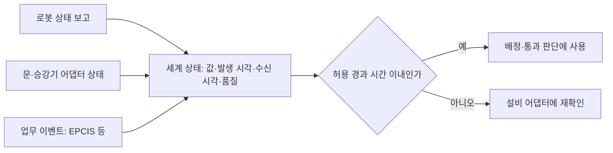

(너의 규칙은 시스템 프롬프트의 agents/shared-rules.md 와 agents/verifier.md 이다. 아래는 이번 실행의 컨텍스트와 입력이다.)

## 실행 컨텍스트

- run_id: 2026-09-25-24
- date: 2026-09-25
- run_type: area_deep_dive (영역 심화)
- 대상: 8. 실시간 세계 상태·데이터 일관성 (B. 공통 정보·환경 모델)
- 예산:
    - max_search_queries: 30
    - max_sources_per_run: 15
    - new_topic_pages: 1
    - page_updates: 2
    - max_retries: 2
- 환경 알림: web_fetch_available: false · fetch_mode: mirror_only (일반 웹 페이지 열람은 네트워크 정책으로 막혀 있다. raw.githubusercontent.com 은 열린다: 공식 문서가 GitHub 에 있는 출처는 입력의 config/source_mirrors.yaml 경로를 WebFetch 로 열어 원문을 읽고 sources[].fetched=true, fetched_via=github_raw, fetch_url 을 적는다. 입력에 원문 텍스트(data/source_texts)가 있는 출처는 fetched_via=inbox. 그 밖의 출처는 fetched=false 이며 코드가 신뢰도 상한(medium)을 강제한다 — 공통 규칙 0절 6항)
- 언어: ko
- verification_stage: second
- verifier_budget:
    - max_search_queries: 30
    - max_sources_per_run: 15
    - new_topic_pages: 1
    - page_updates: 2
    - max_retries: 2
- retry_count: 1
- max_retries: 2

## 입력

### runs/2026-09-25-24/target.json

```json
{
  "run_id": "2026-09-25-24",
  "date": "2026-09-25",
  "weekday": "Fri",
  "run_number": 24,
  "run_type": "area_deep_dive",
  "forced": true,
  "target": {
    "area_no": 8,
    "area_name": "8. 실시간 세계 상태·데이터 일관성",
    "category": "B. 공통 정보·환경 모델",
    "category_letter": "B"
  },
  "topic": null,
  "track": null,
  "corrections": [],
  "budget": {
    "max_search_queries": 30,
    "max_sources_per_run": 15,
    "new_topic_pages": 1,
    "page_updates": 2,
    "max_retries": 2
  },
  "priority_reason": null,
  "priority_questions": [],
  "excluded_areas": [],
  "lifted_areas": [],
  "deferred": {
    "monthly_recheck": false,
    "weekly_review": false
  },
  "selection_rationale": "CLI 지정 run_type=area_deep_dive, area=8"
}
```

### runs/2026-09-25-24/research.json

```json
{
  "run_id": "2026-09-25-24",
  "date": "2026-09-25",
  "run_type": "area_deep_dive",
  "target": {
    "area_no": 8,
    "area_name": "8. 실시간 세계 상태·데이터 일관성",
    "category": "B. 공통 정보·환경 모델"
  },
  "gaps": [
    "섹션 3. 왜 중요한가 비어 있음",
    "섹션 4. 핵심 개념과 용어 비어 있음 — 발생 시각·기록 시각, 상태 품질, 허용 경과 시간, 정정 이벤트 용어 없음",
    "섹션 5. 현장 시나리오 (물류 흐름의 어느 단계인지 명시) 비어 있음",
    "섹션 6. 대표 접근법과 기술 비어 있음",
    "섹션 7. 관련 표준·프레임워크·오픈소스 비어 있음",
    "섹션 8. 대표 연구와 자료 비어 있음",
    "섹션 9. ROP가 직접 맡는 것과 외부와 연계하는 것 (부록 A 9장 기준) 비어 있음",
    "섹션 10. 다른 연구영역과의 연결 (번호와 이름을 함께 표기) 비어 있음 — 22. 시뮬레이션·예측용 디지털 트윈과의 구분 근거 필요",
    "섹션 11. 열린 질문 비어 있음 — 기존 열린 질문 중 oq-024 가 이 영역에 걸려 있음",
    "프런트매터 related_areas·sources 비어 있음",
    "같은 영역을 다룬 실행 2026-09-25-18 의 브리프는 참고문헌 목록에 반영되지 않았다(ref-182~ref-196 이 목록에 없음). 이번 실행은 그 조사 방향을 재확인하되 출처 번호를 예약 구간 ref-378~ 으로 새로 부여한다"
  ],
  "research_questions": [
    "문이 열려 있다는 정보가 30초 전이라면 지금도 통과 가능하다고 볼 수 있을까? [분류원문]",
    "로봇 관제 인터페이스(VDA 5050, Open-RMF)와 설비 인터페이스(문·승강기)는 상태를 얼마나 자주, 어떤 시각·품질 정보와 함께 보고하며, 연결 끊김이나 오래된 상태에 대해 무엇을 규정하는가? (섹션 5·7 겨냥)",
    "메시지 계층(ROS 2 QoS, MQTT Sparkplug, OPC UA)은 정보의 오래됨·순서 뒤바뀜·품질을 어떤 장치로 표현하는가? (섹션 4·6·7 겨냥)",
    "사건 기록 표준(GS1 EPCIS, W3C SOSA)은 발생 시각과 기록 시각, 잘못된 기록의 정정을 어떻게 다루는가? (섹션 4·6, 7. 화물·재고·자산 식별과 추적 연결)",
    "정보 나이(Age of Information), 판독 데이터 정제, 복제 데이터 수렴(CRDT) 같은 연구는 세계 상태의 지연·누락·충돌·불확실성 관리에 어떤 방법을 주는가? (섹션 6·8 겨냥)",
    "재고 기록과 실물의 불일치는 얼마나 흔하며, 디지털 트윈 분류(디지털 모델·섀도·트윈, ISO 23247)와 국내 자동물류 디지털트윈 연구는 8. 실시간 세계 상태·데이터 일관성과 22. 시뮬레이션·예측용 디지털 트윈의 경계에 어떤 기준을 주는가? (섹션 3·8·10 겨냥, 국내 자료 포함)",
    "세계 상태 관리에서 ROP가 직접 맡을 부분과 로봇 자체 위치추정·설비 제어에 맡길 부분의 경계는 어디인가? oq-024(선언 능력 대 관측 운용 능력)와는 어떻게 연결되는가? (섹션 9·11 겨냥)"
  ],
  "findings": [
    {
      "id": "f1",
      "claim": "VDA 5050 3.0.0 명세는 이동로봇의 상태(state) 메시지를 관련 사건이 생길 때, 그리고 적어도 30초마다 발행하도록 정한다.",
      "tag": "사실",
      "source_ids": [
        "ref-031"
      ],
      "cross_checked": false,
      "confidence": "medium",
      "evidence_excerpt": "명세 원본: 'published when relevant events occur or at least every 30 seconds'. (발행일 미확인, 확인일 기준)",
      "as_of": "2026-09-25",
      "flow_step": null,
      "flow_item": "제약"
    },
    {
      "id": "f2",
      "claim": "VDA 5050 3.0.0 은 connection 토픽에 ONLINE·OFFLINE·CONNECTION_BROKEN·HIBERNATING 연결 상태를 두고, 로봇이 연결 시 CONNECTION_BROKEN 을 담은 MQTT 유언(last will)을 등록해 예기치 않은 단절을 브로커가 대신 알리게 하며, connection 토픽만 QoS 1 이고 state 를 포함한 나머지 토픽은 QoS 0 이다.",
      "tag": "사실",
      "source_ids": [
        "ref-031"
      ],
      "cross_checked": false,
      "confidence": "medium",
      "evidence_excerpt": "명세 원본: last will 의 connectionState 는 CONNECTION_BROKEN, connection 은 QoS 1, order·state·visualization 등은 QoS 0(최선 노력). (발행일 미확인, 확인일 기준)",
      "as_of": "2026-09-25",
      "flow_step": null,
      "flow_item": "예외·성과"
    },
    {
      "id": "f3",
      "claim": "이번에 연 VDA 5050 3.0.0 명세에서는 30초 최대 발행 간격 외에 관제가 오래된 상태나 연결 끊김에 어떻게 대응해야 하는지, 시각 동기화를 어떻게 할지에 대한 규정을 찾지 못했고, 명세는 connection 메시지의 timestamp·headerId 가 항상 오래된 값일 수 있다고 적는다.",
      "tag": "추정",
      "source_ids": [
        "ref-031"
      ],
      "cross_checked": false,
      "confidence": "low",
      "evidence_excerpt": "명세 원본: connection 메시지에서 'the timestamp and headerId fields will always be outdated'. 오래된 상태 대응 규정 부재는 열람 도구 응답 기준이며 전문 대조가 아님. (발행일 미확인, 확인일 기준)",
      "as_of": "2026-09-25",
      "flow_step": null,
      "flow_item": "예외·성과"
    },
    {
      "id": "f4",
      "claim": "VDA 5050 공식 상태 스키마는 ISO 8601 시각(timestamp), 마지막 도달 노드(lastNodeId), 지도 id(mapId)와 위치추정 여부(localized)·위치추정 품질(localizationScore, 0~1)·위치 편차 범위(deviationRange), 취급 중인 적재물(loads), 안전 상태(safetyState)를 담는다.",
      "tag": "사실",
      "source_ids": [
        "ref-051"
      ],
      "cross_checked": false,
      "confidence": "medium",
      "evidence_excerpt": "state.schema 원본: localized 'True: mobile robot is localized. x, y, and theta can be trusted'; loads 빈 배열은 적재물 없음. (발행일 미확인, 확인일 기준)",
      "as_of": "2026-09-25",
      "flow_step": "피킹",
      "flow_item": "작업 대상"
    },
    {
      "id": "f5",
      "claim": "Open-RMF API 로봇 상태 스키마는 밀리초 단위 시각(unix_millis_time), 위치, 상태 7종(uninitialized·offline·shutdown·idle·charging·working·error), 범주·상세로 된 문제 목록(issues), 0~1 배터리 충전 상태를 한 메시지에 담는다.",
      "tag": "사실",
      "source_ids": [
        "ref-148"
      ],
      "cross_checked": false,
      "confidence": "medium",
      "evidence_excerpt": "robot_state.json 원본: unix_millis_time(정수), status enum 7개, issues 항목은 category·detail, battery 'State of charge of the battery'. (발행일 미확인, 확인일 기준)",
      "as_of": "2026-09-25",
      "flow_step": null,
      "flow_item": "수행 자원"
    },
    {
      "id": "f6",
      "claim": "Open-RMF 에서 문 노드는 문 상태(DoorState: 시각 door_time, 문 이름, 현재 모드)를 /door_states 토픽으로 발행하고, 문 어댑터는 진행 중인 로봇 작업을 방해할 요청을 막는 상태 감독자 역할을 하며 어댑터를 거치지 않은 직접 요청은 이전 상태로 되돌린다.",
      "tag": "사실",
      "source_ids": [
        "ref-379",
        "ref-381"
      ],
      "cross_checked": false,
      "confidence": "medium",
      "evidence_excerpt": "문서 원본: door adapter 는 'a state supervisor ensuring that the doors are not acting on requests that might obstruct an ongoing mobile robot task'. DoorState.msg 필드 3개. (발행일 미확인, 확인일 기준)",
      "as_of": "2026-09-25",
      "flow_step": "적치",
      "flow_item": "제약"
    },
    {
      "id": "f7",
      "claim": "Open-RMF 승강기 상태(LiftState)는 시각(lift_time), 현재·목적 층, 문 상태, 운행 상태(MOTION_UNKNOWN 포함), 운영 모드(사람·AGV·화재·오프라인·비상), 세션 id 를 담고, 승강기 어댑터는 승강기의 내부 상태와 목표 상태를 추적해 로봇·일반 운행을 방해할 동작을 막는다.",
      "tag": "사실",
      "source_ids": [
        "ref-380",
        "ref-382"
      ],
      "cross_checked": false,
      "confidence": "medium",
      "evidence_excerpt": "문서 원본: adapter 는 'keeping track of the internal and desired state of the lift'. LiftState.msg: lift_time, current_floor, destination_floor, door_state, motion_state, current_mode, session_id. (발행일 미확인, 확인일 기준)",
      "as_of": "2026-09-25",
      "flow_step": null,
      "flow_item": "제약"
    },
    {
      "id": "f8",
      "claim": "이번에 연 Open-RMF 문·승강기 연동 문서에는 상태 발행 주기나 오래된 상태를 판정·처리하는 규칙이 적혀 있지 않고, 메시지 정의는 시각 필드만 둔다.",
      "tag": "추정",
      "source_ids": [
        "ref-379",
        "ref-380"
      ],
      "cross_checked": false,
      "confidence": "low",
      "evidence_excerpt": "두 문서 열람 응답: 발행 빈도·staleness 기준 언급 없음. 구현 코드는 보지 않아 부재의 확정은 아님. (발행일 미확인, 확인일 기준)",
      "as_of": "2026-09-25",
      "flow_step": null,
      "flow_item": null
    },
    {
      "id": "f9",
      "claim": "ROS 2 QoS 는 연속 발행 사이의 최대 간격(Deadline), 발행에서 수신까지 이 시간을 넘으면 오래되었거나 만료된 것으로 보는 수명(Lifespan), 발행자가 살아 있음을 알려야 하는 최대 기간(Liveliness·Lease Duration)을 정책으로 두고, 기한 초과·생존성 상실·변경을 이벤트 콜백으로 알린다.",
      "tag": "사실",
      "source_ids": [
        "ref-378"
      ],
      "cross_checked": false,
      "confidence": "medium",
      "evidence_excerpt": "Jazzy 문서 원본: Lifespan 'the maximum amount of time between the publishing and the reception of a message without the message being considered stale or expired'. (발행일 미확인, 확인일 기준)",
      "as_of": "2026-09-25",
      "flow_step": null,
      "flow_item": "예외·성과"
    },
    {
      "id": "f10",
      "claim": "Eclipse Sparkplug 사양은 에지 노드의 NDEATH 를 받거나 MQTT 서버 연결을 잃으면 호스트 애플리케이션이 관련 측정값을 STALE 품질로 표시하게 하고, 0~255 순번(seq)으로 순서 뒤바뀜을 감지해 재정렬 대기 시간이 지나도 빠진 메시지가 오지 않으면 재탄생(Rebirth) 요청으로 전체 상태를 다시 받게 한다.",
      "tag": "사실",
      "source_ids": [
        "ref-383"
      ],
      "cross_checked": false,
      "confidence": "medium",
      "evidence_excerpt": "5장 원본: 'Host Applications MUST mark all metrics that were included in the previous NBIRTH as STALE'; Reorder Timeout 만료 시 'Node Control/Rebirth' NCMD. (발행일 미확인, 확인일 기준)",
      "as_of": "2026-09-25",
      "flow_step": null,
      "flow_item": "예외·성과"
    },
    {
      "id": "f11",
      "claim": "OPC UA 의 DataValue 는 값과 함께 원천에서 값이나 상태가 마지막으로 바뀐 시각(SourceTimestamp), 서버 쪽 시각(ServerTimestamp), Good·Uncertain·Bad 로 나뉘는 상태 코드(StatusCode)를 담는다.",
      "tag": "사실",
      "source_ids": [
        "ref-384"
      ],
      "cross_checked": false,
      "confidence": "medium",
      "evidence_excerpt": "검색 요약(OPC 10000-4 7.11): sourceTimestamp 는 UTC 로 'the time of the last change of the value or statusCode'를 나타내며 원천 가까이서 같은 물리 시계로 생성. 원문 미열람. (발행일 미확인, 확인일 기준)",
      "as_of": "2026-09-25",
      "flow_step": null,
      "flow_item": null,
      "source_unopened": true
    },
    {
      "id": "f12",
      "claim": "정보 나이(Age of Information, AoI)는 시각 표시된 상태 갱신을 받는 쪽의 정보가 얼마나 최신인지를 재는 지표로, 저지연 사이버물리 시스템의 설계·최적화 연구에서 평가 방법이 정리되어 있다.",
      "tag": "사실",
      "source_ids": [
        "ref-385"
      ],
      "cross_checked": false,
      "confidence": "medium",
      "evidence_excerpt": "검색 요약: sources send 'time-stamped status updates' 를 받는 쪽이 'as timely as possible' 이기를 원하는 시스템의 AoI 지표·분석 방법 서베이. IEEE JSAC 39, 1183-1210. 원문 미열람.",
      "as_of": "2021",
      "flow_step": null,
      "flow_item": null,
      "source_unopened": true
    },
    {
      "id": "f13",
      "claim": "분류 원문의 질문(30초 전 '문 열림' 정보로 지금 통과할 수 있는가)에 대해, 확인한 표준·프레임워크는 시각 필드·주기 발행·수명·생존성·STALE 표시 같은 장치만 주고 대상별 허용 경과 시간은 정하지 않으므로, ROP가 문·승강기 같은 대상마다 허용 경과 시간을 정하고 이를 넘으면 통과를 확정하기 전에 설비 어댑터에 다시 확인하는 규칙을 가져야 할 것으로 보인다.",
      "tag": "추정",
      "source_ids": [
        "ref-031",
        "ref-378",
        "ref-383",
        "ref-379",
        "ref-385"
      ],
      "cross_checked": false,
      "confidence": "low",
      "evidence_excerpt": "f1(30초 주기)·f9(Lifespan·Deadline)·f10(STALE)·f6·f8(문 상태에 시각만 있고 오래됨 규칙 없음)·f12(AoI)를 SCM 질문에 대응시킨 추론. 허용 경과 시간 값을 정한 출처는 찾지 못함.",
      "as_of": "2026-09-25",
      "flow_step": "적치",
      "flow_item": "제약"
    },
    {
      "id": "f14",
      "claim": "GS1 EPCIS 온톨로지는 캡처 애플리케이션이 이벤트가 일어났다고 주장하는 시각(eventTime), 저장소가 이벤트를 기록한 시각(recordTime), 발생 장소의 UTC 차이(eventTimeZoneOffset)를 구분해 둔다.",
      "tag": "사실",
      "source_ids": [
        "ref-045"
      ],
      "cross_checked": false,
      "confidence": "medium",
      "evidence_excerpt": "EPCIS.ttl 원본: eventTime 'The date and time at which the EPCIS Capturing Applications asserts the event occurred'; recordTime 'recorded by an EPCIS Repository'.",
      "as_of": "2021-09-30",
      "flow_step": null,
      "flow_item": "완료·인계"
    },
    {
      "id": "f15",
      "claim": "EPCIS 는 앞선 이벤트가 틀렸다고 선언하는 오류 선언(errorDeclaration)에 선언 시각(declarationTime), CBV 사유(did_not_occur·incorrect_data), 정정 이벤트 id 목록(correctiveEventIDs)을 두어 원 기록을 지우지 않고 뒤 이벤트로 바로잡게 한다.",
      "tag": "사실",
      "source_ids": [
        "ref-045",
        "ref-044"
      ],
      "cross_checked": false,
      "confidence": "medium",
      "evidence_excerpt": "EPCIS.ttl: errorDeclaration 'assert that the assertions made by a prior event are in error'. CBV.ttl: did_not_occur 는 'There are no corrective events', incorrect_data 는 데이터 일부·전부가 틀림. 같은 GS1 저장소라 독립 교차 아님.",
      "as_of": "2021-09-30",
      "flow_step": null,
      "flow_item": "완료·인계"
    },
    {
      "id": "f16",
      "claim": "EPCIS 오류 선언 방식을 참고하면, ROP 세계 상태 이력도 잘못 들어온 상태(예: 인계 완료로 잘못 보고된 적재)를 덮어쓰지 않고 정정 기록을 덧붙여야 인계 분쟁 때 원 기록과 정정 근거를 함께 추적할 수 있을 것으로 보인다.",
      "tag": "추정",
      "source_ids": [
        "ref-045",
        "ref-044"
      ],
      "cross_checked": false,
      "confidence": "low",
      "evidence_excerpt": "f15 의 구조를 로봇 상태 이력에 옮긴 추론. 로봇 관제 표준에서 같은 정정 구조를 둔 예는 이번 열람 범위에서 확인하지 못함.",
      "as_of": "2026-09-25",
      "flow_step": "출하",
      "flow_item": "완료·인계"
    },
    {
      "id": "f17",
      "claim": "W3C/OGC SOSA 는 관측 결과가 대상에 적용되는 시각(phenomenonTime)과 관측 활동이 끝난 시각(resultTime)을 구분하고 둘이 같지 않을 수 있다고 정의한다.",
      "tag": "사실",
      "source_ids": [
        "ref-030"
      ],
      "cross_checked": false,
      "confidence": "medium",
      "evidence_excerpt": "sosa.ttl(작업반 편집본): phenomenonTime 'applies to the FeatureOfInterest. Not necessarily the same as the resultTime'. /TR 권고안과 문구가 다를 수 있음.",
      "as_of": "2017-10-19",
      "flow_step": null,
      "flow_item": null,
      "source_unopened": true
    },
    {
      "id": "f18",
      "claim": "SOSA(phenomenonTime·resultTime), EPCIS(eventTime·recordTime), OPC UA(SourceTimestamp·ServerTimestamp)가 모두 '사실이 성립한 시각'과 '시스템이 받거나 기록한 시각'을 나누므로, ROP 세계 상태의 각 값에도 최소한 이 두 시각과 품질 표시를 함께 두어야 오래됨·순서 역전을 판단할 수 있을 것으로 보인다.",
      "tag": "추정",
      "source_ids": [
        "ref-030",
        "ref-045",
        "ref-384"
      ],
      "cross_checked": false,
      "confidence": "low",
      "evidence_excerpt": "f11·f14·f17 의 시각 구분을 대응시킨 추론. 세 표준이 서로를 참조한다는 근거는 없고 정의가 조금씩 다름.",
      "as_of": "2026-09-25",
      "flow_step": null,
      "flow_item": null
    },
    {
      "id": "f19",
      "claim": "Open-RMF 교통 일정(traffic schedule) 데이터베이스는 지연·취소·경로 변경을 계속 반영하는 살아 있는 데이터베이스이며, 충돌이 예상되면 관련 플릿 관리자에게 충돌 통지를 보내 협상을 시작하게 한다.",
      "tag": "사실",
      "source_ids": [
        "ref-004"
      ],
      "cross_checked": false,
      "confidence": "medium",
      "evidence_excerpt": "rmf-core 원본: 'a living database whose contents will change over time to reflect delays, cancellations, or route changes'; 제3자 판정자가 협상 결과를 고름. (발행일 미확인, 확인일 기준)",
      "as_of": "2026-09-25",
      "flow_step": null,
      "flow_item": "제약"
    },
    {
      "id": "f20",
      "claim": "DeHoratius·Raman(2008)은 한 소매업체 37개 매장의 재고 기록 약 37만 건 가운데 65%가 실물과 맞지 않았고, 재고 실사는 부정확성을 줄이며 매장 환경의 복잡성과 유통 구조는 늘린다고 보고했다.",
      "tag": "사실",
      "source_ids": [
        "ref-388"
      ],
      "cross_checked": false,
      "confidence": "medium",
      "evidence_excerpt": "검색 요약: 'nearly 370,000 inventory records from 37 stores of one retailer and found 65% to be inaccurate'. Management Science 54(4). 소매 매장 조건이며 물류센터 값이 아님. 원문 미열람.",
      "as_of": "2008",
      "flow_step": "보충",
      "flow_item": "예외·성과",
      "source_unopened": true
    },
    {
      "id": "f21",
      "claim": "재고 기록이 실물과 자주 어긋난다는 연구 결과로 볼 때, ROP의 화물 상태는 WMS 기록을 그대로 참값으로 두지 말고 로봇이 보고한 적재물(VDA 5050 loads)이나 판독 결과를 대조 근거로 함께 보관해 불일치를 드러내야 할 것으로 보인다.",
      "tag": "추정",
      "source_ids": [
        "ref-388",
        "ref-051"
      ],
      "cross_checked": false,
      "confidence": "low",
      "evidence_excerpt": "f20(기록 부정확성)과 f4(상태에 적재물 포함)를 대응시킨 추론. 로봇 관측으로 WMS 재고를 정정한 공개 사례는 찾지 못함.",
      "as_of": "2026-09-25",
      "flow_step": "피킹",
      "flow_item": "작업 대상",
      "source_unopened": false
    },
    {
      "id": "f22",
      "claim": "RFID 판독 스트림은 누락·오판독이 섞여 미들웨어에서 정제가 필요하며, 적응형 슬라이딩 윈도 방식 WSTD 는 SMURF 의 개념을 바탕으로 전이 감지를 개선해 이동 태그 환경에서 SMURF 보다 전체 오류가 약 30% 적었다고 보고했다.",
      "tag": "사실",
      "source_ids": [
        "ref-389"
      ],
      "cross_checked": false,
      "confidence": "medium",
      "evidence_excerpt": "검색 요약: 'In the mobile environment, WSTD performs better than SMURF, producing an improvement of about 30% less overall errors'. Sensors 12(4) 4187-4212. 저자 보고값, 실험 조건 원문 미열람.",
      "as_of": "2012-03-28",
      "flow_step": "입고",
      "flow_item": "완료·인계",
      "source_unopened": true
    },
    {
      "id": "f23",
      "claim": "무충돌 복제 데이터 타입(CRDT)은 각 복제본을 다른 복제본과 조율하지 않고 수정할 수 있고, 같은 갱신 집합을 받은 복제본들이 수학적 규칙에 따라 결정적으로 같은 상태에 수렴하도록 설계된 데이터 타입이다.",
      "tag": "사실",
      "source_ids": [
        "ref-391"
      ],
      "cross_checked": false,
      "confidence": "medium",
      "evidence_excerpt": "검색 요약(초록): '(1) any replica can be modified without coordinating ... (2) when any two replicas have received the same set of updates, they reach the same state, deterministically'. 원문 미열람.",
      "as_of": "2018-05",
      "flow_step": null,
      "flow_item": null,
      "source_unopened": true
    },
    {
      "id": "f24",
      "claim": "CRDT 식 수렴은 관측 기록 모음처럼 순서와 무관하게 합칠 수 있는 상태에는 맞지만, 문·승강기 사용권처럼 한 시점에 한 주체만 가져야 하는 자원은 Open-RMF 문·승강기 어댑터나 승강기 세션 id 처럼 단일 감독자가 판정하는 구조가 필요할 것으로 보인다.",
      "tag": "추정",
      "source_ids": [
        "ref-391",
        "ref-379",
        "ref-382"
      ],
      "cross_checked": false,
      "confidence": "low",
      "evidence_excerpt": "f23(조율 없는 수렴)과 f6·f7(어댑터 감독, session_id)을 대조한 추론. 로봇 세계 상태에 CRDT 를 적용한 사례는 이번 검색에서 확인하지 못함.",
      "as_of": "2026-09-25",
      "flow_step": null,
      "flow_item": "제약",
      "source_unopened": false
    },
    {
      "id": "f25",
      "claim": "ISO 23247 은 제조 디지털 트윈을 관측 가능한 제조 요소(인력·장비·자재·공정·시설·환경·제품·지원 문서)의 목적에 맞는 디지털 표현으로서 요소와 표현 사이에 동기화가 있는 것으로 정의하고, 데이터 수집·장치 제어 도메인과 핵심 도메인을 나눈 참조 구조를 둔다.",
      "tag": "사실",
      "source_ids": [
        "ref-386"
      ],
      "cross_checked": false,
      "confidence": "medium",
      "evidence_excerpt": "검색 요약(NIST 해설): 'fit for purpose digital representation of an observable manufacturing element with synchronization between the element and its digital representation'. 표준 원문·해설 모두 미열람. (발행일 미확인, 확인일 기준)",
      "as_of": "2026-09-25",
      "flow_step": null,
      "flow_item": null,
      "source_unopened": true
    },
    {
      "id": "f26",
      "claim": "Kritzinger 외(2018)는 제조 디지털 트윈 문헌을 데이터 통합 수준에 따라 디지털 모델·디지털 섀도(digital shadow)·디지털 트윈으로 나누고, 가장 높은 단계인 디지털 트윈에 관한 문헌은 드물다고 보고했다.",
      "tag": "사실",
      "source_ids": [
        "ref-387"
      ],
      "cross_checked": false,
      "confidence": "medium",
      "evidence_excerpt": "검색 요약: 'distinguishes between Digital Model (DM), Digital Shadow (DS) and Digital Twin'; DT 문헌은 'scarce'. IFAC INCOM 2018. 원문 미열람(자동 흐름 방향에 따른 구분 정의는 이전 실행 요약 기준).",
      "as_of": "2018",
      "flow_step": null,
      "flow_item": null,
      "source_unopened": true
    },
    {
      "id": "f27",
      "claim": "8. 실시간 세계 상태·데이터 일관성이 다루는 현재 상태 표현은 현장과 자동으로 동기화되는 표현(디지털 섀도, ISO 23247 의 동기화된 표현)에 가깝고, 그 표현을 복제해 가정한 미래를 실험하는 쪽은 22. 시뮬레이션·예측용 디지털 트윈의 몫으로 나누는 것이 분류 원문의 구분과 맞을 것으로 보인다.",
      "tag": "추정",
      "source_ids": [
        "ref-387",
        "ref-386"
      ],
      "cross_checked": false,
      "confidence": "low",
      "evidence_excerpt": "f25·f26 을 분류 원문 7장 주석(현재 상태 표현 대 가정한 미래 실험)에 대응시킨 추론. 두 출처는 제조 대상이며 로봇 오케스트레이션에 적용한 문헌은 찾지 못함.",
      "as_of": "2026-09-25",
      "flow_step": null,
      "flow_item": null,
      "source_unopened": true
    },
    {
      "id": "f28",
      "claim": "이동건 외(2021)는 지능형 물류 로봇을 쓰는 자동물류시스템(AMHS)에 대해 설계 단계에서는 가상 환경에서 미리 검증하고 운영 단계에서는 실시간으로 모니터링·분석하는 디지털트윈을 개발·적용했다.",
      "tag": "사실",
      "source_ids": [
        "ref-390"
      ],
      "cross_checked": false,
      "confidence": "medium",
      "evidence_excerpt": "검색 요약: 설계 단계 'preview and verify AMHSs in a virtual environment', 운영 중 'monitor and analyze configured systems in real time'. 한국CDE학회 논문집 26(4) 313-323. 원문 미열람.",
      "as_of": "2021-12",
      "flow_step": null,
      "flow_item": null,
      "source_unopened": true
    },
    {
      "id": "f29",
      "claim": "김지형(2023)은 OPC UA 와 연결 솔루션(FLEXING CPS·FLEXING EDGE)으로 이기종 로봇의 데이터를 수집·전달해 실시간 3D 디지털 트윈을 구축하는 설계·구현을 제시했다.",
      "tag": "사실",
      "source_ids": [
        "ref-392"
      ],
      "cross_checked": false,
      "confidence": "medium",
      "evidence_excerpt": "검색 요약: 프로토콜 구성·데이터 수집·전달·3D 디지털 트윈 시뮬레이션 담당. 게재지 이름이 요약마다 다름(지능정보논문지 23(4) 대 한국인터넷방송통신학회논문지, 출처 충돌). 제조 대상, 원문 미열람.",
      "as_of": "2023",
      "flow_step": null,
      "flow_item": "수행 자원",
      "source_unopened": true
    },
    {
      "id": "f30",
      "claim": "국내 자동물류 디지털트윈 연구(f28)가 한 시스템 안에 설계 검증(가정한 구성의 사전 실험)과 운영 중 실시간 모니터링(현재 상태 표현)을 함께 두는 것으로 볼 때, 위키 서술에서는 같은 '디지털트윈' 이름 아래 기능을 8. 실시간 세계 상태·데이터 일관성과 22. 시뮬레이션·예측용 디지털 트윈으로 나눠 적어야 할 것으로 보인다.",
      "tag": "추정",
      "source_ids": [
        "ref-390"
      ],
      "cross_checked": false,
      "confidence": "low",
      "evidence_excerpt": "f28 을 분류 원문 7장 주석에 대응시킨 추론. 논문 본문의 기능 구분 방식은 원문 미열람으로 확인하지 못함.",
      "as_of": "2026-09-25",
      "flow_step": null,
      "flow_item": null,
      "source_unopened": true
    },
    {
      "id": "f31",
      "claim": "연계 대상: 로봇의 위치추정과 그 품질 계산은 분류 원문 9장의 로봇 자체 지능·제어 쪽이며, ROP 는 로봇이 보고한 위치추정 여부·품질 점수·편차 범위·지도 id 와 보고 시각을 받아 그 위치를 얼마나 믿을지 판단하는 쪽을 맡는 것으로 보인다.",
      "tag": "추정",
      "source_ids": [
        "ref-051"
      ],
      "cross_checked": false,
      "confidence": "low",
      "evidence_excerpt": "f4 의 localized·localizationScore·deviationRange 필드를 분류 원문 9장 경계와 대응시킨 추론.",
      "as_of": "2026-09-25",
      "flow_step": null,
      "flow_item": "수행 자원"
    },
    {
      "id": "f32",
      "claim": "ROP 의 직접 범위는 로봇 관제 인터페이스(VDA 5050·Open-RMF)의 로봇 상태, 설비 어댑터의 문·승강기 상태, EPCIS 같은 업무 이벤트를 시각·품질 정보와 함께 하나의 세계 상태로 모으고 불일치를 드러내는 것이며, 설비 자체 제어와 센서 융합은 외부에 맡기는 경계가 될 것으로 보인다.",
      "tag": "추정",
      "source_ids": [
        "ref-031",
        "ref-379",
        "ref-045"
      ],
      "cross_checked": false,
      "confidence": "low",
      "evidence_excerpt": "f1·f6·f14 와 분류 원문 9장('시설·설비 제어'는 작업 요청·예약·인계·상태 확인만 ROP)을 대응시킨 추론.",
      "as_of": "2026-09-25",
      "flow_step": null,
      "flow_item": null
    }
  ],
  "sources": [
    {
      "id": "ref-004",
      "org": "Open Robotics",
      "title": "RMF Core Overview — Programming Multiple Robots with ROS 2",
      "published": null,
      "url": "https://osrf.github.io/ros2multirobotbook/rmf-core.html",
      "type": "오픈소스 문서",
      "reliability": "high",
      "accessed": "2026-09-25",
      "summary": "작업·교통 조율, Fleet Adapter, 설비 연동 구조 참고. 이번 실행은 교통 일정 데이터베이스(지연·취소·경로 변경 반영, 충돌 통지와 협상)를 원본에서 확인했다.",
      "fetched": true,
      "fetched_via": "github_raw",
      "fetch_url": "https://raw.githubusercontent.com/osrf/ros2multirobotbook/master/src/rmf-core.md",
      "source_unopened": false
    },
    {
      "id": "ref-030",
      "org": "W3C / OGC",
      "title": "Semantic Sensor Network Ontology",
      "published": "2017-10-19",
      "url": "https://www.w3.org/TR/vocab-ssn/",
      "type": "표준",
      "reliability": "medium",
      "accessed": "2026-09-25",
      "summary": "관측·센서·액추에이션을 기술하는 W3C/OGC 온톨로지. 이번 실행은 작업반 저장소 편집본 sosa.ttl 로 phenomenonTime·resultTime 정의를 확인했다(/TR 권고안과 문구가 다를 수 있음).",
      "fetched": false,
      "fetched_via": null,
      "fetch_url": "https://raw.githubusercontent.com/w3c/sdw/gh-pages/ssn/integrated/sosa.ttl",
      "source_unopened": true
    },
    {
      "id": "ref-031",
      "org": "VDA / VDMA (VDA5050 GitHub)",
      "title": "VDA5050/VDA5050_EN.md — Official Specification document for the VDA 5050",
      "published": null,
      "url": "https://github.com/VDA5050/VDA5050/blob/main/VDA5050_EN.md",
      "type": "표준",
      "reliability": "high",
      "accessed": "2026-09-25",
      "summary": "VDA 5050 공식 명세 본문(main 은 3.0.0 판). 이번 실행은 상태 발행 조건(사건 발생 시와 최소 30초마다), connection 상태 4종과 last will, 토픽별 MQTT QoS 를 확인했다.",
      "fetched": true,
      "fetched_via": "github_raw",
      "fetch_url": "https://raw.githubusercontent.com/VDA5050/VDA5050/main/VDA5050_EN.md",
      "source_unopened": false
    },
    {
      "id": "ref-044",
      "org": "GS1",
      "title": "gs1/EPCIS — Ontology/CBV.ttl (Core Business Vocabulary ontology 2.0)",
      "published": "2021-09-30",
      "url": "https://github.com/gs1/EPCIS/blob/master/Ontology/CBV.ttl",
      "type": "표준",
      "reliability": "high",
      "accessed": "2026-09-25",
      "summary": "CBV 2.0 어휘 온톨로지 원본. 이번 실행은 오류 사유 어휘 did_not_occur·incorrect_data 정의를 확인했다.",
      "fetched": true,
      "fetched_via": "github_raw",
      "fetch_url": "https://raw.githubusercontent.com/gs1/EPCIS/master/Ontology/CBV.ttl",
      "source_unopened": false
    },
    {
      "id": "ref-045",
      "org": "GS1",
      "title": "gs1/EPCIS — Ontology/EPCIS.ttl (EPCIS ontology 2.0)",
      "published": "2021-09-30",
      "url": "https://github.com/gs1/EPCIS/blob/master/Ontology/EPCIS.ttl",
      "type": "표준",
      "reliability": "high",
      "accessed": "2026-09-25",
      "summary": "EPCIS 2.0 온톨로지 원본. 이번 실행은 eventTime·recordTime·eventTimeZoneOffset 과 오류 선언(declarationTime·reason·correctiveEventIDs) 정의를 확인했다.",
      "fetched": true,
      "fetched_via": "github_raw",
      "fetch_url": "https://raw.githubusercontent.com/gs1/EPCIS/master/Ontology/EPCIS.ttl",
      "source_unopened": false
    },
    {
      "id": "ref-051",
      "org": "VDA / VDMA (VDA5050 GitHub)",
      "title": "VDA5050/VDA5050 — json_schemas/state.schema",
      "published": null,
      "url": "https://github.com/VDA5050/VDA5050/blob/main/json_schemas/state.schema",
      "type": "표준",
      "reliability": "high",
      "accessed": "2026-09-25",
      "summary": "VDA 5050 상태 메시지 JSON 스키마(main). 이번 실행은 시각 형식, 마지막 노드, 위치추정 여부·품질·편차 범위, 지도 id, 적재물, 안전 상태 필드를 확인했다.",
      "fetched": true,
      "fetched_via": "github_raw",
      "fetch_url": "https://raw.githubusercontent.com/VDA5050/VDA5050/main/json_schemas/state.schema",
      "source_unopened": false
    },
    {
      "id": "ref-148",
      "org": "Open Robotics (open-rmf)",
      "title": "rmf_api_msgs — rmf_api_msgs/schemas/robot_state.json",
      "published": null,
      "url": "https://github.com/open-rmf/rmf_api_msgs/blob/main/rmf_api_msgs/schemas/robot_state.json",
      "type": "오픈소스 문서",
      "reliability": "high",
      "accessed": "2026-09-25",
      "summary": "Open-RMF API 로봇 상태 JSON 스키마. 시각(unix_millis_time), 위치, 상태 7종, 문제 목록, 배터리 충전 상태를 정의한다.",
      "fetched": true,
      "fetched_via": "github_raw",
      "fetch_url": "https://raw.githubusercontent.com/open-rmf/rmf_api_msgs/main/rmf_api_msgs/schemas/robot_state.json",
      "source_unopened": false
    },
    {
      "id": "ref-378",
      "org": "Open Robotics (ROS 2 Documentation)",
      "title": "Quality of Service settings — ROS 2 Documentation: Jazzy",
      "published": null,
      "url": "https://docs.ros.org/en/jazzy/Concepts/Intermediate/About-Quality-of-Service-Settings.html",
      "type": "오픈소스 문서",
      "reliability": "high",
      "accessed": "2026-09-25",
      "summary": "ROS 2 QoS 정책(Deadline·Lifespan·Liveliness·Lease Duration 등)과 기한 초과·생존성 변화 이벤트를 설명하는 공식 문서(ros2_documentation 저장소 jazzy 브랜치 원본).",
      "fetched": true,
      "fetched_via": "github_raw",
      "fetch_url": "https://raw.githubusercontent.com/ros2/ros2_documentation/jazzy/source/Concepts/Intermediate/About-Quality-of-Service-Settings.rst",
      "source_unopened": false
    },
    {
      "id": "ref-379",
      "org": "Open Robotics",
      "title": "Doors (integration_doors) - Programming Multiple Robots with ROS 2",
      "published": null,
      "url": "https://osrf.github.io/ros2multirobotbook/integration_doors.html",
      "type": "오픈소스 문서",
      "reliability": "high",
      "accessed": "2026-09-25",
      "summary": "Open-RMF 문 연동 문서(mdBook 원본). 문 노드의 /door_states 발행과 문 어댑터의 요청 감독·직접 요청 되돌림을 설명한다.",
      "fetched": true,
      "fetched_via": "github_raw",
      "fetch_url": "https://raw.githubusercontent.com/osrf/ros2multirobotbook/master/src/integration_doors.md",
      "source_unopened": false
    },
    {
      "id": "ref-380",
      "org": "Open Robotics",
      "title": "Lifts (integration_lifts) - Programming Multiple Robots with ROS 2",
      "published": null,
      "url": "https://osrf.github.io/ros2multirobotbook/integration_lifts.html",
      "type": "오픈소스 문서",
      "reliability": "high",
      "accessed": "2026-09-25",
      "summary": "Open-RMF 승강기 연동 문서(mdBook 원본). 승강기 노드의 /lift_states 발행과 승강기 어댑터의 내부·목표 상태 추적을 설명한다.",
      "fetched": true,
      "fetched_via": "github_raw",
      "fetch_url": "https://raw.githubusercontent.com/osrf/ros2multirobotbook/master/src/integration_lifts.md",
      "source_unopened": false
    },
    {
      "id": "ref-381",
      "org": "Open Robotics (open-rmf)",
      "title": "rmf_internal_msgs — rmf_door_msgs/msg/DoorState.msg",
      "published": null,
      "url": "https://github.com/open-rmf/rmf_internal_msgs/blob/main/rmf_door_msgs/msg/DoorState.msg",
      "type": "오픈소스 문서",
      "reliability": "high",
      "accessed": "2026-09-25",
      "summary": "Open-RMF 문 상태 메시지 정의. 시각(door_time), 문 이름, 현재 모드 세 필드를 둔다.",
      "fetched": true,
      "fetched_via": "github_raw",
      "fetch_url": "https://raw.githubusercontent.com/open-rmf/rmf_internal_msgs/main/rmf_door_msgs/msg/DoorState.msg",
      "source_unopened": false
    },
    {
      "id": "ref-382",
      "org": "Open Robotics (open-rmf)",
      "title": "rmf_internal_msgs — rmf_lift_msgs/msg/LiftState.msg",
      "published": null,
      "url": "https://github.com/open-rmf/rmf_internal_msgs/blob/main/rmf_lift_msgs/msg/LiftState.msg",
      "type": "오픈소스 문서",
      "reliability": "high",
      "accessed": "2026-09-25",
      "summary": "Open-RMF 승강기 상태 메시지 정의. 시각, 이용 가능·현재·목적 층, 문·운행 상태, 운영 모드, 세션 id 를 둔다.",
      "fetched": true,
      "fetched_via": "github_raw",
      "fetch_url": "https://raw.githubusercontent.com/open-rmf/rmf_internal_msgs/main/rmf_lift_msgs/msg/LiftState.msg",
      "source_unopened": false
    },
    {
      "id": "ref-383",
      "org": "Eclipse Foundation (eclipse-sparkplug GitHub)",
      "title": "Sparkplug Specification — Chapter 5 Operational Behavior (Sparkplug_5_Operational_Behavior.adoc)",
      "published": null,
      "url": "https://github.com/eclipse-sparkplug/sparkplug/blob/master/specification/src/main/asciidoc/chapters/Sparkplug_5_Operational_Behavior.adoc",
      "type": "표준",
      "reliability": "high",
      "accessed": "2026-09-25",
      "summary": "MQTT 기반 산업 데이터 사양 Sparkplug 의 운영 동작 장. 연결 끊김·NDEATH 시 STALE 표시, 순번으로 순서 역전 감지, 재정렬 대기와 재탄생 요청을 규정한다.",
      "fetched": true,
      "fetched_via": "github_raw",
      "fetch_url": "https://raw.githubusercontent.com/eclipse-sparkplug/sparkplug/master/specification/src/main/asciidoc/chapters/Sparkplug_5_Operational_Behavior.adoc",
      "source_unopened": false
    },
    {
      "id": "ref-384",
      "org": "OPC Foundation",
      "title": "OPC Unified Architecture – Part 4: Services - 7.11 DataValue",
      "published": null,
      "url": "https://reference.opcfoundation.org/specs/OPC-10000-4/7.11",
      "type": "표준",
      "reliability": "medium",
      "accessed": "2026-09-25",
      "summary": "원문 미열람. OPC UA 데이터 값 구조(값, SourceTimestamp, ServerTimestamp, StatusCode)와 시각·품질의 의미를 정의한 공식 온라인 참조.",
      "source_unopened": true,
      "fetched": false,
      "fetched_via": null,
      "fetch_url": null
    },
    {
      "id": "ref-385",
      "org": "Yates, R. D., Sun, Y., Brown, D. R., Kaul, S. K., Modiano, E., & Ulukus, S.",
      "title": "Age of Information: An Introduction and Survey",
      "published": "2021",
      "url": "https://arxiv.org/abs/2007.08564",
      "type": "논문",
      "reliability": "medium",
      "accessed": "2026-09-25",
      "summary": "원문 미열람. 시각 표시된 상태 갱신의 신선도 지표인 정보 나이(AoI)의 정의와 평가·최적화 방법을 정리한 서베이(IEEE JSAC 39, 1183-1210).",
      "source_unopened": true,
      "fetched": false,
      "fetched_via": null,
      "fetch_url": null
    },
    {
      "id": "ref-386",
      "org": "NIST",
      "title": "DIGITAL TWINS FOR ADVANCED MANUFACTURING: THE STANDARDIZED APPROACH",
      "published": null,
      "url": "https://tsapps.nist.gov/publication/get_pdf.cfm?pub_id=957417",
      "type": "정부·연구기관",
      "reliability": "medium",
      "accessed": "2026-09-25",
      "summary": "원문 미열람. ISO 23247 제조 디지털 트윈 프레임워크의 정의(동기화된 디지털 표현), 관측 가능한 제조 요소 8종, 참조 구조를 해설한 NIST 자료.",
      "source_unopened": true,
      "fetched": false,
      "fetched_via": null,
      "fetch_url": null
    },
    {
      "id": "ref-387",
      "org": "Kritzinger, W., Karner, M., Traar, G., Henjes, J., & Sihn, W.",
      "title": "Digital Twin in manufacturing: A categorical literature review and classification",
      "published": "2018",
      "url": "https://www.sciencedirect.com/science/article/pii/S2405896318316021",
      "type": "논문",
      "reliability": "medium",
      "accessed": "2026-09-25",
      "summary": "원문 미열람. 제조 디지털 트윈 문헌을 데이터 통합 수준에 따라 디지털 모델·디지털 섀도·디지털 트윈으로 분류한 IFAC-PapersOnLine(INCOM 2018) 논문.",
      "source_unopened": true,
      "fetched": false,
      "fetched_via": null,
      "fetch_url": null
    },
    {
      "id": "ref-388",
      "org": "DeHoratius, N., & Raman, A.",
      "title": "Inventory Record Inaccuracy: An Empirical Analysis",
      "published": "2008",
      "url": "https://pubsonline.informs.org/doi/10.1287/mnsc.1070.0789",
      "type": "논문",
      "reliability": "medium",
      "accessed": "2026-09-25",
      "summary": "원문 미열람. 한 소매업체 37개 매장의 재고 기록 약 37만 건을 분석해 기록 부정확성의 정도와 요인을 밝힌 Management Science 54(4) 논문.",
      "source_unopened": true,
      "fetched": false,
      "fetched_via": null,
      "fetch_url": null
    },
    {
      "id": "ref-389",
      "org": "Massawe, L. V. 외(Sensors)",
      "title": "Reducing False Negative Reads in RFID Data Streams Using an Adaptive Sliding-Window Approach",
      "published": "2012-03-28",
      "url": "https://doi.org/10.3390/s120404187",
      "type": "논문",
      "reliability": "medium",
      "accessed": "2026-09-25",
      "summary": "원문 미열람. RFID 판독 스트림의 누락 판독을 적응형 슬라이딩 윈도(WSTD)로 줄이고 SMURF 와 비교한 논문(Sensors 12(4)). 저자 목록 일부 미확인.",
      "source_unopened": true,
      "fetched": false,
      "fetched_via": null,
      "fetch_url": null
    },
    {
      "id": "ref-390",
      "org": "이동건, 송승현, 이찬혁, 노상도, 윤상문, 이현영(한국CDE학회 논문집)",
      "title": "자동물류시스템의 설계 검증 및 운영을 위한 디지털트윈 개발 및 적용",
      "published": "2021-12",
      "url": "https://www.kci.go.kr/kciportal/ci/sereArticleSearch/ciSereArtiView.kci?sereArticleSearchBean.artiId=ART002781294",
      "type": "논문",
      "reliability": "medium",
      "accessed": "2026-09-25",
      "summary": "원문 미열람. 물류 로봇 기반 자동물류시스템의 설계 단계 가상 검증과 운영 중 실시간 모니터링·분석을 위한 디지털트윈을 개발·적용한 국내 논문(26(4) 313-323, DOI 10.7315/CDE.2021.313).",
      "source_unopened": true,
      "fetched": false,
      "fetched_via": null,
      "fetch_url": null
    },
    {
      "id": "ref-391",
      "org": "Preguiça, N., Baquero, C., & Shapiro, M.",
      "title": "Conflict-free Replicated Data Types (CRDTs)",
      "published": "2018-05",
      "url": "https://arxiv.org/abs/1805.06358",
      "type": "논문",
      "reliability": "medium",
      "accessed": "2026-09-25",
      "summary": "원문 미열람. 조율 없이 수정하고 같은 갱신을 받으면 같은 상태로 수렴하는 복제 데이터 타입(CRDT)의 정의와 설계를 정리한 해설 프리프린트.",
      "source_unopened": true,
      "fetched": false,
      "fetched_via": null,
      "fetch_url": null
    },
    {
      "id": "ref-392",
      "org": "김지형",
      "title": "OPC UA를 활용한 이기종 로봇의 실시간 디지털 트윈 설계 및 구현",
      "published": "2023",
      "url": "https://www.kci.go.kr/kciportal/ci/sereArticleSearch/ciSereArtiView.kci?sereArticleSearchBean.artiId=ART002993454",
      "type": "논문",
      "reliability": "medium",
      "accessed": "2026-09-25",
      "summary": "원문 미열람. OPC UA 와 연결 솔루션으로 이기종 로봇 데이터를 모아 실시간 3D 디지털 트윈을 구축한 국내 논문. 게재지 이름은 검색 요약마다 달라 미확인.",
      "source_unopened": true,
      "fetched": false,
      "fetched_via": null,
      "fetch_url": null
    }
  ],
  "page_proposals": [
    {
      "action": "update",
      "path": "docs/categories/b-common-information-and-environment-model/08-real-time-world-state-and-data-consistency.md",
      "sections": [
        "3",
        "4",
        "5",
        "6",
        "7",
        "8",
        "9",
        "10",
        "11"
      ],
      "rationale": "섹션 3: f13(30초 전 문 상태 판단 규칙은 표준이 정하지 않아 ROP 규칙 필요), f20·f21(기록–실물 불일치) / 섹션 4: f12(정보 나이), f14·f17·f11·f18(발생 시각·기록 시각·품질), f9(Deadline·Lifespan·Liveliness), f15(오류 선언·정정 이벤트), f23(CRDT), f26(디지털 섀도) / 섹션 5: 적치 이동 중 문 통과 제약 f6·f13, 승강기 층간 이동 제약 f7, 입고 판독 누락 f22(완료·인계), 피킹 적재물 식별 f4·f21(작업 대상), 출하 인계 정정 f16(완료·인계), 보충 재고 기록 오류 f20(예외·성과) / 섹션 6: f10(STALE·순번·재탄생), f9, f19(교통 일정 DB), f16, f18, f22(판독 정제), f24(단일 감독자 대 수렴) / 섹션 7: f1·f2·f3·f4(VDA 5050 3.0.0), f5·f6·f7·f8·f19(Open-RMF), f9(ROS 2 QoS), f10(Sparkplug), f11(OPC UA DataValue), f14·f15(EPCIS·CBV), f17(SOSA), f25(ISO 23247) / 섹션 8: f12, f20, f22, f23, f26, 국내 f28·f29 / 섹션 9: f31(연계 대상: 위치추정), f32(직접 범위) / 섹션 10: 22. 시뮬레이션·예측용 디지털 트윈(f27·f30, 현재 상태 표현과 가정한 미래 실험 구분), 7. 화물·재고·자산 식별과 추적(f14·f15·f21), 10. 설비·건물 시스템 연동(f6·f7), 9. 로봇·제조사 관제 연동(f1·f2·f4), 11. 분산 시스템·통신·컴퓨팅 구조(f9·f10·f23), 15. 다중 로봇 경로·교통 관리 — MAPF(f19), 6. 지도·공간·위치 모델(f4 mapId·위치 품질), 19. 모니터링·이상 탐지·원인 분석(f2·f10) / 섹션 11: 기존 oq-024 연결, open_questions_new 4건. 다음 실행 후보: 10. 설비·건물 시스템 연동 페이지에 f6·f7·f8 반영"
    }
  ],
  "glossary_candidates": [
    {
      "term_ko": "정보 나이",
      "term_en": "Age of Information (AoI)",
      "definition": "수신 측이 가진 최신 상태 갱신이 생성된 뒤 흐른 시간으로, 받은 정보가 얼마나 최신인지를 재는 지표이다."
    },
    {
      "term_ko": "디지털 섀도",
      "term_en": "Digital Shadow",
      "definition": "물리 대상의 상태가 디지털 표현으로 한 방향 자동 흐름으로만 반영되는 단계의 디지털 표현으로, 디지털 모델·디지털 트윈과 구분된다."
    },
    {
      "term_ko": "무충돌 복제 데이터 타입",
      "term_en": "Conflict-free Replicated Data Type (CRDT)",
      "definition": "여러 복제본을 조율 없이 수정해도 같은 갱신을 받으면 정해진 규칙으로 같은 상태에 수렴하도록 설계된 데이터 타입이다."
    },
    {
      "term_ko": "오류 선언",
      "term_en": "Error Declaration (EPCIS errorDeclaration)",
      "definition": "앞선 EPCIS 이벤트의 내용이 틀렸음을 선언 시각·사유·정정 이벤트 id 와 함께 기록해 원 기록을 지우지 않고 바로잡게 하는 EPCIS 요소이다."
    }
  ],
  "open_questions_new": [
    "문·승강기·충전기 같은 설비 상태 정보를 몇 초까지 믿고 통과·배정을 확정할지 정한 표준이나 국내 현장 기준이 있는가, 없으면 대상별 허용 경과 시간을 어떤 근거로 정할 것인가? | 관련 영역: 8. 실시간 세계 상태·데이터 일관성, 10. 설비·건물 시스템 연동 | 근거: f13 | 종류: 일반",
    "상태 보고 주기와 시각 체계가 다른 로봇(VDA 5050 최소 30초 주기의 ISO 8601 시각, Open-RMF 밀리초 시각)이 섞일 때 공통 세계 상태의 시각 동기화 방식과 허용 시계 오차를 규정한 자료나 사례가 있는가? | 관련 영역: 8. 실시간 세계 상태·데이터 일관성, 9. 로봇·제조사 관제 연동, 11. 분산 시스템·통신·컴퓨팅 구조 | 근거: f3 | 종류: 일반",
    "로봇이 보고한 적재물 식별·판독 결과와 WMS 재고 기록이 어긋날 때 어느 쪽을 기준으로 삼고 정정 기록을 누가 발행하는가(국내 물류센터 사례 포함)? | 관련 영역: 8. 실시간 세계 상태·데이터 일관성, 7. 화물·재고·자산 식별과 추적 | 근거: f21 | 종류: 일반",
    "출처 충돌: 김지형(2023) 'OPC UA를 활용한 이기종 로봇의 실시간 디지털 트윈 설계 및 구현'의 게재 학술지가 검색 요약에 따라 지능정보논문지와 한국인터넷방송통신학회논문지로 다르게 나온다. 어느 쪽이 맞는가? | 관련 영역: 8. 실시간 세계 상태·데이터 일관성 | 근거: ref-392 | 종류: 출처 충돌"
  ],
  "open_questions_resolved": [],
  "self_check": {
    "source_count": 22,
    "cross_checked_count": 0,
    "unverified": [
      "모든 finding 교차 확인 실패: 표준·프레임워크마다 발행 주체 한 곳의 자료만 있음(f6·f7 은 같은 Open-RMF 계열, f15 는 같은 GS1 저장소)",
      "f3·f8 은 열람 도구 응답 기준의 부재 관찰이며 문서 전체를 글자 단위로 대조하지 않음",
      "f11·f12·f20·f22·f23·f25·f26·f28·f29 원문 미열람(검색 요약 범위)",
      "f20 65% 수치는 소매 매장 조건이며 물류센터 재고 기록 정확도 자료는 찾지 못함",
      "f22 30% 수치는 저자 보고값이며 실험 조건 미확인",
      "f25 ISO 23247 표준 원문 미열람(NIST 해설 경유, 해설도 미열람)",
      "f26 디지털 모델·섀도·트윈의 자동 데이터 흐름 방향 정의는 이번 검색 요약에 직접 나타나지 않음(분류 구분만 확인)",
      "ref-389 저자 목록 일부, ref-392 게재지 이름 미확인",
      "oq-024(선언 능력 대 관측 운용 능력)는 이번 조사로 해결되지 않음",
      "Perpetua(IROS 2025)·Toris·Chernova(ICRA 2017) 대상 지속성 모델은 서지만 확인했으나 신규 출처 상한으로 넣지 않음"
    ],
    "scope_violations": [
      "f31: 위치추정·품질 계산은 분류 원문 9장 '로봇 자체 지능·제어' 연계 영역이므로 '연계 대상: '으로 표시함",
      "f6·f7: 문·승강기 제어 자체는 '시설·설비 제어' 연계 영역이며 상태 확인·요청 감독 관점으로만 제안함",
      "f25·f26·f29: 제조 대상 자료이므로 물류센터 적용 사례처럼 서술하지 않도록 구분 기준 참고로만 제안함"
    ],
    "budget_used": {
      "queries": 16,
      "sources": 15
    },
    "limits": "web_fetch_available: false · fetch_mode mirror_only. raw.githubusercontent.com 으로 원문 13건을 열었다: 재사용 ref-004(rmf-core)·ref-030(SOSA 편집본)·ref-031(VDA 5050 3.0.0 명세)·ref-044(CBV.ttl)·ref-045(EPCIS.ttl)·ref-051(state.schema)·ref-148(robot_state.json), 신규 ref-378(ROS 2 QoS)·ref-379·ref-380(Open-RMF 문·승강기 문서)·ref-381·ref-382(DoorState·LiftState)·ref-383(Sparkplug 5장). OPC UA 온라인 참조·NIST 해설·논문 7건(ref-384~ref-392 중 fetched=false)은 검색 요약만 봐서 원문 미열람이며 신뢰도 상한 medium. finding 신뢰도는 모두 medium 이하. 검색 16회/30, 신규 출처 15건/15(ref-378~ref-392, 예약 구간 안)로 신규 출처 상한에 도달해 Perpetua·Toris·Chernova 대상 지속성 연구는 넣지 못했다. 같은 영역의 이전 실행 2026-09-25-18 은 참고문헌 목록에 반영되지 않았으므로(번호 충돌 가능성) 그 조사 방향을 원문으로 재확인하고 새 예약 번호를 부여했다. 이번에 달라진 점: VDA 5050 연결 상태를 원문대로 4종(HIBERNATING 포함)으로 적었고, 한국 자료로 물류 대상 국내 논문(ref-390, 자동물류시스템 디지털트윈)을 더했다. 교차 확인 0건. 분류 원문 SCM 질문(30초 전 문 상태)은 f13 으로 답했으나 허용 경과 시간 값을 정한 출처가 없어 추정이다. 8. 실시간 세계 상태·데이터 일관성과 22. 시뮬레이션·예측용 디지털 트윈은 f25~f27·f30 으로 구분 근거만 두고 섞지 않았다. 27. AI·학습·적응과 모델 운영 관련 finding 없음. 입력 누락 없음. 정정 요청 없음."
  }
}
```

### runs/2026-09-25-24/verification.json

```json
{
  "run_id": "2026-09-25-24",
  "stage": "first",
  "verdict": "조건부 승인",
  "claim_checks": [
    {
      "finding_id": "f1",
      "source_exists": true,
      "supports_claim": true,
      "cross_checked": false,
      "tag_decision": "유지",
      "note": "확인: 입력 원문(data/source_texts/ref-031, VDA 5050 Version 3.0.0) 6.6 State 에 'published when relevant events occur or at least every 30 seconds'. 단일 발행 주체. 3.0.0 발행일은 oq-005 출처 충돌로 미확인이므로 기준일은 확인일과 판(3.0.0)으로 적는다."
    },
    {
      "finding_id": "f2",
      "source_exists": true,
      "supports_claim": true,
      "cross_checked": false,
      "tag_decision": "유지",
      "note": "확인: ref-031 4.1(connection 만 QoS 1, order·instantActions·state·factsheet·zoneSet·responses·visualization 은 QoS 0), 6.5(last will connectionState CONNECTION_BROKEN, retained), 6.2.3 startHibernation(HIBERNATING 연결 상태). 단일 출처."
    },
    {
      "finding_id": "f3",
      "source_exists": true,
      "supports_claim": true,
      "cross_checked": false,
      "tag_decision": "유지",
      "note": "확인: 6.5 에 'the timestamp and headerId fields will always be outdated' 원문 있음. 2장 Scope 가 교통 관리 로직 등을 범위 밖으로 둔다. 오래된 상태 대응 규정의 '부재'는 입력 원문이 110,737자까지만 발췌돼 전문 대조 불가 — [추정] 유지, '이번 열람 범위에서' 한정 표현 필수."
    },
    {
      "finding_id": "f4",
      "source_exists": true,
      "supports_claim": true,
      "cross_checked": false,
      "tag_decision": "유지",
      "note": "확인: raw state.schema 열람. timestamp date-time, lastNodeId, mobileRobotPosition(mapId·localized·localizationScore 0.0~1.0·deviationRange), loads, safetyState 모두 있음. localized 설명 원문 일치."
    },
    {
      "finding_id": "f5",
      "source_exists": true,
      "supports_claim": true,
      "cross_checked": false,
      "tag_decision": "유지",
      "note": "확인: raw robot_state.json 열람. unix_millis_time 정수, status 7종, issues(category·detail), battery 'State of charge of the battery' 0~1."
    },
    {
      "finding_id": "f6",
      "source_exists": true,
      "supports_claim": true,
      "cross_checked": false,
      "tag_decision": "유지",
      "note": "확인: raw integration_doors.md(/door_states 발행, state supervisor 문구, 직접 요청 negate 후 이전 상태 복귀)와 DoorState.msg(door_time·door_name·current_mode). 두 출처 모두 Open Robotics 계열이라 독립 교차 아님."
    },
    {
      "finding_id": "f7",
      "source_exists": true,
      "supports_claim": true,
      "cross_checked": false,
      "tag_decision": "유지",
      "note": "확인: raw LiftState.msg(lift_time, current/destination_floor, door_state, motion_state MOTION_UNKNOWN 포함, current_mode HUMAN·AGV·FIRE·OFFLINE·EMERGENCY — 화재·오프라인·비상은 읽기 전용, session_id)와 integration_lifts.md('keeping track of the internal and desired state of the lift'). 같은 발행 주체."
    },
    {
      "finding_id": "f8",
      "source_exists": true,
      "supports_claim": true,
      "cross_checked": false,
      "tag_decision": "유지",
      "note": "확인: 두 문서 재열람에서도 발행 주기·오래됨 기준 언급 없음. 구현 코드 미확인이므로 부재 확정이 아닌 [추정] 유지."
    },
    {
      "finding_id": "f9",
      "source_exists": true,
      "supports_claim": true,
      "cross_checked": false,
      "tag_decision": "유지",
      "note": "확인: raw ros2_documentation jazzy About-Quality-of-Service-Settings.rst 열람. Deadline·Lifespan('stale or expired')·Liveliness·Lease Duration 정의와 deadline missed·liveliness lost/changed 이벤트 일치. Jazzy 판 기준임을 명시."
    },
    {
      "finding_id": "f10",
      "source_exists": true,
      "supports_claim": true,
      "cross_checked": false,
      "tag_decision": "유지",
      "note": "확인: raw Sparkplug 5장 열람. NDEATH·서버 연결 상실 시 STALE, seq 0~255, Reorder Timeout(SHOULD) 만료 시 'Node Control/Rebirth' NCMD(MUST) 원문 일치."
    },
    {
      "finding_id": "f11",
      "source_exists": true,
      "supports_claim": true,
      "cross_checked": false,
      "tag_decision": "유지",
      "note": "원문 미열람. 검증 검색 결과(OPC 10000-4 7.11 및 v105 참조)에서 sourceTimestamp=값·statusCode 마지막 변경 시각(UTC, 원천 가까이 같은 물리 시계), serverTimestamp=서버가 값을 받았거나 정확하다고 안 시각, StatusCode=품질·상태 확인. 판(1.05 등) 미확인."
    },
    {
      "finding_id": "f12",
      "source_exists": true,
      "supports_claim": true,
      "cross_checked": false,
      "tag_decision": "유지",
      "note": "원문 미열람. 검색 결과로 IEEE JSAC 39(5), 1183-1210, 2021-05, DOI 10.1109/JSAC.2021.3065072 확인, 초록 내용 일치. as_of 는 '2021' 이 아니라 '2021-05'로 적는다."
    },
    {
      "finding_id": "f13",
      "source_exists": true,
      "supports_claim": true,
      "cross_checked": false,
      "tag_decision": "유지",
      "note": "여러 출처를 SCM 질문에 대응시킨 추론. 허용 경과 시간 값을 정한 출처 없음. [추정] 유지, 권고 문장이 아니라 추론임을 드러낼 것."
    },
    {
      "finding_id": "f14",
      "source_exists": true,
      "supports_claim": true,
      "cross_checked": false,
      "tag_decision": "유지",
      "note": "확인: raw EPCIS.ttl(버전 2.0, 수정 2021-09-30) eventTime·recordTime·eventTimeZoneOffset 주석 일치."
    },
    {
      "finding_id": "f15",
      "source_exists": true,
      "supports_claim": true,
      "cross_checked": false,
      "tag_decision": "유지",
      "note": "확인: EPCIS.ttl errorDeclaration·declarationTime·correctiveEventIDs·reason, CBV.ttl did_not_occur('There are no corrective events')·incorrect_data 정의 일치. 같은 GS1 저장소라 독립 교차 아님."
    },
    {
      "finding_id": "f16",
      "source_exists": true,
      "supports_claim": true,
      "cross_checked": false,
      "tag_decision": "유지",
      "note": "f15 구조를 로봇 상태 이력에 옮긴 추론. [추정] 유지."
    },
    {
      "finding_id": "f17",
      "source_exists": true,
      "supports_claim": true,
      "cross_checked": false,
      "tag_decision": "유지",
      "note": "검증 에이전트가 raw sosa.ttl(w3c/sdw gh-pages 작업반 편집본)을 열어 phenomenonTime('Not necessarily the same as the resultTime')·resultTime 정의 확인. 다만 ref-030 의 URL 은 /TR 권고안이고 편집본은 official_artifact 라 권고안 원문은 미열람. 브리프는 ref-030 에 fetched:false 이면서 fetch_url 을 적고 summary 에 '확인했다'고 써 표시가 어긋남."
    },
    {
      "finding_id": "f18",
      "source_exists": true,
      "supports_claim": true,
      "cross_checked": false,
      "tag_decision": "유지",
      "note": "f11·f14·f17 대응 추론. 세 표준 정의가 서로 다르다는 한계 문구 유지. [추정]."
    },
    {
      "finding_id": "f19",
      "source_exists": true,
      "supports_claim": true,
      "cross_checked": false,
      "tag_decision": "유지",
      "note": "확인: 입력 원문 ref-004(rmf-core.md) 'a living database ... delays, cancellations, or route changes', conflict notice 와 협상, 제3자 판정자 일치."
    },
    {
      "finding_id": "f20",
      "source_exists": true,
      "supports_claim": true,
      "cross_checked": false,
      "tag_decision": "유지",
      "note": "원문 미열람. 검색 결과로 Management Science 54(4) 627-641, 약 37만 건·37개 매장·65% 부정확, 실사가 줄이고 매장 환경 복잡성·유통 구조가 늘린다는 초록 확인. 여러 사이트가 같은 초록이라 독립 교차 아님. 소매 매장 조건임을 본문에 명시."
    },
    {
      "finding_id": "f21",
      "source_exists": true,
      "supports_claim": true,
      "cross_checked": false,
      "tag_decision": "유지",
      "note": "f20·f4 대응 추론. [추정] 유지. 근거 출처 ref-388 이 원문 미열람인데 브리프 source_unopened:false 로 적힘(표시 누락)."
    },
    {
      "finding_id": "f22",
      "source_exists": true,
      "supports_claim": true,
      "cross_checked": false,
      "tag_decision": "유지",
      "note": "원문 미열람. 검색 결과로 Massawe·Kinyua·Vermaak, Sensors 12(4) 4187-4212, 2012, WSTD 제안 확인. '약 30%' 수치는 검증 검색 요약에 재현되지 않아 리서치 스니펫 범위이며 저자 보고값·조건 미확인 표기 필수."
    },
    {
      "finding_id": "f23",
      "source_exists": true,
      "supports_claim": true,
      "cross_checked": false,
      "tag_decision": "유지",
      "note": "원문 미열람. 검색 결과(arXiv 1805.06358, 2018-05-16) 초록의 두 성질 일치."
    },
    {
      "finding_id": "f24",
      "source_exists": true,
      "supports_claim": true,
      "cross_checked": false,
      "tag_decision": "유지",
      "note": "f23·f6·f7 대조 추론. [추정] 유지. ref-391 원문 미열람인데 source_unopened:false 로 적힘."
    },
    {
      "finding_id": "f25",
      "source_exists": true,
      "supports_claim": true,
      "cross_checked": false,
      "tag_decision": "유지",
      "note": "원문 미열람(표준·NIST 해설 모두). 검색 결과로 정의 문구('fit for purpose digital representation ... with synchronization')와 참조 구조 존재는 확인. '데이터 수집·장치 제어 도메인과 핵심 도메인' 구분과 관측 요소 8종 목록은 검증 검색에서 재확인 못함 — 본문에서 도메인 이름은 빼거나 미확인 표시."
    },
    {
      "finding_id": "f26",
      "source_exists": true,
      "supports_claim": true,
      "cross_checked": false,
      "tag_decision": "유지",
      "note": "원문 미열람. 검색 결과로 IFAC-PapersOnLine 2018, DM·DS·DT 구분, DS='automated one-way data flow', DT 문헌 'scarce' 확인. 용어 후보 '디지털 섀도' 정의도 이 검색 결과로 뒷받침됨."
    },
    {
      "finding_id": "f27",
      "source_exists": true,
      "supports_claim": true,
      "cross_checked": false,
      "tag_decision": "유지",
      "note": "f25·f26 과 분류 원문 7장 주석 대응 추론. [추정] 유지. 제조 대상 출처임을 명시."
    },
    {
      "finding_id": "f28",
      "source_exists": true,
      "supports_claim": true,
      "cross_checked": false,
      "tag_decision": "유지",
      "note": "원문 미열람. 검색 결과(KCI·DBpia)로 서지(한국CDE학회 논문집 26(4) 313-323, 2021, 저자 6인) 확인. 내용(설계 가상 검증·운영 실시간 모니터링)은 리서치 스니펫 범위."
    },
    {
      "finding_id": "f29",
      "source_exists": true,
      "supports_claim": true,
      "cross_checked": false,
      "tag_decision": "유지",
      "note": "원문 미열람. KCI 실재 확인. 게재지는 검색 요약이 '지능정보논문지'로, KoreaScience 는 한국인터넷방송통신학회논문지로 적고 DOI 는 10.7236/JIIBC.2023.23.4.189 — 충돌은 한쪽을 고르지 않고 열린 질문 유지. 제조 대상."
    },
    {
      "finding_id": "f30",
      "source_exists": true,
      "supports_claim": true,
      "cross_checked": false,
      "tag_decision": "유지",
      "note": "f28 대응 추론. [추정] 유지. 논문 본문의 기능 구분 방식은 미확인."
    },
    {
      "finding_id": "f31",
      "source_exists": true,
      "supports_claim": true,
      "cross_checked": false,
      "tag_decision": "유지",
      "note": "'연계 대상:' 표시된 경계 추론. 기존 oq-028(위치추정 신뢰도의 공통 수용 기준, 6·8 영역)과 직접 겹침."
    },
    {
      "finding_id": "f32",
      "source_exists": true,
      "supports_claim": true,
      "cross_checked": false,
      "tag_decision": "유지",
      "note": "분류 원문 9장과 대응한 경계 추론. [추정] 유지."
    }
  ],
  "category_fit": {
    "ok": true,
    "reassign_to": null
  },
  "scope_boundary": {
    "ok": true,
    "issues": []
  },
  "duplication": {
    "ok": false,
    "overlaps": [
      "f31 과 기존 열린 질문 oq-028(제조사마다 다른 위치추정 신뢰도의 공통 수용 기준, 관련 영역 6·8) — 11절에서 새 질문을 만들지 말고 oq-028 에 연결",
      "브리프 gaps 가 oq-024 를 이 영역 질문으로 들었으나 open_questions_new·page_proposals 에 연결 방법이 없음 — 11절에 oq-024 연결",
      "f4(localizationScore·mapId)는 6. 지도·공간·위치 모델 페이지가 이미 ref-051 로 다룬 내용 — 기존 각주 ref-051 재사용",
      "이전 실행 2026-09-25-18 브리프가 같은 출처에 ref-182~ref-196 을 제안했으나 참고문헌 목록에 없음 — 이번 ref-378~ref-392 가 유일한 번호가 되도록 퍼블리셔가 이중 등록을 확인"
    ]
  },
  "terminology": {
    "ok": true,
    "conflicts": []
  },
  "quotation_check": {
    "ok": true
  },
  "corrections_applied": [],
  "corrections_rejected": [],
  "required_fixes": [
    "각주 정의: 원문을 열지 않은 출처 ref-030(W3C /TR 권고안), ref-384, ref-385, ref-386, ref-387, ref-388, ref-389, ref-390, ref-391, ref-392 의 접근일 뒤에 ' (원문 미열람)'을 붙이고 reference_updates 의 해당 항목에 source_unopened: true 를 넣는다 — 이 출처들은 fetched:false 다. github_raw 로 연 ref-004·031·044·045·051·148·378~383 에는 붙이지 않는다.",
    "f17·ref-030: 본문에서 SOSA 시각 정의는 'W3C/OGC 작업반 저장소 편집본 기준(권고안 문구와 다를 수 있음)'으로 밝히고 각주는 ref-030 에 (원문 미열람)을 붙인다 — 권고안 URL 자체는 열지 않았다.",
    "f1·f2·f3·f4: VDA 5050 문장마다 '3.0.0 판(공식 저장소 main) 기준, 확인일 2026-09-25'를 남긴다 — 3.0.0 발행일은 oq-005 출처 충돌로 미확인이다.",
    "f3·f8: '규정이 없다'고 단정하지 말고 '이번에 연 문서 범위에서 찾지 못했다'로 쓰고 [추정]을 유지한다 — 전문 대조나 구현 코드 확인이 아니다.",
    "f12: 기준일을 2021 이 아니라 2021-05(IEEE JSAC 39(5))로 적는다.",
    "f20: 65% 수치에 '한 소매업체 37개 매장 조건이며 물류센터 값이 아니다'를 같은 문장에 붙인다 — 5절 보충 시나리오에서도 소매 자료의 유추임을 밝힌다.",
    "f22: '약 30%'는 '저자 보고값(실험 조건 미확인)'으로 표기한다 — 검증 검색에서 수치를 재현하지 못했다.",
    "f25: ISO 23247 참조 구조의 도메인 이름(데이터 수집·장치 제어 도메인, 핵심 도메인)과 관측 요소 8종 나열은 빼거나 '미확인'으로 표시하고, 정의 문장(동기화된 목적 적합 디지털 표현)과 참조 구조 존재만 [사실]로 쓴다 — 검증 검색은 정의와 참조 구조 존재만 확인했다.",
    "f28·f30: 8절·10절에서 이동건 외(2021)의 '설계 단계 가상 검증' 부분은 22. 시뮬레이션·예측용 디지털 트윈 쪽 기능으로 10절 연결에만 두고, 8. 실시간 세계 상태·데이터 일관성 본문에는 '운영 중 실시간 모니터링' 부분만 둔다 — 분류 원문 7장의 현재 상태 표현/가정한 미래 실험 구분.",
    "f29: 게재지 이름을 본문·각주에 단정해 적지 말고 '게재지 미확인(열린 질문)'으로 두고, 출처 충돌 열린 질문에는 KCI·KoreaScience 표기 차이를 한쪽 선택 없이 그대로 둔다.",
    "11절: f31 의 위치 신뢰도 판단 문제는 새 질문으로 만들지 말고 기존 oq-028 에 연결하며, oq-024(선언 능력 대 관측 운용 능력)도 이 영역 관련 질문으로 연결한다 — 두 질문 모두 관련 영역에 8. 실시간 세계 상태·데이터 일관성이 이미 있다.",
    "직접 인용: ref-031(f1 의 'published when relevant events occur or at least every 30 seconds'와 f3 의 'will always be outdated')과 ref-045(f14·f15)는 페이지에서 출처당 한 번만 원문 구절로 인용하고 나머지는 재서술한다 — 5.3 출처당 1회 규칙.",
    "4절 용어: 새 용어 '디지털 섀도'는 기존 용어집 '디지털 트윈'과 구분되는 별도 항목으로 두고 정의 끝에 Kritzinger 외(2018) 분류 기준임을 밝힌다; '오류 선언'은 기존 EPCIS 용어 페이지와 연결한다.",
    "f2·f10(연결 끊김·STALE)은 19. 모니터링·이상 탐지·원인 분석과 10절에서 연결만 하고, f6·f7 의 문·승강기 제어 자체는 10. 설비·건물 시스템 연동의 연계 대상으로만 짧게 쓴다 — 분류 원문 9장 '시설·설비 제어' 경계."
  ],
  "confidence": "low",
  "verification_note": "판정: 조건부 승인. 이번 실행은 원문 열람이 차단된 환경(mirror_only)에서 검증됐다: 일반 웹 페이지는 열지 못했고 GitHub 공식 저장소 원문과 입력 원문 텍스트만 열었다. 확인 32건, 미확인 0건, 교차 확인 0건. 강등: 없음(단, f25 는 ISO 23247 도메인 이름을 빼고 정의만 [사실]로 쓰도록 축소 지시). 원문 미열람 출처: ref-030(W3C 권고안; 작업반 편집본 sosa.ttl 로 정의만 확인), ref-384, ref-385, ref-386, ref-387, ref-388, ref-389, ref-390, ref-391, ref-392. 원문 확인 출처: ref-004·ref-031(입력 원문), ref-044·ref-045·ref-051·ref-148·ref-378·ref-379·ref-380·ref-381·ref-382·ref-383(github_raw 재열람). 브리프 표시 문제: ref-030 이 fetched:false 이면서 fetch_url 과 '확인했다' 요약을 가짐, f21·f24 가 원문 미열람 출처(ref-388·ref-391)에 기대면서 source_unopened:false. 주의: 핵심 주장(3·6·9절)의 절반 이상이 표준 조각을 대응시킨 [추정]이다. 특히 분류 원문 질문(30초 전 문 상태)에 대한 답인 f13 은 허용 경과 시간 값을 정한 출처가 없는 추론이다. 모든 사실 주장은 발행 주체 한 곳의 자료다. 재고 부정확 65%는 소매 매장 값이고, 디지털 트윈 분류 자료는 제조 대상이다. 김지형(2023)의 게재지는 출처 충돌로 미확인이다. 검증 검색 9회 사용(리서치 16회와 합쳐 25/30). 정정 요청 없음.",
  "retry_reason": null
}
```

### runs/2026-09-25-24/pages.json

```json
{
  "run_id": "2026-09-25-24",
  "outline": [
    {
      "path": "docs/categories/b-common-information-and-environment-model/08-real-time-world-state-and-data-consistency.md",
      "section": "3. 왜 중요한가",
      "budget_chars": 700,
      "summary": "확인한 표준은 시각·주기·수명·STALE 같은 장치만 주고 대상별 허용 경과 시간은 정하지 않으므로 ROP가 대상별 허용 경과 시간과 재확인 규칙을 가져야 할 것으로 보인다. [추정][^ref-031][^ref-378][^ref-383][^ref-379][^ref-385]",
      "planned_findings": [
        "f13",
        "f1",
        "f6",
        "f20",
        "f21"
      ]
    },
    {
      "path": "docs/categories/b-common-information-and-environment-model/08-real-time-world-state-and-data-consistency.md",
      "section": "4. 핵심 개념과 용어",
      "budget_chars": 900,
      "summary": "정보 나이, 발생 시각과 기록 시각, 상태 품질, 기한·수명·생존성, 오류 선언, CRDT, 디지털 섀도를 정리한다. [사실][^ref-385][^ref-045]",
      "planned_findings": [
        "f12",
        "f14",
        "f17",
        "f11",
        "f9",
        "f15",
        "f23",
        "f26"
      ]
    },
    {
      "path": "docs/categories/b-common-information-and-environment-model/08-real-time-world-state-and-data-consistency.md",
      "section": "5. 현장 시나리오 (물류 흐름의 어느 단계인지 명시)",
      "budget_chars": 1100,
      "summary": "입고 → 적치 운반 중 문·승강기 상태의 오래됨 판단과, 보충 중 재고 기록 불일치를 가상 시나리오로 보인다. [추정][^ref-379]",
      "planned_findings": [
        "f4",
        "f5",
        "f6",
        "f7",
        "f8",
        "f13",
        "f14",
        "f2",
        "f22",
        "f16",
        "f20",
        "f21"
      ]
    },
    {
      "path": "docs/categories/b-common-information-and-environment-model/08-real-time-world-state-and-data-consistency.md",
      "section": "6. 대표 접근법과 기술",
      "budget_chars": 1300,
      "summary": "주기·기한·수명·생존성으로 오래됨을 판정하고, 품질 표시·순번으로 끊김과 순서 역전을 다루며, 정정은 덧붙이고, 합칠 수 있는 상태와 단일 감독이 필요한 상태를 나눈다. [사실][^ref-378][^ref-383]",
      "planned_findings": [
        "f9",
        "f10",
        "f11",
        "f4",
        "f18",
        "f15",
        "f16",
        "f22",
        "f23",
        "f19",
        "f24"
      ]
    },
    {
      "path": "docs/categories/b-common-information-and-environment-model/08-real-time-world-state-and-data-consistency.md",
      "section": "7. 관련 표준·프레임워크·오픈소스",
      "budget_chars": 900,
      "summary": "VDA 5050 3.0.0, Open-RMF, ROS 2 QoS, Sparkplug, OPC UA, EPCIS·CBV, SOSA, ISO 23247 의 시각·품질·정정 장치를 비교한다. [사실][^ref-031][^ref-383]",
      "planned_findings": [
        "f1",
        "f2",
        "f3",
        "f4",
        "f5",
        "f6",
        "f7",
        "f8",
        "f9",
        "f10",
        "f11",
        "f14",
        "f15",
        "f17",
        "f19",
        "f25"
      ]
    },
    {
      "path": "docs/categories/b-common-information-and-environment-model/08-real-time-world-state-and-data-consistency.md",
      "section": "8. 대표 연구와 자료",
      "budget_chars": 800,
      "summary": "정보 나이 서베이, 재고 기록 부정확성, RFID 판독 정제, CRDT, 디지털 트윈 분류, 국내 자동물류·이기종 로봇 디지털 트윈 연구를 소개한다. [사실][^ref-385][^ref-388]",
      "planned_findings": [
        "f12",
        "f20",
        "f22",
        "f23",
        "f26",
        "f28",
        "f29"
      ]
    },
    {
      "path": "docs/categories/b-common-information-and-environment-model/08-real-time-world-state-and-data-consistency.md",
      "section": "9. ROP가 직접 맡는 것과 외부와 연계하는 것 (부록 A 9장 기준)",
      "budget_chars": 600,
      "summary": "ROP는 로봇·설비·업무 이벤트 상태를 시각·품질과 함께 모으고 불일치를 드러내며, 위치추정·설비 제어는 연계 대상으로 둔다. [추정][^ref-031][^ref-379][^ref-045]",
      "planned_findings": [
        "f31",
        "f32",
        "f6",
        "f7"
      ]
    },
    {
      "path": "docs/categories/b-common-information-and-environment-model/08-real-time-world-state-and-data-consistency.md",
      "section": "10. 다른 연구영역과의 연결 (번호와 이름을 함께 표기)",
      "budget_chars": 800,
      "summary": "22. 시뮬레이션·예측용 디지털 트윈과의 구분을 중심으로 7·10·9·11·15·6·19·5 영역과 연결한다. [추정][^ref-387][^ref-386]",
      "planned_findings": [
        "f27",
        "f28",
        "f30",
        "f14",
        "f15",
        "f21",
        "f6",
        "f7",
        "f1",
        "f2",
        "f4",
        "f9",
        "f10",
        "f23",
        "f19"
      ]
    },
    {
      "path": "docs/categories/b-common-information-and-environment-model/08-real-time-world-state-and-data-consistency.md",
      "section": "11. 열린 질문",
      "budget_chars": 600,
      "summary": "oq-024·oq-028 을 연결하고 허용 경과 시간, 시각 동기화, 로봇 관측과 WMS 불일치, 게재지 출처 충돌 네 질문을 새로 올린다.",
      "planned_findings": [
        "f13",
        "f3",
        "f21",
        "f29",
        "f31"
      ]
    }
  ],
  "pages": [
    {
      "path": "docs/categories/b-common-information-and-environment-model/08-real-time-world-state-and-data-consistency.md",
      "action": "update",
      "status": "draft",
      "diff_summary": "영역 심화: 섹션 3~11 신규 작성, 페이지 상태 자동 영역 표식 추가, 1차 조건부 승인 수정 14건 이행, 2차 수정: 5절 승강기 추론 문장에 [추정] 태그·각주 추가, 완료·인계 칸 EPCIS 문장을 사실 부분만 남김"
    },
    {
      "path": "docs/topics/2026/2026-09-25-area08-s7.md",
      "action": "create",
      "status": "draft",
      "diff_summary": "자동 분리: 8. 실시간 세계 상태·데이터 일관성 의 \"7. 관련 표준·프레임워크·오픈소스\" 절(1,454자)을 옮겼다(2차 재실행에서 변경 없음)"
    },
    {
      "path": "docs/topics/2026/2026-09-25-area08-s4.md",
      "action": "create",
      "status": "draft",
      "diff_summary": "자동 분리: 8. 실시간 세계 상태·데이터 일관성 의 \"4. 핵심 개념과 용어\" 절(1,436자)을 옮겼다(2차 재실행에서 변경 없음)"
    },
    {
      "path": "docs/topics/2026/2026-09-25-area08-s6.md",
      "action": "create",
      "status": "draft",
      "diff_summary": "자동 분리: 8. 실시간 세계 상태·데이터 일관성 의 \"6. 대표 접근법과 기술\" 절(1,386자)을 옮겼다(2차 재실행에서 변경 없음)"
    },
    {
      "path": "docs/topics/2026/2026-09-25-area08-s8.md",
      "action": "create",
      "status": "draft",
      "diff_summary": "자동 분리: 8. 실시간 세계 상태·데이터 일관성 의 \"8. 대표 연구와 자료\" 절(1,250자)을 옮겼다. 2차 수정: Yates 외 항목에서 브리프에 없는 평가 문장을 뺐다"
    },
    {
      "path": "docs/topics/2026/2026-09-25-area08-s10.md",
      "action": "create",
      "status": "draft",
      "diff_summary": "자동 분리: 8. 실시간 세계 상태·데이터 일관성 의 \"10. 다른 연구영역과의 연결 (번호와 이름을 함께 표기)\" 절(1,091자)을 옮겼다. 형식 수정: 세부영역 링크 9건 경로 수정. 2차 수정: 7·9·19 항목에서 사실과 해석을 나누어 해석은 [추정] 또는 태그 없는 연결 문장으로 두고 f21 을 [추정][^ref-388][^ref-051]로 되돌림"
    },
    {
      "path": "docs/topics/2026/2026-09-25-area08-s11.md",
      "action": "create",
      "status": "draft",
      "diff_summary": "자동 분리: 8. 실시간 세계 상태·데이터 일관성 의 \"11. 열린 질문\" 절(1,060자)을 옮겼다(2차 재실행에서 변경 없음)"
    },
    {
      "path": "docs/topics/2026/2026-09-25-area08-s3.md",
      "action": "create",
      "status": "draft",
      "diff_summary": "자동 분리: 8. 실시간 세계 상태·데이터 일관성 의 \"3. 왜 중요한가\" 절(694자)을 옮겼다(2차 재실행에서 변경 없음)"
    }
  ],
  "changelog_entry": "2026-09-25 | 8. 실시간 세계 상태·데이터 일관성 | 영역 심화: 섹션 3~11 신규 작성(허용 경과 시간·두 시각·품질·정정 이벤트, 22. 시뮬레이션·예측용 디지털 트윈과의 구분), 1차 조건부 승인 수정 14건과 2차 수정 5건 이행 | run 2026-09-25-24",
  "index_updates": {
    "home_recent": "2026-09-25 — 8. 실시간 세계 상태·데이터 일관성: 영역 심화로 섹션 3~11 작성. 표준은 시각·품질 장치만 주고 대상별 허용 경과 시간은 정하지 않는다는 점을 정리(신뢰도 low)",
    "category_recent": "2026-09-25 — 8. 실시간 세계 상태·데이터 일관성: 영역 심화로 섹션 3~11 작성, 22. 시뮬레이션·예측용 디지털 트윈과의 구분 근거와 열린 질문 4건 추가",
    "area_recent": "2026-09-25 — 8. 실시간 세계 상태·데이터 일관성: 섹션 3~11 신규 작성(VDA 5050·Open-RMF·ROS 2 QoS·Sparkplug·OPC UA·EPCIS·SOSA·ISO 23247 비교, 입고 → 적치·보충 시나리오)"
  },
  "glossary_updates": [
    {
      "action": "new",
      "slug": "age-of-information",
      "term_ko": "정보 나이",
      "term_en": "Age of Information (AoI)",
      "definition": "수신 측이 가진 최신 상태 갱신이 생성된 뒤 흐른 시간으로, 받은 정보가 얼마나 최신인지를 재는 지표이다.",
      "description": "시각 표시된 상태 갱신을 받는 시스템의 신선도 지표로, 평가·최적화 방법이 서베이(IEEE JSAC 39(5), 2021-05)에 정리되어 있다.",
      "related_areas": [
        8,
        11
      ],
      "sources": [
        "ref-385"
      ]
    },
    {
      "action": "new",
      "slug": "digital-shadow",
      "term_ko": "디지털 섀도",
      "term_en": "Digital Shadow",
      "definition": "물리 대상의 상태가 디지털 표현으로 한 방향 자동 흐름으로만 반영되는 단계의 디지털 표현으로, 디지털 모델·디지털 트윈과 구분된다(Kritzinger 외(2018) 분류 기준).",
      "description": "용어집의 '디지털 트윈'과는 별도 항목이다. 8. 실시간 세계 상태·데이터 일관성의 현재 상태 표현에 가깝고, 가정한 미래를 실험하는 22. 시뮬레이션·예측용 디지털 트윈과 구분할 때 참고한다. 근거 자료는 제조 대상이다.",
      "related_areas": [
        8,
        22
      ],
      "sources": [
        "ref-387"
      ]
    },
    {
      "action": "new",
      "slug": "crdt",
      "term_ko": "무충돌 복제 데이터 타입",
      "term_en": "Conflict-free Replicated Data Type (CRDT)",
      "definition": "여러 복제본을 조율 없이 수정해도 같은 갱신을 받으면 정해진 규칙으로 같은 상태에 수렴하도록 설계된 데이터 타입이다.",
      "description": "관측 기록 모음처럼 순서와 무관하게 합칠 수 있는 상태에 맞고, 한 시점에 한 주체만 가져야 하는 자원에는 단일 감독자 판정이 필요할 것으로 보인다(추정).",
      "related_areas": [
        8,
        11
      ],
      "sources": [
        "ref-391"
      ]
    },
    {
      "action": "new",
      "slug": "epcis-error-declaration",
      "term_ko": "오류 선언",
      "term_en": "Error Declaration (EPCIS errorDeclaration)",
      "definition": "앞선 EPCIS 이벤트의 내용이 틀렸음을 선언 시각·사유·정정 이벤트 id 와 함께 기록해 원 기록을 지우지 않고 바로잡게 하는 EPCIS 요소이다.",
      "description": "사유는 CBV 어휘 did_not_occur·incorrect_data 로 적는다. 용어집 EPCIS 항목(epcis.md)과 연결된다.",
      "related_areas": [
        8,
        7
      ],
      "sources": [
        "ref-045",
        "ref-044"
      ]
    }
  ],
  "reference_updates": [
    {
      "id": "ref-004",
      "org": "Open Robotics",
      "title": "RMF Core Overview — Programming Multiple Robots with ROS 2",
      "published": null,
      "url": "https://osrf.github.io/ros2multirobotbook/rmf-core.html",
      "type": "오픈소스 문서",
      "reliability": "high",
      "accessed": "2026-09-25",
      "summary": "작업·교통 조율, Fleet Adapter, 설비 연동 구조 참고. 교통 일정 데이터베이스(지연·취소·경로 변경 반영, 충돌 통지와 협상)를 원본에서 확인했다.",
      "source_unopened": false,
      "cited_by": [
        "docs/topics/2026/2026-09-25-area08-s6.md",
        "docs/topics/2026/2026-09-25-area08-s7.md",
        "docs/topics/2026/2026-09-25-area08-s10.md"
      ]
    },
    {
      "id": "ref-030",
      "org": "W3C / OGC",
      "title": "Semantic Sensor Network Ontology",
      "published": "2017-10-19",
      "url": "https://www.w3.org/TR/vocab-ssn/",
      "type": "표준",
      "reliability": "medium",
      "accessed": "2026-09-25",
      "summary": "원문 미열람. 관측·센서·액추에이션을 기술하는 W3C/OGC 온톨로지. 권고안 URL 은 열지 않았고, 작업반 저장소 편집본 sosa.ttl 기준으로 phenomenonTime·resultTime 정의가 확인되었다(권고안 문구와 다를 수 있음).",
      "source_unopened": true,
      "cited_by": [
        "docs/topics/2026/2026-09-25-area08-s4.md",
        "docs/topics/2026/2026-09-25-area08-s6.md",
        "docs/topics/2026/2026-09-25-area08-s7.md"
      ]
    },
    {
      "id": "ref-031",
      "org": "VDA / VDMA (VDA5050 GitHub)",
      "title": "VDA5050/VDA5050_EN.md — Official Specification document for the VDA 5050",
      "published": null,
      "url": "https://github.com/VDA5050/VDA5050/blob/main/VDA5050_EN.md",
      "type": "표준",
      "reliability": "high",
      "accessed": "2026-09-25",
      "summary": "VDA 5050 공식 명세 본문(main 은 3.0.0 판). 상태 발행 조건(사건 발생 시와 최소 30초마다), connection 상태 4종과 last will, 토픽별 MQTT QoS 를 확인했다.",
      "source_unopened": false,
      "cited_by": [
        "docs/categories/b-common-information-and-environment-model/08-real-time-world-state-and-data-consistency.md"
      ]
    },
    {
      "id": "ref-044",
      "org": "GS1",
      "title": "gs1/EPCIS — Ontology/CBV.ttl (Core Business Vocabulary ontology 2.0)",
      "published": "2021-09-30",
      "url": "https://github.com/gs1/EPCIS/blob/master/Ontology/CBV.ttl",
      "type": "표준",
      "reliability": "high",
      "accessed": "2026-09-25",
      "summary": "CBV 2.0 어휘 온톨로지 원본. 오류 사유 어휘 did_not_occur·incorrect_data 정의를 확인했다.",
      "source_unopened": false,
      "cited_by": [
        "docs/categories/b-common-information-and-environment-model/08-real-time-world-state-and-data-consistency.md"
      ]
    },
    {
      "id": "ref-045",
      "org": "GS1",
      "title": "gs1/EPCIS — Ontology/EPCIS.ttl (EPCIS ontology 2.0)",
      "published": "2021-09-30",
      "url": "https://github.com/gs1/EPCIS/blob/master/Ontology/EPCIS.ttl",
      "type": "표준",
      "reliability": "high",
      "accessed": "2026-09-25",
      "summary": "EPCIS 2.0 온톨로지 원본. eventTime·recordTime·eventTimeZoneOffset 과 오류 선언(declarationTime·reason·correctiveEventIDs) 정의를 확인했다.",
      "source_unopened": false,
      "cited_by": [
        "docs/categories/b-common-information-and-environment-model/08-real-time-world-state-and-data-consistency.md"
      ]
    },
    {
      "id": "ref-051",
      "org": "VDA / VDMA (VDA5050 GitHub)",
      "title": "VDA5050/VDA5050 — json_schemas/state.schema",
      "published": null,
      "url": "https://github.com/VDA5050/VDA5050/blob/main/json_schemas/state.schema",
      "type": "표준",
      "reliability": "high",
      "accessed": "2026-09-25",
      "summary": "VDA 5050 상태 메시지 JSON 스키마(main). 시각 형식, 마지막 노드, 위치추정 여부·품질·편차 범위, 지도 id, 적재물, 안전 상태 필드를 확인했다.",
      "source_unopened": false,
      "cited_by": [
        "docs/categories/b-common-information-and-environment-model/08-real-time-world-state-and-data-consistency.md"
      ]
    },
    {
      "id": "ref-148",
      "org": "Open Robotics (open-rmf)",
      "title": "rmf_api_msgs — rmf_api_msgs/schemas/robot_state.json",
      "published": null,
      "url": "https://github.com/open-rmf/rmf_api_msgs/blob/main/rmf_api_msgs/schemas/robot_state.json",
      "type": "오픈소스 문서",
      "reliability": "high",
      "accessed": "2026-09-25",
      "summary": "Open-RMF API 로봇 상태 JSON 스키마. 시각(unix_millis_time), 위치, 상태 7종, 문제 목록, 배터리 충전 상태를 정의한다.",
      "source_unopened": false,
      "cited_by": [
        "docs/categories/b-common-information-and-environment-model/08-real-time-world-state-and-data-consistency.md"
      ]
    },
    {
      "id": "ref-378",
      "org": "Open Robotics (ROS 2 Documentation)",
      "title": "Quality of Service settings — ROS 2 Documentation: Jazzy",
      "published": null,
      "url": "https://docs.ros.org/en/jazzy/Concepts/Intermediate/About-Quality-of-Service-Settings.html",
      "type": "오픈소스 문서",
      "reliability": "high",
      "accessed": "2026-09-25",
      "summary": "ROS 2 QoS 정책(Deadline·Lifespan·Liveliness·Lease Duration 등)과 기한 초과·생존성 변화 이벤트를 설명하는 공식 문서(ros2_documentation 저장소 jazzy 브랜치 원본).",
      "source_unopened": false,
      "cited_by": [
        "docs/categories/b-common-information-and-environment-model/08-real-time-world-state-and-data-consistency.md"
      ]
    },
    {
      "id": "ref-379",
      "org": "Open Robotics",
      "title": "Doors (integration_doors) - Programming Multiple Robots with ROS 2",
      "published": null,
      "url": "https://osrf.github.io/ros2multirobotbook/integration_doors.html",
      "type": "오픈소스 문서",
      "reliability": "high",
      "accessed": "2026-09-25",
      "summary": "Open-RMF 문 연동 문서(mdBook 원본). 문 노드의 /door_states 발행과 문 어댑터의 요청 감독·직접 요청 되돌림을 설명한다.",
      "source_unopened": false,
      "cited_by": [
        "docs/categories/b-common-information-and-environment-model/08-real-time-world-state-and-data-consistency.md"
      ]
    },
    {
      "id": "ref-380",
      "org": "Open Robotics",
      "title": "Lifts (integration_lifts) - Programming Multiple Robots with ROS 2",
      "published": null,
      "url": "https://osrf.github.io/ros2multirobotbook/integration_lifts.html",
      "type": "오픈소스 문서",
      "reliability": "high",
      "accessed": "2026-09-25",
      "summary": "Open-RMF 승강기 연동 문서(mdBook 원본). 승강기 노드의 /lift_states 발행과 승강기 어댑터의 내부·목표 상태 추적을 설명한다.",
      "source_unopened": false,
      "cited_by": [
        "docs/categories/b-common-information-and-environment-model/08-real-time-world-state-and-data-consistency.md"
      ]
    },
    {
      "id": "ref-381",
      "org": "Open Robotics (open-rmf)",
      "title": "rmf_internal_msgs — rmf_door_msgs/msg/DoorState.msg",
      "published": null,
      "url": "https://github.com/open-rmf/rmf_internal_msgs/blob/main/rmf_door_msgs/msg/DoorState.msg",
      "type": "오픈소스 문서",
      "reliability": "high",
      "accessed": "2026-09-25",
      "summary": "Open-RMF 문 상태 메시지 정의. 시각(door_time), 문 이름, 현재 모드 세 필드를 둔다.",
      "source_unopened": false,
      "cited_by": [
        "docs/topics/2026/2026-09-25-area08-s3.md",
        "docs/topics/2026/2026-09-25-area08-s7.md"
      ]
    },
    {
      "id": "ref-382",
      "org": "Open Robotics (open-rmf)",
      "title": "rmf_internal_msgs — rmf_lift_msgs/msg/LiftState.msg",
      "published": null,
      "url": "https://github.com/open-rmf/rmf_internal_msgs/blob/main/rmf_lift_msgs/msg/LiftState.msg",
      "type": "오픈소스 문서",
      "reliability": "high",
      "accessed": "2026-09-25",
      "summary": "Open-RMF 승강기 상태 메시지 정의. 시각, 이용 가능·현재·목적 층, 문·운행 상태, 운영 모드, 세션 id 를 둔다.",
      "source_unopened": false,
      "cited_by": [
        "docs/categories/b-common-information-and-environment-model/08-real-time-world-state-and-data-consistency.md"
      ]
    },
    {
      "id": "ref-383",
      "org": "Eclipse Foundation (eclipse-sparkplug GitHub)",
      "title": "Sparkplug Specification — Chapter 5 Operational Behavior (Sparkplug_5_Operational_Behavior.adoc)",
      "published": null,
      "url": "https://github.com/eclipse-sparkplug/sparkplug/blob/master/specification/src/main/asciidoc/chapters/Sparkplug_5_Operational_Behavior.adoc",
      "type": "표준",
      "reliability": "high",
      "accessed": "2026-09-25",
      "summary": "MQTT 기반 산업 데이터 사양 Sparkplug 의 운영 동작 장. 연결 끊김·NDEATH 시 STALE 표시, 순번으로 순서 역전 감지, 재정렬 대기와 재탄생 요청을 규정한다.",
      "source_unopened": false,
      "cited_by": [
        "docs/categories/b-common-information-and-environment-model/08-real-time-world-state-and-data-consistency.md"
      ]
    },
    {
      "id": "ref-384",
      "org": "OPC Foundation",
      "title": "OPC Unified Architecture – Part 4: Services - 7.11 DataValue",
      "published": null,
      "url": "https://reference.opcfoundation.org/specs/OPC-10000-4/7.11",
      "type": "표준",
      "reliability": "medium",
      "accessed": "2026-09-25",
      "summary": "원문 미열람. OPC UA 데이터 값 구조(값, SourceTimestamp, ServerTimestamp, StatusCode)와 시각·품질의 의미를 정의한 공식 온라인 참조. 판 미확인.",
      "source_unopened": true,
      "cited_by": [
        "docs/topics/2026/2026-09-25-area08-s4.md",
        "docs/topics/2026/2026-09-25-area08-s6.md",
        "docs/topics/2026/2026-09-25-area08-s7.md"
      ]
    },
    {
      "id": "ref-385",
      "org": "Yates, R. D., Sun, Y., Brown, D. R., Kaul, S. K., Modiano, E., & Ulukus, S.",
      "title": "Age of Information: An Introduction and Survey",
      "published": "2021-05",
      "url": "https://arxiv.org/abs/2007.08564",
      "type": "논문",
      "reliability": "medium",
      "accessed": "2026-09-25",
      "summary": "원문 미열람. 시각 표시된 상태 갱신의 신선도 지표인 정보 나이(AoI)의 정의와 평가·최적화 방법을 정리한 서베이(IEEE JSAC 39(5), 1183-1210, 2021-05).",
      "source_unopened": true,
      "cited_by": [
        "docs/categories/b-common-information-and-environment-model/08-real-time-world-state-and-data-consistency.md"
      ]
    },
    {
      "id": "ref-386",
      "org": "NIST",
      "title": "DIGITAL TWINS FOR ADVANCED MANUFACTURING: THE STANDARDIZED APPROACH",
      "published": null,
      "url": "https://tsapps.nist.gov/publication/get_pdf.cfm?pub_id=957417",
      "type": "정부·연구기관",
      "reliability": "medium",
      "accessed": "2026-09-25",
      "summary": "원문 미열람. ISO 23247 제조 디지털 트윈 프레임워크의 정의(동기화된 목적 적합 디지털 표현)와 참조 구조를 해설한 NIST 자료. 도메인 구성·관측 요소 목록은 검증에서 재확인하지 못했다.",
      "source_unopened": true,
      "cited_by": [
        "docs/categories/b-common-information-and-environment-model/08-real-time-world-state-and-data-consistency.md"
      ]
    },
    {
      "id": "ref-387",
      "org": "Kritzinger, W., Karner, M., Traar, G., Henjes, J., & Sihn, W.",
      "title": "Digital Twin in manufacturing: A categorical literature review and classification",
      "published": "2018",
      "url": "https://www.sciencedirect.com/science/article/pii/S2405896318316021",
      "type": "논문",
      "reliability": "medium",
      "accessed": "2026-09-25",
      "summary": "원문 미열람. 제조 디지털 트윈 문헌을 데이터 통합 수준에 따라 디지털 모델·디지털 섀도·디지털 트윈으로 분류한 IFAC-PapersOnLine(INCOM 2018) 논문.",
      "source_unopened": true,
      "cited_by": [
        "docs/categories/b-common-information-and-environment-model/08-real-time-world-state-and-data-consistency.md"
      ]
    },
    {
      "id": "ref-388",
      "org": "DeHoratius, N., & Raman, A.",
      "title": "Inventory Record Inaccuracy: An Empirical Analysis",
      "published": "2008",
      "url": "https://pubsonline.informs.org/doi/10.1287/mnsc.1070.0789",
      "type": "논문",
      "reliability": "medium",
      "accessed": "2026-09-25",
      "summary": "원문 미열람. 한 소매업체 37개 매장의 재고 기록 약 37만 건을 분석해 기록 부정확성의 정도와 요인을 밝힌 Management Science 54(4) 논문. 소매 매장 조건이다.",
      "source_unopened": true,
      "cited_by": [
        "docs/categories/b-common-information-and-environment-model/08-real-time-world-state-and-data-consistency.md",
        "docs/topics/2026/2026-09-25-area08-s10.md"
      ]
    },
    {
      "id": "ref-389",
      "org": "Massawe, L. V. 외(Sensors)",
      "title": "Reducing False Negative Reads in RFID Data Streams Using an Adaptive Sliding-Window Approach",
      "published": "2012-03-28",
      "url": "https://doi.org/10.3390/s120404187",
      "type": "논문",
      "reliability": "medium",
      "accessed": "2026-09-25",
      "summary": "원문 미열람. RFID 판독 스트림의 누락 판독을 적응형 슬라이딩 윈도(WSTD)로 줄이고 SMURF 와 비교한 논문(Sensors 12(4)). 약 30% 오류 감소는 저자 보고값이며 실험 조건 미확인.",
      "source_unopened": true,
      "cited_by": [
        "docs/categories/b-common-information-and-environment-model/08-real-time-world-state-and-data-consistency.md"
      ]
    },
    {
      "id": "ref-390",
      "org": "이동건, 송승현, 이찬혁, 노상도, 윤상문, 이현영(한국CDE학회 논문집)",
      "title": "자동물류시스템의 설계 검증 및 운영을 위한 디지털트윈 개발 및 적용",
      "published": "2021-12",
      "url": "https://www.kci.go.kr/kciportal/ci/sereArticleSearch/ciSereArtiView.kci?sereArticleSearchBean.artiId=ART002781294",
      "type": "논문",
      "reliability": "medium",
      "accessed": "2026-09-25",
      "summary": "원문 미열람. 물류 로봇 기반 자동물류시스템의 설계 단계 가상 검증과 운영 중 실시간 모니터링·분석을 위한 디지털트윈을 개발·적용한 국내 논문(26(4) 313-323, DOI 10.7315/CDE.2021.313).",
      "source_unopened": true,
      "cited_by": [
        "docs/topics/2026/2026-09-25-area08-s8.md",
        "docs/topics/2026/2026-09-25-area08-s10.md"
      ]
    },
    {
      "id": "ref-391",
      "org": "Preguiça, N., Baquero, C., & Shapiro, M.",
      "title": "Conflict-free Replicated Data Types (CRDTs)",
      "published": "2018-05",
      "url": "https://arxiv.org/abs/1805.06358",
      "type": "논문",
      "reliability": "medium",
      "accessed": "2026-09-25",
      "summary": "원문 미열람. 조율 없이 수정하고 같은 갱신을 받으면 같은 상태로 수렴하는 복제 데이터 타입(CRDT)의 정의와 설계를 정리한 해설 프리프린트.",
      "source_unopened": true,
      "cited_by": [
        "docs/topics/2026/2026-09-25-area08-s4.md",
        "docs/topics/2026/2026-09-25-area08-s6.md",
        "docs/topics/2026/2026-09-25-area08-s8.md",
        "docs/topics/2026/2026-09-25-area08-s10.md"
      ]
    },
    {
      "id": "ref-392",
      "org": "김지형",
      "title": "OPC UA를 활용한 이기종 로봇의 실시간 디지털 트윈 설계 및 구현",
      "published": "2023",
      "url": "https://www.kci.go.kr/kciportal/ci/sereArticleSearch/ciSereArtiView.kci?sereArticleSearchBean.artiId=ART002993454",
      "type": "논문",
      "reliability": "medium",
      "accessed": "2026-09-25",
      "summary": "원문 미열람. OPC UA 와 연결 솔루션으로 이기종 로봇 데이터를 모아 실시간 3D 디지털 트윈을 구축한 국내 논문. 게재지는 출처 충돌로 미확인(열린 질문).",
      "source_unopened": true,
      "cited_by": [
        "docs/topics/2026/2026-09-25-area08-s8.md",
        "docs/topics/2026/2026-09-25-area08-s11.md"
      ]
    }
  ],
  "open_question_updates": [
    {
      "action": "new",
      "question": "문·승강기·충전기 같은 설비 상태 정보를 몇 초까지 믿고 통과·배정을 확정할지 정한 표준이나 국내 현장 기준이 있는가, 없으면 대상별 허용 경과 시간을 어떤 근거로 정할 것인가?",
      "areas": [
        8,
        10
      ],
      "status": "열림",
      "link": null
    },
    {
      "action": "new",
      "question": "상태 보고 주기와 시각 체계가 다른 로봇(VDA 5050 최소 30초 주기의 ISO 8601 시각, Open-RMF 밀리초 시각)이 섞일 때 공통 세계 상태의 시각 동기화 방식과 허용 시계 오차를 규정한 자료나 사례가 있는가?",
      "areas": [
        8,
        9,
        11
      ],
      "status": "열림",
      "link": null
    },
    {
      "action": "new",
      "question": "로봇이 보고한 적재물 식별·판독 결과와 WMS 재고 기록이 어긋날 때 어느 쪽을 기준으로 삼고 정정 기록을 누가 발행하는가(국내 물류센터 사례 포함)?",
      "areas": [
        8,
        7
      ],
      "status": "열림",
      "link": null
    },
    {
      "action": "new",
      "question": "출처 충돌: 김지형(2023) 'OPC UA를 활용한 이기종 로봇의 실시간 디지털 트윈 설계 및 구현'의 게재 학술지를 한 검색 요약은 지능정보논문지로, KoreaScience 는 한국인터넷방송통신학회논문지(DOI 10.7236/JIIBC.2023.23.4.189)로 적는다. 어느 쪽이 맞는가?",
      "areas": [
        8
      ],
      "status": "열림",
      "link": null
    }
  ],
  "flow_matrix_updates": [
    {
      "step": "입고",
      "item": "시작 조건",
      "link": "docs/categories/b-common-information-and-environment-model/08-real-time-world-state-and-data-consistency.md#5-현장-시나리오-물류-흐름의-어느-단계인지-명시",
      "title": "8. 실시간 세계 상태·데이터 일관성"
    },
    {
      "step": "입고",
      "item": "작업 대상",
      "link": "docs/categories/b-common-information-and-environment-model/08-real-time-world-state-and-data-consistency.md#5-현장-시나리오-물류-흐름의-어느-단계인지-명시",
      "title": "8. 실시간 세계 상태·데이터 일관성"
    },
    {
      "step": "입고",
      "item": "수행 자원",
      "link": "docs/categories/b-common-information-and-environment-model/08-real-time-world-state-and-data-consistency.md#5-현장-시나리오-물류-흐름의-어느-단계인지-명시",
      "title": "8. 실시간 세계 상태·데이터 일관성"
    },
    {
      "step": "입고",
      "item": "제약",
      "link": "docs/categories/b-common-information-and-environment-model/08-real-time-world-state-and-data-consistency.md#5-현장-시나리오-물류-흐름의-어느-단계인지-명시",
      "title": "8. 실시간 세계 상태·데이터 일관성"
    },
    {
      "step": "입고",
      "item": "완료·인계",
      "link": "docs/categories/b-common-information-and-environment-model/08-real-time-world-state-and-data-consistency.md#5-현장-시나리오-물류-흐름의-어느-단계인지-명시",
      "title": "8. 실시간 세계 상태·데이터 일관성"
    },
    {
      "step": "입고",
      "item": "예외·성과",
      "link": "docs/categories/b-common-information-and-environment-model/08-real-time-world-state-and-data-consistency.md#5-현장-시나리오-물류-흐름의-어느-단계인지-명시",
      "title": "8. 실시간 세계 상태·데이터 일관성"
    },
    {
      "step": "적치",
      "item": "시작 조건",
      "link": "docs/categories/b-common-information-and-environment-model/08-real-time-world-state-and-data-consistency.md#5-현장-시나리오-물류-흐름의-어느-단계인지-명시",
      "title": "8. 실시간 세계 상태·데이터 일관성"
    },
    {
      "step": "적치",
      "item": "작업 대상",
      "link": "docs/categories/b-common-information-and-environment-model/08-real-time-world-state-and-data-consistency.md#5-현장-시나리오-물류-흐름의-어느-단계인지-명시",
      "title": "8. 실시간 세계 상태·데이터 일관성"
    },
    {
      "step": "적치",
      "item": "수행 자원",
      "link": "docs/categories/b-common-information-and-environment-model/08-real-time-world-state-and-data-consistency.md#5-현장-시나리오-물류-흐름의-어느-단계인지-명시",
      "title": "8. 실시간 세계 상태·데이터 일관성"
    },
    {
      "step": "적치",
      "item": "제약",
      "link": "docs/categories/b-common-information-and-environment-model/08-real-time-world-state-and-data-consistency.md#5-현장-시나리오-물류-흐름의-어느-단계인지-명시",
      "title": "8. 실시간 세계 상태·데이터 일관성"
    },
    {
      "step": "적치",
      "item": "완료·인계",
      "link": "docs/categories/b-common-information-and-environment-model/08-real-time-world-state-and-data-consistency.md#5-현장-시나리오-물류-흐름의-어느-단계인지-명시",
      "title": "8. 실시간 세계 상태·데이터 일관성"
    },
    {
      "step": "적치",
      "item": "예외·성과",
      "link": "docs/categories/b-common-information-and-environment-model/08-real-time-world-state-and-data-consistency.md#5-현장-시나리오-물류-흐름의-어느-단계인지-명시",
      "title": "8. 실시간 세계 상태·데이터 일관성"
    },
    {
      "step": "보충",
      "item": "시작 조건",
      "link": "docs/categories/b-common-information-and-environment-model/08-real-time-world-state-and-data-consistency.md#5-현장-시나리오-물류-흐름의-어느-단계인지-명시",
      "title": "8. 실시간 세계 상태·데이터 일관성"
    },
    {
      "step": "보충",
      "item": "작업 대상",
      "link": "docs/categories/b-common-information-and-environment-model/08-real-time-world-state-and-data-consistency.md#5-현장-시나리오-물류-흐름의-어느-단계인지-명시",
      "title": "8. 실시간 세계 상태·데이터 일관성"
    },
    {
      "step": "보충",
      "item": "수행 자원",
      "link": "docs/categories/b-common-information-and-environment-model/08-real-time-world-state-and-data-consistency.md#5-현장-시나리오-물류-흐름의-어느-단계인지-명시",
      "title": "8. 실시간 세계 상태·데이터 일관성"
    },
    {
      "step": "보충",
      "item": "완료·인계",
      "link": "docs/categories/b-common-information-and-environment-model/08-real-time-world-state-and-data-consistency.md#5-현장-시나리오-물류-흐름의-어느-단계인지-명시",
      "title": "8. 실시간 세계 상태·데이터 일관성"
    },
    {
      "step": "보충",
      "item": "예외·성과",
      "link": "docs/categories/b-common-information-and-environment-model/08-real-time-world-state-and-data-consistency.md#5-현장-시나리오-물류-흐름의-어느-단계인지-명시",
      "title": "8. 실시간 세계 상태·데이터 일관성"
    }
  ],
  "additional_research_requests": [
    "3·5·9절: 문·승강기·충전기 상태의 허용 경과 시간(몇 초까지 믿는가)을 정한 표준·가이드·국내 현장 기준 — 현재 이 절들의 핵심 주장(f13)이 출처 없는 [추정]이다.",
    "3·5·8절: 물류센터(소매 매장이 아닌) 재고 기록 정확도 자료 — 현재 65% 수치는 한 소매업체 37개 매장 조건이라 물류센터 시나리오에 유추로만 썼다.",
    "7절: VDA 5050 3.0.0 명세 전문에서 오래된 상태·연결 끊김 대응·시각 동기화 규정 유무를 전문 대조로 확인 — 현재 '이번에 연 문서 범위에서 찾지 못함'([추정])이다.",
    "7절: Open-RMF 문·승강기 노드 구현 코드의 상태 발행 주기와 오래됨 처리 확인 — 문서에는 없고 코드는 보지 않았다.",
    "7·10절: ISO 23247 표준 원문(또는 NIST 해설 원문)으로 참조 구조의 도메인 구성과 관측 요소 목록 확인 — 이번에는 정의와 참조 구조 존재만 [사실]로 썼다.",
    "6·8절: 로봇 세계 상태에서 대상 지속성(object persistence)을 다룬 연구(Perpetua, Toris·Chernova 2017 등) — 신규 출처 상한으로 브리프에 들어오지 않았다.",
    "5·6절: 로봇 관측으로 WMS 재고를 정정한 공개 사례와 로봇 관제 표준의 정정 기록 구조 — f16·f21 의 [추정]을 사실로 뒷받침할 근거가 없다.",
    "10절: 이동건 외(2021) 원문에서 설계 검증과 운영 모니터링 기능 구분 방식 확인 — 원문 미열람으로 f30 은 [추정]이다.",
    "8절: 정보 나이(AoI) 지표를 로봇·설비 상태의 오래됨 판정에 적용한 연구 — 2차 검증 지시로 Yates 외 항목의 적용 평가 문장을 뺐으므로 근거가 있으면 다시 넣을 수 있다."
  ],
  "fixes_applied": [
    "원문 미열람 표시 — 13절 각주에서 ref-030·ref-384·ref-385·ref-386·ref-387·ref-388·ref-389·ref-390·ref-391·ref-392 의 접근일 뒤에만 ' (원문 미열람)'을 붙이고 reference_updates 해당 항목에 source_unopened: true 를 넣었으며, github_raw 로 연 ref-004·031·044·045·051·148·378~383 에는 붙이지 않았다(ref-030 요약도 '원문 미열람. '으로 시작하게 고침).",
    "f17·ref-030 — 4절·7절 SOSA 문장에 'W3C/OGC 작업반 저장소 편집본 기준, 권고안 문구와 다를 수 있음'을 밝히고 ref-030 각주에 (원문 미열람)을 붙였다.",
    "f1·f2·f3·f4 — 3·4·5·6·7·10절의 VDA 5050 문장마다 '3.0.0 판(공식 저장소 main) 기준, 확인일 2026-09-25'를 남겼고 각주 발행일은 미확인으로 두었다.",
    "f3·f8 — 5절 제약 칸과 7절 표 아래 문장을 '이번에 연 문서 범위에서 찾지 못했다'로 쓰고 [추정]을 유지했으며 전문 대조·구현 코드 미확인임을 덧붙였다.",
    "f12 — 4·8절과 ref-385 각주·reference_updates 의 기준일을 2021-05(IEEE JSAC 39(5))로 적었다.",
    "f20 — 3·8절 65% 문장 안에 '한 소매업체 37개 매장 조건이며 물류센터 값이 아니다'를 붙이고, 5절 보충 시나리오 예외·성과 칸과 서술에 소매 자료의 유추임을 밝혔다.",
    "f22 — 6·8절의 '약 30%'에 '저자 보고값, 실험 조건 미확인'을 표기했다.",
    "f25 — 7절 ISO 23247 행에서 도메인 이름과 관측 요소 8종 나열을 빼고 정의와 참조 구조 존재만 [사실]로 쓰며 '도메인 구성과 관측 요소 목록은 미확인'으로 표시했다.",
    "f28·f30 — 8절에는 이동건 외(2021)의 운영 단계 실시간 모니터링 부분만 두고, 설계 단계 가상 검증은 10절 22. 시뮬레이션·예측용 디지털 트윈 연결에만 두었다.",
    "f29 — 8절·각주·참고문헌 항목에서 게재지 이름을 빼고 '게재지 미확인(열린 질문)'으로 두었으며, 출처 충돌 질문에는 검색 요약(지능정보논문지)과 KoreaScience(한국인터넷방송통신학회논문지) 표기를 한쪽 선택 없이 함께 적었다.",
    "11절 — f31 의 위치 신뢰도 문제는 새 질문을 만들지 않고 oq-028 에 연결했고, oq-024 도 이 영역 관련 질문으로 연결했다(open_question_updates 에 새로 넣지 않음).",
    "직접 인용 — ref-031·ref-045 는 원문 구절을 인용하지 않고 모두 재서술해 출처당 1회 규칙을 넘지 않게 했다.",
    "4절 용어 — '디지털 섀도'를 용어집 '디지털 트윈'과 구분되는 별도 항목으로 두고 정의 끝에 Kritzinger 외(2018) 분류 기준임을 밝혔으며(glossary_updates 포함), '오류 선언'은 4절에서 용어집 EPCIS 페이지로 링크하고 용어집 항목 설명에도 연결을 적었다.",
    "f2·f10 과 f6·f7 경계 — 연결 끊김·STALE 은 10절에서 19. 모니터링·이상 탐지·원인 분석과 연결만 했고, 문·승강기 제어 자체는 9절 표와 10절 10. 설비·건물 시스템 연동 항목에서 연계 대상으로만 짧게 썼다.",
    "분량 초과 자동 분리: 8. 실시간 세계 상태·데이터 일관성 본문 10,730자 > 기준 4,000자 → 7개 절을 주제 페이지로 옮김, 남은 본문 3,735자",
    "형식 수정: 주제 페이지 2026-09-25-area08-s10.md 의 세부영역 링크 9건(22·7·10·9·11·15·6·19·5)을 주제 페이지 위치 기준 경로(../../categories/<대분류 slug>/<파일>.md)로 고쳤다. 원 세부영역 페이지 4절 첫 항목의 목록 기호 누락도 바로잡았다. 주장·태그·각주는 바꾸지 않았다.",
    "2차: 세부영역 페이지 5절 시나리오 1 표 아래 승강기 문장 — 끝을 '~탑승을 확정하는 흐름이 될 것으로 보인다.'로 바꾸고 [추정][^ref-382]를 붙였다.",
    "2차: 세부영역 페이지 5절 시나리오 1 '완료·인계' 칸 — 적용 문장을 빼고 사실 부분만 남겨 'EPCIS 2.0 온톨로지는 발생 시각(eventTime)과 기록 시각(recordTime)을 구분한다. [사실][^ref-045]'로 고쳤다.",
    "2차: 주제 페이지 2026-09-25-area08-s10.md 3절 '7. 화물·재고·자산 식별과 추적' 항목 — EPCIS 부분은 [사실][^ref-045][^ref-044]로 두고, 로봇 적재물 보고와 WMS 기록 대조(f21)는 별도 문장으로 떼어 [추정][^ref-388][^ref-051]를 붙였으며, ref-388 각주 정의와 프런트매터 sources 를 더했다. 앞머리 연결 문장은 태그 없이 두었다.",
    "2차: 주제 페이지 2026-09-25-area08-s10.md 3절 '9. 로봇·제조사 관제 연동'·'19. 모니터링·이상 탐지·원인 분석' 항목 — 사실 부분(VDA 5050 발행 조건·연결 상태, CONNECTION_BROKEN 통지, Sparkplug STALE 표시)에만 [사실]과 각주를 붙이고, '입력 주기와 품질을 좌우한다', '이상 탐지의 입력으로 쓸 수 있다'는 해석은 [추정]으로, 도입 연결 문장은 태그 없이 두었다.",
    "2차: 주제 페이지 2026-09-25-area08-s8.md 3절 Yates 외 항목 — 브리프에 없는 평가 문장 '문·승강기 상태의 오래됨을 수치로 다룰 출발점이 된다.'를 뺐다(additional_research_requests 에 관련 조사 요청 추가)."
  ],
  "standards_updates": [
    {
      "name": "ROS 2 QoS 정책 (Deadline·Lifespan·Liveliness, Jazzy 문서)",
      "kind": "오픈소스",
      "org": "Open Robotics (ROS 2 Documentation)",
      "url": "https://docs.ros.org/en/jazzy/Concepts/Intermediate/About-Quality-of-Service-Settings.html",
      "related_areas": [
        8,
        11
      ],
      "summary": "메시지 발행 간격·수명·생존성을 정책으로 두고 기한 초과·생존성 변화를 이벤트로 알리는 ROS 2 통신 품질 설정이다.",
      "ref_id": "ref-378"
    },
    {
      "name": "Eclipse Sparkplug (Chapter 5 Operational Behavior)",
      "kind": "표준",
      "org": "Eclipse Foundation",
      "url": "https://github.com/eclipse-sparkplug/sparkplug/blob/master/specification/src/main/asciidoc/chapters/Sparkplug_5_Operational_Behavior.adoc",
      "related_areas": [
        8,
        11,
        19
      ],
      "summary": "MQTT 기반 산업 데이터 사양으로, 연결 상실 시 측정값을 STALE 로 표시하고 순번으로 순서 역전을 감지해 재탄생 요청으로 상태를 다시 받게 한다.",
      "ref_id": "ref-383"
    },
    {
      "name": "OPC UA Part 4: Services (7.11 DataValue)",
      "kind": "표준",
      "org": "OPC Foundation",
      "url": "https://reference.opcfoundation.org/specs/OPC-10000-4/7.11",
      "related_areas": [
        8,
        11
      ],
      "summary": "값과 함께 원천 시각·서버 시각·Good·Uncertain·Bad 상태 코드를 담는 OPC UA 데이터 값 구조를 정의한다. 원문 미열람, 판 미확인.",
      "ref_id": "ref-384"
    },
    {
      "name": "ISO 23247 제조 디지털 트윈 프레임워크",
      "kind": "표준",
      "org": "ISO (NIST 해설 경유)",
      "url": "https://tsapps.nist.gov/publication/get_pdf.cfm?pub_id=957417",
      "related_areas": [
        8,
        22
      ],
      "summary": "제조 디지털 트윈을 관측 가능한 제조 요소와 동기화된 목적 적합 디지털 표현으로 정의하고 참조 구조를 둔다. 표준·해설 원문 미열람.",
      "ref_id": "ref-386"
    }
  ]
}
```

### runs/2026-09-25-24/format_check.md

```markdown
# 형식 검증 결과(pages)

- 판정: 통과
```

### runs/2026-09-25-24/pages/categories/b-common-information-and-environment-model/08-real-time-world-state-and-data-consistency.md

```markdown
---
title: "8. 실시간 세계 상태·데이터 일관성"
type: area
category: "B. 공통 정보·환경 모델"
area_no: 8
related_areas: [22, 7, 10, 9, 11, 15, 6, 19, 5]
tags: [세계 상태, 정보 나이, 발생 시각과 기록 시각, 상태 품질, 정정 이벤트]
status: draft
confidence: low
created: 2026-09-24
updated: 2026-09-25
sources: [ref-004, ref-030, ref-031, ref-044, ref-045, ref-051, ref-148, ref-378, ref-379, ref-380, ref-381, ref-382, ref-383, ref-384, ref-385, ref-386, ref-387, ref-388, ref-389, ref-390, ref-391, ref-392]
last_run: 2026-09-25
version: 2
---

[홈](../../index.md) › [B. 공통 정보·환경 모델](index.md) › 8. 실시간 세계 상태·데이터 일관성

# 8. 실시간 세계 상태·데이터 일관성

!!! info "소속 대분류"
    [B. 공통 정보·환경 모델](index.md) — 핵심 질문:
    로봇·물건·공간·상태를 어떻게 같은 의미로 이해할 것인가? [분류원문]

<!-- auto:area-tracks:start -->
!!! note "관련 연구 트랙"
    이 세부영역을 가로지르는 중점 연구 트랙과 확장 아이디어다. 트랙은 분류를 바꾸지 않으며, 트랙에서 확인된 사실은 이 페이지에 반영하도록 제안된다. 전체 매핑은 [확장 아이디어 연결 구조](../../ideas/index.md)에 있다.

    - [매뉴얼 기반 로봇 기능 온톨로지](../../tracks/manual-capability-ontology/index.md) — 함께 필요한 영역(○) · 확장 아이디어: [아이디어 1. 로봇 기능 온톨로지](../../ideas/robot-capability-ontology.md)
    - [자연어 업무 지시 챗봇](../../tracks/nl-task-chatbot/index.md) — 함께 필요한 영역(○) · 확장 아이디어: [아이디어 2. 자연어 업무 지시 챗봇](../../ideas/nl-task-chatbot.md)
    - [건축 도면 자동 인식](../../tracks/floorplan-recognition/index.md) — 함께 필요한 영역(○) · 확장 아이디어: [아이디어 3. 건축 도면 자동 인식](../../ideas/floorplan-recognition.md)
<!-- auto:area-tracks:end -->

<!-- auto:page-status:start -->
<!-- auto:page-status:end -->

## 1. 한 줄 정의

로봇·설비·공간·화물의 현재 상태를 통합하고, 시간 지연·누락·충돌·불확실성을 관리 [분류원문]

## 2. SCM 관점의 질문

문이 열려 있다는 정보가 30초 전이라면 지금도 통과 가능하다고 볼 수 있을까? [분류원문]

> 원문 주석: 8번의 실시간 모델이 **현재 상태를 표현**한다면, 22번은 그 모델을 이용해 **가정한 미래를 실험**한다. 구분해두면 디지털 트윈이라는 이름 아래 서로 다른 기능이 섞이지 않는다. [분류원문]

## 3. 왜 중요한가

이번에 확인한 표준·프레임워크는 시각 필드·주기 발행·메시지 수명·생존성·STALE 표시 같은 장치만 주고 대상별 허용 경과 시간은 정하지 않으므로, 30초 전 '문 열림' 정보로 지금 통과를 확정할지는 ROP가 문·승강기 같은 대상마다 허용 경과 시간을 정하고 이를 넘으면 설비 어댑터에 다시 확인하는 규칙으로 답해야 할 것으로 보인다. [추정][^ref-031][^ref-378][^ref-383][^ref-379][^ref-385]

자세한 내용은 주제 페이지 [8. 실시간 세계 상태·데이터 일관성 — 왜 중요한가](../../topics/2026/2026-09-25-area08-s3.md)에 있다.

## 4. 핵심 개념과 용어

- **정보 나이(Age of Information, AoI)** — 시각 표시된 상태 갱신을 받는 쪽의 정보가 얼마나 최신인지를 재는 지표로, 저지연 사이버물리 시스템의 설계·최적화 연구에서 평가 방법이 정리되어 있다(2021-05 서베이 기준). [사실][^ref-385]
- **발생 시각과 기록 시각** — GS1 EPCIS 2.0 온톨로지는 캡처 애플리케이션이 이벤트가 일어났다고 주장하는 시각(eventTime), 저장소가 이벤트를 기록한 시각(recordTime), 발생 장소의 UTC 차이(eventTimeZoneOffset)를 구분한다. [사실][^ref-045]

자세한 내용은 주제 페이지 [8. 실시간 세계 상태·데이터 일관성 — 핵심 개념과 용어](../../topics/2026/2026-09-25-area08-s4.md)에 있다.

## 5. 현장 시나리오 (물류 흐름의 어느 단계인지 명시)

다음은 설명을 위한 가상의 시나리오이다. 이 영역은 두 시나리오 모두에서 상태가 언제의 것이고 얼마나 믿을 만한지를 판단하는 제약과 완료·인계 칸에 주로 관여한다.

### 시나리오 1. 입고한 팔레트를 문과 승강기를 지나 적치

**물류 흐름 단계:** 입고 → 적치

**시나리오:** 입고한 팔레트를 방화문과 화물 승강기를 지나 보관 구역으로 운반

| 항목 | 내용 |
|---|---|
| 시작 조건 | 입고 확정된 팔레트에 대해 WMS가 적치 작업을 내린다(설명용 가정). |
| 작업 대상 | 팔레트 1개. VDA 5050 상태 스키마는 로봇이 취급 중인 적재물(loads)을 담으므로 로봇이 실제로 무엇을 싣고 있는지 보고받을 수 있다(3.0.0 판, 공식 저장소 main 기준, 확인일 2026-09-25). [사실][^ref-051] |
| 수행 자원 | 운반 로봇, 문·승강기 어댑터, 연계 대상인 설비 제어. Open-RMF 로봇 상태는 밀리초 단위 시각, 위치, 상태 7종, 문제 목록, 배터리 충전 상태를 한 메시지에 담는다. [사실][^ref-148] |
| 제약 | 이번에 연 Open-RMF 문·승강기 연동 문서 범위에서는 상태 발행 주기나 오래된 상태를 판정하는 규칙을 찾지 못했고, 메시지 정의에는 시각 필드만 있다. [추정][^ref-379][^ref-380] 승강기 상태에는 운영 모드(사람·AGV·화재·오프라인·비상)와 세션 id 가 있다. [사실][^ref-382] |
| 완료·인계 | 입고 단계의 RFID 판독 스트림은 누락·오판독이 섞여 미들웨어 정제가 필요하다. [사실][^ref-389] EPCIS 2.0 온톨로지는 발생 시각(eventTime)과 기록 시각(recordTime)을 구분한다. [사실][^ref-045] |
| 예외·성과 | 로봇 연결이 예기치 않게 끊기면 로봇이 연결 때 등록한 MQTT 유언으로 브로커가 CONNECTION_BROKEN 을 대신 알린다(VDA 5050 3.0.0 판, 공식 저장소 main 기준, 확인일 2026-09-25). [사실][^ref-031] 처리량·시간·비용에 주는 영향 수치는 미확인이다. |

로봇이 방화문 앞에 도착했을 때 ROP가 가진 문 상태가 오래전에 받은 '열림'이라면, 허용 경과 시간을 넘긴 값으로 통과를 확정하지 말고 문 어댑터에 다시 확인해야 할 것으로 보인다. [추정][^ref-031][^ref-378][^ref-383][^ref-379][^ref-385] 승강기도 같은 방식으로 운영 모드가 화재·비상으로 바뀌지 않았는지 최신 상태로 확인한 뒤 탑승을 확정하는 흐름이 될 것으로 보인다. [추정][^ref-382]

### 시나리오 2. 보충 중 재고 기록과 실물의 불일치

**물류 흐름 단계:** 보충

**시나리오:** 피킹 위치를 보충하러 간 로봇이 WMS 기록과 다른 적재물을 보고

| 항목 | 내용 |
|---|---|
| 시작 조건 | WMS 재고 기록상 피킹 위치 수량이 기준 아래로 내려가 보충 작업이 생긴다(설명용 가정). |
| 작업 대상 | 보충용 케이스·팔레트. 로봇이 보고한 적재물과 WMS 기록을 함께 보관해 불일치를 드러내야 할 것으로 보인다. [추정][^ref-388][^ref-051] |
| 수행 자원 | 보충 로봇과 불일치를 확인하는 재고 담당자(설명용 가정). |
| 제약 | 해당 없음 |
| 완료·인계 | 잘못 들어온 완료 보고는 덮어쓰지 않고 정정 기록을 덧붙여야 원 기록과 정정 근거를 함께 추적할 수 있을 것으로 보인다. [추정][^ref-045][^ref-044] |
| 예외·성과 | 소매 자료에서 유추한 것이다: 한 소매업체 37개 매장 재고 기록의 65%가 실물과 맞지 않았다는 보고가 있으나, 이는 소매 매장 조건이며 물류센터 값이 아니다. [사실][^ref-388] 물류센터 재고 기록 정확도는 미확인이다. |

이 시나리오의 불일치 빈도는 소매 연구에서 유추한 것일 뿐이다. 물류센터에서 로봇 관측으로 WMS 재고를 정정한 공개 사례는 이번 조사에서 확인하지 못했다.

## 6. 대표 접근법과 기술

상태의 오래됨을 판정하는 기본 장치는 발행 주기·기한·수명·생존성이며, ROS 2 QoS 는 이를 정책으로 두고 기한 초과·생존성 상실·변경을 이벤트 콜백으로 알린다(Jazzy 판 문서 기준). [사실][^ref-378]

자세한 내용은 주제 페이지 [8. 실시간 세계 상태·데이터 일관성 — 대표 접근법과 기술](../../topics/2026/2026-09-25-area08-s6.md)에 있다.

## 7. 관련 표준·프레임워크·오픈소스

아래 표준·프레임워크는 상태에 시각·품질·연결 정보를 붙이는 장치를 제공하지만, 대상별 허용 경과 시간은 어느 것도 정하지 않는다. [추정][^ref-031][^ref-378][^ref-383][^ref-379][^ref-385] 전체 목록은 [표준·프레임워크 목록](../../standards/index.md)에 있다.

자세한 내용은 주제 페이지 [8. 실시간 세계 상태·데이터 일관성 — 관련 표준·프레임워크·오픈소스](../../topics/2026/2026-09-25-area08-s7.md)에 있다.

## 8. 대표 연구와 자료

이 영역의 연구 자료는 정보의 신선도 지표, 기록과 실물의 불일치, 판독 정제, 복제 상태의 수렴, 디지털 표현의 분류로 나뉜다.

자세한 내용은 주제 페이지 [8. 실시간 세계 상태·데이터 일관성 — 대표 연구와 자료](../../topics/2026/2026-09-25-area08-s8.md)에 있다.

## 9. ROP가 직접 맡는 것과 외부와 연계하는 것 (부록 A 9장 기준)

ROP의 직접 범위는 로봇 관제 인터페이스(VDA 5050·Open-RMF)의 로봇 상태, 설비 어댑터의 문·승강기 상태, EPCIS 같은 업무 이벤트를 시각·품질 정보와 함께 하나의 세계 상태로 모으고 불일치를 드러내는 것이며, 설비 자체 제어와 센서 융합은 외부에 맡기는 경계가 될 것으로 보인다. [추정][^ref-031][^ref-379][^ref-045]

| 경계 | ROP가 직접 맡는 것 | 외부와 연계하는 것 |
|---|---|---|
| 로봇 자체 지능·제어 | 로봇이 보고한 위치추정 여부·품질 점수·편차 범위·지도 id 와 보고 시각을 받아 그 위치를 얼마나 믿을지 판단한다. [추정][^ref-051] | 연계 대상: 로봇의 위치추정과 그 품질 계산, 센서 융합 |
| 시설·설비 제어 | 문·승강기 상태를 시각과 함께 받아 오래됨을 판정하고, 허용 경과 시간을 넘으면 통과 확정 전에 재확인을 요청한다. [추정][^ref-031][^ref-378][^ref-383][^ref-379][^ref-385] | 연계 대상: 문·승강기 자체 제어와 설비 안전 제어. Open-RMF 에서는 문·승강기 어댑터가 로봇 작업을 방해할 요청을 막는다. [사실][^ref-379][^ref-380] |
| 상위 업무 시스템 | 업무 이벤트를 발생·기록 시각과 함께 세계 상태에 모으고 로봇 관측과의 불일치를 드러낸다. [추정][^ref-031][^ref-379][^ref-045] | 연계 대상: 전사 재고정책 |

분류 원문 9장은 이 경계가 제품 전략에 따라 이동할 수 있다고 적는다([범위 경계](../../about/scope-boundary.md)). 이종 제조사를 연결하는 ROP라면 위치추정·설비 제어는 제조사와 설비에 맡기고, 받은 상태를 얼마나 믿을지 판단하는 규칙과 재확인 절차를 인터페이스로 맡는 구성이 된다.

## 10. 다른 연구영역과의 연결 (번호와 이름을 함께 표기)

이 영역의 현재 상태 표현은 현장과 자동으로 동기화되는 표현(디지털 섀도, ISO 23247 의 동기화된 표현)에 가깝고, 그 표현을 복제해 가정한 미래를 실험하는 쪽은 22. 시뮬레이션·예측용 디지털 트윈의 몫으로 나누는 것이 분류 원문의 구분과 맞을 것으로 보인다(근거 자료는 제조 대상). [추정][^ref-387][^ref-386]

자세한 내용은 주제 페이지 [8. 실시간 세계 상태·데이터 일관성 — 다른 연구영역과의 연결](../../topics/2026/2026-09-25-area08-s10.md)에 있다.

## 11. 열린 질문

이 영역의 가장 큰 공백은 대상별 허용 경과 시간의 근거이며, 아래 질문은 [열린 질문](../../open-questions.md) 목록에도 있다.

자세한 내용은 주제 페이지 [8. 실시간 세계 상태·데이터 일관성 — 열린 질문](../../topics/2026/2026-09-25-area08-s11.md)에 있다.

## 12. 최근 업데이트 (자동)

<!-- auto:area-recent:start -->
아직 기록된 업데이트가 없다.
<!-- auto:area-recent:end -->

## 13. 참고 자료 (각주)

[^ref-031]: VDA / VDMA (VDA5050 GitHub), VDA5050/VDA5050_EN.md — Official Specification document for the VDA 5050, 미확인, https://github.com/VDA5050/VDA5050/blob/main/VDA5050_EN.md, 접근일 2026-09-25
[^ref-044]: GS1, gs1/EPCIS — Ontology/CBV.ttl (Core Business Vocabulary ontology 2.0), 2021-09-30, https://github.com/gs1/EPCIS/blob/master/Ontology/CBV.ttl, 접근일 2026-09-25
[^ref-045]: GS1, gs1/EPCIS — Ontology/EPCIS.ttl (EPCIS ontology 2.0), 2021-09-30, https://github.com/gs1/EPCIS/blob/master/Ontology/EPCIS.ttl, 접근일 2026-09-25
[^ref-051]: VDA / VDMA (VDA5050 GitHub), VDA5050/VDA5050 — json_schemas/state.schema, 미확인, https://github.com/VDA5050/VDA5050/blob/main/json_schemas/state.schema, 접근일 2026-09-25
[^ref-148]: Open Robotics (open-rmf), rmf_api_msgs — rmf_api_msgs/schemas/robot_state.json, 미확인, https://github.com/open-rmf/rmf_api_msgs/blob/main/rmf_api_msgs/schemas/robot_state.json, 접근일 2026-09-25
[^ref-378]: Open Robotics (ROS 2 Documentation), Quality of Service settings — ROS 2 Documentation: Jazzy, 미확인, https://docs.ros.org/en/jazzy/Concepts/Intermediate/About-Quality-of-Service-Settings.html, 접근일 2026-09-25
[^ref-379]: Open Robotics, Doors (integration_doors) - Programming Multiple Robots with ROS 2, 미확인, https://osrf.github.io/ros2multirobotbook/integration_doors.html, 접근일 2026-09-25
[^ref-380]: Open Robotics, Lifts (integration_lifts) - Programming Multiple Robots with ROS 2, 미확인, https://osrf.github.io/ros2multirobotbook/integration_lifts.html, 접근일 2026-09-25
[^ref-382]: Open Robotics (open-rmf), rmf_internal_msgs — rmf_lift_msgs/msg/LiftState.msg, 미확인, https://github.com/open-rmf/rmf_internal_msgs/blob/main/rmf_lift_msgs/msg/LiftState.msg, 접근일 2026-09-25
[^ref-383]: Eclipse Foundation (eclipse-sparkplug GitHub), Sparkplug Specification — Chapter 5 Operational Behavior (Sparkplug_5_Operational_Behavior.adoc), 미확인, https://github.com/eclipse-sparkplug/sparkplug/blob/master/specification/src/main/asciidoc/chapters/Sparkplug_5_Operational_Behavior.adoc, 접근일 2026-09-25
[^ref-385]: Yates, R. D., Sun, Y., Brown, D. R., Kaul, S. K., Modiano, E., & Ulukus, S., Age of Information: An Introduction and Survey, 2021-05, https://arxiv.org/abs/2007.08564, 접근일 2026-09-25 (원문 미열람)
[^ref-386]: NIST, DIGITAL TWINS FOR ADVANCED MANUFACTURING: THE STANDARDIZED APPROACH, 미확인, https://tsapps.nist.gov/publication/get_pdf.cfm?pub_id=957417, 접근일 2026-09-25 (원문 미열람)
[^ref-387]: Kritzinger, W., Karner, M., Traar, G., Henjes, J., & Sihn, W., Digital Twin in manufacturing: A categorical literature review and classification, 2018, https://www.sciencedirect.com/science/article/pii/S2405896318316021, 접근일 2026-09-25 (원문 미열람)
[^ref-388]: DeHoratius, N., & Raman, A., Inventory Record Inaccuracy: An Empirical Analysis, 2008, https://pubsonline.informs.org/doi/10.1287/mnsc.1070.0789, 접근일 2026-09-25 (원문 미열람)
[^ref-389]: Massawe, L. V. 외(Sensors), Reducing False Negative Reads in RFID Data Streams Using an Adaptive Sliding-Window Approach, 2012-03-28, https://doi.org/10.3390/s120404187, 접근일 2026-09-25 (원문 미열람)
```

### docs/categories/b-common-information-and-environment-model/08-real-time-world-state-and-data-consistency.md

```markdown
---
title: "8. 실시간 세계 상태·데이터 일관성"
type: area
category: "B. 공통 정보·환경 모델"
area_no: 8
related_areas: []
tags: []
status: seed
created: 2026-09-24
updated: 2026-09-24
sources: []
version: 1
---

[홈](../../index.md) › [B. 공통 정보·환경 모델](index.md) › 8. 실시간 세계 상태·데이터 일관성

# 8. 실시간 세계 상태·데이터 일관성

!!! info "소속 대분류"
    [B. 공통 정보·환경 모델](index.md) — 핵심 질문:
    로봇·물건·공간·상태를 어떻게 같은 의미로 이해할 것인가? [분류원문]

<!-- auto:area-tracks:start -->
!!! note "관련 연구 트랙"
    이 세부영역을 가로지르는 중점 연구 트랙과 확장 아이디어다. 트랙은 분류를 바꾸지 않으며, 트랙에서 확인된 사실은 이 페이지에 반영하도록 제안된다. 전체 매핑은 [확장 아이디어 연결 구조](../../ideas/index.md)에 있다.

    - [매뉴얼 기반 로봇 기능 온톨로지](../../tracks/manual-capability-ontology/index.md) — 함께 필요한 영역(○) · 확장 아이디어: [아이디어 1. 로봇 기능 온톨로지](../../ideas/robot-capability-ontology.md)
    - [자연어 업무 지시 챗봇](../../tracks/nl-task-chatbot/index.md) — 함께 필요한 영역(○) · 확장 아이디어: [아이디어 2. 자연어 업무 지시 챗봇](../../ideas/nl-task-chatbot.md)
    - [건축 도면 자동 인식](../../tracks/floorplan-recognition/index.md) — 함께 필요한 영역(○) · 확장 아이디어: [아이디어 3. 건축 도면 자동 인식](../../ideas/floorplan-recognition.md)
<!-- auto:area-tracks:end -->

## 1. 한 줄 정의

로봇·설비·공간·화물의 현재 상태를 통합하고, 시간 지연·누락·충돌·불확실성을 관리 [분류원문]

## 2. SCM 관점의 질문

문이 열려 있다는 정보가 30초 전이라면 지금도 통과 가능하다고 볼 수 있을까? [분류원문]

> 원문 주석: 8번의 실시간 모델이 **현재 상태를 표현**한다면, 22번은 그 모델을 이용해 **가정한 미래를 실험**한다. 구분해두면 디지털 트윈이라는 이름 아래 서로 다른 기능이 섞이지 않는다. [분류원문]

## 3. 왜 중요한가

아직 작성되지 않음

## 4. 핵심 개념과 용어

아직 작성되지 않음

## 5. 현장 시나리오 (물류 흐름의 어느 단계인지 명시)

아직 작성되지 않음

## 6. 대표 접근법과 기술

아직 작성되지 않음

## 7. 관련 표준·프레임워크·오픈소스

아직 작성되지 않음

## 8. 대표 연구와 자료

아직 작성되지 않음

## 9. ROP가 직접 맡는 것과 외부와 연계하는 것 (부록 A 9장 기준)

아직 작성되지 않음

## 10. 다른 연구영역과의 연결 (번호와 이름을 함께 표기)

아직 작성되지 않음

## 11. 열린 질문

아직 작성되지 않음

## 12. 최근 업데이트 (자동)

<!-- auto:area-recent:start -->
아직 기록된 업데이트가 없다.
<!-- auto:area-recent:end -->

## 13. 참고 자료 (각주)

(아직 각주가 없다. 본문이 작성되면 출처 각주를 여기에 둔다.)
```

### runs/2026-09-25-24/pages/topics/2026/2026-09-25-area08-s7.md

```markdown
---
title: "8. 실시간 세계 상태·데이터 일관성 — 관련 표준·프레임워크·오픈소스"
type: topic
category: "B. 공통 정보·환경 모델"
primary_area_no: 8
related_areas: [22, 7, 10, 9, 11, 15, 6, 19, 5]
tags: [분리 페이지]
status: draft
confidence: low
created: 2026-09-25
updated: 2026-09-25
sources: [ref-004, ref-030, ref-031, ref-044, ref-045, ref-051, ref-148, ref-378, ref-379, ref-380, ref-381, ref-382, ref-383, ref-384, ref-385, ref-386]
last_run: 2026-09-25
version: 1
split_from: docs/categories/b-common-information-and-environment-model/08-real-time-world-state-and-data-consistency.md#7
---

[홈](../../index.md) › [주제](../index.md) › 8. 실시간 세계 상태·데이터 일관성 — 관련 표준·프레임워크·오픈소스

# 8. 실시간 세계 상태·데이터 일관성 — 관련 표준·프레임워크·오픈소스

<!-- auto:page-status:start -->
<!-- auto:page-status:end -->

## 1. 세 줄 요약

- 아래 표준·프레임워크는 상태에 시각·품질·연결 정보를 붙이는 장치를 제공하지만, 대상별 허용 경과 시간은 어느 것도 정하지 않는다. [추정][^ref-031][^ref-378][^ref-383][^ref-379][^ref-385] 전체 목록은 [표준·프레임워크 목록](../../standards/index.md)에 있다.
- 이 페이지는 [8. 실시간 세계 상태·데이터 일관성](../../categories/b-common-information-and-environment-model/08-real-time-world-state-and-data-consistency.md) 페이지의 "관련 표준·프레임워크·오픈소스" 절이 분량 기준을 넘어 옮겨 온 것이다. 원 페이지의 검증을 거친 내용이며 새 주장은 없다.

## 2. 배경

[8. 실시간 세계 상태·데이터 일관성](../../categories/b-common-information-and-environment-model/08-real-time-world-state-and-data-consistency.md) 페이지를 쓰는 과정에서 "관련 표준·프레임워크·오픈소스" 절의 분량이 세부영역 페이지 기준(4,000자)을 넘어, 내용을 줄이지 않고 이 주제 페이지로 분리했다.

## 3. 본문

아래 표준·프레임워크는 상태에 시각·품질·연결 정보를 붙이는 장치를 제공하지만, 대상별 허용 경과 시간은 어느 것도 정하지 않는다. [추정][^ref-031][^ref-378][^ref-383][^ref-379][^ref-385] 전체 목록은 [표준·프레임워크 목록](../../standards/index.md)에 있다.

| 이름 | 유형 | 이 영역과의 관계 | 출처 |
|---|---|---|---|
| [VDA 5050](../../glossary/vda-5050.md) 3.0.0 | 표준 | 상태 발행(사건 시와 최소 30초마다), connection 토픽의 연결 상태 4종(ONLINE·OFFLINE·CONNECTION_BROKEN·HIBERNATING)과 MQTT 유언, connection 만 QoS 1이고 state 를 포함한 나머지는 QoS 0. 3.0.0 판(공식 저장소 main) 기준, 확인일 2026-09-25 | [사실][^ref-031] |
| VDA 5050 상태 스키마 | 표준 | ISO 8601 시각, 마지막 도달 노드, 지도 id, 위치추정 여부·품질·편차 범위, 적재물, 안전 상태. 3.0.0 판(공식 저장소 main) 기준, 확인일 2026-09-25 | [사실][^ref-051] |
| [Open-RMF](../../glossary/open-rmf.md) | 오픈소스 | 로봇 상태 스키마(밀리초 시각, 상태 7종, 문제 목록, 배터리), 문 상태(시각·이름·모드)와 /door_states 발행, 승강기 상태(시각·층·문·운행·모드·세션 id), 교통 일정 데이터베이스 | [사실][^ref-148][^ref-379][^ref-381][^ref-380][^ref-382][^ref-004] |
| ROS 2 QoS 정책 | 오픈소스 | 기한·수명·생존성과 기한 초과·생존성 변화 이벤트(Jazzy 판 문서) | [사실][^ref-378] |
| Eclipse Sparkplug | 표준 | 연결 상실 시 STALE 표시, 순번 기반 순서 역전 감지, 재탄생 요청 | [사실][^ref-383] |
| OPC UA Part 4 DataValue | 표준 | 원천 시각·서버 시각·상태 코드. 원문 미열람, 판 미확인 | [사실][^ref-384] |
| GS1 EPCIS 2.0·CBV 2.0 온톨로지 | 표준 | 발생 시각·기록 시각 구분, 오류 선언과 정정 이벤트 | [사실][^ref-045][^ref-044] |
| W3C/OGC SOSA | 표준 | phenomenonTime·resultTime 구분. 작업반 저장소 편집본 기준(권고안 문구와 다를 수 있음) | [사실][^ref-030] |
| ISO 23247 | 표준 | 제조 디지털 트윈을 관측 가능한 제조 요소의 목적에 맞는 디지털 표현으로서 요소와 표현 사이에 동기화가 있는 것으로 정의하고 참조 구조를 둔다. 참조 구조의 도메인 구성과 관측 요소 목록은 미확인. 표준 원문·NIST 해설 모두 원문 미열람 | [사실][^ref-386] |

VDA 5050 3.0.0 판(공식 저장소 main 기준, 확인일 2026-09-25)에 대해서는, 이번에 연 명세 범위에서 30초 최대 발행 간격 외에 관제가 오래된 상태나 연결 끊김에 어떻게 대응할지와 시각 동기화 방법을 정한 규정을 찾지 못했고, 명세는 connection 메시지의 시각·헤더 id 가 항상 오래된 값일 수 있다고 적는다. [추정][^ref-031] 이는 명세 전문을 대조한 결과가 아니다. Open-RMF 문·승강기 연동 문서도 이번에 연 문서 범위에서 발행 주기나 오래됨 판정 규칙을 찾지 못했으며, 구현 코드는 확인하지 않았다. [추정][^ref-379][^ref-380]

## 4. 현장 시나리오

현장 시나리오는 원 페이지의 [5. 현장 시나리오 (물류 흐름의 어느 단계인지 명시)](../../categories/b-common-information-and-environment-model/08-real-time-world-state-and-data-consistency.md) 절에 있다.

## 5. ROP 관점의 시사점

ROP가 직접 맡는 것과 외부와 연계하는 것은 원 페이지의 [9. ROP가 직접 맡는 것과 외부와 연계하는 것 (부록 A 9장 기준)](../../categories/b-common-information-and-environment-model/08-real-time-world-state-and-data-consistency.md) 절에 있다.

## 6. 연결되는 연구영역

- 주 연구영역: [8. 실시간 세계 상태·데이터 일관성](../../categories/b-common-information-and-environment-model/08-real-time-world-state-and-data-consistency.md)
- 관련 영역: [22. 시뮬레이션·예측용 디지털 트윈](../../categories/f-deployment-verification-and-maintenance/22-simulation-and-predictive-digital-twin.md), [7. 화물·재고·자산 식별과 추적](../../categories/b-common-information-and-environment-model/07-cargo-inventory-and-asset-identification-and-tracking.md), [10. 설비·건물 시스템 연동](../../categories/c-connectivity-and-execution-foundation/10-facility-and-building-system-integration.md), [9. 로봇·제조사 관제 연동](../../categories/c-connectivity-and-execution-foundation/09-robot-and-vendor-fleet-manager-integration.md), [11. 분산 시스템·통신·컴퓨팅 구조](../../categories/c-connectivity-and-execution-foundation/11-distributed-systems-communication-and-computing.md), [15. 다중 로봇 경로·교통 관리 — MAPF](../../categories/d-planning-and-optimization/15-multi-robot-path-and-traffic-management-mapf.md), [6. 지도·공간·위치 모델](../../categories/b-common-information-and-environment-model/06-map-space-and-location-model.md), [19. 모니터링·이상 탐지·원인 분석](../../categories/e-collaboration-and-field-operations/19-monitoring-anomaly-detection-and-root-cause-analysis.md), [5. 로봇 능력·작업 온톨로지](../../categories/b-common-information-and-environment-model/05-robot-capability-and-task-ontology.md)

## 7. 열린 질문

열린 질문은 원 페이지의 [11. 열린 질문](../../categories/b-common-information-and-environment-model/08-real-time-world-state-and-data-consistency.md) 절과 [열린 질문](../../open-questions.md) 페이지에 모은다.

## 8. 출처

[^ref-004]: Open Robotics, RMF Core Overview — Programming Multiple Robots with ROS 2, 미확인, https://osrf.github.io/ros2multirobotbook/rmf-core.html, 접근일 2026-09-25
[^ref-030]: W3C / OGC, Semantic Sensor Network Ontology, 2017-10-19, https://www.w3.org/TR/vocab-ssn/, 접근일 2026-09-25 (원문 미열람)
[^ref-031]: VDA / VDMA (VDA5050 GitHub), VDA5050/VDA5050_EN.md — Official Specification document for the VDA 5050, 미확인, https://github.com/VDA5050/VDA5050/blob/main/VDA5050_EN.md, 접근일 2026-09-25
[^ref-044]: GS1, gs1/EPCIS — Ontology/CBV.ttl (Core Business Vocabulary ontology 2.0), 2021-09-30, https://github.com/gs1/EPCIS/blob/master/Ontology/CBV.ttl, 접근일 2026-09-25
[^ref-045]: GS1, gs1/EPCIS — Ontology/EPCIS.ttl (EPCIS ontology 2.0), 2021-09-30, https://github.com/gs1/EPCIS/blob/master/Ontology/EPCIS.ttl, 접근일 2026-09-25
[^ref-051]: VDA / VDMA (VDA5050 GitHub), VDA5050/VDA5050 — json_schemas/state.schema, 미확인, https://github.com/VDA5050/VDA5050/blob/main/json_schemas/state.schema, 접근일 2026-09-25
[^ref-148]: Open Robotics (open-rmf), rmf_api_msgs — rmf_api_msgs/schemas/robot_state.json, 미확인, https://github.com/open-rmf/rmf_api_msgs/blob/main/rmf_api_msgs/schemas/robot_state.json, 접근일 2026-09-25
[^ref-378]: Open Robotics (ROS 2 Documentation), Quality of Service settings — ROS 2 Documentation: Jazzy, 미확인, https://docs.ros.org/en/jazzy/Concepts/Intermediate/About-Quality-of-Service-Settings.html, 접근일 2026-09-25
[^ref-379]: Open Robotics, Doors (integration_doors) - Programming Multiple Robots with ROS 2, 미확인, https://osrf.github.io/ros2multirobotbook/integration_doors.html, 접근일 2026-09-25
[^ref-380]: Open Robotics, Lifts (integration_lifts) - Programming Multiple Robots with ROS 2, 미확인, https://osrf.github.io/ros2multirobotbook/integration_lifts.html, 접근일 2026-09-25
[^ref-381]: Open Robotics (open-rmf), rmf_internal_msgs — rmf_door_msgs/msg/DoorState.msg, 미확인, https://github.com/open-rmf/rmf_internal_msgs/blob/main/rmf_door_msgs/msg/DoorState.msg, 접근일 2026-09-25
[^ref-382]: Open Robotics (open-rmf), rmf_internal_msgs — rmf_lift_msgs/msg/LiftState.msg, 미확인, https://github.com/open-rmf/rmf_internal_msgs/blob/main/rmf_lift_msgs/msg/LiftState.msg, 접근일 2026-09-25
[^ref-383]: Eclipse Foundation (eclipse-sparkplug GitHub), Sparkplug Specification — Chapter 5 Operational Behavior (Sparkplug_5_Operational_Behavior.adoc), 미확인, https://github.com/eclipse-sparkplug/sparkplug/blob/master/specification/src/main/asciidoc/chapters/Sparkplug_5_Operational_Behavior.adoc, 접근일 2026-09-25
[^ref-384]: OPC Foundation, OPC Unified Architecture – Part 4: Services - 7.11 DataValue, 미확인, https://reference.opcfoundation.org/specs/OPC-10000-4/7.11, 접근일 2026-09-25 (원문 미열람)
[^ref-385]: Yates, R. D., Sun, Y., Brown, D. R., Kaul, S. K., Modiano, E., & Ulukus, S., Age of Information: An Introduction and Survey, 2021-05, https://arxiv.org/abs/2007.08564, 접근일 2026-09-25 (원문 미열람)
[^ref-386]: NIST, DIGITAL TWINS FOR ADVANCED MANUFACTURING: THE STANDARDIZED APPROACH, 미확인, https://tsapps.nist.gov/publication/get_pdf.cfm?pub_id=957417, 접근일 2026-09-25 (원문 미열람)

## 9. 검증 노트

원 페이지와 함께 실행 2026-09-25-24 의 1차·2차 검증을 거쳤다. 분리는 코드가 했고 내용은 바꾸지 않았다.

## 10. 이력

| 날짜 | 실행 id | 변경 |
|---|---|---|
| 2026-09-25 | 2026-09-25-24 | 8. 실시간 세계 상태·데이터 일관성 의 "관련 표준·프레임워크·오픈소스" 절에서 분리 |
```

### runs/2026-09-25-24/pages/topics/2026/2026-09-25-area08-s4.md

```markdown
---
title: "8. 실시간 세계 상태·데이터 일관성 — 핵심 개념과 용어"
type: topic
category: "B. 공통 정보·환경 모델"
primary_area_no: 8
related_areas: [22, 7, 10, 9, 11, 15, 6, 19, 5]
tags: [분리 페이지]
status: draft
confidence: low
created: 2026-09-25
updated: 2026-09-25
sources: [ref-030, ref-044, ref-045, ref-378, ref-384, ref-385, ref-387, ref-391]
last_run: 2026-09-25
version: 1
split_from: docs/categories/b-common-information-and-environment-model/08-real-time-world-state-and-data-consistency.md#4
---

[홈](../../index.md) › [주제](../index.md) › 8. 실시간 세계 상태·데이터 일관성 — 핵심 개념과 용어

# 8. 실시간 세계 상태·데이터 일관성 — 핵심 개념과 용어

<!-- auto:page-status:start -->
<!-- auto:page-status:end -->

## 1. 세 줄 요약

- **정보 나이(Age of Information, AoI)** — 시각 표시된 상태 갱신을 받는 쪽의 정보가 얼마나 최신인지를 재는 지표로, 저지연 사이버물리 시스템의 설계·최적화 연구에서 평가 방법이 정리되어 있다(2021-05 서베이 기준). [사실][^ref-385]
- **발생 시각과 기록 시각** — GS1 EPCIS 2.0 온톨로지는 캡처 애플리케이션이 이벤트가 일어났다고 주장하는 시각(eventTime), 저장소가 이벤트를 기록한 시각(recordTime), 발생 장소의 UTC 차이(eventTimeZoneOffset)를 구분한다. [사실][^ref-045]
- 이 페이지는 [8. 실시간 세계 상태·데이터 일관성](../../categories/b-common-information-and-environment-model/08-real-time-world-state-and-data-consistency.md) 페이지의 "핵심 개념과 용어" 절이 분량 기준을 넘어 옮겨 온 것이다. 원 페이지의 검증을 거친 내용이며 새 주장은 없다.

## 2. 배경

[8. 실시간 세계 상태·데이터 일관성](../../categories/b-common-information-and-environment-model/08-real-time-world-state-and-data-consistency.md) 페이지를 쓰는 과정에서 "핵심 개념과 용어" 절의 분량이 세부영역 페이지 기준(4,000자)을 넘어, 내용을 줄이지 않고 이 주제 페이지로 분리했다.

## 3. 본문

- **정보 나이(Age of Information, AoI)** — 시각 표시된 상태 갱신을 받는 쪽의 정보가 얼마나 최신인지를 재는 지표로, 저지연 사이버물리 시스템의 설계·최적화 연구에서 평가 방법이 정리되어 있다(2021-05 서베이 기준). [사실][^ref-385]
- **발생 시각과 기록 시각** — GS1 EPCIS 2.0 온톨로지는 캡처 애플리케이션이 이벤트가 일어났다고 주장하는 시각(eventTime), 저장소가 이벤트를 기록한 시각(recordTime), 발생 장소의 UTC 차이(eventTimeZoneOffset)를 구분한다. [사실][^ref-045] W3C/OGC SOSA 는 관측 결과가 대상에 적용되는 시각(phenomenonTime)과 관측 활동이 끝난 시각(resultTime)을 구분하고 둘이 같지 않을 수 있다고 정의한다(W3C/OGC 작업반 저장소 편집본 기준, 권고안 문구와 다를 수 있음). [사실][^ref-030]
- **상태 품질** — OPC UA(Open Platform Communications Unified Architecture)의 DataValue 는 값과 함께 원천에서 값이나 상태가 마지막으로 바뀐 시각(SourceTimestamp), 서버 쪽 시각(ServerTimestamp), Good·Uncertain·Bad 로 나뉘는 상태 코드(StatusCode)를 담는다(판 미확인). [사실][^ref-384]
- **기한·수명·생존성(Deadline·Lifespan·Liveliness)** — ROS 2(Robot Operating System 2) 통신 품질(Quality of Service, QoS) 정책으로, 연속 발행 사이의 최대 간격, 발행에서 수신까지 이 시간을 넘으면 오래되었거나 만료된 것으로 보는 수명, 발행자가 살아 있음을 알려야 하는 최대 기간(Lease Duration)을 뜻한다(Jazzy 판 문서 기준). [사실][^ref-378]
- **오류 선언과 정정 이벤트(errorDeclaration)** — [EPCIS](../../glossary/epcis.md)는 앞선 이벤트가 틀렸다고 선언하는 오류 선언에 선언 시각, CBV(Core Business Vocabulary) 사유(did_not_occur·incorrect_data), 정정 이벤트 id 목록을 두어 원 기록을 지우지 않고 뒤 이벤트로 바로잡게 한다. [사실][^ref-045][^ref-044]
- **무충돌 복제 데이터 타입(Conflict-free Replicated Data Type, CRDT)** — 각 복제본을 조율 없이 수정할 수 있고, 같은 갱신 집합을 받은 복제본들이 결정적으로 같은 상태에 수렴하도록 설계된 데이터 타입이다. [사실][^ref-391]
- **디지털 섀도(Digital Shadow)** — Kritzinger 외(2018)는 제조 디지털 트윈 문헌을 데이터 통합 수준에 따라 디지털 모델·디지털 섀도·디지털 트윈으로 나누었고, 디지털 섀도는 물리 대상에서 디지털 표현으로 한 방향 자동 흐름만 있는 단계다(Kritzinger 외(2018) 분류 기준). [사실][^ref-387] 용어집의 [디지털 트윈](../../glossary/digital-twin.md)과는 다른 단계를 가리킨다.

## 4. 현장 시나리오

현장 시나리오는 원 페이지의 [5. 현장 시나리오 (물류 흐름의 어느 단계인지 명시)](../../categories/b-common-information-and-environment-model/08-real-time-world-state-and-data-consistency.md) 절에 있다.

## 5. ROP 관점의 시사점

ROP가 직접 맡는 것과 외부와 연계하는 것은 원 페이지의 [9. ROP가 직접 맡는 것과 외부와 연계하는 것 (부록 A 9장 기준)](../../categories/b-common-information-and-environment-model/08-real-time-world-state-and-data-consistency.md) 절에 있다.

## 6. 연결되는 연구영역

- 주 연구영역: [8. 실시간 세계 상태·데이터 일관성](../../categories/b-common-information-and-environment-model/08-real-time-world-state-and-data-consistency.md)
- 관련 영역: [22. 시뮬레이션·예측용 디지털 트윈](../../categories/f-deployment-verification-and-maintenance/22-simulation-and-predictive-digital-twin.md), [7. 화물·재고·자산 식별과 추적](../../categories/b-common-information-and-environment-model/07-cargo-inventory-and-asset-identification-and-tracking.md), [10. 설비·건물 시스템 연동](../../categories/c-connectivity-and-execution-foundation/10-facility-and-building-system-integration.md), [9. 로봇·제조사 관제 연동](../../categories/c-connectivity-and-execution-foundation/09-robot-and-vendor-fleet-manager-integration.md), [11. 분산 시스템·통신·컴퓨팅 구조](../../categories/c-connectivity-and-execution-foundation/11-distributed-systems-communication-and-computing.md), [15. 다중 로봇 경로·교통 관리 — MAPF](../../categories/d-planning-and-optimization/15-multi-robot-path-and-traffic-management-mapf.md), [6. 지도·공간·위치 모델](../../categories/b-common-information-and-environment-model/06-map-space-and-location-model.md), [19. 모니터링·이상 탐지·원인 분석](../../categories/e-collaboration-and-field-operations/19-monitoring-anomaly-detection-and-root-cause-analysis.md), [5. 로봇 능력·작업 온톨로지](../../categories/b-common-information-and-environment-model/05-robot-capability-and-task-ontology.md)

## 7. 열린 질문

열린 질문은 원 페이지의 [11. 열린 질문](../../categories/b-common-information-and-environment-model/08-real-time-world-state-and-data-consistency.md) 절과 [열린 질문](../../open-questions.md) 페이지에 모은다.

## 8. 출처

[^ref-030]: W3C / OGC, Semantic Sensor Network Ontology, 2017-10-19, https://www.w3.org/TR/vocab-ssn/, 접근일 2026-09-25 (원문 미열람)
[^ref-044]: GS1, gs1/EPCIS — Ontology/CBV.ttl (Core Business Vocabulary ontology 2.0), 2021-09-30, https://github.com/gs1/EPCIS/blob/master/Ontology/CBV.ttl, 접근일 2026-09-25
[^ref-045]: GS1, gs1/EPCIS — Ontology/EPCIS.ttl (EPCIS ontology 2.0), 2021-09-30, https://github.com/gs1/EPCIS/blob/master/Ontology/EPCIS.ttl, 접근일 2026-09-25
[^ref-378]: Open Robotics (ROS 2 Documentation), Quality of Service settings — ROS 2 Documentation: Jazzy, 미확인, https://docs.ros.org/en/jazzy/Concepts/Intermediate/About-Quality-of-Service-Settings.html, 접근일 2026-09-25
[^ref-384]: OPC Foundation, OPC Unified Architecture – Part 4: Services - 7.11 DataValue, 미확인, https://reference.opcfoundation.org/specs/OPC-10000-4/7.11, 접근일 2026-09-25 (원문 미열람)
[^ref-385]: Yates, R. D., Sun, Y., Brown, D. R., Kaul, S. K., Modiano, E., & Ulukus, S., Age of Information: An Introduction and Survey, 2021-05, https://arxiv.org/abs/2007.08564, 접근일 2026-09-25 (원문 미열람)
[^ref-387]: Kritzinger, W., Karner, M., Traar, G., Henjes, J., & Sihn, W., Digital Twin in manufacturing: A categorical literature review and classification, 2018, https://www.sciencedirect.com/science/article/pii/S2405896318316021, 접근일 2026-09-25 (원문 미열람)
[^ref-391]: Preguiça, N., Baquero, C., & Shapiro, M., Conflict-free Replicated Data Types (CRDTs), 2018-05, https://arxiv.org/abs/1805.06358, 접근일 2026-09-25 (원문 미열람)

## 9. 검증 노트

원 페이지와 함께 실행 2026-09-25-24 의 1차·2차 검증을 거쳤다. 분리는 코드가 했고 내용은 바꾸지 않았다.

## 10. 이력

| 날짜 | 실행 id | 변경 |
|---|---|---|
| 2026-09-25 | 2026-09-25-24 | 8. 실시간 세계 상태·데이터 일관성 의 "핵심 개념과 용어" 절에서 분리 |
```

### runs/2026-09-25-24/pages/topics/2026/2026-09-25-area08-s6.md

````markdown
---
title: "8. 실시간 세계 상태·데이터 일관성 — 대표 접근법과 기술"
type: topic
category: "B. 공통 정보·환경 모델"
primary_area_no: 8
related_areas: [22, 7, 10, 9, 11, 15, 6, 19, 5]
tags: [분리 페이지]
status: draft
confidence: low
created: 2026-09-25
updated: 2026-09-25
sources: [ref-004, ref-030, ref-031, ref-044, ref-045, ref-051, ref-378, ref-379, ref-382, ref-383, ref-384, ref-385, ref-389, ref-391]
last_run: 2026-09-25
version: 1
split_from: docs/categories/b-common-information-and-environment-model/08-real-time-world-state-and-data-consistency.md#6
---

[홈](../../index.md) › [주제](../index.md) › 8. 실시간 세계 상태·데이터 일관성 — 대표 접근법과 기술

# 8. 실시간 세계 상태·데이터 일관성 — 대표 접근법과 기술

<!-- auto:page-status:start -->
<!-- auto:page-status:end -->

## 1. 세 줄 요약

- 상태의 오래됨을 판정하는 기본 장치는 발행 주기·기한·수명·생존성이며, ROS 2 QoS 는 이를 정책으로 두고 기한 초과·생존성 상실·변경을 이벤트 콜백으로 알린다(Jazzy 판 문서 기준). [사실][^ref-378]
- 이 페이지는 [8. 실시간 세계 상태·데이터 일관성](../../categories/b-common-information-and-environment-model/08-real-time-world-state-and-data-consistency.md) 페이지의 "대표 접근법과 기술" 절이 분량 기준을 넘어 옮겨 온 것이다. 원 페이지의 검증을 거친 내용이며 새 주장은 없다.

## 2. 배경

[8. 실시간 세계 상태·데이터 일관성](../../categories/b-common-information-and-environment-model/08-real-time-world-state-and-data-consistency.md) 페이지를 쓰는 과정에서 "대표 접근법과 기술" 절의 분량이 세부영역 페이지 기준(4,000자)을 넘어, 내용을 줄이지 않고 이 주제 페이지로 분리했다.

## 3. 본문

상태의 오래됨을 판정하는 기본 장치는 발행 주기·기한·수명·생존성이며, ROS 2 QoS 는 이를 정책으로 두고 기한 초과·생존성 상실·변경을 이벤트 콜백으로 알린다(Jazzy 판 문서 기준). [사실][^ref-378]

### 오래됨 판정: 주기·기한·수명·생존성

발행자가 정한 간격 안에 새 값이 오지 않으면 받는 쪽이 이를 사건으로 알 수 있게 하는 방식이다. [사실][^ref-378] 한계는 이 값들이 통신 계층의 설정일 뿐 '문 상태는 몇 초까지 믿는가' 같은 업무 기준을 주지 않는다는 점이다. [추정][^ref-031][^ref-378][^ref-383][^ref-379][^ref-385]

### 품질 표시와 순서 복구

Eclipse Sparkplug 사양은 에지 노드의 종료 통지(NDEATH)를 받거나 MQTT 서버 연결을 잃으면 호스트 애플리케이션이 관련 측정값을 STALE 품질로 표시하게 하고, 0~255 순번으로 순서 뒤바뀜을 감지해 재정렬 대기 시간이 지나도 빠진 메시지가 오지 않으면 재탄생(Rebirth) 요청으로 전체 상태를 다시 받게 한다. [사실][^ref-383] OPC UA 는 값마다 Good·Uncertain·Bad 상태 코드를 붙인다. [사실][^ref-384] VDA 5050 상태 스키마는 위치추정 여부(localized), 0~1 위치추정 품질(localizationScore), 위치 편차 범위(deviationRange), 지도 id(mapId)를 담는다(3.0.0 판, 공식 저장소 main 기준, 확인일 2026-09-25). [사실][^ref-051]

### 두 시각을 함께 기록

SOSA·EPCIS·OPC UA 가 모두 '사실이 성립한 시각'과 '시스템이 받거나 기록한 시각'을 나누므로, ROP 세계 상태의 각 값에도 최소한 이 두 시각과 품질 표시를 함께 두어야 오래됨·순서 역전을 판단할 수 있을 것으로 보인다. [추정][^ref-030][^ref-045][^ref-384] 다만 세 표준이 서로를 참조한다는 근거는 없고 정의가 조금씩 다르다.

### 덮어쓰지 않는 정정

EPCIS 오류 선언은 원 기록을 지우지 않고 뒤 이벤트로 바로잡는다. [사실][^ref-045][^ref-044] 이를 참고하면 ROP 세계 상태 이력도 인계 완료로 잘못 보고된 적재 같은 상태를 덮어쓰지 않고 정정 기록을 덧붙여야 인계 분쟁 때 원 기록과 정정 근거를 함께 추적할 수 있을 것으로 보인다. [추정][^ref-045][^ref-044]

### 판독 정제

적응형 슬라이딩 윈도 방식 WSTD 는 SMURF 의 개념을 바탕으로 전이 감지를 개선해 이동 태그 환경에서 SMURF 보다 전체 오류가 약 30% 적었다고 보고했다(저자 보고값, 실험 조건 미확인). [사실][^ref-389]

### 합쳐도 되는 상태와 한 주체만 가져야 하는 상태

CRDT 는 조율 없이 수정한 복제본이 같은 갱신을 받으면 같은 상태로 수렴하게 한다. [사실][^ref-391] Open-RMF 교통 일정 데이터베이스는 지연·취소·경로 변경을 계속 반영하는 살아 있는 데이터베이스이며, 충돌이 예상되면 관련 플릿 관리자에게 충돌 통지를 보내 협상을 시작하게 한다. [사실][^ref-004] CRDT 식 수렴은 관측 기록 모음처럼 순서와 무관하게 합칠 수 있는 상태에는 맞지만, 문·승강기 사용권처럼 한 시점에 한 주체만 가져야 하는 자원은 Open-RMF 문·승강기 어댑터나 승강기 세션 id 처럼 단일 감독자가 판정하는 구조가 필요할 것으로 보인다. [추정][^ref-391][^ref-379][^ref-382]

아래 도식은 위 [추정] 문장들을 정리한 설명용 그림이다.



## 4. 현장 시나리오

현장 시나리오는 원 페이지의 [5. 현장 시나리오 (물류 흐름의 어느 단계인지 명시)](../../categories/b-common-information-and-environment-model/08-real-time-world-state-and-data-consistency.md) 절에 있다.

## 5. ROP 관점의 시사점

ROP가 직접 맡는 것과 외부와 연계하는 것은 원 페이지의 [9. ROP가 직접 맡는 것과 외부와 연계하는 것 (부록 A 9장 기준)](../../categories/b-common-information-and-environment-model/08-real-time-world-state-and-data-consistency.md) 절에 있다.

## 6. 연결되는 연구영역

- 주 연구영역: [8. 실시간 세계 상태·데이터 일관성](../../categories/b-common-information-and-environment-model/08-real-time-world-state-and-data-consistency.md)
- 관련 영역: [22. 시뮬레이션·예측용 디지털 트윈](../../categories/f-deployment-verification-and-maintenance/22-simulation-and-predictive-digital-twin.md), [7. 화물·재고·자산 식별과 추적](../../categories/b-common-information-and-environment-model/07-cargo-inventory-and-asset-identification-and-tracking.md), [10. 설비·건물 시스템 연동](../../categories/c-connectivity-and-execution-foundation/10-facility-and-building-system-integration.md), [9. 로봇·제조사 관제 연동](../../categories/c-connectivity-and-execution-foundation/09-robot-and-vendor-fleet-manager-integration.md), [11. 분산 시스템·통신·컴퓨팅 구조](../../categories/c-connectivity-and-execution-foundation/11-distributed-systems-communication-and-computing.md), [15. 다중 로봇 경로·교통 관리 — MAPF](../../categories/d-planning-and-optimization/15-multi-robot-path-and-traffic-management-mapf.md), [6. 지도·공간·위치 모델](../../categories/b-common-information-and-environment-model/06-map-space-and-location-model.md), [19. 모니터링·이상 탐지·원인 분석](../../categories/e-collaboration-and-field-operations/19-monitoring-anomaly-detection-and-root-cause-analysis.md), [5. 로봇 능력·작업 온톨로지](../../categories/b-common-information-and-environment-model/05-robot-capability-and-task-ontology.md)

## 7. 열린 질문

열린 질문은 원 페이지의 [11. 열린 질문](../../categories/b-common-information-and-environment-model/08-real-time-world-state-and-data-consistency.md) 절과 [열린 질문](../../open-questions.md) 페이지에 모은다.

## 8. 출처

[^ref-004]: Open Robotics, RMF Core Overview — Programming Multiple Robots with ROS 2, 미확인, https://osrf.github.io/ros2multirobotbook/rmf-core.html, 접근일 2026-09-25
[^ref-030]: W3C / OGC, Semantic Sensor Network Ontology, 2017-10-19, https://www.w3.org/TR/vocab-ssn/, 접근일 2026-09-25 (원문 미열람)
[^ref-031]: VDA / VDMA (VDA5050 GitHub), VDA5050/VDA5050_EN.md — Official Specification document for the VDA 5050, 미확인, https://github.com/VDA5050/VDA5050/blob/main/VDA5050_EN.md, 접근일 2026-09-25
[^ref-044]: GS1, gs1/EPCIS — Ontology/CBV.ttl (Core Business Vocabulary ontology 2.0), 2021-09-30, https://github.com/gs1/EPCIS/blob/master/Ontology/CBV.ttl, 접근일 2026-09-25
[^ref-045]: GS1, gs1/EPCIS — Ontology/EPCIS.ttl (EPCIS ontology 2.0), 2021-09-30, https://github.com/gs1/EPCIS/blob/master/Ontology/EPCIS.ttl, 접근일 2026-09-25
[^ref-051]: VDA / VDMA (VDA5050 GitHub), VDA5050/VDA5050 — json_schemas/state.schema, 미확인, https://github.com/VDA5050/VDA5050/blob/main/json_schemas/state.schema, 접근일 2026-09-25
[^ref-378]: Open Robotics (ROS 2 Documentation), Quality of Service settings — ROS 2 Documentation: Jazzy, 미확인, https://docs.ros.org/en/jazzy/Concepts/Intermediate/About-Quality-of-Service-Settings.html, 접근일 2026-09-25
[^ref-379]: Open Robotics, Doors (integration_doors) - Programming Multiple Robots with ROS 2, 미확인, https://osrf.github.io/ros2multirobotbook/integration_doors.html, 접근일 2026-09-25
[^ref-382]: Open Robotics (open-rmf), rmf_internal_msgs — rmf_lift_msgs/msg/LiftState.msg, 미확인, https://github.com/open-rmf/rmf_internal_msgs/blob/main/rmf_lift_msgs/msg/LiftState.msg, 접근일 2026-09-25
[^ref-383]: Eclipse Foundation (eclipse-sparkplug GitHub), Sparkplug Specification — Chapter 5 Operational Behavior (Sparkplug_5_Operational_Behavior.adoc), 미확인, https://github.com/eclipse-sparkplug/sparkplug/blob/master/specification/src/main/asciidoc/chapters/Sparkplug_5_Operational_Behavior.adoc, 접근일 2026-09-25
[^ref-384]: OPC Foundation, OPC Unified Architecture – Part 4: Services - 7.11 DataValue, 미확인, https://reference.opcfoundation.org/specs/OPC-10000-4/7.11, 접근일 2026-09-25 (원문 미열람)
[^ref-385]: Yates, R. D., Sun, Y., Brown, D. R., Kaul, S. K., Modiano, E., & Ulukus, S., Age of Information: An Introduction and Survey, 2021-05, https://arxiv.org/abs/2007.08564, 접근일 2026-09-25 (원문 미열람)
[^ref-389]: Massawe, L. V. 외(Sensors), Reducing False Negative Reads in RFID Data Streams Using an Adaptive Sliding-Window Approach, 2012-03-28, https://doi.org/10.3390/s120404187, 접근일 2026-09-25 (원문 미열람)
[^ref-391]: Preguiça, N., Baquero, C., & Shapiro, M., Conflict-free Replicated Data Types (CRDTs), 2018-05, https://arxiv.org/abs/1805.06358, 접근일 2026-09-25 (원문 미열람)

## 9. 검증 노트

원 페이지와 함께 실행 2026-09-25-24 의 1차·2차 검증을 거쳤다. 분리는 코드가 했고 내용은 바꾸지 않았다.

## 10. 이력

| 날짜 | 실행 id | 변경 |
|---|---|---|
| 2026-09-25 | 2026-09-25-24 | 8. 실시간 세계 상태·데이터 일관성 의 "대표 접근법과 기술" 절에서 분리 |
````

### runs/2026-09-25-24/pages/topics/2026/2026-09-25-area08-s8.md

```markdown
---
title: "8. 실시간 세계 상태·데이터 일관성 — 대표 연구와 자료"
type: topic
category: "B. 공통 정보·환경 모델"
primary_area_no: 8
related_areas: [22, 7, 10, 9, 11, 15, 6, 19, 5]
tags: [분리 페이지]
status: draft
confidence: low
created: 2026-09-25
updated: 2026-09-25
sources: [ref-385, ref-387, ref-388, ref-389, ref-390, ref-391, ref-392]
last_run: 2026-09-25
version: 1
split_from: docs/categories/b-common-information-and-environment-model/08-real-time-world-state-and-data-consistency.md#8
---

[홈](../../index.md) › [주제](../index.md) › 8. 실시간 세계 상태·데이터 일관성 — 대표 연구와 자료

# 8. 실시간 세계 상태·데이터 일관성 — 대표 연구와 자료

<!-- auto:page-status:start -->
<!-- auto:page-status:end -->

## 1. 세 줄 요약

- 이 영역의 연구 자료는 정보의 신선도 지표, 기록과 실물의 불일치, 판독 정제, 복제 상태의 수렴, 디지털 표현의 분류로 나뉜다.
- 이 페이지는 [8. 실시간 세계 상태·데이터 일관성](../../categories/b-common-information-and-environment-model/08-real-time-world-state-and-data-consistency.md) 페이지의 "대표 연구와 자료" 절이 분량 기준을 넘어 옮겨 온 것이다. 원 페이지의 검증을 거친 내용이며 새 주장은 없다.

## 2. 배경

[8. 실시간 세계 상태·데이터 일관성](../../categories/b-common-information-and-environment-model/08-real-time-world-state-and-data-consistency.md) 페이지를 쓰는 과정에서 "대표 연구와 자료" 절의 분량이 세부영역 페이지 기준(4,000자)을 넘어, 내용을 줄이지 않고 이 주제 페이지로 분리했다.

## 3. 본문

이 영역의 연구 자료는 정보의 신선도 지표, 기록과 실물의 불일치, 판독 정제, 복제 상태의 수렴, 디지털 표현의 분류로 나뉜다.

- Yates 외, Age of Information: An Introduction and Survey(IEEE JSAC 39(5), 2021-05) — 시각 표시된 상태 갱신의 신선도 지표인 정보 나이의 정의와 평가·최적화 방법을 정리했다. [사실][^ref-385]
- DeHoratius·Raman, Inventory Record Inaccuracy: An Empirical Analysis(2008) — 한 소매업체 37개 매장의 재고 기록 약 37만 건 가운데 65%가 실물과 맞지 않았고 재고 실사는 부정확성을 줄이며 매장 환경의 복잡성과 유통 구조는 늘린다고 보고했다. 한 소매업체 37개 매장 조건이며 물류센터 값이 아니다. [사실][^ref-388]
- Massawe 외, Reducing False Negative Reads in RFID Data Streams Using an Adaptive Sliding-Window Approach(Sensors, 2012) — WSTD 가 이동 태그 환경에서 SMURF 보다 전체 오류가 약 30% 적었다고 보고했다(저자 보고값, 실험 조건 미확인). [사실][^ref-389]
- Preguiça·Baquero·Shapiro, Conflict-free Replicated Data Types(2018-05) — 조율 없는 수정과 결정적 수렴이라는 CRDT 의 두 성질을 정리했다. [사실][^ref-391]
- Kritzinger 외, Digital Twin in manufacturing(2018) — 제조 문헌을 디지털 모델·디지털 섀도·디지털 트윈으로 나누고 가장 높은 단계인 디지털 트윈에 관한 문헌은 드물다고 보고했다. 제조 대상 자료다. [사실][^ref-387]
- 이동건 외, 자동물류시스템의 설계 검증 및 운영을 위한 디지털트윈 개발 및 적용(2021-12) — 지능형 물류 로봇을 쓰는 자동물류시스템에 운영 단계의 실시간 모니터링·분석 디지털트윈을 적용한 국내 연구다. 같은 논문의 설계 단계 가상 검증 부분은 10절에서 22. 시뮬레이션·예측용 디지털 트윈 쪽으로 연결한다. [사실][^ref-390]
- 김지형, OPC UA를 활용한 이기종 로봇의 실시간 디지털 트윈 설계 및 구현(2023) — OPC UA 와 연결 솔루션(FLEXING CPS·FLEXING EDGE)으로 이기종 로봇 데이터를 수집·전달해 실시간 3D 디지털 트윈을 구축하는 설계·구현을 제시했다. 제조 대상이며 게재지는 미확인(열린 질문)이다. [사실][^ref-392]

## 4. 현장 시나리오

현장 시나리오는 원 페이지의 [5. 현장 시나리오 (물류 흐름의 어느 단계인지 명시)](../../categories/b-common-information-and-environment-model/08-real-time-world-state-and-data-consistency.md) 절에 있다.

## 5. ROP 관점의 시사점

ROP가 직접 맡는 것과 외부와 연계하는 것은 원 페이지의 [9. ROP가 직접 맡는 것과 외부와 연계하는 것 (부록 A 9장 기준)](../../categories/b-common-information-and-environment-model/08-real-time-world-state-and-data-consistency.md) 절에 있다.

## 6. 연결되는 연구영역

- 주 연구영역: [8. 실시간 세계 상태·데이터 일관성](../../categories/b-common-information-and-environment-model/08-real-time-world-state-and-data-consistency.md)
- 관련 영역: [22. 시뮬레이션·예측용 디지털 트윈](../../categories/f-deployment-verification-and-maintenance/22-simulation-and-predictive-digital-twin.md), [7. 화물·재고·자산 식별과 추적](../../categories/b-common-information-and-environment-model/07-cargo-inventory-and-asset-identification-and-tracking.md), [10. 설비·건물 시스템 연동](../../categories/c-connectivity-and-execution-foundation/10-facility-and-building-system-integration.md), [9. 로봇·제조사 관제 연동](../../categories/c-connectivity-and-execution-foundation/09-robot-and-vendor-fleet-manager-integration.md), [11. 분산 시스템·통신·컴퓨팅 구조](../../categories/c-connectivity-and-execution-foundation/11-distributed-systems-communication-and-computing.md), [15. 다중 로봇 경로·교통 관리 — MAPF](../../categories/d-planning-and-optimization/15-multi-robot-path-and-traffic-management-mapf.md), [6. 지도·공간·위치 모델](../../categories/b-common-information-and-environment-model/06-map-space-and-location-model.md), [19. 모니터링·이상 탐지·원인 분석](../../categories/e-collaboration-and-field-operations/19-monitoring-anomaly-detection-and-root-cause-analysis.md), [5. 로봇 능력·작업 온톨로지](../../categories/b-common-information-and-environment-model/05-robot-capability-and-task-ontology.md)

## 7. 열린 질문

열린 질문은 원 페이지의 [11. 열린 질문](../../categories/b-common-information-and-environment-model/08-real-time-world-state-and-data-consistency.md) 절과 [열린 질문](../../open-questions.md) 페이지에 모은다.

## 8. 출처

[^ref-385]: Yates, R. D., Sun, Y., Brown, D. R., Kaul, S. K., Modiano, E., & Ulukus, S., Age of Information: An Introduction and Survey, 2021-05, https://arxiv.org/abs/2007.08564, 접근일 2026-09-25 (원문 미열람)
[^ref-387]: Kritzinger, W., Karner, M., Traar, G., Henjes, J., & Sihn, W., Digital Twin in manufacturing: A categorical literature review and classification, 2018, https://www.sciencedirect.com/science/article/pii/S2405896318316021, 접근일 2026-09-25 (원문 미열람)
[^ref-388]: DeHoratius, N., & Raman, A., Inventory Record Inaccuracy: An Empirical Analysis, 2008, https://pubsonline.informs.org/doi/10.1287/mnsc.1070.0789, 접근일 2026-09-25 (원문 미열람)
[^ref-389]: Massawe, L. V. 외(Sensors), Reducing False Negative Reads in RFID Data Streams Using an Adaptive Sliding-Window Approach, 2012-03-28, https://doi.org/10.3390/s120404187, 접근일 2026-09-25 (원문 미열람)
[^ref-390]: 이동건, 송승현, 이찬혁, 노상도, 윤상문, 이현영(한국CDE학회 논문집), 자동물류시스템의 설계 검증 및 운영을 위한 디지털트윈 개발 및 적용, 2021-12, https://www.kci.go.kr/kciportal/ci/sereArticleSearch/ciSereArtiView.kci?sereArticleSearchBean.artiId=ART002781294, 접근일 2026-09-25 (원문 미열람)
[^ref-391]: Preguiça, N., Baquero, C., & Shapiro, M., Conflict-free Replicated Data Types (CRDTs), 2018-05, https://arxiv.org/abs/1805.06358, 접근일 2026-09-25 (원문 미열람)
[^ref-392]: 김지형, OPC UA를 활용한 이기종 로봇의 실시간 디지털 트윈 설계 및 구현, 2023, https://www.kci.go.kr/kciportal/ci/sereArticleSearch/ciSereArtiView.kci?sereArticleSearchBean.artiId=ART002993454, 접근일 2026-09-25 (원문 미열람)

## 9. 검증 노트

원 페이지와 함께 실행 2026-09-25-24 의 1차·2차 검증을 거쳤다. 분리는 코드가 했고 내용은 바꾸지 않았다.

## 10. 이력

| 날짜 | 실행 id | 변경 |
|---|---|---|
| 2026-09-25 | 2026-09-25-24 | 8. 실시간 세계 상태·데이터 일관성 의 "대표 연구와 자료" 절에서 분리 |
```

### runs/2026-09-25-24/pages/topics/2026/2026-09-25-area08-s10.md

```markdown
---
title: "8. 실시간 세계 상태·데이터 일관성 — 다른 연구영역과의 연결"
type: topic
category: "B. 공통 정보·환경 모델"
primary_area_no: 8
related_areas: [22, 7, 10, 9, 11, 15, 6, 19, 5]
tags: [분리 페이지]
status: draft
confidence: low
created: 2026-09-25
updated: 2026-09-25
sources: [ref-004, ref-031, ref-044, ref-045, ref-051, ref-378, ref-379, ref-380, ref-383, ref-386, ref-387, ref-388, ref-390, ref-391]
last_run: 2026-09-25
version: 1
split_from: docs/categories/b-common-information-and-environment-model/08-real-time-world-state-and-data-consistency.md#10
---

[홈](../../index.md) › [주제](../index.md) › 8. 실시간 세계 상태·데이터 일관성 — 다른 연구영역과의 연결

# 8. 실시간 세계 상태·데이터 일관성 — 다른 연구영역과의 연결

<!-- auto:page-status:start -->
<!-- auto:page-status:end -->

## 1. 세 줄 요약

- 이 영역의 현재 상태 표현은 현장과 자동으로 동기화되는 표현(디지털 섀도, ISO 23247 의 동기화된 표현)에 가깝고, 그 표현을 복제해 가정한 미래를 실험하는 쪽은 22. 시뮬레이션·예측용 디지털 트윈의 몫으로 나누는 것이 분류 원문의 구분과 맞을 것으로 보인다(근거 자료는 제조 대상). [추정][^ref-387][^ref-386]
- 이 페이지는 [8. 실시간 세계 상태·데이터 일관성](../../categories/b-common-information-and-environment-model/08-real-time-world-state-and-data-consistency.md) 페이지의 "다른 연구영역과의 연결" 절이 분량 기준을 넘어 옮겨 온 것이다. 원 페이지의 검증을 거친 내용이며 새 주장은 없다.

## 2. 배경

[8. 실시간 세계 상태·데이터 일관성](../../categories/b-common-information-and-environment-model/08-real-time-world-state-and-data-consistency.md) 페이지를 쓰는 과정에서 "다른 연구영역과의 연결 (번호와 이름을 함께 표기)" 절의 분량이 세부영역 페이지 기준(4,000자)을 넘어, 내용을 줄이지 않고 이 주제 페이지로 분리했다.

## 3. 본문

이 영역의 현재 상태 표현은 현장과 자동으로 동기화되는 표현(디지털 섀도, ISO 23247 의 동기화된 표현)에 가깝고, 그 표현을 복제해 가정한 미래를 실험하는 쪽은 22. 시뮬레이션·예측용 디지털 트윈의 몫으로 나누는 것이 분류 원문의 구분과 맞을 것으로 보인다(근거 자료는 제조 대상). [추정][^ref-387][^ref-386]

- [22. 시뮬레이션·예측용 디지털 트윈](../../categories/f-deployment-verification-and-maintenance/22-simulation-and-predictive-digital-twin.md) — 이동건 외(2021)는 자동물류시스템 디지털트윈에서 설계 단계에는 가상 환경에서 미리 검증하고 운영 단계에는 실시간으로 모니터링·분석했다. [사실][^ref-390] 이처럼 같은 '디지털트윈' 이름 아래 있는 기능은 운영 중 실시간 모니터링은 이 영역으로, 설계 단계 가상 검증은 22. 시뮬레이션·예측용 디지털 트윈으로 나눠 적어야 할 것으로 보인다. [추정][^ref-390]
- [7. 화물·재고·자산 식별과 추적](../../categories/b-common-information-and-environment-model/07-cargo-inventory-and-asset-identification-and-tracking.md) — 두 영역은 화물 기록의 시각과 정정을 함께 다룬다. EPCIS 2.0 온톨로지는 발생 시각과 기록 시각을 구분하고, 오류 선언으로 원 기록을 지우지 않고 앞선 이벤트를 바로잡게 한다. [사실][^ref-045][^ref-044] 로봇이 보고한 적재물과 WMS 재고 기록을 함께 보관해 대조하고 불일치를 드러내는 일도 두 영역에 걸칠 것으로 보인다. [추정][^ref-388][^ref-051]
- [10. 설비·건물 시스템 연동](../../categories/c-connectivity-and-execution-foundation/10-facility-and-building-system-integration.md) — 문·승강기 상태 메시지와 어댑터의 요청 감독은 이 영역의 입력이며, 문·승강기 제어 자체는 그 영역의 연계 대상이다. [사실][^ref-379][^ref-380]
- [9. 로봇·제조사 관제 연동](../../categories/c-connectivity-and-execution-foundation/09-robot-and-vendor-fleet-manager-integration.md) — 로봇 관제 인터페이스가 전하는 상태가 이 영역의 입력이 된다. VDA 5050 은 상태 메시지를 관련 사건이 생길 때와 적어도 30초마다 발행하고, connection 토픽에 연결 상태를 둔다(3.0.0 판, 공식 저장소 main 기준, 확인일 2026-09-25). [사실][^ref-031] 이 발행 조건과 연결 상태가 세계 상태에 들어오는 정보의 주기와 품질을 좌우할 것으로 보인다. [추정][^ref-031]
- [11. 분산 시스템·통신·컴퓨팅 구조](../../categories/c-connectivity-and-execution-foundation/11-distributed-systems-communication-and-computing.md) — ROS 2 QoS, Sparkplug 순번·재탄생, CRDT 수렴은 통신·복제 계층에서 오래됨과 불일치를 다룬다. [사실][^ref-378][^ref-383][^ref-391]
- [15. 다중 로봇 경로·교통 관리 — MAPF](../../categories/d-planning-and-optimization/15-multi-robot-path-and-traffic-management-mapf.md) — Open-RMF 교통 일정은 지연·취소·경로 변경을 계속 반영하는 살아 있는 상태다. [사실][^ref-004]
- [6. 지도·공간·위치 모델](../../categories/b-common-information-and-environment-model/06-map-space-and-location-model.md) — 로봇 위치는 지도 id 와 위치추정 품질과 함께 보고되며, 위치 신뢰도 수용 기준은 열린 질문 oq-028 로 이어진다. [사실][^ref-051]
- [19. 모니터링·이상 탐지·원인 분석](../../categories/e-collaboration-and-field-operations/19-monitoring-anomaly-detection-and-root-cause-analysis.md) — VDA 5050 은 예기치 않은 단절을 CONNECTION_BROKEN 으로 알리고(3.0.0 판, 공식 저장소 main 기준, 확인일 2026-09-25), Sparkplug 는 연결 상실 시 측정값을 STALE 로 표시한다. [사실][^ref-031][^ref-383] 이 신호들은 이상 탐지의 입력으로 쓸 수 있을 것으로 보인다. [추정][^ref-031][^ref-383]
- [5. 로봇 능력·작업 온톨로지](../../categories/b-common-information-and-environment-model/05-robot-capability-and-task-ontology.md) — 선언된 능력과 현장에서 관측한 운용 능력의 차이는 열린 질문 oq-024 로 두 영역에 걸친다.

## 4. 현장 시나리오

현장 시나리오는 원 페이지의 [5. 현장 시나리오 (물류 흐름의 어느 단계인지 명시)](../../categories/b-common-information-and-environment-model/08-real-time-world-state-and-data-consistency.md) 절에 있다.

## 5. ROP 관점의 시사점

ROP가 직접 맡는 것과 외부와 연계하는 것은 원 페이지의 [9. ROP가 직접 맡는 것과 외부와 연계하는 것 (부록 A 9장 기준)](../../categories/b-common-information-and-environment-model/08-real-time-world-state-and-data-consistency.md) 절에 있다.

## 6. 연결되는 연구영역

- 주 연구영역: [8. 실시간 세계 상태·데이터 일관성](../../categories/b-common-information-and-environment-model/08-real-time-world-state-and-data-consistency.md)
- 관련 영역: [22. 시뮬레이션·예측용 디지털 트윈](../../categories/f-deployment-verification-and-maintenance/22-simulation-and-predictive-digital-twin.md), [7. 화물·재고·자산 식별과 추적](../../categories/b-common-information-and-environment-model/07-cargo-inventory-and-asset-identification-and-tracking.md), [10. 설비·건물 시스템 연동](../../categories/c-connectivity-and-execution-foundation/10-facility-and-building-system-integration.md), [9. 로봇·제조사 관제 연동](../../categories/c-connectivity-and-execution-foundation/09-robot-and-vendor-fleet-manager-integration.md), [11. 분산 시스템·통신·컴퓨팅 구조](../../categories/c-connectivity-and-execution-foundation/11-distributed-systems-communication-and-computing.md), [15. 다중 로봇 경로·교통 관리 — MAPF](../../categories/d-planning-and-optimization/15-multi-robot-path-and-traffic-management-mapf.md), [6. 지도·공간·위치 모델](../../categories/b-common-information-and-environment-model/06-map-space-and-location-model.md), [19. 모니터링·이상 탐지·원인 분석](../../categories/e-collaboration-and-field-operations/19-monitoring-anomaly-detection-and-root-cause-analysis.md), [5. 로봇 능력·작업 온톨로지](../../categories/b-common-information-and-environment-model/05-robot-capability-and-task-ontology.md)

## 7. 열린 질문

열린 질문은 원 페이지의 [11. 열린 질문](../../categories/b-common-information-and-environment-model/08-real-time-world-state-and-data-consistency.md) 절과 [열린 질문](../../open-questions.md) 페이지에 모은다.

## 8. 출처

[^ref-004]: Open Robotics, RMF Core Overview — Programming Multiple Robots with ROS 2, 미확인, https://osrf.github.io/ros2multirobotbook/rmf-core.html, 접근일 2026-09-25
[^ref-031]: VDA / VDMA (VDA5050 GitHub), VDA5050/VDA5050_EN.md — Official Specification document for the VDA 5050, 미확인, https://github.com/VDA5050/VDA5050/blob/main/VDA5050_EN.md, 접근일 2026-09-25
[^ref-044]: GS1, gs1/EPCIS — Ontology/CBV.ttl (Core Business Vocabulary ontology 2.0), 2021-09-30, https://github.com/gs1/EPCIS/blob/master/Ontology/CBV.ttl, 접근일 2026-09-25
[^ref-045]: GS1, gs1/EPCIS — Ontology/EPCIS.ttl (EPCIS ontology 2.0), 2021-09-30, https://github.com/gs1/EPCIS/blob/master/Ontology/EPCIS.ttl, 접근일 2026-09-25
[^ref-051]: VDA / VDMA (VDA5050 GitHub), VDA5050/VDA5050 — json_schemas/state.schema, 미확인, https://github.com/VDA5050/VDA5050/blob/main/json_schemas/state.schema, 접근일 2026-09-25
[^ref-378]: Open Robotics (ROS 2 Documentation), Quality of Service settings — ROS 2 Documentation: Jazzy, 미확인, https://docs.ros.org/en/jazzy/Concepts/Intermediate/About-Quality-of-Service-Settings.html, 접근일 2026-09-25
[^ref-379]: Open Robotics, Doors (integration_doors) - Programming Multiple Robots with ROS 2, 미확인, https://osrf.github.io/ros2multirobotbook/integration_doors.html, 접근일 2026-09-25
[^ref-380]: Open Robotics, Lifts (integration_lifts) - Programming Multiple Robots with ROS 2, 미확인, https://osrf.github.io/ros2multirobotbook/integration_lifts.html, 접근일 2026-09-25
[^ref-383]: Eclipse Foundation (eclipse-sparkplug GitHub), Sparkplug Specification — Chapter 5 Operational Behavior (Sparkplug_5_Operational_Behavior.adoc), 미확인, https://github.com/eclipse-sparkplug/sparkplug/blob/master/specification/src/main/asciidoc/chapters/Sparkplug_5_Operational_Behavior.adoc, 접근일 2026-09-25
[^ref-386]: NIST, DIGITAL TWINS FOR ADVANCED MANUFACTURING: THE STANDARDIZED APPROACH, 미확인, https://tsapps.nist.gov/publication/get_pdf.cfm?pub_id=957417, 접근일 2026-09-25 (원문 미열람)
[^ref-387]: Kritzinger, W., Karner, M., Traar, G., Henjes, J., & Sihn, W., Digital Twin in manufacturing: A categorical literature review and classification, 2018, https://www.sciencedirect.com/science/article/pii/S2405896318316021, 접근일 2026-09-25 (원문 미열람)
[^ref-388]: DeHoratius, N., & Raman, A., Inventory Record Inaccuracy: An Empirical Analysis, 2008, https://pubsonline.informs.org/doi/10.1287/mnsc.1070.0789, 접근일 2026-09-25 (원문 미열람)
[^ref-390]: 이동건, 송승현, 이찬혁, 노상도, 윤상문, 이현영(한국CDE학회 논문집), 자동물류시스템의 설계 검증 및 운영을 위한 디지털트윈 개발 및 적용, 2021-12, https://www.kci.go.kr/kciportal/ci/sereArticleSearch/ciSereArtiView.kci?sereArticleSearchBean.artiId=ART002781294, 접근일 2026-09-25 (원문 미열람)
[^ref-391]: Preguiça, N., Baquero, C., & Shapiro, M., Conflict-free Replicated Data Types (CRDTs), 2018-05, https://arxiv.org/abs/1805.06358, 접근일 2026-09-25 (원문 미열람)

## 9. 검증 노트

원 페이지와 함께 실행 2026-09-25-24 의 1차·2차 검증을 거쳤다. 분리는 코드가 했고 내용은 바꾸지 않았다.

## 10. 이력

| 날짜 | 실행 id | 변경 |
|---|---|---|
| 2026-09-25 | 2026-09-25-24 | 8. 실시간 세계 상태·데이터 일관성 의 "다른 연구영역과의 연결" 절에서 분리 |
```

### runs/2026-09-25-24/pages/topics/2026/2026-09-25-area08-s11.md

```markdown
---
title: "8. 실시간 세계 상태·데이터 일관성 — 열린 질문"
type: topic
category: "B. 공통 정보·환경 모델"
primary_area_no: 8
related_areas: [22, 7, 10, 9, 11, 15, 6, 19, 5]
tags: [분리 페이지]
status: draft
confidence: low
created: 2026-09-25
updated: 2026-09-25
sources: [ref-392]
last_run: 2026-09-25
version: 1
split_from: docs/categories/b-common-information-and-environment-model/08-real-time-world-state-and-data-consistency.md#11
---

[홈](../../index.md) › [주제](../index.md) › 8. 실시간 세계 상태·데이터 일관성 — 열린 질문

# 8. 실시간 세계 상태·데이터 일관성 — 열린 질문

<!-- auto:page-status:start -->
<!-- auto:page-status:end -->

## 1. 세 줄 요약

- 이 영역의 가장 큰 공백은 대상별 허용 경과 시간의 근거이며, 아래 질문은 [열린 질문](../../open-questions.md) 목록에도 있다.
- 이 페이지는 [8. 실시간 세계 상태·데이터 일관성](../../categories/b-common-information-and-environment-model/08-real-time-world-state-and-data-consistency.md) 페이지의 "열린 질문" 절이 분량 기준을 넘어 옮겨 온 것이다. 원 페이지의 검증을 거친 내용이며 새 주장은 없다.

## 2. 배경

[8. 실시간 세계 상태·데이터 일관성](../../categories/b-common-information-and-environment-model/08-real-time-world-state-and-data-consistency.md) 페이지를 쓰는 과정에서 "열린 질문" 절의 분량이 세부영역 페이지 기준(4,000자)을 넘어, 내용을 줄이지 않고 이 주제 페이지로 분리했다.

## 3. 본문

이 영역의 가장 큰 공백은 대상별 허용 경과 시간의 근거이며, 아래 질문은 [열린 질문](../../open-questions.md) 목록에도 있다.

- **oq-024** (열림 · 제기 2026-09-25 · 실행 2026-09-25-15) 제조사가 문서로 선언한 능력(팩트시트·매뉴얼)과 현장에서 관측한 운용 능력(적재 후 속도, 배터리 저하 등)이 다를 때 작업 배정은 어느 값을 기준으로 삼고 능력 모델을 어떻게 갱신하는가? 이번 조사로 해결되지 않았다.
- **oq-028** (열림 · 제기 2026-09-25 · 실행 2026-09-25-17) 제조사마다 계산 방식이 다른 위치추정 신뢰도(VDA 5050 localizationScore 등)나 신뢰도 필드가 없는 로봇의 위치 보고를 ROP 가 같은 기준으로 수용·거부하는 방법이 있는가? 9절 첫 행의 위치 신뢰도 판단은 이 질문에 연결한다.
- **신규** (열림 · 제기 2026-09-25 · 실행 2026-09-25-24) 문·승강기·충전기 같은 설비 상태 정보를 몇 초까지 믿고 통과·배정을 확정할지 정한 표준이나 국내 현장 기준이 있는가, 없으면 대상별 허용 경과 시간을 어떤 근거로 정할 것인가?
- **신규** (열림 · 제기 2026-09-25 · 실행 2026-09-25-24) 상태 보고 주기와 시각 체계가 다른 로봇(VDA 5050 최소 30초 주기의 ISO 8601 시각, Open-RMF 밀리초 시각)이 섞일 때 공통 세계 상태의 시각 동기화 방식과 허용 시계 오차를 규정한 자료나 사례가 있는가?
- **신규** (열림 · 제기 2026-09-25 · 실행 2026-09-25-24) 로봇이 보고한 적재물 식별·판독 결과와 WMS 재고 기록이 어긋날 때 어느 쪽을 기준으로 삼고 정정 기록을 누가 발행하는가(국내 물류센터 사례 포함)?
- **신규** (열림 · 제기 2026-09-25 · 실행 2026-09-25-24) 출처 충돌: 김지형(2023)의 게재 학술지를 한 검색 요약은 지능정보논문지로, KoreaScience 는 한국인터넷방송통신학회논문지(DOI 10.7236/JIIBC.2023.23.4.189)로 적는다. 어느 쪽이 맞는가?[^ref-392]

## 4. 현장 시나리오

현장 시나리오는 원 페이지의 [5. 현장 시나리오 (물류 흐름의 어느 단계인지 명시)](../../categories/b-common-information-and-environment-model/08-real-time-world-state-and-data-consistency.md) 절에 있다.

## 5. ROP 관점의 시사점

ROP가 직접 맡는 것과 외부와 연계하는 것은 원 페이지의 [9. ROP가 직접 맡는 것과 외부와 연계하는 것 (부록 A 9장 기준)](../../categories/b-common-information-and-environment-model/08-real-time-world-state-and-data-consistency.md) 절에 있다.

## 6. 연결되는 연구영역

- 주 연구영역: [8. 실시간 세계 상태·데이터 일관성](../../categories/b-common-information-and-environment-model/08-real-time-world-state-and-data-consistency.md)
- 관련 영역: [22. 시뮬레이션·예측용 디지털 트윈](../../categories/f-deployment-verification-and-maintenance/22-simulation-and-predictive-digital-twin.md), [7. 화물·재고·자산 식별과 추적](../../categories/b-common-information-and-environment-model/07-cargo-inventory-and-asset-identification-and-tracking.md), [10. 설비·건물 시스템 연동](../../categories/c-connectivity-and-execution-foundation/10-facility-and-building-system-integration.md), [9. 로봇·제조사 관제 연동](../../categories/c-connectivity-and-execution-foundation/09-robot-and-vendor-fleet-manager-integration.md), [11. 분산 시스템·통신·컴퓨팅 구조](../../categories/c-connectivity-and-execution-foundation/11-distributed-systems-communication-and-computing.md), [15. 다중 로봇 경로·교통 관리 — MAPF](../../categories/d-planning-and-optimization/15-multi-robot-path-and-traffic-management-mapf.md), [6. 지도·공간·위치 모델](../../categories/b-common-information-and-environment-model/06-map-space-and-location-model.md), [19. 모니터링·이상 탐지·원인 분석](../../categories/e-collaboration-and-field-operations/19-monitoring-anomaly-detection-and-root-cause-analysis.md), [5. 로봇 능력·작업 온톨로지](../../categories/b-common-information-and-environment-model/05-robot-capability-and-task-ontology.md)

## 7. 열린 질문

열린 질문은 원 페이지의 [11. 열린 질문](../../categories/b-common-information-and-environment-model/08-real-time-world-state-and-data-consistency.md) 절과 [열린 질문](../../open-questions.md) 페이지에 모은다.

## 8. 출처

[^ref-392]: 김지형, OPC UA를 활용한 이기종 로봇의 실시간 디지털 트윈 설계 및 구현, 2023, https://www.kci.go.kr/kciportal/ci/sereArticleSearch/ciSereArtiView.kci?sereArticleSearchBean.artiId=ART002993454, 접근일 2026-09-25 (원문 미열람)

## 9. 검증 노트

원 페이지와 함께 실행 2026-09-25-24 의 1차·2차 검증을 거쳤다. 분리는 코드가 했고 내용은 바꾸지 않았다.

## 10. 이력

| 날짜 | 실행 id | 변경 |
|---|---|---|
| 2026-09-25 | 2026-09-25-24 | 8. 실시간 세계 상태·데이터 일관성 의 "열린 질문" 절에서 분리 |
```

### runs/2026-09-25-24/pages/topics/2026/2026-09-25-area08-s3.md

```markdown
---
title: "8. 실시간 세계 상태·데이터 일관성 — 왜 중요한가"
type: topic
category: "B. 공통 정보·환경 모델"
primary_area_no: 8
related_areas: [22, 7, 10, 9, 11, 15, 6, 19, 5]
tags: [분리 페이지]
status: draft
confidence: low
created: 2026-09-25
updated: 2026-09-25
sources: [ref-031, ref-051, ref-378, ref-379, ref-381, ref-383, ref-385, ref-388]
last_run: 2026-09-25
version: 1
split_from: docs/categories/b-common-information-and-environment-model/08-real-time-world-state-and-data-consistency.md#3
---

[홈](../../index.md) › [주제](../index.md) › 8. 실시간 세계 상태·데이터 일관성 — 왜 중요한가

# 8. 실시간 세계 상태·데이터 일관성 — 왜 중요한가

<!-- auto:page-status:start -->
<!-- auto:page-status:end -->

## 1. 세 줄 요약

- 이번에 확인한 표준·프레임워크는 시각 필드·주기 발행·메시지 수명·생존성·STALE 표시 같은 장치만 주고 대상별 허용 경과 시간은 정하지 않으므로, 30초 전 '문 열림' 정보로 지금 통과를 확정할지는 ROP가 문·승강기 같은 대상마다 허용 경과 시간을 정하고 이를 넘으면 설비 어댑터에 다시 확인하는 규칙으로 답해야 할 것으로 보인다. [추정][^ref-031][^ref-378][^ref-383][^ref-379][^ref-385]
- 이 페이지는 [8. 실시간 세계 상태·데이터 일관성](../../categories/b-common-information-and-environment-model/08-real-time-world-state-and-data-consistency.md) 페이지의 "왜 중요한가" 절이 분량 기준을 넘어 옮겨 온 것이다. 원 페이지의 검증을 거친 내용이며 새 주장은 없다.

## 2. 배경

[8. 실시간 세계 상태·데이터 일관성](../../categories/b-common-information-and-environment-model/08-real-time-world-state-and-data-consistency.md) 페이지를 쓰는 과정에서 "왜 중요한가" 절의 분량이 세부영역 페이지 기준(4,000자)을 넘어, 내용을 줄이지 않고 이 주제 페이지로 분리했다.

## 3. 본문

이번에 확인한 표준·프레임워크는 시각 필드·주기 발행·메시지 수명·생존성·STALE 표시 같은 장치만 주고 대상별 허용 경과 시간은 정하지 않으므로, 30초 전 '문 열림' 정보로 지금 통과를 확정할지는 ROP가 문·승강기 같은 대상마다 허용 경과 시간을 정하고 이를 넘으면 설비 어댑터에 다시 확인하는 규칙으로 답해야 할 것으로 보인다. [추정][^ref-031][^ref-378][^ref-383][^ref-379][^ref-385] 이 문장은 여러 표준 조각을 원문 질문에 대응시킨 추론이며, 허용 경과 시간 값을 정한 출처는 찾지 못했다.

로봇 상태도 늘 최신은 아니다. VDA 5050 3.0.0 판(공식 저장소 main 기준, 확인일 2026-09-25)은 이동로봇의 상태 메시지를 관련 사건이 생길 때와 적어도 30초마다 발행하도록 정한다. [사실][^ref-031] Open-RMF 의 문 상태 메시지는 시각·문 이름·현재 모드 세 필드로 이루어진다. [사실][^ref-381]

기록과 실물이 어긋나는 문제도 있다. DeHoratius·Raman(2008)은 한 소매업체 37개 매장의 재고 기록 약 37만 건 가운데 65%가 실물과 맞지 않았다고 보고했는데, 이는 한 소매업체 37개 매장 조건이며 물류센터 값이 아니다. [사실][^ref-388] 이런 결과로 볼 때 ROP의 화물 상태는 WMS(Warehouse Management System, 창고 관리 시스템) 기록을 그대로 참값으로 두지 말고 로봇이 보고한 적재물이나 판독 결과를 대조 근거로 함께 보관해 불일치를 드러내야 할 것으로 보인다. [추정][^ref-388][^ref-051]

## 4. 현장 시나리오

현장 시나리오는 원 페이지의 [5. 현장 시나리오 (물류 흐름의 어느 단계인지 명시)](../../categories/b-common-information-and-environment-model/08-real-time-world-state-and-data-consistency.md) 절에 있다.

## 5. ROP 관점의 시사점

ROP가 직접 맡는 것과 외부와 연계하는 것은 원 페이지의 [9. ROP가 직접 맡는 것과 외부와 연계하는 것 (부록 A 9장 기준)](../../categories/b-common-information-and-environment-model/08-real-time-world-state-and-data-consistency.md) 절에 있다.

## 6. 연결되는 연구영역

- 주 연구영역: [8. 실시간 세계 상태·데이터 일관성](../../categories/b-common-information-and-environment-model/08-real-time-world-state-and-data-consistency.md)
- 관련 영역: [22. 시뮬레이션·예측용 디지털 트윈](../../categories/f-deployment-verification-and-maintenance/22-simulation-and-predictive-digital-twin.md), [7. 화물·재고·자산 식별과 추적](../../categories/b-common-information-and-environment-model/07-cargo-inventory-and-asset-identification-and-tracking.md), [10. 설비·건물 시스템 연동](../../categories/c-connectivity-and-execution-foundation/10-facility-and-building-system-integration.md), [9. 로봇·제조사 관제 연동](../../categories/c-connectivity-and-execution-foundation/09-robot-and-vendor-fleet-manager-integration.md), [11. 분산 시스템·통신·컴퓨팅 구조](../../categories/c-connectivity-and-execution-foundation/11-distributed-systems-communication-and-computing.md), [15. 다중 로봇 경로·교통 관리 — MAPF](../../categories/d-planning-and-optimization/15-multi-robot-path-and-traffic-management-mapf.md), [6. 지도·공간·위치 모델](../../categories/b-common-information-and-environment-model/06-map-space-and-location-model.md), [19. 모니터링·이상 탐지·원인 분석](../../categories/e-collaboration-and-field-operations/19-monitoring-anomaly-detection-and-root-cause-analysis.md), [5. 로봇 능력·작업 온톨로지](../../categories/b-common-information-and-environment-model/05-robot-capability-and-task-ontology.md)

## 7. 열린 질문

열린 질문은 원 페이지의 [11. 열린 질문](../../categories/b-common-information-and-environment-model/08-real-time-world-state-and-data-consistency.md) 절과 [열린 질문](../../open-questions.md) 페이지에 모은다.

## 8. 출처

[^ref-031]: VDA / VDMA (VDA5050 GitHub), VDA5050/VDA5050_EN.md — Official Specification document for the VDA 5050, 미확인, https://github.com/VDA5050/VDA5050/blob/main/VDA5050_EN.md, 접근일 2026-09-25
[^ref-051]: VDA / VDMA (VDA5050 GitHub), VDA5050/VDA5050 — json_schemas/state.schema, 미확인, https://github.com/VDA5050/VDA5050/blob/main/json_schemas/state.schema, 접근일 2026-09-25
[^ref-378]: Open Robotics (ROS 2 Documentation), Quality of Service settings — ROS 2 Documentation: Jazzy, 미확인, https://docs.ros.org/en/jazzy/Concepts/Intermediate/About-Quality-of-Service-Settings.html, 접근일 2026-09-25
[^ref-379]: Open Robotics, Doors (integration_doors) - Programming Multiple Robots with ROS 2, 미확인, https://osrf.github.io/ros2multirobotbook/integration_doors.html, 접근일 2026-09-25
[^ref-381]: Open Robotics (open-rmf), rmf_internal_msgs — rmf_door_msgs/msg/DoorState.msg, 미확인, https://github.com/open-rmf/rmf_internal_msgs/blob/main/rmf_door_msgs/msg/DoorState.msg, 접근일 2026-09-25
[^ref-383]: Eclipse Foundation (eclipse-sparkplug GitHub), Sparkplug Specification — Chapter 5 Operational Behavior (Sparkplug_5_Operational_Behavior.adoc), 미확인, https://github.com/eclipse-sparkplug/sparkplug/blob/master/specification/src/main/asciidoc/chapters/Sparkplug_5_Operational_Behavior.adoc, 접근일 2026-09-25
[^ref-385]: Yates, R. D., Sun, Y., Brown, D. R., Kaul, S. K., Modiano, E., & Ulukus, S., Age of Information: An Introduction and Survey, 2021-05, https://arxiv.org/abs/2007.08564, 접근일 2026-09-25 (원문 미열람)
[^ref-388]: DeHoratius, N., & Raman, A., Inventory Record Inaccuracy: An Empirical Analysis, 2008, https://pubsonline.informs.org/doi/10.1287/mnsc.1070.0789, 접근일 2026-09-25 (원문 미열람)

## 9. 검증 노트

원 페이지와 함께 실행 2026-09-25-24 의 1차·2차 검증을 거쳤다. 분리는 코드가 했고 내용은 바꾸지 않았다.

## 10. 이력

| 날짜 | 실행 id | 변경 |
|---|---|---|
| 2026-09-25 | 2026-09-25-24 | 8. 실시간 세계 상태·데이터 일관성 의 "왜 중요한가" 절에서 분리 |
```

### runs/2026-09-25-24/docs_tree.txt

```text
about/agents.md
about/how-to-contribute.md
about/idea-mapping.md
about/reading-guide.md
about/research-method.md
about/scope-boundary.md
about/what-is-rop.md
categories/a-business-supply-chain-design/01-order-and-business-system-integration.md
categories/a-business-supply-chain-design/02-process-and-workflow-modeling.md
categories/a-business-supply-chain-design/03-capacity-site-and-facility-planning.md
categories/a-business-supply-chain-design/04-performance-economics-and-process-improvement.md
categories/a-business-supply-chain-design/index.md
categories/b-common-information-and-environment-model/05-robot-capability-and-task-ontology.md
categories/b-common-information-and-environment-model/06-map-space-and-location-model.md
categories/b-common-information-and-environment-model/07-cargo-inventory-and-asset-identification-and-tracking.md
categories/b-common-information-and-environment-model/08-real-time-world-state-and-data-consistency.md
categories/b-common-information-and-environment-model/index.md
categories/c-connectivity-and-execution-foundation/09-robot-and-vendor-fleet-manager-integration.md
categories/c-connectivity-and-execution-foundation/10-facility-and-building-system-integration.md
categories/c-connectivity-and-execution-foundation/11-distributed-systems-communication-and-computing.md
categories/c-connectivity-and-execution-foundation/12-command-and-task-execution-reliability.md
categories/c-connectivity-and-execution-foundation/index.md
categories/d-planning-and-optimization/13-task-allocation-mrta.md
categories/d-planning-and-optimization/14-task-sequencing-and-scheduling.md
categories/d-planning-and-optimization/15-multi-robot-path-and-traffic-management-mapf.md
categories/d-planning-and-optimization/16-shared-resource-charging-and-energy-optimization.md
categories/d-planning-and-optimization/index.md
categories/e-collaboration-and-field-operations/17-robot-to-robot-collaboration-and-physical-handover.md
categories/e-collaboration-and-field-operations/18-human-robot-collaboration-and-operator-interface.md
categories/e-collaboration-and-field-operations/19-monitoring-anomaly-detection-and-root-cause-analysis.md
categories/e-collaboration-and-field-operations/20-exception-recovery-replanning-and-business-continuity.md
categories/e-collaboration-and-field-operations/index.md
categories/f-deployment-verification-and-maintenance/21-onboarding-configuration-and-commissioning.md
categories/f-deployment-verification-and-maintenance/22-simulation-and-predictive-digital-twin.md
categories/f-deployment-verification-and-maintenance/23-testing-formal-verification-and-benchmarking.md
categories/f-deployment-verification-and-maintenance/24-asset-and-software-lifecycle-management.md
categories/f-deployment-verification-and-maintenance/index.md
categories/g-safety-security-intelligence-and-governance/25-safety-and-risk-management.md
categories/g-safety-security-intelligence-and-governance/26-cybersecurity-access-control-and-privacy.md
categories/g-safety-security-intelligence-and-governance/27-ai-learning-adaptation-and-model-operations.md
categories/g-safety-security-intelligence-and-governance/28-standards-interoperability-and-multi-vendor-governance.md
categories/g-safety-security-intelligence-and-governance/index.md
changelog.md
corrections.md
flow-matrix.md
glossary/aggregation-event.md
glossary/ariac.md
glossary/asset-administration-shell.md
glossary/association-event.md
glossary/b2mml.md
glossary/behavior-tree.md
glossary/bpmn.md
glossary/business-location.md
glossary/capabilities-skills-services.md
glossary/cbv.md
glossary/cora.md
glossary/dds-security.md
glossary/digital-twin.md
glossary/discrete-event-simulation.md
glossary/epcis.md
glossary/fleet-adapter.md
glossary/fleet-sizing.md
glossary/floor-plan-recognition.md
glossary/giai.md
glossary/grai.md
glossary/ifc.md
glossary/index.md
glossary/indoorgml.md
glossary/isa-95.md
glossary/layout-interchange-format.md
glossary/lifelong-mapf.md
glossary/linear-temporal-logic.md
glossary/littles-law.md
glossary/mapf.md
glossary/mrta.md
glossary/multi-agent-pickup-and-delivery.md
glossary/occupancy-grid-map.md
glossary/ocel.md
glossary/open-rmf.md
glossary/overall-equipment-effectiveness.md
glossary/panoptic-symbol-spotting.md
glossary/pddl.md
glossary/perfect-order-fulfillment.md
glossary/process-mining.md
glossary/raster-to-vector-conversion.md
glossary/read-point.md
glossary/robotic-mobile-fulfillment-system.md
glossary/scor.md
glossary/semantic-id.md
glossary/semi-open-queueing-network.md
glossary/shacl.md
glossary/skill.md
glossary/sscc.md
glossary/task-decomposition.md
glossary/topological-map.md
glossary/vda-5050-factsheet.md
glossary/vda-5050.md
glossary/waveless-order-release.md
glossary/wes-wcs-wms-mes-tms.md
glossary/workflow-net.md
ideas/floorplan-recognition.md
ideas/index.md
ideas/nl-task-chatbot.md
ideas/robot-capability-ontology.md
index.md
logs/daily/2026-09-25.md
logs/index.md
metrics.md
open-questions.md
references/index.md
references/ref-001.md
references/ref-002.md
references/ref-003.md
references/ref-004.md
references/ref-005.md
references/ref-006.md
references/ref-007.md
references/ref-008.md
references/ref-009.md
references/ref-010.md
references/ref-011.md
references/ref-012.md
references/ref-013.md
references/ref-014.md
references/ref-015.md
references/ref-016.md
references/ref-017.md
references/ref-018.md
references/ref-019.md
references/ref-020.md
references/ref-021.md
references/ref-022.md
references/ref-023.md
references/ref-024.md
references/ref-025.md
references/ref-026.md
references/ref-027.md
references/ref-028.md
references/ref-029.md
references/ref-030.md
references/ref-031.md
references/ref-032.md
references/ref-033.md
references/ref-034.md
references/ref-035.md
references/ref-036.md
references/ref-037.md
references/ref-038.md
references/ref-039.md
references/ref-040.md
references/ref-041.md
references/ref-042.md
references/ref-043.md
references/ref-044.md
references/ref-045.md
references/ref-046.md
references/ref-047.md
references/ref-048.md
references/ref-049.md
references/ref-050.md
references/ref-051.md
references/ref-052.md
references/ref-053.md
references/ref-054.md
references/ref-055.md
references/ref-056.md
references/ref-057.md
references/ref-058.md
references/ref-059.md
references/ref-060.md
references/ref-061.md
references/ref-062.md
references/ref-063.md
references/ref-064.md
references/ref-065.md
references/ref-066.md
references/ref-067.md
references/ref-068.md
references/ref-069.md
references/ref-070.md
references/ref-071.md
references/ref-072.md
references/ref-073.md
references/ref-074.md
references/ref-075.md
references/ref-076.md
references/ref-077.md
references/ref-078.md
references/ref-079.md
references/ref-080.md
references/ref-081.md
references/ref-082.md
references/ref-083.md
references/ref-084.md
references/ref-085.md
references/ref-086.md
references/ref-087.md
references/ref-088.md
references/ref-089.md
references/ref-090.md
references/ref-091.md
references/ref-092.md
references/ref-093.md
references/ref-094.md
references/ref-095.md
references/ref-096.md
references/ref-097.md
references/ref-098.md
references/ref-099.md
references/ref-100.md
references/ref-101.md
references/ref-102.md
references/ref-103.md
references/ref-104.md
references/ref-105.md
references/ref-106.md
references/ref-107.md
references/ref-108.md
references/ref-109.md
references/ref-110.md
references/ref-111.md
references/ref-112.md
references/ref-113.md
references/ref-114.md
references/ref-115.md
references/ref-116.md
references/ref-117.md
references/ref-118.md
references/ref-119.md
references/ref-120.md
references/ref-121.md
references/ref-122.md
references/ref-123.md
references/ref-124.md
references/ref-125.md
references/ref-126.md
references/ref-127.md
references/ref-128.md
references/ref-129.md
references/ref-130.md
references/ref-131.md
references/ref-132.md
references/ref-133.md
references/ref-134.md
references/ref-135.md
references/ref-136.md
references/ref-137.md
references/ref-138.md
references/ref-139.md
references/ref-140.md
references/ref-141.md
references/ref-142.md
references/ref-143.md
references/ref-144.md
references/ref-145.md
references/ref-146.md
references/ref-147.md
references/ref-148.md
references/ref-149.md
references/ref-150.md
references/ref-151.md
references/ref-152.md
references/ref-212.md
references/ref-213.md
references/ref-214.md
references/ref-215.md
references/ref-216.md
references/ref-217.md
references/ref-218.md
references/ref-219.md
references/ref-220.md
references/ref-221.md
references/ref-222.md
references/ref-223.md
references/ref-224.md
references/ref-225.md
references/ref-226.md
references/ref-227.md
references/ref-228.md
references/ref-229.md
references/ref-230.md
references/ref-231.md
references/ref-232.md
references/ref-233.md
references/ref-234.md
references/ref-235.md
references/ref-236.md
references/ref-237.md
references/ref-238.md
references/ref-239.md
references/ref-240.md
references/ref-241.md
references/ref-243.md
references/ref-244.md
references/ref-245.md
references/ref-246.md
references/ref-247.md
references/ref-248.md
references/ref-249.md
references/ref-250.md
standards/index.md
topics/2026/2026-09-25-area01-s11.md
topics/2026/2026-09-25-area01-s3.md
topics/2026/2026-09-25-area01-s4.md
topics/2026/2026-09-25-area01-s6.md
topics/2026/2026-09-25-area01-s7.md
topics/2026/2026-09-25-area01-s8.md
topics/2026/2026-09-25-area02-s10.md
topics/2026/2026-09-25-area02-s11.md
topics/2026/2026-09-25-area02-s4.md
topics/2026/2026-09-25-area02-s6.md
topics/2026/2026-09-25-area02-s7.md
topics/2026/2026-09-25-area02-s8.md
topics/2026/2026-09-25-area03-s11.md
topics/2026/2026-09-25-area03-s6.md
topics/2026/2026-09-25-area03-s7.md
topics/2026/2026-09-25-area03-s8.md
topics/2026/2026-09-25-area04-s11.md
topics/2026/2026-09-25-area04-s4.md
topics/2026/2026-09-25-area04-s6.md
topics/2026/2026-09-25-area04-s7.md
topics/2026/2026-09-25-area04-s8.md
topics/2026/2026-09-25-area05-s4.md
topics/2026/2026-09-25-area05-s6.md
topics/2026/2026-09-25-area05-s7.md
topics/2026/2026-09-25-area05-s8.md
topics/2026/2026-09-25-area07-s6.md
topics/2026/2026-09-25-area07-s7.md
topics/2026/2026-09-25-epcis-event-design-for-robot-handover.md
topics/2026/2026-09-25-robot-load-reporting-handover-confirmation.md
topics/index.md
tracks/floorplan-recognition/experiments.md
tracks/floorplan-recognition/index.md
tracks/floorplan-recognition/log.md
tracks/floorplan-recognition/question-backlog.md
tracks/floorplan-recognition/space-graph-schema-draft.md
tracks/floorplan-recognition/stage-1-prior-work-and-products.md
tracks/floorplan-recognition/stage-2-data-and-standards.md
tracks/floorplan-recognition/stage-3-implementation-hypothesis.md
tracks/floorplan-recognition/stage-4-map-conversion-and-site-alignment.md
tracks/floorplan-recognition/stage-5-verification-and-hypotheses.md
tracks/manual-capability-ontology/document-type-matrix.md
tracks/manual-capability-ontology/evaluation-and-verification.md
tracks/manual-capability-ontology/experiments.md
tracks/manual-capability-ontology/index.md
tracks/manual-capability-ontology/log.md
tracks/manual-capability-ontology/model-standard-comparison.md
tracks/manual-capability-ontology/ontology-draft.md
tracks/manual-capability-ontology/question-backlog.md
tracks/manual-capability-ontology/stage-1-existing-models-and-standards.md
tracks/manual-capability-ontology/stage-2-document-types.md
tracks/manual-capability-ontology/stage-3-extraction-methods.md
tracks/manual-capability-ontology/stage-4-execution-grounding.md
tracks/manual-capability-ontology/stage-5-completeness-verification.md
tracks/manual-capability-ontology/stage-6-lifecycle-governance.md
tracks/manual-capability-ontology/stage-7-rop-scenarios-and-hypotheses.md
tracks/nl-task-chatbot/experiments.md
tracks/nl-task-chatbot/index.md
tracks/nl-task-chatbot/log.md
tracks/nl-task-chatbot/question-backlog.md
tracks/nl-task-chatbot/stage-1-prior-work-and-products.md
tracks/nl-task-chatbot/stage-2-data-and-standards.md
tracks/nl-task-chatbot/stage-3-implementation-hypothesis.md
tracks/nl-task-chatbot/stage-4-misinterpretation-safeguards.md
tracks/nl-task-chatbot/stage-5-verification-and-hypotheses.md
tracks/nl-task-chatbot/task-model-draft.md
```

### docs/glossary/index.md

```markdown
---
title: "용어집"
type: glossary
subtype: index
status: published
created: 2026-09-24
updated: 2026-09-24
version: 1
---

[홈](../index.md) › 용어집

# 용어집

이 위키에서 쓰는 용어의 한글·영문 표기와 한 줄 정의를 모은다. 용어마다 개별 페이지에 설명, 관련 연구영역, 출처를 둔다. 시드 용어는 SCOR, ISA-95, EPCIS, Open-RMF, Fleet Adapter, WES/WCS/WMS/MES/TMS, MRTA, MAPF, Lifelong MAPF, Multi-Agent Pickup and Delivery, ARIAC, DDS-Security, 디지털 트윈이다. 새 용어는 스토리텔러 에이전트가 제안하고 퍼블리셔가 반영한다.

아래 표는 용어 페이지의 프런트매터(term_ko, term_en, definition, related_areas)에서 자동으로 만든다.

## 용어 목록

<!-- auto:glossary-index:start -->
| 용어(한글) | 용어(영문) | 한 줄 정의 | 관련 영역 |
|---|---|---|---|
| [B2MML](b2mml.md) | Business To Manufacturing Markup Language (B2MML) | MESA International이 ISA-95(IEC 62264)의 데이터 모델을 XML 스키마로 구현한 교환 형식이다. | [1. 주문·업무 시스템 연계](../categories/a-business-supply-chain-design/01-order-and-business-system-integration.md)<br>[2. 공정·워크플로 모델링](../categories/a-business-supply-chain-design/02-process-and-workflow-modeling.md)<br>[14. 작업 순서·스케줄링](../categories/d-planning-and-optimization/14-task-sequencing-and-scheduling.md) |
| [DDS 보안 규격](dds-security.md) | DDS Security (DDS-Security) | DDS(Data Distribution Service)의 보안 규격으로, ROS 2가 인증·암호화·접근통제 구조의 기반으로 통합했다. | [26. 사이버보안·접근권한·개인정보](../categories/g-safety-security-intelligence-and-governance/26-cybersecurity-access-control-and-privacy.md)<br>[11. 분산 시스템·통신·컴퓨팅 구조](../categories/c-connectivity-and-execution-foundation/11-distributed-systems-communication-and-computing.md)<br>[28. 표준·상호운용성·다사업자 거버넌스](../categories/g-safety-security-intelligence-and-governance/28-standards-interoperability-and-multi-vendor-governance.md) |
| [IndoorGML](indoorgml.md) | IndoorGML | 실내 공간을 셀 공간(CellSpace)과 그 경계, 공간 연결을 나타내는 노드·엣지의 쌍대 그래프, 의미별 주제 레이어로 표현하는 OGC 실내 공간 정보 표준이다. | [6. 지도·공간·위치 모델](../categories/b-common-information-and-environment-model/06-map-space-and-location-model.md)<br>[28. 표준·상호운용성·다사업자 거버넌스](../categories/g-safety-security-intelligence-and-governance/28-standards-interoperability-and-multi-vendor-governance.md) |
| [LLM 에이전트](llm-agent.md) | LLM Agent | 대규모 언어 모델이 사람이 정해 준 도구·함수(로봇 API, 조회 기능 등)를 골라 호출하며 여러 단계로 작업을 수행하도록 구성한 소프트웨어이다. | [27. AI·학습·적응과 모델 운영](../categories/g-safety-security-intelligence-and-governance/27-ai-learning-adaptation-and-model-operations.md)<br>[13. 작업 배정 — MRTA](../categories/d-planning-and-optimization/13-task-allocation-mrta.md)<br>[18. 사람–로봇 협업·운영 인터페이스](../categories/e-collaboration-and-field-operations/18-human-robot-collaboration-and-operator-interface.md) |
| [VDA 5050 팩트시트](vda-5050-factsheet.md) | VDA 5050 factsheet | VDA 5050에서 이동로봇이 관제에 자신의 유형·물리 파라미터·적재 명세·지원 action을 알리는 메시지이다. | [5. 로봇 능력·작업 온톨로지](../categories/b-common-information-and-environment-model/05-robot-capability-and-task-ontology.md)<br>[9. 로봇·제조사 관제 연동](../categories/c-connectivity-and-execution-foundation/09-robot-and-vendor-fleet-manager-integration.md) |
| [VDA 5050](vda-5050.md) | VDA 5050 | 서로 다른 제조사의 AGV·AMR을 하나의 관제로 운용하기 위한 제조사 중립 통신 인터페이스이다. | [5. 로봇 능력·작업 온톨로지](../categories/b-common-information-and-environment-model/05-robot-capability-and-task-ontology.md)<br>[7. 화물·재고·자산 식별과 추적](../categories/b-common-information-and-environment-model/07-cargo-inventory-and-asset-identification-and-tracking.md)<br>[9. 로봇·제조사 관제 연동](../categories/c-connectivity-and-execution-foundation/09-robot-and-vendor-fleet-manager-integration.md)<br>[28. 표준·상호운용성·다사업자 거버넌스](../categories/g-safety-security-intelligence-and-governance/28-standards-interoperability-and-multi-vendor-governance.md) |
| [객체 중심 이벤트 로그](ocel.md) | Object-Centric Event Log (OCEL) | 이벤트와 여러 객체 사이 관계, 관계의 한정자, 시간에 따라 바뀌는 객체 속성을 기록하는 이벤트 로그 교환 표준이며, 2.0판은 SQLite·XML·JSON 형식을 둔다. | [2. 공정·워크플로 모델링](../categories/a-business-supply-chain-design/02-process-and-workflow-modeling.md)<br>[4. 성과·경제성·프로세스 개선](../categories/a-business-supply-chain-design/04-performance-economics-and-process-improvement.md)<br>[19. 모니터링·이상 탐지·원인 분석](../categories/e-collaboration-and-field-operations/19-monitoring-anomaly-detection-and-root-cause-analysis.md) |
| [경로망](roadmap.md) | Roadmap | 다중 AGV·이동로봇이 따라 달릴 수 있는 노드와 엣지의 주행 경로 그래프로, 현장 도입 때 전문가가 설계하거나 자동 생성한다. | [15. 다중 로봇 경로·교통 관리 — MAPF](../categories/d-planning-and-optimization/15-multi-robot-path-and-traffic-management-mapf.md)<br>[21. 온보딩·설정·현장 시운전](../categories/f-deployment-verification-and-maintenance/21-onboarding-configuration-and-commissioning.md)<br>[6. 지도·공간·위치 모델](../categories/b-common-information-and-environment-model/06-map-space-and-location-model.md) |
| [계획 도메인 정의 언어](pddl.md) | Planning Domain Definition Language (PDDL) | 자동 계획 문제에서 행동을 파라미터·전제조건·효과로 기술하고 도메인과 문제 인스턴스를 분리해 표현하는 언어이다. | [5. 로봇 능력·작업 온톨로지](../categories/b-common-information-and-environment-model/05-robot-capability-and-task-ontology.md) |
| [공급망 운영 참조 모델](scor.md) | Supply Chain Operations Reference (SCOR) | ASCM이 관리하는 공급망 프로세스 참조 모델로, 공급망을 계획·주문·조달·생산/가공·이행·반품 프로세스와 이를 아우르는 오케스트레이션 프로세스로 기술한다. | [1. 주문·업무 시스템 연계](../categories/a-business-supply-chain-design/01-order-and-business-system-integration.md)<br>[2. 공정·워크플로 모델링](../categories/a-business-supply-chain-design/02-process-and-workflow-modeling.md)<br>[4. 성과·경제성·프로세스 개선](../categories/a-business-supply-chain-design/04-performance-economics-and-process-improvement.md) |
| [글로벌 개별 자산 식별자](giai.md) | Global Individual Asset Identifier (GIAI) | 컨테이너·트럭·트레일러 같은 개별 자산을 식별하는 GS1 식별 키이다. | [7. 화물·재고·자산 식별과 추적](../categories/b-common-information-and-environment-model/07-cargo-inventory-and-asset-identification-and-tracking.md) |
| [글로벌 반환형 자산 식별자](grai.md) | Global Returnable Asset Identifier (GRAI) | 팔레트·상자·트레이·케그처럼 여러 번 재사용되는 운반구를 식별하는 GS1 식별 키이다. | [7. 화물·재고·자산 식별과 추적](../categories/b-common-information-and-environment-model/07-cargo-inventory-and-asset-identification-and-tracking.md) |
| [기업–제어 시스템 통합 표준](isa-95.md) | ISA-95 Enterprise-Control System Integration | ISA-95 계열에서 하위 실행 계층이 수행할 작업 단위의 요청으로, OPC UA for ISA-95 Job Control 은 이를 저장·시작·갱신·일시정지·중단하는 메서드를 둔다. | [1. 주문·업무 시스템 연계](../categories/a-business-supply-chain-design/01-order-and-business-system-integration.md)<br>[2. 공정·워크플로 모델링](../categories/a-business-supply-chain-design/02-process-and-workflow-modeling.md)<br>[28. 표준·상호운용성·다사업자 거버넌스](../categories/g-safety-security-intelligence-and-governance/28-standards-interoperability-and-multi-vendor-governance.md) |
| [능력·스킬·서비스 모델](capabilities-skills-services.md) | Capabilities, Skills and Services (CSS) Model | Plattform Industrie 4.0 작업반이 제안한 정보 모델로, 구현과 무관한 기능 명세(능력)와 그 실행 가능한 구현(스킬), 제공 형태(서비스)를 구분한다. 이 위키의 온톨로지 초안에서는 CSS의 능력(capability)을 기능(Capability)으로 부른다. | [5. 로봇 능력·작업 온톨로지](../categories/b-common-information-and-environment-model/05-robot-capability-and-task-ontology.md)<br>[28. 표준·상호운용성·다사업자 거버넌스](../categories/g-safety-security-intelligence-and-governance/28-standards-interoperability-and-multi-vendor-governance.md) |
| [다중 로봇 작업 배정](mrta.md) | Multi-Robot Task Allocation (MRTA) | 여러 로봇과 여러 작업이 있을 때 어떤 로봇(또는 로봇 팀)이 어떤 작업을 맡을지 정하는 문제이다. | [13. 작업 배정 — MRTA](../categories/d-planning-and-optimization/13-task-allocation-mrta.md)<br>[5. 로봇 능력·작업 온톨로지](../categories/b-common-information-and-environment-model/05-robot-capability-and-task-ontology.md)<br>[14. 작업 순서·스케줄링](../categories/d-planning-and-optimization/14-task-sequencing-and-scheduling.md)<br>[16. 공용 자원·충전·에너지 최적화](../categories/d-planning-and-optimization/16-shared-resource-charging-and-energy-optimization.md) |
| [다중 에이전트 경로 찾기](mapf.md) | Multi-Agent Path Finding (MAPF) | 여러 에이전트(로봇)가 각자의 출발지에서 목적지까지 서로 충돌하지 않고 동시에 따라갈 수 있는 경로들을 계획하는 문제이다. | [15. 다중 로봇 경로·교통 관리 — MAPF](../categories/d-planning-and-optimization/15-multi-robot-path-and-traffic-management-mapf.md)<br>[6. 지도·공간·위치 모델](../categories/b-common-information-and-environment-model/06-map-space-and-location-model.md)<br>[16. 공용 자원·충전·에너지 최적화](../categories/d-planning-and-optimization/16-shared-resource-charging-and-energy-optimization.md) |
| [다중 에이전트 픽업·배송](multi-agent-pickup-and-delivery.md) | Multi-Agent Pickup and Delivery (MAPD) | 픽업 위치와 배송 위치가 있는 작업이 온라인으로 계속 들어올 때, 에이전트에 작업을 배정하고 충돌 없는 경로를 함께 계획하는 문제이다. | [13. 작업 배정 — MRTA](../categories/d-planning-and-optimization/13-task-allocation-mrta.md)<br>[15. 다중 로봇 경로·교통 관리 — MAPF](../categories/d-planning-and-optimization/15-multi-robot-path-and-traffic-management-mapf.md)<br>[14. 작업 순서·스케줄링](../categories/d-planning-and-optimization/14-task-sequencing-and-scheduling.md) |
| [다중 플릿 오케스트레이션](multi-fleet-orchestration.md) | Multi-Fleet Orchestration | 제조사가 다른 여러 로봇 플릿을 제3자 관제가 한곳에서 조율하는 것으로, 로봇을 직접 제어하는 저수준 방식과 제조사 관제에 작업을 넘기는 고수준 방식이 있다. | [9. 로봇·제조사 관제 연동](../categories/c-connectivity-and-execution-foundation/09-robot-and-vendor-fleet-manager-integration.md)<br>[13. 작업 배정 — MRTA](../categories/d-planning-and-optimization/13-task-allocation-mrta.md)<br>[15. 다중 로봇 경로·교통 관리 — MAPF](../categories/d-planning-and-optimization/15-multi-robot-path-and-traffic-management-mapf.md) |
| [디지털 트윈](digital-twin.md) | Digital Twin | 물리적 대상(장비·자재·공정·설비·제품 등)을 데이터로 연결된 가상 모델로 표현한 것이다. | [22. 시뮬레이션·예측용 디지털 트윈](../categories/f-deployment-verification-and-maintenance/22-simulation-and-predictive-digital-twin.md)<br>[8. 실시간 세계 상태·데이터 일관성](../categories/b-common-information-and-environment-model/08-real-time-world-state-and-data-consistency.md)<br>[23. 시험·형식 검증·벤치마크](../categories/f-deployment-verification-and-maintenance/23-testing-formal-verification-and-benchmarking.md) |
| [래스터–벡터 변환](raster-to-vector-conversion.md) | Raster-to-Vector Conversion | 픽셀 이미지로 된 평면도를 벽 선분·교차점·방 다각형 같은 기하 요소의 벡터 표현으로 바꾸는 처리이다. | [6. 지도·공간·위치 모델](../categories/b-common-information-and-environment-model/06-map-space-and-location-model.md)<br>[27. AI·학습·적응과 모델 운영](../categories/g-safety-security-intelligence-and-governance/27-ai-learning-adaptation-and-model-operations.md) |
| [레이아웃 교환 형식](layout-interchange-format.md) | Layout Interchange Format (LIF) | 무인운반차 통합사가 노드·간선·스테이션으로 이루어진 주행 레이아웃을 제3자 중앙 관제 시스템에 넘기기 위해 VDMA 가 정한 교환 형식이다. | [6. 지도·공간·위치 모델](../categories/b-common-information-and-environment-model/06-map-space-and-location-model.md)<br>[9. 로봇·제조사 관제 연동](../categories/c-connectivity-and-execution-foundation/09-robot-and-vendor-fleet-manager-integration.md)<br>[16. 공용 자원·충전·에너지 최적화](../categories/d-planning-and-optimization/16-shared-resource-charging-and-energy-optimization.md)<br>[28. 표준·상호운용성·다사업자 거버넌스](../categories/g-safety-security-intelligence-and-governance/28-standards-interoperability-and-multi-vendor-governance.md) |
| [로봇 이동형 풀필먼트 시스템](robotic-mobile-fulfillment-system.md) | Robotic Mobile Fulfillment System (RMFS) | 로봇이 상품을 담은 이동식 선반(pod)을 작업대까지 옮기고 작업자가 그 앞에서 피킹·보충하는 부품-작업자(parts-to-picker) 방식의 자동화 창고 시스템이다. | [3. 처리능력·거점·설비 계획](../categories/a-business-supply-chain-design/03-capacity-site-and-facility-planning.md)<br>[13. 작업 배정 — MRTA](../categories/d-planning-and-optimization/13-task-allocation-mrta.md)<br>[16. 공용 자원·충전·에너지 최적화](../categories/d-planning-and-optimization/16-shared-resource-charging-and-energy-optimization.md) |
| [로봇·자동화 핵심 온톨로지](cora.md) | Core Ontology for Robotics and Automation (CORA) | IEEE 1872-2015가 정한 로봇·자동화 분야의 가장 일반적인 개념·관계·공리를 담은 핵심 온톨로지이다. | [5. 로봇 능력·작업 온톨로지](../categories/b-common-information-and-environment-model/05-robot-capability-and-task-ontology.md)<br>[28. 표준·상호운용성·다사업자 거버넌스](../categories/g-safety-security-intelligence-and-governance/28-standards-interoperability-and-multi-vendor-governance.md) |
| [리틀의 법칙](littles-law.md) | Little's Law | 재공품(WIP)이 처리량(TH)과 사이클 타임(CT)의 곱과 같다는 관계로, 처리량·재공품·리드타임을 함께 해석하는 기준이 된다. | [4. 성과·경제성·프로세스 개선](../categories/a-business-supply-chain-design/04-performance-economics-and-process-improvement.md)<br>[3. 처리능력·거점·설비 계획](../categories/a-business-supply-chain-design/03-capacity-site-and-facility-planning.md) |
| [메시지 큐잉 원격 측정 전송](mqtt.md) | Message Queuing Telemetry Transport (MQTT) | 브로커를 거쳐 토픽 단위로 메시지를 발행·구독하는 경량 메시징 프로토콜로, VDA 5050이 관제와 이동로봇 사이 통신에 쓴다. | [9. 로봇·제조사 관제 연동](../categories/c-connectivity-and-execution-foundation/09-robot-and-vendor-fleet-manager-integration.md)<br>[11. 분산 시스템·통신·컴퓨팅 구조](../categories/c-connectivity-and-execution-foundation/11-distributed-systems-communication-and-computing.md) |
| [물류 단위 일련 코드](sscc.md) | Serial Shipping Container Code (SSCC) | 케이스·팔레트·소포 등 보관·운송을 위해 묶인 물류 단위를 고유하게 식별하는 18자리 GS1 식별 키이다. | [7. 화물·재고·자산 식별과 추적](../categories/b-common-information-and-environment-model/07-cargo-inventory-and-asset-identification-and-tracking.md) |
| [반개방형 대기행렬 네트워크](semi-open-queueing-network.md) | Semi-Open Queueing Network (SOQN) | 외부에서 주문이 들어오되 로봇 같은 한정된 자원 수가 고정된 채 순환하는 시스템의 처리량·대기 시간을 해석적으로 추정하는 대기행렬 모델이다. | [3. 처리능력·거점·설비 계획](../categories/a-business-supply-chain-design/03-capacity-site-and-facility-planning.md)<br>[16. 공용 자원·충전·에너지 최적화](../categories/d-planning-and-optimization/16-shared-resource-charging-and-energy-optimization.md) |
| [비즈니스 프로세스 모델 및 표기법](bpmn.md) | Business Process Model and Notation (BPMN) | OMG가 정한 업무 프로세스 표기법으로, ISO/IEC 19510:2013은 OMG BPMN 2.0.1을 PAS 절차로 국제표준화한 것이다. | [2. 공정·워크플로 모델링](../categories/a-business-supply-chain-design/02-process-and-workflow-modeling.md)<br>[12. 명령·작업 실행의 신뢰성](../categories/c-connectivity-and-execution-foundation/12-command-and-task-execution-reliability.md) |
| [산업 기초 클래스](ifc.md) | Industry Foundation Classes (IFC) | buildingSMART 의 BIM 데이터 스키마로, IFC 4.3 은 건물 안에서 특정 기능을 제공하는 경계 지어진 면적·체적을 IfcSpace 로 정의하고 건물 층(IfcBuildingStorey)에 집합 관계로 연결한다. | [6. 지도·공간·위치 모델](../categories/b-common-information-and-environment-model/06-map-space-and-location-model.md)<br>[28. 표준·상호운용성·다사업자 거버넌스](../categories/g-safety-security-intelligence-and-governance/28-standards-interoperability-and-multi-vendor-governance.md) |
| [산업 자동화용 민첩 로봇 경진대회](ariac.md) | Agile Robotics for Industrial Automation Competition (ARIAC) | NIST가 운영하는 로봇 경진대회로, 변화하는 제조 환경에서 로봇의 계획·인식·행동과 적응성을 평가한다. | [23. 시험·형식 검증·벤치마크](../categories/f-deployment-verification-and-maintenance/23-testing-formal-verification-and-benchmarking.md)<br>[22. 시뮬레이션·예측용 디지털 트윈](../categories/f-deployment-verification-and-maintenance/22-simulation-and-predictive-digital-twin.md)<br>[20. 예외 복구·재계획·업무 연속성](../categories/e-collaboration-and-field-operations/20-exception-recovery-replanning-and-business-continuity.md) |
| [선형 시간 논리](linear-temporal-logic.md) | Linear Temporal Logic (LTL) | 작업의 순서·시간 제약을 명확한 의미로 기술하는 형식 논리이다. | [27. AI·학습·적응과 모델 운영](../categories/g-safety-security-intelligence-and-governance/27-ai-learning-adaptation-and-model-operations.md)<br>[23. 시험·형식 검증·벤치마크](../categories/f-deployment-verification-and-maintenance/23-testing-formal-verification-and-benchmarking.md)<br>[13. 작업 배정 — MRTA](../categories/d-planning-and-optimization/13-task-allocation-mrta.md) |
| [스킬](skill.md) | Skill | 구현과 무관하게 명세한 능력(capability)을 실제로 실행하는 캡슐화된 구현으로, OPC UA 같은 호출 인터페이스를 가지며 상태 기계를 가질 수 있다(예: CaSkMan 의 ISA 88 상태 기계). | [5. 로봇 능력·작업 온톨로지](../categories/b-common-information-and-environment-model/05-robot-capability-and-task-ontology.md)<br>[9. 로봇·제조사 관제 연동](../categories/c-connectivity-and-execution-foundation/09-robot-and-vendor-fleet-manager-integration.md)<br>[12. 명령·작업 실행의 신뢰성](../categories/c-connectivity-and-execution-foundation/12-command-and-task-execution-reliability.md) |
| [업무 위치](business-location.md) | Business Location (EPCIS bizLocation) | EPCIS 이벤트 뒤 다른 이벤트가 반박할 때까지 객체가 있다고 보는 업무상 위치를 나타내는 선택 필드이다. | [7. 화물·재고·자산 식별과 추적](../categories/b-common-information-and-environment-model/07-cargo-inventory-and-asset-identification-and-tracking.md)<br>[6. 지도·공간·위치 모델](../categories/b-common-information-and-environment-model/06-map-space-and-location-model.md) |
| [연결 이벤트](association-event.md) | AssociationEvent | 물리 객체를 상위 객체나 특정 물리 위치와 연결하거나 연결을 해제한 사실을 기록하는 EPCIS 2.0 이벤트 유형이다. | [7. 화물·재고·자산 식별과 추적](../categories/b-common-information-and-environment-model/07-cargo-inventory-and-asset-identification-and-tracking.md) |
| [오픈 RMF](open-rmf.md) | Open-RMF (Open Robotics Middleware Framework) | ROS 2 기반의 다중 로봇 조율 프레임워크로, 제조사별 플릿 어댑터와 건물 설비 인터페이스를 통해 로봇·문·승강기 등을 연결하고 작업·교통을 조율한다. | [9. 로봇·제조사 관제 연동](../categories/c-connectivity-and-execution-foundation/09-robot-and-vendor-fleet-manager-integration.md)<br>[10. 설비·건물 시스템 연동](../categories/c-connectivity-and-execution-foundation/10-facility-and-building-system-integration.md)<br>[15. 다중 로봇 경로·교통 관리 — MAPF](../categories/d-planning-and-optimization/15-multi-robot-path-and-traffic-management-mapf.md)<br>[13. 작업 배정 — MRTA](../categories/d-planning-and-optimization/13-task-allocation-mrta.md) |
| [완전 주문 이행률](perfect-order-fulfillment.md) | Perfect Order Fulfillment | 완전 주문 수를 전체 주문 수로 나눈 비율로, 주문의 모든 품목 줄이 완전해야 완전 주문으로 보는 SCOR의 신뢰성 대표 지표(RL.1.1)이다. | [4. 성과·경제성·프로세스 개선](../categories/a-business-supply-chain-design/04-performance-economics-and-process-improvement.md)<br>[1. 주문·업무 시스템 연계](../categories/a-business-supply-chain-design/01-order-and-business-system-integration.md) |
| [워크플로 넷](workflow-net.md) | Workflow Net (WF-net) | 워크플로를 모델링·분석하는 표준적 방법 가운데 하나로 쓰이는 페트리 넷의 한 부류이다. | [2. 공정·워크플로 모델링](../categories/a-business-supply-chain-design/02-process-and-workflow-modeling.md)<br>[23. 시험·형식 검증·벤치마크](../categories/f-deployment-verification-and-maintenance/23-testing-formal-verification-and-benchmarking.md) |
| [웨이브리스 출고 지시](waveless-order-release.md) | Waveless Order Release | 주문을 큰 묶음(웨이브)으로 모아 내리지 않고 도착·여유 용량에 따라 연속으로 현장에 내려보내는 출고 지시 방식이다. | [1. 주문·업무 시스템 연계](../categories/a-business-supply-chain-design/01-order-and-business-system-integration.md)<br>[14. 작업 순서·스케줄링](../categories/d-planning-and-optimization/14-task-sequencing-and-scheduling.md) |
| [위상 지도](topological-map.md) | Topological Map | 정확한 좌표 대신 방·구역 같은 장소를 노드로, 통로·문 같은 연결을 엣지로 두어 공간의 연결 관계를 표현하는 지도이다. | [6. 지도·공간·위치 모델](../categories/b-common-information-and-environment-model/06-map-space-and-location-model.md)<br>[15. 다중 로봇 경로·교통 관리 — MAPF](../categories/d-planning-and-optimization/15-multi-robot-path-and-traffic-management-mapf.md) |
| [위치 체크 디지트](location-check-digit.md) | Location Check Digit | 보관 위치 라벨에 붙은 짧은 확인용 숫자로, 작업자가 이를 말하거나 입력해 올바른 위치에 있음을 시스템에 확인시키는 데 쓰인다. GS1 식별 키(SSCC·GTIN 등)의 끝자리 검증 숫자(체크 디지트)와는 다른 뜻이다. | [18. 사람–로봇 협업·운영 인터페이스](../categories/e-collaboration-and-field-operations/18-human-robot-collaboration-and-operator-interface.md) |
| [음성 피킹](voice-picking.md) | Voice-Directed Picking (Voice Picking) | 시스템이 작업자에게 갈 위치와 피킹할 수량을 음성으로 지시하고 작업자가 짧은 음성 응답으로 동작을 확인하는 창고 피킹 방식이다. | [18. 사람–로봇 협업·운영 인터페이스](../categories/e-collaboration-and-field-operations/18-human-robot-collaboration-and-operator-interface.md) |
| [의미 식별자](semantic-id.md) | Semantic ID (semanticId) | AAS 요소의 의미를 외부 사전(ECLASS·IEC CDD 등)의 개념 기술이나 IDTA 자체 식별자로 가리키는 식별자이다. | [5. 로봇 능력·작업 온톨로지](../categories/b-common-information-and-environment-model/05-robot-capability-and-task-ontology.md)<br>[28. 표준·상호운용성·다사업자 거버넌스](../categories/g-safety-security-intelligence-and-governance/28-standards-interoperability-and-multi-vendor-governance.md) |
| [이산 사건 시뮬레이션](discrete-event-simulation.md) | Discrete Event Simulation (DES) | 주문 도착·작업 완료 같은 사건이 일어나는 시점마다 시스템 상태를 갱신해 처리량·대기·가동률을 실험하는 시뮬레이션 방식이다. | [3. 처리능력·거점·설비 계획](../categories/a-business-supply-chain-design/03-capacity-site-and-facility-planning.md)<br>[22. 시뮬레이션·예측용 디지털 트윈](../categories/f-deployment-verification-and-maintenance/22-simulation-and-predictive-digital-twin.md) |
| [자산관리셸](asset-administration-shell.md) | Asset Administration Shell (AAS) | 산업 자산의 정보를 서브모델 단위로 기술하는 표준 체계로, IDTA가 능력 기술(IDTA 02020)·무인운반차 기술 데이터(IDTA 02047) 같은 서브모델 템플릿을 공개한다. | [5. 로봇 능력·작업 온톨로지](../categories/b-common-information-and-environment-model/05-robot-capability-and-task-ontology.md)<br>[9. 로봇·제조사 관제 연동](../categories/c-connectivity-and-execution-foundation/09-robot-and-vendor-fleet-manager-integration.md)<br>[28. 표준·상호운용성·다사업자 거버넌스](../categories/g-safety-security-intelligence-and-governance/28-standards-interoperability-and-multi-vendor-governance.md) |
| [작업 분해](task-decomposition.md) | Task Decomposition | 상위 지시나 목표를 로봇이 실행할 수 있는 하위 작업·동작의 순서나 구조로 나누는 일이다. | [13. 작업 배정 — MRTA](../categories/d-planning-and-optimization/13-task-allocation-mrta.md)<br>[14. 작업 순서·스케줄링](../categories/d-planning-and-optimization/14-task-sequencing-and-scheduling.md)<br>[2. 공정·워크플로 모델링](../categories/a-business-supply-chain-design/02-process-and-workflow-modeling.md)<br>[27. AI·학습·적응과 모델 운영](../categories/g-safety-security-intelligence-and-governance/27-ai-learning-adaptation-and-model-operations.md) |
| [전자 제품 코드 정보 서비스](epcis.md) | Electronic Product Code Information Services (EPCIS) | GS1이 정한, 제품·자산의 상태·위치·이동·인계에 관한 이벤트를 기록하고 공유하기 위한 표준이다. | [7. 화물·재고·자산 식별과 추적](../categories/b-common-information-and-environment-model/07-cargo-inventory-and-asset-identification-and-tracking.md)<br>[2. 공정·워크플로 모델링](../categories/a-business-supply-chain-design/02-process-and-workflow-modeling.md)<br>[17. 로봇 간 협업·물리적 인계](../categories/e-collaboration-and-field-operations/17-robot-to-robot-collaboration-and-physical-handover.md) |
| [점유 격자 지도](occupancy-grid-map.md) | Occupancy Grid Map (OGM) | 공간을 일정 크기 칸으로 나누고 칸마다 점유·빈 공간·미지 여부를 적어 로봇 위치추정과 경로계획에 쓰는 지도 표현이다. | [6. 지도·공간·위치 모델](../categories/b-common-information-and-environment-model/06-map-space-and-location-model.md) |
| [종합설비효율](overall-equipment-effectiveness.md) | Overall Equipment Effectiveness (OEE) | 설비의 가용성·효과성(성능)·품질률을 곱해 구하는 지표로, ISO 22400-2(2014판)가 제조 운영 관리 KPI의 하나로 정의한다. | [4. 성과·경제성·프로세스 개선](../categories/a-business-supply-chain-design/04-performance-economics-and-process-improvement.md)<br>[16. 공용 자원·충전·에너지 최적화](../categories/d-planning-and-optimization/16-shared-resource-charging-and-energy-optimization.md) |
| [지도 정합](map-alignment.md) | Map Alignment | 서로 다른 로봇·도면의 지도 좌표계를 대응점으로 구한 회전·축척·이동 변환으로 공통 좌표계에 맞추는 일이다. | [6. 지도·공간·위치 모델](../categories/b-common-information-and-environment-model/06-map-space-and-location-model.md)<br>[9. 로봇·제조사 관제 연동](../categories/c-connectivity-and-execution-foundation/09-robot-and-vendor-fleet-manager-integration.md)<br>[21. 온보딩·설정·현장 시운전](../categories/f-deployment-verification-and-maintenance/21-onboarding-configuration-and-commissioning.md) |
| [지속형 다중 에이전트 경로 찾기](lifelong-mapf.md) | Lifelong Multi-Agent Path Finding (Lifelong MAPF) | 에이전트가 목적지에 도착하면 곧바로 새 목적지를 받아 계속 이동하는 조건에서 충돌 없는 경로를 계속 계획하는 MAPF의 변형이다. | [15. 다중 로봇 경로·교통 관리 — MAPF](../categories/d-planning-and-optimization/15-multi-robot-path-and-traffic-management-mapf.md)<br>[14. 작업 순서·스케줄링](../categories/d-planning-and-optimization/14-task-sequencing-and-scheduling.md)<br>[13. 작업 배정 — MRTA](../categories/d-planning-and-optimization/13-task-allocation-mrta.md) |
| [집계 이벤트](aggregation-event.md) | AggregationEvent | 상자를 팔레트에 싣거나 내리는 것처럼 상위 객체와 하위 객체의 물리적 결합·분리를 기록하는 EPCIS 이벤트 유형이다. | [7. 화물·재고·자산 식별과 추적](../categories/b-common-information-and-environment-model/07-cargo-inventory-and-asset-identification-and-tracking.md) |
| [차량 소요대수 산정](fleet-sizing.md) | Fleet Sizing | 예상 물동량과 서비스 수준(대기 시간·처리량) 목표를 만족하는 데 필요한 로봇·운반 차량의 최소 대수를 정하는 계획 문제이다. | [3. 처리능력·거점·설비 계획](../categories/a-business-supply-chain-design/03-capacity-site-and-facility-planning.md)<br>[13. 작업 배정 — MRTA](../categories/d-planning-and-optimization/13-task-allocation-mrta.md)<br>[16. 공용 자원·충전·에너지 최적화](../categories/d-planning-and-optimization/16-shared-resource-charging-and-energy-optimization.md) |
| [창고 실행·창고 제어·창고 관리·제조 실행·운송 관리 시스템](wes-wcs-wms-mes-tms.md) | Warehouse Execution System / Warehouse Control System / Warehouse Management System / Manufacturing Execution System / Transportation Management System | 창고·생산·운송의 주문·재고·설비·공정을 관리하거나 실행하는 업무·실행 시스템 계열의 약어이며, ROP는 이들에서 작업 요청을 받아 로봇 작업으로 바꾸고 결과를 되돌려 주는 관계에 있다. | [1. 주문·업무 시스템 연계](../categories/a-business-supply-chain-design/01-order-and-business-system-integration.md)<br>[2. 공정·워크플로 모델링](../categories/a-business-supply-chain-design/02-process-and-workflow-modeling.md)<br>[10. 설비·건물 시스템 연동](../categories/c-connectivity-and-execution-foundation/10-facility-and-building-system-integration.md) |
| [파놉틱 심볼 스포팅](panoptic-symbol-spotting.md) | Panoptic Symbol Spotting | CAD 도면의 선 요소마다 문·창문 같은 셀 수 있는 기호의 개별 인스턴스와 벽 같은 셀 수 없는 영역의 의미를 함께 판별하는 과제이다. | [6. 지도·공간·위치 모델](../categories/b-common-information-and-environment-model/06-map-space-and-location-model.md)<br>[27. AI·학습·적응과 모델 운영](../categories/g-safety-security-intelligence-and-governance/27-ai-learning-adaptation-and-model-operations.md) |
| [판독 지점](read-point.md) | Read Point (EPCIS readPoint) | EPCIS 이벤트가 일어난 지점을 나타내는 선택 필드이다. | [7. 화물·재고·자산 식별과 추적](../categories/b-common-information-and-environment-model/07-cargo-inventory-and-asset-identification-and-tracking.md)<br>[17. 로봇 간 협업·물리적 인계](../categories/e-collaboration-and-field-operations/17-robot-to-robot-collaboration-and-physical-handover.md) |
| [평면도 인식](floor-plan-recognition.md) | Floor Plan Recognition | 평면도 이미지나 CAD 도면에서 벽·문·창문·계단 같은 건축 요소와 방 영역·유형을 자동으로 찾아내 구조화하는 작업이다. | [6. 지도·공간·위치 모델](../categories/b-common-information-and-environment-model/06-map-space-and-location-model.md)<br>[27. AI·학습·적응과 모델 운영](../categories/g-safety-security-intelligence-and-governance/27-ai-learning-adaptation-and-model-operations.md) |
| [프로세스 마이닝](process-mining.md) | Process Mining | 시스템에 남은 이벤트 로그로 실제 업무 흐름을 발견하고 대기·병목을 분석하는 기법이다. | [4. 성과·경제성·프로세스 개선](../categories/a-business-supply-chain-design/04-performance-economics-and-process-improvement.md)<br>[2. 공정·워크플로 모델링](../categories/a-business-supply-chain-design/02-process-and-workflow-modeling.md)<br>[19. 모니터링·이상 탐지·원인 분석](../categories/e-collaboration-and-field-operations/19-monitoring-anomaly-detection-and-root-cause-analysis.md) |
| [플릿 관리 시스템](fleet-management-system.md) | Fleet Management System (FMS) | 여러 이동로봇에 작업을 배정하고 경로·상태를 관리하는 관제 소프트웨어로, 로봇 제조사가 자사 로봇용으로 제공하는 경우가 많다. | [9. 로봇·제조사 관제 연동](../categories/c-connectivity-and-execution-foundation/09-robot-and-vendor-fleet-manager-integration.md)<br>[13. 작업 배정 — MRTA](../categories/d-planning-and-optimization/13-task-allocation-mrta.md) |
| [플릿 어댑터](fleet-adapter.md) | Fleet Adapter | Open-RMF에서 제조사별 로봇 플릿(같은 관제 아래 묶인 로봇 무리)을 연결하기 위해 두는 제조사별 연결 구성요소이다. | [9. 로봇·제조사 관제 연동](../categories/c-connectivity-and-execution-foundation/09-robot-and-vendor-fleet-manager-integration.md)<br>[5. 로봇 능력·작업 온톨로지](../categories/b-common-information-and-environment-model/05-robot-capability-and-task-ontology.md)<br>[12. 명령·작업 실행의 신뢰성](../categories/c-connectivity-and-execution-foundation/12-command-and-task-execution-reliability.md)<br>[21. 온보딩·설정·현장 시운전](../categories/f-deployment-verification-and-maintenance/21-onboarding-configuration-and-commissioning.md) |
| [핵심 업무 어휘](cbv.md) | Core Business Vocabulary (CBV) | EPCIS 이벤트의 업무 단계·상태·인계 유형 등에 채울 표준 어휘 값을 정한 GS1 표준(ISO/IEC 19988)이다. | [7. 화물·재고·자산 식별과 추적](../categories/b-common-information-and-environment-model/07-cargo-inventory-and-asset-identification-and-tracking.md) |
| [행동 트리](behavior-tree.md) | Behavior Tree | 로봇 동작과 조건 확인을 트리 노드로 조합해 실행 구조를 표현하는 형식이다. | [12. 명령·작업 실행의 신뢰성](../categories/c-connectivity-and-execution-foundation/12-command-and-task-execution-reliability.md)<br>[27. AI·학습·적응과 모델 운영](../categories/g-safety-security-intelligence-and-governance/27-ai-learning-adaptation-and-model-operations.md)<br>[13. 작업 배정 — MRTA](../categories/d-planning-and-optimization/13-task-allocation-mrta.md) |
| [형상 제약 언어](shacl.md) | Shapes Constraint Language (SHACL) | RDF 그래프가 정해진 구조·값 조건을 지키는지 검증하는 W3C 제약 언어로, 생성된 온톨로지의 품질 검사에 쓰인다. | [5. 로봇 능력·작업 온톨로지](../categories/b-common-information-and-environment-model/05-robot-capability-and-task-ontology.md)<br>[27. AI·학습·적응과 모델 운영](../categories/g-safety-security-intelligence-and-governance/27-ai-learning-adaptation-and-model-operations.md) |
| [혼합 정수 계획](milp.md) | Mixed Integer Linear Programming (MILP) | 일부 결정 변수가 정수여야 하는 선형 목적함수·선형 제약 최적화 문제로, 작업 배정·스케줄링 같은 조합 결정을 정식화해 해법기로 푸는 데 쓰인다. | [13. 작업 배정 — MRTA](../categories/d-planning-and-optimization/13-task-allocation-mrta.md)<br>[14. 작업 순서·스케줄링](../categories/d-planning-and-optimization/14-task-sequencing-and-scheduling.md)<br>[27. AI·학습·적응과 모델 운영](../categories/g-safety-security-intelligence-and-governance/27-ai-learning-adaptation-and-model-operations.md) |
<!-- auto:glossary-index:end -->
```

### docs/references/index.md

```markdown
---
title: "참고문헌"
type: reference
subtype: index
status: published
created: 2026-09-24
updated: 2026-09-24
version: 1
---

[홈](../index.md) › 참고문헌

# 참고문헌

이 위키가 인용한 출처의 목록이다. 출처마다 id, 기관, 제목, 발행일, URL, 유형, 신뢰도, 접근일, 요약, 인용된 페이지를 개별 페이지에 둔다. 시드 10건(ref-001 ~ ref-010)은 분류 원문 12장의 참고 자료 1~10번에 그대로 대응한다. 새 출처는 리서치 에이전트가 제안하고 내용 검증 에이전트가 실재를 확인한 뒤 퍼블리셔가 추가한다.

신뢰도는 출처 유형을 기준으로 한다. 표준·정부·연구기관·논문·오픈소스 공식 문서는 high, 기사·보도자료·벤더 문서는 medium 이며, 내용 검증 에이전트가 원문을 열어 확인하면 조정할 수 있다. 다만 URL 을 열어 확인하지 못한 출처(원문 미열람)에는 유형과 무관하게 high 를 주지 않고 medium 상한을 적용한다. 시드 10건은 구축 환경의 네트워크 정책으로 URL 을 열지 못했으므로 모두 원문 미열람 상태이며, 각 페이지의 "원문 열람" 행에 그 사실을 적어 둔다. 외부 접속이 가능한 환경에서 `ROP_CHECK_URLS=1 bash pipeline/checks/run_all.sh` 를 실행한 뒤 `python3 pipeline/scaffold.py --apply-url-check` 를 실행하면 열림이 확인된 출처의 신뢰도가 유형 기준값으로 올라간다.

## 목록

<!-- auto:references-index:start -->
| id | 기관 | 제목 | 발행일 | 유형 | 신뢰도 | 접근일 | URL |
|---|---|---|---|---|---|---|---|
| [ref-001](ref-001.md) | ASCM | SCOR Digital Standard | 미확인 | 표준 | medium | 2026-09-24 | <https://www.ascm.org/corporate-solutions/standards-tools/scor-ds/> |
| [ref-002](ref-002.md) | ISA | Update to ISA-95 Standard Addresses Integration of Enterprise and Manufacturing Control Systems | 2025 | 기사 | medium | 2026-09-24 | <https://www.isa.org/news-press-releases/2025/april/update-to-isa-95-standard-addresses-integration-of> |
| [ref-003](ref-003.md) | GS1 | EPCIS and CBV Linked Data Model | 미확인 | 표준 | medium | 2026-09-24 | <https://ref.gs1.org/epcis/> |
| [ref-004](ref-004.md) | Open Robotics | RMF Core Overview — Programming Multiple Robots with ROS 2 | 미확인 | 오픈소스 문서 | high | 2026-09-25 | <https://osrf.github.io/ros2multirobotbook/rmf-core.html> |
| [ref-005](ref-005.md) | Li, J., Tinka, A., Kiesel, S., Durham, J. W., Kumar, T. K. S., & Koenig, S. | Lifelong Multi-Agent Path Finding in Large-Scale Warehouses | 2020 | 논문 | medium | 2026-09-24 | <https://arxiv.org/abs/2005.07371> |
| [ref-006](ref-006.md) | Ma, H., Li, J., Kumar, T. K. S., & Koenig, S. | Lifelong Multi-Agent Path Finding for Online Pickup and Delivery Tasks | 2017 | 논문 | medium | 2026-09-24 | <https://arxiv.org/abs/1705.10868> |
| [ref-007](ref-007.md) | NIST | Performance of Collaborative Robot Systems | 미확인 | 정부·연구기관 | medium | 2026-09-24 | <https://www.nist.gov/programs-projects/performance-collaborative-robot-systems> |
| [ref-008](ref-008.md) | NIST | ARIAC Documentation | 미확인 | 정부·연구기관 | high | 2026-09-25 | <https://pages.nist.gov/ARIAC_docs/en/latest/> |
| [ref-009](ref-009.md) | ROS 2 Design | ROS 2 DDS-Security Integration | 미확인 | 오픈소스 문서 | high | 2026-09-25 | <https://design.ros2.org/articles/ros2_dds_security.html> |
| [ref-010](ref-010.md) | ROS 2 Design | ROS 2 Robotic Systems Threat Model | 미확인 | 오픈소스 문서 | high | 2026-09-25 | <https://design.ros2.org/articles/ros2_threat_model.html> |
| [ref-011](ref-011.md) | ISO/IEC | ISO/IEC 19987:2024 - Information technology — EPC Information Services (EPCIS) | 2024-03 | 표준 | medium | 2026-09-25 | <https://www.iso.org/standard/85557.html> |
| [ref-012](ref-012.md) | ISO/IEC | ISO/IEC 19988:2024 - Information technology — GS1 Core Business Vocabulary (CBV) | 2024 | 표준 | medium | 2026-09-25 | <https://www.iso.org/standard/85558.html> |
| [ref-013](ref-013.md) | OpenEPCIS | EPCIS 2.0 and EPCIS 1.2 \| OpenEPCIS Docs | 미확인 | 오픈소스 문서 | medium | 2026-09-25 | <https://openepcis.io/docs/epcis/> |
| [ref-014](ref-014.md) | GS1 | Core Business Vocabulary (CBV) Standard | 미확인 | 표준 | medium | 2026-09-25 | <https://ref.gs1.org/standards/cbv/> |
| [ref-015](ref-015.md) | GS1 | EPCIS and CBV Implementation Guideline | 미확인 | 표준 | medium | 2026-09-25 | <https://www.gs1.org/docs/epc/EPCIS_Guideline.pdf> |
| [ref-016](ref-016.md) | GS1 | Serial Shipping Container Code (SSCC) | 미확인 | 표준 | medium | 2026-09-25 | <https://www.gs1.org/standards/id-keys/sscc> |
| [ref-017](ref-017.md) | GS1 Korea(대한상공회의소 유통물류진흥원) | SSCC (Serial Shipping Container Code) GS1 Information Vol. 21 | 2019-09 | 표준 | medium | 2026-09-25 | <http://www.gs1kr.org/front/service/File/SSCC%20%EB%B0%9C%EA%B0%84%20%EC%9E%90%EB%A3%8C.pdf> |
| [ref-018](ref-018.md) | GS1 | GS1 Logistic Label Guideline | 미확인 | 표준 | medium | 2026-09-25 | <https://www.gs1.org/docs/tl/GS1_Logistic_Label_Guideline.pdf> |
| [ref-019](ref-019.md) | GS1 | Global Returnable Asset Identifier (GRAI) | 미확인 | 표준 | medium | 2026-09-25 | <https://www.gs1.org/standards/id-keys/grai> |
| [ref-020](ref-020.md) | GS1 | Which GS1 identification key should be used for individual assets used to transport goods? (GS1 GO Customer Service Portal) | 미확인 | 표준 | medium | 2026-09-25 | <https://support.gs1.org/support/solutions/articles/43000734294-which-gs1-identification-key-should-be-used-for-individual-assets-used-to-transport-goods-> |
| [ref-021](ref-021.md) | GS1 | EPC Tag Data Standard | 미확인 | 표준 | medium | 2026-09-25 | <https://www.gs1.org/sites/default/files/docs/epc/GS1_EPC_TDS_i1_11.pdf> |
| [ref-022](ref-022.md) | VDA(Verband der Automobilindustrie) | VDA 5050 Version 2.0.0 — Interface for the communication between automated guided vehicles (AGV) and a master control | 2022-01 | 표준 | medium | 2026-09-25 | <https://www.vda.de/dam/jcr:f0c9c019-1506-4dee-998a-e92723fbf025/EN-VDA5050-V2_0_0.pdf> |
| [ref-023](ref-023.md) | Open Robotics | Workcells - Programming Multiple Robots with ROS 2 | 미확인 | 오픈소스 문서 | high | 2026-09-25 | <https://osrf.github.io/ros2multirobotbook/integration_workcells.html> |
| [ref-024](ref-024.md) | Singh, J. 외 | RFID tag readability issues with palletized loads of consumer goods | 2009 | 논문 | medium | 2026-09-25 | <https://onlinelibrary.wiley.com/doi/abs/10.1002/pts.864> |
| [ref-025](ref-025.md) | IEEE | 1872-2015 - IEEE Standard Ontologies for Robotics and Automation | 2015 | 표준 | medium | 2026-09-25 | <https://ieeexplore.ieee.org/document/7084073/> |
| [ref-026](ref-026.md) | IEEE | IEEE 1872.2-2021 - IEEE Standard for Autonomous Robotics (AuR) Ontology | 2022 | 표준 | medium | 2026-09-25 | <https://standards.ieee.org/standard/1872_2-2021.html> |
| [ref-027](ref-027.md) | Beetz, M., Beßler, D., Haidu, A., Pomarlan, M., Bozcuoglu, A. K., & Bartels, G. | KnowRob 2.0 — A 2nd Generation Knowledge Processing Framework for Cognition-Enabled Robotic Agents | 2018 | 논문 | medium | 2026-09-25 | <https://ai.uni-bremen.de/papers/beetz18knowrob.pdf> |
| [ref-028](ref-028.md) | Beßler, D. 외 | Foundations of the Socio-physical Model of Activities (SOMA) for Autonomous Robotic Agents | 2021 | 논문 | medium | 2026-09-25 | <https://arxiv.org/pdf/2011.11972> |
| [ref-029](ref-029.md) | McDermott, D. 외 | PDDL - The Planning Domain Definition Language | 1998 | 논문 | medium | 2026-09-25 | <https://www.researchgate.net/publication/2278933_PDDL_-_The_Planning_Domain_Definition_Language> |
| [ref-030](ref-030.md) | W3C / OGC | Semantic Sensor Network Ontology | 2017-10-19 | 표준 | medium | 2026-09-25 | <https://www.w3.org/TR/vocab-ssn/> |
| [ref-031](ref-031.md) | VDA / VDMA (VDA5050 GitHub) | VDA5050/VDA5050_EN.md — Official Specification document for the VDA 5050 | 미확인 | 표준 | high | 2026-09-25 | <https://github.com/VDA5050/VDA5050/blob/main/VDA5050_EN.md> |
| [ref-032](ref-032.md) | VDA(Verband der Automobilindustrie) | Version 3.0 of VDA 5050 released | 2026-04 | 표준 | medium | 2026-09-25 | <https://www.vda.de/en/press/press-releases/2026/260421_PM_VDA_5050_EN> |
| [ref-033](ref-033.md) | MassRobotics | Autonomous Mobile Robot Standards Published by MassRobotics | 2021-05 | 표준 | medium | 2026-09-25 | <https://www.massrobotics.org/autonomous-mobile-robot-standards-published-by-massrobotics/> |
| [ref-034](ref-034.md) | OPC Foundation / VDMA | OPC-40010-1 – OPC UA for Robotics - Part 1: Vertical Integration | 미확인 | 표준 | medium | 2026-09-25 | <https://reference.opcfoundation.org/specs/OPC-40010-1> |
| [ref-035](ref-035.md) | Plattform Industrie 4.0 | Information Model for Capabilities, Skills & Services | 2022-11 | 정부·연구기관 | medium | 2026-09-25 | <https://www.plattform-i40.de/IP/Redaktion/EN/Downloads/Publikation/CapabilitiesSkillsServices.html> |
| [ref-036](ref-036.md) | Köcher, A. 외 | A Reference Model for Common Understanding of Capabilities and Skills in Manufacturing | 2022 | 논문 | medium | 2026-09-25 | <https://arxiv.org/abs/2209.09632> |
| [ref-037](ref-037.md) | Vieira da Silva, L. M., Köcher, A., Gill, M. S., Weiss, M., & Fay, A. | Toward a Mapping of Capability and Skill Models using Asset Administration Shells and Ontologies | 2023-07 | 논문 | low | 2026-09-25 | <https://arxiv.org/abs/2307.00827> |
| [ref-038](ref-038.md) | Vieira da Silva, L. M., Köcher, A., & Fay, A. | A Capability and Skill Model for Heterogeneous Autonomous Robots | 2022-09 | 논문 | medium | 2026-09-25 | <https://arxiv.org/abs/2209.10900> |
| [ref-039](ref-039.md) | Open Robotics | Currently supported Tasks - Programming Multiple Robots with ROS 2 | 미확인 | 오픈소스 문서 | high | 2026-09-25 | <https://osrf.github.io/ros2multirobotbook/task_types.html> |
| [ref-040](ref-040.md) | Open Robotics | PerformAction Tutorial - Programming Multiple Robots with ROS 2 | 미확인 | 오픈소스 문서 | high | 2026-09-25 | <https://osrf.github.io/ros2multirobotbook/integration_fleets_action_tutorial.html> |
| [ref-041](ref-041.md) | Naqvi, M. R. 외(Scientific Reports) | Ontology-driven integration of advertised and operational capabilities in robots | 2025-10-02 | 논문 | medium | 2026-09-25 | <https://www.nature.com/articles/s41598-025-16649-3> |
| [ref-042](ref-042.md) | Aguado, E., Gomez, V., Hernando, M., Rossi, C., & Sanz, R. | A survey of ontology-enabled processes for dependable robot autonomy | 2024-07 | 논문 | medium | 2026-09-25 | <https://www.frontiersin.org/journals/robotics-and-ai/articles/10.3389/frobt.2024.1377897/full> |
| [ref-043](ref-043.md) | 신민종, 한영석, 정재윤 | 자산관리쉘 표준을 이용한 자율이동로봇 모니터링 시스템 설계 | 2024 | 논문 | medium | 2026-09-25 | <https://www.kci.go.kr/kciportal/ci/sereArticleSearch/ciSereArtiView.kci?sereArticleSearchBean.artiId=ART003140560> |
| [ref-044](ref-044.md) | GS1 | gs1/EPCIS — Ontology/CBV.ttl (Core Business Vocabulary ontology 2.0) | 2021-09-30 | 표준 | high | 2026-09-25 | <https://github.com/gs1/EPCIS/blob/master/Ontology/CBV.ttl> |
| [ref-045](ref-045.md) | GS1 | gs1/EPCIS — Ontology/EPCIS.ttl (EPCIS ontology 2.0) | 2021-09-30 | 표준 | high | 2026-09-25 | <https://github.com/gs1/EPCIS/blob/master/Ontology/EPCIS.ttl> |
| [ref-046](ref-046.md) | VDMA (Intralogistics-2X-LIF GitHub) | Layout-Interchange-Format — README (Repository for the Layout Interchange Format (LIF) developed by the VDMA) | 2023-09 | 표준 | medium | 2026-09-25 | <https://github.com/Intralogistics-2X-LIF/Layout-Interchange-Format> |
| [ref-047](ref-047.md) | Open Robotics (open-rmf) | rmf_internal_msgs — rmf_dispenser_msgs/msg/DispenserRequest.msg | 미확인 | 오픈소스 문서 | high | 2026-09-25 | <https://github.com/open-rmf/rmf_internal_msgs/blob/main/rmf_dispenser_msgs/msg/DispenserRequest.msg> |
| [ref-048](ref-048.md) | Open Robotics (open-rmf) | rmf_internal_msgs — rmf_dispenser_msgs/msg/DispenserRequestItem.msg | 미확인 | 오픈소스 문서 | high | 2026-09-25 | <https://github.com/open-rmf/rmf_internal_msgs/blob/main/rmf_dispenser_msgs/msg/DispenserRequestItem.msg> |
| [ref-049](ref-049.md) | Open Robotics (open-rmf) | rmf_internal_msgs — rmf_ingestor_msgs/msg/IngestorResult.msg | 미확인 | 오픈소스 문서 | high | 2026-09-25 | <https://github.com/open-rmf/rmf_internal_msgs/blob/main/rmf_ingestor_msgs/msg/IngestorResult.msg> |
| [ref-050](ref-050.md) | Auto-ID Labs Korea(세종대학교), Byun, J. | Oliot EPCIS for GS1 EPCIS/CBV 2.0.0 (GitHub JaewookByun/epcis README) | 미확인 | 오픈소스 문서 | high | 2026-09-25 | <https://github.com/JaewookByun/epcis> |
| [ref-051](ref-051.md) | VDA / VDMA (VDA5050 GitHub) | VDA5050/VDA5050 — json_schemas/state.schema | 미확인 | 표준 | high | 2026-09-25 | <https://github.com/VDA5050/VDA5050/blob/main/json_schemas/state.schema> |
| [ref-052](ref-052.md) | VDA / VDMA (VDA5050 GitHub) | VDA5050/VDA5050 — README.md | 미확인 | 표준 | high | 2026-09-25 | <https://github.com/VDA5050/VDA5050/blob/main/README.md> |
| [ref-053](ref-053.md) | NVIDIA Research (NVlabs) | progprompt-vh — ProgPrompt: Generating Situated Robot Task Plans using Large Language Models (GitHub README) | 미확인 | 오픈소스 문서 | high | 2026-09-25 | <https://github.com/NVlabs/progprompt-vh> |
| [ref-054](ref-054.md) | Singh, I. 외 | ProgPrompt: Generating Situated Robot Task Plans using Large Language Models | 2022-09 | 논문 | medium | 2026-09-25 | <https://arxiv.org/abs/2209.11302> |
| [ref-055](ref-055.md) | Brown University H2R Lab | Lang2LTL — Code for paper Lang2LTL: Grounding Complex Natural Language Commands for Temporal Tasks in Unseen Environments (GitHub README) | 미확인 | 오픈소스 문서 | high | 2026-09-25 | <https://github.com/h2r/Lang2LTL> |
| [ref-056](ref-056.md) | Liu, J. X. 외 | Grounding Complex Natural Language Commands for Temporal Tasks in Unseen Environments | 2023-02 | 논문 | medium | 2026-09-25 | <https://arxiv.org/abs/2302.11649> |
| [ref-057](ref-057.md) | Tellex, S. 외 | Understanding Natural Language Commands for Robotic Navigation and Mobile Manipulation | 2011-08 | 논문 | medium | 2026-09-25 | <https://ojs.aaai.org/index.php/AAAI/article/view/7979> |
| [ref-058](ref-058.md) | Cohen, V., Liu, J. X., Mooney, R., Tellex, S., & Watkins, D. | A Survey of Robotic Language Grounding: Tradeoffs between Symbols and Embeddings | 2024-08 | 논문 | medium | 2026-09-25 | <https://www.ijcai.org/proceedings/2024/885> |
| [ref-059](ref-059.md) | Wang, Y. 외(DART-LLM 저자) | DART-LLM: Dependency-Aware Multi-Robot Task Decomposition and Execution using Large Language Models | 2024-11 | 논문 | medium | 2026-09-25 | <https://arxiv.org/abs/2411.09022> |
| [ref-060](ref-060.md) | Lee, Y. 외(Digital Health) | Feasibility of autonomous medication delivery robots considering elevator utilization in high-traffic hospital environments | 2026 | 논문 | medium | 2026-09-25 | <https://doi.org/10.1177/20552076261437181> |
| [ref-061](ref-061.md) | Izzo, R. A., Bardaro, G., & Matteucci, M. (Politecnico di Milano AIRLab) | BTGenBot: Behavior Tree Generation for Robotic Tasks with Lightweight LLMs | 2024-03 | 논문 | medium | 2026-09-25 | <https://arxiv.org/abs/2403.12761> |
| [ref-062](ref-062.md) | CubiCasa (Kalervo, A. 외) | CubiCasa5k — README (CubiCasa5K: A Dataset and an Improved Multi-Task Model for Floorplan Image Analysis) | 미확인 | 오픈소스 문서 | medium | 2026-09-25 | <https://github.com/CubiCasa/CubiCasa5k> |
| [ref-063](ref-063.md) | Kalervo, A., Ylioinas, J., Häikiö, M., Karhu, A., & Kannala, J. | CubiCasa5K: A Dataset and an Improved Multi-Task Model for Floorplan Image Analysis | 2019-04 | 논문 | medium | 2026-09-25 | <https://arxiv.org/abs/1904.01920> |
| [ref-064](ref-064.md) | Zeng, Z., Li, X., Yu, Y. K., & Fu, C.-W. | DeepFloorplan — README (Deep Floor Plan Recognition using a Multi-task Network with Room-boundary-Guided Attention) | 2019 | 오픈소스 문서 | medium | 2026-09-25 | <https://github.com/zlzeng/DeepFloorplan> |
| [ref-065](ref-065.md) | Liu, C., Wu, J., Kohli, P., & Furukawa, Y. | FloorplanTransformation — README (Raster-to-Vector: Revisiting Floorplan Transformation) | 2017 | 오픈소스 문서 | medium | 2026-09-25 | <https://github.com/art-programmer/FloorplanTransformation> |
| [ref-066](ref-066.md) | FloorPlanCAD 프로젝트(Fan, Z. 외) | FloorPlanCAD Dataset — project page (floorplancad.github.io index.md) | 2021 | 오픈소스 문서 | medium | 2026-09-25 | <https://floorplancad.github.io/> |
| [ref-067](ref-067.md) | Fan, Z., Zhu, L., Li, H., Chen, X., Zhu, S., & Tan, P. | FloorPlanCAD: A Large-Scale CAD Drawing Dataset for Panoptic Symbol Spotting | 2021-05 | 논문 | medium | 2026-09-25 | <https://arxiv.org/abs/2105.07147> |
| [ref-068](ref-068.md) | Voxel51 (Hugging Face) | Voxel51/FloorPlanCAD · Datasets at Hugging Face | 미확인 | 오픈소스 문서 | medium | 2026-09-25 | <https://huggingface.co/datasets/Voxel51/FloorPlanCAD> |
| [ref-069](ref-069.md) | Pizarro, P. N., Hitschfeld, N., & Sipiran, I. (MLSTRUCT) | MLStructFP — README (Large-scale multi-unit floor plan dataset for architectural plan analysis and recognition) | 2023 | 오픈소스 문서 | medium | 2026-09-25 | <https://github.com/MLSTRUCT/MLStructFP> |
| [ref-070](ref-070.md) | Hu, S. 외 | Raster-to-Graph — README (Raster-to-Graph: Floorplan Recognition via Autoregressive Graph Prediction with an Attention Transformer) | 2024 | 오픈소스 문서 | medium | 2026-09-25 | <https://github.com/SizheHu/Raster-to-Graph> |
| [ref-071](ref-071.md) | Agour, M. 외 (ResPlan) | ResPlan — README (ResPlan: A Large-Scale Vector-Graph Dataset of 17,000 Residential Floor Plans) | 2025-08 | 오픈소스 문서 | medium | 2026-09-25 | <https://github.com/m-agour/ResPlan> |
| [ref-072](ref-072.md) | van Engelenburg, C. 외 (MSD) | msd — README (MSD: A Benchmark Dataset for Floor Plan Generation of Building Complexes) | 2024 | 오픈소스 문서 | medium | 2026-09-25 | <https://github.com/caspervanengelenburg/msd> |
| [ref-073](ref-073.md) | Luo, R. 외 | ArchCAD-400K: A Large-Scale CAD drawings Dataset and New Baseline for Panoptic Symbol Spotting | 2025-03 | 논문 | medium | 2026-09-25 | <https://arxiv.org/abs/2503.22346> |
| [ref-074](ref-074.md) | 한국지능정보사회진흥원(AI Hub) | 건축 도면 데이터 | 미확인 | 정부·연구기관 | medium | 2026-09-25 | <https://aihub.or.kr/aihubdata/data/view.do?dataSetSn=71465> |
| [ref-075](ref-075.md) | de las Heras, L.-P., Terrades, O. R., Robles, S., & Sánchez, G. | CVC-FP and SGT: a new database for structural floor plan analysis and its groundtruthing tool | 2015 | 논문 | medium | 2026-09-25 | <https://www.researchgate.net/publication/270597635_CVC-FP_and_SGT_a_new_database_for_structural_floor_plan_analysis_and_its_groundtruthing_tool> |
| [ref-076](ref-076.md) | DeFazio, D., Mehta, H., Wang, M., Yang, P., Blackburn, J., & Zhang, S. | Vision Language Models Can Parse Floor Plan Maps | 2024-09 | 논문 | medium | 2026-09-25 | <https://arxiv.org/abs/2409.12842> |
| [ref-077](ref-077.md) | DoorDet 저자(arXiv 2508.07714) | DoorDet: Semi-Automated Multi-Class Door Detection Dataset via Object Detection and Large Language Models | 2025-08 | 논문 | medium | 2026-09-25 | <https://arxiv.org/abs/2508.07714> |
| [ref-078](ref-078.md) | Kratochvila, L., de Jong, G., Arkesteijn, M., Zemcik, T., Bilik, S., Horak, K., & Rellermeyer, J. S. | Multi-Unit Floor Plan Recognition and Reconstruction Using Improved Semantic Segmentation of Raster-Wise Floor Plans | 2024-08 | 논문 | medium | 2026-09-25 | <https://arxiv.org/abs/2408.01526> |
| [ref-079](ref-079.md) | Open Robotics | Traffic Editor - Programming Multiple Robots with ROS 2 | 미확인 | 오픈소스 문서 | high | 2026-09-25 | <https://osrf.github.io/ros2multirobotbook/traffic-editor.html> |
| [ref-080](ref-080.md) | Open Robotics | Navigation Maps (integration_nav-maps) - Programming Multiple Robots with ROS 2 | 미확인 | 오픈소스 문서 | high | 2026-09-25 | <https://osrf.github.io/ros2multirobotbook/integration_nav-maps.html> |
| [ref-081](ref-081.md) | Vega-Torres, M. A. 외 | Occupancy Grid Map to Pose Graph-based Map: Robust BIM-based 2D-LiDAR Localization for Lifelong Indoor Navigation in Changing and Dynamic Environments | 2023-08 | 논문 | medium | 2026-09-25 | <https://arxiv.org/abs/2308.05443> |
| [ref-082](ref-082.md) | Vega-Torres, M. A. (MigVega GitHub) | Ogm2Pgbm — README (Robust BIM-based 2D-LiDAR Localization for Lifelong Indoor Navigation in Changing and Dynamic Environments) | 미확인 | 오픈소스 문서 | high | 2026-09-25 | <https://github.com/MigVega/Ogm2Pgbm> |
| [ref-083](ref-083.md) | Zhang, J. 외 | Generation of Indoor Open Street Maps for Robot Navigation from CAD Files | 2025-07 | 논문 | medium | 2026-09-25 | <https://arxiv.org/abs/2507.00552> |
| [ref-084](ref-084.md) | Zhang, J. (jiajiezhang7 GitHub) | osmAG-from-cad — README (CAD-to-osmAG pipeline) | 미확인 | 오픈소스 문서 | high | 2026-09-25 | <https://github.com/jiajiezhang7/osmAG-from-cad> |
| [ref-085](ref-085.md) | Braga, R. G., Tahir, M. O., Karimi, S., Dah-Achinanon, U., Iordanova, I., & St-Onge, D. | Intuitive BIM-aided robotic navigation and assets localization with semantic user interfaces | 2025-03-26 | 논문 | medium | 2026-09-25 | <https://www.frontiersin.org/journals/robotics-and-ai/articles/10.3389/frobt.2025.1548684/full> |
| [ref-086](ref-086.md) | Palacz, W., Ślusarczyk, G., Strug, B., & Grabska, E. | Indoor Robot Navigation Using Graph Models Based on BIM/IFC | 2019 | 논문 | medium | 2026-09-25 | <https://www.researchgate.net/publication/333410520_Indoor_Robot_Navigation_Using_Graph_Models_Based_on_BIMIFC> |
| [ref-087](ref-087.md) | Google Research | SayCan (google-research/saycan README) | 미확인 | 오픈소스 문서 | medium | 2026-09-25 | <https://github.com/google-research/google-research/blob/master/saycan/README.md> |
| [ref-088](ref-088.md) | Ahn, M. 외(Google) | Do As I Can, Not As I Say: Grounding Language in Robotic Affordances | 2022-04 | 논문 | medium | 2026-09-25 | <https://arxiv.org/abs/2204.01691> |
| [ref-089](ref-089.md) | SMARTlab-Purdue (Purdue University) | SMART-LLM: Smart Multi-Agent Robot Task Planning using Large Language Models (GitHub README) | 미확인 | 오픈소스 문서 | medium | 2026-09-25 | <https://github.com/SMARTlab-Purdue/SMART-LLM> |
| [ref-090](ref-090.md) | Kannan, S. S., Venkatesh, V. L. N., & Min, B.-C. | SMART-LLM: Smart Multi-Agent Robot Task Planning using Large Language Models | 2023-09 | 논문 | medium | 2026-09-25 | <https://arxiv.org/abs/2309.10062> |
| [ref-091](ref-091.md) | Cranial-XIX (LLM+P 저자) | llm-pddl — LLM+P: Empowering Large Language Models with Optimal Planning Proficiency (GitHub README) | 미확인 | 오픈소스 문서 | medium | 2026-09-25 | <https://github.com/Cranial-XIX/llm-pddl> |
| [ref-092](ref-092.md) | Liu, B., Jiang, Y., Zhang, X., Liu, Q., Zhang, S., Biswas, J., & Stone, P. | LLM+P: Empowering Large Language Models with Optimal Planning Proficiency | 2023-04 | 논문 | medium | 2026-09-25 | <https://arxiv.org/abs/2304.11477> |
| [ref-093](ref-093.md) | Huang, W., Abbeel, P., Pathak, D., & Mordatch, I. | Language Models as Zero-Shot Planners: Extracting Actionable Knowledge for Embodied Agents | 2022-07 | 논문 | medium | 2026-09-25 | <https://proceedings.mlr.press/v162/huang22a.html> |
| [ref-094](ref-094.md) | Huang, W. (language-planner 공식 저장소) | language-planner — Official Code for "Language Models as Zero-Shot Planners" (GitHub README) | 미확인 | 오픈소스 문서 | medium | 2026-09-25 | <https://github.com/huangwl18/language-planner> |
| [ref-095](ref-095.md) | Google Research | Code as Policies: Language Model Programs for Embodied Control (google-research/code_as_policies README) | 미확인 | 오픈소스 문서 | medium | 2026-09-25 | <https://github.com/google-research/google-research/blob/master/code_as_policies/README.md> |
| [ref-096](ref-096.md) | Lamballais, T., Roy, D., & de Koster, M. B. M. | Estimating performance in a Robotic Mobile Fulfillment System | 2017 | 논문 | medium | 2026-09-25 | <https://repub.eur.nl/pub/107376/> |
| [ref-097](ref-097.md) | Lamballais, T., Roy, D., & de Koster, M. B. M. | Inventory allocation in robotic mobile fulfillment systems | 2020 | 논문 | medium | 2026-09-25 | <https://www.tandfonline.com/doi/abs/10.1080/24725854.2018.1560517> |
| [ref-098](ref-098.md) | Zou, B., Gong, Y., de Koster, R., & Xu, X. | Evaluating battery charging and swapping strategies in a robotic mobile fulfillment system | 2018 | 논문 | medium | 2026-09-25 | <https://www.sciencedirect.com/science/article/abs/pii/S0377221717310901> |
| [ref-099](ref-099.md) | Le-Anh, T., & de Koster, M. B. M. | A review of design and control of automated guided vehicle systems | 2006 | 논문 | medium | 2026-09-25 | <https://www.sciencedirect.com/science/article/abs/pii/S0377221705001840> |
| [ref-100](ref-100.md) | Vis, I. F. A. | Survey of research in the design and control of automated guided vehicle systems | 2006 | 논문 | medium | 2026-09-25 | <https://www.sciencedirect.com/science/article/abs/pii/S0377221704006459> |
| [ref-101](ref-101.md) | Merschformann, M. (RAWSim-O GitHub) | RAWSim-O: A simulation framework for Robotic Mobile Fulfillment Systems (README) | 미확인 | 오픈소스 문서 | high | 2026-09-25 | <https://github.com/merschformann/RAWSim-O> |
| [ref-102](ref-102.md) | Springer(FAIM 2025 발표 논문, 저자 미확인) | Simulation-Driven Approach for Dimensioning AMR Fleets in Distribution Centre Logistics | 2025 | 논문 | medium | 2026-09-25 | <https://link.springer.com/chapter/10.1007/978-3-032-07675-5_69> |
| [ref-103](ref-103.md) | PMC 게재 논문(저자 미확인) | The Path Planning Problem of Robotic Delivery in Multi-Floor Hotel Environments | 미확인 | 논문 | medium | 2026-09-25 | <https://pmc.ncbi.nlm.nih.gov/articles/PMC11946681/> |
| [ref-104](ref-104.md) | Open Robotics (open-rmf) | rmf_demos — Demonstrations of Open-RMF (README) | 미확인 | 오픈소스 문서 | high | 2026-09-25 | <https://github.com/open-rmf/rmf_demos> |
| [ref-105](ref-105.md) | Open Robotics (open-rmf) | fleet_adapter_template — fleet_adapter_template/config.yaml | 미확인 | 오픈소스 문서 | high | 2026-09-25 | <https://github.com/open-rmf/fleet_adapter_template/blob/main/fleet_adapter_template/config.yaml> |
| [ref-106](ref-106.md) | 한국교통연구원(인증스마트물류센터) | 인증스마트물류센터 | 미확인 | 정부·연구기관 | medium | 2026-09-25 | <https://cslc.koti.re.kr/> |
| [ref-107](ref-107.md) | 법제처 국가법령정보센터 | 물류시설의 개발 및 운영에 관한 법률 | 미확인 | 정부·연구기관 | medium | 2026-09-25 | <https://www.law.go.kr/LSW/lsInfoP.do?lsId=000091> |
| [ref-108](ref-108.md) | 이문수, 채준재(로지스틱스연구) | AGV 기반 제조물류시스템의 성능평가를 위한 해석적 모형에 관한 연구 - 반도체 Tandem 레이아웃 시스템을 중심으로 - | 2010 | 논문 | medium | 2026-09-25 | <https://www.kci.go.kr/kciportal/ci/sereArticleSearch/ciSereArtiView.kci?sereArticleSearchBean.artiId=ART001485142> |
| [ref-109](ref-109.md) | Stark, H.-G. 외 | A Page-Rank-like Approach to Optimal Placement of Charging Stations in a Warehouse | 2024-06 | 논문 | medium | 2026-09-25 | <https://arxiv.org/abs/2406.17003> |
| [ref-110](ref-110.md) | Open Robotics | Tasks in RMF (task_new) - Programming Multiple Robots with ROS 2 | 미확인 | 오픈소스 문서 | high | 2026-09-25 | <https://osrf.github.io/ros2multirobotbook/task_new.html> |
| [ref-111](ref-111.md) | Open Robotics (open-rmf) | rmf_api_msgs — rmf_api_msgs/schemas/task_state.json | 미확인 | 오픈소스 문서 | high | 2026-09-25 | <https://github.com/open-rmf/rmf_api_msgs/blob/main/rmf_api_msgs/schemas/task_state.json> |
| [ref-112](ref-112.md) | OMG(Object Management Group) | About the Business Process Model And Notation Specification Version 2.0 | 미확인 | 표준 | medium | 2026-09-25 | <https://www.omg.org/spec/BPMN/2.0/About-BPMN> |
| [ref-113](ref-113.md) | Camunda | Messages \| Camunda 8 Docs (camunda-docs: docs/components/concepts/messages.md) | 미확인 | 벤더 문서 | medium | 2026-09-25 | <https://docs.camunda.io/docs/components/concepts/messages/> |
| [ref-114](ref-114.md) | Corradini, F., Pettinari, S., Re, B., Rossi, L., & Tiezzi, F. | A BPMN-driven framework for Multi-Robot System development | 2023 | 논문 | medium | 2026-09-25 | <https://www.sciencedirect.com/science/article/abs/pii/S0921889022002111> |
| [ref-115](ref-115.md) | Production & Manufacturing Research 게재 논문(저자 미확인, Chalmers 공개본) | Throughput bottleneck detection in manufacturing: a systematic review of the literature on methods and operationalization modes | 2023 | 논문 | medium | 2026-09-25 | <https://www.tandfonline.com/doi/full/10.1080/21693277.2023.2283031> |
| [ref-116](ref-116.md) | Filippone, G., Pettinari, S., & Pelliccione, P. | Formalisms for Robotic Mission Specification and Execution: A Comparative Analysis | 2026-03 | 논문 | medium | 2026-09-25 | <https://arxiv.org/abs/2603.15427> |
| [ref-117](ref-117.md) | MESA International | B2MML-BatchML — Schema/B2MML-Common.xsd | 2023 | 표준 | high | 2026-09-25 | <https://github.com/MESAInternational/B2MML-BatchML/blob/master/Schema/B2MML-Common.xsd> |
| [ref-118](ref-118.md) | MESA International | B2MML-BatchML — Schema/B2MML-OperationsDefinition.xsd | 미확인 | 표준 | high | 2026-09-25 | <https://github.com/MESAInternational/B2MML-BatchML/blob/master/Schema/B2MML-OperationsDefinition.xsd> |
| [ref-119](ref-119.md) | IEC / ISO | IEC 62264-3:2016 - Enterprise-control system integration — Part 3: Activity models of manufacturing operations management | 2016 | 표준 | medium | 2026-09-25 | <https://www.iso.org/standard/67480.html> |
| [ref-120](ref-120.md) | Boniardi, F., Valada, A., Mohan, R., Caselitz, T., & Burgard, W. | Robot Localization in Floor Plans Using a Room Layout Edge Extraction Network | 2019-03 | 논문 | medium | 2026-09-25 | <https://arxiv.org/abs/1903.01804> |
| [ref-121](ref-121.md) | Blondin, M., Mazowiecki, F., & Offtermatt, P. (LICS 2022) | The complexity of soundness in workflow nets | 2022 | 논문 | medium | 2026-09-25 | <https://arxiv.org/abs/2201.05588> |
| [ref-122](ref-122.md) | arXiv:2403.01975 저자(미확인) | OCEL (Object-Centric Event Log) 2.0 Specification | 2024-03 | 논문 | medium | 2026-09-25 | <https://arxiv.org/abs/2403.01975> |
| [ref-123](ref-123.md) | ASCM | SCOR Model — Fulfill F1.3 Pick Product | 미확인 | 표준 | medium | 2026-09-25 | <https://scor.ascm.org/processes/fulfill/F1.3> |
| [ref-124](ref-124.md) | 국가물류통합정보센터(국토교통부) | 스마트물류센터 인증제 안내 | 미확인 | 정부·연구기관 | medium | 2026-09-25 | <https://www.nlic.go.kr/nlic/board0010.action?S_DOC_ID=5897&S_DOC_SEQ=&command=VIEW> |
| [ref-125](ref-125.md) | Open Robotics (open-rmf) | rmf_api_msgs — rmf_api_msgs/schemas/task_request.json | 미확인 | 오픈소스 문서 | medium | 2026-09-25 | <https://github.com/open-rmf/rmf_api_msgs/blob/main/rmf_api_msgs/schemas/task_request.json> |
| [ref-126](ref-126.md) | Open Robotics (open-rmf) | rmf_api_msgs — rmf_api_msgs/schemas/cancel_task_request.json | 미확인 | 오픈소스 문서 | medium | 2026-09-25 | <https://github.com/open-rmf/rmf_api_msgs/blob/main/rmf_api_msgs/schemas/cancel_task_request.json> |
| [ref-127](ref-127.md) | Open Robotics (open-rmf) | rmf_api_msgs — rmf_api_msgs/schemas/interrupt_task_request.json | 미확인 | 오픈소스 문서 | medium | 2026-09-25 | <https://github.com/open-rmf/rmf_api_msgs/blob/main/rmf_api_msgs/schemas/interrupt_task_request.json> |
| [ref-128](ref-128.md) | Open Robotics (open-rmf) | rmf_api_msgs — rmf_api_msgs/schemas/rewind_task_request.json | 미확인 | 오픈소스 문서 | medium | 2026-09-25 | <https://github.com/open-rmf/rmf_api_msgs/blob/main/rmf_api_msgs/schemas/rewind_task_request.json> |
| [ref-129](ref-129.md) | MESA International | B2MML-BatchML/Schema/B2MML-TransactionProfile.xsd | 2023 | 표준 | medium | 2026-09-25 | <https://github.com/MESAInternational/B2MML-BatchML/blob/master/Schema/B2MML-TransactionProfile.xsd> |
| [ref-130](ref-130.md) | OPC Foundation | UA-Nodeset ISA95-JOBCONTROL — opc.ua.isa95-jobcontrol.nodeset2 (NodeSet2.xml·documentation.csv) | 2024-01-31 | 표준 | medium | 2026-09-25 | <https://github.com/OPCFoundation/UA-Nodeset/tree/latest/ISA95-JOBCONTROL> |
| [ref-131](ref-131.md) | OPC Foundation / ISA | OPC UA for ISA-95 - Part 4: Job Control - 6.2 ObjectTypes (OPC 10031-4) | 미확인 | 표준 | medium | 2026-09-25 | <https://reference.opcfoundation.org/specs/OPC-10031-4/6.2> |
| [ref-132](ref-132.md) | Yu, S., & Srinivas, S. | Collaborative Human–Robot Teaming for Dynamic Order Picking: Interventionist strategies for improving warehouse intralogistics operations | 2025 | 논문 | medium | 2026-09-25 | <https://www.sciencedirect.com/science/article/abs/pii/S1366554525001231> |
| [ref-133](ref-133.md) | Lorenz, Otto, & Gendreau (Networks, Wiley) | Picking Operations in Warehouses With Dynamically Arriving Orders: How Good is Reoptimization? | 2025 | 논문 | medium | 2026-09-25 | <https://onlinelibrary.wiley.com/doi/full/10.1002/net.22281> |
| [ref-134](ref-134.md) | Gallien, J., & Weber, T. G. | To Wave or Not to Wave? Order Release Policies for Warehouses with an Automated Sorter | 2010 | 논문 | medium | 2026-09-25 | <https://pubsonline.informs.org/doi/abs/10.1287/msom.1100.0291> |
| [ref-135](ref-135.md) | ASCM | SCOR Digital Standard — Introduction and Front Matter (SCOR Version 14.0, 2025) | 2025 | 표준 | medium | 2026-09-25 | <https://www.ascm.org/globalassets/ascm_website_assets/docs/scor/intro-and-front-matter-scor-digital-standard-2025.pdf> |
| [ref-136](ref-136.md) | Applied Sciences(MDPI) 게재 논문 저자(미확인) | Integrated Fleet Management of Mobile Robots for Enhancing Industrial Efficiency: A Case Study on Interoperability in Multi-Brand Environments Within the Automotive Sector | 2025 | 논문 | medium | 2026-09-25 | <https://www.mdpi.com/2076-3417/15/13/7235> |
| [ref-137](ref-137.md) | 머니투데이 | 물류센터 관리시스템에 로봇 연동…"물류 자동화 새 표준 만든다" | 2025-01 | 기사 | low | 2026-09-25 | <https://news.mt.co.kr/mtview.php?no=2025012116183583251> |
| [ref-138](ref-138.md) | 국가표준인증통합정보시스템(KSSN) | KS B 7321-2 로봇 — 서비스 로봇 모듈용 정보 모델 — 제2부: 소프트웨어 모듈용 정보 모델 | 미확인 | 표준 | medium | 2026-09-25 | <https://www.kssn.net/search/stddetail.do?itemNo=K001010147546> |
| [ref-139](ref-139.md) | ISO | ISO 22400-2:2014 - Automation systems and integration — Key performance indicators (KPIs) for manufacturing operations management — Part 2: Definitions and descriptions | 2014 | 표준 | medium | 2026-09-25 | <https://www.iso.org/standard/54497.html> |
| [ref-140](ref-140.md) | ASCM | SCOR Model — Performance: Reliability RL.1.1 Perfect Customer Order Fulfillment | 미확인 | 표준 | medium | 2026-09-25 | <https://scor.ascm.org/performance/reliability/RL.1.1> |
| [ref-141](ref-141.md) | WERC(Warehousing Education and Research Council) | WERC DC Measures Survey - 2025 | 2025 | 업계 보고서 | medium | 2026-09-25 | <https://wercmetrics.werc.org/WERC-DC-Measures-Survey-2025.pdf> |
| [ref-142](ref-142.md) | Computers & Industrial Engineering 게재 논문(저자 미확인) | Overall Equipment Effectiveness: consistency of ISO standard with literature | 2020 | 논문 | medium | 2026-09-25 | <https://www.sciencedirect.com/science/article/abs/pii/S0360835220302527> |
| [ref-143](ref-143.md) | Project Production Institute | Little’s Law – A Practical Approach to Understanding Production System Performance | 미확인 | 업계 보고서 | medium | 2026-09-25 | <https://projectproduction.org/journal/littles-law-a-practical-approach-to-understanding-production-system-performance/> |
| [ref-144](ref-144.md) | Azadeh, K., de Koster, R., & Roy, D. | Robotized and Automated Warehouse Systems: Review and Recent Developments | 2019 | 논문 | medium | 2026-09-25 | <https://pubsonline.informs.org/doi/abs/10.1287/trsc.2018.0873> |
| [ref-145](ref-145.md) | Ghelichi, Z., & Kilaru, S. | Analytical models for collaborative autonomous mobile robot solutions in fulfillment centers | 2021 | 논문 | medium | 2026-09-25 | <https://www.sciencedirect.com/science/article/pii/S0307904X20305801> |
| [ref-146](ref-146.md) | Omega 게재 논문(저자 미확인) | The role of energy consumption in robotic mobile fulfillment systems: Performance evaluation and operating policies with dynamic priority | 2024 | 논문 | medium | 2026-09-25 | <https://www.sciencedirect.com/science/article/abs/pii/S0305048324001336> |
| [ref-147](ref-147.md) | Process Intelligence Solutions (PM4Py GitHub) | pm4py — Official public repository for PM4Py (Process Mining for Python) (README) | 미확인 | 오픈소스 문서 | high | 2026-09-25 | <https://github.com/process-intelligence-solutions/pm4py> |
| [ref-148](ref-148.md) | Open Robotics (open-rmf) | rmf_api_msgs — rmf_api_msgs/schemas/robot_state.json | 미확인 | 오픈소스 문서 | high | 2026-09-25 | <https://github.com/open-rmf/rmf_api_msgs/blob/main/rmf_api_msgs/schemas/robot_state.json> |
| [ref-149](ref-149.md) | Springer(학술대회 발표 논문, 저자 미확인) | Material Movement Analysis for Warehouse Business Process Improvement with Process Mining: A Case Study | 2015 | 논문 | medium | 2026-09-25 | <https://link.springer.com/chapter/10.1007/978-3-319-19509-4_9> |
| [ref-150](ref-150.md) | CIO Korea | 오토스토어, 물류 자동화 시스템의 경제적 효과 연구 보고서 발표 | 미확인 | 기사 | low | 2026-09-25 | <https://www.cio.com/article/3517636/%EC%98%A4%ED%86%A0%EC%8A%A4%ED%86%A0%EC%96%B4-%EB%AC%BC%EB%A5%98-%EC%9E%90%EB%8F%99%ED%99%94-%EC%8B%9C%EC%8A%A4%ED%85%9C%EC%9D%98-%EA%B2%BD%EC%A0%9C%EC%A0%81-%ED%9A%A8%EA%B3%BC-%EC%97%B0%EA%B5%AC.html> |
| [ref-151](ref-151.md) | 박정수, 안영효(유통경영학회지) | 화주기업과 물류기업의 공동 핵심성과지표 관리방법에 대한 연구 | 2010 | 논문 | medium | 2026-09-25 | <https://www.kci.go.kr/kciportal/ci/sereArticleSearch/ciSereArtiView.kci?sereArticleSearchBean.artiId=ART001434387> |
| [ref-152](ref-152.md) | Meseguer Valenzuela, A., & Blanes Noguera, F. | Task Allocation in Mobile Robot Fleets: A review | 2025-01 | 논문 | medium | 2026-09-25 | <https://arxiv.org/abs/2501.08726> |
| [ref-153](ref-153.md) | Open Robotics | Fleet Adapter Tutorial - Programming Multiple Robots with ROS 2 | 미확인 | 오픈소스 문서 | high | 2026-09-25 | <https://osrf.github.io/ros2multirobotbook/integration_fleets_adapter_tutorial.html> |
| [ref-154](ref-154.md) | Open Robotics (open-rmf) | rmf_api_msgs — rmf_api_msgs/schemas/location_2D.json | 미확인 | 오픈소스 문서 | high | 2026-09-25 | <https://github.com/open-rmf/rmf_api_msgs/blob/main/rmf_api_msgs/schemas/location_2D.json> |
| [ref-155](ref-155.md) | ROS (ros-infrastructure/rep) | REP 105 -- Coordinate Frames for Mobile Platforms | 미확인 | 오픈소스 문서 | high | 2026-09-25 | <https://www.ros.org/reps/rep-0105.html> |
| [ref-156](ref-156.md) | buildingSMART International | IFC 4.3 documentation — IfcSpace (IFC4.3.x-development) | 미확인 | 표준 | high | 2026-09-25 | <https://github.com/buildingSMART/IFC4.3.x-development/blob/ifc4.3-main/docs/schemas/core/IfcProductExtension/Entities/IfcSpace.md> |
| [ref-157](ref-157.md) | OGC IndoorGML SWG (opengeospatial/IndoorGML-SWG GitHub) | IndoorGML-SWG — README and OGC IndoorGML 2.0 Part 2a – XML Encoding (26-042, Candidate SWG Draft) | 미확인 | 표준 | medium | 2026-09-25 | <https://github.com/opengeospatial/IndoorGML-SWG> |
| [ref-158](ref-158.md) | ISO | ISO 19164:2024 - Geographic information — Indoor feature model | 2024 | 표준 | medium | 2026-09-25 | <https://www.iso.org/standard/83153.html> |
| [ref-159](ref-159.md) | ISO | ISO 21423 - Robotics — Industrial mobile robots — Communications and interoperability | 미확인 | 표준 | medium | 2026-09-25 | <https://www.iso.org/standard/86749.html> |
| [ref-160](ref-160.md) | Prakhya, S. M., Yang, L., & Liu, Z. | Lifelong 3D Mapping Framework for Hand-held & Robot-mounted LiDAR Mapping Systems | 2025-01 | 논문 | medium | 2026-09-25 | <https://arxiv.org/abs/2501.18110> |
| [ref-161](ref-161.md) | Abdul Hafez, O., Joerger, M., & Spenko, M. | Quantifying mobile robot localization safety for an EKF-based SLAM estimator: An integrity monitoring approach | 2025-05 | 논문 | medium | 2026-09-25 | <https://journals.sagepub.com/doi/10.1177/02783649241287797> |
| [ref-162](ref-162.md) | GS1 | Identifying a physical location - GLN | 미확인 | 표준 | medium | 2026-09-25 | <https://www.gs1.org/standards/id-keys/gln/physical-location> |
| [ref-163](ref-163.md) | 노주형, 강규리, 김연찬, 심현철(로봇학회 논문지) | 탐사 및 엘리베이터 연계를 이용한 완전 자율 다층 실내 지도 구축 시스템 | 2026 | 논문 | medium | 2026-09-25 | <https://www.kci.go.kr/kciportal/landing/article.kci?arti_id=ART003305667> |
| [ref-164](ref-164.md) | TASL Lab (LaMMA-P 저자) | LaMMA-P: Generalizable Multi-Agent Long-Horizon Task Allocation and Planning with LM-Driven PDDL Planner (GitHub README) | 미확인 | 오픈소스 문서 | medium | 2026-09-25 | <https://github.com/tasl-lab/LaMMA-P> |
| [ref-165](ref-165.md) | Autonomous Robots 게재 서베이(arXiv 2502.03814) 저자 | Large Language Models for Multi-Robot Systems: A Survey | 2025-02 | 논문 | medium | 2026-09-25 | <https://arxiv.org/abs/2502.03814> |
| [ref-166](ref-166.md) | Obata, K., Aoki, T., Horii, T., Taniguchi, T., & Nagai, T. | LiP-LLM: Integrating Linear Programming and dependency graph with Large Language Models for multi-robot task planning | 2024-10 | 논문 | medium | 2026-09-25 | <https://arxiv.org/abs/2410.21040> |
| [ref-167](ref-167.md) | Peng, M., Chen, Z., Yang, J., Huang, J., Shi, Z., Liu, Q., Li, X., & Gao, L. | Automatic MILP Model Construction for Multi-Robot Task Allocation and Scheduling Based on Large Language Models | 2025-03 | 논문 | medium | 2026-09-25 | <https://arxiv.org/abs/2503.13813> |
| [ref-168](ref-168.md) | Kaitha, S., & Yu, S. 외(arXiv 2512.02810) | Phase-Adaptive LLM Framework with Multi-Stage Validation for Construction Robot Task Allocation: A Systematic Benchmark Against Traditional Optimization Algorithms | 2025-12 | 논문 | medium | 2026-09-25 | <https://arxiv.org/abs/2512.02810> |
| [ref-169](ref-169.md) | SHAILAB-IPEC (COHERENT 저자) | COHERENT: Collaboration of Heterogeneous Multi-Robot System with Large Language Models (GitHub README) | 미확인 | 오픈소스 문서 | medium | 2026-09-25 | <https://github.com/SHAILAB-IPEC/COHERENT> |
| [ref-170](ref-170.md) | Su, X., Xu, J., van Kaick, O., Xu, K., & Hu, R. | IMR-LLM: Industrial Multi-Robot Task Planning and Program Generation using Large Language Models | 2026-03 | 논문 | medium | 2026-09-25 | <https://arxiv.org/abs/2603.02669> |
| [ref-171](ref-171.md) | NASA Jet Propulsion Laboratory (nasa-jpl) | ROSA — ROS Agent (GitHub README) | 미확인 | 오픈소스 문서 | medium | 2026-09-25 | <https://github.com/nasa-jpl/rosa> |
| [ref-172](ref-172.md) | NASA Jet Propulsion Laboratory (nasa-jpl) | Custom Agents · nasa-jpl/rosa Wiki | 미확인 | 오픈소스 문서 | medium | 2026-09-25 | <https://github.com/nasa-jpl/rosa/wiki/Custom-Agents> |
| [ref-173](ref-173.md) | Microsoft | PromptCraft-Robotics (GitHub README) | 미확인 | 오픈소스 문서 | medium | 2026-09-25 | <https://github.com/microsoft/PromptCraft-Robotics> |
| [ref-174](ref-174.md) | Vemprala, S., Bonatti, R., Bucker, A., & Kapoor, A. (Microsoft) | ChatGPT for Robotics: Design Principles and Model Abilities | 2023-07 | 논문 | medium | 2026-09-25 | <https://arxiv.org/abs/2306.17582> |
| [ref-175](ref-175.md) | Robotec.ai (RobotecAI) | RAI — vendor agnostic agentic framework for Physical AI robotics (GitHub README) | 미확인 | 오픈소스 문서 | medium | 2026-09-25 | <https://github.com/RobotecAI/rai> |
| [ref-176](ref-176.md) | InOrbit.AI | InOrbit Unveils RobOps Copilot for AI-Powered Robot Optimization at Automate 2024 | 2024-05 | 벤더 문서 | low | 2026-09-25 | <https://www.inorbit.ai/press/inorbit-robops-copilot> |
| [ref-177](ref-177.md) | InOrbit.AI (RoboticsTomorrow 게재 보도자료) | InOrbit.AI Demonstrates the Future of Multi-Vendor Robot Orchestration and Physical AI at Automate 2026 | 2026-06-22 | 벤더 문서 | low | 2026-09-25 | <https://www.roboticstomorrow.com/news/2026/06/22/inorbitai-demonstrates-the-future-of-multi-vendor-robot-orchestration-and-physical-ai-at-automate-2026/26757/> |
| [ref-178](ref-178.md) | Formant (Business Wire 보도자료) | Formant F3 Brings Generative AI and Agentic Reasoning to Robot Ops | 2025-06-30 | 벤더 문서 | low | 2026-09-25 | <https://www.businesswire.com/news/home/20250630008190/en/Formant-F3-Brings-Generative-AI-and-Agentic-Reasoning-to-Robot-Ops> |
| [ref-179](ref-179.md) | 와우테일 | 다임리서치, 중기부-인텔 '인지니어스' 글로벌 협업 기업 선정 | 2026-08-27 | 기사 | low | 2026-09-25 | <https://wowtale.net/2026/08/27/263530/> |
| [ref-180](ref-180.md) | 이종록, 황정훈, 박민철(한국전자기술연구원) | LLM 기반 로봇관제시스템의 Agent AI 구축 | 미확인 | 논문 | medium | 2026-09-25 | <https://d2j16w31g89z0j.cloudfront.net/site/2026w/abs/0560-YDVVV.pdf> |
| [ref-181](ref-181.md) | Shi, G., Wu, Y., Kumar, V., & Sukhatme, G. S. | PIP-LLM: Integrating PDDL-Integer Programming with LLMs for Coordinating Multi-Robot Teams Using Natural Language | 2025-10 | 논문 | medium | 2026-09-25 | <https://arxiv.org/abs/2510.22784> |
| [ref-212](ref-212.md) | continua-systems (GitHub) | vdma-lif — schema/lif-schema.json (JSON parsers and models for the VDMA LIF, VDMA 공식 산출물이 아닌 제3자 스키마) | 미확인 | 오픈소스 문서 | medium | 2026-09-25 | <https://github.com/continua-systems/vdma-lif/blob/main/schema/lif-schema.json> |
| [ref-213](ref-213.md) | buildingSMART (IFC4.3.x-development GitHub) | IFC 4.3 — IfcTransportElement (개발 브랜치 ifc4.3-main 원본, 게시판 IFC 4.3 ADD2와 문구가 다를 수 있음) | 미확인 | 표준 | medium | 2026-09-25 | <https://github.com/buildingSMART/IFC4.3.x-development/blob/ifc4.3-main/docs/schemas/core/IfcProductExtension/Entities/IfcTransportElement.md> |
| [ref-214](ref-214.md) | buildingSMART (IFC4.3.x-development GitHub) | IFC 4.3 — IfcOutletTypeEnum (개발 브랜치 ifc4.3-main 원본, 게시판 IFC 4.3 ADD2와 문구가 다를 수 있음) | 미확인 | 표준 | medium | 2026-09-25 | <https://github.com/buildingSMART/IFC4.3.x-development/blob/ifc4.3-main/docs/schemas/domain/IfcElectricalDomain/Types/IfcOutletTypeEnum.md> |
| [ref-215](ref-215.md) | buildingSMART (IFC4.3.x-development GitHub) | IFC 4.3 — IfcElectricApplianceTypeEnum (개발 브랜치 ifc4.3-main 원본, 게시판 IFC 4.3 ADD2와 문구가 다를 수 있음) | 미확인 | 표준 | medium | 2026-09-25 | <https://github.com/buildingSMART/IFC4.3.x-development/blob/ifc4.3-main/docs/schemas/domain/IfcElectricalDomain/Types/IfcElectricApplianceTypeEnum.md> |
| [ref-216](ref-216.md) | ROS Navigation (ros-navigation/navigation2 GitHub) | nav2_docking — README (Open Navigation's Nav2 Docking Framework) | 미확인 | 오픈소스 문서 | medium | 2026-09-25 | <https://github.com/ros-navigation/navigation2/blob/main/nav2_docking/README.md> |
| [ref-217](ref-217.md) | Beinschob, P., Meyer, M., Reinke, C., Digani, V., Secchi, C., & Sabattini, L. | Semi-automated map creation for fast deployment of AGV fleets in modern logistics | 2017 | 논문 | medium | 2026-09-25 | <https://www.sciencedirect.com/science/article/abs/pii/S0921889015302724> |
| [ref-218](ref-218.md) | Digani, V., Sabattini, L., Secchi, C., & Fantuzzi, C. | An automatic approach for the generation of the roadmap for multi-AGV systems in an industrial environment | 2014 | 논문 | medium | 2026-09-25 | <https://www.researchgate.net/publication/286354583_An_automatic_approach_for_the_generation_of_the_roadmap_for_multi-AGV_systems_in_an_industrial_environment> |
| [ref-219](ref-219.md) | Mobile Industrial Robots(MiR) (ManualsLib 게재본) | MiR Charge 24V Operating Manual — Setting charging station markers on the map (제조사 공식 사이트가 아닌 매뉴얼 게재 사이트 사본) | 미확인 | 벤더 문서 | low | 2026-09-25 | <https://www.manualslib.com/manual/1941068/Mir-Mir-Charge-24v.html?page=23> |
| [ref-220](ref-220.md) | Pointr | IMDF from Floor Plan & CAD Conversion Services | 미확인 | 벤더 문서 | low | 2026-09-25 | <https://www.pointr.tech/technology/imdf> |
| [ref-221](ref-221.md) | Vega Torres, M. A., Braun, A., & Borrmann, A. | BIM-SLAM: Integrating BIM Models in Multi-session SLAM for Lifelong Mapping using 3D LiDAR | 2024-08 | 논문 | medium | 2026-09-25 | <https://arxiv.org/abs/2408.15870> |
| [ref-222](ref-222.md) | Navitec Systems | Universal Fleet Control Software for AGVs & AMRs | 미확인 | 벤더 문서 | low | 2026-09-25 | <https://navitecsystems.com/universal-fleet-control/> |
| [ref-223](ref-223.md) | Boniardi, F., Caselitz, T., Kümmerle, R., & Burgard, W. | Robust LiDAR-based localization in architectural floor plans | 2017 | 논문 | medium | 2026-09-25 | <http://ais.informatik.uni-freiburg.de/publications/papers/boniardi17iros.pdf> |
| [ref-224](ref-224.md) | Shaheer, M., Millan-Romera, J. A., Bavle, H., Giberna, M., Sanchez-Lopez, J. L., Civera, J., & Voos, H. | Tightly Coupled SLAM with Imprecise Architectural Plans | 2024-08 | 논문 | medium | 2026-09-25 | <https://arxiv.org/abs/2408.01737> |
| [ref-225](ref-225.md) | Diakité, A. A., Díaz-Vilariño, L., Biljecki, F., Isikdag, Ü., Simmons, S., Li, K., & Zlatanova, S. | IFC2INDOORGML: An Open-Source Tool for Generating IndoorGML from IFC | 2022 | 논문 | medium | 2026-09-25 | <https://isprs-archives.copernicus.org/articles/XLIII-B4-2022/295/2022/> |
| [ref-226](ref-226.md) | 박근홍, 박병준, 이슬기(한국산학기술학회논문지) | BIM-건설로봇 통합 연구의 체계적 문헌고찰 (한국산학기술학회논문지 26(11), 218-225, DOI 10.5762/KAIS.2025.26.11.218) | 2025 | 논문 | medium | 2026-09-25 | <https://www.kci.go.kr/kciportal/ci/sereArticleSearch/ciSereArtiView.kci?sereArticleSearchBean.artiId=ART003269295> |
| [ref-227](ref-227.md) | Mobile Industrial Robots(MiR) | MiR Fleet Enterprise Documentation Version 1.2 (en) — 유통사(jk.de) 게재본 | 2025-01 | 벤더 문서 | low | 2026-09-25 | <https://jk.de/media/a2/50/ce/1738939330/mir_fleet_enterprise_documentation_1.2_en.pdf?ts=1738939330> |
| [ref-228](ref-228.md) | VDA / VDMA (VDA5050 GitHub) | VDA5050/VDA5050 — json_schemas/factsheet.schema | 미확인 | 표준 | high | 2026-09-25 | <https://github.com/VDA5050/VDA5050/blob/main/json_schemas/factsheet.schema> |
| [ref-229](ref-229.md) | IDTA(Industrial Digital Twin Association) | IDTA 02020 Capability Description 1.0 — README (admin-shell-io/submodel-templates) | 미확인 | 표준 | medium | 2026-09-25 | <https://github.com/admin-shell-io/submodel-templates/tree/main/published/Capability%20Description> |
| [ref-230](ref-230.md) | MassRobotics | MassRobotics-AMR/AMR_Interop_Standard — AMR_Interop_Standard.json | 미확인 | 표준 | high | 2026-09-25 | <https://github.com/MassRobotics-AMR/AMR_Interop_Standard/blob/main/AMR_Interop_Standard.json> |
| [ref-231](ref-231.md) | CaSkade-Automation (GitHub) | CaSkMan - An OWL ontology to model capabilities and skills in manufacturing (README) | 미확인 | 오픈소스 문서 | high | 2026-09-25 | <https://github.com/CaSkade-Automation/CaSkMan> |
| [ref-232](ref-232.md) | Helmut Schmidt University, Institute of Automation Technology (hsu-aut GitHub) | IndustrialStandard-ODP-IEEE1872-2 — README (IEEE 1872.2 AuR ontology OWL implementation) | 미확인 | 오픈소스 문서 | medium | 2026-09-25 | <https://github.com/hsu-aut/IndustrialStandard-ODP-IEEE1872-2> |
| [ref-233](ref-233.md) | EASE CRC (ease-crc/soma) | SOMA — README (Socio-physical Model of Activities) | 미확인 | 오픈소스 문서 | high | 2026-09-25 | <https://github.com/ease-crc/soma> |
| [ref-234](ref-234.md) | IDTA(Industrial Digital Twin Association) | IDTA 02047 Technical Data for Automated Guided Vehicles 1.0 — README (admin-shell-io/submodel-templates) | 미확인 | 표준 | medium | 2026-09-25 | <https://github.com/admin-shell-io/submodel-templates/tree/main/published/Technical%20Data%20for%20Automated%20Guided%20Vehicles> |
| [ref-235](ref-235.md) | W3C / OGC Spatial Data on the Web WG (w3c/sdw GitHub) | ssn/integrated/ssn-system.ttl (SSN System Capabilities module) | 미확인 | 표준 | medium | 2026-09-25 | <https://github.com/w3c/sdw/blob/gh-pages/ssn/integrated/ssn-system.ttl> |
| [ref-236](ref-236.md) | Electronics(MDPI) 게재 논문(저자 미확인) | Semantic Feasibility Reasoning for Heterogeneous Multi-Robot Task Allocation | 2026-08-11 | 논문 | medium | 2026-09-25 | <https://doi.org/10.3390/electronics15163562> |
| [ref-237](ref-237.md) | Kluge-Wilkes, A. 외(RWTH Aachen WZL) | Ontology-based task allocation for heterogeneous resources in Line-less Mobile Assembly Systems | 2022 | 논문 | medium | 2026-09-25 | <https://www.techrxiv.org/users/685235/articles/679210-ontology-based-task-allocation-for-heterogeneous-resources-in-line-less-mobile-assembly-systems> |
| [ref-238](ref-238.md) | Vieira da Silva, L. M., Köcher, A., Gehlhoff, F., & Fay, A. | On the Use of Large Language Models to Generate Capability Ontologies | 2024-04 | 논문 | medium | 2026-09-25 | <https://arxiv.org/abs/2404.17524> |
| [ref-239](ref-239.md) | Dussard, B., & Sarthou, G. (LAAS-CNRS) | Extracting Semantics: LLM-Guided Automatic Population of Robot Ontology from URDF | 2026-06 | 논문 | medium | 2026-09-25 | <https://arxiv.org/abs/2606.17073> |
| [ref-240](ref-240.md) | ISO | ISO 22166-201:2024 - Robotics — Modularity for service robots — Part 201: Common information model for modules | 2024-02 | 표준 | medium | 2026-09-25 | <https://www.iso.org/standard/82334.html> |
| [ref-241](ref-241.md) | Sommer, M., Stjepandić, J., Stobrawa, S., & von Soden, M. | Automated generation of digital twin for a built environment using scan and object detection as input for production planning | 2023 | 논문 | medium | 2026-09-25 | <https://www.sciencedirect.com/science/article/abs/pii/S2452414X23000353> |
| [ref-242](ref-242.md) | Rivera, C., Byrd, G., Booker, M., Kemp, B., Gaines, A., Holmes, E., Uplinger, J., de Melo, C. M., & Handelman, D.(JHU APL·JHU·DEVCOM ARL) | FLEET: Formal Language-Grounded Scheduling for Heterogeneous Robot Teams | 2025-10 | 논문 | medium | 2026-09-25 | <https://arxiv.org/abs/2510.07417> |
| [ref-243](ref-243.md) | IDTA (admin-shell-io/submodel-templates) | IDTA 02020_Template_Capability_Description.json | 미확인 | 표준 | high | 2026-09-25 | <https://github.com/admin-shell-io/submodel-templates/blob/main/published/Capability%20Description/1/0/IDTA%2002020_Template_Capability_Description.json> |
| [ref-244](ref-244.md) | OPC Foundation (UA-Nodeset GitHub) | UA-Nodeset Robotics — Opc.Ua.Robotics.Nodeset2.documentation.csv | 미확인 | 표준 | high | 2026-09-25 | <https://github.com/OPCFoundation/UA-Nodeset/blob/latest/Robotics/Opc.Ua.Robotics.Nodeset2.documentation.csv> |
| [ref-245](ref-245.md) | IDTA (admin-shell-io/submodel-templates) | IDTA 02047-1-0 Template_TechnicalDataForAGV.json | 미확인 | 표준 | high | 2026-09-25 | <https://github.com/admin-shell-io/submodel-templates/blob/main/published/Technical%20Data%20for%20Automated%20Guided%20Vehicles/1/0/IDTA%2002047-1-0%20Template_TechnicalDataForAGV.json> |
| [ref-246](ref-246.md) | Sidorenko, A., Volkmann, M., Motsch, W., Wagner, A., & Ruskowski, M. | An OPC UA Model of the Skill Execution Interaction Protocol for the Active Asset Administration Shell | 2021 | 논문 | medium | 2026-09-25 | <https://www.sciencedirect.com/science/article/pii/S2351978921002249> |
| [ref-247](ref-247.md) | IDTA(Industrial Digital Twin Association) | Specification of the Asset Administration Shell Part 3a: Data Specification – IEC 61360 (IDTA-01003-a-3-0-2) | 2024-07 | 표준 | medium | 2026-09-25 | <https://industrialdigitaltwin.org/wp-content/uploads/2024/07/IDTA-01003-a-3-0-2_SpecificationAssetAdministrationShell_Part3a_DataSpecification_IEC613601.pdf> |
| [ref-248](ref-248.md) | ISO | ISO 22166-202:2025 - Robotics — Modularity for service robots — Part 202: Information model for software modules | 2025 | 표준 | medium | 2026-09-25 | <https://www.iso.org/standard/84589.html> |
| [ref-249](ref-249.md) | Dussard, B. 외 | Ontological Component-based Description of Robot Capabilities | 2023-06 | 논문 | medium | 2026-09-25 | <https://arxiv.org/abs/2306.07569> |
| [ref-250](ref-250.md) | RVMI lab, Aalborg University (SkiROS2 GitHub) | SkiROS2 — README (skill-based robot control platform) | 미확인 | 오픈소스 문서 | high | 2026-09-25 | <https://github.com/RVMI/skiros2> |
| [ref-251](ref-251.md) | Open Robotics | Mobile Robot Fleets (integration_fleets) - Programming Multiple Robots with ROS 2 | 미확인 | 오픈소스 문서 | high | 2026-09-25 | <https://osrf.github.io/ros2multirobotbook/integration_fleets.html> |
| [ref-252](ref-252.md) | Open Robotics | Integration (integration) - Programming Multiple Robots with ROS 2 | 미확인 | 오픈소스 문서 | high | 2026-09-25 | <https://osrf.github.io/ros2multirobotbook/integration.html> |
| [ref-253](ref-253.md) | MassRobotics | MassRobotics-AMR/AMR_Interop_Standard — README | 미확인 | 표준 | medium | 2026-09-25 | <https://github.com/MassRobotics-AMR/AMR_Interop_Standard> |
| [ref-254](ref-254.md) | Open Robotics (open-rmf) | awesome_adapters — A curated list of adapters from the community which can be used with Open-RMF (README) | 미확인 | 오픈소스 문서 | high | 2026-09-25 | <https://github.com/open-rmf/awesome_adapters> |
| [ref-255](ref-255.md) | InOrbit (inorbit-ai GitHub) | ros_amr_interop — README (ROS packages for AMR interoperability: VDA5050 connector, MassRobotics AMR sender) | 미확인 | 오픈소스 문서 | high | 2026-09-25 | <https://github.com/inorbit-ai/ros_amr_interop> |
| [ref-256](ref-256.md) | Open Robotics (open-rmf) | free_fleet — README (A free fleet management system) | 미확인 | 오픈소스 문서 | high | 2026-09-25 | <https://github.com/open-rmf/free_fleet> |
| [ref-257](ref-257.md) | Interact Analysis | AMR Multi-Fleet Orchestration Software Explained | 미확인 | 업계 보고서 | medium | 2026-09-25 | <https://interactanalysis.com/insight/amr-multi-fleet-orchestration-software/> |
| [ref-258](ref-258.md) | ARM Institute | Interoperability and Orchestration of Autonomous Mobile Robots (IO-AMRs) | 미확인 | 정부·연구기관 | medium | 2026-09-25 | <https://arminstitute.org/projects/interoperability-and-orchestration-of-autonomous-mobile-robots-io-amrs/> |
| [ref-259](ref-259.md) | Franke, S., Lünsch, D., Jost, J., & Roidl, M. | Identification of requirements and opportunities for new types of standardized interfaces for AGV systems based on the VDA 5050 concept | 2023 | 논문 | medium | 2026-09-25 | <https://www.researchgate.net/publication/374741902_Identification_of_requirements_and_opportunities_for_new_types_of_standardized_interfaces_for_AGV_systems_based_on_the_VDA_5050_concept> |
| [ref-260](ref-260.md) | ScienceDirect 게재 논문(저자 미확인) | Heterogeneous multi-agent fleet control system for material handling in a Software-Defined Factory | 2026 | 논문 | medium | 2026-09-25 | <https://www.sciencedirect.com/science/article/abs/pii/S0278612526000166> |
| [ref-261](ref-261.md) | 헬로티(HelloT) | 미르, 다기종 모바일 로봇 연동 SW 어댑터 ‘MiR VDA 5050’ 론칭 | 미확인 | 기사 | low | 2026-09-25 | <https://www.hellot.net/news/article.html?no=99467> |
| [ref-262](ref-262.md) | 클로봇(Clobot) | 통합 로봇 관제 플랫폼 크롬스[CROMS] | 미확인 | 벤더 문서 | low | 2026-09-25 | <https://clobot.co.kr/croms> |
| [ref-263](ref-263.md) | 디지털투데이 | 카카오모빌리티, 로봇 플랫폼 사업 본격화..."이기종 로봇 통합 운영" | 2026-05 | 기사 | low | 2026-09-25 | <https://www.digitaltoday.co.kr/news/articleView.html?idxno=665333> |
| [ref-264](ref-264.md) | 머니투데이 | "로봇 통합 관제 기술, 인정받았다"..노바테크, 70억원 투자 유치 | 2026-07-14 | 기사 | low | 2026-09-25 | <https://www.mt.co.kr/industry/2026/07/14/2026071409414468672> |
| [ref-265](ref-265.md) | European Commission (CORDIS) | PAN-ROBOTS: Automating logistics for the factory of the future | 미확인 | 정부·연구기관 | medium | 2026-09-25 | <https://cordis.europa.eu/article/id/160857-panrobots-automating-logistics-for-the-factory-of-the-future> |
| [ref-266](ref-266.md) | Beinschob, P., & Reinke, C. | Graph SLAM based mapping for AGV localization in large-scale warehouses | 2015 | 논문 | medium | 2026-09-25 | <https://ieeexplore.ieee.org/document/7312637/> |
| [ref-267](ref-267.md) | IEEE 게재 논문 저자(미확인) | Simulation-Based Approach for Automatic Roadmap Design in Multi-AGV Systems (IEEE Transactions on Automation Science and Engineering 21(4), 2024 (2023 온라인 공개)) | 2024 | 논문 | medium | 2026-09-25 | <https://ieeexplore.ieee.org/document/10287275/> |
| [ref-268](ref-268.md) | Rüdt, M., Enke, C., & Furmans, K. (KIT) | Automated Generation of Continuous-Space Roadmaps for Routing Mobile Robot Fleets (v2 제목: Continuous-Space Roadmap Generation for Mobile Robot Fleets with Distance Constraints and Geometry-Aware Discretization) | 2025-11 | 논문 | medium | 2026-09-25 | <https://arxiv.org/abs/2511.07175> |
| [ref-269](ref-269.md) | Heselden, J. R., & Das, G. P. | Unified Map Handling for Robotic Systems: Enhancing Interoperability and Efficiency Across Diverse Environments | 2024-04 | 논문 | medium | 2026-09-25 | <https://arxiv.org/abs/2404.13499> |
| [ref-270](ref-270.md) | Macenski, S. (SteveMacenski GitHub) | slam_toolbox — README (Slam Toolbox for lifelong mapping and localization in potentially massive maps with ROS) | 미확인 | 오픈소스 문서 | medium | 2026-09-25 | <https://github.com/SteveMacenski/slam_toolbox> |
| [ref-271](ref-271.md) | OTTO Motors (Rockwell Automation) | Maximize AMR productivity and simplify commissioning with our latest software release | 2023 | 벤더 문서 | low | 2026-09-25 | <https://ottomotors.com/blog/amr-productivity-software-release/> |
| [ref-272](ref-272.md) | Lucas Systems | Voice-Directed Warehousing - Solutions \| Lucas Systems | 미확인 | 벤더 문서 | low | 2026-09-25 | <https://www.lucasware.com/voice-directed-warehousing/> |
| [ref-273](ref-273.md) | Mobile Industrial Robots(MiR) (ManualsLib 게재본) | MiR250 User Manual — Creating and configuring a map (page 104, 제조사 공식 사이트가 아닌 매뉴얼 게재 사이트 사본) | 미확인 | 벤더 문서 | low | 2026-09-25 | <https://www.manualslib.com/manual/1941073/Mir-Mir250.html?page=104> |
| [ref-274](ref-274.md) | ScaliRo | LIF – Layout Interchange Format Explained | 미확인 | 벤더 문서 | low | 2026-09-25 | <https://scaliro.de/en/lif/> |
| [ref-275](ref-275.md) | USPTO(미국 특허 공보, 양수인 VOCOLLECT, INC.) | System and method for generating and updating location check digits (US 8868519) | 미확인 | 정부·연구기관 | medium | 2026-09-25 | <https://image-ppubs.uspto.gov/dirsearch-public/print/downloadPdf/8868519> |
| [ref-276](ref-276.md) | Amazon | Amazon unveils next-gen Proteus robot as part of €10 billion European investment in its fulfillment network | 2026-06 | 벤더 문서 | low | 2026-09-25 | <https://www.aboutamazon.com/news/operations/amazon-proteus-robot-europe-investment-employee-support> |
| [ref-277](ref-277.md) | The Robot Report | Proteus gets natural-language ability as Amazon expands European robot deployments | 2026-06 | 기사 | low | 2026-09-25 | <https://www.therobotreport.com/proteus-gets-natural-language-ability-amazon-expands-europe-robot-deployments/> |
| [ref-278](ref-278.md) | InOrbit.AI | InOrbit RobOps Copilot - Bring AI power to robot operations | 미확인 | 벤더 문서 | low | 2026-09-25 | <https://www.inorbit.ai/robopscopilot> |
| [ref-279](ref-279.md) | Locus Robotics | Efficient Robot Interface for Seamless Human-Robot Collaboration (LocusONE user interface) | 미확인 | 벤더 문서 | low | 2026-09-25 | <https://locusrobotics.com/locusone/automated-warehouse-software/user-interface> |
| [ref-280](ref-280.md) | Aila Technologies | Locus Robotics leverages Aila's scanning to increase productivity (case study) | 미확인 | 벤더 문서 | low | 2026-09-25 | <https://www.ailatech.com/blog/case-study-locus-robotics/> |
| [ref-281](ref-281.md) | 뉴스핌 | 현대로템, 무인로봇 국책과제 2건 수주 | 2026-05-26 | 기사 | low | 2026-09-25 | <https://www.newspim.com/news/view/20260526000361> |
<!-- auto:references-index:end -->
```

### docs/open-questions.md

```markdown
---
title: "열린 질문"
type: questions
status: published
created: 2026-09-24
updated: 2026-09-24
version: 1
---

[홈](index.md) › 열린 질문

# 열린 질문

아직 해결되지 않은 질문의 목록이다. 질문마다 관련 영역, 제기일, 제기한 실행, 상태(열림 / 조사 중 / 해결 / 보류), 해결 시 링크를 둔다. 세 에이전트 모두 질문을 제기할 수 있고, 해결 판정은 내용 검증 에이전트가 한다. 서로 다른 출처가 충돌하면 한쪽을 고르지 않고 둘 다 제시한 뒤 여기에 올린다. 새 세부영역이 필요해 보이면 분류를 바꾸지 않고 "분류 확장 제안"으로 여기에 기록한다.

중점 연구 트랙 전용 질문은 트랙의 질문 백로그에 두고, 여기에는 링크만 둔다. 이 표는 `data/open_questions.json` 에서 자동으로 만든다.

## 목록

<!-- auto:open-questions:start -->
| id | 질문 | 관련 영역 | 제기일 | 제기한 실행 | 상태 | 해결 시 링크 |
|---|---|---|---|---|---|---|
| oq-001 | 로봇의 적재·하역 완료 신호(VDA 5050 drop 동작 완료, Open-RMF IngestorResult)를 EPCIS 인계 이벤트로 옮기는 표준 매핑이나 공개 구현 사례가 있는가? | [7. 화물·재고·자산 식별과 추적](categories/b-common-information-and-environment-model/07-cargo-inventory-and-asset-identification-and-tracking.md)<br>[17. 로봇 간 협업·물리적 인계](categories/e-collaboration-and-field-operations/17-robot-to-robot-collaboration-and-physical-handover.md)<br>[9. 로봇·제조사 관제 연동](categories/c-connectivity-and-execution-foundation/09-robot-and-vendor-fleet-manager-integration.md) | 2026-09-25 | 2026-09-25-01 | 열림 | — |
| oq-002 | 국내 물류센터에서 SSCC 라벨이나 EPCIS 이벤트를 로봇 작업 결과(적재·하역 완료)와 연결해 운영하는 사례가 있는가? | [7. 화물·재고·자산 식별과 추적](categories/b-common-information-and-environment-model/07-cargo-inventory-and-asset-identification-and-tracking.md)<br>[1. 주문·업무 시스템 연계](categories/a-business-supply-chain-design/01-order-and-business-system-integration.md) | 2026-09-25 | 2026-09-25-01 | 열림 | — |
| oq-003 | 로봇·게이트의 바코드·RFID 판독 실패나 오판독이 생기면 인계 확정을 보류·재스캔·사람 확인 중 어떤 기준으로 처리해야 하는가? | [7. 화물·재고·자산 식별과 추적](categories/b-common-information-and-environment-model/07-cargo-inventory-and-asset-identification-and-tracking.md)<br>[20. 예외 복구·재계획·업무 연속성](categories/e-collaboration-and-field-operations/20-exception-recovery-replanning-and-business-continuity.md) | 2026-09-25 | 2026-09-25-01 | 열림 | — |
| oq-004 | IEEE 1872 계열 로봇 온톨로지 표준이나 AAS 능력 서브모델을 KS로 부합화했거나 국내 로봇 관제 사업에 적용한 사례가 있는가? | [28. 표준·상호운용성·다사업자 거버넌스](categories/g-safety-security-intelligence-and-governance/28-standards-interoperability-and-multi-vendor-governance.md)<br>[5. 로봇 능력·작업 온톨로지](categories/b-common-information-and-environment-model/05-robot-capability-and-task-ontology.md) | 2026-09-25 | 2026-09-25-02 | 열림 | — |
| oq-005 | 출처 충돌: VDA 5050 3.0.0의 정확한 발행일은 언제인가? 검색 요약은 3.0 발행을 2026-03-19, 보도자료를 2026-04-20로 전하지만 보도자료 URL은 2026-04-21 계열이다. | [9. 로봇·제조사 관제 연동](categories/c-connectivity-and-execution-foundation/09-robot-and-vendor-fleet-manager-integration.md)<br>[28. 표준·상호운용성·다사업자 거버넌스](categories/g-safety-security-intelligence-and-governance/28-standards-interoperability-and-multi-vendor-governance.md) | 2026-09-25 | 2026-09-25-02 | 열림 | — |
| oq-006 | CBV의 loading·unloading이 운송 수단 적재로 정의되어 있을 때 시설 안 로봇의 적재·운반·하역은 어떤 업무 단계(bizStep) 값이나 사용자 정의 어휘로 기록해야 하는가? | [7. 화물·재고·자산 식별과 추적](categories/b-common-information-and-environment-model/07-cargo-inventory-and-asset-identification-and-tracking.md)<br>[17. 로봇 간 협업·물리적 인계](categories/e-collaboration-and-field-operations/17-robot-to-robot-collaboration-and-physical-handover.md) | 2026-09-25 | 2026-09-25-03 | 열림 | — |
| oq-007 | VDA 5050 3.0.0에서 관제가 loadId를 정할 때 SSCC 같은 GS1 키를 그대로 쓰도록 권고하거나 제약하는 규정이 있는가, 로봇이 판독한 식별자와 다르면 어떻게 보고하는가? | [7. 화물·재고·자산 식별과 추적](categories/b-common-information-and-environment-model/07-cargo-inventory-and-asset-identification-and-tracking.md)<br>[9. 로봇·제조사 관제 연동](categories/c-connectivity-and-execution-foundation/09-robot-and-vendor-fleet-manager-integration.md) | 2026-09-25 | 2026-09-25-03 | 열림 | — |
| oq-008 | 여러 거점 사이에서 로봇을 재배치·공유하거나 성수기에 임대로 보충하는 결정을 다룬 학술·공공 자료나 국내 사례가 있는가? | [3. 처리능력·거점·설비 계획](categories/a-business-supply-chain-design/03-capacity-site-and-facility-planning.md)<br>[4. 성과·경제성·프로세스 개선](categories/a-business-supply-chain-design/04-performance-economics-and-process-improvement.md) | 2026-09-25 | 2026-09-25-10 | 열림 | — |
| oq-009 | 교대조별 작업자 수와 로봇·작업대 수를 함께 정하는 처리능력 계획 모델이나 사례가 있는가? | [3. 처리능력·거점·설비 계획](categories/a-business-supply-chain-design/03-capacity-site-and-facility-planning.md)<br>[18. 사람–로봇 협업·운영 인터페이스](categories/e-collaboration-and-field-operations/18-human-robot-collaboration-and-operator-interface.md) | 2026-09-25 | 2026-09-25-10 | 열림 | — |
| oq-010 | 국내 다층 물류센터에서 화물용 승강기나 층간 반송 설비가 로봇 처리량의 병목이 된다는 정량 자료가 있는가, 병원·호텔 사례의 승강기 혼잡 결과를 물류센터에 옮길 수 있는가? | [3. 처리능력·거점·설비 계획](categories/a-business-supply-chain-design/03-capacity-site-and-facility-planning.md)<br>[10. 설비·건물 시스템 연동](categories/c-connectivity-and-execution-foundation/10-facility-and-building-system-integration.md) | 2026-09-25 | 2026-09-25-10 | 열림 | — |
| oq-011 | 스마트물류센터 인증의 세부 평가 지표에 로봇 대수·가동률·처리능력 같은 설비 계획 지표가 포함되는가? | [3. 처리능력·거점·설비 계획](categories/a-business-supply-chain-design/03-capacity-site-and-facility-planning.md)<br>[4. 성과·경제성·프로세스 개선](categories/a-business-supply-chain-design/04-performance-economics-and-process-improvement.md) | 2026-09-25 | 2026-09-25-10 | 열림 | — |
| oq-012 | 국내 물류센터는 로봇의 운반 완료와 WMS의 입고·인수 확정을 별도 단계로 두는가, 그렇다면 두 단계를 잇는 식별 키와 확정 대기 시간 기준은 무엇인가? | [2. 공정·워크플로 모델링](categories/a-business-supply-chain-design/02-process-and-workflow-modeling.md)<br>[1. 주문·업무 시스템 연계](categories/a-business-supply-chain-design/01-order-and-business-system-integration.md) | 2026-09-25 | 2026-09-25-09 | 열림 | — |
| oq-013 | ISA-95 세그먼트 의존 유형(B2MML DependencyType)을 입고·적치·피킹·출하 같은 창고 물류 작업의 선후관계 표현에 적용한 사례나 확장이 있는가? | [2. 공정·워크플로 모델링](categories/a-business-supply-chain-design/02-process-and-workflow-modeling.md)<br>[14. 작업 순서·스케줄링](categories/d-planning-and-optimization/14-task-sequencing-and-scheduling.md) | 2026-09-25 | 2026-09-25-09 | 열림 | — |
| oq-014 | 업무 프로세스 모델(BPMN 등)의 단계 상태와 로봇 작업 상태(Open-RMF 작업 상태, VDA 5050 동작 상태)를 동기화하는 표준 매핑이나 공개 구현이 있는가? | [2. 공정·워크플로 모델링](categories/a-business-supply-chain-design/02-process-and-workflow-modeling.md)<br>[9. 로봇·제조사 관제 연동](categories/c-connectivity-and-execution-foundation/09-robot-and-vendor-fleet-manager-integration.md)<br>[12. 명령·작업 실행의 신뢰성](categories/c-connectivity-and-execution-foundation/12-command-and-task-execution-reliability.md) | 2026-09-25 | 2026-09-25-09 | 열림 | — |
| oq-015 | 로봇 상태 기록(작업 중·유휴·충전·오류)과 WMS·ERP의 주문 이행 지표(완전 주문 이행률, 주문 이행 사이클 타임)를 같은 기간·같은 주문 단위로 연결해 로봇 도입이 출하량·비용 개선으로 이어졌는지 검증한 공개 사례가 있는가? | [4. 성과·경제성·프로세스 개선](categories/a-business-supply-chain-design/04-performance-economics-and-process-improvement.md)<br>[1. 주문·업무 시스템 연계](categories/a-business-supply-chain-design/01-order-and-business-system-integration.md) | 2026-09-25 | 2026-09-25-14 | 열림 | — |
| oq-016 | 창고 이동로봇 플릿에 ISO 22400식 OEE(가용성·성능·품질)를 적용하는 합의된 정의가 있는가, 충전·대기·교통 정체 시간은 어느 손실로 분류해야 하는가? | [4. 성과·경제성·프로세스 개선](categories/a-business-supply-chain-design/04-performance-economics-and-process-improvement.md)<br>[16. 공용 자원·충전·에너지 최적화](categories/d-planning-and-optimization/16-shared-resource-charging-and-energy-optimization.md) | 2026-09-25 | 2026-09-25-14 | 열림 | — |
| oq-017 | 벤더 발표가 아닌 공공·학술 자료로 국내 물류 로봇 도입의 투자 효과(생산성·비용·회수 기간)를 측정한 결과가 있는가? | [4. 성과·경제성·프로세스 개선](categories/a-business-supply-chain-design/04-performance-economics-and-process-improvement.md)<br>[3. 처리능력·거점·설비 계획](categories/a-business-supply-chain-design/03-capacity-site-and-facility-planning.md) | 2026-09-25 | 2026-09-25-14 | 열림 | — |
| oq-018 | 이동로봇·작업대·승강기가 섞인 창고 흐름에 활성 구간 기반 이동 병목 탐지나 객체 중심 프로세스 마이닝을 적용한 연구가 있는가? | [4. 성과·경제성·프로세스 개선](categories/a-business-supply-chain-design/04-performance-economics-and-process-improvement.md)<br>[19. 모니터링·이상 탐지·원인 분석](categories/e-collaboration-and-field-operations/19-monitoring-anomaly-detection-and-root-cause-analysis.md) | 2026-09-25 | 2026-09-25-14 | 열림 | — |
| oq-019 | 상위 시스템의 출고 우선순위(납기·운송 마감)를 Open-RMF 우선순위 스키마나 ROP 작업 대기열 규칙으로 옮겨 진행 중 작업을 재정렬하는 공개 설계나 사례가 있는가? | [1. 주문·업무 시스템 연계](categories/a-business-supply-chain-design/01-order-and-business-system-integration.md)<br>[14. 작업 순서·스케줄링](categories/d-planning-and-optimization/14-task-sequencing-and-scheduling.md) | 2026-09-25 | 2026-09-25-13 | 열림 | — |
| oq-020 | ISA-95 작업 지시·작업 응답(B2MML, OPC UA for ISA-95 Job Control)을 VDA 5050 주문·상태나 Open-RMF 작업 요청·상태로 옮기는 표준 매핑이나 공개 구현이 있는가? | [1. 주문·업무 시스템 연계](categories/a-business-supply-chain-design/01-order-and-business-system-integration.md)<br>[9. 로봇·제조사 관제 연동](categories/c-connectivity-and-execution-foundation/09-robot-and-vendor-fleet-manager-integration.md)<br>[28. 표준·상호운용성·다사업자 거버넌스](categories/g-safety-security-intelligence-and-governance/28-standards-interoperability-and-multi-vendor-governance.md) | 2026-09-25 | 2026-09-25-13 | 열림 | — |
| oq-021 | 로봇이 이미 화물을 싣거나 옮긴 뒤 상위 시스템이 주문을 취소·변경하면 되돌림 작업과 재고 반영을 누가 어떤 규칙으로 정하는가(국내 물류센터 사례 포함)? | [1. 주문·업무 시스템 연계](categories/a-business-supply-chain-design/01-order-and-business-system-integration.md)<br>[20. 예외 복구·재계획·업무 연속성](categories/e-collaboration-and-field-operations/20-exception-recovery-replanning-and-business-continuity.md) | 2026-09-25 | 2026-09-25-13 | 열림 | — |
| oq-022 | 국내 물류센터에서 설계 도면(CAD·BIM)을 로봇 지도 작성이나 시운전에 실제로 활용한 사례가 있는가, 있다면 도면–현장 차이를 어떻게 확인했는가? | [6. 지도·공간·위치 모델](categories/b-common-information-and-environment-model/06-map-space-and-location-model.md)<br>[21. 온보딩·설정·현장 시운전](categories/f-deployment-verification-and-maintenance/21-onboarding-configuration-and-commissioning.md) | 2026-09-25 | 2026-09-25-11 | 열림 | — |
| oq-023 | VDA 5050 팩트시트의 loadType 과 MassRobotics 의 cargoType 이 자유 문자열일 때 팔레트·용기 같은 적재물 유형을 제조사 사이에 같은 의미로 맞출 공통 어휘나 코드 체계가 있는가? | [5. 로봇 능력·작업 온톨로지](categories/b-common-information-and-environment-model/05-robot-capability-and-task-ontology.md)<br>[7. 화물·재고·자산 식별과 추적](categories/b-common-information-and-environment-model/07-cargo-inventory-and-asset-identification-and-tracking.md) | 2026-09-25 | 2026-09-25-15 | 열림 | — |
| oq-024 | 제조사가 문서로 선언한 능력(팩트시트·매뉴얼)과 현장에서 관측한 운용 능력(적재 후 속도, 배터리 저하 등)이 다를 때 작업 배정은 어느 값을 기준으로 삼고 능력 모델을 어떻게 갱신하는가? | [5. 로봇 능력·작업 온톨로지](categories/b-common-information-and-environment-model/05-robot-capability-and-task-ontology.md)<br>[8. 실시간 세계 상태·데이터 일관성](categories/b-common-information-and-environment-model/08-real-time-world-state-and-data-consistency.md)<br>[13. 작업 배정 — MRTA](categories/d-planning-and-optimization/13-task-allocation-mrta.md) | 2026-09-25 | 2026-09-25-15 | 열림 | — |
| oq-025 | 출처 충돌: VDMA LIF 의 판과 발행일은 무엇인가(VDA 5050 3.0.0 은 VDMA 2024-03 으로 인용하고, LIF 공식 저장소 README 는 1.0.0 판을 2023-09 로 적는다)? | [28. 표준·상호운용성·다사업자 거버넌스](categories/g-safety-security-intelligence-and-governance/28-standards-interoperability-and-multi-vendor-governance.md)<br>[6. 지도·공간·위치 모델](categories/b-common-information-and-environment-model/06-map-space-and-location-model.md) | 2026-09-25 | 2026-09-25-19 | 열림 | — |
| oq-026 | KS B 7321-2(서비스 로봇 모듈용 정보 모델 — 소프트웨어 모듈)가 ISO 22166-202와 부합화된 표준인지, 국내 물류 로봇·관제 사업에 적용한 사례가 있는가? (IEEE 1872 계열·AAS 능력 서브모델의 KS 부합화를 묻는 oq-004와 연결된다) | [28. 표준·상호운용성·다사업자 거버넌스](categories/g-safety-security-intelligence-and-governance/28-standards-interoperability-and-multi-vendor-governance.md)<br>[5. 로봇 능력·작업 온톨로지](categories/b-common-information-and-environment-model/05-robot-capability-and-task-ontology.md) | 2026-09-25 | 2026-09-25-16 | 열림 | — |
| oq-027 | ISO 21423 의 공통 좌표계(CCS)는 발행판에서 어떻게 정의되며, VDA 5050 mapId·Open-RMF 지도·층 이름·MassRobotics planarDatum 과 어떻게 대응하는가? | [6. 지도·공간·위치 모델](categories/b-common-information-and-environment-model/06-map-space-and-location-model.md)<br>[28. 표준·상호운용성·다사업자 거버넌스](categories/g-safety-security-intelligence-and-governance/28-standards-interoperability-and-multi-vendor-governance.md) | 2026-09-25 | 2026-09-25-17 | 열림 | — |
| oq-028 | 제조사마다 계산 방식이 다른 위치추정 신뢰도(VDA 5050 localizationScore 등)나 신뢰도 필드가 없는 로봇의 위치 보고를 ROP 가 같은 기준으로 수용·거부하는 방법이 있는가? | [6. 지도·공간·위치 모델](categories/b-common-information-and-environment-model/06-map-space-and-location-model.md)<br>[8. 실시간 세계 상태·데이터 일관성](categories/b-common-information-and-environment-model/08-real-time-world-state-and-data-consistency.md) | 2026-09-25 | 2026-09-25-17 | 열림 | — |
| oq-029 | 국내 물류센터에서 GLN 하위 위치나 WMS 로케이션 코드를 로봇 지도 위 경유점·스테이션과 대응시켜 목적지로 쓰는 사례가 있는가? | [6. 지도·공간·위치 모델](categories/b-common-information-and-environment-model/06-map-space-and-location-model.md)<br>[7. 화물·재고·자산 식별과 추적](categories/b-common-information-and-environment-model/07-cargo-inventory-and-asset-identification-and-tracking.md) | 2026-09-25 | 2026-09-25-17 | 열림 | — |
| oq-030 | 출처 충돌: LTAA(arXiv 2512.02810) 초록 요약은 로봇 전문화가 강한 설정에서 LLM 배정이 작업 완료율 77%로 전통 기법을 모두 앞섰다고 하지만, 다른 2차 요약은 동적 계획법의 완료율이 더 높다고 적는다. 어느 쪽이 원문 결과인가? | [13. 작업 배정 — MRTA](categories/d-planning-and-optimization/13-task-allocation-mrta.md)<br>[27. AI·학습·적응과 모델 운영](categories/g-safety-security-intelligence-and-governance/27-ai-learning-adaptation-and-model-operations.md) | 2026-09-25 | 2026-09-25-21 | 열림 | — |
| oq-031 | 국내 물류센터에서 로봇을 직접 제어하는 방식과 제조사 관제에 작업을 넘기는 방식 가운데 어느 쪽이 쓰이는지, 선택 기준이나 처리량·연동 비용을 비교한 공개 자료가 있는가? | [9. 로봇·제조사 관제 연동](categories/c-connectivity-and-execution-foundation/09-robot-and-vendor-fleet-manager-integration.md)<br>[3. 처리능력·거점·설비 계획](categories/a-business-supply-chain-design/03-capacity-site-and-facility-planning.md) | 2026-09-25 | 2026-09-25-20 | 열림 | — |
| oq-032 | 제조사 관제가 일시정지·재개나 상태 보고만 허용할 때 공용 통로·승강기·문에서 다른 플릿과의 교착을 어떻게 막는가, 제어 수준에 따른 교통 성능 차이를 측정한 연구가 있는가? | [9. 로봇·제조사 관제 연동](categories/c-connectivity-and-execution-foundation/09-robot-and-vendor-fleet-manager-integration.md)<br>[15. 다중 로봇 경로·교통 관리 — MAPF](categories/d-planning-and-optimization/15-multi-robot-path-and-traffic-management-mapf.md) | 2026-09-25 | 2026-09-25-20 | 열림 | — |
| oq-033 | Open-RMF 로봇 상태, VDA 5050 action 상태·오류, MassRobotics 운용 상태를 하나의 공통 상태·오류 어휘로 옮기는 표준 매핑이나 공개 구현이 있는가? | [9. 로봇·제조사 관제 연동](categories/c-connectivity-and-execution-foundation/09-robot-and-vendor-fleet-manager-integration.md)<br>[12. 명령·작업 실행의 신뢰성](categories/c-connectivity-and-execution-foundation/12-command-and-task-execution-reliability.md)<br>[19. 모니터링·이상 탐지·원인 분석](categories/e-collaboration-and-field-operations/19-monitoring-anomaly-detection-and-root-cause-analysis.md) | 2026-09-25 | 2026-09-25-20 | 열림 | — |

상태별 건수: 열림 33건

**트랙 전용 질문(트랙 백로그)**

- 매뉴얼 기반 로봇 기능 온톨로지: [질문 백로그](tracks/manual-capability-ontology/question-backlog.md) (열린 질문 44건)
- 자연어 업무 지시 챗봇: [질문 백로그](tracks/nl-task-chatbot/question-backlog.md) (열린 질문 22건)
- 건축 도면 자동 인식: [질문 백로그](tracks/floorplan-recognition/question-backlog.md) (열린 질문 21건)
<!-- auto:open-questions:end -->
```

### _source/ROP_SCM_연구분야_분류.md

```markdown
# SCM 관점의 로봇 오케스트레이션 플랫폼 연구분야

> 문서화: 2026-09-24  
> 범위: 7개 대분류·28개 세부 연구영역, ROP의 책임 경계, 기존 아이디어의 위치, SCM 기반 분석 방법  
> 이 문서는 앞선 대화의 분류 내용을 Markdown으로 정리한 자료다. 공식 단일 분류가 아니라 공급망 프레임워크·로봇 연구·실제 플랫폼 구조를 종합한 연구 범위 점검용 분류이며, 모든 항목을 직접 개발한다는 의미는 아니다.

## 1. 전체 관점

SCM 관점에서 ROP는 **주문·물류·생산 계획을 로봇과 현장 설비의 실제 행동으로 연결하고, 결과를 다시 업무 시스템에 반영하는 실행 플랫폼**으로 볼 수 있다.

연구 범위는 다음과 같이 구분한다.

| 대분류 | 핵심 질문 | 세부영역 |
|---|---|---|
| A. 업무·공급망 설계 | 무슨 일을 왜, 얼마나 해야 하는가? | 1–4 |
| B. 공통 정보·환경 모델 | 로봇·물건·공간·상태를 어떻게 같은 의미로 이해할 것인가? | 5–8 |
| C. 연결·실행 기반 | 계획한 작업을 실제 장비가 확실하게 수행하게 하려면? | 9–12 |
| D. 계획·최적화 | 누가, 언제, 어디로, 어떤 자원을 사용해 작업할 것인가? | 13–16 |
| E. 협업·현장 운영 | 계획과 실제가 달라지는 상황에서 일을 어떻게 계속할 것인가? | 17–20 |
| F. 도입·검증·유지관리 | 새 현장에 설치하고, 변경하면서, 오래 운영하려면? | 21–24 |
| G. 안전·보안·지능·거버넌스 | 전체 영역에 어떤 공통 제약과 관리 체계를 적용할 것인가? | 25–28 |

ASCM의 SCOR는 계획·주문·조달·생산/가공·이행·반품과 이를 아우르는 Orchestrate를 다룬다. **ROP는 이 중 물리적인 작업이 발생하는 부분을 연결하는 역할**로 접근할 수 있다. SCOR의 공급망 오케스트레이션과 로봇 오케스트레이션은 범위가 다르다. [1]

## 2. A — 업무·공급망 설계

**무슨 일을 왜, 얼마나 해야 하는가**를 연구한다. 로봇을 움직이기 전에 공급망의 요구를 실행 가능한 업무로 정의하는 영역이다.

| 세부 연구영역 | 무엇을 연구하는가 | SCM 관점의 질문 |
|---|---|---|
| **1. 주문·업무 시스템 연계** | ERP, WMS, MES, WES, TMS의 주문·재고·생산 요청을 받아 작업으로 변환하고, 변경·취소·완료를 다시 반영하는 방법 | 출고 우선순위가 바뀌면 이미 진행 중인 로봇 작업을 어떻게 바꿀까? |
| **2. 공정·워크플로 모델링** | 입고·검수·적치·보충·피킹·이송·생산·포장·출하·반품을 작업 단계로 분해하고, 선후관계와 완료 조건을 정의 | ‘운반 완료’와 ‘인수 확인·재고 반영 완료’를 어떻게 연결할까? |
| **3. 처리능력·거점·설비 계획** | 물동량에 필요한 로봇 수와 종류, 작업대·충전기 배치, 교대 운영, 여러 거점의 자원 배치를 결정 | 로봇을 늘려야 할까, 포장대나 엘리베이터가 병목일까? |
| **4. 성과·경제성·프로세스 개선** | 납기 준수율, 처리량, 리드타임, 재공품, 비용, 에너지 등을 측정하고 병목과 투자 효과를 분석 | 로봇 가동률 상승이 실제 출하량과 비용 개선으로 이어졌는가? |

핵심은 **로봇 개별 성능과 공급망 전체 성과를 구분하는 것**이다. 로봇이 물건을 더 빨리 가져와도 다음 공정이 막히면 대기 재고만 늘어날 수 있다.

기업 업무와 현장 운영·제어의 경계를 정리할 때는 ISA-95의 기업–제어 시스템 통합 관점이 참고가 된다. 실제 제품별로 WES·WCS·FMS·ROP의 책임은 겹칠 수 있다. [2]

## 3. B — 공통 정보·환경 모델

**로봇, 물건, 공간, 상태를 어떻게 같은 의미로 이해할 것인가**를 연구한다. 매뉴얼 온톨로지와 건축 도면 기반 지도가 주로 이 영역에 들어간다.

| 세부 연구영역 | 무엇을 연구하는가 | SCM 관점의 질문 |
|---|---|---|
| **5. 로봇 능력·작업 온톨로지** | 제조사별 기능·제약·장착 장비·실행 조건을 공통 모델로 표현하고, 작업 요구와 연결 | 같은 ‘운반 로봇’ 중 누가 이 화물을 실제로 취급할 수 있는가? |
| **6. 지도·공간·위치 모델** | BIM·CAD·센서 지도에서 이동 공간과 경로를 만들고, 로봇별 좌표계·층·목적지를 정렬 | 제조사마다 다른 지도에서 ‘3층 출하 대기장’을 어떻게 동일한 장소로 인식할까? |
| **7. 화물·재고·자산 식별과 추적** | 제품·박스·팔레트·운반구·로봇을 식별하고, 적재 관계·위치·인계 이력을 연결 | 로봇은 도착했는데 실제로 어떤 팔레트가 인계됐는가? |
| **8. 실시간 세계 상태·데이터 일관성** | 로봇·설비·공간·화물의 현재 상태를 통합하고, 시간 지연·누락·충돌·불확실성을 관리 | 문이 열려 있다는 정보가 30초 전이라면 지금도 통과 가능하다고 볼 수 있을까? |

**7번은 SCM 관점에서 특히 빠뜨리기 쉽다.** 로봇 위치를 추적하는 것과 화물의 위치·인계 책임을 추적하는 것은 다르다. GS1 EPCIS는 제품·자산의 상태, 위치, 이동, 인계에 관한 이벤트를 공유하는 참고 표준이다. [3]

6번에는 지도 생성뿐 아니라 **현장과 도면의 차이 확인, 지도 버전 관리, 위치추정 결과의 신뢰도**도 포함해야 한다.

## 4. C — 연결·실행 기반

**계획한 작업을 실제 장비가 확실하게 수행하게 하는 방법**을 연구한다. 공통 모델을 실제 명령·통신·실행으로 연결하는 영역이다.

| 세부 연구영역 | 무엇을 연구하는가 | SCM 관점의 질문 |
|---|---|---|
| **9. 로봇·제조사 관제 연동** | 제조사 API·SDK·표준 프로토콜을 연결하고 명령·상태·오류를 변환하는 어댑터 | 개별 로봇을 제어할까, 제조사 관제에 미션을 맡길까? |
| **10. 설비·건물 시스템 연동** | 컨베이어, 자동창고, 작업대, PLC, 문, 승강기, 출입통제 시스템과 작업을 연계 | 컨베이어 준비와 로봇 도착을 어떻게 맞출까? |
| **11. 분산 시스템·통신·컴퓨팅 구조** | 클라우드·현장 서버·로봇의 역할 분담, 네트워크 지연, 서비스 가용성, 데이터 전송 품질, 다거점 운영 | 인터넷이 끊겨도 현장에서 어디까지 계속 운영할 수 있을까? |
| **12. 명령·작업 실행의 신뢰성** | 접수·실행·완료·취소 상태, 제어권, 중복 요청 방지, 시간 초과, 재시작 후 상태 복원 | 응답이 끊긴 운반 요청을 다시 보내면 같은 화물을 두 번 처리하지 않을까? |

Open-RMF도 제조사별 Fleet Adapter와 건물 설비 인터페이스를 통해 로봇·문·승강기 등을 연결한다. **로봇 연결과 시설 연결을 함께 보는 것**이 필요하다. [4]

## 5. D — 계획·최적화

**누가, 언제, 어디로, 어떤 자원을 사용해 작업할 것인가**를 연구한다. 논문에서 작업 배정이나 경로 계획으로 많이 등장하는 영역이다. 네 항목은 분리해서 연구할 수 있지만 실제 운영에서는 서로 영향을 준다.

| 세부 연구영역 | 무엇을 연구하는가 | SCM 관점의 질문 |
|---|---|---|
| **13. 작업 배정 — MRTA** | 능력·위치·적재량·배터리·납기 등을 고려해 로봇 또는 로봇 팀에 작업을 배정 | 가장 가까운 로봇에 맡기는 것이 전체적으로도 유리한가? |
| **14. 작업 순서·스케줄링** | 주문 묶음, 작업 선후관계, 시간 제약, 공정 간 동기화, 긴급 작업 삽입 | 피킹·운반·포장이 서로 기다리지 않게 어떤 순서로 실행할까? |
| **15. 다중 로봇 경로·교통 관리 — MAPF** | 여러 로봇의 경로와 통과 시점을 조율하고, 혼잡·교착·우선권을 처리 | 서로 다른 제조사의 로봇이 좁은 통로에서 마주치면 누가 양보할까? |
| **16. 공용 자원·충전·에너지 최적화** | 충전기·승강기·작업대·대기 공간·버퍼의 예약과 배분, 충전 시점과 에너지 사용 계획 | 로봇들이 동시에 충전하거나 승강기를 기다리는 상황을 어떻게 줄일까? |

SCM에서는 **작업이 계속 새로 들어오는 조건**이 중요하다. 정해진 목적지까지 한 번 이동하는 문제와 지속적으로 주문이 들어오는 운영은 다르다. 이를 다루는 연구가 *Lifelong MAPF*, *Multi-Agent Pickup and Delivery*이다. [5][6]

## 6. E — 협업·현장 운영

**계획과 실제가 달라지는 상황에서 일을 어떻게 계속할 것인가**를 연구한다. 정상적인 시연과 실제 운영의 차이가 많이 드러나는 영역이다.

| 세부 연구영역 | 무엇을 연구하는가 | SCM 관점의 질문 |
|---|---|---|
| **17. 로봇 간 협업·물리적 인계** | 이동로봇–로봇팔 협업, 공동 운반, 작업 동기화, 인계 확인, 필요한 정보·인식 결과 공유 | AMR이 물건을 가져온 뒤 로봇팔이 안전하게 인수했음을 어떻게 확인할까? |
| **18. 사람–로봇 협업·운영 인터페이스** | 작업자에게 일 배정, 승인·수동 전환, 원격 조작, 설명 가능한 상태 표시, 인체공학 | 사람이 피킹하고 로봇이 운반할 때 서로 기다리지 않게 하려면? |
| **19. 모니터링·이상 탐지·원인 분석** | 로그·이벤트·성능 지표를 연결해 이상을 탐지하고, 로봇·설비·통신·공정 원인을 구분 | 지연 원인이 로봇 고장인지, 문인지, 앞 공정인지 어떻게 찾을까? |
| **20. 예외 복구·재계획·업무 연속성** | 고장·통신 단절·화물 누락·긴급 주문 등에 대해 재배정, 우회, 수동 처리, 제한 운영을 결정 | 운반 중 고장 난 로봇의 화물과 남은 주문은 어떻게 처리할까? |

17번의 협업은 이동로봇끼리 길을 양보하는 문제보다 넓다. **이동·조작·검사·사람 작업을 하나의 공정으로 묶는 문제**까지 포함한다. NIST도 이종 로봇과 사람의 협업 성능을 별도 연구·평가 대상으로 다룬다. [7]

## 7. F — 도입·검증·유지관리

**새 현장에 설치하고, 변경하면서, 오래 운영하는 방법**을 연구한다. 플랫폼 사업에서는 알고리즘 성능 못지않게 중요한 영역이다.

| 세부 연구영역 | 무엇을 연구하는가 | SCM 관점의 질문 |
|---|---|---|
| **21. 온보딩·설정·현장 시운전** | 로봇 등록, 기능 탐색, 문서 분석, 지도·설비 설정, 교정, 설치 절차 자동화 | 새 제조사나 새 물류센터를 추가할 때 반복 작업을 얼마나 줄일까? |
| **22. 시뮬레이션·예측용 디지털 트윈** | 로봇·설비·물동량을 가상 환경에서 재현하고, 배치·운영 정책·수요 변화의 효과를 예측 | 성수기 주문량이 늘면 어디가 먼저 막힐까? |
| **23. 시험·형식 검증·벤치마크** | 시뮬레이션·실기체 시험, 장애 주입, 교착·제약 위반 검증, 회귀시험, 성능 비교 | 업데이트 후 정상 상황뿐 아니라 장애 상황도 여전히 처리되는가? |
| **24. 자산·소프트웨어 수명주기 관리** | 고장 예측·정비, 배터리 열화, 펌웨어·어댑터·지도·모델 버전, 배포·복구, 장비 교체 | 제조사 펌웨어가 바뀌면 어떤 현장과 기능을 다시 검증해야 할까? |

8번의 실시간 모델이 **현재 상태를 표현**한다면, 22번은 그 모델을 이용해 **가정한 미래를 실험**한다. 구분해두면 디지털 트윈이라는 이름 아래 서로 다른 기능이 섞이지 않는다.

NIST의 ARIAC처럼 변화하는 제조 환경에서 로봇의 계획·인식·행동과 적응성을 평가하는 시험 환경도 참고할 수 있다. [8]

## 8. G — 안전·보안·지능·거버넌스

위 여섯 영역 전체에 적용되는 연구다. 마지막에 추가하는 부가기능으로 보면 누락되기 쉽다.

| 세부 연구영역 | 무엇을 연구하는가 | SCM 관점의 질문 |
|---|---|---|
| **25. 안전·위험 관리** | 로봇·사람·설비 상호작용의 위험, 안전 조건, 정지·재개 절차, 비상 상황 대응, 안전 책임 경계 | 여러 장비는 각각 안전해도 함께 움직일 때 새로운 위험이 생기지 않는가? |
| **26. 사이버보안·접근권한·개인정보** | 장비 인증, 통신 보호, 명령 권한, 원격 접속, 고객별 격리, 영상·작업자 데이터 보호 | 외부 유지보수 계정이 어느 로봇에 어떤 명령까지 내릴 수 있는가? |
| **27. AI·학습·적응과 모델 운영** | 문서·도면 해석, 수요·고장 예측, 학습 기반 계획, LLM 에이전트, 불확실성 평가, 모델 변경 관리 | AI가 만든 작업 계획이나 기능 해석을 어떤 기준으로 실행에 사용할까? |
| **28. 표준·상호운용성·다사업자 거버넌스** | 공통 규격, 적합성 시험, 제조사 간 책임, 데이터 소유권, API 변경 정책, 서비스 수준과 감사 이력 | 제조사·ROP·설비업체 중 누가 연동 오류를 수정하고 변경을 승인할까? |

ROS 2도 인증·암호화·접근권한과 보안 위협 모델을 별도로 다룬다. 기능 연동과 보안 연동은 함께 설계해야 하는 영역이다. [9][10]

27번의 AI는 특정 기능 하나에만 해당하지 않는다. **매뉴얼 해석은 5·21번, 도면 해석은 6번, 학습 기반 배차는 13번, 장애 분석은 19번**에 적용되는 연구 방법이다.

## 9. ROP가 직접 소유할 범위와 외부 연계 경계

전체를 연구하되 **ROP가 직접 소유할 범위는 별도로 정해야 한다.** 그렇지 않으면 SCM 시스템부터 로봇의 모터 제어까지 모두 만드는 프로젝트가 된다.

| 경계 | ROP에서 다룰 내용 | 주로 연계할 외부 영역 |
|---|---|---|
| **상위 업무 시스템** | 주문·납기·재고 제약을 받아 실행하고 결과 반영 | 수요예측, 구매, 재무, 전사 재고정책 |
| **로봇 자체 지능·제어** | 가능한 기능과 실행 조건, 상태·실패·완료 확인 | 센서 인식, SLAM, 로컬 회피, 파지, 모터·관절 제어 |
| **시설·설비 제어** | 작업 요청·예약·인계·상태 확인 | 승강기·컨베이어·PLC·설비 안전 제어 |
| **거점 간 운송** | 입출고 시간과 인계, 현장 작업 동기화 | 배차·운송계획·운임·국제물류 |
| **업종별 조건** | 해당 조건을 작업·경로·권한 제약으로 반영 | 의료·식품·위험물·실외 차량·드론 등의 전문 요구사항 |

이 경계는 제품 전략에 따라 이동할 수 있다. 자사 로봇까지 만드는 회사는 로컬 주행을 포함할 수 있지만, **이종 제조사를 연결하는 ROP는 그 기능을 제조사에 맡기고 인터페이스와 실행 보장을 담당할 수 있다.**

## 10. 논의한 아이디어의 연구영역 매핑

| 아이디어 | 중심 연구영역 | 함께 필요한 영역 |
|---|---|---|
| 매뉴얼 기반 로봇 온톨로지 | **5. 능력·작업 온톨로지** | 9. 어댑터, 21. 온보딩, 23. 검증, 24. 버전 관리 |
| 건축 도면 기반 이동 지도 | **6. 지도·공간 모델** | 15. 교통 관리, 21. 시운전, 22. 시뮬레이션 |
| 로봇과 건물 조건을 함께 판단 | **5+6+8. 능력·공간·현재 상태** | 13. 배정, 16. 자원, 25. 안전 |
| SCM 전체와 연결한 ROP | **1+2+4. 업무 연계·공정·성과** | C~G의 필요한 기능을 조합 |

## 11. SCM 관점의 연구 시작 방법

**기술 목록에 실제 물류 흐름을 교차해서 본다.**

첫 분석 대상으로 한 현장의 **입고 → 적치 → 보충 → 피킹 → 포장 → 출하 → 반품**을 잡고, 각 단계마다 다음 여섯 항목을 채운다.

1. **시작 조건:** 어떤 주문·재고·설비 이벤트가 작업을 발생시키는가?
2. **작업 대상:** 어떤 화물·운반구를 다루는가?
3. **수행 자원:** 로봇·사람·설비 중 누가 어떤 부분을 맡는가?
4. **제약:** 납기·공간·적재량·설비·권한 제약은 무엇인가?
5. **완료·인계:** 무엇이 확인돼야 업무 완료와 재고 변경을 인정하는가?
6. **예외·성과:** 실패하면 누가 복구하며, 처리량·시간·비용에 어떤 영향을 주는가?

예를 들어 **‘피킹한 박스를 포장대로 운반’**이라는 작업 하나에서도 로봇 배정, 경로, 포장대 수용능력, 화물 식별, 인계 확인, 고장 복구가 연결된다. 이 흐름을 먼저 정하면, 온톨로지와 지도 자동화가 **전체 공급망의 어느 비용과 병목을 줄이는 기술인지** 구체적으로 판단할 수 있다.

## 12. 참고 자료

아래는 앞선 답변에서 확인·인용한 공식 자료와 연구 논문이다. 분류표 전체를 단일 출처에서 가져온 것은 아니며, 세부 분류와 연구 질문은 이를 바탕으로 구성한 분석이다.

1. ASCM. [SCOR Digital Standard](https://www.ascm.org/corporate-solutions/standards-tools/scor-ds/). 공급망 프로세스 범위 참고.
2. ISA. [Update to ISA-95 Standard Addresses Integration of Enterprise and Manufacturing Control Systems](https://www.isa.org/news-press-releases/2025/april/update-to-isa-95-standard-addresses-integration-of), 2025. 기업 업무와 제조 운영·제어의 통합 경계 참고.
3. GS1. [EPCIS and CBV Linked Data Model](https://ref.gs1.org/epcis/). 제품·자산의 상태·위치·이동·인계 이벤트 모델 참고.
4. Open Robotics. [RMF Core Overview — Programming Multiple Robots with ROS 2](https://osrf.github.io/ros2multirobotbook/rmf-core.html). 작업·교통 조율, Fleet Adapter, 설비 연동 구조 참고.
5. Li, J., Tinka, A., Kiesel, S., Durham, J. W., Kumar, T. K. S., & Koenig, S. [Lifelong Multi-Agent Path Finding in Large-Scale Warehouses](https://arxiv.org/abs/2005.07371), 2020. 지속적으로 목표가 들어오는 다중 로봇 경로 계획 연구.
6. Ma, H., Li, J., Kumar, T. K. S., & Koenig, S. [Lifelong Multi-Agent Path Finding for Online Pickup and Delivery Tasks](https://arxiv.org/abs/1705.10868), 2017. 온라인 픽업·배송 작업의 배정과 충돌 없는 이동 연구.
7. NIST. [Performance of Collaborative Robot Systems](https://www.nist.gov/programs-projects/performance-collaborative-robot-systems). 사람–로봇 및 이종 로봇 협업 성능 평가 참고.
8. NIST. [ARIAC Documentation](https://pages.nist.gov/ARIAC_docs/en/latest/). 변화하는 제조 환경에서의 로봇 작업 수행·적응성 평가 참고.
9. ROS 2 Design. [ROS 2 DDS-Security Integration](https://design.ros2.org/articles/ros2_dds_security.html). 인증·암호화·접근통제 구조 참고.
10. ROS 2 Design. [ROS 2 Robotic Systems Threat Model](https://design.ros2.org/articles/ros2_threat_model.html). 로봇 시스템의 보안 위협과 대응 설계 참고.
```

### runs/2026-09-25-24/verification2.json

```json
{
  "run_id": "2026-09-25-24",
  "stage": "second",
  "verdict": "수정 후 재검증",
  "claim_checks": [
    {
      "finding_id": "f21",
      "source_exists": true,
      "supports_claim": true,
      "cross_checked": false,
      "tag_decision": "유지",
      "note": "2차: 주제 페이지 2026-09-25-area08-s10.md 6절 '7. 화물·재고·자산 식별과 추적' 항목이 f21(로봇 적재물 보고와 WMS 기록의 대조, [추정])을 EPCIS 문장과 한 문장으로 묶어 [사실][^ref-045][^ref-044]로 적었다. 1차 처분은 [추정] 유지이므로 태그를 올린 것이다. 대조 부분을 떼어 [추정][^ref-388][^ref-051]로 되돌려야 한다. 3절·5절(시나리오 2)에서는 [추정]이 제대로 유지됐다."
    }
  ],
  "category_fit": {
    "ok": true,
    "reassign_to": null
  },
  "scope_boundary": {
    "ok": true,
    "issues": []
  },
  "duplication": {
    "ok": true,
    "overlaps": []
  },
  "terminology": {
    "ok": true,
    "conflicts": []
  },
  "quotation_check": {
    "ok": true
  },
  "corrections_applied": [],
  "corrections_rejected": [],
  "required_fixes": [
    "세부영역 페이지 5절 시나리오 1 표 아래 단락: '승강기도 같은 방식으로 운영 모드가 화재·비상으로 바뀌지 않았는지 최신 상태로 확인한 뒤 탑승을 확정하는 흐름이 된다.'에는 태그와 각주가 없다. 이 문장은 f13(허용 경과 시간과 재확인)을 f7(승강기 운영 모드)에 적용한 추론이다. 끝에 [추정][^ref-382]를 붙이고 '~흐름이 될 것으로 보인다'로 바꾼다. 그러지 않으려면 이 문장을 뺀다.",
    "세부영역 페이지 5절 시나리오 1 '완료·인계' 칸: '적치 완료 기록은 EPCIS 처럼 발생 시각과 기록 시각을 구분할 수 있다. [사실][^ref-045]'는 f14(EPCIS 온톨로지의 eventTime·recordTime 구분)를 ROP 기록에 적용한 문장인데 [사실]로 적혀 있다. 두 방법 가운데 하나로 고친다: 사실 부분만 남겨 'EPCIS 2.0 온톨로지는 발생 시각(eventTime)과 기록 시각(recordTime)을 구분한다. [사실][^ref-045]'로 쓰거나, 적용 문장을 [추정][^ref-045]로 바꾼다.",
    "주제 페이지 2026-09-25-area08-s10.md 3절 '7. 화물·재고·자산 식별과 추적' 항목: f21 부분('로봇 적재물 보고와 WMS 기록의 대조')을 EPCIS 문장에서 떼어 별도 문장으로 쓰고 [추정][^ref-388][^ref-051]를 붙인다. f21의 1차 처분은 [추정] 유지이므로 [사실]로 올리지 않는다. EPCIS 부분은 [사실][^ref-045][^ref-044]를 유지한다.",
    "주제 페이지 2026-09-25-area08-s10.md 3절 '19. 모니터링·이상 탐지·원인 분석' 항목과 '9. 로봇·제조사 관제 연동' 항목: '이상 탐지의 입력으로 연결된다', '세계 상태의 입력 주기와 품질을 정한다'는 출처에 없는 해석인데 [사실]로 적혀 있다. 사실 부분('VDA 5050 은 예기치 않은 단절을 CONNECTION_BROKEN 으로 알리고, Sparkplug 는 연결 상실 시 측정값을 STALE 로 표시한다')에만 [사실]과 각주를 붙인다. 연결을 설명하는 부분은 태그 없는 연결 문장으로 두거나 [추정]으로 표시한다.",
    "주제 페이지 2026-09-25-area08-s8.md 3절 Yates 외 항목: '문·승강기 상태의 오래됨을 수치로 다룰 출발점이 된다.'는 브리프 finding(f12)에 없는 평가인데 [사실] 항목 안에 들어 있다. 이 문장을 빼거나, 별도 문장으로 떼어 [추정][^ref-385]로 표시한다."
  ],
  "confidence": "low",
  "verification_note": "판정: 조건부 승인. 이번 실행은 원문 열람이 차단된 환경(mirror_only)에서 검증됐다. 일반 웹 페이지는 열지 못했고, GitHub 공식 저장소 원문과 입력 원문 텍스트만 열었다. 확인 32건, 미확인 0건, 교차 확인 0건. 강등: 없음. 단, f25 는 ISO 23247 도메인 이름을 빼고 정의만 [사실]로 쓰도록 축소를 지시했다. 원문 미열람 출처: ref-030(W3C 권고안. 작업반 편집본 sosa.ttl 로 정의만 확인), ref-384, ref-385, ref-386, ref-387, ref-388, ref-389, ref-390, ref-391, ref-392. 주의: 핵심 주장(3·6·9절)의 절반 이상이 표준 조각을 대응시킨 [추정]이다. 특히 분류 원문 질문(30초 전 문 상태)에 대한 답인 f13 은 허용 경과 시간 값을 정한 출처가 없는 추론이다. 모든 사실 주장은 발행 주체 한 곳의 자료다. 재고 부정확 65%는 소매 매장 값이고, 디지털 트윈 분류 자료는 제조 대상이다. 김지형(2023)의 게재지는 출처 충돌로 미확인이다. 정정 요청 없음. / 2차 수정 후 재검증. 드리프트 5건 지적: 태그 없는 승강기 추론 문장 1건, 적용·해석 문장을 [사실]로 적은 것 4건(세부영역 5절 완료·인계 칸, 분리 주제 페이지 s10 의 7·9·19 항목, s8 의 Yates 항목). 이 가운데 s10 의 7 항목은 f21 [추정]을 [사실]로 올린 것이다. [분류원문] 보존(admonition 세 줄·1·2절·원문 주석 인용 블록이 시드와 같음). 1차 수정 지시 14건은 모두 이행됐다(원문 미열람 표시, VDA 5050 판·확인일, f3·f8 한정 표현, f12 기준일, f20·f22 단서, f25 축소, f28·f30 분리, f29 게재지 미확인, oq-024·oq-028 연결, 직접 인용 없음, 용어 구분, 경계 문구). 범위 경계 위반 없음. 8. 실시간 세계 상태·데이터 일관성과 22. 시뮬레이션·예측용 디지털 트윈의 구분 유지. 참고(파이프라인): 분량 기준 때문에 자동 분리한 뒤 세부영역 페이지 프런트매터 sources 에는 본문 각주에 없는 ref-004·ref-030·ref-381·ref-384·ref-390·ref-391·ref-392 가 남아 있다. 이 출처들은 분리된 주제 페이지에서 인용된다. 분리 코드가 원 페이지 sources 를 본문 각주와 맞추는지 퍼블리셔 담당이 확인해야 한다. 검증 검색은 2차에서 쓰지 않았다.",
  "retry_reason": null
}
```
