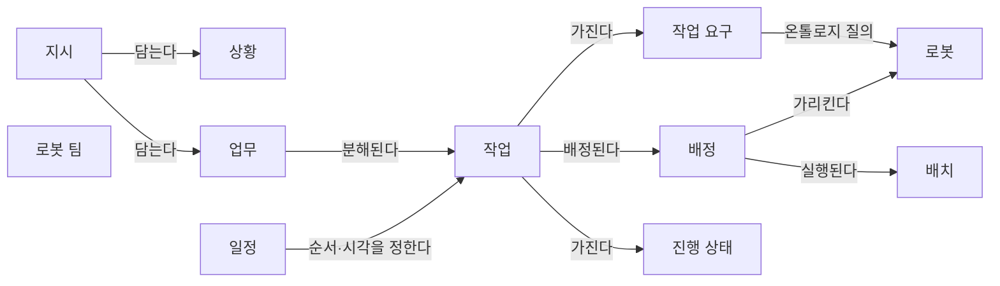
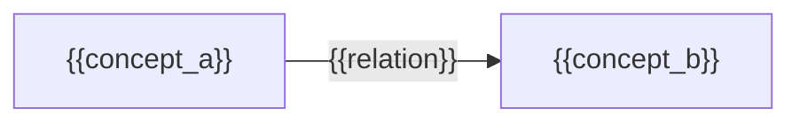

(너의 규칙은 시스템 프롬프트의 agents/shared-rules.md 와 agents/researcher.md 이다. 아래는 이번 실행의 컨텍스트와 입력이다.)

## 실행 컨텍스트

- run_id: 2026-09-25-26
- date: 2026-09-25
- run_type: track (트랙 실행)
- 대상: 트랙 nl-task-chatbot (자연어 업무 지시 챗봇) · 현재 단계: 단계 1. 선행 연구·제품 사례 조사 · 이번에 다룰 백로그 질문 id: q1-03 · 중심 세부영역: 13. 작업 배정 — MRTA (D. 계획·최적화)
- 예산:
    - max_search_queries: 40
    - max_sources_per_run: 20
    - new_topic_pages: 1
    - page_updates: 2
    - max_retries: 2
- 환경 알림: web_fetch_available: false · fetch_mode: mirror_only (일반 웹 페이지 열람은 네트워크 정책으로 막혀 있다. raw.githubusercontent.com 은 열린다: 공식 문서가 GitHub 에 있는 출처는 입력의 config/source_mirrors.yaml 경로를 WebFetch 로 열어 원문을 읽고 sources[].fetched=true, fetched_via=github_raw, fetch_url 을 적는다. 입력에 원문 텍스트(data/source_texts)가 있는 출처는 fetched_via=inbox. 그 밖의 출처는 fetched=false 이며 코드가 신뢰도 상한(medium)을 강제한다 — 공통 규칙 0절 6항)
- 언어: ko
- next_ref_id: ref-438
- 새 출처 id 구간: ref-438 ~ ref-467 — 이 실행 전용으로 예약한 번호다(동시에 도는 다른 실행과 겹치지 않는다). 새 출처는 ref-438 부터 순서대로 쓰고 ref-467 를 넘기지 않는다. 기존 출처는 참고문헌 목록의 id 를 그대로 쓴다

## 입력

### runs/2026-09-25-26/target.json

```json
{
  "run_id": "2026-09-25-26",
  "date": "2026-09-25",
  "weekday": "Fri",
  "run_number": 26,
  "run_type": "track",
  "forced": true,
  "target": {
    "area_no": 13,
    "area_name": "13. 작업 배정 — MRTA",
    "category": "D. 계획·최적화",
    "category_letter": "D"
  },
  "topic": null,
  "track": {
    "slug": "nl-task-chatbot",
    "name": "자연어 업무 지시 챗봇",
    "stage": 1,
    "stages": 5,
    "stage_name": "선행 연구·제품 사례 조사",
    "question_ids": [
      "q1-03"
    ],
    "user_questions": [],
    "runs_per_week": 3,
    "question_rationale": "CLI 지정 질문 id"
  },
  "corrections": [],
  "budget": {
    "max_search_queries": 40,
    "max_sources_per_run": 20,
    "new_topic_pages": 1,
    "page_updates": 2,
    "max_retries": 2
  },
  "priority_reason": null,
  "priority_questions": [],
  "excluded_areas": [],
  "lifted_areas": [],
  "deferred": {
    "monthly_recheck": false,
    "weekly_review": true
  },
  "selection_rationale": "CLI 지정 run_type=track, area=13; 트랙 실행일(Fri, track_days 앞 3개) → 트랙 nl-task-chatbot 단계 1, 질문 q1-03 (CLI 지정 질문 id)"
}
```

### docs/categories/d-planning-and-optimization/13-task-allocation-mrta.md

```markdown
---
title: "13. 작업 배정 — MRTA"
type: area
category: "D. 계획·최적화"
area_no: 13
related_areas: []
tags: []
status: seed
created: 2026-09-24
updated: 2026-09-24
sources: []
version: 1
---

[홈](../../index.md) › [D. 계획·최적화](index.md) › 13. 작업 배정 — MRTA

# 13. 작업 배정 — MRTA

!!! info "소속 대분류"
    [D. 계획·최적화](index.md) — 핵심 질문:
    누가, 언제, 어디로, 어떤 자원을 사용해 작업할 것인가? [분류원문]

<!-- auto:area-tracks:start -->
!!! note "관련 연구 트랙"
    이 세부영역을 가로지르는 중점 연구 트랙과 확장 아이디어다. 트랙은 분류를 바꾸지 않으며, 트랙에서 확인된 사실은 이 페이지에 반영하도록 제안된다. 전체 매핑은 [확장 아이디어 연결 구조](../../ideas/index.md)에 있다.

    - [매뉴얼 기반 로봇 기능 온톨로지](../../tracks/manual-capability-ontology/index.md) — 함께 필요한 영역(○) · 확장 아이디어: [아이디어 1. 로봇 기능 온톨로지](../../ideas/robot-capability-ontology.md)
    - [자연어 업무 지시 챗봇](../../tracks/nl-task-chatbot/index.md) — 중심 영역(●) · 확장 아이디어: [아이디어 2. 자연어 업무 지시 챗봇](../../ideas/nl-task-chatbot.md)
<!-- auto:area-tracks:end -->

## 1. 한 줄 정의

능력·위치·적재량·배터리·납기 등을 고려해 로봇 또는 로봇 팀에 작업을 배정 [분류원문]

## 2. SCM 관점의 질문

가장 가까운 로봇에 맡기는 것이 전체적으로도 유리한가? [분류원문]

> 원문 주석: 27번의 AI는 특정 기능 하나에만 해당하지 않는다. **매뉴얼 해석은 5·21번, 도면 해석은 6번, 학습 기반 배차는 13번, 장애 분석은 19번**에 적용되는 연구 방법이다. [분류원문]

## 3. 왜 중요한가

아직 작성되지 않음

## 4. 핵심 개념과 용어

아직 작성되지 않음

## 5. 현장 시나리오 (물류 흐름의 어느 단계인지 명시)

아직 작성되지 않음

## 6. 대표 접근법과 기술

아직 작성되지 않음

## 7. 관련 표준·프레임워크·오픈소스

아직 작성되지 않음

## 8. 대표 연구와 자료

아직 작성되지 않음

## 9. ROP가 직접 맡는 것과 외부와 연계하는 것 (부록 A 9장 기준)

아직 작성되지 않음

## 10. 다른 연구영역과의 연결 (번호와 이름을 함께 표기)

아직 작성되지 않음

## 11. 열린 질문

아직 작성되지 않음

## 12. 최근 업데이트 (자동)

<!-- auto:area-recent:start -->
아직 기록된 업데이트가 없다.
<!-- auto:area-recent:end -->

## 13. 참고 자료 (각주)

(아직 각주가 없다. 본문이 작성되면 출처 각주를 여기에 둔다.)
```

### docs/categories/d-planning-and-optimization/14-task-sequencing-and-scheduling.md (요약)

```markdown
# 14. 작업 순서·스케줄링

소속 대분류: D. 계획·최적화 · 상태: seed · 신뢰도: — · 마지막 갱신: 2026-09-24 · 버전: 1

## 1. 한 줄 정의

주문 묶음, 작업 선후관계, 시간 제약, 공정 간 동기화, 긴급 작업 삽입 [분류원문]

## 2. SCM 관점의 질문

피킹·운반·포장이 서로 기다리지 않게 어떤 순서로 실행할까? [분류원문]
```

### docs/categories/e-collaboration-and-field-operations/18-human-robot-collaboration-and-operator-interface.md (요약)

```markdown
# 18. 사람–로봇 협업·운영 인터페이스

소속 대분류: E. 협업·현장 운영 · 상태: seed · 신뢰도: — · 마지막 갱신: 2026-09-24 · 버전: 1

## 1. 한 줄 정의

작업자에게 일 배정, 승인·수동 전환, 원격 조작, 설명 가능한 상태 표시, 인체공학 [분류원문]

## 2. SCM 관점의 질문

사람이 피킹하고 로봇이 운반할 때 서로 기다리지 않게 하려면? [분류원문]
```

### docs/categories/g-safety-security-intelligence-and-governance/27-ai-learning-adaptation-and-model-operations.md (요약)

```markdown
# 27. AI·학습·적응과 모델 운영

소속 대분류: G. 안전·보안·지능·거버넌스 · 상태: seed · 신뢰도: — · 마지막 갱신: 2026-09-24 · 버전: 1

## 1. 한 줄 정의

문서·도면 해석, 수요·고장 예측, 학습 기반 계획, LLM 에이전트, 불확실성 평가, 모델 변경 관리 [분류원문]

## 2. SCM 관점의 질문

AI가 만든 작업 계획이나 기능 해석을 어떤 기준으로 실행에 사용할까? [분류원문]

> 원문 주석: 27번의 AI는 특정 기능 하나에만 해당하지 않는다. **매뉴얼 해석은 5·21번, 도면 해석은 6번, 학습 기반 배차는 13번, 장애 분석은 19번**에 적용되는 연구 방법이다. [분류원문]
```

### docs/categories/a-business-supply-chain-design/01-order-and-business-system-integration.md (요약)

```markdown
# 1. 주문·업무 시스템 연계

소속 대분류: A. 업무·공급망 설계 · 상태: published · 신뢰도: medium · 마지막 갱신: 2026-09-25 · 버전: 2

## 1. 한 줄 정의

ERP, WMS, MES, WES, TMS의 주문·재고·생산 요청을 받아 작업으로 변환하고, 변경·취소·완료를 다시 반영하는 방법 [분류원문]

## 2. SCM 관점의 질문

출고 우선순위가 바뀌면 이미 진행 중인 로봇 작업을 어떻게 바꿀까? [분류원문]
```

### docs/categories/a-business-supply-chain-design/02-process-and-workflow-modeling.md (요약)

```markdown
# 2. 공정·워크플로 모델링

소속 대분류: A. 업무·공급망 설계 · 상태: published · 신뢰도: medium · 마지막 갱신: 2026-09-25 · 버전: 2

## 1. 한 줄 정의

입고·검수·적치·보충·피킹·이송·생산·포장·출하·반품을 작업 단계로 분해하고, 선후관계와 완료 조건을 정의 [분류원문]

## 2. SCM 관점의 질문

‘운반 완료’와 ‘인수 확인·재고 반영 완료’를 어떻게 연결할까? [분류원문]
```

### docs/categories/b-common-information-and-environment-model/05-robot-capability-and-task-ontology.md (요약)

```markdown
# 5. 로봇 능력·작업 온톨로지

소속 대분류: B. 공통 정보·환경 모델 · 상태: published · 신뢰도: medium · 마지막 갱신: 2026-09-25 · 버전: 2

## 1. 한 줄 정의

제조사별 기능·제약·장착 장비·실행 조건을 공통 모델로 표현하고, 작업 요구와 연결 [분류원문]

## 2. SCM 관점의 질문

같은 ‘운반 로봇’ 중 누가 이 화물을 실제로 취급할 수 있는가? [분류원문]

> 원문 주석: 27번의 AI는 특정 기능 하나에만 해당하지 않는다. **매뉴얼 해석은 5·21번, 도면 해석은 6번, 학습 기반 배차는 13번, 장애 분석은 19번**에 적용되는 연구 방법이다. [분류원문]
```

### docs/categories/b-common-information-and-environment-model/06-map-space-and-location-model.md (요약)

```markdown
# 6. 지도·공간·위치 모델

소속 대분류: B. 공통 정보·환경 모델 · 상태: published · 신뢰도: medium · 마지막 갱신: 2026-09-25 · 버전: 2

## 1. 한 줄 정의

BIM·CAD·센서 지도에서 이동 공간과 경로를 만들고, 로봇별 좌표계·층·목적지를 정렬 [분류원문]

## 2. SCM 관점의 질문

제조사마다 다른 지도에서 ‘3층 출하 대기장’을 어떻게 동일한 장소로 인식할까? [분류원문]

> 원문 주석: 6번에는 지도 생성뿐 아니라 **현장과 도면의 차이 확인, 지도 버전 관리, 위치추정 결과의 신뢰도**도 포함해야 한다. [분류원문]

> 원문 주석: 27번의 AI는 특정 기능 하나에만 해당하지 않는다. **매뉴얼 해석은 5·21번, 도면 해석은 6번, 학습 기반 배차는 13번, 장애 분석은 19번**에 적용되는 연구 방법이다. [분류원문]
```

### docs/categories/b-common-information-and-environment-model/08-real-time-world-state-and-data-consistency.md (요약)

```markdown
# 8. 실시간 세계 상태·데이터 일관성

소속 대분류: B. 공통 정보·환경 모델 · 상태: seed · 신뢰도: — · 마지막 갱신: 2026-09-24 · 버전: 1

## 1. 한 줄 정의

로봇·설비·공간·화물의 현재 상태를 통합하고, 시간 지연·누락·충돌·불확실성을 관리 [분류원문]

## 2. SCM 관점의 질문

문이 열려 있다는 정보가 30초 전이라면 지금도 통과 가능하다고 볼 수 있을까? [분류원문]

> 원문 주석: 8번의 실시간 모델이 **현재 상태를 표현**한다면, 22번은 그 모델을 이용해 **가정한 미래를 실험**한다. 구분해두면 디지털 트윈이라는 이름 아래 서로 다른 기능이 섞이지 않는다. [분류원문]
```

### docs/categories/c-connectivity-and-execution-foundation/12-command-and-task-execution-reliability.md (요약)

```markdown
# 12. 명령·작업 실행의 신뢰성

소속 대분류: C. 연결·실행 기반 · 상태: seed · 신뢰도: — · 마지막 갱신: 2026-09-24 · 버전: 1

## 1. 한 줄 정의

접수·실행·완료·취소 상태, 제어권, 중복 요청 방지, 시간 초과, 재시작 후 상태 복원 [분류원문]

## 2. SCM 관점의 질문

응답이 끊긴 운반 요청을 다시 보내면 같은 화물을 두 번 처리하지 않을까? [분류원문]
```

### docs/categories/d-planning-and-optimization/16-shared-resource-charging-and-energy-optimization.md (요약)

```markdown
# 16. 공용 자원·충전·에너지 최적화

소속 대분류: D. 계획·최적화 · 상태: seed · 신뢰도: — · 마지막 갱신: 2026-09-24 · 버전: 1

## 1. 한 줄 정의

충전기·승강기·작업대·대기 공간·버퍼의 예약과 배분, 충전 시점과 에너지 사용 계획 [분류원문]

## 2. SCM 관점의 질문

로봇들이 동시에 충전하거나 승강기를 기다리는 상황을 어떻게 줄일까? [분류원문]
```

### docs/categories/e-collaboration-and-field-operations/19-monitoring-anomaly-detection-and-root-cause-analysis.md (요약)

```markdown
# 19. 모니터링·이상 탐지·원인 분석

소속 대분류: E. 협업·현장 운영 · 상태: seed · 신뢰도: — · 마지막 갱신: 2026-09-24 · 버전: 1

## 1. 한 줄 정의

로그·이벤트·성능 지표를 연결해 이상을 탐지하고, 로봇·설비·통신·공정 원인을 구분 [분류원문]

## 2. SCM 관점의 질문

지연 원인이 로봇 고장인지, 문인지, 앞 공정인지 어떻게 찾을까? [분류원문]

> 원문 주석: 27번의 AI는 특정 기능 하나에만 해당하지 않는다. **매뉴얼 해석은 5·21번, 도면 해석은 6번, 학습 기반 배차는 13번, 장애 분석은 19번**에 적용되는 연구 방법이다. [분류원문]
```

### docs/categories/e-collaboration-and-field-operations/20-exception-recovery-replanning-and-business-continuity.md (요약)

```markdown
# 20. 예외 복구·재계획·업무 연속성

소속 대분류: E. 협업·현장 운영 · 상태: seed · 신뢰도: — · 마지막 갱신: 2026-09-24 · 버전: 1

## 1. 한 줄 정의

고장·통신 단절·화물 누락·긴급 주문 등에 대해 재배정, 우회, 수동 처리, 제한 운영을 결정 [분류원문]

## 2. SCM 관점의 질문

운반 중 고장 난 로봇의 화물과 남은 주문은 어떻게 처리할까? [분류원문]
```

### docs/categories/f-deployment-verification-and-maintenance/23-testing-formal-verification-and-benchmarking.md (요약)

```markdown
# 23. 시험·형식 검증·벤치마크

소속 대분류: F. 도입·검증·유지관리 · 상태: seed · 신뢰도: — · 마지막 갱신: 2026-09-24 · 버전: 1

## 1. 한 줄 정의

시뮬레이션·실기체 시험, 장애 주입, 교착·제약 위반 검증, 회귀시험, 성능 비교 [분류원문]

## 2. SCM 관점의 질문

업데이트 후 정상 상황뿐 아니라 장애 상황도 여전히 처리되는가? [분류원문]
```

### docs/categories/g-safety-security-intelligence-and-governance/25-safety-and-risk-management.md (요약)

```markdown
# 25. 안전·위험 관리

소속 대분류: G. 안전·보안·지능·거버넌스 · 상태: seed · 신뢰도: — · 마지막 갱신: 2026-09-24 · 버전: 1

## 1. 한 줄 정의

로봇·사람·설비 상호작용의 위험, 안전 조건, 정지·재개 절차, 비상 상황 대응, 안전 책임 경계 [분류원문]

## 2. SCM 관점의 질문

여러 장비는 각각 안전해도 함께 움직일 때 새로운 위험이 생기지 않는가? [분류원문]
```

### docs/categories/g-safety-security-intelligence-and-governance/26-cybersecurity-access-control-and-privacy.md (요약)

```markdown
# 26. 사이버보안·접근권한·개인정보

소속 대분류: G. 안전·보안·지능·거버넌스 · 상태: seed · 신뢰도: — · 마지막 갱신: 2026-09-24 · 버전: 1

## 1. 한 줄 정의

장비 인증, 통신 보호, 명령 권한, 원격 접속, 고객별 격리, 영상·작업자 데이터 보호 [분류원문]

## 2. SCM 관점의 질문

외부 유지보수 계정이 어느 로봇에 어떤 명령까지 내릴 수 있는가? [분류원문]
```

### docs/categories/d-planning-and-optimization/15-multi-robot-path-and-traffic-management-mapf.md (요약)

```markdown
# 15. 다중 로봇 경로·교통 관리 — MAPF

소속 대분류: D. 계획·최적화 · 상태: seed · 신뢰도: — · 마지막 갱신: 2026-09-24 · 버전: 1

## 1. 한 줄 정의

여러 로봇의 경로와 통과 시점을 조율하고, 혼잡·교착·우선권을 처리 [분류원문]

## 2. SCM 관점의 질문

서로 다른 제조사의 로봇이 좁은 통로에서 마주치면 누가 양보할까? [분류원문]
```

### docs/glossary/index.md

```markdown
---
title: "용어집"
type: glossary
subtype: index
status: published
created: 2026-09-24
updated: 2026-09-24
version: 1
---

[홈](../index.md) › 용어집

# 용어집

이 위키에서 쓰는 용어의 한글·영문 표기와 한 줄 정의를 모은다. 용어마다 개별 페이지에 설명, 관련 연구영역, 출처를 둔다. 시드 용어는 SCOR, ISA-95, EPCIS, Open-RMF, Fleet Adapter, WES/WCS/WMS/MES/TMS, MRTA, MAPF, Lifelong MAPF, Multi-Agent Pickup and Delivery, ARIAC, DDS-Security, 디지털 트윈이다. 새 용어는 스토리텔러 에이전트가 제안하고 퍼블리셔가 반영한다.

아래 표는 용어 페이지의 프런트매터(term_ko, term_en, definition, related_areas)에서 자동으로 만든다.

## 용어 목록

<!-- auto:glossary-index:start -->
| 용어(한글) | 용어(영문) | 한 줄 정의 | 관련 영역 |
|---|---|---|---|
| [B2MML](b2mml.md) | Business To Manufacturing Markup Language (B2MML) | MESA International이 ISA-95(IEC 62264)의 데이터 모델을 XML 스키마로 구현한 교환 형식이다. | [1. 주문·업무 시스템 연계](../categories/a-business-supply-chain-design/01-order-and-business-system-integration.md)<br>[2. 공정·워크플로 모델링](../categories/a-business-supply-chain-design/02-process-and-workflow-modeling.md)<br>[14. 작업 순서·스케줄링](../categories/d-planning-and-optimization/14-task-sequencing-and-scheduling.md) |
| [DDS 보안 규격](dds-security.md) | DDS Security (DDS-Security) | DDS(Data Distribution Service)의 보안 규격으로, ROS 2가 인증·암호화·접근통제 구조의 기반으로 통합했다. | [26. 사이버보안·접근권한·개인정보](../categories/g-safety-security-intelligence-and-governance/26-cybersecurity-access-control-and-privacy.md)<br>[11. 분산 시스템·통신·컴퓨팅 구조](../categories/c-connectivity-and-execution-foundation/11-distributed-systems-communication-and-computing.md)<br>[28. 표준·상호운용성·다사업자 거버넌스](../categories/g-safety-security-intelligence-and-governance/28-standards-interoperability-and-multi-vendor-governance.md) |
| [IndoorGML](indoorgml.md) | IndoorGML | 실내 공간을 셀 공간(CellSpace)과 그 경계, 공간 연결을 나타내는 노드·엣지의 쌍대 그래프, 의미별 주제 레이어로 표현하는 OGC 실내 공간 정보 표준이다. | [6. 지도·공간·위치 모델](../categories/b-common-information-and-environment-model/06-map-space-and-location-model.md)<br>[28. 표준·상호운용성·다사업자 거버넌스](../categories/g-safety-security-intelligence-and-governance/28-standards-interoperability-and-multi-vendor-governance.md) |
| [LLM 에이전트](llm-agent.md) | LLM Agent | 대규모 언어 모델이 사람이 정해 준 도구·함수(로봇 API, 조회 기능 등)를 골라 호출하며 여러 단계로 작업을 수행하도록 구성한 소프트웨어이다. | [27. AI·학습·적응과 모델 운영](../categories/g-safety-security-intelligence-and-governance/27-ai-learning-adaptation-and-model-operations.md)<br>[13. 작업 배정 — MRTA](../categories/d-planning-and-optimization/13-task-allocation-mrta.md)<br>[18. 사람–로봇 협업·운영 인터페이스](../categories/e-collaboration-and-field-operations/18-human-robot-collaboration-and-operator-interface.md) |
| [VDA 5050 팩트시트](vda-5050-factsheet.md) | VDA 5050 factsheet | VDA 5050에서 이동로봇이 관제에 자신의 유형·물리 파라미터·적재 명세·지원 action을 알리는 메시지이다. | [5. 로봇 능력·작업 온톨로지](../categories/b-common-information-and-environment-model/05-robot-capability-and-task-ontology.md)<br>[9. 로봇·제조사 관제 연동](../categories/c-connectivity-and-execution-foundation/09-robot-and-vendor-fleet-manager-integration.md) |
| [VDA 5050](vda-5050.md) | VDA 5050 | VDA 5050에서 이동로봇이 유형 명세·물리 파라미터·지원 동작·적재 명세를 관제에 미리 알리는 메시지이다. | [5. 로봇 능력·작업 온톨로지](../categories/b-common-information-and-environment-model/05-robot-capability-and-task-ontology.md)<br>[7. 화물·재고·자산 식별과 추적](../categories/b-common-information-and-environment-model/07-cargo-inventory-and-asset-identification-and-tracking.md)<br>[9. 로봇·제조사 관제 연동](../categories/c-connectivity-and-execution-foundation/09-robot-and-vendor-fleet-manager-integration.md) |
| [객체 중심 이벤트 로그](ocel.md) | Object-Centric Event Log (OCEL) | 이벤트와 여러 객체 사이 관계, 관계의 한정자, 시간에 따라 바뀌는 객체 속성을 기록하는 이벤트 로그 교환 표준이며, 2.0판은 SQLite·XML·JSON 형식을 둔다. | [2. 공정·워크플로 모델링](../categories/a-business-supply-chain-design/02-process-and-workflow-modeling.md)<br>[4. 성과·경제성·프로세스 개선](../categories/a-business-supply-chain-design/04-performance-economics-and-process-improvement.md)<br>[19. 모니터링·이상 탐지·원인 분석](../categories/e-collaboration-and-field-operations/19-monitoring-anomaly-detection-and-root-cause-analysis.md) |
| [계획 도메인 정의 언어](pddl.md) | Planning Domain Definition Language (PDDL) | 자동 계획 문제에서 행동을 파라미터·전제조건·효과로 기술하고 도메인과 문제 인스턴스를 분리해 표현하는 언어이다. | [5. 로봇 능력·작업 온톨로지](../categories/b-common-information-and-environment-model/05-robot-capability-and-task-ontology.md) |
| [공급망 운영 참조 모델](scor.md) | Supply Chain Operations Reference (SCOR) | ASCM이 관리하는 공급망 프로세스 참조 모델로, 공급망을 계획·주문·조달·생산/가공·이행·반품 프로세스와 이를 아우르는 오케스트레이션 프로세스로 기술한다. | [1. 주문·업무 시스템 연계](../categories/a-business-supply-chain-design/01-order-and-business-system-integration.md)<br>[2. 공정·워크플로 모델링](../categories/a-business-supply-chain-design/02-process-and-workflow-modeling.md)<br>[4. 성과·경제성·프로세스 개선](../categories/a-business-supply-chain-design/04-performance-economics-and-process-improvement.md) |
| [글로벌 개별 자산 식별자](giai.md) | Global Individual Asset Identifier (GIAI) | 컨테이너·트럭·트레일러 같은 개별 자산을 식별하는 GS1 식별 키이다. | [7. 화물·재고·자산 식별과 추적](../categories/b-common-information-and-environment-model/07-cargo-inventory-and-asset-identification-and-tracking.md) |
| [글로벌 반환형 자산 식별자](grai.md) | Global Returnable Asset Identifier (GRAI) | 팔레트·상자·트레이·케그처럼 여러 번 재사용되는 운반구를 식별하는 GS1 식별 키이다. | [7. 화물·재고·자산 식별과 추적](../categories/b-common-information-and-environment-model/07-cargo-inventory-and-asset-identification-and-tracking.md) |
| [기업–제어 시스템 통합 표준](isa-95.md) | ISA-95 Enterprise-Control System Integration | ISA-95 계열에서 하위 실행 계층이 수행할 작업 단위의 요청으로, OPC UA for ISA-95 Job Control 은 이를 저장·시작·갱신·일시정지·중단하는 메서드를 둔다. | [1. 주문·업무 시스템 연계](../categories/a-business-supply-chain-design/01-order-and-business-system-integration.md)<br>[2. 공정·워크플로 모델링](../categories/a-business-supply-chain-design/02-process-and-workflow-modeling.md)<br>[28. 표준·상호운용성·다사업자 거버넌스](../categories/g-safety-security-intelligence-and-governance/28-standards-interoperability-and-multi-vendor-governance.md) |
| [능력·스킬·서비스 모델](capabilities-skills-services.md) | Capabilities, Skills and Services (CSS) Model | Plattform Industrie 4.0 작업반이 제안한 정보 모델로, 구현과 무관한 기능 명세(능력)와 그 실행 가능한 구현(스킬), 제공 형태(서비스)를 구분한다. 이 위키의 온톨로지 초안에서는 CSS의 능력(capability)을 기능(Capability)으로 부른다. | [5. 로봇 능력·작업 온톨로지](../categories/b-common-information-and-environment-model/05-robot-capability-and-task-ontology.md)<br>[28. 표준·상호운용성·다사업자 거버넌스](../categories/g-safety-security-intelligence-and-governance/28-standards-interoperability-and-multi-vendor-governance.md) |
| [다중 로봇 작업 배정](mrta.md) | Multi-Robot Task Allocation (MRTA) | 여러 로봇과 여러 작업이 있을 때 어떤 로봇(또는 로봇 팀)이 어떤 작업을 맡을지 정하는 문제이다. | [13. 작업 배정 — MRTA](../categories/d-planning-and-optimization/13-task-allocation-mrta.md)<br>[5. 로봇 능력·작업 온톨로지](../categories/b-common-information-and-environment-model/05-robot-capability-and-task-ontology.md)<br>[14. 작업 순서·스케줄링](../categories/d-planning-and-optimization/14-task-sequencing-and-scheduling.md)<br>[16. 공용 자원·충전·에너지 최적화](../categories/d-planning-and-optimization/16-shared-resource-charging-and-energy-optimization.md) |
| [다중 에이전트 경로 찾기](mapf.md) | Multi-Agent Path Finding (MAPF) | 여러 에이전트(로봇)가 각자의 출발지에서 목적지까지 서로 충돌하지 않고 동시에 따라갈 수 있는 경로들을 계획하는 문제이다. | [15. 다중 로봇 경로·교통 관리 — MAPF](../categories/d-planning-and-optimization/15-multi-robot-path-and-traffic-management-mapf.md)<br>[6. 지도·공간·위치 모델](../categories/b-common-information-and-environment-model/06-map-space-and-location-model.md)<br>[16. 공용 자원·충전·에너지 최적화](../categories/d-planning-and-optimization/16-shared-resource-charging-and-energy-optimization.md) |
| [다중 에이전트 픽업·배송](multi-agent-pickup-and-delivery.md) | Multi-Agent Pickup and Delivery (MAPD) | 픽업 위치와 배송 위치가 있는 작업이 온라인으로 계속 들어올 때, 에이전트에 작업을 배정하고 충돌 없는 경로를 함께 계획하는 문제이다. | [13. 작업 배정 — MRTA](../categories/d-planning-and-optimization/13-task-allocation-mrta.md)<br>[15. 다중 로봇 경로·교통 관리 — MAPF](../categories/d-planning-and-optimization/15-multi-robot-path-and-traffic-management-mapf.md)<br>[14. 작업 순서·스케줄링](../categories/d-planning-and-optimization/14-task-sequencing-and-scheduling.md) |
| [디지털 트윈](digital-twin.md) | Digital Twin | 물리적 대상(장비·자재·공정·설비·제품 등)을 데이터로 연결된 가상 모델로 표현한 것이다. | [22. 시뮬레이션·예측용 디지털 트윈](../categories/f-deployment-verification-and-maintenance/22-simulation-and-predictive-digital-twin.md)<br>[8. 실시간 세계 상태·데이터 일관성](../categories/b-common-information-and-environment-model/08-real-time-world-state-and-data-consistency.md)<br>[23. 시험·형식 검증·벤치마크](../categories/f-deployment-verification-and-maintenance/23-testing-formal-verification-and-benchmarking.md) |
| [래스터–벡터 변환](raster-to-vector-conversion.md) | Raster-to-Vector Conversion | 픽셀 이미지로 된 평면도를 벽 선분·교차점·방 다각형 같은 기하 요소의 벡터 표현으로 바꾸는 처리이다. | [6. 지도·공간·위치 모델](../categories/b-common-information-and-environment-model/06-map-space-and-location-model.md)<br>[27. AI·학습·적응과 모델 운영](../categories/g-safety-security-intelligence-and-governance/27-ai-learning-adaptation-and-model-operations.md) |
| [레이아웃 교환 형식](layout-interchange-format.md) | Layout Interchange Format (LIF) | 무인운반차 통합사가 노드·간선·스테이션으로 이루어진 주행 레이아웃을 제3자 중앙 관제 시스템에 넘기기 위해 VDMA 가 정한 교환 형식이다. | [6. 지도·공간·위치 모델](../categories/b-common-information-and-environment-model/06-map-space-and-location-model.md)<br>[9. 로봇·제조사 관제 연동](../categories/c-connectivity-and-execution-foundation/09-robot-and-vendor-fleet-manager-integration.md)<br>[16. 공용 자원·충전·에너지 최적화](../categories/d-planning-and-optimization/16-shared-resource-charging-and-energy-optimization.md)<br>[28. 표준·상호운용성·다사업자 거버넌스](../categories/g-safety-security-intelligence-and-governance/28-standards-interoperability-and-multi-vendor-governance.md) |
| [로봇 이동형 풀필먼트 시스템](robotic-mobile-fulfillment-system.md) | Robotic Mobile Fulfillment System (RMFS) | 로봇이 상품을 담은 이동식 선반(pod)을 작업대까지 옮기고 작업자가 그 앞에서 피킹·보충하는 부품-작업자(parts-to-picker) 방식의 자동화 창고 시스템이다. | [3. 처리능력·거점·설비 계획](../categories/a-business-supply-chain-design/03-capacity-site-and-facility-planning.md)<br>[13. 작업 배정 — MRTA](../categories/d-planning-and-optimization/13-task-allocation-mrta.md)<br>[16. 공용 자원·충전·에너지 최적화](../categories/d-planning-and-optimization/16-shared-resource-charging-and-energy-optimization.md) |
| [로봇·자동화 핵심 온톨로지](cora.md) | Core Ontology for Robotics and Automation (CORA) | IEEE 1872-2015가 정한 로봇·자동화 분야의 가장 일반적인 개념·관계·공리를 담은 핵심 온톨로지이다. | [5. 로봇 능력·작업 온톨로지](../categories/b-common-information-and-environment-model/05-robot-capability-and-task-ontology.md)<br>[28. 표준·상호운용성·다사업자 거버넌스](../categories/g-safety-security-intelligence-and-governance/28-standards-interoperability-and-multi-vendor-governance.md) |
| [리틀의 법칙](littles-law.md) | Little's Law | 재공품(WIP)이 처리량(TH)과 사이클 타임(CT)의 곱과 같다는 관계로, 처리량·재공품·리드타임을 함께 해석하는 기준이 된다. | [4. 성과·경제성·프로세스 개선](../categories/a-business-supply-chain-design/04-performance-economics-and-process-improvement.md)<br>[3. 처리능력·거점·설비 계획](../categories/a-business-supply-chain-design/03-capacity-site-and-facility-planning.md) |
| [물류 단위 일련 코드](sscc.md) | Serial Shipping Container Code (SSCC) | 케이스·팔레트·소포 등 보관·운송을 위해 묶인 물류 단위를 고유하게 식별하는 18자리 GS1 식별 키이다. | [7. 화물·재고·자산 식별과 추적](../categories/b-common-information-and-environment-model/07-cargo-inventory-and-asset-identification-and-tracking.md) |
| [반개방형 대기행렬 네트워크](semi-open-queueing-network.md) | Semi-Open Queueing Network (SOQN) | 외부에서 주문이 들어오되 로봇 같은 한정된 자원 수가 고정된 채 순환하는 시스템의 처리량·대기 시간을 해석적으로 추정하는 대기행렬 모델이다. | [3. 처리능력·거점·설비 계획](../categories/a-business-supply-chain-design/03-capacity-site-and-facility-planning.md)<br>[16. 공용 자원·충전·에너지 최적화](../categories/d-planning-and-optimization/16-shared-resource-charging-and-energy-optimization.md) |
| [비즈니스 프로세스 모델 및 표기법](bpmn.md) | Business Process Model and Notation (BPMN) | OMG가 정한 업무 프로세스 표기법으로, ISO/IEC 19510:2013은 OMG BPMN 2.0.1을 PAS 절차로 국제표준화한 것이다. | [2. 공정·워크플로 모델링](../categories/a-business-supply-chain-design/02-process-and-workflow-modeling.md)<br>[12. 명령·작업 실행의 신뢰성](../categories/c-connectivity-and-execution-foundation/12-command-and-task-execution-reliability.md) |
| [산업 기초 클래스](ifc.md) | Industry Foundation Classes (IFC) | buildingSMART 의 BIM 데이터 스키마로, IFC 4.3 은 건물 안에서 특정 기능을 제공하는 경계 지어진 면적·체적을 IfcSpace 로 정의하고 건물 층(IfcBuildingStorey)에 집합 관계로 연결한다. | [6. 지도·공간·위치 모델](../categories/b-common-information-and-environment-model/06-map-space-and-location-model.md)<br>[28. 표준·상호운용성·다사업자 거버넌스](../categories/g-safety-security-intelligence-and-governance/28-standards-interoperability-and-multi-vendor-governance.md) |
| [산업 자동화용 민첩 로봇 경진대회](ariac.md) | Agile Robotics for Industrial Automation Competition (ARIAC) | NIST가 운영하는 로봇 경진대회로, 변화하는 제조 환경에서 로봇의 계획·인식·행동과 적응성을 평가한다. | [23. 시험·형식 검증·벤치마크](../categories/f-deployment-verification-and-maintenance/23-testing-formal-verification-and-benchmarking.md)<br>[22. 시뮬레이션·예측용 디지털 트윈](../categories/f-deployment-verification-and-maintenance/22-simulation-and-predictive-digital-twin.md)<br>[20. 예외 복구·재계획·업무 연속성](../categories/e-collaboration-and-field-operations/20-exception-recovery-replanning-and-business-continuity.md) |
| [선형 시간 논리](linear-temporal-logic.md) | Linear Temporal Logic (LTL) | 작업의 순서·시간 제약을 명확한 의미로 기술하는 형식 논리이다. | [27. AI·학습·적응과 모델 운영](../categories/g-safety-security-intelligence-and-governance/27-ai-learning-adaptation-and-model-operations.md)<br>[23. 시험·형식 검증·벤치마크](../categories/f-deployment-verification-and-maintenance/23-testing-formal-verification-and-benchmarking.md)<br>[13. 작업 배정 — MRTA](../categories/d-planning-and-optimization/13-task-allocation-mrta.md) |
| [스킬](skill.md) | Skill | 구현과 무관하게 명세한 능력(capability)을 실제로 실행하는 캡슐화된 구현으로, OPC UA 같은 호출 인터페이스를 가지며 상태 기계를 가질 수 있다(예: CaSkMan 의 ISA 88 상태 기계). | [5. 로봇 능력·작업 온톨로지](../categories/b-common-information-and-environment-model/05-robot-capability-and-task-ontology.md)<br>[9. 로봇·제조사 관제 연동](../categories/c-connectivity-and-execution-foundation/09-robot-and-vendor-fleet-manager-integration.md)<br>[12. 명령·작업 실행의 신뢰성](../categories/c-connectivity-and-execution-foundation/12-command-and-task-execution-reliability.md) |
| [업무 위치](business-location.md) | Business Location (EPCIS bizLocation) | EPCIS 이벤트 뒤 다른 이벤트가 반박할 때까지 객체가 있다고 보는 업무상 위치를 나타내는 선택 필드이다. | [7. 화물·재고·자산 식별과 추적](../categories/b-common-information-and-environment-model/07-cargo-inventory-and-asset-identification-and-tracking.md)<br>[6. 지도·공간·위치 모델](../categories/b-common-information-and-environment-model/06-map-space-and-location-model.md) |
| [연결 이벤트](association-event.md) | AssociationEvent | 물리 객체를 상위 객체나 특정 물리 위치와 연결하거나 연결을 해제한 사실을 기록하는 EPCIS 2.0 이벤트 유형이다. | [7. 화물·재고·자산 식별과 추적](../categories/b-common-information-and-environment-model/07-cargo-inventory-and-asset-identification-and-tracking.md) |
| [오픈 RMF](open-rmf.md) | Open-RMF (Open Robotics Middleware Framework) | ROS 2 기반의 다중 로봇 조율 프레임워크로, 제조사별 플릿 어댑터와 건물 설비 인터페이스를 통해 로봇·문·승강기 등을 연결하고 작업·교통을 조율한다. | [9. 로봇·제조사 관제 연동](../categories/c-connectivity-and-execution-foundation/09-robot-and-vendor-fleet-manager-integration.md)<br>[10. 설비·건물 시스템 연동](../categories/c-connectivity-and-execution-foundation/10-facility-and-building-system-integration.md)<br>[15. 다중 로봇 경로·교통 관리 — MAPF](../categories/d-planning-and-optimization/15-multi-robot-path-and-traffic-management-mapf.md)<br>[13. 작업 배정 — MRTA](../categories/d-planning-and-optimization/13-task-allocation-mrta.md) |
| [완전 주문 이행률](perfect-order-fulfillment.md) | Perfect Order Fulfillment | 완전 주문 수를 전체 주문 수로 나눈 비율로, 주문의 모든 품목 줄이 완전해야 완전 주문으로 보는 SCOR의 신뢰성 대표 지표(RL.1.1)이다. | [4. 성과·경제성·프로세스 개선](../categories/a-business-supply-chain-design/04-performance-economics-and-process-improvement.md)<br>[1. 주문·업무 시스템 연계](../categories/a-business-supply-chain-design/01-order-and-business-system-integration.md) |
| [워크플로 넷](workflow-net.md) | Workflow Net (WF-net) | 워크플로를 모델링·분석하는 표준적 방법 가운데 하나로 쓰이는 페트리 넷의 한 부류이다. | [2. 공정·워크플로 모델링](../categories/a-business-supply-chain-design/02-process-and-workflow-modeling.md)<br>[23. 시험·형식 검증·벤치마크](../categories/f-deployment-verification-and-maintenance/23-testing-formal-verification-and-benchmarking.md) |
| [웨이브리스 출고 지시](waveless-order-release.md) | Waveless Order Release | 주문을 큰 묶음(웨이브)으로 모아 내리지 않고 도착·여유 용량에 따라 연속으로 현장에 내려보내는 출고 지시 방식이다. | [1. 주문·업무 시스템 연계](../categories/a-business-supply-chain-design/01-order-and-business-system-integration.md)<br>[14. 작업 순서·스케줄링](../categories/d-planning-and-optimization/14-task-sequencing-and-scheduling.md) |
| [위상 지도](topological-map.md) | Topological Map | 정확한 좌표 대신 방·구역 같은 장소를 노드로, 통로·문 같은 연결을 엣지로 두어 공간의 연결 관계를 표현하는 지도이다. | [6. 지도·공간·위치 모델](../categories/b-common-information-and-environment-model/06-map-space-and-location-model.md)<br>[15. 다중 로봇 경로·교통 관리 — MAPF](../categories/d-planning-and-optimization/15-multi-robot-path-and-traffic-management-mapf.md) |
| [의미 식별자](semantic-id.md) | Semantic ID (semanticId) | AAS 요소의 의미를 외부 사전(ECLASS·IEC CDD 등)의 개념 기술이나 IDTA 자체 식별자로 가리키는 식별자이다. | [5. 로봇 능력·작업 온톨로지](../categories/b-common-information-and-environment-model/05-robot-capability-and-task-ontology.md)<br>[28. 표준·상호운용성·다사업자 거버넌스](../categories/g-safety-security-intelligence-and-governance/28-standards-interoperability-and-multi-vendor-governance.md) |
| [이산 사건 시뮬레이션](discrete-event-simulation.md) | Discrete Event Simulation (DES) | 주문 도착·작업 완료 같은 사건이 일어나는 시점마다 시스템 상태를 갱신해 처리량·대기·가동률을 실험하는 시뮬레이션 방식이다. | [3. 처리능력·거점·설비 계획](../categories/a-business-supply-chain-design/03-capacity-site-and-facility-planning.md)<br>[22. 시뮬레이션·예측용 디지털 트윈](../categories/f-deployment-verification-and-maintenance/22-simulation-and-predictive-digital-twin.md) |
| [자산관리셸](asset-administration-shell.md) | Asset Administration Shell (AAS) | 산업 자산의 정보를 서브모델 단위로 기술하는 표준 체계로, IDTA가 능력 기술(IDTA 02020)·무인운반차 기술 데이터(IDTA 02047) 같은 서브모델 템플릿을 공개한다. | [5. 로봇 능력·작업 온톨로지](../categories/b-common-information-and-environment-model/05-robot-capability-and-task-ontology.md)<br>[9. 로봇·제조사 관제 연동](../categories/c-connectivity-and-execution-foundation/09-robot-and-vendor-fleet-manager-integration.md)<br>[28. 표준·상호운용성·다사업자 거버넌스](../categories/g-safety-security-intelligence-and-governance/28-standards-interoperability-and-multi-vendor-governance.md) |
| [작업 분해](task-decomposition.md) | Task Decomposition | 상위 지시나 목표를 로봇이 실행할 수 있는 하위 작업·동작의 순서나 구조로 나누는 일이다. | [13. 작업 배정 — MRTA](../categories/d-planning-and-optimization/13-task-allocation-mrta.md)<br>[14. 작업 순서·스케줄링](../categories/d-planning-and-optimization/14-task-sequencing-and-scheduling.md)<br>[2. 공정·워크플로 모델링](../categories/a-business-supply-chain-design/02-process-and-workflow-modeling.md)<br>[27. AI·학습·적응과 모델 운영](../categories/g-safety-security-intelligence-and-governance/27-ai-learning-adaptation-and-model-operations.md) |
| [전자 제품 코드 정보 서비스](epcis.md) | Electronic Product Code Information Services (EPCIS) | GS1이 정한, 제품·자산의 상태·위치·이동·인계에 관한 이벤트를 기록하고 공유하기 위한 표준이다. | [7. 화물·재고·자산 식별과 추적](../categories/b-common-information-and-environment-model/07-cargo-inventory-and-asset-identification-and-tracking.md)<br>[2. 공정·워크플로 모델링](../categories/a-business-supply-chain-design/02-process-and-workflow-modeling.md)<br>[17. 로봇 간 협업·물리적 인계](../categories/e-collaboration-and-field-operations/17-robot-to-robot-collaboration-and-physical-handover.md) |
| [점유 격자 지도](occupancy-grid-map.md) | Occupancy Grid Map (OGM) | 공간을 일정 크기 칸으로 나누고 칸마다 점유·빈 공간·미지 여부를 적어 로봇 위치추정과 경로계획에 쓰는 지도 표현이다. | [6. 지도·공간·위치 모델](../categories/b-common-information-and-environment-model/06-map-space-and-location-model.md) |
| [종합설비효율](overall-equipment-effectiveness.md) | Overall Equipment Effectiveness (OEE) | 설비의 가용성·효과성(성능)·품질률을 곱해 구하는 지표로, ISO 22400-2(2014판)가 제조 운영 관리 KPI의 하나로 정의한다. | [4. 성과·경제성·프로세스 개선](../categories/a-business-supply-chain-design/04-performance-economics-and-process-improvement.md)<br>[16. 공용 자원·충전·에너지 최적화](../categories/d-planning-and-optimization/16-shared-resource-charging-and-energy-optimization.md) |
| [지도 정합](map-alignment.md) | Map Alignment | 서로 다른 로봇·도면의 지도 좌표계를 대응점으로 구한 회전·축척·이동 변환으로 공통 좌표계에 맞추는 일이다. | [6. 지도·공간·위치 모델](../categories/b-common-information-and-environment-model/06-map-space-and-location-model.md)<br>[9. 로봇·제조사 관제 연동](../categories/c-connectivity-and-execution-foundation/09-robot-and-vendor-fleet-manager-integration.md)<br>[21. 온보딩·설정·현장 시운전](../categories/f-deployment-verification-and-maintenance/21-onboarding-configuration-and-commissioning.md) |
| [지속형 다중 에이전트 경로 찾기](lifelong-mapf.md) | Lifelong Multi-Agent Path Finding (Lifelong MAPF) | 에이전트가 목적지에 도착하면 곧바로 새 목적지를 받아 계속 이동하는 조건에서 충돌 없는 경로를 계속 계획하는 MAPF의 변형이다. | [15. 다중 로봇 경로·교통 관리 — MAPF](../categories/d-planning-and-optimization/15-multi-robot-path-and-traffic-management-mapf.md)<br>[14. 작업 순서·스케줄링](../categories/d-planning-and-optimization/14-task-sequencing-and-scheduling.md)<br>[13. 작업 배정 — MRTA](../categories/d-planning-and-optimization/13-task-allocation-mrta.md) |
| [집계 이벤트](aggregation-event.md) | AggregationEvent | 상자를 팔레트에 싣거나 내리는 것처럼 상위 객체와 하위 객체의 물리적 결합·분리를 기록하는 EPCIS 이벤트 유형이다. | [7. 화물·재고·자산 식별과 추적](../categories/b-common-information-and-environment-model/07-cargo-inventory-and-asset-identification-and-tracking.md) |
| [차량 소요대수 산정](fleet-sizing.md) | Fleet Sizing | 예상 물동량과 서비스 수준(대기 시간·처리량) 목표를 만족하는 데 필요한 로봇·운반 차량의 최소 대수를 정하는 계획 문제이다. | [3. 처리능력·거점·설비 계획](../categories/a-business-supply-chain-design/03-capacity-site-and-facility-planning.md)<br>[13. 작업 배정 — MRTA](../categories/d-planning-and-optimization/13-task-allocation-mrta.md)<br>[16. 공용 자원·충전·에너지 최적화](../categories/d-planning-and-optimization/16-shared-resource-charging-and-energy-optimization.md) |
| [창고 실행·창고 제어·창고 관리·제조 실행·운송 관리 시스템](wes-wcs-wms-mes-tms.md) | Warehouse Execution System / Warehouse Control System / Warehouse Management System / Manufacturing Execution System / Transportation Management System | 창고·생산·운송의 주문·재고·설비·공정을 관리하거나 실행하는 업무·실행 시스템 계열의 약어이며, ROP는 이들에서 작업 요청을 받아 로봇 작업으로 바꾸고 결과를 되돌려 주는 관계에 있다. | [1. 주문·업무 시스템 연계](../categories/a-business-supply-chain-design/01-order-and-business-system-integration.md)<br>[2. 공정·워크플로 모델링](../categories/a-business-supply-chain-design/02-process-and-workflow-modeling.md)<br>[10. 설비·건물 시스템 연동](../categories/c-connectivity-and-execution-foundation/10-facility-and-building-system-integration.md) |
| [파놉틱 심볼 스포팅](panoptic-symbol-spotting.md) | Panoptic Symbol Spotting | CAD 도면의 선 요소마다 문·창문 같은 셀 수 있는 기호의 개별 인스턴스와 벽 같은 셀 수 없는 영역의 의미를 함께 판별하는 과제이다. | [6. 지도·공간·위치 모델](../categories/b-common-information-and-environment-model/06-map-space-and-location-model.md)<br>[27. AI·학습·적응과 모델 운영](../categories/g-safety-security-intelligence-and-governance/27-ai-learning-adaptation-and-model-operations.md) |
| [판독 지점](read-point.md) | Read Point (EPCIS readPoint) | EPCIS 이벤트가 일어난 지점을 나타내는 선택 필드이다. | [7. 화물·재고·자산 식별과 추적](../categories/b-common-information-and-environment-model/07-cargo-inventory-and-asset-identification-and-tracking.md)<br>[17. 로봇 간 협업·물리적 인계](../categories/e-collaboration-and-field-operations/17-robot-to-robot-collaboration-and-physical-handover.md) |
| [평면도 인식](floor-plan-recognition.md) | Floor Plan Recognition | 평면도 이미지나 CAD 도면에서 벽·문·창문·계단 같은 건축 요소와 방 영역·유형을 자동으로 찾아내 구조화하는 작업이다. | [6. 지도·공간·위치 모델](../categories/b-common-information-and-environment-model/06-map-space-and-location-model.md)<br>[27. AI·학습·적응과 모델 운영](../categories/g-safety-security-intelligence-and-governance/27-ai-learning-adaptation-and-model-operations.md) |
| [프로세스 마이닝](process-mining.md) | Process Mining | 시스템에 남은 이벤트 로그로 실제 업무 흐름을 발견하고 대기·병목을 분석하는 기법이다. | [4. 성과·경제성·프로세스 개선](../categories/a-business-supply-chain-design/04-performance-economics-and-process-improvement.md)<br>[2. 공정·워크플로 모델링](../categories/a-business-supply-chain-design/02-process-and-workflow-modeling.md)<br>[19. 모니터링·이상 탐지·원인 분석](../categories/e-collaboration-and-field-operations/19-monitoring-anomaly-detection-and-root-cause-analysis.md) |
| [플릿 어댑터](fleet-adapter.md) | Fleet Adapter | Open-RMF에서 제조사별 로봇 플릿(같은 관제 아래 묶인 로봇 무리)을 연결하기 위해 두는 제조사별 연결 구성요소이다. | [9. 로봇·제조사 관제 연동](../categories/c-connectivity-and-execution-foundation/09-robot-and-vendor-fleet-manager-integration.md)<br>[5. 로봇 능력·작업 온톨로지](../categories/b-common-information-and-environment-model/05-robot-capability-and-task-ontology.md)<br>[12. 명령·작업 실행의 신뢰성](../categories/c-connectivity-and-execution-foundation/12-command-and-task-execution-reliability.md)<br>[21. 온보딩·설정·현장 시운전](../categories/f-deployment-verification-and-maintenance/21-onboarding-configuration-and-commissioning.md) |
| [핵심 업무 어휘](cbv.md) | Core Business Vocabulary (CBV) | EPCIS 이벤트의 업무 단계·상태·인계 유형 등에 채울 표준 어휘 값을 정한 GS1 표준(ISO/IEC 19988)이다. | [7. 화물·재고·자산 식별과 추적](../categories/b-common-information-and-environment-model/07-cargo-inventory-and-asset-identification-and-tracking.md) |
| [행동 트리](behavior-tree.md) | Behavior Tree | 로봇 동작과 조건 확인을 트리 노드로 조합해 실행 구조를 표현하는 형식이다. | [12. 명령·작업 실행의 신뢰성](../categories/c-connectivity-and-execution-foundation/12-command-and-task-execution-reliability.md)<br>[27. AI·학습·적응과 모델 운영](../categories/g-safety-security-intelligence-and-governance/27-ai-learning-adaptation-and-model-operations.md)<br>[13. 작업 배정 — MRTA](../categories/d-planning-and-optimization/13-task-allocation-mrta.md) |
| [형상 제약 언어](shacl.md) | Shapes Constraint Language (SHACL) | RDF 그래프가 정해진 구조·값 조건을 지키는지 검증하는 W3C 제약 언어로, 생성된 온톨로지의 품질 검사에 쓰인다. | [5. 로봇 능력·작업 온톨로지](../categories/b-common-information-and-environment-model/05-robot-capability-and-task-ontology.md)<br>[27. AI·학습·적응과 모델 운영](../categories/g-safety-security-intelligence-and-governance/27-ai-learning-adaptation-and-model-operations.md) |
| [혼합 정수 계획](milp.md) | Mixed Integer Linear Programming (MILP) | 일부 결정 변수가 정수여야 하는 선형 목적함수·선형 제약 최적화 문제로, 작업 배정·스케줄링 같은 조합 결정을 정식화해 해법기로 푸는 데 쓰인다. | [13. 작업 배정 — MRTA](../categories/d-planning-and-optimization/13-task-allocation-mrta.md)<br>[14. 작업 순서·스케줄링](../categories/d-planning-and-optimization/14-task-sequencing-and-scheduling.md)<br>[27. AI·학습·적응과 모델 운영](../categories/g-safety-security-intelligence-and-governance/27-ai-learning-adaptation-and-model-operations.md) |
<!-- auto:glossary-index:end -->
```

### docs/references/index.md

```markdown
---
title: "참고문헌"
type: reference
subtype: index
status: published
created: 2026-09-24
updated: 2026-09-24
version: 1
---

[홈](../index.md) › 참고문헌

# 참고문헌

이 위키가 인용한 출처의 목록이다. 출처마다 id, 기관, 제목, 발행일, URL, 유형, 신뢰도, 접근일, 요약, 인용된 페이지를 개별 페이지에 둔다. 시드 10건(ref-001 ~ ref-010)은 분류 원문 12장의 참고 자료 1~10번에 그대로 대응한다. 새 출처는 리서치 에이전트가 제안하고 내용 검증 에이전트가 실재를 확인한 뒤 퍼블리셔가 추가한다.

신뢰도는 출처 유형을 기준으로 한다. 표준·정부·연구기관·논문·오픈소스 공식 문서는 high, 기사·보도자료·벤더 문서는 medium 이며, 내용 검증 에이전트가 원문을 열어 확인하면 조정할 수 있다. 다만 URL 을 열어 확인하지 못한 출처(원문 미열람)에는 유형과 무관하게 high 를 주지 않고 medium 상한을 적용한다. 시드 10건은 구축 환경의 네트워크 정책으로 URL 을 열지 못했으므로 모두 원문 미열람 상태이며, 각 페이지의 "원문 열람" 행에 그 사실을 적어 둔다. 외부 접속이 가능한 환경에서 `ROP_CHECK_URLS=1 bash pipeline/checks/run_all.sh` 를 실행한 뒤 `python3 pipeline/scaffold.py --apply-url-check` 를 실행하면 열림이 확인된 출처의 신뢰도가 유형 기준값으로 올라간다.

## 목록

<!-- auto:references-index:start -->
| id | 기관 | 제목 | 발행일 | 유형 | 신뢰도 | 접근일 | URL |
|---|---|---|---|---|---|---|---|
| [ref-001](ref-001.md) | ASCM | SCOR Digital Standard | 미확인 | 표준 | medium | 2026-09-24 | <https://www.ascm.org/corporate-solutions/standards-tools/scor-ds/> |
| [ref-002](ref-002.md) | ISA | Update to ISA-95 Standard Addresses Integration of Enterprise and Manufacturing Control Systems | 2025 | 기사 | medium | 2026-09-24 | <https://www.isa.org/news-press-releases/2025/april/update-to-isa-95-standard-addresses-integration-of> |
| [ref-003](ref-003.md) | GS1 | EPCIS and CBV Linked Data Model | 미확인 | 표준 | medium | 2026-09-24 | <https://ref.gs1.org/epcis/> |
| [ref-004](ref-004.md) | Open Robotics | RMF Core Overview — Programming Multiple Robots with ROS 2 | 미확인 | 오픈소스 문서 | high | 2026-09-25 | <https://osrf.github.io/ros2multirobotbook/rmf-core.html> |
| [ref-005](ref-005.md) | Li, J., Tinka, A., Kiesel, S., Durham, J. W., Kumar, T. K. S., & Koenig, S. | Lifelong Multi-Agent Path Finding in Large-Scale Warehouses | 2020 | 논문 | medium | 2026-09-24 | <https://arxiv.org/abs/2005.07371> |
| [ref-006](ref-006.md) | Ma, H., Li, J., Kumar, T. K. S., & Koenig, S. | Lifelong Multi-Agent Path Finding for Online Pickup and Delivery Tasks | 2017 | 논문 | medium | 2026-09-24 | <https://arxiv.org/abs/1705.10868> |
| [ref-007](ref-007.md) | NIST | Performance of Collaborative Robot Systems | 미확인 | 정부·연구기관 | medium | 2026-09-24 | <https://www.nist.gov/programs-projects/performance-collaborative-robot-systems> |
| [ref-008](ref-008.md) | NIST | ARIAC Documentation | 미확인 | 정부·연구기관 | high | 2026-09-25 | <https://pages.nist.gov/ARIAC_docs/en/latest/> |
| [ref-009](ref-009.md) | ROS 2 Design | ROS 2 DDS-Security Integration | 미확인 | 오픈소스 문서 | high | 2026-09-25 | <https://design.ros2.org/articles/ros2_dds_security.html> |
| [ref-010](ref-010.md) | ROS 2 Design | ROS 2 Robotic Systems Threat Model | 미확인 | 오픈소스 문서 | high | 2026-09-25 | <https://design.ros2.org/articles/ros2_threat_model.html> |
| [ref-011](ref-011.md) | ISO/IEC | ISO/IEC 19987:2024 - Information technology — EPC Information Services (EPCIS) | 2024-03 | 표준 | medium | 2026-09-25 | <https://www.iso.org/standard/85557.html> |
| [ref-012](ref-012.md) | ISO/IEC | ISO/IEC 19988:2024 - Information technology — GS1 Core Business Vocabulary (CBV) | 2024 | 표준 | medium | 2026-09-25 | <https://www.iso.org/standard/85558.html> |
| [ref-013](ref-013.md) | OpenEPCIS | EPCIS 2.0 and EPCIS 1.2 \| OpenEPCIS Docs | 미확인 | 오픈소스 문서 | medium | 2026-09-25 | <https://openepcis.io/docs/epcis/> |
| [ref-014](ref-014.md) | GS1 | Core Business Vocabulary (CBV) Standard | 미확인 | 표준 | medium | 2026-09-25 | <https://ref.gs1.org/standards/cbv/> |
| [ref-015](ref-015.md) | GS1 | EPCIS and CBV Implementation Guideline | 미확인 | 표준 | medium | 2026-09-25 | <https://www.gs1.org/docs/epc/EPCIS_Guideline.pdf> |
| [ref-016](ref-016.md) | GS1 | Serial Shipping Container Code (SSCC) | 미확인 | 표준 | medium | 2026-09-25 | <https://www.gs1.org/standards/id-keys/sscc> |
| [ref-017](ref-017.md) | GS1 Korea(대한상공회의소 유통물류진흥원) | SSCC (Serial Shipping Container Code) GS1 Information Vol. 21 | 2019-09 | 표준 | medium | 2026-09-25 | <http://www.gs1kr.org/front/service/File/SSCC%20%EB%B0%9C%EA%B0%84%20%EC%9E%90%EB%A3%8C.pdf> |
| [ref-018](ref-018.md) | GS1 | GS1 Logistic Label Guideline | 미확인 | 표준 | medium | 2026-09-25 | <https://www.gs1.org/docs/tl/GS1_Logistic_Label_Guideline.pdf> |
| [ref-019](ref-019.md) | GS1 | Global Returnable Asset Identifier (GRAI) | 미확인 | 표준 | medium | 2026-09-25 | <https://www.gs1.org/standards/id-keys/grai> |
| [ref-020](ref-020.md) | GS1 | Which GS1 identification key should be used for individual assets used to transport goods? (GS1 GO Customer Service Portal) | 미확인 | 표준 | medium | 2026-09-25 | <https://support.gs1.org/support/solutions/articles/43000734294-which-gs1-identification-key-should-be-used-for-individual-assets-used-to-transport-goods-> |
| [ref-021](ref-021.md) | GS1 | EPC Tag Data Standard | 미확인 | 표준 | medium | 2026-09-25 | <https://www.gs1.org/sites/default/files/docs/epc/GS1_EPC_TDS_i1_11.pdf> |
| [ref-022](ref-022.md) | VDA(Verband der Automobilindustrie) | VDA 5050 Version 2.0.0 — Interface for the communication between automated guided vehicles (AGV) and a master control | 2022-01 | 표준 | medium | 2026-09-25 | <https://www.vda.de/dam/jcr:f0c9c019-1506-4dee-998a-e92723fbf025/EN-VDA5050-V2_0_0.pdf> |
| [ref-023](ref-023.md) | Open Robotics | Workcells - Programming Multiple Robots with ROS 2 | 미확인 | 오픈소스 문서 | high | 2026-09-25 | <https://osrf.github.io/ros2multirobotbook/integration_workcells.html> |
| [ref-024](ref-024.md) | Singh, J. 외 | RFID tag readability issues with palletized loads of consumer goods | 2009 | 논문 | medium | 2026-09-25 | <https://onlinelibrary.wiley.com/doi/abs/10.1002/pts.864> |
| [ref-025](ref-025.md) | IEEE | 1872-2015 - IEEE Standard Ontologies for Robotics and Automation | 2015 | 표준 | medium | 2026-09-25 | <https://ieeexplore.ieee.org/document/7084073/> |
| [ref-026](ref-026.md) | IEEE | IEEE 1872.2-2021 - IEEE Standard for Autonomous Robotics (AuR) Ontology | 2022 | 표준 | medium | 2026-09-25 | <https://standards.ieee.org/standard/1872_2-2021.html> |
| [ref-027](ref-027.md) | Beetz, M., Beßler, D., Haidu, A., Pomarlan, M., Bozcuoglu, A. K., & Bartels, G. | KnowRob 2.0 — A 2nd Generation Knowledge Processing Framework for Cognition-Enabled Robotic Agents | 2018 | 논문 | medium | 2026-09-25 | <https://ai.uni-bremen.de/papers/beetz18knowrob.pdf> |
| [ref-028](ref-028.md) | Beßler, D. 외 | Foundations of the Socio-physical Model of Activities (SOMA) for Autonomous Robotic Agents | 2021 | 논문 | medium | 2026-09-25 | <https://arxiv.org/pdf/2011.11972> |
| [ref-029](ref-029.md) | McDermott, D. 외 | PDDL - The Planning Domain Definition Language | 1998 | 논문 | medium | 2026-09-25 | <https://www.researchgate.net/publication/2278933_PDDL_-_The_Planning_Domain_Definition_Language> |
| [ref-030](ref-030.md) | W3C / OGC | Semantic Sensor Network Ontology | 2017-10-19 | 표준 | medium | 2026-09-25 | <https://www.w3.org/TR/vocab-ssn/> |
| [ref-031](ref-031.md) | VDA / VDMA (VDA5050 GitHub) | VDA5050/VDA5050_EN.md — Official Specification document for the VDA 5050 | 미확인 | 표준 | high | 2026-09-25 | <https://github.com/VDA5050/VDA5050/blob/main/VDA5050_EN.md> |
| [ref-032](ref-032.md) | VDA(Verband der Automobilindustrie) | Version 3.0 of VDA 5050 released | 2026-04 | 표준 | medium | 2026-09-25 | <https://www.vda.de/en/press/press-releases/2026/260421_PM_VDA_5050_EN> |
| [ref-033](ref-033.md) | MassRobotics | Autonomous Mobile Robot Standards Published by MassRobotics | 2021-05 | 표준 | medium | 2026-09-25 | <https://www.massrobotics.org/autonomous-mobile-robot-standards-published-by-massrobotics/> |
| [ref-034](ref-034.md) | OPC Foundation / VDMA | OPC-40010-1 – OPC UA for Robotics - Part 1: Vertical Integration | 미확인 | 표준 | medium | 2026-09-25 | <https://reference.opcfoundation.org/specs/OPC-40010-1> |
| [ref-035](ref-035.md) | Plattform Industrie 4.0 | Information Model for Capabilities, Skills & Services | 2022-11 | 정부·연구기관 | medium | 2026-09-25 | <https://www.plattform-i40.de/IP/Redaktion/EN/Downloads/Publikation/CapabilitiesSkillsServices.html> |
| [ref-036](ref-036.md) | Köcher, A. 외 | A Reference Model for Common Understanding of Capabilities and Skills in Manufacturing | 2022 | 논문 | medium | 2026-09-25 | <https://arxiv.org/abs/2209.09632> |
| [ref-037](ref-037.md) | Vieira da Silva, L. M., Köcher, A., Gill, M. S., Weiss, M., & Fay, A. | Toward a Mapping of Capability and Skill Models using Asset Administration Shells and Ontologies | 2023-07 | 논문 | low | 2026-09-25 | <https://arxiv.org/abs/2307.00827> |
| [ref-038](ref-038.md) | Vieira da Silva, L. M., Köcher, A., & Fay, A. | A Capability and Skill Model for Heterogeneous Autonomous Robots | 2022-09 | 논문 | medium | 2026-09-25 | <https://arxiv.org/abs/2209.10900> |
| [ref-039](ref-039.md) | Open Robotics | Currently supported Tasks - Programming Multiple Robots with ROS 2 | 미확인 | 오픈소스 문서 | high | 2026-09-25 | <https://osrf.github.io/ros2multirobotbook/task_types.html> |
| [ref-040](ref-040.md) | Open Robotics | PerformAction Tutorial - Programming Multiple Robots with ROS 2 | 미확인 | 오픈소스 문서 | high | 2026-09-25 | <https://osrf.github.io/ros2multirobotbook/integration_fleets_action_tutorial.html> |
| [ref-041](ref-041.md) | Naqvi, M. R. 외(Scientific Reports) | Ontology-driven integration of advertised and operational capabilities in robots | 2025-10-02 | 논문 | medium | 2026-09-25 | <https://www.nature.com/articles/s41598-025-16649-3> |
| [ref-042](ref-042.md) | Aguado, E., Gomez, V., Hernando, M., Rossi, C., & Sanz, R. | A survey of ontology-enabled processes for dependable robot autonomy | 2024-07 | 논문 | medium | 2026-09-25 | <https://www.frontiersin.org/journals/robotics-and-ai/articles/10.3389/frobt.2024.1377897/full> |
| [ref-043](ref-043.md) | 신민종, 한영석, 정재윤 | 자산관리쉘 표준을 이용한 자율이동로봇 모니터링 시스템 설계 | 2024 | 논문 | medium | 2026-09-25 | <https://www.kci.go.kr/kciportal/ci/sereArticleSearch/ciSereArtiView.kci?sereArticleSearchBean.artiId=ART003140560> |
| [ref-044](ref-044.md) | GS1 | gs1/EPCIS — Ontology/CBV.ttl (Core Business Vocabulary ontology 2.0) | 2021-09-30 | 표준 | high | 2026-09-25 | <https://github.com/gs1/EPCIS/blob/master/Ontology/CBV.ttl> |
| [ref-045](ref-045.md) | GS1 | gs1/EPCIS — Ontology/EPCIS.ttl (EPCIS ontology 2.0) | 2021-09-30 | 표준 | high | 2026-09-25 | <https://github.com/gs1/EPCIS/blob/master/Ontology/EPCIS.ttl> |
| [ref-046](ref-046.md) | VDMA (Intralogistics-2X-LIF GitHub) | Layout-Interchange-Format — README (Repository for the Layout Interchange Format (LIF) developed by the VDMA) | 2023-09 | 표준 | medium | 2026-09-25 | <https://github.com/Intralogistics-2X-LIF/Layout-Interchange-Format> |
| [ref-047](ref-047.md) | Open Robotics (open-rmf) | rmf_internal_msgs — rmf_dispenser_msgs/msg/DispenserRequest.msg | 미확인 | 오픈소스 문서 | high | 2026-09-25 | <https://github.com/open-rmf/rmf_internal_msgs/blob/main/rmf_dispenser_msgs/msg/DispenserRequest.msg> |
| [ref-048](ref-048.md) | Open Robotics (open-rmf) | rmf_internal_msgs — rmf_dispenser_msgs/msg/DispenserRequestItem.msg | 미확인 | 오픈소스 문서 | high | 2026-09-25 | <https://github.com/open-rmf/rmf_internal_msgs/blob/main/rmf_dispenser_msgs/msg/DispenserRequestItem.msg> |
| [ref-049](ref-049.md) | Open Robotics (open-rmf) | rmf_internal_msgs — rmf_ingestor_msgs/msg/IngestorResult.msg | 미확인 | 오픈소스 문서 | high | 2026-09-25 | <https://github.com/open-rmf/rmf_internal_msgs/blob/main/rmf_ingestor_msgs/msg/IngestorResult.msg> |
| [ref-050](ref-050.md) | Auto-ID Labs Korea(세종대학교), Byun, J. | Oliot EPCIS for GS1 EPCIS/CBV 2.0.0 (GitHub JaewookByun/epcis README) | 미확인 | 오픈소스 문서 | high | 2026-09-25 | <https://github.com/JaewookByun/epcis> |
| [ref-051](ref-051.md) | VDA / VDMA (VDA5050 GitHub) | VDA5050/VDA5050 — json_schemas/state.schema | 미확인 | 표준 | high | 2026-09-25 | <https://github.com/VDA5050/VDA5050/blob/main/json_schemas/state.schema> |
| [ref-052](ref-052.md) | VDA / VDMA (VDA5050 GitHub) | VDA5050/VDA5050 — README.md | 미확인 | 표준 | high | 2026-09-25 | <https://github.com/VDA5050/VDA5050/blob/main/README.md> |
| [ref-053](ref-053.md) | NVIDIA Research (NVlabs) | progprompt-vh — ProgPrompt: Generating Situated Robot Task Plans using Large Language Models (GitHub README) | 미확인 | 오픈소스 문서 | high | 2026-09-25 | <https://github.com/NVlabs/progprompt-vh> |
| [ref-054](ref-054.md) | Singh, I. 외 | ProgPrompt: Generating Situated Robot Task Plans using Large Language Models | 2022-09 | 논문 | medium | 2026-09-25 | <https://arxiv.org/abs/2209.11302> |
| [ref-055](ref-055.md) | Brown University H2R Lab | Lang2LTL — Code for paper Lang2LTL: Grounding Complex Natural Language Commands for Temporal Tasks in Unseen Environments (GitHub README) | 미확인 | 오픈소스 문서 | high | 2026-09-25 | <https://github.com/h2r/Lang2LTL> |
| [ref-056](ref-056.md) | Liu, J. X. 외 | Grounding Complex Natural Language Commands for Temporal Tasks in Unseen Environments | 2023-02 | 논문 | medium | 2026-09-25 | <https://arxiv.org/abs/2302.11649> |
| [ref-057](ref-057.md) | Tellex, S. 외 | Understanding Natural Language Commands for Robotic Navigation and Mobile Manipulation | 2011-08 | 논문 | medium | 2026-09-25 | <https://ojs.aaai.org/index.php/AAAI/article/view/7979> |
| [ref-058](ref-058.md) | Cohen, V., Liu, J. X., Mooney, R., Tellex, S., & Watkins, D. | A Survey of Robotic Language Grounding: Tradeoffs between Symbols and Embeddings | 2024-08 | 논문 | medium | 2026-09-25 | <https://www.ijcai.org/proceedings/2024/885> |
| [ref-059](ref-059.md) | Wang, Y. 외(DART-LLM 저자) | DART-LLM: Dependency-Aware Multi-Robot Task Decomposition and Execution using Large Language Models | 2024-11 | 논문 | medium | 2026-09-25 | <https://arxiv.org/abs/2411.09022> |
| [ref-060](ref-060.md) | Lee, Y. 외(Digital Health) | Feasibility of autonomous medication delivery robots considering elevator utilization in high-traffic hospital environments | 2026 | 논문 | medium | 2026-09-25 | <https://doi.org/10.1177/20552076261437181> |
| [ref-061](ref-061.md) | Izzo, R. A., Bardaro, G., & Matteucci, M. (Politecnico di Milano AIRLab) | BTGenBot: Behavior Tree Generation for Robotic Tasks with Lightweight LLMs | 2024-03 | 논문 | medium | 2026-09-25 | <https://arxiv.org/abs/2403.12761> |
| [ref-062](ref-062.md) | CubiCasa (Kalervo, A. 외) | CubiCasa5k — README (CubiCasa5K: A Dataset and an Improved Multi-Task Model for Floorplan Image Analysis) | 미확인 | 오픈소스 문서 | medium | 2026-09-25 | <https://github.com/CubiCasa/CubiCasa5k> |
| [ref-063](ref-063.md) | Kalervo, A., Ylioinas, J., Häikiö, M., Karhu, A., & Kannala, J. | CubiCasa5K: A Dataset and an Improved Multi-Task Model for Floorplan Image Analysis | 2019-04 | 논문 | medium | 2026-09-25 | <https://arxiv.org/abs/1904.01920> |
| [ref-064](ref-064.md) | Zeng, Z., Li, X., Yu, Y. K., & Fu, C.-W. | DeepFloorplan — README (Deep Floor Plan Recognition using a Multi-task Network with Room-boundary-Guided Attention) | 2019 | 오픈소스 문서 | medium | 2026-09-25 | <https://github.com/zlzeng/DeepFloorplan> |
| [ref-065](ref-065.md) | Liu, C., Wu, J., Kohli, P., & Furukawa, Y. | FloorplanTransformation — README (Raster-to-Vector: Revisiting Floorplan Transformation) | 2017 | 오픈소스 문서 | medium | 2026-09-25 | <https://github.com/art-programmer/FloorplanTransformation> |
| [ref-066](ref-066.md) | FloorPlanCAD 프로젝트(Fan, Z. 외) | FloorPlanCAD Dataset — project page (floorplancad.github.io index.md) | 2021 | 오픈소스 문서 | medium | 2026-09-25 | <https://floorplancad.github.io/> |
| [ref-067](ref-067.md) | Fan, Z., Zhu, L., Li, H., Chen, X., Zhu, S., & Tan, P. | FloorPlanCAD: A Large-Scale CAD Drawing Dataset for Panoptic Symbol Spotting | 2021-05 | 논문 | medium | 2026-09-25 | <https://arxiv.org/abs/2105.07147> |
| [ref-068](ref-068.md) | Voxel51 (Hugging Face) | Voxel51/FloorPlanCAD · Datasets at Hugging Face | 미확인 | 오픈소스 문서 | medium | 2026-09-25 | <https://huggingface.co/datasets/Voxel51/FloorPlanCAD> |
| [ref-069](ref-069.md) | Pizarro, P. N., Hitschfeld, N., & Sipiran, I. (MLSTRUCT) | MLStructFP — README (Large-scale multi-unit floor plan dataset for architectural plan analysis and recognition) | 2023 | 오픈소스 문서 | medium | 2026-09-25 | <https://github.com/MLSTRUCT/MLStructFP> |
| [ref-070](ref-070.md) | Hu, S. 외 | Raster-to-Graph — README (Raster-to-Graph: Floorplan Recognition via Autoregressive Graph Prediction with an Attention Transformer) | 2024 | 오픈소스 문서 | medium | 2026-09-25 | <https://github.com/SizheHu/Raster-to-Graph> |
| [ref-071](ref-071.md) | Agour, M. 외 (ResPlan) | ResPlan — README (ResPlan: A Large-Scale Vector-Graph Dataset of 17,000 Residential Floor Plans) | 2025-08 | 오픈소스 문서 | medium | 2026-09-25 | <https://github.com/m-agour/ResPlan> |
| [ref-072](ref-072.md) | van Engelenburg, C. 외 (MSD) | msd — README (MSD: A Benchmark Dataset for Floor Plan Generation of Building Complexes) | 2024 | 오픈소스 문서 | medium | 2026-09-25 | <https://github.com/caspervanengelenburg/msd> |
| [ref-073](ref-073.md) | Luo, R. 외 | ArchCAD-400K: A Large-Scale CAD drawings Dataset and New Baseline for Panoptic Symbol Spotting | 2025-03 | 논문 | medium | 2026-09-25 | <https://arxiv.org/abs/2503.22346> |
| [ref-074](ref-074.md) | 한국지능정보사회진흥원(AI Hub) | 건축 도면 데이터 | 미확인 | 정부·연구기관 | medium | 2026-09-25 | <https://aihub.or.kr/aihubdata/data/view.do?dataSetSn=71465> |
| [ref-075](ref-075.md) | de las Heras, L.-P., Terrades, O. R., Robles, S., & Sánchez, G. | CVC-FP and SGT: a new database for structural floor plan analysis and its groundtruthing tool | 2015 | 논문 | medium | 2026-09-25 | <https://www.researchgate.net/publication/270597635_CVC-FP_and_SGT_a_new_database_for_structural_floor_plan_analysis_and_its_groundtruthing_tool> |
| [ref-076](ref-076.md) | DeFazio, D., Mehta, H., Wang, M., Yang, P., Blackburn, J., & Zhang, S. | Vision Language Models Can Parse Floor Plan Maps | 2024-09 | 논문 | medium | 2026-09-25 | <https://arxiv.org/abs/2409.12842> |
| [ref-077](ref-077.md) | DoorDet 저자(arXiv 2508.07714) | DoorDet: Semi-Automated Multi-Class Door Detection Dataset via Object Detection and Large Language Models | 2025-08 | 논문 | medium | 2026-09-25 | <https://arxiv.org/abs/2508.07714> |
| [ref-078](ref-078.md) | Kratochvila, L., de Jong, G., Arkesteijn, M., Zemcik, T., Bilik, S., Horak, K., & Rellermeyer, J. S. | Multi-Unit Floor Plan Recognition and Reconstruction Using Improved Semantic Segmentation of Raster-Wise Floor Plans | 2024-08 | 논문 | medium | 2026-09-25 | <https://arxiv.org/abs/2408.01526> |
| [ref-079](ref-079.md) | Open Robotics | Traffic Editor - Programming Multiple Robots with ROS 2 | 미확인 | 오픈소스 문서 | high | 2026-09-25 | <https://osrf.github.io/ros2multirobotbook/traffic-editor.html> |
| [ref-080](ref-080.md) | Open Robotics | Navigation Maps (integration_nav-maps) - Programming Multiple Robots with ROS 2 | 미확인 | 오픈소스 문서 | high | 2026-09-25 | <https://osrf.github.io/ros2multirobotbook/integration_nav-maps.html> |
| [ref-081](ref-081.md) | Vega-Torres, M. A. 외 | Occupancy Grid Map to Pose Graph-based Map: Robust BIM-based 2D-LiDAR Localization for Lifelong Indoor Navigation in Changing and Dynamic Environments | 2023-08 | 논문 | medium | 2026-09-25 | <https://arxiv.org/abs/2308.05443> |
| [ref-082](ref-082.md) | Vega-Torres, M. A. (MigVega GitHub) | Ogm2Pgbm — README (Robust BIM-based 2D-LiDAR Localization for Lifelong Indoor Navigation in Changing and Dynamic Environments) | 미확인 | 오픈소스 문서 | high | 2026-09-25 | <https://github.com/MigVega/Ogm2Pgbm> |
| [ref-083](ref-083.md) | Zhang, J. 외 | Generation of Indoor Open Street Maps for Robot Navigation from CAD Files | 2025-07 | 논문 | medium | 2026-09-25 | <https://arxiv.org/abs/2507.00552> |
| [ref-084](ref-084.md) | Zhang, J. (jiajiezhang7 GitHub) | osmAG-from-cad — README (CAD-to-osmAG pipeline) | 미확인 | 오픈소스 문서 | high | 2026-09-25 | <https://github.com/jiajiezhang7/osmAG-from-cad> |
| [ref-085](ref-085.md) | Braga, R. G., Tahir, M. O., Karimi, S., Dah-Achinanon, U., Iordanova, I., & St-Onge, D. | Intuitive BIM-aided robotic navigation and assets localization with semantic user interfaces | 2025-03-26 | 논문 | medium | 2026-09-25 | <https://www.frontiersin.org/journals/robotics-and-ai/articles/10.3389/frobt.2025.1548684/full> |
| [ref-086](ref-086.md) | Palacz, W., Ślusarczyk, G., Strug, B., & Grabska, E. | Indoor Robot Navigation Using Graph Models Based on BIM/IFC | 2019 | 논문 | medium | 2026-09-25 | <https://www.researchgate.net/publication/333410520_Indoor_Robot_Navigation_Using_Graph_Models_Based_on_BIMIFC> |
| [ref-087](ref-087.md) | Google Research | SayCan (google-research/saycan README) | 미확인 | 오픈소스 문서 | medium | 2026-09-25 | <https://github.com/google-research/google-research/blob/master/saycan/README.md> |
| [ref-088](ref-088.md) | Ahn, M. 외(Google) | Do As I Can, Not As I Say: Grounding Language in Robotic Affordances | 2022-04 | 논문 | medium | 2026-09-25 | <https://arxiv.org/abs/2204.01691> |
| [ref-089](ref-089.md) | SMARTlab-Purdue (Purdue University) | SMART-LLM: Smart Multi-Agent Robot Task Planning using Large Language Models (GitHub README) | 미확인 | 오픈소스 문서 | medium | 2026-09-25 | <https://github.com/SMARTlab-Purdue/SMART-LLM> |
| [ref-090](ref-090.md) | Kannan, S. S., Venkatesh, V. L. N., & Min, B.-C. | SMART-LLM: Smart Multi-Agent Robot Task Planning using Large Language Models | 2023-09 | 논문 | medium | 2026-09-25 | <https://arxiv.org/abs/2309.10062> |
| [ref-091](ref-091.md) | Cranial-XIX (LLM+P 저자) | llm-pddl — LLM+P: Empowering Large Language Models with Optimal Planning Proficiency (GitHub README) | 미확인 | 오픈소스 문서 | medium | 2026-09-25 | <https://github.com/Cranial-XIX/llm-pddl> |
| [ref-092](ref-092.md) | Liu, B., Jiang, Y., Zhang, X., Liu, Q., Zhang, S., Biswas, J., & Stone, P. | LLM+P: Empowering Large Language Models with Optimal Planning Proficiency | 2023-04 | 논문 | medium | 2026-09-25 | <https://arxiv.org/abs/2304.11477> |
| [ref-093](ref-093.md) | Huang, W., Abbeel, P., Pathak, D., & Mordatch, I. | Language Models as Zero-Shot Planners: Extracting Actionable Knowledge for Embodied Agents | 2022-07 | 논문 | medium | 2026-09-25 | <https://proceedings.mlr.press/v162/huang22a.html> |
| [ref-094](ref-094.md) | Huang, W. (language-planner 공식 저장소) | language-planner — Official Code for "Language Models as Zero-Shot Planners" (GitHub README) | 미확인 | 오픈소스 문서 | medium | 2026-09-25 | <https://github.com/huangwl18/language-planner> |
| [ref-095](ref-095.md) | Google Research | Code as Policies: Language Model Programs for Embodied Control (google-research/code_as_policies README) | 미확인 | 오픈소스 문서 | medium | 2026-09-25 | <https://github.com/google-research/google-research/blob/master/code_as_policies/README.md> |
| [ref-096](ref-096.md) | Lamballais, T., Roy, D., & de Koster, M. B. M. | Estimating performance in a Robotic Mobile Fulfillment System | 2017 | 논문 | medium | 2026-09-25 | <https://repub.eur.nl/pub/107376/> |
| [ref-097](ref-097.md) | Lamballais, T., Roy, D., & de Koster, M. B. M. | Inventory allocation in robotic mobile fulfillment systems | 2020 | 논문 | medium | 2026-09-25 | <https://www.tandfonline.com/doi/abs/10.1080/24725854.2018.1560517> |
| [ref-098](ref-098.md) | Zou, B., Gong, Y., de Koster, R., & Xu, X. | Evaluating battery charging and swapping strategies in a robotic mobile fulfillment system | 2018 | 논문 | medium | 2026-09-25 | <https://www.sciencedirect.com/science/article/abs/pii/S0377221717310901> |
| [ref-099](ref-099.md) | Le-Anh, T., & de Koster, M. B. M. | A review of design and control of automated guided vehicle systems | 2006 | 논문 | medium | 2026-09-25 | <https://www.sciencedirect.com/science/article/abs/pii/S0377221705001840> |
| [ref-100](ref-100.md) | Vis, I. F. A. | Survey of research in the design and control of automated guided vehicle systems | 2006 | 논문 | medium | 2026-09-25 | <https://www.sciencedirect.com/science/article/abs/pii/S0377221704006459> |
| [ref-101](ref-101.md) | Merschformann, M. (RAWSim-O GitHub) | RAWSim-O: A simulation framework for Robotic Mobile Fulfillment Systems (README) | 미확인 | 오픈소스 문서 | high | 2026-09-25 | <https://github.com/merschformann/RAWSim-O> |
| [ref-102](ref-102.md) | Springer(FAIM 2025 발표 논문, 저자 미확인) | Simulation-Driven Approach for Dimensioning AMR Fleets in Distribution Centre Logistics | 2025 | 논문 | medium | 2026-09-25 | <https://link.springer.com/chapter/10.1007/978-3-032-07675-5_69> |
| [ref-103](ref-103.md) | PMC 게재 논문(저자 미확인) | The Path Planning Problem of Robotic Delivery in Multi-Floor Hotel Environments | 미확인 | 논문 | medium | 2026-09-25 | <https://pmc.ncbi.nlm.nih.gov/articles/PMC11946681/> |
| [ref-104](ref-104.md) | Open Robotics (open-rmf) | rmf_demos — Demonstrations of Open-RMF (README) | 미확인 | 오픈소스 문서 | high | 2026-09-25 | <https://github.com/open-rmf/rmf_demos> |
| [ref-105](ref-105.md) | Open Robotics (open-rmf) | fleet_adapter_template — fleet_adapter_template/config.yaml | 미확인 | 오픈소스 문서 | high | 2026-09-25 | <https://github.com/open-rmf/fleet_adapter_template/blob/main/fleet_adapter_template/config.yaml> |
| [ref-106](ref-106.md) | 한국교통연구원(인증스마트물류센터) | 인증스마트물류센터 | 미확인 | 정부·연구기관 | medium | 2026-09-25 | <https://cslc.koti.re.kr/> |
| [ref-107](ref-107.md) | 법제처 국가법령정보센터 | 물류시설의 개발 및 운영에 관한 법률 | 미확인 | 정부·연구기관 | medium | 2026-09-25 | <https://www.law.go.kr/LSW/lsInfoP.do?lsId=000091> |
| [ref-108](ref-108.md) | 이문수, 채준재(로지스틱스연구) | AGV 기반 제조물류시스템의 성능평가를 위한 해석적 모형에 관한 연구 - 반도체 Tandem 레이아웃 시스템을 중심으로 - | 2010 | 논문 | medium | 2026-09-25 | <https://www.kci.go.kr/kciportal/ci/sereArticleSearch/ciSereArtiView.kci?sereArticleSearchBean.artiId=ART001485142> |
| [ref-109](ref-109.md) | Stark, H.-G. 외 | A Page-Rank-like Approach to Optimal Placement of Charging Stations in a Warehouse | 2024-06 | 논문 | medium | 2026-09-25 | <https://arxiv.org/abs/2406.17003> |
| [ref-110](ref-110.md) | Open Robotics | Tasks in RMF (task_new) - Programming Multiple Robots with ROS 2 | 미확인 | 오픈소스 문서 | high | 2026-09-25 | <https://osrf.github.io/ros2multirobotbook/task_new.html> |
| [ref-111](ref-111.md) | Open Robotics (open-rmf) | rmf_api_msgs — rmf_api_msgs/schemas/task_state.json | 미확인 | 오픈소스 문서 | high | 2026-09-25 | <https://github.com/open-rmf/rmf_api_msgs/blob/main/rmf_api_msgs/schemas/task_state.json> |
| [ref-112](ref-112.md) | OMG(Object Management Group) | About the Business Process Model And Notation Specification Version 2.0 | 미확인 | 표준 | medium | 2026-09-25 | <https://www.omg.org/spec/BPMN/2.0/About-BPMN> |
| [ref-113](ref-113.md) | Camunda | Messages \| Camunda 8 Docs (camunda-docs: docs/components/concepts/messages.md) | 미확인 | 벤더 문서 | medium | 2026-09-25 | <https://docs.camunda.io/docs/components/concepts/messages/> |
| [ref-114](ref-114.md) | Corradini, F., Pettinari, S., Re, B., Rossi, L., & Tiezzi, F. | A BPMN-driven framework for Multi-Robot System development | 2023 | 논문 | medium | 2026-09-25 | <https://www.sciencedirect.com/science/article/abs/pii/S0921889022002111> |
| [ref-115](ref-115.md) | Production & Manufacturing Research 게재 논문(저자 미확인, Chalmers 공개본) | Throughput bottleneck detection in manufacturing: a systematic review of the literature on methods and operationalization modes | 2023 | 논문 | medium | 2026-09-25 | <https://www.tandfonline.com/doi/full/10.1080/21693277.2023.2283031> |
| [ref-116](ref-116.md) | Filippone, G., Pettinari, S., & Pelliccione, P. | Formalisms for Robotic Mission Specification and Execution: A Comparative Analysis | 2026-03 | 논문 | medium | 2026-09-25 | <https://arxiv.org/abs/2603.15427> |
| [ref-117](ref-117.md) | MESA International | B2MML-BatchML — Schema/B2MML-Common.xsd | 2023 | 표준 | high | 2026-09-25 | <https://github.com/MESAInternational/B2MML-BatchML/blob/master/Schema/B2MML-Common.xsd> |
| [ref-118](ref-118.md) | MESA International | B2MML-BatchML — Schema/B2MML-OperationsDefinition.xsd | 미확인 | 표준 | high | 2026-09-25 | <https://github.com/MESAInternational/B2MML-BatchML/blob/master/Schema/B2MML-OperationsDefinition.xsd> |
| [ref-119](ref-119.md) | IEC / ISO | IEC 62264-3:2016 - Enterprise-control system integration — Part 3: Activity models of manufacturing operations management | 2016 | 표준 | medium | 2026-09-25 | <https://www.iso.org/standard/67480.html> |
| [ref-120](ref-120.md) | Boniardi, F., Valada, A., Mohan, R., Caselitz, T., & Burgard, W. | Robot Localization in Floor Plans Using a Room Layout Edge Extraction Network | 2019-03 | 논문 | medium | 2026-09-25 | <https://arxiv.org/abs/1903.01804> |
| [ref-121](ref-121.md) | Blondin, M., Mazowiecki, F., & Offtermatt, P. (LICS 2022) | The complexity of soundness in workflow nets | 2022 | 논문 | medium | 2026-09-25 | <https://arxiv.org/abs/2201.05588> |
| [ref-122](ref-122.md) | arXiv:2403.01975 저자(미확인) | OCEL (Object-Centric Event Log) 2.0 Specification | 2024-03 | 논문 | medium | 2026-09-25 | <https://arxiv.org/abs/2403.01975> |
| [ref-123](ref-123.md) | ASCM | SCOR Model — Fulfill F1.3 Pick Product | 미확인 | 표준 | medium | 2026-09-25 | <https://scor.ascm.org/processes/fulfill/F1.3> |
| [ref-124](ref-124.md) | 국가물류통합정보센터(국토교통부) | 스마트물류센터 인증제 안내 | 미확인 | 정부·연구기관 | medium | 2026-09-25 | <https://www.nlic.go.kr/nlic/board0010.action?S_DOC_ID=5897&S_DOC_SEQ=&command=VIEW> |
| [ref-125](ref-125.md) | Open Robotics (open-rmf) | rmf_api_msgs — rmf_api_msgs/schemas/task_request.json | 미확인 | 오픈소스 문서 | medium | 2026-09-25 | <https://github.com/open-rmf/rmf_api_msgs/blob/main/rmf_api_msgs/schemas/task_request.json> |
| [ref-126](ref-126.md) | Open Robotics (open-rmf) | rmf_api_msgs — rmf_api_msgs/schemas/cancel_task_request.json | 미확인 | 오픈소스 문서 | medium | 2026-09-25 | <https://github.com/open-rmf/rmf_api_msgs/blob/main/rmf_api_msgs/schemas/cancel_task_request.json> |
| [ref-127](ref-127.md) | Open Robotics (open-rmf) | rmf_api_msgs — rmf_api_msgs/schemas/interrupt_task_request.json | 미확인 | 오픈소스 문서 | medium | 2026-09-25 | <https://github.com/open-rmf/rmf_api_msgs/blob/main/rmf_api_msgs/schemas/interrupt_task_request.json> |
| [ref-128](ref-128.md) | Open Robotics (open-rmf) | rmf_api_msgs — rmf_api_msgs/schemas/rewind_task_request.json | 미확인 | 오픈소스 문서 | medium | 2026-09-25 | <https://github.com/open-rmf/rmf_api_msgs/blob/main/rmf_api_msgs/schemas/rewind_task_request.json> |
| [ref-129](ref-129.md) | MESA International | B2MML-BatchML/Schema/B2MML-TransactionProfile.xsd | 2023 | 표준 | medium | 2026-09-25 | <https://github.com/MESAInternational/B2MML-BatchML/blob/master/Schema/B2MML-TransactionProfile.xsd> |
| [ref-130](ref-130.md) | OPC Foundation | UA-Nodeset ISA95-JOBCONTROL — opc.ua.isa95-jobcontrol.nodeset2 (NodeSet2.xml·documentation.csv) | 2024-01-31 | 표준 | medium | 2026-09-25 | <https://github.com/OPCFoundation/UA-Nodeset/tree/latest/ISA95-JOBCONTROL> |
| [ref-131](ref-131.md) | OPC Foundation / ISA | OPC UA for ISA-95 - Part 4: Job Control - 6.2 ObjectTypes (OPC 10031-4) | 미확인 | 표준 | medium | 2026-09-25 | <https://reference.opcfoundation.org/specs/OPC-10031-4/6.2> |
| [ref-132](ref-132.md) | Yu, S., & Srinivas, S. | Collaborative Human–Robot Teaming for Dynamic Order Picking: Interventionist strategies for improving warehouse intralogistics operations | 2025 | 논문 | medium | 2026-09-25 | <https://www.sciencedirect.com/science/article/abs/pii/S1366554525001231> |
| [ref-133](ref-133.md) | Lorenz, Otto, & Gendreau (Networks, Wiley) | Picking Operations in Warehouses With Dynamically Arriving Orders: How Good is Reoptimization? | 2025 | 논문 | medium | 2026-09-25 | <https://onlinelibrary.wiley.com/doi/full/10.1002/net.22281> |
| [ref-134](ref-134.md) | Gallien, J., & Weber, T. G. | To Wave or Not to Wave? Order Release Policies for Warehouses with an Automated Sorter | 2010 | 논문 | medium | 2026-09-25 | <https://pubsonline.informs.org/doi/abs/10.1287/msom.1100.0291> |
| [ref-135](ref-135.md) | ASCM | SCOR Digital Standard — Introduction and Front Matter (SCOR Version 14.0, 2025) | 2025 | 표준 | medium | 2026-09-25 | <https://www.ascm.org/globalassets/ascm_website_assets/docs/scor/intro-and-front-matter-scor-digital-standard-2025.pdf> |
| [ref-136](ref-136.md) | Applied Sciences(MDPI) 게재 논문 저자(미확인) | Integrated Fleet Management of Mobile Robots for Enhancing Industrial Efficiency: A Case Study on Interoperability in Multi-Brand Environments Within the Automotive Sector | 2025 | 논문 | medium | 2026-09-25 | <https://www.mdpi.com/2076-3417/15/13/7235> |
| [ref-137](ref-137.md) | 머니투데이 | 물류센터 관리시스템에 로봇 연동…"물류 자동화 새 표준 만든다" | 2025-01 | 기사 | low | 2026-09-25 | <https://news.mt.co.kr/mtview.php?no=2025012116183583251> |
| [ref-138](ref-138.md) | 국가표준인증통합정보시스템(KSSN) | KS B 7321-2 로봇 — 서비스 로봇 모듈용 정보 모델 — 제2부: 소프트웨어 모듈용 정보 모델 | 미확인 | 표준 | medium | 2026-09-25 | <https://www.kssn.net/search/stddetail.do?itemNo=K001010147546> |
| [ref-139](ref-139.md) | ISO | ISO 22400-2:2014 - Automation systems and integration — Key performance indicators (KPIs) for manufacturing operations management — Part 2: Definitions and descriptions | 2014 | 표준 | medium | 2026-09-25 | <https://www.iso.org/standard/54497.html> |
| [ref-140](ref-140.md) | ASCM | SCOR Model — Performance: Reliability RL.1.1 Perfect Customer Order Fulfillment | 미확인 | 표준 | medium | 2026-09-25 | <https://scor.ascm.org/performance/reliability/RL.1.1> |
| [ref-141](ref-141.md) | WERC(Warehousing Education and Research Council) | WERC DC Measures Survey - 2025 | 2025 | 업계 보고서 | medium | 2026-09-25 | <https://wercmetrics.werc.org/WERC-DC-Measures-Survey-2025.pdf> |
| [ref-142](ref-142.md) | Computers & Industrial Engineering 게재 논문(저자 미확인) | Overall Equipment Effectiveness: consistency of ISO standard with literature | 2020 | 논문 | medium | 2026-09-25 | <https://www.sciencedirect.com/science/article/abs/pii/S0360835220302527> |
| [ref-143](ref-143.md) | Project Production Institute | Little’s Law – A Practical Approach to Understanding Production System Performance | 미확인 | 업계 보고서 | medium | 2026-09-25 | <https://projectproduction.org/journal/littles-law-a-practical-approach-to-understanding-production-system-performance/> |
| [ref-144](ref-144.md) | Azadeh, K., de Koster, R., & Roy, D. | Robotized and Automated Warehouse Systems: Review and Recent Developments | 2019 | 논문 | medium | 2026-09-25 | <https://pubsonline.informs.org/doi/abs/10.1287/trsc.2018.0873> |
| [ref-145](ref-145.md) | Ghelichi, Z., & Kilaru, S. | Analytical models for collaborative autonomous mobile robot solutions in fulfillment centers | 2021 | 논문 | medium | 2026-09-25 | <https://www.sciencedirect.com/science/article/pii/S0307904X20305801> |
| [ref-146](ref-146.md) | Omega 게재 논문(저자 미확인) | The role of energy consumption in robotic mobile fulfillment systems: Performance evaluation and operating policies with dynamic priority | 2024 | 논문 | medium | 2026-09-25 | <https://www.sciencedirect.com/science/article/abs/pii/S0305048324001336> |
| [ref-147](ref-147.md) | Process Intelligence Solutions (PM4Py GitHub) | pm4py — Official public repository for PM4Py (Process Mining for Python) (README) | 미확인 | 오픈소스 문서 | high | 2026-09-25 | <https://github.com/process-intelligence-solutions/pm4py> |
| [ref-148](ref-148.md) | Open Robotics (open-rmf) | rmf_api_msgs — rmf_api_msgs/schemas/robot_state.json | 미확인 | 오픈소스 문서 | high | 2026-09-25 | <https://github.com/open-rmf/rmf_api_msgs/blob/main/rmf_api_msgs/schemas/robot_state.json> |
| [ref-149](ref-149.md) | Springer(학술대회 발표 논문, 저자 미확인) | Material Movement Analysis for Warehouse Business Process Improvement with Process Mining: A Case Study | 2015 | 논문 | medium | 2026-09-25 | <https://link.springer.com/chapter/10.1007/978-3-319-19509-4_9> |
| [ref-150](ref-150.md) | CIO Korea | 오토스토어, 물류 자동화 시스템의 경제적 효과 연구 보고서 발표 | 미확인 | 기사 | low | 2026-09-25 | <https://www.cio.com/article/3517636/%EC%98%A4%ED%86%A0%EC%8A%A4%ED%86%A0%EC%96%B4-%EB%AC%BC%EB%A5%98-%EC%9E%90%EB%8F%99%ED%99%94-%EC%8B%9C%EC%8A%A4%ED%85%9C%EC%9D%98-%EA%B2%BD%EC%A0%9C%EC%A0%81-%ED%9A%A8%EA%B3%BC-%EC%97%B0%EA%B5%AC.html> |
| [ref-151](ref-151.md) | 박정수, 안영효(유통경영학회지) | 화주기업과 물류기업의 공동 핵심성과지표 관리방법에 대한 연구 | 2010 | 논문 | medium | 2026-09-25 | <https://www.kci.go.kr/kciportal/ci/sereArticleSearch/ciSereArtiView.kci?sereArticleSearchBean.artiId=ART001434387> |
| [ref-152](ref-152.md) | Meseguer Valenzuela, A., & Blanes Noguera, F. | Task Allocation in Mobile Robot Fleets: A review | 2025-01 | 논문 | medium | 2026-09-25 | <https://arxiv.org/abs/2501.08726> |
| [ref-153](ref-153.md) | Open Robotics | Fleet Adapter Tutorial - Programming Multiple Robots with ROS 2 | 미확인 | 오픈소스 문서 | high | 2026-09-25 | <https://osrf.github.io/ros2multirobotbook/integration_fleets_adapter_tutorial.html> |
| [ref-154](ref-154.md) | Open Robotics (open-rmf) | rmf_api_msgs — rmf_api_msgs/schemas/location_2D.json | 미확인 | 오픈소스 문서 | high | 2026-09-25 | <https://github.com/open-rmf/rmf_api_msgs/blob/main/rmf_api_msgs/schemas/location_2D.json> |
| [ref-155](ref-155.md) | ROS (ros-infrastructure/rep) | REP 105 -- Coordinate Frames for Mobile Platforms | 미확인 | 오픈소스 문서 | high | 2026-09-25 | <https://www.ros.org/reps/rep-0105.html> |
| [ref-156](ref-156.md) | buildingSMART International | IFC 4.3 documentation — IfcSpace (IFC4.3.x-development) | 미확인 | 표준 | high | 2026-09-25 | <https://github.com/buildingSMART/IFC4.3.x-development/blob/ifc4.3-main/docs/schemas/core/IfcProductExtension/Entities/IfcSpace.md> |
| [ref-157](ref-157.md) | OGC IndoorGML SWG (opengeospatial/IndoorGML-SWG GitHub) | IndoorGML-SWG — README and OGC IndoorGML 2.0 Part 2a – XML Encoding (26-042, Candidate SWG Draft) | 미확인 | 표준 | medium | 2026-09-25 | <https://github.com/opengeospatial/IndoorGML-SWG> |
| [ref-158](ref-158.md) | ISO | ISO 19164:2024 - Geographic information — Indoor feature model | 2024 | 표준 | medium | 2026-09-25 | <https://www.iso.org/standard/83153.html> |
| [ref-159](ref-159.md) | ISO | ISO 21423 - Robotics — Industrial mobile robots — Communications and interoperability | 미확인 | 표준 | medium | 2026-09-25 | <https://www.iso.org/standard/86749.html> |
| [ref-160](ref-160.md) | Prakhya, S. M., Yang, L., & Liu, Z. | Lifelong 3D Mapping Framework for Hand-held & Robot-mounted LiDAR Mapping Systems | 2025-01 | 논문 | medium | 2026-09-25 | <https://arxiv.org/abs/2501.18110> |
| [ref-161](ref-161.md) | Abdul Hafez, O., Joerger, M., & Spenko, M. | Quantifying mobile robot localization safety for an EKF-based SLAM estimator: An integrity monitoring approach | 2025-05 | 논문 | medium | 2026-09-25 | <https://journals.sagepub.com/doi/10.1177/02783649241287797> |
| [ref-162](ref-162.md) | GS1 | Identifying a physical location - GLN | 미확인 | 표준 | medium | 2026-09-25 | <https://www.gs1.org/standards/id-keys/gln/physical-location> |
| [ref-163](ref-163.md) | 노주형, 강규리, 김연찬, 심현철(로봇학회 논문지) | 탐사 및 엘리베이터 연계를 이용한 완전 자율 다층 실내 지도 구축 시스템 | 2026 | 논문 | medium | 2026-09-25 | <https://www.kci.go.kr/kciportal/landing/article.kci?arti_id=ART003305667> |
| [ref-164](ref-164.md) | TASL Lab (LaMMA-P 저자) | LaMMA-P: Generalizable Multi-Agent Long-Horizon Task Allocation and Planning with LM-Driven PDDL Planner (GitHub README) | 미확인 | 오픈소스 문서 | medium | 2026-09-25 | <https://github.com/tasl-lab/LaMMA-P> |
| [ref-165](ref-165.md) | Autonomous Robots 게재 서베이(arXiv 2502.03814) 저자 | Large Language Models for Multi-Robot Systems: A Survey | 2025-02 | 논문 | medium | 2026-09-25 | <https://arxiv.org/abs/2502.03814> |
| [ref-166](ref-166.md) | Obata, K., Aoki, T., Horii, T., Taniguchi, T., & Nagai, T. | LiP-LLM: Integrating Linear Programming and dependency graph with Large Language Models for multi-robot task planning | 2024-10 | 논문 | medium | 2026-09-25 | <https://arxiv.org/abs/2410.21040> |
| [ref-167](ref-167.md) | Peng, M., Chen, Z., Yang, J., Huang, J., Shi, Z., Liu, Q., Li, X., & Gao, L. | Automatic MILP Model Construction for Multi-Robot Task Allocation and Scheduling Based on Large Language Models | 2025-03 | 논문 | medium | 2026-09-25 | <https://arxiv.org/abs/2503.13813> |
| [ref-168](ref-168.md) | Kaitha, S., & Yu, S. 외(arXiv 2512.02810) | Phase-Adaptive LLM Framework with Multi-Stage Validation for Construction Robot Task Allocation: A Systematic Benchmark Against Traditional Optimization Algorithms | 2025-12 | 논문 | medium | 2026-09-25 | <https://arxiv.org/abs/2512.02810> |
| [ref-169](ref-169.md) | SHAILAB-IPEC (COHERENT 저자) | COHERENT: Collaboration of Heterogeneous Multi-Robot System with Large Language Models (GitHub README) | 미확인 | 오픈소스 문서 | medium | 2026-09-25 | <https://github.com/SHAILAB-IPEC/COHERENT> |
| [ref-170](ref-170.md) | Su, X., Xu, J., van Kaick, O., Xu, K., & Hu, R. | IMR-LLM: Industrial Multi-Robot Task Planning and Program Generation using Large Language Models | 2026-03 | 논문 | medium | 2026-09-25 | <https://arxiv.org/abs/2603.02669> |
| [ref-171](ref-171.md) | NASA Jet Propulsion Laboratory (nasa-jpl) | ROSA — ROS Agent (GitHub README) | 미확인 | 오픈소스 문서 | medium | 2026-09-25 | <https://github.com/nasa-jpl/rosa> |
| [ref-172](ref-172.md) | NASA Jet Propulsion Laboratory (nasa-jpl) | Custom Agents · nasa-jpl/rosa Wiki | 미확인 | 오픈소스 문서 | medium | 2026-09-25 | <https://github.com/nasa-jpl/rosa/wiki/Custom-Agents> |
| [ref-173](ref-173.md) | Microsoft | PromptCraft-Robotics (GitHub README) | 미확인 | 오픈소스 문서 | medium | 2026-09-25 | <https://github.com/microsoft/PromptCraft-Robotics> |
| [ref-174](ref-174.md) | Vemprala, S., Bonatti, R., Bucker, A., & Kapoor, A. (Microsoft) | ChatGPT for Robotics: Design Principles and Model Abilities | 2023-07 | 논문 | medium | 2026-09-25 | <https://arxiv.org/abs/2306.17582> |
| [ref-175](ref-175.md) | Robotec.ai (RobotecAI) | RAI — vendor agnostic agentic framework for Physical AI robotics (GitHub README) | 미확인 | 오픈소스 문서 | medium | 2026-09-25 | <https://github.com/RobotecAI/rai> |
| [ref-176](ref-176.md) | InOrbit.AI | InOrbit Unveils RobOps Copilot for AI-Powered Robot Optimization at Automate 2024 | 2024-05 | 벤더 문서 | low | 2026-09-25 | <https://www.inorbit.ai/press/inorbit-robops-copilot> |
| [ref-177](ref-177.md) | InOrbit.AI (RoboticsTomorrow 게재 보도자료) | InOrbit.AI Demonstrates the Future of Multi-Vendor Robot Orchestration and Physical AI at Automate 2026 | 2026-06-22 | 벤더 문서 | low | 2026-09-25 | <https://www.roboticstomorrow.com/news/2026/06/22/inorbitai-demonstrates-the-future-of-multi-vendor-robot-orchestration-and-physical-ai-at-automate-2026/26757/> |
| [ref-178](ref-178.md) | Formant (Business Wire 보도자료) | Formant F3 Brings Generative AI and Agentic Reasoning to Robot Ops | 2025-06-30 | 벤더 문서 | low | 2026-09-25 | <https://www.businesswire.com/news/home/20250630008190/en/Formant-F3-Brings-Generative-AI-and-Agentic-Reasoning-to-Robot-Ops> |
| [ref-179](ref-179.md) | 와우테일 | 다임리서치, 중기부-인텔 '인지니어스' 글로벌 협업 기업 선정 | 2026-08-27 | 기사 | low | 2026-09-25 | <https://wowtale.net/2026/08/27/263530/> |
| [ref-180](ref-180.md) | 이종록, 황정훈, 박민철(한국전자기술연구원) | LLM 기반 로봇관제시스템의 Agent AI 구축 | 미확인 | 논문 | medium | 2026-09-25 | <https://d2j16w31g89z0j.cloudfront.net/site/2026w/abs/0560-YDVVV.pdf> |
| [ref-181](ref-181.md) | Shi, G., Wu, Y., Kumar, V., & Sukhatme, G. S. | PIP-LLM: Integrating PDDL-Integer Programming with LLMs for Coordinating Multi-Robot Teams Using Natural Language | 2025-10 | 논문 | medium | 2026-09-25 | <https://arxiv.org/abs/2510.22784> |
| [ref-212](ref-212.md) | continua-systems (GitHub) | vdma-lif — schema/lif-schema.json (JSON parsers and models for the VDMA LIF, VDMA 공식 산출물이 아닌 제3자 스키마) | 미확인 | 오픈소스 문서 | medium | 2026-09-25 | <https://github.com/continua-systems/vdma-lif/blob/main/schema/lif-schema.json> |
| [ref-213](ref-213.md) | buildingSMART (IFC4.3.x-development GitHub) | IFC 4.3 — IfcTransportElement (개발 브랜치 ifc4.3-main 원본, 게시판 IFC 4.3 ADD2와 문구가 다를 수 있음) | 미확인 | 표준 | medium | 2026-09-25 | <https://github.com/buildingSMART/IFC4.3.x-development/blob/ifc4.3-main/docs/schemas/core/IfcProductExtension/Entities/IfcTransportElement.md> |
| [ref-214](ref-214.md) | buildingSMART (IFC4.3.x-development GitHub) | IFC 4.3 — IfcOutletTypeEnum (개발 브랜치 ifc4.3-main 원본, 게시판 IFC 4.3 ADD2와 문구가 다를 수 있음) | 미확인 | 표준 | medium | 2026-09-25 | <https://github.com/buildingSMART/IFC4.3.x-development/blob/ifc4.3-main/docs/schemas/domain/IfcElectricalDomain/Types/IfcOutletTypeEnum.md> |
| [ref-215](ref-215.md) | buildingSMART (IFC4.3.x-development GitHub) | IFC 4.3 — IfcElectricApplianceTypeEnum (개발 브랜치 ifc4.3-main 원본, 게시판 IFC 4.3 ADD2와 문구가 다를 수 있음) | 미확인 | 표준 | medium | 2026-09-25 | <https://github.com/buildingSMART/IFC4.3.x-development/blob/ifc4.3-main/docs/schemas/domain/IfcElectricalDomain/Types/IfcElectricApplianceTypeEnum.md> |
| [ref-216](ref-216.md) | ROS Navigation (ros-navigation/navigation2 GitHub) | nav2_docking — README (Open Navigation's Nav2 Docking Framework) | 미확인 | 오픈소스 문서 | medium | 2026-09-25 | <https://github.com/ros-navigation/navigation2/blob/main/nav2_docking/README.md> |
| [ref-217](ref-217.md) | Beinschob, P., Meyer, M., Reinke, C., Digani, V., Secchi, C., & Sabattini, L. | Semi-automated map creation for fast deployment of AGV fleets in modern logistics | 2017 | 논문 | medium | 2026-09-25 | <https://www.sciencedirect.com/science/article/abs/pii/S0921889015302724> |
| [ref-218](ref-218.md) | Digani, V., Sabattini, L., Secchi, C., & Fantuzzi, C. | An automatic approach for the generation of the roadmap for multi-AGV systems in an industrial environment | 2014 | 논문 | medium | 2026-09-25 | <https://www.researchgate.net/publication/286354583_An_automatic_approach_for_the_generation_of_the_roadmap_for_multi-AGV_systems_in_an_industrial_environment> |
| [ref-219](ref-219.md) | Mobile Industrial Robots(MiR) (ManualsLib 게재본) | MiR Charge 24V Operating Manual — Setting charging station markers on the map (제조사 공식 사이트가 아닌 매뉴얼 게재 사이트 사본) | 미확인 | 벤더 문서 | low | 2026-09-25 | <https://www.manualslib.com/manual/1941068/Mir-Mir-Charge-24v.html?page=23> |
| [ref-220](ref-220.md) | Pointr | IMDF from Floor Plan & CAD Conversion Services | 미확인 | 벤더 문서 | low | 2026-09-25 | <https://www.pointr.tech/technology/imdf> |
| [ref-221](ref-221.md) | Vega Torres, M. A., Braun, A., & Borrmann, A. | BIM-SLAM: Integrating BIM Models in Multi-session SLAM for Lifelong Mapping using 3D LiDAR | 2024-08 | 논문 | medium | 2026-09-25 | <https://arxiv.org/abs/2408.15870> |
| [ref-222](ref-222.md) | Navitec Systems | Universal Fleet Control Software for AGVs & AMRs | 미확인 | 벤더 문서 | low | 2026-09-25 | <https://navitecsystems.com/universal-fleet-control/> |
| [ref-223](ref-223.md) | Boniardi, F., Caselitz, T., Kümmerle, R., & Burgard, W. | Robust LiDAR-based localization in architectural floor plans | 2017 | 논문 | medium | 2026-09-25 | <http://ais.informatik.uni-freiburg.de/publications/papers/boniardi17iros.pdf> |
| [ref-224](ref-224.md) | Shaheer, M., Millan-Romera, J. A., Bavle, H., Giberna, M., Sanchez-Lopez, J. L., Civera, J., & Voos, H. | Tightly Coupled SLAM with Imprecise Architectural Plans | 2024-08 | 논문 | medium | 2026-09-25 | <https://arxiv.org/abs/2408.01737> |
| [ref-225](ref-225.md) | Diakité, A. A., Díaz-Vilariño, L., Biljecki, F., Isikdag, Ü., Simmons, S., Li, K., & Zlatanova, S. | IFC2INDOORGML: An Open-Source Tool for Generating IndoorGML from IFC | 2022 | 논문 | medium | 2026-09-25 | <https://isprs-archives.copernicus.org/articles/XLIII-B4-2022/295/2022/> |
| [ref-226](ref-226.md) | 박근홍, 박병준, 이슬기(한국산학기술학회논문지) | BIM-건설로봇 통합 연구의 체계적 문헌고찰 (한국산학기술학회논문지 26(11), 218-225, DOI 10.5762/KAIS.2025.26.11.218) | 2025 | 논문 | medium | 2026-09-25 | <https://www.kci.go.kr/kciportal/ci/sereArticleSearch/ciSereArtiView.kci?sereArticleSearchBean.artiId=ART003269295> |
| [ref-227](ref-227.md) | Mobile Industrial Robots(MiR) | MiR Fleet Enterprise Documentation Version 1.2 (en) — 유통사(jk.de) 게재본 | 2025-01 | 벤더 문서 | low | 2026-09-25 | <https://jk.de/media/a2/50/ce/1738939330/mir_fleet_enterprise_documentation_1.2_en.pdf?ts=1738939330> |
| [ref-228](ref-228.md) | VDA / VDMA (VDA5050 GitHub) | VDA5050/VDA5050 — json_schemas/factsheet.schema | 미확인 | 표준 | high | 2026-09-25 | <https://github.com/VDA5050/VDA5050/blob/main/json_schemas/factsheet.schema> |
| [ref-229](ref-229.md) | IDTA(Industrial Digital Twin Association) | IDTA 02020 Capability Description 1.0 — README (admin-shell-io/submodel-templates) | 미확인 | 표준 | medium | 2026-09-25 | <https://github.com/admin-shell-io/submodel-templates/tree/main/published/Capability%20Description> |
| [ref-230](ref-230.md) | MassRobotics | MassRobotics-AMR/AMR_Interop_Standard — AMR_Interop_Standard.json | 미확인 | 표준 | high | 2026-09-25 | <https://github.com/MassRobotics-AMR/AMR_Interop_Standard/blob/main/AMR_Interop_Standard.json> |
| [ref-231](ref-231.md) | CaSkade-Automation (GitHub) | CaSkMan - An OWL ontology to model capabilities and skills in manufacturing (README) | 미확인 | 오픈소스 문서 | high | 2026-09-25 | <https://github.com/CaSkade-Automation/CaSkMan> |
| [ref-232](ref-232.md) | Helmut Schmidt University, Institute of Automation Technology (hsu-aut GitHub) | IndustrialStandard-ODP-IEEE1872-2 — README (IEEE 1872.2 AuR ontology OWL implementation) | 미확인 | 오픈소스 문서 | medium | 2026-09-25 | <https://github.com/hsu-aut/IndustrialStandard-ODP-IEEE1872-2> |
| [ref-233](ref-233.md) | EASE CRC (ease-crc/soma) | SOMA — README (Socio-physical Model of Activities) | 미확인 | 오픈소스 문서 | high | 2026-09-25 | <https://github.com/ease-crc/soma> |
| [ref-234](ref-234.md) | IDTA(Industrial Digital Twin Association) | IDTA 02047 Technical Data for Automated Guided Vehicles 1.0 — README (admin-shell-io/submodel-templates) | 미확인 | 표준 | medium | 2026-09-25 | <https://github.com/admin-shell-io/submodel-templates/tree/main/published/Technical%20Data%20for%20Automated%20Guided%20Vehicles> |
| [ref-235](ref-235.md) | W3C / OGC Spatial Data on the Web WG (w3c/sdw GitHub) | ssn/integrated/ssn-system.ttl (SSN System Capabilities module) | 미확인 | 표준 | medium | 2026-09-25 | <https://github.com/w3c/sdw/blob/gh-pages/ssn/integrated/ssn-system.ttl> |
| [ref-236](ref-236.md) | Electronics(MDPI) 게재 논문(저자 미확인) | Semantic Feasibility Reasoning for Heterogeneous Multi-Robot Task Allocation | 2026-08-11 | 논문 | medium | 2026-09-25 | <https://doi.org/10.3390/electronics15163562> |
| [ref-237](ref-237.md) | Kluge-Wilkes, A. 외(RWTH Aachen WZL) | Ontology-based task allocation for heterogeneous resources in Line-less Mobile Assembly Systems | 2022 | 논문 | medium | 2026-09-25 | <https://www.techrxiv.org/users/685235/articles/679210-ontology-based-task-allocation-for-heterogeneous-resources-in-line-less-mobile-assembly-systems> |
| [ref-238](ref-238.md) | Vieira da Silva, L. M., Köcher, A., Gehlhoff, F., & Fay, A. | On the Use of Large Language Models to Generate Capability Ontologies | 2024-04 | 논문 | medium | 2026-09-25 | <https://arxiv.org/abs/2404.17524> |
| [ref-239](ref-239.md) | Dussard, B., & Sarthou, G. (LAAS-CNRS) | Extracting Semantics: LLM-Guided Automatic Population of Robot Ontology from URDF | 2026-06 | 논문 | medium | 2026-09-25 | <https://arxiv.org/abs/2606.17073> |
| [ref-240](ref-240.md) | ISO | ISO 22166-201:2024 - Robotics — Modularity for service robots — Part 201: Common information model for modules | 2024-02 | 표준 | medium | 2026-09-25 | <https://www.iso.org/standard/82334.html> |
| [ref-241](ref-241.md) | Sommer, M., Stjepandić, J., Stobrawa, S., & von Soden, M. | Automated generation of digital twin for a built environment using scan and object detection as input for production planning | 2023 | 논문 | medium | 2026-09-25 | <https://www.sciencedirect.com/science/article/abs/pii/S2452414X23000353> |
| [ref-242](ref-242.md) | Rivera, C., Byrd, G., Booker, M., Kemp, B., Gaines, A., Holmes, E., Uplinger, J., de Melo, C. M., & Handelman, D.(JHU APL·JHU·DEVCOM ARL) | FLEET: Formal Language-Grounded Scheduling for Heterogeneous Robot Teams | 2025-10 | 논문 | medium | 2026-09-25 | <https://arxiv.org/abs/2510.07417> |
| [ref-243](ref-243.md) | IDTA (admin-shell-io/submodel-templates) | IDTA 02020_Template_Capability_Description.json | 미확인 | 표준 | high | 2026-09-25 | <https://github.com/admin-shell-io/submodel-templates/blob/main/published/Capability%20Description/1/0/IDTA%2002020_Template_Capability_Description.json> |
| [ref-244](ref-244.md) | OPC Foundation (UA-Nodeset GitHub) | UA-Nodeset Robotics — Opc.Ua.Robotics.Nodeset2.documentation.csv | 미확인 | 표준 | high | 2026-09-25 | <https://github.com/OPCFoundation/UA-Nodeset/blob/latest/Robotics/Opc.Ua.Robotics.Nodeset2.documentation.csv> |
| [ref-245](ref-245.md) | IDTA (admin-shell-io/submodel-templates) | IDTA 02047-1-0 Template_TechnicalDataForAGV.json | 미확인 | 표준 | high | 2026-09-25 | <https://github.com/admin-shell-io/submodel-templates/blob/main/published/Technical%20Data%20for%20Automated%20Guided%20Vehicles/1/0/IDTA%2002047-1-0%20Template_TechnicalDataForAGV.json> |
| [ref-246](ref-246.md) | Sidorenko, A., Volkmann, M., Motsch, W., Wagner, A., & Ruskowski, M. | An OPC UA Model of the Skill Execution Interaction Protocol for the Active Asset Administration Shell | 2021 | 논문 | medium | 2026-09-25 | <https://www.sciencedirect.com/science/article/pii/S2351978921002249> |
| [ref-247](ref-247.md) | IDTA(Industrial Digital Twin Association) | Specification of the Asset Administration Shell Part 3a: Data Specification – IEC 61360 (IDTA-01003-a-3-0-2) | 2024-07 | 표준 | medium | 2026-09-25 | <https://industrialdigitaltwin.org/wp-content/uploads/2024/07/IDTA-01003-a-3-0-2_SpecificationAssetAdministrationShell_Part3a_DataSpecification_IEC613601.pdf> |
| [ref-248](ref-248.md) | ISO | ISO 22166-202:2025 - Robotics — Modularity for service robots — Part 202: Information model for software modules | 2025 | 표준 | medium | 2026-09-25 | <https://www.iso.org/standard/84589.html> |
| [ref-249](ref-249.md) | Dussard, B. 외 | Ontological Component-based Description of Robot Capabilities | 2023-06 | 논문 | medium | 2026-09-25 | <https://arxiv.org/abs/2306.07569> |
| [ref-250](ref-250.md) | RVMI lab, Aalborg University (SkiROS2 GitHub) | SkiROS2 — README (skill-based robot control platform) | 미확인 | 오픈소스 문서 | high | 2026-09-25 | <https://github.com/RVMI/skiros2> |
<!-- auto:references-index:end -->
```

### docs/open-questions.md

```markdown
---
title: "열린 질문"
type: questions
status: published
created: 2026-09-24
updated: 2026-09-24
version: 1
---

[홈](index.md) › 열린 질문

# 열린 질문

아직 해결되지 않은 질문의 목록이다. 질문마다 관련 영역, 제기일, 제기한 실행, 상태(열림 / 조사 중 / 해결 / 보류), 해결 시 링크를 둔다. 세 에이전트 모두 질문을 제기할 수 있고, 해결 판정은 내용 검증 에이전트가 한다. 서로 다른 출처가 충돌하면 한쪽을 고르지 않고 둘 다 제시한 뒤 여기에 올린다. 새 세부영역이 필요해 보이면 분류를 바꾸지 않고 "분류 확장 제안"으로 여기에 기록한다.

중점 연구 트랙 전용 질문은 트랙의 질문 백로그에 두고, 여기에는 링크만 둔다. 이 표는 `data/open_questions.json` 에서 자동으로 만든다.

## 목록

<!-- auto:open-questions:start -->
| id | 질문 | 관련 영역 | 제기일 | 제기한 실행 | 상태 | 해결 시 링크 |
|---|---|---|---|---|---|---|
| oq-001 | 로봇의 적재·하역 완료 신호(VDA 5050 drop 동작 완료, Open-RMF IngestorResult)를 EPCIS 인계 이벤트로 옮기는 표준 매핑이나 공개 구현 사례가 있는가? | [7. 화물·재고·자산 식별과 추적](categories/b-common-information-and-environment-model/07-cargo-inventory-and-asset-identification-and-tracking.md)<br>[17. 로봇 간 협업·물리적 인계](categories/e-collaboration-and-field-operations/17-robot-to-robot-collaboration-and-physical-handover.md)<br>[9. 로봇·제조사 관제 연동](categories/c-connectivity-and-execution-foundation/09-robot-and-vendor-fleet-manager-integration.md) | 2026-09-25 | 2026-09-25-01 | 열림 | — |
| oq-002 | 국내 물류센터에서 SSCC 라벨이나 EPCIS 이벤트를 로봇 작업 결과(적재·하역 완료)와 연결해 운영하는 사례가 있는가? | [7. 화물·재고·자산 식별과 추적](categories/b-common-information-and-environment-model/07-cargo-inventory-and-asset-identification-and-tracking.md)<br>[1. 주문·업무 시스템 연계](categories/a-business-supply-chain-design/01-order-and-business-system-integration.md) | 2026-09-25 | 2026-09-25-01 | 열림 | — |
| oq-003 | 로봇·게이트의 바코드·RFID 판독 실패나 오판독이 생기면 인계 확정을 보류·재스캔·사람 확인 중 어떤 기준으로 처리해야 하는가? | [7. 화물·재고·자산 식별과 추적](categories/b-common-information-and-environment-model/07-cargo-inventory-and-asset-identification-and-tracking.md)<br>[20. 예외 복구·재계획·업무 연속성](categories/e-collaboration-and-field-operations/20-exception-recovery-replanning-and-business-continuity.md) | 2026-09-25 | 2026-09-25-01 | 열림 | — |
| oq-004 | IEEE 1872 계열 로봇 온톨로지 표준이나 AAS 능력 서브모델을 KS로 부합화했거나 국내 로봇 관제 사업에 적용한 사례가 있는가? | [28. 표준·상호운용성·다사업자 거버넌스](categories/g-safety-security-intelligence-and-governance/28-standards-interoperability-and-multi-vendor-governance.md)<br>[5. 로봇 능력·작업 온톨로지](categories/b-common-information-and-environment-model/05-robot-capability-and-task-ontology.md) | 2026-09-25 | 2026-09-25-02 | 열림 | — |
| oq-005 | 출처 충돌: VDA 5050 3.0.0의 정확한 발행일은 언제인가? 검색 요약은 3.0 발행을 2026-03-19, 보도자료를 2026-04-20로 전하지만 보도자료 URL은 2026-04-21 계열이다. | [9. 로봇·제조사 관제 연동](categories/c-connectivity-and-execution-foundation/09-robot-and-vendor-fleet-manager-integration.md)<br>[28. 표준·상호운용성·다사업자 거버넌스](categories/g-safety-security-intelligence-and-governance/28-standards-interoperability-and-multi-vendor-governance.md) | 2026-09-25 | 2026-09-25-02 | 열림 | — |
| oq-006 | CBV의 loading·unloading이 운송 수단 적재로 정의되어 있을 때 시설 안 로봇의 적재·운반·하역은 어떤 업무 단계(bizStep) 값이나 사용자 정의 어휘로 기록해야 하는가? | [7. 화물·재고·자산 식별과 추적](categories/b-common-information-and-environment-model/07-cargo-inventory-and-asset-identification-and-tracking.md)<br>[17. 로봇 간 협업·물리적 인계](categories/e-collaboration-and-field-operations/17-robot-to-robot-collaboration-and-physical-handover.md) | 2026-09-25 | 2026-09-25-03 | 열림 | — |
| oq-007 | VDA 5050 3.0.0에서 관제가 loadId를 정할 때 SSCC 같은 GS1 키를 그대로 쓰도록 권고하거나 제약하는 규정이 있는가, 로봇이 판독한 식별자와 다르면 어떻게 보고하는가? | [7. 화물·재고·자산 식별과 추적](categories/b-common-information-and-environment-model/07-cargo-inventory-and-asset-identification-and-tracking.md)<br>[9. 로봇·제조사 관제 연동](categories/c-connectivity-and-execution-foundation/09-robot-and-vendor-fleet-manager-integration.md) | 2026-09-25 | 2026-09-25-03 | 열림 | — |
| oq-008 | 여러 거점 사이에서 로봇을 재배치·공유하거나 성수기에 임대로 보충하는 결정을 다룬 학술·공공 자료나 국내 사례가 있는가? | [3. 처리능력·거점·설비 계획](categories/a-business-supply-chain-design/03-capacity-site-and-facility-planning.md)<br>[4. 성과·경제성·프로세스 개선](categories/a-business-supply-chain-design/04-performance-economics-and-process-improvement.md) | 2026-09-25 | 2026-09-25-10 | 열림 | — |
| oq-009 | 교대조별 작업자 수와 로봇·작업대 수를 함께 정하는 처리능력 계획 모델이나 사례가 있는가? | [3. 처리능력·거점·설비 계획](categories/a-business-supply-chain-design/03-capacity-site-and-facility-planning.md)<br>[18. 사람–로봇 협업·운영 인터페이스](categories/e-collaboration-and-field-operations/18-human-robot-collaboration-and-operator-interface.md) | 2026-09-25 | 2026-09-25-10 | 열림 | — |
| oq-010 | 국내 다층 물류센터에서 화물용 승강기나 층간 반송 설비가 로봇 처리량의 병목이 된다는 정량 자료가 있는가, 병원·호텔 사례의 승강기 혼잡 결과를 물류센터에 옮길 수 있는가? | [3. 처리능력·거점·설비 계획](categories/a-business-supply-chain-design/03-capacity-site-and-facility-planning.md)<br>[10. 설비·건물 시스템 연동](categories/c-connectivity-and-execution-foundation/10-facility-and-building-system-integration.md) | 2026-09-25 | 2026-09-25-10 | 열림 | — |
| oq-011 | 스마트물류센터 인증의 세부 평가 지표에 로봇 대수·가동률·처리능력 같은 설비 계획 지표가 포함되는가? | [3. 처리능력·거점·설비 계획](categories/a-business-supply-chain-design/03-capacity-site-and-facility-planning.md)<br>[4. 성과·경제성·프로세스 개선](categories/a-business-supply-chain-design/04-performance-economics-and-process-improvement.md) | 2026-09-25 | 2026-09-25-10 | 열림 | — |
| oq-012 | 국내 물류센터는 로봇의 운반 완료와 WMS의 입고·인수 확정을 별도 단계로 두는가, 그렇다면 두 단계를 잇는 식별 키와 확정 대기 시간 기준은 무엇인가? | [2. 공정·워크플로 모델링](categories/a-business-supply-chain-design/02-process-and-workflow-modeling.md)<br>[1. 주문·업무 시스템 연계](categories/a-business-supply-chain-design/01-order-and-business-system-integration.md) | 2026-09-25 | 2026-09-25-09 | 열림 | — |
| oq-013 | ISA-95 세그먼트 의존 유형(B2MML DependencyType)을 입고·적치·피킹·출하 같은 창고 물류 작업의 선후관계 표현에 적용한 사례나 확장이 있는가? | [2. 공정·워크플로 모델링](categories/a-business-supply-chain-design/02-process-and-workflow-modeling.md)<br>[14. 작업 순서·스케줄링](categories/d-planning-and-optimization/14-task-sequencing-and-scheduling.md) | 2026-09-25 | 2026-09-25-09 | 열림 | — |
| oq-014 | 업무 프로세스 모델(BPMN 등)의 단계 상태와 로봇 작업 상태(Open-RMF 작업 상태, VDA 5050 동작 상태)를 동기화하는 표준 매핑이나 공개 구현이 있는가? | [2. 공정·워크플로 모델링](categories/a-business-supply-chain-design/02-process-and-workflow-modeling.md)<br>[9. 로봇·제조사 관제 연동](categories/c-connectivity-and-execution-foundation/09-robot-and-vendor-fleet-manager-integration.md)<br>[12. 명령·작업 실행의 신뢰성](categories/c-connectivity-and-execution-foundation/12-command-and-task-execution-reliability.md) | 2026-09-25 | 2026-09-25-09 | 열림 | — |
| oq-015 | 로봇 상태 기록(작업 중·유휴·충전·오류)과 WMS·ERP의 주문 이행 지표(완전 주문 이행률, 주문 이행 사이클 타임)를 같은 기간·같은 주문 단위로 연결해 로봇 도입이 출하량·비용 개선으로 이어졌는지 검증한 공개 사례가 있는가? | [4. 성과·경제성·프로세스 개선](categories/a-business-supply-chain-design/04-performance-economics-and-process-improvement.md)<br>[1. 주문·업무 시스템 연계](categories/a-business-supply-chain-design/01-order-and-business-system-integration.md) | 2026-09-25 | 2026-09-25-14 | 열림 | — |
| oq-016 | 창고 이동로봇 플릿에 ISO 22400식 OEE(가용성·성능·품질)를 적용하는 합의된 정의가 있는가, 충전·대기·교통 정체 시간은 어느 손실로 분류해야 하는가? | [4. 성과·경제성·프로세스 개선](categories/a-business-supply-chain-design/04-performance-economics-and-process-improvement.md)<br>[16. 공용 자원·충전·에너지 최적화](categories/d-planning-and-optimization/16-shared-resource-charging-and-energy-optimization.md) | 2026-09-25 | 2026-09-25-14 | 열림 | — |
| oq-017 | 벤더 발표가 아닌 공공·학술 자료로 국내 물류 로봇 도입의 투자 효과(생산성·비용·회수 기간)를 측정한 결과가 있는가? | [4. 성과·경제성·프로세스 개선](categories/a-business-supply-chain-design/04-performance-economics-and-process-improvement.md)<br>[3. 처리능력·거점·설비 계획](categories/a-business-supply-chain-design/03-capacity-site-and-facility-planning.md) | 2026-09-25 | 2026-09-25-14 | 열림 | — |
| oq-018 | 이동로봇·작업대·승강기가 섞인 창고 흐름에 활성 구간 기반 이동 병목 탐지나 객체 중심 프로세스 마이닝을 적용한 연구가 있는가? | [4. 성과·경제성·프로세스 개선](categories/a-business-supply-chain-design/04-performance-economics-and-process-improvement.md)<br>[19. 모니터링·이상 탐지·원인 분석](categories/e-collaboration-and-field-operations/19-monitoring-anomaly-detection-and-root-cause-analysis.md) | 2026-09-25 | 2026-09-25-14 | 열림 | — |
| oq-019 | 상위 시스템의 출고 우선순위(납기·운송 마감)를 Open-RMF 우선순위 스키마나 ROP 작업 대기열 규칙으로 옮겨 진행 중 작업을 재정렬하는 공개 설계나 사례가 있는가? | [1. 주문·업무 시스템 연계](categories/a-business-supply-chain-design/01-order-and-business-system-integration.md)<br>[14. 작업 순서·스케줄링](categories/d-planning-and-optimization/14-task-sequencing-and-scheduling.md) | 2026-09-25 | 2026-09-25-13 | 열림 | — |
| oq-020 | ISA-95 작업 지시·작업 응답(B2MML, OPC UA for ISA-95 Job Control)을 VDA 5050 주문·상태나 Open-RMF 작업 요청·상태로 옮기는 표준 매핑이나 공개 구현이 있는가? | [1. 주문·업무 시스템 연계](categories/a-business-supply-chain-design/01-order-and-business-system-integration.md)<br>[9. 로봇·제조사 관제 연동](categories/c-connectivity-and-execution-foundation/09-robot-and-vendor-fleet-manager-integration.md)<br>[28. 표준·상호운용성·다사업자 거버넌스](categories/g-safety-security-intelligence-and-governance/28-standards-interoperability-and-multi-vendor-governance.md) | 2026-09-25 | 2026-09-25-13 | 열림 | — |
| oq-021 | 로봇이 이미 화물을 싣거나 옮긴 뒤 상위 시스템이 주문을 취소·변경하면 되돌림 작업과 재고 반영을 누가 어떤 규칙으로 정하는가(국내 물류센터 사례 포함)? | [1. 주문·업무 시스템 연계](categories/a-business-supply-chain-design/01-order-and-business-system-integration.md)<br>[20. 예외 복구·재계획·업무 연속성](categories/e-collaboration-and-field-operations/20-exception-recovery-replanning-and-business-continuity.md) | 2026-09-25 | 2026-09-25-13 | 열림 | — |
| oq-022 | 국내 물류센터에서 설계 도면(CAD·BIM)을 로봇 지도 작성이나 시운전에 실제로 활용한 사례가 있는가, 있다면 도면–현장 차이를 어떻게 확인했는가? | [6. 지도·공간·위치 모델](categories/b-common-information-and-environment-model/06-map-space-and-location-model.md)<br>[21. 온보딩·설정·현장 시운전](categories/f-deployment-verification-and-maintenance/21-onboarding-configuration-and-commissioning.md) | 2026-09-25 | 2026-09-25-11 | 열림 | — |
| oq-023 | VDA 5050 팩트시트의 loadType 과 MassRobotics 의 cargoType 이 자유 문자열일 때 팔레트·용기 같은 적재물 유형을 제조사 사이에 같은 의미로 맞출 공통 어휘나 코드 체계가 있는가? | [5. 로봇 능력·작업 온톨로지](categories/b-common-information-and-environment-model/05-robot-capability-and-task-ontology.md)<br>[7. 화물·재고·자산 식별과 추적](categories/b-common-information-and-environment-model/07-cargo-inventory-and-asset-identification-and-tracking.md) | 2026-09-25 | 2026-09-25-15 | 열림 | — |
| oq-024 | 제조사가 문서로 선언한 능력(팩트시트·매뉴얼)과 현장에서 관측한 운용 능력(적재 후 속도, 배터리 저하 등)이 다를 때 작업 배정은 어느 값을 기준으로 삼고 능력 모델을 어떻게 갱신하는가? | [5. 로봇 능력·작업 온톨로지](categories/b-common-information-and-environment-model/05-robot-capability-and-task-ontology.md)<br>[8. 실시간 세계 상태·데이터 일관성](categories/b-common-information-and-environment-model/08-real-time-world-state-and-data-consistency.md)<br>[13. 작업 배정 — MRTA](categories/d-planning-and-optimization/13-task-allocation-mrta.md) | 2026-09-25 | 2026-09-25-15 | 열림 | — |
| oq-025 | 출처 충돌: VDMA LIF 의 판과 발행일은 무엇인가(VDA 5050 3.0.0 은 VDMA 2024-03 으로 인용하고, LIF 공식 저장소 README 는 1.0.0 판을 2023-09 로 적는다)? | [28. 표준·상호운용성·다사업자 거버넌스](categories/g-safety-security-intelligence-and-governance/28-standards-interoperability-and-multi-vendor-governance.md)<br>[6. 지도·공간·위치 모델](categories/b-common-information-and-environment-model/06-map-space-and-location-model.md) | 2026-09-25 | 2026-09-25-19 | 열림 | — |
| oq-026 | KS B 7321-2(서비스 로봇 모듈용 정보 모델 — 소프트웨어 모듈)가 ISO 22166-202와 부합화된 표준인지, 국내 물류 로봇·관제 사업에 적용한 사례가 있는가? (IEEE 1872 계열·AAS 능력 서브모델의 KS 부합화를 묻는 oq-004와 연결된다) | [28. 표준·상호운용성·다사업자 거버넌스](categories/g-safety-security-intelligence-and-governance/28-standards-interoperability-and-multi-vendor-governance.md)<br>[5. 로봇 능력·작업 온톨로지](categories/b-common-information-and-environment-model/05-robot-capability-and-task-ontology.md) | 2026-09-25 | 2026-09-25-16 | 열림 | — |
| oq-027 | ISO 21423 의 공통 좌표계(CCS)는 발행판에서 어떻게 정의되며, VDA 5050 mapId·Open-RMF 지도·층 이름·MassRobotics planarDatum 과 어떻게 대응하는가? | [6. 지도·공간·위치 모델](categories/b-common-information-and-environment-model/06-map-space-and-location-model.md)<br>[28. 표준·상호운용성·다사업자 거버넌스](categories/g-safety-security-intelligence-and-governance/28-standards-interoperability-and-multi-vendor-governance.md) | 2026-09-25 | 2026-09-25-17 | 열림 | — |
| oq-028 | 제조사마다 계산 방식이 다른 위치추정 신뢰도(VDA 5050 localizationScore 등)나 신뢰도 필드가 없는 로봇의 위치 보고를 ROP 가 같은 기준으로 수용·거부하는 방법이 있는가? | [6. 지도·공간·위치 모델](categories/b-common-information-and-environment-model/06-map-space-and-location-model.md)<br>[8. 실시간 세계 상태·데이터 일관성](categories/b-common-information-and-environment-model/08-real-time-world-state-and-data-consistency.md) | 2026-09-25 | 2026-09-25-17 | 열림 | — |
| oq-029 | 국내 물류센터에서 GLN 하위 위치나 WMS 로케이션 코드를 로봇 지도 위 경유점·스테이션과 대응시켜 목적지로 쓰는 사례가 있는가? | [6. 지도·공간·위치 모델](categories/b-common-information-and-environment-model/06-map-space-and-location-model.md)<br>[7. 화물·재고·자산 식별과 추적](categories/b-common-information-and-environment-model/07-cargo-inventory-and-asset-identification-and-tracking.md) | 2026-09-25 | 2026-09-25-17 | 열림 | — |
| oq-030 | 출처 충돌: LTAA(arXiv 2512.02810) 초록 요약은 로봇 전문화가 강한 설정에서 LLM 배정이 작업 완료율 77%로 전통 기법을 모두 앞섰다고 하지만, 다른 2차 요약은 동적 계획법의 완료율이 더 높다고 적는다. 어느 쪽이 원문 결과인가? | [13. 작업 배정 — MRTA](categories/d-planning-and-optimization/13-task-allocation-mrta.md)<br>[27. AI·학습·적응과 모델 운영](categories/g-safety-security-intelligence-and-governance/27-ai-learning-adaptation-and-model-operations.md) | 2026-09-25 | 2026-09-25-21 | 열림 | — |

상태별 건수: 열림 30건

**트랙 전용 질문(트랙 백로그)**

- 매뉴얼 기반 로봇 기능 온톨로지: [질문 백로그](tracks/manual-capability-ontology/question-backlog.md) (열린 질문 44건)
- 자연어 업무 지시 챗봇: [질문 백로그](tracks/nl-task-chatbot/question-backlog.md) (열린 질문 22건)
- 건축 도면 자동 인식: [질문 백로그](tracks/floorplan-recognition/question-backlog.md) (열린 질문 20건)
<!-- auto:open-questions:end -->
```

### config/priority.yaml

```yaml
# config/priority.yaml — 사용자가 지정하는 우선 영역·주제·질문 (빌드 사양서 7.1, 7.4, 8.2)
#
# 비어 있으면 순환 규칙(config/rotation.yaml)만 따른다. 항목이 없는 키는 빈 목록([])으로 둔다.
# 네 키(areas, topics, questions, track_questions)는 빈 목록이라도 모두 있어야 하고, 항목의 필드 이름은 아래 예시와 같아야 한다.
# 항목의 뜻과 반영 시점은 config/README.md 와 docs/about/how-to-contribute.md 에 있다.
#
# 읽는 주체:
#   - pipeline/select_target.*  : areas·topics·questions 로 그날의 대상을 정한다(순환보다 우선, 7.1). questions 는 area_no 영역을 대상으로 올리고, 2주기에는 그 영역의 점수에도 더한다
#   - 리서치·검증 에이전트       : 이 파일 전문이 프롬프트의 "## 입력"에 들어간다. 대상 영역의 questions 는 조사 질문에 포함된다
#   - pipeline/select_target.*  : 트랙 실행의 대상 선정에서 track_questions 를 트랙 백로그(data/tracks/<slug>/backlog.json)에 제기 근거 "사용자"로 먼저 등록하고 그 실행의 질문으로 고른다
#   - 퍼블리셔                   : 대상 선정 뒤에 더해진 track_questions 를 같은 방식으로 등록한다(보완)
#
# area_no 는 1~28 의 세부영역 번호다. 사람이 읽기 쉽도록 주석에 영역 이름을 함께 적는다(예: 7. 화물·재고·자산 식별과 추적).
# 지정한 항목이 처리되면 목록에서 지워도 된다. 지우지 않으면 rotation.yaml 의 priority.skip_if_targeted_within_days 가 지난 뒤 다시 우선된다.
# 우선 지정은 조사 대상을 정할 뿐 검증 규칙과 하루 예산(daily_budget)을 바꾸지 않는다.

# 세부영역을 먼저 다루게 한다. weight 는 대상 선정 점수에 더하는 가중치, reason 은 로그(target.json·일일 로그)에 남는 지정 사유다.
areas: []
# 작성 예시:
# areas:
#   - area_no: 7            # 7. 화물·재고·자산 식별과 추적
#     weight: 10            # 대상 선정 점수에 더하는 가중치
#     reason: "인계 확인 사례가 부족하다"

# 특정 주제로 주제 조사(run_type topic)를 실행하게 한다. area_no 는 주 연구영역이다.
topics: []
# 작성 예시:
# topics:
#   - title: "팔레트 인계 확인에 EPCIS 이벤트를 쓰는 방법"
#     area_no: 7            # 주 연구영역: 7. 화물·재고·자산 식별과 추적
#     weight: 8

# 답을 찾게 할 질문이다. area_no 영역을 areas 와 같이 순환보다 먼저 대상으로 올리고(가중치는 rotation.yaml 의 priority.question_weight), 그 영역이 대상이 되면 리서치 에이전트의 조사 질문에 포함된다.
questions: []
# 작성 예시:
# questions:
#   - question: "로봇 도착과 실제 팔레트 인계를 어떤 이벤트로 구분해 기록하는가?"
#     area_no: 7            # 7. 화물·재고·자산 식별과 추적

# 트랙 백로그에 넣을 질문이다(8.2). 다음 트랙 실행의 대상 선정이 제기 근거 "사용자"로 백로그에 등록해 우선순위를 올린다(8.2).
# 처리 순서: 리서치 에이전트는 트랙 실행마다 현재 단계의 열린 질문 가운데 사용자 지정 → 앞 단계로 되돌아온 질문 → 오래된 순으로 1~3개를 고르므로(6.1),
# 현재 단계에 넣은 사용자 질문이 가장 앞에 온다. 사용자 질문이 여럿이면 priority(high → normal → low), 같으면 파일에 적힌 순이다 [가정].
# stage 가 현재 단계보다 앞이면 되돌아온 질문과 같이 다음 트랙 실행에서 우선 처리하고(8.2), 뒤이면 그 단계가 현재 단계가 될 때 다룬다 [가정].
track_questions: []
# 작성 예시:
# track_questions:
#   - track: manual-capability-ontology   # config/tracks/<slug>.yaml 의 slug
#     stage: 1              # 질문을 넣을 단계 번호(1~7). 예: 단계 1. 기존 능력 표현 모델과 표준 조사
#     question: "산업 상호운용 규격의 팩트시트는 적재 제약을 어떤 필드로 기술하는가?"
#     priority: high        # high / normal / low. 사용자 지정 질문이 여럿일 때 고르는 순서에만 쓴다 [가정]
```

### inbox/corrections.md

````markdown
# 정정 요청함 (inbox/corrections.md)

이 파일은 위키 내용에 대한 정정 요청을 모으는 곳이다. 형식, 처리 흐름, 거부되는 경우는 docs/corrections.md(정정 요청 안내)에 있다.

- 한 요청은 `## corr-NNN` 제목으로 시작하는 블록 하나다. id 는 corr-001 부터 순서대로 늘리며, 아래 "요청 목록"에 새 블록을 덧붙인다.
- 필드는 서식의 여섯 줄(페이지, 문제 문장, 근거, 요청일, 요청자, 상태)을 그대로 쓰고 값만 채운다. 각 필드는 한 줄로 쓴다. 페이지·문제 문장·근거·요청일은 빌드 사양서 7.4 의 필드이고, 요청자·상태는 구축자가 더한 것이다. [가정]
- 상태는 요청자가 `open` 으로 쓴다. `applied`(반영됨)·`rejected`(반영하지 않음)는 퍼블리셔가 바꾸고, 그때 "처리 실행"과 "처리 메모" 줄을 덧붙인다.
- 리서치 에이전트는 다음 실행에서 이 파일 전체를 읽는다. 대상 페이지에 걸린 `open` 요청은 반드시 조사 질문에 들어가고, 내용 검증 에이전트가 1차 검증 항목 11(정정 요청 반영 여부)로 확인하며, 처리 결과는 docs/changelog.md(변경 이력)에 남는다.
- 분류 원문의 명칭·번호·정의·질문은 정정 대상이 아니다. 새 주제나 우선 영역은 config/priority.yaml 에 적는다.

## 서식

아래 블록을 복사해 "요청 목록" 끝에 붙이고, 제목의 `corr-NNN` 을 실제 id 로 바꾼 뒤 값을 채운다. 코드 펜스 안의 서식은 요청으로 읽히지 않는다(정정 요청을 읽는 스크립트는 코드 펜스 안의 `## corr-` 줄을 제외해야 한다). [가정]

```markdown
## corr-NNN

- 페이지: docs/<경로>/<파일>.md
- 문제 문장: "페이지에 있는 문장을 태그까지 그대로 옮긴다"
- 근거: 출처 URL 또는 설명
- 요청일: YYYY-MM-DD
- 요청자: 이름 또는 역할
- 상태: open
```

## 요청 목록

(아직 요청이 없다.)
````

### runs/2026-09-25-24/research.md

```markdown
# 리서치 브리프 2026-09-25-24

| 항목 | 값 |
|---|---|
| 실행 id | 2026-09-25-24 |
| 날짜 | 2026-09-25 |
| 실행 유형 | area_deep_dive (영역 심화) |
| 대상 영역 | 8. 실시간 세계 상태·데이터 일관성 |
| 대분류 | B. 공통 정보·환경 모델 |

## 갭(비어 있거나 약한 섹션)

- 섹션 3. 왜 중요한가 비어 있음
- 섹션 4. 핵심 개념과 용어 비어 있음 — 발생 시각·기록 시각, 상태 품질, 허용 경과 시간, 정정 이벤트 용어 없음
- 섹션 5. 현장 시나리오 (물류 흐름의 어느 단계인지 명시) 비어 있음
- 섹션 6. 대표 접근법과 기술 비어 있음
- 섹션 7. 관련 표준·프레임워크·오픈소스 비어 있음
- 섹션 8. 대표 연구와 자료 비어 있음
- 섹션 9. ROP가 직접 맡는 것과 외부와 연계하는 것 (부록 A 9장 기준) 비어 있음
- 섹션 10. 다른 연구영역과의 연결 (번호와 이름을 함께 표기) 비어 있음 — 22. 시뮬레이션·예측용 디지털 트윈과의 구분 근거 필요
- 섹션 11. 열린 질문 비어 있음 — 기존 열린 질문 중 oq-024 가 이 영역에 걸려 있음
- 프런트매터 related_areas·sources 비어 있음
- 같은 영역을 다룬 실행 2026-09-25-18 의 브리프는 참고문헌 목록에 반영되지 않았다(ref-182~ref-196 이 목록에 없음). 이번 실행은 그 조사 방향을 재확인하되 출처 번호를 예약 구간 ref-378~ 으로 새로 부여한다

## 조사 질문

1. 문이 열려 있다는 정보가 30초 전이라면 지금도 통과 가능하다고 볼 수 있을까? [분류원문]
2. 로봇 관제 인터페이스(VDA 5050, Open-RMF)와 설비 인터페이스(문·승강기)는 상태를 얼마나 자주, 어떤 시각·품질 정보와 함께 보고하며, 연결 끊김이나 오래된 상태에 대해 무엇을 규정하는가? (섹션 5·7 겨냥)
3. 메시지 계층(ROS 2 QoS, MQTT Sparkplug, OPC UA)은 정보의 오래됨·순서 뒤바뀜·품질을 어떤 장치로 표현하는가? (섹션 4·6·7 겨냥)
4. 사건 기록 표준(GS1 EPCIS, W3C SOSA)은 발생 시각과 기록 시각, 잘못된 기록의 정정을 어떻게 다루는가? (섹션 4·6, 7. 화물·재고·자산 식별과 추적 연결)
5. 정보 나이(Age of Information), 판독 데이터 정제, 복제 데이터 수렴(CRDT) 같은 연구는 세계 상태의 지연·누락·충돌·불확실성 관리에 어떤 방법을 주는가? (섹션 6·8 겨냥)
6. 재고 기록과 실물의 불일치는 얼마나 흔하며, 디지털 트윈 분류(디지털 모델·섀도·트윈, ISO 23247)와 국내 자동물류 디지털트윈 연구는 8. 실시간 세계 상태·데이터 일관성과 22. 시뮬레이션·예측용 디지털 트윈의 경계에 어떤 기준을 주는가? (섹션 3·8·10 겨냥, 국내 자료 포함)
7. 세계 상태 관리에서 ROP가 직접 맡을 부분과 로봇 자체 위치추정·설비 제어에 맡길 부분의 경계는 어디인가? oq-024(선언 능력 대 관측 운용 능력)와는 어떻게 연결되는가? (섹션 9·11 겨냥)

## 발견 사항

| id | 태그 | 주장 | 출처 | 교차 확인 | 신뢰도 | 기준일 | 흐름 단계 / 항목 | 표시 |
|---|---|---|---|---|---|---|---|---|
| f1 | [사실] | VDA 5050 3.0.0 명세는 이동로봇의 상태(state) 메시지를 관련 사건이 생길 때, 그리고 적어도 30초마다 발행하도록 정한다. | ref-031 | 아니오 | medium | 2026-09-25 | 제약 | — |
| f2 | [사실] | VDA 5050 3.0.0 은 connection 토픽에 ONLINE·OFFLINE·CONNECTION_BROKEN·HIBERNATING 연결 상태를 두고, 로봇이 연결 시 CONNECTION_BROKEN 을 담은 MQTT 유언(last will)을 등록해 예기치 않은 단절을 브로커가 대신 알리게 하며, connection 토픽만 QoS 1 이고 state 를 포함한 나머지 토픽은 QoS 0 이다. | ref-031 | 아니오 | medium | 2026-09-25 | 예외·성과 | — |
| f3 | [추정] | 이번에 연 VDA 5050 3.0.0 명세에서는 30초 최대 발행 간격 외에 관제가 오래된 상태나 연결 끊김에 어떻게 대응해야 하는지, 시각 동기화를 어떻게 할지에 대한 규정을 찾지 못했고, 명세는 connection 메시지의 timestamp·headerId 가 항상 오래된 값일 수 있다고 적는다. | ref-031 | 아니오 | low | 2026-09-25 | 예외·성과 | — |
| f4 | [사실] | VDA 5050 공식 상태 스키마는 ISO 8601 시각(timestamp), 마지막 도달 노드(lastNodeId), 지도 id(mapId)와 위치추정 여부(localized)·위치추정 품질(localizationScore, 0~1)·위치 편차 범위(deviationRange), 취급 중인 적재물(loads), 안전 상태(safetyState)를 담는다. | ref-051 | 아니오 | medium | 2026-09-25 | 피킹 / 작업 대상 | — |
| f5 | [사실] | Open-RMF API 로봇 상태 스키마는 밀리초 단위 시각(unix_millis_time), 위치, 상태 7종(uninitialized·offline·shutdown·idle·charging·working·error), 범주·상세로 된 문제 목록(issues), 0~1 배터리 충전 상태를 한 메시지에 담는다. | ref-148 | 아니오 | medium | 2026-09-25 | 수행 자원 | — |
| f6 | [사실] | Open-RMF 에서 문 노드는 문 상태(DoorState: 시각 door_time, 문 이름, 현재 모드)를 /door_states 토픽으로 발행하고, 문 어댑터는 진행 중인 로봇 작업을 방해할 요청을 막는 상태 감독자 역할을 하며 어댑터를 거치지 않은 직접 요청은 이전 상태로 되돌린다. | ref-379, ref-381 | 아니오 | medium | 2026-09-25 | 적치 / 제약 | — |
| f7 | [사실] | Open-RMF 승강기 상태(LiftState)는 시각(lift_time), 현재·목적 층, 문 상태, 운행 상태(MOTION_UNKNOWN 포함), 운영 모드(사람·AGV·화재·오프라인·비상), 세션 id 를 담고, 승강기 어댑터는 승강기의 내부 상태와 목표 상태를 추적해 로봇·일반 운행을 방해할 동작을 막는다. | ref-380, ref-382 | 아니오 | medium | 2026-09-25 | 제약 | — |
| f8 | [추정] | 이번에 연 Open-RMF 문·승강기 연동 문서에는 상태 발행 주기나 오래된 상태를 판정·처리하는 규칙이 적혀 있지 않고, 메시지 정의는 시각 필드만 둔다. | ref-379, ref-380 | 아니오 | low | 2026-09-25 | — | — |
| f9 | [사실] | ROS 2 QoS 는 연속 발행 사이의 최대 간격(Deadline), 발행에서 수신까지 이 시간을 넘으면 오래되었거나 만료된 것으로 보는 수명(Lifespan), 발행자가 살아 있음을 알려야 하는 최대 기간(Liveliness·Lease Duration)을 정책으로 두고, 기한 초과·생존성 상실·변경을 이벤트 콜백으로 알린다. | ref-378 | 아니오 | medium | 2026-09-25 | 예외·성과 | — |
| f10 | [사실] | Eclipse Sparkplug 사양은 에지 노드의 NDEATH 를 받거나 MQTT 서버 연결을 잃으면 호스트 애플리케이션이 관련 측정값을 STALE 품질로 표시하게 하고, 0~255 순번(seq)으로 순서 뒤바뀜을 감지해 재정렬 대기 시간이 지나도 빠진 메시지가 오지 않으면 재탄생(Rebirth) 요청으로 전체 상태를 다시 받게 한다. | ref-383 | 아니오 | medium | 2026-09-25 | 예외·성과 | — |
| f11 | [사실] | OPC UA 의 DataValue 는 값과 함께 원천에서 값이나 상태가 마지막으로 바뀐 시각(SourceTimestamp), 서버 쪽 시각(ServerTimestamp), Good·Uncertain·Bad 로 나뉘는 상태 코드(StatusCode)를 담는다. | ref-384 | 아니오 | medium | 2026-09-25 | — | 원문 미열람 |
| f12 | [사실] | 정보 나이(Age of Information, AoI)는 시각 표시된 상태 갱신을 받는 쪽의 정보가 얼마나 최신인지를 재는 지표로, 저지연 사이버물리 시스템의 설계·최적화 연구에서 평가 방법이 정리되어 있다. | ref-385 | 아니오 | medium | 2021 | — | 원문 미열람 |
| f13 | [추정] | 분류 원문의 질문(30초 전 '문 열림' 정보로 지금 통과할 수 있는가)에 대해, 확인한 표준·프레임워크는 시각 필드·주기 발행·수명·생존성·STALE 표시 같은 장치만 주고 대상별 허용 경과 시간은 정하지 않으므로, ROP가 문·승강기 같은 대상마다 허용 경과 시간을 정하고 이를 넘으면 통과를 확정하기 전에 설비 어댑터에 다시 확인하는 규칙을 가져야 할 것으로 보인다. | ref-031, ref-378, ref-383, ref-379, ref-385 | 아니오 | low | 2026-09-25 | 적치 / 제약 | — |
| f14 | [사실] | GS1 EPCIS 온톨로지는 캡처 애플리케이션이 이벤트가 일어났다고 주장하는 시각(eventTime), 저장소가 이벤트를 기록한 시각(recordTime), 발생 장소의 UTC 차이(eventTimeZoneOffset)를 구분해 둔다. | ref-045 | 아니오 | medium | 2021-09-30 | 완료·인계 | — |
| f15 | [사실] | EPCIS 는 앞선 이벤트가 틀렸다고 선언하는 오류 선언(errorDeclaration)에 선언 시각(declarationTime), CBV 사유(did_not_occur·incorrect_data), 정정 이벤트 id 목록(correctiveEventIDs)을 두어 원 기록을 지우지 않고 뒤 이벤트로 바로잡게 한다. | ref-045, ref-044 | 아니오 | medium | 2021-09-30 | 완료·인계 | — |
| f16 | [추정] | EPCIS 오류 선언 방식을 참고하면, ROP 세계 상태 이력도 잘못 들어온 상태(예: 인계 완료로 잘못 보고된 적재)를 덮어쓰지 않고 정정 기록을 덧붙여야 인계 분쟁 때 원 기록과 정정 근거를 함께 추적할 수 있을 것으로 보인다. | ref-045, ref-044 | 아니오 | low | 2026-09-25 | 출하 / 완료·인계 | — |
| f17 | [사실] | W3C/OGC SOSA 는 관측 결과가 대상에 적용되는 시각(phenomenonTime)과 관측 활동이 끝난 시각(resultTime)을 구분하고 둘이 같지 않을 수 있다고 정의한다. | ref-030 | 아니오 | medium | 2017-10-19 | — | 원문 미열람 |
| f18 | [추정] | SOSA(phenomenonTime·resultTime), EPCIS(eventTime·recordTime), OPC UA(SourceTimestamp·ServerTimestamp)가 모두 '사실이 성립한 시각'과 '시스템이 받거나 기록한 시각'을 나누므로, ROP 세계 상태의 각 값에도 최소한 이 두 시각과 품질 표시를 함께 두어야 오래됨·순서 역전을 판단할 수 있을 것으로 보인다. | ref-030, ref-045, ref-384 | 아니오 | low | 2026-09-25 | — | — |
| f19 | [사실] | Open-RMF 교통 일정(traffic schedule) 데이터베이스는 지연·취소·경로 변경을 계속 반영하는 살아 있는 데이터베이스이며, 충돌이 예상되면 관련 플릿 관리자에게 충돌 통지를 보내 협상을 시작하게 한다. | ref-004 | 아니오 | medium | 2026-09-25 | 제약 | — |
| f20 | [사실] | DeHoratius·Raman(2008)은 한 소매업체 37개 매장의 재고 기록 약 37만 건 가운데 65%가 실물과 맞지 않았고, 재고 실사는 부정확성을 줄이며 매장 환경의 복잡성과 유통 구조는 늘린다고 보고했다. | ref-388 | 아니오 | medium | 2008 | 보충 / 예외·성과 | 원문 미열람 |
| f21 | [추정] | 재고 기록이 실물과 자주 어긋난다는 연구 결과로 볼 때, ROP의 화물 상태는 WMS 기록을 그대로 참값으로 두지 말고 로봇이 보고한 적재물(VDA 5050 loads)이나 판독 결과를 대조 근거로 함께 보관해 불일치를 드러내야 할 것으로 보인다. | ref-388, ref-051 | 아니오 | low | 2026-09-25 | 피킹 / 작업 대상 | — |
| f22 | [사실] | RFID 판독 스트림은 누락·오판독이 섞여 미들웨어에서 정제가 필요하며, 적응형 슬라이딩 윈도 방식 WSTD 는 SMURF 의 개념을 바탕으로 전이 감지를 개선해 이동 태그 환경에서 SMURF 보다 전체 오류가 약 30% 적었다고 보고했다. | ref-389 | 아니오 | medium | 2012-03-28 | 입고 / 완료·인계 | 원문 미열람 |
| f23 | [사실] | 무충돌 복제 데이터 타입(CRDT)은 각 복제본을 다른 복제본과 조율하지 않고 수정할 수 있고, 같은 갱신 집합을 받은 복제본들이 수학적 규칙에 따라 결정적으로 같은 상태에 수렴하도록 설계된 데이터 타입이다. | ref-391 | 아니오 | medium | 2018-05 | — | 원문 미열람 |
| f24 | [추정] | CRDT 식 수렴은 관측 기록 모음처럼 순서와 무관하게 합칠 수 있는 상태에는 맞지만, 문·승강기 사용권처럼 한 시점에 한 주체만 가져야 하는 자원은 Open-RMF 문·승강기 어댑터나 승강기 세션 id 처럼 단일 감독자가 판정하는 구조가 필요할 것으로 보인다. | ref-391, ref-379, ref-382 | 아니오 | low | 2026-09-25 | 제약 | — |
| f25 | [사실] | ISO 23247 은 제조 디지털 트윈을 관측 가능한 제조 요소(인력·장비·자재·공정·시설·환경·제품·지원 문서)의 목적에 맞는 디지털 표현으로서 요소와 표현 사이에 동기화가 있는 것으로 정의하고, 데이터 수집·장치 제어 도메인과 핵심 도메인을 나눈 참조 구조를 둔다. | ref-386 | 아니오 | medium | 2026-09-25 | — | 원문 미열람 |
| f26 | [사실] | Kritzinger 외(2018)는 제조 디지털 트윈 문헌을 데이터 통합 수준에 따라 디지털 모델·디지털 섀도(digital shadow)·디지털 트윈으로 나누고, 가장 높은 단계인 디지털 트윈에 관한 문헌은 드물다고 보고했다. | ref-387 | 아니오 | medium | 2018 | — | 원문 미열람 |
| f27 | [추정] | 8. 실시간 세계 상태·데이터 일관성이 다루는 현재 상태 표현은 현장과 자동으로 동기화되는 표현(디지털 섀도, ISO 23247 의 동기화된 표현)에 가깝고, 그 표현을 복제해 가정한 미래를 실험하는 쪽은 22. 시뮬레이션·예측용 디지털 트윈의 몫으로 나누는 것이 분류 원문의 구분과 맞을 것으로 보인다. | ref-387, ref-386 | 아니오 | low | 2026-09-25 | — | 원문 미열람 |
| f28 | [사실] | 이동건 외(2021)는 지능형 물류 로봇을 쓰는 자동물류시스템(AMHS)에 대해 설계 단계에서는 가상 환경에서 미리 검증하고 운영 단계에서는 실시간으로 모니터링·분석하는 디지털트윈을 개발·적용했다. | ref-390 | 아니오 | medium | 2021-12 | — | 원문 미열람 |
| f29 | [사실] | 김지형(2023)은 OPC UA 와 연결 솔루션(FLEXING CPS·FLEXING EDGE)으로 이기종 로봇의 데이터를 수집·전달해 실시간 3D 디지털 트윈을 구축하는 설계·구현을 제시했다. | ref-392 | 아니오 | medium | 2023 | 수행 자원 | 원문 미열람 |
| f30 | [추정] | 국내 자동물류 디지털트윈 연구(f28)가 한 시스템 안에 설계 검증(가정한 구성의 사전 실험)과 운영 중 실시간 모니터링(현재 상태 표현)을 함께 두는 것으로 볼 때, 위키 서술에서는 같은 '디지털트윈' 이름 아래 기능을 8. 실시간 세계 상태·데이터 일관성과 22. 시뮬레이션·예측용 디지털 트윈으로 나눠 적어야 할 것으로 보인다. | ref-390 | 아니오 | low | 2026-09-25 | — | 원문 미열람 |
| f31 | [추정] | 연계 대상: 로봇의 위치추정과 그 품질 계산은 분류 원문 9장의 로봇 자체 지능·제어 쪽이며, ROP 는 로봇이 보고한 위치추정 여부·품질 점수·편차 범위·지도 id 와 보고 시각을 받아 그 위치를 얼마나 믿을지 판단하는 쪽을 맡는 것으로 보인다. | ref-051 | 아니오 | low | 2026-09-25 | 수행 자원 | — |
| f32 | [추정] | ROP 의 직접 범위는 로봇 관제 인터페이스(VDA 5050·Open-RMF)의 로봇 상태, 설비 어댑터의 문·승강기 상태, EPCIS 같은 업무 이벤트를 시각·품질 정보와 함께 하나의 세계 상태로 모으고 불일치를 드러내는 것이며, 설비 자체 제어와 센서 융합은 외부에 맡기는 경계가 될 것으로 보인다. | ref-031, ref-379, ref-045 | 아니오 | low | 2026-09-25 | — | — |

### 근거 발췌

- **f1**: 명세 원본: 'published when relevant events occur or at least every 30 seconds'. (발행일 미확인, 확인일 기준)
- **f2**: 명세 원본: last will 의 connectionState 는 CONNECTION_BROKEN, connection 은 QoS 1, order·state·visualization 등은 QoS 0(최선 노력). (발행일 미확인, 확인일 기준)
- **f3**: 명세 원본: connection 메시지에서 'the timestamp and headerId fields will always be outdated'. 오래된 상태 대응 규정 부재는 열람 도구 응답 기준이며 전문 대조가 아님. (발행일 미확인, 확인일 기준)
- **f4**: state.schema 원본: localized 'True: mobile robot is localized. x, y, and theta can be trusted'; loads 빈 배열은 적재물 없음. (발행일 미확인, 확인일 기준)
- **f5**: robot_state.json 원본: unix_millis_time(정수), status enum 7개, issues 항목은 category·detail, battery 'State of charge of the battery'. (발행일 미확인, 확인일 기준)
- **f6**: 문서 원본: door adapter 는 'a state supervisor ensuring that the doors are not acting on requests that might obstruct an ongoing mobile robot task'. DoorState.msg 필드 3개. (발행일 미확인, 확인일 기준)
- **f7**: 문서 원본: adapter 는 'keeping track of the internal and desired state of the lift'. LiftState.msg: lift_time, current_floor, destination_floor, door_state, motion_state, current_mode, session_id. (발행일 미확인, 확인일 기준)
- **f8**: 두 문서 열람 응답: 발행 빈도·staleness 기준 언급 없음. 구현 코드는 보지 않아 부재의 확정은 아님. (발행일 미확인, 확인일 기준)
- **f9**: Jazzy 문서 원본: Lifespan 'the maximum amount of time between the publishing and the reception of a message without the message being considered stale or expired'. (발행일 미확인, 확인일 기준)
- **f10**: 5장 원본: 'Host Applications MUST mark all metrics that were included in the previous NBIRTH as STALE'; Reorder Timeout 만료 시 'Node Control/Rebirth' NCMD. (발행일 미확인, 확인일 기준)
- **f11**: 검색 요약(OPC 10000-4 7.11): sourceTimestamp 는 UTC 로 'the time of the last change of the value or statusCode'를 나타내며 원천 가까이서 같은 물리 시계로 생성. 원문 미열람. (발행일 미확인, 확인일 기준)
- **f12**: 검색 요약: sources send 'time-stamped status updates' 를 받는 쪽이 'as timely as possible' 이기를 원하는 시스템의 AoI 지표·분석 방법 서베이. IEEE JSAC 39, 1183-1210. 원문 미열람.
- **f13**: f1(30초 주기)·f9(Lifespan·Deadline)·f10(STALE)·f6·f8(문 상태에 시각만 있고 오래됨 규칙 없음)·f12(AoI)를 SCM 질문에 대응시킨 추론. 허용 경과 시간 값을 정한 출처는 찾지 못함.
- **f14**: EPCIS.ttl 원본: eventTime 'The date and time at which the EPCIS Capturing Applications asserts the event occurred'; recordTime 'recorded by an EPCIS Repository'.
- **f15**: EPCIS.ttl: errorDeclaration 'assert that the assertions made by a prior event are in error'. CBV.ttl: did_not_occur 는 'There are no corrective events', incorrect_data 는 데이터 일부·전부가 틀림. 같은 GS1 저장소라 독립 교차 아님.
- **f16**: f15 의 구조를 로봇 상태 이력에 옮긴 추론. 로봇 관제 표준에서 같은 정정 구조를 둔 예는 이번 열람 범위에서 확인하지 못함.
- **f17**: sosa.ttl(작업반 편집본): phenomenonTime 'applies to the FeatureOfInterest. Not necessarily the same as the resultTime'. /TR 권고안과 문구가 다를 수 있음.
- **f18**: f11·f14·f17 의 시각 구분을 대응시킨 추론. 세 표준이 서로를 참조한다는 근거는 없고 정의가 조금씩 다름.
- **f19**: rmf-core 원본: 'a living database whose contents will change over time to reflect delays, cancellations, or route changes'; 제3자 판정자가 협상 결과를 고름. (발행일 미확인, 확인일 기준)
- **f20**: 검색 요약: 'nearly 370,000 inventory records from 37 stores of one retailer and found 65% to be inaccurate'. Management Science 54(4). 소매 매장 조건이며 물류센터 값이 아님. 원문 미열람.
- **f21**: f20(기록 부정확성)과 f4(상태에 적재물 포함)를 대응시킨 추론. 로봇 관측으로 WMS 재고를 정정한 공개 사례는 찾지 못함.
- **f22**: 검색 요약: 'In the mobile environment, WSTD performs better than SMURF, producing an improvement of about 30% less overall errors'. Sensors 12(4) 4187-4212. 저자 보고값, 실험 조건 원문 미열람.
- **f23**: 검색 요약(초록): '(1) any replica can be modified without coordinating ... (2) when any two replicas have received the same set of updates, they reach the same state, deterministically'. 원문 미열람.
- **f24**: f23(조율 없는 수렴)과 f6·f7(어댑터 감독, session_id)을 대조한 추론. 로봇 세계 상태에 CRDT 를 적용한 사례는 이번 검색에서 확인하지 못함.
- **f25**: 검색 요약(NIST 해설): 'fit for purpose digital representation of an observable manufacturing element with synchronization between the element and its digital representation'. 표준 원문·해설 모두 미열람. (발행일 미확인, 확인일 기준)
- **f26**: 검색 요약: 'distinguishes between Digital Model (DM), Digital Shadow (DS) and Digital Twin'; DT 문헌은 'scarce'. IFAC INCOM 2018. 원문 미열람(자동 흐름 방향에 따른 구분 정의는 이전 실행 요약 기준).
- **f27**: f25·f26 을 분류 원문 7장 주석(현재 상태 표현 대 가정한 미래 실험)에 대응시킨 추론. 두 출처는 제조 대상이며 로봇 오케스트레이션에 적용한 문헌은 찾지 못함.
- **f28**: 검색 요약: 설계 단계 'preview and verify AMHSs in a virtual environment', 운영 중 'monitor and analyze configured systems in real time'. 한국CDE학회 논문집 26(4) 313-323. 원문 미열람.
- **f29**: 검색 요약: 프로토콜 구성·데이터 수집·전달·3D 디지털 트윈 시뮬레이션 담당. 게재지 이름이 요약마다 다름(지능정보논문지 23(4) 대 한국인터넷방송통신학회논문지, 출처 충돌). 제조 대상, 원문 미열람.
- **f30**: f28 을 분류 원문 7장 주석에 대응시킨 추론. 논문 본문의 기능 구분 방식은 원문 미열람으로 확인하지 못함.
- **f31**: f4 의 localized·localizationScore·deviationRange 필드를 분류 원문 9장 경계와 대응시킨 추론.
- **f32**: f1·f6·f14 와 분류 원문 9장('시설·설비 제어'는 작업 요청·예약·인계·상태 확인만 ROP)을 대응시킨 추론.

## 출처

| id | 기관 | 제목 | 발행일 | 유형 | 신뢰도 | 접근일 | URL | 원문 미열람 |
|---|---|---|---|---|---|---|---|---|
| ref-004 | Open Robotics | RMF Core Overview — Programming Multiple Robots with ROS 2 | 미확인 | 오픈소스 문서 | high | 2026-09-25 | https://osrf.github.io/ros2multirobotbook/rmf-core.html | 아니오 |
| ref-030 | W3C / OGC | Semantic Sensor Network Ontology | 2017-10-19 | 표준 | medium | 2026-09-25 | https://www.w3.org/TR/vocab-ssn/ | 예 |
| ref-031 | VDA / VDMA (VDA5050 GitHub) | VDA5050/VDA5050_EN.md — Official Specification document for the VDA 5050 | 미확인 | 표준 | high | 2026-09-25 | https://github.com/VDA5050/VDA5050/blob/main/VDA5050_EN.md | 아니오 |
| ref-044 | GS1 | gs1/EPCIS — Ontology/CBV.ttl (Core Business Vocabulary ontology 2.0) | 2021-09-30 | 표준 | high | 2026-09-25 | https://github.com/gs1/EPCIS/blob/master/Ontology/CBV.ttl | 아니오 |
| ref-045 | GS1 | gs1/EPCIS — Ontology/EPCIS.ttl (EPCIS ontology 2.0) | 2021-09-30 | 표준 | high | 2026-09-25 | https://github.com/gs1/EPCIS/blob/master/Ontology/EPCIS.ttl | 아니오 |
| ref-051 | VDA / VDMA (VDA5050 GitHub) | VDA5050/VDA5050 — json_schemas/state.schema | 미확인 | 표준 | high | 2026-09-25 | https://github.com/VDA5050/VDA5050/blob/main/json_schemas/state.schema | 아니오 |
| ref-148 | Open Robotics (open-rmf) | rmf_api_msgs — rmf_api_msgs/schemas/robot_state.json | 미확인 | 오픈소스 문서 | high | 2026-09-25 | https://github.com/open-rmf/rmf_api_msgs/blob/main/rmf_api_msgs/schemas/robot_state.json | 아니오 |
| ref-378 | Open Robotics (ROS 2 Documentation) | Quality of Service settings — ROS 2 Documentation: Jazzy | 미확인 | 오픈소스 문서 | high | 2026-09-25 | https://docs.ros.org/en/jazzy/Concepts/Intermediate/About-Quality-of-Service-Settings.html | 아니오 |
| ref-379 | Open Robotics | Doors (integration_doors) - Programming Multiple Robots with ROS 2 | 미확인 | 오픈소스 문서 | high | 2026-09-25 | https://osrf.github.io/ros2multirobotbook/integration_doors.html | 아니오 |
| ref-380 | Open Robotics | Lifts (integration_lifts) - Programming Multiple Robots with ROS 2 | 미확인 | 오픈소스 문서 | high | 2026-09-25 | https://osrf.github.io/ros2multirobotbook/integration_lifts.html | 아니오 |
| ref-381 | Open Robotics (open-rmf) | rmf_internal_msgs — rmf_door_msgs/msg/DoorState.msg | 미확인 | 오픈소스 문서 | high | 2026-09-25 | https://github.com/open-rmf/rmf_internal_msgs/blob/main/rmf_door_msgs/msg/DoorState.msg | 아니오 |
| ref-382 | Open Robotics (open-rmf) | rmf_internal_msgs — rmf_lift_msgs/msg/LiftState.msg | 미확인 | 오픈소스 문서 | high | 2026-09-25 | https://github.com/open-rmf/rmf_internal_msgs/blob/main/rmf_lift_msgs/msg/LiftState.msg | 아니오 |
| ref-383 | Eclipse Foundation (eclipse-sparkplug GitHub) | Sparkplug Specification — Chapter 5 Operational Behavior (Sparkplug_5_Operational_Behavior.adoc) | 미확인 | 표준 | high | 2026-09-25 | https://github.com/eclipse-sparkplug/sparkplug/blob/master/specification/src/main/asciidoc/chapters/Sparkplug_5_Operational_Behavior.adoc | 아니오 |
| ref-384 | OPC Foundation | OPC Unified Architecture – Part 4: Services - 7.11 DataValue | 미확인 | 표준 | medium | 2026-09-25 | https://reference.opcfoundation.org/specs/OPC-10000-4/7.11 | 예 |
| ref-385 | Yates, R. D., Sun, Y., Brown, D. R., Kaul, S. K., Modiano, E., & Ulukus, S. | Age of Information: An Introduction and Survey | 2021 | 논문 | medium | 2026-09-25 | https://arxiv.org/abs/2007.08564 | 예 |
| ref-386 | NIST | DIGITAL TWINS FOR ADVANCED MANUFACTURING: THE STANDARDIZED APPROACH | 미확인 | 정부·연구기관 | medium | 2026-09-25 | https://tsapps.nist.gov/publication/get_pdf.cfm?pub_id=957417 | 예 |
| ref-387 | Kritzinger, W., Karner, M., Traar, G., Henjes, J., & Sihn, W. | Digital Twin in manufacturing: A categorical literature review and classification | 2018 | 논문 | medium | 2026-09-25 | https://www.sciencedirect.com/science/article/pii/S2405896318316021 | 예 |
| ref-388 | DeHoratius, N., & Raman, A. | Inventory Record Inaccuracy: An Empirical Analysis | 2008 | 논문 | medium | 2026-09-25 | https://pubsonline.informs.org/doi/10.1287/mnsc.1070.0789 | 예 |
| ref-389 | Massawe, L. V. 외(Sensors) | Reducing False Negative Reads in RFID Data Streams Using an Adaptive Sliding-Window Approach | 2012-03-28 | 논문 | medium | 2026-09-25 | https://doi.org/10.3390/s120404187 | 예 |
| ref-390 | 이동건, 송승현, 이찬혁, 노상도, 윤상문, 이현영(한국CDE학회 논문집) | 자동물류시스템의 설계 검증 및 운영을 위한 디지털트윈 개발 및 적용 | 2021-12 | 논문 | medium | 2026-09-25 | https://www.kci.go.kr/kciportal/ci/sereArticleSearch/ciSereArtiView.kci?sereArticleSearchBean.artiId=ART002781294 | 예 |
| ref-391 | Preguiça, N., Baquero, C., & Shapiro, M. | Conflict-free Replicated Data Types (CRDTs) | 2018-05 | 논문 | medium | 2026-09-25 | https://arxiv.org/abs/1805.06358 | 예 |
| ref-392 | 김지형 | OPC UA를 활용한 이기종 로봇의 실시간 디지털 트윈 설계 및 구현 | 2023 | 논문 | medium | 2026-09-25 | https://www.kci.go.kr/kciportal/ci/sereArticleSearch/ciSereArtiView.kci?sereArticleSearchBean.artiId=ART002993454 | 예 |

### 출처 요약

- **ref-004**: 작업·교통 조율, Fleet Adapter, 설비 연동 구조 참고. 이번 실행은 교통 일정 데이터베이스(지연·취소·경로 변경 반영, 충돌 통지와 협상)를 원본에서 확인했다.
- **ref-030**: 관측·센서·액추에이션을 기술하는 W3C/OGC 온톨로지. 이번 실행은 작업반 저장소 편집본 sosa.ttl 로 phenomenonTime·resultTime 정의를 확인했다(/TR 권고안과 문구가 다를 수 있음).
- **ref-031**: VDA 5050 공식 명세 본문(main 은 3.0.0 판). 이번 실행은 상태 발행 조건(사건 발생 시와 최소 30초마다), connection 상태 4종과 last will, 토픽별 MQTT QoS 를 확인했다.
- **ref-044**: CBV 2.0 어휘 온톨로지 원본. 이번 실행은 오류 사유 어휘 did_not_occur·incorrect_data 정의를 확인했다.
- **ref-045**: EPCIS 2.0 온톨로지 원본. 이번 실행은 eventTime·recordTime·eventTimeZoneOffset 과 오류 선언(declarationTime·reason·correctiveEventIDs) 정의를 확인했다.
- **ref-051**: VDA 5050 상태 메시지 JSON 스키마(main). 이번 실행은 시각 형식, 마지막 노드, 위치추정 여부·품질·편차 범위, 지도 id, 적재물, 안전 상태 필드를 확인했다.
- **ref-148**: Open-RMF API 로봇 상태 JSON 스키마. 시각(unix_millis_time), 위치, 상태 7종, 문제 목록, 배터리 충전 상태를 정의한다.
- **ref-378**: ROS 2 QoS 정책(Deadline·Lifespan·Liveliness·Lease Duration 등)과 기한 초과·생존성 변화 이벤트를 설명하는 공식 문서(ros2_documentation 저장소 jazzy 브랜치 원본).
- **ref-379**: Open-RMF 문 연동 문서(mdBook 원본). 문 노드의 /door_states 발행과 문 어댑터의 요청 감독·직접 요청 되돌림을 설명한다.
- **ref-380**: Open-RMF 승강기 연동 문서(mdBook 원본). 승강기 노드의 /lift_states 발행과 승강기 어댑터의 내부·목표 상태 추적을 설명한다.
- **ref-381**: Open-RMF 문 상태 메시지 정의. 시각(door_time), 문 이름, 현재 모드 세 필드를 둔다.
- **ref-382**: Open-RMF 승강기 상태 메시지 정의. 시각, 이용 가능·현재·목적 층, 문·운행 상태, 운영 모드, 세션 id 를 둔다.
- **ref-383**: MQTT 기반 산업 데이터 사양 Sparkplug 의 운영 동작 장. 연결 끊김·NDEATH 시 STALE 표시, 순번으로 순서 역전 감지, 재정렬 대기와 재탄생 요청을 규정한다.
- **ref-384**: 원문 미열람. OPC UA 데이터 값 구조(값, SourceTimestamp, ServerTimestamp, StatusCode)와 시각·품질의 의미를 정의한 공식 온라인 참조.
- **ref-385**: 원문 미열람. 시각 표시된 상태 갱신의 신선도 지표인 정보 나이(AoI)의 정의와 평가·최적화 방법을 정리한 서베이(IEEE JSAC 39, 1183-1210).
- **ref-386**: 원문 미열람. ISO 23247 제조 디지털 트윈 프레임워크의 정의(동기화된 디지털 표현), 관측 가능한 제조 요소 8종, 참조 구조를 해설한 NIST 자료.
- **ref-387**: 원문 미열람. 제조 디지털 트윈 문헌을 데이터 통합 수준에 따라 디지털 모델·디지털 섀도·디지털 트윈으로 분류한 IFAC-PapersOnLine(INCOM 2018) 논문.
- **ref-388**: 원문 미열람. 한 소매업체 37개 매장의 재고 기록 약 37만 건을 분석해 기록 부정확성의 정도와 요인을 밝힌 Management Science 54(4) 논문.
- **ref-389**: 원문 미열람. RFID 판독 스트림의 누락 판독을 적응형 슬라이딩 윈도(WSTD)로 줄이고 SMURF 와 비교한 논문(Sensors 12(4)). 저자 목록 일부 미확인.
- **ref-390**: 원문 미열람. 물류 로봇 기반 자동물류시스템의 설계 단계 가상 검증과 운영 중 실시간 모니터링·분석을 위한 디지털트윈을 개발·적용한 국내 논문(26(4) 313-323, DOI 10.7315/CDE.2021.313).
- **ref-391**: 원문 미열람. 조율 없이 수정하고 같은 갱신을 받으면 같은 상태로 수렴하는 복제 데이터 타입(CRDT)의 정의와 설계를 정리한 해설 프리프린트.
- **ref-392**: 원문 미열람. OPC UA 와 연결 솔루션으로 이기종 로봇 데이터를 모아 실시간 3D 디지털 트윈을 구축한 국내 논문. 게재지 이름은 검색 요약마다 달라 미확인.

## 페이지 제안

| 동작 | 경로 | 섹션 | 이유 |
|---|---|---|---|
| update | docs/categories/b-common-information-and-environment-model/08-real-time-world-state-and-data-consistency.md | 3, 4, 5, 6, 7, 8, 9, 10, 11 | 섹션 3: f13(30초 전 문 상태 판단 규칙은 표준이 정하지 않아 ROP 규칙 필요), f20·f21(기록–실물 불일치) / 섹션 4: f12(정보 나이), f14·f17·f11·f18(발생 시각·기록 시각·품질), f9(Deadline·Lifespan·Liveliness), f15(오류 선언·정정 이벤트), f23(CRDT), f26(디지털 섀도) / 섹션 5: 적치 이동 중 문 통과 제약 f6·f13, 승강기 층간 이동 제약 f7, 입고 판독 누락 f22(완료·인계), 피킹 적재물 식별 f4·f21(작업 대상), 출하 인계 정정 f16(완료·인계), 보충 재고 기록 오류 f20(예외·성과) / 섹션 6: f10(STALE·순번·재탄생), f9, f19(교통 일정 DB), f16, f18, f22(판독 정제), f24(단일 감독자 대 수렴) / 섹션 7: f1·f2·f3·f4(VDA 5050 3.0.0), f5·f6·f7·f8·f19(Open-RMF), f9(ROS 2 QoS), f10(Sparkplug), f11(OPC UA DataValue), f14·f15(EPCIS·CBV), f17(SOSA), f25(ISO 23247) / 섹션 8: f12, f20, f22, f23, f26, 국내 f28·f29 / 섹션 9: f31(연계 대상: 위치추정), f32(직접 범위) / 섹션 10: 22. 시뮬레이션·예측용 디지털 트윈(f27·f30, 현재 상태 표현과 가정한 미래 실험 구분), 7. 화물·재고·자산 식별과 추적(f14·f15·f21), 10. 설비·건물 시스템 연동(f6·f7), 9. 로봇·제조사 관제 연동(f1·f2·f4), 11. 분산 시스템·통신·컴퓨팅 구조(f9·f10·f23), 15. 다중 로봇 경로·교통 관리 — MAPF(f19), 6. 지도·공간·위치 모델(f4 mapId·위치 품질), 19. 모니터링·이상 탐지·원인 분석(f2·f10) / 섹션 11: 기존 oq-024 연결, open_questions_new 4건. 다음 실행 후보: 10. 설비·건물 시스템 연동 페이지에 f6·f7·f8 반영 |

## 용어 후보

| 용어(한글) | 용어(영문) | 한 줄 정의 |
|---|---|---|
| 정보 나이 | Age of Information (AoI) | 수신 측이 가진 최신 상태 갱신이 생성된 뒤 흐른 시간으로, 받은 정보가 얼마나 최신인지를 재는 지표이다. |
| 디지털 섀도 | Digital Shadow | 물리 대상의 상태가 디지털 표현으로 한 방향 자동 흐름으로만 반영되는 단계의 디지털 표현으로, 디지털 모델·디지털 트윈과 구분된다. |
| 무충돌 복제 데이터 타입 | Conflict-free Replicated Data Type (CRDT) | 여러 복제본을 조율 없이 수정해도 같은 갱신을 받으면 정해진 규칙으로 같은 상태에 수렴하도록 설계된 데이터 타입이다. |
| 오류 선언 | Error Declaration (EPCIS errorDeclaration) | 앞선 EPCIS 이벤트의 내용이 틀렸음을 선언 시각·사유·정정 이벤트 id 와 함께 기록해 원 기록을 지우지 않고 바로잡게 하는 EPCIS 요소이다. |

## 열린 질문

새로 생긴 질문:

- 문·승강기·충전기 같은 설비 상태 정보를 몇 초까지 믿고 통과·배정을 확정할지 정한 표준이나 국내 현장 기준이 있는가, 없으면 대상별 허용 경과 시간을 어떤 근거로 정할 것인가? | 관련 영역: 8. 실시간 세계 상태·데이터 일관성, 10. 설비·건물 시스템 연동 | 근거: f13 | 종류: 일반
- 상태 보고 주기와 시각 체계가 다른 로봇(VDA 5050 최소 30초 주기의 ISO 8601 시각, Open-RMF 밀리초 시각)이 섞일 때 공통 세계 상태의 시각 동기화 방식과 허용 시계 오차를 규정한 자료나 사례가 있는가? | 관련 영역: 8. 실시간 세계 상태·데이터 일관성, 9. 로봇·제조사 관제 연동, 11. 분산 시스템·통신·컴퓨팅 구조 | 근거: f3 | 종류: 일반
- 로봇이 보고한 적재물 식별·판독 결과와 WMS 재고 기록이 어긋날 때 어느 쪽을 기준으로 삼고 정정 기록을 누가 발행하는가(국내 물류센터 사례 포함)? | 관련 영역: 8. 실시간 세계 상태·데이터 일관성, 7. 화물·재고·자산 식별과 추적 | 근거: f21 | 종류: 일반
- 출처 충돌: 김지형(2023) 'OPC UA를 활용한 이기종 로봇의 실시간 디지털 트윈 설계 및 구현'의 게재 학술지가 검색 요약에 따라 지능정보논문지와 한국인터넷방송통신학회논문지로 다르게 나온다. 어느 쪽이 맞는가? | 관련 영역: 8. 실시간 세계 상태·데이터 일관성 | 근거: ref-392 | 종류: 출처 충돌

해결 제안(판정은 검증 에이전트):

- 없음

## 자체 점검

- 출처 수: 22 · 교차 확인: 0
- 예산 사용량: 검색 16회 · 신규 출처 15건
- 미확인 항목:
    - 모든 finding 교차 확인 실패: 표준·프레임워크마다 발행 주체 한 곳의 자료만 있음(f6·f7 은 같은 Open-RMF 계열, f15 는 같은 GS1 저장소)
    - f3·f8 은 열람 도구 응답 기준의 부재 관찰이며 문서 전체를 글자 단위로 대조하지 않음
    - f11·f12·f20·f22·f23·f25·f26·f28·f29 원문 미열람(검색 요약 범위)
    - f20 65% 수치는 소매 매장 조건이며 물류센터 재고 기록 정확도 자료는 찾지 못함
    - f22 30% 수치는 저자 보고값이며 실험 조건 미확인
    - f25 ISO 23247 표준 원문 미열람(NIST 해설 경유, 해설도 미열람)
    - f26 디지털 모델·섀도·트윈의 자동 데이터 흐름 방향 정의는 이번 검색 요약에 직접 나타나지 않음(분류 구분만 확인)
    - ref-389 저자 목록 일부, ref-392 게재지 이름 미확인
    - oq-024(선언 능력 대 관측 운용 능력)는 이번 조사로 해결되지 않음
    - Perpetua(IROS 2025)·Toris·Chernova(ICRA 2017) 대상 지속성 모델은 서지만 확인했으나 신규 출처 상한으로 넣지 않음
- 범위 경계 위반 의심:
    - f31: 위치추정·품질 계산은 분류 원문 9장 '로봇 자체 지능·제어' 연계 영역이므로 '연계 대상: '으로 표시함
    - f6·f7: 문·승강기 제어 자체는 '시설·설비 제어' 연계 영역이며 상태 확인·요청 감독 관점으로만 제안함
    - f25·f26·f29: 제조 대상 자료이므로 물류센터 적용 사례처럼 서술하지 않도록 구분 기준 참고로만 제안함
- 한계: web_fetch_available: false · fetch_mode mirror_only. raw.githubusercontent.com 으로 원문 13건을 열었다: 재사용 ref-004(rmf-core)·ref-030(SOSA 편집본)·ref-031(VDA 5050 3.0.0 명세)·ref-044(CBV.ttl)·ref-045(EPCIS.ttl)·ref-051(state.schema)·ref-148(robot_state.json), 신규 ref-378(ROS 2 QoS)·ref-379·ref-380(Open-RMF 문·승강기 문서)·ref-381·ref-382(DoorState·LiftState)·ref-383(Sparkplug 5장). OPC UA 온라인 참조·NIST 해설·논문 7건(ref-384~ref-392 중 fetched=false)은 검색 요약만 봐서 원문 미열람이며 신뢰도 상한 medium. finding 신뢰도는 모두 medium 이하. 검색 16회/30, 신규 출처 15건/15(ref-378~ref-392, 예약 구간 안)로 신규 출처 상한에 도달해 Perpetua·Toris·Chernova 대상 지속성 연구는 넣지 못했다. 같은 영역의 이전 실행 2026-09-25-18 은 참고문헌 목록에 반영되지 않았으므로(번호 충돌 가능성) 그 조사 방향을 원문으로 재확인하고 새 예약 번호를 부여했다. 이번에 달라진 점: VDA 5050 연결 상태를 원문대로 4종(HIBERNATING 포함)으로 적었고, 한국 자료로 물류 대상 국내 논문(ref-390, 자동물류시스템 디지털트윈)을 더했다. 교차 확인 0건. 분류 원문 SCM 질문(30초 전 문 상태)은 f13 으로 답했으나 허용 경과 시간 값을 정한 출처가 없어 추정이다. 8. 실시간 세계 상태·데이터 일관성과 22. 시뮬레이션·예측용 디지털 트윈은 f25~f27·f30 으로 구분 근거만 두고 섞지 않았다. 27. AI·학습·적응과 모델 운영 관련 finding 없음. 입력 누락 없음. 정정 요청 없음.
```

### runs/2026-09-25-23/research.md

```markdown
# 리서치 브리프 2026-09-25-23

| 항목 | 값 |
|---|---|
| 실행 id | 2026-09-25-23 |
| 날짜 | 2026-09-25 |
| 실행 유형 | track (트랙 실행) |
| 대상 영역 | 5. 로봇 능력·작업 온톨로지 |
| 대분류 | B. 공통 정보·환경 모델 |

트랙 실행: 트랙 `manual-capability-ontology` · 단계 1 · 답한 질문 q1-03, q1-06, q1-07

## 갭(비어 있거나 약한 섹션)

- 단계 1 질문 q1-03(조사 중, 2026-09-25-02·16 부분 답), q1-06, q1-07 열림 — target.json 지정(사용자 지정 0건, 되돌아온 질문 0건, 현재 단계 열린 질문 6건 중 오래된 순)
- 완료 조건: 모델·표준 비교표의 IEEE 1872 CORA·IEEE 1872.2·KnowRob·SOMA·SSN/SOSA 행의 다섯 정보 항목 열 미조사
- 완료 조건: ROP용 능력 개념 요구 목록 초안이 온톨로지 초안에 미반영(q1-06 미조사)
- 단계 1 페이지 3절 q1-02 소제목의 VDA 5050 팩트시트 블록 서술이 2.0.0 기준 [추정](판 미확인)으로 남아 있고, 2.x 대비 3.0.0 필드 변화 미확인(q1-07)
- 5. 로봇 능력·작업 온톨로지 페이지 섹션 11. 열린 질문의 적재물 유형 공통 어휘(oq-023)와 선언 능력·운용 능력 배정 기준(oq-024) 미해결

## 조사 질문

1. 같은 ‘운반 로봇’ 중 누가 이 화물을 실제로 취급할 수 있는가? [분류원문]
2. q1-03 이 모델들은 ROP가 배정·실행·검증에 필요로 하는 정보 — 전제조건, 파라미터 범위, 적재·환경 제약, 완료 확인 방법, 오류의 의미 — 를 얼마나 담는가? 빠진 것은 무엇인가? (이번 실행은 남은 학술 온톨로지 행 IEEE 1872 CORA·IEEE 1872.2·KnowRob·SOMA·SSN/SOSA 를 공식·공개 저장소 원문으로 대조)
3. q1-06 부록 A 5번 정의의 요소(제조사별 기능·제약·장착 장비·실행 조건, 작업 요구)를 기준으로 ROP용 능력 개념에 무엇을 더 추가해야 하는가?
4. q1-07 VDA 5050 3.0에서 팩트시트(유형 명세·적재 명세·지원 action)의 필드가 2.0 대비 어떻게 바뀌었으며, 적재 제약을 어떤 필드로 기술하는가?
5. 요구 능력과 제공 능력을 속성 단위로 비교(능력 매칭)하는 기존 연구는 ROP용 능력 개념 요구 목록에 무엇을 더하는가? (단계 1 완료 조건 둘째 항목, 온톨로지 초안 2절 겨냥)
6. 국내 자료에 로봇 능력 온톨로지나 능력 기반 작업 할당을 다룬 연구가 있는가? (한국 자료 우선 규칙)

## 발견 사항

| id | 태그 | 주장 | 출처 | 교차 확인 | 신뢰도 | 기준일 | 흐름 단계 / 항목 | 표시 |
|---|---|---|---|---|---|---|---|---|
| f1 | [사실] | VDA 5050 공식 저장소 2.1.0 태그의 팩트시트 JSON 스키마(제목 'AGV Factsheet')는 version·manufacturer·serialNumber 와 typeSpecification·physicalParameters·protocolLimits·protocolFeatures·agvGeometry·loadSpecification 블록을 필수로 두고, 버전·네트워크 정보를 담는 vehicleConfig 블록을 둔다. | ref-348 | 아니오 | medium | 2026-09-25 | — | — |
| f2 | [사실] | VDA 5050 공식 저장소 main(3.0.0 판)의 팩트시트 JSON 스키마는 headerId·timestamp·version·manufacturer·serialNumber 와 typeSpecification·physicalParameters·protocolLimits·protocolFeatures·mobileRobotGeometry·loadSpecification 블록을 필수로, mobileRobotConfiguration 블록을 선택으로 둔다. | ref-228 | 아니오 | medium | 2026-09-25 | — | — |
| f3 | [사실] | 2.1.0 태그와 main(3.0.0) 팩트시트 스키마를 대조하면 agvGeometry→mobileRobotGeometry, vehicleConfig→mobileRobotConfiguration, agvActions→mobileRobotActions, resultDescription→actionResult, agvKinematic·agvClass·maxLoadMass→mobileRobotKinematics·mobileRobotClass·maximumLoadMass, speedMin·speedMax·accelerationMax·decelerationMax·heightMin·heightMax→minimumSpeed·maximumSpeed·maximumAcceleration·maximumDeceleration·minimumHeight·maximumHeight 로 이름이 바뀌었다. | ref-348, ref-228 | 아니오 | medium | 2026-09-25 | — | — |
| f4 | [사실] | main(3.0.0) 팩트시트 스키마는 2.1.0 태그 스키마에 없던 action 적용 범위 ZONE, action 필수 필드 pauseAllowed·cancelAllowed, 유형 명세의 supportedZones, 구성 블록의 batteryCharging(임계 저충전 수준·희망 최소·최대 충전 수준·최소 충전 시간)을 더했고, 지원·필수 선택 파라미터 목록(optionalParameters: parameter·support SUPPORTED/REQUIRED·description)은 두 판 모두 둔다. | ref-348, ref-228 | 아니오 | medium | 2026-09-25 | — | — |
| f5 | [사실] | 적재 제약은 두 판 모두 적재 명세(loadSpecification)의 적재 세트(loadSets)에 기술되며, 2.1.0 태그는 maxWeight, min/maxLoadhandlingHeight·Depth·Tilt, agvSpeedLimit·agvAccelerationLimit·agvDecelerationLimit, pickTime·dropTime 을, main(3.0.0)은 maximumWeight, minimum/maximumLoadhandlingHeight·Depth·Tilt, maximumSpeed·maximumAcceleration·maximumDeceleration, pickTime·dropTime 을 두고, 로봇 전체 최대 적재 질량은 유형 명세(maxLoadMass→maximumLoadMass)에 둔다. | ref-348, ref-228 | 아니오 | medium | 2026-09-25 | 적치 / 제약 | — |
| f6 | [추정] | 2.x 와 3.0.0 팩트시트의 적재 제약은 적재 세트 단위(치수·최대 중량·취급 높이·깊이·기울기·적재 시 속도 한계·적재·하역 시간)라는 구조가 같고 필드 이름만 바뀐 것으로 보여, ROP 가 두 판을 함께 받으려면 필드 이름 대응표로 판 무관 속성에 정규화할 수 있을 것으로 보인다. | ref-348, ref-228 | 아니오 | low | 2026-09-25 | — | — |
| f7 | [추정] | VDA 5050 공식 저장소 2.0.0 태그의 명세 마크다운(머리말 'RELEASE CANDIDATE' 표기)은 팩트시트 블록으로 localizationParameters 를 적지만, 2.1.0 태그와 main 스키마에서는 이 블록이 확인되지 않아 2.0.0 게시판의 블록 구성은 확정할 수 없는 것으로 보인다. | ref-354, ref-348, ref-228 | 아니오 | low | 2026-09-25 | — | — |
| f8 | [사실] | W3C SSN 의 System Capabilities 모듈(ssn-system.ttl)은 조건 아래 시스템 성질을 기술하는 SystemCapability·OperatingRange·SurvivalRange·Condition 클래스와, 하위 성질 MeasurementRange·ActuationRange·Accuracy·Latency·ResponseTime 등, 운용 성질 MaintenanceSchedule·OperatingPowerRange, 생존 성질 SystemLifetime·BatteryLifetime 을 두고 hasSystemCapability·hasOperatingRange·inCondition 속성으로 잇는다. | ref-235 | 아니오 | medium | 2026-09-25 | 제약 | — |
| f9 | [추정] | SSN System Capabilities 모듈은 다섯 정보 항목 가운데 파라미터 범위(ActuationRange·조건 아래 성능)와 환경 제약(Condition·OperatingRange·SurvivalRange)을 담지만, 이번 열람 범위에서 전제조건·완료 확인 방법·오류 의미·적재 제약을 기술하는 클래스는 확인되지 않았다. | ref-235 | 아니오 | low | 2026-09-25 | — | — |
| f10 | [사실] | SOMA 공식 저장소의 SOMA-ACT 온톨로지는 작업 실행 상태 영역(ExecutionStateRegion)에 Active·Cancelled·Failed·Paused·Pending·Succeeded 여섯 상태를 두고, 전제 상황(hasRequiredInitialSituation)과 기대 종료 상황(hasExpectedTerminalSituation) 관계, 충족되지 않은 사후조건 같은 기대 불일치를 나타내는 NonmanifestedSituation 클래스를 둔다. | ref-349 | 아니오 | medium | 2026-09-25 | 완료·인계 | — |
| f11 | [추정] | SOMA 는 다섯 정보 항목 가운데 전제조건(요구 초기 상황), 완료 확인(기대 종료 상황과 Succeeded 상태), 오류 의미(Failed 상태와 기대 불일치 상황)를 담지만, 이번에 연 SOMA-ACT 파일에서 파라미터 허용 범위와 적재 제약은 확인되지 않았다. | ref-349 | 아니오 | low | 2026-09-25 | — | — |
| f12 | [사실] | 헬무트 슈미트 대학이 공개한 IEEE 1872.2 AuR 온톨로지 OWL 구현은 기능(Function)·기능 실행(FunctionExecution), 행동 분류(ArchitecturalBehavior·ManifestedBehavior·EmergentBehavior 등), 물리·정보 상호작용, 객체 중심 환경 기술 클래스를 두고 기능을 행동에 잇는 isPlayedBy 속성을 둔다. | ref-350 | 아니오 | medium | 2026-09-25 | — | — |
| f13 | [추정] | 이 IEEE 1872.2 OWL 구현에서는 능력·전제조건·사후조건·파라미터 범위·실패·작업 완료 상태를 명시하는 클래스·속성이 확인되지 않아, 다섯 정보 항목을 구조로 담지 않는 것으로 보인다. | ref-350 | 아니오 | low | 2026-09-25 | — | — |
| f14 | [사실] | IEEE 1872-2015 CORA 의 공개 OWL 번역(cora-bare.owl)은 Robot·RobotGroup·RobotInterface·RoboticEnvironment·RoboticSystem·SingleRoboticSystem·CollectiveRoboticSystem 클래스와 equippedWith·robotPart 및 자율성 수준(자율·반자율·원격 조종·원격 조작) 속성을 둔다. | ref-355 | 아니오 | medium | 2026-09-25 | 수행 자원 | — |
| f15 | [추정] | CORA 는 로봇·로봇 시스템의 분류와 부품·장착 관계를 표현할 뿐 다섯 정보 항목(전제조건·파라미터 범위·적재·환경 제약·완료 확인·오류 의미)과 능력·작업 개념은 담지 않는 것으로 보인다. | ref-355 | 아니오 | low | 2026-09-25 | — | — |
| f16 | [사실] | KnowRob 공식 저장소 README 는 KnowRob 을 RDF·RDFS·OWL 어휘의 맥락화된 트리플로 지식을 표현하고 여러 추론기의 결과를 결합하는 하이브리드 지식 베이스로 설명하며, 저장 백엔드로 Prolog 기반 저장소·MongoDB·Redland 를 들고, 로봇 제어 구조에 묻힌 암묵 지식을 온톨로지 기반 데이터 접근으로 명시화한다고 적는다. | ref-351 | 아니오 | medium | 2026-09-25 | — | — |
| f17 | [추정] | KnowRob README 는 전제조건·파라미터 범위·실패 같은 항목을 직접 다루지 않아, KnowRob 행의 다섯 정보 항목은 README 만으로 판정할 수 없고 KnowRob 이 쓰는 도메인 온톨로지(SOMA 등) 쪽 판정에 기대야 할 것으로 보인다. | ref-351, ref-349 | 아니오 | low | 2026-09-25 | — | — |
| f18 | [추정] | 원문을 연 학술 온톨로지 기준으로 전제조건·완료 확인·오류 의미는 SOMA 가, 파라미터 범위·환경 제약은 SSN System Capabilities 가 일부 담고, CORA·IEEE 1872.2 구현은 다섯 항목을 담지 않으며, 적재 제약은 어떤 학술 온톨로지에서도 확인되지 않고 VDA 5050 적재 세트 같은 산업 규격에만 있어, ROP 는 적재 제약과 오류의 조치 의미(등급·재시도)를 산업 규격 쪽에서 가져와야 할 것으로 보인다. | ref-349, ref-235, ref-355, ref-350, ref-228 | 아니오 | low | 2026-09-25 | 제약 | — |
| f19 | [사실] | IDTA 02020 능력 기술 1.0 README 는 이 서브모델이 공정·제품 쪽 요구 능력과 자원 쪽 제공 능력을 비교해 생산 계획·오케스트레이션을 돕는다고 설명한다. | ref-229 | 아니오 | medium | 2026-09-25 | 수행 자원 | 원문 미열람 |
| f20 | [사실] | Järvenpää 외(IJCIM 36(1), 2023)는 제품과 자원의 온톨로지 기술과 SPIN 규칙으로 결합 자원의 결합 능력 파라미터를 추론하고 제품 특성을 자원(조합)의 능력 파라미터와 비교해 가능한 자원 조합을 찾는 능력 매칭 소프트웨어를 제시했다. | ref-352 | 아니오 | medium | 2023 | 수행 자원 | 원문 미열람 |
| f21 | [사실] | Köcher·Vieira da Silva·Fay(arXiv 2312.08801, AAAI 2024 CAIPI 워크숍)는 의미 능력 모델과 SMT 로 제품 생산이나 자율 로봇 임무 수행에 필요한 개별 능력의 순서를 자동으로 찾는 공정 계획 방법을 제안했다. | ref-353 | 아니오 | medium | 2023-12 | — | 원문 미열람 |
| f22 | [사실] | VDA 5050 main(3.0.0) 팩트시트는 적재 취급 장치 식별자 목록(loadPositions), 위치추정·주행 방식(localizationTypes·navigationTypes), 지원 구역 유형(supportedZones), 하드웨어·소프트웨어 버전 키-값(mobileRobotConfiguration.versions), 충전 설정(batteryCharging)을 기술하게 해, 장착 장비·운용 구역·버전·충전 조건을 로봇 선언의 일부로 둔다. | ref-228 | 아니오 | medium | 2026-09-25 | 수행 자원 | — |
| f23 | [사실] | IDTA 02047 무인운반차 기술 데이터 1.0 템플릿은 부착 장비 인터페이스(InterfacesForAttachments)와 속도·가동 시간의 명세값(AsSpecified)·운용값(AsOperated) 쌍을 속성으로 둔다. | ref-245 | 아니오 | medium | 2026-09-25 | 수행 자원 | 원문 미열람 |
| f24 | [추정] | 분류 원문 5. 로봇 능력·작업 온톨로지 정의 요소를 기준으로 온톨로지 초안 v0.2 에 더할 ROP용 능력 개념 요구 후보는 (1) 기능의 요구·제공 구분과 속성 단위 비교, (2) 기능 속성의 값·범위, (3) 전제·사후조건, (4) 실행 상태, (5) 로봇의 하드웨어·소프트웨어 구성 버전, (6) 장착 장비의 부착 인터페이스·적재 취급 장치 위치, (7) 운용 구역·환경 조건, (8) 충전 조건, (9) 결합 자원의 결합 능력인 것으로 보인다. | ref-229, ref-352, ref-349, ref-235, ref-228, ref-245, ref-355 | 아니오 | low | 2026-09-25 | — | — |
| f25 | [추정] | 분류 원문의 질문(같은 운반 로봇 중 누가 이 화물을 실제로 취급할 수 있는가)에 답하려면 작업 요구를 화물 치수·중량 같은 요구 능력 속성으로 표현하고 로봇의 적재 세트 같은 제공 능력 속성과 비교하는 규칙이 필요할 것으로 보이며, 제조 분야의 능력 매칭 연구가 이 비교를 의미 규칙으로 구현한 선례가 된다. | ref-229, ref-352, ref-228, ref-236 | 아니오 | low | 2026-09-25 | 적치 / 수행 자원 | — |

### 근거 발췌

- **f1**: 2.1.0 태그 factsheet.schema(github_raw 열람): 필수 블록 목록과 vehicleConfig(versions 키-값, network). 스키마 예시 판 표기 2.0.0. (발행일 미확인, 확인일 기준)
- **f2**: main factsheet.schema(github_raw 열람): 최상위 required 11개와 선택 mobileRobotConfiguration(versions, network, batteryCharging). (발행일 미확인, 확인일 기준)
- **f3**: 두 스키마 필드 목록을 열람 도구로 대조한 결과. 두 파일 모두 VDA5050 공식 저장소라 독립 교차 아님. 클래스 열거값(FORKLIFT·CONVEYOR·TUGGER·CARRIER)은 두 판이 같다. (발행일 미확인, 확인일 기준)
- **f4**: 2.1.0 태그: actionScopes INSTANT·NODE·EDGE, pauseAllowed·cancelAllowed·supportedZones·배터리 충전 필드 없음. main: actionScopes에 ZONE, supportedZones 열거(BLOCKED, LINE_GUIDED, RELEASE 등 10종), batteryCharging 4필드. (발행일 미확인, 확인일 기준)
- **f5**: 두 스키마의 loadSets 하위 필드(setName·loadType·loadPositions·boundingBoxReference·loadDimensions 는 공통, main 은 setName·loadType 만 필수). (발행일 미확인, 확인일 기준)
- **f6**: f3·f5 의 대조에서 도출. 2.1.0 태그가 2.0.0 게시판과 필드 단위로 같은지는 확인하지 않음(2.0.0 태그에는 json_schemas/factsheet.schema 경로가 404).
- **f7**: 2.0.0 태그 VDA5050_EN_V1.md(github_raw 열람): 팩트시트 7개 객체 중 7번째로 localizationParameters 기술. main 스키마 열람 응답: 해당 블록 없음. 열람 도구 요약 기준.
- **f8**: SystemCapability 주석: "Describes normal measurement, actuation, sampling properties such as accuracy, range, precision, etc. of a System under some specified Conditions." (W3C sdw 저장소 편집본, /TR 판과 문구 차이 가능) (발행일 미확인, 확인일 기준)
- **f9**: f8 클래스 목록에서 도출. SOSA 핵심 모듈(Actuation·Procedure)은 이번에 열지 않아 부재 확정 아님.
- **f10**: ExecutionStateRegion 주석: 'A region containing labels that describe different states in the evolution/completion of a task execution.' PhysicalTask·GetTaskParameter 등 작업 클래스도 정의. (발행일 미확인, 확인일 기준)
- **f11**: f10 에서 도출. SOMA 의 다른 모듈(SOMA-OBJ 등)은 열지 않아 부재 확정 아님.
- **f12**: AuR_IEEE1872-2.ttl(github_raw 열람) 클래스 목록. 제3자 OWL 구현이며 IEEE 표준 문서 본문이 아님. (발행일 미확인, 확인일 기준)
- **f13**: 열람 도구 응답 기준의 부재 관찰(파일 전체를 글자 단위로 대조하지 않음). 표준 원문(유료)과 구현의 차이는 미확인.
- **f14**: cora-bare.owl(github_raw 열람)은 스스로를 CORA 개념·관계만 분리한 'bare implementation'이라 설명. 저장소 README 기준 IEEE 1872 명세를 수작업으로 OWL 번역(제3자). (발행일 미확인, 확인일 기준)
- **f15**: f14 의 클래스·속성 목록에서 도출. POS·CORAX·RPARTS 파일은 열지 않음.
- **f16**: README(dev 브랜치, github_raw 열람): 'ensemble of reasoners approach where inferences of different reasoners are combined'. 현재 C++ 구현, Prolog 선택 지원. (발행일 미확인, 확인일 기준)
- **f17**: README 에 SOMA·DUL 명칭은 이번 열람 응답에 없었음. KnowRob–SOMA 관계는 이전 실행의 논문 요약(ref-027·ref-028) 수준.
- **f18**: f8~f15 와 f5 를 다섯 항목에 대응시킨 이 위키의 종합. 산업 규격 행 판정은 2026-09-25-16 실행 결과(재인용: 2026-09-25-16).
- **f19**: README(github_raw 열람): "This enables reliable comparison between required and provided capabilities and supports efficient planning and orchestration of production processes." (발행일 미확인, 확인일 기준)
- **f20**: 검색 요약: 규칙은 1) 결합 자원의 결합 능력 파라미터 추론·단언, 2) 제품 특성과 자원 능력 파라미터 비교. 제조 시스템 설계·재구성 대상. 원문 미열람.
- **f21**: 검색 요약: 'finding a sequence of individual capabilities required to manufacture a certain product or to accomplish a mission using autonomous robots'. v2 2024-02. 원문 미열람.
- **f22**: main factsheet.schema 열람: loadPositions 는 유효한 적재 취급 장치 식별자 배열, localizationTypes 열거 NATURAL·REFLECTOR·RFID·DMC·SPOT·GRID. (발행일 미확인, 확인일 기준)
- **f23**: 템플릿 속성 InterfacesForAttachments, SpeedMaxWithMaxLoadAsSpecified/AsOperated, MaxRunTimeAsSpecified/AsOperated. 이번 실행 재열람 안 함 (재인용: 2026-09-25-16)
- **f24**: f19~f23 과 f8·f10·f14 를 원문 정의 요소(기능·제약·장착 장비·실행 조건·작업 요구)에 대응시킨 이 위키의 요구 목록 초안. 이 목록을 제시한 단일 출처는 없음.
- **f25**: f5·f19·f20 과 적재 상태별 도달 가능성 판정 연구(ref-236, 재인용: 2026-09-25-16)에서 도출. 물류 이동로봇 대상의 능력 매칭 규칙은 찾지 못함.

## 출처

| id | 기관 | 제목 | 발행일 | 유형 | 신뢰도 | 접근일 | URL | 원문 미열람 |
|---|---|---|---|---|---|---|---|---|
| ref-228 | VDA / VDMA (VDA5050 GitHub) | VDA5050/VDA5050 — json_schemas/factsheet.schema | 미확인 | 표준 | high | 2026-09-25 | https://github.com/VDA5050/VDA5050/blob/main/json_schemas/factsheet.schema | 아니오 |
| ref-348 | VDA / VDMA (VDA5050 GitHub) | VDA5050/VDA5050 (tag 2.1.0) — json_schemas/factsheet.schema | 미확인 | 표준 | high | 2026-09-25 | https://github.com/VDA5050/VDA5050/blob/2.1.0/json_schemas/factsheet.schema | 아니오 |
| ref-354 | VDA / VDMA (VDA5050 GitHub) | VDA5050/VDA5050 (tag 2.0.0) — VDA5050_EN_V1.md | 미확인 | 표준 | medium | 2026-09-25 | https://github.com/VDA5050/VDA5050/blob/2.0.0/VDA5050_EN_V1.md | 아니오 |
| ref-235 | W3C / OGC Spatial Data on the Web WG (w3c/sdw GitHub) | ssn/integrated/ssn-system.ttl (SSN System Capabilities module) | 미확인 | 표준 | medium | 2026-09-25 | https://github.com/w3c/sdw/blob/gh-pages/ssn/integrated/ssn-system.ttl | 아니오 |
| ref-349 | EASE CRC (ease-crc/soma) | SOMA — owl/SOMA-ACT.owl | 미확인 | 오픈소스 문서 | high | 2026-09-25 | https://github.com/ease-crc/soma/blob/master/owl/SOMA-ACT.owl | 아니오 |
| ref-350 | Helmut Schmidt University, Institute of Automation Technology (hsu-aut GitHub) | IndustrialStandard-ODP-IEEE1872-2 — AuR_IEEE1872-2.ttl | 미확인 | 오픈소스 문서 | medium | 2026-09-25 | https://github.com/hsu-aut/IndustrialStandard-ODP-IEEE1872-2/blob/main/AuR_IEEE1872-2.ttl | 아니오 |
| ref-355 | srfiorini (IEEE1872-owl GitHub) | IEEE1872-owl — cora-bare.owl (OWL specification of CORA) | 미확인 | 오픈소스 문서 | medium | 2026-09-25 | https://github.com/srfiorini/IEEE1872-owl/blob/master/cora-bare.owl | 아니오 |
| ref-351 | KnowRob (knowrob GitHub) | knowrob — README (dev branch) | 미확인 | 오픈소스 문서 | high | 2026-09-25 | https://github.com/knowrob/knowrob | 아니오 |
| ref-229 | IDTA(Industrial Digital Twin Association) | IDTA 02020 Capability Description 1.0 — README (admin-shell-io/submodel-templates) | 미확인 | 표준 | medium | 2026-09-25 | https://github.com/admin-shell-io/submodel-templates/tree/main/published/Capability%20Description | 예 |
| ref-245 | IDTA (admin-shell-io/submodel-templates) | IDTA 02047-1-0 Template_TechnicalDataForAGV.json | 미확인 | 표준 | medium | 2026-09-25 | https://github.com/admin-shell-io/submodel-templates/blob/main/published/Technical%20Data%20for%20Automated%20Guided%20Vehicles/1/0/IDTA%2002047-1-0%20Template_TechnicalDataForAGV.json | 예 |
| ref-236 | Electronics(MDPI) 게재 논문(저자 미확인) | Semantic Feasibility Reasoning for Heterogeneous Multi-Robot Task Allocation | 2026-08-11 | 논문 | medium | 2026-09-25 | https://doi.org/10.3390/electronics15163562 | 예 |
| ref-352 | Järvenpää, E., Siltala, N., Hylli, O., Nylund, H., & Lanz, M. | Semantic rules for capability matchmaking in the context of manufacturing system design and reconfiguration | 2023 | 논문 | medium | 2026-09-25 | https://www.tandfonline.com/doi/full/10.1080/0951192X.2022.2081361 | 예 |
| ref-353 | Köcher, A., Vieira da Silva, L. M., & Fay, A. | Automated Process Planning Based on a Semantic Capability Model and SMT | 2023-12 | 논문 | medium | 2026-09-25 | https://arxiv.org/abs/2312.08801 | 예 |

### 출처 요약

- **ref-228**: VDA 5050 팩트시트 JSON 스키마(main, 3.0.0 판). 이번 실행은 최상위 블록, 적재 세트 필드, action 정의, 선택 파라미터, 구성 블록(versions·batteryCharging), supportedZones 를 확인했다.
- **ref-348**: VDA 5050 공식 저장소 2.1.0 태그의 팩트시트 JSON 스키마('AGV Factsheet'). agvGeometry·agvActions·vehicleConfig 등 2.x 필드 이름과 적재 세트 필드를 정의한다.
- **ref-354**: 공식 저장소 2.0.0 태그의 명세 마크다운. 머리말에 RELEASE CANDIDATE 표기가 있어 VDA 게시 PDF 와 같다고 확인하지 못했다. 팩트시트 블록 구성 설명을 확인했다.
- **ref-235**: SSN 시스템 능력 모듈의 온톨로지 파일(작업반 편집본). SystemCapability·OperatingRange·SurvivalRange·Condition 과 하위 성질 클래스를 정의한다.
- **ref-349**: SOMA 공식 저장소의 활동 모듈 OWL 파일. 작업·행동 클래스, 실행 상태 영역 6상태, 요구 초기 상황·기대 종료 상황 관계, 기대 불일치 상황 클래스를 정의한다.
- **ref-350**: IEEE 1872.2 AuR 온톨로지의 제3자 OWL 구현 파일. 기능·기능 실행·행동·상호작용·환경 기술 클래스를 둔다. IEEE 표준 본문이 아니다.
- **ref-355**: IEEE 1872-2015 CORA 의 개념·관계만 분리한 수작업 OWL 번역(제3자). 로봇·로봇 시스템 분류와 equippedWith·robotPart·자율성 수준 속성을 둔다. IEEE 표준 본문이 아니다.
- **ref-351**: KnowRob 공식 저장소 README. RDF·OWL 기반 하이브리드 지식 베이스, 추론기 앙상블, 저장 백엔드, 온톨로지 기반 데이터 접근을 설명한다.
- **ref-229**: IDTA 능력 기술 서브모델 1.0 README. 요구 능력과 제공 능력의 비교, 속성, 속성 제약·전이 제약, 스킬에 의한 구현을 설명한다.
- **ref-245**: 원문 미열람. 이번 실행에서는 다시 열지 않았다(2026-09-25-16 실행에서 원문 확인). 무인운반차 기술 데이터 서브모델 템플릿으로 적재 질량·명세값·운용값·부착 인터페이스 속성을 정의한다.
- **ref-236**: 원문 미열람. 로봇·작업·장소의 의미 모델과 혼합 추론으로 이종 로봇의 수행 가능성과 적재 상태별 장소 도달 가능성을 판정하는 방법을 제안한 논문.
- **ref-352**: 원문 미열람. 제품·자원 온톨로지와 SPIN 규칙으로 결합 능력 파라미터를 추론하고 제품 요구와 자원 능력을 비교하는 능력 매칭 방법(IJCIM 36(1) 128-154).
- **ref-353**: 원문 미열람. 의미 능력 모델과 SMT 로 제품 생산·자율 로봇 임무에 필요한 능력 순서를 찾는 공정 계획 프리프린트(AAAI 2024 CAIPI 워크숍).

## 페이지 제안

| 동작 | 경로 | 섹션 | 이유 |
|---|---|---|---|
| update | docs/tracks/manual-capability-ontology/stage-1-existing-models-and-standards.md | 2, 3, 4, 5, 6, 8, 9 | q1-03 답: f8·f9·f10·f11·f12·f13·f14·f15·f16·f17·f18 (신뢰도 medium) / q1-06 답: f19·f20·f21·f22·f23·f24·f25 (신뢰도 low) / q1-07 답: f1·f2·f3·f4·f5·f6·f7 (신뢰도 medium) — 2절 q1-03·q1-06·q1-07 상태 답함, 3절 q1-03 소제목을 '(부분 답)'에서 학술 온톨로지 행 원문 대조(f8~f18)를 더한 답으로 갱신하고 {#q1-03} 앵커 부여, q1-06·q1-07 소제목 신설(q1-07 은 2.1.0 태그 대 main 필드 대조 f3~f5, q1-02 절의 2.0.0 기준 [추정] 팩트시트 블록 문장은 f1·f3 근거로 판 표기를 붙여 정리), 4절 결론·불확실성(2.0.0 게시판 블록 구성 f7, KnowRob 판정 한계 f17), 5절 후속 질문, 6절 완료 조건 현황, 8절 출처, 9절 이력 |
| update | docs/tracks/manual-capability-ontology/model-standard-comparison.md | 4, 5, 8 | 트랙 산출물 갱신: IEEE 1872 CORA 행(f14·f15, 제3자 OWL 번역 원문), IEEE 1872.2 행(f12·f13, 제3자 OWL 구현), KnowRob·SOMA 행(f10·f11·f16·f17), W3C SSN/SOSA 행(f8·f9)의 다섯 정보 항목 열 채움. VDA 5050 행 종류 칸에 2.x→3.0.0 필드 이름 변화와 추가 필드(f3·f4·f5) 반영. 5절 빠진 정보 요약을 f18 로 갱신(적재 제약은 산업 규격에만 있음) |
| update | docs/tracks/manual-capability-ontology/ontology-draft.md | 2, 3, 4, 6 | 트랙 산출물 갱신: track.ontology_changes 가 검증 승인되면 ROP용 능력 개념 요구 목록 초안(f24)을 반영 — 기능 한정자(요구·제공, f19·f20), 개념 실행 상태(f10), 로봇 구성 버전(f22), 장착 장비 부착 인터페이스·적재 취급 장치 위치(f14·f22·f23), 제약 종류 값(운용 구역·환경 조건·충전 조건, f8·f22). 제약 값 추가는 6절 '실행 조건과 제약의 경계' 질문과 충돌할 수 있어 미승인 시 6절 질문으로 |
| update | docs/ideas/robot-capability-ontology.md | 3, 4 | 아이디어 페이지 3절: 능력 매칭 선행 연구(f20·f21)와 요구·제공 능력 비교(f19), 분류 원문 질문 연결(f25) / 아이디어 페이지 4절: 범위 능력 '충전'에 팩트시트 batteryCharging(f4·f22), '적재'에 적재 세트 판별 필드 이름(f5), 장착 장비 표현(f14·f22·f23) |
| update | docs/categories/b-common-information-and-environment-model/05-robot-capability-and-task-ontology.md | 4, 7, 8 | 트랙 manual-capability-ontology 단계 1 반영 제안 (f14, f18, f19, f20, f24, f25): 섹션 4 요구 능력·제공 능력, 섹션 7 CORA·SSN·SOMA 가 다섯 정보 항목을 담는 정도, 섹션 8 능력 매칭 연구(Järvenpää 외, Köcher 외). 분류 원문 SCM 질문과 요구–제공 능력 비교 규칙 연결 |
| update | docs/categories/c-connectivity-and-execution-foundation/09-robot-and-vendor-fleet-manager-integration.md | 7 | 트랙 manual-capability-ontology 단계 1 반영 제안 (f3, f4, f5, f6): VDA 5050 2.x 와 3.0.0 팩트시트의 필드 이름 변화와 추가 필드(ZONE 범위, pauseAllowed·cancelAllowed, supportedZones, batteryCharging) — 어댑터가 두 판을 함께 받을 때의 정규화 필요 |
| update | docs/categories/d-planning-and-optimization/16-shared-resource-charging-and-energy-optimization.md | 7 | 트랙 manual-capability-ontology 단계 1 반영 제안 (f4, f22): VDA 5050 3.0.0 팩트시트의 충전 설정(임계 저충전 수준·희망 최소·최대 충전 수준·최소 충전 시간)이 충전 시점 계획의 입력이 될 수 있음 |

## 용어 후보

| 용어(한글) | 용어(영문) | 한 줄 정의 |
|---|---|---|
| 능력 매칭 | Capability Matchmaking | 제품·작업이 요구하는 특성을 자원(로봇·설비)이 제공하는 능력의 파라미터와 비교해 수행 가능한 자원이나 자원 조합을 찾는 일이다. |
| 요구 능력·제공 능력 | Required Capability / Provided (Offered) Capability | 공정·작업 쪽이 필요로 하는 능력과 자원 쪽이 내놓는 능력을 구분한 표현으로, 둘을 비교해 작업을 맡을 자원을 정한다. |
| 능력 기반 작업 배정 | Capability-based Task Allocation | 로봇이 선언하거나 관측된 능력·제약과 작업의 요구 조건을 대조해 수행 가능한 로봇에게 작업을 배정하는 방식이다. |

## 열린 질문

새로 생긴 질문:

- 없음

해결 제안(판정은 검증 에이전트):

- 없음

## 자체 점검

- 출처 수: 13 · 교차 확인: 0
- 예산 사용량: 검색 6회 · 신규 출처 8건
- 미확인 항목:
    - 모든 finding 교차 확인 실패: 표준·모델마다 발행 주체 한 곳의 자료이거나 같은 저장소의 서로 다른 판
    - f6: 2.1.0 태그가 2.0.0 게시판(PDF)과 필드 단위로 같은지 미확인(2.0.0 태그의 json_schemas/factsheet.schema 경로는 404)
    - f7: 2.0.0 태그 명세의 localizationParameters 블록이 2.0.0 게시판에 있는지 미확인(RC 표기 문서)
    - f9·f11·f13·f15: 열람 도구 응답 기준의 부재 관찰이며 부재 확정 아님
    - f12·f14: IEEE 1872.2·1872-2015 는 제3자 OWL 구현·번역만 열었고 IEEE 표준 원문(유료)은 미열람
    - f17: KnowRob 자체의 다섯 정보 항목은 README 범위에서 판정 불가
    - f20·f21: 논문 원문 미열람(검색 요약 범위)
    - f24: 요구 목록 초안은 이 위키의 종합이며 단일 출처 없음
    - ref-348·ref-349·ref-350·ref-351·ref-354·ref-355 발행일 미확인
- 범위 경계 위반 의심:
    - f14: CORA 의 자율성 수준·부품 관계는 로봇 분류 설명이며 로봇 제어를 ROP 직접 범위로 서술하지 않음
    - f20·f21: 제조 공정 계획 연구이므로 물류 현장 적용 사례처럼 서술하지 않도록 방법 선례로만 제안
- 한계: web_fetch_available: false · fetch_mode mirror_only. raw.githubusercontent.com 으로 원문을 열었다: 신규 ref-348(VDA 5050 2.1.0 태그 팩트시트 스키마)·ref-354(2.0.0 태그 명세 마크다운)·ref-349(SOMA-ACT.owl)·ref-350(IEEE 1872.2 제3자 OWL)·ref-351(KnowRob README)·ref-355(CORA 제3자 OWL 번역), 재사용 ref-228(main 팩트시트 스키마)·ref-235(SSN 시스템 능력 모듈)·ref-229(IDTA 02020 README). 논문 2건(ref-352·ref-353)과 재사용 ref-245·ref-236 은 원문 미열람(신뢰도 상한 medium). finding 신뢰도는 모두 medium 이하. 검색 6회/40, 신규 출처 8건/20(ref-348~ref-355, 예약 구간 안), 재사용 5건. 교차 확인 0건. 질문 선택: target.json 지정 q1-03·q1-06·q1-07 세 건 모두 답했다. q1-03 은 앞 실행들의 산업 규격 대조에 이번 학술 온톨로지 행 대조를 더해 답으로 올리되, KnowRob 은 README 만 열어 SOMA 판정에 기댄다는 한계가 있어 신뢰도 medium 으로 본다. q1-06 은 여러 출처를 대응시킨 추정 목록(f24)이라 신뢰도 low. q1-07 의 2.x 기준은 2.0.0 태그 스키마 경로가 404 라 2.1.0 태그 스키마로 대신했다. 한국 자료: 로봇 능력 온톨로지·능력 기반 할당 한국어 검색 결과는 해외 논문 번역 페이지뿐이라 넣지 않았다. 참고: 2026-09-25-16 의 f8(MassRobotics 식별 보고 필드)은 q1-08 의 답 근거가 되므로 다음 실행에서 q1-08 을 처리하면 된다. 백로그 정리 필요: q1-10·q4-11·q5-08 은 q1-09·q4-09·q5-07 과 같은 질문이 중복 등록된 것으로 보인다. 27. AI·학습·적응과 모델 운영 관련 finding 없음. 8. 실시간 세계 상태·데이터 일관성과 22. 시뮬레이션·예측용 디지털 트윈 관련 주장 없음. 새 일반 열린 질문 없음. 후속 질문 2건, 온톨로지 변경 제안 5건.

## 트랙 블록

- 트랙: manual-capability-ontology · 단계: 1
- 답한 질문 id: q1-03, q1-06, q1-07

### 새 질문

| 제안 id | 질문 | 보낼 단계 | 근거 finding |
|---|---|---|---|
| — | VDA 5050 2.x 와 3.0.0 팩트시트를 함께 받는 현장에서 판마다 다른 필드 이름(maxWeight→maximumWeight 등)을 능력 온톨로지의 판 무관 속성으로 정규화하고, 판이 바뀔 때 능력 정의를 어떻게 재검증하는가? (q1-07 에서 파생) | 6 | f6 |
| — | 작업 요구를 화물 치수·중량 같은 요구 능력 속성으로 표현하고 로봇 적재 세트(제공 능력)와 비교하는 규칙을 어떤 질의·규칙 형식(SPARQL·SHACL·SPIN 등)으로 표현할 수 있는가, 결합 자원(로봇+장착 장비)의 결합 능력은 어떻게 추론하는가? (q1-06 에서 파생) | 4 | f25 |

### 온톨로지 초안 변경 제안

| 동작 | 종류 | 이름 | 근거 finding | 설명 |
|---|---|---|---|---|
| modify | concept | 기능 (Capability) | f19, f20 | 속성 '한정자(요구 능력 / 제공 능력)'를 더한다(IDTA 02020 의 요구·제공 비교, 능력 매칭 연구의 제품 요구 대 자원 능력 비교). 작업 요구는 요구 능력 속성 값으로 표현되어 제공 능력 속성과 비교된다는 메모를 둔다. 기존 관계 '작업 요구 / 기능과 대응된다 / 기능'과 충돌하지 않고 그 판정 방식을 구체화한다. |
| add | concept | 실행 상태 (Execution State) | f10 | 기능·스킬 실행의 진행 단계(대기·진행·일시정지·취소·실패·성공 등). SOMA 실행 상태 영역 6상태에 대응하며 완료 확인 방법의 판정 대상이다. 스킬 인터페이스·오류와의 관계는 근거가 더 필요해 이번에는 개념만 제안한다. |
| modify | concept | 로봇 (Robot) | f22 | v0 의 '펌웨어 버전(단계 6에서 확정)' 속성을 '구성 버전(하드웨어·소프트웨어 버전 키-값)'으로 구체화한다(VDA 5050 3.0.0 mobileRobotConfiguration.versions). |
| modify | concept | 장착 장비 (Mounted Equipment) | f14, f22, f23 | 속성 '부착 인터페이스'(IDTA 02047 InterfacesForAttachments)와 '적재 취급 장치 위치'(VDA 5050 loadPositions)를 더한다. 관계 '로봇 / 장착 장비를 갖춘다'는 CORA equippedWith 속성과 대응한다는 근거 메모를 붙인다. |
| modify | concept | 제약 (Constraint) | f8, f22 | 속성 '종류'의 값 후보에 '운용 구역(VDA 5050 supportedZones)', '환경 조건(SSN Condition·OperatingRange)', '충전 조건(VDA 5050 batteryCharging)'을 더한다. 충전 수준은 실행 시점에 확인하는 실행 조건일 수도 있어 초안 6절 '실행 조건과 제약의 경계' 질문과 충돌할 수 있다. |

### 단계 완료 조건 자체 평가

- 충족 여부(자체 평가): 미충족
- 못 채운 조건:
    - 모델·표준 비교표: 모든 후보 행을 채울 근거는 모였으나 스토리텔러 반영과 검증 판정 전이며, KnowRob 행은 README 범위의 판정 한계가 남음
    - ROP용 능력 개념 요구 목록 초안(f24)이 온톨로지 초안에 반영되려면 검증 승인이 필요함
    - 열린 질문 q1-08, q1-09, q1-10(q1-09 중복 등록)
```

### runs/2026-09-25-21/research.md

```markdown
# 리서치 브리프 2026-09-25-21

| 항목 | 값 |
|---|---|
| 실행 id | 2026-09-25-21 |
| 날짜 | 2026-09-25 |
| 실행 유형 | track (트랙 실행) |
| 대상 영역 | 13. 작업 배정 — MRTA |
| 대분류 | D. 계획·최적화 |

트랙 실행: 트랙 `nl-task-chatbot` · 단계 1 · 답한 질문 q1-02

## 갭(비어 있거나 약한 섹션)

- 단계 1 질문 q1-02 열림(target.json 지정: 사용자 지정 0건, 되돌아온 질문 0건, 현재 단계 열린 질문 5건 중 오래된 순). 같은 질문을 다룬 실행 2026-09-25-12 는 보류(parked)되어 반영되지 않았다
- 완료 조건: 아이디어 2. 자연어 업무 지시 챗봇 페이지 3절 '제품 사례' 소절 비어 있음
- 완료 조건: 지시 분해 접근의 유형 목록이 업무 분해·배정 설계 초안(v0.1)에 미반영
- 단계 1 페이지 3절에 q1-02 소제목 없음. q1-01 답은 LLM이 맡는 범위(해석·분해·배정·명령 생성)를 구분하지 않음
- 13. 작업 배정 — MRTA 페이지 섹션 6. 대표 접근법과 기술, 섹션 8. 대표 연구와 자료 비어 있음(LLM과 최적화 해법을 결합한 배정 근거 없음)

## 조사 질문

1. 가장 가까운 로봇에 맡기는 것이 전체적으로도 유리한가? [분류원문]
2. q1-02 LLM을 로봇 작업 계획이나 여러 로봇의 작업 배정에 쓴 연구·제품 사례는 무엇이 있고, 각각 LLM이 맡는 범위(해석·분해·배정·명령 생성)는 어디까지인가?
3. LLM이 분해·정식화한 결과를 선형계획·정수계획·MILP·PDDL 계획기 같은 결정적 해법에 넘겨 배정을 맡기는 다중 로봇 연구는 무엇이고, LLM이 직접 배정하는 방식과 비교한 결과가 있는가? (단계 1 페이지 3절, 13. 작업 배정 — MRTA 섹션 6 겨냥)
4. 로봇 API·도구 목록을 LLM 에이전트에 주어 자연어를 로봇 명령으로 바꾸는 공개 프레임워크(ChatGPT for Robotics, ROSA, RAI)는 명령 생성 범위와 확인 장치를 어떻게 두는가? (27. AI·학습·적응과 모델 운영 겨냥)
5. 로봇 운영 제품(InOrbit, Formant 등)은 LLM에 어떤 일(질의응답, 분석, 미션 실행)을 맡긴다고 밝히는가? (아이디어 2 페이지 3절 제품 사례 겨냥)
6. 국내 연구기관·기업의 LLM 기반 로봇 관제 연구·제품 사례가 있는가? (한국 자료 우선 규칙)

## 발견 사항

| id | 태그 | 주장 | 출처 | 교차 확인 | 신뢰도 | 기준일 | 흐름 단계 / 항목 | 표시 |
|---|---|---|---|---|---|---|---|---|
| f1 | [사실] | LaMMA-P(ICRA 2025)는 LLM이 상위 지시를 하위 작업으로 분해하고 이종 로봇 팀의 능력에 따라 하위 작업을 로봇에 배정하며, 계획 생성은 고전 휴리스틱 탐색 계획기 Fast Downward가 PDDL로 맡는 구조다. | ref-288 | 아니오 | medium | 2026-09-25 | 수행 자원 | — |
| f2 | [사실] | LaMMA-P 저자들은 AI2-THOR 기반 가정 작업 벤치마크 MAT-THOR(두 복잡도 수준)에서 기존 LM 기반 다중 에이전트 계획기보다 성공률이 105%, 효율이 36% 높았다고 보고했다(저자 보고값, 독립 재현 미확인). | ref-288 | 아니오 | medium | 2026-09-25 | 예외·성과 | — |
| f3 | [사실] | LiP-LLM(IEEE RA-L 게재)은 LLM이 기술(skill) 목록과 기술 사이 선후 의존 그래프를 만들고 로봇에 대한 작업 배정은 선형계획(Linear Programming)으로 푸는 3단계 구조를 쓴다. | ref-290 | 아니오 | medium | 2024-10 | 수행 자원 | 원문 미열람 |
| f4 | [사실] | LiP-LLM 저자들은 LLM 기반 배정이 추적 한계로 배정에 어려움을 겪은 반면 선형계획 배정은 배정 실패가 거의 없었고, 의존 그래프 덕분에 병렬 실행되는 작업이 늘었다고 보고했다(저자 보고, 실험 조건 미확인). | ref-290 | 아니오 | medium | 2024-10 | 예외·성과 | 원문 미열람 |
| f5 | [사실] | Peng 외(2025)는 로컬 LLM과 도메인 지식 베이스로 자연어 작업 기술을 MILP 모델로, 다시 실행 코드로 바꾸는 2단계 정식화 틀을 제안하고, 항공기 외피 제조 작업에서 시공간 제약 추출 평균 정확도 82%, MILP 코드 생성 평균 정확도 90%를 보고했다(저자 보고값, 제조 생산 제약 대상). | ref-291 | 아니오 | medium | 2025-03 | 제약 | 원문 미열람 |
| f6 | [사실] | IMR-LLM(ICRA 2026)은 산업용 다중 로봇 작업에서 LLM이 선언 그래프(disjunctive graph) 구성을 돕고 결정적 해법으로 상위 작업 계획을 구한 뒤, 공정 트리(process tree)로 LLM이 저수준 실행 프로그램을 생성하게 하며, 세 복잡도 수준의 IMR-Bench를 만들었다. | ref-294 | 아니오 | medium | 2026-03 | 제약 | 원문 미열람 |
| f7 | [사실] | PIP-LLM(2025)은 자연어 명령을 팀 수준 PDDL 문제로 바꿔 로봇 배정을 떼어 낸 팀 계획을 얻고, 이를 하위 작업 의존 그래프로 옮긴 뒤 하위 작업마다 로봇 능력·사용자 제약을 지키며 이동 비용과 작업 부하를 최적화하는 정수계획(Integer Programming) 배정 문제를 푼다. | ref-305 | 아니오 | medium | 2025-10 | 수행 자원 | 원문 미열람 |
| f8 | [사실] | FLEET(2025)는 LLM 앞단이 소요 시간·선후관계를 담은 작업 그래프와 능력을 고려한 로봇–작업 적합도 행렬을 만들고, 형식적 뒷단이 makespan 최소화 문제를 풀어 이종 로봇 팀의 일정을 정한다. | ref-306 | 아니오 | medium | 2025-10 | 수행 자원 | 원문 미열람 |
| f9 | [사실] | COHERENT는 중앙 작업 배정자 LLM이 작업을 하위 작업으로 분해해 쿼드로터·로봇 개·로봇 개에 장착된 로봇 팔에 배정하고, 각 로봇 실행자의 자기 성찰 피드백으로 계획을 고치는 제안–실행–피드백–조정(PEFA) 반복을 쓰며, 5개 환경 100개 장기 작업 벤치마크(OmniGibson 기반)로 평가한다. | ref-293 | 아니오 | medium | 2026-09-25 | 수행 자원 | — |
| f10 | [추정] | LangGraph 기반 작업 배정 에이전트(LTAA) 연구의 초록은 TEACh 데이터셋의 건설 작업으로 LLM 배정을 동적 계획법·Q-러닝·DQN과 비교해 로봇 전문화가 강한 설정(Heavy Excels)에서 작업 완료율 77%로 전통 기법을 앞섰다고 보고하지만, 1차 검증(실행 2026-09-25-12)이 본 2차 요약은 동적 계획법의 완료율이 더 높다고 적어 비교 우위는 확정되지 않는다. | ref-292 | 아니오 | low | 2025-12 | 예외·성과 | 원문 미열람 |
| f11 | [사실] | LLM 기반 다중 로봇 시스템 서베이(Autonomous Robots 게재)는 LLM의 적용을 상위 작업 배정, 중간 수준 동작 계획, 저수준 동작 생성, 사람 개입의 네 층으로 분류하고, 수학적 추론 한계·환각·지연·벤치마크 부족을 과제로 든다. | ref-289 | 아니오 | medium | 2025-02 | — | 원문 미열람 |
| f12 | [사실] | Microsoft의 ChatGPT for Robotics 연구는 프롬프트 설계 원칙과 사람이 만든 고수준 함수 라이브러리를 결합해 ChatGPT가 여러 로봇 작업·시뮬레이터·형태에 맞춰 코드를 합성하게 했고, 프롬프트 사례를 공유하는 PromptCraft 저장소와 AirSim 기반 시뮬레이터를 공개했다. | ref-298, ref-297 | 아니오 | medium | 2023-07 | — | — |
| f13 | [사실] | NASA JPL의 ROSA는 LangChain 기반 에이전트로 ROS 1(Noetic)·ROS 2(Humble·Iron·Jazzy) 시스템을 자연어로 조회·진단·조작하며, 개발자는 tools 또는 tool_packages 파라미터로 LangChain 도구 함수를 넘겨 에이전트가 쓸 수 있는 행동을 정한다. | ref-295, ref-296 | 아니오 | medium | 2026-09-25 | 수행 자원 | — |
| f14 | [추정] | 이번에 연 ROSA의 README와 Custom Agents 위키에는 LLM이 고른 로봇 조작 도구를 실행 전에 사람이 확인하거나 권한을 제한하는 장치 설명이 없고, 예시는 이동 명령을 확인 절차 없이 바로 호출한다. | ref-295, ref-296 | 아니오 | low | 2026-09-25 | 예외·성과 | — |
| f15 | [사실] | Robotec.ai의 RAI는 ROS 2(Jazzy·Humble)용 에이전트 프레임워크로 음성 인식(rai_asr)·음성 합성(rai_tts)·인식(rai_perception)·시뮬레이션 연동(rai_sim)·벤치마크(rai_bench) 패키지를 Apache 2.0 라이선스로 공개하며, README에는 안전·사람 승인·도구 제한 설명이 없다. | ref-299 | 아니오 | medium | 2026-09-25 | — | — |
| f16 | [사실] | 한국전자기술연구원 연구진은 LangChain 에이전트의 도구를 ROS 2 토픽·서비스 인터페이스로 정의해 자연어 명령을 ROS 2 로봇 제어 명령으로 바꾸고 로봇별 위치·상태를 실시간 모니터링하는 다중 로봇 관제 시스템을 구현했다고 발표했다. | ref-304 | 아니오 | medium | 2026-09-25 | 수행 자원 | 원문 미열람 |
| f17 | [추정] | InOrbit은 2024년 Automate에서 RobOps Copilot을 LLM으로 로봇 운영 데이터에 대해 사용자가 선호하는 언어로 질문하고 설명·분석을 받아 최적화 판단을 돕는 도구로 발표했다. | ref-300 | 아니오 | low | 2024-05 | — | 원문 미열람, 벤더 주장 |
| f18 | [추정] | InOrbit은 2026년 Automate에서 RobOps Copilot을 운영자가 음성을 포함한 자연어로 로봇 동작 정의, 실시간 데이터 조회, 성능 분석, 로봇 미션 실행, 보고서 생성을 하는 에이전트형 AI 계층으로 소개했다. | ref-301 | 아니오 | low | 2026-06 | 시작 조건 | 원문 미열람, 벤더 주장 |
| f19 | [추정] | Formant는 2025년 F3를 자연어 인터페이스가 답·시각화·로봇 직접 제어로 응답하고 상시 에이전트 계층이 플릿을 감시·분석·권고하며 자율 AI 에이전트가 다단계 조사를 하는 로봇 운영 플랫폼으로 발표했다. | ref-302 | 아니오 | low | 2025-06-30 | — | 원문 미열람, 벤더 주장 |
| f20 | [추정] | 국내 로봇 통합관제 기업 다임리서치는 다기종 로봇 통합관제 xMS 운영 데이터를 바탕으로 자연어 질의응답과 장애 원인·대응 방안 제시를 하는 온프레미스 AI 에이전트 '다비스(DARVIS)'를 개발 중이며 2027년 상반기 1.0 출시를 계획한다고 밝혔다. | ref-303 | 아니오 | low | 2026-08-27 | 예외·성과 | 원문 미열람, 벤더 주장 |
| f21 | [추정] | 조사한 연구에서 LLM이 맡는 범위는 (1) 분해와 배정을 LLM이 모두 하는 방식(SMART-LLM, COHERENT, LTAA, LaMMA-P의 배정 단계), (2) LLM은 분해·의존 그래프·정식화를 만들고 배정·일정·계획은 선형계획·정수계획·MILP·makespan 최소화·PDDL 계획기 같은 결정적 해법이 맡는 방식(LiP-LLM, PIP-LLM, FLEET, Peng 외, IMR-LLM, LLM+P, LaMMA-P의 계획 단계), (3) 사람이 정한 로봇 API·도구 안에서 LLM이 명령·코드를 생성하는 방식(ChatGPT for Robotics, ROSA, RAI, 한국전자기술연구원 사례)으로 나뉘는 것으로 보인다. | ref-089, ref-293, ref-292, ref-288, ref-290, ref-305, ref-306, ref-291, ref-294, ref-091, ref-298, ref-295, ref-299, ref-304 | 아니오 | low | 2026-09-25 | 수행 자원 | — |
| f22 | [추정] | 확인한 제품 자료에서 LLM의 역할은 운영 데이터 질의·설명·진단(InOrbit 2024, 다임리서치)에서 자연어 미션 실행·제어(InOrbit 2026, Formant)로 넓어지는 흐름이 보이지만, 공개 자료에서는 미션이 미리 정의된 것을 호출하는지 지시를 새로 분해하는지와 실행 전 확인·권한 장치가 확인되지 않는다. | ref-300, ref-301, ref-302, ref-303 | 아니오 | low | 2026-09-25 | 시작 조건 | 원문 미열람 |
| f23 | [추정] | 이번에 확인한 LLM 다중 로봇 배정 연구의 평가 환경은 가정 작업 시뮬레이터(MAT-THOR, OmniGibson), 건설 작업(LTAA), 항공기 외피 제조(Peng 외), 산업 조립 벤치마크(IMR-Bench)였고, 물류 창고 작업을 명시한 것은 PIP-LLM에 관한 검색 요약의 창고 작업 언급뿐이었다. | ref-288, ref-293, ref-292, ref-291, ref-294, ref-305 | 아니오 | low | 2026-09-25 | — | — |
| f24 | [추정] | 분류 원문의 질문(가장 가까운 로봇에 맡기는 것이 전체적으로도 유리한가)과 관련해, PIP-LLM·FLEET·Peng 외처럼 LLM 뒤에 이동 비용·작업 부하·makespan을 목적함수로 둔 최적화 배정을 붙인 연구는 배정을 LLM의 개별 판단이 아니라 전체 목적의 최적화 문제로 다루므로, 13. 작업 배정 — MRTA에서 LLM은 지시 해석·정식화를, 전체 최적 배정은 해법기를 맡기는 분담의 선행 근거가 될 것으로 보인다. | ref-305, ref-306, ref-291, ref-290 | 아니오 | low | 2026-09-25 | 수행 자원 | 원문 미열람 |

### 근거 발췌

- **f1**: 공식 저장소 README(github_raw 열람): LM이 'Decompose the high-level task into subtasks' 하고 능력 기반으로 배정, Fast Downward 와 결합해 PDDL 계획. ICRA 2025(Atlanta). (발행일 미확인, 확인일 기준)
- **f2**: README 원문: '105% higher success rate and 36% higher efficiency than existing LM-based multi-agent planners'. 조건: MAT-THOR, AI2-THOR 가정 작업. (발행일 미확인, 확인일 기준)
- **f3**: 검색 요약: 'skill list generation and dependency graph generation by LLMs, and task allocation using linear programming'. IEEE Xplore 게재 기록 확인. 원문 미열람.
- **f4**: 검색 요약: LLM-based methods 'struggled with task allocation due to tracking limitations'; linear programming 'led to fewer allocation errors, demonstrating almost no failures in task allocation'. 원문 미열람.
- **f5**: 검색 요약: DeepSeek-R1-Distill-Qwen-32B 로 제약 추출(82%), 미세조정 Qwen2.5-Coder-7B-Instruct 로 MILP 코드 생성(90%). 생산 데이터 보안 때문에 클라우드 LLM 대신 로컬 LLM. 목적은 makespan 최소화. 원문 미열람.
- **f6**: 검색 요약: 'LLMs to assist in constructing disjunctive graphs and employs deterministic solving methods'; 산업 시나리오는 선후 제약이 더 엄격. 저자 Su·Xu·van Kaick·Xu·Hu. 원문 미열람.
- **f7**: 검색 요약: team-level PDDL 로 'abstracting away robot assignment'; 각 하위 작업을 'IP-based task allocation problem, explicitly optimizing travel costs and workload'. 저자들은 성공률·이동 비용·부하 균형 개선 보고. 원문 미열람.
- **f8**: 검색 요약: LLM front-end produces 'a task graph with durations and precedence' and 'a capability-aware robot–task fitness matrix'; 'a formal back-end solves a makespan-minimization problem'. 원문 미열람.
- **f9**: README(github_raw 열람): 'Proposal-Execution-Feedback-Adjustment (PEFA) mechanism'; 아파트 2·정원 딸린 아파트 1·식료품점 1·식당 1; OmniGibson v0.2.1, Isaac Sim 2022.2.0. 배정과 동작 선택 모두 LLM 몫. (발행일 미확인, 확인일 기준)
- **f10**: 검색 요약(초록): 'LTAA achieves 77% task completion with superior workload balance, outperforming all traditional methods'; 동적 프롬프트로 토큰 94.6%·배정 시간 86% 절감. 저자 보고값. 상충 요약 존재(출처 충돌로 열린 질문). 원문 미열람.
- **f11**: 검색 요약: 'categorizing their applications across high-level task allocation, mid-level motion planning, low-level action generation, and human intervention'. Springer DOI 10.1007/s10514-026-10257-4. 원문 미열람.
- **f12**: 논문 검색 요약: 'creation of a high-level function library which allows ChatGPT to adapt to different robotics tasks'. PromptCraft README(열람)는 저장소·AirSim 점검 환경만 확인되고 함수 라이브러리 설명은 없음. 두 출처 모두 Microsoft라 독립 교차 아님.
- **f13**: Custom Agents 위키(열람): 'Pass in a list of LangChain @tool functions or Tool objects using the tools parameter.' README(열람): ROS 1 Noetic, ROS 2 Humble·Iron·Jazzy. 같은 발행 주체. (발행일 미확인, 확인일 기준)
- **f14**: 위키 예시: rosa.invoke("Move forward by 2 units."). FAQ·개발자 문서는 열지 않아 부재의 확인이 아님. (발행일 미확인, 확인일 기준)
- **f15**: README(github_raw 열람): 'a flexible AI agent framework to develop and deploy Embodied AI features for your robots'. 승인·제한 기능 부재는 README 범위의 관찰. (발행일 미확인, 확인일 기준)
- **f16**: 검색 요약: 에이전트 도구를 'ROS 2 topic and service interfaces'로 정의, NASA JPL ROSA 단일 로봇 에이전트 구조를 다중 로봇 관제로 확장, 프롬프트·페르소나 수정으로 단일 로봇에도 적용. 학술대회 이름·일자 미확인. 원문 미열람. (발행일 미확인, 확인일 기준)
- **f17**: 벤더 주장: 보도자료 검색 요약 'ask questions in their preferred language, get detailed explanations, refine their analysis'. 이때 로봇 명령 실행은 언급 없음. 원문 미열람.
- **f18**: 벤더 주장: 보도자료 검색 요약 'trigger robot missions, and generate reports by simply stating their intent', 8개 공급사 로봇 합동 시연. 미션 실행 전 확인·승인 절차는 요약에 없음. 원문 미열람.
- **f19**: 벤더 주장: 보도자료 검색 요약 'F3 responds instantly with answers, visualizations, or direct robot control'. 이전 실행 검증 검색에서는 '직접 제어' 구절이 보이지 않았다는 기록이 있어 제어 범위·승인 방식은 미확인. 원문 미열람.
- **f20**: 벤더 주장: 기사 검색 요약 — 외부 클라우드 없이 현장 내부에서 구동, 기존 고객사 실증 뒤 2027년 상반기 '다비스 1.0' 출시 계획. 개발 계획이며 제품 기능 확인 아님. 원문 미열람.
- **f21**: f1·f3·f5~f10·f12·f13·f15·f16 과 기존 SMART-LLM(ref-089)·LLM+P(ref-091) 근거를 LLM 담당 범위로 묶은 이 위키의 분류. 이 3분류를 제시한 단일 출처는 확인하지 못함. q1-01 의 '분해 결과 형태' 여섯 유형과는 축이 다름.
- **f22**: f17~f20 에서 도출. 모두 보도자료·기사 검색 요약(벤더 주장)이라 제품 문서 수준의 확인이 아니며 부재의 확인도 아님. 확인·승인 쪽은 q1-03 과 겹침.
- **f23**: f2·f5·f6·f9·f10 의 평가 환경 정리. PIP-LLM 의 창고 작업 언급은 일반 검색 요약에만 있고 논문 요약에서는 확인하지 못함. 검색 범위의 결과이며 부재의 확인이 아님(q1-05·q1-06 연결).
- **f24**: f4·f5·f7·f8 을 분류 원문 13. 작업 배정 — MRTA 의 SCM 질문에 대응시킨 추론. 창고 현장에서 '최근접 배정'과 비교한 LLM 연구는 찾지 못함.

## 출처

| id | 기관 | 제목 | 발행일 | 유형 | 신뢰도 | 접근일 | URL | 원문 미열람 |
|---|---|---|---|---|---|---|---|---|
| ref-089 | SMARTlab-Purdue (Purdue University) | SMART-LLM: Smart Multi-Agent Robot Task Planning using Large Language Models (GitHub README) | 미확인 | 오픈소스 문서 | medium | 2026-09-25 | https://github.com/SMARTlab-Purdue/SMART-LLM | 예 |
| ref-091 | Cranial-XIX (LLM+P 저자) | llm-pddl — LLM+P: Empowering Large Language Models with Optimal Planning Proficiency (GitHub README) | 미확인 | 오픈소스 문서 | medium | 2026-09-25 | https://github.com/Cranial-XIX/llm-pddl | 예 |
| ref-288 | TASL Lab (LaMMA-P 저자) | LaMMA-P: Generalizable Multi-Agent Long-Horizon Task Allocation and Planning with LM-Driven PDDL Planner (GitHub README) | 미확인 | 오픈소스 문서 | high | 2026-09-25 | https://github.com/tasl-lab/LaMMA-P | 아니오 |
| ref-289 | Autonomous Robots 게재 서베이(arXiv 2502.03814) 저자 | Large Language Models for Multi-Robot Systems: A Survey | 2025-02 | 논문 | medium | 2026-09-25 | https://arxiv.org/abs/2502.03814 | 예 |
| ref-290 | Obata, K., Aoki, T., Horii, T., Taniguchi, T., & Nagai, T. | LiP-LLM: Integrating Linear Programming and dependency graph with Large Language Models for multi-robot task planning | 2024-10 | 논문 | medium | 2026-09-25 | https://arxiv.org/abs/2410.21040 | 예 |
| ref-291 | Peng, M., Chen, Z., Yang, J., Huang, J., Shi, Z., Liu, Q., Li, X., & Gao, L. | Automatic MILP Model Construction for Multi-Robot Task Allocation and Scheduling Based on Large Language Models | 2025-03 | 논문 | medium | 2026-09-25 | https://arxiv.org/abs/2503.13813 | 예 |
| ref-292 | Kaitha, S., & Yu, S. 외(arXiv 2512.02810) | Phase-Adaptive LLM Framework with Multi-Stage Validation for Construction Robot Task Allocation: A Systematic Benchmark Against Traditional Optimization Algorithms | 2025-12 | 논문 | medium | 2026-09-25 | https://arxiv.org/abs/2512.02810 | 예 |
| ref-293 | SHAILAB-IPEC (COHERENT 저자) | COHERENT: Collaboration of Heterogeneous Multi-Robot System with Large Language Models (GitHub README) | 미확인 | 오픈소스 문서 | high | 2026-09-25 | https://github.com/SHAILAB-IPEC/COHERENT | 아니오 |
| ref-294 | Su, X., Xu, J., van Kaick, O., Xu, K., & Hu, R. | IMR-LLM: Industrial Multi-Robot Task Planning and Program Generation using Large Language Models | 2026-03 | 논문 | medium | 2026-09-25 | https://arxiv.org/abs/2603.02669 | 예 |
| ref-295 | NASA Jet Propulsion Laboratory (nasa-jpl) | ROSA — ROS Agent (GitHub README) | 미확인 | 오픈소스 문서 | high | 2026-09-25 | https://github.com/nasa-jpl/rosa | 아니오 |
| ref-296 | NASA Jet Propulsion Laboratory (nasa-jpl) | Custom Agents · nasa-jpl/rosa Wiki | 미확인 | 오픈소스 문서 | high | 2026-09-25 | https://github.com/nasa-jpl/rosa/wiki/Custom-Agents | 아니오 |
| ref-297 | Microsoft | PromptCraft-Robotics (GitHub README) | 미확인 | 오픈소스 문서 | high | 2026-09-25 | https://github.com/microsoft/PromptCraft-Robotics | 아니오 |
| ref-298 | Vemprala, S., Bonatti, R., Bucker, A., & Kapoor, A. (Microsoft) | ChatGPT for Robotics: Design Principles and Model Abilities | 2023-07 | 논문 | medium | 2026-09-25 | https://arxiv.org/abs/2306.17582 | 예 |
| ref-299 | Robotec.ai (RobotecAI) | RAI — vendor agnostic agentic framework for Physical AI robotics (GitHub README) | 미확인 | 오픈소스 문서 | high | 2026-09-25 | https://github.com/RobotecAI/rai | 아니오 |
| ref-300 | InOrbit.AI | InOrbit Unveils RobOps Copilot for AI-Powered Robot Optimization at Automate 2024 | 2024-05 | 벤더 문서 | low | 2026-09-25 | https://www.inorbit.ai/press/inorbit-robops-copilot | 예 |
| ref-301 | InOrbit.AI (RoboticsTomorrow 게재 보도자료) | InOrbit.AI Demonstrates the Future of Multi-Vendor Robot Orchestration and Physical AI at Automate 2026 | 2026-06-22 | 벤더 문서 | low | 2026-09-25 | https://www.roboticstomorrow.com/news/2026/06/22/inorbitai-demonstrates-the-future-of-multi-vendor-robot-orchestration-and-physical-ai-at-automate-2026/26757/ | 예 |
| ref-302 | Formant (Business Wire 보도자료) | Formant F3 Brings Generative AI and Agentic Reasoning to Robot Ops | 2025-06-30 | 벤더 문서 | low | 2026-09-25 | https://www.businesswire.com/news/home/20250630008190/en/Formant-F3-Brings-Generative-AI-and-Agentic-Reasoning-to-Robot-Ops | 예 |
| ref-303 | 와우테일 | 다임리서치, 중기부-인텔 '인지니어스' 글로벌 협업 기업 선정 | 2026-08-27 | 기사 | low | 2026-09-25 | https://wowtale.net/2026/08/27/263530/ | 예 |
| ref-304 | 이종록, 황정훈, 박민철(한국전자기술연구원) | LLM 기반 로봇관제시스템의 Agent AI 구축 | 미확인 | 논문 | medium | 2026-09-25 | https://d2j16w31g89z0j.cloudfront.net/site/2026w/abs/0560-YDVVV.pdf | 예 |
| ref-305 | arXiv 2510.22784 저자(미확인) | PIP-LLM: Integrating PDDL-Integer Programming with LLMs for Coordinating Multi-Robot Teams Using Natural Language | 2025-10 | 논문 | medium | 2026-09-25 | https://arxiv.org/abs/2510.22784 | 예 |
| ref-306 | arXiv 2510.07417 저자(미확인) | FLEET: Formal Language-Grounded Scheduling for Heterogeneous Robot Teams | 2025-10 | 논문 | medium | 2026-09-25 | https://arxiv.org/abs/2510.07417 | 예 |

### 출처 요약

- **ref-089**: 원문 미열람. SMART-LLM 공식 저장소 README. 작업 분해·팀 구성·작업 할당을 프로그램형 few-shot 프롬프트로 수행하고 AI2-THOR 로 검증한다(재사용, 이번 실행 재열람 안 함).
- **ref-091**: 원문 미열람. LLM+P 공식 코드 저장소 README. 자연어 문제를 PDDL 로 바꿔 fast-downward 계획기로 푸는 코드를 안내한다(재사용, 이번 실행 재열람 안 함).
- **ref-288**: LaMMA-P 공식 저장소 README. LLM 이 하위 작업 분해·능력 기반 배정을, Fast Downward 가 PDDL 계획을 맡는 구조와 MAT-THOR 벤치마크, 저자 보고 성능, ICRA 2025 게재를 안내한다.
- **ref-289**: 원문 미열람. LLM 의 다중 로봇 시스템 적용을 상위 작업 배정·중간 동작 계획·저수준 동작 생성·사람 개입으로 분류하고 과제를 정리한 서베이(Springer Autonomous Robots 게재).
- **ref-290**: 원문 미열람. LLM 이 기술 목록·의존 그래프를 만들고 선형계획으로 로봇 배정을 푸는 다중 로봇 작업 계획 논문(IEEE RA-L 게재). 저자 표기는 이전 검증 기록 기준.
- **ref-291**: 원문 미열람. 로컬 LLM 과 지식 베이스로 자연어 작업 기술을 MILP 모델과 실행 코드로 자동 변환하는 다중 로봇 배정·스케줄링 프리프린트(항공기 외피 제조 사례).
- **ref-292**: 원문 미열람. LangGraph 기반 LLM 작업 배정 에이전트(LTAA)를 건설 작업에서 동적 계획법·Q-러닝·DQN 과 비교한 프리프린트. 저자 표기는 이전 검증 기록 기준.
- **ref-293**: COHERENT 공식 저장소 README. 중앙 배정자 LLM 의 PEFA 반복, 이종 로봇 3종, 5개 환경 100개 장기 작업 벤치마크, OmniGibson·Isaac Sim 구성을 설명한다.
- **ref-294**: 원문 미열람. LLM 이 선언 그래프 구성을 돕고 결정적 해법으로 상위 계획을, 공정 트리로 저수준 프로그램을 생성하는 산업용 다중 로봇 프레임워크와 IMR-Bench 논문(ICRA 2026).
- **ref-295**: ROS 1·ROS 2 시스템을 자연어로 조회·진단·조작하는 LangChain 기반 AI 에이전트 ROSA 의 공식 저장소 README.
- **ref-296**: ROSA 에 LangChain 도구(tools·tool_packages 파라미터)와 프롬프트를 더해 사용자 정의 에이전트를 만드는 방법을 설명하는 공식 위키 문서.
- **ref-297**: 로봇 분야 LLM 프롬프트 사례를 공유하는 Microsoft 저장소 README. 내비게이션·항공·조작·시공간 추론 프롬프트 분류와 AirSim 기반 점검 시뮬레이터를 안내한다.
- **ref-298**: 원문 미열람. 프롬프트 설계 원칙과 고수준 함수 라이브러리로 ChatGPT 가 로봇 작업 코드를 합성하게 한 Microsoft 연구(arXiv v2 2023-07).
- **ref-299**: ROS 2 용 에이전트 프레임워크 RAI 의 공식 README. 음성·인식·시뮬레이션·벤치마크 패키지와 Apache 2.0 라이선스를 안내한다.
- **ref-300**: 원문 미열람. LLM 으로 로봇 운영 데이터 질의·설명을 제공하는 RobOps Copilot 을 발표한 InOrbit 보도자료(Automate·Robotics 24/7 등 재게재).
- **ref-301**: 원문 미열람. 8개 공급사 로봇 합동 시연과 자연어·음성으로 미션을 실행하는 RobOps Copilot 을 소개한 InOrbit 보도자료.
- **ref-302**: 원문 미열람. 자연어 인터페이스, 상시 에이전트 감시·분석·권고, 다단계 조사 에이전트를 내세운 로봇 운영 플랫폼 F3 발표 보도자료.
- **ref-303**: 원문 미열람. 다임리서치가 통합관제 xMS 데이터를 쓰는 온프레미스 AI 에이전트 다비스(DARVIS)를 개발하고 2027년 상반기 출시를 계획한다는 기사(로봇신문에도 같은 발표 기사).
- **ref-304**: 원문 미열람. LangChain 에이전트 도구를 ROS 2 토픽·서비스로 정의해 자연어 명령을 로봇 제어 명령으로 바꾸는 다중 로봇 관제 시스템(ROSA 확장) 구현을 보고한 국내 학술대회 초록. 학술대회 이름·일자 미확인.
- **ref-305**: 원문 미열람. 자연어 명령을 팀 수준 PDDL 계획과 하위 작업 의존 그래프로 바꾸고 하위 작업마다 이동 비용·부하를 최적화하는 정수계획 배정을 푸는 다중 로봇 조율 프리프린트.
- **ref-306**: 원문 미열람. LLM 이 작업 그래프와 로봇–작업 적합도 행렬을 만들고 형식적 해법이 makespan 최소화 일정을 푸는 이종 로봇 팀 스케줄링 프리프린트.

## 페이지 제안

| 동작 | 경로 | 섹션 | 이유 |
|---|---|---|---|
| update | docs/tracks/nl-task-chatbot/stage-1-prior-work-and-products.md | 2, 3, 4, 5, 6, 8, 9 | q1-02 답: f1·f2·f3·f4·f5·f6·f7·f8·f9·f10·f11·f12·f13·f14·f15·f16·f17·f18·f19·f20·f21·f22·f23·f24 (신뢰도 medium) — 2절 q1-02 상태 답함, 3절 q1-02 소제목(LLM 담당 범위 3분류 f21, 서베이 4층 f11, LLM+결정적 해법 f1·f3·f4·f5·f6·f7·f8, LLM 직접 배정 f9·f10(출처 충돌 병기), 도구 기반 명령 생성 f12~f16, 제품 사례 f17~f20·f22 모두 벤더 주장 병기, 평가 환경 한계 f23, SCM 질문 연결 f24), 4절 결론·불확실성(미리 정의된 미션 호출 대 새 분해 미확인 f22), 5절 후속 질문, 6절 완료 조건 현황, 8절 출처, 9절 이력. 용어는 '과업' 대신 '작업'으로 쓴다 |
| update | docs/ideas/nl-task-chatbot.md | 3 | 아이디어 페이지 3절(트랙 산출물): '제품 사례' 소절에 f17·f18·f19·f20·f22(모두 [추정] 벤더 주장, 국내 f20)와 공개 프레임워크 f13·f15·f16, 선행 연구 소절에 LLM 담당 범위 3분류 f21과 LLM+최적화 결합 사례 f3·f5·f7·f8. q1-03(채팅·음성 지시 제품의 확인·승인)은 미조사임을 명시 |
| update | docs/tracks/nl-task-chatbot/task-model-draft.md | 2, 6, 7 | 트랙 산출물 갱신: track.ontology_changes(배정 속성 '배정 산출 방식')가 승인되면 2절 반영과 초안 버전 인상, 미승인 부분과 '규칙' 값 여부는 6절 질문으로(f3·f5·f7·f8·f9) |
| update | docs/categories/d-planning-and-optimization/13-task-allocation-mrta.md | 6, 8 | 트랙 nl-task-chatbot 단계 1 반영 제안 (f1, f3, f4, f5, f7, f8, f9, f10, f21, f24): 섹션 6 LLM 기반 배정의 두 방식(LLM 직접 배정 대 LLM 정식화+선형계획·정수계획·MILP·makespan 최소화), 분류 원문 질문과의 연결 f24 / 섹션 8 LaMMA-P·LiP-LLM·PIP-LLM·FLEET·Peng 외·COHERENT·LTAA. 학습 기반 배차 교차 규칙에 따라 27. AI·학습·적응과 모델 운영과 양쪽 연결 |
| update | docs/categories/g-safety-security-intelligence-and-governance/27-ai-learning-adaptation-and-model-operations.md | 6, 8 | 트랙 nl-task-chatbot 단계 1 반영 제안 (f11, f12, f13, f14, f15, f16, f21): LLM 다중 로봇 서베이 4층 분류와 과제(환각 등), 도구·함수 라이브러리 기반 LLM 에이전트(ChatGPT for Robotics, ROSA, RAI, 한국전자기술연구원)와 확인 장치 부재 관찰. 적용 대상 13. 작업 배정 — MRTA 와 함께 연결 |
| update | docs/categories/e-collaboration-and-field-operations/18-human-robot-collaboration-and-operator-interface.md | 6, 7 | 트랙 nl-task-chatbot 단계 1 반영 제안 (f17, f18, f19, f20, f22): 로봇 운영 제품의 자연어·음성 인터페이스(InOrbit RobOps Copilot, Formant F3, 다임리서치 다비스) — 모두 [추정] 벤더 주장, 확인·승인 절차 미확인 |

## 용어 후보

| 용어(한글) | 용어(영문) | 한 줄 정의 |
|---|---|---|
| LLM 에이전트 | LLM Agent | 대규모 언어 모델이 사람이 정해 준 도구·함수(로봇 API, 조회 기능 등)를 골라 호출하며 여러 단계로 작업을 수행하도록 구성한 소프트웨어이다. |
| 혼합 정수 계획 | Mixed Integer Linear Programming (MILP) | 일부 결정 변수가 정수여야 하는 선형 목적함수·선형 제약 최적화 문제로, 작업 배정·스케줄링 같은 조합 결정을 정식화해 해법기로 푸는 데 쓰인다. |

## 열린 질문

새로 생긴 질문:

- 출처 충돌: LTAA(arXiv 2512.02810) 초록 요약은 로봇 전문화가 강한 설정에서 LLM 배정이 작업 완료율 77%로 전통 기법을 모두 앞섰다고 하지만, 다른 2차 요약은 동적 계획법의 완료율(0.95)이 더 높다고 적는다. 어느 쪽이 원문 결과인가? | 관련 영역: 13. 작업 배정 — MRTA, 27. AI·학습·적응과 모델 운영 | 근거: f10 | 종류: 출처 충돌

해결 제안(판정은 검증 에이전트):

- 없음

## 자체 점검

- 출처 수: 21 · 교차 확인: 0
- 예산 사용량: 검색 17회 · 신규 출처 19건
- 미확인 항목:
    - 모든 finding 교차 확인 실패: 연구별 근거가 단일 출처이거나 같은 발행 주체의 논문·README 쌍
    - f2·f4·f5·f10 수치는 저자 보고값이며 독립 재현 미확인, f4·f5·f10 은 원문 미열람
    - f10 LTAA 비교 우위는 상충 요약이 있어 확정하지 못함(출처 충돌 열린 질문)
    - f19 Formant '직접 로봇 제어' 구절은 이번 검색 요약에는 있으나 이전 실행 검증 검색에서는 확인되지 않았다는 기록이 있음(벤더 주장)
    - f7 PIP-LLM 의 창고 작업 적용은 일반 검색 요약에만 있고 논문 요약에서 확인하지 못함
    - f14·f15 확인·권한 장치 부재는 연 문서 범위의 관찰이며 부재 확인 아님
    - f16 한국전자기술연구원 초록의 학술대회 이름·발표일 미확인
    - ref-305·ref-306 저자 목록 미확인, ref-290·ref-292 저자 표기는 이전 검증 기록 기준
    - LaMMA-P 논문(arXiv 2409.20560)의 여섯 모듈 이름은 이번 실행에서 확인하지 못해 넣지 않음
    - 대한산업공학회 2023 추계 '제조 물류 로봇에서의 LLM을 활용한 로봇 협업 인터페이스 구축'(DBpia)은 서지만 확인되고 내용을 보지 못해 넣지 않음
    - DELIVER(arXiv 2508.19114)는 검색 목록에만 나와 넣지 않음
- 범위 경계 위반 의심:
    - 없음
- 한계: web_fetch_available: false · fetch_mode mirror_only. raw.githubusercontent.com 으로 원문 6건을 열었다(ref-288 LaMMA-P, ref-293 COHERENT, ref-295 ROSA README, ref-296 ROSA 위키, ref-297 PromptCraft, ref-299 RAI). 논문·보도자료·기사·초록 13건과 재사용 2건(ref-089, ref-091; f21 종합에만 사용)은 원문 미열람(신뢰도 상한 medium, 벤더·기사 low). 검색 17회/40, 신규 출처 19건/20(ref-288~ref-306, 이 실행에 예약된 구간 안). 교차 확인 0건. 질문 선택: target.json 지정 q1-02 1건. 같은 질문을 다룬 보류 실행 2026-09-25-12 의 검증 지적을 반영했다: 기존 id 와 충돌하던 출처 번호를 예약 구간으로 새로 부여, 미사용 출처(DART-LLM ref-059) 제외, LTAA 를 [추정]으로 강등하고 상충 요약을 출처 충돌 열린 질문으로 올림, 수치마다 저자 보고값·평가 조건 명시, IMR-LLM 방법 서술은 원문 미열람 arXiv 출처로만 근거, 제품 사례는 모두 vendor_claim, '과업' 대신 '작업' 용어 사용, 운영 제품 미션 실행의 확인 장치 질문은 q1-03 과 중복이라 새 질문으로 올리지 않고 f22 에 남김. 새로 더한 연구: PIP-LLM(정수계획 배정), FLEET(makespan 최소화). 한국 자료: 한국전자기술연구원 초록(ref-304), 다임리서치 기사(ref-303). 교차 규칙: LLM 기반 배정 finding 은 13. 작업 배정 — MRTA 와 27. AI·학습·적응과 모델 운영 양쪽에 반영 제안했다. 범위: ROSA·RAI·ChatGPT for Robotics 의 저수준 제어 연동은 LLM 담당 범위 설명으로만 썼다. 8. 실시간 세계 상태·데이터 일관성과 22. 시뮬레이션·예측용 디지털 트윈 관련 주장 없음. 백로그 참고: q1-05 와 q1-06 은 같은 질문의 중복 등록으로 보여 정리가 필요하다. 후속 질문 2건, 온톨로지 변경 제안 1건.

## 트랙 블록

- 트랙: nl-task-chatbot · 단계: 1
- 답한 질문 id: q1-02

### 새 질문

| 제안 id | 질문 | 보낼 단계 | 근거 finding |
|---|---|---|---|
| — | 같은 다중 로봇 배정 작업에서 LLM이 직접 배정하는 방식과 LLM이 정식화하고 선형계획·정수계획·MILP 해법기가 배정하는 방식을 배정 오류율·일정 품질·계산 시간으로 비교한 연구가 있는가, 창고 작업에서도 같은 결과가 나오는가? (q1-02 에서 파생) | 3 | f10 |
| — | FLEET처럼 LLM이 만든 로봇–작업 적합도 행렬 대신 로봇 기능 온톨로지 질의(능력·제약 대조)로 적합도를 정해 최적화 해법기에 넘기면 배정 근거의 설명·재현성이 달라지는가, 이를 시도한 연구가 있는가? (q1-02 에서 파생) | 3 | f8 |

### 온톨로지 초안 변경 제안

| 동작 | 종류 | 이름 | 근거 finding | 설명 |
|---|---|---|---|---|
| modify | concept | 배정 (Assignment) | f3, f5, f7, f8, f9 | 주요 속성에 기존 '선택 근거'와 별개인 '배정 산출 방식'을 더한다. 값 후보: 'LLM 직접 추론'(COHERENT f9) / '최적화 해법(선형계획·정수계획·MILP·makespan 최소화)'(LiP-LLM f3, Peng 외 f5, PIP-LLM f7, FLEET f8). '규칙' 값은 근거 finding 이 없어 넣지 않는다. 배정 근거의 설명·재현(가설 2)에 산출 방식 기록이 필요하다는 근거. 보류 실행 2026-09-25-12 에서 검증이 같은 취지로 일부 승인한 제안이며 PIP-LLM·FLEET 근거를 더했다. |

### 단계 완료 조건 자체 평가

- 충족 여부(자체 평가): 미충족
- 못 채운 조건:
    - 아이디어 2. 자연어 업무 지시 챗봇 3절 비교: 제품 사례 근거가 벤더 보도자료 수준이고 채팅·음성 지시 제품의 확인·승인(q1-03) 미조사
    - 지시 분해 접근의 유형 목록이 업무 분해·배정 설계 초안에 미반영
    - 열린 질문 q1-03, q1-04, q1-05, q1-06
```

### runs/parked/2026-09-25-12/research.md (보류: 2차 검증 수정 후 재검증가 재작성 2회 뒤에도 이어짐: required_fixes 참고)

```markdown
# 리서치 브리프 2026-09-25-12

| 항목 | 값 |
|---|---|
| 실행 id | 2026-09-25-12 |
| 날짜 | 2026-09-25 |
| 실행 유형 | track (트랙 실행) |
| 대상 영역 | 13. 작업 배정 — MRTA |
| 대분류 | D. 계획·최적화 |

트랙 실행: 트랙 `nl-task-chatbot` · 단계 1 · 답한 질문 q1-02

## 갭(비어 있거나 약한 섹션)

- 단계 1 질문 q1-02 열림(target.json 지정: 사용자 지정 0건, 되돌아온 질문 0건, 현재 단계 열린 질문 5건 중 오래된 순)
- 완료 조건: 아이디어 2. 자연어 업무 지시 챗봇 페이지 3절의 '제품 사례' 소절이 비어 있음(아직 조사되지 않음)
- 완료 조건: 지시 분해 접근의 유형 목록이 업무 분해·배정 설계 초안에 미반영(v0.1)
- 단계 1 페이지 3절에 q1-02 소제목 없음. 기존 q1-01 답은 LLM이 맡는 범위(해석·분해·배정·명령 생성)를 접근별로 구분하지 않음
- 13. 작업 배정 — MRTA 페이지 섹션 6. 대표 접근법과 기술, 섹션 8. 대표 연구와 자료 비어 있음(LLM과 최적화 기법을 결합한 배정 근거 없음)

## 조사 질문

1. 가장 가까운 로봇에 맡기는 것이 전체적으로도 유리한가? [분류원문]
2. q1-02 LLM을 로봇 작업 계획이나 여러 로봇의 작업 배정에 쓴 연구·제품 사례는 무엇이 있고, 각각 LLM이 맡는 범위(해석·분해·배정·명령 생성)는 어디까지인가?
3. LLM이 분해한 결과를 선형계획·혼합 정수 계획·PDDL 계획기 같은 결정적 해법에 넘겨 배정·계획을 맡기는 다중 로봇 연구는 무엇이 있고, LLM이 직접 배정하는 방식과 비교한 결과가 있는가? (단계 1 페이지 3절, 13. 작업 배정 — MRTA 섹션 6 겨냥)
4. 로봇 API·도구 목록을 LLM 에이전트에 주어 자연어를 로봇 명령으로 바꾸는 공개 프레임워크(ChatGPT for Robotics, ROSA, RAI)는 명령 생성 범위와 확인 장치를 어떻게 두는가? (단계 1 페이지 3절, 27. AI·학습·적응과 모델 운영 겨냥)
5. 로봇 관제·운영 제품(InOrbit, Formant 등)은 LLM에 어떤 일(질의응답, 분석, 미션 실행)을 맡긴다고 밝히는가? (아이디어 2 페이지 3절 제품 사례 겨냥)
6. 국내 연구기관·기업의 LLM 기반 로봇 관제 연구·제품 사례가 있는가? (한국 자료 우선 규칙)

## 발견 사항

| id | 태그 | 주장 | 출처 | 교차 확인 | 신뢰도 | 기준일 | 흐름 단계 / 항목 | 표시 |
|---|---|---|---|---|---|---|---|---|
| f1 | [사실] | LaMMA-P(ICRA 2025)는 이종 다중 로봇의 장기 과업에서 LLM이 하위 과업 분해와 로봇 배정을 맡고, 하위 과업별 PDDL 문제를 만든 뒤 고전 계획기(Fast Downward)가 계획을 생성하며, 전제조건 식별·과업 배정·문제 생성·PDDL 검증·계획·하위 계획 결합의 여섯 모듈로 구성된다. | ref-212, ref-213 | 아니오 | medium | 2024-09 | 수행 자원 | — |
| f2 | [사실] | LaMMA-P 저자들은 AI2-THOR 기반 가정 과업 벤치마크 MAT-THOR에서 기존 LM 기반 다중 에이전트 계획기보다 성공률이 105%, 효율이 36% 높았다고 보고했다. | ref-212 | 아니오 | medium | 2024-09 | 예외·성과 | — |
| f3 | [사실] | LiP-LLM(IEEE RA-L)은 LLM이 기술(skill) 목록과 기술 사이 선후 의존 그래프를 생성하고, 로봇에 대한 과업 배정은 선형계획(Linear Programming)으로 푸는 3단계 구조를 쓴다. | ref-215 | 아니오 | medium | 2024-10 | 수행 자원 | 원문 미열람 |
| f4 | [사실] | LiP-LLM 저자들은 선형계획으로 배정할 때 배정 오류가 적었고 의존 그래프 덕분에 병렬 실행되는 과업이 늘어 실행 효율이 좋아졌다고 보고했다. | ref-215 | 아니오 | medium | 2024-10 | 예외·성과 | 원문 미열람 |
| f5 | [사실] | Peng 외(2025)는 로컬 LLM과 도메인 지식 베이스를 결합해 자연어 과업 기술을 혼합 정수 선형 계획(MILP) 모델로 바꾸고 다시 실행 가능한 코드로 옮기는 2단계 자동 정식화 틀을 제안하고, 시공간 제약 추출 평균 정확도 82%, MILP 코드 생성 평균 정확도 90%를 보고했다. | ref-216 | 아니오 | medium | 2025-03 | 제약 | 원문 미열람 |
| f6 | [사실] | IMR-LLM(ICRA 2026)은 산업용 다중 로봇 과업에서 LLM이 선언 그래프(disjunctive graph) 구성을 돕고 결정적 해법으로 상위 과업 계획을 구한 뒤, 공정 트리(process tree)로 LLM이 저수준 실행 프로그램을 생성하게 하며, 세 복잡도 수준의 IMR-Bench를 공개했다. | ref-219, ref-152 | 아니오 | medium | 2026-03 | 제약 | — |
| f7 | [사실] | COHERENT는 중앙 과업 배정자 LLM이 과업을 하위 과업으로 분해해 쿼드로터·로봇 개·로봇 팔에 배정하고, 각 로봇 실행자가 실행 가능한 동작을 골라 자기 성찰 피드백을 보내면 배정자가 계획을 고치는 제안–실행–피드백–조정(PEFA) 반복을 쓴다. | ref-218 | 아니오 | medium | 2024-09 | 수행 자원 | — |
| f8 | [사실] | LangGraph 기반 과업 배정 에이전트(LTAA) 연구는 TEACh 데이터의 건설 작업 시나리오에서 LLM 기반 배정을 동적 계획법·Q-러닝·DQN과 비교해, 로봇 전문화가 강한 설정에서 과업 완료율 77%로 비교 기법보다 높았다고 보고했다. | ref-217 | 아니오 | medium | 2025-12 | 예외·성과 | 원문 미열람 |
| f9 | [사실] | LLM 기반 다중 로봇 시스템 서베이(Autonomous Robots 게재)는 LLM의 적용을 상위 과업 배정, 중간 수준 동작 계획, 저수준 동작 생성, 사람 개입의 네 층으로 분류한다. | ref-214 | 아니오 | medium | 2025-02 | — | 원문 미열람 |
| f10 | [사실] | Microsoft의 ChatGPT for Robotics 연구는 로봇의 저수준 구현에 대응하는 고수준 함수 라이브러리를 사람이 정의해 프롬프트에 주고 ChatGPT가 그 함수를 호출하는 코드를 생성하게 하며, 프롬프트 사례를 공유하는 PromptCraft-Robotics 저장소를 공개했다. | ref-155, ref-156 | 아니오 | medium | 2023-07 | — | — |
| f11 | [사실] | NASA JPL의 ROSA는 LangChain 기반 에이전트로 ROS 1(Noetic)·ROS 2(Humble·Iron·Jazzy) 시스템을 자연어로 조회·진단·조작하며, 개발자는 LangChain 도구 함수를 추가해 에이전트가 쓸 수 있는 행동을 정한다. | ref-153, ref-154 | 아니오 | medium | 2026-09-25 | 수행 자원 | — |
| f12 | [추정] | 이번에 연 ROSA의 README와 사용자 정의 에이전트 문서에는 LLM이 고른 로봇 조작 도구를 실행 전에 사람이 확인하거나 권한을 제한하는 장치에 대한 설명이 없었다. | ref-153, ref-154 | 아니오 | low | 2026-09-25 | 예외·성과 | — |
| f13 | [사실] | Robotec.ai의 RAI는 ROS 2(Jazzy·Humble)용 제조사 무관 에이전트 프레임워크로, 다중 에이전트·음성 인식·음성 합성·인식 도구·시뮬레이션 연동·벤치마크(rai_bench) 패키지를 Apache 2.0 라이선스로 공개한다. | ref-157 | 아니오 | medium | 2026-09-25 | — | — |
| f14 | [사실] | 한국전자기술연구원 연구진은 LangChain 에이전트의 도구를 ROS 2 토픽·서비스 인터페이스로 정의해 사용자의 자연어 명령을 ROS 2 로봇 제어 명령으로 바꾸고 로봇별 위치·상태를 실시간 모니터링하는 다중 로봇 관제 시스템을 구현했다고 발표했다. | ref-162 | 아니오 | medium | 2026-09-25 | 수행 자원 | 원문 미열람 |
| f15 | [추정] | InOrbit은 2024년 RobOps Copilot을 LLM으로 로봇 운영 데이터에 대해 사용자가 선호하는 언어로 질문하고 설명·분석을 받는 도구로 발표했으며, Microsoft Teams·Slack 같은 메신저에서 쓰게 했다고 밝혔다. | ref-158 | 아니오 | low | 2024-05 | — | 원문 미열람, 벤더 주장 |
| f16 | [추정] | InOrbit은 2026년 Automate에서 RobOps Copilot을 운영자가 음성을 포함한 자연어로 로봇 동작 정의, 실시간 데이터 조회, 성능 분석, 로봇 미션 실행, 보고서 생성을 하는 에이전트형 AI 계층으로 소개했다. | ref-159 | 아니오 | low | 2026-06 | 시작 조건 | 원문 미열람, 벤더 주장 |
| f17 | [추정] | Formant는 2025년 F3를 자연어 질의에 답·시각화·로봇 직접 제어로 응답하고 상시 에이전트가 플릿을 감시·분석·권고하는 로봇 운영 플랫폼으로 발표했다. | ref-160 | 아니오 | low | 2025-06-30 | — | 원문 미열람, 벤더 주장 |
| f18 | [추정] | 국내 로봇 통합관제 기업 다임리서치는 통합관제 솔루션 xMS의 운영 데이터를 바탕으로 자연어 질문에 답하고 장애 원인과 대응 방안을 제시하는 온프레미스 AI 에이전트 '다비스(DARVIS)'를 개발 중이며 2027년 상반기 1.0 출시를 계획한다고 밝혔다. | ref-161 | 아니오 | low | 2026-08-27 | 예외·성과 | 원문 미열람, 벤더 주장 |
| f19 | [추정] | 조사한 연구에서 LLM이 맡는 범위는 (1) 분해와 배정을 LLM이 모두 하는 방식(SMART-LLM, COHERENT, LTAA), (2) LLM은 분해·의존 그래프·정식화를 만들고 배정·계획은 선형계획·MILP·PDDL 계획기·결정적 해법이 맡는 방식(LiP-LLM, Peng 외, LaMMA-P의 계획 단계, IMR-LLM, LLM+P), (3) 사람이 정한 로봇 API·도구 안에서 LLM이 명령·코드를 생성하는 방식(ChatGPT for Robotics, ROSA, RAI, 한국전자기술연구원 사례)으로 나뉘는 것으로 보인다. | ref-089, ref-218, ref-217, ref-215, ref-216, ref-212, ref-219, ref-091, ref-155, ref-153, ref-157, ref-162 | 아니오 | low | 2026-09-25 | 수행 자원 | — |
| f20 | [추정] | 확인한 제품 자료에서 LLM의 역할은 운영 데이터 질의·설명·진단에서 시작해 자연어로 미션을 실행하는 쪽으로 넓어지는 흐름이 보이지만, 공개 자료에서는 미션이 미리 정의된 것을 호출하는지 새로 분해하는지와 실행 전 확인·권한 장치가 확인되지 않는다. | ref-158, ref-159, ref-160, ref-161 | 아니오 | low | 2026-09-25 | 시작 조건 | 원문 미열람 |
| f21 | [추정] | 이번에 확인한 LLM 다중 로봇 배정 연구의 평가 환경은 가정 과업 시뮬레이터(AI2-THOR 기반 MAT-THOR, OmniGibson), 건설 시나리오, 산업 조립 벤치마크(IMR-Bench)였고, 물류센터·창고 작업 지시를 다룬 연구는 이번 검색 범위에서 찾지 못했다. | ref-212, ref-218, ref-217, ref-219 | 아니오 | low | 2026-09-25 | — | — |

### 근거 발췌

- **f1**: README(원문 열람): LLM이 task decomposition·allocation, Fast Downward가 PDDL 계획. 여섯 모듈 이름은 arXiv 2409.20560 검색 요약(Precondition Identifier, Task Allocator, Problem Generator, PDDL Validator 등). 논문·README 같은 저자 계열.
- **f2**: README 원문: "105% higher success rate and 36% higher efficiency than existing LM-based multiagent planners". 조건: MAT-THOR(가정 과업 두 복잡도 수준, AI2-THOR 시뮬레이터). 저자 보고 수치이며 독립 재현 미확인.
- **f3**: arXiv 2410.21040 검색 요약: three steps: skill list generation and dependency graph generation by LLMs, and task allocation using linear programming. IEEE RA-L 게재.
- **f4**: 검색 요약: linear programming led to fewer allocation errors; almost no failures in task allocation when using linear programming; more tasks executed in parallel. 실험 조건(환경·비교 대상) 세부는 원문 미열람.
- **f5**: arXiv 2503.13813 검색 요약: DeepSeek-R1-Distill-Qwen-32B 로 제약 추출(82%), Qwen2.5-Coder-7B-Instruct 로 MILP 코드 생성(90%). 다중 로봇 작업 배정·스케줄링, 생산 제약 대상.
- **f6**: arXiv 2603.02669 검색 요약: LLMs assist in constructing disjunctive graphs and employ deterministic solving methods; 산업 시나리오는 가정용보다 선후 제약이 엄격. README(열람)는 ICRA 2026 표기만 확인.
- **f7**: README(원문 열람): 5개 장면(아파트·정원·식료품점·식당 등) 100개 장기 과업 벤치마크, OmniGibson·Isaac Sim 기반. 배정과 동작 선택 모두 LLM 몫.
- **f8**: arXiv 2512.02810 검색 요약: Heavy Excels 설정 77% task completion, 다단계 검증·계층적 재시도, 동적 프롬프트로 토큰 94.6%·배정 시간 86% 절감. MILP 같은 정확 최적화와의 비교는 요약에 없음.
- **f9**: arXiv 2502.03814 검색 요약: categorizing applications across high-level task allocation, mid-level motion planning, low-level action generation, and human intervention. 과업 분해 사례로 SMART-LLM·DART-LLM을 든다.
- **f10**: PromptCraft README(열람): 드론 점검·조작·내비게이션 프롬프트 예와 AirSim 기반 시뮬레이터. 논문 요약: high-level function library that ... map to existing low-level implementations; 대화로 닫힌 고리 추론.
- **f11**: README(열람): TurtleSim·Spot 조작 예시. Custom Agents 문서(열람): "Pass in a list of LangChain @tool functions or Tool objects using the tools parameter." (발행일 미확인, 확인일 기준)
- **f12**: 두 문서 모두 도구 추가·프롬프트 설정만 설명. 다른 위키 문서(FAQ, Developer Documentation)는 열지 않아 부재 확인이 아님. (발행일 미확인, 확인일 기준)
- **f13**: README(원문 열람): Husarion ROSbot XL 데모, NoMaD 내비게이션 연동. 안전·사람 승인·도구 제한 기능은 README에 설명 없음. (발행일 미확인, 확인일 기준)
- **f14**: 학술대회 초록 검색 요약: 프롬프트·페르소나 수정으로 같은 에이전트를 단일 로봇 환경에도 적용, 기존 GUI 관제의 확장성 한계를 겨냥. 발표 학술대회 이름·일자 미확인. (발행일 미확인, 확인일 기준)
- **f15**: 벤더 주장: Automate 2024 발표 보도자료 검색 요약. 이때 기능은 데이터 질의·설명·최적화 판단 지원이며 로봇 명령 실행은 언급되지 않음.
- **f16**: 벤더 주장: 보도자료 검색 요약 "trigger robot missions ... by simply stating their intent", 다제조사 AMR 상호운용 시연. 미션 실행 전 확인·승인 절차는 요약에 없음.
- **f17**: 벤더 주장: Business Wire 보도자료(2025-06-30) 검색 요약. 다단계 조사를 하는 자율 AI 에이전트 언급. 제어 범위·승인 방식은 미확인.
- **f18**: 벤더 주장: 기사 검색 요약. xMS 는 국내 30개 고객사 50여 공정에 적용되었다고 함. 예시 질문은 '멈춰 있는 로봇 수', '설비 정지 영향'으로 조회·진단 중심.
- **f19**: f1·f3·f5~f8·f10·f11·f13·f14 와 기존 SMART-LLM(ref-089)·LLM+P(ref-091) 근거를 LLM 담당 범위로 묶은 이 위키의 분류. 이 3분류를 제시한 단일 출처는 확인하지 못함. LaMMA-P 는 배정은 LLM, 계획은 계획기라 (1)(2)에 걸침.
- **f20**: f15(2024 질의·설명)→f16(2026 미션 실행), f17(직접 제어), f18(조회·진단)에서 도출. 모두 보도자료·기사 검색 요약이라 제품 문서 수준의 확인이 아님. 부재의 확인이 아님.
- **f21**: f2·f7·f8·f6 의 평가 환경 정리. 제조 공정 대상 MILP 연구(f5)도 물류 지시는 아님. q1-05 와 연결되며 부재의 확인은 아님.

## 출처

| id | 기관 | 제목 | 발행일 | 유형 | 신뢰도 | 접근일 | URL | 원문 미열람 |
|---|---|---|---|---|---|---|---|---|
| ref-059 | Wang, Y. 외(DART-LLM 저자) | DART-LLM: Dependency-Aware Multi-Robot Task Decomposition and Execution using Large Language Models | 2024-11 | 논문 | medium | 2026-09-25 | https://arxiv.org/abs/2411.09022 | 예 |
| ref-089 | SMARTlab-Purdue (Purdue University) | SMART-LLM: Smart Multi-Agent Robot Task Planning using Large Language Models (GitHub README) | 미확인 | 오픈소스 문서 | medium | 2026-09-25 | https://github.com/SMARTlab-Purdue/SMART-LLM | 예 |
| ref-091 | Cranial-XIX (LLM+P 저자) | llm-pddl — LLM+P: Empowering Large Language Models with Optimal Planning Proficiency (GitHub README) | 미확인 | 오픈소스 문서 | medium | 2026-09-25 | https://github.com/Cranial-XIX/llm-pddl | 예 |
| ref-212 | TASL Lab (LaMMA-P 저자) | LaMMA-P: Generalizable Multi-Agent Long-Horizon Task Allocation and Planning with LM-Driven PDDL Planner (GitHub README) | 미확인 | 오픈소스 문서 | high | 2026-09-25 | https://github.com/tasl-lab/LaMMA-P | 아니오 |
| ref-213 | Zhang, X. 외(LaMMA-P 저자) | LaMMA-P: Generalizable Multi-Agent Long-Horizon Task Allocation and Planning with LM-Driven PDDL Planner | 2024-09 | 논문 | medium | 2026-09-25 | https://arxiv.org/abs/2409.20560 | 예 |
| ref-214 | Autonomous Robots 게재 서베이(arXiv 2502.03814) 저자 | Large Language Models for Multi-Robot Systems: A Survey | 2025-02 | 논문 | medium | 2026-09-25 | https://arxiv.org/abs/2502.03814 | 예 |
| ref-215 | Obata, K. 외(Taniguchi 연구실) | LiP-LLM: Integrating Linear Programming and dependency graph with Large Language Models for multi-robot task planning | 2024-10 | 논문 | medium | 2026-09-25 | https://arxiv.org/abs/2410.21040 | 예 |
| ref-216 | Peng, M., Chen, Z., Yang, J., Huang, J., Shi, Z., Liu, Q., Li, X., & Gao, L. | Automatic MILP Model Construction for Multi-Robot Task Allocation and Scheduling Based on Large Language Models | 2025-03 | 논문 | medium | 2026-09-25 | https://arxiv.org/abs/2503.13813 | 예 |
| ref-217 | arXiv 2512.02810 저자(미확인) | Phase-Adaptive LLM Framework with Multi-Stage Validation for Construction Robot Task Allocation: A Systematic Benchmark Against Traditional Optimization Algorithms | 2025-12 | 논문 | medium | 2026-09-25 | https://arxiv.org/abs/2512.02810 | 예 |
| ref-218 | SHAILAB-IPEC (COHERENT 저자) | COHERENT: Collaboration of Heterogeneous Multi-Robot System with Large Language Models (GitHub README) | 미확인 | 오픈소스 문서 | high | 2026-09-25 | https://github.com/SHAILAB-IPEC/COHERENT | 아니오 |
| ref-219 | Su, X., Xu, J., van Kaick, O., Xu, K., & Hu, R. | IMR-LLM: Industrial Multi-Robot Task Planning and Program Generation using Large Language Models | 2026-03 | 논문 | medium | 2026-09-25 | https://arxiv.org/abs/2603.02669 | 예 |
| ref-152 | Su, X. (IMR-LLM 공식 저장소) | IMR-LLM-Code — Industrial Multi-Robot Task Planning and Program Generation using Large Language Models (ICRA 2026) (GitHub README) | 미확인 | 오픈소스 문서 | high | 2026-09-25 | https://github.com/XiangyuSu611/IMR-LLM-Code | 아니오 |
| ref-153 | NASA Jet Propulsion Laboratory (nasa-jpl) | ROSA — ROS Agent (GitHub README) | 미확인 | 오픈소스 문서 | high | 2026-09-25 | https://github.com/nasa-jpl/rosa | 아니오 |
| ref-154 | NASA Jet Propulsion Laboratory (nasa-jpl) | Custom Agents · nasa-jpl/rosa Wiki | 미확인 | 오픈소스 문서 | high | 2026-09-25 | https://github.com/nasa-jpl/rosa/wiki/Custom-Agents | 아니오 |
| ref-155 | Microsoft | PromptCraft-Robotics (GitHub README) | 미확인 | 오픈소스 문서 | high | 2026-09-25 | https://github.com/microsoft/PromptCraft-Robotics | 아니오 |
| ref-156 | Vemprala, S. 외(Microsoft) | ChatGPT for Robotics: Design Principles and Model Abilities | 2023-07 | 논문 | medium | 2026-09-25 | https://arxiv.org/abs/2306.17582 | 예 |
| ref-157 | Robotec.ai (RobotecAI) | RAI — vendor agnostic agentic framework for Physical AI robotics (GitHub README) | 미확인 | 오픈소스 문서 | high | 2026-09-25 | https://github.com/RobotecAI/rai | 아니오 |
| ref-158 | InOrbit.AI (RoboticsTomorrow 게재 보도자료) | InOrbit Unveils RobOps Copilot for AI-Powered Robot Optimization at Automate 2024 | 2024-05-01 | 벤더 문서 | low | 2026-09-25 | https://www.roboticstomorrow.com/news/2024/05/01/inorbit-unveils-robops-copilot-for-ai-powered-robot-optimization-at-automate-2024/22505/ | 예 |
| ref-159 | InOrbit.AI (RoboticsTomorrow 게재 보도자료) | InOrbit.AI Demonstrates the Future of Multi-Vendor Robot Orchestration and Physical AI at Automate 2026 | 2026-06-22 | 벤더 문서 | low | 2026-09-25 | https://www.roboticstomorrow.com/news/2026/06/22/inorbitai-demonstrates-the-future-of-multi-vendor-robot-orchestration-and-physical-ai-at-automate-2026/26757/ | 예 |
| ref-160 | Formant (Business Wire 보도자료) | Formant F3 Brings Generative AI and Agentic Reasoning to Robot Ops | 2025-06-30 | 벤더 문서 | low | 2026-09-25 | https://www.businesswire.com/news/home/20250630008190/en/Formant-F3-Brings-Generative-AI-and-Agentic-Reasoning-to-Robot-Ops | 예 |
| ref-161 | 와우테일 | 다임리서치, 중기부-인텔 '인지니어스' 글로벌 협업 기업 선정 | 2026-08-27 | 기사 | low | 2026-09-25 | https://wowtale.net/2026/08/27/263530/ | 예 |
| ref-162 | 이종록, 황정훈, 박민철(한국전자기술연구원) | LLM 기반 로봇관제시스템의 Agent AI 구축 | 미확인 | 논문 | medium | 2026-09-25 | https://d2j16w31g89z0j.cloudfront.net/site/2026w/abs/0560-YDVVV.pdf | 예 |

### 출처 요약

- **ref-059**: 원문 미열람. 하위 작업 의존을 DAG 로 표현해 자연어 지시를 다중 로봇(건설 기계) 작업으로 분해·배정·실행하는 프레임워크 프리프린트.
- **ref-089**: SMART-LLM 공식 저장소 README. 작업 분해·팀 구성·작업 할당을 프로그램형 few-shot 프롬프트로 수행하고 AI2-THOR 로 검증한다.
- **ref-091**: LLM+P 공식 코드 저장소 README. 자연어 문제를 PDDL 로 바꿔 fast-downward 계획기로 푸는 코드를 안내한다.
- **ref-212**: LaMMA-P 공식 저장소 README. LLM 이 하위 과업 분해·배정을, Fast Downward 가 PDDL 계획을 맡는 구조와 MAT-THOR 벤치마크, ICRA 2025 게재를 안내한다.
- **ref-213**: 원문 미열람. 자연어 지시를 전제조건 식별·과업 배정·PDDL 문제 생성·검증·계획·하위 계획 결합 모듈로 처리하는 다중 에이전트 계획 프레임워크 논문(ICRA 2025). 저자 표기는 검색 결과 기준 미확인.
- **ref-214**: 원문 미열람. LLM 의 다중 로봇 시스템 적용을 상위 과업 배정·중간 동작 계획·저수준 동작 생성·사람 개입으로 분류한 서베이(Autonomous Robots 게재).
- **ref-215**: 원문 미열람. LLM 이 기술 목록·의존 그래프를 만들고 선형계획으로 로봇 배정을 푸는 다중 로봇 과업 계획 논문(IEEE RA-L 게재). 저자 표기는 검색 결과 기준 미확인.
- **ref-216**: 원문 미열람. 로컬 LLM 과 지식 베이스로 자연어 과업 기술을 MILP 모델과 실행 코드로 자동 변환하는 다중 로봇 배정·스케줄링 프리프린트.
- **ref-217**: 원문 미열람. LangGraph 기반 LLM 과업 배정 에이전트를 건설 작업 시나리오에서 동적 계획법·Q-러닝·DQN 과 비교한 프리프린트.
- **ref-218**: COHERENT 공식 저장소 README. 제안–실행–피드백–조정(PEFA) 반복, 이종 로봇 3종, 100개 장기 과업 벤치마크와 시뮬레이터 구성을 설명한다.
- **ref-219**: 원문 미열람. LLM 이 선언 그래프 구성을 돕고 결정적 해법으로 상위 계획을, 공정 트리로 저수준 프로그램을 생성하는 산업용 다중 로봇 프레임워크와 IMR-Bench 논문(ICRA 2026).
- **ref-152**: IMR-LLM 코드 저장소 README. 제목과 ICRA 2026 게재 표기만 담고 방법 세부는 없다.
- **ref-153**: ROS 1·ROS 2 시스템을 자연어로 조회·진단·조작하는 LangChain 기반 AI 에이전트 ROSA 의 공식 저장소 README.
- **ref-154**: ROSA 에 LangChain 도구와 프롬프트를 더해 로봇별 사용자 정의 에이전트를 만드는 방법을 설명하는 공식 위키 문서.
- **ref-155**: 로봇 분야 LLM 프롬프트 사례를 공유하는 Microsoft 저장소 README. 드론·조작·내비게이션 프롬프트 예와 AirSim 기반 ChatGPT 시뮬레이터를 안내한다.
- **ref-156**: 원문 미열람. 고수준 로봇 함수 라이브러리와 프롬프트 설계 원칙으로 ChatGPT 가 로봇 과업 코드를 생성하게 한 Microsoft 연구(2023-02 기술 보고서, arXiv 2023-07 판). 저자 표기는 검색 결과 기준 미확인.
- **ref-157**: ROS 2 용 제조사 무관 다중 에이전트 프레임워크 RAI 의 공식 README. 음성·인식·시뮬레이션·벤치마크 패키지와 Apache 2.0 라이선스를 안내한다.
- **ref-158**: 원문 미열람. LLM 으로 로봇 운영 데이터 질의·설명을 제공하는 RobOps Copilot 을 발표한 InOrbit 보도자료.
- **ref-159**: 원문 미열람. 다제조사 AMR 상호운용 시연과 자연어·음성으로 미션을 실행하는 RobOps Copilot 을 소개한 InOrbit 보도자료.
- **ref-160**: 원문 미열람. 자연어 질의·로봇 제어·상시 에이전트 감시를 내세운 로봇 운영 플랫폼 F3 발표 보도자료.
- **ref-161**: 원문 미열람. 다임리서치가 통합관제 xMS 데이터를 쓰는 온프레미스 AI 에이전트 다비스(DARVIS)를 개발하고 2027년 상반기 출시를 계획한다는 기사.
- **ref-162**: 원문 미열람. LangChain 에이전트 도구를 ROS 2 토픽·서비스로 정의해 자연어 명령을 로봇 제어 명령으로 바꾸는 다중 로봇 관제 시스템 구현을 보고한 국내 학술대회 초록. 학술대회 이름·일자 미확인.

## 페이지 제안

| 동작 | 경로 | 섹션 | 이유 |
|---|---|---|---|
| update | docs/tracks/nl-task-chatbot/stage-1-prior-work-and-products.md | 2, 3, 4, 5, 6, 8, 9 | q1-02 답: f1·f2·f3·f4·f5·f6·f7·f8·f9·f10·f11·f12·f13·f14·f15·f16·f17·f18·f19·f20·f21 (신뢰도 medium) — 2절 q1-02 상태 답함, 3절 q1-02 소제목(LLM 담당 범위 3분류 f19, 서베이 4층 f9, LLM+결정적 해법 f1·f3·f4·f5·f6, LLM 직접 배정 f7·f8, 도구 기반 명령 생성 f10·f11·f12·f13·f14, 제품 사례 f15~f18·f20 벤더 주장 병기, 평가 환경 한계 f21), 4절 결론·불확실성, 5절 후속 질문, 6절 완료 조건 현황, 8절 출처, 9절 이력 |
| update | docs/ideas/nl-task-chatbot.md | 3 | 아이디어 페이지 3절: 트랙 산출물 갱신. '제품 사례' 소절에 f15·f16·f17·f18·f20(모두 벤더 주장 병기, 국내 사례 f18)과 공개 프레임워크 f11·f13·f14, 선행 연구 소절에 LLM 담당 범위 3분류 f19와 LLM+최적화 결합 사례 f3·f5·f6 추가. q1-03(채팅·음성 지시 제품의 확인·승인)은 아직 미조사임을 명시 |
| update | docs/categories/d-planning-and-optimization/13-task-allocation-mrta.md | 6, 8 | 트랙 nl-task-chatbot 단계 1 반영 제안 (f1, f3, f4, f5, f7, f8, f19): 섹션 6 LLM 기반 배정의 두 방식(LLM 직접 배정 대 LLM 정식화+선형계획·MILP·계획기), 섹션 8 LaMMA-P·LiP-LLM·Peng 외·COHERENT·LTAA 비교 연구. 학습 기반 배차의 교차 규칙에 따라 27. AI·학습·적응과 모델 운영과 양쪽 연결 |
| update | docs/categories/g-safety-security-intelligence-and-governance/27-ai-learning-adaptation-and-model-operations.md | 6, 8 | 트랙 nl-task-chatbot 단계 1 반영 제안 (f9, f10, f11, f12, f13, f14, f19): LLM 다중 로봇 서베이의 4층 분류, 도구·함수 라이브러리 기반 LLM 에이전트(ChatGPT for Robotics, ROSA, RAI, 국내 KETI 사례)와 확인 장치 부재 관찰. 적용 대상 13. 작업 배정 — MRTA 와 함께 연결 |
| update | docs/categories/e-collaboration-and-field-operations/18-human-robot-collaboration-and-operator-interface.md | 6, 7 | 트랙 nl-task-chatbot 단계 1 반영 제안 (f15, f16, f17, f18, f20): 로봇 운영 제품의 자연어·음성 인터페이스(InOrbit RobOps Copilot, Formant F3, 다임리서치 다비스) — 모두 벤더 주장 병기, 확인·승인 절차 미확인 |

## 용어 후보

| 용어(한글) | 용어(영문) | 한 줄 정의 |
|---|---|---|
| LLM 에이전트 | LLM Agent | 대규모 언어 모델이 사람이 정해 준 도구·함수(로봇 API, 조회 기능 등)를 골라 호출하며 여러 단계로 과업을 수행하도록 구성한 소프트웨어이다. |
| 혼합 정수 선형 계획 | Mixed Integer Linear Programming (MILP) | 일부 결정 변수가 정수여야 하는 선형 목적함수·선형 제약 최적화 문제로, 작업 배정·스케줄링 같은 조합 결정을 정식화하고 해법기로 푸는 데 쓰인다. |

## 열린 질문

새로 생긴 질문:

- 없음

해결 제안(판정은 검증 에이전트):

- 없음

## 자체 점검

- 출처 수: 22 · 교차 확인: 0
- 예산 사용량: 검색 23회 · 신규 출처 19건
- 미확인 항목:
    - 모든 finding 교차 확인 실패: 연구별 근거가 같은 저자 계열의 논문·README 쌍이거나 단일 출처
    - f1 LaMMA-P 여섯 모듈 이름은 arXiv 검색 요약 기준(README 는 LLM 분해·배정과 Fast Downward 구조만 확인)
    - f2·f4·f5·f8 수치는 저자 보고값이며 독립 재현 미확인, f4·f5·f8 은 원문 미열람
    - f6 IMR-LLM 방법 세부는 arXiv 검색 요약만 확인(README 에 방법 설명 없음)
    - f12 ROSA 확인·권한 장치 부재는 연 문서 두 건 기준이며 FAQ·개발자 문서 미열람
    - f14 한국전자기술연구원 초록의 학술대회 이름·발표일 미확인
    - f15~f18 제품 기능은 보도자료·기사 검색 요약이며 제품 문서 미열람(벤더 주장)
    - ref-213·ref-215·ref-217·ref-156 저자 표기 일부 검색 결과 기준
    - Nayantra(Open-RMF+MCP 자연어 플릿 제어)는 커뮤니티 게시글만 확인되어 출처로 넣지 않음
    - LA-RCS(국내 저자, arXiv 2505.18214)는 서지만 확인하고 내용을 보지 못해 넣지 않음
- 범위 경계 위반 의심:
    - 없음
- 한계: web_fetch_available: false · fetch_mode mirror_only. GitHub 공식 저장소 원문 8건(ref-212 LaMMA-P, ref-218 COHERENT, ref-152 IMR-LLM, ref-153·ref-154 ROSA README·위키, ref-155 PromptCraft, ref-157 RAI)은 raw.githubusercontent.com 으로 열었고, 논문·보도자료·기사·학술대회 초록 11건은 검색 요약만 봐서 원문 미열람(신뢰도 상한 medium, 벤더·기사 low). 검색 23회/40, 신규 출처 19건/20(ref-212~ref-162, next_ref_id 기준). 재사용 3건(ref-059, ref-089, ref-091; f19 종합에만 사용). 질문 선택: target.json 지정 q1-02 1건. q1-02 는 연구(LLM 직접 배정 / LLM 정식화+결정적 해법 / 도구 기반 명령 생성)와 제품(InOrbit·Formant·다임리서치)으로 답했으나 제품은 모두 벤더 주장이다. 한국 자료: 한국전자기술연구원 학술대회 초록(ref-162), 다임리서치 기사(ref-161). 교차 규칙: LLM 기반 배정 finding 은 13. 작업 배정 — MRTA 와 27. AI·학습·적응과 모델 운영 양쪽에 반영 제안했다. 범위: ROSA·RAI·ChatGPT for Robotics 의 저수준 제어 연동은 LLM 담당 범위 설명으로만 썼고 로봇 자체 제어를 ROP 직접 범위로 다루지 않았다. 8. 실시간 세계 상태·데이터 일관성과 22. 시뮬레이션·예측용 디지털 트윈 관련 주장은 내지 않았다. 일반 열린 질문 신규 없음: 새 질문은 모두 트랙 전용이라 track.new_questions 에 올렸다. 후속 질문 2건. 온톨로지 변경 제안 1건(배정 속성 수정). 용어 후보는 트랙 glossary_targets 가운데 근거 finding 이 있는 2건(LLM 에이전트 f11·f14, MILP f5)만 냈다.

## 트랙 블록

- 트랙: nl-task-chatbot · 단계: 1
- 답한 질문 id: q1-02

### 새 질문

| 제안 id | 질문 | 보낼 단계 | 근거 finding |
|---|---|---|---|
| — | 같은 다중 로봇 배정 과업에서 LLM이 직접 배정하는 방식과 LLM이 정식화하고 선형계획·MILP 해법기가 배정하는 방식을 배정 오류율·일정 품질·계산 시간으로 비교한 연구가 있는가? (q1-02 에서 파생) | 3 | f8 |
| — | InOrbit RobOps Copilot·Formant F3 같은 운영 제품의 자연어 미션 실행은 미리 정의된 미션을 호출하는 것인가, 지시를 새로 분해하는 것인가, 실행 전에 어떤 확인·권한 장치를 두는가? (q1-02 에서 파생, 제품 문서 확인 필요) | 1 | f20 |

### 온톨로지 초안 변경 제안

| 동작 | 종류 | 이름 | 근거 finding | 설명 |
|---|---|---|---|---|
| modify | concept | 배정 (Assignment) | f3, f5, f7, f19 | 주요 속성에 '배정 산출 방식(LLM 직접 추론 / 선형계획·MILP 같은 최적화 해법 / 규칙)'을 더한다. 조사한 연구는 배정을 LLM 이 직접 하거나(COHERENT) LLM 이 만든 의존 그래프·정식화를 해법기가 푸는(LiP-LLM, Peng 외) 방식으로 나뉘어, 배정 근거의 설명·재현(가설 2)에 산출 방식 기록이 필요하다. 기존 속성 '선택 근거'와 합칠지는 검증 판단. |

### 단계 완료 조건 자체 평가

- 충족 여부(자체 평가): 미충족
- 못 채운 조건:
    - 아이디어 2. 자연어 업무 지시 챗봇 3절 비교: 제품 사례 근거가 벤더 보도자료 수준이고 채팅·음성 지시 제품의 확인·승인(q1-03) 미조사
    - 지시 분해 접근의 유형 목록이 업무 분해·배정 설계 초안에 미반영
    - q1-03, q1-04, q1-05, q1-06 열림
```

### runs/parked/2026-09-25-12/verification.md (보류 실행의 반려 사유)

```markdown
# 1차 검증(브리프) 2026-09-25-12

**판정: 조건부 승인** · 신뢰도: medium

## 주장별 검증

| finding | 출처 실재 | 주장 뒷받침 | 교차 확인 | 태그 처분 | 메모 |
|---|---|---|---|---|---|
| f1 | 예 | 예 | 아니오 | 유지 | 확인: ref-212 README를 github_raw로 다시 열었다. LLM의 지시 해석·분해·배정, Fast Downward를 쓰는 PDDL 계획, ICRA 2025 게재를 확인했다. 여섯 모듈 이름은 README에 없고 arXiv 검색 요약(ref-213, 원문 미열람)에만 있다. ref-096과 ref-097은 같은 저자 계열이라 독립 교차 확인이 아니다. |
| f2 | 예 | 예 | 아니오 | 유지 | 확인: README 원문에서 '105% higher success rate and 36% higher efficiency than existing LM-based multiagent planners'와 MAT-THOR(AI2-THOR, 두 복잡도 수준)를 확인했다. 단일 저자 보고 수치이므로 '저자 보고값, 독립 재현 미확인'과 MAT-THOR 조건을 함께 적는다는 조건으로 [사실]을 유지한다. |
| f3 | 예 | 예 | 아니오 | 유지 | 확인(원문 미열람): 검증 검색에서 arXiv 2410.21040과 IEEE Xplore(RA-L) 게재 기록이 나왔다. 'skill list generation and dependency graph generation by LLMs, and task allocation using linear programming'의 3단계 구조가 스니펫과 일치한다. 저자 Obata, Aoki, Horii, Taniguchi, Nagai도 확인했다. |
| f4 | 예 | 예 | 아니오 | 유지 | 부분 확인(원문 미열람): 검증 검색 스니펫에서 병렬 실행 증가와 높은 성공률은 확인했다. '배정 오류가 적었다'는 리서치 쪽 스니펫에만 있고 이번 검색 스니펫에는 나오지 않았다. 저자 보고임을 유지하고 실험 조건은 미확인으로 적는다. |
| f5 | 예 | 예 | 아니오 | 유지 | 확인(원문 미열람): 검증 검색 스니펫에서 저자 8명, 제약 추출 82%(DeepSeek-R1-Distill-Qwen-32B), MILP 코드 생성 90%(Qwen2.5-Coder-7B-Instruct), 제조(Industry 4.0) 대상을 확인했다. 저자 보고 수치이며 대상은 제조 생산 제약이다. |
| f6 | 예 | 예 | 아니오 | 유지 | 확인: 검증 검색(arXiv html)에서 선언 그래프(disjunctive graph) 구성 보조, 결정적 해법, 공정 트리(process tree), IMR-Bench 세 복잡도 수준을 확인했다. ref-152 README를 다시 열어 보니 제목·ICRA 2026·'Code coming soon'만 있고 방법 설명은 없다. 따라서 방법 내용은 원문 미열람 출처(ref-219)에 기대며, 브리프의 f6 source_unopened: false 표시는 실제와 맞지 않는다. |
| f7 | 예 | 예 | 아니오 | 유지 | 확인: README를 다시 열어 PEFA 반복, 쿼드로터·로봇 개·로봇 팔, 100개 장기 과업, 5개 장면(아파트 2, 정원 딸린 아파트 1, 식료품점 1, 식당 1), OmniGibson 0.2.1·Isaac Sim 2022.2.0 기반을 확인했다. |
| f8 | 예 | 아니오 | 아니오 | 강등 | 사실 → 추정. 실재 확인: 저자 Kaitha·Yu, 2025-12-02. 77% 수치는 2차 요약 페이지(emergentmind)에서도 보인다. 그러나 같은 요약이 '동적 계획법의 완료율이 더 높다(0.95)', 'RL 에이전트와 대등'이라고도 적어 '비교 기법보다 높았다'는 뒷받침되지 않는다. 'TEACh 데이터의 건설 작업 시나리오'라는 데이터 출처 표기도 원문으로 확인하지 못했다. |
| f9 | 예 | 예 | 아니오 | 유지 | 확인(원문 미열람): 검증 검색에서 상위 과업 배정·중간 동작 계획·저수준 동작 생성·사람 개입의 네 층 분류를 확인했다. Springer Autonomous Robots 게재(DOI 10.1007/s10514-026-10257-4)도 확인했다. |
| f10 | 예 | 예 | 아니오 | 유지 | 확인: PromptCraft README(github_raw 열람)와 논문 검색 요약(ref-156, 원문 미열람)을 대조했다. 두 출처 모두 Microsoft가 발행해 독립 교차 확인이 아니다. |
| f11 | 예 | 예 | 아니오 | 유지 | 확인: ROSA README를 github_raw로 다시 열어 LangChain 기반과 ROS 1 Noetic, ROS 2 Humble·Iron·Jazzy 지원을 확인했다. 기준일은 확인일 2026-09-25다. |
| f12 | 예 | 예 | 아니오 | 유지 | 확인: README를 다시 열었을 때도 안전·사람 확인·권한 제한 설명이 없었다. 열어 본 문서 범위에 한정된 관찰이며 부재의 확인은 아니므로 [추정]을 유지한다. |
| f13 | 예 | 예 | 아니오 | 유지 | 확인: RAI README를 다시 열어 vendor-agnostic, ROS 2 Jazzy·Humble, rai_asr·rai_tts·rai_perception·rai_sim·rai_bench, Apache 2.0을 확인했다. 패키지 구성은 문서 구조에 관한 진술이므로 [사실]로 둘 수 있다. |
| f14 | 예 | 예 | 아니오 | 유지 | 확인(원문 미열람): 검증 검색에서 같은 URL로 저자(이종록·황정훈·박민철, 한국전자기술연구원), ROS 2 토픽·서비스로 정의한 LangChain 도구, 자연어 명령의 로봇 제어 명령 변환, 실시간 위치·상태 모니터링을 확인했다. 학술대회 이름·일자는 미확인이다. |
| f15 | 예 | 예 | 아니오 | 유지 | 확인(원문 미열람): Automate(A3)·Robotics 24/7·RoboticsTomorrow에 같은 보도자료가 실려 있다. 사용자가 선호하는 언어로 질의, Teams·Slack 연동을 확인했다. 모두 같은 보도자료의 재게재라 독립 확인이 아니다. 벤더 주장이므로 [추정]을 유지한다. |
| f16 | 예 | 예 | 아니오 | 유지 | 확인(원문 미열람): Robotics 24/7·Control Design·PRWeb에서 음성을 포함한 자연어로 동작 정의, 실시간 데이터 조회, 성능 분석, 미션 실행(trigger robot missions), 보고서 생성을 한다는 내용을 확인했다. 같은 보도자료이며 벤더 주장이다. |
| f17 | 예 | 아니오 | 아니오 | 강등 | 부분 불일치(원문 미열람): 검증 검색에서 2025-06-30 발표, 상시 에이전트의 감시·분석·권고, 다단계 조사 에이전트는 확인했다. '자연어 질의에 로봇 직접 제어로 응답'은 스니펫에 나오지 않았다. 원격 조작·미션 제어는 기존 기능으로만 언급되었다. 이미 [추정]이므로 태그는 그대로 두고, 확인되지 않은 구절을 빼서 주장 범위를 줄인다. |
| f18 | 예 | 예 | 아니오 | 유지 | 확인(원문 미열람): 와우테일과 로봇신문 기사에서 온프레미스 AI 에이전트 다비스, xMS 운영 데이터 기반 자연어 질의응답·장애 원인 제시, 2027년 상반기 1.0 출시 계획을 확인했다. 두 기사는 같은 발표에 기반하고 개발 계획이므로 벤더 주장 [추정]을 유지한다. |
| f19 | 예 | 예 | 아니오 | 유지 | 확인: 이 위키의 종합 분류이며 단일 출처가 없다는 점이 명시되어 있어 [추정]을 유지한다. 구성 finding 가운데 f8이 강등되었다. LTAA는 (1)에 두되 비교 우위 서술은 넣지 않는다. |
| f20 | 예 | 예 | 아니오 | 유지 | 확인: f15~f18에서 도출한 추론이며 부재의 확인이 아님이 명시되어 있다. f17의 '직접 제어' 구절이 빠지므로, 근거로 들 때 f17은 감시·분석·권고 수준으로만 인용한다. |
| f21 | 예 | 예 | 아니오 | 유지 | 확인: f2·f6·f7·f8의 평가 환경을 정리한 것이며, 검색 범위의 결과이고 부재의 확인이 아님이 명시되어 있다. q1-05·q1-06과 연결된다. |

## 항목별 결과

| 항목 | 결과 | 내용 |
|---|---|---|
| 분류 적합성 | 예 | — |
| 범위 경계 | 예 | — |
| 중복·모순 | 아니오 | 신규 출처 ref-212~ref-162(19건)의 id가 docs/references/index.md에 이미 등록된 다른 출처와 겹친다. 예: ref-212·ref-213 Lamballais 외 RMFS, ref-214 Zou 외, ref-215 Le-Anh·de Koster, ref-216 Vis, ref-217 RAWSim-O, ref-218 FAIM 2025, ref-219 다층 호텔 배송, ref-152 rmf_demos, ref-153 fleet_adapter_template, ref-154 인증스마트물류센터, ref-155 물류시설법, ref-156 이문수·채준재, ref-157 Stark 외, ref-158~ref-162 Open-RMF task_new·task_state·OMG BPMN·Camunda·Corradini 외, ref-059(DART-LLM)는 sources에 있지만 어떤 finding도 참조하지 않는다(미사용 출처), f19의 LLM 담당 범위 3분류는 단계 1 페이지 3절 q1-01의 '분해 결과 형태' 여섯 유형과 축이 다르다. SMART-LLM·LLM+P에 관한 기존 검증 서술(ref-089·ref-091)과는 모순이 없고 기존 각주를 재사용했다. |
| 용어 일관성 | 아니오 | 브리프는 '과업', '하위 과업 분해', '과업 배정'을 쓰지만 용어집과 기존 트랙 페이지는 '작업 분해(Task Decomposition)', '다중 로봇 작업 배정(MRTA)'처럼 '작업'을 쓴다. 페이지에서는 '작업'으로 통일한다., f6의 '선언 그래프'는 용어집에 없는 번역어다. 첫 등장 때 영문 disjunctive graph를 병기한다., 용어 후보 '혼합 정수 선형 계획(MILP)'과 트랙 glossary_targets의 '혼합 정수 계획(Mixed Integer Linear Programming, MILP)' 표기가 다르다. 한 표기를 정해 페이지와 용어집에서 같이 쓴다. |
| 인용 길이·저작권 | 예 | — |
| 정정 요청 반영 | — | — |

## 수정 지시(required_fixes)

- 출처 id: 신규 출처 ref-212~ref-162(19건)는 참고문헌 목록에 이미 있는 다른 출처와 id가 겹친다. 기존 목록과 겹치지 않는 id(ref-220 이후의 빈 번호)로 일대일 재부여한다. 각주 정의, 본문 각주 참조, 프런트매터 sources, reference_updates에 같은 대응표를 일관되게 적용하고, 대응표를 changelog_entry에 남긴다. 이유: 그대로 게시하면 ref-212~ref-162 참고문헌 페이지와 이미 게시된 3. 처리능력·거점·설비 계획, 2. 공정·워크플로 모델링 페이지의 각주가 다른 문서를 가리키게 된다.
- ref-059: 어떤 finding도 참조하지 않으므로 이번 페이지 각주와 reference_updates에 넣지 않는다.
- f8: [사실] → [추정]으로 강등한다. '비교 기법보다 높았다'는 삭제하고 '저자들은 로봇 전문화가 강한 설정에서 과업 완료율 77%를 보고했다(동적 계획법 0.95 등 비교 결과의 세부는 원문 미확인)' 수준으로만 쓴다. TEACh 데이터 출처 표기는 '원문 미확인'으로 둔다. 이유: 검증 검색에서 상충하는 요약(동적 계획법이 더 높음, RL과 대등)을 확인했다.
- f17: '자연어 질의에 … 로봇 직접 제어로 응답'이라는 구절을 삭제한다. '벤더 주장' [추정]으로 자연어 질의응답·시각화, 상시 에이전트의 감시·분석·권고만 쓴다. 이유: 검증 검색 스니펫에서 직접 제어 응답을 확인하지 못했다.
- f2·f4·f5·f8: 수치와 결과를 쓸 때마다 '저자 보고값, 독립 재현 미확인'과 평가 조건(f2 MAT-THOR·AI2-THOR 가정 과업, f5 제조 생산 제약, f8 건설 시나리오)을 같은 문장이나 바로 뒤 문장에 적는다.
- f1: 여섯 모듈 이름은 arXiv 검색 요약(ref-213, 원문 미열람) 근거로만 각주를 달고, README(ref-212)로는 LLM 분해·배정과 Fast Downward 계획 구조만 뒷받침한다.
- f6: 방법 서술(선언 그래프·결정적 해법·공정 트리·IMR-Bench)에는 원문 미열람 출처 ref-219 각주를 단다. ref-152(README)는 제목·ICRA 2026 게재 표기의 근거로만 쓴다.
- f15·f16·f17·f18·f20: 페이지(단계 1 페이지 3절, 아이디어 2 페이지 3절 '제품 사례', 18. 사람–로봇 협업·운영 인터페이스 반영 제안)의 모든 문장에 [추정]과 '벤더 주장'을 병기한다. f18의 기사 속 고객사·공정 수(30개사 50여 공정)는 finding 주장에 없으므로 본문에 넣지 않는다. Formant 보도자료의 'world's first' 같은 마케팅 표현은 쓰지 않는다.
- 원문 미열람 표시: 원문을 열지 못한 출처(LaMMA-P arXiv, LiP-LLM, Peng 외, LTAA, IMR-LLM arXiv, 서베이, ChatGPT for Robotics 논문, InOrbit 2건, Formant, 와우테일, KETI 초록)의 각주 정의 접근일 뒤에 ' (원문 미열람)'을 붙이고, reference_updates에 source_unopened: true를 넣는다.
- 용어: 페이지 본문에서 '과업'을 용어집 표기인 '작업'(작업 분해, 작업 배정)으로 통일한다. disjunctive graph는 첫 등장 때 영문을 병기한다. MILP 한글 표기는 용어집 등록명과 본문을 같은 문자열로 맞춘다.
- 온톨로지 변경 '배정 (Assignment)' 수정은 일부만 승인한다. 속성 '배정 산출 방식'을 기존 '선택 근거'와 합치지 않는 별도 속성으로 더하고, 값 후보는 'LLM 직접 추론'(f7)과 '선형계획·MILP 같은 최적화 해법'(f3·f5)만 둔다. '규칙' 값은 근거 finding이 없으므로 넣지 않고 6절 미해결 모델링 질문으로 둔다. 배정 행 상태는 초안 → 확정, 초안 버전은 '0.1' → '0.2'로 올리고 H1·상태 줄·프런트매터·JSON 네 곳을 맞춘다.
- 새 질문 '운영 제품의 자연어 미션 실행은 미리 정의된 미션 호출인가 … 확인·권한 장치'는 확인·승인 부분이 기존 q1-03과 중복된다. backlog_updates에 넣지 않고, '미리 정의된 미션 호출 대 새 분해' 구분이 미확인이라는 점은 단계 1 페이지 4절 남은 불확실성에 f20 근거로 적는다.
- 단계 1 페이지 6절: 완료 조건 두 항목은 모두 '미충족', 검증 판정 칸은 '미충족 · 미승인'으로 둔다. '다음 단계로 전환: 아니오(아이디어 2 3절 제품 사례의 확인·승인(q1-03) 미조사, 지시 분해 접근 유형 목록 초안 미반영, 열린 질문 q1-03·q1-04·q1-05·q1-06)'으로 쓴다.
- 13. 작업 배정 — MRTA, 27. AI·학습·적응과 모델 운영, 18. 사람–로봇 협업·운영 인터페이스는 세부영역 페이지를 직접 고치지 않는다. area_reflection_proposals로만 내고, 13과 27에는 교차 규칙에 따라 서로 연결을 표시한다.

## 검증 노트

판정: 조건부 승인. 이번 실행은 원문 열람이 차단된 환경에서 검증됐다(fetch_mode mirror_only; GitHub 공식 저장소 README 5건은 다시 열어 확인). 확인 19건, 미확인 2건(f8, f17), 교차 확인 0건. 강등: f8 사실 → 추정(비교 우위 서술은 검증 검색에서 상충하는 요약 확인), f17 확인되지 않은 '로봇 직접 제어 응답' 구절 삭제(태그는 추정 유지). 원문 미열람 출처: LaMMA-P arXiv, LiP-LLM, Peng 외, LTAA, IMR-LLM arXiv, LLM 다중 로봇 서베이, ChatGPT for Robotics 논문, InOrbit 보도자료 2건, Formant 보도자료, 와우테일 기사, 한국전자기술연구원 초록(브리프 id ref-213~ref-217·ref-219·ref-156·ref-158~ref-162, 재부여 전). 주의: 연구 수치(105%·36%, 82%·90%, 77%)는 모두 저자 보고값이며 독립 재현이 확인되지 않았다. 제품 사례(InOrbit, Formant, 다임리서치)는 모두 보도자료·기사에 근거한 벤더 주장이고, 미션 실행 전 확인·권한 장치는 공개 자료에서 확인되지 않았다. 브리프가 신규 출처에 준 ref-212~ref-114는 기존 참고문헌 id와 충돌하므로 재부여가 필요하다(퍼블리셔 확인 요청; next_ref_id 산정 오류로 보인다). 미사용 출처: ref-059. f6의 source_unopened: false 표시는 방법 서술이 원문 미열람 출처에 기대므로 실제와 다르다. 기존 백로그의 q1-05와 q1-06이 사실상 같은 질문이라 백로그 정리가 필요하다. 검증 검색 11회(리서치 23회 포함 34/40). 온톨로지 변경 승인: 배정 (Assignment) 수정 — 속성 '배정 산출 방식'(값: LLM 직접 추론 f7, 선형계획·MILP 최적화 해법 f3·f5), 초안 → 확정, v0.1 → v0.2 / 거부: 같은 변경의 '규칙' 값(근거 finding 없음, 6절 질문으로). 새 질문: 'LLM 직접 배정 대 정식화+해법기 비교 연구'(단계 3, f8) 등록 / '운영 제품 미션 실행의 호출·분해·확인 장치'는 q1-03과 중복이라 등록하지 않음. 단계 완료 조건: 미충족(부족: 아이디어 2 3절 제품 사례의 확인·승인 비교(q1-03) 미조사, 지시 분해 접근 유형 목록이 업무 분해·배정 설계 초안에 미반영). 단계 전환: 미승인(막힌 질문 q1-03·q1-04·q1-05·q1-06).

## 트랙 추가 검증

| 항목 | 결과 |
|---|---|
| 표준 출처(발행 기관 자료) | 예 |
| 벤더 주장 표기 | 예 |
| 온톨로지 변경 근거 | 아니오 |
| 백로그 중복 질문 | InOrbit RobOps Copilot·Formant F3 같은 운영 제품의 자연어 미션 실행은 미리 정의된 미션을 호출하는 것인가, 지시를 새로 분해하는 것인가, 실행 전에 어떤 확인·권한 장치를 두는가? (q1-02 에서 파생, 제품 문서 확인 필요) — q1-03과 중복 |
| 단계 태그 문제 | — |
| 완전성 표현 | 예 |
| 단계 완료 판정 | 미충족 |
| 단계 전환 승인 | 아니오 |
```

### runs/2026-09-25-04/research.md

```markdown
# 리서치 브리프 2026-09-25-04

| 항목 | 값 |
|---|---|
| 실행 id | 2026-09-25-04 |
| 날짜 | 2026-09-25 |
| 실행 유형 | track (트랙 실행) |
| 대상 영역 | 13. 작업 배정 — MRTA |
| 대분류 | D. 계획·최적화 |

트랙 실행: 트랙 `nl-task-chatbot` · 단계 1 · 답한 질문 q1-01

## 갭(비어 있거나 약한 섹션)

- 단계 1 질문 q1-01 열림(target.json 지정: 사용자 지정 0건, 되돌아온 질문 0건, 현재 단계 열린 질문 4건 중 오래된 순)
- 완료 조건: 지시 분해 접근의 유형 목록이 업무 분해·배정 설계 초안에 미반영(v0 시드 상태)
- 완료 조건: 아이디어 2. 자연어 업무 지시 챗봇 페이지 3절(선행 연구·제품 사례) 비어 있음
- 단계 1 페이지 3절 조사 결과·4절 결론·5절 후속 질문·8절 출처 비어 있음
- 13. 작업 배정 — MRTA 페이지 섹션 6. 대표 접근법과 기술, 섹션 8. 대표 연구와 자료 비어 있음(학습 기반·LLM 기반 배정 근거 없음)

## 조사 질문

1. 가장 가까운 로봇에 맡기는 것이 전체적으로도 유리한가? [분류원문]
2. q1-01 자연어 지시를 작업 단위로 분해하는 기존 접근은 무엇이 있는가?
3. LLM 이전의 자연어 지시 해석(확률 그래프 기반 기호 접지)은 지시를 어떤 구조로 나눴는가? (단계 1 페이지 3절, 13. 작업 배정 — MRTA 섹션 8 겨냥)
4. LLM 기반 분해 접근은 분해 결과를 어떤 형태(기술 순서, 프로그램 코드, PDDL·LTL 같은 형식 명세, 행동 트리·의존 그래프)로 내놓으며, 실행 가능한 단위는 누가 미리 정하는가? (업무 분해·배정 설계 초안 반영 겨냥)
5. 여러 로봇을 대상으로 한 분해 연구는 분해와 배정(팀 구성·할당)을 어떻게 이어 붙이는가? (13. 작업 배정 — MRTA 섹션 6 겨냥)
6. 국내(한국) 연구기관·학회에서 자연어 지시를 로봇 작업으로 분해한 연구가 있는가? (한국 자료 우선 규칙)

## 발견 사항

| id | 태그 | 주장 | 출처 | 교차 확인 | 신뢰도 | 기준일 | 흐름 단계 / 항목 | 표시 |
|---|---|---|---|---|---|---|---|---|
| f1 | [사실] | Tellex 외(AAAI 2011)의 일반화 접지 그래프(Generalized Grounding Graphs, G3)는 자연어 명령의 계층적·조합적 의미 구조에 따라 확률 그래프 모델을 명령마다 동적으로 만들고, 크라우드소싱으로 모은 명령–로봇 행동 쌍 말뭉치로 모델 파라미터를 학습해 명령에 맞는 계획을 찾는다. | ref-057 | 아니오 | medium | 2011-08 | 출하 / 시작 조건 | 원문 미열람 |
| f2 | [사실] | Huang 외(ICML 2022)는 충분히 큰 사전학습 언어모델이 추가 학습 없이 상위 과업(예: 아침 준비)을 중간 단계 계획으로 분해할 수 있으나 그 단계가 환경의 허용 동작에 정확히 대응하지 않는 경우가 많아, 시연 예시로 조건을 주고 생성된 단계를 의미가 가까운 허용 동작으로 옮기는 절차를 제안했다. | ref-048, ref-049 | 아니오 | medium | 2022-07 | — | — |
| f3 | [사실] | SayCan(Ahn 외 2022)은 언어모델이 상위 목표에 대해 각 로봇 기술의 쓸모를 평가하고, 강화학습으로 학습한 언어 조건 가치 함수(어포던스)가 그 기술이 현재 상태에서 실행 가능한지를 평가해 둘을 결합한 점수로 다음 기술을 고른다. | ref-051, ref-052 | 아니오 | medium | 2022-04 | — | — |
| f4 | [사실] | ProgPrompt(Singh 외 2022)는 환경의 가용 동작과 객체를 프로그램 형태로 명세하고 예시 프로그램을 함께 넣은 프롬프트로 LLM이 실행 가능한 계획 프로그램 전체를 생성하게 하며, 계획 안의 확인문(assertion)으로 실행 결과를 점검한다. | ref-053, ref-054 | 아니오 | medium | 2022-09 | — | — |
| f5 | [사실] | Code as Policies(Liang 외 2022)는 코드 생성 LLM이 자연어 명령과 몇 개의 예시(주석 형태 명령 + 정책 코드)를 받아 인식 API와 제어 기본 동작 API 호출을 조합한 로봇 정책 코드를 쓰게 하고, 정의되지 않은 함수를 재귀적으로 정의하는 계층적 코드 생성을 둔다. | ref-050 | 아니오 | medium | 2022-09 | — | — |
| f6 | [사실] | LLM+P(Liu 외 2023)는 자연어로 기술된 계획 문제를 LLM이 PDDL 문제 파일로 바꾸고, 고전 계획기(Fast Downward)가 해를 찾은 뒤 그 해를 다시 자연어로 옮기는 구조로, 계획 탐색 자체는 LLM이 아니라 계획기가 맡는다. | ref-046, ref-047 | 아니오 | medium | 2023-04 | — | — |
| f7 | [사실] | Lang2LTL(Liu 외 2023)은 사전학습 LLM으로 명령에서 지칭 표현(랜드마크·객체)을 뽑고, 그것을 실제 환경의 랜드마크에 접지한 뒤, 명령을 기호 명제를 쓴 선형 시간 논리(Linear Temporal Logic, LTL) 식으로 옮기는 모듈형 구조를 쓴다. | ref-055, ref-056 | 아니오 | medium | 2023-02 | — | — |
| f8 | [사실] | BTGenBot(2024)은 70억 파라미터 이하의 경량 LLM을 미세조정해 텍스트 과업 기술에서 XML 형식의 행동 트리(Behavior Tree)를 생성하고, 정적 구문 분석·검증 시스템·시뮬레이션·실제 로봇으로 생성 결과를 평가했다. | ref-061 | 아니오 | medium | 2024-03 | — | 원문 미열람 |
| f9 | [사실] | SMART-LLM(Kannan 외 2023)은 상위 지시를 받아 LLM이 프로그램형 few-shot 프롬프트로 작업 분해, 팀 구성(coalition formation), 작업 할당을 차례로 수행해 다중 로봇 작업 계획을 만들고, 로봇별 능력 목록을 담은 4개 난이도 범주의 벤치마크를 AI2-THOR 시뮬레이터에서 공개했다. | ref-044, ref-045 | 아니오 | medium | 2023-09 | 수행 자원 | — |
| f10 | [사실] | DART-LLM(2024)은 자연어 지시를 하위 작업으로 분해하면서 하위 작업 사이 의존을 방향 비순환 그래프(Directed Acyclic Graph, DAG)로 표현하고, 분해용 질의응답 LLM 모듈, 로봇 배정용 분해 함수(Breakdown Function) 모듈, 실행 모듈, 시각-언어 모델 기반 객체 검출기로 구성된다. | ref-059 | 아니오 | medium | 2024-11 | 제약 | 원문 미열람 |
| f11 | [사실] | Cohen 외(IJCAI 2024)의 로봇 언어 접지 서베이는 연구를 두 극 사이의 스펙트럼으로 정리한다: 언어를 사람이 정의한 형식 표현으로 옮기는 방식과, 언어를 저수준 로봇 정책으로 바로 이어지는 고차원 벡터 공간으로 옮기는 방식이다. | ref-058 | 아니오 | medium | 2024-08 | — | 원문 미열람 |
| f12 | [의견] | 같은 서베이는 형식 표현 방식이 의미를 정확히 표현하고 학습 문제를 줄이며 해석 가능성과 형식적 안전 보장의 틀을 주는 반면, 임베딩 방식은 수작업 기호 구조가 없어 더 일반적일 수 있으나 더 많은 데이터와 연산이 필요하다고 평가한다. | ref-058 | 아니오 | medium | 2024-08 | — | 원문 미열람 |
| f13 | [추정] | 조사한 접근은 분해 결과의 형태로 나누면 (1) 명령 구조에 맞춘 확률 그래프 접지(G3), (2) 미리 정한 기술·허용 동작의 순서(Huang 외, SayCan), (3) 실행 가능한 프로그램 코드(ProgPrompt, Code as Policies), (4) 형식 명세를 만들어 계획기에 넘김(LLM+P의 PDDL, Lang2LTL의 LTL), (5) 실행 구조 그래프(BTGenBot의 행동 트리, DART-LLM의 의존 DAG), (6) 분해·팀 구성·할당을 잇는 다중 로봇 파이프라인(SMART-LLM, DART-LLM)의 유형으로 묶을 수 있어 보인다. | ref-057, ref-048, ref-051, ref-053, ref-050, ref-046, ref-055, ref-061, ref-059, ref-044 | 아니오 | low | 2026-09-25 | — | — |
| f14 | [추정] | 조사한 LLM 기반 접근은 모두 실행 가능한 단위(기술 목록, 가용 동작·객체, 제어 API, PDDL 도메인, 랜드마크 목록, 로봇 능력 목록)를 사람이 미리 정의해 두고 LLM은 그 어휘 안에서 분해하므로, 실행 단위의 정의·예시 작성은 사람에게 남는 일로 보인다. | ref-049, ref-051, ref-053, ref-050, ref-046, ref-055, ref-044 | 아니오 | low | 2026-09-25 | 수행 자원 | — |
| f15 | [추정] | 조사한 LLM 기반 분해 연구의 평가 환경은 가정·주방 시뮬레이터(VirtualHome, AI2-THOR), 실내·도시 내비게이션, 건설 기계 시나리오였고, 팔레트 적재 같은 물류 지시를 직접 다룬 예는 이번 검색 범위에서 LLM 이전 연구인 G3 뿐이었다. | ref-049, ref-053, ref-044, ref-055, ref-059, ref-057 | 아니오 | low | 2026-09-25 | — | — |
| f16 | [추정] | SMART-LLM의 할당은 프롬프트에 넣은 로봇 능력 목록을 LLM이 추론해 정하는 방식으로, 이동 거리·납기·부하 같은 비용을 최적화 엔진으로 푸는 구조는 확인되지 않는다. | ref-044, ref-045 | 아니오 | low | 2023-09 | 수행 자원 | — |
| f17 | [추정] | LLM+P와 Lang2LTL처럼 LLM이 형식 명세만 만들고 계획·검증은 결정적 계획기나 논리 검사에 맡기는 구조는, LLM 출력이 실행 전에 형식적으로 점검될 수 있다는 점에서 오해석 방지와 연결되는 선행 사례로 보인다. | ref-046, ref-055, ref-058 | 아니오 | low | 2026-09-25 | 예외·성과 | — |

### 근거 발췌

- **f1**: 검색 요약: G3 는 명령의 hierarchical·compositional 의미 구조에 따라 그래프 모델을 인스턴스화하며, 예시 명령으로 'Put the tire pallet on the truck'(지게차형 이동 조작)을 든다. 반자동 구조 환경의 내비게이션·이동 조작 대상.
- **f2**: PMLR 162 요약: plans produced naively by LLMs often cannot map precisely to admissible actions. 공식 저장소 README(열람): GPT-3·Codex 에 상위 과업과 가용 동작을 주어 VirtualHome 의 허용 동작 단계로 분해.
- **f3**: README(열람): 로봇이 언어모델의 'hands and eyes' 역할을 하고 언어모델은 과업의 상위 의미 지식을 준다. arXiv 요약: 실제 주방에서 이동 로봇의 101개 과업으로 평가, 어포던스 접지로 비접지 기준선 대비 성능이 약 두 배.
- **f4**: README(열람): pythonic 프로그램으로 가용 동작·객체를 주고 VirtualHome 에서 생성 계획을 실행, assertion 으로 결과 검증. arXiv 요약: program-like specifications of the available actions and objects.
- **f5**: README(열람): LLMs can take in new commands and autonomously re-compose API calls to generate new policy code. 인식 API·제어 기본 동작을 쓰고 계층적 코드 생성으로 복잡한 추론을 처리. (발행일 미확인, 확인일 기준 아님: arXiv 2209.07753 기준)
- **f6**: README(열람): 'making plans based on problems decribed by natural language', fast-downward 계획기, 7개 도메인(barman, blocksworld, floortile, grippers, storage, termes, tyreworld). arXiv 요약: 자연어 → PDDL → 고전 계획기 → 자연어.
- **f7**: README(열람): referring expression recognition → grounding(OSM·CleanUp World) → lifted translation to LTL. arXiv 요약: LTL 의 명확한 의미로 장기 과업과 시간 제약 충족을 검증할 수 있다. 도시 규모 21개 환경, 실내 2곳 52개 명령.
- **f8**: arXiv 2403.12761 요약: 기존 행동 트리를 바탕으로 GPT-3.5 로 만든 미세조정 데이터셋, llama2·llama-chat·code-llama 를 9개 과업에서 비교. 생성 트리는 XML 파일로 저장되어 클라이언트가 파싱·실행.
- **f9**: README(열람): task decomposition, coalition formation, and task allocation 'guided by programmatic LLM prompts within the few-shot prompting paradigm'. 데이터는 AI2-THOR 평면도와 가용 로봇·능력을 지정.
- **f10**: arXiv 2411.09022 요약: 노드는 하위 작업, 방향 간선은 다른 하위 작업의 성공 완료에 대한 의존. 건설 로봇(다중 건설 기계) 시나리오, 세 난이도 수준에서 평가.
- **f11**: IJCAI-24 요약: two poles — manually defined formal representation of meaning / high-dimensional vector spaces that translate directly to low-level robot policy. pp. 7999-8009.
- **f12**: 검색 요약 재서술: formal representation → precision, smaller learning problem, interpretability, formal safety guarantees; embedding → potentially more general but more data and computing.
- **f13**: f1~f10 의 출력 형태를 묶은 분류. 서베이(f11)의 형식 표현–임베딩 스펙트럼에서는 (1)(4)(5)가 형식 표현 쪽에 가깝다. 이 여섯 유형 분류 자체를 제시한 출처는 확인하지 못함.
- **f14**: f2(허용 동작), f3(기술·가치 함수), f4(가용 동작·객체 명세), f5(API), f6(PDDL 도메인·계획기), f7(랜드마크 접지), f9(로봇별 능력 목록)에서 도출. 원문(README)으로 확인한 공통점이나 '사람에게 남는 일'이라는 해석은 추론.
- **f15**: f1·f2·f4·f7·f9·f10 의 평가 환경 정리. 검색 결과에 IMR-LLM(산업 다중 로봇, arXiv 2603.02669) 등 산업 적용 연구 제목이 보였으나 내용 미확인이라 제외. 부재의 확인은 아님.
- **f16**: README(열람)는 세 단계 모두 프로그램형 LLM 프롬프트로 수행한다고 적고 최적화 기법 언급은 없음. 논문 본문(미열람)의 할당 세부는 미확인.
- **f17**: f6(계획 탐색은 계획기), f7(LTL 로 시간 제약 충족 검증), f12(형식 표현의 안전 보장 틀)에서 도출. 이 구조가 잘못된 배정을 실제로 줄이는지는 확인하지 못함(트랙 가설 판정 대상).

## 출처

| id | 기관 | 제목 | 발행일 | 유형 | 신뢰도 | 접근일 | URL | 원문 미열람 |
|---|---|---|---|---|---|---|---|---|
| ref-044 | SMARTlab-Purdue (Purdue University) | SMART-LLM: Smart Multi-Agent Robot Task Planning using Large Language Models (GitHub README) | 미확인 | 오픈소스 문서 | high | 2026-09-25 | https://github.com/SMARTlab-Purdue/SMART-LLM | 아니오 |
| ref-045 | Kannan, S. S., Venkatesh, V. L. N., & Min, B.-C. | SMART-LLM: Smart Multi-Agent Robot Task Planning using Large Language Models | 2023-09 | 논문 | medium | 2026-09-25 | https://arxiv.org/abs/2309.10062 | 예 |
| ref-046 | Cranial-XIX (LLM+P 저자) | llm-pddl — LLM+P: Empowering Large Language Models with Optimal Planning Proficiency (GitHub README) | 미확인 | 오픈소스 문서 | high | 2026-09-25 | https://github.com/Cranial-XIX/llm-pddl | 아니오 |
| ref-047 | Liu, B., Jiang, Y., Zhang, X., Liu, Q., Zhang, S., Biswas, J., & Stone, P. | LLM+P: Empowering Large Language Models with Optimal Planning Proficiency | 2023-04 | 논문 | medium | 2026-09-25 | https://arxiv.org/abs/2304.11477 | 예 |
| ref-048 | Huang, W., Abbeel, P., Pathak, D., & Mordatch, I. | Language Models as Zero-Shot Planners: Extracting Actionable Knowledge for Embodied Agents | 2022-07 | 논문 | medium | 2026-09-25 | https://proceedings.mlr.press/v162/huang22a.html | 예 |
| ref-049 | Huang, W. (language-planner 공식 저장소) | language-planner — Official Code for "Language Models as Zero-Shot Planners" (GitHub README) | 미확인 | 오픈소스 문서 | high | 2026-09-25 | https://github.com/huangwl18/language-planner | 아니오 |
| ref-050 | Google Research | Code as Policies: Language Model Programs for Embodied Control (google-research/code_as_policies README) | 미확인 | 오픈소스 문서 | high | 2026-09-25 | https://github.com/google-research/google-research/blob/master/code_as_policies/README.md | 아니오 |
| ref-051 | Google Research | SayCan (google-research/saycan README) | 미확인 | 오픈소스 문서 | high | 2026-09-25 | https://github.com/google-research/google-research/blob/master/saycan/README.md | 아니오 |
| ref-052 | Ahn, M. 외(Google) | Do As I Can, Not As I Say: Grounding Language in Robotic Affordances | 2022-04 | 논문 | medium | 2026-09-25 | https://arxiv.org/abs/2204.01691 | 예 |
| ref-053 | NVIDIA Research (NVlabs) | progprompt-vh — ProgPrompt: Generating Situated Robot Task Plans using Large Language Models (GitHub README) | 미확인 | 오픈소스 문서 | high | 2026-09-25 | https://github.com/NVlabs/progprompt-vh | 아니오 |
| ref-054 | Singh, I. 외 | ProgPrompt: Generating Situated Robot Task Plans using Large Language Models | 2022-09 | 논문 | medium | 2026-09-25 | https://arxiv.org/abs/2209.11302 | 예 |
| ref-055 | Brown University H2R Lab | Lang2LTL — Code for paper Lang2LTL: Grounding Complex Natural Language Commands for Temporal Tasks in Unseen Environments (GitHub README) | 미확인 | 오픈소스 문서 | high | 2026-09-25 | https://github.com/h2r/Lang2LTL | 아니오 |
| ref-056 | Liu, J. X. 외 | Grounding Complex Natural Language Commands for Temporal Tasks in Unseen Environments | 2023-02 | 논문 | medium | 2026-09-25 | https://arxiv.org/abs/2302.11649 | 예 |
| ref-057 | Tellex, S. 외 | Understanding Natural Language Commands for Robotic Navigation and Mobile Manipulation | 2011-08 | 논문 | medium | 2026-09-25 | https://ojs.aaai.org/index.php/AAAI/article/view/7979 | 예 |
| ref-058 | Cohen, V., Liu, J. X., Mooney, R., Tellex, S., & Watkins, D. | A Survey of Robotic Language Grounding: Tradeoffs between Symbols and Embeddings | 2024-08 | 논문 | medium | 2026-09-25 | https://www.ijcai.org/proceedings/2024/885 | 예 |
| ref-059 | Wang, Y. 외(DART-LLM 저자) | DART-LLM: Dependency-Aware Multi-Robot Task Decomposition and Execution using Large Language Models | 2024-11 | 논문 | medium | 2026-09-25 | https://arxiv.org/abs/2411.09022 | 예 |
| ref-061 | Izzo, R. A., Bardaro, G., & Matteucci, M. (Politecnico di Milano AIRLab) | BTGenBot: Behavior Tree Generation for Robotic Tasks with Lightweight LLMs | 2024-03 | 논문 | medium | 2026-09-25 | https://arxiv.org/abs/2403.12761 | 예 |

### 출처 요약

- **ref-044**: SMART-LLM 공식 저장소 README. 작업 분해·팀 구성·작업 할당을 프로그램형 few-shot 프롬프트로 수행하고 AI2-THOR 로 검증하며 4개 범주 벤치마크 데이터를 제공한다.
- **ref-045**: 원문 미열람. 상위 지시를 LLM 으로 다중 로봇 작업 계획(분해·팀 구성·할당)으로 바꾸는 프레임워크와 벤치마크를 제안한 논문(IROS 2024 게재).
- **ref-046**: LLM+P 공식 코드 저장소 README. 자연어 문제를 PDDL 로 바꿔 fast-downward 계획기로 푸는 코드와 7개 도메인을 안내한다.
- **ref-047**: 원문 미열람. 자연어 계획 문제를 PDDL 로 바꿔 고전 계획기로 정확·최적 계획을 찾고 다시 자연어로 옮기는 LLM+P 를 제안한 프리프린트.
- **ref-048**: 원문 미열람. ICML 2022(PMLR 162) 논문. 언어모델이 상위 과업을 중간 단계 계획으로 분해하고 이를 허용 동작으로 옮기는 절차를 제안.
- **ref-049**: Huang 외(2022)의 공식 코드 저장소 README. 상위 과업과 가용 동작으로 LLM 을 프롬프트해 VirtualHome 허용 동작 단계로 분해하는 방법을 안내.
- **ref-050**: Code as Policies 공식 코드 README. 코드 생성 LLM 이 자연어 명령에서 인식 API·제어 기본 동작을 조합한 정책 코드를 쓰고 계층적 코드 생성을 쓰는 방법을 설명.
- **ref-051**: SayCan 공식 코드 README. LLM 이 상위 행동을 제안하고 가치 함수가 실제 실행 가능성으로 접지하는 구조를 설명.
- **ref-052**: 원문 미열람. LLM 의 과업 접지(Say)와 학습된 어포던스 가치 함수(Can)를 결합해 실제 주방 101개 과업에서 평가한 SayCan 논문(프리프린트).
- **ref-053**: ProgPrompt 공식 코드 README. 가용 동작·객체를 담은 파이썬식 프로그램 프롬프트로 계획을 생성해 VirtualHome 에서 실행하고 assertion 으로 검증.
- **ref-054**: 원문 미열람. 프로그램형 프롬프트로 LLM 이 상황에 맞는 실행 가능한 로봇 계획 프로그램을 생성하게 한 논문(ICRA 2023, 이후 Autonomous Robots 게재).
- **ref-055**: Lang2LTL 공식 코드 README. 지칭 표현 인식, 랜드마크 접지, LTL 로의 lifted 번역 모듈을 설명.
- **ref-056**: 원문 미열람. 사전학습 LLM 으로 내비게이션 명령을 LTL 명세로 접지하는 Lang2LTL 을 제안하고 21개 도시 환경·실내 로봇으로 평가한 논문(CoRL 2023).
- **ref-057**: 원문 미열람. AAAI 2011 논문. 명령의 조합적 의미 구조로 확률 그래프 모델(G3)을 만들어 내비게이션·이동 조작 명령을 계획으로 접지.
- **ref-058**: 원문 미열람. IJCAI-24 서베이. 로봇 언어 접지 연구를 형식 표현–임베딩 스펙트럼으로 정리하고 장단점을 비교.
- **ref-059**: 원문 미열람. 하위 작업 의존을 DAG 로 표현해 자연어 지시를 다중 로봇(건설 기계) 작업으로 분해·배정·실행하는 프레임워크 프리프린트.
- **ref-061**: 원문 미열람. 경량 LLM(7B 이하)을 미세조정해 과업 기술에서 XML 행동 트리를 생성하고 시뮬레이션·실제 로봇으로 평가한 프리프린트.

## 페이지 제안

| 동작 | 경로 | 섹션 | 이유 |
|---|---|---|---|
| update | docs/tracks/nl-task-chatbot/stage-1-prior-work-and-products.md | 2, 3, 4, 5, 6, 8, 9 | q1-01 답: f1·f2·f3·f4·f5·f6·f7·f8·f9·f10·f11·f12·f13·f14·f15·f16·f17 (신뢰도 medium) — 단계 1 질문 목록 q1-01 상태, 3절 'q1-01' 소제목(유형 분류 f13, 접근별 f1~f10, 서베이 관점 f11·f12, 사람에게 남는 일 f14, 평가 환경 한계 f15, 배정 방식 f16, 형식 명세 경유 f17), 4절 결론·불확실성, 5절 후속 질문, 6절 완료 조건 현황, 8절 출처, 9절 이력 갱신 |
| update | docs/tracks/nl-task-chatbot/task-model-draft.md | 2, 3, 4, 6 | 트랙 산출물 갱신(완료 조건 '지시 분해 접근의 유형 목록 반영'): track.ontology_changes 가 검증 승인되면 개념(허용 동작 목록, 형식 작업 명세, 로봇 팀)·관계(작업 선행 의존) 반영, 6절 '작업 단위 크기' 질문에 f13·f14 근거 연결. 미승인 제안은 6절 질문으로 |
| update | docs/ideas/nl-task-chatbot.md | 3 | 아이디어 페이지 3절: 선행 연구 비교(분해 결과 형태 유형 f13, 대표 연구 f1~f10, 사람에게 남는 일 f14, 물류 적용 한계 f15). 제품 사례(q1-02·q1-03)는 아직 없음을 명시 |
| update | docs/categories/d-planning-and-optimization/13-task-allocation-mrta.md | 6, 8 | 트랙 nl-task-chatbot 단계 1 반영 제안 (f9, f10, f16): 섹션 6 LLM 기반 분해·팀 구성·할당 파이프라인(학습 기반 배차의 한 갈래, 27. AI·학습·적응과 모델 운영과 양쪽 연결), 섹션 8 SMART-LLM·DART-LLM |
| update | docs/categories/g-safety-security-intelligence-and-governance/27-ai-learning-adaptation-and-model-operations.md | 6, 8 | 트랙 nl-task-chatbot 단계 1 반영 제안 (f3, f6, f7, f11, f12, f17): LLM 출력을 기술 가치 함수·계획기·LTL 로 접지·점검하는 방법, 형식 표현–임베딩 서베이. 적용 대상 영역 13. 작업 배정 — MRTA 과 함께 연결 |

## 용어 후보

| 용어(한글) | 용어(영문) | 한 줄 정의 |
|---|---|---|
| 작업 분해 | Task Decomposition | 상위 지시나 목표를 로봇이 실행할 수 있는 하위 작업·동작의 순서나 구조로 나누는 일이다. |
| 행동 트리 | Behavior Tree | 로봇 동작과 조건 확인을 트리 형태의 노드로 조합해 실행 순서·분기·재시도를 표현하는 작업 실행 구조이다. |
| 선형 시간 논리 | Linear Temporal Logic (LTL) | '언젠가', '항상', '~할 때까지' 같은 시간 연산자로 작업의 순서·시간 제약을 모호하지 않게 기술하는 형식 논리이다. |

## 열린 질문

새로 생긴 질문:

- 없음

해결 제안(판정은 검증 에이전트):

- 없음

## 자체 점검

- 출처 수: 17 · 교차 확인: 0
- 예산 사용량: 검색 17회 · 신규 출처 17건
- 미확인 항목:
    - 모든 finding 교차 확인 실패: 접근별 근거가 같은 저자 그룹의 논문과 공식 저장소 README 쌍이라 독립 출처가 아님
    - f1 G3 세부(말뭉치·예시 명령)는 검색 요약만 확인(ref-057 원문 미열람)
    - f3 '101개 과업, 성능 약 두 배'는 arXiv 검색 요약 범위(ref-052 원문 미열람)
    - f8 BTGenBot 공식 저장소 README 는 raw 경로 404 로 열지 못함
    - f10 DART-LLM 저자 표기(Wang, Y. 외)는 프로젝트 페이지 URL 에서 추정한 것으로 원문 저자 목록 미확인
    - f13 여섯 유형 분류를 제시한 단일 출처는 찾지 못함(추론)
    - f15 물류 현장 지시를 다룬 LLM 분해 연구의 부재는 확인이 아님; IMR-LLM(arXiv 2603.02669) 등은 내용 미확인이라 제외
    - f16 SMART-LLM 논문 본문의 할당 세부 미확인
    - 다중 로봇 LLM 서베이(arXiv 2502.03814, Autonomous Robots)는 검색 요약 문장이 서베이 자체의 주장인지 확정하지 못해 출처로 넣지 않음
    - 국내 연구: 한국어 검색 3회에서 자연어 지시의 작업 분해를 다룬 국내 기관·학회 자료를 찾지 못함
- 범위 경계 위반 의심:
    - 해당 없음: f3(가치 함수)·f5(제어 기본 동작 API)·f10(VLM 객체 검출)은 분해 결과를 접지하는 방식의 설명으로만 썼고, 센서 인식·파지·모터 제어(분류 원문 9장 '로봇 자체 지능·제어')를 ROP 직접 범위로 다루지 않음
- 한계: web_fetch_available: false · fetch_mode mirror_only. GitHub 공식 저장소 README 7건(ref-044, ref-046, ref-049, ref-050, ref-051, ref-053, ref-055)은 raw.githubusercontent.com 으로 원문을 열었고, 논문 10건은 원문 미열람(검색 요약 범위만 사용). README 와 논문은 같은 저자 그룹이라 교차 확인 0건, finding 신뢰도 상한 medium. 검색 17회/40, 신규 출처 17건/20(ref-044~ref-059, ref-061; ref-060 은 서베이 출처를 넣지 않기로 해 비워 둠). next_ref_id 가 ref-044 라 실행 컨텍스트 값을 따랐으나, 이전 브리프 2026-09-25-03 도 ref-044~ref-050 을 썼으므로 id 충돌 여부는 퍼블리셔 확인 필요. 질문 선택: target.json 지정 q1-01(오래된 순). q1-01 은 답했다(선행 연구 유형·대표 연구). 제품 사례와 LLM 의 담당 범위(q1-02), 운영 인터페이스 제품(q1-03), 상황 정보 추출·되묻기(q1-04)는 다루지 않았다. 한국 자료는 찾지 못했다. 교차 규칙: LLM 기반 배정 finding(f9·f16)은 13. 작업 배정 — MRTA 와 27. AI·학습·적응과 모델 운영 양쪽에 반영 제안했다. 온톨로지(업무 분해·배정 설계 초안) 변경 제안 4건, 후속 질문 3건.

## 트랙 블록

- 트랙: nl-task-chatbot · 단계: 1
- 답한 질문 id: q1-01

### 새 질문

| 제안 id | 질문 | 보낼 단계 | 근거 finding |
|---|---|---|---|
| — | 팔레트 이동·출하 준비 같은 물류·창고 현장 지시를 대상으로 한 LLM 작업 분해 연구나 지시–작업 데이터셋이 있는가, 가정용 시뮬레이터(VirtualHome, AI2-THOR) 결과를 물류 지시로 옮길 때 무엇이 달라지는가? (q1-01 에서 파생) | 1 | f15 |
| — | 분해 결과의 중간 표현(PDDL, LTL, 행동 트리, 의존 DAG) 가운데 업무 분해·배정 설계 초안의 작업 모델과 로봇 관제 인터페이스(VDA 5050 주문, Open-RMF 작업)로 옮기기 쉬운 것은 무엇이고 옮길 때 무엇이 빠지는가? (q1-01 에서 파생) | 2 | f13 |
| — | LLM 이 허용 동작 목록에 없는 동작이나 존재하지 않는 대상을 분해 결과에 넣을 때, 허용 동작 대응(Huang 외)·assertion(ProgPrompt)·계획기 검사(LLM+P) 같은 기존 장치는 각각 어떤 오류를 걸러내고 무엇을 놓치는가? (q1-01 에서 파생) | 4 | f14 |

### 온톨로지 초안 변경 제안

| 동작 | 종류 | 이름 | 근거 finding | 설명 |
|---|---|---|---|---|
| add | concept | 허용 동작 목록 (Admissible Action Set) | f2, f4, f14 | 분해 결과가 대응되어야 하는, 사람이 미리 정의한 실행 가능 동작·기술·API 의 집합. 로봇 기능 온톨로지의 기능(스킬)과 같은 대상일 수 있으므로 작업 요구·로봇과의 관계는 6절 질문으로 둔다. |
| add | concept | 형식 작업 명세 (Formal Task Specification) | f6, f7, f11, f17 | 업무를 작업으로 바꾸는 중간 표현(PDDL 문제, LTL 식 등). 계획기·검사기가 받아 결정적으로 처리한다. 업무와 작업 사이에 둘지 여부는 단계 3 판단. |
| add | relation | 작업 / 선행 의존한다 / 작업 | f10, f8 | 하위 작업 사이 의존(DAG 간선: 앞 작업의 성공 완료가 뒤 작업의 조건). v0 에서 작업의 속성 '선후관계'로만 있던 것을 관계로 드러낸다. 속성과 중복되므로 둘 중 하나로 정리 필요. |
| add | concept | 로봇 팀 (Coalition) | f9 | 하나의 작업을 함께 맡도록 구성된 로봇 묶음. 배정의 대상이 로봇 또는 로봇 팀일 수 있음(v0 작업 정의의 '로봇 팀' 언급과 연결). |

### 단계 완료 조건 자체 평가

- 충족 여부(자체 평가): 미충족
- 못 채운 조건:
    - 선행 연구·제품 사례 비교가 아이디어 2. 자연어 업무 지시 챗봇 3절에 실림: 연구 쪽 근거만 있고 제품 사례(q1-02·q1-03) 미조사
    - 지시 분해 접근의 유형 목록이 업무 분해·배정 설계 초안에 반영됨: 유형 분류(f13)와 변경 제안은 검증 승인 전
    - q1-02, q1-03, q1-04 열림
```

### config/tracks/nl-task-chatbot.yaml

```yaml
# 중점 연구 트랙 정의 — 자연어 업무 지시 챗봇 (확장 아이디어 2, 2026-09-25 편입)
# 형식은 첫 트랙(config/tracks/manual-capability-ontology.yaml)과 같다(빌드 사양서 8.2 "트랙 정의 파일 형식" + 구축자 추가 필드).
# 트랙은 분류를 바꾸지 않으며, 이 파일은 세부영역을 추가·병합하지 않는다. 세부영역은 데이터로는 번호로 적지만 페이지에서는 번호와 이름을 함께 쓴다.
slug: nl-task-chatbot
name: "자연어 업무 지시 챗봇"
status: active                     # active | paused | done
primary_area: 13                   # 13. 작업 배정 — MRTA
related_areas: [14, 18, 27, 1, 2, 5, 6, 8, 12, 16, 19, 20, 23, 25, 26]
# 중심(●): 13. 작업 배정 — MRTA, 14. 작업 순서·스케줄링, 18. 사람–로봇 협업·운영 인터페이스, 27. AI·학습·적응과 모델 운영
# 함께 필요(○): 1. 주문·업무 시스템 연계, 2. 공정·워크플로 모델링, 5. 로봇 능력·작업 온톨로지, 6. 지도·공간·위치 모델,
#   8. 실시간 세계 상태·데이터 일관성, 12. 명령·작업 실행의 신뢰성, 16. 공용 자원·충전·에너지 최적화, 19. 모니터링·이상 탐지·원인 분석,
#   20. 예외 복구·재계획·업무 연속성, 23. 시험·형식 검증·벤치마크, 25. 안전·위험 관리, 26. 사이버보안·접근권한·개인정보 (근거는 idea_area_notes)
current_stage: 1
stages: 5
runs_per_week: null                # 비우면 settings.track_runs_per_week(트랙 전체의 주당 횟수)를 따르고, 트랙 사이 배분은 settings.track_weights 가 정한다
budget: {max_sources_per_run: 20, max_search_queries: 40}

stage_names:
  1: "선행 연구·제품 사례 조사"
  2: "필요한 데이터와 표준 조사"
  3: "구현 가설 설계"
  4: "오해석 방지와 확인 절차"
  5: "검증 방법과 가설 판정"
stage_pages:
  1: stage-1-prior-work-and-products.md
  2: stage-2-data-and-standards.md
  3: stage-3-implementation-hypothesis.md
  4: stage-4-misinterpretation-safeguards.md
  5: stage-5-verification-and-hypotheses.md

order: 2                           # 트랙 표시 순서
research_goals:
  - "자연어 지시(상황과 처리할 일)를 ROP가 실행할 수 있는 작업 단위로 파악·분해하는 방법을 밝힌다."
  - "분해한 작업을 로봇 기능 온톨로지 질의로 적합한 로봇에 배정·배치하는 연결 방법을 밝힌다."
  - "LLM의 잘못된 해석이 로봇 배정과 실행으로 이어지지 않게 하는 확인 절차와 권한 경계를 정한다."
  - "작업 진행 관리와 스케줄링 결정을 LLM과 최적화 엔진 사이에 어떻게 나눌지 정한다."
  - "해석·분해 정확도와 배정 적합성을 검증하는 지표와 절차를 정한다."
draft_page: task-model-draft.md
draft_title: "업무 분해·배정 설계 초안"
draft_template: track-draft.md
draft_versions: task_model_versions.json
draft_version_label: "초안 버전"
stage_artifacts:
  3: [experiments.md]
  5: [experiments.md]
idea_no: 2
idea_name: "자연어 업무 지시 챗봇"
idea_definition: "사용자가 채팅으로 상황과 처리할 일을 입력하면 AI가 업무를 파악·분해하고, 온톨로지로 적합한 로봇을 찾아 배정·배치한 뒤 작업 진행과 스케줄링을 자동으로 관리"
idea_page: docs/ideas/nl-task-chatbot.md
idea_areas:
  primary: [13, 14, 18, 27]
  related: [1, 2, 5, 6, 8, 12, 16, 19, 20, 23, 25, 26]
idea_area_notes:
  13: "'온톨로지로 적합한 로봇을 찾아 배정'하는 일이 이 영역의 배정 문제다"
  14: "'작업 진행과 스케줄링을 자동으로 관리'하는 일이 이 영역의 순서·시간 제약·긴급 작업 삽입 문제다"
  18: "채팅은 작업자·관리자가 일을 지시하고 확인·승인하는 운영 인터페이스다"
  27: "이 영역 정의의 LLM 에이전트와, AI가 만든 작업 계획을 실행에 쓰는 기준을 묻는 이 영역의 질문이 해석과 오해석 방지 단계에 그대로 걸린다"
  1: "채팅 지시는 업무 시스템의 주문·요청과 나란히 들어오는 업무 요청이므로 변경·취소·완료 반영 규칙을 함께 본다"
  2: "분해 결과가 들어갈 작업 단계·선후관계·완료 조건의 틀을 이 영역이 정의한다"
  5: "'온톨로지로 적합한 로봇을 찾는' 질의의 대상이다(아이디어 1의 산출물)"
  6: "지시 속 장소 표현(예: 층·구역 이름)을 공간 노드로 해석한다(아이디어 3의 산출물)"
  8: "배정 시점의 로봇 위치·배터리·가용 상태를 현재 상태로 확인한다"
  12: "배정 뒤 명령의 접수·실행·완료·취소 상태와 같은 지시의 중복 처리 방지가 필요하다"
  16: "배치할 때 승강기·충전기 같은 공용 자원 예약을 함께 정한다"
  19: "'작업 진행 관리'에서 지연·이상을 탐지하고 원인을 설명한다"
  20: "진행 중 고장·지시 변경 때 재배정·재계획을 한다"
  23: "해석·배정 결과를 지시 시나리오 시험과 모델·프롬프트 변경 뒤 회귀시험으로 검증한다"
  25: "오해석이 위험한 동작으로 이어지지 않게 안전 조건을 확인 절차에 넣는다"
  26: "채팅 사용자가 어느 로봇·구역에 어떤 작업까지 지시할 수 있는지(명령 권한)와 대화 기록 보호를 정한다"
glossary_targets:
  - "작업 분해(task decomposition)"
  - "LLM 에이전트(LLM agent)"
  - "구조화 출력(structured output)"
  - "의도 인식(intent recognition)"
  - "슬롯 채우기(slot filling)"
  - "사람 확인 루프(human-in-the-loop)"
  - "혼합 정수 계획(Mixed Integer Linear Programming, MILP)"
  - "환각(hallucination)"
```

### docs/tracks/nl-task-chatbot/index.md

```markdown
---
title: "자연어 업무 지시 챗봇"
type: track
track: nl-task-chatbot
related_areas: [13, 14, 18, 27, 1, 2, 5, 6, 8, 12, 16, 19, 20, 23, 25, 26]
tags: [자연어 지시, 챗봇, LLM, 작업 분해, 작업 배정, 스케줄링, 중점 연구 트랙, 확장 아이디어]
status: published
created: 2026-09-25
updated: 2026-09-25
last_run: 2026-09-25
version: 3
---

[홈](../../index.md) › 중점 연구 트랙 › 자연어 업무 지시 챗봇

# 자연어 업무 지시 챗봇

> 트랙 상태: active · 현재 단계: 단계 1. 선행 연구·제품 사례 조사 · 마지막 트랙 실행: 2026-09-25

이 페이지는 중점 연구 트랙 "자연어 업무 지시 챗봇"의 개요다. 이 트랙은 [아이디어 2. 자연어 업무 지시 챗봇](../../ideas/nl-task-chatbot.md)(확장 아이디어 2)의 연구를 위해 2026-09-25에 추가되었다. 트랙(track)은 분류 원문의 7개 대분류·28개 세부 연구영역을 바꾸지 않고, 여러 세부영역을 가로지르는 하나의 연구 주제를 단계적으로 파고드는 집중 연구 프로그램이다. 페이지 구성·백로그 형식·단계 전환 규칙은 첫 트랙 [매뉴얼 기반 로봇 기능 온톨로지](../manual-capability-ontology/index.md)와 같고, 단계는 다섯 개다.

트랙 정의 파일은 `config/tracks/nl-task-chatbot.yaml`이다. 트랙 공통 운영 규칙(트랙 실행 1회가 반드시 내는 결과, 단계 전환, 트랙 조사 비중 설정)은 [에이전트 소개](../../about/agents.md)의 "트랙 실행이 일반 실행과 다른 점" 절에 있다. 세 확장 아이디어가 이어지는 구조와 공통 데이터 모델은 [확장 아이디어 연결 구조](../../ideas/index.md)에 있다. 첫 트랙 실행(2026-09-25-04)의 조사 결과는 [단계 1. 선행 연구·제품 사례 조사](stage-1-prior-work-and-products.md)에 있으며, 모든 조사 내용은 트랙 실행이 출처와 함께 채운다.

## 1. 컨셉

> 사용자가 채팅으로 상황과 처리할 일을 입력하면 AI가 업무를 파악·분해하고, 온톨로지로 적합한 로봇을 찾아 배정·배치한 뒤 작업 진행과 스케줄링을 자동으로 관리

위 문장은 사용자가 정의한 확장 아이디어 2의 문구를 그대로 옮긴 것이다. 문장의 "온톨로지"는 [매뉴얼 기반 로봇 기능 온톨로지](../manual-capability-ontology/index.md) 트랙(확장 아이디어 1)이 만드는 로봇 기능 온톨로지이며, [건축 도면 자동 인식](../floorplan-recognition/index.md) 트랙(확장 아이디어 3)이 공간 그래프로 적재하는 공간·시설도 함께 담는 것으로 본다. [가정] 이 트랙은 그 온톨로지를 만드는 쪽이 아니라 질의해 쓰는 쪽이다. 지시의 해석과 분해, 로봇 배정과 배치, 진행 관리와 스케줄링을 어디까지 자동화할 수 있는지, 그리고 대규모 언어 모델(Large Language Model, LLM)의 잘못된 해석이 로봇 배정으로 이어지지 않게 하려면 무엇이 필요한지를 묻는다.

## 2. 연구 목표

1. 자연어 지시(상황과 처리할 일)를 ROP가 실행할 수 있는 작업 단위로 파악·분해하는 방법을 밝힌다.
2. 분해한 작업을 로봇 기능 온톨로지 질의로 적합한 로봇에 배정·배치하는 연결 방법을 밝힌다.
3. LLM의 잘못된 해석이 로봇 배정과 실행으로 이어지지 않게 하는 확인 절차와 권한 경계를 정한다.
4. 작업 진행 관리와 스케줄링 결정을 LLM과 최적화 엔진 사이에 어떻게 나눌지 정한다.
5. 해석·분해 정확도와 배정 적합성을 검증하는 지표와 절차를 정한다.

목표 1은 단계 1·2·3, 목표 2는 단계 2·3, 목표 3은 단계 4, 목표 4는 단계 3, 목표 5는 단계 5에 주로 대응한다. [가정]

## 3. 가설과 판정 상태

| 가설 | 내용 | 판정 | 근거(단계·실행 id) |
|---|---|---|---|
| 가설 1 | 자연어 지시를 정해진 작업 모델([업무 분해·배정 설계 초안](task-model-draft.md))로 먼저 구조화하면, LLM이 로봇 명령을 직접 만드는 방식보다 잘못된 배정이 줄어든다. [가설] | 미판정 | 단계 5에서 판정 |
| 가설 2 | 적합한 로봇의 선택을 LLM의 판단 대신 온톨로지 질의(능력·제약 대조)에 맡기면 배정 근거를 설명하고 재현할 수 있다. [가설] | 미판정 | 단계 5에서 판정 |
| 가설 3 | 스케줄링 결정은 최적화 엔진이 맡고 LLM은 지시 해석·확인 대화·진행 설명을 맡는 분담이 운영을 더 안정적으로 만든다. [가설] | 미판정 | 단계 5에서 판정 |

판정 값은 지지 / 부분 지지 / 기각 / 미판정 네 가지다. 구축 시점에는 모두 미판정이며, 판정은 [단계 5. 검증 방법과 가설 판정](stage-5-verification-and-hypotheses.md)에서 내용 검증 에이전트의 승인을 받은 결과만 적는다. 가설은 `[사실]`로 승격되기 전까지 `[가설]` 태그를 유지한다. 가설 문장은 아이디어 정의에서 구축자가 도출한 것이다. [가정]

## 4. 관련 세부영역

이 트랙은 분류를 바꾸지 않는다. 아래 목록은 [확장 아이디어 연결 구조](../../ideas/index.md)의 매핑표(● 중심 영역, ○ 함께 필요한 영역)에서 자동으로 만들며, 원천은 트랙 정의의 `idea_areas`와 `idea_area_notes`다. 프런트매터 `related_areas`는 이 목록과 같다. 매핑은 구축자 제안이며 근거는 결정 기록에 남겼다. [가정]

<!-- auto:idea-areas:start -->
**중심 영역(●)**

- [13. 작업 배정 — MRTA](../../categories/d-planning-and-optimization/13-task-allocation-mrta.md) — '온톨로지로 적합한 로봇을 찾아 배정'하는 일이 이 영역의 배정 문제다
- [14. 작업 순서·스케줄링](../../categories/d-planning-and-optimization/14-task-sequencing-and-scheduling.md) — '작업 진행과 스케줄링을 자동으로 관리'하는 일이 이 영역의 순서·시간 제약·긴급 작업 삽입 문제다
- [18. 사람–로봇 협업·운영 인터페이스](../../categories/e-collaboration-and-field-operations/18-human-robot-collaboration-and-operator-interface.md) — 채팅은 작업자·관리자가 일을 지시하고 확인·승인하는 운영 인터페이스다
- [27. AI·학습·적응과 모델 운영](../../categories/g-safety-security-intelligence-and-governance/27-ai-learning-adaptation-and-model-operations.md) — 이 영역 정의의 LLM 에이전트와, AI가 만든 작업 계획을 실행에 쓰는 기준을 묻는 이 영역의 질문이 해석과 오해석 방지 단계에 그대로 걸린다

**함께 필요한 영역(○)**

- [1. 주문·업무 시스템 연계](../../categories/a-business-supply-chain-design/01-order-and-business-system-integration.md) — 채팅 지시는 업무 시스템의 주문·요청과 나란히 들어오는 업무 요청이므로 변경·취소·완료 반영 규칙을 함께 본다
- [2. 공정·워크플로 모델링](../../categories/a-business-supply-chain-design/02-process-and-workflow-modeling.md) — 분해 결과가 들어갈 작업 단계·선후관계·완료 조건의 틀을 이 영역이 정의한다
- [5. 로봇 능력·작업 온톨로지](../../categories/b-common-information-and-environment-model/05-robot-capability-and-task-ontology.md) — '온톨로지로 적합한 로봇을 찾는' 질의의 대상이다(아이디어 1의 산출물)
- [6. 지도·공간·위치 모델](../../categories/b-common-information-and-environment-model/06-map-space-and-location-model.md) — 지시 속 장소 표현(예: 층·구역 이름)을 공간 노드로 해석한다(아이디어 3의 산출물)
- [8. 실시간 세계 상태·데이터 일관성](../../categories/b-common-information-and-environment-model/08-real-time-world-state-and-data-consistency.md) — 배정 시점의 로봇 위치·배터리·가용 상태를 현재 상태로 확인한다
- [12. 명령·작업 실행의 신뢰성](../../categories/c-connectivity-and-execution-foundation/12-command-and-task-execution-reliability.md) — 배정 뒤 명령의 접수·실행·완료·취소 상태와 같은 지시의 중복 처리 방지가 필요하다
- [16. 공용 자원·충전·에너지 최적화](../../categories/d-planning-and-optimization/16-shared-resource-charging-and-energy-optimization.md) — 배치할 때 승강기·충전기 같은 공용 자원 예약을 함께 정한다
- [19. 모니터링·이상 탐지·원인 분석](../../categories/e-collaboration-and-field-operations/19-monitoring-anomaly-detection-and-root-cause-analysis.md) — '작업 진행 관리'에서 지연·이상을 탐지하고 원인을 설명한다
- [20. 예외 복구·재계획·업무 연속성](../../categories/e-collaboration-and-field-operations/20-exception-recovery-replanning-and-business-continuity.md) — 진행 중 고장·지시 변경 때 재배정·재계획을 한다
- [23. 시험·형식 검증·벤치마크](../../categories/f-deployment-verification-and-maintenance/23-testing-formal-verification-and-benchmarking.md) — 해석·배정 결과를 지시 시나리오 시험과 모델·프롬프트 변경 뒤 회귀시험으로 검증한다
- [25. 안전·위험 관리](../../categories/g-safety-security-intelligence-and-governance/25-safety-and-risk-management.md) — 오해석이 위험한 동작으로 이어지지 않게 안전 조건을 확인 절차에 넣는다
- [26. 사이버보안·접근권한·개인정보](../../categories/g-safety-security-intelligence-and-governance/26-cybersecurity-access-control-and-privacy.md) — 채팅 사용자가 어느 로봇·구역에 어떤 작업까지 지시할 수 있는지(명령 권한)와 대화 기록 보호를 정한다

매핑 전체와 다른 아이디어와의 비교는 [확장 아이디어 연결 구조](../../ideas/index.md)의 매핑표에 있다.
<!-- auto:idea-areas:end -->

## 5. 단계 진행 현황 표

다섯 단계는 각각 시작 질문에 답하고, 답하는 과정에서 생긴 후속 질문을 [질문 백로그](question-backlog.md)에 쌓고, 완료 조건을 채우면 다음 단계로 넘어간다. 뒤 단계에서 생긴 질문이 앞 단계를 다시 열 수 있다. 단계별로 밝힐 것과 완료 조건은 다음과 같다.

| 단계 | 밝힐 것 | 완료 조건 | 시작 질문 수 |
|---|---|---|---|
| [단계 1. 선행 연구·제품 사례 조사](stage-1-prior-work-and-products.md) | 자연어 지시를 작업으로 바꾸고 로봇에 배정하는 기존 연구와 제품은 무엇을 자동화하고 무엇을 사람에게 남기는가. | 선행 연구·제품 사례 비교가 [아이디어 2. 자연어 업무 지시 챗봇](../../ideas/nl-task-chatbot.md)의 "3. 선행 연구·제품 사례" 절에 실림; 지시 분해 접근의 유형 목록이 [업무 분해·배정 설계 초안](task-model-draft.md)에 반영됨 | 4 |
| [단계 2. 필요한 데이터와 표준 조사](stage-2-data-and-standards.md) | 지시를 작업으로 바꾸고 배정·스케줄링하는 데 필요한 정보 항목과, 그 정보를 표현·교환하는 기존 표준·형식은 무엇인가. | 필요한 데이터 항목과 표준·형식 목록이 [아이디어 2. 자연어 업무 지시 챗봇](../../ideas/nl-task-chatbot.md)의 "4. 필요한 데이터와 표준" 절에 실림; 작업 모델의 정보 항목이 [업무 분해·배정 설계 초안](task-model-draft.md)의 개념 목록 표에 반영됨 | 3 |
| [단계 3. 구현 가설 설계](stage-3-implementation-hypothesis.md) | 지시 해석부터 진행 관리까지의 처리 흐름에서 어느 부분을 LLM이 맡고 어느 부분을 온톨로지 질의와 최적화 엔진이 맡는가. | 처리 흐름·핵심 구성 요소·다른 아이디어와의 연결이 [아이디어 2. 자연어 업무 지시 챗봇](../../ideas/nl-task-chatbot.md)의 "5. 구현 가설" 절에 실림; [업무 분해·배정 설계 초안](task-model-draft.md)이 근거 finding과 함께 v0.1 이상으로 갱신됨; 사용자에게 제안하는 실험 계획이 [실험](experiments.md)에 실림 | 4 |
| [단계 4. 오해석 방지와 확인 절차](stage-4-misinterpretation-safeguards.md) | LLM의 잘못된 해석이 배정·실행으로 이어지기 전에 어디서, 어떤 방법으로 멈추는가. | 실행 전 검증 단계, 명령 권한, 제한 운영 기준을 담은 확인 절차 초안이 [업무 분해·배정 설계 초안](task-model-draft.md)의 미해결 모델링 질문과 [아이디어 2. 자연어 업무 지시 챗봇](../../ideas/nl-task-chatbot.md)의 "5. 구현 가설" 절에 반영됨 | 4 |
| [단계 5. 검증 방법과 가설 판정](stage-5-verification-and-hypotheses.md) | 챗봇이 지시를 맞게 해석하고 적합한 로봇을 배정했는지를 어떻게 측정하고, 가설 1~3을 어떻게 판정하는가. | 평가 지표와 검증 절차가 [아이디어 2. 자연어 업무 지시 챗봇](../../ideas/nl-task-chatbot.md)의 "6. 검증 방법" 절에 실림; 가설 판정표가 [트랙 개요](index.md)의 "3. 가설과 판정 상태"에 실림; 사용자에게 제안하는 실험 계획이 [실험](experiments.md)에 실림 | 3 |

아래 표는 퍼블리셔가 트랙 정의와 질문 백로그에서 자동으로 만든다(단계 / 상태 / 열린 질문 수 / 완료 조건 충족 여부).

<!-- auto:track-progress:start -->
| 단계 | 상태 | 열린 질문 수 | 완료 조건 충족 여부 |
|---|---|---|---|
| [단계 1. 선행 연구·제품 사례 조사](stage-1-prior-work-and-products.md) | 진행 중 | 4 | 미충족 |
| [단계 2. 필요한 데이터와 표준 조사](stage-2-data-and-standards.md) | 대기 | 4 | 미충족 |
| [단계 3. 구현 가설 설계](stage-3-implementation-hypothesis.md) | 대기 | 6 | 미충족 |
| [단계 4. 오해석 방지와 확인 절차](stage-4-misinterpretation-safeguards.md) | 대기 | 5 | 미충족 |
| [단계 5. 검증 방법과 가설 판정](stage-5-verification-and-hypotheses.md) | 대기 | 3 | 미충족 |

현재 단계: 단계 1. 선행 연구·제품 사례 조사 (1 / 5) · 트랙 상태: active
<!-- auto:track-progress:end -->

## 6. 살아있는 산출물 링크

- [업무 분해·배정 설계 초안](task-model-draft.md) — 현재 버전 v0.2. 아이디어 정의에서 도출한 v0 개념 10개·관계 9개에 검증을 거친 개념 로봇 팀을 더했고(v0.1, 실행 2026-09-25-04), 배정 개념에 속성 '배정 산출 방식'을 더해 확정했다(v0.2, 실행 2026-09-25-21). 트랙 실행이 근거 finding과 함께 갱신한다.
- [아이디어 2. 자연어 업무 지시 챗봇](../../ideas/nl-task-chatbot.md) — 확장 아이디어 페이지. 3~6절(선행 연구·제품 사례, 필요한 데이터와 표준, 구현 가설, 검증 방법)을 이 트랙의 단계 1·2·3·4·5 실행이 채운다. 3절은 선행 연구와 제품 사례(벤더 주장 수준)가 작성되었고, 채팅·음성 지시 제품의 확인·승인(q1-03)은 아직 조사되지 않았다.
- [질문 백로그](question-backlog.md) — 최신 수치는 백로그 페이지의 자동 표를 따른다.
- [트랙 로그](log.md) — 실행별 기록
- [실험](experiments.md) — 제안된 실험 계획과 사용자 실험 결과 요약(선택). 현재 제안된 실험은 없다.

## 7. 최근 실행

<!-- auto:track-recent-runs:start -->
| 실행 id | 날짜 | 단계 | 판정(1차 / 2차) | 생성 / 갱신 | 일일 로그 |
|---|---|---|---|---|---|
| 2026-09-25-21 | 2026-09-25 | 단계 1. 선행 연구·제품 사례 조사 | 조건부 승인 / 통과 | 0 / 4 | [로그](../../logs/daily/2026-09-25.md) |
| 2026-09-25-04 | 2026-09-25 | 단계 1. 선행 연구·제품 사례 조사 | 조건부 승인 / 통과 | 0 / 4 | [로그](../../logs/daily/2026-09-25.md) |
<!-- auto:track-recent-runs:end -->

## 8. 참고 자료

없음. 트랙 실행에서 출처가 생기면 각주 정의(`[^ref-NNN]: 기관, 제목, 발행일, URL, 접근일`)를 여기에 둔다. 이번 실행의 출처는 [단계 1. 선행 연구·제품 사례 조사](stage-1-prior-work-and-products.md)의 출처 절에 있다.
```

### docs/tracks/nl-task-chatbot/stage-1-prior-work-and-products.md

```markdown
---
title: "단계 1. 선행 연구·제품 사례 조사"
type: track-stage
track: nl-task-chatbot
stage: 1
related_areas: [27, 13, 18, 2]
tags: [선행 연구, 제품 사례, 작업 분해, LLM]
status: published
confidence: medium
created: 2026-09-25
updated: 2026-09-25
sources: [ref-053, ref-054, ref-055, ref-056, ref-057, ref-058, ref-059, ref-061, ref-089, ref-090, ref-091, ref-092, ref-093, ref-094, ref-095, ref-087, ref-088, ref-164, ref-165, ref-166, ref-167, ref-168, ref-169, ref-170, ref-171, ref-172, ref-173, ref-174, ref-175, ref-176, ref-177, ref-178, ref-179, ref-180, ref-181, ref-242]
last_run: 2026-09-25
version: 3
---

[홈](../../index.md) › 중점 연구 트랙 › [자연어 업무 지시 챗봇](index.md) › 단계 1. 선행 연구·제품 사례 조사

# 단계 1. 선행 연구·제품 사례 조사

> 단계 상태: 진행 중 · 열린 질문: 4건 · 답한 질문: 2건 · 완료 조건: 미충족 · 마지막 실행: 2026-09-25

## 1. 이 단계에서 밝힐 것

> 자연어 지시를 작업으로 바꾸고 로봇에 배정하는 기존 연구와 제품은 무엇을 자동화하고 무엇을 사람에게 남기는가.

위 문장은 트랙 정의의 "밝힐 것"이다(트랙 정의의 단계별 밝힐 것과 완료 조건은 [트랙 개요](index.md)의 단계 진행 현황에 정리되어 있다). 조사 결과는 [아이디어 2. 자연어 업무 지시 챗봇](../../ideas/nl-task-chatbot.md)과 [업무 분해·배정 설계 초안](task-model-draft.md)으로 이어진다.

## 2. 질문 목록

이 단계의 시작 질문 4개와 실행 2026-09-25-04에서 생긴 후속 질문 2개다. q1-01은 사용자 요청의 시작 질문 문구 그대로이고, q1-02~q1-04는 구축자가 이 단계의 밝힐 것에서 정한 시작 질문이다. [가정] 상태와 답 위치는 [질문 백로그](question-backlog.md)와 일치시키며, 백로그의 "조사 중"은 이 표에서 "열림"으로 표시하고 "폐기"는 표에서 빼고 백로그에만 남긴다. 답은 3절의 질문 id로 시작하는 소제목에 실리고, 답 위치 칸에는 그 앵커 또는 주제 페이지 링크를 적는다. 제기 근거 칸에는 finding id 또는 "사용자"만 쓴다. q1-05와 q1-06은 같은 질문이 중복 등록된 것으로 보여 백로그 정리가 필요하다(실행 2026-09-25-21 검증 지적).

| id | 질문 | 상태 | 제기 근거 | 답한 실행 id | 답 위치 |
|---|---|---|---|---|---|
| q1-01 | 자연어 지시를 작업 단위로 분해하는 기존 접근은 무엇이 있는가? | 답함 | 사용자 | 2026-09-25-04 | [#q1-01](#q1-01) |
| q1-02 | LLM을 로봇 작업 계획이나 여러 로봇의 작업 배정에 쓴 연구·제품 사례는 무엇이 있고, 각각 LLM이 맡는 범위(해석·분해·배정·명령 생성)는 어디까지인가? | 답함 | 사용자 | 2026-09-25-21 | [#q1-02](#q1-02) |
| q1-03 | 물류·시설 현장에서 채팅이나 음성으로 로봇·작업자에게 일을 지시하는 운영 인터페이스 제품은 무엇이 있고, 지시를 받은 뒤 확인·승인을 어떻게 받는가? | 열림 | 사용자 | | |
| q1-04 | 자연어 지시에서 장소·대상 화물·긴급도·기한 같은 상황 정보를 뽑아내는 기존 방법은 무엇이고, 빠진 정보는 어떻게 되묻는가? | 열림 | 사용자 | | |
| q1-05 | 물류·창고 현장 지시를 다룬 LLM 작업 분해 연구가 있는가, 가정용 시뮬레이터 결과를 물류 지시로 옮길 때 무엇이 달라지는가? | 열림 | f15, 실행 2026-09-25-04 | | |
| q1-06 | 팔레트 이동·출하 준비 같은 물류·창고 현장 지시를 대상으로 한 LLM 작업 분해 연구나 지시–작업 데이터셋이 있는가, 가정용 시뮬레이터(VirtualHome, AI2-THOR) 결과를 물류 지시로 옮길 때 무엇이 달라지는가? (q1-01 에서 파생) | 열림 | f15, 실행 2026-09-25-04 | | |

## 3. 조사 결과

### q1-01 자연어 지시를 작업 단위로 분해하는 기존 접근 {#q1-01}

자연어 지시를 작업으로 나누는 기존 접근은 분해 결과를 어떤 형태로 내놓는지에 따라 여섯 유형으로 묶을 수 있다는 것이 이 위키의 정리이며, 이 분류 자체를 제시한 출처는 확인하지 못했다. [추정][^ref-057][^ref-093][^ref-087][^ref-054][^ref-095][^ref-091][^ref-055][^ref-061][^ref-059][^ref-089] 이번 실행(2026-09-25-04)에서 논문 원문은 열지 못했고(검색 요약 범위), 공식 코드 저장소 README 일부만 원문으로 읽었다. 각 접근의 논문과 README는 같은 저자 계열이라 독립 교차 확인은 없다.

#### 분해 결과 형태로 본 여섯 유형

| 유형 | 분해 결과의 형태 | 조사한 접근 |
|---|---|---|
| 유형 1. 확률 그래프 접지 | 명령의 의미 구조에 맞춰 만든 확률 그래프 모델 | G3(Tellex 외 2011) |
| 유형 2. 기술·허용 동작 순서 | 미리 정한 기술·허용 동작의 순서 | Huang 외 2022, SayCan |
| 유형 3. 프로그램 코드 | 실행 가능한 계획 프로그램·정책 코드 | ProgPrompt, Code as Policies |
| 유형 4. 형식 명세를 계획기에 넘김 | 계획 도메인 정의 언어 문제 파일, 선형 시간 논리 식 | LLM+P, Lang2LTL |
| 유형 5. 실행 구조 그래프 | 행동 트리, 하위 작업 의존 그래프 | BTGenBot, DART-LLM |
| 유형 6. 다중 로봇 파이프라인 | 분해·팀 구성·할당을 잇는 단계 | SMART-LLM, DART-LLM |

#### 접근별로 확인된 내용

- **G3**: Tellex 외(AAAI 2011)의 일반화 접지 그래프(Generalized Grounding Graphs, G3)는 자연어 명령의 계층적·조합적 의미 구조에 따라 확률 그래프 모델을 명령마다 동적으로 만들고, 크라우드소싱으로 모은 명령–로봇 행동 쌍 말뭉치로 파라미터를 학습해 명령에 맞는 계획을 찾는다. [사실][^ref-057]
- **Huang 외**: ICML 2022 논문은 충분히 큰 사전학습 언어모델이 추가 학습 없이 상위 과업을 중간 단계 계획으로 분해할 수 있으나 그 단계가 환경의 허용 동작에 정확히 대응하지 않는 경우가 많아, 시연 예시로 조건을 주고 생성된 단계를 의미가 가까운 허용 동작으로 옮기는 절차를 제안했다. [사실][^ref-093][^ref-094]
- **SayCan**: Ahn 외(2022)는 언어모델이 상위 목표에 대해 각 로봇 기술의 쓸모를 평가하고, 강화학습으로 학습한 언어 조건 가치 함수(어포던스)가 그 기술이 현재 상태에서 실행 가능한지를 평가해 둘을 결합한 점수로 다음 기술을 고른다. [사실][^ref-087][^ref-088]
- **ProgPrompt**: Singh 외(2022)는 환경의 가용 동작과 객체를 프로그램 형태로 명세하고 예시 프로그램을 함께 넣은 프롬프트로 LLM이 실행 가능한 계획 프로그램 전체를 생성하게 하며, 계획 안의 확인문(assertion)으로 실행 결과를 점검한다. [사실][^ref-054] 구현 코드는 공식 저장소로 따로 공개되어 있다. [사실][^ref-053]
- **Code as Policies**: 공식 README(확인일 2026-09-25 기준)에 따르면 코드 생성 LLM이 자연어 명령과 몇 개의 예시(주석 형태 명령과 정책 코드)를 받아 인식 API와 제어 기본 동작 API 호출을 조합한 로봇 정책 코드를 쓰고, 정의되지 않은 함수를 재귀적으로 정의하는 계층적 코드 생성을 둔다. [사실][^ref-095]
- **LLM+P**: Liu 외(2023)는 자연어로 기술된 계획 문제를 LLM이 [계획 도메인 정의 언어(Planning Domain Definition Language, PDDL)](../../glossary/pddl.md) 문제 파일로 바꾸고, 고전 계획기(Fast Downward)가 해를 찾은 뒤 그 해를 다시 자연어로 옮긴다. 계획 탐색 자체는 LLM이 아니라 계획기가 맡는다. [사실][^ref-091][^ref-092]
- **Lang2LTL**: Liu 외(2023)는 사전학습 LLM으로 명령에서 지칭 표현(랜드마크·객체)을 뽑고, 그것을 실제 환경의 랜드마크에 접지한 뒤, 명령을 기호 명제를 쓴 선형 시간 논리(Linear Temporal Logic, LTL) 식으로 옮기는 모듈형 구조를 쓴다. [사실][^ref-055][^ref-056]
- **BTGenBot**: 2024년 프리프린트는 70억 파라미터 이하의 경량 LLM을 미세조정해 텍스트 과업 기술에서 XML 형식의 행동 트리(Behavior Tree)를 생성하고, 정적 구문 분석·검증 시스템·시뮬레이션·실제 로봇으로 생성 결과를 평가했다. [사실][^ref-061]
- **SMART-LLM**: Kannan 외(2023)는 상위 지시를 받아 LLM이 프로그램형 few-shot 프롬프트로 작업 분해, 팀 구성(coalition formation), 작업 할당을 차례로 수행해 다중 로봇 작업 계획을 만들고, 로봇별 능력 목록을 담은 4개 난이도 범주의 벤치마크를 AI2-THOR 시뮬레이터에서 공개했다. [사실][^ref-089][^ref-090]
- **DART-LLM**: 2024년 프리프린트는 자연어 지시를 하위 작업으로 분해하면서 하위 작업 사이 의존을 방향 비순환 그래프(Directed Acyclic Graph, DAG)로 표현하고, 분해용 질의응답 LLM 모듈, 로봇 배정용 분해 함수 모듈, 실행 모듈, 시각-언어 모델 기반 객체 검출기로 구성된다. [사실][^ref-059]

가치 함수·제어 기본 동작·객체 검출은 여기서 분해 결과를 현장에 접지하는 방식의 설명으로만 다룬다. 센서 인식·파지·모터 제어 자체는 분류 원문 9장 기준으로 로봇 자체 지능·제어 쪽의 연계 대상이다.

#### 연구 지형: 형식 표현과 임베딩 사이

Cohen 외(IJCAI-24)의 로봇 언어 접지 서베이는 연구를 두 극 사이의 스펙트럼으로 정리한다. 한쪽은 언어를 사람이 정의한 형식 표현으로 옮기는 방식, 다른 쪽은 언어를 저수준 로봇 정책으로 바로 이어지는 고차원 벡터 공간으로 옮기는 방식이다. [사실][^ref-058] 서베이 저자들(Cohen 외, IJCAI-24)의 평가로는 형식 표현 방식이 의미를 정확히 표현하고 학습 문제를 줄이며 해석 가능성과 형식적 안전 보장의 틀을 주는 반면, 임베딩 방식은 수작업 기호 구조가 없어 더 일반적일 수 있으나 더 많은 데이터와 연산이 필요하다. [의견][^ref-058]

#### 무엇을 자동화하고 무엇을 사람에게 남기는가

- Huang 외, SayCan, ProgPrompt, Code as Policies, LLM+P, Lang2LTL, SMART-LLM 일곱 접근은 실행 가능한 단위(기술 목록, 가용 동작·객체, 제어 API, PDDL 도메인, 랜드마크 목록, 로봇 능력 목록)를 사람이 미리 정의해 두고 LLM은 그 어휘 안에서 분해하므로, 실행 단위의 정의와 예시 작성은 사람에게 남는 일로 보인다는 것이 이 위키의 정리(추론)다. [추정][^ref-094][^ref-087][^ref-054][^ref-095][^ref-091][^ref-055][^ref-089]
- SMART-LLM의 할당은 프롬프트에 넣은 로봇 능력 목록을 LLM이 추론해 정하는 방식이다. 이동 거리·납기·부하 같은 비용을 최적화 엔진으로 푸는 구조는 공식 저장소 README 기준으로 확인되지 않으며 논문 본문의 할당 세부는 미확인이다. [추정][^ref-089][^ref-090]
- LLM+P와 Lang2LTL처럼 LLM이 형식 명세만 만들고 계획·검증은 결정적 계획기나 논리 검사에 맡기는 구조는, LLM 출력을 실행 전에 형식적으로 점검할 수 있다는 점에서 오해석 방지와 이어지는 선행 사례로 보인다는 것이 이 위키의 정리다. 이 구조가 잘못된 배정을 실제로 줄이는지는 확인하지 못했다(트랙 가설 1의 판정 대상). [추정][^ref-091][^ref-055][^ref-058]
- 조사한 LLM 기반 분해 연구의 평가 환경은 가정·주방 시뮬레이터(VirtualHome, AI2-THOR), 실내·도시 내비게이션, 건설 기계 시나리오였고, 팔레트 적재 같은 물류 지시를 직접 다룬 예는 이번 검색 범위에서 LLM 이전 연구인 G3뿐이었다. 이는 이번 검색 범위의 결과이며 부재의 확인은 아니다. [추정][^ref-094][^ref-054][^ref-089][^ref-055][^ref-059][^ref-057]

### q1-02 LLM이 로봇 작업 계획·다중 로봇 배정에서 맡는 범위 {#q1-02}

LLM이 맡는 범위는 연구마다 다르며, 이 위키는 이를 (1) 분해와 배정을 LLM이 함께 맡는 방식, (2) LLM은 분해·의존 그래프·정식화를 만들고 배정·일정·계획은 결정적 해법이 맡는 방식, (3) 사람이 정한 로봇 API·도구 안에서 LLM이 명령·코드를 생성하는 방식의 셋으로 정리한다. [추정][^ref-089][^ref-169][^ref-168][^ref-164][^ref-166][^ref-181][^ref-242][^ref-167][^ref-170][^ref-091][^ref-174][^ref-171][^ref-175][^ref-180] 이 세 방식은 여러 연구를 묶은 이 위키의 정리이며, 이 분류를 제시한 단일 출처는 확인하지 못했다. [q1-01](#q1-01)의 여섯 유형이 분해 결과의 형태를 기준으로 한 분류라면, 이 세 방식은 LLM이 맡는 범위를 기준으로 한 분류라서 둘은 축이 다르다.

이번 실행(2026-09-25-21)에서 원문을 연 것은 GitHub 공식 저장소 문서 6건(LaMMA-P, COHERENT, ROSA README·위키, PromptCraft, RAI)이고, 논문·보도자료·기사는 검색 요약 범위에서 확인했다. 연구마다 근거가 단일 출처이거나 같은 발행 주체의 문서라 교차 확인된 주장은 없다.

| 방식 | LLM이 맡는 일 | 결정적 해법·사람이 맡는 일 | 조사한 사례 |
|---|---|---|---|
| 방식 1. LLM 직접 배정 | 작업 분해, 로봇 배정 | 사례에 따라 계획 탐색 | SMART-LLM, COHERENT, LTAA, LaMMA-P의 배정 단계 |
| 방식 2. LLM 정식화와 결정적 해법 | 작업 분해, 의존 그래프, 문제 정식화 | 배정·일정·계획(선형계획, 정수계획, 혼합 정수 계획(Mixed Integer Linear Programming, MILP), makespan 최소화, PDDL 계획기) | LiP-LLM, PIP-LLM, FLEET, Peng 외, IMR-LLM, LLM+P, LaMMA-P의 계획 단계 |
| 방식 3. 도구·API 기반 명령 생성 | 도구 선택, 명령·코드 생성 | 도구·함수 목록의 정의 | ChatGPT for Robotics, ROSA, RAI, 한국전자기술연구원 사례 |

여기서 makespan은 모든 작업이 끝나는 데 걸리는 전체 시간을 말한다. Autonomous Robots에 게재된 LLM 기반 다중 로봇 시스템 서베이(arXiv판 2025-02)는 LLM의 적용을 상위 작업 배정, 중간 수준 동작 계획, 저수준 동작 생성, 사람 개입의 네 층으로 나누고, 수학적 추론의 한계·환각(hallucination)·지연·벤치마크 부족을 과제로 든다. [사실][^ref-165]

#### 방식 1. LLM이 분해와 배정을 함께 맡는 연구

- **COHERENT**: 공식 README(확인일 2026-09-25 기준)에 따르면 중앙 작업 배정자 LLM이 작업을 하위 작업으로 분해해 쿼드로터·로봇 개·로봇 개에 장착된 로봇 팔에 배정하고, 각 로봇 실행자의 자기 성찰 피드백으로 계획을 고치는 제안–실행–피드백–조정(Proposal-Execution-Feedback-Adjustment, PEFA) 반복을 쓰며, OmniGibson 기반 5개 환경 100개 장기 작업 벤치마크로 평가한다. [사실][^ref-169]
- **LaMMA-P**: 공식 README(확인일 2026-09-25 기준)에 따르면 ICRA 2025에 게재된 LaMMA-P는 LLM이 상위 지시를 하위 작업으로 분해하고 이종 로봇 팀의 능력에 따라 하위 작업을 로봇에 배정하며, 계획 생성은 고전 휴리스틱 탐색 계획기 Fast Downward가 PDDL로 맡는다. [사실][^ref-164] 저자들은 AI2-THOR 기반 가정 작업 벤치마크 MAT-THOR(두 복잡도 수준)에서 기존 LM 기반 다중 에이전트 계획기보다 성공률이 105%, 효율이 36% 높았다고 보고했으며, 이는 저자 보고값이고 독립 재현은 확인되지 않았다. [사실][^ref-164]
- **LTAA**: LangGraph 기반 작업 배정 에이전트(LTAA) 연구의 초록 요약은 TEACh 데이터셋의 건설 작업에서 LLM 배정을 동적 계획법·Q-러닝·DQN과 비교해, 로봇 전문화가 강한 설정(Heavy Excels)에서 작업 완료율 77%로 전통 기법을 앞섰다고 보고한다(저자 보고값, 독립 재현 미확인, TEACh 건설 작업 조건). [추정][^ref-168] 반면 이전 실행(2026-09-25-12)의 검증이 본 다른 2차 요약은 동적 계획법의 완료율이 더 높다고 적는다. 두 요약이 충돌하므로 한쪽을 고르지 않고 열린 질문으로 올린다. [추정][^ref-168]
- SMART-LLM의 분해·팀 구성·할당은 [q1-01](#q1-01)에서 다뤘다.

#### 방식 2. LLM은 정식화, 배정·일정은 결정적 해법

- **LiP-LLM**: IEEE RA-L에 게재된 LiP-LLM(arXiv 2024-10)은 LLM이 기술(skill) 목록과 기술 사이 선후 의존 그래프를 만들고, 로봇에 대한 작업 배정은 선형계획(Linear Programming)으로 푸는 3단계 구조를 쓴다. [사실][^ref-166] 저자들은 LLM 기반 배정이 추적 한계로 배정에 어려움을 겪은 반면 선형계획 배정은 배정 실패가 거의 없었고, 의존 그래프 덕분에 병렬 실행되는 작업이 늘었다고 보고했다. 이는 저자 보고이며 독립 재현과 시뮬레이션·실험 조건은 확인하지 못했다. [사실][^ref-166]
- **PIP-LLM**: 2025년 10월 프리프린트는 자연어 명령을 팀 수준 PDDL 문제로 바꿔 로봇 배정을 떼어 낸 팀 계획을 얻고, 이를 하위 작업 의존 그래프로 옮긴 뒤 하위 작업마다 로봇 능력·사용자 제약을 지키며 이동 비용과 작업 부하를 최적화하는 정수계획(Integer Programming) 배정 문제를 푼다. [사실][^ref-181]
- **FLEET**: 2025년 10월 프리프린트는 LLM 앞단이 소요 시간·선후관계를 담은 작업 그래프와 능력을 고려한 로봇–작업 적합도 행렬을 만들고, 형식적 뒷단이 makespan 최소화 문제를 풀어 이종 로봇 팀의 일정을 정한다. [사실][^ref-242]
- **Peng 외**: 2025년 3월 프리프린트는 로컬 LLM과 도메인 지식 베이스로 자연어 작업 기술을 MILP 모델로, 다시 실행 코드로 바꾸는 2단계 정식화 틀을 제안했다. [사실][^ref-167] 저자들은 항공기 외피 제조 작업(제조 생산 제약, makespan 최소화 목적)에서 시공간 제약 추출 평균 정확도 82%, MILP 코드 생성 평균 정확도 90%를 보고했으며, 이는 저자 보고값이고 독립 재현은 확인되지 않았다. [사실][^ref-167]
- **IMR-LLM**: ICRA 2026 논문(arXiv 2026-03)은 산업용 다중 로봇 작업에서 LLM이 선언 그래프(disjunctive graph) 구성을 돕고 결정적 해법으로 상위 작업 계획을 구한 뒤, 공정 트리(process tree)로 LLM이 저수준 실행 프로그램을 생성하게 하며, 세 복잡도 수준의 IMR-Bench를 만들었다. [사실][^ref-170]
- LaMMA-P의 계획 단계와 LLM+P([q1-01](#q1-01))도 계획 탐색을 계획기에 맡긴다는 점에서 이 방식에 든다는 것이 이 위키의 정리다. [추정][^ref-164][^ref-091]

#### 방식 3. 사람이 정한 도구·API 안에서 명령·코드 생성

- **ChatGPT for Robotics**: Microsoft 연구(arXiv v2 2023-07)는 프롬프트 설계 원칙과 사람이 만든 고수준 함수 라이브러리를 결합해 ChatGPT가 여러 로봇 작업·시뮬레이터·형태에 맞춰 코드를 합성하게 했다. [사실][^ref-174] Microsoft는 로봇 분야 프롬프트 사례를 공유하는 PromptCraft 저장소와 AirSim 기반 시뮬레이터를 공개했다. [사실][^ref-173] 두 출처는 같은 발행 주체라 독립 교차 확인은 아니다.
- **ROSA**: 공식 README·위키(확인일 2026-09-25 기준)에 따르면 NASA JPL의 ROSA는 LangChain 기반 에이전트로 ROS 1(Noetic)·ROS 2(Humble·Iron·Jazzy) 시스템을 자연어로 조회·진단·조작하며, 개발자는 tools 또는 tool_packages 파라미터로 도구 함수를 넘겨 에이전트가 쓸 수 있는 행동을 정한다. [사실][^ref-171][^ref-172] 이번에 연 README와 Custom Agents 위키 범위에서는 LLM이 고른 로봇 조작 도구를 실행 전에 사람이 확인하거나 권한을 제한하는 장치 설명이 없고, 예시는 이동 명령을 확인 절차 없이 바로 호출한다. 연 문서 범위의 관찰이며 장치의 부재를 확인한 것은 아니다. [추정][^ref-171][^ref-172]
- **RAI**: 공식 README(확인일 2026-09-25 기준)에 따르면 Robotec.ai의 RAI는 ROS 2(Jazzy·Humble)용 에이전트 프레임워크로 음성 인식·음성 합성·인식·시뮬레이션 연동·벤치마크 패키지를 Apache 2.0 라이선스로 공개하며, README 범위에서는 안전·사람 승인·도구 제한 설명이 없다. [사실][^ref-175]
- **한국전자기술연구원 사례**: 연구진은 LangChain 에이전트의 도구를 ROS 2 토픽·서비스 인터페이스로 정의해 자연어 명령을 ROS 2 로봇 제어 명령으로 바꾸고 로봇별 위치·상태를 실시간 모니터링하는 다중 로봇 관제 시스템을 구현했다고 발표했다(학술대회 이름·일자 미확인). [사실][^ref-180]

ROS 토픽·서비스나 이동 명령 같은 저수준 제어 연동은 여기서 LLM 담당 범위를 설명하는 데만 쓴다. 로봇의 로컬 주행·모터 제어는 분류 원문 9장 기준으로 로봇 자체 지능·제어 쪽의 연계 대상이다.

#### 로봇 운영 제품 사례

아래 제품 사례는 모두 보도자료·기사의 검색 요약에 근거한 벤더 주장이며 원문은 열지 못했다.

- **InOrbit RobOps Copilot(2024)**: InOrbit은 2024년 Automate에서 RobOps Copilot을 LLM으로 로봇 운영 데이터에 대해 사용자가 선호하는 언어로 질문하고 설명·분석을 받아 최적화 판단을 돕는 도구로 발표했다. [추정] 벤더 주장[^ref-176]
- **InOrbit RobOps Copilot(2026)**: InOrbit은 2026년 Automate에서 RobOps Copilot을 운영자가 음성을 포함한 자연어로 로봇 동작 정의, 실시간 데이터 조회, 성능 분석, 로봇 미션 실행, 보고서 생성을 하는 에이전트형 AI 계층으로 소개했다. [추정] 벤더 주장[^ref-177]
- **Formant F3**: Formant는 2025년 6월 F3를 자연어 인터페이스가 답·시각화·로봇 직접 제어로 응답하고 상시 에이전트 계층이 플릿을 감시·분석·권고하며 자율 AI 에이전트가 다단계 조사를 하는 로봇 운영 플랫폼으로 발표했다. 제어 범위와 승인 방식은 미확인이다. [추정] 벤더 주장[^ref-178]
- **다임리서치 다비스(DARVIS)**: 국내 로봇 통합관제 기업 다임리서치는 다기종 로봇 통합관제 xMS 운영 데이터를 바탕으로 자연어 질의응답과 장애 원인·대응 방안 제시를 하는 온프레미스 AI 에이전트 다비스를 개발 중이며, 2027년 상반기 1.0 출시를 계획한다고 밝혔다. 제품 기능이 아니라 개발 계획이다. [추정] 벤더 주장[^ref-179]
- 확인한 제품 자료에서 LLM의 역할은 운영 데이터 질의·설명·진단에서 자연어 미션 실행·제어로 넓어지는 흐름이 보인다. 다만 공개 자료에서는 미션이 미리 정의된 것을 호출하는지 지시를 새로 분해하는지, 실행 전 확인·권한 장치가 있는지 확인되지 않으며 부재의 확인도 아니다. [추정] 벤더 주장[^ref-176][^ref-177][^ref-178][^ref-179]

채팅·음성 지시 제품이 지시를 받은 뒤 확인·승인을 어떻게 받는지는 q1-03에서 따로 조사한다.

#### 평가 환경과 SCM 질문과의 연결

이번에 확인한 LLM 다중 로봇 배정 연구의 평가 환경은 가정 작업 시뮬레이터(MAT-THOR, OmniGibson), 건설 작업(LTAA), 항공기 외피 제조(Peng 외), 산업 조립 벤치마크(IMR-Bench)였다. PIP-LLM의 창고 작업 언급은 일반 검색 요약에만 있고 논문 요약에서는 확인되지 않아 미확인이다. 이는 검색 범위의 결과이며 부재의 확인이 아니다. [추정][^ref-164][^ref-169][^ref-168][^ref-167][^ref-170][^ref-181]

13. 작업 배정 — MRTA의 SCM 관점 질문은 다음과 같다.

가장 가까운 로봇에 맡기는 것이 전체적으로도 유리한가? [분류원문]

PIP-LLM·FLEET·Peng 외처럼 LLM 뒤에 이동 비용·작업 부하·makespan을 목적함수로 둔 최적화 배정을 붙인 연구는 배정을 LLM의 개별 판단이 아니라 전체 목적의 최적화 문제로 다루므로, 13. 작업 배정 — MRTA에서 LLM은 지시 해석·정식화를, 전체 최적 배정은 해법기를 맡기는 분담의 선행 근거가 될 것으로 보인다. 창고 현장에서 최근접 배정과 직접 비교한 LLM 연구는 이번 검색에서 찾지 못했다. [추정][^ref-181][^ref-242][^ref-167][^ref-166]

## 4. 결론과 남은 불확실성

**결론**
- 자연어 지시의 분해 결과는 확률 그래프, 기술·허용 동작 순서, 프로그램 코드, 형식 명세, 실행 구조 그래프, 다중 로봇 파이프라인의 여섯 형태로 정리된다(이 위키의 정리). [추정][^ref-057][^ref-089]
- 조사한 일곱 LLM 기반 접근에서 실행 단위의 정의는 사람이 미리 해 두며, LLM은 그 어휘 안에서 분해한다. [추정][^ref-094][^ref-089]
- 여러 로봇을 대상으로 분해와 팀 구성·할당을 잇는 연구(SMART-LLM, DART-LLM)가 있다. [사실][^ref-089][^ref-059]
- LLM이 맡는 범위는 LLM 직접 배정, LLM 정식화와 결정적 해법, 도구·API 기반 명령 생성의 세 방식으로 정리된다(이 위키의 정리, 단일 출처 없음). [추정][^ref-169][^ref-166][^ref-171]
- LLM이 만든 의존 그래프·정식화를 선형계획·정수계획·MILP·makespan 최소화 해법에 넘겨 배정·일정을 정하는 다중 로봇 연구가 여럿 있다. [사실][^ref-166][^ref-181][^ref-242][^ref-167]
- 로봇 운영 제품은 LLM에 운영 데이터 질의·설명을 맡기는 데서 자연어 미션 실행까지 맡기는 쪽으로 발표 내용을 넓히고 있다. [추정] 벤더 주장[^ref-176][^ref-177]

**남은 불확실성**
- 논문은 모두 원문 미열람이며, 연구마다 근거가 단일 출처이거나 같은 발행 주체의 문서라 독립 교차 확인이 없다.
- 연구 수치(LaMMA-P 105%·36%, Peng 외 82%·90%, LTAA 77%)는 모두 저자 보고값이며 독립 재현이 확인되지 않았다.
- LTAA의 비교 우위는 초록 요약과 다른 2차 요약이 충돌해 확정하지 못했다(열린 질문으로 올림).
- 운영 제품의 미션이 미리 정의된 미션 호출인지 새 분해인지와 실행 전 확인·권한 장치는 미확인(f22, q1-03과 연결).
- 창고 현장에서 최근접 배정과 LLM 기반 배정을 비교한 연구는 찾지 못했고, PIP-LLM의 창고 작업 적용은 미확인이다.
- SMART-LLM 논문 본문의 할당 방식 세부와 LaMMA-P 논문의 모듈 구성은 미확인이다.
- 물류·창고 지시를 다룬 LLM 분해 연구는 확인되지 않았다(q1-05·q1-06으로 이어짐). 채팅·음성 지시 제품의 확인·승인(q1-03)과 상황 정보 추출·되묻기(q1-04)는 아직 조사하지 않았다.
- 업무 분해·배정 설계 초안은 v0 → v0.1(개념 로봇 팀 추가, 실행 2026-09-25-04), v0.1 → v0.2(배정 개념에 속성 '배정 산출 방식' 추가, 실행 2026-09-25-21)로 올렸다. 배정 산출 방식의 값 '규칙'은 근거 finding이 없어 넣지 않고 [미해결 모델링 질문](task-model-draft.md#6-미해결-모델링-질문)으로 두었다. 허용 동작 목록, 형식 작업 명세, 작업 사이 선행 의존 관계도 같은 절의 질문으로 남아 있다.

## 5. 이 단계가 낳은 후속 질문

| 새 질문 id | 질문 | 보낼 단계 | 근거 finding id | 상태 |
|---|---|---|---|---|
| q1-05 | 물류·창고 현장 지시를 다룬 LLM 작업 분해 연구가 있는가, 가정용 시뮬레이터 결과를 물류 지시로 옮길 때 무엇이 달라지는가? | 단계 1. 선행 연구·제품 사례 조사 | f15(실행 2026-09-25-04) | 열림 |
| q3-05 | 같은 다중 로봇 배정 작업에서 LLM이 직접 배정하는 방식과 LLM이 정식화하고 선형계획·정수계획·MILP 해법기가 배정하는 방식을 배정 오류율·일정 품질·계산 시간으로 비교한 연구가 있는가, 창고 작업에서도 같은 결과가 나오는가? (q1-02 에서 파생) | 단계 3. 구현 가설 설계 | f10(실행 2026-09-25-21) | 열림 |
| q3-06 | FLEET처럼 LLM이 만든 로봇–작업 적합도 행렬 대신 로봇 기능 온톨로지 질의(능력·제약 대조)로 적합도를 정해 최적화 해법기에 넘기면 배정 근거의 설명·재현성이 달라지는가, 이를 시도한 연구가 있는가? (q1-02 에서 파생) | 단계 3. 구현 가설 설계 | f8(실행 2026-09-25-21) | 열림 |

실행 2026-09-25-04에서 함께 제기된 두 질문(분해 결과의 중간 표현을 작업 모델·관제 인터페이스로 옮기는 문제, 허용 동작 밖의 동작을 걸러내는 장치)은 각각 기존 백로그 질문 q2-02, q4-02와 겹쳐 새로 등록하지 않았다. 실행 2026-09-25-21에서 운영 제품이 미션 실행 전에 확인·승인을 받는지에 관한 질문은 기존 q1-03과 겹쳐 새로 등록하지 않았다.

## 6. 완료 조건 충족 현황

충족 여부는 리서치 에이전트의 자체 평가를 스토리텔러 에이전트가 옮겨 적은 값이고, 최종 판정은 내용 검증 에이전트가 한다. 둘이 다르면 검증 판정을 따른다.

| 완료 조건 | 충족 여부 | 근거 | 검증 판정 |
|---|---|---|---|
| 선행 연구·제품 사례 비교가 [아이디어 2. 자연어 업무 지시 챗봇](../../ideas/nl-task-chatbot.md)의 "3. 선행 연구·제품 사례" 절에 실림 | 미충족 | 선행 연구, LLM 담당 범위, 제품 사례(벤더 보도자료 수준)가 실렸으나 채팅·음성 지시 제품의 확인·승인(q1-03)은 미조사 | 미충족 · 미승인 |
| 지시 분해 접근의 유형 목록이 [업무 분해·배정 설계 초안](task-model-draft.md)에 반영됨 | 미충족 | 유형 목록은 이 페이지 3절에 있고, 초안에는 로봇 팀(v0.1)과 배정 산출 방식(v0.2)만 반영 | 미충족 · 미승인 |

다음 단계로 전환: 아니오(채팅·음성 지시 제품의 확인·승인 비교 q1-03 미조사, 지시 분해 접근 유형 목록이 업무 분해·배정 설계 초안에 미반영, 열린 질문 q1-03·q1-04·q1-05·q1-06)

## 7. 관련 세부영역

이 트랙은 분류를 바꾸지 않는다. 확인된 사실은 세부영역 페이지를 직접 고치지 않고 [트랙 로그](log.md)의 "세부영역 반영 제안"으로 남기며, 반영은 다음 해당 영역 실행에서 한다. 프런트매터 `related_areas`는 아래 목록과 같다.

- [27. AI·학습·적응과 모델 운영](../../categories/g-safety-security-intelligence-and-governance/27-ai-learning-adaptation-and-model-operations.md) — 이 영역 정의의 LLM 에이전트와, AI가 만든 작업 계획을 실행에 쓰는 기준을 묻는 이 영역의 질문이 해석과 오해석 방지 단계에 그대로 걸린다. 실행 2026-09-25-04: LLM 출력을 기술 가치 함수·계획기·LTL로 접지·점검하는 방법과 형식 표현–임베딩 서베이를 "6. 대표 접근법과 기술"·"8. 대표 연구와 자료"에 반영 제안. 실행 2026-09-25-21: LLM 다중 로봇 서베이의 네 층 분류와 과제, 도구·함수 목록 기반 LLM 에이전트(ChatGPT for Robotics, ROSA, RAI, 한국전자기술연구원 사례)와 연 문서 범위의 확인 장치 설명 부재를 같은 두 절에 반영 제안. 교차 규칙(학습 기반 배차)에 따라 13. 작업 배정 — MRTA와 양쪽 연결
- [13. 작업 배정 — MRTA](../../categories/d-planning-and-optimization/13-task-allocation-mrta.md) — '온톨로지로 적합한 로봇을 찾아 배정'하는 일이 이 영역의 배정 문제다. 실행 2026-09-25-04: LLM 기반 분해·팀 구성·할당 파이프라인(SMART-LLM, DART-LLM)을 "6. 대표 접근법과 기술"·"8. 대표 연구와 자료"에 반영 제안. 실행 2026-09-25-21: LLM 직접 배정과 LLM 정식화 + 선형계획·정수계획·MILP·makespan 최소화 배정의 두 방식, SCM 관점 질문과의 연결을 "6. 대표 접근법과 기술"에, LaMMA-P·LiP-LLM·PIP-LLM·FLEET·Peng 외·COHERENT·LTAA를 "8. 대표 연구와 자료"에 반영 제안. 27. AI·학습·적응과 모델 운영과 양쪽 연결
- [18. 사람–로봇 협업·운영 인터페이스](../../categories/e-collaboration-and-field-operations/18-human-robot-collaboration-and-operator-interface.md) — 채팅은 작업자·관리자가 일을 지시하고 확인·승인하는 운영 인터페이스다. 실행 2026-09-25-21: 로봇 운영 제품의 자연어·음성 인터페이스(InOrbit RobOps Copilot, Formant F3, 다임리서치 다비스, 모두 벤더 주장)를 "6. 대표 접근법과 기술"에 반영 제안
- [2. 공정·워크플로 모델링](../../categories/a-business-supply-chain-design/02-process-and-workflow-modeling.md) — 분해 결과가 들어갈 작업 단계·선후관계·완료 조건의 틀을 이 영역이 정의한다

## 8. 출처

[^ref-053]: NVIDIA Research (NVlabs), progprompt-vh — ProgPrompt: Generating Situated Robot Task Plans using Large Language Models (GitHub README), 미확인, https://github.com/NVlabs/progprompt-vh, 접근일 2026-09-25
[^ref-054]: Singh, I. 외, ProgPrompt: Generating Situated Robot Task Plans using Large Language Models, 2022-09, https://arxiv.org/abs/2209.11302, 접근일 2026-09-25 (원문 미열람)
[^ref-055]: Brown University H2R Lab, Lang2LTL — Code for paper Lang2LTL: Grounding Complex Natural Language Commands for Temporal Tasks in Unseen Environments (GitHub README), 미확인, https://github.com/h2r/Lang2LTL, 접근일 2026-09-25
[^ref-056]: Liu, J. X. 외, Grounding Complex Natural Language Commands for Temporal Tasks in Unseen Environments, 2023-02, https://arxiv.org/abs/2302.11649, 접근일 2026-09-25 (원문 미열람)
[^ref-057]: Tellex, S. 외, Understanding Natural Language Commands for Robotic Navigation and Mobile Manipulation, 2011-08, https://ojs.aaai.org/index.php/AAAI/article/view/7979, 접근일 2026-09-25 (원문 미열람)
[^ref-058]: Cohen, V., Liu, J. X., Mooney, R., Tellex, S., & Watkins, D., A Survey of Robotic Language Grounding: Tradeoffs between Symbols and Embeddings, 2024-08, https://www.ijcai.org/proceedings/2024/885, 접근일 2026-09-25 (원문 미열람)
[^ref-059]: Wang, Y. 외(DART-LLM 저자), DART-LLM: Dependency-Aware Multi-Robot Task Decomposition and Execution using Large Language Models, 2024-11, https://arxiv.org/abs/2411.09022, 접근일 2026-09-25 (원문 미열람)
[^ref-061]: Izzo, R. A., Bardaro, G., & Matteucci, M. (Politecnico di Milano AIRLab), BTGenBot: Behavior Tree Generation for Robotic Tasks with Lightweight LLMs, 2024-03, https://arxiv.org/abs/2403.12761, 접근일 2026-09-25 (원문 미열람)
[^ref-089]: SMARTlab-Purdue (Purdue University), SMART-LLM: Smart Multi-Agent Robot Task Planning using Large Language Models (GitHub README), 미확인, https://github.com/SMARTlab-Purdue/SMART-LLM, 접근일 2026-09-25 (원문 미열람)
[^ref-090]: Kannan, S. S., Venkatesh, V. L. N., & Min, B.-C., SMART-LLM: Smart Multi-Agent Robot Task Planning using Large Language Models, 2023-09, https://arxiv.org/abs/2309.10062, 접근일 2026-09-25 (원문 미열람)
[^ref-091]: Cranial-XIX (LLM+P 저자), llm-pddl — LLM+P: Empowering Large Language Models with Optimal Planning Proficiency (GitHub README), 미확인, https://github.com/Cranial-XIX/llm-pddl, 접근일 2026-09-25 (원문 미열람)
[^ref-092]: Liu, B., Jiang, Y., Zhang, X., Liu, Q., Zhang, S., Biswas, J., & Stone, P., LLM+P: Empowering Large Language Models with Optimal Planning Proficiency, 2023-04, https://arxiv.org/abs/2304.11477, 접근일 2026-09-25 (원문 미열람)
[^ref-093]: Huang, W., Abbeel, P., Pathak, D., & Mordatch, I., Language Models as Zero-Shot Planners: Extracting Actionable Knowledge for Embodied Agents, 2022-07, https://proceedings.mlr.press/v162/huang22a.html, 접근일 2026-09-25 (원문 미열람)
[^ref-094]: Huang, W. (language-planner 공식 저장소), language-planner — Official Code for "Language Models as Zero-Shot Planners" (GitHub README), 미확인, https://github.com/huangwl18/language-planner, 접근일 2026-09-25
[^ref-095]: Google Research, Code as Policies: Language Model Programs for Embodied Control (google-research/code_as_policies README), 미확인, https://github.com/google-research/google-research/blob/master/code_as_policies/README.md, 접근일 2026-09-25
[^ref-087]: Google Research, SayCan (google-research/saycan README), 미확인, https://github.com/google-research/google-research/blob/master/saycan/README.md, 접근일 2026-09-25
[^ref-088]: Ahn, M. 외(Google), Do As I Can, Not As I Say: Grounding Language in Robotic Affordances, 2022-04, https://arxiv.org/abs/2204.01691, 접근일 2026-09-25 (원문 미열람)
[^ref-164]: TASL Lab (LaMMA-P 저자), LaMMA-P: Generalizable Multi-Agent Long-Horizon Task Allocation and Planning with LM-Driven PDDL Planner (GitHub README), 미확인, https://github.com/tasl-lab/LaMMA-P, 접근일 2026-09-25
[^ref-165]: Autonomous Robots 게재 서베이(arXiv 2502.03814) 저자, Large Language Models for Multi-Robot Systems: A Survey, 2025-02, https://arxiv.org/abs/2502.03814, 접근일 2026-09-25 (원문 미열람)
[^ref-166]: Obata, K., Aoki, T., Horii, T., Taniguchi, T., & Nagai, T., LiP-LLM: Integrating Linear Programming and dependency graph with Large Language Models for multi-robot task planning, 2024-10, https://arxiv.org/abs/2410.21040, 접근일 2026-09-25 (원문 미열람)
[^ref-167]: Peng, M., Chen, Z., Yang, J., Huang, J., Shi, Z., Liu, Q., Li, X., & Gao, L., Automatic MILP Model Construction for Multi-Robot Task Allocation and Scheduling Based on Large Language Models, 2025-03, https://arxiv.org/abs/2503.13813, 접근일 2026-09-25 (원문 미열람)
[^ref-168]: Kaitha, S., & Yu, S. 외(arXiv 2512.02810), Phase-Adaptive LLM Framework with Multi-Stage Validation for Construction Robot Task Allocation: A Systematic Benchmark Against Traditional Optimization Algorithms, 2025-12, https://arxiv.org/abs/2512.02810, 접근일 2026-09-25 (원문 미열람)
[^ref-169]: SHAILAB-IPEC (COHERENT 저자), COHERENT: Collaboration of Heterogeneous Multi-Robot System with Large Language Models (GitHub README), 미확인, https://github.com/SHAILAB-IPEC/COHERENT, 접근일 2026-09-25
[^ref-170]: Su, X., Xu, J., van Kaick, O., Xu, K., & Hu, R., IMR-LLM: Industrial Multi-Robot Task Planning and Program Generation using Large Language Models, 2026-03, https://arxiv.org/abs/2603.02669, 접근일 2026-09-25 (원문 미열람)
[^ref-171]: NASA Jet Propulsion Laboratory (nasa-jpl), ROSA — ROS Agent (GitHub README), 미확인, https://github.com/nasa-jpl/rosa, 접근일 2026-09-25
[^ref-172]: NASA Jet Propulsion Laboratory (nasa-jpl), Custom Agents · nasa-jpl/rosa Wiki, 미확인, https://github.com/nasa-jpl/rosa/wiki/Custom-Agents, 접근일 2026-09-25
[^ref-173]: Microsoft, PromptCraft-Robotics (GitHub README), 미확인, https://github.com/microsoft/PromptCraft-Robotics, 접근일 2026-09-25
[^ref-174]: Vemprala, S., Bonatti, R., Bucker, A., & Kapoor, A. (Microsoft), ChatGPT for Robotics: Design Principles and Model Abilities, 2023-07, https://arxiv.org/abs/2306.17582, 접근일 2026-09-25 (원문 미열람)
[^ref-175]: Robotec.ai (RobotecAI), RAI — vendor agnostic agentic framework for Physical AI robotics (GitHub README), 미확인, https://github.com/RobotecAI/rai, 접근일 2026-09-25
[^ref-176]: InOrbit.AI, InOrbit Unveils RobOps Copilot for AI-Powered Robot Optimization at Automate 2024, 2024-05, https://www.inorbit.ai/press/inorbit-robops-copilot, 접근일 2026-09-25 (원문 미열람)
[^ref-177]: InOrbit.AI (RoboticsTomorrow 게재 보도자료), InOrbit.AI Demonstrates the Future of Multi-Vendor Robot Orchestration and Physical AI at Automate 2026, 2026-06-22, https://www.roboticstomorrow.com/news/2026/06/22/inorbitai-demonstrates-the-future-of-multi-vendor-robot-orchestration-and-physical-ai-at-automate-2026/26757/, 접근일 2026-09-25 (원문 미열람)
[^ref-178]: Formant (Business Wire 보도자료), Formant F3 Brings Generative AI and Agentic Reasoning to Robot Ops, 2025-06-30, https://www.businesswire.com/news/home/20250630008190/en/Formant-F3-Brings-Generative-AI-and-Agentic-Reasoning-to-Robot-Ops, 접근일 2026-09-25 (원문 미열람)
[^ref-179]: 와우테일, 다임리서치, 중기부-인텔 '인지니어스' 글로벌 협업 기업 선정, 2026-08-27, https://wowtale.net/2026/08/27/263530/, 접근일 2026-09-25 (원문 미열람)
[^ref-180]: 이종록, 황정훈, 박민철(한국전자기술연구원), LLM 기반 로봇관제시스템의 Agent AI 구축, 미확인, https://d2j16w31g89z0j.cloudfront.net/site/2026w/abs/0560-YDVVV.pdf, 접근일 2026-09-25 (원문 미열람)
[^ref-181]: Shi, G., Wu, Y., Kumar, V., & Sukhatme, G. S., PIP-LLM: Integrating PDDL-Integer Programming with LLMs for Coordinating Multi-Robot Teams Using Natural Language, 2025-10, https://arxiv.org/abs/2510.22784, 접근일 2026-09-25 (원문 미열람)
[^ref-242]: Rivera, C., Byrd, G., Booker, M., Kemp, B., Gaines, A., Holmes, E., Uplinger, J., de Melo, C. M., & Handelman, D.(JHU APL·JHU·DEVCOM ARL), FLEET: Formal Language-Grounded Scheduling for Heterogeneous Robot Teams, 2025-10, https://arxiv.org/abs/2510.07417, 접근일 2026-09-25 (원문 미열람)

## 9. 이력

실행 id `build-2026-09-25`는 확장 아이디어 편입 때의 트랙 시드 생성을 나타내며, 파이프라인 실행이 아니므로 일일 로그가 없다.

| 날짜 | 실행 id | 답한 질문 | 새 질문 | 초안 변경 | 버전 |
|---|---|---|---|---|---|
| 2026-09-25 | 2026-09-25-21 | q1-02 | q3-05, q3-06 | v0.1 → v0.2(배정 개념에 속성 '배정 산출 방식' 추가, 초안 → 확정) | 3 |
| 2026-09-25 | 2026-09-25-04 | q1-01 | q1-05 | v0 → v0.1(개념 로봇 팀 추가) | 2 |
| 2026-09-25 | build-2026-09-25(트랙 시드, 파이프라인 실행 아님) | 없음 | 시드 q1-01~q1-04(4건, [질문 백로그](question-backlog.md)에 등록) | 없음(v0 시드는 [업무 분해·배정 설계 초안](task-model-draft.md)에서 생성) | 1 |
```

### data/tracks/nl-task-chatbot/backlog.json

```json
{
  "items": [
    {
      "id": "q1-01",
      "question": "자연어 지시를 작업 단위로 분해하는 기존 접근은 무엇이 있는가?",
      "stage": 1,
      "origin": "사용자",
      "status": "답함",
      "answered_run_id": "2026-09-25-04",
      "answer_link": "docs/tracks/nl-task-chatbot/stage-1-prior-work-and-products.md#q1-01",
      "created": "2026-09-25"
    },
    {
      "id": "q1-02",
      "question": "LLM을 로봇 작업 계획이나 여러 로봇의 작업 배정에 쓴 연구·제품 사례는 무엇이 있고, 각각 LLM이 맡는 범위(해석·분해·배정·명령 생성)는 어디까지인가?",
      "stage": 1,
      "origin": "사용자",
      "status": "답함",
      "answered_run_id": "2026-09-25-21",
      "answer_link": "docs/tracks/nl-task-chatbot/stage-1-prior-work-and-products.md#q1-02",
      "created": "2026-09-25"
    },
    {
      "id": "q1-03",
      "question": "물류·시설 현장에서 채팅이나 음성으로 로봇·작업자에게 일을 지시하는 운영 인터페이스 제품은 무엇이 있고, 지시를 받은 뒤 확인·승인을 어떻게 받는가?",
      "stage": 1,
      "origin": "사용자",
      "status": "열림",
      "answered_run_id": null,
      "answer_link": null,
      "created": "2026-09-25"
    },
    {
      "id": "q1-04",
      "question": "자연어 지시에서 장소·대상 화물·긴급도·기한 같은 상황 정보를 뽑아내는 기존 방법은 무엇이고, 빠진 정보는 어떻게 되묻는가?",
      "stage": 1,
      "origin": "사용자",
      "status": "열림",
      "answered_run_id": null,
      "answer_link": null,
      "created": "2026-09-25"
    },
    {
      "id": "q2-01",
      "question": "채팅 지시를 작업으로 바꾸려면 어떤 정보(작업 종류, 장소, 대상 화물, 기한, 우선순위, 완료 조건)가 필요하고, 그 가운데 무엇을 로봇 기능 온톨로지·공간 그래프·업무 시스템에서 가져오는가?",
      "stage": 2,
      "origin": "사용자",
      "status": "열림",
      "answered_run_id": null,
      "answer_link": null,
      "created": "2026-09-25"
    },
    {
      "id": "q2-02",
      "question": "분해한 작업과 배정 결과를 표현하는 기존 표준·형식(작업·미션 기술, 워크플로 기술)은 무엇이 있고, ROP의 작업 모델에 비해 무엇이 빠지는가?",
      "stage": 2,
      "origin": "사용자",
      "status": "열림",
      "answered_run_id": null,
      "answer_link": null,
      "created": "2026-09-25"
    },
    {
      "id": "q2-03",
      "question": "해석·분해의 정확도를 평가하려면 어떤 지시–정답 작업 쌍 데이터가 필요하며, 쓸 수 있는 공개 데이터셋이 있는가?",
      "stage": 2,
      "origin": "사용자",
      "status": "열림",
      "answered_run_id": null,
      "answer_link": null,
      "created": "2026-09-25"
    },
    {
      "id": "q3-01",
      "question": "스케줄링 결정은 LLM과 최적화 엔진 중 어디에 맡기는가?",
      "stage": 3,
      "origin": "사용자",
      "status": "열림",
      "answered_run_id": null,
      "answer_link": null,
      "created": "2026-09-25"
    },
    {
      "id": "q3-02",
      "question": "지시 해석 → 작업 분해 → 능력 질의 → 배정 → 스케줄링 → 진행 관리의 흐름에서 단계마다 입력·출력은 무엇이고, 규칙·최적화처럼 결과가 정해진(결정적) 구성 요소는 어디에 두는가?",
      "stage": 3,
      "origin": "사용자",
      "status": "열림",
      "answered_run_id": null,
      "answer_link": null,
      "created": "2026-09-25"
    },
    {
      "id": "q3-03",
      "question": "온톨로지 질의가 수행 가능한 로봇을 찾지 못하거나 후보를 여럿 낼 때, 챗봇은 무엇을 사용자에게 되묻고 무엇을 스스로 정하는가?",
      "stage": 3,
      "origin": "사용자",
      "status": "열림",
      "answered_run_id": null,
      "answer_link": null,
      "created": "2026-09-25"
    },
    {
      "id": "q3-04",
      "question": "진행 중인 작업에 새 지시가 들어오거나 지시가 바뀌면(취소·우선순위 변경) 작업 모델과 일정은 어떻게 갱신하는가?",
      "stage": 3,
      "origin": "사용자",
      "status": "열림",
      "answered_run_id": null,
      "answer_link": null,
      "created": "2026-09-25"
    },
    {
      "id": "q4-01",
      "question": "LLM의 잘못된 해석이 로봇 배정으로 이어지지 않게 하는 확인 절차는 어떻게 두는가?",
      "stage": 4,
      "origin": "사용자",
      "status": "열림",
      "answered_run_id": null,
      "answer_link": null,
      "created": "2026-09-25"
    },
    {
      "id": "q4-02",
      "question": "해석 결과를 실행 전에 검증하는 방법(스키마 검증, 온톨로지 제약 대조, 사람 확인, 모의 실행)에는 무엇이 있고 각각 어떤 오류를 잡는가?",
      "stage": 4,
      "origin": "사용자",
      "status": "열림",
      "answered_run_id": null,
      "answer_link": null,
      "created": "2026-09-25"
    },
    {
      "id": "q4-03",
      "question": "채팅 사용자별 명령 권한(어느 로봇·구역·작업까지 지시할 수 있는가)과 지시·확인의 감사 기록은 어떻게 두는가?",
      "stage": 4,
      "origin": "사용자",
      "status": "열림",
      "answered_run_id": null,
      "answer_link": null,
      "created": "2026-09-25"
    },
    {
      "id": "q4-04",
      "question": "해석의 불확실성이 클 때 되묻기·사람 승인·실행 보류 같은 제한 운영으로 넘기는 기준은 무엇인가?",
      "stage": 4,
      "origin": "사용자",
      "status": "열림",
      "answered_run_id": null,
      "answer_link": null,
      "created": "2026-09-25"
    },
    {
      "id": "q5-01",
      "question": "해석·분해 정확도, 배정 적합성, 일정 품질을 각각 어떤 지표로 측정하는가?",
      "stage": 5,
      "origin": "사용자",
      "status": "열림",
      "answered_run_id": null,
      "answer_link": null,
      "created": "2026-09-25"
    },
    {
      "id": "q5-02",
      "question": "가상 현장·가상 로봇으로 지시 시나리오를 재현해 챗봇을 시험하는 방법과 그 한계는 무엇인가?",
      "stage": 5,
      "origin": "사용자",
      "status": "열림",
      "answered_run_id": null,
      "answer_link": null,
      "created": "2026-09-25"
    },
    {
      "id": "q5-03",
      "question": "가설 1~3은 단계 1~4의 결과로 어떻게 판정되는가?",
      "stage": 5,
      "origin": "사용자",
      "status": "열림",
      "answered_run_id": null,
      "answer_link": null,
      "created": "2026-09-25"
    },
    {
      "id": "q1-05",
      "question": "물류·창고 현장 지시를 다룬 LLM 작업 분해 연구가 있는가, 가정용 시뮬레이터 결과를 물류 지시로 옮길 때 무엇이 달라지는가?",
      "stage": 1,
      "origin": "f15",
      "status": "열림",
      "answered_run_id": null,
      "answer_link": null,
      "created": "2026-09-25",
      "origin_run_id": "2026-09-25-04"
    },
    {
      "id": "q1-06",
      "question": "팔레트 이동·출하 준비 같은 물류·창고 현장 지시를 대상으로 한 LLM 작업 분해 연구나 지시–작업 데이터셋이 있는가, 가정용 시뮬레이터(VirtualHome, AI2-THOR) 결과를 물류 지시로 옮길 때 무엇이 달라지는가? (q1-01 에서 파생)",
      "stage": 1,
      "origin": "f15",
      "status": "열림",
      "answered_run_id": null,
      "answer_link": null,
      "created": "2026-09-25",
      "origin_run_id": "2026-09-25-04"
    },
    {
      "id": "q2-04",
      "question": "분해 결과의 중간 표현(PDDL, LTL, 행동 트리, 의존 DAG) 가운데 업무 분해·배정 설계 초안의 작업 모델과 로봇 관제 인터페이스(VDA 5050 주문, Open-RMF 작업)로 옮기기 쉬운 것은 무엇이고 옮길 때 무엇이 빠지는가? (q1-01 에서 파생)",
      "stage": 2,
      "origin": "f13",
      "status": "열림",
      "answered_run_id": null,
      "answer_link": null,
      "created": "2026-09-25",
      "origin_run_id": "2026-09-25-04"
    },
    {
      "id": "q4-05",
      "question": "LLM 이 허용 동작 목록에 없는 동작이나 존재하지 않는 대상을 분해 결과에 넣을 때, 허용 동작 대응(Huang 외)·assertion(ProgPrompt)·계획기 검사(LLM+P) 같은 기존 장치는 각각 어떤 오류를 걸러내고 무엇을 놓치는가? (q1-01 에서 파생)",
      "stage": 4,
      "origin": "f14",
      "status": "열림",
      "answered_run_id": null,
      "answer_link": null,
      "created": "2026-09-25",
      "origin_run_id": "2026-09-25-04"
    },
    {
      "id": "q3-05",
      "question": "같은 다중 로봇 배정 작업에서 LLM이 직접 배정하는 방식과 LLM이 정식화하고 선형계획·정수계획·MILP 해법기가 배정하는 방식을 배정 오류율·일정 품질·계산 시간으로 비교한 연구가 있는가, 창고 작업에서도 같은 결과가 나오는가? (q1-02 에서 파생)",
      "stage": 3,
      "origin": "f10",
      "status": "열림",
      "answered_run_id": null,
      "answer_link": null,
      "created": "2026-09-25",
      "origin_run_id": "2026-09-25-21"
    },
    {
      "id": "q3-06",
      "question": "FLEET처럼 LLM이 만든 로봇–작업 적합도 행렬 대신 로봇 기능 온톨로지 질의(능력·제약 대조)로 적합도를 정해 최적화 해법기에 넘기면 배정 근거의 설명·재현성이 달라지는가, 이를 시도한 연구가 있는가? (q1-02 에서 파생)",
      "stage": 3,
      "origin": "f8",
      "status": "열림",
      "answered_run_id": null,
      "answer_link": null,
      "created": "2026-09-25",
      "origin_run_id": "2026-09-25-21"
    }
  ]
}
```

### docs/tracks/nl-task-chatbot/task-model-draft.md

````markdown
---
title: "업무 분해·배정 설계 초안"
type: ontology-draft
track: nl-task-chatbot
ontology_version: '0.2'
related_areas: [13, 14, 18, 27, 1, 2, 5, 6, 8, 12, 16, 19, 20, 23, 25, 26]
tags: [작업 모델, 업무 분해, 배정, 배치, 스케줄, 확장 아이디어]
status: published
confidence: medium
created: 2026-09-25
updated: 2026-09-25
sources: [ref-054, ref-055, ref-059, ref-089, ref-090, ref-091, ref-093, ref-166, ref-167, ref-169, ref-181, ref-242]
last_run: 2026-09-25
version: 3
---

[홈](../../index.md) › 중점 연구 트랙 › [자연어 업무 지시 챗봇](index.md) › 업무 분해·배정 설계 초안

# 업무 분해·배정 설계 초안 (v0.2)

<!-- auto:page-status:start -->
> 초안 버전: v0.2 · 페이지 상태: published · 신뢰도: medium · 페이지 버전: 3 · 마지막 갱신: 2026-09-25 · 마지막 실행: 2026-09-25
<!-- auto:page-status:end -->

## 1. 목적과 범위

이 페이지는 중점 연구 트랙 [자연어 업무 지시 챗봇](index.md)의 살아있는 산출물이다. 사용자가 채팅으로 준 지시가 어떤 단위로 파악·분해되고, 어떤 작업 요구를 거쳐 로봇에 배정·배치되며, 진행과 일정이 어떻게 관리되는지를 하나의 작업 모델로 표현하는 것이 목적이다. 이 작업 모델은 챗봇(LLM)이 내놓는 해석 결과의 형식이자, 온톨로지 질의와 최적화 엔진이 받는 입력의 형식이 된다. [가정]

v0은 확장 아이디어 2의 정의 문구(아래 인용)에 나오는 요소만으로 시드했다. 개념과 관계의 정의 문장은 구축자가 그 문구에서 도출한 것이므로 모두 "아이디어 정의 기반 [가정]"으로 표기했다. 출처 finding이 없는 개념·관계는 더 넣지 않는다. 이후 트랙 실행에서 리서치 에이전트가 근거 finding id와 함께 변경을 제안하고, 내용 검증 에이전트가 승인한 변경만 스토리텔러 에이전트가 반영하며 그때 초안 버전을 올린다. v0.1(실행 2026-09-25-04)에서는 검증이 승인한 개념 1개(로봇 팀)를 더했고, 승인되지 않은 제안 3건은 6절의 질문으로 두었다. v0.2(실행 2026-09-25-21)에서는 검증이 승인한 배정 개념의 수정(속성 '배정 산출 방식' 추가, 상태 초안 → 확정)을 반영했고, 같은 제안 가운데 값 후보 '규칙'은 근거 finding이 없어 6절의 질문으로 두었다.

> 사용자가 채팅으로 상황과 처리할 일을 입력하면 AI가 업무를 파악·분해하고, 온톨로지로 적합한 로봇을 찾아 배정·배치한 뒤 작업 진행과 스케줄링을 자동으로 관리

초안 버전(프런트매터 `ontology_version`)은 페이지 버전(`version`)과 별개다. 키 이름은 첫 트랙의 온톨로지 초안과 같게 두어 파이프라인이 같은 방식으로 버전을 대조한다. [가정] 이 초안과 다른 아이디어의 공통 데이터 모델(공간 노드, 공용 자원, 로봇 능력, 작업)의 관계는 [확장 아이디어 연결 구조](../../ideas/index.md)에 있다.

## 2. 개념 목록 표

| 개념 | 정의 | 주요 속성 | 근거 출처 | 상태 |
|---|---|---|---|---|
| 지시(Instruction) | 사용자가 채팅으로 입력한 메시지 하나 또는 한 대화의 묶음. 상황과 처리할 일을 담는다. 아이디어 정의 기반 [가정] | 원문 메시지, 입력자, 입력 시각, 대화 id | 확장 아이디어 2의 정의 문구 | 초안 |
| 상황(Situation) | 지시가 전제하는 현장 조건. 장소·대상·시간 조건 같은 맥락이다. 아이디어 정의 기반 [가정] | 장소 표현, 대상 표현, 시간 조건(단계 2에서 확정) | 확장 아이디어 2의 정의 문구 | 초안 |
| 업무(Job) | 지시에서 파악한 처리할 일. 하나 이상의 작업으로 분해된다. 아이디어 정의 기반 [가정] | 목표, 기한, 우선순위, 완료 조건(단계 2에서 확정) | 확장 아이디어 2의 정의 문구 | 초안 |
| 작업(Task) | 업무를 분해한 실행 단위. 한 로봇(또는 로봇 팀)에 배정되는 크기다. 아이디어 정의 기반 [가정] | 작업 종류, 장소, 선후관계, 진행 상태 | 확장 아이디어 2의 정의 문구 | 초안 |
| 작업 요구(Task Requirement) | 작업이 요구하는 능력과 제약. 온톨로지 질의의 입력이며 [능력 온톨로지 초안](../manual-capability-ontology/ontology-draft.md)의 작업 요구와 같은 개념으로 본다. 아이디어 정의 기반 [가정] | 필요 능력, 제약(적재량·층·통과 조건) | 확장 아이디어 2의 정의 문구 | 초안 |
| 로봇(Robot) | 배정 대상. 능력과 제약은 로봇 기능 온톨로지에서 가져온다. 아이디어 정의 기반 [가정] | 식별자, 능력(온톨로지 참조), 현재 상태(8. 실시간 세계 상태·데이터 일관성에서 확인) | 확장 아이디어 2의 정의 문구 | 초안 |
| 로봇 팀(Coalition) | 하나의 작업을 함께 맡도록 구성된 로봇 묶음. 배정의 대상은 로봇 또는 로봇 팀일 수 있다. SMART-LLM은 작업 분해 뒤 팀 구성(coalition formation)과 작업 할당을 차례로 수행한다. [사실][^ref-089][^ref-090] | 구성 로봇, 맡은 작업 | finding f9 (실행 2026-09-25-04)[^ref-089] | 확정 |
| 배정(Assignment) | 작업과 로봇의 짝. 온톨로지 질의 결과(수행 가능한 로봇 후보) 가운데에서 고른다. 아이디어 정의 기반 [가정] 배정을 무엇이 산출하는지는 연구마다 다르다. COHERENT는 중앙 배정자 LLM이 하위 작업을 로봇에 배정한다. [사실][^ref-169] LiP-LLM은 선형계획, PIP-LLM은 정수계획, FLEET은 makespan(모든 작업이 끝나는 데 걸리는 전체 시간) 최소화 문제, Peng 외는 혼합 정수 계획(Mixed Integer Linear Programming, MILP) 모델로 배정·일정을 푼다. [사실][^ref-166][^ref-181][^ref-242][^ref-167] | 작업, 로봇, 선택 근거, 배정 산출 방식(값 후보: LLM 직접 추론 / 최적화 해법(선형계획·정수계획·MILP·makespan 최소화)), 확인 여부 | 확장 아이디어 2의 정의 문구; 배정 산출 방식: finding f9 (실행 2026-09-25-21)[^ref-169], finding f3·f5·f7·f8 (실행 2026-09-25-21)[^ref-166][^ref-167][^ref-181][^ref-242] | 확정 |
| 배치(Dispatch) | 배정된 로봇에게 작업을 실제로 내보내는 실행 지시. 아이디어 정의 기반 [가정] | 명령, 보낸 시각, 실행 상태 | 확장 아이디어 2의 정의 문구 | 초안 |
| 일정(Schedule) | 작업들의 순서와 시각. 새 지시·지시 변경·예외에 따라 다시 계산된다. 아이디어 정의 기반 [가정] | 작업 순서, 시작·종료 예정 시각, 갱신 이유 | 확장 아이디어 2의 정의 문구 | 초안 |
| 진행 상태(Progress) | 작업이 접수·실행·완료·취소 가운데 어디에 있는지와 지연 여부. 아이디어 정의 기반 [가정] | 상태 값, 갱신 시각, 지연 사유 | 확장 아이디어 2의 정의 문구 | 초안 |

개념은 번호나 코드로 부르지 않고 이름으로 부른다. 상태 값은 초안(시드) / 제안(검증 승인 전) / 확정(검증 승인) / 폐기(이유 병기)이며, 폐기한 개념은 표에서 지우지 않고 상태만 바꾼다. 속성의 "(단계 n에서 확정)"은 그 단계의 조사 결과로 정한다는 뜻이다. 배정 산출 방식은 기존 속성 '선택 근거'(왜 그 로봇인가)와 합치지 않은 별도 속성(무엇이 배정을 계산했는가)이다.

## 3. 관계 목록 표

| 주어 | 관계 | 목적어 | 근거 |
|---|---|---|---|
| 지시 | 상황과 업무를 담는다 | 상황, 업무 | 확장 아이디어 2의 정의 문구 — 아이디어 정의 기반 [가정] |
| 업무 | 작업으로 분해된다 | 작업 | 확장 아이디어 2의 정의 문구 — 아이디어 정의 기반 [가정] |
| 작업 | 작업 요구를 가진다 | 작업 요구 | 확장 아이디어 2의 정의 문구 — 아이디어 정의 기반 [가정] |
| 작업 요구 | 온톨로지 질의로 후보 로봇을 찾는다 | 로봇 | 확장 아이디어 2의 정의 문구 — 아이디어 정의 기반 [가정] |
| 작업 | 배정된다 | 배정 | 확장 아이디어 2의 정의 문구 — 아이디어 정의 기반 [가정] |
| 배정 | 로봇을 가리킨다 | 로봇 | 확장 아이디어 2의 정의 문구 — 아이디어 정의 기반 [가정] |
| 배정 | 배치로 실행된다 | 배치 | 확장 아이디어 2의 정의 문구 — 아이디어 정의 기반 [가정] |
| 일정 | 작업의 순서와 시각을 정한다 | 작업 | 확장 아이디어 2의 정의 문구 — 아이디어 정의 기반 [가정] |
| 작업 | 진행 상태를 가진다 | 진행 상태 | 확장 아이디어 2의 정의 문구 — 아이디어 정의 기반 [가정] |

관계의 방향은 주어에서 목적어로 읽는다. 카디널리티는 정하지 않았으며 6절의 미해결 질문으로 둔다. 로봇 팀과 다른 개념 사이의 관계(배정이 로봇 팀을 가리키는지 등)는 아직 검증된 근거가 없어 넣지 않았다.

## 4. 다이어그램



도식은 2절의 개념과 3절의 관계만 그렸다. 로봇 팀은 관계가 아직 정해지지 않아 따로 두었다. 배정 산출 방식은 배정 개념의 속성이므로 도식에 별도 노드로 그리지 않았다.

## 5. 적용 예시

아직 없음. 단계 3(구현 가설 설계) 이후 공개 자료로 확인할 수 있는 사례 하나에 이 초안을 적용한 인스턴스 예를 둔다. 제품·제조사 자료에서 가져온 값은 `[추정]`에 "벤더 주장"을 병기한다.

## 6. 미해결 모델링 질문

v0을 아이디어 정의에서 도출하는 과정과 이후 트랙 실행에서 생긴 질문이다. 관련 id는 [질문 백로그](question-backlog.md)의 질문이다.

- 작업의 단위 크기를 어디서 끊는가. 업무 하나가 작업 몇 개로 나뉘어야 배정(13. 작업 배정 — MRTA)과 스케줄링(14. 작업 순서·스케줄링)에 모두 쓰이는지 정해지지 않았다. — 관련: q1-01, q3-02 [가정] 단계 1 조사에서는 기존 분해 연구가 기술·허용 동작 순서, 프로그램 코드, 형식 명세, 실행 구조 그래프 등 서로 다른 크기의 단위를 쓰며, 조사한 일곱 LLM 기반 접근에서는 실행 단위를 사람이 미리 정해 둔다는 정리가 나왔다(이 위키의 정리, [단계 1 조사 결과](stage-1-prior-work-and-products.md#q1-01)). [추정][^ref-093][^ref-054][^ref-089]
- 상황의 항목(장소·대상·긴급도·기한)과, 그 가운데 무엇을 지시에서 읽고 무엇을 업무 시스템·공간 그래프·온톨로지에서 가져오는지 정해지지 않았다. — 관련: q1-04, q2-01 [가정]
- 일정을 누가 계산하는가. 스케줄링 결정을 LLM과 최적화 엔진 가운데 어디에 맡기는지에 따라 일정 개념의 속성이 달라진다. — 관련: q3-01 [가정]
- 배정 산출 방식에 '규칙'(사람이 정한 배정 규칙) 값을 둘 것인가. 실행 2026-09-25-21 검증은 이 값을 뒷받침하는 finding이 없어 넣지 않았다. — 관련: q3-01, q3-05
- 사용자 확인(승인)을 별도 개념으로 둘지, 배정의 속성(확인 여부)으로 둘지 정해지지 않았다. 확인 절차의 설계(단계 4)에 따른다. — 관련: q4-01, q4-04 [가정]
- 진행 중인 작업에 지시 변경(취소·우선순위 변경)이 들어올 때 지시·업무·작업 사이의 이력을 어떻게 남기는지 정해지지 않았다. — 관련: q3-04 [가정]
- 허용 동작 목록(Admissible Action Set)을 개념으로 둘 것인가. Huang 외, SayCan, ProgPrompt, Code as Policies, LLM+P, Lang2LTL, SMART-LLM 일곱 접근은 사람이 미리 정한 허용 동작·가용 동작·기술 목록 안에서 분해하는 것으로 보인다(이 위키의 정리). [추정][^ref-093][^ref-054][^ref-089] 이 목록이 매뉴얼 기반 로봇 기능 온톨로지의 기능, 공통 데이터 모델의 로봇 능력과 같은 대상일 수 있어 표에 넣지 않았다(실행 2026-09-25-04 검증 미승인). — 관련: q1-01, q2-01
- 형식 작업 명세(Formal Task Specification)를 업무와 작업 사이에 둘 것인가. LLM+P는 자연어 문제를 [계획 도메인 정의 언어(Planning Domain Definition Language, PDDL)](../../glossary/pddl.md) 문제 파일로 바꿔 고전 계획기에 넘기고, Lang2LTL은 명령을 선형 시간 논리(Linear Temporal Logic, LTL) 식으로 옮긴다. [사실][^ref-091][^ref-055] 이 중간 표현의 배치 위치는 단계 3에서 판단한다(실행 2026-09-25-04 검증 미승인). — 관련: q3-02
- 작업 사이 선행 의존을 관계(작업 / 선행 의존한다 / 작업)로 드러낼 것인가. DART-LLM은 하위 작업 사이 의존을 방향 비순환 그래프로 표현한다. [사실][^ref-059] v0 작업 속성 '선후관계'와 중복되므로 둘 중 하나로 정리해야 한다(실행 2026-09-25-04 검증 미승인). — 관련: q3-02

## 7. 버전 이력

아래 표는 퍼블리셔가 원천 데이터 `data/tracks/nl-task-chatbot/task_model_versions.json`에서 만든다. [가정]

<!-- auto:ontology-version-history:start -->
| 버전 | 날짜 | 변경 내용 | 근거 실행 id |
|---|---|---|---|
| 0 | 2026-09-25 | v0 시드: 확장 아이디어 2의 정의 문구에서 도출한 개념 10개·관계 9개(아이디어 정의 기반 [가정]) | build-2026-09-25 |
| 0.1 | 2026-09-25 | v0 → v0.1: 개념 '로봇 팀 (Coalition)' 추가(f9, 실행 2026-09-25-04). 거부 3건(허용 동작 목록, 형식 작업 명세, 작업 | 2026-09-25-04 |
| 0.2 | 2026-09-25 | v0.1 → v0.2: 개념 '배정 (Assignment)'에 속성 '배정 산출 방식'(값 후보 LLM 직접 추론 f9 | 2026-09-25-21 |
<!-- auto:ontology-version-history:end -->

[^ref-054]: Singh, I. 외, ProgPrompt: Generating Situated Robot Task Plans using Large Language Models, 2022-09, https://arxiv.org/abs/2209.11302, 접근일 2026-09-25 (원문 미열람)
[^ref-055]: Brown University H2R Lab, Lang2LTL — Code for paper Lang2LTL: Grounding Complex Natural Language Commands for Temporal Tasks in Unseen Environments (GitHub README), 미확인, https://github.com/h2r/Lang2LTL, 접근일 2026-09-25
[^ref-059]: Wang, Y. 외(DART-LLM 저자), DART-LLM: Dependency-Aware Multi-Robot Task Decomposition and Execution using Large Language Models, 2024-11, https://arxiv.org/abs/2411.09022, 접근일 2026-09-25 (원문 미열람)
[^ref-089]: SMARTlab-Purdue (Purdue University), SMART-LLM: Smart Multi-Agent Robot Task Planning using Large Language Models (GitHub README), 미확인, https://github.com/SMARTlab-Purdue/SMART-LLM, 접근일 2026-09-25 (원문 미열람)
[^ref-090]: Kannan, S. S., Venkatesh, V. L. N., & Min, B.-C., SMART-LLM: Smart Multi-Agent Robot Task Planning using Large Language Models, 2023-09, https://arxiv.org/abs/2309.10062, 접근일 2026-09-25 (원문 미열람)
[^ref-091]: Cranial-XIX (LLM+P 저자), llm-pddl — LLM+P: Empowering Large Language Models with Optimal Planning Proficiency (GitHub README), 미확인, https://github.com/Cranial-XIX/llm-pddl, 접근일 2026-09-25 (원문 미열람)
[^ref-093]: Huang, W., Abbeel, P., Pathak, D., & Mordatch, I., Language Models as Zero-Shot Planners: Extracting Actionable Knowledge for Embodied Agents, 2022-07, https://proceedings.mlr.press/v162/huang22a.html, 접근일 2026-09-25 (원문 미열람)
[^ref-166]: Obata, K., Aoki, T., Horii, T., Taniguchi, T., & Nagai, T., LiP-LLM: Integrating Linear Programming and dependency graph with Large Language Models for multi-robot task planning, 2024-10, https://arxiv.org/abs/2410.21040, 접근일 2026-09-25 (원문 미열람)
[^ref-167]: Peng, M., Chen, Z., Yang, J., Huang, J., Shi, Z., Liu, Q., Li, X., & Gao, L., Automatic MILP Model Construction for Multi-Robot Task Allocation and Scheduling Based on Large Language Models, 2025-03, https://arxiv.org/abs/2503.13813, 접근일 2026-09-25 (원문 미열람)
[^ref-169]: SHAILAB-IPEC (COHERENT 저자), COHERENT: Collaboration of Heterogeneous Multi-Robot System with Large Language Models (GitHub README), 미확인, https://github.com/SHAILAB-IPEC/COHERENT, 접근일 2026-09-25
[^ref-181]: Shi, G., Wu, Y., Kumar, V., & Sukhatme, G. S., PIP-LLM: Integrating PDDL-Integer Programming with LLMs for Coordinating Multi-Robot Teams Using Natural Language, 2025-10, https://arxiv.org/abs/2510.22784, 접근일 2026-09-25 (원문 미열람)
[^ref-242]: Rivera, C., Byrd, G., Booker, M., Kemp, B., Gaines, A., Holmes, E., Uplinger, J., de Melo, C. M., & Handelman, D.(JHU APL·JHU·DEVCOM ARL), FLEET: Formal Language-Grounded Scheduling for Heterogeneous Robot Teams, 2025-10, https://arxiv.org/abs/2510.07417, 접근일 2026-09-25 (원문 미열람)
````

### docs/ideas/nl-task-chatbot.md

```markdown
---
title: "아이디어 2. 자연어 업무 지시 챗봇"
type: idea
track: nl-task-chatbot
related_areas: [1, 2, 5, 6, 8, 12, 13, 14, 16, 18, 19, 20, 23, 25, 26, 27]
tags: [확장 아이디어, 자연어 지시, 챗봇, LLM, 작업 배정, 스케줄링]
status: published
created: 2026-09-25
updated: 2026-09-25
version: 3
sources: [ref-054, ref-055, ref-057, ref-058, ref-059, ref-061, ref-089, ref-090, ref-091, ref-093, ref-094, ref-095, ref-087, ref-164, ref-166, ref-167, ref-168, ref-169, ref-170, ref-171, ref-172, ref-174, ref-175, ref-176, ref-177, ref-178, ref-179, ref-180, ref-181, ref-242]
confidence: medium
last_run: 2026-09-25
---

[홈](../index.md) › [확장 아이디어](index.md) › 아이디어 2. 자연어 업무 지시 챗봇

# 아이디어 2. 자연어 업무 지시 챗봇

<!-- auto:page-status:start -->
> 페이지 상태: published · 신뢰도: medium · 페이지 버전: 3 · 마지막 갱신: 2026-09-25 · 마지막 실행: 2026-09-25
<!-- auto:page-status:end -->

이 페이지는 확장 아이디어 2의 정리 페이지다. 이 아이디어는 새 중점 연구 트랙 [자연어 업무 지시 챗봇](../tracks/nl-task-chatbot/index.md)으로 연구하며, 트랙의 살아있는 산출물은 [업무 분해·배정 설계 초안](../tracks/nl-task-chatbot/task-model-draft.md)이다. 세 아이디어의 연결은 [확장 아이디어 연결 구조](index.md)에 있다. 3~6절은 트랙 실행이 출처와 함께 채우며, 그 전까지 조사하지 않은 내용은 쓰지 않는다.

## 1. 문제 정의

> 사용자가 채팅으로 상황과 처리할 일을 입력하면 AI가 업무를 파악·분해하고, 온톨로지로 적합한 로봇을 찾아 배정·배치한 뒤 작업 진행과 스케줄링을 자동으로 관리

위 문장은 사용자가 정의한 아이디어 문구를 그대로 옮긴 것이다.

**풀려는 현장 문제.** 분류 원문에서 이 문제와 가장 가까운 질문은 [13. 작업 배정 — MRTA](../categories/d-planning-and-optimization/13-task-allocation-mrta.md), [27. AI·학습·적응과 모델 운영](../categories/g-safety-security-intelligence-and-governance/27-ai-learning-adaptation-and-model-operations.md)의 SCM 관점 질문이다.

> 가장 가까운 로봇에 맡기는 것이 전체적으로도 유리한가? [분류원문]

> AI가 만든 작업 계획이나 기능 해석을 어떤 기준으로 실행에 사용할까? [분류원문]

현장에서 처리할 일은 주문·업무 시스템 밖에서도 말이나 메시지로 생기는데, 그 일을 로봇이 실행할 수 있는 작업으로 바꾸고 맞는 로봇을 고르고 순서를 정하는 일은 사람이 관제 화면에서 직접 해야 한다는 것이 이 아이디어가 전제하는 현장 문제다. 이 아이디어는 채팅 한 번으로 그 과정을 자동화하되, AI의 잘못된 해석이 로봇 배정으로 이어지지 않게 하려는 것이다. [가정]

## 2. 관련 세부 연구영역

매핑표 기준이다(● 중심 영역, ○ 함께 필요한 영역). 매핑은 연결을 더할 뿐 분류를 바꾸지 않으며, 원천은 트랙 정의 `config/tracks/nl-task-chatbot.yaml`의 `idea_areas`·`idea_area_notes`다.

<!-- auto:idea-areas:start -->
**중심 영역(●)**

- [13. 작업 배정 — MRTA](../categories/d-planning-and-optimization/13-task-allocation-mrta.md) — '온톨로지로 적합한 로봇을 찾아 배정'하는 일이 이 영역의 배정 문제다
- [14. 작업 순서·스케줄링](../categories/d-planning-and-optimization/14-task-sequencing-and-scheduling.md) — '작업 진행과 스케줄링을 자동으로 관리'하는 일이 이 영역의 순서·시간 제약·긴급 작업 삽입 문제다
- [18. 사람–로봇 협업·운영 인터페이스](../categories/e-collaboration-and-field-operations/18-human-robot-collaboration-and-operator-interface.md) — 채팅은 작업자·관리자가 일을 지시하고 확인·승인하는 운영 인터페이스다
- [27. AI·학습·적응과 모델 운영](../categories/g-safety-security-intelligence-and-governance/27-ai-learning-adaptation-and-model-operations.md) — 이 영역 정의의 LLM 에이전트와, AI가 만든 작업 계획을 실행에 쓰는 기준을 묻는 이 영역의 질문이 해석과 오해석 방지 단계에 그대로 걸린다

**함께 필요한 영역(○)**

- [1. 주문·업무 시스템 연계](../categories/a-business-supply-chain-design/01-order-and-business-system-integration.md) — 채팅 지시는 업무 시스템의 주문·요청과 나란히 들어오는 업무 요청이므로 변경·취소·완료 반영 규칙을 함께 본다
- [2. 공정·워크플로 모델링](../categories/a-business-supply-chain-design/02-process-and-workflow-modeling.md) — 분해 결과가 들어갈 작업 단계·선후관계·완료 조건의 틀을 이 영역이 정의한다
- [5. 로봇 능력·작업 온톨로지](../categories/b-common-information-and-environment-model/05-robot-capability-and-task-ontology.md) — '온톨로지로 적합한 로봇을 찾는' 질의의 대상이다(아이디어 1의 산출물)
- [6. 지도·공간·위치 모델](../categories/b-common-information-and-environment-model/06-map-space-and-location-model.md) — 지시 속 장소 표현(예: 층·구역 이름)을 공간 노드로 해석한다(아이디어 3의 산출물)
- [8. 실시간 세계 상태·데이터 일관성](../categories/b-common-information-and-environment-model/08-real-time-world-state-and-data-consistency.md) — 배정 시점의 로봇 위치·배터리·가용 상태를 현재 상태로 확인한다
- [12. 명령·작업 실행의 신뢰성](../categories/c-connectivity-and-execution-foundation/12-command-and-task-execution-reliability.md) — 배정 뒤 명령의 접수·실행·완료·취소 상태와 같은 지시의 중복 처리 방지가 필요하다
- [16. 공용 자원·충전·에너지 최적화](../categories/d-planning-and-optimization/16-shared-resource-charging-and-energy-optimization.md) — 배치할 때 승강기·충전기 같은 공용 자원 예약을 함께 정한다
- [19. 모니터링·이상 탐지·원인 분석](../categories/e-collaboration-and-field-operations/19-monitoring-anomaly-detection-and-root-cause-analysis.md) — '작업 진행 관리'에서 지연·이상을 탐지하고 원인을 설명한다
- [20. 예외 복구·재계획·업무 연속성](../categories/e-collaboration-and-field-operations/20-exception-recovery-replanning-and-business-continuity.md) — 진행 중 고장·지시 변경 때 재배정·재계획을 한다
- [23. 시험·형식 검증·벤치마크](../categories/f-deployment-verification-and-maintenance/23-testing-formal-verification-and-benchmarking.md) — 해석·배정 결과를 지시 시나리오 시험과 모델·프롬프트 변경 뒤 회귀시험으로 검증한다
- [25. 안전·위험 관리](../categories/g-safety-security-intelligence-and-governance/25-safety-and-risk-management.md) — 오해석이 위험한 동작으로 이어지지 않게 안전 조건을 확인 절차에 넣는다
- [26. 사이버보안·접근권한·개인정보](../categories/g-safety-security-intelligence-and-governance/26-cybersecurity-access-control-and-privacy.md) — 채팅 사용자가 어느 로봇·구역에 어떤 작업까지 지시할 수 있는지(명령 권한)와 대화 기록 보호를 정한다

매핑 전체와 다른 아이디어와의 비교는 [확장 아이디어 연결 구조](index.md)의 매핑표에 있다.
<!-- auto:idea-areas:end -->

## 3. 선행 연구·제품 사례

이 절은 선행 연구와 제품 사례를 담는다. 제품 사례는 보도자료·기사 수준의 벤더 주장이며, 채팅·음성 지시 운영 인터페이스 제품이 지시를 받은 뒤 확인·승인을 어떻게 받는지(q1-03)는 아직 조사되지 않았다. 자세한 내용과 출처는 [단계 1. 선행 연구·제품 사례 조사](../tracks/nl-task-chatbot/stage-1-prior-work-and-products.md#q1-01)의 q1-01과 [q1-02](../tracks/nl-task-chatbot/stage-1-prior-work-and-products.md#q1-02)에 있다.

### 선행 연구: 분해 결과의 형태

자연어 지시를 작업으로 나누는 기존 연구는 분해 결과의 형태에 따라 여섯 유형으로 묶을 수 있다는 것이 이 위키의 정리(추론)이며, 이 분류를 제시한 출처는 확인하지 못했다. [추정][^ref-057][^ref-093][^ref-087][^ref-054][^ref-095][^ref-091][^ref-055][^ref-061][^ref-059][^ref-089]

| 유형 | 분해 결과의 형태 | 대표 연구 |
|---|---|---|
| 확률 그래프 접지 | 명령 구조에 맞춘 확률 그래프 모델 | G3(Tellex 외 2011) |
| 기술·허용 동작 순서 | 미리 정한 기술·허용 동작의 순서 | Huang 외 2022, SayCan |
| 프로그램 코드 | 실행 가능한 계획 프로그램·정책 코드 | ProgPrompt, Code as Policies |
| 형식 명세를 계획기에 넘김 | [계획 도메인 정의 언어(Planning Domain Definition Language, PDDL)](../glossary/pddl.md) 문제 파일, 선형 시간 논리(Linear Temporal Logic, LTL) 식 | LLM+P, Lang2LTL |
| 실행 구조 그래프 | 행동 트리, 하위 작업 의존 그래프 | BTGenBot, DART-LLM |
| 다중 로봇 파이프라인 | 분해·팀 구성·할당을 잇는 단계 | SMART-LLM, DART-LLM |

여러 로봇을 다룬 연구로 SMART-LLM은 LLM이 프로그램형 few-shot 프롬프트로 작업 분해, 팀 구성, 작업 할당을 차례로 수행한다. [사실][^ref-089][^ref-090] 이 할당에서 이동 거리·납기·부하 같은 비용을 최적화 엔진으로 푸는 구조는 공식 저장소 README 기준으로 확인되지 않으며 논문 본문의 할당 세부는 미확인이다. [추정][^ref-089][^ref-090]

### 선행 연구: LLM이 맡는 범위

다중 로봇 작업 계획·배정 연구에서 LLM이 맡는 범위는 (1) 분해와 배정을 LLM이 함께 맡는 방식, (2) LLM은 분해·의존 그래프·정식화를 만들고 배정·일정·계획은 결정적 해법이 맡는 방식, (3) 사람이 정한 로봇 API·도구 안에서 LLM이 명령·코드를 생성하는 방식으로 나눌 수 있다는 것이 이 위키의 정리다. [추정][^ref-089][^ref-169][^ref-168][^ref-164][^ref-166][^ref-181][^ref-242][^ref-167][^ref-170][^ref-091][^ref-174][^ref-171][^ref-175][^ref-180] 이 분류를 제시한 단일 출처는 확인하지 못했고, 위 여섯 유형(분해 결과의 형태)과는 기준 축(LLM이 맡는 범위)이 다르다.

두 번째 방식의 사례는 다음과 같다.

- LiP-LLM은 LLM이 기술 목록과 선후 의존 그래프를 만들고 로봇 배정은 선형계획으로 푼다. [사실][^ref-166] 저자들은 LLM 기반 배정이 추적 한계로 어려움을 겪은 반면 선형계획 배정은 배정 실패가 거의 없었다고 보고했다(저자 보고, 독립 재현과 실험 조건 미확인). [사실][^ref-166]
- PIP-LLM은 자연어 명령을 팀 수준 PDDL 문제와 하위 작업 의존 그래프로 옮긴 뒤 이동 비용·작업 부하를 최적화하는 정수계획 배정 문제를 푼다. [사실][^ref-181]
- FLEET은 LLM이 작업 그래프와 로봇–작업 적합도 행렬을 만들고, 형식적 뒷단이 makespan(모든 작업이 끝나는 데 걸리는 전체 시간) 최소화 문제를 푼다. [사실][^ref-242]
- Peng 외는 로컬 LLM으로 자연어 작업 기술을 혼합 정수 계획(Mixed Integer Linear Programming, MILP) 모델과 실행 코드로 바꾼다. [사실][^ref-167] 항공기 외피 제조 작업(makespan 최소화)에서 제약 추출 평균 정확도 82%, MILP 코드 생성 평균 정확도 90%는 저자 보고값이며 독립 재현은 확인되지 않았다. [사실][^ref-167]

LLM이 직접 배정하는 LTAA 연구는 TEACh 건설 작업에서 전통 기법을 앞섰다는 초록 요약(저자 보고값, 독립 재현 미확인)과, 동적 계획법이 더 높았다는 다른 2차 요약이 충돌해 비교 우위가 확정되지 않았다. [추정][^ref-168]

### 무엇을 자동화하고 무엇을 사람에게 남기는가

- Huang 외, SayCan, ProgPrompt, Code as Policies, LLM+P, Lang2LTL, SMART-LLM 일곱 접근은 실행 가능한 단위(기술 목록, 가용 동작·객체, 제어 API, PDDL 도메인, 랜드마크 목록, 로봇 능력 목록)를 사람이 미리 정의해 두고 LLM은 그 어휘 안에서 분해하므로, 실행 단위의 정의와 예시 작성은 사람에게 남는 일로 보인다(이 위키의 정리). [추정][^ref-094][^ref-087][^ref-054][^ref-095][^ref-091][^ref-055][^ref-089]
- LLM이 형식 명세만 만들고 계획·검증은 결정적 계획기나 논리 검사에 맡기는 구조(LLM+P, Lang2LTL)는 LLM 출력을 실행 전에 형식적으로 점검할 수 있어 오해석 방지와 이어지는 선행 사례로 보인다. 잘못된 배정을 실제로 줄이는지는 확인하지 못했다(이 위키의 정리). [추정][^ref-091][^ref-055][^ref-058]
- 조사한 LLM 기반 분해·배정 연구의 평가 환경은 가정·주방 시뮬레이터, 실내·도시 내비게이션, 건설 기계 시나리오, 건설 작업, 항공기 외피 제조, 산업 조립 벤치마크였고, 물류 지시를 직접 다룬 예는 이번 검색 범위에서 LLM 이전 연구인 G3뿐이었다. 부재의 확인은 아니다(이 위키의 정리). [추정][^ref-094][^ref-054][^ref-089][^ref-055][^ref-059][^ref-057][^ref-168][^ref-167][^ref-170]

### 제품 사례

#### 공개 에이전트 프레임워크

- NASA JPL의 ROSA는 LangChain 기반 에이전트로 ROS 1·ROS 2 시스템을 자연어로 조회·진단·조작하며, 개발자가 도구 함수 목록을 넘겨 에이전트가 쓸 수 있는 행동을 정한다(공식 README·위키, 확인일 2026-09-25 기준). [사실][^ref-171][^ref-172]
- Robotec.ai의 RAI는 ROS 2용 에이전트 프레임워크로 음성 인식·음성 합성·인식·시뮬레이션 연동·벤치마크 패키지를 Apache 2.0 라이선스로 공개하며, README 범위에서는 안전·사람 승인·도구 제한 설명이 없다(확인일 2026-09-25 기준). [사실][^ref-175]
- 국내에서는 한국전자기술연구원 연구진이 LangChain 에이전트의 도구를 ROS 2 토픽·서비스 인터페이스로 정의해 자연어 명령을 로봇 제어 명령으로 바꾸고 로봇별 위치·상태를 모니터링하는 다중 로봇 관제 시스템을 구현했다고 발표했다(학술대회 이름·일자 미확인). [사실][^ref-180]

#### 로봇 운영 제품 (모두 벤더 주장)

- InOrbit은 2024년 RobOps Copilot을 LLM으로 로봇 운영 데이터에 대해 사용자가 선호하는 언어로 질문하고 설명·분석을 받는 도구로 발표했다. [추정] 벤더 주장[^ref-176]
- InOrbit은 2026년 RobOps Copilot을 음성을 포함한 자연어로 로봇 동작 정의, 실시간 데이터 조회, 성능 분석, 로봇 미션 실행, 보고서 생성을 하는 에이전트형 AI 계층으로 소개했다. [추정] 벤더 주장[^ref-177]
- Formant는 2025년 F3를 자연어 인터페이스가 답·시각화·로봇 직접 제어로 응답하고 에이전트 계층이 플릿을 감시·분석·권고하는 로봇 운영 플랫폼으로 발표했으며, 제어 범위와 승인 방식은 미확인이다. [추정] 벤더 주장[^ref-178]
- 국내 로봇 통합관제 기업 다임리서치는 통합관제 xMS 운영 데이터로 자연어 질의응답과 장애 원인·대응 방안 제시를 하는 온프레미스 AI 에이전트 다비스(DARVIS)를 개발 중이며 2027년 상반기 1.0 출시를 계획한다고 밝혔다. 제품 기능이 아니라 개발 계획이다. [추정] 벤더 주장[^ref-179]
- 이 제품 자료에서 LLM의 역할은 운영 데이터 질의·설명·진단에서 자연어 미션 실행·제어로 넓어지는 흐름이 보이지만, 미션이 미리 정의된 것을 호출하는지 지시를 새로 분해하는지와 실행 전 확인·권한 장치는 공개 자료에서 확인되지 않는다. [추정] 벤더 주장[^ref-176][^ref-177][^ref-178][^ref-179]

채팅·음성 지시 제품의 확인·승인 방식 비교는 아직 조사되지 않음 — 단계 1의 q1-03 트랙 실행이 채운다.

[^ref-054]: Singh, I. 외, ProgPrompt: Generating Situated Robot Task Plans using Large Language Models, 2022-09, https://arxiv.org/abs/2209.11302, 접근일 2026-09-25 (원문 미열람)
[^ref-055]: Brown University H2R Lab, Lang2LTL — Code for paper Lang2LTL: Grounding Complex Natural Language Commands for Temporal Tasks in Unseen Environments (GitHub README), 미확인, https://github.com/h2r/Lang2LTL, 접근일 2026-09-25
[^ref-057]: Tellex, S. 외, Understanding Natural Language Commands for Robotic Navigation and Mobile Manipulation, 2011-08, https://ojs.aaai.org/index.php/AAAI/article/view/7979, 접근일 2026-09-25 (원문 미열람)
[^ref-058]: Cohen, V., Liu, J. X., Mooney, R., Tellex, S., & Watkins, D., A Survey of Robotic Language Grounding: Tradeoffs between Symbols and Embeddings, 2024-08, https://www.ijcai.org/proceedings/2024/885, 접근일 2026-09-25 (원문 미열람)
[^ref-059]: Wang, Y. 외(DART-LLM 저자), DART-LLM: Dependency-Aware Multi-Robot Task Decomposition and Execution using Large Language Models, 2024-11, https://arxiv.org/abs/2411.09022, 접근일 2026-09-25 (원문 미열람)
[^ref-061]: Izzo, R. A., Bardaro, G., & Matteucci, M. (Politecnico di Milano AIRLab), BTGenBot: Behavior Tree Generation for Robotic Tasks with Lightweight LLMs, 2024-03, https://arxiv.org/abs/2403.12761, 접근일 2026-09-25 (원문 미열람)
[^ref-089]: SMARTlab-Purdue (Purdue University), SMART-LLM: Smart Multi-Agent Robot Task Planning using Large Language Models (GitHub README), 미확인, https://github.com/SMARTlab-Purdue/SMART-LLM, 접근일 2026-09-25 (원문 미열람)
[^ref-090]: Kannan, S. S., Venkatesh, V. L. N., & Min, B.-C., SMART-LLM: Smart Multi-Agent Robot Task Planning using Large Language Models, 2023-09, https://arxiv.org/abs/2309.10062, 접근일 2026-09-25 (원문 미열람)
[^ref-091]: Cranial-XIX (LLM+P 저자), llm-pddl — LLM+P: Empowering Large Language Models with Optimal Planning Proficiency (GitHub README), 미확인, https://github.com/Cranial-XIX/llm-pddl, 접근일 2026-09-25 (원문 미열람)
[^ref-093]: Huang, W., Abbeel, P., Pathak, D., & Mordatch, I., Language Models as Zero-Shot Planners: Extracting Actionable Knowledge for Embodied Agents, 2022-07, https://proceedings.mlr.press/v162/huang22a.html, 접근일 2026-09-25 (원문 미열람)
[^ref-094]: Huang, W. (language-planner 공식 저장소), language-planner — Official Code for "Language Models as Zero-Shot Planners" (GitHub README), 미확인, https://github.com/huangwl18/language-planner, 접근일 2026-09-25
[^ref-095]: Google Research, Code as Policies: Language Model Programs for Embodied Control (google-research/code_as_policies README), 미확인, https://github.com/google-research/google-research/blob/master/code_as_policies/README.md, 접근일 2026-09-25
[^ref-087]: Google Research, SayCan (google-research/saycan README), 미확인, https://github.com/google-research/google-research/blob/master/saycan/README.md, 접근일 2026-09-25
[^ref-164]: TASL Lab (LaMMA-P 저자), LaMMA-P: Generalizable Multi-Agent Long-Horizon Task Allocation and Planning with LM-Driven PDDL Planner (GitHub README), 미확인, https://github.com/tasl-lab/LaMMA-P, 접근일 2026-09-25
[^ref-166]: Obata, K., Aoki, T., Horii, T., Taniguchi, T., & Nagai, T., LiP-LLM: Integrating Linear Programming and dependency graph with Large Language Models for multi-robot task planning, 2024-10, https://arxiv.org/abs/2410.21040, 접근일 2026-09-25 (원문 미열람)
[^ref-167]: Peng, M., Chen, Z., Yang, J., Huang, J., Shi, Z., Liu, Q., Li, X., & Gao, L., Automatic MILP Model Construction for Multi-Robot Task Allocation and Scheduling Based on Large Language Models, 2025-03, https://arxiv.org/abs/2503.13813, 접근일 2026-09-25 (원문 미열람)
[^ref-168]: Kaitha, S., & Yu, S. 외(arXiv 2512.02810), Phase-Adaptive LLM Framework with Multi-Stage Validation for Construction Robot Task Allocation: A Systematic Benchmark Against Traditional Optimization Algorithms, 2025-12, https://arxiv.org/abs/2512.02810, 접근일 2026-09-25 (원문 미열람)
[^ref-169]: SHAILAB-IPEC (COHERENT 저자), COHERENT: Collaboration of Heterogeneous Multi-Robot System with Large Language Models (GitHub README), 미확인, https://github.com/SHAILAB-IPEC/COHERENT, 접근일 2026-09-25
[^ref-170]: Su, X., Xu, J., van Kaick, O., Xu, K., & Hu, R., IMR-LLM: Industrial Multi-Robot Task Planning and Program Generation using Large Language Models, 2026-03, https://arxiv.org/abs/2603.02669, 접근일 2026-09-25 (원문 미열람)
[^ref-171]: NASA Jet Propulsion Laboratory (nasa-jpl), ROSA — ROS Agent (GitHub README), 미확인, https://github.com/nasa-jpl/rosa, 접근일 2026-09-25
[^ref-172]: NASA Jet Propulsion Laboratory (nasa-jpl), Custom Agents · nasa-jpl/rosa Wiki, 미확인, https://github.com/nasa-jpl/rosa/wiki/Custom-Agents, 접근일 2026-09-25
[^ref-174]: Vemprala, S., Bonatti, R., Bucker, A., & Kapoor, A. (Microsoft), ChatGPT for Robotics: Design Principles and Model Abilities, 2023-07, https://arxiv.org/abs/2306.17582, 접근일 2026-09-25 (원문 미열람)
[^ref-175]: Robotec.ai (RobotecAI), RAI — vendor agnostic agentic framework for Physical AI robotics (GitHub README), 미확인, https://github.com/RobotecAI/rai, 접근일 2026-09-25
[^ref-176]: InOrbit.AI, InOrbit Unveils RobOps Copilot for AI-Powered Robot Optimization at Automate 2024, 2024-05, https://www.inorbit.ai/press/inorbit-robops-copilot, 접근일 2026-09-25 (원문 미열람)
[^ref-177]: InOrbit.AI (RoboticsTomorrow 게재 보도자료), InOrbit.AI Demonstrates the Future of Multi-Vendor Robot Orchestration and Physical AI at Automate 2026, 2026-06-22, https://www.roboticstomorrow.com/news/2026/06/22/inorbitai-demonstrates-the-future-of-multi-vendor-robot-orchestration-and-physical-ai-at-automate-2026/26757/, 접근일 2026-09-25 (원문 미열람)
[^ref-178]: Formant (Business Wire 보도자료), Formant F3 Brings Generative AI and Agentic Reasoning to Robot Ops, 2025-06-30, https://www.businesswire.com/news/home/20250630008190/en/Formant-F3-Brings-Generative-AI-and-Agentic-Reasoning-to-Robot-Ops, 접근일 2026-09-25 (원문 미열람)
[^ref-179]: 와우테일, 다임리서치, 중기부-인텔 '인지니어스' 글로벌 협업 기업 선정, 2026-08-27, https://wowtale.net/2026/08/27/263530/, 접근일 2026-09-25 (원문 미열람)
[^ref-180]: 이종록, 황정훈, 박민철(한국전자기술연구원), LLM 기반 로봇관제시스템의 Agent AI 구축, 미확인, https://d2j16w31g89z0j.cloudfront.net/site/2026w/abs/0560-YDVVV.pdf, 접근일 2026-09-25 (원문 미열람)
[^ref-181]: Shi, G., Wu, Y., Kumar, V., & Sukhatme, G. S., PIP-LLM: Integrating PDDL-Integer Programming with LLMs for Coordinating Multi-Robot Teams Using Natural Language, 2025-10, https://arxiv.org/abs/2510.22784, 접근일 2026-09-25 (원문 미열람)
[^ref-242]: Rivera, C., Byrd, G., Booker, M., Kemp, B., Gaines, A., Holmes, E., Uplinger, J., de Melo, C. M., & Handelman, D.(JHU APL·JHU·DEVCOM ARL), FLEET: Formal Language-Grounded Scheduling for Heterogeneous Robot Teams, 2025-10, https://arxiv.org/abs/2510.07417, 접근일 2026-09-25 (원문 미열람)

## 4. 필요한 데이터와 표준

아직 조사되지 않음 — [자연어 업무 지시 챗봇](../tracks/nl-task-chatbot/index.md) 트랙 실행이 채운다. 주로 [단계 2. 필요한 데이터와 표준 조사](../tracks/nl-task-chatbot/stage-2-data-and-standards.md)의 결과가 이 절에 실린다.

## 5. 구현 가설

아직 조사되지 않음 — [자연어 업무 지시 챗봇](../tracks/nl-task-chatbot/index.md) 트랙 실행이 채운다. 처리 흐름, 핵심 구성 요소, 다른 아이디어와의 연결을 [단계 3. 구현 가설 설계](../tracks/nl-task-chatbot/stage-3-implementation-hypothesis.md)와 [단계 4. 오해석 방지와 확인 절차](../tracks/nl-task-chatbot/stage-4-misinterpretation-safeguards.md)의 결과로 채운다. 다른 아이디어와의 연결 구조(구축자 제안)는 [확장 아이디어 연결 구조](index.md)에 있다.

## 6. 검증 방법

아직 조사되지 않음 — [자연어 업무 지시 챗봇](../tracks/nl-task-chatbot/index.md) 트랙 실행이 채운다. 주로 [단계 5. 검증 방법과 가설 판정](../tracks/nl-task-chatbot/stage-5-verification-and-hypotheses.md)의 결과가 이 절에 실린다.

## 7. 미해결 질문 백로그

아래 표는 퍼블리셔가 트랙 [질문 백로그](../tracks/nl-task-chatbot/question-backlog.md)의 원천 데이터에서 상태순(열림 → 조사 중 → 답함 → 보류 → 폐기)으로 자동으로 만든다.

<!-- auto:idea-backlog:start -->
원천: [질문 백로그](../tracks/nl-task-chatbot/question-backlog.md)([자연어 업무 지시 챗봇](../tracks/nl-task-chatbot/index.md) 트랙) · 열림 22건 · 답함 2건

| 상태 | id | 질문 | 단계 | 제기 근거 | 답 |
|---|---|---|---|---|---|
| 열림 | q1-03 | 물류·시설 현장에서 채팅이나 음성으로 로봇·작업자에게 일을 지시하는 운영 인터페이스 제품은 무엇이 있고, 지시를 받은 뒤 확인·승인을 어떻게 받는가? | [단계 1. 선행 연구·제품 사례 조사](../tracks/nl-task-chatbot/stage-1-prior-work-and-products.md) | 사용자 | — |
| 열림 | q1-04 | 자연어 지시에서 장소·대상 화물·긴급도·기한 같은 상황 정보를 뽑아내는 기존 방법은 무엇이고, 빠진 정보는 어떻게 되묻는가? | [단계 1. 선행 연구·제품 사례 조사](../tracks/nl-task-chatbot/stage-1-prior-work-and-products.md) | 사용자 | — |
| 열림 | q1-05 | 물류·창고 현장 지시를 다룬 LLM 작업 분해 연구가 있는가, 가정용 시뮬레이터 결과를 물류 지시로 옮길 때 무엇이 달라지는가? | [단계 1. 선행 연구·제품 사례 조사](../tracks/nl-task-chatbot/stage-1-prior-work-and-products.md) | f15 | — |
| 열림 | q1-06 | 팔레트 이동·출하 준비 같은 물류·창고 현장 지시를 대상으로 한 LLM 작업 분해 연구나 지시–작업 데이터셋이 있는가, 가정용 시뮬레이터(VirtualHome, AI2-THOR) 결과를 물류 지시로 옮길 때 무엇이 달라지는가? (q1-01 에서 파생) | [단계 1. 선행 연구·제품 사례 조사](../tracks/nl-task-chatbot/stage-1-prior-work-and-products.md) | f15 | — |
| 열림 | q2-01 | 채팅 지시를 작업으로 바꾸려면 어떤 정보(작업 종류, 장소, 대상 화물, 기한, 우선순위, 완료 조건)가 필요하고, 그 가운데 무엇을 로봇 기능 온톨로지·공간 그래프·업무 시스템에서 가져오는가? | [단계 2. 필요한 데이터와 표준 조사](../tracks/nl-task-chatbot/stage-2-data-and-standards.md) | 사용자 | — |
| 열림 | q2-02 | 분해한 작업과 배정 결과를 표현하는 기존 표준·형식(작업·미션 기술, 워크플로 기술)은 무엇이 있고, ROP의 작업 모델에 비해 무엇이 빠지는가? | [단계 2. 필요한 데이터와 표준 조사](../tracks/nl-task-chatbot/stage-2-data-and-standards.md) | 사용자 | — |
| 열림 | q2-03 | 해석·분해의 정확도를 평가하려면 어떤 지시–정답 작업 쌍 데이터가 필요하며, 쓸 수 있는 공개 데이터셋이 있는가? | [단계 2. 필요한 데이터와 표준 조사](../tracks/nl-task-chatbot/stage-2-data-and-standards.md) | 사용자 | — |
| 열림 | q2-04 | 분해 결과의 중간 표현(PDDL, LTL, 행동 트리, 의존 DAG) 가운데 업무 분해·배정 설계 초안의 작업 모델과 로봇 관제 인터페이스(VDA 5050 주문, Open-RMF 작업)로 옮기기 쉬운 것은 무엇이고 옮길 때 무엇이 빠지는가? (q1-01 에서 파생) | [단계 2. 필요한 데이터와 표준 조사](../tracks/nl-task-chatbot/stage-2-data-and-standards.md) | f13 | — |
| 열림 | q3-01 | 스케줄링 결정은 LLM과 최적화 엔진 중 어디에 맡기는가? | [단계 3. 구현 가설 설계](../tracks/nl-task-chatbot/stage-3-implementation-hypothesis.md) | 사용자 | — |
| 열림 | q3-02 | 지시 해석 → 작업 분해 → 능력 질의 → 배정 → 스케줄링 → 진행 관리의 흐름에서 단계마다 입력·출력은 무엇이고, 규칙·최적화처럼 결과가 정해진(결정적) 구성 요소는 어디에 두는가? | [단계 3. 구현 가설 설계](../tracks/nl-task-chatbot/stage-3-implementation-hypothesis.md) | 사용자 | — |
| 열림 | q3-03 | 온톨로지 질의가 수행 가능한 로봇을 찾지 못하거나 후보를 여럿 낼 때, 챗봇은 무엇을 사용자에게 되묻고 무엇을 스스로 정하는가? | [단계 3. 구현 가설 설계](../tracks/nl-task-chatbot/stage-3-implementation-hypothesis.md) | 사용자 | — |
| 열림 | q3-04 | 진행 중인 작업에 새 지시가 들어오거나 지시가 바뀌면(취소·우선순위 변경) 작업 모델과 일정은 어떻게 갱신하는가? | [단계 3. 구현 가설 설계](../tracks/nl-task-chatbot/stage-3-implementation-hypothesis.md) | 사용자 | — |
| 열림 | q3-05 | 같은 다중 로봇 배정 작업에서 LLM이 직접 배정하는 방식과 LLM이 정식화하고 선형계획·정수계획·MILP 해법기가 배정하는 방식을 배정 오류율·일정 품질·계산 시간으로 비교한 연구가 있는가, 창고 작업에서도 같은 결과가 나오는가? (q1-02 에서 파생) | [단계 3. 구현 가설 설계](../tracks/nl-task-chatbot/stage-3-implementation-hypothesis.md) | f10 | — |
| 열림 | q3-06 | FLEET처럼 LLM이 만든 로봇–작업 적합도 행렬 대신 로봇 기능 온톨로지 질의(능력·제약 대조)로 적합도를 정해 최적화 해법기에 넘기면 배정 근거의 설명·재현성이 달라지는가, 이를 시도한 연구가 있는가? (q1-02 에서 파생) | [단계 3. 구현 가설 설계](../tracks/nl-task-chatbot/stage-3-implementation-hypothesis.md) | f8 | — |
| 열림 | q4-01 | LLM의 잘못된 해석이 로봇 배정으로 이어지지 않게 하는 확인 절차는 어떻게 두는가? | [단계 4. 오해석 방지와 확인 절차](../tracks/nl-task-chatbot/stage-4-misinterpretation-safeguards.md) | 사용자 | — |
| 열림 | q4-02 | 해석 결과를 실행 전에 검증하는 방법(스키마 검증, 온톨로지 제약 대조, 사람 확인, 모의 실행)에는 무엇이 있고 각각 어떤 오류를 잡는가? | [단계 4. 오해석 방지와 확인 절차](../tracks/nl-task-chatbot/stage-4-misinterpretation-safeguards.md) | 사용자 | — |
| 열림 | q4-03 | 채팅 사용자별 명령 권한(어느 로봇·구역·작업까지 지시할 수 있는가)과 지시·확인의 감사 기록은 어떻게 두는가? | [단계 4. 오해석 방지와 확인 절차](../tracks/nl-task-chatbot/stage-4-misinterpretation-safeguards.md) | 사용자 | — |
| 열림 | q4-04 | 해석의 불확실성이 클 때 되묻기·사람 승인·실행 보류 같은 제한 운영으로 넘기는 기준은 무엇인가? | [단계 4. 오해석 방지와 확인 절차](../tracks/nl-task-chatbot/stage-4-misinterpretation-safeguards.md) | 사용자 | — |
| 열림 | q4-05 | LLM 이 허용 동작 목록에 없는 동작이나 존재하지 않는 대상을 분해 결과에 넣을 때, 허용 동작 대응(Huang 외)·assertion(ProgPrompt)·계획기 검사(LLM+P) 같은 기존 장치는 각각 어떤 오류를 걸러내고 무엇을 놓치는가? (q1-01 에서 파생) | [단계 4. 오해석 방지와 확인 절차](../tracks/nl-task-chatbot/stage-4-misinterpretation-safeguards.md) | f14 | — |
| 열림 | q5-01 | 해석·분해 정확도, 배정 적합성, 일정 품질을 각각 어떤 지표로 측정하는가? | [단계 5. 검증 방법과 가설 판정](../tracks/nl-task-chatbot/stage-5-verification-and-hypotheses.md) | 사용자 | — |
| 열림 | q5-02 | 가상 현장·가상 로봇으로 지시 시나리오를 재현해 챗봇을 시험하는 방법과 그 한계는 무엇인가? | [단계 5. 검증 방법과 가설 판정](../tracks/nl-task-chatbot/stage-5-verification-and-hypotheses.md) | 사용자 | — |
| 열림 | q5-03 | 가설 1~3은 단계 1~4의 결과로 어떻게 판정되는가? | [단계 5. 검증 방법과 가설 판정](../tracks/nl-task-chatbot/stage-5-verification-and-hypotheses.md) | 사용자 | — |
| 답함 | q1-01 | 자연어 지시를 작업 단위로 분해하는 기존 접근은 무엇이 있는가? | [단계 1. 선행 연구·제품 사례 조사](../tracks/nl-task-chatbot/stage-1-prior-work-and-products.md) | 사용자 | [답](../tracks/nl-task-chatbot/stage-1-prior-work-and-products.md#q1-01) |
| 답함 | q1-02 | LLM을 로봇 작업 계획이나 여러 로봇의 작업 배정에 쓴 연구·제품 사례는 무엇이 있고, 각각 LLM이 맡는 범위(해석·분해·배정·명령 생성)는 어디까지인가? | [단계 1. 선행 연구·제품 사례 조사](../tracks/nl-task-chatbot/stage-1-prior-work-and-products.md) | 사용자 | [답](../tracks/nl-task-chatbot/stage-1-prior-work-and-products.md#q1-02) |
<!-- auto:idea-backlog:end -->
```

### templates/track-draft.md

````markdown
---
title: "{{draft_title}}"                    # 트랙의 살아있는 초안 문서 이름. 트랙 정의(config/tracks/<slug>.yaml)의 draft_title. 예: "업무 분해·배정 설계 초안", "공간 그래프 스키마 초안". H1·이동 경로의 마지막 항목과 같은 문자열
type: ontology-draft                        # 트랙 초안 문서 유형. 첫 트랙의 온톨로지 초안과 같은 유형을 써서 퍼블리셔·검사가 같은 방식으로 다룬다 [가정]
track: {{track_slug}}                       # 예: nl-task-chatbot
ontology_version: "{{draft_version}}"       # 초안 버전(문자열). v0 시드는 "0", 검증이 승인한 변경을 반영할 때마다 "0.1", "0.2", … 로 올린다(pages.json 의 track_updates.ontology_draft_version 과 같은 값). 키 이름은 첫 트랙과 같게 둔다 [가정]
related_areas: [{{related_areas}}]          # 트랙 정의의 primary_area 와 related_areas
tags: [{{tags}}]
status: {{status}}                          # seed(v0) | draft | verified | published | needs_update | deprecated
confidence: {{confidence}}                  # high | medium | low. v0 시드는 이 줄을 뺀다
created: {{created}}                        # YYYY-MM-DD
updated: {{updated}}                        # YYYY-MM-DD
sources: [{{sources}}]                      # 개념·관계의 근거 참고문헌 id
last_run: {{last_run}}                      # 마지막으로 이 페이지를 바꾼 트랙 실행 날짜. 없으면 이 줄을 뺀다
version: {{version}}                        # 페이지 버전(정수). 초안 버전(ontology_version)과 별개
---
<!--
[템플릿] 트랙 초안 문서 (type: ontology-draft, 두 번째 이후 트랙용 일반 템플릿) [가정]
경로: docs/tracks/<트랙 slug>/<draft_page> — 파일명은 트랙 정의의 draft_page(예: task-model-draft.md, space-graph-schema-draft.md). 트랙 정의의 draft_template 이 이 파일(track-draft.md)을 가리킨다. 첫 트랙은 templates/ontology-draft.md 를 쓴다.
쓰임: 구축 시 v0 시드(그 트랙이 연구하는 확장 아이디어의 정의 문구에 나오는 요소만. 개념·관계의 근거 칸은 "아이디어 정의 기반 [가정]"). 이후 트랙 실행에서 스토리텔러가 내용 검증 에이전트가 승인한 변경(verification.json 의 ontology_changes_grounded 가 true 인 research.json 의 track.ontology_changes)만 반영하고 ontology_version 을 올린다. 주로 단계 2(필요한 데이터와 표준)·3(구현 가설 설계)·4의 결과로 갱신된다.
일곱 섹션: 목적과 범위 / 개념 목록 표 / 관계 목록 표 / 다이어그램 / 적용 예시 / 미해결 모델링 질문 / 버전 이력. 첫 트랙의 온톨로지 초안(사양서 5.4)과 같은 제목·순서이며 고정이다. 7절은 퍼블리셔가 원천 데이터 data/tracks/<slug>/<draft_versions>(트랙 정의의 draft_versions)에서 자동 갱신한다(auto key 는 첫 트랙과 같은 ontology-version-history).
상태 줄: H1 아래에 auto:page-status 마커만 둔다. 퍼블리셔가 "> 초안 버전: v… · 페이지 상태: … · 신뢰도: … · 페이지 버전: … · 마지막 갱신: … · 마지막 실행: …" 한 줄을 만든다(라벨은 트랙 정의의 draft_version_label). 마커 밖에 "페이지 상태:" 줄을 쓰면 check_frontmatter 가 반려한다.
규칙: 개념·관계의 추가·변경·삭제에는 근거 finding id 와 출처 각주가 있어야 한다. 근거 없는 개념·관계를 넣지 않는다. 기존 개념·관계와 충돌하는 변경은 검증이 승인하기 전에는 6절의 질문으로만 둔다. 삭제한 개념은 표에서 지우지 않고 상태를 "폐기"로 바꾸고 이유를 적는다. 다른 아이디어의 공통 데이터 모델(공간 노드, 공용 자원, 로봇 능력, 작업)과 겹치는 개념은 docs/ideas/index.md 의 정의와 같은 이름을 쓰고, 달라지면 6절 질문으로 올린다.

[공통 규칙] 모든 템플릿에 같은 규칙이 적용된다.
1. 자리 표시: {{...}} 는 모두 실제 값으로 바꾼다. 자리 표시({{ }})가 남은 페이지는 퍼블리셔가 반려한다. 값이 없는 선택 필드는 줄 자체를 지운다.
2. 섹션 제목과 순서는 고정이다. 제목 문구를 바꾸거나, 섹션을 빼거나, 순서를 바꾸지 않는다. 채울 근거가 없는 섹션은 제목 아래에 "아직 작성되지 않음" 한 줄만 둔다. 섹션 안의 소제목(###)은 자유롭게 둘 수 있다.
3. 자동 갱신 영역: auto:<key>:start 와 auto:<key>:end 마커 사이는 퍼블리셔 스크립트가 다시 쓴다. 마커를 지우거나 옮기지 않으며, 마커 사이의 내용은 손대지 않는다(새 페이지에서는 템플릿의 안내 문구를 그대로 둔다). 마커 밖의 본문은 스크립트가 건드리지 않는다.
4. 안내 주석 처리: 이 블록을 포함한 HTML 주석과 프런트매터의 # 주석은 완성 페이지에서 지운다. auto 마커 주석만 남긴다.
5. 문체: 한국어 평서체("~이다/~한다"), 짧은 단락, 전문용어는 첫 등장 시 영문 병기, 약어는 첫 등장 시 풀어 쓴다. 마케팅 표현 금지, 근거 없는 단정 금지. 독자는 SCM·로봇·기획 실무자이며 전문가가 아니어도 이해할 수 있어야 한다.
6. 항목 호칭: 대분류·세부영역은 항상 번호와 이름을 함께 쓴다. 예: "7. 화물·재고·자산 식별과 추적", "B. 공통 정보·환경 모델". "B-7", "2-1", "7번"처럼 코드·번호만으로 부르지 않는다. 표·도식·링크 텍스트 안에서도 같다.
7. 사실 표기: 주장 문장의 끝에 [사실] / [추정] / [의견] 중 하나와 각주를 함께 붙인다. 예: "GS1 EPCIS는 제품·자산의 상태·위치·이동·인계 이벤트를 공유하는 표준이다. [사실][^ref-003]". 트랙 가설은 [가설], 사용자가 experiments/ 에 넣은 실험 결과는 [사용자 실험]으로 표기하고, 둘 다 [사실]로 올리려면 내용 검증 에이전트의 판정이 필요하다. 벤더의 기능·성능 주장은 독립 출처로 확인되기 전까지 [추정]에 "벤더 주장"을 병기한다. 출처 없는 수치·사례는 쓰지 않는다. 핵심 수치는 2개 이상 출처로 교차 확인한다. 확인하지 못한 것은 지어내지 않고 "미확인"으로 남기거나 열린 질문으로 보낸다. 모든 사실에는 기준일(발행일 또는 확인일)을 남긴다. 서로 다른 출처가 충돌하면 한쪽을 고르지 않고 둘 다 제시하고 열린 질문에 올린다. "빠짐없이", "완전", "모든 기능" 같은 표현은 측정 결과(커버리지 지표)가 있을 때만 쓴다.
8. 분류 원문: _source/ROP_SCM_연구분야_분류.md 에서 가져온 문장은 한 글자도 바꾸지 않고(굵게·기울임 같은 마크다운 표기와 원문의 [1]~[10] 번호 표기 포함) 문장(또는 표) 끝에 [분류원문] 을 붙인다. 원문의 대분류·세부영역 명칭·번호·정의·질문은 변경·축약·병합하지 않는다. 세부영역을 새로 만들거나 분류를 확장하지 않는다. 필요해 보이면 열린 질문에 "분류 확장 제안"으로만 기록한다.
9. 각주: 본문에서는 [^ref-003] 형식으로 쓴다. 각주 정의는 페이지 마지막 "참고 자료" 또는 "출처" 섹션에 "[^ref-003]: 기관, 제목, 발행일, URL, 접근일 YYYY-MM-DD" 형식으로 둔다(시드 docs/references/ref-003.md·docs/about/what-is-rop.md 와 같은 형식. 예: "[^ref-003]: GS1, EPCIS and CBV Linked Data Model, 미확인, https://ref.gs1.org/epcis/, 접근일 2026-09-24"). 발행일을 모르면 발행일 자리에 "미확인"을 쓰고, 접근일은 날짜 앞에 "접근일 "을 붙인다. 원문을 열지 못한 출처는 접근일 뒤에 " (원문 미열람)"을 붙인다. 참고문헌 id 는 ref-001 ~ ref-010 이 분류 원문 12장의 1~10번에 대응한다(ref-001 ASCM SCOR, ref-002 ISA-95, ref-003 GS1 EPCIS, ref-004 Open-RMF, ref-005 Li et al. Lifelong MAPF, ref-006 Ma et al. MAPD, ref-007 NIST 협업 로봇 성능, ref-008 NIST ARIAC, ref-009 ROS 2 DDS-Security, ref-010 ROS 2 위협 모델). 새 출처는 ref-011 부터 리서치 브리프가 준 id 를 그대로 쓴다. 같은 주장에는 기존 각주를 재사용한다. 출처 원문 직접 인용은 출처당 1회, 짧은 구절만 허용하고 나머지는 요약·재서술한다. 표·그림은 복제하지 않고 필요하면 Mermaid로 직접 그린다.
10. 링크: 이 페이지의 위치 기준 상대 경로 마크다운 링크를 쓰고 .md 확장자를 포함한다. 링크 텍스트는 원문 명칭 그대로 쓴다.
11. 도식: mermaid 코드 펜스를 쓴다. 노드 id 는 영문으로, 표시 이름은 한국어 이름으로 쓴다. 도식 안에서도 번호만 쓰지 말고 이름을 쓴다.
12. 범위 경계: 분류 원문 9장을 기준으로 한다. 외부 연계 영역(수요예측·구매·재무·전사 재고정책 / 센서 인식·SLAM·로컬 회피·파지·모터·관절 제어 / 승강기·컨베이어·PLC·설비 안전 제어 / 배차·운송계획·운임·국제물류 / 의료·식품·위험물·실외 차량·드론 등의 전문 요구사항)은 "연계 대상"으로 짧게 다루고 ROP 직접 범위처럼 서술하지 않는다.
13. 교차 규칙: 27. AI·학습·적응과 모델 운영의 AI는 매뉴얼 해석은 5. 로봇 능력·작업 온톨로지와 21. 온보딩·설정·현장 시운전, 도면 해석은 6. 지도·공간·위치 모델, 학습 기반 배차는 13. 작업 배정 — MRTA, 장애 분석은 19. 모니터링·이상 탐지·원인 분석에 적용되는 연구 방법이다. AI 관련 내용은 27. AI·학습·적응과 모델 운영 페이지와 적용 대상 영역 페이지 양쪽에 연결한다. 8. 실시간 세계 상태·데이터 일관성(현재 상태를 표현)과 22. 시뮬레이션·예측용 디지털 트윈(가정한 미래를 실험)의 구분을 지킨다.
14. 날짜는 YYYY-MM-DD(Asia/Seoul). 실행 id 는 YYYY-MM-DD-NN(예 2026-09-25-01). 열린 질문 id 는 oq-001 부터, 트랙 백로그 질문 id 는 q<단계>-<두 자리>(예 q1-01), 참고문헌 id 는 ref-NNN.

[경로 규약] 이 페이지에서 홈은 ../../index.md, 트랙 개요는 index.md, 단계 페이지·산출물은 <파일>.md, 세부영역은 ../../categories/<대분류 slug>/<파일>.md, 용어집은 ../../glossary/<slug>.md 이다.
| 번호 | 세부영역(원문 명칭) | 대분류 | 파일 (docs/categories/ 아래) |
|-|-|-|-|
| 1 | 1. 주문·업무 시스템 연계 | A. 업무·공급망 설계 | a-business-supply-chain-design/01-order-and-business-system-integration.md |
| 2 | 2. 공정·워크플로 모델링 | A. 업무·공급망 설계 | a-business-supply-chain-design/02-process-and-workflow-modeling.md |
| 3 | 3. 처리능력·거점·설비 계획 | A. 업무·공급망 설계 | a-business-supply-chain-design/03-capacity-site-and-facility-planning.md |
| 4 | 4. 성과·경제성·프로세스 개선 | A. 업무·공급망 설계 | a-business-supply-chain-design/04-performance-economics-and-process-improvement.md |
| 5 | 5. 로봇 능력·작업 온톨로지 | B. 공통 정보·환경 모델 | b-common-information-and-environment-model/05-robot-capability-and-task-ontology.md |
| 6 | 6. 지도·공간·위치 모델 | B. 공통 정보·환경 모델 | b-common-information-and-environment-model/06-map-space-and-location-model.md |
| 7 | 7. 화물·재고·자산 식별과 추적 | B. 공통 정보·환경 모델 | b-common-information-and-environment-model/07-cargo-inventory-and-asset-identification-and-tracking.md |
| 8 | 8. 실시간 세계 상태·데이터 일관성 | B. 공통 정보·환경 모델 | b-common-information-and-environment-model/08-real-time-world-state-and-data-consistency.md |
| 9 | 9. 로봇·제조사 관제 연동 | C. 연결·실행 기반 | c-connectivity-and-execution-foundation/09-robot-and-vendor-fleet-manager-integration.md |
| 10 | 10. 설비·건물 시스템 연동 | C. 연결·실행 기반 | c-connectivity-and-execution-foundation/10-facility-and-building-system-integration.md |
| 11 | 11. 분산 시스템·통신·컴퓨팅 구조 | C. 연결·실행 기반 | c-connectivity-and-execution-foundation/11-distributed-systems-communication-and-computing.md |
| 12 | 12. 명령·작업 실행의 신뢰성 | C. 연결·실행 기반 | c-connectivity-and-execution-foundation/12-command-and-task-execution-reliability.md |
| 13 | 13. 작업 배정 — MRTA | D. 계획·최적화 | d-planning-and-optimization/13-task-allocation-mrta.md |
| 14 | 14. 작업 순서·스케줄링 | D. 계획·최적화 | d-planning-and-optimization/14-task-sequencing-and-scheduling.md |
| 15 | 15. 다중 로봇 경로·교통 관리 — MAPF | D. 계획·최적화 | d-planning-and-optimization/15-multi-robot-path-and-traffic-management-mapf.md |
| 16 | 16. 공용 자원·충전·에너지 최적화 | D. 계획·최적화 | d-planning-and-optimization/16-shared-resource-charging-and-energy-optimization.md |
| 17 | 17. 로봇 간 협업·물리적 인계 | E. 협업·현장 운영 | e-collaboration-and-field-operations/17-robot-to-robot-collaboration-and-physical-handover.md |
| 18 | 18. 사람–로봇 협업·운영 인터페이스 | E. 협업·현장 운영 | e-collaboration-and-field-operations/18-human-robot-collaboration-and-operator-interface.md |
| 19 | 19. 모니터링·이상 탐지·원인 분석 | E. 협업·현장 운영 | e-collaboration-and-field-operations/19-monitoring-anomaly-detection-and-root-cause-analysis.md |
| 20 | 20. 예외 복구·재계획·업무 연속성 | E. 협업·현장 운영 | e-collaboration-and-field-operations/20-exception-recovery-replanning-and-business-continuity.md |
| 21 | 21. 온보딩·설정·현장 시운전 | F. 도입·검증·유지관리 | f-deployment-verification-and-maintenance/21-onboarding-configuration-and-commissioning.md |
| 22 | 22. 시뮬레이션·예측용 디지털 트윈 | F. 도입·검증·유지관리 | f-deployment-verification-and-maintenance/22-simulation-and-predictive-digital-twin.md |
| 23 | 23. 시험·형식 검증·벤치마크 | F. 도입·검증·유지관리 | f-deployment-verification-and-maintenance/23-testing-formal-verification-and-benchmarking.md |
| 24 | 24. 자산·소프트웨어 수명주기 관리 | F. 도입·검증·유지관리 | f-deployment-verification-and-maintenance/24-asset-and-software-lifecycle-management.md |
| 25 | 25. 안전·위험 관리 | G. 안전·보안·지능·거버넌스 | g-safety-security-intelligence-and-governance/25-safety-and-risk-management.md |
| 26 | 26. 사이버보안·접근권한·개인정보 | G. 안전·보안·지능·거버넌스 | g-safety-security-intelligence-and-governance/26-cybersecurity-access-control-and-privacy.md |
| 27 | 27. AI·학습·적응과 모델 운영 | G. 안전·보안·지능·거버넌스 | g-safety-security-intelligence-and-governance/27-ai-learning-adaptation-and-model-operations.md |
| 28 | 28. 표준·상호운용성·다사업자 거버넌스 | G. 안전·보안·지능·거버넌스 | g-safety-security-intelligence-and-governance/28-standards-interoperability-and-multi-vendor-governance.md |
-->
[홈](../../index.md) › 중점 연구 트랙 › [{{track_name}}](index.md) › {{draft_title}}

# {{draft_title}} (v{{draft_version}})

<!-- auto:page-status:start -->
<!-- auto:page-status:end -->

## 1. 목적과 범위

{{purpose_and_scope}}
<!-- 이 초안이 무엇을 표현하는지, 어느 트랙·아이디어의 살아있는 산출물인지, v0 을 무엇에서 시드했는지(아이디어 정의 문구 인용), 범위 밖(분류 원문 9장 경계). 한두 단락. -->

## 2. 개념 목록 표

| 개념 | 정의 | 주요 속성 | 근거 출처 | 상태 |
|---|---|---|---|---|
| {{concept_name}} | {{definition}} | {{attributes}} | {{evidence}} | {{concept_status}} |
<!-- 개념 이름은 한국어(영문 병기). 근거 출처: v0 은 "아이디어 정의 기반 [가정]", 이후는 finding id 와 각주. 상태: 초안 | 제안 | 확정 | 폐기 -->

## 3. 관계 목록 표

| 주어 | 관계 | 목적어 | 근거 |
|---|---|---|---|
| {{subject}} | {{relation}} | {{object}} | {{evidence}} |

## 4. 다이어그램


<!-- 2절의 개념과 3절의 관계만 그린다. 노드 id 는 영문, 표시 이름은 한국어 개념 이름. -->

## 5. 적용 예시

{{example_or_아직 없음}}
<!-- 공개 자료로 확인할 수 있는 사례 하나에 이 초안을 적용한 인스턴스 예. 제품·제조사 자료의 값은 [추정]에 "벤더 주장" 병기. 없으면 "아직 없음"과 언제 채우는지. -->

## 6. 미해결 모델링 질문

- {{question}} — 관련: {{backlog_ids}}
<!-- 질문 백로그(question-backlog.md)의 id 를 쓴다. 검증이 승인하지 않은 제안도 여기에 질문으로 둔다. -->

## 7. 버전 이력

아래 표는 퍼블리셔가 원천 데이터 `data/tracks/{{track_slug}}/{{draft_versions}}`에서 만든다.

<!-- auto:ontology-version-history:start -->
퍼블리셔가 자동으로 채운다.
<!-- auto:ontology-version-history:end -->
````
