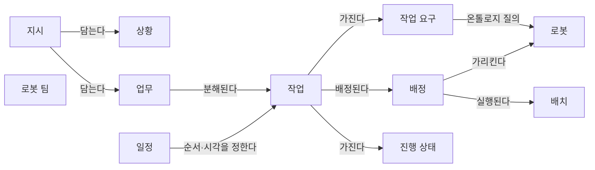
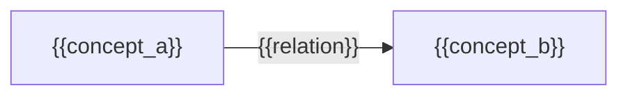

(너의 규칙은 시스템 프롬프트의 agents/shared-rules.md 와 agents/verifier.md 이다. 아래는 이번 실행의 컨텍스트와 입력이다.)

## 실행 컨텍스트

- run_id: 2026-09-25-26
- date: 2026-09-25
- run_type: track (트랙 실행)
- 대상: 트랙 nl-task-chatbot (자연어 업무 지시 챗봇) · 현재 단계: 단계 1. 선행 연구·제품 사례 조사 · 이번에 다룰 백로그 질문 id: q1-03 · 중심 세부영역: 13. 작업 배정 — MRTA (D. 계획·최적화)
- 예산:
    - max_search_queries: 40
    - max_sources_per_run: 20
    - new_topic_pages: 1
    - page_updates: 2
    - max_retries: 2
- 환경 알림: web_fetch_available: false · fetch_mode: mirror_only (일반 웹 페이지 열람은 네트워크 정책으로 막혀 있다. raw.githubusercontent.com 은 열린다: 공식 문서가 GitHub 에 있는 출처는 입력의 config/source_mirrors.yaml 경로를 WebFetch 로 열어 원문을 읽고 sources[].fetched=true, fetched_via=github_raw, fetch_url 을 적는다. 입력에 원문 텍스트(data/source_texts)가 있는 출처는 fetched_via=inbox. 그 밖의 출처는 fetched=false 이며 코드가 신뢰도 상한(medium)을 강제한다 — 공통 규칙 0절 6항)
- 언어: ko
- verification_stage: second
- verifier_budget:
    - max_search_queries: 40
    - max_sources_per_run: 20
    - new_topic_pages: 1
    - page_updates: 2
    - max_retries: 2

## 입력

### runs/2026-09-25-26/target.json

```json
{
  "run_id": "2026-09-25-26",
  "date": "2026-09-25",
  "weekday": "Fri",
  "run_number": 26,
  "run_type": "track",
  "forced": true,
  "target": {
    "area_no": 13,
    "area_name": "13. 작업 배정 — MRTA",
    "category": "D. 계획·최적화",
    "category_letter": "D"
  },
  "topic": null,
  "track": {
    "slug": "nl-task-chatbot",
    "name": "자연어 업무 지시 챗봇",
    "stage": 1,
    "stages": 5,
    "stage_name": "선행 연구·제품 사례 조사",
    "question_ids": [
      "q1-03"
    ],
    "user_questions": [],
    "runs_per_week": 3,
    "question_rationale": "CLI 지정 질문 id"
  },
  "corrections": [],
  "budget": {
    "max_search_queries": 40,
    "max_sources_per_run": 20,
    "new_topic_pages": 1,
    "page_updates": 2,
    "max_retries": 2
  },
  "priority_reason": null,
  "priority_questions": [],
  "excluded_areas": [],
  "lifted_areas": [],
  "deferred": {
    "monthly_recheck": false,
    "weekly_review": true
  },
  "selection_rationale": "CLI 지정 run_type=track, area=13; 트랙 실행일(Fri, track_days 앞 3개) → 트랙 nl-task-chatbot 단계 1, 질문 q1-03 (CLI 지정 질문 id)"
}
```

### runs/2026-09-25-26/research.json

```json
{
  "run_id": "2026-09-25-26",
  "date": "2026-09-25",
  "run_type": "track",
  "target": {
    "area_no": 13,
    "area_name": "13. 작업 배정 — MRTA",
    "category": "D. 계획·최적화"
  },
  "gaps": [
    "단계 1 질문 q1-03 열림(target.json 지정, CLI 지정 질문 id)",
    "완료 조건: 아이디어 2. 자연어 업무 지시 챗봇 페이지 3절에 채팅·음성 지시 제품의 확인·승인 비교(q1-03) 없음",
    "완료 조건: 지시 분해 접근의 유형 목록이 업무 분해·배정 설계 초안에 미반영",
    "단계 1 페이지 3절에 q1-03 소제목 없음. q1-02 답의 제품 사례는 확인·승인 방식을 다루지 않음(f22 미확인으로 남음)",
    "18. 사람–로봇 협업·운영 인터페이스 페이지 seed 상태: 운영 인터페이스의 지시 확인 방식 근거 없음"
  ],
  "research_questions": [
    "가장 가까운 로봇에 맡기는 것이 전체적으로도 유리한가? [분류원문]",
    "q1-03 물류·시설 현장에서 채팅이나 음성으로 로봇·작업자에게 일을 지시하는 운영 인터페이스 제품은 무엇이 있고, 지시를 받은 뒤 확인·승인을 어떻게 받는가?",
    "작업자에게 음성으로 일을 지시하는 창고 음성 피킹 제품은 지시한 동작의 수행을 어떤 방식(체크 디지트, 수량 응답)으로 확인하는가? (단계 1 페이지 3절, 18. 사람–로봇 협업·운영 인터페이스 겨냥)",
    "사람과 로봇이 함께 피킹하는 협업 AMR 제품은 로봇이 준 지시를 작업자가 어떻게 확인하고 로봇을 다음 작업으로 보내는가? (아이디어 2 페이지 3절 제품 사례 겨냥)",
    "로봇에게 자연어로 일을 지시하는 제품(Amazon Proteus 차세대판, InOrbit RobOps Copilot, Formant F3)은 해석 결과를 실행 전에 확인·승인받는 절차를 공개 자료에서 밝히는가? (f22 미확인 해소 시도)",
    "국내에서 자연어로 여러 로봇을 지시·관제하는 제품이나 국책 과제가 있는가? (한국 자료 우선 규칙)"
  ],
  "findings": [
    {
      "id": "f1",
      "claim": "창고 음성 피킹(voice-directed picking) 제품은 시스템이 작업자에게 갈 위치와 할 일을 음성으로 지시하고, 작업자는 위치 라벨의 체크 디지트나 수량 같은 짧은 음성 응답으로 각 동작을 확인하게 한다.",
      "tag": "사실",
      "source_ids": [
        "ref-438",
        "ref-439"
      ],
      "cross_checked": true,
      "confidence": "medium",
      "evidence_excerpt": "벤더 주장: Lucas Systems 는 Jennifer 음성 비서가 작업자에게 갈 곳·할 일을 말하고 작업자는 체크 디지트·수량 같은 짧은 응답으로 확인한다고 설명. 별도 발행 주체의 특허 공보(USPTO 8868519)도 작업자가 슬롯 라벨의 체크 디지트를 말해 위치를 확인하는 방식을 기술. 두 출처 모두 검색 요약 범위. (발행일 미확인, 확인일 기준)",
      "as_of": "2026-09-25",
      "flow_step": "피킹",
      "flow_item": "완료·인계",
      "source_unopened": true,
      "vendor_claim": true
    },
    {
      "id": "f2",
      "claim": "위치 체크 디지트 생성·갱신에 관한 미국 특허 공보는 작업자가 말하거나 입력한 체크 디지트가 해당 위치에 저장된 확인 값과 맞지 않으면 사용자에게 경고하는 방식을 기술한다.",
      "tag": "사실",
      "source_ids": [
        "ref-439"
      ],
      "cross_checked": false,
      "confidence": "medium",
      "evidence_excerpt": "검색 요약: 'An alert is provided to the user if the spoken or entered check digits do not match stored check data correlated to the bin/slot.' 체크 번호를 외운 작업자의 부정을 막는 데도 쓴다고 적음. 특허 공보이며 제품 동작의 확인은 아님. 원문 미열람. (발행일 미확인, 확인일 기준)",
      "as_of": "2026-09-25",
      "flow_step": "피킹",
      "flow_item": "예외·성과",
      "source_unopened": true
    },
    {
      "id": "f3",
      "claim": "Locus Robotics 의 협업 피킹 로봇은 로봇에 달린 화면으로 피킹할 품목·위치·수량을 작업자에게 보여 주고, 선택 기능인 피킹 검증에서는 위치나 용기 바코드를 스캔하게 한 뒤 작업자가 확인하면 로봇이 다음 목적지로 이동한다.",
      "tag": "추정",
      "source_ids": [
        "ref-443",
        "ref-444"
      ],
      "cross_checked": false,
      "confidence": "low",
      "evidence_excerpt": "벤더 주장: Locus 사용자 인터페이스 소개와 스캐너 협력사 Aila 사례 소개의 검색 요약 — 화면이 Aila·ProGlove 스캐너로 위치 바코드나 용기 id 를 스캔하라고 지시, 'scan the item, confirm on the iPad' 후 로봇이 다음 목적지로 이동. 협력사 자료라 독립 교차로 보지 않음. 원문 미열람. (발행일 미확인, 확인일 기준)",
      "as_of": "2026-09-25",
      "flow_step": "피킹",
      "flow_item": "완료·인계",
      "source_unopened": true,
      "vendor_claim": true
    },
    {
      "id": "f4",
      "claim": "Amazon 은 2026년 6월 차세대 Proteus 를 직원이 일상 언어로 할 일을 말하면 로봇이 우선순위·경로·시점을 스스로 정하는 자율이동로봇으로 발표했으며, 발표 시점에는 실험실 파일럿 단계이고 유럽 배치는 2027년 상반기로 계획했다.",
      "tag": "추정",
      "source_ids": [
        "ref-440",
        "ref-441"
      ],
      "cross_checked": false,
      "confidence": "low",
      "evidence_excerpt": "벤더 주장: Amazon 발표와 이를 전한 The Robot Report 기사의 검색 요약 — 'The employee states the task; the robot handles the rest: priority, route, timing', 현재 lab pilots, 유럽 2027년 상반기. 기사는 같은 발표를 옮긴 것이라 독립 확인 아님. 원문 미열람.",
      "as_of": "2026-06",
      "flow_step": null,
      "flow_item": "시작 조건",
      "source_unopened": true,
      "vendor_claim": true
    },
    {
      "id": "f5",
      "claim": "이번에 확인한 차세대 Proteus 발표와 보도의 검색 요약에는 자연어 지시의 해석 결과를 실행 전에 작업자나 관리자에게 보여 주고 확인·승인받는 절차에 관한 설명이 없었다.",
      "tag": "추정",
      "source_ids": [
        "ref-440",
        "ref-441"
      ],
      "cross_checked": false,
      "confidence": "low",
      "evidence_excerpt": "검색 요약 범위의 관찰이며 부재의 확인이 아님. 두 출처 모두 원문 미열람. 한 2차 블로그가 '실시간 로봇·위치 목록으로 해석해 구조화 미션 계획을 만든다'고 적었으나 출처로 쓰지 않음.",
      "as_of": "2026-09-25",
      "flow_step": null,
      "flow_item": "예외·성과",
      "source_unopened": true
    },
    {
      "id": "f6",
      "claim": "InOrbit 은 RobOps Copilot 제품 페이지에서 대화형으로 자율 주행 사건·미션 성과·로봇 상태를 개별 로봇과 플릿 단위로 탐색하게 한다고 설명하고, InOrbit Connect 에서 WMS·다제조사 AMR 과 연계한 미션을 정의·실행·분석한다고 밝힌다.",
      "tag": "추정",
      "source_ids": [
        "ref-442"
      ],
      "cross_checked": false,
      "confidence": "low",
      "evidence_excerpt": "벤더 주장: 제품 페이지 검색 요약 — 'With a conversational approach, InOrbit RobOps Copilot collaborates with users to delve into their data'. 미션 실행 전 확인·승인 방식은 요약에 없음. 원문 미열람. (발행일 미확인, 확인일 기준)",
      "as_of": "2026-09-25",
      "flow_step": null,
      "flow_item": "수행 자원",
      "source_unopened": true,
      "vendor_claim": true
    },
    {
      "id": "f7",
      "claim": "자연어로 로봇 미션 실행·제어까지 한다고 발표한 운영 제품(InOrbit RobOps Copilot 2026년 발표, Formant F3)의 공개 자료에서는 이번 검색 범위에서도 실행 전 확인·승인이나 명령 권한 제한 장치의 설명을 찾지 못했다.",
      "tag": "추정",
      "source_ids": [
        "ref-177",
        "ref-178",
        "ref-442"
      ],
      "cross_checked": false,
      "confidence": "low",
      "evidence_excerpt": "Formant F3 승인·권한 검색에서도 제품 쪽 설명은 나오지 않았고 일반 가드레일 자료만 나옴. 부재의 확인이 아님. 모두 원문 미열람 (재인용: 2026-09-25-21)",
      "as_of": "2026-09-25",
      "flow_step": null,
      "flow_item": "예외·성과",
      "source_unopened": true
    },
    {
      "id": "f8",
      "claim": "연계 대상: 현대로템은 2026년 5월 산업통상부 과제 '자연어 명령 기반 이종·다중 로봇 통합 관제 시스템'의 사업자로 선정되었으며, 여러 종류의 무인로봇을 언어와 문자로 통합 제어하는 소프트웨어를 국방 무인차량·다족보행로봇에 적용할 계획이라고 보도되었다.",
      "tag": "추정",
      "source_ids": [
        "ref-445"
      ],
      "cross_checked": false,
      "confidence": "low",
      "evidence_excerpt": "기사 검색 요약: 기존에는 관리자가 로봇마다 원격 장치로 명령을 입력했으나 언어·문자로 다수 무인 플랫폼을 동시 제어. 국방(업종별 조건) 대상이며 물류 현장 제품 아님. 확인·승인 방식 언급 없음. 원문 미열람.",
      "as_of": "2026-05-26",
      "flow_step": null,
      "flow_item": "시작 조건",
      "source_unopened": true
    },
    {
      "id": "f9",
      "claim": "확인한 제품에서 작업자 대상 음성·화면 지시는 체크 디지트·바코드 스캔처럼 물리 동작 하나하나를 현장에서 확인받는 방식을 쓰는 반면, 로봇 대상 자연어 지시 제품은 공개 자료에서 해석 결과(무엇을 어느 로봇이 할지)를 실행 전에 확인받는 방식이 드러나지 않아, 두 확인은 대상과 시점이 다른 것으로 보인다.",
      "tag": "추정",
      "source_ids": [
        "ref-438",
        "ref-439",
        "ref-443",
        "ref-440",
        "ref-177",
        "ref-178"
      ],
      "cross_checked": false,
      "confidence": "low",
      "evidence_excerpt": "f1~f7 을 대응시킨 이 위키의 정리. 동작 단위 확인(수행 확인)과 해석 결과 확인(지시 확인)을 나눈 단일 출처는 확인하지 못함. q4-01·q4-04 와 연결.",
      "as_of": "2026-09-25",
      "flow_step": "피킹",
      "flow_item": "완료·인계",
      "source_unopened": true
    }
  ],
  "sources": [
    {
      "id": "ref-177",
      "org": "InOrbit.AI (RoboticsTomorrow 게재 보도자료)",
      "title": "InOrbit.AI Demonstrates the Future of Multi-Vendor Robot Orchestration and Physical AI at Automate 2026",
      "published": "2026-06-22",
      "url": "https://www.roboticstomorrow.com/news/2026/06/22/inorbitai-demonstrates-the-future-of-multi-vendor-robot-orchestration-and-physical-ai-at-automate-2026/26757/",
      "type": "벤더 문서",
      "reliability": "low",
      "accessed": "2026-09-25",
      "summary": "원문 미열람. 8개 공급사 로봇 합동 시연과 자연어·음성으로 미션을 실행하는 RobOps Copilot 을 소개한 InOrbit 보도자료(재사용).",
      "source_unopened": true,
      "fetched": false,
      "fetched_via": null,
      "fetch_url": null
    },
    {
      "id": "ref-178",
      "org": "Formant (Business Wire 보도자료)",
      "title": "Formant F3 Brings Generative AI and Agentic Reasoning to Robot Ops",
      "published": "2025-06-30",
      "url": "https://www.businesswire.com/news/home/20250630008190/en/Formant-F3-Brings-Generative-AI-and-Agentic-Reasoning-to-Robot-Ops",
      "type": "벤더 문서",
      "reliability": "low",
      "accessed": "2026-09-25",
      "summary": "원문 미열람. 자연어 인터페이스, 상시 에이전트 감시·분석·권고, 다단계 조사 에이전트를 내세운 로봇 운영 플랫폼 F3 발표 보도자료(재사용).",
      "source_unopened": true,
      "fetched": false,
      "fetched_via": null,
      "fetch_url": null
    },
    {
      "id": "ref-438",
      "org": "Lucas Systems",
      "title": "Voice-Directed Warehousing - Solutions | Lucas Systems",
      "published": null,
      "url": "https://www.lucasware.com/voice-directed-warehousing/",
      "type": "벤더 문서",
      "reliability": "low",
      "accessed": "2026-09-25",
      "summary": "원문 미열람. Jennifer 음성 비서가 작업자에게 위치·할 일을 음성으로 지시하고 작업자가 체크 디지트·수량 응답으로 확인하는 음성 지시 창고 작업 솔루션 소개.",
      "source_unopened": true,
      "fetched": false,
      "fetched_via": null,
      "fetch_url": null
    },
    {
      "id": "ref-439",
      "org": "USPTO (미국 특허 공보, 출원인 미확인)",
      "title": "System and method for generating and updating location check digits (US 8868519)",
      "published": null,
      "url": "https://image-ppubs.uspto.gov/dirsearch-public/print/downloadPdf/8868519",
      "type": "정부·연구기관",
      "reliability": "medium",
      "accessed": "2026-09-25",
      "summary": "원문 미열람. 음성 지시 피킹에서 작업자가 위치 라벨의 체크 디지트를 말해 위치를 확인하고 불일치 시 경고하는 방식, 체크 디지트 생성·갱신을 기술한 특허 공보.",
      "source_unopened": true,
      "fetched": false,
      "fetched_via": null,
      "fetch_url": null
    },
    {
      "id": "ref-440",
      "org": "Amazon",
      "title": "Amazon unveils next-gen Proteus robot as part of €10 billion European investment in its fulfillment network",
      "published": "2026-06",
      "url": "https://www.aboutamazon.com/news/operations/amazon-proteus-robot-europe-investment-employee-support",
      "type": "벤더 문서",
      "reliability": "low",
      "accessed": "2026-09-25",
      "summary": "원문 미열람. 자연어 지시를 해석해 우선순위·경로·시점을 정하는 차세대 Proteus 와 유럽 투자 계획을 알린 Amazon 발표.",
      "source_unopened": true,
      "fetched": false,
      "fetched_via": null,
      "fetch_url": null
    },
    {
      "id": "ref-441",
      "org": "The Robot Report",
      "title": "Proteus gets natural-language ability as Amazon expands European robot deployments",
      "published": "2026-06",
      "url": "https://www.therobotreport.com/proteus-gets-natural-language-ability-amazon-expands-europe-robot-deployments/",
      "type": "기사",
      "reliability": "low",
      "accessed": "2026-09-25",
      "summary": "원문 미열람. 차세대 Proteus 의 자연어 지시 기능, 실험실 파일럿 단계, 미국 24개 센터 기존 배치와 유럽 2027년 상반기 배치 계획을 전한 기사.",
      "source_unopened": true,
      "fetched": false,
      "fetched_via": null,
      "fetch_url": null
    },
    {
      "id": "ref-442",
      "org": "InOrbit.AI",
      "title": "InOrbit RobOps Copilot - Bring AI power to robot operations",
      "published": null,
      "url": "https://www.inorbit.ai/robopscopilot",
      "type": "벤더 문서",
      "reliability": "low",
      "accessed": "2026-09-25",
      "summary": "원문 미열람. 대화형으로 로봇 운영 데이터(자율 주행 사건, 미션 성과, 로봇 상태)를 탐색하는 RobOps Copilot 제품 소개와 InOrbit Connect 미션 연계 설명.",
      "source_unopened": true,
      "fetched": false,
      "fetched_via": null,
      "fetch_url": null
    },
    {
      "id": "ref-443",
      "org": "Locus Robotics",
      "title": "Efficient Robot Interface for Seamless Human-Robot Collaboration (LocusONE user interface)",
      "published": null,
      "url": "https://locusrobotics.com/locusone/automated-warehouse-software/user-interface",
      "type": "벤더 문서",
      "reliability": "low",
      "accessed": "2026-09-25",
      "summary": "원문 미열람. 협업 피킹 로봇 화면이 작업자에게 품목·위치·수량을 보여 주고 스캔을 지시하는 사용자 인터페이스 소개.",
      "source_unopened": true,
      "fetched": false,
      "fetched_via": null,
      "fetch_url": null
    },
    {
      "id": "ref-444",
      "org": "Aila Technologies",
      "title": "Locus Robotics leverages Aila's scanning to increase productivity (case study)",
      "published": null,
      "url": "https://www.ailatech.com/blog/case-study-locus-robotics/",
      "type": "벤더 문서",
      "reliability": "low",
      "accessed": "2026-09-25",
      "summary": "원문 미열람. 작업자가 품목을 스캔하고 iPad 에서 확인하면 LocusBot 이 다음 목적지로 가는 피킹 확인 흐름을 소개한 스캐너 협력사 사례.",
      "source_unopened": true,
      "fetched": false,
      "fetched_via": null,
      "fetch_url": null
    },
    {
      "id": "ref-445",
      "org": "뉴스핌",
      "title": "현대로템, 무인로봇 국책과제 2건 수주",
      "published": "2026-05-26",
      "url": "https://www.newspim.com/news/view/20260526000361",
      "type": "기사",
      "reliability": "low",
      "accessed": "2026-09-25",
      "summary": "원문 미열람. 현대로템이 '자연어 명령 기반 이종·다중 로봇 통합 관제 시스템' 등 국책 과제를 수주했다는 기사(국방 무인로봇 대상).",
      "source_unopened": true,
      "fetched": false,
      "fetched_via": null,
      "fetch_url": null
    }
  ],
  "page_proposals": [
    {
      "action": "update",
      "path": "docs/tracks/nl-task-chatbot/stage-1-prior-work-and-products.md",
      "sections": [
        "2",
        "3",
        "4",
        "5",
        "6",
        "8",
        "9"
      ],
      "rationale": "q1-03 답: f1·f2·f3·f4·f5·f6·f7·f8·f9 (신뢰도 low) — 2절 q1-03 상태 답함, 3절 q1-03 소제목 신설({#q1-03}): 작업자 대상 음성 피킹의 체크 디지트 확인 f1·f2, 협업 AMR 화면·스캔 확인 f3(벤더 주장), 로봇 대상 자연어 지시 제품 f4·f6(벤더 주장)과 확인 절차 미확인 f5·f7, 국내 국책 과제 f8(연계 대상, 국방), 두 확인 방식 구분 f9 / 4절 결론·불확실성(q1-02 의 f22 미확인은 이번에도 해소되지 않음) / 5절 후속 질문 / 6절 완료 조건 현황 / 8절 출처 / 9절 이력"
    },
    {
      "action": "update",
      "path": "docs/ideas/nl-task-chatbot.md",
      "sections": [
        "3"
      ],
      "rationale": "아이디어 페이지 3절(트랙 산출물): '제품 사례' 끝의 'q1-03 미조사' 문장을 f1·f2·f3·f4·f6·f7·f9 로 교체 — 모두 [추정] 벤더 주장 병기(f2 는 특허 공보), 확인·승인 방식 비교"
    },
    {
      "action": "update",
      "path": "docs/categories/e-collaboration-and-field-operations/18-human-robot-collaboration-and-operator-interface.md",
      "sections": [
        "6",
        "7"
      ],
      "rationale": "트랙 nl-task-chatbot 단계 1 반영 제안 (f1, f2, f3, f9): 작업자에게 일을 지시하는 운영 인터페이스의 확인 방식(음성 피킹 체크 디지트, 협업 AMR 화면·스캔 확인)과 자연어 로봇 지시 제품의 확인 절차 미확인"
    }
  ],
  "glossary_candidates": [
    {
      "term_ko": "음성 피킹",
      "term_en": "Voice-Directed Picking (Voice Picking)",
      "definition": "시스템이 작업자에게 갈 위치와 피킹할 수량을 음성으로 지시하고 작업자가 짧은 음성 응답으로 동작을 확인하는 창고 피킹 방식이다."
    },
    {
      "term_ko": "체크 디지트",
      "term_en": "Check Digit",
      "definition": "보관 위치 라벨에 붙은 짧은 확인용 숫자로, 작업자가 이를 말하거나 입력해 올바른 위치에 있음을 시스템에 확인시키는 데 쓰인다."
    }
  ],
  "open_questions_new": [],
  "open_questions_resolved": [],
  "self_check": {
    "source_count": 10,
    "cross_checked_count": 1,
    "unverified": [
      "모든 신규 출처 원문 미열람(검색 요약 범위)",
      "f1 교차 확인은 벤더 문서(Lucas)와 특허 공보 사이이며 두 요약 모두 원문 미열람",
      "ref-439 특허 출원인·발행일 미확인",
      "f3 Locus 와 Aila 는 협력 관계라 독립 교차로 보지 않음",
      "f5·f7 확인 절차 부재는 검색 요약 범위의 관찰이며 부재의 확인이 아님",
      "Nayantra(Open-RMF + MCP 자연어 플릿 제어)는 커뮤니티 게시글만 확인되어 출처로 넣지 않음",
      "q1-02 의 f22(운영 제품 미션이 미리 정의된 미션 호출인지 새 분해인지) 이번에도 미확인"
    ],
    "scope_violations": [
      "f8: 국방 무인로봇 과제로 분류 원문 9장의 업종별 조건 연계 영역이라 '연계 대상: '으로 표시하고 물류 제품처럼 서술하지 않음"
    ],
    "budget_used": {
      "queries": 14,
      "sources": 8
    },
    "limits": "재실행(스키마 불일치 반려) 대응. 직전 반환 JSON 이 이 프롬프트에 들어 있지 않아 그대로 형식만 고칠 수 없었으므로, 같은 질문(q1-03)을 이번 실행 예산 안에서 다시 조사해 브리프 전체를 새로 냈다. 반려 사유(벤더 문서만 근거로 한 [사실] finding 에 vendor_claim 없음)에 맞춰, 벤더 문서가 근거인 기능 주장(f1·f3·f4·f6)에는 vendor_claim: true 를 넣고 교차 확인되지 않은 것은 추정으로 두었다. f1 만 서로 다른 발행 주체(Lucas Systems 벤더 문서, 미국 특허 공보)로 교차 확인해 사실로 두었다. web_fetch_available: false · fetch_mode mirror_only 이지만 이번 출처는 GitHub 공식 저장소가 없어 모두 원문 미열람(신뢰도 상한 medium, 벤더·기사 low). 검색 14회/40, 신규 출처 8건/20(ref-438~ref-445, 예약 구간 안), 재사용 2건(ref-177, ref-178). 질문 선택: target.json 지정 q1-03 1건. 제품과 작업자 대상 확인 방식은 확인했지만, 로봇 대상 자연어 지시 제품의 확인·승인 절차는 공개 자료에서 드러나지 않아 신뢰도 low 로 답했다. 한국 자료: 현대로템 국책 과제 기사(국방, 연계 대상). 국내 물류 현장 자연어 지시 제품은 찾지 못했다(다임리서치는 q1-02 에서 이미 다룸). 교차 규칙: 이번 finding 은 LLM 배정 방법이 아니라 운영 인터페이스이므로 18. 사람–로봇 협업·운영 인터페이스 반영만 제안했다. 8. 실시간 세계 상태·데이터 일관성과 22. 시뮬레이션·예측용 디지털 트윈 관련 주장 없음. 새 일반 열린 질문 없음. 온톨로지 변경 없음: 확인(승인)을 별도 개념으로 둘지는 초안 6절 질문(q4-01·q4-04)으로 이미 있고, 근거가 벤더 주장 수준이라 변경을 제안하지 않았다. 후속 질문 1건."
  },
  "track": {
    "slug": "nl-task-chatbot",
    "stage": 1,
    "answered_question_ids": [
      "q1-03"
    ],
    "new_questions": [
      {
        "question": "작업자 음성 피킹의 체크 디지트·스캔처럼 동작 하나하나를 현장에서 확인받는 방식과, 자연어 지시의 해석 결과(작업·대상·로봇)를 배정 전에 요약해 확인받는 방식을 함께 둘 때 각각 어떤 오류를 잡고 확인 부담은 얼마나 늘어나는가? (q1-03 에서 파생)",
        "stage": 4,
        "rationale_finding_id": "f9"
      }
    ],
    "ontology_changes": [],
    "stage_completion_self_assessment": {
      "met": false,
      "missing": [
        "지시 분해 접근의 유형 목록이 업무 분해·배정 설계 초안에 미반영",
        "열린 질문 q1-04, q1-05, q1-06(q1-05 와 q1-06 중복 정리 필요)",
        "q1-03 답은 신뢰도 low: 로봇 대상 자연어 지시 제품의 확인·승인 절차 미확인"
      ]
    }
  }
}
```

### runs/2026-09-25-26/verification.json

```json
{
  "run_id": "2026-09-25-26",
  "stage": "first",
  "verdict": "조건부 승인",
  "claim_checks": [
    {
      "finding_id": "f1",
      "source_exists": true,
      "supports_claim": true,
      "cross_checked": true,
      "tag_decision": "유지",
      "note": "원문 미열람(검색 결과 일치). ref-438 Lucas Systems 페이지가 검색되고, 검색 요약에 '작업자가 갈 곳과 할 일을 듣고 체크 디지트·수량 같은 짧은 응답으로 각 동작을 확인한다'는 내용이 있다. ref-439 USPTO 8868519 PDF도 검색되며, Google Patents 요약에 따르면 양수인은 VOCOLLECT, INC., 출원일은 2011-05-27이고 체크 디지트를 쓰는 음성 기반 작업 관리 시스템을 다룬다. 발행 주체가 다르고(Lucas Systems 벤더 문서, Vocollect 양수 특허 공보) 서로 인용 관계도 아니므로 일반 관행에 관한 주장은 교차 확인으로 인정한다. 단, 이 교차 확인은 '음성 피킹의 체크 디지트·수량 응답 확인'이라는 일반 주장에만 해당한다. Jennifer 같은 Lucas 제품 고유 기능은 벤더 주장이다. 원문 미열람이라 신뢰도 상한은 medium."
    },
    {
      "finding_id": "f2",
      "source_exists": true,
      "supports_claim": true,
      "cross_checked": false,
      "tag_decision": "유지",
      "note": "원문 미열람(검색 결과 일치). 'An alert is provided to the user if the spoken or entered check digits do not match stored check data correlated to the bin/slot' 구절이 같은 특허 계열(US8868519·US20150032709A1)의 검색 요약에서 확인됐다. 특허 공보의 내용을 기술하는 진술이므로 [사실]을 유지한다. 제품 동작을 확인한 것이 아니라는 한정을 본문에 그대로 둔다. 등록일은 미확인이고 출원일은 2011-05-27이다."
    },
    {
      "finding_id": "f3",
      "source_exists": true,
      "supports_claim": true,
      "cross_checked": false,
      "tag_decision": "유지",
      "note": "원문 미열람(검색 결과 일치). ref-443 Locus 요약에서 '선택적으로 피킹 검증을 설정할 수 있고, 화면이 Aila·ProGlove 스캐너로 위치 바코드나 용기 id를 스캔하라고 지시한다'를 확인했다. ref-444 Aila 사례 요약에서는 'scan the item, confirm on the iPad' 뒤 LocusBot이 다음 목적지로 이동한다는 내용을 확인했다. 두 출처는 협력 관계라 독립 교차가 아니다. [추정] 벤더 주장을 유지한다."
    },
    {
      "finding_id": "f4",
      "source_exists": true,
      "supports_claim": true,
      "cross_checked": false,
      "tag_decision": "유지",
      "note": "원문 미열람(검색 결과 일치). Amazon 발표(aboutamazon.com)와 The Robot Report 기사가 모두 검색된다. 요약 기준으로 2026-06-04 Delivering the Future 행사에서 발표됐고, 자연어 지시로 경로·우선순위·시점을 정하며, 실험실 파일럿 단계이고, 유럽 배치는 2027년 상반기 예정이다. 기사는 같은 발표를 옮긴 것이라 독립 확인이 아니다. [추정] 벤더 주장을 유지한다. 기준일은 발표일 2026-06-04(검색 요약 기준)로 구체화할 수 있다."
    },
    {
      "finding_id": "f5",
      "source_exists": true,
      "supports_claim": true,
      "cross_checked": false,
      "tag_decision": "유지",
      "note": "확인. 검증 검색의 요약(Amazon 발표, 기사 여러 건)에서도 해석 결과를 실행 전에 확인·승인받는 절차 설명은 보이지 않았다. 검색 요약 범위의 관찰이며 부재를 확인한 것이 아니라는 점이 명시되어 있으므로 [추정]을 유지한다. 원문 미열람."
    },
    {
      "finding_id": "f6",
      "source_exists": true,
      "supports_claim": true,
      "cross_checked": false,
      "tag_decision": "유지",
      "note": "원문 미열람(검색 결과 일치). inorbit.ai/robopscopilot 페이지가 검색되고, 요약에 자율 주행 사건·미션 성과·로봇 상태를 개별 로봇과 플릿 단위로 대화형으로 탐색한다는 내용이 있다. InOrbit Connect 미션 연계 구절은 이번 검증 스니펫에서 직접 보지 못했으므로 본문에는 '제품 페이지 요약 기준'으로만 쓴다. 기존 ref-176(2024 보도자료)과 같은 제품이며 같은 발행 주체다. [추정] 벤더 주장을 유지한다."
    },
    {
      "finding_id": "f7",
      "source_exists": true,
      "supports_claim": true,
      "cross_checked": false,
      "tag_decision": "유지",
      "note": "확인. ref-177·ref-178은 참고문헌 목록의 기존 항목과 id·URL이 같아 재사용이 맞다. 확인·승인 장치를 찾지 못했다는 것은 검색 범위의 관찰이고 부재의 확인이 아니라는 점이 명시되어 있어 [추정]을 유지한다. 원문 미열람. 실행 2026-09-25-21의 f22(단계 1 페이지 4절 미확인 항목)와 같은 결론이므로 새 사실로 쓰지 말고 '이번 검색에서도 확인되지 않음'으로 갱신한다."
    },
    {
      "finding_id": "f8",
      "source_exists": true,
      "supports_claim": true,
      "cross_checked": false,
      "tag_decision": "유지",
      "note": "원문 미열람(검색 결과 일치). 뉴스핌 기사(2026-05-26)가 검색되고, 머니투데이·경남일보 등 같은 날 기사도 같은 발표를 전한다. 요약 기준으로 산업통상부·국방과학연구소 발주 과제, 언어·문자로 다수 무인 플랫폼을 동시에 제어, HR-셰르파·다족보행로봇 적용을 확인했다. 같은 보도자료에 기반한 기사들이다. 국방 대상이므로 '연계 대상'(분류 원문 9장 업종별 조건) 표시를 유지하고, 물류 제품처럼 쓰지 않는다."
    },
    {
      "finding_id": "f9",
      "source_exists": true,
      "supports_claim": true,
      "cross_checked": false,
      "tag_decision": "유지",
      "note": "확인. f1~f7을 대응시킨 이 위키의 정리(추론)이고 단일 출처가 없다는 점이 명시되어 있어 [추정]을 유지한다. 근거 finding이 모두 유지되었다. 로봇 대상 확인 방식은 '드러나지 않음'이므로 '두 확인은 대상과 시점이 다르다'는 단정으로 쓰지 않고 '~로 보인다'를 유지한다."
    }
  ],
  "category_fit": {
    "ok": true,
    "reassign_to": null
  },
  "scope_boundary": {
    "ok": true,
    "issues": []
  },
  "duplication": {
    "ok": true,
    "overlaps": [
      "f7은 단계 1 페이지 3절 q1-02 '로봇 운영 제품 사례'와 4절 남은 불확실성(실행 2026-09-25-21의 f22, 미리 정의된 미션 호출 여부와 실행 전 확인·권한 장치 미확인)과 겹친다. 기존 각주 ref-177·ref-178을 재사용하고 새 사실로 쓰지 않는다",
      "f6(ref-442 제품 페이지)은 기존 ref-176(RobOps Copilot 2024 보도자료)과 같은 제품·같은 발행 주체다. 3절 q1-02의 InOrbit 2024 서술과 중복되지 않게 q1-03 소제목에서는 미션 실행 전 확인 여부에 관한 부분만 쓴다",
      "새 질문(작업 단위 현장 확인 대 해석 결과 확인의 오류·부담 비교, 단계 4)은 기존 q4-01·q4-02·q4-04와 주제가 가깝다. 다만 두 확인 방식의 조합과 확인 부담을 묻는 점이 달라 중복으로 판정하지 않았다"
    ]
  },
  "terminology": {
    "ok": false,
    "conflicts": [
      "용어 후보 '체크 디지트(Check Digit)'의 정의(보관 위치 라벨의 확인용 숫자)는 GS1 식별 키(SSCC·GTIN 등, 용어집 '물류 단위 일련 코드' 참조)의 끝자리 검증 숫자라는 일반적 의미와 다르다. 같은 표기로 등록하면 뜻이 충돌하므로 '위치 체크 디지트(Location Check Digit)'로 등록해 구분해야 한다"
    ]
  },
  "quotation_check": {
    "ok": true
  },
  "corrections_applied": [],
  "corrections_rejected": [],
  "required_fixes": [
    "ref-439: 참고문헌 기관 칸을 'USPTO(미국 특허 공보, 양수인 VOCOLLECT, INC.)'로 고치고, 발행일은 '미확인'으로 둔 채 본문이나 요약에 '출원 2011-05-27(검색 요약 기준)'을 적는다. 이유: 검증 검색(Google Patents 요약)에서 양수인과 출원일이 확인됐다.",
    "f1: [사실]을 유지하되 주장 범위는 '음성 피킹에서 시스템이 위치·할 일을 음성으로 지시하고 작업자가 체크 디지트·수량 같은 짧은 음성 응답으로 동작을 확인한다'는 일반 관행으로 한정한다. Lucas Systems의 Jennifer 같은 제품 고유 기능을 적을 때는 [추정] 벤더 주장으로 따로 쓴다. 이유: 교차 확인은 벤더 문서(Lucas)와 다른 발행 주체의 특허 공보(Vocollect 양수) 사이의 일반 관행에만 성립한다.",
    "f3·f4·f6: 페이지(단계 1 페이지 3절 q1-03, 아이디어 2 페이지 3절, 18. 사람–로봇 협업·운영 인터페이스 반영 제안)의 모든 문장에 [추정]과 '벤더 주장'을 병기한다. f6에서 InOrbit Connect 미션 연계 부분은 '제품 페이지 요약 기준'임을 밝힌다.",
    "f4: 기준일을 발표일 2026-06-04(검색 요약 기준)로 적고, '실험실 파일럿 단계, 유럽 배치는 2027년 상반기 계획'을 같은 문장에 남긴다. ref-440의 발행일은 '2026-06'으로 두어도 되지만 각주 발행일과 본문 기준일이 서로 모순되지 않게 한다.",
    "f5·f7: '확인·승인 절차 설명을 찾지 못했다'는 반드시 '검색 요약 범위의 관찰이며 부재의 확인이 아니다'와 함께 쓴다. f7은 단계 1 페이지 4절의 기존 미확인 항목(f22, 실행 2026-09-25-21)을 '이번 실행(2026-09-25-26)에서도 확인되지 않음'으로 갱신하는 데만 쓴다.",
    "f8: 문장 첫머리의 '연계 대상:' 표시를 유지하고 국방 무인로봇 과제(산업통상부·국방과학연구소 발주)임을 밝힌다. 물류 제품 사례 목록에 섞지 말고 국내 사례 한 줄로만 둔다. 18. 사람–로봇 협업·운영 인터페이스 반영 제안에는 넣지 않는다.",
    "원문 미열람 표시: 신규 출처 ref-438~ref-445와 재사용 ref-177·ref-178의 각주 정의 접근일 뒤에 ' (원문 미열람)'을 붙이고, reference_updates의 신규 출처 8건에 source_unopened: true를 넣는다.",
    "용어집: 용어 후보 '체크 디지트'는 '위치 체크 디지트(Location Check Digit)'로 등록한다. GS1 식별 키의 끝자리 검증 숫자와 다른 뜻이라는 한 문장을 정의에 덧붙인다. '음성 피킹(Voice-Directed Picking)'은 그대로 등록해도 된다.",
    "18. 사람–로봇 협업·운영 인터페이스 반영 제안(area_reflection_proposals): 대상 절을 '6. 대표 접근법과 기술'과 '8. 대표 연구와 자료'로 고친다. 특허 공보와 제품 사례는 '7. 관련 표준·프레임워크·오픈소스'의 대상이 아니다. 세부영역 페이지는 직접 고치지 않는다.",
    "단계 1 페이지 2절·3절: q1-03 행의 상태를 '답함', 답한 실행 id를 2026-09-25-26, 답 위치를 [#q1-03](#q1-03)으로 적는다. 3절에는 '### q1-03 … {#q1-03}' 소제목을 새로 둔다. 답 신뢰도가 low임(로봇 대상 자연어 지시 제품의 확인·승인 절차 미확인)을 소제목 첫 단락에 밝힌다. 상태 줄은 '열린 질문: 3건 · 답한 질문: 3건'으로 고친다.",
    "단계 1 페이지 6절: 첫 행(아이디어 2 3절의 선행 연구·제품 사례 비교)은 충족 여부를 '충족', 검증 판정 칸을 '충족(1차 예비, 2차에서 확정)'으로 적는다. 둘째 행(지시 분해 접근 유형 목록이 업무 분해·배정 설계 초안에 반영)은 '미충족', 검증 판정을 '미충족 · 미승인'으로 둔다. 표 아래 줄은 '다음 단계로 전환: 아니오(지시 분해 접근 유형 목록이 업무 분해·배정 설계 초안에 미반영, 열린 질문 q1-04·q1-05·q1-06)'로 쓴다. 상태 줄의 완료 조건은 '미충족'을 유지한다.",
    "아이디어 2 페이지 3절: 첫 단락의 'q1-03은 아직 조사되지 않았다' 문장과 절 끝의 '아직 조사되지 않음 — 단계 1의 q1-03 트랙 실행이 채운다' 문장을 모두 f1·f2·f3·f4·f6·f7·f9 기반 서술로 바꾼다. 확인 방식 비교(작업자 대상 동작 단위 확인 대 로봇 대상 자연어 지시의 확인 절차 미확인)를 한 단락 또는 표로 둔다. 표는 출처 표를 복제하지 않고 이 위키가 직접 구성한다.",
    "트랙 개요(index.md) 6절 아이디어 2 항목의 '채팅·음성 지시 제품의 확인·승인(q1-03)은 아직 조사되지 않았다' 문구를 이번 실행 결과(작업자 대상 확인 방식 확인, 로봇 대상 제품의 확인 절차는 공개 자료에서 미확인)에 맞게 고친다. 상태 줄의 마지막 트랙 실행은 2026-09-25, 현재 단계는 '단계 1. 선행 연구·제품 사례 조사'를 유지한다.",
    "새 질문(두 확인 방식의 오류·부담 비교)은 단계 4 태그 그대로 backlog_updates에 새 id(단계 4 다음 번호)로 등록하고 origin은 'f9'로 적는다. 단계 1 페이지 5절 후속 질문 표에 추가하고, 기존 q4-01·q4-02와 연결된다는 메모를 붙인다.",
    "업무 분해·배정 설계 초안: 이번 실행에는 온톨로지 변경이 없으므로 pages에 넣지 않고 ontology_draft_version은 '0.2'를 유지한다. 6절의 '사용자 확인(승인)을 별도 개념으로 둘지' 질문은 초안 페이지를 고치지 않고 단계 1 페이지 4절에서 f9를 근거로 연결만 한다."
  ],
  "confidence": "low",
  "verification_note": "판정: 조건부 승인. 이번 실행은 원문 열람이 차단된 환경에서 검증됐다(fetch_mode mirror_only; 이번 출처는 GitHub 공식 저장소가 없어 검색 결과 일치로만 확인했다). 확인 9건, 미확인 0건, 교차 확인 1건(f1: Lucas Systems 벤더 문서와 VOCOLLECT, INC. 양수 미국 특허 공보. 음성 피킹의 체크 디지트·수량 응답 확인이라는 일반 관행에만 해당). 강등: 없음. 원문 미열람 출처: ref-177, ref-178, ref-438, ref-439, ref-440, ref-441, ref-442, ref-443, ref-444, ref-445. 주의: 작업자 대상 음성·화면 지시(음성 피킹, Locus 협업 피킹)의 동작 단위 확인 방식은 확인됐다. 로봇에 자연어로 일을 지시하는 제품(Amazon 차세대 Proteus, InOrbit RobOps Copilot, Formant F3)의 해석 결과 확인·승인 절차는 공개 자료 검색 범위에서 드러나지 않았으며, 이는 부재의 확인이 아니다. 제품 기능은 모두 보도자료·제품 페이지의 벤더 주장이다. 현대로템 과제는 국방 대상이므로 연계 대상으로만 다룬다. 신뢰도 low는 q1-03 답의 결론이 추정 중심이기 때문이며, 앞 실행에서 검증된 q1-01·q1-02 서술의 판정은 바꾸지 않는다. 용어 후보 '체크 디지트'는 GS1 식별 키의 검증 숫자와 뜻이 겹쳐 '위치 체크 디지트'로 등록하도록 지시했다. 기존 백로그의 q1-05와 q1-06은 여전히 같은 질문이 중복 등록된 상태라 정리가 필요하다. 검증 검색 8회(리서치 14회 포함 22/40). q1-03 답함 인정(f1·f2·f3·f4·f5·f6·f7·f8·f9, 신뢰도 low). 온톨로지 변경 승인: 없음 / 거부: 없음(제안 없음). 새 질문: 작업 단위 현장 확인 대 해석 결과 확인의 오류·부담 비교(단계 4, f9) 등록. q4-01·q4-02와 가깝지만 중복은 아니다. 단계 완료 조건: 미충족(부족: 지시 분해 접근의 유형 목록이 업무 분해·배정 설계 초안에 미반영. 아이디어 2 3절의 선행 연구·제품 사례 비교는 이번 실행 반영 시 충족으로 예비 판정했고 2차에서 확정한다). 단계 전환: 미승인(막힌 질문 q1-04·q1-05·q1-06).",
  "retry_reason": null,
  "track_checks": {
    "standard_sources_ok": true,
    "vendor_claims_tagged": true,
    "ontology_changes_grounded": true,
    "backlog_duplicates": [],
    "stage_tag_issues": [],
    "completeness_wording_ok": true,
    "stage_complete": false,
    "stage_transition_approved": false
  }
}
```

### runs/2026-09-25-26/pages.json

```json
{
  "run_id": "2026-09-25-26",
  "outline": [
    {
      "path": "docs/tracks/nl-task-chatbot/stage-1-prior-work-and-products.md",
      "section": "2. 질문 목록",
      "budget_chars": 1400,
      "summary": "q1-03을 답함(실행 2026-09-25-26, 답 위치 #q1-03)으로 바꾸고 상태 줄을 열린 질문 3건·답한 질문 3건으로 맞춘다.",
      "planned_findings": []
    },
    {
      "path": "docs/tracks/nl-task-chatbot/stage-1-prior-work-and-products.md",
      "section": "3. 조사 결과",
      "budget_chars": 3000,
      "summary": "q1-03 소제목을 새로 두어 음성 피킹의 체크 디지트·수량 응답 확인[사실][^ref-438][^ref-439], 협업 피킹 로봇의 화면·스캔 확인[추정] 벤더 주장[^ref-443], 로봇 대상 자연어 지시 제품의 확인 절차 미확인[추정][^ref-440]을 정리한다(답 신뢰도 low).",
      "planned_findings": [
        "f1",
        "f2",
        "f3",
        "f4",
        "f5",
        "f6",
        "f8",
        "f9"
      ]
    },
    {
      "path": "docs/tracks/nl-task-chatbot/stage-1-prior-work-and-products.md",
      "section": "4. 결론과 남은 불확실성",
      "budget_chars": 900,
      "summary": "작업자 대상 동작 단위 확인과 로봇 대상 해석 결과 확인은 대상·시점이 다른 것으로 보인다[추정][^ref-438][^ref-440]; f22 미확인 항목은 이번 실행에서도 확인되지 않음으로 갱신한다[추정][^ref-177].",
      "planned_findings": [
        "f1",
        "f7",
        "f9"
      ]
    },
    {
      "path": "docs/tracks/nl-task-chatbot/stage-1-prior-work-and-products.md",
      "section": "5. 이 단계가 낳은 후속 질문",
      "budget_chars": 400,
      "summary": "두 확인 방식의 오류·부담 비교 질문 q4-06(f9)을 단계 4로 보내고 q4-01·q4-02와의 관계를 적는다.",
      "planned_findings": [
        "f9"
      ]
    },
    {
      "path": "docs/tracks/nl-task-chatbot/stage-1-prior-work-and-products.md",
      "section": "6. 완료 조건 충족 현황",
      "budget_chars": 500,
      "summary": "첫 조건 충족(1차 예비), 둘째 조건 미충족, 전환 아니오.",
      "planned_findings": []
    },
    {
      "path": "docs/ideas/nl-task-chatbot.md",
      "section": "3. 선행 연구·제품 사례",
      "budget_chars": 1500,
      "summary": "q1-03 미조사 문장을 확인·승인 방식 비교(작업자 대상 동작 단위 확인 대 로봇 대상 확인 절차 미확인)로 바꾼다[추정][^ref-438][^ref-440].",
      "planned_findings": [
        "f1",
        "f2",
        "f3",
        "f4",
        "f6",
        "f7",
        "f9"
      ]
    },
    {
      "path": "docs/tracks/nl-task-chatbot/index.md",
      "section": "6. 살아있는 산출물 링크",
      "budget_chars": 200,
      "summary": "아이디어 2 항목의 q1-03 미조사 문구를 이번 실행 결과로 고친다.",
      "planned_findings": []
    }
  ],
  "pages": [
    {
      "path": "docs/tracks/nl-task-chatbot/stage-1-prior-work-and-products.md",
      "action": "update",
      "status": "draft",
      "diff_summary": "q1-03 답함(3절 소제목 신설, 신뢰도 low), 4절 결론·불확실성(f22 이번 실행에서도 미확인), 후속 질문 q4-06, 완료 조건 표·이력 갱신, 상태 줄 갱신(상태 줄이 절 밖에 있어 patches 대신 전체 content로 보냄)"
    },
    {
      "path": "docs/ideas/nl-task-chatbot.md",
      "action": "update",
      "status": "draft",
      "diff_summary": "3절: q1-03 미조사 문장 두 곳을 채팅·음성 지시의 확인·승인 방식 비교(작업자 대상 동작 단위 확인 대 로봇 대상 확인 절차 미확인)로 교체",
      "patches": [
        {
          "section": "3. 선행 연구·제품 사례",
          "action": "replace",
          "frontmatter": {
            "sources": [
              "ref-054",
              "ref-055",
              "ref-057",
              "ref-058",
              "ref-059",
              "ref-061",
              "ref-089",
              "ref-090",
              "ref-091",
              "ref-093",
              "ref-094",
              "ref-095",
              "ref-087",
              "ref-164",
              "ref-166",
              "ref-167",
              "ref-168",
              "ref-169",
              "ref-170",
              "ref-171",
              "ref-172",
              "ref-174",
              "ref-175",
              "ref-176",
              "ref-177",
              "ref-178",
              "ref-179",
              "ref-180",
              "ref-181",
              "ref-242",
              "ref-438",
              "ref-439",
              "ref-440",
              "ref-441",
              "ref-442",
              "ref-443",
              "ref-444"
            ],
            "confidence": "low"
          },
          "content": "(절 본문 생략 — runs/2026-09-25-26/pages/ideas/nl-task-chatbot.md 의 해당 절을 본다)"
        }
      ]
    },
    {
      "path": "docs/tracks/nl-task-chatbot/index.md",
      "action": "update",
      "status": "draft",
      "diff_summary": "6절 아이디어 2 항목의 'q1-03 미조사' 문구를 이번 실행 결과로 교체(상태 줄은 마지막 트랙 실행 2026-09-25·현재 단계 단계 1 그대로라 변경 없음)",
      "patches": [
        {
          "section": "6. 살아있는 산출물 링크",
          "action": "replace",
          "content": "(절 본문 생략 — runs/2026-09-25-26/pages/tracks/nl-task-chatbot/index.md 의 해당 절을 본다)"
        }
      ]
    }
  ],
  "changelog_entry": "2026-09-25 | 자연어 업무 지시 챗봇 단계 1 | q1-03 답함(채팅·음성 지시 제품의 확인·승인 방식, 신뢰도 low), 후속 질문 q4-06 등록, 아이디어 2 3절 갱신 | run 2026-09-25-26",
  "index_updates": {
    "home_recent": "2026-09-25 — 자연어 업무 지시 챗봇 단계 1: 채팅·음성 지시 제품의 확인·승인 방식(q1-03)을 조사했다. 작업자 대상 음성 피킹은 체크 디지트·수량 응답으로 동작을 확인하지만, 로봇 대상 자연어 지시 제품의 실행 전 확인 절차는 공개 자료에서 확인되지 않았다.",
    "category_recent": "2026-09-25 — 13. 작업 배정 — MRTA(자연어 업무 지시 챗봇 트랙 단계 1): 채팅·음성 지시 제품의 확인·승인 방식 비교와 후속 질문 q4-06 등록.",
    "area_recent": "2026-09-25 — 자연어 업무 지시 챗봇 트랙 단계 1에서 채팅·음성 지시 제품의 확인·승인 방식(q1-03)을 조사했다. 반영 제안은 18. 사람–로봇 협업·운영 인터페이스 대상이다."
  },
  "glossary_updates": [
    {
      "action": "new",
      "slug": "voice-picking",
      "term_ko": "음성 피킹",
      "term_en": "Voice-Directed Picking (Voice Picking)",
      "definition": "시스템이 작업자에게 갈 위치와 피킹할 수량을 음성으로 지시하고 작업자가 짧은 음성 응답으로 동작을 확인하는 창고 피킹 방식이다.",
      "description": "작업자는 위치 라벨의 위치 체크 디지트나 수량을 말해 각 동작을 확인한다(일반 관행, Lucas Systems 문서와 VOCOLLECT, INC. 양수 특허 공보로 교차 확인, 원문 미열람). 자연어 업무 지시 챗봇 트랙에서는 작업자 대상 동작 단위 확인의 사례로 다룬다.",
      "related_areas": [
        18
      ],
      "sources": [
        "ref-438",
        "ref-439"
      ]
    },
    {
      "action": "new",
      "slug": "location-check-digit",
      "term_ko": "위치 체크 디지트",
      "term_en": "Location Check Digit",
      "definition": "보관 위치 라벨에 붙은 짧은 확인용 숫자로, 작업자가 이를 말하거나 입력해 올바른 위치에 있음을 시스템에 확인시키는 데 쓰인다. GS1 식별 키(SSCC·GTIN 등)의 끝자리 검증 숫자(체크 디지트)와는 다른 뜻이다.",
      "description": "미국 특허 공보 US 8868519(양수인 VOCOLLECT, INC., 출원 2011-05-27, 검색 요약 기준)는 입력한 값이 그 위치에 저장된 확인 값과 맞지 않으면 사용자에게 경고하는 방식을 기술한다.",
      "related_areas": [
        18
      ],
      "sources": [
        "ref-438",
        "ref-439"
      ]
    }
  ],
  "reference_updates": [
    {
      "id": "ref-438",
      "org": "Lucas Systems",
      "title": "Voice-Directed Warehousing - Solutions | Lucas Systems",
      "published": null,
      "url": "https://www.lucasware.com/voice-directed-warehousing/",
      "type": "벤더 문서",
      "reliability": "low",
      "accessed": "2026-09-25",
      "summary": "원문 미열람. Jennifer 음성 비서가 작업자에게 위치·할 일을 음성으로 지시하고 작업자가 체크 디지트·수량 응답으로 확인하는 음성 지시 창고 작업 솔루션 소개.",
      "source_unopened": true,
      "cited_by": [
        "docs/tracks/nl-task-chatbot/stage-1-prior-work-and-products.md",
        "docs/ideas/nl-task-chatbot.md"
      ]
    },
    {
      "id": "ref-439",
      "org": "USPTO(미국 특허 공보, 양수인 VOCOLLECT, INC.)",
      "title": "System and method for generating and updating location check digits (US 8868519)",
      "published": null,
      "url": "https://image-ppubs.uspto.gov/dirsearch-public/print/downloadPdf/8868519",
      "type": "정부·연구기관",
      "reliability": "medium",
      "accessed": "2026-09-25",
      "summary": "원문 미열람. 음성 지시 피킹에서 작업자가 위치 라벨의 체크 디지트를 말해 위치를 확인하고 불일치 시 경고하는 방식, 체크 디지트 생성·갱신을 기술한 특허 공보. 출원 2011-05-27(검색 요약 기준), 등록일 미확인.",
      "source_unopened": true,
      "cited_by": [
        "docs/tracks/nl-task-chatbot/stage-1-prior-work-and-products.md",
        "docs/ideas/nl-task-chatbot.md"
      ]
    },
    {
      "id": "ref-440",
      "org": "Amazon",
      "title": "Amazon unveils next-gen Proteus robot as part of €10 billion European investment in its fulfillment network",
      "published": "2026-06",
      "url": "https://www.aboutamazon.com/news/operations/amazon-proteus-robot-europe-investment-employee-support",
      "type": "벤더 문서",
      "reliability": "low",
      "accessed": "2026-09-25",
      "summary": "원문 미열람. 자연어 지시를 해석해 우선순위·경로·시점을 정하는 차세대 Proteus 와 유럽 투자 계획을 알린 Amazon 발표(발표일 2026-06-04, 검색 요약 기준).",
      "source_unopened": true,
      "cited_by": [
        "docs/tracks/nl-task-chatbot/stage-1-prior-work-and-products.md",
        "docs/ideas/nl-task-chatbot.md"
      ]
    },
    {
      "id": "ref-441",
      "org": "The Robot Report",
      "title": "Proteus gets natural-language ability as Amazon expands European robot deployments",
      "published": "2026-06",
      "url": "https://www.therobotreport.com/proteus-gets-natural-language-ability-amazon-expands-europe-robot-deployments/",
      "type": "기사",
      "reliability": "low",
      "accessed": "2026-09-25",
      "summary": "원문 미열람. 차세대 Proteus 의 자연어 지시 기능, 실험실 파일럿 단계, 미국 24개 센터 기존 배치와 유럽 2027년 상반기 배치 계획을 전한 기사.",
      "source_unopened": true,
      "cited_by": [
        "docs/tracks/nl-task-chatbot/stage-1-prior-work-and-products.md",
        "docs/ideas/nl-task-chatbot.md"
      ]
    },
    {
      "id": "ref-442",
      "org": "InOrbit.AI",
      "title": "InOrbit RobOps Copilot - Bring AI power to robot operations",
      "published": null,
      "url": "https://www.inorbit.ai/robopscopilot",
      "type": "벤더 문서",
      "reliability": "low",
      "accessed": "2026-09-25",
      "summary": "원문 미열람. 대화형으로 로봇 운영 데이터(자율 주행 사건, 미션 성과, 로봇 상태)를 탐색하는 RobOps Copilot 제품 소개와 InOrbit Connect 미션 연계 설명.",
      "source_unopened": true,
      "cited_by": [
        "docs/tracks/nl-task-chatbot/stage-1-prior-work-and-products.md",
        "docs/ideas/nl-task-chatbot.md"
      ]
    },
    {
      "id": "ref-443",
      "org": "Locus Robotics",
      "title": "Efficient Robot Interface for Seamless Human-Robot Collaboration (LocusONE user interface)",
      "published": null,
      "url": "https://locusrobotics.com/locusone/automated-warehouse-software/user-interface",
      "type": "벤더 문서",
      "reliability": "low",
      "accessed": "2026-09-25",
      "summary": "원문 미열람. 협업 피킹 로봇 화면이 작업자에게 품목·위치·수량을 보여 주고 스캔을 지시하는 사용자 인터페이스 소개.",
      "source_unopened": true,
      "cited_by": [
        "docs/tracks/nl-task-chatbot/stage-1-prior-work-and-products.md",
        "docs/ideas/nl-task-chatbot.md"
      ]
    },
    {
      "id": "ref-444",
      "org": "Aila Technologies",
      "title": "Locus Robotics leverages Aila's scanning to increase productivity (case study)",
      "published": null,
      "url": "https://www.ailatech.com/blog/case-study-locus-robotics/",
      "type": "벤더 문서",
      "reliability": "low",
      "accessed": "2026-09-25",
      "summary": "원문 미열람. 작업자가 품목을 스캔하고 iPad 에서 확인하면 LocusBot 이 다음 목적지로 가는 피킹 확인 흐름을 소개한 스캐너 협력사 사례.",
      "source_unopened": true,
      "cited_by": [
        "docs/tracks/nl-task-chatbot/stage-1-prior-work-and-products.md",
        "docs/ideas/nl-task-chatbot.md"
      ]
    },
    {
      "id": "ref-445",
      "org": "뉴스핌",
      "title": "현대로템, 무인로봇 국책과제 2건 수주",
      "published": "2026-05-26",
      "url": "https://www.newspim.com/news/view/20260526000361",
      "type": "기사",
      "reliability": "low",
      "accessed": "2026-09-25",
      "summary": "원문 미열람. 현대로템이 '자연어 명령 기반 이종·다중 로봇 통합 관제 시스템' 등 국책 과제(산업통상부·국방과학연구소 발주, 국방 무인로봇 대상)를 수주했다는 기사.",
      "source_unopened": true,
      "cited_by": [
        "docs/tracks/nl-task-chatbot/stage-1-prior-work-and-products.md"
      ]
    },
    {
      "id": "ref-177",
      "org": "InOrbit.AI (RoboticsTomorrow 게재 보도자료)",
      "title": "InOrbit.AI Demonstrates the Future of Multi-Vendor Robot Orchestration and Physical AI at Automate 2026",
      "published": "2026-06-22",
      "url": "https://www.roboticstomorrow.com/news/2026/06/22/inorbitai-demonstrates-the-future-of-multi-vendor-robot-orchestration-and-physical-ai-at-automate-2026/26757/",
      "type": "벤더 문서",
      "reliability": "low",
      "accessed": "2026-09-25",
      "summary": "원문 미열람. 8개 공급사 로봇 합동 시연과 자연어·음성으로 미션을 실행하는 RobOps Copilot 을 소개한 InOrbit 보도자료(재사용).",
      "source_unopened": true,
      "cited_by": [
        "docs/tracks/nl-task-chatbot/stage-1-prior-work-and-products.md",
        "docs/ideas/nl-task-chatbot.md"
      ]
    },
    {
      "id": "ref-178",
      "org": "Formant (Business Wire 보도자료)",
      "title": "Formant F3 Brings Generative AI and Agentic Reasoning to Robot Ops",
      "published": "2025-06-30",
      "url": "https://www.businesswire.com/news/home/20250630008190/en/Formant-F3-Brings-Generative-AI-and-Agentic-Reasoning-to-Robot-Ops",
      "type": "벤더 문서",
      "reliability": "low",
      "accessed": "2026-09-25",
      "summary": "원문 미열람. 자연어 인터페이스, 상시 에이전트 감시·분석·권고, 다단계 조사 에이전트를 내세운 로봇 운영 플랫폼 F3 발표 보도자료(재사용).",
      "source_unopened": true,
      "cited_by": [
        "docs/tracks/nl-task-chatbot/stage-1-prior-work-and-products.md",
        "docs/ideas/nl-task-chatbot.md"
      ]
    }
  ],
  "open_question_updates": [],
  "flow_matrix_updates": [],
  "additional_research_requests": [
    "단계 1 페이지 4절·아이디어 2 페이지 3절: 로봇 대상 자연어 지시 제품(Amazon 차세대 Proteus, InOrbit RobOps Copilot, Formant F3)의 해석 결과 실행 전 확인·승인 절차와 명령 권한 장치를 원문(제품 문서·기술 자료)으로 확인할 필요가 있다. 이번 결론은 검색 요약 범위의 관찰이라 신뢰도 low 에 머문다(q1-02 의 f22 와 함께).",
    "특허 US 8868519 의 등록일과 발행 정보를 확인해 참고문헌 ref-439 의 발행일(현재 미확인)을 채울 필요가 있다.",
    "국내 물류 현장에서 로봇·작업자에게 채팅·음성으로 일을 지시하는 제품과 그 확인 방식(한국 자료 우선 규칙). 이번 실행에서는 국방 과제(연계 대상)만 확인했다.",
    "백로그 정리: q1-05 와 q1-06 이 같은 질문으로 중복 등록되어 있어 하나를 폐기 또는 병합해야 한다(검증 지적, 트랙 백로그 담당 요청).",
    "단계 1 완료 조건: 지시 분해 접근의 유형 목록을 업무 분해·배정 설계 초안에 반영하려면 검증이 승인할 수 있는 초안 변경 제안(근거 finding 포함)이 다음 트랙 실행에서 필요하다."
  ],
  "fixes_applied": [
    "ref-439 기관·출원일 — reference_updates 의 기관을 'USPTO(미국 특허 공보, 양수인 VOCOLLECT, INC.)'로 고치고 발행일은 null(각주 '미확인')로 두었으며, 요약과 단계 1 페이지 3절·아이디어 2 페이지 3절 본문에 '출원 2011-05-27(검색 요약 기준)'을 적었다.",
    "f1 주장 범위 — 단계 1 페이지 3절 q1-03, 4절 결론, 아이디어 2 페이지 3절에서 [사실] 문장을 음성 피킹 일반 관행(위치·할 일 음성 지시, 체크 디지트·수량 응답 확인)으로 한정하고, Lucas Systems Jennifer 는 별도 문장에 [추정] 벤더 주장으로 썼다.",
    "f3·f4·f6 벤더 주장 병기 — 단계 1 페이지 3절 q1-03 과 아이디어 2 페이지 3절의 Locus·Amazon·InOrbit 문장 모두에 [추정] 벤더 주장을 붙이고, 18. 사람–로봇 협업·운영 인터페이스 반영 제안 요약에도 벤더 주장임을 적었다. InOrbit Connect 미션 연계는 '제품 페이지 요약 기준'으로 밝혔다.",
    "f4 기준일 — 두 페이지 모두 '2026-06-04(발표일, 검색 요약 기준)'로 적고 실험실 파일럿 단계·유럽 2027년 상반기 계획을 같은 문장에 두었다. 각주 발행일 2026-06 과 모순되지 않는다.",
    "f5·f7 부재 표현 — 확인·승인 절차를 찾지 못했다는 문장마다 '검색 요약 범위의 관찰이며 부재의 확인이 아니다'를 함께 썼다. 단계 1 페이지에서 f7 은 3절에 쓰지 않고 4절 남은 불확실성의 기존 f22 항목을 '이번 실행(2026-09-25-26)에서도 확인되지 않음'으로 갱신하는 데만 썼다.",
    "f8 연계 대상 — 단계 1 페이지 3절 '국내 사례' 한 줄로만 두고 문장 첫머리 '연계 대상:'과 국방 무인로봇 과제(산업통상부·국방과학연구소 발주)임을 밝혔다. 물류 제품 사례·아이디어 2 페이지·18. 사람–로봇 협업·운영 인터페이스 반영 제안에는 넣지 않았다.",
    "원문 미열람 표시 — ref-438~ref-445 와 ref-177·ref-178 각주 정의의 접근일 뒤에 ' (원문 미열람)'을 붙였고, reference_updates 의 신규 8건(재사용 2건 포함)에 source_unopened: true 를 넣었다.",
    "용어집 — '체크 디지트'를 '위치 체크 디지트(Location Check Digit)'로 등록하고 GS1 식별 키 끝자리 검증 숫자와 다른 뜻이라는 문장을 정의에 덧붙였다. '음성 피킹(Voice-Directed Picking)'은 그대로 등록했다.",
    "18. 사람–로봇 협업·운영 인터페이스 반영 제안 — area_reflection_proposals 의 절을 '6. 대표 접근법과 기술'과 '8. 대표 연구와 자료'로 냈고 세부영역 페이지는 고치지 않았다.",
    "단계 1 페이지 2절·3절·상태 줄 — q1-03 행을 답함·2026-09-25-26·[#q1-03](#q1-03)으로 바꾸고, 3절에 '### q1-03 … {#q1-03}' 소제목을 두어 첫 단락에 답 신뢰도 low 와 그 이유를 밝혔으며, 상태 줄을 '열린 질문: 3건 · 답한 질문: 3건'으로 고쳤다(상태 줄이 절 밖이라 이 페이지는 전체 content 로 보냈다).",
    "단계 1 페이지 6절 — 첫 행 '충족'·'충족(1차 예비, 2차에서 확정)', 둘째 행 '미충족'·'미충족 · 미승인', 표 아래 줄을 지시 문구 그대로 썼고 상태 줄의 완료 조건은 '미충족'을 유지했다.",
    "아이디어 2 페이지 3절 — 첫 단락의 q1-03 미조사 문장과 절 끝의 '아직 조사되지 않음' 문장을 모두 없애고 f1·f2·f3·f4·f6·f7·f9 기반 소절 '채팅·음성 지시의 확인·승인 방식'과 이 위키가 직접 구성한 비교표를 두었다.",
    "트랙 개요 6절 — 아이디어 2 항목의 q1-03 미조사 문구를 '작업자 대상 확인 방식 확인, 로봇 대상 제품의 확인 절차는 공개 자료에서 미확인'으로 고쳤다. 상태 줄(마지막 트랙 실행 2026-09-25, 현재 단계 단계 1. 선행 연구·제품 사례 조사)은 이미 지시 값과 같아 그대로 두었다.",
    "새 질문 — backlog_updates 에 q4-06(단계 4, origin f9, 열림)을 등록하고 단계 1 페이지 5절 후속 질문 표에 추가했으며, 표 아래에 q4-01·q4-02 와 이어지지만 중복이 아니라는 메모를 붙였다.",
    "업무 분해·배정 설계 초안 — pages 에 넣지 않고 ontology_draft_version 을 '0.2'로 유지했다. 확인(승인) 개념 질문은 초안을 고치지 않고 단계 1 페이지 4절 결론에서 f9 근거로 초안 6절 미해결 모델링 질문에 링크만 했다."
  ],
  "track_updates": {
    "stage_page": "docs/tracks/nl-task-chatbot/stage-1-prior-work-and-products.md",
    "ontology_draft_version": "0.2",
    "backlog_updates": [
      {
        "id": "q1-03",
        "status": "답함",
        "answer_link": "docs/tracks/nl-task-chatbot/stage-1-prior-work-and-products.md#q1-03"
      },
      {
        "id": "q4-06",
        "status": "열림",
        "answer_link": null,
        "question": "작업자 음성 피킹의 체크 디지트·스캔처럼 동작 하나하나를 현장에서 확인받는 방식과, 자연어 지시의 해석 결과(작업·대상·로봇)를 배정 전에 요약해 확인받는 방식을 함께 둘 때 각각 어떤 오류를 잡고 확인 부담은 얼마나 늘어나는가? (q1-03 에서 파생)",
        "stage": 4,
        "origin": "f9"
      }
    ],
    "log_entry": "답한 질문: q1-03(f1·f2·f3·f4·f5·f6·f7·f8·f9, 답 신뢰도 low — 작업자 대상 동작 단위 확인은 확인, 로봇 대상 자연어 지시 제품의 실행 전 확인 절차는 공개 자료 검색 요약 범위에서 미확인) / 새 질문: q4-06(단계 4. 오해석 방지와 확인 절차, 근거 f9 — 두 확인 방식의 오류·부담 비교, q4-01·q4-02와 연결되나 중복 아님) / 온톨로지 변경: 없음(업무 분해·배정 설계 초안 v0.2 유지, 제안 없음) / 완료 조건 평가: 미충족(부족: 지시 분해 접근 유형 목록이 업무 분해·배정 설계 초안에 미반영; 아이디어 2 3절 비교는 1차 예비 충족) / 세부영역 반영 제안: 18. 사람–로봇 협업·운영 인터페이스 2건(6. 대표 접근법과 기술, 8. 대표 연구와 자료) / 다음 실행 제안: q1-04, q1-05·q1-06 중복 정리 후 하나",
    "overview_progress": "단계 1 진행 중 — 열린 질문 3, 답함 3, 완료 조건 미충족"
  },
  "area_reflection_proposals": [
    {
      "area_no": 18,
      "section": "6. 대표 접근법과 기술",
      "summary": "작업자에게 일을 지시하는 운영 인터페이스의 확인 방식: 음성 피킹은 체크 디지트·수량 같은 짧은 음성 응답으로 동작마다 확인한다([사실], ref-438·ref-439). 협업 피킹 로봇(Locus)은 화면으로 품목·위치·수량을 보여 주고 선택 기능으로 위치·용기 바코드 스캔 뒤 화면 확인을 받는다([추정] 벤더 주장, ref-443·ref-444). 로봇 대상 자연어 지시 제품은 해석 결과의 실행 전 확인 절차가 공개 자료에서 드러나지 않아(검색 요약 범위의 관찰, 부재의 확인 아님) 동작 확인과 지시 확인은 대상·시점이 다른 것으로 보인다([추정], 이 위키의 정리)."
    },
    {
      "area_no": 18,
      "section": "8. 대표 연구와 자료",
      "summary": "음성 지시 창고 작업 자료(Lucas Systems, 벤더 문서), 위치 체크 디지트 불일치 경고를 기술한 미국 특허 공보 US 8868519(양수인 VOCOLLECT, INC., 출원 2011-05-27), Locus Robotics 사용자 인터페이스와 Aila 사례(벤더 주장), 자연어 지시 로봇 사례로 Amazon 차세대 Proteus(2026-06-04 발표, 실험실 파일럿, 벤더 주장)와 InOrbit RobOps Copilot 제품 페이지(벤더 주장). 모두 원문 미열람."
    }
  ]
}
```

### runs/2026-09-25-26/format_check.md

```markdown
# 형식 검증 결과(pages)

- 판정: 통과
- 차등 갱신 패치 적용:
    - docs/ideas/nl-task-chatbot.md (1개 절)
    - docs/tracks/nl-task-chatbot/index.md (1개 절)
```

### runs/2026-09-25-26/pages/tracks/nl-task-chatbot/stage-1-prior-work-and-products.md

```markdown
---
title: "단계 1. 선행 연구·제품 사례 조사"
type: track-stage
track: nl-task-chatbot
stage: 1
related_areas: [27, 13, 18, 2]
tags: [선행 연구, 제품 사례, 작업 분해, LLM, 확인·승인]
status: draft
confidence: low
created: 2026-09-25
updated: 2026-09-25
sources: [ref-053, ref-054, ref-055, ref-056, ref-057, ref-058, ref-059, ref-061, ref-089, ref-090, ref-091, ref-092, ref-093, ref-094, ref-095, ref-087, ref-088, ref-164, ref-165, ref-166, ref-167, ref-168, ref-169, ref-170, ref-171, ref-172, ref-173, ref-174, ref-175, ref-176, ref-177, ref-178, ref-179, ref-180, ref-181, ref-242, ref-438, ref-439, ref-440, ref-441, ref-442, ref-443, ref-444, ref-445]
last_run: 2026-09-25
version: 4
---

[홈](../../index.md) › 중점 연구 트랙 › [자연어 업무 지시 챗봇](index.md) › 단계 1. 선행 연구·제품 사례 조사

# 단계 1. 선행 연구·제품 사례 조사

> 단계 상태: 진행 중 · 열린 질문: 3건 · 답한 질문: 3건 · 완료 조건: 미충족 · 마지막 실행: 2026-09-25

## 1. 이 단계에서 밝힐 것

> 자연어 지시를 작업으로 바꾸고 로봇에 배정하는 기존 연구와 제품은 무엇을 자동화하고 무엇을 사람에게 남기는가.

위 문장은 트랙 정의의 "밝힐 것"이다(트랙 정의의 단계별 밝힐 것과 완료 조건은 [트랙 개요](index.md)의 단계 진행 현황에 정리되어 있다). 조사 결과는 [아이디어 2. 자연어 업무 지시 챗봇](../../ideas/nl-task-chatbot.md)과 [업무 분해·배정 설계 초안](task-model-draft.md)으로 이어진다.

## 2. 질문 목록

이 단계의 시작 질문 4개와 실행 2026-09-25-04에서 생긴 후속 질문 2개다. q1-01은 사용자 요청의 시작 질문 문구 그대로이고, q1-02~q1-04는 구축자가 이 단계의 밝힐 것에서 정한 시작 질문이다. [가정] 상태와 답 위치는 [질문 백로그](question-backlog.md)와 일치시키며, 백로그의 "조사 중"은 이 표에서 "열림"으로 표시하고 "폐기"는 표에서 빼고 백로그에만 남긴다. 답은 3절의 질문 id로 시작하는 소제목에 실리고, 답 위치 칸에는 그 앵커 또는 주제 페이지 링크를 적는다. 제기 근거 칸에는 finding id 또는 "사용자"만 쓴다. q1-05와 q1-06은 같은 질문이 중복 등록된 것으로 보여 백로그 정리가 필요하다(실행 2026-09-25-21·2026-09-25-26 검증 지적).

| id | 질문 | 상태 | 제기 근거 | 답한 실행 id | 답 위치 |
|---|---|---|---|---|---|
| q1-01 | 자연어 지시를 작업 단위로 분해하는 기존 접근은 무엇이 있는가? | 답함 | 사용자 | 2026-09-25-04 | [#q1-01](#q1-01) |
| q1-02 | LLM을 로봇 작업 계획이나 여러 로봇의 작업 배정에 쓴 연구·제품 사례는 무엇이 있고, 각각 LLM이 맡는 범위(해석·분해·배정·명령 생성)는 어디까지인가? | 답함 | 사용자 | 2026-09-25-21 | [#q1-02](#q1-02) |
| q1-03 | 물류·시설 현장에서 채팅이나 음성으로 로봇·작업자에게 일을 지시하는 운영 인터페이스 제품은 무엇이 있고, 지시를 받은 뒤 확인·승인을 어떻게 받는가? | 답함 | 사용자 | 2026-09-25-26 | [#q1-03](#q1-03) |
| q1-04 | 자연어 지시에서 장소·대상 화물·긴급도·기한 같은 상황 정보를 뽑아내는 기존 방법은 무엇이고, 빠진 정보는 어떻게 되묻는가? | 열림 | 사용자 | | |
| q1-05 | 물류·창고 현장 지시를 다룬 LLM 작업 분해 연구가 있는가, 가정용 시뮬레이터 결과를 물류 지시로 옮길 때 무엇이 달라지는가? | 열림 | f15, 실행 2026-09-25-04 | | |
| q1-06 | 팔레트 이동·출하 준비 같은 물류·창고 현장 지시를 대상으로 한 LLM 작업 분해 연구나 지시–작업 데이터셋이 있는가, 가정용 시뮬레이터(VirtualHome, AI2-THOR) 결과를 물류 지시로 옮길 때 무엇이 달라지는가? (q1-01 에서 파생) | 열림 | f15, 실행 2026-09-25-04 | | |

## 3. 조사 결과

### q1-01 자연어 지시를 작업 단위로 분해하는 기존 접근 {#q1-01}

자연어 지시를 작업으로 나누는 기존 접근은 분해 결과를 어떤 형태로 내놓는지에 따라 여섯 유형으로 묶을 수 있다는 것이 이 위키의 정리이며, 이 분류 자체를 제시한 출처는 확인하지 못했다. [추정][^ref-057][^ref-093][^ref-087][^ref-054][^ref-095][^ref-091][^ref-055][^ref-061][^ref-059][^ref-089] 이번 실행(2026-09-25-04)에서 논문 원문은 열지 못했고(검색 요약 범위), 공식 코드 저장소 README 일부만 원문으로 읽었다. 각 접근의 논문과 README는 같은 저자 계열이라 독립 교차 확인은 없다.

#### 분해 결과 형태로 본 여섯 유형

| 유형 | 분해 결과의 형태 | 조사한 접근 |
|---|---|---|
| 유형 1. 확률 그래프 접지 | 명령의 의미 구조에 맞춰 만든 확률 그래프 모델 | G3(Tellex 외 2011) |
| 유형 2. 기술·허용 동작 순서 | 미리 정한 기술·허용 동작의 순서 | Huang 외 2022, SayCan |
| 유형 3. 프로그램 코드 | 실행 가능한 계획 프로그램·정책 코드 | ProgPrompt, Code as Policies |
| 유형 4. 형식 명세를 계획기에 넘김 | 계획 도메인 정의 언어 문제 파일, 선형 시간 논리 식 | LLM+P, Lang2LTL |
| 유형 5. 실행 구조 그래프 | 행동 트리, 하위 작업 의존 그래프 | BTGenBot, DART-LLM |
| 유형 6. 다중 로봇 파이프라인 | 분해·팀 구성·할당을 잇는 단계 | SMART-LLM, DART-LLM |

#### 접근별로 확인된 내용

- **G3**: Tellex 외(AAAI 2011)의 일반화 접지 그래프(Generalized Grounding Graphs, G3)는 자연어 명령의 계층적·조합적 의미 구조에 따라 확률 그래프 모델을 명령마다 동적으로 만들고, 크라우드소싱으로 모은 명령–로봇 행동 쌍 말뭉치로 파라미터를 학습해 명령에 맞는 계획을 찾는다. [사실][^ref-057]
- **Huang 외**: ICML 2022 논문은 충분히 큰 사전학습 언어모델이 추가 학습 없이 상위 과업을 중간 단계 계획으로 분해할 수 있으나 그 단계가 환경의 허용 동작에 정확히 대응하지 않는 경우가 많아, 시연 예시로 조건을 주고 생성된 단계를 의미가 가까운 허용 동작으로 옮기는 절차를 제안했다. [사실][^ref-093][^ref-094]
- **SayCan**: Ahn 외(2022)는 언어모델이 상위 목표에 대해 각 로봇 기술의 쓸모를 평가하고, 강화학습으로 학습한 언어 조건 가치 함수(어포던스)가 그 기술이 현재 상태에서 실행 가능한지를 평가해 둘을 결합한 점수로 다음 기술을 고른다. [사실][^ref-087][^ref-088]
- **ProgPrompt**: Singh 외(2022)는 환경의 가용 동작과 객체를 프로그램 형태로 명세하고 예시 프로그램을 함께 넣은 프롬프트로 LLM이 실행 가능한 계획 프로그램 전체를 생성하게 하며, 계획 안의 확인문(assertion)으로 실행 결과를 점검한다. [사실][^ref-054] 구현 코드는 공식 저장소로 따로 공개되어 있다. [사실][^ref-053]
- **Code as Policies**: 공식 README(확인일 2026-09-25 기준)에 따르면 코드 생성 LLM이 자연어 명령과 몇 개의 예시(주석 형태 명령과 정책 코드)를 받아 인식 API와 제어 기본 동작 API 호출을 조합한 로봇 정책 코드를 쓰고, 정의되지 않은 함수를 재귀적으로 정의하는 계층적 코드 생성을 둔다. [사실][^ref-095]
- **LLM+P**: Liu 외(2023)는 자연어로 기술된 계획 문제를 LLM이 [계획 도메인 정의 언어(Planning Domain Definition Language, PDDL)](../../glossary/pddl.md) 문제 파일로 바꾸고, 고전 계획기(Fast Downward)가 해를 찾은 뒤 그 해를 다시 자연어로 옮긴다. 계획 탐색 자체는 LLM이 아니라 계획기가 맡는다. [사실][^ref-091][^ref-092]
- **Lang2LTL**: Liu 외(2023)는 사전학습 LLM으로 명령에서 지칭 표현(랜드마크·객체)을 뽑고, 그것을 실제 환경의 랜드마크에 접지한 뒤, 명령을 기호 명제를 쓴 선형 시간 논리(Linear Temporal Logic, LTL) 식으로 옮기는 모듈형 구조를 쓴다. [사실][^ref-055][^ref-056]
- **BTGenBot**: 2024년 프리프린트는 70억 파라미터 이하의 경량 LLM을 미세조정해 텍스트 과업 기술에서 XML 형식의 행동 트리(Behavior Tree)를 생성하고, 정적 구문 분석·검증 시스템·시뮬레이션·실제 로봇으로 생성 결과를 평가했다. [사실][^ref-061]
- **SMART-LLM**: Kannan 외(2023)는 상위 지시를 받아 LLM이 프로그램형 few-shot 프롬프트로 작업 분해, 팀 구성(coalition formation), 작업 할당을 차례로 수행해 다중 로봇 작업 계획을 만들고, 로봇별 능력 목록을 담은 4개 난이도 범주의 벤치마크를 AI2-THOR 시뮬레이터에서 공개했다. [사실][^ref-089][^ref-090]
- **DART-LLM**: 2024년 프리프린트는 자연어 지시를 하위 작업으로 분해하면서 하위 작업 사이 의존을 방향 비순환 그래프(Directed Acyclic Graph, DAG)로 표현하고, 분해용 질의응답 LLM 모듈, 로봇 배정용 분해 함수 모듈, 실행 모듈, 시각-언어 모델 기반 객체 검출기로 구성된다. [사실][^ref-059]

가치 함수·제어 기본 동작·객체 검출은 여기서 분해 결과를 현장에 접지하는 방식의 설명으로만 다룬다. 센서 인식·파지·모터 제어 자체는 분류 원문 9장 기준으로 로봇 자체 지능·제어 쪽의 연계 대상이다.

#### 연구 지형: 형식 표현과 임베딩 사이

Cohen 외(IJCAI-24)의 로봇 언어 접지 서베이는 연구를 두 극 사이의 스펙트럼으로 정리한다. 한쪽은 언어를 사람이 정의한 형식 표현으로 옮기는 방식, 다른 쪽은 언어를 저수준 로봇 정책으로 바로 이어지는 고차원 벡터 공간으로 옮기는 방식이다. [사실][^ref-058] 서베이 저자들(Cohen 외, IJCAI-24)의 평가로는 형식 표현 방식이 의미를 정확히 표현하고 학습 문제를 줄이며 해석 가능성과 형식적 안전 보장의 틀을 주는 반면, 임베딩 방식은 수작업 기호 구조가 없어 더 일반적일 수 있으나 더 많은 데이터와 연산이 필요하다. [의견][^ref-058]

#### 무엇을 자동화하고 무엇을 사람에게 남기는가

- Huang 외, SayCan, ProgPrompt, Code as Policies, LLM+P, Lang2LTL, SMART-LLM 일곱 접근은 실행 가능한 단위(기술 목록, 가용 동작·객체, 제어 API, PDDL 도메인, 랜드마크 목록, 로봇 능력 목록)를 사람이 미리 정의해 두고 LLM은 그 어휘 안에서 분해하므로, 실행 단위의 정의와 예시 작성은 사람에게 남는 일로 보인다는 것이 이 위키의 정리(추론)다. [추정][^ref-094][^ref-087][^ref-054][^ref-095][^ref-091][^ref-055][^ref-089]
- SMART-LLM의 할당은 프롬프트에 넣은 로봇 능력 목록을 LLM이 추론해 정하는 방식이다. 이동 거리·납기·부하 같은 비용을 최적화 엔진으로 푸는 구조는 공식 저장소 README 기준으로 확인되지 않으며 논문 본문의 할당 세부는 미확인이다. [추정][^ref-089][^ref-090]
- LLM+P와 Lang2LTL처럼 LLM이 형식 명세만 만들고 계획·검증은 결정적 계획기나 논리 검사에 맡기는 구조는, LLM 출력을 실행 전에 형식적으로 점검할 수 있다는 점에서 오해석 방지와 이어지는 선행 사례로 보인다는 것이 이 위키의 정리다. 이 구조가 잘못된 배정을 실제로 줄이는지는 확인하지 못했다(트랙 가설 1의 판정 대상). [추정][^ref-091][^ref-055][^ref-058]
- 조사한 LLM 기반 분해 연구의 평가 환경은 가정·주방 시뮬레이터(VirtualHome, AI2-THOR), 실내·도시 내비게이션, 건설 기계 시나리오였고, 팔레트 적재 같은 물류 지시를 직접 다룬 예는 이번 검색 범위에서 LLM 이전 연구인 G3뿐이었다. 이는 이번 검색 범위의 결과이며 부재의 확인은 아니다. [추정][^ref-094][^ref-054][^ref-089][^ref-055][^ref-059][^ref-057]

### q1-02 LLM이 로봇 작업 계획·다중 로봇 배정에서 맡는 범위 {#q1-02}

LLM이 맡는 범위는 연구마다 다르며, 이 위키는 이를 (1) 분해와 배정을 LLM이 함께 맡는 방식, (2) LLM은 분해·의존 그래프·정식화를 만들고 배정·일정·계획은 결정적 해법이 맡는 방식, (3) 사람이 정한 로봇 API·도구 안에서 LLM이 명령·코드를 생성하는 방식의 셋으로 정리한다. [추정][^ref-089][^ref-169][^ref-168][^ref-164][^ref-166][^ref-181][^ref-242][^ref-167][^ref-170][^ref-091][^ref-174][^ref-171][^ref-175][^ref-180] 이 세 방식은 여러 연구를 묶은 이 위키의 정리이며, 이 분류를 제시한 단일 출처는 확인하지 못했다. [q1-01](#q1-01)의 여섯 유형이 분해 결과의 형태를 기준으로 한 분류라면, 이 세 방식은 LLM이 맡는 범위를 기준으로 한 분류라서 둘은 축이 다르다.

이번 실행(2026-09-25-21)에서 원문을 연 것은 GitHub 공식 저장소 문서 6건(LaMMA-P, COHERENT, ROSA README·위키, PromptCraft, RAI)이고, 논문·보도자료·기사는 검색 요약 범위에서 확인했다. 연구마다 근거가 단일 출처이거나 같은 발행 주체의 문서라 교차 확인된 주장은 없다.

| 방식 | LLM이 맡는 일 | 결정적 해법·사람이 맡는 일 | 조사한 사례 |
|---|---|---|---|
| 방식 1. LLM 직접 배정 | 작업 분해, 로봇 배정 | 사례에 따라 계획 탐색 | SMART-LLM, COHERENT, LTAA, LaMMA-P의 배정 단계 |
| 방식 2. LLM 정식화와 결정적 해법 | 작업 분해, 의존 그래프, 문제 정식화 | 배정·일정·계획(선형계획, 정수계획, 혼합 정수 계획(Mixed Integer Linear Programming, MILP), makespan 최소화, PDDL 계획기) | LiP-LLM, PIP-LLM, FLEET, Peng 외, IMR-LLM, LLM+P, LaMMA-P의 계획 단계 |
| 방식 3. 도구·API 기반 명령 생성 | 도구 선택, 명령·코드 생성 | 도구·함수 목록의 정의 | ChatGPT for Robotics, ROSA, RAI, 한국전자기술연구원 사례 |

여기서 makespan은 모든 작업이 끝나는 데 걸리는 전체 시간을 말한다. Autonomous Robots에 게재된 LLM 기반 다중 로봇 시스템 서베이(arXiv판 2025-02)는 LLM의 적용을 상위 작업 배정, 중간 수준 동작 계획, 저수준 동작 생성, 사람 개입의 네 층으로 나누고, 수학적 추론의 한계·환각(hallucination)·지연·벤치마크 부족을 과제로 든다. [사실][^ref-165]

#### 방식 1. LLM이 분해와 배정을 함께 맡는 연구

- **COHERENT**: 공식 README(확인일 2026-09-25 기준)에 따르면 중앙 작업 배정자 LLM이 작업을 하위 작업으로 분해해 쿼드로터·로봇 개·로봇 개에 장착된 로봇 팔에 배정하고, 각 로봇 실행자의 자기 성찰 피드백으로 계획을 고치는 제안–실행–피드백–조정(Proposal-Execution-Feedback-Adjustment, PEFA) 반복을 쓰며, OmniGibson 기반 5개 환경 100개 장기 작업 벤치마크로 평가한다. [사실][^ref-169]
- **LaMMA-P**: 공식 README(확인일 2026-09-25 기준)에 따르면 ICRA 2025에 게재된 LaMMA-P는 LLM이 상위 지시를 하위 작업으로 분해하고 이종 로봇 팀의 능력에 따라 하위 작업을 로봇에 배정하며, 계획 생성은 고전 휴리스틱 탐색 계획기 Fast Downward가 PDDL로 맡는다. [사실][^ref-164] 저자들은 AI2-THOR 기반 가정 작업 벤치마크 MAT-THOR(두 복잡도 수준)에서 기존 LM 기반 다중 에이전트 계획기보다 성공률이 105%, 효율이 36% 높았다고 보고했으며, 이는 저자 보고값이고 독립 재현은 확인되지 않았다. [사실][^ref-164]
- **LTAA**: LangGraph 기반 작업 배정 에이전트(LTAA) 연구의 초록 요약은 TEACh 데이터셋의 건설 작업에서 LLM 배정을 동적 계획법·Q-러닝·DQN과 비교해, 로봇 전문화가 강한 설정(Heavy Excels)에서 작업 완료율 77%로 전통 기법을 앞섰다고 보고한다(저자 보고값, 독립 재현 미확인, TEACh 건설 작업 조건). [추정][^ref-168] 반면 이전 실행(2026-09-25-12)의 검증이 본 다른 2차 요약은 동적 계획법의 완료율이 더 높다고 적는다. 두 요약이 충돌하므로 한쪽을 고르지 않고 열린 질문으로 올린다. [추정][^ref-168]
- SMART-LLM의 분해·팀 구성·할당은 [q1-01](#q1-01)에서 다뤘다.

#### 방식 2. LLM은 정식화, 배정·일정은 결정적 해법

- **LiP-LLM**: IEEE RA-L에 게재된 LiP-LLM(arXiv 2024-10)은 LLM이 기술(skill) 목록과 기술 사이 선후 의존 그래프를 만들고, 로봇에 대한 작업 배정은 선형계획(Linear Programming)으로 푸는 3단계 구조를 쓴다. [사실][^ref-166] 저자들은 LLM 기반 배정이 추적 한계로 배정에 어려움을 겪은 반면 선형계획 배정은 배정 실패가 거의 없었고, 의존 그래프 덕분에 병렬 실행되는 작업이 늘었다고 보고했다. 이는 저자 보고이며 독립 재현과 시뮬레이션·실험 조건은 확인하지 못했다. [사실][^ref-166]
- **PIP-LLM**: 2025년 10월 프리프린트는 자연어 명령을 팀 수준 PDDL 문제로 바꿔 로봇 배정을 떼어 낸 팀 계획을 얻고, 이를 하위 작업 의존 그래프로 옮긴 뒤 하위 작업마다 로봇 능력·사용자 제약을 지키며 이동 비용과 작업 부하를 최적화하는 정수계획(Integer Programming) 배정 문제를 푼다. [사실][^ref-181]
- **FLEET**: 2025년 10월 프리프린트는 LLM 앞단이 소요 시간·선후관계를 담은 작업 그래프와 능력을 고려한 로봇–작업 적합도 행렬을 만들고, 형식적 뒷단이 makespan 최소화 문제를 풀어 이종 로봇 팀의 일정을 정한다. [사실][^ref-242]
- **Peng 외**: 2025년 3월 프리프린트는 로컬 LLM과 도메인 지식 베이스로 자연어 작업 기술을 MILP 모델로, 다시 실행 코드로 바꾸는 2단계 정식화 틀을 제안했다. [사실][^ref-167] 저자들은 항공기 외피 제조 작업(제조 생산 제약, makespan 최소화 목적)에서 시공간 제약 추출 평균 정확도 82%, MILP 코드 생성 평균 정확도 90%를 보고했으며, 이는 저자 보고값이고 독립 재현은 확인되지 않았다. [사실][^ref-167]
- **IMR-LLM**: ICRA 2026 논문(arXiv 2026-03)은 산업용 다중 로봇 작업에서 LLM이 선언 그래프(disjunctive graph) 구성을 돕고 결정적 해법으로 상위 작업 계획을 구한 뒤, 공정 트리(process tree)로 LLM이 저수준 실행 프로그램을 생성하게 하며, 세 복잡도 수준의 IMR-Bench를 만들었다. [사실][^ref-170]
- LaMMA-P의 계획 단계와 LLM+P([q1-01](#q1-01))도 계획 탐색을 계획기에 맡긴다는 점에서 이 방식에 든다는 것이 이 위키의 정리다. [추정][^ref-164][^ref-091]

#### 방식 3. 사람이 정한 도구·API 안에서 명령·코드 생성

- **ChatGPT for Robotics**: Microsoft 연구(arXiv v2 2023-07)는 프롬프트 설계 원칙과 사람이 만든 고수준 함수 라이브러리를 결합해 ChatGPT가 여러 로봇 작업·시뮬레이터·형태에 맞춰 코드를 합성하게 했다. [사실][^ref-174] Microsoft는 로봇 분야 프롬프트 사례를 공유하는 PromptCraft 저장소와 AirSim 기반 시뮬레이터를 공개했다. [사실][^ref-173] 두 출처는 같은 발행 주체라 독립 교차 확인은 아니다.
- **ROSA**: 공식 README·위키(확인일 2026-09-25 기준)에 따르면 NASA JPL의 ROSA는 LangChain 기반 에이전트로 ROS 1(Noetic)·ROS 2(Humble·Iron·Jazzy) 시스템을 자연어로 조회·진단·조작하며, 개발자는 tools 또는 tool_packages 파라미터로 도구 함수를 넘겨 에이전트가 쓸 수 있는 행동을 정한다. [사실][^ref-171][^ref-172] 이번에 연 README와 Custom Agents 위키 범위에서는 LLM이 고른 로봇 조작 도구를 실행 전에 사람이 확인하거나 권한을 제한하는 장치 설명이 없고, 예시는 이동 명령을 확인 절차 없이 바로 호출한다. 연 문서 범위의 관찰이며 장치의 부재를 확인한 것은 아니다. [추정][^ref-171][^ref-172]
- **RAI**: 공식 README(확인일 2026-09-25 기준)에 따르면 Robotec.ai의 RAI는 ROS 2(Jazzy·Humble)용 에이전트 프레임워크로 음성 인식·음성 합성·인식·시뮬레이션 연동·벤치마크 패키지를 Apache 2.0 라이선스로 공개하며, README 범위에서는 안전·사람 승인·도구 제한 설명이 없다. [사실][^ref-175]
- **한국전자기술연구원 사례**: 연구진은 LangChain 에이전트의 도구를 ROS 2 토픽·서비스 인터페이스로 정의해 자연어 명령을 ROS 2 로봇 제어 명령으로 바꾸고 로봇별 위치·상태를 실시간 모니터링하는 다중 로봇 관제 시스템을 구현했다고 발표했다(학술대회 이름·일자 미확인). [사실][^ref-180]

ROS 토픽·서비스나 이동 명령 같은 저수준 제어 연동은 여기서 LLM 담당 범위를 설명하는 데만 쓴다. 로봇의 로컬 주행·모터 제어는 분류 원문 9장 기준으로 로봇 자체 지능·제어 쪽의 연계 대상이다.

#### 로봇 운영 제품 사례

아래 제품 사례는 모두 보도자료·기사의 검색 요약에 근거한 벤더 주장이며 원문은 열지 못했다.

- **InOrbit RobOps Copilot(2024)**: InOrbit은 2024년 Automate에서 RobOps Copilot을 LLM으로 로봇 운영 데이터에 대해 사용자가 선호하는 언어로 질문하고 설명·분석을 받아 최적화 판단을 돕는 도구로 발표했다. [추정] 벤더 주장[^ref-176]
- **InOrbit RobOps Copilot(2026)**: InOrbit은 2026년 Automate에서 RobOps Copilot을 운영자가 음성을 포함한 자연어로 로봇 동작 정의, 실시간 데이터 조회, 성능 분석, 로봇 미션 실행, 보고서 생성을 하는 에이전트형 AI 계층으로 소개했다. [추정] 벤더 주장[^ref-177]
- **Formant F3**: Formant는 2025년 6월 F3를 자연어 인터페이스가 답·시각화·로봇 직접 제어로 응답하고 상시 에이전트 계층이 플릿을 감시·분석·권고하며 자율 AI 에이전트가 다단계 조사를 하는 로봇 운영 플랫폼으로 발표했다. 제어 범위와 승인 방식은 미확인이다. [추정] 벤더 주장[^ref-178]
- **다임리서치 다비스(DARVIS)**: 국내 로봇 통합관제 기업 다임리서치는 다기종 로봇 통합관제 xMS 운영 데이터를 바탕으로 자연어 질의응답과 장애 원인·대응 방안 제시를 하는 온프레미스 AI 에이전트 다비스를 개발 중이며, 2027년 상반기 1.0 출시를 계획한다고 밝혔다. 제품 기능이 아니라 개발 계획이다. [추정] 벤더 주장[^ref-179]
- 확인한 제품 자료에서 LLM의 역할은 운영 데이터 질의·설명·진단에서 자연어 미션 실행·제어로 넓어지는 흐름이 보인다. 다만 공개 자료에서는 미션이 미리 정의된 것을 호출하는지 지시를 새로 분해하는지, 실행 전 확인·권한 장치가 있는지 확인되지 않으며 부재의 확인도 아니다. [추정] 벤더 주장[^ref-176][^ref-177][^ref-178][^ref-179]

채팅·음성 지시 제품이 지시를 받은 뒤 확인·승인을 어떻게 받는지는 [q1-03](#q1-03)에서 다룬다.

#### 평가 환경과 SCM 질문과의 연결

이번에 확인한 LLM 다중 로봇 배정 연구의 평가 환경은 가정 작업 시뮬레이터(MAT-THOR, OmniGibson), 건설 작업(LTAA), 항공기 외피 제조(Peng 외), 산업 조립 벤치마크(IMR-Bench)였다. PIP-LLM의 창고 작업 언급은 일반 검색 요약에만 있고 논문 요약에서는 확인되지 않아 미확인이다. 이는 검색 범위의 결과이며 부재의 확인이 아니다. [추정][^ref-164][^ref-169][^ref-168][^ref-167][^ref-170][^ref-181]

13. 작업 배정 — MRTA의 SCM 관점 질문은 다음과 같다.

가장 가까운 로봇에 맡기는 것이 전체적으로도 유리한가? [분류원문]

PIP-LLM·FLEET·Peng 외처럼 LLM 뒤에 이동 비용·작업 부하·makespan을 목적함수로 둔 최적화 배정을 붙인 연구는 배정을 LLM의 개별 판단이 아니라 전체 목적의 최적화 문제로 다루므로, 13. 작업 배정 — MRTA에서 LLM은 지시 해석·정식화를, 전체 최적 배정은 해법기를 맡기는 분담의 선행 근거가 될 것으로 보인다. 창고 현장에서 최근접 배정과 직접 비교한 LLM 연구는 이번 검색에서 찾지 못했다. [추정][^ref-181][^ref-242][^ref-167][^ref-166]

### q1-03 채팅·음성으로 일을 지시하는 운영 인터페이스 제품과 확인·승인 방식 {#q1-03}

이 답의 신뢰도는 low이다. 작업자에게 음성·화면으로 일을 지시하는 제품이 동작을 어떻게 확인받는지는 확인했지만, 로봇에 자연어로 일을 지시하는 제품이 해석 결과를 실행 전에 확인·승인받는 절차는 공개 자료의 검색 요약 범위에서 확인하지 못했기 때문이다. 이번 실행(2026-09-25-26)의 출처는 모두 원문을 열지 못했고(검색 요약 범위), 제품 기능에 관한 내용은 보도자료·제품 페이지의 벤더 주장이다.

#### 작업자 대상 음성 지시: 음성 피킹

- 음성 피킹(voice-directed picking)에서는 시스템이 작업자에게 갈 위치와 할 일을 음성으로 지시하고, 작업자는 위치 라벨의 체크 디지트나 수량 같은 짧은 음성 응답으로 각 동작을 확인한다(확인일 2026-09-25 기준). [사실][^ref-438][^ref-439]
- Lucas Systems는 자사 음성 비서 Jennifer가 작업자에게 갈 곳과 할 일을 말하고 작업자가 짧은 응답으로 확인한다고 설명한다. [추정] 벤더 주장[^ref-438]
- 위치 체크 디지트의 생성·갱신에 관한 미국 특허 공보 US 8868519(양수인 VOCOLLECT, INC., 출원 2011-05-27, 검색 요약 기준)는 작업자가 말하거나 입력한 체크 디지트가 그 위치에 저장된 확인 값과 맞지 않으면 사용자에게 경고하는 방식을 기술한다. 특허 공보의 기술 내용이며 특정 제품의 동작을 확인한 것은 아니다. [사실][^ref-439]

#### 작업자 대상 화면 지시: 협업 피킹 로봇

- Locus Robotics는 협업 피킹 로봇에 달린 화면이 작업자에게 피킹할 품목·위치·수량을 보여 주고, 선택 기능인 피킹 검증에서는 위치나 용기 바코드를 스캔하게 한 뒤 작업자가 확인하면 로봇이 다음 목적지로 이동한다고 소개한다(확인일 2026-09-25 기준). Locus와 스캐너 협력사 Aila의 자료이며 두 회사가 협력 관계라 독립 교차 확인이 아니다. [추정] 벤더 주장[^ref-443][^ref-444]

#### 로봇 대상 자연어 지시 제품

- Amazon은 2026-06-04(발표일, 검색 요약 기준) 차세대 Proteus를 직원이 일상 언어로 할 일을 말하면 로봇이 우선순위·경로·시점을 스스로 정하는 자율이동로봇으로 발표했으며, 발표 시점에는 실험실 파일럿 단계이고 유럽 배치는 2027년 상반기로 계획했다. 기사는 같은 발표를 옮긴 것이라 독립 확인이 아니다. [추정] 벤더 주장[^ref-440][^ref-441]
- 이번에 확인한 차세대 Proteus 발표와 보도의 검색 요약에는 자연어 지시의 해석 결과를 실행 전에 작업자나 관리자에게 보여 주고 확인·승인받는 절차 설명이 없었다. 이는 검색 요약 범위의 관찰이며 부재의 확인이 아니다. [추정][^ref-440][^ref-441]
- InOrbit은 RobOps Copilot 제품 페이지에서 대화형으로 자율 주행 사건·미션 성과·로봇 상태를 개별 로봇과 플릿 단위로 탐색하게 한다고 설명한다(제품 페이지 요약 기준, 확인일 2026-09-25). 같은 제품 페이지 요약 기준으로 InOrbit Connect에서 WMS·다제조사 AMR과 연계한 미션을 정의·실행·분석한다고 밝히지만, 미션 실행 전 확인·승인 방식은 요약에 없었다(검색 요약 범위의 관찰이며 부재의 확인이 아니다). [추정] 벤더 주장[^ref-442]

#### 국내 사례

- 연계 대상: 현대로템은 2026년 5월 산업통상부·국방과학연구소 발주 국방 무인로봇 과제 '자연어 명령 기반 이종·다중 로봇 통합 관제 시스템'의 사업자로 선정되었고, 여러 무인로봇을 언어·문자로 통합 제어하는 소프트웨어를 국방 무인차량·다족보행로봇에 적용할 계획이라고 보도되었다(2026-05-26 보도). 물류 현장 제품이 아니며 확인·승인 방식은 보도 요약에 없다. [추정][^ref-445]

#### 두 확인 방식의 차이

확인한 제품에서 작업자 대상 음성·화면 지시는 체크 디지트·바코드 스캔처럼 물리 동작 하나하나를 현장에서 확인받는 방식을 쓰는 반면, 로봇 대상 자연어 지시 제품은 공개 자료에서 해석 결과(무엇을 어느 로봇이 할지)를 실행 전에 확인받는 방식이 드러나지 않아, 두 확인은 대상과 시점이 다른 것으로 보인다. 이는 여러 제품 자료를 대응시킨 이 위키의 정리(추론)이며, 이 구분을 제시한 단일 출처는 확인하지 못했다. [추정][^ref-438][^ref-439][^ref-443][^ref-440][^ref-177][^ref-178] 이 구분은 [단계 4. 오해석 방지와 확인 절차](stage-4-misinterpretation-safeguards.md)의 확인 절차 질문으로 이어진다(5절 q4-06).

## 4. 결론과 남은 불확실성

**결론**
- 자연어 지시의 분해 결과는 확률 그래프, 기술·허용 동작 순서, 프로그램 코드, 형식 명세, 실행 구조 그래프, 다중 로봇 파이프라인의 여섯 형태로 정리된다(이 위키의 정리). [추정][^ref-057][^ref-089]
- 조사한 일곱 LLM 기반 접근에서 실행 단위의 정의는 사람이 미리 해 두며, LLM은 그 어휘 안에서 분해한다. [추정][^ref-094][^ref-089]
- 여러 로봇을 대상으로 분해와 팀 구성·할당을 잇는 연구(SMART-LLM, DART-LLM)가 있다. [사실][^ref-089][^ref-059]
- LLM이 맡는 범위는 LLM 직접 배정, LLM 정식화와 결정적 해법, 도구·API 기반 명령 생성의 세 방식으로 정리된다(이 위키의 정리, 단일 출처 없음). [추정][^ref-169][^ref-166][^ref-171]
- LLM이 만든 의존 그래프·정식화를 선형계획·정수계획·MILP·makespan 최소화 해법에 넘겨 배정·일정을 정하는 다중 로봇 연구가 여럿 있다. [사실][^ref-166][^ref-181][^ref-242][^ref-167]
- 로봇 운영 제품은 LLM에 운영 데이터 질의·설명을 맡기는 데서 자연어 미션 실행까지 맡기는 쪽으로 발표 내용을 넓히고 있다. [추정] 벤더 주장[^ref-176][^ref-177]
- 음성 피킹에서는 작업자가 체크 디지트·수량 같은 짧은 음성 응답으로 지시받은 동작을 확인한다. [사실][^ref-438][^ref-439]
- 작업자 대상 지시는 동작 단위의 현장 확인을 쓰는 반면 로봇 대상 자연어 지시 제품은 해석 결과를 실행 전에 확인받는 방식이 공개 자료에서 드러나지 않아, 두 확인은 대상과 시점이 다른 것으로 보인다(이 위키의 정리). [추정][^ref-438][^ref-443][^ref-440]
- 이 정리는 [업무 분해·배정 설계 초안](task-model-draft.md)의 [미해결 모델링 질문](task-model-draft.md#6-미해결-모델링-질문) 가운데 '사용자 확인(승인)을 별도 개념으로 둘지, 배정의 속성(확인 여부)으로 둘지'와 이어진다. 동작 단위 확인과 해석 결과 확인이 다른 대상이라면 두 확인을 한 속성으로 묶기 어려울 수 있다는 점을 단계 4에서 판단한다. [추정][^ref-438][^ref-440]

**남은 불확실성**
- 논문은 모두 원문 미열람이며, 연구마다 근거가 단일 출처이거나 같은 발행 주체의 문서라 독립 교차 확인이 없다.
- 연구 수치(LaMMA-P 105%·36%, Peng 외 82%·90%, LTAA 77%)는 모두 저자 보고값이며 독립 재현이 확인되지 않았다.
- LTAA의 비교 우위는 초록 요약과 다른 2차 요약이 충돌해 확정하지 못했다(열린 질문으로 올림).
- 운영 제품의 미션이 미리 정의된 미션 호출인지 새 분해인지와 실행 전 확인·권한 장치는 미확인(f22, 실행 2026-09-25-21). 이번 실행(2026-09-25-26)에서도 확인되지 않음: InOrbit RobOps Copilot(2026 발표·제품 페이지)과 Formant F3의 공개 자료에서 실행 전 확인·승인이나 명령 권한 제한 장치 설명을 찾지 못했다. 이는 검색 요약 범위의 관찰이며 부재의 확인이 아니다. [추정][^ref-177][^ref-178][^ref-442]
- q1-03 답은 신뢰도 low다. 이번 실행의 출처는 모두 원문 미열람이고, 교차 확인은 음성 피킹의 체크 디지트·수량 응답 확인이라는 일반 관행(Lucas Systems 문서와 VOCOLLECT, INC. 양수 특허 공보)에만 성립한다. Lucas의 Jennifer, Locus 피킹 검증, Amazon 차세대 Proteus, InOrbit 제품 기능은 벤더 주장이다.
- 특허 US 8868519의 등록일은 미확인이다. Locus와 Aila는 협력 관계라 독립 교차 확인이 아니다.
- 창고 현장에서 최근접 배정과 LLM 기반 배정을 비교한 연구는 찾지 못했고, PIP-LLM의 창고 작업 적용은 미확인이다.
- SMART-LLM 논문 본문의 할당 방식 세부와 LaMMA-P 논문의 모듈 구성은 미확인이다.
- 물류·창고 지시를 다룬 LLM 분해 연구는 확인되지 않았다(q1-05·q1-06으로 이어짐). 국내 물류 현장에서 로봇에 자연어로 일을 지시하는 제품도 이번 검색에서 찾지 못했다. 상황 정보 추출·되묻기(q1-04)는 아직 조사하지 않았다.
- 업무 분해·배정 설계 초안은 v0 → v0.1(개념 로봇 팀 추가, 실행 2026-09-25-04), v0.1 → v0.2(배정 개념에 속성 '배정 산출 방식' 추가, 실행 2026-09-25-21)로 올렸다. 이번 실행(2026-09-25-26)에서는 초안 변경이 없다(v0.2 유지). 확인(승인)을 별도 개념으로 둘지는 근거가 벤더 주장 수준이라 제안하지 않았다. 배정 산출 방식의 값 '규칙'은 근거 finding이 없어 넣지 않고 [미해결 모델링 질문](task-model-draft.md#6-미해결-모델링-질문)으로 두었다. 허용 동작 목록, 형식 작업 명세, 작업 사이 선행 의존 관계도 같은 절의 질문으로 남아 있다.

## 5. 이 단계가 낳은 후속 질문

| 새 질문 id | 질문 | 보낼 단계 | 근거 finding id | 상태 |
|---|---|---|---|---|
| q1-05 | 물류·창고 현장 지시를 다룬 LLM 작업 분해 연구가 있는가, 가정용 시뮬레이터 결과를 물류 지시로 옮길 때 무엇이 달라지는가? | 단계 1. 선행 연구·제품 사례 조사 | f15(실행 2026-09-25-04) | 열림 |
| q3-05 | 같은 다중 로봇 배정 작업에서 LLM이 직접 배정하는 방식과 LLM이 정식화하고 선형계획·정수계획·MILP 해법기가 배정하는 방식을 배정 오류율·일정 품질·계산 시간으로 비교한 연구가 있는가, 창고 작업에서도 같은 결과가 나오는가? (q1-02 에서 파생) | 단계 3. 구현 가설 설계 | f10(실행 2026-09-25-21) | 열림 |
| q3-06 | FLEET처럼 LLM이 만든 로봇–작업 적합도 행렬 대신 로봇 기능 온톨로지 질의(능력·제약 대조)로 적합도를 정해 최적화 해법기에 넘기면 배정 근거의 설명·재현성이 달라지는가, 이를 시도한 연구가 있는가? (q1-02 에서 파생) | 단계 3. 구현 가설 설계 | f8(실행 2026-09-25-21) | 열림 |
| q4-06 | 작업자 음성 피킹의 체크 디지트·스캔처럼 동작 하나하나를 현장에서 확인받는 방식과, 자연어 지시의 해석 결과(작업·대상·로봇)를 배정 전에 요약해 확인받는 방식을 함께 둘 때 각각 어떤 오류를 잡고 확인 부담은 얼마나 늘어나는가? (q1-03 에서 파생) | 단계 4. 오해석 방지와 확인 절차 | f9(실행 2026-09-25-26) | 열림 |

실행 2026-09-25-04에서 함께 제기된 두 질문(분해 결과의 중간 표현을 작업 모델·관제 인터페이스로 옮기는 문제, 허용 동작 밖의 동작을 걸러내는 장치)은 각각 기존 백로그 질문 q2-02, q4-02와 겹쳐 새로 등록하지 않았다. 실행 2026-09-25-21에서 운영 제품이 미션 실행 전에 확인·승인을 받는지에 관한 질문은 기존 q1-03과 겹쳐 새로 등록하지 않았다. q4-06은 기존 q4-01(확인 절차)·q4-02(실행 전 검증 방법과 각각이 잡는 오류)와 이어지지만, 두 확인 방식의 조합과 확인 부담을 묻는 점이 달라 따로 등록했다(실행 2026-09-25-26 검증 판정).

## 6. 완료 조건 충족 현황

충족 여부는 리서치 에이전트의 자체 평가를 스토리텔러 에이전트가 옮겨 적은 값이고, 최종 판정은 내용 검증 에이전트가 한다. 둘이 다르면 검증 판정을 따른다.

| 완료 조건 | 충족 여부 | 근거 | 검증 판정 |
|---|---|---|---|
| 선행 연구·제품 사례 비교가 [아이디어 2. 자연어 업무 지시 챗봇](../../ideas/nl-task-chatbot.md)의 "3. 선행 연구·제품 사례" 절에 실림 | 충족 | 선행 연구, LLM 담당 범위, 제품 사례(벤더 주장 수준)에 더해 채팅·음성 지시 제품의 확인·승인 방식 비교(q1-03, 실행 2026-09-25-26)가 실림. 로봇 대상 자연어 지시 제품의 확인 절차는 공개 자료에서 미확인 | 충족(1차 예비, 2차에서 확정) |
| 지시 분해 접근의 유형 목록이 [업무 분해·배정 설계 초안](task-model-draft.md)에 반영됨 | 미충족 | 유형 목록은 이 페이지 3절에 있고, 초안에는 로봇 팀(v0.1)과 배정 산출 방식(v0.2)만 반영 | 미충족 · 미승인 |

다음 단계로 전환: 아니오(지시 분해 접근 유형 목록이 업무 분해·배정 설계 초안에 미반영, 열린 질문 q1-04·q1-05·q1-06)

## 7. 관련 세부영역

이 트랙은 분류를 바꾸지 않는다. 확인된 사실은 세부영역 페이지를 직접 고치지 않고 [트랙 로그](log.md)의 "세부영역 반영 제안"으로 남기며, 반영은 다음 해당 영역 실행에서 한다. 프런트매터 `related_areas`는 아래 목록과 같다.

- [27. AI·학습·적응과 모델 운영](../../categories/g-safety-security-intelligence-and-governance/27-ai-learning-adaptation-and-model-operations.md) — 이 영역 정의의 LLM 에이전트와, AI가 만든 작업 계획을 실행에 쓰는 기준을 묻는 이 영역의 질문이 해석과 오해석 방지 단계에 그대로 걸린다. 실행 2026-09-25-04: LLM 출력을 기술 가치 함수·계획기·LTL로 접지·점검하는 방법과 형식 표현–임베딩 서베이를 "6. 대표 접근법과 기술"·"8. 대표 연구와 자료"에 반영 제안. 실행 2026-09-25-21: LLM 다중 로봇 서베이의 네 층 분류와 과제, 도구·함수 목록 기반 LLM 에이전트(ChatGPT for Robotics, ROSA, RAI, 한국전자기술연구원 사례)와 연 문서 범위의 확인 장치 설명 부재를 같은 두 절에 반영 제안. 교차 규칙(학습 기반 배차)에 따라 13. 작업 배정 — MRTA와 양쪽 연결
- [13. 작업 배정 — MRTA](../../categories/d-planning-and-optimization/13-task-allocation-mrta.md) — '온톨로지로 적합한 로봇을 찾아 배정'하는 일이 이 영역의 배정 문제다. 실행 2026-09-25-04: LLM 기반 분해·팀 구성·할당 파이프라인(SMART-LLM, DART-LLM)을 "6. 대표 접근법과 기술"·"8. 대표 연구와 자료"에 반영 제안. 실행 2026-09-25-21: LLM 직접 배정과 LLM 정식화 + 선형계획·정수계획·MILP·makespan 최소화 배정의 두 방식, SCM 관점 질문과의 연결을 "6. 대표 접근법과 기술"에, LaMMA-P·LiP-LLM·PIP-LLM·FLEET·Peng 외·COHERENT·LTAA를 "8. 대표 연구와 자료"에 반영 제안. 27. AI·학습·적응과 모델 운영과 양쪽 연결
- [18. 사람–로봇 협업·운영 인터페이스](../../categories/e-collaboration-and-field-operations/18-human-robot-collaboration-and-operator-interface.md) — 채팅은 작업자·관리자가 일을 지시하고 확인·승인하는 운영 인터페이스다. 실행 2026-09-25-21: 로봇 운영 제품의 자연어·음성 인터페이스(InOrbit RobOps Copilot, Formant F3, 다임리서치 다비스, 모두 벤더 주장)를 "6. 대표 접근법과 기술"에 반영 제안. 실행 2026-09-25-26: 음성 피킹의 체크 디지트·수량 응답 확인, 협업 피킹 로봇의 화면·스캔 확인(벤더 주장), 작업자 대상 동작 확인과 로봇 대상 해석 결과 확인의 구분을 "6. 대표 접근법과 기술"에, 음성 피킹 관행·특허 공보·제품 사례를 "8. 대표 연구와 자료"에 반영 제안
- [2. 공정·워크플로 모델링](../../categories/a-business-supply-chain-design/02-process-and-workflow-modeling.md) — 분해 결과가 들어갈 작업 단계·선후관계·완료 조건의 틀을 이 영역이 정의한다

## 8. 출처

[^ref-053]: NVIDIA Research (NVlabs), progprompt-vh — ProgPrompt: Generating Situated Robot Task Plans using Large Language Models (GitHub README), 미확인, https://github.com/NVlabs/progprompt-vh, 접근일 2026-09-25
[^ref-054]: Singh, I. 외, ProgPrompt: Generating Situated Robot Task Plans using Large Language Models, 2022-09, https://arxiv.org/abs/2209.11302, 접근일 2026-09-25 (원문 미열람)
[^ref-055]: Brown University H2R Lab, Lang2LTL — Code for paper Lang2LTL: Grounding Complex Natural Language Commands for Temporal Tasks in Unseen Environments (GitHub README), 미확인, https://github.com/h2r/Lang2LTL, 접근일 2026-09-25
[^ref-056]: Liu, J. X. 외, Grounding Complex Natural Language Commands for Temporal Tasks in Unseen Environments, 2023-02, https://arxiv.org/abs/2302.11649, 접근일 2026-09-25 (원문 미열람)
[^ref-057]: Tellex, S. 외, Understanding Natural Language Commands for Robotic Navigation and Mobile Manipulation, 2011-08, https://ojs.aaai.org/index.php/AAAI/article/view/7979, 접근일 2026-09-25 (원문 미열람)
[^ref-058]: Cohen, V., Liu, J. X., Mooney, R., Tellex, S., & Watkins, D., A Survey of Robotic Language Grounding: Tradeoffs between Symbols and Embeddings, 2024-08, https://www.ijcai.org/proceedings/2024/885, 접근일 2026-09-25 (원문 미열람)
[^ref-059]: Wang, Y. 외(DART-LLM 저자), DART-LLM: Dependency-Aware Multi-Robot Task Decomposition and Execution using Large Language Models, 2024-11, https://arxiv.org/abs/2411.09022, 접근일 2026-09-25 (원문 미열람)
[^ref-061]: Izzo, R. A., Bardaro, G., & Matteucci, M. (Politecnico di Milano AIRLab), BTGenBot: Behavior Tree Generation for Robotic Tasks with Lightweight LLMs, 2024-03, https://arxiv.org/abs/2403.12761, 접근일 2026-09-25 (원문 미열람)
[^ref-089]: SMARTlab-Purdue (Purdue University), SMART-LLM: Smart Multi-Agent Robot Task Planning using Large Language Models (GitHub README), 미확인, https://github.com/SMARTlab-Purdue/SMART-LLM, 접근일 2026-09-25 (원문 미열람)
[^ref-090]: Kannan, S. S., Venkatesh, V. L. N., & Min, B.-C., SMART-LLM: Smart Multi-Agent Robot Task Planning using Large Language Models, 2023-09, https://arxiv.org/abs/2309.10062, 접근일 2026-09-25 (원문 미열람)
[^ref-091]: Cranial-XIX (LLM+P 저자), llm-pddl — LLM+P: Empowering Large Language Models with Optimal Planning Proficiency (GitHub README), 미확인, https://github.com/Cranial-XIX/llm-pddl, 접근일 2026-09-25 (원문 미열람)
[^ref-092]: Liu, B., Jiang, Y., Zhang, X., Liu, Q., Zhang, S., Biswas, J., & Stone, P., LLM+P: Empowering Large Language Models with Optimal Planning Proficiency, 2023-04, https://arxiv.org/abs/2304.11477, 접근일 2026-09-25 (원문 미열람)
[^ref-093]: Huang, W., Abbeel, P., Pathak, D., & Mordatch, I., Language Models as Zero-Shot Planners: Extracting Actionable Knowledge for Embodied Agents, 2022-07, https://proceedings.mlr.press/v162/huang22a.html, 접근일 2026-09-25 (원문 미열람)
[^ref-094]: Huang, W. (language-planner 공식 저장소), language-planner — Official Code for "Language Models as Zero-Shot Planners" (GitHub README), 미확인, https://github.com/huangwl18/language-planner, 접근일 2026-09-25
[^ref-095]: Google Research, Code as Policies: Language Model Programs for Embodied Control (google-research/code_as_policies README), 미확인, https://github.com/google-research/google-research/blob/master/code_as_policies/README.md, 접근일 2026-09-25
[^ref-087]: Google Research, SayCan (google-research/saycan README), 미확인, https://github.com/google-research/google-research/blob/master/saycan/README.md, 접근일 2026-09-25
[^ref-088]: Ahn, M. 외(Google), Do As I Can, Not As I Say: Grounding Language in Robotic Affordances, 2022-04, https://arxiv.org/abs/2204.01691, 접근일 2026-09-25 (원문 미열람)
[^ref-164]: TASL Lab (LaMMA-P 저자), LaMMA-P: Generalizable Multi-Agent Long-Horizon Task Allocation and Planning with LM-Driven PDDL Planner (GitHub README), 미확인, https://github.com/tasl-lab/LaMMA-P, 접근일 2026-09-25
[^ref-165]: Autonomous Robots 게재 서베이(arXiv 2502.03814) 저자, Large Language Models for Multi-Robot Systems: A Survey, 2025-02, https://arxiv.org/abs/2502.03814, 접근일 2026-09-25 (원문 미열람)
[^ref-166]: Obata, K., Aoki, T., Horii, T., Taniguchi, T., & Nagai, T., LiP-LLM: Integrating Linear Programming and dependency graph with Large Language Models for multi-robot task planning, 2024-10, https://arxiv.org/abs/2410.21040, 접근일 2026-09-25 (원문 미열람)
[^ref-167]: Peng, M., Chen, Z., Yang, J., Huang, J., Shi, Z., Liu, Q., Li, X., & Gao, L., Automatic MILP Model Construction for Multi-Robot Task Allocation and Scheduling Based on Large Language Models, 2025-03, https://arxiv.org/abs/2503.13813, 접근일 2026-09-25 (원문 미열람)
[^ref-168]: Kaitha, S., & Yu, S. 외(arXiv 2512.02810), Phase-Adaptive LLM Framework with Multi-Stage Validation for Construction Robot Task Allocation: A Systematic Benchmark Against Traditional Optimization Algorithms, 2025-12, https://arxiv.org/abs/2512.02810, 접근일 2026-09-25 (원문 미열람)
[^ref-169]: SHAILAB-IPEC (COHERENT 저자), COHERENT: Collaboration of Heterogeneous Multi-Robot System with Large Language Models (GitHub README), 미확인, https://github.com/SHAILAB-IPEC/COHERENT, 접근일 2026-09-25
[^ref-170]: Su, X., Xu, J., van Kaick, O., Xu, K., & Hu, R., IMR-LLM: Industrial Multi-Robot Task Planning and Program Generation using Large Language Models, 2026-03, https://arxiv.org/abs/2603.02669, 접근일 2026-09-25 (원문 미열람)
[^ref-171]: NASA Jet Propulsion Laboratory (nasa-jpl), ROSA — ROS Agent (GitHub README), 미확인, https://github.com/nasa-jpl/rosa, 접근일 2026-09-25
[^ref-172]: NASA Jet Propulsion Laboratory (nasa-jpl), Custom Agents · nasa-jpl/rosa Wiki, 미확인, https://github.com/nasa-jpl/rosa/wiki/Custom-Agents, 접근일 2026-09-25
[^ref-173]: Microsoft, PromptCraft-Robotics (GitHub README), 미확인, https://github.com/microsoft/PromptCraft-Robotics, 접근일 2026-09-25
[^ref-174]: Vemprala, S., Bonatti, R., Bucker, A., & Kapoor, A. (Microsoft), ChatGPT for Robotics: Design Principles and Model Abilities, 2023-07, https://arxiv.org/abs/2306.17582, 접근일 2026-09-25 (원문 미열람)
[^ref-175]: Robotec.ai (RobotecAI), RAI — vendor agnostic agentic framework for Physical AI robotics (GitHub README), 미확인, https://github.com/RobotecAI/rai, 접근일 2026-09-25
[^ref-176]: InOrbit.AI, InOrbit Unveils RobOps Copilot for AI-Powered Robot Optimization at Automate 2024, 2024-05, https://www.inorbit.ai/press/inorbit-robops-copilot, 접근일 2026-09-25 (원문 미열람)
[^ref-177]: InOrbit.AI (RoboticsTomorrow 게재 보도자료), InOrbit.AI Demonstrates the Future of Multi-Vendor Robot Orchestration and Physical AI at Automate 2026, 2026-06-22, https://www.roboticstomorrow.com/news/2026/06/22/inorbitai-demonstrates-the-future-of-multi-vendor-robot-orchestration-and-physical-ai-at-automate-2026/26757/, 접근일 2026-09-25 (원문 미열람)
[^ref-178]: Formant (Business Wire 보도자료), Formant F3 Brings Generative AI and Agentic Reasoning to Robot Ops, 2025-06-30, https://www.businesswire.com/news/home/20250630008190/en/Formant-F3-Brings-Generative-AI-and-Agentic-Reasoning-to-Robot-Ops, 접근일 2026-09-25 (원문 미열람)
[^ref-179]: 와우테일, 다임리서치, 중기부-인텔 '인지니어스' 글로벌 협업 기업 선정, 2026-08-27, https://wowtale.net/2026/08/27/263530/, 접근일 2026-09-25 (원문 미열람)
[^ref-180]: 이종록, 황정훈, 박민철(한국전자기술연구원), LLM 기반 로봇관제시스템의 Agent AI 구축, 미확인, https://d2j16w31g89z0j.cloudfront.net/site/2026w/abs/0560-YDVVV.pdf, 접근일 2026-09-25 (원문 미열람)
[^ref-181]: Shi, G., Wu, Y., Kumar, V., & Sukhatme, G. S., PIP-LLM: Integrating PDDL-Integer Programming with LLMs for Coordinating Multi-Robot Teams Using Natural Language, 2025-10, https://arxiv.org/abs/2510.22784, 접근일 2026-09-25 (원문 미열람)
[^ref-242]: Rivera, C., Byrd, G., Booker, M., Kemp, B., Gaines, A., Holmes, E., Uplinger, J., de Melo, C. M., & Handelman, D.(JHU APL·JHU·DEVCOM ARL), FLEET: Formal Language-Grounded Scheduling for Heterogeneous Robot Teams, 2025-10, https://arxiv.org/abs/2510.07417, 접근일 2026-09-25 (원문 미열람)
[^ref-438]: Lucas Systems, Voice-Directed Warehousing - Solutions (Lucas Systems), 미확인, https://www.lucasware.com/voice-directed-warehousing/, 접근일 2026-09-25 (원문 미열람)
[^ref-439]: USPTO(미국 특허 공보, 양수인 VOCOLLECT, INC.), System and method for generating and updating location check digits (US 8868519), 미확인, https://image-ppubs.uspto.gov/dirsearch-public/print/downloadPdf/8868519, 접근일 2026-09-25 (원문 미열람)
[^ref-440]: Amazon, Amazon unveils next-gen Proteus robot as part of €10 billion European investment in its fulfillment network, 2026-06, https://www.aboutamazon.com/news/operations/amazon-proteus-robot-europe-investment-employee-support, 접근일 2026-09-25 (원문 미열람)
[^ref-441]: The Robot Report, Proteus gets natural-language ability as Amazon expands European robot deployments, 2026-06, https://www.therobotreport.com/proteus-gets-natural-language-ability-amazon-expands-europe-robot-deployments/, 접근일 2026-09-25 (원문 미열람)
[^ref-442]: InOrbit.AI, InOrbit RobOps Copilot - Bring AI power to robot operations, 미확인, https://www.inorbit.ai/robopscopilot, 접근일 2026-09-25 (원문 미열람)
[^ref-443]: Locus Robotics, Efficient Robot Interface for Seamless Human-Robot Collaboration (LocusONE user interface), 미확인, https://locusrobotics.com/locusone/automated-warehouse-software/user-interface, 접근일 2026-09-25 (원문 미열람)
[^ref-444]: Aila Technologies, Locus Robotics leverages Aila's scanning to increase productivity (case study), 미확인, https://www.ailatech.com/blog/case-study-locus-robotics/, 접근일 2026-09-25 (원문 미열람)
[^ref-445]: 뉴스핌, 현대로템, 무인로봇 국책과제 2건 수주, 2026-05-26, https://www.newspim.com/news/view/20260526000361, 접근일 2026-09-25 (원문 미열람)

## 9. 이력

실행 id `build-2026-09-25`는 확장 아이디어 편입 때의 트랙 시드 생성을 나타내며, 파이프라인 실행이 아니므로 일일 로그가 없다.

| 날짜 | 실행 id | 답한 질문 | 새 질문 | 초안 변경 | 버전 |
|---|---|---|---|---|---|
| 2026-09-25 | 2026-09-25-26 | q1-03 | q4-06 | 없음(v0.2 유지) | 4 |
| 2026-09-25 | 2026-09-25-21 | q1-02 | q3-05, q3-06 | v0.1 → v0.2(배정 개념에 속성 '배정 산출 방식' 추가, 초안 → 확정) | 3 |
| 2026-09-25 | 2026-09-25-04 | q1-01 | q1-05 | v0 → v0.1(개념 로봇 팀 추가) | 2 |
| 2026-09-25 | build-2026-09-25(트랙 시드, 파이프라인 실행 아님) | 없음 | 시드 q1-01~q1-04(4건, [질문 백로그](question-backlog.md)에 등록) | 없음(v0 시드는 [업무 분해·배정 설계 초안](task-model-draft.md)에서 생성) | 1 |
```

### docs/tracks/nl-task-chatbot/stage-1-prior-work-and-products.md

```markdown
---
title: "단계 1. 선행 연구·제품 사례 조사"
type: track-stage
track: nl-task-chatbot
stage: 1
related_areas: [27, 13, 18, 2]
tags: [선행 연구, 제품 사례, 작업 분해, LLM]
status: published
confidence: medium
created: 2026-09-25
updated: 2026-09-25
sources: [ref-053, ref-054, ref-055, ref-056, ref-057, ref-058, ref-059, ref-061, ref-089, ref-090, ref-091, ref-092, ref-093, ref-094, ref-095, ref-087, ref-088, ref-164, ref-165, ref-166, ref-167, ref-168, ref-169, ref-170, ref-171, ref-172, ref-173, ref-174, ref-175, ref-176, ref-177, ref-178, ref-179, ref-180, ref-181, ref-242]
last_run: 2026-09-25
version: 3
---

[홈](../../index.md) › 중점 연구 트랙 › [자연어 업무 지시 챗봇](index.md) › 단계 1. 선행 연구·제품 사례 조사

# 단계 1. 선행 연구·제품 사례 조사

> 단계 상태: 진행 중 · 열린 질문: 4건 · 답한 질문: 2건 · 완료 조건: 미충족 · 마지막 실행: 2026-09-25

## 1. 이 단계에서 밝힐 것

> 자연어 지시를 작업으로 바꾸고 로봇에 배정하는 기존 연구와 제품은 무엇을 자동화하고 무엇을 사람에게 남기는가.

위 문장은 트랙 정의의 "밝힐 것"이다(트랙 정의의 단계별 밝힐 것과 완료 조건은 [트랙 개요](index.md)의 단계 진행 현황에 정리되어 있다). 조사 결과는 [아이디어 2. 자연어 업무 지시 챗봇](../../ideas/nl-task-chatbot.md)과 [업무 분해·배정 설계 초안](task-model-draft.md)으로 이어진다.

## 2. 질문 목록

이 단계의 시작 질문 4개와 실행 2026-09-25-04에서 생긴 후속 질문 2개다. q1-01은 사용자 요청의 시작 질문 문구 그대로이고, q1-02~q1-04는 구축자가 이 단계의 밝힐 것에서 정한 시작 질문이다. [가정] 상태와 답 위치는 [질문 백로그](question-backlog.md)와 일치시키며, 백로그의 "조사 중"은 이 표에서 "열림"으로 표시하고 "폐기"는 표에서 빼고 백로그에만 남긴다. 답은 3절의 질문 id로 시작하는 소제목에 실리고, 답 위치 칸에는 그 앵커 또는 주제 페이지 링크를 적는다. 제기 근거 칸에는 finding id 또는 "사용자"만 쓴다. q1-05와 q1-06은 같은 질문이 중복 등록된 것으로 보여 백로그 정리가 필요하다(실행 2026-09-25-21 검증 지적).

| id | 질문 | 상태 | 제기 근거 | 답한 실행 id | 답 위치 |
|---|---|---|---|---|---|
| q1-01 | 자연어 지시를 작업 단위로 분해하는 기존 접근은 무엇이 있는가? | 답함 | 사용자 | 2026-09-25-04 | [#q1-01](#q1-01) |
| q1-02 | LLM을 로봇 작업 계획이나 여러 로봇의 작업 배정에 쓴 연구·제품 사례는 무엇이 있고, 각각 LLM이 맡는 범위(해석·분해·배정·명령 생성)는 어디까지인가? | 답함 | 사용자 | 2026-09-25-21 | [#q1-02](#q1-02) |
| q1-03 | 물류·시설 현장에서 채팅이나 음성으로 로봇·작업자에게 일을 지시하는 운영 인터페이스 제품은 무엇이 있고, 지시를 받은 뒤 확인·승인을 어떻게 받는가? | 열림 | 사용자 | | |
| q1-04 | 자연어 지시에서 장소·대상 화물·긴급도·기한 같은 상황 정보를 뽑아내는 기존 방법은 무엇이고, 빠진 정보는 어떻게 되묻는가? | 열림 | 사용자 | | |
| q1-05 | 물류·창고 현장 지시를 다룬 LLM 작업 분해 연구가 있는가, 가정용 시뮬레이터 결과를 물류 지시로 옮길 때 무엇이 달라지는가? | 열림 | f15, 실행 2026-09-25-04 | | |
| q1-06 | 팔레트 이동·출하 준비 같은 물류·창고 현장 지시를 대상으로 한 LLM 작업 분해 연구나 지시–작업 데이터셋이 있는가, 가정용 시뮬레이터(VirtualHome, AI2-THOR) 결과를 물류 지시로 옮길 때 무엇이 달라지는가? (q1-01 에서 파생) | 열림 | f15, 실행 2026-09-25-04 | | |

## 3. 조사 결과

### q1-01 자연어 지시를 작업 단위로 분해하는 기존 접근 {#q1-01}

자연어 지시를 작업으로 나누는 기존 접근은 분해 결과를 어떤 형태로 내놓는지에 따라 여섯 유형으로 묶을 수 있다는 것이 이 위키의 정리이며, 이 분류 자체를 제시한 출처는 확인하지 못했다. [추정][^ref-057][^ref-093][^ref-087][^ref-054][^ref-095][^ref-091][^ref-055][^ref-061][^ref-059][^ref-089] 이번 실행(2026-09-25-04)에서 논문 원문은 열지 못했고(검색 요약 범위), 공식 코드 저장소 README 일부만 원문으로 읽었다. 각 접근의 논문과 README는 같은 저자 계열이라 독립 교차 확인은 없다.

#### 분해 결과 형태로 본 여섯 유형

| 유형 | 분해 결과의 형태 | 조사한 접근 |
|---|---|---|
| 유형 1. 확률 그래프 접지 | 명령의 의미 구조에 맞춰 만든 확률 그래프 모델 | G3(Tellex 외 2011) |
| 유형 2. 기술·허용 동작 순서 | 미리 정한 기술·허용 동작의 순서 | Huang 외 2022, SayCan |
| 유형 3. 프로그램 코드 | 실행 가능한 계획 프로그램·정책 코드 | ProgPrompt, Code as Policies |
| 유형 4. 형식 명세를 계획기에 넘김 | 계획 도메인 정의 언어 문제 파일, 선형 시간 논리 식 | LLM+P, Lang2LTL |
| 유형 5. 실행 구조 그래프 | 행동 트리, 하위 작업 의존 그래프 | BTGenBot, DART-LLM |
| 유형 6. 다중 로봇 파이프라인 | 분해·팀 구성·할당을 잇는 단계 | SMART-LLM, DART-LLM |

#### 접근별로 확인된 내용

- **G3**: Tellex 외(AAAI 2011)의 일반화 접지 그래프(Generalized Grounding Graphs, G3)는 자연어 명령의 계층적·조합적 의미 구조에 따라 확률 그래프 모델을 명령마다 동적으로 만들고, 크라우드소싱으로 모은 명령–로봇 행동 쌍 말뭉치로 파라미터를 학습해 명령에 맞는 계획을 찾는다. [사실][^ref-057]
- **Huang 외**: ICML 2022 논문은 충분히 큰 사전학습 언어모델이 추가 학습 없이 상위 과업을 중간 단계 계획으로 분해할 수 있으나 그 단계가 환경의 허용 동작에 정확히 대응하지 않는 경우가 많아, 시연 예시로 조건을 주고 생성된 단계를 의미가 가까운 허용 동작으로 옮기는 절차를 제안했다. [사실][^ref-093][^ref-094]
- **SayCan**: Ahn 외(2022)는 언어모델이 상위 목표에 대해 각 로봇 기술의 쓸모를 평가하고, 강화학습으로 학습한 언어 조건 가치 함수(어포던스)가 그 기술이 현재 상태에서 실행 가능한지를 평가해 둘을 결합한 점수로 다음 기술을 고른다. [사실][^ref-087][^ref-088]
- **ProgPrompt**: Singh 외(2022)는 환경의 가용 동작과 객체를 프로그램 형태로 명세하고 예시 프로그램을 함께 넣은 프롬프트로 LLM이 실행 가능한 계획 프로그램 전체를 생성하게 하며, 계획 안의 확인문(assertion)으로 실행 결과를 점검한다. [사실][^ref-054] 구현 코드는 공식 저장소로 따로 공개되어 있다. [사실][^ref-053]
- **Code as Policies**: 공식 README(확인일 2026-09-25 기준)에 따르면 코드 생성 LLM이 자연어 명령과 몇 개의 예시(주석 형태 명령과 정책 코드)를 받아 인식 API와 제어 기본 동작 API 호출을 조합한 로봇 정책 코드를 쓰고, 정의되지 않은 함수를 재귀적으로 정의하는 계층적 코드 생성을 둔다. [사실][^ref-095]
- **LLM+P**: Liu 외(2023)는 자연어로 기술된 계획 문제를 LLM이 [계획 도메인 정의 언어(Planning Domain Definition Language, PDDL)](../../glossary/pddl.md) 문제 파일로 바꾸고, 고전 계획기(Fast Downward)가 해를 찾은 뒤 그 해를 다시 자연어로 옮긴다. 계획 탐색 자체는 LLM이 아니라 계획기가 맡는다. [사실][^ref-091][^ref-092]
- **Lang2LTL**: Liu 외(2023)는 사전학습 LLM으로 명령에서 지칭 표현(랜드마크·객체)을 뽑고, 그것을 실제 환경의 랜드마크에 접지한 뒤, 명령을 기호 명제를 쓴 선형 시간 논리(Linear Temporal Logic, LTL) 식으로 옮기는 모듈형 구조를 쓴다. [사실][^ref-055][^ref-056]
- **BTGenBot**: 2024년 프리프린트는 70억 파라미터 이하의 경량 LLM을 미세조정해 텍스트 과업 기술에서 XML 형식의 행동 트리(Behavior Tree)를 생성하고, 정적 구문 분석·검증 시스템·시뮬레이션·실제 로봇으로 생성 결과를 평가했다. [사실][^ref-061]
- **SMART-LLM**: Kannan 외(2023)는 상위 지시를 받아 LLM이 프로그램형 few-shot 프롬프트로 작업 분해, 팀 구성(coalition formation), 작업 할당을 차례로 수행해 다중 로봇 작업 계획을 만들고, 로봇별 능력 목록을 담은 4개 난이도 범주의 벤치마크를 AI2-THOR 시뮬레이터에서 공개했다. [사실][^ref-089][^ref-090]
- **DART-LLM**: 2024년 프리프린트는 자연어 지시를 하위 작업으로 분해하면서 하위 작업 사이 의존을 방향 비순환 그래프(Directed Acyclic Graph, DAG)로 표현하고, 분해용 질의응답 LLM 모듈, 로봇 배정용 분해 함수 모듈, 실행 모듈, 시각-언어 모델 기반 객체 검출기로 구성된다. [사실][^ref-059]

가치 함수·제어 기본 동작·객체 검출은 여기서 분해 결과를 현장에 접지하는 방식의 설명으로만 다룬다. 센서 인식·파지·모터 제어 자체는 분류 원문 9장 기준으로 로봇 자체 지능·제어 쪽의 연계 대상이다.

#### 연구 지형: 형식 표현과 임베딩 사이

Cohen 외(IJCAI-24)의 로봇 언어 접지 서베이는 연구를 두 극 사이의 스펙트럼으로 정리한다. 한쪽은 언어를 사람이 정의한 형식 표현으로 옮기는 방식, 다른 쪽은 언어를 저수준 로봇 정책으로 바로 이어지는 고차원 벡터 공간으로 옮기는 방식이다. [사실][^ref-058] 서베이 저자들(Cohen 외, IJCAI-24)의 평가로는 형식 표현 방식이 의미를 정확히 표현하고 학습 문제를 줄이며 해석 가능성과 형식적 안전 보장의 틀을 주는 반면, 임베딩 방식은 수작업 기호 구조가 없어 더 일반적일 수 있으나 더 많은 데이터와 연산이 필요하다. [의견][^ref-058]

#### 무엇을 자동화하고 무엇을 사람에게 남기는가

- Huang 외, SayCan, ProgPrompt, Code as Policies, LLM+P, Lang2LTL, SMART-LLM 일곱 접근은 실행 가능한 단위(기술 목록, 가용 동작·객체, 제어 API, PDDL 도메인, 랜드마크 목록, 로봇 능력 목록)를 사람이 미리 정의해 두고 LLM은 그 어휘 안에서 분해하므로, 실행 단위의 정의와 예시 작성은 사람에게 남는 일로 보인다는 것이 이 위키의 정리(추론)다. [추정][^ref-094][^ref-087][^ref-054][^ref-095][^ref-091][^ref-055][^ref-089]
- SMART-LLM의 할당은 프롬프트에 넣은 로봇 능력 목록을 LLM이 추론해 정하는 방식이다. 이동 거리·납기·부하 같은 비용을 최적화 엔진으로 푸는 구조는 공식 저장소 README 기준으로 확인되지 않으며 논문 본문의 할당 세부는 미확인이다. [추정][^ref-089][^ref-090]
- LLM+P와 Lang2LTL처럼 LLM이 형식 명세만 만들고 계획·검증은 결정적 계획기나 논리 검사에 맡기는 구조는, LLM 출력을 실행 전에 형식적으로 점검할 수 있다는 점에서 오해석 방지와 이어지는 선행 사례로 보인다는 것이 이 위키의 정리다. 이 구조가 잘못된 배정을 실제로 줄이는지는 확인하지 못했다(트랙 가설 1의 판정 대상). [추정][^ref-091][^ref-055][^ref-058]
- 조사한 LLM 기반 분해 연구의 평가 환경은 가정·주방 시뮬레이터(VirtualHome, AI2-THOR), 실내·도시 내비게이션, 건설 기계 시나리오였고, 팔레트 적재 같은 물류 지시를 직접 다룬 예는 이번 검색 범위에서 LLM 이전 연구인 G3뿐이었다. 이는 이번 검색 범위의 결과이며 부재의 확인은 아니다. [추정][^ref-094][^ref-054][^ref-089][^ref-055][^ref-059][^ref-057]

### q1-02 LLM이 로봇 작업 계획·다중 로봇 배정에서 맡는 범위 {#q1-02}

LLM이 맡는 범위는 연구마다 다르며, 이 위키는 이를 (1) 분해와 배정을 LLM이 함께 맡는 방식, (2) LLM은 분해·의존 그래프·정식화를 만들고 배정·일정·계획은 결정적 해법이 맡는 방식, (3) 사람이 정한 로봇 API·도구 안에서 LLM이 명령·코드를 생성하는 방식의 셋으로 정리한다. [추정][^ref-089][^ref-169][^ref-168][^ref-164][^ref-166][^ref-181][^ref-242][^ref-167][^ref-170][^ref-091][^ref-174][^ref-171][^ref-175][^ref-180] 이 세 방식은 여러 연구를 묶은 이 위키의 정리이며, 이 분류를 제시한 단일 출처는 확인하지 못했다. [q1-01](#q1-01)의 여섯 유형이 분해 결과의 형태를 기준으로 한 분류라면, 이 세 방식은 LLM이 맡는 범위를 기준으로 한 분류라서 둘은 축이 다르다.

이번 실행(2026-09-25-21)에서 원문을 연 것은 GitHub 공식 저장소 문서 6건(LaMMA-P, COHERENT, ROSA README·위키, PromptCraft, RAI)이고, 논문·보도자료·기사는 검색 요약 범위에서 확인했다. 연구마다 근거가 단일 출처이거나 같은 발행 주체의 문서라 교차 확인된 주장은 없다.

| 방식 | LLM이 맡는 일 | 결정적 해법·사람이 맡는 일 | 조사한 사례 |
|---|---|---|---|
| 방식 1. LLM 직접 배정 | 작업 분해, 로봇 배정 | 사례에 따라 계획 탐색 | SMART-LLM, COHERENT, LTAA, LaMMA-P의 배정 단계 |
| 방식 2. LLM 정식화와 결정적 해법 | 작업 분해, 의존 그래프, 문제 정식화 | 배정·일정·계획(선형계획, 정수계획, 혼합 정수 계획(Mixed Integer Linear Programming, MILP), makespan 최소화, PDDL 계획기) | LiP-LLM, PIP-LLM, FLEET, Peng 외, IMR-LLM, LLM+P, LaMMA-P의 계획 단계 |
| 방식 3. 도구·API 기반 명령 생성 | 도구 선택, 명령·코드 생성 | 도구·함수 목록의 정의 | ChatGPT for Robotics, ROSA, RAI, 한국전자기술연구원 사례 |

여기서 makespan은 모든 작업이 끝나는 데 걸리는 전체 시간을 말한다. Autonomous Robots에 게재된 LLM 기반 다중 로봇 시스템 서베이(arXiv판 2025-02)는 LLM의 적용을 상위 작업 배정, 중간 수준 동작 계획, 저수준 동작 생성, 사람 개입의 네 층으로 나누고, 수학적 추론의 한계·환각(hallucination)·지연·벤치마크 부족을 과제로 든다. [사실][^ref-165]

#### 방식 1. LLM이 분해와 배정을 함께 맡는 연구

- **COHERENT**: 공식 README(확인일 2026-09-25 기준)에 따르면 중앙 작업 배정자 LLM이 작업을 하위 작업으로 분해해 쿼드로터·로봇 개·로봇 개에 장착된 로봇 팔에 배정하고, 각 로봇 실행자의 자기 성찰 피드백으로 계획을 고치는 제안–실행–피드백–조정(Proposal-Execution-Feedback-Adjustment, PEFA) 반복을 쓰며, OmniGibson 기반 5개 환경 100개 장기 작업 벤치마크로 평가한다. [사실][^ref-169]
- **LaMMA-P**: 공식 README(확인일 2026-09-25 기준)에 따르면 ICRA 2025에 게재된 LaMMA-P는 LLM이 상위 지시를 하위 작업으로 분해하고 이종 로봇 팀의 능력에 따라 하위 작업을 로봇에 배정하며, 계획 생성은 고전 휴리스틱 탐색 계획기 Fast Downward가 PDDL로 맡는다. [사실][^ref-164] 저자들은 AI2-THOR 기반 가정 작업 벤치마크 MAT-THOR(두 복잡도 수준)에서 기존 LM 기반 다중 에이전트 계획기보다 성공률이 105%, 효율이 36% 높았다고 보고했으며, 이는 저자 보고값이고 독립 재현은 확인되지 않았다. [사실][^ref-164]
- **LTAA**: LangGraph 기반 작업 배정 에이전트(LTAA) 연구의 초록 요약은 TEACh 데이터셋의 건설 작업에서 LLM 배정을 동적 계획법·Q-러닝·DQN과 비교해, 로봇 전문화가 강한 설정(Heavy Excels)에서 작업 완료율 77%로 전통 기법을 앞섰다고 보고한다(저자 보고값, 독립 재현 미확인, TEACh 건설 작업 조건). [추정][^ref-168] 반면 이전 실행(2026-09-25-12)의 검증이 본 다른 2차 요약은 동적 계획법의 완료율이 더 높다고 적는다. 두 요약이 충돌하므로 한쪽을 고르지 않고 열린 질문으로 올린다. [추정][^ref-168]
- SMART-LLM의 분해·팀 구성·할당은 [q1-01](#q1-01)에서 다뤘다.

#### 방식 2. LLM은 정식화, 배정·일정은 결정적 해법

- **LiP-LLM**: IEEE RA-L에 게재된 LiP-LLM(arXiv 2024-10)은 LLM이 기술(skill) 목록과 기술 사이 선후 의존 그래프를 만들고, 로봇에 대한 작업 배정은 선형계획(Linear Programming)으로 푸는 3단계 구조를 쓴다. [사실][^ref-166] 저자들은 LLM 기반 배정이 추적 한계로 배정에 어려움을 겪은 반면 선형계획 배정은 배정 실패가 거의 없었고, 의존 그래프 덕분에 병렬 실행되는 작업이 늘었다고 보고했다. 이는 저자 보고이며 독립 재현과 시뮬레이션·실험 조건은 확인하지 못했다. [사실][^ref-166]
- **PIP-LLM**: 2025년 10월 프리프린트는 자연어 명령을 팀 수준 PDDL 문제로 바꿔 로봇 배정을 떼어 낸 팀 계획을 얻고, 이를 하위 작업 의존 그래프로 옮긴 뒤 하위 작업마다 로봇 능력·사용자 제약을 지키며 이동 비용과 작업 부하를 최적화하는 정수계획(Integer Programming) 배정 문제를 푼다. [사실][^ref-181]
- **FLEET**: 2025년 10월 프리프린트는 LLM 앞단이 소요 시간·선후관계를 담은 작업 그래프와 능력을 고려한 로봇–작업 적합도 행렬을 만들고, 형식적 뒷단이 makespan 최소화 문제를 풀어 이종 로봇 팀의 일정을 정한다. [사실][^ref-242]
- **Peng 외**: 2025년 3월 프리프린트는 로컬 LLM과 도메인 지식 베이스로 자연어 작업 기술을 MILP 모델로, 다시 실행 코드로 바꾸는 2단계 정식화 틀을 제안했다. [사실][^ref-167] 저자들은 항공기 외피 제조 작업(제조 생산 제약, makespan 최소화 목적)에서 시공간 제약 추출 평균 정확도 82%, MILP 코드 생성 평균 정확도 90%를 보고했으며, 이는 저자 보고값이고 독립 재현은 확인되지 않았다. [사실][^ref-167]
- **IMR-LLM**: ICRA 2026 논문(arXiv 2026-03)은 산업용 다중 로봇 작업에서 LLM이 선언 그래프(disjunctive graph) 구성을 돕고 결정적 해법으로 상위 작업 계획을 구한 뒤, 공정 트리(process tree)로 LLM이 저수준 실행 프로그램을 생성하게 하며, 세 복잡도 수준의 IMR-Bench를 만들었다. [사실][^ref-170]
- LaMMA-P의 계획 단계와 LLM+P([q1-01](#q1-01))도 계획 탐색을 계획기에 맡긴다는 점에서 이 방식에 든다는 것이 이 위키의 정리다. [추정][^ref-164][^ref-091]

#### 방식 3. 사람이 정한 도구·API 안에서 명령·코드 생성

- **ChatGPT for Robotics**: Microsoft 연구(arXiv v2 2023-07)는 프롬프트 설계 원칙과 사람이 만든 고수준 함수 라이브러리를 결합해 ChatGPT가 여러 로봇 작업·시뮬레이터·형태에 맞춰 코드를 합성하게 했다. [사실][^ref-174] Microsoft는 로봇 분야 프롬프트 사례를 공유하는 PromptCraft 저장소와 AirSim 기반 시뮬레이터를 공개했다. [사실][^ref-173] 두 출처는 같은 발행 주체라 독립 교차 확인은 아니다.
- **ROSA**: 공식 README·위키(확인일 2026-09-25 기준)에 따르면 NASA JPL의 ROSA는 LangChain 기반 에이전트로 ROS 1(Noetic)·ROS 2(Humble·Iron·Jazzy) 시스템을 자연어로 조회·진단·조작하며, 개발자는 tools 또는 tool_packages 파라미터로 도구 함수를 넘겨 에이전트가 쓸 수 있는 행동을 정한다. [사실][^ref-171][^ref-172] 이번에 연 README와 Custom Agents 위키 범위에서는 LLM이 고른 로봇 조작 도구를 실행 전에 사람이 확인하거나 권한을 제한하는 장치 설명이 없고, 예시는 이동 명령을 확인 절차 없이 바로 호출한다. 연 문서 범위의 관찰이며 장치의 부재를 확인한 것은 아니다. [추정][^ref-171][^ref-172]
- **RAI**: 공식 README(확인일 2026-09-25 기준)에 따르면 Robotec.ai의 RAI는 ROS 2(Jazzy·Humble)용 에이전트 프레임워크로 음성 인식·음성 합성·인식·시뮬레이션 연동·벤치마크 패키지를 Apache 2.0 라이선스로 공개하며, README 범위에서는 안전·사람 승인·도구 제한 설명이 없다. [사실][^ref-175]
- **한국전자기술연구원 사례**: 연구진은 LangChain 에이전트의 도구를 ROS 2 토픽·서비스 인터페이스로 정의해 자연어 명령을 ROS 2 로봇 제어 명령으로 바꾸고 로봇별 위치·상태를 실시간 모니터링하는 다중 로봇 관제 시스템을 구현했다고 발표했다(학술대회 이름·일자 미확인). [사실][^ref-180]

ROS 토픽·서비스나 이동 명령 같은 저수준 제어 연동은 여기서 LLM 담당 범위를 설명하는 데만 쓴다. 로봇의 로컬 주행·모터 제어는 분류 원문 9장 기준으로 로봇 자체 지능·제어 쪽의 연계 대상이다.

#### 로봇 운영 제품 사례

아래 제품 사례는 모두 보도자료·기사의 검색 요약에 근거한 벤더 주장이며 원문은 열지 못했다.

- **InOrbit RobOps Copilot(2024)**: InOrbit은 2024년 Automate에서 RobOps Copilot을 LLM으로 로봇 운영 데이터에 대해 사용자가 선호하는 언어로 질문하고 설명·분석을 받아 최적화 판단을 돕는 도구로 발표했다. [추정] 벤더 주장[^ref-176]
- **InOrbit RobOps Copilot(2026)**: InOrbit은 2026년 Automate에서 RobOps Copilot을 운영자가 음성을 포함한 자연어로 로봇 동작 정의, 실시간 데이터 조회, 성능 분석, 로봇 미션 실행, 보고서 생성을 하는 에이전트형 AI 계층으로 소개했다. [추정] 벤더 주장[^ref-177]
- **Formant F3**: Formant는 2025년 6월 F3를 자연어 인터페이스가 답·시각화·로봇 직접 제어로 응답하고 상시 에이전트 계층이 플릿을 감시·분석·권고하며 자율 AI 에이전트가 다단계 조사를 하는 로봇 운영 플랫폼으로 발표했다. 제어 범위와 승인 방식은 미확인이다. [추정] 벤더 주장[^ref-178]
- **다임리서치 다비스(DARVIS)**: 국내 로봇 통합관제 기업 다임리서치는 다기종 로봇 통합관제 xMS 운영 데이터를 바탕으로 자연어 질의응답과 장애 원인·대응 방안 제시를 하는 온프레미스 AI 에이전트 다비스를 개발 중이며, 2027년 상반기 1.0 출시를 계획한다고 밝혔다. 제품 기능이 아니라 개발 계획이다. [추정] 벤더 주장[^ref-179]
- 확인한 제품 자료에서 LLM의 역할은 운영 데이터 질의·설명·진단에서 자연어 미션 실행·제어로 넓어지는 흐름이 보인다. 다만 공개 자료에서는 미션이 미리 정의된 것을 호출하는지 지시를 새로 분해하는지, 실행 전 확인·권한 장치가 있는지 확인되지 않으며 부재의 확인도 아니다. [추정] 벤더 주장[^ref-176][^ref-177][^ref-178][^ref-179]

채팅·음성 지시 제품이 지시를 받은 뒤 확인·승인을 어떻게 받는지는 q1-03에서 따로 조사한다.

#### 평가 환경과 SCM 질문과의 연결

이번에 확인한 LLM 다중 로봇 배정 연구의 평가 환경은 가정 작업 시뮬레이터(MAT-THOR, OmniGibson), 건설 작업(LTAA), 항공기 외피 제조(Peng 외), 산업 조립 벤치마크(IMR-Bench)였다. PIP-LLM의 창고 작업 언급은 일반 검색 요약에만 있고 논문 요약에서는 확인되지 않아 미확인이다. 이는 검색 범위의 결과이며 부재의 확인이 아니다. [추정][^ref-164][^ref-169][^ref-168][^ref-167][^ref-170][^ref-181]

13. 작업 배정 — MRTA의 SCM 관점 질문은 다음과 같다.

가장 가까운 로봇에 맡기는 것이 전체적으로도 유리한가? [분류원문]

PIP-LLM·FLEET·Peng 외처럼 LLM 뒤에 이동 비용·작업 부하·makespan을 목적함수로 둔 최적화 배정을 붙인 연구는 배정을 LLM의 개별 판단이 아니라 전체 목적의 최적화 문제로 다루므로, 13. 작업 배정 — MRTA에서 LLM은 지시 해석·정식화를, 전체 최적 배정은 해법기를 맡기는 분담의 선행 근거가 될 것으로 보인다. 창고 현장에서 최근접 배정과 직접 비교한 LLM 연구는 이번 검색에서 찾지 못했다. [추정][^ref-181][^ref-242][^ref-167][^ref-166]

## 4. 결론과 남은 불확실성

**결론**
- 자연어 지시의 분해 결과는 확률 그래프, 기술·허용 동작 순서, 프로그램 코드, 형식 명세, 실행 구조 그래프, 다중 로봇 파이프라인의 여섯 형태로 정리된다(이 위키의 정리). [추정][^ref-057][^ref-089]
- 조사한 일곱 LLM 기반 접근에서 실행 단위의 정의는 사람이 미리 해 두며, LLM은 그 어휘 안에서 분해한다. [추정][^ref-094][^ref-089]
- 여러 로봇을 대상으로 분해와 팀 구성·할당을 잇는 연구(SMART-LLM, DART-LLM)가 있다. [사실][^ref-089][^ref-059]
- LLM이 맡는 범위는 LLM 직접 배정, LLM 정식화와 결정적 해법, 도구·API 기반 명령 생성의 세 방식으로 정리된다(이 위키의 정리, 단일 출처 없음). [추정][^ref-169][^ref-166][^ref-171]
- LLM이 만든 의존 그래프·정식화를 선형계획·정수계획·MILP·makespan 최소화 해법에 넘겨 배정·일정을 정하는 다중 로봇 연구가 여럿 있다. [사실][^ref-166][^ref-181][^ref-242][^ref-167]
- 로봇 운영 제품은 LLM에 운영 데이터 질의·설명을 맡기는 데서 자연어 미션 실행까지 맡기는 쪽으로 발표 내용을 넓히고 있다. [추정] 벤더 주장[^ref-176][^ref-177]

**남은 불확실성**
- 논문은 모두 원문 미열람이며, 연구마다 근거가 단일 출처이거나 같은 발행 주체의 문서라 독립 교차 확인이 없다.
- 연구 수치(LaMMA-P 105%·36%, Peng 외 82%·90%, LTAA 77%)는 모두 저자 보고값이며 독립 재현이 확인되지 않았다.
- LTAA의 비교 우위는 초록 요약과 다른 2차 요약이 충돌해 확정하지 못했다(열린 질문으로 올림).
- 운영 제품의 미션이 미리 정의된 미션 호출인지 새 분해인지와 실행 전 확인·권한 장치는 미확인(f22, q1-03과 연결).
- 창고 현장에서 최근접 배정과 LLM 기반 배정을 비교한 연구는 찾지 못했고, PIP-LLM의 창고 작업 적용은 미확인이다.
- SMART-LLM 논문 본문의 할당 방식 세부와 LaMMA-P 논문의 모듈 구성은 미확인이다.
- 물류·창고 지시를 다룬 LLM 분해 연구는 확인되지 않았다(q1-05·q1-06으로 이어짐). 채팅·음성 지시 제품의 확인·승인(q1-03)과 상황 정보 추출·되묻기(q1-04)는 아직 조사하지 않았다.
- 업무 분해·배정 설계 초안은 v0 → v0.1(개념 로봇 팀 추가, 실행 2026-09-25-04), v0.1 → v0.2(배정 개념에 속성 '배정 산출 방식' 추가, 실행 2026-09-25-21)로 올렸다. 배정 산출 방식의 값 '규칙'은 근거 finding이 없어 넣지 않고 [미해결 모델링 질문](task-model-draft.md#6-미해결-모델링-질문)으로 두었다. 허용 동작 목록, 형식 작업 명세, 작업 사이 선행 의존 관계도 같은 절의 질문으로 남아 있다.

## 5. 이 단계가 낳은 후속 질문

| 새 질문 id | 질문 | 보낼 단계 | 근거 finding id | 상태 |
|---|---|---|---|---|
| q1-05 | 물류·창고 현장 지시를 다룬 LLM 작업 분해 연구가 있는가, 가정용 시뮬레이터 결과를 물류 지시로 옮길 때 무엇이 달라지는가? | 단계 1. 선행 연구·제품 사례 조사 | f15(실행 2026-09-25-04) | 열림 |
| q3-05 | 같은 다중 로봇 배정 작업에서 LLM이 직접 배정하는 방식과 LLM이 정식화하고 선형계획·정수계획·MILP 해법기가 배정하는 방식을 배정 오류율·일정 품질·계산 시간으로 비교한 연구가 있는가, 창고 작업에서도 같은 결과가 나오는가? (q1-02 에서 파생) | 단계 3. 구현 가설 설계 | f10(실행 2026-09-25-21) | 열림 |
| q3-06 | FLEET처럼 LLM이 만든 로봇–작업 적합도 행렬 대신 로봇 기능 온톨로지 질의(능력·제약 대조)로 적합도를 정해 최적화 해법기에 넘기면 배정 근거의 설명·재현성이 달라지는가, 이를 시도한 연구가 있는가? (q1-02 에서 파생) | 단계 3. 구현 가설 설계 | f8(실행 2026-09-25-21) | 열림 |

실행 2026-09-25-04에서 함께 제기된 두 질문(분해 결과의 중간 표현을 작업 모델·관제 인터페이스로 옮기는 문제, 허용 동작 밖의 동작을 걸러내는 장치)은 각각 기존 백로그 질문 q2-02, q4-02와 겹쳐 새로 등록하지 않았다. 실행 2026-09-25-21에서 운영 제품이 미션 실행 전에 확인·승인을 받는지에 관한 질문은 기존 q1-03과 겹쳐 새로 등록하지 않았다.

## 6. 완료 조건 충족 현황

충족 여부는 리서치 에이전트의 자체 평가를 스토리텔러 에이전트가 옮겨 적은 값이고, 최종 판정은 내용 검증 에이전트가 한다. 둘이 다르면 검증 판정을 따른다.

| 완료 조건 | 충족 여부 | 근거 | 검증 판정 |
|---|---|---|---|
| 선행 연구·제품 사례 비교가 [아이디어 2. 자연어 업무 지시 챗봇](../../ideas/nl-task-chatbot.md)의 "3. 선행 연구·제품 사례" 절에 실림 | 미충족 | 선행 연구, LLM 담당 범위, 제품 사례(벤더 보도자료 수준)가 실렸으나 채팅·음성 지시 제품의 확인·승인(q1-03)은 미조사 | 미충족 · 미승인 |
| 지시 분해 접근의 유형 목록이 [업무 분해·배정 설계 초안](task-model-draft.md)에 반영됨 | 미충족 | 유형 목록은 이 페이지 3절에 있고, 초안에는 로봇 팀(v0.1)과 배정 산출 방식(v0.2)만 반영 | 미충족 · 미승인 |

다음 단계로 전환: 아니오(채팅·음성 지시 제품의 확인·승인 비교 q1-03 미조사, 지시 분해 접근 유형 목록이 업무 분해·배정 설계 초안에 미반영, 열린 질문 q1-03·q1-04·q1-05·q1-06)

## 7. 관련 세부영역

이 트랙은 분류를 바꾸지 않는다. 확인된 사실은 세부영역 페이지를 직접 고치지 않고 [트랙 로그](log.md)의 "세부영역 반영 제안"으로 남기며, 반영은 다음 해당 영역 실행에서 한다. 프런트매터 `related_areas`는 아래 목록과 같다.

- [27. AI·학습·적응과 모델 운영](../../categories/g-safety-security-intelligence-and-governance/27-ai-learning-adaptation-and-model-operations.md) — 이 영역 정의의 LLM 에이전트와, AI가 만든 작업 계획을 실행에 쓰는 기준을 묻는 이 영역의 질문이 해석과 오해석 방지 단계에 그대로 걸린다. 실행 2026-09-25-04: LLM 출력을 기술 가치 함수·계획기·LTL로 접지·점검하는 방법과 형식 표현–임베딩 서베이를 "6. 대표 접근법과 기술"·"8. 대표 연구와 자료"에 반영 제안. 실행 2026-09-25-21: LLM 다중 로봇 서베이의 네 층 분류와 과제, 도구·함수 목록 기반 LLM 에이전트(ChatGPT for Robotics, ROSA, RAI, 한국전자기술연구원 사례)와 연 문서 범위의 확인 장치 설명 부재를 같은 두 절에 반영 제안. 교차 규칙(학습 기반 배차)에 따라 13. 작업 배정 — MRTA와 양쪽 연결
- [13. 작업 배정 — MRTA](../../categories/d-planning-and-optimization/13-task-allocation-mrta.md) — '온톨로지로 적합한 로봇을 찾아 배정'하는 일이 이 영역의 배정 문제다. 실행 2026-09-25-04: LLM 기반 분해·팀 구성·할당 파이프라인(SMART-LLM, DART-LLM)을 "6. 대표 접근법과 기술"·"8. 대표 연구와 자료"에 반영 제안. 실행 2026-09-25-21: LLM 직접 배정과 LLM 정식화 + 선형계획·정수계획·MILP·makespan 최소화 배정의 두 방식, SCM 관점 질문과의 연결을 "6. 대표 접근법과 기술"에, LaMMA-P·LiP-LLM·PIP-LLM·FLEET·Peng 외·COHERENT·LTAA를 "8. 대표 연구와 자료"에 반영 제안. 27. AI·학습·적응과 모델 운영과 양쪽 연결
- [18. 사람–로봇 협업·운영 인터페이스](../../categories/e-collaboration-and-field-operations/18-human-robot-collaboration-and-operator-interface.md) — 채팅은 작업자·관리자가 일을 지시하고 확인·승인하는 운영 인터페이스다. 실행 2026-09-25-21: 로봇 운영 제품의 자연어·음성 인터페이스(InOrbit RobOps Copilot, Formant F3, 다임리서치 다비스, 모두 벤더 주장)를 "6. 대표 접근법과 기술"에 반영 제안
- [2. 공정·워크플로 모델링](../../categories/a-business-supply-chain-design/02-process-and-workflow-modeling.md) — 분해 결과가 들어갈 작업 단계·선후관계·완료 조건의 틀을 이 영역이 정의한다

## 8. 출처

[^ref-053]: NVIDIA Research (NVlabs), progprompt-vh — ProgPrompt: Generating Situated Robot Task Plans using Large Language Models (GitHub README), 미확인, https://github.com/NVlabs/progprompt-vh, 접근일 2026-09-25
[^ref-054]: Singh, I. 외, ProgPrompt: Generating Situated Robot Task Plans using Large Language Models, 2022-09, https://arxiv.org/abs/2209.11302, 접근일 2026-09-25 (원문 미열람)
[^ref-055]: Brown University H2R Lab, Lang2LTL — Code for paper Lang2LTL: Grounding Complex Natural Language Commands for Temporal Tasks in Unseen Environments (GitHub README), 미확인, https://github.com/h2r/Lang2LTL, 접근일 2026-09-25
[^ref-056]: Liu, J. X. 외, Grounding Complex Natural Language Commands for Temporal Tasks in Unseen Environments, 2023-02, https://arxiv.org/abs/2302.11649, 접근일 2026-09-25 (원문 미열람)
[^ref-057]: Tellex, S. 외, Understanding Natural Language Commands for Robotic Navigation and Mobile Manipulation, 2011-08, https://ojs.aaai.org/index.php/AAAI/article/view/7979, 접근일 2026-09-25 (원문 미열람)
[^ref-058]: Cohen, V., Liu, J. X., Mooney, R., Tellex, S., & Watkins, D., A Survey of Robotic Language Grounding: Tradeoffs between Symbols and Embeddings, 2024-08, https://www.ijcai.org/proceedings/2024/885, 접근일 2026-09-25 (원문 미열람)
[^ref-059]: Wang, Y. 외(DART-LLM 저자), DART-LLM: Dependency-Aware Multi-Robot Task Decomposition and Execution using Large Language Models, 2024-11, https://arxiv.org/abs/2411.09022, 접근일 2026-09-25 (원문 미열람)
[^ref-061]: Izzo, R. A., Bardaro, G., & Matteucci, M. (Politecnico di Milano AIRLab), BTGenBot: Behavior Tree Generation for Robotic Tasks with Lightweight LLMs, 2024-03, https://arxiv.org/abs/2403.12761, 접근일 2026-09-25 (원문 미열람)
[^ref-089]: SMARTlab-Purdue (Purdue University), SMART-LLM: Smart Multi-Agent Robot Task Planning using Large Language Models (GitHub README), 미확인, https://github.com/SMARTlab-Purdue/SMART-LLM, 접근일 2026-09-25 (원문 미열람)
[^ref-090]: Kannan, S. S., Venkatesh, V. L. N., & Min, B.-C., SMART-LLM: Smart Multi-Agent Robot Task Planning using Large Language Models, 2023-09, https://arxiv.org/abs/2309.10062, 접근일 2026-09-25 (원문 미열람)
[^ref-091]: Cranial-XIX (LLM+P 저자), llm-pddl — LLM+P: Empowering Large Language Models with Optimal Planning Proficiency (GitHub README), 미확인, https://github.com/Cranial-XIX/llm-pddl, 접근일 2026-09-25 (원문 미열람)
[^ref-092]: Liu, B., Jiang, Y., Zhang, X., Liu, Q., Zhang, S., Biswas, J., & Stone, P., LLM+P: Empowering Large Language Models with Optimal Planning Proficiency, 2023-04, https://arxiv.org/abs/2304.11477, 접근일 2026-09-25 (원문 미열람)
[^ref-093]: Huang, W., Abbeel, P., Pathak, D., & Mordatch, I., Language Models as Zero-Shot Planners: Extracting Actionable Knowledge for Embodied Agents, 2022-07, https://proceedings.mlr.press/v162/huang22a.html, 접근일 2026-09-25 (원문 미열람)
[^ref-094]: Huang, W. (language-planner 공식 저장소), language-planner — Official Code for "Language Models as Zero-Shot Planners" (GitHub README), 미확인, https://github.com/huangwl18/language-planner, 접근일 2026-09-25
[^ref-095]: Google Research, Code as Policies: Language Model Programs for Embodied Control (google-research/code_as_policies README), 미확인, https://github.com/google-research/google-research/blob/master/code_as_policies/README.md, 접근일 2026-09-25
[^ref-087]: Google Research, SayCan (google-research/saycan README), 미확인, https://github.com/google-research/google-research/blob/master/saycan/README.md, 접근일 2026-09-25
[^ref-088]: Ahn, M. 외(Google), Do As I Can, Not As I Say: Grounding Language in Robotic Affordances, 2022-04, https://arxiv.org/abs/2204.01691, 접근일 2026-09-25 (원문 미열람)
[^ref-164]: TASL Lab (LaMMA-P 저자), LaMMA-P: Generalizable Multi-Agent Long-Horizon Task Allocation and Planning with LM-Driven PDDL Planner (GitHub README), 미확인, https://github.com/tasl-lab/LaMMA-P, 접근일 2026-09-25
[^ref-165]: Autonomous Robots 게재 서베이(arXiv 2502.03814) 저자, Large Language Models for Multi-Robot Systems: A Survey, 2025-02, https://arxiv.org/abs/2502.03814, 접근일 2026-09-25 (원문 미열람)
[^ref-166]: Obata, K., Aoki, T., Horii, T., Taniguchi, T., & Nagai, T., LiP-LLM: Integrating Linear Programming and dependency graph with Large Language Models for multi-robot task planning, 2024-10, https://arxiv.org/abs/2410.21040, 접근일 2026-09-25 (원문 미열람)
[^ref-167]: Peng, M., Chen, Z., Yang, J., Huang, J., Shi, Z., Liu, Q., Li, X., & Gao, L., Automatic MILP Model Construction for Multi-Robot Task Allocation and Scheduling Based on Large Language Models, 2025-03, https://arxiv.org/abs/2503.13813, 접근일 2026-09-25 (원문 미열람)
[^ref-168]: Kaitha, S., & Yu, S. 외(arXiv 2512.02810), Phase-Adaptive LLM Framework with Multi-Stage Validation for Construction Robot Task Allocation: A Systematic Benchmark Against Traditional Optimization Algorithms, 2025-12, https://arxiv.org/abs/2512.02810, 접근일 2026-09-25 (원문 미열람)
[^ref-169]: SHAILAB-IPEC (COHERENT 저자), COHERENT: Collaboration of Heterogeneous Multi-Robot System with Large Language Models (GitHub README), 미확인, https://github.com/SHAILAB-IPEC/COHERENT, 접근일 2026-09-25
[^ref-170]: Su, X., Xu, J., van Kaick, O., Xu, K., & Hu, R., IMR-LLM: Industrial Multi-Robot Task Planning and Program Generation using Large Language Models, 2026-03, https://arxiv.org/abs/2603.02669, 접근일 2026-09-25 (원문 미열람)
[^ref-171]: NASA Jet Propulsion Laboratory (nasa-jpl), ROSA — ROS Agent (GitHub README), 미확인, https://github.com/nasa-jpl/rosa, 접근일 2026-09-25
[^ref-172]: NASA Jet Propulsion Laboratory (nasa-jpl), Custom Agents · nasa-jpl/rosa Wiki, 미확인, https://github.com/nasa-jpl/rosa/wiki/Custom-Agents, 접근일 2026-09-25
[^ref-173]: Microsoft, PromptCraft-Robotics (GitHub README), 미확인, https://github.com/microsoft/PromptCraft-Robotics, 접근일 2026-09-25
[^ref-174]: Vemprala, S., Bonatti, R., Bucker, A., & Kapoor, A. (Microsoft), ChatGPT for Robotics: Design Principles and Model Abilities, 2023-07, https://arxiv.org/abs/2306.17582, 접근일 2026-09-25 (원문 미열람)
[^ref-175]: Robotec.ai (RobotecAI), RAI — vendor agnostic agentic framework for Physical AI robotics (GitHub README), 미확인, https://github.com/RobotecAI/rai, 접근일 2026-09-25
[^ref-176]: InOrbit.AI, InOrbit Unveils RobOps Copilot for AI-Powered Robot Optimization at Automate 2024, 2024-05, https://www.inorbit.ai/press/inorbit-robops-copilot, 접근일 2026-09-25 (원문 미열람)
[^ref-177]: InOrbit.AI (RoboticsTomorrow 게재 보도자료), InOrbit.AI Demonstrates the Future of Multi-Vendor Robot Orchestration and Physical AI at Automate 2026, 2026-06-22, https://www.roboticstomorrow.com/news/2026/06/22/inorbitai-demonstrates-the-future-of-multi-vendor-robot-orchestration-and-physical-ai-at-automate-2026/26757/, 접근일 2026-09-25 (원문 미열람)
[^ref-178]: Formant (Business Wire 보도자료), Formant F3 Brings Generative AI and Agentic Reasoning to Robot Ops, 2025-06-30, https://www.businesswire.com/news/home/20250630008190/en/Formant-F3-Brings-Generative-AI-and-Agentic-Reasoning-to-Robot-Ops, 접근일 2026-09-25 (원문 미열람)
[^ref-179]: 와우테일, 다임리서치, 중기부-인텔 '인지니어스' 글로벌 협업 기업 선정, 2026-08-27, https://wowtale.net/2026/08/27/263530/, 접근일 2026-09-25 (원문 미열람)
[^ref-180]: 이종록, 황정훈, 박민철(한국전자기술연구원), LLM 기반 로봇관제시스템의 Agent AI 구축, 미확인, https://d2j16w31g89z0j.cloudfront.net/site/2026w/abs/0560-YDVVV.pdf, 접근일 2026-09-25 (원문 미열람)
[^ref-181]: Shi, G., Wu, Y., Kumar, V., & Sukhatme, G. S., PIP-LLM: Integrating PDDL-Integer Programming with LLMs for Coordinating Multi-Robot Teams Using Natural Language, 2025-10, https://arxiv.org/abs/2510.22784, 접근일 2026-09-25 (원문 미열람)
[^ref-242]: Rivera, C., Byrd, G., Booker, M., Kemp, B., Gaines, A., Holmes, E., Uplinger, J., de Melo, C. M., & Handelman, D.(JHU APL·JHU·DEVCOM ARL), FLEET: Formal Language-Grounded Scheduling for Heterogeneous Robot Teams, 2025-10, https://arxiv.org/abs/2510.07417, 접근일 2026-09-25 (원문 미열람)

## 9. 이력

실행 id `build-2026-09-25`는 확장 아이디어 편입 때의 트랙 시드 생성을 나타내며, 파이프라인 실행이 아니므로 일일 로그가 없다.

| 날짜 | 실행 id | 답한 질문 | 새 질문 | 초안 변경 | 버전 |
|---|---|---|---|---|---|
| 2026-09-25 | 2026-09-25-21 | q1-02 | q3-05, q3-06 | v0.1 → v0.2(배정 개념에 속성 '배정 산출 방식' 추가, 초안 → 확정) | 3 |
| 2026-09-25 | 2026-09-25-04 | q1-01 | q1-05 | v0 → v0.1(개념 로봇 팀 추가) | 2 |
| 2026-09-25 | build-2026-09-25(트랙 시드, 파이프라인 실행 아님) | 없음 | 시드 q1-01~q1-04(4건, [질문 백로그](question-backlog.md)에 등록) | 없음(v0 시드는 [업무 분해·배정 설계 초안](task-model-draft.md)에서 생성) | 1 |
```

### runs/2026-09-25-26/pages/ideas/nl-task-chatbot.md

```markdown
---
title: "아이디어 2. 자연어 업무 지시 챗봇"
type: idea
track: nl-task-chatbot
related_areas: [1, 2, 5, 6, 8, 12, 13, 14, 16, 18, 19, 20, 23, 25, 26, 27]
tags: [확장 아이디어, 자연어 지시, 챗봇, LLM, 작업 배정, 스케줄링]
status: draft
created: 2026-09-25
updated: 2026-09-25
version: 4
sources: [ref-054, ref-055, ref-057, ref-058, ref-059, ref-061, ref-089, ref-090, ref-091, ref-093, ref-094, ref-095, ref-087, ref-164, ref-166, ref-167, ref-168, ref-169, ref-170, ref-171, ref-172, ref-174, ref-175, ref-176, ref-177, ref-178, ref-179, ref-180, ref-181, ref-242, ref-438, ref-439, ref-440, ref-441, ref-442, ref-443, ref-444]
confidence: low
last_run: 2026-09-25
---

[홈](../index.md) › [확장 아이디어](index.md) › 아이디어 2. 자연어 업무 지시 챗봇

# 아이디어 2. 자연어 업무 지시 챗봇

<!-- auto:page-status:start -->
> 페이지 상태: published · 신뢰도: medium · 페이지 버전: 3 · 마지막 갱신: 2026-09-25 · 마지막 실행: 2026-09-25
<!-- auto:page-status:end -->

이 페이지는 확장 아이디어 2의 정리 페이지다. 이 아이디어는 새 중점 연구 트랙 [자연어 업무 지시 챗봇](../tracks/nl-task-chatbot/index.md)으로 연구하며, 트랙의 살아있는 산출물은 [업무 분해·배정 설계 초안](../tracks/nl-task-chatbot/task-model-draft.md)이다. 세 아이디어의 연결은 [확장 아이디어 연결 구조](index.md)에 있다. 3~6절은 트랙 실행이 출처와 함께 채우며, 그 전까지 조사하지 않은 내용은 쓰지 않는다.

## 1. 문제 정의

> 사용자가 채팅으로 상황과 처리할 일을 입력하면 AI가 업무를 파악·분해하고, 온톨로지로 적합한 로봇을 찾아 배정·배치한 뒤 작업 진행과 스케줄링을 자동으로 관리

위 문장은 사용자가 정의한 아이디어 문구를 그대로 옮긴 것이다.

**풀려는 현장 문제.** 분류 원문에서 이 문제와 가장 가까운 질문은 [13. 작업 배정 — MRTA](../categories/d-planning-and-optimization/13-task-allocation-mrta.md), [27. AI·학습·적응과 모델 운영](../categories/g-safety-security-intelligence-and-governance/27-ai-learning-adaptation-and-model-operations.md)의 SCM 관점 질문이다.

> 가장 가까운 로봇에 맡기는 것이 전체적으로도 유리한가? [분류원문]

> AI가 만든 작업 계획이나 기능 해석을 어떤 기준으로 실행에 사용할까? [분류원문]

현장에서 처리할 일은 주문·업무 시스템 밖에서도 말이나 메시지로 생기는데, 그 일을 로봇이 실행할 수 있는 작업으로 바꾸고 맞는 로봇을 고르고 순서를 정하는 일은 사람이 관제 화면에서 직접 해야 한다는 것이 이 아이디어가 전제하는 현장 문제다. 이 아이디어는 채팅 한 번으로 그 과정을 자동화하되, AI의 잘못된 해석이 로봇 배정으로 이어지지 않게 하려는 것이다. [가정]

## 2. 관련 세부 연구영역

매핑표 기준이다(● 중심 영역, ○ 함께 필요한 영역). 매핑은 연결을 더할 뿐 분류를 바꾸지 않으며, 원천은 트랙 정의 `config/tracks/nl-task-chatbot.yaml`의 `idea_areas`·`idea_area_notes`다.

<!-- auto:idea-areas:start -->
**중심 영역(●)**

- [13. 작업 배정 — MRTA](../categories/d-planning-and-optimization/13-task-allocation-mrta.md) — '온톨로지로 적합한 로봇을 찾아 배정'하는 일이 이 영역의 배정 문제다
- [14. 작업 순서·스케줄링](../categories/d-planning-and-optimization/14-task-sequencing-and-scheduling.md) — '작업 진행과 스케줄링을 자동으로 관리'하는 일이 이 영역의 순서·시간 제약·긴급 작업 삽입 문제다
- [18. 사람–로봇 협업·운영 인터페이스](../categories/e-collaboration-and-field-operations/18-human-robot-collaboration-and-operator-interface.md) — 채팅은 작업자·관리자가 일을 지시하고 확인·승인하는 운영 인터페이스다
- [27. AI·학습·적응과 모델 운영](../categories/g-safety-security-intelligence-and-governance/27-ai-learning-adaptation-and-model-operations.md) — 이 영역 정의의 LLM 에이전트와, AI가 만든 작업 계획을 실행에 쓰는 기준을 묻는 이 영역의 질문이 해석과 오해석 방지 단계에 그대로 걸린다

**함께 필요한 영역(○)**

- [1. 주문·업무 시스템 연계](../categories/a-business-supply-chain-design/01-order-and-business-system-integration.md) — 채팅 지시는 업무 시스템의 주문·요청과 나란히 들어오는 업무 요청이므로 변경·취소·완료 반영 규칙을 함께 본다
- [2. 공정·워크플로 모델링](../categories/a-business-supply-chain-design/02-process-and-workflow-modeling.md) — 분해 결과가 들어갈 작업 단계·선후관계·완료 조건의 틀을 이 영역이 정의한다
- [5. 로봇 능력·작업 온톨로지](../categories/b-common-information-and-environment-model/05-robot-capability-and-task-ontology.md) — '온톨로지로 적합한 로봇을 찾는' 질의의 대상이다(아이디어 1의 산출물)
- [6. 지도·공간·위치 모델](../categories/b-common-information-and-environment-model/06-map-space-and-location-model.md) — 지시 속 장소 표현(예: 층·구역 이름)을 공간 노드로 해석한다(아이디어 3의 산출물)
- [8. 실시간 세계 상태·데이터 일관성](../categories/b-common-information-and-environment-model/08-real-time-world-state-and-data-consistency.md) — 배정 시점의 로봇 위치·배터리·가용 상태를 현재 상태로 확인한다
- [12. 명령·작업 실행의 신뢰성](../categories/c-connectivity-and-execution-foundation/12-command-and-task-execution-reliability.md) — 배정 뒤 명령의 접수·실행·완료·취소 상태와 같은 지시의 중복 처리 방지가 필요하다
- [16. 공용 자원·충전·에너지 최적화](../categories/d-planning-and-optimization/16-shared-resource-charging-and-energy-optimization.md) — 배치할 때 승강기·충전기 같은 공용 자원 예약을 함께 정한다
- [19. 모니터링·이상 탐지·원인 분석](../categories/e-collaboration-and-field-operations/19-monitoring-anomaly-detection-and-root-cause-analysis.md) — '작업 진행 관리'에서 지연·이상을 탐지하고 원인을 설명한다
- [20. 예외 복구·재계획·업무 연속성](../categories/e-collaboration-and-field-operations/20-exception-recovery-replanning-and-business-continuity.md) — 진행 중 고장·지시 변경 때 재배정·재계획을 한다
- [23. 시험·형식 검증·벤치마크](../categories/f-deployment-verification-and-maintenance/23-testing-formal-verification-and-benchmarking.md) — 해석·배정 결과를 지시 시나리오 시험과 모델·프롬프트 변경 뒤 회귀시험으로 검증한다
- [25. 안전·위험 관리](../categories/g-safety-security-intelligence-and-governance/25-safety-and-risk-management.md) — 오해석이 위험한 동작으로 이어지지 않게 안전 조건을 확인 절차에 넣는다
- [26. 사이버보안·접근권한·개인정보](../categories/g-safety-security-intelligence-and-governance/26-cybersecurity-access-control-and-privacy.md) — 채팅 사용자가 어느 로봇·구역에 어떤 작업까지 지시할 수 있는지(명령 권한)와 대화 기록 보호를 정한다

매핑 전체와 다른 아이디어와의 비교는 [확장 아이디어 연결 구조](index.md)의 매핑표에 있다.
<!-- auto:idea-areas:end -->

## 3. 선행 연구·제품 사례

이 절은 선행 연구, 제품 사례, 채팅·음성 지시 제품의 확인·승인 방식 비교를 담는다. 제품 사례는 보도자료·제품 페이지 수준의 벤더 주장이며, 로봇에 자연어로 일을 지시하는 제품이 해석 결과를 실행 전에 확인·승인받는 절차는 공개 자료에서 확인되지 않았다. 자세한 내용과 출처는 [단계 1. 선행 연구·제품 사례 조사](../tracks/nl-task-chatbot/stage-1-prior-work-and-products.md#q1-01)의 q1-01, [q1-02](../tracks/nl-task-chatbot/stage-1-prior-work-and-products.md#q1-02), [q1-03](../tracks/nl-task-chatbot/stage-1-prior-work-and-products.md#q1-03)에 있다.

### 선행 연구: 분해 결과의 형태

자연어 지시를 작업으로 나누는 기존 연구는 분해 결과의 형태에 따라 여섯 유형으로 묶을 수 있다는 것이 이 위키의 정리(추론)이며, 이 분류를 제시한 출처는 확인하지 못했다. [추정][^ref-057][^ref-093][^ref-087][^ref-054][^ref-095][^ref-091][^ref-055][^ref-061][^ref-059][^ref-089]

| 유형 | 분해 결과의 형태 | 대표 연구 |
|---|---|---|
| 확률 그래프 접지 | 명령 구조에 맞춘 확률 그래프 모델 | G3(Tellex 외 2011) |
| 기술·허용 동작 순서 | 미리 정한 기술·허용 동작의 순서 | Huang 외 2022, SayCan |
| 프로그램 코드 | 실행 가능한 계획 프로그램·정책 코드 | ProgPrompt, Code as Policies |
| 형식 명세를 계획기에 넘김 | [계획 도메인 정의 언어(Planning Domain Definition Language, PDDL)](../glossary/pddl.md) 문제 파일, 선형 시간 논리(Linear Temporal Logic, LTL) 식 | LLM+P, Lang2LTL |
| 실행 구조 그래프 | 행동 트리, 하위 작업 의존 그래프 | BTGenBot, DART-LLM |
| 다중 로봇 파이프라인 | 분해·팀 구성·할당을 잇는 단계 | SMART-LLM, DART-LLM |

여러 로봇을 다룬 연구로 SMART-LLM은 LLM이 프로그램형 few-shot 프롬프트로 작업 분해, 팀 구성, 작업 할당을 차례로 수행한다. [사실][^ref-089][^ref-090] 이 할당에서 이동 거리·납기·부하 같은 비용을 최적화 엔진으로 푸는 구조는 공식 저장소 README 기준으로 확인되지 않으며 논문 본문의 할당 세부는 미확인이다. [추정][^ref-089][^ref-090]

### 선행 연구: LLM이 맡는 범위

다중 로봇 작업 계획·배정 연구에서 LLM이 맡는 범위는 (1) 분해와 배정을 LLM이 함께 맡는 방식, (2) LLM은 분해·의존 그래프·정식화를 만들고 배정·일정·계획은 결정적 해법이 맡는 방식, (3) 사람이 정한 로봇 API·도구 안에서 LLM이 명령·코드를 생성하는 방식으로 나눌 수 있다는 것이 이 위키의 정리다. [추정][^ref-089][^ref-169][^ref-168][^ref-164][^ref-166][^ref-181][^ref-242][^ref-167][^ref-170][^ref-091][^ref-174][^ref-171][^ref-175][^ref-180] 이 분류를 제시한 단일 출처는 확인하지 못했고, 위 여섯 유형(분해 결과의 형태)과는 기준 축(LLM이 맡는 범위)이 다르다.

두 번째 방식의 사례는 다음과 같다.

- LiP-LLM은 LLM이 기술 목록과 선후 의존 그래프를 만들고 로봇 배정은 선형계획으로 푼다. [사실][^ref-166] 저자들은 LLM 기반 배정이 추적 한계로 어려움을 겪은 반면 선형계획 배정은 배정 실패가 거의 없었다고 보고했다(저자 보고, 독립 재현과 실험 조건 미확인). [사실][^ref-166]
- PIP-LLM은 자연어 명령을 팀 수준 PDDL 문제와 하위 작업 의존 그래프로 옮긴 뒤 이동 비용·작업 부하를 최적화하는 정수계획 배정 문제를 푼다. [사실][^ref-181]
- FLEET은 LLM이 작업 그래프와 로봇–작업 적합도 행렬을 만들고, 형식적 뒷단이 makespan(모든 작업이 끝나는 데 걸리는 전체 시간) 최소화 문제를 푼다. [사실][^ref-242]
- Peng 외는 로컬 LLM으로 자연어 작업 기술을 혼합 정수 계획(Mixed Integer Linear Programming, MILP) 모델과 실행 코드로 바꾼다. [사실][^ref-167] 항공기 외피 제조 작업(makespan 최소화)에서 제약 추출 평균 정확도 82%, MILP 코드 생성 평균 정확도 90%는 저자 보고값이며 독립 재현은 확인되지 않았다. [사실][^ref-167]

LLM이 직접 배정하는 LTAA 연구는 TEACh 건설 작업에서 전통 기법을 앞섰다는 초록 요약(저자 보고값, 독립 재현 미확인)과, 동적 계획법이 더 높았다는 다른 2차 요약이 충돌해 비교 우위가 확정되지 않았다. [추정][^ref-168]

### 무엇을 자동화하고 무엇을 사람에게 남기는가

- Huang 외, SayCan, ProgPrompt, Code as Policies, LLM+P, Lang2LTL, SMART-LLM 일곱 접근은 실행 가능한 단위(기술 목록, 가용 동작·객체, 제어 API, PDDL 도메인, 랜드마크 목록, 로봇 능력 목록)를 사람이 미리 정의해 두고 LLM은 그 어휘 안에서 분해하므로, 실행 단위의 정의와 예시 작성은 사람에게 남는 일로 보인다(이 위키의 정리). [추정][^ref-094][^ref-087][^ref-054][^ref-095][^ref-091][^ref-055][^ref-089]
- LLM이 형식 명세만 만들고 계획·검증은 결정적 계획기나 논리 검사에 맡기는 구조(LLM+P, Lang2LTL)는 LLM 출력을 실행 전에 형식적으로 점검할 수 있어 오해석 방지와 이어지는 선행 사례로 보인다. 잘못된 배정을 실제로 줄이는지는 확인하지 못했다(이 위키의 정리). [추정][^ref-091][^ref-055][^ref-058]
- 조사한 LLM 기반 분해·배정 연구의 평가 환경은 가정·주방 시뮬레이터, 실내·도시 내비게이션, 건설 기계 시나리오, 건설 작업, 항공기 외피 제조, 산업 조립 벤치마크였고, 물류 지시를 직접 다룬 예는 이번 검색 범위에서 LLM 이전 연구인 G3뿐이었다. 부재의 확인은 아니다(이 위키의 정리). [추정][^ref-094][^ref-054][^ref-089][^ref-055][^ref-059][^ref-057][^ref-168][^ref-167][^ref-170]

### 제품 사례

#### 공개 에이전트 프레임워크

- NASA JPL의 ROSA는 LangChain 기반 에이전트로 ROS 1·ROS 2 시스템을 자연어로 조회·진단·조작하며, 개발자가 도구 함수 목록을 넘겨 에이전트가 쓸 수 있는 행동을 정한다(공식 README·위키, 확인일 2026-09-25 기준). [사실][^ref-171][^ref-172]
- Robotec.ai의 RAI는 ROS 2용 에이전트 프레임워크로 음성 인식·음성 합성·인식·시뮬레이션 연동·벤치마크 패키지를 Apache 2.0 라이선스로 공개하며, README 범위에서는 안전·사람 승인·도구 제한 설명이 없다(확인일 2026-09-25 기준). [사실][^ref-175]
- 국내에서는 한국전자기술연구원 연구진이 LangChain 에이전트의 도구를 ROS 2 토픽·서비스 인터페이스로 정의해 자연어 명령을 로봇 제어 명령으로 바꾸고 로봇별 위치·상태를 모니터링하는 다중 로봇 관제 시스템을 구현했다고 발표했다(학술대회 이름·일자 미확인). [사실][^ref-180]

#### 로봇 운영 제품 (모두 벤더 주장)

- InOrbit은 2024년 RobOps Copilot을 LLM으로 로봇 운영 데이터에 대해 사용자가 선호하는 언어로 질문하고 설명·분석을 받는 도구로 발표했다. [추정] 벤더 주장[^ref-176]
- InOrbit은 2026년 RobOps Copilot을 음성을 포함한 자연어로 로봇 동작 정의, 실시간 데이터 조회, 성능 분석, 로봇 미션 실행, 보고서 생성을 하는 에이전트형 AI 계층으로 소개했다. [추정] 벤더 주장[^ref-177]
- Formant는 2025년 F3를 자연어 인터페이스가 답·시각화·로봇 직접 제어로 응답하고 에이전트 계층이 플릿을 감시·분석·권고하는 로봇 운영 플랫폼으로 발표했으며, 제어 범위와 승인 방식은 미확인이다. [추정] 벤더 주장[^ref-178]
- 국내 로봇 통합관제 기업 다임리서치는 통합관제 xMS 운영 데이터로 자연어 질의응답과 장애 원인·대응 방안 제시를 하는 온프레미스 AI 에이전트 다비스(DARVIS)를 개발 중이며 2027년 상반기 1.0 출시를 계획한다고 밝혔다. 제품 기능이 아니라 개발 계획이다. [추정] 벤더 주장[^ref-179]
- 이 제품 자료에서 LLM의 역할은 운영 데이터 질의·설명·진단에서 자연어 미션 실행·제어로 넓어지는 흐름이 보이지만, 미션이 미리 정의된 것을 호출하는지 지시를 새로 분해하는지와 실행 전 확인·권한 장치는 공개 자료에서 확인되지 않는다. [추정] 벤더 주장[^ref-176][^ref-177][^ref-178][^ref-179]

### 채팅·음성 지시의 확인·승인 방식

작업자에게 일을 지시하는 제품은 동작 하나하나를 현장에서 확인받는 방식이 확인되지만, 로봇에 자연어로 일을 지시하는 제품은 해석 결과를 실행 전에 확인받는 방식이 공개 자료에서 드러나지 않는다(이 위키의 정리). [추정][^ref-438][^ref-439][^ref-443][^ref-440][^ref-177][^ref-178] 이 결론은 검색 요약 범위의 자료에 기대므로 신뢰도가 낮다.

#### 작업자 대상 지시

- 음성 피킹(voice-directed picking)에서는 시스템이 작업자에게 갈 위치와 할 일을 음성으로 지시하고, 작업자는 위치 라벨의 체크 디지트나 수량 같은 짧은 음성 응답으로 각 동작을 확인한다(확인일 2026-09-25 기준). [사실][^ref-438][^ref-439] Lucas Systems는 자사 음성 비서 Jennifer가 이런 방식으로 작업자를 안내한다고 설명한다. [추정] 벤더 주장[^ref-438]
- 위치 체크 디지트에 관한 미국 특허 공보 US 8868519(양수인 VOCOLLECT, INC., 출원 2011-05-27, 검색 요약 기준)는 작업자가 말하거나 입력한 체크 디지트가 그 위치에 저장된 확인 값과 맞지 않으면 경고하는 방식을 기술한다. 특허 공보의 기술 내용이며 제품 동작을 확인한 것은 아니다. [사실][^ref-439]
- Locus Robotics는 협업 피킹 로봇의 화면이 품목·위치·수량을 보여 주고, 선택 기능인 피킹 검증에서는 위치나 용기 바코드를 스캔하게 한 뒤 작업자가 확인하면 로봇이 다음 목적지로 이동한다고 소개한다(Locus와 협력사 Aila 자료, 독립 교차 아님). [추정] 벤더 주장[^ref-443][^ref-444]

#### 로봇 대상 자연어 지시

- Amazon은 2026-06-04(발표일, 검색 요약 기준) 차세대 Proteus를 직원이 일상 언어로 할 일을 말하면 로봇이 우선순위·경로·시점을 스스로 정하는 자율이동로봇으로 발표했으며, 발표 시점에는 실험실 파일럿 단계이고 유럽 배치는 2027년 상반기로 계획했다. [추정] 벤더 주장[^ref-440][^ref-441]
- InOrbit은 RobOps Copilot 제품 페이지에서 대화형으로 자율 주행 사건·미션 성과·로봇 상태를 탐색하게 한다고 설명하고, 같은 제품 페이지 요약 기준으로 InOrbit Connect에서 WMS·다제조사 AMR과 연계한 미션을 정의·실행·분석한다고 밝힌다. [추정] 벤더 주장[^ref-442]
- InOrbit RobOps Copilot(2026 발표)과 Formant F3의 공개 자료에서는 이번 검색 범위에서도 실행 전 확인·승인이나 명령 권한 제한 장치 설명을 찾지 못했다. 검색 요약 범위의 관찰이며 부재의 확인이 아니다. [추정][^ref-177][^ref-178][^ref-442]

#### 두 확인 방식의 비교

아래 표는 위 사례를 대응시켜 이 위키가 직접 구성한 것이다. [추정][^ref-438][^ref-443][^ref-440][^ref-442]

| 지시 대상 | 지시 수단 | 확인하는 것 | 확인 시점 | 확인한 사례 |
|---|---|---|---|---|
| 작업자 | 음성 | 도착 위치(체크 디지트)와 수량 | 동작마다 현장에서 | 음성 피킹 일반 관행, Lucas Systems(벤더 주장) |
| 작업자 | 협업 피킹 로봇의 화면 | 위치·용기 바코드 스캔 뒤 화면 확인 | 피킹 동작마다 | Locus Robotics(벤더 주장) |
| 로봇 | 일상 언어·자연어(음성 포함) | 해석 결과 확인 절차가 공개 자료에서 드러나지 않음 | 미확인 | Amazon 차세대 Proteus, InOrbit RobOps Copilot, Formant F3(벤더 주장) |

작업자 대상 확인은 지시받은 동작을 제대로 수행했는지를 보는 수행 확인에 가깝고, 챗봇이 필요로 하는 확인은 지시를 제대로 해석했는지(무엇을 어느 로봇이 할지)를 배정 전에 보는 지시 확인이라서, 두 확인은 대상과 시점이 다른 것으로 보인다(이 위키의 정리). [추정][^ref-438][^ref-440] 두 방식을 함께 둘 때 각각 잡는 오류와 확인 부담은 [단계 4. 오해석 방지와 확인 절차](../tracks/nl-task-chatbot/stage-4-misinterpretation-safeguards.md)의 질문(q4-01, q4-06)으로 이어진다.

[^ref-054]: Singh, I. 외, ProgPrompt: Generating Situated Robot Task Plans using Large Language Models, 2022-09, https://arxiv.org/abs/2209.11302, 접근일 2026-09-25 (원문 미열람)
[^ref-055]: Brown University H2R Lab, Lang2LTL — Code for paper Lang2LTL: Grounding Complex Natural Language Commands for Temporal Tasks in Unseen Environments (GitHub README), 미확인, https://github.com/h2r/Lang2LTL, 접근일 2026-09-25
[^ref-057]: Tellex, S. 외, Understanding Natural Language Commands for Robotic Navigation and Mobile Manipulation, 2011-08, https://ojs.aaai.org/index.php/AAAI/article/view/7979, 접근일 2026-09-25 (원문 미열람)
[^ref-058]: Cohen, V., Liu, J. X., Mooney, R., Tellex, S., & Watkins, D., A Survey of Robotic Language Grounding: Tradeoffs between Symbols and Embeddings, 2024-08, https://www.ijcai.org/proceedings/2024/885, 접근일 2026-09-25 (원문 미열람)
[^ref-059]: Wang, Y. 외(DART-LLM 저자), DART-LLM: Dependency-Aware Multi-Robot Task Decomposition and Execution using Large Language Models, 2024-11, https://arxiv.org/abs/2411.09022, 접근일 2026-09-25 (원문 미열람)
[^ref-061]: Izzo, R. A., Bardaro, G., & Matteucci, M. (Politecnico di Milano AIRLab), BTGenBot: Behavior Tree Generation for Robotic Tasks with Lightweight LLMs, 2024-03, https://arxiv.org/abs/2403.12761, 접근일 2026-09-25 (원문 미열람)
[^ref-089]: SMARTlab-Purdue (Purdue University), SMART-LLM: Smart Multi-Agent Robot Task Planning using Large Language Models (GitHub README), 미확인, https://github.com/SMARTlab-Purdue/SMART-LLM, 접근일 2026-09-25 (원문 미열람)
[^ref-090]: Kannan, S. S., Venkatesh, V. L. N., & Min, B.-C., SMART-LLM: Smart Multi-Agent Robot Task Planning using Large Language Models, 2023-09, https://arxiv.org/abs/2309.10062, 접근일 2026-09-25 (원문 미열람)
[^ref-091]: Cranial-XIX (LLM+P 저자), llm-pddl — LLM+P: Empowering Large Language Models with Optimal Planning Proficiency (GitHub README), 미확인, https://github.com/Cranial-XIX/llm-pddl, 접근일 2026-09-25 (원문 미열람)
[^ref-093]: Huang, W., Abbeel, P., Pathak, D., & Mordatch, I., Language Models as Zero-Shot Planners: Extracting Actionable Knowledge for Embodied Agents, 2022-07, https://proceedings.mlr.press/v162/huang22a.html, 접근일 2026-09-25 (원문 미열람)
[^ref-094]: Huang, W. (language-planner 공식 저장소), language-planner — Official Code for "Language Models as Zero-Shot Planners" (GitHub README), 미확인, https://github.com/huangwl18/language-planner, 접근일 2026-09-25
[^ref-095]: Google Research, Code as Policies: Language Model Programs for Embodied Control (google-research/code_as_policies README), 미확인, https://github.com/google-research/google-research/blob/master/code_as_policies/README.md, 접근일 2026-09-25
[^ref-087]: Google Research, SayCan (google-research/saycan README), 미확인, https://github.com/google-research/google-research/blob/master/saycan/README.md, 접근일 2026-09-25
[^ref-164]: TASL Lab (LaMMA-P 저자), LaMMA-P: Generalizable Multi-Agent Long-Horizon Task Allocation and Planning with LM-Driven PDDL Planner (GitHub README), 미확인, https://github.com/tasl-lab/LaMMA-P, 접근일 2026-09-25
[^ref-166]: Obata, K., Aoki, T., Horii, T., Taniguchi, T., & Nagai, T., LiP-LLM: Integrating Linear Programming and dependency graph with Large Language Models for multi-robot task planning, 2024-10, https://arxiv.org/abs/2410.21040, 접근일 2026-09-25 (원문 미열람)
[^ref-167]: Peng, M., Chen, Z., Yang, J., Huang, J., Shi, Z., Liu, Q., Li, X., & Gao, L., Automatic MILP Model Construction for Multi-Robot Task Allocation and Scheduling Based on Large Language Models, 2025-03, https://arxiv.org/abs/2503.13813, 접근일 2026-09-25 (원문 미열람)
[^ref-168]: Kaitha, S., & Yu, S. 외(arXiv 2512.02810), Phase-Adaptive LLM Framework with Multi-Stage Validation for Construction Robot Task Allocation: A Systematic Benchmark Against Traditional Optimization Algorithms, 2025-12, https://arxiv.org/abs/2512.02810, 접근일 2026-09-25 (원문 미열람)
[^ref-169]: SHAILAB-IPEC (COHERENT 저자), COHERENT: Collaboration of Heterogeneous Multi-Robot System with Large Language Models (GitHub README), 미확인, https://github.com/SHAILAB-IPEC/COHERENT, 접근일 2026-09-25
[^ref-170]: Su, X., Xu, J., van Kaick, O., Xu, K., & Hu, R., IMR-LLM: Industrial Multi-Robot Task Planning and Program Generation using Large Language Models, 2026-03, https://arxiv.org/abs/2603.02669, 접근일 2026-09-25 (원문 미열람)
[^ref-171]: NASA Jet Propulsion Laboratory (nasa-jpl), ROSA — ROS Agent (GitHub README), 미확인, https://github.com/nasa-jpl/rosa, 접근일 2026-09-25
[^ref-172]: NASA Jet Propulsion Laboratory (nasa-jpl), Custom Agents · nasa-jpl/rosa Wiki, 미확인, https://github.com/nasa-jpl/rosa/wiki/Custom-Agents, 접근일 2026-09-25
[^ref-174]: Vemprala, S., Bonatti, R., Bucker, A., & Kapoor, A. (Microsoft), ChatGPT for Robotics: Design Principles and Model Abilities, 2023-07, https://arxiv.org/abs/2306.17582, 접근일 2026-09-25 (원문 미열람)
[^ref-175]: Robotec.ai (RobotecAI), RAI — vendor agnostic agentic framework for Physical AI robotics (GitHub README), 미확인, https://github.com/RobotecAI/rai, 접근일 2026-09-25
[^ref-176]: InOrbit.AI, InOrbit Unveils RobOps Copilot for AI-Powered Robot Optimization at Automate 2024, 2024-05, https://www.inorbit.ai/press/inorbit-robops-copilot, 접근일 2026-09-25 (원문 미열람)
[^ref-177]: InOrbit.AI (RoboticsTomorrow 게재 보도자료), InOrbit.AI Demonstrates the Future of Multi-Vendor Robot Orchestration and Physical AI at Automate 2026, 2026-06-22, https://www.roboticstomorrow.com/news/2026/06/22/inorbitai-demonstrates-the-future-of-multi-vendor-robot-orchestration-and-physical-ai-at-automate-2026/26757/, 접근일 2026-09-25 (원문 미열람)
[^ref-178]: Formant (Business Wire 보도자료), Formant F3 Brings Generative AI and Agentic Reasoning to Robot Ops, 2025-06-30, https://www.businesswire.com/news/home/20250630008190/en/Formant-F3-Brings-Generative-AI-and-Agentic-Reasoning-to-Robot-Ops, 접근일 2026-09-25 (원문 미열람)
[^ref-179]: 와우테일, 다임리서치, 중기부-인텔 '인지니어스' 글로벌 협업 기업 선정, 2026-08-27, https://wowtale.net/2026/08/27/263530/, 접근일 2026-09-25 (원문 미열람)
[^ref-180]: 이종록, 황정훈, 박민철(한국전자기술연구원), LLM 기반 로봇관제시스템의 Agent AI 구축, 미확인, https://d2j16w31g89z0j.cloudfront.net/site/2026w/abs/0560-YDVVV.pdf, 접근일 2026-09-25 (원문 미열람)
[^ref-181]: Shi, G., Wu, Y., Kumar, V., & Sukhatme, G. S., PIP-LLM: Integrating PDDL-Integer Programming with LLMs for Coordinating Multi-Robot Teams Using Natural Language, 2025-10, https://arxiv.org/abs/2510.22784, 접근일 2026-09-25 (원문 미열람)
[^ref-242]: Rivera, C., Byrd, G., Booker, M., Kemp, B., Gaines, A., Holmes, E., Uplinger, J., de Melo, C. M., & Handelman, D.(JHU APL·JHU·DEVCOM ARL), FLEET: Formal Language-Grounded Scheduling for Heterogeneous Robot Teams, 2025-10, https://arxiv.org/abs/2510.07417, 접근일 2026-09-25 (원문 미열람)
[^ref-438]: Lucas Systems, Voice-Directed Warehousing - Solutions (Lucas Systems), 미확인, https://www.lucasware.com/voice-directed-warehousing/, 접근일 2026-09-25 (원문 미열람)
[^ref-439]: USPTO(미국 특허 공보, 양수인 VOCOLLECT, INC.), System and method for generating and updating location check digits (US 8868519), 미확인, https://image-ppubs.uspto.gov/dirsearch-public/print/downloadPdf/8868519, 접근일 2026-09-25 (원문 미열람)
[^ref-440]: Amazon, Amazon unveils next-gen Proteus robot as part of €10 billion European investment in its fulfillment network, 2026-06, https://www.aboutamazon.com/news/operations/amazon-proteus-robot-europe-investment-employee-support, 접근일 2026-09-25 (원문 미열람)
[^ref-441]: The Robot Report, Proteus gets natural-language ability as Amazon expands European robot deployments, 2026-06, https://www.therobotreport.com/proteus-gets-natural-language-ability-amazon-expands-europe-robot-deployments/, 접근일 2026-09-25 (원문 미열람)
[^ref-442]: InOrbit.AI, InOrbit RobOps Copilot - Bring AI power to robot operations, 미확인, https://www.inorbit.ai/robopscopilot, 접근일 2026-09-25 (원문 미열람)
[^ref-443]: Locus Robotics, Efficient Robot Interface for Seamless Human-Robot Collaboration (LocusONE user interface), 미확인, https://locusrobotics.com/locusone/automated-warehouse-software/user-interface, 접근일 2026-09-25 (원문 미열람)
[^ref-444]: Aila Technologies, Locus Robotics leverages Aila's scanning to increase productivity (case study), 미확인, https://www.ailatech.com/blog/case-study-locus-robotics/, 접근일 2026-09-25 (원문 미열람)

## 4. 필요한 데이터와 표준

아직 조사되지 않음 — [자연어 업무 지시 챗봇](../tracks/nl-task-chatbot/index.md) 트랙 실행이 채운다. 주로 [단계 2. 필요한 데이터와 표준 조사](../tracks/nl-task-chatbot/stage-2-data-and-standards.md)의 결과가 이 절에 실린다.

## 5. 구현 가설

아직 조사되지 않음 — [자연어 업무 지시 챗봇](../tracks/nl-task-chatbot/index.md) 트랙 실행이 채운다. 처리 흐름, 핵심 구성 요소, 다른 아이디어와의 연결을 [단계 3. 구현 가설 설계](../tracks/nl-task-chatbot/stage-3-implementation-hypothesis.md)와 [단계 4. 오해석 방지와 확인 절차](../tracks/nl-task-chatbot/stage-4-misinterpretation-safeguards.md)의 결과로 채운다. 다른 아이디어와의 연결 구조(구축자 제안)는 [확장 아이디어 연결 구조](index.md)에 있다.

## 6. 검증 방법

아직 조사되지 않음 — [자연어 업무 지시 챗봇](../tracks/nl-task-chatbot/index.md) 트랙 실행이 채운다. 주로 [단계 5. 검증 방법과 가설 판정](../tracks/nl-task-chatbot/stage-5-verification-and-hypotheses.md)의 결과가 이 절에 실린다.

## 7. 미해결 질문 백로그

아래 표는 퍼블리셔가 트랙 [질문 백로그](../tracks/nl-task-chatbot/question-backlog.md)의 원천 데이터에서 상태순(열림 → 조사 중 → 답함 → 보류 → 폐기)으로 자동으로 만든다.

<!-- auto:idea-backlog:start -->
원천: [질문 백로그](../tracks/nl-task-chatbot/question-backlog.md)([자연어 업무 지시 챗봇](../tracks/nl-task-chatbot/index.md) 트랙) · 열림 22건 · 답함 2건

| 상태 | id | 질문 | 단계 | 제기 근거 | 답 |
|---|---|---|---|---|---|
| 열림 | q1-03 | 물류·시설 현장에서 채팅이나 음성으로 로봇·작업자에게 일을 지시하는 운영 인터페이스 제품은 무엇이 있고, 지시를 받은 뒤 확인·승인을 어떻게 받는가? | [단계 1. 선행 연구·제품 사례 조사](../tracks/nl-task-chatbot/stage-1-prior-work-and-products.md) | 사용자 | — |
| 열림 | q1-04 | 자연어 지시에서 장소·대상 화물·긴급도·기한 같은 상황 정보를 뽑아내는 기존 방법은 무엇이고, 빠진 정보는 어떻게 되묻는가? | [단계 1. 선행 연구·제품 사례 조사](../tracks/nl-task-chatbot/stage-1-prior-work-and-products.md) | 사용자 | — |
| 열림 | q1-05 | 물류·창고 현장 지시를 다룬 LLM 작업 분해 연구가 있는가, 가정용 시뮬레이터 결과를 물류 지시로 옮길 때 무엇이 달라지는가? | [단계 1. 선행 연구·제품 사례 조사](../tracks/nl-task-chatbot/stage-1-prior-work-and-products.md) | f15 | — |
| 열림 | q1-06 | 팔레트 이동·출하 준비 같은 물류·창고 현장 지시를 대상으로 한 LLM 작업 분해 연구나 지시–작업 데이터셋이 있는가, 가정용 시뮬레이터(VirtualHome, AI2-THOR) 결과를 물류 지시로 옮길 때 무엇이 달라지는가? (q1-01 에서 파생) | [단계 1. 선행 연구·제품 사례 조사](../tracks/nl-task-chatbot/stage-1-prior-work-and-products.md) | f15 | — |
| 열림 | q2-01 | 채팅 지시를 작업으로 바꾸려면 어떤 정보(작업 종류, 장소, 대상 화물, 기한, 우선순위, 완료 조건)가 필요하고, 그 가운데 무엇을 로봇 기능 온톨로지·공간 그래프·업무 시스템에서 가져오는가? | [단계 2. 필요한 데이터와 표준 조사](../tracks/nl-task-chatbot/stage-2-data-and-standards.md) | 사용자 | — |
| 열림 | q2-02 | 분해한 작업과 배정 결과를 표현하는 기존 표준·형식(작업·미션 기술, 워크플로 기술)은 무엇이 있고, ROP의 작업 모델에 비해 무엇이 빠지는가? | [단계 2. 필요한 데이터와 표준 조사](../tracks/nl-task-chatbot/stage-2-data-and-standards.md) | 사용자 | — |
| 열림 | q2-03 | 해석·분해의 정확도를 평가하려면 어떤 지시–정답 작업 쌍 데이터가 필요하며, 쓸 수 있는 공개 데이터셋이 있는가? | [단계 2. 필요한 데이터와 표준 조사](../tracks/nl-task-chatbot/stage-2-data-and-standards.md) | 사용자 | — |
| 열림 | q2-04 | 분해 결과의 중간 표현(PDDL, LTL, 행동 트리, 의존 DAG) 가운데 업무 분해·배정 설계 초안의 작업 모델과 로봇 관제 인터페이스(VDA 5050 주문, Open-RMF 작업)로 옮기기 쉬운 것은 무엇이고 옮길 때 무엇이 빠지는가? (q1-01 에서 파생) | [단계 2. 필요한 데이터와 표준 조사](../tracks/nl-task-chatbot/stage-2-data-and-standards.md) | f13 | — |
| 열림 | q3-01 | 스케줄링 결정은 LLM과 최적화 엔진 중 어디에 맡기는가? | [단계 3. 구현 가설 설계](../tracks/nl-task-chatbot/stage-3-implementation-hypothesis.md) | 사용자 | — |
| 열림 | q3-02 | 지시 해석 → 작업 분해 → 능력 질의 → 배정 → 스케줄링 → 진행 관리의 흐름에서 단계마다 입력·출력은 무엇이고, 규칙·최적화처럼 결과가 정해진(결정적) 구성 요소는 어디에 두는가? | [단계 3. 구현 가설 설계](../tracks/nl-task-chatbot/stage-3-implementation-hypothesis.md) | 사용자 | — |
| 열림 | q3-03 | 온톨로지 질의가 수행 가능한 로봇을 찾지 못하거나 후보를 여럿 낼 때, 챗봇은 무엇을 사용자에게 되묻고 무엇을 스스로 정하는가? | [단계 3. 구현 가설 설계](../tracks/nl-task-chatbot/stage-3-implementation-hypothesis.md) | 사용자 | — |
| 열림 | q3-04 | 진행 중인 작업에 새 지시가 들어오거나 지시가 바뀌면(취소·우선순위 변경) 작업 모델과 일정은 어떻게 갱신하는가? | [단계 3. 구현 가설 설계](../tracks/nl-task-chatbot/stage-3-implementation-hypothesis.md) | 사용자 | — |
| 열림 | q3-05 | 같은 다중 로봇 배정 작업에서 LLM이 직접 배정하는 방식과 LLM이 정식화하고 선형계획·정수계획·MILP 해법기가 배정하는 방식을 배정 오류율·일정 품질·계산 시간으로 비교한 연구가 있는가, 창고 작업에서도 같은 결과가 나오는가? (q1-02 에서 파생) | [단계 3. 구현 가설 설계](../tracks/nl-task-chatbot/stage-3-implementation-hypothesis.md) | f10 | — |
| 열림 | q3-06 | FLEET처럼 LLM이 만든 로봇–작업 적합도 행렬 대신 로봇 기능 온톨로지 질의(능력·제약 대조)로 적합도를 정해 최적화 해법기에 넘기면 배정 근거의 설명·재현성이 달라지는가, 이를 시도한 연구가 있는가? (q1-02 에서 파생) | [단계 3. 구현 가설 설계](../tracks/nl-task-chatbot/stage-3-implementation-hypothesis.md) | f8 | — |
| 열림 | q4-01 | LLM의 잘못된 해석이 로봇 배정으로 이어지지 않게 하는 확인 절차는 어떻게 두는가? | [단계 4. 오해석 방지와 확인 절차](../tracks/nl-task-chatbot/stage-4-misinterpretation-safeguards.md) | 사용자 | — |
| 열림 | q4-02 | 해석 결과를 실행 전에 검증하는 방법(스키마 검증, 온톨로지 제약 대조, 사람 확인, 모의 실행)에는 무엇이 있고 각각 어떤 오류를 잡는가? | [단계 4. 오해석 방지와 확인 절차](../tracks/nl-task-chatbot/stage-4-misinterpretation-safeguards.md) | 사용자 | — |
| 열림 | q4-03 | 채팅 사용자별 명령 권한(어느 로봇·구역·작업까지 지시할 수 있는가)과 지시·확인의 감사 기록은 어떻게 두는가? | [단계 4. 오해석 방지와 확인 절차](../tracks/nl-task-chatbot/stage-4-misinterpretation-safeguards.md) | 사용자 | — |
| 열림 | q4-04 | 해석의 불확실성이 클 때 되묻기·사람 승인·실행 보류 같은 제한 운영으로 넘기는 기준은 무엇인가? | [단계 4. 오해석 방지와 확인 절차](../tracks/nl-task-chatbot/stage-4-misinterpretation-safeguards.md) | 사용자 | — |
| 열림 | q4-05 | LLM 이 허용 동작 목록에 없는 동작이나 존재하지 않는 대상을 분해 결과에 넣을 때, 허용 동작 대응(Huang 외)·assertion(ProgPrompt)·계획기 검사(LLM+P) 같은 기존 장치는 각각 어떤 오류를 걸러내고 무엇을 놓치는가? (q1-01 에서 파생) | [단계 4. 오해석 방지와 확인 절차](../tracks/nl-task-chatbot/stage-4-misinterpretation-safeguards.md) | f14 | — |
| 열림 | q5-01 | 해석·분해 정확도, 배정 적합성, 일정 품질을 각각 어떤 지표로 측정하는가? | [단계 5. 검증 방법과 가설 판정](../tracks/nl-task-chatbot/stage-5-verification-and-hypotheses.md) | 사용자 | — |
| 열림 | q5-02 | 가상 현장·가상 로봇으로 지시 시나리오를 재현해 챗봇을 시험하는 방법과 그 한계는 무엇인가? | [단계 5. 검증 방법과 가설 판정](../tracks/nl-task-chatbot/stage-5-verification-and-hypotheses.md) | 사용자 | — |
| 열림 | q5-03 | 가설 1~3은 단계 1~4의 결과로 어떻게 판정되는가? | [단계 5. 검증 방법과 가설 판정](../tracks/nl-task-chatbot/stage-5-verification-and-hypotheses.md) | 사용자 | — |
| 답함 | q1-01 | 자연어 지시를 작업 단위로 분해하는 기존 접근은 무엇이 있는가? | [단계 1. 선행 연구·제품 사례 조사](../tracks/nl-task-chatbot/stage-1-prior-work-and-products.md) | 사용자 | [답](../tracks/nl-task-chatbot/stage-1-prior-work-and-products.md#q1-01) |
| 답함 | q1-02 | LLM을 로봇 작업 계획이나 여러 로봇의 작업 배정에 쓴 연구·제품 사례는 무엇이 있고, 각각 LLM이 맡는 범위(해석·분해·배정·명령 생성)는 어디까지인가? | [단계 1. 선행 연구·제품 사례 조사](../tracks/nl-task-chatbot/stage-1-prior-work-and-products.md) | 사용자 | [답](../tracks/nl-task-chatbot/stage-1-prior-work-and-products.md#q1-02) |
<!-- auto:idea-backlog:end -->
```

### docs/ideas/nl-task-chatbot.md

```markdown
---
title: "아이디어 2. 자연어 업무 지시 챗봇"
type: idea
track: nl-task-chatbot
related_areas: [1, 2, 5, 6, 8, 12, 13, 14, 16, 18, 19, 20, 23, 25, 26, 27]
tags: [확장 아이디어, 자연어 지시, 챗봇, LLM, 작업 배정, 스케줄링]
status: published
created: 2026-09-25
updated: 2026-09-25
version: 3
sources: [ref-054, ref-055, ref-057, ref-058, ref-059, ref-061, ref-089, ref-090, ref-091, ref-093, ref-094, ref-095, ref-087, ref-164, ref-166, ref-167, ref-168, ref-169, ref-170, ref-171, ref-172, ref-174, ref-175, ref-176, ref-177, ref-178, ref-179, ref-180, ref-181, ref-242]
confidence: medium
last_run: 2026-09-25
---

[홈](../index.md) › [확장 아이디어](index.md) › 아이디어 2. 자연어 업무 지시 챗봇

# 아이디어 2. 자연어 업무 지시 챗봇

<!-- auto:page-status:start -->
> 페이지 상태: published · 신뢰도: medium · 페이지 버전: 3 · 마지막 갱신: 2026-09-25 · 마지막 실행: 2026-09-25
<!-- auto:page-status:end -->

이 페이지는 확장 아이디어 2의 정리 페이지다. 이 아이디어는 새 중점 연구 트랙 [자연어 업무 지시 챗봇](../tracks/nl-task-chatbot/index.md)으로 연구하며, 트랙의 살아있는 산출물은 [업무 분해·배정 설계 초안](../tracks/nl-task-chatbot/task-model-draft.md)이다. 세 아이디어의 연결은 [확장 아이디어 연결 구조](index.md)에 있다. 3~6절은 트랙 실행이 출처와 함께 채우며, 그 전까지 조사하지 않은 내용은 쓰지 않는다.

## 1. 문제 정의

> 사용자가 채팅으로 상황과 처리할 일을 입력하면 AI가 업무를 파악·분해하고, 온톨로지로 적합한 로봇을 찾아 배정·배치한 뒤 작업 진행과 스케줄링을 자동으로 관리

위 문장은 사용자가 정의한 아이디어 문구를 그대로 옮긴 것이다.

**풀려는 현장 문제.** 분류 원문에서 이 문제와 가장 가까운 질문은 [13. 작업 배정 — MRTA](../categories/d-planning-and-optimization/13-task-allocation-mrta.md), [27. AI·학습·적응과 모델 운영](../categories/g-safety-security-intelligence-and-governance/27-ai-learning-adaptation-and-model-operations.md)의 SCM 관점 질문이다.

> 가장 가까운 로봇에 맡기는 것이 전체적으로도 유리한가? [분류원문]

> AI가 만든 작업 계획이나 기능 해석을 어떤 기준으로 실행에 사용할까? [분류원문]

현장에서 처리할 일은 주문·업무 시스템 밖에서도 말이나 메시지로 생기는데, 그 일을 로봇이 실행할 수 있는 작업으로 바꾸고 맞는 로봇을 고르고 순서를 정하는 일은 사람이 관제 화면에서 직접 해야 한다는 것이 이 아이디어가 전제하는 현장 문제다. 이 아이디어는 채팅 한 번으로 그 과정을 자동화하되, AI의 잘못된 해석이 로봇 배정으로 이어지지 않게 하려는 것이다. [가정]

## 2. 관련 세부 연구영역

매핑표 기준이다(● 중심 영역, ○ 함께 필요한 영역). 매핑은 연결을 더할 뿐 분류를 바꾸지 않으며, 원천은 트랙 정의 `config/tracks/nl-task-chatbot.yaml`의 `idea_areas`·`idea_area_notes`다.

<!-- auto:idea-areas:start -->
**중심 영역(●)**

- [13. 작업 배정 — MRTA](../categories/d-planning-and-optimization/13-task-allocation-mrta.md) — '온톨로지로 적합한 로봇을 찾아 배정'하는 일이 이 영역의 배정 문제다
- [14. 작업 순서·스케줄링](../categories/d-planning-and-optimization/14-task-sequencing-and-scheduling.md) — '작업 진행과 스케줄링을 자동으로 관리'하는 일이 이 영역의 순서·시간 제약·긴급 작업 삽입 문제다
- [18. 사람–로봇 협업·운영 인터페이스](../categories/e-collaboration-and-field-operations/18-human-robot-collaboration-and-operator-interface.md) — 채팅은 작업자·관리자가 일을 지시하고 확인·승인하는 운영 인터페이스다
- [27. AI·학습·적응과 모델 운영](../categories/g-safety-security-intelligence-and-governance/27-ai-learning-adaptation-and-model-operations.md) — 이 영역 정의의 LLM 에이전트와, AI가 만든 작업 계획을 실행에 쓰는 기준을 묻는 이 영역의 질문이 해석과 오해석 방지 단계에 그대로 걸린다

**함께 필요한 영역(○)**

- [1. 주문·업무 시스템 연계](../categories/a-business-supply-chain-design/01-order-and-business-system-integration.md) — 채팅 지시는 업무 시스템의 주문·요청과 나란히 들어오는 업무 요청이므로 변경·취소·완료 반영 규칙을 함께 본다
- [2. 공정·워크플로 모델링](../categories/a-business-supply-chain-design/02-process-and-workflow-modeling.md) — 분해 결과가 들어갈 작업 단계·선후관계·완료 조건의 틀을 이 영역이 정의한다
- [5. 로봇 능력·작업 온톨로지](../categories/b-common-information-and-environment-model/05-robot-capability-and-task-ontology.md) — '온톨로지로 적합한 로봇을 찾는' 질의의 대상이다(아이디어 1의 산출물)
- [6. 지도·공간·위치 모델](../categories/b-common-information-and-environment-model/06-map-space-and-location-model.md) — 지시 속 장소 표현(예: 층·구역 이름)을 공간 노드로 해석한다(아이디어 3의 산출물)
- [8. 실시간 세계 상태·데이터 일관성](../categories/b-common-information-and-environment-model/08-real-time-world-state-and-data-consistency.md) — 배정 시점의 로봇 위치·배터리·가용 상태를 현재 상태로 확인한다
- [12. 명령·작업 실행의 신뢰성](../categories/c-connectivity-and-execution-foundation/12-command-and-task-execution-reliability.md) — 배정 뒤 명령의 접수·실행·완료·취소 상태와 같은 지시의 중복 처리 방지가 필요하다
- [16. 공용 자원·충전·에너지 최적화](../categories/d-planning-and-optimization/16-shared-resource-charging-and-energy-optimization.md) — 배치할 때 승강기·충전기 같은 공용 자원 예약을 함께 정한다
- [19. 모니터링·이상 탐지·원인 분석](../categories/e-collaboration-and-field-operations/19-monitoring-anomaly-detection-and-root-cause-analysis.md) — '작업 진행 관리'에서 지연·이상을 탐지하고 원인을 설명한다
- [20. 예외 복구·재계획·업무 연속성](../categories/e-collaboration-and-field-operations/20-exception-recovery-replanning-and-business-continuity.md) — 진행 중 고장·지시 변경 때 재배정·재계획을 한다
- [23. 시험·형식 검증·벤치마크](../categories/f-deployment-verification-and-maintenance/23-testing-formal-verification-and-benchmarking.md) — 해석·배정 결과를 지시 시나리오 시험과 모델·프롬프트 변경 뒤 회귀시험으로 검증한다
- [25. 안전·위험 관리](../categories/g-safety-security-intelligence-and-governance/25-safety-and-risk-management.md) — 오해석이 위험한 동작으로 이어지지 않게 안전 조건을 확인 절차에 넣는다
- [26. 사이버보안·접근권한·개인정보](../categories/g-safety-security-intelligence-and-governance/26-cybersecurity-access-control-and-privacy.md) — 채팅 사용자가 어느 로봇·구역에 어떤 작업까지 지시할 수 있는지(명령 권한)와 대화 기록 보호를 정한다

매핑 전체와 다른 아이디어와의 비교는 [확장 아이디어 연결 구조](index.md)의 매핑표에 있다.
<!-- auto:idea-areas:end -->

## 3. 선행 연구·제품 사례

이 절은 선행 연구와 제품 사례를 담는다. 제품 사례는 보도자료·기사 수준의 벤더 주장이며, 채팅·음성 지시 운영 인터페이스 제품이 지시를 받은 뒤 확인·승인을 어떻게 받는지(q1-03)는 아직 조사되지 않았다. 자세한 내용과 출처는 [단계 1. 선행 연구·제품 사례 조사](../tracks/nl-task-chatbot/stage-1-prior-work-and-products.md#q1-01)의 q1-01과 [q1-02](../tracks/nl-task-chatbot/stage-1-prior-work-and-products.md#q1-02)에 있다.

### 선행 연구: 분해 결과의 형태

자연어 지시를 작업으로 나누는 기존 연구는 분해 결과의 형태에 따라 여섯 유형으로 묶을 수 있다는 것이 이 위키의 정리(추론)이며, 이 분류를 제시한 출처는 확인하지 못했다. [추정][^ref-057][^ref-093][^ref-087][^ref-054][^ref-095][^ref-091][^ref-055][^ref-061][^ref-059][^ref-089]

| 유형 | 분해 결과의 형태 | 대표 연구 |
|---|---|---|
| 확률 그래프 접지 | 명령 구조에 맞춘 확률 그래프 모델 | G3(Tellex 외 2011) |
| 기술·허용 동작 순서 | 미리 정한 기술·허용 동작의 순서 | Huang 외 2022, SayCan |
| 프로그램 코드 | 실행 가능한 계획 프로그램·정책 코드 | ProgPrompt, Code as Policies |
| 형식 명세를 계획기에 넘김 | [계획 도메인 정의 언어(Planning Domain Definition Language, PDDL)](../glossary/pddl.md) 문제 파일, 선형 시간 논리(Linear Temporal Logic, LTL) 식 | LLM+P, Lang2LTL |
| 실행 구조 그래프 | 행동 트리, 하위 작업 의존 그래프 | BTGenBot, DART-LLM |
| 다중 로봇 파이프라인 | 분해·팀 구성·할당을 잇는 단계 | SMART-LLM, DART-LLM |

여러 로봇을 다룬 연구로 SMART-LLM은 LLM이 프로그램형 few-shot 프롬프트로 작업 분해, 팀 구성, 작업 할당을 차례로 수행한다. [사실][^ref-089][^ref-090] 이 할당에서 이동 거리·납기·부하 같은 비용을 최적화 엔진으로 푸는 구조는 공식 저장소 README 기준으로 확인되지 않으며 논문 본문의 할당 세부는 미확인이다. [추정][^ref-089][^ref-090]

### 선행 연구: LLM이 맡는 범위

다중 로봇 작업 계획·배정 연구에서 LLM이 맡는 범위는 (1) 분해와 배정을 LLM이 함께 맡는 방식, (2) LLM은 분해·의존 그래프·정식화를 만들고 배정·일정·계획은 결정적 해법이 맡는 방식, (3) 사람이 정한 로봇 API·도구 안에서 LLM이 명령·코드를 생성하는 방식으로 나눌 수 있다는 것이 이 위키의 정리다. [추정][^ref-089][^ref-169][^ref-168][^ref-164][^ref-166][^ref-181][^ref-242][^ref-167][^ref-170][^ref-091][^ref-174][^ref-171][^ref-175][^ref-180] 이 분류를 제시한 단일 출처는 확인하지 못했고, 위 여섯 유형(분해 결과의 형태)과는 기준 축(LLM이 맡는 범위)이 다르다.

두 번째 방식의 사례는 다음과 같다.

- LiP-LLM은 LLM이 기술 목록과 선후 의존 그래프를 만들고 로봇 배정은 선형계획으로 푼다. [사실][^ref-166] 저자들은 LLM 기반 배정이 추적 한계로 어려움을 겪은 반면 선형계획 배정은 배정 실패가 거의 없었다고 보고했다(저자 보고, 독립 재현과 실험 조건 미확인). [사실][^ref-166]
- PIP-LLM은 자연어 명령을 팀 수준 PDDL 문제와 하위 작업 의존 그래프로 옮긴 뒤 이동 비용·작업 부하를 최적화하는 정수계획 배정 문제를 푼다. [사실][^ref-181]
- FLEET은 LLM이 작업 그래프와 로봇–작업 적합도 행렬을 만들고, 형식적 뒷단이 makespan(모든 작업이 끝나는 데 걸리는 전체 시간) 최소화 문제를 푼다. [사실][^ref-242]
- Peng 외는 로컬 LLM으로 자연어 작업 기술을 혼합 정수 계획(Mixed Integer Linear Programming, MILP) 모델과 실행 코드로 바꾼다. [사실][^ref-167] 항공기 외피 제조 작업(makespan 최소화)에서 제약 추출 평균 정확도 82%, MILP 코드 생성 평균 정확도 90%는 저자 보고값이며 독립 재현은 확인되지 않았다. [사실][^ref-167]

LLM이 직접 배정하는 LTAA 연구는 TEACh 건설 작업에서 전통 기법을 앞섰다는 초록 요약(저자 보고값, 독립 재현 미확인)과, 동적 계획법이 더 높았다는 다른 2차 요약이 충돌해 비교 우위가 확정되지 않았다. [추정][^ref-168]

### 무엇을 자동화하고 무엇을 사람에게 남기는가

- Huang 외, SayCan, ProgPrompt, Code as Policies, LLM+P, Lang2LTL, SMART-LLM 일곱 접근은 실행 가능한 단위(기술 목록, 가용 동작·객체, 제어 API, PDDL 도메인, 랜드마크 목록, 로봇 능력 목록)를 사람이 미리 정의해 두고 LLM은 그 어휘 안에서 분해하므로, 실행 단위의 정의와 예시 작성은 사람에게 남는 일로 보인다(이 위키의 정리). [추정][^ref-094][^ref-087][^ref-054][^ref-095][^ref-091][^ref-055][^ref-089]
- LLM이 형식 명세만 만들고 계획·검증은 결정적 계획기나 논리 검사에 맡기는 구조(LLM+P, Lang2LTL)는 LLM 출력을 실행 전에 형식적으로 점검할 수 있어 오해석 방지와 이어지는 선행 사례로 보인다. 잘못된 배정을 실제로 줄이는지는 확인하지 못했다(이 위키의 정리). [추정][^ref-091][^ref-055][^ref-058]
- 조사한 LLM 기반 분해·배정 연구의 평가 환경은 가정·주방 시뮬레이터, 실내·도시 내비게이션, 건설 기계 시나리오, 건설 작업, 항공기 외피 제조, 산업 조립 벤치마크였고, 물류 지시를 직접 다룬 예는 이번 검색 범위에서 LLM 이전 연구인 G3뿐이었다. 부재의 확인은 아니다(이 위키의 정리). [추정][^ref-094][^ref-054][^ref-089][^ref-055][^ref-059][^ref-057][^ref-168][^ref-167][^ref-170]

### 제품 사례

#### 공개 에이전트 프레임워크

- NASA JPL의 ROSA는 LangChain 기반 에이전트로 ROS 1·ROS 2 시스템을 자연어로 조회·진단·조작하며, 개발자가 도구 함수 목록을 넘겨 에이전트가 쓸 수 있는 행동을 정한다(공식 README·위키, 확인일 2026-09-25 기준). [사실][^ref-171][^ref-172]
- Robotec.ai의 RAI는 ROS 2용 에이전트 프레임워크로 음성 인식·음성 합성·인식·시뮬레이션 연동·벤치마크 패키지를 Apache 2.0 라이선스로 공개하며, README 범위에서는 안전·사람 승인·도구 제한 설명이 없다(확인일 2026-09-25 기준). [사실][^ref-175]
- 국내에서는 한국전자기술연구원 연구진이 LangChain 에이전트의 도구를 ROS 2 토픽·서비스 인터페이스로 정의해 자연어 명령을 로봇 제어 명령으로 바꾸고 로봇별 위치·상태를 모니터링하는 다중 로봇 관제 시스템을 구현했다고 발표했다(학술대회 이름·일자 미확인). [사실][^ref-180]

#### 로봇 운영 제품 (모두 벤더 주장)

- InOrbit은 2024년 RobOps Copilot을 LLM으로 로봇 운영 데이터에 대해 사용자가 선호하는 언어로 질문하고 설명·분석을 받는 도구로 발표했다. [추정] 벤더 주장[^ref-176]
- InOrbit은 2026년 RobOps Copilot을 음성을 포함한 자연어로 로봇 동작 정의, 실시간 데이터 조회, 성능 분석, 로봇 미션 실행, 보고서 생성을 하는 에이전트형 AI 계층으로 소개했다. [추정] 벤더 주장[^ref-177]
- Formant는 2025년 F3를 자연어 인터페이스가 답·시각화·로봇 직접 제어로 응답하고 에이전트 계층이 플릿을 감시·분석·권고하는 로봇 운영 플랫폼으로 발표했으며, 제어 범위와 승인 방식은 미확인이다. [추정] 벤더 주장[^ref-178]
- 국내 로봇 통합관제 기업 다임리서치는 통합관제 xMS 운영 데이터로 자연어 질의응답과 장애 원인·대응 방안 제시를 하는 온프레미스 AI 에이전트 다비스(DARVIS)를 개발 중이며 2027년 상반기 1.0 출시를 계획한다고 밝혔다. 제품 기능이 아니라 개발 계획이다. [추정] 벤더 주장[^ref-179]
- 이 제품 자료에서 LLM의 역할은 운영 데이터 질의·설명·진단에서 자연어 미션 실행·제어로 넓어지는 흐름이 보이지만, 미션이 미리 정의된 것을 호출하는지 지시를 새로 분해하는지와 실행 전 확인·권한 장치는 공개 자료에서 확인되지 않는다. [추정] 벤더 주장[^ref-176][^ref-177][^ref-178][^ref-179]

채팅·음성 지시 제품의 확인·승인 방식 비교는 아직 조사되지 않음 — 단계 1의 q1-03 트랙 실행이 채운다.

[^ref-054]: Singh, I. 외, ProgPrompt: Generating Situated Robot Task Plans using Large Language Models, 2022-09, https://arxiv.org/abs/2209.11302, 접근일 2026-09-25 (원문 미열람)
[^ref-055]: Brown University H2R Lab, Lang2LTL — Code for paper Lang2LTL: Grounding Complex Natural Language Commands for Temporal Tasks in Unseen Environments (GitHub README), 미확인, https://github.com/h2r/Lang2LTL, 접근일 2026-09-25
[^ref-057]: Tellex, S. 외, Understanding Natural Language Commands for Robotic Navigation and Mobile Manipulation, 2011-08, https://ojs.aaai.org/index.php/AAAI/article/view/7979, 접근일 2026-09-25 (원문 미열람)
[^ref-058]: Cohen, V., Liu, J. X., Mooney, R., Tellex, S., & Watkins, D., A Survey of Robotic Language Grounding: Tradeoffs between Symbols and Embeddings, 2024-08, https://www.ijcai.org/proceedings/2024/885, 접근일 2026-09-25 (원문 미열람)
[^ref-059]: Wang, Y. 외(DART-LLM 저자), DART-LLM: Dependency-Aware Multi-Robot Task Decomposition and Execution using Large Language Models, 2024-11, https://arxiv.org/abs/2411.09022, 접근일 2026-09-25 (원문 미열람)
[^ref-061]: Izzo, R. A., Bardaro, G., & Matteucci, M. (Politecnico di Milano AIRLab), BTGenBot: Behavior Tree Generation for Robotic Tasks with Lightweight LLMs, 2024-03, https://arxiv.org/abs/2403.12761, 접근일 2026-09-25 (원문 미열람)
[^ref-089]: SMARTlab-Purdue (Purdue University), SMART-LLM: Smart Multi-Agent Robot Task Planning using Large Language Models (GitHub README), 미확인, https://github.com/SMARTlab-Purdue/SMART-LLM, 접근일 2026-09-25 (원문 미열람)
[^ref-090]: Kannan, S. S., Venkatesh, V. L. N., & Min, B.-C., SMART-LLM: Smart Multi-Agent Robot Task Planning using Large Language Models, 2023-09, https://arxiv.org/abs/2309.10062, 접근일 2026-09-25 (원문 미열람)
[^ref-091]: Cranial-XIX (LLM+P 저자), llm-pddl — LLM+P: Empowering Large Language Models with Optimal Planning Proficiency (GitHub README), 미확인, https://github.com/Cranial-XIX/llm-pddl, 접근일 2026-09-25 (원문 미열람)
[^ref-093]: Huang, W., Abbeel, P., Pathak, D., & Mordatch, I., Language Models as Zero-Shot Planners: Extracting Actionable Knowledge for Embodied Agents, 2022-07, https://proceedings.mlr.press/v162/huang22a.html, 접근일 2026-09-25 (원문 미열람)
[^ref-094]: Huang, W. (language-planner 공식 저장소), language-planner — Official Code for "Language Models as Zero-Shot Planners" (GitHub README), 미확인, https://github.com/huangwl18/language-planner, 접근일 2026-09-25
[^ref-095]: Google Research, Code as Policies: Language Model Programs for Embodied Control (google-research/code_as_policies README), 미확인, https://github.com/google-research/google-research/blob/master/code_as_policies/README.md, 접근일 2026-09-25
[^ref-087]: Google Research, SayCan (google-research/saycan README), 미확인, https://github.com/google-research/google-research/blob/master/saycan/README.md, 접근일 2026-09-25
[^ref-164]: TASL Lab (LaMMA-P 저자), LaMMA-P: Generalizable Multi-Agent Long-Horizon Task Allocation and Planning with LM-Driven PDDL Planner (GitHub README), 미확인, https://github.com/tasl-lab/LaMMA-P, 접근일 2026-09-25
[^ref-166]: Obata, K., Aoki, T., Horii, T., Taniguchi, T., & Nagai, T., LiP-LLM: Integrating Linear Programming and dependency graph with Large Language Models for multi-robot task planning, 2024-10, https://arxiv.org/abs/2410.21040, 접근일 2026-09-25 (원문 미열람)
[^ref-167]: Peng, M., Chen, Z., Yang, J., Huang, J., Shi, Z., Liu, Q., Li, X., & Gao, L., Automatic MILP Model Construction for Multi-Robot Task Allocation and Scheduling Based on Large Language Models, 2025-03, https://arxiv.org/abs/2503.13813, 접근일 2026-09-25 (원문 미열람)
[^ref-168]: Kaitha, S., & Yu, S. 외(arXiv 2512.02810), Phase-Adaptive LLM Framework with Multi-Stage Validation for Construction Robot Task Allocation: A Systematic Benchmark Against Traditional Optimization Algorithms, 2025-12, https://arxiv.org/abs/2512.02810, 접근일 2026-09-25 (원문 미열람)
[^ref-169]: SHAILAB-IPEC (COHERENT 저자), COHERENT: Collaboration of Heterogeneous Multi-Robot System with Large Language Models (GitHub README), 미확인, https://github.com/SHAILAB-IPEC/COHERENT, 접근일 2026-09-25
[^ref-170]: Su, X., Xu, J., van Kaick, O., Xu, K., & Hu, R., IMR-LLM: Industrial Multi-Robot Task Planning and Program Generation using Large Language Models, 2026-03, https://arxiv.org/abs/2603.02669, 접근일 2026-09-25 (원문 미열람)
[^ref-171]: NASA Jet Propulsion Laboratory (nasa-jpl), ROSA — ROS Agent (GitHub README), 미확인, https://github.com/nasa-jpl/rosa, 접근일 2026-09-25
[^ref-172]: NASA Jet Propulsion Laboratory (nasa-jpl), Custom Agents · nasa-jpl/rosa Wiki, 미확인, https://github.com/nasa-jpl/rosa/wiki/Custom-Agents, 접근일 2026-09-25
[^ref-174]: Vemprala, S., Bonatti, R., Bucker, A., & Kapoor, A. (Microsoft), ChatGPT for Robotics: Design Principles and Model Abilities, 2023-07, https://arxiv.org/abs/2306.17582, 접근일 2026-09-25 (원문 미열람)
[^ref-175]: Robotec.ai (RobotecAI), RAI — vendor agnostic agentic framework for Physical AI robotics (GitHub README), 미확인, https://github.com/RobotecAI/rai, 접근일 2026-09-25
[^ref-176]: InOrbit.AI, InOrbit Unveils RobOps Copilot for AI-Powered Robot Optimization at Automate 2024, 2024-05, https://www.inorbit.ai/press/inorbit-robops-copilot, 접근일 2026-09-25 (원문 미열람)
[^ref-177]: InOrbit.AI (RoboticsTomorrow 게재 보도자료), InOrbit.AI Demonstrates the Future of Multi-Vendor Robot Orchestration and Physical AI at Automate 2026, 2026-06-22, https://www.roboticstomorrow.com/news/2026/06/22/inorbitai-demonstrates-the-future-of-multi-vendor-robot-orchestration-and-physical-ai-at-automate-2026/26757/, 접근일 2026-09-25 (원문 미열람)
[^ref-178]: Formant (Business Wire 보도자료), Formant F3 Brings Generative AI and Agentic Reasoning to Robot Ops, 2025-06-30, https://www.businesswire.com/news/home/20250630008190/en/Formant-F3-Brings-Generative-AI-and-Agentic-Reasoning-to-Robot-Ops, 접근일 2026-09-25 (원문 미열람)
[^ref-179]: 와우테일, 다임리서치, 중기부-인텔 '인지니어스' 글로벌 협업 기업 선정, 2026-08-27, https://wowtale.net/2026/08/27/263530/, 접근일 2026-09-25 (원문 미열람)
[^ref-180]: 이종록, 황정훈, 박민철(한국전자기술연구원), LLM 기반 로봇관제시스템의 Agent AI 구축, 미확인, https://d2j16w31g89z0j.cloudfront.net/site/2026w/abs/0560-YDVVV.pdf, 접근일 2026-09-25 (원문 미열람)
[^ref-181]: Shi, G., Wu, Y., Kumar, V., & Sukhatme, G. S., PIP-LLM: Integrating PDDL-Integer Programming with LLMs for Coordinating Multi-Robot Teams Using Natural Language, 2025-10, https://arxiv.org/abs/2510.22784, 접근일 2026-09-25 (원문 미열람)
[^ref-242]: Rivera, C., Byrd, G., Booker, M., Kemp, B., Gaines, A., Holmes, E., Uplinger, J., de Melo, C. M., & Handelman, D.(JHU APL·JHU·DEVCOM ARL), FLEET: Formal Language-Grounded Scheduling for Heterogeneous Robot Teams, 2025-10, https://arxiv.org/abs/2510.07417, 접근일 2026-09-25 (원문 미열람)

## 4. 필요한 데이터와 표준

아직 조사되지 않음 — [자연어 업무 지시 챗봇](../tracks/nl-task-chatbot/index.md) 트랙 실행이 채운다. 주로 [단계 2. 필요한 데이터와 표준 조사](../tracks/nl-task-chatbot/stage-2-data-and-standards.md)의 결과가 이 절에 실린다.

## 5. 구현 가설

아직 조사되지 않음 — [자연어 업무 지시 챗봇](../tracks/nl-task-chatbot/index.md) 트랙 실행이 채운다. 처리 흐름, 핵심 구성 요소, 다른 아이디어와의 연결을 [단계 3. 구현 가설 설계](../tracks/nl-task-chatbot/stage-3-implementation-hypothesis.md)와 [단계 4. 오해석 방지와 확인 절차](../tracks/nl-task-chatbot/stage-4-misinterpretation-safeguards.md)의 결과로 채운다. 다른 아이디어와의 연결 구조(구축자 제안)는 [확장 아이디어 연결 구조](index.md)에 있다.

## 6. 검증 방법

아직 조사되지 않음 — [자연어 업무 지시 챗봇](../tracks/nl-task-chatbot/index.md) 트랙 실행이 채운다. 주로 [단계 5. 검증 방법과 가설 판정](../tracks/nl-task-chatbot/stage-5-verification-and-hypotheses.md)의 결과가 이 절에 실린다.

## 7. 미해결 질문 백로그

아래 표는 퍼블리셔가 트랙 [질문 백로그](../tracks/nl-task-chatbot/question-backlog.md)의 원천 데이터에서 상태순(열림 → 조사 중 → 답함 → 보류 → 폐기)으로 자동으로 만든다.

<!-- auto:idea-backlog:start -->
원천: [질문 백로그](../tracks/nl-task-chatbot/question-backlog.md)([자연어 업무 지시 챗봇](../tracks/nl-task-chatbot/index.md) 트랙) · 열림 22건 · 답함 2건

| 상태 | id | 질문 | 단계 | 제기 근거 | 답 |
|---|---|---|---|---|---|
| 열림 | q1-03 | 물류·시설 현장에서 채팅이나 음성으로 로봇·작업자에게 일을 지시하는 운영 인터페이스 제품은 무엇이 있고, 지시를 받은 뒤 확인·승인을 어떻게 받는가? | [단계 1. 선행 연구·제품 사례 조사](../tracks/nl-task-chatbot/stage-1-prior-work-and-products.md) | 사용자 | — |
| 열림 | q1-04 | 자연어 지시에서 장소·대상 화물·긴급도·기한 같은 상황 정보를 뽑아내는 기존 방법은 무엇이고, 빠진 정보는 어떻게 되묻는가? | [단계 1. 선행 연구·제품 사례 조사](../tracks/nl-task-chatbot/stage-1-prior-work-and-products.md) | 사용자 | — |
| 열림 | q1-05 | 물류·창고 현장 지시를 다룬 LLM 작업 분해 연구가 있는가, 가정용 시뮬레이터 결과를 물류 지시로 옮길 때 무엇이 달라지는가? | [단계 1. 선행 연구·제품 사례 조사](../tracks/nl-task-chatbot/stage-1-prior-work-and-products.md) | f15 | — |
| 열림 | q1-06 | 팔레트 이동·출하 준비 같은 물류·창고 현장 지시를 대상으로 한 LLM 작업 분해 연구나 지시–작업 데이터셋이 있는가, 가정용 시뮬레이터(VirtualHome, AI2-THOR) 결과를 물류 지시로 옮길 때 무엇이 달라지는가? (q1-01 에서 파생) | [단계 1. 선행 연구·제품 사례 조사](../tracks/nl-task-chatbot/stage-1-prior-work-and-products.md) | f15 | — |
| 열림 | q2-01 | 채팅 지시를 작업으로 바꾸려면 어떤 정보(작업 종류, 장소, 대상 화물, 기한, 우선순위, 완료 조건)가 필요하고, 그 가운데 무엇을 로봇 기능 온톨로지·공간 그래프·업무 시스템에서 가져오는가? | [단계 2. 필요한 데이터와 표준 조사](../tracks/nl-task-chatbot/stage-2-data-and-standards.md) | 사용자 | — |
| 열림 | q2-02 | 분해한 작업과 배정 결과를 표현하는 기존 표준·형식(작업·미션 기술, 워크플로 기술)은 무엇이 있고, ROP의 작업 모델에 비해 무엇이 빠지는가? | [단계 2. 필요한 데이터와 표준 조사](../tracks/nl-task-chatbot/stage-2-data-and-standards.md) | 사용자 | — |
| 열림 | q2-03 | 해석·분해의 정확도를 평가하려면 어떤 지시–정답 작업 쌍 데이터가 필요하며, 쓸 수 있는 공개 데이터셋이 있는가? | [단계 2. 필요한 데이터와 표준 조사](../tracks/nl-task-chatbot/stage-2-data-and-standards.md) | 사용자 | — |
| 열림 | q2-04 | 분해 결과의 중간 표현(PDDL, LTL, 행동 트리, 의존 DAG) 가운데 업무 분해·배정 설계 초안의 작업 모델과 로봇 관제 인터페이스(VDA 5050 주문, Open-RMF 작업)로 옮기기 쉬운 것은 무엇이고 옮길 때 무엇이 빠지는가? (q1-01 에서 파생) | [단계 2. 필요한 데이터와 표준 조사](../tracks/nl-task-chatbot/stage-2-data-and-standards.md) | f13 | — |
| 열림 | q3-01 | 스케줄링 결정은 LLM과 최적화 엔진 중 어디에 맡기는가? | [단계 3. 구현 가설 설계](../tracks/nl-task-chatbot/stage-3-implementation-hypothesis.md) | 사용자 | — |
| 열림 | q3-02 | 지시 해석 → 작업 분해 → 능력 질의 → 배정 → 스케줄링 → 진행 관리의 흐름에서 단계마다 입력·출력은 무엇이고, 규칙·최적화처럼 결과가 정해진(결정적) 구성 요소는 어디에 두는가? | [단계 3. 구현 가설 설계](../tracks/nl-task-chatbot/stage-3-implementation-hypothesis.md) | 사용자 | — |
| 열림 | q3-03 | 온톨로지 질의가 수행 가능한 로봇을 찾지 못하거나 후보를 여럿 낼 때, 챗봇은 무엇을 사용자에게 되묻고 무엇을 스스로 정하는가? | [단계 3. 구현 가설 설계](../tracks/nl-task-chatbot/stage-3-implementation-hypothesis.md) | 사용자 | — |
| 열림 | q3-04 | 진행 중인 작업에 새 지시가 들어오거나 지시가 바뀌면(취소·우선순위 변경) 작업 모델과 일정은 어떻게 갱신하는가? | [단계 3. 구현 가설 설계](../tracks/nl-task-chatbot/stage-3-implementation-hypothesis.md) | 사용자 | — |
| 열림 | q3-05 | 같은 다중 로봇 배정 작업에서 LLM이 직접 배정하는 방식과 LLM이 정식화하고 선형계획·정수계획·MILP 해법기가 배정하는 방식을 배정 오류율·일정 품질·계산 시간으로 비교한 연구가 있는가, 창고 작업에서도 같은 결과가 나오는가? (q1-02 에서 파생) | [단계 3. 구현 가설 설계](../tracks/nl-task-chatbot/stage-3-implementation-hypothesis.md) | f10 | — |
| 열림 | q3-06 | FLEET처럼 LLM이 만든 로봇–작업 적합도 행렬 대신 로봇 기능 온톨로지 질의(능력·제약 대조)로 적합도를 정해 최적화 해법기에 넘기면 배정 근거의 설명·재현성이 달라지는가, 이를 시도한 연구가 있는가? (q1-02 에서 파생) | [단계 3. 구현 가설 설계](../tracks/nl-task-chatbot/stage-3-implementation-hypothesis.md) | f8 | — |
| 열림 | q4-01 | LLM의 잘못된 해석이 로봇 배정으로 이어지지 않게 하는 확인 절차는 어떻게 두는가? | [단계 4. 오해석 방지와 확인 절차](../tracks/nl-task-chatbot/stage-4-misinterpretation-safeguards.md) | 사용자 | — |
| 열림 | q4-02 | 해석 결과를 실행 전에 검증하는 방법(스키마 검증, 온톨로지 제약 대조, 사람 확인, 모의 실행)에는 무엇이 있고 각각 어떤 오류를 잡는가? | [단계 4. 오해석 방지와 확인 절차](../tracks/nl-task-chatbot/stage-4-misinterpretation-safeguards.md) | 사용자 | — |
| 열림 | q4-03 | 채팅 사용자별 명령 권한(어느 로봇·구역·작업까지 지시할 수 있는가)과 지시·확인의 감사 기록은 어떻게 두는가? | [단계 4. 오해석 방지와 확인 절차](../tracks/nl-task-chatbot/stage-4-misinterpretation-safeguards.md) | 사용자 | — |
| 열림 | q4-04 | 해석의 불확실성이 클 때 되묻기·사람 승인·실행 보류 같은 제한 운영으로 넘기는 기준은 무엇인가? | [단계 4. 오해석 방지와 확인 절차](../tracks/nl-task-chatbot/stage-4-misinterpretation-safeguards.md) | 사용자 | — |
| 열림 | q4-05 | LLM 이 허용 동작 목록에 없는 동작이나 존재하지 않는 대상을 분해 결과에 넣을 때, 허용 동작 대응(Huang 외)·assertion(ProgPrompt)·계획기 검사(LLM+P) 같은 기존 장치는 각각 어떤 오류를 걸러내고 무엇을 놓치는가? (q1-01 에서 파생) | [단계 4. 오해석 방지와 확인 절차](../tracks/nl-task-chatbot/stage-4-misinterpretation-safeguards.md) | f14 | — |
| 열림 | q5-01 | 해석·분해 정확도, 배정 적합성, 일정 품질을 각각 어떤 지표로 측정하는가? | [단계 5. 검증 방법과 가설 판정](../tracks/nl-task-chatbot/stage-5-verification-and-hypotheses.md) | 사용자 | — |
| 열림 | q5-02 | 가상 현장·가상 로봇으로 지시 시나리오를 재현해 챗봇을 시험하는 방법과 그 한계는 무엇인가? | [단계 5. 검증 방법과 가설 판정](../tracks/nl-task-chatbot/stage-5-verification-and-hypotheses.md) | 사용자 | — |
| 열림 | q5-03 | 가설 1~3은 단계 1~4의 결과로 어떻게 판정되는가? | [단계 5. 검증 방법과 가설 판정](../tracks/nl-task-chatbot/stage-5-verification-and-hypotheses.md) | 사용자 | — |
| 답함 | q1-01 | 자연어 지시를 작업 단위로 분해하는 기존 접근은 무엇이 있는가? | [단계 1. 선행 연구·제품 사례 조사](../tracks/nl-task-chatbot/stage-1-prior-work-and-products.md) | 사용자 | [답](../tracks/nl-task-chatbot/stage-1-prior-work-and-products.md#q1-01) |
| 답함 | q1-02 | LLM을 로봇 작업 계획이나 여러 로봇의 작업 배정에 쓴 연구·제품 사례는 무엇이 있고, 각각 LLM이 맡는 범위(해석·분해·배정·명령 생성)는 어디까지인가? | [단계 1. 선행 연구·제품 사례 조사](../tracks/nl-task-chatbot/stage-1-prior-work-and-products.md) | 사용자 | [답](../tracks/nl-task-chatbot/stage-1-prior-work-and-products.md#q1-02) |
<!-- auto:idea-backlog:end -->
```

### runs/2026-09-25-26/pages/tracks/nl-task-chatbot/index.md

```markdown
---
title: "자연어 업무 지시 챗봇"
type: track
track: nl-task-chatbot
related_areas: [13, 14, 18, 27, 1, 2, 5, 6, 8, 12, 16, 19, 20, 23, 25, 26]
tags: [자연어 지시, 챗봇, LLM, 작업 분해, 작업 배정, 스케줄링, 중점 연구 트랙, 확장 아이디어]
status: draft
created: 2026-09-25
updated: 2026-09-25
last_run: 2026-09-25
version: 4
---

[홈](../../index.md) › 중점 연구 트랙 › 자연어 업무 지시 챗봇

# 자연어 업무 지시 챗봇

> 트랙 상태: active · 현재 단계: 단계 1. 선행 연구·제품 사례 조사 · 마지막 트랙 실행: 2026-09-25

이 페이지는 중점 연구 트랙 "자연어 업무 지시 챗봇"의 개요다. 이 트랙은 [아이디어 2. 자연어 업무 지시 챗봇](../../ideas/nl-task-chatbot.md)(확장 아이디어 2)의 연구를 위해 2026-09-25에 추가되었다. 트랙(track)은 분류 원문의 7개 대분류·28개 세부 연구영역을 바꾸지 않고, 여러 세부영역을 가로지르는 하나의 연구 주제를 단계적으로 파고드는 집중 연구 프로그램이다. 페이지 구성·백로그 형식·단계 전환 규칙은 첫 트랙 [매뉴얼 기반 로봇 기능 온톨로지](../manual-capability-ontology/index.md)와 같고, 단계는 다섯 개다.

트랙 정의 파일은 `config/tracks/nl-task-chatbot.yaml`이다. 트랙 공통 운영 규칙(트랙 실행 1회가 반드시 내는 결과, 단계 전환, 트랙 조사 비중 설정)은 [에이전트 소개](../../about/agents.md)의 "트랙 실행이 일반 실행과 다른 점" 절에 있다. 세 확장 아이디어가 이어지는 구조와 공통 데이터 모델은 [확장 아이디어 연결 구조](../../ideas/index.md)에 있다. 첫 트랙 실행(2026-09-25-04)의 조사 결과는 [단계 1. 선행 연구·제품 사례 조사](stage-1-prior-work-and-products.md)에 있으며, 모든 조사 내용은 트랙 실행이 출처와 함께 채운다.

## 1. 컨셉

> 사용자가 채팅으로 상황과 처리할 일을 입력하면 AI가 업무를 파악·분해하고, 온톨로지로 적합한 로봇을 찾아 배정·배치한 뒤 작업 진행과 스케줄링을 자동으로 관리

위 문장은 사용자가 정의한 확장 아이디어 2의 문구를 그대로 옮긴 것이다. 문장의 "온톨로지"는 [매뉴얼 기반 로봇 기능 온톨로지](../manual-capability-ontology/index.md) 트랙(확장 아이디어 1)이 만드는 로봇 기능 온톨로지이며, [건축 도면 자동 인식](../floorplan-recognition/index.md) 트랙(확장 아이디어 3)이 공간 그래프로 적재하는 공간·시설도 함께 담는 것으로 본다. [가정] 이 트랙은 그 온톨로지를 만드는 쪽이 아니라 질의해 쓰는 쪽이다. 지시의 해석과 분해, 로봇 배정과 배치, 진행 관리와 스케줄링을 어디까지 자동화할 수 있는지, 그리고 대규모 언어 모델(Large Language Model, LLM)의 잘못된 해석이 로봇 배정으로 이어지지 않게 하려면 무엇이 필요한지를 묻는다.

## 2. 연구 목표

1. 자연어 지시(상황과 처리할 일)를 ROP가 실행할 수 있는 작업 단위로 파악·분해하는 방법을 밝힌다.
2. 분해한 작업을 로봇 기능 온톨로지 질의로 적합한 로봇에 배정·배치하는 연결 방법을 밝힌다.
3. LLM의 잘못된 해석이 로봇 배정과 실행으로 이어지지 않게 하는 확인 절차와 권한 경계를 정한다.
4. 작업 진행 관리와 스케줄링 결정을 LLM과 최적화 엔진 사이에 어떻게 나눌지 정한다.
5. 해석·분해 정확도와 배정 적합성을 검증하는 지표와 절차를 정한다.

목표 1은 단계 1·2·3, 목표 2는 단계 2·3, 목표 3은 단계 4, 목표 4는 단계 3, 목표 5는 단계 5에 주로 대응한다. [가정]

## 3. 가설과 판정 상태

| 가설 | 내용 | 판정 | 근거(단계·실행 id) |
|---|---|---|---|
| 가설 1 | 자연어 지시를 정해진 작업 모델([업무 분해·배정 설계 초안](task-model-draft.md))로 먼저 구조화하면, LLM이 로봇 명령을 직접 만드는 방식보다 잘못된 배정이 줄어든다. [가설] | 미판정 | 단계 5에서 판정 |
| 가설 2 | 적합한 로봇의 선택을 LLM의 판단 대신 온톨로지 질의(능력·제약 대조)에 맡기면 배정 근거를 설명하고 재현할 수 있다. [가설] | 미판정 | 단계 5에서 판정 |
| 가설 3 | 스케줄링 결정은 최적화 엔진이 맡고 LLM은 지시 해석·확인 대화·진행 설명을 맡는 분담이 운영을 더 안정적으로 만든다. [가설] | 미판정 | 단계 5에서 판정 |

판정 값은 지지 / 부분 지지 / 기각 / 미판정 네 가지다. 구축 시점에는 모두 미판정이며, 판정은 [단계 5. 검증 방법과 가설 판정](stage-5-verification-and-hypotheses.md)에서 내용 검증 에이전트의 승인을 받은 결과만 적는다. 가설은 `[사실]`로 승격되기 전까지 `[가설]` 태그를 유지한다. 가설 문장은 아이디어 정의에서 구축자가 도출한 것이다. [가정]

## 4. 관련 세부영역

이 트랙은 분류를 바꾸지 않는다. 아래 목록은 [확장 아이디어 연결 구조](../../ideas/index.md)의 매핑표(● 중심 영역, ○ 함께 필요한 영역)에서 자동으로 만들며, 원천은 트랙 정의의 `idea_areas`와 `idea_area_notes`다. 프런트매터 `related_areas`는 이 목록과 같다. 매핑은 구축자 제안이며 근거는 결정 기록에 남겼다. [가정]

<!-- auto:idea-areas:start -->
**중심 영역(●)**

- [13. 작업 배정 — MRTA](../../categories/d-planning-and-optimization/13-task-allocation-mrta.md) — '온톨로지로 적합한 로봇을 찾아 배정'하는 일이 이 영역의 배정 문제다
- [14. 작업 순서·스케줄링](../../categories/d-planning-and-optimization/14-task-sequencing-and-scheduling.md) — '작업 진행과 스케줄링을 자동으로 관리'하는 일이 이 영역의 순서·시간 제약·긴급 작업 삽입 문제다
- [18. 사람–로봇 협업·운영 인터페이스](../../categories/e-collaboration-and-field-operations/18-human-robot-collaboration-and-operator-interface.md) — 채팅은 작업자·관리자가 일을 지시하고 확인·승인하는 운영 인터페이스다
- [27. AI·학습·적응과 모델 운영](../../categories/g-safety-security-intelligence-and-governance/27-ai-learning-adaptation-and-model-operations.md) — 이 영역 정의의 LLM 에이전트와, AI가 만든 작업 계획을 실행에 쓰는 기준을 묻는 이 영역의 질문이 해석과 오해석 방지 단계에 그대로 걸린다

**함께 필요한 영역(○)**

- [1. 주문·업무 시스템 연계](../../categories/a-business-supply-chain-design/01-order-and-business-system-integration.md) — 채팅 지시는 업무 시스템의 주문·요청과 나란히 들어오는 업무 요청이므로 변경·취소·완료 반영 규칙을 함께 본다
- [2. 공정·워크플로 모델링](../../categories/a-business-supply-chain-design/02-process-and-workflow-modeling.md) — 분해 결과가 들어갈 작업 단계·선후관계·완료 조건의 틀을 이 영역이 정의한다
- [5. 로봇 능력·작업 온톨로지](../../categories/b-common-information-and-environment-model/05-robot-capability-and-task-ontology.md) — '온톨로지로 적합한 로봇을 찾는' 질의의 대상이다(아이디어 1의 산출물)
- [6. 지도·공간·위치 모델](../../categories/b-common-information-and-environment-model/06-map-space-and-location-model.md) — 지시 속 장소 표현(예: 층·구역 이름)을 공간 노드로 해석한다(아이디어 3의 산출물)
- [8. 실시간 세계 상태·데이터 일관성](../../categories/b-common-information-and-environment-model/08-real-time-world-state-and-data-consistency.md) — 배정 시점의 로봇 위치·배터리·가용 상태를 현재 상태로 확인한다
- [12. 명령·작업 실행의 신뢰성](../../categories/c-connectivity-and-execution-foundation/12-command-and-task-execution-reliability.md) — 배정 뒤 명령의 접수·실행·완료·취소 상태와 같은 지시의 중복 처리 방지가 필요하다
- [16. 공용 자원·충전·에너지 최적화](../../categories/d-planning-and-optimization/16-shared-resource-charging-and-energy-optimization.md) — 배치할 때 승강기·충전기 같은 공용 자원 예약을 함께 정한다
- [19. 모니터링·이상 탐지·원인 분석](../../categories/e-collaboration-and-field-operations/19-monitoring-anomaly-detection-and-root-cause-analysis.md) — '작업 진행 관리'에서 지연·이상을 탐지하고 원인을 설명한다
- [20. 예외 복구·재계획·업무 연속성](../../categories/e-collaboration-and-field-operations/20-exception-recovery-replanning-and-business-continuity.md) — 진행 중 고장·지시 변경 때 재배정·재계획을 한다
- [23. 시험·형식 검증·벤치마크](../../categories/f-deployment-verification-and-maintenance/23-testing-formal-verification-and-benchmarking.md) — 해석·배정 결과를 지시 시나리오 시험과 모델·프롬프트 변경 뒤 회귀시험으로 검증한다
- [25. 안전·위험 관리](../../categories/g-safety-security-intelligence-and-governance/25-safety-and-risk-management.md) — 오해석이 위험한 동작으로 이어지지 않게 안전 조건을 확인 절차에 넣는다
- [26. 사이버보안·접근권한·개인정보](../../categories/g-safety-security-intelligence-and-governance/26-cybersecurity-access-control-and-privacy.md) — 채팅 사용자가 어느 로봇·구역에 어떤 작업까지 지시할 수 있는지(명령 권한)와 대화 기록 보호를 정한다

매핑 전체와 다른 아이디어와의 비교는 [확장 아이디어 연결 구조](../../ideas/index.md)의 매핑표에 있다.
<!-- auto:idea-areas:end -->

## 5. 단계 진행 현황 표

다섯 단계는 각각 시작 질문에 답하고, 답하는 과정에서 생긴 후속 질문을 [질문 백로그](question-backlog.md)에 쌓고, 완료 조건을 채우면 다음 단계로 넘어간다. 뒤 단계에서 생긴 질문이 앞 단계를 다시 열 수 있다. 단계별로 밝힐 것과 완료 조건은 다음과 같다.

| 단계 | 밝힐 것 | 완료 조건 | 시작 질문 수 |
|---|---|---|---|
| [단계 1. 선행 연구·제품 사례 조사](stage-1-prior-work-and-products.md) | 자연어 지시를 작업으로 바꾸고 로봇에 배정하는 기존 연구와 제품은 무엇을 자동화하고 무엇을 사람에게 남기는가. | 선행 연구·제품 사례 비교가 [아이디어 2. 자연어 업무 지시 챗봇](../../ideas/nl-task-chatbot.md)의 "3. 선행 연구·제품 사례" 절에 실림; 지시 분해 접근의 유형 목록이 [업무 분해·배정 설계 초안](task-model-draft.md)에 반영됨 | 4 |
| [단계 2. 필요한 데이터와 표준 조사](stage-2-data-and-standards.md) | 지시를 작업으로 바꾸고 배정·스케줄링하는 데 필요한 정보 항목과, 그 정보를 표현·교환하는 기존 표준·형식은 무엇인가. | 필요한 데이터 항목과 표준·형식 목록이 [아이디어 2. 자연어 업무 지시 챗봇](../../ideas/nl-task-chatbot.md)의 "4. 필요한 데이터와 표준" 절에 실림; 작업 모델의 정보 항목이 [업무 분해·배정 설계 초안](task-model-draft.md)의 개념 목록 표에 반영됨 | 3 |
| [단계 3. 구현 가설 설계](stage-3-implementation-hypothesis.md) | 지시 해석부터 진행 관리까지의 처리 흐름에서 어느 부분을 LLM이 맡고 어느 부분을 온톨로지 질의와 최적화 엔진이 맡는가. | 처리 흐름·핵심 구성 요소·다른 아이디어와의 연결이 [아이디어 2. 자연어 업무 지시 챗봇](../../ideas/nl-task-chatbot.md)의 "5. 구현 가설" 절에 실림; [업무 분해·배정 설계 초안](task-model-draft.md)이 근거 finding과 함께 v0.1 이상으로 갱신됨; 사용자에게 제안하는 실험 계획이 [실험](experiments.md)에 실림 | 4 |
| [단계 4. 오해석 방지와 확인 절차](stage-4-misinterpretation-safeguards.md) | LLM의 잘못된 해석이 배정·실행으로 이어지기 전에 어디서, 어떤 방법으로 멈추는가. | 실행 전 검증 단계, 명령 권한, 제한 운영 기준을 담은 확인 절차 초안이 [업무 분해·배정 설계 초안](task-model-draft.md)의 미해결 모델링 질문과 [아이디어 2. 자연어 업무 지시 챗봇](../../ideas/nl-task-chatbot.md)의 "5. 구현 가설" 절에 반영됨 | 4 |
| [단계 5. 검증 방법과 가설 판정](stage-5-verification-and-hypotheses.md) | 챗봇이 지시를 맞게 해석하고 적합한 로봇을 배정했는지를 어떻게 측정하고, 가설 1~3을 어떻게 판정하는가. | 평가 지표와 검증 절차가 [아이디어 2. 자연어 업무 지시 챗봇](../../ideas/nl-task-chatbot.md)의 "6. 검증 방법" 절에 실림; 가설 판정표가 [트랙 개요](index.md)의 "3. 가설과 판정 상태"에 실림; 사용자에게 제안하는 실험 계획이 [실험](experiments.md)에 실림 | 3 |

아래 표는 퍼블리셔가 트랙 정의와 질문 백로그에서 자동으로 만든다(단계 / 상태 / 열린 질문 수 / 완료 조건 충족 여부).

<!-- auto:track-progress:start -->
| 단계 | 상태 | 열린 질문 수 | 완료 조건 충족 여부 |
|---|---|---|---|
| [단계 1. 선행 연구·제품 사례 조사](stage-1-prior-work-and-products.md) | 진행 중 | 4 | 미충족 |
| [단계 2. 필요한 데이터와 표준 조사](stage-2-data-and-standards.md) | 대기 | 4 | 미충족 |
| [단계 3. 구현 가설 설계](stage-3-implementation-hypothesis.md) | 대기 | 6 | 미충족 |
| [단계 4. 오해석 방지와 확인 절차](stage-4-misinterpretation-safeguards.md) | 대기 | 5 | 미충족 |
| [단계 5. 검증 방법과 가설 판정](stage-5-verification-and-hypotheses.md) | 대기 | 3 | 미충족 |

현재 단계: 단계 1. 선행 연구·제품 사례 조사 (1 / 5) · 트랙 상태: active
<!-- auto:track-progress:end -->

## 6. 살아있는 산출물 링크

- [업무 분해·배정 설계 초안](task-model-draft.md) — 현재 버전 v0.2. 아이디어 정의에서 도출한 v0 개념 10개·관계 9개에 검증을 거친 개념 로봇 팀을 더했고(v0.1, 실행 2026-09-25-04), 배정 개념에 속성 '배정 산출 방식'을 더해 확정했다(v0.2, 실행 2026-09-25-21). 실행 2026-09-25-26에서는 변경이 없다. 트랙 실행이 근거 finding과 함께 갱신한다.
- [아이디어 2. 자연어 업무 지시 챗봇](../../ideas/nl-task-chatbot.md) — 확장 아이디어 페이지. 3~6절(선행 연구·제품 사례, 필요한 데이터와 표준, 구현 가설, 검증 방법)을 이 트랙의 단계 1·2·3·4·5 실행이 채운다. 3절은 선행 연구와 제품 사례(벤더 주장 수준)에 더해 채팅·음성 지시 제품의 확인·승인 방식 비교(q1-03, 실행 2026-09-25-26)가 작성되었다. 작업자 대상 음성·화면 지시의 동작 단위 확인 방식은 확인되었고, 로봇에 자연어로 일을 지시하는 제품의 해석 결과 확인·승인 절차는 공개 자료에서 확인되지 않았다(부재의 확인은 아님).
- [질문 백로그](question-backlog.md) — 최신 수치는 백로그 페이지의 자동 표를 따른다.
- [트랙 로그](log.md) — 실행별 기록
- [실험](experiments.md) — 제안된 실험 계획과 사용자 실험 결과 요약(선택). 현재 제안된 실험은 없다.

## 7. 최근 실행

<!-- auto:track-recent-runs:start -->
| 실행 id | 날짜 | 단계 | 판정(1차 / 2차) | 생성 / 갱신 | 일일 로그 |
|---|---|---|---|---|---|
| 2026-09-25-21 | 2026-09-25 | 단계 1. 선행 연구·제품 사례 조사 | 조건부 승인 / 통과 | 0 / 4 | [로그](../../logs/daily/2026-09-25.md) |
| 2026-09-25-04 | 2026-09-25 | 단계 1. 선행 연구·제품 사례 조사 | 조건부 승인 / 통과 | 0 / 4 | [로그](../../logs/daily/2026-09-25.md) |
<!-- auto:track-recent-runs:end -->

## 8. 참고 자료

없음. 트랙 실행에서 출처가 생기면 각주 정의(`[^ref-NNN]: 기관, 제목, 발행일, URL, 접근일`)를 여기에 둔다. 이번 실행의 출처는 [단계 1. 선행 연구·제품 사례 조사](stage-1-prior-work-and-products.md)의 출처 절에 있다.
```

### docs/tracks/nl-task-chatbot/index.md

```markdown
---
title: "자연어 업무 지시 챗봇"
type: track
track: nl-task-chatbot
related_areas: [13, 14, 18, 27, 1, 2, 5, 6, 8, 12, 16, 19, 20, 23, 25, 26]
tags: [자연어 지시, 챗봇, LLM, 작업 분해, 작업 배정, 스케줄링, 중점 연구 트랙, 확장 아이디어]
status: published
created: 2026-09-25
updated: 2026-09-25
last_run: 2026-09-25
version: 3
---

[홈](../../index.md) › 중점 연구 트랙 › 자연어 업무 지시 챗봇

# 자연어 업무 지시 챗봇

> 트랙 상태: active · 현재 단계: 단계 1. 선행 연구·제품 사례 조사 · 마지막 트랙 실행: 2026-09-25

이 페이지는 중점 연구 트랙 "자연어 업무 지시 챗봇"의 개요다. 이 트랙은 [아이디어 2. 자연어 업무 지시 챗봇](../../ideas/nl-task-chatbot.md)(확장 아이디어 2)의 연구를 위해 2026-09-25에 추가되었다. 트랙(track)은 분류 원문의 7개 대분류·28개 세부 연구영역을 바꾸지 않고, 여러 세부영역을 가로지르는 하나의 연구 주제를 단계적으로 파고드는 집중 연구 프로그램이다. 페이지 구성·백로그 형식·단계 전환 규칙은 첫 트랙 [매뉴얼 기반 로봇 기능 온톨로지](../manual-capability-ontology/index.md)와 같고, 단계는 다섯 개다.

트랙 정의 파일은 `config/tracks/nl-task-chatbot.yaml`이다. 트랙 공통 운영 규칙(트랙 실행 1회가 반드시 내는 결과, 단계 전환, 트랙 조사 비중 설정)은 [에이전트 소개](../../about/agents.md)의 "트랙 실행이 일반 실행과 다른 점" 절에 있다. 세 확장 아이디어가 이어지는 구조와 공통 데이터 모델은 [확장 아이디어 연결 구조](../../ideas/index.md)에 있다. 첫 트랙 실행(2026-09-25-04)의 조사 결과는 [단계 1. 선행 연구·제품 사례 조사](stage-1-prior-work-and-products.md)에 있으며, 모든 조사 내용은 트랙 실행이 출처와 함께 채운다.

## 1. 컨셉

> 사용자가 채팅으로 상황과 처리할 일을 입력하면 AI가 업무를 파악·분해하고, 온톨로지로 적합한 로봇을 찾아 배정·배치한 뒤 작업 진행과 스케줄링을 자동으로 관리

위 문장은 사용자가 정의한 확장 아이디어 2의 문구를 그대로 옮긴 것이다. 문장의 "온톨로지"는 [매뉴얼 기반 로봇 기능 온톨로지](../manual-capability-ontology/index.md) 트랙(확장 아이디어 1)이 만드는 로봇 기능 온톨로지이며, [건축 도면 자동 인식](../floorplan-recognition/index.md) 트랙(확장 아이디어 3)이 공간 그래프로 적재하는 공간·시설도 함께 담는 것으로 본다. [가정] 이 트랙은 그 온톨로지를 만드는 쪽이 아니라 질의해 쓰는 쪽이다. 지시의 해석과 분해, 로봇 배정과 배치, 진행 관리와 스케줄링을 어디까지 자동화할 수 있는지, 그리고 대규모 언어 모델(Large Language Model, LLM)의 잘못된 해석이 로봇 배정으로 이어지지 않게 하려면 무엇이 필요한지를 묻는다.

## 2. 연구 목표

1. 자연어 지시(상황과 처리할 일)를 ROP가 실행할 수 있는 작업 단위로 파악·분해하는 방법을 밝힌다.
2. 분해한 작업을 로봇 기능 온톨로지 질의로 적합한 로봇에 배정·배치하는 연결 방법을 밝힌다.
3. LLM의 잘못된 해석이 로봇 배정과 실행으로 이어지지 않게 하는 확인 절차와 권한 경계를 정한다.
4. 작업 진행 관리와 스케줄링 결정을 LLM과 최적화 엔진 사이에 어떻게 나눌지 정한다.
5. 해석·분해 정확도와 배정 적합성을 검증하는 지표와 절차를 정한다.

목표 1은 단계 1·2·3, 목표 2는 단계 2·3, 목표 3은 단계 4, 목표 4는 단계 3, 목표 5는 단계 5에 주로 대응한다. [가정]

## 3. 가설과 판정 상태

| 가설 | 내용 | 판정 | 근거(단계·실행 id) |
|---|---|---|---|
| 가설 1 | 자연어 지시를 정해진 작업 모델([업무 분해·배정 설계 초안](task-model-draft.md))로 먼저 구조화하면, LLM이 로봇 명령을 직접 만드는 방식보다 잘못된 배정이 줄어든다. [가설] | 미판정 | 단계 5에서 판정 |
| 가설 2 | 적합한 로봇의 선택을 LLM의 판단 대신 온톨로지 질의(능력·제약 대조)에 맡기면 배정 근거를 설명하고 재현할 수 있다. [가설] | 미판정 | 단계 5에서 판정 |
| 가설 3 | 스케줄링 결정은 최적화 엔진이 맡고 LLM은 지시 해석·확인 대화·진행 설명을 맡는 분담이 운영을 더 안정적으로 만든다. [가설] | 미판정 | 단계 5에서 판정 |

판정 값은 지지 / 부분 지지 / 기각 / 미판정 네 가지다. 구축 시점에는 모두 미판정이며, 판정은 [단계 5. 검증 방법과 가설 판정](stage-5-verification-and-hypotheses.md)에서 내용 검증 에이전트의 승인을 받은 결과만 적는다. 가설은 `[사실]`로 승격되기 전까지 `[가설]` 태그를 유지한다. 가설 문장은 아이디어 정의에서 구축자가 도출한 것이다. [가정]

## 4. 관련 세부영역

이 트랙은 분류를 바꾸지 않는다. 아래 목록은 [확장 아이디어 연결 구조](../../ideas/index.md)의 매핑표(● 중심 영역, ○ 함께 필요한 영역)에서 자동으로 만들며, 원천은 트랙 정의의 `idea_areas`와 `idea_area_notes`다. 프런트매터 `related_areas`는 이 목록과 같다. 매핑은 구축자 제안이며 근거는 결정 기록에 남겼다. [가정]

<!-- auto:idea-areas:start -->
**중심 영역(●)**

- [13. 작업 배정 — MRTA](../../categories/d-planning-and-optimization/13-task-allocation-mrta.md) — '온톨로지로 적합한 로봇을 찾아 배정'하는 일이 이 영역의 배정 문제다
- [14. 작업 순서·스케줄링](../../categories/d-planning-and-optimization/14-task-sequencing-and-scheduling.md) — '작업 진행과 스케줄링을 자동으로 관리'하는 일이 이 영역의 순서·시간 제약·긴급 작업 삽입 문제다
- [18. 사람–로봇 협업·운영 인터페이스](../../categories/e-collaboration-and-field-operations/18-human-robot-collaboration-and-operator-interface.md) — 채팅은 작업자·관리자가 일을 지시하고 확인·승인하는 운영 인터페이스다
- [27. AI·학습·적응과 모델 운영](../../categories/g-safety-security-intelligence-and-governance/27-ai-learning-adaptation-and-model-operations.md) — 이 영역 정의의 LLM 에이전트와, AI가 만든 작업 계획을 실행에 쓰는 기준을 묻는 이 영역의 질문이 해석과 오해석 방지 단계에 그대로 걸린다

**함께 필요한 영역(○)**

- [1. 주문·업무 시스템 연계](../../categories/a-business-supply-chain-design/01-order-and-business-system-integration.md) — 채팅 지시는 업무 시스템의 주문·요청과 나란히 들어오는 업무 요청이므로 변경·취소·완료 반영 규칙을 함께 본다
- [2. 공정·워크플로 모델링](../../categories/a-business-supply-chain-design/02-process-and-workflow-modeling.md) — 분해 결과가 들어갈 작업 단계·선후관계·완료 조건의 틀을 이 영역이 정의한다
- [5. 로봇 능력·작업 온톨로지](../../categories/b-common-information-and-environment-model/05-robot-capability-and-task-ontology.md) — '온톨로지로 적합한 로봇을 찾는' 질의의 대상이다(아이디어 1의 산출물)
- [6. 지도·공간·위치 모델](../../categories/b-common-information-and-environment-model/06-map-space-and-location-model.md) — 지시 속 장소 표현(예: 층·구역 이름)을 공간 노드로 해석한다(아이디어 3의 산출물)
- [8. 실시간 세계 상태·데이터 일관성](../../categories/b-common-information-and-environment-model/08-real-time-world-state-and-data-consistency.md) — 배정 시점의 로봇 위치·배터리·가용 상태를 현재 상태로 확인한다
- [12. 명령·작업 실행의 신뢰성](../../categories/c-connectivity-and-execution-foundation/12-command-and-task-execution-reliability.md) — 배정 뒤 명령의 접수·실행·완료·취소 상태와 같은 지시의 중복 처리 방지가 필요하다
- [16. 공용 자원·충전·에너지 최적화](../../categories/d-planning-and-optimization/16-shared-resource-charging-and-energy-optimization.md) — 배치할 때 승강기·충전기 같은 공용 자원 예약을 함께 정한다
- [19. 모니터링·이상 탐지·원인 분석](../../categories/e-collaboration-and-field-operations/19-monitoring-anomaly-detection-and-root-cause-analysis.md) — '작업 진행 관리'에서 지연·이상을 탐지하고 원인을 설명한다
- [20. 예외 복구·재계획·업무 연속성](../../categories/e-collaboration-and-field-operations/20-exception-recovery-replanning-and-business-continuity.md) — 진행 중 고장·지시 변경 때 재배정·재계획을 한다
- [23. 시험·형식 검증·벤치마크](../../categories/f-deployment-verification-and-maintenance/23-testing-formal-verification-and-benchmarking.md) — 해석·배정 결과를 지시 시나리오 시험과 모델·프롬프트 변경 뒤 회귀시험으로 검증한다
- [25. 안전·위험 관리](../../categories/g-safety-security-intelligence-and-governance/25-safety-and-risk-management.md) — 오해석이 위험한 동작으로 이어지지 않게 안전 조건을 확인 절차에 넣는다
- [26. 사이버보안·접근권한·개인정보](../../categories/g-safety-security-intelligence-and-governance/26-cybersecurity-access-control-and-privacy.md) — 채팅 사용자가 어느 로봇·구역에 어떤 작업까지 지시할 수 있는지(명령 권한)와 대화 기록 보호를 정한다

매핑 전체와 다른 아이디어와의 비교는 [확장 아이디어 연결 구조](../../ideas/index.md)의 매핑표에 있다.
<!-- auto:idea-areas:end -->

## 5. 단계 진행 현황 표

다섯 단계는 각각 시작 질문에 답하고, 답하는 과정에서 생긴 후속 질문을 [질문 백로그](question-backlog.md)에 쌓고, 완료 조건을 채우면 다음 단계로 넘어간다. 뒤 단계에서 생긴 질문이 앞 단계를 다시 열 수 있다. 단계별로 밝힐 것과 완료 조건은 다음과 같다.

| 단계 | 밝힐 것 | 완료 조건 | 시작 질문 수 |
|---|---|---|---|
| [단계 1. 선행 연구·제품 사례 조사](stage-1-prior-work-and-products.md) | 자연어 지시를 작업으로 바꾸고 로봇에 배정하는 기존 연구와 제품은 무엇을 자동화하고 무엇을 사람에게 남기는가. | 선행 연구·제품 사례 비교가 [아이디어 2. 자연어 업무 지시 챗봇](../../ideas/nl-task-chatbot.md)의 "3. 선행 연구·제품 사례" 절에 실림; 지시 분해 접근의 유형 목록이 [업무 분해·배정 설계 초안](task-model-draft.md)에 반영됨 | 4 |
| [단계 2. 필요한 데이터와 표준 조사](stage-2-data-and-standards.md) | 지시를 작업으로 바꾸고 배정·스케줄링하는 데 필요한 정보 항목과, 그 정보를 표현·교환하는 기존 표준·형식은 무엇인가. | 필요한 데이터 항목과 표준·형식 목록이 [아이디어 2. 자연어 업무 지시 챗봇](../../ideas/nl-task-chatbot.md)의 "4. 필요한 데이터와 표준" 절에 실림; 작업 모델의 정보 항목이 [업무 분해·배정 설계 초안](task-model-draft.md)의 개념 목록 표에 반영됨 | 3 |
| [단계 3. 구현 가설 설계](stage-3-implementation-hypothesis.md) | 지시 해석부터 진행 관리까지의 처리 흐름에서 어느 부분을 LLM이 맡고 어느 부분을 온톨로지 질의와 최적화 엔진이 맡는가. | 처리 흐름·핵심 구성 요소·다른 아이디어와의 연결이 [아이디어 2. 자연어 업무 지시 챗봇](../../ideas/nl-task-chatbot.md)의 "5. 구현 가설" 절에 실림; [업무 분해·배정 설계 초안](task-model-draft.md)이 근거 finding과 함께 v0.1 이상으로 갱신됨; 사용자에게 제안하는 실험 계획이 [실험](experiments.md)에 실림 | 4 |
| [단계 4. 오해석 방지와 확인 절차](stage-4-misinterpretation-safeguards.md) | LLM의 잘못된 해석이 배정·실행으로 이어지기 전에 어디서, 어떤 방법으로 멈추는가. | 실행 전 검증 단계, 명령 권한, 제한 운영 기준을 담은 확인 절차 초안이 [업무 분해·배정 설계 초안](task-model-draft.md)의 미해결 모델링 질문과 [아이디어 2. 자연어 업무 지시 챗봇](../../ideas/nl-task-chatbot.md)의 "5. 구현 가설" 절에 반영됨 | 4 |
| [단계 5. 검증 방법과 가설 판정](stage-5-verification-and-hypotheses.md) | 챗봇이 지시를 맞게 해석하고 적합한 로봇을 배정했는지를 어떻게 측정하고, 가설 1~3을 어떻게 판정하는가. | 평가 지표와 검증 절차가 [아이디어 2. 자연어 업무 지시 챗봇](../../ideas/nl-task-chatbot.md)의 "6. 검증 방법" 절에 실림; 가설 판정표가 [트랙 개요](index.md)의 "3. 가설과 판정 상태"에 실림; 사용자에게 제안하는 실험 계획이 [실험](experiments.md)에 실림 | 3 |

아래 표는 퍼블리셔가 트랙 정의와 질문 백로그에서 자동으로 만든다(단계 / 상태 / 열린 질문 수 / 완료 조건 충족 여부).

<!-- auto:track-progress:start -->
| 단계 | 상태 | 열린 질문 수 | 완료 조건 충족 여부 |
|---|---|---|---|
| [단계 1. 선행 연구·제품 사례 조사](stage-1-prior-work-and-products.md) | 진행 중 | 4 | 미충족 |
| [단계 2. 필요한 데이터와 표준 조사](stage-2-data-and-standards.md) | 대기 | 4 | 미충족 |
| [단계 3. 구현 가설 설계](stage-3-implementation-hypothesis.md) | 대기 | 6 | 미충족 |
| [단계 4. 오해석 방지와 확인 절차](stage-4-misinterpretation-safeguards.md) | 대기 | 5 | 미충족 |
| [단계 5. 검증 방법과 가설 판정](stage-5-verification-and-hypotheses.md) | 대기 | 3 | 미충족 |

현재 단계: 단계 1. 선행 연구·제품 사례 조사 (1 / 5) · 트랙 상태: active
<!-- auto:track-progress:end -->

## 6. 살아있는 산출물 링크

- [업무 분해·배정 설계 초안](task-model-draft.md) — 현재 버전 v0.2. 아이디어 정의에서 도출한 v0 개념 10개·관계 9개에 검증을 거친 개념 로봇 팀을 더했고(v0.1, 실행 2026-09-25-04), 배정 개념에 속성 '배정 산출 방식'을 더해 확정했다(v0.2, 실행 2026-09-25-21). 트랙 실행이 근거 finding과 함께 갱신한다.
- [아이디어 2. 자연어 업무 지시 챗봇](../../ideas/nl-task-chatbot.md) — 확장 아이디어 페이지. 3~6절(선행 연구·제품 사례, 필요한 데이터와 표준, 구현 가설, 검증 방법)을 이 트랙의 단계 1·2·3·4·5 실행이 채운다. 3절은 선행 연구와 제품 사례(벤더 주장 수준)가 작성되었고, 채팅·음성 지시 제품의 확인·승인(q1-03)은 아직 조사되지 않았다.
- [질문 백로그](question-backlog.md) — 최신 수치는 백로그 페이지의 자동 표를 따른다.
- [트랙 로그](log.md) — 실행별 기록
- [실험](experiments.md) — 제안된 실험 계획과 사용자 실험 결과 요약(선택). 현재 제안된 실험은 없다.

## 7. 최근 실행

<!-- auto:track-recent-runs:start -->
| 실행 id | 날짜 | 단계 | 판정(1차 / 2차) | 생성 / 갱신 | 일일 로그 |
|---|---|---|---|---|---|
| 2026-09-25-21 | 2026-09-25 | 단계 1. 선행 연구·제품 사례 조사 | 조건부 승인 / 통과 | 0 / 4 | [로그](../../logs/daily/2026-09-25.md) |
| 2026-09-25-04 | 2026-09-25 | 단계 1. 선행 연구·제품 사례 조사 | 조건부 승인 / 통과 | 0 / 4 | [로그](../../logs/daily/2026-09-25.md) |
<!-- auto:track-recent-runs:end -->

## 8. 참고 자료

없음. 트랙 실행에서 출처가 생기면 각주 정의(`[^ref-NNN]: 기관, 제목, 발행일, URL, 접근일`)를 여기에 둔다. 이번 실행의 출처는 [단계 1. 선행 연구·제품 사례 조사](stage-1-prior-work-and-products.md)의 출처 절에 있다.
```

### docs/categories/d-planning-and-optimization/13-task-allocation-mrta.md

```markdown
---
title: "13. 작업 배정 — MRTA"
type: area
category: "D. 계획·최적화"
area_no: 13
related_areas: []
tags: []
status: seed
created: 2026-09-24
updated: 2026-09-24
sources: []
version: 1
---

[홈](../../index.md) › [D. 계획·최적화](index.md) › 13. 작업 배정 — MRTA

# 13. 작업 배정 — MRTA

!!! info "소속 대분류"
    [D. 계획·최적화](index.md) — 핵심 질문:
    누가, 언제, 어디로, 어떤 자원을 사용해 작업할 것인가? [분류원문]

<!-- auto:area-tracks:start -->
!!! note "관련 연구 트랙"
    이 세부영역을 가로지르는 중점 연구 트랙과 확장 아이디어다. 트랙은 분류를 바꾸지 않으며, 트랙에서 확인된 사실은 이 페이지에 반영하도록 제안된다. 전체 매핑은 [확장 아이디어 연결 구조](../../ideas/index.md)에 있다.

    - [매뉴얼 기반 로봇 기능 온톨로지](../../tracks/manual-capability-ontology/index.md) — 함께 필요한 영역(○) · 확장 아이디어: [아이디어 1. 로봇 기능 온톨로지](../../ideas/robot-capability-ontology.md)
    - [자연어 업무 지시 챗봇](../../tracks/nl-task-chatbot/index.md) — 중심 영역(●) · 확장 아이디어: [아이디어 2. 자연어 업무 지시 챗봇](../../ideas/nl-task-chatbot.md)
<!-- auto:area-tracks:end -->

## 1. 한 줄 정의

능력·위치·적재량·배터리·납기 등을 고려해 로봇 또는 로봇 팀에 작업을 배정 [분류원문]

## 2. SCM 관점의 질문

가장 가까운 로봇에 맡기는 것이 전체적으로도 유리한가? [분류원문]

> 원문 주석: 27번의 AI는 특정 기능 하나에만 해당하지 않는다. **매뉴얼 해석은 5·21번, 도면 해석은 6번, 학습 기반 배차는 13번, 장애 분석은 19번**에 적용되는 연구 방법이다. [분류원문]

## 3. 왜 중요한가

아직 작성되지 않음

## 4. 핵심 개념과 용어

아직 작성되지 않음

## 5. 현장 시나리오 (물류 흐름의 어느 단계인지 명시)

아직 작성되지 않음

## 6. 대표 접근법과 기술

아직 작성되지 않음

## 7. 관련 표준·프레임워크·오픈소스

아직 작성되지 않음

## 8. 대표 연구와 자료

아직 작성되지 않음

## 9. ROP가 직접 맡는 것과 외부와 연계하는 것 (부록 A 9장 기준)

아직 작성되지 않음

## 10. 다른 연구영역과의 연결 (번호와 이름을 함께 표기)

아직 작성되지 않음

## 11. 열린 질문

아직 작성되지 않음

## 12. 최근 업데이트 (자동)

<!-- auto:area-recent:start -->
아직 기록된 업데이트가 없다.
<!-- auto:area-recent:end -->

## 13. 참고 자료 (각주)

(아직 각주가 없다. 본문이 작성되면 출처 각주를 여기에 둔다.)
```

### runs/2026-09-25-26/docs_tree.txt

```text
about/agents.md
about/how-to-contribute.md
about/idea-mapping.md
about/reading-guide.md
about/research-method.md
about/scope-boundary.md
about/what-is-rop.md
categories/a-business-supply-chain-design/01-order-and-business-system-integration.md
categories/a-business-supply-chain-design/02-process-and-workflow-modeling.md
categories/a-business-supply-chain-design/03-capacity-site-and-facility-planning.md
categories/a-business-supply-chain-design/04-performance-economics-and-process-improvement.md
categories/a-business-supply-chain-design/index.md
categories/b-common-information-and-environment-model/05-robot-capability-and-task-ontology.md
categories/b-common-information-and-environment-model/06-map-space-and-location-model.md
categories/b-common-information-and-environment-model/07-cargo-inventory-and-asset-identification-and-tracking.md
categories/b-common-information-and-environment-model/08-real-time-world-state-and-data-consistency.md
categories/b-common-information-and-environment-model/index.md
categories/c-connectivity-and-execution-foundation/09-robot-and-vendor-fleet-manager-integration.md
categories/c-connectivity-and-execution-foundation/10-facility-and-building-system-integration.md
categories/c-connectivity-and-execution-foundation/11-distributed-systems-communication-and-computing.md
categories/c-connectivity-and-execution-foundation/12-command-and-task-execution-reliability.md
categories/c-connectivity-and-execution-foundation/index.md
categories/d-planning-and-optimization/13-task-allocation-mrta.md
categories/d-planning-and-optimization/14-task-sequencing-and-scheduling.md
categories/d-planning-and-optimization/15-multi-robot-path-and-traffic-management-mapf.md
categories/d-planning-and-optimization/16-shared-resource-charging-and-energy-optimization.md
categories/d-planning-and-optimization/index.md
categories/e-collaboration-and-field-operations/17-robot-to-robot-collaboration-and-physical-handover.md
categories/e-collaboration-and-field-operations/18-human-robot-collaboration-and-operator-interface.md
categories/e-collaboration-and-field-operations/19-monitoring-anomaly-detection-and-root-cause-analysis.md
categories/e-collaboration-and-field-operations/20-exception-recovery-replanning-and-business-continuity.md
categories/e-collaboration-and-field-operations/index.md
categories/f-deployment-verification-and-maintenance/21-onboarding-configuration-and-commissioning.md
categories/f-deployment-verification-and-maintenance/22-simulation-and-predictive-digital-twin.md
categories/f-deployment-verification-and-maintenance/23-testing-formal-verification-and-benchmarking.md
categories/f-deployment-verification-and-maintenance/24-asset-and-software-lifecycle-management.md
categories/f-deployment-verification-and-maintenance/index.md
categories/g-safety-security-intelligence-and-governance/25-safety-and-risk-management.md
categories/g-safety-security-intelligence-and-governance/26-cybersecurity-access-control-and-privacy.md
categories/g-safety-security-intelligence-and-governance/27-ai-learning-adaptation-and-model-operations.md
categories/g-safety-security-intelligence-and-governance/28-standards-interoperability-and-multi-vendor-governance.md
categories/g-safety-security-intelligence-and-governance/index.md
changelog.md
corrections.md
flow-matrix.md
glossary/aggregation-event.md
glossary/ariac.md
glossary/asset-administration-shell.md
glossary/association-event.md
glossary/b2mml.md
glossary/behavior-tree.md
glossary/bpmn.md
glossary/business-location.md
glossary/capabilities-skills-services.md
glossary/cbv.md
glossary/cora.md
glossary/dds-security.md
glossary/digital-twin.md
glossary/discrete-event-simulation.md
glossary/epcis.md
glossary/fleet-adapter.md
glossary/fleet-sizing.md
glossary/floor-plan-recognition.md
glossary/giai.md
glossary/grai.md
glossary/ifc.md
glossary/index.md
glossary/indoorgml.md
glossary/isa-95.md
glossary/layout-interchange-format.md
glossary/lifelong-mapf.md
glossary/linear-temporal-logic.md
glossary/littles-law.md
glossary/llm-agent.md
glossary/map-alignment.md
glossary/mapf.md
glossary/milp.md
glossary/mrta.md
glossary/multi-agent-pickup-and-delivery.md
glossary/occupancy-grid-map.md
glossary/ocel.md
glossary/open-rmf.md
glossary/overall-equipment-effectiveness.md
glossary/panoptic-symbol-spotting.md
glossary/pddl.md
glossary/perfect-order-fulfillment.md
glossary/process-mining.md
glossary/raster-to-vector-conversion.md
glossary/read-point.md
glossary/robotic-mobile-fulfillment-system.md
glossary/scor.md
glossary/semantic-id.md
glossary/semi-open-queueing-network.md
glossary/shacl.md
glossary/skill.md
glossary/sscc.md
glossary/task-decomposition.md
glossary/topological-map.md
glossary/vda-5050-factsheet.md
glossary/vda-5050.md
glossary/waveless-order-release.md
glossary/wes-wcs-wms-mes-tms.md
glossary/workflow-net.md
ideas/floorplan-recognition.md
ideas/index.md
ideas/nl-task-chatbot.md
ideas/robot-capability-ontology.md
index.md
logs/daily/2026-09-25.md
logs/index.md
metrics.md
open-questions.md
references/index.md
references/ref-001.md
references/ref-002.md
references/ref-003.md
references/ref-004.md
references/ref-005.md
references/ref-006.md
references/ref-007.md
references/ref-008.md
references/ref-009.md
references/ref-010.md
references/ref-011.md
references/ref-012.md
references/ref-013.md
references/ref-014.md
references/ref-015.md
references/ref-016.md
references/ref-017.md
references/ref-018.md
references/ref-019.md
references/ref-020.md
references/ref-021.md
references/ref-022.md
references/ref-023.md
references/ref-024.md
references/ref-025.md
references/ref-026.md
references/ref-027.md
references/ref-028.md
references/ref-029.md
references/ref-030.md
references/ref-031.md
references/ref-032.md
references/ref-033.md
references/ref-034.md
references/ref-035.md
references/ref-036.md
references/ref-037.md
references/ref-038.md
references/ref-039.md
references/ref-040.md
references/ref-041.md
references/ref-042.md
references/ref-043.md
references/ref-044.md
references/ref-045.md
references/ref-046.md
references/ref-047.md
references/ref-048.md
references/ref-049.md
references/ref-050.md
references/ref-051.md
references/ref-052.md
references/ref-053.md
references/ref-054.md
references/ref-055.md
references/ref-056.md
references/ref-057.md
references/ref-058.md
references/ref-059.md
references/ref-060.md
references/ref-061.md
references/ref-062.md
references/ref-063.md
references/ref-064.md
references/ref-065.md
references/ref-066.md
references/ref-067.md
references/ref-068.md
references/ref-069.md
references/ref-070.md
references/ref-071.md
references/ref-072.md
references/ref-073.md
references/ref-074.md
references/ref-075.md
references/ref-076.md
references/ref-077.md
references/ref-078.md
references/ref-079.md
references/ref-080.md
references/ref-081.md
references/ref-082.md
references/ref-083.md
references/ref-084.md
references/ref-085.md
references/ref-086.md
references/ref-087.md
references/ref-088.md
references/ref-089.md
references/ref-090.md
references/ref-091.md
references/ref-092.md
references/ref-093.md
references/ref-094.md
references/ref-095.md
references/ref-096.md
references/ref-097.md
references/ref-098.md
references/ref-099.md
references/ref-100.md
references/ref-101.md
references/ref-102.md
references/ref-103.md
references/ref-104.md
references/ref-105.md
references/ref-106.md
references/ref-107.md
references/ref-108.md
references/ref-109.md
references/ref-110.md
references/ref-111.md
references/ref-112.md
references/ref-113.md
references/ref-114.md
references/ref-115.md
references/ref-116.md
references/ref-117.md
references/ref-118.md
references/ref-119.md
references/ref-120.md
references/ref-121.md
references/ref-122.md
references/ref-123.md
references/ref-124.md
references/ref-125.md
references/ref-126.md
references/ref-127.md
references/ref-128.md
references/ref-129.md
references/ref-130.md
references/ref-131.md
references/ref-132.md
references/ref-133.md
references/ref-134.md
references/ref-135.md
references/ref-136.md
references/ref-137.md
references/ref-138.md
references/ref-139.md
references/ref-140.md
references/ref-141.md
references/ref-142.md
references/ref-143.md
references/ref-144.md
references/ref-145.md
references/ref-146.md
references/ref-147.md
references/ref-148.md
references/ref-149.md
references/ref-150.md
references/ref-151.md
references/ref-152.md
references/ref-153.md
references/ref-154.md
references/ref-155.md
references/ref-156.md
references/ref-157.md
references/ref-158.md
references/ref-159.md
references/ref-160.md
references/ref-161.md
references/ref-162.md
references/ref-163.md
references/ref-164.md
references/ref-165.md
references/ref-166.md
references/ref-167.md
references/ref-168.md
references/ref-169.md
references/ref-170.md
references/ref-171.md
references/ref-172.md
references/ref-173.md
references/ref-174.md
references/ref-175.md
references/ref-176.md
references/ref-177.md
references/ref-178.md
references/ref-179.md
references/ref-180.md
references/ref-181.md
references/ref-212.md
references/ref-213.md
references/ref-214.md
references/ref-215.md
references/ref-216.md
references/ref-217.md
references/ref-218.md
references/ref-219.md
references/ref-220.md
references/ref-221.md
references/ref-222.md
references/ref-223.md
references/ref-224.md
references/ref-225.md
references/ref-226.md
references/ref-227.md
references/ref-228.md
references/ref-229.md
references/ref-230.md
references/ref-231.md
references/ref-232.md
references/ref-233.md
references/ref-234.md
references/ref-235.md
references/ref-236.md
references/ref-237.md
references/ref-238.md
references/ref-239.md
references/ref-240.md
references/ref-241.md
references/ref-242.md
references/ref-243.md
references/ref-244.md
references/ref-245.md
references/ref-246.md
references/ref-247.md
references/ref-248.md
references/ref-249.md
references/ref-250.md
standards/index.md
topics/2026/2026-09-25-area01-s11.md
topics/2026/2026-09-25-area01-s3.md
topics/2026/2026-09-25-area01-s4.md
topics/2026/2026-09-25-area01-s6.md
topics/2026/2026-09-25-area01-s7.md
topics/2026/2026-09-25-area01-s8.md
topics/2026/2026-09-25-area02-s10.md
topics/2026/2026-09-25-area02-s11.md
topics/2026/2026-09-25-area02-s4.md
topics/2026/2026-09-25-area02-s6.md
topics/2026/2026-09-25-area02-s7.md
topics/2026/2026-09-25-area02-s8.md
topics/2026/2026-09-25-area03-s11.md
topics/2026/2026-09-25-area03-s6.md
topics/2026/2026-09-25-area03-s7.md
topics/2026/2026-09-25-area03-s8.md
topics/2026/2026-09-25-area04-s11.md
topics/2026/2026-09-25-area04-s4.md
topics/2026/2026-09-25-area04-s6.md
topics/2026/2026-09-25-area04-s7.md
topics/2026/2026-09-25-area04-s8.md
topics/2026/2026-09-25-area05-s4.md
topics/2026/2026-09-25-area05-s6.md
topics/2026/2026-09-25-area05-s7.md
topics/2026/2026-09-25-area05-s8.md
topics/2026/2026-09-25-area06-s10.md
topics/2026/2026-09-25-area06-s3.md
topics/2026/2026-09-25-area06-s4.md
topics/2026/2026-09-25-area06-s6.md
topics/2026/2026-09-25-area06-s7.md
topics/2026/2026-09-25-area06-s8.md
topics/2026/2026-09-25-area07-s6.md
topics/2026/2026-09-25-area07-s7.md
topics/2026/2026-09-25-epcis-event-design-for-robot-handover.md
topics/2026/2026-09-25-robot-load-reporting-handover-confirmation.md
topics/index.md
tracks/floorplan-recognition/experiments.md
tracks/floorplan-recognition/index.md
tracks/floorplan-recognition/log.md
tracks/floorplan-recognition/question-backlog.md
tracks/floorplan-recognition/space-graph-schema-draft.md
tracks/floorplan-recognition/stage-1-prior-work-and-products.md
tracks/floorplan-recognition/stage-2-data-and-standards.md
tracks/floorplan-recognition/stage-3-implementation-hypothesis.md
tracks/floorplan-recognition/stage-4-map-conversion-and-site-alignment.md
tracks/floorplan-recognition/stage-5-verification-and-hypotheses.md
tracks/manual-capability-ontology/document-type-matrix.md
tracks/manual-capability-ontology/evaluation-and-verification.md
tracks/manual-capability-ontology/experiments.md
tracks/manual-capability-ontology/index.md
tracks/manual-capability-ontology/log.md
tracks/manual-capability-ontology/model-standard-comparison.md
tracks/manual-capability-ontology/ontology-draft.md
tracks/manual-capability-ontology/question-backlog.md
tracks/manual-capability-ontology/stage-1-existing-models-and-standards.md
tracks/manual-capability-ontology/stage-2-document-types.md
tracks/manual-capability-ontology/stage-3-extraction-methods.md
tracks/manual-capability-ontology/stage-4-execution-grounding.md
tracks/manual-capability-ontology/stage-5-completeness-verification.md
tracks/manual-capability-ontology/stage-6-lifecycle-governance.md
tracks/manual-capability-ontology/stage-7-rop-scenarios-and-hypotheses.md
tracks/nl-task-chatbot/experiments.md
tracks/nl-task-chatbot/index.md
tracks/nl-task-chatbot/log.md
tracks/nl-task-chatbot/question-backlog.md
tracks/nl-task-chatbot/stage-1-prior-work-and-products.md
tracks/nl-task-chatbot/stage-2-data-and-standards.md
tracks/nl-task-chatbot/stage-3-implementation-hypothesis.md
tracks/nl-task-chatbot/stage-4-misinterpretation-safeguards.md
tracks/nl-task-chatbot/stage-5-verification-and-hypotheses.md
tracks/nl-task-chatbot/task-model-draft.md
```

### docs/glossary/index.md

```markdown
---
title: "용어집"
type: glossary
subtype: index
status: published
created: 2026-09-24
updated: 2026-09-24
version: 1
---

[홈](../index.md) › 용어집

# 용어집

이 위키에서 쓰는 용어의 한글·영문 표기와 한 줄 정의를 모은다. 용어마다 개별 페이지에 설명, 관련 연구영역, 출처를 둔다. 시드 용어는 SCOR, ISA-95, EPCIS, Open-RMF, Fleet Adapter, WES/WCS/WMS/MES/TMS, MRTA, MAPF, Lifelong MAPF, Multi-Agent Pickup and Delivery, ARIAC, DDS-Security, 디지털 트윈이다. 새 용어는 스토리텔러 에이전트가 제안하고 퍼블리셔가 반영한다.

아래 표는 용어 페이지의 프런트매터(term_ko, term_en, definition, related_areas)에서 자동으로 만든다.

## 용어 목록

<!-- auto:glossary-index:start -->
| 용어(한글) | 용어(영문) | 한 줄 정의 | 관련 영역 |
|---|---|---|---|
| [B2MML](b2mml.md) | Business To Manufacturing Markup Language (B2MML) | MESA International이 ISA-95(IEC 62264)의 데이터 모델을 XML 스키마로 구현한 교환 형식이다. | [1. 주문·업무 시스템 연계](../categories/a-business-supply-chain-design/01-order-and-business-system-integration.md)<br>[2. 공정·워크플로 모델링](../categories/a-business-supply-chain-design/02-process-and-workflow-modeling.md)<br>[14. 작업 순서·스케줄링](../categories/d-planning-and-optimization/14-task-sequencing-and-scheduling.md) |
| [DDS 보안 규격](dds-security.md) | DDS Security (DDS-Security) | DDS(Data Distribution Service)의 보안 규격으로, ROS 2가 인증·암호화·접근통제 구조의 기반으로 통합했다. | [26. 사이버보안·접근권한·개인정보](../categories/g-safety-security-intelligence-and-governance/26-cybersecurity-access-control-and-privacy.md)<br>[11. 분산 시스템·통신·컴퓨팅 구조](../categories/c-connectivity-and-execution-foundation/11-distributed-systems-communication-and-computing.md)<br>[28. 표준·상호운용성·다사업자 거버넌스](../categories/g-safety-security-intelligence-and-governance/28-standards-interoperability-and-multi-vendor-governance.md) |
| [IndoorGML](indoorgml.md) | IndoorGML | 실내 공간을 셀 공간(CellSpace)과 그 경계, 공간 연결을 나타내는 노드·엣지의 쌍대 그래프, 의미별 주제 레이어로 표현하는 OGC 실내 공간 정보 표준이다. | [6. 지도·공간·위치 모델](../categories/b-common-information-and-environment-model/06-map-space-and-location-model.md)<br>[28. 표준·상호운용성·다사업자 거버넌스](../categories/g-safety-security-intelligence-and-governance/28-standards-interoperability-and-multi-vendor-governance.md) |
| [LLM 에이전트](llm-agent.md) | LLM Agent | 대규모 언어 모델이 사람이 정해 준 도구·함수(로봇 API, 조회 기능 등)를 골라 호출하며 여러 단계로 작업을 수행하도록 구성한 소프트웨어이다. | [27. AI·학습·적응과 모델 운영](../categories/g-safety-security-intelligence-and-governance/27-ai-learning-adaptation-and-model-operations.md)<br>[13. 작업 배정 — MRTA](../categories/d-planning-and-optimization/13-task-allocation-mrta.md)<br>[18. 사람–로봇 협업·운영 인터페이스](../categories/e-collaboration-and-field-operations/18-human-robot-collaboration-and-operator-interface.md) |
| [VDA 5050 팩트시트](vda-5050-factsheet.md) | VDA 5050 factsheet | VDA 5050에서 이동로봇이 관제에 자신의 유형·물리 파라미터·적재 명세·지원 action을 알리는 메시지이다. | [5. 로봇 능력·작업 온톨로지](../categories/b-common-information-and-environment-model/05-robot-capability-and-task-ontology.md)<br>[9. 로봇·제조사 관제 연동](../categories/c-connectivity-and-execution-foundation/09-robot-and-vendor-fleet-manager-integration.md) |
| [VDA 5050](vda-5050.md) | VDA 5050 | 서로 다른 제조사의 AGV·AMR을 하나의 관제로 운용하기 위한 제조사 중립 통신 인터페이스이다. | [5. 로봇 능력·작업 온톨로지](../categories/b-common-information-and-environment-model/05-robot-capability-and-task-ontology.md)<br>[7. 화물·재고·자산 식별과 추적](../categories/b-common-information-and-environment-model/07-cargo-inventory-and-asset-identification-and-tracking.md)<br>[9. 로봇·제조사 관제 연동](../categories/c-connectivity-and-execution-foundation/09-robot-and-vendor-fleet-manager-integration.md)<br>[28. 표준·상호운용성·다사업자 거버넌스](../categories/g-safety-security-intelligence-and-governance/28-standards-interoperability-and-multi-vendor-governance.md) |
| [객체 중심 이벤트 로그](ocel.md) | Object-Centric Event Log (OCEL) | 이벤트와 여러 객체 사이 관계, 관계의 한정자, 시간에 따라 바뀌는 객체 속성을 기록하는 이벤트 로그 교환 표준이며, 2.0판은 SQLite·XML·JSON 형식을 둔다. | [2. 공정·워크플로 모델링](../categories/a-business-supply-chain-design/02-process-and-workflow-modeling.md)<br>[4. 성과·경제성·프로세스 개선](../categories/a-business-supply-chain-design/04-performance-economics-and-process-improvement.md)<br>[19. 모니터링·이상 탐지·원인 분석](../categories/e-collaboration-and-field-operations/19-monitoring-anomaly-detection-and-root-cause-analysis.md) |
| [경로망](roadmap.md) | Roadmap | 다중 AGV·이동로봇이 따라 달릴 수 있는 노드와 엣지의 주행 경로 그래프로, 현장 도입 때 전문가가 설계하거나 자동 생성한다. | [15. 다중 로봇 경로·교통 관리 — MAPF](../categories/d-planning-and-optimization/15-multi-robot-path-and-traffic-management-mapf.md)<br>[21. 온보딩·설정·현장 시운전](../categories/f-deployment-verification-and-maintenance/21-onboarding-configuration-and-commissioning.md)<br>[6. 지도·공간·위치 모델](../categories/b-common-information-and-environment-model/06-map-space-and-location-model.md) |
| [계획 도메인 정의 언어](pddl.md) | Planning Domain Definition Language (PDDL) | 자동 계획 문제에서 행동을 파라미터·전제조건·효과로 기술하고 도메인과 문제 인스턴스를 분리해 표현하는 언어이다. | [5. 로봇 능력·작업 온톨로지](../categories/b-common-information-and-environment-model/05-robot-capability-and-task-ontology.md) |
| [공급망 운영 참조 모델](scor.md) | Supply Chain Operations Reference (SCOR) | ASCM이 관리하는 공급망 프로세스 참조 모델로, 공급망을 계획·주문·조달·생산/가공·이행·반품 프로세스와 이를 아우르는 오케스트레이션 프로세스로 기술한다. | [1. 주문·업무 시스템 연계](../categories/a-business-supply-chain-design/01-order-and-business-system-integration.md)<br>[2. 공정·워크플로 모델링](../categories/a-business-supply-chain-design/02-process-and-workflow-modeling.md)<br>[4. 성과·경제성·프로세스 개선](../categories/a-business-supply-chain-design/04-performance-economics-and-process-improvement.md) |
| [글로벌 개별 자산 식별자](giai.md) | Global Individual Asset Identifier (GIAI) | 컨테이너·트럭·트레일러 같은 개별 자산을 식별하는 GS1 식별 키이다. | [7. 화물·재고·자산 식별과 추적](../categories/b-common-information-and-environment-model/07-cargo-inventory-and-asset-identification-and-tracking.md) |
| [글로벌 반환형 자산 식별자](grai.md) | Global Returnable Asset Identifier (GRAI) | 팔레트·상자·트레이·케그처럼 여러 번 재사용되는 운반구를 식별하는 GS1 식별 키이다. | [7. 화물·재고·자산 식별과 추적](../categories/b-common-information-and-environment-model/07-cargo-inventory-and-asset-identification-and-tracking.md) |
| [기업–제어 시스템 통합 표준](isa-95.md) | ISA-95 Enterprise-Control System Integration | ISA-95 계열에서 하위 실행 계층이 수행할 작업 단위의 요청으로, OPC UA for ISA-95 Job Control 은 이를 저장·시작·갱신·일시정지·중단하는 메서드를 둔다. | [1. 주문·업무 시스템 연계](../categories/a-business-supply-chain-design/01-order-and-business-system-integration.md)<br>[2. 공정·워크플로 모델링](../categories/a-business-supply-chain-design/02-process-and-workflow-modeling.md)<br>[28. 표준·상호운용성·다사업자 거버넌스](../categories/g-safety-security-intelligence-and-governance/28-standards-interoperability-and-multi-vendor-governance.md) |
| [능력·스킬·서비스 모델](capabilities-skills-services.md) | Capabilities, Skills and Services (CSS) Model | Plattform Industrie 4.0 작업반이 제안한 정보 모델로, 구현과 무관한 기능 명세(능력)와 그 실행 가능한 구현(스킬), 제공 형태(서비스)를 구분한다. 이 위키의 온톨로지 초안에서는 CSS의 능력(capability)을 기능(Capability)으로 부른다. | [5. 로봇 능력·작업 온톨로지](../categories/b-common-information-and-environment-model/05-robot-capability-and-task-ontology.md)<br>[28. 표준·상호운용성·다사업자 거버넌스](../categories/g-safety-security-intelligence-and-governance/28-standards-interoperability-and-multi-vendor-governance.md) |
| [다중 로봇 작업 배정](mrta.md) | Multi-Robot Task Allocation (MRTA) | 여러 로봇과 여러 작업이 있을 때 어떤 로봇(또는 로봇 팀)이 어떤 작업을 맡을지 정하는 문제이다. | [13. 작업 배정 — MRTA](../categories/d-planning-and-optimization/13-task-allocation-mrta.md)<br>[5. 로봇 능력·작업 온톨로지](../categories/b-common-information-and-environment-model/05-robot-capability-and-task-ontology.md)<br>[14. 작업 순서·스케줄링](../categories/d-planning-and-optimization/14-task-sequencing-and-scheduling.md)<br>[16. 공용 자원·충전·에너지 최적화](../categories/d-planning-and-optimization/16-shared-resource-charging-and-energy-optimization.md) |
| [다중 에이전트 경로 찾기](mapf.md) | Multi-Agent Path Finding (MAPF) | 여러 에이전트(로봇)가 각자의 출발지에서 목적지까지 서로 충돌하지 않고 동시에 따라갈 수 있는 경로들을 계획하는 문제이다. | [15. 다중 로봇 경로·교통 관리 — MAPF](../categories/d-planning-and-optimization/15-multi-robot-path-and-traffic-management-mapf.md)<br>[6. 지도·공간·위치 모델](../categories/b-common-information-and-environment-model/06-map-space-and-location-model.md)<br>[16. 공용 자원·충전·에너지 최적화](../categories/d-planning-and-optimization/16-shared-resource-charging-and-energy-optimization.md) |
| [다중 에이전트 픽업·배송](multi-agent-pickup-and-delivery.md) | Multi-Agent Pickup and Delivery (MAPD) | 픽업 위치와 배송 위치가 있는 작업이 온라인으로 계속 들어올 때, 에이전트에 작업을 배정하고 충돌 없는 경로를 함께 계획하는 문제이다. | [13. 작업 배정 — MRTA](../categories/d-planning-and-optimization/13-task-allocation-mrta.md)<br>[15. 다중 로봇 경로·교통 관리 — MAPF](../categories/d-planning-and-optimization/15-multi-robot-path-and-traffic-management-mapf.md)<br>[14. 작업 순서·스케줄링](../categories/d-planning-and-optimization/14-task-sequencing-and-scheduling.md) |
| [다중 플릿 오케스트레이션](multi-fleet-orchestration.md) | Multi-Fleet Orchestration | 제조사가 다른 여러 로봇 플릿을 제3자 관제가 한곳에서 조율하는 것으로, 로봇을 직접 제어하는 저수준 방식과 제조사 관제에 작업을 넘기는 고수준 방식이 있다. | [9. 로봇·제조사 관제 연동](../categories/c-connectivity-and-execution-foundation/09-robot-and-vendor-fleet-manager-integration.md)<br>[13. 작업 배정 — MRTA](../categories/d-planning-and-optimization/13-task-allocation-mrta.md)<br>[15. 다중 로봇 경로·교통 관리 — MAPF](../categories/d-planning-and-optimization/15-multi-robot-path-and-traffic-management-mapf.md) |
| [디지털 트윈](digital-twin.md) | Digital Twin | 물리적 대상(장비·자재·공정·설비·제품 등)을 데이터로 연결된 가상 모델로 표현한 것이다. | [22. 시뮬레이션·예측용 디지털 트윈](../categories/f-deployment-verification-and-maintenance/22-simulation-and-predictive-digital-twin.md)<br>[8. 실시간 세계 상태·데이터 일관성](../categories/b-common-information-and-environment-model/08-real-time-world-state-and-data-consistency.md)<br>[23. 시험·형식 검증·벤치마크](../categories/f-deployment-verification-and-maintenance/23-testing-formal-verification-and-benchmarking.md) |
| [래스터–벡터 변환](raster-to-vector-conversion.md) | Raster-to-Vector Conversion | 픽셀 이미지로 된 평면도를 벽 선분·교차점·방 다각형 같은 기하 요소의 벡터 표현으로 바꾸는 처리이다. | [6. 지도·공간·위치 모델](../categories/b-common-information-and-environment-model/06-map-space-and-location-model.md)<br>[27. AI·학습·적응과 모델 운영](../categories/g-safety-security-intelligence-and-governance/27-ai-learning-adaptation-and-model-operations.md) |
| [레이아웃 교환 형식](layout-interchange-format.md) | Layout Interchange Format (LIF) | 무인운반차 통합사가 노드·간선·스테이션으로 이루어진 주행 레이아웃을 제3자 중앙 관제 시스템에 넘기기 위해 VDMA 가 정한 교환 형식이다. | [6. 지도·공간·위치 모델](../categories/b-common-information-and-environment-model/06-map-space-and-location-model.md)<br>[9. 로봇·제조사 관제 연동](../categories/c-connectivity-and-execution-foundation/09-robot-and-vendor-fleet-manager-integration.md)<br>[16. 공용 자원·충전·에너지 최적화](../categories/d-planning-and-optimization/16-shared-resource-charging-and-energy-optimization.md)<br>[28. 표준·상호운용성·다사업자 거버넌스](../categories/g-safety-security-intelligence-and-governance/28-standards-interoperability-and-multi-vendor-governance.md) |
| [로봇 이동형 풀필먼트 시스템](robotic-mobile-fulfillment-system.md) | Robotic Mobile Fulfillment System (RMFS) | 로봇이 상품을 담은 이동식 선반(pod)을 작업대까지 옮기고 작업자가 그 앞에서 피킹·보충하는 부품-작업자(parts-to-picker) 방식의 자동화 창고 시스템이다. | [3. 처리능력·거점·설비 계획](../categories/a-business-supply-chain-design/03-capacity-site-and-facility-planning.md)<br>[13. 작업 배정 — MRTA](../categories/d-planning-and-optimization/13-task-allocation-mrta.md)<br>[16. 공용 자원·충전·에너지 최적화](../categories/d-planning-and-optimization/16-shared-resource-charging-and-energy-optimization.md) |
| [로봇·자동화 핵심 온톨로지](cora.md) | Core Ontology for Robotics and Automation (CORA) | IEEE 1872-2015가 정한 로봇·자동화 분야의 가장 일반적인 개념·관계·공리를 담은 핵심 온톨로지이다. | [5. 로봇 능력·작업 온톨로지](../categories/b-common-information-and-environment-model/05-robot-capability-and-task-ontology.md)<br>[28. 표준·상호운용성·다사업자 거버넌스](../categories/g-safety-security-intelligence-and-governance/28-standards-interoperability-and-multi-vendor-governance.md) |
| [리틀의 법칙](littles-law.md) | Little's Law | 재공품(WIP)이 처리량(TH)과 사이클 타임(CT)의 곱과 같다는 관계로, 처리량·재공품·리드타임을 함께 해석하는 기준이 된다. | [4. 성과·경제성·프로세스 개선](../categories/a-business-supply-chain-design/04-performance-economics-and-process-improvement.md)<br>[3. 처리능력·거점·설비 계획](../categories/a-business-supply-chain-design/03-capacity-site-and-facility-planning.md) |
| [메시지 큐잉 원격 측정 전송](mqtt.md) | Message Queuing Telemetry Transport (MQTT) | 브로커를 거쳐 토픽 단위로 메시지를 발행·구독하는 경량 메시징 프로토콜로, VDA 5050이 관제와 이동로봇 사이 통신에 쓴다. | [9. 로봇·제조사 관제 연동](../categories/c-connectivity-and-execution-foundation/09-robot-and-vendor-fleet-manager-integration.md)<br>[11. 분산 시스템·통신·컴퓨팅 구조](../categories/c-connectivity-and-execution-foundation/11-distributed-systems-communication-and-computing.md) |
| [물류 단위 일련 코드](sscc.md) | Serial Shipping Container Code (SSCC) | 케이스·팔레트·소포 등 보관·운송을 위해 묶인 물류 단위를 고유하게 식별하는 18자리 GS1 식별 키이다. | [7. 화물·재고·자산 식별과 추적](../categories/b-common-information-and-environment-model/07-cargo-inventory-and-asset-identification-and-tracking.md) |
| [반개방형 대기행렬 네트워크](semi-open-queueing-network.md) | Semi-Open Queueing Network (SOQN) | 외부에서 주문이 들어오되 로봇 같은 한정된 자원 수가 고정된 채 순환하는 시스템의 처리량·대기 시간을 해석적으로 추정하는 대기행렬 모델이다. | [3. 처리능력·거점·설비 계획](../categories/a-business-supply-chain-design/03-capacity-site-and-facility-planning.md)<br>[16. 공용 자원·충전·에너지 최적화](../categories/d-planning-and-optimization/16-shared-resource-charging-and-energy-optimization.md) |
| [비즈니스 프로세스 모델 및 표기법](bpmn.md) | Business Process Model and Notation (BPMN) | OMG가 정한 업무 프로세스 표기법으로, ISO/IEC 19510:2013은 OMG BPMN 2.0.1을 PAS 절차로 국제표준화한 것이다. | [2. 공정·워크플로 모델링](../categories/a-business-supply-chain-design/02-process-and-workflow-modeling.md)<br>[12. 명령·작업 실행의 신뢰성](../categories/c-connectivity-and-execution-foundation/12-command-and-task-execution-reliability.md) |
| [산업 기초 클래스](ifc.md) | Industry Foundation Classes (IFC) | buildingSMART 의 BIM 데이터 스키마로, IFC 4.3 은 건물 안에서 특정 기능을 제공하는 경계 지어진 면적·체적을 IfcSpace 로 정의하고 건물 층(IfcBuildingStorey)에 집합 관계로 연결한다. | [6. 지도·공간·위치 모델](../categories/b-common-information-and-environment-model/06-map-space-and-location-model.md)<br>[28. 표준·상호운용성·다사업자 거버넌스](../categories/g-safety-security-intelligence-and-governance/28-standards-interoperability-and-multi-vendor-governance.md) |
| [산업 자동화용 민첩 로봇 경진대회](ariac.md) | Agile Robotics for Industrial Automation Competition (ARIAC) | NIST가 운영하는 로봇 경진대회로, 변화하는 제조 환경에서 로봇의 계획·인식·행동과 적응성을 평가한다. | [23. 시험·형식 검증·벤치마크](../categories/f-deployment-verification-and-maintenance/23-testing-formal-verification-and-benchmarking.md)<br>[22. 시뮬레이션·예측용 디지털 트윈](../categories/f-deployment-verification-and-maintenance/22-simulation-and-predictive-digital-twin.md)<br>[20. 예외 복구·재계획·업무 연속성](../categories/e-collaboration-and-field-operations/20-exception-recovery-replanning-and-business-continuity.md) |
| [선형 시간 논리](linear-temporal-logic.md) | Linear Temporal Logic (LTL) | 작업의 순서·시간 제약을 명확한 의미로 기술하는 형식 논리이다. | [27. AI·학습·적응과 모델 운영](../categories/g-safety-security-intelligence-and-governance/27-ai-learning-adaptation-and-model-operations.md)<br>[23. 시험·형식 검증·벤치마크](../categories/f-deployment-verification-and-maintenance/23-testing-formal-verification-and-benchmarking.md)<br>[13. 작업 배정 — MRTA](../categories/d-planning-and-optimization/13-task-allocation-mrta.md) |
| [스킬](skill.md) | Skill | 구현과 무관하게 명세한 능력(capability)을 실제로 실행하는 캡슐화된 구현으로, OPC UA 같은 호출 인터페이스를 가지며 상태 기계를 가질 수 있다(예: CaSkMan 의 ISA 88 상태 기계). | [5. 로봇 능력·작업 온톨로지](../categories/b-common-information-and-environment-model/05-robot-capability-and-task-ontology.md)<br>[9. 로봇·제조사 관제 연동](../categories/c-connectivity-and-execution-foundation/09-robot-and-vendor-fleet-manager-integration.md)<br>[12. 명령·작업 실행의 신뢰성](../categories/c-connectivity-and-execution-foundation/12-command-and-task-execution-reliability.md) |
| [업무 위치](business-location.md) | Business Location (EPCIS bizLocation) | EPCIS 이벤트 뒤 다른 이벤트가 반박할 때까지 객체가 있다고 보는 업무상 위치를 나타내는 선택 필드이다. | [7. 화물·재고·자산 식별과 추적](../categories/b-common-information-and-environment-model/07-cargo-inventory-and-asset-identification-and-tracking.md)<br>[6. 지도·공간·위치 모델](../categories/b-common-information-and-environment-model/06-map-space-and-location-model.md) |
| [연결 이벤트](association-event.md) | AssociationEvent | 물리 객체를 상위 객체나 특정 물리 위치와 연결하거나 연결을 해제한 사실을 기록하는 EPCIS 2.0 이벤트 유형이다. | [7. 화물·재고·자산 식별과 추적](../categories/b-common-information-and-environment-model/07-cargo-inventory-and-asset-identification-and-tracking.md) |
| [오픈 RMF](open-rmf.md) | Open-RMF (Open Robotics Middleware Framework) | ROS 2 기반의 다중 로봇 조율 프레임워크로, 제조사별 플릿 어댑터와 건물 설비 인터페이스를 통해 로봇·문·승강기 등을 연결하고 작업·교통을 조율한다. | [9. 로봇·제조사 관제 연동](../categories/c-connectivity-and-execution-foundation/09-robot-and-vendor-fleet-manager-integration.md)<br>[10. 설비·건물 시스템 연동](../categories/c-connectivity-and-execution-foundation/10-facility-and-building-system-integration.md)<br>[15. 다중 로봇 경로·교통 관리 — MAPF](../categories/d-planning-and-optimization/15-multi-robot-path-and-traffic-management-mapf.md)<br>[13. 작업 배정 — MRTA](../categories/d-planning-and-optimization/13-task-allocation-mrta.md) |
| [완전 주문 이행률](perfect-order-fulfillment.md) | Perfect Order Fulfillment | 완전 주문 수를 전체 주문 수로 나눈 비율로, 주문의 모든 품목 줄이 완전해야 완전 주문으로 보는 SCOR의 신뢰성 대표 지표(RL.1.1)이다. | [4. 성과·경제성·프로세스 개선](../categories/a-business-supply-chain-design/04-performance-economics-and-process-improvement.md)<br>[1. 주문·업무 시스템 연계](../categories/a-business-supply-chain-design/01-order-and-business-system-integration.md) |
| [워크플로 넷](workflow-net.md) | Workflow Net (WF-net) | 워크플로를 모델링·분석하는 표준적 방법 가운데 하나로 쓰이는 페트리 넷의 한 부류이다. | [2. 공정·워크플로 모델링](../categories/a-business-supply-chain-design/02-process-and-workflow-modeling.md)<br>[23. 시험·형식 검증·벤치마크](../categories/f-deployment-verification-and-maintenance/23-testing-formal-verification-and-benchmarking.md) |
| [웨이브리스 출고 지시](waveless-order-release.md) | Waveless Order Release | 주문을 큰 묶음(웨이브)으로 모아 내리지 않고 도착·여유 용량에 따라 연속으로 현장에 내려보내는 출고 지시 방식이다. | [1. 주문·업무 시스템 연계](../categories/a-business-supply-chain-design/01-order-and-business-system-integration.md)<br>[14. 작업 순서·스케줄링](../categories/d-planning-and-optimization/14-task-sequencing-and-scheduling.md) |
| [위상 지도](topological-map.md) | Topological Map | 정확한 좌표 대신 방·구역 같은 장소를 노드로, 통로·문 같은 연결을 엣지로 두어 공간의 연결 관계를 표현하는 지도이다. | [6. 지도·공간·위치 모델](../categories/b-common-information-and-environment-model/06-map-space-and-location-model.md)<br>[15. 다중 로봇 경로·교통 관리 — MAPF](../categories/d-planning-and-optimization/15-multi-robot-path-and-traffic-management-mapf.md) |
| [의미 식별자](semantic-id.md) | Semantic ID (semanticId) | AAS 요소의 의미를 외부 사전(ECLASS·IEC CDD 등)의 개념 기술이나 IDTA 자체 식별자로 가리키는 식별자이다. | [5. 로봇 능력·작업 온톨로지](../categories/b-common-information-and-environment-model/05-robot-capability-and-task-ontology.md)<br>[28. 표준·상호운용성·다사업자 거버넌스](../categories/g-safety-security-intelligence-and-governance/28-standards-interoperability-and-multi-vendor-governance.md) |
| [이산 사건 시뮬레이션](discrete-event-simulation.md) | Discrete Event Simulation (DES) | 주문 도착·작업 완료 같은 사건이 일어나는 시점마다 시스템 상태를 갱신해 처리량·대기·가동률을 실험하는 시뮬레이션 방식이다. | [3. 처리능력·거점·설비 계획](../categories/a-business-supply-chain-design/03-capacity-site-and-facility-planning.md)<br>[22. 시뮬레이션·예측용 디지털 트윈](../categories/f-deployment-verification-and-maintenance/22-simulation-and-predictive-digital-twin.md) |
| [자산관리셸](asset-administration-shell.md) | Asset Administration Shell (AAS) | 산업 자산의 정보를 서브모델 단위로 기술하는 표준 체계로, IDTA가 능력 기술(IDTA 02020)·무인운반차 기술 데이터(IDTA 02047) 같은 서브모델 템플릿을 공개한다. | [5. 로봇 능력·작업 온톨로지](../categories/b-common-information-and-environment-model/05-robot-capability-and-task-ontology.md)<br>[9. 로봇·제조사 관제 연동](../categories/c-connectivity-and-execution-foundation/09-robot-and-vendor-fleet-manager-integration.md)<br>[28. 표준·상호운용성·다사업자 거버넌스](../categories/g-safety-security-intelligence-and-governance/28-standards-interoperability-and-multi-vendor-governance.md) |
| [작업 분해](task-decomposition.md) | Task Decomposition | 상위 지시나 목표를 로봇이 실행할 수 있는 하위 작업·동작의 순서나 구조로 나누는 일이다. | [13. 작업 배정 — MRTA](../categories/d-planning-and-optimization/13-task-allocation-mrta.md)<br>[14. 작업 순서·스케줄링](../categories/d-planning-and-optimization/14-task-sequencing-and-scheduling.md)<br>[2. 공정·워크플로 모델링](../categories/a-business-supply-chain-design/02-process-and-workflow-modeling.md)<br>[27. AI·학습·적응과 모델 운영](../categories/g-safety-security-intelligence-and-governance/27-ai-learning-adaptation-and-model-operations.md) |
| [전자 제품 코드 정보 서비스](epcis.md) | Electronic Product Code Information Services (EPCIS) | GS1이 정한, 제품·자산의 상태·위치·이동·인계에 관한 이벤트를 기록하고 공유하기 위한 표준이다. | [7. 화물·재고·자산 식별과 추적](../categories/b-common-information-and-environment-model/07-cargo-inventory-and-asset-identification-and-tracking.md)<br>[2. 공정·워크플로 모델링](../categories/a-business-supply-chain-design/02-process-and-workflow-modeling.md)<br>[17. 로봇 간 협업·물리적 인계](../categories/e-collaboration-and-field-operations/17-robot-to-robot-collaboration-and-physical-handover.md) |
| [점유 격자 지도](occupancy-grid-map.md) | Occupancy Grid Map (OGM) | 공간을 일정 크기 칸으로 나누고 칸마다 점유·빈 공간·미지 여부를 적어 로봇 위치추정과 경로계획에 쓰는 지도 표현이다. | [6. 지도·공간·위치 모델](../categories/b-common-information-and-environment-model/06-map-space-and-location-model.md) |
| [종합설비효율](overall-equipment-effectiveness.md) | Overall Equipment Effectiveness (OEE) | 설비의 가용성·효과성(성능)·품질률을 곱해 구하는 지표로, ISO 22400-2(2014판)가 제조 운영 관리 KPI의 하나로 정의한다. | [4. 성과·경제성·프로세스 개선](../categories/a-business-supply-chain-design/04-performance-economics-and-process-improvement.md)<br>[16. 공용 자원·충전·에너지 최적화](../categories/d-planning-and-optimization/16-shared-resource-charging-and-energy-optimization.md) |
| [지도 정합](map-alignment.md) | Map Alignment | 서로 다른 로봇·도면의 지도 좌표계를 대응점으로 구한 회전·축척·이동 변환으로 공통 좌표계에 맞추는 일이다. | [6. 지도·공간·위치 모델](../categories/b-common-information-and-environment-model/06-map-space-and-location-model.md)<br>[9. 로봇·제조사 관제 연동](../categories/c-connectivity-and-execution-foundation/09-robot-and-vendor-fleet-manager-integration.md)<br>[21. 온보딩·설정·현장 시운전](../categories/f-deployment-verification-and-maintenance/21-onboarding-configuration-and-commissioning.md) |
| [지속형 다중 에이전트 경로 찾기](lifelong-mapf.md) | Lifelong Multi-Agent Path Finding (Lifelong MAPF) | 에이전트가 목적지에 도착하면 곧바로 새 목적지를 받아 계속 이동하는 조건에서 충돌 없는 경로를 계속 계획하는 MAPF의 변형이다. | [15. 다중 로봇 경로·교통 관리 — MAPF](../categories/d-planning-and-optimization/15-multi-robot-path-and-traffic-management-mapf.md)<br>[14. 작업 순서·스케줄링](../categories/d-planning-and-optimization/14-task-sequencing-and-scheduling.md)<br>[13. 작업 배정 — MRTA](../categories/d-planning-and-optimization/13-task-allocation-mrta.md) |
| [집계 이벤트](aggregation-event.md) | AggregationEvent | 상자를 팔레트에 싣거나 내리는 것처럼 상위 객체와 하위 객체의 물리적 결합·분리를 기록하는 EPCIS 이벤트 유형이다. | [7. 화물·재고·자산 식별과 추적](../categories/b-common-information-and-environment-model/07-cargo-inventory-and-asset-identification-and-tracking.md) |
| [차량 소요대수 산정](fleet-sizing.md) | Fleet Sizing | 예상 물동량과 서비스 수준(대기 시간·처리량) 목표를 만족하는 데 필요한 로봇·운반 차량의 최소 대수를 정하는 계획 문제이다. | [3. 처리능력·거점·설비 계획](../categories/a-business-supply-chain-design/03-capacity-site-and-facility-planning.md)<br>[13. 작업 배정 — MRTA](../categories/d-planning-and-optimization/13-task-allocation-mrta.md)<br>[16. 공용 자원·충전·에너지 최적화](../categories/d-planning-and-optimization/16-shared-resource-charging-and-energy-optimization.md) |
| [창고 실행·창고 제어·창고 관리·제조 실행·운송 관리 시스템](wes-wcs-wms-mes-tms.md) | Warehouse Execution System / Warehouse Control System / Warehouse Management System / Manufacturing Execution System / Transportation Management System | 창고·생산·운송의 주문·재고·설비·공정을 관리하거나 실행하는 업무·실행 시스템 계열의 약어이며, ROP는 이들에서 작업 요청을 받아 로봇 작업으로 바꾸고 결과를 되돌려 주는 관계에 있다. | [1. 주문·업무 시스템 연계](../categories/a-business-supply-chain-design/01-order-and-business-system-integration.md)<br>[2. 공정·워크플로 모델링](../categories/a-business-supply-chain-design/02-process-and-workflow-modeling.md)<br>[10. 설비·건물 시스템 연동](../categories/c-connectivity-and-execution-foundation/10-facility-and-building-system-integration.md) |
| [파놉틱 심볼 스포팅](panoptic-symbol-spotting.md) | Panoptic Symbol Spotting | CAD 도면의 선 요소마다 문·창문 같은 셀 수 있는 기호의 개별 인스턴스와 벽 같은 셀 수 없는 영역의 의미를 함께 판별하는 과제이다. | [6. 지도·공간·위치 모델](../categories/b-common-information-and-environment-model/06-map-space-and-location-model.md)<br>[27. AI·학습·적응과 모델 운영](../categories/g-safety-security-intelligence-and-governance/27-ai-learning-adaptation-and-model-operations.md) |
| [판독 지점](read-point.md) | Read Point (EPCIS readPoint) | EPCIS 이벤트가 일어난 지점을 나타내는 선택 필드이다. | [7. 화물·재고·자산 식별과 추적](../categories/b-common-information-and-environment-model/07-cargo-inventory-and-asset-identification-and-tracking.md)<br>[17. 로봇 간 협업·물리적 인계](../categories/e-collaboration-and-field-operations/17-robot-to-robot-collaboration-and-physical-handover.md) |
| [평면도 인식](floor-plan-recognition.md) | Floor Plan Recognition | 평면도 이미지나 CAD 도면에서 벽·문·창문·계단 같은 건축 요소와 방 영역·유형을 자동으로 찾아내 구조화하는 작업이다. | [6. 지도·공간·위치 모델](../categories/b-common-information-and-environment-model/06-map-space-and-location-model.md)<br>[27. AI·학습·적응과 모델 운영](../categories/g-safety-security-intelligence-and-governance/27-ai-learning-adaptation-and-model-operations.md) |
| [프로세스 마이닝](process-mining.md) | Process Mining | 시스템에 남은 이벤트 로그로 실제 업무 흐름을 발견하고 대기·병목을 분석하는 기법이다. | [4. 성과·경제성·프로세스 개선](../categories/a-business-supply-chain-design/04-performance-economics-and-process-improvement.md)<br>[2. 공정·워크플로 모델링](../categories/a-business-supply-chain-design/02-process-and-workflow-modeling.md)<br>[19. 모니터링·이상 탐지·원인 분석](../categories/e-collaboration-and-field-operations/19-monitoring-anomaly-detection-and-root-cause-analysis.md) |
| [플릿 관리 시스템](fleet-management-system.md) | Fleet Management System (FMS) | 여러 이동로봇에 작업을 배정하고 경로·상태를 관리하는 관제 소프트웨어로, 로봇 제조사가 자사 로봇용으로 제공하는 경우가 많다. | [9. 로봇·제조사 관제 연동](../categories/c-connectivity-and-execution-foundation/09-robot-and-vendor-fleet-manager-integration.md)<br>[13. 작업 배정 — MRTA](../categories/d-planning-and-optimization/13-task-allocation-mrta.md) |
| [플릿 어댑터](fleet-adapter.md) | Fleet Adapter | Open-RMF에서 제조사별 로봇 플릿(같은 관제 아래 묶인 로봇 무리)을 연결하기 위해 두는 제조사별 연결 구성요소이다. | [9. 로봇·제조사 관제 연동](../categories/c-connectivity-and-execution-foundation/09-robot-and-vendor-fleet-manager-integration.md)<br>[5. 로봇 능력·작업 온톨로지](../categories/b-common-information-and-environment-model/05-robot-capability-and-task-ontology.md)<br>[12. 명령·작업 실행의 신뢰성](../categories/c-connectivity-and-execution-foundation/12-command-and-task-execution-reliability.md)<br>[21. 온보딩·설정·현장 시운전](../categories/f-deployment-verification-and-maintenance/21-onboarding-configuration-and-commissioning.md) |
| [핵심 업무 어휘](cbv.md) | Core Business Vocabulary (CBV) | EPCIS 이벤트의 업무 단계·상태·인계 유형 등에 채울 표준 어휘 값을 정한 GS1 표준(ISO/IEC 19988)이다. | [7. 화물·재고·자산 식별과 추적](../categories/b-common-information-and-environment-model/07-cargo-inventory-and-asset-identification-and-tracking.md) |
| [행동 트리](behavior-tree.md) | Behavior Tree | 로봇 동작과 조건 확인을 트리 노드로 조합해 실행 구조를 표현하는 형식이다. | [12. 명령·작업 실행의 신뢰성](../categories/c-connectivity-and-execution-foundation/12-command-and-task-execution-reliability.md)<br>[27. AI·학습·적응과 모델 운영](../categories/g-safety-security-intelligence-and-governance/27-ai-learning-adaptation-and-model-operations.md)<br>[13. 작업 배정 — MRTA](../categories/d-planning-and-optimization/13-task-allocation-mrta.md) |
| [형상 제약 언어](shacl.md) | Shapes Constraint Language (SHACL) | RDF 그래프가 정해진 구조·값 조건을 지키는지 검증하는 W3C 제약 언어로, 생성된 온톨로지의 품질 검사에 쓰인다. | [5. 로봇 능력·작업 온톨로지](../categories/b-common-information-and-environment-model/05-robot-capability-and-task-ontology.md)<br>[27. AI·학습·적응과 모델 운영](../categories/g-safety-security-intelligence-and-governance/27-ai-learning-adaptation-and-model-operations.md) |
| [혼합 정수 계획](milp.md) | Mixed Integer Linear Programming (MILP) | 일부 결정 변수가 정수여야 하는 선형 목적함수·선형 제약 최적화 문제로, 작업 배정·스케줄링 같은 조합 결정을 정식화해 해법기로 푸는 데 쓰인다. | [13. 작업 배정 — MRTA](../categories/d-planning-and-optimization/13-task-allocation-mrta.md)<br>[14. 작업 순서·스케줄링](../categories/d-planning-and-optimization/14-task-sequencing-and-scheduling.md)<br>[27. AI·학습·적응과 모델 운영](../categories/g-safety-security-intelligence-and-governance/27-ai-learning-adaptation-and-model-operations.md) |
<!-- auto:glossary-index:end -->
```

### docs/references/index.md

```markdown
---
title: "참고문헌"
type: reference
subtype: index
status: published
created: 2026-09-24
updated: 2026-09-24
version: 1
---

[홈](../index.md) › 참고문헌

# 참고문헌

이 위키가 인용한 출처의 목록이다. 출처마다 id, 기관, 제목, 발행일, URL, 유형, 신뢰도, 접근일, 요약, 인용된 페이지를 개별 페이지에 둔다. 시드 10건(ref-001 ~ ref-010)은 분류 원문 12장의 참고 자료 1~10번에 그대로 대응한다. 새 출처는 리서치 에이전트가 제안하고 내용 검증 에이전트가 실재를 확인한 뒤 퍼블리셔가 추가한다.

신뢰도는 출처 유형을 기준으로 한다. 표준·정부·연구기관·논문·오픈소스 공식 문서는 high, 기사·보도자료·벤더 문서는 medium 이며, 내용 검증 에이전트가 원문을 열어 확인하면 조정할 수 있다. 다만 URL 을 열어 확인하지 못한 출처(원문 미열람)에는 유형과 무관하게 high 를 주지 않고 medium 상한을 적용한다. 시드 10건은 구축 환경의 네트워크 정책으로 URL 을 열지 못했으므로 모두 원문 미열람 상태이며, 각 페이지의 "원문 열람" 행에 그 사실을 적어 둔다. 외부 접속이 가능한 환경에서 `ROP_CHECK_URLS=1 bash pipeline/checks/run_all.sh` 를 실행한 뒤 `python3 pipeline/scaffold.py --apply-url-check` 를 실행하면 열림이 확인된 출처의 신뢰도가 유형 기준값으로 올라간다.

## 목록

<!-- auto:references-index:start -->
| id | 기관 | 제목 | 발행일 | 유형 | 신뢰도 | 접근일 | URL |
|---|---|---|---|---|---|---|---|
| [ref-001](ref-001.md) | ASCM | SCOR Digital Standard | 미확인 | 표준 | medium | 2026-09-24 | <https://www.ascm.org/corporate-solutions/standards-tools/scor-ds/> |
| [ref-002](ref-002.md) | ISA | Update to ISA-95 Standard Addresses Integration of Enterprise and Manufacturing Control Systems | 2025 | 기사 | medium | 2026-09-24 | <https://www.isa.org/news-press-releases/2025/april/update-to-isa-95-standard-addresses-integration-of> |
| [ref-003](ref-003.md) | GS1 | EPCIS and CBV Linked Data Model | 미확인 | 표준 | medium | 2026-09-24 | <https://ref.gs1.org/epcis/> |
| [ref-004](ref-004.md) | Open Robotics | RMF Core Overview — Programming Multiple Robots with ROS 2 | 미확인 | 오픈소스 문서 | high | 2026-09-25 | <https://osrf.github.io/ros2multirobotbook/rmf-core.html> |
| [ref-005](ref-005.md) | Li, J., Tinka, A., Kiesel, S., Durham, J. W., Kumar, T. K. S., & Koenig, S. | Lifelong Multi-Agent Path Finding in Large-Scale Warehouses | 2020 | 논문 | medium | 2026-09-24 | <https://arxiv.org/abs/2005.07371> |
| [ref-006](ref-006.md) | Ma, H., Li, J., Kumar, T. K. S., & Koenig, S. | Lifelong Multi-Agent Path Finding for Online Pickup and Delivery Tasks | 2017 | 논문 | medium | 2026-09-24 | <https://arxiv.org/abs/1705.10868> |
| [ref-007](ref-007.md) | NIST | Performance of Collaborative Robot Systems | 미확인 | 정부·연구기관 | medium | 2026-09-24 | <https://www.nist.gov/programs-projects/performance-collaborative-robot-systems> |
| [ref-008](ref-008.md) | NIST | ARIAC Documentation | 미확인 | 정부·연구기관 | high | 2026-09-25 | <https://pages.nist.gov/ARIAC_docs/en/latest/> |
| [ref-009](ref-009.md) | ROS 2 Design | ROS 2 DDS-Security Integration | 미확인 | 오픈소스 문서 | high | 2026-09-25 | <https://design.ros2.org/articles/ros2_dds_security.html> |
| [ref-010](ref-010.md) | ROS 2 Design | ROS 2 Robotic Systems Threat Model | 미확인 | 오픈소스 문서 | high | 2026-09-25 | <https://design.ros2.org/articles/ros2_threat_model.html> |
| [ref-011](ref-011.md) | ISO/IEC | ISO/IEC 19987:2024 - Information technology — EPC Information Services (EPCIS) | 2024-03 | 표준 | medium | 2026-09-25 | <https://www.iso.org/standard/85557.html> |
| [ref-012](ref-012.md) | ISO/IEC | ISO/IEC 19988:2024 - Information technology — GS1 Core Business Vocabulary (CBV) | 2024 | 표준 | medium | 2026-09-25 | <https://www.iso.org/standard/85558.html> |
| [ref-013](ref-013.md) | OpenEPCIS | EPCIS 2.0 and EPCIS 1.2 \| OpenEPCIS Docs | 미확인 | 오픈소스 문서 | medium | 2026-09-25 | <https://openepcis.io/docs/epcis/> |
| [ref-014](ref-014.md) | GS1 | Core Business Vocabulary (CBV) Standard | 미확인 | 표준 | medium | 2026-09-25 | <https://ref.gs1.org/standards/cbv/> |
| [ref-015](ref-015.md) | GS1 | EPCIS and CBV Implementation Guideline | 미확인 | 표준 | medium | 2026-09-25 | <https://www.gs1.org/docs/epc/EPCIS_Guideline.pdf> |
| [ref-016](ref-016.md) | GS1 | Serial Shipping Container Code (SSCC) | 미확인 | 표준 | medium | 2026-09-25 | <https://www.gs1.org/standards/id-keys/sscc> |
| [ref-017](ref-017.md) | GS1 Korea(대한상공회의소 유통물류진흥원) | SSCC (Serial Shipping Container Code) GS1 Information Vol. 21 | 2019-09 | 표준 | medium | 2026-09-25 | <http://www.gs1kr.org/front/service/File/SSCC%20%EB%B0%9C%EA%B0%84%20%EC%9E%90%EB%A3%8C.pdf> |
| [ref-018](ref-018.md) | GS1 | GS1 Logistic Label Guideline | 미확인 | 표준 | medium | 2026-09-25 | <https://www.gs1.org/docs/tl/GS1_Logistic_Label_Guideline.pdf> |
| [ref-019](ref-019.md) | GS1 | Global Returnable Asset Identifier (GRAI) | 미확인 | 표준 | medium | 2026-09-25 | <https://www.gs1.org/standards/id-keys/grai> |
| [ref-020](ref-020.md) | GS1 | Which GS1 identification key should be used for individual assets used to transport goods? (GS1 GO Customer Service Portal) | 미확인 | 표준 | medium | 2026-09-25 | <https://support.gs1.org/support/solutions/articles/43000734294-which-gs1-identification-key-should-be-used-for-individual-assets-used-to-transport-goods-> |
| [ref-021](ref-021.md) | GS1 | EPC Tag Data Standard | 미확인 | 표준 | medium | 2026-09-25 | <https://www.gs1.org/sites/default/files/docs/epc/GS1_EPC_TDS_i1_11.pdf> |
| [ref-022](ref-022.md) | VDA(Verband der Automobilindustrie) | VDA 5050 Version 2.0.0 — Interface for the communication between automated guided vehicles (AGV) and a master control | 2022-01 | 표준 | medium | 2026-09-25 | <https://www.vda.de/dam/jcr:f0c9c019-1506-4dee-998a-e92723fbf025/EN-VDA5050-V2_0_0.pdf> |
| [ref-023](ref-023.md) | Open Robotics | Workcells - Programming Multiple Robots with ROS 2 | 미확인 | 오픈소스 문서 | high | 2026-09-25 | <https://osrf.github.io/ros2multirobotbook/integration_workcells.html> |
| [ref-024](ref-024.md) | Singh, J. 외 | RFID tag readability issues with palletized loads of consumer goods | 2009 | 논문 | medium | 2026-09-25 | <https://onlinelibrary.wiley.com/doi/abs/10.1002/pts.864> |
| [ref-025](ref-025.md) | IEEE | 1872-2015 - IEEE Standard Ontologies for Robotics and Automation | 2015 | 표준 | medium | 2026-09-25 | <https://ieeexplore.ieee.org/document/7084073/> |
| [ref-026](ref-026.md) | IEEE | IEEE 1872.2-2021 - IEEE Standard for Autonomous Robotics (AuR) Ontology | 2022 | 표준 | medium | 2026-09-25 | <https://standards.ieee.org/standard/1872_2-2021.html> |
| [ref-027](ref-027.md) | Beetz, M., Beßler, D., Haidu, A., Pomarlan, M., Bozcuoglu, A. K., & Bartels, G. | KnowRob 2.0 — A 2nd Generation Knowledge Processing Framework for Cognition-Enabled Robotic Agents | 2018 | 논문 | medium | 2026-09-25 | <https://ai.uni-bremen.de/papers/beetz18knowrob.pdf> |
| [ref-028](ref-028.md) | Beßler, D. 외 | Foundations of the Socio-physical Model of Activities (SOMA) for Autonomous Robotic Agents | 2021 | 논문 | medium | 2026-09-25 | <https://arxiv.org/pdf/2011.11972> |
| [ref-029](ref-029.md) | McDermott, D. 외 | PDDL - The Planning Domain Definition Language | 1998 | 논문 | medium | 2026-09-25 | <https://www.researchgate.net/publication/2278933_PDDL_-_The_Planning_Domain_Definition_Language> |
| [ref-030](ref-030.md) | W3C / OGC | Semantic Sensor Network Ontology | 2017-10-19 | 표준 | medium | 2026-09-25 | <https://www.w3.org/TR/vocab-ssn/> |
| [ref-031](ref-031.md) | VDA / VDMA (VDA5050 GitHub) | VDA5050/VDA5050_EN.md — Official Specification document for the VDA 5050 | 미확인 | 표준 | high | 2026-09-25 | <https://github.com/VDA5050/VDA5050/blob/main/VDA5050_EN.md> |
| [ref-032](ref-032.md) | VDA(Verband der Automobilindustrie) | Version 3.0 of VDA 5050 released | 2026-04 | 표준 | medium | 2026-09-25 | <https://www.vda.de/en/press/press-releases/2026/260421_PM_VDA_5050_EN> |
| [ref-033](ref-033.md) | MassRobotics | Autonomous Mobile Robot Standards Published by MassRobotics | 2021-05 | 표준 | medium | 2026-09-25 | <https://www.massrobotics.org/autonomous-mobile-robot-standards-published-by-massrobotics/> |
| [ref-034](ref-034.md) | OPC Foundation / VDMA | OPC-40010-1 – OPC UA for Robotics - Part 1: Vertical Integration | 미확인 | 표준 | medium | 2026-09-25 | <https://reference.opcfoundation.org/specs/OPC-40010-1> |
| [ref-035](ref-035.md) | Plattform Industrie 4.0 | Information Model for Capabilities, Skills & Services | 2022-11 | 정부·연구기관 | medium | 2026-09-25 | <https://www.plattform-i40.de/IP/Redaktion/EN/Downloads/Publikation/CapabilitiesSkillsServices.html> |
| [ref-036](ref-036.md) | Köcher, A. 외 | A Reference Model for Common Understanding of Capabilities and Skills in Manufacturing | 2022 | 논문 | medium | 2026-09-25 | <https://arxiv.org/abs/2209.09632> |
| [ref-037](ref-037.md) | Vieira da Silva, L. M., Köcher, A., Gill, M. S., Weiss, M., & Fay, A. | Toward a Mapping of Capability and Skill Models using Asset Administration Shells and Ontologies | 2023-07 | 논문 | low | 2026-09-25 | <https://arxiv.org/abs/2307.00827> |
| [ref-038](ref-038.md) | Vieira da Silva, L. M., Köcher, A., & Fay, A. | A Capability and Skill Model for Heterogeneous Autonomous Robots | 2022-09 | 논문 | medium | 2026-09-25 | <https://arxiv.org/abs/2209.10900> |
| [ref-039](ref-039.md) | Open Robotics | Currently supported Tasks - Programming Multiple Robots with ROS 2 | 미확인 | 오픈소스 문서 | high | 2026-09-25 | <https://osrf.github.io/ros2multirobotbook/task_types.html> |
| [ref-040](ref-040.md) | Open Robotics | PerformAction Tutorial - Programming Multiple Robots with ROS 2 | 미확인 | 오픈소스 문서 | high | 2026-09-25 | <https://osrf.github.io/ros2multirobotbook/integration_fleets_action_tutorial.html> |
| [ref-041](ref-041.md) | Naqvi, M. R. 외(Scientific Reports) | Ontology-driven integration of advertised and operational capabilities in robots | 2025-10-02 | 논문 | medium | 2026-09-25 | <https://www.nature.com/articles/s41598-025-16649-3> |
| [ref-042](ref-042.md) | Aguado, E., Gomez, V., Hernando, M., Rossi, C., & Sanz, R. | A survey of ontology-enabled processes for dependable robot autonomy | 2024-07 | 논문 | medium | 2026-09-25 | <https://www.frontiersin.org/journals/robotics-and-ai/articles/10.3389/frobt.2024.1377897/full> |
| [ref-043](ref-043.md) | 신민종, 한영석, 정재윤 | 자산관리쉘 표준을 이용한 자율이동로봇 모니터링 시스템 설계 | 2024 | 논문 | medium | 2026-09-25 | <https://www.kci.go.kr/kciportal/ci/sereArticleSearch/ciSereArtiView.kci?sereArticleSearchBean.artiId=ART003140560> |
| [ref-044](ref-044.md) | GS1 | gs1/EPCIS — Ontology/CBV.ttl (Core Business Vocabulary ontology 2.0) | 2021-09-30 | 표준 | high | 2026-09-25 | <https://github.com/gs1/EPCIS/blob/master/Ontology/CBV.ttl> |
| [ref-045](ref-045.md) | GS1 | gs1/EPCIS — Ontology/EPCIS.ttl (EPCIS ontology 2.0) | 2021-09-30 | 표준 | high | 2026-09-25 | <https://github.com/gs1/EPCIS/blob/master/Ontology/EPCIS.ttl> |
| [ref-046](ref-046.md) | VDMA (Intralogistics-2X-LIF GitHub) | Layout-Interchange-Format — README (Repository for the Layout Interchange Format (LIF) developed by the VDMA) | 2023-09 | 표준 | medium | 2026-09-25 | <https://github.com/Intralogistics-2X-LIF/Layout-Interchange-Format> |
| [ref-047](ref-047.md) | Open Robotics (open-rmf) | rmf_internal_msgs — rmf_dispenser_msgs/msg/DispenserRequest.msg | 미확인 | 오픈소스 문서 | high | 2026-09-25 | <https://github.com/open-rmf/rmf_internal_msgs/blob/main/rmf_dispenser_msgs/msg/DispenserRequest.msg> |
| [ref-048](ref-048.md) | Open Robotics (open-rmf) | rmf_internal_msgs — rmf_dispenser_msgs/msg/DispenserRequestItem.msg | 미확인 | 오픈소스 문서 | high | 2026-09-25 | <https://github.com/open-rmf/rmf_internal_msgs/blob/main/rmf_dispenser_msgs/msg/DispenserRequestItem.msg> |
| [ref-049](ref-049.md) | Open Robotics (open-rmf) | rmf_internal_msgs — rmf_ingestor_msgs/msg/IngestorResult.msg | 미확인 | 오픈소스 문서 | high | 2026-09-25 | <https://github.com/open-rmf/rmf_internal_msgs/blob/main/rmf_ingestor_msgs/msg/IngestorResult.msg> |
| [ref-050](ref-050.md) | Auto-ID Labs Korea(세종대학교), Byun, J. | Oliot EPCIS for GS1 EPCIS/CBV 2.0.0 (GitHub JaewookByun/epcis README) | 미확인 | 오픈소스 문서 | high | 2026-09-25 | <https://github.com/JaewookByun/epcis> |
| [ref-051](ref-051.md) | VDA / VDMA (VDA5050 GitHub) | VDA5050/VDA5050 — json_schemas/state.schema | 미확인 | 표준 | high | 2026-09-25 | <https://github.com/VDA5050/VDA5050/blob/main/json_schemas/state.schema> |
| [ref-052](ref-052.md) | VDA / VDMA (VDA5050 GitHub) | VDA5050/VDA5050 — README.md | 미확인 | 표준 | high | 2026-09-25 | <https://github.com/VDA5050/VDA5050/blob/main/README.md> |
| [ref-053](ref-053.md) | NVIDIA Research (NVlabs) | progprompt-vh — ProgPrompt: Generating Situated Robot Task Plans using Large Language Models (GitHub README) | 미확인 | 오픈소스 문서 | high | 2026-09-25 | <https://github.com/NVlabs/progprompt-vh> |
| [ref-054](ref-054.md) | Singh, I. 외 | ProgPrompt: Generating Situated Robot Task Plans using Large Language Models | 2022-09 | 논문 | medium | 2026-09-25 | <https://arxiv.org/abs/2209.11302> |
| [ref-055](ref-055.md) | Brown University H2R Lab | Lang2LTL — Code for paper Lang2LTL: Grounding Complex Natural Language Commands for Temporal Tasks in Unseen Environments (GitHub README) | 미확인 | 오픈소스 문서 | high | 2026-09-25 | <https://github.com/h2r/Lang2LTL> |
| [ref-056](ref-056.md) | Liu, J. X. 외 | Grounding Complex Natural Language Commands for Temporal Tasks in Unseen Environments | 2023-02 | 논문 | medium | 2026-09-25 | <https://arxiv.org/abs/2302.11649> |
| [ref-057](ref-057.md) | Tellex, S. 외 | Understanding Natural Language Commands for Robotic Navigation and Mobile Manipulation | 2011-08 | 논문 | medium | 2026-09-25 | <https://ojs.aaai.org/index.php/AAAI/article/view/7979> |
| [ref-058](ref-058.md) | Cohen, V., Liu, J. X., Mooney, R., Tellex, S., & Watkins, D. | A Survey of Robotic Language Grounding: Tradeoffs between Symbols and Embeddings | 2024-08 | 논문 | medium | 2026-09-25 | <https://www.ijcai.org/proceedings/2024/885> |
| [ref-059](ref-059.md) | Wang, Y. 외(DART-LLM 저자) | DART-LLM: Dependency-Aware Multi-Robot Task Decomposition and Execution using Large Language Models | 2024-11 | 논문 | medium | 2026-09-25 | <https://arxiv.org/abs/2411.09022> |
| [ref-060](ref-060.md) | Lee, Y. 외(Digital Health) | Feasibility of autonomous medication delivery robots considering elevator utilization in high-traffic hospital environments | 2026 | 논문 | medium | 2026-09-25 | <https://doi.org/10.1177/20552076261437181> |
| [ref-061](ref-061.md) | Izzo, R. A., Bardaro, G., & Matteucci, M. (Politecnico di Milano AIRLab) | BTGenBot: Behavior Tree Generation for Robotic Tasks with Lightweight LLMs | 2024-03 | 논문 | medium | 2026-09-25 | <https://arxiv.org/abs/2403.12761> |
| [ref-062](ref-062.md) | CubiCasa (Kalervo, A. 외) | CubiCasa5k — README (CubiCasa5K: A Dataset and an Improved Multi-Task Model for Floorplan Image Analysis) | 미확인 | 오픈소스 문서 | medium | 2026-09-25 | <https://github.com/CubiCasa/CubiCasa5k> |
| [ref-063](ref-063.md) | Kalervo, A., Ylioinas, J., Häikiö, M., Karhu, A., & Kannala, J. | CubiCasa5K: A Dataset and an Improved Multi-Task Model for Floorplan Image Analysis | 2019-04 | 논문 | medium | 2026-09-25 | <https://arxiv.org/abs/1904.01920> |
| [ref-064](ref-064.md) | Zeng, Z., Li, X., Yu, Y. K., & Fu, C.-W. | DeepFloorplan — README (Deep Floor Plan Recognition using a Multi-task Network with Room-boundary-Guided Attention) | 2019 | 오픈소스 문서 | medium | 2026-09-25 | <https://github.com/zlzeng/DeepFloorplan> |
| [ref-065](ref-065.md) | Liu, C., Wu, J., Kohli, P., & Furukawa, Y. | FloorplanTransformation — README (Raster-to-Vector: Revisiting Floorplan Transformation) | 2017 | 오픈소스 문서 | medium | 2026-09-25 | <https://github.com/art-programmer/FloorplanTransformation> |
| [ref-066](ref-066.md) | FloorPlanCAD 프로젝트(Fan, Z. 외) | FloorPlanCAD Dataset — project page (floorplancad.github.io index.md) | 2021 | 오픈소스 문서 | medium | 2026-09-25 | <https://floorplancad.github.io/> |
| [ref-067](ref-067.md) | Fan, Z., Zhu, L., Li, H., Chen, X., Zhu, S., & Tan, P. | FloorPlanCAD: A Large-Scale CAD Drawing Dataset for Panoptic Symbol Spotting | 2021-05 | 논문 | medium | 2026-09-25 | <https://arxiv.org/abs/2105.07147> |
| [ref-068](ref-068.md) | Voxel51 (Hugging Face) | Voxel51/FloorPlanCAD · Datasets at Hugging Face | 미확인 | 오픈소스 문서 | medium | 2026-09-25 | <https://huggingface.co/datasets/Voxel51/FloorPlanCAD> |
| [ref-069](ref-069.md) | Pizarro, P. N., Hitschfeld, N., & Sipiran, I. (MLSTRUCT) | MLStructFP — README (Large-scale multi-unit floor plan dataset for architectural plan analysis and recognition) | 2023 | 오픈소스 문서 | medium | 2026-09-25 | <https://github.com/MLSTRUCT/MLStructFP> |
| [ref-070](ref-070.md) | Hu, S. 외 | Raster-to-Graph — README (Raster-to-Graph: Floorplan Recognition via Autoregressive Graph Prediction with an Attention Transformer) | 2024 | 오픈소스 문서 | medium | 2026-09-25 | <https://github.com/SizheHu/Raster-to-Graph> |
| [ref-071](ref-071.md) | Agour, M. 외 (ResPlan) | ResPlan — README (ResPlan: A Large-Scale Vector-Graph Dataset of 17,000 Residential Floor Plans) | 2025-08 | 오픈소스 문서 | medium | 2026-09-25 | <https://github.com/m-agour/ResPlan> |
| [ref-072](ref-072.md) | van Engelenburg, C. 외 (MSD) | msd — README (MSD: A Benchmark Dataset for Floor Plan Generation of Building Complexes) | 2024 | 오픈소스 문서 | medium | 2026-09-25 | <https://github.com/caspervanengelenburg/msd> |
| [ref-073](ref-073.md) | Luo, R. 외 | ArchCAD-400K: A Large-Scale CAD drawings Dataset and New Baseline for Panoptic Symbol Spotting | 2025-03 | 논문 | medium | 2026-09-25 | <https://arxiv.org/abs/2503.22346> |
| [ref-074](ref-074.md) | 한국지능정보사회진흥원(AI Hub) | 건축 도면 데이터 | 미확인 | 정부·연구기관 | medium | 2026-09-25 | <https://aihub.or.kr/aihubdata/data/view.do?dataSetSn=71465> |
| [ref-075](ref-075.md) | de las Heras, L.-P., Terrades, O. R., Robles, S., & Sánchez, G. | CVC-FP and SGT: a new database for structural floor plan analysis and its groundtruthing tool | 2015 | 논문 | medium | 2026-09-25 | <https://www.researchgate.net/publication/270597635_CVC-FP_and_SGT_a_new_database_for_structural_floor_plan_analysis_and_its_groundtruthing_tool> |
| [ref-076](ref-076.md) | DeFazio, D., Mehta, H., Wang, M., Yang, P., Blackburn, J., & Zhang, S. | Vision Language Models Can Parse Floor Plan Maps | 2024-09 | 논문 | medium | 2026-09-25 | <https://arxiv.org/abs/2409.12842> |
| [ref-077](ref-077.md) | DoorDet 저자(arXiv 2508.07714) | DoorDet: Semi-Automated Multi-Class Door Detection Dataset via Object Detection and Large Language Models | 2025-08 | 논문 | medium | 2026-09-25 | <https://arxiv.org/abs/2508.07714> |
| [ref-078](ref-078.md) | Kratochvila, L., de Jong, G., Arkesteijn, M., Zemcik, T., Bilik, S., Horak, K., & Rellermeyer, J. S. | Multi-Unit Floor Plan Recognition and Reconstruction Using Improved Semantic Segmentation of Raster-Wise Floor Plans | 2024-08 | 논문 | medium | 2026-09-25 | <https://arxiv.org/abs/2408.01526> |
| [ref-079](ref-079.md) | Open Robotics | Traffic Editor - Programming Multiple Robots with ROS 2 | 미확인 | 오픈소스 문서 | high | 2026-09-25 | <https://osrf.github.io/ros2multirobotbook/traffic-editor.html> |
| [ref-080](ref-080.md) | Open Robotics | Navigation Maps (integration_nav-maps) - Programming Multiple Robots with ROS 2 | 미확인 | 오픈소스 문서 | high | 2026-09-25 | <https://osrf.github.io/ros2multirobotbook/integration_nav-maps.html> |
| [ref-081](ref-081.md) | Vega-Torres, M. A. 외 | Occupancy Grid Map to Pose Graph-based Map: Robust BIM-based 2D-LiDAR Localization for Lifelong Indoor Navigation in Changing and Dynamic Environments | 2023-08 | 논문 | medium | 2026-09-25 | <https://arxiv.org/abs/2308.05443> |
| [ref-082](ref-082.md) | Vega-Torres, M. A. (MigVega GitHub) | Ogm2Pgbm — README (Robust BIM-based 2D-LiDAR Localization for Lifelong Indoor Navigation in Changing and Dynamic Environments) | 미확인 | 오픈소스 문서 | high | 2026-09-25 | <https://github.com/MigVega/Ogm2Pgbm> |
| [ref-083](ref-083.md) | Zhang, J. 외 | Generation of Indoor Open Street Maps for Robot Navigation from CAD Files | 2025-07 | 논문 | medium | 2026-09-25 | <https://arxiv.org/abs/2507.00552> |
| [ref-084](ref-084.md) | Zhang, J. (jiajiezhang7 GitHub) | osmAG-from-cad — README (CAD-to-osmAG pipeline) | 미확인 | 오픈소스 문서 | high | 2026-09-25 | <https://github.com/jiajiezhang7/osmAG-from-cad> |
| [ref-085](ref-085.md) | Braga, R. G., Tahir, M. O., Karimi, S., Dah-Achinanon, U., Iordanova, I., & St-Onge, D. | Intuitive BIM-aided robotic navigation and assets localization with semantic user interfaces | 2025-03-26 | 논문 | medium | 2026-09-25 | <https://www.frontiersin.org/journals/robotics-and-ai/articles/10.3389/frobt.2025.1548684/full> |
| [ref-086](ref-086.md) | Palacz, W., Ślusarczyk, G., Strug, B., & Grabska, E. | Indoor Robot Navigation Using Graph Models Based on BIM/IFC | 2019 | 논문 | medium | 2026-09-25 | <https://www.researchgate.net/publication/333410520_Indoor_Robot_Navigation_Using_Graph_Models_Based_on_BIMIFC> |
| [ref-087](ref-087.md) | Google Research | SayCan (google-research/saycan README) | 미확인 | 오픈소스 문서 | medium | 2026-09-25 | <https://github.com/google-research/google-research/blob/master/saycan/README.md> |
| [ref-088](ref-088.md) | Ahn, M. 외(Google) | Do As I Can, Not As I Say: Grounding Language in Robotic Affordances | 2022-04 | 논문 | medium | 2026-09-25 | <https://arxiv.org/abs/2204.01691> |
| [ref-089](ref-089.md) | SMARTlab-Purdue (Purdue University) | SMART-LLM: Smart Multi-Agent Robot Task Planning using Large Language Models (GitHub README) | 미확인 | 오픈소스 문서 | medium | 2026-09-25 | <https://github.com/SMARTlab-Purdue/SMART-LLM> |
| [ref-090](ref-090.md) | Kannan, S. S., Venkatesh, V. L. N., & Min, B.-C. | SMART-LLM: Smart Multi-Agent Robot Task Planning using Large Language Models | 2023-09 | 논문 | medium | 2026-09-25 | <https://arxiv.org/abs/2309.10062> |
| [ref-091](ref-091.md) | Cranial-XIX (LLM+P 저자) | llm-pddl — LLM+P: Empowering Large Language Models with Optimal Planning Proficiency (GitHub README) | 미확인 | 오픈소스 문서 | medium | 2026-09-25 | <https://github.com/Cranial-XIX/llm-pddl> |
| [ref-092](ref-092.md) | Liu, B., Jiang, Y., Zhang, X., Liu, Q., Zhang, S., Biswas, J., & Stone, P. | LLM+P: Empowering Large Language Models with Optimal Planning Proficiency | 2023-04 | 논문 | medium | 2026-09-25 | <https://arxiv.org/abs/2304.11477> |
| [ref-093](ref-093.md) | Huang, W., Abbeel, P., Pathak, D., & Mordatch, I. | Language Models as Zero-Shot Planners: Extracting Actionable Knowledge for Embodied Agents | 2022-07 | 논문 | medium | 2026-09-25 | <https://proceedings.mlr.press/v162/huang22a.html> |
| [ref-094](ref-094.md) | Huang, W. (language-planner 공식 저장소) | language-planner — Official Code for "Language Models as Zero-Shot Planners" (GitHub README) | 미확인 | 오픈소스 문서 | medium | 2026-09-25 | <https://github.com/huangwl18/language-planner> |
| [ref-095](ref-095.md) | Google Research | Code as Policies: Language Model Programs for Embodied Control (google-research/code_as_policies README) | 미확인 | 오픈소스 문서 | medium | 2026-09-25 | <https://github.com/google-research/google-research/blob/master/code_as_policies/README.md> |
| [ref-096](ref-096.md) | Lamballais, T., Roy, D., & de Koster, M. B. M. | Estimating performance in a Robotic Mobile Fulfillment System | 2017 | 논문 | medium | 2026-09-25 | <https://repub.eur.nl/pub/107376/> |
| [ref-097](ref-097.md) | Lamballais, T., Roy, D., & de Koster, M. B. M. | Inventory allocation in robotic mobile fulfillment systems | 2020 | 논문 | medium | 2026-09-25 | <https://www.tandfonline.com/doi/abs/10.1080/24725854.2018.1560517> |
| [ref-098](ref-098.md) | Zou, B., Gong, Y., de Koster, R., & Xu, X. | Evaluating battery charging and swapping strategies in a robotic mobile fulfillment system | 2018 | 논문 | medium | 2026-09-25 | <https://www.sciencedirect.com/science/article/abs/pii/S0377221717310901> |
| [ref-099](ref-099.md) | Le-Anh, T., & de Koster, M. B. M. | A review of design and control of automated guided vehicle systems | 2006 | 논문 | medium | 2026-09-25 | <https://www.sciencedirect.com/science/article/abs/pii/S0377221705001840> |
| [ref-100](ref-100.md) | Vis, I. F. A. | Survey of research in the design and control of automated guided vehicle systems | 2006 | 논문 | medium | 2026-09-25 | <https://www.sciencedirect.com/science/article/abs/pii/S0377221704006459> |
| [ref-101](ref-101.md) | Merschformann, M. (RAWSim-O GitHub) | RAWSim-O: A simulation framework for Robotic Mobile Fulfillment Systems (README) | 미확인 | 오픈소스 문서 | high | 2026-09-25 | <https://github.com/merschformann/RAWSim-O> |
| [ref-102](ref-102.md) | Springer(FAIM 2025 발표 논문, 저자 미확인) | Simulation-Driven Approach for Dimensioning AMR Fleets in Distribution Centre Logistics | 2025 | 논문 | medium | 2026-09-25 | <https://link.springer.com/chapter/10.1007/978-3-032-07675-5_69> |
| [ref-103](ref-103.md) | PMC 게재 논문(저자 미확인) | The Path Planning Problem of Robotic Delivery in Multi-Floor Hotel Environments | 미확인 | 논문 | medium | 2026-09-25 | <https://pmc.ncbi.nlm.nih.gov/articles/PMC11946681/> |
| [ref-104](ref-104.md) | Open Robotics (open-rmf) | rmf_demos — Demonstrations of Open-RMF (README) | 미확인 | 오픈소스 문서 | high | 2026-09-25 | <https://github.com/open-rmf/rmf_demos> |
| [ref-105](ref-105.md) | Open Robotics (open-rmf) | fleet_adapter_template — fleet_adapter_template/config.yaml | 미확인 | 오픈소스 문서 | high | 2026-09-25 | <https://github.com/open-rmf/fleet_adapter_template/blob/main/fleet_adapter_template/config.yaml> |
| [ref-106](ref-106.md) | 한국교통연구원(인증스마트물류센터) | 인증스마트물류센터 | 미확인 | 정부·연구기관 | medium | 2026-09-25 | <https://cslc.koti.re.kr/> |
| [ref-107](ref-107.md) | 법제처 국가법령정보센터 | 물류시설의 개발 및 운영에 관한 법률 | 미확인 | 정부·연구기관 | medium | 2026-09-25 | <https://www.law.go.kr/LSW/lsInfoP.do?lsId=000091> |
| [ref-108](ref-108.md) | 이문수, 채준재(로지스틱스연구) | AGV 기반 제조물류시스템의 성능평가를 위한 해석적 모형에 관한 연구 - 반도체 Tandem 레이아웃 시스템을 중심으로 - | 2010 | 논문 | medium | 2026-09-25 | <https://www.kci.go.kr/kciportal/ci/sereArticleSearch/ciSereArtiView.kci?sereArticleSearchBean.artiId=ART001485142> |
| [ref-109](ref-109.md) | Stark, H.-G. 외 | A Page-Rank-like Approach to Optimal Placement of Charging Stations in a Warehouse | 2024-06 | 논문 | medium | 2026-09-25 | <https://arxiv.org/abs/2406.17003> |
| [ref-110](ref-110.md) | Open Robotics | Tasks in RMF (task_new) - Programming Multiple Robots with ROS 2 | 미확인 | 오픈소스 문서 | high | 2026-09-25 | <https://osrf.github.io/ros2multirobotbook/task_new.html> |
| [ref-111](ref-111.md) | Open Robotics (open-rmf) | rmf_api_msgs — rmf_api_msgs/schemas/task_state.json | 미확인 | 오픈소스 문서 | high | 2026-09-25 | <https://github.com/open-rmf/rmf_api_msgs/blob/main/rmf_api_msgs/schemas/task_state.json> |
| [ref-112](ref-112.md) | OMG(Object Management Group) | About the Business Process Model And Notation Specification Version 2.0 | 미확인 | 표준 | medium | 2026-09-25 | <https://www.omg.org/spec/BPMN/2.0/About-BPMN> |
| [ref-113](ref-113.md) | Camunda | Messages \| Camunda 8 Docs (camunda-docs: docs/components/concepts/messages.md) | 미확인 | 벤더 문서 | medium | 2026-09-25 | <https://docs.camunda.io/docs/components/concepts/messages/> |
| [ref-114](ref-114.md) | Corradini, F., Pettinari, S., Re, B., Rossi, L., & Tiezzi, F. | A BPMN-driven framework for Multi-Robot System development | 2023 | 논문 | medium | 2026-09-25 | <https://www.sciencedirect.com/science/article/abs/pii/S0921889022002111> |
| [ref-115](ref-115.md) | Production & Manufacturing Research 게재 논문(저자 미확인, Chalmers 공개본) | Throughput bottleneck detection in manufacturing: a systematic review of the literature on methods and operationalization modes | 2023 | 논문 | medium | 2026-09-25 | <https://www.tandfonline.com/doi/full/10.1080/21693277.2023.2283031> |
| [ref-116](ref-116.md) | Filippone, G., Pettinari, S., & Pelliccione, P. | Formalisms for Robotic Mission Specification and Execution: A Comparative Analysis | 2026-03 | 논문 | medium | 2026-09-25 | <https://arxiv.org/abs/2603.15427> |
| [ref-117](ref-117.md) | MESA International | B2MML-BatchML — Schema/B2MML-Common.xsd | 2023 | 표준 | high | 2026-09-25 | <https://github.com/MESAInternational/B2MML-BatchML/blob/master/Schema/B2MML-Common.xsd> |
| [ref-118](ref-118.md) | MESA International | B2MML-BatchML — Schema/B2MML-OperationsDefinition.xsd | 미확인 | 표준 | high | 2026-09-25 | <https://github.com/MESAInternational/B2MML-BatchML/blob/master/Schema/B2MML-OperationsDefinition.xsd> |
| [ref-119](ref-119.md) | IEC / ISO | IEC 62264-3:2016 - Enterprise-control system integration — Part 3: Activity models of manufacturing operations management | 2016 | 표준 | medium | 2026-09-25 | <https://www.iso.org/standard/67480.html> |
| [ref-120](ref-120.md) | Boniardi, F., Valada, A., Mohan, R., Caselitz, T., & Burgard, W. | Robot Localization in Floor Plans Using a Room Layout Edge Extraction Network | 2019-03 | 논문 | medium | 2026-09-25 | <https://arxiv.org/abs/1903.01804> |
| [ref-121](ref-121.md) | Blondin, M., Mazowiecki, F., & Offtermatt, P. (LICS 2022) | The complexity of soundness in workflow nets | 2022 | 논문 | medium | 2026-09-25 | <https://arxiv.org/abs/2201.05588> |
| [ref-122](ref-122.md) | arXiv:2403.01975 저자(미확인) | OCEL (Object-Centric Event Log) 2.0 Specification | 2024-03 | 논문 | medium | 2026-09-25 | <https://arxiv.org/abs/2403.01975> |
| [ref-123](ref-123.md) | ASCM | SCOR Model — Fulfill F1.3 Pick Product | 미확인 | 표준 | medium | 2026-09-25 | <https://scor.ascm.org/processes/fulfill/F1.3> |
| [ref-124](ref-124.md) | 국가물류통합정보센터(국토교통부) | 스마트물류센터 인증제 안내 | 미확인 | 정부·연구기관 | medium | 2026-09-25 | <https://www.nlic.go.kr/nlic/board0010.action?S_DOC_ID=5897&S_DOC_SEQ=&command=VIEW> |
| [ref-125](ref-125.md) | Open Robotics (open-rmf) | rmf_api_msgs — rmf_api_msgs/schemas/task_request.json | 미확인 | 오픈소스 문서 | medium | 2026-09-25 | <https://github.com/open-rmf/rmf_api_msgs/blob/main/rmf_api_msgs/schemas/task_request.json> |
| [ref-126](ref-126.md) | Open Robotics (open-rmf) | rmf_api_msgs — rmf_api_msgs/schemas/cancel_task_request.json | 미확인 | 오픈소스 문서 | medium | 2026-09-25 | <https://github.com/open-rmf/rmf_api_msgs/blob/main/rmf_api_msgs/schemas/cancel_task_request.json> |
| [ref-127](ref-127.md) | Open Robotics (open-rmf) | rmf_api_msgs — rmf_api_msgs/schemas/interrupt_task_request.json | 미확인 | 오픈소스 문서 | medium | 2026-09-25 | <https://github.com/open-rmf/rmf_api_msgs/blob/main/rmf_api_msgs/schemas/interrupt_task_request.json> |
| [ref-128](ref-128.md) | Open Robotics (open-rmf) | rmf_api_msgs — rmf_api_msgs/schemas/rewind_task_request.json | 미확인 | 오픈소스 문서 | medium | 2026-09-25 | <https://github.com/open-rmf/rmf_api_msgs/blob/main/rmf_api_msgs/schemas/rewind_task_request.json> |
| [ref-129](ref-129.md) | MESA International | B2MML-BatchML/Schema/B2MML-TransactionProfile.xsd | 2023 | 표준 | medium | 2026-09-25 | <https://github.com/MESAInternational/B2MML-BatchML/blob/master/Schema/B2MML-TransactionProfile.xsd> |
| [ref-130](ref-130.md) | OPC Foundation | UA-Nodeset ISA95-JOBCONTROL — opc.ua.isa95-jobcontrol.nodeset2 (NodeSet2.xml·documentation.csv) | 2024-01-31 | 표준 | medium | 2026-09-25 | <https://github.com/OPCFoundation/UA-Nodeset/tree/latest/ISA95-JOBCONTROL> |
| [ref-131](ref-131.md) | OPC Foundation / ISA | OPC UA for ISA-95 - Part 4: Job Control - 6.2 ObjectTypes (OPC 10031-4) | 미확인 | 표준 | medium | 2026-09-25 | <https://reference.opcfoundation.org/specs/OPC-10031-4/6.2> |
| [ref-132](ref-132.md) | Yu, S., & Srinivas, S. | Collaborative Human–Robot Teaming for Dynamic Order Picking: Interventionist strategies for improving warehouse intralogistics operations | 2025 | 논문 | medium | 2026-09-25 | <https://www.sciencedirect.com/science/article/abs/pii/S1366554525001231> |
| [ref-133](ref-133.md) | Lorenz, Otto, & Gendreau (Networks, Wiley) | Picking Operations in Warehouses With Dynamically Arriving Orders: How Good is Reoptimization? | 2025 | 논문 | medium | 2026-09-25 | <https://onlinelibrary.wiley.com/doi/full/10.1002/net.22281> |
| [ref-134](ref-134.md) | Gallien, J., & Weber, T. G. | To Wave or Not to Wave? Order Release Policies for Warehouses with an Automated Sorter | 2010 | 논문 | medium | 2026-09-25 | <https://pubsonline.informs.org/doi/abs/10.1287/msom.1100.0291> |
| [ref-135](ref-135.md) | ASCM | SCOR Digital Standard — Introduction and Front Matter (SCOR Version 14.0, 2025) | 2025 | 표준 | medium | 2026-09-25 | <https://www.ascm.org/globalassets/ascm_website_assets/docs/scor/intro-and-front-matter-scor-digital-standard-2025.pdf> |
| [ref-136](ref-136.md) | Applied Sciences(MDPI) 게재 논문 저자(미확인) | Integrated Fleet Management of Mobile Robots for Enhancing Industrial Efficiency: A Case Study on Interoperability in Multi-Brand Environments Within the Automotive Sector | 2025 | 논문 | medium | 2026-09-25 | <https://www.mdpi.com/2076-3417/15/13/7235> |
| [ref-137](ref-137.md) | 머니투데이 | 물류센터 관리시스템에 로봇 연동…"물류 자동화 새 표준 만든다" | 2025-01 | 기사 | low | 2026-09-25 | <https://news.mt.co.kr/mtview.php?no=2025012116183583251> |
| [ref-138](ref-138.md) | 국가표준인증통합정보시스템(KSSN) | KS B 7321-2 로봇 — 서비스 로봇 모듈용 정보 모델 — 제2부: 소프트웨어 모듈용 정보 모델 | 미확인 | 표준 | medium | 2026-09-25 | <https://www.kssn.net/search/stddetail.do?itemNo=K001010147546> |
| [ref-139](ref-139.md) | ISO | ISO 22400-2:2014 - Automation systems and integration — Key performance indicators (KPIs) for manufacturing operations management — Part 2: Definitions and descriptions | 2014 | 표준 | medium | 2026-09-25 | <https://www.iso.org/standard/54497.html> |
| [ref-140](ref-140.md) | ASCM | SCOR Model — Performance: Reliability RL.1.1 Perfect Customer Order Fulfillment | 미확인 | 표준 | medium | 2026-09-25 | <https://scor.ascm.org/performance/reliability/RL.1.1> |
| [ref-141](ref-141.md) | WERC(Warehousing Education and Research Council) | WERC DC Measures Survey - 2025 | 2025 | 업계 보고서 | medium | 2026-09-25 | <https://wercmetrics.werc.org/WERC-DC-Measures-Survey-2025.pdf> |
| [ref-142](ref-142.md) | Computers & Industrial Engineering 게재 논문(저자 미확인) | Overall Equipment Effectiveness: consistency of ISO standard with literature | 2020 | 논문 | medium | 2026-09-25 | <https://www.sciencedirect.com/science/article/abs/pii/S0360835220302527> |
| [ref-143](ref-143.md) | Project Production Institute | Little’s Law – A Practical Approach to Understanding Production System Performance | 미확인 | 업계 보고서 | medium | 2026-09-25 | <https://projectproduction.org/journal/littles-law-a-practical-approach-to-understanding-production-system-performance/> |
| [ref-144](ref-144.md) | Azadeh, K., de Koster, R., & Roy, D. | Robotized and Automated Warehouse Systems: Review and Recent Developments | 2019 | 논문 | medium | 2026-09-25 | <https://pubsonline.informs.org/doi/abs/10.1287/trsc.2018.0873> |
| [ref-145](ref-145.md) | Ghelichi, Z., & Kilaru, S. | Analytical models for collaborative autonomous mobile robot solutions in fulfillment centers | 2021 | 논문 | medium | 2026-09-25 | <https://www.sciencedirect.com/science/article/pii/S0307904X20305801> |
| [ref-146](ref-146.md) | Omega 게재 논문(저자 미확인) | The role of energy consumption in robotic mobile fulfillment systems: Performance evaluation and operating policies with dynamic priority | 2024 | 논문 | medium | 2026-09-25 | <https://www.sciencedirect.com/science/article/abs/pii/S0305048324001336> |
| [ref-147](ref-147.md) | Process Intelligence Solutions (PM4Py GitHub) | pm4py — Official public repository for PM4Py (Process Mining for Python) (README) | 미확인 | 오픈소스 문서 | high | 2026-09-25 | <https://github.com/process-intelligence-solutions/pm4py> |
| [ref-148](ref-148.md) | Open Robotics (open-rmf) | rmf_api_msgs — rmf_api_msgs/schemas/robot_state.json | 미확인 | 오픈소스 문서 | high | 2026-09-25 | <https://github.com/open-rmf/rmf_api_msgs/blob/main/rmf_api_msgs/schemas/robot_state.json> |
| [ref-149](ref-149.md) | Springer(학술대회 발표 논문, 저자 미확인) | Material Movement Analysis for Warehouse Business Process Improvement with Process Mining: A Case Study | 2015 | 논문 | medium | 2026-09-25 | <https://link.springer.com/chapter/10.1007/978-3-319-19509-4_9> |
| [ref-150](ref-150.md) | CIO Korea | 오토스토어, 물류 자동화 시스템의 경제적 효과 연구 보고서 발표 | 미확인 | 기사 | low | 2026-09-25 | <https://www.cio.com/article/3517636/%EC%98%A4%ED%86%A0%EC%8A%A4%ED%86%A0%EC%96%B4-%EB%AC%BC%EB%A5%98-%EC%9E%90%EB%8F%99%ED%99%94-%EC%8B%9C%EC%8A%A4%ED%85%9C%EC%9D%98-%EA%B2%BD%EC%A0%9C%EC%A0%81-%ED%9A%A8%EA%B3%BC-%EC%97%B0%EA%B5%AC.html> |
| [ref-151](ref-151.md) | 박정수, 안영효(유통경영학회지) | 화주기업과 물류기업의 공동 핵심성과지표 관리방법에 대한 연구 | 2010 | 논문 | medium | 2026-09-25 | <https://www.kci.go.kr/kciportal/ci/sereArticleSearch/ciSereArtiView.kci?sereArticleSearchBean.artiId=ART001434387> |
| [ref-152](ref-152.md) | Meseguer Valenzuela, A., & Blanes Noguera, F. | Task Allocation in Mobile Robot Fleets: A review | 2025-01 | 논문 | medium | 2026-09-25 | <https://arxiv.org/abs/2501.08726> |
| [ref-153](ref-153.md) | Open Robotics | Fleet Adapter Tutorial - Programming Multiple Robots with ROS 2 | 미확인 | 오픈소스 문서 | high | 2026-09-25 | <https://osrf.github.io/ros2multirobotbook/integration_fleets_adapter_tutorial.html> |
| [ref-154](ref-154.md) | Open Robotics (open-rmf) | rmf_api_msgs — rmf_api_msgs/schemas/location_2D.json | 미확인 | 오픈소스 문서 | high | 2026-09-25 | <https://github.com/open-rmf/rmf_api_msgs/blob/main/rmf_api_msgs/schemas/location_2D.json> |
| [ref-155](ref-155.md) | ROS (ros-infrastructure/rep) | REP 105 -- Coordinate Frames for Mobile Platforms | 미확인 | 오픈소스 문서 | high | 2026-09-25 | <https://www.ros.org/reps/rep-0105.html> |
| [ref-156](ref-156.md) | buildingSMART International | IFC 4.3 documentation — IfcSpace (IFC4.3.x-development) | 미확인 | 표준 | high | 2026-09-25 | <https://github.com/buildingSMART/IFC4.3.x-development/blob/ifc4.3-main/docs/schemas/core/IfcProductExtension/Entities/IfcSpace.md> |
| [ref-157](ref-157.md) | OGC IndoorGML SWG (opengeospatial/IndoorGML-SWG GitHub) | IndoorGML-SWG — README and OGC IndoorGML 2.0 Part 2a – XML Encoding (26-042, Candidate SWG Draft) | 미확인 | 표준 | medium | 2026-09-25 | <https://github.com/opengeospatial/IndoorGML-SWG> |
| [ref-158](ref-158.md) | ISO | ISO 19164:2024 - Geographic information — Indoor feature model | 2024 | 표준 | medium | 2026-09-25 | <https://www.iso.org/standard/83153.html> |
| [ref-159](ref-159.md) | ISO | ISO 21423 - Robotics — Industrial mobile robots — Communications and interoperability | 미확인 | 표준 | medium | 2026-09-25 | <https://www.iso.org/standard/86749.html> |
| [ref-160](ref-160.md) | Prakhya, S. M., Yang, L., & Liu, Z. | Lifelong 3D Mapping Framework for Hand-held & Robot-mounted LiDAR Mapping Systems | 2025-01 | 논문 | medium | 2026-09-25 | <https://arxiv.org/abs/2501.18110> |
| [ref-161](ref-161.md) | Abdul Hafez, O., Joerger, M., & Spenko, M. | Quantifying mobile robot localization safety for an EKF-based SLAM estimator: An integrity monitoring approach | 2025-05 | 논문 | medium | 2026-09-25 | <https://journals.sagepub.com/doi/10.1177/02783649241287797> |
| [ref-162](ref-162.md) | GS1 | Identifying a physical location - GLN | 미확인 | 표준 | medium | 2026-09-25 | <https://www.gs1.org/standards/id-keys/gln/physical-location> |
| [ref-163](ref-163.md) | 노주형, 강규리, 김연찬, 심현철(로봇학회 논문지) | 탐사 및 엘리베이터 연계를 이용한 완전 자율 다층 실내 지도 구축 시스템 | 2026 | 논문 | medium | 2026-09-25 | <https://www.kci.go.kr/kciportal/landing/article.kci?arti_id=ART003305667> |
| [ref-164](ref-164.md) | TASL Lab (LaMMA-P 저자) | LaMMA-P: Generalizable Multi-Agent Long-Horizon Task Allocation and Planning with LM-Driven PDDL Planner (GitHub README) | 미확인 | 오픈소스 문서 | medium | 2026-09-25 | <https://github.com/tasl-lab/LaMMA-P> |
| [ref-165](ref-165.md) | Autonomous Robots 게재 서베이(arXiv 2502.03814) 저자 | Large Language Models for Multi-Robot Systems: A Survey | 2025-02 | 논문 | medium | 2026-09-25 | <https://arxiv.org/abs/2502.03814> |
| [ref-166](ref-166.md) | Obata, K., Aoki, T., Horii, T., Taniguchi, T., & Nagai, T. | LiP-LLM: Integrating Linear Programming and dependency graph with Large Language Models for multi-robot task planning | 2024-10 | 논문 | medium | 2026-09-25 | <https://arxiv.org/abs/2410.21040> |
| [ref-167](ref-167.md) | Peng, M., Chen, Z., Yang, J., Huang, J., Shi, Z., Liu, Q., Li, X., & Gao, L. | Automatic MILP Model Construction for Multi-Robot Task Allocation and Scheduling Based on Large Language Models | 2025-03 | 논문 | medium | 2026-09-25 | <https://arxiv.org/abs/2503.13813> |
| [ref-168](ref-168.md) | Kaitha, S., & Yu, S. 외(arXiv 2512.02810) | Phase-Adaptive LLM Framework with Multi-Stage Validation for Construction Robot Task Allocation: A Systematic Benchmark Against Traditional Optimization Algorithms | 2025-12 | 논문 | medium | 2026-09-25 | <https://arxiv.org/abs/2512.02810> |
| [ref-169](ref-169.md) | SHAILAB-IPEC (COHERENT 저자) | COHERENT: Collaboration of Heterogeneous Multi-Robot System with Large Language Models (GitHub README) | 미확인 | 오픈소스 문서 | medium | 2026-09-25 | <https://github.com/SHAILAB-IPEC/COHERENT> |
| [ref-170](ref-170.md) | Su, X., Xu, J., van Kaick, O., Xu, K., & Hu, R. | IMR-LLM: Industrial Multi-Robot Task Planning and Program Generation using Large Language Models | 2026-03 | 논문 | medium | 2026-09-25 | <https://arxiv.org/abs/2603.02669> |
| [ref-171](ref-171.md) | NASA Jet Propulsion Laboratory (nasa-jpl) | ROSA — ROS Agent (GitHub README) | 미확인 | 오픈소스 문서 | medium | 2026-09-25 | <https://github.com/nasa-jpl/rosa> |
| [ref-172](ref-172.md) | NASA Jet Propulsion Laboratory (nasa-jpl) | Custom Agents · nasa-jpl/rosa Wiki | 미확인 | 오픈소스 문서 | medium | 2026-09-25 | <https://github.com/nasa-jpl/rosa/wiki/Custom-Agents> |
| [ref-173](ref-173.md) | Microsoft | PromptCraft-Robotics (GitHub README) | 미확인 | 오픈소스 문서 | medium | 2026-09-25 | <https://github.com/microsoft/PromptCraft-Robotics> |
| [ref-174](ref-174.md) | Vemprala, S., Bonatti, R., Bucker, A., & Kapoor, A. (Microsoft) | ChatGPT for Robotics: Design Principles and Model Abilities | 2023-07 | 논문 | medium | 2026-09-25 | <https://arxiv.org/abs/2306.17582> |
| [ref-175](ref-175.md) | Robotec.ai (RobotecAI) | RAI — vendor agnostic agentic framework for Physical AI robotics (GitHub README) | 미확인 | 오픈소스 문서 | medium | 2026-09-25 | <https://github.com/RobotecAI/rai> |
| [ref-176](ref-176.md) | InOrbit.AI | InOrbit Unveils RobOps Copilot for AI-Powered Robot Optimization at Automate 2024 | 2024-05 | 벤더 문서 | low | 2026-09-25 | <https://www.inorbit.ai/press/inorbit-robops-copilot> |
| [ref-177](ref-177.md) | InOrbit.AI (RoboticsTomorrow 게재 보도자료) | InOrbit.AI Demonstrates the Future of Multi-Vendor Robot Orchestration and Physical AI at Automate 2026 | 2026-06-22 | 벤더 문서 | low | 2026-09-25 | <https://www.roboticstomorrow.com/news/2026/06/22/inorbitai-demonstrates-the-future-of-multi-vendor-robot-orchestration-and-physical-ai-at-automate-2026/26757/> |
| [ref-178](ref-178.md) | Formant (Business Wire 보도자료) | Formant F3 Brings Generative AI and Agentic Reasoning to Robot Ops | 2025-06-30 | 벤더 문서 | low | 2026-09-25 | <https://www.businesswire.com/news/home/20250630008190/en/Formant-F3-Brings-Generative-AI-and-Agentic-Reasoning-to-Robot-Ops> |
| [ref-179](ref-179.md) | 와우테일 | 다임리서치, 중기부-인텔 '인지니어스' 글로벌 협업 기업 선정 | 2026-08-27 | 기사 | low | 2026-09-25 | <https://wowtale.net/2026/08/27/263530/> |
| [ref-180](ref-180.md) | 이종록, 황정훈, 박민철(한국전자기술연구원) | LLM 기반 로봇관제시스템의 Agent AI 구축 | 미확인 | 논문 | medium | 2026-09-25 | <https://d2j16w31g89z0j.cloudfront.net/site/2026w/abs/0560-YDVVV.pdf> |
| [ref-181](ref-181.md) | Shi, G., Wu, Y., Kumar, V., & Sukhatme, G. S. | PIP-LLM: Integrating PDDL-Integer Programming with LLMs for Coordinating Multi-Robot Teams Using Natural Language | 2025-10 | 논문 | medium | 2026-09-25 | <https://arxiv.org/abs/2510.22784> |
| [ref-212](ref-212.md) | continua-systems (GitHub) | vdma-lif — schema/lif-schema.json (JSON parsers and models for the VDMA LIF, VDMA 공식 산출물이 아닌 제3자 스키마) | 미확인 | 오픈소스 문서 | medium | 2026-09-25 | <https://github.com/continua-systems/vdma-lif/blob/main/schema/lif-schema.json> |
| [ref-213](ref-213.md) | buildingSMART (IFC4.3.x-development GitHub) | IFC 4.3 — IfcTransportElement (개발 브랜치 ifc4.3-main 원본, 게시판 IFC 4.3 ADD2와 문구가 다를 수 있음) | 미확인 | 표준 | medium | 2026-09-25 | <https://github.com/buildingSMART/IFC4.3.x-development/blob/ifc4.3-main/docs/schemas/core/IfcProductExtension/Entities/IfcTransportElement.md> |
| [ref-214](ref-214.md) | buildingSMART (IFC4.3.x-development GitHub) | IFC 4.3 — IfcOutletTypeEnum (개발 브랜치 ifc4.3-main 원본, 게시판 IFC 4.3 ADD2와 문구가 다를 수 있음) | 미확인 | 표준 | medium | 2026-09-25 | <https://github.com/buildingSMART/IFC4.3.x-development/blob/ifc4.3-main/docs/schemas/domain/IfcElectricalDomain/Types/IfcOutletTypeEnum.md> |
| [ref-215](ref-215.md) | buildingSMART (IFC4.3.x-development GitHub) | IFC 4.3 — IfcElectricApplianceTypeEnum (개발 브랜치 ifc4.3-main 원본, 게시판 IFC 4.3 ADD2와 문구가 다를 수 있음) | 미확인 | 표준 | medium | 2026-09-25 | <https://github.com/buildingSMART/IFC4.3.x-development/blob/ifc4.3-main/docs/schemas/domain/IfcElectricalDomain/Types/IfcElectricApplianceTypeEnum.md> |
| [ref-216](ref-216.md) | ROS Navigation (ros-navigation/navigation2 GitHub) | nav2_docking — README (Open Navigation's Nav2 Docking Framework) | 미확인 | 오픈소스 문서 | medium | 2026-09-25 | <https://github.com/ros-navigation/navigation2/blob/main/nav2_docking/README.md> |
| [ref-217](ref-217.md) | Beinschob, P., Meyer, M., Reinke, C., Digani, V., Secchi, C., & Sabattini, L. | Semi-automated map creation for fast deployment of AGV fleets in modern logistics | 2017 | 논문 | medium | 2026-09-25 | <https://www.sciencedirect.com/science/article/abs/pii/S0921889015302724> |
| [ref-218](ref-218.md) | Digani, V., Sabattini, L., Secchi, C., & Fantuzzi, C. | An automatic approach for the generation of the roadmap for multi-AGV systems in an industrial environment | 2014 | 논문 | medium | 2026-09-25 | <https://www.researchgate.net/publication/286354583_An_automatic_approach_for_the_generation_of_the_roadmap_for_multi-AGV_systems_in_an_industrial_environment> |
| [ref-219](ref-219.md) | Mobile Industrial Robots(MiR) (ManualsLib 게재본) | MiR Charge 24V Operating Manual — Setting charging station markers on the map (제조사 공식 사이트가 아닌 매뉴얼 게재 사이트 사본) | 미확인 | 벤더 문서 | low | 2026-09-25 | <https://www.manualslib.com/manual/1941068/Mir-Mir-Charge-24v.html?page=23> |
| [ref-220](ref-220.md) | Pointr | IMDF from Floor Plan & CAD Conversion Services | 미확인 | 벤더 문서 | low | 2026-09-25 | <https://www.pointr.tech/technology/imdf> |
| [ref-221](ref-221.md) | Vega Torres, M. A., Braun, A., & Borrmann, A. | BIM-SLAM: Integrating BIM Models in Multi-session SLAM for Lifelong Mapping using 3D LiDAR | 2024-08 | 논문 | medium | 2026-09-25 | <https://arxiv.org/abs/2408.15870> |
| [ref-222](ref-222.md) | Navitec Systems | Universal Fleet Control Software for AGVs & AMRs | 미확인 | 벤더 문서 | low | 2026-09-25 | <https://navitecsystems.com/universal-fleet-control/> |
| [ref-223](ref-223.md) | Boniardi, F., Caselitz, T., Kümmerle, R., & Burgard, W. | Robust LiDAR-based localization in architectural floor plans | 2017 | 논문 | medium | 2026-09-25 | <http://ais.informatik.uni-freiburg.de/publications/papers/boniardi17iros.pdf> |
| [ref-224](ref-224.md) | Shaheer, M., Millan-Romera, J. A., Bavle, H., Giberna, M., Sanchez-Lopez, J. L., Civera, J., & Voos, H. | Tightly Coupled SLAM with Imprecise Architectural Plans | 2024-08 | 논문 | medium | 2026-09-25 | <https://arxiv.org/abs/2408.01737> |
| [ref-225](ref-225.md) | Diakité, A. A., Díaz-Vilariño, L., Biljecki, F., Isikdag, Ü., Simmons, S., Li, K., & Zlatanova, S. | IFC2INDOORGML: An Open-Source Tool for Generating IndoorGML from IFC | 2022 | 논문 | medium | 2026-09-25 | <https://isprs-archives.copernicus.org/articles/XLIII-B4-2022/295/2022/> |
| [ref-226](ref-226.md) | 박근홍, 박병준, 이슬기(한국산학기술학회논문지) | BIM-건설로봇 통합 연구의 체계적 문헌고찰 (한국산학기술학회논문지 26(11), 218-225, DOI 10.5762/KAIS.2025.26.11.218) | 2025 | 논문 | medium | 2026-09-25 | <https://www.kci.go.kr/kciportal/ci/sereArticleSearch/ciSereArtiView.kci?sereArticleSearchBean.artiId=ART003269295> |
| [ref-227](ref-227.md) | Mobile Industrial Robots(MiR) | MiR Fleet Enterprise Documentation Version 1.2 (en) — 유통사(jk.de) 게재본 | 2025-01 | 벤더 문서 | low | 2026-09-25 | <https://jk.de/media/a2/50/ce/1738939330/mir_fleet_enterprise_documentation_1.2_en.pdf?ts=1738939330> |
| [ref-228](ref-228.md) | VDA / VDMA (VDA5050 GitHub) | VDA5050/VDA5050 — json_schemas/factsheet.schema | 미확인 | 표준 | high | 2026-09-25 | <https://github.com/VDA5050/VDA5050/blob/main/json_schemas/factsheet.schema> |
| [ref-229](ref-229.md) | IDTA(Industrial Digital Twin Association) | IDTA 02020 Capability Description 1.0 — README (admin-shell-io/submodel-templates) | 미확인 | 표준 | medium | 2026-09-25 | <https://github.com/admin-shell-io/submodel-templates/tree/main/published/Capability%20Description> |
| [ref-230](ref-230.md) | MassRobotics | MassRobotics-AMR/AMR_Interop_Standard — AMR_Interop_Standard.json | 미확인 | 표준 | high | 2026-09-25 | <https://github.com/MassRobotics-AMR/AMR_Interop_Standard/blob/main/AMR_Interop_Standard.json> |
| [ref-231](ref-231.md) | CaSkade-Automation (GitHub) | CaSkMan - An OWL ontology to model capabilities and skills in manufacturing (README) | 미확인 | 오픈소스 문서 | high | 2026-09-25 | <https://github.com/CaSkade-Automation/CaSkMan> |
| [ref-232](ref-232.md) | Helmut Schmidt University, Institute of Automation Technology (hsu-aut GitHub) | IndustrialStandard-ODP-IEEE1872-2 — README (IEEE 1872.2 AuR ontology OWL implementation) | 미확인 | 오픈소스 문서 | medium | 2026-09-25 | <https://github.com/hsu-aut/IndustrialStandard-ODP-IEEE1872-2> |
| [ref-233](ref-233.md) | EASE CRC (ease-crc/soma) | SOMA — README (Socio-physical Model of Activities) | 미확인 | 오픈소스 문서 | high | 2026-09-25 | <https://github.com/ease-crc/soma> |
| [ref-234](ref-234.md) | IDTA(Industrial Digital Twin Association) | IDTA 02047 Technical Data for Automated Guided Vehicles 1.0 — README (admin-shell-io/submodel-templates) | 미확인 | 표준 | medium | 2026-09-25 | <https://github.com/admin-shell-io/submodel-templates/tree/main/published/Technical%20Data%20for%20Automated%20Guided%20Vehicles> |
| [ref-235](ref-235.md) | W3C / OGC Spatial Data on the Web WG (w3c/sdw GitHub) | ssn/integrated/ssn-system.ttl (SSN System Capabilities module) | 미확인 | 표준 | medium | 2026-09-25 | <https://github.com/w3c/sdw/blob/gh-pages/ssn/integrated/ssn-system.ttl> |
| [ref-236](ref-236.md) | Electronics(MDPI) 게재 논문(저자 미확인) | Semantic Feasibility Reasoning for Heterogeneous Multi-Robot Task Allocation | 2026-08-11 | 논문 | medium | 2026-09-25 | <https://doi.org/10.3390/electronics15163562> |
| [ref-237](ref-237.md) | Kluge-Wilkes, A. 외(RWTH Aachen WZL) | Ontology-based task allocation for heterogeneous resources in Line-less Mobile Assembly Systems | 2022 | 논문 | medium | 2026-09-25 | <https://www.techrxiv.org/users/685235/articles/679210-ontology-based-task-allocation-for-heterogeneous-resources-in-line-less-mobile-assembly-systems> |
| [ref-238](ref-238.md) | Vieira da Silva, L. M., Köcher, A., Gehlhoff, F., & Fay, A. | On the Use of Large Language Models to Generate Capability Ontologies | 2024-04 | 논문 | medium | 2026-09-25 | <https://arxiv.org/abs/2404.17524> |
| [ref-239](ref-239.md) | Dussard, B., & Sarthou, G. (LAAS-CNRS) | Extracting Semantics: LLM-Guided Automatic Population of Robot Ontology from URDF | 2026-06 | 논문 | medium | 2026-09-25 | <https://arxiv.org/abs/2606.17073> |
| [ref-240](ref-240.md) | ISO | ISO 22166-201:2024 - Robotics — Modularity for service robots — Part 201: Common information model for modules | 2024-02 | 표준 | medium | 2026-09-25 | <https://www.iso.org/standard/82334.html> |
| [ref-241](ref-241.md) | Sommer, M., Stjepandić, J., Stobrawa, S., & von Soden, M. | Automated generation of digital twin for a built environment using scan and object detection as input for production planning | 2023 | 논문 | medium | 2026-09-25 | <https://www.sciencedirect.com/science/article/abs/pii/S2452414X23000353> |
| [ref-242](ref-242.md) | Rivera, C., Byrd, G., Booker, M., Kemp, B., Gaines, A., Holmes, E., Uplinger, J., de Melo, C. M., & Handelman, D.(JHU APL·JHU·DEVCOM ARL) | FLEET: Formal Language-Grounded Scheduling for Heterogeneous Robot Teams | 2025-10 | 논문 | medium | 2026-09-25 | <https://arxiv.org/abs/2510.07417> |
| [ref-243](ref-243.md) | IDTA (admin-shell-io/submodel-templates) | IDTA 02020_Template_Capability_Description.json | 미확인 | 표준 | high | 2026-09-25 | <https://github.com/admin-shell-io/submodel-templates/blob/main/published/Capability%20Description/1/0/IDTA%2002020_Template_Capability_Description.json> |
| [ref-244](ref-244.md) | OPC Foundation (UA-Nodeset GitHub) | UA-Nodeset Robotics — Opc.Ua.Robotics.Nodeset2.documentation.csv | 미확인 | 표준 | high | 2026-09-25 | <https://github.com/OPCFoundation/UA-Nodeset/blob/latest/Robotics/Opc.Ua.Robotics.Nodeset2.documentation.csv> |
| [ref-245](ref-245.md) | IDTA (admin-shell-io/submodel-templates) | IDTA 02047-1-0 Template_TechnicalDataForAGV.json | 미확인 | 표준 | high | 2026-09-25 | <https://github.com/admin-shell-io/submodel-templates/blob/main/published/Technical%20Data%20for%20Automated%20Guided%20Vehicles/1/0/IDTA%2002047-1-0%20Template_TechnicalDataForAGV.json> |
| [ref-246](ref-246.md) | Sidorenko, A., Volkmann, M., Motsch, W., Wagner, A., & Ruskowski, M. | An OPC UA Model of the Skill Execution Interaction Protocol for the Active Asset Administration Shell | 2021 | 논문 | medium | 2026-09-25 | <https://www.sciencedirect.com/science/article/pii/S2351978921002249> |
| [ref-247](ref-247.md) | IDTA(Industrial Digital Twin Association) | Specification of the Asset Administration Shell Part 3a: Data Specification – IEC 61360 (IDTA-01003-a-3-0-2) | 2024-07 | 표준 | medium | 2026-09-25 | <https://industrialdigitaltwin.org/wp-content/uploads/2024/07/IDTA-01003-a-3-0-2_SpecificationAssetAdministrationShell_Part3a_DataSpecification_IEC613601.pdf> |
| [ref-248](ref-248.md) | ISO | ISO 22166-202:2025 - Robotics — Modularity for service robots — Part 202: Information model for software modules | 2025 | 표준 | medium | 2026-09-25 | <https://www.iso.org/standard/84589.html> |
| [ref-249](ref-249.md) | Dussard, B. 외 | Ontological Component-based Description of Robot Capabilities | 2023-06 | 논문 | medium | 2026-09-25 | <https://arxiv.org/abs/2306.07569> |
| [ref-250](ref-250.md) | RVMI lab, Aalborg University (SkiROS2 GitHub) | SkiROS2 — README (skill-based robot control platform) | 미확인 | 오픈소스 문서 | high | 2026-09-25 | <https://github.com/RVMI/skiros2> |
| [ref-251](ref-251.md) | Open Robotics | Mobile Robot Fleets (integration_fleets) - Programming Multiple Robots with ROS 2 | 미확인 | 오픈소스 문서 | high | 2026-09-25 | <https://osrf.github.io/ros2multirobotbook/integration_fleets.html> |
| [ref-252](ref-252.md) | Open Robotics | Integration (integration) - Programming Multiple Robots with ROS 2 | 미확인 | 오픈소스 문서 | high | 2026-09-25 | <https://osrf.github.io/ros2multirobotbook/integration.html> |
| [ref-253](ref-253.md) | MassRobotics | MassRobotics-AMR/AMR_Interop_Standard — README | 미확인 | 표준 | medium | 2026-09-25 | <https://github.com/MassRobotics-AMR/AMR_Interop_Standard> |
| [ref-254](ref-254.md) | Open Robotics (open-rmf) | awesome_adapters — A curated list of adapters from the community which can be used with Open-RMF (README) | 미확인 | 오픈소스 문서 | high | 2026-09-25 | <https://github.com/open-rmf/awesome_adapters> |
| [ref-255](ref-255.md) | InOrbit (inorbit-ai GitHub) | ros_amr_interop — README (ROS packages for AMR interoperability: VDA5050 connector, MassRobotics AMR sender) | 미확인 | 오픈소스 문서 | high | 2026-09-25 | <https://github.com/inorbit-ai/ros_amr_interop> |
| [ref-256](ref-256.md) | Open Robotics (open-rmf) | free_fleet — README (A free fleet management system) | 미확인 | 오픈소스 문서 | high | 2026-09-25 | <https://github.com/open-rmf/free_fleet> |
| [ref-257](ref-257.md) | Interact Analysis | AMR Multi-Fleet Orchestration Software Explained | 미확인 | 업계 보고서 | medium | 2026-09-25 | <https://interactanalysis.com/insight/amr-multi-fleet-orchestration-software/> |
| [ref-258](ref-258.md) | ARM Institute | Interoperability and Orchestration of Autonomous Mobile Robots (IO-AMRs) | 미확인 | 정부·연구기관 | medium | 2026-09-25 | <https://arminstitute.org/projects/interoperability-and-orchestration-of-autonomous-mobile-robots-io-amrs/> |
| [ref-259](ref-259.md) | Franke, S., Lünsch, D., Jost, J., & Roidl, M. | Identification of requirements and opportunities for new types of standardized interfaces for AGV systems based on the VDA 5050 concept | 2023 | 논문 | medium | 2026-09-25 | <https://www.researchgate.net/publication/374741902_Identification_of_requirements_and_opportunities_for_new_types_of_standardized_interfaces_for_AGV_systems_based_on_the_VDA_5050_concept> |
| [ref-260](ref-260.md) | ScienceDirect 게재 논문(저자 미확인) | Heterogeneous multi-agent fleet control system for material handling in a Software-Defined Factory | 2026 | 논문 | medium | 2026-09-25 | <https://www.sciencedirect.com/science/article/abs/pii/S0278612526000166> |
| [ref-261](ref-261.md) | 헬로티(HelloT) | 미르, 다기종 모바일 로봇 연동 SW 어댑터 ‘MiR VDA 5050’ 론칭 | 미확인 | 기사 | low | 2026-09-25 | <https://www.hellot.net/news/article.html?no=99467> |
| [ref-262](ref-262.md) | 클로봇(Clobot) | 통합 로봇 관제 플랫폼 크롬스[CROMS] | 미확인 | 벤더 문서 | low | 2026-09-25 | <https://clobot.co.kr/croms> |
| [ref-263](ref-263.md) | 디지털투데이 | 카카오모빌리티, 로봇 플랫폼 사업 본격화..."이기종 로봇 통합 운영" | 2026-05 | 기사 | low | 2026-09-25 | <https://www.digitaltoday.co.kr/news/articleView.html?idxno=665333> |
| [ref-264](ref-264.md) | 머니투데이 | "로봇 통합 관제 기술, 인정받았다"..노바테크, 70억원 투자 유치 | 2026-07-14 | 기사 | low | 2026-09-25 | <https://www.mt.co.kr/industry/2026/07/14/2026071409414468672> |
| [ref-265](ref-265.md) | European Commission (CORDIS) | PAN-ROBOTS: Automating logistics for the factory of the future | 미확인 | 정부·연구기관 | medium | 2026-09-25 | <https://cordis.europa.eu/article/id/160857-panrobots-automating-logistics-for-the-factory-of-the-future> |
| [ref-266](ref-266.md) | Beinschob, P., & Reinke, C. | Graph SLAM based mapping for AGV localization in large-scale warehouses | 2015 | 논문 | medium | 2026-09-25 | <https://ieeexplore.ieee.org/document/7312637/> |
| [ref-267](ref-267.md) | IEEE 게재 논문 저자(미확인) | Simulation-Based Approach for Automatic Roadmap Design in Multi-AGV Systems (IEEE Transactions on Automation Science and Engineering 21(4), 2024 (2023 온라인 공개)) | 2024 | 논문 | medium | 2026-09-25 | <https://ieeexplore.ieee.org/document/10287275/> |
| [ref-268](ref-268.md) | Rüdt, M., Enke, C., & Furmans, K. (KIT) | Automated Generation of Continuous-Space Roadmaps for Routing Mobile Robot Fleets (v2 제목: Continuous-Space Roadmap Generation for Mobile Robot Fleets with Distance Constraints and Geometry-Aware Discretization) | 2025-11 | 논문 | medium | 2026-09-25 | <https://arxiv.org/abs/2511.07175> |
| [ref-269](ref-269.md) | Heselden, J. R., & Das, G. P. | Unified Map Handling for Robotic Systems: Enhancing Interoperability and Efficiency Across Diverse Environments | 2024-04 | 논문 | medium | 2026-09-25 | <https://arxiv.org/abs/2404.13499> |
| [ref-270](ref-270.md) | Macenski, S. (SteveMacenski GitHub) | slam_toolbox — README (Slam Toolbox for lifelong mapping and localization in potentially massive maps with ROS) | 미확인 | 오픈소스 문서 | medium | 2026-09-25 | <https://github.com/SteveMacenski/slam_toolbox> |
| [ref-271](ref-271.md) | OTTO Motors (Rockwell Automation) | Maximize AMR productivity and simplify commissioning with our latest software release | 2023 | 벤더 문서 | low | 2026-09-25 | <https://ottomotors.com/blog/amr-productivity-software-release/> |
| [ref-273](ref-273.md) | Mobile Industrial Robots(MiR) (ManualsLib 게재본) | MiR250 User Manual — Creating and configuring a map (page 104, 제조사 공식 사이트가 아닌 매뉴얼 게재 사이트 사본) | 미확인 | 벤더 문서 | low | 2026-09-25 | <https://www.manualslib.com/manual/1941073/Mir-Mir250.html?page=104> |
| [ref-274](ref-274.md) | ScaliRo | LIF – Layout Interchange Format Explained | 미확인 | 벤더 문서 | low | 2026-09-25 | <https://scaliro.de/en/lif/> |
<!-- auto:references-index:end -->
```

### docs/open-questions.md

```markdown
---
title: "열린 질문"
type: questions
status: published
created: 2026-09-24
updated: 2026-09-24
version: 1
---

[홈](index.md) › 열린 질문

# 열린 질문

아직 해결되지 않은 질문의 목록이다. 질문마다 관련 영역, 제기일, 제기한 실행, 상태(열림 / 조사 중 / 해결 / 보류), 해결 시 링크를 둔다. 세 에이전트 모두 질문을 제기할 수 있고, 해결 판정은 내용 검증 에이전트가 한다. 서로 다른 출처가 충돌하면 한쪽을 고르지 않고 둘 다 제시한 뒤 여기에 올린다. 새 세부영역이 필요해 보이면 분류를 바꾸지 않고 "분류 확장 제안"으로 여기에 기록한다.

중점 연구 트랙 전용 질문은 트랙의 질문 백로그에 두고, 여기에는 링크만 둔다. 이 표는 `data/open_questions.json` 에서 자동으로 만든다.

## 목록

<!-- auto:open-questions:start -->
| id | 질문 | 관련 영역 | 제기일 | 제기한 실행 | 상태 | 해결 시 링크 |
|---|---|---|---|---|---|---|
| oq-001 | 로봇의 적재·하역 완료 신호(VDA 5050 drop 동작 완료, Open-RMF IngestorResult)를 EPCIS 인계 이벤트로 옮기는 표준 매핑이나 공개 구현 사례가 있는가? | [7. 화물·재고·자산 식별과 추적](categories/b-common-information-and-environment-model/07-cargo-inventory-and-asset-identification-and-tracking.md)<br>[17. 로봇 간 협업·물리적 인계](categories/e-collaboration-and-field-operations/17-robot-to-robot-collaboration-and-physical-handover.md)<br>[9. 로봇·제조사 관제 연동](categories/c-connectivity-and-execution-foundation/09-robot-and-vendor-fleet-manager-integration.md) | 2026-09-25 | 2026-09-25-01 | 열림 | — |
| oq-002 | 국내 물류센터에서 SSCC 라벨이나 EPCIS 이벤트를 로봇 작업 결과(적재·하역 완료)와 연결해 운영하는 사례가 있는가? | [7. 화물·재고·자산 식별과 추적](categories/b-common-information-and-environment-model/07-cargo-inventory-and-asset-identification-and-tracking.md)<br>[1. 주문·업무 시스템 연계](categories/a-business-supply-chain-design/01-order-and-business-system-integration.md) | 2026-09-25 | 2026-09-25-01 | 열림 | — |
| oq-003 | 로봇·게이트의 바코드·RFID 판독 실패나 오판독이 생기면 인계 확정을 보류·재스캔·사람 확인 중 어떤 기준으로 처리해야 하는가? | [7. 화물·재고·자산 식별과 추적](categories/b-common-information-and-environment-model/07-cargo-inventory-and-asset-identification-and-tracking.md)<br>[20. 예외 복구·재계획·업무 연속성](categories/e-collaboration-and-field-operations/20-exception-recovery-replanning-and-business-continuity.md) | 2026-09-25 | 2026-09-25-01 | 열림 | — |
| oq-004 | IEEE 1872 계열 로봇 온톨로지 표준이나 AAS 능력 서브모델을 KS로 부합화했거나 국내 로봇 관제 사업에 적용한 사례가 있는가? | [28. 표준·상호운용성·다사업자 거버넌스](categories/g-safety-security-intelligence-and-governance/28-standards-interoperability-and-multi-vendor-governance.md)<br>[5. 로봇 능력·작업 온톨로지](categories/b-common-information-and-environment-model/05-robot-capability-and-task-ontology.md) | 2026-09-25 | 2026-09-25-02 | 열림 | — |
| oq-005 | 출처 충돌: VDA 5050 3.0.0의 정확한 발행일은 언제인가? 검색 요약은 3.0 발행을 2026-03-19, 보도자료를 2026-04-20로 전하지만 보도자료 URL은 2026-04-21 계열이다. | [9. 로봇·제조사 관제 연동](categories/c-connectivity-and-execution-foundation/09-robot-and-vendor-fleet-manager-integration.md)<br>[28. 표준·상호운용성·다사업자 거버넌스](categories/g-safety-security-intelligence-and-governance/28-standards-interoperability-and-multi-vendor-governance.md) | 2026-09-25 | 2026-09-25-02 | 열림 | — |
| oq-006 | CBV의 loading·unloading이 운송 수단 적재로 정의되어 있을 때 시설 안 로봇의 적재·운반·하역은 어떤 업무 단계(bizStep) 값이나 사용자 정의 어휘로 기록해야 하는가? | [7. 화물·재고·자산 식별과 추적](categories/b-common-information-and-environment-model/07-cargo-inventory-and-asset-identification-and-tracking.md)<br>[17. 로봇 간 협업·물리적 인계](categories/e-collaboration-and-field-operations/17-robot-to-robot-collaboration-and-physical-handover.md) | 2026-09-25 | 2026-09-25-03 | 열림 | — |
| oq-007 | VDA 5050 3.0.0에서 관제가 loadId를 정할 때 SSCC 같은 GS1 키를 그대로 쓰도록 권고하거나 제약하는 규정이 있는가, 로봇이 판독한 식별자와 다르면 어떻게 보고하는가? | [7. 화물·재고·자산 식별과 추적](categories/b-common-information-and-environment-model/07-cargo-inventory-and-asset-identification-and-tracking.md)<br>[9. 로봇·제조사 관제 연동](categories/c-connectivity-and-execution-foundation/09-robot-and-vendor-fleet-manager-integration.md) | 2026-09-25 | 2026-09-25-03 | 열림 | — |
| oq-008 | 여러 거점 사이에서 로봇을 재배치·공유하거나 성수기에 임대로 보충하는 결정을 다룬 학술·공공 자료나 국내 사례가 있는가? | [3. 처리능력·거점·설비 계획](categories/a-business-supply-chain-design/03-capacity-site-and-facility-planning.md)<br>[4. 성과·경제성·프로세스 개선](categories/a-business-supply-chain-design/04-performance-economics-and-process-improvement.md) | 2026-09-25 | 2026-09-25-10 | 열림 | — |
| oq-009 | 교대조별 작업자 수와 로봇·작업대 수를 함께 정하는 처리능력 계획 모델이나 사례가 있는가? | [3. 처리능력·거점·설비 계획](categories/a-business-supply-chain-design/03-capacity-site-and-facility-planning.md)<br>[18. 사람–로봇 협업·운영 인터페이스](categories/e-collaboration-and-field-operations/18-human-robot-collaboration-and-operator-interface.md) | 2026-09-25 | 2026-09-25-10 | 열림 | — |
| oq-010 | 국내 다층 물류센터에서 화물용 승강기나 층간 반송 설비가 로봇 처리량의 병목이 된다는 정량 자료가 있는가, 병원·호텔 사례의 승강기 혼잡 결과를 물류센터에 옮길 수 있는가? | [3. 처리능력·거점·설비 계획](categories/a-business-supply-chain-design/03-capacity-site-and-facility-planning.md)<br>[10. 설비·건물 시스템 연동](categories/c-connectivity-and-execution-foundation/10-facility-and-building-system-integration.md) | 2026-09-25 | 2026-09-25-10 | 열림 | — |
| oq-011 | 스마트물류센터 인증의 세부 평가 지표에 로봇 대수·가동률·처리능력 같은 설비 계획 지표가 포함되는가? | [3. 처리능력·거점·설비 계획](categories/a-business-supply-chain-design/03-capacity-site-and-facility-planning.md)<br>[4. 성과·경제성·프로세스 개선](categories/a-business-supply-chain-design/04-performance-economics-and-process-improvement.md) | 2026-09-25 | 2026-09-25-10 | 열림 | — |
| oq-012 | 국내 물류센터는 로봇의 운반 완료와 WMS의 입고·인수 확정을 별도 단계로 두는가, 그렇다면 두 단계를 잇는 식별 키와 확정 대기 시간 기준은 무엇인가? | [2. 공정·워크플로 모델링](categories/a-business-supply-chain-design/02-process-and-workflow-modeling.md)<br>[1. 주문·업무 시스템 연계](categories/a-business-supply-chain-design/01-order-and-business-system-integration.md) | 2026-09-25 | 2026-09-25-09 | 열림 | — |
| oq-013 | ISA-95 세그먼트 의존 유형(B2MML DependencyType)을 입고·적치·피킹·출하 같은 창고 물류 작업의 선후관계 표현에 적용한 사례나 확장이 있는가? | [2. 공정·워크플로 모델링](categories/a-business-supply-chain-design/02-process-and-workflow-modeling.md)<br>[14. 작업 순서·스케줄링](categories/d-planning-and-optimization/14-task-sequencing-and-scheduling.md) | 2026-09-25 | 2026-09-25-09 | 열림 | — |
| oq-014 | 업무 프로세스 모델(BPMN 등)의 단계 상태와 로봇 작업 상태(Open-RMF 작업 상태, VDA 5050 동작 상태)를 동기화하는 표준 매핑이나 공개 구현이 있는가? | [2. 공정·워크플로 모델링](categories/a-business-supply-chain-design/02-process-and-workflow-modeling.md)<br>[9. 로봇·제조사 관제 연동](categories/c-connectivity-and-execution-foundation/09-robot-and-vendor-fleet-manager-integration.md)<br>[12. 명령·작업 실행의 신뢰성](categories/c-connectivity-and-execution-foundation/12-command-and-task-execution-reliability.md) | 2026-09-25 | 2026-09-25-09 | 열림 | — |
| oq-015 | 로봇 상태 기록(작업 중·유휴·충전·오류)과 WMS·ERP의 주문 이행 지표(완전 주문 이행률, 주문 이행 사이클 타임)를 같은 기간·같은 주문 단위로 연결해 로봇 도입이 출하량·비용 개선으로 이어졌는지 검증한 공개 사례가 있는가? | [4. 성과·경제성·프로세스 개선](categories/a-business-supply-chain-design/04-performance-economics-and-process-improvement.md)<br>[1. 주문·업무 시스템 연계](categories/a-business-supply-chain-design/01-order-and-business-system-integration.md) | 2026-09-25 | 2026-09-25-14 | 열림 | — |
| oq-016 | 창고 이동로봇 플릿에 ISO 22400식 OEE(가용성·성능·품질)를 적용하는 합의된 정의가 있는가, 충전·대기·교통 정체 시간은 어느 손실로 분류해야 하는가? | [4. 성과·경제성·프로세스 개선](categories/a-business-supply-chain-design/04-performance-economics-and-process-improvement.md)<br>[16. 공용 자원·충전·에너지 최적화](categories/d-planning-and-optimization/16-shared-resource-charging-and-energy-optimization.md) | 2026-09-25 | 2026-09-25-14 | 열림 | — |
| oq-017 | 벤더 발표가 아닌 공공·학술 자료로 국내 물류 로봇 도입의 투자 효과(생산성·비용·회수 기간)를 측정한 결과가 있는가? | [4. 성과·경제성·프로세스 개선](categories/a-business-supply-chain-design/04-performance-economics-and-process-improvement.md)<br>[3. 처리능력·거점·설비 계획](categories/a-business-supply-chain-design/03-capacity-site-and-facility-planning.md) | 2026-09-25 | 2026-09-25-14 | 열림 | — |
| oq-018 | 이동로봇·작업대·승강기가 섞인 창고 흐름에 활성 구간 기반 이동 병목 탐지나 객체 중심 프로세스 마이닝을 적용한 연구가 있는가? | [4. 성과·경제성·프로세스 개선](categories/a-business-supply-chain-design/04-performance-economics-and-process-improvement.md)<br>[19. 모니터링·이상 탐지·원인 분석](categories/e-collaboration-and-field-operations/19-monitoring-anomaly-detection-and-root-cause-analysis.md) | 2026-09-25 | 2026-09-25-14 | 열림 | — |
| oq-019 | 상위 시스템의 출고 우선순위(납기·운송 마감)를 Open-RMF 우선순위 스키마나 ROP 작업 대기열 규칙으로 옮겨 진행 중 작업을 재정렬하는 공개 설계나 사례가 있는가? | [1. 주문·업무 시스템 연계](categories/a-business-supply-chain-design/01-order-and-business-system-integration.md)<br>[14. 작업 순서·스케줄링](categories/d-planning-and-optimization/14-task-sequencing-and-scheduling.md) | 2026-09-25 | 2026-09-25-13 | 열림 | — |
| oq-020 | ISA-95 작업 지시·작업 응답(B2MML, OPC UA for ISA-95 Job Control)을 VDA 5050 주문·상태나 Open-RMF 작업 요청·상태로 옮기는 표준 매핑이나 공개 구현이 있는가? | [1. 주문·업무 시스템 연계](categories/a-business-supply-chain-design/01-order-and-business-system-integration.md)<br>[9. 로봇·제조사 관제 연동](categories/c-connectivity-and-execution-foundation/09-robot-and-vendor-fleet-manager-integration.md)<br>[28. 표준·상호운용성·다사업자 거버넌스](categories/g-safety-security-intelligence-and-governance/28-standards-interoperability-and-multi-vendor-governance.md) | 2026-09-25 | 2026-09-25-13 | 열림 | — |
| oq-021 | 로봇이 이미 화물을 싣거나 옮긴 뒤 상위 시스템이 주문을 취소·변경하면 되돌림 작업과 재고 반영을 누가 어떤 규칙으로 정하는가(국내 물류센터 사례 포함)? | [1. 주문·업무 시스템 연계](categories/a-business-supply-chain-design/01-order-and-business-system-integration.md)<br>[20. 예외 복구·재계획·업무 연속성](categories/e-collaboration-and-field-operations/20-exception-recovery-replanning-and-business-continuity.md) | 2026-09-25 | 2026-09-25-13 | 열림 | — |
| oq-022 | 국내 물류센터에서 설계 도면(CAD·BIM)을 로봇 지도 작성이나 시운전에 실제로 활용한 사례가 있는가, 있다면 도면–현장 차이를 어떻게 확인했는가? | [6. 지도·공간·위치 모델](categories/b-common-information-and-environment-model/06-map-space-and-location-model.md)<br>[21. 온보딩·설정·현장 시운전](categories/f-deployment-verification-and-maintenance/21-onboarding-configuration-and-commissioning.md) | 2026-09-25 | 2026-09-25-11 | 열림 | — |
| oq-023 | VDA 5050 팩트시트의 loadType 과 MassRobotics 의 cargoType 이 자유 문자열일 때 팔레트·용기 같은 적재물 유형을 제조사 사이에 같은 의미로 맞출 공통 어휘나 코드 체계가 있는가? | [5. 로봇 능력·작업 온톨로지](categories/b-common-information-and-environment-model/05-robot-capability-and-task-ontology.md)<br>[7. 화물·재고·자산 식별과 추적](categories/b-common-information-and-environment-model/07-cargo-inventory-and-asset-identification-and-tracking.md) | 2026-09-25 | 2026-09-25-15 | 열림 | — |
| oq-024 | 제조사가 문서로 선언한 능력(팩트시트·매뉴얼)과 현장에서 관측한 운용 능력(적재 후 속도, 배터리 저하 등)이 다를 때 작업 배정은 어느 값을 기준으로 삼고 능력 모델을 어떻게 갱신하는가? | [5. 로봇 능력·작업 온톨로지](categories/b-common-information-and-environment-model/05-robot-capability-and-task-ontology.md)<br>[8. 실시간 세계 상태·데이터 일관성](categories/b-common-information-and-environment-model/08-real-time-world-state-and-data-consistency.md)<br>[13. 작업 배정 — MRTA](categories/d-planning-and-optimization/13-task-allocation-mrta.md) | 2026-09-25 | 2026-09-25-15 | 열림 | — |
| oq-025 | 출처 충돌: VDMA LIF 의 판과 발행일은 무엇인가(VDA 5050 3.0.0 은 VDMA 2024-03 으로 인용하고, LIF 공식 저장소 README 는 1.0.0 판을 2023-09 로 적는다)? | [28. 표준·상호운용성·다사업자 거버넌스](categories/g-safety-security-intelligence-and-governance/28-standards-interoperability-and-multi-vendor-governance.md)<br>[6. 지도·공간·위치 모델](categories/b-common-information-and-environment-model/06-map-space-and-location-model.md) | 2026-09-25 | 2026-09-25-19 | 열림 | — |
| oq-026 | KS B 7321-2(서비스 로봇 모듈용 정보 모델 — 소프트웨어 모듈)가 ISO 22166-202와 부합화된 표준인지, 국내 물류 로봇·관제 사업에 적용한 사례가 있는가? (IEEE 1872 계열·AAS 능력 서브모델의 KS 부합화를 묻는 oq-004와 연결된다) | [28. 표준·상호운용성·다사업자 거버넌스](categories/g-safety-security-intelligence-and-governance/28-standards-interoperability-and-multi-vendor-governance.md)<br>[5. 로봇 능력·작업 온톨로지](categories/b-common-information-and-environment-model/05-robot-capability-and-task-ontology.md) | 2026-09-25 | 2026-09-25-16 | 열림 | — |
| oq-027 | ISO 21423 의 공통 좌표계(CCS)는 발행판에서 어떻게 정의되며, VDA 5050 mapId·Open-RMF 지도·층 이름·MassRobotics planarDatum 과 어떻게 대응하는가? | [6. 지도·공간·위치 모델](categories/b-common-information-and-environment-model/06-map-space-and-location-model.md)<br>[28. 표준·상호운용성·다사업자 거버넌스](categories/g-safety-security-intelligence-and-governance/28-standards-interoperability-and-multi-vendor-governance.md) | 2026-09-25 | 2026-09-25-17 | 열림 | — |
| oq-028 | 제조사마다 계산 방식이 다른 위치추정 신뢰도(VDA 5050 localizationScore 등)나 신뢰도 필드가 없는 로봇의 위치 보고를 ROP 가 같은 기준으로 수용·거부하는 방법이 있는가? | [6. 지도·공간·위치 모델](categories/b-common-information-and-environment-model/06-map-space-and-location-model.md)<br>[8. 실시간 세계 상태·데이터 일관성](categories/b-common-information-and-environment-model/08-real-time-world-state-and-data-consistency.md) | 2026-09-25 | 2026-09-25-17 | 열림 | — |
| oq-029 | 국내 물류센터에서 GLN 하위 위치나 WMS 로케이션 코드를 로봇 지도 위 경유점·스테이션과 대응시켜 목적지로 쓰는 사례가 있는가? | [6. 지도·공간·위치 모델](categories/b-common-information-and-environment-model/06-map-space-and-location-model.md)<br>[7. 화물·재고·자산 식별과 추적](categories/b-common-information-and-environment-model/07-cargo-inventory-and-asset-identification-and-tracking.md) | 2026-09-25 | 2026-09-25-17 | 열림 | — |
| oq-030 | 출처 충돌: LTAA(arXiv 2512.02810) 초록 요약은 로봇 전문화가 강한 설정에서 LLM 배정이 작업 완료율 77%로 전통 기법을 모두 앞섰다고 하지만, 다른 2차 요약은 동적 계획법의 완료율이 더 높다고 적는다. 어느 쪽이 원문 결과인가? | [13. 작업 배정 — MRTA](categories/d-planning-and-optimization/13-task-allocation-mrta.md)<br>[27. AI·학습·적응과 모델 운영](categories/g-safety-security-intelligence-and-governance/27-ai-learning-adaptation-and-model-operations.md) | 2026-09-25 | 2026-09-25-21 | 열림 | — |
| oq-031 | 국내 물류센터에서 로봇을 직접 제어하는 방식과 제조사 관제에 작업을 넘기는 방식 가운데 어느 쪽이 쓰이는지, 선택 기준이나 처리량·연동 비용을 비교한 공개 자료가 있는가? | [9. 로봇·제조사 관제 연동](categories/c-connectivity-and-execution-foundation/09-robot-and-vendor-fleet-manager-integration.md)<br>[3. 처리능력·거점·설비 계획](categories/a-business-supply-chain-design/03-capacity-site-and-facility-planning.md) | 2026-09-25 | 2026-09-25-20 | 열림 | — |
| oq-032 | 제조사 관제가 일시정지·재개나 상태 보고만 허용할 때 공용 통로·승강기·문에서 다른 플릿과의 교착을 어떻게 막는가, 제어 수준에 따른 교통 성능 차이를 측정한 연구가 있는가? | [9. 로봇·제조사 관제 연동](categories/c-connectivity-and-execution-foundation/09-robot-and-vendor-fleet-manager-integration.md)<br>[15. 다중 로봇 경로·교통 관리 — MAPF](categories/d-planning-and-optimization/15-multi-robot-path-and-traffic-management-mapf.md) | 2026-09-25 | 2026-09-25-20 | 열림 | — |
| oq-033 | Open-RMF 로봇 상태, VDA 5050 action 상태·오류, MassRobotics 운용 상태를 하나의 공통 상태·오류 어휘로 옮기는 표준 매핑이나 공개 구현이 있는가? | [9. 로봇·제조사 관제 연동](categories/c-connectivity-and-execution-foundation/09-robot-and-vendor-fleet-manager-integration.md)<br>[12. 명령·작업 실행의 신뢰성](categories/c-connectivity-and-execution-foundation/12-command-and-task-execution-reliability.md)<br>[19. 모니터링·이상 탐지·원인 분석](categories/e-collaboration-and-field-operations/19-monitoring-anomaly-detection-and-root-cause-analysis.md) | 2026-09-25 | 2026-09-25-20 | 열림 | — |

상태별 건수: 열림 33건

**트랙 전용 질문(트랙 백로그)**

- 매뉴얼 기반 로봇 기능 온톨로지: [질문 백로그](tracks/manual-capability-ontology/question-backlog.md) (열린 질문 44건)
- 자연어 업무 지시 챗봇: [질문 백로그](tracks/nl-task-chatbot/question-backlog.md) (열린 질문 22건)
- 건축 도면 자동 인식: [질문 백로그](tracks/floorplan-recognition/question-backlog.md) (열린 질문 21건)
<!-- auto:open-questions:end -->
```

### _source/ROP_SCM_연구분야_분류.md

```markdown
# SCM 관점의 로봇 오케스트레이션 플랫폼 연구분야

> 문서화: 2026-09-24  
> 범위: 7개 대분류·28개 세부 연구영역, ROP의 책임 경계, 기존 아이디어의 위치, SCM 기반 분석 방법  
> 이 문서는 앞선 대화의 분류 내용을 Markdown으로 정리한 자료다. 공식 단일 분류가 아니라 공급망 프레임워크·로봇 연구·실제 플랫폼 구조를 종합한 연구 범위 점검용 분류이며, 모든 항목을 직접 개발한다는 의미는 아니다.

## 1. 전체 관점

SCM 관점에서 ROP는 **주문·물류·생산 계획을 로봇과 현장 설비의 실제 행동으로 연결하고, 결과를 다시 업무 시스템에 반영하는 실행 플랫폼**으로 볼 수 있다.

연구 범위는 다음과 같이 구분한다.

| 대분류 | 핵심 질문 | 세부영역 |
|---|---|---|
| A. 업무·공급망 설계 | 무슨 일을 왜, 얼마나 해야 하는가? | 1–4 |
| B. 공통 정보·환경 모델 | 로봇·물건·공간·상태를 어떻게 같은 의미로 이해할 것인가? | 5–8 |
| C. 연결·실행 기반 | 계획한 작업을 실제 장비가 확실하게 수행하게 하려면? | 9–12 |
| D. 계획·최적화 | 누가, 언제, 어디로, 어떤 자원을 사용해 작업할 것인가? | 13–16 |
| E. 협업·현장 운영 | 계획과 실제가 달라지는 상황에서 일을 어떻게 계속할 것인가? | 17–20 |
| F. 도입·검증·유지관리 | 새 현장에 설치하고, 변경하면서, 오래 운영하려면? | 21–24 |
| G. 안전·보안·지능·거버넌스 | 전체 영역에 어떤 공통 제약과 관리 체계를 적용할 것인가? | 25–28 |

ASCM의 SCOR는 계획·주문·조달·생산/가공·이행·반품과 이를 아우르는 Orchestrate를 다룬다. **ROP는 이 중 물리적인 작업이 발생하는 부분을 연결하는 역할**로 접근할 수 있다. SCOR의 공급망 오케스트레이션과 로봇 오케스트레이션은 범위가 다르다. [1]

## 2. A — 업무·공급망 설계

**무슨 일을 왜, 얼마나 해야 하는가**를 연구한다. 로봇을 움직이기 전에 공급망의 요구를 실행 가능한 업무로 정의하는 영역이다.

| 세부 연구영역 | 무엇을 연구하는가 | SCM 관점의 질문 |
|---|---|---|
| **1. 주문·업무 시스템 연계** | ERP, WMS, MES, WES, TMS의 주문·재고·생산 요청을 받아 작업으로 변환하고, 변경·취소·완료를 다시 반영하는 방법 | 출고 우선순위가 바뀌면 이미 진행 중인 로봇 작업을 어떻게 바꿀까? |
| **2. 공정·워크플로 모델링** | 입고·검수·적치·보충·피킹·이송·생산·포장·출하·반품을 작업 단계로 분해하고, 선후관계와 완료 조건을 정의 | ‘운반 완료’와 ‘인수 확인·재고 반영 완료’를 어떻게 연결할까? |
| **3. 처리능력·거점·설비 계획** | 물동량에 필요한 로봇 수와 종류, 작업대·충전기 배치, 교대 운영, 여러 거점의 자원 배치를 결정 | 로봇을 늘려야 할까, 포장대나 엘리베이터가 병목일까? |
| **4. 성과·경제성·프로세스 개선** | 납기 준수율, 처리량, 리드타임, 재공품, 비용, 에너지 등을 측정하고 병목과 투자 효과를 분석 | 로봇 가동률 상승이 실제 출하량과 비용 개선으로 이어졌는가? |

핵심은 **로봇 개별 성능과 공급망 전체 성과를 구분하는 것**이다. 로봇이 물건을 더 빨리 가져와도 다음 공정이 막히면 대기 재고만 늘어날 수 있다.

기업 업무와 현장 운영·제어의 경계를 정리할 때는 ISA-95의 기업–제어 시스템 통합 관점이 참고가 된다. 실제 제품별로 WES·WCS·FMS·ROP의 책임은 겹칠 수 있다. [2]

## 3. B — 공통 정보·환경 모델

**로봇, 물건, 공간, 상태를 어떻게 같은 의미로 이해할 것인가**를 연구한다. 매뉴얼 온톨로지와 건축 도면 기반 지도가 주로 이 영역에 들어간다.

| 세부 연구영역 | 무엇을 연구하는가 | SCM 관점의 질문 |
|---|---|---|
| **5. 로봇 능력·작업 온톨로지** | 제조사별 기능·제약·장착 장비·실행 조건을 공통 모델로 표현하고, 작업 요구와 연결 | 같은 ‘운반 로봇’ 중 누가 이 화물을 실제로 취급할 수 있는가? |
| **6. 지도·공간·위치 모델** | BIM·CAD·센서 지도에서 이동 공간과 경로를 만들고, 로봇별 좌표계·층·목적지를 정렬 | 제조사마다 다른 지도에서 ‘3층 출하 대기장’을 어떻게 동일한 장소로 인식할까? |
| **7. 화물·재고·자산 식별과 추적** | 제품·박스·팔레트·운반구·로봇을 식별하고, 적재 관계·위치·인계 이력을 연결 | 로봇은 도착했는데 실제로 어떤 팔레트가 인계됐는가? |
| **8. 실시간 세계 상태·데이터 일관성** | 로봇·설비·공간·화물의 현재 상태를 통합하고, 시간 지연·누락·충돌·불확실성을 관리 | 문이 열려 있다는 정보가 30초 전이라면 지금도 통과 가능하다고 볼 수 있을까? |

**7번은 SCM 관점에서 특히 빠뜨리기 쉽다.** 로봇 위치를 추적하는 것과 화물의 위치·인계 책임을 추적하는 것은 다르다. GS1 EPCIS는 제품·자산의 상태, 위치, 이동, 인계에 관한 이벤트를 공유하는 참고 표준이다. [3]

6번에는 지도 생성뿐 아니라 **현장과 도면의 차이 확인, 지도 버전 관리, 위치추정 결과의 신뢰도**도 포함해야 한다.

## 4. C — 연결·실행 기반

**계획한 작업을 실제 장비가 확실하게 수행하게 하는 방법**을 연구한다. 공통 모델을 실제 명령·통신·실행으로 연결하는 영역이다.

| 세부 연구영역 | 무엇을 연구하는가 | SCM 관점의 질문 |
|---|---|---|
| **9. 로봇·제조사 관제 연동** | 제조사 API·SDK·표준 프로토콜을 연결하고 명령·상태·오류를 변환하는 어댑터 | 개별 로봇을 제어할까, 제조사 관제에 미션을 맡길까? |
| **10. 설비·건물 시스템 연동** | 컨베이어, 자동창고, 작업대, PLC, 문, 승강기, 출입통제 시스템과 작업을 연계 | 컨베이어 준비와 로봇 도착을 어떻게 맞출까? |
| **11. 분산 시스템·통신·컴퓨팅 구조** | 클라우드·현장 서버·로봇의 역할 분담, 네트워크 지연, 서비스 가용성, 데이터 전송 품질, 다거점 운영 | 인터넷이 끊겨도 현장에서 어디까지 계속 운영할 수 있을까? |
| **12. 명령·작업 실행의 신뢰성** | 접수·실행·완료·취소 상태, 제어권, 중복 요청 방지, 시간 초과, 재시작 후 상태 복원 | 응답이 끊긴 운반 요청을 다시 보내면 같은 화물을 두 번 처리하지 않을까? |

Open-RMF도 제조사별 Fleet Adapter와 건물 설비 인터페이스를 통해 로봇·문·승강기 등을 연결한다. **로봇 연결과 시설 연결을 함께 보는 것**이 필요하다. [4]

## 5. D — 계획·최적화

**누가, 언제, 어디로, 어떤 자원을 사용해 작업할 것인가**를 연구한다. 논문에서 작업 배정이나 경로 계획으로 많이 등장하는 영역이다. 네 항목은 분리해서 연구할 수 있지만 실제 운영에서는 서로 영향을 준다.

| 세부 연구영역 | 무엇을 연구하는가 | SCM 관점의 질문 |
|---|---|---|
| **13. 작업 배정 — MRTA** | 능력·위치·적재량·배터리·납기 등을 고려해 로봇 또는 로봇 팀에 작업을 배정 | 가장 가까운 로봇에 맡기는 것이 전체적으로도 유리한가? |
| **14. 작업 순서·스케줄링** | 주문 묶음, 작업 선후관계, 시간 제약, 공정 간 동기화, 긴급 작업 삽입 | 피킹·운반·포장이 서로 기다리지 않게 어떤 순서로 실행할까? |
| **15. 다중 로봇 경로·교통 관리 — MAPF** | 여러 로봇의 경로와 통과 시점을 조율하고, 혼잡·교착·우선권을 처리 | 서로 다른 제조사의 로봇이 좁은 통로에서 마주치면 누가 양보할까? |
| **16. 공용 자원·충전·에너지 최적화** | 충전기·승강기·작업대·대기 공간·버퍼의 예약과 배분, 충전 시점과 에너지 사용 계획 | 로봇들이 동시에 충전하거나 승강기를 기다리는 상황을 어떻게 줄일까? |

SCM에서는 **작업이 계속 새로 들어오는 조건**이 중요하다. 정해진 목적지까지 한 번 이동하는 문제와 지속적으로 주문이 들어오는 운영은 다르다. 이를 다루는 연구가 *Lifelong MAPF*, *Multi-Agent Pickup and Delivery*이다. [5][6]

## 6. E — 협업·현장 운영

**계획과 실제가 달라지는 상황에서 일을 어떻게 계속할 것인가**를 연구한다. 정상적인 시연과 실제 운영의 차이가 많이 드러나는 영역이다.

| 세부 연구영역 | 무엇을 연구하는가 | SCM 관점의 질문 |
|---|---|---|
| **17. 로봇 간 협업·물리적 인계** | 이동로봇–로봇팔 협업, 공동 운반, 작업 동기화, 인계 확인, 필요한 정보·인식 결과 공유 | AMR이 물건을 가져온 뒤 로봇팔이 안전하게 인수했음을 어떻게 확인할까? |
| **18. 사람–로봇 협업·운영 인터페이스** | 작업자에게 일 배정, 승인·수동 전환, 원격 조작, 설명 가능한 상태 표시, 인체공학 | 사람이 피킹하고 로봇이 운반할 때 서로 기다리지 않게 하려면? |
| **19. 모니터링·이상 탐지·원인 분석** | 로그·이벤트·성능 지표를 연결해 이상을 탐지하고, 로봇·설비·통신·공정 원인을 구분 | 지연 원인이 로봇 고장인지, 문인지, 앞 공정인지 어떻게 찾을까? |
| **20. 예외 복구·재계획·업무 연속성** | 고장·통신 단절·화물 누락·긴급 주문 등에 대해 재배정, 우회, 수동 처리, 제한 운영을 결정 | 운반 중 고장 난 로봇의 화물과 남은 주문은 어떻게 처리할까? |

17번의 협업은 이동로봇끼리 길을 양보하는 문제보다 넓다. **이동·조작·검사·사람 작업을 하나의 공정으로 묶는 문제**까지 포함한다. NIST도 이종 로봇과 사람의 협업 성능을 별도 연구·평가 대상으로 다룬다. [7]

## 7. F — 도입·검증·유지관리

**새 현장에 설치하고, 변경하면서, 오래 운영하는 방법**을 연구한다. 플랫폼 사업에서는 알고리즘 성능 못지않게 중요한 영역이다.

| 세부 연구영역 | 무엇을 연구하는가 | SCM 관점의 질문 |
|---|---|---|
| **21. 온보딩·설정·현장 시운전** | 로봇 등록, 기능 탐색, 문서 분석, 지도·설비 설정, 교정, 설치 절차 자동화 | 새 제조사나 새 물류센터를 추가할 때 반복 작업을 얼마나 줄일까? |
| **22. 시뮬레이션·예측용 디지털 트윈** | 로봇·설비·물동량을 가상 환경에서 재현하고, 배치·운영 정책·수요 변화의 효과를 예측 | 성수기 주문량이 늘면 어디가 먼저 막힐까? |
| **23. 시험·형식 검증·벤치마크** | 시뮬레이션·실기체 시험, 장애 주입, 교착·제약 위반 검증, 회귀시험, 성능 비교 | 업데이트 후 정상 상황뿐 아니라 장애 상황도 여전히 처리되는가? |
| **24. 자산·소프트웨어 수명주기 관리** | 고장 예측·정비, 배터리 열화, 펌웨어·어댑터·지도·모델 버전, 배포·복구, 장비 교체 | 제조사 펌웨어가 바뀌면 어떤 현장과 기능을 다시 검증해야 할까? |

8번의 실시간 모델이 **현재 상태를 표현**한다면, 22번은 그 모델을 이용해 **가정한 미래를 실험**한다. 구분해두면 디지털 트윈이라는 이름 아래 서로 다른 기능이 섞이지 않는다.

NIST의 ARIAC처럼 변화하는 제조 환경에서 로봇의 계획·인식·행동과 적응성을 평가하는 시험 환경도 참고할 수 있다. [8]

## 8. G — 안전·보안·지능·거버넌스

위 여섯 영역 전체에 적용되는 연구다. 마지막에 추가하는 부가기능으로 보면 누락되기 쉽다.

| 세부 연구영역 | 무엇을 연구하는가 | SCM 관점의 질문 |
|---|---|---|
| **25. 안전·위험 관리** | 로봇·사람·설비 상호작용의 위험, 안전 조건, 정지·재개 절차, 비상 상황 대응, 안전 책임 경계 | 여러 장비는 각각 안전해도 함께 움직일 때 새로운 위험이 생기지 않는가? |
| **26. 사이버보안·접근권한·개인정보** | 장비 인증, 통신 보호, 명령 권한, 원격 접속, 고객별 격리, 영상·작업자 데이터 보호 | 외부 유지보수 계정이 어느 로봇에 어떤 명령까지 내릴 수 있는가? |
| **27. AI·학습·적응과 모델 운영** | 문서·도면 해석, 수요·고장 예측, 학습 기반 계획, LLM 에이전트, 불확실성 평가, 모델 변경 관리 | AI가 만든 작업 계획이나 기능 해석을 어떤 기준으로 실행에 사용할까? |
| **28. 표준·상호운용성·다사업자 거버넌스** | 공통 규격, 적합성 시험, 제조사 간 책임, 데이터 소유권, API 변경 정책, 서비스 수준과 감사 이력 | 제조사·ROP·설비업체 중 누가 연동 오류를 수정하고 변경을 승인할까? |

ROS 2도 인증·암호화·접근권한과 보안 위협 모델을 별도로 다룬다. 기능 연동과 보안 연동은 함께 설계해야 하는 영역이다. [9][10]

27번의 AI는 특정 기능 하나에만 해당하지 않는다. **매뉴얼 해석은 5·21번, 도면 해석은 6번, 학습 기반 배차는 13번, 장애 분석은 19번**에 적용되는 연구 방법이다.

## 9. ROP가 직접 소유할 범위와 외부 연계 경계

전체를 연구하되 **ROP가 직접 소유할 범위는 별도로 정해야 한다.** 그렇지 않으면 SCM 시스템부터 로봇의 모터 제어까지 모두 만드는 프로젝트가 된다.

| 경계 | ROP에서 다룰 내용 | 주로 연계할 외부 영역 |
|---|---|---|
| **상위 업무 시스템** | 주문·납기·재고 제약을 받아 실행하고 결과 반영 | 수요예측, 구매, 재무, 전사 재고정책 |
| **로봇 자체 지능·제어** | 가능한 기능과 실행 조건, 상태·실패·완료 확인 | 센서 인식, SLAM, 로컬 회피, 파지, 모터·관절 제어 |
| **시설·설비 제어** | 작업 요청·예약·인계·상태 확인 | 승강기·컨베이어·PLC·설비 안전 제어 |
| **거점 간 운송** | 입출고 시간과 인계, 현장 작업 동기화 | 배차·운송계획·운임·국제물류 |
| **업종별 조건** | 해당 조건을 작업·경로·권한 제약으로 반영 | 의료·식품·위험물·실외 차량·드론 등의 전문 요구사항 |

이 경계는 제품 전략에 따라 이동할 수 있다. 자사 로봇까지 만드는 회사는 로컬 주행을 포함할 수 있지만, **이종 제조사를 연결하는 ROP는 그 기능을 제조사에 맡기고 인터페이스와 실행 보장을 담당할 수 있다.**

## 10. 논의한 아이디어의 연구영역 매핑

| 아이디어 | 중심 연구영역 | 함께 필요한 영역 |
|---|---|---|
| 매뉴얼 기반 로봇 온톨로지 | **5. 능력·작업 온톨로지** | 9. 어댑터, 21. 온보딩, 23. 검증, 24. 버전 관리 |
| 건축 도면 기반 이동 지도 | **6. 지도·공간 모델** | 15. 교통 관리, 21. 시운전, 22. 시뮬레이션 |
| 로봇과 건물 조건을 함께 판단 | **5+6+8. 능력·공간·현재 상태** | 13. 배정, 16. 자원, 25. 안전 |
| SCM 전체와 연결한 ROP | **1+2+4. 업무 연계·공정·성과** | C~G의 필요한 기능을 조합 |

## 11. SCM 관점의 연구 시작 방법

**기술 목록에 실제 물류 흐름을 교차해서 본다.**

첫 분석 대상으로 한 현장의 **입고 → 적치 → 보충 → 피킹 → 포장 → 출하 → 반품**을 잡고, 각 단계마다 다음 여섯 항목을 채운다.

1. **시작 조건:** 어떤 주문·재고·설비 이벤트가 작업을 발생시키는가?
2. **작업 대상:** 어떤 화물·운반구를 다루는가?
3. **수행 자원:** 로봇·사람·설비 중 누가 어떤 부분을 맡는가?
4. **제약:** 납기·공간·적재량·설비·권한 제약은 무엇인가?
5. **완료·인계:** 무엇이 확인돼야 업무 완료와 재고 변경을 인정하는가?
6. **예외·성과:** 실패하면 누가 복구하며, 처리량·시간·비용에 어떤 영향을 주는가?

예를 들어 **‘피킹한 박스를 포장대로 운반’**이라는 작업 하나에서도 로봇 배정, 경로, 포장대 수용능력, 화물 식별, 인계 확인, 고장 복구가 연결된다. 이 흐름을 먼저 정하면, 온톨로지와 지도 자동화가 **전체 공급망의 어느 비용과 병목을 줄이는 기술인지** 구체적으로 판단할 수 있다.

## 12. 참고 자료

아래는 앞선 답변에서 확인·인용한 공식 자료와 연구 논문이다. 분류표 전체를 단일 출처에서 가져온 것은 아니며, 세부 분류와 연구 질문은 이를 바탕으로 구성한 분석이다.

1. ASCM. [SCOR Digital Standard](https://www.ascm.org/corporate-solutions/standards-tools/scor-ds/). 공급망 프로세스 범위 참고.
2. ISA. [Update to ISA-95 Standard Addresses Integration of Enterprise and Manufacturing Control Systems](https://www.isa.org/news-press-releases/2025/april/update-to-isa-95-standard-addresses-integration-of), 2025. 기업 업무와 제조 운영·제어의 통합 경계 참고.
3. GS1. [EPCIS and CBV Linked Data Model](https://ref.gs1.org/epcis/). 제품·자산의 상태·위치·이동·인계 이벤트 모델 참고.
4. Open Robotics. [RMF Core Overview — Programming Multiple Robots with ROS 2](https://osrf.github.io/ros2multirobotbook/rmf-core.html). 작업·교통 조율, Fleet Adapter, 설비 연동 구조 참고.
5. Li, J., Tinka, A., Kiesel, S., Durham, J. W., Kumar, T. K. S., & Koenig, S. [Lifelong Multi-Agent Path Finding in Large-Scale Warehouses](https://arxiv.org/abs/2005.07371), 2020. 지속적으로 목표가 들어오는 다중 로봇 경로 계획 연구.
6. Ma, H., Li, J., Kumar, T. K. S., & Koenig, S. [Lifelong Multi-Agent Path Finding for Online Pickup and Delivery Tasks](https://arxiv.org/abs/1705.10868), 2017. 온라인 픽업·배송 작업의 배정과 충돌 없는 이동 연구.
7. NIST. [Performance of Collaborative Robot Systems](https://www.nist.gov/programs-projects/performance-collaborative-robot-systems). 사람–로봇 및 이종 로봇 협업 성능 평가 참고.
8. NIST. [ARIAC Documentation](https://pages.nist.gov/ARIAC_docs/en/latest/). 변화하는 제조 환경에서의 로봇 작업 수행·적응성 평가 참고.
9. ROS 2 Design. [ROS 2 DDS-Security Integration](https://design.ros2.org/articles/ros2_dds_security.html). 인증·암호화·접근통제 구조 참고.
10. ROS 2 Design. [ROS 2 Robotic Systems Threat Model](https://design.ros2.org/articles/ros2_threat_model.html). 로봇 시스템의 보안 위협과 대응 설계 참고.
```

### config/tracks/nl-task-chatbot.yaml

```yaml
# 중점 연구 트랙 정의 — 자연어 업무 지시 챗봇 (확장 아이디어 2, 2026-09-25 편입)
# 형식은 첫 트랙(config/tracks/manual-capability-ontology.yaml)과 같다(빌드 사양서 8.2 "트랙 정의 파일 형식" + 구축자 추가 필드).
# 트랙은 분류를 바꾸지 않으며, 이 파일은 세부영역을 추가·병합하지 않는다. 세부영역은 데이터로는 번호로 적지만 페이지에서는 번호와 이름을 함께 쓴다.
slug: nl-task-chatbot
name: "자연어 업무 지시 챗봇"
status: active                     # active | paused | done
primary_area: 13                   # 13. 작업 배정 — MRTA
related_areas: [14, 18, 27, 1, 2, 5, 6, 8, 12, 16, 19, 20, 23, 25, 26]
# 중심(●): 13. 작업 배정 — MRTA, 14. 작업 순서·스케줄링, 18. 사람–로봇 협업·운영 인터페이스, 27. AI·학습·적응과 모델 운영
# 함께 필요(○): 1. 주문·업무 시스템 연계, 2. 공정·워크플로 모델링, 5. 로봇 능력·작업 온톨로지, 6. 지도·공간·위치 모델,
#   8. 실시간 세계 상태·데이터 일관성, 12. 명령·작업 실행의 신뢰성, 16. 공용 자원·충전·에너지 최적화, 19. 모니터링·이상 탐지·원인 분석,
#   20. 예외 복구·재계획·업무 연속성, 23. 시험·형식 검증·벤치마크, 25. 안전·위험 관리, 26. 사이버보안·접근권한·개인정보 (근거는 idea_area_notes)
current_stage: 1
stages: 5
runs_per_week: null                # 비우면 settings.track_runs_per_week(트랙 전체의 주당 횟수)를 따르고, 트랙 사이 배분은 settings.track_weights 가 정한다
budget: {max_sources_per_run: 20, max_search_queries: 40}

stage_names:
  1: "선행 연구·제품 사례 조사"
  2: "필요한 데이터와 표준 조사"
  3: "구현 가설 설계"
  4: "오해석 방지와 확인 절차"
  5: "검증 방법과 가설 판정"
stage_pages:
  1: stage-1-prior-work-and-products.md
  2: stage-2-data-and-standards.md
  3: stage-3-implementation-hypothesis.md
  4: stage-4-misinterpretation-safeguards.md
  5: stage-5-verification-and-hypotheses.md

order: 2                           # 트랙 표시 순서
research_goals:
  - "자연어 지시(상황과 처리할 일)를 ROP가 실행할 수 있는 작업 단위로 파악·분해하는 방법을 밝힌다."
  - "분해한 작업을 로봇 기능 온톨로지 질의로 적합한 로봇에 배정·배치하는 연결 방법을 밝힌다."
  - "LLM의 잘못된 해석이 로봇 배정과 실행으로 이어지지 않게 하는 확인 절차와 권한 경계를 정한다."
  - "작업 진행 관리와 스케줄링 결정을 LLM과 최적화 엔진 사이에 어떻게 나눌지 정한다."
  - "해석·분해 정확도와 배정 적합성을 검증하는 지표와 절차를 정한다."
draft_page: task-model-draft.md
draft_title: "업무 분해·배정 설계 초안"
draft_template: track-draft.md
draft_versions: task_model_versions.json
draft_version_label: "초안 버전"
stage_artifacts:
  3: [experiments.md]
  5: [experiments.md]
idea_no: 2
idea_name: "자연어 업무 지시 챗봇"
idea_definition: "사용자가 채팅으로 상황과 처리할 일을 입력하면 AI가 업무를 파악·분해하고, 온톨로지로 적합한 로봇을 찾아 배정·배치한 뒤 작업 진행과 스케줄링을 자동으로 관리"
idea_page: docs/ideas/nl-task-chatbot.md
idea_areas:
  primary: [13, 14, 18, 27]
  related: [1, 2, 5, 6, 8, 12, 16, 19, 20, 23, 25, 26]
idea_area_notes:
  13: "'온톨로지로 적합한 로봇을 찾아 배정'하는 일이 이 영역의 배정 문제다"
  14: "'작업 진행과 스케줄링을 자동으로 관리'하는 일이 이 영역의 순서·시간 제약·긴급 작업 삽입 문제다"
  18: "채팅은 작업자·관리자가 일을 지시하고 확인·승인하는 운영 인터페이스다"
  27: "이 영역 정의의 LLM 에이전트와, AI가 만든 작업 계획을 실행에 쓰는 기준을 묻는 이 영역의 질문이 해석과 오해석 방지 단계에 그대로 걸린다"
  1: "채팅 지시는 업무 시스템의 주문·요청과 나란히 들어오는 업무 요청이므로 변경·취소·완료 반영 규칙을 함께 본다"
  2: "분해 결과가 들어갈 작업 단계·선후관계·완료 조건의 틀을 이 영역이 정의한다"
  5: "'온톨로지로 적합한 로봇을 찾는' 질의의 대상이다(아이디어 1의 산출물)"
  6: "지시 속 장소 표현(예: 층·구역 이름)을 공간 노드로 해석한다(아이디어 3의 산출물)"
  8: "배정 시점의 로봇 위치·배터리·가용 상태를 현재 상태로 확인한다"
  12: "배정 뒤 명령의 접수·실행·완료·취소 상태와 같은 지시의 중복 처리 방지가 필요하다"
  16: "배치할 때 승강기·충전기 같은 공용 자원 예약을 함께 정한다"
  19: "'작업 진행 관리'에서 지연·이상을 탐지하고 원인을 설명한다"
  20: "진행 중 고장·지시 변경 때 재배정·재계획을 한다"
  23: "해석·배정 결과를 지시 시나리오 시험과 모델·프롬프트 변경 뒤 회귀시험으로 검증한다"
  25: "오해석이 위험한 동작으로 이어지지 않게 안전 조건을 확인 절차에 넣는다"
  26: "채팅 사용자가 어느 로봇·구역에 어떤 작업까지 지시할 수 있는지(명령 권한)와 대화 기록 보호를 정한다"
glossary_targets:
  - "작업 분해(task decomposition)"
  - "LLM 에이전트(LLM agent)"
  - "구조화 출력(structured output)"
  - "의도 인식(intent recognition)"
  - "슬롯 채우기(slot filling)"
  - "사람 확인 루프(human-in-the-loop)"
  - "혼합 정수 계획(Mixed Integer Linear Programming, MILP)"
  - "환각(hallucination)"
```

### docs/tracks/nl-task-chatbot/index.md

```markdown
---
title: "자연어 업무 지시 챗봇"
type: track
track: nl-task-chatbot
related_areas: [13, 14, 18, 27, 1, 2, 5, 6, 8, 12, 16, 19, 20, 23, 25, 26]
tags: [자연어 지시, 챗봇, LLM, 작업 분해, 작업 배정, 스케줄링, 중점 연구 트랙, 확장 아이디어]
status: published
created: 2026-09-25
updated: 2026-09-25
last_run: 2026-09-25
version: 3
---

[홈](../../index.md) › 중점 연구 트랙 › 자연어 업무 지시 챗봇

# 자연어 업무 지시 챗봇

> 트랙 상태: active · 현재 단계: 단계 1. 선행 연구·제품 사례 조사 · 마지막 트랙 실행: 2026-09-25

이 페이지는 중점 연구 트랙 "자연어 업무 지시 챗봇"의 개요다. 이 트랙은 [아이디어 2. 자연어 업무 지시 챗봇](../../ideas/nl-task-chatbot.md)(확장 아이디어 2)의 연구를 위해 2026-09-25에 추가되었다. 트랙(track)은 분류 원문의 7개 대분류·28개 세부 연구영역을 바꾸지 않고, 여러 세부영역을 가로지르는 하나의 연구 주제를 단계적으로 파고드는 집중 연구 프로그램이다. 페이지 구성·백로그 형식·단계 전환 규칙은 첫 트랙 [매뉴얼 기반 로봇 기능 온톨로지](../manual-capability-ontology/index.md)와 같고, 단계는 다섯 개다.

트랙 정의 파일은 `config/tracks/nl-task-chatbot.yaml`이다. 트랙 공통 운영 규칙(트랙 실행 1회가 반드시 내는 결과, 단계 전환, 트랙 조사 비중 설정)은 [에이전트 소개](../../about/agents.md)의 "트랙 실행이 일반 실행과 다른 점" 절에 있다. 세 확장 아이디어가 이어지는 구조와 공통 데이터 모델은 [확장 아이디어 연결 구조](../../ideas/index.md)에 있다. 첫 트랙 실행(2026-09-25-04)의 조사 결과는 [단계 1. 선행 연구·제품 사례 조사](stage-1-prior-work-and-products.md)에 있으며, 모든 조사 내용은 트랙 실행이 출처와 함께 채운다.

## 1. 컨셉

> 사용자가 채팅으로 상황과 처리할 일을 입력하면 AI가 업무를 파악·분해하고, 온톨로지로 적합한 로봇을 찾아 배정·배치한 뒤 작업 진행과 스케줄링을 자동으로 관리

위 문장은 사용자가 정의한 확장 아이디어 2의 문구를 그대로 옮긴 것이다. 문장의 "온톨로지"는 [매뉴얼 기반 로봇 기능 온톨로지](../manual-capability-ontology/index.md) 트랙(확장 아이디어 1)이 만드는 로봇 기능 온톨로지이며, [건축 도면 자동 인식](../floorplan-recognition/index.md) 트랙(확장 아이디어 3)이 공간 그래프로 적재하는 공간·시설도 함께 담는 것으로 본다. [가정] 이 트랙은 그 온톨로지를 만드는 쪽이 아니라 질의해 쓰는 쪽이다. 지시의 해석과 분해, 로봇 배정과 배치, 진행 관리와 스케줄링을 어디까지 자동화할 수 있는지, 그리고 대규모 언어 모델(Large Language Model, LLM)의 잘못된 해석이 로봇 배정으로 이어지지 않게 하려면 무엇이 필요한지를 묻는다.

## 2. 연구 목표

1. 자연어 지시(상황과 처리할 일)를 ROP가 실행할 수 있는 작업 단위로 파악·분해하는 방법을 밝힌다.
2. 분해한 작업을 로봇 기능 온톨로지 질의로 적합한 로봇에 배정·배치하는 연결 방법을 밝힌다.
3. LLM의 잘못된 해석이 로봇 배정과 실행으로 이어지지 않게 하는 확인 절차와 권한 경계를 정한다.
4. 작업 진행 관리와 스케줄링 결정을 LLM과 최적화 엔진 사이에 어떻게 나눌지 정한다.
5. 해석·분해 정확도와 배정 적합성을 검증하는 지표와 절차를 정한다.

목표 1은 단계 1·2·3, 목표 2는 단계 2·3, 목표 3은 단계 4, 목표 4는 단계 3, 목표 5는 단계 5에 주로 대응한다. [가정]

## 3. 가설과 판정 상태

| 가설 | 내용 | 판정 | 근거(단계·실행 id) |
|---|---|---|---|
| 가설 1 | 자연어 지시를 정해진 작업 모델([업무 분해·배정 설계 초안](task-model-draft.md))로 먼저 구조화하면, LLM이 로봇 명령을 직접 만드는 방식보다 잘못된 배정이 줄어든다. [가설] | 미판정 | 단계 5에서 판정 |
| 가설 2 | 적합한 로봇의 선택을 LLM의 판단 대신 온톨로지 질의(능력·제약 대조)에 맡기면 배정 근거를 설명하고 재현할 수 있다. [가설] | 미판정 | 단계 5에서 판정 |
| 가설 3 | 스케줄링 결정은 최적화 엔진이 맡고 LLM은 지시 해석·확인 대화·진행 설명을 맡는 분담이 운영을 더 안정적으로 만든다. [가설] | 미판정 | 단계 5에서 판정 |

판정 값은 지지 / 부분 지지 / 기각 / 미판정 네 가지다. 구축 시점에는 모두 미판정이며, 판정은 [단계 5. 검증 방법과 가설 판정](stage-5-verification-and-hypotheses.md)에서 내용 검증 에이전트의 승인을 받은 결과만 적는다. 가설은 `[사실]`로 승격되기 전까지 `[가설]` 태그를 유지한다. 가설 문장은 아이디어 정의에서 구축자가 도출한 것이다. [가정]

## 4. 관련 세부영역

이 트랙은 분류를 바꾸지 않는다. 아래 목록은 [확장 아이디어 연결 구조](../../ideas/index.md)의 매핑표(● 중심 영역, ○ 함께 필요한 영역)에서 자동으로 만들며, 원천은 트랙 정의의 `idea_areas`와 `idea_area_notes`다. 프런트매터 `related_areas`는 이 목록과 같다. 매핑은 구축자 제안이며 근거는 결정 기록에 남겼다. [가정]

<!-- auto:idea-areas:start -->
**중심 영역(●)**

- [13. 작업 배정 — MRTA](../../categories/d-planning-and-optimization/13-task-allocation-mrta.md) — '온톨로지로 적합한 로봇을 찾아 배정'하는 일이 이 영역의 배정 문제다
- [14. 작업 순서·스케줄링](../../categories/d-planning-and-optimization/14-task-sequencing-and-scheduling.md) — '작업 진행과 스케줄링을 자동으로 관리'하는 일이 이 영역의 순서·시간 제약·긴급 작업 삽입 문제다
- [18. 사람–로봇 협업·운영 인터페이스](../../categories/e-collaboration-and-field-operations/18-human-robot-collaboration-and-operator-interface.md) — 채팅은 작업자·관리자가 일을 지시하고 확인·승인하는 운영 인터페이스다
- [27. AI·학습·적응과 모델 운영](../../categories/g-safety-security-intelligence-and-governance/27-ai-learning-adaptation-and-model-operations.md) — 이 영역 정의의 LLM 에이전트와, AI가 만든 작업 계획을 실행에 쓰는 기준을 묻는 이 영역의 질문이 해석과 오해석 방지 단계에 그대로 걸린다

**함께 필요한 영역(○)**

- [1. 주문·업무 시스템 연계](../../categories/a-business-supply-chain-design/01-order-and-business-system-integration.md) — 채팅 지시는 업무 시스템의 주문·요청과 나란히 들어오는 업무 요청이므로 변경·취소·완료 반영 규칙을 함께 본다
- [2. 공정·워크플로 모델링](../../categories/a-business-supply-chain-design/02-process-and-workflow-modeling.md) — 분해 결과가 들어갈 작업 단계·선후관계·완료 조건의 틀을 이 영역이 정의한다
- [5. 로봇 능력·작업 온톨로지](../../categories/b-common-information-and-environment-model/05-robot-capability-and-task-ontology.md) — '온톨로지로 적합한 로봇을 찾는' 질의의 대상이다(아이디어 1의 산출물)
- [6. 지도·공간·위치 모델](../../categories/b-common-information-and-environment-model/06-map-space-and-location-model.md) — 지시 속 장소 표현(예: 층·구역 이름)을 공간 노드로 해석한다(아이디어 3의 산출물)
- [8. 실시간 세계 상태·데이터 일관성](../../categories/b-common-information-and-environment-model/08-real-time-world-state-and-data-consistency.md) — 배정 시점의 로봇 위치·배터리·가용 상태를 현재 상태로 확인한다
- [12. 명령·작업 실행의 신뢰성](../../categories/c-connectivity-and-execution-foundation/12-command-and-task-execution-reliability.md) — 배정 뒤 명령의 접수·실행·완료·취소 상태와 같은 지시의 중복 처리 방지가 필요하다
- [16. 공용 자원·충전·에너지 최적화](../../categories/d-planning-and-optimization/16-shared-resource-charging-and-energy-optimization.md) — 배치할 때 승강기·충전기 같은 공용 자원 예약을 함께 정한다
- [19. 모니터링·이상 탐지·원인 분석](../../categories/e-collaboration-and-field-operations/19-monitoring-anomaly-detection-and-root-cause-analysis.md) — '작업 진행 관리'에서 지연·이상을 탐지하고 원인을 설명한다
- [20. 예외 복구·재계획·업무 연속성](../../categories/e-collaboration-and-field-operations/20-exception-recovery-replanning-and-business-continuity.md) — 진행 중 고장·지시 변경 때 재배정·재계획을 한다
- [23. 시험·형식 검증·벤치마크](../../categories/f-deployment-verification-and-maintenance/23-testing-formal-verification-and-benchmarking.md) — 해석·배정 결과를 지시 시나리오 시험과 모델·프롬프트 변경 뒤 회귀시험으로 검증한다
- [25. 안전·위험 관리](../../categories/g-safety-security-intelligence-and-governance/25-safety-and-risk-management.md) — 오해석이 위험한 동작으로 이어지지 않게 안전 조건을 확인 절차에 넣는다
- [26. 사이버보안·접근권한·개인정보](../../categories/g-safety-security-intelligence-and-governance/26-cybersecurity-access-control-and-privacy.md) — 채팅 사용자가 어느 로봇·구역에 어떤 작업까지 지시할 수 있는지(명령 권한)와 대화 기록 보호를 정한다

매핑 전체와 다른 아이디어와의 비교는 [확장 아이디어 연결 구조](../../ideas/index.md)의 매핑표에 있다.
<!-- auto:idea-areas:end -->

## 5. 단계 진행 현황 표

다섯 단계는 각각 시작 질문에 답하고, 답하는 과정에서 생긴 후속 질문을 [질문 백로그](question-backlog.md)에 쌓고, 완료 조건을 채우면 다음 단계로 넘어간다. 뒤 단계에서 생긴 질문이 앞 단계를 다시 열 수 있다. 단계별로 밝힐 것과 완료 조건은 다음과 같다.

| 단계 | 밝힐 것 | 완료 조건 | 시작 질문 수 |
|---|---|---|---|
| [단계 1. 선행 연구·제품 사례 조사](stage-1-prior-work-and-products.md) | 자연어 지시를 작업으로 바꾸고 로봇에 배정하는 기존 연구와 제품은 무엇을 자동화하고 무엇을 사람에게 남기는가. | 선행 연구·제품 사례 비교가 [아이디어 2. 자연어 업무 지시 챗봇](../../ideas/nl-task-chatbot.md)의 "3. 선행 연구·제품 사례" 절에 실림; 지시 분해 접근의 유형 목록이 [업무 분해·배정 설계 초안](task-model-draft.md)에 반영됨 | 4 |
| [단계 2. 필요한 데이터와 표준 조사](stage-2-data-and-standards.md) | 지시를 작업으로 바꾸고 배정·스케줄링하는 데 필요한 정보 항목과, 그 정보를 표현·교환하는 기존 표준·형식은 무엇인가. | 필요한 데이터 항목과 표준·형식 목록이 [아이디어 2. 자연어 업무 지시 챗봇](../../ideas/nl-task-chatbot.md)의 "4. 필요한 데이터와 표준" 절에 실림; 작업 모델의 정보 항목이 [업무 분해·배정 설계 초안](task-model-draft.md)의 개념 목록 표에 반영됨 | 3 |
| [단계 3. 구현 가설 설계](stage-3-implementation-hypothesis.md) | 지시 해석부터 진행 관리까지의 처리 흐름에서 어느 부분을 LLM이 맡고 어느 부분을 온톨로지 질의와 최적화 엔진이 맡는가. | 처리 흐름·핵심 구성 요소·다른 아이디어와의 연결이 [아이디어 2. 자연어 업무 지시 챗봇](../../ideas/nl-task-chatbot.md)의 "5. 구현 가설" 절에 실림; [업무 분해·배정 설계 초안](task-model-draft.md)이 근거 finding과 함께 v0.1 이상으로 갱신됨; 사용자에게 제안하는 실험 계획이 [실험](experiments.md)에 실림 | 4 |
| [단계 4. 오해석 방지와 확인 절차](stage-4-misinterpretation-safeguards.md) | LLM의 잘못된 해석이 배정·실행으로 이어지기 전에 어디서, 어떤 방법으로 멈추는가. | 실행 전 검증 단계, 명령 권한, 제한 운영 기준을 담은 확인 절차 초안이 [업무 분해·배정 설계 초안](task-model-draft.md)의 미해결 모델링 질문과 [아이디어 2. 자연어 업무 지시 챗봇](../../ideas/nl-task-chatbot.md)의 "5. 구현 가설" 절에 반영됨 | 4 |
| [단계 5. 검증 방법과 가설 판정](stage-5-verification-and-hypotheses.md) | 챗봇이 지시를 맞게 해석하고 적합한 로봇을 배정했는지를 어떻게 측정하고, 가설 1~3을 어떻게 판정하는가. | 평가 지표와 검증 절차가 [아이디어 2. 자연어 업무 지시 챗봇](../../ideas/nl-task-chatbot.md)의 "6. 검증 방법" 절에 실림; 가설 판정표가 [트랙 개요](index.md)의 "3. 가설과 판정 상태"에 실림; 사용자에게 제안하는 실험 계획이 [실험](experiments.md)에 실림 | 3 |

아래 표는 퍼블리셔가 트랙 정의와 질문 백로그에서 자동으로 만든다(단계 / 상태 / 열린 질문 수 / 완료 조건 충족 여부).

<!-- auto:track-progress:start -->
| 단계 | 상태 | 열린 질문 수 | 완료 조건 충족 여부 |
|---|---|---|---|
| [단계 1. 선행 연구·제품 사례 조사](stage-1-prior-work-and-products.md) | 진행 중 | 4 | 미충족 |
| [단계 2. 필요한 데이터와 표준 조사](stage-2-data-and-standards.md) | 대기 | 4 | 미충족 |
| [단계 3. 구현 가설 설계](stage-3-implementation-hypothesis.md) | 대기 | 6 | 미충족 |
| [단계 4. 오해석 방지와 확인 절차](stage-4-misinterpretation-safeguards.md) | 대기 | 5 | 미충족 |
| [단계 5. 검증 방법과 가설 판정](stage-5-verification-and-hypotheses.md) | 대기 | 3 | 미충족 |

현재 단계: 단계 1. 선행 연구·제품 사례 조사 (1 / 5) · 트랙 상태: active
<!-- auto:track-progress:end -->

## 6. 살아있는 산출물 링크

- [업무 분해·배정 설계 초안](task-model-draft.md) — 현재 버전 v0.2. 아이디어 정의에서 도출한 v0 개념 10개·관계 9개에 검증을 거친 개념 로봇 팀을 더했고(v0.1, 실행 2026-09-25-04), 배정 개념에 속성 '배정 산출 방식'을 더해 확정했다(v0.2, 실행 2026-09-25-21). 트랙 실행이 근거 finding과 함께 갱신한다.
- [아이디어 2. 자연어 업무 지시 챗봇](../../ideas/nl-task-chatbot.md) — 확장 아이디어 페이지. 3~6절(선행 연구·제품 사례, 필요한 데이터와 표준, 구현 가설, 검증 방법)을 이 트랙의 단계 1·2·3·4·5 실행이 채운다. 3절은 선행 연구와 제품 사례(벤더 주장 수준)가 작성되었고, 채팅·음성 지시 제품의 확인·승인(q1-03)은 아직 조사되지 않았다.
- [질문 백로그](question-backlog.md) — 최신 수치는 백로그 페이지의 자동 표를 따른다.
- [트랙 로그](log.md) — 실행별 기록
- [실험](experiments.md) — 제안된 실험 계획과 사용자 실험 결과 요약(선택). 현재 제안된 실험은 없다.

## 7. 최근 실행

<!-- auto:track-recent-runs:start -->
| 실행 id | 날짜 | 단계 | 판정(1차 / 2차) | 생성 / 갱신 | 일일 로그 |
|---|---|---|---|---|---|
| 2026-09-25-21 | 2026-09-25 | 단계 1. 선행 연구·제품 사례 조사 | 조건부 승인 / 통과 | 0 / 4 | [로그](../../logs/daily/2026-09-25.md) |
| 2026-09-25-04 | 2026-09-25 | 단계 1. 선행 연구·제품 사례 조사 | 조건부 승인 / 통과 | 0 / 4 | [로그](../../logs/daily/2026-09-25.md) |
<!-- auto:track-recent-runs:end -->

## 8. 참고 자료

없음. 트랙 실행에서 출처가 생기면 각주 정의(`[^ref-NNN]: 기관, 제목, 발행일, URL, 접근일`)를 여기에 둔다. 이번 실행의 출처는 [단계 1. 선행 연구·제품 사례 조사](stage-1-prior-work-and-products.md)의 출처 절에 있다.
```

### docs/tracks/nl-task-chatbot/stage-1-prior-work-and-products.md

```markdown
---
title: "단계 1. 선행 연구·제품 사례 조사"
type: track-stage
track: nl-task-chatbot
stage: 1
related_areas: [27, 13, 18, 2]
tags: [선행 연구, 제품 사례, 작업 분해, LLM]
status: published
confidence: medium
created: 2026-09-25
updated: 2026-09-25
sources: [ref-053, ref-054, ref-055, ref-056, ref-057, ref-058, ref-059, ref-061, ref-089, ref-090, ref-091, ref-092, ref-093, ref-094, ref-095, ref-087, ref-088, ref-164, ref-165, ref-166, ref-167, ref-168, ref-169, ref-170, ref-171, ref-172, ref-173, ref-174, ref-175, ref-176, ref-177, ref-178, ref-179, ref-180, ref-181, ref-242]
last_run: 2026-09-25
version: 3
---

[홈](../../index.md) › 중점 연구 트랙 › [자연어 업무 지시 챗봇](index.md) › 단계 1. 선행 연구·제품 사례 조사

# 단계 1. 선행 연구·제품 사례 조사

> 단계 상태: 진행 중 · 열린 질문: 4건 · 답한 질문: 2건 · 완료 조건: 미충족 · 마지막 실행: 2026-09-25

## 1. 이 단계에서 밝힐 것

> 자연어 지시를 작업으로 바꾸고 로봇에 배정하는 기존 연구와 제품은 무엇을 자동화하고 무엇을 사람에게 남기는가.

위 문장은 트랙 정의의 "밝힐 것"이다(트랙 정의의 단계별 밝힐 것과 완료 조건은 [트랙 개요](index.md)의 단계 진행 현황에 정리되어 있다). 조사 결과는 [아이디어 2. 자연어 업무 지시 챗봇](../../ideas/nl-task-chatbot.md)과 [업무 분해·배정 설계 초안](task-model-draft.md)으로 이어진다.

## 2. 질문 목록

이 단계의 시작 질문 4개와 실행 2026-09-25-04에서 생긴 후속 질문 2개다. q1-01은 사용자 요청의 시작 질문 문구 그대로이고, q1-02~q1-04는 구축자가 이 단계의 밝힐 것에서 정한 시작 질문이다. [가정] 상태와 답 위치는 [질문 백로그](question-backlog.md)와 일치시키며, 백로그의 "조사 중"은 이 표에서 "열림"으로 표시하고 "폐기"는 표에서 빼고 백로그에만 남긴다. 답은 3절의 질문 id로 시작하는 소제목에 실리고, 답 위치 칸에는 그 앵커 또는 주제 페이지 링크를 적는다. 제기 근거 칸에는 finding id 또는 "사용자"만 쓴다. q1-05와 q1-06은 같은 질문이 중복 등록된 것으로 보여 백로그 정리가 필요하다(실행 2026-09-25-21 검증 지적).

| id | 질문 | 상태 | 제기 근거 | 답한 실행 id | 답 위치 |
|---|---|---|---|---|---|
| q1-01 | 자연어 지시를 작업 단위로 분해하는 기존 접근은 무엇이 있는가? | 답함 | 사용자 | 2026-09-25-04 | [#q1-01](#q1-01) |
| q1-02 | LLM을 로봇 작업 계획이나 여러 로봇의 작업 배정에 쓴 연구·제품 사례는 무엇이 있고, 각각 LLM이 맡는 범위(해석·분해·배정·명령 생성)는 어디까지인가? | 답함 | 사용자 | 2026-09-25-21 | [#q1-02](#q1-02) |
| q1-03 | 물류·시설 현장에서 채팅이나 음성으로 로봇·작업자에게 일을 지시하는 운영 인터페이스 제품은 무엇이 있고, 지시를 받은 뒤 확인·승인을 어떻게 받는가? | 열림 | 사용자 | | |
| q1-04 | 자연어 지시에서 장소·대상 화물·긴급도·기한 같은 상황 정보를 뽑아내는 기존 방법은 무엇이고, 빠진 정보는 어떻게 되묻는가? | 열림 | 사용자 | | |
| q1-05 | 물류·창고 현장 지시를 다룬 LLM 작업 분해 연구가 있는가, 가정용 시뮬레이터 결과를 물류 지시로 옮길 때 무엇이 달라지는가? | 열림 | f15, 실행 2026-09-25-04 | | |
| q1-06 | 팔레트 이동·출하 준비 같은 물류·창고 현장 지시를 대상으로 한 LLM 작업 분해 연구나 지시–작업 데이터셋이 있는가, 가정용 시뮬레이터(VirtualHome, AI2-THOR) 결과를 물류 지시로 옮길 때 무엇이 달라지는가? (q1-01 에서 파생) | 열림 | f15, 실행 2026-09-25-04 | | |

## 3. 조사 결과

### q1-01 자연어 지시를 작업 단위로 분해하는 기존 접근 {#q1-01}

자연어 지시를 작업으로 나누는 기존 접근은 분해 결과를 어떤 형태로 내놓는지에 따라 여섯 유형으로 묶을 수 있다는 것이 이 위키의 정리이며, 이 분류 자체를 제시한 출처는 확인하지 못했다. [추정][^ref-057][^ref-093][^ref-087][^ref-054][^ref-095][^ref-091][^ref-055][^ref-061][^ref-059][^ref-089] 이번 실행(2026-09-25-04)에서 논문 원문은 열지 못했고(검색 요약 범위), 공식 코드 저장소 README 일부만 원문으로 읽었다. 각 접근의 논문과 README는 같은 저자 계열이라 독립 교차 확인은 없다.

#### 분해 결과 형태로 본 여섯 유형

| 유형 | 분해 결과의 형태 | 조사한 접근 |
|---|---|---|
| 유형 1. 확률 그래프 접지 | 명령의 의미 구조에 맞춰 만든 확률 그래프 모델 | G3(Tellex 외 2011) |
| 유형 2. 기술·허용 동작 순서 | 미리 정한 기술·허용 동작의 순서 | Huang 외 2022, SayCan |
| 유형 3. 프로그램 코드 | 실행 가능한 계획 프로그램·정책 코드 | ProgPrompt, Code as Policies |
| 유형 4. 형식 명세를 계획기에 넘김 | 계획 도메인 정의 언어 문제 파일, 선형 시간 논리 식 | LLM+P, Lang2LTL |
| 유형 5. 실행 구조 그래프 | 행동 트리, 하위 작업 의존 그래프 | BTGenBot, DART-LLM |
| 유형 6. 다중 로봇 파이프라인 | 분해·팀 구성·할당을 잇는 단계 | SMART-LLM, DART-LLM |

#### 접근별로 확인된 내용

- **G3**: Tellex 외(AAAI 2011)의 일반화 접지 그래프(Generalized Grounding Graphs, G3)는 자연어 명령의 계층적·조합적 의미 구조에 따라 확률 그래프 모델을 명령마다 동적으로 만들고, 크라우드소싱으로 모은 명령–로봇 행동 쌍 말뭉치로 파라미터를 학습해 명령에 맞는 계획을 찾는다. [사실][^ref-057]
- **Huang 외**: ICML 2022 논문은 충분히 큰 사전학습 언어모델이 추가 학습 없이 상위 과업을 중간 단계 계획으로 분해할 수 있으나 그 단계가 환경의 허용 동작에 정확히 대응하지 않는 경우가 많아, 시연 예시로 조건을 주고 생성된 단계를 의미가 가까운 허용 동작으로 옮기는 절차를 제안했다. [사실][^ref-093][^ref-094]
- **SayCan**: Ahn 외(2022)는 언어모델이 상위 목표에 대해 각 로봇 기술의 쓸모를 평가하고, 강화학습으로 학습한 언어 조건 가치 함수(어포던스)가 그 기술이 현재 상태에서 실행 가능한지를 평가해 둘을 결합한 점수로 다음 기술을 고른다. [사실][^ref-087][^ref-088]
- **ProgPrompt**: Singh 외(2022)는 환경의 가용 동작과 객체를 프로그램 형태로 명세하고 예시 프로그램을 함께 넣은 프롬프트로 LLM이 실행 가능한 계획 프로그램 전체를 생성하게 하며, 계획 안의 확인문(assertion)으로 실행 결과를 점검한다. [사실][^ref-054] 구현 코드는 공식 저장소로 따로 공개되어 있다. [사실][^ref-053]
- **Code as Policies**: 공식 README(확인일 2026-09-25 기준)에 따르면 코드 생성 LLM이 자연어 명령과 몇 개의 예시(주석 형태 명령과 정책 코드)를 받아 인식 API와 제어 기본 동작 API 호출을 조합한 로봇 정책 코드를 쓰고, 정의되지 않은 함수를 재귀적으로 정의하는 계층적 코드 생성을 둔다. [사실][^ref-095]
- **LLM+P**: Liu 외(2023)는 자연어로 기술된 계획 문제를 LLM이 [계획 도메인 정의 언어(Planning Domain Definition Language, PDDL)](../../glossary/pddl.md) 문제 파일로 바꾸고, 고전 계획기(Fast Downward)가 해를 찾은 뒤 그 해를 다시 자연어로 옮긴다. 계획 탐색 자체는 LLM이 아니라 계획기가 맡는다. [사실][^ref-091][^ref-092]
- **Lang2LTL**: Liu 외(2023)는 사전학습 LLM으로 명령에서 지칭 표현(랜드마크·객체)을 뽑고, 그것을 실제 환경의 랜드마크에 접지한 뒤, 명령을 기호 명제를 쓴 선형 시간 논리(Linear Temporal Logic, LTL) 식으로 옮기는 모듈형 구조를 쓴다. [사실][^ref-055][^ref-056]
- **BTGenBot**: 2024년 프리프린트는 70억 파라미터 이하의 경량 LLM을 미세조정해 텍스트 과업 기술에서 XML 형식의 행동 트리(Behavior Tree)를 생성하고, 정적 구문 분석·검증 시스템·시뮬레이션·실제 로봇으로 생성 결과를 평가했다. [사실][^ref-061]
- **SMART-LLM**: Kannan 외(2023)는 상위 지시를 받아 LLM이 프로그램형 few-shot 프롬프트로 작업 분해, 팀 구성(coalition formation), 작업 할당을 차례로 수행해 다중 로봇 작업 계획을 만들고, 로봇별 능력 목록을 담은 4개 난이도 범주의 벤치마크를 AI2-THOR 시뮬레이터에서 공개했다. [사실][^ref-089][^ref-090]
- **DART-LLM**: 2024년 프리프린트는 자연어 지시를 하위 작업으로 분해하면서 하위 작업 사이 의존을 방향 비순환 그래프(Directed Acyclic Graph, DAG)로 표현하고, 분해용 질의응답 LLM 모듈, 로봇 배정용 분해 함수 모듈, 실행 모듈, 시각-언어 모델 기반 객체 검출기로 구성된다. [사실][^ref-059]

가치 함수·제어 기본 동작·객체 검출은 여기서 분해 결과를 현장에 접지하는 방식의 설명으로만 다룬다. 센서 인식·파지·모터 제어 자체는 분류 원문 9장 기준으로 로봇 자체 지능·제어 쪽의 연계 대상이다.

#### 연구 지형: 형식 표현과 임베딩 사이

Cohen 외(IJCAI-24)의 로봇 언어 접지 서베이는 연구를 두 극 사이의 스펙트럼으로 정리한다. 한쪽은 언어를 사람이 정의한 형식 표현으로 옮기는 방식, 다른 쪽은 언어를 저수준 로봇 정책으로 바로 이어지는 고차원 벡터 공간으로 옮기는 방식이다. [사실][^ref-058] 서베이 저자들(Cohen 외, IJCAI-24)의 평가로는 형식 표현 방식이 의미를 정확히 표현하고 학습 문제를 줄이며 해석 가능성과 형식적 안전 보장의 틀을 주는 반면, 임베딩 방식은 수작업 기호 구조가 없어 더 일반적일 수 있으나 더 많은 데이터와 연산이 필요하다. [의견][^ref-058]

#### 무엇을 자동화하고 무엇을 사람에게 남기는가

- Huang 외, SayCan, ProgPrompt, Code as Policies, LLM+P, Lang2LTL, SMART-LLM 일곱 접근은 실행 가능한 단위(기술 목록, 가용 동작·객체, 제어 API, PDDL 도메인, 랜드마크 목록, 로봇 능력 목록)를 사람이 미리 정의해 두고 LLM은 그 어휘 안에서 분해하므로, 실행 단위의 정의와 예시 작성은 사람에게 남는 일로 보인다는 것이 이 위키의 정리(추론)다. [추정][^ref-094][^ref-087][^ref-054][^ref-095][^ref-091][^ref-055][^ref-089]
- SMART-LLM의 할당은 프롬프트에 넣은 로봇 능력 목록을 LLM이 추론해 정하는 방식이다. 이동 거리·납기·부하 같은 비용을 최적화 엔진으로 푸는 구조는 공식 저장소 README 기준으로 확인되지 않으며 논문 본문의 할당 세부는 미확인이다. [추정][^ref-089][^ref-090]
- LLM+P와 Lang2LTL처럼 LLM이 형식 명세만 만들고 계획·검증은 결정적 계획기나 논리 검사에 맡기는 구조는, LLM 출력을 실행 전에 형식적으로 점검할 수 있다는 점에서 오해석 방지와 이어지는 선행 사례로 보인다는 것이 이 위키의 정리다. 이 구조가 잘못된 배정을 실제로 줄이는지는 확인하지 못했다(트랙 가설 1의 판정 대상). [추정][^ref-091][^ref-055][^ref-058]
- 조사한 LLM 기반 분해 연구의 평가 환경은 가정·주방 시뮬레이터(VirtualHome, AI2-THOR), 실내·도시 내비게이션, 건설 기계 시나리오였고, 팔레트 적재 같은 물류 지시를 직접 다룬 예는 이번 검색 범위에서 LLM 이전 연구인 G3뿐이었다. 이는 이번 검색 범위의 결과이며 부재의 확인은 아니다. [추정][^ref-094][^ref-054][^ref-089][^ref-055][^ref-059][^ref-057]

### q1-02 LLM이 로봇 작업 계획·다중 로봇 배정에서 맡는 범위 {#q1-02}

LLM이 맡는 범위는 연구마다 다르며, 이 위키는 이를 (1) 분해와 배정을 LLM이 함께 맡는 방식, (2) LLM은 분해·의존 그래프·정식화를 만들고 배정·일정·계획은 결정적 해법이 맡는 방식, (3) 사람이 정한 로봇 API·도구 안에서 LLM이 명령·코드를 생성하는 방식의 셋으로 정리한다. [추정][^ref-089][^ref-169][^ref-168][^ref-164][^ref-166][^ref-181][^ref-242][^ref-167][^ref-170][^ref-091][^ref-174][^ref-171][^ref-175][^ref-180] 이 세 방식은 여러 연구를 묶은 이 위키의 정리이며, 이 분류를 제시한 단일 출처는 확인하지 못했다. [q1-01](#q1-01)의 여섯 유형이 분해 결과의 형태를 기준으로 한 분류라면, 이 세 방식은 LLM이 맡는 범위를 기준으로 한 분류라서 둘은 축이 다르다.

이번 실행(2026-09-25-21)에서 원문을 연 것은 GitHub 공식 저장소 문서 6건(LaMMA-P, COHERENT, ROSA README·위키, PromptCraft, RAI)이고, 논문·보도자료·기사는 검색 요약 범위에서 확인했다. 연구마다 근거가 단일 출처이거나 같은 발행 주체의 문서라 교차 확인된 주장은 없다.

| 방식 | LLM이 맡는 일 | 결정적 해법·사람이 맡는 일 | 조사한 사례 |
|---|---|---|---|
| 방식 1. LLM 직접 배정 | 작업 분해, 로봇 배정 | 사례에 따라 계획 탐색 | SMART-LLM, COHERENT, LTAA, LaMMA-P의 배정 단계 |
| 방식 2. LLM 정식화와 결정적 해법 | 작업 분해, 의존 그래프, 문제 정식화 | 배정·일정·계획(선형계획, 정수계획, 혼합 정수 계획(Mixed Integer Linear Programming, MILP), makespan 최소화, PDDL 계획기) | LiP-LLM, PIP-LLM, FLEET, Peng 외, IMR-LLM, LLM+P, LaMMA-P의 계획 단계 |
| 방식 3. 도구·API 기반 명령 생성 | 도구 선택, 명령·코드 생성 | 도구·함수 목록의 정의 | ChatGPT for Robotics, ROSA, RAI, 한국전자기술연구원 사례 |

여기서 makespan은 모든 작업이 끝나는 데 걸리는 전체 시간을 말한다. Autonomous Robots에 게재된 LLM 기반 다중 로봇 시스템 서베이(arXiv판 2025-02)는 LLM의 적용을 상위 작업 배정, 중간 수준 동작 계획, 저수준 동작 생성, 사람 개입의 네 층으로 나누고, 수학적 추론의 한계·환각(hallucination)·지연·벤치마크 부족을 과제로 든다. [사실][^ref-165]

#### 방식 1. LLM이 분해와 배정을 함께 맡는 연구

- **COHERENT**: 공식 README(확인일 2026-09-25 기준)에 따르면 중앙 작업 배정자 LLM이 작업을 하위 작업으로 분해해 쿼드로터·로봇 개·로봇 개에 장착된 로봇 팔에 배정하고, 각 로봇 실행자의 자기 성찰 피드백으로 계획을 고치는 제안–실행–피드백–조정(Proposal-Execution-Feedback-Adjustment, PEFA) 반복을 쓰며, OmniGibson 기반 5개 환경 100개 장기 작업 벤치마크로 평가한다. [사실][^ref-169]
- **LaMMA-P**: 공식 README(확인일 2026-09-25 기준)에 따르면 ICRA 2025에 게재된 LaMMA-P는 LLM이 상위 지시를 하위 작업으로 분해하고 이종 로봇 팀의 능력에 따라 하위 작업을 로봇에 배정하며, 계획 생성은 고전 휴리스틱 탐색 계획기 Fast Downward가 PDDL로 맡는다. [사실][^ref-164] 저자들은 AI2-THOR 기반 가정 작업 벤치마크 MAT-THOR(두 복잡도 수준)에서 기존 LM 기반 다중 에이전트 계획기보다 성공률이 105%, 효율이 36% 높았다고 보고했으며, 이는 저자 보고값이고 독립 재현은 확인되지 않았다. [사실][^ref-164]
- **LTAA**: LangGraph 기반 작업 배정 에이전트(LTAA) 연구의 초록 요약은 TEACh 데이터셋의 건설 작업에서 LLM 배정을 동적 계획법·Q-러닝·DQN과 비교해, 로봇 전문화가 강한 설정(Heavy Excels)에서 작업 완료율 77%로 전통 기법을 앞섰다고 보고한다(저자 보고값, 독립 재현 미확인, TEACh 건설 작업 조건). [추정][^ref-168] 반면 이전 실행(2026-09-25-12)의 검증이 본 다른 2차 요약은 동적 계획법의 완료율이 더 높다고 적는다. 두 요약이 충돌하므로 한쪽을 고르지 않고 열린 질문으로 올린다. [추정][^ref-168]
- SMART-LLM의 분해·팀 구성·할당은 [q1-01](#q1-01)에서 다뤘다.

#### 방식 2. LLM은 정식화, 배정·일정은 결정적 해법

- **LiP-LLM**: IEEE RA-L에 게재된 LiP-LLM(arXiv 2024-10)은 LLM이 기술(skill) 목록과 기술 사이 선후 의존 그래프를 만들고, 로봇에 대한 작업 배정은 선형계획(Linear Programming)으로 푸는 3단계 구조를 쓴다. [사실][^ref-166] 저자들은 LLM 기반 배정이 추적 한계로 배정에 어려움을 겪은 반면 선형계획 배정은 배정 실패가 거의 없었고, 의존 그래프 덕분에 병렬 실행되는 작업이 늘었다고 보고했다. 이는 저자 보고이며 독립 재현과 시뮬레이션·실험 조건은 확인하지 못했다. [사실][^ref-166]
- **PIP-LLM**: 2025년 10월 프리프린트는 자연어 명령을 팀 수준 PDDL 문제로 바꿔 로봇 배정을 떼어 낸 팀 계획을 얻고, 이를 하위 작업 의존 그래프로 옮긴 뒤 하위 작업마다 로봇 능력·사용자 제약을 지키며 이동 비용과 작업 부하를 최적화하는 정수계획(Integer Programming) 배정 문제를 푼다. [사실][^ref-181]
- **FLEET**: 2025년 10월 프리프린트는 LLM 앞단이 소요 시간·선후관계를 담은 작업 그래프와 능력을 고려한 로봇–작업 적합도 행렬을 만들고, 형식적 뒷단이 makespan 최소화 문제를 풀어 이종 로봇 팀의 일정을 정한다. [사실][^ref-242]
- **Peng 외**: 2025년 3월 프리프린트는 로컬 LLM과 도메인 지식 베이스로 자연어 작업 기술을 MILP 모델로, 다시 실행 코드로 바꾸는 2단계 정식화 틀을 제안했다. [사실][^ref-167] 저자들은 항공기 외피 제조 작업(제조 생산 제약, makespan 최소화 목적)에서 시공간 제약 추출 평균 정확도 82%, MILP 코드 생성 평균 정확도 90%를 보고했으며, 이는 저자 보고값이고 독립 재현은 확인되지 않았다. [사실][^ref-167]
- **IMR-LLM**: ICRA 2026 논문(arXiv 2026-03)은 산업용 다중 로봇 작업에서 LLM이 선언 그래프(disjunctive graph) 구성을 돕고 결정적 해법으로 상위 작업 계획을 구한 뒤, 공정 트리(process tree)로 LLM이 저수준 실행 프로그램을 생성하게 하며, 세 복잡도 수준의 IMR-Bench를 만들었다. [사실][^ref-170]
- LaMMA-P의 계획 단계와 LLM+P([q1-01](#q1-01))도 계획 탐색을 계획기에 맡긴다는 점에서 이 방식에 든다는 것이 이 위키의 정리다. [추정][^ref-164][^ref-091]

#### 방식 3. 사람이 정한 도구·API 안에서 명령·코드 생성

- **ChatGPT for Robotics**: Microsoft 연구(arXiv v2 2023-07)는 프롬프트 설계 원칙과 사람이 만든 고수준 함수 라이브러리를 결합해 ChatGPT가 여러 로봇 작업·시뮬레이터·형태에 맞춰 코드를 합성하게 했다. [사실][^ref-174] Microsoft는 로봇 분야 프롬프트 사례를 공유하는 PromptCraft 저장소와 AirSim 기반 시뮬레이터를 공개했다. [사실][^ref-173] 두 출처는 같은 발행 주체라 독립 교차 확인은 아니다.
- **ROSA**: 공식 README·위키(확인일 2026-09-25 기준)에 따르면 NASA JPL의 ROSA는 LangChain 기반 에이전트로 ROS 1(Noetic)·ROS 2(Humble·Iron·Jazzy) 시스템을 자연어로 조회·진단·조작하며, 개발자는 tools 또는 tool_packages 파라미터로 도구 함수를 넘겨 에이전트가 쓸 수 있는 행동을 정한다. [사실][^ref-171][^ref-172] 이번에 연 README와 Custom Agents 위키 범위에서는 LLM이 고른 로봇 조작 도구를 실행 전에 사람이 확인하거나 권한을 제한하는 장치 설명이 없고, 예시는 이동 명령을 확인 절차 없이 바로 호출한다. 연 문서 범위의 관찰이며 장치의 부재를 확인한 것은 아니다. [추정][^ref-171][^ref-172]
- **RAI**: 공식 README(확인일 2026-09-25 기준)에 따르면 Robotec.ai의 RAI는 ROS 2(Jazzy·Humble)용 에이전트 프레임워크로 음성 인식·음성 합성·인식·시뮬레이션 연동·벤치마크 패키지를 Apache 2.0 라이선스로 공개하며, README 범위에서는 안전·사람 승인·도구 제한 설명이 없다. [사실][^ref-175]
- **한국전자기술연구원 사례**: 연구진은 LangChain 에이전트의 도구를 ROS 2 토픽·서비스 인터페이스로 정의해 자연어 명령을 ROS 2 로봇 제어 명령으로 바꾸고 로봇별 위치·상태를 실시간 모니터링하는 다중 로봇 관제 시스템을 구현했다고 발표했다(학술대회 이름·일자 미확인). [사실][^ref-180]

ROS 토픽·서비스나 이동 명령 같은 저수준 제어 연동은 여기서 LLM 담당 범위를 설명하는 데만 쓴다. 로봇의 로컬 주행·모터 제어는 분류 원문 9장 기준으로 로봇 자체 지능·제어 쪽의 연계 대상이다.

#### 로봇 운영 제품 사례

아래 제품 사례는 모두 보도자료·기사의 검색 요약에 근거한 벤더 주장이며 원문은 열지 못했다.

- **InOrbit RobOps Copilot(2024)**: InOrbit은 2024년 Automate에서 RobOps Copilot을 LLM으로 로봇 운영 데이터에 대해 사용자가 선호하는 언어로 질문하고 설명·분석을 받아 최적화 판단을 돕는 도구로 발표했다. [추정] 벤더 주장[^ref-176]
- **InOrbit RobOps Copilot(2026)**: InOrbit은 2026년 Automate에서 RobOps Copilot을 운영자가 음성을 포함한 자연어로 로봇 동작 정의, 실시간 데이터 조회, 성능 분석, 로봇 미션 실행, 보고서 생성을 하는 에이전트형 AI 계층으로 소개했다. [추정] 벤더 주장[^ref-177]
- **Formant F3**: Formant는 2025년 6월 F3를 자연어 인터페이스가 답·시각화·로봇 직접 제어로 응답하고 상시 에이전트 계층이 플릿을 감시·분석·권고하며 자율 AI 에이전트가 다단계 조사를 하는 로봇 운영 플랫폼으로 발표했다. 제어 범위와 승인 방식은 미확인이다. [추정] 벤더 주장[^ref-178]
- **다임리서치 다비스(DARVIS)**: 국내 로봇 통합관제 기업 다임리서치는 다기종 로봇 통합관제 xMS 운영 데이터를 바탕으로 자연어 질의응답과 장애 원인·대응 방안 제시를 하는 온프레미스 AI 에이전트 다비스를 개발 중이며, 2027년 상반기 1.0 출시를 계획한다고 밝혔다. 제품 기능이 아니라 개발 계획이다. [추정] 벤더 주장[^ref-179]
- 확인한 제품 자료에서 LLM의 역할은 운영 데이터 질의·설명·진단에서 자연어 미션 실행·제어로 넓어지는 흐름이 보인다. 다만 공개 자료에서는 미션이 미리 정의된 것을 호출하는지 지시를 새로 분해하는지, 실행 전 확인·권한 장치가 있는지 확인되지 않으며 부재의 확인도 아니다. [추정] 벤더 주장[^ref-176][^ref-177][^ref-178][^ref-179]

채팅·음성 지시 제품이 지시를 받은 뒤 확인·승인을 어떻게 받는지는 q1-03에서 따로 조사한다.

#### 평가 환경과 SCM 질문과의 연결

이번에 확인한 LLM 다중 로봇 배정 연구의 평가 환경은 가정 작업 시뮬레이터(MAT-THOR, OmniGibson), 건설 작업(LTAA), 항공기 외피 제조(Peng 외), 산업 조립 벤치마크(IMR-Bench)였다. PIP-LLM의 창고 작업 언급은 일반 검색 요약에만 있고 논문 요약에서는 확인되지 않아 미확인이다. 이는 검색 범위의 결과이며 부재의 확인이 아니다. [추정][^ref-164][^ref-169][^ref-168][^ref-167][^ref-170][^ref-181]

13. 작업 배정 — MRTA의 SCM 관점 질문은 다음과 같다.

가장 가까운 로봇에 맡기는 것이 전체적으로도 유리한가? [분류원문]

PIP-LLM·FLEET·Peng 외처럼 LLM 뒤에 이동 비용·작업 부하·makespan을 목적함수로 둔 최적화 배정을 붙인 연구는 배정을 LLM의 개별 판단이 아니라 전체 목적의 최적화 문제로 다루므로, 13. 작업 배정 — MRTA에서 LLM은 지시 해석·정식화를, 전체 최적 배정은 해법기를 맡기는 분담의 선행 근거가 될 것으로 보인다. 창고 현장에서 최근접 배정과 직접 비교한 LLM 연구는 이번 검색에서 찾지 못했다. [추정][^ref-181][^ref-242][^ref-167][^ref-166]

## 4. 결론과 남은 불확실성

**결론**
- 자연어 지시의 분해 결과는 확률 그래프, 기술·허용 동작 순서, 프로그램 코드, 형식 명세, 실행 구조 그래프, 다중 로봇 파이프라인의 여섯 형태로 정리된다(이 위키의 정리). [추정][^ref-057][^ref-089]
- 조사한 일곱 LLM 기반 접근에서 실행 단위의 정의는 사람이 미리 해 두며, LLM은 그 어휘 안에서 분해한다. [추정][^ref-094][^ref-089]
- 여러 로봇을 대상으로 분해와 팀 구성·할당을 잇는 연구(SMART-LLM, DART-LLM)가 있다. [사실][^ref-089][^ref-059]
- LLM이 맡는 범위는 LLM 직접 배정, LLM 정식화와 결정적 해법, 도구·API 기반 명령 생성의 세 방식으로 정리된다(이 위키의 정리, 단일 출처 없음). [추정][^ref-169][^ref-166][^ref-171]
- LLM이 만든 의존 그래프·정식화를 선형계획·정수계획·MILP·makespan 최소화 해법에 넘겨 배정·일정을 정하는 다중 로봇 연구가 여럿 있다. [사실][^ref-166][^ref-181][^ref-242][^ref-167]
- 로봇 운영 제품은 LLM에 운영 데이터 질의·설명을 맡기는 데서 자연어 미션 실행까지 맡기는 쪽으로 발표 내용을 넓히고 있다. [추정] 벤더 주장[^ref-176][^ref-177]

**남은 불확실성**
- 논문은 모두 원문 미열람이며, 연구마다 근거가 단일 출처이거나 같은 발행 주체의 문서라 독립 교차 확인이 없다.
- 연구 수치(LaMMA-P 105%·36%, Peng 외 82%·90%, LTAA 77%)는 모두 저자 보고값이며 독립 재현이 확인되지 않았다.
- LTAA의 비교 우위는 초록 요약과 다른 2차 요약이 충돌해 확정하지 못했다(열린 질문으로 올림).
- 운영 제품의 미션이 미리 정의된 미션 호출인지 새 분해인지와 실행 전 확인·권한 장치는 미확인(f22, q1-03과 연결).
- 창고 현장에서 최근접 배정과 LLM 기반 배정을 비교한 연구는 찾지 못했고, PIP-LLM의 창고 작업 적용은 미확인이다.
- SMART-LLM 논문 본문의 할당 방식 세부와 LaMMA-P 논문의 모듈 구성은 미확인이다.
- 물류·창고 지시를 다룬 LLM 분해 연구는 확인되지 않았다(q1-05·q1-06으로 이어짐). 채팅·음성 지시 제품의 확인·승인(q1-03)과 상황 정보 추출·되묻기(q1-04)는 아직 조사하지 않았다.
- 업무 분해·배정 설계 초안은 v0 → v0.1(개념 로봇 팀 추가, 실행 2026-09-25-04), v0.1 → v0.2(배정 개념에 속성 '배정 산출 방식' 추가, 실행 2026-09-25-21)로 올렸다. 배정 산출 방식의 값 '규칙'은 근거 finding이 없어 넣지 않고 [미해결 모델링 질문](task-model-draft.md#6-미해결-모델링-질문)으로 두었다. 허용 동작 목록, 형식 작업 명세, 작업 사이 선행 의존 관계도 같은 절의 질문으로 남아 있다.

## 5. 이 단계가 낳은 후속 질문

| 새 질문 id | 질문 | 보낼 단계 | 근거 finding id | 상태 |
|---|---|---|---|---|
| q1-05 | 물류·창고 현장 지시를 다룬 LLM 작업 분해 연구가 있는가, 가정용 시뮬레이터 결과를 물류 지시로 옮길 때 무엇이 달라지는가? | 단계 1. 선행 연구·제품 사례 조사 | f15(실행 2026-09-25-04) | 열림 |
| q3-05 | 같은 다중 로봇 배정 작업에서 LLM이 직접 배정하는 방식과 LLM이 정식화하고 선형계획·정수계획·MILP 해법기가 배정하는 방식을 배정 오류율·일정 품질·계산 시간으로 비교한 연구가 있는가, 창고 작업에서도 같은 결과가 나오는가? (q1-02 에서 파생) | 단계 3. 구현 가설 설계 | f10(실행 2026-09-25-21) | 열림 |
| q3-06 | FLEET처럼 LLM이 만든 로봇–작업 적합도 행렬 대신 로봇 기능 온톨로지 질의(능력·제약 대조)로 적합도를 정해 최적화 해법기에 넘기면 배정 근거의 설명·재현성이 달라지는가, 이를 시도한 연구가 있는가? (q1-02 에서 파생) | 단계 3. 구현 가설 설계 | f8(실행 2026-09-25-21) | 열림 |

실행 2026-09-25-04에서 함께 제기된 두 질문(분해 결과의 중간 표현을 작업 모델·관제 인터페이스로 옮기는 문제, 허용 동작 밖의 동작을 걸러내는 장치)은 각각 기존 백로그 질문 q2-02, q4-02와 겹쳐 새로 등록하지 않았다. 실행 2026-09-25-21에서 운영 제품이 미션 실행 전에 확인·승인을 받는지에 관한 질문은 기존 q1-03과 겹쳐 새로 등록하지 않았다.

## 6. 완료 조건 충족 현황

충족 여부는 리서치 에이전트의 자체 평가를 스토리텔러 에이전트가 옮겨 적은 값이고, 최종 판정은 내용 검증 에이전트가 한다. 둘이 다르면 검증 판정을 따른다.

| 완료 조건 | 충족 여부 | 근거 | 검증 판정 |
|---|---|---|---|
| 선행 연구·제품 사례 비교가 [아이디어 2. 자연어 업무 지시 챗봇](../../ideas/nl-task-chatbot.md)의 "3. 선행 연구·제품 사례" 절에 실림 | 미충족 | 선행 연구, LLM 담당 범위, 제품 사례(벤더 보도자료 수준)가 실렸으나 채팅·음성 지시 제품의 확인·승인(q1-03)은 미조사 | 미충족 · 미승인 |
| 지시 분해 접근의 유형 목록이 [업무 분해·배정 설계 초안](task-model-draft.md)에 반영됨 | 미충족 | 유형 목록은 이 페이지 3절에 있고, 초안에는 로봇 팀(v0.1)과 배정 산출 방식(v0.2)만 반영 | 미충족 · 미승인 |

다음 단계로 전환: 아니오(채팅·음성 지시 제품의 확인·승인 비교 q1-03 미조사, 지시 분해 접근 유형 목록이 업무 분해·배정 설계 초안에 미반영, 열린 질문 q1-03·q1-04·q1-05·q1-06)

## 7. 관련 세부영역

이 트랙은 분류를 바꾸지 않는다. 확인된 사실은 세부영역 페이지를 직접 고치지 않고 [트랙 로그](log.md)의 "세부영역 반영 제안"으로 남기며, 반영은 다음 해당 영역 실행에서 한다. 프런트매터 `related_areas`는 아래 목록과 같다.

- [27. AI·학습·적응과 모델 운영](../../categories/g-safety-security-intelligence-and-governance/27-ai-learning-adaptation-and-model-operations.md) — 이 영역 정의의 LLM 에이전트와, AI가 만든 작업 계획을 실행에 쓰는 기준을 묻는 이 영역의 질문이 해석과 오해석 방지 단계에 그대로 걸린다. 실행 2026-09-25-04: LLM 출력을 기술 가치 함수·계획기·LTL로 접지·점검하는 방법과 형식 표현–임베딩 서베이를 "6. 대표 접근법과 기술"·"8. 대표 연구와 자료"에 반영 제안. 실행 2026-09-25-21: LLM 다중 로봇 서베이의 네 층 분류와 과제, 도구·함수 목록 기반 LLM 에이전트(ChatGPT for Robotics, ROSA, RAI, 한국전자기술연구원 사례)와 연 문서 범위의 확인 장치 설명 부재를 같은 두 절에 반영 제안. 교차 규칙(학습 기반 배차)에 따라 13. 작업 배정 — MRTA와 양쪽 연결
- [13. 작업 배정 — MRTA](../../categories/d-planning-and-optimization/13-task-allocation-mrta.md) — '온톨로지로 적합한 로봇을 찾아 배정'하는 일이 이 영역의 배정 문제다. 실행 2026-09-25-04: LLM 기반 분해·팀 구성·할당 파이프라인(SMART-LLM, DART-LLM)을 "6. 대표 접근법과 기술"·"8. 대표 연구와 자료"에 반영 제안. 실행 2026-09-25-21: LLM 직접 배정과 LLM 정식화 + 선형계획·정수계획·MILP·makespan 최소화 배정의 두 방식, SCM 관점 질문과의 연결을 "6. 대표 접근법과 기술"에, LaMMA-P·LiP-LLM·PIP-LLM·FLEET·Peng 외·COHERENT·LTAA를 "8. 대표 연구와 자료"에 반영 제안. 27. AI·학습·적응과 모델 운영과 양쪽 연결
- [18. 사람–로봇 협업·운영 인터페이스](../../categories/e-collaboration-and-field-operations/18-human-robot-collaboration-and-operator-interface.md) — 채팅은 작업자·관리자가 일을 지시하고 확인·승인하는 운영 인터페이스다. 실행 2026-09-25-21: 로봇 운영 제품의 자연어·음성 인터페이스(InOrbit RobOps Copilot, Formant F3, 다임리서치 다비스, 모두 벤더 주장)를 "6. 대표 접근법과 기술"에 반영 제안
- [2. 공정·워크플로 모델링](../../categories/a-business-supply-chain-design/02-process-and-workflow-modeling.md) — 분해 결과가 들어갈 작업 단계·선후관계·완료 조건의 틀을 이 영역이 정의한다

## 8. 출처

[^ref-053]: NVIDIA Research (NVlabs), progprompt-vh — ProgPrompt: Generating Situated Robot Task Plans using Large Language Models (GitHub README), 미확인, https://github.com/NVlabs/progprompt-vh, 접근일 2026-09-25
[^ref-054]: Singh, I. 외, ProgPrompt: Generating Situated Robot Task Plans using Large Language Models, 2022-09, https://arxiv.org/abs/2209.11302, 접근일 2026-09-25 (원문 미열람)
[^ref-055]: Brown University H2R Lab, Lang2LTL — Code for paper Lang2LTL: Grounding Complex Natural Language Commands for Temporal Tasks in Unseen Environments (GitHub README), 미확인, https://github.com/h2r/Lang2LTL, 접근일 2026-09-25
[^ref-056]: Liu, J. X. 외, Grounding Complex Natural Language Commands for Temporal Tasks in Unseen Environments, 2023-02, https://arxiv.org/abs/2302.11649, 접근일 2026-09-25 (원문 미열람)
[^ref-057]: Tellex, S. 외, Understanding Natural Language Commands for Robotic Navigation and Mobile Manipulation, 2011-08, https://ojs.aaai.org/index.php/AAAI/article/view/7979, 접근일 2026-09-25 (원문 미열람)
[^ref-058]: Cohen, V., Liu, J. X., Mooney, R., Tellex, S., & Watkins, D., A Survey of Robotic Language Grounding: Tradeoffs between Symbols and Embeddings, 2024-08, https://www.ijcai.org/proceedings/2024/885, 접근일 2026-09-25 (원문 미열람)
[^ref-059]: Wang, Y. 외(DART-LLM 저자), DART-LLM: Dependency-Aware Multi-Robot Task Decomposition and Execution using Large Language Models, 2024-11, https://arxiv.org/abs/2411.09022, 접근일 2026-09-25 (원문 미열람)
[^ref-061]: Izzo, R. A., Bardaro, G., & Matteucci, M. (Politecnico di Milano AIRLab), BTGenBot: Behavior Tree Generation for Robotic Tasks with Lightweight LLMs, 2024-03, https://arxiv.org/abs/2403.12761, 접근일 2026-09-25 (원문 미열람)
[^ref-089]: SMARTlab-Purdue (Purdue University), SMART-LLM: Smart Multi-Agent Robot Task Planning using Large Language Models (GitHub README), 미확인, https://github.com/SMARTlab-Purdue/SMART-LLM, 접근일 2026-09-25 (원문 미열람)
[^ref-090]: Kannan, S. S., Venkatesh, V. L. N., & Min, B.-C., SMART-LLM: Smart Multi-Agent Robot Task Planning using Large Language Models, 2023-09, https://arxiv.org/abs/2309.10062, 접근일 2026-09-25 (원문 미열람)
[^ref-091]: Cranial-XIX (LLM+P 저자), llm-pddl — LLM+P: Empowering Large Language Models with Optimal Planning Proficiency (GitHub README), 미확인, https://github.com/Cranial-XIX/llm-pddl, 접근일 2026-09-25 (원문 미열람)
[^ref-092]: Liu, B., Jiang, Y., Zhang, X., Liu, Q., Zhang, S., Biswas, J., & Stone, P., LLM+P: Empowering Large Language Models with Optimal Planning Proficiency, 2023-04, https://arxiv.org/abs/2304.11477, 접근일 2026-09-25 (원문 미열람)
[^ref-093]: Huang, W., Abbeel, P., Pathak, D., & Mordatch, I., Language Models as Zero-Shot Planners: Extracting Actionable Knowledge for Embodied Agents, 2022-07, https://proceedings.mlr.press/v162/huang22a.html, 접근일 2026-09-25 (원문 미열람)
[^ref-094]: Huang, W. (language-planner 공식 저장소), language-planner — Official Code for "Language Models as Zero-Shot Planners" (GitHub README), 미확인, https://github.com/huangwl18/language-planner, 접근일 2026-09-25
[^ref-095]: Google Research, Code as Policies: Language Model Programs for Embodied Control (google-research/code_as_policies README), 미확인, https://github.com/google-research/google-research/blob/master/code_as_policies/README.md, 접근일 2026-09-25
[^ref-087]: Google Research, SayCan (google-research/saycan README), 미확인, https://github.com/google-research/google-research/blob/master/saycan/README.md, 접근일 2026-09-25
[^ref-088]: Ahn, M. 외(Google), Do As I Can, Not As I Say: Grounding Language in Robotic Affordances, 2022-04, https://arxiv.org/abs/2204.01691, 접근일 2026-09-25 (원문 미열람)
[^ref-164]: TASL Lab (LaMMA-P 저자), LaMMA-P: Generalizable Multi-Agent Long-Horizon Task Allocation and Planning with LM-Driven PDDL Planner (GitHub README), 미확인, https://github.com/tasl-lab/LaMMA-P, 접근일 2026-09-25
[^ref-165]: Autonomous Robots 게재 서베이(arXiv 2502.03814) 저자, Large Language Models for Multi-Robot Systems: A Survey, 2025-02, https://arxiv.org/abs/2502.03814, 접근일 2026-09-25 (원문 미열람)
[^ref-166]: Obata, K., Aoki, T., Horii, T., Taniguchi, T., & Nagai, T., LiP-LLM: Integrating Linear Programming and dependency graph with Large Language Models for multi-robot task planning, 2024-10, https://arxiv.org/abs/2410.21040, 접근일 2026-09-25 (원문 미열람)
[^ref-167]: Peng, M., Chen, Z., Yang, J., Huang, J., Shi, Z., Liu, Q., Li, X., & Gao, L., Automatic MILP Model Construction for Multi-Robot Task Allocation and Scheduling Based on Large Language Models, 2025-03, https://arxiv.org/abs/2503.13813, 접근일 2026-09-25 (원문 미열람)
[^ref-168]: Kaitha, S., & Yu, S. 외(arXiv 2512.02810), Phase-Adaptive LLM Framework with Multi-Stage Validation for Construction Robot Task Allocation: A Systematic Benchmark Against Traditional Optimization Algorithms, 2025-12, https://arxiv.org/abs/2512.02810, 접근일 2026-09-25 (원문 미열람)
[^ref-169]: SHAILAB-IPEC (COHERENT 저자), COHERENT: Collaboration of Heterogeneous Multi-Robot System with Large Language Models (GitHub README), 미확인, https://github.com/SHAILAB-IPEC/COHERENT, 접근일 2026-09-25
[^ref-170]: Su, X., Xu, J., van Kaick, O., Xu, K., & Hu, R., IMR-LLM: Industrial Multi-Robot Task Planning and Program Generation using Large Language Models, 2026-03, https://arxiv.org/abs/2603.02669, 접근일 2026-09-25 (원문 미열람)
[^ref-171]: NASA Jet Propulsion Laboratory (nasa-jpl), ROSA — ROS Agent (GitHub README), 미확인, https://github.com/nasa-jpl/rosa, 접근일 2026-09-25
[^ref-172]: NASA Jet Propulsion Laboratory (nasa-jpl), Custom Agents · nasa-jpl/rosa Wiki, 미확인, https://github.com/nasa-jpl/rosa/wiki/Custom-Agents, 접근일 2026-09-25
[^ref-173]: Microsoft, PromptCraft-Robotics (GitHub README), 미확인, https://github.com/microsoft/PromptCraft-Robotics, 접근일 2026-09-25
[^ref-174]: Vemprala, S., Bonatti, R., Bucker, A., & Kapoor, A. (Microsoft), ChatGPT for Robotics: Design Principles and Model Abilities, 2023-07, https://arxiv.org/abs/2306.17582, 접근일 2026-09-25 (원문 미열람)
[^ref-175]: Robotec.ai (RobotecAI), RAI — vendor agnostic agentic framework for Physical AI robotics (GitHub README), 미확인, https://github.com/RobotecAI/rai, 접근일 2026-09-25
[^ref-176]: InOrbit.AI, InOrbit Unveils RobOps Copilot for AI-Powered Robot Optimization at Automate 2024, 2024-05, https://www.inorbit.ai/press/inorbit-robops-copilot, 접근일 2026-09-25 (원문 미열람)
[^ref-177]: InOrbit.AI (RoboticsTomorrow 게재 보도자료), InOrbit.AI Demonstrates the Future of Multi-Vendor Robot Orchestration and Physical AI at Automate 2026, 2026-06-22, https://www.roboticstomorrow.com/news/2026/06/22/inorbitai-demonstrates-the-future-of-multi-vendor-robot-orchestration-and-physical-ai-at-automate-2026/26757/, 접근일 2026-09-25 (원문 미열람)
[^ref-178]: Formant (Business Wire 보도자료), Formant F3 Brings Generative AI and Agentic Reasoning to Robot Ops, 2025-06-30, https://www.businesswire.com/news/home/20250630008190/en/Formant-F3-Brings-Generative-AI-and-Agentic-Reasoning-to-Robot-Ops, 접근일 2026-09-25 (원문 미열람)
[^ref-179]: 와우테일, 다임리서치, 중기부-인텔 '인지니어스' 글로벌 협업 기업 선정, 2026-08-27, https://wowtale.net/2026/08/27/263530/, 접근일 2026-09-25 (원문 미열람)
[^ref-180]: 이종록, 황정훈, 박민철(한국전자기술연구원), LLM 기반 로봇관제시스템의 Agent AI 구축, 미확인, https://d2j16w31g89z0j.cloudfront.net/site/2026w/abs/0560-YDVVV.pdf, 접근일 2026-09-25 (원문 미열람)
[^ref-181]: Shi, G., Wu, Y., Kumar, V., & Sukhatme, G. S., PIP-LLM: Integrating PDDL-Integer Programming with LLMs for Coordinating Multi-Robot Teams Using Natural Language, 2025-10, https://arxiv.org/abs/2510.22784, 접근일 2026-09-25 (원문 미열람)
[^ref-242]: Rivera, C., Byrd, G., Booker, M., Kemp, B., Gaines, A., Holmes, E., Uplinger, J., de Melo, C. M., & Handelman, D.(JHU APL·JHU·DEVCOM ARL), FLEET: Formal Language-Grounded Scheduling for Heterogeneous Robot Teams, 2025-10, https://arxiv.org/abs/2510.07417, 접근일 2026-09-25 (원문 미열람)

## 9. 이력

실행 id `build-2026-09-25`는 확장 아이디어 편입 때의 트랙 시드 생성을 나타내며, 파이프라인 실행이 아니므로 일일 로그가 없다.

| 날짜 | 실행 id | 답한 질문 | 새 질문 | 초안 변경 | 버전 |
|---|---|---|---|---|---|
| 2026-09-25 | 2026-09-25-21 | q1-02 | q3-05, q3-06 | v0.1 → v0.2(배정 개념에 속성 '배정 산출 방식' 추가, 초안 → 확정) | 3 |
| 2026-09-25 | 2026-09-25-04 | q1-01 | q1-05 | v0 → v0.1(개념 로봇 팀 추가) | 2 |
| 2026-09-25 | build-2026-09-25(트랙 시드, 파이프라인 실행 아님) | 없음 | 시드 q1-01~q1-04(4건, [질문 백로그](question-backlog.md)에 등록) | 없음(v0 시드는 [업무 분해·배정 설계 초안](task-model-draft.md)에서 생성) | 1 |
```

### data/tracks/nl-task-chatbot/backlog.json

```json
{
  "items": [
    {
      "id": "q1-01",
      "question": "자연어 지시를 작업 단위로 분해하는 기존 접근은 무엇이 있는가?",
      "stage": 1,
      "origin": "사용자",
      "status": "답함",
      "answered_run_id": "2026-09-25-04",
      "answer_link": "docs/tracks/nl-task-chatbot/stage-1-prior-work-and-products.md#q1-01",
      "created": "2026-09-25"
    },
    {
      "id": "q1-02",
      "question": "LLM을 로봇 작업 계획이나 여러 로봇의 작업 배정에 쓴 연구·제품 사례는 무엇이 있고, 각각 LLM이 맡는 범위(해석·분해·배정·명령 생성)는 어디까지인가?",
      "stage": 1,
      "origin": "사용자",
      "status": "답함",
      "answered_run_id": "2026-09-25-21",
      "answer_link": "docs/tracks/nl-task-chatbot/stage-1-prior-work-and-products.md#q1-02",
      "created": "2026-09-25"
    },
    {
      "id": "q1-03",
      "question": "물류·시설 현장에서 채팅이나 음성으로 로봇·작업자에게 일을 지시하는 운영 인터페이스 제품은 무엇이 있고, 지시를 받은 뒤 확인·승인을 어떻게 받는가?",
      "stage": 1,
      "origin": "사용자",
      "status": "열림",
      "answered_run_id": null,
      "answer_link": null,
      "created": "2026-09-25"
    },
    {
      "id": "q1-04",
      "question": "자연어 지시에서 장소·대상 화물·긴급도·기한 같은 상황 정보를 뽑아내는 기존 방법은 무엇이고, 빠진 정보는 어떻게 되묻는가?",
      "stage": 1,
      "origin": "사용자",
      "status": "열림",
      "answered_run_id": null,
      "answer_link": null,
      "created": "2026-09-25"
    },
    {
      "id": "q2-01",
      "question": "채팅 지시를 작업으로 바꾸려면 어떤 정보(작업 종류, 장소, 대상 화물, 기한, 우선순위, 완료 조건)가 필요하고, 그 가운데 무엇을 로봇 기능 온톨로지·공간 그래프·업무 시스템에서 가져오는가?",
      "stage": 2,
      "origin": "사용자",
      "status": "열림",
      "answered_run_id": null,
      "answer_link": null,
      "created": "2026-09-25"
    },
    {
      "id": "q2-02",
      "question": "분해한 작업과 배정 결과를 표현하는 기존 표준·형식(작업·미션 기술, 워크플로 기술)은 무엇이 있고, ROP의 작업 모델에 비해 무엇이 빠지는가?",
      "stage": 2,
      "origin": "사용자",
      "status": "열림",
      "answered_run_id": null,
      "answer_link": null,
      "created": "2026-09-25"
    },
    {
      "id": "q2-03",
      "question": "해석·분해의 정확도를 평가하려면 어떤 지시–정답 작업 쌍 데이터가 필요하며, 쓸 수 있는 공개 데이터셋이 있는가?",
      "stage": 2,
      "origin": "사용자",
      "status": "열림",
      "answered_run_id": null,
      "answer_link": null,
      "created": "2026-09-25"
    },
    {
      "id": "q3-01",
      "question": "스케줄링 결정은 LLM과 최적화 엔진 중 어디에 맡기는가?",
      "stage": 3,
      "origin": "사용자",
      "status": "열림",
      "answered_run_id": null,
      "answer_link": null,
      "created": "2026-09-25"
    },
    {
      "id": "q3-02",
      "question": "지시 해석 → 작업 분해 → 능력 질의 → 배정 → 스케줄링 → 진행 관리의 흐름에서 단계마다 입력·출력은 무엇이고, 규칙·최적화처럼 결과가 정해진(결정적) 구성 요소는 어디에 두는가?",
      "stage": 3,
      "origin": "사용자",
      "status": "열림",
      "answered_run_id": null,
      "answer_link": null,
      "created": "2026-09-25"
    },
    {
      "id": "q3-03",
      "question": "온톨로지 질의가 수행 가능한 로봇을 찾지 못하거나 후보를 여럿 낼 때, 챗봇은 무엇을 사용자에게 되묻고 무엇을 스스로 정하는가?",
      "stage": 3,
      "origin": "사용자",
      "status": "열림",
      "answered_run_id": null,
      "answer_link": null,
      "created": "2026-09-25"
    },
    {
      "id": "q3-04",
      "question": "진행 중인 작업에 새 지시가 들어오거나 지시가 바뀌면(취소·우선순위 변경) 작업 모델과 일정은 어떻게 갱신하는가?",
      "stage": 3,
      "origin": "사용자",
      "status": "열림",
      "answered_run_id": null,
      "answer_link": null,
      "created": "2026-09-25"
    },
    {
      "id": "q4-01",
      "question": "LLM의 잘못된 해석이 로봇 배정으로 이어지지 않게 하는 확인 절차는 어떻게 두는가?",
      "stage": 4,
      "origin": "사용자",
      "status": "열림",
      "answered_run_id": null,
      "answer_link": null,
      "created": "2026-09-25"
    },
    {
      "id": "q4-02",
      "question": "해석 결과를 실행 전에 검증하는 방법(스키마 검증, 온톨로지 제약 대조, 사람 확인, 모의 실행)에는 무엇이 있고 각각 어떤 오류를 잡는가?",
      "stage": 4,
      "origin": "사용자",
      "status": "열림",
      "answered_run_id": null,
      "answer_link": null,
      "created": "2026-09-25"
    },
    {
      "id": "q4-03",
      "question": "채팅 사용자별 명령 권한(어느 로봇·구역·작업까지 지시할 수 있는가)과 지시·확인의 감사 기록은 어떻게 두는가?",
      "stage": 4,
      "origin": "사용자",
      "status": "열림",
      "answered_run_id": null,
      "answer_link": null,
      "created": "2026-09-25"
    },
    {
      "id": "q4-04",
      "question": "해석의 불확실성이 클 때 되묻기·사람 승인·실행 보류 같은 제한 운영으로 넘기는 기준은 무엇인가?",
      "stage": 4,
      "origin": "사용자",
      "status": "열림",
      "answered_run_id": null,
      "answer_link": null,
      "created": "2026-09-25"
    },
    {
      "id": "q5-01",
      "question": "해석·분해 정확도, 배정 적합성, 일정 품질을 각각 어떤 지표로 측정하는가?",
      "stage": 5,
      "origin": "사용자",
      "status": "열림",
      "answered_run_id": null,
      "answer_link": null,
      "created": "2026-09-25"
    },
    {
      "id": "q5-02",
      "question": "가상 현장·가상 로봇으로 지시 시나리오를 재현해 챗봇을 시험하는 방법과 그 한계는 무엇인가?",
      "stage": 5,
      "origin": "사용자",
      "status": "열림",
      "answered_run_id": null,
      "answer_link": null,
      "created": "2026-09-25"
    },
    {
      "id": "q5-03",
      "question": "가설 1~3은 단계 1~4의 결과로 어떻게 판정되는가?",
      "stage": 5,
      "origin": "사용자",
      "status": "열림",
      "answered_run_id": null,
      "answer_link": null,
      "created": "2026-09-25"
    },
    {
      "id": "q1-05",
      "question": "물류·창고 현장 지시를 다룬 LLM 작업 분해 연구가 있는가, 가정용 시뮬레이터 결과를 물류 지시로 옮길 때 무엇이 달라지는가?",
      "stage": 1,
      "origin": "f15",
      "status": "열림",
      "answered_run_id": null,
      "answer_link": null,
      "created": "2026-09-25",
      "origin_run_id": "2026-09-25-04"
    },
    {
      "id": "q1-06",
      "question": "팔레트 이동·출하 준비 같은 물류·창고 현장 지시를 대상으로 한 LLM 작업 분해 연구나 지시–작업 데이터셋이 있는가, 가정용 시뮬레이터(VirtualHome, AI2-THOR) 결과를 물류 지시로 옮길 때 무엇이 달라지는가? (q1-01 에서 파생)",
      "stage": 1,
      "origin": "f15",
      "status": "열림",
      "answered_run_id": null,
      "answer_link": null,
      "created": "2026-09-25",
      "origin_run_id": "2026-09-25-04"
    },
    {
      "id": "q2-04",
      "question": "분해 결과의 중간 표현(PDDL, LTL, 행동 트리, 의존 DAG) 가운데 업무 분해·배정 설계 초안의 작업 모델과 로봇 관제 인터페이스(VDA 5050 주문, Open-RMF 작업)로 옮기기 쉬운 것은 무엇이고 옮길 때 무엇이 빠지는가? (q1-01 에서 파생)",
      "stage": 2,
      "origin": "f13",
      "status": "열림",
      "answered_run_id": null,
      "answer_link": null,
      "created": "2026-09-25",
      "origin_run_id": "2026-09-25-04"
    },
    {
      "id": "q4-05",
      "question": "LLM 이 허용 동작 목록에 없는 동작이나 존재하지 않는 대상을 분해 결과에 넣을 때, 허용 동작 대응(Huang 외)·assertion(ProgPrompt)·계획기 검사(LLM+P) 같은 기존 장치는 각각 어떤 오류를 걸러내고 무엇을 놓치는가? (q1-01 에서 파생)",
      "stage": 4,
      "origin": "f14",
      "status": "열림",
      "answered_run_id": null,
      "answer_link": null,
      "created": "2026-09-25",
      "origin_run_id": "2026-09-25-04"
    },
    {
      "id": "q3-05",
      "question": "같은 다중 로봇 배정 작업에서 LLM이 직접 배정하는 방식과 LLM이 정식화하고 선형계획·정수계획·MILP 해법기가 배정하는 방식을 배정 오류율·일정 품질·계산 시간으로 비교한 연구가 있는가, 창고 작업에서도 같은 결과가 나오는가? (q1-02 에서 파생)",
      "stage": 3,
      "origin": "f10",
      "status": "열림",
      "answered_run_id": null,
      "answer_link": null,
      "created": "2026-09-25",
      "origin_run_id": "2026-09-25-21"
    },
    {
      "id": "q3-06",
      "question": "FLEET처럼 LLM이 만든 로봇–작업 적합도 행렬 대신 로봇 기능 온톨로지 질의(능력·제약 대조)로 적합도를 정해 최적화 해법기에 넘기면 배정 근거의 설명·재현성이 달라지는가, 이를 시도한 연구가 있는가? (q1-02 에서 파생)",
      "stage": 3,
      "origin": "f8",
      "status": "열림",
      "answered_run_id": null,
      "answer_link": null,
      "created": "2026-09-25",
      "origin_run_id": "2026-09-25-21"
    }
  ]
}
```

### docs/tracks/nl-task-chatbot/task-model-draft.md

````markdown
---
title: "업무 분해·배정 설계 초안"
type: ontology-draft
track: nl-task-chatbot
ontology_version: '0.2'
related_areas: [13, 14, 18, 27, 1, 2, 5, 6, 8, 12, 16, 19, 20, 23, 25, 26]
tags: [작업 모델, 업무 분해, 배정, 배치, 스케줄, 확장 아이디어]
status: published
confidence: medium
created: 2026-09-25
updated: 2026-09-25
sources: [ref-054, ref-055, ref-059, ref-089, ref-090, ref-091, ref-093, ref-166, ref-167, ref-169, ref-181, ref-242]
last_run: 2026-09-25
version: 3
---

[홈](../../index.md) › 중점 연구 트랙 › [자연어 업무 지시 챗봇](index.md) › 업무 분해·배정 설계 초안

# 업무 분해·배정 설계 초안 (v0.2)

<!-- auto:page-status:start -->
> 초안 버전: v0.2 · 페이지 상태: published · 신뢰도: medium · 페이지 버전: 3 · 마지막 갱신: 2026-09-25 · 마지막 실행: 2026-09-25
<!-- auto:page-status:end -->

## 1. 목적과 범위

이 페이지는 중점 연구 트랙 [자연어 업무 지시 챗봇](index.md)의 살아있는 산출물이다. 사용자가 채팅으로 준 지시가 어떤 단위로 파악·분해되고, 어떤 작업 요구를 거쳐 로봇에 배정·배치되며, 진행과 일정이 어떻게 관리되는지를 하나의 작업 모델로 표현하는 것이 목적이다. 이 작업 모델은 챗봇(LLM)이 내놓는 해석 결과의 형식이자, 온톨로지 질의와 최적화 엔진이 받는 입력의 형식이 된다. [가정]

v0은 확장 아이디어 2의 정의 문구(아래 인용)에 나오는 요소만으로 시드했다. 개념과 관계의 정의 문장은 구축자가 그 문구에서 도출한 것이므로 모두 "아이디어 정의 기반 [가정]"으로 표기했다. 출처 finding이 없는 개념·관계는 더 넣지 않는다. 이후 트랙 실행에서 리서치 에이전트가 근거 finding id와 함께 변경을 제안하고, 내용 검증 에이전트가 승인한 변경만 스토리텔러 에이전트가 반영하며 그때 초안 버전을 올린다. v0.1(실행 2026-09-25-04)에서는 검증이 승인한 개념 1개(로봇 팀)를 더했고, 승인되지 않은 제안 3건은 6절의 질문으로 두었다. v0.2(실행 2026-09-25-21)에서는 검증이 승인한 배정 개념의 수정(속성 '배정 산출 방식' 추가, 상태 초안 → 확정)을 반영했고, 같은 제안 가운데 값 후보 '규칙'은 근거 finding이 없어 6절의 질문으로 두었다.

> 사용자가 채팅으로 상황과 처리할 일을 입력하면 AI가 업무를 파악·분해하고, 온톨로지로 적합한 로봇을 찾아 배정·배치한 뒤 작업 진행과 스케줄링을 자동으로 관리

초안 버전(프런트매터 `ontology_version`)은 페이지 버전(`version`)과 별개다. 키 이름은 첫 트랙의 온톨로지 초안과 같게 두어 파이프라인이 같은 방식으로 버전을 대조한다. [가정] 이 초안과 다른 아이디어의 공통 데이터 모델(공간 노드, 공용 자원, 로봇 능력, 작업)의 관계는 [확장 아이디어 연결 구조](../../ideas/index.md)에 있다.

## 2. 개념 목록 표

| 개념 | 정의 | 주요 속성 | 근거 출처 | 상태 |
|---|---|---|---|---|
| 지시(Instruction) | 사용자가 채팅으로 입력한 메시지 하나 또는 한 대화의 묶음. 상황과 처리할 일을 담는다. 아이디어 정의 기반 [가정] | 원문 메시지, 입력자, 입력 시각, 대화 id | 확장 아이디어 2의 정의 문구 | 초안 |
| 상황(Situation) | 지시가 전제하는 현장 조건. 장소·대상·시간 조건 같은 맥락이다. 아이디어 정의 기반 [가정] | 장소 표현, 대상 표현, 시간 조건(단계 2에서 확정) | 확장 아이디어 2의 정의 문구 | 초안 |
| 업무(Job) | 지시에서 파악한 처리할 일. 하나 이상의 작업으로 분해된다. 아이디어 정의 기반 [가정] | 목표, 기한, 우선순위, 완료 조건(단계 2에서 확정) | 확장 아이디어 2의 정의 문구 | 초안 |
| 작업(Task) | 업무를 분해한 실행 단위. 한 로봇(또는 로봇 팀)에 배정되는 크기다. 아이디어 정의 기반 [가정] | 작업 종류, 장소, 선후관계, 진행 상태 | 확장 아이디어 2의 정의 문구 | 초안 |
| 작업 요구(Task Requirement) | 작업이 요구하는 능력과 제약. 온톨로지 질의의 입력이며 [능력 온톨로지 초안](../manual-capability-ontology/ontology-draft.md)의 작업 요구와 같은 개념으로 본다. 아이디어 정의 기반 [가정] | 필요 능력, 제약(적재량·층·통과 조건) | 확장 아이디어 2의 정의 문구 | 초안 |
| 로봇(Robot) | 배정 대상. 능력과 제약은 로봇 기능 온톨로지에서 가져온다. 아이디어 정의 기반 [가정] | 식별자, 능력(온톨로지 참조), 현재 상태(8. 실시간 세계 상태·데이터 일관성에서 확인) | 확장 아이디어 2의 정의 문구 | 초안 |
| 로봇 팀(Coalition) | 하나의 작업을 함께 맡도록 구성된 로봇 묶음. 배정의 대상은 로봇 또는 로봇 팀일 수 있다. SMART-LLM은 작업 분해 뒤 팀 구성(coalition formation)과 작업 할당을 차례로 수행한다. [사실][^ref-089][^ref-090] | 구성 로봇, 맡은 작업 | finding f9 (실행 2026-09-25-04)[^ref-089] | 확정 |
| 배정(Assignment) | 작업과 로봇의 짝. 온톨로지 질의 결과(수행 가능한 로봇 후보) 가운데에서 고른다. 아이디어 정의 기반 [가정] 배정을 무엇이 산출하는지는 연구마다 다르다. COHERENT는 중앙 배정자 LLM이 하위 작업을 로봇에 배정한다. [사실][^ref-169] LiP-LLM은 선형계획, PIP-LLM은 정수계획, FLEET은 makespan(모든 작업이 끝나는 데 걸리는 전체 시간) 최소화 문제, Peng 외는 혼합 정수 계획(Mixed Integer Linear Programming, MILP) 모델로 배정·일정을 푼다. [사실][^ref-166][^ref-181][^ref-242][^ref-167] | 작업, 로봇, 선택 근거, 배정 산출 방식(값 후보: LLM 직접 추론 / 최적화 해법(선형계획·정수계획·MILP·makespan 최소화)), 확인 여부 | 확장 아이디어 2의 정의 문구; 배정 산출 방식: finding f9 (실행 2026-09-25-21)[^ref-169], finding f3·f5·f7·f8 (실행 2026-09-25-21)[^ref-166][^ref-167][^ref-181][^ref-242] | 확정 |
| 배치(Dispatch) | 배정된 로봇에게 작업을 실제로 내보내는 실행 지시. 아이디어 정의 기반 [가정] | 명령, 보낸 시각, 실행 상태 | 확장 아이디어 2의 정의 문구 | 초안 |
| 일정(Schedule) | 작업들의 순서와 시각. 새 지시·지시 변경·예외에 따라 다시 계산된다. 아이디어 정의 기반 [가정] | 작업 순서, 시작·종료 예정 시각, 갱신 이유 | 확장 아이디어 2의 정의 문구 | 초안 |
| 진행 상태(Progress) | 작업이 접수·실행·완료·취소 가운데 어디에 있는지와 지연 여부. 아이디어 정의 기반 [가정] | 상태 값, 갱신 시각, 지연 사유 | 확장 아이디어 2의 정의 문구 | 초안 |

개념은 번호나 코드로 부르지 않고 이름으로 부른다. 상태 값은 초안(시드) / 제안(검증 승인 전) / 확정(검증 승인) / 폐기(이유 병기)이며, 폐기한 개념은 표에서 지우지 않고 상태만 바꾼다. 속성의 "(단계 n에서 확정)"은 그 단계의 조사 결과로 정한다는 뜻이다. 배정 산출 방식은 기존 속성 '선택 근거'(왜 그 로봇인가)와 합치지 않은 별도 속성(무엇이 배정을 계산했는가)이다.

## 3. 관계 목록 표

| 주어 | 관계 | 목적어 | 근거 |
|---|---|---|---|
| 지시 | 상황과 업무를 담는다 | 상황, 업무 | 확장 아이디어 2의 정의 문구 — 아이디어 정의 기반 [가정] |
| 업무 | 작업으로 분해된다 | 작업 | 확장 아이디어 2의 정의 문구 — 아이디어 정의 기반 [가정] |
| 작업 | 작업 요구를 가진다 | 작업 요구 | 확장 아이디어 2의 정의 문구 — 아이디어 정의 기반 [가정] |
| 작업 요구 | 온톨로지 질의로 후보 로봇을 찾는다 | 로봇 | 확장 아이디어 2의 정의 문구 — 아이디어 정의 기반 [가정] |
| 작업 | 배정된다 | 배정 | 확장 아이디어 2의 정의 문구 — 아이디어 정의 기반 [가정] |
| 배정 | 로봇을 가리킨다 | 로봇 | 확장 아이디어 2의 정의 문구 — 아이디어 정의 기반 [가정] |
| 배정 | 배치로 실행된다 | 배치 | 확장 아이디어 2의 정의 문구 — 아이디어 정의 기반 [가정] |
| 일정 | 작업의 순서와 시각을 정한다 | 작업 | 확장 아이디어 2의 정의 문구 — 아이디어 정의 기반 [가정] |
| 작업 | 진행 상태를 가진다 | 진행 상태 | 확장 아이디어 2의 정의 문구 — 아이디어 정의 기반 [가정] |

관계의 방향은 주어에서 목적어로 읽는다. 카디널리티는 정하지 않았으며 6절의 미해결 질문으로 둔다. 로봇 팀과 다른 개념 사이의 관계(배정이 로봇 팀을 가리키는지 등)는 아직 검증된 근거가 없어 넣지 않았다.

## 4. 다이어그램



도식은 2절의 개념과 3절의 관계만 그렸다. 로봇 팀은 관계가 아직 정해지지 않아 따로 두었다. 배정 산출 방식은 배정 개념의 속성이므로 도식에 별도 노드로 그리지 않았다.

## 5. 적용 예시

아직 없음. 단계 3(구현 가설 설계) 이후 공개 자료로 확인할 수 있는 사례 하나에 이 초안을 적용한 인스턴스 예를 둔다. 제품·제조사 자료에서 가져온 값은 `[추정]`에 "벤더 주장"을 병기한다.

## 6. 미해결 모델링 질문

v0을 아이디어 정의에서 도출하는 과정과 이후 트랙 실행에서 생긴 질문이다. 관련 id는 [질문 백로그](question-backlog.md)의 질문이다.

- 작업의 단위 크기를 어디서 끊는가. 업무 하나가 작업 몇 개로 나뉘어야 배정(13. 작업 배정 — MRTA)과 스케줄링(14. 작업 순서·스케줄링)에 모두 쓰이는지 정해지지 않았다. — 관련: q1-01, q3-02 [가정] 단계 1 조사에서는 기존 분해 연구가 기술·허용 동작 순서, 프로그램 코드, 형식 명세, 실행 구조 그래프 등 서로 다른 크기의 단위를 쓰며, 조사한 일곱 LLM 기반 접근에서는 실행 단위를 사람이 미리 정해 둔다는 정리가 나왔다(이 위키의 정리, [단계 1 조사 결과](stage-1-prior-work-and-products.md#q1-01)). [추정][^ref-093][^ref-054][^ref-089]
- 상황의 항목(장소·대상·긴급도·기한)과, 그 가운데 무엇을 지시에서 읽고 무엇을 업무 시스템·공간 그래프·온톨로지에서 가져오는지 정해지지 않았다. — 관련: q1-04, q2-01 [가정]
- 일정을 누가 계산하는가. 스케줄링 결정을 LLM과 최적화 엔진 가운데 어디에 맡기는지에 따라 일정 개념의 속성이 달라진다. — 관련: q3-01 [가정]
- 배정 산출 방식에 '규칙'(사람이 정한 배정 규칙) 값을 둘 것인가. 실행 2026-09-25-21 검증은 이 값을 뒷받침하는 finding이 없어 넣지 않았다. — 관련: q3-01, q3-05
- 사용자 확인(승인)을 별도 개념으로 둘지, 배정의 속성(확인 여부)으로 둘지 정해지지 않았다. 확인 절차의 설계(단계 4)에 따른다. — 관련: q4-01, q4-04 [가정]
- 진행 중인 작업에 지시 변경(취소·우선순위 변경)이 들어올 때 지시·업무·작업 사이의 이력을 어떻게 남기는지 정해지지 않았다. — 관련: q3-04 [가정]
- 허용 동작 목록(Admissible Action Set)을 개념으로 둘 것인가. Huang 외, SayCan, ProgPrompt, Code as Policies, LLM+P, Lang2LTL, SMART-LLM 일곱 접근은 사람이 미리 정한 허용 동작·가용 동작·기술 목록 안에서 분해하는 것으로 보인다(이 위키의 정리). [추정][^ref-093][^ref-054][^ref-089] 이 목록이 매뉴얼 기반 로봇 기능 온톨로지의 기능, 공통 데이터 모델의 로봇 능력과 같은 대상일 수 있어 표에 넣지 않았다(실행 2026-09-25-04 검증 미승인). — 관련: q1-01, q2-01
- 형식 작업 명세(Formal Task Specification)를 업무와 작업 사이에 둘 것인가. LLM+P는 자연어 문제를 [계획 도메인 정의 언어(Planning Domain Definition Language, PDDL)](../../glossary/pddl.md) 문제 파일로 바꿔 고전 계획기에 넘기고, Lang2LTL은 명령을 선형 시간 논리(Linear Temporal Logic, LTL) 식으로 옮긴다. [사실][^ref-091][^ref-055] 이 중간 표현의 배치 위치는 단계 3에서 판단한다(실행 2026-09-25-04 검증 미승인). — 관련: q3-02
- 작업 사이 선행 의존을 관계(작업 / 선행 의존한다 / 작업)로 드러낼 것인가. DART-LLM은 하위 작업 사이 의존을 방향 비순환 그래프로 표현한다. [사실][^ref-059] v0 작업 속성 '선후관계'와 중복되므로 둘 중 하나로 정리해야 한다(실행 2026-09-25-04 검증 미승인). — 관련: q3-02

## 7. 버전 이력

아래 표는 퍼블리셔가 원천 데이터 `data/tracks/nl-task-chatbot/task_model_versions.json`에서 만든다. [가정]

<!-- auto:ontology-version-history:start -->
| 버전 | 날짜 | 변경 내용 | 근거 실행 id |
|---|---|---|---|
| 0 | 2026-09-25 | v0 시드: 확장 아이디어 2의 정의 문구에서 도출한 개념 10개·관계 9개(아이디어 정의 기반 [가정]) | build-2026-09-25 |
| 0.1 | 2026-09-25 | v0 → v0.1: 개념 '로봇 팀 (Coalition)' 추가(f9, 실행 2026-09-25-04). 거부 3건(허용 동작 목록, 형식 작업 명세, 작업 | 2026-09-25-04 |
| 0.2 | 2026-09-25 | v0.1 → v0.2: 개념 '배정 (Assignment)'에 속성 '배정 산출 방식'(값 후보 LLM 직접 추론 f9 | 2026-09-25-21 |
<!-- auto:ontology-version-history:end -->

[^ref-054]: Singh, I. 외, ProgPrompt: Generating Situated Robot Task Plans using Large Language Models, 2022-09, https://arxiv.org/abs/2209.11302, 접근일 2026-09-25 (원문 미열람)
[^ref-055]: Brown University H2R Lab, Lang2LTL — Code for paper Lang2LTL: Grounding Complex Natural Language Commands for Temporal Tasks in Unseen Environments (GitHub README), 미확인, https://github.com/h2r/Lang2LTL, 접근일 2026-09-25
[^ref-059]: Wang, Y. 외(DART-LLM 저자), DART-LLM: Dependency-Aware Multi-Robot Task Decomposition and Execution using Large Language Models, 2024-11, https://arxiv.org/abs/2411.09022, 접근일 2026-09-25 (원문 미열람)
[^ref-089]: SMARTlab-Purdue (Purdue University), SMART-LLM: Smart Multi-Agent Robot Task Planning using Large Language Models (GitHub README), 미확인, https://github.com/SMARTlab-Purdue/SMART-LLM, 접근일 2026-09-25 (원문 미열람)
[^ref-090]: Kannan, S. S., Venkatesh, V. L. N., & Min, B.-C., SMART-LLM: Smart Multi-Agent Robot Task Planning using Large Language Models, 2023-09, https://arxiv.org/abs/2309.10062, 접근일 2026-09-25 (원문 미열람)
[^ref-091]: Cranial-XIX (LLM+P 저자), llm-pddl — LLM+P: Empowering Large Language Models with Optimal Planning Proficiency (GitHub README), 미확인, https://github.com/Cranial-XIX/llm-pddl, 접근일 2026-09-25 (원문 미열람)
[^ref-093]: Huang, W., Abbeel, P., Pathak, D., & Mordatch, I., Language Models as Zero-Shot Planners: Extracting Actionable Knowledge for Embodied Agents, 2022-07, https://proceedings.mlr.press/v162/huang22a.html, 접근일 2026-09-25 (원문 미열람)
[^ref-166]: Obata, K., Aoki, T., Horii, T., Taniguchi, T., & Nagai, T., LiP-LLM: Integrating Linear Programming and dependency graph with Large Language Models for multi-robot task planning, 2024-10, https://arxiv.org/abs/2410.21040, 접근일 2026-09-25 (원문 미열람)
[^ref-167]: Peng, M., Chen, Z., Yang, J., Huang, J., Shi, Z., Liu, Q., Li, X., & Gao, L., Automatic MILP Model Construction for Multi-Robot Task Allocation and Scheduling Based on Large Language Models, 2025-03, https://arxiv.org/abs/2503.13813, 접근일 2026-09-25 (원문 미열람)
[^ref-169]: SHAILAB-IPEC (COHERENT 저자), COHERENT: Collaboration of Heterogeneous Multi-Robot System with Large Language Models (GitHub README), 미확인, https://github.com/SHAILAB-IPEC/COHERENT, 접근일 2026-09-25
[^ref-181]: Shi, G., Wu, Y., Kumar, V., & Sukhatme, G. S., PIP-LLM: Integrating PDDL-Integer Programming with LLMs for Coordinating Multi-Robot Teams Using Natural Language, 2025-10, https://arxiv.org/abs/2510.22784, 접근일 2026-09-25 (원문 미열람)
[^ref-242]: Rivera, C., Byrd, G., Booker, M., Kemp, B., Gaines, A., Holmes, E., Uplinger, J., de Melo, C. M., & Handelman, D.(JHU APL·JHU·DEVCOM ARL), FLEET: Formal Language-Grounded Scheduling for Heterogeneous Robot Teams, 2025-10, https://arxiv.org/abs/2510.07417, 접근일 2026-09-25 (원문 미열람)
````

### docs/ideas/nl-task-chatbot.md

```markdown
---
title: "아이디어 2. 자연어 업무 지시 챗봇"
type: idea
track: nl-task-chatbot
related_areas: [1, 2, 5, 6, 8, 12, 13, 14, 16, 18, 19, 20, 23, 25, 26, 27]
tags: [확장 아이디어, 자연어 지시, 챗봇, LLM, 작업 배정, 스케줄링]
status: published
created: 2026-09-25
updated: 2026-09-25
version: 3
sources: [ref-054, ref-055, ref-057, ref-058, ref-059, ref-061, ref-089, ref-090, ref-091, ref-093, ref-094, ref-095, ref-087, ref-164, ref-166, ref-167, ref-168, ref-169, ref-170, ref-171, ref-172, ref-174, ref-175, ref-176, ref-177, ref-178, ref-179, ref-180, ref-181, ref-242]
confidence: medium
last_run: 2026-09-25
---

[홈](../index.md) › [확장 아이디어](index.md) › 아이디어 2. 자연어 업무 지시 챗봇

# 아이디어 2. 자연어 업무 지시 챗봇

<!-- auto:page-status:start -->
> 페이지 상태: published · 신뢰도: medium · 페이지 버전: 3 · 마지막 갱신: 2026-09-25 · 마지막 실행: 2026-09-25
<!-- auto:page-status:end -->

이 페이지는 확장 아이디어 2의 정리 페이지다. 이 아이디어는 새 중점 연구 트랙 [자연어 업무 지시 챗봇](../tracks/nl-task-chatbot/index.md)으로 연구하며, 트랙의 살아있는 산출물은 [업무 분해·배정 설계 초안](../tracks/nl-task-chatbot/task-model-draft.md)이다. 세 아이디어의 연결은 [확장 아이디어 연결 구조](index.md)에 있다. 3~6절은 트랙 실행이 출처와 함께 채우며, 그 전까지 조사하지 않은 내용은 쓰지 않는다.

## 1. 문제 정의

> 사용자가 채팅으로 상황과 처리할 일을 입력하면 AI가 업무를 파악·분해하고, 온톨로지로 적합한 로봇을 찾아 배정·배치한 뒤 작업 진행과 스케줄링을 자동으로 관리

위 문장은 사용자가 정의한 아이디어 문구를 그대로 옮긴 것이다.

**풀려는 현장 문제.** 분류 원문에서 이 문제와 가장 가까운 질문은 [13. 작업 배정 — MRTA](../categories/d-planning-and-optimization/13-task-allocation-mrta.md), [27. AI·학습·적응과 모델 운영](../categories/g-safety-security-intelligence-and-governance/27-ai-learning-adaptation-and-model-operations.md)의 SCM 관점 질문이다.

> 가장 가까운 로봇에 맡기는 것이 전체적으로도 유리한가? [분류원문]

> AI가 만든 작업 계획이나 기능 해석을 어떤 기준으로 실행에 사용할까? [분류원문]

현장에서 처리할 일은 주문·업무 시스템 밖에서도 말이나 메시지로 생기는데, 그 일을 로봇이 실행할 수 있는 작업으로 바꾸고 맞는 로봇을 고르고 순서를 정하는 일은 사람이 관제 화면에서 직접 해야 한다는 것이 이 아이디어가 전제하는 현장 문제다. 이 아이디어는 채팅 한 번으로 그 과정을 자동화하되, AI의 잘못된 해석이 로봇 배정으로 이어지지 않게 하려는 것이다. [가정]

## 2. 관련 세부 연구영역

매핑표 기준이다(● 중심 영역, ○ 함께 필요한 영역). 매핑은 연결을 더할 뿐 분류를 바꾸지 않으며, 원천은 트랙 정의 `config/tracks/nl-task-chatbot.yaml`의 `idea_areas`·`idea_area_notes`다.

<!-- auto:idea-areas:start -->
**중심 영역(●)**

- [13. 작업 배정 — MRTA](../categories/d-planning-and-optimization/13-task-allocation-mrta.md) — '온톨로지로 적합한 로봇을 찾아 배정'하는 일이 이 영역의 배정 문제다
- [14. 작업 순서·스케줄링](../categories/d-planning-and-optimization/14-task-sequencing-and-scheduling.md) — '작업 진행과 스케줄링을 자동으로 관리'하는 일이 이 영역의 순서·시간 제약·긴급 작업 삽입 문제다
- [18. 사람–로봇 협업·운영 인터페이스](../categories/e-collaboration-and-field-operations/18-human-robot-collaboration-and-operator-interface.md) — 채팅은 작업자·관리자가 일을 지시하고 확인·승인하는 운영 인터페이스다
- [27. AI·학습·적응과 모델 운영](../categories/g-safety-security-intelligence-and-governance/27-ai-learning-adaptation-and-model-operations.md) — 이 영역 정의의 LLM 에이전트와, AI가 만든 작업 계획을 실행에 쓰는 기준을 묻는 이 영역의 질문이 해석과 오해석 방지 단계에 그대로 걸린다

**함께 필요한 영역(○)**

- [1. 주문·업무 시스템 연계](../categories/a-business-supply-chain-design/01-order-and-business-system-integration.md) — 채팅 지시는 업무 시스템의 주문·요청과 나란히 들어오는 업무 요청이므로 변경·취소·완료 반영 규칙을 함께 본다
- [2. 공정·워크플로 모델링](../categories/a-business-supply-chain-design/02-process-and-workflow-modeling.md) — 분해 결과가 들어갈 작업 단계·선후관계·완료 조건의 틀을 이 영역이 정의한다
- [5. 로봇 능력·작업 온톨로지](../categories/b-common-information-and-environment-model/05-robot-capability-and-task-ontology.md) — '온톨로지로 적합한 로봇을 찾는' 질의의 대상이다(아이디어 1의 산출물)
- [6. 지도·공간·위치 모델](../categories/b-common-information-and-environment-model/06-map-space-and-location-model.md) — 지시 속 장소 표현(예: 층·구역 이름)을 공간 노드로 해석한다(아이디어 3의 산출물)
- [8. 실시간 세계 상태·데이터 일관성](../categories/b-common-information-and-environment-model/08-real-time-world-state-and-data-consistency.md) — 배정 시점의 로봇 위치·배터리·가용 상태를 현재 상태로 확인한다
- [12. 명령·작업 실행의 신뢰성](../categories/c-connectivity-and-execution-foundation/12-command-and-task-execution-reliability.md) — 배정 뒤 명령의 접수·실행·완료·취소 상태와 같은 지시의 중복 처리 방지가 필요하다
- [16. 공용 자원·충전·에너지 최적화](../categories/d-planning-and-optimization/16-shared-resource-charging-and-energy-optimization.md) — 배치할 때 승강기·충전기 같은 공용 자원 예약을 함께 정한다
- [19. 모니터링·이상 탐지·원인 분석](../categories/e-collaboration-and-field-operations/19-monitoring-anomaly-detection-and-root-cause-analysis.md) — '작업 진행 관리'에서 지연·이상을 탐지하고 원인을 설명한다
- [20. 예외 복구·재계획·업무 연속성](../categories/e-collaboration-and-field-operations/20-exception-recovery-replanning-and-business-continuity.md) — 진행 중 고장·지시 변경 때 재배정·재계획을 한다
- [23. 시험·형식 검증·벤치마크](../categories/f-deployment-verification-and-maintenance/23-testing-formal-verification-and-benchmarking.md) — 해석·배정 결과를 지시 시나리오 시험과 모델·프롬프트 변경 뒤 회귀시험으로 검증한다
- [25. 안전·위험 관리](../categories/g-safety-security-intelligence-and-governance/25-safety-and-risk-management.md) — 오해석이 위험한 동작으로 이어지지 않게 안전 조건을 확인 절차에 넣는다
- [26. 사이버보안·접근권한·개인정보](../categories/g-safety-security-intelligence-and-governance/26-cybersecurity-access-control-and-privacy.md) — 채팅 사용자가 어느 로봇·구역에 어떤 작업까지 지시할 수 있는지(명령 권한)와 대화 기록 보호를 정한다

매핑 전체와 다른 아이디어와의 비교는 [확장 아이디어 연결 구조](index.md)의 매핑표에 있다.
<!-- auto:idea-areas:end -->

## 3. 선행 연구·제품 사례

이 절은 선행 연구와 제품 사례를 담는다. 제품 사례는 보도자료·기사 수준의 벤더 주장이며, 채팅·음성 지시 운영 인터페이스 제품이 지시를 받은 뒤 확인·승인을 어떻게 받는지(q1-03)는 아직 조사되지 않았다. 자세한 내용과 출처는 [단계 1. 선행 연구·제품 사례 조사](../tracks/nl-task-chatbot/stage-1-prior-work-and-products.md#q1-01)의 q1-01과 [q1-02](../tracks/nl-task-chatbot/stage-1-prior-work-and-products.md#q1-02)에 있다.

### 선행 연구: 분해 결과의 형태

자연어 지시를 작업으로 나누는 기존 연구는 분해 결과의 형태에 따라 여섯 유형으로 묶을 수 있다는 것이 이 위키의 정리(추론)이며, 이 분류를 제시한 출처는 확인하지 못했다. [추정][^ref-057][^ref-093][^ref-087][^ref-054][^ref-095][^ref-091][^ref-055][^ref-061][^ref-059][^ref-089]

| 유형 | 분해 결과의 형태 | 대표 연구 |
|---|---|---|
| 확률 그래프 접지 | 명령 구조에 맞춘 확률 그래프 모델 | G3(Tellex 외 2011) |
| 기술·허용 동작 순서 | 미리 정한 기술·허용 동작의 순서 | Huang 외 2022, SayCan |
| 프로그램 코드 | 실행 가능한 계획 프로그램·정책 코드 | ProgPrompt, Code as Policies |
| 형식 명세를 계획기에 넘김 | [계획 도메인 정의 언어(Planning Domain Definition Language, PDDL)](../glossary/pddl.md) 문제 파일, 선형 시간 논리(Linear Temporal Logic, LTL) 식 | LLM+P, Lang2LTL |
| 실행 구조 그래프 | 행동 트리, 하위 작업 의존 그래프 | BTGenBot, DART-LLM |
| 다중 로봇 파이프라인 | 분해·팀 구성·할당을 잇는 단계 | SMART-LLM, DART-LLM |

여러 로봇을 다룬 연구로 SMART-LLM은 LLM이 프로그램형 few-shot 프롬프트로 작업 분해, 팀 구성, 작업 할당을 차례로 수행한다. [사실][^ref-089][^ref-090] 이 할당에서 이동 거리·납기·부하 같은 비용을 최적화 엔진으로 푸는 구조는 공식 저장소 README 기준으로 확인되지 않으며 논문 본문의 할당 세부는 미확인이다. [추정][^ref-089][^ref-090]

### 선행 연구: LLM이 맡는 범위

다중 로봇 작업 계획·배정 연구에서 LLM이 맡는 범위는 (1) 분해와 배정을 LLM이 함께 맡는 방식, (2) LLM은 분해·의존 그래프·정식화를 만들고 배정·일정·계획은 결정적 해법이 맡는 방식, (3) 사람이 정한 로봇 API·도구 안에서 LLM이 명령·코드를 생성하는 방식으로 나눌 수 있다는 것이 이 위키의 정리다. [추정][^ref-089][^ref-169][^ref-168][^ref-164][^ref-166][^ref-181][^ref-242][^ref-167][^ref-170][^ref-091][^ref-174][^ref-171][^ref-175][^ref-180] 이 분류를 제시한 단일 출처는 확인하지 못했고, 위 여섯 유형(분해 결과의 형태)과는 기준 축(LLM이 맡는 범위)이 다르다.

두 번째 방식의 사례는 다음과 같다.

- LiP-LLM은 LLM이 기술 목록과 선후 의존 그래프를 만들고 로봇 배정은 선형계획으로 푼다. [사실][^ref-166] 저자들은 LLM 기반 배정이 추적 한계로 어려움을 겪은 반면 선형계획 배정은 배정 실패가 거의 없었다고 보고했다(저자 보고, 독립 재현과 실험 조건 미확인). [사실][^ref-166]
- PIP-LLM은 자연어 명령을 팀 수준 PDDL 문제와 하위 작업 의존 그래프로 옮긴 뒤 이동 비용·작업 부하를 최적화하는 정수계획 배정 문제를 푼다. [사실][^ref-181]
- FLEET은 LLM이 작업 그래프와 로봇–작업 적합도 행렬을 만들고, 형식적 뒷단이 makespan(모든 작업이 끝나는 데 걸리는 전체 시간) 최소화 문제를 푼다. [사실][^ref-242]
- Peng 외는 로컬 LLM으로 자연어 작업 기술을 혼합 정수 계획(Mixed Integer Linear Programming, MILP) 모델과 실행 코드로 바꾼다. [사실][^ref-167] 항공기 외피 제조 작업(makespan 최소화)에서 제약 추출 평균 정확도 82%, MILP 코드 생성 평균 정확도 90%는 저자 보고값이며 독립 재현은 확인되지 않았다. [사실][^ref-167]

LLM이 직접 배정하는 LTAA 연구는 TEACh 건설 작업에서 전통 기법을 앞섰다는 초록 요약(저자 보고값, 독립 재현 미확인)과, 동적 계획법이 더 높았다는 다른 2차 요약이 충돌해 비교 우위가 확정되지 않았다. [추정][^ref-168]

### 무엇을 자동화하고 무엇을 사람에게 남기는가

- Huang 외, SayCan, ProgPrompt, Code as Policies, LLM+P, Lang2LTL, SMART-LLM 일곱 접근은 실행 가능한 단위(기술 목록, 가용 동작·객체, 제어 API, PDDL 도메인, 랜드마크 목록, 로봇 능력 목록)를 사람이 미리 정의해 두고 LLM은 그 어휘 안에서 분해하므로, 실행 단위의 정의와 예시 작성은 사람에게 남는 일로 보인다(이 위키의 정리). [추정][^ref-094][^ref-087][^ref-054][^ref-095][^ref-091][^ref-055][^ref-089]
- LLM이 형식 명세만 만들고 계획·검증은 결정적 계획기나 논리 검사에 맡기는 구조(LLM+P, Lang2LTL)는 LLM 출력을 실행 전에 형식적으로 점검할 수 있어 오해석 방지와 이어지는 선행 사례로 보인다. 잘못된 배정을 실제로 줄이는지는 확인하지 못했다(이 위키의 정리). [추정][^ref-091][^ref-055][^ref-058]
- 조사한 LLM 기반 분해·배정 연구의 평가 환경은 가정·주방 시뮬레이터, 실내·도시 내비게이션, 건설 기계 시나리오, 건설 작업, 항공기 외피 제조, 산업 조립 벤치마크였고, 물류 지시를 직접 다룬 예는 이번 검색 범위에서 LLM 이전 연구인 G3뿐이었다. 부재의 확인은 아니다(이 위키의 정리). [추정][^ref-094][^ref-054][^ref-089][^ref-055][^ref-059][^ref-057][^ref-168][^ref-167][^ref-170]

### 제품 사례

#### 공개 에이전트 프레임워크

- NASA JPL의 ROSA는 LangChain 기반 에이전트로 ROS 1·ROS 2 시스템을 자연어로 조회·진단·조작하며, 개발자가 도구 함수 목록을 넘겨 에이전트가 쓸 수 있는 행동을 정한다(공식 README·위키, 확인일 2026-09-25 기준). [사실][^ref-171][^ref-172]
- Robotec.ai의 RAI는 ROS 2용 에이전트 프레임워크로 음성 인식·음성 합성·인식·시뮬레이션 연동·벤치마크 패키지를 Apache 2.0 라이선스로 공개하며, README 범위에서는 안전·사람 승인·도구 제한 설명이 없다(확인일 2026-09-25 기준). [사실][^ref-175]
- 국내에서는 한국전자기술연구원 연구진이 LangChain 에이전트의 도구를 ROS 2 토픽·서비스 인터페이스로 정의해 자연어 명령을 로봇 제어 명령으로 바꾸고 로봇별 위치·상태를 모니터링하는 다중 로봇 관제 시스템을 구현했다고 발표했다(학술대회 이름·일자 미확인). [사실][^ref-180]

#### 로봇 운영 제품 (모두 벤더 주장)

- InOrbit은 2024년 RobOps Copilot을 LLM으로 로봇 운영 데이터에 대해 사용자가 선호하는 언어로 질문하고 설명·분석을 받는 도구로 발표했다. [추정] 벤더 주장[^ref-176]
- InOrbit은 2026년 RobOps Copilot을 음성을 포함한 자연어로 로봇 동작 정의, 실시간 데이터 조회, 성능 분석, 로봇 미션 실행, 보고서 생성을 하는 에이전트형 AI 계층으로 소개했다. [추정] 벤더 주장[^ref-177]
- Formant는 2025년 F3를 자연어 인터페이스가 답·시각화·로봇 직접 제어로 응답하고 에이전트 계층이 플릿을 감시·분석·권고하는 로봇 운영 플랫폼으로 발표했으며, 제어 범위와 승인 방식은 미확인이다. [추정] 벤더 주장[^ref-178]
- 국내 로봇 통합관제 기업 다임리서치는 통합관제 xMS 운영 데이터로 자연어 질의응답과 장애 원인·대응 방안 제시를 하는 온프레미스 AI 에이전트 다비스(DARVIS)를 개발 중이며 2027년 상반기 1.0 출시를 계획한다고 밝혔다. 제품 기능이 아니라 개발 계획이다. [추정] 벤더 주장[^ref-179]
- 이 제품 자료에서 LLM의 역할은 운영 데이터 질의·설명·진단에서 자연어 미션 실행·제어로 넓어지는 흐름이 보이지만, 미션이 미리 정의된 것을 호출하는지 지시를 새로 분해하는지와 실행 전 확인·권한 장치는 공개 자료에서 확인되지 않는다. [추정] 벤더 주장[^ref-176][^ref-177][^ref-178][^ref-179]

채팅·음성 지시 제품의 확인·승인 방식 비교는 아직 조사되지 않음 — 단계 1의 q1-03 트랙 실행이 채운다.

[^ref-054]: Singh, I. 외, ProgPrompt: Generating Situated Robot Task Plans using Large Language Models, 2022-09, https://arxiv.org/abs/2209.11302, 접근일 2026-09-25 (원문 미열람)
[^ref-055]: Brown University H2R Lab, Lang2LTL — Code for paper Lang2LTL: Grounding Complex Natural Language Commands for Temporal Tasks in Unseen Environments (GitHub README), 미확인, https://github.com/h2r/Lang2LTL, 접근일 2026-09-25
[^ref-057]: Tellex, S. 외, Understanding Natural Language Commands for Robotic Navigation and Mobile Manipulation, 2011-08, https://ojs.aaai.org/index.php/AAAI/article/view/7979, 접근일 2026-09-25 (원문 미열람)
[^ref-058]: Cohen, V., Liu, J. X., Mooney, R., Tellex, S., & Watkins, D., A Survey of Robotic Language Grounding: Tradeoffs between Symbols and Embeddings, 2024-08, https://www.ijcai.org/proceedings/2024/885, 접근일 2026-09-25 (원문 미열람)
[^ref-059]: Wang, Y. 외(DART-LLM 저자), DART-LLM: Dependency-Aware Multi-Robot Task Decomposition and Execution using Large Language Models, 2024-11, https://arxiv.org/abs/2411.09022, 접근일 2026-09-25 (원문 미열람)
[^ref-061]: Izzo, R. A., Bardaro, G., & Matteucci, M. (Politecnico di Milano AIRLab), BTGenBot: Behavior Tree Generation for Robotic Tasks with Lightweight LLMs, 2024-03, https://arxiv.org/abs/2403.12761, 접근일 2026-09-25 (원문 미열람)
[^ref-089]: SMARTlab-Purdue (Purdue University), SMART-LLM: Smart Multi-Agent Robot Task Planning using Large Language Models (GitHub README), 미확인, https://github.com/SMARTlab-Purdue/SMART-LLM, 접근일 2026-09-25 (원문 미열람)
[^ref-090]: Kannan, S. S., Venkatesh, V. L. N., & Min, B.-C., SMART-LLM: Smart Multi-Agent Robot Task Planning using Large Language Models, 2023-09, https://arxiv.org/abs/2309.10062, 접근일 2026-09-25 (원문 미열람)
[^ref-091]: Cranial-XIX (LLM+P 저자), llm-pddl — LLM+P: Empowering Large Language Models with Optimal Planning Proficiency (GitHub README), 미확인, https://github.com/Cranial-XIX/llm-pddl, 접근일 2026-09-25 (원문 미열람)
[^ref-093]: Huang, W., Abbeel, P., Pathak, D., & Mordatch, I., Language Models as Zero-Shot Planners: Extracting Actionable Knowledge for Embodied Agents, 2022-07, https://proceedings.mlr.press/v162/huang22a.html, 접근일 2026-09-25 (원문 미열람)
[^ref-094]: Huang, W. (language-planner 공식 저장소), language-planner — Official Code for "Language Models as Zero-Shot Planners" (GitHub README), 미확인, https://github.com/huangwl18/language-planner, 접근일 2026-09-25
[^ref-095]: Google Research, Code as Policies: Language Model Programs for Embodied Control (google-research/code_as_policies README), 미확인, https://github.com/google-research/google-research/blob/master/code_as_policies/README.md, 접근일 2026-09-25
[^ref-087]: Google Research, SayCan (google-research/saycan README), 미확인, https://github.com/google-research/google-research/blob/master/saycan/README.md, 접근일 2026-09-25
[^ref-164]: TASL Lab (LaMMA-P 저자), LaMMA-P: Generalizable Multi-Agent Long-Horizon Task Allocation and Planning with LM-Driven PDDL Planner (GitHub README), 미확인, https://github.com/tasl-lab/LaMMA-P, 접근일 2026-09-25
[^ref-166]: Obata, K., Aoki, T., Horii, T., Taniguchi, T., & Nagai, T., LiP-LLM: Integrating Linear Programming and dependency graph with Large Language Models for multi-robot task planning, 2024-10, https://arxiv.org/abs/2410.21040, 접근일 2026-09-25 (원문 미열람)
[^ref-167]: Peng, M., Chen, Z., Yang, J., Huang, J., Shi, Z., Liu, Q., Li, X., & Gao, L., Automatic MILP Model Construction for Multi-Robot Task Allocation and Scheduling Based on Large Language Models, 2025-03, https://arxiv.org/abs/2503.13813, 접근일 2026-09-25 (원문 미열람)
[^ref-168]: Kaitha, S., & Yu, S. 외(arXiv 2512.02810), Phase-Adaptive LLM Framework with Multi-Stage Validation for Construction Robot Task Allocation: A Systematic Benchmark Against Traditional Optimization Algorithms, 2025-12, https://arxiv.org/abs/2512.02810, 접근일 2026-09-25 (원문 미열람)
[^ref-169]: SHAILAB-IPEC (COHERENT 저자), COHERENT: Collaboration of Heterogeneous Multi-Robot System with Large Language Models (GitHub README), 미확인, https://github.com/SHAILAB-IPEC/COHERENT, 접근일 2026-09-25
[^ref-170]: Su, X., Xu, J., van Kaick, O., Xu, K., & Hu, R., IMR-LLM: Industrial Multi-Robot Task Planning and Program Generation using Large Language Models, 2026-03, https://arxiv.org/abs/2603.02669, 접근일 2026-09-25 (원문 미열람)
[^ref-171]: NASA Jet Propulsion Laboratory (nasa-jpl), ROSA — ROS Agent (GitHub README), 미확인, https://github.com/nasa-jpl/rosa, 접근일 2026-09-25
[^ref-172]: NASA Jet Propulsion Laboratory (nasa-jpl), Custom Agents · nasa-jpl/rosa Wiki, 미확인, https://github.com/nasa-jpl/rosa/wiki/Custom-Agents, 접근일 2026-09-25
[^ref-174]: Vemprala, S., Bonatti, R., Bucker, A., & Kapoor, A. (Microsoft), ChatGPT for Robotics: Design Principles and Model Abilities, 2023-07, https://arxiv.org/abs/2306.17582, 접근일 2026-09-25 (원문 미열람)
[^ref-175]: Robotec.ai (RobotecAI), RAI — vendor agnostic agentic framework for Physical AI robotics (GitHub README), 미확인, https://github.com/RobotecAI/rai, 접근일 2026-09-25
[^ref-176]: InOrbit.AI, InOrbit Unveils RobOps Copilot for AI-Powered Robot Optimization at Automate 2024, 2024-05, https://www.inorbit.ai/press/inorbit-robops-copilot, 접근일 2026-09-25 (원문 미열람)
[^ref-177]: InOrbit.AI (RoboticsTomorrow 게재 보도자료), InOrbit.AI Demonstrates the Future of Multi-Vendor Robot Orchestration and Physical AI at Automate 2026, 2026-06-22, https://www.roboticstomorrow.com/news/2026/06/22/inorbitai-demonstrates-the-future-of-multi-vendor-robot-orchestration-and-physical-ai-at-automate-2026/26757/, 접근일 2026-09-25 (원문 미열람)
[^ref-178]: Formant (Business Wire 보도자료), Formant F3 Brings Generative AI and Agentic Reasoning to Robot Ops, 2025-06-30, https://www.businesswire.com/news/home/20250630008190/en/Formant-F3-Brings-Generative-AI-and-Agentic-Reasoning-to-Robot-Ops, 접근일 2026-09-25 (원문 미열람)
[^ref-179]: 와우테일, 다임리서치, 중기부-인텔 '인지니어스' 글로벌 협업 기업 선정, 2026-08-27, https://wowtale.net/2026/08/27/263530/, 접근일 2026-09-25 (원문 미열람)
[^ref-180]: 이종록, 황정훈, 박민철(한국전자기술연구원), LLM 기반 로봇관제시스템의 Agent AI 구축, 미확인, https://d2j16w31g89z0j.cloudfront.net/site/2026w/abs/0560-YDVVV.pdf, 접근일 2026-09-25 (원문 미열람)
[^ref-181]: Shi, G., Wu, Y., Kumar, V., & Sukhatme, G. S., PIP-LLM: Integrating PDDL-Integer Programming with LLMs for Coordinating Multi-Robot Teams Using Natural Language, 2025-10, https://arxiv.org/abs/2510.22784, 접근일 2026-09-25 (원문 미열람)
[^ref-242]: Rivera, C., Byrd, G., Booker, M., Kemp, B., Gaines, A., Holmes, E., Uplinger, J., de Melo, C. M., & Handelman, D.(JHU APL·JHU·DEVCOM ARL), FLEET: Formal Language-Grounded Scheduling for Heterogeneous Robot Teams, 2025-10, https://arxiv.org/abs/2510.07417, 접근일 2026-09-25 (원문 미열람)

## 4. 필요한 데이터와 표준

아직 조사되지 않음 — [자연어 업무 지시 챗봇](../tracks/nl-task-chatbot/index.md) 트랙 실행이 채운다. 주로 [단계 2. 필요한 데이터와 표준 조사](../tracks/nl-task-chatbot/stage-2-data-and-standards.md)의 결과가 이 절에 실린다.

## 5. 구현 가설

아직 조사되지 않음 — [자연어 업무 지시 챗봇](../tracks/nl-task-chatbot/index.md) 트랙 실행이 채운다. 처리 흐름, 핵심 구성 요소, 다른 아이디어와의 연결을 [단계 3. 구현 가설 설계](../tracks/nl-task-chatbot/stage-3-implementation-hypothesis.md)와 [단계 4. 오해석 방지와 확인 절차](../tracks/nl-task-chatbot/stage-4-misinterpretation-safeguards.md)의 결과로 채운다. 다른 아이디어와의 연결 구조(구축자 제안)는 [확장 아이디어 연결 구조](index.md)에 있다.

## 6. 검증 방법

아직 조사되지 않음 — [자연어 업무 지시 챗봇](../tracks/nl-task-chatbot/index.md) 트랙 실행이 채운다. 주로 [단계 5. 검증 방법과 가설 판정](../tracks/nl-task-chatbot/stage-5-verification-and-hypotheses.md)의 결과가 이 절에 실린다.

## 7. 미해결 질문 백로그

아래 표는 퍼블리셔가 트랙 [질문 백로그](../tracks/nl-task-chatbot/question-backlog.md)의 원천 데이터에서 상태순(열림 → 조사 중 → 답함 → 보류 → 폐기)으로 자동으로 만든다.

<!-- auto:idea-backlog:start -->
원천: [질문 백로그](../tracks/nl-task-chatbot/question-backlog.md)([자연어 업무 지시 챗봇](../tracks/nl-task-chatbot/index.md) 트랙) · 열림 22건 · 답함 2건

| 상태 | id | 질문 | 단계 | 제기 근거 | 답 |
|---|---|---|---|---|---|
| 열림 | q1-03 | 물류·시설 현장에서 채팅이나 음성으로 로봇·작업자에게 일을 지시하는 운영 인터페이스 제품은 무엇이 있고, 지시를 받은 뒤 확인·승인을 어떻게 받는가? | [단계 1. 선행 연구·제품 사례 조사](../tracks/nl-task-chatbot/stage-1-prior-work-and-products.md) | 사용자 | — |
| 열림 | q1-04 | 자연어 지시에서 장소·대상 화물·긴급도·기한 같은 상황 정보를 뽑아내는 기존 방법은 무엇이고, 빠진 정보는 어떻게 되묻는가? | [단계 1. 선행 연구·제품 사례 조사](../tracks/nl-task-chatbot/stage-1-prior-work-and-products.md) | 사용자 | — |
| 열림 | q1-05 | 물류·창고 현장 지시를 다룬 LLM 작업 분해 연구가 있는가, 가정용 시뮬레이터 결과를 물류 지시로 옮길 때 무엇이 달라지는가? | [단계 1. 선행 연구·제품 사례 조사](../tracks/nl-task-chatbot/stage-1-prior-work-and-products.md) | f15 | — |
| 열림 | q1-06 | 팔레트 이동·출하 준비 같은 물류·창고 현장 지시를 대상으로 한 LLM 작업 분해 연구나 지시–작업 데이터셋이 있는가, 가정용 시뮬레이터(VirtualHome, AI2-THOR) 결과를 물류 지시로 옮길 때 무엇이 달라지는가? (q1-01 에서 파생) | [단계 1. 선행 연구·제품 사례 조사](../tracks/nl-task-chatbot/stage-1-prior-work-and-products.md) | f15 | — |
| 열림 | q2-01 | 채팅 지시를 작업으로 바꾸려면 어떤 정보(작업 종류, 장소, 대상 화물, 기한, 우선순위, 완료 조건)가 필요하고, 그 가운데 무엇을 로봇 기능 온톨로지·공간 그래프·업무 시스템에서 가져오는가? | [단계 2. 필요한 데이터와 표준 조사](../tracks/nl-task-chatbot/stage-2-data-and-standards.md) | 사용자 | — |
| 열림 | q2-02 | 분해한 작업과 배정 결과를 표현하는 기존 표준·형식(작업·미션 기술, 워크플로 기술)은 무엇이 있고, ROP의 작업 모델에 비해 무엇이 빠지는가? | [단계 2. 필요한 데이터와 표준 조사](../tracks/nl-task-chatbot/stage-2-data-and-standards.md) | 사용자 | — |
| 열림 | q2-03 | 해석·분해의 정확도를 평가하려면 어떤 지시–정답 작업 쌍 데이터가 필요하며, 쓸 수 있는 공개 데이터셋이 있는가? | [단계 2. 필요한 데이터와 표준 조사](../tracks/nl-task-chatbot/stage-2-data-and-standards.md) | 사용자 | — |
| 열림 | q2-04 | 분해 결과의 중간 표현(PDDL, LTL, 행동 트리, 의존 DAG) 가운데 업무 분해·배정 설계 초안의 작업 모델과 로봇 관제 인터페이스(VDA 5050 주문, Open-RMF 작업)로 옮기기 쉬운 것은 무엇이고 옮길 때 무엇이 빠지는가? (q1-01 에서 파생) | [단계 2. 필요한 데이터와 표준 조사](../tracks/nl-task-chatbot/stage-2-data-and-standards.md) | f13 | — |
| 열림 | q3-01 | 스케줄링 결정은 LLM과 최적화 엔진 중 어디에 맡기는가? | [단계 3. 구현 가설 설계](../tracks/nl-task-chatbot/stage-3-implementation-hypothesis.md) | 사용자 | — |
| 열림 | q3-02 | 지시 해석 → 작업 분해 → 능력 질의 → 배정 → 스케줄링 → 진행 관리의 흐름에서 단계마다 입력·출력은 무엇이고, 규칙·최적화처럼 결과가 정해진(결정적) 구성 요소는 어디에 두는가? | [단계 3. 구현 가설 설계](../tracks/nl-task-chatbot/stage-3-implementation-hypothesis.md) | 사용자 | — |
| 열림 | q3-03 | 온톨로지 질의가 수행 가능한 로봇을 찾지 못하거나 후보를 여럿 낼 때, 챗봇은 무엇을 사용자에게 되묻고 무엇을 스스로 정하는가? | [단계 3. 구현 가설 설계](../tracks/nl-task-chatbot/stage-3-implementation-hypothesis.md) | 사용자 | — |
| 열림 | q3-04 | 진행 중인 작업에 새 지시가 들어오거나 지시가 바뀌면(취소·우선순위 변경) 작업 모델과 일정은 어떻게 갱신하는가? | [단계 3. 구현 가설 설계](../tracks/nl-task-chatbot/stage-3-implementation-hypothesis.md) | 사용자 | — |
| 열림 | q3-05 | 같은 다중 로봇 배정 작업에서 LLM이 직접 배정하는 방식과 LLM이 정식화하고 선형계획·정수계획·MILP 해법기가 배정하는 방식을 배정 오류율·일정 품질·계산 시간으로 비교한 연구가 있는가, 창고 작업에서도 같은 결과가 나오는가? (q1-02 에서 파생) | [단계 3. 구현 가설 설계](../tracks/nl-task-chatbot/stage-3-implementation-hypothesis.md) | f10 | — |
| 열림 | q3-06 | FLEET처럼 LLM이 만든 로봇–작업 적합도 행렬 대신 로봇 기능 온톨로지 질의(능력·제약 대조)로 적합도를 정해 최적화 해법기에 넘기면 배정 근거의 설명·재현성이 달라지는가, 이를 시도한 연구가 있는가? (q1-02 에서 파생) | [단계 3. 구현 가설 설계](../tracks/nl-task-chatbot/stage-3-implementation-hypothesis.md) | f8 | — |
| 열림 | q4-01 | LLM의 잘못된 해석이 로봇 배정으로 이어지지 않게 하는 확인 절차는 어떻게 두는가? | [단계 4. 오해석 방지와 확인 절차](../tracks/nl-task-chatbot/stage-4-misinterpretation-safeguards.md) | 사용자 | — |
| 열림 | q4-02 | 해석 결과를 실행 전에 검증하는 방법(스키마 검증, 온톨로지 제약 대조, 사람 확인, 모의 실행)에는 무엇이 있고 각각 어떤 오류를 잡는가? | [단계 4. 오해석 방지와 확인 절차](../tracks/nl-task-chatbot/stage-4-misinterpretation-safeguards.md) | 사용자 | — |
| 열림 | q4-03 | 채팅 사용자별 명령 권한(어느 로봇·구역·작업까지 지시할 수 있는가)과 지시·확인의 감사 기록은 어떻게 두는가? | [단계 4. 오해석 방지와 확인 절차](../tracks/nl-task-chatbot/stage-4-misinterpretation-safeguards.md) | 사용자 | — |
| 열림 | q4-04 | 해석의 불확실성이 클 때 되묻기·사람 승인·실행 보류 같은 제한 운영으로 넘기는 기준은 무엇인가? | [단계 4. 오해석 방지와 확인 절차](../tracks/nl-task-chatbot/stage-4-misinterpretation-safeguards.md) | 사용자 | — |
| 열림 | q4-05 | LLM 이 허용 동작 목록에 없는 동작이나 존재하지 않는 대상을 분해 결과에 넣을 때, 허용 동작 대응(Huang 외)·assertion(ProgPrompt)·계획기 검사(LLM+P) 같은 기존 장치는 각각 어떤 오류를 걸러내고 무엇을 놓치는가? (q1-01 에서 파생) | [단계 4. 오해석 방지와 확인 절차](../tracks/nl-task-chatbot/stage-4-misinterpretation-safeguards.md) | f14 | — |
| 열림 | q5-01 | 해석·분해 정확도, 배정 적합성, 일정 품질을 각각 어떤 지표로 측정하는가? | [단계 5. 검증 방법과 가설 판정](../tracks/nl-task-chatbot/stage-5-verification-and-hypotheses.md) | 사용자 | — |
| 열림 | q5-02 | 가상 현장·가상 로봇으로 지시 시나리오를 재현해 챗봇을 시험하는 방법과 그 한계는 무엇인가? | [단계 5. 검증 방법과 가설 판정](../tracks/nl-task-chatbot/stage-5-verification-and-hypotheses.md) | 사용자 | — |
| 열림 | q5-03 | 가설 1~3은 단계 1~4의 결과로 어떻게 판정되는가? | [단계 5. 검증 방법과 가설 판정](../tracks/nl-task-chatbot/stage-5-verification-and-hypotheses.md) | 사용자 | — |
| 답함 | q1-01 | 자연어 지시를 작업 단위로 분해하는 기존 접근은 무엇이 있는가? | [단계 1. 선행 연구·제품 사례 조사](../tracks/nl-task-chatbot/stage-1-prior-work-and-products.md) | 사용자 | [답](../tracks/nl-task-chatbot/stage-1-prior-work-and-products.md#q1-01) |
| 답함 | q1-02 | LLM을 로봇 작업 계획이나 여러 로봇의 작업 배정에 쓴 연구·제품 사례는 무엇이 있고, 각각 LLM이 맡는 범위(해석·분해·배정·명령 생성)는 어디까지인가? | [단계 1. 선행 연구·제품 사례 조사](../tracks/nl-task-chatbot/stage-1-prior-work-and-products.md) | 사용자 | [답](../tracks/nl-task-chatbot/stage-1-prior-work-and-products.md#q1-02) |
<!-- auto:idea-backlog:end -->
```

### templates/track-draft.md

````markdown
---
title: "{{draft_title}}"                    # 트랙의 살아있는 초안 문서 이름. 트랙 정의(config/tracks/<slug>.yaml)의 draft_title. 예: "업무 분해·배정 설계 초안", "공간 그래프 스키마 초안". H1·이동 경로의 마지막 항목과 같은 문자열
type: ontology-draft                        # 트랙 초안 문서 유형. 첫 트랙의 온톨로지 초안과 같은 유형을 써서 퍼블리셔·검사가 같은 방식으로 다룬다 [가정]
track: {{track_slug}}                       # 예: nl-task-chatbot
ontology_version: "{{draft_version}}"       # 초안 버전(문자열). v0 시드는 "0", 검증이 승인한 변경을 반영할 때마다 "0.1", "0.2", … 로 올린다(pages.json 의 track_updates.ontology_draft_version 과 같은 값). 키 이름은 첫 트랙과 같게 둔다 [가정]
related_areas: [{{related_areas}}]          # 트랙 정의의 primary_area 와 related_areas
tags: [{{tags}}]
status: {{status}}                          # seed(v0) | draft | verified | published | needs_update | deprecated
confidence: {{confidence}}                  # high | medium | low. v0 시드는 이 줄을 뺀다
created: {{created}}                        # YYYY-MM-DD
updated: {{updated}}                        # YYYY-MM-DD
sources: [{{sources}}]                      # 개념·관계의 근거 참고문헌 id
last_run: {{last_run}}                      # 마지막으로 이 페이지를 바꾼 트랙 실행 날짜. 없으면 이 줄을 뺀다
version: {{version}}                        # 페이지 버전(정수). 초안 버전(ontology_version)과 별개
---
<!--
[템플릿] 트랙 초안 문서 (type: ontology-draft, 두 번째 이후 트랙용 일반 템플릿) [가정]
경로: docs/tracks/<트랙 slug>/<draft_page> — 파일명은 트랙 정의의 draft_page(예: task-model-draft.md, space-graph-schema-draft.md). 트랙 정의의 draft_template 이 이 파일(track-draft.md)을 가리킨다. 첫 트랙은 templates/ontology-draft.md 를 쓴다.
쓰임: 구축 시 v0 시드(그 트랙이 연구하는 확장 아이디어의 정의 문구에 나오는 요소만. 개념·관계의 근거 칸은 "아이디어 정의 기반 [가정]"). 이후 트랙 실행에서 스토리텔러가 내용 검증 에이전트가 승인한 변경(verification.json 의 ontology_changes_grounded 가 true 인 research.json 의 track.ontology_changes)만 반영하고 ontology_version 을 올린다. 주로 단계 2(필요한 데이터와 표준)·3(구현 가설 설계)·4의 결과로 갱신된다.
일곱 섹션: 목적과 범위 / 개념 목록 표 / 관계 목록 표 / 다이어그램 / 적용 예시 / 미해결 모델링 질문 / 버전 이력. 첫 트랙의 온톨로지 초안(사양서 5.4)과 같은 제목·순서이며 고정이다. 7절은 퍼블리셔가 원천 데이터 data/tracks/<slug>/<draft_versions>(트랙 정의의 draft_versions)에서 자동 갱신한다(auto key 는 첫 트랙과 같은 ontology-version-history).
상태 줄: H1 아래에 auto:page-status 마커만 둔다. 퍼블리셔가 "> 초안 버전: v… · 페이지 상태: … · 신뢰도: … · 페이지 버전: … · 마지막 갱신: … · 마지막 실행: …" 한 줄을 만든다(라벨은 트랙 정의의 draft_version_label). 마커 밖에 "페이지 상태:" 줄을 쓰면 check_frontmatter 가 반려한다.
규칙: 개념·관계의 추가·변경·삭제에는 근거 finding id 와 출처 각주가 있어야 한다. 근거 없는 개념·관계를 넣지 않는다. 기존 개념·관계와 충돌하는 변경은 검증이 승인하기 전에는 6절의 질문으로만 둔다. 삭제한 개념은 표에서 지우지 않고 상태를 "폐기"로 바꾸고 이유를 적는다. 다른 아이디어의 공통 데이터 모델(공간 노드, 공용 자원, 로봇 능력, 작업)과 겹치는 개념은 docs/ideas/index.md 의 정의와 같은 이름을 쓰고, 달라지면 6절 질문으로 올린다.

[공통 규칙] 모든 템플릿에 같은 규칙이 적용된다.
1. 자리 표시: {{...}} 는 모두 실제 값으로 바꾼다. 자리 표시({{ }})가 남은 페이지는 퍼블리셔가 반려한다. 값이 없는 선택 필드는 줄 자체를 지운다.
2. 섹션 제목과 순서는 고정이다. 제목 문구를 바꾸거나, 섹션을 빼거나, 순서를 바꾸지 않는다. 채울 근거가 없는 섹션은 제목 아래에 "아직 작성되지 않음" 한 줄만 둔다. 섹션 안의 소제목(###)은 자유롭게 둘 수 있다.
3. 자동 갱신 영역: auto:<key>:start 와 auto:<key>:end 마커 사이는 퍼블리셔 스크립트가 다시 쓴다. 마커를 지우거나 옮기지 않으며, 마커 사이의 내용은 손대지 않는다(새 페이지에서는 템플릿의 안내 문구를 그대로 둔다). 마커 밖의 본문은 스크립트가 건드리지 않는다.
4. 안내 주석 처리: 이 블록을 포함한 HTML 주석과 프런트매터의 # 주석은 완성 페이지에서 지운다. auto 마커 주석만 남긴다.
5. 문체: 한국어 평서체("~이다/~한다"), 짧은 단락, 전문용어는 첫 등장 시 영문 병기, 약어는 첫 등장 시 풀어 쓴다. 마케팅 표현 금지, 근거 없는 단정 금지. 독자는 SCM·로봇·기획 실무자이며 전문가가 아니어도 이해할 수 있어야 한다.
6. 항목 호칭: 대분류·세부영역은 항상 번호와 이름을 함께 쓴다. 예: "7. 화물·재고·자산 식별과 추적", "B. 공통 정보·환경 모델". "B-7", "2-1", "7번"처럼 코드·번호만으로 부르지 않는다. 표·도식·링크 텍스트 안에서도 같다.
7. 사실 표기: 주장 문장의 끝에 [사실] / [추정] / [의견] 중 하나와 각주를 함께 붙인다. 예: "GS1 EPCIS는 제품·자산의 상태·위치·이동·인계 이벤트를 공유하는 표준이다. [사실][^ref-003]". 트랙 가설은 [가설], 사용자가 experiments/ 에 넣은 실험 결과는 [사용자 실험]으로 표기하고, 둘 다 [사실]로 올리려면 내용 검증 에이전트의 판정이 필요하다. 벤더의 기능·성능 주장은 독립 출처로 확인되기 전까지 [추정]에 "벤더 주장"을 병기한다. 출처 없는 수치·사례는 쓰지 않는다. 핵심 수치는 2개 이상 출처로 교차 확인한다. 확인하지 못한 것은 지어내지 않고 "미확인"으로 남기거나 열린 질문으로 보낸다. 모든 사실에는 기준일(발행일 또는 확인일)을 남긴다. 서로 다른 출처가 충돌하면 한쪽을 고르지 않고 둘 다 제시하고 열린 질문에 올린다. "빠짐없이", "완전", "모든 기능" 같은 표현은 측정 결과(커버리지 지표)가 있을 때만 쓴다.
8. 분류 원문: _source/ROP_SCM_연구분야_분류.md 에서 가져온 문장은 한 글자도 바꾸지 않고(굵게·기울임 같은 마크다운 표기와 원문의 [1]~[10] 번호 표기 포함) 문장(또는 표) 끝에 [분류원문] 을 붙인다. 원문의 대분류·세부영역 명칭·번호·정의·질문은 변경·축약·병합하지 않는다. 세부영역을 새로 만들거나 분류를 확장하지 않는다. 필요해 보이면 열린 질문에 "분류 확장 제안"으로만 기록한다.
9. 각주: 본문에서는 [^ref-003] 형식으로 쓴다. 각주 정의는 페이지 마지막 "참고 자료" 또는 "출처" 섹션에 "[^ref-003]: 기관, 제목, 발행일, URL, 접근일 YYYY-MM-DD" 형식으로 둔다(시드 docs/references/ref-003.md·docs/about/what-is-rop.md 와 같은 형식. 예: "[^ref-003]: GS1, EPCIS and CBV Linked Data Model, 미확인, https://ref.gs1.org/epcis/, 접근일 2026-09-24"). 발행일을 모르면 발행일 자리에 "미확인"을 쓰고, 접근일은 날짜 앞에 "접근일 "을 붙인다. 원문을 열지 못한 출처는 접근일 뒤에 " (원문 미열람)"을 붙인다. 참고문헌 id 는 ref-001 ~ ref-010 이 분류 원문 12장의 1~10번에 대응한다(ref-001 ASCM SCOR, ref-002 ISA-95, ref-003 GS1 EPCIS, ref-004 Open-RMF, ref-005 Li et al. Lifelong MAPF, ref-006 Ma et al. MAPD, ref-007 NIST 협업 로봇 성능, ref-008 NIST ARIAC, ref-009 ROS 2 DDS-Security, ref-010 ROS 2 위협 모델). 새 출처는 ref-011 부터 리서치 브리프가 준 id 를 그대로 쓴다. 같은 주장에는 기존 각주를 재사용한다. 출처 원문 직접 인용은 출처당 1회, 짧은 구절만 허용하고 나머지는 요약·재서술한다. 표·그림은 복제하지 않고 필요하면 Mermaid로 직접 그린다.
10. 링크: 이 페이지의 위치 기준 상대 경로 마크다운 링크를 쓰고 .md 확장자를 포함한다. 링크 텍스트는 원문 명칭 그대로 쓴다.
11. 도식: mermaid 코드 펜스를 쓴다. 노드 id 는 영문으로, 표시 이름은 한국어 이름으로 쓴다. 도식 안에서도 번호만 쓰지 말고 이름을 쓴다.
12. 범위 경계: 분류 원문 9장을 기준으로 한다. 외부 연계 영역(수요예측·구매·재무·전사 재고정책 / 센서 인식·SLAM·로컬 회피·파지·모터·관절 제어 / 승강기·컨베이어·PLC·설비 안전 제어 / 배차·운송계획·운임·국제물류 / 의료·식품·위험물·실외 차량·드론 등의 전문 요구사항)은 "연계 대상"으로 짧게 다루고 ROP 직접 범위처럼 서술하지 않는다.
13. 교차 규칙: 27. AI·학습·적응과 모델 운영의 AI는 매뉴얼 해석은 5. 로봇 능력·작업 온톨로지와 21. 온보딩·설정·현장 시운전, 도면 해석은 6. 지도·공간·위치 모델, 학습 기반 배차는 13. 작업 배정 — MRTA, 장애 분석은 19. 모니터링·이상 탐지·원인 분석에 적용되는 연구 방법이다. AI 관련 내용은 27. AI·학습·적응과 모델 운영 페이지와 적용 대상 영역 페이지 양쪽에 연결한다. 8. 실시간 세계 상태·데이터 일관성(현재 상태를 표현)과 22. 시뮬레이션·예측용 디지털 트윈(가정한 미래를 실험)의 구분을 지킨다.
14. 날짜는 YYYY-MM-DD(Asia/Seoul). 실행 id 는 YYYY-MM-DD-NN(예 2026-09-25-01). 열린 질문 id 는 oq-001 부터, 트랙 백로그 질문 id 는 q<단계>-<두 자리>(예 q1-01), 참고문헌 id 는 ref-NNN.

[경로 규약] 이 페이지에서 홈은 ../../index.md, 트랙 개요는 index.md, 단계 페이지·산출물은 <파일>.md, 세부영역은 ../../categories/<대분류 slug>/<파일>.md, 용어집은 ../../glossary/<slug>.md 이다.
| 번호 | 세부영역(원문 명칭) | 대분류 | 파일 (docs/categories/ 아래) |
|-|-|-|-|
| 1 | 1. 주문·업무 시스템 연계 | A. 업무·공급망 설계 | a-business-supply-chain-design/01-order-and-business-system-integration.md |
| 2 | 2. 공정·워크플로 모델링 | A. 업무·공급망 설계 | a-business-supply-chain-design/02-process-and-workflow-modeling.md |
| 3 | 3. 처리능력·거점·설비 계획 | A. 업무·공급망 설계 | a-business-supply-chain-design/03-capacity-site-and-facility-planning.md |
| 4 | 4. 성과·경제성·프로세스 개선 | A. 업무·공급망 설계 | a-business-supply-chain-design/04-performance-economics-and-process-improvement.md |
| 5 | 5. 로봇 능력·작업 온톨로지 | B. 공통 정보·환경 모델 | b-common-information-and-environment-model/05-robot-capability-and-task-ontology.md |
| 6 | 6. 지도·공간·위치 모델 | B. 공통 정보·환경 모델 | b-common-information-and-environment-model/06-map-space-and-location-model.md |
| 7 | 7. 화물·재고·자산 식별과 추적 | B. 공통 정보·환경 모델 | b-common-information-and-environment-model/07-cargo-inventory-and-asset-identification-and-tracking.md |
| 8 | 8. 실시간 세계 상태·데이터 일관성 | B. 공통 정보·환경 모델 | b-common-information-and-environment-model/08-real-time-world-state-and-data-consistency.md |
| 9 | 9. 로봇·제조사 관제 연동 | C. 연결·실행 기반 | c-connectivity-and-execution-foundation/09-robot-and-vendor-fleet-manager-integration.md |
| 10 | 10. 설비·건물 시스템 연동 | C. 연결·실행 기반 | c-connectivity-and-execution-foundation/10-facility-and-building-system-integration.md |
| 11 | 11. 분산 시스템·통신·컴퓨팅 구조 | C. 연결·실행 기반 | c-connectivity-and-execution-foundation/11-distributed-systems-communication-and-computing.md |
| 12 | 12. 명령·작업 실행의 신뢰성 | C. 연결·실행 기반 | c-connectivity-and-execution-foundation/12-command-and-task-execution-reliability.md |
| 13 | 13. 작업 배정 — MRTA | D. 계획·최적화 | d-planning-and-optimization/13-task-allocation-mrta.md |
| 14 | 14. 작업 순서·스케줄링 | D. 계획·최적화 | d-planning-and-optimization/14-task-sequencing-and-scheduling.md |
| 15 | 15. 다중 로봇 경로·교통 관리 — MAPF | D. 계획·최적화 | d-planning-and-optimization/15-multi-robot-path-and-traffic-management-mapf.md |
| 16 | 16. 공용 자원·충전·에너지 최적화 | D. 계획·최적화 | d-planning-and-optimization/16-shared-resource-charging-and-energy-optimization.md |
| 17 | 17. 로봇 간 협업·물리적 인계 | E. 협업·현장 운영 | e-collaboration-and-field-operations/17-robot-to-robot-collaboration-and-physical-handover.md |
| 18 | 18. 사람–로봇 협업·운영 인터페이스 | E. 협업·현장 운영 | e-collaboration-and-field-operations/18-human-robot-collaboration-and-operator-interface.md |
| 19 | 19. 모니터링·이상 탐지·원인 분석 | E. 협업·현장 운영 | e-collaboration-and-field-operations/19-monitoring-anomaly-detection-and-root-cause-analysis.md |
| 20 | 20. 예외 복구·재계획·업무 연속성 | E. 협업·현장 운영 | e-collaboration-and-field-operations/20-exception-recovery-replanning-and-business-continuity.md |
| 21 | 21. 온보딩·설정·현장 시운전 | F. 도입·검증·유지관리 | f-deployment-verification-and-maintenance/21-onboarding-configuration-and-commissioning.md |
| 22 | 22. 시뮬레이션·예측용 디지털 트윈 | F. 도입·검증·유지관리 | f-deployment-verification-and-maintenance/22-simulation-and-predictive-digital-twin.md |
| 23 | 23. 시험·형식 검증·벤치마크 | F. 도입·검증·유지관리 | f-deployment-verification-and-maintenance/23-testing-formal-verification-and-benchmarking.md |
| 24 | 24. 자산·소프트웨어 수명주기 관리 | F. 도입·검증·유지관리 | f-deployment-verification-and-maintenance/24-asset-and-software-lifecycle-management.md |
| 25 | 25. 안전·위험 관리 | G. 안전·보안·지능·거버넌스 | g-safety-security-intelligence-and-governance/25-safety-and-risk-management.md |
| 26 | 26. 사이버보안·접근권한·개인정보 | G. 안전·보안·지능·거버넌스 | g-safety-security-intelligence-and-governance/26-cybersecurity-access-control-and-privacy.md |
| 27 | 27. AI·학습·적응과 모델 운영 | G. 안전·보안·지능·거버넌스 | g-safety-security-intelligence-and-governance/27-ai-learning-adaptation-and-model-operations.md |
| 28 | 28. 표준·상호운용성·다사업자 거버넌스 | G. 안전·보안·지능·거버넌스 | g-safety-security-intelligence-and-governance/28-standards-interoperability-and-multi-vendor-governance.md |
-->
[홈](../../index.md) › 중점 연구 트랙 › [{{track_name}}](index.md) › {{draft_title}}

# {{draft_title}} (v{{draft_version}})

<!-- auto:page-status:start -->
<!-- auto:page-status:end -->

## 1. 목적과 범위

{{purpose_and_scope}}
<!-- 이 초안이 무엇을 표현하는지, 어느 트랙·아이디어의 살아있는 산출물인지, v0 을 무엇에서 시드했는지(아이디어 정의 문구 인용), 범위 밖(분류 원문 9장 경계). 한두 단락. -->

## 2. 개념 목록 표

| 개념 | 정의 | 주요 속성 | 근거 출처 | 상태 |
|---|---|---|---|---|
| {{concept_name}} | {{definition}} | {{attributes}} | {{evidence}} | {{concept_status}} |
<!-- 개념 이름은 한국어(영문 병기). 근거 출처: v0 은 "아이디어 정의 기반 [가정]", 이후는 finding id 와 각주. 상태: 초안 | 제안 | 확정 | 폐기 -->

## 3. 관계 목록 표

| 주어 | 관계 | 목적어 | 근거 |
|---|---|---|---|
| {{subject}} | {{relation}} | {{object}} | {{evidence}} |

## 4. 다이어그램


<!-- 2절의 개념과 3절의 관계만 그린다. 노드 id 는 영문, 표시 이름은 한국어 개념 이름. -->

## 5. 적용 예시

{{example_or_아직 없음}}
<!-- 공개 자료로 확인할 수 있는 사례 하나에 이 초안을 적용한 인스턴스 예. 제품·제조사 자료의 값은 [추정]에 "벤더 주장" 병기. 없으면 "아직 없음"과 언제 채우는지. -->

## 6. 미해결 모델링 질문

- {{question}} — 관련: {{backlog_ids}}
<!-- 질문 백로그(question-backlog.md)의 id 를 쓴다. 검증이 승인하지 않은 제안도 여기에 질문으로 둔다. -->

## 7. 버전 이력

아래 표는 퍼블리셔가 원천 데이터 `data/tracks/{{track_slug}}/{{draft_versions}}`에서 만든다.

<!-- auto:ontology-version-history:start -->
퍼블리셔가 자동으로 채운다.
<!-- auto:ontology-version-history:end -->
````
