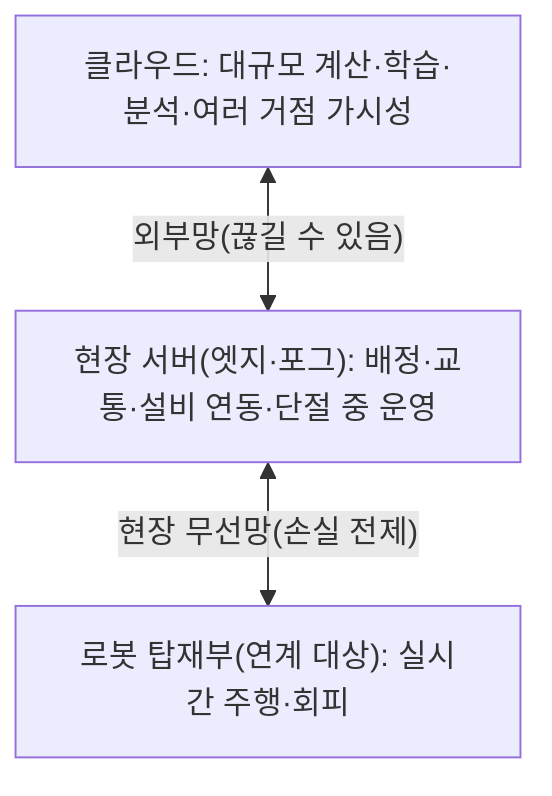

[홈](../../index.md) › [주제](../index.md) › 11. 분산 시스템·통신·컴퓨팅 구조 — 대표 접근법과 기술

# 11. 분산 시스템·통신·컴퓨팅 구조 — 대표 접근법과 기술

<!-- auto:page-status:start -->
<!-- auto:page-status:end -->

## 1. 세 줄 요약

- 공개 자료가 다루는 접근법은 분산 발견과 라우터 연결, 손실을 전제한 메시지 설계, 엣지의 단절 중 운영, 클라우드·포그로의 계산 이전, 관제 서버 가용성과 다거점 구성으로 나눌 수 있다. [의견]
- 이 페이지는 [11. 분산 시스템·통신·컴퓨팅 구조](../../categories/c-connectivity-and-execution-foundation/11-distributed-systems-communication-and-computing.md) 페이지의 "대표 접근법과 기술" 절이 분량 기준을 넘어 옮겨 온 것이다. 원 페이지의 검증을 거친 내용이며 새 주장은 없다.

## 2. 배경

[11. 분산 시스템·통신·컴퓨팅 구조](../../categories/c-connectivity-and-execution-foundation/11-distributed-systems-communication-and-computing.md) 페이지를 쓰는 과정에서 "대표 접근법과 기술" 절의 분량이 세부영역 페이지 기준(4,000자)을 넘어, 내용을 줄이지 않고 이 주제 페이지로 분리했다.

## 3. 본문

공개 자료가 다루는 접근법은 분산 발견과 라우터 연결, 손실을 전제한 메시지 설계, 엣지의 단절 중 운영, 클라우드·포그로의 계산 이전, 관제 서버 가용성과 다거점 구성으로 나눌 수 있다. [의견]

### 중앙 마스터 없는 발견과 라우터 연결

ROS 2는 DDS의 분산 발견으로 중앙 마스터라는 단일 장애점을 없앴다. [사실][^ref-297] Zenoh 기반 미들웨어 rmw_zenoh는 기본적으로 Zenoh 라우터를 거쳐 가십(gossip)으로 발견 정보를 주고받고 멀티캐스트 발견은 꺼 두며, 서로 다른 호스트를 이으려면 한쪽 라우터가 다른 라우터의 엔드포인트에 연결하도록 설정한다. [사실][^ref-299] Open-RMF free_fleet는 플릿 어댑터와 로봇 사이를 Zenoh로 잇고, 로봇 이름을 네임스페이스로 한 zenoh-bridge-ros2dds를 로봇마다 두며, 라우터를 어댑터와 같은 네트워크에서 실행해 로봇 쪽과 관제 쪽 ROS 2 도메인을 분리한다. [사실][^ref-256]

### 손실을 전제한 메시지 설계

VDA 5050(3.0.0 기준)은 대부분 토픽에 QoS 0을, connection 토픽에만 QoS 1을 쓰고, 연결 시 브로커가 단절을 대신 알리는 last will 메시지를 등록하게 한다. [사실][^ref-031] 이번에 연 명세 본문에서 브로커 위치·허용 지연·대역폭·무선랜 요건 규정은 찾지 못했다(명세 전문을 글자 단위로 대조한 결과는 아니다). [추정][^ref-031]

### 엣지의 단절 중 자율 운영

KubeEdge는 클라우드 부분(CloudHub·EdgeController·DeviceController)과 엣지 부분(EdgeHub·Edged·MetaManager 등)으로 나뉘며, 클라우드–엣지 네트워크가 불안정하거나 엣지가 오프라인 상태에서 재시작되어도 엣지 노드와 애플리케이션이 자율적으로 계속 동작하도록 설계되었다고 밝힌다. [사실][^ref-300] 이 문서는 로봇 사례를 다루지 않는다. Azure IoT Edge 문서(2026-03-02)는 오프라인 동안 엣지 허브가 상위로 보낼 메시지를 재연결까지 저장하고 로컬 모듈·하위 장치를 인증해 현장 안 통신을 이어 가며, 메시지 보관 기본 수명은 7,200초이고 재연결 즉시 저장된 메시지를 보낸다고 설명한다. [추정] 벤더 주장[^ref-301]

### 클라우드·포그로의 계산 이전 선례

이 갈래는 로봇 인식·계획 계산을 옮긴 연구로, ROP가 맡는 기능이 아니라 계산 배치 선례로만 참고한다. [의견] Kehoe 외(2015)는 클라우드가 로봇·자동화에 주는 이점을 빅데이터 접근, 온디맨드 병렬 계산, 로봇 간 집단 학습, 사람 계산 네 가지로 정리했다. [사실][^ref-305] FogROS2 저자들은 ROS 2 노드를 클라우드·포그로 넘기는 이 플랫폼이 실험에서 SLAM 지연을 50% 줄이고 파지 계획 시간을 14초에서 1.2초로, 동작 계획을 45배 빠르게 했다고 보고했다(저자 보고값, 실험 조건 미확인). [추정][^ref-304] Brorsson 외(2025-12)는 공장 내 물류용 자율이동로봇에 대해 인프라 장착 센서·클라우드 컴퓨팅·로봇 탑재 지능을 결합한 참조 구조를 제시했다. [추정][^ref-308]

### 관제 서버 가용성과 다거점 구성

MiR Fleet Enterprise 문서(1.2판, 2025-01)는 이 플릿 관리 소프트웨어가 선택적 이중화(redundancy)와 클라우드·가상 환경 배치를 지원한다고 소개하며, 이중화 방식은 미확인이다. [추정] 벤더 주장[^ref-227] Open-RMF rmf-web의 API 서버는 ROS 2 기반 RMF와 웹 클라이언트 사이를 잇는 별도 서비스로, 플릿 어댑터가 이 엔드포인트로 작업·로봇 상태를 보내며, 기본 설정은 비영속 내부 데이터베이스이고 설정 파일로 영속 저장소를 지정할 수 있다. [사실][^ref-302] rmw_zenoh의 라우터 간 연결, free_fleet의 로봇별 Zenoh 브리지, ROS 2 기반 RMF와 웹 클라이언트 사이의 별도 서비스인 rmf-web API 서버를 보면 오픈소스 스택만으로도 거점마다 현장 코어를 두고 라우터·API로 중앙에 모으는 다거점 구성이 가능해 보이나, Open-RMF 다거점 운영의 공개 사례는 찾지 못했다. [추정][^ref-299][^ref-256][^ref-302]

### 층별 역할 분담(이 위키의 종합)

확인한 자료를 종합하면 현장 서버(엣지·포그)가 지연에 민감한 배정·교통·설비 연동과 단절 중 운영 지속을, 클라우드가 대규모 계산·학습·분석·여러 거점 가시성을 맡는 층 구조로 정리될 것으로 보이며, 이 분담을 로봇 오케스트레이션 기준으로 제시한 단일 출처는 없다. [추정][^ref-303][^ref-305][^ref-304][^ref-308][^ref-309] 로봇 탑재부의 실시간 주행·회피는 이 구조의 맨 아래에 있지만 분류 원문 9장의 '로봇 자체 지능·제어'에 속하는 연계 대상이다.

## 4. 현장 시나리오

현장 시나리오는 원 페이지의 [5. 현장 시나리오 (물류 흐름의 어느 단계인지 명시)](../../categories/c-connectivity-and-execution-foundation/11-distributed-systems-communication-and-computing.md) 절에 있다.

## 5. ROP 관점의 시사점

ROP가 직접 맡는 것과 외부와 연계하는 것은 원 페이지의 [9. ROP가 직접 맡는 것과 외부와 연계하는 것 (부록 A 9장 기준)](../../categories/c-connectivity-and-execution-foundation/11-distributed-systems-communication-and-computing.md) 절에 있다.

## 6. 연결되는 연구영역

- 주 연구영역: [11. 분산 시스템·통신·컴퓨팅 구조](../../categories/c-connectivity-and-execution-foundation/11-distributed-systems-communication-and-computing.md)
- 관련 영역: [9. 로봇·제조사 관제 연동](../../categories/c-connectivity-and-execution-foundation/09-robot-and-vendor-fleet-manager-integration.md), [12. 명령·작업 실행의 신뢰성](../../categories/c-connectivity-and-execution-foundation/12-command-and-task-execution-reliability.md), [8. 실시간 세계 상태·데이터 일관성](../../categories/b-common-information-and-environment-model/08-real-time-world-state-and-data-consistency.md), [1. 주문·업무 시스템 연계](../../categories/a-business-supply-chain-design/01-order-and-business-system-integration.md), [20. 예외 복구·재계획·업무 연속성](../../categories/e-collaboration-and-field-operations/20-exception-recovery-replanning-and-business-continuity.md), [26. 사이버보안·접근권한·개인정보](../../categories/g-safety-security-intelligence-and-governance/26-cybersecurity-access-control-and-privacy.md), [3. 처리능력·거점·설비 계획](../../categories/a-business-supply-chain-design/03-capacity-site-and-facility-planning.md), [27. AI·학습·적응과 모델 운영](../../categories/g-safety-security-intelligence-and-governance/27-ai-learning-adaptation-and-model-operations.md)

## 7. 열린 질문

열린 질문은 원 페이지의 [11. 열린 질문](../../categories/c-connectivity-and-execution-foundation/11-distributed-systems-communication-and-computing.md) 절과 [열린 질문](../../open-questions.md) 페이지에 모은다.

## 8. 출처

[^ref-031]: VDA / VDMA (VDA5050 GitHub), VDA5050/VDA5050_EN.md — Official Specification document for the VDA 5050, 미확인, https://github.com/VDA5050/VDA5050/blob/main/VDA5050_EN.md, 접근일 2026-09-25
[^ref-227]: Mobile Industrial Robots(MiR), MiR Fleet Enterprise Documentation Version 1.2 (en) — 유통사(jk.de) 게재본, 2025-01, https://jk.de/media/a2/50/ce/1738939330/mir_fleet_enterprise_documentation_1.2_en.pdf?ts=1738939330, 접근일 2026-09-25 (원문 미열람)
[^ref-256]: Open Robotics (open-rmf), free_fleet — README (A free fleet management system), 미확인, https://github.com/open-rmf/free_fleet, 접근일 2026-09-25
[^ref-297]: ROS 2 Design, ROS on DDS, 미확인, https://design.ros2.org/articles/ros_on_dds.html, 접근일 2026-09-25
[^ref-299]: ROS 2 (ros2/rmw_zenoh GitHub), rmw_zenoh — README (A ROS 2 RMW implementation based on Zenoh), 미확인, https://github.com/ros2/rmw_zenoh, 접근일 2026-09-25
[^ref-300]: KubeEdge (CNCF, kubeedge GitHub), KubeEdge — README, 미확인, https://github.com/kubeedge/kubeedge, 접근일 2026-09-25
[^ref-301]: Microsoft, Operate Azure IoT Edge devices offline, 2026-03-02, https://learn.microsoft.com/en-us/azure/iot-edge/offline-capabilities, 접근일 2026-09-25
[^ref-302]: Open Robotics (open-rmf), rmf-web — README, 미확인, https://github.com/open-rmf/rmf-web, 접근일 2026-09-25
[^ref-303]: NIST, NIST Special Publication (SP) 500-325, Fog Computing Conceptual Model, 2018-03, https://csrc.nist.gov/pubs/sp/500/325/final, 접근일 2026-09-25 (원문 미열람)
[^ref-304]: Ichnowski, J., Chen, K. 외(UC Berkeley AUTOLAB), FogROS2: An Adaptive Platform for Cloud and Fog Robotics Using ROS 2, 2022-05, https://arxiv.org/abs/2205.09778, 접근일 2026-09-25 (원문 미열람)
[^ref-305]: Kehoe, B., Patil, S., Abbeel, P., & Goldberg, K., A Survey of Research on Cloud Robotics and Automation, 2015, https://escholarship.org/uc/item/3t04p9m1, 접근일 2026-09-25 (원문 미열람)
[^ref-308]: Brorsson, E. 외, Infrastructure-based Autonomous Mobile Robots for Internal Logistics -- Challenges and Future Perspectives, 2025-12, https://arxiv.org/abs/2512.15215, 접근일 2026-09-25 (원문 미열람)
[^ref-309]: FreightWaves, Warehouses face $100K-hour downtime risk as cloud outages mount, 미확인, https://www.freightwaves.com/news/warehouses-face-100k-hour-downtime-risk-hybrid-wms, 접근일 2026-09-25 (원문 미열람)

## 9. 검증 노트

원 페이지와 함께 실행 2026-09-25-27 의 1차·2차 검증을 거쳤다. 분리는 코드가 했고 내용은 바꾸지 않았다.

## 10. 이력

| 날짜 | 실행 id | 변경 |
|---|---|---|
| 2026-09-25 | 2026-09-25-27 | 11. 분산 시스템·통신·컴퓨팅 구조 의 "대표 접근법과 기술" 절에서 분리 |
