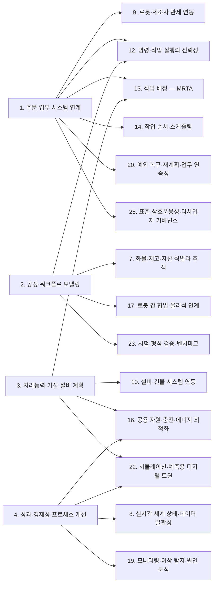

(너의 규칙은 시스템 프롬프트의 agents/shared-rules.md 와 agents/storyteller.md 이다. 아래는 이번 실행의 컨텍스트와 입력이다.)

## 실행 컨텍스트

- run_id: 2026-09-25-29
- date: 2026-09-25
- run_type: category_link (대분류 연결)
- 대상: 대분류 A. 업무·공급망 설계 페이지의 '다른 대분류와의 연결' 절(대분류 연결 실행). 게시된 세부영역 페이지를 근거로 다른 대분류와의 연결을 조사·서술한다. 스토리텔러는 그 절만 patches 로 바꾼다
- 예산:
    - max_search_queries: 30
    - max_sources_per_run: 15
    - new_topic_pages: 1
    - page_updates: 2
    - max_retries: 2
- 환경 알림: web_fetch_available: false · fetch_mode: mirror_only (일반 웹 페이지 열람은 네트워크 정책으로 막혀 있다. raw.githubusercontent.com 은 열린다: 공식 문서가 GitHub 에 있는 출처는 입력의 config/source_mirrors.yaml 경로를 WebFetch 로 열어 원문을 읽고 sources[].fetched=true, fetched_via=github_raw, fetch_url 을 적는다. 입력에 원문 텍스트(data/source_texts)가 있는 출처는 fetched_via=inbox. 그 밖의 출처는 fetched=false 이며 코드가 신뢰도 상한(medium)을 강제한다 — 공통 규칙 0절 6항)
- 언어: ko
- retry_count: 1
- max_retries: 2

## 입력

### runs/2026-09-25-29/target.json

```json
{
  "run_id": "2026-09-25-29",
  "date": "2026-09-25",
  "weekday": "Fri",
  "run_number": 29,
  "run_type": "category_link",
  "forced": true,
  "target": {
    "area_no": null,
    "area_name": null,
    "category": "A. 업무·공급망 설계",
    "category_letter": "A"
  },
  "topic": null,
  "track": null,
  "corrections": [],
  "budget": {
    "max_search_queries": 30,
    "max_sources_per_run": 15,
    "new_topic_pages": 1,
    "page_updates": 2,
    "max_retries": 2
  },
  "priority_reason": null,
  "priority_questions": [],
  "excluded_areas": [],
  "lifted_areas": [],
  "deferred": {
    "monthly_recheck": false,
    "weekly_review": false
  },
  "selection_rationale": "CLI 지정 run_type=category_link"
}
```

### runs/2026-09-25-29/research.json

```json
{
  "run_id": "2026-09-25-29",
  "date": "2026-09-25",
  "run_type": "category_link",
  "target": {
    "area_no": null,
    "area_name": null,
    "category": "A. 업무·공급망 설계"
  },
  "gaps": [
    "A. 업무·공급망 설계 페이지의 '다른 대분류와의 연결' 절 비어 있음(아직 작성되지 않음)",
    "연결 상대 세부영역 가운데 9. 로봇·제조사 관제 연동만 published 이고 나머지(10~28 대부분)는 seed 라, 연결의 근거는 A 쪽 게시 페이지 각주에 기댄다",
    "11. 분산 시스템·통신·컴퓨팅 구조와의 연결(클라우드 WMS 단절 시 현장 운영)은 2026-09-25-27 브리프에만 근거가 있고 게시 전이라 이번에 쓰지 않음",
    "21. 온보딩·설정·현장 시운전, 24. 자산·소프트웨어 수명주기 관리, 25. 안전·위험 관리, 26. 사이버보안·접근권한·개인정보, 27. AI·학습·적응과 모델 운영과 A. 업무·공급망 설계 세부영역 사이의 연결은 게시 페이지에 검증된 근거가 없음"
  ],
  "research_questions": [
    "무슨 일을 왜, 얼마나 해야 하는가? [분류원문]",
    "로봇 가동률 상승이 실제 출하량과 비용 개선으로 이어졌는가? [분류원문]",
    "1. 주문·업무 시스템 연계와 2. 공정·워크플로 모델링의 작업 요청·변경·완료 조건은 C. 연결·실행 기반(9. 로봇·제조사 관제 연동, 12. 명령·작업 실행의 신뢰성)의 어떤 인터페이스·상태로 넘어가는가?",
    "2. 공정·워크플로 모델링의 완료 조건은 B. 공통 정보·환경 모델의 7. 화물·재고·자산 식별과 추적과 E. 협업·현장 운영의 17. 로봇 간 협업·물리적 인계의 어떤 확인 신호에 기대는가?",
    "3. 처리능력·거점·설비 계획은 D. 계획·최적화(13. 작업 배정 — MRTA, 16. 공용 자원·충전·에너지 최적화), C. 연결·실행 기반의 10. 설비·건물 시스템 연동, F. 도입·검증·유지관리의 22. 시뮬레이션·예측용 디지털 트윈과 어떤 설정·제약·도구를 공유하는가?",
    "4. 성과·경제성·프로세스 개선의 지표 계산은 8. 실시간 세계 상태·데이터 일관성, 19. 모니터링·이상 탐지·원인 분석, 16. 공용 자원·충전·에너지 최적화와 어떤 데이터를 주고받는가?",
    "상위 작업 지시 표준(ISA-95 계열)과 로봇 인터페이스 사이 매핑 부재는 G. 안전·보안·지능·거버넌스의 28. 표준·상호운용성·다사업자 거버넌스와 어떻게 이어지는가?"
  ],
  "findings": [
    {
      "id": "f1",
      "claim": "A. 업무·공급망 설계의 1. 주문·업무 시스템 연계 ↔ C. 연결·실행 기반의 9. 로봇·제조사 관제 연동: VDA 5050 3.0.0 명세는 관제–이동로봇 통신과 무관한 인터페이스(주변 설비·인프라·외부 IT 시스템 인터페이스)를 범위에서 제외한다.",
      "tag": "사실",
      "source_ids": [
        "ref-031"
      ],
      "cross_checked": false,
      "confidence": "medium",
      "evidence_excerpt": "명세 원본: 'Interfaces unrelated to the communication between a fleet control system and mobile robots are excluded, such as interfaces to ... external IT systems.' (발행일 미확인, 확인일 기준)",
      "as_of": "2026-09-25",
      "flow_step": null,
      "flow_item": null
    },
    {
      "id": "f2",
      "claim": "A. 업무·공급망 설계의 1. 주문·업무 시스템 연계 ↔ C. 연결·실행 기반의 9. 로봇·제조사 관제 연동: 로봇 인터페이스가 상위 시스템 연동을 범위 밖에 두므로, 상위 주문을 로봇 작업 요청(Open-RMF 작업 요청 등)으로 번역하는 계층이 두 대분류가 넘겨받는 지점이 될 것으로 보인다.",
      "tag": "추정",
      "source_ids": [
        "ref-031",
        "ref-125"
      ],
      "cross_checked": false,
      "confidence": "low",
      "evidence_excerpt": "f1 과 Open-RMF task_request 스키마(1. 주문·업무 시스템 연계 페이지 9절 인용)를 대응시킨 추론. 번역 계층을 규정한 표준은 확인하지 못함. (재인용: 2026-09-25-13)",
      "as_of": "2026-09-25",
      "flow_step": null,
      "flow_item": "시작 조건"
    },
    {
      "id": "f3",
      "claim": "A. 업무·공급망 설계의 1. 주문·업무 시스템 연계 ↔ C. 연결·실행 기반의 12. 명령·작업 실행의 신뢰성: VDA 5050 은 진행 중 다른 주문을 받으면 로봇이 OTHER_ORDER_ACTIVE 오류(WARNING)를 보고하게 하고, 취소할 수 없는 동작은 cancelOrder 뒤에도 RUNNING 을 거쳐 FINISHED 또는 FAILED 로 보고하게 한다.",
      "tag": "사실",
      "source_ids": [
        "ref-031"
      ],
      "cross_checked": false,
      "confidence": "medium",
      "evidence_excerpt": "명세 원본: 'report an error of type OTHER_ORDER_ACTIVE and level WARNING'; 취소 불가 동작은 'RUNNING while it is running, and after that ... FINISHED ... FAILED'. (발행일 미확인, 확인일 기준)",
      "as_of": "2026-09-25",
      "flow_step": "피킹",
      "flow_item": "예외·성과"
    },
    {
      "id": "f4",
      "claim": "A. 업무·공급망 설계의 1. 주문·업무 시스템 연계 ↔ C. 연결·실행 기반의 12. 명령·작업 실행의 신뢰성: 상위 쪽 B2MML 거래 프로파일은 CHANGE·CANCEL 등 거래 동사를, OPC UA for ISA-95 Job Control 은 Update·Pause·Resume·Abort·Cancel 등 작업 지시 메서드를 정의한다.",
      "tag": "사실",
      "source_ids": [
        "ref-129",
        "ref-130"
      ],
      "cross_checked": false,
      "confidence": "medium",
      "evidence_excerpt": "B2MML-TransactionProfile.xsd 의 TransactionVerb1Type: NOTIFY, GET, PROCESS, CHANGE, CANCEL, CONFIRM, SYNC ADD 등. Job Control 노드셋 문서: Store, StoreAndStart, Start, RevokeStart, Pause, Resume, Update, Abort, Stop, Cancel, Clear.",
      "as_of": "2026-09-25",
      "flow_step": null,
      "flow_item": "시작 조건"
    },
    {
      "id": "f5",
      "claim": "A. 업무·공급망 설계의 1. 주문·업무 시스템 연계와 2. 공정·워크플로 모델링 ↔ C. 연결·실행 기반의 12. 명령·작업 실행의 신뢰성: Open-RMF 작업 상태 스키마는 queued·underway·completed·canceled·killed·failed 등 상태 값과 시작·종료 시각, 소요 시간 추정, 취소·강제 종료·중단 요청 기록을 담아 상위 시스템에 되돌릴 결과의 원천이 된다.",
      "tag": "사실",
      "source_ids": [
        "ref-111"
      ],
      "cross_checked": false,
      "confidence": "medium",
      "evidence_excerpt": "task_state.json 원본: status enum uninitialized, blocked, error, failed, queued, standby, underway, delayed, skipped, canceled, killed, completed; unix_millis_start_time/finish_time, estimate_millis, cancellation, killed, interruptions. (발행일 미확인, 확인일 기준)",
      "as_of": "2026-09-25",
      "flow_step": null,
      "flow_item": "완료·인계"
    },
    {
      "id": "f6",
      "claim": "A. 업무·공급망 설계의 1. 주문·업무 시스템 연계 ↔ D. 계획·최적화의 14. 작업 순서·스케줄링: 웨이브·웨이브리스 출고 지시 방식과 동적 주문 도착 시 재최적화 연구는 상위 시스템의 출고 지시·우선순위 변경이 작업 순서 결정 문제로 넘어가는 지점을 다룬다.",
      "tag": "추정",
      "source_ids": [
        "ref-134",
        "ref-133"
      ],
      "cross_checked": false,
      "confidence": "low",
      "evidence_excerpt": "1. 주문·업무 시스템 연계 페이지 8·10절의 두 연구(Gallien & Weber 2010, Lorenz 외 2025)를 순서 결정과 대응시킨 추론. 원문 미열람. (재인용: 2026-09-25-13)",
      "as_of": "2026-09-25",
      "flow_step": "피킹",
      "flow_item": "제약",
      "source_unopened": true
    },
    {
      "id": "f7",
      "claim": "A. 업무·공급망 설계의 1. 주문·업무 시스템 연계 ↔ D. 계획·최적화의 13. 작업 배정 — MRTA: 작업자가 피킹하고 AMR 이 운반하는 동적 주문 피킹 연구는 AMR 가용성에 따른 개입 전략을 다루어 주문 변경과 로봇 배정이 맞물리는 사례가 된다.",
      "tag": "추정",
      "source_ids": [
        "ref-132"
      ],
      "cross_checked": false,
      "confidence": "low",
      "evidence_excerpt": "Yu & Srinivas(2025) 동적 주문 피킹 연구의 설정·개입 전략을 1. 주문·업무 시스템 연계 페이지 10절이 13. 작업 배정 — MRTA 와 잇는 근거로 인용. 원문 미열람. (재인용: 2026-09-25-13)",
      "as_of": "2025",
      "flow_step": "피킹",
      "flow_item": "수행 자원",
      "source_unopened": true
    },
    {
      "id": "f8",
      "claim": "A. 업무·공급망 설계의 1. 주문·업무 시스템 연계 ↔ E. 협업·현장 운영의 20. 예외 복구·재계획·업무 연속성: 상위 시스템의 CANCEL 이 로봇이 이미 화물을 실은 뒤 오거나 취소 불가 동작이 끝까지 수행되면 되돌림 작업과 재고 반영이 복구·재계획 과제로 넘어갈 것으로 보인다.",
      "tag": "추정",
      "source_ids": [
        "ref-031",
        "ref-129"
      ],
      "cross_checked": false,
      "confidence": "low",
      "evidence_excerpt": "f3(취소 불가 동작)·f4(CANCEL 동사)를 대응시킨 추론. 되돌림 규칙을 정한 표준·사례는 확인하지 못함(oq-021).",
      "as_of": "2026-09-25",
      "flow_step": "출하",
      "flow_item": "예외·성과"
    },
    {
      "id": "f9",
      "claim": "A. 업무·공급망 설계의 2. 공정·워크플로 모델링 ↔ B. 공통 정보·환경 모델의 7. 화물·재고·자산 식별과 추적: GS1 CBV 는 arriving(객체가 위치에 도착), receiving(수령자 재고에 추가), accepting(점유·소유 변경)을 서로 다른 업무 단계로 정의하고, VDA 5050 은 drop 완료를 적재물이 로봇을 떠나 로봇이 새 적재 상태를 보고한 때로 정의한다.",
      "tag": "사실",
      "source_ids": [
        "ref-044",
        "ref-031"
      ],
      "cross_checked": false,
      "confidence": "medium",
      "evidence_excerpt": "CBV.ttl: receiving 'is added to the receiver's inventory', accepting 'changes possession and/or ownership'. VDA 5050: 'Load has left the mobile robot and mobile robot reports new load state.'",
      "as_of": "2026-09-25",
      "flow_step": "입고",
      "flow_item": "완료·인계"
    },
    {
      "id": "f10",
      "claim": "A. 업무·공급망 설계의 2. 공정·워크플로 모델링 ↔ B. 공통 정보·환경 모델의 7. 화물·재고·자산 식별과 추적: 로봇 완료 신호는 arriving 수준의 물리적 인도에 가까우므로, 공정 모델의 '인수 확인·재고 반영 완료' 조건은 7번이 다루는 식별자와 receiving·accepting 이벤트에 기대야 할 것으로 보인다.",
      "tag": "추정",
      "source_ids": [
        "ref-044",
        "ref-031",
        "ref-049"
      ],
      "cross_checked": false,
      "confidence": "low",
      "evidence_excerpt": "f9 와 IngestorResult 필드(f11)를 대응시킨 추론. 이 구성을 적용한 표준·사례는 확인하지 못함(oq-001, oq-012). (재인용: 2026-09-25-09)",
      "as_of": "2026-09-25",
      "flow_step": "입고",
      "flow_item": "완료·인계"
    },
    {
      "id": "f11",
      "claim": "A. 업무·공급망 설계의 2. 공정·워크플로 모델링 ↔ E. 협업·현장 운영의 17. 로봇 간 협업·물리적 인계: Open-RMF 배송 작업에서 로봇은 하역 지점 워크셀에 IngestorResult 를 받을 때까지 IngestorRequest 를 보내며, IngestorResult 는 요청 id·워크셀 id·상태(ACKNOWLEDGED, SUCCESS, FAILED)만 담는다.",
      "tag": "사실",
      "source_ids": [
        "ref-023",
        "ref-049"
      ],
      "cross_checked": false,
      "confidence": "medium",
      "evidence_excerpt": "워크셀 장 원본: 'Requests a IngestorRequest till receives a IngestorResult'. IngestorResult.msg: request_guid, source_guid, status ACKNOWLEDGED=0 SUCCESS=1 FAILED=2. (발행일 미확인, 확인일 기준)",
      "as_of": "2026-09-25",
      "flow_step": "입고",
      "flow_item": "완료·인계"
    },
    {
      "id": "f12",
      "claim": "A. 업무·공급망 설계의 2. 공정·워크플로 모델링 ↔ F. 도입·검증·유지관리의 23. 시험·형식 검증·벤치마크: 워크플로 넷의 건전성(soundness) 판정 복잡도를 다룬 연구가 있어, 공정 모델의 형식적 설계 점검이 형식 검증과 이어질 것으로 보인다.",
      "tag": "추정",
      "source_ids": [
        "ref-121"
      ],
      "cross_checked": false,
      "confidence": "low",
      "evidence_excerpt": "2. 공정·워크플로 모델링 페이지 6절이 네 접근 가운데 하나로 든 Blondin 외(LICS 2022). 물류 로봇 공정에 적용한 사례는 확인하지 못함. 원문 미열람. (재인용: 2026-09-25-09)",
      "as_of": "2022",
      "flow_step": null,
      "flow_item": null,
      "source_unopened": true
    },
    {
      "id": "f13",
      "claim": "A. 업무·공급망 설계의 3. 처리능력·거점·설비 계획 ↔ D. 계획·최적화의 16. 공용 자원·충전·에너지 최적화: AMR 물류센터 시뮬레이션 연구에서 충전기가 부족하면 큰 지연이, 과잉이면 불필요한 비용이 생겼고, RMFS 의 충전·배터리 교환 전략 비교도 연구되어 있다.",
      "tag": "사실",
      "source_ids": [
        "ref-102",
        "ref-098"
      ],
      "cross_checked": false,
      "confidence": "medium",
      "evidence_excerpt": "3. 처리능력·거점·설비 계획 페이지 3·10절 인용(FAIM 2025 시뮬레이션, Zou 외 2018). 두 출처는 서로 다른 주장을 뒷받침하며 교차 확인이 아님. 원문 미열람. (재인용: 2026-09-25-10)",
      "as_of": "2025",
      "flow_step": "피킹",
      "flow_item": "제약",
      "source_unopened": true
    },
    {
      "id": "f14",
      "claim": "A. 업무·공급망 설계의 3. 처리능력·거점·설비 계획 ↔ D. 계획·최적화의 13. 작업 배정 — MRTA: Open-RMF 플릿 어댑터 템플릿 설정은 배터리가 recharge_threshold(예 0.10) 아래인 로봇은 작업하지 않게 하고 충전 목표(recharge_soc), 로봇별 충전기, 작업 종료 후 동작(park·charge·nothing)을 둔다.",
      "tag": "사실",
      "source_ids": [
        "ref-105"
      ],
      "cross_checked": false,
      "confidence": "medium",
      "evidence_excerpt": "config.yaml 원본: 'recharge_threshold: 0.10 # Battery level below which robots in this fleet will not operate', finishing_request: 'park' # [park, charge, nothing]. (발행일 미확인, 확인일 기준)",
      "as_of": "2026-09-25",
      "flow_step": null,
      "flow_item": "제약"
    },
    {
      "id": "f15",
      "claim": "A. 업무·공급망 설계의 3. 처리능력·거점·설비 계획 ↔ C. 연결·실행 기반의 10. 설비·건물 시스템 연동: Open-RMF 데모의 호텔 환경은 승강기 2대·여러 문·3개 플릿(로봇 4대)이 다층 건물에서 함께 일하는 통합을 보이며, 공간과 승강기·문 같은 건물 설비를 공유하는 로봇 교통을 관리한다고 설명한다.",
      "tag": "사실",
      "source_ids": [
        "ref-104"
      ],
      "cross_checked": false,
      "confidence": "medium",
      "evidence_excerpt": "rmf_demos README 원본: 'The hotel has two lifts, multiple doors and 3 robot fleets (4 robots).' (발행일 미확인, 확인일 기준)",
      "as_of": "2026-09-25",
      "flow_step": null,
      "flow_item": "수행 자원"
    },
    {
      "id": "f16",
      "claim": "A. 업무·공급망 설계의 3. 처리능력·거점·설비 계획 ↔ C. 연결·실행 기반의 10. 설비·건물 시스템 연동: 병원 약품 배송 로봇 사례에서는 승강기 가동률이 높을수록 배송 실패가 많고 배송 시간이 길었으며, 호텔 연구는 승강기를 경로 계획 안의 대기·운행 시간으로 모델링했다(물류센터 적용 여부는 미확인).",
      "tag": "사실",
      "source_ids": [
        "ref-060",
        "ref-103"
      ],
      "cross_checked": false,
      "confidence": "medium",
      "evidence_excerpt": "3. 처리능력·거점·설비 계획 페이지 3·9절 인용. 병원·호텔 사례이며 물류센터 근거 아님(oq-010). 원문 미열람. (재인용: 2026-09-25-10)",
      "as_of": "2026",
      "flow_step": null,
      "flow_item": "제약",
      "source_unopened": true
    },
    {
      "id": "f17",
      "claim": "A. 업무·공급망 설계의 3. 처리능력·거점·설비 계획 ↔ F. 도입·검증·유지관리의 22. 시뮬레이션·예측용 디지털 트윈: RAWSim-O 는 RMFS 운영의 여러 결정 문제의 효과를 연구하는 이산 사건 시뮬레이션으로, 증차·증설 같은 가정한 미래의 실험 도구가 된다.",
      "tag": "사실",
      "source_ids": [
        "ref-101"
      ],
      "cross_checked": false,
      "confidence": "medium",
      "evidence_excerpt": "README 원본: 'a discrete event-based simulation for Robotic Mobile Fulfillment Systems ... researching effects of multiple decision problems'. 8. 실시간 세계 상태·데이터 일관성과 구분. (발행일 미확인, 확인일 기준)",
      "as_of": "2026-09-25",
      "flow_step": null,
      "flow_item": null
    },
    {
      "id": "f18",
      "claim": "A. 업무·공급망 설계의 4. 성과·경제성·프로세스 개선 ↔ B. 공통 정보·환경 모델의 8. 실시간 세계 상태·데이터 일관성: Open-RMF 로봇 상태 스키마는 상태(idle·charging·working·error 등), 배터리(0~1), 현재 작업 id, 운영자가 처리할 문제 목록, 위치, 기록 시각을 담아 가동률·충전·오류 시간 지표의 원천이 된다.",
      "tag": "사실",
      "source_ids": [
        "ref-148"
      ],
      "cross_checked": false,
      "confidence": "medium",
      "evidence_excerpt": "robot_state.json 원본: status uninitialized, offline, shutdown, idle, charging, working, error; battery 0.0~1.0; task_id; issues; location; unix_millis_time. (발행일 미확인, 확인일 기준)",
      "as_of": "2026-09-25",
      "flow_step": null,
      "flow_item": "예외·성과"
    },
    {
      "id": "f19",
      "claim": "A. 업무·공급망 설계의 4. 성과·경제성·프로세스 개선 ↔ E. 협업·현장 운영의 19. 모니터링·이상 탐지·원인 분석: 제조 병목 탐지 방법과 창고 이벤트 로그 프로세스 마이닝 연구를 로봇 상태 기록에 적용하면 성과 분석과 이상·원인 분석이 같은 로그를 공유할 것으로 보인다.",
      "tag": "추정",
      "source_ids": [
        "ref-115",
        "ref-149",
        "ref-148"
      ],
      "cross_checked": false,
      "confidence": "low",
      "evidence_excerpt": "4. 성과·경제성·프로세스 개선 페이지 10절의 연결 근거(병목 탐지 리뷰 2023, 창고 프로세스 마이닝 사례 2015)를 f18 과 대응시킨 추론. 적용 연구는 미확인(oq-018). (재인용: 2026-09-25-14)",
      "as_of": "2026-09-25",
      "flow_step": null,
      "flow_item": "예외·성과",
      "source_unopened": false
    },
    {
      "id": "f20",
      "claim": "A. 업무·공급망 설계의 4. 성과·경제성·프로세스 개선 ↔ D. 계획·최적화의 16. 공용 자원·충전·에너지 최적화: Omega(2024) 게재 연구는 RMFS 에서 동적 우선순위 규칙이 선착순 대비 에너지 소비를 3.41% 줄이고 처리량을 26.07% 높였다고 보고했다(모델·시뮬레이션 조건, 저자 보고값).",
      "tag": "사실",
      "source_ids": [
        "ref-146"
      ],
      "cross_checked": false,
      "confidence": "medium",
      "evidence_excerpt": "4. 성과·경제성·프로세스 개선 페이지 5절 인용 수치. 현장 실측 아님. 원문 미열람. (재인용: 2026-09-25-14)",
      "as_of": "2024",
      "flow_step": "피킹",
      "flow_item": "예외·성과",
      "source_unopened": true
    },
    {
      "id": "f21",
      "claim": "A. 업무·공급망 설계의 4. 성과·경제성·프로세스 개선 ↔ F. 도입·검증·유지관리의 22. 시뮬레이션·예측용 디지털 트윈: 우선순위 정책·충전 대안을 운영 전에 비교하는 일은 가정한 미래를 실험하는 쪽이며, 현재 상태를 표현하는 8. 실시간 세계 상태·데이터 일관성과 역할을 나눠 연결될 것으로 보인다.",
      "tag": "추정",
      "source_ids": [
        "ref-146",
        "ref-102"
      ],
      "cross_checked": false,
      "confidence": "low",
      "evidence_excerpt": "4. 성과·경제성·프로세스 개선 페이지 10절 연결 서술과 분류 원문 7장의 8·22 구분을 대응시킨 추론. 원문 미열람. (재인용: 2026-09-25-14)",
      "as_of": "2026-09-25",
      "flow_step": null,
      "flow_item": null,
      "source_unopened": true
    },
    {
      "id": "f22",
      "claim": "A. 업무·공급망 설계의 1. 주문·업무 시스템 연계 ↔ G. 안전·보안·지능·거버넌스의 28. 표준·상호운용성·다사업자 거버넌스: ISA-95 계열 작업 지시 동사·메서드와 VDA 5050·Open-RMF 의 주문·작업 요청 사이 표준 매핑은 이번까지 확인되지 않아, 번역 규칙의 소유와 변경 승인이 상호운용성 거버넌스 과제로 넘어갈 것으로 보인다.",
      "tag": "추정",
      "source_ids": [
        "ref-129",
        "ref-130",
        "ref-031",
        "ref-125"
      ],
      "cross_checked": false,
      "confidence": "low",
      "evidence_excerpt": "f1·f4 와 1. 주문·업무 시스템 연계 페이지 10절 28번 연결을 대응시킨 추론. 매핑 부재는 검색 범위의 관찰(oq-020).",
      "as_of": "2026-09-25",
      "flow_step": null,
      "flow_item": null
    }
  ],
  "sources": [
    {
      "id": "ref-031",
      "org": "VDA / VDMA (VDA5050 GitHub)",
      "title": "VDA5050/VDA5050_EN.md — Official Specification document for the VDA 5050",
      "published": null,
      "url": "https://github.com/VDA5050/VDA5050/blob/main/VDA5050_EN.md",
      "type": "표준",
      "reliability": "high",
      "accessed": "2026-09-25",
      "summary": "VDA 5050 공식 명세(main 3.0.0). 범위 제외, OTHER_ORDER_ACTIVE, 취소 불가 동작, drop 완료 정의를 원문으로 확인.",
      "fetched": true,
      "fetched_via": "github_raw",
      "fetch_url": "https://raw.githubusercontent.com/VDA5050/VDA5050/main/VDA5050_EN.md",
      "source_unopened": false
    },
    {
      "id": "ref-125",
      "org": "Open Robotics (open-rmf)",
      "title": "rmf_api_msgs — rmf_api_msgs/schemas/task_request.json",
      "published": null,
      "url": "https://github.com/open-rmf/rmf_api_msgs/blob/main/rmf_api_msgs/schemas/task_request.json",
      "type": "오픈소스 문서",
      "reliability": "medium",
      "accessed": "2026-09-25",
      "summary": "원문 미열람. Open-RMF 작업 요청 스키마(이번 실행에서 다시 열지 않음).",
      "fetched": false,
      "fetched_via": null,
      "fetch_url": null,
      "source_unopened": true
    },
    {
      "id": "ref-111",
      "org": "Open Robotics (open-rmf)",
      "title": "rmf_api_msgs — rmf_api_msgs/schemas/task_state.json",
      "published": null,
      "url": "https://github.com/open-rmf/rmf_api_msgs/blob/main/rmf_api_msgs/schemas/task_state.json",
      "type": "오픈소스 문서",
      "reliability": "high",
      "accessed": "2026-09-25",
      "summary": "Open-RMF 작업 상태 스키마. 상태 값, 시작·종료 시각, 추정 시간, 취소·강제 종료·중단 기록을 원문으로 확인.",
      "fetched": true,
      "fetched_via": "github_raw",
      "fetch_url": "https://raw.githubusercontent.com/open-rmf/rmf_api_msgs/main/rmf_api_msgs/schemas/task_state.json",
      "source_unopened": false
    },
    {
      "id": "ref-129",
      "org": "MESA International",
      "title": "B2MML-BatchML/Schema/B2MML-TransactionProfile.xsd",
      "published": "2023",
      "url": "https://github.com/MESAInternational/B2MML-BatchML/blob/master/Schema/B2MML-TransactionProfile.xsd",
      "type": "표준",
      "reliability": "medium",
      "accessed": "2026-09-25",
      "summary": "B2MML 거래 프로파일 스키마. TransactionVerb1Type 의 동사(CHANGE, CANCEL 등)를 원문으로 확인.",
      "fetched": true,
      "fetched_via": "github_raw",
      "fetch_url": "https://raw.githubusercontent.com/MESAInternational/B2MML-BatchML/master/Schema/B2MML-TransactionProfile.xsd",
      "source_unopened": false
    },
    {
      "id": "ref-130",
      "org": "OPC Foundation",
      "title": "UA-Nodeset ISA95-JOBCONTROL — opc.ua.isa95-jobcontrol.nodeset2 (NodeSet2.xml·documentation.csv)",
      "published": "2024-01-31",
      "url": "https://github.com/OPCFoundation/UA-Nodeset/tree/latest/ISA95-JOBCONTROL",
      "type": "표준",
      "reliability": "medium",
      "accessed": "2026-09-25",
      "summary": "OPC UA for ISA-95 Job Control 노드셋 문서. 작업 지시 수신 객체의 메서드(Store~Clear)를 원문으로 확인.",
      "fetched": true,
      "fetched_via": "github_raw",
      "fetch_url": "https://raw.githubusercontent.com/OPCFoundation/UA-Nodeset/latest/ISA95-JOBCONTROL/opc.ua.isa95-jobcontrol.nodeset2.documentation.csv",
      "source_unopened": false
    },
    {
      "id": "ref-132",
      "org": "Yu, S., & Srinivas, S.",
      "title": "Collaborative Human–Robot Teaming for Dynamic Order Picking: Interventionist strategies for improving warehouse intralogistics operations",
      "published": "2025",
      "url": "https://www.sciencedirect.com/science/article/abs/pii/S1366554525001231",
      "type": "논문",
      "reliability": "medium",
      "accessed": "2026-09-25",
      "summary": "원문 미열람. 작업자 피킹·AMR 운반 협업의 동적 주문 피킹과 개입 전략 연구.",
      "fetched": false,
      "fetched_via": null,
      "fetch_url": null,
      "source_unopened": true
    },
    {
      "id": "ref-133",
      "org": "Lorenz, Otto, & Gendreau (Networks, Wiley)",
      "title": "Picking Operations in Warehouses With Dynamically Arriving Orders: How Good is Reoptimization?",
      "published": "2025",
      "url": "https://onlinelibrary.wiley.com/doi/full/10.1002/net.22281",
      "type": "논문",
      "reliability": "medium",
      "accessed": "2026-09-25",
      "summary": "원문 미열람. 동적으로 도착하는 주문에서 피킹 재최적화 효과를 다룬 연구.",
      "fetched": false,
      "fetched_via": null,
      "fetch_url": null,
      "source_unopened": true
    },
    {
      "id": "ref-134",
      "org": "Gallien, J., & Weber, T. G.",
      "title": "To Wave or Not to Wave? Order Release Policies for Warehouses with an Automated Sorter",
      "published": "2010",
      "url": "https://pubsonline.informs.org/doi/abs/10.1287/msom.1100.0291",
      "type": "논문",
      "reliability": "medium",
      "accessed": "2026-09-25",
      "summary": "원문 미열람. 웨이브·웨이브리스 출고 지시 정책 비교 연구.",
      "fetched": false,
      "fetched_via": null,
      "fetch_url": null,
      "source_unopened": true
    },
    {
      "id": "ref-044",
      "org": "GS1",
      "title": "gs1/EPCIS — Ontology/CBV.ttl (Core Business Vocabulary ontology 2.0)",
      "published": "2021-09-30",
      "url": "https://github.com/gs1/EPCIS/blob/master/Ontology/CBV.ttl",
      "type": "표준",
      "reliability": "high",
      "accessed": "2026-09-25",
      "summary": "CBV 온톨로지 원본. arriving·receiving·accepting·loading·unloading 업무 단계 정의를 원문으로 확인.",
      "fetched": true,
      "fetched_via": "github_raw",
      "fetch_url": "https://raw.githubusercontent.com/gs1/EPCIS/master/Ontology/CBV.ttl",
      "source_unopened": false
    },
    {
      "id": "ref-023",
      "org": "Open Robotics",
      "title": "Workcells - Programming Multiple Robots with ROS 2",
      "published": null,
      "url": "https://osrf.github.io/ros2multirobotbook/integration_workcells.html",
      "type": "오픈소스 문서",
      "reliability": "high",
      "accessed": "2026-09-25",
      "summary": "Open-RMF 워크셀(디스펜서·인제스터) 연동 장. 배송 작업의 요청–결과 반복을 mdBook 원본으로 확인.",
      "fetched": true,
      "fetched_via": "github_raw",
      "fetch_url": "https://raw.githubusercontent.com/osrf/ros2multirobotbook/master/src/integration_workcells.md",
      "source_unopened": false
    },
    {
      "id": "ref-049",
      "org": "Open Robotics (open-rmf)",
      "title": "rmf_internal_msgs — rmf_ingestor_msgs/msg/IngestorResult.msg",
      "published": null,
      "url": "https://github.com/open-rmf/rmf_internal_msgs/blob/main/rmf_ingestor_msgs/msg/IngestorResult.msg",
      "type": "오픈소스 문서",
      "reliability": "high",
      "accessed": "2026-09-25",
      "summary": "IngestorResult 메시지 정의. 요청 id·워크셀 id·상태 세 값을 원문으로 확인.",
      "fetched": true,
      "fetched_via": "github_raw",
      "fetch_url": "https://raw.githubusercontent.com/open-rmf/rmf_internal_msgs/main/rmf_ingestor_msgs/msg/IngestorResult.msg",
      "source_unopened": false
    },
    {
      "id": "ref-121",
      "org": "Blondin, M., Mazowiecki, F., & Offtermatt, P. (LICS 2022)",
      "title": "The complexity of soundness in workflow nets",
      "published": "2022",
      "url": "https://arxiv.org/abs/2201.05588",
      "type": "논문",
      "reliability": "medium",
      "accessed": "2026-09-25",
      "summary": "원문 미열람. 워크플로 넷 건전성 판정의 계산 복잡도 연구.",
      "fetched": false,
      "fetched_via": null,
      "fetch_url": null,
      "source_unopened": true
    },
    {
      "id": "ref-102",
      "org": "Springer(FAIM 2025 발표 논문, 저자 미확인)",
      "title": "Simulation-Driven Approach for Dimensioning AMR Fleets in Distribution Centre Logistics",
      "published": "2025",
      "url": "https://link.springer.com/chapter/10.1007/978-3-032-07675-5_69",
      "type": "논문",
      "reliability": "medium",
      "accessed": "2026-09-25",
      "summary": "원문 미열람. 유통 물류센터 팔레트 이동 데이터로 AMR 플릿·충전기 규모를 시뮬레이션한 연구.",
      "fetched": false,
      "fetched_via": null,
      "fetch_url": null,
      "source_unopened": true
    },
    {
      "id": "ref-098",
      "org": "Zou, B., Gong, Y., de Koster, R., & Xu, X.",
      "title": "Evaluating battery charging and swapping strategies in a robotic mobile fulfillment system",
      "published": "2018",
      "url": "https://www.sciencedirect.com/science/article/abs/pii/S0377221717310901",
      "type": "논문",
      "reliability": "medium",
      "accessed": "2026-09-25",
      "summary": "원문 미열람. RMFS 의 충전·배터리 교환 전략을 대기행렬 모델로 비교한 연구.",
      "fetched": false,
      "fetched_via": null,
      "fetch_url": null,
      "source_unopened": true
    },
    {
      "id": "ref-104",
      "org": "Open Robotics (open-rmf)",
      "title": "rmf_demos — Demonstrations of Open-RMF (README)",
      "published": null,
      "url": "https://github.com/open-rmf/rmf_demos",
      "type": "오픈소스 문서",
      "reliability": "high",
      "accessed": "2026-09-25",
      "summary": "Open-RMF 데모 README. 호텔·클리닉·공항 환경의 다중 플릿·승강기·문 공유를 원문으로 확인.",
      "fetched": true,
      "fetched_via": "github_raw",
      "fetch_url": "https://raw.githubusercontent.com/open-rmf/rmf_demos/main/README.md",
      "source_unopened": false
    },
    {
      "id": "ref-060",
      "org": "Lee, Y. 외(Digital Health)",
      "title": "Feasibility of autonomous medication delivery robots considering elevator utilization in high-traffic hospital environments",
      "published": "2026",
      "url": "https://doi.org/10.1177/20552076261437181",
      "type": "논문",
      "reliability": "medium",
      "accessed": "2026-09-25",
      "summary": "원문 미열람. 병원 약품 배송 로봇의 승강기 가동률과 배송 실패·시간 관계를 관찰한 연구.",
      "fetched": false,
      "fetched_via": null,
      "fetch_url": null,
      "source_unopened": true
    },
    {
      "id": "ref-103",
      "org": "PMC 게재 논문(저자 미확인)",
      "title": "The Path Planning Problem of Robotic Delivery in Multi-Floor Hotel Environments",
      "published": null,
      "url": "https://pmc.ncbi.nlm.nih.gov/articles/PMC11946681/",
      "type": "논문",
      "reliability": "medium",
      "accessed": "2026-09-25",
      "summary": "원문 미열람. 다층 호텔 배송 로봇 경로 계획에서 승강기 대기·운행 시간을 모델링한 연구.",
      "fetched": false,
      "fetched_via": null,
      "fetch_url": null,
      "source_unopened": true
    },
    {
      "id": "ref-105",
      "org": "Open Robotics (open-rmf)",
      "title": "fleet_adapter_template — fleet_adapter_template/config.yaml",
      "published": null,
      "url": "https://github.com/open-rmf/fleet_adapter_template/blob/main/fleet_adapter_template/config.yaml",
      "type": "오픈소스 문서",
      "reliability": "high",
      "accessed": "2026-09-25",
      "summary": "Open-RMF 플릿 어댑터 템플릿 설정. 충전 임계값·충전 목표·충전기·작업 종료 후 동작을 원문으로 확인.",
      "fetched": true,
      "fetched_via": "github_raw",
      "fetch_url": "https://raw.githubusercontent.com/open-rmf/fleet_adapter_template/main/fleet_adapter_template/config.yaml",
      "source_unopened": false
    },
    {
      "id": "ref-101",
      "org": "Merschformann, M. (RAWSim-O GitHub)",
      "title": "RAWSim-O: A simulation framework for Robotic Mobile Fulfillment Systems (README)",
      "published": null,
      "url": "https://github.com/merschformann/RAWSim-O",
      "type": "오픈소스 문서",
      "reliability": "high",
      "accessed": "2026-09-25",
      "summary": "RMFS 용 이산 사건 시뮬레이션 프레임워크 README를 원문으로 확인.",
      "fetched": true,
      "fetched_via": "github_raw",
      "fetch_url": "https://raw.githubusercontent.com/merschformann/RAWSim-O/master/README.md",
      "source_unopened": false
    },
    {
      "id": "ref-148",
      "org": "Open Robotics (open-rmf)",
      "title": "rmf_api_msgs — rmf_api_msgs/schemas/robot_state.json",
      "published": null,
      "url": "https://github.com/open-rmf/rmf_api_msgs/blob/main/rmf_api_msgs/schemas/robot_state.json",
      "type": "오픈소스 문서",
      "reliability": "high",
      "accessed": "2026-09-25",
      "summary": "Open-RMF 로봇 상태 스키마. 상태 값·배터리·작업 id·문제 목록·위치·시각을 원문으로 확인.",
      "fetched": true,
      "fetched_via": "github_raw",
      "fetch_url": "https://raw.githubusercontent.com/open-rmf/rmf_api_msgs/main/rmf_api_msgs/schemas/robot_state.json",
      "source_unopened": false
    },
    {
      "id": "ref-115",
      "org": "Production & Manufacturing Research 게재 논문(저자 미확인, Chalmers 공개본)",
      "title": "Throughput bottleneck detection in manufacturing: a systematic review of the literature on methods and operationalization modes",
      "published": "2023",
      "url": "https://www.tandfonline.com/doi/full/10.1080/21693277.2023.2283031",
      "type": "논문",
      "reliability": "medium",
      "accessed": "2026-09-25",
      "summary": "원문 미열람. 제조 처리량 병목 탐지 방법의 체계적 문헌 검토.",
      "fetched": false,
      "fetched_via": null,
      "fetch_url": null,
      "source_unopened": true
    },
    {
      "id": "ref-149",
      "org": "Springer(학술대회 발표 논문, 저자 미확인)",
      "title": "Material Movement Analysis for Warehouse Business Process Improvement with Process Mining: A Case Study",
      "published": "2015",
      "url": "https://link.springer.com/chapter/10.1007/978-3-319-19509-4_9",
      "type": "논문",
      "reliability": "medium",
      "accessed": "2026-09-25",
      "summary": "원문 미열람. 창고 자재 이동 이벤트 로그에 프로세스 마이닝을 적용한 사례 연구.",
      "fetched": false,
      "fetched_via": null,
      "fetch_url": null,
      "source_unopened": true
    },
    {
      "id": "ref-146",
      "org": "Omega 게재 논문(저자 미확인)",
      "title": "The role of energy consumption in robotic mobile fulfillment systems: Performance evaluation and operating policies with dynamic priority",
      "published": "2024",
      "url": "https://www.sciencedirect.com/science/article/abs/pii/S0305048324001336",
      "type": "논문",
      "reliability": "medium",
      "accessed": "2026-09-25",
      "summary": "원문 미열람. RMFS 에너지 소비와 동적 우선순위 운영 정책의 성과 평가 연구.",
      "fetched": false,
      "fetched_via": null,
      "fetch_url": null,
      "source_unopened": true
    }
  ],
  "page_proposals": [
    {
      "action": "update",
      "path": "docs/categories/a-business-supply-chain-design/index.md",
      "sections": [
        "5. 다른 대분류와의 연결"
      ],
      "rationale": "대분류 페이지의 다섯째 절 '다른 대분류와의 연결'만 patches 로 채운다. B. 공통 정보·환경 모델: f9·f10(2 ↔ 7), f18(4 ↔ 8) / C. 연결·실행 기반: f1·f2(1 ↔ 9), f3·f4·f5(1·2 ↔ 12), f15·f16(3 ↔ 10) / D. 계획·최적화: f6(1 ↔ 14), f7(1 ↔ 13), f13(3 ↔ 16), f14(3 ↔ 13), f20(4 ↔ 16) / E. 협업·현장 운영: f8(1 ↔ 20), f11(2 ↔ 17), f19(4 ↔ 19) / F. 도입·검증·유지관리: f12(2 ↔ 23), f17(3 ↔ 22), f21(4 ↔ 22, 8. 실시간 세계 상태·데이터 일관성과 구분) / G. 안전·보안·지능·거버넌스: f22(1 ↔ 28). 11. 분산 시스템·통신·컴퓨팅 구조와 27. AI·학습·적응과 모델 운영 등은 검증된 근거가 없어 쓰지 않는다."
    }
  ],
  "glossary_candidates": [],
  "open_questions_new": [],
  "open_questions_resolved": [],
  "self_check": {
    "source_count": 23,
    "cross_checked_count": 0,
    "unverified": [
      "모든 finding 교차 확인 없음: 연결마다 게시 페이지의 단일 출처 또는 서로 다른 주장을 뒷받침하는 출처",
      "f6·f7·f12·f13·f16·f19·f20·f21 근거 출처 원문 미열람(게시 페이지 인용 재사용)",
      "f2·f8·f10·f22 는 추론이며 두 대분류 사이 매핑·규칙을 정한 표준·사례 미확인"
    ],
    "scope_violations": [],
    "budget_used": {
      "queries": 2,
      "sources": 0
    },
    "limits": "web_fetch_available: false · fetch_mode mirror_only. 재사용 출처 가운데 10건(ref-031, ref-111, ref-129, ref-130, ref-044, ref-023, ref-049, ref-104, ref-105, ref-101, ref-148 중 GitHub 원본이 있는 것)을 raw.githubusercontent.com 으로 열어 확인했고, 나머지 재사용 출처는 원문 미열람(신뢰도 상한 medium). 근거는 게시된 1~4 세부영역 페이지 각주를 재사용했고 신규 출처는 0건이다. 검색 2회(영어 1, 한국어 1)는 WES–플릿 관리 연동 자료를 찾았으나 벤더·블로그 자료뿐이라 출처로 넣지 않았다. 연결 상대 세부영역 대부분이 seed 라 연결의 반대편 서술은 A 쪽 근거에 기댄다. 11. 분산 시스템·통신·컴퓨팅 구조 연결은 게시 전 브리프(2026-09-25-27)에만 있어 제외했다. 27. AI·학습·적응과 모델 운영과의 연결(자연어 업무 지시 챗봇 트랙이 1·2를 함께 필요한 영역으로 둠)은 검증된 주장이 없어 제외했다. 8. 실시간 세계 상태·데이터 일관성(f18)과 22. 시뮬레이션·예측용 디지털 트윈(f17·f21)을 구분했다. 새 열린 질문 없음: 관련 질문이 이미 oq-001·oq-010·oq-012·oq-018·oq-020·oq-021 로 열려 있다. 정정 요청 없음. 페이지 제안의 섹션 번호 '5'는 대분류 페이지의 다섯째 절(다른 대분류와의 연결)을 가리킨다."
  }
}
```

### runs/2026-09-25-29/verification.json

```json
{
  "run_id": "2026-09-25-29",
  "stage": "first",
  "verdict": "조건부 승인",
  "claim_checks": [
    {
      "finding_id": "f1",
      "source_exists": true,
      "supports_claim": true,
      "cross_checked": false,
      "tag_decision": "유지",
      "note": "확인: 입력 data/source_texts/ref-031.txt(VDA 5050 3.0.0, main) 2절 Scope 의 'Other Communication Interfaces' 항목이 주변 설비·인프라·외부 IT 시스템 인터페이스를 제외한다. 단일 출처(표준 원문)로 [사실] 유지. 발행일 미확인, 3.0.0 판 기준."
    },
    {
      "finding_id": "f2",
      "source_exists": true,
      "supports_claim": true,
      "cross_checked": false,
      "tag_decision": "유지",
      "note": "추론 finding. ref-031 범위 제외는 원문으로 확인했다. ref-125(task_request.json)는 이번 실행에서 원문 미열람이며 1. 주문·업무 시스템 연계 게시 페이지 인용을 재사용했다. 번역 계층을 정한 표준은 없어 [추정] 유지."
    },
    {
      "finding_id": "f3",
      "source_exists": true,
      "supports_claim": true,
      "cross_checked": false,
      "tag_decision": "유지",
      "note": "확인: ref-031 원문 6.1.4.6(OTHER_ORDER_ACTIVE, 수준 WARNING)과 6.1.3(취소 불가 동작은 RUNNING을 거쳐 FINISHED/FAILED 보고). 단일 출처 [사실]."
    },
    {
      "finding_id": "f4",
      "source_exists": true,
      "supports_claim": true,
      "cross_checked": false,
      "tag_decision": "유지",
      "note": "확인: raw.githubusercontent.com 으로 B2MML-TransactionProfile.xsd 를 열어 TransactionVerb1Type(NOTIFY·GET·PROCESS·CHANGE·CANCEL·CONFIRM·SYNC ADD/CHANGE/DELETE)을, ISA95-JOBCONTROL documentation.csv 를 열어 ISA95JobOrderReceiverObjectType 메서드(Store~Clear 11개)를 확인했다. 두 주장은 출처가 각각 달라 교차 확인은 아니다."
    },
    {
      "finding_id": "f5",
      "source_exists": true,
      "supports_claim": true,
      "cross_checked": false,
      "tag_decision": "유지",
      "note": "확인: task_state.json 원문의 status enum 12개, unix_millis_start_time/finish_time, estimate_millis, cancellation·killed·interruptions. '상위 시스템에 되돌릴 결과의 원천이 된다'는 연결 해석이므로 본문에서는 스키마 내용을 [사실], 원천 역할은 연결 설명으로 쓴다."
    },
    {
      "finding_id": "f6",
      "source_exists": true,
      "supports_claim": true,
      "cross_checked": false,
      "tag_decision": "유지",
      "note": "ref-133·ref-134 원문 미열람. 두 출처는 참고문헌 목록에 있고 1. 주문·업무 시스템 연계 게시 페이지에서 검증된 인용을 재사용했다. 이번 검증에서 재검색하지 않았다. 순서 결정과 대응시킨 추론이므로 [추정] 유지."
    },
    {
      "finding_id": "f7",
      "source_exists": true,
      "supports_claim": true,
      "cross_checked": false,
      "tag_decision": "유지",
      "note": "ref-132 원문 미열람. 게시 페이지 1. 주문·업무 시스템 연계 5·10절 인용을 재사용했다. [추정] 유지. 기준일 2025."
    },
    {
      "finding_id": "f8",
      "source_exists": true,
      "supports_claim": true,
      "cross_checked": false,
      "tag_decision": "유지",
      "note": "f3(ref-031 원문)과 f4(ref-129 원문)를 대응시킨 추론이다. 되돌림 규칙 표준은 확인되지 않았다(oq-021). [추정] 유지."
    },
    {
      "finding_id": "f9",
      "source_exists": true,
      "supports_claim": true,
      "cross_checked": false,
      "tag_decision": "유지",
      "note": "확인: CBV.ttl 원문에서 arriving(위치 도착)·receiving(수령자 재고 추가)·accepting(점유·소유 변경) 정의를, VDA 5050 원문 Table 5 에서 drop FINISHED 정의('Load has left the mobile robot and mobile robot reports new load state')를 확인했다. 서로 다른 두 사실을 각 출처가 뒷받침하므로 교차 확인은 아니다."
    },
    {
      "finding_id": "f10",
      "source_exists": true,
      "supports_claim": true,
      "cross_checked": false,
      "tag_decision": "유지",
      "note": "ref-044·ref-031·ref-049 원문 기반 추론. 주장 문구의 '7번'은 번호만 쓴 호칭이므로 본문에서는 '7. 화물·재고·자산 식별과 추적'으로 쓴다(수정 지시). [추정] 유지."
    },
    {
      "finding_id": "f11",
      "source_exists": true,
      "supports_claim": true,
      "cross_checked": false,
      "tag_decision": "유지",
      "note": "확인: 입력 ref-023 원문(워크셀 장 4단계 'Requests a IngestorRequest till receives a IngestorResult')과 IngestorResult.msg 원문(time·request_guid·source_guid·status ACKNOWLEDGED=0/SUCCESS=1/FAILED=2)을 확인했다. 메시지에 time 필드도 있으므로 '만 담는다'는 '요청 id·워크셀 id·상태(와 시각)'로 정확히 쓴다(수정 지시)."
    },
    {
      "finding_id": "f12",
      "source_exists": true,
      "supports_claim": true,
      "cross_checked": false,
      "tag_decision": "유지",
      "note": "ref-121 원문 미열람. 게시 페이지 2. 공정·워크플로 모델링 6절 인용을 재사용했다. 물류 적용 사례 미확인으로 [추정] 유지. 기준일 2022."
    },
    {
      "finding_id": "f13",
      "source_exists": true,
      "supports_claim": true,
      "cross_checked": false,
      "tag_decision": "유지",
      "note": "ref-102·ref-098 원문 미열람. 게시 페이지 3. 처리능력·거점·설비 계획 3·10절의 검증된 [사실] 문장을 재사용했다. 두 출처는 서로 다른 주장을 뒷받침하므로 문장별로 각주를 나눈다(수정 지시). 신뢰도 medium 상한."
    },
    {
      "finding_id": "f14",
      "source_exists": true,
      "supports_claim": true,
      "cross_checked": false,
      "tag_decision": "유지",
      "note": "확인: fleet_adapter_template config.yaml 원문의 recharge_threshold 0.10('below which robots in this fleet will not operate'), recharge_soc 1.0, 로봇별 charger, finishing_request park/charge/nothing."
    },
    {
      "finding_id": "f15",
      "source_exists": true,
      "supports_claim": true,
      "cross_checked": false,
      "tag_decision": "유지",
      "note": "확인: rmf_demos README 원문의 호텔 환경(로비와 객실 2층, 승강기 2대, 여러 문, 3개 플릿·로봇 4대)과, 공간·건물 설비(승강기·문 등)를 공유하는 로봇 교통 관리에 관한 설명. Open-RMF 설명으로 서술하고 ROP 직접 범위처럼 쓰지 않는다."
    },
    {
      "finding_id": "f16",
      "source_exists": true,
      "supports_claim": true,
      "cross_checked": false,
      "tag_decision": "유지",
      "note": "ref-060·ref-103 원문 미열람. 게시 페이지 3. 처리능력·거점·설비 계획 인용을 재사용했다. 병원·호텔 사례이고 물류센터 적용은 미확인(oq-010)이라는 한정을 본문에 유지한다. ref-103 발행일 미확인."
    },
    {
      "finding_id": "f17",
      "source_exists": true,
      "supports_claim": true,
      "cross_checked": false,
      "tag_decision": "유지",
      "note": "확인: RAWSim-O README 원문('a discrete event-based simulation for Robotic Mobile Fulfillment Systems … researching effects of multiple decision problems'). '증차·증설 같은 가정한 미래의 실험 도구'는 22. 시뮬레이션·예측용 디지털 트윈 연결에 관한 해석이므로 README 내용과 구분해 쓴다."
    },
    {
      "finding_id": "f18",
      "source_exists": true,
      "supports_claim": true,
      "cross_checked": false,
      "tag_decision": "유지",
      "note": "확인: robot_state.json 원문의 status enum 7개(uninitialized·offline·shutdown·idle·charging·working·error), battery 0.0~1.0, task_id, issues(운영자가 대응할 문제), location, unix_millis_time. '지표의 원천'은 연결 해석이다."
    },
    {
      "finding_id": "f19",
      "source_exists": true,
      "supports_claim": true,
      "cross_checked": false,
      "tag_decision": "유지",
      "note": "ref-148 은 원문 확인. ref-115·ref-149 는 원문 미열람인데 브리프의 source_unopened 는 false 로 적혀 있다(브리프 표시 누락). 게시 페이지 4. 성과·경제성·프로세스 개선 10절의 연결 근거를 재사용했다. 적용 연구 미확인(oq-018), [추정] 유지."
    },
    {
      "finding_id": "f20",
      "source_exists": true,
      "supports_claim": true,
      "cross_checked": false,
      "tag_decision": "유지",
      "note": "ref-146 원문 미열람. 3.41%·26.07%는 게시 페이지 4. 성과·경제성·프로세스 개선 5절에서 검증된 [사실] 문장(저자 보고값, 모델·시뮬레이션 조건)을 재사용했다. 단일 출처 수치이므로 '저자 보고값·현장 실측 아님' 한정을 반드시 유지한다. 이 페이지의 결론을 좌우하는 핵심 수치로 쓰지 않는다."
    },
    {
      "finding_id": "f21",
      "source_exists": true,
      "supports_claim": true,
      "cross_checked": false,
      "tag_decision": "유지",
      "note": "ref-146·ref-102 원문 미열람. 게시 페이지 4. 성과·경제성·프로세스 개선 10절 연결 서술과 분류 원문 7장의 8·22 구분을 대응시킨 추론이다. [추정] 유지. 8. 실시간 세계 상태·데이터 일관성과 22. 시뮬레이션·예측용 디지털 트윈의 구분을 지킨다."
    },
    {
      "finding_id": "f22",
      "source_exists": true,
      "supports_claim": true,
      "cross_checked": false,
      "tag_decision": "유지",
      "note": "ref-129·ref-130·ref-031 은 원문 확인, ref-125 는 원문 미열람. 매핑 부재는 검색 범위 안의 관찰이지 부재를 확인한 것이 아니므로 '확인되지 않았다'로 쓰고 oq-020 을 연결한다. [추정] 유지."
    }
  ],
  "category_fit": {
    "ok": true,
    "reassign_to": null
  },
  "scope_boundary": {
    "ok": true,
    "issues": []
  },
  "duplication": {
    "ok": true,
    "overlaps": []
  },
  "terminology": {
    "ok": true,
    "conflicts": []
  },
  "quotation_check": {
    "ok": true
  },
  "corrections_applied": [],
  "corrections_rejected": [],
  "required_fixes": [
    "page_proposals 의 섹션 '5. 다른 대분류와의 연결' — patches 의 section 은 대분류 페이지 H2 그대로 '다른 대분류와의 연결'(번호 없음)로 쓴다. 대분류 H2 에는 번호가 없고 다른 절은 건드리지 않는다.",
    "f10 — 본문에서 '7번'을 '7. 화물·재고·자산 식별과 추적'으로 쓴다. 코드·번호만 쓰는 호칭을 금지하기 때문이다(공통 규칙 6절). 다른 대분류는 'B. 공통 정보·환경 모델'처럼 문자와 이름을 함께, 세부영역은 번호와 이름을 함께 쓴다.",
    "f11 — 'IngestorResult 는 요청 id·워크셀 id·상태만 담는다'를 '시각, 요청 id, 워크셀 id, 상태(ACKNOWLEDGED·SUCCESS·FAILED)를 담는다'로 고친다. IngestorResult.msg 원문에 time 필드가 있다.",
    "f13 — 충전기 부족·과잉 문장에는 [^ref-102]만, 충전·배터리 교환 전략 비교 문장에는 [^ref-098]만 단다. 두 출처는 서로 다른 주장을 뒷받침하므로 교차 확인처럼 한 문장에 묶지 않는다.",
    "f16 — 병원 사례에는 [^ref-060]을, 호텔 사례에는 [^ref-103]을 따로 달고 '물류센터 적용 여부는 미확인'을 유지한다. 승강기는 3. 처리능력·거점·설비 계획이 받는 제약 입력으로만 쓰고, 승강기 제어는 연계 대상으로 짧게 둔다. 분류 원문 9장의 시설·설비 제어 경계에 따른 것이다.",
    "f20 — 3.41%·26.07% 수치에는 '저자 보고값, 모델·시뮬레이션 조건, 현장 실측 아님'을 함께 쓴다. 단일 출처이고 원문을 열지 못했기 때문이다.",
    "f5·f17·f18 — 스키마·README 가 담은 내용만 [사실]로 쓴다. '상위 시스템에 되돌릴 결과의 원천', '가정한 미래의 실험 도구', '지표의 원천'이라는 연결 해석은 태그 없는 연결 설명으로 쓰거나 [추정]으로 분리한다.",
    "모든 [추정] finding(f2·f6·f7·f8·f10·f12·f19·f21·f22)은 '~것으로 보인다' 문형과 [추정] 태그로 쓰고 [사실]로 올리지 않는다. f22 의 매핑 부재는 '이번 조사 범위에서 확인되지 않았다'로 쓰고 oq-020 을 연결한다.",
    "f21 — 22. 시뮬레이션·예측용 디지털 트윈(가정한 미래를 실험)과 8. 실시간 세계 상태·데이터 일관성(현재 상태를 표현)의 구분 문장을 유지한다. f18 은 8. 실시간 세계 상태·데이터 일관성 쪽 연결로만 쓴다.",
    "원문 미열람 출처 각주 — ref-125·ref-132·ref-133·ref-134·ref-121·ref-102·ref-098·ref-060·ref-103·ref-115·ref-149·ref-146 의 각주 정의는 접근일 뒤에 ' (원문 미열람)'을 붙인다. 참고문헌 목록에 있는 줄 형식 그대로 쓰고, reference_updates 에 이 출처들을 넣으면 source_unopened: true 로 둔다. 원문을 연 ref-031·ref-111·ref-129·ref-130·ref-044·ref-023·ref-049·ref-104·ref-105·ref-101·ref-148 에는 이 표시를 붙이지 않는다.",
    "직접 인용 — evidence_excerpt 의 영문 구절(ref-031 은 f1·f3·f9 세 곳)을 본문에 그대로 옮기지 않는다. 요약·재서술하고, 직접 인용이 필요하면 출처당 한 번 짧은 구절만 쓴다.",
    "연결 범위 — 브리프가 근거 없음으로 제외한 11. 분산 시스템·통신·컴퓨팅 구조, 21. 온보딩·설정·현장 시운전, 24. 자산·소프트웨어 수명주기 관리, 25. 안전·위험 관리, 26. 사이버보안·접근권한·개인정보, 27. AI·학습·적응과 모델 운영 과의 연결은 쓰지 않는다. G. 안전·보안·지능·거버넌스 연결은 f22(28. 표준·상호운용성·다사업자 거버넌스)만 쓴다.",
    "링크 — 다른 대분류와 세부영역 링크는 docs/categories/a-business-supply-chain-design/index.md 위치를 기준으로 한 상대 경로에 .md 를 붙여 쓴다(예: ../c-connectivity-and-execution-foundation/index.md, ../c-connectivity-and-execution-foundation/12-command-and-task-execution-reliability.md). 각주 정의는 페이지의 '참고 자료' 절에 추가하되 기존 ref-002 각주와 그 절의 문장은 바꾸지 않는다."
  ],
  "confidence": "medium",
  "verification_note": "판정: 조건부 승인. 이번 실행은 원문 열람이 차단된 환경(fetch_mode mirror_only)에서 검증됐다. 확인 22건, 미확인 0건, 교차 확인 0건. 강등: 없음. 원문 미열람 출처: ref-125, ref-132, ref-133, ref-134, ref-121, ref-102, ref-098, ref-060, ref-103, ref-115, ref-149, ref-146. 원문 확인: GitHub 공식 저장소 원문 10건(ref-031 drop 정의, ref-111, ref-129, ref-130, ref-044, ref-049, ref-104, ref-105, ref-101, ref-148)을 raw.githubusercontent.com 으로 다시 열었고, ref-031·ref-023 은 입력 원문 텍스트로 대조했다. 원문 미열람 출처는 이번 검증에서 재검색하지 않고, 게시된 1~4 세부영역 페이지의 검증 이력과 참고문헌 목록 등재로 실재를 인정했다. 검색 0회. 브리프 표시 누락: f19 가 원문 미열람 출처 ref-115·ref-149 에 기대는데 source_unopened 가 false 로 적혀 있다. self_check.limits 의 '10건'은 나열된 11건과 수가 맞지 않는다. 주의: 연결 상대 세부영역 대부분이 seed 여서, 연결 근거는 A. 업무·공급망 설계 쪽 게시 페이지의 주장에 기댄다. 연결 22건 가운데 9건은 추론([추정])이다. f20 의 수치는 단일 출처의 저자 보고값(모델·시뮬레이션 조건)이다. 11. 분산 시스템·통신·컴퓨팅 구조와 27. AI·학습·적응과 모델 운영 등과의 연결은 검증된 근거가 없어 이번에 싣지 않았다. 정정 요청 없음.",
  "retry_reason": null
}
```

### templates/category.md

```markdown
---
title: "{{category}}"                       # 원문 명칭 그대로. 예: "B. 공통 정보·환경 모델"
type: category
category: "{{category}}"                    # title 과 같은 값
tags: [{{tags}}]                            # 선택. 없으면 []
status: {{status}}                          # seed | published. 시드 대분류 페이지는 seed 이며, "다른 대분류와의 연결"이 채워져 게시되면 published 로 바꾼다 [가정]
created: {{created}}                        # YYYY-MM-DD
updated: {{updated}}                        # YYYY-MM-DD
sources: [{{sources}}]                      # 원문 주석의 [n] 에 대응하는 참고문헌 id. 예: [ref-003]
version: {{version}}                        # 정수
---
<!--
[템플릿] 대분류 페이지 (type: category)
경로: docs/categories/<대분류 slug>/index.md
쓰임: 구축 시 원문 부분(핵심 질문·개요·세부 연구영역·이 대분류의 핵심 포인트)을 채워 만든다. "다른 대분류와의 연결"은 에이전트(스토리텔러)가 관련 영역을 다루는 실행에서 채우고, "세부 연구영역" 표(페이지·현재 상태 열 포함)와 "최근 업데이트"는 퍼블리셔가 자동 갱신한다.
여섯 섹션(4.3): 핵심 질문 / 개요 / 세부 연구영역 / 이 대분류의 핵심 포인트 / 다른 대분류와의 연결 / 최근 업데이트. 제목·순서 고정. H2 문자열은 사양서 4.3 문구 그대로이며 번호를 붙이지 않는다(pipeline/checks/protect_source.py 의 CATEGORY_SECTIONS 와 글자 단위로 같다. "1. 핵심 질문"처럼 번호를 붙이면 "섹션 제목·순서 불일치"로 반려된다). 각주 정의를 둘 자리로 번호 없는 "참고 자료" 절을 여섯 섹션 뒤에 하나 더 두었다. 이 절은 사양서 4.3 의 여섯 섹션에 없는 구축자 추가 절이다 [가정].

[공통 규칙] 모든 템플릿에 같은 규칙이 적용된다.
1. 자리 표시: {{...}} 는 모두 실제 값으로 바꾼다. 자리 표시({{ }})가 남은 페이지는 퍼블리셔가 반려한다. 값이 없는 선택 필드는 줄 자체를 지운다.
2. 섹션 제목과 순서는 고정이다. 제목 문구를 바꾸거나, 섹션을 빼거나, 순서를 바꾸지 않는다. 채울 근거가 없는 섹션은 제목 아래에 "아직 작성되지 않음" 한 줄만 둔다. 섹션 안의 소제목(###)은 자유롭게 둘 수 있다.
3. 자동 갱신 영역: auto:<key>:start 와 auto:<key>:end 마커 사이는 퍼블리셔 스크립트가 다시 쓴다. 마커를 지우거나 옮기지 않으며, 마커 사이의 내용은 손대지 않는다(새 페이지에서는 템플릿의 안내 문구를 그대로 둔다). 마커 밖의 본문은 스크립트가 건드리지 않는다.
4. 안내 주석 처리: 이 블록을 포함한 HTML 주석과 프런트매터의 # 주석은 완성 페이지에서 지운다. auto 마커 주석만 남긴다.
5. 문체: 한국어 평서체("~이다/~한다"), 짧은 단락, 전문용어는 첫 등장 시 영문 병기, 약어는 첫 등장 시 풀어 쓴다. 마케팅 표현 금지, 근거 없는 단정 금지. 독자는 SCM·로봇·기획 실무자이며 전문가가 아니어도 이해할 수 있어야 한다.
6. 항목 호칭: 대분류·세부영역은 항상 번호와 이름을 함께 쓴다. 예: "7. 화물·재고·자산 식별과 추적", "B. 공통 정보·환경 모델". "B-7", "2-1", "7번"처럼 코드·번호만으로 부르지 않는다. 표·도식·링크 텍스트 안에서도 같다.
7. 사실 표기: 주장 문장의 끝에 [사실] / [추정] / [의견] 중 하나와 각주를 함께 붙인다. 예: "GS1 EPCIS는 제품·자산의 상태·위치·이동·인계 이벤트를 공유하는 표준이다. [사실][^ref-003]". 트랙 가설은 [가설], 사용자가 experiments/ 에 넣은 실험 결과는 [사용자 실험]으로 표기하고, 둘 다 [사실]로 올리려면 내용 검증 에이전트의 판정이 필요하다. 벤더의 기능·성능 주장은 독립 출처로 확인되기 전까지 [추정]에 "벤더 주장"을 병기한다. 출처 없는 수치·사례는 쓰지 않는다. 핵심 수치는 2개 이상 출처로 교차 확인한다. 확인하지 못한 것은 지어내지 않고 "미확인"으로 남기거나 열린 질문으로 보낸다. 모든 사실에는 기준일(발행일 또는 확인일)을 남긴다. 서로 다른 출처가 충돌하면 한쪽을 고르지 않고 둘 다 제시하고 열린 질문에 올린다. "빠짐없이", "완전", "모든 기능" 같은 표현은 측정 결과(커버리지 지표)가 있을 때만 쓴다.
8. 분류 원문: _source/ROP_SCM_연구분야_분류.md 에서 가져온 문장은 한 글자도 바꾸지 않고(굵게·기울임 같은 마크다운 표기와 원문의 [1]~[10] 번호 표기 포함) 문장(또는 표) 끝에 [분류원문] 을 붙인다. 원문의 대분류·세부영역 명칭·번호·정의·질문은 변경·축약·병합하지 않는다. 세부영역을 새로 만들거나 분류를 확장하지 않는다. 필요해 보이면 열린 질문에 "분류 확장 제안"으로만 기록한다.
9. 각주: 본문에서는 [^ref-003] 형식으로 쓴다. 각주 정의는 페이지 마지막 "참고 자료" 또는 "출처" 섹션에 "[^ref-003]: 기관, 제목, 발행일, URL, 접근일 YYYY-MM-DD" 형식으로 둔다(시드 docs/references/ref-003.md·docs/about/what-is-rop.md 와 같은 형식. 예: "[^ref-003]: GS1, EPCIS and CBV Linked Data Model, 미확인, https://ref.gs1.org/epcis/, 접근일 2026-09-24"). 발행일을 모르면 발행일 자리에 "미확인"을 쓰고, 접근일은 날짜 앞에 "접근일 "을 붙인다. 원문을 열지 못한 출처는 접근일 뒤에 " (원문 미열람)"을 붙인다. 참고문헌 id 는 ref-001 ~ ref-010 이 분류 원문 12장의 1~10번에 대응한다(ref-001 ASCM SCOR, ref-002 ISA-95, ref-003 GS1 EPCIS, ref-004 Open-RMF, ref-005 Li et al. Lifelong MAPF, ref-006 Ma et al. MAPD, ref-007 NIST 협업 로봇 성능, ref-008 NIST ARIAC, ref-009 ROS 2 DDS-Security, ref-010 ROS 2 위협 모델). 새 출처는 ref-011 부터 리서치 브리프가 준 id 를 그대로 쓴다. 같은 주장에는 기존 각주를 재사용한다. 출처 원문 직접 인용은 출처당 1회, 짧은 구절만 허용하고 나머지는 요약·재서술한다. 표·그림은 복제하지 않고 필요하면 Mermaid로 직접 그린다.
10. 링크: 이 페이지의 위치 기준 상대 경로 마크다운 링크를 쓰고 .md 확장자를 포함한다. 링크 텍스트는 원문 명칭 그대로 쓴다.
11. 도식: mermaid 코드 펜스를 쓴다. 노드 id 는 영문으로, 표시 이름은 한국어 이름으로 쓴다. 도식 안에서도 번호만 쓰지 말고 이름을 쓴다.
12. 범위 경계: 분류 원문 9장을 기준으로 한다. 외부 연계 영역(수요예측·구매·재무·전사 재고정책 / 센서 인식·SLAM·로컬 회피·파지·모터·관절 제어 / 승강기·컨베이어·PLC·설비 안전 제어 / 배차·운송계획·운임·국제물류 / 의료·식품·위험물·실외 차량·드론 등의 전문 요구사항)은 "연계 대상"으로 짧게 다루고 ROP 직접 범위처럼 서술하지 않는다.
13. 교차 규칙: 27. AI·학습·적응과 모델 운영의 AI는 매뉴얼 해석은 5. 로봇 능력·작업 온톨로지와 21. 온보딩·설정·현장 시운전, 도면 해석은 6. 지도·공간·위치 모델, 학습 기반 배차는 13. 작업 배정 — MRTA, 장애 분석은 19. 모니터링·이상 탐지·원인 분석에 적용되는 연구 방법이다. AI 관련 내용은 27. AI·학습·적응과 모델 운영 페이지와 적용 대상 영역 페이지 양쪽에 연결한다. 8. 실시간 세계 상태·데이터 일관성(현재 상태를 표현)과 22. 시뮬레이션·예측용 디지털 트윈(가정한 미래를 실험)의 구분을 지킨다.
14. 날짜는 YYYY-MM-DD(Asia/Seoul). 실행 id 는 YYYY-MM-DD-NN(예 2026-09-25-01). 열린 질문 id 는 oq-001 부터, 트랙 백로그 질문 id 는 q<단계>-<두 자리>(예 q1-01), 참고문헌 id 는 ref-NNN.

[경로 규약] 이 페이지에서 홈은 ../../index.md, 같은 대분류의 세부영역은 <파일>.md, 다른 대분류는 ../<대분류 slug>/index.md 이다.
| 대분류 | 핵심 질문 | 폴더 (docs/categories/ 아래, index.md 가 대분류 페이지) |
|-|-|-|
| A. 업무·공급망 설계 | 무슨 일을 왜, 얼마나 해야 하는가? | a-business-supply-chain-design/ |
| B. 공통 정보·환경 모델 | 로봇·물건·공간·상태를 어떻게 같은 의미로 이해할 것인가? | b-common-information-and-environment-model/ |
| C. 연결·실행 기반 | 계획한 작업을 실제 장비가 확실하게 수행하게 하려면? | c-connectivity-and-execution-foundation/ |
| D. 계획·최적화 | 누가, 언제, 어디로, 어떤 자원을 사용해 작업할 것인가? | d-planning-and-optimization/ |
| E. 협업·현장 운영 | 계획과 실제가 달라지는 상황에서 일을 어떻게 계속할 것인가? | e-collaboration-and-field-operations/ |
| F. 도입·검증·유지관리 | 새 현장에 설치하고, 변경하면서, 오래 운영하려면? | f-deployment-verification-and-maintenance/ |
| G. 안전·보안·지능·거버넌스 | 전체 영역에 어떤 공통 제약과 관리 체계를 적용할 것인가? | g-safety-security-intelligence-and-governance/ |

| 번호 | 세부영역(원문 명칭) | 대분류 | 파일 (docs/categories/ 아래) |
|-|-|-|-|
| 1 | 1. 주문·업무 시스템 연계 | A. 업무·공급망 설계 | a-business-supply-chain-design/01-order-and-business-system-integration.md |
| 2 | 2. 공정·워크플로 모델링 | A. 업무·공급망 설계 | a-business-supply-chain-design/02-process-and-workflow-modeling.md |
| 3 | 3. 처리능력·거점·설비 계획 | A. 업무·공급망 설계 | a-business-supply-chain-design/03-capacity-site-and-facility-planning.md |
| 4 | 4. 성과·경제성·프로세스 개선 | A. 업무·공급망 설계 | a-business-supply-chain-design/04-performance-economics-and-process-improvement.md |
| 5 | 5. 로봇 능력·작업 온톨로지 | B. 공통 정보·환경 모델 | b-common-information-and-environment-model/05-robot-capability-and-task-ontology.md |
| 6 | 6. 지도·공간·위치 모델 | B. 공통 정보·환경 모델 | b-common-information-and-environment-model/06-map-space-and-location-model.md |
| 7 | 7. 화물·재고·자산 식별과 추적 | B. 공통 정보·환경 모델 | b-common-information-and-environment-model/07-cargo-inventory-and-asset-identification-and-tracking.md |
| 8 | 8. 실시간 세계 상태·데이터 일관성 | B. 공통 정보·환경 모델 | b-common-information-and-environment-model/08-real-time-world-state-and-data-consistency.md |
| 9 | 9. 로봇·제조사 관제 연동 | C. 연결·실행 기반 | c-connectivity-and-execution-foundation/09-robot-and-vendor-fleet-manager-integration.md |
| 10 | 10. 설비·건물 시스템 연동 | C. 연결·실행 기반 | c-connectivity-and-execution-foundation/10-facility-and-building-system-integration.md |
| 11 | 11. 분산 시스템·통신·컴퓨팅 구조 | C. 연결·실행 기반 | c-connectivity-and-execution-foundation/11-distributed-systems-communication-and-computing.md |
| 12 | 12. 명령·작업 실행의 신뢰성 | C. 연결·실행 기반 | c-connectivity-and-execution-foundation/12-command-and-task-execution-reliability.md |
| 13 | 13. 작업 배정 — MRTA | D. 계획·최적화 | d-planning-and-optimization/13-task-allocation-mrta.md |
| 14 | 14. 작업 순서·스케줄링 | D. 계획·최적화 | d-planning-and-optimization/14-task-sequencing-and-scheduling.md |
| 15 | 15. 다중 로봇 경로·교통 관리 — MAPF | D. 계획·최적화 | d-planning-and-optimization/15-multi-robot-path-and-traffic-management-mapf.md |
| 16 | 16. 공용 자원·충전·에너지 최적화 | D. 계획·최적화 | d-planning-and-optimization/16-shared-resource-charging-and-energy-optimization.md |
| 17 | 17. 로봇 간 협업·물리적 인계 | E. 협업·현장 운영 | e-collaboration-and-field-operations/17-robot-to-robot-collaboration-and-physical-handover.md |
| 18 | 18. 사람–로봇 협업·운영 인터페이스 | E. 협업·현장 운영 | e-collaboration-and-field-operations/18-human-robot-collaboration-and-operator-interface.md |
| 19 | 19. 모니터링·이상 탐지·원인 분석 | E. 협업·현장 운영 | e-collaboration-and-field-operations/19-monitoring-anomaly-detection-and-root-cause-analysis.md |
| 20 | 20. 예외 복구·재계획·업무 연속성 | E. 협업·현장 운영 | e-collaboration-and-field-operations/20-exception-recovery-replanning-and-business-continuity.md |
| 21 | 21. 온보딩·설정·현장 시운전 | F. 도입·검증·유지관리 | f-deployment-verification-and-maintenance/21-onboarding-configuration-and-commissioning.md |
| 22 | 22. 시뮬레이션·예측용 디지털 트윈 | F. 도입·검증·유지관리 | f-deployment-verification-and-maintenance/22-simulation-and-predictive-digital-twin.md |
| 23 | 23. 시험·형식 검증·벤치마크 | F. 도입·검증·유지관리 | f-deployment-verification-and-maintenance/23-testing-formal-verification-and-benchmarking.md |
| 24 | 24. 자산·소프트웨어 수명주기 관리 | F. 도입·검증·유지관리 | f-deployment-verification-and-maintenance/24-asset-and-software-lifecycle-management.md |
| 25 | 25. 안전·위험 관리 | G. 안전·보안·지능·거버넌스 | g-safety-security-intelligence-and-governance/25-safety-and-risk-management.md |
| 26 | 26. 사이버보안·접근권한·개인정보 | G. 안전·보안·지능·거버넌스 | g-safety-security-intelligence-and-governance/26-cybersecurity-access-control-and-privacy.md |
| 27 | 27. AI·학습·적응과 모델 운영 | G. 안전·보안·지능·거버넌스 | g-safety-security-intelligence-and-governance/27-ai-learning-adaptation-and-model-operations.md |
| 28 | 28. 표준·상호운용성·다사업자 거버넌스 | G. 안전·보안·지능·거버넌스 | g-safety-security-intelligence-and-governance/28-standards-interoperability-and-multi-vendor-governance.md |
-->
[홈](../../index.md) › {{category}}

# {{category}}

## 핵심 질문

{{core_question}} [분류원문]
<!-- 분류 원문 1장 표의 "핵심 질문" 칸 문장 그대로. 예: "로봇·물건·공간·상태를 어떻게 같은 의미로 이해할 것인가? [분류원문]". 수정 금지. -->

## 개요

{{overview_paragraph}} [분류원문]
<!-- 분류 원문에서 이 대분류 장의 첫 문단(표 위의 문단)을 굵게 표기까지 그대로 옮긴다. 예: "**로봇, 물건, 공간, 상태를 어떻게 같은 의미로 이해할 것인가**를 연구한다. 매뉴얼 온톨로지와 건축 도면 기반 지도가 주로 이 영역에 들어간다. [분류원문]". G. 안전·보안·지능·거버넌스처럼 첫 문단에 굵은 표기가 없는 장도 그대로 옮긴다. -->

## 세부 연구영역

표의 세부 연구영역·무엇을 연구하는가·SCM 관점의 질문 열은 원문 그대로이고, 페이지·현재 상태 열은 위키에서 덧붙인 것이다. 현재 상태는 퍼블리셔가 자동으로 갱신한다.

<!-- auto:category-area-table:start -->
| 세부 연구영역 | 무엇을 연구하는가 | SCM 관점의 질문 | 페이지 | 현재 상태 |
|---|---|---|---|---|
| **{{area_no}}. {{area_name}}** | {{what_to_research}} | {{scm_question}} | [{{area_no}}. {{area_name}}]({{area_file}}.md) | {{area_status}} |
| **{{area_no}}. {{area_name}}** | {{what_to_research}} | {{scm_question}} | [{{area_no}}. {{area_name}}]({{area_file}}.md) | {{area_status}} |
| **{{area_no}}. {{area_name}}** | {{what_to_research}} | {{scm_question}} | [{{area_no}}. {{area_name}}]({{area_file}}.md) | {{area_status}} |
| **{{area_no}}. {{area_name}}** | {{what_to_research}} | {{scm_question}} | [{{area_no}}. {{area_name}}]({{area_file}}.md) | {{area_status}} |

[분류원문]
<!-- auto:category-area-table:end -->
<!--
원문 표 4행을 그대로 옮기고(앞 3열은 원문 셀과 글자 단위로 같게, 첫 열의 굵은 표기 유지, 첫 열에 링크를 씌우지 않음), "페이지" 열에 세부영역 페이지 링크, "현재 상태" 열에 해당 페이지 프런트매터 status(seed | draft | verified | published | needs_update | deprecated)를 둔다(4.3 의 "링크와 현재 상태 열만 추가"). 표 바로 아래 빈 줄 다음에 [분류원문] 한 줄을 둔다. 퍼블리셔(pipeline/checks/protect_source.py check_category)가 각 행의 앞 3칸과 [분류원문] 줄을 원문과 대조한다.
표 전체는 auto:category-area-table 마커 안에 있고 퍼블리셔(pipeline/lib/render.py render_category_area_table)가 원문 파서와 세부영역 페이지의 status 로 다시 쓴다. 스토리텔러는 마커 사이를 건드리지 않는다. 마커 위의 안내 문장은 마커 밖이므로 그대로 둔다. 이 key 는 사양서에 없는 구축자 추가 key 이며, 시드 대분류 페이지·agents/shared-rules.md 6절의 auto key 목록·퍼블리셔(pipeline/lib/autoregion.py AUTO_KEYS)가 같은 값을 쓴다 [가정 — 사용자 결정 항목: 표 전체를 자동 영역으로 둘지, 표는 마커 밖에 두고 현재 상태 열만 갱신할지].
-->

## 이 대분류의 핵심 포인트

{{key_point_paragraphs}}
<!--
분류 원문에서 이 대분류 장의 표 아래 설명 문단들을 순서대로 모두 옮긴다. 문단마다 끝에 " [분류원문]" 을 붙이고, 그 줄에는 태그 뒤에 아무것도(각주 포함) 붙이지 않는다. 원문의 [n] 번호 표기는 문장 안에 그대로 둔다. 예: "... 참고 표준이다. [3] [분류원문]". 대응 각주 [^ref-00n] 은 이 절이 아니라 "참고 자료" 절의 별도 문장에 둔다. 굵게·기울임 표기를 유지한다. 에이전트는 이 절의 원문 문장을 고치지 않고, 원문 문단 뒤에 자기 문장을 덧붙이지도 않는다.
퍼블리셔(pipeline/checks/protect_source.py check_category)는 이 절에서 " [분류원문]" 으로 끝나는 줄만 모아 원문 문단 목록과 글자 단위로 대조한다. 태그 뒤에 각주를 붙이면 그 줄이 빠져 "핵심 포인트 문단 불일치"로 반려된다.
-->

## 다른 대분류와의 연결

{{category_connections}}
<!--
에이전트가 채운다. 목록 형식: "- [C. 연결·실행 기반](../c-connectivity-and-execution-foundation/index.md) — 이 대분류의 어떤 영역이 저 대분류의 어떤 영역과 왜 이어지는지 한두 문장(세부영역은 번호와 이름 함께)". 주장에는 태그·각주. 구축 시에는 "아직 작성되지 않음"으로 둔다.
G. 안전·보안·지능·거버넌스는 나머지 여섯 대분류 전체에 적용된다는 원문 취지를 반영한다. 27. AI·학습·적응과 모델 운영의 교차 규칙(매뉴얼 해석은 5. 로봇 능력·작업 온톨로지와 21. 온보딩·설정·현장 시운전, 도면 해석은 6. 지도·공간·위치 모델, 학습 기반 배차는 13. 작업 배정 — MRTA, 장애 분석은 19. 모니터링·이상 탐지·원인 분석)을 여기서도 지킨다.
-->

## 최근 업데이트

<!-- auto:category-recent:start -->
퍼블리셔가 자동으로 채운다.
<!-- auto:category-recent:end -->
<!-- 퍼블리셔가 이 대분류에 속한 세부영역·주제 페이지의 최근 변경을 최신순으로 넣는다(날짜 | 실행 id | 페이지 | 변경 요약). 마커 사이는 스토리텔러가 건드리지 않는다. -->

## 참고 자료

{{source_footnote_sentences}}

{{footnotes}}
<!-- "이 대분류의 핵심 포인트" 원문 문단의 [n] 에 대응하는 각주를 별도 문장으로 두고(예: "원문의 [3]은 참고문헌 [ref-003](../../references/ref-003.md)에 해당한다.[^ref-003]"), 그 아래에 각주 정의를 둔다. 형식: "[^ref-003]: 기관, 제목, 발행일, URL, 접근일 YYYY-MM-DD". "다른 대분류와의 연결"에서 쓴 각주도 여기에 둔다. 각주가 없으면 "없음". 이 절은 사양서 4.3 의 여섯 섹션 밖의 보조 절로, 5.3 의 각주 정의 자리를 위해 구축자가 추가했으며 번호를 붙이지 않는다 [가정]. -->
```

### docs/categories/a-business-supply-chain-design/index.md

```markdown
---
title: "A. 업무·공급망 설계"
type: category
status: seed
created: 2026-09-24
updated: 2026-09-24
version: 1
---

[홈](../../index.md) › A. 업무·공급망 설계

# A. 업무·공급망 설계

## 핵심 질문

무슨 일을 왜, 얼마나 해야 하는가? [분류원문]

## 개요

**무슨 일을 왜, 얼마나 해야 하는가**를 연구한다. 로봇을 움직이기 전에 공급망의 요구를 실행 가능한 업무로 정의하는 영역이다. [분류원문]

## 세부 연구영역

표의 세부 연구영역·무엇을 연구하는가·SCM 관점의 질문 열은 원문 그대로이고, 페이지·현재 상태 열은 위키에서 덧붙인 것이다. 현재 상태는 퍼블리셔가 자동으로 갱신한다.

<!-- auto:category-area-table:start -->
| 세부 연구영역 | 무엇을 연구하는가 | SCM 관점의 질문 | 페이지 | 현재 상태 |
|---|---|---|---|---|
| **1. 주문·업무 시스템 연계** | ERP, WMS, MES, WES, TMS의 주문·재고·생산 요청을 받아 작업으로 변환하고, 변경·취소·완료를 다시 반영하는 방법 | 출고 우선순위가 바뀌면 이미 진행 중인 로봇 작업을 어떻게 바꿀까? | [1. 주문·업무 시스템 연계](01-order-and-business-system-integration.md) | published |
| **2. 공정·워크플로 모델링** | 입고·검수·적치·보충·피킹·이송·생산·포장·출하·반품을 작업 단계로 분해하고, 선후관계와 완료 조건을 정의 | ‘운반 완료’와 ‘인수 확인·재고 반영 완료’를 어떻게 연결할까? | [2. 공정·워크플로 모델링](02-process-and-workflow-modeling.md) | published |
| **3. 처리능력·거점·설비 계획** | 물동량에 필요한 로봇 수와 종류, 작업대·충전기 배치, 교대 운영, 여러 거점의 자원 배치를 결정 | 로봇을 늘려야 할까, 포장대나 엘리베이터가 병목일까? | [3. 처리능력·거점·설비 계획](03-capacity-site-and-facility-planning.md) | published |
| **4. 성과·경제성·프로세스 개선** | 납기 준수율, 처리량, 리드타임, 재공품, 비용, 에너지 등을 측정하고 병목과 투자 효과를 분석 | 로봇 가동률 상승이 실제 출하량과 비용 개선으로 이어졌는가? | [4. 성과·경제성·프로세스 개선](04-performance-economics-and-process-improvement.md) | published |

[분류원문]
<!-- auto:category-area-table:end -->

## 이 대분류의 핵심 포인트

핵심은 **로봇 개별 성능과 공급망 전체 성과를 구분하는 것**이다. 로봇이 물건을 더 빨리 가져와도 다음 공정이 막히면 대기 재고만 늘어날 수 있다. [분류원문]

기업 업무와 현장 운영·제어의 경계를 정리할 때는 ISA-95의 기업–제어 시스템 통합 관점이 참고가 된다. 실제 제품별로 WES·WCS·FMS·ROP의 책임은 겹칠 수 있다. [2] [분류원문]

## 다른 대분류와의 연결

아직 작성되지 않음(에이전트가 채운다).

## 최근 업데이트

<!-- auto:category-recent:start -->
- 2026-09-25 · 갱신 · [4. 성과·경제성·프로세스 개선](04-performance-economics-and-process-improvement.md) — 영역 심화: 3~11절 신규 작성(성과 지표 표준, 흐름 법칙·병목 탐지·프로세스 마이닝, 가상 시나리오, ROP 경계, 연결 7개 영역, 열린 질문 4건+기존 2건), task_state.json 은 기존 ref-111 재사용 (실행 2026-09-25-14)
- 2026-09-25 · 생성 · [4. 성과·경제성·프로세스 개선 — 대표 연구와 자료](../../topics/2026/2026-09-25-area04-s8.md) — 자동 분리: 4. 성과·경제성·프로세스 개선 의 "8. 대표 연구와 자료" 절(1,579자)을 옮겼다. 2차 수정: 각주 id 를 브리프 id 로 원복 (실행 2026-09-25-14)
- 2026-09-25 · 생성 · [4. 성과·경제성·프로세스 개선 — 핵심 개념과 용어](../../topics/2026/2026-09-25-area04-s4.md) — 자동 분리: 4. 성과·경제성·프로세스 개선 의 "4. 핵심 개념과 용어" 절(1,517자)을 옮겼다. 2차 수정: 각주 id 를 브리프 id 로 원복 (실행 2026-09-25-14)
- 2026-09-25 · 생성 · [4. 성과·경제성·프로세스 개선 — 대표 접근법과 기술](../../topics/2026/2026-09-25-area04-s6.md) — 자동 분리: 4. 성과·경제성·프로세스 개선 의 "6. 대표 접근법과 기술" 절(1,238자)을 옮겼다. 2차 수정: 각주 id 를 브리프 id 로 원복 (실행 2026-09-25-14)
- 2026-09-25 · 생성 · [4. 성과·경제성·프로세스 개선 — 관련 표준·프레임워크·오픈소스](../../topics/2026/2026-09-25-area04-s7.md) — 자동 분리: 4. 성과·경제성·프로세스 개선 의 "7. 관련 표준·프레임워크·오픈소스" 절(1,187자)을 옮겼다. 2차 수정: task_state 행은 기존 ref-111 재사용, 나머지 각주 id 를 브리프 id 로 원복 (실행 2026-09-25-14)
<!-- auto:category-recent:end -->

## 참고 자료

원문의 [2]는 참고문헌 [ref-002](../../references/ref-002.md)에 해당한다.[^ref-002]

[^ref-002]: ISA, Update to ISA-95 Standard Addresses Integration of Enterprise and Manufacturing Control Systems, 2025, https://www.isa.org/news-press-releases/2025/april/update-to-isa-95-standard-addresses-integration-of, 접근일 2026-09-24
```

### docs/glossary/index.md

```markdown
---
title: "용어집"
type: glossary
subtype: index
status: published
created: 2026-09-24
updated: 2026-09-24
version: 1
---

[홈](../index.md) › 용어집

# 용어집

이 위키에서 쓰는 용어의 한글·영문 표기와 한 줄 정의를 모은다. 용어마다 개별 페이지에 설명, 관련 연구영역, 출처를 둔다. 시드 용어는 SCOR, ISA-95, EPCIS, Open-RMF, Fleet Adapter, WES/WCS/WMS/MES/TMS, MRTA, MAPF, Lifelong MAPF, Multi-Agent Pickup and Delivery, ARIAC, DDS-Security, 디지털 트윈이다. 새 용어는 스토리텔러 에이전트가 제안하고 퍼블리셔가 반영한다.

아래 표는 용어 페이지의 프런트매터(term_ko, term_en, definition, related_areas)에서 자동으로 만든다.

## 용어 목록

<!-- auto:glossary-index:start -->
| 용어(한글) | 용어(영문) | 한 줄 정의 | 관련 영역 |
|---|---|---|---|
| [B2MML](b2mml.md) | Business To Manufacturing Markup Language (B2MML) | MESA International이 ISA-95(IEC 62264)의 데이터 모델을 XML 스키마로 구현한 교환 형식이다. | [1. 주문·업무 시스템 연계](../categories/a-business-supply-chain-design/01-order-and-business-system-integration.md)<br>[2. 공정·워크플로 모델링](../categories/a-business-supply-chain-design/02-process-and-workflow-modeling.md)<br>[14. 작업 순서·스케줄링](../categories/d-planning-and-optimization/14-task-sequencing-and-scheduling.md) |
| [DDS 보안 규격](dds-security.md) | DDS Security (DDS-Security) | DDS(Data Distribution Service)의 보안 규격으로, ROS 2가 인증·암호화·접근통제 구조의 기반으로 통합했다. | [26. 사이버보안·접근권한·개인정보](../categories/g-safety-security-intelligence-and-governance/26-cybersecurity-access-control-and-privacy.md)<br>[11. 분산 시스템·통신·컴퓨팅 구조](../categories/c-connectivity-and-execution-foundation/11-distributed-systems-communication-and-computing.md)<br>[28. 표준·상호운용성·다사업자 거버넌스](../categories/g-safety-security-intelligence-and-governance/28-standards-interoperability-and-multi-vendor-governance.md) |
| [IndoorGML](indoorgml.md) | IndoorGML | 실내 공간을 셀 공간(CellSpace)과 그 경계, 공간 연결을 나타내는 노드·엣지의 쌍대 그래프, 의미별 주제 레이어로 표현하는 OGC 실내 공간 정보 표준이다. | [6. 지도·공간·위치 모델](../categories/b-common-information-and-environment-model/06-map-space-and-location-model.md)<br>[28. 표준·상호운용성·다사업자 거버넌스](../categories/g-safety-security-intelligence-and-governance/28-standards-interoperability-and-multi-vendor-governance.md) |
| [LLM 에이전트](llm-agent.md) | LLM Agent | 대규모 언어 모델이 사람이 정해 준 도구·함수(로봇 API, 조회 기능 등)를 골라 호출하며 여러 단계로 작업을 수행하도록 구성한 소프트웨어이다. | [27. AI·학습·적응과 모델 운영](../categories/g-safety-security-intelligence-and-governance/27-ai-learning-adaptation-and-model-operations.md)<br>[13. 작업 배정 — MRTA](../categories/d-planning-and-optimization/13-task-allocation-mrta.md)<br>[18. 사람–로봇 협업·운영 인터페이스](../categories/e-collaboration-and-field-operations/18-human-robot-collaboration-and-operator-interface.md) |
| [VDA 5050 팩트시트](vda-5050-factsheet.md) | VDA 5050 factsheet | VDA 5050에서 이동로봇이 관제에 자신의 유형·물리 파라미터·적재 명세·지원 action을 알리는 메시지이다. | [5. 로봇 능력·작업 온톨로지](../categories/b-common-information-and-environment-model/05-robot-capability-and-task-ontology.md)<br>[9. 로봇·제조사 관제 연동](../categories/c-connectivity-and-execution-foundation/09-robot-and-vendor-fleet-manager-integration.md) |
| [VDA 5050](vda-5050.md) | VDA 5050 | 서로 다른 제조사의 AGV·AMR을 하나의 관제로 운용하기 위한 제조사 중립 통신 인터페이스이다. | [5. 로봇 능력·작업 온톨로지](../categories/b-common-information-and-environment-model/05-robot-capability-and-task-ontology.md)<br>[7. 화물·재고·자산 식별과 추적](../categories/b-common-information-and-environment-model/07-cargo-inventory-and-asset-identification-and-tracking.md)<br>[9. 로봇·제조사 관제 연동](../categories/c-connectivity-and-execution-foundation/09-robot-and-vendor-fleet-manager-integration.md)<br>[28. 표준·상호운용성·다사업자 거버넌스](../categories/g-safety-security-intelligence-and-governance/28-standards-interoperability-and-multi-vendor-governance.md) |
| [객체 중심 이벤트 로그](ocel.md) | Object-Centric Event Log (OCEL) | 이벤트와 여러 객체 사이 관계, 관계의 한정자, 시간에 따라 바뀌는 객체 속성을 기록하는 이벤트 로그 교환 표준이며, 2.0판은 SQLite·XML·JSON 형식을 둔다. | [2. 공정·워크플로 모델링](../categories/a-business-supply-chain-design/02-process-and-workflow-modeling.md)<br>[4. 성과·경제성·프로세스 개선](../categories/a-business-supply-chain-design/04-performance-economics-and-process-improvement.md)<br>[19. 모니터링·이상 탐지·원인 분석](../categories/e-collaboration-and-field-operations/19-monitoring-anomaly-detection-and-root-cause-analysis.md) |
| [경로망](roadmap.md) | Roadmap | 다중 AGV·이동로봇이 따라 달릴 수 있는 노드와 엣지의 주행 경로 그래프로, 현장 도입 때 전문가가 설계하거나 자동 생성한다. | [15. 다중 로봇 경로·교통 관리 — MAPF](../categories/d-planning-and-optimization/15-multi-robot-path-and-traffic-management-mapf.md)<br>[21. 온보딩·설정·현장 시운전](../categories/f-deployment-verification-and-maintenance/21-onboarding-configuration-and-commissioning.md)<br>[6. 지도·공간·위치 모델](../categories/b-common-information-and-environment-model/06-map-space-and-location-model.md) |
| [계획 도메인 정의 언어](pddl.md) | Planning Domain Definition Language (PDDL) | 자동 계획 문제에서 행동을 파라미터·전제조건·효과로 기술하고 도메인과 문제 인스턴스를 분리해 표현하는 언어이다. | [5. 로봇 능력·작업 온톨로지](../categories/b-common-information-and-environment-model/05-robot-capability-and-task-ontology.md) |
| [공급망 운영 참조 모델](scor.md) | Supply Chain Operations Reference (SCOR) | ASCM이 관리하는 공급망 프로세스 참조 모델로, 공급망을 계획·주문·조달·생산/가공·이행·반품 프로세스와 이를 아우르는 오케스트레이션 프로세스로 기술한다. | [1. 주문·업무 시스템 연계](../categories/a-business-supply-chain-design/01-order-and-business-system-integration.md)<br>[2. 공정·워크플로 모델링](../categories/a-business-supply-chain-design/02-process-and-workflow-modeling.md)<br>[4. 성과·경제성·프로세스 개선](../categories/a-business-supply-chain-design/04-performance-economics-and-process-improvement.md) |
| [글로벌 개별 자산 식별자](giai.md) | Global Individual Asset Identifier (GIAI) | 컨테이너·트럭·트레일러 같은 개별 자산을 식별하는 GS1 식별 키이다. | [7. 화물·재고·자산 식별과 추적](../categories/b-common-information-and-environment-model/07-cargo-inventory-and-asset-identification-and-tracking.md) |
| [글로벌 반환형 자산 식별자](grai.md) | Global Returnable Asset Identifier (GRAI) | 팔레트·상자·트레이·케그처럼 여러 번 재사용되는 운반구를 식별하는 GS1 식별 키이다. | [7. 화물·재고·자산 식별과 추적](../categories/b-common-information-and-environment-model/07-cargo-inventory-and-asset-identification-and-tracking.md) |
| [기업–제어 시스템 통합 표준](isa-95.md) | ISA-95 Enterprise-Control System Integration | ISA-95 계열에서 하위 실행 계층이 수행할 작업 단위의 요청으로, OPC UA for ISA-95 Job Control 은 이를 저장·시작·갱신·일시정지·중단하는 메서드를 둔다. | [1. 주문·업무 시스템 연계](../categories/a-business-supply-chain-design/01-order-and-business-system-integration.md)<br>[2. 공정·워크플로 모델링](../categories/a-business-supply-chain-design/02-process-and-workflow-modeling.md)<br>[28. 표준·상호운용성·다사업자 거버넌스](../categories/g-safety-security-intelligence-and-governance/28-standards-interoperability-and-multi-vendor-governance.md) |
| [능력·스킬·서비스 모델](capabilities-skills-services.md) | Capabilities, Skills and Services (CSS) Model | Plattform Industrie 4.0 작업반이 제안한 정보 모델로, 구현과 무관한 기능 명세(능력)와 그 실행 가능한 구현(스킬), 제공 형태(서비스)를 구분한다. 이 위키의 온톨로지 초안에서는 CSS의 능력(capability)을 기능(Capability)으로 부른다. | [5. 로봇 능력·작업 온톨로지](../categories/b-common-information-and-environment-model/05-robot-capability-and-task-ontology.md)<br>[28. 표준·상호운용성·다사업자 거버넌스](../categories/g-safety-security-intelligence-and-governance/28-standards-interoperability-and-multi-vendor-governance.md) |
| [다중 로봇 작업 배정](mrta.md) | Multi-Robot Task Allocation (MRTA) | 여러 로봇과 여러 작업이 있을 때 어떤 로봇(또는 로봇 팀)이 어떤 작업을 맡을지 정하는 문제이다. | [13. 작업 배정 — MRTA](../categories/d-planning-and-optimization/13-task-allocation-mrta.md)<br>[5. 로봇 능력·작업 온톨로지](../categories/b-common-information-and-environment-model/05-robot-capability-and-task-ontology.md)<br>[14. 작업 순서·스케줄링](../categories/d-planning-and-optimization/14-task-sequencing-and-scheduling.md)<br>[16. 공용 자원·충전·에너지 최적화](../categories/d-planning-and-optimization/16-shared-resource-charging-and-energy-optimization.md) |
| [다중 에이전트 경로 찾기](mapf.md) | Multi-Agent Path Finding (MAPF) | 여러 에이전트(로봇)가 각자의 출발지에서 목적지까지 서로 충돌하지 않고 동시에 따라갈 수 있는 경로들을 계획하는 문제이다. | [15. 다중 로봇 경로·교통 관리 — MAPF](../categories/d-planning-and-optimization/15-multi-robot-path-and-traffic-management-mapf.md)<br>[6. 지도·공간·위치 모델](../categories/b-common-information-and-environment-model/06-map-space-and-location-model.md)<br>[16. 공용 자원·충전·에너지 최적화](../categories/d-planning-and-optimization/16-shared-resource-charging-and-energy-optimization.md) |
| [다중 에이전트 픽업·배송](multi-agent-pickup-and-delivery.md) | Multi-Agent Pickup and Delivery (MAPD) | 픽업 위치와 배송 위치가 있는 작업이 온라인으로 계속 들어올 때, 에이전트에 작업을 배정하고 충돌 없는 경로를 함께 계획하는 문제이다. | [13. 작업 배정 — MRTA](../categories/d-planning-and-optimization/13-task-allocation-mrta.md)<br>[15. 다중 로봇 경로·교통 관리 — MAPF](../categories/d-planning-and-optimization/15-multi-robot-path-and-traffic-management-mapf.md)<br>[14. 작업 순서·스케줄링](../categories/d-planning-and-optimization/14-task-sequencing-and-scheduling.md) |
| [다중 플릿 오케스트레이션](multi-fleet-orchestration.md) | Multi-Fleet Orchestration | 제조사가 다른 여러 로봇 플릿을 제3자 관제가 한곳에서 조율하는 것으로, 로봇을 직접 제어하는 저수준 방식과 제조사 관제에 작업을 넘기는 고수준 방식이 있다. | [9. 로봇·제조사 관제 연동](../categories/c-connectivity-and-execution-foundation/09-robot-and-vendor-fleet-manager-integration.md)<br>[13. 작업 배정 — MRTA](../categories/d-planning-and-optimization/13-task-allocation-mrta.md)<br>[15. 다중 로봇 경로·교통 관리 — MAPF](../categories/d-planning-and-optimization/15-multi-robot-path-and-traffic-management-mapf.md) |
| [디지털 섀도](digital-shadow.md) | Digital Shadow | 물리 대상의 상태가 디지털 표현으로 한 방향 자동 흐름으로만 반영되는 단계의 디지털 표현으로, 디지털 모델·디지털 트윈과 구분된다(Kritzinger 외(2018) 분류 기준). | [8. 실시간 세계 상태·데이터 일관성](../categories/b-common-information-and-environment-model/08-real-time-world-state-and-data-consistency.md)<br>[22. 시뮬레이션·예측용 디지털 트윈](../categories/f-deployment-verification-and-maintenance/22-simulation-and-predictive-digital-twin.md) |
| [디지털 트윈](digital-twin.md) | Digital Twin | 물리적 대상(장비·자재·공정·설비·제품 등)을 데이터로 연결된 가상 모델로 표현한 것이다. | [22. 시뮬레이션·예측용 디지털 트윈](../categories/f-deployment-verification-and-maintenance/22-simulation-and-predictive-digital-twin.md)<br>[8. 실시간 세계 상태·데이터 일관성](../categories/b-common-information-and-environment-model/08-real-time-world-state-and-data-consistency.md)<br>[23. 시험·형식 검증·벤치마크](../categories/f-deployment-verification-and-maintenance/23-testing-formal-verification-and-benchmarking.md) |
| [래스터–벡터 변환](raster-to-vector-conversion.md) | Raster-to-Vector Conversion | 픽셀 이미지로 된 평면도를 벽 선분·교차점·방 다각형 같은 기하 요소의 벡터 표현으로 바꾸는 처리이다. | [6. 지도·공간·위치 모델](../categories/b-common-information-and-environment-model/06-map-space-and-location-model.md)<br>[27. AI·학습·적응과 모델 운영](../categories/g-safety-security-intelligence-and-governance/27-ai-learning-adaptation-and-model-operations.md) |
| [레이아웃 교환 형식](layout-interchange-format.md) | Layout Interchange Format (LIF) | 무인운반차 통합사가 노드·간선·스테이션으로 이루어진 주행 레이아웃을 제3자 중앙 관제 시스템에 넘기기 위해 VDMA 가 정한 교환 형식이다. | [6. 지도·공간·위치 모델](../categories/b-common-information-and-environment-model/06-map-space-and-location-model.md)<br>[9. 로봇·제조사 관제 연동](../categories/c-connectivity-and-execution-foundation/09-robot-and-vendor-fleet-manager-integration.md)<br>[16. 공용 자원·충전·에너지 최적화](../categories/d-planning-and-optimization/16-shared-resource-charging-and-energy-optimization.md)<br>[28. 표준·상호운용성·다사업자 거버넌스](../categories/g-safety-security-intelligence-and-governance/28-standards-interoperability-and-multi-vendor-governance.md) |
| [로봇 이동형 풀필먼트 시스템](robotic-mobile-fulfillment-system.md) | Robotic Mobile Fulfillment System (RMFS) | 로봇이 상품을 담은 이동식 선반(pod)을 작업대까지 옮기고 작업자가 그 앞에서 피킹·보충하는 부품-작업자(parts-to-picker) 방식의 자동화 창고 시스템이다. | [3. 처리능력·거점·설비 계획](../categories/a-business-supply-chain-design/03-capacity-site-and-facility-planning.md)<br>[13. 작업 배정 — MRTA](../categories/d-planning-and-optimization/13-task-allocation-mrta.md)<br>[16. 공용 자원·충전·에너지 최적화](../categories/d-planning-and-optimization/16-shared-resource-charging-and-energy-optimization.md) |
| [로봇·자동화 핵심 온톨로지](cora.md) | Core Ontology for Robotics and Automation (CORA) | IEEE 1872-2015가 정한 로봇·자동화 분야의 가장 일반적인 개념·관계·공리를 담은 핵심 온톨로지이다. | [5. 로봇 능력·작업 온톨로지](../categories/b-common-information-and-environment-model/05-robot-capability-and-task-ontology.md)<br>[28. 표준·상호운용성·다사업자 거버넌스](../categories/g-safety-security-intelligence-and-governance/28-standards-interoperability-and-multi-vendor-governance.md) |
| [리틀의 법칙](littles-law.md) | Little's Law | 재공품(WIP)이 처리량(TH)과 사이클 타임(CT)의 곱과 같다는 관계로, 처리량·재공품·리드타임을 함께 해석하는 기준이 된다. | [4. 성과·경제성·프로세스 개선](../categories/a-business-supply-chain-design/04-performance-economics-and-process-improvement.md)<br>[3. 처리능력·거점·설비 계획](../categories/a-business-supply-chain-design/03-capacity-site-and-facility-planning.md) |
| [메시지 큐잉 원격 측정 전송](mqtt.md) | Message Queuing Telemetry Transport (MQTT) | 브로커를 거쳐 토픽 단위로 메시지를 발행·구독하는 경량 메시징 프로토콜로, VDA 5050이 관제와 이동로봇 사이 통신에 쓴다. | [9. 로봇·제조사 관제 연동](../categories/c-connectivity-and-execution-foundation/09-robot-and-vendor-fleet-manager-integration.md)<br>[11. 분산 시스템·통신·컴퓨팅 구조](../categories/c-connectivity-and-execution-foundation/11-distributed-systems-communication-and-computing.md) |
| [무충돌 복제 데이터 타입](crdt.md) | Conflict-free Replicated Data Type (CRDT) | 여러 복제본을 조율 없이 수정해도 같은 갱신을 받으면 정해진 규칙으로 같은 상태에 수렴하도록 설계된 데이터 타입이다. | [8. 실시간 세계 상태·데이터 일관성](../categories/b-common-information-and-environment-model/08-real-time-world-state-and-data-consistency.md)<br>[11. 분산 시스템·통신·컴퓨팅 구조](../categories/c-connectivity-and-execution-foundation/11-distributed-systems-communication-and-computing.md) |
| [물류 단위 일련 코드](sscc.md) | Serial Shipping Container Code (SSCC) | 케이스·팔레트·소포 등 보관·운송을 위해 묶인 물류 단위를 고유하게 식별하는 18자리 GS1 식별 키이다. | [7. 화물·재고·자산 식별과 추적](../categories/b-common-information-and-environment-model/07-cargo-inventory-and-asset-identification-and-tracking.md) |
| [반개방형 대기행렬 네트워크](semi-open-queueing-network.md) | Semi-Open Queueing Network (SOQN) | 외부에서 주문이 들어오되 로봇 같은 한정된 자원 수가 고정된 채 순환하는 시스템의 처리량·대기 시간을 해석적으로 추정하는 대기행렬 모델이다. | [3. 처리능력·거점·설비 계획](../categories/a-business-supply-chain-design/03-capacity-site-and-facility-planning.md)<br>[16. 공용 자원·충전·에너지 최적화](../categories/d-planning-and-optimization/16-shared-resource-charging-and-energy-optimization.md) |
| [비즈니스 프로세스 모델 및 표기법](bpmn.md) | Business Process Model and Notation (BPMN) | OMG가 정한 업무 프로세스 표기법으로, ISO/IEC 19510:2013은 OMG BPMN 2.0.1을 PAS 절차로 국제표준화한 것이다. | [2. 공정·워크플로 모델링](../categories/a-business-supply-chain-design/02-process-and-workflow-modeling.md)<br>[12. 명령·작업 실행의 신뢰성](../categories/c-connectivity-and-execution-foundation/12-command-and-task-execution-reliability.md) |
| [산업 기초 클래스](ifc.md) | Industry Foundation Classes (IFC) | buildingSMART 의 BIM 데이터 스키마로, IFC 4.3 은 건물 안에서 특정 기능을 제공하는 경계 지어진 면적·체적을 IfcSpace 로 정의하고 건물 층(IfcBuildingStorey)에 집합 관계로 연결한다. | [6. 지도·공간·위치 모델](../categories/b-common-information-and-environment-model/06-map-space-and-location-model.md)<br>[28. 표준·상호운용성·다사업자 거버넌스](../categories/g-safety-security-intelligence-and-governance/28-standards-interoperability-and-multi-vendor-governance.md) |
| [산업 자동화용 민첩 로봇 경진대회](ariac.md) | Agile Robotics for Industrial Automation Competition (ARIAC) | NIST가 운영하는 로봇 경진대회로, 변화하는 제조 환경에서 로봇의 계획·인식·행동과 적응성을 평가한다. | [23. 시험·형식 검증·벤치마크](../categories/f-deployment-verification-and-maintenance/23-testing-formal-verification-and-benchmarking.md)<br>[22. 시뮬레이션·예측용 디지털 트윈](../categories/f-deployment-verification-and-maintenance/22-simulation-and-predictive-digital-twin.md)<br>[20. 예외 복구·재계획·업무 연속성](../categories/e-collaboration-and-field-operations/20-exception-recovery-replanning-and-business-continuity.md) |
| [선형 시간 논리](linear-temporal-logic.md) | Linear Temporal Logic (LTL) | 작업의 순서·시간 제약을 명확한 의미로 기술하는 형식 논리이다. | [27. AI·학습·적응과 모델 운영](../categories/g-safety-security-intelligence-and-governance/27-ai-learning-adaptation-and-model-operations.md)<br>[23. 시험·형식 검증·벤치마크](../categories/f-deployment-verification-and-maintenance/23-testing-formal-verification-and-benchmarking.md)<br>[13. 작업 배정 — MRTA](../categories/d-planning-and-optimization/13-task-allocation-mrta.md) |
| [스킬](skill.md) | Skill | 구현과 무관하게 명세한 능력(capability)을 실제로 실행하는 캡슐화된 구현으로, OPC UA 같은 호출 인터페이스를 가지며 상태 기계를 가질 수 있다(예: CaSkMan 의 ISA 88 상태 기계). | [5. 로봇 능력·작업 온톨로지](../categories/b-common-information-and-environment-model/05-robot-capability-and-task-ontology.md)<br>[9. 로봇·제조사 관제 연동](../categories/c-connectivity-and-execution-foundation/09-robot-and-vendor-fleet-manager-integration.md)<br>[12. 명령·작업 실행의 신뢰성](../categories/c-connectivity-and-execution-foundation/12-command-and-task-execution-reliability.md) |
| [업무 위치](business-location.md) | Business Location (EPCIS bizLocation) | EPCIS 이벤트 뒤 다른 이벤트가 반박할 때까지 객체가 있다고 보는 업무상 위치를 나타내는 선택 필드이다. | [7. 화물·재고·자산 식별과 추적](../categories/b-common-information-and-environment-model/07-cargo-inventory-and-asset-identification-and-tracking.md)<br>[6. 지도·공간·위치 모델](../categories/b-common-information-and-environment-model/06-map-space-and-location-model.md) |
| [연결 이벤트](association-event.md) | AssociationEvent | 물리 객체를 상위 객체나 특정 물리 위치와 연결하거나 연결을 해제한 사실을 기록하는 EPCIS 2.0 이벤트 유형이다. | [7. 화물·재고·자산 식별과 추적](../categories/b-common-information-and-environment-model/07-cargo-inventory-and-asset-identification-and-tracking.md) |
| [오류 선언](epcis-error-declaration.md) | Error Declaration (EPCIS errorDeclaration) | 앞선 EPCIS 이벤트의 내용이 틀렸음을 선언 시각·사유·정정 이벤트 id 와 함께 기록해 원 기록을 지우지 않고 바로잡게 하는 EPCIS 요소이다. | [8. 실시간 세계 상태·데이터 일관성](../categories/b-common-information-and-environment-model/08-real-time-world-state-and-data-consistency.md)<br>[7. 화물·재고·자산 식별과 추적](../categories/b-common-information-and-environment-model/07-cargo-inventory-and-asset-identification-and-tracking.md) |
| [오픈 RMF](open-rmf.md) | Open-RMF (Open Robotics Middleware Framework) | ROS 2 기반의 다중 로봇 조율 프레임워크로, 제조사별 플릿 어댑터와 건물 설비 인터페이스를 통해 로봇·문·승강기 등을 연결하고 작업·교통을 조율한다. | [9. 로봇·제조사 관제 연동](../categories/c-connectivity-and-execution-foundation/09-robot-and-vendor-fleet-manager-integration.md)<br>[10. 설비·건물 시스템 연동](../categories/c-connectivity-and-execution-foundation/10-facility-and-building-system-integration.md)<br>[15. 다중 로봇 경로·교통 관리 — MAPF](../categories/d-planning-and-optimization/15-multi-robot-path-and-traffic-management-mapf.md)<br>[13. 작업 배정 — MRTA](../categories/d-planning-and-optimization/13-task-allocation-mrta.md) |
| [완전 주문 이행률](perfect-order-fulfillment.md) | Perfect Order Fulfillment | 완전 주문 수를 전체 주문 수로 나눈 비율로, 주문의 모든 품목 줄이 완전해야 완전 주문으로 보는 SCOR의 신뢰성 대표 지표(RL.1.1)이다. | [4. 성과·경제성·프로세스 개선](../categories/a-business-supply-chain-design/04-performance-economics-and-process-improvement.md)<br>[1. 주문·업무 시스템 연계](../categories/a-business-supply-chain-design/01-order-and-business-system-integration.md) |
| [워크플로 넷](workflow-net.md) | Workflow Net (WF-net) | 워크플로를 모델링·분석하는 표준적 방법 가운데 하나로 쓰이는 페트리 넷의 한 부류이다. | [2. 공정·워크플로 모델링](../categories/a-business-supply-chain-design/02-process-and-workflow-modeling.md)<br>[23. 시험·형식 검증·벤치마크](../categories/f-deployment-verification-and-maintenance/23-testing-formal-verification-and-benchmarking.md) |
| [웨이브리스 출고 지시](waveless-order-release.md) | Waveless Order Release | 주문을 큰 묶음(웨이브)으로 모아 내리지 않고 도착·여유 용량에 따라 연속으로 현장에 내려보내는 출고 지시 방식이다. | [1. 주문·업무 시스템 연계](../categories/a-business-supply-chain-design/01-order-and-business-system-integration.md)<br>[14. 작업 순서·스케줄링](../categories/d-planning-and-optimization/14-task-sequencing-and-scheduling.md) |
| [위상 지도](topological-map.md) | Topological Map | 정확한 좌표 대신 방·구역 같은 장소를 노드로, 통로·문 같은 연결을 엣지로 두어 공간의 연결 관계를 표현하는 지도이다. | [6. 지도·공간·위치 모델](../categories/b-common-information-and-environment-model/06-map-space-and-location-model.md)<br>[15. 다중 로봇 경로·교통 관리 — MAPF](../categories/d-planning-and-optimization/15-multi-robot-path-and-traffic-management-mapf.md) |
| [위치 체크 디지트](location-check-digit.md) | Location Check Digit | 보관 위치 라벨에 붙은 짧은 확인용 숫자로, 작업자가 이를 말하거나 입력해 올바른 위치에 있음을 시스템에 확인시키는 데 쓰인다. GS1 식별 키(SSCC·GTIN 등)의 끝자리 검증 숫자(체크 디지트)와는 다른 뜻이다. | [18. 사람–로봇 협업·운영 인터페이스](../categories/e-collaboration-and-field-operations/18-human-robot-collaboration-and-operator-interface.md) |
| [음성 피킹](voice-picking.md) | Voice-Directed Picking (Voice Picking) | 시스템이 작업자에게 갈 위치와 피킹할 수량을 음성으로 지시하고 작업자가 짧은 음성 응답으로 동작을 확인하는 창고 피킹 방식이다. | [18. 사람–로봇 협업·운영 인터페이스](../categories/e-collaboration-and-field-operations/18-human-robot-collaboration-and-operator-interface.md) |
| [의미 식별자](semantic-id.md) | Semantic ID (semanticId) | AAS 요소의 의미를 외부 사전(ECLASS·IEC CDD 등)의 개념 기술이나 IDTA 자체 식별자로 가리키는 식별자이다. | [5. 로봇 능력·작업 온톨로지](../categories/b-common-information-and-environment-model/05-robot-capability-and-task-ontology.md)<br>[28. 표준·상호운용성·다사업자 거버넌스](../categories/g-safety-security-intelligence-and-governance/28-standards-interoperability-and-multi-vendor-governance.md) |
| [이산 사건 시뮬레이션](discrete-event-simulation.md) | Discrete Event Simulation (DES) | 주문 도착·작업 완료 같은 사건이 일어나는 시점마다 시스템 상태를 갱신해 처리량·대기·가동률을 실험하는 시뮬레이션 방식이다. | [3. 처리능력·거점·설비 계획](../categories/a-business-supply-chain-design/03-capacity-site-and-facility-planning.md)<br>[22. 시뮬레이션·예측용 디지털 트윈](../categories/f-deployment-verification-and-maintenance/22-simulation-and-predictive-digital-twin.md) |
| [자산관리셸](asset-administration-shell.md) | Asset Administration Shell (AAS) | 산업 자산의 정보를 서브모델 단위로 기술하는 표준 체계로, IDTA가 능력 기술(IDTA 02020)·무인운반차 기술 데이터(IDTA 02047) 같은 서브모델 템플릿을 공개한다. | [5. 로봇 능력·작업 온톨로지](../categories/b-common-information-and-environment-model/05-robot-capability-and-task-ontology.md)<br>[9. 로봇·제조사 관제 연동](../categories/c-connectivity-and-execution-foundation/09-robot-and-vendor-fleet-manager-integration.md)<br>[28. 표준·상호운용성·다사업자 거버넌스](../categories/g-safety-security-intelligence-and-governance/28-standards-interoperability-and-multi-vendor-governance.md) |
| [작업 분해](task-decomposition.md) | Task Decomposition | 상위 지시나 목표를 로봇이 실행할 수 있는 하위 작업·동작의 순서나 구조로 나누는 일이다. | [13. 작업 배정 — MRTA](../categories/d-planning-and-optimization/13-task-allocation-mrta.md)<br>[14. 작업 순서·스케줄링](../categories/d-planning-and-optimization/14-task-sequencing-and-scheduling.md)<br>[2. 공정·워크플로 모델링](../categories/a-business-supply-chain-design/02-process-and-workflow-modeling.md)<br>[27. AI·학습·적응과 모델 운영](../categories/g-safety-security-intelligence-and-governance/27-ai-learning-adaptation-and-model-operations.md) |
| [전자 제품 코드 정보 서비스](epcis.md) | Electronic Product Code Information Services (EPCIS) | GS1이 정한, 제품·자산의 상태·위치·이동·인계에 관한 이벤트를 기록하고 공유하기 위한 표준이다. | [7. 화물·재고·자산 식별과 추적](../categories/b-common-information-and-environment-model/07-cargo-inventory-and-asset-identification-and-tracking.md)<br>[2. 공정·워크플로 모델링](../categories/a-business-supply-chain-design/02-process-and-workflow-modeling.md)<br>[17. 로봇 간 협업·물리적 인계](../categories/e-collaboration-and-field-operations/17-robot-to-robot-collaboration-and-physical-handover.md) |
| [점유 격자 지도](occupancy-grid-map.md) | Occupancy Grid Map (OGM) | 공간을 일정 크기 칸으로 나누고 칸마다 점유·빈 공간·미지 여부를 적어 로봇 위치추정과 경로계획에 쓰는 지도 표현이다. | [6. 지도·공간·위치 모델](../categories/b-common-information-and-environment-model/06-map-space-and-location-model.md) |
| [정보 나이](age-of-information.md) | Age of Information (AoI) | 수신 측이 가진 최신 상태 갱신이 생성된 뒤 흐른 시간으로, 받은 정보가 얼마나 최신인지를 재는 지표이다. | [8. 실시간 세계 상태·데이터 일관성](../categories/b-common-information-and-environment-model/08-real-time-world-state-and-data-consistency.md)<br>[11. 분산 시스템·통신·컴퓨팅 구조](../categories/c-connectivity-and-execution-foundation/11-distributed-systems-communication-and-computing.md) |
| [종합설비효율](overall-equipment-effectiveness.md) | Overall Equipment Effectiveness (OEE) | 설비의 가용성·효과성(성능)·품질률을 곱해 구하는 지표로, ISO 22400-2(2014판)가 제조 운영 관리 KPI의 하나로 정의한다. | [4. 성과·경제성·프로세스 개선](../categories/a-business-supply-chain-design/04-performance-economics-and-process-improvement.md)<br>[16. 공용 자원·충전·에너지 최적화](../categories/d-planning-and-optimization/16-shared-resource-charging-and-energy-optimization.md) |
| [지도 정합](map-alignment.md) | Map Alignment | 서로 다른 로봇·도면의 지도 좌표계를 대응점으로 구한 회전·축척·이동 변환으로 공통 좌표계에 맞추는 일이다. | [6. 지도·공간·위치 모델](../categories/b-common-information-and-environment-model/06-map-space-and-location-model.md)<br>[9. 로봇·제조사 관제 연동](../categories/c-connectivity-and-execution-foundation/09-robot-and-vendor-fleet-manager-integration.md)<br>[21. 온보딩·설정·현장 시운전](../categories/f-deployment-verification-and-maintenance/21-onboarding-configuration-and-commissioning.md) |
| [지속형 다중 에이전트 경로 찾기](lifelong-mapf.md) | Lifelong Multi-Agent Path Finding (Lifelong MAPF) | 에이전트가 목적지에 도착하면 곧바로 새 목적지를 받아 계속 이동하는 조건에서 충돌 없는 경로를 계속 계획하는 MAPF의 변형이다. | [15. 다중 로봇 경로·교통 관리 — MAPF](../categories/d-planning-and-optimization/15-multi-robot-path-and-traffic-management-mapf.md)<br>[14. 작업 순서·스케줄링](../categories/d-planning-and-optimization/14-task-sequencing-and-scheduling.md)<br>[13. 작업 배정 — MRTA](../categories/d-planning-and-optimization/13-task-allocation-mrta.md) |
| [집계 이벤트](aggregation-event.md) | AggregationEvent | 상자를 팔레트에 싣거나 내리는 것처럼 상위 객체와 하위 객체의 물리적 결합·분리를 기록하는 EPCIS 이벤트 유형이다. | [7. 화물·재고·자산 식별과 추적](../categories/b-common-information-and-environment-model/07-cargo-inventory-and-asset-identification-and-tracking.md) |
| [차량 소요대수 산정](fleet-sizing.md) | Fleet Sizing | 예상 물동량과 서비스 수준(대기 시간·처리량) 목표를 만족하는 데 필요한 로봇·운반 차량의 최소 대수를 정하는 계획 문제이다. | [3. 처리능력·거점·설비 계획](../categories/a-business-supply-chain-design/03-capacity-site-and-facility-planning.md)<br>[13. 작업 배정 — MRTA](../categories/d-planning-and-optimization/13-task-allocation-mrta.md)<br>[16. 공용 자원·충전·에너지 최적화](../categories/d-planning-and-optimization/16-shared-resource-charging-and-energy-optimization.md) |
| [창고 실행·창고 제어·창고 관리·제조 실행·운송 관리 시스템](wes-wcs-wms-mes-tms.md) | Warehouse Execution System / Warehouse Control System / Warehouse Management System / Manufacturing Execution System / Transportation Management System | 창고·생산·운송의 주문·재고·설비·공정을 관리하거나 실행하는 업무·실행 시스템 계열의 약어이며, ROP는 이들에서 작업 요청을 받아 로봇 작업으로 바꾸고 결과를 되돌려 주는 관계에 있다. | [1. 주문·업무 시스템 연계](../categories/a-business-supply-chain-design/01-order-and-business-system-integration.md)<br>[2. 공정·워크플로 모델링](../categories/a-business-supply-chain-design/02-process-and-workflow-modeling.md)<br>[10. 설비·건물 시스템 연동](../categories/c-connectivity-and-execution-foundation/10-facility-and-building-system-integration.md) |
| [파놉틱 심볼 스포팅](panoptic-symbol-spotting.md) | Panoptic Symbol Spotting | CAD 도면의 선 요소마다 문·창문 같은 셀 수 있는 기호의 개별 인스턴스와 벽 같은 셀 수 없는 영역의 의미를 함께 판별하는 과제이다. | [6. 지도·공간·위치 모델](../categories/b-common-information-and-environment-model/06-map-space-and-location-model.md)<br>[27. AI·학습·적응과 모델 운영](../categories/g-safety-security-intelligence-and-governance/27-ai-learning-adaptation-and-model-operations.md) |
| [판독 지점](read-point.md) | Read Point (EPCIS readPoint) | EPCIS 이벤트가 일어난 지점을 나타내는 선택 필드이다. | [7. 화물·재고·자산 식별과 추적](../categories/b-common-information-and-environment-model/07-cargo-inventory-and-asset-identification-and-tracking.md)<br>[17. 로봇 간 협업·물리적 인계](../categories/e-collaboration-and-field-operations/17-robot-to-robot-collaboration-and-physical-handover.md) |
| [평면도 인식](floor-plan-recognition.md) | Floor Plan Recognition | 평면도 이미지나 CAD 도면에서 벽·문·창문·계단 같은 건축 요소와 방 영역·유형을 자동으로 찾아내 구조화하는 작업이다. | [6. 지도·공간·위치 모델](../categories/b-common-information-and-environment-model/06-map-space-and-location-model.md)<br>[27. AI·학습·적응과 모델 운영](../categories/g-safety-security-intelligence-and-governance/27-ai-learning-adaptation-and-model-operations.md) |
| [프로세스 마이닝](process-mining.md) | Process Mining | 시스템에 남은 이벤트 로그로 실제 업무 흐름을 발견하고 대기·병목을 분석하는 기법이다. | [4. 성과·경제성·프로세스 개선](../categories/a-business-supply-chain-design/04-performance-economics-and-process-improvement.md)<br>[2. 공정·워크플로 모델링](../categories/a-business-supply-chain-design/02-process-and-workflow-modeling.md)<br>[19. 모니터링·이상 탐지·원인 분석](../categories/e-collaboration-and-field-operations/19-monitoring-anomaly-detection-and-root-cause-analysis.md) |
| [플릿 관리 시스템](fleet-management-system.md) | Fleet Management System (FMS) | 여러 이동로봇에 작업을 배정하고 경로·상태를 관리하는 관제 소프트웨어로, 로봇 제조사가 자사 로봇용으로 제공하는 경우가 많다. | [9. 로봇·제조사 관제 연동](../categories/c-connectivity-and-execution-foundation/09-robot-and-vendor-fleet-manager-integration.md)<br>[13. 작업 배정 — MRTA](../categories/d-planning-and-optimization/13-task-allocation-mrta.md) |
| [플릿 어댑터](fleet-adapter.md) | Fleet Adapter | Open-RMF에서 제조사별 로봇 플릿(같은 관제 아래 묶인 로봇 무리)을 연결하기 위해 두는 제조사별 연결 구성요소이다. | [9. 로봇·제조사 관제 연동](../categories/c-connectivity-and-execution-foundation/09-robot-and-vendor-fleet-manager-integration.md)<br>[5. 로봇 능력·작업 온톨로지](../categories/b-common-information-and-environment-model/05-robot-capability-and-task-ontology.md)<br>[12. 명령·작업 실행의 신뢰성](../categories/c-connectivity-and-execution-foundation/12-command-and-task-execution-reliability.md)<br>[21. 온보딩·설정·현장 시운전](../categories/f-deployment-verification-and-maintenance/21-onboarding-configuration-and-commissioning.md) |
| [핵심 업무 어휘](cbv.md) | Core Business Vocabulary (CBV) | EPCIS 이벤트의 업무 단계·상태·인계 유형 등에 채울 표준 어휘 값을 정한 GS1 표준(ISO/IEC 19988)이다. | [7. 화물·재고·자산 식별과 추적](../categories/b-common-information-and-environment-model/07-cargo-inventory-and-asset-identification-and-tracking.md) |
| [행동 트리](behavior-tree.md) | Behavior Tree | 로봇 동작과 조건 확인을 트리 노드로 조합해 실행 구조를 표현하는 형식이다. | [12. 명령·작업 실행의 신뢰성](../categories/c-connectivity-and-execution-foundation/12-command-and-task-execution-reliability.md)<br>[27. AI·학습·적응과 모델 운영](../categories/g-safety-security-intelligence-and-governance/27-ai-learning-adaptation-and-model-operations.md)<br>[13. 작업 배정 — MRTA](../categories/d-planning-and-optimization/13-task-allocation-mrta.md) |
| [형상 제약 언어](shacl.md) | Shapes Constraint Language (SHACL) | RDF 그래프가 정해진 구조·값 조건을 지키는지 검증하는 W3C 제약 언어로, 생성된 온톨로지의 품질 검사에 쓰인다. | [5. 로봇 능력·작업 온톨로지](../categories/b-common-information-and-environment-model/05-robot-capability-and-task-ontology.md)<br>[27. AI·학습·적응과 모델 운영](../categories/g-safety-security-intelligence-and-governance/27-ai-learning-adaptation-and-model-operations.md) |
| [혼합 정수 계획](milp.md) | Mixed Integer Linear Programming (MILP) | 일부 결정 변수가 정수여야 하는 선형 목적함수·선형 제약 최적화 문제로, 작업 배정·스케줄링 같은 조합 결정을 정식화해 해법기로 푸는 데 쓰인다. | [13. 작업 배정 — MRTA](../categories/d-planning-and-optimization/13-task-allocation-mrta.md)<br>[14. 작업 순서·스케줄링](../categories/d-planning-and-optimization/14-task-sequencing-and-scheduling.md)<br>[27. AI·학습·적응과 모델 운영](../categories/g-safety-security-intelligence-and-governance/27-ai-learning-adaptation-and-model-operations.md) |
<!-- auto:glossary-index:end -->
```

### docs/references/index.md

```markdown
---
title: "참고문헌"
type: reference
subtype: index
status: published
created: 2026-09-24
updated: 2026-09-24
version: 1
---

[홈](../index.md) › 참고문헌

# 참고문헌

이 위키가 인용한 출처의 목록이다. 출처마다 id, 기관, 제목, 발행일, URL, 유형, 신뢰도, 접근일, 요약, 인용된 페이지를 개별 페이지에 둔다. 시드 10건(ref-001 ~ ref-010)은 분류 원문 12장의 참고 자료 1~10번에 그대로 대응한다. 새 출처는 리서치 에이전트가 제안하고 내용 검증 에이전트가 실재를 확인한 뒤 퍼블리셔가 추가한다.

신뢰도는 출처 유형을 기준으로 한다. 표준·정부·연구기관·논문·오픈소스 공식 문서는 high, 기사·보도자료·벤더 문서는 medium 이며, 내용 검증 에이전트가 원문을 열어 확인하면 조정할 수 있다. 다만 URL 을 열어 확인하지 못한 출처(원문 미열람)에는 유형과 무관하게 high 를 주지 않고 medium 상한을 적용한다. 시드 10건은 구축 환경의 네트워크 정책으로 URL 을 열지 못했으므로 모두 원문 미열람 상태이며, 각 페이지의 "원문 열람" 행에 그 사실을 적어 둔다. 외부 접속이 가능한 환경에서 `ROP_CHECK_URLS=1 bash pipeline/checks/run_all.sh` 를 실행한 뒤 `python3 pipeline/scaffold.py --apply-url-check` 를 실행하면 열림이 확인된 출처의 신뢰도가 유형 기준값으로 올라간다.

## 목록

<!-- auto:references-index:start -->
| id | 기관 | 제목 | 발행일 | 유형 | 신뢰도 | 접근일 | URL |
|---|---|---|---|---|---|---|---|
| [ref-001](ref-001.md) | ASCM | SCOR Digital Standard | 미확인 | 표준 | medium | 2026-09-24 | <https://www.ascm.org/corporate-solutions/standards-tools/scor-ds/> |
| [ref-002](ref-002.md) | ISA | Update to ISA-95 Standard Addresses Integration of Enterprise and Manufacturing Control Systems | 2025 | 기사 | medium | 2026-09-24 | <https://www.isa.org/news-press-releases/2025/april/update-to-isa-95-standard-addresses-integration-of> |
| [ref-003](ref-003.md) | GS1 | EPCIS and CBV Linked Data Model | 미확인 | 표준 | medium | 2026-09-24 | <https://ref.gs1.org/epcis/> |
| [ref-004](ref-004.md) | Open Robotics | RMF Core Overview — Programming Multiple Robots with ROS 2 | 미확인 | 오픈소스 문서 | high | 2026-09-25 | <https://osrf.github.io/ros2multirobotbook/rmf-core.html> |
| [ref-005](ref-005.md) | Li, J., Tinka, A., Kiesel, S., Durham, J. W., Kumar, T. K. S., & Koenig, S. | Lifelong Multi-Agent Path Finding in Large-Scale Warehouses | 2020 | 논문 | medium | 2026-09-24 | <https://arxiv.org/abs/2005.07371> |
| [ref-006](ref-006.md) | Ma, H., Li, J., Kumar, T. K. S., & Koenig, S. | Lifelong Multi-Agent Path Finding for Online Pickup and Delivery Tasks | 2017 | 논문 | medium | 2026-09-24 | <https://arxiv.org/abs/1705.10868> |
| [ref-007](ref-007.md) | NIST | Performance of Collaborative Robot Systems | 미확인 | 정부·연구기관 | medium | 2026-09-24 | <https://www.nist.gov/programs-projects/performance-collaborative-robot-systems> |
| [ref-008](ref-008.md) | NIST | ARIAC Documentation | 미확인 | 정부·연구기관 | high | 2026-09-25 | <https://pages.nist.gov/ARIAC_docs/en/latest/> |
| [ref-009](ref-009.md) | ROS 2 Design | ROS 2 DDS-Security Integration | 미확인 | 오픈소스 문서 | high | 2026-09-25 | <https://design.ros2.org/articles/ros2_dds_security.html> |
| [ref-010](ref-010.md) | ROS 2 Design | ROS 2 Robotic Systems Threat Model | 미확인 | 오픈소스 문서 | high | 2026-09-25 | <https://design.ros2.org/articles/ros2_threat_model.html> |
| [ref-011](ref-011.md) | ISO/IEC | ISO/IEC 19987:2024 - Information technology — EPC Information Services (EPCIS) | 2024-03 | 표준 | medium | 2026-09-25 | <https://www.iso.org/standard/85557.html> |
| [ref-012](ref-012.md) | ISO/IEC | ISO/IEC 19988:2024 - Information technology — GS1 Core Business Vocabulary (CBV) | 2024 | 표준 | medium | 2026-09-25 | <https://www.iso.org/standard/85558.html> |
| [ref-013](ref-013.md) | OpenEPCIS | EPCIS 2.0 and EPCIS 1.2 \| OpenEPCIS Docs | 미확인 | 오픈소스 문서 | medium | 2026-09-25 | <https://openepcis.io/docs/epcis/> |
| [ref-014](ref-014.md) | GS1 | Core Business Vocabulary (CBV) Standard | 미확인 | 표준 | medium | 2026-09-25 | <https://ref.gs1.org/standards/cbv/> |
| [ref-015](ref-015.md) | GS1 | EPCIS and CBV Implementation Guideline | 미확인 | 표준 | medium | 2026-09-25 | <https://www.gs1.org/docs/epc/EPCIS_Guideline.pdf> |
| [ref-016](ref-016.md) | GS1 | Serial Shipping Container Code (SSCC) | 미확인 | 표준 | medium | 2026-09-25 | <https://www.gs1.org/standards/id-keys/sscc> |
| [ref-017](ref-017.md) | GS1 Korea(대한상공회의소 유통물류진흥원) | SSCC (Serial Shipping Container Code) GS1 Information Vol. 21 | 2019-09 | 표준 | medium | 2026-09-25 | <http://www.gs1kr.org/front/service/File/SSCC%20%EB%B0%9C%EA%B0%84%20%EC%9E%90%EB%A3%8C.pdf> |
| [ref-018](ref-018.md) | GS1 | GS1 Logistic Label Guideline | 미확인 | 표준 | medium | 2026-09-25 | <https://www.gs1.org/docs/tl/GS1_Logistic_Label_Guideline.pdf> |
| [ref-019](ref-019.md) | GS1 | Global Returnable Asset Identifier (GRAI) | 미확인 | 표준 | medium | 2026-09-25 | <https://www.gs1.org/standards/id-keys/grai> |
| [ref-020](ref-020.md) | GS1 | Which GS1 identification key should be used for individual assets used to transport goods? (GS1 GO Customer Service Portal) | 미확인 | 표준 | medium | 2026-09-25 | <https://support.gs1.org/support/solutions/articles/43000734294-which-gs1-identification-key-should-be-used-for-individual-assets-used-to-transport-goods-> |
| [ref-021](ref-021.md) | GS1 | EPC Tag Data Standard | 미확인 | 표준 | medium | 2026-09-25 | <https://www.gs1.org/sites/default/files/docs/epc/GS1_EPC_TDS_i1_11.pdf> |
| [ref-022](ref-022.md) | VDA(Verband der Automobilindustrie) | VDA 5050 Version 2.0.0 — Interface for the communication between automated guided vehicles (AGV) and a master control | 2022-01 | 표준 | medium | 2026-09-25 | <https://www.vda.de/dam/jcr:f0c9c019-1506-4dee-998a-e92723fbf025/EN-VDA5050-V2_0_0.pdf> |
| [ref-023](ref-023.md) | Open Robotics | Workcells - Programming Multiple Robots with ROS 2 | 미확인 | 오픈소스 문서 | high | 2026-09-25 | <https://osrf.github.io/ros2multirobotbook/integration_workcells.html> |
| [ref-024](ref-024.md) | Singh, J. 외 | RFID tag readability issues with palletized loads of consumer goods | 2009 | 논문 | medium | 2026-09-25 | <https://onlinelibrary.wiley.com/doi/abs/10.1002/pts.864> |
| [ref-025](ref-025.md) | IEEE | 1872-2015 - IEEE Standard Ontologies for Robotics and Automation | 2015 | 표준 | medium | 2026-09-25 | <https://ieeexplore.ieee.org/document/7084073/> |
| [ref-026](ref-026.md) | IEEE | IEEE 1872.2-2021 - IEEE Standard for Autonomous Robotics (AuR) Ontology | 2022 | 표준 | medium | 2026-09-25 | <https://standards.ieee.org/standard/1872_2-2021.html> |
| [ref-027](ref-027.md) | Beetz, M., Beßler, D., Haidu, A., Pomarlan, M., Bozcuoglu, A. K., & Bartels, G. | KnowRob 2.0 — A 2nd Generation Knowledge Processing Framework for Cognition-Enabled Robotic Agents | 2018 | 논문 | medium | 2026-09-25 | <https://ai.uni-bremen.de/papers/beetz18knowrob.pdf> |
| [ref-028](ref-028.md) | Beßler, D. 외 | Foundations of the Socio-physical Model of Activities (SOMA) for Autonomous Robotic Agents | 2021 | 논문 | medium | 2026-09-25 | <https://arxiv.org/pdf/2011.11972> |
| [ref-029](ref-029.md) | McDermott, D. 외 | PDDL - The Planning Domain Definition Language | 1998 | 논문 | medium | 2026-09-25 | <https://www.researchgate.net/publication/2278933_PDDL_-_The_Planning_Domain_Definition_Language> |
| [ref-030](ref-030.md) | W3C / OGC | Semantic Sensor Network Ontology | 2017-10-19 | 표준 | medium | 2026-09-25 | <https://www.w3.org/TR/vocab-ssn/> |
| [ref-031](ref-031.md) | VDA / VDMA (VDA5050 GitHub) | VDA5050/VDA5050_EN.md — Official Specification document for the VDA 5050 | 미확인 | 표준 | high | 2026-09-25 | <https://github.com/VDA5050/VDA5050/blob/main/VDA5050_EN.md> |
| [ref-032](ref-032.md) | VDA(Verband der Automobilindustrie) | Version 3.0 of VDA 5050 released | 2026-04 | 표준 | medium | 2026-09-25 | <https://www.vda.de/en/press/press-releases/2026/260421_PM_VDA_5050_EN> |
| [ref-033](ref-033.md) | MassRobotics | Autonomous Mobile Robot Standards Published by MassRobotics | 2021-05 | 표준 | medium | 2026-09-25 | <https://www.massrobotics.org/autonomous-mobile-robot-standards-published-by-massrobotics/> |
| [ref-034](ref-034.md) | OPC Foundation / VDMA | OPC-40010-1 – OPC UA for Robotics - Part 1: Vertical Integration | 미확인 | 표준 | medium | 2026-09-25 | <https://reference.opcfoundation.org/specs/OPC-40010-1> |
| [ref-035](ref-035.md) | Plattform Industrie 4.0 | Information Model for Capabilities, Skills & Services | 2022-11 | 정부·연구기관 | medium | 2026-09-25 | <https://www.plattform-i40.de/IP/Redaktion/EN/Downloads/Publikation/CapabilitiesSkillsServices.html> |
| [ref-036](ref-036.md) | Köcher, A. 외 | A Reference Model for Common Understanding of Capabilities and Skills in Manufacturing | 2022 | 논문 | medium | 2026-09-25 | <https://arxiv.org/abs/2209.09632> |
| [ref-037](ref-037.md) | Vieira da Silva, L. M., Köcher, A., Gill, M. S., Weiss, M., & Fay, A. | Toward a Mapping of Capability and Skill Models using Asset Administration Shells and Ontologies | 2023-07 | 논문 | low | 2026-09-25 | <https://arxiv.org/abs/2307.00827> |
| [ref-038](ref-038.md) | Vieira da Silva, L. M., Köcher, A., & Fay, A. | A Capability and Skill Model for Heterogeneous Autonomous Robots | 2022-09 | 논문 | medium | 2026-09-25 | <https://arxiv.org/abs/2209.10900> |
| [ref-039](ref-039.md) | Open Robotics | Currently supported Tasks - Programming Multiple Robots with ROS 2 | 미확인 | 오픈소스 문서 | high | 2026-09-25 | <https://osrf.github.io/ros2multirobotbook/task_types.html> |
| [ref-040](ref-040.md) | Open Robotics | PerformAction Tutorial - Programming Multiple Robots with ROS 2 | 미확인 | 오픈소스 문서 | high | 2026-09-25 | <https://osrf.github.io/ros2multirobotbook/integration_fleets_action_tutorial.html> |
| [ref-041](ref-041.md) | Naqvi, M. R. 외(Scientific Reports) | Ontology-driven integration of advertised and operational capabilities in robots | 2025-10-02 | 논문 | medium | 2026-09-25 | <https://www.nature.com/articles/s41598-025-16649-3> |
| [ref-042](ref-042.md) | Aguado, E., Gomez, V., Hernando, M., Rossi, C., & Sanz, R. | A survey of ontology-enabled processes for dependable robot autonomy | 2024-07 | 논문 | medium | 2026-09-25 | <https://www.frontiersin.org/journals/robotics-and-ai/articles/10.3389/frobt.2024.1377897/full> |
| [ref-043](ref-043.md) | 신민종, 한영석, 정재윤 | 자산관리쉘 표준을 이용한 자율이동로봇 모니터링 시스템 설계 | 2024 | 논문 | medium | 2026-09-25 | <https://www.kci.go.kr/kciportal/ci/sereArticleSearch/ciSereArtiView.kci?sereArticleSearchBean.artiId=ART003140560> |
| [ref-044](ref-044.md) | GS1 | gs1/EPCIS — Ontology/CBV.ttl (Core Business Vocabulary ontology 2.0) | 2021-09-30 | 표준 | high | 2026-09-25 | <https://github.com/gs1/EPCIS/blob/master/Ontology/CBV.ttl> |
| [ref-045](ref-045.md) | GS1 | gs1/EPCIS — Ontology/EPCIS.ttl (EPCIS ontology 2.0) | 2021-09-30 | 표준 | high | 2026-09-25 | <https://github.com/gs1/EPCIS/blob/master/Ontology/EPCIS.ttl> |
| [ref-046](ref-046.md) | VDMA (Intralogistics-2X-LIF GitHub) | Layout-Interchange-Format — README (Repository for the Layout Interchange Format (LIF) developed by the VDMA) | 2023-09 | 표준 | medium | 2026-09-25 | <https://github.com/Intralogistics-2X-LIF/Layout-Interchange-Format> |
| [ref-047](ref-047.md) | Open Robotics (open-rmf) | rmf_internal_msgs — rmf_dispenser_msgs/msg/DispenserRequest.msg | 미확인 | 오픈소스 문서 | high | 2026-09-25 | <https://github.com/open-rmf/rmf_internal_msgs/blob/main/rmf_dispenser_msgs/msg/DispenserRequest.msg> |
| [ref-048](ref-048.md) | Open Robotics (open-rmf) | rmf_internal_msgs — rmf_dispenser_msgs/msg/DispenserRequestItem.msg | 미확인 | 오픈소스 문서 | high | 2026-09-25 | <https://github.com/open-rmf/rmf_internal_msgs/blob/main/rmf_dispenser_msgs/msg/DispenserRequestItem.msg> |
| [ref-049](ref-049.md) | Open Robotics (open-rmf) | rmf_internal_msgs — rmf_ingestor_msgs/msg/IngestorResult.msg | 미확인 | 오픈소스 문서 | high | 2026-09-25 | <https://github.com/open-rmf/rmf_internal_msgs/blob/main/rmf_ingestor_msgs/msg/IngestorResult.msg> |
| [ref-050](ref-050.md) | Auto-ID Labs Korea(세종대학교), Byun, J. | Oliot EPCIS for GS1 EPCIS/CBV 2.0.0 (GitHub JaewookByun/epcis README) | 미확인 | 오픈소스 문서 | high | 2026-09-25 | <https://github.com/JaewookByun/epcis> |
| [ref-051](ref-051.md) | VDA / VDMA (VDA5050 GitHub) | VDA5050/VDA5050 — json_schemas/state.schema | 미확인 | 표준 | high | 2026-09-25 | <https://github.com/VDA5050/VDA5050/blob/main/json_schemas/state.schema> |
| [ref-052](ref-052.md) | VDA / VDMA (VDA5050 GitHub) | VDA5050/VDA5050 — README.md | 미확인 | 표준 | high | 2026-09-25 | <https://github.com/VDA5050/VDA5050/blob/main/README.md> |
| [ref-053](ref-053.md) | NVIDIA Research (NVlabs) | progprompt-vh — ProgPrompt: Generating Situated Robot Task Plans using Large Language Models (GitHub README) | 미확인 | 오픈소스 문서 | high | 2026-09-25 | <https://github.com/NVlabs/progprompt-vh> |
| [ref-054](ref-054.md) | Singh, I. 외 | ProgPrompt: Generating Situated Robot Task Plans using Large Language Models | 2022-09 | 논문 | medium | 2026-09-25 | <https://arxiv.org/abs/2209.11302> |
| [ref-055](ref-055.md) | Brown University H2R Lab | Lang2LTL — Code for paper Lang2LTL: Grounding Complex Natural Language Commands for Temporal Tasks in Unseen Environments (GitHub README) | 미확인 | 오픈소스 문서 | high | 2026-09-25 | <https://github.com/h2r/Lang2LTL> |
| [ref-056](ref-056.md) | Liu, J. X. 외 | Grounding Complex Natural Language Commands for Temporal Tasks in Unseen Environments | 2023-02 | 논문 | medium | 2026-09-25 | <https://arxiv.org/abs/2302.11649> |
| [ref-057](ref-057.md) | Tellex, S. 외 | Understanding Natural Language Commands for Robotic Navigation and Mobile Manipulation | 2011-08 | 논문 | medium | 2026-09-25 | <https://ojs.aaai.org/index.php/AAAI/article/view/7979> |
| [ref-058](ref-058.md) | Cohen, V., Liu, J. X., Mooney, R., Tellex, S., & Watkins, D. | A Survey of Robotic Language Grounding: Tradeoffs between Symbols and Embeddings | 2024-08 | 논문 | medium | 2026-09-25 | <https://www.ijcai.org/proceedings/2024/885> |
| [ref-059](ref-059.md) | Wang, Y. 외(DART-LLM 저자) | DART-LLM: Dependency-Aware Multi-Robot Task Decomposition and Execution using Large Language Models | 2024-11 | 논문 | medium | 2026-09-25 | <https://arxiv.org/abs/2411.09022> |
| [ref-060](ref-060.md) | Lee, Y. 외(Digital Health) | Feasibility of autonomous medication delivery robots considering elevator utilization in high-traffic hospital environments | 2026 | 논문 | medium | 2026-09-25 | <https://doi.org/10.1177/20552076261437181> |
| [ref-061](ref-061.md) | Izzo, R. A., Bardaro, G., & Matteucci, M. (Politecnico di Milano AIRLab) | BTGenBot: Behavior Tree Generation for Robotic Tasks with Lightweight LLMs | 2024-03 | 논문 | medium | 2026-09-25 | <https://arxiv.org/abs/2403.12761> |
| [ref-062](ref-062.md) | CubiCasa (Kalervo, A. 외) | CubiCasa5k — README (CubiCasa5K: A Dataset and an Improved Multi-Task Model for Floorplan Image Analysis) | 미확인 | 오픈소스 문서 | medium | 2026-09-25 | <https://github.com/CubiCasa/CubiCasa5k> |
| [ref-063](ref-063.md) | Kalervo, A., Ylioinas, J., Häikiö, M., Karhu, A., & Kannala, J. | CubiCasa5K: A Dataset and an Improved Multi-Task Model for Floorplan Image Analysis | 2019-04 | 논문 | medium | 2026-09-25 | <https://arxiv.org/abs/1904.01920> |
| [ref-064](ref-064.md) | Zeng, Z., Li, X., Yu, Y. K., & Fu, C.-W. | DeepFloorplan — README (Deep Floor Plan Recognition using a Multi-task Network with Room-boundary-Guided Attention) | 2019 | 오픈소스 문서 | medium | 2026-09-25 | <https://github.com/zlzeng/DeepFloorplan> |
| [ref-065](ref-065.md) | Liu, C., Wu, J., Kohli, P., & Furukawa, Y. | FloorplanTransformation — README (Raster-to-Vector: Revisiting Floorplan Transformation) | 2017 | 오픈소스 문서 | medium | 2026-09-25 | <https://github.com/art-programmer/FloorplanTransformation> |
| [ref-066](ref-066.md) | FloorPlanCAD 프로젝트(Fan, Z. 외) | FloorPlanCAD Dataset — project page (floorplancad.github.io index.md) | 2021 | 오픈소스 문서 | medium | 2026-09-25 | <https://floorplancad.github.io/> |
| [ref-067](ref-067.md) | Fan, Z., Zhu, L., Li, H., Chen, X., Zhu, S., & Tan, P. | FloorPlanCAD: A Large-Scale CAD Drawing Dataset for Panoptic Symbol Spotting | 2021-05 | 논문 | medium | 2026-09-25 | <https://arxiv.org/abs/2105.07147> |
| [ref-068](ref-068.md) | Voxel51 (Hugging Face) | Voxel51/FloorPlanCAD · Datasets at Hugging Face | 미확인 | 오픈소스 문서 | medium | 2026-09-25 | <https://huggingface.co/datasets/Voxel51/FloorPlanCAD> |
| [ref-069](ref-069.md) | Pizarro, P. N., Hitschfeld, N., & Sipiran, I. (MLSTRUCT) | MLStructFP — README (Large-scale multi-unit floor plan dataset for architectural plan analysis and recognition) | 2023 | 오픈소스 문서 | medium | 2026-09-25 | <https://github.com/MLSTRUCT/MLStructFP> |
| [ref-070](ref-070.md) | Hu, S. 외 | Raster-to-Graph — README (Raster-to-Graph: Floorplan Recognition via Autoregressive Graph Prediction with an Attention Transformer) | 2024 | 오픈소스 문서 | medium | 2026-09-25 | <https://github.com/SizheHu/Raster-to-Graph> |
| [ref-071](ref-071.md) | Agour, M. 외 (ResPlan) | ResPlan — README (ResPlan: A Large-Scale Vector-Graph Dataset of 17,000 Residential Floor Plans) | 2025-08 | 오픈소스 문서 | medium | 2026-09-25 | <https://github.com/m-agour/ResPlan> |
| [ref-072](ref-072.md) | van Engelenburg, C. 외 (MSD) | msd — README (MSD: A Benchmark Dataset for Floor Plan Generation of Building Complexes) | 2024 | 오픈소스 문서 | medium | 2026-09-25 | <https://github.com/caspervanengelenburg/msd> |
| [ref-073](ref-073.md) | Luo, R. 외 | ArchCAD-400K: A Large-Scale CAD drawings Dataset and New Baseline for Panoptic Symbol Spotting | 2025-03 | 논문 | medium | 2026-09-25 | <https://arxiv.org/abs/2503.22346> |
| [ref-074](ref-074.md) | 한국지능정보사회진흥원(AI Hub) | 건축 도면 데이터 | 미확인 | 정부·연구기관 | medium | 2026-09-25 | <https://aihub.or.kr/aihubdata/data/view.do?dataSetSn=71465> |
| [ref-075](ref-075.md) | de las Heras, L.-P., Terrades, O. R., Robles, S., & Sánchez, G. | CVC-FP and SGT: a new database for structural floor plan analysis and its groundtruthing tool | 2015 | 논문 | medium | 2026-09-25 | <https://www.researchgate.net/publication/270597635_CVC-FP_and_SGT_a_new_database_for_structural_floor_plan_analysis_and_its_groundtruthing_tool> |
| [ref-076](ref-076.md) | DeFazio, D., Mehta, H., Wang, M., Yang, P., Blackburn, J., & Zhang, S. | Vision Language Models Can Parse Floor Plan Maps | 2024-09 | 논문 | medium | 2026-09-25 | <https://arxiv.org/abs/2409.12842> |
| [ref-077](ref-077.md) | DoorDet 저자(arXiv 2508.07714) | DoorDet: Semi-Automated Multi-Class Door Detection Dataset via Object Detection and Large Language Models | 2025-08 | 논문 | medium | 2026-09-25 | <https://arxiv.org/abs/2508.07714> |
| [ref-078](ref-078.md) | Kratochvila, L., de Jong, G., Arkesteijn, M., Zemcik, T., Bilik, S., Horak, K., & Rellermeyer, J. S. | Multi-Unit Floor Plan Recognition and Reconstruction Using Improved Semantic Segmentation of Raster-Wise Floor Plans | 2024-08 | 논문 | medium | 2026-09-25 | <https://arxiv.org/abs/2408.01526> |
| [ref-079](ref-079.md) | Open Robotics | Traffic Editor - Programming Multiple Robots with ROS 2 | 미확인 | 오픈소스 문서 | high | 2026-09-25 | <https://osrf.github.io/ros2multirobotbook/traffic-editor.html> |
| [ref-080](ref-080.md) | Open Robotics | Navigation Maps (integration_nav-maps) - Programming Multiple Robots with ROS 2 | 미확인 | 오픈소스 문서 | high | 2026-09-25 | <https://osrf.github.io/ros2multirobotbook/integration_nav-maps.html> |
| [ref-081](ref-081.md) | Vega-Torres, M. A. 외 | Occupancy Grid Map to Pose Graph-based Map: Robust BIM-based 2D-LiDAR Localization for Lifelong Indoor Navigation in Changing and Dynamic Environments | 2023-08 | 논문 | medium | 2026-09-25 | <https://arxiv.org/abs/2308.05443> |
| [ref-082](ref-082.md) | Vega-Torres, M. A. (MigVega GitHub) | Ogm2Pgbm — README (Robust BIM-based 2D-LiDAR Localization for Lifelong Indoor Navigation in Changing and Dynamic Environments) | 미확인 | 오픈소스 문서 | high | 2026-09-25 | <https://github.com/MigVega/Ogm2Pgbm> |
| [ref-083](ref-083.md) | Zhang, J. 외 | Generation of Indoor Open Street Maps for Robot Navigation from CAD Files | 2025-07 | 논문 | medium | 2026-09-25 | <https://arxiv.org/abs/2507.00552> |
| [ref-084](ref-084.md) | Zhang, J. (jiajiezhang7 GitHub) | osmAG-from-cad — README (CAD-to-osmAG pipeline) | 미확인 | 오픈소스 문서 | high | 2026-09-25 | <https://github.com/jiajiezhang7/osmAG-from-cad> |
| [ref-085](ref-085.md) | Braga, R. G., Tahir, M. O., Karimi, S., Dah-Achinanon, U., Iordanova, I., & St-Onge, D. | Intuitive BIM-aided robotic navigation and assets localization with semantic user interfaces | 2025-03-26 | 논문 | medium | 2026-09-25 | <https://www.frontiersin.org/journals/robotics-and-ai/articles/10.3389/frobt.2025.1548684/full> |
| [ref-086](ref-086.md) | Palacz, W., Ślusarczyk, G., Strug, B., & Grabska, E. | Indoor Robot Navigation Using Graph Models Based on BIM/IFC | 2019 | 논문 | medium | 2026-09-25 | <https://www.researchgate.net/publication/333410520_Indoor_Robot_Navigation_Using_Graph_Models_Based_on_BIMIFC> |
| [ref-087](ref-087.md) | Google Research | SayCan (google-research/saycan README) | 미확인 | 오픈소스 문서 | medium | 2026-09-25 | <https://github.com/google-research/google-research/blob/master/saycan/README.md> |
| [ref-088](ref-088.md) | Ahn, M. 외(Google) | Do As I Can, Not As I Say: Grounding Language in Robotic Affordances | 2022-04 | 논문 | medium | 2026-09-25 | <https://arxiv.org/abs/2204.01691> |
| [ref-089](ref-089.md) | SMARTlab-Purdue (Purdue University) | SMART-LLM: Smart Multi-Agent Robot Task Planning using Large Language Models (GitHub README) | 미확인 | 오픈소스 문서 | medium | 2026-09-25 | <https://github.com/SMARTlab-Purdue/SMART-LLM> |
| [ref-090](ref-090.md) | Kannan, S. S., Venkatesh, V. L. N., & Min, B.-C. | SMART-LLM: Smart Multi-Agent Robot Task Planning using Large Language Models | 2023-09 | 논문 | medium | 2026-09-25 | <https://arxiv.org/abs/2309.10062> |
| [ref-091](ref-091.md) | Cranial-XIX (LLM+P 저자) | llm-pddl — LLM+P: Empowering Large Language Models with Optimal Planning Proficiency (GitHub README) | 미확인 | 오픈소스 문서 | medium | 2026-09-25 | <https://github.com/Cranial-XIX/llm-pddl> |
| [ref-092](ref-092.md) | Liu, B., Jiang, Y., Zhang, X., Liu, Q., Zhang, S., Biswas, J., & Stone, P. | LLM+P: Empowering Large Language Models with Optimal Planning Proficiency | 2023-04 | 논문 | medium | 2026-09-25 | <https://arxiv.org/abs/2304.11477> |
| [ref-093](ref-093.md) | Huang, W., Abbeel, P., Pathak, D., & Mordatch, I. | Language Models as Zero-Shot Planners: Extracting Actionable Knowledge for Embodied Agents | 2022-07 | 논문 | medium | 2026-09-25 | <https://proceedings.mlr.press/v162/huang22a.html> |
| [ref-094](ref-094.md) | Huang, W. (language-planner 공식 저장소) | language-planner — Official Code for "Language Models as Zero-Shot Planners" (GitHub README) | 미확인 | 오픈소스 문서 | medium | 2026-09-25 | <https://github.com/huangwl18/language-planner> |
| [ref-095](ref-095.md) | Google Research | Code as Policies: Language Model Programs for Embodied Control (google-research/code_as_policies README) | 미확인 | 오픈소스 문서 | medium | 2026-09-25 | <https://github.com/google-research/google-research/blob/master/code_as_policies/README.md> |
| [ref-096](ref-096.md) | Lamballais, T., Roy, D., & de Koster, M. B. M. | Estimating performance in a Robotic Mobile Fulfillment System | 2017 | 논문 | medium | 2026-09-25 | <https://repub.eur.nl/pub/107376/> |
| [ref-097](ref-097.md) | Lamballais, T., Roy, D., & de Koster, M. B. M. | Inventory allocation in robotic mobile fulfillment systems | 2020 | 논문 | medium | 2026-09-25 | <https://www.tandfonline.com/doi/abs/10.1080/24725854.2018.1560517> |
| [ref-098](ref-098.md) | Zou, B., Gong, Y., de Koster, R., & Xu, X. | Evaluating battery charging and swapping strategies in a robotic mobile fulfillment system | 2018 | 논문 | medium | 2026-09-25 | <https://www.sciencedirect.com/science/article/abs/pii/S0377221717310901> |
| [ref-099](ref-099.md) | Le-Anh, T., & de Koster, M. B. M. | A review of design and control of automated guided vehicle systems | 2006 | 논문 | medium | 2026-09-25 | <https://www.sciencedirect.com/science/article/abs/pii/S0377221705001840> |
| [ref-100](ref-100.md) | Vis, I. F. A. | Survey of research in the design and control of automated guided vehicle systems | 2006 | 논문 | medium | 2026-09-25 | <https://www.sciencedirect.com/science/article/abs/pii/S0377221704006459> |
| [ref-101](ref-101.md) | Merschformann, M. (RAWSim-O GitHub) | RAWSim-O: A simulation framework for Robotic Mobile Fulfillment Systems (README) | 미확인 | 오픈소스 문서 | high | 2026-09-25 | <https://github.com/merschformann/RAWSim-O> |
| [ref-102](ref-102.md) | Springer(FAIM 2025 발표 논문, 저자 미확인) | Simulation-Driven Approach for Dimensioning AMR Fleets in Distribution Centre Logistics | 2025 | 논문 | medium | 2026-09-25 | <https://link.springer.com/chapter/10.1007/978-3-032-07675-5_69> |
| [ref-103](ref-103.md) | PMC 게재 논문(저자 미확인) | The Path Planning Problem of Robotic Delivery in Multi-Floor Hotel Environments | 미확인 | 논문 | medium | 2026-09-25 | <https://pmc.ncbi.nlm.nih.gov/articles/PMC11946681/> |
| [ref-104](ref-104.md) | Open Robotics (open-rmf) | rmf_demos — Demonstrations of Open-RMF (README) | 미확인 | 오픈소스 문서 | high | 2026-09-25 | <https://github.com/open-rmf/rmf_demos> |
| [ref-105](ref-105.md) | Open Robotics (open-rmf) | fleet_adapter_template — fleet_adapter_template/config.yaml | 미확인 | 오픈소스 문서 | high | 2026-09-25 | <https://github.com/open-rmf/fleet_adapter_template/blob/main/fleet_adapter_template/config.yaml> |
| [ref-106](ref-106.md) | 한국교통연구원(인증스마트물류센터) | 인증스마트물류센터 | 미확인 | 정부·연구기관 | medium | 2026-09-25 | <https://cslc.koti.re.kr/> |
| [ref-107](ref-107.md) | 법제처 국가법령정보센터 | 물류시설의 개발 및 운영에 관한 법률 | 미확인 | 정부·연구기관 | medium | 2026-09-25 | <https://www.law.go.kr/LSW/lsInfoP.do?lsId=000091> |
| [ref-108](ref-108.md) | 이문수, 채준재(로지스틱스연구) | AGV 기반 제조물류시스템의 성능평가를 위한 해석적 모형에 관한 연구 - 반도체 Tandem 레이아웃 시스템을 중심으로 - | 2010 | 논문 | medium | 2026-09-25 | <https://www.kci.go.kr/kciportal/ci/sereArticleSearch/ciSereArtiView.kci?sereArticleSearchBean.artiId=ART001485142> |
| [ref-109](ref-109.md) | Stark, H.-G. 외 | A Page-Rank-like Approach to Optimal Placement of Charging Stations in a Warehouse | 2024-06 | 논문 | medium | 2026-09-25 | <https://arxiv.org/abs/2406.17003> |
| [ref-110](ref-110.md) | Open Robotics | Tasks in RMF (task_new) - Programming Multiple Robots with ROS 2 | 미확인 | 오픈소스 문서 | high | 2026-09-25 | <https://osrf.github.io/ros2multirobotbook/task_new.html> |
| [ref-111](ref-111.md) | Open Robotics (open-rmf) | rmf_api_msgs — rmf_api_msgs/schemas/task_state.json | 미확인 | 오픈소스 문서 | high | 2026-09-25 | <https://github.com/open-rmf/rmf_api_msgs/blob/main/rmf_api_msgs/schemas/task_state.json> |
| [ref-112](ref-112.md) | OMG(Object Management Group) | About the Business Process Model And Notation Specification Version 2.0 | 미확인 | 표준 | medium | 2026-09-25 | <https://www.omg.org/spec/BPMN/2.0/About-BPMN> |
| [ref-113](ref-113.md) | Camunda | Messages \| Camunda 8 Docs (camunda-docs: docs/components/concepts/messages.md) | 미확인 | 벤더 문서 | medium | 2026-09-25 | <https://docs.camunda.io/docs/components/concepts/messages/> |
| [ref-114](ref-114.md) | Corradini, F., Pettinari, S., Re, B., Rossi, L., & Tiezzi, F. | A BPMN-driven framework for Multi-Robot System development | 2023 | 논문 | medium | 2026-09-25 | <https://www.sciencedirect.com/science/article/abs/pii/S0921889022002111> |
| [ref-115](ref-115.md) | Production & Manufacturing Research 게재 논문(저자 미확인, Chalmers 공개본) | Throughput bottleneck detection in manufacturing: a systematic review of the literature on methods and operationalization modes | 2023 | 논문 | medium | 2026-09-25 | <https://www.tandfonline.com/doi/full/10.1080/21693277.2023.2283031> |
| [ref-116](ref-116.md) | Filippone, G., Pettinari, S., & Pelliccione, P. | Formalisms for Robotic Mission Specification and Execution: A Comparative Analysis | 2026-03 | 논문 | medium | 2026-09-25 | <https://arxiv.org/abs/2603.15427> |
| [ref-117](ref-117.md) | MESA International | B2MML-BatchML — Schema/B2MML-Common.xsd | 2023 | 표준 | high | 2026-09-25 | <https://github.com/MESAInternational/B2MML-BatchML/blob/master/Schema/B2MML-Common.xsd> |
| [ref-118](ref-118.md) | MESA International | B2MML-BatchML — Schema/B2MML-OperationsDefinition.xsd | 미확인 | 표준 | high | 2026-09-25 | <https://github.com/MESAInternational/B2MML-BatchML/blob/master/Schema/B2MML-OperationsDefinition.xsd> |
| [ref-119](ref-119.md) | IEC / ISO | IEC 62264-3:2016 - Enterprise-control system integration — Part 3: Activity models of manufacturing operations management | 2016 | 표준 | medium | 2026-09-25 | <https://www.iso.org/standard/67480.html> |
| [ref-120](ref-120.md) | Boniardi, F., Valada, A., Mohan, R., Caselitz, T., & Burgard, W. | Robot Localization in Floor Plans Using a Room Layout Edge Extraction Network | 2019-03 | 논문 | medium | 2026-09-25 | <https://arxiv.org/abs/1903.01804> |
| [ref-121](ref-121.md) | Blondin, M., Mazowiecki, F., & Offtermatt, P. (LICS 2022) | The complexity of soundness in workflow nets | 2022 | 논문 | medium | 2026-09-25 | <https://arxiv.org/abs/2201.05588> |
| [ref-122](ref-122.md) | arXiv:2403.01975 저자(미확인) | OCEL (Object-Centric Event Log) 2.0 Specification | 2024-03 | 논문 | medium | 2026-09-25 | <https://arxiv.org/abs/2403.01975> |
| [ref-123](ref-123.md) | ASCM | SCOR Model — Fulfill F1.3 Pick Product | 미확인 | 표준 | medium | 2026-09-25 | <https://scor.ascm.org/processes/fulfill/F1.3> |
| [ref-124](ref-124.md) | 국가물류통합정보센터(국토교통부) | 스마트물류센터 인증제 안내 | 미확인 | 정부·연구기관 | medium | 2026-09-25 | <https://www.nlic.go.kr/nlic/board0010.action?S_DOC_ID=5897&S_DOC_SEQ=&command=VIEW> |
| [ref-125](ref-125.md) | Open Robotics (open-rmf) | rmf_api_msgs — rmf_api_msgs/schemas/task_request.json | 미확인 | 오픈소스 문서 | medium | 2026-09-25 | <https://github.com/open-rmf/rmf_api_msgs/blob/main/rmf_api_msgs/schemas/task_request.json> |
| [ref-126](ref-126.md) | Open Robotics (open-rmf) | rmf_api_msgs — rmf_api_msgs/schemas/cancel_task_request.json | 미확인 | 오픈소스 문서 | medium | 2026-09-25 | <https://github.com/open-rmf/rmf_api_msgs/blob/main/rmf_api_msgs/schemas/cancel_task_request.json> |
| [ref-127](ref-127.md) | Open Robotics (open-rmf) | rmf_api_msgs — rmf_api_msgs/schemas/interrupt_task_request.json | 미확인 | 오픈소스 문서 | medium | 2026-09-25 | <https://github.com/open-rmf/rmf_api_msgs/blob/main/rmf_api_msgs/schemas/interrupt_task_request.json> |
| [ref-128](ref-128.md) | Open Robotics (open-rmf) | rmf_api_msgs — rmf_api_msgs/schemas/rewind_task_request.json | 미확인 | 오픈소스 문서 | medium | 2026-09-25 | <https://github.com/open-rmf/rmf_api_msgs/blob/main/rmf_api_msgs/schemas/rewind_task_request.json> |
| [ref-129](ref-129.md) | MESA International | B2MML-BatchML/Schema/B2MML-TransactionProfile.xsd | 2023 | 표준 | medium | 2026-09-25 | <https://github.com/MESAInternational/B2MML-BatchML/blob/master/Schema/B2MML-TransactionProfile.xsd> |
| [ref-130](ref-130.md) | OPC Foundation | UA-Nodeset ISA95-JOBCONTROL — opc.ua.isa95-jobcontrol.nodeset2 (NodeSet2.xml·documentation.csv) | 2024-01-31 | 표준 | medium | 2026-09-25 | <https://github.com/OPCFoundation/UA-Nodeset/tree/latest/ISA95-JOBCONTROL> |
| [ref-131](ref-131.md) | OPC Foundation / ISA | OPC UA for ISA-95 - Part 4: Job Control - 6.2 ObjectTypes (OPC 10031-4) | 미확인 | 표준 | medium | 2026-09-25 | <https://reference.opcfoundation.org/specs/OPC-10031-4/6.2> |
| [ref-132](ref-132.md) | Yu, S., & Srinivas, S. | Collaborative Human–Robot Teaming for Dynamic Order Picking: Interventionist strategies for improving warehouse intralogistics operations | 2025 | 논문 | medium | 2026-09-25 | <https://www.sciencedirect.com/science/article/abs/pii/S1366554525001231> |
| [ref-133](ref-133.md) | Lorenz, Otto, & Gendreau (Networks, Wiley) | Picking Operations in Warehouses With Dynamically Arriving Orders: How Good is Reoptimization? | 2025 | 논문 | medium | 2026-09-25 | <https://onlinelibrary.wiley.com/doi/full/10.1002/net.22281> |
| [ref-134](ref-134.md) | Gallien, J., & Weber, T. G. | To Wave or Not to Wave? Order Release Policies for Warehouses with an Automated Sorter | 2010 | 논문 | medium | 2026-09-25 | <https://pubsonline.informs.org/doi/abs/10.1287/msom.1100.0291> |
| [ref-135](ref-135.md) | ASCM | SCOR Digital Standard — Introduction and Front Matter (SCOR Version 14.0, 2025) | 2025 | 표준 | medium | 2026-09-25 | <https://www.ascm.org/globalassets/ascm_website_assets/docs/scor/intro-and-front-matter-scor-digital-standard-2025.pdf> |
| [ref-136](ref-136.md) | Applied Sciences(MDPI) 게재 논문 저자(미확인) | Integrated Fleet Management of Mobile Robots for Enhancing Industrial Efficiency: A Case Study on Interoperability in Multi-Brand Environments Within the Automotive Sector | 2025 | 논문 | medium | 2026-09-25 | <https://www.mdpi.com/2076-3417/15/13/7235> |
| [ref-137](ref-137.md) | 머니투데이 | 물류센터 관리시스템에 로봇 연동…"물류 자동화 새 표준 만든다" | 2025-01 | 기사 | low | 2026-09-25 | <https://news.mt.co.kr/mtview.php?no=2025012116183583251> |
| [ref-138](ref-138.md) | 국가표준인증통합정보시스템(KSSN) | KS B 7321-2 로봇 — 서비스 로봇 모듈용 정보 모델 — 제2부: 소프트웨어 모듈용 정보 모델 | 미확인 | 표준 | medium | 2026-09-25 | <https://www.kssn.net/search/stddetail.do?itemNo=K001010147546> |
| [ref-139](ref-139.md) | ISO | ISO 22400-2:2014 - Automation systems and integration — Key performance indicators (KPIs) for manufacturing operations management — Part 2: Definitions and descriptions | 2014 | 표준 | medium | 2026-09-25 | <https://www.iso.org/standard/54497.html> |
| [ref-140](ref-140.md) | ASCM | SCOR Model — Performance: Reliability RL.1.1 Perfect Customer Order Fulfillment | 미확인 | 표준 | medium | 2026-09-25 | <https://scor.ascm.org/performance/reliability/RL.1.1> |
| [ref-141](ref-141.md) | WERC(Warehousing Education and Research Council) | WERC DC Measures Survey - 2025 | 2025 | 업계 보고서 | medium | 2026-09-25 | <https://wercmetrics.werc.org/WERC-DC-Measures-Survey-2025.pdf> |
| [ref-142](ref-142.md) | Computers & Industrial Engineering 게재 논문(저자 미확인) | Overall Equipment Effectiveness: consistency of ISO standard with literature | 2020 | 논문 | medium | 2026-09-25 | <https://www.sciencedirect.com/science/article/abs/pii/S0360835220302527> |
| [ref-143](ref-143.md) | Project Production Institute | Little’s Law – A Practical Approach to Understanding Production System Performance | 미확인 | 업계 보고서 | medium | 2026-09-25 | <https://projectproduction.org/journal/littles-law-a-practical-approach-to-understanding-production-system-performance/> |
| [ref-144](ref-144.md) | Azadeh, K., de Koster, R., & Roy, D. | Robotized and Automated Warehouse Systems: Review and Recent Developments | 2019 | 논문 | medium | 2026-09-25 | <https://pubsonline.informs.org/doi/abs/10.1287/trsc.2018.0873> |
| [ref-145](ref-145.md) | Ghelichi, Z., & Kilaru, S. | Analytical models for collaborative autonomous mobile robot solutions in fulfillment centers | 2021 | 논문 | medium | 2026-09-25 | <https://www.sciencedirect.com/science/article/pii/S0307904X20305801> |
| [ref-146](ref-146.md) | Omega 게재 논문(저자 미확인) | The role of energy consumption in robotic mobile fulfillment systems: Performance evaluation and operating policies with dynamic priority | 2024 | 논문 | medium | 2026-09-25 | <https://www.sciencedirect.com/science/article/abs/pii/S0305048324001336> |
| [ref-147](ref-147.md) | Process Intelligence Solutions (PM4Py GitHub) | pm4py — Official public repository for PM4Py (Process Mining for Python) (README) | 미확인 | 오픈소스 문서 | high | 2026-09-25 | <https://github.com/process-intelligence-solutions/pm4py> |
| [ref-148](ref-148.md) | Open Robotics (open-rmf) | rmf_api_msgs — rmf_api_msgs/schemas/robot_state.json | 미확인 | 오픈소스 문서 | high | 2026-09-25 | <https://github.com/open-rmf/rmf_api_msgs/blob/main/rmf_api_msgs/schemas/robot_state.json> |
| [ref-149](ref-149.md) | Springer(학술대회 발표 논문, 저자 미확인) | Material Movement Analysis for Warehouse Business Process Improvement with Process Mining: A Case Study | 2015 | 논문 | medium | 2026-09-25 | <https://link.springer.com/chapter/10.1007/978-3-319-19509-4_9> |
| [ref-150](ref-150.md) | CIO Korea | 오토스토어, 물류 자동화 시스템의 경제적 효과 연구 보고서 발표 | 미확인 | 기사 | low | 2026-09-25 | <https://www.cio.com/article/3517636/%EC%98%A4%ED%86%A0%EC%8A%A4%ED%86%A0%EC%96%B4-%EB%AC%BC%EB%A5%98-%EC%9E%90%EB%8F%99%ED%99%94-%EC%8B%9C%EC%8A%A4%ED%85%9C%EC%9D%98-%EA%B2%BD%EC%A0%9C%EC%A0%81-%ED%9A%A8%EA%B3%BC-%EC%97%B0%EA%B5%AC.html> |
| [ref-151](ref-151.md) | 박정수, 안영효(유통경영학회지) | 화주기업과 물류기업의 공동 핵심성과지표 관리방법에 대한 연구 | 2010 | 논문 | medium | 2026-09-25 | <https://www.kci.go.kr/kciportal/ci/sereArticleSearch/ciSereArtiView.kci?sereArticleSearchBean.artiId=ART001434387> |
| [ref-152](ref-152.md) | Meseguer Valenzuela, A., & Blanes Noguera, F. | Task Allocation in Mobile Robot Fleets: A review | 2025-01 | 논문 | medium | 2026-09-25 | <https://arxiv.org/abs/2501.08726> |
| [ref-153](ref-153.md) | Open Robotics | Fleet Adapter Tutorial - Programming Multiple Robots with ROS 2 | 미확인 | 오픈소스 문서 | high | 2026-09-25 | <https://osrf.github.io/ros2multirobotbook/integration_fleets_adapter_tutorial.html> |
| [ref-154](ref-154.md) | Open Robotics (open-rmf) | rmf_api_msgs — rmf_api_msgs/schemas/location_2D.json | 미확인 | 오픈소스 문서 | high | 2026-09-25 | <https://github.com/open-rmf/rmf_api_msgs/blob/main/rmf_api_msgs/schemas/location_2D.json> |
| [ref-155](ref-155.md) | ROS (ros-infrastructure/rep) | REP 105 -- Coordinate Frames for Mobile Platforms | 미확인 | 오픈소스 문서 | high | 2026-09-25 | <https://www.ros.org/reps/rep-0105.html> |
| [ref-156](ref-156.md) | buildingSMART International | IFC 4.3 documentation — IfcSpace (IFC4.3.x-development) | 미확인 | 표준 | high | 2026-09-25 | <https://github.com/buildingSMART/IFC4.3.x-development/blob/ifc4.3-main/docs/schemas/core/IfcProductExtension/Entities/IfcSpace.md> |
| [ref-157](ref-157.md) | OGC IndoorGML SWG (opengeospatial/IndoorGML-SWG GitHub) | IndoorGML-SWG — README and OGC IndoorGML 2.0 Part 2a – XML Encoding (26-042, Candidate SWG Draft) | 미확인 | 표준 | medium | 2026-09-25 | <https://github.com/opengeospatial/IndoorGML-SWG> |
| [ref-158](ref-158.md) | ISO | ISO 19164:2024 - Geographic information — Indoor feature model | 2024 | 표준 | medium | 2026-09-25 | <https://www.iso.org/standard/83153.html> |
| [ref-159](ref-159.md) | ISO | ISO 21423 - Robotics — Industrial mobile robots — Communications and interoperability | 미확인 | 표준 | medium | 2026-09-25 | <https://www.iso.org/standard/86749.html> |
| [ref-160](ref-160.md) | Prakhya, S. M., Yang, L., & Liu, Z. | Lifelong 3D Mapping Framework for Hand-held & Robot-mounted LiDAR Mapping Systems | 2025-01 | 논문 | medium | 2026-09-25 | <https://arxiv.org/abs/2501.18110> |
| [ref-161](ref-161.md) | Abdul Hafez, O., Joerger, M., & Spenko, M. | Quantifying mobile robot localization safety for an EKF-based SLAM estimator: An integrity monitoring approach | 2025-05 | 논문 | medium | 2026-09-25 | <https://journals.sagepub.com/doi/10.1177/02783649241287797> |
| [ref-162](ref-162.md) | GS1 | Identifying a physical location - GLN | 미확인 | 표준 | medium | 2026-09-25 | <https://www.gs1.org/standards/id-keys/gln/physical-location> |
| [ref-163](ref-163.md) | 노주형, 강규리, 김연찬, 심현철(로봇학회 논문지) | 탐사 및 엘리베이터 연계를 이용한 완전 자율 다층 실내 지도 구축 시스템 | 2026 | 논문 | medium | 2026-09-25 | <https://www.kci.go.kr/kciportal/landing/article.kci?arti_id=ART003305667> |
| [ref-164](ref-164.md) | TASL Lab (LaMMA-P 저자) | LaMMA-P: Generalizable Multi-Agent Long-Horizon Task Allocation and Planning with LM-Driven PDDL Planner (GitHub README) | 미확인 | 오픈소스 문서 | medium | 2026-09-25 | <https://github.com/tasl-lab/LaMMA-P> |
| [ref-165](ref-165.md) | Autonomous Robots 게재 서베이(arXiv 2502.03814) 저자 | Large Language Models for Multi-Robot Systems: A Survey | 2025-02 | 논문 | medium | 2026-09-25 | <https://arxiv.org/abs/2502.03814> |
| [ref-166](ref-166.md) | Obata, K., Aoki, T., Horii, T., Taniguchi, T., & Nagai, T. | LiP-LLM: Integrating Linear Programming and dependency graph with Large Language Models for multi-robot task planning | 2024-10 | 논문 | medium | 2026-09-25 | <https://arxiv.org/abs/2410.21040> |
| [ref-167](ref-167.md) | Peng, M., Chen, Z., Yang, J., Huang, J., Shi, Z., Liu, Q., Li, X., & Gao, L. | Automatic MILP Model Construction for Multi-Robot Task Allocation and Scheduling Based on Large Language Models | 2025-03 | 논문 | medium | 2026-09-25 | <https://arxiv.org/abs/2503.13813> |
| [ref-168](ref-168.md) | Kaitha, S., & Yu, S. 외(arXiv 2512.02810) | Phase-Adaptive LLM Framework with Multi-Stage Validation for Construction Robot Task Allocation: A Systematic Benchmark Against Traditional Optimization Algorithms | 2025-12 | 논문 | medium | 2026-09-25 | <https://arxiv.org/abs/2512.02810> |
| [ref-169](ref-169.md) | SHAILAB-IPEC (COHERENT 저자) | COHERENT: Collaboration of Heterogeneous Multi-Robot System with Large Language Models (GitHub README) | 미확인 | 오픈소스 문서 | medium | 2026-09-25 | <https://github.com/SHAILAB-IPEC/COHERENT> |
| [ref-170](ref-170.md) | Su, X., Xu, J., van Kaick, O., Xu, K., & Hu, R. | IMR-LLM: Industrial Multi-Robot Task Planning and Program Generation using Large Language Models | 2026-03 | 논문 | medium | 2026-09-25 | <https://arxiv.org/abs/2603.02669> |
| [ref-171](ref-171.md) | NASA Jet Propulsion Laboratory (nasa-jpl) | ROSA — ROS Agent (GitHub README) | 미확인 | 오픈소스 문서 | medium | 2026-09-25 | <https://github.com/nasa-jpl/rosa> |
| [ref-172](ref-172.md) | NASA Jet Propulsion Laboratory (nasa-jpl) | Custom Agents · nasa-jpl/rosa Wiki | 미확인 | 오픈소스 문서 | medium | 2026-09-25 | <https://github.com/nasa-jpl/rosa/wiki/Custom-Agents> |
| [ref-173](ref-173.md) | Microsoft | PromptCraft-Robotics (GitHub README) | 미확인 | 오픈소스 문서 | medium | 2026-09-25 | <https://github.com/microsoft/PromptCraft-Robotics> |
| [ref-174](ref-174.md) | Vemprala, S., Bonatti, R., Bucker, A., & Kapoor, A. (Microsoft) | ChatGPT for Robotics: Design Principles and Model Abilities | 2023-07 | 논문 | medium | 2026-09-25 | <https://arxiv.org/abs/2306.17582> |
| [ref-175](ref-175.md) | Robotec.ai (RobotecAI) | RAI — vendor agnostic agentic framework for Physical AI robotics (GitHub README) | 미확인 | 오픈소스 문서 | medium | 2026-09-25 | <https://github.com/RobotecAI/rai> |
| [ref-176](ref-176.md) | InOrbit.AI | InOrbit Unveils RobOps Copilot for AI-Powered Robot Optimization at Automate 2024 | 2024-05 | 벤더 문서 | low | 2026-09-25 | <https://www.inorbit.ai/press/inorbit-robops-copilot> |
| [ref-177](ref-177.md) | InOrbit.AI (RoboticsTomorrow 게재 보도자료) | InOrbit.AI Demonstrates the Future of Multi-Vendor Robot Orchestration and Physical AI at Automate 2026 | 2026-06-22 | 벤더 문서 | low | 2026-09-25 | <https://www.roboticstomorrow.com/news/2026/06/22/inorbitai-demonstrates-the-future-of-multi-vendor-robot-orchestration-and-physical-ai-at-automate-2026/26757/> |
| [ref-178](ref-178.md) | Formant (Business Wire 보도자료) | Formant F3 Brings Generative AI and Agentic Reasoning to Robot Ops | 2025-06-30 | 벤더 문서 | low | 2026-09-25 | <https://www.businesswire.com/news/home/20250630008190/en/Formant-F3-Brings-Generative-AI-and-Agentic-Reasoning-to-Robot-Ops> |
| [ref-179](ref-179.md) | 와우테일 | 다임리서치, 중기부-인텔 '인지니어스' 글로벌 협업 기업 선정 | 2026-08-27 | 기사 | low | 2026-09-25 | <https://wowtale.net/2026/08/27/263530/> |
| [ref-180](ref-180.md) | 이종록, 황정훈, 박민철(한국전자기술연구원) | LLM 기반 로봇관제시스템의 Agent AI 구축 | 미확인 | 논문 | medium | 2026-09-25 | <https://d2j16w31g89z0j.cloudfront.net/site/2026w/abs/0560-YDVVV.pdf> |
| [ref-181](ref-181.md) | Shi, G., Wu, Y., Kumar, V., & Sukhatme, G. S. | PIP-LLM: Integrating PDDL-Integer Programming with LLMs for Coordinating Multi-Robot Teams Using Natural Language | 2025-10 | 논문 | medium | 2026-09-25 | <https://arxiv.org/abs/2510.22784> |
| [ref-212](ref-212.md) | continua-systems (GitHub) | vdma-lif — schema/lif-schema.json (JSON parsers and models for the VDMA LIF, VDMA 공식 산출물이 아닌 제3자 스키마) | 미확인 | 오픈소스 문서 | medium | 2026-09-25 | <https://github.com/continua-systems/vdma-lif/blob/main/schema/lif-schema.json> |
| [ref-213](ref-213.md) | buildingSMART (IFC4.3.x-development GitHub) | IFC 4.3 — IfcTransportElement (개발 브랜치 ifc4.3-main 원본, 게시판 IFC 4.3 ADD2와 문구가 다를 수 있음) | 미확인 | 표준 | medium | 2026-09-25 | <https://github.com/buildingSMART/IFC4.3.x-development/blob/ifc4.3-main/docs/schemas/core/IfcProductExtension/Entities/IfcTransportElement.md> |
| [ref-214](ref-214.md) | buildingSMART (IFC4.3.x-development GitHub) | IFC 4.3 — IfcOutletTypeEnum (개발 브랜치 ifc4.3-main 원본, 게시판 IFC 4.3 ADD2와 문구가 다를 수 있음) | 미확인 | 표준 | medium | 2026-09-25 | <https://github.com/buildingSMART/IFC4.3.x-development/blob/ifc4.3-main/docs/schemas/domain/IfcElectricalDomain/Types/IfcOutletTypeEnum.md> |
| [ref-215](ref-215.md) | buildingSMART (IFC4.3.x-development GitHub) | IFC 4.3 — IfcElectricApplianceTypeEnum (개발 브랜치 ifc4.3-main 원본, 게시판 IFC 4.3 ADD2와 문구가 다를 수 있음) | 미확인 | 표준 | medium | 2026-09-25 | <https://github.com/buildingSMART/IFC4.3.x-development/blob/ifc4.3-main/docs/schemas/domain/IfcElectricalDomain/Types/IfcElectricApplianceTypeEnum.md> |
| [ref-216](ref-216.md) | ROS Navigation (ros-navigation/navigation2 GitHub) | nav2_docking — README (Open Navigation's Nav2 Docking Framework) | 미확인 | 오픈소스 문서 | medium | 2026-09-25 | <https://github.com/ros-navigation/navigation2/blob/main/nav2_docking/README.md> |
| [ref-217](ref-217.md) | Beinschob, P., Meyer, M., Reinke, C., Digani, V., Secchi, C., & Sabattini, L. | Semi-automated map creation for fast deployment of AGV fleets in modern logistics | 2017 | 논문 | medium | 2026-09-25 | <https://www.sciencedirect.com/science/article/abs/pii/S0921889015302724> |
| [ref-218](ref-218.md) | Digani, V., Sabattini, L., Secchi, C., & Fantuzzi, C. | An automatic approach for the generation of the roadmap for multi-AGV systems in an industrial environment | 2014 | 논문 | medium | 2026-09-25 | <https://www.researchgate.net/publication/286354583_An_automatic_approach_for_the_generation_of_the_roadmap_for_multi-AGV_systems_in_an_industrial_environment> |
| [ref-219](ref-219.md) | Mobile Industrial Robots(MiR) (ManualsLib 게재본) | MiR Charge 24V Operating Manual — Setting charging station markers on the map (제조사 공식 사이트가 아닌 매뉴얼 게재 사이트 사본) | 미확인 | 벤더 문서 | low | 2026-09-25 | <https://www.manualslib.com/manual/1941068/Mir-Mir-Charge-24v.html?page=23> |
| [ref-220](ref-220.md) | Pointr | IMDF from Floor Plan & CAD Conversion Services | 미확인 | 벤더 문서 | low | 2026-09-25 | <https://www.pointr.tech/technology/imdf> |
| [ref-221](ref-221.md) | Vega Torres, M. A., Braun, A., & Borrmann, A. | BIM-SLAM: Integrating BIM Models in Multi-session SLAM for Lifelong Mapping using 3D LiDAR | 2024-08 | 논문 | medium | 2026-09-25 | <https://arxiv.org/abs/2408.15870> |
| [ref-222](ref-222.md) | Navitec Systems | Universal Fleet Control Software for AGVs & AMRs | 미확인 | 벤더 문서 | low | 2026-09-25 | <https://navitecsystems.com/universal-fleet-control/> |
| [ref-223](ref-223.md) | Boniardi, F., Caselitz, T., Kümmerle, R., & Burgard, W. | Robust LiDAR-based localization in architectural floor plans | 2017 | 논문 | medium | 2026-09-25 | <http://ais.informatik.uni-freiburg.de/publications/papers/boniardi17iros.pdf> |
| [ref-224](ref-224.md) | Shaheer, M., Millan-Romera, J. A., Bavle, H., Giberna, M., Sanchez-Lopez, J. L., Civera, J., & Voos, H. | Tightly Coupled SLAM with Imprecise Architectural Plans | 2024-08 | 논문 | medium | 2026-09-25 | <https://arxiv.org/abs/2408.01737> |
| [ref-225](ref-225.md) | Diakité, A. A., Díaz-Vilariño, L., Biljecki, F., Isikdag, Ü., Simmons, S., Li, K., & Zlatanova, S. | IFC2INDOORGML: An Open-Source Tool for Generating IndoorGML from IFC | 2022 | 논문 | medium | 2026-09-25 | <https://isprs-archives.copernicus.org/articles/XLIII-B4-2022/295/2022/> |
| [ref-226](ref-226.md) | 박근홍, 박병준, 이슬기(한국산학기술학회논문지) | BIM-건설로봇 통합 연구의 체계적 문헌고찰 (한국산학기술학회논문지 26(11), 218-225, DOI 10.5762/KAIS.2025.26.11.218) | 2025 | 논문 | medium | 2026-09-25 | <https://www.kci.go.kr/kciportal/ci/sereArticleSearch/ciSereArtiView.kci?sereArticleSearchBean.artiId=ART003269295> |
| [ref-227](ref-227.md) | Mobile Industrial Robots(MiR) | MiR Fleet Enterprise Documentation Version 1.2 (en) — 유통사(jk.de) 게재본 | 2025-01 | 벤더 문서 | low | 2026-09-25 | <https://jk.de/media/a2/50/ce/1738939330/mir_fleet_enterprise_documentation_1.2_en.pdf?ts=1738939330> |
| [ref-228](ref-228.md) | VDA / VDMA (VDA5050 GitHub) | VDA5050/VDA5050 — json_schemas/factsheet.schema | 미확인 | 표준 | high | 2026-09-25 | <https://github.com/VDA5050/VDA5050/blob/main/json_schemas/factsheet.schema> |
| [ref-229](ref-229.md) | IDTA(Industrial Digital Twin Association) | IDTA 02020 Capability Description 1.0 — README (admin-shell-io/submodel-templates) | 미확인 | 표준 | medium | 2026-09-25 | <https://github.com/admin-shell-io/submodel-templates/tree/main/published/Capability%20Description> |
| [ref-230](ref-230.md) | MassRobotics | MassRobotics-AMR/AMR_Interop_Standard — AMR_Interop_Standard.json | 미확인 | 표준 | high | 2026-09-25 | <https://github.com/MassRobotics-AMR/AMR_Interop_Standard/blob/main/AMR_Interop_Standard.json> |
| [ref-231](ref-231.md) | CaSkade-Automation (GitHub) | CaSkMan - An OWL ontology to model capabilities and skills in manufacturing (README) | 미확인 | 오픈소스 문서 | high | 2026-09-25 | <https://github.com/CaSkade-Automation/CaSkMan> |
| [ref-232](ref-232.md) | Helmut Schmidt University, Institute of Automation Technology (hsu-aut GitHub) | IndustrialStandard-ODP-IEEE1872-2 — README (IEEE 1872.2 AuR ontology OWL implementation) | 미확인 | 오픈소스 문서 | medium | 2026-09-25 | <https://github.com/hsu-aut/IndustrialStandard-ODP-IEEE1872-2> |
| [ref-233](ref-233.md) | EASE CRC (ease-crc/soma) | SOMA — README (Socio-physical Model of Activities) | 미확인 | 오픈소스 문서 | high | 2026-09-25 | <https://github.com/ease-crc/soma> |
| [ref-234](ref-234.md) | IDTA(Industrial Digital Twin Association) | IDTA 02047 Technical Data for Automated Guided Vehicles 1.0 — README (admin-shell-io/submodel-templates) | 미확인 | 표준 | medium | 2026-09-25 | <https://github.com/admin-shell-io/submodel-templates/tree/main/published/Technical%20Data%20for%20Automated%20Guided%20Vehicles> |
| [ref-235](ref-235.md) | W3C / OGC Spatial Data on the Web WG (w3c/sdw GitHub) | ssn/integrated/ssn-system.ttl (SSN System Capabilities module) | 미확인 | 표준 | medium | 2026-09-25 | <https://github.com/w3c/sdw/blob/gh-pages/ssn/integrated/ssn-system.ttl> |
| [ref-236](ref-236.md) | Electronics(MDPI) 게재 논문(저자 미확인) | Semantic Feasibility Reasoning for Heterogeneous Multi-Robot Task Allocation | 2026-08-11 | 논문 | medium | 2026-09-25 | <https://doi.org/10.3390/electronics15163562> |
| [ref-237](ref-237.md) | Kluge-Wilkes, A. 외(RWTH Aachen WZL) | Ontology-based task allocation for heterogeneous resources in Line-less Mobile Assembly Systems | 2022 | 논문 | medium | 2026-09-25 | <https://www.techrxiv.org/users/685235/articles/679210-ontology-based-task-allocation-for-heterogeneous-resources-in-line-less-mobile-assembly-systems> |
| [ref-238](ref-238.md) | Vieira da Silva, L. M., Köcher, A., Gehlhoff, F., & Fay, A. | On the Use of Large Language Models to Generate Capability Ontologies | 2024-04 | 논문 | medium | 2026-09-25 | <https://arxiv.org/abs/2404.17524> |
| [ref-239](ref-239.md) | Dussard, B., & Sarthou, G. (LAAS-CNRS) | Extracting Semantics: LLM-Guided Automatic Population of Robot Ontology from URDF | 2026-06 | 논문 | medium | 2026-09-25 | <https://arxiv.org/abs/2606.17073> |
| [ref-240](ref-240.md) | ISO | ISO 22166-201:2024 - Robotics — Modularity for service robots — Part 201: Common information model for modules | 2024-02 | 표준 | medium | 2026-09-25 | <https://www.iso.org/standard/82334.html> |
| [ref-241](ref-241.md) | Sommer, M., Stjepandić, J., Stobrawa, S., & von Soden, M. | Automated generation of digital twin for a built environment using scan and object detection as input for production planning | 2023 | 논문 | medium | 2026-09-25 | <https://www.sciencedirect.com/science/article/abs/pii/S2452414X23000353> |
| [ref-242](ref-242.md) | Rivera, C., Byrd, G., Booker, M., Kemp, B., Gaines, A., Holmes, E., Uplinger, J., de Melo, C. M., & Handelman, D.(JHU APL·JHU·DEVCOM ARL) | FLEET: Formal Language-Grounded Scheduling for Heterogeneous Robot Teams | 2025-10 | 논문 | medium | 2026-09-25 | <https://arxiv.org/abs/2510.07417> |
| [ref-243](ref-243.md) | IDTA (admin-shell-io/submodel-templates) | IDTA 02020_Template_Capability_Description.json | 미확인 | 표준 | high | 2026-09-25 | <https://github.com/admin-shell-io/submodel-templates/blob/main/published/Capability%20Description/1/0/IDTA%2002020_Template_Capability_Description.json> |
| [ref-244](ref-244.md) | OPC Foundation (UA-Nodeset GitHub) | UA-Nodeset Robotics — Opc.Ua.Robotics.Nodeset2.documentation.csv | 미확인 | 표준 | high | 2026-09-25 | <https://github.com/OPCFoundation/UA-Nodeset/blob/latest/Robotics/Opc.Ua.Robotics.Nodeset2.documentation.csv> |
| [ref-245](ref-245.md) | IDTA (admin-shell-io/submodel-templates) | IDTA 02047-1-0 Template_TechnicalDataForAGV.json | 미확인 | 표준 | high | 2026-09-25 | <https://github.com/admin-shell-io/submodel-templates/blob/main/published/Technical%20Data%20for%20Automated%20Guided%20Vehicles/1/0/IDTA%2002047-1-0%20Template_TechnicalDataForAGV.json> |
| [ref-246](ref-246.md) | Sidorenko, A., Volkmann, M., Motsch, W., Wagner, A., & Ruskowski, M. | An OPC UA Model of the Skill Execution Interaction Protocol for the Active Asset Administration Shell | 2021 | 논문 | medium | 2026-09-25 | <https://www.sciencedirect.com/science/article/pii/S2351978921002249> |
| [ref-247](ref-247.md) | IDTA(Industrial Digital Twin Association) | Specification of the Asset Administration Shell Part 3a: Data Specification – IEC 61360 (IDTA-01003-a-3-0-2) | 2024-07 | 표준 | medium | 2026-09-25 | <https://industrialdigitaltwin.org/wp-content/uploads/2024/07/IDTA-01003-a-3-0-2_SpecificationAssetAdministrationShell_Part3a_DataSpecification_IEC613601.pdf> |
| [ref-248](ref-248.md) | ISO | ISO 22166-202:2025 - Robotics — Modularity for service robots — Part 202: Information model for software modules | 2025 | 표준 | medium | 2026-09-25 | <https://www.iso.org/standard/84589.html> |
| [ref-249](ref-249.md) | Dussard, B. 외 | Ontological Component-based Description of Robot Capabilities | 2023-06 | 논문 | medium | 2026-09-25 | <https://arxiv.org/abs/2306.07569> |
| [ref-250](ref-250.md) | RVMI lab, Aalborg University (SkiROS2 GitHub) | SkiROS2 — README (skill-based robot control platform) | 미확인 | 오픈소스 문서 | high | 2026-09-25 | <https://github.com/RVMI/skiros2> |
| [ref-251](ref-251.md) | Open Robotics | Mobile Robot Fleets (integration_fleets) - Programming Multiple Robots with ROS 2 | 미확인 | 오픈소스 문서 | high | 2026-09-25 | <https://osrf.github.io/ros2multirobotbook/integration_fleets.html> |
| [ref-252](ref-252.md) | Open Robotics | Integration (integration) - Programming Multiple Robots with ROS 2 | 미확인 | 오픈소스 문서 | high | 2026-09-25 | <https://osrf.github.io/ros2multirobotbook/integration.html> |
| [ref-253](ref-253.md) | MassRobotics | MassRobotics-AMR/AMR_Interop_Standard — README | 미확인 | 표준 | medium | 2026-09-25 | <https://github.com/MassRobotics-AMR/AMR_Interop_Standard> |
| [ref-254](ref-254.md) | Open Robotics (open-rmf) | awesome_adapters — A curated list of adapters from the community which can be used with Open-RMF (README) | 미확인 | 오픈소스 문서 | high | 2026-09-25 | <https://github.com/open-rmf/awesome_adapters> |
| [ref-255](ref-255.md) | InOrbit (inorbit-ai GitHub) | ros_amr_interop — README (ROS packages for AMR interoperability: VDA5050 connector, MassRobotics AMR sender) | 미확인 | 오픈소스 문서 | high | 2026-09-25 | <https://github.com/inorbit-ai/ros_amr_interop> |
| [ref-256](ref-256.md) | Open Robotics (open-rmf) | free_fleet — README (A free fleet management system) | 미확인 | 오픈소스 문서 | high | 2026-09-25 | <https://github.com/open-rmf/free_fleet> |
| [ref-257](ref-257.md) | Interact Analysis | AMR Multi-Fleet Orchestration Software Explained | 미확인 | 업계 보고서 | medium | 2026-09-25 | <https://interactanalysis.com/insight/amr-multi-fleet-orchestration-software/> |
| [ref-258](ref-258.md) | ARM Institute | Interoperability and Orchestration of Autonomous Mobile Robots (IO-AMRs) | 미확인 | 정부·연구기관 | medium | 2026-09-25 | <https://arminstitute.org/projects/interoperability-and-orchestration-of-autonomous-mobile-robots-io-amrs/> |
| [ref-259](ref-259.md) | Franke, S., Lünsch, D., Jost, J., & Roidl, M. | Identification of requirements and opportunities for new types of standardized interfaces for AGV systems based on the VDA 5050 concept | 2023 | 논문 | medium | 2026-09-25 | <https://www.researchgate.net/publication/374741902_Identification_of_requirements_and_opportunities_for_new_types_of_standardized_interfaces_for_AGV_systems_based_on_the_VDA_5050_concept> |
| [ref-260](ref-260.md) | ScienceDirect 게재 논문(저자 미확인) | Heterogeneous multi-agent fleet control system for material handling in a Software-Defined Factory | 2026 | 논문 | medium | 2026-09-25 | <https://www.sciencedirect.com/science/article/abs/pii/S0278612526000166> |
| [ref-261](ref-261.md) | 헬로티(HelloT) | 미르, 다기종 모바일 로봇 연동 SW 어댑터 ‘MiR VDA 5050’ 론칭 | 미확인 | 기사 | low | 2026-09-25 | <https://www.hellot.net/news/article.html?no=99467> |
| [ref-262](ref-262.md) | 클로봇(Clobot) | 통합 로봇 관제 플랫폼 크롬스[CROMS] | 미확인 | 벤더 문서 | low | 2026-09-25 | <https://clobot.co.kr/croms> |
| [ref-263](ref-263.md) | 디지털투데이 | 카카오모빌리티, 로봇 플랫폼 사업 본격화..."이기종 로봇 통합 운영" | 2026-05 | 기사 | low | 2026-09-25 | <https://www.digitaltoday.co.kr/news/articleView.html?idxno=665333> |
| [ref-264](ref-264.md) | 머니투데이 | "로봇 통합 관제 기술, 인정받았다"..노바테크, 70억원 투자 유치 | 2026-07-14 | 기사 | low | 2026-09-25 | <https://www.mt.co.kr/industry/2026/07/14/2026071409414468672> |
| [ref-265](ref-265.md) | European Commission (CORDIS) | PAN-ROBOTS: Automating logistics for the factory of the future | 미확인 | 정부·연구기관 | medium | 2026-09-25 | <https://cordis.europa.eu/article/id/160857-panrobots-automating-logistics-for-the-factory-of-the-future> |
| [ref-266](ref-266.md) | Beinschob, P., & Reinke, C. | Graph SLAM based mapping for AGV localization in large-scale warehouses | 2015 | 논문 | medium | 2026-09-25 | <https://ieeexplore.ieee.org/document/7312637/> |
| [ref-267](ref-267.md) | IEEE 게재 논문 저자(미확인) | Simulation-Based Approach for Automatic Roadmap Design in Multi-AGV Systems (IEEE Transactions on Automation Science and Engineering 21(4), 2024 (2023 온라인 공개)) | 2024 | 논문 | medium | 2026-09-25 | <https://ieeexplore.ieee.org/document/10287275/> |
| [ref-268](ref-268.md) | Rüdt, M., Enke, C., & Furmans, K. (KIT) | Automated Generation of Continuous-Space Roadmaps for Routing Mobile Robot Fleets (v2 제목: Continuous-Space Roadmap Generation for Mobile Robot Fleets with Distance Constraints and Geometry-Aware Discretization) | 2025-11 | 논문 | medium | 2026-09-25 | <https://arxiv.org/abs/2511.07175> |
| [ref-269](ref-269.md) | Heselden, J. R., & Das, G. P. | Unified Map Handling for Robotic Systems: Enhancing Interoperability and Efficiency Across Diverse Environments | 2024-04 | 논문 | medium | 2026-09-25 | <https://arxiv.org/abs/2404.13499> |
| [ref-270](ref-270.md) | Macenski, S. (SteveMacenski GitHub) | slam_toolbox — README (Slam Toolbox for lifelong mapping and localization in potentially massive maps with ROS) | 미확인 | 오픈소스 문서 | medium | 2026-09-25 | <https://github.com/SteveMacenski/slam_toolbox> |
| [ref-271](ref-271.md) | OTTO Motors (Rockwell Automation) | Maximize AMR productivity and simplify commissioning with our latest software release | 2023 | 벤더 문서 | low | 2026-09-25 | <https://ottomotors.com/blog/amr-productivity-software-release/> |
| [ref-272](ref-272.md) | Lucas Systems | Voice-Directed Warehousing - Solutions \| Lucas Systems | 미확인 | 벤더 문서 | low | 2026-09-25 | <https://www.lucasware.com/voice-directed-warehousing/> |
| [ref-273](ref-273.md) | Mobile Industrial Robots(MiR) (ManualsLib 게재본) | MiR250 User Manual — Creating and configuring a map (page 104, 제조사 공식 사이트가 아닌 매뉴얼 게재 사이트 사본) | 미확인 | 벤더 문서 | low | 2026-09-25 | <https://www.manualslib.com/manual/1941073/Mir-Mir250.html?page=104> |
| [ref-274](ref-274.md) | ScaliRo | LIF – Layout Interchange Format Explained | 미확인 | 벤더 문서 | low | 2026-09-25 | <https://scaliro.de/en/lif/> |
| [ref-275](ref-275.md) | USPTO(미국 특허 공보, 양수인 VOCOLLECT, INC.) | System and method for generating and updating location check digits (US 8868519) | 미확인 | 정부·연구기관 | medium | 2026-09-25 | <https://image-ppubs.uspto.gov/dirsearch-public/print/downloadPdf/8868519> |
| [ref-276](ref-276.md) | Amazon | Amazon unveils next-gen Proteus robot as part of €10 billion European investment in its fulfillment network | 2026-06 | 벤더 문서 | low | 2026-09-25 | <https://www.aboutamazon.com/news/operations/amazon-proteus-robot-europe-investment-employee-support> |
| [ref-277](ref-277.md) | The Robot Report | Proteus gets natural-language ability as Amazon expands European robot deployments | 2026-06 | 기사 | low | 2026-09-25 | <https://www.therobotreport.com/proteus-gets-natural-language-ability-amazon-expands-europe-robot-deployments/> |
| [ref-278](ref-278.md) | InOrbit.AI | InOrbit RobOps Copilot - Bring AI power to robot operations | 미확인 | 벤더 문서 | low | 2026-09-25 | <https://www.inorbit.ai/robopscopilot> |
| [ref-279](ref-279.md) | Locus Robotics | Efficient Robot Interface for Seamless Human-Robot Collaboration (LocusONE user interface) | 미확인 | 벤더 문서 | low | 2026-09-25 | <https://locusrobotics.com/locusone/automated-warehouse-software/user-interface> |
| [ref-280](ref-280.md) | Aila Technologies | Locus Robotics leverages Aila's scanning to increase productivity (case study) | 미확인 | 벤더 문서 | low | 2026-09-25 | <https://www.ailatech.com/blog/case-study-locus-robotics/> |
| [ref-281](ref-281.md) | 뉴스핌 | 현대로템, 무인로봇 국책과제 2건 수주 | 2026-05-26 | 기사 | low | 2026-09-25 | <https://www.newspim.com/news/view/20260526000361> |
| [ref-282](ref-282.md) | Open Robotics (ROS 2 Documentation) | Quality of Service settings — ROS 2 Documentation: Jazzy | 미확인 | 오픈소스 문서 | high | 2026-09-25 | <https://docs.ros.org/en/jazzy/Concepts/Intermediate/About-Quality-of-Service-Settings.html> |
| [ref-283](ref-283.md) | Open Robotics | Doors (integration_doors) - Programming Multiple Robots with ROS 2 | 미확인 | 오픈소스 문서 | high | 2026-09-25 | <https://osrf.github.io/ros2multirobotbook/integration_doors.html> |
| [ref-284](ref-284.md) | Open Robotics | Lifts (integration_lifts) - Programming Multiple Robots with ROS 2 | 미확인 | 오픈소스 문서 | high | 2026-09-25 | <https://osrf.github.io/ros2multirobotbook/integration_lifts.html> |
| [ref-285](ref-285.md) | Open Robotics (open-rmf) | rmf_internal_msgs — rmf_door_msgs/msg/DoorState.msg | 미확인 | 오픈소스 문서 | high | 2026-09-25 | <https://github.com/open-rmf/rmf_internal_msgs/blob/main/rmf_door_msgs/msg/DoorState.msg> |
| [ref-286](ref-286.md) | Open Robotics (open-rmf) | rmf_internal_msgs — rmf_lift_msgs/msg/LiftState.msg | 미확인 | 오픈소스 문서 | high | 2026-09-25 | <https://github.com/open-rmf/rmf_internal_msgs/blob/main/rmf_lift_msgs/msg/LiftState.msg> |
| [ref-287](ref-287.md) | Eclipse Foundation (eclipse-sparkplug GitHub) | Sparkplug Specification — Chapter 5 Operational Behavior (Sparkplug_5_Operational_Behavior.adoc) | 미확인 | 표준 | high | 2026-09-25 | <https://github.com/eclipse-sparkplug/sparkplug/blob/master/specification/src/main/asciidoc/chapters/Sparkplug_5_Operational_Behavior.adoc> |
| [ref-288](ref-288.md) | OPC Foundation | OPC Unified Architecture – Part 4: Services - 7.11 DataValue | 미확인 | 표준 | medium | 2026-09-25 | <https://reference.opcfoundation.org/specs/OPC-10000-4/7.11> |
| [ref-289](ref-289.md) | Yates, R. D., Sun, Y., Brown, D. R., Kaul, S. K., Modiano, E., & Ulukus, S. | Age of Information: An Introduction and Survey | 2021-05 | 논문 | medium | 2026-09-25 | <https://arxiv.org/abs/2007.08564> |
| [ref-290](ref-290.md) | NIST | DIGITAL TWINS FOR ADVANCED MANUFACTURING: THE STANDARDIZED APPROACH | 미확인 | 정부·연구기관 | medium | 2026-09-25 | <https://tsapps.nist.gov/publication/get_pdf.cfm?pub_id=957417> |
| [ref-291](ref-291.md) | Kritzinger, W., Karner, M., Traar, G., Henjes, J., & Sihn, W. | Digital Twin in manufacturing: A categorical literature review and classification | 2018 | 논문 | medium | 2026-09-25 | <https://www.sciencedirect.com/science/article/pii/S2405896318316021> |
| [ref-292](ref-292.md) | DeHoratius, N., & Raman, A. | Inventory Record Inaccuracy: An Empirical Analysis | 2008 | 논문 | medium | 2026-09-25 | <https://pubsonline.informs.org/doi/10.1287/mnsc.1070.0789> |
| [ref-293](ref-293.md) | Massawe, L. V. 외(Sensors) | Reducing False Negative Reads in RFID Data Streams Using an Adaptive Sliding-Window Approach | 2012-03-28 | 논문 | medium | 2026-09-25 | <https://doi.org/10.3390/s120404187> |
| [ref-294](ref-294.md) | 이동건, 송승현, 이찬혁, 노상도, 윤상문, 이현영(한국CDE학회 논문집) | 자동물류시스템의 설계 검증 및 운영을 위한 디지털트윈 개발 및 적용 | 2021-12 | 논문 | medium | 2026-09-25 | <https://www.kci.go.kr/kciportal/ci/sereArticleSearch/ciSereArtiView.kci?sereArticleSearchBean.artiId=ART002781294> |
| [ref-295](ref-295.md) | Preguiça, N., Baquero, C., & Shapiro, M. | Conflict-free Replicated Data Types (CRDTs) | 2018-05 | 논문 | medium | 2026-09-25 | <https://arxiv.org/abs/1805.06358> |
| [ref-296](ref-296.md) | 김지형 | OPC UA를 활용한 이기종 로봇의 실시간 디지털 트윈 설계 및 구현 | 2023 | 논문 | medium | 2026-09-25 | <https://www.kci.go.kr/kciportal/ci/sereArticleSearch/ciSereArtiView.kci?sereArticleSearchBean.artiId=ART002993454> |
<!-- auto:references-index:end -->
```

### docs/standards/index.md

```markdown
---
title: "표준·프레임워크 목록"
type: standard
subtype: index
status: published
created: 2026-09-24
updated: 2026-09-24
version: 3
---

[홈](../index.md) › 표준·프레임워크 목록

# 표준·프레임워크 목록

이 위키가 참조하는 표준·오픈소스·평가 프로그램·프레임워크를 관련 세부영역과 함께 정리한다. 시드 8건은 분류 원문 12장의 참고 자료 가운데 표준·오픈소스·평가 프로그램·프레임워크에 해당하는 항목이며(12장 참고 자료 목록의 다섯째·여섯째 항목인 Li 등 2020, Ma 등 2017 논문은 제외), 각 항목의 출처는 [참고문헌](../references/index.md)의 ref-001 ~ ref-010 에 대응한다. 시드 표는 아래 "시드 목록"에 손으로 두고, 리서치 에이전트가 제안하고 내용 검증 에이전트가 실재와 최신성을 확인한 새 항목은 퍼블리셔가 "추가 항목"의 자동 갱신 영역에 표로 넣는다. [가정]

종류는 네 가지로 나눈다. **표준**은 표준 기관이 제정·관리하는 규격, **오픈소스**는 공개 저장소로 배포되는 소프트웨어와 그 공식 문서, **평가 프로그램**은 연구기관이 운영하는 성능 평가·경진대회, **프레임워크**는 규범적 규격은 아니지만 구조·어휘·설계 관점을 제공하는 참조 모델·설계 문서다. SCOR(Supply Chain Operations Reference)의 종류는 참고문헌 ref-001 의 유형(표준)과 같게 표준으로 두었고, ROS 2(Robot Operating System 2) DDS-Security와 ROS 2 위협 모델은 규격 본문이 아니라 ROS 2 설계 문서이므로 둘 다 프레임워크로 두었다. 이 둘은 구축자의 분류이며 검증 에이전트가 바꿀 수 있다. [가정]

관련 세부영역은 번호와 이름을 함께 쓴다. "원문 12장 요약" 열은 분류 원문 12장의 요약 구절을 그대로 옮긴 것이다. 세부 내용과 근거는 이름 열의 링크(용어집 항목)와 출처 열의 참고문헌 페이지에서 본다.

## 시드 목록

| 이름 | 종류 | 발행 기관 | 관련 세부영역 | 원문 12장 요약 | 출처 |
|---|---|---|---|---|---|
| [SCOR (SCOR Digital Standard)](../glossary/scor.md) | 표준 | ASCM(Association for Supply Chain Management) | [1. 주문·업무 시스템 연계](../categories/a-business-supply-chain-design/01-order-and-business-system-integration.md) · [2. 공정·워크플로 모델링](../categories/a-business-supply-chain-design/02-process-and-workflow-modeling.md) · [4. 성과·경제성·프로세스 개선](../categories/a-business-supply-chain-design/04-performance-economics-and-process-improvement.md) | 공급망 프로세스 범위 참고. [분류원문] | [ref-001](../references/ref-001.md)[^ref-001] |
| [ISA-95 (ANSI/ISA-95)](../glossary/isa-95.md) | 표준 | ISA(International Society of Automation) | [1. 주문·업무 시스템 연계](../categories/a-business-supply-chain-design/01-order-and-business-system-integration.md) · [2. 공정·워크플로 모델링](../categories/a-business-supply-chain-design/02-process-and-workflow-modeling.md) · [28. 표준·상호운용성·다사업자 거버넌스](../categories/g-safety-security-intelligence-and-governance/28-standards-interoperability-and-multi-vendor-governance.md) | 기업 업무와 제조 운영·제어의 통합 경계 참고. [분류원문] | [ref-002](../references/ref-002.md)[^ref-002] |
| [GS1 EPCIS](../glossary/epcis.md) | 표준 | GS1 | [7. 화물·재고·자산 식별과 추적](../categories/b-common-information-and-environment-model/07-cargo-inventory-and-asset-identification-and-tracking.md) · [2. 공정·워크플로 모델링](../categories/a-business-supply-chain-design/02-process-and-workflow-modeling.md) · [17. 로봇 간 협업·물리적 인계](../categories/e-collaboration-and-field-operations/17-robot-to-robot-collaboration-and-physical-handover.md) | 제품·자산의 상태·위치·이동·인계 이벤트 모델 참고. [분류원문] | [ref-003](../references/ref-003.md)[^ref-003] |
| [Open-RMF](../glossary/open-rmf.md) | 오픈소스 | Open Robotics | [9. 로봇·제조사 관제 연동](../categories/c-connectivity-and-execution-foundation/09-robot-and-vendor-fleet-manager-integration.md) · [10. 설비·건물 시스템 연동](../categories/c-connectivity-and-execution-foundation/10-facility-and-building-system-integration.md) · [15. 다중 로봇 경로·교통 관리 — MAPF](../categories/d-planning-and-optimization/15-multi-robot-path-and-traffic-management-mapf.md) · [13. 작업 배정 — MRTA](../categories/d-planning-and-optimization/13-task-allocation-mrta.md) | 작업·교통 조율, Fleet Adapter, 설비 연동 구조 참고. [분류원문] | [ref-004](../references/ref-004.md)[^ref-004] |
| [ROS 2 DDS-Security (ROS 2 DDS-Security Integration)](../glossary/dds-security.md) | 프레임워크 | ROS 2 Design | [26. 사이버보안·접근권한·개인정보](../categories/g-safety-security-intelligence-and-governance/26-cybersecurity-access-control-and-privacy.md) · [11. 분산 시스템·통신·컴퓨팅 구조](../categories/c-connectivity-and-execution-foundation/11-distributed-systems-communication-and-computing.md) · [28. 표준·상호운용성·다사업자 거버넌스](../categories/g-safety-security-intelligence-and-governance/28-standards-interoperability-and-multi-vendor-governance.md) | 인증·암호화·접근통제 구조 참고. [분류원문] | [ref-009](../references/ref-009.md)[^ref-009] |
| ROS 2 위협 모델 (ROS 2 Robotic Systems Threat Model) | 프레임워크 | ROS 2 Design | [26. 사이버보안·접근권한·개인정보](../categories/g-safety-security-intelligence-and-governance/26-cybersecurity-access-control-and-privacy.md) · [25. 안전·위험 관리](../categories/g-safety-security-intelligence-and-governance/25-safety-and-risk-management.md) · [28. 표준·상호운용성·다사업자 거버넌스](../categories/g-safety-security-intelligence-and-governance/28-standards-interoperability-and-multi-vendor-governance.md) | 로봇 시스템의 보안 위협과 대응 설계 참고. [분류원문] | [ref-010](../references/ref-010.md)[^ref-010] |
| NIST 협업 로봇 성능 (Performance of Collaborative Robot Systems) | 평가 프로그램 | NIST(National Institute of Standards and Technology) | [17. 로봇 간 협업·물리적 인계](../categories/e-collaboration-and-field-operations/17-robot-to-robot-collaboration-and-physical-handover.md) · [18. 사람–로봇 협업·운영 인터페이스](../categories/e-collaboration-and-field-operations/18-human-robot-collaboration-and-operator-interface.md) · [23. 시험·형식 검증·벤치마크](../categories/f-deployment-verification-and-maintenance/23-testing-formal-verification-and-benchmarking.md) | 사람–로봇 및 이종 로봇 협업 성능 평가 참고. [분류원문] | [ref-007](../references/ref-007.md)[^ref-007] |
| [ARIAC](../glossary/ariac.md) | 평가 프로그램 | NIST | [23. 시험·형식 검증·벤치마크](../categories/f-deployment-verification-and-maintenance/23-testing-formal-verification-and-benchmarking.md) · [22. 시뮬레이션·예측용 디지털 트윈](../categories/f-deployment-verification-and-maintenance/22-simulation-and-predictive-digital-twin.md) · [20. 예외 복구·재계획·업무 연속성](../categories/e-collaboration-and-field-operations/20-exception-recovery-replanning-and-business-continuity.md) | 변화하는 제조 환경에서의 로봇 작업 수행·적응성 평가 참고. [분류원문] | [ref-008](../references/ref-008.md)[^ref-008] |

## 추가 항목

리서치·검증을 거쳐 새로 등록되는 항목은 퍼블리셔가 아래 자동 갱신 영역에 표로 넣는다. 그 표의 열 구성(이름 | 기관 | 종류 | 관련 영역 | 참고문헌 | URL)은 퍼블리셔 렌더러를 따르며, 위의 시드 표는 이 영역 밖에 있어 자동 갱신이 지우지 않는다. [가정]

<!-- auto:standards-table:start -->
| 이름 | 기관 | 종류 | 관련 영역 | 참고문헌 | URL |
|---|---|---|---|---|---|
| GS1 EPCIS 2.0 (ISO/IEC 19987:2024) | ISO/IEC · GS1 | 표준 | [7. 화물·재고·자산 식별과 추적](../categories/b-common-information-and-environment-model/07-cargo-inventory-and-asset-identification-and-tracking.md) | [ref-011](../references/ref-011.md) | <https://www.iso.org/standard/85557.html> |
| GS1 CBV (Core Business Vocabulary) | GS1 | 표준 | [7. 화물·재고·자산 식별과 추적](../categories/b-common-information-and-environment-model/07-cargo-inventory-and-asset-identification-and-tracking.md) | [ref-014](../references/ref-014.md) | <https://ref.gs1.org/standards/cbv/> |
| SSCC (Serial Shipping Container Code) | GS1 | 표준 | [7. 화물·재고·자산 식별과 추적](../categories/b-common-information-and-environment-model/07-cargo-inventory-and-asset-identification-and-tracking.md) | [ref-016](../references/ref-016.md) | <https://www.gs1.org/standards/id-keys/sscc> |
| GS1 Logistic Label Guideline | GS1 | 표준 | [7. 화물·재고·자산 식별과 추적](../categories/b-common-information-and-environment-model/07-cargo-inventory-and-asset-identification-and-tracking.md) | [ref-018](../references/ref-018.md) | <https://www.gs1.org/docs/tl/GS1_Logistic_Label_Guideline.pdf> |
| GRAI (Global Returnable Asset Identifier) | GS1 | 표준 | [7. 화물·재고·자산 식별과 추적](../categories/b-common-information-and-environment-model/07-cargo-inventory-and-asset-identification-and-tracking.md) | [ref-019](../references/ref-019.md) | <https://www.gs1.org/standards/id-keys/grai> |
| GIAI (Global Individual Asset Identifier) | GS1 | 표준 | [7. 화물·재고·자산 식별과 추적](../categories/b-common-information-and-environment-model/07-cargo-inventory-and-asset-identification-and-tracking.md) | [ref-020](../references/ref-020.md) | <https://support.gs1.org/support/solutions/articles/43000734294-which-gs1-identification-key-should-be-used-for-individual-assets-used-to-transport-goods-> |
| EPC Tag Data Standard (1.11판) | GS1 | 표준 | [7. 화물·재고·자산 식별과 추적](../categories/b-common-information-and-environment-model/07-cargo-inventory-and-asset-identification-and-tracking.md) | [ref-021](../references/ref-021.md) | <https://www.gs1.org/sites/default/files/docs/epc/GS1_EPC_TDS_i1_11.pdf> |
| VDA 5050 (2.0.0) | VDA(Verband der Automobilindustrie) | 표준 | [7. 화물·재고·자산 식별과 추적](../categories/b-common-information-and-environment-model/07-cargo-inventory-and-asset-identification-and-tracking.md)<br>[9. 로봇·제조사 관제 연동](../categories/c-connectivity-and-execution-foundation/09-robot-and-vendor-fleet-manager-integration.md) | [ref-022](../references/ref-022.md) | <https://www.vda.de/dam/jcr:f0c9c019-1506-4dee-998a-e92723fbf025/EN-VDA5050-V2_0_0.pdf> |
| OpenEPCIS | OpenEPCIS | 오픈소스 | [7. 화물·재고·자산 식별과 추적](../categories/b-common-information-and-environment-model/07-cargo-inventory-and-asset-identification-and-tracking.md) | [ref-013](../references/ref-013.md) | <https://openepcis.io/docs/epcis/> |
| IEEE 1872-2015 Standard Ontologies for Robotics and Automation (CORA) | IEEE | 표준 | [5. 로봇 능력·작업 온톨로지](../categories/b-common-information-and-environment-model/05-robot-capability-and-task-ontology.md)<br>[28. 표준·상호운용성·다사업자 거버넌스](../categories/g-safety-security-intelligence-and-governance/28-standards-interoperability-and-multi-vendor-governance.md) | [ref-025](../references/ref-025.md) | <https://ieeexplore.ieee.org/document/7084073/> |
| IEEE 1872.2-2021 Standard for Autonomous Robotics (AuR) Ontology | IEEE | 표준 | [5. 로봇 능력·작업 온톨로지](../categories/b-common-information-and-environment-model/05-robot-capability-and-task-ontology.md)<br>[28. 표준·상호운용성·다사업자 거버넌스](../categories/g-safety-security-intelligence-and-governance/28-standards-interoperability-and-multi-vendor-governance.md) | [ref-026](../references/ref-026.md) | <https://standards.ieee.org/standard/1872_2-2021.html> |
| W3C/OGC Semantic Sensor Network Ontology (SSN/SOSA) | W3C / OGC | 표준 | [5. 로봇 능력·작업 온톨로지](../categories/b-common-information-and-environment-model/05-robot-capability-and-task-ontology.md) | [ref-030](../references/ref-030.md) | <https://www.w3.org/TR/vocab-ssn/> |
| VDA 5050 (3.0.0) | VDA(Verband der Automobilindustrie) | 표준 | [9. 로봇·제조사 관제 연동](../categories/c-connectivity-and-execution-foundation/09-robot-and-vendor-fleet-manager-integration.md)<br>[28. 표준·상호운용성·다사업자 거버넌스](../categories/g-safety-security-intelligence-and-governance/28-standards-interoperability-and-multi-vendor-governance.md) | [ref-032](../references/ref-032.md) | <https://www.vda.de/en/press/press-releases/2026/260421_PM_VDA_5050_EN> |
| MassRobotics AMR Interoperability Standard (1.0) | MassRobotics | 표준 | [9. 로봇·제조사 관제 연동](../categories/c-connectivity-and-execution-foundation/09-robot-and-vendor-fleet-manager-integration.md)<br>[28. 표준·상호운용성·다사업자 거버넌스](../categories/g-safety-security-intelligence-and-governance/28-standards-interoperability-and-multi-vendor-governance.md) | [ref-033](../references/ref-033.md) | <https://www.massrobotics.org/autonomous-mobile-robot-standards-published-by-massrobotics/> |
| OPC UA for Robotics Part 1: Vertical Integration (OPC 40010-1) | OPC Foundation / VDMA | 표준 | [9. 로봇·제조사 관제 연동](../categories/c-connectivity-and-execution-foundation/09-robot-and-vendor-fleet-manager-integration.md)<br>[28. 표준·상호운용성·다사업자 거버넌스](../categories/g-safety-security-intelligence-and-governance/28-standards-interoperability-and-multi-vendor-governance.md) | [ref-034](../references/ref-034.md) | <https://reference.opcfoundation.org/specs/OPC-40010-1> |
| Information Model for Capabilities, Skills & Services (CSS) | Plattform Industrie 4.0 | 프레임워크 | [5. 로봇 능력·작업 온톨로지](../categories/b-common-information-and-environment-model/05-robot-capability-and-task-ontology.md)<br>[28. 표준·상호운용성·다사업자 거버넌스](../categories/g-safety-security-intelligence-and-governance/28-standards-interoperability-and-multi-vendor-governance.md) | [ref-035](../references/ref-035.md) | <https://www.plattform-i40.de/IP/Redaktion/EN/Downloads/Publikation/CapabilitiesSkillsServices.html> |
| Oliot EPCIS (GS1 EPCIS/CBV 2.0 오픈소스 구현) | Auto-ID Labs Korea(세종대학교) | 오픈소스 | [7. 화물·재고·자산 식별과 추적](../categories/b-common-information-and-environment-model/07-cargo-inventory-and-asset-identification-and-tracking.md) | [ref-050](../references/ref-050.md) | <https://github.com/JaewookByun/epcis> |
| RAWSim-O | Merschformann, M. (RAWSim-O GitHub) | 오픈소스 | [3. 처리능력·거점·설비 계획](../categories/a-business-supply-chain-design/03-capacity-site-and-facility-planning.md)<br>[22. 시뮬레이션·예측용 디지털 트윈](../categories/f-deployment-verification-and-maintenance/22-simulation-and-predictive-digital-twin.md) | [ref-101](../references/ref-101.md) | <https://github.com/merschformann/RAWSim-O> |
| 스마트물류센터 인증제 | 한국교통연구원(인증스마트물류센터) | 평가 프로그램 | [3. 처리능력·거점·설비 계획](../categories/a-business-supply-chain-design/03-capacity-site-and-facility-planning.md)<br>[4. 성과·경제성·프로세스 개선](../categories/a-business-supply-chain-design/04-performance-economics-and-process-improvement.md) | [ref-106](../references/ref-106.md) | <https://cslc.koti.re.kr/> |
| BPMN 2.0 (ISO/IEC 19510:2013) | OMG(Object Management Group) · ISO/IEC | 표준 | [2. 공정·워크플로 모델링](../categories/a-business-supply-chain-design/02-process-and-workflow-modeling.md)<br>[12. 명령·작업 실행의 신뢰성](../categories/c-connectivity-and-execution-foundation/12-command-and-task-execution-reliability.md) | [ref-112](../references/ref-112.md) | <https://www.omg.org/spec/BPMN/2.0/About-BPMN> |
| IEC 62264-3:2016 (ISA-95 Part 3) 제조 운영 관리 활동 모델 | IEC / ISO | 표준 | [1. 주문·업무 시스템 연계](../categories/a-business-supply-chain-design/01-order-and-business-system-integration.md)<br>[2. 공정·워크플로 모델링](../categories/a-business-supply-chain-design/02-process-and-workflow-modeling.md) | [ref-119](../references/ref-119.md) | <https://www.iso.org/standard/67480.html> |
| B2MML (Business To Manufacturing Markup Language, 판 0701) | MESA International | 표준 | [1. 주문·업무 시스템 연계](../categories/a-business-supply-chain-design/01-order-and-business-system-integration.md)<br>[2. 공정·워크플로 모델링](../categories/a-business-supply-chain-design/02-process-and-workflow-modeling.md)<br>[14. 작업 순서·스케줄링](../categories/d-planning-and-optimization/14-task-sequencing-and-scheduling.md) | [ref-117](../references/ref-117.md) | <https://github.com/MESAInternational/B2MML-BatchML/blob/master/Schema/B2MML-Common.xsd> |
| OCEL 2.0 (Object-Centric Event Log) | arXiv:2403.01975 저자(미확인) | 표준 | [2. 공정·워크플로 모델링](../categories/a-business-supply-chain-design/02-process-and-workflow-modeling.md)<br>[4. 성과·경제성·프로세스 개선](../categories/a-business-supply-chain-design/04-performance-economics-and-process-improvement.md)<br>[19. 모니터링·이상 탐지·원인 분석](../categories/e-collaboration-and-field-operations/19-monitoring-anomaly-detection-and-root-cause-analysis.md) | [ref-122](../references/ref-122.md) | <https://arxiv.org/abs/2403.01975> |
| ISO 22400-2:2014 제조 운영 관리 KPI 정의 | ISO | 표준 | [4. 성과·경제성·프로세스 개선](../categories/a-business-supply-chain-design/04-performance-economics-and-process-improvement.md) | [ref-139](../references/ref-139.md) | <https://www.iso.org/standard/54497.html> |
| WERC DC Measures | WERC(Warehousing Education and Research Council) | 평가 프로그램 | [4. 성과·경제성·프로세스 개선](../categories/a-business-supply-chain-design/04-performance-economics-and-process-improvement.md) | [ref-141](../references/ref-141.md) | <https://wercmetrics.werc.org/WERC-DC-Measures-Survey-2025.pdf> |
| PM4Py | Process Intelligence Solutions | 오픈소스 | [4. 성과·경제성·프로세스 개선](../categories/a-business-supply-chain-design/04-performance-economics-and-process-improvement.md)<br>[2. 공정·워크플로 모델링](../categories/a-business-supply-chain-design/02-process-and-workflow-modeling.md)<br>[19. 모니터링·이상 탐지·원인 분석](../categories/e-collaboration-and-field-operations/19-monitoring-anomaly-detection-and-root-cause-analysis.md) | [ref-147](../references/ref-147.md) | <https://github.com/process-intelligence-solutions/pm4py> |
| OPC UA for ISA-95 Part 4: Job Control (OPC 10031-4, 노드셋 2.0.0) | OPC Foundation / ISA | 표준 | [1. 주문·업무 시스템 연계](../categories/a-business-supply-chain-design/01-order-and-business-system-integration.md)<br>[2. 공정·워크플로 모델링](../categories/a-business-supply-chain-design/02-process-and-workflow-modeling.md)<br>[28. 표준·상호운용성·다사업자 거버넌스](../categories/g-safety-security-intelligence-and-governance/28-standards-interoperability-and-multi-vendor-governance.md) | [ref-130](../references/ref-130.md) | <https://github.com/OPCFoundation/UA-Nodeset/tree/latest/ISA95-JOBCONTROL> |
| osmAG-from-cad (CAD-to-osmAG 파이프라인) | Zhang, J. (jiajiezhang7 GitHub) | 오픈소스 | [6. 지도·공간·위치 모델](../categories/b-common-information-and-environment-model/06-map-space-and-location-model.md) | [ref-084](../references/ref-084.md) | <https://github.com/jiajiezhang7/osmAG-from-cad> |
| Ogm2Pgbm | Vega-Torres, M. A. (MigVega GitHub) | 오픈소스 | [6. 지도·공간·위치 모델](../categories/b-common-information-and-environment-model/06-map-space-and-location-model.md) | [ref-082](../references/ref-082.md) | <https://github.com/MigVega/Ogm2Pgbm> |
| ifc2indoorgml | Diakité, A. A. 외 | 오픈소스 | [6. 지도·공간·위치 모델](../categories/b-common-information-and-environment-model/06-map-space-and-location-model.md)<br>[28. 표준·상호운용성·다사업자 거버넌스](../categories/g-safety-security-intelligence-and-governance/28-standards-interoperability-and-multi-vendor-governance.md) | [ref-225](../references/ref-225.md) | <https://isprs-archives.copernicus.org/articles/XLIII-B4-2022/295/2022/> |
| IDTA 02020 Capability Description 1.0 | IDTA(Industrial Digital Twin Association) | 표준 | [5. 로봇 능력·작업 온톨로지](../categories/b-common-information-and-environment-model/05-robot-capability-and-task-ontology.md)<br>[28. 표준·상호운용성·다사업자 거버넌스](../categories/g-safety-security-intelligence-and-governance/28-standards-interoperability-and-multi-vendor-governance.md) | [ref-229](../references/ref-229.md) | <https://github.com/admin-shell-io/submodel-templates/tree/main/published/Capability%20Description> |
| IDTA 02047 Technical Data for Automated Guided Vehicles 1.0 | IDTA(Industrial Digital Twin Association) | 표준 | [5. 로봇 능력·작업 온톨로지](../categories/b-common-information-and-environment-model/05-robot-capability-and-task-ontology.md)<br>[28. 표준·상호운용성·다사업자 거버넌스](../categories/g-safety-security-intelligence-and-governance/28-standards-interoperability-and-multi-vendor-governance.md) | [ref-234](../references/ref-234.md) | <https://github.com/admin-shell-io/submodel-templates/tree/main/published/Technical%20Data%20for%20Automated%20Guided%20Vehicles> |
| CaSkMan | CaSkade-Automation (GitHub) | 오픈소스 | [5. 로봇 능력·작업 온톨로지](../categories/b-common-information-and-environment-model/05-robot-capability-and-task-ontology.md) | [ref-231](../references/ref-231.md) | <https://github.com/CaSkade-Automation/CaSkMan> |
| SOMA (Socio-physical Model of Activities) | EASE CRC | 오픈소스 | [5. 로봇 능력·작업 온톨로지](../categories/b-common-information-and-environment-model/05-robot-capability-and-task-ontology.md) | [ref-233](../references/ref-233.md) | <https://github.com/ease-crc/soma> |
| IEEE 1872.2 AuR 온톨로지 OWL 구현(IndustrialStandard-ODP-IEEE1872-2) | Helmut Schmidt University, Institute of Automation Technology | 오픈소스 | [5. 로봇 능력·작업 온톨로지](../categories/b-common-information-and-environment-model/05-robot-capability-and-task-ontology.md)<br>[28. 표준·상호운용성·다사업자 거버넌스](../categories/g-safety-security-intelligence-and-governance/28-standards-interoperability-and-multi-vendor-governance.md) | [ref-232](../references/ref-232.md) | <https://github.com/hsu-aut/IndustrialStandard-ODP-IEEE1872-2> |
| ISO 22166-201:2024 서비스 로봇 모듈 공통 정보 모델 | ISO | 표준 | [5. 로봇 능력·작업 온톨로지](../categories/b-common-information-and-environment-model/05-robot-capability-and-task-ontology.md)<br>[28. 표준·상호운용성·다사업자 거버넌스](../categories/g-safety-security-intelligence-and-governance/28-standards-interoperability-and-multi-vendor-governance.md) | [ref-240](../references/ref-240.md) | <https://www.iso.org/standard/82334.html> |
| KS B 7321-2 서비스 로봇 모듈용 정보 모델 — 제2부: 소프트웨어 모듈용 정보 모델 | 국가표준인증통합정보시스템(KSSN) | 표준 | [5. 로봇 능력·작업 온톨로지](../categories/b-common-information-and-environment-model/05-robot-capability-and-task-ontology.md)<br>[28. 표준·상호운용성·다사업자 거버넌스](../categories/g-safety-security-intelligence-and-governance/28-standards-interoperability-and-multi-vendor-governance.md) | [ref-138](../references/ref-138.md) | <https://www.kssn.net/search/stddetail.do?itemNo=K001010147546> |
| VDMA LIF (Layout Interchange Format) | VDMA | 표준 | [28. 표준·상호운용성·다사업자 거버넌스](../categories/g-safety-security-intelligence-and-governance/28-standards-interoperability-and-multi-vendor-governance.md)<br>[6. 지도·공간·위치 모델](../categories/b-common-information-and-environment-model/06-map-space-and-location-model.md)<br>[9. 로봇·제조사 관제 연동](../categories/c-connectivity-and-execution-foundation/09-robot-and-vendor-fleet-manager-integration.md) | [ref-046](../references/ref-046.md) | <https://github.com/Intralogistics-2X-LIF/Layout-Interchange-Format> |
| IFC 4.3 (Industry Foundation Classes, 개발 저장소 ifc4.3-main) | buildingSMART | 표준 | [6. 지도·공간·위치 모델](../categories/b-common-information-and-environment-model/06-map-space-and-location-model.md)<br>[28. 표준·상호운용성·다사업자 거버넌스](../categories/g-safety-security-intelligence-and-governance/28-standards-interoperability-and-multi-vendor-governance.md) | [ref-213](../references/ref-213.md) | <https://github.com/buildingSMART/IFC4.3.x-development/blob/ifc4.3-main/docs/schemas/core/IfcProductExtension/Entities/IfcTransportElement.md> |
| Nav2 Docking Framework (nav2_docking) | ROS Navigation (Open Navigation) | 오픈소스 | [16. 공용 자원·충전·에너지 최적화](../categories/d-planning-and-optimization/16-shared-resource-charging-and-energy-optimization.md)<br>[6. 지도·공간·위치 모델](../categories/b-common-information-and-environment-model/06-map-space-and-location-model.md) | [ref-216](../references/ref-216.md) | <https://github.com/ros-navigation/navigation2/blob/main/nav2_docking/README.md> |
| IDTA 02020 Capability Description (AAS 서브모델 1.0) | IDTA(Industrial Digital Twin Association) | 표준 | [5. 로봇 능력·작업 온톨로지](../categories/b-common-information-and-environment-model/05-robot-capability-and-task-ontology.md)<br>[28. 표준·상호운용성·다사업자 거버넌스](../categories/g-safety-security-intelligence-and-governance/28-standards-interoperability-and-multi-vendor-governance.md) | [ref-243](../references/ref-243.md) | <https://github.com/admin-shell-io/submodel-templates/blob/main/published/Capability%20Description/1/0/IDTA%2002020_Template_Capability_Description.json> |
| IDTA 02047 Technical Data for Automated Guided Vehicles (1.0) | IDTA(Industrial Digital Twin Association) | 표준 | [5. 로봇 능력·작업 온톨로지](../categories/b-common-information-and-environment-model/05-robot-capability-and-task-ontology.md)<br>[9. 로봇·제조사 관제 연동](../categories/c-connectivity-and-execution-foundation/09-robot-and-vendor-fleet-manager-integration.md) | [ref-245](../references/ref-245.md) | <https://github.com/admin-shell-io/submodel-templates/blob/main/published/Technical%20Data%20for%20Automated%20Guided%20Vehicles/1/0/IDTA%2002047-1-0%20Template_TechnicalDataForAGV.json> |
| AAS Part 3a: Data Specification – IEC 61360 (IDTA-01003-a 3.0.2) | IDTA(Industrial Digital Twin Association) | 표준 | [28. 표준·상호운용성·다사업자 거버넌스](../categories/g-safety-security-intelligence-and-governance/28-standards-interoperability-and-multi-vendor-governance.md)<br>[5. 로봇 능력·작업 온톨로지](../categories/b-common-information-and-environment-model/05-robot-capability-and-task-ontology.md) | [ref-247](../references/ref-247.md) | <https://industrialdigitaltwin.org/wp-content/uploads/2024/07/IDTA-01003-a-3-0-2_SpecificationAssetAdministrationShell_Part3a_DataSpecification_IEC613601.pdf> |
| ISO 22166-202:2025 서비스 로봇 소프트웨어 모듈 정보 모델 | ISO | 표준 | [28. 표준·상호운용성·다사업자 거버넌스](../categories/g-safety-security-intelligence-and-governance/28-standards-interoperability-and-multi-vendor-governance.md)<br>[5. 로봇 능력·작업 온톨로지](../categories/b-common-information-and-environment-model/05-robot-capability-and-task-ontology.md) | [ref-248](../references/ref-248.md) | <https://www.iso.org/standard/84589.html> |
| KS B 7321-2 로봇 — 서비스 로봇 모듈용 정보 모델 — 제2부: 소프트웨어 모듈용 정보 모델 | 국가표준인증통합정보시스템(KSSN) | 표준 | [28. 표준·상호운용성·다사업자 거버넌스](../categories/g-safety-security-intelligence-and-governance/28-standards-interoperability-and-multi-vendor-governance.md)<br>[5. 로봇 능력·작업 온톨로지](../categories/b-common-information-and-environment-model/05-robot-capability-and-task-ontology.md) | [ref-138](../references/ref-138.md) | <https://www.kssn.net/search/stddetail.do?itemNo=K001010147546> |
| SkiROS2 | RVMI lab, Aalborg University | 오픈소스 | [5. 로봇 능력·작업 온톨로지](../categories/b-common-information-and-environment-model/05-robot-capability-and-task-ontology.md) | [ref-250](../references/ref-250.md) | <https://github.com/RVMI/skiros2> |
| LIF (Layout Interchange Format) 1.0.0 | VDMA | 표준 | [6. 지도·공간·위치 모델](../categories/b-common-information-and-environment-model/06-map-space-and-location-model.md)<br>[9. 로봇·제조사 관제 연동](../categories/c-connectivity-and-execution-foundation/09-robot-and-vendor-fleet-manager-integration.md)<br>[28. 표준·상호운용성·다사업자 거버넌스](../categories/g-safety-security-intelligence-and-governance/28-standards-interoperability-and-multi-vendor-governance.md) | [ref-046](../references/ref-046.md) | <https://github.com/Intralogistics-2X-LIF/Layout-Interchange-Format> |
| ISO 21423 Industrial mobile robots — Communications and interoperability | ISO | 표준 | [6. 지도·공간·위치 모델](../categories/b-common-information-and-environment-model/06-map-space-and-location-model.md)<br>[9. 로봇·제조사 관제 연동](../categories/c-connectivity-and-execution-foundation/09-robot-and-vendor-fleet-manager-integration.md)<br>[28. 표준·상호운용성·다사업자 거버넌스](../categories/g-safety-security-intelligence-and-governance/28-standards-interoperability-and-multi-vendor-governance.md) | [ref-159](../references/ref-159.md) | <https://www.iso.org/standard/86749.html> |
| IFC 4.3 (IfcSpace) | buildingSMART International | 표준 | [6. 지도·공간·위치 모델](../categories/b-common-information-and-environment-model/06-map-space-and-location-model.md)<br>[28. 표준·상호운용성·다사업자 거버넌스](../categories/g-safety-security-intelligence-and-governance/28-standards-interoperability-and-multi-vendor-governance.md) | [ref-156](../references/ref-156.md) | <https://github.com/buildingSMART/IFC4.3.x-development/blob/ifc4.3-main/docs/schemas/core/IfcProductExtension/Entities/IfcSpace.md> |
| OGC IndoorGML 2.0 | OGC | 표준 | [6. 지도·공간·위치 모델](../categories/b-common-information-and-environment-model/06-map-space-and-location-model.md)<br>[28. 표준·상호운용성·다사업자 거버넌스](../categories/g-safety-security-intelligence-and-governance/28-standards-interoperability-and-multi-vendor-governance.md) | [ref-157](../references/ref-157.md) | <https://github.com/opengeospatial/IndoorGML-SWG> |
| ISO 19164:2024 Indoor feature model | ISO | 표준 | [6. 지도·공간·위치 모델](../categories/b-common-information-and-environment-model/06-map-space-and-location-model.md)<br>[28. 표준·상호운용성·다사업자 거버넌스](../categories/g-safety-security-intelligence-and-governance/28-standards-interoperability-and-multi-vendor-governance.md) | [ref-158](../references/ref-158.md) | <https://www.iso.org/standard/83153.html> |
| GS1 GLN (Global Location Number) | GS1 | 표준 | [6. 지도·공간·위치 모델](../categories/b-common-information-and-environment-model/06-map-space-and-location-model.md)<br>[7. 화물·재고·자산 식별과 추적](../categories/b-common-information-and-environment-model/07-cargo-inventory-and-asset-identification-and-tracking.md) | [ref-162](../references/ref-162.md) | <https://www.gs1.org/standards/id-keys/gln/physical-location> |
| REP 105 Coordinate Frames for Mobile Platforms | ROS (ros-infrastructure/rep) | 프레임워크 | [6. 지도·공간·위치 모델](../categories/b-common-information-and-environment-model/06-map-space-and-location-model.md)<br>[9. 로봇·제조사 관제 연동](../categories/c-connectivity-and-execution-foundation/09-robot-and-vendor-fleet-manager-integration.md) | [ref-155](../references/ref-155.md) | <https://www.ros.org/reps/rep-0105.html> |
| ROSA (ROS Agent) | NASA Jet Propulsion Laboratory | 오픈소스 | [27. AI·학습·적응과 모델 운영](../categories/g-safety-security-intelligence-and-governance/27-ai-learning-adaptation-and-model-operations.md)<br>[18. 사람–로봇 협업·운영 인터페이스](../categories/e-collaboration-and-field-operations/18-human-robot-collaboration-and-operator-interface.md) | [ref-171](../references/ref-171.md) | <https://github.com/nasa-jpl/rosa> |
| RAI | Robotec.ai | 오픈소스 | [27. AI·학습·적응과 모델 운영](../categories/g-safety-security-intelligence-and-governance/27-ai-learning-adaptation-and-model-operations.md)<br>[18. 사람–로봇 협업·운영 인터페이스](../categories/e-collaboration-and-field-operations/18-human-robot-collaboration-and-operator-interface.md) | [ref-175](../references/ref-175.md) | <https://github.com/RobotecAI/rai> |
| free_fleet (Open-RMF 플릿 어댑터) | Open Robotics (open-rmf) | 오픈소스 | [9. 로봇·제조사 관제 연동](../categories/c-connectivity-and-execution-foundation/09-robot-and-vendor-fleet-manager-integration.md) | [ref-256](../references/ref-256.md) | <https://github.com/open-rmf/free_fleet> |
| ros_amr_interop (VDA5050 커넥터·MassRobotics 송신 노드) | InOrbit | 오픈소스 | [9. 로봇·제조사 관제 연동](../categories/c-connectivity-and-execution-foundation/09-robot-and-vendor-fleet-manager-integration.md)<br>[28. 표준·상호운용성·다사업자 거버넌스](../categories/g-safety-security-intelligence-and-governance/28-standards-interoperability-and-multi-vendor-governance.md) | [ref-255](../references/ref-255.md) | <https://github.com/inorbit-ai/ros_amr_interop> |
| Open-RMF fleet_adapter_template | Open Robotics (open-rmf) | 오픈소스 | [9. 로봇·제조사 관제 연동](../categories/c-connectivity-and-execution-foundation/09-robot-and-vendor-fleet-manager-integration.md) | [ref-105](../references/ref-105.md) | <https://github.com/open-rmf/fleet_adapter_template/blob/main/fleet_adapter_template/config.yaml> |
| SLAM Toolbox | Macenski, S. (SteveMacenski GitHub) | 오픈소스 | [6. 지도·공간·위치 모델](../categories/b-common-information-and-environment-model/06-map-space-and-location-model.md)<br>[21. 온보딩·설정·현장 시운전](../categories/f-deployment-verification-and-maintenance/21-onboarding-configuration-and-commissioning.md) | [ref-270](../references/ref-270.md) | <https://github.com/SteveMacenski/slam_toolbox> |
| ROS 2 QoS 정책 (Deadline·Lifespan·Liveliness, Jazzy 문서) | Open Robotics (ROS 2 Documentation) | 오픈소스 | [8. 실시간 세계 상태·데이터 일관성](../categories/b-common-information-and-environment-model/08-real-time-world-state-and-data-consistency.md)<br>[11. 분산 시스템·통신·컴퓨팅 구조](../categories/c-connectivity-and-execution-foundation/11-distributed-systems-communication-and-computing.md) | [ref-282](../references/ref-282.md) | <https://docs.ros.org/en/jazzy/Concepts/Intermediate/About-Quality-of-Service-Settings.html> |
| Eclipse Sparkplug (Chapter 5 Operational Behavior) | Eclipse Foundation | 표준 | [8. 실시간 세계 상태·데이터 일관성](../categories/b-common-information-and-environment-model/08-real-time-world-state-and-data-consistency.md)<br>[11. 분산 시스템·통신·컴퓨팅 구조](../categories/c-connectivity-and-execution-foundation/11-distributed-systems-communication-and-computing.md)<br>[19. 모니터링·이상 탐지·원인 분석](../categories/e-collaboration-and-field-operations/19-monitoring-anomaly-detection-and-root-cause-analysis.md) | [ref-287](../references/ref-287.md) | <https://github.com/eclipse-sparkplug/sparkplug/blob/master/specification/src/main/asciidoc/chapters/Sparkplug_5_Operational_Behavior.adoc> |
| OPC UA Part 4: Services (7.11 DataValue) | OPC Foundation | 표준 | [8. 실시간 세계 상태·데이터 일관성](../categories/b-common-information-and-environment-model/08-real-time-world-state-and-data-consistency.md)<br>[11. 분산 시스템·통신·컴퓨팅 구조](../categories/c-connectivity-and-execution-foundation/11-distributed-systems-communication-and-computing.md) | [ref-288](../references/ref-288.md) | <https://reference.opcfoundation.org/specs/OPC-10000-4/7.11> |
| ISO 23247 제조 디지털 트윈 프레임워크 | ISO (NIST 해설 경유) | 표준 | [8. 실시간 세계 상태·데이터 일관성](../categories/b-common-information-and-environment-model/08-real-time-world-state-and-data-consistency.md)<br>[22. 시뮬레이션·예측용 디지털 트윈](../categories/f-deployment-verification-and-maintenance/22-simulation-and-predictive-digital-twin.md) | [ref-290](../references/ref-290.md) | <https://tsapps.nist.gov/publication/get_pdf.cfm?pub_id=957417> |
<!-- auto:standards-table:end -->

## 읽는 법

- 표의 항목 이름에 링크가 있으면 용어집 항목으로 이어진다. ROS 2 위협 모델과 NIST 협업 로봇 성능은 아직 용어집 항목이 없다.
- ROS 2 DDS-Security 행은 ROS 2 설계 문서 "ROS 2 DDS-Security Integration"을 가리킨다. 그 바탕이 되는 객체 관리 그룹(OMG, Object Management Group)의 DDS(Data Distribution Service) 보안 규격 DDS-Security(표준)는 용어집 항목 [DDS 보안 규격 (DDS-Security)](../glossary/dds-security.md)에서 다루며, 규격 자체는 검증을 거쳐 별도 행으로 등록될 수 있다.
- 관련 세부영역은 구축자가 분류 원문의 인용 위치와 각 항목의 성격을 바탕으로 배정한 것이며, 세부영역 페이지의 "7. 관련 표준·프레임워크·오픈소스" 절이 채워지면 그에 맞춰 조정한다. [가정]
- 표준의 현행 판본·발행일은 대부분 미확인이다. 이번 구축에서는 출처 원문을 열지 못했으므로 아래 각주에 "(원문 미열람)"을 표시했다. 판본이 바뀌거나 대체된 표준은 월간 재검증에서 `needs_update` 또는 `deprecated` 로 처리한다.
- 여기 실린 항목의 기능·성능에 관한 주장은 이 위키에서 확인하지 않았다. 각 항목의 근거 문장과 태그는 용어집 항목과 세부영역 페이지에서 본다.

## 출처

[^ref-001]: ASCM, SCOR Digital Standard, 미확인, https://www.ascm.org/corporate-solutions/standards-tools/scor-ds/, 접근일 2026-09-24 (원문 미열람)
[^ref-002]: ISA, Update to ISA-95 Standard Addresses Integration of Enterprise and Manufacturing Control Systems, 2025, https://www.isa.org/news-press-releases/2025/april/update-to-isa-95-standard-addresses-integration-of, 접근일 2026-09-24 (원문 미열람)
[^ref-003]: GS1, EPCIS and CBV Linked Data Model, 미확인, https://ref.gs1.org/epcis/, 접근일 2026-09-24 (원문 미열람)
[^ref-004]: Open Robotics, RMF Core Overview — Programming Multiple Robots with ROS 2, 미확인, https://osrf.github.io/ros2multirobotbook/rmf-core.html, 접근일 2026-09-24 (원문 미열람)
[^ref-007]: NIST, Performance of Collaborative Robot Systems, 미확인, https://www.nist.gov/programs-projects/performance-collaborative-robot-systems, 접근일 2026-09-24 (원문 미열람)
[^ref-008]: NIST, ARIAC Documentation, 미확인, https://pages.nist.gov/ARIAC_docs/en/latest/, 접근일 2026-09-24 (원문 미열람)
[^ref-009]: ROS 2 Design, ROS 2 DDS-Security Integration, 미확인, https://design.ros2.org/articles/ros2_dds_security.html, 접근일 2026-09-24 (원문 미열람)
[^ref-010]: ROS 2 Design, ROS 2 Robotic Systems Threat Model, 미확인, https://design.ros2.org/articles/ros2_threat_model.html, 접근일 2026-09-24 (원문 미열람)

- 참고문헌 페이지: [ref-001](../references/ref-001.md), [ref-002](../references/ref-002.md), [ref-003](../references/ref-003.md), [ref-004](../references/ref-004.md), [ref-007](../references/ref-007.md), [ref-008](../references/ref-008.md), [ref-009](../references/ref-009.md), [ref-010](../references/ref-010.md)
- [용어집](../glossary/index.md)
```

### docs/open-questions.md

```markdown
---
title: "열린 질문"
type: questions
status: published
created: 2026-09-24
updated: 2026-09-24
version: 1
---

[홈](index.md) › 열린 질문

# 열린 질문

아직 해결되지 않은 질문의 목록이다. 질문마다 관련 영역, 제기일, 제기한 실행, 상태(열림 / 조사 중 / 해결 / 보류), 해결 시 링크를 둔다. 세 에이전트 모두 질문을 제기할 수 있고, 해결 판정은 내용 검증 에이전트가 한다. 서로 다른 출처가 충돌하면 한쪽을 고르지 않고 둘 다 제시한 뒤 여기에 올린다. 새 세부영역이 필요해 보이면 분류를 바꾸지 않고 "분류 확장 제안"으로 여기에 기록한다.

중점 연구 트랙 전용 질문은 트랙의 질문 백로그에 두고, 여기에는 링크만 둔다. 이 표는 `data/open_questions.json` 에서 자동으로 만든다.

## 목록

<!-- auto:open-questions:start -->
| id | 질문 | 관련 영역 | 제기일 | 제기한 실행 | 상태 | 해결 시 링크 |
|---|---|---|---|---|---|---|
| oq-001 | 로봇의 적재·하역 완료 신호(VDA 5050 drop 동작 완료, Open-RMF IngestorResult)를 EPCIS 인계 이벤트로 옮기는 표준 매핑이나 공개 구현 사례가 있는가? | [7. 화물·재고·자산 식별과 추적](categories/b-common-information-and-environment-model/07-cargo-inventory-and-asset-identification-and-tracking.md)<br>[17. 로봇 간 협업·물리적 인계](categories/e-collaboration-and-field-operations/17-robot-to-robot-collaboration-and-physical-handover.md)<br>[9. 로봇·제조사 관제 연동](categories/c-connectivity-and-execution-foundation/09-robot-and-vendor-fleet-manager-integration.md) | 2026-09-25 | 2026-09-25-01 | 열림 | — |
| oq-002 | 국내 물류센터에서 SSCC 라벨이나 EPCIS 이벤트를 로봇 작업 결과(적재·하역 완료)와 연결해 운영하는 사례가 있는가? | [7. 화물·재고·자산 식별과 추적](categories/b-common-information-and-environment-model/07-cargo-inventory-and-asset-identification-and-tracking.md)<br>[1. 주문·업무 시스템 연계](categories/a-business-supply-chain-design/01-order-and-business-system-integration.md) | 2026-09-25 | 2026-09-25-01 | 열림 | — |
| oq-003 | 로봇·게이트의 바코드·RFID 판독 실패나 오판독이 생기면 인계 확정을 보류·재스캔·사람 확인 중 어떤 기준으로 처리해야 하는가? | [7. 화물·재고·자산 식별과 추적](categories/b-common-information-and-environment-model/07-cargo-inventory-and-asset-identification-and-tracking.md)<br>[20. 예외 복구·재계획·업무 연속성](categories/e-collaboration-and-field-operations/20-exception-recovery-replanning-and-business-continuity.md) | 2026-09-25 | 2026-09-25-01 | 열림 | — |
| oq-004 | IEEE 1872 계열 로봇 온톨로지 표준이나 AAS 능력 서브모델을 KS로 부합화했거나 국내 로봇 관제 사업에 적용한 사례가 있는가? | [28. 표준·상호운용성·다사업자 거버넌스](categories/g-safety-security-intelligence-and-governance/28-standards-interoperability-and-multi-vendor-governance.md)<br>[5. 로봇 능력·작업 온톨로지](categories/b-common-information-and-environment-model/05-robot-capability-and-task-ontology.md) | 2026-09-25 | 2026-09-25-02 | 열림 | — |
| oq-005 | 출처 충돌: VDA 5050 3.0.0의 정확한 발행일은 언제인가? 검색 요약은 3.0 발행을 2026-03-19, 보도자료를 2026-04-20로 전하지만 보도자료 URL은 2026-04-21 계열이다. | [9. 로봇·제조사 관제 연동](categories/c-connectivity-and-execution-foundation/09-robot-and-vendor-fleet-manager-integration.md)<br>[28. 표준·상호운용성·다사업자 거버넌스](categories/g-safety-security-intelligence-and-governance/28-standards-interoperability-and-multi-vendor-governance.md) | 2026-09-25 | 2026-09-25-02 | 열림 | — |
| oq-006 | CBV의 loading·unloading이 운송 수단 적재로 정의되어 있을 때 시설 안 로봇의 적재·운반·하역은 어떤 업무 단계(bizStep) 값이나 사용자 정의 어휘로 기록해야 하는가? | [7. 화물·재고·자산 식별과 추적](categories/b-common-information-and-environment-model/07-cargo-inventory-and-asset-identification-and-tracking.md)<br>[17. 로봇 간 협업·물리적 인계](categories/e-collaboration-and-field-operations/17-robot-to-robot-collaboration-and-physical-handover.md) | 2026-09-25 | 2026-09-25-03 | 열림 | — |
| oq-007 | VDA 5050 3.0.0에서 관제가 loadId를 정할 때 SSCC 같은 GS1 키를 그대로 쓰도록 권고하거나 제약하는 규정이 있는가, 로봇이 판독한 식별자와 다르면 어떻게 보고하는가? | [7. 화물·재고·자산 식별과 추적](categories/b-common-information-and-environment-model/07-cargo-inventory-and-asset-identification-and-tracking.md)<br>[9. 로봇·제조사 관제 연동](categories/c-connectivity-and-execution-foundation/09-robot-and-vendor-fleet-manager-integration.md) | 2026-09-25 | 2026-09-25-03 | 열림 | — |
| oq-008 | 여러 거점 사이에서 로봇을 재배치·공유하거나 성수기에 임대로 보충하는 결정을 다룬 학술·공공 자료나 국내 사례가 있는가? | [3. 처리능력·거점·설비 계획](categories/a-business-supply-chain-design/03-capacity-site-and-facility-planning.md)<br>[4. 성과·경제성·프로세스 개선](categories/a-business-supply-chain-design/04-performance-economics-and-process-improvement.md) | 2026-09-25 | 2026-09-25-10 | 열림 | — |
| oq-009 | 교대조별 작업자 수와 로봇·작업대 수를 함께 정하는 처리능력 계획 모델이나 사례가 있는가? | [3. 처리능력·거점·설비 계획](categories/a-business-supply-chain-design/03-capacity-site-and-facility-planning.md)<br>[18. 사람–로봇 협업·운영 인터페이스](categories/e-collaboration-and-field-operations/18-human-robot-collaboration-and-operator-interface.md) | 2026-09-25 | 2026-09-25-10 | 열림 | — |
| oq-010 | 국내 다층 물류센터에서 화물용 승강기나 층간 반송 설비가 로봇 처리량의 병목이 된다는 정량 자료가 있는가, 병원·호텔 사례의 승강기 혼잡 결과를 물류센터에 옮길 수 있는가? | [3. 처리능력·거점·설비 계획](categories/a-business-supply-chain-design/03-capacity-site-and-facility-planning.md)<br>[10. 설비·건물 시스템 연동](categories/c-connectivity-and-execution-foundation/10-facility-and-building-system-integration.md) | 2026-09-25 | 2026-09-25-10 | 열림 | — |
| oq-011 | 스마트물류센터 인증의 세부 평가 지표에 로봇 대수·가동률·처리능력 같은 설비 계획 지표가 포함되는가? | [3. 처리능력·거점·설비 계획](categories/a-business-supply-chain-design/03-capacity-site-and-facility-planning.md)<br>[4. 성과·경제성·프로세스 개선](categories/a-business-supply-chain-design/04-performance-economics-and-process-improvement.md) | 2026-09-25 | 2026-09-25-10 | 열림 | — |
| oq-012 | 국내 물류센터는 로봇의 운반 완료와 WMS의 입고·인수 확정을 별도 단계로 두는가, 그렇다면 두 단계를 잇는 식별 키와 확정 대기 시간 기준은 무엇인가? | [2. 공정·워크플로 모델링](categories/a-business-supply-chain-design/02-process-and-workflow-modeling.md)<br>[1. 주문·업무 시스템 연계](categories/a-business-supply-chain-design/01-order-and-business-system-integration.md) | 2026-09-25 | 2026-09-25-09 | 열림 | — |
| oq-013 | ISA-95 세그먼트 의존 유형(B2MML DependencyType)을 입고·적치·피킹·출하 같은 창고 물류 작업의 선후관계 표현에 적용한 사례나 확장이 있는가? | [2. 공정·워크플로 모델링](categories/a-business-supply-chain-design/02-process-and-workflow-modeling.md)<br>[14. 작업 순서·스케줄링](categories/d-planning-and-optimization/14-task-sequencing-and-scheduling.md) | 2026-09-25 | 2026-09-25-09 | 열림 | — |
| oq-014 | 업무 프로세스 모델(BPMN 등)의 단계 상태와 로봇 작업 상태(Open-RMF 작업 상태, VDA 5050 동작 상태)를 동기화하는 표준 매핑이나 공개 구현이 있는가? | [2. 공정·워크플로 모델링](categories/a-business-supply-chain-design/02-process-and-workflow-modeling.md)<br>[9. 로봇·제조사 관제 연동](categories/c-connectivity-and-execution-foundation/09-robot-and-vendor-fleet-manager-integration.md)<br>[12. 명령·작업 실행의 신뢰성](categories/c-connectivity-and-execution-foundation/12-command-and-task-execution-reliability.md) | 2026-09-25 | 2026-09-25-09 | 열림 | — |
| oq-015 | 로봇 상태 기록(작업 중·유휴·충전·오류)과 WMS·ERP의 주문 이행 지표(완전 주문 이행률, 주문 이행 사이클 타임)를 같은 기간·같은 주문 단위로 연결해 로봇 도입이 출하량·비용 개선으로 이어졌는지 검증한 공개 사례가 있는가? | [4. 성과·경제성·프로세스 개선](categories/a-business-supply-chain-design/04-performance-economics-and-process-improvement.md)<br>[1. 주문·업무 시스템 연계](categories/a-business-supply-chain-design/01-order-and-business-system-integration.md) | 2026-09-25 | 2026-09-25-14 | 열림 | — |
| oq-016 | 창고 이동로봇 플릿에 ISO 22400식 OEE(가용성·성능·품질)를 적용하는 합의된 정의가 있는가, 충전·대기·교통 정체 시간은 어느 손실로 분류해야 하는가? | [4. 성과·경제성·프로세스 개선](categories/a-business-supply-chain-design/04-performance-economics-and-process-improvement.md)<br>[16. 공용 자원·충전·에너지 최적화](categories/d-planning-and-optimization/16-shared-resource-charging-and-energy-optimization.md) | 2026-09-25 | 2026-09-25-14 | 열림 | — |
| oq-017 | 벤더 발표가 아닌 공공·학술 자료로 국내 물류 로봇 도입의 투자 효과(생산성·비용·회수 기간)를 측정한 결과가 있는가? | [4. 성과·경제성·프로세스 개선](categories/a-business-supply-chain-design/04-performance-economics-and-process-improvement.md)<br>[3. 처리능력·거점·설비 계획](categories/a-business-supply-chain-design/03-capacity-site-and-facility-planning.md) | 2026-09-25 | 2026-09-25-14 | 열림 | — |
| oq-018 | 이동로봇·작업대·승강기가 섞인 창고 흐름에 활성 구간 기반 이동 병목 탐지나 객체 중심 프로세스 마이닝을 적용한 연구가 있는가? | [4. 성과·경제성·프로세스 개선](categories/a-business-supply-chain-design/04-performance-economics-and-process-improvement.md)<br>[19. 모니터링·이상 탐지·원인 분석](categories/e-collaboration-and-field-operations/19-monitoring-anomaly-detection-and-root-cause-analysis.md) | 2026-09-25 | 2026-09-25-14 | 열림 | — |
| oq-019 | 상위 시스템의 출고 우선순위(납기·운송 마감)를 Open-RMF 우선순위 스키마나 ROP 작업 대기열 규칙으로 옮겨 진행 중 작업을 재정렬하는 공개 설계나 사례가 있는가? | [1. 주문·업무 시스템 연계](categories/a-business-supply-chain-design/01-order-and-business-system-integration.md)<br>[14. 작업 순서·스케줄링](categories/d-planning-and-optimization/14-task-sequencing-and-scheduling.md) | 2026-09-25 | 2026-09-25-13 | 열림 | — |
| oq-020 | ISA-95 작업 지시·작업 응답(B2MML, OPC UA for ISA-95 Job Control)을 VDA 5050 주문·상태나 Open-RMF 작업 요청·상태로 옮기는 표준 매핑이나 공개 구현이 있는가? | [1. 주문·업무 시스템 연계](categories/a-business-supply-chain-design/01-order-and-business-system-integration.md)<br>[9. 로봇·제조사 관제 연동](categories/c-connectivity-and-execution-foundation/09-robot-and-vendor-fleet-manager-integration.md)<br>[28. 표준·상호운용성·다사업자 거버넌스](categories/g-safety-security-intelligence-and-governance/28-standards-interoperability-and-multi-vendor-governance.md) | 2026-09-25 | 2026-09-25-13 | 열림 | — |
| oq-021 | 로봇이 이미 화물을 싣거나 옮긴 뒤 상위 시스템이 주문을 취소·변경하면 되돌림 작업과 재고 반영을 누가 어떤 규칙으로 정하는가(국내 물류센터 사례 포함)? | [1. 주문·업무 시스템 연계](categories/a-business-supply-chain-design/01-order-and-business-system-integration.md)<br>[20. 예외 복구·재계획·업무 연속성](categories/e-collaboration-and-field-operations/20-exception-recovery-replanning-and-business-continuity.md) | 2026-09-25 | 2026-09-25-13 | 열림 | — |
| oq-022 | 국내 물류센터에서 설계 도면(CAD·BIM)을 로봇 지도 작성이나 시운전에 실제로 활용한 사례가 있는가, 있다면 도면–현장 차이를 어떻게 확인했는가? | [6. 지도·공간·위치 모델](categories/b-common-information-and-environment-model/06-map-space-and-location-model.md)<br>[21. 온보딩·설정·현장 시운전](categories/f-deployment-verification-and-maintenance/21-onboarding-configuration-and-commissioning.md) | 2026-09-25 | 2026-09-25-11 | 열림 | — |
| oq-023 | VDA 5050 팩트시트의 loadType 과 MassRobotics 의 cargoType 이 자유 문자열일 때 팔레트·용기 같은 적재물 유형을 제조사 사이에 같은 의미로 맞출 공통 어휘나 코드 체계가 있는가? | [5. 로봇 능력·작업 온톨로지](categories/b-common-information-and-environment-model/05-robot-capability-and-task-ontology.md)<br>[7. 화물·재고·자산 식별과 추적](categories/b-common-information-and-environment-model/07-cargo-inventory-and-asset-identification-and-tracking.md) | 2026-09-25 | 2026-09-25-15 | 열림 | — |
| oq-024 | 제조사가 문서로 선언한 능력(팩트시트·매뉴얼)과 현장에서 관측한 운용 능력(적재 후 속도, 배터리 저하 등)이 다를 때 작업 배정은 어느 값을 기준으로 삼고 능력 모델을 어떻게 갱신하는가? | [5. 로봇 능력·작업 온톨로지](categories/b-common-information-and-environment-model/05-robot-capability-and-task-ontology.md)<br>[8. 실시간 세계 상태·데이터 일관성](categories/b-common-information-and-environment-model/08-real-time-world-state-and-data-consistency.md)<br>[13. 작업 배정 — MRTA](categories/d-planning-and-optimization/13-task-allocation-mrta.md) | 2026-09-25 | 2026-09-25-15 | 열림 | — |
| oq-025 | 출처 충돌: VDMA LIF 의 판과 발행일은 무엇인가(VDA 5050 3.0.0 은 VDMA 2024-03 으로 인용하고, LIF 공식 저장소 README 는 1.0.0 판을 2023-09 로 적는다)? | [28. 표준·상호운용성·다사업자 거버넌스](categories/g-safety-security-intelligence-and-governance/28-standards-interoperability-and-multi-vendor-governance.md)<br>[6. 지도·공간·위치 모델](categories/b-common-information-and-environment-model/06-map-space-and-location-model.md) | 2026-09-25 | 2026-09-25-19 | 열림 | — |
| oq-026 | KS B 7321-2(서비스 로봇 모듈용 정보 모델 — 소프트웨어 모듈)가 ISO 22166-202와 부합화된 표준인지, 국내 물류 로봇·관제 사업에 적용한 사례가 있는가? (IEEE 1872 계열·AAS 능력 서브모델의 KS 부합화를 묻는 oq-004와 연결된다) | [28. 표준·상호운용성·다사업자 거버넌스](categories/g-safety-security-intelligence-and-governance/28-standards-interoperability-and-multi-vendor-governance.md)<br>[5. 로봇 능력·작업 온톨로지](categories/b-common-information-and-environment-model/05-robot-capability-and-task-ontology.md) | 2026-09-25 | 2026-09-25-16 | 열림 | — |
| oq-027 | ISO 21423 의 공통 좌표계(CCS)는 발행판에서 어떻게 정의되며, VDA 5050 mapId·Open-RMF 지도·층 이름·MassRobotics planarDatum 과 어떻게 대응하는가? | [6. 지도·공간·위치 모델](categories/b-common-information-and-environment-model/06-map-space-and-location-model.md)<br>[28. 표준·상호운용성·다사업자 거버넌스](categories/g-safety-security-intelligence-and-governance/28-standards-interoperability-and-multi-vendor-governance.md) | 2026-09-25 | 2026-09-25-17 | 열림 | — |
| oq-028 | 제조사마다 계산 방식이 다른 위치추정 신뢰도(VDA 5050 localizationScore 등)나 신뢰도 필드가 없는 로봇의 위치 보고를 ROP 가 같은 기준으로 수용·거부하는 방법이 있는가? | [6. 지도·공간·위치 모델](categories/b-common-information-and-environment-model/06-map-space-and-location-model.md)<br>[8. 실시간 세계 상태·데이터 일관성](categories/b-common-information-and-environment-model/08-real-time-world-state-and-data-consistency.md) | 2026-09-25 | 2026-09-25-17 | 열림 | — |
| oq-029 | 국내 물류센터에서 GLN 하위 위치나 WMS 로케이션 코드를 로봇 지도 위 경유점·스테이션과 대응시켜 목적지로 쓰는 사례가 있는가? | [6. 지도·공간·위치 모델](categories/b-common-information-and-environment-model/06-map-space-and-location-model.md)<br>[7. 화물·재고·자산 식별과 추적](categories/b-common-information-and-environment-model/07-cargo-inventory-and-asset-identification-and-tracking.md) | 2026-09-25 | 2026-09-25-17 | 열림 | — |
| oq-030 | 출처 충돌: LTAA(arXiv 2512.02810) 초록 요약은 로봇 전문화가 강한 설정에서 LLM 배정이 작업 완료율 77%로 전통 기법을 모두 앞섰다고 하지만, 다른 2차 요약은 동적 계획법의 완료율이 더 높다고 적는다. 어느 쪽이 원문 결과인가? | [13. 작업 배정 — MRTA](categories/d-planning-and-optimization/13-task-allocation-mrta.md)<br>[27. AI·학습·적응과 모델 운영](categories/g-safety-security-intelligence-and-governance/27-ai-learning-adaptation-and-model-operations.md) | 2026-09-25 | 2026-09-25-21 | 열림 | — |
| oq-031 | 국내 물류센터에서 로봇을 직접 제어하는 방식과 제조사 관제에 작업을 넘기는 방식 가운데 어느 쪽이 쓰이는지, 선택 기준이나 처리량·연동 비용을 비교한 공개 자료가 있는가? | [9. 로봇·제조사 관제 연동](categories/c-connectivity-and-execution-foundation/09-robot-and-vendor-fleet-manager-integration.md)<br>[3. 처리능력·거점·설비 계획](categories/a-business-supply-chain-design/03-capacity-site-and-facility-planning.md) | 2026-09-25 | 2026-09-25-20 | 열림 | — |
| oq-032 | 제조사 관제가 일시정지·재개나 상태 보고만 허용할 때 공용 통로·승강기·문에서 다른 플릿과의 교착을 어떻게 막는가, 제어 수준에 따른 교통 성능 차이를 측정한 연구가 있는가? | [9. 로봇·제조사 관제 연동](categories/c-connectivity-and-execution-foundation/09-robot-and-vendor-fleet-manager-integration.md)<br>[15. 다중 로봇 경로·교통 관리 — MAPF](categories/d-planning-and-optimization/15-multi-robot-path-and-traffic-management-mapf.md) | 2026-09-25 | 2026-09-25-20 | 열림 | — |
| oq-033 | Open-RMF 로봇 상태, VDA 5050 action 상태·오류, MassRobotics 운용 상태를 하나의 공통 상태·오류 어휘로 옮기는 표준 매핑이나 공개 구현이 있는가? | [9. 로봇·제조사 관제 연동](categories/c-connectivity-and-execution-foundation/09-robot-and-vendor-fleet-manager-integration.md)<br>[12. 명령·작업 실행의 신뢰성](categories/c-connectivity-and-execution-foundation/12-command-and-task-execution-reliability.md)<br>[19. 모니터링·이상 탐지·원인 분석](categories/e-collaboration-and-field-operations/19-monitoring-anomaly-detection-and-root-cause-analysis.md) | 2026-09-25 | 2026-09-25-20 | 열림 | — |
| oq-034 | 문·승강기·충전기 같은 설비 상태 정보를 몇 초까지 믿고 통과·배정을 확정할지 정한 표준이나 국내 현장 기준이 있는가, 없으면 대상별 허용 경과 시간을 어떤 근거로 정할 것인가? | [8. 실시간 세계 상태·데이터 일관성](categories/b-common-information-and-environment-model/08-real-time-world-state-and-data-consistency.md)<br>[10. 설비·건물 시스템 연동](categories/c-connectivity-and-execution-foundation/10-facility-and-building-system-integration.md) | 2026-09-25 | 2026-09-25-24 | 열림 | — |
| oq-035 | 상태 보고 주기와 시각 체계가 다른 로봇(VDA 5050 최소 30초 주기의 ISO 8601 시각, Open-RMF 밀리초 시각)이 섞일 때 공통 세계 상태의 시각 동기화 방식과 허용 시계 오차를 규정한 자료나 사례가 있는가? | [8. 실시간 세계 상태·데이터 일관성](categories/b-common-information-and-environment-model/08-real-time-world-state-and-data-consistency.md)<br>[9. 로봇·제조사 관제 연동](categories/c-connectivity-and-execution-foundation/09-robot-and-vendor-fleet-manager-integration.md)<br>[11. 분산 시스템·통신·컴퓨팅 구조](categories/c-connectivity-and-execution-foundation/11-distributed-systems-communication-and-computing.md) | 2026-09-25 | 2026-09-25-24 | 열림 | — |
| oq-036 | 로봇이 보고한 적재물 식별·판독 결과와 WMS 재고 기록이 어긋날 때 어느 쪽을 기준으로 삼고 정정 기록을 누가 발행하는가(국내 물류센터 사례 포함)? | [8. 실시간 세계 상태·데이터 일관성](categories/b-common-information-and-environment-model/08-real-time-world-state-and-data-consistency.md)<br>[7. 화물·재고·자산 식별과 추적](categories/b-common-information-and-environment-model/07-cargo-inventory-and-asset-identification-and-tracking.md) | 2026-09-25 | 2026-09-25-24 | 열림 | — |
| oq-037 | 출처 충돌: 김지형(2023) 'OPC UA를 활용한 이기종 로봇의 실시간 디지털 트윈 설계 및 구현'의 게재 학술지를 한 검색 요약은 지능정보논문지로, KoreaScience 는 한국인터넷방송통신학회논문지(DOI 10.7236/JIIBC.2023.23.4.189)로 적는다. 어느 쪽이 맞는가? | [8. 실시간 세계 상태·데이터 일관성](categories/b-common-information-and-environment-model/08-real-time-world-state-and-data-consistency.md) | 2026-09-25 | 2026-09-25-24 | 열림 | — |

상태별 건수: 열림 37건

**트랙 전용 질문(트랙 백로그)**

- 매뉴얼 기반 로봇 기능 온톨로지: [질문 백로그](tracks/manual-capability-ontology/question-backlog.md) (열린 질문 44건)
- 자연어 업무 지시 챗봇: [질문 백로그](tracks/nl-task-chatbot/question-backlog.md) (열린 질문 22건)
- 건축 도면 자동 인식: [질문 백로그](tracks/floorplan-recognition/question-backlog.md) (열린 질문 21건)
<!-- auto:open-questions:end -->
```

### runs/2026-09-25-29/docs_tree.txt

```text
about/agents.md
about/how-to-contribute.md
about/idea-mapping.md
about/reading-guide.md
about/research-method.md
about/scope-boundary.md
about/what-is-rop.md
categories/a-business-supply-chain-design/01-order-and-business-system-integration.md
categories/a-business-supply-chain-design/02-process-and-workflow-modeling.md
categories/a-business-supply-chain-design/03-capacity-site-and-facility-planning.md
categories/a-business-supply-chain-design/04-performance-economics-and-process-improvement.md
categories/a-business-supply-chain-design/index.md
categories/b-common-information-and-environment-model/05-robot-capability-and-task-ontology.md
categories/b-common-information-and-environment-model/06-map-space-and-location-model.md
categories/b-common-information-and-environment-model/07-cargo-inventory-and-asset-identification-and-tracking.md
categories/b-common-information-and-environment-model/08-real-time-world-state-and-data-consistency.md
categories/b-common-information-and-environment-model/index.md
categories/c-connectivity-and-execution-foundation/09-robot-and-vendor-fleet-manager-integration.md
categories/c-connectivity-and-execution-foundation/10-facility-and-building-system-integration.md
categories/c-connectivity-and-execution-foundation/11-distributed-systems-communication-and-computing.md
categories/c-connectivity-and-execution-foundation/12-command-and-task-execution-reliability.md
categories/c-connectivity-and-execution-foundation/index.md
categories/d-planning-and-optimization/13-task-allocation-mrta.md
categories/d-planning-and-optimization/14-task-sequencing-and-scheduling.md
categories/d-planning-and-optimization/15-multi-robot-path-and-traffic-management-mapf.md
categories/d-planning-and-optimization/16-shared-resource-charging-and-energy-optimization.md
categories/d-planning-and-optimization/index.md
categories/e-collaboration-and-field-operations/17-robot-to-robot-collaboration-and-physical-handover.md
categories/e-collaboration-and-field-operations/18-human-robot-collaboration-and-operator-interface.md
categories/e-collaboration-and-field-operations/19-monitoring-anomaly-detection-and-root-cause-analysis.md
categories/e-collaboration-and-field-operations/20-exception-recovery-replanning-and-business-continuity.md
categories/e-collaboration-and-field-operations/index.md
categories/f-deployment-verification-and-maintenance/21-onboarding-configuration-and-commissioning.md
categories/f-deployment-verification-and-maintenance/22-simulation-and-predictive-digital-twin.md
categories/f-deployment-verification-and-maintenance/23-testing-formal-verification-and-benchmarking.md
categories/f-deployment-verification-and-maintenance/24-asset-and-software-lifecycle-management.md
categories/f-deployment-verification-and-maintenance/index.md
categories/g-safety-security-intelligence-and-governance/25-safety-and-risk-management.md
categories/g-safety-security-intelligence-and-governance/26-cybersecurity-access-control-and-privacy.md
categories/g-safety-security-intelligence-and-governance/27-ai-learning-adaptation-and-model-operations.md
categories/g-safety-security-intelligence-and-governance/28-standards-interoperability-and-multi-vendor-governance.md
categories/g-safety-security-intelligence-and-governance/index.md
changelog.md
corrections.md
flow-matrix.md
glossary/aggregation-event.md
glossary/ariac.md
glossary/asset-administration-shell.md
glossary/association-event.md
glossary/b2mml.md
glossary/behavior-tree.md
glossary/bpmn.md
glossary/business-location.md
glossary/capabilities-skills-services.md
glossary/cbv.md
glossary/cora.md
glossary/dds-security.md
glossary/digital-twin.md
glossary/discrete-event-simulation.md
glossary/epcis.md
glossary/fleet-adapter.md
glossary/fleet-management-system.md
glossary/fleet-sizing.md
glossary/floor-plan-recognition.md
glossary/giai.md
glossary/grai.md
glossary/ifc.md
glossary/index.md
glossary/indoorgml.md
glossary/isa-95.md
glossary/layout-interchange-format.md
glossary/lifelong-mapf.md
glossary/linear-temporal-logic.md
glossary/littles-law.md
glossary/llm-agent.md
glossary/map-alignment.md
glossary/mapf.md
glossary/milp.md
glossary/mqtt.md
glossary/mrta.md
glossary/multi-agent-pickup-and-delivery.md
glossary/multi-fleet-orchestration.md
glossary/occupancy-grid-map.md
glossary/ocel.md
glossary/open-rmf.md
glossary/overall-equipment-effectiveness.md
glossary/panoptic-symbol-spotting.md
glossary/pddl.md
glossary/perfect-order-fulfillment.md
glossary/process-mining.md
glossary/raster-to-vector-conversion.md
glossary/read-point.md
glossary/roadmap.md
glossary/robotic-mobile-fulfillment-system.md
glossary/scor.md
glossary/semantic-id.md
glossary/semi-open-queueing-network.md
glossary/shacl.md
glossary/skill.md
glossary/sscc.md
glossary/task-decomposition.md
glossary/topological-map.md
glossary/vda-5050-factsheet.md
glossary/vda-5050.md
glossary/waveless-order-release.md
glossary/wes-wcs-wms-mes-tms.md
glossary/workflow-net.md
ideas/floorplan-recognition.md
ideas/index.md
ideas/nl-task-chatbot.md
ideas/robot-capability-ontology.md
index.md
logs/daily/2026-09-25.md
logs/index.md
metrics.md
open-questions.md
references/index.md
references/ref-001.md
references/ref-002.md
references/ref-003.md
references/ref-004.md
references/ref-005.md
references/ref-006.md
references/ref-007.md
references/ref-008.md
references/ref-009.md
references/ref-010.md
references/ref-011.md
references/ref-012.md
references/ref-013.md
references/ref-014.md
references/ref-015.md
references/ref-016.md
references/ref-017.md
references/ref-018.md
references/ref-019.md
references/ref-020.md
references/ref-021.md
references/ref-022.md
references/ref-023.md
references/ref-024.md
references/ref-025.md
references/ref-026.md
references/ref-027.md
references/ref-028.md
references/ref-029.md
references/ref-030.md
references/ref-031.md
references/ref-032.md
references/ref-033.md
references/ref-034.md
references/ref-035.md
references/ref-036.md
references/ref-037.md
references/ref-038.md
references/ref-039.md
references/ref-040.md
references/ref-041.md
references/ref-042.md
references/ref-043.md
references/ref-044.md
references/ref-045.md
references/ref-046.md
references/ref-047.md
references/ref-048.md
references/ref-049.md
references/ref-050.md
references/ref-051.md
references/ref-052.md
references/ref-053.md
references/ref-054.md
references/ref-055.md
references/ref-056.md
references/ref-057.md
references/ref-058.md
references/ref-059.md
references/ref-060.md
references/ref-061.md
references/ref-062.md
references/ref-063.md
references/ref-064.md
references/ref-065.md
references/ref-066.md
references/ref-067.md
references/ref-068.md
references/ref-069.md
references/ref-070.md
references/ref-071.md
references/ref-072.md
references/ref-073.md
references/ref-074.md
references/ref-075.md
references/ref-076.md
references/ref-077.md
references/ref-078.md
references/ref-079.md
references/ref-080.md
references/ref-081.md
references/ref-082.md
references/ref-083.md
references/ref-084.md
references/ref-085.md
references/ref-086.md
references/ref-087.md
references/ref-088.md
references/ref-089.md
references/ref-090.md
references/ref-091.md
references/ref-092.md
references/ref-093.md
references/ref-094.md
references/ref-095.md
references/ref-096.md
references/ref-097.md
references/ref-098.md
references/ref-099.md
references/ref-100.md
references/ref-101.md
references/ref-102.md
references/ref-103.md
references/ref-104.md
references/ref-105.md
references/ref-106.md
references/ref-107.md
references/ref-108.md
references/ref-109.md
references/ref-110.md
references/ref-111.md
references/ref-112.md
references/ref-113.md
references/ref-114.md
references/ref-115.md
references/ref-116.md
references/ref-117.md
references/ref-118.md
references/ref-119.md
references/ref-120.md
references/ref-121.md
references/ref-122.md
references/ref-123.md
references/ref-124.md
references/ref-125.md
references/ref-126.md
references/ref-127.md
references/ref-128.md
references/ref-129.md
references/ref-130.md
references/ref-131.md
references/ref-132.md
references/ref-133.md
references/ref-134.md
references/ref-135.md
references/ref-136.md
references/ref-137.md
references/ref-138.md
references/ref-139.md
references/ref-140.md
references/ref-141.md
references/ref-142.md
references/ref-143.md
references/ref-144.md
references/ref-145.md
references/ref-146.md
references/ref-147.md
references/ref-148.md
references/ref-149.md
references/ref-150.md
references/ref-151.md
references/ref-152.md
references/ref-153.md
references/ref-154.md
references/ref-155.md
references/ref-156.md
references/ref-157.md
references/ref-158.md
references/ref-159.md
references/ref-160.md
references/ref-161.md
references/ref-162.md
references/ref-163.md
references/ref-164.md
references/ref-165.md
references/ref-166.md
references/ref-167.md
references/ref-168.md
references/ref-169.md
references/ref-170.md
references/ref-171.md
references/ref-172.md
references/ref-173.md
references/ref-174.md
references/ref-175.md
references/ref-176.md
references/ref-177.md
references/ref-178.md
references/ref-179.md
references/ref-180.md
references/ref-181.md
references/ref-212.md
references/ref-213.md
references/ref-214.md
references/ref-215.md
references/ref-216.md
references/ref-217.md
references/ref-218.md
references/ref-219.md
references/ref-220.md
references/ref-221.md
references/ref-222.md
references/ref-223.md
references/ref-224.md
references/ref-225.md
references/ref-226.md
references/ref-227.md
references/ref-228.md
references/ref-229.md
references/ref-230.md
references/ref-231.md
references/ref-232.md
references/ref-233.md
references/ref-234.md
references/ref-235.md
references/ref-236.md
references/ref-237.md
references/ref-238.md
references/ref-239.md
references/ref-240.md
references/ref-241.md
references/ref-242.md
references/ref-243.md
references/ref-244.md
references/ref-245.md
references/ref-246.md
references/ref-247.md
references/ref-248.md
references/ref-249.md
references/ref-250.md
references/ref-251.md
references/ref-252.md
references/ref-253.md
references/ref-254.md
references/ref-255.md
references/ref-256.md
references/ref-257.md
references/ref-258.md
references/ref-259.md
references/ref-260.md
references/ref-261.md
references/ref-262.md
references/ref-263.md
references/ref-264.md
references/ref-265.md
references/ref-266.md
references/ref-267.md
references/ref-268.md
references/ref-269.md
references/ref-270.md
references/ref-271.md
references/ref-273.md
references/ref-274.md
standards/index.md
topics/2026/2026-09-25-area01-s11.md
topics/2026/2026-09-25-area01-s3.md
topics/2026/2026-09-25-area01-s4.md
topics/2026/2026-09-25-area01-s6.md
topics/2026/2026-09-25-area01-s7.md
topics/2026/2026-09-25-area01-s8.md
topics/2026/2026-09-25-area02-s10.md
topics/2026/2026-09-25-area02-s11.md
topics/2026/2026-09-25-area02-s4.md
topics/2026/2026-09-25-area02-s6.md
topics/2026/2026-09-25-area02-s7.md
topics/2026/2026-09-25-area02-s8.md
topics/2026/2026-09-25-area03-s11.md
topics/2026/2026-09-25-area03-s6.md
topics/2026/2026-09-25-area03-s7.md
topics/2026/2026-09-25-area03-s8.md
topics/2026/2026-09-25-area04-s11.md
topics/2026/2026-09-25-area04-s4.md
topics/2026/2026-09-25-area04-s6.md
topics/2026/2026-09-25-area04-s7.md
topics/2026/2026-09-25-area04-s8.md
topics/2026/2026-09-25-area05-s4.md
topics/2026/2026-09-25-area05-s6.md
topics/2026/2026-09-25-area05-s7.md
topics/2026/2026-09-25-area05-s8.md
topics/2026/2026-09-25-area06-s10.md
topics/2026/2026-09-25-area06-s3.md
topics/2026/2026-09-25-area06-s4.md
topics/2026/2026-09-25-area06-s6.md
topics/2026/2026-09-25-area06-s7.md
topics/2026/2026-09-25-area06-s8.md
topics/2026/2026-09-25-area07-s6.md
topics/2026/2026-09-25-area07-s7.md
topics/2026/2026-09-25-area09-s10.md
topics/2026/2026-09-25-area09-s11.md
topics/2026/2026-09-25-area09-s4.md
topics/2026/2026-09-25-area09-s6.md
topics/2026/2026-09-25-area09-s7.md
topics/2026/2026-09-25-area09-s8.md
topics/2026/2026-09-25-epcis-event-design-for-robot-handover.md
topics/2026/2026-09-25-robot-load-reporting-handover-confirmation.md
topics/index.md
tracks/floorplan-recognition/experiments.md
tracks/floorplan-recognition/index.md
tracks/floorplan-recognition/log.md
tracks/floorplan-recognition/question-backlog.md
tracks/floorplan-recognition/space-graph-schema-draft.md
tracks/floorplan-recognition/stage-1-prior-work-and-products.md
tracks/floorplan-recognition/stage-2-data-and-standards.md
tracks/floorplan-recognition/stage-3-implementation-hypothesis.md
tracks/floorplan-recognition/stage-4-map-conversion-and-site-alignment.md
tracks/floorplan-recognition/stage-5-verification-and-hypotheses.md
tracks/manual-capability-ontology/document-type-matrix.md
tracks/manual-capability-ontology/evaluation-and-verification.md
tracks/manual-capability-ontology/experiments.md
tracks/manual-capability-ontology/index.md
tracks/manual-capability-ontology/log.md
tracks/manual-capability-ontology/model-standard-comparison.md
tracks/manual-capability-ontology/ontology-draft.md
tracks/manual-capability-ontology/question-backlog.md
tracks/manual-capability-ontology/stage-1-existing-models-and-standards.md
tracks/manual-capability-ontology/stage-2-document-types.md
tracks/manual-capability-ontology/stage-3-extraction-methods.md
tracks/manual-capability-ontology/stage-4-execution-grounding.md
tracks/manual-capability-ontology/stage-5-completeness-verification.md
tracks/manual-capability-ontology/stage-6-lifecycle-governance.md
tracks/manual-capability-ontology/stage-7-rop-scenarios-and-hypotheses.md
tracks/nl-task-chatbot/experiments.md
tracks/nl-task-chatbot/index.md
tracks/nl-task-chatbot/log.md
tracks/nl-task-chatbot/question-backlog.md
tracks/nl-task-chatbot/stage-1-prior-work-and-products.md
tracks/nl-task-chatbot/stage-2-data-and-standards.md
tracks/nl-task-chatbot/stage-3-implementation-hypothesis.md
tracks/nl-task-chatbot/stage-4-misinterpretation-safeguards.md
tracks/nl-task-chatbot/stage-5-verification-and-hypotheses.md
tracks/nl-task-chatbot/task-model-draft.md
```

### inbox/corrections.md

````markdown
# 정정 요청함 (inbox/corrections.md)

이 파일은 위키 내용에 대한 정정 요청을 모으는 곳이다. 형식, 처리 흐름, 거부되는 경우는 docs/corrections.md(정정 요청 안내)에 있다.

- 한 요청은 `## corr-NNN` 제목으로 시작하는 블록 하나다. id 는 corr-001 부터 순서대로 늘리며, 아래 "요청 목록"에 새 블록을 덧붙인다.
- 필드는 서식의 여섯 줄(페이지, 문제 문장, 근거, 요청일, 요청자, 상태)을 그대로 쓰고 값만 채운다. 각 필드는 한 줄로 쓴다. 페이지·문제 문장·근거·요청일은 빌드 사양서 7.4 의 필드이고, 요청자·상태는 구축자가 더한 것이다. [가정]
- 상태는 요청자가 `open` 으로 쓴다. `applied`(반영됨)·`rejected`(반영하지 않음)는 퍼블리셔가 바꾸고, 그때 "처리 실행"과 "처리 메모" 줄을 덧붙인다.
- 리서치 에이전트는 다음 실행에서 이 파일 전체를 읽는다. 대상 페이지에 걸린 `open` 요청은 반드시 조사 질문에 들어가고, 내용 검증 에이전트가 1차 검증 항목 11(정정 요청 반영 여부)로 확인하며, 처리 결과는 docs/changelog.md(변경 이력)에 남는다.
- 분류 원문의 명칭·번호·정의·질문은 정정 대상이 아니다. 새 주제나 우선 영역은 config/priority.yaml 에 적는다.

## 서식

아래 블록을 복사해 "요청 목록" 끝에 붙이고, 제목의 `corr-NNN` 을 실제 id 로 바꾼 뒤 값을 채운다. 코드 펜스 안의 서식은 요청으로 읽히지 않는다(정정 요청을 읽는 스크립트는 코드 펜스 안의 `## corr-` 줄을 제외해야 한다). [가정]

```markdown
## corr-NNN

- 페이지: docs/<경로>/<파일>.md
- 문제 문장: "페이지에 있는 문장을 태그까지 그대로 옮긴다"
- 근거: 출처 URL 또는 설명
- 요청일: YYYY-MM-DD
- 요청자: 이름 또는 역할
- 상태: open
```

## 요청 목록

(아직 요청이 없다.)
````

### runs/2026-09-25-29/pages.json

````json
{
  "run_id": "2026-09-25-29",
  "outline": [
    {
      "path": "docs/categories/a-business-supply-chain-design/index.md",
      "section": "다른 대분류와의 연결",
      "budget_chars": 4200,
      "summary": "A. 업무·공급망 설계의 네 세부영역이 B~G 여섯 대분류의 세부영역으로 넘어가는 지점을 연결 22건으로 정리한다. 예를 들어 VDA 5050은 외부 IT 시스템 인터페이스를 범위에서 빼므로 상위 주문을 로봇 작업 요청으로 번역하는 계층이 넘겨받는 지점이 될 것으로 보인다. [추정][^ref-031]",
      "planned_findings": [
        "f1",
        "f2",
        "f3",
        "f4",
        "f5",
        "f6",
        "f7",
        "f8",
        "f9",
        "f10",
        "f11",
        "f12",
        "f13",
        "f14",
        "f15",
        "f16",
        "f17",
        "f18",
        "f19",
        "f20",
        "f21",
        "f22"
      ]
    },
    {
      "path": "docs/categories/a-business-supply-chain-design/index.md",
      "section": "참고 자료",
      "budget_chars": 0,
      "summary": "연결 절에서 쓴 각주 23건의 정의를 기존 ref-002 줄 뒤에 덧붙인다(원문 미열람 출처 12건 표시)."
    }
  ],
  "pages": [
    {
      "path": "docs/categories/a-business-supply-chain-design/index.md",
      "action": "update",
      "status": "draft",
      "diff_summary": "'다른 대분류와의 연결' 절 신규 작성(B~G 6개 대분류, 연결 22건, Mermaid 도식), '참고 자료' 절 끝에 각주 정의 23건 추가",
      "patches": [
        {
          "section": "다른 대분류와의 연결",
          "action": "replace",
          "frontmatter": {
            "sources": [
              "ref-002",
              "ref-023",
              "ref-031",
              "ref-044",
              "ref-049",
              "ref-060",
              "ref-098",
              "ref-101",
              "ref-102",
              "ref-103",
              "ref-104",
              "ref-105",
              "ref-111",
              "ref-115",
              "ref-121",
              "ref-125",
              "ref-129",
              "ref-130",
              "ref-132",
              "ref-133",
              "ref-134",
              "ref-146",
              "ref-148",
              "ref-149"
            ]
          },
          "content": "A. 업무·공급망 설계가 정한 업무는 다른 여섯 대분류의 세부영역으로 넘어가 실행되고 측정된다. 예를 들어 VDA 5050 은 외부 IT 시스템과의 인터페이스를 범위에서 제외하므로, 상위 주문을 로봇 작업 요청으로 번역하는 계층이 넘겨받는 지점이 될 것으로 보인다. [추정][^ref-031][^ref-125]\n\n아래 연결은 게시된 1~4 세부영역 페이지에서 검증된 주장을 근거로 한다. 연결 상대 세부영역은 대부분 아직 심화 조사 전이라, 상대편에 관한 서술도 A. 업무·공급망 설계 쪽 근거에 기댄다. 확인일은 2026-09-25이고, 출처별 발행일은 참고 자료 절의 각주에 있다.\n\n```mermaid\nflowchart LR\n  a1[\"1. 주문·업무 시스템 연계\"]\n  a2[\"2. 공정·워크플로 모델링\"]\n  a3[\"3. 처리능력·거점·설비 계획\"]\n  a4[\"4. 성과·경제성·프로세스 개선\"]\n  b7[\"7. 화물·재고·자산 식별과 추적\"]\n  b8[\"8. 실시간 세계 상태·데이터 일관성\"]\n  c9[\"9. 로봇·제조사 관제 연동\"]\n  c10[\"10. 설비·건물 시스템 연동\"]\n  c12[\"12. 명령·작업 실행의 신뢰성\"]\n  d13[\"13. 작업 배정 — MRTA\"]\n  d14[\"14. 작업 순서·스케줄링\"]\n  d16[\"16. 공용 자원·충전·에너지 최적화\"]\n  e17[\"17. 로봇 간 협업·물리적 인계\"]\n  e19[\"19. 모니터링·이상 탐지·원인 분석\"]\n  e20[\"20. 예외 복구·재계획·업무 연속성\"]\n  f22[\"22. 시뮬레이션·예측용 디지털 트윈\"]\n  f23[\"23. 시험·형식 검증·벤치마크\"]\n  g28[\"28. 표준·상호운용성·다사업자 거버넌스\"]\n  a1 --> c9\n  a1 --> c12\n  a1 --> d13\n  a1 --> d14\n  a1 --> e20\n  a1 --> g28\n  a2 --> b7\n  a2 --> c12\n  a2 --> e17\n  a2 --> f23\n  a3 --> c10\n  a3 --> d13\n  a3 --> d16\n  a3 --> f22\n  a4 --> b8\n  a4 --> d16\n  a4 --> e19\n  a4 --> f22\n```\n\n### [B. 공통 정보·환경 모델](../b-common-information-and-environment-model/index.md)\n\n- **[2. 공정·워크플로 모델링](02-process-and-workflow-modeling.md) ↔ [7. 화물·재고·자산 식별과 추적](../b-common-information-and-environment-model/07-cargo-inventory-and-asset-identification-and-tracking.md)** — '운반 완료'와 '인수 확인·재고 반영 완료'를 잇는 신호가 여기서 나온다. GS1 핵심 업무 어휘(Core Business Vocabulary, CBV)는 객체가 위치에 도착하는 arriving, 수령자 재고에 추가되는 receiving, 점유·소유가 바뀌는 accepting 을 서로 다른 업무 단계로 정의한다. [사실][^ref-044] VDA 5050 은 drop 동작의 완료를 적재물이 로봇을 떠나고 로봇이 새 적재 상태를 보고한 때로 정의한다. [사실][^ref-031] 로봇 완료 신호는 arriving 수준의 물리적 인도에 가까우므로, 공정 모델의 '인수 확인·재고 반영 완료' 조건은 7. 화물·재고·자산 식별과 추적이 다루는 식별자와 receiving·accepting 이벤트에 기대야 할 것으로 보인다. [추정][^ref-044][^ref-031][^ref-049] 이 구성을 적용한 표준·사례는 확인하지 못했다([열린 질문](../../open-questions.md) oq-001, oq-012).\n- **[4. 성과·경제성·프로세스 개선](04-performance-economics-and-process-improvement.md) ↔ [8. 실시간 세계 상태·데이터 일관성](../b-common-information-and-environment-model/08-real-time-world-state-and-data-consistency.md)** — Open-RMF 로봇 상태 스키마는 상태 값(idle·charging·working·error 등), 0~1 범위의 배터리, 현재 작업 id, 운영자가 대응할 문제 목록, 위치, 기록 시각을 담는다. [사실][^ref-148] 이 필드들은 가동률·충전 시간·오류 시간 같은 성과 지표를 계산하는 원천이 될 것으로 보이며, 이 연결은 현재 상태를 표현하는 8. 실시간 세계 상태·데이터 일관성 쪽에 속한다. [추정][^ref-148]\n\n### [C. 연결·실행 기반](../c-connectivity-and-execution-foundation/index.md)\n\n- **[1. 주문·업무 시스템 연계](01-order-and-business-system-integration.md) ↔ [9. 로봇·제조사 관제 연동](../c-connectivity-and-execution-foundation/09-robot-and-vendor-fleet-manager-integration.md)** — VDA 5050 3.0.0 명세는 관제 시스템과 이동로봇 사이 통신에 해당하지 않는 인터페이스, 곧 주변 설비·인프라·외부 IT 시스템과의 인터페이스를 범위에서 뺀다. [사실][^ref-031] 이처럼 로봇 인터페이스가 상위 시스템 연동을 범위 밖에 두므로, 상위 주문을 로봇 작업 요청(Open-RMF 작업 요청 등)으로 번역하는 계층이 두 대분류가 넘겨받는 지점이 될 것으로 보인다. [추정][^ref-031][^ref-125] 이 번역 계층을 규정한 표준은 확인하지 못했다.\n- **[1. 주문·업무 시스템 연계](01-order-and-business-system-integration.md)·[2. 공정·워크플로 모델링](02-process-and-workflow-modeling.md) ↔ [12. 명령·작업 실행의 신뢰성](../c-connectivity-and-execution-foundation/12-command-and-task-execution-reliability.md)** — 상위 쪽 변경·취소 명령이 로봇 쪽 실행 상태와 만나는 지점이다. B2MML 거래 프로파일은 CHANGE·CANCEL 등의 거래 동사를 정의한다. [사실][^ref-129] OPC UA for ISA-95 Job Control 은 Update·Pause·Resume·Abort·Cancel 등의 작업 지시 메서드를 정의한다. [사실][^ref-130] 로봇 쪽 VDA 5050 은 주문을 수행하는 중에 다른 주문을 받으면 로봇이 OTHER_ORDER_ACTIVE 오류를 경고(WARNING) 수준으로 보고하게 한다. 취소할 수 없는 동작은 주문 취소(cancelOrder) 뒤에도 실행 중(RUNNING)을 거쳐 완료(FINISHED) 또는 실패(FAILED)로 보고하게 한다. [사실][^ref-031] Open-RMF 작업 상태 스키마는 queued·underway·completed·canceled·killed·failed 등의 상태 값, 시작·종료 시각, 소요 시간 추정, 취소·강제 종료·중단 요청 기록을 담는다. [사실][^ref-111] 이 기록은 두 세부영역이 상위 시스템에 되돌려 줄 결과의 원천이 될 것으로 보인다. [추정][^ref-111]\n- **[3. 처리능력·거점·설비 계획](03-capacity-site-and-facility-planning.md) ↔ [10. 설비·건물 시스템 연동](../c-connectivity-and-execution-foundation/10-facility-and-building-system-integration.md)** — Open-RMF 데모의 호텔 환경은 승강기 2대, 여러 문, 3개 플릿(로봇 4대)이 다층 건물에서 함께 일하는 구성을 보이고, 공간과 승강기·문 같은 건물 설비를 공유하는 로봇의 교통 관리를 설명한다. [사실][^ref-104] 병원 약품 배송 로봇 사례에서는 승강기 가동률이 높을수록 배송 실패가 많고 배송 시간이 길었다. [사실][^ref-060] 다층 호텔의 배송 로봇 연구는 승강기를 경로 계획 안의 대기·운행 시간으로 모델링했다. [사실][^ref-103] 두 사례는 병원·호텔이며 물류센터 적용 여부는 미확인이다([열린 질문](../../open-questions.md) oq-010). 3. 처리능력·거점·설비 계획은 승강기를 처리능력의 제약 입력으로만 받는다. 승강기 제어 자체는 분류 원문 9장의 시설·설비 제어 경계에 따라 연계 대상이며, ROP 는 10. 설비·건물 시스템 연동을 통해 작업 요청·예약·상태 확인을 맡는다.\n\n### [D. 계획·최적화](../d-planning-and-optimization/index.md)\n\n- **[1. 주문·업무 시스템 연계](01-order-and-business-system-integration.md) ↔ [14. 작업 순서·스케줄링](../d-planning-and-optimization/14-task-sequencing-and-scheduling.md)** — 웨이브·웨이브리스 출고 지시 정책 연구(Gallien·Weber, 2010)와 동적으로 도착하는 주문의 피킹 재최적화 연구(Lorenz 외, 2025)는 상위 시스템의 출고 지시·우선순위 변경이 작업 순서 결정 문제로 넘어가는 지점을 다루는 것으로 보인다. [추정][^ref-134][^ref-133]\n- **[1. 주문·업무 시스템 연계](01-order-and-business-system-integration.md) ↔ [13. 작업 배정 — MRTA](../d-planning-and-optimization/13-task-allocation-mrta.md)** — 작업자가 피킹하고 자율이동로봇(Autonomous Mobile Robot, AMR)이 운반하는 동적 주문 피킹 연구(2025)는 AMR 가용성에 따른 개입 전략을 다룬다. 이 연구는 주문 변경과 로봇 배정이 맞물리는 사례가 될 것으로 보인다. [추정][^ref-132]\n- **[3. 처리능력·거점·설비 계획](03-capacity-site-and-facility-planning.md) ↔ [13. 작업 배정 — MRTA](../d-planning-and-optimization/13-task-allocation-mrta.md)** — Open-RMF 플릿 어댑터 템플릿 설정은 배터리가 recharge_threshold(예시값 0.10) 아래로 내려간 로봇에게 작업을 맡기지 않게 한다. 또 충전 목표(recharge_soc), 로봇별 충전기, 작업 종료 후 동작(park·charge·nothing)을 둔다. [사실][^ref-105]\n- **[3. 처리능력·거점·설비 계획](03-capacity-site-and-facility-planning.md) ↔ [16. 공용 자원·충전·에너지 최적화](../d-planning-and-optimization/16-shared-resource-charging-and-energy-optimization.md)** — AMR 물류센터 시뮬레이션 연구(2025)에서는 충전기가 부족하면 큰 지연이, 남으면 불필요한 비용이 생겼다. [사실][^ref-102] 로봇 이동형 풀필먼트 시스템(Robotic Mobile Fulfillment System, RMFS)의 충전·배터리 교환 전략을 비교한 연구(2018)도 있다. [사실][^ref-098]\n- **[4. 성과·경제성·프로세스 개선](04-performance-economics-and-process-improvement.md) ↔ [16. 공용 자원·충전·에너지 최적화](../d-planning-and-optimization/16-shared-resource-charging-and-energy-optimization.md)** — Omega(2024)에 실린 연구는 RMFS 에서 동적 우선순위 규칙이 선착순보다 에너지 소비를 3.41% 줄이고 처리량을 26.07% 높였다고 보고했다. 이 수치는 모델·시뮬레이션 조건의 저자 보고값이며 현장 실측이 아니다. [사실][^ref-146]\n\n### [E. 협업·현장 운영](../e-collaboration-and-field-operations/index.md)\n\n- **[1. 주문·업무 시스템 연계](01-order-and-business-system-integration.md) ↔ [20. 예외 복구·재계획·업무 연속성](../e-collaboration-and-field-operations/20-exception-recovery-replanning-and-business-continuity.md)** — 상위 시스템의 취소(CANCEL)가 로봇이 화물을 이미 실은 뒤에 오거나, 취소할 수 없는 동작이 끝까지 수행될 수 있다. 이 경우 되돌림 작업과 재고 반영이 복구·재계획 과제로 넘어갈 것으로 보인다. [추정][^ref-031][^ref-129] 되돌림 규칙을 정한 표준·사례는 확인하지 못했다([열린 질문](../../open-questions.md) oq-021).\n- **[2. 공정·워크플로 모델링](02-process-and-workflow-modeling.md) ↔ [17. 로봇 간 협업·물리적 인계](../e-collaboration-and-field-operations/17-robot-to-robot-collaboration-and-physical-handover.md)** — 공정 모델이 완료 조건으로 삼을 수 있는 인계 확인 신호가 여기에 있다. Open-RMF 배송 작업에서 로봇은 하역 지점의 워크셀(workcell)에 IngestorRequest 를 보내고, IngestorResult 를 받을 때까지 이를 반복한다. [사실][^ref-023] IngestorResult 는 시각, 요청 id, 워크셀 id, 상태(ACKNOWLEDGED·SUCCESS·FAILED)를 담는다. [사실][^ref-049]\n- **[4. 성과·경제성·프로세스 개선](04-performance-economics-and-process-improvement.md) ↔ [19. 모니터링·이상 탐지·원인 분석](../e-collaboration-and-field-operations/19-monitoring-anomaly-detection-and-root-cause-analysis.md)** — 제조 처리량의 병목 탐지 방법을 검토한 문헌(2023)과 창고 이벤트 로그에 프로세스 마이닝을 적용한 사례(2015)가 있다. 이를 로봇 상태 기록에 적용하면 성과 분석과 이상·원인 분석이 같은 로그를 공유할 것으로 보인다. [추정][^ref-115][^ref-149][^ref-148] 이런 적용 연구는 확인하지 못했다([열린 질문](../../open-questions.md) oq-018).\n\n### [F. 도입·검증·유지관리](../f-deployment-verification-and-maintenance/index.md)\n\n- **[2. 공정·워크플로 모델링](02-process-and-workflow-modeling.md) ↔ [23. 시험·형식 검증·벤치마크](../f-deployment-verification-and-maintenance/23-testing-formal-verification-and-benchmarking.md)** — 워크플로 넷의 건전성(soundness) 판정 복잡도를 다룬 연구(2022)가 있다. 따라서 공정 모델의 형식적 설계 점검은 형식 검증과 이어질 것으로 보인다. [추정][^ref-121] 물류 로봇 공정에 적용한 사례는 확인하지 못했다.\n- **[3. 처리능력·거점·설비 계획](03-capacity-site-and-facility-planning.md) ↔ [22. 시뮬레이션·예측용 디지털 트윈](../f-deployment-verification-and-maintenance/22-simulation-and-predictive-digital-twin.md)** — RAWSim-O 는 RMFS 운영의 여러 결정 문제가 미치는 효과를 연구하기 위한 이산 사건 시뮬레이션이다. [사실][^ref-101] 이런 도구는 증차·증설처럼 가정한 미래를 실험하는 데 쓰일 것으로 보인다. [추정][^ref-101]\n- **[4. 성과·경제성·프로세스 개선](04-performance-economics-and-process-improvement.md) ↔ [22. 시뮬레이션·예측용 디지털 트윈](../f-deployment-verification-and-maintenance/22-simulation-and-predictive-digital-twin.md)** — 우선순위 정책이나 충전 대안을 운영 전에 비교하는 일은 가정한 미래를 실험하는 22. 시뮬레이션·예측용 디지털 트윈 쪽 일이다. 이 일은 현재 상태를 표현하는 8. 실시간 세계 상태·데이터 일관성과 역할을 나눠 연결될 것으로 보인다. [추정][^ref-146][^ref-102]\n\n### [G. 안전·보안·지능·거버넌스](../g-safety-security-intelligence-and-governance/index.md)\n\n- **[1. 주문·업무 시스템 연계](01-order-and-business-system-integration.md) ↔ [28. 표준·상호운용성·다사업자 거버넌스](../g-safety-security-intelligence-and-governance/28-standards-interoperability-and-multi-vendor-governance.md)** — ISA-95 계열의 작업 지시 동사·메서드와 VDA 5050·Open-RMF 의 주문·작업 요청을 잇는 표준 매핑은 이번 조사 범위에서 확인되지 않았다. 그래서 번역 규칙을 누가 소유하고 누가 변경을 승인하는지가 상호운용성 거버넌스 과제로 넘어갈 것으로 보인다. [추정][^ref-129][^ref-130][^ref-031][^ref-125] 관련 질문은 [열린 질문](../../open-questions.md) oq-020 이다.\n\n### 아직 다루지 않은 연결\n\n11. 분산 시스템·통신·컴퓨팅 구조, 21. 온보딩·설정·현장 시운전, 24. 자산·소프트웨어 수명주기 관리, 25. 안전·위험 관리, 26. 사이버보안·접근권한·개인정보, 27. AI·학습·적응과 모델 운영과의 연결은 검증된 근거가 아직 없어 싣지 않았다. 해당 세부영역의 조사가 게시되면 보강한다."
        },
        {
          "section": "참고 자료",
          "action": "append",
          "content": "\n[^ref-023]: Open Robotics, Workcells - Programming Multiple Robots with ROS 2, 미확인, https://osrf.github.io/ros2multirobotbook/integration_workcells.html, 접근일 2026-09-25\n[^ref-031]: VDA / VDMA (VDA5050 GitHub), VDA5050/VDA5050_EN.md — Official Specification document for the VDA 5050, 미확인, https://github.com/VDA5050/VDA5050/blob/main/VDA5050_EN.md, 접근일 2026-09-25\n[^ref-044]: GS1, gs1/EPCIS — Ontology/CBV.ttl (Core Business Vocabulary ontology 2.0), 2021-09-30, https://github.com/gs1/EPCIS/blob/master/Ontology/CBV.ttl, 접근일 2026-09-25\n[^ref-049]: Open Robotics (open-rmf), rmf_internal_msgs — rmf_ingestor_msgs/msg/IngestorResult.msg, 미확인, https://github.com/open-rmf/rmf_internal_msgs/blob/main/rmf_ingestor_msgs/msg/IngestorResult.msg, 접근일 2026-09-25\n[^ref-060]: Lee, Y. 외(Digital Health), Feasibility of autonomous medication delivery robots considering elevator utilization in high-traffic hospital environments, 2026, https://doi.org/10.1177/20552076261437181, 접근일 2026-09-25 (원문 미열람)\n[^ref-098]: Zou, B., Gong, Y., de Koster, R., & Xu, X., Evaluating battery charging and swapping strategies in a robotic mobile fulfillment system, 2018, https://www.sciencedirect.com/science/article/abs/pii/S0377221717310901, 접근일 2026-09-25 (원문 미열람)\n[^ref-101]: Merschformann, M. (RAWSim-O GitHub), RAWSim-O: A simulation framework for Robotic Mobile Fulfillment Systems (README), 미확인, https://github.com/merschformann/RAWSim-O, 접근일 2026-09-25\n[^ref-102]: Springer(FAIM 2025 발표 논문, 저자 미확인), Simulation-Driven Approach for Dimensioning AMR Fleets in Distribution Centre Logistics, 2025, https://link.springer.com/chapter/10.1007/978-3-032-07675-5_69, 접근일 2026-09-25 (원문 미열람)\n[^ref-103]: PMC 게재 논문(저자 미확인), The Path Planning Problem of Robotic Delivery in Multi-Floor Hotel Environments, 미확인, https://pmc.ncbi.nlm.nih.gov/articles/PMC11946681/, 접근일 2026-09-25 (원문 미열람)\n[^ref-104]: Open Robotics (open-rmf), rmf_demos — Demonstrations of Open-RMF (README), 미확인, https://github.com/open-rmf/rmf_demos, 접근일 2026-09-25\n[^ref-105]: Open Robotics (open-rmf), fleet_adapter_template — fleet_adapter_template/config.yaml, 미확인, https://github.com/open-rmf/fleet_adapter_template/blob/main/fleet_adapter_template/config.yaml, 접근일 2026-09-25\n[^ref-111]: Open Robotics (open-rmf), rmf_api_msgs — rmf_api_msgs/schemas/task_state.json, 미확인, https://github.com/open-rmf/rmf_api_msgs/blob/main/rmf_api_msgs/schemas/task_state.json, 접근일 2026-09-25\n[^ref-115]: Production & Manufacturing Research 게재 논문(저자 미확인, Chalmers 공개본), Throughput bottleneck detection in manufacturing: a systematic review of the literature on methods and operationalization modes, 2023, https://www.tandfonline.com/doi/full/10.1080/21693277.2023.2283031, 접근일 2026-09-25 (원문 미열람)\n[^ref-121]: Blondin, M., Mazowiecki, F., & Offtermatt, P. (LICS 2022), The complexity of soundness in workflow nets, 2022, https://arxiv.org/abs/2201.05588, 접근일 2026-09-25 (원문 미열람)\n[^ref-125]: Open Robotics (open-rmf), rmf_api_msgs — rmf_api_msgs/schemas/task_request.json, 미확인, https://github.com/open-rmf/rmf_api_msgs/blob/main/rmf_api_msgs/schemas/task_request.json, 접근일 2026-09-25 (원문 미열람)\n[^ref-129]: MESA International, B2MML-BatchML/Schema/B2MML-TransactionProfile.xsd, 2023, https://github.com/MESAInternational/B2MML-BatchML/blob/master/Schema/B2MML-TransactionProfile.xsd, 접근일 2026-09-25\n[^ref-130]: OPC Foundation, UA-Nodeset ISA95-JOBCONTROL — opc.ua.isa95-jobcontrol.nodeset2 (NodeSet2.xml·documentation.csv), 2024-01-31, https://github.com/OPCFoundation/UA-Nodeset/tree/latest/ISA95-JOBCONTROL, 접근일 2026-09-25\n[^ref-132]: Yu, S., & Srinivas, S., Collaborative Human–Robot Teaming for Dynamic Order Picking: Interventionist strategies for improving warehouse intralogistics operations, 2025, https://www.sciencedirect.com/science/article/abs/pii/S1366554525001231, 접근일 2026-09-25 (원문 미열람)\n[^ref-133]: Lorenz, Otto, & Gendreau (Networks, Wiley), Picking Operations in Warehouses With Dynamically Arriving Orders: How Good is Reoptimization?, 2025, https://onlinelibrary.wiley.com/doi/full/10.1002/net.22281, 접근일 2026-09-25 (원문 미열람)\n[^ref-134]: Gallien, J., & Weber, T. G., To Wave or Not to Wave? Order Release Policies for Warehouses with an Automated Sorter, 2010, https://pubsonline.informs.org/doi/abs/10.1287/msom.1100.0291, 접근일 2026-09-25 (원문 미열람)\n[^ref-146]: Omega 게재 논문(저자 미확인), The role of energy consumption in robotic mobile fulfillment systems: Performance evaluation and operating policies with dynamic priority, 2024, https://www.sciencedirect.com/science/article/abs/pii/S0305048324001336, 접근일 2026-09-25 (원문 미열람)\n[^ref-148]: Open Robotics (open-rmf), rmf_api_msgs — rmf_api_msgs/schemas/robot_state.json, 미확인, https://github.com/open-rmf/rmf_api_msgs/blob/main/rmf_api_msgs/schemas/robot_state.json, 접근일 2026-09-25\n[^ref-149]: Springer(학술대회 발표 논문, 저자 미확인), Material Movement Analysis for Warehouse Business Process Improvement with Process Mining: A Case Study, 2015, https://link.springer.com/chapter/10.1007/978-3-319-19509-4_9, 접근일 2026-09-25 (원문 미열람)"
        }
      ]
    }
  ],
  "changelog_entry": "2026-09-25 | A. 업무·공급망 설계 | 다른 대분류와의 연결 절 작성(B~G 여섯 대분류, 연결 22건 중 추정 9건) | run 2026-09-25-29",
  "index_updates": {
    "home_recent": "2026-09-25 — A. 업무·공급망 설계: 다른 대분류와의 연결 절을 새로 썼다(B. 공통 정보·환경 모델 ~ G. 안전·보안·지능·거버넌스, 연결 22건)",
    "category_recent": "2026-09-25 — A. 업무·공급망 설계: 다른 대분류와의 연결 절 작성. 1~4 세부영역이 7·8·9·10·12·13·14·16·17·19·20·22·23·28 세부영역과 이어지는 지점을 근거 각주와 함께 정리"
  },
  "glossary_updates": [],
  "reference_updates": [
    {
      "id": "ref-023",
      "org": "Open Robotics",
      "title": "Workcells - Programming Multiple Robots with ROS 2",
      "published": null,
      "url": "https://osrf.github.io/ros2multirobotbook/integration_workcells.html",
      "type": "오픈소스 문서",
      "reliability": "high",
      "accessed": "2026-09-25",
      "summary": "Open-RMF 워크셀(디스펜서·인제스터) 연동 장. 배송 작업의 요청–결과 반복을 mdBook 원본으로 확인.",
      "cited_by": [
        "docs/categories/a-business-supply-chain-design/index.md"
      ]
    },
    {
      "id": "ref-031",
      "org": "VDA / VDMA (VDA5050 GitHub)",
      "title": "VDA5050/VDA5050_EN.md — Official Specification document for the VDA 5050",
      "published": null,
      "url": "https://github.com/VDA5050/VDA5050/blob/main/VDA5050_EN.md",
      "type": "표준",
      "reliability": "high",
      "accessed": "2026-09-25",
      "summary": "VDA 5050 공식 명세(main 3.0.0). 범위 제외, OTHER_ORDER_ACTIVE, 취소 불가 동작, drop 완료 정의를 원문으로 확인.",
      "cited_by": [
        "docs/categories/a-business-supply-chain-design/index.md"
      ]
    },
    {
      "id": "ref-044",
      "org": "GS1",
      "title": "gs1/EPCIS — Ontology/CBV.ttl (Core Business Vocabulary ontology 2.0)",
      "published": "2021-09-30",
      "url": "https://github.com/gs1/EPCIS/blob/master/Ontology/CBV.ttl",
      "type": "표준",
      "reliability": "high",
      "accessed": "2026-09-25",
      "summary": "CBV 온톨로지 원본. arriving·receiving·accepting·loading·unloading 업무 단계 정의를 원문으로 확인.",
      "cited_by": [
        "docs/categories/a-business-supply-chain-design/index.md"
      ]
    },
    {
      "id": "ref-049",
      "org": "Open Robotics (open-rmf)",
      "title": "rmf_internal_msgs — rmf_ingestor_msgs/msg/IngestorResult.msg",
      "published": null,
      "url": "https://github.com/open-rmf/rmf_internal_msgs/blob/main/rmf_ingestor_msgs/msg/IngestorResult.msg",
      "type": "오픈소스 문서",
      "reliability": "high",
      "accessed": "2026-09-25",
      "summary": "IngestorResult 메시지 정의. 시각·요청 id·워크셀 id·상태 세 값을 원문으로 확인.",
      "cited_by": [
        "docs/categories/a-business-supply-chain-design/index.md"
      ]
    },
    {
      "id": "ref-060",
      "org": "Lee, Y. 외(Digital Health)",
      "title": "Feasibility of autonomous medication delivery robots considering elevator utilization in high-traffic hospital environments",
      "published": "2026",
      "url": "https://doi.org/10.1177/20552076261437181",
      "type": "논문",
      "reliability": "medium",
      "accessed": "2026-09-25",
      "summary": "원문 미열람. 병원 약품 배송 로봇의 승강기 가동률과 배송 실패·시간 관계를 관찰한 연구.",
      "source_unopened": true,
      "cited_by": [
        "docs/categories/a-business-supply-chain-design/index.md"
      ]
    },
    {
      "id": "ref-098",
      "org": "Zou, B., Gong, Y., de Koster, R., & Xu, X.",
      "title": "Evaluating battery charging and swapping strategies in a robotic mobile fulfillment system",
      "published": "2018",
      "url": "https://www.sciencedirect.com/science/article/abs/pii/S0377221717310901",
      "type": "논문",
      "reliability": "medium",
      "accessed": "2026-09-25",
      "summary": "원문 미열람. RMFS 의 충전·배터리 교환 전략을 대기행렬 모델로 비교한 연구.",
      "source_unopened": true,
      "cited_by": [
        "docs/categories/a-business-supply-chain-design/index.md"
      ]
    },
    {
      "id": "ref-101",
      "org": "Merschformann, M. (RAWSim-O GitHub)",
      "title": "RAWSim-O: A simulation framework for Robotic Mobile Fulfillment Systems (README)",
      "published": null,
      "url": "https://github.com/merschformann/RAWSim-O",
      "type": "오픈소스 문서",
      "reliability": "high",
      "accessed": "2026-09-25",
      "summary": "RMFS 용 이산 사건 시뮬레이션 프레임워크 README를 원문으로 확인.",
      "cited_by": [
        "docs/categories/a-business-supply-chain-design/index.md"
      ]
    },
    {
      "id": "ref-102",
      "org": "Springer(FAIM 2025 발표 논문, 저자 미확인)",
      "title": "Simulation-Driven Approach for Dimensioning AMR Fleets in Distribution Centre Logistics",
      "published": "2025",
      "url": "https://link.springer.com/chapter/10.1007/978-3-032-07675-5_69",
      "type": "논문",
      "reliability": "medium",
      "accessed": "2026-09-25",
      "summary": "원문 미열람. 유통 물류센터 팔레트 이동 데이터로 AMR 플릿·충전기 규모를 시뮬레이션한 연구.",
      "source_unopened": true,
      "cited_by": [
        "docs/categories/a-business-supply-chain-design/index.md"
      ]
    },
    {
      "id": "ref-103",
      "org": "PMC 게재 논문(저자 미확인)",
      "title": "The Path Planning Problem of Robotic Delivery in Multi-Floor Hotel Environments",
      "published": null,
      "url": "https://pmc.ncbi.nlm.nih.gov/articles/PMC11946681/",
      "type": "논문",
      "reliability": "medium",
      "accessed": "2026-09-25",
      "summary": "원문 미열람. 다층 호텔 배송 로봇 경로 계획에서 승강기 대기·운행 시간을 모델링한 연구.",
      "source_unopened": true,
      "cited_by": [
        "docs/categories/a-business-supply-chain-design/index.md"
      ]
    },
    {
      "id": "ref-104",
      "org": "Open Robotics (open-rmf)",
      "title": "rmf_demos — Demonstrations of Open-RMF (README)",
      "published": null,
      "url": "https://github.com/open-rmf/rmf_demos",
      "type": "오픈소스 문서",
      "reliability": "high",
      "accessed": "2026-09-25",
      "summary": "Open-RMF 데모 README. 호텔·클리닉·공항 환경의 다중 플릿·승강기·문 공유를 원문으로 확인.",
      "cited_by": [
        "docs/categories/a-business-supply-chain-design/index.md"
      ]
    },
    {
      "id": "ref-105",
      "org": "Open Robotics (open-rmf)",
      "title": "fleet_adapter_template — fleet_adapter_template/config.yaml",
      "published": null,
      "url": "https://github.com/open-rmf/fleet_adapter_template/blob/main/fleet_adapter_template/config.yaml",
      "type": "오픈소스 문서",
      "reliability": "high",
      "accessed": "2026-09-25",
      "summary": "Open-RMF 플릿 어댑터 템플릿 설정. 충전 임계값·충전 목표·충전기·작업 종료 후 동작을 원문으로 확인.",
      "cited_by": [
        "docs/categories/a-business-supply-chain-design/index.md"
      ]
    },
    {
      "id": "ref-111",
      "org": "Open Robotics (open-rmf)",
      "title": "rmf_api_msgs — rmf_api_msgs/schemas/task_state.json",
      "published": null,
      "url": "https://github.com/open-rmf/rmf_api_msgs/blob/main/rmf_api_msgs/schemas/task_state.json",
      "type": "오픈소스 문서",
      "reliability": "high",
      "accessed": "2026-09-25",
      "summary": "Open-RMF 작업 상태 스키마. 상태 값, 시작·종료 시각, 추정 시간, 취소·강제 종료·중단 기록을 원문으로 확인.",
      "cited_by": [
        "docs/categories/a-business-supply-chain-design/index.md"
      ]
    },
    {
      "id": "ref-115",
      "org": "Production & Manufacturing Research 게재 논문(저자 미확인, Chalmers 공개본)",
      "title": "Throughput bottleneck detection in manufacturing: a systematic review of the literature on methods and operationalization modes",
      "published": "2023",
      "url": "https://www.tandfonline.com/doi/full/10.1080/21693277.2023.2283031",
      "type": "논문",
      "reliability": "medium",
      "accessed": "2026-09-25",
      "summary": "원문 미열람. 제조 처리량 병목 탐지 방법의 체계적 문헌 검토.",
      "source_unopened": true,
      "cited_by": [
        "docs/categories/a-business-supply-chain-design/index.md"
      ]
    },
    {
      "id": "ref-121",
      "org": "Blondin, M., Mazowiecki, F., & Offtermatt, P. (LICS 2022)",
      "title": "The complexity of soundness in workflow nets",
      "published": "2022",
      "url": "https://arxiv.org/abs/2201.05588",
      "type": "논문",
      "reliability": "medium",
      "accessed": "2026-09-25",
      "summary": "원문 미열람. 워크플로 넷 건전성 판정의 계산 복잡도 연구.",
      "source_unopened": true,
      "cited_by": [
        "docs/categories/a-business-supply-chain-design/index.md"
      ]
    },
    {
      "id": "ref-125",
      "org": "Open Robotics (open-rmf)",
      "title": "rmf_api_msgs — rmf_api_msgs/schemas/task_request.json",
      "published": null,
      "url": "https://github.com/open-rmf/rmf_api_msgs/blob/main/rmf_api_msgs/schemas/task_request.json",
      "type": "오픈소스 문서",
      "reliability": "medium",
      "accessed": "2026-09-25",
      "summary": "원문 미열람. Open-RMF 작업 요청 스키마(이번 실행에서 다시 열지 않음).",
      "source_unopened": true,
      "cited_by": [
        "docs/categories/a-business-supply-chain-design/index.md"
      ]
    },
    {
      "id": "ref-129",
      "org": "MESA International",
      "title": "B2MML-BatchML/Schema/B2MML-TransactionProfile.xsd",
      "published": "2023",
      "url": "https://github.com/MESAInternational/B2MML-BatchML/blob/master/Schema/B2MML-TransactionProfile.xsd",
      "type": "표준",
      "reliability": "medium",
      "accessed": "2026-09-25",
      "summary": "B2MML 거래 프로파일 스키마. TransactionVerb1Type 의 동사(CHANGE, CANCEL 등)를 원문으로 확인.",
      "cited_by": [
        "docs/categories/a-business-supply-chain-design/index.md"
      ]
    },
    {
      "id": "ref-130",
      "org": "OPC Foundation",
      "title": "UA-Nodeset ISA95-JOBCONTROL — opc.ua.isa95-jobcontrol.nodeset2 (NodeSet2.xml·documentation.csv)",
      "published": "2024-01-31",
      "url": "https://github.com/OPCFoundation/UA-Nodeset/tree/latest/ISA95-JOBCONTROL",
      "type": "표준",
      "reliability": "medium",
      "accessed": "2026-09-25",
      "summary": "OPC UA for ISA-95 Job Control 노드셋 문서. 작업 지시 수신 객체의 메서드(Store~Clear)를 원문으로 확인.",
      "cited_by": [
        "docs/categories/a-business-supply-chain-design/index.md"
      ]
    },
    {
      "id": "ref-132",
      "org": "Yu, S., & Srinivas, S.",
      "title": "Collaborative Human–Robot Teaming for Dynamic Order Picking: Interventionist strategies for improving warehouse intralogistics operations",
      "published": "2025",
      "url": "https://www.sciencedirect.com/science/article/abs/pii/S1366554525001231",
      "type": "논문",
      "reliability": "medium",
      "accessed": "2026-09-25",
      "summary": "원문 미열람. 작업자 피킹·AMR 운반 협업의 동적 주문 피킹과 개입 전략 연구.",
      "source_unopened": true,
      "cited_by": [
        "docs/categories/a-business-supply-chain-design/index.md"
      ]
    },
    {
      "id": "ref-133",
      "org": "Lorenz, Otto, & Gendreau (Networks, Wiley)",
      "title": "Picking Operations in Warehouses With Dynamically Arriving Orders: How Good is Reoptimization?",
      "published": "2025",
      "url": "https://onlinelibrary.wiley.com/doi/full/10.1002/net.22281",
      "type": "논문",
      "reliability": "medium",
      "accessed": "2026-09-25",
      "summary": "원문 미열람. 동적으로 도착하는 주문에서 피킹 재최적화 효과를 다룬 연구.",
      "source_unopened": true,
      "cited_by": [
        "docs/categories/a-business-supply-chain-design/index.md"
      ]
    },
    {
      "id": "ref-134",
      "org": "Gallien, J., & Weber, T. G.",
      "title": "To Wave or Not to Wave? Order Release Policies for Warehouses with an Automated Sorter",
      "published": "2010",
      "url": "https://pubsonline.informs.org/doi/abs/10.1287/msom.1100.0291",
      "type": "논문",
      "reliability": "medium",
      "accessed": "2026-09-25",
      "summary": "원문 미열람. 웨이브·웨이브리스 출고 지시 정책 비교 연구.",
      "source_unopened": true,
      "cited_by": [
        "docs/categories/a-business-supply-chain-design/index.md"
      ]
    },
    {
      "id": "ref-146",
      "org": "Omega 게재 논문(저자 미확인)",
      "title": "The role of energy consumption in robotic mobile fulfillment systems: Performance evaluation and operating policies with dynamic priority",
      "published": "2024",
      "url": "https://www.sciencedirect.com/science/article/abs/pii/S0305048324001336",
      "type": "논문",
      "reliability": "medium",
      "accessed": "2026-09-25",
      "summary": "원문 미열람. RMFS 에너지 소비와 동적 우선순위 운영 정책의 성과 평가 연구.",
      "source_unopened": true,
      "cited_by": [
        "docs/categories/a-business-supply-chain-design/index.md"
      ]
    },
    {
      "id": "ref-148",
      "org": "Open Robotics (open-rmf)",
      "title": "rmf_api_msgs — rmf_api_msgs/schemas/robot_state.json",
      "published": null,
      "url": "https://github.com/open-rmf/rmf_api_msgs/blob/main/rmf_api_msgs/schemas/robot_state.json",
      "type": "오픈소스 문서",
      "reliability": "high",
      "accessed": "2026-09-25",
      "summary": "Open-RMF 로봇 상태 스키마. 상태 값·배터리·작업 id·문제 목록·위치·시각을 원문으로 확인.",
      "cited_by": [
        "docs/categories/a-business-supply-chain-design/index.md"
      ]
    },
    {
      "id": "ref-149",
      "org": "Springer(학술대회 발표 논문, 저자 미확인)",
      "title": "Material Movement Analysis for Warehouse Business Process Improvement with Process Mining: A Case Study",
      "published": "2015",
      "url": "https://link.springer.com/chapter/10.1007/978-3-319-19509-4_9",
      "type": "논문",
      "reliability": "medium",
      "accessed": "2026-09-25",
      "summary": "원문 미열람. 창고 자재 이동 이벤트 로그에 프로세스 마이닝을 적용한 사례 연구.",
      "source_unopened": true,
      "cited_by": [
        "docs/categories/a-business-supply-chain-design/index.md"
      ]
    }
  ],
  "open_question_updates": [],
  "flow_matrix_updates": [],
  "additional_research_requests": [
    "다른 대분류와의 연결 절: 11. 분산 시스템·통신·컴퓨팅 구조와의 연결(클라우드 WMS 단절 시 현장 운영)은 2026-09-25-27 브리프가 게시되면 검증된 근거로 보강한다.",
    "다른 대분류와의 연결 절: 21. 온보딩·설정·현장 시운전, 24. 자산·소프트웨어 수명주기 관리, 25. 안전·위험 관리, 26. 사이버보안·접근권한·개인정보, 27. AI·학습·적응과 모델 운영과 1~4 세부영역 사이의 연결을 뒷받침하는 검증된 사실이 필요하다(현재 게시 페이지에 근거 없음).",
    "연결 상대 세부영역(대부분 seed)이 심화된 뒤, 상대편 페이지의 검증된 주장으로 연결 서술을 양방향으로 재확인할 필요가 있다.",
    "ref-102·ref-098·ref-146·ref-060·ref-103 등 원문 미열람 출처의 원문 확인이 필요하다(신뢰도 medium 상한 해소)."
  ],
  "fixes_applied": [
    "섹션 제목 — patches 의 section 을 대분류 H2 그대로 '다른 대분류와의 연결'(번호 없음)로 썼고, 다른 원문 절은 건드리지 않았다(참고 자료 절은 13번 지시에 따라 끝에 각주 정의만 append).",
    "f10 호칭 — '7번'을 '7. 화물·재고·자산 식별과 추적'으로 썼고, 대분류는 문자+이름(예 'B. 공통 정보·환경 모델'), 세부영역은 번호+이름으로만 썼다.",
    "f11 — IngestorResult 문장을 '시각, 요청 id, 워크셀 id, 상태(ACKNOWLEDGED·SUCCESS·FAILED)를 담는다'로 고쳤다.",
    "f13 — 충전기 부족·과잉 문장에는 [^ref-102]만, 충전·배터리 교환 전략 비교 문장에는 [^ref-098]만 달아 두 문장으로 나눴다.",
    "f16 — 병원 사례 문장에 [^ref-060], 호텔 사례 문장에 [^ref-103]을 따로 달고 '물류센터 적용 여부는 미확인'(oq-010)을 유지했으며, 승강기는 3. 처리능력·거점·설비 계획의 제약 입력으로만 쓰고 승강기 제어는 분류 원문 9장 경계에 따른 연계 대상으로 짧게 두었다.",
    "f20 — 3.41%·26.07% 문장에 '모델·시뮬레이션 조건의 저자 보고값이며 현장 실측이 아니다'를 함께 썼다.",
    "f5·f17·f18 — 스키마·README 내용만 [사실]로 쓰고, '상위 시스템에 되돌릴 결과의 원천', '가정한 미래를 실험하는 도구', '성과 지표의 원천' 해석은 별도 문장의 [추정]으로 분리했다.",
    "[추정] finding(f2·f6·f7·f8·f10·f12·f19·f21·f22) — 모두 '~것으로 보인다' 문형과 [추정] 태그로 썼고, f22 는 '이번 조사 범위에서 확인되지 않았다'로 쓰고 oq-020 을 연결했다.",
    "f21 — 22. 시뮬레이션·예측용 디지털 트윈(가정한 미래를 실험)과 8. 실시간 세계 상태·데이터 일관성(현재 상태를 표현)의 구분 문장을 유지했고, f18 은 B. 공통 정보·환경 모델의 8. 실시간 세계 상태·데이터 일관성 연결로만 썼다.",
    "원문 미열람 각주 — ref-125·ref-132·ref-133·ref-134·ref-121·ref-102·ref-098·ref-060·ref-103·ref-115·ref-149·ref-146 각주 정의 끝에 ' (원문 미열람)'을 붙이고 reference_updates 에서 source_unopened: true 로 두었으며, 원문을 연 출처 11건에는 붙이지 않았다.",
    "직접 인용 — ref-031 의 영문 구절(f1·f3·f9)을 옮기지 않고 모두 한국어로 요약·재서술했다(식별자 값 OTHER_ORDER_ACTIVE·RUNNING 등만 표기).",
    "연결 범위 — 11·21·24·25·26·27 세부영역과의 연결은 쓰지 않고 '아직 다루지 않은 연결'로 근거 없음만 밝혔으며, G. 안전·보안·지능·거버넌스 연결은 f22(28. 표준·상호운용성·다사업자 거버넌스)만 썼다.",
    "링크·각주 — 대분류·세부영역 링크를 index.md 기준 상대 경로(.md 포함, 같은 대분류는 파일명)로 썼고, 각주 정의 23건은 '참고 자료' 절 끝에 append 패치로 덧붙여 기존 ref-002 문장·각주는 바꾸지 않았다."
  ]
}
````

### runs/2026-09-25-29/pages/categories/a-business-supply-chain-design/index.md

````markdown
---
title: "A. 업무·공급망 설계"
type: category
status: draft
created: 2026-09-24
updated: 2026-09-25
version: 2
sources: [ref-002, ref-023, ref-031, ref-044, ref-049, ref-060, ref-098, ref-101, ref-102, ref-103, ref-104, ref-105, ref-111, ref-115, ref-121, ref-125, ref-129, ref-130, ref-132, ref-133, ref-134, ref-146, ref-148, ref-149]
---

[홈](../../index.md) › A. 업무·공급망 설계

# A. 업무·공급망 설계

## 핵심 질문

무슨 일을 왜, 얼마나 해야 하는가? [분류원문]

## 개요

**무슨 일을 왜, 얼마나 해야 하는가**를 연구한다. 로봇을 움직이기 전에 공급망의 요구를 실행 가능한 업무로 정의하는 영역이다. [분류원문]

## 세부 연구영역

표의 세부 연구영역·무엇을 연구하는가·SCM 관점의 질문 열은 원문 그대로이고, 페이지·현재 상태 열은 위키에서 덧붙인 것이다. 현재 상태는 퍼블리셔가 자동으로 갱신한다.

<!-- auto:category-area-table:start -->
| 세부 연구영역 | 무엇을 연구하는가 | SCM 관점의 질문 | 페이지 | 현재 상태 |
|---|---|---|---|---|
| **1. 주문·업무 시스템 연계** | ERP, WMS, MES, WES, TMS의 주문·재고·생산 요청을 받아 작업으로 변환하고, 변경·취소·완료를 다시 반영하는 방법 | 출고 우선순위가 바뀌면 이미 진행 중인 로봇 작업을 어떻게 바꿀까? | [1. 주문·업무 시스템 연계](01-order-and-business-system-integration.md) | published |
| **2. 공정·워크플로 모델링** | 입고·검수·적치·보충·피킹·이송·생산·포장·출하·반품을 작업 단계로 분해하고, 선후관계와 완료 조건을 정의 | ‘운반 완료’와 ‘인수 확인·재고 반영 완료’를 어떻게 연결할까? | [2. 공정·워크플로 모델링](02-process-and-workflow-modeling.md) | published |
| **3. 처리능력·거점·설비 계획** | 물동량에 필요한 로봇 수와 종류, 작업대·충전기 배치, 교대 운영, 여러 거점의 자원 배치를 결정 | 로봇을 늘려야 할까, 포장대나 엘리베이터가 병목일까? | [3. 처리능력·거점·설비 계획](03-capacity-site-and-facility-planning.md) | published |
| **4. 성과·경제성·프로세스 개선** | 납기 준수율, 처리량, 리드타임, 재공품, 비용, 에너지 등을 측정하고 병목과 투자 효과를 분석 | 로봇 가동률 상승이 실제 출하량과 비용 개선으로 이어졌는가? | [4. 성과·경제성·프로세스 개선](04-performance-economics-and-process-improvement.md) | published |

[분류원문]
<!-- auto:category-area-table:end -->

## 이 대분류의 핵심 포인트

핵심은 **로봇 개별 성능과 공급망 전체 성과를 구분하는 것**이다. 로봇이 물건을 더 빨리 가져와도 다음 공정이 막히면 대기 재고만 늘어날 수 있다. [분류원문]

기업 업무와 현장 운영·제어의 경계를 정리할 때는 ISA-95의 기업–제어 시스템 통합 관점이 참고가 된다. 실제 제품별로 WES·WCS·FMS·ROP의 책임은 겹칠 수 있다. [2] [분류원문]

## 다른 대분류와의 연결

A. 업무·공급망 설계가 정한 업무는 다른 여섯 대분류의 세부영역으로 넘어가 실행되고 측정된다. 예를 들어 VDA 5050 은 외부 IT 시스템과의 인터페이스를 범위에서 제외하므로, 상위 주문을 로봇 작업 요청으로 번역하는 계층이 넘겨받는 지점이 될 것으로 보인다. [추정][^ref-031][^ref-125]

아래 연결은 게시된 1~4 세부영역 페이지에서 검증된 주장을 근거로 한다. 연결 상대 세부영역은 대부분 아직 심화 조사 전이라, 상대편에 관한 서술도 A. 업무·공급망 설계 쪽 근거에 기댄다. 확인일은 2026-09-25이고, 출처별 발행일은 참고 자료 절의 각주에 있다.



### [B. 공통 정보·환경 모델](../b-common-information-and-environment-model/index.md)

- **[2. 공정·워크플로 모델링](02-process-and-workflow-modeling.md) ↔ [7. 화물·재고·자산 식별과 추적](../b-common-information-and-environment-model/07-cargo-inventory-and-asset-identification-and-tracking.md)** — '운반 완료'와 '인수 확인·재고 반영 완료'를 잇는 신호가 여기서 나온다. GS1 핵심 업무 어휘(Core Business Vocabulary, CBV)는 객체가 위치에 도착하는 arriving, 수령자 재고에 추가되는 receiving, 점유·소유가 바뀌는 accepting 을 서로 다른 업무 단계로 정의한다. [사실][^ref-044] VDA 5050 은 drop 동작의 완료를 적재물이 로봇을 떠나고 로봇이 새 적재 상태를 보고한 때로 정의한다. [사실][^ref-031] 로봇 완료 신호는 arriving 수준의 물리적 인도에 가까우므로, 공정 모델의 '인수 확인·재고 반영 완료' 조건은 7. 화물·재고·자산 식별과 추적이 다루는 식별자와 receiving·accepting 이벤트에 기대야 할 것으로 보인다. [추정][^ref-044][^ref-031][^ref-049] 이 구성을 적용한 표준·사례는 확인하지 못했다([열린 질문](../../open-questions.md) oq-001, oq-012).
- **[4. 성과·경제성·프로세스 개선](04-performance-economics-and-process-improvement.md) ↔ [8. 실시간 세계 상태·데이터 일관성](../b-common-information-and-environment-model/08-real-time-world-state-and-data-consistency.md)** — Open-RMF 로봇 상태 스키마는 상태 값(idle·charging·working·error 등), 0~1 범위의 배터리, 현재 작업 id, 운영자가 대응할 문제 목록, 위치, 기록 시각을 담는다. [사실][^ref-148] 이 필드들은 가동률·충전 시간·오류 시간 같은 성과 지표를 계산하는 원천이 될 것으로 보이며, 이 연결은 현재 상태를 표현하는 8. 실시간 세계 상태·데이터 일관성 쪽에 속한다. [추정][^ref-148]

### [C. 연결·실행 기반](../c-connectivity-and-execution-foundation/index.md)

- **[1. 주문·업무 시스템 연계](01-order-and-business-system-integration.md) ↔ [9. 로봇·제조사 관제 연동](../c-connectivity-and-execution-foundation/09-robot-and-vendor-fleet-manager-integration.md)** — VDA 5050 3.0.0 명세는 관제 시스템과 이동로봇 사이 통신에 해당하지 않는 인터페이스, 곧 주변 설비·인프라·외부 IT 시스템과의 인터페이스를 범위에서 뺀다. [사실][^ref-031] 이처럼 로봇 인터페이스가 상위 시스템 연동을 범위 밖에 두므로, 상위 주문을 로봇 작업 요청(Open-RMF 작업 요청 등)으로 번역하는 계층이 두 대분류가 넘겨받는 지점이 될 것으로 보인다. [추정][^ref-031][^ref-125] 이 번역 계층을 규정한 표준은 확인하지 못했다.
- **[1. 주문·업무 시스템 연계](01-order-and-business-system-integration.md)·[2. 공정·워크플로 모델링](02-process-and-workflow-modeling.md) ↔ [12. 명령·작업 실행의 신뢰성](../c-connectivity-and-execution-foundation/12-command-and-task-execution-reliability.md)** — 상위 쪽 변경·취소 명령이 로봇 쪽 실행 상태와 만나는 지점이다. B2MML 거래 프로파일은 CHANGE·CANCEL 등의 거래 동사를 정의한다. [사실][^ref-129] OPC UA for ISA-95 Job Control 은 Update·Pause·Resume·Abort·Cancel 등의 작업 지시 메서드를 정의한다. [사실][^ref-130] 로봇 쪽 VDA 5050 은 주문을 수행하는 중에 다른 주문을 받으면 로봇이 OTHER_ORDER_ACTIVE 오류를 경고(WARNING) 수준으로 보고하게 한다. 취소할 수 없는 동작은 주문 취소(cancelOrder) 뒤에도 실행 중(RUNNING)을 거쳐 완료(FINISHED) 또는 실패(FAILED)로 보고하게 한다. [사실][^ref-031] Open-RMF 작업 상태 스키마는 queued·underway·completed·canceled·killed·failed 등의 상태 값, 시작·종료 시각, 소요 시간 추정, 취소·강제 종료·중단 요청 기록을 담는다. [사실][^ref-111] 이 기록은 두 세부영역이 상위 시스템에 되돌려 줄 결과의 원천이 될 것으로 보인다. [추정][^ref-111]
- **[3. 처리능력·거점·설비 계획](03-capacity-site-and-facility-planning.md) ↔ [10. 설비·건물 시스템 연동](../c-connectivity-and-execution-foundation/10-facility-and-building-system-integration.md)** — Open-RMF 데모의 호텔 환경은 승강기 2대, 여러 문, 3개 플릿(로봇 4대)이 다층 건물에서 함께 일하는 구성을 보이고, 공간과 승강기·문 같은 건물 설비를 공유하는 로봇의 교통 관리를 설명한다. [사실][^ref-104] 병원 약품 배송 로봇 사례에서는 승강기 가동률이 높을수록 배송 실패가 많고 배송 시간이 길었다. [사실][^ref-060] 다층 호텔의 배송 로봇 연구는 승강기를 경로 계획 안의 대기·운행 시간으로 모델링했다. [사실][^ref-103] 두 사례는 병원·호텔이며 물류센터 적용 여부는 미확인이다([열린 질문](../../open-questions.md) oq-010). 3. 처리능력·거점·설비 계획은 승강기를 처리능력의 제약 입력으로만 받는다. 승강기 제어 자체는 분류 원문 9장의 시설·설비 제어 경계에 따라 연계 대상이며, ROP 는 10. 설비·건물 시스템 연동을 통해 작업 요청·예약·상태 확인을 맡는다.

### [D. 계획·최적화](../d-planning-and-optimization/index.md)

- **[1. 주문·업무 시스템 연계](01-order-and-business-system-integration.md) ↔ [14. 작업 순서·스케줄링](../d-planning-and-optimization/14-task-sequencing-and-scheduling.md)** — 웨이브·웨이브리스 출고 지시 정책 연구(Gallien·Weber, 2010)와 동적으로 도착하는 주문의 피킹 재최적화 연구(Lorenz 외, 2025)는 상위 시스템의 출고 지시·우선순위 변경이 작업 순서 결정 문제로 넘어가는 지점을 다루는 것으로 보인다. [추정][^ref-134][^ref-133]
- **[1. 주문·업무 시스템 연계](01-order-and-business-system-integration.md) ↔ [13. 작업 배정 — MRTA](../d-planning-and-optimization/13-task-allocation-mrta.md)** — 작업자가 피킹하고 자율이동로봇(Autonomous Mobile Robot, AMR)이 운반하는 동적 주문 피킹 연구(2025)는 AMR 가용성에 따른 개입 전략을 다룬다. 이 연구는 주문 변경과 로봇 배정이 맞물리는 사례가 될 것으로 보인다. [추정][^ref-132]
- **[3. 처리능력·거점·설비 계획](03-capacity-site-and-facility-planning.md) ↔ [13. 작업 배정 — MRTA](../d-planning-and-optimization/13-task-allocation-mrta.md)** — Open-RMF 플릿 어댑터 템플릿 설정은 배터리가 recharge_threshold(예시값 0.10) 아래로 내려간 로봇에게 작업을 맡기지 않게 한다. 또 충전 목표(recharge_soc), 로봇별 충전기, 작업 종료 후 동작(park·charge·nothing)을 둔다. [사실][^ref-105]
- **[3. 처리능력·거점·설비 계획](03-capacity-site-and-facility-planning.md) ↔ [16. 공용 자원·충전·에너지 최적화](../d-planning-and-optimization/16-shared-resource-charging-and-energy-optimization.md)** — AMR 물류센터 시뮬레이션 연구(2025)에서는 충전기가 부족하면 큰 지연이, 남으면 불필요한 비용이 생겼다. [사실][^ref-102] 로봇 이동형 풀필먼트 시스템(Robotic Mobile Fulfillment System, RMFS)의 충전·배터리 교환 전략을 비교한 연구(2018)도 있다. [사실][^ref-098]
- **[4. 성과·경제성·프로세스 개선](04-performance-economics-and-process-improvement.md) ↔ [16. 공용 자원·충전·에너지 최적화](../d-planning-and-optimization/16-shared-resource-charging-and-energy-optimization.md)** — Omega(2024)에 실린 연구는 RMFS 에서 동적 우선순위 규칙이 선착순보다 에너지 소비를 3.41% 줄이고 처리량을 26.07% 높였다고 보고했다. 이 수치는 모델·시뮬레이션 조건의 저자 보고값이며 현장 실측이 아니다. [사실][^ref-146]

### [E. 협업·현장 운영](../e-collaboration-and-field-operations/index.md)

- **[1. 주문·업무 시스템 연계](01-order-and-business-system-integration.md) ↔ [20. 예외 복구·재계획·업무 연속성](../e-collaboration-and-field-operations/20-exception-recovery-replanning-and-business-continuity.md)** — 상위 시스템의 취소(CANCEL)가 로봇이 화물을 이미 실은 뒤에 오거나, 취소할 수 없는 동작이 끝까지 수행될 수 있다. 이 경우 되돌림 작업과 재고 반영이 복구·재계획 과제로 넘어갈 것으로 보인다. [추정][^ref-031][^ref-129] 되돌림 규칙을 정한 표준·사례는 확인하지 못했다([열린 질문](../../open-questions.md) oq-021).
- **[2. 공정·워크플로 모델링](02-process-and-workflow-modeling.md) ↔ [17. 로봇 간 협업·물리적 인계](../e-collaboration-and-field-operations/17-robot-to-robot-collaboration-and-physical-handover.md)** — 공정 모델이 완료 조건으로 삼을 수 있는 인계 확인 신호가 여기에 있다. Open-RMF 배송 작업에서 로봇은 하역 지점의 워크셀(workcell)에 IngestorRequest 를 보내고, IngestorResult 를 받을 때까지 이를 반복한다. [사실][^ref-023] IngestorResult 는 시각, 요청 id, 워크셀 id, 상태(ACKNOWLEDGED·SUCCESS·FAILED)를 담는다. [사실][^ref-049]
- **[4. 성과·경제성·프로세스 개선](04-performance-economics-and-process-improvement.md) ↔ [19. 모니터링·이상 탐지·원인 분석](../e-collaboration-and-field-operations/19-monitoring-anomaly-detection-and-root-cause-analysis.md)** — 제조 처리량의 병목 탐지 방법을 검토한 문헌(2023)과 창고 이벤트 로그에 프로세스 마이닝을 적용한 사례(2015)가 있다. 이를 로봇 상태 기록에 적용하면 성과 분석과 이상·원인 분석이 같은 로그를 공유할 것으로 보인다. [추정][^ref-115][^ref-149][^ref-148] 이런 적용 연구는 확인하지 못했다([열린 질문](../../open-questions.md) oq-018).

### [F. 도입·검증·유지관리](../f-deployment-verification-and-maintenance/index.md)

- **[2. 공정·워크플로 모델링](02-process-and-workflow-modeling.md) ↔ [23. 시험·형식 검증·벤치마크](../f-deployment-verification-and-maintenance/23-testing-formal-verification-and-benchmarking.md)** — 워크플로 넷의 건전성(soundness) 판정 복잡도를 다룬 연구(2022)가 있다. 따라서 공정 모델의 형식적 설계 점검은 형식 검증과 이어질 것으로 보인다. [추정][^ref-121] 물류 로봇 공정에 적용한 사례는 확인하지 못했다.
- **[3. 처리능력·거점·설비 계획](03-capacity-site-and-facility-planning.md) ↔ [22. 시뮬레이션·예측용 디지털 트윈](../f-deployment-verification-and-maintenance/22-simulation-and-predictive-digital-twin.md)** — RAWSim-O 는 RMFS 운영의 여러 결정 문제가 미치는 효과를 연구하기 위한 이산 사건 시뮬레이션이다. [사실][^ref-101] 이런 도구는 증차·증설처럼 가정한 미래를 실험하는 데 쓰일 것으로 보인다. [추정][^ref-101]
- **[4. 성과·경제성·프로세스 개선](04-performance-economics-and-process-improvement.md) ↔ [22. 시뮬레이션·예측용 디지털 트윈](../f-deployment-verification-and-maintenance/22-simulation-and-predictive-digital-twin.md)** — 우선순위 정책이나 충전 대안을 운영 전에 비교하는 일은 가정한 미래를 실험하는 22. 시뮬레이션·예측용 디지털 트윈 쪽 일이다. 이 일은 현재 상태를 표현하는 8. 실시간 세계 상태·데이터 일관성과 역할을 나눠 연결될 것으로 보인다. [추정][^ref-146][^ref-102]

### [G. 안전·보안·지능·거버넌스](../g-safety-security-intelligence-and-governance/index.md)

- **[1. 주문·업무 시스템 연계](01-order-and-business-system-integration.md) ↔ [28. 표준·상호운용성·다사업자 거버넌스](../g-safety-security-intelligence-and-governance/28-standards-interoperability-and-multi-vendor-governance.md)** — ISA-95 계열의 작업 지시 동사·메서드와 VDA 5050·Open-RMF 의 주문·작업 요청을 잇는 표준 매핑은 이번 조사 범위에서 확인되지 않았다. 그래서 번역 규칙을 누가 소유하고 누가 변경을 승인하는지가 상호운용성 거버넌스 과제로 넘어갈 것으로 보인다. [추정][^ref-129][^ref-130][^ref-031][^ref-125] 관련 질문은 [열린 질문](../../open-questions.md) oq-020 이다.

### 아직 다루지 않은 연결

11. 분산 시스템·통신·컴퓨팅 구조, 21. 온보딩·설정·현장 시운전, 24. 자산·소프트웨어 수명주기 관리, 25. 안전·위험 관리, 26. 사이버보안·접근권한·개인정보, 27. AI·학습·적응과 모델 운영과의 연결은 검증된 근거가 아직 없어 싣지 않았다. 해당 세부영역의 조사가 게시되면 보강한다.

## 최근 업데이트

<!-- auto:category-recent:start -->
- 2026-09-25 · 갱신 · [4. 성과·경제성·프로세스 개선](04-performance-economics-and-process-improvement.md) — 영역 심화: 3~11절 신규 작성(성과 지표 표준, 흐름 법칙·병목 탐지·프로세스 마이닝, 가상 시나리오, ROP 경계, 연결 7개 영역, 열린 질문 4건+기존 2건), task_state.json 은 기존 ref-111 재사용 (실행 2026-09-25-14)
- 2026-09-25 · 생성 · [4. 성과·경제성·프로세스 개선 — 대표 연구와 자료](../../topics/2026/2026-09-25-area04-s8.md) — 자동 분리: 4. 성과·경제성·프로세스 개선 의 "8. 대표 연구와 자료" 절(1,579자)을 옮겼다. 2차 수정: 각주 id 를 브리프 id 로 원복 (실행 2026-09-25-14)
- 2026-09-25 · 생성 · [4. 성과·경제성·프로세스 개선 — 핵심 개념과 용어](../../topics/2026/2026-09-25-area04-s4.md) — 자동 분리: 4. 성과·경제성·프로세스 개선 의 "4. 핵심 개념과 용어" 절(1,517자)을 옮겼다. 2차 수정: 각주 id 를 브리프 id 로 원복 (실행 2026-09-25-14)
- 2026-09-25 · 생성 · [4. 성과·경제성·프로세스 개선 — 대표 접근법과 기술](../../topics/2026/2026-09-25-area04-s6.md) — 자동 분리: 4. 성과·경제성·프로세스 개선 의 "6. 대표 접근법과 기술" 절(1,238자)을 옮겼다. 2차 수정: 각주 id 를 브리프 id 로 원복 (실행 2026-09-25-14)
- 2026-09-25 · 생성 · [4. 성과·경제성·프로세스 개선 — 관련 표준·프레임워크·오픈소스](../../topics/2026/2026-09-25-area04-s7.md) — 자동 분리: 4. 성과·경제성·프로세스 개선 의 "7. 관련 표준·프레임워크·오픈소스" 절(1,187자)을 옮겼다. 2차 수정: task_state 행은 기존 ref-111 재사용, 나머지 각주 id 를 브리프 id 로 원복 (실행 2026-09-25-14)
<!-- auto:category-recent:end -->

## 참고 자료

원문의 [2]는 참고문헌 [ref-002](../../references/ref-002.md)에 해당한다.[^ref-002]

[^ref-002]: ISA, Update to ISA-95 Standard Addresses Integration of Enterprise and Manufacturing Control Systems, 2025, https://www.isa.org/news-press-releases/2025/april/update-to-isa-95-standard-addresses-integration-of, 접근일 2026-09-24

[^ref-023]: Open Robotics, Workcells - Programming Multiple Robots with ROS 2, 미확인, https://osrf.github.io/ros2multirobotbook/integration_workcells.html, 접근일 2026-09-25
[^ref-031]: VDA / VDMA (VDA5050 GitHub), VDA5050/VDA5050_EN.md — Official Specification document for the VDA 5050, 미확인, https://github.com/VDA5050/VDA5050/blob/main/VDA5050_EN.md, 접근일 2026-09-25
[^ref-044]: GS1, gs1/EPCIS — Ontology/CBV.ttl (Core Business Vocabulary ontology 2.0), 2021-09-30, https://github.com/gs1/EPCIS/blob/master/Ontology/CBV.ttl, 접근일 2026-09-25
[^ref-049]: Open Robotics (open-rmf), rmf_internal_msgs — rmf_ingestor_msgs/msg/IngestorResult.msg, 미확인, https://github.com/open-rmf/rmf_internal_msgs/blob/main/rmf_ingestor_msgs/msg/IngestorResult.msg, 접근일 2026-09-25
[^ref-060]: Lee, Y. 외(Digital Health), Feasibility of autonomous medication delivery robots considering elevator utilization in high-traffic hospital environments, 2026, https://doi.org/10.1177/20552076261437181, 접근일 2026-09-25 (원문 미열람)
[^ref-098]: Zou, B., Gong, Y., de Koster, R., & Xu, X., Evaluating battery charging and swapping strategies in a robotic mobile fulfillment system, 2018, https://www.sciencedirect.com/science/article/abs/pii/S0377221717310901, 접근일 2026-09-25 (원문 미열람)
[^ref-101]: Merschformann, M. (RAWSim-O GitHub), RAWSim-O: A simulation framework for Robotic Mobile Fulfillment Systems (README), 미확인, https://github.com/merschformann/RAWSim-O, 접근일 2026-09-25
[^ref-102]: Springer(FAIM 2025 발표 논문, 저자 미확인), Simulation-Driven Approach for Dimensioning AMR Fleets in Distribution Centre Logistics, 2025, https://link.springer.com/chapter/10.1007/978-3-032-07675-5_69, 접근일 2026-09-25 (원문 미열람)
[^ref-103]: PMC 게재 논문(저자 미확인), The Path Planning Problem of Robotic Delivery in Multi-Floor Hotel Environments, 미확인, https://pmc.ncbi.nlm.nih.gov/articles/PMC11946681/, 접근일 2026-09-25 (원문 미열람)
[^ref-104]: Open Robotics (open-rmf), rmf_demos — Demonstrations of Open-RMF (README), 미확인, https://github.com/open-rmf/rmf_demos, 접근일 2026-09-25
[^ref-105]: Open Robotics (open-rmf), fleet_adapter_template — fleet_adapter_template/config.yaml, 미확인, https://github.com/open-rmf/fleet_adapter_template/blob/main/fleet_adapter_template/config.yaml, 접근일 2026-09-25
[^ref-111]: Open Robotics (open-rmf), rmf_api_msgs — rmf_api_msgs/schemas/task_state.json, 미확인, https://github.com/open-rmf/rmf_api_msgs/blob/main/rmf_api_msgs/schemas/task_state.json, 접근일 2026-09-25
[^ref-115]: Production & Manufacturing Research 게재 논문(저자 미확인, Chalmers 공개본), Throughput bottleneck detection in manufacturing: a systematic review of the literature on methods and operationalization modes, 2023, https://www.tandfonline.com/doi/full/10.1080/21693277.2023.2283031, 접근일 2026-09-25 (원문 미열람)
[^ref-121]: Blondin, M., Mazowiecki, F., & Offtermatt, P. (LICS 2022), The complexity of soundness in workflow nets, 2022, https://arxiv.org/abs/2201.05588, 접근일 2026-09-25 (원문 미열람)
[^ref-125]: Open Robotics (open-rmf), rmf_api_msgs — rmf_api_msgs/schemas/task_request.json, 미확인, https://github.com/open-rmf/rmf_api_msgs/blob/main/rmf_api_msgs/schemas/task_request.json, 접근일 2026-09-25 (원문 미열람)
[^ref-129]: MESA International, B2MML-BatchML/Schema/B2MML-TransactionProfile.xsd, 2023, https://github.com/MESAInternational/B2MML-BatchML/blob/master/Schema/B2MML-TransactionProfile.xsd, 접근일 2026-09-25
[^ref-130]: OPC Foundation, UA-Nodeset ISA95-JOBCONTROL — opc.ua.isa95-jobcontrol.nodeset2 (NodeSet2.xml·documentation.csv), 2024-01-31, https://github.com/OPCFoundation/UA-Nodeset/tree/latest/ISA95-JOBCONTROL, 접근일 2026-09-25
[^ref-132]: Yu, S., & Srinivas, S., Collaborative Human–Robot Teaming for Dynamic Order Picking: Interventionist strategies for improving warehouse intralogistics operations, 2025, https://www.sciencedirect.com/science/article/abs/pii/S1366554525001231, 접근일 2026-09-25 (원문 미열람)
[^ref-133]: Lorenz, Otto, & Gendreau (Networks, Wiley), Picking Operations in Warehouses With Dynamically Arriving Orders: How Good is Reoptimization?, 2025, https://onlinelibrary.wiley.com/doi/full/10.1002/net.22281, 접근일 2026-09-25 (원문 미열람)
[^ref-134]: Gallien, J., & Weber, T. G., To Wave or Not to Wave? Order Release Policies for Warehouses with an Automated Sorter, 2010, https://pubsonline.informs.org/doi/abs/10.1287/msom.1100.0291, 접근일 2026-09-25 (원문 미열람)
[^ref-146]: Omega 게재 논문(저자 미확인), The role of energy consumption in robotic mobile fulfillment systems: Performance evaluation and operating policies with dynamic priority, 2024, https://www.sciencedirect.com/science/article/abs/pii/S0305048324001336, 접근일 2026-09-25 (원문 미열람)
[^ref-148]: Open Robotics (open-rmf), rmf_api_msgs — rmf_api_msgs/schemas/robot_state.json, 미확인, https://github.com/open-rmf/rmf_api_msgs/blob/main/rmf_api_msgs/schemas/robot_state.json, 접근일 2026-09-25
[^ref-149]: Springer(학술대회 발표 논문, 저자 미확인), Material Movement Analysis for Warehouse Business Process Improvement with Process Mining: A Case Study, 2015, https://link.springer.com/chapter/10.1007/978-3-319-19509-4_9, 접근일 2026-09-25 (원문 미열람)
````

### runs/2026-09-25-29/verification2.json

```json
{
  "run_id": "2026-09-25-29",
  "stage": "second",
  "verdict": "수정 후 재검증",
  "claim_checks": [],
  "category_fit": {
    "ok": true,
    "reassign_to": null
  },
  "scope_boundary": {
    "ok": true,
    "issues": []
  },
  "duplication": {
    "ok": true,
    "overlaps": []
  },
  "terminology": {
    "ok": true,
    "conflicts": []
  },
  "quotation_check": {
    "ok": true
  },
  "corrections_applied": [],
  "corrections_rejected": [],
  "required_fixes": [
    "index_updates.category_recent — '1~4 세부영역이 7·8·9·10·12·13·14·16·17·19·20·22·23·28 세부영역과 이어지는 지점'을 번호만으로 부르지 않도록 고친다. 예: '1. 주문·업무 시스템 연계 ~ 4. 성과·경제성·프로세스 개선이 B. 공통 정보·환경 모델 ~ G. 안전·보안·지능·거버넌스의 세부영역과 이어지는 지점'. 이 문구는 auto:category-recent 영역에 게시되는데, 공통 규칙 6절과 10장이 코드·번호만의 호칭을 금지한다.",
    "changelog_entry·index_updates.home_recent·index_updates.category_recent — '연결 22건'을 실제 수와 맞춘다. 22는 finding 수이고, 절에 실린 세부영역 연결은 18쌍(글머리 17개, Mermaid 간선 18개)이다. 예: '세부영역 연결 18쌍(근거 finding 22건, 그중 추정 9건)'.",
    "'다른 대분류와의 연결' 절 둘째 단락 — '게시된 1~4 세부영역 페이지'를 번호와 이름을 함께 쓴 표기로 바꾼다. 예: '게시된 1. 주문·업무 시스템 연계 ~ 4. 성과·경제성·프로세스 개선 페이지'. 번호만 쓴 호칭은 공통 규칙 6절 위반이다.",
    "주장 문장마다 태그와 각주를 붙인다. 지금은 한 finding 을 두 문장으로 나누고 둘째 문장 끝에만 태그를 달았다. 다음 첫 문장 끝에 같은 finding 의 태그와 각주를 붙이고 태그는 올리지 않는다: f3 'OTHER_ORDER_ACTIVE … 보고하게 한다.' → [사실][^ref-031], f14 '… 작업을 맡기지 않게 한다.' → [사실][^ref-105], f20 '… 26.07% 높였다고 보고했다.' → [사실][^ref-146](수치 문장이므로 반드시), f7 '… 개입 전략을 다룬다.' → [추정][^ref-132], f8 '… 끝까지 수행될 수 있다.' → [추정][^ref-031][^ref-129], f12 '… 연구(2022)가 있다.' → [추정][^ref-121], f19 '… 사례(2015)가 있다.' → [추정][^ref-115][^ref-149]."
  ],
  "confidence": "medium",
  "verification_note": "판정: 조건부 승인 / 2차 수정 후 재검증. 이번 실행은 원문 열람이 차단된 환경(fetch_mode mirror_only)에서 검증됐다. 확인 22건, 미확인 0건, 교차 확인 0건. 강등: 없음. 원문 미열람 출처: ref-125, ref-132, ref-133, ref-134, ref-121, ref-102, ref-098, ref-060, ref-103, ref-115, ref-149, ref-146. 원문 확인: GitHub 공식 저장소 원문 10건(ref-031, ref-111, ref-129, ref-130, ref-044, ref-049, ref-104, ref-105, ref-101, ref-148)과 입력 원문 텍스트(ref-031, ref-023). 주의: 연결 상대 세부영역이 대부분 seed 여서 연결 근거는 A. 업무·공급망 설계 쪽 게시 페이지의 주장에 기댄다. 세부영역 연결 18쌍의 근거 finding 22건 가운데 9건은 추론([추정])이다. f20 의 수치는 원문을 열지 못한 단일 출처의 저자 보고값(모델·시뮬레이션 조건)이다. 11. 분산 시스템·통신·컴퓨팅 구조, 27. AI·학습·적응과 모델 운영 등과의 연결은 검증된 근거가 없어 싣지 않았다. 정정 요청 없음. / 2차 수정 후 재검증. 드리프트 없음, [분류원문] 보존, 섹션 순서 준수, 링크 유효. 1차 수정 지시 13개 항목은 모두 이행됐다. 남은 문제는 네 가지다. 게시 문구(category_recent)와 본문 한 곳에 번호만 쓴 세부영역 호칭이 있다. 변경 이력·홈 문구의 '연결 22건'은 finding 수이며 실제 연결 수(18쌍)와 다르다. 일곱 개 finding 에서 첫 문장에 태그와 각주가 빠졌다.",
  "retry_reason": null
}
```


## 수정 지시

- 판정(verdict): 수정 후 재검증
- 재작업 사유(retry_reason): —
- 수정 지시(required_fixes):
    - index_updates.category_recent — '1~4 세부영역이 7·8·9·10·12·13·14·16·17·19·20·22·23·28 세부영역과 이어지는 지점'을 번호만으로 부르지 않도록 고친다. 예: '1. 주문·업무 시스템 연계 ~ 4. 성과·경제성·프로세스 개선이 B. 공통 정보·환경 모델 ~ G. 안전·보안·지능·거버넌스의 세부영역과 이어지는 지점'. 이 문구는 auto:category-recent 영역에 게시되는데, 공통 규칙 6절과 10장이 코드·번호만의 호칭을 금지한다.
    - changelog_entry·index_updates.home_recent·index_updates.category_recent — '연결 22건'을 실제 수와 맞춘다. 22는 finding 수이고, 절에 실린 세부영역 연결은 18쌍(글머리 17개, Mermaid 간선 18개)이다. 예: '세부영역 연결 18쌍(근거 finding 22건, 그중 추정 9건)'.
    - '다른 대분류와의 연결' 절 둘째 단락 — '게시된 1~4 세부영역 페이지'를 번호와 이름을 함께 쓴 표기로 바꾼다. 예: '게시된 1. 주문·업무 시스템 연계 ~ 4. 성과·경제성·프로세스 개선 페이지'. 번호만 쓴 호칭은 공통 규칙 6절 위반이다.
    - 주장 문장마다 태그와 각주를 붙인다. 지금은 한 finding 을 두 문장으로 나누고 둘째 문장 끝에만 태그를 달았다. 다음 첫 문장 끝에 같은 finding 의 태그와 각주를 붙이고 태그는 올리지 않는다: f3 'OTHER_ORDER_ACTIVE … 보고하게 한다.' → [사실][^ref-031], f14 '… 작업을 맡기지 않게 한다.' → [사실][^ref-105], f20 '… 26.07% 높였다고 보고했다.' → [사실][^ref-146](수치 문장이므로 반드시), f7 '… 개입 전략을 다룬다.' → [추정][^ref-132], f8 '… 끝까지 수행될 수 있다.' → [추정][^ref-031][^ref-129], f12 '… 연구(2022)가 있다.' → [추정][^ref-121], f19 '… 사례(2015)가 있다.' → [추정][^ref-115][^ref-149].
- 검증 노트: 판정: 조건부 승인 / 2차 수정 후 재검증. 이번 실행은 원문 열람이 차단된 환경(fetch_mode mirror_only)에서 검증됐다. 확인 22건, 미확인 0건, 교차 확인 0건. 강등: 없음. 원문 미열람 출처: ref-125, ref-132, ref-133, ref-134, ref-121, ref-102, ref-098, ref-060, ref-103, ref-115, ref-149, ref-146. 원문 확인: GitHub 공식 저장소 원문 10건(ref-031, ref-111, ref-129, ref-130, ref-044, ref-049, ref-104, ref-105, ref-101, ref-148)과 입력 원문 텍스트(ref-031, ref-023). 주의: 연결 상대 세부영역이 대부분 seed 여서 연결 근거는 A. 업무·공급망 설계 쪽 게시 페이지의 주장에 기댄다. 세부영역 연결 18쌍의 근거 finding 22건 가운데 9건은 추론([추정])이다. f20 의 수치는 원문을 열지 못한 단일 출처의 저자 보고값(모델·시뮬레이션 조건)이다. 11. 분산 시스템·통신·컴퓨팅 구조, 27. AI·학습·적응과 모델 운영 등과의 연결은 검증된 근거가 없어 싣지 않았다. 정정 요청 없음. / 2차 수정 후 재검증. 드리프트 없음, [분류원문] 보존, 섹션 순서 준수, 링크 유효. 1차 수정 지시 13개 항목은 모두 이행됐다. 남은 문제는 네 가지다. 게시 문구(category_recent)와 본문 한 곳에 번호만 쓴 세부영역 호칭이 있다. 변경 이력·홈 문구의 '연결 22건'은 finding 수이며 실제 연결 수(18쌍)와 다르다. 일곱 개 finding 에서 첫 문장에 태그와 각주가 빠졌다.

이전 초안(runs/<run_id>/pages.json, pages/)과 2차 판정(verification2.json)은 입력에 있다. storyteller.md 9절대로 이행하고 모든 페이지의 content 를 포함한 전체 pages.json 을 다시 반환한다.
