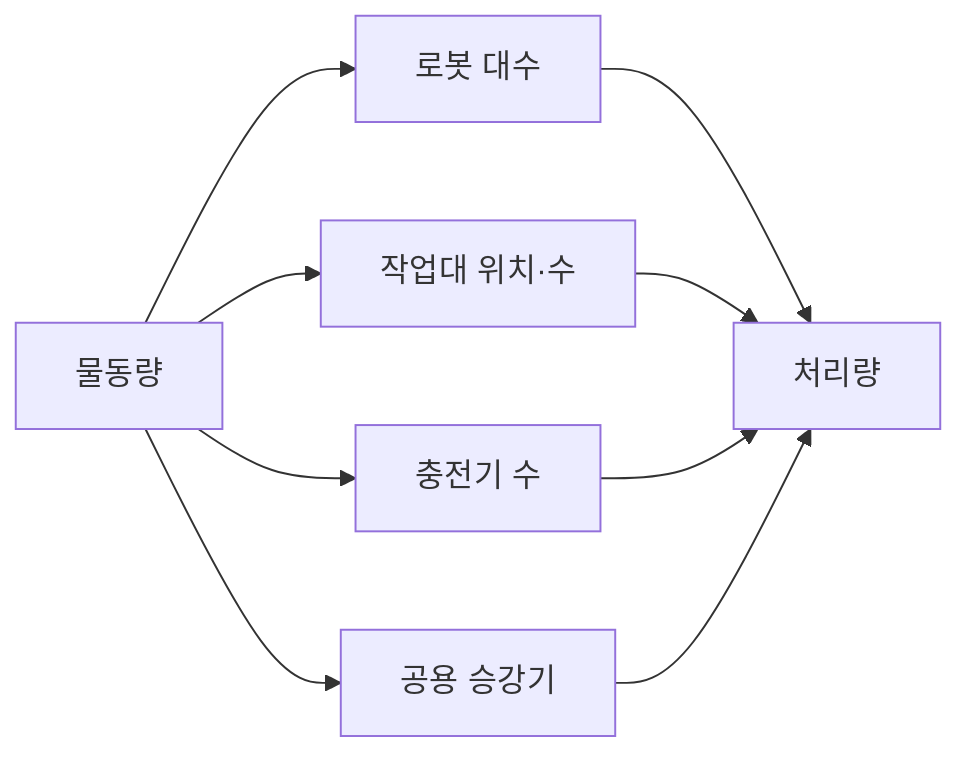
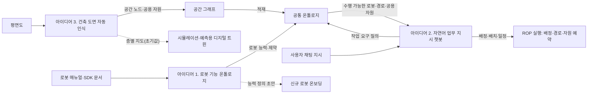

(너의 규칙은 시스템 프롬프트의 agents/shared-rules.md 와 agents/verifier.md 이다. 아래는 이번 실행의 컨텍스트와 입력이다.)

## 실행 컨텍스트

- run_id: 2026-09-25-29
- date: 2026-09-25
- run_type: category_link (대분류 연결)
- 대상: 대분류 A. 업무·공급망 설계 페이지의 '다른 대분류와의 연결' 절(대분류 연결 실행). 게시된 세부영역 페이지를 근거로 다른 대분류와의 연결을 조사·서술한다. 스토리텔러는 그 절만 patches 로 바꾼다
- 예산:
    - max_search_queries: 30
    - max_sources_per_run: 15
    - new_topic_pages: 1
    - page_updates: 2
    - max_retries: 2
- 환경 알림: web_fetch_available: false · fetch_mode: mirror_only (일반 웹 페이지 열람은 네트워크 정책으로 막혀 있다. raw.githubusercontent.com 은 열린다: 공식 문서가 GitHub 에 있는 출처는 입력의 config/source_mirrors.yaml 경로를 WebFetch 로 열어 원문을 읽고 sources[].fetched=true, fetched_via=github_raw, fetch_url 을 적는다. 입력에 원문 텍스트(data/source_texts)가 있는 출처는 fetched_via=inbox. 그 밖의 출처는 fetched=false 이며 코드가 신뢰도 상한(medium)을 강제한다 — 공통 규칙 0절 6항)
- 언어: ko
- verification_stage: first
- verifier_budget:
    - max_search_queries: 30
    - max_sources_per_run: 15
    - new_topic_pages: 1
    - page_updates: 2
    - max_retries: 2

## 입력

### runs/2026-09-25-29/target.json

```json
{
  "run_id": "2026-09-25-29",
  "date": "2026-09-25",
  "weekday": "Fri",
  "run_number": 29,
  "run_type": "category_link",
  "forced": true,
  "target": {
    "area_no": null,
    "area_name": null,
    "category": "A. 업무·공급망 설계",
    "category_letter": "A"
  },
  "topic": null,
  "track": null,
  "corrections": [],
  "budget": {
    "max_search_queries": 30,
    "max_sources_per_run": 15,
    "new_topic_pages": 1,
    "page_updates": 2,
    "max_retries": 2
  },
  "priority_reason": null,
  "priority_questions": [],
  "excluded_areas": [],
  "lifted_areas": [],
  "deferred": {
    "monthly_recheck": false,
    "weekly_review": false
  },
  "selection_rationale": "CLI 지정 run_type=category_link"
}
```

### runs/2026-09-25-29/research.json

```json
{
  "run_id": "2026-09-25-29",
  "date": "2026-09-25",
  "run_type": "category_link",
  "target": {
    "area_no": null,
    "area_name": null,
    "category": "A. 업무·공급망 설계"
  },
  "gaps": [
    "A. 업무·공급망 설계 페이지의 '다른 대분류와의 연결' 절 비어 있음(아직 작성되지 않음)",
    "연결 상대 세부영역 가운데 9. 로봇·제조사 관제 연동만 published 이고 나머지(10~28 대부분)는 seed 라, 연결의 근거는 A 쪽 게시 페이지 각주에 기댄다",
    "11. 분산 시스템·통신·컴퓨팅 구조와의 연결(클라우드 WMS 단절 시 현장 운영)은 2026-09-25-27 브리프에만 근거가 있고 게시 전이라 이번에 쓰지 않음",
    "21. 온보딩·설정·현장 시운전, 24. 자산·소프트웨어 수명주기 관리, 25. 안전·위험 관리, 26. 사이버보안·접근권한·개인정보, 27. AI·학습·적응과 모델 운영과 A. 업무·공급망 설계 세부영역 사이의 연결은 게시 페이지에 검증된 근거가 없음"
  ],
  "research_questions": [
    "무슨 일을 왜, 얼마나 해야 하는가? [분류원문]",
    "로봇 가동률 상승이 실제 출하량과 비용 개선으로 이어졌는가? [분류원문]",
    "1. 주문·업무 시스템 연계와 2. 공정·워크플로 모델링의 작업 요청·변경·완료 조건은 C. 연결·실행 기반(9. 로봇·제조사 관제 연동, 12. 명령·작업 실행의 신뢰성)의 어떤 인터페이스·상태로 넘어가는가?",
    "2. 공정·워크플로 모델링의 완료 조건은 B. 공통 정보·환경 모델의 7. 화물·재고·자산 식별과 추적과 E. 협업·현장 운영의 17. 로봇 간 협업·물리적 인계의 어떤 확인 신호에 기대는가?",
    "3. 처리능력·거점·설비 계획은 D. 계획·최적화(13. 작업 배정 — MRTA, 16. 공용 자원·충전·에너지 최적화), C. 연결·실행 기반의 10. 설비·건물 시스템 연동, F. 도입·검증·유지관리의 22. 시뮬레이션·예측용 디지털 트윈과 어떤 설정·제약·도구를 공유하는가?",
    "4. 성과·경제성·프로세스 개선의 지표 계산은 8. 실시간 세계 상태·데이터 일관성, 19. 모니터링·이상 탐지·원인 분석, 16. 공용 자원·충전·에너지 최적화와 어떤 데이터를 주고받는가?",
    "상위 작업 지시 표준(ISA-95 계열)과 로봇 인터페이스 사이 매핑 부재는 G. 안전·보안·지능·거버넌스의 28. 표준·상호운용성·다사업자 거버넌스와 어떻게 이어지는가?"
  ],
  "findings": [
    {
      "id": "f1",
      "claim": "A. 업무·공급망 설계의 1. 주문·업무 시스템 연계 ↔ C. 연결·실행 기반의 9. 로봇·제조사 관제 연동: VDA 5050 3.0.0 명세는 관제–이동로봇 통신과 무관한 인터페이스(주변 설비·인프라·외부 IT 시스템 인터페이스)를 범위에서 제외한다.",
      "tag": "사실",
      "source_ids": [
        "ref-031"
      ],
      "cross_checked": false,
      "confidence": "medium",
      "evidence_excerpt": "명세 원본: 'Interfaces unrelated to the communication between a fleet control system and mobile robots are excluded, such as interfaces to ... external IT systems.' (발행일 미확인, 확인일 기준)",
      "as_of": "2026-09-25",
      "flow_step": null,
      "flow_item": null
    },
    {
      "id": "f2",
      "claim": "A. 업무·공급망 설계의 1. 주문·업무 시스템 연계 ↔ C. 연결·실행 기반의 9. 로봇·제조사 관제 연동: 로봇 인터페이스가 상위 시스템 연동을 범위 밖에 두므로, 상위 주문을 로봇 작업 요청(Open-RMF 작업 요청 등)으로 번역하는 계층이 두 대분류가 넘겨받는 지점이 될 것으로 보인다.",
      "tag": "추정",
      "source_ids": [
        "ref-031",
        "ref-125"
      ],
      "cross_checked": false,
      "confidence": "low",
      "evidence_excerpt": "f1 과 Open-RMF task_request 스키마(1. 주문·업무 시스템 연계 페이지 9절 인용)를 대응시킨 추론. 번역 계층을 규정한 표준은 확인하지 못함. (재인용: 2026-09-25-13)",
      "as_of": "2026-09-25",
      "flow_step": null,
      "flow_item": "시작 조건"
    },
    {
      "id": "f3",
      "claim": "A. 업무·공급망 설계의 1. 주문·업무 시스템 연계 ↔ C. 연결·실행 기반의 12. 명령·작업 실행의 신뢰성: VDA 5050 은 진행 중 다른 주문을 받으면 로봇이 OTHER_ORDER_ACTIVE 오류(WARNING)를 보고하게 하고, 취소할 수 없는 동작은 cancelOrder 뒤에도 RUNNING 을 거쳐 FINISHED 또는 FAILED 로 보고하게 한다.",
      "tag": "사실",
      "source_ids": [
        "ref-031"
      ],
      "cross_checked": false,
      "confidence": "medium",
      "evidence_excerpt": "명세 원본: 'report an error of type OTHER_ORDER_ACTIVE and level WARNING'; 취소 불가 동작은 'RUNNING while it is running, and after that ... FINISHED ... FAILED'. (발행일 미확인, 확인일 기준)",
      "as_of": "2026-09-25",
      "flow_step": "피킹",
      "flow_item": "예외·성과"
    },
    {
      "id": "f4",
      "claim": "A. 업무·공급망 설계의 1. 주문·업무 시스템 연계 ↔ C. 연결·실행 기반의 12. 명령·작업 실행의 신뢰성: 상위 쪽 B2MML 거래 프로파일은 CHANGE·CANCEL 등 거래 동사를, OPC UA for ISA-95 Job Control 은 Update·Pause·Resume·Abort·Cancel 등 작업 지시 메서드를 정의한다.",
      "tag": "사실",
      "source_ids": [
        "ref-129",
        "ref-130"
      ],
      "cross_checked": false,
      "confidence": "medium",
      "evidence_excerpt": "B2MML-TransactionProfile.xsd 의 TransactionVerb1Type: NOTIFY, GET, PROCESS, CHANGE, CANCEL, CONFIRM, SYNC ADD 등. Job Control 노드셋 문서: Store, StoreAndStart, Start, RevokeStart, Pause, Resume, Update, Abort, Stop, Cancel, Clear.",
      "as_of": "2026-09-25",
      "flow_step": null,
      "flow_item": "시작 조건"
    },
    {
      "id": "f5",
      "claim": "A. 업무·공급망 설계의 1. 주문·업무 시스템 연계와 2. 공정·워크플로 모델링 ↔ C. 연결·실행 기반의 12. 명령·작업 실행의 신뢰성: Open-RMF 작업 상태 스키마는 queued·underway·completed·canceled·killed·failed 등 상태 값과 시작·종료 시각, 소요 시간 추정, 취소·강제 종료·중단 요청 기록을 담아 상위 시스템에 되돌릴 결과의 원천이 된다.",
      "tag": "사실",
      "source_ids": [
        "ref-111"
      ],
      "cross_checked": false,
      "confidence": "medium",
      "evidence_excerpt": "task_state.json 원본: status enum uninitialized, blocked, error, failed, queued, standby, underway, delayed, skipped, canceled, killed, completed; unix_millis_start_time/finish_time, estimate_millis, cancellation, killed, interruptions. (발행일 미확인, 확인일 기준)",
      "as_of": "2026-09-25",
      "flow_step": null,
      "flow_item": "완료·인계"
    },
    {
      "id": "f6",
      "claim": "A. 업무·공급망 설계의 1. 주문·업무 시스템 연계 ↔ D. 계획·최적화의 14. 작업 순서·스케줄링: 웨이브·웨이브리스 출고 지시 방식과 동적 주문 도착 시 재최적화 연구는 상위 시스템의 출고 지시·우선순위 변경이 작업 순서 결정 문제로 넘어가는 지점을 다룬다.",
      "tag": "추정",
      "source_ids": [
        "ref-134",
        "ref-133"
      ],
      "cross_checked": false,
      "confidence": "low",
      "evidence_excerpt": "1. 주문·업무 시스템 연계 페이지 8·10절의 두 연구(Gallien & Weber 2010, Lorenz 외 2025)를 순서 결정과 대응시킨 추론. 원문 미열람. (재인용: 2026-09-25-13)",
      "as_of": "2026-09-25",
      "flow_step": "피킹",
      "flow_item": "제약",
      "source_unopened": true
    },
    {
      "id": "f7",
      "claim": "A. 업무·공급망 설계의 1. 주문·업무 시스템 연계 ↔ D. 계획·최적화의 13. 작업 배정 — MRTA: 작업자가 피킹하고 AMR 이 운반하는 동적 주문 피킹 연구는 AMR 가용성에 따른 개입 전략을 다루어 주문 변경과 로봇 배정이 맞물리는 사례가 된다.",
      "tag": "추정",
      "source_ids": [
        "ref-132"
      ],
      "cross_checked": false,
      "confidence": "low",
      "evidence_excerpt": "Yu & Srinivas(2025) 동적 주문 피킹 연구의 설정·개입 전략을 1. 주문·업무 시스템 연계 페이지 10절이 13. 작업 배정 — MRTA 와 잇는 근거로 인용. 원문 미열람. (재인용: 2026-09-25-13)",
      "as_of": "2025",
      "flow_step": "피킹",
      "flow_item": "수행 자원",
      "source_unopened": true
    },
    {
      "id": "f8",
      "claim": "A. 업무·공급망 설계의 1. 주문·업무 시스템 연계 ↔ E. 협업·현장 운영의 20. 예외 복구·재계획·업무 연속성: 상위 시스템의 CANCEL 이 로봇이 이미 화물을 실은 뒤 오거나 취소 불가 동작이 끝까지 수행되면 되돌림 작업과 재고 반영이 복구·재계획 과제로 넘어갈 것으로 보인다.",
      "tag": "추정",
      "source_ids": [
        "ref-031",
        "ref-129"
      ],
      "cross_checked": false,
      "confidence": "low",
      "evidence_excerpt": "f3(취소 불가 동작)·f4(CANCEL 동사)를 대응시킨 추론. 되돌림 규칙을 정한 표준·사례는 확인하지 못함(oq-021).",
      "as_of": "2026-09-25",
      "flow_step": "출하",
      "flow_item": "예외·성과"
    },
    {
      "id": "f9",
      "claim": "A. 업무·공급망 설계의 2. 공정·워크플로 모델링 ↔ B. 공통 정보·환경 모델의 7. 화물·재고·자산 식별과 추적: GS1 CBV 는 arriving(객체가 위치에 도착), receiving(수령자 재고에 추가), accepting(점유·소유 변경)을 서로 다른 업무 단계로 정의하고, VDA 5050 은 drop 완료를 적재물이 로봇을 떠나 로봇이 새 적재 상태를 보고한 때로 정의한다.",
      "tag": "사실",
      "source_ids": [
        "ref-044",
        "ref-031"
      ],
      "cross_checked": false,
      "confidence": "medium",
      "evidence_excerpt": "CBV.ttl: receiving 'is added to the receiver's inventory', accepting 'changes possession and/or ownership'. VDA 5050: 'Load has left the mobile robot and mobile robot reports new load state.'",
      "as_of": "2026-09-25",
      "flow_step": "입고",
      "flow_item": "완료·인계"
    },
    {
      "id": "f10",
      "claim": "A. 업무·공급망 설계의 2. 공정·워크플로 모델링 ↔ B. 공통 정보·환경 모델의 7. 화물·재고·자산 식별과 추적: 로봇 완료 신호는 arriving 수준의 물리적 인도에 가까우므로, 공정 모델의 '인수 확인·재고 반영 완료' 조건은 7번이 다루는 식별자와 receiving·accepting 이벤트에 기대야 할 것으로 보인다.",
      "tag": "추정",
      "source_ids": [
        "ref-044",
        "ref-031",
        "ref-049"
      ],
      "cross_checked": false,
      "confidence": "low",
      "evidence_excerpt": "f9 와 IngestorResult 필드(f11)를 대응시킨 추론. 이 구성을 적용한 표준·사례는 확인하지 못함(oq-001, oq-012). (재인용: 2026-09-25-09)",
      "as_of": "2026-09-25",
      "flow_step": "입고",
      "flow_item": "완료·인계"
    },
    {
      "id": "f11",
      "claim": "A. 업무·공급망 설계의 2. 공정·워크플로 모델링 ↔ E. 협업·현장 운영의 17. 로봇 간 협업·물리적 인계: Open-RMF 배송 작업에서 로봇은 하역 지점 워크셀에 IngestorResult 를 받을 때까지 IngestorRequest 를 보내며, IngestorResult 는 요청 id·워크셀 id·상태(ACKNOWLEDGED, SUCCESS, FAILED)만 담는다.",
      "tag": "사실",
      "source_ids": [
        "ref-023",
        "ref-049"
      ],
      "cross_checked": false,
      "confidence": "medium",
      "evidence_excerpt": "워크셀 장 원본: 'Requests a IngestorRequest till receives a IngestorResult'. IngestorResult.msg: request_guid, source_guid, status ACKNOWLEDGED=0 SUCCESS=1 FAILED=2. (발행일 미확인, 확인일 기준)",
      "as_of": "2026-09-25",
      "flow_step": "입고",
      "flow_item": "완료·인계"
    },
    {
      "id": "f12",
      "claim": "A. 업무·공급망 설계의 2. 공정·워크플로 모델링 ↔ F. 도입·검증·유지관리의 23. 시험·형식 검증·벤치마크: 워크플로 넷의 건전성(soundness) 판정 복잡도를 다룬 연구가 있어, 공정 모델의 형식적 설계 점검이 형식 검증과 이어질 것으로 보인다.",
      "tag": "추정",
      "source_ids": [
        "ref-121"
      ],
      "cross_checked": false,
      "confidence": "low",
      "evidence_excerpt": "2. 공정·워크플로 모델링 페이지 6절이 네 접근 가운데 하나로 든 Blondin 외(LICS 2022). 물류 로봇 공정에 적용한 사례는 확인하지 못함. 원문 미열람. (재인용: 2026-09-25-09)",
      "as_of": "2022",
      "flow_step": null,
      "flow_item": null,
      "source_unopened": true
    },
    {
      "id": "f13",
      "claim": "A. 업무·공급망 설계의 3. 처리능력·거점·설비 계획 ↔ D. 계획·최적화의 16. 공용 자원·충전·에너지 최적화: AMR 물류센터 시뮬레이션 연구에서 충전기가 부족하면 큰 지연이, 과잉이면 불필요한 비용이 생겼고, RMFS 의 충전·배터리 교환 전략 비교도 연구되어 있다.",
      "tag": "사실",
      "source_ids": [
        "ref-102",
        "ref-098"
      ],
      "cross_checked": false,
      "confidence": "medium",
      "evidence_excerpt": "3. 처리능력·거점·설비 계획 페이지 3·10절 인용(FAIM 2025 시뮬레이션, Zou 외 2018). 두 출처는 서로 다른 주장을 뒷받침하며 교차 확인이 아님. 원문 미열람. (재인용: 2026-09-25-10)",
      "as_of": "2025",
      "flow_step": "피킹",
      "flow_item": "제약",
      "source_unopened": true
    },
    {
      "id": "f14",
      "claim": "A. 업무·공급망 설계의 3. 처리능력·거점·설비 계획 ↔ D. 계획·최적화의 13. 작업 배정 — MRTA: Open-RMF 플릿 어댑터 템플릿 설정은 배터리가 recharge_threshold(예 0.10) 아래인 로봇은 작업하지 않게 하고 충전 목표(recharge_soc), 로봇별 충전기, 작업 종료 후 동작(park·charge·nothing)을 둔다.",
      "tag": "사실",
      "source_ids": [
        "ref-105"
      ],
      "cross_checked": false,
      "confidence": "medium",
      "evidence_excerpt": "config.yaml 원본: 'recharge_threshold: 0.10 # Battery level below which robots in this fleet will not operate', finishing_request: 'park' # [park, charge, nothing]. (발행일 미확인, 확인일 기준)",
      "as_of": "2026-09-25",
      "flow_step": null,
      "flow_item": "제약"
    },
    {
      "id": "f15",
      "claim": "A. 업무·공급망 설계의 3. 처리능력·거점·설비 계획 ↔ C. 연결·실행 기반의 10. 설비·건물 시스템 연동: Open-RMF 데모의 호텔 환경은 승강기 2대·여러 문·3개 플릿(로봇 4대)이 다층 건물에서 함께 일하는 통합을 보이며, 공간과 승강기·문 같은 건물 설비를 공유하는 로봇 교통을 관리한다고 설명한다.",
      "tag": "사실",
      "source_ids": [
        "ref-104"
      ],
      "cross_checked": false,
      "confidence": "medium",
      "evidence_excerpt": "rmf_demos README 원본: 'The hotel has two lifts, multiple doors and 3 robot fleets (4 robots).' (발행일 미확인, 확인일 기준)",
      "as_of": "2026-09-25",
      "flow_step": null,
      "flow_item": "수행 자원"
    },
    {
      "id": "f16",
      "claim": "A. 업무·공급망 설계의 3. 처리능력·거점·설비 계획 ↔ C. 연결·실행 기반의 10. 설비·건물 시스템 연동: 병원 약품 배송 로봇 사례에서는 승강기 가동률이 높을수록 배송 실패가 많고 배송 시간이 길었으며, 호텔 연구는 승강기를 경로 계획 안의 대기·운행 시간으로 모델링했다(물류센터 적용 여부는 미확인).",
      "tag": "사실",
      "source_ids": [
        "ref-060",
        "ref-103"
      ],
      "cross_checked": false,
      "confidence": "medium",
      "evidence_excerpt": "3. 처리능력·거점·설비 계획 페이지 3·9절 인용. 병원·호텔 사례이며 물류센터 근거 아님(oq-010). 원문 미열람. (재인용: 2026-09-25-10)",
      "as_of": "2026",
      "flow_step": null,
      "flow_item": "제약",
      "source_unopened": true
    },
    {
      "id": "f17",
      "claim": "A. 업무·공급망 설계의 3. 처리능력·거점·설비 계획 ↔ F. 도입·검증·유지관리의 22. 시뮬레이션·예측용 디지털 트윈: RAWSim-O 는 RMFS 운영의 여러 결정 문제의 효과를 연구하는 이산 사건 시뮬레이션으로, 증차·증설 같은 가정한 미래의 실험 도구가 된다.",
      "tag": "사실",
      "source_ids": [
        "ref-101"
      ],
      "cross_checked": false,
      "confidence": "medium",
      "evidence_excerpt": "README 원본: 'a discrete event-based simulation for Robotic Mobile Fulfillment Systems ... researching effects of multiple decision problems'. 8. 실시간 세계 상태·데이터 일관성과 구분. (발행일 미확인, 확인일 기준)",
      "as_of": "2026-09-25",
      "flow_step": null,
      "flow_item": null
    },
    {
      "id": "f18",
      "claim": "A. 업무·공급망 설계의 4. 성과·경제성·프로세스 개선 ↔ B. 공통 정보·환경 모델의 8. 실시간 세계 상태·데이터 일관성: Open-RMF 로봇 상태 스키마는 상태(idle·charging·working·error 등), 배터리(0~1), 현재 작업 id, 운영자가 처리할 문제 목록, 위치, 기록 시각을 담아 가동률·충전·오류 시간 지표의 원천이 된다.",
      "tag": "사실",
      "source_ids": [
        "ref-148"
      ],
      "cross_checked": false,
      "confidence": "medium",
      "evidence_excerpt": "robot_state.json 원본: status uninitialized, offline, shutdown, idle, charging, working, error; battery 0.0~1.0; task_id; issues; location; unix_millis_time. (발행일 미확인, 확인일 기준)",
      "as_of": "2026-09-25",
      "flow_step": null,
      "flow_item": "예외·성과"
    },
    {
      "id": "f19",
      "claim": "A. 업무·공급망 설계의 4. 성과·경제성·프로세스 개선 ↔ E. 협업·현장 운영의 19. 모니터링·이상 탐지·원인 분석: 제조 병목 탐지 방법과 창고 이벤트 로그 프로세스 마이닝 연구를 로봇 상태 기록에 적용하면 성과 분석과 이상·원인 분석이 같은 로그를 공유할 것으로 보인다.",
      "tag": "추정",
      "source_ids": [
        "ref-115",
        "ref-149",
        "ref-148"
      ],
      "cross_checked": false,
      "confidence": "low",
      "evidence_excerpt": "4. 성과·경제성·프로세스 개선 페이지 10절의 연결 근거(병목 탐지 리뷰 2023, 창고 프로세스 마이닝 사례 2015)를 f18 과 대응시킨 추론. 적용 연구는 미확인(oq-018). (재인용: 2026-09-25-14)",
      "as_of": "2026-09-25",
      "flow_step": null,
      "flow_item": "예외·성과",
      "source_unopened": false
    },
    {
      "id": "f20",
      "claim": "A. 업무·공급망 설계의 4. 성과·경제성·프로세스 개선 ↔ D. 계획·최적화의 16. 공용 자원·충전·에너지 최적화: Omega(2024) 게재 연구는 RMFS 에서 동적 우선순위 규칙이 선착순 대비 에너지 소비를 3.41% 줄이고 처리량을 26.07% 높였다고 보고했다(모델·시뮬레이션 조건, 저자 보고값).",
      "tag": "사실",
      "source_ids": [
        "ref-146"
      ],
      "cross_checked": false,
      "confidence": "medium",
      "evidence_excerpt": "4. 성과·경제성·프로세스 개선 페이지 5절 인용 수치. 현장 실측 아님. 원문 미열람. (재인용: 2026-09-25-14)",
      "as_of": "2024",
      "flow_step": "피킹",
      "flow_item": "예외·성과",
      "source_unopened": true
    },
    {
      "id": "f21",
      "claim": "A. 업무·공급망 설계의 4. 성과·경제성·프로세스 개선 ↔ F. 도입·검증·유지관리의 22. 시뮬레이션·예측용 디지털 트윈: 우선순위 정책·충전 대안을 운영 전에 비교하는 일은 가정한 미래를 실험하는 쪽이며, 현재 상태를 표현하는 8. 실시간 세계 상태·데이터 일관성과 역할을 나눠 연결될 것으로 보인다.",
      "tag": "추정",
      "source_ids": [
        "ref-146",
        "ref-102"
      ],
      "cross_checked": false,
      "confidence": "low",
      "evidence_excerpt": "4. 성과·경제성·프로세스 개선 페이지 10절 연결 서술과 분류 원문 7장의 8·22 구분을 대응시킨 추론. 원문 미열람. (재인용: 2026-09-25-14)",
      "as_of": "2026-09-25",
      "flow_step": null,
      "flow_item": null,
      "source_unopened": true
    },
    {
      "id": "f22",
      "claim": "A. 업무·공급망 설계의 1. 주문·업무 시스템 연계 ↔ G. 안전·보안·지능·거버넌스의 28. 표준·상호운용성·다사업자 거버넌스: ISA-95 계열 작업 지시 동사·메서드와 VDA 5050·Open-RMF 의 주문·작업 요청 사이 표준 매핑은 이번까지 확인되지 않아, 번역 규칙의 소유와 변경 승인이 상호운용성 거버넌스 과제로 넘어갈 것으로 보인다.",
      "tag": "추정",
      "source_ids": [
        "ref-129",
        "ref-130",
        "ref-031",
        "ref-125"
      ],
      "cross_checked": false,
      "confidence": "low",
      "evidence_excerpt": "f1·f4 와 1. 주문·업무 시스템 연계 페이지 10절 28번 연결을 대응시킨 추론. 매핑 부재는 검색 범위의 관찰(oq-020).",
      "as_of": "2026-09-25",
      "flow_step": null,
      "flow_item": null
    }
  ],
  "sources": [
    {
      "id": "ref-031",
      "org": "VDA / VDMA (VDA5050 GitHub)",
      "title": "VDA5050/VDA5050_EN.md — Official Specification document for the VDA 5050",
      "published": null,
      "url": "https://github.com/VDA5050/VDA5050/blob/main/VDA5050_EN.md",
      "type": "표준",
      "reliability": "high",
      "accessed": "2026-09-25",
      "summary": "VDA 5050 공식 명세(main 3.0.0). 범위 제외, OTHER_ORDER_ACTIVE, 취소 불가 동작, drop 완료 정의를 원문으로 확인.",
      "fetched": true,
      "fetched_via": "github_raw",
      "fetch_url": "https://raw.githubusercontent.com/VDA5050/VDA5050/main/VDA5050_EN.md",
      "source_unopened": false
    },
    {
      "id": "ref-125",
      "org": "Open Robotics (open-rmf)",
      "title": "rmf_api_msgs — rmf_api_msgs/schemas/task_request.json",
      "published": null,
      "url": "https://github.com/open-rmf/rmf_api_msgs/blob/main/rmf_api_msgs/schemas/task_request.json",
      "type": "오픈소스 문서",
      "reliability": "medium",
      "accessed": "2026-09-25",
      "summary": "원문 미열람. Open-RMF 작업 요청 스키마(이번 실행에서 다시 열지 않음).",
      "fetched": false,
      "fetched_via": null,
      "fetch_url": null,
      "source_unopened": true
    },
    {
      "id": "ref-111",
      "org": "Open Robotics (open-rmf)",
      "title": "rmf_api_msgs — rmf_api_msgs/schemas/task_state.json",
      "published": null,
      "url": "https://github.com/open-rmf/rmf_api_msgs/blob/main/rmf_api_msgs/schemas/task_state.json",
      "type": "오픈소스 문서",
      "reliability": "high",
      "accessed": "2026-09-25",
      "summary": "Open-RMF 작업 상태 스키마. 상태 값, 시작·종료 시각, 추정 시간, 취소·강제 종료·중단 기록을 원문으로 확인.",
      "fetched": true,
      "fetched_via": "github_raw",
      "fetch_url": "https://raw.githubusercontent.com/open-rmf/rmf_api_msgs/main/rmf_api_msgs/schemas/task_state.json",
      "source_unopened": false
    },
    {
      "id": "ref-129",
      "org": "MESA International",
      "title": "B2MML-BatchML/Schema/B2MML-TransactionProfile.xsd",
      "published": "2023",
      "url": "https://github.com/MESAInternational/B2MML-BatchML/blob/master/Schema/B2MML-TransactionProfile.xsd",
      "type": "표준",
      "reliability": "medium",
      "accessed": "2026-09-25",
      "summary": "B2MML 거래 프로파일 스키마. TransactionVerb1Type 의 동사(CHANGE, CANCEL 등)를 원문으로 확인.",
      "fetched": true,
      "fetched_via": "github_raw",
      "fetch_url": "https://raw.githubusercontent.com/MESAInternational/B2MML-BatchML/master/Schema/B2MML-TransactionProfile.xsd",
      "source_unopened": false
    },
    {
      "id": "ref-130",
      "org": "OPC Foundation",
      "title": "UA-Nodeset ISA95-JOBCONTROL — opc.ua.isa95-jobcontrol.nodeset2 (NodeSet2.xml·documentation.csv)",
      "published": "2024-01-31",
      "url": "https://github.com/OPCFoundation/UA-Nodeset/tree/latest/ISA95-JOBCONTROL",
      "type": "표준",
      "reliability": "medium",
      "accessed": "2026-09-25",
      "summary": "OPC UA for ISA-95 Job Control 노드셋 문서. 작업 지시 수신 객체의 메서드(Store~Clear)를 원문으로 확인.",
      "fetched": true,
      "fetched_via": "github_raw",
      "fetch_url": "https://raw.githubusercontent.com/OPCFoundation/UA-Nodeset/latest/ISA95-JOBCONTROL/opc.ua.isa95-jobcontrol.nodeset2.documentation.csv",
      "source_unopened": false
    },
    {
      "id": "ref-132",
      "org": "Yu, S., & Srinivas, S.",
      "title": "Collaborative Human–Robot Teaming for Dynamic Order Picking: Interventionist strategies for improving warehouse intralogistics operations",
      "published": "2025",
      "url": "https://www.sciencedirect.com/science/article/abs/pii/S1366554525001231",
      "type": "논문",
      "reliability": "medium",
      "accessed": "2026-09-25",
      "summary": "원문 미열람. 작업자 피킹·AMR 운반 협업의 동적 주문 피킹과 개입 전략 연구.",
      "fetched": false,
      "fetched_via": null,
      "fetch_url": null,
      "source_unopened": true
    },
    {
      "id": "ref-133",
      "org": "Lorenz, Otto, & Gendreau (Networks, Wiley)",
      "title": "Picking Operations in Warehouses With Dynamically Arriving Orders: How Good is Reoptimization?",
      "published": "2025",
      "url": "https://onlinelibrary.wiley.com/doi/full/10.1002/net.22281",
      "type": "논문",
      "reliability": "medium",
      "accessed": "2026-09-25",
      "summary": "원문 미열람. 동적으로 도착하는 주문에서 피킹 재최적화 효과를 다룬 연구.",
      "fetched": false,
      "fetched_via": null,
      "fetch_url": null,
      "source_unopened": true
    },
    {
      "id": "ref-134",
      "org": "Gallien, J., & Weber, T. G.",
      "title": "To Wave or Not to Wave? Order Release Policies for Warehouses with an Automated Sorter",
      "published": "2010",
      "url": "https://pubsonline.informs.org/doi/abs/10.1287/msom.1100.0291",
      "type": "논문",
      "reliability": "medium",
      "accessed": "2026-09-25",
      "summary": "원문 미열람. 웨이브·웨이브리스 출고 지시 정책 비교 연구.",
      "fetched": false,
      "fetched_via": null,
      "fetch_url": null,
      "source_unopened": true
    },
    {
      "id": "ref-044",
      "org": "GS1",
      "title": "gs1/EPCIS — Ontology/CBV.ttl (Core Business Vocabulary ontology 2.0)",
      "published": "2021-09-30",
      "url": "https://github.com/gs1/EPCIS/blob/master/Ontology/CBV.ttl",
      "type": "표준",
      "reliability": "high",
      "accessed": "2026-09-25",
      "summary": "CBV 온톨로지 원본. arriving·receiving·accepting·loading·unloading 업무 단계 정의를 원문으로 확인.",
      "fetched": true,
      "fetched_via": "github_raw",
      "fetch_url": "https://raw.githubusercontent.com/gs1/EPCIS/master/Ontology/CBV.ttl",
      "source_unopened": false
    },
    {
      "id": "ref-023",
      "org": "Open Robotics",
      "title": "Workcells - Programming Multiple Robots with ROS 2",
      "published": null,
      "url": "https://osrf.github.io/ros2multirobotbook/integration_workcells.html",
      "type": "오픈소스 문서",
      "reliability": "high",
      "accessed": "2026-09-25",
      "summary": "Open-RMF 워크셀(디스펜서·인제스터) 연동 장. 배송 작업의 요청–결과 반복을 mdBook 원본으로 확인.",
      "fetched": true,
      "fetched_via": "github_raw",
      "fetch_url": "https://raw.githubusercontent.com/osrf/ros2multirobotbook/master/src/integration_workcells.md",
      "source_unopened": false
    },
    {
      "id": "ref-049",
      "org": "Open Robotics (open-rmf)",
      "title": "rmf_internal_msgs — rmf_ingestor_msgs/msg/IngestorResult.msg",
      "published": null,
      "url": "https://github.com/open-rmf/rmf_internal_msgs/blob/main/rmf_ingestor_msgs/msg/IngestorResult.msg",
      "type": "오픈소스 문서",
      "reliability": "high",
      "accessed": "2026-09-25",
      "summary": "IngestorResult 메시지 정의. 요청 id·워크셀 id·상태 세 값을 원문으로 확인.",
      "fetched": true,
      "fetched_via": "github_raw",
      "fetch_url": "https://raw.githubusercontent.com/open-rmf/rmf_internal_msgs/main/rmf_ingestor_msgs/msg/IngestorResult.msg",
      "source_unopened": false
    },
    {
      "id": "ref-121",
      "org": "Blondin, M., Mazowiecki, F., & Offtermatt, P. (LICS 2022)",
      "title": "The complexity of soundness in workflow nets",
      "published": "2022",
      "url": "https://arxiv.org/abs/2201.05588",
      "type": "논문",
      "reliability": "medium",
      "accessed": "2026-09-25",
      "summary": "원문 미열람. 워크플로 넷 건전성 판정의 계산 복잡도 연구.",
      "fetched": false,
      "fetched_via": null,
      "fetch_url": null,
      "source_unopened": true
    },
    {
      "id": "ref-102",
      "org": "Springer(FAIM 2025 발표 논문, 저자 미확인)",
      "title": "Simulation-Driven Approach for Dimensioning AMR Fleets in Distribution Centre Logistics",
      "published": "2025",
      "url": "https://link.springer.com/chapter/10.1007/978-3-032-07675-5_69",
      "type": "논문",
      "reliability": "medium",
      "accessed": "2026-09-25",
      "summary": "원문 미열람. 유통 물류센터 팔레트 이동 데이터로 AMR 플릿·충전기 규모를 시뮬레이션한 연구.",
      "fetched": false,
      "fetched_via": null,
      "fetch_url": null,
      "source_unopened": true
    },
    {
      "id": "ref-098",
      "org": "Zou, B., Gong, Y., de Koster, R., & Xu, X.",
      "title": "Evaluating battery charging and swapping strategies in a robotic mobile fulfillment system",
      "published": "2018",
      "url": "https://www.sciencedirect.com/science/article/abs/pii/S0377221717310901",
      "type": "논문",
      "reliability": "medium",
      "accessed": "2026-09-25",
      "summary": "원문 미열람. RMFS 의 충전·배터리 교환 전략을 대기행렬 모델로 비교한 연구.",
      "fetched": false,
      "fetched_via": null,
      "fetch_url": null,
      "source_unopened": true
    },
    {
      "id": "ref-104",
      "org": "Open Robotics (open-rmf)",
      "title": "rmf_demos — Demonstrations of Open-RMF (README)",
      "published": null,
      "url": "https://github.com/open-rmf/rmf_demos",
      "type": "오픈소스 문서",
      "reliability": "high",
      "accessed": "2026-09-25",
      "summary": "Open-RMF 데모 README. 호텔·클리닉·공항 환경의 다중 플릿·승강기·문 공유를 원문으로 확인.",
      "fetched": true,
      "fetched_via": "github_raw",
      "fetch_url": "https://raw.githubusercontent.com/open-rmf/rmf_demos/main/README.md",
      "source_unopened": false
    },
    {
      "id": "ref-060",
      "org": "Lee, Y. 외(Digital Health)",
      "title": "Feasibility of autonomous medication delivery robots considering elevator utilization in high-traffic hospital environments",
      "published": "2026",
      "url": "https://doi.org/10.1177/20552076261437181",
      "type": "논문",
      "reliability": "medium",
      "accessed": "2026-09-25",
      "summary": "원문 미열람. 병원 약품 배송 로봇의 승강기 가동률과 배송 실패·시간 관계를 관찰한 연구.",
      "fetched": false,
      "fetched_via": null,
      "fetch_url": null,
      "source_unopened": true
    },
    {
      "id": "ref-103",
      "org": "PMC 게재 논문(저자 미확인)",
      "title": "The Path Planning Problem of Robotic Delivery in Multi-Floor Hotel Environments",
      "published": null,
      "url": "https://pmc.ncbi.nlm.nih.gov/articles/PMC11946681/",
      "type": "논문",
      "reliability": "medium",
      "accessed": "2026-09-25",
      "summary": "원문 미열람. 다층 호텔 배송 로봇 경로 계획에서 승강기 대기·운행 시간을 모델링한 연구.",
      "fetched": false,
      "fetched_via": null,
      "fetch_url": null,
      "source_unopened": true
    },
    {
      "id": "ref-105",
      "org": "Open Robotics (open-rmf)",
      "title": "fleet_adapter_template — fleet_adapter_template/config.yaml",
      "published": null,
      "url": "https://github.com/open-rmf/fleet_adapter_template/blob/main/fleet_adapter_template/config.yaml",
      "type": "오픈소스 문서",
      "reliability": "high",
      "accessed": "2026-09-25",
      "summary": "Open-RMF 플릿 어댑터 템플릿 설정. 충전 임계값·충전 목표·충전기·작업 종료 후 동작을 원문으로 확인.",
      "fetched": true,
      "fetched_via": "github_raw",
      "fetch_url": "https://raw.githubusercontent.com/open-rmf/fleet_adapter_template/main/fleet_adapter_template/config.yaml",
      "source_unopened": false
    },
    {
      "id": "ref-101",
      "org": "Merschformann, M. (RAWSim-O GitHub)",
      "title": "RAWSim-O: A simulation framework for Robotic Mobile Fulfillment Systems (README)",
      "published": null,
      "url": "https://github.com/merschformann/RAWSim-O",
      "type": "오픈소스 문서",
      "reliability": "high",
      "accessed": "2026-09-25",
      "summary": "RMFS 용 이산 사건 시뮬레이션 프레임워크 README를 원문으로 확인.",
      "fetched": true,
      "fetched_via": "github_raw",
      "fetch_url": "https://raw.githubusercontent.com/merschformann/RAWSim-O/master/README.md",
      "source_unopened": false
    },
    {
      "id": "ref-148",
      "org": "Open Robotics (open-rmf)",
      "title": "rmf_api_msgs — rmf_api_msgs/schemas/robot_state.json",
      "published": null,
      "url": "https://github.com/open-rmf/rmf_api_msgs/blob/main/rmf_api_msgs/schemas/robot_state.json",
      "type": "오픈소스 문서",
      "reliability": "high",
      "accessed": "2026-09-25",
      "summary": "Open-RMF 로봇 상태 스키마. 상태 값·배터리·작업 id·문제 목록·위치·시각을 원문으로 확인.",
      "fetched": true,
      "fetched_via": "github_raw",
      "fetch_url": "https://raw.githubusercontent.com/open-rmf/rmf_api_msgs/main/rmf_api_msgs/schemas/robot_state.json",
      "source_unopened": false
    },
    {
      "id": "ref-115",
      "org": "Production & Manufacturing Research 게재 논문(저자 미확인, Chalmers 공개본)",
      "title": "Throughput bottleneck detection in manufacturing: a systematic review of the literature on methods and operationalization modes",
      "published": "2023",
      "url": "https://www.tandfonline.com/doi/full/10.1080/21693277.2023.2283031",
      "type": "논문",
      "reliability": "medium",
      "accessed": "2026-09-25",
      "summary": "원문 미열람. 제조 처리량 병목 탐지 방법의 체계적 문헌 검토.",
      "fetched": false,
      "fetched_via": null,
      "fetch_url": null,
      "source_unopened": true
    },
    {
      "id": "ref-149",
      "org": "Springer(학술대회 발표 논문, 저자 미확인)",
      "title": "Material Movement Analysis for Warehouse Business Process Improvement with Process Mining: A Case Study",
      "published": "2015",
      "url": "https://link.springer.com/chapter/10.1007/978-3-319-19509-4_9",
      "type": "논문",
      "reliability": "medium",
      "accessed": "2026-09-25",
      "summary": "원문 미열람. 창고 자재 이동 이벤트 로그에 프로세스 마이닝을 적용한 사례 연구.",
      "fetched": false,
      "fetched_via": null,
      "fetch_url": null,
      "source_unopened": true
    },
    {
      "id": "ref-146",
      "org": "Omega 게재 논문(저자 미확인)",
      "title": "The role of energy consumption in robotic mobile fulfillment systems: Performance evaluation and operating policies with dynamic priority",
      "published": "2024",
      "url": "https://www.sciencedirect.com/science/article/abs/pii/S0305048324001336",
      "type": "논문",
      "reliability": "medium",
      "accessed": "2026-09-25",
      "summary": "원문 미열람. RMFS 에너지 소비와 동적 우선순위 운영 정책의 성과 평가 연구.",
      "fetched": false,
      "fetched_via": null,
      "fetch_url": null,
      "source_unopened": true
    }
  ],
  "page_proposals": [
    {
      "action": "update",
      "path": "docs/categories/a-business-supply-chain-design/index.md",
      "sections": [
        "5. 다른 대분류와의 연결"
      ],
      "rationale": "대분류 페이지의 다섯째 절 '다른 대분류와의 연결'만 patches 로 채운다. B. 공통 정보·환경 모델: f9·f10(2 ↔ 7), f18(4 ↔ 8) / C. 연결·실행 기반: f1·f2(1 ↔ 9), f3·f4·f5(1·2 ↔ 12), f15·f16(3 ↔ 10) / D. 계획·최적화: f6(1 ↔ 14), f7(1 ↔ 13), f13(3 ↔ 16), f14(3 ↔ 13), f20(4 ↔ 16) / E. 협업·현장 운영: f8(1 ↔ 20), f11(2 ↔ 17), f19(4 ↔ 19) / F. 도입·검증·유지관리: f12(2 ↔ 23), f17(3 ↔ 22), f21(4 ↔ 22, 8. 실시간 세계 상태·데이터 일관성과 구분) / G. 안전·보안·지능·거버넌스: f22(1 ↔ 28). 11. 분산 시스템·통신·컴퓨팅 구조와 27. AI·학습·적응과 모델 운영 등은 검증된 근거가 없어 쓰지 않는다."
    }
  ],
  "glossary_candidates": [],
  "open_questions_new": [],
  "open_questions_resolved": [],
  "self_check": {
    "source_count": 23,
    "cross_checked_count": 0,
    "unverified": [
      "모든 finding 교차 확인 없음: 연결마다 게시 페이지의 단일 출처 또는 서로 다른 주장을 뒷받침하는 출처",
      "f6·f7·f12·f13·f16·f19·f20·f21 근거 출처 원문 미열람(게시 페이지 인용 재사용)",
      "f2·f8·f10·f22 는 추론이며 두 대분류 사이 매핑·규칙을 정한 표준·사례 미확인"
    ],
    "scope_violations": [],
    "budget_used": {
      "queries": 2,
      "sources": 0
    },
    "limits": "web_fetch_available: false · fetch_mode mirror_only. 재사용 출처 가운데 10건(ref-031, ref-111, ref-129, ref-130, ref-044, ref-023, ref-049, ref-104, ref-105, ref-101, ref-148 중 GitHub 원본이 있는 것)을 raw.githubusercontent.com 으로 열어 확인했고, 나머지 재사용 출처는 원문 미열람(신뢰도 상한 medium). 근거는 게시된 1~4 세부영역 페이지 각주를 재사용했고 신규 출처는 0건이다. 검색 2회(영어 1, 한국어 1)는 WES–플릿 관리 연동 자료를 찾았으나 벤더·블로그 자료뿐이라 출처로 넣지 않았다. 연결 상대 세부영역 대부분이 seed 라 연결의 반대편 서술은 A 쪽 근거에 기댄다. 11. 분산 시스템·통신·컴퓨팅 구조 연결은 게시 전 브리프(2026-09-25-27)에만 있어 제외했다. 27. AI·학습·적응과 모델 운영과의 연결(자연어 업무 지시 챗봇 트랙이 1·2를 함께 필요한 영역으로 둠)은 검증된 주장이 없어 제외했다. 8. 실시간 세계 상태·데이터 일관성(f18)과 22. 시뮬레이션·예측용 디지털 트윈(f17·f21)을 구분했다. 새 열린 질문 없음: 관련 질문이 이미 oq-001·oq-010·oq-012·oq-018·oq-020·oq-021 로 열려 있다. 정정 요청 없음. 페이지 제안의 섹션 번호 '5'는 대분류 페이지의 다섯째 절(다른 대분류와의 연결)을 가리킨다."
  }
}
```

### docs/glossary/index.md

```markdown
---
title: "용어집"
type: glossary
subtype: index
status: published
created: 2026-09-24
updated: 2026-09-24
version: 1
---

[홈](../index.md) › 용어집

# 용어집

이 위키에서 쓰는 용어의 한글·영문 표기와 한 줄 정의를 모은다. 용어마다 개별 페이지에 설명, 관련 연구영역, 출처를 둔다. 시드 용어는 SCOR, ISA-95, EPCIS, Open-RMF, Fleet Adapter, WES/WCS/WMS/MES/TMS, MRTA, MAPF, Lifelong MAPF, Multi-Agent Pickup and Delivery, ARIAC, DDS-Security, 디지털 트윈이다. 새 용어는 스토리텔러 에이전트가 제안하고 퍼블리셔가 반영한다.

아래 표는 용어 페이지의 프런트매터(term_ko, term_en, definition, related_areas)에서 자동으로 만든다.

## 용어 목록

<!-- auto:glossary-index:start -->
| 용어(한글) | 용어(영문) | 한 줄 정의 | 관련 영역 |
|---|---|---|---|
| [B2MML](b2mml.md) | Business To Manufacturing Markup Language (B2MML) | MESA International이 ISA-95(IEC 62264)의 데이터 모델을 XML 스키마로 구현한 교환 형식이다. | [1. 주문·업무 시스템 연계](../categories/a-business-supply-chain-design/01-order-and-business-system-integration.md)<br>[2. 공정·워크플로 모델링](../categories/a-business-supply-chain-design/02-process-and-workflow-modeling.md)<br>[14. 작업 순서·스케줄링](../categories/d-planning-and-optimization/14-task-sequencing-and-scheduling.md) |
| [DDS 보안 규격](dds-security.md) | DDS Security (DDS-Security) | DDS(Data Distribution Service)의 보안 규격으로, ROS 2가 인증·암호화·접근통제 구조의 기반으로 통합했다. | [26. 사이버보안·접근권한·개인정보](../categories/g-safety-security-intelligence-and-governance/26-cybersecurity-access-control-and-privacy.md)<br>[11. 분산 시스템·통신·컴퓨팅 구조](../categories/c-connectivity-and-execution-foundation/11-distributed-systems-communication-and-computing.md)<br>[28. 표준·상호운용성·다사업자 거버넌스](../categories/g-safety-security-intelligence-and-governance/28-standards-interoperability-and-multi-vendor-governance.md) |
| [IndoorGML](indoorgml.md) | IndoorGML | 실내 공간을 셀 공간(CellSpace)과 그 경계, 공간 연결을 나타내는 노드·엣지의 쌍대 그래프, 의미별 주제 레이어로 표현하는 OGC 실내 공간 정보 표준이다. | [6. 지도·공간·위치 모델](../categories/b-common-information-and-environment-model/06-map-space-and-location-model.md)<br>[28. 표준·상호운용성·다사업자 거버넌스](../categories/g-safety-security-intelligence-and-governance/28-standards-interoperability-and-multi-vendor-governance.md) |
| [LLM 에이전트](llm-agent.md) | LLM Agent | 대규모 언어 모델이 사람이 정해 준 도구·함수(로봇 API, 조회 기능 등)를 골라 호출하며 여러 단계로 작업을 수행하도록 구성한 소프트웨어이다. | [27. AI·학습·적응과 모델 운영](../categories/g-safety-security-intelligence-and-governance/27-ai-learning-adaptation-and-model-operations.md)<br>[13. 작업 배정 — MRTA](../categories/d-planning-and-optimization/13-task-allocation-mrta.md)<br>[18. 사람–로봇 협업·운영 인터페이스](../categories/e-collaboration-and-field-operations/18-human-robot-collaboration-and-operator-interface.md) |
| [VDA 5050 팩트시트](vda-5050-factsheet.md) | VDA 5050 factsheet | VDA 5050에서 이동로봇이 관제에 자신의 유형·물리 파라미터·적재 명세·지원 action을 알리는 메시지이다. | [5. 로봇 능력·작업 온톨로지](../categories/b-common-information-and-environment-model/05-robot-capability-and-task-ontology.md)<br>[9. 로봇·제조사 관제 연동](../categories/c-connectivity-and-execution-foundation/09-robot-and-vendor-fleet-manager-integration.md) |
| [VDA 5050](vda-5050.md) | VDA 5050 | 서로 다른 제조사의 AGV·AMR을 하나의 관제로 운용하기 위한 제조사 중립 통신 인터페이스이다. | [5. 로봇 능력·작업 온톨로지](../categories/b-common-information-and-environment-model/05-robot-capability-and-task-ontology.md)<br>[7. 화물·재고·자산 식별과 추적](../categories/b-common-information-and-environment-model/07-cargo-inventory-and-asset-identification-and-tracking.md)<br>[9. 로봇·제조사 관제 연동](../categories/c-connectivity-and-execution-foundation/09-robot-and-vendor-fleet-manager-integration.md)<br>[28. 표준·상호운용성·다사업자 거버넌스](../categories/g-safety-security-intelligence-and-governance/28-standards-interoperability-and-multi-vendor-governance.md) |
| [객체 중심 이벤트 로그](ocel.md) | Object-Centric Event Log (OCEL) | 이벤트와 여러 객체 사이 관계, 관계의 한정자, 시간에 따라 바뀌는 객체 속성을 기록하는 이벤트 로그 교환 표준이며, 2.0판은 SQLite·XML·JSON 형식을 둔다. | [2. 공정·워크플로 모델링](../categories/a-business-supply-chain-design/02-process-and-workflow-modeling.md)<br>[4. 성과·경제성·프로세스 개선](../categories/a-business-supply-chain-design/04-performance-economics-and-process-improvement.md)<br>[19. 모니터링·이상 탐지·원인 분석](../categories/e-collaboration-and-field-operations/19-monitoring-anomaly-detection-and-root-cause-analysis.md) |
| [경로망](roadmap.md) | Roadmap | 다중 AGV·이동로봇이 따라 달릴 수 있는 노드와 엣지의 주행 경로 그래프로, 현장 도입 때 전문가가 설계하거나 자동 생성한다. | [15. 다중 로봇 경로·교통 관리 — MAPF](../categories/d-planning-and-optimization/15-multi-robot-path-and-traffic-management-mapf.md)<br>[21. 온보딩·설정·현장 시운전](../categories/f-deployment-verification-and-maintenance/21-onboarding-configuration-and-commissioning.md)<br>[6. 지도·공간·위치 모델](../categories/b-common-information-and-environment-model/06-map-space-and-location-model.md) |
| [계획 도메인 정의 언어](pddl.md) | Planning Domain Definition Language (PDDL) | 자동 계획 문제에서 행동을 파라미터·전제조건·효과로 기술하고 도메인과 문제 인스턴스를 분리해 표현하는 언어이다. | [5. 로봇 능력·작업 온톨로지](../categories/b-common-information-and-environment-model/05-robot-capability-and-task-ontology.md) |
| [공급망 운영 참조 모델](scor.md) | Supply Chain Operations Reference (SCOR) | ASCM이 관리하는 공급망 프로세스 참조 모델로, 공급망을 계획·주문·조달·생산/가공·이행·반품 프로세스와 이를 아우르는 오케스트레이션 프로세스로 기술한다. | [1. 주문·업무 시스템 연계](../categories/a-business-supply-chain-design/01-order-and-business-system-integration.md)<br>[2. 공정·워크플로 모델링](../categories/a-business-supply-chain-design/02-process-and-workflow-modeling.md)<br>[4. 성과·경제성·프로세스 개선](../categories/a-business-supply-chain-design/04-performance-economics-and-process-improvement.md) |
| [글로벌 개별 자산 식별자](giai.md) | Global Individual Asset Identifier (GIAI) | 컨테이너·트럭·트레일러 같은 개별 자산을 식별하는 GS1 식별 키이다. | [7. 화물·재고·자산 식별과 추적](../categories/b-common-information-and-environment-model/07-cargo-inventory-and-asset-identification-and-tracking.md) |
| [글로벌 반환형 자산 식별자](grai.md) | Global Returnable Asset Identifier (GRAI) | 팔레트·상자·트레이·케그처럼 여러 번 재사용되는 운반구를 식별하는 GS1 식별 키이다. | [7. 화물·재고·자산 식별과 추적](../categories/b-common-information-and-environment-model/07-cargo-inventory-and-asset-identification-and-tracking.md) |
| [기업–제어 시스템 통합 표준](isa-95.md) | ISA-95 Enterprise-Control System Integration | ISA-95 계열에서 하위 실행 계층이 수행할 작업 단위의 요청으로, OPC UA for ISA-95 Job Control 은 이를 저장·시작·갱신·일시정지·중단하는 메서드를 둔다. | [1. 주문·업무 시스템 연계](../categories/a-business-supply-chain-design/01-order-and-business-system-integration.md)<br>[2. 공정·워크플로 모델링](../categories/a-business-supply-chain-design/02-process-and-workflow-modeling.md)<br>[28. 표준·상호운용성·다사업자 거버넌스](../categories/g-safety-security-intelligence-and-governance/28-standards-interoperability-and-multi-vendor-governance.md) |
| [능력·스킬·서비스 모델](capabilities-skills-services.md) | Capabilities, Skills and Services (CSS) Model | Plattform Industrie 4.0 작업반이 제안한 정보 모델로, 구현과 무관한 기능 명세(능력)와 그 실행 가능한 구현(스킬), 제공 형태(서비스)를 구분한다. 이 위키의 온톨로지 초안에서는 CSS의 능력(capability)을 기능(Capability)으로 부른다. | [5. 로봇 능력·작업 온톨로지](../categories/b-common-information-and-environment-model/05-robot-capability-and-task-ontology.md)<br>[28. 표준·상호운용성·다사업자 거버넌스](../categories/g-safety-security-intelligence-and-governance/28-standards-interoperability-and-multi-vendor-governance.md) |
| [다중 로봇 작업 배정](mrta.md) | Multi-Robot Task Allocation (MRTA) | 여러 로봇과 여러 작업이 있을 때 어떤 로봇(또는 로봇 팀)이 어떤 작업을 맡을지 정하는 문제이다. | [13. 작업 배정 — MRTA](../categories/d-planning-and-optimization/13-task-allocation-mrta.md)<br>[5. 로봇 능력·작업 온톨로지](../categories/b-common-information-and-environment-model/05-robot-capability-and-task-ontology.md)<br>[14. 작업 순서·스케줄링](../categories/d-planning-and-optimization/14-task-sequencing-and-scheduling.md)<br>[16. 공용 자원·충전·에너지 최적화](../categories/d-planning-and-optimization/16-shared-resource-charging-and-energy-optimization.md) |
| [다중 에이전트 경로 찾기](mapf.md) | Multi-Agent Path Finding (MAPF) | 여러 에이전트(로봇)가 각자의 출발지에서 목적지까지 서로 충돌하지 않고 동시에 따라갈 수 있는 경로들을 계획하는 문제이다. | [15. 다중 로봇 경로·교통 관리 — MAPF](../categories/d-planning-and-optimization/15-multi-robot-path-and-traffic-management-mapf.md)<br>[6. 지도·공간·위치 모델](../categories/b-common-information-and-environment-model/06-map-space-and-location-model.md)<br>[16. 공용 자원·충전·에너지 최적화](../categories/d-planning-and-optimization/16-shared-resource-charging-and-energy-optimization.md) |
| [다중 에이전트 픽업·배송](multi-agent-pickup-and-delivery.md) | Multi-Agent Pickup and Delivery (MAPD) | 픽업 위치와 배송 위치가 있는 작업이 온라인으로 계속 들어올 때, 에이전트에 작업을 배정하고 충돌 없는 경로를 함께 계획하는 문제이다. | [13. 작업 배정 — MRTA](../categories/d-planning-and-optimization/13-task-allocation-mrta.md)<br>[15. 다중 로봇 경로·교통 관리 — MAPF](../categories/d-planning-and-optimization/15-multi-robot-path-and-traffic-management-mapf.md)<br>[14. 작업 순서·스케줄링](../categories/d-planning-and-optimization/14-task-sequencing-and-scheduling.md) |
| [다중 플릿 오케스트레이션](multi-fleet-orchestration.md) | Multi-Fleet Orchestration | 제조사가 다른 여러 로봇 플릿을 제3자 관제가 한곳에서 조율하는 것으로, 로봇을 직접 제어하는 저수준 방식과 제조사 관제에 작업을 넘기는 고수준 방식이 있다. | [9. 로봇·제조사 관제 연동](../categories/c-connectivity-and-execution-foundation/09-robot-and-vendor-fleet-manager-integration.md)<br>[13. 작업 배정 — MRTA](../categories/d-planning-and-optimization/13-task-allocation-mrta.md)<br>[15. 다중 로봇 경로·교통 관리 — MAPF](../categories/d-planning-and-optimization/15-multi-robot-path-and-traffic-management-mapf.md) |
| [디지털 트윈](digital-twin.md) | Digital Twin | 물리적 대상(장비·자재·공정·설비·제품 등)을 데이터로 연결된 가상 모델로 표현한 것이다. | [22. 시뮬레이션·예측용 디지털 트윈](../categories/f-deployment-verification-and-maintenance/22-simulation-and-predictive-digital-twin.md)<br>[8. 실시간 세계 상태·데이터 일관성](../categories/b-common-information-and-environment-model/08-real-time-world-state-and-data-consistency.md)<br>[23. 시험·형식 검증·벤치마크](../categories/f-deployment-verification-and-maintenance/23-testing-formal-verification-and-benchmarking.md) |
| [래스터–벡터 변환](raster-to-vector-conversion.md) | Raster-to-Vector Conversion | 픽셀 이미지로 된 평면도를 벽 선분·교차점·방 다각형 같은 기하 요소의 벡터 표현으로 바꾸는 처리이다. | [6. 지도·공간·위치 모델](../categories/b-common-information-and-environment-model/06-map-space-and-location-model.md)<br>[27. AI·학습·적응과 모델 운영](../categories/g-safety-security-intelligence-and-governance/27-ai-learning-adaptation-and-model-operations.md) |
| [레이아웃 교환 형식](layout-interchange-format.md) | Layout Interchange Format (LIF) | 무인운반차 통합사가 노드·간선·스테이션으로 이루어진 주행 레이아웃을 제3자 중앙 관제 시스템에 넘기기 위해 VDMA 가 정한 교환 형식이다. | [6. 지도·공간·위치 모델](../categories/b-common-information-and-environment-model/06-map-space-and-location-model.md)<br>[9. 로봇·제조사 관제 연동](../categories/c-connectivity-and-execution-foundation/09-robot-and-vendor-fleet-manager-integration.md)<br>[16. 공용 자원·충전·에너지 최적화](../categories/d-planning-and-optimization/16-shared-resource-charging-and-energy-optimization.md)<br>[28. 표준·상호운용성·다사업자 거버넌스](../categories/g-safety-security-intelligence-and-governance/28-standards-interoperability-and-multi-vendor-governance.md) |
| [로봇 이동형 풀필먼트 시스템](robotic-mobile-fulfillment-system.md) | Robotic Mobile Fulfillment System (RMFS) | 로봇이 상품을 담은 이동식 선반(pod)을 작업대까지 옮기고 작업자가 그 앞에서 피킹·보충하는 부품-작업자(parts-to-picker) 방식의 자동화 창고 시스템이다. | [3. 처리능력·거점·설비 계획](../categories/a-business-supply-chain-design/03-capacity-site-and-facility-planning.md)<br>[13. 작업 배정 — MRTA](../categories/d-planning-and-optimization/13-task-allocation-mrta.md)<br>[16. 공용 자원·충전·에너지 최적화](../categories/d-planning-and-optimization/16-shared-resource-charging-and-energy-optimization.md) |
| [로봇·자동화 핵심 온톨로지](cora.md) | Core Ontology for Robotics and Automation (CORA) | IEEE 1872-2015가 정한 로봇·자동화 분야의 가장 일반적인 개념·관계·공리를 담은 핵심 온톨로지이다. | [5. 로봇 능력·작업 온톨로지](../categories/b-common-information-and-environment-model/05-robot-capability-and-task-ontology.md)<br>[28. 표준·상호운용성·다사업자 거버넌스](../categories/g-safety-security-intelligence-and-governance/28-standards-interoperability-and-multi-vendor-governance.md) |
| [리틀의 법칙](littles-law.md) | Little's Law | 재공품(WIP)이 처리량(TH)과 사이클 타임(CT)의 곱과 같다는 관계로, 처리량·재공품·리드타임을 함께 해석하는 기준이 된다. | [4. 성과·경제성·프로세스 개선](../categories/a-business-supply-chain-design/04-performance-economics-and-process-improvement.md)<br>[3. 처리능력·거점·설비 계획](../categories/a-business-supply-chain-design/03-capacity-site-and-facility-planning.md) |
| [메시지 큐잉 원격 측정 전송](mqtt.md) | Message Queuing Telemetry Transport (MQTT) | 브로커를 거쳐 토픽 단위로 메시지를 발행·구독하는 경량 메시징 프로토콜로, VDA 5050이 관제와 이동로봇 사이 통신에 쓴다. | [9. 로봇·제조사 관제 연동](../categories/c-connectivity-and-execution-foundation/09-robot-and-vendor-fleet-manager-integration.md)<br>[11. 분산 시스템·통신·컴퓨팅 구조](../categories/c-connectivity-and-execution-foundation/11-distributed-systems-communication-and-computing.md) |
| [물류 단위 일련 코드](sscc.md) | Serial Shipping Container Code (SSCC) | 케이스·팔레트·소포 등 보관·운송을 위해 묶인 물류 단위를 고유하게 식별하는 18자리 GS1 식별 키이다. | [7. 화물·재고·자산 식별과 추적](../categories/b-common-information-and-environment-model/07-cargo-inventory-and-asset-identification-and-tracking.md) |
| [반개방형 대기행렬 네트워크](semi-open-queueing-network.md) | Semi-Open Queueing Network (SOQN) | 외부에서 주문이 들어오되 로봇 같은 한정된 자원 수가 고정된 채 순환하는 시스템의 처리량·대기 시간을 해석적으로 추정하는 대기행렬 모델이다. | [3. 처리능력·거점·설비 계획](../categories/a-business-supply-chain-design/03-capacity-site-and-facility-planning.md)<br>[16. 공용 자원·충전·에너지 최적화](../categories/d-planning-and-optimization/16-shared-resource-charging-and-energy-optimization.md) |
| [비즈니스 프로세스 모델 및 표기법](bpmn.md) | Business Process Model and Notation (BPMN) | OMG가 정한 업무 프로세스 표기법으로, ISO/IEC 19510:2013은 OMG BPMN 2.0.1을 PAS 절차로 국제표준화한 것이다. | [2. 공정·워크플로 모델링](../categories/a-business-supply-chain-design/02-process-and-workflow-modeling.md)<br>[12. 명령·작업 실행의 신뢰성](../categories/c-connectivity-and-execution-foundation/12-command-and-task-execution-reliability.md) |
| [산업 기초 클래스](ifc.md) | Industry Foundation Classes (IFC) | buildingSMART 의 BIM 데이터 스키마로, IFC 4.3 은 건물 안에서 특정 기능을 제공하는 경계 지어진 면적·체적을 IfcSpace 로 정의하고 건물 층(IfcBuildingStorey)에 집합 관계로 연결한다. | [6. 지도·공간·위치 모델](../categories/b-common-information-and-environment-model/06-map-space-and-location-model.md)<br>[28. 표준·상호운용성·다사업자 거버넌스](../categories/g-safety-security-intelligence-and-governance/28-standards-interoperability-and-multi-vendor-governance.md) |
| [산업 자동화용 민첩 로봇 경진대회](ariac.md) | Agile Robotics for Industrial Automation Competition (ARIAC) | NIST가 운영하는 로봇 경진대회로, 변화하는 제조 환경에서 로봇의 계획·인식·행동과 적응성을 평가한다. | [23. 시험·형식 검증·벤치마크](../categories/f-deployment-verification-and-maintenance/23-testing-formal-verification-and-benchmarking.md)<br>[22. 시뮬레이션·예측용 디지털 트윈](../categories/f-deployment-verification-and-maintenance/22-simulation-and-predictive-digital-twin.md)<br>[20. 예외 복구·재계획·업무 연속성](../categories/e-collaboration-and-field-operations/20-exception-recovery-replanning-and-business-continuity.md) |
| [선형 시간 논리](linear-temporal-logic.md) | Linear Temporal Logic (LTL) | 작업의 순서·시간 제약을 명확한 의미로 기술하는 형식 논리이다. | [27. AI·학습·적응과 모델 운영](../categories/g-safety-security-intelligence-and-governance/27-ai-learning-adaptation-and-model-operations.md)<br>[23. 시험·형식 검증·벤치마크](../categories/f-deployment-verification-and-maintenance/23-testing-formal-verification-and-benchmarking.md)<br>[13. 작업 배정 — MRTA](../categories/d-planning-and-optimization/13-task-allocation-mrta.md) |
| [스킬](skill.md) | Skill | 구현과 무관하게 명세한 능력(capability)을 실제로 실행하는 캡슐화된 구현으로, OPC UA 같은 호출 인터페이스를 가지며 상태 기계를 가질 수 있다(예: CaSkMan 의 ISA 88 상태 기계). | [5. 로봇 능력·작업 온톨로지](../categories/b-common-information-and-environment-model/05-robot-capability-and-task-ontology.md)<br>[9. 로봇·제조사 관제 연동](../categories/c-connectivity-and-execution-foundation/09-robot-and-vendor-fleet-manager-integration.md)<br>[12. 명령·작업 실행의 신뢰성](../categories/c-connectivity-and-execution-foundation/12-command-and-task-execution-reliability.md) |
| [업무 위치](business-location.md) | Business Location (EPCIS bizLocation) | EPCIS 이벤트 뒤 다른 이벤트가 반박할 때까지 객체가 있다고 보는 업무상 위치를 나타내는 선택 필드이다. | [7. 화물·재고·자산 식별과 추적](../categories/b-common-information-and-environment-model/07-cargo-inventory-and-asset-identification-and-tracking.md)<br>[6. 지도·공간·위치 모델](../categories/b-common-information-and-environment-model/06-map-space-and-location-model.md) |
| [연결 이벤트](association-event.md) | AssociationEvent | 물리 객체를 상위 객체나 특정 물리 위치와 연결하거나 연결을 해제한 사실을 기록하는 EPCIS 2.0 이벤트 유형이다. | [7. 화물·재고·자산 식별과 추적](../categories/b-common-information-and-environment-model/07-cargo-inventory-and-asset-identification-and-tracking.md) |
| [오픈 RMF](open-rmf.md) | Open-RMF (Open Robotics Middleware Framework) | ROS 2 기반의 다중 로봇 조율 프레임워크로, 제조사별 플릿 어댑터와 건물 설비 인터페이스를 통해 로봇·문·승강기 등을 연결하고 작업·교통을 조율한다. | [9. 로봇·제조사 관제 연동](../categories/c-connectivity-and-execution-foundation/09-robot-and-vendor-fleet-manager-integration.md)<br>[10. 설비·건물 시스템 연동](../categories/c-connectivity-and-execution-foundation/10-facility-and-building-system-integration.md)<br>[15. 다중 로봇 경로·교통 관리 — MAPF](../categories/d-planning-and-optimization/15-multi-robot-path-and-traffic-management-mapf.md)<br>[13. 작업 배정 — MRTA](../categories/d-planning-and-optimization/13-task-allocation-mrta.md) |
| [완전 주문 이행률](perfect-order-fulfillment.md) | Perfect Order Fulfillment | 완전 주문 수를 전체 주문 수로 나눈 비율로, 주문의 모든 품목 줄이 완전해야 완전 주문으로 보는 SCOR의 신뢰성 대표 지표(RL.1.1)이다. | [4. 성과·경제성·프로세스 개선](../categories/a-business-supply-chain-design/04-performance-economics-and-process-improvement.md)<br>[1. 주문·업무 시스템 연계](../categories/a-business-supply-chain-design/01-order-and-business-system-integration.md) |
| [워크플로 넷](workflow-net.md) | Workflow Net (WF-net) | 워크플로를 모델링·분석하는 표준적 방법 가운데 하나로 쓰이는 페트리 넷의 한 부류이다. | [2. 공정·워크플로 모델링](../categories/a-business-supply-chain-design/02-process-and-workflow-modeling.md)<br>[23. 시험·형식 검증·벤치마크](../categories/f-deployment-verification-and-maintenance/23-testing-formal-verification-and-benchmarking.md) |
| [웨이브리스 출고 지시](waveless-order-release.md) | Waveless Order Release | 주문을 큰 묶음(웨이브)으로 모아 내리지 않고 도착·여유 용량에 따라 연속으로 현장에 내려보내는 출고 지시 방식이다. | [1. 주문·업무 시스템 연계](../categories/a-business-supply-chain-design/01-order-and-business-system-integration.md)<br>[14. 작업 순서·스케줄링](../categories/d-planning-and-optimization/14-task-sequencing-and-scheduling.md) |
| [위상 지도](topological-map.md) | Topological Map | 정확한 좌표 대신 방·구역 같은 장소를 노드로, 통로·문 같은 연결을 엣지로 두어 공간의 연결 관계를 표현하는 지도이다. | [6. 지도·공간·위치 모델](../categories/b-common-information-and-environment-model/06-map-space-and-location-model.md)<br>[15. 다중 로봇 경로·교통 관리 — MAPF](../categories/d-planning-and-optimization/15-multi-robot-path-and-traffic-management-mapf.md) |
| [의미 식별자](semantic-id.md) | Semantic ID (semanticId) | AAS 요소의 의미를 외부 사전(ECLASS·IEC CDD 등)의 개념 기술이나 IDTA 자체 식별자로 가리키는 식별자이다. | [5. 로봇 능력·작업 온톨로지](../categories/b-common-information-and-environment-model/05-robot-capability-and-task-ontology.md)<br>[28. 표준·상호운용성·다사업자 거버넌스](../categories/g-safety-security-intelligence-and-governance/28-standards-interoperability-and-multi-vendor-governance.md) |
| [이산 사건 시뮬레이션](discrete-event-simulation.md) | Discrete Event Simulation (DES) | 주문 도착·작업 완료 같은 사건이 일어나는 시점마다 시스템 상태를 갱신해 처리량·대기·가동률을 실험하는 시뮬레이션 방식이다. | [3. 처리능력·거점·설비 계획](../categories/a-business-supply-chain-design/03-capacity-site-and-facility-planning.md)<br>[22. 시뮬레이션·예측용 디지털 트윈](../categories/f-deployment-verification-and-maintenance/22-simulation-and-predictive-digital-twin.md) |
| [자산관리셸](asset-administration-shell.md) | Asset Administration Shell (AAS) | 산업 자산의 정보를 서브모델 단위로 기술하는 표준 체계로, IDTA가 능력 기술(IDTA 02020)·무인운반차 기술 데이터(IDTA 02047) 같은 서브모델 템플릿을 공개한다. | [5. 로봇 능력·작업 온톨로지](../categories/b-common-information-and-environment-model/05-robot-capability-and-task-ontology.md)<br>[9. 로봇·제조사 관제 연동](../categories/c-connectivity-and-execution-foundation/09-robot-and-vendor-fleet-manager-integration.md)<br>[28. 표준·상호운용성·다사업자 거버넌스](../categories/g-safety-security-intelligence-and-governance/28-standards-interoperability-and-multi-vendor-governance.md) |
| [작업 분해](task-decomposition.md) | Task Decomposition | 상위 지시나 목표를 로봇이 실행할 수 있는 하위 작업·동작의 순서나 구조로 나누는 일이다. | [13. 작업 배정 — MRTA](../categories/d-planning-and-optimization/13-task-allocation-mrta.md)<br>[14. 작업 순서·스케줄링](../categories/d-planning-and-optimization/14-task-sequencing-and-scheduling.md)<br>[2. 공정·워크플로 모델링](../categories/a-business-supply-chain-design/02-process-and-workflow-modeling.md)<br>[27. AI·학습·적응과 모델 운영](../categories/g-safety-security-intelligence-and-governance/27-ai-learning-adaptation-and-model-operations.md) |
| [전자 제품 코드 정보 서비스](epcis.md) | Electronic Product Code Information Services (EPCIS) | GS1이 정한, 제품·자산의 상태·위치·이동·인계에 관한 이벤트를 기록하고 공유하기 위한 표준이다. | [7. 화물·재고·자산 식별과 추적](../categories/b-common-information-and-environment-model/07-cargo-inventory-and-asset-identification-and-tracking.md)<br>[2. 공정·워크플로 모델링](../categories/a-business-supply-chain-design/02-process-and-workflow-modeling.md)<br>[17. 로봇 간 협업·물리적 인계](../categories/e-collaboration-and-field-operations/17-robot-to-robot-collaboration-and-physical-handover.md) |
| [점유 격자 지도](occupancy-grid-map.md) | Occupancy Grid Map (OGM) | 공간을 일정 크기 칸으로 나누고 칸마다 점유·빈 공간·미지 여부를 적어 로봇 위치추정과 경로계획에 쓰는 지도 표현이다. | [6. 지도·공간·위치 모델](../categories/b-common-information-and-environment-model/06-map-space-and-location-model.md) |
| [종합설비효율](overall-equipment-effectiveness.md) | Overall Equipment Effectiveness (OEE) | 설비의 가용성·효과성(성능)·품질률을 곱해 구하는 지표로, ISO 22400-2(2014판)가 제조 운영 관리 KPI의 하나로 정의한다. | [4. 성과·경제성·프로세스 개선](../categories/a-business-supply-chain-design/04-performance-economics-and-process-improvement.md)<br>[16. 공용 자원·충전·에너지 최적화](../categories/d-planning-and-optimization/16-shared-resource-charging-and-energy-optimization.md) |
| [지도 정합](map-alignment.md) | Map Alignment | 서로 다른 로봇·도면의 지도 좌표계를 대응점으로 구한 회전·축척·이동 변환으로 공통 좌표계에 맞추는 일이다. | [6. 지도·공간·위치 모델](../categories/b-common-information-and-environment-model/06-map-space-and-location-model.md)<br>[9. 로봇·제조사 관제 연동](../categories/c-connectivity-and-execution-foundation/09-robot-and-vendor-fleet-manager-integration.md)<br>[21. 온보딩·설정·현장 시운전](../categories/f-deployment-verification-and-maintenance/21-onboarding-configuration-and-commissioning.md) |
| [지속형 다중 에이전트 경로 찾기](lifelong-mapf.md) | Lifelong Multi-Agent Path Finding (Lifelong MAPF) | 에이전트가 목적지에 도착하면 곧바로 새 목적지를 받아 계속 이동하는 조건에서 충돌 없는 경로를 계속 계획하는 MAPF의 변형이다. | [15. 다중 로봇 경로·교통 관리 — MAPF](../categories/d-planning-and-optimization/15-multi-robot-path-and-traffic-management-mapf.md)<br>[14. 작업 순서·스케줄링](../categories/d-planning-and-optimization/14-task-sequencing-and-scheduling.md)<br>[13. 작업 배정 — MRTA](../categories/d-planning-and-optimization/13-task-allocation-mrta.md) |
| [집계 이벤트](aggregation-event.md) | AggregationEvent | 상자를 팔레트에 싣거나 내리는 것처럼 상위 객체와 하위 객체의 물리적 결합·분리를 기록하는 EPCIS 이벤트 유형이다. | [7. 화물·재고·자산 식별과 추적](../categories/b-common-information-and-environment-model/07-cargo-inventory-and-asset-identification-and-tracking.md) |
| [차량 소요대수 산정](fleet-sizing.md) | Fleet Sizing | 예상 물동량과 서비스 수준(대기 시간·처리량) 목표를 만족하는 데 필요한 로봇·운반 차량의 최소 대수를 정하는 계획 문제이다. | [3. 처리능력·거점·설비 계획](../categories/a-business-supply-chain-design/03-capacity-site-and-facility-planning.md)<br>[13. 작업 배정 — MRTA](../categories/d-planning-and-optimization/13-task-allocation-mrta.md)<br>[16. 공용 자원·충전·에너지 최적화](../categories/d-planning-and-optimization/16-shared-resource-charging-and-energy-optimization.md) |
| [창고 실행·창고 제어·창고 관리·제조 실행·운송 관리 시스템](wes-wcs-wms-mes-tms.md) | Warehouse Execution System / Warehouse Control System / Warehouse Management System / Manufacturing Execution System / Transportation Management System | 창고·생산·운송의 주문·재고·설비·공정을 관리하거나 실행하는 업무·실행 시스템 계열의 약어이며, ROP는 이들에서 작업 요청을 받아 로봇 작업으로 바꾸고 결과를 되돌려 주는 관계에 있다. | [1. 주문·업무 시스템 연계](../categories/a-business-supply-chain-design/01-order-and-business-system-integration.md)<br>[2. 공정·워크플로 모델링](../categories/a-business-supply-chain-design/02-process-and-workflow-modeling.md)<br>[10. 설비·건물 시스템 연동](../categories/c-connectivity-and-execution-foundation/10-facility-and-building-system-integration.md) |
| [파놉틱 심볼 스포팅](panoptic-symbol-spotting.md) | Panoptic Symbol Spotting | CAD 도면의 선 요소마다 문·창문 같은 셀 수 있는 기호의 개별 인스턴스와 벽 같은 셀 수 없는 영역의 의미를 함께 판별하는 과제이다. | [6. 지도·공간·위치 모델](../categories/b-common-information-and-environment-model/06-map-space-and-location-model.md)<br>[27. AI·학습·적응과 모델 운영](../categories/g-safety-security-intelligence-and-governance/27-ai-learning-adaptation-and-model-operations.md) |
| [판독 지점](read-point.md) | Read Point (EPCIS readPoint) | EPCIS 이벤트가 일어난 지점을 나타내는 선택 필드이다. | [7. 화물·재고·자산 식별과 추적](../categories/b-common-information-and-environment-model/07-cargo-inventory-and-asset-identification-and-tracking.md)<br>[17. 로봇 간 협업·물리적 인계](../categories/e-collaboration-and-field-operations/17-robot-to-robot-collaboration-and-physical-handover.md) |
| [평면도 인식](floor-plan-recognition.md) | Floor Plan Recognition | 평면도 이미지나 CAD 도면에서 벽·문·창문·계단 같은 건축 요소와 방 영역·유형을 자동으로 찾아내 구조화하는 작업이다. | [6. 지도·공간·위치 모델](../categories/b-common-information-and-environment-model/06-map-space-and-location-model.md)<br>[27. AI·학습·적응과 모델 운영](../categories/g-safety-security-intelligence-and-governance/27-ai-learning-adaptation-and-model-operations.md) |
| [프로세스 마이닝](process-mining.md) | Process Mining | 시스템에 남은 이벤트 로그로 실제 업무 흐름을 발견하고 대기·병목을 분석하는 기법이다. | [4. 성과·경제성·프로세스 개선](../categories/a-business-supply-chain-design/04-performance-economics-and-process-improvement.md)<br>[2. 공정·워크플로 모델링](../categories/a-business-supply-chain-design/02-process-and-workflow-modeling.md)<br>[19. 모니터링·이상 탐지·원인 분석](../categories/e-collaboration-and-field-operations/19-monitoring-anomaly-detection-and-root-cause-analysis.md) |
| [플릿 관리 시스템](fleet-management-system.md) | Fleet Management System (FMS) | 여러 이동로봇에 작업을 배정하고 경로·상태를 관리하는 관제 소프트웨어로, 로봇 제조사가 자사 로봇용으로 제공하는 경우가 많다. | [9. 로봇·제조사 관제 연동](../categories/c-connectivity-and-execution-foundation/09-robot-and-vendor-fleet-manager-integration.md)<br>[13. 작업 배정 — MRTA](../categories/d-planning-and-optimization/13-task-allocation-mrta.md) |
| [플릿 어댑터](fleet-adapter.md) | Fleet Adapter | Open-RMF에서 제조사별 로봇 플릿(같은 관제 아래 묶인 로봇 무리)을 연결하기 위해 두는 제조사별 연결 구성요소이다. | [9. 로봇·제조사 관제 연동](../categories/c-connectivity-and-execution-foundation/09-robot-and-vendor-fleet-manager-integration.md)<br>[5. 로봇 능력·작업 온톨로지](../categories/b-common-information-and-environment-model/05-robot-capability-and-task-ontology.md)<br>[12. 명령·작업 실행의 신뢰성](../categories/c-connectivity-and-execution-foundation/12-command-and-task-execution-reliability.md)<br>[21. 온보딩·설정·현장 시운전](../categories/f-deployment-verification-and-maintenance/21-onboarding-configuration-and-commissioning.md) |
| [핵심 업무 어휘](cbv.md) | Core Business Vocabulary (CBV) | EPCIS 이벤트의 업무 단계·상태·인계 유형 등에 채울 표준 어휘 값을 정한 GS1 표준(ISO/IEC 19988)이다. | [7. 화물·재고·자산 식별과 추적](../categories/b-common-information-and-environment-model/07-cargo-inventory-and-asset-identification-and-tracking.md) |
| [행동 트리](behavior-tree.md) | Behavior Tree | 로봇 동작과 조건 확인을 트리 노드로 조합해 실행 구조를 표현하는 형식이다. | [12. 명령·작업 실행의 신뢰성](../categories/c-connectivity-and-execution-foundation/12-command-and-task-execution-reliability.md)<br>[27. AI·학습·적응과 모델 운영](../categories/g-safety-security-intelligence-and-governance/27-ai-learning-adaptation-and-model-operations.md)<br>[13. 작업 배정 — MRTA](../categories/d-planning-and-optimization/13-task-allocation-mrta.md) |
| [형상 제약 언어](shacl.md) | Shapes Constraint Language (SHACL) | RDF 그래프가 정해진 구조·값 조건을 지키는지 검증하는 W3C 제약 언어로, 생성된 온톨로지의 품질 검사에 쓰인다. | [5. 로봇 능력·작업 온톨로지](../categories/b-common-information-and-environment-model/05-robot-capability-and-task-ontology.md)<br>[27. AI·학습·적응과 모델 운영](../categories/g-safety-security-intelligence-and-governance/27-ai-learning-adaptation-and-model-operations.md) |
| [혼합 정수 계획](milp.md) | Mixed Integer Linear Programming (MILP) | 일부 결정 변수가 정수여야 하는 선형 목적함수·선형 제약 최적화 문제로, 작업 배정·스케줄링 같은 조합 결정을 정식화해 해법기로 푸는 데 쓰인다. | [13. 작업 배정 — MRTA](../categories/d-planning-and-optimization/13-task-allocation-mrta.md)<br>[14. 작업 순서·스케줄링](../categories/d-planning-and-optimization/14-task-sequencing-and-scheduling.md)<br>[27. AI·학습·적응과 모델 운영](../categories/g-safety-security-intelligence-and-governance/27-ai-learning-adaptation-and-model-operations.md) |
<!-- auto:glossary-index:end -->
```

### docs/references/index.md

```markdown
---
title: "참고문헌"
type: reference
subtype: index
status: published
created: 2026-09-24
updated: 2026-09-24
version: 1
---

[홈](../index.md) › 참고문헌

# 참고문헌

이 위키가 인용한 출처의 목록이다. 출처마다 id, 기관, 제목, 발행일, URL, 유형, 신뢰도, 접근일, 요약, 인용된 페이지를 개별 페이지에 둔다. 시드 10건(ref-001 ~ ref-010)은 분류 원문 12장의 참고 자료 1~10번에 그대로 대응한다. 새 출처는 리서치 에이전트가 제안하고 내용 검증 에이전트가 실재를 확인한 뒤 퍼블리셔가 추가한다.

신뢰도는 출처 유형을 기준으로 한다. 표준·정부·연구기관·논문·오픈소스 공식 문서는 high, 기사·보도자료·벤더 문서는 medium 이며, 내용 검증 에이전트가 원문을 열어 확인하면 조정할 수 있다. 다만 URL 을 열어 확인하지 못한 출처(원문 미열람)에는 유형과 무관하게 high 를 주지 않고 medium 상한을 적용한다. 시드 10건은 구축 환경의 네트워크 정책으로 URL 을 열지 못했으므로 모두 원문 미열람 상태이며, 각 페이지의 "원문 열람" 행에 그 사실을 적어 둔다. 외부 접속이 가능한 환경에서 `ROP_CHECK_URLS=1 bash pipeline/checks/run_all.sh` 를 실행한 뒤 `python3 pipeline/scaffold.py --apply-url-check` 를 실행하면 열림이 확인된 출처의 신뢰도가 유형 기준값으로 올라간다.

## 목록

<!-- auto:references-index:start -->
| id | 기관 | 제목 | 발행일 | 유형 | 신뢰도 | 접근일 | URL |
|---|---|---|---|---|---|---|---|
| [ref-001](ref-001.md) | ASCM | SCOR Digital Standard | 미확인 | 표준 | medium | 2026-09-24 | <https://www.ascm.org/corporate-solutions/standards-tools/scor-ds/> |
| [ref-002](ref-002.md) | ISA | Update to ISA-95 Standard Addresses Integration of Enterprise and Manufacturing Control Systems | 2025 | 기사 | medium | 2026-09-24 | <https://www.isa.org/news-press-releases/2025/april/update-to-isa-95-standard-addresses-integration-of> |
| [ref-003](ref-003.md) | GS1 | EPCIS and CBV Linked Data Model | 미확인 | 표준 | medium | 2026-09-24 | <https://ref.gs1.org/epcis/> |
| [ref-004](ref-004.md) | Open Robotics | RMF Core Overview — Programming Multiple Robots with ROS 2 | 미확인 | 오픈소스 문서 | high | 2026-09-25 | <https://osrf.github.io/ros2multirobotbook/rmf-core.html> |
| [ref-005](ref-005.md) | Li, J., Tinka, A., Kiesel, S., Durham, J. W., Kumar, T. K. S., & Koenig, S. | Lifelong Multi-Agent Path Finding in Large-Scale Warehouses | 2020 | 논문 | medium | 2026-09-24 | <https://arxiv.org/abs/2005.07371> |
| [ref-006](ref-006.md) | Ma, H., Li, J., Kumar, T. K. S., & Koenig, S. | Lifelong Multi-Agent Path Finding for Online Pickup and Delivery Tasks | 2017 | 논문 | medium | 2026-09-24 | <https://arxiv.org/abs/1705.10868> |
| [ref-007](ref-007.md) | NIST | Performance of Collaborative Robot Systems | 미확인 | 정부·연구기관 | medium | 2026-09-24 | <https://www.nist.gov/programs-projects/performance-collaborative-robot-systems> |
| [ref-008](ref-008.md) | NIST | ARIAC Documentation | 미확인 | 정부·연구기관 | high | 2026-09-25 | <https://pages.nist.gov/ARIAC_docs/en/latest/> |
| [ref-009](ref-009.md) | ROS 2 Design | ROS 2 DDS-Security Integration | 미확인 | 오픈소스 문서 | high | 2026-09-25 | <https://design.ros2.org/articles/ros2_dds_security.html> |
| [ref-010](ref-010.md) | ROS 2 Design | ROS 2 Robotic Systems Threat Model | 미확인 | 오픈소스 문서 | high | 2026-09-25 | <https://design.ros2.org/articles/ros2_threat_model.html> |
| [ref-011](ref-011.md) | ISO/IEC | ISO/IEC 19987:2024 - Information technology — EPC Information Services (EPCIS) | 2024-03 | 표준 | medium | 2026-09-25 | <https://www.iso.org/standard/85557.html> |
| [ref-012](ref-012.md) | ISO/IEC | ISO/IEC 19988:2024 - Information technology — GS1 Core Business Vocabulary (CBV) | 2024 | 표준 | medium | 2026-09-25 | <https://www.iso.org/standard/85558.html> |
| [ref-013](ref-013.md) | OpenEPCIS | EPCIS 2.0 and EPCIS 1.2 \| OpenEPCIS Docs | 미확인 | 오픈소스 문서 | medium | 2026-09-25 | <https://openepcis.io/docs/epcis/> |
| [ref-014](ref-014.md) | GS1 | Core Business Vocabulary (CBV) Standard | 미확인 | 표준 | medium | 2026-09-25 | <https://ref.gs1.org/standards/cbv/> |
| [ref-015](ref-015.md) | GS1 | EPCIS and CBV Implementation Guideline | 미확인 | 표준 | medium | 2026-09-25 | <https://www.gs1.org/docs/epc/EPCIS_Guideline.pdf> |
| [ref-016](ref-016.md) | GS1 | Serial Shipping Container Code (SSCC) | 미확인 | 표준 | medium | 2026-09-25 | <https://www.gs1.org/standards/id-keys/sscc> |
| [ref-017](ref-017.md) | GS1 Korea(대한상공회의소 유통물류진흥원) | SSCC (Serial Shipping Container Code) GS1 Information Vol. 21 | 2019-09 | 표준 | medium | 2026-09-25 | <http://www.gs1kr.org/front/service/File/SSCC%20%EB%B0%9C%EA%B0%84%20%EC%9E%90%EB%A3%8C.pdf> |
| [ref-018](ref-018.md) | GS1 | GS1 Logistic Label Guideline | 미확인 | 표준 | medium | 2026-09-25 | <https://www.gs1.org/docs/tl/GS1_Logistic_Label_Guideline.pdf> |
| [ref-019](ref-019.md) | GS1 | Global Returnable Asset Identifier (GRAI) | 미확인 | 표준 | medium | 2026-09-25 | <https://www.gs1.org/standards/id-keys/grai> |
| [ref-020](ref-020.md) | GS1 | Which GS1 identification key should be used for individual assets used to transport goods? (GS1 GO Customer Service Portal) | 미확인 | 표준 | medium | 2026-09-25 | <https://support.gs1.org/support/solutions/articles/43000734294-which-gs1-identification-key-should-be-used-for-individual-assets-used-to-transport-goods-> |
| [ref-021](ref-021.md) | GS1 | EPC Tag Data Standard | 미확인 | 표준 | medium | 2026-09-25 | <https://www.gs1.org/sites/default/files/docs/epc/GS1_EPC_TDS_i1_11.pdf> |
| [ref-022](ref-022.md) | VDA(Verband der Automobilindustrie) | VDA 5050 Version 2.0.0 — Interface for the communication between automated guided vehicles (AGV) and a master control | 2022-01 | 표준 | medium | 2026-09-25 | <https://www.vda.de/dam/jcr:f0c9c019-1506-4dee-998a-e92723fbf025/EN-VDA5050-V2_0_0.pdf> |
| [ref-023](ref-023.md) | Open Robotics | Workcells - Programming Multiple Robots with ROS 2 | 미확인 | 오픈소스 문서 | high | 2026-09-25 | <https://osrf.github.io/ros2multirobotbook/integration_workcells.html> |
| [ref-024](ref-024.md) | Singh, J. 외 | RFID tag readability issues with palletized loads of consumer goods | 2009 | 논문 | medium | 2026-09-25 | <https://onlinelibrary.wiley.com/doi/abs/10.1002/pts.864> |
| [ref-025](ref-025.md) | IEEE | 1872-2015 - IEEE Standard Ontologies for Robotics and Automation | 2015 | 표준 | medium | 2026-09-25 | <https://ieeexplore.ieee.org/document/7084073/> |
| [ref-026](ref-026.md) | IEEE | IEEE 1872.2-2021 - IEEE Standard for Autonomous Robotics (AuR) Ontology | 2022 | 표준 | medium | 2026-09-25 | <https://standards.ieee.org/standard/1872_2-2021.html> |
| [ref-027](ref-027.md) | Beetz, M., Beßler, D., Haidu, A., Pomarlan, M., Bozcuoglu, A. K., & Bartels, G. | KnowRob 2.0 — A 2nd Generation Knowledge Processing Framework for Cognition-Enabled Robotic Agents | 2018 | 논문 | medium | 2026-09-25 | <https://ai.uni-bremen.de/papers/beetz18knowrob.pdf> |
| [ref-028](ref-028.md) | Beßler, D. 외 | Foundations of the Socio-physical Model of Activities (SOMA) for Autonomous Robotic Agents | 2021 | 논문 | medium | 2026-09-25 | <https://arxiv.org/pdf/2011.11972> |
| [ref-029](ref-029.md) | McDermott, D. 외 | PDDL - The Planning Domain Definition Language | 1998 | 논문 | medium | 2026-09-25 | <https://www.researchgate.net/publication/2278933_PDDL_-_The_Planning_Domain_Definition_Language> |
| [ref-030](ref-030.md) | W3C / OGC | Semantic Sensor Network Ontology | 2017-10-19 | 표준 | medium | 2026-09-25 | <https://www.w3.org/TR/vocab-ssn/> |
| [ref-031](ref-031.md) | VDA / VDMA (VDA5050 GitHub) | VDA5050/VDA5050_EN.md — Official Specification document for the VDA 5050 | 미확인 | 표준 | high | 2026-09-25 | <https://github.com/VDA5050/VDA5050/blob/main/VDA5050_EN.md> |
| [ref-032](ref-032.md) | VDA(Verband der Automobilindustrie) | Version 3.0 of VDA 5050 released | 2026-04 | 표준 | medium | 2026-09-25 | <https://www.vda.de/en/press/press-releases/2026/260421_PM_VDA_5050_EN> |
| [ref-033](ref-033.md) | MassRobotics | Autonomous Mobile Robot Standards Published by MassRobotics | 2021-05 | 표준 | medium | 2026-09-25 | <https://www.massrobotics.org/autonomous-mobile-robot-standards-published-by-massrobotics/> |
| [ref-034](ref-034.md) | OPC Foundation / VDMA | OPC-40010-1 – OPC UA for Robotics - Part 1: Vertical Integration | 미확인 | 표준 | medium | 2026-09-25 | <https://reference.opcfoundation.org/specs/OPC-40010-1> |
| [ref-035](ref-035.md) | Plattform Industrie 4.0 | Information Model for Capabilities, Skills & Services | 2022-11 | 정부·연구기관 | medium | 2026-09-25 | <https://www.plattform-i40.de/IP/Redaktion/EN/Downloads/Publikation/CapabilitiesSkillsServices.html> |
| [ref-036](ref-036.md) | Köcher, A. 외 | A Reference Model for Common Understanding of Capabilities and Skills in Manufacturing | 2022 | 논문 | medium | 2026-09-25 | <https://arxiv.org/abs/2209.09632> |
| [ref-037](ref-037.md) | Vieira da Silva, L. M., Köcher, A., Gill, M. S., Weiss, M., & Fay, A. | Toward a Mapping of Capability and Skill Models using Asset Administration Shells and Ontologies | 2023-07 | 논문 | low | 2026-09-25 | <https://arxiv.org/abs/2307.00827> |
| [ref-038](ref-038.md) | Vieira da Silva, L. M., Köcher, A., & Fay, A. | A Capability and Skill Model for Heterogeneous Autonomous Robots | 2022-09 | 논문 | medium | 2026-09-25 | <https://arxiv.org/abs/2209.10900> |
| [ref-039](ref-039.md) | Open Robotics | Currently supported Tasks - Programming Multiple Robots with ROS 2 | 미확인 | 오픈소스 문서 | high | 2026-09-25 | <https://osrf.github.io/ros2multirobotbook/task_types.html> |
| [ref-040](ref-040.md) | Open Robotics | PerformAction Tutorial - Programming Multiple Robots with ROS 2 | 미확인 | 오픈소스 문서 | high | 2026-09-25 | <https://osrf.github.io/ros2multirobotbook/integration_fleets_action_tutorial.html> |
| [ref-041](ref-041.md) | Naqvi, M. R. 외(Scientific Reports) | Ontology-driven integration of advertised and operational capabilities in robots | 2025-10-02 | 논문 | medium | 2026-09-25 | <https://www.nature.com/articles/s41598-025-16649-3> |
| [ref-042](ref-042.md) | Aguado, E., Gomez, V., Hernando, M., Rossi, C., & Sanz, R. | A survey of ontology-enabled processes for dependable robot autonomy | 2024-07 | 논문 | medium | 2026-09-25 | <https://www.frontiersin.org/journals/robotics-and-ai/articles/10.3389/frobt.2024.1377897/full> |
| [ref-043](ref-043.md) | 신민종, 한영석, 정재윤 | 자산관리쉘 표준을 이용한 자율이동로봇 모니터링 시스템 설계 | 2024 | 논문 | medium | 2026-09-25 | <https://www.kci.go.kr/kciportal/ci/sereArticleSearch/ciSereArtiView.kci?sereArticleSearchBean.artiId=ART003140560> |
| [ref-044](ref-044.md) | GS1 | gs1/EPCIS — Ontology/CBV.ttl (Core Business Vocabulary ontology 2.0) | 2021-09-30 | 표준 | high | 2026-09-25 | <https://github.com/gs1/EPCIS/blob/master/Ontology/CBV.ttl> |
| [ref-045](ref-045.md) | GS1 | gs1/EPCIS — Ontology/EPCIS.ttl (EPCIS ontology 2.0) | 2021-09-30 | 표준 | high | 2026-09-25 | <https://github.com/gs1/EPCIS/blob/master/Ontology/EPCIS.ttl> |
| [ref-046](ref-046.md) | VDMA (Intralogistics-2X-LIF GitHub) | Layout-Interchange-Format — README (Repository for the Layout Interchange Format (LIF) developed by the VDMA) | 2023-09 | 표준 | medium | 2026-09-25 | <https://github.com/Intralogistics-2X-LIF/Layout-Interchange-Format> |
| [ref-047](ref-047.md) | Open Robotics (open-rmf) | rmf_internal_msgs — rmf_dispenser_msgs/msg/DispenserRequest.msg | 미확인 | 오픈소스 문서 | high | 2026-09-25 | <https://github.com/open-rmf/rmf_internal_msgs/blob/main/rmf_dispenser_msgs/msg/DispenserRequest.msg> |
| [ref-048](ref-048.md) | Open Robotics (open-rmf) | rmf_internal_msgs — rmf_dispenser_msgs/msg/DispenserRequestItem.msg | 미확인 | 오픈소스 문서 | high | 2026-09-25 | <https://github.com/open-rmf/rmf_internal_msgs/blob/main/rmf_dispenser_msgs/msg/DispenserRequestItem.msg> |
| [ref-049](ref-049.md) | Open Robotics (open-rmf) | rmf_internal_msgs — rmf_ingestor_msgs/msg/IngestorResult.msg | 미확인 | 오픈소스 문서 | high | 2026-09-25 | <https://github.com/open-rmf/rmf_internal_msgs/blob/main/rmf_ingestor_msgs/msg/IngestorResult.msg> |
| [ref-050](ref-050.md) | Auto-ID Labs Korea(세종대학교), Byun, J. | Oliot EPCIS for GS1 EPCIS/CBV 2.0.0 (GitHub JaewookByun/epcis README) | 미확인 | 오픈소스 문서 | high | 2026-09-25 | <https://github.com/JaewookByun/epcis> |
| [ref-051](ref-051.md) | VDA / VDMA (VDA5050 GitHub) | VDA5050/VDA5050 — json_schemas/state.schema | 미확인 | 표준 | high | 2026-09-25 | <https://github.com/VDA5050/VDA5050/blob/main/json_schemas/state.schema> |
| [ref-052](ref-052.md) | VDA / VDMA (VDA5050 GitHub) | VDA5050/VDA5050 — README.md | 미확인 | 표준 | high | 2026-09-25 | <https://github.com/VDA5050/VDA5050/blob/main/README.md> |
| [ref-053](ref-053.md) | NVIDIA Research (NVlabs) | progprompt-vh — ProgPrompt: Generating Situated Robot Task Plans using Large Language Models (GitHub README) | 미확인 | 오픈소스 문서 | high | 2026-09-25 | <https://github.com/NVlabs/progprompt-vh> |
| [ref-054](ref-054.md) | Singh, I. 외 | ProgPrompt: Generating Situated Robot Task Plans using Large Language Models | 2022-09 | 논문 | medium | 2026-09-25 | <https://arxiv.org/abs/2209.11302> |
| [ref-055](ref-055.md) | Brown University H2R Lab | Lang2LTL — Code for paper Lang2LTL: Grounding Complex Natural Language Commands for Temporal Tasks in Unseen Environments (GitHub README) | 미확인 | 오픈소스 문서 | high | 2026-09-25 | <https://github.com/h2r/Lang2LTL> |
| [ref-056](ref-056.md) | Liu, J. X. 외 | Grounding Complex Natural Language Commands for Temporal Tasks in Unseen Environments | 2023-02 | 논문 | medium | 2026-09-25 | <https://arxiv.org/abs/2302.11649> |
| [ref-057](ref-057.md) | Tellex, S. 외 | Understanding Natural Language Commands for Robotic Navigation and Mobile Manipulation | 2011-08 | 논문 | medium | 2026-09-25 | <https://ojs.aaai.org/index.php/AAAI/article/view/7979> |
| [ref-058](ref-058.md) | Cohen, V., Liu, J. X., Mooney, R., Tellex, S., & Watkins, D. | A Survey of Robotic Language Grounding: Tradeoffs between Symbols and Embeddings | 2024-08 | 논문 | medium | 2026-09-25 | <https://www.ijcai.org/proceedings/2024/885> |
| [ref-059](ref-059.md) | Wang, Y. 외(DART-LLM 저자) | DART-LLM: Dependency-Aware Multi-Robot Task Decomposition and Execution using Large Language Models | 2024-11 | 논문 | medium | 2026-09-25 | <https://arxiv.org/abs/2411.09022> |
| [ref-060](ref-060.md) | Lee, Y. 외(Digital Health) | Feasibility of autonomous medication delivery robots considering elevator utilization in high-traffic hospital environments | 2026 | 논문 | medium | 2026-09-25 | <https://doi.org/10.1177/20552076261437181> |
| [ref-061](ref-061.md) | Izzo, R. A., Bardaro, G., & Matteucci, M. (Politecnico di Milano AIRLab) | BTGenBot: Behavior Tree Generation for Robotic Tasks with Lightweight LLMs | 2024-03 | 논문 | medium | 2026-09-25 | <https://arxiv.org/abs/2403.12761> |
| [ref-062](ref-062.md) | CubiCasa (Kalervo, A. 외) | CubiCasa5k — README (CubiCasa5K: A Dataset and an Improved Multi-Task Model for Floorplan Image Analysis) | 미확인 | 오픈소스 문서 | medium | 2026-09-25 | <https://github.com/CubiCasa/CubiCasa5k> |
| [ref-063](ref-063.md) | Kalervo, A., Ylioinas, J., Häikiö, M., Karhu, A., & Kannala, J. | CubiCasa5K: A Dataset and an Improved Multi-Task Model for Floorplan Image Analysis | 2019-04 | 논문 | medium | 2026-09-25 | <https://arxiv.org/abs/1904.01920> |
| [ref-064](ref-064.md) | Zeng, Z., Li, X., Yu, Y. K., & Fu, C.-W. | DeepFloorplan — README (Deep Floor Plan Recognition using a Multi-task Network with Room-boundary-Guided Attention) | 2019 | 오픈소스 문서 | medium | 2026-09-25 | <https://github.com/zlzeng/DeepFloorplan> |
| [ref-065](ref-065.md) | Liu, C., Wu, J., Kohli, P., & Furukawa, Y. | FloorplanTransformation — README (Raster-to-Vector: Revisiting Floorplan Transformation) | 2017 | 오픈소스 문서 | medium | 2026-09-25 | <https://github.com/art-programmer/FloorplanTransformation> |
| [ref-066](ref-066.md) | FloorPlanCAD 프로젝트(Fan, Z. 외) | FloorPlanCAD Dataset — project page (floorplancad.github.io index.md) | 2021 | 오픈소스 문서 | medium | 2026-09-25 | <https://floorplancad.github.io/> |
| [ref-067](ref-067.md) | Fan, Z., Zhu, L., Li, H., Chen, X., Zhu, S., & Tan, P. | FloorPlanCAD: A Large-Scale CAD Drawing Dataset for Panoptic Symbol Spotting | 2021-05 | 논문 | medium | 2026-09-25 | <https://arxiv.org/abs/2105.07147> |
| [ref-068](ref-068.md) | Voxel51 (Hugging Face) | Voxel51/FloorPlanCAD · Datasets at Hugging Face | 미확인 | 오픈소스 문서 | medium | 2026-09-25 | <https://huggingface.co/datasets/Voxel51/FloorPlanCAD> |
| [ref-069](ref-069.md) | Pizarro, P. N., Hitschfeld, N., & Sipiran, I. (MLSTRUCT) | MLStructFP — README (Large-scale multi-unit floor plan dataset for architectural plan analysis and recognition) | 2023 | 오픈소스 문서 | medium | 2026-09-25 | <https://github.com/MLSTRUCT/MLStructFP> |
| [ref-070](ref-070.md) | Hu, S. 외 | Raster-to-Graph — README (Raster-to-Graph: Floorplan Recognition via Autoregressive Graph Prediction with an Attention Transformer) | 2024 | 오픈소스 문서 | medium | 2026-09-25 | <https://github.com/SizheHu/Raster-to-Graph> |
| [ref-071](ref-071.md) | Agour, M. 외 (ResPlan) | ResPlan — README (ResPlan: A Large-Scale Vector-Graph Dataset of 17,000 Residential Floor Plans) | 2025-08 | 오픈소스 문서 | medium | 2026-09-25 | <https://github.com/m-agour/ResPlan> |
| [ref-072](ref-072.md) | van Engelenburg, C. 외 (MSD) | msd — README (MSD: A Benchmark Dataset for Floor Plan Generation of Building Complexes) | 2024 | 오픈소스 문서 | medium | 2026-09-25 | <https://github.com/caspervanengelenburg/msd> |
| [ref-073](ref-073.md) | Luo, R. 외 | ArchCAD-400K: A Large-Scale CAD drawings Dataset and New Baseline for Panoptic Symbol Spotting | 2025-03 | 논문 | medium | 2026-09-25 | <https://arxiv.org/abs/2503.22346> |
| [ref-074](ref-074.md) | 한국지능정보사회진흥원(AI Hub) | 건축 도면 데이터 | 미확인 | 정부·연구기관 | medium | 2026-09-25 | <https://aihub.or.kr/aihubdata/data/view.do?dataSetSn=71465> |
| [ref-075](ref-075.md) | de las Heras, L.-P., Terrades, O. R., Robles, S., & Sánchez, G. | CVC-FP and SGT: a new database for structural floor plan analysis and its groundtruthing tool | 2015 | 논문 | medium | 2026-09-25 | <https://www.researchgate.net/publication/270597635_CVC-FP_and_SGT_a_new_database_for_structural_floor_plan_analysis_and_its_groundtruthing_tool> |
| [ref-076](ref-076.md) | DeFazio, D., Mehta, H., Wang, M., Yang, P., Blackburn, J., & Zhang, S. | Vision Language Models Can Parse Floor Plan Maps | 2024-09 | 논문 | medium | 2026-09-25 | <https://arxiv.org/abs/2409.12842> |
| [ref-077](ref-077.md) | DoorDet 저자(arXiv 2508.07714) | DoorDet: Semi-Automated Multi-Class Door Detection Dataset via Object Detection and Large Language Models | 2025-08 | 논문 | medium | 2026-09-25 | <https://arxiv.org/abs/2508.07714> |
| [ref-078](ref-078.md) | Kratochvila, L., de Jong, G., Arkesteijn, M., Zemcik, T., Bilik, S., Horak, K., & Rellermeyer, J. S. | Multi-Unit Floor Plan Recognition and Reconstruction Using Improved Semantic Segmentation of Raster-Wise Floor Plans | 2024-08 | 논문 | medium | 2026-09-25 | <https://arxiv.org/abs/2408.01526> |
| [ref-079](ref-079.md) | Open Robotics | Traffic Editor - Programming Multiple Robots with ROS 2 | 미확인 | 오픈소스 문서 | high | 2026-09-25 | <https://osrf.github.io/ros2multirobotbook/traffic-editor.html> |
| [ref-080](ref-080.md) | Open Robotics | Navigation Maps (integration_nav-maps) - Programming Multiple Robots with ROS 2 | 미확인 | 오픈소스 문서 | high | 2026-09-25 | <https://osrf.github.io/ros2multirobotbook/integration_nav-maps.html> |
| [ref-081](ref-081.md) | Vega-Torres, M. A. 외 | Occupancy Grid Map to Pose Graph-based Map: Robust BIM-based 2D-LiDAR Localization for Lifelong Indoor Navigation in Changing and Dynamic Environments | 2023-08 | 논문 | medium | 2026-09-25 | <https://arxiv.org/abs/2308.05443> |
| [ref-082](ref-082.md) | Vega-Torres, M. A. (MigVega GitHub) | Ogm2Pgbm — README (Robust BIM-based 2D-LiDAR Localization for Lifelong Indoor Navigation in Changing and Dynamic Environments) | 미확인 | 오픈소스 문서 | high | 2026-09-25 | <https://github.com/MigVega/Ogm2Pgbm> |
| [ref-083](ref-083.md) | Zhang, J. 외 | Generation of Indoor Open Street Maps for Robot Navigation from CAD Files | 2025-07 | 논문 | medium | 2026-09-25 | <https://arxiv.org/abs/2507.00552> |
| [ref-084](ref-084.md) | Zhang, J. (jiajiezhang7 GitHub) | osmAG-from-cad — README (CAD-to-osmAG pipeline) | 미확인 | 오픈소스 문서 | high | 2026-09-25 | <https://github.com/jiajiezhang7/osmAG-from-cad> |
| [ref-085](ref-085.md) | Braga, R. G., Tahir, M. O., Karimi, S., Dah-Achinanon, U., Iordanova, I., & St-Onge, D. | Intuitive BIM-aided robotic navigation and assets localization with semantic user interfaces | 2025-03-26 | 논문 | medium | 2026-09-25 | <https://www.frontiersin.org/journals/robotics-and-ai/articles/10.3389/frobt.2025.1548684/full> |
| [ref-086](ref-086.md) | Palacz, W., Ślusarczyk, G., Strug, B., & Grabska, E. | Indoor Robot Navigation Using Graph Models Based on BIM/IFC | 2019 | 논문 | medium | 2026-09-25 | <https://www.researchgate.net/publication/333410520_Indoor_Robot_Navigation_Using_Graph_Models_Based_on_BIMIFC> |
| [ref-087](ref-087.md) | Google Research | SayCan (google-research/saycan README) | 미확인 | 오픈소스 문서 | medium | 2026-09-25 | <https://github.com/google-research/google-research/blob/master/saycan/README.md> |
| [ref-088](ref-088.md) | Ahn, M. 외(Google) | Do As I Can, Not As I Say: Grounding Language in Robotic Affordances | 2022-04 | 논문 | medium | 2026-09-25 | <https://arxiv.org/abs/2204.01691> |
| [ref-089](ref-089.md) | SMARTlab-Purdue (Purdue University) | SMART-LLM: Smart Multi-Agent Robot Task Planning using Large Language Models (GitHub README) | 미확인 | 오픈소스 문서 | medium | 2026-09-25 | <https://github.com/SMARTlab-Purdue/SMART-LLM> |
| [ref-090](ref-090.md) | Kannan, S. S., Venkatesh, V. L. N., & Min, B.-C. | SMART-LLM: Smart Multi-Agent Robot Task Planning using Large Language Models | 2023-09 | 논문 | medium | 2026-09-25 | <https://arxiv.org/abs/2309.10062> |
| [ref-091](ref-091.md) | Cranial-XIX (LLM+P 저자) | llm-pddl — LLM+P: Empowering Large Language Models with Optimal Planning Proficiency (GitHub README) | 미확인 | 오픈소스 문서 | medium | 2026-09-25 | <https://github.com/Cranial-XIX/llm-pddl> |
| [ref-092](ref-092.md) | Liu, B., Jiang, Y., Zhang, X., Liu, Q., Zhang, S., Biswas, J., & Stone, P. | LLM+P: Empowering Large Language Models with Optimal Planning Proficiency | 2023-04 | 논문 | medium | 2026-09-25 | <https://arxiv.org/abs/2304.11477> |
| [ref-093](ref-093.md) | Huang, W., Abbeel, P., Pathak, D., & Mordatch, I. | Language Models as Zero-Shot Planners: Extracting Actionable Knowledge for Embodied Agents | 2022-07 | 논문 | medium | 2026-09-25 | <https://proceedings.mlr.press/v162/huang22a.html> |
| [ref-094](ref-094.md) | Huang, W. (language-planner 공식 저장소) | language-planner — Official Code for "Language Models as Zero-Shot Planners" (GitHub README) | 미확인 | 오픈소스 문서 | medium | 2026-09-25 | <https://github.com/huangwl18/language-planner> |
| [ref-095](ref-095.md) | Google Research | Code as Policies: Language Model Programs for Embodied Control (google-research/code_as_policies README) | 미확인 | 오픈소스 문서 | medium | 2026-09-25 | <https://github.com/google-research/google-research/blob/master/code_as_policies/README.md> |
| [ref-096](ref-096.md) | Lamballais, T., Roy, D., & de Koster, M. B. M. | Estimating performance in a Robotic Mobile Fulfillment System | 2017 | 논문 | medium | 2026-09-25 | <https://repub.eur.nl/pub/107376/> |
| [ref-097](ref-097.md) | Lamballais, T., Roy, D., & de Koster, M. B. M. | Inventory allocation in robotic mobile fulfillment systems | 2020 | 논문 | medium | 2026-09-25 | <https://www.tandfonline.com/doi/abs/10.1080/24725854.2018.1560517> |
| [ref-098](ref-098.md) | Zou, B., Gong, Y., de Koster, R., & Xu, X. | Evaluating battery charging and swapping strategies in a robotic mobile fulfillment system | 2018 | 논문 | medium | 2026-09-25 | <https://www.sciencedirect.com/science/article/abs/pii/S0377221717310901> |
| [ref-099](ref-099.md) | Le-Anh, T., & de Koster, M. B. M. | A review of design and control of automated guided vehicle systems | 2006 | 논문 | medium | 2026-09-25 | <https://www.sciencedirect.com/science/article/abs/pii/S0377221705001840> |
| [ref-100](ref-100.md) | Vis, I. F. A. | Survey of research in the design and control of automated guided vehicle systems | 2006 | 논문 | medium | 2026-09-25 | <https://www.sciencedirect.com/science/article/abs/pii/S0377221704006459> |
| [ref-101](ref-101.md) | Merschformann, M. (RAWSim-O GitHub) | RAWSim-O: A simulation framework for Robotic Mobile Fulfillment Systems (README) | 미확인 | 오픈소스 문서 | high | 2026-09-25 | <https://github.com/merschformann/RAWSim-O> |
| [ref-102](ref-102.md) | Springer(FAIM 2025 발표 논문, 저자 미확인) | Simulation-Driven Approach for Dimensioning AMR Fleets in Distribution Centre Logistics | 2025 | 논문 | medium | 2026-09-25 | <https://link.springer.com/chapter/10.1007/978-3-032-07675-5_69> |
| [ref-103](ref-103.md) | PMC 게재 논문(저자 미확인) | The Path Planning Problem of Robotic Delivery in Multi-Floor Hotel Environments | 미확인 | 논문 | medium | 2026-09-25 | <https://pmc.ncbi.nlm.nih.gov/articles/PMC11946681/> |
| [ref-104](ref-104.md) | Open Robotics (open-rmf) | rmf_demos — Demonstrations of Open-RMF (README) | 미확인 | 오픈소스 문서 | high | 2026-09-25 | <https://github.com/open-rmf/rmf_demos> |
| [ref-105](ref-105.md) | Open Robotics (open-rmf) | fleet_adapter_template — fleet_adapter_template/config.yaml | 미확인 | 오픈소스 문서 | high | 2026-09-25 | <https://github.com/open-rmf/fleet_adapter_template/blob/main/fleet_adapter_template/config.yaml> |
| [ref-106](ref-106.md) | 한국교통연구원(인증스마트물류센터) | 인증스마트물류센터 | 미확인 | 정부·연구기관 | medium | 2026-09-25 | <https://cslc.koti.re.kr/> |
| [ref-107](ref-107.md) | 법제처 국가법령정보센터 | 물류시설의 개발 및 운영에 관한 법률 | 미확인 | 정부·연구기관 | medium | 2026-09-25 | <https://www.law.go.kr/LSW/lsInfoP.do?lsId=000091> |
| [ref-108](ref-108.md) | 이문수, 채준재(로지스틱스연구) | AGV 기반 제조물류시스템의 성능평가를 위한 해석적 모형에 관한 연구 - 반도체 Tandem 레이아웃 시스템을 중심으로 - | 2010 | 논문 | medium | 2026-09-25 | <https://www.kci.go.kr/kciportal/ci/sereArticleSearch/ciSereArtiView.kci?sereArticleSearchBean.artiId=ART001485142> |
| [ref-109](ref-109.md) | Stark, H.-G. 외 | A Page-Rank-like Approach to Optimal Placement of Charging Stations in a Warehouse | 2024-06 | 논문 | medium | 2026-09-25 | <https://arxiv.org/abs/2406.17003> |
| [ref-110](ref-110.md) | Open Robotics | Tasks in RMF (task_new) - Programming Multiple Robots with ROS 2 | 미확인 | 오픈소스 문서 | high | 2026-09-25 | <https://osrf.github.io/ros2multirobotbook/task_new.html> |
| [ref-111](ref-111.md) | Open Robotics (open-rmf) | rmf_api_msgs — rmf_api_msgs/schemas/task_state.json | 미확인 | 오픈소스 문서 | high | 2026-09-25 | <https://github.com/open-rmf/rmf_api_msgs/blob/main/rmf_api_msgs/schemas/task_state.json> |
| [ref-112](ref-112.md) | OMG(Object Management Group) | About the Business Process Model And Notation Specification Version 2.0 | 미확인 | 표준 | medium | 2026-09-25 | <https://www.omg.org/spec/BPMN/2.0/About-BPMN> |
| [ref-113](ref-113.md) | Camunda | Messages \| Camunda 8 Docs (camunda-docs: docs/components/concepts/messages.md) | 미확인 | 벤더 문서 | medium | 2026-09-25 | <https://docs.camunda.io/docs/components/concepts/messages/> |
| [ref-114](ref-114.md) | Corradini, F., Pettinari, S., Re, B., Rossi, L., & Tiezzi, F. | A BPMN-driven framework for Multi-Robot System development | 2023 | 논문 | medium | 2026-09-25 | <https://www.sciencedirect.com/science/article/abs/pii/S0921889022002111> |
| [ref-115](ref-115.md) | Production & Manufacturing Research 게재 논문(저자 미확인, Chalmers 공개본) | Throughput bottleneck detection in manufacturing: a systematic review of the literature on methods and operationalization modes | 2023 | 논문 | medium | 2026-09-25 | <https://www.tandfonline.com/doi/full/10.1080/21693277.2023.2283031> |
| [ref-116](ref-116.md) | Filippone, G., Pettinari, S., & Pelliccione, P. | Formalisms for Robotic Mission Specification and Execution: A Comparative Analysis | 2026-03 | 논문 | medium | 2026-09-25 | <https://arxiv.org/abs/2603.15427> |
| [ref-117](ref-117.md) | MESA International | B2MML-BatchML — Schema/B2MML-Common.xsd | 2023 | 표준 | high | 2026-09-25 | <https://github.com/MESAInternational/B2MML-BatchML/blob/master/Schema/B2MML-Common.xsd> |
| [ref-118](ref-118.md) | MESA International | B2MML-BatchML — Schema/B2MML-OperationsDefinition.xsd | 미확인 | 표준 | high | 2026-09-25 | <https://github.com/MESAInternational/B2MML-BatchML/blob/master/Schema/B2MML-OperationsDefinition.xsd> |
| [ref-119](ref-119.md) | IEC / ISO | IEC 62264-3:2016 - Enterprise-control system integration — Part 3: Activity models of manufacturing operations management | 2016 | 표준 | medium | 2026-09-25 | <https://www.iso.org/standard/67480.html> |
| [ref-120](ref-120.md) | Boniardi, F., Valada, A., Mohan, R., Caselitz, T., & Burgard, W. | Robot Localization in Floor Plans Using a Room Layout Edge Extraction Network | 2019-03 | 논문 | medium | 2026-09-25 | <https://arxiv.org/abs/1903.01804> |
| [ref-121](ref-121.md) | Blondin, M., Mazowiecki, F., & Offtermatt, P. (LICS 2022) | The complexity of soundness in workflow nets | 2022 | 논문 | medium | 2026-09-25 | <https://arxiv.org/abs/2201.05588> |
| [ref-122](ref-122.md) | arXiv:2403.01975 저자(미확인) | OCEL (Object-Centric Event Log) 2.0 Specification | 2024-03 | 논문 | medium | 2026-09-25 | <https://arxiv.org/abs/2403.01975> |
| [ref-123](ref-123.md) | ASCM | SCOR Model — Fulfill F1.3 Pick Product | 미확인 | 표준 | medium | 2026-09-25 | <https://scor.ascm.org/processes/fulfill/F1.3> |
| [ref-124](ref-124.md) | 국가물류통합정보센터(국토교통부) | 스마트물류센터 인증제 안내 | 미확인 | 정부·연구기관 | medium | 2026-09-25 | <https://www.nlic.go.kr/nlic/board0010.action?S_DOC_ID=5897&S_DOC_SEQ=&command=VIEW> |
| [ref-125](ref-125.md) | Open Robotics (open-rmf) | rmf_api_msgs — rmf_api_msgs/schemas/task_request.json | 미확인 | 오픈소스 문서 | medium | 2026-09-25 | <https://github.com/open-rmf/rmf_api_msgs/blob/main/rmf_api_msgs/schemas/task_request.json> |
| [ref-126](ref-126.md) | Open Robotics (open-rmf) | rmf_api_msgs — rmf_api_msgs/schemas/cancel_task_request.json | 미확인 | 오픈소스 문서 | medium | 2026-09-25 | <https://github.com/open-rmf/rmf_api_msgs/blob/main/rmf_api_msgs/schemas/cancel_task_request.json> |
| [ref-127](ref-127.md) | Open Robotics (open-rmf) | rmf_api_msgs — rmf_api_msgs/schemas/interrupt_task_request.json | 미확인 | 오픈소스 문서 | medium | 2026-09-25 | <https://github.com/open-rmf/rmf_api_msgs/blob/main/rmf_api_msgs/schemas/interrupt_task_request.json> |
| [ref-128](ref-128.md) | Open Robotics (open-rmf) | rmf_api_msgs — rmf_api_msgs/schemas/rewind_task_request.json | 미확인 | 오픈소스 문서 | medium | 2026-09-25 | <https://github.com/open-rmf/rmf_api_msgs/blob/main/rmf_api_msgs/schemas/rewind_task_request.json> |
| [ref-129](ref-129.md) | MESA International | B2MML-BatchML/Schema/B2MML-TransactionProfile.xsd | 2023 | 표준 | medium | 2026-09-25 | <https://github.com/MESAInternational/B2MML-BatchML/blob/master/Schema/B2MML-TransactionProfile.xsd> |
| [ref-130](ref-130.md) | OPC Foundation | UA-Nodeset ISA95-JOBCONTROL — opc.ua.isa95-jobcontrol.nodeset2 (NodeSet2.xml·documentation.csv) | 2024-01-31 | 표준 | medium | 2026-09-25 | <https://github.com/OPCFoundation/UA-Nodeset/tree/latest/ISA95-JOBCONTROL> |
| [ref-131](ref-131.md) | OPC Foundation / ISA | OPC UA for ISA-95 - Part 4: Job Control - 6.2 ObjectTypes (OPC 10031-4) | 미확인 | 표준 | medium | 2026-09-25 | <https://reference.opcfoundation.org/specs/OPC-10031-4/6.2> |
| [ref-132](ref-132.md) | Yu, S., & Srinivas, S. | Collaborative Human–Robot Teaming for Dynamic Order Picking: Interventionist strategies for improving warehouse intralogistics operations | 2025 | 논문 | medium | 2026-09-25 | <https://www.sciencedirect.com/science/article/abs/pii/S1366554525001231> |
| [ref-133](ref-133.md) | Lorenz, Otto, & Gendreau (Networks, Wiley) | Picking Operations in Warehouses With Dynamically Arriving Orders: How Good is Reoptimization? | 2025 | 논문 | medium | 2026-09-25 | <https://onlinelibrary.wiley.com/doi/full/10.1002/net.22281> |
| [ref-134](ref-134.md) | Gallien, J., & Weber, T. G. | To Wave or Not to Wave? Order Release Policies for Warehouses with an Automated Sorter | 2010 | 논문 | medium | 2026-09-25 | <https://pubsonline.informs.org/doi/abs/10.1287/msom.1100.0291> |
| [ref-135](ref-135.md) | ASCM | SCOR Digital Standard — Introduction and Front Matter (SCOR Version 14.0, 2025) | 2025 | 표준 | medium | 2026-09-25 | <https://www.ascm.org/globalassets/ascm_website_assets/docs/scor/intro-and-front-matter-scor-digital-standard-2025.pdf> |
| [ref-136](ref-136.md) | Applied Sciences(MDPI) 게재 논문 저자(미확인) | Integrated Fleet Management of Mobile Robots for Enhancing Industrial Efficiency: A Case Study on Interoperability in Multi-Brand Environments Within the Automotive Sector | 2025 | 논문 | medium | 2026-09-25 | <https://www.mdpi.com/2076-3417/15/13/7235> |
| [ref-137](ref-137.md) | 머니투데이 | 물류센터 관리시스템에 로봇 연동…"물류 자동화 새 표준 만든다" | 2025-01 | 기사 | low | 2026-09-25 | <https://news.mt.co.kr/mtview.php?no=2025012116183583251> |
| [ref-138](ref-138.md) | 국가표준인증통합정보시스템(KSSN) | KS B 7321-2 로봇 — 서비스 로봇 모듈용 정보 모델 — 제2부: 소프트웨어 모듈용 정보 모델 | 미확인 | 표준 | medium | 2026-09-25 | <https://www.kssn.net/search/stddetail.do?itemNo=K001010147546> |
| [ref-139](ref-139.md) | ISO | ISO 22400-2:2014 - Automation systems and integration — Key performance indicators (KPIs) for manufacturing operations management — Part 2: Definitions and descriptions | 2014 | 표준 | medium | 2026-09-25 | <https://www.iso.org/standard/54497.html> |
| [ref-140](ref-140.md) | ASCM | SCOR Model — Performance: Reliability RL.1.1 Perfect Customer Order Fulfillment | 미확인 | 표준 | medium | 2026-09-25 | <https://scor.ascm.org/performance/reliability/RL.1.1> |
| [ref-141](ref-141.md) | WERC(Warehousing Education and Research Council) | WERC DC Measures Survey - 2025 | 2025 | 업계 보고서 | medium | 2026-09-25 | <https://wercmetrics.werc.org/WERC-DC-Measures-Survey-2025.pdf> |
| [ref-142](ref-142.md) | Computers & Industrial Engineering 게재 논문(저자 미확인) | Overall Equipment Effectiveness: consistency of ISO standard with literature | 2020 | 논문 | medium | 2026-09-25 | <https://www.sciencedirect.com/science/article/abs/pii/S0360835220302527> |
| [ref-143](ref-143.md) | Project Production Institute | Little’s Law – A Practical Approach to Understanding Production System Performance | 미확인 | 업계 보고서 | medium | 2026-09-25 | <https://projectproduction.org/journal/littles-law-a-practical-approach-to-understanding-production-system-performance/> |
| [ref-144](ref-144.md) | Azadeh, K., de Koster, R., & Roy, D. | Robotized and Automated Warehouse Systems: Review and Recent Developments | 2019 | 논문 | medium | 2026-09-25 | <https://pubsonline.informs.org/doi/abs/10.1287/trsc.2018.0873> |
| [ref-145](ref-145.md) | Ghelichi, Z., & Kilaru, S. | Analytical models for collaborative autonomous mobile robot solutions in fulfillment centers | 2021 | 논문 | medium | 2026-09-25 | <https://www.sciencedirect.com/science/article/pii/S0307904X20305801> |
| [ref-146](ref-146.md) | Omega 게재 논문(저자 미확인) | The role of energy consumption in robotic mobile fulfillment systems: Performance evaluation and operating policies with dynamic priority | 2024 | 논문 | medium | 2026-09-25 | <https://www.sciencedirect.com/science/article/abs/pii/S0305048324001336> |
| [ref-147](ref-147.md) | Process Intelligence Solutions (PM4Py GitHub) | pm4py — Official public repository for PM4Py (Process Mining for Python) (README) | 미확인 | 오픈소스 문서 | high | 2026-09-25 | <https://github.com/process-intelligence-solutions/pm4py> |
| [ref-148](ref-148.md) | Open Robotics (open-rmf) | rmf_api_msgs — rmf_api_msgs/schemas/robot_state.json | 미확인 | 오픈소스 문서 | high | 2026-09-25 | <https://github.com/open-rmf/rmf_api_msgs/blob/main/rmf_api_msgs/schemas/robot_state.json> |
| [ref-149](ref-149.md) | Springer(학술대회 발표 논문, 저자 미확인) | Material Movement Analysis for Warehouse Business Process Improvement with Process Mining: A Case Study | 2015 | 논문 | medium | 2026-09-25 | <https://link.springer.com/chapter/10.1007/978-3-319-19509-4_9> |
| [ref-150](ref-150.md) | CIO Korea | 오토스토어, 물류 자동화 시스템의 경제적 효과 연구 보고서 발표 | 미확인 | 기사 | low | 2026-09-25 | <https://www.cio.com/article/3517636/%EC%98%A4%ED%86%A0%EC%8A%A4%ED%86%A0%EC%96%B4-%EB%AC%BC%EB%A5%98-%EC%9E%90%EB%8F%99%ED%99%94-%EC%8B%9C%EC%8A%A4%ED%85%9C%EC%9D%98-%EA%B2%BD%EC%A0%9C%EC%A0%81-%ED%9A%A8%EA%B3%BC-%EC%97%B0%EA%B5%AC.html> |
| [ref-151](ref-151.md) | 박정수, 안영효(유통경영학회지) | 화주기업과 물류기업의 공동 핵심성과지표 관리방법에 대한 연구 | 2010 | 논문 | medium | 2026-09-25 | <https://www.kci.go.kr/kciportal/ci/sereArticleSearch/ciSereArtiView.kci?sereArticleSearchBean.artiId=ART001434387> |
| [ref-152](ref-152.md) | Meseguer Valenzuela, A., & Blanes Noguera, F. | Task Allocation in Mobile Robot Fleets: A review | 2025-01 | 논문 | medium | 2026-09-25 | <https://arxiv.org/abs/2501.08726> |
| [ref-153](ref-153.md) | Open Robotics | Fleet Adapter Tutorial - Programming Multiple Robots with ROS 2 | 미확인 | 오픈소스 문서 | high | 2026-09-25 | <https://osrf.github.io/ros2multirobotbook/integration_fleets_adapter_tutorial.html> |
| [ref-154](ref-154.md) | Open Robotics (open-rmf) | rmf_api_msgs — rmf_api_msgs/schemas/location_2D.json | 미확인 | 오픈소스 문서 | high | 2026-09-25 | <https://github.com/open-rmf/rmf_api_msgs/blob/main/rmf_api_msgs/schemas/location_2D.json> |
| [ref-155](ref-155.md) | ROS (ros-infrastructure/rep) | REP 105 -- Coordinate Frames for Mobile Platforms | 미확인 | 오픈소스 문서 | high | 2026-09-25 | <https://www.ros.org/reps/rep-0105.html> |
| [ref-156](ref-156.md) | buildingSMART International | IFC 4.3 documentation — IfcSpace (IFC4.3.x-development) | 미확인 | 표준 | high | 2026-09-25 | <https://github.com/buildingSMART/IFC4.3.x-development/blob/ifc4.3-main/docs/schemas/core/IfcProductExtension/Entities/IfcSpace.md> |
| [ref-157](ref-157.md) | OGC IndoorGML SWG (opengeospatial/IndoorGML-SWG GitHub) | IndoorGML-SWG — README and OGC IndoorGML 2.0 Part 2a – XML Encoding (26-042, Candidate SWG Draft) | 미확인 | 표준 | medium | 2026-09-25 | <https://github.com/opengeospatial/IndoorGML-SWG> |
| [ref-158](ref-158.md) | ISO | ISO 19164:2024 - Geographic information — Indoor feature model | 2024 | 표준 | medium | 2026-09-25 | <https://www.iso.org/standard/83153.html> |
| [ref-159](ref-159.md) | ISO | ISO 21423 - Robotics — Industrial mobile robots — Communications and interoperability | 미확인 | 표준 | medium | 2026-09-25 | <https://www.iso.org/standard/86749.html> |
| [ref-160](ref-160.md) | Prakhya, S. M., Yang, L., & Liu, Z. | Lifelong 3D Mapping Framework for Hand-held & Robot-mounted LiDAR Mapping Systems | 2025-01 | 논문 | medium | 2026-09-25 | <https://arxiv.org/abs/2501.18110> |
| [ref-161](ref-161.md) | Abdul Hafez, O., Joerger, M., & Spenko, M. | Quantifying mobile robot localization safety for an EKF-based SLAM estimator: An integrity monitoring approach | 2025-05 | 논문 | medium | 2026-09-25 | <https://journals.sagepub.com/doi/10.1177/02783649241287797> |
| [ref-162](ref-162.md) | GS1 | Identifying a physical location - GLN | 미확인 | 표준 | medium | 2026-09-25 | <https://www.gs1.org/standards/id-keys/gln/physical-location> |
| [ref-163](ref-163.md) | 노주형, 강규리, 김연찬, 심현철(로봇학회 논문지) | 탐사 및 엘리베이터 연계를 이용한 완전 자율 다층 실내 지도 구축 시스템 | 2026 | 논문 | medium | 2026-09-25 | <https://www.kci.go.kr/kciportal/landing/article.kci?arti_id=ART003305667> |
| [ref-164](ref-164.md) | TASL Lab (LaMMA-P 저자) | LaMMA-P: Generalizable Multi-Agent Long-Horizon Task Allocation and Planning with LM-Driven PDDL Planner (GitHub README) | 미확인 | 오픈소스 문서 | medium | 2026-09-25 | <https://github.com/tasl-lab/LaMMA-P> |
| [ref-165](ref-165.md) | Autonomous Robots 게재 서베이(arXiv 2502.03814) 저자 | Large Language Models for Multi-Robot Systems: A Survey | 2025-02 | 논문 | medium | 2026-09-25 | <https://arxiv.org/abs/2502.03814> |
| [ref-166](ref-166.md) | Obata, K., Aoki, T., Horii, T., Taniguchi, T., & Nagai, T. | LiP-LLM: Integrating Linear Programming and dependency graph with Large Language Models for multi-robot task planning | 2024-10 | 논문 | medium | 2026-09-25 | <https://arxiv.org/abs/2410.21040> |
| [ref-167](ref-167.md) | Peng, M., Chen, Z., Yang, J., Huang, J., Shi, Z., Liu, Q., Li, X., & Gao, L. | Automatic MILP Model Construction for Multi-Robot Task Allocation and Scheduling Based on Large Language Models | 2025-03 | 논문 | medium | 2026-09-25 | <https://arxiv.org/abs/2503.13813> |
| [ref-168](ref-168.md) | Kaitha, S., & Yu, S. 외(arXiv 2512.02810) | Phase-Adaptive LLM Framework with Multi-Stage Validation for Construction Robot Task Allocation: A Systematic Benchmark Against Traditional Optimization Algorithms | 2025-12 | 논문 | medium | 2026-09-25 | <https://arxiv.org/abs/2512.02810> |
| [ref-169](ref-169.md) | SHAILAB-IPEC (COHERENT 저자) | COHERENT: Collaboration of Heterogeneous Multi-Robot System with Large Language Models (GitHub README) | 미확인 | 오픈소스 문서 | medium | 2026-09-25 | <https://github.com/SHAILAB-IPEC/COHERENT> |
| [ref-170](ref-170.md) | Su, X., Xu, J., van Kaick, O., Xu, K., & Hu, R. | IMR-LLM: Industrial Multi-Robot Task Planning and Program Generation using Large Language Models | 2026-03 | 논문 | medium | 2026-09-25 | <https://arxiv.org/abs/2603.02669> |
| [ref-171](ref-171.md) | NASA Jet Propulsion Laboratory (nasa-jpl) | ROSA — ROS Agent (GitHub README) | 미확인 | 오픈소스 문서 | medium | 2026-09-25 | <https://github.com/nasa-jpl/rosa> |
| [ref-172](ref-172.md) | NASA Jet Propulsion Laboratory (nasa-jpl) | Custom Agents · nasa-jpl/rosa Wiki | 미확인 | 오픈소스 문서 | medium | 2026-09-25 | <https://github.com/nasa-jpl/rosa/wiki/Custom-Agents> |
| [ref-173](ref-173.md) | Microsoft | PromptCraft-Robotics (GitHub README) | 미확인 | 오픈소스 문서 | medium | 2026-09-25 | <https://github.com/microsoft/PromptCraft-Robotics> |
| [ref-174](ref-174.md) | Vemprala, S., Bonatti, R., Bucker, A., & Kapoor, A. (Microsoft) | ChatGPT for Robotics: Design Principles and Model Abilities | 2023-07 | 논문 | medium | 2026-09-25 | <https://arxiv.org/abs/2306.17582> |
| [ref-175](ref-175.md) | Robotec.ai (RobotecAI) | RAI — vendor agnostic agentic framework for Physical AI robotics (GitHub README) | 미확인 | 오픈소스 문서 | medium | 2026-09-25 | <https://github.com/RobotecAI/rai> |
| [ref-176](ref-176.md) | InOrbit.AI | InOrbit Unveils RobOps Copilot for AI-Powered Robot Optimization at Automate 2024 | 2024-05 | 벤더 문서 | low | 2026-09-25 | <https://www.inorbit.ai/press/inorbit-robops-copilot> |
| [ref-177](ref-177.md) | InOrbit.AI (RoboticsTomorrow 게재 보도자료) | InOrbit.AI Demonstrates the Future of Multi-Vendor Robot Orchestration and Physical AI at Automate 2026 | 2026-06-22 | 벤더 문서 | low | 2026-09-25 | <https://www.roboticstomorrow.com/news/2026/06/22/inorbitai-demonstrates-the-future-of-multi-vendor-robot-orchestration-and-physical-ai-at-automate-2026/26757/> |
| [ref-178](ref-178.md) | Formant (Business Wire 보도자료) | Formant F3 Brings Generative AI and Agentic Reasoning to Robot Ops | 2025-06-30 | 벤더 문서 | low | 2026-09-25 | <https://www.businesswire.com/news/home/20250630008190/en/Formant-F3-Brings-Generative-AI-and-Agentic-Reasoning-to-Robot-Ops> |
| [ref-179](ref-179.md) | 와우테일 | 다임리서치, 중기부-인텔 '인지니어스' 글로벌 협업 기업 선정 | 2026-08-27 | 기사 | low | 2026-09-25 | <https://wowtale.net/2026/08/27/263530/> |
| [ref-180](ref-180.md) | 이종록, 황정훈, 박민철(한국전자기술연구원) | LLM 기반 로봇관제시스템의 Agent AI 구축 | 미확인 | 논문 | medium | 2026-09-25 | <https://d2j16w31g89z0j.cloudfront.net/site/2026w/abs/0560-YDVVV.pdf> |
| [ref-181](ref-181.md) | Shi, G., Wu, Y., Kumar, V., & Sukhatme, G. S. | PIP-LLM: Integrating PDDL-Integer Programming with LLMs for Coordinating Multi-Robot Teams Using Natural Language | 2025-10 | 논문 | medium | 2026-09-25 | <https://arxiv.org/abs/2510.22784> |
| [ref-212](ref-212.md) | continua-systems (GitHub) | vdma-lif — schema/lif-schema.json (JSON parsers and models for the VDMA LIF, VDMA 공식 산출물이 아닌 제3자 스키마) | 미확인 | 오픈소스 문서 | medium | 2026-09-25 | <https://github.com/continua-systems/vdma-lif/blob/main/schema/lif-schema.json> |
| [ref-213](ref-213.md) | buildingSMART (IFC4.3.x-development GitHub) | IFC 4.3 — IfcTransportElement (개발 브랜치 ifc4.3-main 원본, 게시판 IFC 4.3 ADD2와 문구가 다를 수 있음) | 미확인 | 표준 | medium | 2026-09-25 | <https://github.com/buildingSMART/IFC4.3.x-development/blob/ifc4.3-main/docs/schemas/core/IfcProductExtension/Entities/IfcTransportElement.md> |
| [ref-214](ref-214.md) | buildingSMART (IFC4.3.x-development GitHub) | IFC 4.3 — IfcOutletTypeEnum (개발 브랜치 ifc4.3-main 원본, 게시판 IFC 4.3 ADD2와 문구가 다를 수 있음) | 미확인 | 표준 | medium | 2026-09-25 | <https://github.com/buildingSMART/IFC4.3.x-development/blob/ifc4.3-main/docs/schemas/domain/IfcElectricalDomain/Types/IfcOutletTypeEnum.md> |
| [ref-215](ref-215.md) | buildingSMART (IFC4.3.x-development GitHub) | IFC 4.3 — IfcElectricApplianceTypeEnum (개발 브랜치 ifc4.3-main 원본, 게시판 IFC 4.3 ADD2와 문구가 다를 수 있음) | 미확인 | 표준 | medium | 2026-09-25 | <https://github.com/buildingSMART/IFC4.3.x-development/blob/ifc4.3-main/docs/schemas/domain/IfcElectricalDomain/Types/IfcElectricApplianceTypeEnum.md> |
| [ref-216](ref-216.md) | ROS Navigation (ros-navigation/navigation2 GitHub) | nav2_docking — README (Open Navigation's Nav2 Docking Framework) | 미확인 | 오픈소스 문서 | medium | 2026-09-25 | <https://github.com/ros-navigation/navigation2/blob/main/nav2_docking/README.md> |
| [ref-217](ref-217.md) | Beinschob, P., Meyer, M., Reinke, C., Digani, V., Secchi, C., & Sabattini, L. | Semi-automated map creation for fast deployment of AGV fleets in modern logistics | 2017 | 논문 | medium | 2026-09-25 | <https://www.sciencedirect.com/science/article/abs/pii/S0921889015302724> |
| [ref-218](ref-218.md) | Digani, V., Sabattini, L., Secchi, C., & Fantuzzi, C. | An automatic approach for the generation of the roadmap for multi-AGV systems in an industrial environment | 2014 | 논문 | medium | 2026-09-25 | <https://www.researchgate.net/publication/286354583_An_automatic_approach_for_the_generation_of_the_roadmap_for_multi-AGV_systems_in_an_industrial_environment> |
| [ref-219](ref-219.md) | Mobile Industrial Robots(MiR) (ManualsLib 게재본) | MiR Charge 24V Operating Manual — Setting charging station markers on the map (제조사 공식 사이트가 아닌 매뉴얼 게재 사이트 사본) | 미확인 | 벤더 문서 | low | 2026-09-25 | <https://www.manualslib.com/manual/1941068/Mir-Mir-Charge-24v.html?page=23> |
| [ref-220](ref-220.md) | Pointr | IMDF from Floor Plan & CAD Conversion Services | 미확인 | 벤더 문서 | low | 2026-09-25 | <https://www.pointr.tech/technology/imdf> |
| [ref-221](ref-221.md) | Vega Torres, M. A., Braun, A., & Borrmann, A. | BIM-SLAM: Integrating BIM Models in Multi-session SLAM for Lifelong Mapping using 3D LiDAR | 2024-08 | 논문 | medium | 2026-09-25 | <https://arxiv.org/abs/2408.15870> |
| [ref-222](ref-222.md) | Navitec Systems | Universal Fleet Control Software for AGVs & AMRs | 미확인 | 벤더 문서 | low | 2026-09-25 | <https://navitecsystems.com/universal-fleet-control/> |
| [ref-223](ref-223.md) | Boniardi, F., Caselitz, T., Kümmerle, R., & Burgard, W. | Robust LiDAR-based localization in architectural floor plans | 2017 | 논문 | medium | 2026-09-25 | <http://ais.informatik.uni-freiburg.de/publications/papers/boniardi17iros.pdf> |
| [ref-224](ref-224.md) | Shaheer, M., Millan-Romera, J. A., Bavle, H., Giberna, M., Sanchez-Lopez, J. L., Civera, J., & Voos, H. | Tightly Coupled SLAM with Imprecise Architectural Plans | 2024-08 | 논문 | medium | 2026-09-25 | <https://arxiv.org/abs/2408.01737> |
| [ref-225](ref-225.md) | Diakité, A. A., Díaz-Vilariño, L., Biljecki, F., Isikdag, Ü., Simmons, S., Li, K., & Zlatanova, S. | IFC2INDOORGML: An Open-Source Tool for Generating IndoorGML from IFC | 2022 | 논문 | medium | 2026-09-25 | <https://isprs-archives.copernicus.org/articles/XLIII-B4-2022/295/2022/> |
| [ref-226](ref-226.md) | 박근홍, 박병준, 이슬기(한국산학기술학회논문지) | BIM-건설로봇 통합 연구의 체계적 문헌고찰 (한국산학기술학회논문지 26(11), 218-225, DOI 10.5762/KAIS.2025.26.11.218) | 2025 | 논문 | medium | 2026-09-25 | <https://www.kci.go.kr/kciportal/ci/sereArticleSearch/ciSereArtiView.kci?sereArticleSearchBean.artiId=ART003269295> |
| [ref-227](ref-227.md) | Mobile Industrial Robots(MiR) | MiR Fleet Enterprise Documentation Version 1.2 (en) — 유통사(jk.de) 게재본 | 2025-01 | 벤더 문서 | low | 2026-09-25 | <https://jk.de/media/a2/50/ce/1738939330/mir_fleet_enterprise_documentation_1.2_en.pdf?ts=1738939330> |
| [ref-228](ref-228.md) | VDA / VDMA (VDA5050 GitHub) | VDA5050/VDA5050 — json_schemas/factsheet.schema | 미확인 | 표준 | high | 2026-09-25 | <https://github.com/VDA5050/VDA5050/blob/main/json_schemas/factsheet.schema> |
| [ref-229](ref-229.md) | IDTA(Industrial Digital Twin Association) | IDTA 02020 Capability Description 1.0 — README (admin-shell-io/submodel-templates) | 미확인 | 표준 | medium | 2026-09-25 | <https://github.com/admin-shell-io/submodel-templates/tree/main/published/Capability%20Description> |
| [ref-230](ref-230.md) | MassRobotics | MassRobotics-AMR/AMR_Interop_Standard — AMR_Interop_Standard.json | 미확인 | 표준 | high | 2026-09-25 | <https://github.com/MassRobotics-AMR/AMR_Interop_Standard/blob/main/AMR_Interop_Standard.json> |
| [ref-231](ref-231.md) | CaSkade-Automation (GitHub) | CaSkMan - An OWL ontology to model capabilities and skills in manufacturing (README) | 미확인 | 오픈소스 문서 | high | 2026-09-25 | <https://github.com/CaSkade-Automation/CaSkMan> |
| [ref-232](ref-232.md) | Helmut Schmidt University, Institute of Automation Technology (hsu-aut GitHub) | IndustrialStandard-ODP-IEEE1872-2 — README (IEEE 1872.2 AuR ontology OWL implementation) | 미확인 | 오픈소스 문서 | medium | 2026-09-25 | <https://github.com/hsu-aut/IndustrialStandard-ODP-IEEE1872-2> |
| [ref-233](ref-233.md) | EASE CRC (ease-crc/soma) | SOMA — README (Socio-physical Model of Activities) | 미확인 | 오픈소스 문서 | high | 2026-09-25 | <https://github.com/ease-crc/soma> |
| [ref-234](ref-234.md) | IDTA(Industrial Digital Twin Association) | IDTA 02047 Technical Data for Automated Guided Vehicles 1.0 — README (admin-shell-io/submodel-templates) | 미확인 | 표준 | medium | 2026-09-25 | <https://github.com/admin-shell-io/submodel-templates/tree/main/published/Technical%20Data%20for%20Automated%20Guided%20Vehicles> |
| [ref-235](ref-235.md) | W3C / OGC Spatial Data on the Web WG (w3c/sdw GitHub) | ssn/integrated/ssn-system.ttl (SSN System Capabilities module) | 미확인 | 표준 | medium | 2026-09-25 | <https://github.com/w3c/sdw/blob/gh-pages/ssn/integrated/ssn-system.ttl> |
| [ref-236](ref-236.md) | Electronics(MDPI) 게재 논문(저자 미확인) | Semantic Feasibility Reasoning for Heterogeneous Multi-Robot Task Allocation | 2026-08-11 | 논문 | medium | 2026-09-25 | <https://doi.org/10.3390/electronics15163562> |
| [ref-237](ref-237.md) | Kluge-Wilkes, A. 외(RWTH Aachen WZL) | Ontology-based task allocation for heterogeneous resources in Line-less Mobile Assembly Systems | 2022 | 논문 | medium | 2026-09-25 | <https://www.techrxiv.org/users/685235/articles/679210-ontology-based-task-allocation-for-heterogeneous-resources-in-line-less-mobile-assembly-systems> |
| [ref-238](ref-238.md) | Vieira da Silva, L. M., Köcher, A., Gehlhoff, F., & Fay, A. | On the Use of Large Language Models to Generate Capability Ontologies | 2024-04 | 논문 | medium | 2026-09-25 | <https://arxiv.org/abs/2404.17524> |
| [ref-239](ref-239.md) | Dussard, B., & Sarthou, G. (LAAS-CNRS) | Extracting Semantics: LLM-Guided Automatic Population of Robot Ontology from URDF | 2026-06 | 논문 | medium | 2026-09-25 | <https://arxiv.org/abs/2606.17073> |
| [ref-240](ref-240.md) | ISO | ISO 22166-201:2024 - Robotics — Modularity for service robots — Part 201: Common information model for modules | 2024-02 | 표준 | medium | 2026-09-25 | <https://www.iso.org/standard/82334.html> |
| [ref-241](ref-241.md) | Sommer, M., Stjepandić, J., Stobrawa, S., & von Soden, M. | Automated generation of digital twin for a built environment using scan and object detection as input for production planning | 2023 | 논문 | medium | 2026-09-25 | <https://www.sciencedirect.com/science/article/abs/pii/S2452414X23000353> |
| [ref-242](ref-242.md) | Rivera, C., Byrd, G., Booker, M., Kemp, B., Gaines, A., Holmes, E., Uplinger, J., de Melo, C. M., & Handelman, D.(JHU APL·JHU·DEVCOM ARL) | FLEET: Formal Language-Grounded Scheduling for Heterogeneous Robot Teams | 2025-10 | 논문 | medium | 2026-09-25 | <https://arxiv.org/abs/2510.07417> |
| [ref-243](ref-243.md) | IDTA (admin-shell-io/submodel-templates) | IDTA 02020_Template_Capability_Description.json | 미확인 | 표준 | high | 2026-09-25 | <https://github.com/admin-shell-io/submodel-templates/blob/main/published/Capability%20Description/1/0/IDTA%2002020_Template_Capability_Description.json> |
| [ref-244](ref-244.md) | OPC Foundation (UA-Nodeset GitHub) | UA-Nodeset Robotics — Opc.Ua.Robotics.Nodeset2.documentation.csv | 미확인 | 표준 | high | 2026-09-25 | <https://github.com/OPCFoundation/UA-Nodeset/blob/latest/Robotics/Opc.Ua.Robotics.Nodeset2.documentation.csv> |
| [ref-245](ref-245.md) | IDTA (admin-shell-io/submodel-templates) | IDTA 02047-1-0 Template_TechnicalDataForAGV.json | 미확인 | 표준 | high | 2026-09-25 | <https://github.com/admin-shell-io/submodel-templates/blob/main/published/Technical%20Data%20for%20Automated%20Guided%20Vehicles/1/0/IDTA%2002047-1-0%20Template_TechnicalDataForAGV.json> |
| [ref-246](ref-246.md) | Sidorenko, A., Volkmann, M., Motsch, W., Wagner, A., & Ruskowski, M. | An OPC UA Model of the Skill Execution Interaction Protocol for the Active Asset Administration Shell | 2021 | 논문 | medium | 2026-09-25 | <https://www.sciencedirect.com/science/article/pii/S2351978921002249> |
| [ref-247](ref-247.md) | IDTA(Industrial Digital Twin Association) | Specification of the Asset Administration Shell Part 3a: Data Specification – IEC 61360 (IDTA-01003-a-3-0-2) | 2024-07 | 표준 | medium | 2026-09-25 | <https://industrialdigitaltwin.org/wp-content/uploads/2024/07/IDTA-01003-a-3-0-2_SpecificationAssetAdministrationShell_Part3a_DataSpecification_IEC613601.pdf> |
| [ref-248](ref-248.md) | ISO | ISO 22166-202:2025 - Robotics — Modularity for service robots — Part 202: Information model for software modules | 2025 | 표준 | medium | 2026-09-25 | <https://www.iso.org/standard/84589.html> |
| [ref-249](ref-249.md) | Dussard, B. 외 | Ontological Component-based Description of Robot Capabilities | 2023-06 | 논문 | medium | 2026-09-25 | <https://arxiv.org/abs/2306.07569> |
| [ref-250](ref-250.md) | RVMI lab, Aalborg University (SkiROS2 GitHub) | SkiROS2 — README (skill-based robot control platform) | 미확인 | 오픈소스 문서 | high | 2026-09-25 | <https://github.com/RVMI/skiros2> |
| [ref-251](ref-251.md) | Open Robotics | Mobile Robot Fleets (integration_fleets) - Programming Multiple Robots with ROS 2 | 미확인 | 오픈소스 문서 | high | 2026-09-25 | <https://osrf.github.io/ros2multirobotbook/integration_fleets.html> |
| [ref-252](ref-252.md) | Open Robotics | Integration (integration) - Programming Multiple Robots with ROS 2 | 미확인 | 오픈소스 문서 | high | 2026-09-25 | <https://osrf.github.io/ros2multirobotbook/integration.html> |
| [ref-253](ref-253.md) | MassRobotics | MassRobotics-AMR/AMR_Interop_Standard — README | 미확인 | 표준 | medium | 2026-09-25 | <https://github.com/MassRobotics-AMR/AMR_Interop_Standard> |
| [ref-254](ref-254.md) | Open Robotics (open-rmf) | awesome_adapters — A curated list of adapters from the community which can be used with Open-RMF (README) | 미확인 | 오픈소스 문서 | high | 2026-09-25 | <https://github.com/open-rmf/awesome_adapters> |
| [ref-255](ref-255.md) | InOrbit (inorbit-ai GitHub) | ros_amr_interop — README (ROS packages for AMR interoperability: VDA5050 connector, MassRobotics AMR sender) | 미확인 | 오픈소스 문서 | high | 2026-09-25 | <https://github.com/inorbit-ai/ros_amr_interop> |
| [ref-256](ref-256.md) | Open Robotics (open-rmf) | free_fleet — README (A free fleet management system) | 미확인 | 오픈소스 문서 | high | 2026-09-25 | <https://github.com/open-rmf/free_fleet> |
| [ref-257](ref-257.md) | Interact Analysis | AMR Multi-Fleet Orchestration Software Explained | 미확인 | 업계 보고서 | medium | 2026-09-25 | <https://interactanalysis.com/insight/amr-multi-fleet-orchestration-software/> |
| [ref-258](ref-258.md) | ARM Institute | Interoperability and Orchestration of Autonomous Mobile Robots (IO-AMRs) | 미확인 | 정부·연구기관 | medium | 2026-09-25 | <https://arminstitute.org/projects/interoperability-and-orchestration-of-autonomous-mobile-robots-io-amrs/> |
| [ref-259](ref-259.md) | Franke, S., Lünsch, D., Jost, J., & Roidl, M. | Identification of requirements and opportunities for new types of standardized interfaces for AGV systems based on the VDA 5050 concept | 2023 | 논문 | medium | 2026-09-25 | <https://www.researchgate.net/publication/374741902_Identification_of_requirements_and_opportunities_for_new_types_of_standardized_interfaces_for_AGV_systems_based_on_the_VDA_5050_concept> |
| [ref-260](ref-260.md) | ScienceDirect 게재 논문(저자 미확인) | Heterogeneous multi-agent fleet control system for material handling in a Software-Defined Factory | 2026 | 논문 | medium | 2026-09-25 | <https://www.sciencedirect.com/science/article/abs/pii/S0278612526000166> |
| [ref-261](ref-261.md) | 헬로티(HelloT) | 미르, 다기종 모바일 로봇 연동 SW 어댑터 ‘MiR VDA 5050’ 론칭 | 미확인 | 기사 | low | 2026-09-25 | <https://www.hellot.net/news/article.html?no=99467> |
| [ref-262](ref-262.md) | 클로봇(Clobot) | 통합 로봇 관제 플랫폼 크롬스[CROMS] | 미확인 | 벤더 문서 | low | 2026-09-25 | <https://clobot.co.kr/croms> |
| [ref-263](ref-263.md) | 디지털투데이 | 카카오모빌리티, 로봇 플랫폼 사업 본격화..."이기종 로봇 통합 운영" | 2026-05 | 기사 | low | 2026-09-25 | <https://www.digitaltoday.co.kr/news/articleView.html?idxno=665333> |
| [ref-264](ref-264.md) | 머니투데이 | "로봇 통합 관제 기술, 인정받았다"..노바테크, 70억원 투자 유치 | 2026-07-14 | 기사 | low | 2026-09-25 | <https://www.mt.co.kr/industry/2026/07/14/2026071409414468672> |
| [ref-265](ref-265.md) | European Commission (CORDIS) | PAN-ROBOTS: Automating logistics for the factory of the future | 미확인 | 정부·연구기관 | medium | 2026-09-25 | <https://cordis.europa.eu/article/id/160857-panrobots-automating-logistics-for-the-factory-of-the-future> |
| [ref-266](ref-266.md) | Beinschob, P., & Reinke, C. | Graph SLAM based mapping for AGV localization in large-scale warehouses | 2015 | 논문 | medium | 2026-09-25 | <https://ieeexplore.ieee.org/document/7312637/> |
| [ref-267](ref-267.md) | IEEE 게재 논문 저자(미확인) | Simulation-Based Approach for Automatic Roadmap Design in Multi-AGV Systems (IEEE Transactions on Automation Science and Engineering 21(4), 2024 (2023 온라인 공개)) | 2024 | 논문 | medium | 2026-09-25 | <https://ieeexplore.ieee.org/document/10287275/> |
| [ref-268](ref-268.md) | Rüdt, M., Enke, C., & Furmans, K. (KIT) | Automated Generation of Continuous-Space Roadmaps for Routing Mobile Robot Fleets (v2 제목: Continuous-Space Roadmap Generation for Mobile Robot Fleets with Distance Constraints and Geometry-Aware Discretization) | 2025-11 | 논문 | medium | 2026-09-25 | <https://arxiv.org/abs/2511.07175> |
| [ref-269](ref-269.md) | Heselden, J. R., & Das, G. P. | Unified Map Handling for Robotic Systems: Enhancing Interoperability and Efficiency Across Diverse Environments | 2024-04 | 논문 | medium | 2026-09-25 | <https://arxiv.org/abs/2404.13499> |
| [ref-270](ref-270.md) | Macenski, S. (SteveMacenski GitHub) | slam_toolbox — README (Slam Toolbox for lifelong mapping and localization in potentially massive maps with ROS) | 미확인 | 오픈소스 문서 | medium | 2026-09-25 | <https://github.com/SteveMacenski/slam_toolbox> |
| [ref-271](ref-271.md) | OTTO Motors (Rockwell Automation) | Maximize AMR productivity and simplify commissioning with our latest software release | 2023 | 벤더 문서 | low | 2026-09-25 | <https://ottomotors.com/blog/amr-productivity-software-release/> |
| [ref-273](ref-273.md) | Mobile Industrial Robots(MiR) (ManualsLib 게재본) | MiR250 User Manual — Creating and configuring a map (page 104, 제조사 공식 사이트가 아닌 매뉴얼 게재 사이트 사본) | 미확인 | 벤더 문서 | low | 2026-09-25 | <https://www.manualslib.com/manual/1941073/Mir-Mir250.html?page=104> |
| [ref-274](ref-274.md) | ScaliRo | LIF – Layout Interchange Format Explained | 미확인 | 벤더 문서 | low | 2026-09-25 | <https://scaliro.de/en/lif/> |
<!-- auto:references-index:end -->
```

### docs/open-questions.md

```markdown
---
title: "열린 질문"
type: questions
status: published
created: 2026-09-24
updated: 2026-09-24
version: 1
---

[홈](index.md) › 열린 질문

# 열린 질문

아직 해결되지 않은 질문의 목록이다. 질문마다 관련 영역, 제기일, 제기한 실행, 상태(열림 / 조사 중 / 해결 / 보류), 해결 시 링크를 둔다. 세 에이전트 모두 질문을 제기할 수 있고, 해결 판정은 내용 검증 에이전트가 한다. 서로 다른 출처가 충돌하면 한쪽을 고르지 않고 둘 다 제시한 뒤 여기에 올린다. 새 세부영역이 필요해 보이면 분류를 바꾸지 않고 "분류 확장 제안"으로 여기에 기록한다.

중점 연구 트랙 전용 질문은 트랙의 질문 백로그에 두고, 여기에는 링크만 둔다. 이 표는 `data/open_questions.json` 에서 자동으로 만든다.

## 목록

<!-- auto:open-questions:start -->
| id | 질문 | 관련 영역 | 제기일 | 제기한 실행 | 상태 | 해결 시 링크 |
|---|---|---|---|---|---|---|
| oq-001 | 로봇의 적재·하역 완료 신호(VDA 5050 drop 동작 완료, Open-RMF IngestorResult)를 EPCIS 인계 이벤트로 옮기는 표준 매핑이나 공개 구현 사례가 있는가? | [7. 화물·재고·자산 식별과 추적](categories/b-common-information-and-environment-model/07-cargo-inventory-and-asset-identification-and-tracking.md)<br>[17. 로봇 간 협업·물리적 인계](categories/e-collaboration-and-field-operations/17-robot-to-robot-collaboration-and-physical-handover.md)<br>[9. 로봇·제조사 관제 연동](categories/c-connectivity-and-execution-foundation/09-robot-and-vendor-fleet-manager-integration.md) | 2026-09-25 | 2026-09-25-01 | 열림 | — |
| oq-002 | 국내 물류센터에서 SSCC 라벨이나 EPCIS 이벤트를 로봇 작업 결과(적재·하역 완료)와 연결해 운영하는 사례가 있는가? | [7. 화물·재고·자산 식별과 추적](categories/b-common-information-and-environment-model/07-cargo-inventory-and-asset-identification-and-tracking.md)<br>[1. 주문·업무 시스템 연계](categories/a-business-supply-chain-design/01-order-and-business-system-integration.md) | 2026-09-25 | 2026-09-25-01 | 열림 | — |
| oq-003 | 로봇·게이트의 바코드·RFID 판독 실패나 오판독이 생기면 인계 확정을 보류·재스캔·사람 확인 중 어떤 기준으로 처리해야 하는가? | [7. 화물·재고·자산 식별과 추적](categories/b-common-information-and-environment-model/07-cargo-inventory-and-asset-identification-and-tracking.md)<br>[20. 예외 복구·재계획·업무 연속성](categories/e-collaboration-and-field-operations/20-exception-recovery-replanning-and-business-continuity.md) | 2026-09-25 | 2026-09-25-01 | 열림 | — |
| oq-004 | IEEE 1872 계열 로봇 온톨로지 표준이나 AAS 능력 서브모델을 KS로 부합화했거나 국내 로봇 관제 사업에 적용한 사례가 있는가? | [28. 표준·상호운용성·다사업자 거버넌스](categories/g-safety-security-intelligence-and-governance/28-standards-interoperability-and-multi-vendor-governance.md)<br>[5. 로봇 능력·작업 온톨로지](categories/b-common-information-and-environment-model/05-robot-capability-and-task-ontology.md) | 2026-09-25 | 2026-09-25-02 | 열림 | — |
| oq-005 | 출처 충돌: VDA 5050 3.0.0의 정확한 발행일은 언제인가? 검색 요약은 3.0 발행을 2026-03-19, 보도자료를 2026-04-20로 전하지만 보도자료 URL은 2026-04-21 계열이다. | [9. 로봇·제조사 관제 연동](categories/c-connectivity-and-execution-foundation/09-robot-and-vendor-fleet-manager-integration.md)<br>[28. 표준·상호운용성·다사업자 거버넌스](categories/g-safety-security-intelligence-and-governance/28-standards-interoperability-and-multi-vendor-governance.md) | 2026-09-25 | 2026-09-25-02 | 열림 | — |
| oq-006 | CBV의 loading·unloading이 운송 수단 적재로 정의되어 있을 때 시설 안 로봇의 적재·운반·하역은 어떤 업무 단계(bizStep) 값이나 사용자 정의 어휘로 기록해야 하는가? | [7. 화물·재고·자산 식별과 추적](categories/b-common-information-and-environment-model/07-cargo-inventory-and-asset-identification-and-tracking.md)<br>[17. 로봇 간 협업·물리적 인계](categories/e-collaboration-and-field-operations/17-robot-to-robot-collaboration-and-physical-handover.md) | 2026-09-25 | 2026-09-25-03 | 열림 | — |
| oq-007 | VDA 5050 3.0.0에서 관제가 loadId를 정할 때 SSCC 같은 GS1 키를 그대로 쓰도록 권고하거나 제약하는 규정이 있는가, 로봇이 판독한 식별자와 다르면 어떻게 보고하는가? | [7. 화물·재고·자산 식별과 추적](categories/b-common-information-and-environment-model/07-cargo-inventory-and-asset-identification-and-tracking.md)<br>[9. 로봇·제조사 관제 연동](categories/c-connectivity-and-execution-foundation/09-robot-and-vendor-fleet-manager-integration.md) | 2026-09-25 | 2026-09-25-03 | 열림 | — |
| oq-008 | 여러 거점 사이에서 로봇을 재배치·공유하거나 성수기에 임대로 보충하는 결정을 다룬 학술·공공 자료나 국내 사례가 있는가? | [3. 처리능력·거점·설비 계획](categories/a-business-supply-chain-design/03-capacity-site-and-facility-planning.md)<br>[4. 성과·경제성·프로세스 개선](categories/a-business-supply-chain-design/04-performance-economics-and-process-improvement.md) | 2026-09-25 | 2026-09-25-10 | 열림 | — |
| oq-009 | 교대조별 작업자 수와 로봇·작업대 수를 함께 정하는 처리능력 계획 모델이나 사례가 있는가? | [3. 처리능력·거점·설비 계획](categories/a-business-supply-chain-design/03-capacity-site-and-facility-planning.md)<br>[18. 사람–로봇 협업·운영 인터페이스](categories/e-collaboration-and-field-operations/18-human-robot-collaboration-and-operator-interface.md) | 2026-09-25 | 2026-09-25-10 | 열림 | — |
| oq-010 | 국내 다층 물류센터에서 화물용 승강기나 층간 반송 설비가 로봇 처리량의 병목이 된다는 정량 자료가 있는가, 병원·호텔 사례의 승강기 혼잡 결과를 물류센터에 옮길 수 있는가? | [3. 처리능력·거점·설비 계획](categories/a-business-supply-chain-design/03-capacity-site-and-facility-planning.md)<br>[10. 설비·건물 시스템 연동](categories/c-connectivity-and-execution-foundation/10-facility-and-building-system-integration.md) | 2026-09-25 | 2026-09-25-10 | 열림 | — |
| oq-011 | 스마트물류센터 인증의 세부 평가 지표에 로봇 대수·가동률·처리능력 같은 설비 계획 지표가 포함되는가? | [3. 처리능력·거점·설비 계획](categories/a-business-supply-chain-design/03-capacity-site-and-facility-planning.md)<br>[4. 성과·경제성·프로세스 개선](categories/a-business-supply-chain-design/04-performance-economics-and-process-improvement.md) | 2026-09-25 | 2026-09-25-10 | 열림 | — |
| oq-012 | 국내 물류센터는 로봇의 운반 완료와 WMS의 입고·인수 확정을 별도 단계로 두는가, 그렇다면 두 단계를 잇는 식별 키와 확정 대기 시간 기준은 무엇인가? | [2. 공정·워크플로 모델링](categories/a-business-supply-chain-design/02-process-and-workflow-modeling.md)<br>[1. 주문·업무 시스템 연계](categories/a-business-supply-chain-design/01-order-and-business-system-integration.md) | 2026-09-25 | 2026-09-25-09 | 열림 | — |
| oq-013 | ISA-95 세그먼트 의존 유형(B2MML DependencyType)을 입고·적치·피킹·출하 같은 창고 물류 작업의 선후관계 표현에 적용한 사례나 확장이 있는가? | [2. 공정·워크플로 모델링](categories/a-business-supply-chain-design/02-process-and-workflow-modeling.md)<br>[14. 작업 순서·스케줄링](categories/d-planning-and-optimization/14-task-sequencing-and-scheduling.md) | 2026-09-25 | 2026-09-25-09 | 열림 | — |
| oq-014 | 업무 프로세스 모델(BPMN 등)의 단계 상태와 로봇 작업 상태(Open-RMF 작업 상태, VDA 5050 동작 상태)를 동기화하는 표준 매핑이나 공개 구현이 있는가? | [2. 공정·워크플로 모델링](categories/a-business-supply-chain-design/02-process-and-workflow-modeling.md)<br>[9. 로봇·제조사 관제 연동](categories/c-connectivity-and-execution-foundation/09-robot-and-vendor-fleet-manager-integration.md)<br>[12. 명령·작업 실행의 신뢰성](categories/c-connectivity-and-execution-foundation/12-command-and-task-execution-reliability.md) | 2026-09-25 | 2026-09-25-09 | 열림 | — |
| oq-015 | 로봇 상태 기록(작업 중·유휴·충전·오류)과 WMS·ERP의 주문 이행 지표(완전 주문 이행률, 주문 이행 사이클 타임)를 같은 기간·같은 주문 단위로 연결해 로봇 도입이 출하량·비용 개선으로 이어졌는지 검증한 공개 사례가 있는가? | [4. 성과·경제성·프로세스 개선](categories/a-business-supply-chain-design/04-performance-economics-and-process-improvement.md)<br>[1. 주문·업무 시스템 연계](categories/a-business-supply-chain-design/01-order-and-business-system-integration.md) | 2026-09-25 | 2026-09-25-14 | 열림 | — |
| oq-016 | 창고 이동로봇 플릿에 ISO 22400식 OEE(가용성·성능·품질)를 적용하는 합의된 정의가 있는가, 충전·대기·교통 정체 시간은 어느 손실로 분류해야 하는가? | [4. 성과·경제성·프로세스 개선](categories/a-business-supply-chain-design/04-performance-economics-and-process-improvement.md)<br>[16. 공용 자원·충전·에너지 최적화](categories/d-planning-and-optimization/16-shared-resource-charging-and-energy-optimization.md) | 2026-09-25 | 2026-09-25-14 | 열림 | — |
| oq-017 | 벤더 발표가 아닌 공공·학술 자료로 국내 물류 로봇 도입의 투자 효과(생산성·비용·회수 기간)를 측정한 결과가 있는가? | [4. 성과·경제성·프로세스 개선](categories/a-business-supply-chain-design/04-performance-economics-and-process-improvement.md)<br>[3. 처리능력·거점·설비 계획](categories/a-business-supply-chain-design/03-capacity-site-and-facility-planning.md) | 2026-09-25 | 2026-09-25-14 | 열림 | — |
| oq-018 | 이동로봇·작업대·승강기가 섞인 창고 흐름에 활성 구간 기반 이동 병목 탐지나 객체 중심 프로세스 마이닝을 적용한 연구가 있는가? | [4. 성과·경제성·프로세스 개선](categories/a-business-supply-chain-design/04-performance-economics-and-process-improvement.md)<br>[19. 모니터링·이상 탐지·원인 분석](categories/e-collaboration-and-field-operations/19-monitoring-anomaly-detection-and-root-cause-analysis.md) | 2026-09-25 | 2026-09-25-14 | 열림 | — |
| oq-019 | 상위 시스템의 출고 우선순위(납기·운송 마감)를 Open-RMF 우선순위 스키마나 ROP 작업 대기열 규칙으로 옮겨 진행 중 작업을 재정렬하는 공개 설계나 사례가 있는가? | [1. 주문·업무 시스템 연계](categories/a-business-supply-chain-design/01-order-and-business-system-integration.md)<br>[14. 작업 순서·스케줄링](categories/d-planning-and-optimization/14-task-sequencing-and-scheduling.md) | 2026-09-25 | 2026-09-25-13 | 열림 | — |
| oq-020 | ISA-95 작업 지시·작업 응답(B2MML, OPC UA for ISA-95 Job Control)을 VDA 5050 주문·상태나 Open-RMF 작업 요청·상태로 옮기는 표준 매핑이나 공개 구현이 있는가? | [1. 주문·업무 시스템 연계](categories/a-business-supply-chain-design/01-order-and-business-system-integration.md)<br>[9. 로봇·제조사 관제 연동](categories/c-connectivity-and-execution-foundation/09-robot-and-vendor-fleet-manager-integration.md)<br>[28. 표준·상호운용성·다사업자 거버넌스](categories/g-safety-security-intelligence-and-governance/28-standards-interoperability-and-multi-vendor-governance.md) | 2026-09-25 | 2026-09-25-13 | 열림 | — |
| oq-021 | 로봇이 이미 화물을 싣거나 옮긴 뒤 상위 시스템이 주문을 취소·변경하면 되돌림 작업과 재고 반영을 누가 어떤 규칙으로 정하는가(국내 물류센터 사례 포함)? | [1. 주문·업무 시스템 연계](categories/a-business-supply-chain-design/01-order-and-business-system-integration.md)<br>[20. 예외 복구·재계획·업무 연속성](categories/e-collaboration-and-field-operations/20-exception-recovery-replanning-and-business-continuity.md) | 2026-09-25 | 2026-09-25-13 | 열림 | — |
| oq-022 | 국내 물류센터에서 설계 도면(CAD·BIM)을 로봇 지도 작성이나 시운전에 실제로 활용한 사례가 있는가, 있다면 도면–현장 차이를 어떻게 확인했는가? | [6. 지도·공간·위치 모델](categories/b-common-information-and-environment-model/06-map-space-and-location-model.md)<br>[21. 온보딩·설정·현장 시운전](categories/f-deployment-verification-and-maintenance/21-onboarding-configuration-and-commissioning.md) | 2026-09-25 | 2026-09-25-11 | 열림 | — |
| oq-023 | VDA 5050 팩트시트의 loadType 과 MassRobotics 의 cargoType 이 자유 문자열일 때 팔레트·용기 같은 적재물 유형을 제조사 사이에 같은 의미로 맞출 공통 어휘나 코드 체계가 있는가? | [5. 로봇 능력·작업 온톨로지](categories/b-common-information-and-environment-model/05-robot-capability-and-task-ontology.md)<br>[7. 화물·재고·자산 식별과 추적](categories/b-common-information-and-environment-model/07-cargo-inventory-and-asset-identification-and-tracking.md) | 2026-09-25 | 2026-09-25-15 | 열림 | — |
| oq-024 | 제조사가 문서로 선언한 능력(팩트시트·매뉴얼)과 현장에서 관측한 운용 능력(적재 후 속도, 배터리 저하 등)이 다를 때 작업 배정은 어느 값을 기준으로 삼고 능력 모델을 어떻게 갱신하는가? | [5. 로봇 능력·작업 온톨로지](categories/b-common-information-and-environment-model/05-robot-capability-and-task-ontology.md)<br>[8. 실시간 세계 상태·데이터 일관성](categories/b-common-information-and-environment-model/08-real-time-world-state-and-data-consistency.md)<br>[13. 작업 배정 — MRTA](categories/d-planning-and-optimization/13-task-allocation-mrta.md) | 2026-09-25 | 2026-09-25-15 | 열림 | — |
| oq-025 | 출처 충돌: VDMA LIF 의 판과 발행일은 무엇인가(VDA 5050 3.0.0 은 VDMA 2024-03 으로 인용하고, LIF 공식 저장소 README 는 1.0.0 판을 2023-09 로 적는다)? | [28. 표준·상호운용성·다사업자 거버넌스](categories/g-safety-security-intelligence-and-governance/28-standards-interoperability-and-multi-vendor-governance.md)<br>[6. 지도·공간·위치 모델](categories/b-common-information-and-environment-model/06-map-space-and-location-model.md) | 2026-09-25 | 2026-09-25-19 | 열림 | — |
| oq-026 | KS B 7321-2(서비스 로봇 모듈용 정보 모델 — 소프트웨어 모듈)가 ISO 22166-202와 부합화된 표준인지, 국내 물류 로봇·관제 사업에 적용한 사례가 있는가? (IEEE 1872 계열·AAS 능력 서브모델의 KS 부합화를 묻는 oq-004와 연결된다) | [28. 표준·상호운용성·다사업자 거버넌스](categories/g-safety-security-intelligence-and-governance/28-standards-interoperability-and-multi-vendor-governance.md)<br>[5. 로봇 능력·작업 온톨로지](categories/b-common-information-and-environment-model/05-robot-capability-and-task-ontology.md) | 2026-09-25 | 2026-09-25-16 | 열림 | — |
| oq-027 | ISO 21423 의 공통 좌표계(CCS)는 발행판에서 어떻게 정의되며, VDA 5050 mapId·Open-RMF 지도·층 이름·MassRobotics planarDatum 과 어떻게 대응하는가? | [6. 지도·공간·위치 모델](categories/b-common-information-and-environment-model/06-map-space-and-location-model.md)<br>[28. 표준·상호운용성·다사업자 거버넌스](categories/g-safety-security-intelligence-and-governance/28-standards-interoperability-and-multi-vendor-governance.md) | 2026-09-25 | 2026-09-25-17 | 열림 | — |
| oq-028 | 제조사마다 계산 방식이 다른 위치추정 신뢰도(VDA 5050 localizationScore 등)나 신뢰도 필드가 없는 로봇의 위치 보고를 ROP 가 같은 기준으로 수용·거부하는 방법이 있는가? | [6. 지도·공간·위치 모델](categories/b-common-information-and-environment-model/06-map-space-and-location-model.md)<br>[8. 실시간 세계 상태·데이터 일관성](categories/b-common-information-and-environment-model/08-real-time-world-state-and-data-consistency.md) | 2026-09-25 | 2026-09-25-17 | 열림 | — |
| oq-029 | 국내 물류센터에서 GLN 하위 위치나 WMS 로케이션 코드를 로봇 지도 위 경유점·스테이션과 대응시켜 목적지로 쓰는 사례가 있는가? | [6. 지도·공간·위치 모델](categories/b-common-information-and-environment-model/06-map-space-and-location-model.md)<br>[7. 화물·재고·자산 식별과 추적](categories/b-common-information-and-environment-model/07-cargo-inventory-and-asset-identification-and-tracking.md) | 2026-09-25 | 2026-09-25-17 | 열림 | — |
| oq-030 | 출처 충돌: LTAA(arXiv 2512.02810) 초록 요약은 로봇 전문화가 강한 설정에서 LLM 배정이 작업 완료율 77%로 전통 기법을 모두 앞섰다고 하지만, 다른 2차 요약은 동적 계획법의 완료율이 더 높다고 적는다. 어느 쪽이 원문 결과인가? | [13. 작업 배정 — MRTA](categories/d-planning-and-optimization/13-task-allocation-mrta.md)<br>[27. AI·학습·적응과 모델 운영](categories/g-safety-security-intelligence-and-governance/27-ai-learning-adaptation-and-model-operations.md) | 2026-09-25 | 2026-09-25-21 | 열림 | — |
| oq-031 | 국내 물류센터에서 로봇을 직접 제어하는 방식과 제조사 관제에 작업을 넘기는 방식 가운데 어느 쪽이 쓰이는지, 선택 기준이나 처리량·연동 비용을 비교한 공개 자료가 있는가? | [9. 로봇·제조사 관제 연동](categories/c-connectivity-and-execution-foundation/09-robot-and-vendor-fleet-manager-integration.md)<br>[3. 처리능력·거점·설비 계획](categories/a-business-supply-chain-design/03-capacity-site-and-facility-planning.md) | 2026-09-25 | 2026-09-25-20 | 열림 | — |
| oq-032 | 제조사 관제가 일시정지·재개나 상태 보고만 허용할 때 공용 통로·승강기·문에서 다른 플릿과의 교착을 어떻게 막는가, 제어 수준에 따른 교통 성능 차이를 측정한 연구가 있는가? | [9. 로봇·제조사 관제 연동](categories/c-connectivity-and-execution-foundation/09-robot-and-vendor-fleet-manager-integration.md)<br>[15. 다중 로봇 경로·교통 관리 — MAPF](categories/d-planning-and-optimization/15-multi-robot-path-and-traffic-management-mapf.md) | 2026-09-25 | 2026-09-25-20 | 열림 | — |
| oq-033 | Open-RMF 로봇 상태, VDA 5050 action 상태·오류, MassRobotics 운용 상태를 하나의 공통 상태·오류 어휘로 옮기는 표준 매핑이나 공개 구현이 있는가? | [9. 로봇·제조사 관제 연동](categories/c-connectivity-and-execution-foundation/09-robot-and-vendor-fleet-manager-integration.md)<br>[12. 명령·작업 실행의 신뢰성](categories/c-connectivity-and-execution-foundation/12-command-and-task-execution-reliability.md)<br>[19. 모니터링·이상 탐지·원인 분석](categories/e-collaboration-and-field-operations/19-monitoring-anomaly-detection-and-root-cause-analysis.md) | 2026-09-25 | 2026-09-25-20 | 열림 | — |

상태별 건수: 열림 33건

**트랙 전용 질문(트랙 백로그)**

- 매뉴얼 기반 로봇 기능 온톨로지: [질문 백로그](tracks/manual-capability-ontology/question-backlog.md) (열린 질문 44건)
- 자연어 업무 지시 챗봇: [질문 백로그](tracks/nl-task-chatbot/question-backlog.md) (열린 질문 22건)
- 건축 도면 자동 인식: [질문 백로그](tracks/floorplan-recognition/question-backlog.md) (열린 질문 21건)
<!-- auto:open-questions:end -->
```

### inbox/corrections.md

````markdown
# 정정 요청함 (inbox/corrections.md)

이 파일은 위키 내용에 대한 정정 요청을 모으는 곳이다. 형식, 처리 흐름, 거부되는 경우는 docs/corrections.md(정정 요청 안내)에 있다.

- 한 요청은 `## corr-NNN` 제목으로 시작하는 블록 하나다. id 는 corr-001 부터 순서대로 늘리며, 아래 "요청 목록"에 새 블록을 덧붙인다.
- 필드는 서식의 여섯 줄(페이지, 문제 문장, 근거, 요청일, 요청자, 상태)을 그대로 쓰고 값만 채운다. 각 필드는 한 줄로 쓴다. 페이지·문제 문장·근거·요청일은 빌드 사양서 7.4 의 필드이고, 요청자·상태는 구축자가 더한 것이다. [가정]
- 상태는 요청자가 `open` 으로 쓴다. `applied`(반영됨)·`rejected`(반영하지 않음)는 퍼블리셔가 바꾸고, 그때 "처리 실행"과 "처리 메모" 줄을 덧붙인다.
- 리서치 에이전트는 다음 실행에서 이 파일 전체를 읽는다. 대상 페이지에 걸린 `open` 요청은 반드시 조사 질문에 들어가고, 내용 검증 에이전트가 1차 검증 항목 11(정정 요청 반영 여부)로 확인하며, 처리 결과는 docs/changelog.md(변경 이력)에 남는다.
- 분류 원문의 명칭·번호·정의·질문은 정정 대상이 아니다. 새 주제나 우선 영역은 config/priority.yaml 에 적는다.

## 서식

아래 블록을 복사해 "요청 목록" 끝에 붙이고, 제목의 `corr-NNN` 을 실제 id 로 바꾼 뒤 값을 채운다. 코드 펜스 안의 서식은 요청으로 읽히지 않는다(정정 요청을 읽는 스크립트는 코드 펜스 안의 `## corr-` 줄을 제외해야 한다). [가정]

```markdown
## corr-NNN

- 페이지: docs/<경로>/<파일>.md
- 문제 문장: "페이지에 있는 문장을 태그까지 그대로 옮긴다"
- 근거: 출처 URL 또는 설명
- 요청일: YYYY-MM-DD
- 요청자: 이름 또는 역할
- 상태: open
```

## 요청 목록

(아직 요청이 없다.)
````

### config/priority.yaml

```yaml
# config/priority.yaml — 사용자가 지정하는 우선 영역·주제·질문 (빌드 사양서 7.1, 7.4, 8.2)
#
# 비어 있으면 순환 규칙(config/rotation.yaml)만 따른다. 항목이 없는 키는 빈 목록([])으로 둔다.
# 네 키(areas, topics, questions, track_questions)는 빈 목록이라도 모두 있어야 하고, 항목의 필드 이름은 아래 예시와 같아야 한다.
# 항목의 뜻과 반영 시점은 config/README.md 와 docs/about/how-to-contribute.md 에 있다.
#
# 읽는 주체:
#   - pipeline/select_target.*  : areas·topics·questions 로 그날의 대상을 정한다(순환보다 우선, 7.1). questions 는 area_no 영역을 대상으로 올리고, 2주기에는 그 영역의 점수에도 더한다
#   - 리서치·검증 에이전트       : 이 파일 전문이 프롬프트의 "## 입력"에 들어간다. 대상 영역의 questions 는 조사 질문에 포함된다
#   - pipeline/select_target.*  : 트랙 실행의 대상 선정에서 track_questions 를 트랙 백로그(data/tracks/<slug>/backlog.json)에 제기 근거 "사용자"로 먼저 등록하고 그 실행의 질문으로 고른다
#   - 퍼블리셔                   : 대상 선정 뒤에 더해진 track_questions 를 같은 방식으로 등록한다(보완)
#
# area_no 는 1~28 의 세부영역 번호다. 사람이 읽기 쉽도록 주석에 영역 이름을 함께 적는다(예: 7. 화물·재고·자산 식별과 추적).
# 지정한 항목이 처리되면 목록에서 지워도 된다. 지우지 않으면 rotation.yaml 의 priority.skip_if_targeted_within_days 가 지난 뒤 다시 우선된다.
# 우선 지정은 조사 대상을 정할 뿐 검증 규칙과 하루 예산(daily_budget)을 바꾸지 않는다.

# 세부영역을 먼저 다루게 한다. weight 는 대상 선정 점수에 더하는 가중치, reason 은 로그(target.json·일일 로그)에 남는 지정 사유다.
areas: []
# 작성 예시:
# areas:
#   - area_no: 7            # 7. 화물·재고·자산 식별과 추적
#     weight: 10            # 대상 선정 점수에 더하는 가중치
#     reason: "인계 확인 사례가 부족하다"

# 특정 주제로 주제 조사(run_type topic)를 실행하게 한다. area_no 는 주 연구영역이다.
topics: []
# 작성 예시:
# topics:
#   - title: "팔레트 인계 확인에 EPCIS 이벤트를 쓰는 방법"
#     area_no: 7            # 주 연구영역: 7. 화물·재고·자산 식별과 추적
#     weight: 8

# 답을 찾게 할 질문이다. area_no 영역을 areas 와 같이 순환보다 먼저 대상으로 올리고(가중치는 rotation.yaml 의 priority.question_weight), 그 영역이 대상이 되면 리서치 에이전트의 조사 질문에 포함된다.
questions: []
# 작성 예시:
# questions:
#   - question: "로봇 도착과 실제 팔레트 인계를 어떤 이벤트로 구분해 기록하는가?"
#     area_no: 7            # 7. 화물·재고·자산 식별과 추적

# 트랙 백로그에 넣을 질문이다(8.2). 다음 트랙 실행의 대상 선정이 제기 근거 "사용자"로 백로그에 등록해 우선순위를 올린다(8.2).
# 처리 순서: 리서치 에이전트는 트랙 실행마다 현재 단계의 열린 질문 가운데 사용자 지정 → 앞 단계로 되돌아온 질문 → 오래된 순으로 1~3개를 고르므로(6.1),
# 현재 단계에 넣은 사용자 질문이 가장 앞에 온다. 사용자 질문이 여럿이면 priority(high → normal → low), 같으면 파일에 적힌 순이다 [가정].
# stage 가 현재 단계보다 앞이면 되돌아온 질문과 같이 다음 트랙 실행에서 우선 처리하고(8.2), 뒤이면 그 단계가 현재 단계가 될 때 다룬다 [가정].
track_questions: []
# 작성 예시:
# track_questions:
#   - track: manual-capability-ontology   # config/tracks/<slug>.yaml 의 slug
#     stage: 1              # 질문을 넣을 단계 번호(1~7). 예: 단계 1. 기존 능력 표현 모델과 표준 조사
#     question: "산업 상호운용 규격의 팩트시트는 적재 제약을 어떤 필드로 기술하는가?"
#     priority: high        # high / normal / low. 사용자 지정 질문이 여럿일 때 고르는 순서에만 쓴다 [가정]
```

### runs/2026-09-25-27/research.md

```markdown
# 리서치 브리프 2026-09-25-27

| 항목 | 값 |
|---|---|
| 실행 id | 2026-09-25-27 |
| 날짜 | 2026-09-25 |
| 실행 유형 | area_deep_dive (영역 심화) |
| 대상 영역 | 11. 분산 시스템·통신·컴퓨팅 구조 |
| 대분류 | C. 연결·실행 기반 |

## 갭(비어 있거나 약한 섹션)

- 섹션 3. 왜 중요한가 비어 있음
- 섹션 4. 핵심 개념과 용어 비어 있음 — 클라우드·포그·엣지, 가용성·분할 내성(CAP), 서비스 품질(QoS), 베이스·호라이즌 용어 없음
- 섹션 5. 현장 시나리오 (물류 흐름의 어느 단계인지 명시) 비어 있음
- 섹션 6. 대표 접근법과 기술 비어 있음
- 섹션 7. 관련 표준·프레임워크·오픈소스 비어 있음
- 섹션 8. 대표 연구와 자료 비어 있음
- 섹션 9. ROP가 직접 맡는 것과 외부와 연계하는 것 (부록 A 9장 기준) 비어 있음
- 섹션 10. 다른 연구영역과의 연결 (번호와 이름을 함께 표기) 비어 있음
- 섹션 11. 열린 질문 비어 있음 — 기존 열린 질문 중 이 영역에 직접 걸린 것 없음(2026-09-25-24 브리프가 제안한 시각 동기화 질문은 게시 전)
- 프런트매터 related_areas·sources 비어 있음

## 조사 질문

1. 인터넷이 끊겨도 현장에서 어디까지 계속 운영할 수 있을까? [분류원문]
2. 로봇 관제 표준·미들웨어(VDA 5050, ROS 2의 DDS·Zenoh, Open-RMF)는 연결 끊김, 손실이 있는 무선망, 여러 기계·네트워크에 걸친 분산 배치를 어떻게 다루는가? (섹션 6·7 겨냥)
3. 클라우드·포그(fog)·엣지·로봇 사이에서 계산을 나누는 기준은 무엇이고, 로봇 작업을 클라우드로 넘긴 연구는 지연·성능에 대해 무엇을 보고하는가? (섹션 4·6·8 겨냥)
4. 엣지 플랫폼은 클라우드와 끊긴 동안 무엇을 유지하고 재연결 뒤 어떻게 맞추며, 분산 시스템 이론(CAP)은 이 선택에 어떤 제약을 주는가? (섹션 4·6 겨냥)
5. 물류센터 무선망(와이파이·5G 특화망 이음5G)의 지연·가용성 요구와 국내 적용 사례는 무엇인가? (섹션 3·5·8 겨냥, 국내 자료 우선)
6. 관제 서버의 가용성(이중화)과 여러 거점을 함께 운영하는 구성은 어떤 방식이 공개되어 있는가? (섹션 6·9 겨냥)
7. 통신·컴퓨팅 구조에서 ROP가 직접 맡을 부분과 무선망 구축·로봇 로컬 주행처럼 외부에 맡길 부분의 경계는 어디인가? (섹션 9·10 겨냥)

## 발견 사항

| id | 태그 | 주장 | 출처 | 교차 확인 | 신뢰도 | 기준일 | 흐름 단계 / 항목 | 표시 |
|---|---|---|---|---|---|---|---|---|
| f1 | [사실] | VDA 5050 명세는 이동로봇이 브로커와 연결이 끊겨도 받은 주문 정보를 유지하고 마지막으로 해제된(released) 노드까지 주문을 수행하며, 해제되지 않은 호라이즌(horizon) 구간은 주행하지 않도록 정한다. | ref-031 | 아니오 | medium | 2026-09-25 | 예외·성과 | — |
| f2 | [사실] | VDA 5050 명세는 통신이 연결 실패와 메시지 손실을 고려한 무선망에서 이루어진다고 전제하고, order·instantActions·state 등 대부분 토픽에 MQTT QoS 0(최선 노력), connection 토픽에만 QoS 1을 쓰며, 연결 시 브로커가 단절을 대신 알리는 last will 메시지를 등록하게 한다. | ref-031 | 아니오 | medium | 2026-09-25 | 제약 | — |
| f3 | [추정] | 이번에 연 VDA 5050 명세에서는 브로커 위치, 허용 지연, 대역폭, 무선랜 요건, 메시지 크기 상한에 대한 규정을 찾지 못했다. | ref-031 | 아니오 | low | 2026-09-25 | 제약 | — |
| f4 | [사실] | ROS 2 설계 문서는 ROS 2가 DDS를 채택해 ROS 1의 중앙 마스터 없이 완전 분산 방식으로 참여자를 발견하게 했고, 이로써 마스터라는 단일 장애점을 없앴다고 설명한다. | ref-468 | 아니오 | medium | 2026-09-25 | — | — |
| f5 | [사실] | ROS 2 QoS 설계 문서는 저가 로봇의 불안정한 무선망을 배경으로 이력(history)·깊이(depth)·신뢰성(최선 노력/신뢰)·지속성(transient local/volatile) 정책을 두고, 센서 데이터에는 완전성보다 적시성을 우선해 최선 노력과 작은 큐를, 서비스·파라미터에는 신뢰 전송을 쓰는 프로파일을 제시한다. | ref-469 | 아니오 | medium | 2026-09-25 | 제약 | — |
| f6 | [사실] | ROS 2 미들웨어 구현 rmw_zenoh는 기본적으로 Zenoh 라우터를 거쳐 가십(gossip)으로 발견 정보를 주고받고 멀티캐스트 발견은 꺼 두며, 서로 다른 호스트를 잇려면 한쪽 라우터가 다른 라우터의 엔드포인트에 연결하도록 설정한다. | ref-470 | 아니오 | medium | 2026-09-25 | — | — |
| f7 | [사실] | Open-RMF free_fleet는 플릿 어댑터와 로봇 사이를 Zenoh로 잇고, 로봇마다 로봇 이름을 네임스페이스로 한 zenoh-bridge-ros2dds를 두며, Zenoh 라우터는 어댑터와 같은 네트워크에서 실행해 로봇 쪽과 관제 쪽 ROS 2 도메인을 분리한다. | ref-256 | 아니오 | medium | 2026-09-25 | 수행 자원 | — |
| f8 | [사실] | Open-RMF rmf-web의 API 서버는 ROS 2 기반 RMF와 웹 클라이언트 사이를 잇는 별도 서비스로, 플릿 어댑터가 API 서버 엔드포인트로 작업·로봇 상태를 보내며, 기본 설정에서는 비영속 내부 데이터베이스를 쓰고 설정 파일로 영속 저장소를 지정할 수 있다. | ref-473 | 아니오 | medium | 2026-09-25 | 완료·인계 | — |
| f9 | [사실] | KubeEdge는 클라우드 부분(CloudHub·EdgeController·DeviceController)과 엣지 부분(EdgeHub·Edged·MetaManager 등)으로 나뉘며, 클라우드–엣지 네트워크가 불안정하거나 엣지가 오프라인 상태에서 재시작되어도 엣지 노드와 애플리케이션이 자율적으로 계속 동작하도록 설계되었다고 밝힌다. | ref-471 | 아니오 | medium | 2026-09-25 | 예외·성과 | — |
| f10 | [추정] | Azure IoT Edge 문서는 오프라인 동안 엣지 허브가 상위로 보낼 메시지를 재연결까지 저장하고 로컬 모듈·하위 장치를 인증해 현장 안 통신을 이어 가며, 메시지 보관 기본 수명은 7,200초이고 재연결 즉시 저장된 메시지를 보낸다고 설명한다. | ref-472 | 아니오 | low | 2026-03-02 | 예외·성과 | 벤더 주장 |
| f11 | [사실] | NIST SP 500-325는 포그 컴퓨팅을 클라우드와 말단 장치 사이에서 지연을 고려한 분산 애플리케이션을 지원하는 계층형 모델로 제시하고, 포그 노드가 논리적 위치와 통신 지연 비용을 알아 요청–응답 시간을 줄인다고 설명한다. | ref-474 | 아니오 | medium | 2018-03 | — | 원문 미열람 |
| f12 | [사실] | Kehoe 외(2015)는 클라우드가 로봇·자동화에 주는 이점을 빅데이터 접근, 온디맨드 병렬 계산, 로봇 간 집단 학습, 사람 계산(크라우드소싱) 네 가지로 정리했다. | ref-476 | 아니오 | medium | 2015 | — | 원문 미열람 |
| f13 | [사실] | FogROS2 저자들은 ROS 2 노드를 클라우드·포그로 넘기는 이 플랫폼이 실험에서 SLAM 지연을 50% 줄이고 파지 계획 시간을 14초에서 1.2초로, 동작 계획을 45배 빠르게 했다고 보고했으며, 이를 위해 쿠버네티스 백엔드, UDP 기반 보안 통신, 영상 H.264 압축을 썼다. | ref-475 | 아니오 | medium | 2022-05 | 수행 자원 | 원문 미열람 |
| f14 | [사실] | 공장 내 물류용 인프라 기반 자율이동로봇 연구(arXiv 2512.15215)는 인프라 센싱·현장 내(on-premise) 클라우드 계산·로봇 탑재 자율성을 결합한 참조 구조를 제시하고, 계산 부하를 엣지로 넘기기 위해 무선 시간 민감 네트워크(wireless TSN)를 쓰는 방향을 전망했다. | ref-479 | 아니오 | medium | 2025-12 | 수행 자원 | 원문 미열람 |
| f15 | [사실] | Gilbert·Lynch(2002)는 비동기 네트워크 모델에서 분산 서비스가 일관성·가용성·분할 내성을 동시에 모두 만족할 수 없음을 증명해 Brewer의 추측(CAP)을 정리로 만들었다. | ref-481 | 아니오 | medium | 2002-06 | — | 원문 미열람 |
| f16 | [사실] | MQTT 5.0 표준은 연결 종료 뒤 세션 상태(미확인 QoS 1 메시지·구독)를 보존하는 세션 만료 간격, 발행 메시지의 수명인 메시지 만료 간격, 연결이 끊긴 뒤 유언 메시지 발행을 늦추는 유언 지연 간격, 여러 구독자에 메시지를 나누는 공유 구독을 둔다. | ref-477 | 아니오 | medium | 2019-03 | 예외·성과 | 원문 미열람 |
| f17 | [추정] | VDA 5050이 주문·상태에 재전송 없는 QoS 0을 쓰고 상태를 사건 발생 시와 최소 30초마다 다시 보내게 하므로, 재연결 뒤 관제는 끊긴 동안의 메시지가 쌓여 전달되리라 기대하기보다 다음 상태 메시지로 로봇 상태를 다시 세우고 주문을 갱신하는 구조가 필요할 것으로 보인다. | ref-031, ref-477 | 아니오 | low | 2026-09-25 | 예외·성과 | — |
| f18 | [사실] | ETRI Journal 논문(2020)은 공장 자동화 같은 초저지연 서비스가 종단 간 10ms 미만 지연을 요구하며, 3GPP가 Release 15/16에서 모바일 엣지 컴퓨팅(MEC)을, Release 16/17에서 IEEE 802.1 시간 민감 네트워킹(TSN)과 연동하는 시간 민감 통신을 표준화하고 있다고 정리했다. | ref-482 | 아니오 | medium | 2020 | 제약 | 원문 미열람 |
| f19 | [추정] | CJ대한통운은 이천 2풀필먼트센터에 물류센터 최초로 5G 특화망 이음5G를 구축했다고 발표하면서 기존 와이파이의 채널 간섭·지연을 생산성 저하 원인으로 들고, 무선 단말 시범 적용 뒤 로봇·설비·CCTV로 확대하겠다고 밝혔으며 와이파이 대비 약 1,000배 빠른 속도를 주장했다. | ref-478 | 아니오 | low | 2023-04 | 수행 자원 | 원문 미열람, 벤더 주장 |
| f20 | [추정] | FreightWaves 기사가 전한 하이브리드 WMS 공급사(Synergy Logistics)의 조사 보고서는 응답 조직의 84%가 최근 24개월 안에 큰 운영 중단을 한 번 이상 겪었고, 절반 가까이가 소프트웨어·연결 중단으로 자동화 자산이 멈췄으며, 중단 비용이 시간당 5천~10만 달러라고 주장한다. | ref-480 | 아니오 | low | 2026-09-25 | 예외·성과 | 원문 미열람 |
| f21 | [추정] | MiR Fleet Enterprise 문서는 이 플릿 관리 소프트웨어가 선택적 이중화(redundancy)와 클라우드·가상 환경 배치를 지원한다고 소개한다. | ref-227 | 아니오 | low | 2025-01 | 수행 자원 | 원문 미열람, 벤더 주장 |
| f22 | [추정] | 분류 원문의 질문(인터넷이 끊겨도 현장에서 어디까지 운영할 수 있는가)에 대해, 로봇은 이미 해제된 구간까지는 관제 없이도 수행하고(f1) 엣지 플랫폼은 오프라인 동안 현장 안 통신과 상위 전송 메시지 보관을 이어 가므로(f9·f10), 관제·브로커를 현장 서버에 두면 외부망 단절 중에도 이미 받은 주문과 현장 내 배정은 계속할 수 있으나, 클라우드 WMS의 새 주문 수신과 재고 확정은 멈추고 CAP 제약(f15)에 따라 단절 중 현장 기록과 WMS 기록을 재연결 후 맞추는 절차가 필요할 것으로 보인다. | ref-031, ref-471, ref-472, ref-481 | 아니오 | low | 2026-09-25 | 피킹 / 예외·성과 | — |
| f23 | [추정] | 확인한 자료를 종합하면 역할 분담은 로봇 탑재부가 실시간 주행·회피를, 현장 서버(엣지·포그)가 지연에 민감한 배정·교통·설비 연동과 단절 중 운영 지속을, 클라우드가 대규모 계산·학습·분석·여러 거점 가시성을 맡는 층 구조로 정리될 것으로 보인다. | ref-474, ref-476, ref-475, ref-479, ref-480 | 아니오 | low | 2026-09-25 | 수행 자원 | 원문 미열람 |
| f24 | [추정] | 연계 대상: 무선망(와이파이·5G 특화망) 구축·운영과 로봇 로컬 주행·회피는 분류 원문 9장의 외부 연계 영역에 가깝고, ROP는 명령·상태 메시지의 통신 품질 요구, 연결 상태 감시(last will 등), 재연결 뒤 상태 재구성 절차를 맡는 것으로 보인다. | ref-031, ref-478 | 아니오 | low | 2026-09-25 | — | — |
| f25 | [추정] | rmw_zenoh의 라우터 간 연결(f6), free_fleet의 로봇별 Zenoh 브리지(f7), 별도 기계에 둘 수 있는 rmf-web API 서버(f8)를 보면 오픈소스 스택만으로도 거점마다 현장 코어를 두고 라우터·API로 중앙에 모으는 다거점 구성이 가능해 보이나, 이번 조사에서 Open-RMF 다거점 운영의 공개 사례는 찾지 못했다. | ref-470, ref-256, ref-473 | 아니오 | low | 2026-09-25 | — | — |

### 근거 발췌

- **f1**: 명세 원본: 'If the mobile robot disconnects from the broker, it keeps all the order information and fulfills the order up to the last released node.' 베이스는 관제가 이미 해제한 경로, 호라이즌은 미해제 계획 경로. (발행일 미확인, 확인일 기준)
- **f2**: 명세 원본: 'Communication is expected to be done via wireless networks, considering the effects of connection failures and potential loss of messages.' connection 만 QoS 1. (발행일 미확인, 확인일 기준)
- **f3**: 열람 도구 응답 기준의 부재 관찰(최소 30초 상태 발행 주기 외 네트워크 수치 없음). 명세 전문을 글자 단위로 대조하지 않음. (발행일 미확인, 확인일 기준)
- **f4**: 설계 문서 원본: DDS 는 'completely distributed' 발견 방식이며 'any two DDS programs can communicate without the need for a tool like the ROS master'. (발행일 미확인, 확인일 기준)
- **f5**: 설계 문서 원본: 'inexpensive robots using unreliable wireless networks' 에서 트래픽 우선순위 제어가 필요. 센서 데이터 프로파일은 best effort 와 smaller queue depth. (발행일 미확인, 확인일 기준)
- **f6**: README 원본: 멀티캐스트는 'disabled by default'; 호스트 간 연결은 한 호스트의 Zenoh router 설정이 'connect to the other host's Zenoh router at startup'. (발행일 미확인, 확인일 기준)
- **f7**: README 원본: 어댑터는 'zenoh as a communication layer' 로 로봇과 통신, 로봇별 브리지는 로봇 이름 네임스페이스, 어댑터는 다른 ROS_DOMAIN_ID. 대역폭 제한 환경에 필터링·전송률 제한 언급. (발행일 미확인, 확인일 기준)
- **f8**: README 원본: 'in the default scenario, the API server will use an internal non-persistent database'; 어댑터는 http://localhost:8000/_internal 엔드포인트 사용. (발행일 미확인, 확인일 기준)
- **f9**: README 원본: 'edge nodes run autonomously and the applications in edge run normally, when the cloud-edge network is unstable or edge is offline and restarted.' 로봇 언급 없음. (발행일 미확인, 확인일 기준)
- **f10**: 벤더 주장: 문서 원본(ms.date 2026-03-02) — hub 'Stores any messages that go upstream and saves them until the device reconnects'; TTL 기본 '7,200 seconds (two hours)'.
- **f11**: 검색 요약: 'facilitates the deployment of distributed, latency-aware applications and services'; 포그·미스트 컴퓨팅과 클라우드의 관계를 개념 모델로 제시. 원문 미열람.
- **f12**: 검색 요약: 네 이점 1) Big Data 2) Cloud Computing 3) Collective Robot Learning 4) Human Computation. IEEE T-ASE, 150여 편 참고문헌. 원문 미열람.
- **f13**: 검색 요약(초록): 'reduces SLAM latency by 50 %, reduces grasp planning time from 14s to 1.2s, and speeds up motion planning 45x'. 저자 보고값, 실험 조건 원문 미열람. ICRA 2023.
- **f14**: 검색 요약: 'reference architecture combines infrastructure-based sensing, on-premise cloud computing, and onboard autonomy'; 대형차 제조 현장 실증. 원문 미열람.
- **f15**: 검색 요약: 'It is impossible to achieve all three'; 비동기 모델에서 증명 후 부분 동기 모델의 해법 논의. ACM SIGACT News 33(2) 51-59. 원문 미열람.
- **f16**: 검색 요약: Session Expiry Interval, Message Expiry Interval, Will Delay Interval, '$share/{ShareName}/{filter}' 공유 구독. OASIS 표준 원문 미열람.
- **f17**: f1·f2 와 MQTT 세션·만료 장치(f16)를 대응시킨 추론. VDA 5050 이 MQTT 5 세션 만료 등을 어떻게 쓰는지는 이번 열람에서 확인하지 못함.
- **f18**: 검색 요약: ULL 서비스는 'end-to-end latency of less than 10 ms'; MEC(Rel.15/16), TSC(Rel.16/17) 표준화. ETRI Journal 42(5) 721-733. 원문 미열람.
- **f19**: 벤더 주장: 보도자료 검색 요약 — 별도 전용 주파수로 채널 간섭이 없고 속도가 와이파이 대비 1,000배 가량 빨라진다. 로봇 적용은 계획 단계. 원문 미열람.
- **f20**: 검색 요약: 'nearly half reporting idling assets because of software or connectivity interruptions'. 보고서 작성자가 하이브리드 WMS 판매사이며 조사 방법·표본 미확인. 원문 미열람. (발행일 미확인, 확인일 기준)
- **f21**: 벤더 주장: 검색 요약 — 'optional redundancy, and flexible deployment options on cloud or virtual environments'. 문서 버전 1.2(2025-01), 유통사 게재본. 원문 미열람.
- **f22**: f1·f9·f10·f15 를 SCM 질문에 대응시킨 추론. 물류센터에서 외부망 단절 중 운영 범위를 정한 공개 기준·사례는 찾지 못함.
- **f23**: f11(포그 계층)·f12(클라우드 이점)·f13(오프로딩 효과)·f14(현장 내 클라우드 참조 구조)·f20(하이브리드 WMS)을 대응시킨 이 위키의 종합. 이 분담을 로봇 오케스트레이션 기준으로 제시한 단일 출처는 없음.
- **f24**: f2(last will·QoS)·f19(이음5G 무선망)를 분류 원문 9장 '로봇 자체 지능·제어' 경계와 대응시킨 추론.
- **f25**: f6·f7·f8 의 구성 요소를 다거점 운영에 대응시킨 추론. 거점 간 WAN 운영 성능·장애 처리 자료는 찾지 못함.

## 출처

| id | 기관 | 제목 | 발행일 | 유형 | 신뢰도 | 접근일 | URL | 원문 미열람 |
|---|---|---|---|---|---|---|---|---|
| ref-031 | VDA / VDMA (VDA5050 GitHub) | VDA5050/VDA5050_EN.md — Official Specification document for the VDA 5050 | 미확인 | 표준 | high | 2026-09-25 | https://github.com/VDA5050/VDA5050/blob/main/VDA5050_EN.md | 아니오 |
| ref-256 | Open Robotics (open-rmf) | free_fleet — README (A free fleet management system) | 미확인 | 오픈소스 문서 | high | 2026-09-25 | https://github.com/open-rmf/free_fleet | 아니오 |
| ref-227 | Mobile Industrial Robots(MiR) | MiR Fleet Enterprise Documentation Version 1.2 (en) — 유통사(jk.de) 게재본 | 2025-01 | 벤더 문서 | low | 2026-09-25 | https://jk.de/media/a2/50/ce/1738939330/mir_fleet_enterprise_documentation_1.2_en.pdf?ts=1738939330 | 예 |
| ref-468 | ROS 2 Design | ROS on DDS | 미확인 | 오픈소스 문서 | high | 2026-09-25 | https://design.ros2.org/articles/ros_on_dds.html | 아니오 |
| ref-469 | ROS 2 Design | ROS 2 Quality of Service policies | 미확인 | 오픈소스 문서 | high | 2026-09-25 | https://design.ros2.org/articles/qos.html | 아니오 |
| ref-470 | ROS 2 (ros2/rmw_zenoh GitHub) | rmw_zenoh — README (A ROS 2 RMW implementation based on Zenoh) | 미확인 | 오픈소스 문서 | high | 2026-09-25 | https://github.com/ros2/rmw_zenoh | 아니오 |
| ref-471 | KubeEdge (CNCF, kubeedge GitHub) | KubeEdge — README | 미확인 | 오픈소스 문서 | high | 2026-09-25 | https://github.com/kubeedge/kubeedge | 아니오 |
| ref-472 | Microsoft | Operate Azure IoT Edge devices offline | 2026-03-02 | 벤더 문서 | medium | 2026-09-25 | https://learn.microsoft.com/en-us/azure/iot-edge/offline-capabilities | 아니오 |
| ref-473 | Open Robotics (open-rmf) | rmf-web — README | 미확인 | 오픈소스 문서 | high | 2026-09-25 | https://github.com/open-rmf/rmf-web | 아니오 |
| ref-474 | NIST | NIST Special Publication (SP) 500-325, Fog Computing Conceptual Model | 2018-03 | 정부·연구기관 | medium | 2026-09-25 | https://csrc.nist.gov/pubs/sp/500/325/final | 예 |
| ref-475 | Ichnowski, J., Chen, K. 외(UC Berkeley AUTOLAB) | FogROS2: An Adaptive Platform for Cloud and Fog Robotics Using ROS 2 | 2022-05 | 논문 | medium | 2026-09-25 | https://arxiv.org/abs/2205.09778 | 예 |
| ref-476 | Kehoe, B., Patil, S., Abbeel, P., & Goldberg, K. | A Survey of Research on Cloud Robotics and Automation | 2015 | 논문 | medium | 2026-09-25 | https://escholarship.org/uc/item/3t04p9m1 | 예 |
| ref-477 | OASIS | MQTT Version 5.0 | 2019-03 | 표준 | medium | 2026-09-25 | https://docs.oasis-open.org/mqtt/mqtt/v5.0/mqtt-v5.0.html | 예 |
| ref-478 | CJ대한통운 | CJ대한통운, 물류센터 최초 5G 개통 … 속도 1000배 빨라진다 | 2023-04 | 벤더 문서 | low | 2026-09-25 | https://www.cjlogistics.com/ko/newsroom/news/NR_00001046 | 예 |
| ref-479 | arXiv 2512.15215 저자(미확인) | Infrastructure-based Autonomous Mobile Robots for Internal Logistics -- Challenges and Future Perspectives | 2025-12 | 논문 | medium | 2026-09-25 | https://arxiv.org/abs/2512.15215 | 예 |
| ref-480 | FreightWaves | Warehouses face $100K-hour downtime risk as cloud outages mount | 미확인 | 기사 | low | 2026-09-25 | https://www.freightwaves.com/news/warehouses-face-100k-hour-downtime-risk-hybrid-wms | 예 |
| ref-481 | Gilbert, S., & Lynch, N. | Brewer's conjecture and the feasibility of consistent, available, partition-tolerant web services | 2002-06 | 논문 | medium | 2026-09-25 | https://dl.acm.org/doi/10.1145/564585.564601 | 예 |
| ref-482 | ETRI Journal 게재 논문(Jun 외, 한국전자통신연구원 발행) | Ultra-low-latency services in 5G systems: A perspective from 3GPP standards | 2020 | 논문 | medium | 2026-09-25 | https://onlinelibrary.wiley.com/doi/full/10.4218/etrij.2020-0200 | 예 |

### 출처 요약

- **ref-031**: VDA 5050 공식 명세 본문(main 은 3.0.0 판). 이번 실행은 연결 끊김 시 해제된 노드까지 수행, 베이스·호라이즌, 토픽별 MQTT QoS, last will, 무선망 전제를 확인했다.
- **ref-256**: Open-RMF 무료 플릿 관리 시스템 README. 이번 실행은 Zenoh 통신 계층, 로봇별 zenoh-bridge-ros2dds 네임스페이스, 라우터 배치, 도메인 분리를 확인했다.
- **ref-227**: 원문 미열람. MiR 플릿 관리 소프트웨어 Fleet Enterprise 문서(유통사 게재본). 이번 실행은 검색 요약으로 선택적 이중화와 클라우드·가상 환경 배치 소개를 확인했다.
- **ref-468**: ROS 2 가 DDS 를 미들웨어로 채택한 이유를 설명하는 설계 문서. 중앙 마스터 없는 분산 발견과 QoS 조정으로 불안정한 무선망에 대응하는 점을 다룬다.
- **ref-469**: ROS 2 QoS 정책(이력·깊이·신뢰성·지속성)과 센서 데이터·서비스·파라미터용 프로파일을 설명하는 설계 문서.
- **ref-470**: Zenoh 기반 ROS 2 미들웨어 구현의 README. 라우터 기반 발견과 가십, 멀티캐스트 기본 비활성, 호스트 간 라우터 연결 설정을 설명한다.
- **ref-471**: 쿠버네티스를 엣지로 확장하는 오픈소스 README. 클라우드·엣지 구성요소와 클라우드–엣지 단절 시 엣지 자율 동작을 설명한다.
- **ref-472**: Azure IoT Edge 장치의 오프라인 동작(메시지 보관·로컬 인증·로컬 통신, 메시지 수명 기본값, 재연결 동기화)을 설명하는 제품 문서(MicrosoftDocs/azure-docs 저장소 원본).
- **ref-473**: Open-RMF 웹 대시보드·API 서버 저장소 README. API 서버와 RMF(ROS 2)의 연결, 기본 비영속 데이터베이스, 어댑터 엔드포인트 설정을 설명한다.
- **ref-474**: 원문 미열람. 포그·미스트 컴퓨팅의 개념 모델과 클라우드 기반 IoT 모델과의 관계를 제시한 NIST 특별간행물.
- **ref-475**: 원문 미열람. ROS 2 노드를 클라우드·포그로 넘기는 오픈소스 플랫폼 FogROS2 와 SLAM·파지·동작 계획 지연 개선 결과를 보고한 논문(ICRA 2023).
- **ref-476**: 원문 미열람. 클라우드가 로봇·자동화에 주는 네 가지 이점과 과제를 정리한 서베이(IEEE Transactions on Automation Science and Engineering).
- **ref-477**: 원문 미열람. MQTT 5.0 OASIS 표준. 세션 만료·메시지 만료·유언 지연 간격, 공유 구독 등을 정의한다.
- **ref-478**: 원문 미열람. CJ대한통운이 CJ올리브네트웍스와 이천 2풀필먼트센터에 5G 특화망 이음5G 를 구축했다고 알린 보도자료. 와이파이 간섭·지연 문제와 로봇·설비 확대 계획을 적는다.
- **ref-479**: 원문 미열람. 인프라 센싱·현장 내 클라우드 계산·로봇 탑재 자율성을 결합한 공장 내 물류 AMR 참조 구조와 과제를 정리하고 실증을 보고한 프리프린트.
- **ref-480**: 원문 미열람. 하이브리드 WMS 공급사 Synergy Logistics 의 창고 운영 중단·클라우드 의존 조사 보고서를 전한 기사.
- **ref-481**: 원문 미열람. 분산 서비스가 일관성·가용성·분할 내성을 동시에 만족할 수 없음을 증명한 논문(ACM SIGACT News 33(2)).
- **ref-482**: 원문 미열람. 공장 자동화 등 초저지연 서비스 요구와 3GPP 의 MEC·시간 민감 통신 표준화 현황을 정리한 논문(ETRI Journal 42(5) 721-733).

## 페이지 제안

| 동작 | 경로 | 섹션 | 이유 |
|---|---|---|---|
| update | docs/categories/c-connectivity-and-execution-foundation/11-distributed-systems-communication-and-computing.md | 3, 4, 5, 6, 7, 8, 9, 10, 11 | 섹션 3: f20(연결 중단으로 자동화 자산 정지, 조사 주장), f19(국내 와이파이 간섭 문제), f22(SCM 질문) / 섹션 4: f11(포그 컴퓨팅), f15(CAP), f5(QoS), f1(베이스·호라이즌), f16(MQTT 세션·메시지 만료·유언) / 섹션 5: 피킹 중 외부망 단절 시 운영 범위 f22(예외·성과), 적치 이동 중 브로커 단절 f1·f17(예외·성과), 무선망 품질 제약 f2·f18(제약) / 섹션 6: f4·f6·f7(분산 발견·라우터·브리지), f9·f10(엣지 오프라인 운영), f13(클라우드 오프로딩), f14(현장 내 클라우드 참조 구조), f21(관제 서버 이중화, 벤더 주장), f23(층별 역할 분담), f25(다거점 구성) / 섹션 7: VDA 5050(f1·f2·f3), ROS 2 DDS·QoS(f4·f5), rmw_zenoh(f6), Open-RMF free_fleet·rmf-web(f7·f8), KubeEdge(f9), MQTT 5.0(f16), NIST SP 500-325(f11), 3GPP MEC·TSC(f18) / 섹션 8: f12, f13, f14, f15, 국내 f18·f19 / 섹션 9: f24(연계 대상: 무선망·로컬 주행), f22·f23(직접 범위) / 섹션 10: 9. 로봇·제조사 관제 연동(f1·f2·f7), 12. 명령·작업 실행의 신뢰성(f1·f17 재연결·재전송), 8. 실시간 세계 상태·데이터 일관성(f17 상태 재구성, 2026-09-25-24 f9·f10), 1. 주문·업무 시스템 연계(f20·f22 WMS 단절), 20. 예외 복구·재계획·업무 연속성(f22), 26. 사이버보안·접근권한·개인정보(ref-009 DDS-Security, f13 보안 통신), 3. 처리능력·거점·설비 계획(f25 다거점), 27. AI·학습·적응과 모델 운영(f12 집단 학습, f13 계산 오프로딩) / 섹션 11: open_questions_new 3건. 다음 실행 후보: 12. 명령·작업 실행의 신뢰성 페이지에 f1·f17 반영 |

## 용어 후보

| 용어(한글) | 용어(영문) | 한 줄 정의 |
|---|---|---|
| 포그 컴퓨팅 | Fog Computing | 클라우드와 말단 장치 사이에 계산·저장·네트워크 자원을 계층으로 두어 지연에 민감한 분산 애플리케이션을 현장 가까이에서 처리하게 하는 컴퓨팅 모델이다. |
| CAP 정리 | CAP Theorem | 네트워크 분할이 일어날 수 있는 분산 서비스는 일관성과 가용성을 동시에 완전히 보장할 수 없다는 정리이다. |
| 5G 특화망(이음5G) | Private 5G Network (e-Um 5G) | 이동통신사가 아닌 기업·기관이 건물·공장 같은 특정 구역 단위로 5G 주파수를 할당받아 직접 구축해 쓰는 국내 5G 통신망이다. |
| 베이스·호라이즌 | Base / Horizon (VDA 5050) | VDA 5050 주문에서 관제가 이미 해제해 로봇이 주행해도 되는 경로(베이스)와 계획만 되어 있고 아직 해제되지 않은 경로(호라이즌)를 구분하는 개념이다. |

## 열린 질문

새로 생긴 질문:

- 외부망이 끊겨 클라우드 WMS 와 단절된 동안 현장 ROP 가 이미 받은 주문·작업을 어디까지 계속 실행하고, 재연결 뒤 재고·완료 기록을 어떻게 맞추는지 정한 국내 물류센터 운영 기준이나 사례가 있는가? | 관련 영역: 11. 분산 시스템·통신·컴퓨팅 구조, 1. 주문·업무 시스템 연계, 20. 예외 복구·재계획·업무 연속성 | 근거: f22 | 종류: 일반
- 물류센터 로봇 관제 통신(와이파이·5G 특화망)에서 명령·상태 메시지의 허용 지연·손실률·로밍 중단 시간을 정한 표준이나 공개 측정 자료가 있는가? | 관련 영역: 11. 분산 시스템·통신·컴퓨팅 구조, 9. 로봇·제조사 관제 연동 | 근거: f3 | 종류: 일반
- 여러 거점의 로봇 운영을 한곳에서 관리할 때 거점별 현장 서버와 중앙 클라우드 사이 역할 분담과 데이터 동기화를 공개한 오픈소스 구성이나 사례가 있는가? | 관련 영역: 11. 분산 시스템·통신·컴퓨팅 구조, 3. 처리능력·거점·설비 계획 | 근거: f25 | 종류: 일반

해결 제안(판정은 검증 에이전트):

- 없음

## 자체 점검

- 출처 수: 18 · 교차 확인: 0
- 예산 사용량: 검색 21회 · 신규 출처 15건
- 미확인 항목:
    - 모든 finding 교차 확인 실패: 표준·프로젝트마다 발행 주체 한 곳의 자료
    - f3 은 열람 도구 응답 기준의 부재 관찰이며 VDA 5050 명세 전문 대조 아님
    - f11·f12·f13·f14·f15·f16·f18·f19·f20·f21 원문 미열람(검색 요약 범위)
    - f13 수치(SLAM 지연 50%, 14초→1.2초, 45배)는 저자 보고값이며 실험 조건 미확인
    - f19 '1,000배' 속도는 벤더 주장이며 독립 측정 없음, 로봇 적용 결과 미확인
    - f20 조사 수치는 하이브리드 WMS 판매사 보고서로 표본·방법 미확인, 기사 발행일 미확인
    - f21 이중화 방식(능동·대기 등) 미확인
    - ref-479 저자·ref-482 전체 저자 목록 미확인
    - Tanwani 외 포그 로보틱스 논문, 3GPP TS 22.104 AGV 요구값, MiR HoST 무정지 서버는 확인했으나 신규 출처 상한으로 넣지 않음
- 범위 경계 위반 의심:
    - f24: 무선망 구축·로컬 주행은 분류 원문 9장 외부 연계 영역이므로 '연계 대상: '으로 표시함
    - f13·f14: 로봇 인식·계획 계산을 클라우드로 넘기는 연구는 로봇 자체 지능 영역을 포함하므로 계산 배치 선례로만 제안함
    - f19: 무선망 인프라 사례이며 ROP 직접 범위로 서술하지 않도록 수행 자원(통신 기반) 사례로만 제안함
- 한계: web_fetch_available: false · fetch_mode mirror_only. raw.githubusercontent.com 으로 원문 8건을 열었다: 재사용 ref-031(VDA 5050 명세)·ref-256(free_fleet README), 신규 ref-468(ROS on DDS)·ref-469(ROS 2 QoS 설계)·ref-470(rmw_zenoh)·ref-471(KubeEdge)·ref-472(Azure IoT Edge 오프라인 문서, MicrosoftDocs 저장소)·ref-473(rmf-web). FogROS2 README 경로는 404 라 논문 검색 요약만 썼다. 나머지 신규 8건과 재사용 ref-227 은 원문 미열람이며 신뢰도 상한 medium. finding 신뢰도는 모두 medium 이하, 교차 확인 0건. 검색 21회/30, 신규 출처 15건/15(ref-468~ref-482, 예약 구간 안)로 신규 출처 상한에 도달했다. 이전 실행 2026-09-25-24 의 ref-378~ref-392(ROS 2 QoS 문서·Sparkplug 등)는 참고문헌 목록에 없어 id 충돌을 피하려고 재사용하지 않았다. 분류 원문 SCM 질문은 f22 로 답했으나 물류센터의 공개 운영 기준이 없어 추정이다. 한국 자료: CJ대한통운 이음5G 보도자료(벤더 주장)와 ETRI Journal 논문을 넣었고, 국내 학술 자료 가운데 물류 로봇 관제의 네트워크 단절 운영을 다룬 연구는 찾지 못했다. KubeEdge 의 DeviceTwin 명칭은 22. 시뮬레이션·예측용 디지털 트윈과 무관한 장치 상태 동기화 모듈이라 섞지 않았다. 27. AI·학습·적응과 모델 운영 관련은 f12(집단 학습)·f13(계산 오프로딩) 연결만 섹션 10 제안에 두었다. 정정 요청 없음, 입력 누락 없음.
```

### runs/2026-09-25-26/research.md

```markdown
# 리서치 브리프 2026-09-25-26

| 항목 | 값 |
|---|---|
| 실행 id | 2026-09-25-26 |
| 날짜 | 2026-09-25 |
| 실행 유형 | track (트랙 실행) |
| 대상 영역 | 13. 작업 배정 — MRTA |
| 대분류 | D. 계획·최적화 |

트랙 실행: 트랙 `nl-task-chatbot` · 단계 1 · 답한 질문 q1-03

## 갭(비어 있거나 약한 섹션)

- 단계 1 질문 q1-03 열림(target.json 지정, CLI 지정 질문 id)
- 완료 조건: 아이디어 2. 자연어 업무 지시 챗봇 페이지 3절에 채팅·음성 지시 제품의 확인·승인 비교(q1-03) 없음
- 완료 조건: 지시 분해 접근의 유형 목록이 업무 분해·배정 설계 초안에 미반영
- 단계 1 페이지 3절에 q1-03 소제목 없음. q1-02 답의 제품 사례는 확인·승인 방식을 다루지 않음(f22 미확인으로 남음)
- 18. 사람–로봇 협업·운영 인터페이스 페이지 seed 상태: 운영 인터페이스의 지시 확인 방식 근거 없음

## 조사 질문

1. 가장 가까운 로봇에 맡기는 것이 전체적으로도 유리한가? [분류원문]
2. q1-03 물류·시설 현장에서 채팅이나 음성으로 로봇·작업자에게 일을 지시하는 운영 인터페이스 제품은 무엇이 있고, 지시를 받은 뒤 확인·승인을 어떻게 받는가?
3. 작업자에게 음성으로 일을 지시하는 창고 음성 피킹 제품은 지시한 동작의 수행을 어떤 방식(체크 디지트, 수량 응답)으로 확인하는가? (단계 1 페이지 3절, 18. 사람–로봇 협업·운영 인터페이스 겨냥)
4. 사람과 로봇이 함께 피킹하는 협업 AMR 제품은 로봇이 준 지시를 작업자가 어떻게 확인하고 로봇을 다음 작업으로 보내는가? (아이디어 2 페이지 3절 제품 사례 겨냥)
5. 로봇에게 자연어로 일을 지시하는 제품(Amazon Proteus 차세대판, InOrbit RobOps Copilot, Formant F3)은 해석 결과를 실행 전에 확인·승인받는 절차를 공개 자료에서 밝히는가? (f22 미확인 해소 시도)
6. 국내에서 자연어로 여러 로봇을 지시·관제하는 제품이나 국책 과제가 있는가? (한국 자료 우선 규칙)

## 발견 사항

| id | 태그 | 주장 | 출처 | 교차 확인 | 신뢰도 | 기준일 | 흐름 단계 / 항목 | 표시 |
|---|---|---|---|---|---|---|---|---|
| f1 | [사실] | 창고 음성 피킹(voice-directed picking) 제품은 시스템이 작업자에게 갈 위치와 할 일을 음성으로 지시하고, 작업자는 위치 라벨의 체크 디지트나 수량 같은 짧은 음성 응답으로 각 동작을 확인하게 한다. | ref-438, ref-439 | 예 | medium | 2026-09-25 | 피킹 / 완료·인계 | 원문 미열람, 벤더 주장 |
| f2 | [사실] | 위치 체크 디지트 생성·갱신에 관한 미국 특허 공보는 작업자가 말하거나 입력한 체크 디지트가 해당 위치에 저장된 확인 값과 맞지 않으면 사용자에게 경고하는 방식을 기술한다. | ref-439 | 아니오 | medium | 2026-09-25 | 피킹 / 예외·성과 | 원문 미열람 |
| f3 | [추정] | Locus Robotics 의 협업 피킹 로봇은 로봇에 달린 화면으로 피킹할 품목·위치·수량을 작업자에게 보여 주고, 선택 기능인 피킹 검증에서는 위치나 용기 바코드를 스캔하게 한 뒤 작업자가 확인하면 로봇이 다음 목적지로 이동한다. | ref-443, ref-444 | 아니오 | low | 2026-09-25 | 피킹 / 완료·인계 | 원문 미열람, 벤더 주장 |
| f4 | [추정] | Amazon 은 2026년 6월 차세대 Proteus 를 직원이 일상 언어로 할 일을 말하면 로봇이 우선순위·경로·시점을 스스로 정하는 자율이동로봇으로 발표했으며, 발표 시점에는 실험실 파일럿 단계이고 유럽 배치는 2027년 상반기로 계획했다. | ref-440, ref-441 | 아니오 | low | 2026-06 | 시작 조건 | 원문 미열람, 벤더 주장 |
| f5 | [추정] | 이번에 확인한 차세대 Proteus 발표와 보도의 검색 요약에는 자연어 지시의 해석 결과를 실행 전에 작업자나 관리자에게 보여 주고 확인·승인받는 절차에 관한 설명이 없었다. | ref-440, ref-441 | 아니오 | low | 2026-09-25 | 예외·성과 | 원문 미열람 |
| f6 | [추정] | InOrbit 은 RobOps Copilot 제품 페이지에서 대화형으로 자율 주행 사건·미션 성과·로봇 상태를 개별 로봇과 플릿 단위로 탐색하게 한다고 설명하고, InOrbit Connect 에서 WMS·다제조사 AMR 과 연계한 미션을 정의·실행·분석한다고 밝힌다. | ref-442 | 아니오 | low | 2026-09-25 | 수행 자원 | 원문 미열람, 벤더 주장 |
| f7 | [추정] | 자연어로 로봇 미션 실행·제어까지 한다고 발표한 운영 제품(InOrbit RobOps Copilot 2026년 발표, Formant F3)의 공개 자료에서는 이번 검색 범위에서도 실행 전 확인·승인이나 명령 권한 제한 장치의 설명을 찾지 못했다. | ref-177, ref-178, ref-442 | 아니오 | low | 2026-09-25 | 예외·성과 | 원문 미열람 |
| f8 | [추정] | 연계 대상: 현대로템은 2026년 5월 산업통상부 과제 '자연어 명령 기반 이종·다중 로봇 통합 관제 시스템'의 사업자로 선정되었으며, 여러 종류의 무인로봇을 언어와 문자로 통합 제어하는 소프트웨어를 국방 무인차량·다족보행로봇에 적용할 계획이라고 보도되었다. | ref-445 | 아니오 | low | 2026-05-26 | 시작 조건 | 원문 미열람 |
| f9 | [추정] | 확인한 제품에서 작업자 대상 음성·화면 지시는 체크 디지트·바코드 스캔처럼 물리 동작 하나하나를 현장에서 확인받는 방식을 쓰는 반면, 로봇 대상 자연어 지시 제품은 공개 자료에서 해석 결과(무엇을 어느 로봇이 할지)를 실행 전에 확인받는 방식이 드러나지 않아, 두 확인은 대상과 시점이 다른 것으로 보인다. | ref-438, ref-439, ref-443, ref-440, ref-177, ref-178 | 아니오 | low | 2026-09-25 | 피킹 / 완료·인계 | 원문 미열람 |

### 근거 발췌

- **f1**: 벤더 주장: Lucas Systems 는 Jennifer 음성 비서가 작업자에게 갈 곳·할 일을 말하고 작업자는 체크 디지트·수량 같은 짧은 응답으로 확인한다고 설명. 별도 발행 주체의 특허 공보(USPTO 8868519)도 작업자가 슬롯 라벨의 체크 디지트를 말해 위치를 확인하는 방식을 기술. 두 출처 모두 검색 요약 범위. (발행일 미확인, 확인일 기준)
- **f2**: 검색 요약: 'An alert is provided to the user if the spoken or entered check digits do not match stored check data correlated to the bin/slot.' 체크 번호를 외운 작업자의 부정을 막는 데도 쓴다고 적음. 특허 공보이며 제품 동작의 확인은 아님. 원문 미열람. (발행일 미확인, 확인일 기준)
- **f3**: 벤더 주장: Locus 사용자 인터페이스 소개와 스캐너 협력사 Aila 사례 소개의 검색 요약 — 화면이 Aila·ProGlove 스캐너로 위치 바코드나 용기 id 를 스캔하라고 지시, 'scan the item, confirm on the iPad' 후 로봇이 다음 목적지로 이동. 협력사 자료라 독립 교차로 보지 않음. 원문 미열람. (발행일 미확인, 확인일 기준)
- **f4**: 벤더 주장: Amazon 발표와 이를 전한 The Robot Report 기사의 검색 요약 — 'The employee states the task; the robot handles the rest: priority, route, timing', 현재 lab pilots, 유럽 2027년 상반기. 기사는 같은 발표를 옮긴 것이라 독립 확인 아님. 원문 미열람.
- **f5**: 검색 요약 범위의 관찰이며 부재의 확인이 아님. 두 출처 모두 원문 미열람. 한 2차 블로그가 '실시간 로봇·위치 목록으로 해석해 구조화 미션 계획을 만든다'고 적었으나 출처로 쓰지 않음.
- **f6**: 벤더 주장: 제품 페이지 검색 요약 — 'With a conversational approach, InOrbit RobOps Copilot collaborates with users to delve into their data'. 미션 실행 전 확인·승인 방식은 요약에 없음. 원문 미열람. (발행일 미확인, 확인일 기준)
- **f7**: Formant F3 승인·권한 검색에서도 제품 쪽 설명은 나오지 않았고 일반 가드레일 자료만 나옴. 부재의 확인이 아님. 모두 원문 미열람 (재인용: 2026-09-25-21)
- **f8**: 기사 검색 요약: 기존에는 관리자가 로봇마다 원격 장치로 명령을 입력했으나 언어·문자로 다수 무인 플랫폼을 동시 제어. 국방(업종별 조건) 대상이며 물류 현장 제품 아님. 확인·승인 방식 언급 없음. 원문 미열람.
- **f9**: f1~f7 을 대응시킨 이 위키의 정리. 동작 단위 확인(수행 확인)과 해석 결과 확인(지시 확인)을 나눈 단일 출처는 확인하지 못함. q4-01·q4-04 와 연결.

## 출처

| id | 기관 | 제목 | 발행일 | 유형 | 신뢰도 | 접근일 | URL | 원문 미열람 |
|---|---|---|---|---|---|---|---|---|
| ref-177 | InOrbit.AI (RoboticsTomorrow 게재 보도자료) | InOrbit.AI Demonstrates the Future of Multi-Vendor Robot Orchestration and Physical AI at Automate 2026 | 2026-06-22 | 벤더 문서 | low | 2026-09-25 | https://www.roboticstomorrow.com/news/2026/06/22/inorbitai-demonstrates-the-future-of-multi-vendor-robot-orchestration-and-physical-ai-at-automate-2026/26757/ | 예 |
| ref-178 | Formant (Business Wire 보도자료) | Formant F3 Brings Generative AI and Agentic Reasoning to Robot Ops | 2025-06-30 | 벤더 문서 | low | 2026-09-25 | https://www.businesswire.com/news/home/20250630008190/en/Formant-F3-Brings-Generative-AI-and-Agentic-Reasoning-to-Robot-Ops | 예 |
| ref-438 | Lucas Systems | Voice-Directed Warehousing - Solutions \| Lucas Systems | 미확인 | 벤더 문서 | low | 2026-09-25 | https://www.lucasware.com/voice-directed-warehousing/ | 예 |
| ref-439 | USPTO (미국 특허 공보, 출원인 미확인) | System and method for generating and updating location check digits (US 8868519) | 미확인 | 정부·연구기관 | medium | 2026-09-25 | https://image-ppubs.uspto.gov/dirsearch-public/print/downloadPdf/8868519 | 예 |
| ref-440 | Amazon | Amazon unveils next-gen Proteus robot as part of €10 billion European investment in its fulfillment network | 2026-06 | 벤더 문서 | low | 2026-09-25 | https://www.aboutamazon.com/news/operations/amazon-proteus-robot-europe-investment-employee-support | 예 |
| ref-441 | The Robot Report | Proteus gets natural-language ability as Amazon expands European robot deployments | 2026-06 | 기사 | low | 2026-09-25 | https://www.therobotreport.com/proteus-gets-natural-language-ability-amazon-expands-europe-robot-deployments/ | 예 |
| ref-442 | InOrbit.AI | InOrbit RobOps Copilot - Bring AI power to robot operations | 미확인 | 벤더 문서 | low | 2026-09-25 | https://www.inorbit.ai/robopscopilot | 예 |
| ref-443 | Locus Robotics | Efficient Robot Interface for Seamless Human-Robot Collaboration (LocusONE user interface) | 미확인 | 벤더 문서 | low | 2026-09-25 | https://locusrobotics.com/locusone/automated-warehouse-software/user-interface | 예 |
| ref-444 | Aila Technologies | Locus Robotics leverages Aila's scanning to increase productivity (case study) | 미확인 | 벤더 문서 | low | 2026-09-25 | https://www.ailatech.com/blog/case-study-locus-robotics/ | 예 |
| ref-445 | 뉴스핌 | 현대로템, 무인로봇 국책과제 2건 수주 | 2026-05-26 | 기사 | low | 2026-09-25 | https://www.newspim.com/news/view/20260526000361 | 예 |

### 출처 요약

- **ref-177**: 원문 미열람. 8개 공급사 로봇 합동 시연과 자연어·음성으로 미션을 실행하는 RobOps Copilot 을 소개한 InOrbit 보도자료(재사용).
- **ref-178**: 원문 미열람. 자연어 인터페이스, 상시 에이전트 감시·분석·권고, 다단계 조사 에이전트를 내세운 로봇 운영 플랫폼 F3 발표 보도자료(재사용).
- **ref-438**: 원문 미열람. Jennifer 음성 비서가 작업자에게 위치·할 일을 음성으로 지시하고 작업자가 체크 디지트·수량 응답으로 확인하는 음성 지시 창고 작업 솔루션 소개.
- **ref-439**: 원문 미열람. 음성 지시 피킹에서 작업자가 위치 라벨의 체크 디지트를 말해 위치를 확인하고 불일치 시 경고하는 방식, 체크 디지트 생성·갱신을 기술한 특허 공보.
- **ref-440**: 원문 미열람. 자연어 지시를 해석해 우선순위·경로·시점을 정하는 차세대 Proteus 와 유럽 투자 계획을 알린 Amazon 발표.
- **ref-441**: 원문 미열람. 차세대 Proteus 의 자연어 지시 기능, 실험실 파일럿 단계, 미국 24개 센터 기존 배치와 유럽 2027년 상반기 배치 계획을 전한 기사.
- **ref-442**: 원문 미열람. 대화형으로 로봇 운영 데이터(자율 주행 사건, 미션 성과, 로봇 상태)를 탐색하는 RobOps Copilot 제품 소개와 InOrbit Connect 미션 연계 설명.
- **ref-443**: 원문 미열람. 협업 피킹 로봇 화면이 작업자에게 품목·위치·수량을 보여 주고 스캔을 지시하는 사용자 인터페이스 소개.
- **ref-444**: 원문 미열람. 작업자가 품목을 스캔하고 iPad 에서 확인하면 LocusBot 이 다음 목적지로 가는 피킹 확인 흐름을 소개한 스캐너 협력사 사례.
- **ref-445**: 원문 미열람. 현대로템이 '자연어 명령 기반 이종·다중 로봇 통합 관제 시스템' 등 국책 과제를 수주했다는 기사(국방 무인로봇 대상).

## 페이지 제안

| 동작 | 경로 | 섹션 | 이유 |
|---|---|---|---|
| update | docs/tracks/nl-task-chatbot/stage-1-prior-work-and-products.md | 2, 3, 4, 5, 6, 8, 9 | q1-03 답: f1·f2·f3·f4·f5·f6·f7·f8·f9 (신뢰도 low) — 2절 q1-03 상태 답함, 3절 q1-03 소제목 신설({#q1-03}): 작업자 대상 음성 피킹의 체크 디지트 확인 f1·f2, 협업 AMR 화면·스캔 확인 f3(벤더 주장), 로봇 대상 자연어 지시 제품 f4·f6(벤더 주장)과 확인 절차 미확인 f5·f7, 국내 국책 과제 f8(연계 대상, 국방), 두 확인 방식 구분 f9 / 4절 결론·불확실성(q1-02 의 f22 미확인은 이번에도 해소되지 않음) / 5절 후속 질문 / 6절 완료 조건 현황 / 8절 출처 / 9절 이력 |
| update | docs/ideas/nl-task-chatbot.md | 3 | 아이디어 페이지 3절(트랙 산출물): '제품 사례' 끝의 'q1-03 미조사' 문장을 f1·f2·f3·f4·f6·f7·f9 로 교체 — 모두 [추정] 벤더 주장 병기(f2 는 특허 공보), 확인·승인 방식 비교 |
| update | docs/categories/e-collaboration-and-field-operations/18-human-robot-collaboration-and-operator-interface.md | 6, 7 | 트랙 nl-task-chatbot 단계 1 반영 제안 (f1, f2, f3, f9): 작업자에게 일을 지시하는 운영 인터페이스의 확인 방식(음성 피킹 체크 디지트, 협업 AMR 화면·스캔 확인)과 자연어 로봇 지시 제품의 확인 절차 미확인 |

## 용어 후보

| 용어(한글) | 용어(영문) | 한 줄 정의 |
|---|---|---|
| 음성 피킹 | Voice-Directed Picking (Voice Picking) | 시스템이 작업자에게 갈 위치와 피킹할 수량을 음성으로 지시하고 작업자가 짧은 음성 응답으로 동작을 확인하는 창고 피킹 방식이다. |
| 체크 디지트 | Check Digit | 보관 위치 라벨에 붙은 짧은 확인용 숫자로, 작업자가 이를 말하거나 입력해 올바른 위치에 있음을 시스템에 확인시키는 데 쓰인다. |

## 열린 질문

새로 생긴 질문:

- 없음

해결 제안(판정은 검증 에이전트):

- 없음

## 자체 점검

- 출처 수: 10 · 교차 확인: 1
- 예산 사용량: 검색 14회 · 신규 출처 8건
- 미확인 항목:
    - 모든 신규 출처 원문 미열람(검색 요약 범위)
    - f1 교차 확인은 벤더 문서(Lucas)와 특허 공보 사이이며 두 요약 모두 원문 미열람
    - ref-439 특허 출원인·발행일 미확인
    - f3 Locus 와 Aila 는 협력 관계라 독립 교차로 보지 않음
    - f5·f7 확인 절차 부재는 검색 요약 범위의 관찰이며 부재의 확인이 아님
    - Nayantra(Open-RMF + MCP 자연어 플릿 제어)는 커뮤니티 게시글만 확인되어 출처로 넣지 않음
    - q1-02 의 f22(운영 제품 미션이 미리 정의된 미션 호출인지 새 분해인지) 이번에도 미확인
- 범위 경계 위반 의심:
    - f8: 국방 무인로봇 과제로 분류 원문 9장의 업종별 조건 연계 영역이라 '연계 대상: '으로 표시하고 물류 제품처럼 서술하지 않음
- 한계: 재실행(스키마 불일치 반려) 대응. 직전 반환 JSON 이 이 프롬프트에 들어 있지 않아 그대로 형식만 고칠 수 없었으므로, 같은 질문(q1-03)을 이번 실행 예산 안에서 다시 조사해 브리프 전체를 새로 냈다. 반려 사유(벤더 문서만 근거로 한 [사실] finding 에 vendor_claim 없음)에 맞춰, 벤더 문서가 근거인 기능 주장(f1·f3·f4·f6)에는 vendor_claim: true 를 넣고 교차 확인되지 않은 것은 추정으로 두었다. f1 만 서로 다른 발행 주체(Lucas Systems 벤더 문서, 미국 특허 공보)로 교차 확인해 사실로 두었다. web_fetch_available: false · fetch_mode mirror_only 이지만 이번 출처는 GitHub 공식 저장소가 없어 모두 원문 미열람(신뢰도 상한 medium, 벤더·기사 low). 검색 14회/40, 신규 출처 8건/20(ref-438~ref-445, 예약 구간 안), 재사용 2건(ref-177, ref-178). 질문 선택: target.json 지정 q1-03 1건. 제품과 작업자 대상 확인 방식은 확인했지만, 로봇 대상 자연어 지시 제품의 확인·승인 절차는 공개 자료에서 드러나지 않아 신뢰도 low 로 답했다. 한국 자료: 현대로템 국책 과제 기사(국방, 연계 대상). 국내 물류 현장 자연어 지시 제품은 찾지 못했다(다임리서치는 q1-02 에서 이미 다룸). 교차 규칙: 이번 finding 은 LLM 배정 방법이 아니라 운영 인터페이스이므로 18. 사람–로봇 협업·운영 인터페이스 반영만 제안했다. 8. 실시간 세계 상태·데이터 일관성과 22. 시뮬레이션·예측용 디지털 트윈 관련 주장 없음. 새 일반 열린 질문 없음. 온톨로지 변경 없음: 확인(승인)을 별도 개념으로 둘지는 초안 6절 질문(q4-01·q4-04)으로 이미 있고, 근거가 벤더 주장 수준이라 변경을 제안하지 않았다. 후속 질문 1건.

## 트랙 블록

- 트랙: nl-task-chatbot · 단계: 1
- 답한 질문 id: q1-03

### 새 질문

| 제안 id | 질문 | 보낼 단계 | 근거 finding |
|---|---|---|---|
| — | 작업자 음성 피킹의 체크 디지트·스캔처럼 동작 하나하나를 현장에서 확인받는 방식과, 자연어 지시의 해석 결과(작업·대상·로봇)를 배정 전에 요약해 확인받는 방식을 함께 둘 때 각각 어떤 오류를 잡고 확인 부담은 얼마나 늘어나는가? (q1-03 에서 파생) | 4 | f9 |

### 온톨로지 초안 변경 제안

- 없음

### 단계 완료 조건 자체 평가

- 충족 여부(자체 평가): 미충족
- 못 채운 조건:
    - 지시 분해 접근의 유형 목록이 업무 분해·배정 설계 초안에 미반영
    - 열린 질문 q1-04, q1-05, q1-06(q1-05 와 q1-06 중복 정리 필요)
    - q1-03 답은 신뢰도 low: 로봇 대상 자연어 지시 제품의 확인·승인 절차 미확인
```

### _source/ROP_SCM_연구분야_분류.md

```markdown
# SCM 관점의 로봇 오케스트레이션 플랫폼 연구분야

> 문서화: 2026-09-24  
> 범위: 7개 대분류·28개 세부 연구영역, ROP의 책임 경계, 기존 아이디어의 위치, SCM 기반 분석 방법  
> 이 문서는 앞선 대화의 분류 내용을 Markdown으로 정리한 자료다. 공식 단일 분류가 아니라 공급망 프레임워크·로봇 연구·실제 플랫폼 구조를 종합한 연구 범위 점검용 분류이며, 모든 항목을 직접 개발한다는 의미는 아니다.

## 1. 전체 관점

SCM 관점에서 ROP는 **주문·물류·생산 계획을 로봇과 현장 설비의 실제 행동으로 연결하고, 결과를 다시 업무 시스템에 반영하는 실행 플랫폼**으로 볼 수 있다.

연구 범위는 다음과 같이 구분한다.

| 대분류 | 핵심 질문 | 세부영역 |
|---|---|---|
| A. 업무·공급망 설계 | 무슨 일을 왜, 얼마나 해야 하는가? | 1–4 |
| B. 공통 정보·환경 모델 | 로봇·물건·공간·상태를 어떻게 같은 의미로 이해할 것인가? | 5–8 |
| C. 연결·실행 기반 | 계획한 작업을 실제 장비가 확실하게 수행하게 하려면? | 9–12 |
| D. 계획·최적화 | 누가, 언제, 어디로, 어떤 자원을 사용해 작업할 것인가? | 13–16 |
| E. 협업·현장 운영 | 계획과 실제가 달라지는 상황에서 일을 어떻게 계속할 것인가? | 17–20 |
| F. 도입·검증·유지관리 | 새 현장에 설치하고, 변경하면서, 오래 운영하려면? | 21–24 |
| G. 안전·보안·지능·거버넌스 | 전체 영역에 어떤 공통 제약과 관리 체계를 적용할 것인가? | 25–28 |

ASCM의 SCOR는 계획·주문·조달·생산/가공·이행·반품과 이를 아우르는 Orchestrate를 다룬다. **ROP는 이 중 물리적인 작업이 발생하는 부분을 연결하는 역할**로 접근할 수 있다. SCOR의 공급망 오케스트레이션과 로봇 오케스트레이션은 범위가 다르다. [1]

## 2. A — 업무·공급망 설계

**무슨 일을 왜, 얼마나 해야 하는가**를 연구한다. 로봇을 움직이기 전에 공급망의 요구를 실행 가능한 업무로 정의하는 영역이다.

| 세부 연구영역 | 무엇을 연구하는가 | SCM 관점의 질문 |
|---|---|---|
| **1. 주문·업무 시스템 연계** | ERP, WMS, MES, WES, TMS의 주문·재고·생산 요청을 받아 작업으로 변환하고, 변경·취소·완료를 다시 반영하는 방법 | 출고 우선순위가 바뀌면 이미 진행 중인 로봇 작업을 어떻게 바꿀까? |
| **2. 공정·워크플로 모델링** | 입고·검수·적치·보충·피킹·이송·생산·포장·출하·반품을 작업 단계로 분해하고, 선후관계와 완료 조건을 정의 | ‘운반 완료’와 ‘인수 확인·재고 반영 완료’를 어떻게 연결할까? |
| **3. 처리능력·거점·설비 계획** | 물동량에 필요한 로봇 수와 종류, 작업대·충전기 배치, 교대 운영, 여러 거점의 자원 배치를 결정 | 로봇을 늘려야 할까, 포장대나 엘리베이터가 병목일까? |
| **4. 성과·경제성·프로세스 개선** | 납기 준수율, 처리량, 리드타임, 재공품, 비용, 에너지 등을 측정하고 병목과 투자 효과를 분석 | 로봇 가동률 상승이 실제 출하량과 비용 개선으로 이어졌는가? |

핵심은 **로봇 개별 성능과 공급망 전체 성과를 구분하는 것**이다. 로봇이 물건을 더 빨리 가져와도 다음 공정이 막히면 대기 재고만 늘어날 수 있다.

기업 업무와 현장 운영·제어의 경계를 정리할 때는 ISA-95의 기업–제어 시스템 통합 관점이 참고가 된다. 실제 제품별로 WES·WCS·FMS·ROP의 책임은 겹칠 수 있다. [2]

## 3. B — 공통 정보·환경 모델

**로봇, 물건, 공간, 상태를 어떻게 같은 의미로 이해할 것인가**를 연구한다. 매뉴얼 온톨로지와 건축 도면 기반 지도가 주로 이 영역에 들어간다.

| 세부 연구영역 | 무엇을 연구하는가 | SCM 관점의 질문 |
|---|---|---|
| **5. 로봇 능력·작업 온톨로지** | 제조사별 기능·제약·장착 장비·실행 조건을 공통 모델로 표현하고, 작업 요구와 연결 | 같은 ‘운반 로봇’ 중 누가 이 화물을 실제로 취급할 수 있는가? |
| **6. 지도·공간·위치 모델** | BIM·CAD·센서 지도에서 이동 공간과 경로를 만들고, 로봇별 좌표계·층·목적지를 정렬 | 제조사마다 다른 지도에서 ‘3층 출하 대기장’을 어떻게 동일한 장소로 인식할까? |
| **7. 화물·재고·자산 식별과 추적** | 제품·박스·팔레트·운반구·로봇을 식별하고, 적재 관계·위치·인계 이력을 연결 | 로봇은 도착했는데 실제로 어떤 팔레트가 인계됐는가? |
| **8. 실시간 세계 상태·데이터 일관성** | 로봇·설비·공간·화물의 현재 상태를 통합하고, 시간 지연·누락·충돌·불확실성을 관리 | 문이 열려 있다는 정보가 30초 전이라면 지금도 통과 가능하다고 볼 수 있을까? |

**7번은 SCM 관점에서 특히 빠뜨리기 쉽다.** 로봇 위치를 추적하는 것과 화물의 위치·인계 책임을 추적하는 것은 다르다. GS1 EPCIS는 제품·자산의 상태, 위치, 이동, 인계에 관한 이벤트를 공유하는 참고 표준이다. [3]

6번에는 지도 생성뿐 아니라 **현장과 도면의 차이 확인, 지도 버전 관리, 위치추정 결과의 신뢰도**도 포함해야 한다.

## 4. C — 연결·실행 기반

**계획한 작업을 실제 장비가 확실하게 수행하게 하는 방법**을 연구한다. 공통 모델을 실제 명령·통신·실행으로 연결하는 영역이다.

| 세부 연구영역 | 무엇을 연구하는가 | SCM 관점의 질문 |
|---|---|---|
| **9. 로봇·제조사 관제 연동** | 제조사 API·SDK·표준 프로토콜을 연결하고 명령·상태·오류를 변환하는 어댑터 | 개별 로봇을 제어할까, 제조사 관제에 미션을 맡길까? |
| **10. 설비·건물 시스템 연동** | 컨베이어, 자동창고, 작업대, PLC, 문, 승강기, 출입통제 시스템과 작업을 연계 | 컨베이어 준비와 로봇 도착을 어떻게 맞출까? |
| **11. 분산 시스템·통신·컴퓨팅 구조** | 클라우드·현장 서버·로봇의 역할 분담, 네트워크 지연, 서비스 가용성, 데이터 전송 품질, 다거점 운영 | 인터넷이 끊겨도 현장에서 어디까지 계속 운영할 수 있을까? |
| **12. 명령·작업 실행의 신뢰성** | 접수·실행·완료·취소 상태, 제어권, 중복 요청 방지, 시간 초과, 재시작 후 상태 복원 | 응답이 끊긴 운반 요청을 다시 보내면 같은 화물을 두 번 처리하지 않을까? |

Open-RMF도 제조사별 Fleet Adapter와 건물 설비 인터페이스를 통해 로봇·문·승강기 등을 연결한다. **로봇 연결과 시설 연결을 함께 보는 것**이 필요하다. [4]

## 5. D — 계획·최적화

**누가, 언제, 어디로, 어떤 자원을 사용해 작업할 것인가**를 연구한다. 논문에서 작업 배정이나 경로 계획으로 많이 등장하는 영역이다. 네 항목은 분리해서 연구할 수 있지만 실제 운영에서는 서로 영향을 준다.

| 세부 연구영역 | 무엇을 연구하는가 | SCM 관점의 질문 |
|---|---|---|
| **13. 작업 배정 — MRTA** | 능력·위치·적재량·배터리·납기 등을 고려해 로봇 또는 로봇 팀에 작업을 배정 | 가장 가까운 로봇에 맡기는 것이 전체적으로도 유리한가? |
| **14. 작업 순서·스케줄링** | 주문 묶음, 작업 선후관계, 시간 제약, 공정 간 동기화, 긴급 작업 삽입 | 피킹·운반·포장이 서로 기다리지 않게 어떤 순서로 실행할까? |
| **15. 다중 로봇 경로·교통 관리 — MAPF** | 여러 로봇의 경로와 통과 시점을 조율하고, 혼잡·교착·우선권을 처리 | 서로 다른 제조사의 로봇이 좁은 통로에서 마주치면 누가 양보할까? |
| **16. 공용 자원·충전·에너지 최적화** | 충전기·승강기·작업대·대기 공간·버퍼의 예약과 배분, 충전 시점과 에너지 사용 계획 | 로봇들이 동시에 충전하거나 승강기를 기다리는 상황을 어떻게 줄일까? |

SCM에서는 **작업이 계속 새로 들어오는 조건**이 중요하다. 정해진 목적지까지 한 번 이동하는 문제와 지속적으로 주문이 들어오는 운영은 다르다. 이를 다루는 연구가 *Lifelong MAPF*, *Multi-Agent Pickup and Delivery*이다. [5][6]

## 6. E — 협업·현장 운영

**계획과 실제가 달라지는 상황에서 일을 어떻게 계속할 것인가**를 연구한다. 정상적인 시연과 실제 운영의 차이가 많이 드러나는 영역이다.

| 세부 연구영역 | 무엇을 연구하는가 | SCM 관점의 질문 |
|---|---|---|
| **17. 로봇 간 협업·물리적 인계** | 이동로봇–로봇팔 협업, 공동 운반, 작업 동기화, 인계 확인, 필요한 정보·인식 결과 공유 | AMR이 물건을 가져온 뒤 로봇팔이 안전하게 인수했음을 어떻게 확인할까? |
| **18. 사람–로봇 협업·운영 인터페이스** | 작업자에게 일 배정, 승인·수동 전환, 원격 조작, 설명 가능한 상태 표시, 인체공학 | 사람이 피킹하고 로봇이 운반할 때 서로 기다리지 않게 하려면? |
| **19. 모니터링·이상 탐지·원인 분석** | 로그·이벤트·성능 지표를 연결해 이상을 탐지하고, 로봇·설비·통신·공정 원인을 구분 | 지연 원인이 로봇 고장인지, 문인지, 앞 공정인지 어떻게 찾을까? |
| **20. 예외 복구·재계획·업무 연속성** | 고장·통신 단절·화물 누락·긴급 주문 등에 대해 재배정, 우회, 수동 처리, 제한 운영을 결정 | 운반 중 고장 난 로봇의 화물과 남은 주문은 어떻게 처리할까? |

17번의 협업은 이동로봇끼리 길을 양보하는 문제보다 넓다. **이동·조작·검사·사람 작업을 하나의 공정으로 묶는 문제**까지 포함한다. NIST도 이종 로봇과 사람의 협업 성능을 별도 연구·평가 대상으로 다룬다. [7]

## 7. F — 도입·검증·유지관리

**새 현장에 설치하고, 변경하면서, 오래 운영하는 방법**을 연구한다. 플랫폼 사업에서는 알고리즘 성능 못지않게 중요한 영역이다.

| 세부 연구영역 | 무엇을 연구하는가 | SCM 관점의 질문 |
|---|---|---|
| **21. 온보딩·설정·현장 시운전** | 로봇 등록, 기능 탐색, 문서 분석, 지도·설비 설정, 교정, 설치 절차 자동화 | 새 제조사나 새 물류센터를 추가할 때 반복 작업을 얼마나 줄일까? |
| **22. 시뮬레이션·예측용 디지털 트윈** | 로봇·설비·물동량을 가상 환경에서 재현하고, 배치·운영 정책·수요 변화의 효과를 예측 | 성수기 주문량이 늘면 어디가 먼저 막힐까? |
| **23. 시험·형식 검증·벤치마크** | 시뮬레이션·실기체 시험, 장애 주입, 교착·제약 위반 검증, 회귀시험, 성능 비교 | 업데이트 후 정상 상황뿐 아니라 장애 상황도 여전히 처리되는가? |
| **24. 자산·소프트웨어 수명주기 관리** | 고장 예측·정비, 배터리 열화, 펌웨어·어댑터·지도·모델 버전, 배포·복구, 장비 교체 | 제조사 펌웨어가 바뀌면 어떤 현장과 기능을 다시 검증해야 할까? |

8번의 실시간 모델이 **현재 상태를 표현**한다면, 22번은 그 모델을 이용해 **가정한 미래를 실험**한다. 구분해두면 디지털 트윈이라는 이름 아래 서로 다른 기능이 섞이지 않는다.

NIST의 ARIAC처럼 변화하는 제조 환경에서 로봇의 계획·인식·행동과 적응성을 평가하는 시험 환경도 참고할 수 있다. [8]

## 8. G — 안전·보안·지능·거버넌스

위 여섯 영역 전체에 적용되는 연구다. 마지막에 추가하는 부가기능으로 보면 누락되기 쉽다.

| 세부 연구영역 | 무엇을 연구하는가 | SCM 관점의 질문 |
|---|---|---|
| **25. 안전·위험 관리** | 로봇·사람·설비 상호작용의 위험, 안전 조건, 정지·재개 절차, 비상 상황 대응, 안전 책임 경계 | 여러 장비는 각각 안전해도 함께 움직일 때 새로운 위험이 생기지 않는가? |
| **26. 사이버보안·접근권한·개인정보** | 장비 인증, 통신 보호, 명령 권한, 원격 접속, 고객별 격리, 영상·작업자 데이터 보호 | 외부 유지보수 계정이 어느 로봇에 어떤 명령까지 내릴 수 있는가? |
| **27. AI·학습·적응과 모델 운영** | 문서·도면 해석, 수요·고장 예측, 학습 기반 계획, LLM 에이전트, 불확실성 평가, 모델 변경 관리 | AI가 만든 작업 계획이나 기능 해석을 어떤 기준으로 실행에 사용할까? |
| **28. 표준·상호운용성·다사업자 거버넌스** | 공통 규격, 적합성 시험, 제조사 간 책임, 데이터 소유권, API 변경 정책, 서비스 수준과 감사 이력 | 제조사·ROP·설비업체 중 누가 연동 오류를 수정하고 변경을 승인할까? |

ROS 2도 인증·암호화·접근권한과 보안 위협 모델을 별도로 다룬다. 기능 연동과 보안 연동은 함께 설계해야 하는 영역이다. [9][10]

27번의 AI는 특정 기능 하나에만 해당하지 않는다. **매뉴얼 해석은 5·21번, 도면 해석은 6번, 학습 기반 배차는 13번, 장애 분석은 19번**에 적용되는 연구 방법이다.

## 9. ROP가 직접 소유할 범위와 외부 연계 경계

전체를 연구하되 **ROP가 직접 소유할 범위는 별도로 정해야 한다.** 그렇지 않으면 SCM 시스템부터 로봇의 모터 제어까지 모두 만드는 프로젝트가 된다.

| 경계 | ROP에서 다룰 내용 | 주로 연계할 외부 영역 |
|---|---|---|
| **상위 업무 시스템** | 주문·납기·재고 제약을 받아 실행하고 결과 반영 | 수요예측, 구매, 재무, 전사 재고정책 |
| **로봇 자체 지능·제어** | 가능한 기능과 실행 조건, 상태·실패·완료 확인 | 센서 인식, SLAM, 로컬 회피, 파지, 모터·관절 제어 |
| **시설·설비 제어** | 작업 요청·예약·인계·상태 확인 | 승강기·컨베이어·PLC·설비 안전 제어 |
| **거점 간 운송** | 입출고 시간과 인계, 현장 작업 동기화 | 배차·운송계획·운임·국제물류 |
| **업종별 조건** | 해당 조건을 작업·경로·권한 제약으로 반영 | 의료·식품·위험물·실외 차량·드론 등의 전문 요구사항 |

이 경계는 제품 전략에 따라 이동할 수 있다. 자사 로봇까지 만드는 회사는 로컬 주행을 포함할 수 있지만, **이종 제조사를 연결하는 ROP는 그 기능을 제조사에 맡기고 인터페이스와 실행 보장을 담당할 수 있다.**

## 10. 논의한 아이디어의 연구영역 매핑

| 아이디어 | 중심 연구영역 | 함께 필요한 영역 |
|---|---|---|
| 매뉴얼 기반 로봇 온톨로지 | **5. 능력·작업 온톨로지** | 9. 어댑터, 21. 온보딩, 23. 검증, 24. 버전 관리 |
| 건축 도면 기반 이동 지도 | **6. 지도·공간 모델** | 15. 교통 관리, 21. 시운전, 22. 시뮬레이션 |
| 로봇과 건물 조건을 함께 판단 | **5+6+8. 능력·공간·현재 상태** | 13. 배정, 16. 자원, 25. 안전 |
| SCM 전체와 연결한 ROP | **1+2+4. 업무 연계·공정·성과** | C~G의 필요한 기능을 조합 |

## 11. SCM 관점의 연구 시작 방법

**기술 목록에 실제 물류 흐름을 교차해서 본다.**

첫 분석 대상으로 한 현장의 **입고 → 적치 → 보충 → 피킹 → 포장 → 출하 → 반품**을 잡고, 각 단계마다 다음 여섯 항목을 채운다.

1. **시작 조건:** 어떤 주문·재고·설비 이벤트가 작업을 발생시키는가?
2. **작업 대상:** 어떤 화물·운반구를 다루는가?
3. **수행 자원:** 로봇·사람·설비 중 누가 어떤 부분을 맡는가?
4. **제약:** 납기·공간·적재량·설비·권한 제약은 무엇인가?
5. **완료·인계:** 무엇이 확인돼야 업무 완료와 재고 변경을 인정하는가?
6. **예외·성과:** 실패하면 누가 복구하며, 처리량·시간·비용에 어떤 영향을 주는가?

예를 들어 **‘피킹한 박스를 포장대로 운반’**이라는 작업 하나에서도 로봇 배정, 경로, 포장대 수용능력, 화물 식별, 인계 확인, 고장 복구가 연결된다. 이 흐름을 먼저 정하면, 온톨로지와 지도 자동화가 **전체 공급망의 어느 비용과 병목을 줄이는 기술인지** 구체적으로 판단할 수 있다.

## 12. 참고 자료

아래는 앞선 답변에서 확인·인용한 공식 자료와 연구 논문이다. 분류표 전체를 단일 출처에서 가져온 것은 아니며, 세부 분류와 연구 질문은 이를 바탕으로 구성한 분석이다.

1. ASCM. [SCOR Digital Standard](https://www.ascm.org/corporate-solutions/standards-tools/scor-ds/). 공급망 프로세스 범위 참고.
2. ISA. [Update to ISA-95 Standard Addresses Integration of Enterprise and Manufacturing Control Systems](https://www.isa.org/news-press-releases/2025/april/update-to-isa-95-standard-addresses-integration-of), 2025. 기업 업무와 제조 운영·제어의 통합 경계 참고.
3. GS1. [EPCIS and CBV Linked Data Model](https://ref.gs1.org/epcis/). 제품·자산의 상태·위치·이동·인계 이벤트 모델 참고.
4. Open Robotics. [RMF Core Overview — Programming Multiple Robots with ROS 2](https://osrf.github.io/ros2multirobotbook/rmf-core.html). 작업·교통 조율, Fleet Adapter, 설비 연동 구조 참고.
5. Li, J., Tinka, A., Kiesel, S., Durham, J. W., Kumar, T. K. S., & Koenig, S. [Lifelong Multi-Agent Path Finding in Large-Scale Warehouses](https://arxiv.org/abs/2005.07371), 2020. 지속적으로 목표가 들어오는 다중 로봇 경로 계획 연구.
6. Ma, H., Li, J., Kumar, T. K. S., & Koenig, S. [Lifelong Multi-Agent Path Finding for Online Pickup and Delivery Tasks](https://arxiv.org/abs/1705.10868), 2017. 온라인 픽업·배송 작업의 배정과 충돌 없는 이동 연구.
7. NIST. [Performance of Collaborative Robot Systems](https://www.nist.gov/programs-projects/performance-collaborative-robot-systems). 사람–로봇 및 이종 로봇 협업 성능 평가 참고.
8. NIST. [ARIAC Documentation](https://pages.nist.gov/ARIAC_docs/en/latest/). 변화하는 제조 환경에서의 로봇 작업 수행·적응성 평가 참고.
9. ROS 2 Design. [ROS 2 DDS-Security Integration](https://design.ros2.org/articles/ros2_dds_security.html). 인증·암호화·접근통제 구조 참고.
10. ROS 2 Design. [ROS 2 Robotic Systems Threat Model](https://design.ros2.org/articles/ros2_threat_model.html). 로봇 시스템의 보안 위협과 대응 설계 참고.
```

### data/source_texts/ref-031.txt (원문 텍스트, fetched_via=inbox 또는 github_raw)

````text


# Interface for the Communication between Mobile Robots and a Fleet Control

## VDA 5050

## Version 3.0.0


# Disclaimer
The following explanations are intended to provide guidance for implementing an interface that enables communication between mobile robots and a fleet management system. They are intended to be freely accessible to all users and are non-binding. Any party choosing to apply these guidelines is responsible for ensuring their correct and appropriate use in each specific case.
Users must consider the applicable state of the art at the time the guidelines are applied. The use of these proposals does not relieve any party of responsibility for its own actions. These statements do not claim to be exhaustive, nor do they constitute an authoritative interpretation of existing laws. They do not replace the need to review and comply with relevant policies, legislation, or regulations.
In addition, the specific characteristics of the respective products and their various potential applications must be considered. All users act at their own risk. Any liability on the part of the VDA and VDMA or any individuals involved in the development or application of these proposals is excluded.
If you identify any inaccuracies in the application of these proposals or potential risks of misinterpretation, please notify the VDA immediately so that any necessary corrections can be made.

**Publisher**
Verband der Automobilindustrie e. V. (VDA)
Behrenstraße 35, 10117 Berlin,
Germany
www.vda.de

**Copyright**
Association of the Automotive Industry (VDA)
Reproduction and any other form of reproduction is only permitted with specification of the source.

Version 3.0.0

## Table of contents
[0 Foreword](#0-foreword)<br>
[1 Introduction](#1-introduction)<br>
[2 Scope](#2-scope)<br>
[3 Definitions](#3-definitions)<br>
  [3.1 Mobile Robot](#31-mobile-robot)<br>
  [3.2 Moving](#32-moving)<br>
  [3.3 Driving](#33-driving)<br>
  [3.4 Automatic driving](#34-automatic-driving)<br>
  [3.5 Manual driving](#35-manual-driving)<br>
  [3.6 Line-guided mobile robot](#36-line-guided-mobile-robot)<br>
  [3.7 Freely navigating mobile robot](#37-freely-navigating-mobile-robot)<br>
[4 Transport protocol](#4-transport-protocol)<br>
  [4.1 Connection handling, security and QoS](#41-connection-handling-security-and-qos)<br>
  [4.2 Topic levels](#42-topic-levels)<br>
  [4.3 Topics for communication](#43-topics-for-communication)<br>
[5 Process and content of communication](#5-process-and-content-of-communication)<br>
  [5.1 General](#51-general)<br>
  [5.2 Implementation Phase](#52-implementation-phase)<br>
  [5.3 Functions of the fleet control](#53-functions-of-the-fleet-control)<br>
  [5.4 Functions of the mobile robots](#54-functions-of-the-mobile-robots)<br>
[6 Protocol specification](#6-protocol-specification)<br>
  [6.1 Order](#61-order)<br>
    [6.1.1 Concept and logic](#611-concept-and-logic)<br>
    [6.1.2 Orders and order updates](#612-orders-and-order-update)<br>
    [6.1.3 Order cancellation](#613-order-cancellation)<br>
    [6.1.4 Order rejection](#614-order-rejection)<br>
    [6.1.5 Corridors](#615-corridors)<br>
  [6.2 Actions](#62-actions)<br>
    [6.2.1 Instant actions](#621-instant-actions)<br>
    [6.2.2 Action blocking types and sequence](#622-action-blocking-types-and-sequence)<br>
    [6.2.3 Predefined actions](#623-predefined-actions)<br>
  [6.3 Maps](#63-maps)<br>
    [6.3.1 Map distribution](#631-map-distribution)<br>
    [6.3.2 Maps in mobile robot state](#632-maps-in-the-mobile-robot-state)<br>
    [6.3.3 Map download](#633-map-download)<br>
    [6.3.4 Enable downloaded maps](#634-enable-downloaded-maps)<br>
    [6.3.5 Delete maps on the mobile robot](#635-delete-maps-on-the-mobile-robot)<br>
  [6.4 Zones](#64-zones)<br>
    [6.4.1 Zone types](#641-zone-types)<br>
    [6.4.2 Zone set transfer](#642-zone-set-transfer)<br>
    [6.4.3 Communication for interactive zones](#643-communication-for-interactive-zones)<br>
    [6.4.4 Interaction between zones](#644-interactions-between-zones)<br>
    [6.4.5 Error handling within zones](#645-error-handling-within-zones)<br>
  [6.5 Connection](#65-connection)<br>
  [6.6 State](#66-state)<br>
    [6.6.1 Concept and logic](#661-concept-and-logic)<br>
    [6.6.2 Traversal of nodes and edges](#662-traversal-of-nodes-and-edges)<br>
    [6.6.3 Base request](#663-base-request)<br>
    [6.6.4 Information](#664-information)<br>
    [6.6.5 Errors](#665-errors)<br>
    [6.6.6 Operating Mode](#666-operating-mode)<br>
    [6.6.7 Clearing the order on the mobile robot](#667-clearing-the-order-on-the-mobile-robot)<br>
    [6.6.8 Idle state of the mobile robot](#668-idle-state-of-the-mobile-robot)<br>
    [6.6.9 Action states](#669-action-states)<br>
    [6.6.10 Request use of Corridors](#6610-request-use-of-corridors)<br>
  [6.7 Visualization](#67-visualization)<br>
  [6.8 Sharing of planned paths for freely navigating mobile robots](#68-sharing-of-planned-paths-for-freely-navigating-mobile-robots)<br>
  [6.9 Request/response mechanism](#69-requestresponse-mechanism)<br>
  [6.10 Factsheet](#610-factsheet)<br>
[7 Message specification](#7-message-specification)<br>
  [7.1 Symbols of the tables and meaning of formatting](#71-symbols-of-the-tables-and-meaning-of-formatting)<br>
    [7.1.1 Optional fields](#711-optional-fields)<br>
    [7.1.2 Permitted characters and field lengths](#712-permitted-characters-and-field-lengths)<br>
    [7.1.3 Notation of fields, topics and enumerations](#713-notation-of-fields-topics-and-enumerations)<br>
    [7.1.4 JSON data types](#714-json-data-types)<br>
  [7.2 Protocol header](#72-protocol-header)<br>
  [7.3 Implementation of the order message](#73-implementation-of-the-order-message)<br>
    [7.3.1 Format of action parameters](#731-format-of-action-parameters)<br>
  [7.4 Implementation of the instantAction message](#74-implementation-of-the-instantaction-message)<br>
  [7.5 Implementation of the response message](#75-implementation-of-the-response-message)<br>
  [7.6 Implementation of the zoneSet message](#76-implementation-of-the-zoneset-message)<br>
  [7.7 Implementation of the connection message](#77-implementation-of-the-connection-message)<br>
  [7.8 Implementation of the state message](#78-implementation-of-the-state-message)<br>
  [7.9 Implementation of the visualization message](#79-implementation-of-the-visualization-message)<br>
  [7.10 Implementation of the factsheet message](#710-implementation-of-the-factsheet-message)<br>

# 0 Foreword

The specification for this interface has been jointly developed by the Verband der Automobilindustrie e. V. (VDA) and the VDMA e. V. (Mechanical Engineering Industry Association).
The VDA represents the German automotive sector, including OEMs and Tier‑1/Tier‑n suppliers, and contributes its expertise in vehicle architectures, system integration, and safety‑critical communication.
The VDMA represents companies across the European mechanical and plant engineering industry and brings extensive knowledge in automation technology, machinery interoperability, and production system standardization.
Both organizations collaborate to ensure that the interface specification reflects current engineering requirements, supports robust and scalable system integration, and enables consistent data exchange across heterogeneous environments. Their joint development process emphasizes harmonized communication models, compatibility with established industrial standards, and long‑term maintainability of cross‑domain interfaces. This cooperation ensures that the resulting specification can be reliably implemented in automotive, machinery, and mixed‑industry applications, supporting high interoperability, operational safety, and future-proof system architectures.
The Institute for Material Handling and Logistics (IFL) at Karlsruhe Institute of Technology (KIT) is part of the department of mechanical engineering and focuses on combining research, teaching, and industrial application. Its interdisciplinary team works on future logistics challenges, including material flow analysis, automation, robotics, digitalization, AI, sustainability, and system design.
The Institute has been commissioned by the VDA and the VDMA to oversee the development of the VDA 5050. It contributes to this process by taking the lead in development, supporting issue review, and managing the official GitHub repository.

# 1 Introduction
This recommendation describes the communication interface for exchanging information between central fleet control and mobile robots.
The objective of this recommendation is to support the integration and efficient operation of mobile robot fleets under the supervision of a centralized fleet control system. This is achieved through the implementation of a standardized, vendor neutral communication interface that ensures interoperability between the fleet control system and individual mobile robots.
Various national technical guidelines and legal frameworks may offer general orientation in this context. They could provide indicative information on aspects such as planning, operation, safety, or coordination of automated systems. In addition, national standards and regulatory provisions may help ensure that technical processes and terminology are considered within a consistent overall framework.
The recommendation uses a semantic versioning schema. Major version changes (x.0.0) typically involve breaking changes, such as the introduction of new non optional fields. Minor version changes (3.x.0) generally introduce new features, for example the addition of an optional parameter for visualization. Patch version changes (3.0.x) usually address smaller corrections, such as fixing typographical errors in the documentation.
Stakeholders are invited to submit proposals for modifications or enhancements to the interface. Such proposals shall be submitted via the GitHub repository at: <https://github.com/vda5050/vda5050>.

# 2 Scope

This document describes a standardized and vendor-neutral communication interface between a fleet control system and mobile robots. Its purpose is to provide a common reference that supports interoperability in environments where multiple mobile robots operate under the coordination of a fleet control system. The use of this specification is optional and non-binding, and its application is at the discretion of the respective stakeholders.

The objectives of this specification are:

- to reduce complexity when connecting mobile robots to a fleet control system.
- to enable the coordinated operation of heterogeneous mobile robot fleets from different manufacturers within a shared physical environment.
- to provide a generic and domain independent set of interface definitions applicable to mobile robots with varying navigation principles, physical dimensions, load handling or manipulation capabilities, and autonomy levels.

This specification does not address the following topics:

- Safety Requirements: This document does not define functional, operational, or system safety requirements and shall not be regarded or applied as a safety standard.
- Traffic Management Logic: Strategies, algorithms, or decision making processes for traffic coordination (e.g., routing, prioritization, congestion handling, or deadlock resolution) are not included.
- Other Communication Interfaces: Interfaces unrelated to the communication between a fleet control system and mobile robots are excluded, such as interfaces to peripheral equipment, infrastructure components, or external IT systems.
- Project Coordination and Implementation Procedures: Project management activities, integration methodologies, commissioning workflows, validation and acceptance procedures, and similar organizational processes are not covered.
- Operational Responsibilities: This document does not allocate responsibilities among operators, system integrators, vehicle manufacturers, or fleet control providers with respect to planning, operation, maintenance, or safety.
- Cybersecurity Measures: Mechanisms, technologies, or processes for secure communication or data protection are not specified.

# 3 Definitions
The following terms and definitions apply for the purposes of this document. Terms that are not officially defined by standardization organizations may be interpreted differently in other contexts.

## 3.1 Mobile Robot
A driverless system for material transport primarily in operational settings, controlled by automation independently of their level of autonomy [Source ISO 3691-4]

## 3.2 Moving
State in which a mobile robot or any of its components undergoes a change in spatial position or orientation, including movement of wheels, load handling devices, or the robot body.

## 3.3 Driving
Operating state in which the mobile robot has a non zero translational and/or rotational velocity.

## 3.4 Automatic driving
Driving state in which the mobile robot operates without human intervention.

## 3.5 Manual driving
Driving state in which the mobile robot operates under direct human control.

## 3.6 Line-guided mobile robot
Mobile robots that follow predefined trajectories. Predefined trajectories are sent by fleet control as part of the order or defined on the robot, either explicitly or implicitly as the direct connection between nodes.

## 3.7 Freely navigating mobile robot
Mobile robots that plan their own trajectories. If fleet control sends a trajectory within the order, the robot shall follow this trajectory.

# 4 Transport protocol

Communication is expected to be done via wireless networks, considering the effects of connection failures and potential loss of messages.

The message protocol is Message Queuing Telemetry Transport (MQTT), which is to be used in combination with a JSON format.
MQTT 3.1.1 is the minimum required version for compatibility.
MQTT allows the distribution of messages to subchannels, which are called "topics".
Participants in the MQTT network subscribe to these topics and receive information that concerns them.

The JSON format allows for future extensions of the protocol with additional parameters as well as validation against schemas.

### 4.1 Connection handling, security and QoS

The MQTT protocol provides the option of setting a last will message for a client.
If the client disconnects unexpectedly for any reason, the last will is distributed by the broker to other subscribed clients.
The use of this feature is described in Section [6.5 Connection](#65-connection).

If the mobile robot disconnects from the broker, it keeps all the order information and fulfills the order up to the last released node.

To reduce the communication overhead, the MQTT QoS level 0 (Best Effort) shall be used for the topics `order`, `instantActions`, `state`, `factsheet`, `zoneSet`, `responses` and `visualization`. QoS level 1 (At Least Once) shall be used for the topic `connection`.

Protocol security needs to be taken into account by broker configuration, but is not addressed within this guideline.

### 4.2 Topic levels

The MQTT topic structure is not strictly defined due to the mandatory topic structure of cloud providers.
For a cloud-based MQTT broker the topic structure might have to be adapted individually, but it should roughly follow the proposed structure.
The topic names defined in the following sections are mandatory.

For a local broker the MQTT topic levels are suggested as followed:

**interfaceName/majorVersion/manufacturer/serialNumber/topic**

Example:
```
vda5050/v3/KIT/0001/order
```

MQTT Topic Level | Data type | Description
---|---|---
interfaceName | string | Name of the used interface
majorVersion | string | Major version number of the VDA 5050 recommendation, preceded by "v"
manufacturer | string | Manufacturer of the mobile robot.
serialNumber | string | Unique mobile robot serial number consisting of the following characters: <br>A-Z <br>a-z <br>0-9 <br>_ <br>. <br>: <br>-
topic | string | Topic (e.g., order or state) see Section [4.4 Topics for Communication](#43-topics-for-communication)

>Table 1 Explanation of suggested MQTT topic levels

Since the `/` character is used to define topic hierarchies, it shall not be used in any of the aforementioned fields.
Wildcard characters `+` and `#` as well as the character `$` that is reserved for broker internal topics should not be used either.

### 4.3 Topics for communication

The protocol uses the following topics for information exchange between fleet control and mobile robots.

Topic name | Published by | Subscribed by | Used for | Implementation | Schema
---|---|---|---|---|---
order | fleet control | mobile robot | Communication of orders | mandatory | order.schema
instantActions | fleet control | mobile robot | Communication of the actions that are to be executed immediately | mandatory | instantActions.schema
state | mobile robot | fleet control | Communication of the mobile robot state | mandatory | state.schema
visualization | mobile robot | visualization systems | High frequency communication of position and planned path | optional | visualization.schema
connection | broker / mobile robot | fleet control | Indicates when mobile robot connection is lost. Not to be used by fleet control for checking the mobile robot health, added for an MQTT protocol level check of connection | mandatory | connection.schema
factsheet | mobile robot | fleet control | Parameters or vendor-specific information to assist set-up of the mobile robot in fleet control | mandatory | factsheet.schema
zoneSet | fleet control | mobile robot | Transfer of zone sets from fleet control to the mobile robot | optional | zoneSet.schema
responses | fleet control | mobile robot | Fleet control's responses to requests from within the mobile robot's state | optional | responses.schema

>Table 2 Topics for communication between fleet control and mobile robot

# 5 Process and content of communication

## 5.1 General

There are at least the following participants for the operation of driverless transport system:

- The operator of the DTS provides basic information
- The fleet control organizes and manages the operation
- The mobile robot carries out the orders

Figure 1 describes the communication content during the operational phase.
During implementation or modification, the mobile robot and the fleet control are manually configured.


>Figure 1 - Structure of the information flow

## 5.2 Implementation Phase

During the implementation phase, the DTS consisting of fleet control and mobile robots is set up.
The necessary framework conditions are defined by the operator and the required information is either entered manually by them or stored in the fleet control by importing from other systems.
Essentially, this concerns the following content:

- Definition of routes:
Using the Layout Interchange Format (LIF), routes can be imported to the fleet control. The LIF is a file format of track layouts for exchange between the integrator of the driverless transport mobile robots and a (third-party) fleet control system (LIF – Layout Interchange Format, VDMA 2024-03).
Alternatively, routes can also be implemented manually in the fleet control by the operator.
Routes can be one-way streets, restricted for certain mobile robot groups (based on the size ratios), etc.
- Route network configuration:
Within the routes, stations for loading and unloading, battery charging stations, peripheral environments (gates, elevators, barriers), waiting positions, buffer stations, etc. are defined.
- Mobile robot configuration: The physical properties of a mobile robot (size, available load carrier mounts, etc.) are stored by the operator.
The mobile robot shall communicate this information via the topic `factsheet` in a specific way that is defined in Section [7.10 Implementation of the factsheet message](#710-implementation-of-the-factsheet-message) of this document.

The configuration of routes and the route network described above are not part of this document.
They form the basis for enabling order control and driving course assignment by the fleet control based on this information and the transport requirements to be completed.
The resulting orders to be executed by the robotic fleet are transferred to the individual mobile robots via MQTT.
The mobile robot then continuously reports its status to the fleet control in parallel with the execution of the order, also using MQTT.

## 5.3 Functions of the fleet control

The fleet control system performs, at minimum, the following functions:

- Assignment of orders to the mobile robots
- Route calculation and guidance of line-guided mobile robots (taking into account the limitations of the individual physical properties of each mobile robot, e.g., size, maneuverability, etc.)
- Detection and resolution of blockages ("deadlocks")
- Energy management: Charging orders can interrupt transfer orders
- Traffic control: Buffer routes and waiting positions
- (Temporary) changes in the environment, such as freeing certain areas or changing the maximum speed
- Communication with peripheral systems such as doors, gates, elevators, etc.
- Detection and resolution of communication errors

## 5.4 Functions of the mobile robots

Each mobile robot shall perform the following functions:

- Localization
- Execution of associated routes (line-guided or freely navigating)
- Execution of actions
- Continuous transmission of its status

# 6 Protocol specification

The following section describes the details of the communication protocol.
The protocol specifies the communication between the fleet control and the mobile robot.

## 6.1 Order

The topic `order` is the MQTT topic via which the mobile robot receives an order, containing instructions for the robot to move or execute actions.

### 6.1.1 Concept and logic

The core of a transport order is a node-edge-graph segment defining the route to be travelled.
The mobile robot is expected to traverse the nodes and edges to fulfill the order.
The full graph of all connected nodes and edges is held by fleet control. It may contain restrictions, e.g., which mobile robot is allowed to traverse which edge.
These restrictions will not be communicated to the mobile robot.
The fleet control only includes edges in an order which the concerning mobile robot is allowed to traverse.


>Figure 2 - Graph representation in fleet control and graph transmitted in orders

The nodes and edges are passed as two lists in the order message.
The order of the nodes and edges within those lists also governs the sequence in which the nodes and edges shall be traversed. The 'sequenceId' is shared between nodes and edges and defines the sequence of traversal. The first node has a `sequenceId` of 0, the first edge has a `sequenceId` of 1, the second node has a `sequenceId` of 2, etc. An edge with `sequenceId` n connects the nodes with `sequenceId` n-1 and n+1. The `sequenceId` shall be continuous within an order.

For a valid order, there shall be at least one node and the number of edges shall be equal to the number of nodes minus one.

The first node of an order (`sequenceId` = 0) shall be trivially reachable for the mobile robot and always be released.
This means either that the mobile robot is already standing on the node, or that the mobile robot is in the node's deviation range. As such, the first node shall not be reported in the `nodeStates`.

Nodes and edges both have a boolean attribute `released`.
If a node or edge is released, the mobile robot is expected to traverse it.
If a node or edge is not released, the mobile robot shall not traverse it.

An edge can be released only if both the start and the end node of the edge are released.

After an unreleased edge, no released nodes or edges can follow in the sequence.

The set of released nodes and edges are called the "base".
The set of unreleased nodes and edges are called the "horizon".

It is valid to send an order without a horizon.

An order message does not necessarily describe the full transport order.
For traffic control and to accommodate resource constrained mobile robots, the full transport order (which might consist of many nodes and edges) can be split up into many sub-orders, which are connected via their `orderId` and `orderUpdateId`.
The process of updating an order is described in the next section.

### 6.1.2 Orders and order update

To support traffic management, fleet control can split the path communicated via order into two parts:

- *"Base"*: This is the defined route that the mobile robot is allowed to travel. All nodes and edges of the base route have already been released by the fleet control for the mobile robot. The last node of the base is called decision point.
- *"Horizon"*: This is the route currently planned by fleet control for the mobile robot to travel after the decision point. The horizon route has not yet been released by the fleet control.

The mobile robot shall stop at the decision point if no further nodes and edges are added to the base. In order to ensure a fluent movement, the fleet control should extend the base before the mobile robot reaches the decision point, if the traffic situation allows for it.

Since MQTT is an asynchronous protocol and transmission via wireless networks is not reliable, the base cannot be changed. The fleet control shall therefore assume that the base has already been executed by the mobile robot. A later section describes a procedure to cancel an order, but this is also considered unreliable due to the communication limitations mentioned above.

The fleet control can change the horizon by sending an updated route to the mobile robot which includes the changed list of nodes and edges. The procedure for changing the horizon route is shown in Figure 3.


>Figure 3 - Procedure for expanding the driving route "Horizon"

In Figure 3, an initial order is first sent by the fleet control at time t = 0.
Figure 4 shows the pseudocode of a possible order.
For the sake of readability, a complete JSON example has been omitted here.

```
{
	orderId: "1234",
	orderUpdateId:0,
	nodes: [
	 	 f {released: true},
	 	 d {released: true},
	 	 g {released: true},
	 	 b {released: false},
	 	 h {released: false}
	],
	edges: [
		e1 {released: true},
		e3 {released: true},
		e8 {released: false},
		e9 {released: false}
	]
}
```
>Figure 4 Pseudocode of an order.

At a later point in time, the order is extended by sending an order update (see pseudocode in Figure 5).
Note that the `orderUpdateId` is incremented and that the first node of the order update corresponds to the last base node of the previous order message, the stitching node. The other nodes and edges from the previous base are not resent.

This ensures that the mobile robot can also perform the order update, i.e., that the first node of the order update is reachable by executing the edges already known to the mobile robot.

```
{
	orderId: "1234",
	orderUpdateId: 1,
	nodes: [
		g {released: true},
		b {released: true},
		h {released: true},
		i {released: false}
	],
	edges: [
		e8 {released: true},
		e9 {released: true},
		e10 {released: false}
	]
}
```
>Figure 5 Pseudocode of an order update. Note the change of the `orderUpdateId`.

This also aids in the event that an order update is lost (e.g., due to an unreliable wireless network).
The mobile robot can always check that the last known base node has the same `nodeId` (and `sequenceId`) as the first node of a new order update.

Also note that node g is the only base node that is sent again.
Since the base cannot be changed, a retransmission of nodes f and d is not valid.


>Figure 6 - Regular update process - order extension.

Figure 6 describes how an order should be extended.
It shows the information that is currently available on the mobile robot.
The `orderId` stays the same and the `orderUpdateId` is incremented.

It is important that the contents of the decision point (node g in Figure 6) are not changed. This means actions, deviation range, etc., shall be resent (see Figure 7, `orderUpdateId` 1).
In order to release actions for the mobile robot to execute on a node it is already positioned on through an order update, the fleet control shall re-send this node once with all meta-data (including potentially already 'FINISHED'/'RUNNING' actions) from the previous order update, which will not be executed again by the mobile robot, and then add a node with the now newly released actions to be executed with this order update. This node can have the same `nodeId` as the decision node or a different `nodeId` but the same position as the decision node. The `sequenceId` of the new node is always the `sequenceId` of the decision node plus 2.


>Figure 7 - Order update with additional stitching node (e.g., to execute new actions on decision point)

The horizon may be modified or deleted entirely with any order update, or the base may be extended in a way different from the previous horizon.

Once a `sequenceId` is assigned and the node is released, it does not change with order updates (see Figure 6).

Figure 8 describes the process of accepting an order or order update.


>Figure 8 - The process of accepting an order or order update.

1) **Is received order valid?**:
All formatting and JSON data types are correct?

2) **Is received order new or an update of the current order?**:
Is `orderId` of the received order different to `orderId` of order the mobile robot currently holds?

3) **Is mobile robot idle and not waiting for an update?**:
Is the mobile robot in an idle state according to [6.6.8 Idle state of the mobile robot](#668-idle-state-of-the-mobile-robot) and not waiting for an update? Since nodes and edges and the corresponding action states of the order horizon are also included inside the state, the mobile robot might still have a horizon and therefore is waiting for an update and executing an order.

4) **Is OrderUpdateId 0?**: Is the `orderUpdateId` of the new order 0?

5) **Is start of new order close enough to current position?**:	Is the mobile robot already standing on the node, or is it in the node's deviation range ([6.1.1 Concept and logic](#611-concept-and-logic))?

6) **Is received order update deprecated?**: Is `orderUpdateId` less than or equal to one currently on the mobile robot?

7) **Is order update following cancelOrder?**: No further order updates to the cancelled order shall be sent by the fleet control or accepted by the mobile robot.

8) **Is received order update currently on mobile robot?**: Is `orderUpdateId` equal to the one currently on the mobile robot?

9) **Is the received update a valid continuation of the currently still running order?**:	Is the first node of the received order the current decision point according to the order update chapter? The mobile robot is still moving or executing actions related to the base released in previous order updates or still has a horizon and is therefore waiting for a continuation of the order. In this case, the order update is only accepted if the first node of the new base is equal to the last node of the previous base.

10) **Is the received update a valid continuation of the previously completed order?**: Is the first node of the received order the current decision point according to the order update chapter? The mobile robot is not executing any actions anymore neither is it waiting for a continuation of the order (meaning that it has completed its base with all related actions and does not have a horizon). In this case, the order update is only accepted if the first node of the new base is equal to the last node of the previous base.

11) **Populate/append** new states to the `actionStates`/`nodeStates`/`edgeStates`.

#### 6.1.2.1 Finishing an order

After the mobile robot has traversed the last node of an order and has finished all order related movement and actions, it is idle and shall be ready to receive a new order (see [6.6.8 Idle state of the mobile robot](#668-idle-state-of-the-mobile-robot)).

### 6.1.3 Order cancellation

Fleet control can cancel an active order using the instantAction `cancelOrder`.

Fleet control can optionally pass an `orderId` to reference which order shall be canceled.
After receiving the instantAction `cancelOrder`, the mobile robot shall attempt to stop as soon as possible.
For line-guided mobile robots, this could be the next feasible node. A freely navigating mobile robot shall stop as soon as possible, not merely at the next node.

If there are actions in the `actionStates` scheduled, these actions shall be cancelled and report 'FAILED' in their `actionState`.
If there are actions in the `actionStates` running, those actions should be cancelled and also be reported as 'FAILED'.
If the action cannot be cancelled, the `actionState` of that action should reflect that by reporting 'RUNNING' while it is running, and after that the respective state ('FINISHED', if successful and 'FAILED', if not).
While there are running actions in the `actionStates`, the cancelOrder action shall report 'RUNNING' until all actions are cancelled/finished. Actions that cannot be cancelled (cancelAllowed = false) shall be finished.
After all movement of the mobile robot and all of the actions in the `actionStates` are stopped, the `cancelOrder` action status shall report 'FINISHED'.
The mobile robot shall then be idle and ready to receive new orders.

The `orderId` and `orderUpdateId` are kept.

Figure 9 shows the expected behavior for different mobile robot capabilities.


>Figure 9 - Expected behavior after a `cancelOrder`.

#### 6.1.3.1 Receiving a new order after cancellation

After the cancellation of an order, the mobile robot is idle and shall be ready to receive a new order. No further order updates to the cancelled order shall be sent by the fleet control. If the mobile robot receives an order update it shall report an error of type 'ORDER_UPDATE_FOLLOWING_CANCEL' and level 'WARNING'.

In the case of a mobile robot that can only localize itself on a node, the new order shall begin on the node the mobile robot is now standing on (see also Figure 4).

In case of a mobile robot that can stop in between nodes, fleet control can decide how to start the next order.
The mobile robot shall accept both methods.

There are two options:

- The first node of the new order is a temporary node that is positioned at the mobile robot's current position. The mobile robot shall then recognize that this node is trivially reachable and accept the order.
- The first node of the new order is the last traversed node of the previous order. The allowed deviation of this node is set large enough to ensure that the mobile robot is within this range. Thus, the mobile robot shall immediately treat this node as traversed and accept the order.

#### 6.1.3.2 Receiving a cancelOrder action when mobile robot is idle

If the mobile robot receives a `cancelOrder` instant action but the mobile robot is currently idle, or the `orderId` specified in the action does not match the `orderId` of the mobile robot’s currently active order, the `cancelOrder` action shall be reported as 'FAILED'.

The mobile robot shall report an error of type 'NO_ORDER_TO_CANCEL' with the level set to 'WARNING'. The `actionId` of the `instantAction` shall be passed as an `errorReference`.

### 6.1.4 Order rejection

There are several scenarios, when an order shall be rejected.
These scenarios are shown in Figure 8 and described below.

#### 6.1.4.1 Mobile robot receives a malformed order

Resolution:

1. The mobile robot shall not take over the new order in its internal buffer.
2. The mobile robot shall report an error of type 'VALIDATION_FAILURE' and level 'WARNING‘
3. The warning shall be reported until the mobile robot has accepted a new order.

#### 6.1.4.2 Mobile robot receives an order with optional fields it cannot use

Resolution:

1. The mobile robot shall not take over the new order in its internal buffer
2. The mobile robot shall report an error of type 'UNSUPPORTED_PARAMETER' with level 'CRITICAL' and the erroneous fields as errorReferences
3. The error shall be reported until the mobile robot has accepted a new order.

#### 6.1.4.3 Mobile robot receives an order with actions it cannot perform

Example:

- lifting height higher than maximum lifting height
- lifting actions although no stroke is installed, etc.

Resolution:

1. The mobile robot shall not take over the new order in its internal buffer
2. The mobile robot shall report an error of type 'INVALID_ORDER_ACTION' with level 'WARNING' and the erroneous fields as errorReferences
3. The warning shall be reported until the mobile robot has accepted a new order.

#### 6.1.4.4 Mobile robot receives an order with the same orderId, but a lower orderUpdateId than the current orderUpdateId

Resolution:

1. The mobile robot shall not take over the new order in its internal buffer.
2. The mobile robot shall keep the previous order in its buffer.
3. The mobile robot shall report an error of type 'OUTDATED_ORDER_UPDATE' and level 'WARNING'.
4. The mobile robot shall continue with executing the previous order.
5. The warning shall be reported until the mobile robot has accepted a new order.

#### 6.1.4.5 Mobile robot receives an order with the same orderId and same orderUpdateId as the current orderUpdateId

Example:

- Fleet control resends the order because it did not yet receive any state message with the respective `orderUpdateId`.

Resolution:

1. The mobile robot shall not take over the new order in its internal buffer.
2. The mobile robot shall keep the previous order in its buffer.
3. Reporting depends on the content of the message:
	- If the content of the new order is the same as the content of the previous one, the mobile robot shall ignore the new order.
	- If the content of the new order differs, the mobile robot shall report an error of type 'SAME_ORDER_UPDATE_ID' and level 'WARNING'.
4. The mobile robot shall continue with executing the previous order.
5. The warning shall be reported until the mobile robot has accepted a new order.

#### 6.1.4.6 Mobile robot receives an order with orderId different to the orderId of an active order

Resolution:

1. The mobile robot shall not take over the new order in its internal buffer.
2. The mobile robot keeps the previous order in its buffer.
3. The mobile robot shall report an error of type 'OTHER_ORDER_ACTIVE' and level 'WARNING'.
4. The mobile robot shall continue with executing the previous order.
5. The warning shall be reported until the mobile robot has accepted a new order.

#### 6.1.4.7 Mobile robot receives an order with the start node being out of range

Resolution:

1. The mobile robot shall not take over the new order in its internal buffer.
2. The mobile robot shall report an error of type 'START_NODE_OUT_OF_RANGE' and level 'WARNING'.
3. The warning shall be reported until the mobile robot has accepted a new order.

#### 6.1.4.8 Mobile robot receives an order with at least one node not being reachable

Resolution:

1. The mobile robot shall not take over the new order in its internal buffer.
2. The mobile robot shall report an error of type 'NO_ROUTE_TO_TARGET' and level 'WARNING'.
3. The warning shall be reported until the mobile robot has accepted a new order.

#### 6.1.4.9 Mobile robot receives an order while in an operating mode that does not allow new orders

Resolution:

1. The mobile robot shall not take over the new order in its internal buffer.
2. The mobile robot shall report an error of type 'MOBILE_ROBOT_NOT_AVAILABLE' and level 'WARNING'.
3. The warning shall be reported until the mobile robot is in an order mode that allows for new orders.

#### 6.1.4.10 Mobile robot receives an order containing nodes with unknown mapId

Resolution:

1. The mobile robot shall not take over the new order in its internal buffer.
2. The mobile robot shall report an error of type 'UNKNOWN_MAP_ID' and level 'WARNING'.
3. The warning shall be reported until the mobile robot has accepted a new order.

### 6.1.5 Corridors

The optional `corridor` edge attribute allows the mobile robot to deviate from the edge trajectory for obstacle avoidance and defines the boundaries within which the mobile robot is allowed to operate.
To use the `corridor` attribute, a predefined trajectory is required that the mobile robot would follow if no `corridor` attribute was defined. This can be either the trajectory defined on the mobile robot known to the fleet control or the trajectory sent in an order. The behavior of a mobile robot using the `corridor` attribute is still the behavior of a line-guided mobile robot, except that it is allowed to temporarily deviate from a trajectory to avoid obstacles.
Note that a corridor communicated within an order is released for the mobile robot by default. If the `releaseRequired` flag is set to true, the mobile robot shall request approval from fleet control before using the corridor as described in chapter [6.6.10 Request use of Corridors](#6610-request-use-of-corridors).

*Remark:
An edge inside an order defines a logical connection between two nodes and not necessarily the (real) trajectory that a mobile robot follows when driving from the start node to the end node.
Depending on the mobile robot type, the trajectory that a mobile robot takes between the start and end nodes is either defined by fleet control via the trajectory edge attribute or assigned to the mobile robot as a predefined trajectory.
Depending on the internal state of the mobile robot, the selected trajectory may vary.*


>Figure 10 - Edges with a `corridor` attribute that defines the left and right boundaries within which a mobile robot is allowed to deviate from its predefined trajectory to avoid obstacles. On the left, the kinematic center defines the allowed deviation, while on the right, the contour of the mobile robot, possibly extended by the load, defines the allowed deviation. This is defined by the `corridorReferencePoint` parameter.
The area in which the mobile robot is allowed to navigate independently (and deviate from the original edge trajectory) is defined by a left and a right boundary.
The optional `corridorReferencePoint` field specifies whether the mobile robot control point or the mobile robot contour should be inside the defined boundary.
The boundaries of the edges shall be defined in such a way that the mobile robot is inside the boundaries of the new and now current edge as soon as it passes a node.
Instead of setting the corridor boundaries to zero, fleet control shall not use the `corridor` attribute if the mobile robot shall not deviate from the trajectory.

The mobile robot's motion control software shall constantly check that the mobile robot is within the defined boundaries.
If not, the mobile robot shall stop because it is out of the allowed navigation space and report an error of type 'OUTSIDE_OF_CORRIDOR' with level 'CRITICAL'.
The fleet control can decide if user interaction is required or if the mobile robot can continue by canceling the current order and sending a new order to the mobile robot with corridor information that allows the mobile robot to move again.

*Remark: Allowing the mobile robot to deviate from the trajectory increases the possible footprint of the mobile robot during driving. This circumstance shall be considered during initial operation, and when the fleet control makes a traffic control decision based on the mobile robot's footprint.*
See also Section [6.6.2 Traversal of nodes and edges](#662-traversal-of-nodes-and-edges) for further information.

## 6.2 Actions

If the mobile robot supports actions other than driving, these actions are instructed via the `actions` array that is attached to a node or an edge, sent via the separate topic `instantActions` (see section [6.2.1 Instant actions](#621-instant-actions)) or configured via action zones (see section [6.4.1 Zone types](#641-zone-types)).
Actions that are to be executed on an edge shall only run while the mobile robot is on the edge (see Section [6.6.2 Traversal of nodes and entering/leaving edges, triggering of actions](#662-traversal-of-nodes-and-enteringleaving-edges-triggering-of-actions)).

Actions that are triggered on nodes can run as long as they need to run and should be self-terminating (e.g., an audio signal that lasts for five seconds or a pick action, that is finished after picking up a load) or formulated pairwise (e.g., "activateWarningLights" and "deactivateWarningLights").

### 6.2.1 Instant Actions

In certain cases, it is necessary to send actions to the mobile robot that need to be performed immediately.
This is possible by publishing an `instantAction` message to the topic `instantActions`.
These actions shall not conflict with the content of the mobile robot's current order (e.g., `instantAction` to lower fork, while order says to raise fork).

Some examples for which instant actions could be relevant are:

- pause the mobile robot without changing anything in the current order
- resume order after pause
- activate signal (optical, audio, etc.)

When a mobile robot receives an `instantAction`, an appropriate `actionStatus` shall be added to the `instantActionStates` array of the mobile robot's state.
The `actionStatus` shall be updated according to the progress of the action.
See also Figure 11 for the different transitions of an `actionStatus`.
The `blockingType` of an instant action is always 'NONE'.

When the mobile robot receives an `instantAction` it cannot execute, it shall report an 'INVALID_INSTANT_ACTION' error with level 'WARNING' and the `actionId` of the `instantAction` as `errorReference`.

### 6.2.2 Action blocking types and sequence

The order of multiple actions in a list defines the sequence in which the mobile robot shall execute them.

The parallel execution of actions is governed by their respective `blockingType`.
Actions can have four distinct blocking types, described in Table 3.

-| Parallel execution allowed | Parallel execution not allowed
---|---|---
Automatic driving allowed | NONE | SINGLE
Automatic driving not allowed | SOFT | HARD

>Table 3 Definition of action blocking types dependent on driving and parallel execution

Figure 11 describes how the mobile robot shall handle the blocking type of actions. Whenever the mobile robot arrives at a point where new actions are to be executed (i.e., when it reaches a node, edge, or action zone), the actions are enqueued in the same sequence as the actions array. This queue is continually processed as shown in Figure 11. If the blocking type of any action in the queue is 'SOFT' or 'HARD', the mobile robot shall stop automatic driving. Actions are collected for parallel execution if the action's blocking type is 'NONE' or 'SOFT'. If an action with blocking type 'SINGLE' or 'HARD' is to be executed, all collected parallel actions shall be 'FINISHED' or 'FAILED' before starting the action. If there are no more actions with blocking type 'SOFT' or 'HARD' in the queue, the mobile robot can resume automatic driving. 'FINISHED' or 'FAILED' actions shall be removed from the queue.


>Figure 11 - Handling multiple actions

### 6.2.3 Predefined Actions

This section presents predefined actions that shall be used by the mobile robot, if the mobile robot's capabilities map to the action description.
If there is a sensible way to use the defined parameters, they shall be used.
Additional parameters can be defined, if they are needed to execute an action successfully.
The actions `cancelOrder`, `startPause` and `stopPause` shall be supported by every mobile robot.

If there is no way to map some action to one of the actions of the following section, the mobile robot manufacturer can define additional actions that shall be used by fleet control.

#### 6.2.3.1 Definition, parameters, effects and scope

action type | counter action | description | idempotent | parameters | linked state | instant | node | edge | zone
---|---|---|---|---|---|---|---|---|---
startPause | stopPause | Activates the pause mode. <br>A linked state is required, because many mobile robots can be paused by using a hardware switch. <br>No more automatic driving - reaching next node is not necessary. Actions that can be paused (`pauseAllowed`=`true`), shall be paused, other actions continue. Order execution is resumed after stopPause. | yes | - | paused | yes | no | no | no
stopPause | startPause | Deactivates the pause mode. <br>Movement and all other actions will be resumed (if any). <br>A linked state is required because many mobile robots can be paused by using a hardware switch. <br>stopPause can also restart mobile robots that were stopped with a hardware button that triggered startPause (if configured). | yes | - | paused | yes | no | no | no
startHibernation | stopHibernation | Initiates hibernate mode, in which the mobile robot shall remain connected to the MQTT broker but no longer needs to send state messages. The mobile robot shall report this action as 'FINISHED' before discontinuing publishing state messages and publish a connection state of 'HIBERNATING'. If the mobile robot has an active order, it shall clear it. Reaching the next node is not required.<br>While in 'HIBERNATING' connection state, mobile robot shall not be moving. The mobile robot shall only receive and respond to the instant action 'stopHibernation' and shall not respond to any other commands, such as orders or additional instant actions. <br>If the mobile robot's battery becomes critically low while in this mode, the mobile robot may stop 'HIBERNATING' autonomously to report an error. In case a wake‑up time is set, the mobile robot is able to autonomously exit the 'HIBERNATING' connection state at the specified time and will publish the corresponding connection state transition before resuming normal operation. | yes | wakeUpTime (string, optional) | - | yes | no | no
stopHibernation | startHibernation | Ends hibernate mode. To initiate wake‑up while the mobile robot is in the 'HIBERNATING' state, a control device (onboard or external) shall subscribe to the `instantAction` topic and remain connected to the MQTT broker. Because the mobile robots standard control device may be partially shut down during hibernation, the wake‑up may be triggered by a distinct MQTT client (separate from the mobile robots usual communication client).<br>Upon success, the mobile robot shall publish the connection state ONLINE.| yes | - | - | yes | no | no
shutdown | - | Initiates a coordinated shutdown of the mobile robot, where it disconnects from the MQTT broker. The execution of the shutdown action requires the mobile robot to be in an idle state. There is no way using the VDA 5050 protocol to automatically restart due to the connection being terminated.<br>If a mobile robot is in hibernate mode but should be shut down, it shall first exit hibernation (via stopHibernation) before executing shutdown.| yes | - | - | yes | no | no | no
startCharging | stopCharging | Activates the charging process. <br>Charging can be done on a charging spot (mobile robot stopped) or on a charging lane (while driving). <br>Protection against overcharging is the responsibility of the mobile robot. | yes | - | powerSupply.charging | yes | yes | no | no
stopCharging | startCharging | Discontinues the charging process. <br>The charging process can also be interrupted by the mobile robot or the charging station, e.g., if the battery is full. | yes | - | powerSupply.charging | yes | yes | no | no
initializePosition | - | Resets (overrides) the pose of the mobile robot with the given parameters. | yes | x (float64)<br>y (float64)<br>theta (float64)<br>mapId (string)<br>lastNodeId (string) | mobileRobotPosition.x<br>mobileRobotPosition.y<br>mobileRobotPosition.theta<br>mobileRobotPosition.mapId<br>lastNodeId<br> maps | yes | yes<br>(Elevator) | no | no
enableMap | - | Enable a previously downloaded map explicitly to be used in orders without initializing a new position. | yes | mapId (string)<br>mapVersion (string) | maps | yes | yes | no | no
downloadMap | - | Trigger the download of a new map. Active during the download. Errors reported in mobile robot state. Finished after verifying the successful download, preparing the map for use and setting the map in the state. | yes | mapId (string)<br>mapVersion (string)<br>mapDownloadLink (string)<br>mapHash (string, optional) | maps | yes | no | no | no
deleteMap | - | Trigger the removal of a map from the mobile robot's memory. | yes | mapId (string)<br>mapVersion (string) | maps | yes | no | no | no
downloadZoneSet | - | Trigger the download of a zone set. Active during the download. Errors reported in mobile robot state. Finished after verifying the successful download, preparing the zone set for use and setting the zone set in the state. | yes | zoneSetId (string)<br>zoneSetDownloadLink (string)<br>zoneSetHash (string, optional) | zoneSets | yes | no | no | no
enableZoneSet | - | Enable a previously downloaded zone set explicitly to be used in orders. | yes | zoneSetId (string)<br> | zoneSets | yes | yes | no | no
deleteZoneSet | - | Trigger the removal of a zone set from the mobile robot's memory. | yes | zoneSetId (string) | zoneSets | yes | no | no | no
clearInstantActions | - | Removes all finished or failed instant actions from the mobile robot state. | yes | - | instantActionStates | yes | yes | no | no
clearZoneActions | - | Removes all finished or failed zone actions from the mobile robot's state. | yes | - | zoneActionStates | yes | yes | no | no
stateRequest | - | Requests the mobile robot to send a new state message. | yes | - | - | yes | no | no | no
logReport | - | Requests the mobile robot to generate and store a log report. | yes | reason<br>(string) | - | yes | no | no | no
pick | drop<br><br>(if automated) | Request the mobile robot to pick a load. <br>Mobile robots with multiple load handling devices can process multiple pick operations in parallel. <br>In this case, the parameter lhd needs to be present (e.g., LHD1). <br>The parameter stationType informs how the pick operation is handled in detail (e.g., floor location, rack location, passive conveyor, active conveyor, etc.). <br>The load type informs about the load unit and can be used to switch field for example (e.g., EPAL, INDU, etc). <br>For preparing the load handling device (e.g., pre-lift operations based on the height parameter), the action could be announced in the horizon in advance. <br>But, pre-Lift operations, etc., are not reported as 'RUNNING' in the mobile robot state, because the associated node is not released yet.<br>If on an edge, the mobile robot can use its sensing device to detect the position for picking the node. | no |lhd (string, optional)<br>stationType (string, optional)<br>stationName (string, optional)<br>loadType (string, optional) <br>loadId (string, optional)<br>height (float64, optional)<br>defines bottom of the load related to the floor<br>depth (float64, optional) for forklifts<br>side (string, optional) e.g., conveyor | .load | no | yes | yes | no
drop | pick<br><br>(if automated) | Request the mobile robot to drop a load. <br>See action pick for more details. | no | lhd (string, optional)<br>stationType (string, optional)<br>stationName (string, optional)<br>loadType (string, optional)<br>loadId (string, optional)<br>height (float64, optional)<br>depth (float64, optional) <br>… | .load | no | yes | yes | no
detectObject | - | Mobile robot detects object (e.g., load, charging spot, free parking position). | yes | objectType (string, optional) | - | no | yes | yes | yes
finePositioning | - | On a node, mobile robot will position exactly on a target.<br>The mobile robot is allowed to deviate from its node position.<br>On an edge, the mobile robot will e.g., align on stationary equipment while traversing an edge. | yes | stationType (string, optional)<br>stationName (string, optional) | - | no | yes | yes | yes
waitForTrigger | - | Mobile robot shall wait for a trigger of the type defined specified in the triggerType parameter, which is an array of strings. Two predefined values shall be used when semantically appropriate: 'FLEET_CONTROL' if the trigger originates from the fleet control, and 'LOCAL' if the trigger comes from an input on the mobile robot (e.g., button press, manual loading). If none of the predefined values meet the specific requirements, custom values can be defined. <br>Fleet control is responsible for handling the timeout and shall cancel the order if necessary. | yes | triggerType [string] (array) | - | no | yes | no | yes
trigger | - | Fleet control system notifies the mobile robot that a waitForTrigger action has been released. Typically, this occurs when the fleet control system receives information from a third-party system indicating that the process the mobile robot was waiting for has completed. | yes | - | - | yes | no | no | no
retry | - | Mobile robot retries action defined via actionId that is currently in state RETRIABLE. | yes | actionId (string) | - | yes | no | no | no
skipRetry | - | Mobile robot shall skip the action defined via actionId that is currently in state RETRIABLE, setting action to FAILED. | yes | actionId (string) | - | yes | no | no | no
cancelOrder | - | Mobile robot stops as soon as possible. This could be immediately or on the next node. See Chapter 6.1.3 Order cancellation. | yes | orderId (string, optional) | - | yes | no | no | no
factsheetRequest | - | Requests the mobile robot to send a factsheet | yes | - | - | yes | no | no | no
updateCertificate | - | Request the mobile robot to download and activate a new certificate set, the service parameter is an extensible enum with the predefined parameter 'MQTT' to be used for mqtt connection. | yes | service (string)<br>keyDownloadLink (string)<br>certificateDownloadLink (string)<br>certificateAuthorityDownloadLink (string, optional) | - | yes | no | no | no

>Table 4 - Predefined actions and their scope (instant, node, edge, zone)

#### 6.2.3.2 Action states
…(발췌: 전체 207,642자 중 앞 59,038자)
````

### data/source_texts/ref-023.txt (원문 텍스트, fetched_via=inbox 또는 github_raw)

```text
## Workcells

Currently RMF has 2 types of sample workcells, namely: `Dispenser` and `Ingestor`.

| Message Types | ROS2 Topic | Description |
|---------------|------------|-------------|
| `rmf_dispenser_msgs/DispenserRequest` | `/dispenser_reqeusts` | Direct requests subscribed by the dispenser node |
| `rmf_dispenser_msgs/DispenserResult` | `/dispenser_results` |  Result of a dispenser request, published by the dispenser  |
| `rmf_dispenser_msgs/DispenserState` | `/dispenser_states` |  State of the dispenser published by the dispenser periodically |
| `rmf_ingestor_msgs/IngestorRequest` | `/ingestor_requests` |  Direct requests subscribed by the ingestor node |
| `rmf_ingestor_msgs/IngestorResult` | `/ingestor_results` |  Result of a ingestor request, published by the ingestor |
| `rmf_ingestor_msgs/IngestorState` | `/ingestor_states` |  State of the dispenser published by the ingestor periodically |

In `rmf_demos` world, both `TeleportDispenser` and `TeleportIngestor`
[plugins](https://github.com/open-rmf/rmf_simulation/tree/main/rmf_robot_sim_gz_plugins/src) act as workcell adapter nodes.

Workcells currently work alongside with Delivery Task. In `fleet_adapter.lauch.xml`,
`perform_deliveries` needs to be `true` for the robot to accept a delivery task.

A Full Delivery:
1) The robot will first move to the `pickup_waypoint`
2) Requests a `DispenserRequest` till receives a `DispenserResult`. (Done Dispensing)
3) Continue delivery and moves to `dropoff_waypoint`
4) Requests a `IngestorRequest` till receives a `IngestorResult`. (Done Ingesting)
```

### docs/categories/a-business-supply-chain-design/index.md

```markdown
---
title: "A. 업무·공급망 설계"
type: category
status: seed
created: 2026-09-24
updated: 2026-09-24
version: 1
---

[홈](../../index.md) › A. 업무·공급망 설계

# A. 업무·공급망 설계

## 핵심 질문

무슨 일을 왜, 얼마나 해야 하는가? [분류원문]

## 개요

**무슨 일을 왜, 얼마나 해야 하는가**를 연구한다. 로봇을 움직이기 전에 공급망의 요구를 실행 가능한 업무로 정의하는 영역이다. [분류원문]

## 세부 연구영역

표의 세부 연구영역·무엇을 연구하는가·SCM 관점의 질문 열은 원문 그대로이고, 페이지·현재 상태 열은 위키에서 덧붙인 것이다. 현재 상태는 퍼블리셔가 자동으로 갱신한다.

<!-- auto:category-area-table:start -->
| 세부 연구영역 | 무엇을 연구하는가 | SCM 관점의 질문 | 페이지 | 현재 상태 |
|---|---|---|---|---|
| **1. 주문·업무 시스템 연계** | ERP, WMS, MES, WES, TMS의 주문·재고·생산 요청을 받아 작업으로 변환하고, 변경·취소·완료를 다시 반영하는 방법 | 출고 우선순위가 바뀌면 이미 진행 중인 로봇 작업을 어떻게 바꿀까? | [1. 주문·업무 시스템 연계](01-order-and-business-system-integration.md) | published |
| **2. 공정·워크플로 모델링** | 입고·검수·적치·보충·피킹·이송·생산·포장·출하·반품을 작업 단계로 분해하고, 선후관계와 완료 조건을 정의 | ‘운반 완료’와 ‘인수 확인·재고 반영 완료’를 어떻게 연결할까? | [2. 공정·워크플로 모델링](02-process-and-workflow-modeling.md) | published |
| **3. 처리능력·거점·설비 계획** | 물동량에 필요한 로봇 수와 종류, 작업대·충전기 배치, 교대 운영, 여러 거점의 자원 배치를 결정 | 로봇을 늘려야 할까, 포장대나 엘리베이터가 병목일까? | [3. 처리능력·거점·설비 계획](03-capacity-site-and-facility-planning.md) | published |
| **4. 성과·경제성·프로세스 개선** | 납기 준수율, 처리량, 리드타임, 재공품, 비용, 에너지 등을 측정하고 병목과 투자 효과를 분석 | 로봇 가동률 상승이 실제 출하량과 비용 개선으로 이어졌는가? | [4. 성과·경제성·프로세스 개선](04-performance-economics-and-process-improvement.md) | published |

[분류원문]
<!-- auto:category-area-table:end -->

## 이 대분류의 핵심 포인트

핵심은 **로봇 개별 성능과 공급망 전체 성과를 구분하는 것**이다. 로봇이 물건을 더 빨리 가져와도 다음 공정이 막히면 대기 재고만 늘어날 수 있다. [분류원문]

기업 업무와 현장 운영·제어의 경계를 정리할 때는 ISA-95의 기업–제어 시스템 통합 관점이 참고가 된다. 실제 제품별로 WES·WCS·FMS·ROP의 책임은 겹칠 수 있다. [2] [분류원문]

## 다른 대분류와의 연결

아직 작성되지 않음(에이전트가 채운다).

## 최근 업데이트

<!-- auto:category-recent:start -->
- 2026-09-25 · 갱신 · [4. 성과·경제성·프로세스 개선](04-performance-economics-and-process-improvement.md) — 영역 심화: 3~11절 신규 작성(성과 지표 표준, 흐름 법칙·병목 탐지·프로세스 마이닝, 가상 시나리오, ROP 경계, 연결 7개 영역, 열린 질문 4건+기존 2건), task_state.json 은 기존 ref-111 재사용 (실행 2026-09-25-14)
- 2026-09-25 · 생성 · [4. 성과·경제성·프로세스 개선 — 대표 연구와 자료](../../topics/2026/2026-09-25-area04-s8.md) — 자동 분리: 4. 성과·경제성·프로세스 개선 의 "8. 대표 연구와 자료" 절(1,579자)을 옮겼다. 2차 수정: 각주 id 를 브리프 id 로 원복 (실행 2026-09-25-14)
- 2026-09-25 · 생성 · [4. 성과·경제성·프로세스 개선 — 핵심 개념과 용어](../../topics/2026/2026-09-25-area04-s4.md) — 자동 분리: 4. 성과·경제성·프로세스 개선 의 "4. 핵심 개념과 용어" 절(1,517자)을 옮겼다. 2차 수정: 각주 id 를 브리프 id 로 원복 (실행 2026-09-25-14)
- 2026-09-25 · 생성 · [4. 성과·경제성·프로세스 개선 — 대표 접근법과 기술](../../topics/2026/2026-09-25-area04-s6.md) — 자동 분리: 4. 성과·경제성·프로세스 개선 의 "6. 대표 접근법과 기술" 절(1,238자)을 옮겼다. 2차 수정: 각주 id 를 브리프 id 로 원복 (실행 2026-09-25-14)
- 2026-09-25 · 생성 · [4. 성과·경제성·프로세스 개선 — 관련 표준·프레임워크·오픈소스](../../topics/2026/2026-09-25-area04-s7.md) — 자동 분리: 4. 성과·경제성·프로세스 개선 의 "7. 관련 표준·프레임워크·오픈소스" 절(1,187자)을 옮겼다. 2차 수정: task_state 행은 기존 ref-111 재사용, 나머지 각주 id 를 브리프 id 로 원복 (실행 2026-09-25-14)
<!-- auto:category-recent:end -->

## 참고 자료

원문의 [2]는 참고문헌 [ref-002](../../references/ref-002.md)에 해당한다.[^ref-002]

[^ref-002]: ISA, Update to ISA-95 Standard Addresses Integration of Enterprise and Manufacturing Control Systems, 2025, https://www.isa.org/news-press-releases/2025/april/update-to-isa-95-standard-addresses-integration-of, 접근일 2026-09-24
```

### docs/categories/a-business-supply-chain-design/01-order-and-business-system-integration.md

```markdown
---
title: "1. 주문·업무 시스템 연계"
type: area
category: "A. 업무·공급망 설계"
area_no: 1
related_areas: [2, 9, 12, 13, 14, 20, 28]
tags: [주문 갱신, 작업 취소, 출고 우선순위, ISA-95, VDA 5050, Open-RMF]
status: published
confidence: medium
created: 2026-09-24
updated: 2026-09-25
sources: [ref-002, ref-031, ref-111, ref-125, ref-126, ref-127, ref-128, ref-129, ref-130, ref-132, ref-133, ref-134, ref-135, ref-136, ref-137]
last_run: 2026-09-25
version: 2
---

[홈](../../index.md) › [A. 업무·공급망 설계](index.md) › 1. 주문·업무 시스템 연계

# 1. 주문·업무 시스템 연계

!!! info "소속 대분류"
    [A. 업무·공급망 설계](index.md) — 핵심 질문:
    무슨 일을 왜, 얼마나 해야 하는가? [분류원문]

<!-- auto:area-tracks:start -->
!!! note "관련 연구 트랙"
    이 세부영역을 가로지르는 중점 연구 트랙과 확장 아이디어다. 트랙은 분류를 바꾸지 않으며, 트랙에서 확인된 사실은 이 페이지에 반영하도록 제안된다. 전체 매핑은 [확장 아이디어 연결 구조](../../ideas/index.md)에 있다.

    - [자연어 업무 지시 챗봇](../../tracks/nl-task-chatbot/index.md) — 함께 필요한 영역(○) · 확장 아이디어: [아이디어 2. 자연어 업무 지시 챗봇](../../ideas/nl-task-chatbot.md)
<!-- auto:area-tracks:end -->

<!-- auto:page-status:start -->
> 페이지 상태: published · 신뢰도: medium · 페이지 버전: 2 · 마지막 갱신: 2026-09-25 · 마지막 실행: 2026-09-25
<!-- auto:page-status:end -->

## 1. 한 줄 정의

ERP, WMS, MES, WES, TMS의 주문·재고·생산 요청을 받아 작업으로 변환하고, 변경·취소·완료를 다시 반영하는 방법 [분류원문]

## 2. SCM 관점의 질문

출고 우선순위가 바뀌면 이미 진행 중인 로봇 작업을 어떻게 바꿀까? [분류원문]

## 3. 왜 중요한가

로봇 관제 인터페이스 표준인 VDA 5050 3.0.0은 관제(fleet control)와 이동로봇 사이의 통신만 다루고, 외부 IT 시스템 같은 다른 인터페이스와 교통 관리 로직은 범위 밖에 둔다(2026-09-25 확인). [사실][^ref-031] 그래서 ERP·WMS·MES 같은 상위 시스템의 주문과 변경을 로봇 작업으로 옮기는 일은 로봇 표준이 대신해 주지 않는다.

자세한 내용은 주제 페이지 [1. 주문·업무 시스템 연계 — 왜 중요한가](../../topics/2026/2026-09-25-area01-s3.md)에 있다.

## 4. 핵심 개념과 용어

이 영역을 읽는 데 필요한 용어는 로봇 쪽의 주문·작업 표현과 상위 시스템 쪽의 작업 지시 표현으로 나뉜다. 업무 시스템 약어는 [WES·WCS·WMS·MES·TMS](../../glossary/wes-wcs-wms-mes-tms.md)를 참고한다.

자세한 내용은 주제 페이지 [1. 주문·업무 시스템 연계 — 핵심 개념과 용어](../../topics/2026/2026-09-25-area01-s4.md)에 있다.

## 5. 현장 시나리오 (물류 흐름의 어느 단계인지 명시)

**물류 흐름 단계:** 피킹 → 출하

**시나리오:** 출하 마감이 당겨진 주문 때문에 진행 중인 피킹 운반 작업을 바꾼다

| 항목 | 내용 |
|---|---|
| 시작 조건 | 상위 시스템(WMS·WES)이 운송 마감이 당겨진 출고 주문의 우선순위를 올리고 변경을 ROP에 보낸다. B2MML 거래 프로파일은 CHANGE·CANCEL 같은 거래 동사를, OPC UA for ISA-95 Job Control 은 Update·Pause·Abort 같은 메서드를 정의한다. [사실][^ref-129][^ref-130] 창고 상위 시스템의 변경이 이런 형태로 올 수 있을 것으로 보인다. [추정][^ref-129][^ref-130] |
| 작업 대상 | 피킹된 토트·박스와 이를 실은 AMR 운반 작업 |
| 수행 자원 | 작업자가 피킹하고 AMR 이 운반하는 협업 구성(동적 주문 피킹 연구의 설정과 같다). [사실][^ref-132] ROP는 작업을 조정하고 제조사 관제가 로봇을 움직인다. |
| 제약 | VDA 5050 에서는 이미 공개된 base 구간을 바꿀 수 없고 [사실][^ref-031], 진행 중에 다른 orderId 의 새 주문을 보내면 로봇이 OTHER_ORDER_ACTIVE 로 거부한다. [사실][^ref-031] 주문 메시지에서 우선순위 필드는 확인되지 않았다. [추정][^ref-031] |
| 완료·인계 | 로봇 쪽 작업 상태(completed·canceled 등)를 받아 상위 시스템에 완료·취소 결과를 되돌려야 업무 완료로 인정한다. Open-RMF 작업 상태는 이런 상태 값과 취소·중단 정보를 담는다. [사실][^ref-111] |
| 예외·성과 | cancelOrder 를 보내도 취소할 수 없는 동작은 끝날 때까지 계속된다. [사실][^ref-031] 이미 화물을 실은 뒤라면 되돌림 작업이 추가로 필요할 것으로 보인다. [추정][^ref-031][^ref-129] 진행 중 사이클 수정은 완료 시간을 줄일 수 있지만 교란 비용을 조건으로 판단해야 할 것으로 보인다. [추정][^ref-132][^ref-133] |

다음은 설명을 위한 가상의 시나리오이다. 오후 운송 마감이 앞당겨진 주문이 생기자 WMS가 그 주문의 우선순위를 올린다. 해당 주문의 박스를 실은 AMR 은 이미 다른 주문의 포장대로 향하고 있고, 새 주문을 따로 보내면 거부되므로 ROP는 공개되지 않은 경로 구간을 주문 갱신으로 바꾸거나, 일시정지 후 취소하고 다시 지시하는 방법 가운데 하나를 골라야 한다.

어느 쪽을 고를지는 로봇 인터페이스가 정해 주지 않는다. 출고 우선순위가 바뀔 때 어떤 작업을 끊고 무엇을 먼저 할지 정하는 규칙은 ROP 쪽 작업 대기열·재계획 로직이 맡아야 할 것으로 보인다. [추정][^ref-031][^ref-125]

국내에서는 2025년 1월 테크타카가 자사 WMS 와 플로틱의 오더 피킹용 자율주행로봇 30대를 연동하는 자동화 모델을 남이천 물류센터에서 실증하는 협력을 발표했다고 보도됐다. 이는 협력 발표이며 실증 결과는 미확인이다. [사실][^ref-137]

## 6. 대표 접근법과 기술

로봇 인터페이스가 제공하는 변경 수단은 주문 갱신·일시정지·취소·중단·되감기 정도이므로, 우선순위 변경 규칙과 상위 지시의 번역은 ROP 쪽 대기열·재계획 로직이 맡아야 할 것으로 보인다. [추정][^ref-031][^ref-125] 아래는 이번 조사에서 확인한 수단과 연구 접근이다.

자세한 내용은 주제 페이지 [1. 주문·업무 시스템 연계 — 대표 접근법과 기술](../../topics/2026/2026-09-25-area01-s6.md)에 있다.

## 7. 관련 표준·프레임워크·오픈소스

이번 조사에서 확인한 관련 규격은 로봇 쪽 VDA 5050 3.0.0·Open-RMF 작업 API, 상위 쪽 B2MML·OPC UA for ISA-95 Job Control·ISA-95 Part 1, 업무 범위 쪽 SCOR DS 이다. [사실][^ref-031][^ref-129] 전체 목록은 [표준·프레임워크 목록](../../standards/index.md)에 있다.

자세한 내용은 주제 페이지 [1. 주문·업무 시스템 연계 — 관련 표준·프레임워크·오픈소스](../../topics/2026/2026-09-25-area01-s7.md)에 있다.

## 8. 대표 연구와 자료

이번 조사에서 확인한 자료는 동적 주문 피킹 연구와 웨이브리스 출고 지시 연구, 다제조사 플릿 관리 사례, 국내 WMS–로봇 연동 발표이다. [사실][^ref-132][^ref-134]

자세한 내용은 주제 페이지 [1. 주문·업무 시스템 연계 — 대표 연구와 자료](../../topics/2026/2026-09-25-area01-s8.md)에 있다.

## 9. ROP가 직접 맡는 것과 외부와 연계하는 것 (부록 A 9장 기준)

| 경계 | ROP가 직접 맡는 것 | 외부와 연계하는 것 |
|---|---|---|
| 상위 업무 시스템 | 우선순위·시작 시각·마감을 담은 작업 요청을 받아 로봇 작업으로 바꾸고, 진행 중 작업의 재정렬·수정 규칙을 적용하며, 진행·완료·취소 결과를 되돌린다 [추정][^ref-135][^ref-002][^ref-125] | 주문 접수, 출고 지시 방식(웨이브·웨이브리스), 출고 우선순위 결정(ERP·WMS·WES) |
| 로봇 자체 지능·제어 | 제조사 관제에 주문 갱신·일시정지·취소·재지시를 보내고 상태·실패·완료를 확인한다 | 주행·정지와 동작의 실제 실행, 취소할 수 없는 동작의 수행 |

연계 대상: 주문 접수·출고 지시 방식과 출고 우선순위 결정은 ERP·WMS·WES 같은 상위 업무 시스템의 몫이고, ROP는 그 결과를 작업 요청의 우선순위·시작 시각·마감 제약으로 받아 로봇 작업으로 바꾸고 결과를 되돌리는 경계에 서는 것으로 보인다. [추정][^ref-135][^ref-134][^ref-002][^ref-125] VDA 5050 은 외부 IT 인터페이스를 범위 밖에 둔다. [사실][^ref-031] 따라서 상위 시스템과의 번역 계층은 ROP 쪽 인터페이스 설계 과제가 될 것으로 보인다. [추정][^ref-031]

이 경계는 제품 전략에 따라 이동할 수 있다. 자세한 기준은 [범위 경계](../../about/scope-boundary.md) 페이지에 있으며, 이종 제조사를 연결하는 ROP라면 로봇 동작 실행은 제조사에 맡기고 변경 지시의 번역과 결과 확인을 맡는 구도가 된다.

## 10. 다른 연구영역과의 연결 (번호와 이름을 함께 표기)

- [2. 공정·워크플로 모델링](02-process-and-workflow-modeling.md) — ISA-95 작업 지시와 Open-RMF 작업 상태를 업무 단계와 잇는 문제를 함께 다루며, 같은 출처(작업 상태 스키마, task_new)를 공유한다.
- [9. 로봇·제조사 관제 연동](../c-connectivity-and-execution-foundation/09-robot-and-vendor-fleet-manager-integration.md) — VDA 5050 주문 갱신·취소와 Open-RMF 작업 요청은 제조사 관제와의 인터페이스 자체다.
- [12. 명령·작업 실행의 신뢰성](../c-connectivity-and-execution-foundation/12-command-and-task-execution-reliability.md) — 새 주문 거부(OTHER_ORDER_ACTIVE)와 취소·중단·되감기 요청의 처리 결과 확인이 실행 신뢰성과 이어진다.
- [13. 작업 배정 — MRTA](../d-planning-and-optimization/13-task-allocation-mrta.md) — 가장 적합한 플릿에 작업을 맡기는 요청 방식과 AMR 가용성에 따른 개입 전략이 배정 문제와 겹친다.
- [14. 작업 순서·스케줄링](../d-planning-and-optimization/14-task-sequencing-and-scheduling.md) — 출고 우선순위 변경에 따른 대기열 재정렬과 동적 재최적화가 순서 결정 문제다.
- [20. 예외 복구·재계획·업무 연속성](../e-collaboration-and-field-operations/20-exception-recovery-replanning-and-business-continuity.md) — 적재 후 취소의 되돌림 작업과 취소 불가 동작 처리가 복구·재계획 과제다.
- [28. 표준·상호운용성·다사업자 거버넌스](../g-safety-security-intelligence-and-governance/28-standards-interoperability-and-multi-vendor-governance.md) — ISA-95 계열과 로봇 인터페이스 사이 표준 매핑이 확인되지 않은 점이 상호운용성 과제다.

## 11. 열린 질문

출고 우선순위 재정렬 설계, 상위 작업 지시와 로봇 인터페이스 사이 매핑, 적재 후 취소의 되돌림 규칙이 이번 실행에서 새로 열린 질문이다. 전체 목록은 [열린 질문](../../open-questions.md)에 있다.

자세한 내용은 주제 페이지 [1. 주문·업무 시스템 연계 — 열린 질문](../../topics/2026/2026-09-25-area01-s11.md)에 있다.

## 12. 최근 업데이트 (자동)

<!-- auto:area-recent:start -->
- 2026-09-25 · 갱신 · [1. 주문·업무 시스템 연계](01-order-and-business-system-integration.md) — 섹션 3~11 신규 작성(자동 분리 반영). 2차 수정: 각주 ref-138·ref-182 → ref-110·ref-111, 5절 시작 조건·9절 마지막 문장 사실/추정 분리, 9절 표 태그 추가, 7·8절 첫 문장 목록 서술로 변경, sources 에서 미인용 ref-131 제외 (실행 2026-09-25-13)
- 2026-09-25 · 생성 · [1. 주문·업무 시스템 연계 — 핵심 개념과 용어](../../topics/2026/2026-09-25-area01-s4.md) — 자동 분리: 1. 주문·업무 시스템 연계 의 "4. 핵심 개념과 용어" 절. 2차 수정: 각주 ref-182 → ref-111 (실행 2026-09-25-13)
- 2026-09-25 · 생성 · [1. 주문·업무 시스템 연계 — 대표 연구와 자료](../../topics/2026/2026-09-25-area01-s8.md) — 자동 분리: 1. 주문·업무 시스템 연계 의 "8. 대표 연구와 자료" 절. 2차 수정: 첫 문장을 '이번 조사에서 확인한 자료는 … 이다'로 변경 (실행 2026-09-25-13)
- 2026-09-25 · 생성 · [1. 주문·업무 시스템 연계 — 대표 접근법과 기술](../../topics/2026/2026-09-25-area01-s6.md) — 자동 분리: 1. 주문·업무 시스템 연계 의 "6. 대표 접근법과 기술" 절. 2차 수정: 각주 ref-138 → ref-110, 번역 절 마지막 문장 사실/추정 분리 (실행 2026-09-25-13)
- 2026-09-25 · 생성 · [1. 주문·업무 시스템 연계 — 열린 질문](../../topics/2026/2026-09-25-area01-s11.md) — 자동 분리: 1. 주문·업무 시스템 연계 의 "11. 열린 질문" 절(2차 수정 없음) (실행 2026-09-25-13)
<!-- auto:area-recent:end -->

## 13. 참고 자료 (각주)

[^ref-002]: ISA, Update to ISA-95 Standard Addresses Integration of Enterprise and Manufacturing Control Systems, 2025-04-10, https://www.isa.org/news-press-releases/2025/april/update-to-isa-95-standard-addresses-integration-of, 접근일 2026-09-25 (원문 미열람)
[^ref-031]: VDA / VDMA (VDA5050 GitHub), VDA5050/VDA5050_EN.md — Official Specification document for the VDA 5050, 미확인, https://github.com/VDA5050/VDA5050/blob/main/VDA5050_EN.md, 접근일 2026-09-25
[^ref-111]: Open Robotics (open-rmf), rmf_api_msgs — rmf_api_msgs/schemas/task_state.json, 미확인, https://github.com/open-rmf/rmf_api_msgs/blob/main/rmf_api_msgs/schemas/task_state.json, 접근일 2026-09-25
[^ref-125]: Open Robotics (open-rmf), rmf_api_msgs — rmf_api_msgs/schemas/task_request.json, 미확인, https://github.com/open-rmf/rmf_api_msgs/blob/main/rmf_api_msgs/schemas/task_request.json, 접근일 2026-09-25
[^ref-129]: MESA International, B2MML-BatchML/Schema/B2MML-TransactionProfile.xsd, 2023, https://github.com/MESAInternational/B2MML-BatchML/blob/master/Schema/B2MML-TransactionProfile.xsd, 접근일 2026-09-25
[^ref-130]: OPC Foundation, UA-Nodeset ISA95-JOBCONTROL — opc.ua.isa95-jobcontrol.nodeset2 (NodeSet2.xml·documentation.csv), 2024-01-31, https://github.com/OPCFoundation/UA-Nodeset/tree/latest/ISA95-JOBCONTROL, 접근일 2026-09-25
[^ref-132]: Yu, S., & Srinivas, S., Collaborative Human–Robot Teaming for Dynamic Order Picking: Interventionist strategies for improving warehouse intralogistics operations, 2025, https://www.sciencedirect.com/science/article/abs/pii/S1366554525001231, 접근일 2026-09-25 (원문 미열람)
[^ref-133]: Lorenz, Otto, & Gendreau (Networks, Wiley), Picking Operations in Warehouses With Dynamically Arriving Orders: How Good is Reoptimization?, 2025, https://onlinelibrary.wiley.com/doi/full/10.1002/net.22281, 접근일 2026-09-25 (원문 미열람)
[^ref-134]: Gallien, J., & Weber, T. G., To Wave or Not to Wave? Order Release Policies for Warehouses with an Automated Sorter, 2010, https://pubsonline.informs.org/doi/abs/10.1287/msom.1100.0291, 접근일 2026-09-25 (원문 미열람)
[^ref-135]: ASCM, SCOR Digital Standard — Introduction and Front Matter (SCOR Version 14.0, 2025), 2025, https://www.ascm.org/globalassets/ascm_website_assets/docs/scor/intro-and-front-matter-scor-digital-standard-2025.pdf, 접근일 2026-09-25 (원문 미열람)
[^ref-137]: 머니투데이, 물류센터 관리시스템에 로봇 연동…"물류 자동화 새 표준 만든다", 2025-01, https://news.mt.co.kr/mtview.php?no=2025012116183583251, 접근일 2026-09-25 (원문 미열람)
```

### docs/categories/a-business-supply-chain-design/02-process-and-workflow-modeling.md

```markdown
---
title: "2. 공정·워크플로 모델링"
type: area
category: "A. 업무·공급망 설계"
area_no: 2
related_areas: [1, 4, 7, 9, 12, 14, 19, 23]
tags: [BPMN, ISA-95, 완료 조건, 인수 확인, 워크플로 넷, Open-RMF]
status: published
confidence: medium
created: 2026-09-24
updated: 2026-09-25
sources: [ref-023, ref-031, ref-044, ref-049, ref-110, ref-111, ref-112, ref-113, ref-116, ref-117, ref-118, ref-119, ref-121, ref-123, ref-124]
last_run: 2026-09-25
version: 2
---

[홈](../../index.md) › [A. 업무·공급망 설계](index.md) › 2. 공정·워크플로 모델링

# 2. 공정·워크플로 모델링

!!! info "소속 대분류"
    [A. 업무·공급망 설계](index.md) — 핵심 질문:
    무슨 일을 왜, 얼마나 해야 하는가? [분류원문]

<!-- auto:area-tracks:start -->
!!! note "관련 연구 트랙"
    이 세부영역을 가로지르는 중점 연구 트랙과 확장 아이디어다. 트랙은 분류를 바꾸지 않으며, 트랙에서 확인된 사실은 이 페이지에 반영하도록 제안된다. 전체 매핑은 [확장 아이디어 연결 구조](../../ideas/index.md)에 있다.

    - [자연어 업무 지시 챗봇](../../tracks/nl-task-chatbot/index.md) — 함께 필요한 영역(○) · 확장 아이디어: [아이디어 2. 자연어 업무 지시 챗봇](../../ideas/nl-task-chatbot.md)
<!-- auto:area-tracks:end -->

<!-- auto:page-status:start -->
> 페이지 상태: published · 신뢰도: medium · 페이지 버전: 2 · 마지막 갱신: 2026-09-25 · 마지막 실행: 2026-09-25
<!-- auto:page-status:end -->

## 1. 한 줄 정의

입고·검수·적치·보충·피킹·이송·생산·포장·출하·반품을 작업 단계로 분해하고, 선후관계와 완료 조건을 정의 [분류원문]

## 2. SCM 관점의 질문

‘운반 완료’와 ‘인수 확인·재고 반영 완료’를 어떻게 연결할까? [분류원문]

## 3. 왜 중요한가

로봇 관제 규격의 완료 신호(VDA 5050 drop 완료, Open-RMF IngestorResult SUCCESS)는 GS1 CBV의 arriving 수준의 물리적 인도만 나타내고 수령자 재고 반영(receiving)과 점유·소유 변경(accepting)은 다른 규격이 정의하므로, 공정 모델은 ‘운반 완료’와 ‘인수 확인·재고 반영 완료’를 서로 다른 단계와 완료 조건으로 두고 둘을 잇는 식별 키를 명시해야 할 것으로 보인다(이 구성을 적용한 표준·사례는 확인하지 못했다). [추정][^ref-031][^ref-049][^ref-044]

공급망 참조 모델도 업무 완료를 로봇 동작이 아니라 인수 시점에 둔다. ASCM SCOR 모델의 B2C 이행(F1)은 F1.3 Pick Product 같은 단계를 거쳐 마지막 단계인 F1.11 Obtain Proof of Delivery or Customer Acceptance(배송 증빙 또는 고객 인수 확보)로 끝난다(2026-09-25 확인). [사실][^ref-123]

국내 제도도 물류센터를 처리 과정 단위로 나누어 본다. 국토교통부 스마트물류센터 인증은 입고·보관·피킹·출고 등 물류처리 과정별 첨단·자동화 정도를 보는 기능영역과, 시설의 구조적 성능·정보시스템 도입 수준 등을 보는 기반영역으로 평가해 1~5등급을 부여한다(2026-09-25 확인). [사실][^ref-124]

## 4. 핵심 개념과 용어

작업 단계와 완료 조건을 표현하는 데 쓰이는 핵심 용어는 다음과 같다.

자세한 내용은 주제 페이지 [2. 공정·워크플로 모델링 — 핵심 개념과 용어](../../topics/2026/2026-09-25-area02-s4.md)에 있다.

## 5. 현장 시나리오 (물류 흐름의 어느 단계인지 명시)

다음은 설명을 위한 가상의 시나리오이며, 로봇의 완료 신호와 업무상 완료가 어디서 갈리는지를 보인다.

### 시나리오 1

**물류 흐름 단계:** 입고 → 적치

**시나리오:** 도크에서 하역된 입고 팔레트를 로봇이 하역 지점(워크셀)으로 운반해 인계하고, 입고 확정 뒤 보관 구역에 적치

| 항목 | 내용 |
|---|---|
| 시작 조건 | 입고 예정 화물이 도크에 도착해 상위 업무 시스템(WMS)이 입고 운반 작업을 요청한다. |
| 작업 대상 | 입고 팔레트와 그 화물 식별자. 이 식별자나 작업 id가 로봇 작업과 업무 확인을 잇는 키가 된다. |
| 수행 자원 | 로봇은 운반·하역을, 하역 지점 워크셀은 하역 결과 보고를, WMS는 인수 확인과 재고 반영을 맡는다. Open-RMF 배송 작업에서 로봇은 하역 지점에서 IngestorResult를 받을 때까지 IngestorRequest를 보낸다. [사실][^ref-023][^ref-049] |
| 제약 | 검수 종료 후 적치 시작, 같은 도크의 상차·하차 병행 금지, 하역 종료 후 일정 시간 안의 입고 확정 같은 선후·병행·시간 제약. ISA-95 세그먼트 의존 유형(AfterEnd, NotInParallel, NoLaterAfterEnd)으로 이런 제약을 단순 순서보다 세밀하게 표현할 수 있을 것으로 보이지만, ISA-95는 제조 운영 관리 표준이며 창고 작업에 적용한 사례는 확인하지 못했다. [추정][^ref-117][^ref-118] |
| 완료·인계 | VDA 5050 3.0.0은 drop 동작 완료를 적재물이 이동로봇을 떠나고 로봇이 새 적재 상태를 보고한 때로 정의한다. [사실][^ref-031] IngestorResult는 요청 id·워크셀 id·상태(ACKNOWLEDGED, SUCCESS, FAILED)만 담는다. [사실][^ref-049] 따라서 입고 완료와 재고 변경은 CBV receiving에 해당하는 WMS 인수 확인이 따로 있어야 인정할 수 있을 것으로 보인다(적용 표준·사례 미확인). [추정][^ref-031][^ref-049][^ref-044] |
| 예외·성과 | 인수 확인이 오지 않거나 하역이 실패하면 공정은 대기하거나 예외로 분기해야 한다. [추정][^ref-044][^ref-119] Open-RMF 작업 상태 스키마는 failed·canceled·delayed 등 작업 상태와 단계별 이벤트·소요 시간 추정값을 보고한다. [사실][^ref-111] 처리량·시간·비용 영향은 미확인이다. |

로봇이 팔레트를 내려놓으면 로봇 쪽 작업은 끝나지만, 이 시점은 CBV로 보면 arriving에 가깝다. [추정][^ref-031][^ref-049][^ref-044] BPMN 모델에서 로봇 운반을 하나의 작업 단계로 두고 그 뒤에 WMS 인수 확인 메시지를 기다리는 수신 단계를 두어 작업 id나 화물 식별자로 상관시키면, 두 완료를 서로 다른 완료 조건을 가진 연속 단계로 표현할 수 있을 것으로 보인다(이 구성을 물류 로봇에 적용한 표준·사례는 확인하지 못했다). [추정][^ref-112][^ref-113][^ref-044]

입고 확정이 나야 적치 작업이 시작되므로, 적치 단계의 선후 제약은 입고 단계의 완료 조건에 기대게 된다. [추정][^ref-117][^ref-118]

### 시나리오 2

**물류 흐름 단계:** 출하

**시나리오:** 출하 대기 화물을 로봇이 출하 도크로 운반해 인도

| 항목 | 내용 |
|---|---|
| 시작 조건 | 해당 없음 |
| 작업 대상 | 포장을 마친 출하 화물 |
| 수행 자원 | 해당 없음 |
| 제약 | 해당 없음 |
| 완료·인계 | 로봇의 drop 완료는 화물의 물리적 인도까지만 가리킨다. [사실][^ref-031] 업무상 이행의 끝은 SCOR B2C 이행의 마지막 단계 F1.11 배송 증빙 또는 고객 인수 확보이다. [사실][^ref-123] |
| 예외·성과 | 해당 없음 |

출하에서도 로봇 작업 완료와 고객 인수 사이에 업무 단계가 남는다. [추정][^ref-031][^ref-123]

## 6. 대표 접근법과 기술

이 위키는 이 영역의 관련 접근법을 업무 프로세스 표기(BPMN), 제조 운영 표준의 세그먼트 의존(ISA-95·B2MML), 로봇 오케스트레이션의 작업 단계 구성(Open-RMF), 형식적 설계 점검(워크플로 넷)의 네 갈래로 정리한다. [의견][^ref-112][^ref-117][^ref-110][^ref-121]

자세한 내용은 주제 페이지 [2. 공정·워크플로 모델링 — 대표 접근법과 기술](../../topics/2026/2026-09-25-area02-s6.md)에 있다.

## 7. 관련 표준·프레임워크·오픈소스

이 영역과 관련된 표준·오픈소스는 다음과 같다. 전체 목록은 [표준·프레임워크 목록](../../standards/index.md)에 있다.

자세한 내용은 주제 페이지 [2. 공정·워크플로 모델링 — 관련 표준·프레임워크·오픈소스](../../topics/2026/2026-09-25-area02-s7.md)에 있다.

## 8. 대표 연구와 자료

로봇 작업을 업무 프로세스 형식으로 기술·실행하고 그 실행 기록을 분석하는 연구가 대표 자료다.

자세한 내용은 주제 페이지 [2. 공정·워크플로 모델링 — 대표 연구와 자료](../../topics/2026/2026-09-25-area02-s8.md)에 있다.

## 9. ROP가 직접 맡는 것과 외부와 연계하는 것 (부록 A 9장 기준)

이 영역에서 ROP는 업무 단계와 로봇 작업 단위 사이의 순서·대기·완료 조건을 맡고, 재고 확정과 로봇 내부 동작 흐름은 연계 대상으로 두는 구조가 경계와 맞아 보인다. [추정][^ref-044][^ref-119][^ref-116]

| 경계 | ROP가 직접 맡는 것 | 외부와 연계하는 것 |
|---|---|---|
| 상위 업무 시스템 | 운반 완료 이벤트를 전달하고 인수 확인을 기다리거나 예외로 분기하는 공정 단계 [추정][^ref-044][^ref-119] | 연계 대상: 수령자 재고 반영(CBV receiving)과 재고 운영 관리(IEC 62264-3) — WMS·MES 재고 확정 [추정][^ref-044][^ref-119] |
| 로봇 자체 지능·제어 | 업무 단계(BPMN·ISA-95·SCOR 수준)와 로봇 작업 단위(Open-RMF 단계, VDA 5050 동작) 사이의 순서·대기·완료 조건 [추정][^ref-112][^ref-110] | 연계 대상: 로봇 내부 동작 흐름(행동 트리·상태 기계로 구현되는 주행·파지 등) — 제조사 [추정][^ref-116] |

이 경계는 제품 전략에 따라 이동할 수 있다. 자사 로봇까지 만드는 회사는 로컬 주행을 포함할 수 있지만, **이종 제조사를 연결하는 ROP는 그 기능을 제조사에 맡기고 인터페이스와 실행 보장을 담당할 수 있다.** [분류원문]

두 층의 상태를 잇는 표준 매핑은 확인하지 못했으므로 위 표는 표준 정의를 엮은 추정이다. [추정][^ref-110][^ref-031] 경계의 전체 기준은 [범위 경계](../../about/scope-boundary.md) 페이지에 있다.

## 10. 다른 연구영역과의 연결 (번호와 이름을 함께 표기)

공정 모델의 단계와 완료 조건은 업무 시스템·식별·관제·실행 신뢰성·스케줄링·분석·검증 영역과 맞물린다.

자세한 내용은 주제 페이지 [2. 공정·워크플로 모델링 — 다른 연구영역과의 연결](../../topics/2026/2026-09-25-area02-s10.md)에 있다.

## 11. 열린 질문

이 영역에서 아직 답하지 못한 질문이다. 전체 목록은 [열린 질문](../../open-questions.md)에 있다.

자세한 내용은 주제 페이지 [2. 공정·워크플로 모델링 — 열린 질문](../../topics/2026/2026-09-25-area02-s11.md)에 있다.

## 12. 최근 업데이트 (자동)

<!-- auto:area-recent:start -->
- 2026-09-25 · 갱신 · [2. 공정·워크플로 모델링](02-process-and-workflow-modeling.md) — 섹션 3~11 신규 작성(BPMN·ISA-95/B2MML·Open-RMF 작업 단계·CBV 업무 단계·워크플로 넷·OCEL 2.0, 입고 → 적치·출하 시나리오), 페이지 상태 자동 영역 추가. 2차 수정: 5절 태그 강등 2건·예외 칸 태그 추가, 6절 요약 [의견], 프런트매터 sources 정리 (실행 2026-09-25-09)
- 2026-09-25 · 생성 · [2. 공정·워크플로 모델링 — 핵심 개념과 용어](../../topics/2026/2026-09-25-area02-s4.md) — 자동 분리: 2. 공정·워크플로 모델링 의 "4. 핵심 개념과 용어" 절을 옮겼다. 2차 수정: ref-120 각주와 건전성의 교착·라이브락 문장을 빼고 ref-121 근거 문장으로 줄였다 (실행 2026-09-25-09)
- 2026-09-25 · 생성 · [2. 공정·워크플로 모델링 — 대표 접근법과 기술](../../topics/2026/2026-09-25-area02-s6.md) — 자동 분리: 2. 공정·워크플로 모델링 의 "6. 대표 접근법과 기술" 절을 옮겼다. 2차 수정: 첫 문장을 [의견] 정리로 바꾸고 ref-120 문장을 ref-121 근거 문장으로 줄였다 (실행 2026-09-25-09)
- 2026-09-25 · 생성 · [2. 공정·워크플로 모델링 — 관련 표준·프레임워크·오픈소스](../../topics/2026/2026-09-25-area02-s7.md) — 자동 분리: 2. 공정·워크플로 모델링 의 "7. 관련 표준·프레임워크·오픈소스" 절(1,105자)을 옮겼다 (실행 2026-09-25-09)
- 2026-09-25 · 생성 · [2. 공정·워크플로 모델링 — 대표 연구와 자료](../../topics/2026/2026-09-25-area02-s8.md) — 자동 분리: 2. 공정·워크플로 모델링 의 "8. 대표 연구와 자료" 절(870자)을 옮겼다 (실행 2026-09-25-09)
<!-- auto:area-recent:end -->

## 13. 참고 자료 (각주)

[^ref-023]: Open Robotics, Workcells - Programming Multiple Robots with ROS 2, 미확인, https://osrf.github.io/ros2multirobotbook/integration_workcells.html, 접근일 2026-09-25
[^ref-031]: VDA / VDMA (VDA5050 GitHub), VDA5050/VDA5050_EN.md — Official Specification document for the VDA 5050, 미확인, https://github.com/VDA5050/VDA5050/blob/main/VDA5050_EN.md, 접근일 2026-09-25
[^ref-044]: GS1, gs1/EPCIS — Ontology/CBV.ttl (Core Business Vocabulary ontology 2.0), 2021-09-30, https://github.com/gs1/EPCIS/blob/master/Ontology/CBV.ttl, 접근일 2026-09-25
[^ref-049]: Open Robotics (open-rmf), rmf_internal_msgs — rmf_ingestor_msgs/msg/IngestorResult.msg, 미확인, https://github.com/open-rmf/rmf_internal_msgs/blob/main/rmf_ingestor_msgs/msg/IngestorResult.msg, 접근일 2026-09-25
[^ref-110]: Open Robotics, Tasks in RMF (task_new) - Programming Multiple Robots with ROS 2, 미확인, https://osrf.github.io/ros2multirobotbook/task_new.html, 접근일 2026-09-25
[^ref-111]: Open Robotics (open-rmf), rmf_api_msgs — rmf_api_msgs/schemas/task_state.json, 미확인, https://github.com/open-rmf/rmf_api_msgs/blob/main/rmf_api_msgs/schemas/task_state.json, 접근일 2026-09-25
[^ref-112]: OMG(Object Management Group), About the Business Process Model And Notation Specification Version 2.0, 미확인, https://www.omg.org/spec/BPMN/2.0/About-BPMN, 접근일 2026-09-25 (원문 미열람)
[^ref-113]: Camunda, Messages | Camunda 8 Docs (camunda-docs: docs/components/concepts/messages.md), 미확인, https://docs.camunda.io/docs/components/concepts/messages/, 접근일 2026-09-25
[^ref-116]: Filippone, G., Pettinari, S., & Pelliccione, P., Formalisms for Robotic Mission Specification and Execution: A Comparative Analysis, 2026-03, https://arxiv.org/abs/2603.15427, 접근일 2026-09-25 (원문 미열람)
[^ref-117]: MESA International, B2MML-BatchML — Schema/B2MML-Common.xsd, 2023, https://github.com/MESAInternational/B2MML-BatchML/blob/master/Schema/B2MML-Common.xsd, 접근일 2026-09-25
[^ref-118]: MESA International, B2MML-BatchML — Schema/B2MML-OperationsDefinition.xsd, 미확인, https://github.com/MESAInternational/B2MML-BatchML/blob/master/Schema/B2MML-OperationsDefinition.xsd, 접근일 2026-09-25
[^ref-119]: IEC / ISO, IEC 62264-3:2016 - Enterprise-control system integration — Part 3: Activity models of manufacturing operations management, 2016, https://www.iso.org/standard/67480.html, 접근일 2026-09-25 (원문 미열람)
[^ref-121]: Blondin, M., Mazowiecki, F., & Offtermatt, P. (LICS 2022), The complexity of soundness in workflow nets, 2022, https://arxiv.org/abs/2201.05588, 접근일 2026-09-25 (원문 미열람)
[^ref-123]: ASCM, SCOR Model — Fulfill F1.3 Pick Product, 미확인, https://scor.ascm.org/processes/fulfill/F1.3, 접근일 2026-09-25 (원문 미열람)
[^ref-124]: 국가물류통합정보센터(국토교통부), 스마트물류센터 인증제 안내, 미확인, https://www.nlic.go.kr/nlic/board0010.action?S_DOC_ID=5897&S_DOC_SEQ=&command=VIEW, 접근일 2026-09-25 (원문 미열람)
```

### docs/categories/a-business-supply-chain-design/03-capacity-site-and-facility-planning.md

````markdown
---
title: "3. 처리능력·거점·설비 계획"
type: area
category: "A. 업무·공급망 설계"
area_no: 3
related_areas: [16, 10, 4, 22, 13]
tags: [소요대수 산정, RMFS, 대기행렬 모델, 충전 설비, 승강기 병목]
status: published
confidence: medium
created: 2026-09-24
updated: 2026-09-25
sources: [ref-004, ref-096, ref-097, ref-098, ref-099, ref-100, ref-101, ref-102, ref-060, ref-103, ref-104, ref-105, ref-106, ref-108, ref-109]
last_run: 2026-09-25
version: 2
---

[홈](../../index.md) › [A. 업무·공급망 설계](index.md) › 3. 처리능력·거점·설비 계획

# 3. 처리능력·거점·설비 계획

!!! info "소속 대분류"
    [A. 업무·공급망 설계](index.md) — 핵심 질문:
    무슨 일을 왜, 얼마나 해야 하는가? [분류원문]

<!-- auto:area-tracks:start -->
!!! note "관련 연구 트랙"
    이 세부영역을 가로지르는 중점 연구 트랙과 확장 아이디어다. 트랙은 분류를 바꾸지 않으며, 트랙에서 확인된 사실은 이 페이지에 반영하도록 제안된다. 전체 매핑은 [확장 아이디어 연결 구조](../../ideas/index.md)에 있다.

    - [건축 도면 자동 인식](../../tracks/floorplan-recognition/index.md) — 함께 필요한 영역(○) · 확장 아이디어: [아이디어 3. 건축 도면 자동 인식](../../ideas/floorplan-recognition.md)
<!-- auto:area-tracks:end -->

<!-- auto:page-status:start -->
> 페이지 상태: published · 신뢰도: medium · 페이지 버전: 2 · 마지막 갱신: 2026-09-25 · 마지막 실행: 2026-09-25
<!-- auto:page-status:end -->

## 1. 한 줄 정의

물동량에 필요한 로봇 수와 종류, 작업대·충전기 배치, 교대 운영, 여러 거점의 자원 배치를 결정 [분류원문]

## 2. SCM 관점의 질문

로봇을 늘려야 할까, 포장대나 엘리베이터가 병목일까? [분류원문]

## 3. 왜 중요한가

확인한 연구들을 보면 처리량은 로봇 수만으로 정해지지 않는다. 작업대 위치·수, 충전기 수, 공용 승강기도 함께 처리량을 좌우한다. 그래서 로봇을 늘릴지 병목 설비를 늘릴지는 공유 자원의 가동률을 함께 계산해야 판단할 수 있는 것으로 보인다. [추정][^ref-096][^ref-097][^ref-102][^ref-060][^ref-103]

필요 대수를 정하는 문제는 오래 연구돼 왔다. 2006년에 나온 두 서베이는 차량 소요대수 산정을 무인운반차(Automated Guided Vehicle, AGV) 시스템 설계의 핵심 과제 가운데 하나로 다룬다. 두 서베이는 저자가 서로 다르다. [사실][^ref-099][^ref-100]

그런데 로봇만 늘리면 다른 자원에서 막히는 사례가 보고돼 있다. 한 유통사 물류센터의 팔레트 이동 데이터로 시뮬레이션한 2025년 연구에서, 충전기가 부족하면 큰 지연이 생겼고 남으면 불필요한 비용이 생겼다. [사실][^ref-102] 한 3차 병원의 약품 배송 로봇 사례(2025년 6월 관찰)에서는 승강기 가동률이 높을수록 배송 실패가 많았고 배송 시간도 길어졌다. 이 결과는 병원 사례이며, 물류센터에 그대로 적용되는지는 확인되지 않았다. [사실][^ref-060]



## 4. 핵심 개념과 용어

처리능력 계획을 읽을 때 필요한 기본 용어는 다음과 같다. 소요대수 모델은 Vis(2006)의 분류에 따라 결정론적 모델, 확률(대기행렬) 모델, 시뮬레이션 모델의 세 부류로 나뉜다. [사실][^ref-100]

- **차량 소요대수 산정(Fleet Sizing)** — 물동량과 서비스 수준을 맞추는 데 필요한 로봇·운반 차량 대수를 정하는 계획 문제다. 모델은 위의 세 부류로 나뉜다. [사실][^ref-100]
- **로봇 이동형 풀필먼트 시스템(Robotic Mobile Fulfillment System, RMFS)** — 로봇이 상품을 담은 이동식 선반(pod)을 피킹 스테이션과 보충 스테이션으로 옮기는 창고 방식이다. 품목당 선반 수와 두 스테이션 수의 비율이 설계 변수가 된다. [사실][^ref-097]
- **반개방형 대기행렬 네트워크(Semi-Open Queueing Network, SOQN)** — 주문은 밖에서 들어오지만 로봇 같은 자원은 정해진 수만큼 순환하는 시스템을 해석하는 모델이다. RMFS의 재고 배치 연구와 충전 전략 연구에 쓰였다. [사실][^ref-097][^ref-098]
- **이산 사건 시뮬레이션(Discrete Event Simulation, DES)** — 사건이 일어나는 시점마다 시스템 상태를 갱신하는 시뮬레이션이다. RAWSim-O는 RMFS용 이산 사건 시뮬레이션이다. [사실][^ref-101]
- **충전 임계값(recharge_threshold)** — Open-RMF 플릿 어댑터 템플릿의 설정값이다. 배터리가 이 수준보다 낮으면 그 플릿의 로봇은 작업하지 않는다(확인일 2026-09-25). [사실][^ref-105]

## 5. 현장 시나리오 (물류 흐름의 어느 단계인지 명시)

이 시나리오는 성수기 물동량에 대비해 로봇을 더 들일지, 작업대와 충전기를 늘릴지 비교하는 계획 작업이다. 로봇 가동률과 처리량은 대기행렬 모델로 추정할 수 있다. [사실][^ref-096]

**물류 흐름 단계:** 적치 → 보충 → 피킹 → 포장

**시나리오:** 성수기 물동량 증가에 대비해 로봇 증차와 작업대·충전기 증설을 비교

| 항목 | 내용 |
|---|---|
| 시작 조건 | 상위 업무 시스템이 성수기 주문 도착률(물동량)을 넘긴다. 연계 대상: 물동량 예측 자체는 수요예측에서 받는 입력으로 보인다. [추정][^ref-096][^ref-100] |
| 작업 대상 | RMFS의 이동식 선반(pod)과 그 안의 품목. 품목당 선반 수가 설계 변수다. [사실][^ref-097] |
| 수행 자원 | 로봇은 선반을 운반하고, 피킹·보충 스테이션에서는 작업자가 일하며, 충전기가 로봇을 충전한다. 대기행렬 네트워크 모델로 로봇 가동률과 최대 주문 처리량을 해석적으로 추정할 수 있다. [사실][^ref-096] 피킹 스테이션과 보충 스테이션 수의 비율도 결정 변수다. [사실][^ref-097] |
| 제약 | 보관 구역 둘레에서 작업대가 어디에 있는지가 최대 처리량(처리 능력)에 영향을 준다. [사실][^ref-096] 포장대가 병목인지는 공유 자원의 가동률을 함께 계산해야 판단할 수 있을 것으로 보인다. 다만 물류센터 포장대를 병목으로 직접 분석한 1차 자료는 확인하지 못함. [추정][^ref-096][^ref-102] |
| 완료·인계 | 해당 없음 |
| 예외·성과 | 팔레트 이동 사례에서 충전기가 부족하면 큰 지연이, 남으면 불필요한 비용이 생겼다. [사실][^ref-102] |

다음은 설명을 위한 가상의 시나리오이다. 한 물류센터가 성수기를 앞두고 로봇을 몇 대 더 들일지, 피킹 스테이션이나 충전기를 늘릴지 정해야 한다. 계획자는 먼저 해석적 모델로 대안을 빠르게 추려 낸 뒤, 남은 대안을 시뮬레이션으로 확인하는 순서를 쓸 수 있을 것으로 보인다. [추정][^ref-096][^ref-101]

여러 층을 쓰는 센터라면 승강기도 공유 자원이다. 그러나 이번에 찾은 승강기 근거는 병원과 호텔 사례뿐이다. 물류센터 승강기의 정량 근거는 [11. 열린 질문](#11-열린-질문)으로 남긴다. [사실][^ref-060][^ref-103]

## 6. 대표 접근법과 기술

처리능력 계획에는 두 가지 방법이 함께 쓰이는 것으로 보인다. 설계 초기에는 해석적 대기행렬 모델로 대안을 빠르게 비교하고, 변동·배차 규칙·충전 상호작용은 이산 사건 시뮬레이션으로 반영한다. [추정][^ref-100][^ref-096][^ref-098][^ref-101][^ref-102][^ref-108]

자세한 내용은 주제 페이지 [3. 처리능력·거점·설비 계획 — 대표 접근법과 기술](../../topics/2026/2026-09-25-area03-s6.md)에 있다.

## 7. 관련 표준·프레임워크·오픈소스

이 영역에 참고할 도구는 시뮬레이터, 오케스트레이션 설정, 국내 인증 제도로 나뉜다. RAWSim-O는 RMFS 운영의 여러 결정 문제를 연구하는 오픈소스 이산 사건 시뮬레이션 프레임워크다. [사실][^ref-101]

자세한 내용은 주제 페이지 [3. 처리능력·거점·설비 계획 — 관련 표준·프레임워크·오픈소스](../../topics/2026/2026-09-25-area03-s7.md)에 있다.

## 8. 대표 연구와 자료

대표 자료는 RMFS 대기행렬 연구와 승강기 연구다. RMFS 연구는 작업대 배치와 스테이션 비율이 처리량에 주는 영향을 다루고, 승강기 연구는 호텔·병원에서 승강기가 배송에 주는 영향을 다룬다. [사실][^ref-096][^ref-097][^ref-060][^ref-103]

자세한 내용은 주제 페이지 [3. 처리능력·거점·설비 계획 — 대표 연구와 자료](../../topics/2026/2026-09-25-area03-s8.md)에 있다.

## 9. ROP가 직접 맡는 것과 외부와 연계하는 것 (부록 A 9장 기준)

연계 대상: 물동량 예측 자체는 상위 업무 시스템의 수요예측에서 받는 입력이다. ROP의 직접 범위는 그 물동량을 받아 로봇·작업대·충전기 소요를 계산하고 검증할 운영 데이터와 모델을 제공하는 쪽으로 보인다. [추정][^ref-096][^ref-100]

| 경계 | ROP가 직접 맡는 것 | 외부와 연계하는 것 |
|---|---|---|
| 상위 업무 시스템 | 물동량을 받아 로봇·작업대·충전기 소요를 계산·검증할 운영 데이터와 모델 | 연계 대상: 수요예측(물동량 예측) |
| 시설·설비 제어 | 승강기 대기·운행 시간을 처리능력 계산의 공유 자원 제약으로 반영 | 연계 대상: 승강기 운행·제어(10. 설비·건물 시스템 연동) |

충전 임계값, 충전기 배정, 작업 종료 후 동작은 오케스트레이션 계층의 플릿 설정값이다. 따라서 충전 설비 계획의 결과는 ROP 운영 설정으로 이어지는 것으로 보인다. 반대로 ROP가 쌓는 충전 대기·가동률 기록은 다음 설비 계획의 입력이 될 수 있다. 다만 이를 보여 주는 공개 사례는 확인하지 못했다. [추정][^ref-105][^ref-004][^ref-102]

호텔 연구는 승강기를 경로 계획 안의 대기·운행 시간으로 모델링했다. [사실][^ref-103] 승강기 제어는 이 영역의 범위가 아니며, 이 영역은 승강기 시간을 제약 입력으로 다루는 데까지만 맡는다. 이는 분류 원문 9장 시설·설비 제어 경계에 따른 이 위키의 판단이다. [의견] 경계 기준은 [범위 경계](../../about/scope-boundary.md)를 본다.

## 10. 다른 연구영역과의 연결 (번호와 이름을 함께 표기)

이 영역은 아래 다섯 영역과 이어진다.

- [16. 공용 자원·충전·에너지 최적화](../d-planning-and-optimization/16-shared-resource-charging-and-energy-optimization.md) — 충전 방식 비교, 충전소 위치 결정, 충전 임계값 설정이 두 영역에 모두 걸린다. [사실][^ref-098][^ref-109][^ref-105]
- [10. 설비·건물 시스템 연동](../c-connectivity-and-execution-foundation/10-facility-and-building-system-integration.md) — 여러 플릿이 공용 승강기를 쓰는 환경이 있다. 이 영역은 승강기를 제약으로 다루고, 승강기 제어는 저쪽이 맡는다. [사실][^ref-104][^ref-060]
- [4. 성과·경제성·프로세스 개선](04-performance-economics-and-process-improvement.md) — 충전 방식을 비용 면에서 비교할 때와 스마트물류센터 인증 평가에서 두 영역이 만난다. [사실][^ref-098][^ref-106]
- [22. 시뮬레이션·예측용 디지털 트윈](../f-deployment-verification-and-maintenance/22-simulation-and-predictive-digital-twin.md) — RMFS 시뮬레이터와 사례 시뮬레이션은 가정한 미래(증차·증설 대안)를 실험하는 용도로 연결된다. 현재 상태를 표현하는 8. 실시간 세계 상태·데이터 일관성과는 구분한다. [추정][^ref-101][^ref-102]
- [13. 작업 배정 — MRTA](../d-planning-and-optimization/13-task-allocation-mrta.md) — Open-RMF 플릿 어댑터 템플릿 설정에서는 충전 임계값보다 배터리가 낮은 로봇이 작업하지 않는다. [사실][^ref-105] 그래서 충전 설정이 배정 가능한 로봇 수에 영향을 주는 것으로 보인다. [추정][^ref-105]

## 11. 열린 질문

원문 정의에 있는 교대 운영과 여러 거점의 자원 배치는 이번 조사에서 근거 자료를 찾지 못했다. 그래서 본문에 쓰지 않고 주제 페이지의 질문으로 남긴다.

자세한 내용은 주제 페이지 [3. 처리능력·거점·설비 계획 — 열린 질문](../../topics/2026/2026-09-25-area03-s11.md)에 있다.

## 12. 최근 업데이트 (자동)

<!-- auto:area-recent:start -->
- 2026-09-25 · 갱신 · [3. 처리능력·거점·설비 계획](03-capacity-site-and-facility-planning.md) — 3~11절 신규 작성(소요대수 산정 모델, 작업대·충전기·승강기 병목, 가상 시나리오, ROP 경계, 열린 질문 4건). 2차 수정: 8절 각주 보강, 10절 순위 문장 삭제·MRTA 범위 한정, 9절 사실·의견 분리, 11절 문구, sources 에서 ref-107 제외 (실행 2026-09-25-10)
- 2026-09-25 · 생성 · [3. 처리능력·거점·설비 계획 — 대표 연구와 자료](../../topics/2026/2026-09-25-area03-s8.md) — 자동 분리: 3. 처리능력·거점·설비 계획 의 "8. 대표 연구와 자료" 절을 옮겼다. 2차 수정: 요약 문장 각주에 ref-097·ref-103 추가 (실행 2026-09-25-10)
- 2026-09-25 · 생성 · [3. 처리능력·거점·설비 계획 — 대표 접근법과 기술](../../topics/2026/2026-09-25-area03-s6.md) — 자동 분리: 3. 처리능력·거점·설비 계획 의 "6. 대표 접근법과 기술" 절을 옮겼다. 2차 수정: 드리프트 문장 삭제, 태그 없는 주장 3문장에 태그·각주 (실행 2026-09-25-10)
- 2026-09-25 · 생성 · [3. 처리능력·거점·설비 계획 — 관련 표준·프레임워크·오픈소스](../../topics/2026/2026-09-25-area03-s7.md) — 자동 분리: 3. 처리능력·거점·설비 계획 의 "7. 관련 표준·프레임워크·오픈소스" 절을 옮겼다(2차 수정 없음, ref-107 인용 페이지) (실행 2026-09-25-10)
- 2026-09-25 · 생성 · [3. 처리능력·거점·설비 계획 — 열린 질문](../../topics/2026/2026-09-25-area03-s11.md) — 자동 분리: 3. 처리능력·거점·설비 계획 의 "11. 열린 질문" 절을 옮겼다(2차 수정 없음) (실행 2026-09-25-10)
<!-- auto:area-recent:end -->

## 13. 참고 자료 (각주)

[^ref-004]: Open Robotics, RMF Core Overview — Programming Multiple Robots with ROS 2, 미확인, https://osrf.github.io/ros2multirobotbook/rmf-core.html, 접근일 2026-09-25
[^ref-096]: Lamballais, T., Roy, D., & de Koster, M. B. M., Estimating performance in a Robotic Mobile Fulfillment System (EJOR 256(3), 976–990), 2017, https://repub.eur.nl/pub/107376/, 접근일 2026-09-25 (원문 미열람)
[^ref-097]: Lamballais, T., Roy, D., & de Koster, M. B. M., Inventory allocation in robotic mobile fulfillment systems, 2020, https://www.tandfonline.com/doi/abs/10.1080/24725854.2018.1560517, 접근일 2026-09-25 (원문 미열람)
[^ref-098]: Zou, B., Gong, Y., de Koster, R., & Xu, X., Evaluating battery charging and swapping strategies in a robotic mobile fulfillment system, 2018, https://www.sciencedirect.com/science/article/abs/pii/S0377221717310901, 접근일 2026-09-25 (원문 미열람)
[^ref-099]: Le-Anh, T., & de Koster, M. B. M., A review of design and control of automated guided vehicle systems, 2006, https://www.sciencedirect.com/science/article/abs/pii/S0377221705001840, 접근일 2026-09-25 (원문 미열람)
[^ref-100]: Vis, I. F. A., Survey of research in the design and control of automated guided vehicle systems, 2006, https://www.sciencedirect.com/science/article/abs/pii/S0377221704006459, 접근일 2026-09-25 (원문 미열람)
[^ref-101]: Merschformann, M. (RAWSim-O GitHub), RAWSim-O: A simulation framework for Robotic Mobile Fulfillment Systems (README), 미확인, https://github.com/merschformann/RAWSim-O, 접근일 2026-09-25
[^ref-102]: Springer(FAIM 2025 발표 논문, 저자 미확인), Simulation-Driven Approach for Dimensioning AMR Fleets in Distribution Centre Logistics, 2025, https://link.springer.com/chapter/10.1007/978-3-032-07675-5_69, 접근일 2026-09-25 (원문 미열람)
[^ref-060]: Lee, Y. 외(Digital Health), Feasibility of autonomous medication delivery robots considering elevator utilization in high-traffic hospital environments, 2026, https://doi.org/10.1177/20552076261437181, 접근일 2026-09-25 (원문 미열람)
[^ref-103]: PMC 게재 논문(저자 미확인), The Path Planning Problem of Robotic Delivery in Multi-Floor Hotel Environments, 미확인, https://pmc.ncbi.nlm.nih.gov/articles/PMC11946681/, 접근일 2026-09-25 (원문 미열람)
[^ref-104]: Open Robotics (open-rmf), rmf_demos — Demonstrations of Open-RMF (README), 미확인, https://github.com/open-rmf/rmf_demos, 접근일 2026-09-25
[^ref-105]: Open Robotics (open-rmf), fleet_adapter_template — fleet_adapter_template/config.yaml, 미확인, https://github.com/open-rmf/fleet_adapter_template/blob/main/fleet_adapter_template/config.yaml, 접근일 2026-09-25
[^ref-106]: 한국교통연구원(인증스마트물류센터), 인증스마트물류센터, 미확인, https://cslc.koti.re.kr/, 접근일 2026-09-25 (원문 미열람)
[^ref-108]: 이문수, 채준재(로지스틱스연구), AGV 기반 제조물류시스템의 성능평가를 위한 해석적 모형에 관한 연구 - 반도체 Tandem 레이아웃 시스템을 중심으로 -, 2010, https://www.kci.go.kr/kciportal/ci/sereArticleSearch/ciSereArtiView.kci?sereArticleSearchBean.artiId=ART001485142, 접근일 2026-09-25 (원문 미열람)
[^ref-109]: Stark, H.-G. 외, A Page-Rank-like Approach to Optimal Placement of Charging Stations in a Warehouse, 2024-06, https://arxiv.org/abs/2406.17003, 접근일 2026-09-25 (원문 미열람)
````

### docs/categories/a-business-supply-chain-design/04-performance-economics-and-process-improvement.md

```markdown
---
title: "4. 성과·경제성·프로세스 개선"
type: area
category: "A. 업무·공급망 설계"
area_no: 4
related_areas: [1, 2, 3, 8, 16, 19, 22]
tags: [KPI, OEE, 완전 주문 이행률, 리틀의 법칙, 병목 분석, 프로세스 마이닝]
status: published
confidence: medium
created: 2026-09-24
updated: 2026-09-25
sources: [ref-001, ref-096, ref-097, ref-098, ref-102, ref-106, ref-111, ref-115, ref-139, ref-140, ref-141, ref-142, ref-143, ref-144, ref-145, ref-146, ref-147, ref-148, ref-149, ref-150, ref-151]
last_run: 2026-09-25
version: 2
---

[홈](../../index.md) › [A. 업무·공급망 설계](index.md) › 4. 성과·경제성·프로세스 개선

# 4. 성과·경제성·프로세스 개선

!!! info "소속 대분류"
    [A. 업무·공급망 설계](index.md) — 핵심 질문:
    무슨 일을 왜, 얼마나 해야 하는가? [분류원문]

<!-- auto:area-tracks:start -->
<!-- auto:area-tracks:end -->

<!-- auto:page-status:start -->
> 페이지 상태: published · 신뢰도: medium · 페이지 버전: 2 · 마지막 갱신: 2026-09-25 · 마지막 실행: 2026-09-25
<!-- auto:page-status:end -->

## 1. 한 줄 정의

납기 준수율, 처리량, 리드타임, 재공품, 비용, 에너지 등을 측정하고 병목과 투자 효과를 분석 [분류원문]

## 2. SCM 관점의 질문

로봇 가동률 상승이 실제 출하량과 비용 개선으로 이어졌는가? [분류원문]

## 3. 왜 중요한가

로봇 가동률이 올랐다는 것만으로는 출하량과 비용이 개선됐다고 판단할 수 없을 것으로 보이며, 같은 기간의 로봇 운영 지표(가동률·충전·오류 시간), 주문 단위 지표(완전 주문 이행률, 주문 이행 사이클 타임), 비용을 함께 비교해야 한다. [추정][^ref-096][^ref-140][^ref-148][^ref-143]

작업대·포장대 같은 병목의 처리 속도를 넘어 로봇 작업을 더 투입하면 로봇 가동률은 올라가도 출하 처리량은 늘지 않고 주문 사이클 타임만 길어질 수 있다. [추정][^ref-143][^ref-096][^ref-097] 이 판단은 리틀의 법칙과 로봇 이동형 풀필먼트 시스템(Robotic Mobile Fulfillment System, RMFS) 대기행렬 연구를 함께 읽어 끌어낸 추론이다. 로봇 가동률과 주문·비용 지표를 연결해 실증한 공개 사례는 미확인이다(11절).

국내 제도도 성과관리를 평가한다. 스마트물류센터 인증은 기반영역에서 성과관리 체계를 평가하며, 세부 항목 판단 기준을 데이터 관리 기반 구축(5등급), 실시간 모니터링(4등급), 관리와 통제(3등급), 최적화(2등급), 자율운영(1등급)의 단계로 둔다(2026-09-25 확인). [사실][^ref-106]

## 4. 핵심 개념과 용어

성과를 재는 지표는 설비·운영 수준(ISO 22400-2)과 주문·공급망 수준(SCOR)으로 나뉘고, 둘 사이를 잇는 흐름 법칙으로 리틀의 법칙이 쓰인다. 아래 용어가 이 페이지의 기준이다.

자세한 내용은 주제 페이지 [4. 성과·경제성·프로세스 개선 — 핵심 개념과 용어](../../topics/2026/2026-09-25-area04-s4.md)에 있다.

## 5. 현장 시나리오 (물류 흐름의 어느 단계인지 명시)

다음은 설명을 위한 가상의 시나리오이다. 현장 수치는 넣지 않았다.

**물류 흐름 단계:** 피킹 → 포장 → 출하

**시나리오:** 출고 물량이 늘어 피킹 로봇 투입을 늘린 뒤 효과를 점검

| 항목 | 내용 |
|---|---|
| 시작 조건 | 출고 주문이 늘어 운영자가 부품-작업자 방식 창고의 피킹 로봇 투입을 늘린다. |
| 작업 대상 | 상품을 담은 이동식 선반([로봇 이동형 풀필먼트 시스템](../../glossary/robotic-mobile-fulfillment-system.md))과 피킹된 주문 상자 |
| 수행 자원 | 로봇이 선반을 작업대로 옮기고 작업자가 피킹한다. RMFS 대기행렬 모델에서 처리량은 보관 구역 둘레의 작업대 위치에 영향을 받았고(2017) [사실][^ref-096], 협업형 AMR 피킹의 해석적 모델에서는 처리율·피킹 구역 크기·클러스터 크기가 성과를 가장 크게 좌우했다(2021). [사실][^ref-145] |
| 제약 | 작업대·포장대의 처리 속도와 충전기 수. AMR 물류센터 시뮬레이션에서 충전기가 부족하면 큰 지연이, 과잉이면 불필요한 비용이 생겼다(2025). [사실][^ref-102] |
| 완료·인계 | 로봇 작업은 작업 상태 기록의 시작·종료 시각과 상태 값으로 완료가 남는다. [사실][^ref-111] 출하 성과는 SCOR 기준에서 주문의 모든 품목 줄이 완전해야 완전 주문으로 센다. [사실][^ref-140] |
| 예외·성과 | 병목의 처리 속도를 넘어 로봇 작업을 더 넣으면 가동률은 올라도 출하 처리량은 늘지 않고 주문 사이클 타임만 길어질 수 있다. [추정][^ref-143][^ref-096][^ref-097] 운영 규칙도 성과를 바꾼다. Omega(2024) 게재 연구는 동적 우선순위 규칙이 선착순(FCFS) 대비 에너지 소비를 3.41% 줄이고 처리량을 26.07% 높였다고 보고했다(저자 보고값이며 모델·시뮬레이션 조건의 결과이고 현장 실측이 아님). [사실][^ref-146] |

운영자는 로봇 가동률이 올랐다는 보고를 먼저 받는다. 로봇·작업 상태 기록으로 가동률, 충전·오류 시간 비율, 작업 사이클 타임과 예상 대비 편차, 취소·실패 비율은 ROP 안에서 계산할 수 있으나, 완전 주문 이행률·주문 이행 사이클 타임은 WMS·ERP의 주문 데이터와 연결해야 계산될 것으로 보인다. [추정][^ref-111][^ref-148][^ref-140]

그래서 이 시나리오의 판단은 출하 단계에서 내려진다. 처리량이 작업대 같은 공유 자원에 묶이는 연구 결과로 볼 때, 로봇 증차의 효과는 가동률이 아니라 같은 기간의 주문 단위 지표와 비용을 함께 비교해야 판단할 수 있을 것으로 보인다. [추정][^ref-096][^ref-140][^ref-148][^ref-143]

## 6. 대표 접근법과 기술

성과를 병목과 연결해 해석하는 기본 도구는 리틀의 법칙이며, 임계 재공품을 넘는 투입은 처리량 대신 사이클 타임만 늘린다고 본다. [사실][^ref-143] 그 위에 해석적 모델, 에너지·충전 절충 평가, 병목 탐지, 프로세스 마이닝이 쓰인다.

자세한 내용은 주제 페이지 [4. 성과·경제성·프로세스 개선 — 대표 접근법과 기술](../../topics/2026/2026-09-25-area04-s6.md)에 있다.

## 7. 관련 표준·프레임워크·오픈소스

이 영역의 지표 정의는 ISO 22400-2와 SCOR에서, 계산의 원천 데이터는 로봇·작업 상태 스키마에서 온다. [사실][^ref-139][^ref-140][^ref-148]

자세한 내용은 주제 페이지 [4. 성과·경제성·프로세스 개선 — 관련 표준·프레임워크·오픈소스](../../topics/2026/2026-09-25-area04-s7.md)에 있다.

## 8. 대표 연구와 자료

로봇형 창고의 성과 연구는 대기행렬·해석적 모델과 시뮬레이션이 중심이고, 현장 실측 자료는 이번 조사에서 확인하지 못했다. 대표 자료는 다음과 같다.

자세한 내용은 주제 페이지 [4. 성과·경제성·프로세스 개선 — 대표 연구와 자료](../../topics/2026/2026-09-25-area04-s8.md)에 있다.

## 9. ROP가 직접 맡는 것과 외부와 연계하는 것 (부록 A 9장 기준)

ROP는 로봇·작업 상태 기록으로 운영 지표를 계산하는 쪽을 맡고, 주문 단위 지표와 재무적 투자 평가는 상위 업무 시스템과 연계하는 것으로 보인다. [추정][^ref-111][^ref-148][^ref-140]

| 경계 | ROP가 직접 맡는 것 | 외부와 연계하는 것 |
|---|---|---|
| 상위 업무 시스템 | 로봇·작업 상태 기록으로 로봇 가동률(작업 중 시간 비율), 충전·오류 시간 비율, 작업 사이클 타임과 예상 대비 편차, 취소·실패 비율 같은 운영 지표 계산 [추정][^ref-111][^ref-148] | 연계 대상: 완전 주문 이행률·주문 이행 사이클 타임 같은 주문 단위 지표(WMS·ERP 주문 데이터), 투자 수익률·순현재가치·회수 기간 같은 재무 평가와 원가 배분 [추정][^ref-140][^ref-150][^ref-139] |
| 로봇 자체 지능·제어 | 제조사 관제가 보고하는 로봇 상태 값, 배터리 충전 상태, 현재 작업 id, 문제 목록, 위치, 시각의 수집 [사실][^ref-148] | 연계 대상: 원문 9장이 로봇 자체 기능으로 든 '센서 인식, SLAM, 로컬 회피, 파지, 모터·관절 제어' |

재무적 투자 평가와 원가 배분은 재무 등 상위 업무 영역의 몫이고, ROP는 그 입력이 되는 처리량·가동률·충전·예외 같은 실행 데이터를 제공하고 운영 규칙 변경의 효과를 측정하는 쪽을 맡는 것으로 보인다. [추정][^ref-150][^ref-139][^ref-148]

연계 대상인 재무 평가의 예로, 오토스토어가 발표한 경제성 연구는 국내 도입 기업 5곳이 3년간 시스템 도입 비용 87.4억 원 대비 약 156.7억 원의 경제적 효과, 순현재가치 약 69.2억 원, 투자 회수 18개월, ROI 79%를 거뒀다고 밝혔다. [추정] 벤더 주장[^ref-150] 연구 수행 주체와 방법론은 미확인이며, 이 수치는 ROP의 직접 성과가 아니다. 경계가 제품 전략에 따라 달라질 수 있다는 원문 9장의 취지는 [범위 경계](../../about/scope-boundary.md)에 정리돼 있다.

## 10. 다른 연구영역과의 연결 (번호와 이름을 함께 표기)

이 영역은 다른 영역이 만든 기록과 모델을 성과 판단에 쓰므로 데이터 원천과 실험 도구 양쪽에 연결된다.

- [1. 주문·업무 시스템 연계](01-order-and-business-system-integration.md) — 완전 주문 이행률 같은 주문 단위 지표는 WMS·ERP 주문 데이터와 로봇 작업 기록을 연결해야 계산될 것으로 보인다. [추정][^ref-140][^ref-111][^ref-148]
- [2. 공정·워크플로 모델링](02-process-and-workflow-modeling.md) — 이벤트 로그로 실제 창고 흐름과 병목을 찾는 프로세스 마이닝이 공정 모델과 실제의 차이를 드러낸다. [사실][^ref-149]
- [3. 처리능력·거점·설비 계획](03-capacity-site-and-facility-planning.md) — 작업대 위치와 피킹 방식이 처리량과 필요한 로봇 수를 좌우한다는 해석적 모델 결과를 공유한다. [사실][^ref-096][^ref-145]
- [8. 실시간 세계 상태·데이터 일관성](../b-common-information-and-environment-model/08-real-time-world-state-and-data-consistency.md) — 성과 계산의 원천은 로봇의 현재 상태를 표현하는 상태 기록(상태 값·배터리·작업 id·시각)이다. [사실][^ref-148]
- [16. 공용 자원·충전·에너지 최적화](../d-planning-and-optimization/16-shared-resource-charging-and-energy-optimization.md) — 충전 방식과 충전기 수 결정이 비용과 처리 시간의 절충으로 연구되어 있다. [사실][^ref-098][^ref-102]
- [19. 모니터링·이상 탐지·원인 분석](../e-collaboration-and-field-operations/19-monitoring-anomaly-detection-and-root-cause-analysis.md) — 활성 구간 기반 이동 병목 탐지를 로봇 상태 기록에 적용할 수 있을 것으로 보인다. [추정][^ref-115][^ref-148]
- [22. 시뮬레이션·예측용 디지털 트윈](../f-deployment-verification-and-maintenance/22-simulation-and-predictive-digital-twin.md) — 우선순위 정책과 충전 대안을 운영 전에 비교하는 일은 가정한 미래를 실험하는 쪽이다. [추정][^ref-146][^ref-102] 현재 상태를 표현하는 8. 실시간 세계 상태·데이터 일관성과는 역할을 나눠 연결한다.

## 11. 열린 질문

로봇 운영 지표와 주문·비용 지표를 연결한 실증 자료가 없다는 점이 이 영역의 가장 큰 공백이다. 전체 목록은 [열린 질문](../../open-questions.md)에 있다.

자세한 내용은 주제 페이지 [4. 성과·경제성·프로세스 개선 — 열린 질문](../../topics/2026/2026-09-25-area04-s11.md)에 있다.

## 12. 최근 업데이트 (자동)

<!-- auto:area-recent:start -->
- 2026-09-25 · 갱신 · [4. 성과·경제성·프로세스 개선](04-performance-economics-and-process-improvement.md) — 영역 심화: 3~11절 신규 작성(성과 지표 표준, 흐름 법칙·병목 탐지·프로세스 마이닝, 가상 시나리오, ROP 경계, 연결 7개 영역, 열린 질문 4건+기존 2건), task_state.json 은 기존 ref-111 재사용 (실행 2026-09-25-14)
- 2026-09-25 · 생성 · [4. 성과·경제성·프로세스 개선 — 대표 연구와 자료](../../topics/2026/2026-09-25-area04-s8.md) — 자동 분리: 4. 성과·경제성·프로세스 개선 의 "8. 대표 연구와 자료" 절(1,579자)을 옮겼다. 2차 수정: 각주 id 를 브리프 id 로 원복 (실행 2026-09-25-14)
- 2026-09-25 · 생성 · [4. 성과·경제성·프로세스 개선 — 핵심 개념과 용어](../../topics/2026/2026-09-25-area04-s4.md) — 자동 분리: 4. 성과·경제성·프로세스 개선 의 "4. 핵심 개념과 용어" 절(1,517자)을 옮겼다. 2차 수정: 각주 id 를 브리프 id 로 원복 (실행 2026-09-25-14)
- 2026-09-25 · 생성 · [4. 성과·경제성·프로세스 개선 — 대표 접근법과 기술](../../topics/2026/2026-09-25-area04-s6.md) — 자동 분리: 4. 성과·경제성·프로세스 개선 의 "6. 대표 접근법과 기술" 절(1,238자)을 옮겼다. 2차 수정: 각주 id 를 브리프 id 로 원복 (실행 2026-09-25-14)
- 2026-09-25 · 생성 · [4. 성과·경제성·프로세스 개선 — 관련 표준·프레임워크·오픈소스](../../topics/2026/2026-09-25-area04-s7.md) — 자동 분리: 4. 성과·경제성·프로세스 개선 의 "7. 관련 표준·프레임워크·오픈소스" 절(1,187자)을 옮겼다. 2차 수정: task_state 행은 기존 ref-111 재사용, 나머지 각주 id 를 브리프 id 로 원복 (실행 2026-09-25-14)
<!-- auto:area-recent:end -->

## 13. 참고 자료 (각주)

[^ref-096]: Lamballais, T., Roy, D., & de Koster, M. B. M., Estimating performance in a Robotic Mobile Fulfillment System, 2017, https://repub.eur.nl/pub/107376/, 접근일 2026-09-25 (원문 미열람)
[^ref-097]: Lamballais, T., Roy, D., & de Koster, M. B. M., Inventory allocation in robotic mobile fulfillment systems, 2020, https://www.tandfonline.com/doi/abs/10.1080/24725854.2018.1560517, 접근일 2026-09-25 (원문 미열람)
[^ref-098]: Zou, B., Gong, Y., de Koster, R., & Xu, X., Evaluating battery charging and swapping strategies in a robotic mobile fulfillment system, 2018, https://www.sciencedirect.com/science/article/abs/pii/S0377221717310901, 접근일 2026-09-25 (원문 미열람)
[^ref-102]: Springer(FAIM 2025 발표 논문, 저자 미확인), Simulation-Driven Approach for Dimensioning AMR Fleets in Distribution Centre Logistics, 2025, https://link.springer.com/chapter/10.1007/978-3-032-07675-5_69, 접근일 2026-09-25 (원문 미열람)
[^ref-106]: 한국교통연구원(인증스마트물류센터), 인증스마트물류센터, 미확인, https://cslc.koti.re.kr/, 접근일 2026-09-25 (원문 미열람)
[^ref-111]: Open Robotics (open-rmf), rmf_api_msgs — rmf_api_msgs/schemas/task_state.json, 미확인, https://github.com/open-rmf/rmf_api_msgs/blob/main/rmf_api_msgs/schemas/task_state.json, 접근일 2026-09-25
[^ref-115]: Production & Manufacturing Research 게재 논문(저자 미확인, Chalmers 공개본), Throughput bottleneck detection in manufacturing: a systematic review of the literature on methods and operationalization modes, 2023, https://www.tandfonline.com/doi/full/10.1080/21693277.2023.2283031, 접근일 2026-09-25 (원문 미열람)
[^ref-139]: ISO, ISO 22400-2:2014 - Automation systems and integration — Key performance indicators (KPIs) for manufacturing operations management — Part 2: Definitions and descriptions, 2014, https://www.iso.org/standard/54497.html, 접근일 2026-09-25 (원문 미열람)
[^ref-140]: ASCM, SCOR Model — Performance: Reliability RL.1.1 Perfect Customer Order Fulfillment, 미확인, https://scor.ascm.org/performance/reliability/RL.1.1, 접근일 2026-09-25 (원문 미열람)
[^ref-143]: Project Production Institute, Little’s Law – A Practical Approach to Understanding Production System Performance, 미확인, https://projectproduction.org/journal/littles-law-a-practical-approach-to-understanding-production-system-performance/, 접근일 2026-09-25 (원문 미열람)
[^ref-145]: Ghelichi, Z., & Kilaru, S., Analytical models for collaborative autonomous mobile robot solutions in fulfillment centers, 2021, https://www.sciencedirect.com/science/article/pii/S0307904X20305801, 접근일 2026-09-25 (원문 미열람)
[^ref-146]: Omega 게재 논문(저자 미확인), The role of energy consumption in robotic mobile fulfillment systems: Performance evaluation and operating policies with dynamic priority, 2024, https://www.sciencedirect.com/science/article/abs/pii/S0305048324001336, 접근일 2026-09-25 (원문 미열람)
[^ref-148]: Open Robotics (open-rmf), rmf_api_msgs — rmf_api_msgs/schemas/robot_state.json, 미확인, https://github.com/open-rmf/rmf_api_msgs/blob/main/rmf_api_msgs/schemas/robot_state.json, 접근일 2026-09-25
[^ref-149]: Springer(학술대회 발표 논문, 저자 미확인), Material Movement Analysis for Warehouse Business Process Improvement with Process Mining: A Case Study, 2015, https://link.springer.com/chapter/10.1007/978-3-319-19509-4_9, 접근일 2026-09-25 (원문 미열람)
[^ref-150]: CIO Korea, 오토스토어, 물류 자동화 시스템의 경제적 효과 연구 보고서 발표, 미확인, https://www.cio.com/article/3517636/%EC%98%A4%ED%86%A0%EC%8A%A4%ED%86%A0%EC%96%B4-%EB%AC%BC%EB%A5%98-%EC%9E%90%EB%8F%99%ED%99%94-%EC%8B%9C%EC%8A%A4%ED%85%9C%EC%9D%98-%EA%B2%BD%EC%A0%9C%EC%A0%81-%ED%9A%A8%EA%B3%BC-%EC%97%B0%EA%B5%AC.html, 접근일 2026-09-25 (원문 미열람)
```

### docs/categories/b-common-information-and-environment-model/index.md

```markdown
---
title: "B. 공통 정보·환경 모델"
type: category
status: seed
created: 2026-09-24
updated: 2026-09-24
version: 1
---

[홈](../../index.md) › B. 공통 정보·환경 모델

# B. 공통 정보·환경 모델

## 핵심 질문

로봇·물건·공간·상태를 어떻게 같은 의미로 이해할 것인가? [분류원문]

## 개요

**로봇, 물건, 공간, 상태를 어떻게 같은 의미로 이해할 것인가**를 연구한다. 매뉴얼 온톨로지와 건축 도면 기반 지도가 주로 이 영역에 들어간다. [분류원문]

## 세부 연구영역

표의 세부 연구영역·무엇을 연구하는가·SCM 관점의 질문 열은 원문 그대로이고, 페이지·현재 상태 열은 위키에서 덧붙인 것이다. 현재 상태는 퍼블리셔가 자동으로 갱신한다.

<!-- auto:category-area-table:start -->
| 세부 연구영역 | 무엇을 연구하는가 | SCM 관점의 질문 | 페이지 | 현재 상태 |
|---|---|---|---|---|
| **5. 로봇 능력·작업 온톨로지** | 제조사별 기능·제약·장착 장비·실행 조건을 공통 모델로 표현하고, 작업 요구와 연결 | 같은 ‘운반 로봇’ 중 누가 이 화물을 실제로 취급할 수 있는가? | [5. 로봇 능력·작업 온톨로지](05-robot-capability-and-task-ontology.md) | published |
| **6. 지도·공간·위치 모델** | BIM·CAD·센서 지도에서 이동 공간과 경로를 만들고, 로봇별 좌표계·층·목적지를 정렬 | 제조사마다 다른 지도에서 ‘3층 출하 대기장’을 어떻게 동일한 장소로 인식할까? | [6. 지도·공간·위치 모델](06-map-space-and-location-model.md) | published |
| **7. 화물·재고·자산 식별과 추적** | 제품·박스·팔레트·운반구·로봇을 식별하고, 적재 관계·위치·인계 이력을 연결 | 로봇은 도착했는데 실제로 어떤 팔레트가 인계됐는가? | [7. 화물·재고·자산 식별과 추적](07-cargo-inventory-and-asset-identification-and-tracking.md) | published |
| **8. 실시간 세계 상태·데이터 일관성** | 로봇·설비·공간·화물의 현재 상태를 통합하고, 시간 지연·누락·충돌·불확실성을 관리 | 문이 열려 있다는 정보가 30초 전이라면 지금도 통과 가능하다고 볼 수 있을까? | [8. 실시간 세계 상태·데이터 일관성](08-real-time-world-state-and-data-consistency.md) | seed |

[분류원문]
<!-- auto:category-area-table:end -->

## 이 대분류의 핵심 포인트

**7번은 SCM 관점에서 특히 빠뜨리기 쉽다.** 로봇 위치를 추적하는 것과 화물의 위치·인계 책임을 추적하는 것은 다르다. GS1 EPCIS는 제품·자산의 상태, 위치, 이동, 인계에 관한 이벤트를 공유하는 참고 표준이다. [3] [분류원문]

6번에는 지도 생성뿐 아니라 **현장과 도면의 차이 확인, 지도 버전 관리, 위치추정 결과의 신뢰도**도 포함해야 한다. [분류원문]

## 다른 대분류와의 연결

아직 작성되지 않음(에이전트가 채운다).

## 최근 업데이트

<!-- auto:category-recent:start -->
- 2026-09-25 · 갱신 · [6. 지도·공간·위치 모델](06-map-space-and-location-model.md) — 영역 심화: 섹션 3~11 신규 작성, 페이지 상태 자동 영역 표식 추가, 트랙 반영 제안 가운데 브리프 근거가 있는 것(평면도 인식·데이터셋·traffic-editor·경로 지도 요건·9절 경계)만 반영 (실행 2026-09-25-17)
- 2026-09-25 · 생성 · [6. 지도·공간·위치 모델 — 관련 표준·프레임워크·오픈소스](../../topics/2026/2026-09-25-area06-s7.md) — 자동 분리: 6. 지도·공간·위치 모델 의 "7. 관련 표준·프레임워크·오픈소스" 절을 옮겼다. 2차 수정: GS1 GLN 행을 [사실] 식별 문장과 [추정] 대응 문장으로 나눔 (실행 2026-09-25-17)
- 2026-09-25 · 생성 · [6. 지도·공간·위치 모델 — 대표 접근법과 기술](../../topics/2026/2026-09-25-area06-s6.md) — 자동 분리: 6. 지도·공간·위치 모델 의 "6. 대표 접근법과 기술" 절(1,863자)을 옮겼다. 형식 수정: 27. AI·학습·적응과 모델 운영 링크를 주제 페이지 위치 기준 경로로 고침 (실행 2026-09-25-17)
- 2026-09-25 · 생성 · [6. 지도·공간·위치 모델 — 대표 연구와 자료](../../topics/2026/2026-09-25-area06-s8.md) — 자동 분리: 6. 지도·공간·위치 모델 의 "8. 대표 연구와 자료" 절(1,701자)을 옮겼다 (실행 2026-09-25-17)
- 2026-09-25 · 생성 · [6. 지도·공간·위치 모델 — 핵심 개념과 용어](../../topics/2026/2026-09-25-area06-s4.md) — 자동 분리: 6. 지도·공간·위치 모델 의 "4. 핵심 개념과 용어" 절(1,382자)을 옮겼다 (실행 2026-09-25-17)
<!-- auto:category-recent:end -->

## 참고 자료

원문의 [3]은 참고문헌 [ref-003](../../references/ref-003.md)에 해당한다.[^ref-003]

[^ref-003]: GS1, EPCIS and CBV Linked Data Model, 미확인, https://ref.gs1.org/epcis/, 접근일 2026-09-24
```

### docs/categories/b-common-information-and-environment-model/05-robot-capability-and-task-ontology.md (요약)

```markdown
# 5. 로봇 능력·작업 온톨로지

소속 대분류: B. 공통 정보·환경 모델 · 상태: published · 신뢰도: medium · 마지막 갱신: 2026-09-25 · 버전: 2

## 1. 한 줄 정의

제조사별 기능·제약·장착 장비·실행 조건을 공통 모델로 표현하고, 작업 요구와 연결 [분류원문]

## 2. SCM 관점의 질문

같은 ‘운반 로봇’ 중 누가 이 화물을 실제로 취급할 수 있는가? [분류원문]

> 원문 주석: 27번의 AI는 특정 기능 하나에만 해당하지 않는다. **매뉴얼 해석은 5·21번, 도면 해석은 6번, 학습 기반 배차는 13번, 장애 분석은 19번**에 적용되는 연구 방법이다. [분류원문]
```

### docs/categories/b-common-information-and-environment-model/06-map-space-and-location-model.md (요약)

```markdown
# 6. 지도·공간·위치 모델

소속 대분류: B. 공통 정보·환경 모델 · 상태: published · 신뢰도: medium · 마지막 갱신: 2026-09-25 · 버전: 2

## 1. 한 줄 정의

BIM·CAD·센서 지도에서 이동 공간과 경로를 만들고, 로봇별 좌표계·층·목적지를 정렬 [분류원문]

## 2. SCM 관점의 질문

제조사마다 다른 지도에서 ‘3층 출하 대기장’을 어떻게 동일한 장소로 인식할까? [분류원문]

> 원문 주석: 6번에는 지도 생성뿐 아니라 **현장과 도면의 차이 확인, 지도 버전 관리, 위치추정 결과의 신뢰도**도 포함해야 한다. [분류원문]

> 원문 주석: 27번의 AI는 특정 기능 하나에만 해당하지 않는다. **매뉴얼 해석은 5·21번, 도면 해석은 6번, 학습 기반 배차는 13번, 장애 분석은 19번**에 적용되는 연구 방법이다. [분류원문]
```

### docs/categories/b-common-information-and-environment-model/07-cargo-inventory-and-asset-identification-and-tracking.md (요약)

```markdown
# 7. 화물·재고·자산 식별과 추적

소속 대분류: B. 공통 정보·환경 모델 · 상태: published · 신뢰도: medium · 마지막 갱신: 2026-09-25 · 버전: 4

## 1. 한 줄 정의

제품·박스·팔레트·운반구·로봇을 식별하고, 적재 관계·위치·인계 이력을 연결 [분류원문]

## 2. SCM 관점의 질문

로봇은 도착했는데 실제로 어떤 팔레트가 인계됐는가? [분류원문]

> 원문 주석: **7번은 SCM 관점에서 특히 빠뜨리기 쉽다.** 로봇 위치를 추적하는 것과 화물의 위치·인계 책임을 추적하는 것은 다르다. GS1 EPCIS는 제품·자산의 상태, 위치, 이동, 인계에 관한 이벤트를 공유하는 참고 표준이다. [3] [분류원문]

원문의 [3]은 참고문헌 [ref-003](../../references/ref-003.md)에 해당한다.[^ref-003]
```

### docs/categories/b-common-information-and-environment-model/08-real-time-world-state-and-data-consistency.md (요약)

```markdown
# 8. 실시간 세계 상태·데이터 일관성

소속 대분류: B. 공통 정보·환경 모델 · 상태: seed · 신뢰도: — · 마지막 갱신: 2026-09-24 · 버전: 1

## 1. 한 줄 정의

로봇·설비·공간·화물의 현재 상태를 통합하고, 시간 지연·누락·충돌·불확실성을 관리 [분류원문]

## 2. SCM 관점의 질문

문이 열려 있다는 정보가 30초 전이라면 지금도 통과 가능하다고 볼 수 있을까? [분류원문]

> 원문 주석: 8번의 실시간 모델이 **현재 상태를 표현**한다면, 22번은 그 모델을 이용해 **가정한 미래를 실험**한다. 구분해두면 디지털 트윈이라는 이름 아래 서로 다른 기능이 섞이지 않는다. [분류원문]
```

### docs/categories/c-connectivity-and-execution-foundation/index.md

```markdown
---
title: "C. 연결·실행 기반"
type: category
status: seed
created: 2026-09-24
updated: 2026-09-24
version: 1
---

[홈](../../index.md) › C. 연결·실행 기반

# C. 연결·실행 기반

## 핵심 질문

계획한 작업을 실제 장비가 확실하게 수행하게 하려면? [분류원문]

## 개요

**계획한 작업을 실제 장비가 확실하게 수행하게 하는 방법**을 연구한다. 공통 모델을 실제 명령·통신·실행으로 연결하는 영역이다. [분류원문]

## 세부 연구영역

표의 세부 연구영역·무엇을 연구하는가·SCM 관점의 질문 열은 원문 그대로이고, 페이지·현재 상태 열은 위키에서 덧붙인 것이다. 현재 상태는 퍼블리셔가 자동으로 갱신한다.

<!-- auto:category-area-table:start -->
| 세부 연구영역 | 무엇을 연구하는가 | SCM 관점의 질문 | 페이지 | 현재 상태 |
|---|---|---|---|---|
| **9. 로봇·제조사 관제 연동** | 제조사 API·SDK·표준 프로토콜을 연결하고 명령·상태·오류를 변환하는 어댑터 | 개별 로봇을 제어할까, 제조사 관제에 미션을 맡길까? | [9. 로봇·제조사 관제 연동](09-robot-and-vendor-fleet-manager-integration.md) | published |
| **10. 설비·건물 시스템 연동** | 컨베이어, 자동창고, 작업대, PLC, 문, 승강기, 출입통제 시스템과 작업을 연계 | 컨베이어 준비와 로봇 도착을 어떻게 맞출까? | [10. 설비·건물 시스템 연동](10-facility-and-building-system-integration.md) | seed |
| **11. 분산 시스템·통신·컴퓨팅 구조** | 클라우드·현장 서버·로봇의 역할 분담, 네트워크 지연, 서비스 가용성, 데이터 전송 품질, 다거점 운영 | 인터넷이 끊겨도 현장에서 어디까지 계속 운영할 수 있을까? | [11. 분산 시스템·통신·컴퓨팅 구조](11-distributed-systems-communication-and-computing.md) | seed |
| **12. 명령·작업 실행의 신뢰성** | 접수·실행·완료·취소 상태, 제어권, 중복 요청 방지, 시간 초과, 재시작 후 상태 복원 | 응답이 끊긴 운반 요청을 다시 보내면 같은 화물을 두 번 처리하지 않을까? | [12. 명령·작업 실행의 신뢰성](12-command-and-task-execution-reliability.md) | seed |

[분류원문]
<!-- auto:category-area-table:end -->

## 이 대분류의 핵심 포인트

Open-RMF도 제조사별 Fleet Adapter와 건물 설비 인터페이스를 통해 로봇·문·승강기 등을 연결한다. **로봇 연결과 시설 연결을 함께 보는 것**이 필요하다. [4] [분류원문]

## 다른 대분류와의 연결

아직 작성되지 않음(에이전트가 채운다).

## 최근 업데이트

<!-- auto:category-recent:start -->
- 2026-09-25 · 갱신 · [9. 로봇·제조사 관제 연동](09-robot-and-vendor-fleet-manager-integration.md) — 섹션 3~11 신규 작성(제어 수준 4범주, 어댑터 API 요구, VDA 5050 3.0.0, MassRobotics, 출하 시나리오), 트랙 반영 제안 7절 반영, 페이지 상태 표식 추가. 2차 수정: 9절 설비 행 태그 분리·free_fleet 문장 태그와 ref-256 각주 추가, 8절 요약 문장 교체 (실행 2026-09-25-20)
- 2026-09-25 · 생성 · [9. 로봇·제조사 관제 연동 — 관련 표준·프레임워크·오픈소스](../../topics/2026/2026-09-25-area09-s7.md) — 자동 분리: 9. 로봇·제조사 관제 연동 의 "7. 관련 표준·프레임워크·오픈소스" 절(1,784자)을 옮겼다 (실행 2026-09-25-20)
- 2026-09-25 · 생성 · [9. 로봇·제조사 관제 연동 — 대표 연구와 자료](../../topics/2026/2026-09-25-area09-s8.md) — 자동 분리: 9. 로봇·제조사 관제 연동 의 "8. 대표 연구와 자료" 절(1,706자)을 옮겼다. 2차 수정: 1절·3절 첫 요약 문장을 ref-259 범위 문장과 조사 범위 설명 두 문장으로 교체 (실행 2026-09-25-20)
- 2026-09-25 · 생성 · [9. 로봇·제조사 관제 연동 — 대표 접근법과 기술](../../topics/2026/2026-09-25-area09-s6.md) — 자동 분리: 9. 로봇·제조사 관제 연동 의 "6. 대표 접근법과 기술" 절(1,498자)을 옮겼다 (실행 2026-09-25-20)
- 2026-09-25 · 생성 · [9. 로봇·제조사 관제 연동 — 열린 질문](../../topics/2026/2026-09-25-area09-s11.md) — 자동 분리: 9. 로봇·제조사 관제 연동 의 "11. 열린 질문" 절(1,297자)을 옮겼다 (실행 2026-09-25-20)
<!-- auto:category-recent:end -->

## 참고 자료

원문의 [4]는 참고문헌 [ref-004](../../references/ref-004.md)에 해당한다.[^ref-004]

[^ref-004]: Open Robotics, RMF Core Overview — Programming Multiple Robots with ROS 2, 미확인, https://osrf.github.io/ros2multirobotbook/rmf-core.html, 접근일 2026-09-24
```

### docs/categories/c-connectivity-and-execution-foundation/09-robot-and-vendor-fleet-manager-integration.md (요약)

```markdown
# 9. 로봇·제조사 관제 연동

소속 대분류: C. 연결·실행 기반 · 상태: published · 신뢰도: medium · 마지막 갱신: 2026-09-25 · 버전: 2

## 1. 한 줄 정의

제조사 API·SDK·표준 프로토콜을 연결하고 명령·상태·오류를 변환하는 어댑터 [분류원문]

## 2. SCM 관점의 질문

개별 로봇을 제어할까, 제조사 관제에 미션을 맡길까? [분류원문]
```

### docs/categories/c-connectivity-and-execution-foundation/10-facility-and-building-system-integration.md (요약)

```markdown
# 10. 설비·건물 시스템 연동

소속 대분류: C. 연결·실행 기반 · 상태: seed · 신뢰도: — · 마지막 갱신: 2026-09-24 · 버전: 1

## 1. 한 줄 정의

컨베이어, 자동창고, 작업대, PLC, 문, 승강기, 출입통제 시스템과 작업을 연계 [분류원문]

## 2. SCM 관점의 질문

컨베이어 준비와 로봇 도착을 어떻게 맞출까? [분류원문]
```

### docs/categories/c-connectivity-and-execution-foundation/11-distributed-systems-communication-and-computing.md (요약)

```markdown
# 11. 분산 시스템·통신·컴퓨팅 구조

소속 대분류: C. 연결·실행 기반 · 상태: seed · 신뢰도: — · 마지막 갱신: 2026-09-24 · 버전: 1

## 1. 한 줄 정의

클라우드·현장 서버·로봇의 역할 분담, 네트워크 지연, 서비스 가용성, 데이터 전송 품질, 다거점 운영 [분류원문]

## 2. SCM 관점의 질문

인터넷이 끊겨도 현장에서 어디까지 계속 운영할 수 있을까? [분류원문]
```

### docs/categories/c-connectivity-and-execution-foundation/12-command-and-task-execution-reliability.md (요약)

```markdown
# 12. 명령·작업 실행의 신뢰성

소속 대분류: C. 연결·실행 기반 · 상태: seed · 신뢰도: — · 마지막 갱신: 2026-09-24 · 버전: 1

## 1. 한 줄 정의

접수·실행·완료·취소 상태, 제어권, 중복 요청 방지, 시간 초과, 재시작 후 상태 복원 [분류원문]

## 2. SCM 관점의 질문

응답이 끊긴 운반 요청을 다시 보내면 같은 화물을 두 번 처리하지 않을까? [분류원문]
```

### docs/categories/d-planning-and-optimization/index.md

```markdown
---
title: "D. 계획·최적화"
type: category
status: seed
created: 2026-09-24
updated: 2026-09-24
version: 1
---

[홈](../../index.md) › D. 계획·최적화

# D. 계획·최적화

## 핵심 질문

누가, 언제, 어디로, 어떤 자원을 사용해 작업할 것인가? [분류원문]

## 개요

**누가, 언제, 어디로, 어떤 자원을 사용해 작업할 것인가**를 연구한다. 논문에서 작업 배정이나 경로 계획으로 많이 등장하는 영역이다. 네 항목은 분리해서 연구할 수 있지만 실제 운영에서는 서로 영향을 준다. [분류원문]

## 세부 연구영역

표의 세부 연구영역·무엇을 연구하는가·SCM 관점의 질문 열은 원문 그대로이고, 페이지·현재 상태 열은 위키에서 덧붙인 것이다. 현재 상태는 퍼블리셔가 자동으로 갱신한다.

<!-- auto:category-area-table:start -->
| 세부 연구영역 | 무엇을 연구하는가 | SCM 관점의 질문 | 페이지 | 현재 상태 |
|---|---|---|---|---|
| **13. 작업 배정 — MRTA** | 능력·위치·적재량·배터리·납기 등을 고려해 로봇 또는 로봇 팀에 작업을 배정 | 가장 가까운 로봇에 맡기는 것이 전체적으로도 유리한가? | [13. 작업 배정 — MRTA](13-task-allocation-mrta.md) | seed |
| **14. 작업 순서·스케줄링** | 주문 묶음, 작업 선후관계, 시간 제약, 공정 간 동기화, 긴급 작업 삽입 | 피킹·운반·포장이 서로 기다리지 않게 어떤 순서로 실행할까? | [14. 작업 순서·스케줄링](14-task-sequencing-and-scheduling.md) | seed |
| **15. 다중 로봇 경로·교통 관리 — MAPF** | 여러 로봇의 경로와 통과 시점을 조율하고, 혼잡·교착·우선권을 처리 | 서로 다른 제조사의 로봇이 좁은 통로에서 마주치면 누가 양보할까? | [15. 다중 로봇 경로·교통 관리 — MAPF](15-multi-robot-path-and-traffic-management-mapf.md) | seed |
| **16. 공용 자원·충전·에너지 최적화** | 충전기·승강기·작업대·대기 공간·버퍼의 예약과 배분, 충전 시점과 에너지 사용 계획 | 로봇들이 동시에 충전하거나 승강기를 기다리는 상황을 어떻게 줄일까? | [16. 공용 자원·충전·에너지 최적화](16-shared-resource-charging-and-energy-optimization.md) | seed |

[분류원문]
<!-- auto:category-area-table:end -->

## 이 대분류의 핵심 포인트

SCM에서는 **작업이 계속 새로 들어오는 조건**이 중요하다. 정해진 목적지까지 한 번 이동하는 문제와 지속적으로 주문이 들어오는 운영은 다르다. 이를 다루는 연구가 *Lifelong MAPF*, *Multi-Agent Pickup and Delivery*이다. [5][6] [분류원문]

## 다른 대분류와의 연결

아직 작성되지 않음(에이전트가 채운다).

## 최근 업데이트

<!-- auto:category-recent:start -->
아직 기록된 업데이트가 없다.
<!-- auto:category-recent:end -->

## 참고 자료

원문의 [5]는 참고문헌 [ref-005](../../references/ref-005.md)에 해당한다.[^ref-005] 원문의 [6]은 참고문헌 [ref-006](../../references/ref-006.md)에 해당한다.[^ref-006]

[^ref-005]: Li, J., Tinka, A., Kiesel, S., Durham, J. W., Kumar, T. K. S., & Koenig, S., Lifelong Multi-Agent Path Finding in Large-Scale Warehouses, 2020, https://arxiv.org/abs/2005.07371, 접근일 2026-09-24
[^ref-006]: Ma, H., Li, J., Kumar, T. K. S., & Koenig, S., Lifelong Multi-Agent Path Finding for Online Pickup and Delivery Tasks, 2017, https://arxiv.org/abs/1705.10868, 접근일 2026-09-24
```

### docs/categories/d-planning-and-optimization/13-task-allocation-mrta.md (요약)

```markdown
# 13. 작업 배정 — MRTA

소속 대분류: D. 계획·최적화 · 상태: seed · 신뢰도: — · 마지막 갱신: 2026-09-24 · 버전: 1

## 1. 한 줄 정의

능력·위치·적재량·배터리·납기 등을 고려해 로봇 또는 로봇 팀에 작업을 배정 [분류원문]

## 2. SCM 관점의 질문

가장 가까운 로봇에 맡기는 것이 전체적으로도 유리한가? [분류원문]

> 원문 주석: 27번의 AI는 특정 기능 하나에만 해당하지 않는다. **매뉴얼 해석은 5·21번, 도면 해석은 6번, 학습 기반 배차는 13번, 장애 분석은 19번**에 적용되는 연구 방법이다. [분류원문]
```

### docs/categories/d-planning-and-optimization/14-task-sequencing-and-scheduling.md (요약)

```markdown
# 14. 작업 순서·스케줄링

소속 대분류: D. 계획·최적화 · 상태: seed · 신뢰도: — · 마지막 갱신: 2026-09-24 · 버전: 1

## 1. 한 줄 정의

주문 묶음, 작업 선후관계, 시간 제약, 공정 간 동기화, 긴급 작업 삽입 [분류원문]

## 2. SCM 관점의 질문

피킹·운반·포장이 서로 기다리지 않게 어떤 순서로 실행할까? [분류원문]
```

### docs/categories/d-planning-and-optimization/15-multi-robot-path-and-traffic-management-mapf.md (요약)

```markdown
# 15. 다중 로봇 경로·교통 관리 — MAPF

소속 대분류: D. 계획·최적화 · 상태: seed · 신뢰도: — · 마지막 갱신: 2026-09-24 · 버전: 1

## 1. 한 줄 정의

여러 로봇의 경로와 통과 시점을 조율하고, 혼잡·교착·우선권을 처리 [분류원문]

## 2. SCM 관점의 질문

서로 다른 제조사의 로봇이 좁은 통로에서 마주치면 누가 양보할까? [분류원문]
```

### docs/categories/d-planning-and-optimization/16-shared-resource-charging-and-energy-optimization.md (요약)

```markdown
# 16. 공용 자원·충전·에너지 최적화

소속 대분류: D. 계획·최적화 · 상태: seed · 신뢰도: — · 마지막 갱신: 2026-09-24 · 버전: 1

## 1. 한 줄 정의

충전기·승강기·작업대·대기 공간·버퍼의 예약과 배분, 충전 시점과 에너지 사용 계획 [분류원문]

## 2. SCM 관점의 질문

로봇들이 동시에 충전하거나 승강기를 기다리는 상황을 어떻게 줄일까? [분류원문]
```

### docs/categories/e-collaboration-and-field-operations/index.md

```markdown
---
title: "E. 협업·현장 운영"
type: category
status: seed
created: 2026-09-24
updated: 2026-09-24
version: 1
---

[홈](../../index.md) › E. 협업·현장 운영

# E. 협업·현장 운영

## 핵심 질문

계획과 실제가 달라지는 상황에서 일을 어떻게 계속할 것인가? [분류원문]

## 개요

**계획과 실제가 달라지는 상황에서 일을 어떻게 계속할 것인가**를 연구한다. 정상적인 시연과 실제 운영의 차이가 많이 드러나는 영역이다. [분류원문]

## 세부 연구영역

표의 세부 연구영역·무엇을 연구하는가·SCM 관점의 질문 열은 원문 그대로이고, 페이지·현재 상태 열은 위키에서 덧붙인 것이다. 현재 상태는 퍼블리셔가 자동으로 갱신한다.

<!-- auto:category-area-table:start -->
| 세부 연구영역 | 무엇을 연구하는가 | SCM 관점의 질문 | 페이지 | 현재 상태 |
|---|---|---|---|---|
| **17. 로봇 간 협업·물리적 인계** | 이동로봇–로봇팔 협업, 공동 운반, 작업 동기화, 인계 확인, 필요한 정보·인식 결과 공유 | AMR이 물건을 가져온 뒤 로봇팔이 안전하게 인수했음을 어떻게 확인할까? | [17. 로봇 간 협업·물리적 인계](17-robot-to-robot-collaboration-and-physical-handover.md) | seed |
| **18. 사람–로봇 협업·운영 인터페이스** | 작업자에게 일 배정, 승인·수동 전환, 원격 조작, 설명 가능한 상태 표시, 인체공학 | 사람이 피킹하고 로봇이 운반할 때 서로 기다리지 않게 하려면? | [18. 사람–로봇 협업·운영 인터페이스](18-human-robot-collaboration-and-operator-interface.md) | seed |
| **19. 모니터링·이상 탐지·원인 분석** | 로그·이벤트·성능 지표를 연결해 이상을 탐지하고, 로봇·설비·통신·공정 원인을 구분 | 지연 원인이 로봇 고장인지, 문인지, 앞 공정인지 어떻게 찾을까? | [19. 모니터링·이상 탐지·원인 분석](19-monitoring-anomaly-detection-and-root-cause-analysis.md) | seed |
| **20. 예외 복구·재계획·업무 연속성** | 고장·통신 단절·화물 누락·긴급 주문 등에 대해 재배정, 우회, 수동 처리, 제한 운영을 결정 | 운반 중 고장 난 로봇의 화물과 남은 주문은 어떻게 처리할까? | [20. 예외 복구·재계획·업무 연속성](20-exception-recovery-replanning-and-business-continuity.md) | seed |

[분류원문]
<!-- auto:category-area-table:end -->

## 이 대분류의 핵심 포인트

17번의 협업은 이동로봇끼리 길을 양보하는 문제보다 넓다. **이동·조작·검사·사람 작업을 하나의 공정으로 묶는 문제**까지 포함한다. NIST도 이종 로봇과 사람의 협업 성능을 별도 연구·평가 대상으로 다룬다. [7] [분류원문]

## 다른 대분류와의 연결

아직 작성되지 않음(에이전트가 채운다).

## 최근 업데이트

<!-- auto:category-recent:start -->
아직 기록된 업데이트가 없다.
<!-- auto:category-recent:end -->

## 참고 자료

원문의 [7]은 참고문헌 [ref-007](../../references/ref-007.md)에 해당한다.[^ref-007]

[^ref-007]: NIST, Performance of Collaborative Robot Systems, 미확인, https://www.nist.gov/programs-projects/performance-collaborative-robot-systems, 접근일 2026-09-24
```

### docs/categories/e-collaboration-and-field-operations/17-robot-to-robot-collaboration-and-physical-handover.md (요약)

```markdown
# 17. 로봇 간 협업·물리적 인계

소속 대분류: E. 협업·현장 운영 · 상태: seed · 신뢰도: — · 마지막 갱신: 2026-09-24 · 버전: 1

## 1. 한 줄 정의

이동로봇–로봇팔 협업, 공동 운반, 작업 동기화, 인계 확인, 필요한 정보·인식 결과 공유 [분류원문]

## 2. SCM 관점의 질문

AMR이 물건을 가져온 뒤 로봇팔이 안전하게 인수했음을 어떻게 확인할까? [분류원문]

> 원문 주석: 17번의 협업은 이동로봇끼리 길을 양보하는 문제보다 넓다. **이동·조작·검사·사람 작업을 하나의 공정으로 묶는 문제**까지 포함한다. NIST도 이종 로봇과 사람의 협업 성능을 별도 연구·평가 대상으로 다룬다. [7] [분류원문]

원문의 [7]은 참고문헌 [ref-007](../../references/ref-007.md)에 해당한다.[^ref-007]
```

### docs/categories/e-collaboration-and-field-operations/18-human-robot-collaboration-and-operator-interface.md (요약)

```markdown
# 18. 사람–로봇 협업·운영 인터페이스

소속 대분류: E. 협업·현장 운영 · 상태: seed · 신뢰도: — · 마지막 갱신: 2026-09-24 · 버전: 1

## 1. 한 줄 정의

작업자에게 일 배정, 승인·수동 전환, 원격 조작, 설명 가능한 상태 표시, 인체공학 [분류원문]

## 2. SCM 관점의 질문

사람이 피킹하고 로봇이 운반할 때 서로 기다리지 않게 하려면? [분류원문]
```

### docs/categories/e-collaboration-and-field-operations/19-monitoring-anomaly-detection-and-root-cause-analysis.md (요약)

```markdown
# 19. 모니터링·이상 탐지·원인 분석

소속 대분류: E. 협업·현장 운영 · 상태: seed · 신뢰도: — · 마지막 갱신: 2026-09-24 · 버전: 1

## 1. 한 줄 정의

로그·이벤트·성능 지표를 연결해 이상을 탐지하고, 로봇·설비·통신·공정 원인을 구분 [분류원문]

## 2. SCM 관점의 질문

지연 원인이 로봇 고장인지, 문인지, 앞 공정인지 어떻게 찾을까? [분류원문]

> 원문 주석: 27번의 AI는 특정 기능 하나에만 해당하지 않는다. **매뉴얼 해석은 5·21번, 도면 해석은 6번, 학습 기반 배차는 13번, 장애 분석은 19번**에 적용되는 연구 방법이다. [분류원문]
```

### docs/categories/e-collaboration-and-field-operations/20-exception-recovery-replanning-and-business-continuity.md (요약)

```markdown
# 20. 예외 복구·재계획·업무 연속성

소속 대분류: E. 협업·현장 운영 · 상태: seed · 신뢰도: — · 마지막 갱신: 2026-09-24 · 버전: 1

## 1. 한 줄 정의

고장·통신 단절·화물 누락·긴급 주문 등에 대해 재배정, 우회, 수동 처리, 제한 운영을 결정 [분류원문]

## 2. SCM 관점의 질문

운반 중 고장 난 로봇의 화물과 남은 주문은 어떻게 처리할까? [분류원문]
```

### docs/categories/f-deployment-verification-and-maintenance/index.md

```markdown
---
title: "F. 도입·검증·유지관리"
type: category
status: seed
created: 2026-09-24
updated: 2026-09-24
version: 1
---

[홈](../../index.md) › F. 도입·검증·유지관리

# F. 도입·검증·유지관리

## 핵심 질문

새 현장에 설치하고, 변경하면서, 오래 운영하려면? [분류원문]

## 개요

**새 현장에 설치하고, 변경하면서, 오래 운영하는 방법**을 연구한다. 플랫폼 사업에서는 알고리즘 성능 못지않게 중요한 영역이다. [분류원문]

## 세부 연구영역

표의 세부 연구영역·무엇을 연구하는가·SCM 관점의 질문 열은 원문 그대로이고, 페이지·현재 상태 열은 위키에서 덧붙인 것이다. 현재 상태는 퍼블리셔가 자동으로 갱신한다.

<!-- auto:category-area-table:start -->
| 세부 연구영역 | 무엇을 연구하는가 | SCM 관점의 질문 | 페이지 | 현재 상태 |
|---|---|---|---|---|
| **21. 온보딩·설정·현장 시운전** | 로봇 등록, 기능 탐색, 문서 분석, 지도·설비 설정, 교정, 설치 절차 자동화 | 새 제조사나 새 물류센터를 추가할 때 반복 작업을 얼마나 줄일까? | [21. 온보딩·설정·현장 시운전](21-onboarding-configuration-and-commissioning.md) | seed |
| **22. 시뮬레이션·예측용 디지털 트윈** | 로봇·설비·물동량을 가상 환경에서 재현하고, 배치·운영 정책·수요 변화의 효과를 예측 | 성수기 주문량이 늘면 어디가 먼저 막힐까? | [22. 시뮬레이션·예측용 디지털 트윈](22-simulation-and-predictive-digital-twin.md) | seed |
| **23. 시험·형식 검증·벤치마크** | 시뮬레이션·실기체 시험, 장애 주입, 교착·제약 위반 검증, 회귀시험, 성능 비교 | 업데이트 후 정상 상황뿐 아니라 장애 상황도 여전히 처리되는가? | [23. 시험·형식 검증·벤치마크](23-testing-formal-verification-and-benchmarking.md) | seed |
| **24. 자산·소프트웨어 수명주기 관리** | 고장 예측·정비, 배터리 열화, 펌웨어·어댑터·지도·모델 버전, 배포·복구, 장비 교체 | 제조사 펌웨어가 바뀌면 어떤 현장과 기능을 다시 검증해야 할까? | [24. 자산·소프트웨어 수명주기 관리](24-asset-and-software-lifecycle-management.md) | seed |

[분류원문]
<!-- auto:category-area-table:end -->

## 이 대분류의 핵심 포인트

8번의 실시간 모델이 **현재 상태를 표현**한다면, 22번은 그 모델을 이용해 **가정한 미래를 실험**한다. 구분해두면 디지털 트윈이라는 이름 아래 서로 다른 기능이 섞이지 않는다. [분류원문]

NIST의 ARIAC처럼 변화하는 제조 환경에서 로봇의 계획·인식·행동과 적응성을 평가하는 시험 환경도 참고할 수 있다. [8] [분류원문]

## 다른 대분류와의 연결

아직 작성되지 않음(에이전트가 채운다).

## 최근 업데이트

<!-- auto:category-recent:start -->
아직 기록된 업데이트가 없다.
<!-- auto:category-recent:end -->

## 참고 자료

원문의 [8]은 참고문헌 [ref-008](../../references/ref-008.md)에 해당한다.[^ref-008]

[^ref-008]: NIST, ARIAC Documentation, 미확인, https://pages.nist.gov/ARIAC_docs/en/latest/, 접근일 2026-09-24
```

### docs/categories/f-deployment-verification-and-maintenance/21-onboarding-configuration-and-commissioning.md (요약)

```markdown
# 21. 온보딩·설정·현장 시운전

소속 대분류: F. 도입·검증·유지관리 · 상태: seed · 신뢰도: — · 마지막 갱신: 2026-09-24 · 버전: 1

## 1. 한 줄 정의

로봇 등록, 기능 탐색, 문서 분석, 지도·설비 설정, 교정, 설치 절차 자동화 [분류원문]

## 2. SCM 관점의 질문

새 제조사나 새 물류센터를 추가할 때 반복 작업을 얼마나 줄일까? [분류원문]

> 원문 주석: 27번의 AI는 특정 기능 하나에만 해당하지 않는다. **매뉴얼 해석은 5·21번, 도면 해석은 6번, 학습 기반 배차는 13번, 장애 분석은 19번**에 적용되는 연구 방법이다. [분류원문]
```

### docs/categories/f-deployment-verification-and-maintenance/22-simulation-and-predictive-digital-twin.md (요약)

```markdown
# 22. 시뮬레이션·예측용 디지털 트윈

소속 대분류: F. 도입·검증·유지관리 · 상태: seed · 신뢰도: — · 마지막 갱신: 2026-09-24 · 버전: 1

## 1. 한 줄 정의

로봇·설비·물동량을 가상 환경에서 재현하고, 배치·운영 정책·수요 변화의 효과를 예측 [분류원문]

## 2. SCM 관점의 질문

성수기 주문량이 늘면 어디가 먼저 막힐까? [분류원문]

> 원문 주석: 8번의 실시간 모델이 **현재 상태를 표현**한다면, 22번은 그 모델을 이용해 **가정한 미래를 실험**한다. 구분해두면 디지털 트윈이라는 이름 아래 서로 다른 기능이 섞이지 않는다. [분류원문]
```

### docs/categories/f-deployment-verification-and-maintenance/23-testing-formal-verification-and-benchmarking.md (요약)

```markdown
# 23. 시험·형식 검증·벤치마크

소속 대분류: F. 도입·검증·유지관리 · 상태: seed · 신뢰도: — · 마지막 갱신: 2026-09-24 · 버전: 1

## 1. 한 줄 정의

시뮬레이션·실기체 시험, 장애 주입, 교착·제약 위반 검증, 회귀시험, 성능 비교 [분류원문]

## 2. SCM 관점의 질문

업데이트 후 정상 상황뿐 아니라 장애 상황도 여전히 처리되는가? [분류원문]
```

### docs/categories/f-deployment-verification-and-maintenance/24-asset-and-software-lifecycle-management.md (요약)

```markdown
# 24. 자산·소프트웨어 수명주기 관리

소속 대분류: F. 도입·검증·유지관리 · 상태: seed · 신뢰도: — · 마지막 갱신: 2026-09-24 · 버전: 1

## 1. 한 줄 정의

고장 예측·정비, 배터리 열화, 펌웨어·어댑터·지도·모델 버전, 배포·복구, 장비 교체 [분류원문]

## 2. SCM 관점의 질문

제조사 펌웨어가 바뀌면 어떤 현장과 기능을 다시 검증해야 할까? [분류원문]
```

### docs/categories/g-safety-security-intelligence-and-governance/index.md

```markdown
---
title: "G. 안전·보안·지능·거버넌스"
type: category
status: seed
created: 2026-09-24
updated: 2026-09-24
version: 1
---

[홈](../../index.md) › G. 안전·보안·지능·거버넌스

# G. 안전·보안·지능·거버넌스

## 핵심 질문

전체 영역에 어떤 공통 제약과 관리 체계를 적용할 것인가? [분류원문]

## 개요

위 여섯 영역 전체에 적용되는 연구다. 마지막에 추가하는 부가기능으로 보면 누락되기 쉽다. [분류원문]

## 세부 연구영역

표의 세부 연구영역·무엇을 연구하는가·SCM 관점의 질문 열은 원문 그대로이고, 페이지·현재 상태 열은 위키에서 덧붙인 것이다. 현재 상태는 퍼블리셔가 자동으로 갱신한다.

<!-- auto:category-area-table:start -->
| 세부 연구영역 | 무엇을 연구하는가 | SCM 관점의 질문 | 페이지 | 현재 상태 |
|---|---|---|---|---|
| **25. 안전·위험 관리** | 로봇·사람·설비 상호작용의 위험, 안전 조건, 정지·재개 절차, 비상 상황 대응, 안전 책임 경계 | 여러 장비는 각각 안전해도 함께 움직일 때 새로운 위험이 생기지 않는가? | [25. 안전·위험 관리](25-safety-and-risk-management.md) | seed |
| **26. 사이버보안·접근권한·개인정보** | 장비 인증, 통신 보호, 명령 권한, 원격 접속, 고객별 격리, 영상·작업자 데이터 보호 | 외부 유지보수 계정이 어느 로봇에 어떤 명령까지 내릴 수 있는가? | [26. 사이버보안·접근권한·개인정보](26-cybersecurity-access-control-and-privacy.md) | seed |
| **27. AI·학습·적응과 모델 운영** | 문서·도면 해석, 수요·고장 예측, 학습 기반 계획, LLM 에이전트, 불확실성 평가, 모델 변경 관리 | AI가 만든 작업 계획이나 기능 해석을 어떤 기준으로 실행에 사용할까? | [27. AI·학습·적응과 모델 운영](27-ai-learning-adaptation-and-model-operations.md) | seed |
| **28. 표준·상호운용성·다사업자 거버넌스** | 공통 규격, 적합성 시험, 제조사 간 책임, 데이터 소유권, API 변경 정책, 서비스 수준과 감사 이력 | 제조사·ROP·설비업체 중 누가 연동 오류를 수정하고 변경을 승인할까? | [28. 표준·상호운용성·다사업자 거버넌스](28-standards-interoperability-and-multi-vendor-governance.md) | seed |

[분류원문]
<!-- auto:category-area-table:end -->

## 이 대분류의 핵심 포인트

ROS 2도 인증·암호화·접근권한과 보안 위협 모델을 별도로 다룬다. 기능 연동과 보안 연동은 함께 설계해야 하는 영역이다. [9][10] [분류원문]

27번의 AI는 특정 기능 하나에만 해당하지 않는다. **매뉴얼 해석은 5·21번, 도면 해석은 6번, 학습 기반 배차는 13번, 장애 분석은 19번**에 적용되는 연구 방법이다. [분류원문]

## 다른 대분류와의 연결

아직 작성되지 않음(에이전트가 채운다).

## 최근 업데이트

<!-- auto:category-recent:start -->
아직 기록된 업데이트가 없다.
<!-- auto:category-recent:end -->

## 참고 자료

원문의 [9]는 참고문헌 [ref-009](../../references/ref-009.md)에 해당한다.[^ref-009] 원문의 [10]은 참고문헌 [ref-010](../../references/ref-010.md)에 해당한다.[^ref-010]

[^ref-009]: ROS 2 Design, ROS 2 DDS-Security Integration, 미확인, https://design.ros2.org/articles/ros2_dds_security.html, 접근일 2026-09-24
[^ref-010]: ROS 2 Design, ROS 2 Robotic Systems Threat Model, 미확인, https://design.ros2.org/articles/ros2_threat_model.html, 접근일 2026-09-24
```

### docs/categories/g-safety-security-intelligence-and-governance/25-safety-and-risk-management.md (요약)

```markdown
# 25. 안전·위험 관리

소속 대분류: G. 안전·보안·지능·거버넌스 · 상태: seed · 신뢰도: — · 마지막 갱신: 2026-09-24 · 버전: 1

## 1. 한 줄 정의

로봇·사람·설비 상호작용의 위험, 안전 조건, 정지·재개 절차, 비상 상황 대응, 안전 책임 경계 [분류원문]

## 2. SCM 관점의 질문

여러 장비는 각각 안전해도 함께 움직일 때 새로운 위험이 생기지 않는가? [분류원문]
```

### docs/categories/g-safety-security-intelligence-and-governance/26-cybersecurity-access-control-and-privacy.md (요약)

```markdown
# 26. 사이버보안·접근권한·개인정보

소속 대분류: G. 안전·보안·지능·거버넌스 · 상태: seed · 신뢰도: — · 마지막 갱신: 2026-09-24 · 버전: 1

## 1. 한 줄 정의

장비 인증, 통신 보호, 명령 권한, 원격 접속, 고객별 격리, 영상·작업자 데이터 보호 [분류원문]

## 2. SCM 관점의 질문

외부 유지보수 계정이 어느 로봇에 어떤 명령까지 내릴 수 있는가? [분류원문]
```

### docs/categories/g-safety-security-intelligence-and-governance/27-ai-learning-adaptation-and-model-operations.md (요약)

```markdown
# 27. AI·학습·적응과 모델 운영

소속 대분류: G. 안전·보안·지능·거버넌스 · 상태: seed · 신뢰도: — · 마지막 갱신: 2026-09-24 · 버전: 1

## 1. 한 줄 정의

문서·도면 해석, 수요·고장 예측, 학습 기반 계획, LLM 에이전트, 불확실성 평가, 모델 변경 관리 [분류원문]

## 2. SCM 관점의 질문

AI가 만든 작업 계획이나 기능 해석을 어떤 기준으로 실행에 사용할까? [분류원문]

> 원문 주석: 27번의 AI는 특정 기능 하나에만 해당하지 않는다. **매뉴얼 해석은 5·21번, 도면 해석은 6번, 학습 기반 배차는 13번, 장애 분석은 19번**에 적용되는 연구 방법이다. [분류원문]
```

### docs/categories/g-safety-security-intelligence-and-governance/28-standards-interoperability-and-multi-vendor-governance.md (요약)

```markdown
# 28. 표준·상호운용성·다사업자 거버넌스

소속 대분류: G. 안전·보안·지능·거버넌스 · 상태: seed · 신뢰도: — · 마지막 갱신: 2026-09-24 · 버전: 1

## 1. 한 줄 정의

공통 규격, 적합성 시험, 제조사 간 책임, 데이터 소유권, API 변경 정책, 서비스 수준과 감사 이력 [분류원문]

## 2. SCM 관점의 질문

제조사·ROP·설비업체 중 누가 연동 오류를 수정하고 변경을 승인할까? [분류원문]
```

### docs/ideas/index.md

````markdown
---
title: "확장 아이디어 연결 구조"
type: idea
subtype: index
related_areas: [1, 2, 3, 5, 6, 8, 9, 10, 12, 13, 14, 15, 16, 18, 19, 20, 21, 22, 23, 24, 25, 26, 27, 28]
tags: [확장 아이디어, 공통 데이터 모델, 연구영역 매핑]
status: published
created: 2026-09-25
updated: 2026-09-25
version: 1
---

[홈](../index.md) › 확장 아이디어 연결 구조

# 확장 아이디어 연결 구조

이 페이지는 사용자가 제안한 세 확장 아이디어가 서로 어떻게 이어지는지, 무엇을 공통 데이터로 주고받는지, 28개 세부 연구영역과 어떻게 대응하는지를 한곳에 모은다. 아이디어는 분류를 바꾸지 않는다. 7개 대분류·28개 세부 연구영역의 이름·순서·번호·정의는 그대로이고, 아이디어는 세부영역에 연결을 더할 뿐이다. 각 아이디어의 연구는 중점 연구 트랙이 단계적으로 진행하며, 이 페이지의 구조와 데이터 모델은 구축자 제안이다. [가정]

## 세 아이디어

| 아이디어 | 정의(사용자 문구 그대로) | 연구하는 트랙 |
|---|---|---|
| [아이디어 1. 로봇 기능 온톨로지](robot-capability-ontology.md) | 로봇 매뉴얼·SDK 문서에서 로봇별 능력(이동·계단·적재·도어 조작·충전)과 제약을 추출해 온톨로지로 정리. 작업 할당 시 수행 가능한 로봇을 질의로 찾고, 신규 로봇 온보딩 시 능력 정의 초안을 자동 생성 | [매뉴얼 기반 로봇 기능 온톨로지](../tracks/manual-capability-ontology/index.md)(기존 트랙 확장) |
| [아이디어 2. 자연어 업무 지시 챗봇](nl-task-chatbot.md) | 사용자가 채팅으로 상황과 처리할 일을 입력하면 AI가 업무를 파악·분해하고, 온톨로지로 적합한 로봇을 찾아 배정·배치한 뒤 작업 진행과 스케줄링을 자동으로 관리 | [자연어 업무 지시 챗봇](../tracks/nl-task-chatbot/index.md)(새 트랙) |
| [아이디어 3. 건축 도면 자동 인식](floorplan-recognition.md) | 평면도에서 벽·문·엘리베이터·계단·충전 위치를 인식해 층별 지도와 공용 자원 목록을 자동 생성하고, 공간 그래프로 온톨로지에 적재. 현장 모델링 시간을 줄이고 시뮬레이션 초기값으로 사용 | [건축 도면 자동 인식](../tracks/floorplan-recognition/index.md)(새 트랙) |

## 이어지는 구조

세 아이디어는 하나의 흐름으로 이어진다. 도면 인식(아이디어 3)이 평면도에서 공간과 시설(공간 노드, 공용 자원)을 뽑아 공간 그래프로 온톨로지에 적재하고, 로봇 기능 온톨로지(아이디어 1)가 로봇의 능력과 제약을 같은 온톨로지에 담는다. 챗봇(아이디어 2)은 사용자의 지시를 작업으로 분해한 뒤 그 온톨로지를 질의해 작업을 할 수 있는 로봇과 경로·자원을 고른다. [가정]

이 흐름은 분류 원문 10장의 "로봇과 건물 조건을 함께 판단" 아이디어가 가리키는 지점과 겹친다. 원문은 그 중심 연구영역을 [5. 로봇 능력·작업 온톨로지](../categories/b-common-information-and-environment-model/05-robot-capability-and-task-ontology.md), [6. 지도·공간·위치 모델](../categories/b-common-information-and-environment-model/06-map-space-and-location-model.md), [8. 실시간 세계 상태·데이터 일관성](../categories/b-common-information-and-environment-model/08-real-time-world-state-and-data-consistency.md)으로, 함께 필요한 영역을 [13. 작업 배정 — MRTA](../categories/d-planning-and-optimization/13-task-allocation-mrta.md), [16. 공용 자원·충전·에너지 최적화](../categories/d-planning-and-optimization/16-shared-resource-charging-and-energy-optimization.md), [25. 안전·위험 관리](../categories/g-safety-security-intelligence-and-governance/25-safety-and-risk-management.md)로 둔다(원문 표는 [논의한 아이디어의 연구영역 매핑](../about/idea-mapping.md)에 있다).



## 공통 데이터 모델

세 아이디어가 함께 쓰는 네 요소다. 정의와 속성은 아이디어 정의 문구에서 구축자가 도출한 출발점이며, 각 트랙의 초안([능력 온톨로지 초안](../tracks/manual-capability-ontology/ontology-draft.md), [업무 분해·배정 설계 초안](../tracks/nl-task-chatbot/task-model-draft.md), [공간 그래프 스키마 초안](../tracks/floorplan-recognition/space-graph-schema-draft.md))이 근거와 함께 고친다. [가정]

| 요소 | 정의 | 주요 속성 | 생산하는 아이디어 | 소비하는 아이디어 |
|---|---|---|---|---|
| 공간 노드 | 로봇이 머물거나 지나가는 공간 단위(층·구역·통로)와 그 사이를 잇는 문·엘리베이터·계단 | 층, 종류, 연결된 노드, 통과 조건, 이름·별칭, 근거 도면 | 아이디어 3 | 아이디어 1(계단·도어 조작 능력과 통과 조건 대조), 아이디어 2(지시 속 장소 해석, 배치 경로) |
| 공용 자원 | 여러 로봇이 나눠 쓰는 시설(엘리베이터, 충전 위치 등) | 종류, 위치(공간 노드), 수용량, 예약·사용 조건, 설비 연동 여부 | 아이디어 3(공용 자원 목록) | 아이디어 1(충전·도어 조작 능력과 대응), 아이디어 2(배치·일정의 자원 예약) |
| 로봇 능력 | 로봇이 수행할 수 있는 기능과 그 제약(범위 능력: 이동·계단·적재·도어 조작·충전) | 기능, 제약, 장착 장비, 실행 조건, 근거 문서 | 아이디어 1 | 아이디어 2(작업 할당 질의), 아이디어 3(로봇별 통과 가능 경로 판단) |
| 작업 | 지시에서 분해된 실행 단위와 그 요구 | 작업 종류, 장소(공간 노드), 대상, 기한·우선순위, 작업 요구(필요 능력·제약), 배정 로봇, 진행 상태 | 아이디어 2 | 아이디어 1(작업 요구와 기능의 대응 질의) |

## 아이디어 사이의 입출력

| 보내는 아이디어 | 받는 아이디어 | 전달하는 것 | 받는 쪽의 쓰임 |
|---|---|---|---|
| 아이디어 3. 건축 도면 자동 인식 | 아이디어 1. 로봇 기능 온톨로지 | 공간 그래프(공간 노드·공용 자원) | 온톨로지에 적재해 로봇 능력(계단·도어 조작·충전)과 공간 조건을 같은 기준으로 대조 |
| 아이디어 3. 건축 도면 자동 인식 | 아이디어 2. 자연어 업무 지시 챗봇 | 층·구역 이름과 별칭, 경로, 공용 자원 목록 | 지시 속 장소 해석, 배치 경로와 자원 예약 |
| 아이디어 1. 로봇 기능 온톨로지 | 아이디어 2. 자연어 업무 지시 챗봇 | 작업 할당 질의 결과(수행 가능한 로봇 후보와 근거) | 배정 후보 선택과 배정 근거 설명 |
| 아이디어 2. 자연어 업무 지시 챗봇 | 아이디어 1. 로봇 기능 온톨로지 | 작업 요구(필요 능력·제약), 질의가 실패한 사례 | 질의 입력, 온톨로지 보강 질문 |
| 아이디어 2. 자연어 업무 지시 챗봇 | 아이디어 3. 건축 도면 자동 인식 | 해석하지 못한 장소 표현 | 공간 노드 이름·별칭 보강 |

표의 입출력은 구축자가 아이디어 정의에서 도출한 설계 가설이며, 각 트랙의 단계 3(구현 가설 설계)이 근거와 함께 확정하거나 고친다. [가정]

## 28개 세부 연구영역 매핑표

각 칸의 ●는 그 아이디어의 중심 영역, ○는 함께 필요한 영역, 빈칸은 직접 연결이 없음을 뜻한다. 원천은 각 트랙 정의(`config/tracks/*.yaml`)의 `idea_areas`이며, 퍼블리셔가 이 표와 세부영역 페이지 머리의 "관련 연구 트랙" 안내를 같은 원천에서 다시 만든다. 매핑 근거는 각 아이디어 페이지의 "2. 관련 세부 연구영역"과 결정 기록에 있다. 분류 원문 10장이 정한 매핑(아이디어 1의 5·9·21·23·24, 아이디어 3의 6·15·21·22)과 8장의 교차 규칙(27. AI·학습·적응과 모델 운영의 문서·도면 해석)은 그대로 따랐고, 나머지는 구축자 제안이다. [가정]

<!-- auto:idea-area-map:start -->
| 대분류 | 세부 연구영역 | [아이디어 1. 로봇 기능 온톨로지](robot-capability-ontology.md) | [아이디어 2. 자연어 업무 지시 챗봇](nl-task-chatbot.md) | [아이디어 3. 건축 도면 자동 인식](floorplan-recognition.md) |
|---|---|---|---|---|
| [A. 업무·공급망 설계](../categories/a-business-supply-chain-design/index.md) | [1. 주문·업무 시스템 연계](../categories/a-business-supply-chain-design/01-order-and-business-system-integration.md) |  | ○ |  |
| [A. 업무·공급망 설계](../categories/a-business-supply-chain-design/index.md) | [2. 공정·워크플로 모델링](../categories/a-business-supply-chain-design/02-process-and-workflow-modeling.md) |  | ○ |  |
| [A. 업무·공급망 설계](../categories/a-business-supply-chain-design/index.md) | [3. 처리능력·거점·설비 계획](../categories/a-business-supply-chain-design/03-capacity-site-and-facility-planning.md) |  |  | ○ |
| [A. 업무·공급망 설계](../categories/a-business-supply-chain-design/index.md) | [4. 성과·경제성·프로세스 개선](../categories/a-business-supply-chain-design/04-performance-economics-and-process-improvement.md) |  |  |  |
| [B. 공통 정보·환경 모델](../categories/b-common-information-and-environment-model/index.md) | [5. 로봇 능력·작업 온톨로지](../categories/b-common-information-and-environment-model/05-robot-capability-and-task-ontology.md) | ● | ○ | ○ |
| [B. 공통 정보·환경 모델](../categories/b-common-information-and-environment-model/index.md) | [6. 지도·공간·위치 모델](../categories/b-common-information-and-environment-model/06-map-space-and-location-model.md) |  | ○ | ● |
| [B. 공통 정보·환경 모델](../categories/b-common-information-and-environment-model/index.md) | [7. 화물·재고·자산 식별과 추적](../categories/b-common-information-and-environment-model/07-cargo-inventory-and-asset-identification-and-tracking.md) |  |  |  |
| [B. 공통 정보·환경 모델](../categories/b-common-information-and-environment-model/index.md) | [8. 실시간 세계 상태·데이터 일관성](../categories/b-common-information-and-environment-model/08-real-time-world-state-and-data-consistency.md) | ○ | ○ | ○ |
| [C. 연결·실행 기반](../categories/c-connectivity-and-execution-foundation/index.md) | [9. 로봇·제조사 관제 연동](../categories/c-connectivity-and-execution-foundation/09-robot-and-vendor-fleet-manager-integration.md) | ○ |  |  |
| [C. 연결·실행 기반](../categories/c-connectivity-and-execution-foundation/index.md) | [10. 설비·건물 시스템 연동](../categories/c-connectivity-and-execution-foundation/10-facility-and-building-system-integration.md) | ○ |  | ○ |
| [C. 연결·실행 기반](../categories/c-connectivity-and-execution-foundation/index.md) | [11. 분산 시스템·통신·컴퓨팅 구조](../categories/c-connectivity-and-execution-foundation/11-distributed-systems-communication-and-computing.md) |  |  |  |
| [C. 연결·실행 기반](../categories/c-connectivity-and-execution-foundation/index.md) | [12. 명령·작업 실행의 신뢰성](../categories/c-connectivity-and-execution-foundation/12-command-and-task-execution-reliability.md) | ○ | ○ |  |
| [D. 계획·최적화](../categories/d-planning-and-optimization/index.md) | [13. 작업 배정 — MRTA](../categories/d-planning-and-optimization/13-task-allocation-mrta.md) | ○ | ● |  |
| [D. 계획·최적화](../categories/d-planning-and-optimization/index.md) | [14. 작업 순서·스케줄링](../categories/d-planning-and-optimization/14-task-sequencing-and-scheduling.md) |  | ● |  |
| [D. 계획·최적화](../categories/d-planning-and-optimization/index.md) | [15. 다중 로봇 경로·교통 관리 — MAPF](../categories/d-planning-and-optimization/15-multi-robot-path-and-traffic-management-mapf.md) |  |  | ○ |
| [D. 계획·최적화](../categories/d-planning-and-optimization/index.md) | [16. 공용 자원·충전·에너지 최적화](../categories/d-planning-and-optimization/16-shared-resource-charging-and-energy-optimization.md) | ○ | ○ | ○ |
| [E. 협업·현장 운영](../categories/e-collaboration-and-field-operations/index.md) | [17. 로봇 간 협업·물리적 인계](../categories/e-collaboration-and-field-operations/17-robot-to-robot-collaboration-and-physical-handover.md) |  |  |  |
| [E. 협업·현장 운영](../categories/e-collaboration-and-field-operations/index.md) | [18. 사람–로봇 협업·운영 인터페이스](../categories/e-collaboration-and-field-operations/18-human-robot-collaboration-and-operator-interface.md) |  | ● |  |
| [E. 협업·현장 운영](../categories/e-collaboration-and-field-operations/index.md) | [19. 모니터링·이상 탐지·원인 분석](../categories/e-collaboration-and-field-operations/19-monitoring-anomaly-detection-and-root-cause-analysis.md) |  | ○ |  |
| [E. 협업·현장 운영](../categories/e-collaboration-and-field-operations/index.md) | [20. 예외 복구·재계획·업무 연속성](../categories/e-collaboration-and-field-operations/20-exception-recovery-replanning-and-business-continuity.md) |  | ○ |  |
| [F. 도입·검증·유지관리](../categories/f-deployment-verification-and-maintenance/index.md) | [21. 온보딩·설정·현장 시운전](../categories/f-deployment-verification-and-maintenance/21-onboarding-configuration-and-commissioning.md) | ○ |  | ○ |
| [F. 도입·검증·유지관리](../categories/f-deployment-verification-and-maintenance/index.md) | [22. 시뮬레이션·예측용 디지털 트윈](../categories/f-deployment-verification-and-maintenance/22-simulation-and-predictive-digital-twin.md) |  |  | ○ |
| [F. 도입·검증·유지관리](../categories/f-deployment-verification-and-maintenance/index.md) | [23. 시험·형식 검증·벤치마크](../categories/f-deployment-verification-and-maintenance/23-testing-formal-verification-and-benchmarking.md) | ○ | ○ | ○ |
| [F. 도입·검증·유지관리](../categories/f-deployment-verification-and-maintenance/index.md) | [24. 자산·소프트웨어 수명주기 관리](../categories/f-deployment-verification-and-maintenance/24-asset-and-software-lifecycle-management.md) | ○ |  | ○ |
| [G. 안전·보안·지능·거버넌스](../categories/g-safety-security-intelligence-and-governance/index.md) | [25. 안전·위험 관리](../categories/g-safety-security-intelligence-and-governance/25-safety-and-risk-management.md) | ○ | ○ |  |
| [G. 안전·보안·지능·거버넌스](../categories/g-safety-security-intelligence-and-governance/index.md) | [26. 사이버보안·접근권한·개인정보](../categories/g-safety-security-intelligence-and-governance/26-cybersecurity-access-control-and-privacy.md) |  | ○ |  |
| [G. 안전·보안·지능·거버넌스](../categories/g-safety-security-intelligence-and-governance/index.md) | [27. AI·학습·적응과 모델 운영](../categories/g-safety-security-intelligence-and-governance/27-ai-learning-adaptation-and-model-operations.md) | ○ | ● | ○ |
| [G. 안전·보안·지능·거버넌스](../categories/g-safety-security-intelligence-and-governance/index.md) | [28. 표준·상호운용성·다사업자 거버넌스](../categories/g-safety-security-intelligence-and-governance/28-standards-interoperability-and-multi-vendor-governance.md) | ○ |  | ○ |

● 중심 영역 · ○ 함께 필요한 영역 · 빈칸은 직접 연결 없음. 영역 수:

- 아이디어 1. 로봇 기능 온톨로지: ● 1개 · ○ 12개 · 합계 13개 영역 ([트랙 개요](../tracks/manual-capability-ontology/index.md))
- 아이디어 2. 자연어 업무 지시 챗봇: ● 4개 · ○ 12개 · 합계 16개 영역 ([트랙 개요](../tracks/nl-task-chatbot/index.md))
- 아이디어 3. 건축 도면 자동 인식: ● 1개 · ○ 12개 · 합계 13개 영역 ([트랙 개요](../tracks/floorplan-recognition/index.md))
<!-- auto:idea-area-map:end -->

## 관련 페이지

- [논의한 아이디어의 연구영역 매핑](../about/idea-mapping.md) — 분류 원문 10장의 표 원문
- [매뉴얼 기반 로봇 기능 온톨로지](../tracks/manual-capability-ontology/index.md), [자연어 업무 지시 챗봇](../tracks/nl-task-chatbot/index.md), [건축 도면 자동 인식](../tracks/floorplan-recognition/index.md) — 세 아이디어를 연구하는 중점 연구 트랙
- [에이전트 소개](../about/agents.md) — 트랙 실행과 트랙 조사 비중 설정
````
