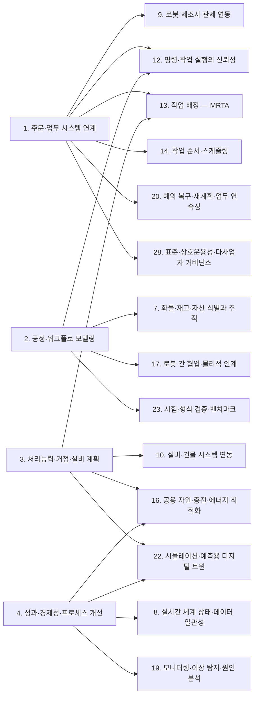
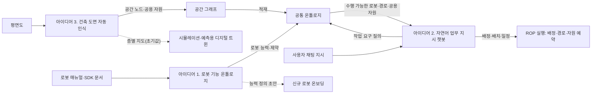

(너의 규칙은 시스템 프롬프트의 agents/shared-rules.md 와 agents/verifier.md 이다. 아래는 이번 실행의 컨텍스트와 입력이다.)

## 실행 컨텍스트

- run_id: 2026-09-25-32
- date: 2026-09-25
- run_type: category_link (대분류 연결)
- 대상: 대분류 B. 공통 정보·환경 모델 페이지의 '다른 대분류와의 연결' 절(대분류 연결 실행). 게시된 세부영역 페이지를 근거로 다른 대분류와의 연결을 조사·서술한다. 스토리텔러는 그 절만 patches 로 바꾼다
- 예산:
    - max_search_queries: 30
    - max_sources_per_run: 15
    - new_topic_pages: 1
    - page_updates: 2
    - max_retries: 2
- 환경 알림: web_fetch_available: false · fetch_mode: mirror_only (일반 웹 페이지 열람은 네트워크 정책으로 막혀 있다. raw.githubusercontent.com 은 열린다: 공식 문서가 GitHub 에 있는 출처는 입력의 config/source_mirrors.yaml 경로를 WebFetch 로 열어 원문을 읽고 sources[].fetched=true, fetched_via=github_raw, fetch_url 을 적는다. 입력에 원문 텍스트(data/source_texts)가 있는 출처는 fetched_via=inbox. 그 밖의 출처는 fetched=false 이며 코드가 신뢰도 상한(medium)을 강제한다 — 공통 규칙 0절 6항)
- 언어: ko
- verification_stage: first
- verifier_budget:
    - max_search_queries: 30
    - max_sources_per_run: 15
    - new_topic_pages: 1
    - page_updates: 2
    - max_retries: 2

## 입력

### runs/2026-09-25-32/target.json

```json
{
  "run_id": "2026-09-25-32",
  "date": "2026-09-25",
  "weekday": "Fri",
  "run_number": 32,
  "run_type": "category_link",
  "forced": true,
  "target": {
    "area_no": null,
    "area_name": null,
    "category": "B. 공통 정보·환경 모델",
    "category_letter": "B"
  },
  "topic": null,
  "track": null,
  "corrections": [],
  "budget": {
    "max_search_queries": 30,
    "max_sources_per_run": 15,
    "new_topic_pages": 1,
    "page_updates": 2,
    "max_retries": 2
  },
  "priority_reason": null,
  "priority_questions": [],
  "excluded_areas": [],
  "lifted_areas": [],
  "deferred": {
    "monthly_recheck": false,
    "weekly_review": false
  },
  "selection_rationale": "CLI 지정 run_type=category_link"
}
```

### runs/2026-09-25-32/research.json

```json
{
  "run_id": "2026-09-25-32",
  "date": "2026-09-25",
  "run_type": "category_link",
  "target": {
    "area_no": null,
    "area_name": null,
    "category": "B. 공통 정보·환경 모델"
  },
  "gaps": [
    "B. 공통 정보·환경 모델 페이지의 '다른 대분류와의 연결' 절 비어 있음(아직 작성되지 않음)",
    "연결 상대 세부영역 가운데 A. 업무·공급망 설계의 1~4와 C. 연결·실행 기반의 9. 로봇·제조사 관제 연동만 published 이고, 10~28 대부분은 seed 라 연결의 근거는 B 쪽 게시 페이지(5·6·7·8) 각주에 기댄다",
    "14. 작업 순서·스케줄링, 18. 사람–로봇 협업·운영 인터페이스, 23. 시험·형식 검증·벤치마크, 24. 자산·소프트웨어 수명주기 관리, 26. 사이버보안·접근권한·개인정보와 B 세부영역 사이의 연결은 게시 페이지에 검증된 근거가 없음",
    "6. 지도·공간·위치 모델의 실내 공간 표준(IndoorGML 2.0 등) 트랙 근거(2026-09-25-28)는 참고문헌 등록 전이라 이번에 쓰지 않음"
  ],
  "research_questions": [
    "로봇·물건·공간·상태를 어떻게 같은 의미로 이해할 것인가? [분류원문]",
    "같은 ‘운반 로봇’ 중 누가 이 화물을 실제로 취급할 수 있는가? [분류원문]",
    "5. 로봇 능력·작업 온톨로지의 능력 선언은 C. 연결·실행 기반(9. 로봇·제조사 관제 연동, 12. 명령·작업 실행의 신뢰성), D. 계획·최적화(13. 작업 배정 — MRTA), F. 도입·검증·유지관리(21. 온보딩·설정·현장 시운전), G. 안전·보안·지능·거버넌스(27. AI·학습·적응과 모델 운영, 28. 표준·상호운용성·다사업자 거버넌스)로 어떻게 넘어가는가?",
    "6. 지도·공간·위치 모델의 좌표 변환·주행 그래프·장소 식별은 9. 로봇·제조사 관제 연동, 10. 설비·건물 시스템 연동, 15. 다중 로봇 경로·교통 관리 — MAPF, 16. 공용 자원·충전·에너지 최적화, 21. 온보딩·설정·현장 시운전, 1. 주문·업무 시스템 연계와 어떤 데이터를 공유하는가?",
    "7. 화물·재고·자산 식별과 추적의 식별·인계 기록은 2. 공정·워크플로 모델링의 완료 조건, 9. 로봇·제조사 관제 연동의 적재물 보고, 10. 설비·건물 시스템 연동의 워크셀 요청·결과, 17. 로봇 간 협업·물리적 인계, 20. 예외 복구·재계획·업무 연속성과 어디서 맞물리는가?",
    "8. 실시간 세계 상태·데이터 일관성의 상태 시각·오래됨 판정은 10. 설비·건물 시스템 연동, 11. 분산 시스템·통신·컴퓨팅 구조, 25. 안전·위험 관리, 4. 성과·경제성·프로세스 개선, 19. 모니터링·이상 탐지·원인 분석과 어떻게 이어지고, 22. 시뮬레이션·예측용 디지털 트윈과는 어떻게 역할을 나누는가?"
  ],
  "findings": [
    {
      "id": "f1",
      "claim": "B. 공통 정보·환경 모델의 5. 로봇 능력·작업 온톨로지 ↔ C. 연결·실행 기반의 9. 로봇·제조사 관제 연동: VDA 5050 팩트시트는 적재 명세(loadSets: 적재 유형·최대 중량·처리 높이·픽·드롭 소요 시간)와 지원 동작(mobileRobotActions)을 선언하고, Open-RMF 플릿 어댑터 템플릿 설정은 수행 가능한 작업 유형(task_capabilities)과 동작 이름(actions)을 선언한다.",
      "tag": "사실",
      "source_ids": [
        "ref-228",
        "ref-105"
      ],
      "cross_checked": false,
      "confidence": "medium",
      "evidence_excerpt": "factsheet.schema 원본: loadType 'Type of load e.g., EPAL, XLT1200', actionType 'Unique actionType corresponding to action.actionType'. config.yaml 원본: task_capabilities(loop, delivery), actions 목록. 두 출처는 서로 다른 인터페이스의 사례이며 교차 확인 아님. (발행일 미확인, 확인일 기준)",
      "as_of": "2026-09-25",
      "flow_step": null,
      "flow_item": "수행 자원"
    },
    {
      "id": "f2",
      "claim": "B. 공통 정보·환경 모델의 5. 로봇 능력·작업 온톨로지 ↔ C. 연결·실행 기반의 12. 명령·작업 실행의 신뢰성: 인터페이스 안에서 선언한 동작 이름(팩트시트 actionType)이 명령과 완료 보고에 그대로 쓰이고 Open-RMF 어댑터가 로봇 API 완료 확인 뒤 완료를 알리므로, 능력 선언이 실행 확인의 기준 어휘가 될 것으로 보인다.",
      "tag": "추정",
      "source_ids": [
        "ref-228",
        "ref-040"
      ],
      "cross_checked": false,
      "confidence": "low",
      "evidence_excerpt": "팩트시트 actionType 은 order 의 action.actionType 과 대응한다고 설명된다. PerformAction 튜토리얼은 execution.finished() 호출로 완료를 알린다(5. 로봇 능력·작업 온톨로지 페이지 5·10절 인용). (재인용: 2026-09-25-15)",
      "as_of": "2026-09-25",
      "flow_step": null,
      "flow_item": "완료·인계",
      "source_unopened": false
    },
    {
      "id": "f3",
      "claim": "B. 공통 정보·환경 모델의 5. 로봇 능력·작업 온톨로지 ↔ D. 계획·최적화의 13. 작업 배정 — MRTA: 이종 다중 로봇 작업 배정에서 온톨로지 기반 실행 가능성 판정 결과를 배정기와 독립된 입력으로 넘기는 연구가 있다.",
      "tag": "사실",
      "source_ids": [
        "ref-236"
      ],
      "cross_checked": false,
      "confidence": "medium",
      "evidence_excerpt": "Semantic Feasibility Reasoning for Heterogeneous Multi-Robot Task Allocation(Electronics, 2026-08-11). 5. 로봇 능력·작업 온톨로지 페이지 10절 인용. 원문 미열람. (재인용: 2026-09-25-15)",
      "as_of": "2026-08-11",
      "flow_step": "적치",
      "flow_item": "수행 자원",
      "source_unopened": true
    },
    {
      "id": "f4",
      "claim": "B. 공통 정보·환경 모델의 5. 로봇 능력·작업 온톨로지 ↔ D. 계획·최적화의 13. 작업 배정 — MRTA: 제조사가 광고한 능력과 운용 중 관측된 능력을 온톨로지로 구분해 통합하는 연구가 있어, 배정 기준을 어느 값으로 둘지가 두 대분류 사이의 쟁점이 될 것으로 보인다(oq-024).",
      "tag": "추정",
      "source_ids": [
        "ref-041"
      ],
      "cross_checked": false,
      "confidence": "low",
      "evidence_excerpt": "Naqvi 외(2025) advertised vs operational capabilities 통합 온톨로지. 배정 기준 쟁점은 5. 로봇 능력·작업 온톨로지 페이지 5절·11절의 추론. 원문 미열람. (재인용: 2026-09-25-15)",
      "as_of": "2025-10-02",
      "flow_step": null,
      "flow_item": "예외·성과",
      "source_unopened": true
    },
    {
      "id": "f5",
      "claim": "B. 공통 정보·환경 모델의 5. 로봇 능력·작업 온톨로지 ↔ G. 안전·보안·지능·거버넌스의 27. AI·학습·적응과 모델 운영: 대규모 언어 모델로 능력 온톨로지를 생성하는 연구와 로봇 기술 파일(URDF)에서 로봇 온톨로지를 LLM 으로 채우는 연구가 있다.",
      "tag": "사실",
      "source_ids": [
        "ref-238",
        "ref-239"
      ],
      "cross_checked": false,
      "confidence": "medium",
      "evidence_excerpt": "Vieira da Silva 외(2024-04) On the Use of Large Language Models to Generate Capability Ontologies; Dussard & Sarthou(2026-06) LLM-Guided Automatic Population of Robot Ontology from URDF. 두 출처는 서로 다른 연구. 원문 미열람. (재인용: 2026-09-25-15)",
      "as_of": "2026-06",
      "flow_step": null,
      "flow_item": null,
      "source_unopened": true
    },
    {
      "id": "f6",
      "claim": "B. 공통 정보·환경 모델의 5. 로봇 능력·작업 온톨로지 ↔ F. 도입·검증·유지관리의 21. 온보딩·설정·현장 시운전: 매뉴얼·로봇 기술 파일을 해석해 능력 모델 초안을 만드는 일은 새 로봇 등록 때 필요한 작업이 될 것으로 보인다(분류 원문 8장의 매뉴얼 해석 교차 규칙과 같은 방향).",
      "tag": "추정",
      "source_ids": [
        "ref-238",
        "ref-239"
      ],
      "cross_checked": false,
      "confidence": "low",
      "evidence_excerpt": "5. 로봇 능력·작업 온톨로지 페이지 10절의 21번 연결 서술. 온보딩 현장에 적용한 사례는 미확인. 원문 미열람. (재인용: 2026-09-25-15)",
      "as_of": "2026-09-25",
      "flow_step": null,
      "flow_item": null,
      "source_unopened": true
    },
    {
      "id": "f7",
      "claim": "B. 공통 정보·환경 모델의 5. 로봇 능력·작업 온톨로지 ↔ G. 안전·보안·지능·거버넌스의 28. 표준·상호운용성·다사업자 거버넌스: 무인운반차 기술 데이터 서브모델 IDTA 02047, 서비스 로봇 모듈 공통 정보 모델 ISO 22166-201, 국내 KS B 7321-2 같은 제조사 독립 정보 모델 표준이 있다.",
      "tag": "사실",
      "source_ids": [
        "ref-234",
        "ref-240",
        "ref-138"
      ],
      "cross_checked": false,
      "confidence": "medium",
      "evidence_excerpt": "5. 로봇 능력·작업 온톨로지 페이지 10절 인용. KS 부합화 여부는 oq-004·oq-026 에서 열림. 원문 미열람. (재인용: 2026-09-25-15)",
      "as_of": "2024-02",
      "flow_step": null,
      "flow_item": null,
      "source_unopened": true
    },
    {
      "id": "f8",
      "claim": "B. 공통 정보·환경 모델의 6. 지도·공간·위치 모델 ↔ C. 연결·실행 기반의 9. 로봇·제조사 관제 연동: Open-RMF 플릿 어댑터는 로봇 좌표계가 RMF 와 다르면 같은 위치를 가리키는 좌표 쌍으로 회전·축척·이동 변환을 추정하며(대응점 4개 이상 권장), 템플릿 설정은 층별 reference_coordinates 로 이 좌표 쌍을 둔다.",
      "tag": "사실",
      "source_ids": [
        "ref-153",
        "ref-105"
      ],
      "cross_checked": false,
      "confidence": "medium",
      "evidence_excerpt": "튜토리얼 원본: 'provide two sets of (x, y) coordinates that correspond to the same locations in each system', 'a minimum of 4 matching waypoints is recommended'. config.yaml: reference_coordinates L1 rmf/robot 좌표 목록. 같은 기관 자료라 독립 교차 아님. (발행일 미확인, 확인일 기준)",
      "as_of": "2026-09-25",
      "flow_step": null,
      "flow_item": "제약"
    },
    {
      "id": "f9",
      "claim": "B. 공통 정보·환경 모델의 6. 지도·공간·위치 모델 ↔ C. 연결·실행 기반의 9. 로봇·제조사 관제 연동: VDA 5050 상태 스키마는 위치추정 품질(localizationScore), 편차 범위(deviationRange, 추정할 수 없는 로봇은 생략 가능), 지도 식별자(mapId)를 두어 위치 신뢰도 보고가 제조사 구현에 따라 달라질 수 있다.",
      "tag": "사실",
      "source_ids": [
        "ref-051"
      ],
      "cross_checked": false,
      "confidence": "medium",
      "evidence_excerpt": "state.schema 원본: deviationRange 'Optional for vehicles that cannot estimate their deviation, e.g., grid-based localization.' 수용 기준은 oq-028 에서 열림. (발행일 미확인, 확인일 기준)",
      "as_of": "2026-09-25",
      "flow_step": "출하",
      "flow_item": "완료·인계"
    },
    {
      "id": "f10",
      "claim": "B. 공통 정보·환경 모델의 6. 지도·공간·위치 모델 ↔ D. 계획·최적화의 15. 다중 로봇 경로·교통 관리 — MAPF: Open-RMF traffic-editor 로 주석한 차선·경유점 그래프는 building_map_generator 로 주행 그래프(navigation graph)로 내보내져 플릿 어댑터의 경로 계획에 쓰인다.",
      "tag": "사실",
      "source_ids": [
        "ref-079"
      ],
      "cross_checked": false,
      "confidence": "medium",
      "evidence_excerpt": "traffic-editor 장 원본: 'The annotated Graphs are eventually exported as navigation graphs using the building_map_generator which are then used by respective rmf_fleet_adapters for path planning.' (발행일 미확인, 확인일 기준)",
      "as_of": "2026-09-25",
      "flow_step": null,
      "flow_item": "제약"
    },
    {
      "id": "f11",
      "claim": "B. 공통 정보·환경 모델의 6. 지도·공간·위치 모델 ↔ D. 계획·최적화의 16. 공용 자원·충전·에너지 최적화: traffic-editor 는 주차 위치·충전기 위치·승강기·문·층을 지도에 주석하게 하여, 공용 자원의 위치 정보가 지도 모델에서 나온다.",
      "tag": "사실",
      "source_ids": [
        "ref-079"
      ],
      "cross_checked": false,
      "confidence": "medium",
      "evidence_excerpt": "traffic-editor 장 원본 기준: 차선, 경유점, parking spot, charger, lift, door, level 주석을 지원. 자원 예약·배분 규칙은 이 문서가 다루지 않음. (발행일 미확인, 확인일 기준)",
      "as_of": "2026-09-25",
      "flow_step": null,
      "flow_item": "수행 자원"
    },
    {
      "id": "f12",
      "claim": "B. 공통 정보·환경 모델의 6. 지도·공간·위치 모델 ↔ C. 연결·실행 기반의 10. 설비·건물 시스템 연동: Open-RMF 승강기 상태는 층 이름 문자열(available_floors, current_floor, destination_floor)로 층을 나타내므로, 지도 층 이름과 승강기 층 이름을 맞추는 대응이 두 대분류 사이에 필요할 것으로 보인다.",
      "tag": "추정",
      "source_ids": [
        "ref-286",
        "ref-079"
      ],
      "cross_checked": false,
      "confidence": "low",
      "evidence_excerpt": "LiftState.msg 원본: string[] available_floors, string current_floor, string destination_floor. 층 이름 대응 규칙을 정한 문서는 확인하지 못함.",
      "as_of": "2026-09-25",
      "flow_step": "적치",
      "flow_item": "제약"
    },
    {
      "id": "f13",
      "claim": "B. 공통 정보·환경 모델의 6. 지도·공간·위치 모델 ↔ F. 도입·검증·유지관리의 21. 온보딩·설정·현장 시운전: 도면에서 만든 지도에는 대기 위치 같은 운영 요소와 도면–현장 편차가 자동으로 담기지 않아, 시운전 때 사람의 주석·정렬 단계가 남는 것으로 보인다.",
      "tag": "추정",
      "source_ids": [
        "ref-079",
        "ref-080",
        "ref-224"
      ],
      "cross_checked": false,
      "confidence": "low",
      "evidence_excerpt": "6. 지도·공간·위치 모델 페이지 5절 제약 칸의 추론(traffic-editor 주석, 주행 지도 연동, 부정확한 건축 도면과 SLAM 결합 연구). 국내 사례는 oq-022. (재인용: 2026-09-25-17)",
      "as_of": "2026-09-25",
      "flow_step": null,
      "flow_item": null,
      "source_unopened": false
    },
    {
      "id": "f14",
      "claim": "B. 공통 정보·환경 모델의 6. 지도·공간·위치 모델 ↔ G. 안전·보안·지능·거버넌스의 27. AI·학습·적응과 모델 운영: 비전 언어 모델로 평면도 지도를 해석하는 연구가 있어, 도면 해석(분류 원문 8장 교차 규칙)이 두 대분류를 잇는다.",
      "tag": "사실",
      "source_ids": [
        "ref-076"
      ],
      "cross_checked": false,
      "confidence": "medium",
      "evidence_excerpt": "DeFazio 외(2024-09) Vision Language Models Can Parse Floor Plan Maps. 6. 지도·공간·위치 모델 페이지 각주 재사용. 원문 미열람. (재인용: 2026-09-25-17)",
      "as_of": "2024-09",
      "flow_step": null,
      "flow_item": null,
      "source_unopened": true
    },
    {
      "id": "f15",
      "claim": "B. 공통 정보·환경 모델의 6. 지도·공간·위치 모델 ↔ G. 안전·보안·지능·거버넌스의 28. 표준·상호운용성·다사업자 거버넌스: ISO 21423 은 산업용 이동로봇의 통신·상호운용성을 다루는 표준이며, 그 공통 좌표계가 제조사 지도 식별자와 어떻게 대응하는지는 아직 확인되지 않았다(oq-027).",
      "tag": "사실",
      "source_ids": [
        "ref-159"
      ],
      "cross_checked": false,
      "confidence": "medium",
      "evidence_excerpt": "ISO 21423 - Robotics — Industrial mobile robots — Communications and interoperability. 공통 좌표계 세부는 초안 해설 요약만 있음. 원문 미열람. (재인용: 2026-09-25-17)",
      "as_of": "2026-09-25",
      "flow_step": null,
      "flow_item": null,
      "source_unopened": true
    },
    {
      "id": "f16",
      "claim": "B. 공통 정보·환경 모델의 6. 지도·공간·위치 모델 ↔ A. 업무·공급망 설계의 1. 주문·업무 시스템 연계: GS1 GLN 은 도크 문·보관 위치 같은 하위 위치를 식별할 수 있고 GLN 확장 요소는 조직 내부나 거래 당사자 간 합의로만 쓰므로, 업무 위치와 로봇 지도 장소의 대응은 ROP 쪽 대응 계층이 맡게 될 것으로 보인다.",
      "tag": "추정",
      "source_ids": [
        "ref-162",
        "ref-031"
      ],
      "cross_checked": false,
      "confidence": "low",
      "evidence_excerpt": "6. 지도·공간·위치 모델 페이지 5절 완료·인계 칸과 9절 상위 업무 시스템 행 인용. 국내 사례는 oq-029. 원문 미열람. (재인용: 2026-09-25-17)",
      "as_of": "2026-09-25",
      "flow_step": "출하",
      "flow_item": "완료·인계",
      "source_unopened": false
    },
    {
      "id": "f17",
      "claim": "B. 공통 정보·환경 모델의 7. 화물·재고·자산 식별과 추적 ↔ A. 업무·공급망 설계의 2. 공정·워크플로 모델링: GS1 CBV 는 arriving·receiving·accepting 을 서로 다른 업무 단계로 정의하고, VDA 5050 은 drop 완료를 적재물이 로봇을 떠나 로봇이 새 적재 상태를 보고한 때로 정의한다.",
      "tag": "사실",
      "source_ids": [
        "ref-044",
        "ref-031"
      ],
      "cross_checked": false,
      "confidence": "medium",
      "evidence_excerpt": "CBV.ttl: receiving 'is added to the receiver's inventory'. VDA 5050: 'Load has left the mobile robot and mobile robot reports new load state.' 이번 실행에서 다시 열지 않음. (재인용: 2026-09-25-29)",
      "as_of": "2026-09-25",
      "flow_step": "입고",
      "flow_item": "완료·인계",
      "source_unopened": false
    },
    {
      "id": "f18",
      "claim": "B. 공통 정보·환경 모델의 7. 화물·재고·자산 식별과 추적 ↔ C. 연결·실행 기반의 9. 로봇·제조사 관제 연동: VDA 5050 상태 스키마의 loads 는 로봇이 취급 중인 적재물을 담되 적재 상태를 판단할 수 없으면 생략할 수 있고, loadId 는 바코드·RFID 같은 적재물 식별 번호이며 식별 전에는 비워 둔다.",
      "tag": "사실",
      "source_ids": [
        "ref-051"
      ],
      "cross_checked": false,
      "confidence": "medium",
      "evidence_excerpt": "state.schema 원본: loadId 'Unique identification number of the load (e.g., barcode or RFID). Empty field, if the mobile robot can identify the load, but did not identify the load yet.' (발행일 미확인, 확인일 기준)",
      "as_of": "2026-09-25",
      "flow_step": "출하",
      "flow_item": "작업 대상"
    },
    {
      "id": "f19",
      "claim": "B. 공통 정보·환경 모델의 7. 화물·재고·자산 식별과 추적 ↔ C. 연결·실행 기반의 10. 설비·건물 시스템 연동: Open-RMF 배송 작업에서 로봇은 픽업 지점 워크셀에 DispenserResult 를, 하역 지점 워크셀에 IngestorResult 를 받을 때까지 요청을 보내며, IngestorResult 는 요청 id·워크셀 id·상태만 담는다.",
      "tag": "사실",
      "source_ids": [
        "ref-023",
        "ref-049"
      ],
      "cross_checked": false,
      "confidence": "medium",
      "evidence_excerpt": "워크셀 장 원본: 'Requests a DispenserRequest till receives a DispenserResult. (Done Dispensing)'. IngestorResult.msg: request_guid, source_guid, status(ACKNOWLEDGED·SUCCESS·FAILED). (재인용: 2026-09-25-29)",
      "as_of": "2026-09-25",
      "flow_step": "출하",
      "flow_item": "완료·인계"
    },
    {
      "id": "f20",
      "claim": "B. 공통 정보·환경 모델의 7. 화물·재고·자산 식별과 추적 ↔ E. 협업·현장 운영의 17. 로봇 간 협업·물리적 인계: 설비의 인수 결과에는 화물 식별자·인계 당사자가 없고 EPCIS 는 소유·점유·위치 이전을 source/destination 으로 표현하므로, 물리적 인계 확인은 7번의 식별·인계 기록과 결합해야 할 것으로 보인다(oq-001).",
      "tag": "추정",
      "source_ids": [
        "ref-049",
        "ref-014",
        "ref-015"
      ],
      "cross_checked": false,
      "confidence": "low",
      "evidence_excerpt": "7. 화물·재고·자산 식별과 추적 페이지 3·5절의 추론. 두 계층을 잇는 표준 매핑·공개 구현은 확인하지 못함. 원문 미열람. (재인용: 2026-09-25-07)",
      "as_of": "2026-09-25",
      "flow_step": "출하",
      "flow_item": "완료·인계",
      "source_unopened": true
    },
    {
      "id": "f21",
      "claim": "B. 공통 정보·환경 모델의 7. 화물·재고·자산 식별과 추적 ↔ E. 협업·현장 운영의 20. 예외 복구·재계획·업무 연속성: 팔레트 RFID 태그 판독성이 제품·포장·태그 위치·적재 패턴에 따라 달라진다는 실험 보고가 있어, 판독 실패 시 인계 보류·재스캔·사람 확인 규칙이 복구 과제로 넘어갈 것으로 보인다(oq-003).",
      "tag": "추정",
      "source_ids": [
        "ref-024"
      ],
      "cross_checked": false,
      "confidence": "low",
      "evidence_excerpt": "Singh 외(2009) 도크 도어 모사 RFID 포털 실험. 처리 규칙은 미확인. 원문 미열람. (재인용: 2026-09-25-01)",
      "as_of": "2009",
      "flow_step": "출하",
      "flow_item": "예외·성과",
      "source_unopened": true
    },
    {
      "id": "f22",
      "claim": "B. 공통 정보·환경 모델의 8. 실시간 세계 상태·데이터 일관성 ↔ C. 연결·실행 기반의 10. 설비·건물 시스템 연동: Open-RMF 문·승강기 상태 메시지는 시각 필드(door_time, lift_time)를 담지만 승강기 연동 문서는 상태 발행 주기나 오래됨 판정 규칙을 정하지 않고, 승강기 어댑터는 적절하다고 판단한 요청만 승강기에 전달한다.",
      "tag": "사실",
      "source_ids": [
        "ref-285",
        "ref-286",
        "ref-284"
      ],
      "cross_checked": false,
      "confidence": "medium",
      "evidence_excerpt": "DoorState.msg: door_time, door_name, current_mode. 승강기 장 원본: 'only relaying the instructions to the lift node if it is deemed appropriate.' 주기·오래됨 규칙 부재는 열람 범위의 관찰(부재 확정 아님). (발행일 미확인, 확인일 기준)",
      "as_of": "2026-09-25",
      "flow_step": "적치",
      "flow_item": "제약"
    },
    {
      "id": "f23",
      "claim": "B. 공통 정보·환경 모델의 8. 실시간 세계 상태·데이터 일관성 ↔ C. 연결·실행 기반의 11. 분산 시스템·통신·컴퓨팅 구조: 상태의 오래됨을 알리는 장치는 통신 계층에 있다 — ROS 2 QoS 의 기한·생존성 정책, Sparkplug 의 노드 종료(NDEATH) 시 지표 STALE 표시, VDA 5050 의 MQTT 유언을 통한 CONNECTION_BROKEN 통지.",
      "tag": "사실",
      "source_ids": [
        "ref-282",
        "ref-287",
        "ref-031"
      ],
      "cross_checked": false,
      "confidence": "medium",
      "evidence_excerpt": "Sparkplug 5장 원본: 'mark all metrics that were included in the previous NBIRTH as STALE'. ROS 2 QoS(Jazzy)·VDA 5050 은 8. 실시간 세계 상태·데이터 일관성 페이지 6절·5절 인용. 세 출처는 서로 다른 장치를 말하며 교차 확인 아님. (재인용: 2026-09-25-24)",
      "as_of": "2026-09-25",
      "flow_step": null,
      "flow_item": "예외·성과",
      "source_unopened": false
    },
    {
      "id": "f24",
      "claim": "B. 공통 정보·환경 모델의 8. 실시간 세계 상태·데이터 일관성 ↔ G. 안전·보안·지능·거버넌스의 25. 안전·위험 관리: Open-RMF 승강기 상태의 운영 모드에 사람·AGV·화재·오프라인·비상이 있으므로, 탑승 확정 전에 최신 모드를 확인하는 규칙이 안전 조건과 맞물릴 것으로 보인다.",
      "tag": "추정",
      "source_ids": [
        "ref-286"
      ],
      "cross_checked": false,
      "confidence": "low",
      "evidence_excerpt": "LiftState.msg 원본: MODE_HUMAN=1, MODE_AGV=2, MODE_FIRE=3, MODE_OFFLINE=4, MODE_EMERGENCY=5. 안전 규칙과의 연결은 추론.",
      "as_of": "2026-09-25",
      "flow_step": "적치",
      "flow_item": "제약"
    },
    {
      "id": "f25",
      "claim": "B. 공통 정보·환경 모델의 8. 실시간 세계 상태·데이터 일관성 ↔ F. 도입·검증·유지관리의 22. 시뮬레이션·예측용 디지털 트윈: 제조 분야 분류에서 현장 상태가 한 방향으로 자동 반영되는 디지털 섀도와 디지털 트윈을 구분하므로, 8번은 현재 상태 표현을, 22번은 그 표현을 복제해 가정한 미래를 실험하는 쪽을 맡는 것이 분류 원문 구분과 맞을 것으로 보인다.",
      "tag": "추정",
      "source_ids": [
        "ref-291",
        "ref-290"
      ],
      "cross_checked": false,
      "confidence": "low",
      "evidence_excerpt": "Kritzinger 외(2018) 디지털 모델·섀도·트윈 분류, NIST 디지털 트윈 표준화 자료. 근거 자료는 제조 대상. 8. 실시간 세계 상태·데이터 일관성 페이지 10절. 원문 미열람. (재인용: 2026-09-25-24)",
      "as_of": "2018",
      "flow_step": null,
      "flow_item": null,
      "source_unopened": true
    },
    {
      "id": "f26",
      "claim": "B. 공통 정보·환경 모델의 8. 실시간 세계 상태·데이터 일관성 ↔ A. 업무·공급망 설계의 4. 성과·경제성·프로세스 개선: Open-RMF 로봇 상태 스키마는 상태(idle·charging·working·error 등), 배터리, 현재 작업 id, 문제 목록, 위치, 기록 시각을 담아 가동률·충전·오류 시간 지표의 원천이 된다.",
      "tag": "사실",
      "source_ids": [
        "ref-148"
      ],
      "cross_checked": false,
      "confidence": "medium",
      "evidence_excerpt": "robot_state.json: status uninitialized, offline, shutdown, idle, charging, working, error; battery 0.0~1.0; task_id; issues; unix_millis_time. 이번 실행에서 다시 열지 않음. (재인용: 2026-09-25-29)",
      "as_of": "2026-09-25",
      "flow_step": null,
      "flow_item": "예외·성과",
      "source_unopened": true
    },
    {
      "id": "f27",
      "claim": "B. 공통 정보·환경 모델의 8. 실시간 세계 상태·데이터 일관성 ↔ E. 협업·현장 운영의 19. 모니터링·이상 탐지·원인 분석: 로봇 상태의 문제 목록·오류 상태와 설비 상태의 시각 정보를 한 세계 상태에 모으면, 지연 원인이 로봇인지 문인지 구분하는 분석이 같은 상태 기록을 쓰게 될 것으로 보인다.",
      "tag": "추정",
      "source_ids": [
        "ref-148",
        "ref-285"
      ],
      "cross_checked": false,
      "confidence": "low",
      "evidence_excerpt": "robot_state.json 의 issues·error 와 DoorState.msg 의 door_time·current_mode 를 대응시킨 추론. 원인 분석에 적용한 연구는 이번에 확인하지 않음.",
      "as_of": "2026-09-25",
      "flow_step": null,
      "flow_item": "예외·성과"
    }
  ],
  "sources": [
    {
      "id": "ref-228",
      "org": "VDA / VDMA (VDA5050 GitHub)",
      "title": "VDA5050/VDA5050 — json_schemas/factsheet.schema",
      "published": null,
      "url": "https://github.com/VDA5050/VDA5050/blob/main/json_schemas/factsheet.schema",
      "type": "표준",
      "reliability": "high",
      "accessed": "2026-09-25",
      "summary": "VDA 5050 팩트시트 JSON 스키마. 유형·물리 파라미터·적재 명세(loadSets)·지원 동작(mobileRobotActions)을 원문으로 확인했다.",
      "fetched": true,
      "fetched_via": "github_raw",
      "fetch_url": "https://raw.githubusercontent.com/VDA5050/VDA5050/main/json_schemas/factsheet.schema",
      "source_unopened": false
    },
    {
      "id": "ref-105",
      "org": "Open Robotics (open-rmf)",
      "title": "fleet_adapter_template — fleet_adapter_template/config.yaml",
      "published": null,
      "url": "https://github.com/open-rmf/fleet_adapter_template/blob/main/fleet_adapter_template/config.yaml",
      "type": "오픈소스 문서",
      "reliability": "high",
      "accessed": "2026-09-25",
      "summary": "Open-RMF 플릿 어댑터 템플릿 설정. task_capabilities·actions·층별 reference_coordinates 를 원문으로 확인했다.",
      "fetched": true,
      "fetched_via": "github_raw",
      "fetch_url": "https://raw.githubusercontent.com/open-rmf/fleet_adapter_template/main/fleet_adapter_template/config.yaml",
      "source_unopened": false
    },
    {
      "id": "ref-040",
      "org": "Open Robotics",
      "title": "PerformAction Tutorial - Programming Multiple Robots with ROS 2",
      "published": null,
      "url": "https://osrf.github.io/ros2multirobotbook/integration_fleets_action_tutorial.html",
      "type": "오픈소스 문서",
      "reliability": "medium",
      "accessed": "2026-09-25",
      "summary": "원문 미열람. 이번 실행에서 다시 열지 않았다. Open-RMF 사용자 정의 동작 수행과 완료 통지(execution.finished()) 튜토리얼.",
      "source_unopened": false,
      "fetched": true,
      "fetched_via": "github_raw",
      "fetch_url": null
    },
    {
      "id": "ref-236",
      "org": "Electronics(MDPI) 게재 논문(저자 미확인)",
      "title": "Semantic Feasibility Reasoning for Heterogeneous Multi-Robot Task Allocation",
      "published": "2026-08-11",
      "url": "https://doi.org/10.3390/electronics15163562",
      "type": "논문",
      "reliability": "medium",
      "accessed": "2026-09-25",
      "summary": "원문 미열람. 이종 다중 로봇 작업 배정을 위한 의미 기반 실행 가능성 판정 연구.",
      "source_unopened": true,
      "fetched": false,
      "fetched_via": null,
      "fetch_url": null
    },
    {
      "id": "ref-041",
      "org": "Naqvi, M. R. 외(Scientific Reports)",
      "title": "Ontology-driven integration of advertised and operational capabilities in robots",
      "published": "2025-10-02",
      "url": "https://www.nature.com/articles/s41598-025-16649-3",
      "type": "논문",
      "reliability": "medium",
      "accessed": "2026-09-25",
      "summary": "원문 미열람. 제조사가 광고한 능력과 운용 중 관측된 능력을 온톨로지로 통합하는 연구.",
      "source_unopened": true,
      "fetched": false,
      "fetched_via": null,
      "fetch_url": null
    },
    {
      "id": "ref-238",
      "org": "Vieira da Silva, L. M., Köcher, A., Gehlhoff, F., & Fay, A.",
      "title": "On the Use of Large Language Models to Generate Capability Ontologies",
      "published": "2024-04",
      "url": "https://arxiv.org/abs/2404.17524",
      "type": "논문",
      "reliability": "medium",
      "accessed": "2026-09-25",
      "summary": "원문 미열람. LLM 으로 능력 온톨로지를 생성하고 검사하는 방법을 다룬 연구.",
      "source_unopened": true,
      "fetched": false,
      "fetched_via": null,
      "fetch_url": null
    },
    {
      "id": "ref-239",
      "org": "Dussard, B., & Sarthou, G. (LAAS-CNRS)",
      "title": "Extracting Semantics: LLM-Guided Automatic Population of Robot Ontology from URDF",
      "published": "2026-06",
      "url": "https://arxiv.org/abs/2606.17073",
      "type": "논문",
      "reliability": "medium",
      "accessed": "2026-09-25",
      "summary": "원문 미열람. URDF 로봇 기술 파일에서 LLM 으로 로봇 온톨로지를 자동으로 채우는 연구.",
      "source_unopened": true,
      "fetched": false,
      "fetched_via": null,
      "fetch_url": null
    },
    {
      "id": "ref-234",
      "org": "IDTA(Industrial Digital Twin Association)",
      "title": "IDTA 02047 Technical Data for Automated Guided Vehicles 1.0 — README (admin-shell-io/submodel-templates)",
      "published": null,
      "url": "https://github.com/admin-shell-io/submodel-templates/tree/main/published/Technical%20Data%20for%20Automated%20Guided%20Vehicles",
      "type": "표준",
      "reliability": "medium",
      "accessed": "2026-09-25",
      "summary": "원문 미열람. 무인운반차 기술 데이터 AAS 서브모델 템플릿.",
      "source_unopened": true,
      "fetched": false,
      "fetched_via": null,
      "fetch_url": null
    },
    {
      "id": "ref-240",
      "org": "ISO",
      "title": "ISO 22166-201:2024 - Robotics — Modularity for service robots — Part 201: Common information model for modules",
      "published": "2024-02",
      "url": "https://www.iso.org/standard/82334.html",
      "type": "표준",
      "reliability": "medium",
      "accessed": "2026-09-25",
      "summary": "원문 미열람. 서비스 로봇 모듈의 공통 정보 모델 국제표준.",
      "source_unopened": true,
      "fetched": false,
      "fetched_via": null,
      "fetch_url": null
    },
    {
      "id": "ref-138",
      "org": "국가표준인증통합정보시스템(KSSN)",
      "title": "KS B 7321-2 로봇 — 서비스 로봇 모듈용 정보 모델 — 제2부: 소프트웨어 모듈용 정보 모델",
      "published": null,
      "url": "https://www.kssn.net/search/stddetail.do?itemNo=K001010147546",
      "type": "표준",
      "reliability": "medium",
      "accessed": "2026-09-25",
      "summary": "원문 미열람. 서비스 로봇 소프트웨어 모듈 정보 모델 KS 표준.",
      "source_unopened": true,
      "fetched": false,
      "fetched_via": null,
      "fetch_url": null
    },
    {
      "id": "ref-153",
      "org": "Open Robotics",
      "title": "Fleet Adapter Tutorial - Programming Multiple Robots with ROS 2",
      "published": null,
      "url": "https://osrf.github.io/ros2multirobotbook/integration_fleets_adapter_tutorial.html",
      "type": "오픈소스 문서",
      "reliability": "high",
      "accessed": "2026-09-25",
      "summary": "플릿 어댑터 튜토리얼 mdBook 원본. 로봇–RMF 좌표 변환(좌표 쌍, nudged 추정, 대응점 4개 이상 권장)을 원문으로 확인했다.",
      "fetched": true,
      "fetched_via": "github_raw",
      "fetch_url": "https://raw.githubusercontent.com/osrf/ros2multirobotbook/master/src/integration_fleets_adapter_tutorial.md",
      "source_unopened": false
    },
    {
      "id": "ref-051",
      "org": "VDA / VDMA (VDA5050 GitHub)",
      "title": "VDA5050/VDA5050 — json_schemas/state.schema",
      "published": null,
      "url": "https://github.com/VDA5050/VDA5050/blob/main/json_schemas/state.schema",
      "type": "표준",
      "reliability": "high",
      "accessed": "2026-09-25",
      "summary": "VDA 5050 상태 JSON 스키마. loads·loadId·localizationScore·deviationRange·mapId·timestamp 설명을 원문으로 확인했다.",
      "fetched": true,
      "fetched_via": "github_raw",
      "fetch_url": "https://raw.githubusercontent.com/VDA5050/VDA5050/main/json_schemas/state.schema",
      "source_unopened": false
    },
    {
      "id": "ref-079",
      "org": "Open Robotics",
      "title": "Traffic Editor - Programming Multiple Robots with ROS 2",
      "published": null,
      "url": "https://osrf.github.io/ros2multirobotbook/traffic-editor.html",
      "type": "오픈소스 문서",
      "reliability": "high",
      "accessed": "2026-09-25",
      "summary": "traffic-editor 장 mdBook 원본. 차선·경유점·주차·충전기·승강기·문·층 주석과 주행 그래프 내보내기를 원문으로 확인했다.",
      "fetched": true,
      "fetched_via": "github_raw",
      "fetch_url": "https://raw.githubusercontent.com/osrf/ros2multirobotbook/master/src/traffic-editor.md",
      "source_unopened": false
    },
    {
      "id": "ref-080",
      "org": "Open Robotics",
      "title": "Navigation Maps (integration_nav-maps) - Programming Multiple Robots with ROS 2",
      "published": null,
      "url": "https://osrf.github.io/ros2multirobotbook/integration_nav-maps.html",
      "type": "오픈소스 문서",
      "reliability": "medium",
      "accessed": "2026-09-25",
      "summary": "원문 미열람. 이번 실행에서 다시 열지 않았다. Open-RMF 주행 지도 연동 장.",
      "source_unopened": true,
      "fetched": false,
      "fetched_via": null,
      "fetch_url": null
    },
    {
      "id": "ref-224",
      "org": "Shaheer, M., Millan-Romera, J. A., Bavle, H., Giberna, M., Sanchez-Lopez, J. L., Civera, J., & Voos, H.",
      "title": "Tightly Coupled SLAM with Imprecise Architectural Plans",
      "published": "2024-08",
      "url": "https://arxiv.org/abs/2408.01737",
      "type": "논문",
      "reliability": "medium",
      "accessed": "2026-09-25",
      "summary": "원문 미열람. 부정확한 건축 도면을 SLAM 과 결합하는 연구.",
      "source_unopened": true,
      "fetched": false,
      "fetched_via": null,
      "fetch_url": null
    },
    {
      "id": "ref-076",
      "org": "DeFazio, D., Mehta, H., Wang, M., Yang, P., Blackburn, J., & Zhang, S.",
      "title": "Vision Language Models Can Parse Floor Plan Maps",
      "published": "2024-09",
      "url": "https://arxiv.org/abs/2409.12842",
      "type": "논문",
      "reliability": "medium",
      "accessed": "2026-09-25",
      "summary": "원문 미열람. 비전 언어 모델의 평면도 지도 해석 능력을 다룬 연구.",
      "source_unopened": true,
      "fetched": false,
      "fetched_via": null,
      "fetch_url": null
    },
    {
      "id": "ref-159",
      "org": "ISO",
      "title": "ISO 21423 - Robotics — Industrial mobile robots — Communications and interoperability",
      "published": null,
      "url": "https://www.iso.org/standard/86749.html",
      "type": "표준",
      "reliability": "medium",
      "accessed": "2026-09-25",
      "summary": "원문 미열람. 산업용 이동로봇의 통신·상호운용성 국제표준.",
      "source_unopened": true,
      "fetched": false,
      "fetched_via": null,
      "fetch_url": null
    },
    {
      "id": "ref-162",
      "org": "GS1",
      "title": "Identifying a physical location - GLN",
      "published": null,
      "url": "https://www.gs1.org/standards/id-keys/gln/physical-location",
      "type": "표준",
      "reliability": "medium",
      "accessed": "2026-09-25",
      "summary": "원문 미열람. GLN 으로 물리적 위치와 하위 위치를 식별하는 GS1 안내.",
      "source_unopened": true,
      "fetched": false,
      "fetched_via": null,
      "fetch_url": null
    },
    {
      "id": "ref-031",
      "org": "VDA / VDMA (VDA5050 GitHub)",
      "title": "VDA5050/VDA5050_EN.md — Official Specification document for the VDA 5050",
      "published": null,
      "url": "https://github.com/VDA5050/VDA5050/blob/main/VDA5050_EN.md",
      "type": "표준",
      "reliability": "medium",
      "accessed": "2026-09-25",
      "summary": "원문 미열람. 이번 실행에서 다시 열지 않았다(이전 실행에서 원문 확인). VDA 5050 공식 명세(main 3.0.0).",
      "source_unopened": false,
      "fetched": true,
      "fetched_via": "github_raw",
      "fetch_url": null
    },
    {
      "id": "ref-044",
      "org": "GS1",
      "title": "gs1/EPCIS — Ontology/CBV.ttl (Core Business Vocabulary ontology 2.0)",
      "published": "2021-09-30",
      "url": "https://github.com/gs1/EPCIS/blob/master/Ontology/CBV.ttl",
      "type": "표준",
      "reliability": "medium",
      "accessed": "2026-09-25",
      "summary": "원문 미열람. 이번 실행에서 다시 열지 않았다(이전 실행에서 원문 확인). CBV 온톨로지 원본.",
      "source_unopened": true,
      "fetched": false,
      "fetched_via": null,
      "fetch_url": null
    },
    {
      "id": "ref-023",
      "org": "Open Robotics",
      "title": "Workcells - Programming Multiple Robots with ROS 2",
      "published": null,
      "url": "https://osrf.github.io/ros2multirobotbook/integration_workcells.html",
      "type": "오픈소스 문서",
      "reliability": "high",
      "accessed": "2026-09-25",
      "summary": "워크셀 연동 장 mdBook 원본. 배송 작업의 디스펜서·인제스터 요청–결과 반복을 원문으로 확인했다.",
      "fetched": true,
      "fetched_via": "github_raw",
      "fetch_url": "https://raw.githubusercontent.com/osrf/ros2multirobotbook/master/src/integration_workcells.md",
      "source_unopened": false
    },
    {
      "id": "ref-049",
      "org": "Open Robotics (open-rmf)",
      "title": "rmf_internal_msgs — rmf_ingestor_msgs/msg/IngestorResult.msg",
      "published": null,
      "url": "https://github.com/open-rmf/rmf_internal_msgs/blob/main/rmf_ingestor_msgs/msg/IngestorResult.msg",
      "type": "오픈소스 문서",
      "reliability": "medium",
      "accessed": "2026-09-25",
      "summary": "원문 미열람. 이번 실행에서 다시 열지 않았다. IngestorResult 메시지 정의(요청 id·워크셀 id·상태).",
      "source_unopened": true,
      "fetched": false,
      "fetched_via": null,
      "fetch_url": null
    },
    {
      "id": "ref-014",
      "org": "GS1",
      "title": "Core Business Vocabulary (CBV) Standard",
      "published": null,
      "url": "https://ref.gs1.org/standards/cbv/",
      "type": "표준",
      "reliability": "medium",
      "accessed": "2026-09-25",
      "summary": "원문 미열람. EPCIS 이벤트의 업무 단계·source/destination 유형 등 표준 어휘.",
      "source_unopened": true,
      "fetched": false,
      "fetched_via": null,
      "fetch_url": null
    },
    {
      "id": "ref-015",
      "org": "GS1",
      "title": "EPCIS and CBV Implementation Guideline",
      "published": null,
      "url": "https://www.gs1.org/docs/epc/EPCIS_Guideline.pdf",
      "type": "표준",
      "reliability": "medium",
      "accessed": "2026-09-25",
      "summary": "원문 미열람. EPCIS·CBV 구현 안내(인계 맥락 표현 포함).",
      "source_unopened": true,
      "fetched": false,
      "fetched_via": null,
      "fetch_url": null
    },
    {
      "id": "ref-024",
      "org": "Singh, J. 외",
      "title": "RFID tag readability issues with palletized loads of consumer goods",
      "published": "2009",
      "url": "https://onlinelibrary.wiley.com/doi/abs/10.1002/pts.864",
      "type": "논문",
      "reliability": "medium",
      "accessed": "2026-09-25",
      "summary": "원문 미열람. 팔레트 적재 소비재의 RFID 태그 판독성 실험 연구.",
      "source_unopened": true,
      "fetched": false,
      "fetched_via": null,
      "fetch_url": null
    },
    {
      "id": "ref-285",
      "org": "Open Robotics (open-rmf)",
      "title": "rmf_internal_msgs — rmf_door_msgs/msg/DoorState.msg",
      "published": null,
      "url": "https://github.com/open-rmf/rmf_internal_msgs/blob/main/rmf_door_msgs/msg/DoorState.msg",
      "type": "오픈소스 문서",
      "reliability": "high",
      "accessed": "2026-09-25",
      "summary": "Open-RMF 문 상태 메시지 정의. door_time·door_name·current_mode 필드를 원문으로 확인했다.",
      "fetched": true,
      "fetched_via": "github_raw",
      "fetch_url": "https://raw.githubusercontent.com/open-rmf/rmf_internal_msgs/main/rmf_door_msgs/msg/DoorState.msg",
      "source_unopened": false
    },
    {
      "id": "ref-286",
      "org": "Open Robotics (open-rmf)",
      "title": "rmf_internal_msgs — rmf_lift_msgs/msg/LiftState.msg",
      "published": null,
      "url": "https://github.com/open-rmf/rmf_internal_msgs/blob/main/rmf_lift_msgs/msg/LiftState.msg",
      "type": "오픈소스 문서",
      "reliability": "high",
      "accessed": "2026-09-25",
      "summary": "Open-RMF 승강기 상태 메시지 정의. 시각·층 이름·문·운행 상태·운영 모드·세션 id 를 원문으로 확인했다.",
      "fetched": true,
      "fetched_via": "github_raw",
      "fetch_url": "https://raw.githubusercontent.com/open-rmf/rmf_internal_msgs/main/rmf_lift_msgs/msg/LiftState.msg",
      "source_unopened": false
    },
    {
      "id": "ref-284",
      "org": "Open Robotics",
      "title": "Lifts (integration_lifts) - Programming Multiple Robots with ROS 2",
      "published": null,
      "url": "https://osrf.github.io/ros2multirobotbook/integration_lifts.html",
      "type": "오픈소스 문서",
      "reliability": "high",
      "accessed": "2026-09-25",
      "summary": "승강기 연동 장 mdBook 원본. 승강기 어댑터가 요청을 걸러 전달하는 구조를 원문으로 확인했고, 상태 발행 주기·오래됨 규칙은 찾지 못했다.",
      "fetched": true,
      "fetched_via": "github_raw",
      "fetch_url": "https://raw.githubusercontent.com/osrf/ros2multirobotbook/master/src/integration_lifts.md",
      "source_unopened": false
    },
    {
      "id": "ref-282",
      "org": "Open Robotics (ROS 2 Documentation)",
      "title": "Quality of Service settings — ROS 2 Documentation: Jazzy",
      "published": null,
      "url": "https://docs.ros.org/en/jazzy/Concepts/Intermediate/About-Quality-of-Service-Settings.html",
      "type": "오픈소스 문서",
      "reliability": "medium",
      "accessed": "2026-09-25",
      "summary": "원문 미열람. ROS 2 QoS 정책(기한·수명·생존성)과 이벤트 콜백 설명.",
      "source_unopened": true,
      "fetched": false,
      "fetched_via": null,
      "fetch_url": null
    },
    {
      "id": "ref-287",
      "org": "Eclipse Foundation (eclipse-sparkplug GitHub)",
      "title": "Sparkplug Specification — Chapter 5 Operational Behavior (Sparkplug_5_Operational_Behavior.adoc)",
      "published": null,
      "url": "https://github.com/eclipse-sparkplug/sparkplug/blob/master/specification/src/main/asciidoc/chapters/Sparkplug_5_Operational_Behavior.adoc",
      "type": "표준",
      "reliability": "high",
      "accessed": "2026-09-25",
      "summary": "Sparkplug 명세 5장 원본. 노드·장치 종료(NDEATH·DDEATH) 때 호스트가 지표를 STALE 로 표시하는 규정을 원문으로 확인했다.",
      "fetched": true,
      "fetched_via": "github_raw",
      "fetch_url": "https://raw.githubusercontent.com/eclipse-sparkplug/sparkplug/master/specification/src/main/asciidoc/chapters/Sparkplug_5_Operational_Behavior.adoc",
      "source_unopened": false
    },
    {
      "id": "ref-291",
      "org": "Kritzinger, W., Karner, M., Traar, G., Henjes, J., & Sihn, W.",
      "title": "Digital Twin in manufacturing: A categorical literature review and classification",
      "published": "2018",
      "url": "https://www.sciencedirect.com/science/article/pii/S2405896318316021",
      "type": "논문",
      "reliability": "medium",
      "accessed": "2026-09-25",
      "summary": "원문 미열람. 제조 분야 디지털 모델·디지털 섀도·디지털 트윈 분류 문헌 검토.",
      "source_unopened": true,
      "fetched": false,
      "fetched_via": null,
      "fetch_url": null
    },
    {
      "id": "ref-290",
      "org": "NIST",
      "title": "DIGITAL TWINS FOR ADVANCED MANUFACTURING: THE STANDARDIZED APPROACH",
      "published": null,
      "url": "https://tsapps.nist.gov/publication/get_pdf.cfm?pub_id=957417",
      "type": "정부·연구기관",
      "reliability": "medium",
      "accessed": "2026-09-25",
      "summary": "원문 미열람. 제조 디지털 트윈 표준화(ISO 23247 등) 접근을 다룬 NIST 자료.",
      "source_unopened": true,
      "fetched": false,
      "fetched_via": null,
      "fetch_url": null
    },
    {
      "id": "ref-148",
      "org": "Open Robotics (open-rmf)",
      "title": "rmf_api_msgs — rmf_api_msgs/schemas/robot_state.json",
      "published": null,
      "url": "https://github.com/open-rmf/rmf_api_msgs/blob/main/rmf_api_msgs/schemas/robot_state.json",
      "type": "오픈소스 문서",
      "reliability": "medium",
      "accessed": "2026-09-25",
      "summary": "원문 미열람. 이번 실행에서 다시 열지 않았다(이전 실행에서 원문 확인). Open-RMF 로봇 상태 스키마.",
      "source_unopened": true,
      "fetched": false,
      "fetched_via": null,
      "fetch_url": null
    }
  ],
  "page_proposals": [
    {
      "action": "update",
      "path": "docs/categories/b-common-information-and-environment-model/index.md",
      "sections": [
        "5. 다른 대분류와의 연결"
      ],
      "rationale": "대분류 페이지의 다섯째 절 '다른 대분류와의 연결'만 patches 로 채운다. A. 업무·공급망 설계: f16(6 ↔ 1), f17(7 ↔ 2), f26(8 ↔ 4) / C. 연결·실행 기반: f1(5 ↔ 9), f2(5 ↔ 12), f8·f9(6 ↔ 9), f12(6 ↔ 10), f18(7 ↔ 9), f19(7 ↔ 10), f22(8 ↔ 10), f23(8 ↔ 11) / D. 계획·최적화: f3·f4(5 ↔ 13), f10(6 ↔ 15), f11(6 ↔ 16) / E. 협업·현장 운영: f20(7 ↔ 17), f21(7 ↔ 20), f27(8 ↔ 19) / F. 도입·검증·유지관리: f6(5 ↔ 21), f13(6 ↔ 21), f25(8 ↔ 22, 현재 상태 표현과 가정한 미래 실험 구분) / G. 안전·보안·지능·거버넌스: f5(5 ↔ 27), f14(6 ↔ 27, 도면 해석 교차 규칙), f7(5 ↔ 28), f15(6 ↔ 28), f24(8 ↔ 25). 14·18·23·24·26 연결은 검증된 근거가 없어 쓰지 않는다."
    }
  ],
  "glossary_candidates": [],
  "open_questions_new": [
    "로봇 지도의 층(level) 이름과 승강기 상태의 층 이름(available_floors) 그리고 업무 위치 식별자를 서로 대응시키는 규칙을 정한 표준이나 공개 구현이 있는가? | 관련 영역: 6. 지도·공간·위치 모델, 10. 설비·건물 시스템 연동 | 근거: f12 | 종류: 일반"
  ],
  "open_questions_resolved": [],
  "self_check": {
    "source_count": 33,
    "cross_checked_count": 0,
    "unverified": [
      "모든 finding 교차 확인 없음: 연결마다 게시 페이지의 단일 출처이거나 서로 다른 주장을 뒷받침하는 출처",
      "f22 승강기 문서의 상태 주기·오래됨 규칙 부재는 열람 범위의 관찰이며 부재 확정 아님",
      "f2·f4·f6·f12·f13·f16·f20·f21·f24·f25·f27 은 추론이며 두 대분류 사이 규칙을 정한 표준·사례 미확인",
      "원문 미열람 재사용 출처 23건(ref-040, ref-236, ref-041, ref-238, ref-239, ref-234, ref-240, ref-138, ref-080, ref-224, ref-076, ref-159, ref-162, ref-031, ref-044, ref-049, ref-014, ref-015, ref-024, ref-282, ref-291, ref-290, ref-148)"
    ],
    "scope_violations": [],
    "budget_used": {
      "queries": 2,
      "sources": 0
    },
    "limits": "web_fetch_available: false · fetch_mode mirror_only. 재사용 출처 가운데 10건(ref-228, ref-105, ref-153, ref-051, ref-079, ref-023, ref-285, ref-286, ref-284, ref-287)을 raw.githubusercontent.com 으로 열어 확인했고, 나머지 23건은 이번 실행에서 원문을 열지 않아 신뢰도 상한 medium 으로 적었다. 근거는 게시된 5~8 세부영역 페이지와 이전 브리프(2026-09-25-01·07·15·17·24·29)의 각주를 재사용했고 신규 출처는 0건이다. 검색 2회(영어 1: 디지털 섀도·트윈 창고 로봇, 한국어 1: WMS·로봇 관제·EPCIS 연동)는 개인 저장소·벤더·기사 자료뿐이라 출처로 넣지 않았다. 연결 상대 세부영역 대부분이 seed 라 반대편 서술은 B 쪽 근거에 기댄다. 14. 작업 순서·스케줄링, 18. 사람–로봇 협업·운영 인터페이스, 23. 시험·형식 검증·벤치마크, 24. 자산·소프트웨어 수명주기 관리, 26. 사이버보안·접근권한·개인정보와의 연결은 검증된 근거가 없어 제외했다. 2026-09-25-28 트랙 브리프의 실내 공간 표준(ref-498 이후)은 참고문헌 등록 전이라 쓰지 않았다. 교차 규칙: 27. AI·학습·적응과 모델 운영 연결은 5. 로봇 능력·작업 온톨로지(f5, 매뉴얼 해석은 21. 온보딩·설정·현장 시운전 f6과 함께)와 6. 지도·공간·위치 모델(f14, 도면 해석)에 적용 대상과 함께 제시했다. 8. 실시간 세계 상태·데이터 일관성(현재 상태)과 22. 시뮬레이션·예측용 디지털 트윈(가정한 미래)을 f25에서 구분했다. 정정 요청 없음. 페이지 제안의 섹션 '5'는 대분류 페이지의 다섯째 절(다른 대분류와의 연결)을 가리킨다."
  }
}
```

### docs/glossary/index.md

```markdown
---
title: "용어집"
type: glossary
subtype: index
status: published
created: 2026-09-24
updated: 2026-09-24
version: 1
---

[홈](../index.md) › 용어집

# 용어집

이 위키에서 쓰는 용어의 한글·영문 표기와 한 줄 정의를 모은다. 용어마다 개별 페이지에 설명, 관련 연구영역, 출처를 둔다. 시드 용어는 SCOR, ISA-95, EPCIS, Open-RMF, Fleet Adapter, WES/WCS/WMS/MES/TMS, MRTA, MAPF, Lifelong MAPF, Multi-Agent Pickup and Delivery, ARIAC, DDS-Security, 디지털 트윈이다. 새 용어는 스토리텔러 에이전트가 제안하고 퍼블리셔가 반영한다.

아래 표는 용어 페이지의 프런트매터(term_ko, term_en, definition, related_areas)에서 자동으로 만든다.

## 용어 목록

<!-- auto:glossary-index:start -->
| 용어(한글) | 용어(영문) | 한 줄 정의 | 관련 영역 |
|---|---|---|---|
| [5G 특화망(이음5G)](private-5g-network.md) | Private 5G Network (e-Um 5G) | 이동통신사가 아닌 기업·기관이 건물·공장 같은 특정 구역 단위로 5G 주파수를 할당받아 직접 구축해 쓰는 국내 5G 통신망이다. | [11. 분산 시스템·통신·컴퓨팅 구조](../categories/c-connectivity-and-execution-foundation/11-distributed-systems-communication-and-computing.md) |
| [B2MML](b2mml.md) | Business To Manufacturing Markup Language (B2MML) | MESA International이 ISA-95(IEC 62264)의 데이터 모델을 XML 스키마로 구현한 교환 형식이다. | [1. 주문·업무 시스템 연계](../categories/a-business-supply-chain-design/01-order-and-business-system-integration.md)<br>[2. 공정·워크플로 모델링](../categories/a-business-supply-chain-design/02-process-and-workflow-modeling.md)<br>[14. 작업 순서·스케줄링](../categories/d-planning-and-optimization/14-task-sequencing-and-scheduling.md) |
| [CAP 정리](cap-theorem.md) | CAP Theorem | 네트워크 분할이 일어날 수 있는 분산 서비스는 일관성과 가용성을 동시에 완전히 보장할 수 없다는 정리이다. | [11. 분산 시스템·통신·컴퓨팅 구조](../categories/c-connectivity-and-execution-foundation/11-distributed-systems-communication-and-computing.md)<br>[8. 실시간 세계 상태·데이터 일관성](../categories/b-common-information-and-environment-model/08-real-time-world-state-and-data-consistency.md) |
| [DDS 보안 규격](dds-security.md) | DDS Security (DDS-Security) | DDS(Data Distribution Service)의 보안 규격으로, ROS 2가 인증·암호화·접근통제 구조의 기반으로 통합했다. | [26. 사이버보안·접근권한·개인정보](../categories/g-safety-security-intelligence-and-governance/26-cybersecurity-access-control-and-privacy.md)<br>[11. 분산 시스템·통신·컴퓨팅 구조](../categories/c-connectivity-and-execution-foundation/11-distributed-systems-communication-and-computing.md)<br>[28. 표준·상호운용성·다사업자 거버넌스](../categories/g-safety-security-intelligence-and-governance/28-standards-interoperability-and-multi-vendor-governance.md) |
| [IndoorGML](indoorgml.md) | IndoorGML | 실내 공간을 셀 공간(CellSpace)과 그 경계, 공간 연결을 나타내는 노드·엣지의 쌍대 그래프, 의미별 주제 레이어로 표현하는 OGC 실내 공간 정보 표준이다. | [6. 지도·공간·위치 모델](../categories/b-common-information-and-environment-model/06-map-space-and-location-model.md)<br>[28. 표준·상호운용성·다사업자 거버넌스](../categories/g-safety-security-intelligence-and-governance/28-standards-interoperability-and-multi-vendor-governance.md) |
| [LLM 에이전트](llm-agent.md) | LLM Agent | 대규모 언어 모델이 사람이 정해 준 도구·함수(로봇 API, 조회 기능 등)를 골라 호출하며 여러 단계로 작업을 수행하도록 구성한 소프트웨어이다. | [27. AI·학습·적응과 모델 운영](../categories/g-safety-security-intelligence-and-governance/27-ai-learning-adaptation-and-model-operations.md)<br>[13. 작업 배정 — MRTA](../categories/d-planning-and-optimization/13-task-allocation-mrta.md)<br>[18. 사람–로봇 협업·운영 인터페이스](../categories/e-collaboration-and-field-operations/18-human-robot-collaboration-and-operator-interface.md) |
| [VDA 5050 팩트시트](vda-5050-factsheet.md) | VDA 5050 factsheet | VDA 5050에서 이동로봇이 관제에 자신의 유형·물리 파라미터·적재 명세·지원 action을 알리는 메시지이다. | [5. 로봇 능력·작업 온톨로지](../categories/b-common-information-and-environment-model/05-robot-capability-and-task-ontology.md)<br>[9. 로봇·제조사 관제 연동](../categories/c-connectivity-and-execution-foundation/09-robot-and-vendor-fleet-manager-integration.md) |
| [VDA 5050](vda-5050.md) | VDA 5050 | VDA 5050 주문에서 관제가 이미 해제해 로봇이 주행해도 되는 경로(베이스)와 계획만 되어 있고 아직 해제되지 않은 경로(호라이즌)를 구분하는 개념이다. | [5. 로봇 능력·작업 온톨로지](../categories/b-common-information-and-environment-model/05-robot-capability-and-task-ontology.md)<br>[7. 화물·재고·자산 식별과 추적](../categories/b-common-information-and-environment-model/07-cargo-inventory-and-asset-identification-and-tracking.md)<br>[9. 로봇·제조사 관제 연동](../categories/c-connectivity-and-execution-foundation/09-robot-and-vendor-fleet-manager-integration.md)<br>[11. 분산 시스템·통신·컴퓨팅 구조](../categories/c-connectivity-and-execution-foundation/11-distributed-systems-communication-and-computing.md)<br>[12. 명령·작업 실행의 신뢰성](../categories/c-connectivity-and-execution-foundation/12-command-and-task-execution-reliability.md)<br>[28. 표준·상호운용성·다사업자 거버넌스](../categories/g-safety-security-intelligence-and-governance/28-standards-interoperability-and-multi-vendor-governance.md) |
| [객체 중심 이벤트 로그](ocel.md) | Object-Centric Event Log (OCEL) | 이벤트와 여러 객체 사이 관계, 관계의 한정자, 시간에 따라 바뀌는 객체 속성을 기록하는 이벤트 로그 교환 표준이며, 2.0판은 SQLite·XML·JSON 형식을 둔다. | [2. 공정·워크플로 모델링](../categories/a-business-supply-chain-design/02-process-and-workflow-modeling.md)<br>[4. 성과·경제성·프로세스 개선](../categories/a-business-supply-chain-design/04-performance-economics-and-process-improvement.md)<br>[19. 모니터링·이상 탐지·원인 분석](../categories/e-collaboration-and-field-operations/19-monitoring-anomaly-detection-and-root-cause-analysis.md) |
| [경로망](roadmap.md) | Roadmap | 다중 AGV·이동로봇이 따라 달릴 수 있는 노드와 엣지의 주행 경로 그래프로, 현장 도입 때 전문가가 설계하거나 자동 생성한다. | [15. 다중 로봇 경로·교통 관리 — MAPF](../categories/d-planning-and-optimization/15-multi-robot-path-and-traffic-management-mapf.md)<br>[21. 온보딩·설정·현장 시운전](../categories/f-deployment-verification-and-maintenance/21-onboarding-configuration-and-commissioning.md)<br>[6. 지도·공간·위치 모델](../categories/b-common-information-and-environment-model/06-map-space-and-location-model.md) |
| [계획 도메인 정의 언어](pddl.md) | Planning Domain Definition Language (PDDL) | 자동 계획 문제에서 행동을 파라미터·전제조건·효과로 기술하고 도메인과 문제 인스턴스를 분리해 표현하는 언어이다. | [5. 로봇 능력·작업 온톨로지](../categories/b-common-information-and-environment-model/05-robot-capability-and-task-ontology.md) |
| [공급망 운영 참조 모델](scor.md) | Supply Chain Operations Reference (SCOR) | ASCM이 관리하는 공급망 프로세스 참조 모델로, 공급망을 계획·주문·조달·생산/가공·이행·반품 프로세스와 이를 아우르는 오케스트레이션 프로세스로 기술한다. | [1. 주문·업무 시스템 연계](../categories/a-business-supply-chain-design/01-order-and-business-system-integration.md)<br>[2. 공정·워크플로 모델링](../categories/a-business-supply-chain-design/02-process-and-workflow-modeling.md)<br>[4. 성과·경제성·프로세스 개선](../categories/a-business-supply-chain-design/04-performance-economics-and-process-improvement.md) |
| [글로벌 개별 자산 식별자](giai.md) | Global Individual Asset Identifier (GIAI) | 컨테이너·트럭·트레일러 같은 개별 자산을 식별하는 GS1 식별 키이다. | [7. 화물·재고·자산 식별과 추적](../categories/b-common-information-and-environment-model/07-cargo-inventory-and-asset-identification-and-tracking.md) |
| [글로벌 반환형 자산 식별자](grai.md) | Global Returnable Asset Identifier (GRAI) | 팔레트·상자·트레이·케그처럼 여러 번 재사용되는 운반구를 식별하는 GS1 식별 키이다. | [7. 화물·재고·자산 식별과 추적](../categories/b-common-information-and-environment-model/07-cargo-inventory-and-asset-identification-and-tracking.md) |
| [기업–제어 시스템 통합 표준](isa-95.md) | ISA-95 Enterprise-Control System Integration | ISA-95 계열에서 하위 실행 계층이 수행할 작업 단위의 요청으로, OPC UA for ISA-95 Job Control 은 이를 저장·시작·갱신·일시정지·중단하는 메서드를 둔다. | [1. 주문·업무 시스템 연계](../categories/a-business-supply-chain-design/01-order-and-business-system-integration.md)<br>[2. 공정·워크플로 모델링](../categories/a-business-supply-chain-design/02-process-and-workflow-modeling.md)<br>[28. 표준·상호운용성·다사업자 거버넌스](../categories/g-safety-security-intelligence-and-governance/28-standards-interoperability-and-multi-vendor-governance.md) |
| [능력·스킬·서비스 모델](capabilities-skills-services.md) | Capabilities, Skills and Services (CSS) Model | Plattform Industrie 4.0 작업반이 제안한 정보 모델로, 구현과 무관한 기능 명세(능력)와 그 실행 가능한 구현(스킬), 제공 형태(서비스)를 구분한다. 이 위키의 온톨로지 초안에서는 CSS의 능력(capability)을 기능(Capability)으로 부른다. | [5. 로봇 능력·작업 온톨로지](../categories/b-common-information-and-environment-model/05-robot-capability-and-task-ontology.md)<br>[28. 표준·상호운용성·다사업자 거버넌스](../categories/g-safety-security-intelligence-and-governance/28-standards-interoperability-and-multi-vendor-governance.md) |
| [다중 로봇 작업 배정](mrta.md) | Multi-Robot Task Allocation (MRTA) | 여러 로봇과 여러 작업이 있을 때 어떤 로봇(또는 로봇 팀)이 어떤 작업을 맡을지 정하는 문제이다. | [13. 작업 배정 — MRTA](../categories/d-planning-and-optimization/13-task-allocation-mrta.md)<br>[5. 로봇 능력·작업 온톨로지](../categories/b-common-information-and-environment-model/05-robot-capability-and-task-ontology.md)<br>[14. 작업 순서·스케줄링](../categories/d-planning-and-optimization/14-task-sequencing-and-scheduling.md)<br>[16. 공용 자원·충전·에너지 최적화](../categories/d-planning-and-optimization/16-shared-resource-charging-and-energy-optimization.md) |
| [다중 에이전트 경로 찾기](mapf.md) | Multi-Agent Path Finding (MAPF) | 여러 에이전트(로봇)가 각자의 출발지에서 목적지까지 서로 충돌하지 않고 동시에 따라갈 수 있는 경로들을 계획하는 문제이다. | [15. 다중 로봇 경로·교통 관리 — MAPF](../categories/d-planning-and-optimization/15-multi-robot-path-and-traffic-management-mapf.md)<br>[6. 지도·공간·위치 모델](../categories/b-common-information-and-environment-model/06-map-space-and-location-model.md)<br>[16. 공용 자원·충전·에너지 최적화](../categories/d-planning-and-optimization/16-shared-resource-charging-and-energy-optimization.md) |
| [다중 에이전트 픽업·배송](multi-agent-pickup-and-delivery.md) | Multi-Agent Pickup and Delivery (MAPD) | 픽업 위치와 배송 위치가 있는 작업이 온라인으로 계속 들어올 때, 에이전트에 작업을 배정하고 충돌 없는 경로를 함께 계획하는 문제이다. | [13. 작업 배정 — MRTA](../categories/d-planning-and-optimization/13-task-allocation-mrta.md)<br>[15. 다중 로봇 경로·교통 관리 — MAPF](../categories/d-planning-and-optimization/15-multi-robot-path-and-traffic-management-mapf.md)<br>[14. 작업 순서·스케줄링](../categories/d-planning-and-optimization/14-task-sequencing-and-scheduling.md) |
| [다중 플릿 오케스트레이션](multi-fleet-orchestration.md) | Multi-Fleet Orchestration | 제조사가 다른 여러 로봇 플릿을 제3자 관제가 한곳에서 조율하는 것으로, 로봇을 직접 제어하는 저수준 방식과 제조사 관제에 작업을 넘기는 고수준 방식이 있다. | [9. 로봇·제조사 관제 연동](../categories/c-connectivity-and-execution-foundation/09-robot-and-vendor-fleet-manager-integration.md)<br>[13. 작업 배정 — MRTA](../categories/d-planning-and-optimization/13-task-allocation-mrta.md)<br>[15. 다중 로봇 경로·교통 관리 — MAPF](../categories/d-planning-and-optimization/15-multi-robot-path-and-traffic-management-mapf.md) |
| [디지털 섀도](digital-shadow.md) | Digital Shadow | 물리 대상의 상태가 디지털 표현으로 한 방향 자동 흐름으로만 반영되는 단계의 디지털 표현으로, 디지털 모델·디지털 트윈과 구분된다(Kritzinger 외(2018) 분류 기준). | [8. 실시간 세계 상태·데이터 일관성](../categories/b-common-information-and-environment-model/08-real-time-world-state-and-data-consistency.md)<br>[22. 시뮬레이션·예측용 디지털 트윈](../categories/f-deployment-verification-and-maintenance/22-simulation-and-predictive-digital-twin.md) |
| [디지털 트윈](digital-twin.md) | Digital Twin | 물리적 대상(장비·자재·공정·설비·제품 등)을 데이터로 연결된 가상 모델로 표현한 것이다. | [22. 시뮬레이션·예측용 디지털 트윈](../categories/f-deployment-verification-and-maintenance/22-simulation-and-predictive-digital-twin.md)<br>[8. 실시간 세계 상태·데이터 일관성](../categories/b-common-information-and-environment-model/08-real-time-world-state-and-data-consistency.md)<br>[23. 시험·형식 검증·벤치마크](../categories/f-deployment-verification-and-maintenance/23-testing-formal-verification-and-benchmarking.md) |
| [래스터–벡터 변환](raster-to-vector-conversion.md) | Raster-to-Vector Conversion | 픽셀 이미지로 된 평면도를 벽 선분·교차점·방 다각형 같은 기하 요소의 벡터 표현으로 바꾸는 처리이다. | [6. 지도·공간·위치 모델](../categories/b-common-information-and-environment-model/06-map-space-and-location-model.md)<br>[27. AI·학습·적응과 모델 운영](../categories/g-safety-security-intelligence-and-governance/27-ai-learning-adaptation-and-model-operations.md) |
| [레이아웃 교환 형식](layout-interchange-format.md) | Layout Interchange Format (LIF) | 무인운반차 통합사가 노드·간선·스테이션으로 이루어진 주행 레이아웃을 제3자 중앙 관제 시스템에 넘기기 위해 VDMA 가 정한 교환 형식이다. | [6. 지도·공간·위치 모델](../categories/b-common-information-and-environment-model/06-map-space-and-location-model.md)<br>[9. 로봇·제조사 관제 연동](../categories/c-connectivity-and-execution-foundation/09-robot-and-vendor-fleet-manager-integration.md)<br>[16. 공용 자원·충전·에너지 최적화](../categories/d-planning-and-optimization/16-shared-resource-charging-and-energy-optimization.md)<br>[28. 표준·상호운용성·다사업자 거버넌스](../categories/g-safety-security-intelligence-and-governance/28-standards-interoperability-and-multi-vendor-governance.md) |
| [로봇 이동형 풀필먼트 시스템](robotic-mobile-fulfillment-system.md) | Robotic Mobile Fulfillment System (RMFS) | 로봇이 상품을 담은 이동식 선반(pod)을 작업대까지 옮기고 작업자가 그 앞에서 피킹·보충하는 부품-작업자(parts-to-picker) 방식의 자동화 창고 시스템이다. | [3. 처리능력·거점·설비 계획](../categories/a-business-supply-chain-design/03-capacity-site-and-facility-planning.md)<br>[13. 작업 배정 — MRTA](../categories/d-planning-and-optimization/13-task-allocation-mrta.md)<br>[16. 공용 자원·충전·에너지 최적화](../categories/d-planning-and-optimization/16-shared-resource-charging-and-energy-optimization.md) |
| [로봇·자동화 핵심 온톨로지](cora.md) | Core Ontology for Robotics and Automation (CORA) | IEEE 1872-2015가 정한 로봇·자동화 분야의 가장 일반적인 개념·관계·공리를 담은 핵심 온톨로지이다. | [5. 로봇 능력·작업 온톨로지](../categories/b-common-information-and-environment-model/05-robot-capability-and-task-ontology.md)<br>[28. 표준·상호운용성·다사업자 거버넌스](../categories/g-safety-security-intelligence-and-governance/28-standards-interoperability-and-multi-vendor-governance.md) |
| [리틀의 법칙](littles-law.md) | Little's Law | 재공품(WIP)이 처리량(TH)과 사이클 타임(CT)의 곱과 같다는 관계로, 처리량·재공품·리드타임을 함께 해석하는 기준이 된다. | [4. 성과·경제성·프로세스 개선](../categories/a-business-supply-chain-design/04-performance-economics-and-process-improvement.md)<br>[3. 처리능력·거점·설비 계획](../categories/a-business-supply-chain-design/03-capacity-site-and-facility-planning.md) |
| [메시지 큐잉 원격 측정 전송](mqtt.md) | Message Queuing Telemetry Transport (MQTT) | 브로커를 거쳐 토픽 단위로 메시지를 발행·구독하는 경량 메시징 프로토콜로, VDA 5050이 관제와 이동로봇 사이 통신에 쓴다. | [9. 로봇·제조사 관제 연동](../categories/c-connectivity-and-execution-foundation/09-robot-and-vendor-fleet-manager-integration.md)<br>[11. 분산 시스템·통신·컴퓨팅 구조](../categories/c-connectivity-and-execution-foundation/11-distributed-systems-communication-and-computing.md) |
| [무충돌 복제 데이터 타입](crdt.md) | Conflict-free Replicated Data Type (CRDT) | 여러 복제본을 조율 없이 수정해도 같은 갱신을 받으면 정해진 규칙으로 같은 상태에 수렴하도록 설계된 데이터 타입이다. | [8. 실시간 세계 상태·데이터 일관성](../categories/b-common-information-and-environment-model/08-real-time-world-state-and-data-consistency.md)<br>[11. 분산 시스템·통신·컴퓨팅 구조](../categories/c-connectivity-and-execution-foundation/11-distributed-systems-communication-and-computing.md) |
| [물류 단위 일련 코드](sscc.md) | Serial Shipping Container Code (SSCC) | 케이스·팔레트·소포 등 보관·운송을 위해 묶인 물류 단위를 고유하게 식별하는 18자리 GS1 식별 키이다. | [7. 화물·재고·자산 식별과 추적](../categories/b-common-information-and-environment-model/07-cargo-inventory-and-asset-identification-and-tracking.md) |
| [반개방형 대기행렬 네트워크](semi-open-queueing-network.md) | Semi-Open Queueing Network (SOQN) | 외부에서 주문이 들어오되 로봇 같은 한정된 자원 수가 고정된 채 순환하는 시스템의 처리량·대기 시간을 해석적으로 추정하는 대기행렬 모델이다. | [3. 처리능력·거점·설비 계획](../categories/a-business-supply-chain-design/03-capacity-site-and-facility-planning.md)<br>[16. 공용 자원·충전·에너지 최적화](../categories/d-planning-and-optimization/16-shared-resource-charging-and-energy-optimization.md) |
| [비즈니스 프로세스 모델 및 표기법](bpmn.md) | Business Process Model and Notation (BPMN) | OMG가 정한 업무 프로세스 표기법으로, ISO/IEC 19510:2013은 OMG BPMN 2.0.1을 PAS 절차로 국제표준화한 것이다. | [2. 공정·워크플로 모델링](../categories/a-business-supply-chain-design/02-process-and-workflow-modeling.md)<br>[12. 명령·작업 실행의 신뢰성](../categories/c-connectivity-and-execution-foundation/12-command-and-task-execution-reliability.md) |
| [산업 기초 클래스](ifc.md) | Industry Foundation Classes (IFC) | buildingSMART 의 BIM 데이터 스키마로, IFC 4.3 은 건물 안에서 특정 기능을 제공하는 경계 지어진 면적·체적을 IfcSpace 로 정의하고 건물 층(IfcBuildingStorey)에 집합 관계로 연결한다. | [6. 지도·공간·위치 모델](../categories/b-common-information-and-environment-model/06-map-space-and-location-model.md)<br>[28. 표준·상호운용성·다사업자 거버넌스](../categories/g-safety-security-intelligence-and-governance/28-standards-interoperability-and-multi-vendor-governance.md) |
| [산업 자동화용 민첩 로봇 경진대회](ariac.md) | Agile Robotics for Industrial Automation Competition (ARIAC) | NIST가 운영하는 로봇 경진대회로, 변화하는 제조 환경에서 로봇의 계획·인식·행동과 적응성을 평가한다. | [23. 시험·형식 검증·벤치마크](../categories/f-deployment-verification-and-maintenance/23-testing-formal-verification-and-benchmarking.md)<br>[22. 시뮬레이션·예측용 디지털 트윈](../categories/f-deployment-verification-and-maintenance/22-simulation-and-predictive-digital-twin.md)<br>[20. 예외 복구·재계획·업무 연속성](../categories/e-collaboration-and-field-operations/20-exception-recovery-replanning-and-business-continuity.md) |
| [선형 시간 논리](linear-temporal-logic.md) | Linear Temporal Logic (LTL) | 작업의 순서·시간 제약을 명확한 의미로 기술하는 형식 논리이다. | [27. AI·학습·적응과 모델 운영](../categories/g-safety-security-intelligence-and-governance/27-ai-learning-adaptation-and-model-operations.md)<br>[23. 시험·형식 검증·벤치마크](../categories/f-deployment-verification-and-maintenance/23-testing-formal-verification-and-benchmarking.md)<br>[13. 작업 배정 — MRTA](../categories/d-planning-and-optimization/13-task-allocation-mrta.md) |
| [스킬](skill.md) | Skill | 구현과 무관하게 명세한 능력(capability)을 실제로 실행하는 캡슐화된 구현으로, OPC UA 같은 호출 인터페이스를 가지며 상태 기계를 가질 수 있다(예: CaSkMan 의 ISA 88 상태 기계). | [5. 로봇 능력·작업 온톨로지](../categories/b-common-information-and-environment-model/05-robot-capability-and-task-ontology.md)<br>[9. 로봇·제조사 관제 연동](../categories/c-connectivity-and-execution-foundation/09-robot-and-vendor-fleet-manager-integration.md)<br>[12. 명령·작업 실행의 신뢰성](../categories/c-connectivity-and-execution-foundation/12-command-and-task-execution-reliability.md) |
| [업무 위치](business-location.md) | Business Location (EPCIS bizLocation) | EPCIS 이벤트 뒤 다른 이벤트가 반박할 때까지 객체가 있다고 보는 업무상 위치를 나타내는 선택 필드이다. | [7. 화물·재고·자산 식별과 추적](../categories/b-common-information-and-environment-model/07-cargo-inventory-and-asset-identification-and-tracking.md)<br>[6. 지도·공간·위치 모델](../categories/b-common-information-and-environment-model/06-map-space-and-location-model.md) |
| [연결 이벤트](association-event.md) | AssociationEvent | 물리 객체를 상위 객체나 특정 물리 위치와 연결하거나 연결을 해제한 사실을 기록하는 EPCIS 2.0 이벤트 유형이다. | [7. 화물·재고·자산 식별과 추적](../categories/b-common-information-and-environment-model/07-cargo-inventory-and-asset-identification-and-tracking.md) |
| [오류 선언](epcis-error-declaration.md) | Error Declaration (EPCIS errorDeclaration) | 앞선 EPCIS 이벤트의 내용이 틀렸음을 선언 시각·사유·정정 이벤트 id 와 함께 기록해 원 기록을 지우지 않고 바로잡게 하는 EPCIS 요소이다. | [8. 실시간 세계 상태·데이터 일관성](../categories/b-common-information-and-environment-model/08-real-time-world-state-and-data-consistency.md)<br>[7. 화물·재고·자산 식별과 추적](../categories/b-common-information-and-environment-model/07-cargo-inventory-and-asset-identification-and-tracking.md) |
| [오픈 RMF](open-rmf.md) | Open-RMF (Open Robotics Middleware Framework) | ROS 2 기반의 다중 로봇 조율 프레임워크로, 제조사별 플릿 어댑터와 건물 설비 인터페이스를 통해 로봇·문·승강기 등을 연결하고 작업·교통을 조율한다. | [9. 로봇·제조사 관제 연동](../categories/c-connectivity-and-execution-foundation/09-robot-and-vendor-fleet-manager-integration.md)<br>[10. 설비·건물 시스템 연동](../categories/c-connectivity-and-execution-foundation/10-facility-and-building-system-integration.md)<br>[15. 다중 로봇 경로·교통 관리 — MAPF](../categories/d-planning-and-optimization/15-multi-robot-path-and-traffic-management-mapf.md)<br>[13. 작업 배정 — MRTA](../categories/d-planning-and-optimization/13-task-allocation-mrta.md) |
| [완전 주문 이행률](perfect-order-fulfillment.md) | Perfect Order Fulfillment | 완전 주문 수를 전체 주문 수로 나눈 비율로, 주문의 모든 품목 줄이 완전해야 완전 주문으로 보는 SCOR의 신뢰성 대표 지표(RL.1.1)이다. | [4. 성과·경제성·프로세스 개선](../categories/a-business-supply-chain-design/04-performance-economics-and-process-improvement.md)<br>[1. 주문·업무 시스템 연계](../categories/a-business-supply-chain-design/01-order-and-business-system-integration.md) |
| [워크플로 넷](workflow-net.md) | Workflow Net (WF-net) | 워크플로를 모델링·분석하는 표준적 방법 가운데 하나로 쓰이는 페트리 넷의 한 부류이다. | [2. 공정·워크플로 모델링](../categories/a-business-supply-chain-design/02-process-and-workflow-modeling.md)<br>[23. 시험·형식 검증·벤치마크](../categories/f-deployment-verification-and-maintenance/23-testing-formal-verification-and-benchmarking.md) |
| [웨이브리스 출고 지시](waveless-order-release.md) | Waveless Order Release | 주문을 큰 묶음(웨이브)으로 모아 내리지 않고 도착·여유 용량에 따라 연속으로 현장에 내려보내는 출고 지시 방식이다. | [1. 주문·업무 시스템 연계](../categories/a-business-supply-chain-design/01-order-and-business-system-integration.md)<br>[14. 작업 순서·스케줄링](../categories/d-planning-and-optimization/14-task-sequencing-and-scheduling.md) |
| [위상 지도](topological-map.md) | Topological Map | 정확한 좌표 대신 방·구역 같은 장소를 노드로, 통로·문 같은 연결을 엣지로 두어 공간의 연결 관계를 표현하는 지도이다. | [6. 지도·공간·위치 모델](../categories/b-common-information-and-environment-model/06-map-space-and-location-model.md)<br>[15. 다중 로봇 경로·교통 관리 — MAPF](../categories/d-planning-and-optimization/15-multi-robot-path-and-traffic-management-mapf.md) |
| [위치 체크 디지트](location-check-digit.md) | Location Check Digit | 보관 위치 라벨에 붙은 짧은 확인용 숫자로, 작업자가 이를 말하거나 입력해 올바른 위치에 있음을 시스템에 확인시키는 데 쓰인다. GS1 식별 키(SSCC·GTIN 등)의 끝자리 검증 숫자(체크 디지트)와는 다른 뜻이다. | [18. 사람–로봇 협업·운영 인터페이스](../categories/e-collaboration-and-field-operations/18-human-robot-collaboration-and-operator-interface.md) |
| [음성 피킹](voice-picking.md) | Voice-Directed Picking (Voice Picking) | 시스템이 작업자에게 갈 위치와 피킹할 수량을 음성으로 지시하고 작업자가 짧은 음성 응답으로 동작을 확인하는 창고 피킹 방식이다. | [18. 사람–로봇 협업·운영 인터페이스](../categories/e-collaboration-and-field-operations/18-human-robot-collaboration-and-operator-interface.md) |
| [의미 식별자](semantic-id.md) | Semantic ID (semanticId) | AAS 요소의 의미를 외부 사전(ECLASS·IEC CDD 등)의 개념 기술이나 IDTA 자체 식별자로 가리키는 식별자이다. | [5. 로봇 능력·작업 온톨로지](../categories/b-common-information-and-environment-model/05-robot-capability-and-task-ontology.md)<br>[28. 표준·상호운용성·다사업자 거버넌스](../categories/g-safety-security-intelligence-and-governance/28-standards-interoperability-and-multi-vendor-governance.md) |
| [이산 사건 시뮬레이션](discrete-event-simulation.md) | Discrete Event Simulation (DES) | 주문 도착·작업 완료 같은 사건이 일어나는 시점마다 시스템 상태를 갱신해 처리량·대기·가동률을 실험하는 시뮬레이션 방식이다. | [3. 처리능력·거점·설비 계획](../categories/a-business-supply-chain-design/03-capacity-site-and-facility-planning.md)<br>[22. 시뮬레이션·예측용 디지털 트윈](../categories/f-deployment-verification-and-maintenance/22-simulation-and-predictive-digital-twin.md) |
| [자산관리셸](asset-administration-shell.md) | Asset Administration Shell (AAS) | 산업 자산의 정보를 서브모델 단위로 기술하는 표준 체계로, IDTA가 능력 기술(IDTA 02020)·무인운반차 기술 데이터(IDTA 02047) 같은 서브모델 템플릿을 공개한다. | [5. 로봇 능력·작업 온톨로지](../categories/b-common-information-and-environment-model/05-robot-capability-and-task-ontology.md)<br>[9. 로봇·제조사 관제 연동](../categories/c-connectivity-and-execution-foundation/09-robot-and-vendor-fleet-manager-integration.md)<br>[28. 표준·상호운용성·다사업자 거버넌스](../categories/g-safety-security-intelligence-and-governance/28-standards-interoperability-and-multi-vendor-governance.md) |
| [작업 분해](task-decomposition.md) | Task Decomposition | 상위 지시나 목표를 로봇이 실행할 수 있는 하위 작업·동작의 순서나 구조로 나누는 일이다. | [13. 작업 배정 — MRTA](../categories/d-planning-and-optimization/13-task-allocation-mrta.md)<br>[14. 작업 순서·스케줄링](../categories/d-planning-and-optimization/14-task-sequencing-and-scheduling.md)<br>[2. 공정·워크플로 모델링](../categories/a-business-supply-chain-design/02-process-and-workflow-modeling.md)<br>[27. AI·학습·적응과 모델 운영](../categories/g-safety-security-intelligence-and-governance/27-ai-learning-adaptation-and-model-operations.md) |
| [전자 제품 코드 정보 서비스](epcis.md) | Electronic Product Code Information Services (EPCIS) | GS1이 정한, 제품·자산의 상태·위치·이동·인계에 관한 이벤트를 기록하고 공유하기 위한 표준이다. | [7. 화물·재고·자산 식별과 추적](../categories/b-common-information-and-environment-model/07-cargo-inventory-and-asset-identification-and-tracking.md)<br>[2. 공정·워크플로 모델링](../categories/a-business-supply-chain-design/02-process-and-workflow-modeling.md)<br>[17. 로봇 간 협업·물리적 인계](../categories/e-collaboration-and-field-operations/17-robot-to-robot-collaboration-and-physical-handover.md) |
| [점유 격자 지도](occupancy-grid-map.md) | Occupancy Grid Map (OGM) | 공간을 일정 크기 칸으로 나누고 칸마다 점유·빈 공간·미지 여부를 적어 로봇 위치추정과 경로계획에 쓰는 지도 표현이다. | [6. 지도·공간·위치 모델](../categories/b-common-information-and-environment-model/06-map-space-and-location-model.md) |
| [정보 나이](age-of-information.md) | Age of Information (AoI) | 수신 측이 가진 최신 상태 갱신이 생성된 뒤 흐른 시간으로, 받은 정보가 얼마나 최신인지를 재는 지표이다. | [8. 실시간 세계 상태·데이터 일관성](../categories/b-common-information-and-environment-model/08-real-time-world-state-and-data-consistency.md)<br>[11. 분산 시스템·통신·컴퓨팅 구조](../categories/c-connectivity-and-execution-foundation/11-distributed-systems-communication-and-computing.md) |
| [종합설비효율](overall-equipment-effectiveness.md) | Overall Equipment Effectiveness (OEE) | 설비의 가용성·효과성(성능)·품질률을 곱해 구하는 지표로, ISO 22400-2(2014판)가 제조 운영 관리 KPI의 하나로 정의한다. | [4. 성과·경제성·프로세스 개선](../categories/a-business-supply-chain-design/04-performance-economics-and-process-improvement.md)<br>[16. 공용 자원·충전·에너지 최적화](../categories/d-planning-and-optimization/16-shared-resource-charging-and-energy-optimization.md) |
| [지도 정합](map-alignment.md) | Map Alignment | 서로 다른 로봇·도면의 지도 좌표계를 대응점으로 구한 회전·축척·이동 변환으로 공통 좌표계에 맞추는 일이다. | [6. 지도·공간·위치 모델](../categories/b-common-information-and-environment-model/06-map-space-and-location-model.md)<br>[9. 로봇·제조사 관제 연동](../categories/c-connectivity-and-execution-foundation/09-robot-and-vendor-fleet-manager-integration.md)<br>[21. 온보딩·설정·현장 시운전](../categories/f-deployment-verification-and-maintenance/21-onboarding-configuration-and-commissioning.md) |
| [지속형 다중 에이전트 경로 찾기](lifelong-mapf.md) | Lifelong Multi-Agent Path Finding (Lifelong MAPF) | 에이전트가 목적지에 도착하면 곧바로 새 목적지를 받아 계속 이동하는 조건에서 충돌 없는 경로를 계속 계획하는 MAPF의 변형이다. | [15. 다중 로봇 경로·교통 관리 — MAPF](../categories/d-planning-and-optimization/15-multi-robot-path-and-traffic-management-mapf.md)<br>[14. 작업 순서·스케줄링](../categories/d-planning-and-optimization/14-task-sequencing-and-scheduling.md)<br>[13. 작업 배정 — MRTA](../categories/d-planning-and-optimization/13-task-allocation-mrta.md) |
| [집계 이벤트](aggregation-event.md) | AggregationEvent | 상자를 팔레트에 싣거나 내리는 것처럼 상위 객체와 하위 객체의 물리적 결합·분리를 기록하는 EPCIS 이벤트 유형이다. | [7. 화물·재고·자산 식별과 추적](../categories/b-common-information-and-environment-model/07-cargo-inventory-and-asset-identification-and-tracking.md) |
| [차량 소요대수 산정](fleet-sizing.md) | Fleet Sizing | 예상 물동량과 서비스 수준(대기 시간·처리량) 목표를 만족하는 데 필요한 로봇·운반 차량의 최소 대수를 정하는 계획 문제이다. | [3. 처리능력·거점·설비 계획](../categories/a-business-supply-chain-design/03-capacity-site-and-facility-planning.md)<br>[13. 작업 배정 — MRTA](../categories/d-planning-and-optimization/13-task-allocation-mrta.md)<br>[16. 공용 자원·충전·에너지 최적화](../categories/d-planning-and-optimization/16-shared-resource-charging-and-energy-optimization.md) |
| [창고 실행·창고 제어·창고 관리·제조 실행·운송 관리 시스템](wes-wcs-wms-mes-tms.md) | Warehouse Execution System / Warehouse Control System / Warehouse Management System / Manufacturing Execution System / Transportation Management System | 창고·생산·운송의 주문·재고·설비·공정을 관리하거나 실행하는 업무·실행 시스템 계열의 약어이며, ROP는 이들에서 작업 요청을 받아 로봇 작업으로 바꾸고 결과를 되돌려 주는 관계에 있다. | [1. 주문·업무 시스템 연계](../categories/a-business-supply-chain-design/01-order-and-business-system-integration.md)<br>[2. 공정·워크플로 모델링](../categories/a-business-supply-chain-design/02-process-and-workflow-modeling.md)<br>[10. 설비·건물 시스템 연동](../categories/c-connectivity-and-execution-foundation/10-facility-and-building-system-integration.md) |
| [파놉틱 심볼 스포팅](panoptic-symbol-spotting.md) | Panoptic Symbol Spotting | CAD 도면의 선 요소마다 문·창문 같은 셀 수 있는 기호의 개별 인스턴스와 벽 같은 셀 수 없는 영역의 의미를 함께 판별하는 과제이다. | [6. 지도·공간·위치 모델](../categories/b-common-information-and-environment-model/06-map-space-and-location-model.md)<br>[27. AI·학습·적응과 모델 운영](../categories/g-safety-security-intelligence-and-governance/27-ai-learning-adaptation-and-model-operations.md) |
| [판독 지점](read-point.md) | Read Point (EPCIS readPoint) | EPCIS 이벤트가 일어난 지점을 나타내는 선택 필드이다. | [7. 화물·재고·자산 식별과 추적](../categories/b-common-information-and-environment-model/07-cargo-inventory-and-asset-identification-and-tracking.md)<br>[17. 로봇 간 협업·물리적 인계](../categories/e-collaboration-and-field-operations/17-robot-to-robot-collaboration-and-physical-handover.md) |
| [평면도 인식](floor-plan-recognition.md) | Floor Plan Recognition | 평면도 이미지나 CAD 도면에서 벽·문·창문·계단 같은 건축 요소와 방 영역·유형을 자동으로 찾아내 구조화하는 작업이다. | [6. 지도·공간·위치 모델](../categories/b-common-information-and-environment-model/06-map-space-and-location-model.md)<br>[27. AI·학습·적응과 모델 운영](../categories/g-safety-security-intelligence-and-governance/27-ai-learning-adaptation-and-model-operations.md) |
| [포그 컴퓨팅](fog-computing.md) | Fog Computing | 클라우드와 말단 장치 사이에 계산·저장·네트워크 자원을 계층으로 두어 지연에 민감한 분산 애플리케이션을 현장 가까이에서 처리하게 하는 컴퓨팅 모델이다. | [11. 분산 시스템·통신·컴퓨팅 구조](../categories/c-connectivity-and-execution-foundation/11-distributed-systems-communication-and-computing.md) |
| [프로세스 마이닝](process-mining.md) | Process Mining | 시스템에 남은 이벤트 로그로 실제 업무 흐름을 발견하고 대기·병목을 분석하는 기법이다. | [4. 성과·경제성·프로세스 개선](../categories/a-business-supply-chain-design/04-performance-economics-and-process-improvement.md)<br>[2. 공정·워크플로 모델링](../categories/a-business-supply-chain-design/02-process-and-workflow-modeling.md)<br>[19. 모니터링·이상 탐지·원인 분석](../categories/e-collaboration-and-field-operations/19-monitoring-anomaly-detection-and-root-cause-analysis.md) |
| [플릿 관리 시스템](fleet-management-system.md) | Fleet Management System (FMS) | 여러 이동로봇에 작업을 배정하고 경로·상태를 관리하는 관제 소프트웨어로, 로봇 제조사가 자사 로봇용으로 제공하는 경우가 많다. | [9. 로봇·제조사 관제 연동](../categories/c-connectivity-and-execution-foundation/09-robot-and-vendor-fleet-manager-integration.md)<br>[13. 작업 배정 — MRTA](../categories/d-planning-and-optimization/13-task-allocation-mrta.md) |
| [플릿 어댑터](fleet-adapter.md) | Fleet Adapter | Open-RMF에서 제조사별 로봇 플릿(같은 관제 아래 묶인 로봇 무리)을 연결하기 위해 두는 제조사별 연결 구성요소이다. | [9. 로봇·제조사 관제 연동](../categories/c-connectivity-and-execution-foundation/09-robot-and-vendor-fleet-manager-integration.md)<br>[5. 로봇 능력·작업 온톨로지](../categories/b-common-information-and-environment-model/05-robot-capability-and-task-ontology.md)<br>[12. 명령·작업 실행의 신뢰성](../categories/c-connectivity-and-execution-foundation/12-command-and-task-execution-reliability.md)<br>[21. 온보딩·설정·현장 시운전](../categories/f-deployment-verification-and-maintenance/21-onboarding-configuration-and-commissioning.md) |
| [핵심 업무 어휘](cbv.md) | Core Business Vocabulary (CBV) | EPCIS 이벤트의 업무 단계·상태·인계 유형 등에 채울 표준 어휘 값을 정한 GS1 표준(ISO/IEC 19988)이다. | [7. 화물·재고·자산 식별과 추적](../categories/b-common-information-and-environment-model/07-cargo-inventory-and-asset-identification-and-tracking.md) |
| [행동 트리](behavior-tree.md) | Behavior Tree | 로봇 동작과 조건 확인을 트리 노드로 조합해 실행 구조를 표현하는 형식이다. | [12. 명령·작업 실행의 신뢰성](../categories/c-connectivity-and-execution-foundation/12-command-and-task-execution-reliability.md)<br>[27. AI·학습·적응과 모델 운영](../categories/g-safety-security-intelligence-and-governance/27-ai-learning-adaptation-and-model-operations.md)<br>[13. 작업 배정 — MRTA](../categories/d-planning-and-optimization/13-task-allocation-mrta.md) |
| [형상 제약 언어](shacl.md) | Shapes Constraint Language (SHACL) | RDF 그래프가 정해진 구조·값 조건을 지키는지 검증하는 W3C 제약 언어로, 생성된 온톨로지의 품질 검사에 쓰인다. | [5. 로봇 능력·작업 온톨로지](../categories/b-common-information-and-environment-model/05-robot-capability-and-task-ontology.md)<br>[27. AI·학습·적응과 모델 운영](../categories/g-safety-security-intelligence-and-governance/27-ai-learning-adaptation-and-model-operations.md) |
| [혼합 정수 계획](milp.md) | Mixed Integer Linear Programming (MILP) | 일부 결정 변수가 정수여야 하는 선형 목적함수·선형 제약 최적화 문제로, 작업 배정·스케줄링 같은 조합 결정을 정식화해 해법기로 푸는 데 쓰인다. | [13. 작업 배정 — MRTA](../categories/d-planning-and-optimization/13-task-allocation-mrta.md)<br>[14. 작업 순서·스케줄링](../categories/d-planning-and-optimization/14-task-sequencing-and-scheduling.md)<br>[27. AI·학습·적응과 모델 운영](../categories/g-safety-security-intelligence-and-governance/27-ai-learning-adaptation-and-model-operations.md) |
<!-- auto:glossary-index:end -->
```

### docs/references/index.md

```markdown
---
title: "참고문헌"
type: reference
subtype: index
status: published
created: 2026-09-24
updated: 2026-09-24
version: 1
---

[홈](../index.md) › 참고문헌

# 참고문헌

이 위키가 인용한 출처의 목록이다. 출처마다 id, 기관, 제목, 발행일, URL, 유형, 신뢰도, 접근일, 요약, 인용된 페이지를 개별 페이지에 둔다. 시드 10건(ref-001 ~ ref-010)은 분류 원문 12장의 참고 자료 1~10번에 그대로 대응한다. 새 출처는 리서치 에이전트가 제안하고 내용 검증 에이전트가 실재를 확인한 뒤 퍼블리셔가 추가한다.

신뢰도는 출처 유형을 기준으로 한다. 표준·정부·연구기관·논문·오픈소스 공식 문서는 high, 기사·보도자료·벤더 문서는 medium 이며, 내용 검증 에이전트가 원문을 열어 확인하면 조정할 수 있다. 다만 URL 을 열어 확인하지 못한 출처(원문 미열람)에는 유형과 무관하게 high 를 주지 않고 medium 상한을 적용한다. 시드 10건은 구축 환경의 네트워크 정책으로 URL 을 열지 못했으므로 모두 원문 미열람 상태이며, 각 페이지의 "원문 열람" 행에 그 사실을 적어 둔다. 외부 접속이 가능한 환경에서 `ROP_CHECK_URLS=1 bash pipeline/checks/run_all.sh` 를 실행한 뒤 `python3 pipeline/scaffold.py --apply-url-check` 를 실행하면 열림이 확인된 출처의 신뢰도가 유형 기준값으로 올라간다.

## 목록

<!-- auto:references-index:start -->
| id | 기관 | 제목 | 발행일 | 유형 | 신뢰도 | 접근일 | URL |
|---|---|---|---|---|---|---|---|
| [ref-001](ref-001.md) | ASCM | SCOR Digital Standard | 미확인 | 표준 | medium | 2026-09-24 | <https://www.ascm.org/corporate-solutions/standards-tools/scor-ds/> |
| [ref-002](ref-002.md) | ISA | Update to ISA-95 Standard Addresses Integration of Enterprise and Manufacturing Control Systems | 2025 | 기사 | medium | 2026-09-24 | <https://www.isa.org/news-press-releases/2025/april/update-to-isa-95-standard-addresses-integration-of> |
| [ref-003](ref-003.md) | GS1 | EPCIS and CBV Linked Data Model | 미확인 | 표준 | medium | 2026-09-24 | <https://ref.gs1.org/epcis/> |
| [ref-004](ref-004.md) | Open Robotics | RMF Core Overview — Programming Multiple Robots with ROS 2 | 미확인 | 오픈소스 문서 | high | 2026-09-25 | <https://osrf.github.io/ros2multirobotbook/rmf-core.html> |
| [ref-005](ref-005.md) | Li, J., Tinka, A., Kiesel, S., Durham, J. W., Kumar, T. K. S., & Koenig, S. | Lifelong Multi-Agent Path Finding in Large-Scale Warehouses | 2020 | 논문 | medium | 2026-09-24 | <https://arxiv.org/abs/2005.07371> |
| [ref-006](ref-006.md) | Ma, H., Li, J., Kumar, T. K. S., & Koenig, S. | Lifelong Multi-Agent Path Finding for Online Pickup and Delivery Tasks | 2017 | 논문 | medium | 2026-09-24 | <https://arxiv.org/abs/1705.10868> |
| [ref-007](ref-007.md) | NIST | Performance of Collaborative Robot Systems | 미확인 | 정부·연구기관 | medium | 2026-09-24 | <https://www.nist.gov/programs-projects/performance-collaborative-robot-systems> |
| [ref-008](ref-008.md) | NIST | ARIAC Documentation | 미확인 | 정부·연구기관 | high | 2026-09-25 | <https://pages.nist.gov/ARIAC_docs/en/latest/> |
| [ref-009](ref-009.md) | ROS 2 Design | ROS 2 DDS-Security Integration | 미확인 | 오픈소스 문서 | high | 2026-09-25 | <https://design.ros2.org/articles/ros2_dds_security.html> |
| [ref-010](ref-010.md) | ROS 2 Design | ROS 2 Robotic Systems Threat Model | 미확인 | 오픈소스 문서 | high | 2026-09-25 | <https://design.ros2.org/articles/ros2_threat_model.html> |
| [ref-011](ref-011.md) | ISO/IEC | ISO/IEC 19987:2024 - Information technology — EPC Information Services (EPCIS) | 2024-03 | 표준 | medium | 2026-09-25 | <https://www.iso.org/standard/85557.html> |
| [ref-012](ref-012.md) | ISO/IEC | ISO/IEC 19988:2024 - Information technology — GS1 Core Business Vocabulary (CBV) | 2024 | 표준 | medium | 2026-09-25 | <https://www.iso.org/standard/85558.html> |
| [ref-013](ref-013.md) | OpenEPCIS | EPCIS 2.0 and EPCIS 1.2 \| OpenEPCIS Docs | 미확인 | 오픈소스 문서 | medium | 2026-09-25 | <https://openepcis.io/docs/epcis/> |
| [ref-014](ref-014.md) | GS1 | Core Business Vocabulary (CBV) Standard | 미확인 | 표준 | medium | 2026-09-25 | <https://ref.gs1.org/standards/cbv/> |
| [ref-015](ref-015.md) | GS1 | EPCIS and CBV Implementation Guideline | 미확인 | 표준 | medium | 2026-09-25 | <https://www.gs1.org/docs/epc/EPCIS_Guideline.pdf> |
| [ref-016](ref-016.md) | GS1 | Serial Shipping Container Code (SSCC) | 미확인 | 표준 | medium | 2026-09-25 | <https://www.gs1.org/standards/id-keys/sscc> |
| [ref-017](ref-017.md) | GS1 Korea(대한상공회의소 유통물류진흥원) | SSCC (Serial Shipping Container Code) GS1 Information Vol. 21 | 2019-09 | 표준 | medium | 2026-09-25 | <http://www.gs1kr.org/front/service/File/SSCC%20%EB%B0%9C%EA%B0%84%20%EC%9E%90%EB%A3%8C.pdf> |
| [ref-018](ref-018.md) | GS1 | GS1 Logistic Label Guideline | 미확인 | 표준 | medium | 2026-09-25 | <https://www.gs1.org/docs/tl/GS1_Logistic_Label_Guideline.pdf> |
| [ref-019](ref-019.md) | GS1 | Global Returnable Asset Identifier (GRAI) | 미확인 | 표준 | medium | 2026-09-25 | <https://www.gs1.org/standards/id-keys/grai> |
| [ref-020](ref-020.md) | GS1 | Which GS1 identification key should be used for individual assets used to transport goods? (GS1 GO Customer Service Portal) | 미확인 | 표준 | medium | 2026-09-25 | <https://support.gs1.org/support/solutions/articles/43000734294-which-gs1-identification-key-should-be-used-for-individual-assets-used-to-transport-goods-> |
| [ref-021](ref-021.md) | GS1 | EPC Tag Data Standard | 미확인 | 표준 | medium | 2026-09-25 | <https://www.gs1.org/sites/default/files/docs/epc/GS1_EPC_TDS_i1_11.pdf> |
| [ref-022](ref-022.md) | VDA(Verband der Automobilindustrie) | VDA 5050 Version 2.0.0 — Interface for the communication between automated guided vehicles (AGV) and a master control | 2022-01 | 표준 | medium | 2026-09-25 | <https://www.vda.de/dam/jcr:f0c9c019-1506-4dee-998a-e92723fbf025/EN-VDA5050-V2_0_0.pdf> |
| [ref-023](ref-023.md) | Open Robotics | Workcells - Programming Multiple Robots with ROS 2 | 미확인 | 오픈소스 문서 | high | 2026-09-25 | <https://osrf.github.io/ros2multirobotbook/integration_workcells.html> |
| [ref-024](ref-024.md) | Singh, J. 외 | RFID tag readability issues with palletized loads of consumer goods | 2009 | 논문 | medium | 2026-09-25 | <https://onlinelibrary.wiley.com/doi/abs/10.1002/pts.864> |
| [ref-025](ref-025.md) | IEEE | 1872-2015 - IEEE Standard Ontologies for Robotics and Automation | 2015 | 표준 | medium | 2026-09-25 | <https://ieeexplore.ieee.org/document/7084073/> |
| [ref-026](ref-026.md) | IEEE | IEEE 1872.2-2021 - IEEE Standard for Autonomous Robotics (AuR) Ontology | 2022 | 표준 | medium | 2026-09-25 | <https://standards.ieee.org/standard/1872_2-2021.html> |
| [ref-027](ref-027.md) | Beetz, M., Beßler, D., Haidu, A., Pomarlan, M., Bozcuoglu, A. K., & Bartels, G. | KnowRob 2.0 — A 2nd Generation Knowledge Processing Framework for Cognition-Enabled Robotic Agents | 2018 | 논문 | medium | 2026-09-25 | <https://ai.uni-bremen.de/papers/beetz18knowrob.pdf> |
| [ref-028](ref-028.md) | Beßler, D. 외 | Foundations of the Socio-physical Model of Activities (SOMA) for Autonomous Robotic Agents | 2021 | 논문 | medium | 2026-09-25 | <https://arxiv.org/pdf/2011.11972> |
| [ref-029](ref-029.md) | McDermott, D. 외 | PDDL - The Planning Domain Definition Language | 1998 | 논문 | medium | 2026-09-25 | <https://www.researchgate.net/publication/2278933_PDDL_-_The_Planning_Domain_Definition_Language> |
| [ref-030](ref-030.md) | W3C / OGC | Semantic Sensor Network Ontology | 2017-10-19 | 표준 | medium | 2026-09-25 | <https://www.w3.org/TR/vocab-ssn/> |
| [ref-031](ref-031.md) | VDA / VDMA (VDA5050 GitHub) | VDA5050/VDA5050_EN.md — Official Specification document for the VDA 5050 | 미확인 | 표준 | high | 2026-09-25 | <https://github.com/VDA5050/VDA5050/blob/main/VDA5050_EN.md> |
| [ref-032](ref-032.md) | VDA(Verband der Automobilindustrie) | Version 3.0 of VDA 5050 released | 2026-04 | 표준 | medium | 2026-09-25 | <https://www.vda.de/en/press/press-releases/2026/260421_PM_VDA_5050_EN> |
| [ref-033](ref-033.md) | MassRobotics | Autonomous Mobile Robot Standards Published by MassRobotics | 2021-05 | 표준 | medium | 2026-09-25 | <https://www.massrobotics.org/autonomous-mobile-robot-standards-published-by-massrobotics/> |
| [ref-034](ref-034.md) | OPC Foundation / VDMA | OPC-40010-1 – OPC UA for Robotics - Part 1: Vertical Integration | 미확인 | 표준 | medium | 2026-09-25 | <https://reference.opcfoundation.org/specs/OPC-40010-1> |
| [ref-035](ref-035.md) | Plattform Industrie 4.0 | Information Model for Capabilities, Skills & Services | 2022-11 | 정부·연구기관 | medium | 2026-09-25 | <https://www.plattform-i40.de/IP/Redaktion/EN/Downloads/Publikation/CapabilitiesSkillsServices.html> |
| [ref-036](ref-036.md) | Köcher, A. 외 | A Reference Model for Common Understanding of Capabilities and Skills in Manufacturing | 2022 | 논문 | medium | 2026-09-25 | <https://arxiv.org/abs/2209.09632> |
| [ref-037](ref-037.md) | Vieira da Silva, L. M., Köcher, A., Gill, M. S., Weiss, M., & Fay, A. | Toward a Mapping of Capability and Skill Models using Asset Administration Shells and Ontologies | 2023-07 | 논문 | low | 2026-09-25 | <https://arxiv.org/abs/2307.00827> |
| [ref-038](ref-038.md) | Vieira da Silva, L. M., Köcher, A., & Fay, A. | A Capability and Skill Model for Heterogeneous Autonomous Robots | 2022-09 | 논문 | medium | 2026-09-25 | <https://arxiv.org/abs/2209.10900> |
| [ref-039](ref-039.md) | Open Robotics | Currently supported Tasks - Programming Multiple Robots with ROS 2 | 미확인 | 오픈소스 문서 | high | 2026-09-25 | <https://osrf.github.io/ros2multirobotbook/task_types.html> |
| [ref-040](ref-040.md) | Open Robotics | PerformAction Tutorial - Programming Multiple Robots with ROS 2 | 미확인 | 오픈소스 문서 | high | 2026-09-25 | <https://osrf.github.io/ros2multirobotbook/integration_fleets_action_tutorial.html> |
| [ref-041](ref-041.md) | Naqvi, M. R. 외(Scientific Reports) | Ontology-driven integration of advertised and operational capabilities in robots | 2025-10-02 | 논문 | medium | 2026-09-25 | <https://www.nature.com/articles/s41598-025-16649-3> |
| [ref-042](ref-042.md) | Aguado, E., Gomez, V., Hernando, M., Rossi, C., & Sanz, R. | A survey of ontology-enabled processes for dependable robot autonomy | 2024-07 | 논문 | medium | 2026-09-25 | <https://www.frontiersin.org/journals/robotics-and-ai/articles/10.3389/frobt.2024.1377897/full> |
| [ref-043](ref-043.md) | 신민종, 한영석, 정재윤 | 자산관리쉘 표준을 이용한 자율이동로봇 모니터링 시스템 설계 | 2024 | 논문 | medium | 2026-09-25 | <https://www.kci.go.kr/kciportal/ci/sereArticleSearch/ciSereArtiView.kci?sereArticleSearchBean.artiId=ART003140560> |
| [ref-044](ref-044.md) | GS1 | gs1/EPCIS — Ontology/CBV.ttl (Core Business Vocabulary ontology 2.0) | 2021-09-30 | 표준 | high | 2026-09-25 | <https://github.com/gs1/EPCIS/blob/master/Ontology/CBV.ttl> |
| [ref-045](ref-045.md) | GS1 | gs1/EPCIS — Ontology/EPCIS.ttl (EPCIS ontology 2.0) | 2021-09-30 | 표준 | high | 2026-09-25 | <https://github.com/gs1/EPCIS/blob/master/Ontology/EPCIS.ttl> |
| [ref-046](ref-046.md) | VDMA (Intralogistics-2X-LIF GitHub) | Layout-Interchange-Format — README (Repository for the Layout Interchange Format (LIF) developed by the VDMA) | 2023-09 | 표준 | medium | 2026-09-25 | <https://github.com/Intralogistics-2X-LIF/Layout-Interchange-Format> |
| [ref-047](ref-047.md) | Open Robotics (open-rmf) | rmf_internal_msgs — rmf_dispenser_msgs/msg/DispenserRequest.msg | 미확인 | 오픈소스 문서 | high | 2026-09-25 | <https://github.com/open-rmf/rmf_internal_msgs/blob/main/rmf_dispenser_msgs/msg/DispenserRequest.msg> |
| [ref-048](ref-048.md) | Open Robotics (open-rmf) | rmf_internal_msgs — rmf_dispenser_msgs/msg/DispenserRequestItem.msg | 미확인 | 오픈소스 문서 | high | 2026-09-25 | <https://github.com/open-rmf/rmf_internal_msgs/blob/main/rmf_dispenser_msgs/msg/DispenserRequestItem.msg> |
| [ref-049](ref-049.md) | Open Robotics (open-rmf) | rmf_internal_msgs — rmf_ingestor_msgs/msg/IngestorResult.msg | 미확인 | 오픈소스 문서 | high | 2026-09-25 | <https://github.com/open-rmf/rmf_internal_msgs/blob/main/rmf_ingestor_msgs/msg/IngestorResult.msg> |
| [ref-050](ref-050.md) | Auto-ID Labs Korea(세종대학교), Byun, J. | Oliot EPCIS for GS1 EPCIS/CBV 2.0.0 (GitHub JaewookByun/epcis README) | 미확인 | 오픈소스 문서 | high | 2026-09-25 | <https://github.com/JaewookByun/epcis> |
| [ref-051](ref-051.md) | VDA / VDMA (VDA5050 GitHub) | VDA5050/VDA5050 — json_schemas/state.schema | 미확인 | 표준 | high | 2026-09-25 | <https://github.com/VDA5050/VDA5050/blob/main/json_schemas/state.schema> |
| [ref-052](ref-052.md) | VDA / VDMA (VDA5050 GitHub) | VDA5050/VDA5050 — README.md | 미확인 | 표준 | high | 2026-09-25 | <https://github.com/VDA5050/VDA5050/blob/main/README.md> |
| [ref-053](ref-053.md) | NVIDIA Research (NVlabs) | progprompt-vh — ProgPrompt: Generating Situated Robot Task Plans using Large Language Models (GitHub README) | 미확인 | 오픈소스 문서 | high | 2026-09-25 | <https://github.com/NVlabs/progprompt-vh> |
| [ref-054](ref-054.md) | Singh, I. 외 | ProgPrompt: Generating Situated Robot Task Plans using Large Language Models | 2022-09 | 논문 | medium | 2026-09-25 | <https://arxiv.org/abs/2209.11302> |
| [ref-055](ref-055.md) | Brown University H2R Lab | Lang2LTL — Code for paper Lang2LTL: Grounding Complex Natural Language Commands for Temporal Tasks in Unseen Environments (GitHub README) | 미확인 | 오픈소스 문서 | high | 2026-09-25 | <https://github.com/h2r/Lang2LTL> |
| [ref-056](ref-056.md) | Liu, J. X. 외 | Grounding Complex Natural Language Commands for Temporal Tasks in Unseen Environments | 2023-02 | 논문 | medium | 2026-09-25 | <https://arxiv.org/abs/2302.11649> |
| [ref-057](ref-057.md) | Tellex, S. 외 | Understanding Natural Language Commands for Robotic Navigation and Mobile Manipulation | 2011-08 | 논문 | medium | 2026-09-25 | <https://ojs.aaai.org/index.php/AAAI/article/view/7979> |
| [ref-058](ref-058.md) | Cohen, V., Liu, J. X., Mooney, R., Tellex, S., & Watkins, D. | A Survey of Robotic Language Grounding: Tradeoffs between Symbols and Embeddings | 2024-08 | 논문 | medium | 2026-09-25 | <https://www.ijcai.org/proceedings/2024/885> |
| [ref-059](ref-059.md) | Wang, Y. 외(DART-LLM 저자) | DART-LLM: Dependency-Aware Multi-Robot Task Decomposition and Execution using Large Language Models | 2024-11 | 논문 | medium | 2026-09-25 | <https://arxiv.org/abs/2411.09022> |
| [ref-060](ref-060.md) | Lee, Y. 외(Digital Health) | Feasibility of autonomous medication delivery robots considering elevator utilization in high-traffic hospital environments | 2026 | 논문 | medium | 2026-09-25 | <https://doi.org/10.1177/20552076261437181> |
| [ref-061](ref-061.md) | Izzo, R. A., Bardaro, G., & Matteucci, M. (Politecnico di Milano AIRLab) | BTGenBot: Behavior Tree Generation for Robotic Tasks with Lightweight LLMs | 2024-03 | 논문 | medium | 2026-09-25 | <https://arxiv.org/abs/2403.12761> |
| [ref-062](ref-062.md) | CubiCasa (Kalervo, A. 외) | CubiCasa5k — README (CubiCasa5K: A Dataset and an Improved Multi-Task Model for Floorplan Image Analysis) | 미확인 | 오픈소스 문서 | medium | 2026-09-25 | <https://github.com/CubiCasa/CubiCasa5k> |
| [ref-063](ref-063.md) | Kalervo, A., Ylioinas, J., Häikiö, M., Karhu, A., & Kannala, J. | CubiCasa5K: A Dataset and an Improved Multi-Task Model for Floorplan Image Analysis | 2019-04 | 논문 | medium | 2026-09-25 | <https://arxiv.org/abs/1904.01920> |
| [ref-064](ref-064.md) | Zeng, Z., Li, X., Yu, Y. K., & Fu, C.-W. | DeepFloorplan — README (Deep Floor Plan Recognition using a Multi-task Network with Room-boundary-Guided Attention) | 2019 | 오픈소스 문서 | medium | 2026-09-25 | <https://github.com/zlzeng/DeepFloorplan> |
| [ref-065](ref-065.md) | Liu, C., Wu, J., Kohli, P., & Furukawa, Y. | FloorplanTransformation — README (Raster-to-Vector: Revisiting Floorplan Transformation) | 2017 | 오픈소스 문서 | medium | 2026-09-25 | <https://github.com/art-programmer/FloorplanTransformation> |
| [ref-066](ref-066.md) | FloorPlanCAD 프로젝트(Fan, Z. 외) | FloorPlanCAD Dataset — project page (floorplancad.github.io index.md) | 2021 | 오픈소스 문서 | medium | 2026-09-25 | <https://floorplancad.github.io/> |
| [ref-067](ref-067.md) | Fan, Z., Zhu, L., Li, H., Chen, X., Zhu, S., & Tan, P. | FloorPlanCAD: A Large-Scale CAD Drawing Dataset for Panoptic Symbol Spotting | 2021-05 | 논문 | medium | 2026-09-25 | <https://arxiv.org/abs/2105.07147> |
| [ref-068](ref-068.md) | Voxel51 (Hugging Face) | Voxel51/FloorPlanCAD · Datasets at Hugging Face | 미확인 | 오픈소스 문서 | medium | 2026-09-25 | <https://huggingface.co/datasets/Voxel51/FloorPlanCAD> |
| [ref-069](ref-069.md) | Pizarro, P. N., Hitschfeld, N., & Sipiran, I. (MLSTRUCT) | MLStructFP — README (Large-scale multi-unit floor plan dataset for architectural plan analysis and recognition) | 2023 | 오픈소스 문서 | medium | 2026-09-25 | <https://github.com/MLSTRUCT/MLStructFP> |
| [ref-070](ref-070.md) | Hu, S. 외 | Raster-to-Graph — README (Raster-to-Graph: Floorplan Recognition via Autoregressive Graph Prediction with an Attention Transformer) | 2024 | 오픈소스 문서 | medium | 2026-09-25 | <https://github.com/SizheHu/Raster-to-Graph> |
| [ref-071](ref-071.md) | Agour, M. 외 (ResPlan) | ResPlan — README (ResPlan: A Large-Scale Vector-Graph Dataset of 17,000 Residential Floor Plans) | 2025-08 | 오픈소스 문서 | medium | 2026-09-25 | <https://github.com/m-agour/ResPlan> |
| [ref-072](ref-072.md) | van Engelenburg, C. 외 (MSD) | msd — README (MSD: A Benchmark Dataset for Floor Plan Generation of Building Complexes) | 2024 | 오픈소스 문서 | medium | 2026-09-25 | <https://github.com/caspervanengelenburg/msd> |
| [ref-073](ref-073.md) | Luo, R. 외 | ArchCAD-400K: A Large-Scale CAD drawings Dataset and New Baseline for Panoptic Symbol Spotting | 2025-03 | 논문 | medium | 2026-09-25 | <https://arxiv.org/abs/2503.22346> |
| [ref-074](ref-074.md) | 한국지능정보사회진흥원(AI Hub) | 건축 도면 데이터 | 미확인 | 정부·연구기관 | medium | 2026-09-25 | <https://aihub.or.kr/aihubdata/data/view.do?dataSetSn=71465> |
| [ref-075](ref-075.md) | de las Heras, L.-P., Terrades, O. R., Robles, S., & Sánchez, G. | CVC-FP and SGT: a new database for structural floor plan analysis and its groundtruthing tool | 2015 | 논문 | medium | 2026-09-25 | <https://www.researchgate.net/publication/270597635_CVC-FP_and_SGT_a_new_database_for_structural_floor_plan_analysis_and_its_groundtruthing_tool> |
| [ref-076](ref-076.md) | DeFazio, D., Mehta, H., Wang, M., Yang, P., Blackburn, J., & Zhang, S. | Vision Language Models Can Parse Floor Plan Maps | 2024-09 | 논문 | medium | 2026-09-25 | <https://arxiv.org/abs/2409.12842> |
| [ref-077](ref-077.md) | DoorDet 저자(arXiv 2508.07714) | DoorDet: Semi-Automated Multi-Class Door Detection Dataset via Object Detection and Large Language Models | 2025-08 | 논문 | medium | 2026-09-25 | <https://arxiv.org/abs/2508.07714> |
| [ref-078](ref-078.md) | Kratochvila, L., de Jong, G., Arkesteijn, M., Zemcik, T., Bilik, S., Horak, K., & Rellermeyer, J. S. | Multi-Unit Floor Plan Recognition and Reconstruction Using Improved Semantic Segmentation of Raster-Wise Floor Plans | 2024-08 | 논문 | medium | 2026-09-25 | <https://arxiv.org/abs/2408.01526> |
| [ref-079](ref-079.md) | Open Robotics | Traffic Editor - Programming Multiple Robots with ROS 2 | 미확인 | 오픈소스 문서 | high | 2026-09-25 | <https://osrf.github.io/ros2multirobotbook/traffic-editor.html> |
| [ref-080](ref-080.md) | Open Robotics | Navigation Maps (integration_nav-maps) - Programming Multiple Robots with ROS 2 | 미확인 | 오픈소스 문서 | high | 2026-09-25 | <https://osrf.github.io/ros2multirobotbook/integration_nav-maps.html> |
| [ref-081](ref-081.md) | Vega-Torres, M. A. 외 | Occupancy Grid Map to Pose Graph-based Map: Robust BIM-based 2D-LiDAR Localization for Lifelong Indoor Navigation in Changing and Dynamic Environments | 2023-08 | 논문 | medium | 2026-09-25 | <https://arxiv.org/abs/2308.05443> |
| [ref-082](ref-082.md) | Vega-Torres, M. A. (MigVega GitHub) | Ogm2Pgbm — README (Robust BIM-based 2D-LiDAR Localization for Lifelong Indoor Navigation in Changing and Dynamic Environments) | 미확인 | 오픈소스 문서 | high | 2026-09-25 | <https://github.com/MigVega/Ogm2Pgbm> |
| [ref-083](ref-083.md) | Zhang, J. 외 | Generation of Indoor Open Street Maps for Robot Navigation from CAD Files | 2025-07 | 논문 | medium | 2026-09-25 | <https://arxiv.org/abs/2507.00552> |
| [ref-084](ref-084.md) | Zhang, J. (jiajiezhang7 GitHub) | osmAG-from-cad — README (CAD-to-osmAG pipeline) | 미확인 | 오픈소스 문서 | high | 2026-09-25 | <https://github.com/jiajiezhang7/osmAG-from-cad> |
| [ref-085](ref-085.md) | Braga, R. G., Tahir, M. O., Karimi, S., Dah-Achinanon, U., Iordanova, I., & St-Onge, D. | Intuitive BIM-aided robotic navigation and assets localization with semantic user interfaces | 2025-03-26 | 논문 | medium | 2026-09-25 | <https://www.frontiersin.org/journals/robotics-and-ai/articles/10.3389/frobt.2025.1548684/full> |
| [ref-086](ref-086.md) | Palacz, W., Ślusarczyk, G., Strug, B., & Grabska, E. | Indoor Robot Navigation Using Graph Models Based on BIM/IFC | 2019 | 논문 | medium | 2026-09-25 | <https://www.researchgate.net/publication/333410520_Indoor_Robot_Navigation_Using_Graph_Models_Based_on_BIMIFC> |
| [ref-087](ref-087.md) | Google Research | SayCan (google-research/saycan README) | 미확인 | 오픈소스 문서 | medium | 2026-09-25 | <https://github.com/google-research/google-research/blob/master/saycan/README.md> |
| [ref-088](ref-088.md) | Ahn, M. 외(Google) | Do As I Can, Not As I Say: Grounding Language in Robotic Affordances | 2022-04 | 논문 | medium | 2026-09-25 | <https://arxiv.org/abs/2204.01691> |
| [ref-089](ref-089.md) | SMARTlab-Purdue (Purdue University) | SMART-LLM: Smart Multi-Agent Robot Task Planning using Large Language Models (GitHub README) | 미확인 | 오픈소스 문서 | medium | 2026-09-25 | <https://github.com/SMARTlab-Purdue/SMART-LLM> |
| [ref-090](ref-090.md) | Kannan, S. S., Venkatesh, V. L. N., & Min, B.-C. | SMART-LLM: Smart Multi-Agent Robot Task Planning using Large Language Models | 2023-09 | 논문 | medium | 2026-09-25 | <https://arxiv.org/abs/2309.10062> |
| [ref-091](ref-091.md) | Cranial-XIX (LLM+P 저자) | llm-pddl — LLM+P: Empowering Large Language Models with Optimal Planning Proficiency (GitHub README) | 미확인 | 오픈소스 문서 | medium | 2026-09-25 | <https://github.com/Cranial-XIX/llm-pddl> |
| [ref-092](ref-092.md) | Liu, B., Jiang, Y., Zhang, X., Liu, Q., Zhang, S., Biswas, J., & Stone, P. | LLM+P: Empowering Large Language Models with Optimal Planning Proficiency | 2023-04 | 논문 | medium | 2026-09-25 | <https://arxiv.org/abs/2304.11477> |
| [ref-093](ref-093.md) | Huang, W., Abbeel, P., Pathak, D., & Mordatch, I. | Language Models as Zero-Shot Planners: Extracting Actionable Knowledge for Embodied Agents | 2022-07 | 논문 | medium | 2026-09-25 | <https://proceedings.mlr.press/v162/huang22a.html> |
| [ref-094](ref-094.md) | Huang, W. (language-planner 공식 저장소) | language-planner — Official Code for "Language Models as Zero-Shot Planners" (GitHub README) | 미확인 | 오픈소스 문서 | medium | 2026-09-25 | <https://github.com/huangwl18/language-planner> |
| [ref-095](ref-095.md) | Google Research | Code as Policies: Language Model Programs for Embodied Control (google-research/code_as_policies README) | 미확인 | 오픈소스 문서 | medium | 2026-09-25 | <https://github.com/google-research/google-research/blob/master/code_as_policies/README.md> |
| [ref-096](ref-096.md) | Lamballais, T., Roy, D., & de Koster, M. B. M. | Estimating performance in a Robotic Mobile Fulfillment System | 2017 | 논문 | medium | 2026-09-25 | <https://repub.eur.nl/pub/107376/> |
| [ref-097](ref-097.md) | Lamballais, T., Roy, D., & de Koster, M. B. M. | Inventory allocation in robotic mobile fulfillment systems | 2020 | 논문 | medium | 2026-09-25 | <https://www.tandfonline.com/doi/abs/10.1080/24725854.2018.1560517> |
| [ref-098](ref-098.md) | Zou, B., Gong, Y., de Koster, R., & Xu, X. | Evaluating battery charging and swapping strategies in a robotic mobile fulfillment system | 2018 | 논문 | medium | 2026-09-25 | <https://www.sciencedirect.com/science/article/abs/pii/S0377221717310901> |
| [ref-099](ref-099.md) | Le-Anh, T., & de Koster, M. B. M. | A review of design and control of automated guided vehicle systems | 2006 | 논문 | medium | 2026-09-25 | <https://www.sciencedirect.com/science/article/abs/pii/S0377221705001840> |
| [ref-100](ref-100.md) | Vis, I. F. A. | Survey of research in the design and control of automated guided vehicle systems | 2006 | 논문 | medium | 2026-09-25 | <https://www.sciencedirect.com/science/article/abs/pii/S0377221704006459> |
| [ref-101](ref-101.md) | Merschformann, M. (RAWSim-O GitHub) | RAWSim-O: A simulation framework for Robotic Mobile Fulfillment Systems (README) | 미확인 | 오픈소스 문서 | high | 2026-09-25 | <https://github.com/merschformann/RAWSim-O> |
| [ref-102](ref-102.md) | Springer(FAIM 2025 발표 논문, 저자 미확인) | Simulation-Driven Approach for Dimensioning AMR Fleets in Distribution Centre Logistics | 2025 | 논문 | medium | 2026-09-25 | <https://link.springer.com/chapter/10.1007/978-3-032-07675-5_69> |
| [ref-103](ref-103.md) | PMC 게재 논문(저자 미확인) | The Path Planning Problem of Robotic Delivery in Multi-Floor Hotel Environments | 미확인 | 논문 | medium | 2026-09-25 | <https://pmc.ncbi.nlm.nih.gov/articles/PMC11946681/> |
| [ref-104](ref-104.md) | Open Robotics (open-rmf) | rmf_demos — Demonstrations of Open-RMF (README) | 미확인 | 오픈소스 문서 | high | 2026-09-25 | <https://github.com/open-rmf/rmf_demos> |
| [ref-105](ref-105.md) | Open Robotics (open-rmf) | fleet_adapter_template — fleet_adapter_template/config.yaml | 미확인 | 오픈소스 문서 | high | 2026-09-25 | <https://github.com/open-rmf/fleet_adapter_template/blob/main/fleet_adapter_template/config.yaml> |
| [ref-106](ref-106.md) | 한국교통연구원(인증스마트물류센터) | 인증스마트물류센터 | 미확인 | 정부·연구기관 | medium | 2026-09-25 | <https://cslc.koti.re.kr/> |
| [ref-107](ref-107.md) | 법제처 국가법령정보센터 | 물류시설의 개발 및 운영에 관한 법률 | 미확인 | 정부·연구기관 | medium | 2026-09-25 | <https://www.law.go.kr/LSW/lsInfoP.do?lsId=000091> |
| [ref-108](ref-108.md) | 이문수, 채준재(로지스틱스연구) | AGV 기반 제조물류시스템의 성능평가를 위한 해석적 모형에 관한 연구 - 반도체 Tandem 레이아웃 시스템을 중심으로 - | 2010 | 논문 | medium | 2026-09-25 | <https://www.kci.go.kr/kciportal/ci/sereArticleSearch/ciSereArtiView.kci?sereArticleSearchBean.artiId=ART001485142> |
| [ref-109](ref-109.md) | Stark, H.-G. 외 | A Page-Rank-like Approach to Optimal Placement of Charging Stations in a Warehouse | 2024-06 | 논문 | medium | 2026-09-25 | <https://arxiv.org/abs/2406.17003> |
| [ref-110](ref-110.md) | Open Robotics | Tasks in RMF (task_new) - Programming Multiple Robots with ROS 2 | 미확인 | 오픈소스 문서 | high | 2026-09-25 | <https://osrf.github.io/ros2multirobotbook/task_new.html> |
| [ref-111](ref-111.md) | Open Robotics (open-rmf) | rmf_api_msgs — rmf_api_msgs/schemas/task_state.json | 미확인 | 오픈소스 문서 | high | 2026-09-25 | <https://github.com/open-rmf/rmf_api_msgs/blob/main/rmf_api_msgs/schemas/task_state.json> |
| [ref-112](ref-112.md) | OMG(Object Management Group) | About the Business Process Model And Notation Specification Version 2.0 | 미확인 | 표준 | medium | 2026-09-25 | <https://www.omg.org/spec/BPMN/2.0/About-BPMN> |
| [ref-113](ref-113.md) | Camunda | Messages \| Camunda 8 Docs (camunda-docs: docs/components/concepts/messages.md) | 미확인 | 벤더 문서 | medium | 2026-09-25 | <https://docs.camunda.io/docs/components/concepts/messages/> |
| [ref-114](ref-114.md) | Corradini, F., Pettinari, S., Re, B., Rossi, L., & Tiezzi, F. | A BPMN-driven framework for Multi-Robot System development | 2023 | 논문 | medium | 2026-09-25 | <https://www.sciencedirect.com/science/article/abs/pii/S0921889022002111> |
| [ref-115](ref-115.md) | Production & Manufacturing Research 게재 논문(저자 미확인, Chalmers 공개본) | Throughput bottleneck detection in manufacturing: a systematic review of the literature on methods and operationalization modes | 2023 | 논문 | medium | 2026-09-25 | <https://www.tandfonline.com/doi/full/10.1080/21693277.2023.2283031> |
| [ref-116](ref-116.md) | Filippone, G., Pettinari, S., & Pelliccione, P. | Formalisms for Robotic Mission Specification and Execution: A Comparative Analysis | 2026-03 | 논문 | medium | 2026-09-25 | <https://arxiv.org/abs/2603.15427> |
| [ref-117](ref-117.md) | MESA International | B2MML-BatchML — Schema/B2MML-Common.xsd | 2023 | 표준 | high | 2026-09-25 | <https://github.com/MESAInternational/B2MML-BatchML/blob/master/Schema/B2MML-Common.xsd> |
| [ref-118](ref-118.md) | MESA International | B2MML-BatchML — Schema/B2MML-OperationsDefinition.xsd | 미확인 | 표준 | high | 2026-09-25 | <https://github.com/MESAInternational/B2MML-BatchML/blob/master/Schema/B2MML-OperationsDefinition.xsd> |
| [ref-119](ref-119.md) | IEC / ISO | IEC 62264-3:2016 - Enterprise-control system integration — Part 3: Activity models of manufacturing operations management | 2016 | 표준 | medium | 2026-09-25 | <https://www.iso.org/standard/67480.html> |
| [ref-120](ref-120.md) | Boniardi, F., Valada, A., Mohan, R., Caselitz, T., & Burgard, W. | Robot Localization in Floor Plans Using a Room Layout Edge Extraction Network | 2019-03 | 논문 | medium | 2026-09-25 | <https://arxiv.org/abs/1903.01804> |
| [ref-121](ref-121.md) | Blondin, M., Mazowiecki, F., & Offtermatt, P. (LICS 2022) | The complexity of soundness in workflow nets | 2022 | 논문 | medium | 2026-09-25 | <https://arxiv.org/abs/2201.05588> |
| [ref-122](ref-122.md) | arXiv:2403.01975 저자(미확인) | OCEL (Object-Centric Event Log) 2.0 Specification | 2024-03 | 논문 | medium | 2026-09-25 | <https://arxiv.org/abs/2403.01975> |
| [ref-123](ref-123.md) | ASCM | SCOR Model — Fulfill F1.3 Pick Product | 미확인 | 표준 | medium | 2026-09-25 | <https://scor.ascm.org/processes/fulfill/F1.3> |
| [ref-124](ref-124.md) | 국가물류통합정보센터(국토교통부) | 스마트물류센터 인증제 안내 | 미확인 | 정부·연구기관 | medium | 2026-09-25 | <https://www.nlic.go.kr/nlic/board0010.action?S_DOC_ID=5897&S_DOC_SEQ=&command=VIEW> |
| [ref-125](ref-125.md) | Open Robotics (open-rmf) | rmf_api_msgs — rmf_api_msgs/schemas/task_request.json | 미확인 | 오픈소스 문서 | medium | 2026-09-25 | <https://github.com/open-rmf/rmf_api_msgs/blob/main/rmf_api_msgs/schemas/task_request.json> |
| [ref-126](ref-126.md) | Open Robotics (open-rmf) | rmf_api_msgs — rmf_api_msgs/schemas/cancel_task_request.json | 미확인 | 오픈소스 문서 | medium | 2026-09-25 | <https://github.com/open-rmf/rmf_api_msgs/blob/main/rmf_api_msgs/schemas/cancel_task_request.json> |
| [ref-127](ref-127.md) | Open Robotics (open-rmf) | rmf_api_msgs — rmf_api_msgs/schemas/interrupt_task_request.json | 미확인 | 오픈소스 문서 | medium | 2026-09-25 | <https://github.com/open-rmf/rmf_api_msgs/blob/main/rmf_api_msgs/schemas/interrupt_task_request.json> |
| [ref-128](ref-128.md) | Open Robotics (open-rmf) | rmf_api_msgs — rmf_api_msgs/schemas/rewind_task_request.json | 미확인 | 오픈소스 문서 | medium | 2026-09-25 | <https://github.com/open-rmf/rmf_api_msgs/blob/main/rmf_api_msgs/schemas/rewind_task_request.json> |
| [ref-129](ref-129.md) | MESA International | B2MML-BatchML/Schema/B2MML-TransactionProfile.xsd | 2023 | 표준 | medium | 2026-09-25 | <https://github.com/MESAInternational/B2MML-BatchML/blob/master/Schema/B2MML-TransactionProfile.xsd> |
| [ref-130](ref-130.md) | OPC Foundation | UA-Nodeset ISA95-JOBCONTROL — opc.ua.isa95-jobcontrol.nodeset2 (NodeSet2.xml·documentation.csv) | 2024-01-31 | 표준 | medium | 2026-09-25 | <https://github.com/OPCFoundation/UA-Nodeset/tree/latest/ISA95-JOBCONTROL> |
| [ref-131](ref-131.md) | OPC Foundation / ISA | OPC UA for ISA-95 - Part 4: Job Control - 6.2 ObjectTypes (OPC 10031-4) | 미확인 | 표준 | medium | 2026-09-25 | <https://reference.opcfoundation.org/specs/OPC-10031-4/6.2> |
| [ref-132](ref-132.md) | Yu, S., & Srinivas, S. | Collaborative Human–Robot Teaming for Dynamic Order Picking: Interventionist strategies for improving warehouse intralogistics operations | 2025 | 논문 | medium | 2026-09-25 | <https://www.sciencedirect.com/science/article/abs/pii/S1366554525001231> |
| [ref-133](ref-133.md) | Lorenz, Otto, & Gendreau (Networks, Wiley) | Picking Operations in Warehouses With Dynamically Arriving Orders: How Good is Reoptimization? | 2025 | 논문 | medium | 2026-09-25 | <https://onlinelibrary.wiley.com/doi/full/10.1002/net.22281> |
| [ref-134](ref-134.md) | Gallien, J., & Weber, T. G. | To Wave or Not to Wave? Order Release Policies for Warehouses with an Automated Sorter | 2010 | 논문 | medium | 2026-09-25 | <https://pubsonline.informs.org/doi/abs/10.1287/msom.1100.0291> |
| [ref-135](ref-135.md) | ASCM | SCOR Digital Standard — Introduction and Front Matter (SCOR Version 14.0, 2025) | 2025 | 표준 | medium | 2026-09-25 | <https://www.ascm.org/globalassets/ascm_website_assets/docs/scor/intro-and-front-matter-scor-digital-standard-2025.pdf> |
| [ref-136](ref-136.md) | Applied Sciences(MDPI) 게재 논문 저자(미확인) | Integrated Fleet Management of Mobile Robots for Enhancing Industrial Efficiency: A Case Study on Interoperability in Multi-Brand Environments Within the Automotive Sector | 2025 | 논문 | medium | 2026-09-25 | <https://www.mdpi.com/2076-3417/15/13/7235> |
| [ref-137](ref-137.md) | 머니투데이 | 물류센터 관리시스템에 로봇 연동…"물류 자동화 새 표준 만든다" | 2025-01 | 기사 | low | 2026-09-25 | <https://news.mt.co.kr/mtview.php?no=2025012116183583251> |
| [ref-138](ref-138.md) | 국가표준인증통합정보시스템(KSSN) | KS B 7321-2 로봇 — 서비스 로봇 모듈용 정보 모델 — 제2부: 소프트웨어 모듈용 정보 모델 | 미확인 | 표준 | medium | 2026-09-25 | <https://www.kssn.net/search/stddetail.do?itemNo=K001010147546> |
| [ref-139](ref-139.md) | ISO | ISO 22400-2:2014 - Automation systems and integration — Key performance indicators (KPIs) for manufacturing operations management — Part 2: Definitions and descriptions | 2014 | 표준 | medium | 2026-09-25 | <https://www.iso.org/standard/54497.html> |
| [ref-140](ref-140.md) | ASCM | SCOR Model — Performance: Reliability RL.1.1 Perfect Customer Order Fulfillment | 미확인 | 표준 | medium | 2026-09-25 | <https://scor.ascm.org/performance/reliability/RL.1.1> |
| [ref-141](ref-141.md) | WERC(Warehousing Education and Research Council) | WERC DC Measures Survey - 2025 | 2025 | 업계 보고서 | medium | 2026-09-25 | <https://wercmetrics.werc.org/WERC-DC-Measures-Survey-2025.pdf> |
| [ref-142](ref-142.md) | Computers & Industrial Engineering 게재 논문(저자 미확인) | Overall Equipment Effectiveness: consistency of ISO standard with literature | 2020 | 논문 | medium | 2026-09-25 | <https://www.sciencedirect.com/science/article/abs/pii/S0360835220302527> |
| [ref-143](ref-143.md) | Project Production Institute | Little’s Law – A Practical Approach to Understanding Production System Performance | 미확인 | 업계 보고서 | medium | 2026-09-25 | <https://projectproduction.org/journal/littles-law-a-practical-approach-to-understanding-production-system-performance/> |
| [ref-144](ref-144.md) | Azadeh, K., de Koster, R., & Roy, D. | Robotized and Automated Warehouse Systems: Review and Recent Developments | 2019 | 논문 | medium | 2026-09-25 | <https://pubsonline.informs.org/doi/abs/10.1287/trsc.2018.0873> |
| [ref-145](ref-145.md) | Ghelichi, Z., & Kilaru, S. | Analytical models for collaborative autonomous mobile robot solutions in fulfillment centers | 2021 | 논문 | medium | 2026-09-25 | <https://www.sciencedirect.com/science/article/pii/S0307904X20305801> |
| [ref-146](ref-146.md) | Omega 게재 논문(저자 미확인) | The role of energy consumption in robotic mobile fulfillment systems: Performance evaluation and operating policies with dynamic priority | 2024 | 논문 | medium | 2026-09-25 | <https://www.sciencedirect.com/science/article/abs/pii/S0305048324001336> |
| [ref-147](ref-147.md) | Process Intelligence Solutions (PM4Py GitHub) | pm4py — Official public repository for PM4Py (Process Mining for Python) (README) | 미확인 | 오픈소스 문서 | high | 2026-09-25 | <https://github.com/process-intelligence-solutions/pm4py> |
| [ref-148](ref-148.md) | Open Robotics (open-rmf) | rmf_api_msgs — rmf_api_msgs/schemas/robot_state.json | 미확인 | 오픈소스 문서 | high | 2026-09-25 | <https://github.com/open-rmf/rmf_api_msgs/blob/main/rmf_api_msgs/schemas/robot_state.json> |
| [ref-149](ref-149.md) | Springer(학술대회 발표 논문, 저자 미확인) | Material Movement Analysis for Warehouse Business Process Improvement with Process Mining: A Case Study | 2015 | 논문 | medium | 2026-09-25 | <https://link.springer.com/chapter/10.1007/978-3-319-19509-4_9> |
| [ref-150](ref-150.md) | CIO Korea | 오토스토어, 물류 자동화 시스템의 경제적 효과 연구 보고서 발표 | 미확인 | 기사 | low | 2026-09-25 | <https://www.cio.com/article/3517636/%EC%98%A4%ED%86%A0%EC%8A%A4%ED%86%A0%EC%96%B4-%EB%AC%BC%EB%A5%98-%EC%9E%90%EB%8F%99%ED%99%94-%EC%8B%9C%EC%8A%A4%ED%85%9C%EC%9D%98-%EA%B2%BD%EC%A0%9C%EC%A0%81-%ED%9A%A8%EA%B3%BC-%EC%97%B0%EA%B5%AC.html> |
| [ref-151](ref-151.md) | 박정수, 안영효(유통경영학회지) | 화주기업과 물류기업의 공동 핵심성과지표 관리방법에 대한 연구 | 2010 | 논문 | medium | 2026-09-25 | <https://www.kci.go.kr/kciportal/ci/sereArticleSearch/ciSereArtiView.kci?sereArticleSearchBean.artiId=ART001434387> |
| [ref-152](ref-152.md) | Meseguer Valenzuela, A., & Blanes Noguera, F. | Task Allocation in Mobile Robot Fleets: A review | 2025-01 | 논문 | medium | 2026-09-25 | <https://arxiv.org/abs/2501.08726> |
| [ref-153](ref-153.md) | Open Robotics | Fleet Adapter Tutorial - Programming Multiple Robots with ROS 2 | 미확인 | 오픈소스 문서 | high | 2026-09-25 | <https://osrf.github.io/ros2multirobotbook/integration_fleets_adapter_tutorial.html> |
| [ref-154](ref-154.md) | Open Robotics (open-rmf) | rmf_api_msgs — rmf_api_msgs/schemas/location_2D.json | 미확인 | 오픈소스 문서 | high | 2026-09-25 | <https://github.com/open-rmf/rmf_api_msgs/blob/main/rmf_api_msgs/schemas/location_2D.json> |
| [ref-155](ref-155.md) | ROS (ros-infrastructure/rep) | REP 105 -- Coordinate Frames for Mobile Platforms | 미확인 | 오픈소스 문서 | high | 2026-09-25 | <https://www.ros.org/reps/rep-0105.html> |
| [ref-156](ref-156.md) | buildingSMART International | IFC 4.3 documentation — IfcSpace (IFC4.3.x-development) | 미확인 | 표준 | high | 2026-09-25 | <https://github.com/buildingSMART/IFC4.3.x-development/blob/ifc4.3-main/docs/schemas/core/IfcProductExtension/Entities/IfcSpace.md> |
| [ref-157](ref-157.md) | OGC IndoorGML SWG (opengeospatial/IndoorGML-SWG GitHub) | IndoorGML-SWG — README and OGC IndoorGML 2.0 Part 2a – XML Encoding (26-042, Candidate SWG Draft) | 미확인 | 표준 | medium | 2026-09-25 | <https://github.com/opengeospatial/IndoorGML-SWG> |
| [ref-158](ref-158.md) | ISO | ISO 19164:2024 - Geographic information — Indoor feature model | 2024 | 표준 | medium | 2026-09-25 | <https://www.iso.org/standard/83153.html> |
| [ref-159](ref-159.md) | ISO | ISO 21423 - Robotics — Industrial mobile robots — Communications and interoperability | 미확인 | 표준 | medium | 2026-09-25 | <https://www.iso.org/standard/86749.html> |
| [ref-160](ref-160.md) | Prakhya, S. M., Yang, L., & Liu, Z. | Lifelong 3D Mapping Framework for Hand-held & Robot-mounted LiDAR Mapping Systems | 2025-01 | 논문 | medium | 2026-09-25 | <https://arxiv.org/abs/2501.18110> |
| [ref-161](ref-161.md) | Abdul Hafez, O., Joerger, M., & Spenko, M. | Quantifying mobile robot localization safety for an EKF-based SLAM estimator: An integrity monitoring approach | 2025-05 | 논문 | medium | 2026-09-25 | <https://journals.sagepub.com/doi/10.1177/02783649241287797> |
| [ref-162](ref-162.md) | GS1 | Identifying a physical location - GLN | 미확인 | 표준 | medium | 2026-09-25 | <https://www.gs1.org/standards/id-keys/gln/physical-location> |
| [ref-163](ref-163.md) | 노주형, 강규리, 김연찬, 심현철(로봇학회 논문지) | 탐사 및 엘리베이터 연계를 이용한 완전 자율 다층 실내 지도 구축 시스템 | 2026 | 논문 | medium | 2026-09-25 | <https://www.kci.go.kr/kciportal/landing/article.kci?arti_id=ART003305667> |
| [ref-164](ref-164.md) | TASL Lab (LaMMA-P 저자) | LaMMA-P: Generalizable Multi-Agent Long-Horizon Task Allocation and Planning with LM-Driven PDDL Planner (GitHub README) | 미확인 | 오픈소스 문서 | medium | 2026-09-25 | <https://github.com/tasl-lab/LaMMA-P> |
| [ref-165](ref-165.md) | Autonomous Robots 게재 서베이(arXiv 2502.03814) 저자 | Large Language Models for Multi-Robot Systems: A Survey | 2025-02 | 논문 | medium | 2026-09-25 | <https://arxiv.org/abs/2502.03814> |
| [ref-166](ref-166.md) | Obata, K., Aoki, T., Horii, T., Taniguchi, T., & Nagai, T. | LiP-LLM: Integrating Linear Programming and dependency graph with Large Language Models for multi-robot task planning | 2024-10 | 논문 | medium | 2026-09-25 | <https://arxiv.org/abs/2410.21040> |
| [ref-167](ref-167.md) | Peng, M., Chen, Z., Yang, J., Huang, J., Shi, Z., Liu, Q., Li, X., & Gao, L. | Automatic MILP Model Construction for Multi-Robot Task Allocation and Scheduling Based on Large Language Models | 2025-03 | 논문 | medium | 2026-09-25 | <https://arxiv.org/abs/2503.13813> |
| [ref-168](ref-168.md) | Kaitha, S., & Yu, S. 외(arXiv 2512.02810) | Phase-Adaptive LLM Framework with Multi-Stage Validation for Construction Robot Task Allocation: A Systematic Benchmark Against Traditional Optimization Algorithms | 2025-12 | 논문 | medium | 2026-09-25 | <https://arxiv.org/abs/2512.02810> |
| [ref-169](ref-169.md) | SHAILAB-IPEC (COHERENT 저자) | COHERENT: Collaboration of Heterogeneous Multi-Robot System with Large Language Models (GitHub README) | 미확인 | 오픈소스 문서 | medium | 2026-09-25 | <https://github.com/SHAILAB-IPEC/COHERENT> |
| [ref-170](ref-170.md) | Su, X., Xu, J., van Kaick, O., Xu, K., & Hu, R. | IMR-LLM: Industrial Multi-Robot Task Planning and Program Generation using Large Language Models | 2026-03 | 논문 | medium | 2026-09-25 | <https://arxiv.org/abs/2603.02669> |
| [ref-171](ref-171.md) | NASA Jet Propulsion Laboratory (nasa-jpl) | ROSA — ROS Agent (GitHub README) | 미확인 | 오픈소스 문서 | medium | 2026-09-25 | <https://github.com/nasa-jpl/rosa> |
| [ref-172](ref-172.md) | NASA Jet Propulsion Laboratory (nasa-jpl) | Custom Agents · nasa-jpl/rosa Wiki | 미확인 | 오픈소스 문서 | medium | 2026-09-25 | <https://github.com/nasa-jpl/rosa/wiki/Custom-Agents> |
| [ref-173](ref-173.md) | Microsoft | PromptCraft-Robotics (GitHub README) | 미확인 | 오픈소스 문서 | medium | 2026-09-25 | <https://github.com/microsoft/PromptCraft-Robotics> |
| [ref-174](ref-174.md) | Vemprala, S., Bonatti, R., Bucker, A., & Kapoor, A. (Microsoft) | ChatGPT for Robotics: Design Principles and Model Abilities | 2023-07 | 논문 | medium | 2026-09-25 | <https://arxiv.org/abs/2306.17582> |
| [ref-175](ref-175.md) | Robotec.ai (RobotecAI) | RAI — vendor agnostic agentic framework for Physical AI robotics (GitHub README) | 미확인 | 오픈소스 문서 | medium | 2026-09-25 | <https://github.com/RobotecAI/rai> |
| [ref-176](ref-176.md) | InOrbit.AI | InOrbit Unveils RobOps Copilot for AI-Powered Robot Optimization at Automate 2024 | 2024-05 | 벤더 문서 | low | 2026-09-25 | <https://www.inorbit.ai/press/inorbit-robops-copilot> |
| [ref-177](ref-177.md) | InOrbit.AI (RoboticsTomorrow 게재 보도자료) | InOrbit.AI Demonstrates the Future of Multi-Vendor Robot Orchestration and Physical AI at Automate 2026 | 2026-06-22 | 벤더 문서 | low | 2026-09-25 | <https://www.roboticstomorrow.com/news/2026/06/22/inorbitai-demonstrates-the-future-of-multi-vendor-robot-orchestration-and-physical-ai-at-automate-2026/26757/> |
| [ref-178](ref-178.md) | Formant (Business Wire 보도자료) | Formant F3 Brings Generative AI and Agentic Reasoning to Robot Ops | 2025-06-30 | 벤더 문서 | low | 2026-09-25 | <https://www.businesswire.com/news/home/20250630008190/en/Formant-F3-Brings-Generative-AI-and-Agentic-Reasoning-to-Robot-Ops> |
| [ref-179](ref-179.md) | 와우테일 | 다임리서치, 중기부-인텔 '인지니어스' 글로벌 협업 기업 선정 | 2026-08-27 | 기사 | low | 2026-09-25 | <https://wowtale.net/2026/08/27/263530/> |
| [ref-180](ref-180.md) | 이종록, 황정훈, 박민철(한국전자기술연구원) | LLM 기반 로봇관제시스템의 Agent AI 구축 | 미확인 | 논문 | medium | 2026-09-25 | <https://d2j16w31g89z0j.cloudfront.net/site/2026w/abs/0560-YDVVV.pdf> |
| [ref-181](ref-181.md) | Shi, G., Wu, Y., Kumar, V., & Sukhatme, G. S. | PIP-LLM: Integrating PDDL-Integer Programming with LLMs for Coordinating Multi-Robot Teams Using Natural Language | 2025-10 | 논문 | medium | 2026-09-25 | <https://arxiv.org/abs/2510.22784> |
| [ref-212](ref-212.md) | continua-systems (GitHub) | vdma-lif — schema/lif-schema.json (JSON parsers and models for the VDMA LIF, VDMA 공식 산출물이 아닌 제3자 스키마) | 미확인 | 오픈소스 문서 | medium | 2026-09-25 | <https://github.com/continua-systems/vdma-lif/blob/main/schema/lif-schema.json> |
| [ref-213](ref-213.md) | buildingSMART (IFC4.3.x-development GitHub) | IFC 4.3 — IfcTransportElement (개발 브랜치 ifc4.3-main 원본, 게시판 IFC 4.3 ADD2와 문구가 다를 수 있음) | 미확인 | 표준 | medium | 2026-09-25 | <https://github.com/buildingSMART/IFC4.3.x-development/blob/ifc4.3-main/docs/schemas/core/IfcProductExtension/Entities/IfcTransportElement.md> |
| [ref-214](ref-214.md) | buildingSMART (IFC4.3.x-development GitHub) | IFC 4.3 — IfcOutletTypeEnum (개발 브랜치 ifc4.3-main 원본, 게시판 IFC 4.3 ADD2와 문구가 다를 수 있음) | 미확인 | 표준 | medium | 2026-09-25 | <https://github.com/buildingSMART/IFC4.3.x-development/blob/ifc4.3-main/docs/schemas/domain/IfcElectricalDomain/Types/IfcOutletTypeEnum.md> |
| [ref-215](ref-215.md) | buildingSMART (IFC4.3.x-development GitHub) | IFC 4.3 — IfcElectricApplianceTypeEnum (개발 브랜치 ifc4.3-main 원본, 게시판 IFC 4.3 ADD2와 문구가 다를 수 있음) | 미확인 | 표준 | medium | 2026-09-25 | <https://github.com/buildingSMART/IFC4.3.x-development/blob/ifc4.3-main/docs/schemas/domain/IfcElectricalDomain/Types/IfcElectricApplianceTypeEnum.md> |
| [ref-216](ref-216.md) | ROS Navigation (ros-navigation/navigation2 GitHub) | nav2_docking — README (Open Navigation's Nav2 Docking Framework) | 미확인 | 오픈소스 문서 | medium | 2026-09-25 | <https://github.com/ros-navigation/navigation2/blob/main/nav2_docking/README.md> |
| [ref-217](ref-217.md) | Beinschob, P., Meyer, M., Reinke, C., Digani, V., Secchi, C., & Sabattini, L. | Semi-automated map creation for fast deployment of AGV fleets in modern logistics | 2017 | 논문 | medium | 2026-09-25 | <https://www.sciencedirect.com/science/article/abs/pii/S0921889015302724> |
| [ref-218](ref-218.md) | Digani, V., Sabattini, L., Secchi, C., & Fantuzzi, C. | An automatic approach for the generation of the roadmap for multi-AGV systems in an industrial environment | 2014 | 논문 | medium | 2026-09-25 | <https://www.researchgate.net/publication/286354583_An_automatic_approach_for_the_generation_of_the_roadmap_for_multi-AGV_systems_in_an_industrial_environment> |
| [ref-219](ref-219.md) | Mobile Industrial Robots(MiR) (ManualsLib 게재본) | MiR Charge 24V Operating Manual — Setting charging station markers on the map (제조사 공식 사이트가 아닌 매뉴얼 게재 사이트 사본) | 미확인 | 벤더 문서 | low | 2026-09-25 | <https://www.manualslib.com/manual/1941068/Mir-Mir-Charge-24v.html?page=23> |
| [ref-220](ref-220.md) | Pointr | IMDF from Floor Plan & CAD Conversion Services | 미확인 | 벤더 문서 | low | 2026-09-25 | <https://www.pointr.tech/technology/imdf> |
| [ref-221](ref-221.md) | Vega Torres, M. A., Braun, A., & Borrmann, A. | BIM-SLAM: Integrating BIM Models in Multi-session SLAM for Lifelong Mapping using 3D LiDAR | 2024-08 | 논문 | medium | 2026-09-25 | <https://arxiv.org/abs/2408.15870> |
| [ref-222](ref-222.md) | Navitec Systems | Universal Fleet Control Software for AGVs & AMRs | 미확인 | 벤더 문서 | low | 2026-09-25 | <https://navitecsystems.com/universal-fleet-control/> |
| [ref-223](ref-223.md) | Boniardi, F., Caselitz, T., Kümmerle, R., & Burgard, W. | Robust LiDAR-based localization in architectural floor plans | 2017 | 논문 | medium | 2026-09-25 | <http://ais.informatik.uni-freiburg.de/publications/papers/boniardi17iros.pdf> |
| [ref-224](ref-224.md) | Shaheer, M., Millan-Romera, J. A., Bavle, H., Giberna, M., Sanchez-Lopez, J. L., Civera, J., & Voos, H. | Tightly Coupled SLAM with Imprecise Architectural Plans | 2024-08 | 논문 | medium | 2026-09-25 | <https://arxiv.org/abs/2408.01737> |
| [ref-225](ref-225.md) | Diakité, A. A., Díaz-Vilariño, L., Biljecki, F., Isikdag, Ü., Simmons, S., Li, K., & Zlatanova, S. | IFC2INDOORGML: An Open-Source Tool for Generating IndoorGML from IFC | 2022 | 논문 | medium | 2026-09-25 | <https://isprs-archives.copernicus.org/articles/XLIII-B4-2022/295/2022/> |
| [ref-226](ref-226.md) | 박근홍, 박병준, 이슬기(한국산학기술학회논문지) | BIM-건설로봇 통합 연구의 체계적 문헌고찰 (한국산학기술학회논문지 26(11), 218-225, DOI 10.5762/KAIS.2025.26.11.218) | 2025 | 논문 | medium | 2026-09-25 | <https://www.kci.go.kr/kciportal/ci/sereArticleSearch/ciSereArtiView.kci?sereArticleSearchBean.artiId=ART003269295> |
| [ref-227](ref-227.md) | Mobile Industrial Robots(MiR) | MiR Fleet Enterprise Documentation Version 1.2 (en) — 유통사(jk.de) 게재본 | 2025-01 | 벤더 문서 | low | 2026-09-25 | <https://jk.de/media/a2/50/ce/1738939330/mir_fleet_enterprise_documentation_1.2_en.pdf?ts=1738939330> |
| [ref-228](ref-228.md) | VDA / VDMA (VDA5050 GitHub) | VDA5050/VDA5050 — json_schemas/factsheet.schema | 미확인 | 표준 | high | 2026-09-25 | <https://github.com/VDA5050/VDA5050/blob/main/json_schemas/factsheet.schema> |
| [ref-229](ref-229.md) | IDTA(Industrial Digital Twin Association) | IDTA 02020 Capability Description 1.0 — README (admin-shell-io/submodel-templates) | 미확인 | 표준 | medium | 2026-09-25 | <https://github.com/admin-shell-io/submodel-templates/tree/main/published/Capability%20Description> |
| [ref-230](ref-230.md) | MassRobotics | MassRobotics-AMR/AMR_Interop_Standard — AMR_Interop_Standard.json | 미확인 | 표준 | high | 2026-09-25 | <https://github.com/MassRobotics-AMR/AMR_Interop_Standard/blob/main/AMR_Interop_Standard.json> |
| [ref-231](ref-231.md) | CaSkade-Automation (GitHub) | CaSkMan - An OWL ontology to model capabilities and skills in manufacturing (README) | 미확인 | 오픈소스 문서 | high | 2026-09-25 | <https://github.com/CaSkade-Automation/CaSkMan> |
| [ref-232](ref-232.md) | Helmut Schmidt University, Institute of Automation Technology (hsu-aut GitHub) | IndustrialStandard-ODP-IEEE1872-2 — README (IEEE 1872.2 AuR ontology OWL implementation) | 미확인 | 오픈소스 문서 | medium | 2026-09-25 | <https://github.com/hsu-aut/IndustrialStandard-ODP-IEEE1872-2> |
| [ref-233](ref-233.md) | EASE CRC (ease-crc/soma) | SOMA — README (Socio-physical Model of Activities) | 미확인 | 오픈소스 문서 | high | 2026-09-25 | <https://github.com/ease-crc/soma> |
| [ref-234](ref-234.md) | IDTA(Industrial Digital Twin Association) | IDTA 02047 Technical Data for Automated Guided Vehicles 1.0 — README (admin-shell-io/submodel-templates) | 미확인 | 표준 | medium | 2026-09-25 | <https://github.com/admin-shell-io/submodel-templates/tree/main/published/Technical%20Data%20for%20Automated%20Guided%20Vehicles> |
| [ref-235](ref-235.md) | W3C / OGC Spatial Data on the Web WG (w3c/sdw GitHub) | ssn/integrated/ssn-system.ttl (SSN System Capabilities module) | 미확인 | 표준 | medium | 2026-09-25 | <https://github.com/w3c/sdw/blob/gh-pages/ssn/integrated/ssn-system.ttl> |
| [ref-236](ref-236.md) | Electronics(MDPI) 게재 논문(저자 미확인) | Semantic Feasibility Reasoning for Heterogeneous Multi-Robot Task Allocation | 2026-08-11 | 논문 | medium | 2026-09-25 | <https://doi.org/10.3390/electronics15163562> |
| [ref-237](ref-237.md) | Kluge-Wilkes, A. 외(RWTH Aachen WZL) | Ontology-based task allocation for heterogeneous resources in Line-less Mobile Assembly Systems | 2022 | 논문 | medium | 2026-09-25 | <https://www.techrxiv.org/users/685235/articles/679210-ontology-based-task-allocation-for-heterogeneous-resources-in-line-less-mobile-assembly-systems> |
| [ref-238](ref-238.md) | Vieira da Silva, L. M., Köcher, A., Gehlhoff, F., & Fay, A. | On the Use of Large Language Models to Generate Capability Ontologies | 2024-04 | 논문 | medium | 2026-09-25 | <https://arxiv.org/abs/2404.17524> |
| [ref-239](ref-239.md) | Dussard, B., & Sarthou, G. (LAAS-CNRS) | Extracting Semantics: LLM-Guided Automatic Population of Robot Ontology from URDF | 2026-06 | 논문 | medium | 2026-09-25 | <https://arxiv.org/abs/2606.17073> |
| [ref-240](ref-240.md) | ISO | ISO 22166-201:2024 - Robotics — Modularity for service robots — Part 201: Common information model for modules | 2024-02 | 표준 | medium | 2026-09-25 | <https://www.iso.org/standard/82334.html> |
| [ref-241](ref-241.md) | Sommer, M., Stjepandić, J., Stobrawa, S., & von Soden, M. | Automated generation of digital twin for a built environment using scan and object detection as input for production planning | 2023 | 논문 | medium | 2026-09-25 | <https://www.sciencedirect.com/science/article/abs/pii/S2452414X23000353> |
| [ref-242](ref-242.md) | Rivera, C., Byrd, G., Booker, M., Kemp, B., Gaines, A., Holmes, E., Uplinger, J., de Melo, C. M., & Handelman, D.(JHU APL·JHU·DEVCOM ARL) | FLEET: Formal Language-Grounded Scheduling for Heterogeneous Robot Teams | 2025-10 | 논문 | medium | 2026-09-25 | <https://arxiv.org/abs/2510.07417> |
| [ref-243](ref-243.md) | IDTA (admin-shell-io/submodel-templates) | IDTA 02020_Template_Capability_Description.json | 미확인 | 표준 | high | 2026-09-25 | <https://github.com/admin-shell-io/submodel-templates/blob/main/published/Capability%20Description/1/0/IDTA%2002020_Template_Capability_Description.json> |
| [ref-244](ref-244.md) | OPC Foundation (UA-Nodeset GitHub) | UA-Nodeset Robotics — Opc.Ua.Robotics.Nodeset2.documentation.csv | 미확인 | 표준 | high | 2026-09-25 | <https://github.com/OPCFoundation/UA-Nodeset/blob/latest/Robotics/Opc.Ua.Robotics.Nodeset2.documentation.csv> |
| [ref-245](ref-245.md) | IDTA (admin-shell-io/submodel-templates) | IDTA 02047-1-0 Template_TechnicalDataForAGV.json | 미확인 | 표준 | high | 2026-09-25 | <https://github.com/admin-shell-io/submodel-templates/blob/main/published/Technical%20Data%20for%20Automated%20Guided%20Vehicles/1/0/IDTA%2002047-1-0%20Template_TechnicalDataForAGV.json> |
| [ref-246](ref-246.md) | Sidorenko, A., Volkmann, M., Motsch, W., Wagner, A., & Ruskowski, M. | An OPC UA Model of the Skill Execution Interaction Protocol for the Active Asset Administration Shell | 2021 | 논문 | medium | 2026-09-25 | <https://www.sciencedirect.com/science/article/pii/S2351978921002249> |
| [ref-247](ref-247.md) | IDTA(Industrial Digital Twin Association) | Specification of the Asset Administration Shell Part 3a: Data Specification – IEC 61360 (IDTA-01003-a-3-0-2) | 2024-07 | 표준 | medium | 2026-09-25 | <https://industrialdigitaltwin.org/wp-content/uploads/2024/07/IDTA-01003-a-3-0-2_SpecificationAssetAdministrationShell_Part3a_DataSpecification_IEC613601.pdf> |
| [ref-248](ref-248.md) | ISO | ISO 22166-202:2025 - Robotics — Modularity for service robots — Part 202: Information model for software modules | 2025 | 표준 | medium | 2026-09-25 | <https://www.iso.org/standard/84589.html> |
| [ref-249](ref-249.md) | Dussard, B. 외 | Ontological Component-based Description of Robot Capabilities | 2023-06 | 논문 | medium | 2026-09-25 | <https://arxiv.org/abs/2306.07569> |
| [ref-250](ref-250.md) | RVMI lab, Aalborg University (SkiROS2 GitHub) | SkiROS2 — README (skill-based robot control platform) | 미확인 | 오픈소스 문서 | high | 2026-09-25 | <https://github.com/RVMI/skiros2> |
| [ref-251](ref-251.md) | Open Robotics | Mobile Robot Fleets (integration_fleets) - Programming Multiple Robots with ROS 2 | 미확인 | 오픈소스 문서 | high | 2026-09-25 | <https://osrf.github.io/ros2multirobotbook/integration_fleets.html> |
| [ref-252](ref-252.md) | Open Robotics | Integration (integration) - Programming Multiple Robots with ROS 2 | 미확인 | 오픈소스 문서 | high | 2026-09-25 | <https://osrf.github.io/ros2multirobotbook/integration.html> |
| [ref-253](ref-253.md) | MassRobotics | MassRobotics-AMR/AMR_Interop_Standard — README | 미확인 | 표준 | medium | 2026-09-25 | <https://github.com/MassRobotics-AMR/AMR_Interop_Standard> |
| [ref-254](ref-254.md) | Open Robotics (open-rmf) | awesome_adapters — A curated list of adapters from the community which can be used with Open-RMF (README) | 미확인 | 오픈소스 문서 | high | 2026-09-25 | <https://github.com/open-rmf/awesome_adapters> |
| [ref-255](ref-255.md) | InOrbit (inorbit-ai GitHub) | ros_amr_interop — README (ROS packages for AMR interoperability: VDA5050 connector, MassRobotics AMR sender) | 미확인 | 오픈소스 문서 | high | 2026-09-25 | <https://github.com/inorbit-ai/ros_amr_interop> |
| [ref-256](ref-256.md) | Open Robotics (open-rmf) | free_fleet — README (A free fleet management system) | 미확인 | 오픈소스 문서 | high | 2026-09-25 | <https://github.com/open-rmf/free_fleet> |
| [ref-257](ref-257.md) | Interact Analysis | AMR Multi-Fleet Orchestration Software Explained | 미확인 | 업계 보고서 | medium | 2026-09-25 | <https://interactanalysis.com/insight/amr-multi-fleet-orchestration-software/> |
| [ref-258](ref-258.md) | ARM Institute | Interoperability and Orchestration of Autonomous Mobile Robots (IO-AMRs) | 미확인 | 정부·연구기관 | medium | 2026-09-25 | <https://arminstitute.org/projects/interoperability-and-orchestration-of-autonomous-mobile-robots-io-amrs/> |
| [ref-259](ref-259.md) | Franke, S., Lünsch, D., Jost, J., & Roidl, M. | Identification of requirements and opportunities for new types of standardized interfaces for AGV systems based on the VDA 5050 concept | 2023 | 논문 | medium | 2026-09-25 | <https://www.researchgate.net/publication/374741902_Identification_of_requirements_and_opportunities_for_new_types_of_standardized_interfaces_for_AGV_systems_based_on_the_VDA_5050_concept> |
| [ref-260](ref-260.md) | ScienceDirect 게재 논문(저자 미확인) | Heterogeneous multi-agent fleet control system for material handling in a Software-Defined Factory | 2026 | 논문 | medium | 2026-09-25 | <https://www.sciencedirect.com/science/article/abs/pii/S0278612526000166> |
| [ref-261](ref-261.md) | 헬로티(HelloT) | 미르, 다기종 모바일 로봇 연동 SW 어댑터 ‘MiR VDA 5050’ 론칭 | 미확인 | 기사 | low | 2026-09-25 | <https://www.hellot.net/news/article.html?no=99467> |
| [ref-262](ref-262.md) | 클로봇(Clobot) | 통합 로봇 관제 플랫폼 크롬스[CROMS] | 미확인 | 벤더 문서 | low | 2026-09-25 | <https://clobot.co.kr/croms> |
| [ref-263](ref-263.md) | 디지털투데이 | 카카오모빌리티, 로봇 플랫폼 사업 본격화..."이기종 로봇 통합 운영" | 2026-05 | 기사 | low | 2026-09-25 | <https://www.digitaltoday.co.kr/news/articleView.html?idxno=665333> |
| [ref-264](ref-264.md) | 머니투데이 | "로봇 통합 관제 기술, 인정받았다"..노바테크, 70억원 투자 유치 | 2026-07-14 | 기사 | low | 2026-09-25 | <https://www.mt.co.kr/industry/2026/07/14/2026071409414468672> |
| [ref-265](ref-265.md) | European Commission (CORDIS) | PAN-ROBOTS: Automating logistics for the factory of the future | 미확인 | 정부·연구기관 | medium | 2026-09-25 | <https://cordis.europa.eu/article/id/160857-panrobots-automating-logistics-for-the-factory-of-the-future> |
| [ref-266](ref-266.md) | Beinschob, P., & Reinke, C. | Graph SLAM based mapping for AGV localization in large-scale warehouses | 2015 | 논문 | medium | 2026-09-25 | <https://ieeexplore.ieee.org/document/7312637/> |
| [ref-267](ref-267.md) | IEEE 게재 논문 저자(미확인) | Simulation-Based Approach for Automatic Roadmap Design in Multi-AGV Systems (IEEE Transactions on Automation Science and Engineering 21(4), 2024 (2023 온라인 공개)) | 2024 | 논문 | medium | 2026-09-25 | <https://ieeexplore.ieee.org/document/10287275/> |
| [ref-268](ref-268.md) | Rüdt, M., Enke, C., & Furmans, K. (KIT) | Automated Generation of Continuous-Space Roadmaps for Routing Mobile Robot Fleets (v2 제목: Continuous-Space Roadmap Generation for Mobile Robot Fleets with Distance Constraints and Geometry-Aware Discretization) | 2025-11 | 논문 | medium | 2026-09-25 | <https://arxiv.org/abs/2511.07175> |
| [ref-269](ref-269.md) | Heselden, J. R., & Das, G. P. | Unified Map Handling for Robotic Systems: Enhancing Interoperability and Efficiency Across Diverse Environments | 2024-04 | 논문 | medium | 2026-09-25 | <https://arxiv.org/abs/2404.13499> |
| [ref-270](ref-270.md) | Macenski, S. (SteveMacenski GitHub) | slam_toolbox — README (Slam Toolbox for lifelong mapping and localization in potentially massive maps with ROS) | 미확인 | 오픈소스 문서 | medium | 2026-09-25 | <https://github.com/SteveMacenski/slam_toolbox> |
| [ref-271](ref-271.md) | OTTO Motors (Rockwell Automation) | Maximize AMR productivity and simplify commissioning with our latest software release | 2023 | 벤더 문서 | low | 2026-09-25 | <https://ottomotors.com/blog/amr-productivity-software-release/> |
| [ref-272](ref-272.md) | Lucas Systems | Voice-Directed Warehousing - Solutions \| Lucas Systems | 미확인 | 벤더 문서 | low | 2026-09-25 | <https://www.lucasware.com/voice-directed-warehousing/> |
| [ref-273](ref-273.md) | Mobile Industrial Robots(MiR) (ManualsLib 게재본) | MiR250 User Manual — Creating and configuring a map (page 104, 제조사 공식 사이트가 아닌 매뉴얼 게재 사이트 사본) | 미확인 | 벤더 문서 | low | 2026-09-25 | <https://www.manualslib.com/manual/1941073/Mir-Mir250.html?page=104> |
| [ref-274](ref-274.md) | ScaliRo | LIF – Layout Interchange Format Explained | 미확인 | 벤더 문서 | low | 2026-09-25 | <https://scaliro.de/en/lif/> |
| [ref-275](ref-275.md) | USPTO(미국 특허 공보, 양수인 VOCOLLECT, INC.) | System and method for generating and updating location check digits (US 8868519) | 미확인 | 정부·연구기관 | medium | 2026-09-25 | <https://image-ppubs.uspto.gov/dirsearch-public/print/downloadPdf/8868519> |
| [ref-276](ref-276.md) | Amazon | Amazon unveils next-gen Proteus robot as part of €10 billion European investment in its fulfillment network | 2026-06 | 벤더 문서 | low | 2026-09-25 | <https://www.aboutamazon.com/news/operations/amazon-proteus-robot-europe-investment-employee-support> |
| [ref-277](ref-277.md) | The Robot Report | Proteus gets natural-language ability as Amazon expands European robot deployments | 2026-06 | 기사 | low | 2026-09-25 | <https://www.therobotreport.com/proteus-gets-natural-language-ability-amazon-expands-europe-robot-deployments/> |
| [ref-278](ref-278.md) | InOrbit.AI | InOrbit RobOps Copilot - Bring AI power to robot operations | 미확인 | 벤더 문서 | low | 2026-09-25 | <https://www.inorbit.ai/robopscopilot> |
| [ref-279](ref-279.md) | Locus Robotics | Efficient Robot Interface for Seamless Human-Robot Collaboration (LocusONE user interface) | 미확인 | 벤더 문서 | low | 2026-09-25 | <https://locusrobotics.com/locusone/automated-warehouse-software/user-interface> |
| [ref-280](ref-280.md) | Aila Technologies | Locus Robotics leverages Aila's scanning to increase productivity (case study) | 미확인 | 벤더 문서 | low | 2026-09-25 | <https://www.ailatech.com/blog/case-study-locus-robotics/> |
| [ref-281](ref-281.md) | 뉴스핌 | 현대로템, 무인로봇 국책과제 2건 수주 | 2026-05-26 | 기사 | low | 2026-09-25 | <https://www.newspim.com/news/view/20260526000361> |
| [ref-282](ref-282.md) | Open Robotics (ROS 2 Documentation) | Quality of Service settings — ROS 2 Documentation: Jazzy | 미확인 | 오픈소스 문서 | high | 2026-09-25 | <https://docs.ros.org/en/jazzy/Concepts/Intermediate/About-Quality-of-Service-Settings.html> |
| [ref-283](ref-283.md) | Open Robotics | Doors (integration_doors) - Programming Multiple Robots with ROS 2 | 미확인 | 오픈소스 문서 | high | 2026-09-25 | <https://osrf.github.io/ros2multirobotbook/integration_doors.html> |
| [ref-284](ref-284.md) | Open Robotics | Lifts (integration_lifts) - Programming Multiple Robots with ROS 2 | 미확인 | 오픈소스 문서 | high | 2026-09-25 | <https://osrf.github.io/ros2multirobotbook/integration_lifts.html> |
| [ref-285](ref-285.md) | Open Robotics (open-rmf) | rmf_internal_msgs — rmf_door_msgs/msg/DoorState.msg | 미확인 | 오픈소스 문서 | high | 2026-09-25 | <https://github.com/open-rmf/rmf_internal_msgs/blob/main/rmf_door_msgs/msg/DoorState.msg> |
| [ref-286](ref-286.md) | Open Robotics (open-rmf) | rmf_internal_msgs — rmf_lift_msgs/msg/LiftState.msg | 미확인 | 오픈소스 문서 | high | 2026-09-25 | <https://github.com/open-rmf/rmf_internal_msgs/blob/main/rmf_lift_msgs/msg/LiftState.msg> |
| [ref-287](ref-287.md) | Eclipse Foundation (eclipse-sparkplug GitHub) | Sparkplug Specification — Chapter 5 Operational Behavior (Sparkplug_5_Operational_Behavior.adoc) | 미확인 | 표준 | high | 2026-09-25 | <https://github.com/eclipse-sparkplug/sparkplug/blob/master/specification/src/main/asciidoc/chapters/Sparkplug_5_Operational_Behavior.adoc> |
| [ref-288](ref-288.md) | OPC Foundation | OPC Unified Architecture – Part 4: Services - 7.11 DataValue | 미확인 | 표준 | medium | 2026-09-25 | <https://reference.opcfoundation.org/specs/OPC-10000-4/7.11> |
| [ref-289](ref-289.md) | Yates, R. D., Sun, Y., Brown, D. R., Kaul, S. K., Modiano, E., & Ulukus, S. | Age of Information: An Introduction and Survey | 2021-05 | 논문 | medium | 2026-09-25 | <https://arxiv.org/abs/2007.08564> |
| [ref-290](ref-290.md) | NIST | DIGITAL TWINS FOR ADVANCED MANUFACTURING: THE STANDARDIZED APPROACH | 미확인 | 정부·연구기관 | medium | 2026-09-25 | <https://tsapps.nist.gov/publication/get_pdf.cfm?pub_id=957417> |
| [ref-291](ref-291.md) | Kritzinger, W., Karner, M., Traar, G., Henjes, J., & Sihn, W. | Digital Twin in manufacturing: A categorical literature review and classification | 2018 | 논문 | medium | 2026-09-25 | <https://www.sciencedirect.com/science/article/pii/S2405896318316021> |
| [ref-292](ref-292.md) | DeHoratius, N., & Raman, A. | Inventory Record Inaccuracy: An Empirical Analysis | 2008 | 논문 | medium | 2026-09-25 | <https://pubsonline.informs.org/doi/10.1287/mnsc.1070.0789> |
| [ref-293](ref-293.md) | Massawe, L. V. 외(Sensors) | Reducing False Negative Reads in RFID Data Streams Using an Adaptive Sliding-Window Approach | 2012-03-28 | 논문 | medium | 2026-09-25 | <https://doi.org/10.3390/s120404187> |
| [ref-294](ref-294.md) | 이동건, 송승현, 이찬혁, 노상도, 윤상문, 이현영(한국CDE학회 논문집) | 자동물류시스템의 설계 검증 및 운영을 위한 디지털트윈 개발 및 적용 | 2021-12 | 논문 | medium | 2026-09-25 | <https://www.kci.go.kr/kciportal/ci/sereArticleSearch/ciSereArtiView.kci?sereArticleSearchBean.artiId=ART002781294> |
| [ref-295](ref-295.md) | Preguiça, N., Baquero, C., & Shapiro, M. | Conflict-free Replicated Data Types (CRDTs) | 2018-05 | 논문 | medium | 2026-09-25 | <https://arxiv.org/abs/1805.06358> |
| [ref-296](ref-296.md) | 김지형 | OPC UA를 활용한 이기종 로봇의 실시간 디지털 트윈 설계 및 구현 | 2023 | 논문 | medium | 2026-09-25 | <https://www.kci.go.kr/kciportal/ci/sereArticleSearch/ciSereArtiView.kci?sereArticleSearchBean.artiId=ART002993454> |
| [ref-297](ref-297.md) | ROS 2 Design | ROS on DDS | 미확인 | 오픈소스 문서 | high | 2026-09-25 | <https://design.ros2.org/articles/ros_on_dds.html> |
| [ref-298](ref-298.md) | ROS 2 Design | ROS 2 Quality of Service policies | 미확인 | 오픈소스 문서 | high | 2026-09-25 | <https://design.ros2.org/articles/qos.html> |
| [ref-299](ref-299.md) | ROS 2 (ros2/rmw_zenoh GitHub) | rmw_zenoh — README (A ROS 2 RMW implementation based on Zenoh) | 미확인 | 오픈소스 문서 | high | 2026-09-25 | <https://github.com/ros2/rmw_zenoh> |
| [ref-300](ref-300.md) | KubeEdge (CNCF, kubeedge GitHub) | KubeEdge — README | 미확인 | 오픈소스 문서 | high | 2026-09-25 | <https://github.com/kubeedge/kubeedge> |
| [ref-301](ref-301.md) | Microsoft | Operate Azure IoT Edge devices offline | 2026-03-02 | 벤더 문서 | medium | 2026-09-25 | <https://learn.microsoft.com/en-us/azure/iot-edge/offline-capabilities> |
| [ref-302](ref-302.md) | Open Robotics (open-rmf) | rmf-web — README | 미확인 | 오픈소스 문서 | high | 2026-09-25 | <https://github.com/open-rmf/rmf-web> |
| [ref-303](ref-303.md) | NIST | NIST Special Publication (SP) 500-325, Fog Computing Conceptual Model | 2018-03 | 정부·연구기관 | medium | 2026-09-25 | <https://csrc.nist.gov/pubs/sp/500/325/final> |
| [ref-304](ref-304.md) | Ichnowski, J., Chen, K. 외(UC Berkeley AUTOLAB) | FogROS2: An Adaptive Platform for Cloud and Fog Robotics Using ROS 2 | 2022-05 | 논문 | medium | 2026-09-25 | <https://arxiv.org/abs/2205.09778> |
| [ref-305](ref-305.md) | Kehoe, B., Patil, S., Abbeel, P., & Goldberg, K. | A Survey of Research on Cloud Robotics and Automation | 2015 | 논문 | medium | 2026-09-25 | <https://escholarship.org/uc/item/3t04p9m1> |
| [ref-306](ref-306.md) | OASIS | MQTT Version 5.0 | 2019-03 | 표준 | medium | 2026-09-25 | <https://docs.oasis-open.org/mqtt/mqtt/v5.0/mqtt-v5.0.html> |
| [ref-307](ref-307.md) | CJ대한통운 | CJ대한통운, 물류센터 최초 5G 개통 … 속도 1000배 빨라진다 | 2023-04 | 벤더 문서 | low | 2026-09-25 | <https://www.cjlogistics.com/ko/newsroom/news/NR_00001046> |
| [ref-308](ref-308.md) | Brorsson, E. 외 | Infrastructure-based Autonomous Mobile Robots for Internal Logistics -- Challenges and Future Perspectives | 2025-12 | 논문 | medium | 2026-09-25 | <https://arxiv.org/abs/2512.15215> |
| [ref-309](ref-309.md) | FreightWaves | Warehouses face $100K-hour downtime risk as cloud outages mount | 미확인 | 기사 | low | 2026-09-25 | <https://www.freightwaves.com/news/warehouses-face-100k-hour-downtime-risk-hybrid-wms> |
| [ref-310](ref-310.md) | Gilbert, S., & Lynch, N. | Brewer's conjecture and the feasibility of consistent, available, partition-tolerant web services | 2002-06 | 논문 | medium | 2026-09-25 | <https://dl.acm.org/doi/10.1145/564585.564601> |
| [ref-311](ref-311.md) | ETRI Journal 게재 논문(Jun 외, 한국전자통신연구원 발행) | Ultra-low-latency services in 5G systems: A perspective from 3GPP standards | 2020 | 논문 | medium | 2026-09-25 | <https://onlinelibrary.wiley.com/doi/full/10.4218/etrij.2020-0200> |
<!-- auto:references-index:end -->
```

### docs/open-questions.md

```markdown
---
title: "열린 질문"
type: questions
status: published
created: 2026-09-24
updated: 2026-09-24
version: 1
---

[홈](index.md) › 열린 질문

# 열린 질문

아직 해결되지 않은 질문의 목록이다. 질문마다 관련 영역, 제기일, 제기한 실행, 상태(열림 / 조사 중 / 해결 / 보류), 해결 시 링크를 둔다. 세 에이전트 모두 질문을 제기할 수 있고, 해결 판정은 내용 검증 에이전트가 한다. 서로 다른 출처가 충돌하면 한쪽을 고르지 않고 둘 다 제시한 뒤 여기에 올린다. 새 세부영역이 필요해 보이면 분류를 바꾸지 않고 "분류 확장 제안"으로 여기에 기록한다.

중점 연구 트랙 전용 질문은 트랙의 질문 백로그에 두고, 여기에는 링크만 둔다. 이 표는 `data/open_questions.json` 에서 자동으로 만든다.

## 목록

<!-- auto:open-questions:start -->
| id | 질문 | 관련 영역 | 제기일 | 제기한 실행 | 상태 | 해결 시 링크 |
|---|---|---|---|---|---|---|
| oq-001 | 로봇의 적재·하역 완료 신호(VDA 5050 drop 동작 완료, Open-RMF IngestorResult)를 EPCIS 인계 이벤트로 옮기는 표준 매핑이나 공개 구현 사례가 있는가? | [7. 화물·재고·자산 식별과 추적](categories/b-common-information-and-environment-model/07-cargo-inventory-and-asset-identification-and-tracking.md)<br>[17. 로봇 간 협업·물리적 인계](categories/e-collaboration-and-field-operations/17-robot-to-robot-collaboration-and-physical-handover.md)<br>[9. 로봇·제조사 관제 연동](categories/c-connectivity-and-execution-foundation/09-robot-and-vendor-fleet-manager-integration.md) | 2026-09-25 | 2026-09-25-01 | 열림 | — |
| oq-002 | 국내 물류센터에서 SSCC 라벨이나 EPCIS 이벤트를 로봇 작업 결과(적재·하역 완료)와 연결해 운영하는 사례가 있는가? | [7. 화물·재고·자산 식별과 추적](categories/b-common-information-and-environment-model/07-cargo-inventory-and-asset-identification-and-tracking.md)<br>[1. 주문·업무 시스템 연계](categories/a-business-supply-chain-design/01-order-and-business-system-integration.md) | 2026-09-25 | 2026-09-25-01 | 열림 | — |
| oq-003 | 로봇·게이트의 바코드·RFID 판독 실패나 오판독이 생기면 인계 확정을 보류·재스캔·사람 확인 중 어떤 기준으로 처리해야 하는가? | [7. 화물·재고·자산 식별과 추적](categories/b-common-information-and-environment-model/07-cargo-inventory-and-asset-identification-and-tracking.md)<br>[20. 예외 복구·재계획·업무 연속성](categories/e-collaboration-and-field-operations/20-exception-recovery-replanning-and-business-continuity.md) | 2026-09-25 | 2026-09-25-01 | 열림 | — |
| oq-004 | IEEE 1872 계열 로봇 온톨로지 표준이나 AAS 능력 서브모델을 KS로 부합화했거나 국내 로봇 관제 사업에 적용한 사례가 있는가? | [28. 표준·상호운용성·다사업자 거버넌스](categories/g-safety-security-intelligence-and-governance/28-standards-interoperability-and-multi-vendor-governance.md)<br>[5. 로봇 능력·작업 온톨로지](categories/b-common-information-and-environment-model/05-robot-capability-and-task-ontology.md) | 2026-09-25 | 2026-09-25-02 | 열림 | — |
| oq-005 | 출처 충돌: VDA 5050 3.0.0의 정확한 발행일은 언제인가? 검색 요약은 3.0 발행을 2026-03-19, 보도자료를 2026-04-20로 전하지만 보도자료 URL은 2026-04-21 계열이다. | [9. 로봇·제조사 관제 연동](categories/c-connectivity-and-execution-foundation/09-robot-and-vendor-fleet-manager-integration.md)<br>[28. 표준·상호운용성·다사업자 거버넌스](categories/g-safety-security-intelligence-and-governance/28-standards-interoperability-and-multi-vendor-governance.md) | 2026-09-25 | 2026-09-25-02 | 열림 | — |
| oq-006 | CBV의 loading·unloading이 운송 수단 적재로 정의되어 있을 때 시설 안 로봇의 적재·운반·하역은 어떤 업무 단계(bizStep) 값이나 사용자 정의 어휘로 기록해야 하는가? | [7. 화물·재고·자산 식별과 추적](categories/b-common-information-and-environment-model/07-cargo-inventory-and-asset-identification-and-tracking.md)<br>[17. 로봇 간 협업·물리적 인계](categories/e-collaboration-and-field-operations/17-robot-to-robot-collaboration-and-physical-handover.md) | 2026-09-25 | 2026-09-25-03 | 열림 | — |
| oq-007 | VDA 5050 3.0.0에서 관제가 loadId를 정할 때 SSCC 같은 GS1 키를 그대로 쓰도록 권고하거나 제약하는 규정이 있는가, 로봇이 판독한 식별자와 다르면 어떻게 보고하는가? | [7. 화물·재고·자산 식별과 추적](categories/b-common-information-and-environment-model/07-cargo-inventory-and-asset-identification-and-tracking.md)<br>[9. 로봇·제조사 관제 연동](categories/c-connectivity-and-execution-foundation/09-robot-and-vendor-fleet-manager-integration.md) | 2026-09-25 | 2026-09-25-03 | 열림 | — |
| oq-008 | 여러 거점 사이에서 로봇을 재배치·공유하거나 성수기에 임대로 보충하는 결정을 다룬 학술·공공 자료나 국내 사례가 있는가? | [3. 처리능력·거점·설비 계획](categories/a-business-supply-chain-design/03-capacity-site-and-facility-planning.md)<br>[4. 성과·경제성·프로세스 개선](categories/a-business-supply-chain-design/04-performance-economics-and-process-improvement.md) | 2026-09-25 | 2026-09-25-10 | 열림 | — |
| oq-009 | 교대조별 작업자 수와 로봇·작업대 수를 함께 정하는 처리능력 계획 모델이나 사례가 있는가? | [3. 처리능력·거점·설비 계획](categories/a-business-supply-chain-design/03-capacity-site-and-facility-planning.md)<br>[18. 사람–로봇 협업·운영 인터페이스](categories/e-collaboration-and-field-operations/18-human-robot-collaboration-and-operator-interface.md) | 2026-09-25 | 2026-09-25-10 | 열림 | — |
| oq-010 | 국내 다층 물류센터에서 화물용 승강기나 층간 반송 설비가 로봇 처리량의 병목이 된다는 정량 자료가 있는가, 병원·호텔 사례의 승강기 혼잡 결과를 물류센터에 옮길 수 있는가? | [3. 처리능력·거점·설비 계획](categories/a-business-supply-chain-design/03-capacity-site-and-facility-planning.md)<br>[10. 설비·건물 시스템 연동](categories/c-connectivity-and-execution-foundation/10-facility-and-building-system-integration.md) | 2026-09-25 | 2026-09-25-10 | 열림 | — |
| oq-011 | 스마트물류센터 인증의 세부 평가 지표에 로봇 대수·가동률·처리능력 같은 설비 계획 지표가 포함되는가? | [3. 처리능력·거점·설비 계획](categories/a-business-supply-chain-design/03-capacity-site-and-facility-planning.md)<br>[4. 성과·경제성·프로세스 개선](categories/a-business-supply-chain-design/04-performance-economics-and-process-improvement.md) | 2026-09-25 | 2026-09-25-10 | 열림 | — |
| oq-012 | 국내 물류센터는 로봇의 운반 완료와 WMS의 입고·인수 확정을 별도 단계로 두는가, 그렇다면 두 단계를 잇는 식별 키와 확정 대기 시간 기준은 무엇인가? | [2. 공정·워크플로 모델링](categories/a-business-supply-chain-design/02-process-and-workflow-modeling.md)<br>[1. 주문·업무 시스템 연계](categories/a-business-supply-chain-design/01-order-and-business-system-integration.md) | 2026-09-25 | 2026-09-25-09 | 열림 | — |
| oq-013 | ISA-95 세그먼트 의존 유형(B2MML DependencyType)을 입고·적치·피킹·출하 같은 창고 물류 작업의 선후관계 표현에 적용한 사례나 확장이 있는가? | [2. 공정·워크플로 모델링](categories/a-business-supply-chain-design/02-process-and-workflow-modeling.md)<br>[14. 작업 순서·스케줄링](categories/d-planning-and-optimization/14-task-sequencing-and-scheduling.md) | 2026-09-25 | 2026-09-25-09 | 열림 | — |
| oq-014 | 업무 프로세스 모델(BPMN 등)의 단계 상태와 로봇 작업 상태(Open-RMF 작업 상태, VDA 5050 동작 상태)를 동기화하는 표준 매핑이나 공개 구현이 있는가? | [2. 공정·워크플로 모델링](categories/a-business-supply-chain-design/02-process-and-workflow-modeling.md)<br>[9. 로봇·제조사 관제 연동](categories/c-connectivity-and-execution-foundation/09-robot-and-vendor-fleet-manager-integration.md)<br>[12. 명령·작업 실행의 신뢰성](categories/c-connectivity-and-execution-foundation/12-command-and-task-execution-reliability.md) | 2026-09-25 | 2026-09-25-09 | 열림 | — |
| oq-015 | 로봇 상태 기록(작업 중·유휴·충전·오류)과 WMS·ERP의 주문 이행 지표(완전 주문 이행률, 주문 이행 사이클 타임)를 같은 기간·같은 주문 단위로 연결해 로봇 도입이 출하량·비용 개선으로 이어졌는지 검증한 공개 사례가 있는가? | [4. 성과·경제성·프로세스 개선](categories/a-business-supply-chain-design/04-performance-economics-and-process-improvement.md)<br>[1. 주문·업무 시스템 연계](categories/a-business-supply-chain-design/01-order-and-business-system-integration.md) | 2026-09-25 | 2026-09-25-14 | 열림 | — |
| oq-016 | 창고 이동로봇 플릿에 ISO 22400식 OEE(가용성·성능·품질)를 적용하는 합의된 정의가 있는가, 충전·대기·교통 정체 시간은 어느 손실로 분류해야 하는가? | [4. 성과·경제성·프로세스 개선](categories/a-business-supply-chain-design/04-performance-economics-and-process-improvement.md)<br>[16. 공용 자원·충전·에너지 최적화](categories/d-planning-and-optimization/16-shared-resource-charging-and-energy-optimization.md) | 2026-09-25 | 2026-09-25-14 | 열림 | — |
| oq-017 | 벤더 발표가 아닌 공공·학술 자료로 국내 물류 로봇 도입의 투자 효과(생산성·비용·회수 기간)를 측정한 결과가 있는가? | [4. 성과·경제성·프로세스 개선](categories/a-business-supply-chain-design/04-performance-economics-and-process-improvement.md)<br>[3. 처리능력·거점·설비 계획](categories/a-business-supply-chain-design/03-capacity-site-and-facility-planning.md) | 2026-09-25 | 2026-09-25-14 | 열림 | — |
| oq-018 | 이동로봇·작업대·승강기가 섞인 창고 흐름에 활성 구간 기반 이동 병목 탐지나 객체 중심 프로세스 마이닝을 적용한 연구가 있는가? | [4. 성과·경제성·프로세스 개선](categories/a-business-supply-chain-design/04-performance-economics-and-process-improvement.md)<br>[19. 모니터링·이상 탐지·원인 분석](categories/e-collaboration-and-field-operations/19-monitoring-anomaly-detection-and-root-cause-analysis.md) | 2026-09-25 | 2026-09-25-14 | 열림 | — |
| oq-019 | 상위 시스템의 출고 우선순위(납기·운송 마감)를 Open-RMF 우선순위 스키마나 ROP 작업 대기열 규칙으로 옮겨 진행 중 작업을 재정렬하는 공개 설계나 사례가 있는가? | [1. 주문·업무 시스템 연계](categories/a-business-supply-chain-design/01-order-and-business-system-integration.md)<br>[14. 작업 순서·스케줄링](categories/d-planning-and-optimization/14-task-sequencing-and-scheduling.md) | 2026-09-25 | 2026-09-25-13 | 열림 | — |
| oq-020 | ISA-95 작업 지시·작업 응답(B2MML, OPC UA for ISA-95 Job Control)을 VDA 5050 주문·상태나 Open-RMF 작업 요청·상태로 옮기는 표준 매핑이나 공개 구현이 있는가? | [1. 주문·업무 시스템 연계](categories/a-business-supply-chain-design/01-order-and-business-system-integration.md)<br>[9. 로봇·제조사 관제 연동](categories/c-connectivity-and-execution-foundation/09-robot-and-vendor-fleet-manager-integration.md)<br>[28. 표준·상호운용성·다사업자 거버넌스](categories/g-safety-security-intelligence-and-governance/28-standards-interoperability-and-multi-vendor-governance.md) | 2026-09-25 | 2026-09-25-13 | 열림 | — |
| oq-021 | 로봇이 이미 화물을 싣거나 옮긴 뒤 상위 시스템이 주문을 취소·변경하면 되돌림 작업과 재고 반영을 누가 어떤 규칙으로 정하는가(국내 물류센터 사례 포함)? | [1. 주문·업무 시스템 연계](categories/a-business-supply-chain-design/01-order-and-business-system-integration.md)<br>[20. 예외 복구·재계획·업무 연속성](categories/e-collaboration-and-field-operations/20-exception-recovery-replanning-and-business-continuity.md) | 2026-09-25 | 2026-09-25-13 | 열림 | — |
| oq-022 | 국내 물류센터에서 설계 도면(CAD·BIM)을 로봇 지도 작성이나 시운전에 실제로 활용한 사례가 있는가, 있다면 도면–현장 차이를 어떻게 확인했는가? | [6. 지도·공간·위치 모델](categories/b-common-information-and-environment-model/06-map-space-and-location-model.md)<br>[21. 온보딩·설정·현장 시운전](categories/f-deployment-verification-and-maintenance/21-onboarding-configuration-and-commissioning.md) | 2026-09-25 | 2026-09-25-11 | 열림 | — |
| oq-023 | VDA 5050 팩트시트의 loadType 과 MassRobotics 의 cargoType 이 자유 문자열일 때 팔레트·용기 같은 적재물 유형을 제조사 사이에 같은 의미로 맞출 공통 어휘나 코드 체계가 있는가? | [5. 로봇 능력·작업 온톨로지](categories/b-common-information-and-environment-model/05-robot-capability-and-task-ontology.md)<br>[7. 화물·재고·자산 식별과 추적](categories/b-common-information-and-environment-model/07-cargo-inventory-and-asset-identification-and-tracking.md) | 2026-09-25 | 2026-09-25-15 | 열림 | — |
| oq-024 | 제조사가 문서로 선언한 능력(팩트시트·매뉴얼)과 현장에서 관측한 운용 능력(적재 후 속도, 배터리 저하 등)이 다를 때 작업 배정은 어느 값을 기준으로 삼고 능력 모델을 어떻게 갱신하는가? | [5. 로봇 능력·작업 온톨로지](categories/b-common-information-and-environment-model/05-robot-capability-and-task-ontology.md)<br>[8. 실시간 세계 상태·데이터 일관성](categories/b-common-information-and-environment-model/08-real-time-world-state-and-data-consistency.md)<br>[13. 작업 배정 — MRTA](categories/d-planning-and-optimization/13-task-allocation-mrta.md) | 2026-09-25 | 2026-09-25-15 | 열림 | — |
| oq-025 | 출처 충돌: VDMA LIF 의 판과 발행일은 무엇인가(VDA 5050 3.0.0 은 VDMA 2024-03 으로 인용하고, LIF 공식 저장소 README 는 1.0.0 판을 2023-09 로 적는다)? | [28. 표준·상호운용성·다사업자 거버넌스](categories/g-safety-security-intelligence-and-governance/28-standards-interoperability-and-multi-vendor-governance.md)<br>[6. 지도·공간·위치 모델](categories/b-common-information-and-environment-model/06-map-space-and-location-model.md) | 2026-09-25 | 2026-09-25-19 | 열림 | — |
| oq-026 | KS B 7321-2(서비스 로봇 모듈용 정보 모델 — 소프트웨어 모듈)가 ISO 22166-202와 부합화된 표준인지, 국내 물류 로봇·관제 사업에 적용한 사례가 있는가? (IEEE 1872 계열·AAS 능력 서브모델의 KS 부합화를 묻는 oq-004와 연결된다) | [28. 표준·상호운용성·다사업자 거버넌스](categories/g-safety-security-intelligence-and-governance/28-standards-interoperability-and-multi-vendor-governance.md)<br>[5. 로봇 능력·작업 온톨로지](categories/b-common-information-and-environment-model/05-robot-capability-and-task-ontology.md) | 2026-09-25 | 2026-09-25-16 | 열림 | — |
| oq-027 | ISO 21423 의 공통 좌표계(CCS)는 발행판에서 어떻게 정의되며, VDA 5050 mapId·Open-RMF 지도·층 이름·MassRobotics planarDatum 과 어떻게 대응하는가? | [6. 지도·공간·위치 모델](categories/b-common-information-and-environment-model/06-map-space-and-location-model.md)<br>[28. 표준·상호운용성·다사업자 거버넌스](categories/g-safety-security-intelligence-and-governance/28-standards-interoperability-and-multi-vendor-governance.md) | 2026-09-25 | 2026-09-25-17 | 열림 | — |
| oq-028 | 제조사마다 계산 방식이 다른 위치추정 신뢰도(VDA 5050 localizationScore 등)나 신뢰도 필드가 없는 로봇의 위치 보고를 ROP 가 같은 기준으로 수용·거부하는 방법이 있는가? | [6. 지도·공간·위치 모델](categories/b-common-information-and-environment-model/06-map-space-and-location-model.md)<br>[8. 실시간 세계 상태·데이터 일관성](categories/b-common-information-and-environment-model/08-real-time-world-state-and-data-consistency.md) | 2026-09-25 | 2026-09-25-17 | 열림 | — |
| oq-029 | 국내 물류센터에서 GLN 하위 위치나 WMS 로케이션 코드를 로봇 지도 위 경유점·스테이션과 대응시켜 목적지로 쓰는 사례가 있는가? | [6. 지도·공간·위치 모델](categories/b-common-information-and-environment-model/06-map-space-and-location-model.md)<br>[7. 화물·재고·자산 식별과 추적](categories/b-common-information-and-environment-model/07-cargo-inventory-and-asset-identification-and-tracking.md) | 2026-09-25 | 2026-09-25-17 | 열림 | — |
| oq-030 | 출처 충돌: LTAA(arXiv 2512.02810) 초록 요약은 로봇 전문화가 강한 설정에서 LLM 배정이 작업 완료율 77%로 전통 기법을 모두 앞섰다고 하지만, 다른 2차 요약은 동적 계획법의 완료율이 더 높다고 적는다. 어느 쪽이 원문 결과인가? | [13. 작업 배정 — MRTA](categories/d-planning-and-optimization/13-task-allocation-mrta.md)<br>[27. AI·학습·적응과 모델 운영](categories/g-safety-security-intelligence-and-governance/27-ai-learning-adaptation-and-model-operations.md) | 2026-09-25 | 2026-09-25-21 | 열림 | — |
| oq-031 | 국내 물류센터에서 로봇을 직접 제어하는 방식과 제조사 관제에 작업을 넘기는 방식 가운데 어느 쪽이 쓰이는지, 선택 기준이나 처리량·연동 비용을 비교한 공개 자료가 있는가? | [9. 로봇·제조사 관제 연동](categories/c-connectivity-and-execution-foundation/09-robot-and-vendor-fleet-manager-integration.md)<br>[3. 처리능력·거점·설비 계획](categories/a-business-supply-chain-design/03-capacity-site-and-facility-planning.md) | 2026-09-25 | 2026-09-25-20 | 열림 | — |
| oq-032 | 제조사 관제가 일시정지·재개나 상태 보고만 허용할 때 공용 통로·승강기·문에서 다른 플릿과의 교착을 어떻게 막는가, 제어 수준에 따른 교통 성능 차이를 측정한 연구가 있는가? | [9. 로봇·제조사 관제 연동](categories/c-connectivity-and-execution-foundation/09-robot-and-vendor-fleet-manager-integration.md)<br>[15. 다중 로봇 경로·교통 관리 — MAPF](categories/d-planning-and-optimization/15-multi-robot-path-and-traffic-management-mapf.md) | 2026-09-25 | 2026-09-25-20 | 열림 | — |
| oq-033 | Open-RMF 로봇 상태, VDA 5050 action 상태·오류, MassRobotics 운용 상태를 하나의 공통 상태·오류 어휘로 옮기는 표준 매핑이나 공개 구현이 있는가? | [9. 로봇·제조사 관제 연동](categories/c-connectivity-and-execution-foundation/09-robot-and-vendor-fleet-manager-integration.md)<br>[12. 명령·작업 실행의 신뢰성](categories/c-connectivity-and-execution-foundation/12-command-and-task-execution-reliability.md)<br>[19. 모니터링·이상 탐지·원인 분석](categories/e-collaboration-and-field-operations/19-monitoring-anomaly-detection-and-root-cause-analysis.md) | 2026-09-25 | 2026-09-25-20 | 열림 | — |
| oq-034 | 문·승강기·충전기 같은 설비 상태 정보를 몇 초까지 믿고 통과·배정을 확정할지 정한 표준이나 국내 현장 기준이 있는가, 없으면 대상별 허용 경과 시간을 어떤 근거로 정할 것인가? | [8. 실시간 세계 상태·데이터 일관성](categories/b-common-information-and-environment-model/08-real-time-world-state-and-data-consistency.md)<br>[10. 설비·건물 시스템 연동](categories/c-connectivity-and-execution-foundation/10-facility-and-building-system-integration.md) | 2026-09-25 | 2026-09-25-24 | 열림 | — |
| oq-035 | 상태 보고 주기와 시각 체계가 다른 로봇(VDA 5050 최소 30초 주기의 ISO 8601 시각, Open-RMF 밀리초 시각)이 섞일 때 공통 세계 상태의 시각 동기화 방식과 허용 시계 오차를 규정한 자료나 사례가 있는가? | [8. 실시간 세계 상태·데이터 일관성](categories/b-common-information-and-environment-model/08-real-time-world-state-and-data-consistency.md)<br>[9. 로봇·제조사 관제 연동](categories/c-connectivity-and-execution-foundation/09-robot-and-vendor-fleet-manager-integration.md)<br>[11. 분산 시스템·통신·컴퓨팅 구조](categories/c-connectivity-and-execution-foundation/11-distributed-systems-communication-and-computing.md) | 2026-09-25 | 2026-09-25-24 | 열림 | — |
| oq-036 | 로봇이 보고한 적재물 식별·판독 결과와 WMS 재고 기록이 어긋날 때 어느 쪽을 기준으로 삼고 정정 기록을 누가 발행하는가(국내 물류센터 사례 포함)? | [8. 실시간 세계 상태·데이터 일관성](categories/b-common-information-and-environment-model/08-real-time-world-state-and-data-consistency.md)<br>[7. 화물·재고·자산 식별과 추적](categories/b-common-information-and-environment-model/07-cargo-inventory-and-asset-identification-and-tracking.md) | 2026-09-25 | 2026-09-25-24 | 열림 | — |
| oq-037 | 출처 충돌: 김지형(2023) 'OPC UA를 활용한 이기종 로봇의 실시간 디지털 트윈 설계 및 구현'의 게재 학술지를 한 검색 요약은 지능정보논문지로, KoreaScience 는 한국인터넷방송통신학회논문지(DOI 10.7236/JIIBC.2023.23.4.189)로 적는다. 어느 쪽이 맞는가? | [8. 실시간 세계 상태·데이터 일관성](categories/b-common-information-and-environment-model/08-real-time-world-state-and-data-consistency.md) | 2026-09-25 | 2026-09-25-24 | 열림 | — |
| oq-038 | 외부망이 끊겨 클라우드 WMS 와 단절된 동안 현장 ROP 가 이미 받은 주문·작업을 어디까지 계속 실행하고, 재연결 뒤 재고·완료 기록을 어떻게 맞추는지 정한 국내 물류센터 운영 기준이나 사례가 있는가? | [11. 분산 시스템·통신·컴퓨팅 구조](categories/c-connectivity-and-execution-foundation/11-distributed-systems-communication-and-computing.md)<br>[1. 주문·업무 시스템 연계](categories/a-business-supply-chain-design/01-order-and-business-system-integration.md)<br>[20. 예외 복구·재계획·업무 연속성](categories/e-collaboration-and-field-operations/20-exception-recovery-replanning-and-business-continuity.md) | 2026-09-25 | 2026-09-25-27 | 열림 | — |
| oq-039 | 물류센터 로봇 관제 통신(와이파이·5G 특화망)에서 명령·상태 메시지의 허용 지연·손실률·로밍 중단 시간을 정한 표준이나 공개 측정 자료가 있는가? | [11. 분산 시스템·통신·컴퓨팅 구조](categories/c-connectivity-and-execution-foundation/11-distributed-systems-communication-and-computing.md)<br>[9. 로봇·제조사 관제 연동](categories/c-connectivity-and-execution-foundation/09-robot-and-vendor-fleet-manager-integration.md) | 2026-09-25 | 2026-09-25-27 | 열림 | — |
| oq-040 | 여러 거점의 로봇 운영을 한곳에서 관리할 때 거점별 현장 서버와 중앙 클라우드 사이 역할 분담과 데이터 동기화를 공개한 오픈소스 구성이나 사례가 있는가? | [11. 분산 시스템·통신·컴퓨팅 구조](categories/c-connectivity-and-execution-foundation/11-distributed-systems-communication-and-computing.md)<br>[3. 처리능력·거점·설비 계획](categories/a-business-supply-chain-design/03-capacity-site-and-facility-planning.md) | 2026-09-25 | 2026-09-25-27 | 열림 | — |

상태별 건수: 열림 40건

**트랙 전용 질문(트랙 백로그)**

- 매뉴얼 기반 로봇 기능 온톨로지: [질문 백로그](tracks/manual-capability-ontology/question-backlog.md) (열린 질문 44건)
- 자연어 업무 지시 챗봇: [질문 백로그](tracks/nl-task-chatbot/question-backlog.md) (열린 질문 22건)
- 건축 도면 자동 인식: [질문 백로그](tracks/floorplan-recognition/question-backlog.md) (열린 질문 21건)
<!-- auto:open-questions:end -->
```

### inbox/corrections.md

````markdown
# 정정 요청함 (inbox/corrections.md)

이 파일은 위키 내용에 대한 정정 요청을 모으는 곳이다. 형식, 처리 흐름, 거부되는 경우는 docs/corrections.md(정정 요청 안내)에 있다.

- 한 요청은 `## corr-NNN` 제목으로 시작하는 블록 하나다. id 는 corr-001 부터 순서대로 늘리며, 아래 "요청 목록"에 새 블록을 덧붙인다.
- 필드는 서식의 여섯 줄(페이지, 문제 문장, 근거, 요청일, 요청자, 상태)을 그대로 쓰고 값만 채운다. 각 필드는 한 줄로 쓴다. 페이지·문제 문장·근거·요청일은 빌드 사양서 7.4 의 필드이고, 요청자·상태는 구축자가 더한 것이다. [가정]
- 상태는 요청자가 `open` 으로 쓴다. `applied`(반영됨)·`rejected`(반영하지 않음)는 퍼블리셔가 바꾸고, 그때 "처리 실행"과 "처리 메모" 줄을 덧붙인다.
- 리서치 에이전트는 다음 실행에서 이 파일 전체를 읽는다. 대상 페이지에 걸린 `open` 요청은 반드시 조사 질문에 들어가고, 내용 검증 에이전트가 1차 검증 항목 11(정정 요청 반영 여부)로 확인하며, 처리 결과는 docs/changelog.md(변경 이력)에 남는다.
- 분류 원문의 명칭·번호·정의·질문은 정정 대상이 아니다. 새 주제나 우선 영역은 config/priority.yaml 에 적는다.

## 서식

아래 블록을 복사해 "요청 목록" 끝에 붙이고, 제목의 `corr-NNN` 을 실제 id 로 바꾼 뒤 값을 채운다. 코드 펜스 안의 서식은 요청으로 읽히지 않는다(정정 요청을 읽는 스크립트는 코드 펜스 안의 `## corr-` 줄을 제외해야 한다). [가정]

```markdown
## corr-NNN

- 페이지: docs/<경로>/<파일>.md
- 문제 문장: "페이지에 있는 문장을 태그까지 그대로 옮긴다"
- 근거: 출처 URL 또는 설명
- 요청일: YYYY-MM-DD
- 요청자: 이름 또는 역할
- 상태: open
```

## 요청 목록

(아직 요청이 없다.)
````

### config/priority.yaml

```yaml
# config/priority.yaml — 사용자가 지정하는 우선 영역·주제·질문 (빌드 사양서 7.1, 7.4, 8.2)
#
# 비어 있으면 순환 규칙(config/rotation.yaml)만 따른다. 항목이 없는 키는 빈 목록([])으로 둔다.
# 네 키(areas, topics, questions, track_questions)는 빈 목록이라도 모두 있어야 하고, 항목의 필드 이름은 아래 예시와 같아야 한다.
# 항목의 뜻과 반영 시점은 config/README.md 와 docs/about/how-to-contribute.md 에 있다.
#
# 읽는 주체:
#   - pipeline/select_target.*  : areas·topics·questions 로 그날의 대상을 정한다(순환보다 우선, 7.1). questions 는 area_no 영역을 대상으로 올리고, 2주기에는 그 영역의 점수에도 더한다
#   - 리서치·검증 에이전트       : 이 파일 전문이 프롬프트의 "## 입력"에 들어간다. 대상 영역의 questions 는 조사 질문에 포함된다
#   - pipeline/select_target.*  : 트랙 실행의 대상 선정에서 track_questions 를 트랙 백로그(data/tracks/<slug>/backlog.json)에 제기 근거 "사용자"로 먼저 등록하고 그 실행의 질문으로 고른다
#   - 퍼블리셔                   : 대상 선정 뒤에 더해진 track_questions 를 같은 방식으로 등록한다(보완)
#
# area_no 는 1~28 의 세부영역 번호다. 사람이 읽기 쉽도록 주석에 영역 이름을 함께 적는다(예: 7. 화물·재고·자산 식별과 추적).
# 지정한 항목이 처리되면 목록에서 지워도 된다. 지우지 않으면 rotation.yaml 의 priority.skip_if_targeted_within_days 가 지난 뒤 다시 우선된다.
# 우선 지정은 조사 대상을 정할 뿐 검증 규칙과 하루 예산(daily_budget)을 바꾸지 않는다.

# 세부영역을 먼저 다루게 한다. weight 는 대상 선정 점수에 더하는 가중치, reason 은 로그(target.json·일일 로그)에 남는 지정 사유다.
areas: []
# 작성 예시:
# areas:
#   - area_no: 7            # 7. 화물·재고·자산 식별과 추적
#     weight: 10            # 대상 선정 점수에 더하는 가중치
#     reason: "인계 확인 사례가 부족하다"

# 특정 주제로 주제 조사(run_type topic)를 실행하게 한다. area_no 는 주 연구영역이다.
topics: []
# 작성 예시:
# topics:
#   - title: "팔레트 인계 확인에 EPCIS 이벤트를 쓰는 방법"
#     area_no: 7            # 주 연구영역: 7. 화물·재고·자산 식별과 추적
#     weight: 8

# 답을 찾게 할 질문이다. area_no 영역을 areas 와 같이 순환보다 먼저 대상으로 올리고(가중치는 rotation.yaml 의 priority.question_weight), 그 영역이 대상이 되면 리서치 에이전트의 조사 질문에 포함된다.
questions: []
# 작성 예시:
# questions:
#   - question: "로봇 도착과 실제 팔레트 인계를 어떤 이벤트로 구분해 기록하는가?"
#     area_no: 7            # 7. 화물·재고·자산 식별과 추적

# 트랙 백로그에 넣을 질문이다(8.2). 다음 트랙 실행의 대상 선정이 제기 근거 "사용자"로 백로그에 등록해 우선순위를 올린다(8.2).
# 처리 순서: 리서치 에이전트는 트랙 실행마다 현재 단계의 열린 질문 가운데 사용자 지정 → 앞 단계로 되돌아온 질문 → 오래된 순으로 1~3개를 고르므로(6.1),
# 현재 단계에 넣은 사용자 질문이 가장 앞에 온다. 사용자 질문이 여럿이면 priority(high → normal → low), 같으면 파일에 적힌 순이다 [가정].
# stage 가 현재 단계보다 앞이면 되돌아온 질문과 같이 다음 트랙 실행에서 우선 처리하고(8.2), 뒤이면 그 단계가 현재 단계가 될 때 다룬다 [가정].
track_questions: []
# 작성 예시:
# track_questions:
#   - track: manual-capability-ontology   # config/tracks/<slug>.yaml 의 slug
#     stage: 1              # 질문을 넣을 단계 번호(1~7). 예: 단계 1. 기존 능력 표현 모델과 표준 조사
#     question: "산업 상호운용 규격의 팩트시트는 적재 제약을 어떤 필드로 기술하는가?"
#     priority: high        # high / normal / low. 사용자 지정 질문이 여럿일 때 고르는 순서에만 쓴다 [가정]
```

### runs/2026-09-25-30/research.md

```markdown
# 리서치 브리프 2026-09-25-30

| 항목 | 값 |
|---|---|
| 실행 id | 2026-09-25-30 |
| 날짜 | 2026-09-25 |
| 실행 유형 | track (트랙 실행) |
| 대상 영역 | 13. 작업 배정 — MRTA |
| 대분류 | D. 계획·최적화 |

트랙 실행: 트랙 `nl-task-chatbot` · 단계 1 · 답한 질문 q1-04

## 갭(비어 있거나 약한 섹션)

- 단계 1 질문 q1-04 열림(target.json 지정, CLI 지정 질문 id). 단계 1 페이지 3절에 q1-04 소제목 없음
- 완료 조건: 지시 분해 접근의 유형 목록이 업무 분해·배정 설계 초안(v0.2)에 미반영
- 업무 분해·배정 설계 초안 2절 개념 '상황'의 속성(장소 표현, 대상 표현, 시간 조건)이 '단계 2에서 확정'으로만 있고, 값을 지시에서 읽는지·추론하는지·되묻는지 근거 없음(6절 질문, 관련 q1-04·q2-01)
- 아이디어 2. 자연어 업무 지시 챗봇 페이지 3절에 상황 정보 추출·되묻기 선행 연구 없음
- 18. 사람–로봇 협업·운영 인터페이스, 27. AI·학습·적응과 모델 운영 페이지 seed 상태: 되묻기(명확화 질문)·불확실성 기반 도움 요청 근거 없음
- q1-05·q1-06(물류 지시 LLM 분해 연구, 중복 등록)은 이번 실행 범위 밖

## 조사 질문

1. 가장 가까운 로봇에 맡기는 것이 전체적으로도 유리한가? [분류원문]
2. q1-04 자연어 지시에서 장소·대상 화물·긴급도·기한 같은 상황 정보를 뽑아내는 기존 방법은 무엇이고, 빠진 정보는 어떻게 되묻는가?
3. 과업 지향 대화 시스템의 의도 인식·슬롯 채우기와 필수 슬롯 되묻기(폼) 방식은 어떻게 동작하는가? (단계 1 페이지 3절, 18. 사람–로봇 협업·운영 인터페이스 겨냥)
4. 로봇 지시에서 장소 표현·기한 같은 시간 조건을 추출해 구조화하는 연구는 무엇이 있는가? (업무 분해·배정 설계 초안 '상황' 속성 겨냥)
5. LLM 기반 로봇·에이전트가 지시의 모호성이나 빠진 인자를 탐지하고 되묻는 방법(불확실성 추정, 등각 예측, 되묻기 프롬프트)과 그 평가 결과는 무엇인가? (27. AI·학습·적응과 모델 운영 겨냥)
6. LLM 출력을 정해진 스키마(필수 필드)에 맞추는 구조화 출력 기능은 빠진 값을 어떻게 다루는가? (단계 4 확인 절차와 연결)
7. 국내 연구기관·대학의 지시 모호성 판별·되묻기 연구나 물류 현장 사례가 있는가? (한국 자료 우선 규칙)

## 발견 사항

| id | 태그 | 주장 | 출처 | 교차 확인 | 신뢰도 | 기준일 | 흐름 단계 / 항목 | 표시 |
|---|---|---|---|---|---|---|---|---|
| f1 | [사실] | 과업 지향 대화 시스템의 자연어 이해는 발화의 의도를 분류하는 의도 인식(intent detection)과 발화의 각 토큰에 의미 유형을 붙여 인자 값을 뽑는 슬롯 채우기(slot filling)의 두 하위 과제로 이루어지며, 두 과제를 함께 학습하는 결합 모델이 연구되어 왔다. | ref-565 | 아니오 | medium | 2022 | 시작 조건 | 원문 미열람 |
| f2 | [사실] | 오픈소스 대화 프레임워크 Rasa 의 폼(form)은 도메인 파일에 필수 슬롯(required_slots)을 정해 두고, 활성화되면 비어 있는 다음 필수 슬롯을 utter_ask_<슬롯 이름> 응답으로 사용자에게 묻고, 추출한 값을 사용자 정의 검증 동작으로 검사하며, 필수 슬롯이 모두 채워지면 비활성화된다. | ref-564 | 아니오 | medium | 2026-09-25 | 시작 조건 | — |
| f3 | [사실] | Lang2LTL 은 명령에서 공간·시간 지칭 표현을 인식하고, 그 표현을 랜드마크의 텍스트·시각 설명으로 실제 환경의 장소에 접지한 뒤, 명령을 선형 시간 논리(LTL) 식으로 옮기는 모듈 구조를 쓰므로, 장소 표현 추출과 장소 접지를 별도 단계로 둔다. | ref-055 | 아니오 | medium | 2026-09-25 | 작업 대상 | — |
| f4 | [사실] | DELIVER(2025)는 말이나 글로 된 지시를 경량 LLaMA3 가 해석해 픽업·배송 위치를 뽑고, 보로노이 분할로 로봇별 구역을 나눈 뒤 경계의 중계 지점에서 화물을 넘기는 다중 로봇 픽업·배송 체계를 ROS 2 Gazebo 와 TurtleBot3 실물로 검증했다. | ref-568 | 아니오 | medium | 2025-08 | 작업 대상 | 원문 미열람 |
| f5 | [사실] | Sucker·Neubauer·Henrich(IEEE IRC 2024)는 '몇 분 뒤에 시작' 같은 모호한 시간 요구를 담은 지시를 시작 시각별 사용자 만족도를 나타내는 만족도 함수를 가진 퍼지 기술(fuzzy skill)로 표현하고, 사용자 연구에서 사다리꼴 함수가 종 모양보다 잘 맞으며 그 모양이 전치사에 따라 체계적으로 달라진다고 보고했다. | ref-569 | 아니오 | medium | 2024-11 | 제약 | 원문 미열람 |
| f6 | [사실] | Chen 외의 언어 모델 기반 상식 추론(LMCR, ICRA 2020)은 자연어 지시를 동사 프레임으로 파싱한 뒤, 빠진 정보를 사용자에게 묻지 않고 주변에서 관찰한 객체와 대규모 텍스트로 학습한 언어 모델의 상식 추론으로 채운다. | ref-566 | 아니오 | medium | 2019-04 | 작업 대상 | 원문 미열람 |
| f7 | [사실] | 고려대 등의 CLARA(IEEE RA-L 2024)는 LLM 불확실성 추정으로 로봇 명령을 명확한 명령과 불확실한 명령으로 나누고, 불확실한 명령을 상황 맥락으로 모호한 명령과 수행 불가능한 명령으로 다시 구분해, 모호한 명령에는 LLM 이 만든 질문으로 사용자와 대화해 모호성을 풀고 수행 불가능한 명령은 거절한다. | ref-560, ref-561 | 아니오 | medium | 2024 | 예외·성과 | — |
| f8 | [사실] | KnowNo(CoRL 2023)는 LLM 계획기가 단계마다 여러 선택지를 만들게 하고 등각 예측(conformal prediction)으로 정한 문턱을 넘는 선택지가 둘 이상이면 사람에게 도움을 요청하며, 사용자가 정한 수준의 작업 성공을 통계적으로 보장하면서 사람 개입을 줄인다고 밝힌다. | ref-558, ref-559 | 아니오 | medium | 2023-07 | 예외·성과 | — |
| f9 | [사실] | Wang 외(EMNLP 2025)는 실제 지시를 분석해 LLM 에이전트가 불명확한 지시에서 빠진 도구 호출 인자를 임의로 지어내는 경향이 있다고 보고하고, 불명확한 지시 데이터셋 NoisyToolBench 와, 장애를 만나면 사용자에게 묻게 하는 Ask-when-Needed(AwN) 프롬프트 틀을 제안했다. | ref-567 | 아니오 | medium | 2025 | 예외·성과 | 원문 미열람 |
| f10 | [사실] | AmbiK 는 주방 환경의 모호한 로봇 지시와 그 모호하지 않은 짝 1000쌍(2000개 과업)을 모은 텍스트 데이터셋으로, 모호성 유형(사람 선호·상식·안전), 환경 설명, 명확화 질문과 답, 사용자 의도, 과업 계획을 담고 KnowNo·LofreeCP·LAP·Binary·NoHelp 다섯 방법의 실험 틀을 제공한다. | ref-562, ref-563 | 아니오 | medium | 2025 | — | — |
| f11 | [사실] | AmbiK 논문 저자들은 KnowNo·LAP·LofreeCP·Binary 같은 기존 모호성 탐지 방법이 모호한 과업과 모호하지 않은 과업을 대부분 구분하지 못했고, 모호성 구분 점수가 대부분 10% 미만(가장 높은 것은 Llama-3-8B 에서 LofreeCP 44%, KnowNo 40%)이었다고 보고했다. | ref-563 | 아니오 | medium | 2025 | 예외·성과 | 원문 미열람 |
| f12 | [추정] | OpenAI 는 구조화 출력(Structured Outputs) 기능이 모델 출력을 개발자가 준 JSON 스키마에 맞추도록 보장해 필수 키 누락이나 잘못된 열거 값을 막는다고 설명한다. | ref-570 | 아니오 | low | 2024-08 | — | 원문 미열람, 벤더 주장 |
| f13 | [추정] | q1-04 에 대해 확인한 기존 방법은 (1) 의도·슬롯을 미리 정의하고 비어 있는 필수 슬롯을 차례로 묻는 슬롯 기반 방식(의도 인식·슬롯 채우기, Rasa 폼), (2) 빠진 정보를 환경 관찰과 상식 추론으로 스스로 채우는 방식(LMCR), (3) LLM 의 불확실성·빠진 인자를 탐지해 필요할 때만 되묻는 방식(KnowNo, CLARA, AwN)으로 나뉘는 것으로 보인다. | ref-565, ref-564, ref-566, ref-558, ref-560, ref-567 | 아니오 | low | 2026-09-25 | 시작 조건 | — |
| f14 | [추정] | 이번에 확인한 상황 정보 추출·되묻기 연구의 평가 환경은 주방·가정(AmbiK, CLARA), 도구 호출 API(NoisyToolBench), 실내·도시 내비게이션(Lang2LTL)이었고, 물류에 가까운 예는 픽업·배송 위치만 뽑는 DELIVER 뿐이어서 화물 식별자·긴급도·기한을 필수 항목으로 둔 물류 지시 추출·되묻기 연구나 데이터셋은 이번 검색 범위에서 찾지 못했다. | ref-562, ref-560, ref-567, ref-055, ref-568 | 아니오 | low | 2026-09-25 | — | — |
| f15 | [추정] | 업무 분해·배정 설계 초안의 '상황' 속성(장소 표현, 대상 표현, 시간 조건)을 필수 슬롯으로 두면 값마다 지시 원문에서 읽었는지, 환경·상식으로 추론했는지, 사용자에게 되물어 얻었는지를 구분해 기록할 수 있고, 추론으로 채운 값(LMCR 방식)은 AwN 이 지적한 인자 지어내기와 구분되지 않아 확인 대상이 될 것으로 보인다. | ref-564, ref-566, ref-567 | 아니오 | low | 2026-09-25 | 시작 조건 | — |
| f16 | [추정] | 분류 원문 질문(가장 가까운 로봇에 맡기는 것이 전체적으로도 유리한가)과 관련해, 지시에서 뽑은 긴급도·기한은 배정의 목적(가까움 대 기한 준수)을 바꾸는 입력이므로, 퍼지 시간 요구를 만족도 함수로 표현한 연구처럼 기한을 엄격 제약이 아닌 허용 창으로 스케줄러·배정기에 넘기는 구조가 13. 작업 배정 — MRTA 와 14. 작업 순서·스케줄링 사이의 연결 근거가 될 것으로 보인다. | ref-569 | 아니오 | low | 2026-09-25 | 출하 / 제약 | 원문 미열람 |

### 근거 발췌

- **f1**: 검색 요약: SLU 는 intent detection 과 slot filling 두 하위 과제로 구성, 전통적으로 따로 풀다가 결합 모델로 발전. ATIS·SNIPS 가 대표 벤치마크. ACM Computing Surveys(DOI 10.1145/3547138). 원문 미열람.
- **f2**: forms.mdx 원문: 'the form gets activated and will prompt the user for the next required slot value.' 응답 이름 utter_ask_<form_name>_<slot_name> 또는 utter_ask_<slot_name>. (발행일 미확인, 확인일 기준)
- **f3**: README 원문(master): 'uses both textual and visual descriptions of landmarks to ground spatiotemporal navigation commands in novel indoor and outdoor environments'. 번역은 T5 미세조정 또는 GPT-3/4. (발행일 미확인, 확인일 기준)
- **f4**: 검색 요약: 'a lightweight instance of LLaMA3 interprets the command to extract pickup and delivery locations'; 유한 상태 기계로 실행, MultiTRAIL 플랫폼. 원문 미열람.
- **f5**: 검색 요약: satisfaction functions 'representing vague execution time requirements'; 여러 퍼지 기술의 시간 허용 창으로 만족도 기반 스케줄링. 저자 보고, 원문 미열람.
- **f6**: 검색 요약: 'automatically fill in information missing from the instruction using environmental context and a new commonsense reasoning approach'. 원문 미열람.
- **f7**: 프로젝트 페이지 원문: SaGC 데이터셋 15개 장면(요리·청소·마사지 로봇), 탁상 집기·놓기 시뮬레이션, 실물 건네기 실험. 저자 Park, J. 외(고려대·연세대·Google Research). 논문과 같은 저자라 독립 교차 아님.
- **f8**: 프로젝트 페이지 원문: 'KnowNo builds upon conformal prediction (CP) to formally quantify the LLM uncertainty'. 공간·수치 모호성, 사람 선호 등 과업으로 평가. Google DeepMind·Princeton. 논문과 같은 저자.
- **f9**: 검색 요약: 'LLM agents tend to arbitrarily generate missed arguments, which may lead to hallucinations and risks'; AwN 으로 도구 호출·최종 응답 정확도 개선(저자 보고). 원문 미열람.
- **f10**: README 원문: '1000 pairs of ambiguous tasks and their unambiguous counterparts'; 과업마다 직접·간접(바꿔 말한)·모호 세 표현. 논문(ACL 2025)과 같은 저자 계열.
- **f11**: 검색 요약: AmbDif 대부분 10% 미만, 세트 크기 정확도(SSC)는 어느 방법도 20% 초과 못함. 저자 보고값, 주방 텍스트 과업 조건, 독립 재현 미확인. 원문 미열람.
- **f12**: 벤더 주장: 발표문 검색 요약 'model will always generate responses that adhere to your supplied JSON Schema'. 엄격 모드에서는 모든 필드를 필수로 두고 선택 값은 null 허용 유형으로 표현한다는 설명은 제3자 요약에만 있음. 원문 미열람.
- **f13**: f1·f2·f6·f7·f8·f9 를 빠진 정보 처리 방식으로 묶은 이 위키의 정리. 이 3분류를 제시한 단일 출처는 확인하지 못함. 장소·시간 추출(f3·f4·f5)은 세 방식 모두의 앞단에 해당.
- **f14**: f3·f4·f7·f9·f10 의 평가 환경 정리. 한국어 물류 지시 검색 2회에서도 해당 연구를 찾지 못함. 검색 범위의 결과이며 부재의 확인이 아님(q1-05·q1-06·q2-03 연결).
- **f15**: f2(필수 슬롯 되묻기)·f6(추론으로 채움)·f9(빠진 인자 지어내기)를 초안 2절 '상황' 개념에 대응시킨 설계 추론. 이를 적용한 로봇 관제 사례는 확인하지 못함.
- **f16**: f5 를 13. 작업 배정 — MRTA 의 SCM 질문에 대응시킨 추론. 물류 배정에서 긴급도 추출 결과를 목적함수에 넣은 연구는 찾지 못함.

## 출처

| id | 기관 | 제목 | 발행일 | 유형 | 신뢰도 | 접근일 | URL | 원문 미열람 |
|---|---|---|---|---|---|---|---|---|
| ref-055 | Brown University H2R Lab | Lang2LTL — Code for paper Lang2LTL: Grounding Complex Natural Language Commands for Temporal Tasks in Unseen Environments (GitHub README) | 미확인 | 오픈소스 문서 | high | 2026-09-25 | https://github.com/h2r/Lang2LTL | 아니오 |
| ref-558 | Ren, A. Z. 외(Google DeepMind·Princeton University, KnowNo 프로젝트) | Robots That Ask For Help: Uncertainty Alignment for Large Language Model Planners — project page (robot-help.github.io) | 미확인 | 오픈소스 문서 | medium | 2026-09-25 | https://robot-help.github.io/ | 아니오 |
| ref-559 | Ren, A. Z. 외 | Robots That Ask For Help: Uncertainty Alignment for Large Language Model Planners | 2023-07 | 논문 | medium | 2026-09-25 | https://arxiv.org/abs/2307.01928 | 예 |
| ref-560 | Park, J. 외(고려대학교·연세대학교·Google Research, CLARA 프로젝트) | CLARA: Classifying and Disambiguating User Commands for Reliable Interactive Robotic Agents — project page (clararobot.github.io) | 미확인 | 오픈소스 문서 | medium | 2026-09-25 | https://clararobot.github.io/ | 아니오 |
| ref-561 | Park, J., Lim, S., Lee, J., Park, S., Chang, M., Yu, Y., & Choi, S. | CLARA: Classifying and Disambiguating User Commands for Reliable Interactive Robotic Agents | 2024 | 논문 | medium | 2026-09-25 | https://arxiv.org/abs/2306.10376 | 예 |
| ref-562 | cog-model (AmbiK 저자) | AmbiK-dataset — README (AmbiK: Dataset of Ambiguous Tasks in Kitchen Environment) | 미확인 | 오픈소스 문서 | high | 2026-09-25 | https://github.com/cog-model/AmbiK-dataset | 아니오 |
| ref-563 | AmbiK 저자(ACL 2025, 저자 목록 미확인) | AmbiK: Dataset of Ambiguous Tasks in Kitchen Environment | 2025 | 논문 | medium | 2026-09-25 | https://aclanthology.org/2025.acl-long.1593/ | 예 |
| ref-564 | Rasa Technologies (RasaHQ/rasa GitHub) | Forms — Rasa documentation (docs/docs/forms.mdx) | 미확인 | 오픈소스 문서 | high | 2026-09-25 | https://github.com/RasaHQ/rasa/blob/main/docs/docs/forms.mdx | 아니오 |
| ref-565 | ACM Computing Surveys 게재 서베이 저자(미확인) | A Survey of Joint Intent Detection and Slot Filling Models in Natural Language Understanding | 2022 | 논문 | medium | 2026-09-25 | https://dl.acm.org/doi/10.1145/3547138 | 예 |
| ref-566 | Chen, H. 외 | Enabling Robots to Understand Incomplete Natural Language Instructions Using Commonsense Reasoning | 2019-04 | 논문 | medium | 2026-09-25 | https://arxiv.org/abs/1904.12907 | 예 |
| ref-567 | Wang, W. 외 | Learning to Ask: When LLM Agents Meet Unclear Instruction | 2024-09 | 논문 | medium | 2026-09-25 | https://arxiv.org/abs/2409.00557 | 예 |
| ref-568 | arXiv 2508.19114 저자(미확인) | DELIVER: A System for LLM-Guided Coordinated Multi-Robot Pickup and Delivery using Voronoi-Based Relay Planning | 2025-08 | 논문 | medium | 2026-09-25 | https://arxiv.org/abs/2508.19114 | 예 |
| ref-569 | Sucker, S., Neubauer, M., & Henrich, D. | Robot Tasks with Fuzzy Time Requirements from Natural Language Instructions | 2024-11 | 논문 | medium | 2026-09-25 | https://arxiv.org/abs/2411.09436 | 예 |
| ref-570 | OpenAI | Introducing Structured Outputs in the API | 2024-08 | 벤더 문서 | low | 2026-09-25 | https://openai.com/index/introducing-structured-outputs-in-the-api/ | 예 |

### 출처 요약

- **ref-055**: Lang2LTL 공식 코드 README. 지칭 표현 인식, 랜드마크 접지, LTL 로의 lifted 번역 모듈을 설명(재사용, 이번 실행에서 다시 열어 확인).
- **ref-558**: KnowNo 프로젝트 페이지 원본. LLM 선택지 생성, 등각 예측 문턱, 예측 집합이 둘 이상이면 도움 요청, 작업 성공의 통계적 보장, CoRL 2023 최우수 학생 논문상을 설명한다.
- **ref-559**: 원문 미열람. 등각 예측으로 LLM 계획기의 불확실성을 정량화해 필요할 때만 사람 도움을 요청하는 KnowNo 논문(CoRL 2023, PMLR 229).
- **ref-560**: CLARA 프로젝트 페이지 원본. 명령을 명확·모호·수행 불가로 분류하고 모호한 명령에 질문을 생성하는 방법, SaGC 데이터셋(15개 장면), 시뮬레이션·실물 실험을 설명한다.
- **ref-561**: 원문 미열람. LLM 불확실성 추정과 상황 맥락으로 명령의 명확·모호·수행 불가를 판별하고 모호한 명령을 질문 생성으로 해소하는 논문(IEEE RA-L 9(2), 1059-1066).
- **ref-562**: AmbiK 데이터셋 README 원본. 모호·비모호 과업 1000쌍, 모호성 유형 3종, 명확화 질문·답·계획 필드, 다섯 탐지 방법의 실험 틀을 설명한다.
- **ref-563**: 원문 미열람. 주방 환경 모호 지시 데이터셋과 기존 모호성 탐지 방법(KnowNo, LAP, LofreeCP 등)의 비교 결과를 보고한 ACL 2025 논문.
- **ref-564**: Rasa 폼 문서 원본. 필수 슬롯 정의, 빈 슬롯을 묻는 응답 이름 규칙, 사용자 정의 검증, 모든 슬롯이 채워지면 비활성화되는 흐름을 설명한다.
- **ref-565**: 원문 미열람. 자연어 이해의 의도 인식·슬롯 채우기 결합 모델을 정리한 서베이(ATIS·SNIPS 등 벤치마크 포함).
- **ref-566**: 원문 미열람. 지시를 동사 프레임으로 파싱하고 빠진 정보를 환경 관찰과 언어 모델 기반 상식 추론(LMCR)으로 채우는 논문(ICRA 2020 발표).
- **ref-567**: 원문 미열람. 불명확한 지시에서 LLM 에이전트가 빠진 인자를 지어내는 문제를 분석하고 NoisyToolBench 와 Ask-when-Needed 프롬프트를 제안한 논문(EMNLP 2025).
- **ref-568**: 원문 미열람. LLaMA3 로 지시에서 픽업·배송 위치를 뽑고 보로노이 분할·중계 지점으로 다중 로봇 픽업·배송을 조율하는 체계 논문.
- **ref-569**: 원문 미열람. 모호한 시간 요구를 만족도 함수를 가진 퍼지 기술로 표현하고 사용자 연구로 함수 모양을 정한 논문(IEEE IRC 2024).
- **ref-570**: 원문 미열람. 모델 출력을 개발자가 준 JSON 스키마에 맞추는 구조화 출력 기능 발표문.

## 페이지 제안

| 동작 | 경로 | 섹션 | 이유 |
|---|---|---|---|
| update | docs/tracks/nl-task-chatbot/stage-1-prior-work-and-products.md | 2, 3, 4, 5, 6, 8, 9 | q1-04 답: f1·f2·f3·f4·f5·f6·f7·f8·f9·f10·f11·f12·f13·f14·f15·f16 (신뢰도 medium) — 2절 q1-04 상태 답함, 3절 q1-04 소제목 신설({#q1-04}): 상황 정보 추출(의도·슬롯 f1, 장소 표현 f3·f4, 모호한 시간 요구 f5), 빠진 정보 처리 세 방식(f13: 필수 슬롯 되묻기 f2, 추론으로 채움 f6, 불확실성 기반 되묻기 f7·f8·f9), 되묻기 판단의 한계(f10·f11, 저자 보고값), 구조화 출력(f12 벤더 주장), 물류 적용 공백(f14), 초안 '상황'과의 연결(f15), SCM 질문 연결(f16) / 4절 결론·불확실성 / 5절 후속 질문 / 6절 완료 조건 현황 / 8절 출처 / 9절 이력 |
| update | docs/ideas/nl-task-chatbot.md | 3 | 아이디어 페이지 3절(트랙 산출물): '상황 정보 추출과 되묻기' 소절 신설 — 세 방식 정리 f13, 근거 f2·f6·f7·f8·f9, 되묻기 판단 한계 f11, 물류 적용 공백 f14. 구조화 출력 f12 는 [추정] 벤더 주장 병기 |
| update | docs/tracks/nl-task-chatbot/task-model-draft.md | 2, 6 | 트랙 산출물 갱신: track.ontology_changes(상황 개념에 '값 출처' 속성, 시간 조건의 모호 시간 표현)가 승인되면 2절 반영과 초안 버전 인상(f2·f5·f6·f7·f8·f15). 미승인 부분은 6절 '상황의 항목' 질문(q1-04·q2-01)에 근거로 연결 |
| update | docs/categories/e-collaboration-and-field-operations/18-human-robot-collaboration-and-operator-interface.md | 6, 8 | 트랙 nl-task-chatbot 단계 1 반영 제안 (f2, f7, f8, f13): 지시를 받는 운영 인터페이스의 되묻기 방식(필수 슬롯 폼, 불확실성 기반 도움 요청, 명령의 명확·모호·수행 불가 판별)과 CLARA(국내 연구)·KnowNo |
| update | docs/categories/g-safety-security-intelligence-and-governance/27-ai-learning-adaptation-and-model-operations.md | 6, 8 | 트랙 nl-task-chatbot 단계 1 반영 제안 (f8, f9, f10, f11, f12): LLM 불확실성 정량화(등각 예측)와 빠진 인자 지어내기, 모호성 탐지 벤치마크 AmbiK 의 한계 보고, 구조화 출력(벤더 주장). 적용 대상 13. 작업 배정 — MRTA·18. 사람–로봇 협업·운영 인터페이스와 함께 연결 |
| update | docs/categories/d-planning-and-optimization/13-task-allocation-mrta.md | 6 | 트랙 nl-task-chatbot 단계 1 반영 제안 (f4, f5, f16): 지시에서 뽑은 픽업·배송 위치와 긴급도·기한이 배정의 입력이 되는 구조, 모호한 시간 요구를 만족도 함수로 넘기는 연구와 분류 원문 질문 연결. 27. AI·학습·적응과 모델 운영과 양쪽 연결 |

## 용어 후보

| 용어(한글) | 용어(영문) | 한 줄 정의 |
|---|---|---|
| 의도 인식 | Intent Recognition (Intent Detection) | 사용자 발화가 어떤 요청(의도)인지 미리 정한 의도 유형 가운데 하나로 분류하는 자연어 이해 과제이다. |
| 슬롯 채우기 | Slot Filling | 발화에서 요청 처리에 필요한 인자 값(장소·대상·시간 등)을 찾아 미리 정한 항목(슬롯)에 채우는 자연어 이해 과제로, 비어 있는 필수 슬롯은 사용자에게 되묻는 데 쓰인다. |
| 구조화 출력 | Structured Output | LLM 의 응답을 JSON 스키마 같은 정해진 형식의 필드와 값으로 내도록 제약하는 방식이다. |
| 환각 | Hallucination | LLM 이 근거 없이 그럴듯한 내용을 만들어 내는 현상으로, 지시에서 빠진 인자를 임의로 채워 넣는 것도 여기에 든다. |

## 열린 질문

새로 생긴 질문:

- 없음

해결 제안(판정은 검증 에이전트):

- 없음

## 자체 점검

- 출처 수: 14 · 교차 확인: 0
- 예산 사용량: 검색 22회 · 신규 출처 13건
- 미확인 항목:
    - 모든 finding 교차 확인 없음: 연구마다 논문과 프로젝트 페이지·README 가 같은 저자 계열이거나 단일 출처
    - f1·f4·f5·f6·f9·f11·f12 근거 출처 원문 미열람(검색 요약 범위)
    - f11 AmbiK 수치(모호성 구분 점수 10% 미만, 44%·40%)는 저자 보고값이며 독립 재현 미확인, ref-563 저자 목록 미확인
    - ref-565 서베이 저자 목록 미확인, ref-568 DELIVER 저자 목록 미확인
    - f12 구조화 출력의 엄격 모드(모든 필드 필수, null 허용 유형) 설명은 제3자 요약에만 있어 claim 에 넣지 않음
    - f14 물류 지시 추출·되묻기 연구의 부재는 검색 범위의 관찰이며 부재의 확인이 아님
    - 손승아·강태민·하동수(KAIST), '자연어 로봇 제어 기술 동향'(정보과학회지 2024-10)은 서지만 확인하고 내용을 보지 못해 넣지 않음
    - Ieva 외(Sensors 2025) 물류 LLM 비서의 빠진 정보 처리 방식은 확인하지 못해 넣지 않음
- 범위 경계 위반 의심:
    - 없음
- 한계: web_fetch_available: false · fetch_mode mirror_only. raw.githubusercontent.com 으로 원문 5건을 열었다(ref-558 KnowNo 프로젝트 페이지, ref-560 CLARA 프로젝트 페이지, ref-562 AmbiK README, ref-564 Rasa 폼 문서, 재사용 ref-055 Lang2LTL README). 논문·벤더 발표문 9건은 원문 미열람(신뢰도 상한 medium, 벤더 low). 검색 22회/40, 신규 출처 13건/20(ref-558~ref-570, 예약 구간 안), 재사용 1건(ref-055). 교차 확인 0건. 질문 선택: target.json 지정 q1-04 1건. q1-04 는 추출(의도·슬롯, 장소, 시간)과 빠진 정보 처리 세 방식(f13)으로 답했으나, 물류 지시(화물 식별자·긴급도·기한)를 대상으로 한 연구는 찾지 못했다(f14). 한국 자료: CLARA(고려대 주도, ref-560·ref-561). 한국어 검색 4회에서 물류 현장 되묻기 사례는 찾지 못했다. 교차 규칙: LLM 불확실성·되묻기 finding 은 27. AI·학습·적응과 모델 운영과 적용 대상 18. 사람–로봇 협업·운영 인터페이스·13. 작업 배정 — MRTA 양쪽에 반영 제안했다. 8. 실시간 세계 상태·데이터 일관성과 22. 시뮬레이션·예측용 디지털 트윈 관련 주장 없음. 새 일반 열린 질문 없음: 물류 지시 데이터셋 문제는 트랙 백로그 q2-03·q1-05 와 겹친다. 백로그 참고: q1-05 와 q1-06 중복 정리 필요(이전 검증 지적 유지). 후속 질문 2건. 온톨로지 변경 제안 2건(상황 개념 수정).

## 트랙 블록

- 트랙: nl-task-chatbot · 단계: 1
- 답한 질문 id: q1-04

### 새 질문

| 제안 id | 질문 | 보낼 단계 | 근거 finding |
|---|---|---|---|
| — | 필수 슬롯 누락은 규칙(스키마)으로 검사하고 지시의 모호성은 KnowNo·CLARA 같은 불확실성 추정으로 판단하는 식으로 두 방식을 나눠 쓸 때, 가정용 벤치마크(AmbiK)에서 보고된 모호성 탐지의 낮은 구분 성능이 물류 지시(화물·장소·기한)에서도 나타나는가, 되묻기 횟수와 오배정은 어떻게 달라지는가? (q1-04 에서 파생) | 4 | f11 |
| — | LMCR 처럼 환경 관찰·상식으로 빠진 정보를 스스로 채워도 되는 상황 항목(예: 가장 가까운 출하 도크)과 반드시 사용자에게 되물어야 하는 항목(예: 기한·대상 화물)을 어떤 기준으로 나누는가? (q1-04 에서 파생) | 3 | f6 |

### 온톨로지 초안 변경 제안

| 동작 | 종류 | 이름 | 근거 finding | 설명 |
|---|---|---|---|---|
| modify | concept | 상황 (Situation) | f2, f6, f7, f8, f15 | 주요 속성에 '값 출처'를 더한다. 값 후보: 지시 원문에서 추출(슬롯 채우기 f2) / 환경·상식으로 추론(LMCR f6) / 사용자 되묻기 응답(Rasa 폼 f2, CLARA f7, KnowNo f8). 추론으로 채운 값을 확인 대상으로 표시하는 근거(f15)가 된다. 사용자 확인을 별도 개념으로 둘지(6절 질문, q4-01·q4-04)와는 충돌하지 않는 속성 수준 제안이다. |
| modify | concept | 상황 (Situation) | f5, f16 | 속성 '시간 조건'의 값에 엄격 기한 외에 '몇 분 뒤' 같은 모호한 시간 표현을 만족도 함수(허용 창)로 담을 수 있게 한다(f5). 일정 개념의 속성과 겹칠 수 있어 일정 계산 주체(q3-01) 결정 전에는 6절 질문으로 둘지 검증 판단. |

### 단계 완료 조건 자체 평가

- 충족 여부(자체 평가): 미충족
- 못 채운 조건:
    - 지시 분해 접근의 유형 목록이 업무 분해·배정 설계 초안에 미반영
    - 열린 질문 q1-05·q1-06(중복 등록 정리 필요)
    - q1-04 답은 물류 지시 대상 근거 없이 가정·도구 호출·내비게이션 연구에 기댐
```

### runs/2026-09-25-29/research.md

```markdown
# 리서치 브리프 2026-09-25-29

| 항목 | 값 |
|---|---|
| 실행 id | 2026-09-25-29 |
| 날짜 | 2026-09-25 |
| 실행 유형 | category_link (대분류 연결) |
| 대상 영역 | 해당 없음 |
| 대분류 | A. 업무·공급망 설계 |

## 갭(비어 있거나 약한 섹션)

- A. 업무·공급망 설계 페이지의 '다른 대분류와의 연결' 절 비어 있음(아직 작성되지 않음)
- 연결 상대 세부영역 가운데 9. 로봇·제조사 관제 연동만 published 이고 나머지(10~28 대부분)는 seed 라, 연결의 근거는 A 쪽 게시 페이지 각주에 기댄다
- 11. 분산 시스템·통신·컴퓨팅 구조와의 연결(클라우드 WMS 단절 시 현장 운영)은 2026-09-25-27 브리프에만 근거가 있고 게시 전이라 이번에 쓰지 않음
- 21. 온보딩·설정·현장 시운전, 24. 자산·소프트웨어 수명주기 관리, 25. 안전·위험 관리, 26. 사이버보안·접근권한·개인정보, 27. AI·학습·적응과 모델 운영과 A. 업무·공급망 설계 세부영역 사이의 연결은 게시 페이지에 검증된 근거가 없음

## 조사 질문

1. 무슨 일을 왜, 얼마나 해야 하는가? [분류원문]
2. 로봇 가동률 상승이 실제 출하량과 비용 개선으로 이어졌는가? [분류원문]
3. 1. 주문·업무 시스템 연계와 2. 공정·워크플로 모델링의 작업 요청·변경·완료 조건은 C. 연결·실행 기반(9. 로봇·제조사 관제 연동, 12. 명령·작업 실행의 신뢰성)의 어떤 인터페이스·상태로 넘어가는가?
4. 2. 공정·워크플로 모델링의 완료 조건은 B. 공통 정보·환경 모델의 7. 화물·재고·자산 식별과 추적과 E. 협업·현장 운영의 17. 로봇 간 협업·물리적 인계의 어떤 확인 신호에 기대는가?
5. 3. 처리능력·거점·설비 계획은 D. 계획·최적화(13. 작업 배정 — MRTA, 16. 공용 자원·충전·에너지 최적화), C. 연결·실행 기반의 10. 설비·건물 시스템 연동, F. 도입·검증·유지관리의 22. 시뮬레이션·예측용 디지털 트윈과 어떤 설정·제약·도구를 공유하는가?
6. 4. 성과·경제성·프로세스 개선의 지표 계산은 8. 실시간 세계 상태·데이터 일관성, 19. 모니터링·이상 탐지·원인 분석, 16. 공용 자원·충전·에너지 최적화와 어떤 데이터를 주고받는가?
7. 상위 작업 지시 표준(ISA-95 계열)과 로봇 인터페이스 사이 매핑 부재는 G. 안전·보안·지능·거버넌스의 28. 표준·상호운용성·다사업자 거버넌스와 어떻게 이어지는가?

## 발견 사항

| id | 태그 | 주장 | 출처 | 교차 확인 | 신뢰도 | 기준일 | 흐름 단계 / 항목 | 표시 |
|---|---|---|---|---|---|---|---|---|
| f1 | [사실] | A. 업무·공급망 설계의 1. 주문·업무 시스템 연계 ↔ C. 연결·실행 기반의 9. 로봇·제조사 관제 연동: VDA 5050 3.0.0 명세는 관제–이동로봇 통신과 무관한 인터페이스(주변 설비·인프라·외부 IT 시스템 인터페이스)를 범위에서 제외한다. | ref-031 | 아니오 | medium | 2026-09-25 | — | — |
| f2 | [추정] | A. 업무·공급망 설계의 1. 주문·업무 시스템 연계 ↔ C. 연결·실행 기반의 9. 로봇·제조사 관제 연동: 로봇 인터페이스가 상위 시스템 연동을 범위 밖에 두므로, 상위 주문을 로봇 작업 요청(Open-RMF 작업 요청 등)으로 번역하는 계층이 두 대분류가 넘겨받는 지점이 될 것으로 보인다. | ref-031, ref-125 | 아니오 | low | 2026-09-25 | 시작 조건 | — |
| f3 | [사실] | A. 업무·공급망 설계의 1. 주문·업무 시스템 연계 ↔ C. 연결·실행 기반의 12. 명령·작업 실행의 신뢰성: VDA 5050 은 진행 중 다른 주문을 받으면 로봇이 OTHER_ORDER_ACTIVE 오류(WARNING)를 보고하게 하고, 취소할 수 없는 동작은 cancelOrder 뒤에도 RUNNING 을 거쳐 FINISHED 또는 FAILED 로 보고하게 한다. | ref-031 | 아니오 | medium | 2026-09-25 | 피킹 / 예외·성과 | — |
| f4 | [사실] | A. 업무·공급망 설계의 1. 주문·업무 시스템 연계 ↔ C. 연결·실행 기반의 12. 명령·작업 실행의 신뢰성: 상위 쪽 B2MML 거래 프로파일은 CHANGE·CANCEL 등 거래 동사를, OPC UA for ISA-95 Job Control 은 Update·Pause·Resume·Abort·Cancel 등 작업 지시 메서드를 정의한다. | ref-129, ref-130 | 아니오 | medium | 2026-09-25 | 시작 조건 | — |
| f5 | [사실] | A. 업무·공급망 설계의 1. 주문·업무 시스템 연계와 2. 공정·워크플로 모델링 ↔ C. 연결·실행 기반의 12. 명령·작업 실행의 신뢰성: Open-RMF 작업 상태 스키마는 queued·underway·completed·canceled·killed·failed 등 상태 값과 시작·종료 시각, 소요 시간 추정, 취소·강제 종료·중단 요청 기록을 담아 상위 시스템에 되돌릴 결과의 원천이 된다. | ref-111 | 아니오 | medium | 2026-09-25 | 완료·인계 | — |
| f6 | [추정] | A. 업무·공급망 설계의 1. 주문·업무 시스템 연계 ↔ D. 계획·최적화의 14. 작업 순서·스케줄링: 웨이브·웨이브리스 출고 지시 방식과 동적 주문 도착 시 재최적화 연구는 상위 시스템의 출고 지시·우선순위 변경이 작업 순서 결정 문제로 넘어가는 지점을 다룬다. | ref-134, ref-133 | 아니오 | low | 2026-09-25 | 피킹 / 제약 | 원문 미열람 |
| f7 | [추정] | A. 업무·공급망 설계의 1. 주문·업무 시스템 연계 ↔ D. 계획·최적화의 13. 작업 배정 — MRTA: 작업자가 피킹하고 AMR 이 운반하는 동적 주문 피킹 연구는 AMR 가용성에 따른 개입 전략을 다루어 주문 변경과 로봇 배정이 맞물리는 사례가 된다. | ref-132 | 아니오 | low | 2025 | 피킹 / 수행 자원 | 원문 미열람 |
| f8 | [추정] | A. 업무·공급망 설계의 1. 주문·업무 시스템 연계 ↔ E. 협업·현장 운영의 20. 예외 복구·재계획·업무 연속성: 상위 시스템의 CANCEL 이 로봇이 이미 화물을 실은 뒤 오거나 취소 불가 동작이 끝까지 수행되면 되돌림 작업과 재고 반영이 복구·재계획 과제로 넘어갈 것으로 보인다. | ref-031, ref-129 | 아니오 | low | 2026-09-25 | 출하 / 예외·성과 | — |
| f9 | [사실] | A. 업무·공급망 설계의 2. 공정·워크플로 모델링 ↔ B. 공통 정보·환경 모델의 7. 화물·재고·자산 식별과 추적: GS1 CBV 는 arriving(객체가 위치에 도착), receiving(수령자 재고에 추가), accepting(점유·소유 변경)을 서로 다른 업무 단계로 정의하고, VDA 5050 은 drop 완료를 적재물이 로봇을 떠나 로봇이 새 적재 상태를 보고한 때로 정의한다. | ref-044, ref-031 | 아니오 | medium | 2026-09-25 | 입고 / 완료·인계 | — |
| f10 | [추정] | A. 업무·공급망 설계의 2. 공정·워크플로 모델링 ↔ B. 공통 정보·환경 모델의 7. 화물·재고·자산 식별과 추적: 로봇 완료 신호는 arriving 수준의 물리적 인도에 가까우므로, 공정 모델의 '인수 확인·재고 반영 완료' 조건은 7번이 다루는 식별자와 receiving·accepting 이벤트에 기대야 할 것으로 보인다. | ref-044, ref-031, ref-049 | 아니오 | low | 2026-09-25 | 입고 / 완료·인계 | — |
| f11 | [사실] | A. 업무·공급망 설계의 2. 공정·워크플로 모델링 ↔ E. 협업·현장 운영의 17. 로봇 간 협업·물리적 인계: Open-RMF 배송 작업에서 로봇은 하역 지점 워크셀에 IngestorResult 를 받을 때까지 IngestorRequest 를 보내며, IngestorResult 는 요청 id·워크셀 id·상태(ACKNOWLEDGED, SUCCESS, FAILED)만 담는다. | ref-023, ref-049 | 아니오 | medium | 2026-09-25 | 입고 / 완료·인계 | — |
| f12 | [추정] | A. 업무·공급망 설계의 2. 공정·워크플로 모델링 ↔ F. 도입·검증·유지관리의 23. 시험·형식 검증·벤치마크: 워크플로 넷의 건전성(soundness) 판정 복잡도를 다룬 연구가 있어, 공정 모델의 형식적 설계 점검이 형식 검증과 이어질 것으로 보인다. | ref-121 | 아니오 | low | 2022 | — | 원문 미열람 |
| f13 | [사실] | A. 업무·공급망 설계의 3. 처리능력·거점·설비 계획 ↔ D. 계획·최적화의 16. 공용 자원·충전·에너지 최적화: AMR 물류센터 시뮬레이션 연구에서 충전기가 부족하면 큰 지연이, 과잉이면 불필요한 비용이 생겼고, RMFS 의 충전·배터리 교환 전략 비교도 연구되어 있다. | ref-102, ref-098 | 아니오 | medium | 2025 | 피킹 / 제약 | 원문 미열람 |
| f14 | [사실] | A. 업무·공급망 설계의 3. 처리능력·거점·설비 계획 ↔ D. 계획·최적화의 13. 작업 배정 — MRTA: Open-RMF 플릿 어댑터 템플릿 설정은 배터리가 recharge_threshold(예 0.10) 아래인 로봇은 작업하지 않게 하고 충전 목표(recharge_soc), 로봇별 충전기, 작업 종료 후 동작(park·charge·nothing)을 둔다. | ref-105 | 아니오 | medium | 2026-09-25 | 제약 | — |
| f15 | [사실] | A. 업무·공급망 설계의 3. 처리능력·거점·설비 계획 ↔ C. 연결·실행 기반의 10. 설비·건물 시스템 연동: Open-RMF 데모의 호텔 환경은 승강기 2대·여러 문·3개 플릿(로봇 4대)이 다층 건물에서 함께 일하는 통합을 보이며, 공간과 승강기·문 같은 건물 설비를 공유하는 로봇 교통을 관리한다고 설명한다. | ref-104 | 아니오 | medium | 2026-09-25 | 수행 자원 | — |
| f16 | [사실] | A. 업무·공급망 설계의 3. 처리능력·거점·설비 계획 ↔ C. 연결·실행 기반의 10. 설비·건물 시스템 연동: 병원 약품 배송 로봇 사례에서는 승강기 가동률이 높을수록 배송 실패가 많고 배송 시간이 길었으며, 호텔 연구는 승강기를 경로 계획 안의 대기·운행 시간으로 모델링했다(물류센터 적용 여부는 미확인). | ref-060, ref-103 | 아니오 | medium | 2026 | 제약 | 원문 미열람 |
| f17 | [사실] | A. 업무·공급망 설계의 3. 처리능력·거점·설비 계획 ↔ F. 도입·검증·유지관리의 22. 시뮬레이션·예측용 디지털 트윈: RAWSim-O 는 RMFS 운영의 여러 결정 문제의 효과를 연구하는 이산 사건 시뮬레이션으로, 증차·증설 같은 가정한 미래의 실험 도구가 된다. | ref-101 | 아니오 | medium | 2026-09-25 | — | — |
| f18 | [사실] | A. 업무·공급망 설계의 4. 성과·경제성·프로세스 개선 ↔ B. 공통 정보·환경 모델의 8. 실시간 세계 상태·데이터 일관성: Open-RMF 로봇 상태 스키마는 상태(idle·charging·working·error 등), 배터리(0~1), 현재 작업 id, 운영자가 처리할 문제 목록, 위치, 기록 시각을 담아 가동률·충전·오류 시간 지표의 원천이 된다. | ref-148 | 아니오 | medium | 2026-09-25 | 예외·성과 | — |
| f19 | [추정] | A. 업무·공급망 설계의 4. 성과·경제성·프로세스 개선 ↔ E. 협업·현장 운영의 19. 모니터링·이상 탐지·원인 분석: 제조 병목 탐지 방법과 창고 이벤트 로그 프로세스 마이닝 연구를 로봇 상태 기록에 적용하면 성과 분석과 이상·원인 분석이 같은 로그를 공유할 것으로 보인다. | ref-115, ref-149, ref-148 | 아니오 | low | 2026-09-25 | 예외·성과 | — |
| f20 | [사실] | A. 업무·공급망 설계의 4. 성과·경제성·프로세스 개선 ↔ D. 계획·최적화의 16. 공용 자원·충전·에너지 최적화: Omega(2024) 게재 연구는 RMFS 에서 동적 우선순위 규칙이 선착순 대비 에너지 소비를 3.41% 줄이고 처리량을 26.07% 높였다고 보고했다(모델·시뮬레이션 조건, 저자 보고값). | ref-146 | 아니오 | medium | 2024 | 피킹 / 예외·성과 | 원문 미열람 |
| f21 | [추정] | A. 업무·공급망 설계의 4. 성과·경제성·프로세스 개선 ↔ F. 도입·검증·유지관리의 22. 시뮬레이션·예측용 디지털 트윈: 우선순위 정책·충전 대안을 운영 전에 비교하는 일은 가정한 미래를 실험하는 쪽이며, 현재 상태를 표현하는 8. 실시간 세계 상태·데이터 일관성과 역할을 나눠 연결될 것으로 보인다. | ref-146, ref-102 | 아니오 | low | 2026-09-25 | — | 원문 미열람 |
| f22 | [추정] | A. 업무·공급망 설계의 1. 주문·업무 시스템 연계 ↔ G. 안전·보안·지능·거버넌스의 28. 표준·상호운용성·다사업자 거버넌스: ISA-95 계열 작업 지시 동사·메서드와 VDA 5050·Open-RMF 의 주문·작업 요청 사이 표준 매핑은 이번까지 확인되지 않아, 번역 규칙의 소유와 변경 승인이 상호운용성 거버넌스 과제로 넘어갈 것으로 보인다. | ref-129, ref-130, ref-031, ref-125 | 아니오 | low | 2026-09-25 | — | — |

### 근거 발췌

- **f1**: 명세 원본: 'Interfaces unrelated to the communication between a fleet control system and mobile robots are excluded, such as interfaces to ... external IT systems.' (발행일 미확인, 확인일 기준)
- **f2**: f1 과 Open-RMF task_request 스키마(1. 주문·업무 시스템 연계 페이지 9절 인용)를 대응시킨 추론. 번역 계층을 규정한 표준은 확인하지 못함. (재인용: 2026-09-25-13)
- **f3**: 명세 원본: 'report an error of type OTHER_ORDER_ACTIVE and level WARNING'; 취소 불가 동작은 'RUNNING while it is running, and after that ... FINISHED ... FAILED'. (발행일 미확인, 확인일 기준)
- **f4**: B2MML-TransactionProfile.xsd 의 TransactionVerb1Type: NOTIFY, GET, PROCESS, CHANGE, CANCEL, CONFIRM, SYNC ADD 등. Job Control 노드셋 문서: Store, StoreAndStart, Start, RevokeStart, Pause, Resume, Update, Abort, Stop, Cancel, Clear.
- **f5**: task_state.json 원본: status enum uninitialized, blocked, error, failed, queued, standby, underway, delayed, skipped, canceled, killed, completed; unix_millis_start_time/finish_time, estimate_millis, cancellation, killed, interruptions. (발행일 미확인, 확인일 기준)
- **f6**: 1. 주문·업무 시스템 연계 페이지 8·10절의 두 연구(Gallien & Weber 2010, Lorenz 외 2025)를 순서 결정과 대응시킨 추론. 원문 미열람. (재인용: 2026-09-25-13)
- **f7**: Yu & Srinivas(2025) 동적 주문 피킹 연구의 설정·개입 전략을 1. 주문·업무 시스템 연계 페이지 10절이 13. 작업 배정 — MRTA 와 잇는 근거로 인용. 원문 미열람. (재인용: 2026-09-25-13)
- **f8**: f3(취소 불가 동작)·f4(CANCEL 동사)를 대응시킨 추론. 되돌림 규칙을 정한 표준·사례는 확인하지 못함(oq-021).
- **f9**: CBV.ttl: receiving 'is added to the receiver's inventory', accepting 'changes possession and/or ownership'. VDA 5050: 'Load has left the mobile robot and mobile robot reports new load state.'
- **f10**: f9 와 IngestorResult 필드(f11)를 대응시킨 추론. 이 구성을 적용한 표준·사례는 확인하지 못함(oq-001, oq-012). (재인용: 2026-09-25-09)
- **f11**: 워크셀 장 원본: 'Requests a IngestorRequest till receives a IngestorResult'. IngestorResult.msg: request_guid, source_guid, status ACKNOWLEDGED=0 SUCCESS=1 FAILED=2. (발행일 미확인, 확인일 기준)
- **f12**: 2. 공정·워크플로 모델링 페이지 6절이 네 접근 가운데 하나로 든 Blondin 외(LICS 2022). 물류 로봇 공정에 적용한 사례는 확인하지 못함. 원문 미열람. (재인용: 2026-09-25-09)
- **f13**: 3. 처리능력·거점·설비 계획 페이지 3·10절 인용(FAIM 2025 시뮬레이션, Zou 외 2018). 두 출처는 서로 다른 주장을 뒷받침하며 교차 확인이 아님. 원문 미열람. (재인용: 2026-09-25-10)
- **f14**: config.yaml 원본: 'recharge_threshold: 0.10 # Battery level below which robots in this fleet will not operate', finishing_request: 'park' # [park, charge, nothing]. (발행일 미확인, 확인일 기준)
- **f15**: rmf_demos README 원본: 'The hotel has two lifts, multiple doors and 3 robot fleets (4 robots).' (발행일 미확인, 확인일 기준)
- **f16**: 3. 처리능력·거점·설비 계획 페이지 3·9절 인용. 병원·호텔 사례이며 물류센터 근거 아님(oq-010). 원문 미열람. (재인용: 2026-09-25-10)
- **f17**: README 원본: 'a discrete event-based simulation for Robotic Mobile Fulfillment Systems ... researching effects of multiple decision problems'. 8. 실시간 세계 상태·데이터 일관성과 구분. (발행일 미확인, 확인일 기준)
- **f18**: robot_state.json 원본: status uninitialized, offline, shutdown, idle, charging, working, error; battery 0.0~1.0; task_id; issues; location; unix_millis_time. (발행일 미확인, 확인일 기준)
- **f19**: 4. 성과·경제성·프로세스 개선 페이지 10절의 연결 근거(병목 탐지 리뷰 2023, 창고 프로세스 마이닝 사례 2015)를 f18 과 대응시킨 추론. 적용 연구는 미확인(oq-018). (재인용: 2026-09-25-14)
- **f20**: 4. 성과·경제성·프로세스 개선 페이지 5절 인용 수치. 현장 실측 아님. 원문 미열람. (재인용: 2026-09-25-14)
- **f21**: 4. 성과·경제성·프로세스 개선 페이지 10절 연결 서술과 분류 원문 7장의 8·22 구분을 대응시킨 추론. 원문 미열람. (재인용: 2026-09-25-14)
- **f22**: f1·f4 와 1. 주문·업무 시스템 연계 페이지 10절 28번 연결을 대응시킨 추론. 매핑 부재는 검색 범위의 관찰(oq-020).

## 출처

| id | 기관 | 제목 | 발행일 | 유형 | 신뢰도 | 접근일 | URL | 원문 미열람 |
|---|---|---|---|---|---|---|---|---|
| ref-031 | VDA / VDMA (VDA5050 GitHub) | VDA5050/VDA5050_EN.md — Official Specification document for the VDA 5050 | 미확인 | 표준 | high | 2026-09-25 | https://github.com/VDA5050/VDA5050/blob/main/VDA5050_EN.md | 아니오 |
| ref-125 | Open Robotics (open-rmf) | rmf_api_msgs — rmf_api_msgs/schemas/task_request.json | 미확인 | 오픈소스 문서 | medium | 2026-09-25 | https://github.com/open-rmf/rmf_api_msgs/blob/main/rmf_api_msgs/schemas/task_request.json | 예 |
| ref-111 | Open Robotics (open-rmf) | rmf_api_msgs — rmf_api_msgs/schemas/task_state.json | 미확인 | 오픈소스 문서 | high | 2026-09-25 | https://github.com/open-rmf/rmf_api_msgs/blob/main/rmf_api_msgs/schemas/task_state.json | 아니오 |
| ref-129 | MESA International | B2MML-BatchML/Schema/B2MML-TransactionProfile.xsd | 2023 | 표준 | medium | 2026-09-25 | https://github.com/MESAInternational/B2MML-BatchML/blob/master/Schema/B2MML-TransactionProfile.xsd | 아니오 |
| ref-130 | OPC Foundation | UA-Nodeset ISA95-JOBCONTROL — opc.ua.isa95-jobcontrol.nodeset2 (NodeSet2.xml·documentation.csv) | 2024-01-31 | 표준 | medium | 2026-09-25 | https://github.com/OPCFoundation/UA-Nodeset/tree/latest/ISA95-JOBCONTROL | 아니오 |
| ref-132 | Yu, S., & Srinivas, S. | Collaborative Human–Robot Teaming for Dynamic Order Picking: Interventionist strategies for improving warehouse intralogistics operations | 2025 | 논문 | medium | 2026-09-25 | https://www.sciencedirect.com/science/article/abs/pii/S1366554525001231 | 예 |
| ref-133 | Lorenz, Otto, & Gendreau (Networks, Wiley) | Picking Operations in Warehouses With Dynamically Arriving Orders: How Good is Reoptimization? | 2025 | 논문 | medium | 2026-09-25 | https://onlinelibrary.wiley.com/doi/full/10.1002/net.22281 | 예 |
| ref-134 | Gallien, J., & Weber, T. G. | To Wave or Not to Wave? Order Release Policies for Warehouses with an Automated Sorter | 2010 | 논문 | medium | 2026-09-25 | https://pubsonline.informs.org/doi/abs/10.1287/msom.1100.0291 | 예 |
| ref-044 | GS1 | gs1/EPCIS — Ontology/CBV.ttl (Core Business Vocabulary ontology 2.0) | 2021-09-30 | 표준 | high | 2026-09-25 | https://github.com/gs1/EPCIS/blob/master/Ontology/CBV.ttl | 아니오 |
| ref-023 | Open Robotics | Workcells - Programming Multiple Robots with ROS 2 | 미확인 | 오픈소스 문서 | high | 2026-09-25 | https://osrf.github.io/ros2multirobotbook/integration_workcells.html | 아니오 |
| ref-049 | Open Robotics (open-rmf) | rmf_internal_msgs — rmf_ingestor_msgs/msg/IngestorResult.msg | 미확인 | 오픈소스 문서 | high | 2026-09-25 | https://github.com/open-rmf/rmf_internal_msgs/blob/main/rmf_ingestor_msgs/msg/IngestorResult.msg | 아니오 |
| ref-121 | Blondin, M., Mazowiecki, F., & Offtermatt, P. (LICS 2022) | The complexity of soundness in workflow nets | 2022 | 논문 | medium | 2026-09-25 | https://arxiv.org/abs/2201.05588 | 예 |
| ref-102 | Springer(FAIM 2025 발표 논문, 저자 미확인) | Simulation-Driven Approach for Dimensioning AMR Fleets in Distribution Centre Logistics | 2025 | 논문 | medium | 2026-09-25 | https://link.springer.com/chapter/10.1007/978-3-032-07675-5_69 | 예 |
| ref-098 | Zou, B., Gong, Y., de Koster, R., & Xu, X. | Evaluating battery charging and swapping strategies in a robotic mobile fulfillment system | 2018 | 논문 | medium | 2026-09-25 | https://www.sciencedirect.com/science/article/abs/pii/S0377221717310901 | 예 |
| ref-104 | Open Robotics (open-rmf) | rmf_demos — Demonstrations of Open-RMF (README) | 미확인 | 오픈소스 문서 | high | 2026-09-25 | https://github.com/open-rmf/rmf_demos | 아니오 |
| ref-060 | Lee, Y. 외(Digital Health) | Feasibility of autonomous medication delivery robots considering elevator utilization in high-traffic hospital environments | 2026 | 논문 | medium | 2026-09-25 | https://doi.org/10.1177/20552076261437181 | 예 |
| ref-103 | PMC 게재 논문(저자 미확인) | The Path Planning Problem of Robotic Delivery in Multi-Floor Hotel Environments | 미확인 | 논문 | medium | 2026-09-25 | https://pmc.ncbi.nlm.nih.gov/articles/PMC11946681/ | 예 |
| ref-105 | Open Robotics (open-rmf) | fleet_adapter_template — fleet_adapter_template/config.yaml | 미확인 | 오픈소스 문서 | high | 2026-09-25 | https://github.com/open-rmf/fleet_adapter_template/blob/main/fleet_adapter_template/config.yaml | 아니오 |
| ref-101 | Merschformann, M. (RAWSim-O GitHub) | RAWSim-O: A simulation framework for Robotic Mobile Fulfillment Systems (README) | 미확인 | 오픈소스 문서 | high | 2026-09-25 | https://github.com/merschformann/RAWSim-O | 아니오 |
| ref-148 | Open Robotics (open-rmf) | rmf_api_msgs — rmf_api_msgs/schemas/robot_state.json | 미확인 | 오픈소스 문서 | high | 2026-09-25 | https://github.com/open-rmf/rmf_api_msgs/blob/main/rmf_api_msgs/schemas/robot_state.json | 아니오 |
| ref-115 | Production & Manufacturing Research 게재 논문(저자 미확인, Chalmers 공개본) | Throughput bottleneck detection in manufacturing: a systematic review of the literature on methods and operationalization modes | 2023 | 논문 | medium | 2026-09-25 | https://www.tandfonline.com/doi/full/10.1080/21693277.2023.2283031 | 예 |
| ref-149 | Springer(학술대회 발표 논문, 저자 미확인) | Material Movement Analysis for Warehouse Business Process Improvement with Process Mining: A Case Study | 2015 | 논문 | medium | 2026-09-25 | https://link.springer.com/chapter/10.1007/978-3-319-19509-4_9 | 예 |
| ref-146 | Omega 게재 논문(저자 미확인) | The role of energy consumption in robotic mobile fulfillment systems: Performance evaluation and operating policies with dynamic priority | 2024 | 논문 | medium | 2026-09-25 | https://www.sciencedirect.com/science/article/abs/pii/S0305048324001336 | 예 |

### 출처 요약

- **ref-031**: VDA 5050 공식 명세(main 3.0.0). 범위 제외, OTHER_ORDER_ACTIVE, 취소 불가 동작, drop 완료 정의를 원문으로 확인.
- **ref-125**: 원문 미열람. Open-RMF 작업 요청 스키마(이번 실행에서 다시 열지 않음).
- **ref-111**: Open-RMF 작업 상태 스키마. 상태 값, 시작·종료 시각, 추정 시간, 취소·강제 종료·중단 기록을 원문으로 확인.
- **ref-129**: B2MML 거래 프로파일 스키마. TransactionVerb1Type 의 동사(CHANGE, CANCEL 등)를 원문으로 확인.
- **ref-130**: OPC UA for ISA-95 Job Control 노드셋 문서. 작업 지시 수신 객체의 메서드(Store~Clear)를 원문으로 확인.
- **ref-132**: 원문 미열람. 작업자 피킹·AMR 운반 협업의 동적 주문 피킹과 개입 전략 연구.
- **ref-133**: 원문 미열람. 동적으로 도착하는 주문에서 피킹 재최적화 효과를 다룬 연구.
- **ref-134**: 원문 미열람. 웨이브·웨이브리스 출고 지시 정책 비교 연구.
- **ref-044**: CBV 온톨로지 원본. arriving·receiving·accepting·loading·unloading 업무 단계 정의를 원문으로 확인.
- **ref-023**: Open-RMF 워크셀(디스펜서·인제스터) 연동 장. 배송 작업의 요청–결과 반복을 mdBook 원본으로 확인.
- **ref-049**: IngestorResult 메시지 정의. 요청 id·워크셀 id·상태 세 값을 원문으로 확인.
- **ref-121**: 원문 미열람. 워크플로 넷 건전성 판정의 계산 복잡도 연구.
- **ref-102**: 원문 미열람. 유통 물류센터 팔레트 이동 데이터로 AMR 플릿·충전기 규모를 시뮬레이션한 연구.
- **ref-098**: 원문 미열람. RMFS 의 충전·배터리 교환 전략을 대기행렬 모델로 비교한 연구.
- **ref-104**: Open-RMF 데모 README. 호텔·클리닉·공항 환경의 다중 플릿·승강기·문 공유를 원문으로 확인.
- **ref-060**: 원문 미열람. 병원 약품 배송 로봇의 승강기 가동률과 배송 실패·시간 관계를 관찰한 연구.
- **ref-103**: 원문 미열람. 다층 호텔 배송 로봇 경로 계획에서 승강기 대기·운행 시간을 모델링한 연구.
- **ref-105**: Open-RMF 플릿 어댑터 템플릿 설정. 충전 임계값·충전 목표·충전기·작업 종료 후 동작을 원문으로 확인.
- **ref-101**: RMFS 용 이산 사건 시뮬레이션 프레임워크 README를 원문으로 확인.
- **ref-148**: Open-RMF 로봇 상태 스키마. 상태 값·배터리·작업 id·문제 목록·위치·시각을 원문으로 확인.
- **ref-115**: 원문 미열람. 제조 처리량 병목 탐지 방법의 체계적 문헌 검토.
- **ref-149**: 원문 미열람. 창고 자재 이동 이벤트 로그에 프로세스 마이닝을 적용한 사례 연구.
- **ref-146**: 원문 미열람. RMFS 에너지 소비와 동적 우선순위 운영 정책의 성과 평가 연구.

## 페이지 제안

| 동작 | 경로 | 섹션 | 이유 |
|---|---|---|---|
| update | docs/categories/a-business-supply-chain-design/index.md | 5. 다른 대분류와의 연결 | 대분류 페이지의 다섯째 절 '다른 대분류와의 연결'만 patches 로 채운다. B. 공통 정보·환경 모델: f9·f10(2 ↔ 7), f18(4 ↔ 8) / C. 연결·실행 기반: f1·f2(1 ↔ 9), f3·f4·f5(1·2 ↔ 12), f15·f16(3 ↔ 10) / D. 계획·최적화: f6(1 ↔ 14), f7(1 ↔ 13), f13(3 ↔ 16), f14(3 ↔ 13), f20(4 ↔ 16) / E. 협업·현장 운영: f8(1 ↔ 20), f11(2 ↔ 17), f19(4 ↔ 19) / F. 도입·검증·유지관리: f12(2 ↔ 23), f17(3 ↔ 22), f21(4 ↔ 22, 8. 실시간 세계 상태·데이터 일관성과 구분) / G. 안전·보안·지능·거버넌스: f22(1 ↔ 28). 11. 분산 시스템·통신·컴퓨팅 구조와 27. AI·학습·적응과 모델 운영 등은 검증된 근거가 없어 쓰지 않는다. |

## 용어 후보

- 없음

## 열린 질문

새로 생긴 질문:

- 없음

해결 제안(판정은 검증 에이전트):

- 없음

## 자체 점검

- 출처 수: 23 · 교차 확인: 0
- 예산 사용량: 검색 2회 · 신규 출처 0건
- 미확인 항목:
    - 모든 finding 교차 확인 없음: 연결마다 게시 페이지의 단일 출처 또는 서로 다른 주장을 뒷받침하는 출처
    - f6·f7·f12·f13·f16·f19·f20·f21 근거 출처 원문 미열람(게시 페이지 인용 재사용)
    - f2·f8·f10·f22 는 추론이며 두 대분류 사이 매핑·규칙을 정한 표준·사례 미확인
- 범위 경계 위반 의심:
    - 없음
- 한계: web_fetch_available: false · fetch_mode mirror_only. 재사용 출처 가운데 10건(ref-031, ref-111, ref-129, ref-130, ref-044, ref-023, ref-049, ref-104, ref-105, ref-101, ref-148 중 GitHub 원본이 있는 것)을 raw.githubusercontent.com 으로 열어 확인했고, 나머지 재사용 출처는 원문 미열람(신뢰도 상한 medium). 근거는 게시된 1~4 세부영역 페이지 각주를 재사용했고 신규 출처는 0건이다. 검색 2회(영어 1, 한국어 1)는 WES–플릿 관리 연동 자료를 찾았으나 벤더·블로그 자료뿐이라 출처로 넣지 않았다. 연결 상대 세부영역 대부분이 seed 라 연결의 반대편 서술은 A 쪽 근거에 기댄다. 11. 분산 시스템·통신·컴퓨팅 구조 연결은 게시 전 브리프(2026-09-25-27)에만 있어 제외했다. 27. AI·학습·적응과 모델 운영과의 연결(자연어 업무 지시 챗봇 트랙이 1·2를 함께 필요한 영역으로 둠)은 검증된 주장이 없어 제외했다. 8. 실시간 세계 상태·데이터 일관성(f18)과 22. 시뮬레이션·예측용 디지털 트윈(f17·f21)을 구분했다. 새 열린 질문 없음: 관련 질문이 이미 oq-001·oq-010·oq-012·oq-018·oq-020·oq-021 로 열려 있다. 정정 요청 없음. 페이지 제안의 섹션 번호 '5'는 대분류 페이지의 다섯째 절(다른 대분류와의 연결)을 가리킨다.
```

### _source/ROP_SCM_연구분야_분류.md

```markdown
# SCM 관점의 로봇 오케스트레이션 플랫폼 연구분야

> 문서화: 2026-09-24  
> 범위: 7개 대분류·28개 세부 연구영역, ROP의 책임 경계, 기존 아이디어의 위치, SCM 기반 분석 방법  
> 이 문서는 앞선 대화의 분류 내용을 Markdown으로 정리한 자료다. 공식 단일 분류가 아니라 공급망 프레임워크·로봇 연구·실제 플랫폼 구조를 종합한 연구 범위 점검용 분류이며, 모든 항목을 직접 개발한다는 의미는 아니다.

## 1. 전체 관점

SCM 관점에서 ROP는 **주문·물류·생산 계획을 로봇과 현장 설비의 실제 행동으로 연결하고, 결과를 다시 업무 시스템에 반영하는 실행 플랫폼**으로 볼 수 있다.

연구 범위는 다음과 같이 구분한다.

| 대분류 | 핵심 질문 | 세부영역 |
|---|---|---|
| A. 업무·공급망 설계 | 무슨 일을 왜, 얼마나 해야 하는가? | 1–4 |
| B. 공통 정보·환경 모델 | 로봇·물건·공간·상태를 어떻게 같은 의미로 이해할 것인가? | 5–8 |
| C. 연결·실행 기반 | 계획한 작업을 실제 장비가 확실하게 수행하게 하려면? | 9–12 |
| D. 계획·최적화 | 누가, 언제, 어디로, 어떤 자원을 사용해 작업할 것인가? | 13–16 |
| E. 협업·현장 운영 | 계획과 실제가 달라지는 상황에서 일을 어떻게 계속할 것인가? | 17–20 |
| F. 도입·검증·유지관리 | 새 현장에 설치하고, 변경하면서, 오래 운영하려면? | 21–24 |
| G. 안전·보안·지능·거버넌스 | 전체 영역에 어떤 공통 제약과 관리 체계를 적용할 것인가? | 25–28 |

ASCM의 SCOR는 계획·주문·조달·생산/가공·이행·반품과 이를 아우르는 Orchestrate를 다룬다. **ROP는 이 중 물리적인 작업이 발생하는 부분을 연결하는 역할**로 접근할 수 있다. SCOR의 공급망 오케스트레이션과 로봇 오케스트레이션은 범위가 다르다. [1]

## 2. A — 업무·공급망 설계

**무슨 일을 왜, 얼마나 해야 하는가**를 연구한다. 로봇을 움직이기 전에 공급망의 요구를 실행 가능한 업무로 정의하는 영역이다.

| 세부 연구영역 | 무엇을 연구하는가 | SCM 관점의 질문 |
|---|---|---|
| **1. 주문·업무 시스템 연계** | ERP, WMS, MES, WES, TMS의 주문·재고·생산 요청을 받아 작업으로 변환하고, 변경·취소·완료를 다시 반영하는 방법 | 출고 우선순위가 바뀌면 이미 진행 중인 로봇 작업을 어떻게 바꿀까? |
| **2. 공정·워크플로 모델링** | 입고·검수·적치·보충·피킹·이송·생산·포장·출하·반품을 작업 단계로 분해하고, 선후관계와 완료 조건을 정의 | ‘운반 완료’와 ‘인수 확인·재고 반영 완료’를 어떻게 연결할까? |
| **3. 처리능력·거점·설비 계획** | 물동량에 필요한 로봇 수와 종류, 작업대·충전기 배치, 교대 운영, 여러 거점의 자원 배치를 결정 | 로봇을 늘려야 할까, 포장대나 엘리베이터가 병목일까? |
| **4. 성과·경제성·프로세스 개선** | 납기 준수율, 처리량, 리드타임, 재공품, 비용, 에너지 등을 측정하고 병목과 투자 효과를 분석 | 로봇 가동률 상승이 실제 출하량과 비용 개선으로 이어졌는가? |

핵심은 **로봇 개별 성능과 공급망 전체 성과를 구분하는 것**이다. 로봇이 물건을 더 빨리 가져와도 다음 공정이 막히면 대기 재고만 늘어날 수 있다.

기업 업무와 현장 운영·제어의 경계를 정리할 때는 ISA-95의 기업–제어 시스템 통합 관점이 참고가 된다. 실제 제품별로 WES·WCS·FMS·ROP의 책임은 겹칠 수 있다. [2]

## 3. B — 공통 정보·환경 모델

**로봇, 물건, 공간, 상태를 어떻게 같은 의미로 이해할 것인가**를 연구한다. 매뉴얼 온톨로지와 건축 도면 기반 지도가 주로 이 영역에 들어간다.

| 세부 연구영역 | 무엇을 연구하는가 | SCM 관점의 질문 |
|---|---|---|
| **5. 로봇 능력·작업 온톨로지** | 제조사별 기능·제약·장착 장비·실행 조건을 공통 모델로 표현하고, 작업 요구와 연결 | 같은 ‘운반 로봇’ 중 누가 이 화물을 실제로 취급할 수 있는가? |
| **6. 지도·공간·위치 모델** | BIM·CAD·센서 지도에서 이동 공간과 경로를 만들고, 로봇별 좌표계·층·목적지를 정렬 | 제조사마다 다른 지도에서 ‘3층 출하 대기장’을 어떻게 동일한 장소로 인식할까? |
| **7. 화물·재고·자산 식별과 추적** | 제품·박스·팔레트·운반구·로봇을 식별하고, 적재 관계·위치·인계 이력을 연결 | 로봇은 도착했는데 실제로 어떤 팔레트가 인계됐는가? |
| **8. 실시간 세계 상태·데이터 일관성** | 로봇·설비·공간·화물의 현재 상태를 통합하고, 시간 지연·누락·충돌·불확실성을 관리 | 문이 열려 있다는 정보가 30초 전이라면 지금도 통과 가능하다고 볼 수 있을까? |

**7번은 SCM 관점에서 특히 빠뜨리기 쉽다.** 로봇 위치를 추적하는 것과 화물의 위치·인계 책임을 추적하는 것은 다르다. GS1 EPCIS는 제품·자산의 상태, 위치, 이동, 인계에 관한 이벤트를 공유하는 참고 표준이다. [3]

6번에는 지도 생성뿐 아니라 **현장과 도면의 차이 확인, 지도 버전 관리, 위치추정 결과의 신뢰도**도 포함해야 한다.

## 4. C — 연결·실행 기반

**계획한 작업을 실제 장비가 확실하게 수행하게 하는 방법**을 연구한다. 공통 모델을 실제 명령·통신·실행으로 연결하는 영역이다.

| 세부 연구영역 | 무엇을 연구하는가 | SCM 관점의 질문 |
|---|---|---|
| **9. 로봇·제조사 관제 연동** | 제조사 API·SDK·표준 프로토콜을 연결하고 명령·상태·오류를 변환하는 어댑터 | 개별 로봇을 제어할까, 제조사 관제에 미션을 맡길까? |
| **10. 설비·건물 시스템 연동** | 컨베이어, 자동창고, 작업대, PLC, 문, 승강기, 출입통제 시스템과 작업을 연계 | 컨베이어 준비와 로봇 도착을 어떻게 맞출까? |
| **11. 분산 시스템·통신·컴퓨팅 구조** | 클라우드·현장 서버·로봇의 역할 분담, 네트워크 지연, 서비스 가용성, 데이터 전송 품질, 다거점 운영 | 인터넷이 끊겨도 현장에서 어디까지 계속 운영할 수 있을까? |
| **12. 명령·작업 실행의 신뢰성** | 접수·실행·완료·취소 상태, 제어권, 중복 요청 방지, 시간 초과, 재시작 후 상태 복원 | 응답이 끊긴 운반 요청을 다시 보내면 같은 화물을 두 번 처리하지 않을까? |

Open-RMF도 제조사별 Fleet Adapter와 건물 설비 인터페이스를 통해 로봇·문·승강기 등을 연결한다. **로봇 연결과 시설 연결을 함께 보는 것**이 필요하다. [4]

## 5. D — 계획·최적화

**누가, 언제, 어디로, 어떤 자원을 사용해 작업할 것인가**를 연구한다. 논문에서 작업 배정이나 경로 계획으로 많이 등장하는 영역이다. 네 항목은 분리해서 연구할 수 있지만 실제 운영에서는 서로 영향을 준다.

| 세부 연구영역 | 무엇을 연구하는가 | SCM 관점의 질문 |
|---|---|---|
| **13. 작업 배정 — MRTA** | 능력·위치·적재량·배터리·납기 등을 고려해 로봇 또는 로봇 팀에 작업을 배정 | 가장 가까운 로봇에 맡기는 것이 전체적으로도 유리한가? |
| **14. 작업 순서·스케줄링** | 주문 묶음, 작업 선후관계, 시간 제약, 공정 간 동기화, 긴급 작업 삽입 | 피킹·운반·포장이 서로 기다리지 않게 어떤 순서로 실행할까? |
| **15. 다중 로봇 경로·교통 관리 — MAPF** | 여러 로봇의 경로와 통과 시점을 조율하고, 혼잡·교착·우선권을 처리 | 서로 다른 제조사의 로봇이 좁은 통로에서 마주치면 누가 양보할까? |
| **16. 공용 자원·충전·에너지 최적화** | 충전기·승강기·작업대·대기 공간·버퍼의 예약과 배분, 충전 시점과 에너지 사용 계획 | 로봇들이 동시에 충전하거나 승강기를 기다리는 상황을 어떻게 줄일까? |

SCM에서는 **작업이 계속 새로 들어오는 조건**이 중요하다. 정해진 목적지까지 한 번 이동하는 문제와 지속적으로 주문이 들어오는 운영은 다르다. 이를 다루는 연구가 *Lifelong MAPF*, *Multi-Agent Pickup and Delivery*이다. [5][6]

## 6. E — 협업·현장 운영

**계획과 실제가 달라지는 상황에서 일을 어떻게 계속할 것인가**를 연구한다. 정상적인 시연과 실제 운영의 차이가 많이 드러나는 영역이다.

| 세부 연구영역 | 무엇을 연구하는가 | SCM 관점의 질문 |
|---|---|---|
| **17. 로봇 간 협업·물리적 인계** | 이동로봇–로봇팔 협업, 공동 운반, 작업 동기화, 인계 확인, 필요한 정보·인식 결과 공유 | AMR이 물건을 가져온 뒤 로봇팔이 안전하게 인수했음을 어떻게 확인할까? |
| **18. 사람–로봇 협업·운영 인터페이스** | 작업자에게 일 배정, 승인·수동 전환, 원격 조작, 설명 가능한 상태 표시, 인체공학 | 사람이 피킹하고 로봇이 운반할 때 서로 기다리지 않게 하려면? |
| **19. 모니터링·이상 탐지·원인 분석** | 로그·이벤트·성능 지표를 연결해 이상을 탐지하고, 로봇·설비·통신·공정 원인을 구분 | 지연 원인이 로봇 고장인지, 문인지, 앞 공정인지 어떻게 찾을까? |
| **20. 예외 복구·재계획·업무 연속성** | 고장·통신 단절·화물 누락·긴급 주문 등에 대해 재배정, 우회, 수동 처리, 제한 운영을 결정 | 운반 중 고장 난 로봇의 화물과 남은 주문은 어떻게 처리할까? |

17번의 협업은 이동로봇끼리 길을 양보하는 문제보다 넓다. **이동·조작·검사·사람 작업을 하나의 공정으로 묶는 문제**까지 포함한다. NIST도 이종 로봇과 사람의 협업 성능을 별도 연구·평가 대상으로 다룬다. [7]

## 7. F — 도입·검증·유지관리

**새 현장에 설치하고, 변경하면서, 오래 운영하는 방법**을 연구한다. 플랫폼 사업에서는 알고리즘 성능 못지않게 중요한 영역이다.

| 세부 연구영역 | 무엇을 연구하는가 | SCM 관점의 질문 |
|---|---|---|
| **21. 온보딩·설정·현장 시운전** | 로봇 등록, 기능 탐색, 문서 분석, 지도·설비 설정, 교정, 설치 절차 자동화 | 새 제조사나 새 물류센터를 추가할 때 반복 작업을 얼마나 줄일까? |
| **22. 시뮬레이션·예측용 디지털 트윈** | 로봇·설비·물동량을 가상 환경에서 재현하고, 배치·운영 정책·수요 변화의 효과를 예측 | 성수기 주문량이 늘면 어디가 먼저 막힐까? |
| **23. 시험·형식 검증·벤치마크** | 시뮬레이션·실기체 시험, 장애 주입, 교착·제약 위반 검증, 회귀시험, 성능 비교 | 업데이트 후 정상 상황뿐 아니라 장애 상황도 여전히 처리되는가? |
| **24. 자산·소프트웨어 수명주기 관리** | 고장 예측·정비, 배터리 열화, 펌웨어·어댑터·지도·모델 버전, 배포·복구, 장비 교체 | 제조사 펌웨어가 바뀌면 어떤 현장과 기능을 다시 검증해야 할까? |

8번의 실시간 모델이 **현재 상태를 표현**한다면, 22번은 그 모델을 이용해 **가정한 미래를 실험**한다. 구분해두면 디지털 트윈이라는 이름 아래 서로 다른 기능이 섞이지 않는다.

NIST의 ARIAC처럼 변화하는 제조 환경에서 로봇의 계획·인식·행동과 적응성을 평가하는 시험 환경도 참고할 수 있다. [8]

## 8. G — 안전·보안·지능·거버넌스

위 여섯 영역 전체에 적용되는 연구다. 마지막에 추가하는 부가기능으로 보면 누락되기 쉽다.

| 세부 연구영역 | 무엇을 연구하는가 | SCM 관점의 질문 |
|---|---|---|
| **25. 안전·위험 관리** | 로봇·사람·설비 상호작용의 위험, 안전 조건, 정지·재개 절차, 비상 상황 대응, 안전 책임 경계 | 여러 장비는 각각 안전해도 함께 움직일 때 새로운 위험이 생기지 않는가? |
| **26. 사이버보안·접근권한·개인정보** | 장비 인증, 통신 보호, 명령 권한, 원격 접속, 고객별 격리, 영상·작업자 데이터 보호 | 외부 유지보수 계정이 어느 로봇에 어떤 명령까지 내릴 수 있는가? |
| **27. AI·학습·적응과 모델 운영** | 문서·도면 해석, 수요·고장 예측, 학습 기반 계획, LLM 에이전트, 불확실성 평가, 모델 변경 관리 | AI가 만든 작업 계획이나 기능 해석을 어떤 기준으로 실행에 사용할까? |
| **28. 표준·상호운용성·다사업자 거버넌스** | 공통 규격, 적합성 시험, 제조사 간 책임, 데이터 소유권, API 변경 정책, 서비스 수준과 감사 이력 | 제조사·ROP·설비업체 중 누가 연동 오류를 수정하고 변경을 승인할까? |

ROS 2도 인증·암호화·접근권한과 보안 위협 모델을 별도로 다룬다. 기능 연동과 보안 연동은 함께 설계해야 하는 영역이다. [9][10]

27번의 AI는 특정 기능 하나에만 해당하지 않는다. **매뉴얼 해석은 5·21번, 도면 해석은 6번, 학습 기반 배차는 13번, 장애 분석은 19번**에 적용되는 연구 방법이다.

## 9. ROP가 직접 소유할 범위와 외부 연계 경계

전체를 연구하되 **ROP가 직접 소유할 범위는 별도로 정해야 한다.** 그렇지 않으면 SCM 시스템부터 로봇의 모터 제어까지 모두 만드는 프로젝트가 된다.

| 경계 | ROP에서 다룰 내용 | 주로 연계할 외부 영역 |
|---|---|---|
| **상위 업무 시스템** | 주문·납기·재고 제약을 받아 실행하고 결과 반영 | 수요예측, 구매, 재무, 전사 재고정책 |
| **로봇 자체 지능·제어** | 가능한 기능과 실행 조건, 상태·실패·완료 확인 | 센서 인식, SLAM, 로컬 회피, 파지, 모터·관절 제어 |
| **시설·설비 제어** | 작업 요청·예약·인계·상태 확인 | 승강기·컨베이어·PLC·설비 안전 제어 |
| **거점 간 운송** | 입출고 시간과 인계, 현장 작업 동기화 | 배차·운송계획·운임·국제물류 |
| **업종별 조건** | 해당 조건을 작업·경로·권한 제약으로 반영 | 의료·식품·위험물·실외 차량·드론 등의 전문 요구사항 |

이 경계는 제품 전략에 따라 이동할 수 있다. 자사 로봇까지 만드는 회사는 로컬 주행을 포함할 수 있지만, **이종 제조사를 연결하는 ROP는 그 기능을 제조사에 맡기고 인터페이스와 실행 보장을 담당할 수 있다.**

## 10. 논의한 아이디어의 연구영역 매핑

| 아이디어 | 중심 연구영역 | 함께 필요한 영역 |
|---|---|---|
| 매뉴얼 기반 로봇 온톨로지 | **5. 능력·작업 온톨로지** | 9. 어댑터, 21. 온보딩, 23. 검증, 24. 버전 관리 |
| 건축 도면 기반 이동 지도 | **6. 지도·공간 모델** | 15. 교통 관리, 21. 시운전, 22. 시뮬레이션 |
| 로봇과 건물 조건을 함께 판단 | **5+6+8. 능력·공간·현재 상태** | 13. 배정, 16. 자원, 25. 안전 |
| SCM 전체와 연결한 ROP | **1+2+4. 업무 연계·공정·성과** | C~G의 필요한 기능을 조합 |

## 11. SCM 관점의 연구 시작 방법

**기술 목록에 실제 물류 흐름을 교차해서 본다.**

첫 분석 대상으로 한 현장의 **입고 → 적치 → 보충 → 피킹 → 포장 → 출하 → 반품**을 잡고, 각 단계마다 다음 여섯 항목을 채운다.

1. **시작 조건:** 어떤 주문·재고·설비 이벤트가 작업을 발생시키는가?
2. **작업 대상:** 어떤 화물·운반구를 다루는가?
3. **수행 자원:** 로봇·사람·설비 중 누가 어떤 부분을 맡는가?
4. **제약:** 납기·공간·적재량·설비·권한 제약은 무엇인가?
5. **완료·인계:** 무엇이 확인돼야 업무 완료와 재고 변경을 인정하는가?
6. **예외·성과:** 실패하면 누가 복구하며, 처리량·시간·비용에 어떤 영향을 주는가?

예를 들어 **‘피킹한 박스를 포장대로 운반’**이라는 작업 하나에서도 로봇 배정, 경로, 포장대 수용능력, 화물 식별, 인계 확인, 고장 복구가 연결된다. 이 흐름을 먼저 정하면, 온톨로지와 지도 자동화가 **전체 공급망의 어느 비용과 병목을 줄이는 기술인지** 구체적으로 판단할 수 있다.

## 12. 참고 자료

아래는 앞선 답변에서 확인·인용한 공식 자료와 연구 논문이다. 분류표 전체를 단일 출처에서 가져온 것은 아니며, 세부 분류와 연구 질문은 이를 바탕으로 구성한 분석이다.

1. ASCM. [SCOR Digital Standard](https://www.ascm.org/corporate-solutions/standards-tools/scor-ds/). 공급망 프로세스 범위 참고.
2. ISA. [Update to ISA-95 Standard Addresses Integration of Enterprise and Manufacturing Control Systems](https://www.isa.org/news-press-releases/2025/april/update-to-isa-95-standard-addresses-integration-of), 2025. 기업 업무와 제조 운영·제어의 통합 경계 참고.
3. GS1. [EPCIS and CBV Linked Data Model](https://ref.gs1.org/epcis/). 제품·자산의 상태·위치·이동·인계 이벤트 모델 참고.
4. Open Robotics. [RMF Core Overview — Programming Multiple Robots with ROS 2](https://osrf.github.io/ros2multirobotbook/rmf-core.html). 작업·교통 조율, Fleet Adapter, 설비 연동 구조 참고.
5. Li, J., Tinka, A., Kiesel, S., Durham, J. W., Kumar, T. K. S., & Koenig, S. [Lifelong Multi-Agent Path Finding in Large-Scale Warehouses](https://arxiv.org/abs/2005.07371), 2020. 지속적으로 목표가 들어오는 다중 로봇 경로 계획 연구.
6. Ma, H., Li, J., Kumar, T. K. S., & Koenig, S. [Lifelong Multi-Agent Path Finding for Online Pickup and Delivery Tasks](https://arxiv.org/abs/1705.10868), 2017. 온라인 픽업·배송 작업의 배정과 충돌 없는 이동 연구.
7. NIST. [Performance of Collaborative Robot Systems](https://www.nist.gov/programs-projects/performance-collaborative-robot-systems). 사람–로봇 및 이종 로봇 협업 성능 평가 참고.
8. NIST. [ARIAC Documentation](https://pages.nist.gov/ARIAC_docs/en/latest/). 변화하는 제조 환경에서의 로봇 작업 수행·적응성 평가 참고.
9. ROS 2 Design. [ROS 2 DDS-Security Integration](https://design.ros2.org/articles/ros2_dds_security.html). 인증·암호화·접근통제 구조 참고.
10. ROS 2 Design. [ROS 2 Robotic Systems Threat Model](https://design.ros2.org/articles/ros2_threat_model.html). 로봇 시스템의 보안 위협과 대응 설계 참고.
```

### data/source_texts/ref-040.txt (원문 텍스트, fetched_via=inbox 또는 github_raw)

````text
# PerformAction Tutorial (Python)

This tutorial is an extension of the Fleet Adapter Tutorial and will guide you to write custom actions in your fleet adapter. While RMF offers a few standard tasks, we understand that different robots may be equipped and programmed to perform different types of actions, such as cleaning, object-picking, teleoperation, and so on. By supporting custom tasks, users can trigger a custom action specified in the fleet adapter's `config.yaml` beforehand, and RMF would relinquish control of the robot until it is signalled that the robot has completed the custom action. You may explore the [Supporting a new Task in RMF](./task_new.md) section to read more about supporting custom tasks and how you can create your own task JSON to be sent to RMF.

In this tutorial, we will refer to a simplified version of the `rmf_demos_fleet_adapter` to implement a `Clean` PerformAction capability in our fleet adapter.

## 1. Define the PerformAction in the fleet `config.yaml`

We will need to define the name of the action in the fleet configuration, so that RMF recognizes this action as performable when a task is submitted and is able to dispatch it to a fleet that can fulfil it. In our `config.yaml` under the `rmf_fleet` section, we can provide a list of performable actions for our fleet. For example, let's define `clean` as an action supported by this fleet:

```yaml
rmf_fleet:
  actions: ["clean"]
```

## 2. Apply action execution logic inside our fleet adapter

After RMF receives a task consisting of this action and dispatches it to the right fleet, the fleet adapter's `execute_action(~)` callback will be triggered. The `category` parsed to this callback corresponds to the action name that we have previously defined, and the `description` consists of any details about the action that we might be interested in.

Assume that this is the task JSON submitted to RMF:
```json
{
  "type": "dispatch_task_request",
  "request": {
    "unix_millis_earliest_start_time": start_time,
    "category": "clean",
    "description": {
      "zone": "clean_lobby"
    }
  }
}
```

In our example, the `category` provided would be `clean`, and the `description` would contain which cleaning zone this task is directing our robot to, which is `clean_lobby`. Hence, we will need to implement the logic in our `execute_action(~)`:

```python
    def execute_action(self, category: str, description: dict, execution):
        self.execution = execution

        if category == 'clean':
            self.perform_clean(description['zone'])

    def perform_clean(self, zone):
        if self.api.start_activity(self.name, 'clean', zone):
            self.node.get_logger().info(
                f'Commanding [{self.name}] to clean zone [{zone}]'
            )
        else:
            self.node.get_logger().error(
                f'Fleet manager for [{self.name}] does not know how to '
                f'clean zone [{zone}]. We will terminate the activity.'
            )
            self.execution.finished()
            self.execution = None
```

Since our fleet may be capable of performing multiple custom actions, we will need to conduct a check to ensure that the `category` received matches the robot API that we are targeting. Upon receiving a `clean` action, we can trigger the robot's API accordingly.

## 3. Implement the robot API for the custom action

This is where the `start_activity(~)` method inside `RobotClientAPI.py` comes into play. We would require it to implement the API call to the robot to start the cleaning activity. As an example, if the robot API uses REST to make calls to the robot, the implemented method may look like this:

```python
    def start_activity(
        self,
        robot_name: str,
        activity: str,
        label: str
    ):
        ''' Request the robot to begin a process. This is specific to the robot
            and the use case. For example, load/unload a cart for Deliverybot
            or begin cleaning a zone for a cleaning robot.'''
        url = (
            self.prefix +
            f"/open-rmf/rmf_demos_fm/start_activity?robot_name={robot_name}"
        )
        # data fields: task, map_name, destination{}, data{}
        data = {'activity': activity, 'label': label}
        try:
            response = requests.post(url, timeout=self.timeout, json=data)
            response.raise_for_status()
            if self.debug:
                print(f'Response: {response.json()}')

            if response.json()['success']:
                return True

            # If we get a response with success=False, then
            return False
        except HTTPError as http_err:
            print(f'HTTP error for {robot_name} in start_activity: {http_err}')
        except Exception as err:
            print(f'Other error {robot_name} in start_activity: {err}')
        return False
```

## 4. Complete the action

Since we stored a `self.execution` object in our `RobotAdapter`, we will be notified when any execution (navigation, stop, or action) is completed as the update loop continually calls `is_command_completed` to check on its status.

```python
    def update(self, state):
        activity_identifier = None
        if self.execution:
            if self.api.is_command_completed():
                self.execution.finished()
                self.execution = None
            else:
                activity_identifier = self.execution.identifier
```

If your implementation requires a separate callback to mark the execution as finished, you can create a new function to conduct this check and call `self.execution.finished()` when the action is completed.
````

### data/source_texts/ref-031.txt (원문 텍스트, fetched_via=inbox 또는 github_raw)

````text


# Interface for the Communication between Mobile Robots and a Fleet Control

## VDA 5050

## Version 3.0.0


# Disclaimer
The following explanations are intended to provide guidance for implementing an interface that enables communication between mobile robots and a fleet management system. They are intended to be freely accessible to all users and are non-binding. Any party choosing to apply these guidelines is responsible for ensuring their correct and appropriate use in each specific case.
Users must consider the applicable state of the art at the time the guidelines are applied. The use of these proposals does not relieve any party of responsibility for its own actions. These statements do not claim to be exhaustive, nor do they constitute an authoritative interpretation of existing laws. They do not replace the need to review and comply with relevant policies, legislation, or regulations.
In addition, the specific characteristics of the respective products and their various potential applications must be considered. All users act at their own risk. Any liability on the part of the VDA and VDMA or any individuals involved in the development or application of these proposals is excluded.
If you identify any inaccuracies in the application of these proposals or potential risks of misinterpretation, please notify the VDA immediately so that any necessary corrections can be made.

**Publisher**
Verband der Automobilindustrie e. V. (VDA)
Behrenstraße 35, 10117 Berlin,
Germany
www.vda.de

**Copyright**
Association of the Automotive Industry (VDA)
Reproduction and any other form of reproduction is only permitted with specification of the source.

Version 3.0.0

## Table of contents
[0 Foreword](#0-foreword)<br>
[1 Introduction](#1-introduction)<br>
[2 Scope](#2-scope)<br>
[3 Definitions](#3-definitions)<br>
  [3.1 Mobile Robot](#31-mobile-robot)<br>
  [3.2 Moving](#32-moving)<br>
  [3.3 Driving](#33-driving)<br>
  [3.4 Automatic driving](#34-automatic-driving)<br>
  [3.5 Manual driving](#35-manual-driving)<br>
  [3.6 Line-guided mobile robot](#36-line-guided-mobile-robot)<br>
  [3.7 Freely navigating mobile robot](#37-freely-navigating-mobile-robot)<br>
[4 Transport protocol](#4-transport-protocol)<br>
  [4.1 Connection handling, security and QoS](#41-connection-handling-security-and-qos)<br>
  [4.2 Topic levels](#42-topic-levels)<br>
  [4.3 Topics for communication](#43-topics-for-communication)<br>
[5 Process and content of communication](#5-process-and-content-of-communication)<br>
  [5.1 General](#51-general)<br>
  [5.2 Implementation Phase](#52-implementation-phase)<br>
  [5.3 Functions of the fleet control](#53-functions-of-the-fleet-control)<br>
  [5.4 Functions of the mobile robots](#54-functions-of-the-mobile-robots)<br>
[6 Protocol specification](#6-protocol-specification)<br>
  [6.1 Order](#61-order)<br>
    [6.1.1 Concept and logic](#611-concept-and-logic)<br>
    [6.1.2 Orders and order updates](#612-orders-and-order-update)<br>
    [6.1.3 Order cancellation](#613-order-cancellation)<br>
    [6.1.4 Order rejection](#614-order-rejection)<br>
    [6.1.5 Corridors](#615-corridors)<br>
  [6.2 Actions](#62-actions)<br>
    [6.2.1 Instant actions](#621-instant-actions)<br>
    [6.2.2 Action blocking types and sequence](#622-action-blocking-types-and-sequence)<br>
    [6.2.3 Predefined actions](#623-predefined-actions)<br>
  [6.3 Maps](#63-maps)<br>
    [6.3.1 Map distribution](#631-map-distribution)<br>
    [6.3.2 Maps in mobile robot state](#632-maps-in-the-mobile-robot-state)<br>
    [6.3.3 Map download](#633-map-download)<br>
    [6.3.4 Enable downloaded maps](#634-enable-downloaded-maps)<br>
    [6.3.5 Delete maps on the mobile robot](#635-delete-maps-on-the-mobile-robot)<br>
  [6.4 Zones](#64-zones)<br>
    [6.4.1 Zone types](#641-zone-types)<br>
    [6.4.2 Zone set transfer](#642-zone-set-transfer)<br>
    [6.4.3 Communication for interactive zones](#643-communication-for-interactive-zones)<br>
    [6.4.4 Interaction between zones](#644-interactions-between-zones)<br>
    [6.4.5 Error handling within zones](#645-error-handling-within-zones)<br>
  [6.5 Connection](#65-connection)<br>
  [6.6 State](#66-state)<br>
    [6.6.1 Concept and logic](#661-concept-and-logic)<br>
    [6.6.2 Traversal of nodes and edges](#662-traversal-of-nodes-and-edges)<br>
    [6.6.3 Base request](#663-base-request)<br>
    [6.6.4 Information](#664-information)<br>
    [6.6.5 Errors](#665-errors)<br>
    [6.6.6 Operating Mode](#666-operating-mode)<br>
    [6.6.7 Clearing the order on the mobile robot](#667-clearing-the-order-on-the-mobile-robot)<br>
    [6.6.8 Idle state of the mobile robot](#668-idle-state-of-the-mobile-robot)<br>
    [6.6.9 Action states](#669-action-states)<br>
    [6.6.10 Request use of Corridors](#6610-request-use-of-corridors)<br>
  [6.7 Visualization](#67-visualization)<br>
  [6.8 Sharing of planned paths for freely navigating mobile robots](#68-sharing-of-planned-paths-for-freely-navigating-mobile-robots)<br>
  [6.9 Request/response mechanism](#69-requestresponse-mechanism)<br>
  [6.10 Factsheet](#610-factsheet)<br>
[7 Message specification](#7-message-specification)<br>
  [7.1 Symbols of the tables and meaning of formatting](#71-symbols-of-the-tables-and-meaning-of-formatting)<br>
    [7.1.1 Optional fields](#711-optional-fields)<br>
    [7.1.2 Permitted characters and field lengths](#712-permitted-characters-and-field-lengths)<br>
    [7.1.3 Notation of fields, topics and enumerations](#713-notation-of-fields-topics-and-enumerations)<br>
    [7.1.4 JSON data types](#714-json-data-types)<br>
  [7.2 Protocol header](#72-protocol-header)<br>
  [7.3 Implementation of the order message](#73-implementation-of-the-order-message)<br>
    [7.3.1 Format of action parameters](#731-format-of-action-parameters)<br>
  [7.4 Implementation of the instantAction message](#74-implementation-of-the-instantaction-message)<br>
  [7.5 Implementation of the response message](#75-implementation-of-the-response-message)<br>
  [7.6 Implementation of the zoneSet message](#76-implementation-of-the-zoneset-message)<br>
  [7.7 Implementation of the connection message](#77-implementation-of-the-connection-message)<br>
  [7.8 Implementation of the state message](#78-implementation-of-the-state-message)<br>
  [7.9 Implementation of the visualization message](#79-implementation-of-the-visualization-message)<br>
  [7.10 Implementation of the factsheet message](#710-implementation-of-the-factsheet-message)<br>

# 0 Foreword

The specification for this interface has been jointly developed by the Verband der Automobilindustrie e. V. (VDA) and the VDMA e. V. (Mechanical Engineering Industry Association).
The VDA represents the German automotive sector, including OEMs and Tier‑1/Tier‑n suppliers, and contributes its expertise in vehicle architectures, system integration, and safety‑critical communication.
The VDMA represents companies across the European mechanical and plant engineering industry and brings extensive knowledge in automation technology, machinery interoperability, and production system standardization.
Both organizations collaborate to ensure that the interface specification reflects current engineering requirements, supports robust and scalable system integration, and enables consistent data exchange across heterogeneous environments. Their joint development process emphasizes harmonized communication models, compatibility with established industrial standards, and long‑term maintainability of cross‑domain interfaces. This cooperation ensures that the resulting specification can be reliably implemented in automotive, machinery, and mixed‑industry applications, supporting high interoperability, operational safety, and future-proof system architectures.
The Institute for Material Handling and Logistics (IFL) at Karlsruhe Institute of Technology (KIT) is part of the department of mechanical engineering and focuses on combining research, teaching, and industrial application. Its interdisciplinary team works on future logistics challenges, including material flow analysis, automation, robotics, digitalization, AI, sustainability, and system design.
The Institute has been commissioned by the VDA and the VDMA to oversee the development of the VDA 5050. It contributes to this process by taking the lead in development, supporting issue review, and managing the official GitHub repository.

# 1 Introduction
This recommendation describes the communication interface for exchanging information between central fleet control and mobile robots.
The objective of this recommendation is to support the integration and efficient operation of mobile robot fleets under the supervision of a centralized fleet control system. This is achieved through the implementation of a standardized, vendor neutral communication interface that ensures interoperability between the fleet control system and individual mobile robots.
Various national technical guidelines and legal frameworks may offer general orientation in this context. They could provide indicative information on aspects such as planning, operation, safety, or coordination of automated systems. In addition, national standards and regulatory provisions may help ensure that technical processes and terminology are considered within a consistent overall framework.
The recommendation uses a semantic versioning schema. Major version changes (x.0.0) typically involve breaking changes, such as the introduction of new non optional fields. Minor version changes (3.x.0) generally introduce new features, for example the addition of an optional parameter for visualization. Patch version changes (3.0.x) usually address smaller corrections, such as fixing typographical errors in the documentation.
Stakeholders are invited to submit proposals for modifications or enhancements to the interface. Such proposals shall be submitted via the GitHub repository at: <https://github.com/vda5050/vda5050>.

# 2 Scope

This document describes a standardized and vendor-neutral communication interface between a fleet control system and mobile robots. Its purpose is to provide a common reference that supports interoperability in environments where multiple mobile robots operate under the coordination of a fleet control system. The use of this specification is optional and non-binding, and its application is at the discretion of the respective stakeholders.

The objectives of this specification are:

- to reduce complexity when connecting mobile robots to a fleet control system.
- to enable the coordinated operation of heterogeneous mobile robot fleets from different manufacturers within a shared physical environment.
- to provide a generic and domain independent set of interface definitions applicable to mobile robots with varying navigation principles, physical dimensions, load handling or manipulation capabilities, and autonomy levels.

This specification does not address the following topics:

- Safety Requirements: This document does not define functional, operational, or system safety requirements and shall not be regarded or applied as a safety standard.
- Traffic Management Logic: Strategies, algorithms, or decision making processes for traffic coordination (e.g., routing, prioritization, congestion handling, or deadlock resolution) are not included.
- Other Communication Interfaces: Interfaces unrelated to the communication between a fleet control system and mobile robots are excluded, such as interfaces to peripheral equipment, infrastructure components, or external IT systems.
- Project Coordination and Implementation Procedures: Project management activities, integration methodologies, commissioning workflows, validation and acceptance procedures, and similar organizational processes are not covered.
- Operational Responsibilities: This document does not allocate responsibilities among operators, system integrators, vehicle manufacturers, or fleet control providers with respect to planning, operation, maintenance, or safety.
- Cybersecurity Measures: Mechanisms, technologies, or processes for secure communication or data protection are not specified.

# 3 Definitions
The following terms and definitions apply for the purposes of this document. Terms that are not officially defined by standardization organizations may be interpreted differently in other contexts.

## 3.1 Mobile Robot
A driverless system for material transport primarily in operational settings, controlled by automation independently of their level of autonomy [Source ISO 3691-4]

## 3.2 Moving
State in which a mobile robot or any of its components undergoes a change in spatial position or orientation, including movement of wheels, load handling devices, or the robot body.

## 3.3 Driving
Operating state in which the mobile robot has a non zero translational and/or rotational velocity.

## 3.4 Automatic driving
Driving state in which the mobile robot operates without human intervention.

## 3.5 Manual driving
Driving state in which the mobile robot operates under direct human control.

## 3.6 Line-guided mobile robot
Mobile robots that follow predefined trajectories. Predefined trajectories are sent by fleet control as part of the order or defined on the robot, either explicitly or implicitly as the direct connection between nodes.

## 3.7 Freely navigating mobile robot
Mobile robots that plan their own trajectories. If fleet control sends a trajectory within the order, the robot shall follow this trajectory.

# 4 Transport protocol

Communication is expected to be done via wireless networks, considering the effects of connection failures and potential loss of messages.

The message protocol is Message Queuing Telemetry Transport (MQTT), which is to be used in combination with a JSON format.
MQTT 3.1.1 is the minimum required version for compatibility.
MQTT allows the distribution of messages to subchannels, which are called "topics".
Participants in the MQTT network subscribe to these topics and receive information that concerns them.

The JSON format allows for future extensions of the protocol with additional parameters as well as validation against schemas.

### 4.1 Connection handling, security and QoS

The MQTT protocol provides the option of setting a last will message for a client.
If the client disconnects unexpectedly for any reason, the last will is distributed by the broker to other subscribed clients.
The use of this feature is described in Section [6.5 Connection](#65-connection).

If the mobile robot disconnects from the broker, it keeps all the order information and fulfills the order up to the last released node.

To reduce the communication overhead, the MQTT QoS level 0 (Best Effort) shall be used for the topics `order`, `instantActions`, `state`, `factsheet`, `zoneSet`, `responses` and `visualization`. QoS level 1 (At Least Once) shall be used for the topic `connection`.

Protocol security needs to be taken into account by broker configuration, but is not addressed within this guideline.

### 4.2 Topic levels

The MQTT topic structure is not strictly defined due to the mandatory topic structure of cloud providers.
For a cloud-based MQTT broker the topic structure might have to be adapted individually, but it should roughly follow the proposed structure.
The topic names defined in the following sections are mandatory.

For a local broker the MQTT topic levels are suggested as followed:

**interfaceName/majorVersion/manufacturer/serialNumber/topic**

Example:
```
vda5050/v3/KIT/0001/order
```

MQTT Topic Level | Data type | Description
---|---|---
interfaceName | string | Name of the used interface
majorVersion | string | Major version number of the VDA 5050 recommendation, preceded by "v"
manufacturer | string | Manufacturer of the mobile robot.
serialNumber | string | Unique mobile robot serial number consisting of the following characters: <br>A-Z <br>a-z <br>0-9 <br>_ <br>. <br>: <br>-
topic | string | Topic (e.g., order or state) see Section [4.4 Topics for Communication](#43-topics-for-communication)

>Table 1 Explanation of suggested MQTT topic levels

Since the `/` character is used to define topic hierarchies, it shall not be used in any of the aforementioned fields.
Wildcard characters `+` and `#` as well as the character `$` that is reserved for broker internal topics should not be used either.

### 4.3 Topics for communication

The protocol uses the following topics for information exchange between fleet control and mobile robots.

Topic name | Published by | Subscribed by | Used for | Implementation | Schema
---|---|---|---|---|---
order | fleet control | mobile robot | Communication of orders | mandatory | order.schema
instantActions | fleet control | mobile robot | Communication of the actions that are to be executed immediately | mandatory | instantActions.schema
state | mobile robot | fleet control | Communication of the mobile robot state | mandatory | state.schema
visualization | mobile robot | visualization systems | High frequency communication of position and planned path | optional | visualization.schema
connection | broker / mobile robot | fleet control | Indicates when mobile robot connection is lost. Not to be used by fleet control for checking the mobile robot health, added for an MQTT protocol level check of connection | mandatory | connection.schema
factsheet | mobile robot | fleet control | Parameters or vendor-specific information to assist set-up of the mobile robot in fleet control | mandatory | factsheet.schema
zoneSet | fleet control | mobile robot | Transfer of zone sets from fleet control to the mobile robot | optional | zoneSet.schema
responses | fleet control | mobile robot | Fleet control's responses to requests from within the mobile robot's state | optional | responses.schema

>Table 2 Topics for communication between fleet control and mobile robot

# 5 Process and content of communication

## 5.1 General

There are at least the following participants for the operation of driverless transport system:

- The operator of the DTS provides basic information
- The fleet control organizes and manages the operation
- The mobile robot carries out the orders

Figure 1 describes the communication content during the operational phase.
During implementation or modification, the mobile robot and the fleet control are manually configured.


>Figure 1 - Structure of the information flow

## 5.2 Implementation Phase

During the implementation phase, the DTS consisting of fleet control and mobile robots is set up.
The necessary framework conditions are defined by the operator and the required information is either entered manually by them or stored in the fleet control by importing from other systems.
Essentially, this concerns the following content:

- Definition of routes:
Using the Layout Interchange Format (LIF), routes can be imported to the fleet control. The LIF is a file format of track layouts for exchange between the integrator of the driverless transport mobile robots and a (third-party) fleet control system (LIF – Layout Interchange Format, VDMA 2024-03).
Alternatively, routes can also be implemented manually in the fleet control by the operator.
Routes can be one-way streets, restricted for certain mobile robot groups (based on the size ratios), etc.
- Route network configuration:
Within the routes, stations for loading and unloading, battery charging stations, peripheral environments (gates, elevators, barriers), waiting positions, buffer stations, etc. are defined.
- Mobile robot configuration: The physical properties of a mobile robot (size, available load carrier mounts, etc.) are stored by the operator.
The mobile robot shall communicate this information via the topic `factsheet` in a specific way that is defined in Section [7.10 Implementation of the factsheet message](#710-implementation-of-the-factsheet-message) of this document.

The configuration of routes and the route network described above are not part of this document.
They form the basis for enabling order control and driving course assignment by the fleet control based on this information and the transport requirements to be completed.
The resulting orders to be executed by the robotic fleet are transferred to the individual mobile robots via MQTT.
The mobile robot then continuously reports its status to the fleet control in parallel with the execution of the order, also using MQTT.

## 5.3 Functions of the fleet control

The fleet control system performs, at minimum, the following functions:

- Assignment of orders to the mobile robots
- Route calculation and guidance of line-guided mobile robots (taking into account the limitations of the individual physical properties of each mobile robot, e.g., size, maneuverability, etc.)
- Detection and resolution of blockages ("deadlocks")
- Energy management: Charging orders can interrupt transfer orders
- Traffic control: Buffer routes and waiting positions
- (Temporary) changes in the environment, such as freeing certain areas or changing the maximum speed
- Communication with peripheral systems such as doors, gates, elevators, etc.
- Detection and resolution of communication errors

## 5.4 Functions of the mobile robots

Each mobile robot shall perform the following functions:

- Localization
- Execution of associated routes (line-guided or freely navigating)
- Execution of actions
- Continuous transmission of its status

# 6 Protocol specification

The following section describes the details of the communication protocol.
The protocol specifies the communication between the fleet control and the mobile robot.

## 6.1 Order

The topic `order` is the MQTT topic via which the mobile robot receives an order, containing instructions for the robot to move or execute actions.

### 6.1.1 Concept and logic

The core of a transport order is a node-edge-graph segment defining the route to be travelled.
The mobile robot is expected to traverse the nodes and edges to fulfill the order.
The full graph of all connected nodes and edges is held by fleet control. It may contain restrictions, e.g., which mobile robot is allowed to traverse which edge.
These restrictions will not be communicated to the mobile robot.
The fleet control only includes edges in an order which the concerning mobile robot is allowed to traverse.


>Figure 2 - Graph representation in fleet control and graph transmitted in orders

The nodes and edges are passed as two lists in the order message.
The order of the nodes and edges within those lists also governs the sequence in which the nodes and edges shall be traversed. The 'sequenceId' is shared between nodes and edges and defines the sequence of traversal. The first node has a `sequenceId` of 0, the first edge has a `sequenceId` of 1, the second node has a `sequenceId` of 2, etc. An edge with `sequenceId` n connects the nodes with `sequenceId` n-1 and n+1. The `sequenceId` shall be continuous within an order.

For a valid order, there shall be at least one node and the number of edges shall be equal to the number of nodes minus one.

The first node of an order (`sequenceId` = 0) shall be trivially reachable for the mobile robot and always be released.
This means either that the mobile robot is already standing on the node, or that the mobile robot is in the node's deviation range. As such, the first node shall not be reported in the `nodeStates`.

Nodes and edges both have a boolean attribute `released`.
If a node or edge is released, the mobile robot is expected to traverse it.
If a node or edge is not released, the mobile robot shall not traverse it.

An edge can be released only if both the start and the end node of the edge are released.

After an unreleased edge, no released nodes or edges can follow in the sequence.

The set of released nodes and edges are called the "base".
The set of unreleased nodes and edges are called the "horizon".

It is valid to send an order without a horizon.

An order message does not necessarily describe the full transport order.
For traffic control and to accommodate resource constrained mobile robots, the full transport order (which might consist of many nodes and edges) can be split up into many sub-orders, which are connected via their `orderId` and `orderUpdateId`.
The process of updating an order is described in the next section.

### 6.1.2 Orders and order update

To support traffic management, fleet control can split the path communicated via order into two parts:

- *"Base"*: This is the defined route that the mobile robot is allowed to travel. All nodes and edges of the base route have already been released by the fleet control for the mobile robot. The last node of the base is called decision point.
- *"Horizon"*: This is the route currently planned by fleet control for the mobile robot to travel after the decision point. The horizon route has not yet been released by the fleet control.

The mobile robot shall stop at the decision point if no further nodes and edges are added to the base. In order to ensure a fluent movement, the fleet control should extend the base before the mobile robot reaches the decision point, if the traffic situation allows for it.

Since MQTT is an asynchronous protocol and transmission via wireless networks is not reliable, the base cannot be changed. The fleet control shall therefore assume that the base has already been executed by the mobile robot. A later section describes a procedure to cancel an order, but this is also considered unreliable due to the communication limitations mentioned above.

The fleet control can change the horizon by sending an updated route to the mobile robot which includes the changed list of nodes and edges. The procedure for changing the horizon route is shown in Figure 3.


>Figure 3 - Procedure for expanding the driving route "Horizon"

In Figure 3, an initial order is first sent by the fleet control at time t = 0.
Figure 4 shows the pseudocode of a possible order.
For the sake of readability, a complete JSON example has been omitted here.

```
{
	orderId: "1234",
	orderUpdateId:0,
	nodes: [
	 	 f {released: true},
	 	 d {released: true},
	 	 g {released: true},
	 	 b {released: false},
	 	 h {released: false}
	],
	edges: [
		e1 {released: true},
		e3 {released: true},
		e8 {released: false},
		e9 {released: false}
	]
}
```
>Figure 4 Pseudocode of an order.

At a later point in time, the order is extended by sending an order update (see pseudocode in Figure 5).
Note that the `orderUpdateId` is incremented and that the first node of the order update corresponds to the last base node of the previous order message, the stitching node. The other nodes and edges from the previous base are not resent.

This ensures that the mobile robot can also perform the order update, i.e., that the first node of the order update is reachable by executing the edges already known to the mobile robot.

```
{
	orderId: "1234",
	orderUpdateId: 1,
	nodes: [
		g {released: true},
		b {released: true},
		h {released: true},
		i {released: false}
	],
	edges: [
		e8 {released: true},
		e9 {released: true},
		e10 {released: false}
	]
}
```
>Figure 5 Pseudocode of an order update. Note the change of the `orderUpdateId`.

This also aids in the event that an order update is lost (e.g., due to an unreliable wireless network).
The mobile robot can always check that the last known base node has the same `nodeId` (and `sequenceId`) as the first node of a new order update.

Also note that node g is the only base node that is sent again.
Since the base cannot be changed, a retransmission of nodes f and d is not valid.


>Figure 6 - Regular update process - order extension.

Figure 6 describes how an order should be extended.
It shows the information that is currently available on the mobile robot.
The `orderId` stays the same and the `orderUpdateId` is incremented.

It is important that the contents of the decision point (node g in Figure 6) are not changed. This means actions, deviation range, etc., shall be resent (see Figure 7, `orderUpdateId` 1).
In order to release actions for the mobile robot to execute on a node it is already positioned on through an order update, the fleet control shall re-send this node once with all meta-data (including potentially already 'FINISHED'/'RUNNING' actions) from the previous order update, which will not be executed again by the mobile robot, and then add a node with the now newly released actions to be executed with this order update. This node can have the same `nodeId` as the decision node or a different `nodeId` but the same position as the decision node. The `sequenceId` of the new node is always the `sequenceId` of the decision node plus 2.


>Figure 7 - Order update with additional stitching node (e.g., to execute new actions on decision point)

The horizon may be modified or deleted entirely with any order update, or the base may be extended in a way different from the previous horizon.

Once a `sequenceId` is assigned and the node is released, it does not change with order updates (see Figure 6).

Figure 8 describes the process of accepting an order or order update.


>Figure 8 - The process of accepting an order or order update.

1) **Is received order valid?**:
All formatting and JSON data types are correct?

2) **Is received order new or an update of the current order?**:
Is `orderId` of the received order different to `orderId` of order the mobile robot currently holds?

3) **Is mobile robot idle and not waiting for an update?**:
Is the mobile robot in an idle state according to [6.6.8 Idle state of the mobile robot](#668-idle-state-of-the-mobile-robot) and not waiting for an update? Since nodes and edges and the corresponding action states of the order horizon are also included inside the state, the mobile robot might still have a horizon and therefore is waiting for an update and executing an order.

4) **Is OrderUpdateId 0?**: Is the `orderUpdateId` of the new order 0?

5) **Is start of new order close enough to current position?**:	Is the mobile robot already standing on the node, or is it in the node's deviation range ([6.1.1 Concept and logic](#611-concept-and-logic))?

6) **Is received order update deprecated?**: Is `orderUpdateId` less than or equal to one currently on the mobile robot?

7) **Is order update following cancelOrder?**: No further order updates to the cancelled order shall be sent by the fleet control or accepted by the mobile robot.

8) **Is received order update currently on mobile robot?**: Is `orderUpdateId` equal to the one currently on the mobile robot?

9) **Is the received update a valid continuation of the currently still running order?**:	Is the first node of the received order the current decision point according to the order update chapter? The mobile robot is still moving or executing actions related to the base released in previous order updates or still has a horizon and is therefore waiting for a continuation of the order. In this case, the order update is only accepted if the first node of the new base is equal to the last node of the previous base.

10) **Is the received update a valid continuation of the previously completed order?**: Is the first node of the received order the current decision point according to the order update chapter? The mobile robot is not executing any actions anymore neither is it waiting for a continuation of the order (meaning that it has completed its base with all related actions and does not have a horizon). In this case, the order update is only accepted if the first node of the new base is equal to the last node of the previous base.

11) **Populate/append** new states to the `actionStates`/`nodeStates`/`edgeStates`.

#### 6.1.2.1 Finishing an order

After the mobile robot has traversed the last node of an order and has finished all order related movement and actions, it is idle and shall be ready to receive a new order (see [6.6.8 Idle state of the mobile robot](#668-idle-state-of-the-mobile-robot)).

### 6.1.3 Order cancellation

Fleet control can cancel an active order using the instantAction `cancelOrder`.

Fleet control can optionally pass an `orderId` to reference which order shall be canceled.
After receiving the instantAction `cancelOrder`, the mobile robot shall attempt to stop as soon as possible.
For line-guided mobile robots, this could be the next feasible node. A freely navigating mobile robot shall stop as soon as possible, not merely at the next node.

If there are actions in the `actionStates` scheduled, these actions shall be cancelled and report 'FAILED' in their `actionState`.
If there are actions in the `actionStates` running, those actions should be cancelled and also be reported as 'FAILED'.
If the action cannot be cancelled, the `actionState` of that action should reflect that by reporting 'RUNNING' while it is running, and after that the respective state ('FINISHED', if successful and 'FAILED', if not).
While there are running actions in the `actionStates`, the cancelOrder action shall report 'RUNNING' until all actions are cancelled/finished. Actions that cannot be cancelled (cancelAllowed = false) shall be finished.
After all movement of the mobile robot and all of the actions in the `actionStates` are stopped, the `cancelOrder` action status shall report 'FINISHED'.
The mobile robot shall then be idle and ready to receive new orders.

The `orderId` and `orderUpdateId` are kept.

Figure 9 shows the expected behavior for different mobile robot capabilities.


>Figure 9 - Expected behavior after a `cancelOrder`.

#### 6.1.3.1 Receiving a new order after cancellation

After the cancellation of an order, the mobile robot is idle and shall be ready to receive a new order. No further order updates to the cancelled order shall be sent by the fleet control. If the mobile robot receives an order update it shall report an error of type 'ORDER_UPDATE_FOLLOWING_CANCEL' and level 'WARNING'.

In the case of a mobile robot that can only localize itself on a node, the new order shall begin on the node the mobile robot is now standing on (see also Figure 4).

In case of a mobile robot that can stop in between nodes, fleet control can decide how to start the next order.
The mobile robot shall accept both methods.

There are two options:

- The first node of the new order is a temporary node that is positioned at the mobile robot's current position. The mobile robot shall then recognize that this node is trivially reachable and accept the order.
- The first node of the new order is the last traversed node of the previous order. The allowed deviation of this node is set large enough to ensure that the mobile robot is within this range. Thus, the mobile robot shall immediately treat this node as traversed and accept the order.

#### 6.1.3.2 Receiving a cancelOrder action when mobile robot is idle

If the mobile robot receives a `cancelOrder` instant action but the mobile robot is currently idle, or the `orderId` specified in the action does not match the `orderId` of the mobile robot’s currently active order, the `cancelOrder` action shall be reported as 'FAILED'.

The mobile robot shall report an error of type 'NO_ORDER_TO_CANCEL' with the level set to 'WARNING'. The `actionId` of the `instantAction` shall be passed as an `errorReference`.

### 6.1.4 Order rejection

There are several scenarios, when an order shall be rejected.
These scenarios are shown in Figure 8 and described below.

#### 6.1.4.1 Mobile robot receives a malformed order

Resolution:

1. The mobile robot shall not take over the new order in its internal buffer.
2. The mobile robot shall report an error of type 'VALIDATION_FAILURE' and level 'WARNING‘
3. The warning shall be reported until the mobile robot has accepted a new order.

#### 6.1.4.2 Mobile robot receives an order with optional fields it cannot use

Resolution:

1. The mobile robot shall not take over the new order in its internal buffer
2. The mobile robot shall report an error of type 'UNSUPPORTED_PARAMETER' with level 'CRITICAL' and the erroneous fields as errorReferences
3. The error shall be reported until the mobile robot has accepted a new order.

#### 6.1.4.3 Mobile robot receives an order with actions it cannot perform

Example:

- lifting height higher than maximum lifting height
- lifting actions although no stroke is installed, etc.

Resolution:

1. The mobile robot shall not take over the new order in its internal buffer
2. The mobile robot shall report an error of type 'INVALID_ORDER_ACTION' with level 'WARNING' and the erroneous fields as errorReferences
3. The warning shall be reported until the mobile robot has accepted a new order.

#### 6.1.4.4 Mobile robot receives an order with the same orderId, but a lower orderUpdateId than the current orderUpdateId

Resolution:

1. The mobile robot shall not take over the new order in its internal buffer.
2. The mobile robot shall keep the previous order in its buffer.
3. The mobile robot shall report an error of type 'OUTDATED_ORDER_UPDATE' and level 'WARNING'.
4. The mobile robot shall continue with executing the previous order.
5. The warning shall be reported until the mobile robot has accepted a new order.

#### 6.1.4.5 Mobile robot receives an order with the same orderId and same orderUpdateId as the current orderUpdateId

Example:

- Fleet control resends the order because it did not yet receive any state message with the respective `orderUpdateId`.

Resolution:

1. The mobile robot shall not take over the new order in its internal buffer.
2. The mobile robot shall keep the previous order in its buffer.
3. Reporting depends on the content of the message:
	- If the content of the new order is the same as the content of the previous one, the mobile robot shall ignore the new order.
	- If the content of the new order differs, the mobile robot shall report an error of type 'SAME_ORDER_UPDATE_ID' and level 'WARNING'.
4. The mobile robot shall continue with executing the previous order.
5. The warning shall be reported until the mobile robot has accepted a new order.

#### 6.1.4.6 Mobile robot receives an order with orderId different to the orderId of an active order

Resolution:

1. The mobile robot shall not take over the new order in its internal buffer.
2. The mobile robot keeps the previous order in its buffer.
3. The mobile robot shall report an error of type 'OTHER_ORDER_ACTIVE' and level 'WARNING'.
4. The mobile robot shall continue with executing the previous order.
5. The warning shall be reported until the mobile robot has accepted a new order.

#### 6.1.4.7 Mobile robot receives an order with the start node being out of range

Resolution:

1. The mobile robot shall not take over the new order in its internal buffer.
2. The mobile robot shall report an error of type 'START_NODE_OUT_OF_RANGE' and level 'WARNING'.
3. The warning shall be reported until the mobile robot has accepted a new order.

#### 6.1.4.8 Mobile robot receives an order with at least one node not being reachable

Resolution:

1. The mobile robot shall not take over the new order in its internal buffer.
2. The mobile robot shall report an error of type 'NO_ROUTE_TO_TARGET' and level 'WARNING'.
3. The warning shall be reported until the mobile robot has accepted a new order.

#### 6.1.4.9 Mobile robot receives an order while in an operating mode that does not allow new orders

Resolution:

1. The mobile robot shall not take over the new order in its internal buffer.
2. The mobile robot shall report an error of type 'MOBILE_ROBOT_NOT_AVAILABLE' and level 'WARNING'.
3. The warning shall be reported until the mobile robot is in an order mode that allows for new orders.

#### 6.1.4.10 Mobile robot receives an order containing nodes with unknown mapId

Resolution:

1. The mobile robot shall not take over the new order in its internal buffer.
2. The mobile robot shall report an error of type 'UNKNOWN_MAP_ID' and level 'WARNING'.
3. The warning shall be reported until the mobile robot has accepted a new order.

### 6.1.5 Corridors

The optional `corridor` edge attribute allows the mobile robot to deviate from the edge trajectory for obstacle avoidance and defines the boundaries within which the mobile robot is allowed to operate.
To use the `corridor` attribute, a predefined trajectory is required that the mobile robot would follow if no `corridor` attribute was defined. This can be either the trajectory defined on the mobile robot known to the fleet control or the trajectory sent in an order. The behavior of a mobile robot using the `corridor` attribute is still the behavior of a line-guided mobile robot, except that it is allowed to temporarily deviate from a trajectory to avoid obstacles.
Note that a corridor communicated within an order is released for the mobile robot by default. If the `releaseRequired` flag is set to true, the mobile robot shall request approval from fleet control before using the corridor as described in chapter [6.6.10 Request use of Corridors](#6610-request-use-of-corridors).

*Remark:
An edge inside an order defines a logical connection between two nodes and not necessarily the (real) trajectory that a mobile robot follows when driving from the start node to the end node.
Depending on the mobile robot type, the trajectory that a mobile robot takes between the start and end nodes is either defined by fleet control via the trajectory edge attribute or assigned to the mobile robot as a predefined trajectory.
Depending on the internal state of the mobile robot, the selected trajectory may vary.*


>Figure 10 - Edges with a `corridor` attribute that defines the left and right boundaries within which a mobile robot is allowed to deviate from its predefined trajectory to avoid obstacles. On the left, the kinematic center defines the allowed deviation, while on the right, the contour of the mobile robot, possibly extended by the load, defines the allowed deviation. This is defined by the `corridorReferencePoint` parameter.
The area in which the mobile robot is allowed to navigate independently (and deviate from the original edge trajectory) is defined by a left and a right boundary.
The optional `corridorReferencePoint` field specifies whether the mobile robot control point or the mobile robot contour should be inside the defined boundary.
The boundaries of the edges shall be defined in such a way that the mobile robot is inside the boundaries of the new and now current edge as soon as it passes a node.
Instead of setting the corridor boundaries to zero, fleet control shall not use the `corridor` attribute if the mobile robot shall not deviate from the trajectory.

The mobile robot's motion control software shall constantly check that the mobile robot is within the defined boundaries.
If not, the mobile robot shall stop because it is out of the allowed navigation space and report an error of type 'OUTSIDE_OF_CORRIDOR' with level 'CRITICAL'.
The fleet control can decide if user interaction is required or if the mobile robot can continue by canceling the current order and sending a new order to the mobile robot with corridor information that allows the mobile robot to move again.

*Remark: Allowing the mobile robot to deviate from the trajectory increases the possible footprint of the mobile robot during driving. This circumstance shall be considered during initial operation, and when the fleet control makes a traffic control decision based on the mobile robot's footprint.*
See also Section [6.6.2 Traversal of nodes and edges](#662-traversal-of-nodes-and-edges) for further information.

## 6.2 Actions

If the mobile robot supports actions other than driving, these actions are instructed via the `actions` array that is attached to a node or an edge, sent via the separate topic `instantActions` (see section [6.2.1 Instant actions](#621-instant-actions)) or configured via action zones (see section [6.4.1 Zone types](#641-zone-types)).
Actions that are to be executed on an edge shall only run while the mobile robot is on the edge (see Section [6.6.2 Traversal of nodes and entering/leaving edges, triggering of actions](#662-traversal-of-nodes-and-enteringleaving-edges-triggering-of-actions)).

Actions that are triggered on nodes can run as long as they need to run and should be self-terminating (e.g., an audio signal that lasts for five seconds or a pick action, that is finished after picking up a load) or formulated pairwise (e.g., "activateWarningLights" and "deactivateWarningLights").

### 6.2.1 Instant Actions

In certain cases, it is necessary to send actions to the mobile robot that need to be performed immediately.
This is possible by publishing an `instantAction` message to the topic `instantActions`.
These actions shall not conflict with the content of the mobile robot's current order (e.g., `instantAction` to lower fork, while order says to raise fork).

Some examples for which instant actions could be relevant are:

- pause the mobile robot without changing anything in the current order
- resume order after pause
- activate signal (optical, audio, etc.)

When a mobile robot receives an `instantAction`, an appropriate `actionStatus` shall be added to the `instantActionStates` array of the mobile robot's state.
The `actionStatus` shall be updated according to the progress of the action.
See also Figure 11 for the different transitions of an `actionStatus`.
The `blockingType` of an instant action is always 'NONE'.

When the mobile robot receives an `instantAction` it cannot execute, it shall report an 'INVALID_INSTANT_ACTION' error with level 'WARNING' and the `actionId` of the `instantAction` as `errorReference`.

### 6.2.2 Action blocking types and sequence

The order of multiple actions in a list defines the sequence in which the mobile robot shall execute them.

The parallel execution of actions is governed by their respective `blockingType`.
Actions can have four distinct blocking types, described in Table 3.

-| Parallel execution allowed | Parallel execution not allowed
---|---|---
Automatic driving allowed | NONE | SINGLE
Automatic driving not allowed | SOFT | HARD

>Table 3 Definition of action blocking types dependent on driving and parallel execution

Figure 11 describes how the mobile robot shall handle the blocking type of actions. Whenever the mobile robot arrives at a point where new actions are to be executed (i.e., when it reaches a node, edge, or action zone), the actions are enqueued in the same sequence as the actions array. This queue is continually processed as shown in Figure 11. If the blocking type of any action in the queue is 'SOFT' or 'HARD', the mobile robot shall stop automatic driving. Actions are collected for parallel execution if the action's blocking type is 'NONE' or 'SOFT'. If an action with blocking type 'SINGLE' or 'HARD' is to be executed, all collected parallel actions shall be 'FINISHED' or 'FAILED' before starting the action. If there are no more actions with blocking type 'SOFT' or 'HARD' in the queue, the mobile robot can resume automatic driving. 'FINISHED' or 'FAILED' actions shall be removed from the queue.


>Figure 11 - Handling multiple actions

### 6.2.3 Predefined Actions

This section presents predefined actions that shall be used by the mobile robot, if the mobile robot's capabilities map to the action description.
If there is a sensible way to use the defined parameters, they shall be used.
Additional parameters can be defined, if they are needed to execute an action successfully.
The actions `cancelOrder`, `startPause` and `stopPause` shall be supported by every mobile robot.

If there is no way to map some action to one of the actions of the following section, the mobile robot manufacturer can define additional actions that shall be used by fleet control.

#### 6.2.3.1 Definition, parameters, effects and scope
…(발췌: 전체 207,642자 중 앞 48,820자)
````

### data/source_texts/ref-023.txt (원문 텍스트, fetched_via=inbox 또는 github_raw)

```text
## Workcells

Currently RMF has 2 types of sample workcells, namely: `Dispenser` and `Ingestor`.

| Message Types | ROS2 Topic | Description |
|---------------|------------|-------------|
| `rmf_dispenser_msgs/DispenserRequest` | `/dispenser_reqeusts` | Direct requests subscribed by the dispenser node |
| `rmf_dispenser_msgs/DispenserResult` | `/dispenser_results` |  Result of a dispenser request, published by the dispenser  |
| `rmf_dispenser_msgs/DispenserState` | `/dispenser_states` |  State of the dispenser published by the dispenser periodically |
| `rmf_ingestor_msgs/IngestorRequest` | `/ingestor_requests` |  Direct requests subscribed by the ingestor node |
| `rmf_ingestor_msgs/IngestorResult` | `/ingestor_results` |  Result of a ingestor request, published by the ingestor |
| `rmf_ingestor_msgs/IngestorState` | `/ingestor_states` |  State of the dispenser published by the ingestor periodically |

In `rmf_demos` world, both `TeleportDispenser` and `TeleportIngestor`
[plugins](https://github.com/open-rmf/rmf_simulation/tree/main/rmf_robot_sim_gz_plugins/src) act as workcell adapter nodes.

Workcells currently work alongside with Delivery Task. In `fleet_adapter.lauch.xml`,
`perform_deliveries` needs to be `true` for the robot to accept a delivery task.

A Full Delivery:
1) The robot will first move to the `pickup_waypoint`
2) Requests a `DispenserRequest` till receives a `DispenserResult`. (Done Dispensing)
3) Continue delivery and moves to `dropoff_waypoint`
4) Requests a `IngestorRequest` till receives a `IngestorResult`. (Done Ingesting)
```

### docs/categories/b-common-information-and-environment-model/index.md

```markdown
---
title: "B. 공통 정보·환경 모델"
type: category
status: seed
created: 2026-09-24
updated: 2026-09-24
version: 1
---

[홈](../../index.md) › B. 공통 정보·환경 모델

# B. 공통 정보·환경 모델

## 핵심 질문

로봇·물건·공간·상태를 어떻게 같은 의미로 이해할 것인가? [분류원문]

## 개요

**로봇, 물건, 공간, 상태를 어떻게 같은 의미로 이해할 것인가**를 연구한다. 매뉴얼 온톨로지와 건축 도면 기반 지도가 주로 이 영역에 들어간다. [분류원문]

## 세부 연구영역

표의 세부 연구영역·무엇을 연구하는가·SCM 관점의 질문 열은 원문 그대로이고, 페이지·현재 상태 열은 위키에서 덧붙인 것이다. 현재 상태는 퍼블리셔가 자동으로 갱신한다.

<!-- auto:category-area-table:start -->
| 세부 연구영역 | 무엇을 연구하는가 | SCM 관점의 질문 | 페이지 | 현재 상태 |
|---|---|---|---|---|
| **5. 로봇 능력·작업 온톨로지** | 제조사별 기능·제약·장착 장비·실행 조건을 공통 모델로 표현하고, 작업 요구와 연결 | 같은 ‘운반 로봇’ 중 누가 이 화물을 실제로 취급할 수 있는가? | [5. 로봇 능력·작업 온톨로지](05-robot-capability-and-task-ontology.md) | published |
| **6. 지도·공간·위치 모델** | BIM·CAD·센서 지도에서 이동 공간과 경로를 만들고, 로봇별 좌표계·층·목적지를 정렬 | 제조사마다 다른 지도에서 ‘3층 출하 대기장’을 어떻게 동일한 장소로 인식할까? | [6. 지도·공간·위치 모델](06-map-space-and-location-model.md) | published |
| **7. 화물·재고·자산 식별과 추적** | 제품·박스·팔레트·운반구·로봇을 식별하고, 적재 관계·위치·인계 이력을 연결 | 로봇은 도착했는데 실제로 어떤 팔레트가 인계됐는가? | [7. 화물·재고·자산 식별과 추적](07-cargo-inventory-and-asset-identification-and-tracking.md) | published |
| **8. 실시간 세계 상태·데이터 일관성** | 로봇·설비·공간·화물의 현재 상태를 통합하고, 시간 지연·누락·충돌·불확실성을 관리 | 문이 열려 있다는 정보가 30초 전이라면 지금도 통과 가능하다고 볼 수 있을까? | [8. 실시간 세계 상태·데이터 일관성](08-real-time-world-state-and-data-consistency.md) | published |

[분류원문]
<!-- auto:category-area-table:end -->

## 이 대분류의 핵심 포인트

**7번은 SCM 관점에서 특히 빠뜨리기 쉽다.** 로봇 위치를 추적하는 것과 화물의 위치·인계 책임을 추적하는 것은 다르다. GS1 EPCIS는 제품·자산의 상태, 위치, 이동, 인계에 관한 이벤트를 공유하는 참고 표준이다. [3] [분류원문]

6번에는 지도 생성뿐 아니라 **현장과 도면의 차이 확인, 지도 버전 관리, 위치추정 결과의 신뢰도**도 포함해야 한다. [분류원문]

## 다른 대분류와의 연결

아직 작성되지 않음(에이전트가 채운다).

## 최근 업데이트

<!-- auto:category-recent:start -->
- 2026-09-25 · 갱신 · [8. 실시간 세계 상태·데이터 일관성](08-real-time-world-state-and-data-consistency.md) — 영역 심화: 섹션 3~11 신규 작성, 페이지 상태 자동 영역 표식 추가, 1차 조건부 승인 수정 14건 이행, 2차 수정: 5절 승강기 추론 문장에 [추정] 태그·각주 추가, 완료·인계 칸 EPCIS 문장을 사실 부분만 남김 (실행 2026-09-25-24)
- 2026-09-25 · 생성 · [8. 실시간 세계 상태·데이터 일관성 — 관련 표준·프레임워크·오픈소스](../../topics/2026/2026-09-25-area08-s7.md) — 자동 분리: 8. 실시간 세계 상태·데이터 일관성 의 "7. 관련 표준·프레임워크·오픈소스" 절(1,454자)을 옮겼다(2차 재실행에서 변경 없음) (실행 2026-09-25-24)
- 2026-09-25 · 생성 · [8. 실시간 세계 상태·데이터 일관성 — 핵심 개념과 용어](../../topics/2026/2026-09-25-area08-s4.md) — 자동 분리: 8. 실시간 세계 상태·데이터 일관성 의 "4. 핵심 개념과 용어" 절(1,436자)을 옮겼다(2차 재실행에서 변경 없음) (실행 2026-09-25-24)
- 2026-09-25 · 생성 · [8. 실시간 세계 상태·데이터 일관성 — 대표 접근법과 기술](../../topics/2026/2026-09-25-area08-s6.md) — 자동 분리: 8. 실시간 세계 상태·데이터 일관성 의 "6. 대표 접근법과 기술" 절(1,386자)을 옮겼다(2차 재실행에서 변경 없음) (실행 2026-09-25-24)
- 2026-09-25 · 생성 · [8. 실시간 세계 상태·데이터 일관성 — 대표 연구와 자료](../../topics/2026/2026-09-25-area08-s8.md) — 자동 분리: 8. 실시간 세계 상태·데이터 일관성 의 "8. 대표 연구와 자료" 절(1,250자)을 옮겼다. 2차 수정: Yates 외 항목에서 브리프에 없는 평가 문장을 뺐다 (실행 2026-09-25-24)
<!-- auto:category-recent:end -->

## 참고 자료

원문의 [3]은 참고문헌 [ref-003](../../references/ref-003.md)에 해당한다.[^ref-003]

[^ref-003]: GS1, EPCIS and CBV Linked Data Model, 미확인, https://ref.gs1.org/epcis/, 접근일 2026-09-24
```

### docs/categories/b-common-information-and-environment-model/05-robot-capability-and-task-ontology.md

```markdown
---
title: "5. 로봇 능력·작업 온톨로지"
type: area
category: "B. 공통 정보·환경 모델"
area_no: 5
related_areas: [7, 8, 9, 12, 13, 21, 27, 28]
tags: [능력 모델, 스킬, VDA 5050 팩트시트, 능력 온톨로지, 실행 가능성 판정]
status: published
confidence: medium
created: 2026-09-24
updated: 2026-09-25
sources: [ref-025, ref-026, ref-027, ref-028, ref-029, ref-035, ref-038, ref-040, ref-041, ref-042, ref-043, ref-105, ref-228, ref-229, ref-230, ref-231, ref-232, ref-233, ref-234, ref-235, ref-236, ref-237, ref-238, ref-239, ref-240, ref-138, ref-152]
last_run: 2026-09-25
version: 2
---

[홈](../../index.md) › [B. 공통 정보·환경 모델](index.md) › 5. 로봇 능력·작업 온톨로지

# 5. 로봇 능력·작업 온톨로지

!!! info "소속 대분류"
    [B. 공통 정보·환경 모델](index.md) — 핵심 질문:
    로봇·물건·공간·상태를 어떻게 같은 의미로 이해할 것인가? [분류원문]

<!-- auto:area-tracks:start -->
!!! note "관련 연구 트랙"
    이 세부영역을 가로지르는 중점 연구 트랙과 확장 아이디어다. 트랙은 분류를 바꾸지 않으며, 트랙에서 확인된 사실은 이 페이지에 반영하도록 제안된다. 전체 매핑은 [확장 아이디어 연결 구조](../../ideas/index.md)에 있다.

    - [매뉴얼 기반 로봇 기능 온톨로지](../../tracks/manual-capability-ontology/index.md) — 중심 영역(●) · 확장 아이디어: [아이디어 1. 로봇 기능 온톨로지](../../ideas/robot-capability-ontology.md)
    - [자연어 업무 지시 챗봇](../../tracks/nl-task-chatbot/index.md) — 함께 필요한 영역(○) · 확장 아이디어: [아이디어 2. 자연어 업무 지시 챗봇](../../ideas/nl-task-chatbot.md)
    - [건축 도면 자동 인식](../../tracks/floorplan-recognition/index.md) — 함께 필요한 영역(○) · 확장 아이디어: [아이디어 3. 건축 도면 자동 인식](../../ideas/floorplan-recognition.md)
<!-- auto:area-tracks:end -->

<!-- auto:page-status:start -->
> 페이지 상태: published · 신뢰도: medium · 페이지 버전: 2 · 마지막 갱신: 2026-09-25 · 마지막 실행: 2026-09-25
<!-- auto:page-status:end -->

## 1. 한 줄 정의

제조사별 기능·제약·장착 장비·실행 조건을 공통 모델로 표현하고, 작업 요구와 연결 [분류원문]

## 2. SCM 관점의 질문

같은 ‘운반 로봇’ 중 누가 이 화물을 실제로 취급할 수 있는가? [분류원문]

> 원문 주석: 27번의 AI는 특정 기능 하나에만 해당하지 않는다. **매뉴얼 해석은 5·21번, 도면 해석은 6번, 학습 기반 배차는 13번, 장애 분석은 19번**에 적용되는 연구 방법이다. [분류원문]

## 3. 왜 중요한가

같은 운반 로봇 가운데 어느 로봇이 특정 화물을 실제로 취급할 수 있는지는 적재 명세(적재 유형·최대 중량·처리 높이), 지원 동작, 현재 상태(남은 적재 용량·운영 상태), 적재 상태에서의 경로 통과 가능성을 함께 대조해야 판단할 수 있어, 한 규격의 필드만으로는 정해지지 않을 것으로 보인다. [추정][^ref-228][^ref-230][^ref-236]

제조사마다 능력을 적는 방식도 맞춰져 있지 않다. VDA 5050 팩트시트의 적재 유형(loadType)과 MassRobotics 표준의 화물 설명(cargoType)은 모두 문자열로 적게 할 뿐 공통 어휘를 지정하지 않으므로, 제조사 사이에서 화물 취급 가능 여부를 맞추려면 적재물 유형 사전이 따로 필요할 것으로 보인다. [추정][^ref-228][^ref-230]

문서에 선언된 능력과 현장에서 관측되는 능력이 다를 수 있다는 점도 연구 대상이다. Naqvi 외(2025)는 제조사가 광고한 능력(advertised capabilities)과 운용 중 관측된 능력(operational capabilities)을 온톨로지로 구분해 통합하는 방법을 제시했다. [사실][^ref-041] 따라서 구축자 의견으로는 이 영역을 흩어진 선언을 한 모델로 모아 작업 요구와 연결하는, 배정·실행 판단의 공통 기반으로 볼 수 있다. [의견]

## 4. 핵심 개념과 용어

이 영역의 중심 개념은 구현과 무관한 기능 명세인 능력과, 그 능력을 실제로 실행하는 구현인 스킬의 구분이며, 여기에 능력의 조건을 적는 제약·범위 개념이 더해진다. [사실][^ref-229][^ref-231]

자세한 내용은 주제 페이지 [5. 로봇 능력·작업 온톨로지 — 핵심 개념과 용어](../../topics/2026/2026-09-25-area05-s4.md)에 있다.

## 5. 현장 시나리오 (물류 흐름의 어느 단계인지 명시)

**물류 흐름 단계:** 적치

**시나리오:** 입고된 팔레트를 적치 위치로 옮길 운반 로봇 고르기

| 항목 | 내용 |
|---|---|
| 시작 조건 | 입고가 확정된 팔레트에 적치 작업이 생긴다(가상 설정). |
| 작업 대상 | 팔레트 한 개. 적재 유형을 VDA 5050 팩트시트는 loadType(예: EPAL)으로, MassRobotics 표준은 cargoType 문자열로 적지만 공통 어휘는 정하지 않은 것으로 보인다. [추정][^ref-228][^ref-230] |
| 수행 자원 | 제조사가 다른 운반 로봇 두 대(가상 설정). 어느 쪽이 취급할 수 있는지는 적재 명세·지원 동작·남은 적재 용량·운영 상태를 함께 대조해야 할 것으로 보인다. [추정][^ref-228][^ref-230][^ref-236] |
| 제약 | 팩트시트의 적재 명세(loadSets)는 최대 중량, 최소·최대 적재 처리 높이, 대략의 픽·드롭 소요 시간을 적는다. [사실][^ref-228] 적재 상태에 따라 달라지는 장소 도달 가능성을 판정하는 연구도 있다. [사실][^ref-236] |
| 완료·인계 | Open-RMF에서는 어댑터가 로봇 API의 완료를 확인한 뒤 execution.finished()를 호출해 완료를 알린다. [사실][^ref-040] |
| 예외·성과 | 선언된 능력과 운용 중 관측된 능력이 다를 수 있다. [사실][^ref-041] 어느 값을 배정 기준으로 삼을지는 열린 질문이다. |

다음은 설명을 위한 가상의 시나리오이다. 적치 작업이 생기면 ROP는 두 로봇의 팩트시트에서 팔레트 유형·중량·처리 높이를 비교하고, 상태 보고에서 남은 적재 용량과 운영 상태를 확인한다. 적재 유형 문자열이 제조사마다 다르면 이 비교 자체가 막힐 수 있다. [추정][^ref-228][^ref-230]

작업이 끝나면 완료 보고는 인터페이스 안에서 선언한 동작 이름을 그대로 쓰는 방식으로 돌아오는 것으로 보인다. [추정][^ref-228][^ref-040] 적재 후 속도처럼 선언과 다른 운용 값이 쌓이면 능력 모델을 어떻게 갱신할지가 다음 과제로 남는다.

## 6. 대표 접근법과 기술

능력 기술과 실행의 연결은 같은 인터페이스 안에서 선언한 동작 이름을 명령·완료 보고에 그대로 쓰는 방식과, 별도 능력 모델을 상태 기계를 가진 스킬 인터페이스로 잇는 방식으로 나뉘는 것으로 보인다. [추정][^ref-228][^ref-040][^ref-229][^ref-231]

자세한 내용은 주제 페이지 [5. 로봇 능력·작업 온톨로지 — 대표 접근법과 기술](../../topics/2026/2026-09-25-area05-s6.md)에 있다.

## 7. 관련 표준·프레임워크·오픈소스

물류 이동로봇 인터페이스는 적재·동작 능력을 필드로 선언하게 하고, 능력 모델 표준·온톨로지는 능력·스킬·조건을 구조화한다. [사실][^ref-228][^ref-229] 전체 목록은 [표준·프레임워크 목록](../../standards/index.md)에 있다.

자세한 내용은 주제 페이지 [5. 로봇 능력·작업 온톨로지 — 관련 표준·프레임워크·오픈소스](../../topics/2026/2026-09-25-area05-s7.md)에 있다.

## 8. 대표 연구와 자료

대표 자료는 로봇 지식 처리·활동 온톨로지, 능력·스킬 모델, 광고·운용 능력 통합, 온톨로지 기반 배정, LLM 기반 능력 온톨로지 생성 연구로 나뉜다. [사실][^ref-233][^ref-038][^ref-041]

자세한 내용은 주제 페이지 [5. 로봇 능력·작업 온톨로지 — 대표 연구와 자료](../../topics/2026/2026-09-25-area05-s8.md)에 있다.

## 9. ROP가 직접 맡는 것과 외부와 연계하는 것 (부록 A 9장 기준)

| 경계 | ROP가 직접 맡는 것 | 외부와 연계하는 것 |
|---|---|---|
| 로봇 자체 지능·제어 | 제조사가 선언한 능력·제약(팩트시트·능력 서브모델)을 공통 모델로 모아 작업 요구와 대조하고, 실행 결과로 선언과 실제의 차이를 기록한다. [추정][^ref-228][^ref-229][^ref-041] | 연계 대상: 파지·센서 인식·로컬 회피 같은 능력의 실제 구현과 성능 보장은 제조사 쪽에 둔다. [추정][^ref-228][^ref-229][^ref-041] |

이 경계는 제품 전략에 따라 옮겨질 수 있다. 분류 원문은 "이종 제조사를 연결하는 ROP는 그 기능을 제조사에 맡기고 인터페이스와 실행 보장을 담당할 수 있다"고 적는다([범위 경계](../../about/scope-boundary.md)). 구축자 의견으로는 이 영역에서 ROP가 맡는 인터페이스는 제조사 선언을 읽는 공통 능력 모델과 요구–능력 대조이며, 능력 자체를 구현하는 일은 포함하지 않는다고 본다. [의견]

## 10. 다른 연구영역과의 연결 (번호와 이름을 함께 표기)

이 영역의 능력 모델은 화물 식별, 현재 상태, 관제 연동, 실행 신뢰성, 배정, 온보딩, AI 방법, 표준 거버넌스 영역과 맞물린다. [추정][^ref-228][^ref-236]

- [7. 화물·재고·자산 식별과 추적](07-cargo-inventory-and-asset-identification-and-tracking.md) — 팩트시트 적재 유형과 MassRobotics 화물 설명을 맞추려면 적재물 유형 어휘가 필요할 것으로 보인다. [추정][^ref-228][^ref-230]
- [8. 실시간 세계 상태·데이터 일관성](08-real-time-world-state-and-data-consistency.md) — 상태 보고의 운영 상태·남은 적재 용량과 운용 중 관측된 능력은 현재 상태 표현으로서 배정 판단에 들어갈 것으로 보인다. [추정][^ref-230][^ref-041]
- [9. 로봇·제조사 관제 연동](../c-connectivity-and-execution-foundation/09-robot-and-vendor-fleet-manager-integration.md) — 팩트시트는 지원 동작·적재 명세를, 플릿 어댑터 설정은 수행 가능한 작업 유형·동작 이름을 선언한다. [사실][^ref-228][^ref-105]
- [12. 명령·작업 실행의 신뢰성](../c-connectivity-and-execution-foundation/12-command-and-task-execution-reliability.md) — 선언한 동작 이름이 명령·완료 보고로 이어지는 방식이 실행 확인과 맞닿는다. [추정][^ref-040][^ref-228]
- [13. 작업 배정 — MRTA](../d-planning-and-optimization/13-task-allocation-mrta.md) — 실행 가능성 판정 결과를 배정기 독립 입력으로 넘기는 연구가 두 영역을 잇는다. [사실][^ref-236] 이동로봇 플릿의 작업 배정 문제를 에너지 소비와 필요 로봇 수 최소화 관점에서 검토한 리뷰도 있다. [사실][^ref-152]
- [21. 온보딩·설정·현장 시운전](../f-deployment-verification-and-maintenance/21-onboarding-configuration-and-commissioning.md) — 매뉴얼·로봇 기술 파일 해석으로 능력 모델을 만드는 일은 온보딩 때 필요하다. [추정][^ref-238][^ref-239]
- [27. AI·학습·적응과 모델 운영](../g-safety-security-intelligence-and-governance/27-ai-learning-adaptation-and-model-operations.md) — LLM 기반 능력 온톨로지 생성과 형식 검증은 이 영역에 적용되는 AI 방법이다. [사실][^ref-238][^ref-239]
- [28. 표준·상호운용성·다사업자 거버넌스](../g-safety-security-intelligence-and-governance/28-standards-interoperability-and-multi-vendor-governance.md) — IDTA 02047, ISO 22166-201, KS B 7321-2 같은 제조사 독립 정보 모델 표준이 걸려 있다. [사실][^ref-234][^ref-240][^ref-138]
- [매뉴얼 기반 로봇 기능 온톨로지 트랙](../../tracks/manual-capability-ontology/index.md) — 이 영역을 중심으로 한 중점 연구 트랙이다.

## 11. 열린 질문

국내 표준 부합화, 적재물 유형 공통 어휘, 선언 능력과 운용 능력 가운데 배정 기준이 아직 풀리지 않았다. 전체 목록은 [열린 질문](../../open-questions.md)에 있다.

- **oq-004** (상태: 열림 · 제기 2026-09-25 · 실행 2026-09-25-02) IEEE 1872 계열 로봇 온톨로지 표준이나 AAS 능력 서브모델을 KS로 부합화했거나 국내 로봇 관제 사업에 적용한 사례가 있는가? 부분 근거로 서비스 로봇 모듈 정보 모델 국제표준과 국내 KS가 확인됐으나, 로봇 온톨로지·능력 서브모델의 부합화는 확인되지 않았다.[^ref-240][^ref-138]
- (신규, 상태: 열림 · 제기 2026-09-25 · 실행 2026-09-25-15) VDA 5050 팩트시트의 loadType과 MassRobotics의 cargoType이 자유 문자열일 때 팔레트·용기 같은 적재물 유형을 제조사 사이에 같은 의미로 맞출 공통 어휘나 코드 체계가 있는가?[^ref-228][^ref-230]
- (신규, 상태: 열림 · 제기 2026-09-25 · 실행 2026-09-25-15) 제조사가 문서로 선언한 능력(팩트시트·매뉴얼)과 현장에서 관측한 운용 능력(적재 후 속도, 배터리 저하 등)이 다를 때 작업 배정은 어느 값을 기준으로 삼고 능력 모델을 어떻게 갱신하는가?[^ref-041]

트랙 전용 질문은 [질문 백로그](../../tracks/manual-capability-ontology/question-backlog.md)에 있다.

## 12. 최근 업데이트 (자동)

<!-- auto:area-recent:start -->
- 2026-09-25 · 갱신 · [5. 로봇 능력·작업 온톨로지](05-robot-capability-and-task-ontology.md) — 영역 심화: 섹션 3~11 신규 작성, 페이지 상태 자동 영역 표식 추가, 트랙 반영 제안 3건(4·7·8절) 반영. 2차 수정: 10절 태그 2건 조정·ref-152 문장 분리, 3·9절 의견 주체 명시 (실행 2026-09-25-15)
- 2026-09-25 · 생성 · [5. 로봇 능력·작업 온톨로지 — 관련 표준·프레임워크·오픈소스](../../topics/2026/2026-09-25-area05-s7.md) — 자동 분리: 5. 로봇 능력·작업 온톨로지 의 "7. 관련 표준·프레임워크·오픈소스" 절(1,658자)을 옮겼다 (실행 2026-09-25-15)
- 2026-09-25 · 생성 · [5. 로봇 능력·작업 온톨로지 — 대표 접근법과 기술](../../topics/2026/2026-09-25-area05-s6.md) — 자동 분리: 5. 로봇 능력·작업 온톨로지 의 "6. 대표 접근법과 기술" 절(1,396자)을 옮겼다 (실행 2026-09-25-15)
- 2026-09-25 · 생성 · [5. 로봇 능력·작업 온톨로지 — 핵심 개념과 용어](../../topics/2026/2026-09-25-area05-s4.md) — 자동 분리: 5. 로봇 능력·작업 온톨로지 의 "4. 핵심 개념과 용어" 절(1,115자)을 옮겼다 (실행 2026-09-25-15)
- 2026-09-25 · 생성 · [5. 로봇 능력·작업 온톨로지 — 대표 연구와 자료](../../topics/2026/2026-09-25-area05-s8.md) — 자동 분리: 5. 로봇 능력·작업 온톨로지 의 "8. 대표 연구와 자료" 절(1,010자)을 옮겼다 (실행 2026-09-25-15)
<!-- auto:area-recent:end -->

## 13. 참고 자료 (각주)

[^ref-038]: Vieira da Silva, L. M., Köcher, A., & Fay, A., A Capability and Skill Model for Heterogeneous Autonomous Robots, 2022-09, https://arxiv.org/abs/2209.10900, 접근일 2026-09-25 (원문 미열람)
[^ref-040]: Open Robotics, PerformAction Tutorial - Programming Multiple Robots with ROS 2, 미확인, https://osrf.github.io/ros2multirobotbook/integration_fleets_action_tutorial.html, 접근일 2026-09-25
[^ref-041]: Naqvi, M. R. 외(Scientific Reports), Ontology-driven integration of advertised and operational capabilities in robots, 2025-10-02, https://www.nature.com/articles/s41598-025-16649-3, 접근일 2026-09-25 (원문 미열람)
[^ref-105]: Open Robotics (open-rmf), fleet_adapter_template — fleet_adapter_template/config.yaml, 미확인, https://github.com/open-rmf/fleet_adapter_template/blob/main/fleet_adapter_template/config.yaml, 접근일 2026-09-25
[^ref-228]: VDA / VDMA (VDA5050 GitHub), VDA5050/VDA5050 — json_schemas/factsheet.schema, 미확인, https://github.com/VDA5050/VDA5050/blob/main/json_schemas/factsheet.schema, 접근일 2026-09-25
[^ref-229]: IDTA(Industrial Digital Twin Association), IDTA 02020 Capability Description 1.0 — README (admin-shell-io/submodel-templates), 미확인, https://github.com/admin-shell-io/submodel-templates/tree/main/published/Capability%20Description, 접근일 2026-09-25 (원문 미열람)
[^ref-230]: MassRobotics, MassRobotics-AMR/AMR_Interop_Standard — AMR_Interop_Standard.json, 미확인, https://github.com/MassRobotics-AMR/AMR_Interop_Standard/blob/main/AMR_Interop_Standard.json, 접근일 2026-09-25
[^ref-231]: CaSkade-Automation (GitHub), CaSkMan - An OWL ontology to model capabilities and skills in manufacturing (README), 미확인, https://github.com/CaSkade-Automation/CaSkMan, 접근일 2026-09-25
[^ref-233]: EASE CRC (ease-crc/soma), SOMA — README (Socio-physical Model of Activities), 미확인, https://github.com/ease-crc/soma, 접근일 2026-09-25
[^ref-234]: IDTA(Industrial Digital Twin Association), IDTA 02047 Technical Data for Automated Guided Vehicles 1.0 — README (admin-shell-io/submodel-templates), 미확인, https://github.com/admin-shell-io/submodel-templates/tree/main/published/Technical%20Data%20for%20Automated%20Guided%20Vehicles, 접근일 2026-09-25 (원문 미열람)
[^ref-236]: Electronics(MDPI) 게재 논문(저자 미확인), Semantic Feasibility Reasoning for Heterogeneous Multi-Robot Task Allocation, 2026-08-11, https://doi.org/10.3390/electronics15163562, 접근일 2026-09-25 (원문 미열람)
[^ref-238]: Vieira da Silva, L. M., Köcher, A., Gehlhoff, F., & Fay, A., On the Use of Large Language Models to Generate Capability Ontologies, 2024-04, https://arxiv.org/abs/2404.17524, 접근일 2026-09-25 (원문 미열람)
[^ref-239]: Dussard, B., & Sarthou, G. (LAAS-CNRS), Extracting Semantics: LLM-Guided Automatic Population of Robot Ontology from URDF, 2026-06, https://arxiv.org/abs/2606.17073, 접근일 2026-09-25 (원문 미열람)
[^ref-240]: ISO, ISO 22166-201:2024 - Robotics — Modularity for service robots — Part 201: Common information model for modules, 2024-02, https://www.iso.org/standard/82334.html, 접근일 2026-09-25 (원문 미열람)
[^ref-138]: 국가표준인증통합정보시스템(KSSN), KS B 7321-2 로봇 — 서비스 로봇 모듈용 정보 모델 — 제2부: 소프트웨어 모듈용 정보 모델, 미확인, https://www.kssn.net/search/stddetail.do?itemNo=K001010147546, 접근일 2026-09-25 (원문 미열람)
[^ref-152]: Meseguer Valenzuela, A., & Blanes Noguera, F., Task Allocation in Mobile Robot Fleets: A review, 2025-01, https://arxiv.org/abs/2501.08726, 접근일 2026-09-25 (원문 미열람)
```

### docs/categories/b-common-information-and-environment-model/06-map-space-and-location-model.md

```markdown
---
title: "6. 지도·공간·위치 모델"
type: area
category: "B. 공통 정보·환경 모델"
area_no: 6
related_areas: [7, 8, 9, 10, 15, 21, 22, 24, 25, 27, 28]
tags: [좌표계 정렬, 지도 버전 관리, 위치추정 신뢰도, 실내 공간 모델, 평면도 인식]
status: published
confidence: medium
created: 2026-09-24
updated: 2026-09-25
sources: [ref-031, ref-051, ref-063, ref-064, ref-065, ref-066, ref-067, ref-069, ref-070, ref-071, ref-073, ref-074, ref-076, ref-078, ref-079, ref-080, ref-105, ref-148, ref-153, ref-154, ref-155, ref-156, ref-157, ref-158, ref-046, ref-159, ref-160, ref-161, ref-162, ref-163, ref-224, ref-230]
last_run: 2026-09-25
version: 2
---

[홈](../../index.md) › [B. 공통 정보·환경 모델](index.md) › 6. 지도·공간·위치 모델

# 6. 지도·공간·위치 모델

!!! info "소속 대분류"
    [B. 공통 정보·환경 모델](index.md) — 핵심 질문:
    로봇·물건·공간·상태를 어떻게 같은 의미로 이해할 것인가? [분류원문]

<!-- auto:area-tracks:start -->
!!! note "관련 연구 트랙"
    이 세부영역을 가로지르는 중점 연구 트랙과 확장 아이디어다. 트랙은 분류를 바꾸지 않으며, 트랙에서 확인된 사실은 이 페이지에 반영하도록 제안된다. 전체 매핑은 [확장 아이디어 연결 구조](../../ideas/index.md)에 있다.

    - [자연어 업무 지시 챗봇](../../tracks/nl-task-chatbot/index.md) — 함께 필요한 영역(○) · 확장 아이디어: [아이디어 2. 자연어 업무 지시 챗봇](../../ideas/nl-task-chatbot.md)
    - [건축 도면 자동 인식](../../tracks/floorplan-recognition/index.md) — 중심 영역(●) · 확장 아이디어: [아이디어 3. 건축 도면 자동 인식](../../ideas/floorplan-recognition.md)
<!-- auto:area-tracks:end -->

<!-- auto:page-status:start -->
> 페이지 상태: published · 신뢰도: medium · 페이지 버전: 2 · 마지막 갱신: 2026-09-25 · 마지막 실행: 2026-09-25
<!-- auto:page-status:end -->

## 1. 한 줄 정의

BIM·CAD·센서 지도에서 이동 공간과 경로를 만들고, 로봇별 좌표계·층·목적지를 정렬 [분류원문]

## 2. SCM 관점의 질문

제조사마다 다른 지도에서 ‘3층 출하 대기장’을 어떻게 동일한 장소로 인식할까? [분류원문]

> 원문 주석: 6번에는 지도 생성뿐 아니라 **현장과 도면의 차이 확인, 지도 버전 관리, 위치추정 결과의 신뢰도**도 포함해야 한다. [분류원문]

> 원문 주석: 27번의 AI는 특정 기능 하나에만 해당하지 않는다. **매뉴얼 해석은 5·21번, 도면 해석은 6번, 학습 기반 배차는 13번, 장애 분석은 19번**에 적용되는 연구 방법이다. [분류원문]

## 3. 왜 중요한가

제조사마다 로봇이 위치를 적는 좌표계와 지도 식별 방식이 달라서, 같은 장소를 가리키려면 좌표 변환·지도 식별자·업무 장소 식별자를 잇는 대응 계층이 필요할 것으로 보인다. [추정][^ref-153][^ref-031][^ref-162]

자세한 내용은 주제 페이지 [6. 지도·공간·위치 모델 — 왜 중요한가](../../topics/2026/2026-09-25-area06-s3.md)에 있다.

## 4. 핵심 개념과 용어

이 영역의 기본 단위는 좌표계이며, ROS 의 REP 105 는 이동로봇 좌표계를 연속적인 odom 과 장기 전역 기준인 map 으로 나눈다. [사실][^ref-155]

자세한 내용은 주제 페이지 [6. 지도·공간·위치 모델 — 핵심 개념과 용어](../../topics/2026/2026-09-25-area06-s4.md)에 있다.

## 5. 현장 시나리오 (물류 흐름의 어느 단계인지 명시)

다음은 설명을 위한 가상의 시나리오이다.

**물류 흐름 단계:** 출하

**시나리오:** 출고 팔레트를 제조사가 다른 로봇으로 ‘3층 출하 대기장’까지 운반

| 항목 | 내용 |
|---|---|
| 시작 조건 | 상위 업무 시스템이 출고 주문의 팔레트를 ‘3층 출하 대기장’으로 옮기라는 작업을 ROP에 내린다. |
| 작업 대상 | 출고 팔레트 한 개. 팔레트 식별과 인계 기록은 [7. 화물·재고·자산 식별과 추적](07-cargo-inventory-and-asset-identification-and-tracking.md)이 맡는다. |
| 수행 자원 | 제조사가 다른 이동로봇 두 대(한 대는 VDA 5050, 한 대는 Open-RMF 플릿 어댑터로 연동), 층을 옮기는 화물용 승강기, 대기장 담당 작업자. 경로 지도의 대기 지점·이름 붙은 장소는 traffic-editor 같은 도구로 사람이 주석한다. [사실][^ref-079] |
| 제약 | 두 로봇의 지도·좌표계가 다르고, VDA 5050 로봇은 지도마다 하나만 활성화되는 구역 집합의 통행 금지·속도 제한 구역을 따른다. [사실][^ref-031] 도면에서 만든 지도에는 대기 위치 같은 운영 요소와 도면–현장 편차가 자동으로 담기지 않아 사람의 주석·정렬 단계가 남는 것으로 보인다. [추정][^ref-079][^ref-080][^ref-224] |
| 완료·인계 | 로봇이 보고한 위치(지도 식별자와 좌표)가 대기장 경유점·스테이션과 대응되고, 그 장소가 업무 위치 식별자와 대응될 때 도착을 인정할 수 있을 것으로 보인다. [추정][^ref-031][^ref-153][^ref-162] GLN 은 도크 문·보관 위치 같은 하위 위치를 식별할 수 있고, GLN 확장 요소는 조직 내부나 거래 당사자 간 합의로만 쓴다. [사실][^ref-162] |
| 예외·성과 | 한 로봇은 위치추정 품질 점수를 보내고 다른 로봇은 신뢰도 필드 없이 위치만 보내면, 도착 판정을 같은 기준으로 받는 규칙을 ROP가 따로 정해야 할 것으로 보인다. [추정][^ref-031][^ref-051][^ref-230][^ref-154] 랙 배치 변경 뒤 한 제조사 지도만 새 판으로 바뀌면 같은 대기장의 좌표 대응이 판마다 어긋날 수 있다. [추정][^ref-031][^ref-160][^ref-153] |

이 시나리오에서 지도·공간·위치 모델이 관여하는 칸은 제약, 완료·인계, 예외·성과다. 작업자가 대기장에서 팔레트를 확인하기 전에 ROP는 두 로봇이 서로 다른 지도로 보고한 좌표를 같은 장소로 읽어야 한다.

대응 표에 없는 좌표가 보고되거나 활성 지도 판이 대응 표를 만들 때의 판과 다르면, 도착 판정을 보류하고 작업자 확인으로 넘기는 흐름을 가정할 수 있다. 이때 층 이동을 맡는 승강기 제어는 [10. 설비·건물 시스템 연동](../c-connectivity-and-execution-foundation/10-facility-and-building-system-integration.md)의 몫이다.

## 6. 대표 접근법과 기술

제조사 지도를 공통 기준에 맞추는 대표 방법은 같은 위치를 가리키는 좌표 쌍으로 두 좌표계 사이의 회전·축척·이동 변환을 추정하는 것이다. [사실][^ref-153]

자세한 내용은 주제 페이지 [6. 지도·공간·위치 모델 — 대표 접근법과 기술](../../topics/2026/2026-09-25-area06-s6.md)에 있다.

## 7. 관련 표준·프레임워크·오픈소스

위치·지도·좌표계를 표현하는 방식은 로봇 인터페이스 규격마다 다르고, 실내 공간 표준(IFC·IndoorGML·ISO 19164)과 업무 위치 식별자(GS1 GLN)는 각각 따로 정의돼 있다. [사실][^ref-031][^ref-154][^ref-230][^ref-156][^ref-157][^ref-162]

자세한 내용은 주제 페이지 [6. 지도·공간·위치 모델 — 관련 표준·프레임워크·오픈소스](../../topics/2026/2026-09-25-area06-s7.md)에 있다.

## 8. 대표 연구와 자료

이 영역의 연구는 지도 변화 관리, 위치추정 안전성, 도면–현장 정렬, 평면도 인식으로 나뉘며, 아래 가운데 SLAM·위치추정 기술 자체는 로봇 쪽 연계 대상으로 읽는다. [추정][^ref-160][^ref-161][^ref-224]

자세한 내용은 주제 페이지 [6. 지도·공간·위치 모델 — 대표 연구와 자료](../../topics/2026/2026-09-25-area06-s8.md)에 있다.

## 9. ROP가 직접 맡는 것과 외부와 연계하는 것 (부록 A 9장 기준)

이종 제조사를 연결하는 ROP는 위치를 계산하기보다 제조사들이 보고한 위치·지도를 공통 기준에 맞추고 받아들이는 쪽을 맡는 경계가 될 것으로 보인다. [추정][^ref-031][^ref-153]

| 경계 | ROP가 직접 맡는 것 | 외부와 연계하는 것 |
|---|---|---|
| 로봇 자체 지능·제어 | 제조사 지도와 공통 좌표계 사이 변환, 지도 판 관리, 보고된 위치 신뢰도의 수용 기준 [추정][^ref-031][^ref-153] | 연계 대상: 로컬 지도 작성·SLAM·위치추정 계산과 그 안전성 감시 [추정][^ref-155][^ref-161] |
| 상위 업무 시스템 | 층·지도 식별자와 업무 장소(GLN 하위 위치 등)의 대응 [추정][^ref-162][^ref-031] | 연계 대상: 업무 위치 식별자 자체의 부여·관리(GLN 확장 요소는 조직 내부나 거래 당사자 간 합의로만 쓴다) [추정][^ref-162] |

분류 원문 9장은 이 경계가 제품 전략에 따라 이동할 수 있고, 이종 제조사를 연결하는 ROP는 로컬 주행 같은 기능을 "제조사에 맡기고 인터페이스와 실행 보장을 담당할 수 있다"고 본다([범위 경계](../../about/scope-boundary.md)).

연계 대상: 8절의 평생 3D 지도 작성, 무결성 감시, 도면 기반 SLAM, 다층 지도 자율 구축과 REP 105 의 좌표계 운용은 로봇 자체 지능·제어 쪽 기술이며, 이 페이지는 이를 좌표계 규약·지도 판·신뢰도 수용 관점으로만 다룬다. [추정][^ref-155][^ref-160][^ref-161][^ref-224][^ref-163]

## 10. 다른 연구영역과의 연결 (번호와 이름을 함께 표기)

지도·공간·위치 모델은 로봇 인터페이스, 업무 위치, 현재 상태, 도면 해석을 잇는 기준 정보라 여러 영역과 맞닿는다. [추정][^ref-031][^ref-162]

자세한 내용은 주제 페이지 [6. 지도·공간·위치 모델 — 다른 연구영역과의 연결](../../topics/2026/2026-09-25-area06-s10.md)에 있다.

## 11. 열린 질문

이 영역에서는 공통 좌표계 규격의 확정 내용, 위치 신뢰도의 수용 기준, 업무 위치와 지도 장소의 대응 사례, 도면 활용 사례가 아직 확인되지 않았다. [추정][^ref-159][^ref-031][^ref-162]

- **oq-022** (상태: 열림 · 제기 2026-09-25 · 실행 2026-09-25-11) 국내 물류센터에서 설계 도면(CAD·BIM)을 로봇 지도 작성이나 시운전에 실제로 활용한 사례가 있는가, 있다면 도면–현장 차이를 어떻게 확인했는가?
- (신규 · 상태: 열림 · 제기 2026-09-25 · 실행 2026-09-25-17) ISO 21423 의 공통 좌표계(CCS)는 발행판에서 어떻게 정의되며, VDA 5050 mapId·Open-RMF 지도·층 이름·MassRobotics planarDatum 과 어떻게 대응하는가? 현재는 초안 해설 요약만 있고 기준점 개수는 미확인이다. [추정][^ref-159]
- (신규 · 상태: 열림 · 제기 2026-09-25 · 실행 2026-09-25-17) 제조사마다 계산 방식이 다른 위치추정 신뢰도(VDA 5050 localizationScore 등)나 신뢰도 필드가 없는 로봇의 위치 보고를 ROP 가 같은 기준으로 수용·거부하는 방법이 있는가?
- (신규 · 상태: 열림 · 제기 2026-09-25 · 실행 2026-09-25-17) 국내 물류센터에서 GLN 하위 위치나 WMS 로케이션 코드를 로봇 지도 위 경유점·스테이션과 대응시켜 목적지로 쓰는 사례가 있는가?
- 물류센터·창고 평면도를 대상으로 한 공개 데이터셋은 이전 실행이 정리한 목록에 없었다(부재 확인 아님). [추정][^ref-063][^ref-069][^ref-071][^ref-074] 관련 트랙 질문은 [건축 도면 자동 인식 질문 백로그](../../tracks/floorplan-recognition/question-backlog.md)에 있다.

전체 목록: [열린 질문](../../open-questions.md)

## 12. 최근 업데이트 (자동)

<!-- auto:area-recent:start -->
- 2026-09-25 · 갱신 · [6. 지도·공간·위치 모델](06-map-space-and-location-model.md) — 영역 심화: 섹션 3~11 신규 작성, 페이지 상태 자동 영역 표식 추가, 트랙 반영 제안 가운데 브리프 근거가 있는 것(평면도 인식·데이터셋·traffic-editor·경로 지도 요건·9절 경계)만 반영 (실행 2026-09-25-17)
- 2026-09-25 · 생성 · [6. 지도·공간·위치 모델 — 관련 표준·프레임워크·오픈소스](../../topics/2026/2026-09-25-area06-s7.md) — 자동 분리: 6. 지도·공간·위치 모델 의 "7. 관련 표준·프레임워크·오픈소스" 절을 옮겼다. 2차 수정: GS1 GLN 행을 [사실] 식별 문장과 [추정] 대응 문장으로 나눔 (실행 2026-09-25-17)
- 2026-09-25 · 생성 · [6. 지도·공간·위치 모델 — 대표 접근법과 기술](../../topics/2026/2026-09-25-area06-s6.md) — 자동 분리: 6. 지도·공간·위치 모델 의 "6. 대표 접근법과 기술" 절(1,863자)을 옮겼다. 형식 수정: 27. AI·학습·적응과 모델 운영 링크를 주제 페이지 위치 기준 경로로 고침 (실행 2026-09-25-17)
- 2026-09-25 · 생성 · [6. 지도·공간·위치 모델 — 대표 연구와 자료](../../topics/2026/2026-09-25-area06-s8.md) — 자동 분리: 6. 지도·공간·위치 모델 의 "8. 대표 연구와 자료" 절(1,701자)을 옮겼다 (실행 2026-09-25-17)
- 2026-09-25 · 생성 · [6. 지도·공간·위치 모델 — 핵심 개념과 용어](../../topics/2026/2026-09-25-area06-s4.md) — 자동 분리: 6. 지도·공간·위치 모델 의 "4. 핵심 개념과 용어" 절(1,382자)을 옮겼다 (실행 2026-09-25-17)
<!-- auto:area-recent:end -->

## 13. 참고 자료 (각주)

[^ref-031]: VDA / VDMA (VDA5050 GitHub), VDA5050/VDA5050_EN.md — Official Specification document for the VDA 5050, 미확인, https://github.com/VDA5050/VDA5050/blob/main/VDA5050_EN.md, 접근일 2026-09-25
[^ref-051]: VDA / VDMA (VDA5050 GitHub), VDA5050/VDA5050 — json_schemas/state.schema, 미확인, https://github.com/VDA5050/VDA5050/blob/main/json_schemas/state.schema, 접근일 2026-09-25
[^ref-063]: Kalervo, A., Ylioinas, J., Häikiö, M., Karhu, A., & Kannala, J., CubiCasa5K: A Dataset and an Improved Multi-Task Model for Floorplan Image Analysis, 2019-04, https://arxiv.org/abs/1904.01920, 접근일 2026-09-25 (원문 미열람)
[^ref-069]: Pizarro, P. N., Hitschfeld, N., & Sipiran, I. (MLSTRUCT), MLStructFP — README (Large-scale multi-unit floor plan dataset for architectural plan analysis and recognition), 2023, https://github.com/MLSTRUCT/MLStructFP, 접근일 2026-09-25 (원문 미열람)
[^ref-071]: Agour, M. 외 (ResPlan), ResPlan — README (ResPlan: A Large-Scale Vector-Graph Dataset of 17,000 Residential Floor Plans), 2025-08, https://github.com/m-agour/ResPlan, 접근일 2026-09-25 (원문 미열람)
[^ref-074]: 한국지능정보사회진흥원(AI Hub), 건축 도면 데이터, 미확인, https://aihub.or.kr/aihubdata/data/view.do?dataSetSn=71465, 접근일 2026-09-25 (원문 미열람)
[^ref-079]: Open Robotics, Traffic Editor - Programming Multiple Robots with ROS 2, 미확인, https://osrf.github.io/ros2multirobotbook/traffic-editor.html, 접근일 2026-09-25
[^ref-080]: Open Robotics, Navigation Maps (integration_nav-maps) - Programming Multiple Robots with ROS 2, 미확인, https://osrf.github.io/ros2multirobotbook/integration_nav-maps.html, 접근일 2026-09-25
[^ref-153]: Open Robotics, Fleet Adapter Tutorial - Programming Multiple Robots with ROS 2, 미확인, https://osrf.github.io/ros2multirobotbook/integration_fleets_adapter_tutorial.html, 접근일 2026-09-25
[^ref-154]: Open Robotics (open-rmf), rmf_api_msgs — rmf_api_msgs/schemas/location_2D.json, 미확인, https://github.com/open-rmf/rmf_api_msgs/blob/main/rmf_api_msgs/schemas/location_2D.json, 접근일 2026-09-25
[^ref-155]: ROS (ros-infrastructure/rep), REP 105 -- Coordinate Frames for Mobile Platforms, 미확인, https://www.ros.org/reps/rep-0105.html, 접근일 2026-09-25
[^ref-156]: buildingSMART International, IFC 4.3 documentation — IfcSpace (IFC4.3.x-development), 미확인, https://github.com/buildingSMART/IFC4.3.x-development/blob/ifc4.3-main/docs/schemas/core/IfcProductExtension/Entities/IfcSpace.md, 접근일 2026-09-25
[^ref-157]: OGC IndoorGML SWG (opengeospatial/IndoorGML-SWG GitHub), IndoorGML-SWG — README and OGC IndoorGML 2.0 Part 2a – XML Encoding (26-042, Candidate SWG Draft), 미확인, https://github.com/opengeospatial/IndoorGML-SWG, 접근일 2026-09-25
[^ref-159]: ISO, ISO 21423 - Robotics — Industrial mobile robots — Communications and interoperability, 미확인, https://www.iso.org/standard/86749.html, 접근일 2026-09-25 (원문 미열람)
[^ref-160]: Prakhya, S. M., Yang, L., & Liu, Z., Lifelong 3D Mapping Framework for Hand-held & Robot-mounted LiDAR Mapping Systems, 2025-01, https://arxiv.org/abs/2501.18110, 접근일 2026-09-25 (원문 미열람)
[^ref-161]: Abdul Hafez, O., Joerger, M., & Spenko, M., Quantifying mobile robot localization safety for an EKF-based SLAM estimator: An integrity monitoring approach, 2025-05, https://journals.sagepub.com/doi/10.1177/02783649241287797, 접근일 2026-09-25 (원문 미열람)
[^ref-162]: GS1, Identifying a physical location - GLN, 미확인, https://www.gs1.org/standards/id-keys/gln/physical-location, 접근일 2026-09-25 (원문 미열람)
[^ref-163]: 노주형, 강규리, 김연찬, 심현철(로봇학회 논문지), 탐사 및 엘리베이터 연계를 이용한 완전 자율 다층 실내 지도 구축 시스템, 2026, https://www.kci.go.kr/kciportal/landing/article.kci?arti_id=ART003305667, 접근일 2026-09-25 (원문 미열람)
[^ref-224]: Shaheer, M., Millan-Romera, J. A., Bavle, H., Giberna, M., Sanchez-Lopez, J. L., Civera, J., & Voos, H., Tightly Coupled SLAM with Imprecise Architectural Plans, 2024-08, https://arxiv.org/abs/2408.01737, 접근일 2026-09-25 (원문 미열람)
[^ref-230]: MassRobotics, MassRobotics-AMR/AMR_Interop_Standard — AMR_Interop_Standard.json, 미확인, https://github.com/MassRobotics-AMR/AMR_Interop_Standard/blob/main/AMR_Interop_Standard.json, 접근일 2026-09-25
```

### docs/categories/b-common-information-and-environment-model/07-cargo-inventory-and-asset-identification-and-tracking.md

```markdown
---
title: "7. 화물·재고·자산 식별과 추적"
type: area
category: "B. 공통 정보·환경 모델"
area_no: 7
related_areas: [1, 6, 8, 9, 10, 17, 20]
tags: [EPCIS, SSCC, 인계 확인, VDA 5050, 자산 식별]
status: published
confidence: medium
created: 2026-09-24
updated: 2026-09-25
sources: [ref-003, ref-011, ref-012, ref-013, ref-014, ref-015, ref-016, ref-017, ref-018, ref-019, ref-020, ref-021, ref-022, ref-023, ref-024, ref-031, ref-032, ref-044, ref-045, ref-050, ref-051, ref-052]
last_run: 2026-09-25
version: 4
---

[홈](../../index.md) › [B. 공통 정보·환경 모델](index.md) › 7. 화물·재고·자산 식별과 추적

# 7. 화물·재고·자산 식별과 추적

!!! info "소속 대분류"
    [B. 공통 정보·환경 모델](index.md) — 핵심 질문:
    로봇·물건·공간·상태를 어떻게 같은 의미로 이해할 것인가? [분류원문]

<!-- auto:area-tracks:start -->
<!-- auto:area-tracks:end -->

<!-- auto:page-status:start -->
> 페이지 상태: published · 신뢰도: medium · 페이지 버전: 4 · 마지막 갱신: 2026-09-25 · 마지막 실행: 2026-09-25
<!-- auto:page-status:end -->

## 1. 한 줄 정의

제품·박스·팔레트·운반구·로봇을 식별하고, 적재 관계·위치·인계 이력을 연결 [분류원문]

## 2. SCM 관점의 질문

로봇은 도착했는데 실제로 어떤 팔레트가 인계됐는가? [분류원문]

> 원문 주석: **7번은 SCM 관점에서 특히 빠뜨리기 쉽다.** 로봇 위치를 추적하는 것과 화물의 위치·인계 책임을 추적하는 것은 다르다. GS1 EPCIS는 제품·자산의 상태, 위치, 이동, 인계에 관한 이벤트를 공유하는 참고 표준이다. [3] [분류원문]

원문의 [3]은 참고문헌 [ref-003](../../references/ref-003.md)에 해당한다.[^ref-003]

## 3. 왜 중요한가

로봇 관제 인터페이스인 독일자동차산업협회(Verband der Automobilindustrie, VDA)의 VDA 5050과 [Open-RMF(Open Robotics Middleware Framework)](../../glossary/open-rmf.md)는 적재물 식별 결과와 행동 완료를 보고한다(6절). [사실][^ref-022][^ref-023] 소유·책임·점유 이전의 맥락은 EPCIS(Electronic Product Code Information Services) 이벤트의 source/destination 목록으로 표현한다. [사실][^ref-014][^ref-015]

따라서 완료 신호만으로는 어떤 팔레트가 누구에게 인계됐는지 확정하기 어렵고, 화물 식별자·인계 당사자·위치를 담은 이벤트와 결합해야 한다고 본다. 위 사실에서 도출한 추론이며 두 계층을 잇는 표준 매핑은 확인되지 않았다. [추정][^ref-022][^ref-023][^ref-014]

## 4. 핵심 개념과 용어

- **SSCC(Serial Shipping Container Code, 물류 단위 일련 코드)** — 케이스·팔레트·소포 같은 물류 단위를 식별하는 18자리 GS1 키다. [사실][^ref-016][^ref-017]
- **GRAI·GIAI** — 재사용 운반구(팔레트·상자·트레이·케그)는 GRAI(Global Returnable Asset Identifier), 개별 자산(컨테이너·트럭·트레일러)은 GIAI(Global Individual Asset Identifier)로 식별한다. [사실][^ref-019][^ref-020]
- **EPC 인코딩** — EPC 태그 데이터 표준 1.11판은 GS1 키를 RFID(Radio Frequency Identification) 태그에 싣는 인코딩(SSCC-96 등)을 정의한다. [사실][^ref-021]
- **[EPCIS](../../glossary/epcis.md) 이벤트** — EPCIS 2.0은 이벤트 유형 다섯 가지를 둔다. [사실][^ref-013] 집계 이벤트(AggregationEvent)는 케이스를 팔레트에 싣거나 내리는 것처럼 상위(parent)·하위(children) 객체의 물리적 결합·분리를, 2.0에서 도입된 AssociationEvent는 센서를 컨테이너·팔레트 같은 자산에 붙이는 장기 연결을 기록한다. [사실][^ref-013]
- **인계 맥락 유형** — CBV(Core Business Vocabulary, 핵심 업무 어휘)는 source/destination 유형으로 owning_party·possessing_party·location을 정한다. [사실][^ref-014][^ref-015][^ref-044]

## 5. 현장 시나리오 (물류 흐름의 어느 단계인지 명시)

**물류 흐름 단계:** 출하

**시나리오:** 팔레트를 로봇이 출하 도크 하역 설비로 운반·인계

| 항목 | 내용 |
|---|---|
| 시작 조건 | 팔레트 운반 작업 지시. 기록 이벤트의 업무 단계에는 CBV 표준 값 shipping(출하)이 있다. [사실][^ref-014] |
| 작업 대상 | SSCC가 표시된 팔레트(재사용 운반구면 GRAI로도 식별). [사실][^ref-016][^ref-019] |
| 수행 자원 | 적재 설비가 싣고 로봇이 운반·보고하며 하역 설비가 받는다. 판독은 연계 대상(9절). [추정][^ref-022] |
| 제약 | GS1 Korea 자료(2019-09) 기준 팔레트 바코드 하단은 기단부에서 400~800mm 높이에 둔다. [사실][^ref-017] |
| 완료·인계 | 3절의 추론대로 하역 성공 결과와 로봇의 식별 결과(loadId)를 SSCC와 대조해 인계 이벤트로 남겨야 확정된다고 본다(표준 매핑 미확인). [추정][^ref-022][^ref-023][^ref-014] |
| 예외·성과 | 태그 판독성은 제품·태그·적재 조건에 따라 달라질 수 있다(8절). [추정][^ref-024] 실패 시 처리는 11절 열린 질문이다. |

다음은 설명을 위한 가상의 시나리오이다.

## 6. 대표 접근법과 기술

SSCC는 GS1 물류 라벨(Logistic Label)에 반드시 들어가며 응용식별자(Application Identifier, AI) 00을 붙여 GS1-128 바코드로 표시한다. [사실][^ref-018][^ref-017]

자세한 내용은 주제 페이지 [7. 화물·재고·자산 식별과 추적 — 대표 접근법과 기술](../../topics/2026/2026-09-25-area07-s6.md)에 있다.

## 7. 관련 표준·프레임워크·오픈소스

VDA 5050 공식 저장소 README는 main 브랜치가 최신 발행판(현재 3.0.0)을 담는다고 밝히고, main 명세의 제목도 Version 3.0.0이다(확인일 2026-09-25, 같은 발행 주체의 두 파일이라 독립 교차 확인은 아니다). [사실][^ref-052][^ref-031] 3.0.0은 2026년 발행이며 정확한 날짜는 미확인이다(oq-005). [사실][^ref-032] 이 판은 구역(zone) 개념 등 자율도가 높은 이동로봇 통합을 위한 내용을 더했다. [사실][^ref-031][^ref-032]

자세한 내용은 주제 페이지 [7. 화물·재고·자산 식별과 추적 — 관련 표준·프레임워크·오픈소스](../../topics/2026/2026-09-25-area07-s7.md)에 있다.

## 8. 대표 연구와 자료

- Singh, J. 외, RFID tag readability issues with palletized loads of consumer goods(2009) — 도크 도어를 모사한 RFID 포털 실험에서 팔레트 태그 판독성이 제품·포장 유형, 태그 종류·위치, 적재 패턴에 따라 달라졌다. [추정][^ref-024]
- GS1 Korea, SSCC 안내 자료 Vol. 21(2019-09) — 한국어 SSCC 안내. [사실][^ref-017]
- GS1, EPCIS and CBV Implementation Guideline — 인계 맥락 표현 안내. [사실][^ref-015]

## 9. ROP가 직접 맡는 것과 외부와 연계하는 것 (부록 A 9장 기준)

| 경계 | ROP가 직접 맡는 것 | 외부와 연계하는 것 |
|---|---|---|
| 로봇 자체 지능·제어 | 로봇이 보고한 적재물 식별 결과(loadId)의 수신·대조·기록 [추정][^ref-022] | 연계 대상: 바코드·RFID 판독과 포털 판독 성능 [추정][^ref-022][^ref-024] |
| 시설·설비 제어 | 적재·하역 설비와 요청·결과를 주고받아 완료를 확인 [추정][^ref-023] | 연계 대상: 설비 자체의 제어 |
| 상위 업무 시스템 | 원문 9장: "주문·납기·재고 제약을 받아 실행하고 결과 반영" | 연계 대상: "수요예측, 구매, 재무, 전사 재고정책" |

이 경계는 제품 전략에 따라 이동할 수 있다([분류 원문 9장](../../about/scope-boundary.md)). 이종 제조사를 연결하는 ROP라면 판독은 제조사에 맡긴다. [추정][^ref-022]

## 10. 다른 연구영역과의 연결 (번호와 이름을 함께 표기)

- [1. 주문·업무 시스템 연계](../a-business-supply-chain-design/01-order-and-business-system-integration.md) — 결과 반영 경계
- [6. 지도·공간·위치 모델](06-map-space-and-location-model.md) — 인계 위치의 같은 의미
- [8. 실시간 세계 상태·데이터 일관성](08-real-time-world-state-and-data-consistency.md) — 현재 적재 상태
- [9. 로봇·제조사 관제 연동](../c-connectivity-and-execution-foundation/09-robot-and-vendor-fleet-manager-integration.md) — 적재물 식별 보고 경로
- [10. 설비·건물 시스템 연동](../c-connectivity-and-execution-foundation/10-facility-and-building-system-integration.md) — 적재·하역 설비 요청·결과
- [17. 로봇 간 협업·물리적 인계](../e-collaboration-and-field-operations/17-robot-to-robot-collaboration-and-physical-handover.md) — 물리적 인계와 화물 식별
- [20. 예외 복구·재계획·업무 연속성](../e-collaboration-and-field-operations/20-exception-recovery-replanning-and-business-continuity.md) — 판독 실패 시 인계 처리

## 11. 열린 질문

- (상태: 열림) 로봇의 적재·하역 완료 신호(VDA 5050 drop 동작 완료, Open-RMF IngestorResult)를 EPCIS 인계 이벤트로 옮기는 표준 매핑이나 공개 구현 사례가 있는가? — 이번 검색 범위에서는 찾지 못했고, 추론 구조는 [주제 페이지](../../topics/2026/2026-09-25-epcis-event-design-for-robot-handover.md)에 있다.
- (상태: 열림) 국내 물류센터에서 SSCC 라벨이나 EPCIS 이벤트를 로봇 작업 결과(적재·하역 완료)와 연결해 운영하는 사례가 있는가? — 관련 자료: 국내 EPCIS 구현 Oliot EPCIS(7절). 로봇 작업 결과와 연결한 운영 사례는 아니다.
- (상태: 열림) 로봇·게이트의 바코드·RFID 판독 실패나 오판독이 생기면 인계 확정을 보류·재스캔·사람 확인 중 어떤 기준으로 처리해야 하는가?
- (상태: 열림) CBV의 loading·unloading이 운송 수단 적재로 정의되어 있을 때 시설 안 로봇의 적재·운반·하역은 어떤 업무 단계(bizStep) 값이나 사용자 정의 어휘로 기록해야 하는가?
- (상태: 열림) VDA 5050 3.0.0에서 관제가 loadId를 정할 때 SSCC 같은 GS1 키를 그대로 쓰도록 권고하거나 제약하는 규정이 있는가, 로봇이 판독한 식별자와 다르면 어떻게 보고하는가? — 3.0.0 state 스키마의 loadId 설명은 바코드·RFID를 예시로만 들고 GS1 키 형식을 정하지 않으며, 불일치 보고 규정은 확인하지 못했다(부재 확인 아님). [추정][^ref-051]

전체 목록: [열린 질문](../../open-questions.md)

## 12. 최근 업데이트 (자동)

<!-- auto:area-recent:start -->
- 2026-09-25 · 갱신 · [7. 화물·재고·자산 식별과 추적](07-cargo-inventory-and-asset-identification-and-tracking.md) — corr-001 반영: 7절 VDA 5050 행을 현행판 3.0.0·2.0.0 병기로 고치고 열람 표시 수정, 3.0.0 pick·drop 완료 정의와 loads 필드 설명 추가, 발행 시점 문장에 태그·각주. 11절 oq-007 보강(열림 유지). 13절 각주 ref-031·ref-032·ref-051·ref-052 추가. corr-002 거절(분류원문 보호, 1절 변경 없음) (실행 2026-09-25-07)
- 2026-09-25 · 생성 · [7. 화물·재고·자산 식별과 추적 — 관련 표준·프레임워크·오픈소스](../../topics/2026/2026-09-25-area07-s7.md) — 자동 분리: 7. 화물·재고·자산 식별과 추적 의 "7. 관련 표준·프레임워크·오픈소스" 절(1,570자)을 옮겼다 (실행 2026-09-25-07)
- 2026-09-25 · 요약 · [7. 화물·재고·자산 식별과 추적](07-cargo-inventory-and-asset-identification-and-tracking.md) — 7. 화물·재고·자산 식별과 추적: corr-001 반영(7절 VDA 5050 현행판 3.0.0·2.0.0 병기, 두 판 모두 loads·loadId 정의, 열람 표시 수정), corr-002 거절(사유: 분류원문 보호), 11절 oq-007 보강(열림 유지), 용어집 VDA 5050 정의 수정 (실행 2026-09-25-07)
- 2026-09-25 · 정정 · [7. 화물·재고·자산 식별과 추적](07-cargo-inventory-and-asset-identification-and-tracking.md) — 정정 요청 corr-002 거절: 요청 대상 문장은 분류 원문(부록 A)의 세부영역 정의로 [분류원문] 보호 대상이라 정정할 수 없다. 요청이 말한 식별 수단(GS1-128 바코… (실행 2026-09-25-07)
- 2026-09-25 · 정정 · [7. 화물·재고·자산 식별과 추적](07-cargo-inventory-and-asset-identification-and-tracking.md) — 정정 요청 corr-001 반영 (실행 2026-09-25-07)
<!-- auto:area-recent:end -->

## 13. 참고 자료 (각주)

[^ref-003]: GS1, EPCIS and CBV Linked Data Model, 미확인, https://ref.gs1.org/epcis/, 접근일 2026-09-24 (원문 미열람)
[^ref-013]: OpenEPCIS, EPCIS 2.0 and EPCIS 1.2 | OpenEPCIS Docs, 미확인, https://openepcis.io/docs/epcis/, 접근일 2026-09-25 (원문 미열람)
[^ref-014]: GS1, Core Business Vocabulary (CBV) Standard, 미확인, https://ref.gs1.org/standards/cbv/, 접근일 2026-09-25 (원문 미열람)
[^ref-015]: GS1, EPCIS and CBV Implementation Guideline, 미확인, https://www.gs1.org/docs/epc/EPCIS_Guideline.pdf, 접근일 2026-09-25 (원문 미열람)
[^ref-016]: GS1, Serial Shipping Container Code (SSCC), 미확인, https://www.gs1.org/standards/id-keys/sscc, 접근일 2026-09-25 (원문 미열람)
[^ref-017]: GS1 Korea(대한상공회의소 유통물류진흥원), SSCC (Serial Shipping Container Code) GS1 Information Vol. 21, 2019-09, http://www.gs1kr.org/front/service/File/SSCC%20%EB%B0%9C%EA%B0%84%20%EC%9E%90%EB%A3%8C.pdf, 접근일 2026-09-25 (원문 미열람)
[^ref-018]: GS1, GS1 Logistic Label Guideline, 미확인, https://www.gs1.org/docs/tl/GS1_Logistic_Label_Guideline.pdf, 접근일 2026-09-25 (원문 미열람)
[^ref-019]: GS1, Global Returnable Asset Identifier (GRAI), 미확인, https://www.gs1.org/standards/id-keys/grai, 접근일 2026-09-25 (원문 미열람)
[^ref-020]: GS1, Which GS1 identification key should be used for individual assets used to transport goods? (GS1 GO Customer Service Portal), 미확인, https://support.gs1.org/support/solutions/articles/43000734294-which-gs1-identification-key-should-be-used-for-individual-assets-used-to-transport-goods-, 접근일 2026-09-25 (원문 미열람)
[^ref-021]: GS1, EPC Tag Data Standard (1.11판), 미확인, https://www.gs1.org/sites/default/files/docs/epc/GS1_EPC_TDS_i1_11.pdf, 접근일 2026-09-25 (원문 미열람)
[^ref-022]: VDA(Verband der Automobilindustrie), VDA 5050 Version 2.0.0 — Interface for the communication between automated guided vehicles (AGV) and a master control, 2022-01, https://www.vda.de/dam/jcr:f0c9c019-1506-4dee-998a-e92723fbf025/EN-VDA5050-V2_0_0.pdf, 접근일 2026-09-25 (원문 미열람)
[^ref-023]: Open Robotics, Workcells - Programming Multiple Robots with ROS 2, 미확인, https://osrf.github.io/ros2multirobotbook/integration_workcells.html, 접근일 2026-09-25 (원문 미열람)
[^ref-024]: Singh, J. 외, RFID tag readability issues with palletized loads of consumer goods, 2009, https://onlinelibrary.wiley.com/doi/abs/10.1002/pts.864, 접근일 2026-09-25 (원문 미열람)
[^ref-031]: VDA / VDMA (VDA5050 GitHub), VDA5050/VDA5050_EN.md — Official Specification document for the VDA 5050, 미확인, https://github.com/VDA5050/VDA5050/blob/main/VDA5050_EN.md, 접근일 2026-09-25
[^ref-032]: VDA(Verband der Automobilindustrie), Version 3.0 of VDA 5050 released, 2026-04, https://www.vda.de/en/press/press-releases/2026/260421_PM_VDA_5050_EN, 접근일 2026-09-25 (원문 미열람)
[^ref-044]: GS1, gs1/EPCIS — Ontology/CBV.ttl (Core Business Vocabulary ontology 2.0 — GS1 공식 저장소(초안 저장소)의 온톨로지 파일이며 ref.gs1.org 비준판과의 문구 일치는 미확인; 발행일은 온톨로지 수정일), 2021-09-30, https://github.com/gs1/EPCIS/blob/master/Ontology/CBV.ttl, 접근일 2026-09-25
[^ref-051]: VDA / VDMA (VDA5050 GitHub), VDA5050/VDA5050 — json_schemas/state.schema, 미확인, https://github.com/VDA5050/VDA5050/blob/main/json_schemas/state.schema, 접근일 2026-09-25
[^ref-052]: VDA / VDMA (VDA5050 GitHub), VDA5050/VDA5050 — README.md, 미확인, https://github.com/VDA5050/VDA5050/blob/main/README.md, 접근일 2026-09-25
```

### docs/categories/b-common-information-and-environment-model/08-real-time-world-state-and-data-consistency.md

```markdown
---
title: "8. 실시간 세계 상태·데이터 일관성"
type: area
category: "B. 공통 정보·환경 모델"
area_no: 8
related_areas: [22, 7, 10, 9, 11, 15, 6, 19, 5]
tags: [세계 상태, 정보 나이, 발생 시각과 기록 시각, 상태 품질, 정정 이벤트]
status: published
confidence: low
created: 2026-09-24
updated: 2026-09-25
sources: [ref-004, ref-030, ref-031, ref-044, ref-045, ref-051, ref-148, ref-282, ref-283, ref-284, ref-285, ref-286, ref-287, ref-288, ref-289, ref-290, ref-291, ref-292, ref-293, ref-294, ref-295, ref-296]
last_run: 2026-09-25
version: 2
---

[홈](../../index.md) › [B. 공통 정보·환경 모델](index.md) › 8. 실시간 세계 상태·데이터 일관성

# 8. 실시간 세계 상태·데이터 일관성

!!! info "소속 대분류"
    [B. 공통 정보·환경 모델](index.md) — 핵심 질문:
    로봇·물건·공간·상태를 어떻게 같은 의미로 이해할 것인가? [분류원문]

<!-- auto:area-tracks:start -->
!!! note "관련 연구 트랙"
    이 세부영역을 가로지르는 중점 연구 트랙과 확장 아이디어다. 트랙은 분류를 바꾸지 않으며, 트랙에서 확인된 사실은 이 페이지에 반영하도록 제안된다. 전체 매핑은 [확장 아이디어 연결 구조](../../ideas/index.md)에 있다.

    - [매뉴얼 기반 로봇 기능 온톨로지](../../tracks/manual-capability-ontology/index.md) — 함께 필요한 영역(○) · 확장 아이디어: [아이디어 1. 로봇 기능 온톨로지](../../ideas/robot-capability-ontology.md)
    - [자연어 업무 지시 챗봇](../../tracks/nl-task-chatbot/index.md) — 함께 필요한 영역(○) · 확장 아이디어: [아이디어 2. 자연어 업무 지시 챗봇](../../ideas/nl-task-chatbot.md)
    - [건축 도면 자동 인식](../../tracks/floorplan-recognition/index.md) — 함께 필요한 영역(○) · 확장 아이디어: [아이디어 3. 건축 도면 자동 인식](../../ideas/floorplan-recognition.md)
<!-- auto:area-tracks:end -->

<!-- auto:page-status:start -->
> 페이지 상태: published · 신뢰도: low · 페이지 버전: 2 · 마지막 갱신: 2026-09-25 · 마지막 실행: 2026-09-25
<!-- auto:page-status:end -->

## 1. 한 줄 정의

로봇·설비·공간·화물의 현재 상태를 통합하고, 시간 지연·누락·충돌·불확실성을 관리 [분류원문]

## 2. SCM 관점의 질문

문이 열려 있다는 정보가 30초 전이라면 지금도 통과 가능하다고 볼 수 있을까? [분류원문]

> 원문 주석: 8번의 실시간 모델이 **현재 상태를 표현**한다면, 22번은 그 모델을 이용해 **가정한 미래를 실험**한다. 구분해두면 디지털 트윈이라는 이름 아래 서로 다른 기능이 섞이지 않는다. [분류원문]

## 3. 왜 중요한가

이번에 확인한 표준·프레임워크는 시각 필드·주기 발행·메시지 수명·생존성·STALE 표시 같은 장치만 주고 대상별 허용 경과 시간은 정하지 않으므로, 30초 전 '문 열림' 정보로 지금 통과를 확정할지는 ROP가 문·승강기 같은 대상마다 허용 경과 시간을 정하고 이를 넘으면 설비 어댑터에 다시 확인하는 규칙으로 답해야 할 것으로 보인다. [추정][^ref-031][^ref-282][^ref-287][^ref-283][^ref-289]

자세한 내용은 주제 페이지 [8. 실시간 세계 상태·데이터 일관성 — 왜 중요한가](../../topics/2026/2026-09-25-area08-s3.md)에 있다.

## 4. 핵심 개념과 용어

- **정보 나이(Age of Information, AoI)** — 시각 표시된 상태 갱신을 받는 쪽의 정보가 얼마나 최신인지를 재는 지표로, 저지연 사이버물리 시스템의 설계·최적화 연구에서 평가 방법이 정리되어 있다(2021-05 서베이 기준). [사실][^ref-289]
- **발생 시각과 기록 시각** — GS1 EPCIS 2.0 온톨로지는 캡처 애플리케이션이 이벤트가 일어났다고 주장하는 시각(eventTime), 저장소가 이벤트를 기록한 시각(recordTime), 발생 장소의 UTC 차이(eventTimeZoneOffset)를 구분한다. [사실][^ref-045]

자세한 내용은 주제 페이지 [8. 실시간 세계 상태·데이터 일관성 — 핵심 개념과 용어](../../topics/2026/2026-09-25-area08-s4.md)에 있다.

## 5. 현장 시나리오 (물류 흐름의 어느 단계인지 명시)

다음은 설명을 위한 가상의 시나리오이다. 이 영역은 두 시나리오 모두에서 상태가 언제의 것이고 얼마나 믿을 만한지를 판단하는 제약과 완료·인계 칸에 주로 관여한다.

### 시나리오 1. 입고한 팔레트를 문과 승강기를 지나 적치

**물류 흐름 단계:** 입고 → 적치

**시나리오:** 입고한 팔레트를 방화문과 화물 승강기를 지나 보관 구역으로 운반

| 항목 | 내용 |
|---|---|
| 시작 조건 | 입고 확정된 팔레트에 대해 WMS가 적치 작업을 내린다(설명용 가정). |
| 작업 대상 | 팔레트 1개. VDA 5050 상태 스키마는 로봇이 취급 중인 적재물(loads)을 담으므로 로봇이 실제로 무엇을 싣고 있는지 보고받을 수 있다(3.0.0 판, 공식 저장소 main 기준, 확인일 2026-09-25). [사실][^ref-051] |
| 수행 자원 | 운반 로봇, 문·승강기 어댑터, 연계 대상인 설비 제어. Open-RMF 로봇 상태는 밀리초 단위 시각, 위치, 상태 7종, 문제 목록, 배터리 충전 상태를 한 메시지에 담는다. [사실][^ref-148] |
| 제약 | 이번에 연 Open-RMF 문·승강기 연동 문서 범위에서는 상태 발행 주기나 오래된 상태를 판정하는 규칙을 찾지 못했고, 메시지 정의에는 시각 필드만 있다. [추정][^ref-283][^ref-284] 승강기 상태에는 운영 모드(사람·AGV·화재·오프라인·비상)와 세션 id 가 있다. [사실][^ref-286] |
| 완료·인계 | 입고 단계의 RFID 판독 스트림은 누락·오판독이 섞여 미들웨어 정제가 필요하다. [사실][^ref-293] EPCIS 2.0 온톨로지는 발생 시각(eventTime)과 기록 시각(recordTime)을 구분한다. [사실][^ref-045] |
| 예외·성과 | 로봇 연결이 예기치 않게 끊기면 로봇이 연결 때 등록한 MQTT 유언으로 브로커가 CONNECTION_BROKEN 을 대신 알린다(VDA 5050 3.0.0 판, 공식 저장소 main 기준, 확인일 2026-09-25). [사실][^ref-031] 처리량·시간·비용에 주는 영향 수치는 미확인이다. |

로봇이 방화문 앞에 도착했을 때 ROP가 가진 문 상태가 오래전에 받은 '열림'이라면, 허용 경과 시간을 넘긴 값으로 통과를 확정하지 말고 문 어댑터에 다시 확인해야 할 것으로 보인다. [추정][^ref-031][^ref-282][^ref-287][^ref-283][^ref-289] 승강기도 같은 방식으로 운영 모드가 화재·비상으로 바뀌지 않았는지 최신 상태로 확인한 뒤 탑승을 확정하는 흐름이 될 것으로 보인다. [추정][^ref-286]

### 시나리오 2. 보충 중 재고 기록과 실물의 불일치

**물류 흐름 단계:** 보충

**시나리오:** 피킹 위치를 보충하러 간 로봇이 WMS 기록과 다른 적재물을 보고

| 항목 | 내용 |
|---|---|
| 시작 조건 | WMS 재고 기록상 피킹 위치 수량이 기준 아래로 내려가 보충 작업이 생긴다(설명용 가정). |
| 작업 대상 | 보충용 케이스·팔레트. 로봇이 보고한 적재물과 WMS 기록을 함께 보관해 불일치를 드러내야 할 것으로 보인다. [추정][^ref-292][^ref-051] |
| 수행 자원 | 보충 로봇과 불일치를 확인하는 재고 담당자(설명용 가정). |
| 제약 | 해당 없음 |
| 완료·인계 | 잘못 들어온 완료 보고는 덮어쓰지 않고 정정 기록을 덧붙여야 원 기록과 정정 근거를 함께 추적할 수 있을 것으로 보인다. [추정][^ref-045][^ref-044] |
| 예외·성과 | 소매 자료에서 유추한 것이다: 한 소매업체 37개 매장 재고 기록의 65%가 실물과 맞지 않았다는 보고가 있으나, 이는 소매 매장 조건이며 물류센터 값이 아니다. [사실][^ref-292] 물류센터 재고 기록 정확도는 미확인이다. |

이 시나리오의 불일치 빈도는 소매 연구에서 유추한 것일 뿐이다. 물류센터에서 로봇 관측으로 WMS 재고를 정정한 공개 사례는 이번 조사에서 확인하지 못했다.

## 6. 대표 접근법과 기술

상태의 오래됨을 판정하는 기본 장치는 발행 주기·기한·수명·생존성이며, ROS 2 QoS 는 이를 정책으로 두고 기한 초과·생존성 상실·변경을 이벤트 콜백으로 알린다(Jazzy 판 문서 기준). [사실][^ref-282]

자세한 내용은 주제 페이지 [8. 실시간 세계 상태·데이터 일관성 — 대표 접근법과 기술](../../topics/2026/2026-09-25-area08-s6.md)에 있다.

## 7. 관련 표준·프레임워크·오픈소스

아래 표준·프레임워크는 상태에 시각·품질·연결 정보를 붙이는 장치를 제공하지만, 대상별 허용 경과 시간은 어느 것도 정하지 않는다. [추정][^ref-031][^ref-282][^ref-287][^ref-283][^ref-289] 전체 목록은 [표준·프레임워크 목록](../../standards/index.md)에 있다.

자세한 내용은 주제 페이지 [8. 실시간 세계 상태·데이터 일관성 — 관련 표준·프레임워크·오픈소스](../../topics/2026/2026-09-25-area08-s7.md)에 있다.

## 8. 대표 연구와 자료

이 영역의 연구 자료는 정보의 신선도 지표, 기록과 실물의 불일치, 판독 정제, 복제 상태의 수렴, 디지털 표현의 분류로 나뉜다.

자세한 내용은 주제 페이지 [8. 실시간 세계 상태·데이터 일관성 — 대표 연구와 자료](../../topics/2026/2026-09-25-area08-s8.md)에 있다.

## 9. ROP가 직접 맡는 것과 외부와 연계하는 것 (부록 A 9장 기준)

ROP의 직접 범위는 로봇 관제 인터페이스(VDA 5050·Open-RMF)의 로봇 상태, 설비 어댑터의 문·승강기 상태, EPCIS 같은 업무 이벤트를 시각·품질 정보와 함께 하나의 세계 상태로 모으고 불일치를 드러내는 것이며, 설비 자체 제어와 센서 융합은 외부에 맡기는 경계가 될 것으로 보인다. [추정][^ref-031][^ref-283][^ref-045]

| 경계 | ROP가 직접 맡는 것 | 외부와 연계하는 것 |
|---|---|---|
| 로봇 자체 지능·제어 | 로봇이 보고한 위치추정 여부·품질 점수·편차 범위·지도 id 와 보고 시각을 받아 그 위치를 얼마나 믿을지 판단한다. [추정][^ref-051] | 연계 대상: 로봇의 위치추정과 그 품질 계산, 센서 융합 |
| 시설·설비 제어 | 문·승강기 상태를 시각과 함께 받아 오래됨을 판정하고, 허용 경과 시간을 넘으면 통과 확정 전에 재확인을 요청한다. [추정][^ref-031][^ref-282][^ref-287][^ref-283][^ref-289] | 연계 대상: 문·승강기 자체 제어와 설비 안전 제어. Open-RMF 에서는 문·승강기 어댑터가 로봇 작업을 방해할 요청을 막는다. [사실][^ref-283][^ref-284] |
| 상위 업무 시스템 | 업무 이벤트를 발생·기록 시각과 함께 세계 상태에 모으고 로봇 관측과의 불일치를 드러낸다. [추정][^ref-031][^ref-283][^ref-045] | 연계 대상: 전사 재고정책 |

분류 원문 9장은 이 경계가 제품 전략에 따라 이동할 수 있다고 적는다([범위 경계](../../about/scope-boundary.md)). 이종 제조사를 연결하는 ROP라면 위치추정·설비 제어는 제조사와 설비에 맡기고, 받은 상태를 얼마나 믿을지 판단하는 규칙과 재확인 절차를 인터페이스로 맡는 구성이 된다.

## 10. 다른 연구영역과의 연결 (번호와 이름을 함께 표기)

이 영역의 현재 상태 표현은 현장과 자동으로 동기화되는 표현(디지털 섀도, ISO 23247 의 동기화된 표현)에 가깝고, 그 표현을 복제해 가정한 미래를 실험하는 쪽은 22. 시뮬레이션·예측용 디지털 트윈의 몫으로 나누는 것이 분류 원문의 구분과 맞을 것으로 보인다(근거 자료는 제조 대상). [추정][^ref-291][^ref-290]

자세한 내용은 주제 페이지 [8. 실시간 세계 상태·데이터 일관성 — 다른 연구영역과의 연결](../../topics/2026/2026-09-25-area08-s10.md)에 있다.

## 11. 열린 질문

이 영역의 가장 큰 공백은 대상별 허용 경과 시간의 근거이며, 아래 질문은 [열린 질문](../../open-questions.md) 목록에도 있다.

자세한 내용은 주제 페이지 [8. 실시간 세계 상태·데이터 일관성 — 열린 질문](../../topics/2026/2026-09-25-area08-s11.md)에 있다.

## 12. 최근 업데이트 (자동)

<!-- auto:area-recent:start -->
- 2026-09-25 · 갱신 · [8. 실시간 세계 상태·데이터 일관성](08-real-time-world-state-and-data-consistency.md) — 영역 심화: 섹션 3~11 신규 작성, 페이지 상태 자동 영역 표식 추가, 1차 조건부 승인 수정 14건 이행, 2차 수정: 5절 승강기 추론 문장에 [추정] 태그·각주 추가, 완료·인계 칸 EPCIS 문장을 사실 부분만 남김 (실행 2026-09-25-24)
- 2026-09-25 · 생성 · [8. 실시간 세계 상태·데이터 일관성 — 관련 표준·프레임워크·오픈소스](../../topics/2026/2026-09-25-area08-s7.md) — 자동 분리: 8. 실시간 세계 상태·데이터 일관성 의 "7. 관련 표준·프레임워크·오픈소스" 절(1,454자)을 옮겼다(2차 재실행에서 변경 없음) (실행 2026-09-25-24)
- 2026-09-25 · 생성 · [8. 실시간 세계 상태·데이터 일관성 — 핵심 개념과 용어](../../topics/2026/2026-09-25-area08-s4.md) — 자동 분리: 8. 실시간 세계 상태·데이터 일관성 의 "4. 핵심 개념과 용어" 절(1,436자)을 옮겼다(2차 재실행에서 변경 없음) (실행 2026-09-25-24)
- 2026-09-25 · 생성 · [8. 실시간 세계 상태·데이터 일관성 — 대표 접근법과 기술](../../topics/2026/2026-09-25-area08-s6.md) — 자동 분리: 8. 실시간 세계 상태·데이터 일관성 의 "6. 대표 접근법과 기술" 절(1,386자)을 옮겼다(2차 재실행에서 변경 없음) (실행 2026-09-25-24)
- 2026-09-25 · 생성 · [8. 실시간 세계 상태·데이터 일관성 — 대표 연구와 자료](../../topics/2026/2026-09-25-area08-s8.md) — 자동 분리: 8. 실시간 세계 상태·데이터 일관성 의 "8. 대표 연구와 자료" 절(1,250자)을 옮겼다. 2차 수정: Yates 외 항목에서 브리프에 없는 평가 문장을 뺐다 (실행 2026-09-25-24)
<!-- auto:area-recent:end -->

## 13. 참고 자료 (각주)

[^ref-031]: VDA / VDMA (VDA5050 GitHub), VDA5050/VDA5050_EN.md — Official Specification document for the VDA 5050, 미확인, https://github.com/VDA5050/VDA5050/blob/main/VDA5050_EN.md, 접근일 2026-09-25
[^ref-044]: GS1, gs1/EPCIS — Ontology/CBV.ttl (Core Business Vocabulary ontology 2.0), 2021-09-30, https://github.com/gs1/EPCIS/blob/master/Ontology/CBV.ttl, 접근일 2026-09-25
[^ref-045]: GS1, gs1/EPCIS — Ontology/EPCIS.ttl (EPCIS ontology 2.0), 2021-09-30, https://github.com/gs1/EPCIS/blob/master/Ontology/EPCIS.ttl, 접근일 2026-09-25
[^ref-051]: VDA / VDMA (VDA5050 GitHub), VDA5050/VDA5050 — json_schemas/state.schema, 미확인, https://github.com/VDA5050/VDA5050/blob/main/json_schemas/state.schema, 접근일 2026-09-25
[^ref-148]: Open Robotics (open-rmf), rmf_api_msgs — rmf_api_msgs/schemas/robot_state.json, 미확인, https://github.com/open-rmf/rmf_api_msgs/blob/main/rmf_api_msgs/schemas/robot_state.json, 접근일 2026-09-25
[^ref-282]: Open Robotics (ROS 2 Documentation), Quality of Service settings — ROS 2 Documentation: Jazzy, 미확인, https://docs.ros.org/en/jazzy/Concepts/Intermediate/About-Quality-of-Service-Settings.html, 접근일 2026-09-25
[^ref-283]: Open Robotics, Doors (integration_doors) - Programming Multiple Robots with ROS 2, 미확인, https://osrf.github.io/ros2multirobotbook/integration_doors.html, 접근일 2026-09-25
[^ref-284]: Open Robotics, Lifts (integration_lifts) - Programming Multiple Robots with ROS 2, 미확인, https://osrf.github.io/ros2multirobotbook/integration_lifts.html, 접근일 2026-09-25
[^ref-286]: Open Robotics (open-rmf), rmf_internal_msgs — rmf_lift_msgs/msg/LiftState.msg, 미확인, https://github.com/open-rmf/rmf_internal_msgs/blob/main/rmf_lift_msgs/msg/LiftState.msg, 접근일 2026-09-25
[^ref-287]: Eclipse Foundation (eclipse-sparkplug GitHub), Sparkplug Specification — Chapter 5 Operational Behavior (Sparkplug_5_Operational_Behavior.adoc), 미확인, https://github.com/eclipse-sparkplug/sparkplug/blob/master/specification/src/main/asciidoc/chapters/Sparkplug_5_Operational_Behavior.adoc, 접근일 2026-09-25
[^ref-289]: Yates, R. D., Sun, Y., Brown, D. R., Kaul, S. K., Modiano, E., & Ulukus, S., Age of Information: An Introduction and Survey, 2021-05, https://arxiv.org/abs/2007.08564, 접근일 2026-09-25 (원문 미열람)
[^ref-290]: NIST, DIGITAL TWINS FOR ADVANCED MANUFACTURING: THE STANDARDIZED APPROACH, 미확인, https://tsapps.nist.gov/publication/get_pdf.cfm?pub_id=957417, 접근일 2026-09-25 (원문 미열람)
[^ref-291]: Kritzinger, W., Karner, M., Traar, G., Henjes, J., & Sihn, W., Digital Twin in manufacturing: A categorical literature review and classification, 2018, https://www.sciencedirect.com/science/article/pii/S2405896318316021, 접근일 2026-09-25 (원문 미열람)
[^ref-292]: DeHoratius, N., & Raman, A., Inventory Record Inaccuracy: An Empirical Analysis, 2008, https://pubsonline.informs.org/doi/10.1287/mnsc.1070.0789, 접근일 2026-09-25 (원문 미열람)
[^ref-293]: Massawe, L. V. 외(Sensors), Reducing False Negative Reads in RFID Data Streams Using an Adaptive Sliding-Window Approach, 2012-03-28, https://doi.org/10.3390/s120404187, 접근일 2026-09-25 (원문 미열람)
```

### docs/categories/a-business-supply-chain-design/index.md

````markdown
---
title: "A. 업무·공급망 설계"
type: category
status: published
created: 2026-09-24
updated: 2026-09-25
version: 2
sources: [ref-002, ref-023, ref-031, ref-044, ref-049, ref-060, ref-098, ref-101, ref-102, ref-103, ref-104, ref-105, ref-111, ref-115, ref-121, ref-125, ref-129, ref-130, ref-132, ref-133, ref-134, ref-146, ref-148, ref-149]
---

[홈](../../index.md) › A. 업무·공급망 설계

# A. 업무·공급망 설계

## 핵심 질문

무슨 일을 왜, 얼마나 해야 하는가? [분류원문]

## 개요

**무슨 일을 왜, 얼마나 해야 하는가**를 연구한다. 로봇을 움직이기 전에 공급망의 요구를 실행 가능한 업무로 정의하는 영역이다. [분류원문]

## 세부 연구영역

표의 세부 연구영역·무엇을 연구하는가·SCM 관점의 질문 열은 원문 그대로이고, 페이지·현재 상태 열은 위키에서 덧붙인 것이다. 현재 상태는 퍼블리셔가 자동으로 갱신한다.

<!-- auto:category-area-table:start -->
| 세부 연구영역 | 무엇을 연구하는가 | SCM 관점의 질문 | 페이지 | 현재 상태 |
|---|---|---|---|---|
| **1. 주문·업무 시스템 연계** | ERP, WMS, MES, WES, TMS의 주문·재고·생산 요청을 받아 작업으로 변환하고, 변경·취소·완료를 다시 반영하는 방법 | 출고 우선순위가 바뀌면 이미 진행 중인 로봇 작업을 어떻게 바꿀까? | [1. 주문·업무 시스템 연계](01-order-and-business-system-integration.md) | published |
| **2. 공정·워크플로 모델링** | 입고·검수·적치·보충·피킹·이송·생산·포장·출하·반품을 작업 단계로 분해하고, 선후관계와 완료 조건을 정의 | ‘운반 완료’와 ‘인수 확인·재고 반영 완료’를 어떻게 연결할까? | [2. 공정·워크플로 모델링](02-process-and-workflow-modeling.md) | published |
| **3. 처리능력·거점·설비 계획** | 물동량에 필요한 로봇 수와 종류, 작업대·충전기 배치, 교대 운영, 여러 거점의 자원 배치를 결정 | 로봇을 늘려야 할까, 포장대나 엘리베이터가 병목일까? | [3. 처리능력·거점·설비 계획](03-capacity-site-and-facility-planning.md) | published |
| **4. 성과·경제성·프로세스 개선** | 납기 준수율, 처리량, 리드타임, 재공품, 비용, 에너지 등을 측정하고 병목과 투자 효과를 분석 | 로봇 가동률 상승이 실제 출하량과 비용 개선으로 이어졌는가? | [4. 성과·경제성·프로세스 개선](04-performance-economics-and-process-improvement.md) | published |

[분류원문]
<!-- auto:category-area-table:end -->

## 이 대분류의 핵심 포인트

핵심은 **로봇 개별 성능과 공급망 전체 성과를 구분하는 것**이다. 로봇이 물건을 더 빨리 가져와도 다음 공정이 막히면 대기 재고만 늘어날 수 있다. [분류원문]

기업 업무와 현장 운영·제어의 경계를 정리할 때는 ISA-95의 기업–제어 시스템 통합 관점이 참고가 된다. 실제 제품별로 WES·WCS·FMS·ROP의 책임은 겹칠 수 있다. [2] [분류원문]

## 다른 대분류와의 연결

A. 업무·공급망 설계가 정한 업무는 다른 여섯 대분류의 세부영역으로 넘어가 실행되고 측정된다. 예를 들어 VDA 5050 은 외부 IT 시스템과의 인터페이스를 범위에서 제외하므로, 상위 주문을 로봇 작업 요청으로 번역하는 계층이 넘겨받는 지점이 될 것으로 보인다. [추정][^ref-031][^ref-125]

아래 연결은 게시된 1. 주문·업무 시스템 연계 ~ 4. 성과·경제성·프로세스 개선 페이지에서 검증된 주장을 근거로 한다. 연결 상대 세부영역은 대부분 아직 심화 조사 전이라, 상대편에 관한 서술도 A. 업무·공급망 설계 쪽 근거에 기댄다. 확인일은 2026-09-25이고, 출처별 발행일은 참고 자료 절의 각주에 있다.



### [B. 공통 정보·환경 모델](../b-common-information-and-environment-model/index.md)

- **[2. 공정·워크플로 모델링](02-process-and-workflow-modeling.md) ↔ [7. 화물·재고·자산 식별과 추적](../b-common-information-and-environment-model/07-cargo-inventory-and-asset-identification-and-tracking.md)** — '운반 완료'와 '인수 확인·재고 반영 완료'를 잇는 신호가 여기서 나온다. GS1 핵심 업무 어휘(Core Business Vocabulary, CBV)는 객체가 위치에 도착하는 arriving, 수령자 재고에 추가되는 receiving, 점유·소유가 바뀌는 accepting 을 서로 다른 업무 단계로 정의한다. [사실][^ref-044] VDA 5050 은 drop 동작의 완료를 적재물이 로봇을 떠나고 로봇이 새 적재 상태를 보고한 때로 정의한다. [사실][^ref-031] 로봇 완료 신호는 arriving 수준의 물리적 인도에 가까우므로, 공정 모델의 '인수 확인·재고 반영 완료' 조건은 7. 화물·재고·자산 식별과 추적이 다루는 식별자와 receiving·accepting 이벤트에 기대야 할 것으로 보인다. [추정][^ref-044][^ref-031][^ref-049] 이 구성을 적용한 표준·사례는 확인하지 못했다([열린 질문](../../open-questions.md) oq-001, oq-012).
- **[4. 성과·경제성·프로세스 개선](04-performance-economics-and-process-improvement.md) ↔ [8. 실시간 세계 상태·데이터 일관성](../b-common-information-and-environment-model/08-real-time-world-state-and-data-consistency.md)** — Open-RMF 로봇 상태 스키마는 상태 값(idle·charging·working·error 등), 0~1 범위의 배터리, 현재 작업 id, 운영자가 대응할 문제 목록, 위치, 기록 시각을 담는다. [사실][^ref-148] 이 필드들은 가동률·충전 시간·오류 시간 같은 성과 지표를 계산하는 원천이 될 것으로 보이며, 이 연결은 현재 상태를 표현하는 8. 실시간 세계 상태·데이터 일관성 쪽에 속한다. [추정][^ref-148]

### [C. 연결·실행 기반](../c-connectivity-and-execution-foundation/index.md)

- **[1. 주문·업무 시스템 연계](01-order-and-business-system-integration.md) ↔ [9. 로봇·제조사 관제 연동](../c-connectivity-and-execution-foundation/09-robot-and-vendor-fleet-manager-integration.md)** — VDA 5050 3.0.0 명세는 관제 시스템과 이동로봇 사이 통신에 해당하지 않는 인터페이스, 곧 주변 설비·인프라·외부 IT 시스템과의 인터페이스를 범위에서 뺀다. [사실][^ref-031] 이처럼 로봇 인터페이스가 상위 시스템 연동을 범위 밖에 두므로, 상위 주문을 로봇 작업 요청(Open-RMF 작업 요청 등)으로 번역하는 계층이 두 대분류가 넘겨받는 지점이 될 것으로 보인다. [추정][^ref-031][^ref-125] 이 번역 계층을 규정한 표준은 확인하지 못했다.
- **[1. 주문·업무 시스템 연계](01-order-and-business-system-integration.md)·[2. 공정·워크플로 모델링](02-process-and-workflow-modeling.md) ↔ [12. 명령·작업 실행의 신뢰성](../c-connectivity-and-execution-foundation/12-command-and-task-execution-reliability.md)** — 상위 쪽 변경·취소 명령이 로봇 쪽 실행 상태와 만나는 지점이다. B2MML 거래 프로파일은 CHANGE·CANCEL 등의 거래 동사를 정의한다. [사실][^ref-129] OPC UA for ISA-95 Job Control 은 Update·Pause·Resume·Abort·Cancel 등의 작업 지시 메서드를 정의한다. [사실][^ref-130] 로봇 쪽 VDA 5050 은 주문을 수행하는 중에 다른 주문을 받으면 로봇이 OTHER_ORDER_ACTIVE 오류를 경고(WARNING) 수준으로 보고하게 한다. [사실][^ref-031] 취소할 수 없는 동작은 주문 취소(cancelOrder) 뒤에도 실행 중(RUNNING)을 거쳐 완료(FINISHED) 또는 실패(FAILED)로 보고하게 한다. [사실][^ref-031] Open-RMF 작업 상태 스키마는 queued·underway·completed·canceled·killed·failed 등의 상태 값, 시작·종료 시각, 소요 시간 추정, 취소·강제 종료·중단 요청 기록을 담는다. [사실][^ref-111] 이 기록은 두 세부영역이 상위 시스템에 되돌려 줄 결과의 원천이 될 것으로 보인다. [추정][^ref-111]
- **[3. 처리능력·거점·설비 계획](03-capacity-site-and-facility-planning.md) ↔ [10. 설비·건물 시스템 연동](../c-connectivity-and-execution-foundation/10-facility-and-building-system-integration.md)** — Open-RMF 데모의 호텔 환경은 승강기 2대, 여러 문, 3개 플릿(로봇 4대)이 다층 건물에서 함께 일하는 구성을 보이고, 공간과 승강기·문 같은 건물 설비를 공유하는 로봇의 교통 관리를 설명한다. [사실][^ref-104] 병원 약품 배송 로봇 사례에서는 승강기 가동률이 높을수록 배송 실패가 많고 배송 시간이 길었다. [사실][^ref-060] 다층 호텔의 배송 로봇 연구는 승강기를 경로 계획 안의 대기·운행 시간으로 모델링했다. [사실][^ref-103] 두 사례는 병원·호텔이며 물류센터 적용 여부는 미확인이다([열린 질문](../../open-questions.md) oq-010). 3. 처리능력·거점·설비 계획은 승강기를 처리능력의 제약 입력으로만 받는다. 승강기 제어 자체는 분류 원문 9장의 시설·설비 제어 경계에 따라 연계 대상이며, ROP 는 10. 설비·건물 시스템 연동을 통해 작업 요청·예약·상태 확인을 맡는다.

### [D. 계획·최적화](../d-planning-and-optimization/index.md)

- **[1. 주문·업무 시스템 연계](01-order-and-business-system-integration.md) ↔ [14. 작업 순서·스케줄링](../d-planning-and-optimization/14-task-sequencing-and-scheduling.md)** — 웨이브·웨이브리스 출고 지시 정책 연구(Gallien·Weber, 2010)와 동적으로 도착하는 주문의 피킹 재최적화 연구(Lorenz 외, 2025)는 상위 시스템의 출고 지시·우선순위 변경이 작업 순서 결정 문제로 넘어가는 지점을 다루는 것으로 보인다. [추정][^ref-134][^ref-133]
- **[1. 주문·업무 시스템 연계](01-order-and-business-system-integration.md) ↔ [13. 작업 배정 — MRTA](../d-planning-and-optimization/13-task-allocation-mrta.md)** — 작업자가 피킹하고 자율이동로봇(Autonomous Mobile Robot, AMR)이 운반하는 동적 주문 피킹 연구(2025)는 AMR 가용성에 따른 개입 전략을 다룬다. [추정][^ref-132] 이 연구는 주문 변경과 로봇 배정이 맞물리는 사례가 될 것으로 보인다. [추정][^ref-132]
- **[3. 처리능력·거점·설비 계획](03-capacity-site-and-facility-planning.md) ↔ [13. 작업 배정 — MRTA](../d-planning-and-optimization/13-task-allocation-mrta.md)** — Open-RMF 플릿 어댑터 템플릿 설정은 배터리가 recharge_threshold(예시값 0.10) 아래로 내려간 로봇에게 작업을 맡기지 않게 한다. [사실][^ref-105] 또 충전 목표(recharge_soc), 로봇별 충전기, 작업 종료 후 동작(park·charge·nothing)을 둔다. [사실][^ref-105]
- **[3. 처리능력·거점·설비 계획](03-capacity-site-and-facility-planning.md) ↔ [16. 공용 자원·충전·에너지 최적화](../d-planning-and-optimization/16-shared-resource-charging-and-energy-optimization.md)** — AMR 물류센터 시뮬레이션 연구(2025)에서는 충전기가 부족하면 큰 지연이, 남으면 불필요한 비용이 생겼다. [사실][^ref-102] 로봇 이동형 풀필먼트 시스템(Robotic Mobile Fulfillment System, RMFS)의 충전·배터리 교환 전략을 비교한 연구(2018)도 있다. [사실][^ref-098]
- **[4. 성과·경제성·프로세스 개선](04-performance-economics-and-process-improvement.md) ↔ [16. 공용 자원·충전·에너지 최적화](../d-planning-and-optimization/16-shared-resource-charging-and-energy-optimization.md)** — Omega(2024)에 실린 연구는 RMFS 에서 동적 우선순위 규칙이 선착순보다 에너지 소비를 3.41% 줄이고 처리량을 26.07% 높였다고 보고했다. [사실][^ref-146] 이 수치는 모델·시뮬레이션 조건의 저자 보고값이며 현장 실측이 아니다. [사실][^ref-146]

### [E. 협업·현장 운영](../e-collaboration-and-field-operations/index.md)

- **[1. 주문·업무 시스템 연계](01-order-and-business-system-integration.md) ↔ [20. 예외 복구·재계획·업무 연속성](../e-collaboration-and-field-operations/20-exception-recovery-replanning-and-business-continuity.md)** — 상위 시스템의 취소(CANCEL)가 로봇이 화물을 이미 실은 뒤에 오거나, 취소할 수 없는 동작이 끝까지 수행될 수 있다. [추정][^ref-031][^ref-129] 이 경우 되돌림 작업과 재고 반영이 복구·재계획 과제로 넘어갈 것으로 보인다. [추정][^ref-031][^ref-129] 되돌림 규칙을 정한 표준·사례는 확인하지 못했다([열린 질문](../../open-questions.md) oq-021).
- **[2. 공정·워크플로 모델링](02-process-and-workflow-modeling.md) ↔ [17. 로봇 간 협업·물리적 인계](../e-collaboration-and-field-operations/17-robot-to-robot-collaboration-and-physical-handover.md)** — 공정 모델이 완료 조건으로 삼을 수 있는 인계 확인 신호가 여기에 있다. Open-RMF 배송 작업에서 로봇은 하역 지점의 워크셀(workcell)에 IngestorRequest 를 보내고, IngestorResult 를 받을 때까지 이를 반복한다. [사실][^ref-023] IngestorResult 는 시각, 요청 id, 워크셀 id, 상태(ACKNOWLEDGED·SUCCESS·FAILED)를 담는다. [사실][^ref-049]
- **[4. 성과·경제성·프로세스 개선](04-performance-economics-and-process-improvement.md) ↔ [19. 모니터링·이상 탐지·원인 분석](../e-collaboration-and-field-operations/19-monitoring-anomaly-detection-and-root-cause-analysis.md)** — 제조 처리량의 병목 탐지 방법을 검토한 문헌(2023)과 창고 이벤트 로그에 프로세스 마이닝을 적용한 사례(2015)가 있다. [추정][^ref-115][^ref-149] 이를 로봇 상태 기록에 적용하면 성과 분석과 이상·원인 분석이 같은 로그를 공유할 것으로 보인다. [추정][^ref-115][^ref-149][^ref-148] 이런 적용 연구는 확인하지 못했다([열린 질문](../../open-questions.md) oq-018).

### [F. 도입·검증·유지관리](../f-deployment-verification-and-maintenance/index.md)

- **[2. 공정·워크플로 모델링](02-process-and-workflow-modeling.md) ↔ [23. 시험·형식 검증·벤치마크](../f-deployment-verification-and-maintenance/23-testing-formal-verification-and-benchmarking.md)** — 워크플로 넷의 건전성(soundness) 판정 복잡도를 다룬 연구(2022)가 있다. [추정][^ref-121] 따라서 공정 모델의 형식적 설계 점검은 형식 검증과 이어질 것으로 보인다. [추정][^ref-121] 물류 로봇 공정에 적용한 사례는 확인하지 못했다.
- **[3. 처리능력·거점·설비 계획](03-capacity-site-and-facility-planning.md) ↔ [22. 시뮬레이션·예측용 디지털 트윈](../f-deployment-verification-and-maintenance/22-simulation-and-predictive-digital-twin.md)** — RAWSim-O 는 RMFS 운영의 여러 결정 문제가 미치는 효과를 연구하기 위한 이산 사건 시뮬레이션이다. [사실][^ref-101] 이런 도구는 증차·증설처럼 가정한 미래를 실험하는 데 쓰일 것으로 보인다. [추정][^ref-101]
- **[4. 성과·경제성·프로세스 개선](04-performance-economics-and-process-improvement.md) ↔ [22. 시뮬레이션·예측용 디지털 트윈](../f-deployment-verification-and-maintenance/22-simulation-and-predictive-digital-twin.md)** — 우선순위 정책이나 충전 대안을 운영 전에 비교하는 일은 가정한 미래를 실험하는 22. 시뮬레이션·예측용 디지털 트윈 쪽 일이다. 이 일은 현재 상태를 표현하는 8. 실시간 세계 상태·데이터 일관성과 역할을 나눠 연결될 것으로 보인다. [추정][^ref-146][^ref-102]

### [G. 안전·보안·지능·거버넌스](../g-safety-security-intelligence-and-governance/index.md)

- **[1. 주문·업무 시스템 연계](01-order-and-business-system-integration.md) ↔ [28. 표준·상호운용성·다사업자 거버넌스](../g-safety-security-intelligence-and-governance/28-standards-interoperability-and-multi-vendor-governance.md)** — ISA-95 계열의 작업 지시 동사·메서드와 VDA 5050·Open-RMF 의 주문·작업 요청을 잇는 표준 매핑은 이번 조사 범위에서 확인되지 않았다. 그래서 번역 규칙을 누가 소유하고 누가 변경을 승인하는지가 상호운용성 거버넌스 과제로 넘어갈 것으로 보인다. [추정][^ref-129][^ref-130][^ref-031][^ref-125] 관련 질문은 [열린 질문](../../open-questions.md) oq-020 이다.

### 아직 다루지 않은 연결

11. 분산 시스템·통신·컴퓨팅 구조, 21. 온보딩·설정·현장 시운전, 24. 자산·소프트웨어 수명주기 관리, 25. 안전·위험 관리, 26. 사이버보안·접근권한·개인정보, 27. AI·학습·적응과 모델 운영과의 연결은 검증된 근거가 아직 없어 싣지 않았다. 해당 세부영역의 조사가 게시되면 보강한다.

## 최근 업데이트

<!-- auto:category-recent:start -->
- 2026-09-25 · 갱신 · [A. 업무·공급망 설계](index.md) — '다른 대분류와의 연결' 절 신규 작성(B~G 6개 대분류, 세부영역 연결 18쌍·근거 finding 22건, Mermaid 도식), '참고 자료' 절 끝에 각주 정의 23건 추가. 2차: 번호만 쓴 호칭 수정, 첫 문장 태그·각주 보강 (실행 2026-09-25-29)
- 2026-09-25 · 요약 · [A. 업무·공급망 설계](index.md) — A. 업무·공급망 설계: 다른 대분류와의 연결 절 작성(B~G 여섯 대분류, 세부영역 연결 18쌍, 근거 finding 22건 중 추정 9건) (실행 2026-09-25-29)
- 2026-09-25 · 갱신 · [4. 성과·경제성·프로세스 개선](04-performance-economics-and-process-improvement.md) — 영역 심화: 3~11절 신규 작성(성과 지표 표준, 흐름 법칙·병목 탐지·프로세스 마이닝, 가상 시나리오, ROP 경계, 연결 7개 영역, 열린 질문 4건+기존 2건), task_state.json 은 기존 ref-111 재사용 (실행 2026-09-25-14)
- 2026-09-25 · 생성 · [4. 성과·경제성·프로세스 개선 — 대표 연구와 자료](../../topics/2026/2026-09-25-area04-s8.md) — 자동 분리: 4. 성과·경제성·프로세스 개선 의 "8. 대표 연구와 자료" 절(1,579자)을 옮겼다. 2차 수정: 각주 id 를 브리프 id 로 원복 (실행 2026-09-25-14)
- 2026-09-25 · 생성 · [4. 성과·경제성·프로세스 개선 — 핵심 개념과 용어](../../topics/2026/2026-09-25-area04-s4.md) — 자동 분리: 4. 성과·경제성·프로세스 개선 의 "4. 핵심 개념과 용어" 절(1,517자)을 옮겼다. 2차 수정: 각주 id 를 브리프 id 로 원복 (실행 2026-09-25-14)
<!-- auto:category-recent:end -->

## 참고 자료

원문의 [2]는 참고문헌 [ref-002](../../references/ref-002.md)에 해당한다.[^ref-002]

[^ref-002]: ISA, Update to ISA-95 Standard Addresses Integration of Enterprise and Manufacturing Control Systems, 2025, https://www.isa.org/news-press-releases/2025/april/update-to-isa-95-standard-addresses-integration-of, 접근일 2026-09-24

[^ref-023]: Open Robotics, Workcells - Programming Multiple Robots with ROS 2, 미확인, https://osrf.github.io/ros2multirobotbook/integration_workcells.html, 접근일 2026-09-25
[^ref-031]: VDA / VDMA (VDA5050 GitHub), VDA5050/VDA5050_EN.md — Official Specification document for the VDA 5050, 미확인, https://github.com/VDA5050/VDA5050/blob/main/VDA5050_EN.md, 접근일 2026-09-25
[^ref-044]: GS1, gs1/EPCIS — Ontology/CBV.ttl (Core Business Vocabulary ontology 2.0), 2021-09-30, https://github.com/gs1/EPCIS/blob/master/Ontology/CBV.ttl, 접근일 2026-09-25
[^ref-049]: Open Robotics (open-rmf), rmf_internal_msgs — rmf_ingestor_msgs/msg/IngestorResult.msg, 미확인, https://github.com/open-rmf/rmf_internal_msgs/blob/main/rmf_ingestor_msgs/msg/IngestorResult.msg, 접근일 2026-09-25
[^ref-060]: Lee, Y. 외(Digital Health), Feasibility of autonomous medication delivery robots considering elevator utilization in high-traffic hospital environments, 2026, https://doi.org/10.1177/20552076261437181, 접근일 2026-09-25 (원문 미열람)
[^ref-098]: Zou, B., Gong, Y., de Koster, R., & Xu, X., Evaluating battery charging and swapping strategies in a robotic mobile fulfillment system, 2018, https://www.sciencedirect.com/science/article/abs/pii/S0377221717310901, 접근일 2026-09-25 (원문 미열람)
[^ref-101]: Merschformann, M. (RAWSim-O GitHub), RAWSim-O: A simulation framework for Robotic Mobile Fulfillment Systems (README), 미확인, https://github.com/merschformann/RAWSim-O, 접근일 2026-09-25
[^ref-102]: Springer(FAIM 2025 발표 논문, 저자 미확인), Simulation-Driven Approach for Dimensioning AMR Fleets in Distribution Centre Logistics, 2025, https://link.springer.com/chapter/10.1007/978-3-032-07675-5_69, 접근일 2026-09-25 (원문 미열람)
[^ref-103]: PMC 게재 논문(저자 미확인), The Path Planning Problem of Robotic Delivery in Multi-Floor Hotel Environments, 미확인, https://pmc.ncbi.nlm.nih.gov/articles/PMC11946681/, 접근일 2026-09-25 (원문 미열람)
[^ref-104]: Open Robotics (open-rmf), rmf_demos — Demonstrations of Open-RMF (README), 미확인, https://github.com/open-rmf/rmf_demos, 접근일 2026-09-25
[^ref-105]: Open Robotics (open-rmf), fleet_adapter_template — fleet_adapter_template/config.yaml, 미확인, https://github.com/open-rmf/fleet_adapter_template/blob/main/fleet_adapter_template/config.yaml, 접근일 2026-09-25
[^ref-111]: Open Robotics (open-rmf), rmf_api_msgs — rmf_api_msgs/schemas/task_state.json, 미확인, https://github.com/open-rmf/rmf_api_msgs/blob/main/rmf_api_msgs/schemas/task_state.json, 접근일 2026-09-25
[^ref-115]: Production & Manufacturing Research 게재 논문(저자 미확인, Chalmers 공개본), Throughput bottleneck detection in manufacturing: a systematic review of the literature on methods and operationalization modes, 2023, https://www.tandfonline.com/doi/full/10.1080/21693277.2023.2283031, 접근일 2026-09-25 (원문 미열람)
[^ref-121]: Blondin, M., Mazowiecki, F., & Offtermatt, P. (LICS 2022), The complexity of soundness in workflow nets, 2022, https://arxiv.org/abs/2201.05588, 접근일 2026-09-25 (원문 미열람)
[^ref-125]: Open Robotics (open-rmf), rmf_api_msgs — rmf_api_msgs/schemas/task_request.json, 미확인, https://github.com/open-rmf/rmf_api_msgs/blob/main/rmf_api_msgs/schemas/task_request.json, 접근일 2026-09-25 (원문 미열람)
[^ref-129]: MESA International, B2MML-BatchML/Schema/B2MML-TransactionProfile.xsd, 2023, https://github.com/MESAInternational/B2MML-BatchML/blob/master/Schema/B2MML-TransactionProfile.xsd, 접근일 2026-09-25
[^ref-130]: OPC Foundation, UA-Nodeset ISA95-JOBCONTROL — opc.ua.isa95-jobcontrol.nodeset2 (NodeSet2.xml·documentation.csv), 2024-01-31, https://github.com/OPCFoundation/UA-Nodeset/tree/latest/ISA95-JOBCONTROL, 접근일 2026-09-25
[^ref-132]: Yu, S., & Srinivas, S., Collaborative Human–Robot Teaming for Dynamic Order Picking: Interventionist strategies for improving warehouse intralogistics operations, 2025, https://www.sciencedirect.com/science/article/abs/pii/S1366554525001231, 접근일 2026-09-25 (원문 미열람)
[^ref-133]: Lorenz, Otto, & Gendreau (Networks, Wiley), Picking Operations in Warehouses With Dynamically Arriving Orders: How Good is Reoptimization?, 2025, https://onlinelibrary.wiley.com/doi/full/10.1002/net.22281, 접근일 2026-09-25 (원문 미열람)
[^ref-134]: Gallien, J., & Weber, T. G., To Wave or Not to Wave? Order Release Policies for Warehouses with an Automated Sorter, 2010, https://pubsonline.informs.org/doi/abs/10.1287/msom.1100.0291, 접근일 2026-09-25 (원문 미열람)
[^ref-146]: Omega 게재 논문(저자 미확인), The role of energy consumption in robotic mobile fulfillment systems: Performance evaluation and operating policies with dynamic priority, 2024, https://www.sciencedirect.com/science/article/abs/pii/S0305048324001336, 접근일 2026-09-25 (원문 미열람)
[^ref-148]: Open Robotics (open-rmf), rmf_api_msgs — rmf_api_msgs/schemas/robot_state.json, 미확인, https://github.com/open-rmf/rmf_api_msgs/blob/main/rmf_api_msgs/schemas/robot_state.json, 접근일 2026-09-25
[^ref-149]: Springer(학술대회 발표 논문, 저자 미확인), Material Movement Analysis for Warehouse Business Process Improvement with Process Mining: A Case Study, 2015, https://link.springer.com/chapter/10.1007/978-3-319-19509-4_9, 접근일 2026-09-25 (원문 미열람)
````

### docs/categories/a-business-supply-chain-design/01-order-and-business-system-integration.md (요약)

```markdown
# 1. 주문·업무 시스템 연계

소속 대분류: A. 업무·공급망 설계 · 상태: published · 신뢰도: medium · 마지막 갱신: 2026-09-25 · 버전: 2

## 1. 한 줄 정의

ERP, WMS, MES, WES, TMS의 주문·재고·생산 요청을 받아 작업으로 변환하고, 변경·취소·완료를 다시 반영하는 방법 [분류원문]

## 2. SCM 관점의 질문

출고 우선순위가 바뀌면 이미 진행 중인 로봇 작업을 어떻게 바꿀까? [분류원문]
```

### docs/categories/a-business-supply-chain-design/02-process-and-workflow-modeling.md (요약)

```markdown
# 2. 공정·워크플로 모델링

소속 대분류: A. 업무·공급망 설계 · 상태: published · 신뢰도: medium · 마지막 갱신: 2026-09-25 · 버전: 2

## 1. 한 줄 정의

입고·검수·적치·보충·피킹·이송·생산·포장·출하·반품을 작업 단계로 분해하고, 선후관계와 완료 조건을 정의 [분류원문]

## 2. SCM 관점의 질문

‘운반 완료’와 ‘인수 확인·재고 반영 완료’를 어떻게 연결할까? [분류원문]
```

### docs/categories/a-business-supply-chain-design/03-capacity-site-and-facility-planning.md (요약)

```markdown
# 3. 처리능력·거점·설비 계획

소속 대분류: A. 업무·공급망 설계 · 상태: published · 신뢰도: medium · 마지막 갱신: 2026-09-25 · 버전: 2

## 1. 한 줄 정의

물동량에 필요한 로봇 수와 종류, 작업대·충전기 배치, 교대 운영, 여러 거점의 자원 배치를 결정 [분류원문]

## 2. SCM 관점의 질문

로봇을 늘려야 할까, 포장대나 엘리베이터가 병목일까? [분류원문]
```

### docs/categories/a-business-supply-chain-design/04-performance-economics-and-process-improvement.md (요약)

```markdown
# 4. 성과·경제성·프로세스 개선

소속 대분류: A. 업무·공급망 설계 · 상태: published · 신뢰도: medium · 마지막 갱신: 2026-09-25 · 버전: 2

## 1. 한 줄 정의

납기 준수율, 처리량, 리드타임, 재공품, 비용, 에너지 등을 측정하고 병목과 투자 효과를 분석 [분류원문]

## 2. SCM 관점의 질문

로봇 가동률 상승이 실제 출하량과 비용 개선으로 이어졌는가? [분류원문]
```

### docs/categories/c-connectivity-and-execution-foundation/index.md

```markdown
---
title: "C. 연결·실행 기반"
type: category
status: seed
created: 2026-09-24
updated: 2026-09-24
version: 1
---

[홈](../../index.md) › C. 연결·실행 기반

# C. 연결·실행 기반

## 핵심 질문

계획한 작업을 실제 장비가 확실하게 수행하게 하려면? [분류원문]

## 개요

**계획한 작업을 실제 장비가 확실하게 수행하게 하는 방법**을 연구한다. 공통 모델을 실제 명령·통신·실행으로 연결하는 영역이다. [분류원문]

## 세부 연구영역

표의 세부 연구영역·무엇을 연구하는가·SCM 관점의 질문 열은 원문 그대로이고, 페이지·현재 상태 열은 위키에서 덧붙인 것이다. 현재 상태는 퍼블리셔가 자동으로 갱신한다.

<!-- auto:category-area-table:start -->
| 세부 연구영역 | 무엇을 연구하는가 | SCM 관점의 질문 | 페이지 | 현재 상태 |
|---|---|---|---|---|
| **9. 로봇·제조사 관제 연동** | 제조사 API·SDK·표준 프로토콜을 연결하고 명령·상태·오류를 변환하는 어댑터 | 개별 로봇을 제어할까, 제조사 관제에 미션을 맡길까? | [9. 로봇·제조사 관제 연동](09-robot-and-vendor-fleet-manager-integration.md) | published |
| **10. 설비·건물 시스템 연동** | 컨베이어, 자동창고, 작업대, PLC, 문, 승강기, 출입통제 시스템과 작업을 연계 | 컨베이어 준비와 로봇 도착을 어떻게 맞출까? | [10. 설비·건물 시스템 연동](10-facility-and-building-system-integration.md) | seed |
| **11. 분산 시스템·통신·컴퓨팅 구조** | 클라우드·현장 서버·로봇의 역할 분담, 네트워크 지연, 서비스 가용성, 데이터 전송 품질, 다거점 운영 | 인터넷이 끊겨도 현장에서 어디까지 계속 운영할 수 있을까? | [11. 분산 시스템·통신·컴퓨팅 구조](11-distributed-systems-communication-and-computing.md) | published |
| **12. 명령·작업 실행의 신뢰성** | 접수·실행·완료·취소 상태, 제어권, 중복 요청 방지, 시간 초과, 재시작 후 상태 복원 | 응답이 끊긴 운반 요청을 다시 보내면 같은 화물을 두 번 처리하지 않을까? | [12. 명령·작업 실행의 신뢰성](12-command-and-task-execution-reliability.md) | seed |

[분류원문]
<!-- auto:category-area-table:end -->

## 이 대분류의 핵심 포인트

Open-RMF도 제조사별 Fleet Adapter와 건물 설비 인터페이스를 통해 로봇·문·승강기 등을 연결한다. **로봇 연결과 시설 연결을 함께 보는 것**이 필요하다. [4] [분류원문]

## 다른 대분류와의 연결

아직 작성되지 않음(에이전트가 채운다).

## 최근 업데이트

<!-- auto:category-recent:start -->
- 2026-09-25 · 갱신 · [11. 분산 시스템·통신·컴퓨팅 구조](11-distributed-systems-communication-and-computing.md) — 섹션 3~11 신규 작성(외부망 단절 운영 범위, VDA 5050 무선망 전제·QoS·베이스/호라이즌, ROS 2 DDS·Zenoh, 엣지 단절 운영, 계산 배치 선례, 피킹 시나리오), 페이지 상태 표식 추가, 조건부 승인 수정 16건 이행, 4·6·7·8·10절 주제 페이지 분리 상태 유지. 2차 수정: 7절 첫 문장을 VDA 5050·KubeEdge 두 사례에 한정한 [사실] 문장으로 교체 (실행 2026-09-25-27)
- 2026-09-25 · 생성 · [11. 분산 시스템·통신·컴퓨팅 구조 — 대표 접근법과 기술](../../topics/2026/2026-09-25-area11-s6.md) — 자동 분리: 11. 분산 시스템·통신·컴퓨팅 구조 의 "6. 대표 접근법과 기술" 절(2,039자)을 옮겼다 (실행 2026-09-25-27)
- 2026-09-25 · 생성 · [11. 분산 시스템·통신·컴퓨팅 구조 — 핵심 개념과 용어](../../topics/2026/2026-09-25-area11-s4.md) — 자동 분리: 11. 분산 시스템·통신·컴퓨팅 구조 의 "4. 핵심 개념과 용어" 절(1,171자)을 옮겼다 (실행 2026-09-25-27)
- 2026-09-25 · 생성 · [11. 분산 시스템·통신·컴퓨팅 구조 — 대표 연구와 자료](../../topics/2026/2026-09-25-area11-s8.md) — 자동 분리: 11. 분산 시스템·통신·컴퓨팅 구조 의 "8. 대표 연구와 자료" 절(855자)을 옮겼다. 2차 수정: NIST 항목의 쓰임새 평가를 [의견]으로, Gilbert·Lynch 항목의 적용 구절을 [추정]으로 분리 (실행 2026-09-25-27)
- 2026-09-25 · 생성 · [11. 분산 시스템·통신·컴퓨팅 구조 — 관련 표준·프레임워크·오픈소스](../../topics/2026/2026-09-25-area11-s7.md) — 자동 분리: 11. 분산 시스템·통신·컴퓨팅 구조 의 "7. 관련 표준·프레임워크·오픈소스" 절(769자)을 옮겼다. 2차 수정: 세 줄 요약·본문 첫 문장의 '대부분' 일반화를 VDA 5050·KubeEdge 두 사례에 한정한 [사실] 문장으로 교체 (실행 2026-09-25-27)
<!-- auto:category-recent:end -->

## 참고 자료

원문의 [4]는 참고문헌 [ref-004](../../references/ref-004.md)에 해당한다.[^ref-004]

[^ref-004]: Open Robotics, RMF Core Overview — Programming Multiple Robots with ROS 2, 미확인, https://osrf.github.io/ros2multirobotbook/rmf-core.html, 접근일 2026-09-24
```

### docs/categories/c-connectivity-and-execution-foundation/09-robot-and-vendor-fleet-manager-integration.md (요약)

```markdown
# 9. 로봇·제조사 관제 연동

소속 대분류: C. 연결·실행 기반 · 상태: published · 신뢰도: medium · 마지막 갱신: 2026-09-25 · 버전: 2

## 1. 한 줄 정의

제조사 API·SDK·표준 프로토콜을 연결하고 명령·상태·오류를 변환하는 어댑터 [분류원문]

## 2. SCM 관점의 질문

개별 로봇을 제어할까, 제조사 관제에 미션을 맡길까? [분류원문]
```

### docs/categories/c-connectivity-and-execution-foundation/10-facility-and-building-system-integration.md (요약)

```markdown
# 10. 설비·건물 시스템 연동

소속 대분류: C. 연결·실행 기반 · 상태: seed · 신뢰도: — · 마지막 갱신: 2026-09-24 · 버전: 1

## 1. 한 줄 정의

컨베이어, 자동창고, 작업대, PLC, 문, 승강기, 출입통제 시스템과 작업을 연계 [분류원문]

## 2. SCM 관점의 질문

컨베이어 준비와 로봇 도착을 어떻게 맞출까? [분류원문]
```

### docs/categories/c-connectivity-and-execution-foundation/11-distributed-systems-communication-and-computing.md (요약)

```markdown
# 11. 분산 시스템·통신·컴퓨팅 구조

소속 대분류: C. 연결·실행 기반 · 상태: published · 신뢰도: low · 마지막 갱신: 2026-09-25 · 버전: 2

## 1. 한 줄 정의

클라우드·현장 서버·로봇의 역할 분담, 네트워크 지연, 서비스 가용성, 데이터 전송 품질, 다거점 운영 [분류원문]

## 2. SCM 관점의 질문

인터넷이 끊겨도 현장에서 어디까지 계속 운영할 수 있을까? [분류원문]
```

### docs/categories/c-connectivity-and-execution-foundation/12-command-and-task-execution-reliability.md (요약)

```markdown
# 12. 명령·작업 실행의 신뢰성

소속 대분류: C. 연결·실행 기반 · 상태: seed · 신뢰도: — · 마지막 갱신: 2026-09-24 · 버전: 1

## 1. 한 줄 정의

접수·실행·완료·취소 상태, 제어권, 중복 요청 방지, 시간 초과, 재시작 후 상태 복원 [분류원문]

## 2. SCM 관점의 질문

응답이 끊긴 운반 요청을 다시 보내면 같은 화물을 두 번 처리하지 않을까? [분류원문]
```

### docs/categories/d-planning-and-optimization/index.md

```markdown
---
title: "D. 계획·최적화"
type: category
status: seed
created: 2026-09-24
updated: 2026-09-24
version: 1
---

[홈](../../index.md) › D. 계획·최적화

# D. 계획·최적화

## 핵심 질문

누가, 언제, 어디로, 어떤 자원을 사용해 작업할 것인가? [분류원문]

## 개요

**누가, 언제, 어디로, 어떤 자원을 사용해 작업할 것인가**를 연구한다. 논문에서 작업 배정이나 경로 계획으로 많이 등장하는 영역이다. 네 항목은 분리해서 연구할 수 있지만 실제 운영에서는 서로 영향을 준다. [분류원문]

## 세부 연구영역

표의 세부 연구영역·무엇을 연구하는가·SCM 관점의 질문 열은 원문 그대로이고, 페이지·현재 상태 열은 위키에서 덧붙인 것이다. 현재 상태는 퍼블리셔가 자동으로 갱신한다.

<!-- auto:category-area-table:start -->
| 세부 연구영역 | 무엇을 연구하는가 | SCM 관점의 질문 | 페이지 | 현재 상태 |
|---|---|---|---|---|
| **13. 작업 배정 — MRTA** | 능력·위치·적재량·배터리·납기 등을 고려해 로봇 또는 로봇 팀에 작업을 배정 | 가장 가까운 로봇에 맡기는 것이 전체적으로도 유리한가? | [13. 작업 배정 — MRTA](13-task-allocation-mrta.md) | seed |
| **14. 작업 순서·스케줄링** | 주문 묶음, 작업 선후관계, 시간 제약, 공정 간 동기화, 긴급 작업 삽입 | 피킹·운반·포장이 서로 기다리지 않게 어떤 순서로 실행할까? | [14. 작업 순서·스케줄링](14-task-sequencing-and-scheduling.md) | seed |
| **15. 다중 로봇 경로·교통 관리 — MAPF** | 여러 로봇의 경로와 통과 시점을 조율하고, 혼잡·교착·우선권을 처리 | 서로 다른 제조사의 로봇이 좁은 통로에서 마주치면 누가 양보할까? | [15. 다중 로봇 경로·교통 관리 — MAPF](15-multi-robot-path-and-traffic-management-mapf.md) | seed |
| **16. 공용 자원·충전·에너지 최적화** | 충전기·승강기·작업대·대기 공간·버퍼의 예약과 배분, 충전 시점과 에너지 사용 계획 | 로봇들이 동시에 충전하거나 승강기를 기다리는 상황을 어떻게 줄일까? | [16. 공용 자원·충전·에너지 최적화](16-shared-resource-charging-and-energy-optimization.md) | seed |

[분류원문]
<!-- auto:category-area-table:end -->

## 이 대분류의 핵심 포인트

SCM에서는 **작업이 계속 새로 들어오는 조건**이 중요하다. 정해진 목적지까지 한 번 이동하는 문제와 지속적으로 주문이 들어오는 운영은 다르다. 이를 다루는 연구가 *Lifelong MAPF*, *Multi-Agent Pickup and Delivery*이다. [5][6] [분류원문]

## 다른 대분류와의 연결

아직 작성되지 않음(에이전트가 채운다).

## 최근 업데이트

<!-- auto:category-recent:start -->
아직 기록된 업데이트가 없다.
<!-- auto:category-recent:end -->

## 참고 자료

원문의 [5]는 참고문헌 [ref-005](../../references/ref-005.md)에 해당한다.[^ref-005] 원문의 [6]은 참고문헌 [ref-006](../../references/ref-006.md)에 해당한다.[^ref-006]

[^ref-005]: Li, J., Tinka, A., Kiesel, S., Durham, J. W., Kumar, T. K. S., & Koenig, S., Lifelong Multi-Agent Path Finding in Large-Scale Warehouses, 2020, https://arxiv.org/abs/2005.07371, 접근일 2026-09-24
[^ref-006]: Ma, H., Li, J., Kumar, T. K. S., & Koenig, S., Lifelong Multi-Agent Path Finding for Online Pickup and Delivery Tasks, 2017, https://arxiv.org/abs/1705.10868, 접근일 2026-09-24
```

### docs/categories/d-planning-and-optimization/13-task-allocation-mrta.md (요약)

```markdown
# 13. 작업 배정 — MRTA

소속 대분류: D. 계획·최적화 · 상태: seed · 신뢰도: — · 마지막 갱신: 2026-09-24 · 버전: 1

## 1. 한 줄 정의

능력·위치·적재량·배터리·납기 등을 고려해 로봇 또는 로봇 팀에 작업을 배정 [분류원문]

## 2. SCM 관점의 질문

가장 가까운 로봇에 맡기는 것이 전체적으로도 유리한가? [분류원문]

> 원문 주석: 27번의 AI는 특정 기능 하나에만 해당하지 않는다. **매뉴얼 해석은 5·21번, 도면 해석은 6번, 학습 기반 배차는 13번, 장애 분석은 19번**에 적용되는 연구 방법이다. [분류원문]
```

### docs/categories/d-planning-and-optimization/14-task-sequencing-and-scheduling.md (요약)

```markdown
# 14. 작업 순서·스케줄링

소속 대분류: D. 계획·최적화 · 상태: seed · 신뢰도: — · 마지막 갱신: 2026-09-24 · 버전: 1

## 1. 한 줄 정의

주문 묶음, 작업 선후관계, 시간 제약, 공정 간 동기화, 긴급 작업 삽입 [분류원문]

## 2. SCM 관점의 질문

피킹·운반·포장이 서로 기다리지 않게 어떤 순서로 실행할까? [분류원문]
```

### docs/categories/d-planning-and-optimization/15-multi-robot-path-and-traffic-management-mapf.md (요약)

```markdown
# 15. 다중 로봇 경로·교통 관리 — MAPF

소속 대분류: D. 계획·최적화 · 상태: seed · 신뢰도: — · 마지막 갱신: 2026-09-24 · 버전: 1

## 1. 한 줄 정의

여러 로봇의 경로와 통과 시점을 조율하고, 혼잡·교착·우선권을 처리 [분류원문]

## 2. SCM 관점의 질문

서로 다른 제조사의 로봇이 좁은 통로에서 마주치면 누가 양보할까? [분류원문]
```

### docs/categories/d-planning-and-optimization/16-shared-resource-charging-and-energy-optimization.md (요약)

```markdown
# 16. 공용 자원·충전·에너지 최적화

소속 대분류: D. 계획·최적화 · 상태: seed · 신뢰도: — · 마지막 갱신: 2026-09-24 · 버전: 1

## 1. 한 줄 정의

충전기·승강기·작업대·대기 공간·버퍼의 예약과 배분, 충전 시점과 에너지 사용 계획 [분류원문]

## 2. SCM 관점의 질문

로봇들이 동시에 충전하거나 승강기를 기다리는 상황을 어떻게 줄일까? [분류원문]
```

### docs/categories/e-collaboration-and-field-operations/index.md

```markdown
---
title: "E. 협업·현장 운영"
type: category
status: seed
created: 2026-09-24
updated: 2026-09-24
version: 1
---

[홈](../../index.md) › E. 협업·현장 운영

# E. 협업·현장 운영

## 핵심 질문

계획과 실제가 달라지는 상황에서 일을 어떻게 계속할 것인가? [분류원문]

## 개요

**계획과 실제가 달라지는 상황에서 일을 어떻게 계속할 것인가**를 연구한다. 정상적인 시연과 실제 운영의 차이가 많이 드러나는 영역이다. [분류원문]

## 세부 연구영역

표의 세부 연구영역·무엇을 연구하는가·SCM 관점의 질문 열은 원문 그대로이고, 페이지·현재 상태 열은 위키에서 덧붙인 것이다. 현재 상태는 퍼블리셔가 자동으로 갱신한다.

<!-- auto:category-area-table:start -->
| 세부 연구영역 | 무엇을 연구하는가 | SCM 관점의 질문 | 페이지 | 현재 상태 |
|---|---|---|---|---|
| **17. 로봇 간 협업·물리적 인계** | 이동로봇–로봇팔 협업, 공동 운반, 작업 동기화, 인계 확인, 필요한 정보·인식 결과 공유 | AMR이 물건을 가져온 뒤 로봇팔이 안전하게 인수했음을 어떻게 확인할까? | [17. 로봇 간 협업·물리적 인계](17-robot-to-robot-collaboration-and-physical-handover.md) | seed |
| **18. 사람–로봇 협업·운영 인터페이스** | 작업자에게 일 배정, 승인·수동 전환, 원격 조작, 설명 가능한 상태 표시, 인체공학 | 사람이 피킹하고 로봇이 운반할 때 서로 기다리지 않게 하려면? | [18. 사람–로봇 협업·운영 인터페이스](18-human-robot-collaboration-and-operator-interface.md) | seed |
| **19. 모니터링·이상 탐지·원인 분석** | 로그·이벤트·성능 지표를 연결해 이상을 탐지하고, 로봇·설비·통신·공정 원인을 구분 | 지연 원인이 로봇 고장인지, 문인지, 앞 공정인지 어떻게 찾을까? | [19. 모니터링·이상 탐지·원인 분석](19-monitoring-anomaly-detection-and-root-cause-analysis.md) | seed |
| **20. 예외 복구·재계획·업무 연속성** | 고장·통신 단절·화물 누락·긴급 주문 등에 대해 재배정, 우회, 수동 처리, 제한 운영을 결정 | 운반 중 고장 난 로봇의 화물과 남은 주문은 어떻게 처리할까? | [20. 예외 복구·재계획·업무 연속성](20-exception-recovery-replanning-and-business-continuity.md) | seed |

[분류원문]
<!-- auto:category-area-table:end -->

## 이 대분류의 핵심 포인트

17번의 협업은 이동로봇끼리 길을 양보하는 문제보다 넓다. **이동·조작·검사·사람 작업을 하나의 공정으로 묶는 문제**까지 포함한다. NIST도 이종 로봇과 사람의 협업 성능을 별도 연구·평가 대상으로 다룬다. [7] [분류원문]

## 다른 대분류와의 연결

아직 작성되지 않음(에이전트가 채운다).

## 최근 업데이트

<!-- auto:category-recent:start -->
아직 기록된 업데이트가 없다.
<!-- auto:category-recent:end -->

## 참고 자료

원문의 [7]은 참고문헌 [ref-007](../../references/ref-007.md)에 해당한다.[^ref-007]

[^ref-007]: NIST, Performance of Collaborative Robot Systems, 미확인, https://www.nist.gov/programs-projects/performance-collaborative-robot-systems, 접근일 2026-09-24
```

### docs/categories/e-collaboration-and-field-operations/17-robot-to-robot-collaboration-and-physical-handover.md (요약)

```markdown
# 17. 로봇 간 협업·물리적 인계

소속 대분류: E. 협업·현장 운영 · 상태: seed · 신뢰도: — · 마지막 갱신: 2026-09-24 · 버전: 1

## 1. 한 줄 정의

이동로봇–로봇팔 협업, 공동 운반, 작업 동기화, 인계 확인, 필요한 정보·인식 결과 공유 [분류원문]

## 2. SCM 관점의 질문

AMR이 물건을 가져온 뒤 로봇팔이 안전하게 인수했음을 어떻게 확인할까? [분류원문]

> 원문 주석: 17번의 협업은 이동로봇끼리 길을 양보하는 문제보다 넓다. **이동·조작·검사·사람 작업을 하나의 공정으로 묶는 문제**까지 포함한다. NIST도 이종 로봇과 사람의 협업 성능을 별도 연구·평가 대상으로 다룬다. [7] [분류원문]

원문의 [7]은 참고문헌 [ref-007](../../references/ref-007.md)에 해당한다.[^ref-007]
```

### docs/categories/e-collaboration-and-field-operations/18-human-robot-collaboration-and-operator-interface.md (요약)

```markdown
# 18. 사람–로봇 협업·운영 인터페이스

소속 대분류: E. 협업·현장 운영 · 상태: seed · 신뢰도: — · 마지막 갱신: 2026-09-24 · 버전: 1

## 1. 한 줄 정의

작업자에게 일 배정, 승인·수동 전환, 원격 조작, 설명 가능한 상태 표시, 인체공학 [분류원문]

## 2. SCM 관점의 질문

사람이 피킹하고 로봇이 운반할 때 서로 기다리지 않게 하려면? [분류원문]
```

### docs/categories/e-collaboration-and-field-operations/19-monitoring-anomaly-detection-and-root-cause-analysis.md (요약)

```markdown
# 19. 모니터링·이상 탐지·원인 분석

소속 대분류: E. 협업·현장 운영 · 상태: seed · 신뢰도: — · 마지막 갱신: 2026-09-24 · 버전: 1

## 1. 한 줄 정의

로그·이벤트·성능 지표를 연결해 이상을 탐지하고, 로봇·설비·통신·공정 원인을 구분 [분류원문]

## 2. SCM 관점의 질문

지연 원인이 로봇 고장인지, 문인지, 앞 공정인지 어떻게 찾을까? [분류원문]

> 원문 주석: 27번의 AI는 특정 기능 하나에만 해당하지 않는다. **매뉴얼 해석은 5·21번, 도면 해석은 6번, 학습 기반 배차는 13번, 장애 분석은 19번**에 적용되는 연구 방법이다. [분류원문]
```

### docs/categories/e-collaboration-and-field-operations/20-exception-recovery-replanning-and-business-continuity.md (요약)

```markdown
# 20. 예외 복구·재계획·업무 연속성

소속 대분류: E. 협업·현장 운영 · 상태: seed · 신뢰도: — · 마지막 갱신: 2026-09-24 · 버전: 1

## 1. 한 줄 정의

고장·통신 단절·화물 누락·긴급 주문 등에 대해 재배정, 우회, 수동 처리, 제한 운영을 결정 [분류원문]

## 2. SCM 관점의 질문

운반 중 고장 난 로봇의 화물과 남은 주문은 어떻게 처리할까? [분류원문]
```

### docs/categories/f-deployment-verification-and-maintenance/index.md

```markdown
---
title: "F. 도입·검증·유지관리"
type: category
status: seed
created: 2026-09-24
updated: 2026-09-24
version: 1
---

[홈](../../index.md) › F. 도입·검증·유지관리

# F. 도입·검증·유지관리

## 핵심 질문

새 현장에 설치하고, 변경하면서, 오래 운영하려면? [분류원문]

## 개요

**새 현장에 설치하고, 변경하면서, 오래 운영하는 방법**을 연구한다. 플랫폼 사업에서는 알고리즘 성능 못지않게 중요한 영역이다. [분류원문]

## 세부 연구영역

표의 세부 연구영역·무엇을 연구하는가·SCM 관점의 질문 열은 원문 그대로이고, 페이지·현재 상태 열은 위키에서 덧붙인 것이다. 현재 상태는 퍼블리셔가 자동으로 갱신한다.

<!-- auto:category-area-table:start -->
| 세부 연구영역 | 무엇을 연구하는가 | SCM 관점의 질문 | 페이지 | 현재 상태 |
|---|---|---|---|---|
| **21. 온보딩·설정·현장 시운전** | 로봇 등록, 기능 탐색, 문서 분석, 지도·설비 설정, 교정, 설치 절차 자동화 | 새 제조사나 새 물류센터를 추가할 때 반복 작업을 얼마나 줄일까? | [21. 온보딩·설정·현장 시운전](21-onboarding-configuration-and-commissioning.md) | seed |
| **22. 시뮬레이션·예측용 디지털 트윈** | 로봇·설비·물동량을 가상 환경에서 재현하고, 배치·운영 정책·수요 변화의 효과를 예측 | 성수기 주문량이 늘면 어디가 먼저 막힐까? | [22. 시뮬레이션·예측용 디지털 트윈](22-simulation-and-predictive-digital-twin.md) | seed |
| **23. 시험·형식 검증·벤치마크** | 시뮬레이션·실기체 시험, 장애 주입, 교착·제약 위반 검증, 회귀시험, 성능 비교 | 업데이트 후 정상 상황뿐 아니라 장애 상황도 여전히 처리되는가? | [23. 시험·형식 검증·벤치마크](23-testing-formal-verification-and-benchmarking.md) | seed |
| **24. 자산·소프트웨어 수명주기 관리** | 고장 예측·정비, 배터리 열화, 펌웨어·어댑터·지도·모델 버전, 배포·복구, 장비 교체 | 제조사 펌웨어가 바뀌면 어떤 현장과 기능을 다시 검증해야 할까? | [24. 자산·소프트웨어 수명주기 관리](24-asset-and-software-lifecycle-management.md) | seed |

[분류원문]
<!-- auto:category-area-table:end -->

## 이 대분류의 핵심 포인트

8번의 실시간 모델이 **현재 상태를 표현**한다면, 22번은 그 모델을 이용해 **가정한 미래를 실험**한다. 구분해두면 디지털 트윈이라는 이름 아래 서로 다른 기능이 섞이지 않는다. [분류원문]

NIST의 ARIAC처럼 변화하는 제조 환경에서 로봇의 계획·인식·행동과 적응성을 평가하는 시험 환경도 참고할 수 있다. [8] [분류원문]

## 다른 대분류와의 연결

아직 작성되지 않음(에이전트가 채운다).

## 최근 업데이트

<!-- auto:category-recent:start -->
아직 기록된 업데이트가 없다.
<!-- auto:category-recent:end -->

## 참고 자료

원문의 [8]은 참고문헌 [ref-008](../../references/ref-008.md)에 해당한다.[^ref-008]

[^ref-008]: NIST, ARIAC Documentation, 미확인, https://pages.nist.gov/ARIAC_docs/en/latest/, 접근일 2026-09-24
```

### docs/categories/f-deployment-verification-and-maintenance/21-onboarding-configuration-and-commissioning.md (요약)

```markdown
# 21. 온보딩·설정·현장 시운전

소속 대분류: F. 도입·검증·유지관리 · 상태: seed · 신뢰도: — · 마지막 갱신: 2026-09-24 · 버전: 1

## 1. 한 줄 정의

로봇 등록, 기능 탐색, 문서 분석, 지도·설비 설정, 교정, 설치 절차 자동화 [분류원문]

## 2. SCM 관점의 질문

새 제조사나 새 물류센터를 추가할 때 반복 작업을 얼마나 줄일까? [분류원문]

> 원문 주석: 27번의 AI는 특정 기능 하나에만 해당하지 않는다. **매뉴얼 해석은 5·21번, 도면 해석은 6번, 학습 기반 배차는 13번, 장애 분석은 19번**에 적용되는 연구 방법이다. [분류원문]
```

### docs/categories/f-deployment-verification-and-maintenance/22-simulation-and-predictive-digital-twin.md (요약)

```markdown
# 22. 시뮬레이션·예측용 디지털 트윈

소속 대분류: F. 도입·검증·유지관리 · 상태: seed · 신뢰도: — · 마지막 갱신: 2026-09-24 · 버전: 1

## 1. 한 줄 정의

로봇·설비·물동량을 가상 환경에서 재현하고, 배치·운영 정책·수요 변화의 효과를 예측 [분류원문]

## 2. SCM 관점의 질문

성수기 주문량이 늘면 어디가 먼저 막힐까? [분류원문]

> 원문 주석: 8번의 실시간 모델이 **현재 상태를 표현**한다면, 22번은 그 모델을 이용해 **가정한 미래를 실험**한다. 구분해두면 디지털 트윈이라는 이름 아래 서로 다른 기능이 섞이지 않는다. [분류원문]
```

### docs/categories/f-deployment-verification-and-maintenance/23-testing-formal-verification-and-benchmarking.md (요약)

```markdown
# 23. 시험·형식 검증·벤치마크

소속 대분류: F. 도입·검증·유지관리 · 상태: seed · 신뢰도: — · 마지막 갱신: 2026-09-24 · 버전: 1

## 1. 한 줄 정의

시뮬레이션·실기체 시험, 장애 주입, 교착·제약 위반 검증, 회귀시험, 성능 비교 [분류원문]

## 2. SCM 관점의 질문

업데이트 후 정상 상황뿐 아니라 장애 상황도 여전히 처리되는가? [분류원문]
```

### docs/categories/f-deployment-verification-and-maintenance/24-asset-and-software-lifecycle-management.md (요약)

```markdown
# 24. 자산·소프트웨어 수명주기 관리

소속 대분류: F. 도입·검증·유지관리 · 상태: seed · 신뢰도: — · 마지막 갱신: 2026-09-24 · 버전: 1

## 1. 한 줄 정의

고장 예측·정비, 배터리 열화, 펌웨어·어댑터·지도·모델 버전, 배포·복구, 장비 교체 [분류원문]

## 2. SCM 관점의 질문

제조사 펌웨어가 바뀌면 어떤 현장과 기능을 다시 검증해야 할까? [분류원문]
```

### docs/categories/g-safety-security-intelligence-and-governance/index.md

```markdown
---
title: "G. 안전·보안·지능·거버넌스"
type: category
status: seed
created: 2026-09-24
updated: 2026-09-24
version: 1
---

[홈](../../index.md) › G. 안전·보안·지능·거버넌스

# G. 안전·보안·지능·거버넌스

## 핵심 질문

전체 영역에 어떤 공통 제약과 관리 체계를 적용할 것인가? [분류원문]

## 개요

위 여섯 영역 전체에 적용되는 연구다. 마지막에 추가하는 부가기능으로 보면 누락되기 쉽다. [분류원문]

## 세부 연구영역

표의 세부 연구영역·무엇을 연구하는가·SCM 관점의 질문 열은 원문 그대로이고, 페이지·현재 상태 열은 위키에서 덧붙인 것이다. 현재 상태는 퍼블리셔가 자동으로 갱신한다.

<!-- auto:category-area-table:start -->
| 세부 연구영역 | 무엇을 연구하는가 | SCM 관점의 질문 | 페이지 | 현재 상태 |
|---|---|---|---|---|
| **25. 안전·위험 관리** | 로봇·사람·설비 상호작용의 위험, 안전 조건, 정지·재개 절차, 비상 상황 대응, 안전 책임 경계 | 여러 장비는 각각 안전해도 함께 움직일 때 새로운 위험이 생기지 않는가? | [25. 안전·위험 관리](25-safety-and-risk-management.md) | seed |
| **26. 사이버보안·접근권한·개인정보** | 장비 인증, 통신 보호, 명령 권한, 원격 접속, 고객별 격리, 영상·작업자 데이터 보호 | 외부 유지보수 계정이 어느 로봇에 어떤 명령까지 내릴 수 있는가? | [26. 사이버보안·접근권한·개인정보](26-cybersecurity-access-control-and-privacy.md) | seed |
| **27. AI·학습·적응과 모델 운영** | 문서·도면 해석, 수요·고장 예측, 학습 기반 계획, LLM 에이전트, 불확실성 평가, 모델 변경 관리 | AI가 만든 작업 계획이나 기능 해석을 어떤 기준으로 실행에 사용할까? | [27. AI·학습·적응과 모델 운영](27-ai-learning-adaptation-and-model-operations.md) | seed |
| **28. 표준·상호운용성·다사업자 거버넌스** | 공통 규격, 적합성 시험, 제조사 간 책임, 데이터 소유권, API 변경 정책, 서비스 수준과 감사 이력 | 제조사·ROP·설비업체 중 누가 연동 오류를 수정하고 변경을 승인할까? | [28. 표준·상호운용성·다사업자 거버넌스](28-standards-interoperability-and-multi-vendor-governance.md) | seed |

[분류원문]
<!-- auto:category-area-table:end -->

## 이 대분류의 핵심 포인트

ROS 2도 인증·암호화·접근권한과 보안 위협 모델을 별도로 다룬다. 기능 연동과 보안 연동은 함께 설계해야 하는 영역이다. [9][10] [분류원문]

27번의 AI는 특정 기능 하나에만 해당하지 않는다. **매뉴얼 해석은 5·21번, 도면 해석은 6번, 학습 기반 배차는 13번, 장애 분석은 19번**에 적용되는 연구 방법이다. [분류원문]

## 다른 대분류와의 연결

아직 작성되지 않음(에이전트가 채운다).

## 최근 업데이트

<!-- auto:category-recent:start -->
아직 기록된 업데이트가 없다.
<!-- auto:category-recent:end -->

## 참고 자료

원문의 [9]는 참고문헌 [ref-009](../../references/ref-009.md)에 해당한다.[^ref-009] 원문의 [10]은 참고문헌 [ref-010](../../references/ref-010.md)에 해당한다.[^ref-010]

[^ref-009]: ROS 2 Design, ROS 2 DDS-Security Integration, 미확인, https://design.ros2.org/articles/ros2_dds_security.html, 접근일 2026-09-24
[^ref-010]: ROS 2 Design, ROS 2 Robotic Systems Threat Model, 미확인, https://design.ros2.org/articles/ros2_threat_model.html, 접근일 2026-09-24
```

### docs/categories/g-safety-security-intelligence-and-governance/25-safety-and-risk-management.md (요약)

```markdown
# 25. 안전·위험 관리

소속 대분류: G. 안전·보안·지능·거버넌스 · 상태: seed · 신뢰도: — · 마지막 갱신: 2026-09-24 · 버전: 1

## 1. 한 줄 정의

로봇·사람·설비 상호작용의 위험, 안전 조건, 정지·재개 절차, 비상 상황 대응, 안전 책임 경계 [분류원문]

## 2. SCM 관점의 질문

여러 장비는 각각 안전해도 함께 움직일 때 새로운 위험이 생기지 않는가? [분류원문]
```

### docs/categories/g-safety-security-intelligence-and-governance/26-cybersecurity-access-control-and-privacy.md (요약)

```markdown
# 26. 사이버보안·접근권한·개인정보

소속 대분류: G. 안전·보안·지능·거버넌스 · 상태: seed · 신뢰도: — · 마지막 갱신: 2026-09-24 · 버전: 1

## 1. 한 줄 정의

장비 인증, 통신 보호, 명령 권한, 원격 접속, 고객별 격리, 영상·작업자 데이터 보호 [분류원문]

## 2. SCM 관점의 질문

외부 유지보수 계정이 어느 로봇에 어떤 명령까지 내릴 수 있는가? [분류원문]
```

### docs/categories/g-safety-security-intelligence-and-governance/27-ai-learning-adaptation-and-model-operations.md (요약)

```markdown
# 27. AI·학습·적응과 모델 운영

소속 대분류: G. 안전·보안·지능·거버넌스 · 상태: seed · 신뢰도: — · 마지막 갱신: 2026-09-24 · 버전: 1

## 1. 한 줄 정의

문서·도면 해석, 수요·고장 예측, 학습 기반 계획, LLM 에이전트, 불확실성 평가, 모델 변경 관리 [분류원문]

## 2. SCM 관점의 질문

AI가 만든 작업 계획이나 기능 해석을 어떤 기준으로 실행에 사용할까? [분류원문]

> 원문 주석: 27번의 AI는 특정 기능 하나에만 해당하지 않는다. **매뉴얼 해석은 5·21번, 도면 해석은 6번, 학습 기반 배차는 13번, 장애 분석은 19번**에 적용되는 연구 방법이다. [분류원문]
```

### docs/categories/g-safety-security-intelligence-and-governance/28-standards-interoperability-and-multi-vendor-governance.md (요약)

```markdown
# 28. 표준·상호운용성·다사업자 거버넌스

소속 대분류: G. 안전·보안·지능·거버넌스 · 상태: seed · 신뢰도: — · 마지막 갱신: 2026-09-24 · 버전: 1

## 1. 한 줄 정의

공통 규격, 적합성 시험, 제조사 간 책임, 데이터 소유권, API 변경 정책, 서비스 수준과 감사 이력 [분류원문]

## 2. SCM 관점의 질문

제조사·ROP·설비업체 중 누가 연동 오류를 수정하고 변경을 승인할까? [분류원문]
```

### docs/ideas/index.md

````markdown
---
title: "확장 아이디어 연결 구조"
type: idea
subtype: index
related_areas: [1, 2, 3, 5, 6, 8, 9, 10, 12, 13, 14, 15, 16, 18, 19, 20, 21, 22, 23, 24, 25, 26, 27, 28]
tags: [확장 아이디어, 공통 데이터 모델, 연구영역 매핑]
status: published
created: 2026-09-25
updated: 2026-09-25
version: 1
---

[홈](../index.md) › 확장 아이디어 연결 구조

# 확장 아이디어 연결 구조

이 페이지는 사용자가 제안한 세 확장 아이디어가 서로 어떻게 이어지는지, 무엇을 공통 데이터로 주고받는지, 28개 세부 연구영역과 어떻게 대응하는지를 한곳에 모은다. 아이디어는 분류를 바꾸지 않는다. 7개 대분류·28개 세부 연구영역의 이름·순서·번호·정의는 그대로이고, 아이디어는 세부영역에 연결을 더할 뿐이다. 각 아이디어의 연구는 중점 연구 트랙이 단계적으로 진행하며, 이 페이지의 구조와 데이터 모델은 구축자 제안이다. [가정]

## 세 아이디어

| 아이디어 | 정의(사용자 문구 그대로) | 연구하는 트랙 |
|---|---|---|
| [아이디어 1. 로봇 기능 온톨로지](robot-capability-ontology.md) | 로봇 매뉴얼·SDK 문서에서 로봇별 능력(이동·계단·적재·도어 조작·충전)과 제약을 추출해 온톨로지로 정리. 작업 할당 시 수행 가능한 로봇을 질의로 찾고, 신규 로봇 온보딩 시 능력 정의 초안을 자동 생성 | [매뉴얼 기반 로봇 기능 온톨로지](../tracks/manual-capability-ontology/index.md)(기존 트랙 확장) |
| [아이디어 2. 자연어 업무 지시 챗봇](nl-task-chatbot.md) | 사용자가 채팅으로 상황과 처리할 일을 입력하면 AI가 업무를 파악·분해하고, 온톨로지로 적합한 로봇을 찾아 배정·배치한 뒤 작업 진행과 스케줄링을 자동으로 관리 | [자연어 업무 지시 챗봇](../tracks/nl-task-chatbot/index.md)(새 트랙) |
| [아이디어 3. 건축 도면 자동 인식](floorplan-recognition.md) | 평면도에서 벽·문·엘리베이터·계단·충전 위치를 인식해 층별 지도와 공용 자원 목록을 자동 생성하고, 공간 그래프로 온톨로지에 적재. 현장 모델링 시간을 줄이고 시뮬레이션 초기값으로 사용 | [건축 도면 자동 인식](../tracks/floorplan-recognition/index.md)(새 트랙) |

## 이어지는 구조

세 아이디어는 하나의 흐름으로 이어진다. 도면 인식(아이디어 3)이 평면도에서 공간과 시설(공간 노드, 공용 자원)을 뽑아 공간 그래프로 온톨로지에 적재하고, 로봇 기능 온톨로지(아이디어 1)가 로봇의 능력과 제약을 같은 온톨로지에 담는다. 챗봇(아이디어 2)은 사용자의 지시를 작업으로 분해한 뒤 그 온톨로지를 질의해 작업을 할 수 있는 로봇과 경로·자원을 고른다. [가정]

이 흐름은 분류 원문 10장의 "로봇과 건물 조건을 함께 판단" 아이디어가 가리키는 지점과 겹친다. 원문은 그 중심 연구영역을 [5. 로봇 능력·작업 온톨로지](../categories/b-common-information-and-environment-model/05-robot-capability-and-task-ontology.md), [6. 지도·공간·위치 모델](../categories/b-common-information-and-environment-model/06-map-space-and-location-model.md), [8. 실시간 세계 상태·데이터 일관성](../categories/b-common-information-and-environment-model/08-real-time-world-state-and-data-consistency.md)으로, 함께 필요한 영역을 [13. 작업 배정 — MRTA](../categories/d-planning-and-optimization/13-task-allocation-mrta.md), [16. 공용 자원·충전·에너지 최적화](../categories/d-planning-and-optimization/16-shared-resource-charging-and-energy-optimization.md), [25. 안전·위험 관리](../categories/g-safety-security-intelligence-and-governance/25-safety-and-risk-management.md)로 둔다(원문 표는 [논의한 아이디어의 연구영역 매핑](../about/idea-mapping.md)에 있다).



## 공통 데이터 모델

세 아이디어가 함께 쓰는 네 요소다. 정의와 속성은 아이디어 정의 문구에서 구축자가 도출한 출발점이며, 각 트랙의 초안([능력 온톨로지 초안](../tracks/manual-capability-ontology/ontology-draft.md), [업무 분해·배정 설계 초안](../tracks/nl-task-chatbot/task-model-draft.md), [공간 그래프 스키마 초안](../tracks/floorplan-recognition/space-graph-schema-draft.md))이 근거와 함께 고친다. [가정]

| 요소 | 정의 | 주요 속성 | 생산하는 아이디어 | 소비하는 아이디어 |
|---|---|---|---|---|
| 공간 노드 | 로봇이 머물거나 지나가는 공간 단위(층·구역·통로)와 그 사이를 잇는 문·엘리베이터·계단 | 층, 종류, 연결된 노드, 통과 조건, 이름·별칭, 근거 도면 | 아이디어 3 | 아이디어 1(계단·도어 조작 능력과 통과 조건 대조), 아이디어 2(지시 속 장소 해석, 배치 경로) |
| 공용 자원 | 여러 로봇이 나눠 쓰는 시설(엘리베이터, 충전 위치 등) | 종류, 위치(공간 노드), 수용량, 예약·사용 조건, 설비 연동 여부 | 아이디어 3(공용 자원 목록) | 아이디어 1(충전·도어 조작 능력과 대응), 아이디어 2(배치·일정의 자원 예약) |
| 로봇 능력 | 로봇이 수행할 수 있는 기능과 그 제약(범위 능력: 이동·계단·적재·도어 조작·충전) | 기능, 제약, 장착 장비, 실행 조건, 근거 문서 | 아이디어 1 | 아이디어 2(작업 할당 질의), 아이디어 3(로봇별 통과 가능 경로 판단) |
| 작업 | 지시에서 분해된 실행 단위와 그 요구 | 작업 종류, 장소(공간 노드), 대상, 기한·우선순위, 작업 요구(필요 능력·제약), 배정 로봇, 진행 상태 | 아이디어 2 | 아이디어 1(작업 요구와 기능의 대응 질의) |

## 아이디어 사이의 입출력

| 보내는 아이디어 | 받는 아이디어 | 전달하는 것 | 받는 쪽의 쓰임 |
|---|---|---|---|
| 아이디어 3. 건축 도면 자동 인식 | 아이디어 1. 로봇 기능 온톨로지 | 공간 그래프(공간 노드·공용 자원) | 온톨로지에 적재해 로봇 능력(계단·도어 조작·충전)과 공간 조건을 같은 기준으로 대조 |
| 아이디어 3. 건축 도면 자동 인식 | 아이디어 2. 자연어 업무 지시 챗봇 | 층·구역 이름과 별칭, 경로, 공용 자원 목록 | 지시 속 장소 해석, 배치 경로와 자원 예약 |
| 아이디어 1. 로봇 기능 온톨로지 | 아이디어 2. 자연어 업무 지시 챗봇 | 작업 할당 질의 결과(수행 가능한 로봇 후보와 근거) | 배정 후보 선택과 배정 근거 설명 |
| 아이디어 2. 자연어 업무 지시 챗봇 | 아이디어 1. 로봇 기능 온톨로지 | 작업 요구(필요 능력·제약), 질의가 실패한 사례 | 질의 입력, 온톨로지 보강 질문 |
| 아이디어 2. 자연어 업무 지시 챗봇 | 아이디어 3. 건축 도면 자동 인식 | 해석하지 못한 장소 표현 | 공간 노드 이름·별칭 보강 |

표의 입출력은 구축자가 아이디어 정의에서 도출한 설계 가설이며, 각 트랙의 단계 3(구현 가설 설계)이 근거와 함께 확정하거나 고친다. [가정]

## 28개 세부 연구영역 매핑표

각 칸의 ●는 그 아이디어의 중심 영역, ○는 함께 필요한 영역, 빈칸은 직접 연결이 없음을 뜻한다. 원천은 각 트랙 정의(`config/tracks/*.yaml`)의 `idea_areas`이며, 퍼블리셔가 이 표와 세부영역 페이지 머리의 "관련 연구 트랙" 안내를 같은 원천에서 다시 만든다. 매핑 근거는 각 아이디어 페이지의 "2. 관련 세부 연구영역"과 결정 기록에 있다. 분류 원문 10장이 정한 매핑(아이디어 1의 5·9·21·23·24, 아이디어 3의 6·15·21·22)과 8장의 교차 규칙(27. AI·학습·적응과 모델 운영의 문서·도면 해석)은 그대로 따랐고, 나머지는 구축자 제안이다. [가정]

<!-- auto:idea-area-map:start -->
| 대분류 | 세부 연구영역 | [아이디어 1. 로봇 기능 온톨로지](robot-capability-ontology.md) | [아이디어 2. 자연어 업무 지시 챗봇](nl-task-chatbot.md) | [아이디어 3. 건축 도면 자동 인식](floorplan-recognition.md) |
|---|---|---|---|---|
| [A. 업무·공급망 설계](../categories/a-business-supply-chain-design/index.md) | [1. 주문·업무 시스템 연계](../categories/a-business-supply-chain-design/01-order-and-business-system-integration.md) |  | ○ |  |
| [A. 업무·공급망 설계](../categories/a-business-supply-chain-design/index.md) | [2. 공정·워크플로 모델링](../categories/a-business-supply-chain-design/02-process-and-workflow-modeling.md) |  | ○ |  |
| [A. 업무·공급망 설계](../categories/a-business-supply-chain-design/index.md) | [3. 처리능력·거점·설비 계획](../categories/a-business-supply-chain-design/03-capacity-site-and-facility-planning.md) |  |  | ○ |
| [A. 업무·공급망 설계](../categories/a-business-supply-chain-design/index.md) | [4. 성과·경제성·프로세스 개선](../categories/a-business-supply-chain-design/04-performance-economics-and-process-improvement.md) |  |  |  |
| [B. 공통 정보·환경 모델](../categories/b-common-information-and-environment-model/index.md) | [5. 로봇 능력·작업 온톨로지](../categories/b-common-information-and-environment-model/05-robot-capability-and-task-ontology.md) | ● | ○ | ○ |
| [B. 공통 정보·환경 모델](../categories/b-common-information-and-environment-model/index.md) | [6. 지도·공간·위치 모델](../categories/b-common-information-and-environment-model/06-map-space-and-location-model.md) |  | ○ | ● |
| [B. 공통 정보·환경 모델](../categories/b-common-information-and-environment-model/index.md) | [7. 화물·재고·자산 식별과 추적](../categories/b-common-information-and-environment-model/07-cargo-inventory-and-asset-identification-and-tracking.md) |  |  |  |
| [B. 공통 정보·환경 모델](../categories/b-common-information-and-environment-model/index.md) | [8. 실시간 세계 상태·데이터 일관성](../categories/b-common-information-and-environment-model/08-real-time-world-state-and-data-consistency.md) | ○ | ○ | ○ |
| [C. 연결·실행 기반](../categories/c-connectivity-and-execution-foundation/index.md) | [9. 로봇·제조사 관제 연동](../categories/c-connectivity-and-execution-foundation/09-robot-and-vendor-fleet-manager-integration.md) | ○ |  |  |
| [C. 연결·실행 기반](../categories/c-connectivity-and-execution-foundation/index.md) | [10. 설비·건물 시스템 연동](../categories/c-connectivity-and-execution-foundation/10-facility-and-building-system-integration.md) | ○ |  | ○ |
| [C. 연결·실행 기반](../categories/c-connectivity-and-execution-foundation/index.md) | [11. 분산 시스템·통신·컴퓨팅 구조](../categories/c-connectivity-and-execution-foundation/11-distributed-systems-communication-and-computing.md) |  |  |  |
| [C. 연결·실행 기반](../categories/c-connectivity-and-execution-foundation/index.md) | [12. 명령·작업 실행의 신뢰성](../categories/c-connectivity-and-execution-foundation/12-command-and-task-execution-reliability.md) | ○ | ○ |  |
| [D. 계획·최적화](../categories/d-planning-and-optimization/index.md) | [13. 작업 배정 — MRTA](../categories/d-planning-and-optimization/13-task-allocation-mrta.md) | ○ | ● |  |
| [D. 계획·최적화](../categories/d-planning-and-optimization/index.md) | [14. 작업 순서·스케줄링](../categories/d-planning-and-optimization/14-task-sequencing-and-scheduling.md) |  | ● |  |
| [D. 계획·최적화](../categories/d-planning-and-optimization/index.md) | [15. 다중 로봇 경로·교통 관리 — MAPF](../categories/d-planning-and-optimization/15-multi-robot-path-and-traffic-management-mapf.md) |  |  | ○ |
| [D. 계획·최적화](../categories/d-planning-and-optimization/index.md) | [16. 공용 자원·충전·에너지 최적화](../categories/d-planning-and-optimization/16-shared-resource-charging-and-energy-optimization.md) | ○ | ○ | ○ |
| [E. 협업·현장 운영](../categories/e-collaboration-and-field-operations/index.md) | [17. 로봇 간 협업·물리적 인계](../categories/e-collaboration-and-field-operations/17-robot-to-robot-collaboration-and-physical-handover.md) |  |  |  |
| [E. 협업·현장 운영](../categories/e-collaboration-and-field-operations/index.md) | [18. 사람–로봇 협업·운영 인터페이스](../categories/e-collaboration-and-field-operations/18-human-robot-collaboration-and-operator-interface.md) |  | ● |  |
| [E. 협업·현장 운영](../categories/e-collaboration-and-field-operations/index.md) | [19. 모니터링·이상 탐지·원인 분석](../categories/e-collaboration-and-field-operations/19-monitoring-anomaly-detection-and-root-cause-analysis.md) |  | ○ |  |
| [E. 협업·현장 운영](../categories/e-collaboration-and-field-operations/index.md) | [20. 예외 복구·재계획·업무 연속성](../categories/e-collaboration-and-field-operations/20-exception-recovery-replanning-and-business-continuity.md) |  | ○ |  |
| [F. 도입·검증·유지관리](../categories/f-deployment-verification-and-maintenance/index.md) | [21. 온보딩·설정·현장 시운전](../categories/f-deployment-verification-and-maintenance/21-onboarding-configuration-and-commissioning.md) | ○ |  | ○ |
| [F. 도입·검증·유지관리](../categories/f-deployment-verification-and-maintenance/index.md) | [22. 시뮬레이션·예측용 디지털 트윈](../categories/f-deployment-verification-and-maintenance/22-simulation-and-predictive-digital-twin.md) |  |  | ○ |
| [F. 도입·검증·유지관리](../categories/f-deployment-verification-and-maintenance/index.md) | [23. 시험·형식 검증·벤치마크](../categories/f-deployment-verification-and-maintenance/23-testing-formal-verification-and-benchmarking.md) | ○ | ○ | ○ |
| [F. 도입·검증·유지관리](../categories/f-deployment-verification-and-maintenance/index.md) | [24. 자산·소프트웨어 수명주기 관리](../categories/f-deployment-verification-and-maintenance/24-asset-and-software-lifecycle-management.md) | ○ |  | ○ |
| [G. 안전·보안·지능·거버넌스](../categories/g-safety-security-intelligence-and-governance/index.md) | [25. 안전·위험 관리](../categories/g-safety-security-intelligence-and-governance/25-safety-and-risk-management.md) | ○ | ○ |  |
| [G. 안전·보안·지능·거버넌스](../categories/g-safety-security-intelligence-and-governance/index.md) | [26. 사이버보안·접근권한·개인정보](../categories/g-safety-security-intelligence-and-governance/26-cybersecurity-access-control-and-privacy.md) |  | ○ |  |
| [G. 안전·보안·지능·거버넌스](../categories/g-safety-security-intelligence-and-governance/index.md) | [27. AI·학습·적응과 모델 운영](../categories/g-safety-security-intelligence-and-governance/27-ai-learning-adaptation-and-model-operations.md) | ○ | ● | ○ |
| [G. 안전·보안·지능·거버넌스](../categories/g-safety-security-intelligence-and-governance/index.md) | [28. 표준·상호운용성·다사업자 거버넌스](../categories/g-safety-security-intelligence-and-governance/28-standards-interoperability-and-multi-vendor-governance.md) | ○ |  | ○ |

● 중심 영역 · ○ 함께 필요한 영역 · 빈칸은 직접 연결 없음. 영역 수:

- 아이디어 1. 로봇 기능 온톨로지: ● 1개 · ○ 12개 · 합계 13개 영역 ([트랙 개요](../tracks/manual-capability-ontology/index.md))
- 아이디어 2. 자연어 업무 지시 챗봇: ● 4개 · ○ 12개 · 합계 16개 영역 ([트랙 개요](../tracks/nl-task-chatbot/index.md))
- 아이디어 3. 건축 도면 자동 인식: ● 1개 · ○ 12개 · 합계 13개 영역 ([트랙 개요](../tracks/floorplan-recognition/index.md))
<!-- auto:idea-area-map:end -->

## 관련 페이지

- [논의한 아이디어의 연구영역 매핑](../about/idea-mapping.md) — 분류 원문 10장의 표 원문
- [매뉴얼 기반 로봇 기능 온톨로지](../tracks/manual-capability-ontology/index.md), [자연어 업무 지시 챗봇](../tracks/nl-task-chatbot/index.md), [건축 도면 자동 인식](../tracks/floorplan-recognition/index.md) — 세 아이디어를 연구하는 중점 연구 트랙
- [에이전트 소개](../about/agents.md) — 트랙 실행과 트랙 조사 비중 설정
````
