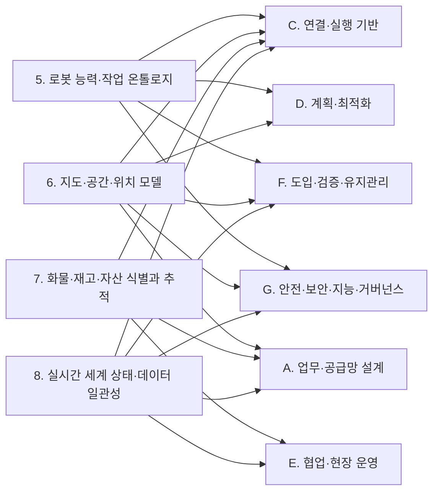

(너의 규칙은 시스템 프롬프트의 agents/shared-rules.md 와 agents/verifier.md 이다. 아래는 이번 실행의 컨텍스트와 입력이다.)

## 실행 컨텍스트

- run_id: 2026-09-25-32
- date: 2026-09-25
- run_type: category_link (대분류 연결)
- 대상: 대분류 B. 공통 정보·환경 모델 페이지의 '다른 대분류와의 연결' 절(대분류 연결 실행). 게시된 세부영역 페이지를 근거로 다른 대분류와의 연결을 조사·서술한다. 스토리텔러는 그 절만 patches 로 바꾼다
- 예산:
    - max_search_queries: 30
    - max_sources_per_run: 15
    - new_topic_pages: 1
    - page_updates: 2
    - max_retries: 2
- 환경 알림: web_fetch_available: false · fetch_mode: mirror_only (일반 웹 페이지 열람은 네트워크 정책으로 막혀 있다. raw.githubusercontent.com 은 열린다: 공식 문서가 GitHub 에 있는 출처는 입력의 config/source_mirrors.yaml 경로를 WebFetch 로 열어 원문을 읽고 sources[].fetched=true, fetched_via=github_raw, fetch_url 을 적는다. 입력에 원문 텍스트(data/source_texts)가 있는 출처는 fetched_via=inbox. 그 밖의 출처는 fetched=false 이며 코드가 신뢰도 상한(medium)을 강제한다 — 공통 규칙 0절 6항)
- 언어: ko
- verification_stage: second
- verifier_budget:
    - max_search_queries: 30
    - max_sources_per_run: 15
    - new_topic_pages: 1
    - page_updates: 2
    - max_retries: 2

## 입력

### runs/2026-09-25-32/target.json

```json
{
  "run_id": "2026-09-25-32",
  "date": "2026-09-25",
  "weekday": "Fri",
  "run_number": 32,
  "run_type": "category_link",
  "forced": true,
  "target": {
    "area_no": null,
    "area_name": null,
    "category": "B. 공통 정보·환경 모델",
    "category_letter": "B"
  },
  "topic": null,
  "track": null,
  "corrections": [],
  "budget": {
    "max_search_queries": 30,
    "max_sources_per_run": 15,
    "new_topic_pages": 1,
    "page_updates": 2,
    "max_retries": 2
  },
  "priority_reason": null,
  "priority_questions": [],
  "excluded_areas": [],
  "lifted_areas": [],
  "deferred": {
    "monthly_recheck": false,
    "weekly_review": false
  },
  "selection_rationale": "CLI 지정 run_type=category_link"
}
```

### runs/2026-09-25-32/research.json

```json
{
  "run_id": "2026-09-25-32",
  "date": "2026-09-25",
  "run_type": "category_link",
  "target": {
    "area_no": null,
    "area_name": null,
    "category": "B. 공통 정보·환경 모델"
  },
  "gaps": [
    "B. 공통 정보·환경 모델 페이지의 '다른 대분류와의 연결' 절 비어 있음(아직 작성되지 않음)",
    "연결 상대 세부영역 가운데 A. 업무·공급망 설계의 1~4와 C. 연결·실행 기반의 9. 로봇·제조사 관제 연동만 published 이고, 10~28 대부분은 seed 라 연결의 근거는 B 쪽 게시 페이지(5·6·7·8) 각주에 기댄다",
    "14. 작업 순서·스케줄링, 18. 사람–로봇 협업·운영 인터페이스, 23. 시험·형식 검증·벤치마크, 24. 자산·소프트웨어 수명주기 관리, 26. 사이버보안·접근권한·개인정보와 B 세부영역 사이의 연결은 게시 페이지에 검증된 근거가 없음",
    "6. 지도·공간·위치 모델의 실내 공간 표준(IndoorGML 2.0 등) 트랙 근거(2026-09-25-28)는 참고문헌 등록 전이라 이번에 쓰지 않음"
  ],
  "research_questions": [
    "로봇·물건·공간·상태를 어떻게 같은 의미로 이해할 것인가? [분류원문]",
    "같은 ‘운반 로봇’ 중 누가 이 화물을 실제로 취급할 수 있는가? [분류원문]",
    "5. 로봇 능력·작업 온톨로지의 능력 선언은 C. 연결·실행 기반(9. 로봇·제조사 관제 연동, 12. 명령·작업 실행의 신뢰성), D. 계획·최적화(13. 작업 배정 — MRTA), F. 도입·검증·유지관리(21. 온보딩·설정·현장 시운전), G. 안전·보안·지능·거버넌스(27. AI·학습·적응과 모델 운영, 28. 표준·상호운용성·다사업자 거버넌스)로 어떻게 넘어가는가?",
    "6. 지도·공간·위치 모델의 좌표 변환·주행 그래프·장소 식별은 9. 로봇·제조사 관제 연동, 10. 설비·건물 시스템 연동, 15. 다중 로봇 경로·교통 관리 — MAPF, 16. 공용 자원·충전·에너지 최적화, 21. 온보딩·설정·현장 시운전, 1. 주문·업무 시스템 연계와 어떤 데이터를 공유하는가?",
    "7. 화물·재고·자산 식별과 추적의 식별·인계 기록은 2. 공정·워크플로 모델링의 완료 조건, 9. 로봇·제조사 관제 연동의 적재물 보고, 10. 설비·건물 시스템 연동의 워크셀 요청·결과, 17. 로봇 간 협업·물리적 인계, 20. 예외 복구·재계획·업무 연속성과 어디서 맞물리는가?",
    "8. 실시간 세계 상태·데이터 일관성의 상태 시각·오래됨 판정은 10. 설비·건물 시스템 연동, 11. 분산 시스템·통신·컴퓨팅 구조, 25. 안전·위험 관리, 4. 성과·경제성·프로세스 개선, 19. 모니터링·이상 탐지·원인 분석과 어떻게 이어지고, 22. 시뮬레이션·예측용 디지털 트윈과는 어떻게 역할을 나누는가?"
  ],
  "findings": [
    {
      "id": "f1",
      "claim": "B. 공통 정보·환경 모델의 5. 로봇 능력·작업 온톨로지 ↔ C. 연결·실행 기반의 9. 로봇·제조사 관제 연동: VDA 5050 팩트시트는 적재 명세(loadSets: 적재 유형·최대 중량·처리 높이·픽·드롭 소요 시간)와 지원 동작(mobileRobotActions)을 선언하고, Open-RMF 플릿 어댑터 템플릿 설정은 수행 가능한 작업 유형(task_capabilities)과 동작 이름(actions)을 선언한다.",
      "tag": "사실",
      "source_ids": [
        "ref-228",
        "ref-105"
      ],
      "cross_checked": false,
      "confidence": "medium",
      "evidence_excerpt": "factsheet.schema 원본: loadType 'Type of load e.g., EPAL, XLT1200', actionType 'Unique actionType corresponding to action.actionType'. config.yaml 원본: task_capabilities(loop, delivery), actions 목록. 두 출처는 서로 다른 인터페이스의 사례이며 교차 확인 아님. (발행일 미확인, 확인일 기준)",
      "as_of": "2026-09-25",
      "flow_step": null,
      "flow_item": "수행 자원"
    },
    {
      "id": "f2",
      "claim": "B. 공통 정보·환경 모델의 5. 로봇 능력·작업 온톨로지 ↔ C. 연결·실행 기반의 12. 명령·작업 실행의 신뢰성: 인터페이스 안에서 선언한 동작 이름(팩트시트 actionType)이 명령과 완료 보고에 그대로 쓰이고 Open-RMF 어댑터가 로봇 API 완료 확인 뒤 완료를 알리므로, 능력 선언이 실행 확인의 기준 어휘가 될 것으로 보인다.",
      "tag": "추정",
      "source_ids": [
        "ref-228",
        "ref-040"
      ],
      "cross_checked": false,
      "confidence": "low",
      "evidence_excerpt": "팩트시트 actionType 은 order 의 action.actionType 과 대응한다고 설명된다. PerformAction 튜토리얼은 execution.finished() 호출로 완료를 알린다(5. 로봇 능력·작업 온톨로지 페이지 5·10절 인용). (재인용: 2026-09-25-15)",
      "as_of": "2026-09-25",
      "flow_step": null,
      "flow_item": "완료·인계",
      "source_unopened": false
    },
    {
      "id": "f3",
      "claim": "B. 공통 정보·환경 모델의 5. 로봇 능력·작업 온톨로지 ↔ D. 계획·최적화의 13. 작업 배정 — MRTA: 이종 다중 로봇 작업 배정에서 온톨로지 기반 실행 가능성 판정 결과를 배정기와 독립된 입력으로 넘기는 연구가 있다.",
      "tag": "사실",
      "source_ids": [
        "ref-236"
      ],
      "cross_checked": false,
      "confidence": "medium",
      "evidence_excerpt": "Semantic Feasibility Reasoning for Heterogeneous Multi-Robot Task Allocation(Electronics, 2026-08-11). 5. 로봇 능력·작업 온톨로지 페이지 10절 인용. 원문 미열람. (재인용: 2026-09-25-15)",
      "as_of": "2026-08-11",
      "flow_step": "적치",
      "flow_item": "수행 자원",
      "source_unopened": true
    },
    {
      "id": "f4",
      "claim": "B. 공통 정보·환경 모델의 5. 로봇 능력·작업 온톨로지 ↔ D. 계획·최적화의 13. 작업 배정 — MRTA: 제조사가 광고한 능력과 운용 중 관측된 능력을 온톨로지로 구분해 통합하는 연구가 있어, 배정 기준을 어느 값으로 둘지가 두 대분류 사이의 쟁점이 될 것으로 보인다(oq-024).",
      "tag": "추정",
      "source_ids": [
        "ref-041"
      ],
      "cross_checked": false,
      "confidence": "low",
      "evidence_excerpt": "Naqvi 외(2025) advertised vs operational capabilities 통합 온톨로지. 배정 기준 쟁점은 5. 로봇 능력·작업 온톨로지 페이지 5절·11절의 추론. 원문 미열람. (재인용: 2026-09-25-15)",
      "as_of": "2025-10-02",
      "flow_step": null,
      "flow_item": "예외·성과",
      "source_unopened": true
    },
    {
      "id": "f5",
      "claim": "B. 공통 정보·환경 모델의 5. 로봇 능력·작업 온톨로지 ↔ G. 안전·보안·지능·거버넌스의 27. AI·학습·적응과 모델 운영: 대규모 언어 모델로 능력 온톨로지를 생성하는 연구와 로봇 기술 파일(URDF)에서 로봇 온톨로지를 LLM 으로 채우는 연구가 있다.",
      "tag": "사실",
      "source_ids": [
        "ref-238",
        "ref-239"
      ],
      "cross_checked": false,
      "confidence": "medium",
      "evidence_excerpt": "Vieira da Silva 외(2024-04) On the Use of Large Language Models to Generate Capability Ontologies; Dussard & Sarthou(2026-06) LLM-Guided Automatic Population of Robot Ontology from URDF. 두 출처는 서로 다른 연구. 원문 미열람. (재인용: 2026-09-25-15)",
      "as_of": "2026-06",
      "flow_step": null,
      "flow_item": null,
      "source_unopened": true
    },
    {
      "id": "f6",
      "claim": "B. 공통 정보·환경 모델의 5. 로봇 능력·작업 온톨로지 ↔ F. 도입·검증·유지관리의 21. 온보딩·설정·현장 시운전: 매뉴얼·로봇 기술 파일을 해석해 능력 모델 초안을 만드는 일은 새 로봇 등록 때 필요한 작업이 될 것으로 보인다(분류 원문 8장의 매뉴얼 해석 교차 규칙과 같은 방향).",
      "tag": "추정",
      "source_ids": [
        "ref-238",
        "ref-239"
      ],
      "cross_checked": false,
      "confidence": "low",
      "evidence_excerpt": "5. 로봇 능력·작업 온톨로지 페이지 10절의 21번 연결 서술. 온보딩 현장에 적용한 사례는 미확인. 원문 미열람. (재인용: 2026-09-25-15)",
      "as_of": "2026-09-25",
      "flow_step": null,
      "flow_item": null,
      "source_unopened": true
    },
    {
      "id": "f7",
      "claim": "B. 공통 정보·환경 모델의 5. 로봇 능력·작업 온톨로지 ↔ G. 안전·보안·지능·거버넌스의 28. 표준·상호운용성·다사업자 거버넌스: 무인운반차 기술 데이터 서브모델 IDTA 02047, 서비스 로봇 모듈 공통 정보 모델 ISO 22166-201, 국내 KS B 7321-2 같은 제조사 독립 정보 모델 표준이 있다.",
      "tag": "사실",
      "source_ids": [
        "ref-234",
        "ref-240",
        "ref-138"
      ],
      "cross_checked": false,
      "confidence": "medium",
      "evidence_excerpt": "5. 로봇 능력·작업 온톨로지 페이지 10절 인용. KS 부합화 여부는 oq-004·oq-026 에서 열림. 원문 미열람. (재인용: 2026-09-25-15)",
      "as_of": "2024-02",
      "flow_step": null,
      "flow_item": null,
      "source_unopened": true
    },
    {
      "id": "f8",
      "claim": "B. 공통 정보·환경 모델의 6. 지도·공간·위치 모델 ↔ C. 연결·실행 기반의 9. 로봇·제조사 관제 연동: Open-RMF 플릿 어댑터는 로봇 좌표계가 RMF 와 다르면 같은 위치를 가리키는 좌표 쌍으로 회전·축척·이동 변환을 추정하며(대응점 4개 이상 권장), 템플릿 설정은 층별 reference_coordinates 로 이 좌표 쌍을 둔다.",
      "tag": "사실",
      "source_ids": [
        "ref-153",
        "ref-105"
      ],
      "cross_checked": false,
      "confidence": "medium",
      "evidence_excerpt": "튜토리얼 원본: 'provide two sets of (x, y) coordinates that correspond to the same locations in each system', 'a minimum of 4 matching waypoints is recommended'. config.yaml: reference_coordinates L1 rmf/robot 좌표 목록. 같은 기관 자료라 독립 교차 아님. (발행일 미확인, 확인일 기준)",
      "as_of": "2026-09-25",
      "flow_step": null,
      "flow_item": "제약"
    },
    {
      "id": "f9",
      "claim": "B. 공통 정보·환경 모델의 6. 지도·공간·위치 모델 ↔ C. 연결·실행 기반의 9. 로봇·제조사 관제 연동: VDA 5050 상태 스키마는 위치추정 품질(localizationScore), 편차 범위(deviationRange, 추정할 수 없는 로봇은 생략 가능), 지도 식별자(mapId)를 두어 위치 신뢰도 보고가 제조사 구현에 따라 달라질 수 있다.",
      "tag": "사실",
      "source_ids": [
        "ref-051"
      ],
      "cross_checked": false,
      "confidence": "medium",
      "evidence_excerpt": "state.schema 원본: deviationRange 'Optional for vehicles that cannot estimate their deviation, e.g., grid-based localization.' 수용 기준은 oq-028 에서 열림. (발행일 미확인, 확인일 기준)",
      "as_of": "2026-09-25",
      "flow_step": "출하",
      "flow_item": "완료·인계"
    },
    {
      "id": "f10",
      "claim": "B. 공통 정보·환경 모델의 6. 지도·공간·위치 모델 ↔ D. 계획·최적화의 15. 다중 로봇 경로·교통 관리 — MAPF: Open-RMF traffic-editor 로 주석한 차선·경유점 그래프는 building_map_generator 로 주행 그래프(navigation graph)로 내보내져 플릿 어댑터의 경로 계획에 쓰인다.",
      "tag": "사실",
      "source_ids": [
        "ref-079"
      ],
      "cross_checked": false,
      "confidence": "medium",
      "evidence_excerpt": "traffic-editor 장 원본: 'The annotated Graphs are eventually exported as navigation graphs using the building_map_generator which are then used by respective rmf_fleet_adapters for path planning.' (발행일 미확인, 확인일 기준)",
      "as_of": "2026-09-25",
      "flow_step": null,
      "flow_item": "제약"
    },
    {
      "id": "f11",
      "claim": "B. 공통 정보·환경 모델의 6. 지도·공간·위치 모델 ↔ D. 계획·최적화의 16. 공용 자원·충전·에너지 최적화: traffic-editor 는 주차 위치·충전기 위치·승강기·문·층을 지도에 주석하게 하여, 공용 자원의 위치 정보가 지도 모델에서 나온다.",
      "tag": "사실",
      "source_ids": [
        "ref-079"
      ],
      "cross_checked": false,
      "confidence": "medium",
      "evidence_excerpt": "traffic-editor 장 원본 기준: 차선, 경유점, parking spot, charger, lift, door, level 주석을 지원. 자원 예약·배분 규칙은 이 문서가 다루지 않음. (발행일 미확인, 확인일 기준)",
      "as_of": "2026-09-25",
      "flow_step": null,
      "flow_item": "수행 자원"
    },
    {
      "id": "f12",
      "claim": "B. 공통 정보·환경 모델의 6. 지도·공간·위치 모델 ↔ C. 연결·실행 기반의 10. 설비·건물 시스템 연동: Open-RMF 승강기 상태는 층 이름 문자열(available_floors, current_floor, destination_floor)로 층을 나타내므로, 지도 층 이름과 승강기 층 이름을 맞추는 대응이 두 대분류 사이에 필요할 것으로 보인다.",
      "tag": "추정",
      "source_ids": [
        "ref-286",
        "ref-079"
      ],
      "cross_checked": false,
      "confidence": "low",
      "evidence_excerpt": "LiftState.msg 원본: string[] available_floors, string current_floor, string destination_floor. 층 이름 대응 규칙을 정한 문서는 확인하지 못함.",
      "as_of": "2026-09-25",
      "flow_step": "적치",
      "flow_item": "제약"
    },
    {
      "id": "f13",
      "claim": "B. 공통 정보·환경 모델의 6. 지도·공간·위치 모델 ↔ F. 도입·검증·유지관리의 21. 온보딩·설정·현장 시운전: 도면에서 만든 지도에는 대기 위치 같은 운영 요소와 도면–현장 편차가 자동으로 담기지 않아, 시운전 때 사람의 주석·정렬 단계가 남는 것으로 보인다.",
      "tag": "추정",
      "source_ids": [
        "ref-079",
        "ref-080",
        "ref-224"
      ],
      "cross_checked": false,
      "confidence": "low",
      "evidence_excerpt": "6. 지도·공간·위치 모델 페이지 5절 제약 칸의 추론(traffic-editor 주석, 주행 지도 연동, 부정확한 건축 도면과 SLAM 결합 연구). 국내 사례는 oq-022. (재인용: 2026-09-25-17)",
      "as_of": "2026-09-25",
      "flow_step": null,
      "flow_item": null,
      "source_unopened": false
    },
    {
      "id": "f14",
      "claim": "B. 공통 정보·환경 모델의 6. 지도·공간·위치 모델 ↔ G. 안전·보안·지능·거버넌스의 27. AI·학습·적응과 모델 운영: 비전 언어 모델로 평면도 지도를 해석하는 연구가 있어, 도면 해석(분류 원문 8장 교차 규칙)이 두 대분류를 잇는다.",
      "tag": "사실",
      "source_ids": [
        "ref-076"
      ],
      "cross_checked": false,
      "confidence": "medium",
      "evidence_excerpt": "DeFazio 외(2024-09) Vision Language Models Can Parse Floor Plan Maps. 6. 지도·공간·위치 모델 페이지 각주 재사용. 원문 미열람. (재인용: 2026-09-25-17)",
      "as_of": "2024-09",
      "flow_step": null,
      "flow_item": null,
      "source_unopened": true
    },
    {
      "id": "f15",
      "claim": "B. 공통 정보·환경 모델의 6. 지도·공간·위치 모델 ↔ G. 안전·보안·지능·거버넌스의 28. 표준·상호운용성·다사업자 거버넌스: ISO 21423 은 산업용 이동로봇의 통신·상호운용성을 다루는 표준이며, 그 공통 좌표계가 제조사 지도 식별자와 어떻게 대응하는지는 아직 확인되지 않았다(oq-027).",
      "tag": "사실",
      "source_ids": [
        "ref-159"
      ],
      "cross_checked": false,
      "confidence": "medium",
      "evidence_excerpt": "ISO 21423 - Robotics — Industrial mobile robots — Communications and interoperability. 공통 좌표계 세부는 초안 해설 요약만 있음. 원문 미열람. (재인용: 2026-09-25-17)",
      "as_of": "2026-09-25",
      "flow_step": null,
      "flow_item": null,
      "source_unopened": true
    },
    {
      "id": "f16",
      "claim": "B. 공통 정보·환경 모델의 6. 지도·공간·위치 모델 ↔ A. 업무·공급망 설계의 1. 주문·업무 시스템 연계: GS1 GLN 은 도크 문·보관 위치 같은 하위 위치를 식별할 수 있고 GLN 확장 요소는 조직 내부나 거래 당사자 간 합의로만 쓰므로, 업무 위치와 로봇 지도 장소의 대응은 ROP 쪽 대응 계층이 맡게 될 것으로 보인다.",
      "tag": "추정",
      "source_ids": [
        "ref-162",
        "ref-031"
      ],
      "cross_checked": false,
      "confidence": "low",
      "evidence_excerpt": "6. 지도·공간·위치 모델 페이지 5절 완료·인계 칸과 9절 상위 업무 시스템 행 인용. 국내 사례는 oq-029. 원문 미열람. (재인용: 2026-09-25-17)",
      "as_of": "2026-09-25",
      "flow_step": "출하",
      "flow_item": "완료·인계",
      "source_unopened": false
    },
    {
      "id": "f17",
      "claim": "B. 공통 정보·환경 모델의 7. 화물·재고·자산 식별과 추적 ↔ A. 업무·공급망 설계의 2. 공정·워크플로 모델링: GS1 CBV 는 arriving·receiving·accepting 을 서로 다른 업무 단계로 정의하고, VDA 5050 은 drop 완료를 적재물이 로봇을 떠나 로봇이 새 적재 상태를 보고한 때로 정의한다.",
      "tag": "사실",
      "source_ids": [
        "ref-044",
        "ref-031"
      ],
      "cross_checked": false,
      "confidence": "medium",
      "evidence_excerpt": "CBV.ttl: receiving 'is added to the receiver's inventory'. VDA 5050: 'Load has left the mobile robot and mobile robot reports new load state.' 이번 실행에서 다시 열지 않음. (재인용: 2026-09-25-29)",
      "as_of": "2026-09-25",
      "flow_step": "입고",
      "flow_item": "완료·인계",
      "source_unopened": false
    },
    {
      "id": "f18",
      "claim": "B. 공통 정보·환경 모델의 7. 화물·재고·자산 식별과 추적 ↔ C. 연결·실행 기반의 9. 로봇·제조사 관제 연동: VDA 5050 상태 스키마의 loads 는 로봇이 취급 중인 적재물을 담되 적재 상태를 판단할 수 없으면 생략할 수 있고, loadId 는 바코드·RFID 같은 적재물 식별 번호이며 식별 전에는 비워 둔다.",
      "tag": "사실",
      "source_ids": [
        "ref-051"
      ],
      "cross_checked": false,
      "confidence": "medium",
      "evidence_excerpt": "state.schema 원본: loadId 'Unique identification number of the load (e.g., barcode or RFID). Empty field, if the mobile robot can identify the load, but did not identify the load yet.' (발행일 미확인, 확인일 기준)",
      "as_of": "2026-09-25",
      "flow_step": "출하",
      "flow_item": "작업 대상"
    },
    {
      "id": "f19",
      "claim": "B. 공통 정보·환경 모델의 7. 화물·재고·자산 식별과 추적 ↔ C. 연결·실행 기반의 10. 설비·건물 시스템 연동: Open-RMF 배송 작업에서 로봇은 픽업 지점 워크셀에 DispenserResult 를, 하역 지점 워크셀에 IngestorResult 를 받을 때까지 요청을 보내며, IngestorResult 는 요청 id·워크셀 id·상태만 담는다.",
      "tag": "사실",
      "source_ids": [
        "ref-023",
        "ref-049"
      ],
      "cross_checked": false,
      "confidence": "medium",
      "evidence_excerpt": "워크셀 장 원본: 'Requests a DispenserRequest till receives a DispenserResult. (Done Dispensing)'. IngestorResult.msg: request_guid, source_guid, status(ACKNOWLEDGED·SUCCESS·FAILED). (재인용: 2026-09-25-29)",
      "as_of": "2026-09-25",
      "flow_step": "출하",
      "flow_item": "완료·인계"
    },
    {
      "id": "f20",
      "claim": "B. 공통 정보·환경 모델의 7. 화물·재고·자산 식별과 추적 ↔ E. 협업·현장 운영의 17. 로봇 간 협업·물리적 인계: 설비의 인수 결과에는 화물 식별자·인계 당사자가 없고 EPCIS 는 소유·점유·위치 이전을 source/destination 으로 표현하므로, 물리적 인계 확인은 7번의 식별·인계 기록과 결합해야 할 것으로 보인다(oq-001).",
      "tag": "추정",
      "source_ids": [
        "ref-049",
        "ref-014",
        "ref-015"
      ],
      "cross_checked": false,
      "confidence": "low",
      "evidence_excerpt": "7. 화물·재고·자산 식별과 추적 페이지 3·5절의 추론. 두 계층을 잇는 표준 매핑·공개 구현은 확인하지 못함. 원문 미열람. (재인용: 2026-09-25-07)",
      "as_of": "2026-09-25",
      "flow_step": "출하",
      "flow_item": "완료·인계",
      "source_unopened": true
    },
    {
      "id": "f21",
      "claim": "B. 공통 정보·환경 모델의 7. 화물·재고·자산 식별과 추적 ↔ E. 협업·현장 운영의 20. 예외 복구·재계획·업무 연속성: 팔레트 RFID 태그 판독성이 제품·포장·태그 위치·적재 패턴에 따라 달라진다는 실험 보고가 있어, 판독 실패 시 인계 보류·재스캔·사람 확인 규칙이 복구 과제로 넘어갈 것으로 보인다(oq-003).",
      "tag": "추정",
      "source_ids": [
        "ref-024"
      ],
      "cross_checked": false,
      "confidence": "low",
      "evidence_excerpt": "Singh 외(2009) 도크 도어 모사 RFID 포털 실험. 처리 규칙은 미확인. 원문 미열람. (재인용: 2026-09-25-01)",
      "as_of": "2009",
      "flow_step": "출하",
      "flow_item": "예외·성과",
      "source_unopened": true
    },
    {
      "id": "f22",
      "claim": "B. 공통 정보·환경 모델의 8. 실시간 세계 상태·데이터 일관성 ↔ C. 연결·실행 기반의 10. 설비·건물 시스템 연동: Open-RMF 문·승강기 상태 메시지는 시각 필드(door_time, lift_time)를 담지만 승강기 연동 문서는 상태 발행 주기나 오래됨 판정 규칙을 정하지 않고, 승강기 어댑터는 적절하다고 판단한 요청만 승강기에 전달한다.",
      "tag": "사실",
      "source_ids": [
        "ref-285",
        "ref-286",
        "ref-284"
      ],
      "cross_checked": false,
      "confidence": "medium",
      "evidence_excerpt": "DoorState.msg: door_time, door_name, current_mode. 승강기 장 원본: 'only relaying the instructions to the lift node if it is deemed appropriate.' 주기·오래됨 규칙 부재는 열람 범위의 관찰(부재 확정 아님). (발행일 미확인, 확인일 기준)",
      "as_of": "2026-09-25",
      "flow_step": "적치",
      "flow_item": "제약"
    },
    {
      "id": "f23",
      "claim": "B. 공통 정보·환경 모델의 8. 실시간 세계 상태·데이터 일관성 ↔ C. 연결·실행 기반의 11. 분산 시스템·통신·컴퓨팅 구조: 상태의 오래됨을 알리는 장치는 통신 계층에 있다 — ROS 2 QoS 의 기한·생존성 정책, Sparkplug 의 노드 종료(NDEATH) 시 지표 STALE 표시, VDA 5050 의 MQTT 유언을 통한 CONNECTION_BROKEN 통지.",
      "tag": "사실",
      "source_ids": [
        "ref-282",
        "ref-287",
        "ref-031"
      ],
      "cross_checked": false,
      "confidence": "medium",
      "evidence_excerpt": "Sparkplug 5장 원본: 'mark all metrics that were included in the previous NBIRTH as STALE'. ROS 2 QoS(Jazzy)·VDA 5050 은 8. 실시간 세계 상태·데이터 일관성 페이지 6절·5절 인용. 세 출처는 서로 다른 장치를 말하며 교차 확인 아님. (재인용: 2026-09-25-24)",
      "as_of": "2026-09-25",
      "flow_step": null,
      "flow_item": "예외·성과",
      "source_unopened": false
    },
    {
      "id": "f24",
      "claim": "B. 공통 정보·환경 모델의 8. 실시간 세계 상태·데이터 일관성 ↔ G. 안전·보안·지능·거버넌스의 25. 안전·위험 관리: Open-RMF 승강기 상태의 운영 모드에 사람·AGV·화재·오프라인·비상이 있으므로, 탑승 확정 전에 최신 모드를 확인하는 규칙이 안전 조건과 맞물릴 것으로 보인다.",
      "tag": "추정",
      "source_ids": [
        "ref-286"
      ],
      "cross_checked": false,
      "confidence": "low",
      "evidence_excerpt": "LiftState.msg 원본: MODE_HUMAN=1, MODE_AGV=2, MODE_FIRE=3, MODE_OFFLINE=4, MODE_EMERGENCY=5. 안전 규칙과의 연결은 추론.",
      "as_of": "2026-09-25",
      "flow_step": "적치",
      "flow_item": "제약"
    },
    {
      "id": "f25",
      "claim": "B. 공통 정보·환경 모델의 8. 실시간 세계 상태·데이터 일관성 ↔ F. 도입·검증·유지관리의 22. 시뮬레이션·예측용 디지털 트윈: 제조 분야 분류에서 현장 상태가 한 방향으로 자동 반영되는 디지털 섀도와 디지털 트윈을 구분하므로, 8번은 현재 상태 표현을, 22번은 그 표현을 복제해 가정한 미래를 실험하는 쪽을 맡는 것이 분류 원문 구분과 맞을 것으로 보인다.",
      "tag": "추정",
      "source_ids": [
        "ref-291",
        "ref-290"
      ],
      "cross_checked": false,
      "confidence": "low",
      "evidence_excerpt": "Kritzinger 외(2018) 디지털 모델·섀도·트윈 분류, NIST 디지털 트윈 표준화 자료. 근거 자료는 제조 대상. 8. 실시간 세계 상태·데이터 일관성 페이지 10절. 원문 미열람. (재인용: 2026-09-25-24)",
      "as_of": "2018",
      "flow_step": null,
      "flow_item": null,
      "source_unopened": true
    },
    {
      "id": "f26",
      "claim": "B. 공통 정보·환경 모델의 8. 실시간 세계 상태·데이터 일관성 ↔ A. 업무·공급망 설계의 4. 성과·경제성·프로세스 개선: Open-RMF 로봇 상태 스키마는 상태(idle·charging·working·error 등), 배터리, 현재 작업 id, 문제 목록, 위치, 기록 시각을 담아 가동률·충전·오류 시간 지표의 원천이 된다.",
      "tag": "사실",
      "source_ids": [
        "ref-148"
      ],
      "cross_checked": false,
      "confidence": "medium",
      "evidence_excerpt": "robot_state.json: status uninitialized, offline, shutdown, idle, charging, working, error; battery 0.0~1.0; task_id; issues; unix_millis_time. 이번 실행에서 다시 열지 않음. (재인용: 2026-09-25-29)",
      "as_of": "2026-09-25",
      "flow_step": null,
      "flow_item": "예외·성과",
      "source_unopened": true
    },
    {
      "id": "f27",
      "claim": "B. 공통 정보·환경 모델의 8. 실시간 세계 상태·데이터 일관성 ↔ E. 협업·현장 운영의 19. 모니터링·이상 탐지·원인 분석: 로봇 상태의 문제 목록·오류 상태와 설비 상태의 시각 정보를 한 세계 상태에 모으면, 지연 원인이 로봇인지 문인지 구분하는 분석이 같은 상태 기록을 쓰게 될 것으로 보인다.",
      "tag": "추정",
      "source_ids": [
        "ref-148",
        "ref-285"
      ],
      "cross_checked": false,
      "confidence": "low",
      "evidence_excerpt": "robot_state.json 의 issues·error 와 DoorState.msg 의 door_time·current_mode 를 대응시킨 추론. 원인 분석에 적용한 연구는 이번에 확인하지 않음.",
      "as_of": "2026-09-25",
      "flow_step": null,
      "flow_item": "예외·성과"
    }
  ],
  "sources": [
    {
      "id": "ref-228",
      "org": "VDA / VDMA (VDA5050 GitHub)",
      "title": "VDA5050/VDA5050 — json_schemas/factsheet.schema",
      "published": null,
      "url": "https://github.com/VDA5050/VDA5050/blob/main/json_schemas/factsheet.schema",
      "type": "표준",
      "reliability": "high",
      "accessed": "2026-09-25",
      "summary": "VDA 5050 팩트시트 JSON 스키마. 유형·물리 파라미터·적재 명세(loadSets)·지원 동작(mobileRobotActions)을 원문으로 확인했다.",
      "fetched": true,
      "fetched_via": "github_raw",
      "fetch_url": "https://raw.githubusercontent.com/VDA5050/VDA5050/main/json_schemas/factsheet.schema",
      "source_unopened": false
    },
    {
      "id": "ref-105",
      "org": "Open Robotics (open-rmf)",
      "title": "fleet_adapter_template — fleet_adapter_template/config.yaml",
      "published": null,
      "url": "https://github.com/open-rmf/fleet_adapter_template/blob/main/fleet_adapter_template/config.yaml",
      "type": "오픈소스 문서",
      "reliability": "high",
      "accessed": "2026-09-25",
      "summary": "Open-RMF 플릿 어댑터 템플릿 설정. task_capabilities·actions·층별 reference_coordinates 를 원문으로 확인했다.",
      "fetched": true,
      "fetched_via": "github_raw",
      "fetch_url": "https://raw.githubusercontent.com/open-rmf/fleet_adapter_template/main/fleet_adapter_template/config.yaml",
      "source_unopened": false
    },
    {
      "id": "ref-040",
      "org": "Open Robotics",
      "title": "PerformAction Tutorial - Programming Multiple Robots with ROS 2",
      "published": null,
      "url": "https://osrf.github.io/ros2multirobotbook/integration_fleets_action_tutorial.html",
      "type": "오픈소스 문서",
      "reliability": "medium",
      "accessed": "2026-09-25",
      "summary": "원문 미열람. 이번 실행에서 다시 열지 않았다. Open-RMF 사용자 정의 동작 수행과 완료 통지(execution.finished()) 튜토리얼.",
      "source_unopened": false,
      "fetched": true,
      "fetched_via": "github_raw",
      "fetch_url": null
    },
    {
      "id": "ref-236",
      "org": "Electronics(MDPI) 게재 논문(저자 미확인)",
      "title": "Semantic Feasibility Reasoning for Heterogeneous Multi-Robot Task Allocation",
      "published": "2026-08-11",
      "url": "https://doi.org/10.3390/electronics15163562",
      "type": "논문",
      "reliability": "medium",
      "accessed": "2026-09-25",
      "summary": "원문 미열람. 이종 다중 로봇 작업 배정을 위한 의미 기반 실행 가능성 판정 연구.",
      "source_unopened": true,
      "fetched": false,
      "fetched_via": null,
      "fetch_url": null
    },
    {
      "id": "ref-041",
      "org": "Naqvi, M. R. 외(Scientific Reports)",
      "title": "Ontology-driven integration of advertised and operational capabilities in robots",
      "published": "2025-10-02",
      "url": "https://www.nature.com/articles/s41598-025-16649-3",
      "type": "논문",
      "reliability": "medium",
      "accessed": "2026-09-25",
      "summary": "원문 미열람. 제조사가 광고한 능력과 운용 중 관측된 능력을 온톨로지로 통합하는 연구.",
      "source_unopened": true,
      "fetched": false,
      "fetched_via": null,
      "fetch_url": null
    },
    {
      "id": "ref-238",
      "org": "Vieira da Silva, L. M., Köcher, A., Gehlhoff, F., & Fay, A.",
      "title": "On the Use of Large Language Models to Generate Capability Ontologies",
      "published": "2024-04",
      "url": "https://arxiv.org/abs/2404.17524",
      "type": "논문",
      "reliability": "medium",
      "accessed": "2026-09-25",
      "summary": "원문 미열람. LLM 으로 능력 온톨로지를 생성하고 검사하는 방법을 다룬 연구.",
      "source_unopened": true,
      "fetched": false,
      "fetched_via": null,
      "fetch_url": null
    },
    {
      "id": "ref-239",
      "org": "Dussard, B., & Sarthou, G. (LAAS-CNRS)",
      "title": "Extracting Semantics: LLM-Guided Automatic Population of Robot Ontology from URDF",
      "published": "2026-06",
      "url": "https://arxiv.org/abs/2606.17073",
      "type": "논문",
      "reliability": "medium",
      "accessed": "2026-09-25",
      "summary": "원문 미열람. URDF 로봇 기술 파일에서 LLM 으로 로봇 온톨로지를 자동으로 채우는 연구.",
      "source_unopened": true,
      "fetched": false,
      "fetched_via": null,
      "fetch_url": null
    },
    {
      "id": "ref-234",
      "org": "IDTA(Industrial Digital Twin Association)",
      "title": "IDTA 02047 Technical Data for Automated Guided Vehicles 1.0 — README (admin-shell-io/submodel-templates)",
      "published": null,
      "url": "https://github.com/admin-shell-io/submodel-templates/tree/main/published/Technical%20Data%20for%20Automated%20Guided%20Vehicles",
      "type": "표준",
      "reliability": "medium",
      "accessed": "2026-09-25",
      "summary": "원문 미열람. 무인운반차 기술 데이터 AAS 서브모델 템플릿.",
      "source_unopened": true,
      "fetched": false,
      "fetched_via": null,
      "fetch_url": null
    },
    {
      "id": "ref-240",
      "org": "ISO",
      "title": "ISO 22166-201:2024 - Robotics — Modularity for service robots — Part 201: Common information model for modules",
      "published": "2024-02",
      "url": "https://www.iso.org/standard/82334.html",
      "type": "표준",
      "reliability": "medium",
      "accessed": "2026-09-25",
      "summary": "원문 미열람. 서비스 로봇 모듈의 공통 정보 모델 국제표준.",
      "source_unopened": true,
      "fetched": false,
      "fetched_via": null,
      "fetch_url": null
    },
    {
      "id": "ref-138",
      "org": "국가표준인증통합정보시스템(KSSN)",
      "title": "KS B 7321-2 로봇 — 서비스 로봇 모듈용 정보 모델 — 제2부: 소프트웨어 모듈용 정보 모델",
      "published": null,
      "url": "https://www.kssn.net/search/stddetail.do?itemNo=K001010147546",
      "type": "표준",
      "reliability": "medium",
      "accessed": "2026-09-25",
      "summary": "원문 미열람. 서비스 로봇 소프트웨어 모듈 정보 모델 KS 표준.",
      "source_unopened": true,
      "fetched": false,
      "fetched_via": null,
      "fetch_url": null
    },
    {
      "id": "ref-153",
      "org": "Open Robotics",
      "title": "Fleet Adapter Tutorial - Programming Multiple Robots with ROS 2",
      "published": null,
      "url": "https://osrf.github.io/ros2multirobotbook/integration_fleets_adapter_tutorial.html",
      "type": "오픈소스 문서",
      "reliability": "high",
      "accessed": "2026-09-25",
      "summary": "플릿 어댑터 튜토리얼 mdBook 원본. 로봇–RMF 좌표 변환(좌표 쌍, nudged 추정, 대응점 4개 이상 권장)을 원문으로 확인했다.",
      "fetched": true,
      "fetched_via": "github_raw",
      "fetch_url": "https://raw.githubusercontent.com/osrf/ros2multirobotbook/master/src/integration_fleets_adapter_tutorial.md",
      "source_unopened": false
    },
    {
      "id": "ref-051",
      "org": "VDA / VDMA (VDA5050 GitHub)",
      "title": "VDA5050/VDA5050 — json_schemas/state.schema",
      "published": null,
      "url": "https://github.com/VDA5050/VDA5050/blob/main/json_schemas/state.schema",
      "type": "표준",
      "reliability": "high",
      "accessed": "2026-09-25",
      "summary": "VDA 5050 상태 JSON 스키마. loads·loadId·localizationScore·deviationRange·mapId·timestamp 설명을 원문으로 확인했다.",
      "fetched": true,
      "fetched_via": "github_raw",
      "fetch_url": "https://raw.githubusercontent.com/VDA5050/VDA5050/main/json_schemas/state.schema",
      "source_unopened": false
    },
    {
      "id": "ref-079",
      "org": "Open Robotics",
      "title": "Traffic Editor - Programming Multiple Robots with ROS 2",
      "published": null,
      "url": "https://osrf.github.io/ros2multirobotbook/traffic-editor.html",
      "type": "오픈소스 문서",
      "reliability": "high",
      "accessed": "2026-09-25",
      "summary": "traffic-editor 장 mdBook 원본. 차선·경유점·주차·충전기·승강기·문·층 주석과 주행 그래프 내보내기를 원문으로 확인했다.",
      "fetched": true,
      "fetched_via": "github_raw",
      "fetch_url": "https://raw.githubusercontent.com/osrf/ros2multirobotbook/master/src/traffic-editor.md",
      "source_unopened": false
    },
    {
      "id": "ref-080",
      "org": "Open Robotics",
      "title": "Navigation Maps (integration_nav-maps) - Programming Multiple Robots with ROS 2",
      "published": null,
      "url": "https://osrf.github.io/ros2multirobotbook/integration_nav-maps.html",
      "type": "오픈소스 문서",
      "reliability": "medium",
      "accessed": "2026-09-25",
      "summary": "원문 미열람. 이번 실행에서 다시 열지 않았다. Open-RMF 주행 지도 연동 장.",
      "source_unopened": true,
      "fetched": false,
      "fetched_via": null,
      "fetch_url": null
    },
    {
      "id": "ref-224",
      "org": "Shaheer, M., Millan-Romera, J. A., Bavle, H., Giberna, M., Sanchez-Lopez, J. L., Civera, J., & Voos, H.",
      "title": "Tightly Coupled SLAM with Imprecise Architectural Plans",
      "published": "2024-08",
      "url": "https://arxiv.org/abs/2408.01737",
      "type": "논문",
      "reliability": "medium",
      "accessed": "2026-09-25",
      "summary": "원문 미열람. 부정확한 건축 도면을 SLAM 과 결합하는 연구.",
      "source_unopened": true,
      "fetched": false,
      "fetched_via": null,
      "fetch_url": null
    },
    {
      "id": "ref-076",
      "org": "DeFazio, D., Mehta, H., Wang, M., Yang, P., Blackburn, J., & Zhang, S.",
      "title": "Vision Language Models Can Parse Floor Plan Maps",
      "published": "2024-09",
      "url": "https://arxiv.org/abs/2409.12842",
      "type": "논문",
      "reliability": "medium",
      "accessed": "2026-09-25",
      "summary": "원문 미열람. 비전 언어 모델의 평면도 지도 해석 능력을 다룬 연구.",
      "source_unopened": true,
      "fetched": false,
      "fetched_via": null,
      "fetch_url": null
    },
    {
      "id": "ref-159",
      "org": "ISO",
      "title": "ISO 21423 - Robotics — Industrial mobile robots — Communications and interoperability",
      "published": null,
      "url": "https://www.iso.org/standard/86749.html",
      "type": "표준",
      "reliability": "medium",
      "accessed": "2026-09-25",
      "summary": "원문 미열람. 산업용 이동로봇의 통신·상호운용성 국제표준.",
      "source_unopened": true,
      "fetched": false,
      "fetched_via": null,
      "fetch_url": null
    },
    {
      "id": "ref-162",
      "org": "GS1",
      "title": "Identifying a physical location - GLN",
      "published": null,
      "url": "https://www.gs1.org/standards/id-keys/gln/physical-location",
      "type": "표준",
      "reliability": "medium",
      "accessed": "2026-09-25",
      "summary": "원문 미열람. GLN 으로 물리적 위치와 하위 위치를 식별하는 GS1 안내.",
      "source_unopened": true,
      "fetched": false,
      "fetched_via": null,
      "fetch_url": null
    },
    {
      "id": "ref-031",
      "org": "VDA / VDMA (VDA5050 GitHub)",
      "title": "VDA5050/VDA5050_EN.md — Official Specification document for the VDA 5050",
      "published": null,
      "url": "https://github.com/VDA5050/VDA5050/blob/main/VDA5050_EN.md",
      "type": "표준",
      "reliability": "medium",
      "accessed": "2026-09-25",
      "summary": "원문 미열람. 이번 실행에서 다시 열지 않았다(이전 실행에서 원문 확인). VDA 5050 공식 명세(main 3.0.0).",
      "source_unopened": false,
      "fetched": true,
      "fetched_via": "github_raw",
      "fetch_url": null
    },
    {
      "id": "ref-044",
      "org": "GS1",
      "title": "gs1/EPCIS — Ontology/CBV.ttl (Core Business Vocabulary ontology 2.0)",
      "published": "2021-09-30",
      "url": "https://github.com/gs1/EPCIS/blob/master/Ontology/CBV.ttl",
      "type": "표준",
      "reliability": "medium",
      "accessed": "2026-09-25",
      "summary": "원문 미열람. 이번 실행에서 다시 열지 않았다(이전 실행에서 원문 확인). CBV 온톨로지 원본.",
      "source_unopened": true,
      "fetched": false,
      "fetched_via": null,
      "fetch_url": null
    },
    {
      "id": "ref-023",
      "org": "Open Robotics",
      "title": "Workcells - Programming Multiple Robots with ROS 2",
      "published": null,
      "url": "https://osrf.github.io/ros2multirobotbook/integration_workcells.html",
      "type": "오픈소스 문서",
      "reliability": "high",
      "accessed": "2026-09-25",
      "summary": "워크셀 연동 장 mdBook 원본. 배송 작업의 디스펜서·인제스터 요청–결과 반복을 원문으로 확인했다.",
      "fetched": true,
      "fetched_via": "github_raw",
      "fetch_url": "https://raw.githubusercontent.com/osrf/ros2multirobotbook/master/src/integration_workcells.md",
      "source_unopened": false
    },
    {
      "id": "ref-049",
      "org": "Open Robotics (open-rmf)",
      "title": "rmf_internal_msgs — rmf_ingestor_msgs/msg/IngestorResult.msg",
      "published": null,
      "url": "https://github.com/open-rmf/rmf_internal_msgs/blob/main/rmf_ingestor_msgs/msg/IngestorResult.msg",
      "type": "오픈소스 문서",
      "reliability": "medium",
      "accessed": "2026-09-25",
      "summary": "원문 미열람. 이번 실행에서 다시 열지 않았다. IngestorResult 메시지 정의(요청 id·워크셀 id·상태).",
      "source_unopened": true,
      "fetched": false,
      "fetched_via": null,
      "fetch_url": null
    },
    {
      "id": "ref-014",
      "org": "GS1",
      "title": "Core Business Vocabulary (CBV) Standard",
      "published": null,
      "url": "https://ref.gs1.org/standards/cbv/",
      "type": "표준",
      "reliability": "medium",
      "accessed": "2026-09-25",
      "summary": "원문 미열람. EPCIS 이벤트의 업무 단계·source/destination 유형 등 표준 어휘.",
      "source_unopened": true,
      "fetched": false,
      "fetched_via": null,
      "fetch_url": null
    },
    {
      "id": "ref-015",
      "org": "GS1",
      "title": "EPCIS and CBV Implementation Guideline",
      "published": null,
      "url": "https://www.gs1.org/docs/epc/EPCIS_Guideline.pdf",
      "type": "표준",
      "reliability": "medium",
      "accessed": "2026-09-25",
      "summary": "원문 미열람. EPCIS·CBV 구현 안내(인계 맥락 표현 포함).",
      "source_unopened": true,
      "fetched": false,
      "fetched_via": null,
      "fetch_url": null
    },
    {
      "id": "ref-024",
      "org": "Singh, J. 외",
      "title": "RFID tag readability issues with palletized loads of consumer goods",
      "published": "2009",
      "url": "https://onlinelibrary.wiley.com/doi/abs/10.1002/pts.864",
      "type": "논문",
      "reliability": "medium",
      "accessed": "2026-09-25",
      "summary": "원문 미열람. 팔레트 적재 소비재의 RFID 태그 판독성 실험 연구.",
      "source_unopened": true,
      "fetched": false,
      "fetched_via": null,
      "fetch_url": null
    },
    {
      "id": "ref-285",
      "org": "Open Robotics (open-rmf)",
      "title": "rmf_internal_msgs — rmf_door_msgs/msg/DoorState.msg",
      "published": null,
      "url": "https://github.com/open-rmf/rmf_internal_msgs/blob/main/rmf_door_msgs/msg/DoorState.msg",
      "type": "오픈소스 문서",
      "reliability": "high",
      "accessed": "2026-09-25",
      "summary": "Open-RMF 문 상태 메시지 정의. door_time·door_name·current_mode 필드를 원문으로 확인했다.",
      "fetched": true,
      "fetched_via": "github_raw",
      "fetch_url": "https://raw.githubusercontent.com/open-rmf/rmf_internal_msgs/main/rmf_door_msgs/msg/DoorState.msg",
      "source_unopened": false
    },
    {
      "id": "ref-286",
      "org": "Open Robotics (open-rmf)",
      "title": "rmf_internal_msgs — rmf_lift_msgs/msg/LiftState.msg",
      "published": null,
      "url": "https://github.com/open-rmf/rmf_internal_msgs/blob/main/rmf_lift_msgs/msg/LiftState.msg",
      "type": "오픈소스 문서",
      "reliability": "high",
      "accessed": "2026-09-25",
      "summary": "Open-RMF 승강기 상태 메시지 정의. 시각·층 이름·문·운행 상태·운영 모드·세션 id 를 원문으로 확인했다.",
      "fetched": true,
      "fetched_via": "github_raw",
      "fetch_url": "https://raw.githubusercontent.com/open-rmf/rmf_internal_msgs/main/rmf_lift_msgs/msg/LiftState.msg",
      "source_unopened": false
    },
    {
      "id": "ref-284",
      "org": "Open Robotics",
      "title": "Lifts (integration_lifts) - Programming Multiple Robots with ROS 2",
      "published": null,
      "url": "https://osrf.github.io/ros2multirobotbook/integration_lifts.html",
      "type": "오픈소스 문서",
      "reliability": "high",
      "accessed": "2026-09-25",
      "summary": "승강기 연동 장 mdBook 원본. 승강기 어댑터가 요청을 걸러 전달하는 구조를 원문으로 확인했고, 상태 발행 주기·오래됨 규칙은 찾지 못했다.",
      "fetched": true,
      "fetched_via": "github_raw",
      "fetch_url": "https://raw.githubusercontent.com/osrf/ros2multirobotbook/master/src/integration_lifts.md",
      "source_unopened": false
    },
    {
      "id": "ref-282",
      "org": "Open Robotics (ROS 2 Documentation)",
      "title": "Quality of Service settings — ROS 2 Documentation: Jazzy",
      "published": null,
      "url": "https://docs.ros.org/en/jazzy/Concepts/Intermediate/About-Quality-of-Service-Settings.html",
      "type": "오픈소스 문서",
      "reliability": "medium",
      "accessed": "2026-09-25",
      "summary": "원문 미열람. ROS 2 QoS 정책(기한·수명·생존성)과 이벤트 콜백 설명.",
      "source_unopened": true,
      "fetched": false,
      "fetched_via": null,
      "fetch_url": null
    },
    {
      "id": "ref-287",
      "org": "Eclipse Foundation (eclipse-sparkplug GitHub)",
      "title": "Sparkplug Specification — Chapter 5 Operational Behavior (Sparkplug_5_Operational_Behavior.adoc)",
      "published": null,
      "url": "https://github.com/eclipse-sparkplug/sparkplug/blob/master/specification/src/main/asciidoc/chapters/Sparkplug_5_Operational_Behavior.adoc",
      "type": "표준",
      "reliability": "high",
      "accessed": "2026-09-25",
      "summary": "Sparkplug 명세 5장 원본. 노드·장치 종료(NDEATH·DDEATH) 때 호스트가 지표를 STALE 로 표시하는 규정을 원문으로 확인했다.",
      "fetched": true,
      "fetched_via": "github_raw",
      "fetch_url": "https://raw.githubusercontent.com/eclipse-sparkplug/sparkplug/master/specification/src/main/asciidoc/chapters/Sparkplug_5_Operational_Behavior.adoc",
      "source_unopened": false
    },
    {
      "id": "ref-291",
      "org": "Kritzinger, W., Karner, M., Traar, G., Henjes, J., & Sihn, W.",
      "title": "Digital Twin in manufacturing: A categorical literature review and classification",
      "published": "2018",
      "url": "https://www.sciencedirect.com/science/article/pii/S2405896318316021",
      "type": "논문",
      "reliability": "medium",
      "accessed": "2026-09-25",
      "summary": "원문 미열람. 제조 분야 디지털 모델·디지털 섀도·디지털 트윈 분류 문헌 검토.",
      "source_unopened": true,
      "fetched": false,
      "fetched_via": null,
      "fetch_url": null
    },
    {
      "id": "ref-290",
      "org": "NIST",
      "title": "DIGITAL TWINS FOR ADVANCED MANUFACTURING: THE STANDARDIZED APPROACH",
      "published": null,
      "url": "https://tsapps.nist.gov/publication/get_pdf.cfm?pub_id=957417",
      "type": "정부·연구기관",
      "reliability": "medium",
      "accessed": "2026-09-25",
      "summary": "원문 미열람. 제조 디지털 트윈 표준화(ISO 23247 등) 접근을 다룬 NIST 자료.",
      "source_unopened": true,
      "fetched": false,
      "fetched_via": null,
      "fetch_url": null
    },
    {
      "id": "ref-148",
      "org": "Open Robotics (open-rmf)",
      "title": "rmf_api_msgs — rmf_api_msgs/schemas/robot_state.json",
      "published": null,
      "url": "https://github.com/open-rmf/rmf_api_msgs/blob/main/rmf_api_msgs/schemas/robot_state.json",
      "type": "오픈소스 문서",
      "reliability": "medium",
      "accessed": "2026-09-25",
      "summary": "원문 미열람. 이번 실행에서 다시 열지 않았다(이전 실행에서 원문 확인). Open-RMF 로봇 상태 스키마.",
      "source_unopened": true,
      "fetched": false,
      "fetched_via": null,
      "fetch_url": null
    }
  ],
  "page_proposals": [
    {
      "action": "update",
      "path": "docs/categories/b-common-information-and-environment-model/index.md",
      "sections": [
        "5. 다른 대분류와의 연결"
      ],
      "rationale": "대분류 페이지의 다섯째 절 '다른 대분류와의 연결'만 patches 로 채운다. A. 업무·공급망 설계: f16(6 ↔ 1), f17(7 ↔ 2), f26(8 ↔ 4) / C. 연결·실행 기반: f1(5 ↔ 9), f2(5 ↔ 12), f8·f9(6 ↔ 9), f12(6 ↔ 10), f18(7 ↔ 9), f19(7 ↔ 10), f22(8 ↔ 10), f23(8 ↔ 11) / D. 계획·최적화: f3·f4(5 ↔ 13), f10(6 ↔ 15), f11(6 ↔ 16) / E. 협업·현장 운영: f20(7 ↔ 17), f21(7 ↔ 20), f27(8 ↔ 19) / F. 도입·검증·유지관리: f6(5 ↔ 21), f13(6 ↔ 21), f25(8 ↔ 22, 현재 상태 표현과 가정한 미래 실험 구분) / G. 안전·보안·지능·거버넌스: f5(5 ↔ 27), f14(6 ↔ 27, 도면 해석 교차 규칙), f7(5 ↔ 28), f15(6 ↔ 28), f24(8 ↔ 25). 14·18·23·24·26 연결은 검증된 근거가 없어 쓰지 않는다."
    }
  ],
  "glossary_candidates": [],
  "open_questions_new": [
    "로봇 지도의 층(level) 이름과 승강기 상태의 층 이름(available_floors) 그리고 업무 위치 식별자를 서로 대응시키는 규칙을 정한 표준이나 공개 구현이 있는가? | 관련 영역: 6. 지도·공간·위치 모델, 10. 설비·건물 시스템 연동 | 근거: f12 | 종류: 일반"
  ],
  "open_questions_resolved": [],
  "self_check": {
    "source_count": 33,
    "cross_checked_count": 0,
    "unverified": [
      "모든 finding 교차 확인 없음: 연결마다 게시 페이지의 단일 출처이거나 서로 다른 주장을 뒷받침하는 출처",
      "f22 승강기 문서의 상태 주기·오래됨 규칙 부재는 열람 범위의 관찰이며 부재 확정 아님",
      "f2·f4·f6·f12·f13·f16·f20·f21·f24·f25·f27 은 추론이며 두 대분류 사이 규칙을 정한 표준·사례 미확인",
      "원문 미열람 재사용 출처 23건(ref-040, ref-236, ref-041, ref-238, ref-239, ref-234, ref-240, ref-138, ref-080, ref-224, ref-076, ref-159, ref-162, ref-031, ref-044, ref-049, ref-014, ref-015, ref-024, ref-282, ref-291, ref-290, ref-148)"
    ],
    "scope_violations": [],
    "budget_used": {
      "queries": 2,
      "sources": 0
    },
    "limits": "web_fetch_available: false · fetch_mode mirror_only. 재사용 출처 가운데 10건(ref-228, ref-105, ref-153, ref-051, ref-079, ref-023, ref-285, ref-286, ref-284, ref-287)을 raw.githubusercontent.com 으로 열어 확인했고, 나머지 23건은 이번 실행에서 원문을 열지 않아 신뢰도 상한 medium 으로 적었다. 근거는 게시된 5~8 세부영역 페이지와 이전 브리프(2026-09-25-01·07·15·17·24·29)의 각주를 재사용했고 신규 출처는 0건이다. 검색 2회(영어 1: 디지털 섀도·트윈 창고 로봇, 한국어 1: WMS·로봇 관제·EPCIS 연동)는 개인 저장소·벤더·기사 자료뿐이라 출처로 넣지 않았다. 연결 상대 세부영역 대부분이 seed 라 반대편 서술은 B 쪽 근거에 기댄다. 14. 작업 순서·스케줄링, 18. 사람–로봇 협업·운영 인터페이스, 23. 시험·형식 검증·벤치마크, 24. 자산·소프트웨어 수명주기 관리, 26. 사이버보안·접근권한·개인정보와의 연결은 검증된 근거가 없어 제외했다. 2026-09-25-28 트랙 브리프의 실내 공간 표준(ref-498 이후)은 참고문헌 등록 전이라 쓰지 않았다. 교차 규칙: 27. AI·학습·적응과 모델 운영 연결은 5. 로봇 능력·작업 온톨로지(f5, 매뉴얼 해석은 21. 온보딩·설정·현장 시운전 f6과 함께)와 6. 지도·공간·위치 모델(f14, 도면 해석)에 적용 대상과 함께 제시했다. 8. 실시간 세계 상태·데이터 일관성(현재 상태)과 22. 시뮬레이션·예측용 디지털 트윈(가정한 미래)을 f25에서 구분했다. 정정 요청 없음. 페이지 제안의 섹션 '5'는 대분류 페이지의 다섯째 절(다른 대분류와의 연결)을 가리킨다."
  }
}
```

### runs/2026-09-25-32/verification.json

```json
{
  "run_id": "2026-09-25-32",
  "stage": "first",
  "verdict": "조건부 승인",
  "claim_checks": [
    {
      "finding_id": "f1",
      "source_exists": true,
      "supports_claim": true,
      "cross_checked": false,
      "tag_decision": "유지",
      "note": "확인: factsheet.schema 원본(raw)에서 loadSets 의 loadType·maximumWeight·min/maximumLoadhandlingHeight·pickTime·dropTime 과 mobileRobotActions.actionType, config.yaml 원본에서 task_capabilities(loop·delivery)·actions 를 검증자가 직접 확인. 두 출처는 서로 다른 인터페이스 사례라 교차 확인 아님. 발행일 미확인, 확인일 2026-09-25."
    },
    {
      "finding_id": "f2",
      "source_exists": true,
      "supports_claim": true,
      "cross_checked": false,
      "tag_decision": "유지",
      "note": "확인: actionType 이 order 의 action.actionType 에 대응한다는 설명(factsheet.schema 원본)과 execution.finished() 완료 통지(입력 data/source_texts/ref-040.txt)를 확인. 추론이므로 [추정] 유지. ref-040 은 입력 원문 텍스트가 있어 열람한 출처인데 브리프는 summary 를 '원문 미열람'으로, fetched_via 를 github_raw·fetch_url null 로 적어 서로 어긋남(브리프 표기 오류)."
    },
    {
      "finding_id": "f3",
      "source_exists": true,
      "supports_claim": true,
      "cross_checked": false,
      "tag_decision": "유지",
      "note": "확인(범위 한정): 연구의 존재와 주제는 5. 로봇 능력·작업 온톨로지 게시 페이지 10절의 검증된 주장과 같다. 원문 미열람(ref-236), 이번 검증에서 다시 열지 않음. 발행일 2026-08-11."
    },
    {
      "finding_id": "f4",
      "source_exists": true,
      "supports_claim": true,
      "cross_checked": false,
      "tag_decision": "유지",
      "note": "확인: 연구의 존재는 5. 로봇 능력·작업 온톨로지 게시 페이지 3절 [사실]과 같다. 배정 기준 쟁점은 추론이라 [추정] 유지(oq-024 연결). 원문 미열람(ref-041), 발행일 2025-10-02."
    },
    {
      "finding_id": "f5",
      "source_exists": true,
      "supports_claim": true,
      "cross_checked": false,
      "tag_decision": "유지",
      "note": "확인(범위 한정): 두 연구의 존재·주제는 5. 로봇 능력·작업 온톨로지 게시 페이지 10절 [사실]과 같다. 서로 다른 연구라 교차 확인 아님. 원문 미열람(ref-238 2024-04, ref-239 2026-06)."
    },
    {
      "finding_id": "f6",
      "source_exists": true,
      "supports_claim": true,
      "cross_checked": false,
      "tag_decision": "유지",
      "note": "확인: 5. 로봇 능력·작업 온톨로지 페이지 10절의 21번 연결 [추정]과 같고 분류 원문 8장 교차 규칙(매뉴얼 해석은 5·21번)과 맞다. 온보딩 적용 사례 미확인. 원문 미열람(ref-238, ref-239)."
    },
    {
      "finding_id": "f7",
      "source_exists": true,
      "supports_claim": true,
      "cross_checked": false,
      "tag_decision": "유지",
      "note": "확인(범위 한정): 세 표준의 존재는 참고문헌 목록과 5. 로봇 능력·작업 온톨로지 페이지 10절 [사실]과 같다. KS 부합화 여부는 oq-004·oq-026 에서 열림. 원문 미열람(ref-234, ref-240 2024-02, ref-138)."
    },
    {
      "finding_id": "f8",
      "source_exists": true,
      "supports_claim": true,
      "cross_checked": false,
      "tag_decision": "유지",
      "note": "확인: 튜토리얼 원본(raw)에서 같은 위치를 가리키는 두 좌표 집합 제공과 대응점 4개 이상 권장, config.yaml 원본에서 층(L1)별 reference_coordinates 를 검증자가 직접 확인. 같은 기관 자료라 독립 교차 아님. 용어집의 '지도 정합(Map Alignment)'과 같은 개념."
    },
    {
      "finding_id": "f9",
      "source_exists": true,
      "supports_claim": true,
      "cross_checked": false,
      "tag_decision": "유지",
      "note": "확인: state.schema 원본(raw)에서 localizationScore·deviationRange('Optional for vehicles that cannot estimate their deviation')·mapId 설명을 검증자가 직접 확인. 다만 끝 구절 '위치 신뢰도 보고가 제조사 구현에 따라 달라질 수 있다'는 필드 정의에서 끌어낸 추론이므로 문장을 나눠 [추정]으로 적어야 한다(required_fixes). oq-028 연결."
    },
    {
      "finding_id": "f10",
      "source_exists": true,
      "supports_claim": true,
      "cross_checked": false,
      "tag_decision": "유지",
      "note": "확인: traffic-editor 장 원본(raw)에서 주석한 그래프가 building_map_generator 로 navigation graph 로 내보내져 rmf_fleet_adapters 의 경로 계획에 쓰인다는 문장을 검증자가 직접 확인."
    },
    {
      "finding_id": "f11",
      "source_exists": true,
      "supports_claim": true,
      "cross_checked": false,
      "tag_decision": "유지",
      "note": "확인: traffic-editor 장 원본에서 is_parking_spot·is_charger 경유점 속성, 승강기(층을 잇는 캐빈 경유점), 문 4종, 층(이름·고도·도면) 정의를 검증자가 직접 확인. 자원 예약·배분 규칙은 이 문서 범위 밖."
    },
    {
      "finding_id": "f12",
      "source_exists": true,
      "supports_claim": true,
      "cross_checked": false,
      "tag_decision": "유지",
      "note": "확인: LiftState.msg 원본(raw)에서 available_floors(string[])·current_floor·destination_floor 를 검증자가 직접 확인. 층 이름 대응 규칙은 추론이라 [추정] 유지."
    },
    {
      "finding_id": "f13",
      "source_exists": true,
      "supports_claim": true,
      "cross_checked": false,
      "tag_decision": "유지",
      "note": "확인: 6. 지도·공간·위치 모델 페이지 5절 제약 칸의 [추정]과 같다. 근거 출처 가운데 ref-080·ref-224 는 원문 미열람인데 브리프는 이 finding 에 source_unopened: false 를 적었다(브리프 표기 누락). oq-022 연결."
    },
    {
      "finding_id": "f14",
      "source_exists": true,
      "supports_claim": true,
      "cross_checked": false,
      "tag_decision": "유지",
      "note": "확인(범위 한정): 연구의 존재는 6. 지도·공간·위치 모델 페이지 각주 ref-076 과 같다. '도면 해석이 두 대분류를 잇는다'는 분류 원문 8장 교차 규칙의 적용이다. 원문 미열람(ref-076), 발행 2024-09."
    },
    {
      "finding_id": "f15",
      "source_exists": true,
      "supports_claim": true,
      "cross_checked": false,
      "tag_decision": "유지",
      "note": "확인(범위 한정): ISO 21423 의 제목·주제는 참고문헌 목록과 같다. 공통 좌표계와 제조사 지도 식별자의 대응은 미확인(oq-027)으로 적었으므로 [사실] 은 표준의 존재·주제에만 붙인다. 원문 미열람(ref-159), 발행일 미확인."
    },
    {
      "finding_id": "f16",
      "source_exists": true,
      "supports_claim": true,
      "cross_checked": false,
      "tag_decision": "유지",
      "note": "확인: 6. 지도·공간·위치 모델 페이지 5절 완료·인계 칸의 [사실](GLN 하위 위치·확장 요소)과 [추정](대응 계층)과 같다. 추론 부분이 중심이라 [추정] 유지. ref-162 원문 미열람인데 브리프는 source_unopened: false 로 적었다(브리프 표기 누락). oq-029 연결."
    },
    {
      "finding_id": "f17",
      "source_exists": true,
      "supports_claim": true,
      "cross_checked": false,
      "tag_decision": "유지",
      "note": "확인: VDA 5050 drop 완료 정의는 입력 원문(ref-031 source_texts) 범위 밖(발췌 48,820자)이지만 A. 업무·공급망 설계 게시 페이지의 검증된 같은 주장과 같다. ref-044 는 이번 실행 원문 미열람. A. 업무·공급망 설계 페이지 '2 ↔ 7' 연결과 같은 주장이므로 같은 각주(ref-044, ref-031)를 재사용한다."
    },
    {
      "finding_id": "f18",
      "source_exists": true,
      "supports_claim": true,
      "cross_checked": false,
      "tag_decision": "유지",
      "note": "확인: state.schema 원본(raw)에서 loads('Optional: If mobile robot cannot determine load state, leave the array out')와 loadId 설명을 검증자가 직접 확인."
    },
    {
      "finding_id": "f19",
      "source_exists": true,
      "supports_claim": false,
      "cross_checked": false,
      "tag_decision": "강등",
      "note": "부분 불일치: 워크셀 요청–결과 반복(ref-023 원본·입력 원문 텍스트)은 확인. 그러나 IngestorResult.msg 원본(raw, 검증자 열람)에는 time 필드가 있어 '요청 id·워크셀 id·상태만 담는다'는 틀리며, 게시된 A. 업무·공급망 설계 페이지의 검증된 문장('시각, 요청 id, 워크셀 id, 상태를 담는다')과도 모순된다. '만' 구절은 [사실]로 쓸 수 없다 — required_fixes 대로 A. 업무·공급망 설계 페이지 문장으로 바꾼다."
    },
    {
      "finding_id": "f20",
      "source_exists": true,
      "supports_claim": true,
      "cross_checked": false,
      "tag_decision": "유지",
      "note": "확인: 7. 화물·재고·자산 식별과 추적 페이지 3절 [추정]과 같다. 인수 결과(IngestorResult)에 화물 식별자·인계 당사자 필드가 없음은 검증자가 원본으로 확인. 추론이라 [추정] 유지(oq-001). 주장 문장의 '7번'은 번호만 쓴 호칭이라 고쳐야 한다. ref-014·ref-015 원문 미열람."
    },
    {
      "finding_id": "f21",
      "source_exists": true,
      "supports_claim": true,
      "cross_checked": false,
      "tag_decision": "유지",
      "note": "확인: 7. 화물·재고·자산 식별과 추적 페이지 8절 [추정]과 같다. 2009년 실험 연구라 발행 2년 경과 — 월간 재검증 대상. 원문 미열람(ref-024). oq-003 연결."
    },
    {
      "finding_id": "f22",
      "source_exists": true,
      "supports_claim": true,
      "cross_checked": false,
      "tag_decision": "강등",
      "note": "사실 → 추정(부분): DoorState.msg(door_time·door_name·current_mode)·LiftState.msg(lift_time)·승강기 장의 'only relaying the instructions to the lift node if it is deemed appropriate'는 검증자가 원본으로 확인해 [사실] 유지 가능. 그러나 '상태 발행 주기나 오래됨 판정 규칙을 정하지 않는다'는 열람 범위의 부재 관찰이며(브리프도 부재 확정 아님으로 적음) 8. 실시간 세계 상태·데이터 일관성 페이지도 [추정]으로 적었다 — 이 구절은 [추정]으로 나눠 적는다."
    },
    {
      "finding_id": "f23",
      "source_exists": true,
      "supports_claim": true,
      "cross_checked": false,
      "tag_decision": "유지",
      "note": "확인: Sparkplug 5장 원본(raw)의 NDEATH 후 NBIRTH 지표 STALE 표시 규정을 검증자가 직접 확인. VDA 5050 의 MQTT 유언(last will) 사용은 입력 원문 4.1절에서 확인(CONNECTION_BROKEN 세부는 8. 실시간 세계 상태·데이터 일관성 페이지의 검증된 주장). ROS 2 QoS(ref-282)는 원문 미열람. '장치는 통신 계층에 있다'는 세 사례를 넘는 일반화이므로 사례 서술로 좁힌다(required_fixes). 세 출처는 서로 다른 장치라 교차 확인 아님."
    },
    {
      "finding_id": "f24",
      "source_exists": true,
      "supports_claim": true,
      "cross_checked": false,
      "tag_decision": "유지",
      "note": "확인: LiftState.msg 원본에서 MODE_HUMAN~MODE_EMERGENCY 상수를 검증자가 직접 확인. 안전 조건과의 연결은 추론이라 [추정] 유지. 설비 안전 제어 자체는 분류 원문 9장 연계 대상이며 ROP 는 상태 확인만 맡는다는 경계를 유지한다."
    },
    {
      "finding_id": "f25",
      "source_exists": true,
      "supports_claim": true,
      "cross_checked": false,
      "tag_decision": "유지",
      "note": "확인: 8. 실시간 세계 상태·데이터 일관성 페이지 10절 [추정]과 같다. 근거 자료는 제조 대상. 원문 미열람(ref-291 2018, ref-290 발행일 미확인). 8. 실시간 세계 상태·데이터 일관성(현재 상태 표현)과 22. 시뮬레이션·예측용 디지털 트윈(가정한 미래 실험) 구분에 맞다. 주장 문장의 '8번·22번'은 번호만 쓴 호칭이라 고쳐야 한다. 용어집 '디지털 섀도'와 같은 개념."
    },
    {
      "finding_id": "f26",
      "source_exists": true,
      "supports_claim": true,
      "cross_checked": false,
      "tag_decision": "유지",
      "note": "확인: A. 업무·공급망 설계 게시 페이지 '4 ↔ 8' 연결의 [사실]과 같은 주장이며 같은 각주 ref-148 을 재사용한다. 다만 '지표의 원천이 된다'는 A. 업무·공급망 설계 페이지에서도 [추정]으로 나눴으므로 같게 나눈다. ref-148 은 이번 실행 원문 미열람."
    },
    {
      "finding_id": "f27",
      "source_exists": true,
      "supports_claim": true,
      "cross_checked": false,
      "tag_decision": "유지",
      "note": "확인: robot_state.json 의 issues·error(A. 업무·공급망 설계 페이지 검증 주장)와 DoorState.msg 의 door_time·current_mode(검증자 원본 확인)를 대응시킨 추론이라 [추정] 유지. 원인 분석 적용 연구 미확인. 분류 원문 8장 교차 규칙상 장애 분석 AI 가 아니므로 27. AI·학습·적응과 모델 운영 연결은 불필요."
    }
  ],
  "category_fit": {
    "ok": true,
    "reassign_to": null
  },
  "scope_boundary": {
    "ok": true,
    "issues": []
  },
  "duplication": {
    "ok": false,
    "overlaps": [
      "f19 의 'IngestorResult 는 요청 id·워크셀 id·상태만 담는다'는 A. 업무·공급망 설계 페이지 '다른 대분류와의 연결' 절의 검증된 문장(시각·요청 id·워크셀 id·상태)과 모순되고 원본(time 필드 있음)과도 다르다",
      "f17 은 A. 업무·공급망 설계 페이지의 '2. 공정·워크플로 모델링 ↔ 7. 화물·재고·자산 식별과 추적' 연결과 같은 주장(ref-044, ref-031)",
      "f26 은 A. 업무·공급망 설계 페이지의 '4. 성과·경제성·프로세스 개선 ↔ 8. 실시간 세계 상태·데이터 일관성' 연결과 같은 주장(ref-148)",
      "open_questions_new 의 새 질문 가운데 '업무 위치 식별자' 대응 부분은 oq-029, 지도 층 이름 대응 부분은 oq-027 과 겹친다"
    ]
  },
  "terminology": {
    "ok": true,
    "conflicts": []
  },
  "quotation_check": {
    "ok": false,
    "issues": [
      "ref-051(VDA 5050 state.schema)의 원문 구절이 f9(deviationRange)와 f18(loadId) 두 곳에서 직접 인용으로 계획되어 출처당 1회 규칙을 넘는다"
    ]
  },
  "corrections_applied": [],
  "corrections_rejected": [],
  "required_fixes": [
    "패치 대상: page_proposals 의 절 이름 '5. 다른 대분류와의 연결'은 대분류 페이지의 실제 H2 가 아니다 — patches 의 section 은 번호 없는 '다른 대분류와의 연결'로 하고(action replace), 새 각주 정의는 '참고 자료' 절 끝에 append 하며, 다른 절·auto 마커(category-area-table, category-recent)와 '[^ref-003]' 기존 각주는 손대지 않는다 — A. 업무·공급망 설계 실행(2026-09-25-29)과 같은 처리이다.",
    "f19: 'IngestorResult 는 요청 id·워크셀 id·상태만 담는다'를 쓰지 않고, A. 업무·공급망 설계 페이지의 검증된 문장처럼 'IngestorResult 는 시각, 요청 id, 워크셀 id, 상태(ACKNOWLEDGED·SUCCESS·FAILED)를 담는다 [사실][^ref-049]'로 적는다 — IngestorResult.msg 원본에 time 필드가 있다. 워크셀 요청–결과 반복 문장은 [사실][^ref-023] 유지.",
    "f22: 문·승강기 상태 메시지의 시각 필드와 승강기 어댑터의 요청 선별 전달은 [사실][^ref-285][^ref-286][^ref-284]로 두고, '승강기 연동 문서는 상태 발행 주기나 오래됨 판정 규칙을 정하지 않는다'는 '이번에 연 문서 범위에서는 찾지 못했다'로 바꿔 별도 문장 [추정][^ref-284]으로 적는다 — 부재 확정이 아닌 열람 범위의 관찰이다.",
    "f9: 필드 정의(localizationScore·deviationRange·mapId)는 [사실][^ref-051]로 두고, '위치 신뢰도 보고가 제조사 구현에 따라 달라질 수 있다'는 별도 문장 [추정][^ref-051]으로 나눈다 — 스키마 설명에서 끌어낸 추론이다.",
    "f23: '상태의 오래됨을 알리는 장치는 통신 계층에 있다'는 일반화 대신 'ROS 2 QoS 의 기한·생존성 정책, Sparkplug 의 NDEATH 뒤 STALE 표시, VDA 5050 의 MQTT 유언을 통한 연결 끊김 통지처럼 통신 계층에도 오래됨을 알리는 장치가 있다'는 사례 서술로 좁힌다 — 세 출처는 각각 한 장치만 말한다.",
    "f26: 스키마 필드 나열은 [사실][^ref-148], '가동률·충전·오류 시간 지표의 원천이 된다'는 [추정][^ref-148]으로 나눈다 — A. 업무·공급망 설계 페이지의 같은 연결과 태그를 맞춘다.",
    "f17·f26: A. 업무·공급망 설계 페이지에 이미 있는 연결(2 ↔ 7, 4 ↔ 8)과 같은 각주(ref-044·ref-031, ref-148)를 재사용하고 서술이 그 페이지와 어긋나지 않게 하며, 반대편 페이지로 [A. 업무·공급망 설계](../a-business-supply-chain-design/index.md) 링크를 둔다.",
    "f20·f25 및 본문 전체: '7번', '8번', '22번'처럼 번호만 쓴 호칭을 '7. 화물·재고·자산 식별과 추적', '8. 실시간 세계 상태·데이터 일관성', '22. 시뮬레이션·예측용 디지털 트윈'처럼 번호와 이름으로 쓴다(Mermaid 노드 표시 이름 포함).",
    "인용: ref-051 의 원문 구절은 f9·f18 가운데 한 곳에서만 짧게 직접 인용하고 다른 곳은 재서술한다(출처당 직접 인용 1회). 나머지 원문 구절도 가능하면 한국어 재서술로 쓴다.",
    "f25: 8. 실시간 세계 상태·데이터 일관성은 현재 상태 표현, 22. 시뮬레이션·예측용 디지털 트윈은 가정한 미래 실험으로 나누는 구분을 유지하고, 근거 자료가 제조 대상임을 문장에 밝힌다. 용어는 용어집의 '디지털 섀도'를 링크한다.",
    "f24: 승강기 운영 모드 확인은 ROP 가 상태를 확인하는 범위로만 쓰고, 설비 안전 제어는 분류 원문 9장 시설·설비 제어 경계의 연계 대상임을 한 구절로 밝힌다.",
    "각주: 모든 새 각주 정의는 참고문헌 페이지의 '각주 형식' 줄을 그대로 쓰고, 이번 실행에서 원문을 열지 않은 출처(ref-236, ref-041, ref-238, ref-239, ref-234, ref-240, ref-138, ref-080, ref-224, ref-076, ref-159, ref-162, ref-044, ref-014, ref-015, ref-024, ref-282, ref-291, ref-290, ref-148)는 접근일 뒤에 ' (원문 미열람)'을 붙인다. ref-040·ref-031 은 입력 원문 텍스트가 있고 ref-049 는 검증자가 원본을 열어 확인했으므로 붙이지 않는다. 프런트매터 sources 에 새 각주 id 를 모두 더한다.",
    "열린 질문(open_questions_new): 새 질문은 oq-029(업무 위치 대응)·oq-027(지도 층 이름 대응)과 겹치는 부분을 빼고 '로봇 지도의 층(level) 이름과 승강기 상태의 층 이름(Open-RMF available_floors 등)을 서로 대응시키는 규칙을 정한 표준이나 공개 구현이 있는가?'로 좁혀 등록하고 관련 영역은 '6. 지도·공간·위치 모델, 10. 설비·건물 시스템 연동'을 유지한다. 본문에서는 oq-027·oq-029 와 함께 언급한다.",
    "'아직 다루지 않은 연결' 문단: 14. 작업 순서·스케줄링, 18. 사람–로봇 협업·운영 인터페이스, 23. 시험·형식 검증·벤치마크, 24. 자산·소프트웨어 수명주기 관리, 26. 사이버보안·접근권한·개인정보 와의 연결은 검증된 근거가 없어 싣지 않았다고 번호와 이름으로 적는다."
  ],
  "confidence": "medium",
  "verification_note": "판정: 1차 조건부 승인. 이번 실행은 원문 열람이 차단된 환경(mirror_only)에서 검증됐다. 확인 26건, 미확인 1건, 교차 확인 0건. 강등: f19 사실 → 부분 수정(IngestorResult 가 요청 id·워크셀 id·상태'만' 담는다는 구절이 원본의 time 필드와 A. 업무·공급망 설계 페이지의 검증된 문장과 어긋나 교체), f22 사실 → 추정(승강기 문서에 상태 주기·오래됨 규칙이 없다는 부재 관찰 부분). 원문 미열람 출처: ref-236, ref-041, ref-238, ref-239, ref-234, ref-240, ref-138, ref-080, ref-224, ref-076, ref-159, ref-162, ref-044, ref-014, ref-015, ref-024, ref-282, ref-291, ref-290, ref-148. 검증자가 raw.githubusercontent.com 으로 직접 연 출처: ref-228, ref-105, ref-153, ref-051, ref-079, ref-286, ref-285, ref-284, ref-287, ref-049. 브리프 표기 오류: ref-040·ref-031 은 입력 원문 텍스트가 있어 열람한 출처인데 summary 가 '원문 미열람'으로 시작하고 fetch_url 이 null 이다. f13·f16 은 미열람 출처(ref-080·ref-224, ref-162)에 기대면서 source_unopened: false 로 적었다. 검색은 쓰지 않았고 열람 10회로 확인했다. 주의: 연결 상대 세부영역 대부분이 아직 seed 라 연결 근거는 B. 공통 정보·환경 모델 쪽 게시 페이지(5~8)의 각주에 기댄다. 연결 27건 가운데 11건은 추론([추정])이며 두 대분류 사이 규칙을 정한 표준·사례는 확인되지 않았다. 14. 작업 순서·스케줄링, 18. 사람–로봇 협업·운영 인터페이스, 23. 시험·형식 검증·벤치마크, 24. 자산·소프트웨어 수명주기 관리, 26. 사이버보안·접근권한·개인정보 와의 연결은 다루지 않았다. 정정 요청 없음.",
  "retry_reason": null
}
```

### runs/2026-09-25-32/pages.json

```json
{
  "run_id": "2026-09-25-32",
  "outline": [
    {
      "path": "docs/categories/b-common-information-and-environment-model/index.md",
      "section": "다른 대분류와의 연결",
      "budget_chars": 5200,
      "summary": "B. 공통 정보·환경 모델의 5~8 세부영역이 정한 능력·지도·식별·상태 모델은 A·C·D·E·F·G 대분류의 세부영역이 입력과 기준 어휘로 쓴다. 예를 들어 VDA 5050 팩트시트와 Open-RMF 어댑터 설정의 능력 선언은 9. 로봇·제조사 관제 연동으로 넘어간다. [사실][^ref-228][^ref-105]",
      "planned_findings": [
        "f1",
        "f2",
        "f3",
        "f4",
        "f5",
        "f6",
        "f7",
        "f8",
        "f9",
        "f10",
        "f11",
        "f12",
        "f13",
        "f14",
        "f15",
        "f16",
        "f17",
        "f18",
        "f19",
        "f20",
        "f21",
        "f22",
        "f23",
        "f24",
        "f25",
        "f26",
        "f27"
      ]
    },
    {
      "path": "docs/categories/b-common-information-and-environment-model/index.md",
      "section": "참고 자료",
      "budget_chars": 0,
      "summary": "다른 대분류와의 연결 절에서 새로 쓴 각주 33건의 정의를 기존 ref-003 각주 뒤에 덧붙인다.",
      "planned_findings": []
    }
  ],
  "pages": [
    {
      "path": "docs/categories/b-common-information-and-environment-model/index.md",
      "action": "update",
      "status": "draft",
      "diff_summary": "다른 대분류와의 연결 절 신규 작성(A·C·D·E·F·G 대분류와의 연결 27건, Mermaid 도식 포함), 참고 자료 절에 새 각주 33건 정의 추가, 프런트매터 sources 추가",
      "patches": [
        {
          "section": "다른 대분류와의 연결",
          "action": "replace",
          "frontmatter": {
            "sources": [
              "ref-003",
              "ref-162",
              "ref-031",
              "ref-044",
              "ref-148",
              "ref-228",
              "ref-105",
              "ref-040",
              "ref-153",
              "ref-051",
              "ref-286",
              "ref-079",
              "ref-023",
              "ref-049",
              "ref-285",
              "ref-284",
              "ref-282",
              "ref-287",
              "ref-236",
              "ref-041",
              "ref-014",
              "ref-015",
              "ref-024",
              "ref-238",
              "ref-239",
              "ref-080",
              "ref-224",
              "ref-291",
              "ref-290",
              "ref-076",
              "ref-234",
              "ref-240",
              "ref-138",
              "ref-159"
            ]
          },
          "content": "(절 본문 생략 — runs/2026-09-25-32/pages/categories/b-common-information-and-environment-model/index.md 의 해당 절을 본다)"
        },
        {
          "section": "참고 자료",
          "action": "append",
          "content": "(절 본문 생략 — runs/2026-09-25-32/pages/categories/b-common-information-and-environment-model/index.md 의 해당 절을 본다)"
        }
      ]
    }
  ],
  "changelog_entry": "2026-09-25 | B. 공통 정보·환경 모델 | 다른 대분류와의 연결 절 신규 작성(A·C·D·E·F·G 대분류와의 연결 27건, 1차 조건부 승인 수정 14건 이행) | run 2026-09-25-32",
  "index_updates": {
    "home_recent": "2026-09-25 — B. 공통 정보·환경 모델: 다른 대분류와의 연결 절 작성(5~8 세부영역과 A·C·D·E·F·G 대분류의 연결 27건)",
    "category_recent": "2026-09-25 — B. 공통 정보·환경 모델: 다른 대분류와의 연결 절 작성(능력 선언·지도 정합·적재물 식별·상태 오래됨 판정이 다른 대분류로 이어지는 방식, 추정 11건 포함)"
  },
  "glossary_updates": [],
  "reference_updates": [
    {
      "id": "ref-228",
      "org": "VDA / VDMA (VDA5050 GitHub)",
      "title": "VDA5050/VDA5050 — json_schemas/factsheet.schema",
      "published": null,
      "url": "https://github.com/VDA5050/VDA5050/blob/main/json_schemas/factsheet.schema",
      "type": "표준",
      "reliability": "high",
      "accessed": "2026-09-25",
      "summary": "VDA 5050 팩트시트 JSON 스키마. 적재 명세(loadSets)·지원 동작(mobileRobotActions)을 원문으로 확인했다.",
      "source_unopened": false,
      "cited_by": [
        "docs/categories/b-common-information-and-environment-model/index.md"
      ]
    },
    {
      "id": "ref-105",
      "org": "Open Robotics (open-rmf)",
      "title": "fleet_adapter_template — fleet_adapter_template/config.yaml",
      "published": null,
      "url": "https://github.com/open-rmf/fleet_adapter_template/blob/main/fleet_adapter_template/config.yaml",
      "type": "오픈소스 문서",
      "reliability": "high",
      "accessed": "2026-09-25",
      "summary": "Open-RMF 플릿 어댑터 템플릿 설정. task_capabilities·actions·층별 reference_coordinates 를 원문으로 확인했다.",
      "source_unopened": false,
      "cited_by": [
        "docs/categories/b-common-information-and-environment-model/index.md"
      ]
    },
    {
      "id": "ref-040",
      "org": "Open Robotics",
      "title": "PerformAction Tutorial - Programming Multiple Robots with ROS 2",
      "published": null,
      "url": "https://osrf.github.io/ros2multirobotbook/integration_fleets_action_tutorial.html",
      "type": "오픈소스 문서",
      "reliability": "medium",
      "accessed": "2026-09-25",
      "summary": "입력 원문 텍스트로 확인. Open-RMF 사용자 정의 동작 수행과 완료 통지(execution.finished()) 튜토리얼.",
      "source_unopened": false,
      "cited_by": [
        "docs/categories/b-common-information-and-environment-model/index.md"
      ]
    },
    {
      "id": "ref-153",
      "org": "Open Robotics",
      "title": "Fleet Adapter Tutorial - Programming Multiple Robots with ROS 2",
      "published": null,
      "url": "https://osrf.github.io/ros2multirobotbook/integration_fleets_adapter_tutorial.html",
      "type": "오픈소스 문서",
      "reliability": "high",
      "accessed": "2026-09-25",
      "summary": "플릿 어댑터 튜토리얼 원본. 로봇–RMF 좌표 변환(좌표 쌍, 대응점 4개 이상 권장)을 원문으로 확인했다.",
      "source_unopened": false,
      "cited_by": [
        "docs/categories/b-common-information-and-environment-model/index.md"
      ]
    },
    {
      "id": "ref-051",
      "org": "VDA / VDMA (VDA5050 GitHub)",
      "title": "VDA5050/VDA5050 — json_schemas/state.schema",
      "published": null,
      "url": "https://github.com/VDA5050/VDA5050/blob/main/json_schemas/state.schema",
      "type": "표준",
      "reliability": "high",
      "accessed": "2026-09-25",
      "summary": "VDA 5050 상태 JSON 스키마. loads·loadId·localizationScore·deviationRange·mapId 설명을 원문으로 확인했다.",
      "source_unopened": false,
      "cited_by": [
        "docs/categories/b-common-information-and-environment-model/index.md"
      ]
    },
    {
      "id": "ref-079",
      "org": "Open Robotics",
      "title": "Traffic Editor - Programming Multiple Robots with ROS 2",
      "published": null,
      "url": "https://osrf.github.io/ros2multirobotbook/traffic-editor.html",
      "type": "오픈소스 문서",
      "reliability": "high",
      "accessed": "2026-09-25",
      "summary": "traffic-editor 장 원본. 차선·경유점·주차·충전기·승강기·문·층 주석과 주행 그래프 내보내기를 원문으로 확인했다.",
      "source_unopened": false,
      "cited_by": [
        "docs/categories/b-common-information-and-environment-model/index.md"
      ]
    },
    {
      "id": "ref-023",
      "org": "Open Robotics",
      "title": "Workcells - Programming Multiple Robots with ROS 2",
      "published": null,
      "url": "https://osrf.github.io/ros2multirobotbook/integration_workcells.html",
      "type": "오픈소스 문서",
      "reliability": "high",
      "accessed": "2026-09-25",
      "summary": "워크셀 연동 장 원본. 배송 작업의 디스펜서·인제스터 요청–결과 반복을 원문으로 확인했다.",
      "source_unopened": false,
      "cited_by": [
        "docs/categories/b-common-information-and-environment-model/index.md"
      ]
    },
    {
      "id": "ref-049",
      "org": "Open Robotics (open-rmf)",
      "title": "rmf_internal_msgs — rmf_ingestor_msgs/msg/IngestorResult.msg",
      "published": null,
      "url": "https://github.com/open-rmf/rmf_internal_msgs/blob/main/rmf_ingestor_msgs/msg/IngestorResult.msg",
      "type": "오픈소스 문서",
      "reliability": "high",
      "accessed": "2026-09-25",
      "summary": "IngestorResult 메시지 정의(시각·요청 id·워크셀 id·상태). 검증자가 원본을 열어 확인했다.",
      "source_unopened": false,
      "cited_by": [
        "docs/categories/b-common-information-and-environment-model/index.md"
      ]
    },
    {
      "id": "ref-285",
      "org": "Open Robotics (open-rmf)",
      "title": "rmf_internal_msgs — rmf_door_msgs/msg/DoorState.msg",
      "published": null,
      "url": "https://github.com/open-rmf/rmf_internal_msgs/blob/main/rmf_door_msgs/msg/DoorState.msg",
      "type": "오픈소스 문서",
      "reliability": "high",
      "accessed": "2026-09-25",
      "summary": "Open-RMF 문 상태 메시지 정의. door_time·door_name·current_mode 필드를 원문으로 확인했다.",
      "source_unopened": false,
      "cited_by": [
        "docs/categories/b-common-information-and-environment-model/index.md"
      ]
    },
    {
      "id": "ref-286",
      "org": "Open Robotics (open-rmf)",
      "title": "rmf_internal_msgs — rmf_lift_msgs/msg/LiftState.msg",
      "published": null,
      "url": "https://github.com/open-rmf/rmf_internal_msgs/blob/main/rmf_lift_msgs/msg/LiftState.msg",
      "type": "오픈소스 문서",
      "reliability": "high",
      "accessed": "2026-09-25",
      "summary": "Open-RMF 승강기 상태 메시지 정의. 시각·층 이름·운영 모드 등을 원문으로 확인했다.",
      "source_unopened": false,
      "cited_by": [
        "docs/categories/b-common-information-and-environment-model/index.md"
      ]
    },
    {
      "id": "ref-284",
      "org": "Open Robotics",
      "title": "Lifts (integration_lifts) - Programming Multiple Robots with ROS 2",
      "published": null,
      "url": "https://osrf.github.io/ros2multirobotbook/integration_lifts.html",
      "type": "오픈소스 문서",
      "reliability": "high",
      "accessed": "2026-09-25",
      "summary": "승강기 연동 장 원본. 승강기 어댑터가 요청을 걸러 전달하는 구조를 원문으로 확인했다.",
      "source_unopened": false,
      "cited_by": [
        "docs/categories/b-common-information-and-environment-model/index.md"
      ]
    },
    {
      "id": "ref-287",
      "org": "Eclipse Foundation (eclipse-sparkplug GitHub)",
      "title": "Sparkplug Specification — Chapter 5 Operational Behavior (Sparkplug_5_Operational_Behavior.adoc)",
      "published": null,
      "url": "https://github.com/eclipse-sparkplug/sparkplug/blob/master/specification/src/main/asciidoc/chapters/Sparkplug_5_Operational_Behavior.adoc",
      "type": "표준",
      "reliability": "high",
      "accessed": "2026-09-25",
      "summary": "Sparkplug 명세 5장 원본. 노드 종료 뒤 지표를 STALE 로 표시하는 규정을 원문으로 확인했다.",
      "source_unopened": false,
      "cited_by": [
        "docs/categories/b-common-information-and-environment-model/index.md"
      ]
    },
    {
      "id": "ref-031",
      "org": "VDA / VDMA (VDA5050 GitHub)",
      "title": "VDA5050/VDA5050_EN.md — Official Specification document for the VDA 5050",
      "published": null,
      "url": "https://github.com/VDA5050/VDA5050/blob/main/VDA5050_EN.md",
      "type": "표준",
      "reliability": "medium",
      "accessed": "2026-09-25",
      "summary": "입력 원문 텍스트로 확인. VDA 5050 공식 명세(main 3.0.0).",
      "source_unopened": false,
      "cited_by": [
        "docs/categories/b-common-information-and-environment-model/index.md"
      ]
    },
    {
      "id": "ref-162",
      "org": "GS1",
      "title": "Identifying a physical location - GLN",
      "published": null,
      "url": "https://www.gs1.org/standards/id-keys/gln/physical-location",
      "type": "표준",
      "reliability": "medium",
      "accessed": "2026-09-25",
      "summary": "원문 미열람. GLN 으로 물리적 위치와 하위 위치를 식별하는 GS1 안내.",
      "source_unopened": true,
      "cited_by": [
        "docs/categories/b-common-information-and-environment-model/index.md"
      ]
    },
    {
      "id": "ref-044",
      "org": "GS1",
      "title": "gs1/EPCIS — Ontology/CBV.ttl (Core Business Vocabulary ontology 2.0)",
      "published": "2021-09-30",
      "url": "https://github.com/gs1/EPCIS/blob/master/Ontology/CBV.ttl",
      "type": "표준",
      "reliability": "medium",
      "accessed": "2026-09-25",
      "summary": "원문 미열람. 이번 실행에서 다시 열지 않았다. CBV 온톨로지 원본.",
      "source_unopened": true,
      "cited_by": [
        "docs/categories/b-common-information-and-environment-model/index.md"
      ]
    },
    {
      "id": "ref-148",
      "org": "Open Robotics (open-rmf)",
      "title": "rmf_api_msgs — rmf_api_msgs/schemas/robot_state.json",
      "published": null,
      "url": "https://github.com/open-rmf/rmf_api_msgs/blob/main/rmf_api_msgs/schemas/robot_state.json",
      "type": "오픈소스 문서",
      "reliability": "medium",
      "accessed": "2026-09-25",
      "summary": "원문 미열람. 이번 실행에서 다시 열지 않았다. Open-RMF 로봇 상태 스키마.",
      "source_unopened": true,
      "cited_by": [
        "docs/categories/b-common-information-and-environment-model/index.md"
      ]
    },
    {
      "id": "ref-282",
      "org": "Open Robotics (ROS 2 Documentation)",
      "title": "Quality of Service settings — ROS 2 Documentation: Jazzy",
      "published": null,
      "url": "https://docs.ros.org/en/jazzy/Concepts/Intermediate/About-Quality-of-Service-Settings.html",
      "type": "오픈소스 문서",
      "reliability": "medium",
      "accessed": "2026-09-25",
      "summary": "원문 미열람. ROS 2 QoS 정책(기한·수명·생존성) 설명.",
      "source_unopened": true,
      "cited_by": [
        "docs/categories/b-common-information-and-environment-model/index.md"
      ]
    },
    {
      "id": "ref-236",
      "org": "Electronics(MDPI) 게재 논문(저자 미확인)",
      "title": "Semantic Feasibility Reasoning for Heterogeneous Multi-Robot Task Allocation",
      "published": "2026-08-11",
      "url": "https://doi.org/10.3390/electronics15163562",
      "type": "논문",
      "reliability": "medium",
      "accessed": "2026-09-25",
      "summary": "원문 미열람. 이종 다중 로봇 작업 배정을 위한 의미 기반 실행 가능성 판정 연구.",
      "source_unopened": true,
      "cited_by": [
        "docs/categories/b-common-information-and-environment-model/index.md"
      ]
    },
    {
      "id": "ref-041",
      "org": "Naqvi, M. R. 외(Scientific Reports)",
      "title": "Ontology-driven integration of advertised and operational capabilities in robots",
      "published": "2025-10-02",
      "url": "https://www.nature.com/articles/s41598-025-16649-3",
      "type": "논문",
      "reliability": "medium",
      "accessed": "2026-09-25",
      "summary": "원문 미열람. 제조사가 광고한 능력과 운용 중 관측된 능력을 온톨로지로 통합하는 연구.",
      "source_unopened": true,
      "cited_by": [
        "docs/categories/b-common-information-and-environment-model/index.md"
      ]
    },
    {
      "id": "ref-014",
      "org": "GS1",
      "title": "Core Business Vocabulary (CBV) Standard",
      "published": null,
      "url": "https://ref.gs1.org/standards/cbv/",
      "type": "표준",
      "reliability": "medium",
      "accessed": "2026-09-25",
      "summary": "원문 미열람. EPCIS 이벤트의 업무 단계·source/destination 유형 등 표준 어휘.",
      "source_unopened": true,
      "cited_by": [
        "docs/categories/b-common-information-and-environment-model/index.md"
      ]
    },
    {
      "id": "ref-015",
      "org": "GS1",
      "title": "EPCIS and CBV Implementation Guideline",
      "published": null,
      "url": "https://www.gs1.org/docs/epc/EPCIS_Guideline.pdf",
      "type": "표준",
      "reliability": "medium",
      "accessed": "2026-09-25",
      "summary": "원문 미열람. EPCIS·CBV 구현 안내(인계 맥락 표현 포함).",
      "source_unopened": true,
      "cited_by": [
        "docs/categories/b-common-information-and-environment-model/index.md"
      ]
    },
    {
      "id": "ref-024",
      "org": "Singh, J. 외",
      "title": "RFID tag readability issues with palletized loads of consumer goods",
      "published": "2009",
      "url": "https://onlinelibrary.wiley.com/doi/abs/10.1002/pts.864",
      "type": "논문",
      "reliability": "medium",
      "accessed": "2026-09-25",
      "summary": "원문 미열람. 팔레트 적재 소비재의 RFID 태그 판독성 실험 연구.",
      "source_unopened": true,
      "cited_by": [
        "docs/categories/b-common-information-and-environment-model/index.md"
      ]
    },
    {
      "id": "ref-238",
      "org": "Vieira da Silva, L. M., Köcher, A., Gehlhoff, F., & Fay, A.",
      "title": "On the Use of Large Language Models to Generate Capability Ontologies",
      "published": "2024-04",
      "url": "https://arxiv.org/abs/2404.17524",
      "type": "논문",
      "reliability": "medium",
      "accessed": "2026-09-25",
      "summary": "원문 미열람. LLM 으로 능력 온톨로지를 생성하고 검사하는 방법을 다룬 연구.",
      "source_unopened": true,
      "cited_by": [
        "docs/categories/b-common-information-and-environment-model/index.md"
      ]
    },
    {
      "id": "ref-239",
      "org": "Dussard, B., & Sarthou, G. (LAAS-CNRS)",
      "title": "Extracting Semantics: LLM-Guided Automatic Population of Robot Ontology from URDF",
      "published": "2026-06",
      "url": "https://arxiv.org/abs/2606.17073",
      "type": "논문",
      "reliability": "medium",
      "accessed": "2026-09-25",
      "summary": "원문 미열람. URDF 로봇 기술 파일에서 LLM 으로 로봇 온톨로지를 자동으로 채우는 연구.",
      "source_unopened": true,
      "cited_by": [
        "docs/categories/b-common-information-and-environment-model/index.md"
      ]
    },
    {
      "id": "ref-080",
      "org": "Open Robotics",
      "title": "Navigation Maps (integration_nav-maps) - Programming Multiple Robots with ROS 2",
      "published": null,
      "url": "https://osrf.github.io/ros2multirobotbook/integration_nav-maps.html",
      "type": "오픈소스 문서",
      "reliability": "medium",
      "accessed": "2026-09-25",
      "summary": "원문 미열람. 이번 실행에서 다시 열지 않았다. Open-RMF 주행 지도 연동 장.",
      "source_unopened": true,
      "cited_by": [
        "docs/categories/b-common-information-and-environment-model/index.md"
      ]
    },
    {
      "id": "ref-224",
      "org": "Shaheer, M., Millan-Romera, J. A., Bavle, H., Giberna, M., Sanchez-Lopez, J. L., Civera, J., & Voos, H.",
      "title": "Tightly Coupled SLAM with Imprecise Architectural Plans",
      "published": "2024-08",
      "url": "https://arxiv.org/abs/2408.01737",
      "type": "논문",
      "reliability": "medium",
      "accessed": "2026-09-25",
      "summary": "원문 미열람. 부정확한 건축 도면을 SLAM 과 결합하는 연구.",
      "source_unopened": true,
      "cited_by": [
        "docs/categories/b-common-information-and-environment-model/index.md"
      ]
    },
    {
      "id": "ref-291",
      "org": "Kritzinger, W., Karner, M., Traar, G., Henjes, J., & Sihn, W.",
      "title": "Digital Twin in manufacturing: A categorical literature review and classification",
      "published": "2018",
      "url": "https://www.sciencedirect.com/science/article/pii/S2405896318316021",
      "type": "논문",
      "reliability": "medium",
      "accessed": "2026-09-25",
      "summary": "원문 미열람. 제조 분야 디지털 모델·디지털 섀도·디지털 트윈 분류 문헌 검토.",
      "source_unopened": true,
      "cited_by": [
        "docs/categories/b-common-information-and-environment-model/index.md"
      ]
    },
    {
      "id": "ref-290",
      "org": "NIST",
      "title": "DIGITAL TWINS FOR ADVANCED MANUFACTURING: THE STANDARDIZED APPROACH",
      "published": null,
      "url": "https://tsapps.nist.gov/publication/get_pdf.cfm?pub_id=957417",
      "type": "정부·연구기관",
      "reliability": "medium",
      "accessed": "2026-09-25",
      "summary": "원문 미열람. 제조 디지털 트윈 표준화 접근을 다룬 NIST 자료.",
      "source_unopened": true,
      "cited_by": [
        "docs/categories/b-common-information-and-environment-model/index.md"
      ]
    },
    {
      "id": "ref-076",
      "org": "DeFazio, D., Mehta, H., Wang, M., Yang, P., Blackburn, J., & Zhang, S.",
      "title": "Vision Language Models Can Parse Floor Plan Maps",
      "published": "2024-09",
      "url": "https://arxiv.org/abs/2409.12842",
      "type": "논문",
      "reliability": "medium",
      "accessed": "2026-09-25",
      "summary": "원문 미열람. 비전 언어 모델의 평면도 지도 해석 능력을 다룬 연구.",
      "source_unopened": true,
      "cited_by": [
        "docs/categories/b-common-information-and-environment-model/index.md"
      ]
    },
    {
      "id": "ref-234",
      "org": "IDTA(Industrial Digital Twin Association)",
      "title": "IDTA 02047 Technical Data for Automated Guided Vehicles 1.0 — README (admin-shell-io/submodel-templates)",
      "published": null,
      "url": "https://github.com/admin-shell-io/submodel-templates/tree/main/published/Technical%20Data%20for%20Automated%20Guided%20Vehicles",
      "type": "표준",
      "reliability": "medium",
      "accessed": "2026-09-25",
      "summary": "원문 미열람. 무인운반차 기술 데이터 AAS 서브모델 템플릿.",
      "source_unopened": true,
      "cited_by": [
        "docs/categories/b-common-information-and-environment-model/index.md"
      ]
    },
    {
      "id": "ref-240",
      "org": "ISO",
      "title": "ISO 22166-201:2024 - Robotics — Modularity for service robots — Part 201: Common information model for modules",
      "published": "2024-02",
      "url": "https://www.iso.org/standard/82334.html",
      "type": "표준",
      "reliability": "medium",
      "accessed": "2026-09-25",
      "summary": "원문 미열람. 서비스 로봇 모듈의 공통 정보 모델 국제표준.",
      "source_unopened": true,
      "cited_by": [
        "docs/categories/b-common-information-and-environment-model/index.md"
      ]
    },
    {
      "id": "ref-138",
      "org": "국가표준인증통합정보시스템(KSSN)",
      "title": "KS B 7321-2 로봇 — 서비스 로봇 모듈용 정보 모델 — 제2부: 소프트웨어 모듈용 정보 모델",
      "published": null,
      "url": "https://www.kssn.net/search/stddetail.do?itemNo=K001010147546",
      "type": "표준",
      "reliability": "medium",
      "accessed": "2026-09-25",
      "summary": "원문 미열람. 서비스 로봇 소프트웨어 모듈 정보 모델 KS 표준.",
      "source_unopened": true,
      "cited_by": [
        "docs/categories/b-common-information-and-environment-model/index.md"
      ]
    },
    {
      "id": "ref-159",
      "org": "ISO",
      "title": "ISO 21423 - Robotics — Industrial mobile robots — Communications and interoperability",
      "published": null,
      "url": "https://www.iso.org/standard/86749.html",
      "type": "표준",
      "reliability": "medium",
      "accessed": "2026-09-25",
      "summary": "원문 미열람. 산업용 이동로봇의 통신·상호운용성 국제표준.",
      "source_unopened": true,
      "cited_by": [
        "docs/categories/b-common-information-and-environment-model/index.md"
      ]
    }
  ],
  "open_question_updates": [
    {
      "action": "new",
      "question": "로봇 지도의 층(level) 이름과 승강기 상태의 층 이름(Open-RMF available_floors 등)을 서로 대응시키는 규칙을 정한 표준이나 공개 구현이 있는가?",
      "areas": [
        6,
        10
      ],
      "status": "열림",
      "link": null
    }
  ],
  "flow_matrix_updates": [],
  "additional_research_requests": [
    "다른 대분류와의 연결 절: 14. 작업 순서·스케줄링, 18. 사람–로봇 협업·운영 인터페이스, 23. 시험·형식 검증·벤치마크, 24. 자산·소프트웨어 수명주기 관리, 26. 사이버보안·접근권한·개인정보 와 B. 공통 정보·환경 모델 세부영역(5~8) 사이의 연결을 뒷받침할 검증된 근거가 없어 싣지 못했다. 해당 세부영역 심화 뒤 대분류 연결을 다시 조사해야 한다.",
    "다른 대분류와의 연결 절: 연결 27건 가운데 11건이 추론([추정])이다. 두 대분류 사이 규칙을 정한 표준·공개 구현(예: 적재·하역 완료 신호와 EPCIS 인계 이벤트 매핑, 지도 층 이름과 승강기 층 이름 대응)을 조사하면 태그를 보강할 수 있다.",
    "다른 대분류와의 연결 절: 8. 실시간 세계 상태·데이터 일관성과 22. 시뮬레이션·예측용 디지털 트윈의 구분 근거가 제조 대상 자료(Kritzinger 외 2018, NIST)뿐이다. 물류·창고 로봇 대상 자료가 필요하다."
  ],
  "fixes_applied": [
    "패치 대상 — section 은 번호 없는 '다른 대분류와의 연결'(replace)로 하고, 새 각주 정의는 '참고 자료' 절 끝에 append 했으며, 다른 절·auto 마커(category-area-table, category-recent)와 기존 [^ref-003] 각주는 보내지 않아 손대지 않았다.",
    "f19 — '요청 id·워크셀 id·상태만' 구절을 쓰지 않고 C. 연결·실행 기반 항목에 'IngestorResult 는 시각, 요청 id, 워크셀 id, 상태(ACKNOWLEDGED·SUCCESS·FAILED)를 담는다 [사실][^ref-049]'로 적었고, 워크셀 요청–결과 반복 문장은 [사실][^ref-023] 로 유지했다.",
    "f22 — 문·승강기 시각 필드와 승강기 어댑터의 선별 전달은 [사실][^ref-285][^ref-286][^ref-284] 로 두고, 발행 주기·오래됨 규칙 부분은 '이번에 연 승강기 연동 문서 범위에서는 찾지 못했다'는 별도 문장 [추정][^ref-284] 로 나눴다.",
    "f9 — localizationScore·deviationRange·mapId 필드 정의를 [사실][^ref-051] 로, '위치 신뢰도 보고가 제조사 구현에 따라 달라질 수 있다'를 별도 문장 [추정][^ref-051] 로 나눴다.",
    "f23 — '장치는 통신 계층에 있다'는 일반화 대신 'ROS 2 QoS 의 기한·생존성 정책, Sparkplug 의 NDEATH 뒤 STALE 표시, VDA 5050 의 MQTT 유언을 통한 연결 끊김 통지처럼 통신 계층에도 오래됨을 알리는 장치가 있다'는 사례 서술로 좁히고 세 출처가 각각 한 장치만 다룬다고 밝혔다.",
    "f26 — 로봇 상태 스키마 필드 나열은 [사실][^ref-148], '가동률·충전·오류 시간 지표의 원천이 될 것'은 별도 문장 [추정][^ref-148] 로 나눴다.",
    "f17·f26 — 같은 각주(ref-044·ref-031, ref-148)를 재사용하고 A. 업무·공급망 설계 페이지 서술과 같은 내용으로 적었으며, 두 항목에 [A. 업무·공급망 설계](../a-business-supply-chain-design/index.md) 링크를 두었다.",
    "번호만 쓴 호칭 — f20 의 '7번'을 '7. 화물·재고·자산 식별과 추적'으로, f25 의 '8번·22번'을 '8. 실시간 세계 상태·데이터 일관성'·'22. 시뮬레이션·예측용 디지털 트윈'으로 썼고, Mermaid 노드 표시 이름도 번호와 이름으로 적었다.",
    "인용 — ref-051 을 포함한 모든 출처의 원문 구절을 직접 인용하지 않고 한국어로 재서술했다(f9·f18 모두 재서술).",
    "f25 — 8. 실시간 세계 상태·데이터 일관성은 현재 상태 표현, 22. 시뮬레이션·예측용 디지털 트윈은 가정한 미래 실험으로 나누는 구분을 유지하고, 근거 자료가 제조 대상임을 문장에 밝혔으며 용어집 [디지털 섀도](../../glossary/digital-shadow.md)를 링크했다.",
    "f24 — 승강기 운영 모드 확인은 ROP 가 상태를 확인하는 범위로만 쓰고, 설비 안전 제어는 분류 원문 9장 시설·설비 제어 경계의 연계 대상이라는 문장을 덧붙였다.",
    "각주 — 새 각주 33건을 '기관, 제목, 발행일, URL, 접근일 YYYY-MM-DD' 형식으로 참고 자료 절에 넣고, 지정된 원문 미열람 출처 20건에 ' (원문 미열람)'을 붙였으며 ref-040·ref-031·ref-049 와 원본 확인 출처에는 붙이지 않았다. 프런트매터 sources 에 ref-003 과 새 각주 id 를 모두 넣었다.",
    "열린 질문 — 새 질문을 '로봇 지도의 층(level) 이름과 승강기 상태의 층 이름(Open-RMF available_floors 등)을 서로 대응시키는 규칙을 정한 표준이나 공개 구현이 있는가?'로 좁혀 관련 영역 6. 지도·공간·위치 모델, 10. 설비·건물 시스템 연동으로 등록했고, 본문 6 ↔ 10 항목에서 oq-027·oq-029 와 함께 언급했다.",
    "'아직 다루지 않은 연결' 문단 — 14. 작업 순서·스케줄링, 18. 사람–로봇 협업·운영 인터페이스, 23. 시험·형식 검증·벤치마크, 24. 자산·소프트웨어 수명주기 관리, 26. 사이버보안·접근권한·개인정보 와의 연결은 검증된 근거가 없어 싣지 않았다고 번호와 이름으로 적었다."
  ]
}
```

### runs/2026-09-25-32/format_check.md

```markdown
# 형식 검증 결과(pages)

- 판정: 통과
- 차등 갱신 패치 적용:
    - docs/categories/b-common-information-and-environment-model/index.md (2개 절)
```

### runs/2026-09-25-32/pages/categories/b-common-information-and-environment-model/index.md

````markdown
---
title: "B. 공통 정보·환경 모델"
type: category
status: draft
created: 2026-09-24
updated: 2026-09-25
version: 2
sources: [ref-003, ref-162, ref-031, ref-044, ref-148, ref-228, ref-105, ref-040, ref-153, ref-051, ref-286, ref-079, ref-023, ref-049, ref-285, ref-284, ref-282, ref-287, ref-236, ref-041, ref-014, ref-015, ref-024, ref-238, ref-239, ref-080, ref-224, ref-291, ref-290, ref-076, ref-234, ref-240, ref-138, ref-159]
---

[홈](../../index.md) › B. 공통 정보·환경 모델

# B. 공통 정보·환경 모델

## 핵심 질문

로봇·물건·공간·상태를 어떻게 같은 의미로 이해할 것인가? [분류원문]

## 개요

**로봇, 물건, 공간, 상태를 어떻게 같은 의미로 이해할 것인가**를 연구한다. 매뉴얼 온톨로지와 건축 도면 기반 지도가 주로 이 영역에 들어간다. [분류원문]

## 세부 연구영역

표의 세부 연구영역·무엇을 연구하는가·SCM 관점의 질문 열은 원문 그대로이고, 페이지·현재 상태 열은 위키에서 덧붙인 것이다. 현재 상태는 퍼블리셔가 자동으로 갱신한다.

<!-- auto:category-area-table:start -->
| 세부 연구영역 | 무엇을 연구하는가 | SCM 관점의 질문 | 페이지 | 현재 상태 |
|---|---|---|---|---|
| **5. 로봇 능력·작업 온톨로지** | 제조사별 기능·제약·장착 장비·실행 조건을 공통 모델로 표현하고, 작업 요구와 연결 | 같은 ‘운반 로봇’ 중 누가 이 화물을 실제로 취급할 수 있는가? | [5. 로봇 능력·작업 온톨로지](05-robot-capability-and-task-ontology.md) | published |
| **6. 지도·공간·위치 모델** | BIM·CAD·센서 지도에서 이동 공간과 경로를 만들고, 로봇별 좌표계·층·목적지를 정렬 | 제조사마다 다른 지도에서 ‘3층 출하 대기장’을 어떻게 동일한 장소로 인식할까? | [6. 지도·공간·위치 모델](06-map-space-and-location-model.md) | published |
| **7. 화물·재고·자산 식별과 추적** | 제품·박스·팔레트·운반구·로봇을 식별하고, 적재 관계·위치·인계 이력을 연결 | 로봇은 도착했는데 실제로 어떤 팔레트가 인계됐는가? | [7. 화물·재고·자산 식별과 추적](07-cargo-inventory-and-asset-identification-and-tracking.md) | published |
| **8. 실시간 세계 상태·데이터 일관성** | 로봇·설비·공간·화물의 현재 상태를 통합하고, 시간 지연·누락·충돌·불확실성을 관리 | 문이 열려 있다는 정보가 30초 전이라면 지금도 통과 가능하다고 볼 수 있을까? | [8. 실시간 세계 상태·데이터 일관성](08-real-time-world-state-and-data-consistency.md) | published |

[분류원문]
<!-- auto:category-area-table:end -->

## 이 대분류의 핵심 포인트

**7번은 SCM 관점에서 특히 빠뜨리기 쉽다.** 로봇 위치를 추적하는 것과 화물의 위치·인계 책임을 추적하는 것은 다르다. GS1 EPCIS는 제품·자산의 상태, 위치, 이동, 인계에 관한 이벤트를 공유하는 참고 표준이다. [3] [분류원문]

6번에는 지도 생성뿐 아니라 **현장과 도면의 차이 확인, 지도 버전 관리, 위치추정 결과의 신뢰도**도 포함해야 한다. [분류원문]

## 다른 대분류와의 연결

이 절은 B. 공통 정보·환경 모델의 게시된 세부영역 페이지(5. 로봇 능력·작업 온톨로지, 6. 지도·공간·위치 모델, 7. 화물·재고·자산 식별과 추적, 8. 실시간 세계 상태·데이터 일관성)의 검증된 주장과 각주를 근거로, 이 대분류의 모델이 다른 대분류의 어느 세부영역과 무엇으로 이어지는지 정리한다. 연결 상대 세부영역 가운데 상당수는 아직 본문이 없으므로, 연결의 근거는 이 대분류 쪽 자료에 기댄다.



### [A. 업무·공급망 설계](../a-business-supply-chain-design/index.md)

- [6. 지도·공간·위치 모델](06-map-space-and-location-model.md) ↔ [1. 주문·업무 시스템 연계](../a-business-supply-chain-design/01-order-and-business-system-integration.md): GS1 GLN 은 도크 문·보관 위치 같은 하위 위치를 식별할 수 있고 GLN 확장 요소는 조직 내부나 거래 당사자 간 합의로만 쓰므로, 업무 위치와 로봇 지도 장소의 대응은 ROP 쪽 대응 계층이 맡게 될 것으로 보인다. [추정][^ref-162][^ref-031] 국내 사례는 [열린 질문](../../open-questions.md) oq-029 에서 다룬다.
- [7. 화물·재고·자산 식별과 추적](07-cargo-inventory-and-asset-identification-and-tracking.md) ↔ [2. 공정·워크플로 모델링](../a-business-supply-chain-design/02-process-and-workflow-modeling.md): GS1 CBV 는 도착(arriving)·입고(receiving)·인수(accepting)를 서로 다른 업무 단계로 정의하고, VDA 5050 은 하역(drop) 완료를 적재물이 로봇을 떠나 로봇이 새 적재 상태를 보고한 때로 정의한다. [사실][^ref-044][^ref-031] 같은 연결은 [A. 업무·공급망 설계](../a-business-supply-chain-design/index.md) 페이지의 다른 대분류와의 연결 절에도 같은 각주로 실려 있다.
- [8. 실시간 세계 상태·데이터 일관성](08-real-time-world-state-and-data-consistency.md) ↔ [4. 성과·경제성·프로세스 개선](../a-business-supply-chain-design/04-performance-economics-and-process-improvement.md): Open-RMF 로봇 상태 스키마는 상태(idle·charging·working·error 등), 배터리, 현재 작업 id, 문제 목록, 위치, 기록 시각을 담는다. [사실][^ref-148] 이 필드들은 가동률·충전·오류 시간 지표의 원천이 될 것으로 보인다. [추정][^ref-148] 이 연결도 [A. 업무·공급망 설계](../a-business-supply-chain-design/index.md) 페이지와 같은 각주를 쓴다.

### [C. 연결·실행 기반](../c-connectivity-and-execution-foundation/index.md)

- [5. 로봇 능력·작업 온톨로지](05-robot-capability-and-task-ontology.md) ↔ [9. 로봇·제조사 관제 연동](../c-connectivity-and-execution-foundation/09-robot-and-vendor-fleet-manager-integration.md): VDA 5050 팩트시트는 적재 명세(loadSets: 적재 유형·최대 중량·처리 높이·픽·드롭 소요 시간)와 지원 동작(mobileRobotActions)을 선언하고, Open-RMF 플릿 어댑터 템플릿 설정은 수행 가능한 작업 유형(task_capabilities)과 동작 이름(actions)을 선언한다. [사실][^ref-228][^ref-105] 두 자료는 서로 다른 인터페이스의 사례다.
- [5. 로봇 능력·작업 온톨로지](05-robot-capability-and-task-ontology.md) ↔ [12. 명령·작업 실행의 신뢰성](../c-connectivity-and-execution-foundation/12-command-and-task-execution-reliability.md): 팩트시트에서 선언한 동작 이름(actionType)이 명령과 완료 보고에 그대로 쓰이고 Open-RMF 어댑터가 로봇 API 의 완료 확인 뒤 완료를 알리므로, 능력 선언이 실행 확인의 기준 어휘가 될 것으로 보인다. [추정][^ref-228][^ref-040]
- [6. 지도·공간·위치 모델](06-map-space-and-location-model.md) ↔ [9. 로봇·제조사 관제 연동](../c-connectivity-and-execution-foundation/09-robot-and-vendor-fleet-manager-integration.md): Open-RMF 플릿 어댑터는 로봇 좌표계가 RMF 와 다르면 같은 위치를 가리키는 좌표 쌍으로 회전·축척·이동 변환을 추정하며(대응점 4개 이상 권장), 템플릿 설정은 층별 reference_coordinates 로 이 좌표 쌍을 둔다. [사실][^ref-153][^ref-105] 이 작업은 용어집의 [지도 정합](../../glossary/map-alignment.md)에 해당한다. VDA 5050 상태 스키마는 위치추정 품질(localizationScore), 편차 범위(deviationRange), 지도 식별자(mapId)를 두며, 편차를 추정할 수 없는 로봇은 편차 범위를 생략할 수 있다. [사실][^ref-051] 그래서 위치 신뢰도 보고가 제조사 구현에 따라 달라질 수 있다. [추정][^ref-051] 수용 기준은 열린 질문 oq-028 에서 다룬다.
- [6. 지도·공간·위치 모델](06-map-space-and-location-model.md) ↔ [10. 설비·건물 시스템 연동](../c-connectivity-and-execution-foundation/10-facility-and-building-system-integration.md): Open-RMF 승강기 상태는 층을 층 이름 문자열(available_floors, current_floor, destination_floor)로 나타내므로, 지도의 층 이름과 승강기의 층 이름을 맞추는 대응이 두 대분류 사이에 필요할 것으로 보인다. [추정][^ref-286][^ref-079] 이 대응 규칙은 새 열린 질문으로 올렸고, 공통 좌표계 대응(oq-027)·업무 위치 대응(oq-029)과 함께 본다.
- [7. 화물·재고·자산 식별과 추적](07-cargo-inventory-and-asset-identification-and-tracking.md) ↔ [9. 로봇·제조사 관제 연동](../c-connectivity-and-execution-foundation/09-robot-and-vendor-fleet-manager-integration.md): VDA 5050 상태 스키마의 적재물 목록(loads)은 로봇이 취급 중인 적재물을 담되 적재 상태를 판단할 수 없는 로봇은 생략할 수 있고, 적재물 식별 번호(loadId)는 바코드·RFID 같은 식별 값이며 아직 식별하지 않았으면 비워 둔다. [사실][^ref-051]
- [7. 화물·재고·자산 식별과 추적](07-cargo-inventory-and-asset-identification-and-tracking.md) ↔ [10. 설비·건물 시스템 연동](../c-connectivity-and-execution-foundation/10-facility-and-building-system-integration.md): Open-RMF 배송 작업에서 로봇은 픽업 지점 워크셀에서 DispenserResult 를, 하역 지점 워크셀에서 IngestorResult 를 받을 때까지 요청을 되풀이한다. [사실][^ref-023] IngestorResult 는 시각, 요청 id, 워크셀 id, 상태(ACKNOWLEDGED·SUCCESS·FAILED)를 담는다. [사실][^ref-049]
- [8. 실시간 세계 상태·데이터 일관성](08-real-time-world-state-and-data-consistency.md) ↔ [10. 설비·건물 시스템 연동](../c-connectivity-and-execution-foundation/10-facility-and-building-system-integration.md): Open-RMF 문·승강기 상태 메시지는 시각 필드(door_time, lift_time)를 담고, 승강기 어댑터는 적절하다고 판단한 요청만 승강기에 전달한다. [사실][^ref-285][^ref-286][^ref-284] 상태 발행 주기나 오래됨 판정 규칙은 이번에 연 승강기 연동 문서 범위에서는 찾지 못했다. [추정][^ref-284]
- [8. 실시간 세계 상태·데이터 일관성](08-real-time-world-state-and-data-consistency.md) ↔ [11. 분산 시스템·통신·컴퓨팅 구조](../c-connectivity-and-execution-foundation/11-distributed-systems-communication-and-computing.md): ROS 2 QoS 의 기한·생존성 정책, Sparkplug 의 노드 종료(NDEATH) 뒤 지표 STALE 표시, VDA 5050 의 MQTT 유언을 통한 연결 끊김 통지처럼 통신 계층에도 상태의 오래됨을 알리는 장치가 있다. [사실][^ref-282][^ref-287][^ref-031] 세 출처는 각각 한 장치만 다룬다.

### [D. 계획·최적화](../d-planning-and-optimization/index.md)

- [5. 로봇 능력·작업 온톨로지](05-robot-capability-and-task-ontology.md) ↔ [13. 작업 배정 — MRTA](../d-planning-and-optimization/13-task-allocation-mrta.md): 이종 다중 로봇 작업 배정에서 온톨로지 기반 실행 가능성 판정 결과를 배정기와 독립된 입력으로 넘기는 연구가 있다(2026-08 발행). [사실][^ref-236] 제조사가 광고한 능력과 운용 중 관측된 능력을 온톨로지로 구분해 통합하는 연구도 있어, 배정 기준을 어느 값으로 둘지가 두 대분류 사이의 쟁점이 될 것으로 보인다(열린 질문 oq-024). [추정][^ref-041]
- [6. 지도·공간·위치 모델](06-map-space-and-location-model.md) ↔ [15. 다중 로봇 경로·교통 관리 — MAPF](../d-planning-and-optimization/15-multi-robot-path-and-traffic-management-mapf.md): Open-RMF traffic-editor 로 주석한 차선·경유점 그래프는 building_map_generator 로 주행 그래프(navigation graph)로 내보내져 플릿 어댑터의 경로 계획에 쓰인다. [사실][^ref-079]
- [6. 지도·공간·위치 모델](06-map-space-and-location-model.md) ↔ [16. 공용 자원·충전·에너지 최적화](../d-planning-and-optimization/16-shared-resource-charging-and-energy-optimization.md): traffic-editor 는 주차 위치·충전기 위치·승강기·문·층을 지도에 주석하게 하므로, 공용 자원의 위치 정보가 지도 모델에서 나온다. [사실][^ref-079]

### [E. 협업·현장 운영](../e-collaboration-and-field-operations/index.md)

- [7. 화물·재고·자산 식별과 추적](07-cargo-inventory-and-asset-identification-and-tracking.md) ↔ [17. 로봇 간 협업·물리적 인계](../e-collaboration-and-field-operations/17-robot-to-robot-collaboration-and-physical-handover.md): 설비의 인수 결과에는 화물 식별자·인계 당사자가 없고 EPCIS 는 소유·점유·위치 이전을 출발지·도착지(source/destination)로 표현하므로, 물리적 인계 확인은 7. 화물·재고·자산 식별과 추적의 식별·인계 기록과 결합해야 할 것으로 보인다(열린 질문 oq-001). [추정][^ref-049][^ref-014][^ref-015]
- [7. 화물·재고·자산 식별과 추적](07-cargo-inventory-and-asset-identification-and-tracking.md) ↔ [20. 예외 복구·재계획·업무 연속성](../e-collaboration-and-field-operations/20-exception-recovery-replanning-and-business-continuity.md): 팔레트 RFID 태그 판독성이 제품·포장·태그 위치·적재 패턴에 따라 달라진다는 2009년 실험 보고가 있어, 판독 실패 때 인계 보류·재스캔·사람 확인 규칙이 복구 과제로 넘어갈 것으로 보인다(열린 질문 oq-003). [추정][^ref-024]
- [8. 실시간 세계 상태·데이터 일관성](08-real-time-world-state-and-data-consistency.md) ↔ [19. 모니터링·이상 탐지·원인 분석](../e-collaboration-and-field-operations/19-monitoring-anomaly-detection-and-root-cause-analysis.md): 로봇 상태의 문제 목록·오류 상태와 설비 상태의 시각 정보를 한 세계 상태에 모으면, 지연 원인이 로봇인지 문인지 구분하는 분석이 같은 상태 기록을 쓰게 될 것으로 보인다. [추정][^ref-148][^ref-285]

### [F. 도입·검증·유지관리](../f-deployment-verification-and-maintenance/index.md)

- [5. 로봇 능력·작업 온톨로지](05-robot-capability-and-task-ontology.md) ↔ [21. 온보딩·설정·현장 시운전](../f-deployment-verification-and-maintenance/21-onboarding-configuration-and-commissioning.md): 매뉴얼·로봇 기술 파일을 해석해 능력 모델 초안을 만드는 일은 새 로봇 등록 때 필요한 작업이 될 것으로 보이며, 이는 분류 원문 8장의 매뉴얼 해석 교차 규칙과 같은 방향이다. [추정][^ref-238][^ref-239] 온보딩 현장에 적용한 사례는 아직 확인하지 못했다.
- [6. 지도·공간·위치 모델](06-map-space-and-location-model.md) ↔ [21. 온보딩·설정·현장 시운전](../f-deployment-verification-and-maintenance/21-onboarding-configuration-and-commissioning.md): 도면에서 만든 지도에는 대기 위치 같은 운영 요소와 도면–현장 편차가 자동으로 담기지 않아, 시운전 때 사람의 주석·정렬 단계가 남는 것으로 보인다(열린 질문 oq-022). [추정][^ref-079][^ref-080][^ref-224]
- [8. 실시간 세계 상태·데이터 일관성](08-real-time-world-state-and-data-consistency.md) ↔ [22. 시뮬레이션·예측용 디지털 트윈](../f-deployment-verification-and-maintenance/22-simulation-and-predictive-digital-twin.md): 제조 분야를 대상으로 한 분류 자료는 현장 상태가 한 방향으로 자동 반영되는 [디지털 섀도](../../glossary/digital-shadow.md)와 디지털 트윈을 구분하므로, 8. 실시간 세계 상태·데이터 일관성은 현재 상태 표현을, 22. 시뮬레이션·예측용 디지털 트윈은 그 표현을 복제해 가정한 미래를 실험하는 쪽을 맡는 것이 분류 원문의 구분과 맞을 것으로 보인다. [추정][^ref-291][^ref-290] 근거 자료가 물류가 아닌 제조 대상이라는 한계가 있다.

### [G. 안전·보안·지능·거버넌스](../g-safety-security-intelligence-and-governance/index.md)

- [5. 로봇 능력·작업 온톨로지](05-robot-capability-and-task-ontology.md) ↔ [27. AI·학습·적응과 모델 운영](../g-safety-security-intelligence-and-governance/27-ai-learning-adaptation-and-model-operations.md): 대규모 언어 모델(Large Language Model, LLM)로 능력 온톨로지를 생성하는 연구(2024-04)와 로봇 기술 파일(URDF)에서 로봇 온톨로지를 LLM 으로 채우는 연구(2026-06)가 있다. [사실][^ref-238][^ref-239] 매뉴얼 해석의 적용 대상은 위 21. 온보딩·설정·현장 시운전 연결과 함께 본다.
- [6. 지도·공간·위치 모델](06-map-space-and-location-model.md) ↔ [27. AI·학습·적응과 모델 운영](../g-safety-security-intelligence-and-governance/27-ai-learning-adaptation-and-model-operations.md): 비전 언어 모델로 평면도 지도를 해석하는 연구(2024-09)가 있어, 분류 원문 8장 교차 규칙의 도면 해석이 두 대분류를 잇는다. [사실][^ref-076]
- [5. 로봇 능력·작업 온톨로지](05-robot-capability-and-task-ontology.md) ↔ [28. 표준·상호운용성·다사업자 거버넌스](../g-safety-security-intelligence-and-governance/28-standards-interoperability-and-multi-vendor-governance.md): 무인운반차 기술 데이터 서브모델 IDTA 02047, 서비스 로봇 모듈 공통 정보 모델 ISO 22166-201(2024-02), 국내 KS B 7321-2 같은 제조사 독립 정보 모델 표준이 있다. [사실][^ref-234][^ref-240][^ref-138] KS 부합화 여부는 열린 질문 oq-004·oq-026 에서 다룬다.
- [6. 지도·공간·위치 모델](06-map-space-and-location-model.md) ↔ [28. 표준·상호운용성·다사업자 거버넌스](../g-safety-security-intelligence-and-governance/28-standards-interoperability-and-multi-vendor-governance.md): ISO 21423 은 산업용 이동로봇의 통신·상호운용성을 다루는 표준이다. [사실][^ref-159] 그 공통 좌표계가 제조사 지도 식별자와 어떻게 대응하는지는 아직 확인되지 않았다(열린 질문 oq-027).
- [8. 실시간 세계 상태·데이터 일관성](08-real-time-world-state-and-data-consistency.md) ↔ [25. 안전·위험 관리](../g-safety-security-intelligence-and-governance/25-safety-and-risk-management.md): Open-RMF 승강기 상태의 운영 모드에 사람·AGV·화재·오프라인·비상이 있으므로, 탑승 확정 전에 최신 모드를 확인하는 규칙이 안전 조건과 맞물릴 것으로 보인다. [추정][^ref-286] 여기서 ROP 는 상태를 확인하는 범위만 맡고, 설비 안전 제어 자체는 분류 원문 9장 시설·설비 제어 경계의 연계 대상이다.

### 아직 다루지 않은 연결

14. 작업 순서·스케줄링, 18. 사람–로봇 협업·운영 인터페이스, 23. 시험·형식 검증·벤치마크, 24. 자산·소프트웨어 수명주기 관리, 26. 사이버보안·접근권한·개인정보 와 이 대분류 세부영역 사이의 연결은 게시 페이지에 검증된 근거가 없어 싣지 않았다. 이 연결은 해당 세부영역 조사가 진행되면 보강한다.

## 최근 업데이트

<!-- auto:category-recent:start -->
- 2026-09-25 · 갱신 · [8. 실시간 세계 상태·데이터 일관성](08-real-time-world-state-and-data-consistency.md) — 영역 심화: 섹션 3~11 신규 작성, 페이지 상태 자동 영역 표식 추가, 1차 조건부 승인 수정 14건 이행, 2차 수정: 5절 승강기 추론 문장에 [추정] 태그·각주 추가, 완료·인계 칸 EPCIS 문장을 사실 부분만 남김 (실행 2026-09-25-24)
- 2026-09-25 · 생성 · [8. 실시간 세계 상태·데이터 일관성 — 관련 표준·프레임워크·오픈소스](../../topics/2026/2026-09-25-area08-s7.md) — 자동 분리: 8. 실시간 세계 상태·데이터 일관성 의 "7. 관련 표준·프레임워크·오픈소스" 절(1,454자)을 옮겼다(2차 재실행에서 변경 없음) (실행 2026-09-25-24)
- 2026-09-25 · 생성 · [8. 실시간 세계 상태·데이터 일관성 — 핵심 개념과 용어](../../topics/2026/2026-09-25-area08-s4.md) — 자동 분리: 8. 실시간 세계 상태·데이터 일관성 의 "4. 핵심 개념과 용어" 절(1,436자)을 옮겼다(2차 재실행에서 변경 없음) (실행 2026-09-25-24)
- 2026-09-25 · 생성 · [8. 실시간 세계 상태·데이터 일관성 — 대표 접근법과 기술](../../topics/2026/2026-09-25-area08-s6.md) — 자동 분리: 8. 실시간 세계 상태·데이터 일관성 의 "6. 대표 접근법과 기술" 절(1,386자)을 옮겼다(2차 재실행에서 변경 없음) (실행 2026-09-25-24)
- 2026-09-25 · 생성 · [8. 실시간 세계 상태·데이터 일관성 — 대표 연구와 자료](../../topics/2026/2026-09-25-area08-s8.md) — 자동 분리: 8. 실시간 세계 상태·데이터 일관성 의 "8. 대표 연구와 자료" 절(1,250자)을 옮겼다. 2차 수정: Yates 외 항목에서 브리프에 없는 평가 문장을 뺐다 (실행 2026-09-25-24)
<!-- auto:category-recent:end -->

## 참고 자료

원문의 [3]은 참고문헌 [ref-003](../../references/ref-003.md)에 해당한다.[^ref-003]

[^ref-003]: GS1, EPCIS and CBV Linked Data Model, 미확인, https://ref.gs1.org/epcis/, 접근일 2026-09-24

[^ref-162]: GS1, Identifying a physical location - GLN, 미확인, https://www.gs1.org/standards/id-keys/gln/physical-location, 접근일 2026-09-25 (원문 미열람)
[^ref-031]: VDA / VDMA (VDA5050 GitHub), VDA5050/VDA5050_EN.md — Official Specification document for the VDA 5050, 미확인, https://github.com/VDA5050/VDA5050/blob/main/VDA5050_EN.md, 접근일 2026-09-25
[^ref-044]: GS1, gs1/EPCIS — Ontology/CBV.ttl (Core Business Vocabulary ontology 2.0), 2021-09-30, https://github.com/gs1/EPCIS/blob/master/Ontology/CBV.ttl, 접근일 2026-09-25 (원문 미열람)
[^ref-148]: Open Robotics (open-rmf), rmf_api_msgs — rmf_api_msgs/schemas/robot_state.json, 미확인, https://github.com/open-rmf/rmf_api_msgs/blob/main/rmf_api_msgs/schemas/robot_state.json, 접근일 2026-09-25 (원문 미열람)
[^ref-228]: VDA / VDMA (VDA5050 GitHub), VDA5050/VDA5050 — json_schemas/factsheet.schema, 미확인, https://github.com/VDA5050/VDA5050/blob/main/json_schemas/factsheet.schema, 접근일 2026-09-25
[^ref-105]: Open Robotics (open-rmf), fleet_adapter_template — fleet_adapter_template/config.yaml, 미확인, https://github.com/open-rmf/fleet_adapter_template/blob/main/fleet_adapter_template/config.yaml, 접근일 2026-09-25
[^ref-040]: Open Robotics, PerformAction Tutorial - Programming Multiple Robots with ROS 2, 미확인, https://osrf.github.io/ros2multirobotbook/integration_fleets_action_tutorial.html, 접근일 2026-09-25
[^ref-153]: Open Robotics, Fleet Adapter Tutorial - Programming Multiple Robots with ROS 2, 미확인, https://osrf.github.io/ros2multirobotbook/integration_fleets_adapter_tutorial.html, 접근일 2026-09-25
[^ref-051]: VDA / VDMA (VDA5050 GitHub), VDA5050/VDA5050 — json_schemas/state.schema, 미확인, https://github.com/VDA5050/VDA5050/blob/main/json_schemas/state.schema, 접근일 2026-09-25
[^ref-286]: Open Robotics (open-rmf), rmf_internal_msgs — rmf_lift_msgs/msg/LiftState.msg, 미확인, https://github.com/open-rmf/rmf_internal_msgs/blob/main/rmf_lift_msgs/msg/LiftState.msg, 접근일 2026-09-25
[^ref-079]: Open Robotics, Traffic Editor - Programming Multiple Robots with ROS 2, 미확인, https://osrf.github.io/ros2multirobotbook/traffic-editor.html, 접근일 2026-09-25
[^ref-023]: Open Robotics, Workcells - Programming Multiple Robots with ROS 2, 미확인, https://osrf.github.io/ros2multirobotbook/integration_workcells.html, 접근일 2026-09-25
[^ref-049]: Open Robotics (open-rmf), rmf_internal_msgs — rmf_ingestor_msgs/msg/IngestorResult.msg, 미확인, https://github.com/open-rmf/rmf_internal_msgs/blob/main/rmf_ingestor_msgs/msg/IngestorResult.msg, 접근일 2026-09-25
[^ref-285]: Open Robotics (open-rmf), rmf_internal_msgs — rmf_door_msgs/msg/DoorState.msg, 미확인, https://github.com/open-rmf/rmf_internal_msgs/blob/main/rmf_door_msgs/msg/DoorState.msg, 접근일 2026-09-25
[^ref-284]: Open Robotics, Lifts (integration_lifts) - Programming Multiple Robots with ROS 2, 미확인, https://osrf.github.io/ros2multirobotbook/integration_lifts.html, 접근일 2026-09-25
[^ref-282]: Open Robotics (ROS 2 Documentation), Quality of Service settings — ROS 2 Documentation: Jazzy, 미확인, https://docs.ros.org/en/jazzy/Concepts/Intermediate/About-Quality-of-Service-Settings.html, 접근일 2026-09-25 (원문 미열람)
[^ref-287]: Eclipse Foundation (eclipse-sparkplug GitHub), Sparkplug Specification — Chapter 5 Operational Behavior (Sparkplug_5_Operational_Behavior.adoc), 미확인, https://github.com/eclipse-sparkplug/sparkplug/blob/master/specification/src/main/asciidoc/chapters/Sparkplug_5_Operational_Behavior.adoc, 접근일 2026-09-25
[^ref-236]: Electronics(MDPI) 게재 논문(저자 미확인), Semantic Feasibility Reasoning for Heterogeneous Multi-Robot Task Allocation, 2026-08-11, https://doi.org/10.3390/electronics15163562, 접근일 2026-09-25 (원문 미열람)
[^ref-041]: Naqvi, M. R. 외(Scientific Reports), Ontology-driven integration of advertised and operational capabilities in robots, 2025-10-02, https://www.nature.com/articles/s41598-025-16649-3, 접근일 2026-09-25 (원문 미열람)
[^ref-014]: GS1, Core Business Vocabulary (CBV) Standard, 미확인, https://ref.gs1.org/standards/cbv/, 접근일 2026-09-25 (원문 미열람)
[^ref-015]: GS1, EPCIS and CBV Implementation Guideline, 미확인, https://www.gs1.org/docs/epc/EPCIS_Guideline.pdf, 접근일 2026-09-25 (원문 미열람)
[^ref-024]: Singh, J. 외, RFID tag readability issues with palletized loads of consumer goods, 2009, https://onlinelibrary.wiley.com/doi/abs/10.1002/pts.864, 접근일 2026-09-25 (원문 미열람)
[^ref-238]: Vieira da Silva, L. M., Köcher, A., Gehlhoff, F., & Fay, A., On the Use of Large Language Models to Generate Capability Ontologies, 2024-04, https://arxiv.org/abs/2404.17524, 접근일 2026-09-25 (원문 미열람)
[^ref-239]: Dussard, B., & Sarthou, G. (LAAS-CNRS), Extracting Semantics: LLM-Guided Automatic Population of Robot Ontology from URDF, 2026-06, https://arxiv.org/abs/2606.17073, 접근일 2026-09-25 (원문 미열람)
[^ref-080]: Open Robotics, Navigation Maps (integration_nav-maps) - Programming Multiple Robots with ROS 2, 미확인, https://osrf.github.io/ros2multirobotbook/integration_nav-maps.html, 접근일 2026-09-25 (원문 미열람)
[^ref-224]: Shaheer, M., Millan-Romera, J. A., Bavle, H., Giberna, M., Sanchez-Lopez, J. L., Civera, J., & Voos, H., Tightly Coupled SLAM with Imprecise Architectural Plans, 2024-08, https://arxiv.org/abs/2408.01737, 접근일 2026-09-25 (원문 미열람)
[^ref-291]: Kritzinger, W., Karner, M., Traar, G., Henjes, J., & Sihn, W., Digital Twin in manufacturing: A categorical literature review and classification, 2018, https://www.sciencedirect.com/science/article/pii/S2405896318316021, 접근일 2026-09-25 (원문 미열람)
[^ref-290]: NIST, DIGITAL TWINS FOR ADVANCED MANUFACTURING: THE STANDARDIZED APPROACH, 미확인, https://tsapps.nist.gov/publication/get_pdf.cfm?pub_id=957417, 접근일 2026-09-25 (원문 미열람)
[^ref-076]: DeFazio, D., Mehta, H., Wang, M., Yang, P., Blackburn, J., & Zhang, S., Vision Language Models Can Parse Floor Plan Maps, 2024-09, https://arxiv.org/abs/2409.12842, 접근일 2026-09-25 (원문 미열람)
[^ref-234]: IDTA(Industrial Digital Twin Association), IDTA 02047 Technical Data for Automated Guided Vehicles 1.0 — README (admin-shell-io/submodel-templates), 미확인, https://github.com/admin-shell-io/submodel-templates/tree/main/published/Technical%20Data%20for%20Automated%20Guided%20Vehicles, 접근일 2026-09-25 (원문 미열람)
[^ref-240]: ISO, ISO 22166-201:2024 - Robotics — Modularity for service robots — Part 201: Common information model for modules, 2024-02, https://www.iso.org/standard/82334.html, 접근일 2026-09-25 (원문 미열람)
[^ref-138]: 국가표준인증통합정보시스템(KSSN), KS B 7321-2 로봇 — 서비스 로봇 모듈용 정보 모델 — 제2부: 소프트웨어 모듈용 정보 모델, 미확인, https://www.kssn.net/search/stddetail.do?itemNo=K001010147546, 접근일 2026-09-25 (원문 미열람)
[^ref-159]: ISO, ISO 21423 - Robotics — Industrial mobile robots — Communications and interoperability, 미확인, https://www.iso.org/standard/86749.html, 접근일 2026-09-25 (원문 미열람)
````

### docs/categories/b-common-information-and-environment-model/index.md

```markdown
---
title: "B. 공통 정보·환경 모델"
type: category
status: seed
created: 2026-09-24
updated: 2026-09-24
version: 1
---

[홈](../../index.md) › B. 공통 정보·환경 모델

# B. 공통 정보·환경 모델

## 핵심 질문

로봇·물건·공간·상태를 어떻게 같은 의미로 이해할 것인가? [분류원문]

## 개요

**로봇, 물건, 공간, 상태를 어떻게 같은 의미로 이해할 것인가**를 연구한다. 매뉴얼 온톨로지와 건축 도면 기반 지도가 주로 이 영역에 들어간다. [분류원문]

## 세부 연구영역

표의 세부 연구영역·무엇을 연구하는가·SCM 관점의 질문 열은 원문 그대로이고, 페이지·현재 상태 열은 위키에서 덧붙인 것이다. 현재 상태는 퍼블리셔가 자동으로 갱신한다.

<!-- auto:category-area-table:start -->
| 세부 연구영역 | 무엇을 연구하는가 | SCM 관점의 질문 | 페이지 | 현재 상태 |
|---|---|---|---|---|
| **5. 로봇 능력·작업 온톨로지** | 제조사별 기능·제약·장착 장비·실행 조건을 공통 모델로 표현하고, 작업 요구와 연결 | 같은 ‘운반 로봇’ 중 누가 이 화물을 실제로 취급할 수 있는가? | [5. 로봇 능력·작업 온톨로지](05-robot-capability-and-task-ontology.md) | published |
| **6. 지도·공간·위치 모델** | BIM·CAD·센서 지도에서 이동 공간과 경로를 만들고, 로봇별 좌표계·층·목적지를 정렬 | 제조사마다 다른 지도에서 ‘3층 출하 대기장’을 어떻게 동일한 장소로 인식할까? | [6. 지도·공간·위치 모델](06-map-space-and-location-model.md) | published |
| **7. 화물·재고·자산 식별과 추적** | 제품·박스·팔레트·운반구·로봇을 식별하고, 적재 관계·위치·인계 이력을 연결 | 로봇은 도착했는데 실제로 어떤 팔레트가 인계됐는가? | [7. 화물·재고·자산 식별과 추적](07-cargo-inventory-and-asset-identification-and-tracking.md) | published |
| **8. 실시간 세계 상태·데이터 일관성** | 로봇·설비·공간·화물의 현재 상태를 통합하고, 시간 지연·누락·충돌·불확실성을 관리 | 문이 열려 있다는 정보가 30초 전이라면 지금도 통과 가능하다고 볼 수 있을까? | [8. 실시간 세계 상태·데이터 일관성](08-real-time-world-state-and-data-consistency.md) | published |

[분류원문]
<!-- auto:category-area-table:end -->

## 이 대분류의 핵심 포인트

**7번은 SCM 관점에서 특히 빠뜨리기 쉽다.** 로봇 위치를 추적하는 것과 화물의 위치·인계 책임을 추적하는 것은 다르다. GS1 EPCIS는 제품·자산의 상태, 위치, 이동, 인계에 관한 이벤트를 공유하는 참고 표준이다. [3] [분류원문]

6번에는 지도 생성뿐 아니라 **현장과 도면의 차이 확인, 지도 버전 관리, 위치추정 결과의 신뢰도**도 포함해야 한다. [분류원문]

## 다른 대분류와의 연결

아직 작성되지 않음(에이전트가 채운다).

## 최근 업데이트

<!-- auto:category-recent:start -->
- 2026-09-25 · 갱신 · [8. 실시간 세계 상태·데이터 일관성](08-real-time-world-state-and-data-consistency.md) — 영역 심화: 섹션 3~11 신규 작성, 페이지 상태 자동 영역 표식 추가, 1차 조건부 승인 수정 14건 이행, 2차 수정: 5절 승강기 추론 문장에 [추정] 태그·각주 추가, 완료·인계 칸 EPCIS 문장을 사실 부분만 남김 (실행 2026-09-25-24)
- 2026-09-25 · 생성 · [8. 실시간 세계 상태·데이터 일관성 — 관련 표준·프레임워크·오픈소스](../../topics/2026/2026-09-25-area08-s7.md) — 자동 분리: 8. 실시간 세계 상태·데이터 일관성 의 "7. 관련 표준·프레임워크·오픈소스" 절(1,454자)을 옮겼다(2차 재실행에서 변경 없음) (실행 2026-09-25-24)
- 2026-09-25 · 생성 · [8. 실시간 세계 상태·데이터 일관성 — 핵심 개념과 용어](../../topics/2026/2026-09-25-area08-s4.md) — 자동 분리: 8. 실시간 세계 상태·데이터 일관성 의 "4. 핵심 개념과 용어" 절(1,436자)을 옮겼다(2차 재실행에서 변경 없음) (실행 2026-09-25-24)
- 2026-09-25 · 생성 · [8. 실시간 세계 상태·데이터 일관성 — 대표 접근법과 기술](../../topics/2026/2026-09-25-area08-s6.md) — 자동 분리: 8. 실시간 세계 상태·데이터 일관성 의 "6. 대표 접근법과 기술" 절(1,386자)을 옮겼다(2차 재실행에서 변경 없음) (실행 2026-09-25-24)
- 2026-09-25 · 생성 · [8. 실시간 세계 상태·데이터 일관성 — 대표 연구와 자료](../../topics/2026/2026-09-25-area08-s8.md) — 자동 분리: 8. 실시간 세계 상태·데이터 일관성 의 "8. 대표 연구와 자료" 절(1,250자)을 옮겼다. 2차 수정: Yates 외 항목에서 브리프에 없는 평가 문장을 뺐다 (실행 2026-09-25-24)
<!-- auto:category-recent:end -->

## 참고 자료

원문의 [3]은 참고문헌 [ref-003](../../references/ref-003.md)에 해당한다.[^ref-003]

[^ref-003]: GS1, EPCIS and CBV Linked Data Model, 미확인, https://ref.gs1.org/epcis/, 접근일 2026-09-24
```

### runs/2026-09-25-32/docs_tree.txt

```text
about/agents.md
about/how-to-contribute.md
about/idea-mapping.md
about/reading-guide.md
about/research-method.md
about/scope-boundary.md
about/what-is-rop.md
categories/a-business-supply-chain-design/01-order-and-business-system-integration.md
categories/a-business-supply-chain-design/02-process-and-workflow-modeling.md
categories/a-business-supply-chain-design/03-capacity-site-and-facility-planning.md
categories/a-business-supply-chain-design/04-performance-economics-and-process-improvement.md
categories/a-business-supply-chain-design/index.md
categories/b-common-information-and-environment-model/05-robot-capability-and-task-ontology.md
categories/b-common-information-and-environment-model/06-map-space-and-location-model.md
categories/b-common-information-and-environment-model/07-cargo-inventory-and-asset-identification-and-tracking.md
categories/b-common-information-and-environment-model/08-real-time-world-state-and-data-consistency.md
categories/b-common-information-and-environment-model/index.md
categories/c-connectivity-and-execution-foundation/09-robot-and-vendor-fleet-manager-integration.md
categories/c-connectivity-and-execution-foundation/10-facility-and-building-system-integration.md
categories/c-connectivity-and-execution-foundation/11-distributed-systems-communication-and-computing.md
categories/c-connectivity-and-execution-foundation/12-command-and-task-execution-reliability.md
categories/c-connectivity-and-execution-foundation/index.md
categories/d-planning-and-optimization/13-task-allocation-mrta.md
categories/d-planning-and-optimization/14-task-sequencing-and-scheduling.md
categories/d-planning-and-optimization/15-multi-robot-path-and-traffic-management-mapf.md
categories/d-planning-and-optimization/16-shared-resource-charging-and-energy-optimization.md
categories/d-planning-and-optimization/index.md
categories/e-collaboration-and-field-operations/17-robot-to-robot-collaboration-and-physical-handover.md
categories/e-collaboration-and-field-operations/18-human-robot-collaboration-and-operator-interface.md
categories/e-collaboration-and-field-operations/19-monitoring-anomaly-detection-and-root-cause-analysis.md
categories/e-collaboration-and-field-operations/20-exception-recovery-replanning-and-business-continuity.md
categories/e-collaboration-and-field-operations/index.md
categories/f-deployment-verification-and-maintenance/21-onboarding-configuration-and-commissioning.md
categories/f-deployment-verification-and-maintenance/22-simulation-and-predictive-digital-twin.md
categories/f-deployment-verification-and-maintenance/23-testing-formal-verification-and-benchmarking.md
categories/f-deployment-verification-and-maintenance/24-asset-and-software-lifecycle-management.md
categories/f-deployment-verification-and-maintenance/index.md
categories/g-safety-security-intelligence-and-governance/25-safety-and-risk-management.md
categories/g-safety-security-intelligence-and-governance/26-cybersecurity-access-control-and-privacy.md
categories/g-safety-security-intelligence-and-governance/27-ai-learning-adaptation-and-model-operations.md
categories/g-safety-security-intelligence-and-governance/28-standards-interoperability-and-multi-vendor-governance.md
categories/g-safety-security-intelligence-and-governance/index.md
changelog.md
corrections.md
flow-matrix.md
glossary/age-of-information.md
glossary/aggregation-event.md
glossary/ariac.md
glossary/asset-administration-shell.md
glossary/association-event.md
glossary/b2mml.md
glossary/behavior-tree.md
glossary/bpmn.md
glossary/business-location.md
glossary/capabilities-skills-services.md
glossary/cbv.md
glossary/cora.md
glossary/crdt.md
glossary/dds-security.md
glossary/digital-shadow.md
glossary/digital-twin.md
glossary/discrete-event-simulation.md
glossary/epcis-error-declaration.md
glossary/epcis.md
glossary/fleet-adapter.md
glossary/fleet-management-system.md
glossary/fleet-sizing.md
glossary/floor-plan-recognition.md
glossary/giai.md
glossary/grai.md
glossary/ifc.md
glossary/index.md
glossary/indoorgml.md
glossary/isa-95.md
glossary/layout-interchange-format.md
glossary/lifelong-mapf.md
glossary/linear-temporal-logic.md
glossary/littles-law.md
glossary/llm-agent.md
glossary/location-check-digit.md
glossary/map-alignment.md
glossary/mapf.md
glossary/milp.md
glossary/mqtt.md
glossary/mrta.md
glossary/multi-agent-pickup-and-delivery.md
glossary/multi-fleet-orchestration.md
glossary/occupancy-grid-map.md
glossary/ocel.md
glossary/open-rmf.md
glossary/overall-equipment-effectiveness.md
glossary/panoptic-symbol-spotting.md
glossary/pddl.md
glossary/perfect-order-fulfillment.md
glossary/process-mining.md
glossary/raster-to-vector-conversion.md
glossary/read-point.md
glossary/roadmap.md
glossary/robotic-mobile-fulfillment-system.md
glossary/scor.md
glossary/semantic-id.md
glossary/semi-open-queueing-network.md
glossary/shacl.md
glossary/skill.md
glossary/sscc.md
glossary/task-decomposition.md
glossary/topological-map.md
glossary/vda-5050-factsheet.md
glossary/vda-5050.md
glossary/voice-picking.md
glossary/waveless-order-release.md
glossary/wes-wcs-wms-mes-tms.md
glossary/workflow-net.md
ideas/floorplan-recognition.md
ideas/index.md
ideas/nl-task-chatbot.md
ideas/robot-capability-ontology.md
index.md
logs/daily/2026-09-25.md
logs/index.md
metrics.md
open-questions.md
references/index.md
references/ref-001.md
references/ref-002.md
references/ref-003.md
references/ref-004.md
references/ref-005.md
references/ref-006.md
references/ref-007.md
references/ref-008.md
references/ref-009.md
references/ref-010.md
references/ref-011.md
references/ref-012.md
references/ref-013.md
references/ref-014.md
references/ref-015.md
references/ref-016.md
references/ref-017.md
references/ref-018.md
references/ref-019.md
references/ref-020.md
references/ref-021.md
references/ref-022.md
references/ref-023.md
references/ref-024.md
references/ref-025.md
references/ref-026.md
references/ref-027.md
references/ref-028.md
references/ref-029.md
references/ref-030.md
references/ref-031.md
references/ref-032.md
references/ref-033.md
references/ref-034.md
references/ref-035.md
references/ref-036.md
references/ref-037.md
references/ref-038.md
references/ref-039.md
references/ref-040.md
references/ref-041.md
references/ref-042.md
references/ref-043.md
references/ref-044.md
references/ref-045.md
references/ref-046.md
references/ref-047.md
references/ref-048.md
references/ref-049.md
references/ref-050.md
references/ref-051.md
references/ref-052.md
references/ref-053.md
references/ref-054.md
references/ref-055.md
references/ref-056.md
references/ref-057.md
references/ref-058.md
references/ref-059.md
references/ref-060.md
references/ref-061.md
references/ref-062.md
references/ref-063.md
references/ref-064.md
references/ref-065.md
references/ref-066.md
references/ref-067.md
references/ref-068.md
references/ref-069.md
references/ref-070.md
references/ref-071.md
references/ref-072.md
references/ref-073.md
references/ref-074.md
references/ref-075.md
references/ref-076.md
references/ref-077.md
references/ref-078.md
references/ref-079.md
references/ref-080.md
references/ref-081.md
references/ref-082.md
references/ref-083.md
references/ref-084.md
references/ref-085.md
references/ref-086.md
references/ref-087.md
references/ref-088.md
references/ref-089.md
references/ref-090.md
references/ref-091.md
references/ref-092.md
references/ref-093.md
references/ref-094.md
references/ref-095.md
references/ref-096.md
references/ref-097.md
references/ref-098.md
references/ref-099.md
references/ref-100.md
references/ref-101.md
references/ref-102.md
references/ref-103.md
references/ref-104.md
references/ref-105.md
references/ref-106.md
references/ref-107.md
references/ref-108.md
references/ref-109.md
references/ref-110.md
references/ref-111.md
references/ref-112.md
references/ref-113.md
references/ref-114.md
references/ref-115.md
references/ref-116.md
references/ref-117.md
references/ref-118.md
references/ref-119.md
references/ref-120.md
references/ref-121.md
references/ref-122.md
references/ref-123.md
references/ref-124.md
references/ref-125.md
references/ref-126.md
references/ref-127.md
references/ref-128.md
references/ref-129.md
references/ref-130.md
references/ref-131.md
references/ref-132.md
references/ref-133.md
references/ref-134.md
references/ref-135.md
references/ref-136.md
references/ref-137.md
references/ref-138.md
references/ref-139.md
references/ref-140.md
references/ref-141.md
references/ref-142.md
references/ref-143.md
references/ref-144.md
references/ref-145.md
references/ref-146.md
references/ref-147.md
references/ref-148.md
references/ref-149.md
references/ref-150.md
references/ref-151.md
references/ref-152.md
references/ref-153.md
references/ref-154.md
references/ref-155.md
references/ref-156.md
references/ref-157.md
references/ref-158.md
references/ref-159.md
references/ref-160.md
references/ref-161.md
references/ref-162.md
references/ref-163.md
references/ref-164.md
references/ref-165.md
references/ref-166.md
references/ref-167.md
references/ref-168.md
references/ref-169.md
references/ref-170.md
references/ref-171.md
references/ref-172.md
references/ref-173.md
references/ref-174.md
references/ref-175.md
references/ref-176.md
references/ref-177.md
references/ref-178.md
references/ref-179.md
references/ref-180.md
references/ref-181.md
references/ref-212.md
references/ref-213.md
references/ref-214.md
references/ref-215.md
references/ref-216.md
references/ref-217.md
references/ref-218.md
references/ref-219.md
references/ref-220.md
references/ref-221.md
references/ref-222.md
references/ref-223.md
references/ref-224.md
references/ref-225.md
references/ref-226.md
references/ref-227.md
references/ref-228.md
references/ref-229.md
references/ref-230.md
references/ref-231.md
references/ref-232.md
references/ref-233.md
references/ref-234.md
references/ref-235.md
references/ref-236.md
references/ref-237.md
references/ref-238.md
references/ref-239.md
references/ref-240.md
references/ref-241.md
references/ref-242.md
references/ref-243.md
references/ref-244.md
references/ref-245.md
references/ref-246.md
references/ref-247.md
references/ref-248.md
references/ref-249.md
references/ref-250.md
references/ref-251.md
references/ref-252.md
references/ref-253.md
references/ref-254.md
references/ref-255.md
references/ref-256.md
references/ref-257.md
references/ref-258.md
references/ref-259.md
references/ref-260.md
references/ref-261.md
references/ref-262.md
references/ref-263.md
references/ref-264.md
references/ref-265.md
references/ref-266.md
references/ref-267.md
references/ref-268.md
references/ref-269.md
references/ref-270.md
references/ref-271.md
references/ref-272.md
references/ref-273.md
references/ref-274.md
references/ref-275.md
references/ref-276.md
references/ref-277.md
references/ref-278.md
references/ref-279.md
references/ref-280.md
references/ref-281.md
references/ref-282.md
references/ref-283.md
references/ref-284.md
references/ref-285.md
references/ref-286.md
references/ref-287.md
references/ref-288.md
references/ref-289.md
references/ref-290.md
references/ref-291.md
references/ref-292.md
references/ref-293.md
references/ref-294.md
references/ref-295.md
references/ref-296.md
standards/index.md
topics/2026/2026-09-25-area01-s11.md
topics/2026/2026-09-25-area01-s3.md
topics/2026/2026-09-25-area01-s4.md
topics/2026/2026-09-25-area01-s6.md
topics/2026/2026-09-25-area01-s7.md
topics/2026/2026-09-25-area01-s8.md
topics/2026/2026-09-25-area02-s10.md
topics/2026/2026-09-25-area02-s11.md
topics/2026/2026-09-25-area02-s4.md
topics/2026/2026-09-25-area02-s6.md
topics/2026/2026-09-25-area02-s7.md
topics/2026/2026-09-25-area02-s8.md
topics/2026/2026-09-25-area03-s11.md
topics/2026/2026-09-25-area03-s6.md
topics/2026/2026-09-25-area03-s7.md
topics/2026/2026-09-25-area03-s8.md
topics/2026/2026-09-25-area04-s11.md
topics/2026/2026-09-25-area04-s4.md
topics/2026/2026-09-25-area04-s6.md
topics/2026/2026-09-25-area04-s7.md
topics/2026/2026-09-25-area04-s8.md
topics/2026/2026-09-25-area05-s4.md
topics/2026/2026-09-25-area05-s6.md
topics/2026/2026-09-25-area05-s7.md
topics/2026/2026-09-25-area05-s8.md
topics/2026/2026-09-25-area06-s10.md
topics/2026/2026-09-25-area06-s3.md
topics/2026/2026-09-25-area06-s4.md
topics/2026/2026-09-25-area06-s6.md
topics/2026/2026-09-25-area06-s7.md
topics/2026/2026-09-25-area06-s8.md
topics/2026/2026-09-25-area07-s6.md
topics/2026/2026-09-25-area07-s7.md
topics/2026/2026-09-25-area08-s10.md
topics/2026/2026-09-25-area08-s11.md
topics/2026/2026-09-25-area08-s3.md
topics/2026/2026-09-25-area08-s4.md
topics/2026/2026-09-25-area08-s6.md
topics/2026/2026-09-25-area08-s7.md
topics/2026/2026-09-25-area08-s8.md
topics/2026/2026-09-25-area09-s10.md
topics/2026/2026-09-25-area09-s11.md
topics/2026/2026-09-25-area09-s4.md
topics/2026/2026-09-25-area09-s6.md
topics/2026/2026-09-25-area09-s7.md
topics/2026/2026-09-25-area09-s8.md
topics/2026/2026-09-25-epcis-event-design-for-robot-handover.md
topics/2026/2026-09-25-robot-load-reporting-handover-confirmation.md
topics/index.md
tracks/floorplan-recognition/experiments.md
tracks/floorplan-recognition/index.md
tracks/floorplan-recognition/log.md
tracks/floorplan-recognition/question-backlog.md
tracks/floorplan-recognition/space-graph-schema-draft.md
tracks/floorplan-recognition/stage-1-prior-work-and-products.md
tracks/floorplan-recognition/stage-2-data-and-standards.md
tracks/floorplan-recognition/stage-3-implementation-hypothesis.md
tracks/floorplan-recognition/stage-4-map-conversion-and-site-alignment.md
tracks/floorplan-recognition/stage-5-verification-and-hypotheses.md
tracks/manual-capability-ontology/document-type-matrix.md
tracks/manual-capability-ontology/evaluation-and-verification.md
tracks/manual-capability-ontology/experiments.md
tracks/manual-capability-ontology/index.md
tracks/manual-capability-ontology/log.md
tracks/manual-capability-ontology/model-standard-comparison.md
tracks/manual-capability-ontology/ontology-draft.md
tracks/manual-capability-ontology/question-backlog.md
tracks/manual-capability-ontology/stage-1-existing-models-and-standards.md
tracks/manual-capability-ontology/stage-2-document-types.md
tracks/manual-capability-ontology/stage-3-extraction-methods.md
tracks/manual-capability-ontology/stage-4-execution-grounding.md
tracks/manual-capability-ontology/stage-5-completeness-verification.md
tracks/manual-capability-ontology/stage-6-lifecycle-governance.md
tracks/manual-capability-ontology/stage-7-rop-scenarios-and-hypotheses.md
tracks/nl-task-chatbot/experiments.md
tracks/nl-task-chatbot/index.md
tracks/nl-task-chatbot/log.md
tracks/nl-task-chatbot/question-backlog.md
tracks/nl-task-chatbot/stage-1-prior-work-and-products.md
tracks/nl-task-chatbot/stage-2-data-and-standards.md
tracks/nl-task-chatbot/stage-3-implementation-hypothesis.md
tracks/nl-task-chatbot/stage-4-misinterpretation-safeguards.md
tracks/nl-task-chatbot/stage-5-verification-and-hypotheses.md
tracks/nl-task-chatbot/task-model-draft.md
```

### docs/glossary/index.md

```markdown
---
title: "용어집"
type: glossary
subtype: index
status: published
created: 2026-09-24
updated: 2026-09-24
version: 1
---

[홈](../index.md) › 용어집

# 용어집

이 위키에서 쓰는 용어의 한글·영문 표기와 한 줄 정의를 모은다. 용어마다 개별 페이지에 설명, 관련 연구영역, 출처를 둔다. 시드 용어는 SCOR, ISA-95, EPCIS, Open-RMF, Fleet Adapter, WES/WCS/WMS/MES/TMS, MRTA, MAPF, Lifelong MAPF, Multi-Agent Pickup and Delivery, ARIAC, DDS-Security, 디지털 트윈이다. 새 용어는 스토리텔러 에이전트가 제안하고 퍼블리셔가 반영한다.

아래 표는 용어 페이지의 프런트매터(term_ko, term_en, definition, related_areas)에서 자동으로 만든다.

## 용어 목록

<!-- auto:glossary-index:start -->
| 용어(한글) | 용어(영문) | 한 줄 정의 | 관련 영역 |
|---|---|---|---|
| [5G 특화망(이음5G)](private-5g-network.md) | Private 5G Network (e-Um 5G) | 이동통신사가 아닌 기업·기관이 건물·공장 같은 특정 구역 단위로 5G 주파수를 할당받아 직접 구축해 쓰는 국내 5G 통신망이다. | [11. 분산 시스템·통신·컴퓨팅 구조](../categories/c-connectivity-and-execution-foundation/11-distributed-systems-communication-and-computing.md) |
| [B2MML](b2mml.md) | Business To Manufacturing Markup Language (B2MML) | MESA International이 ISA-95(IEC 62264)의 데이터 모델을 XML 스키마로 구현한 교환 형식이다. | [1. 주문·업무 시스템 연계](../categories/a-business-supply-chain-design/01-order-and-business-system-integration.md)<br>[2. 공정·워크플로 모델링](../categories/a-business-supply-chain-design/02-process-and-workflow-modeling.md)<br>[14. 작업 순서·스케줄링](../categories/d-planning-and-optimization/14-task-sequencing-and-scheduling.md) |
| [CAP 정리](cap-theorem.md) | CAP Theorem | 네트워크 분할이 일어날 수 있는 분산 서비스는 일관성과 가용성을 동시에 완전히 보장할 수 없다는 정리이다. | [11. 분산 시스템·통신·컴퓨팅 구조](../categories/c-connectivity-and-execution-foundation/11-distributed-systems-communication-and-computing.md)<br>[8. 실시간 세계 상태·데이터 일관성](../categories/b-common-information-and-environment-model/08-real-time-world-state-and-data-consistency.md) |
| [DDS 보안 규격](dds-security.md) | DDS Security (DDS-Security) | DDS(Data Distribution Service)의 보안 규격으로, ROS 2가 인증·암호화·접근통제 구조의 기반으로 통합했다. | [26. 사이버보안·접근권한·개인정보](../categories/g-safety-security-intelligence-and-governance/26-cybersecurity-access-control-and-privacy.md)<br>[11. 분산 시스템·통신·컴퓨팅 구조](../categories/c-connectivity-and-execution-foundation/11-distributed-systems-communication-and-computing.md)<br>[28. 표준·상호운용성·다사업자 거버넌스](../categories/g-safety-security-intelligence-and-governance/28-standards-interoperability-and-multi-vendor-governance.md) |
| [IndoorGML](indoorgml.md) | IndoorGML | 실내 공간을 셀 공간(CellSpace)과 그 경계, 공간 연결을 나타내는 노드·엣지의 쌍대 그래프, 의미별 주제 레이어로 표현하는 OGC 실내 공간 정보 표준이다. | [6. 지도·공간·위치 모델](../categories/b-common-information-and-environment-model/06-map-space-and-location-model.md)<br>[28. 표준·상호운용성·다사업자 거버넌스](../categories/g-safety-security-intelligence-and-governance/28-standards-interoperability-and-multi-vendor-governance.md) |
| [LLM 에이전트](llm-agent.md) | LLM Agent | 대규모 언어 모델이 사람이 정해 준 도구·함수(로봇 API, 조회 기능 등)를 골라 호출하며 여러 단계로 작업을 수행하도록 구성한 소프트웨어이다. | [27. AI·학습·적응과 모델 운영](../categories/g-safety-security-intelligence-and-governance/27-ai-learning-adaptation-and-model-operations.md)<br>[13. 작업 배정 — MRTA](../categories/d-planning-and-optimization/13-task-allocation-mrta.md)<br>[18. 사람–로봇 협업·운영 인터페이스](../categories/e-collaboration-and-field-operations/18-human-robot-collaboration-and-operator-interface.md) |
| [VDA 5050 팩트시트](vda-5050-factsheet.md) | VDA 5050 factsheet | VDA 5050에서 이동로봇이 관제에 자신의 유형·물리 파라미터·적재 명세·지원 action을 알리는 메시지이다. | [5. 로봇 능력·작업 온톨로지](../categories/b-common-information-and-environment-model/05-robot-capability-and-task-ontology.md)<br>[9. 로봇·제조사 관제 연동](../categories/c-connectivity-and-execution-foundation/09-robot-and-vendor-fleet-manager-integration.md) |
| [VDA 5050](vda-5050.md) | VDA 5050 | VDA 5050 주문에서 관제가 이미 해제해 로봇이 주행해도 되는 경로(베이스)와 계획만 되어 있고 아직 해제되지 않은 경로(호라이즌)를 구분하는 개념이다. | [5. 로봇 능력·작업 온톨로지](../categories/b-common-information-and-environment-model/05-robot-capability-and-task-ontology.md)<br>[7. 화물·재고·자산 식별과 추적](../categories/b-common-information-and-environment-model/07-cargo-inventory-and-asset-identification-and-tracking.md)<br>[9. 로봇·제조사 관제 연동](../categories/c-connectivity-and-execution-foundation/09-robot-and-vendor-fleet-manager-integration.md)<br>[11. 분산 시스템·통신·컴퓨팅 구조](../categories/c-connectivity-and-execution-foundation/11-distributed-systems-communication-and-computing.md)<br>[12. 명령·작업 실행의 신뢰성](../categories/c-connectivity-and-execution-foundation/12-command-and-task-execution-reliability.md)<br>[28. 표준·상호운용성·다사업자 거버넌스](../categories/g-safety-security-intelligence-and-governance/28-standards-interoperability-and-multi-vendor-governance.md) |
| [객체 중심 이벤트 로그](ocel.md) | Object-Centric Event Log (OCEL) | 이벤트와 여러 객체 사이 관계, 관계의 한정자, 시간에 따라 바뀌는 객체 속성을 기록하는 이벤트 로그 교환 표준이며, 2.0판은 SQLite·XML·JSON 형식을 둔다. | [2. 공정·워크플로 모델링](../categories/a-business-supply-chain-design/02-process-and-workflow-modeling.md)<br>[4. 성과·경제성·프로세스 개선](../categories/a-business-supply-chain-design/04-performance-economics-and-process-improvement.md)<br>[19. 모니터링·이상 탐지·원인 분석](../categories/e-collaboration-and-field-operations/19-monitoring-anomaly-detection-and-root-cause-analysis.md) |
| [건물 위상 온톨로지](building-topology-ontology.md) | Building Topology Ontology (BOT) | W3C 링크드 빌딩 데이터 커뮤니티 그룹이 만든, 건물의 대지·건물·층·공간·요소와 그 포함·인접 관계를 RDF 로 기술하는 최소 온톨로지이다. | [6. 지도·공간·위치 모델](../categories/b-common-information-and-environment-model/06-map-space-and-location-model.md)<br>[28. 표준·상호운용성·다사업자 거버넌스](../categories/g-safety-security-intelligence-and-governance/28-standards-interoperability-and-multi-vendor-governance.md) |
| [건물 정보 모델링](building-information-modeling.md) | Building Information Modeling (BIM) | 건물의 공간·요소·속성을 객체 단위의 디지털 모델로 만들고 설계·시공·운영 단계에서 공유하는 방식으로, IFC 가 그 개방형 교환 스키마다. | [6. 지도·공간·위치 모델](../categories/b-common-information-and-environment-model/06-map-space-and-location-model.md)<br>[28. 표준·상호운용성·다사업자 거버넌스](../categories/g-safety-security-intelligence-and-governance/28-standards-interoperability-and-multi-vendor-governance.md) |
| [경로망](roadmap.md) | Roadmap | 다중 AGV·이동로봇이 따라 달릴 수 있는 노드와 엣지의 주행 경로 그래프로, 현장 도입 때 전문가가 설계하거나 자동 생성한다. | [15. 다중 로봇 경로·교통 관리 — MAPF](../categories/d-planning-and-optimization/15-multi-robot-path-and-traffic-management-mapf.md)<br>[21. 온보딩·설정·현장 시운전](../categories/f-deployment-verification-and-maintenance/21-onboarding-configuration-and-commissioning.md)<br>[6. 지도·공간·위치 모델](../categories/b-common-information-and-environment-model/06-map-space-and-location-model.md) |
| [계획 도메인 정의 언어](pddl.md) | Planning Domain Definition Language (PDDL) | 자동 계획 문제에서 행동을 파라미터·전제조건·효과로 기술하고 도메인과 문제 인스턴스를 분리해 표현하는 언어이다. | [5. 로봇 능력·작업 온톨로지](../categories/b-common-information-and-environment-model/05-robot-capability-and-task-ontology.md) |
| [공간 그래프](space-graph.md) | Space Graph | 방·복도 같은 공간을 노드로, 문·공유 경계·계단·엘리베이터 같은 연결을 엣지로 두어 건물 실내의 연결 관계를 나타내는 그래프로, IndoorGML 의 쌍대 그래프가 대표적 표준 표현이다. | [6. 지도·공간·위치 모델](../categories/b-common-information-and-environment-model/06-map-space-and-location-model.md)<br>[15. 다중 로봇 경로·교통 관리 — MAPF](../categories/d-planning-and-optimization/15-multi-robot-path-and-traffic-management-mapf.md)<br>[28. 표준·상호운용성·다사업자 거버넌스](../categories/g-safety-security-intelligence-and-governance/28-standards-interoperability-and-multi-vendor-governance.md) |
| [공급망 운영 참조 모델](scor.md) | Supply Chain Operations Reference (SCOR) | ASCM이 관리하는 공급망 프로세스 참조 모델로, 공급망을 계획·주문·조달·생산/가공·이행·반품 프로세스와 이를 아우르는 오케스트레이션 프로세스로 기술한다. | [1. 주문·업무 시스템 연계](../categories/a-business-supply-chain-design/01-order-and-business-system-integration.md)<br>[2. 공정·워크플로 모델링](../categories/a-business-supply-chain-design/02-process-and-workflow-modeling.md)<br>[4. 성과·경제성·프로세스 개선](../categories/a-business-supply-chain-design/04-performance-economics-and-process-improvement.md) |
| [글로벌 개별 자산 식별자](giai.md) | Global Individual Asset Identifier (GIAI) | 컨테이너·트럭·트레일러 같은 개별 자산을 식별하는 GS1 식별 키이다. | [7. 화물·재고·자산 식별과 추적](../categories/b-common-information-and-environment-model/07-cargo-inventory-and-asset-identification-and-tracking.md) |
| [글로벌 반환형 자산 식별자](grai.md) | Global Returnable Asset Identifier (GRAI) | 팔레트·상자·트레이·케그처럼 여러 번 재사용되는 운반구를 식별하는 GS1 식별 키이다. | [7. 화물·재고·자산 식별과 추적](../categories/b-common-information-and-environment-model/07-cargo-inventory-and-asset-identification-and-tracking.md) |
| [기업–제어 시스템 통합 표준](isa-95.md) | ISA-95 Enterprise-Control System Integration | ISA-95 계열에서 하위 실행 계층이 수행할 작업 단위의 요청으로, OPC UA for ISA-95 Job Control 은 이를 저장·시작·갱신·일시정지·중단하는 메서드를 둔다. | [1. 주문·업무 시스템 연계](../categories/a-business-supply-chain-design/01-order-and-business-system-integration.md)<br>[2. 공정·워크플로 모델링](../categories/a-business-supply-chain-design/02-process-and-workflow-modeling.md)<br>[28. 표준·상호운용성·다사업자 거버넌스](../categories/g-safety-security-intelligence-and-governance/28-standards-interoperability-and-multi-vendor-governance.md) |
| [능력 기반 작업 배정](capability-based-task-allocation.md) | Capability-based Task Allocation | 로봇이 선언하거나 관측된 능력·제약과 작업의 요구 조건을 대조해 수행 가능한 로봇에게 작업을 배정하는 방식이다. | [13. 작업 배정 — MRTA](../categories/d-planning-and-optimization/13-task-allocation-mrta.md)<br>[5. 로봇 능력·작업 온톨로지](../categories/b-common-information-and-environment-model/05-robot-capability-and-task-ontology.md) |
| [능력 매칭](capability-matchmaking.md) | Capability Matchmaking | 제품·작업이 요구하는 특성을 자원(로봇·설비)이 제공하는 능력의 파라미터와 비교해 수행 가능한 자원이나 자원 조합을 찾는 일이다. | [5. 로봇 능력·작업 온톨로지](../categories/b-common-information-and-environment-model/05-robot-capability-and-task-ontology.md)<br>[13. 작업 배정 — MRTA](../categories/d-planning-and-optimization/13-task-allocation-mrta.md) |
| [능력·스킬·서비스 모델](capabilities-skills-services.md) | Capabilities, Skills and Services (CSS) Model | Plattform Industrie 4.0 작업반이 제안한 정보 모델로, 구현과 무관한 기능 명세(능력)와 그 실행 가능한 구현(스킬), 제공 형태(서비스)를 구분한다. 이 위키의 온톨로지 초안에서는 CSS의 능력(capability)을 기능(Capability)으로 부른다. | [5. 로봇 능력·작업 온톨로지](../categories/b-common-information-and-environment-model/05-robot-capability-and-task-ontology.md)<br>[28. 표준·상호운용성·다사업자 거버넌스](../categories/g-safety-security-intelligence-and-governance/28-standards-interoperability-and-multi-vendor-governance.md) |
| [다중 로봇 작업 배정](mrta.md) | Multi-Robot Task Allocation (MRTA) | 여러 로봇과 여러 작업이 있을 때 어떤 로봇(또는 로봇 팀)이 어떤 작업을 맡을지 정하는 문제이다. | [13. 작업 배정 — MRTA](../categories/d-planning-and-optimization/13-task-allocation-mrta.md)<br>[5. 로봇 능력·작업 온톨로지](../categories/b-common-information-and-environment-model/05-robot-capability-and-task-ontology.md)<br>[14. 작업 순서·스케줄링](../categories/d-planning-and-optimization/14-task-sequencing-and-scheduling.md)<br>[16. 공용 자원·충전·에너지 최적화](../categories/d-planning-and-optimization/16-shared-resource-charging-and-energy-optimization.md) |
| [다중 에이전트 경로 찾기](mapf.md) | Multi-Agent Path Finding (MAPF) | 여러 에이전트(로봇)가 각자의 출발지에서 목적지까지 서로 충돌하지 않고 동시에 따라갈 수 있는 경로들을 계획하는 문제이다. | [15. 다중 로봇 경로·교통 관리 — MAPF](../categories/d-planning-and-optimization/15-multi-robot-path-and-traffic-management-mapf.md)<br>[6. 지도·공간·위치 모델](../categories/b-common-information-and-environment-model/06-map-space-and-location-model.md)<br>[16. 공용 자원·충전·에너지 최적화](../categories/d-planning-and-optimization/16-shared-resource-charging-and-energy-optimization.md) |
| [다중 에이전트 픽업·배송](multi-agent-pickup-and-delivery.md) | Multi-Agent Pickup and Delivery (MAPD) | 픽업 위치와 배송 위치가 있는 작업이 온라인으로 계속 들어올 때, 에이전트에 작업을 배정하고 충돌 없는 경로를 함께 계획하는 문제이다. | [13. 작업 배정 — MRTA](../categories/d-planning-and-optimization/13-task-allocation-mrta.md)<br>[15. 다중 로봇 경로·교통 관리 — MAPF](../categories/d-planning-and-optimization/15-multi-robot-path-and-traffic-management-mapf.md)<br>[14. 작업 순서·스케줄링](../categories/d-planning-and-optimization/14-task-sequencing-and-scheduling.md) |
| [다중 플릿 오케스트레이션](multi-fleet-orchestration.md) | Multi-Fleet Orchestration | 제조사가 다른 여러 로봇 플릿을 제3자 관제가 한곳에서 조율하는 것으로, 로봇을 직접 제어하는 저수준 방식과 제조사 관제에 작업을 넘기는 고수준 방식이 있다. | [9. 로봇·제조사 관제 연동](../categories/c-connectivity-and-execution-foundation/09-robot-and-vendor-fleet-manager-integration.md)<br>[13. 작업 배정 — MRTA](../categories/d-planning-and-optimization/13-task-allocation-mrta.md)<br>[15. 다중 로봇 경로·교통 관리 — MAPF](../categories/d-planning-and-optimization/15-multi-robot-path-and-traffic-management-mapf.md) |
| [디스펜서·인제스터](dispenser-ingestor.md) | Dispenser / Ingestor | Open-RMF 에서 로봇에 물건을 내주는 작업대(디스펜서)와 로봇에서 물건을 받아들이는 작업대(인제스터)로, 각각 요청·결과·상태 메시지로 배송 작업과 연동된다. | [10. 설비·건물 시스템 연동](../categories/c-connectivity-and-execution-foundation/10-facility-and-building-system-integration.md)<br>[17. 로봇 간 협업·물리적 인계](../categories/e-collaboration-and-field-operations/17-robot-to-robot-collaboration-and-physical-handover.md) |
| [디지털 섀도](digital-shadow.md) | Digital Shadow | 물리 대상의 상태가 디지털 표현으로 한 방향 자동 흐름으로만 반영되는 단계의 디지털 표현으로, 디지털 모델·디지털 트윈과 구분된다(Kritzinger 외(2018) 분류 기준). | [8. 실시간 세계 상태·데이터 일관성](../categories/b-common-information-and-environment-model/08-real-time-world-state-and-data-consistency.md)<br>[22. 시뮬레이션·예측용 디지털 트윈](../categories/f-deployment-verification-and-maintenance/22-simulation-and-predictive-digital-twin.md) |
| [디지털 트윈](digital-twin.md) | Digital Twin | 물리적 대상(장비·자재·공정·설비·제품 등)을 데이터로 연결된 가상 모델로 표현한 것이다. | [22. 시뮬레이션·예측용 디지털 트윈](../categories/f-deployment-verification-and-maintenance/22-simulation-and-predictive-digital-twin.md)<br>[8. 실시간 세계 상태·데이터 일관성](../categories/b-common-information-and-environment-model/08-real-time-world-state-and-data-consistency.md)<br>[23. 시험·형식 검증·벤치마크](../categories/f-deployment-verification-and-maintenance/23-testing-formal-verification-and-benchmarking.md) |
| [래스터–벡터 변환](raster-to-vector-conversion.md) | Raster-to-Vector Conversion | 픽셀 이미지로 된 평면도를 벽 선분·교차점·방 다각형 같은 기하 요소의 벡터 표현으로 바꾸는 처리이다. | [6. 지도·공간·위치 모델](../categories/b-common-information-and-environment-model/06-map-space-and-location-model.md)<br>[27. AI·학습·적응과 모델 운영](../categories/g-safety-security-intelligence-and-governance/27-ai-learning-adaptation-and-model-operations.md) |
| [레이아웃 교환 형식](layout-interchange-format.md) | Layout Interchange Format (LIF) | 무인운반차 통합사가 노드·간선·스테이션으로 이루어진 주행 레이아웃을 제3자 중앙 관제 시스템에 넘기기 위해 VDMA 가 정한 교환 형식이다. | [6. 지도·공간·위치 모델](../categories/b-common-information-and-environment-model/06-map-space-and-location-model.md)<br>[9. 로봇·제조사 관제 연동](../categories/c-connectivity-and-execution-foundation/09-robot-and-vendor-fleet-manager-integration.md)<br>[16. 공용 자원·충전·에너지 최적화](../categories/d-planning-and-optimization/16-shared-resource-charging-and-energy-optimization.md)<br>[28. 표준·상호운용성·다사업자 거버넌스](../categories/g-safety-security-intelligence-and-governance/28-standards-interoperability-and-multi-vendor-governance.md) |
| [로봇 이동형 풀필먼트 시스템](robotic-mobile-fulfillment-system.md) | Robotic Mobile Fulfillment System (RMFS) | 로봇이 상품을 담은 이동식 선반(pod)을 작업대까지 옮기고 작업자가 그 앞에서 피킹·보충하는 부품-작업자(parts-to-picker) 방식의 자동화 창고 시스템이다. | [3. 처리능력·거점·설비 계획](../categories/a-business-supply-chain-design/03-capacity-site-and-facility-planning.md)<br>[13. 작업 배정 — MRTA](../categories/d-planning-and-optimization/13-task-allocation-mrta.md)<br>[16. 공용 자원·충전·에너지 최적화](../categories/d-planning-and-optimization/16-shared-resource-charging-and-energy-optimization.md) |
| [로봇·자동화 핵심 온톨로지](cora.md) | Core Ontology for Robotics and Automation (CORA) | IEEE 1872-2015가 정한 로봇·자동화 분야의 가장 일반적인 개념·관계·공리를 담은 핵심 온톨로지이다. | [5. 로봇 능력·작업 온톨로지](../categories/b-common-information-and-environment-model/05-robot-capability-and-task-ontology.md)<br>[28. 표준·상호운용성·다사업자 거버넌스](../categories/g-safety-security-intelligence-and-governance/28-standards-interoperability-and-multi-vendor-governance.md) |
| [리틀의 법칙](littles-law.md) | Little's Law | 재공품(WIP)이 처리량(TH)과 사이클 타임(CT)의 곱과 같다는 관계로, 처리량·재공품·리드타임을 함께 해석하는 기준이 된다. | [4. 성과·경제성·프로세스 개선](../categories/a-business-supply-chain-design/04-performance-economics-and-process-improvement.md)<br>[3. 처리능력·거점·설비 계획](../categories/a-business-supply-chain-design/03-capacity-site-and-facility-planning.md) |
| [메시지 큐잉 원격 측정 전송](mqtt.md) | Message Queuing Telemetry Transport (MQTT) | 브로커를 거쳐 토픽 단위로 메시지를 발행·구독하는 경량 메시징 프로토콜로, VDA 5050이 관제와 이동로봇 사이 통신에 쓴다. | [9. 로봇·제조사 관제 연동](../categories/c-connectivity-and-execution-foundation/09-robot-and-vendor-fleet-manager-integration.md)<br>[11. 분산 시스템·통신·컴퓨팅 구조](../categories/c-connectivity-and-execution-foundation/11-distributed-systems-communication-and-computing.md) |
| [무충돌 복제 데이터 타입](crdt.md) | Conflict-free Replicated Data Type (CRDT) | 여러 복제본을 조율 없이 수정해도 같은 갱신을 받으면 정해진 규칙으로 같은 상태에 수렴하도록 설계된 데이터 타입이다. | [8. 실시간 세계 상태·데이터 일관성](../categories/b-common-information-and-environment-model/08-real-time-world-state-and-data-consistency.md)<br>[11. 분산 시스템·통신·컴퓨팅 구조](../categories/c-connectivity-and-execution-foundation/11-distributed-systems-communication-and-computing.md) |
| [물류 단위 일련 코드](sscc.md) | Serial Shipping Container Code (SSCC) | 케이스·팔레트·소포 등 보관·운송을 위해 묶인 물류 단위를 고유하게 식별하는 18자리 GS1 식별 키이다. | [7. 화물·재고·자산 식별과 추적](../categories/b-common-information-and-environment-model/07-cargo-inventory-and-asset-identification-and-tracking.md) |
| [반개방형 대기행렬 네트워크](semi-open-queueing-network.md) | Semi-Open Queueing Network (SOQN) | 외부에서 주문이 들어오되 로봇 같은 한정된 자원 수가 고정된 채 순환하는 시스템의 처리량·대기 시간을 해석적으로 추정하는 대기행렬 모델이다. | [3. 처리능력·거점·설비 계획](../categories/a-business-supply-chain-design/03-capacity-site-and-facility-planning.md)<br>[16. 공용 자원·충전·에너지 최적화](../categories/d-planning-and-optimization/16-shared-resource-charging-and-energy-optimization.md) |
| [비즈니스 프로세스 모델 및 표기법](bpmn.md) | Business Process Model and Notation (BPMN) | OMG가 정한 업무 프로세스 표기법으로, ISO/IEC 19510:2013은 OMG BPMN 2.0.1을 PAS 절차로 국제표준화한 것이다. | [2. 공정·워크플로 모델링](../categories/a-business-supply-chain-design/02-process-and-workflow-modeling.md)<br>[12. 명령·작업 실행의 신뢰성](../categories/c-connectivity-and-execution-foundation/12-command-and-task-execution-reliability.md) |
| [산업 기초 클래스](ifc.md) | Industry Foundation Classes (IFC) | buildingSMART 의 BIM 데이터 스키마로, IFC 4.3 은 건물 안에서 특정 기능을 제공하는 경계 지어진 면적·체적을 IfcSpace 로 정의하고 건물 층(IfcBuildingStorey)에 집합 관계로 연결한다. | [6. 지도·공간·위치 모델](../categories/b-common-information-and-environment-model/06-map-space-and-location-model.md)<br>[28. 표준·상호운용성·다사업자 거버넌스](../categories/g-safety-security-intelligence-and-governance/28-standards-interoperability-and-multi-vendor-governance.md) |
| [산업 자동화용 민첩 로봇 경진대회](ariac.md) | Agile Robotics for Industrial Automation Competition (ARIAC) | NIST가 운영하는 로봇 경진대회로, 변화하는 제조 환경에서 로봇의 계획·인식·행동과 적응성을 평가한다. | [23. 시험·형식 검증·벤치마크](../categories/f-deployment-verification-and-maintenance/23-testing-formal-verification-and-benchmarking.md)<br>[22. 시뮬레이션·예측용 디지털 트윈](../categories/f-deployment-verification-and-maintenance/22-simulation-and-predictive-digital-twin.md)<br>[20. 예외 복구·재계획·업무 연속성](../categories/e-collaboration-and-field-operations/20-exception-recovery-replanning-and-business-continuity.md) |
| [선형 시간 논리](linear-temporal-logic.md) | Linear Temporal Logic (LTL) | 작업의 순서·시간 제약을 명확한 의미로 기술하는 형식 논리이다. | [27. AI·학습·적응과 모델 운영](../categories/g-safety-security-intelligence-and-governance/27-ai-learning-adaptation-and-model-operations.md)<br>[23. 시험·형식 검증·벤치마크](../categories/f-deployment-verification-and-maintenance/23-testing-formal-verification-and-benchmarking.md)<br>[13. 작업 배정 — MRTA](../categories/d-planning-and-optimization/13-task-allocation-mrta.md) |
| [스킬](skill.md) | Skill | 구현과 무관하게 명세한 능력(capability)을 실제로 실행하는 캡슐화된 구현으로, OPC UA 같은 호출 인터페이스를 가지며 상태 기계를 가질 수 있다(예: CaSkMan 의 ISA 88 상태 기계). | [5. 로봇 능력·작업 온톨로지](../categories/b-common-information-and-environment-model/05-robot-capability-and-task-ontology.md)<br>[9. 로봇·제조사 관제 연동](../categories/c-connectivity-and-execution-foundation/09-robot-and-vendor-fleet-manager-integration.md)<br>[12. 명령·작업 실행의 신뢰성](../categories/c-connectivity-and-execution-foundation/12-command-and-task-execution-reliability.md) |
| [승강기 어댑터](lift-adapter.md) | Lift Adapter | Open-RMF 에서 플릿 어댑터·핵심 시스템의 승강기 요청을 받아 적절할 때만 승강기 노드에 전달하는 감독 구성요소이다. | [10. 설비·건물 시스템 연동](../categories/c-connectivity-and-execution-foundation/10-facility-and-building-system-integration.md)<br>[12. 명령·작업 실행의 신뢰성](../categories/c-connectivity-and-execution-foundation/12-command-and-task-execution-reliability.md)<br>[16. 공용 자원·충전·에너지 최적화](../categories/d-planning-and-optimization/16-shared-resource-charging-and-energy-optimization.md) |
| [실내 지도 데이터 형식](indoor-mapping-data-format.md) | Indoor Mapping Data Format (IMDF) | Apple 이 개발해 OGC 커뮤니티 표준이 된 실내 지도 형식으로, 층·공간 단위·출입구·편의시설 등을 사람 길안내용으로 모델링한다. | [6. 지도·공간·위치 모델](../categories/b-common-information-and-environment-model/06-map-space-and-location-model.md)<br>[28. 표준·상호운용성·다사업자 거버넌스](../categories/g-safety-security-intelligence-and-governance/28-standards-interoperability-and-multi-vendor-governance.md) |
| [업무 위치](business-location.md) | Business Location (EPCIS bizLocation) | EPCIS 이벤트 뒤 다른 이벤트가 반박할 때까지 객체가 있다고 보는 업무상 위치를 나타내는 선택 필드이다. | [7. 화물·재고·자산 식별과 추적](../categories/b-common-information-and-environment-model/07-cargo-inventory-and-asset-identification-and-tracking.md)<br>[6. 지도·공간·위치 모델](../categories/b-common-information-and-environment-model/06-map-space-and-location-model.md) |
| [연결 이벤트](association-event.md) | AssociationEvent | 물리 객체를 상위 객체나 특정 물리 위치와 연결하거나 연결을 해제한 사실을 기록하는 EPCIS 2.0 이벤트 유형이다. | [7. 화물·재고·자산 식별과 추적](../categories/b-common-information-and-environment-model/07-cargo-inventory-and-asset-identification-and-tracking.md) |
| [오류 선언](epcis-error-declaration.md) | Error Declaration (EPCIS errorDeclaration) | 앞선 EPCIS 이벤트의 내용이 틀렸음을 선언 시각·사유·정정 이벤트 id 와 함께 기록해 원 기록을 지우지 않고 바로잡게 하는 EPCIS 요소이다. | [8. 실시간 세계 상태·데이터 일관성](../categories/b-common-information-and-environment-model/08-real-time-world-state-and-data-consistency.md)<br>[7. 화물·재고·자산 식별과 추적](../categories/b-common-information-and-environment-model/07-cargo-inventory-and-asset-identification-and-tracking.md) |
| [오픈 RMF](open-rmf.md) | Open-RMF (Open Robotics Middleware Framework) | ROS 2 기반의 다중 로봇 조율 프레임워크로, 제조사별 플릿 어댑터와 건물 설비 인터페이스를 통해 로봇·문·승강기 등을 연결하고 작업·교통을 조율한다. | [9. 로봇·제조사 관제 연동](../categories/c-connectivity-and-execution-foundation/09-robot-and-vendor-fleet-manager-integration.md)<br>[10. 설비·건물 시스템 연동](../categories/c-connectivity-and-execution-foundation/10-facility-and-building-system-integration.md)<br>[15. 다중 로봇 경로·교통 관리 — MAPF](../categories/d-planning-and-optimization/15-multi-robot-path-and-traffic-management-mapf.md)<br>[13. 작업 배정 — MRTA](../categories/d-planning-and-optimization/13-task-allocation-mrta.md) |
| [완전 주문 이행률](perfect-order-fulfillment.md) | Perfect Order Fulfillment | 완전 주문 수를 전체 주문 수로 나눈 비율로, 주문의 모든 품목 줄이 완전해야 완전 주문으로 보는 SCOR의 신뢰성 대표 지표(RL.1.1)이다. | [4. 성과·경제성·프로세스 개선](../categories/a-business-supply-chain-design/04-performance-economics-and-process-improvement.md)<br>[1. 주문·업무 시스템 연계](../categories/a-business-supply-chain-design/01-order-and-business-system-integration.md) |
| [요구 능력·제공 능력](required-and-provided-capability.md) | Required Capability / Provided (Offered) Capability | 공정·작업 쪽이 필요로 하는 능력과 자원 쪽이 내놓는 능력을 구분한 표현으로, 둘을 비교해 작업을 맡을 자원을 정한다. 이 위키의 온톨로지 초안에서는 capability 를 기능으로 부르므로 요구·제공 한정자에 해당한다. | [5. 로봇 능력·작업 온톨로지](../categories/b-common-information-and-environment-model/05-robot-capability-and-task-ontology.md)<br>[13. 작업 배정 — MRTA](../categories/d-planning-and-optimization/13-task-allocation-mrta.md)<br>[28. 표준·상호운용성·다사업자 거버넌스](../categories/g-safety-security-intelligence-and-governance/28-standards-interoperability-and-multi-vendor-governance.md) |
| [워크플로 넷](workflow-net.md) | Workflow Net (WF-net) | 워크플로를 모델링·분석하는 표준적 방법 가운데 하나로 쓰이는 페트리 넷의 한 부류이다. | [2. 공정·워크플로 모델링](../categories/a-business-supply-chain-design/02-process-and-workflow-modeling.md)<br>[23. 시험·형식 검증·벤치마크](../categories/f-deployment-verification-and-maintenance/23-testing-formal-verification-and-benchmarking.md) |
| [웨이브리스 출고 지시](waveless-order-release.md) | Waveless Order Release | 주문을 큰 묶음(웨이브)으로 모아 내리지 않고 도착·여유 용량에 따라 연속으로 현장에 내려보내는 출고 지시 방식이다. | [1. 주문·업무 시스템 연계](../categories/a-business-supply-chain-design/01-order-and-business-system-integration.md)<br>[14. 작업 순서·스케줄링](../categories/d-planning-and-optimization/14-task-sequencing-and-scheduling.md) |
| [위상 지도](topological-map.md) | Topological Map | 정확한 좌표 대신 방·구역 같은 장소를 노드로, 통로·문 같은 연결을 엣지로 두어 공간의 연결 관계를 표현하는 지도이다. | [6. 지도·공간·위치 모델](../categories/b-common-information-and-environment-model/06-map-space-and-location-model.md)<br>[15. 다중 로봇 경로·교통 관리 — MAPF](../categories/d-planning-and-optimization/15-multi-robot-path-and-traffic-management-mapf.md) |
| [위치 체크 디지트](location-check-digit.md) | Location Check Digit | 보관 위치 라벨에 붙은 짧은 확인용 숫자로, 작업자가 이를 말하거나 입력해 올바른 위치에 있음을 시스템에 확인시키는 데 쓰인다. GS1 식별 키(SSCC·GTIN 등)의 끝자리 검증 숫자(체크 디지트)와는 다른 뜻이다. | [18. 사람–로봇 협업·운영 인터페이스](../categories/e-collaboration-and-field-operations/18-human-robot-collaboration-and-operator-interface.md) |
| [음성 피킹](voice-picking.md) | Voice-Directed Picking (Voice Picking) | 시스템이 작업자에게 갈 위치와 피킹할 수량을 음성으로 지시하고 작업자가 짧은 음성 응답으로 동작을 확인하는 창고 피킹 방식이다. | [18. 사람–로봇 협업·운영 인터페이스](../categories/e-collaboration-and-field-operations/18-human-robot-collaboration-and-operator-interface.md) |
| [의미 식별자](semantic-id.md) | Semantic ID (semanticId) | AAS 요소의 의미를 외부 사전(ECLASS·IEC CDD 등)의 개념 기술이나 IDTA 자체 식별자로 가리키는 식별자이다. | [5. 로봇 능력·작업 온톨로지](../categories/b-common-information-and-environment-model/05-robot-capability-and-task-ontology.md)<br>[28. 표준·상호운용성·다사업자 거버넌스](../categories/g-safety-security-intelligence-and-governance/28-standards-interoperability-and-multi-vendor-governance.md) |
| [이산 사건 시뮬레이션](discrete-event-simulation.md) | Discrete Event Simulation (DES) | 주문 도착·작업 완료 같은 사건이 일어나는 시점마다 시스템 상태를 갱신해 처리량·대기·가동률을 실험하는 시뮬레이션 방식이다. | [3. 처리능력·거점·설비 계획](../categories/a-business-supply-chain-design/03-capacity-site-and-facility-planning.md)<br>[22. 시뮬레이션·예측용 디지털 트윈](../categories/f-deployment-verification-and-maintenance/22-simulation-and-predictive-digital-twin.md) |
| [자산관리셸](asset-administration-shell.md) | Asset Administration Shell (AAS) | 산업 자산의 정보를 서브모델 단위로 기술하는 표준 체계로, IDTA가 능력 기술(IDTA 02020)·무인운반차 기술 데이터(IDTA 02047) 같은 서브모델 템플릿을 공개한다. | [5. 로봇 능력·작업 온톨로지](../categories/b-common-information-and-environment-model/05-robot-capability-and-task-ontology.md)<br>[9. 로봇·제조사 관제 연동](../categories/c-connectivity-and-execution-foundation/09-robot-and-vendor-fleet-manager-integration.md)<br>[28. 표준·상호운용성·다사업자 거버넌스](../categories/g-safety-security-intelligence-and-governance/28-standards-interoperability-and-multi-vendor-governance.md) |
| [작업 분해](task-decomposition.md) | Task Decomposition | 상위 지시나 목표를 로봇이 실행할 수 있는 하위 작업·동작의 순서나 구조로 나누는 일이다. | [13. 작업 배정 — MRTA](../categories/d-planning-and-optimization/13-task-allocation-mrta.md)<br>[14. 작업 순서·스케줄링](../categories/d-planning-and-optimization/14-task-sequencing-and-scheduling.md)<br>[2. 공정·워크플로 모델링](../categories/a-business-supply-chain-design/02-process-and-workflow-modeling.md)<br>[27. AI·학습·적응과 모델 운영](../categories/g-safety-security-intelligence-and-governance/27-ai-learning-adaptation-and-model-operations.md) |
| [전자 제품 코드 정보 서비스](epcis.md) | Electronic Product Code Information Services (EPCIS) | GS1이 정한, 제품·자산의 상태·위치·이동·인계에 관한 이벤트를 기록하고 공유하기 위한 표준이다. | [7. 화물·재고·자산 식별과 추적](../categories/b-common-information-and-environment-model/07-cargo-inventory-and-asset-identification-and-tracking.md)<br>[2. 공정·워크플로 모델링](../categories/a-business-supply-chain-design/02-process-and-workflow-modeling.md)<br>[17. 로봇 간 협업·물리적 인계](../categories/e-collaboration-and-field-operations/17-robot-to-robot-collaboration-and-physical-handover.md) |
| [점유 격자 지도](occupancy-grid-map.md) | Occupancy Grid Map (OGM) | 공간을 일정 크기 칸으로 나누고 칸마다 점유·빈 공간·미지 여부를 적어 로봇 위치추정과 경로계획에 쓰는 지도 표현이다. | [6. 지도·공간·위치 모델](../categories/b-common-information-and-environment-model/06-map-space-and-location-model.md) |
| [정보 나이](age-of-information.md) | Age of Information (AoI) | 수신 측이 가진 최신 상태 갱신이 생성된 뒤 흐른 시간으로, 받은 정보가 얼마나 최신인지를 재는 지표이다. | [8. 실시간 세계 상태·데이터 일관성](../categories/b-common-information-and-environment-model/08-real-time-world-state-and-data-consistency.md)<br>[11. 분산 시스템·통신·컴퓨팅 구조](../categories/c-connectivity-and-execution-foundation/11-distributed-systems-communication-and-computing.md) |
| [종합설비효율](overall-equipment-effectiveness.md) | Overall Equipment Effectiveness (OEE) | 설비의 가용성·효과성(성능)·품질률을 곱해 구하는 지표로, ISO 22400-2(2014판)가 제조 운영 관리 KPI의 하나로 정의한다. | [4. 성과·경제성·프로세스 개선](../categories/a-business-supply-chain-design/04-performance-economics-and-process-improvement.md)<br>[16. 공용 자원·충전·에너지 최적화](../categories/d-planning-and-optimization/16-shared-resource-charging-and-energy-optimization.md) |
| [지도 정합](map-alignment.md) | Map Alignment | 서로 다른 로봇·도면의 지도 좌표계를 대응점으로 구한 회전·축척·이동 변환으로 공통 좌표계에 맞추는 일이다. | [6. 지도·공간·위치 모델](../categories/b-common-information-and-environment-model/06-map-space-and-location-model.md)<br>[9. 로봇·제조사 관제 연동](../categories/c-connectivity-and-execution-foundation/09-robot-and-vendor-fleet-manager-integration.md)<br>[21. 온보딩·설정·현장 시운전](../categories/f-deployment-verification-and-maintenance/21-onboarding-configuration-and-commissioning.md) |
| [지속형 다중 에이전트 경로 찾기](lifelong-mapf.md) | Lifelong Multi-Agent Path Finding (Lifelong MAPF) | 에이전트가 목적지에 도착하면 곧바로 새 목적지를 받아 계속 이동하는 조건에서 충돌 없는 경로를 계속 계획하는 MAPF의 변형이다. | [15. 다중 로봇 경로·교통 관리 — MAPF](../categories/d-planning-and-optimization/15-multi-robot-path-and-traffic-management-mapf.md)<br>[14. 작업 순서·스케줄링](../categories/d-planning-and-optimization/14-task-sequencing-and-scheduling.md)<br>[13. 작업 배정 — MRTA](../categories/d-planning-and-optimization/13-task-allocation-mrta.md) |
| [집계 이벤트](aggregation-event.md) | AggregationEvent | 상자를 팔레트에 싣거나 내리는 것처럼 상위 객체와 하위 객체의 물리적 결합·분리를 기록하는 EPCIS 이벤트 유형이다. | [7. 화물·재고·자산 식별과 추적](../categories/b-common-information-and-environment-model/07-cargo-inventory-and-asset-identification-and-tracking.md) |
| [차량 소요대수 산정](fleet-sizing.md) | Fleet Sizing | 예상 물동량과 서비스 수준(대기 시간·처리량) 목표를 만족하는 데 필요한 로봇·운반 차량의 최소 대수를 정하는 계획 문제이다. | [3. 처리능력·거점·설비 계획](../categories/a-business-supply-chain-design/03-capacity-site-and-facility-planning.md)<br>[13. 작업 배정 — MRTA](../categories/d-planning-and-optimization/13-task-allocation-mrta.md)<br>[16. 공용 자원·충전·에너지 최적화](../categories/d-planning-and-optimization/16-shared-resource-charging-and-energy-optimization.md) |
| [창고 실행·창고 제어·창고 관리·제조 실행·운송 관리 시스템](wes-wcs-wms-mes-tms.md) | Warehouse Execution System / Warehouse Control System / Warehouse Management System / Manufacturing Execution System / Transportation Management System | 창고·생산·운송의 주문·재고·설비·공정을 관리하거나 실행하는 업무·실행 시스템 계열의 약어이며, ROP는 이들에서 작업 요청을 받아 로봇 작업으로 바꾸고 결과를 되돌려 주는 관계에 있다. | [1. 주문·업무 시스템 연계](../categories/a-business-supply-chain-design/01-order-and-business-system-integration.md)<br>[2. 공정·워크플로 모델링](../categories/a-business-supply-chain-design/02-process-and-workflow-modeling.md)<br>[10. 설비·건물 시스템 연동](../categories/c-connectivity-and-execution-foundation/10-facility-and-building-system-integration.md) |
| [파놉틱 심볼 스포팅](panoptic-symbol-spotting.md) | Panoptic Symbol Spotting | CAD 도면의 선 요소마다 문·창문 같은 셀 수 있는 기호의 개별 인스턴스와 벽 같은 셀 수 없는 영역의 의미를 함께 판별하는 과제이다. | [6. 지도·공간·위치 모델](../categories/b-common-information-and-environment-model/06-map-space-and-location-model.md)<br>[27. AI·학습·적응과 모델 운영](../categories/g-safety-security-intelligence-and-governance/27-ai-learning-adaptation-and-model-operations.md) |
| [판독 지점](read-point.md) | Read Point (EPCIS readPoint) | EPCIS 이벤트가 일어난 지점을 나타내는 선택 필드이다. | [7. 화물·재고·자산 식별과 추적](../categories/b-common-information-and-environment-model/07-cargo-inventory-and-asset-identification-and-tracking.md)<br>[17. 로봇 간 협업·물리적 인계](../categories/e-collaboration-and-field-operations/17-robot-to-robot-collaboration-and-physical-handover.md) |
| [평면도 인식](floor-plan-recognition.md) | Floor Plan Recognition | 평면도 이미지나 CAD 도면에서 벽·문·창문·계단 같은 건축 요소와 방 영역·유형을 자동으로 찾아내 구조화하는 작업이다. | [6. 지도·공간·위치 모델](../categories/b-common-information-and-environment-model/06-map-space-and-location-model.md)<br>[27. AI·학습·적응과 모델 운영](../categories/g-safety-security-intelligence-and-governance/27-ai-learning-adaptation-and-model-operations.md) |
| [포그 컴퓨팅](fog-computing.md) | Fog Computing | 클라우드와 말단 장치 사이에 계산·저장·네트워크 자원을 계층으로 두어 지연에 민감한 분산 애플리케이션을 현장 가까이에서 처리하게 하는 컴퓨팅 모델이다. | [11. 분산 시스템·통신·컴퓨팅 구조](../categories/c-connectivity-and-execution-foundation/11-distributed-systems-communication-and-computing.md) |
| [프로세스 마이닝](process-mining.md) | Process Mining | 시스템에 남은 이벤트 로그로 실제 업무 흐름을 발견하고 대기·병목을 분석하는 기법이다. | [4. 성과·경제성·프로세스 개선](../categories/a-business-supply-chain-design/04-performance-economics-and-process-improvement.md)<br>[2. 공정·워크플로 모델링](../categories/a-business-supply-chain-design/02-process-and-workflow-modeling.md)<br>[19. 모니터링·이상 탐지·원인 분석](../categories/e-collaboration-and-field-operations/19-monitoring-anomaly-detection-and-root-cause-analysis.md) |
| [플릿 관리 시스템](fleet-management-system.md) | Fleet Management System (FMS) | 여러 이동로봇에 작업을 배정하고 경로·상태를 관리하는 관제 소프트웨어로, 로봇 제조사가 자사 로봇용으로 제공하는 경우가 많다. | [9. 로봇·제조사 관제 연동](../categories/c-connectivity-and-execution-foundation/09-robot-and-vendor-fleet-manager-integration.md)<br>[13. 작업 배정 — MRTA](../categories/d-planning-and-optimization/13-task-allocation-mrta.md) |
| [플릿 어댑터](fleet-adapter.md) | Fleet Adapter | Open-RMF에서 제조사별 로봇 플릿(같은 관제 아래 묶인 로봇 무리)을 연결하기 위해 두는 제조사별 연결 구성요소이다. | [9. 로봇·제조사 관제 연동](../categories/c-connectivity-and-execution-foundation/09-robot-and-vendor-fleet-manager-integration.md)<br>[5. 로봇 능력·작업 온톨로지](../categories/b-common-information-and-environment-model/05-robot-capability-and-task-ontology.md)<br>[12. 명령·작업 실행의 신뢰성](../categories/c-connectivity-and-execution-foundation/12-command-and-task-execution-reliability.md)<br>[21. 온보딩·설정·현장 시운전](../categories/f-deployment-verification-and-maintenance/21-onboarding-configuration-and-commissioning.md) |
| [해제 구역](release-zone.md) | Release Zone | VDA 5050 3.0.0 에서 관제의 진입 허가를 받아야 이동로봇이 들어갈 수 있는 구역이다. | [10. 설비·건물 시스템 연동](../categories/c-connectivity-and-execution-foundation/10-facility-and-building-system-integration.md)<br>[9. 로봇·제조사 관제 연동](../categories/c-connectivity-and-execution-foundation/09-robot-and-vendor-fleet-manager-integration.md)<br>[15. 다중 로봇 경로·교통 관리 — MAPF](../categories/d-planning-and-optimization/15-multi-robot-path-and-traffic-management-mapf.md) |
| [핵심 업무 어휘](cbv.md) | Core Business Vocabulary (CBV) | EPCIS 이벤트의 업무 단계·상태·인계 유형 등에 채울 표준 어휘 값을 정한 GS1 표준(ISO/IEC 19988)이다. | [7. 화물·재고·자산 식별과 추적](../categories/b-common-information-and-environment-model/07-cargo-inventory-and-asset-identification-and-tracking.md) |
| [행동 트리](behavior-tree.md) | Behavior Tree | 로봇 동작과 조건 확인을 트리 노드로 조합해 실행 구조를 표현하는 형식이다. | [12. 명령·작업 실행의 신뢰성](../categories/c-connectivity-and-execution-foundation/12-command-and-task-execution-reliability.md)<br>[27. AI·학습·적응과 모델 운영](../categories/g-safety-security-intelligence-and-governance/27-ai-learning-adaptation-and-model-operations.md)<br>[13. 작업 배정 — MRTA](../categories/d-planning-and-optimization/13-task-allocation-mrta.md) |
| [형상 제약 언어](shacl.md) | Shapes Constraint Language (SHACL) | RDF 그래프가 정해진 구조·값 조건을 지키는지 검증하는 W3C 제약 언어로, 생성된 온톨로지의 품질 검사에 쓰인다. | [5. 로봇 능력·작업 온톨로지](../categories/b-common-information-and-environment-model/05-robot-capability-and-task-ontology.md)<br>[27. AI·학습·적응과 모델 운영](../categories/g-safety-security-intelligence-and-governance/27-ai-learning-adaptation-and-model-operations.md) |
| [혼합 정수 계획](milp.md) | Mixed Integer Linear Programming (MILP) | 일부 결정 변수가 정수여야 하는 선형 목적함수·선형 제약 최적화 문제로, 작업 배정·스케줄링 같은 조합 결정을 정식화해 해법기로 푸는 데 쓰인다. | [13. 작업 배정 — MRTA](../categories/d-planning-and-optimization/13-task-allocation-mrta.md)<br>[14. 작업 순서·스케줄링](../categories/d-planning-and-optimization/14-task-sequencing-and-scheduling.md)<br>[27. AI·학습·적응과 모델 운영](../categories/g-safety-security-intelligence-and-governance/27-ai-learning-adaptation-and-model-operations.md) |
<!-- auto:glossary-index:end -->
```

### docs/references/index.md

```markdown
---
title: "참고문헌"
type: reference
subtype: index
status: published
created: 2026-09-24
updated: 2026-09-24
version: 1
---

[홈](../index.md) › 참고문헌

# 참고문헌

이 위키가 인용한 출처의 목록이다. 출처마다 id, 기관, 제목, 발행일, URL, 유형, 신뢰도, 접근일, 요약, 인용된 페이지를 개별 페이지에 둔다. 시드 10건(ref-001 ~ ref-010)은 분류 원문 12장의 참고 자료 1~10번에 그대로 대응한다. 새 출처는 리서치 에이전트가 제안하고 내용 검증 에이전트가 실재를 확인한 뒤 퍼블리셔가 추가한다.

신뢰도는 출처 유형을 기준으로 한다. 표준·정부·연구기관·논문·오픈소스 공식 문서는 high, 기사·보도자료·벤더 문서는 medium 이며, 내용 검증 에이전트가 원문을 열어 확인하면 조정할 수 있다. 다만 URL 을 열어 확인하지 못한 출처(원문 미열람)에는 유형과 무관하게 high 를 주지 않고 medium 상한을 적용한다. 시드 10건은 구축 환경의 네트워크 정책으로 URL 을 열지 못했으므로 모두 원문 미열람 상태이며, 각 페이지의 "원문 열람" 행에 그 사실을 적어 둔다. 외부 접속이 가능한 환경에서 `ROP_CHECK_URLS=1 bash pipeline/checks/run_all.sh` 를 실행한 뒤 `python3 pipeline/scaffold.py --apply-url-check` 를 실행하면 열림이 확인된 출처의 신뢰도가 유형 기준값으로 올라간다.

## 목록

<!-- auto:references-index:start -->
| id | 기관 | 제목 | 발행일 | 유형 | 신뢰도 | 접근일 | URL |
|---|---|---|---|---|---|---|---|
| [ref-001](ref-001.md) | ASCM | SCOR Digital Standard | 미확인 | 표준 | medium | 2026-09-24 | <https://www.ascm.org/corporate-solutions/standards-tools/scor-ds/> |
| [ref-002](ref-002.md) | ISA | Update to ISA-95 Standard Addresses Integration of Enterprise and Manufacturing Control Systems | 2025 | 기사 | medium | 2026-09-24 | <https://www.isa.org/news-press-releases/2025/april/update-to-isa-95-standard-addresses-integration-of> |
| [ref-003](ref-003.md) | GS1 | EPCIS and CBV Linked Data Model | 미확인 | 표준 | medium | 2026-09-24 | <https://ref.gs1.org/epcis/> |
| [ref-004](ref-004.md) | Open Robotics | RMF Core Overview — Programming Multiple Robots with ROS 2 | 미확인 | 오픈소스 문서 | high | 2026-09-25 | <https://osrf.github.io/ros2multirobotbook/rmf-core.html> |
| [ref-005](ref-005.md) | Li, J., Tinka, A., Kiesel, S., Durham, J. W., Kumar, T. K. S., & Koenig, S. | Lifelong Multi-Agent Path Finding in Large-Scale Warehouses | 2020 | 논문 | medium | 2026-09-24 | <https://arxiv.org/abs/2005.07371> |
| [ref-006](ref-006.md) | Ma, H., Li, J., Kumar, T. K. S., & Koenig, S. | Lifelong Multi-Agent Path Finding for Online Pickup and Delivery Tasks | 2017 | 논문 | medium | 2026-09-24 | <https://arxiv.org/abs/1705.10868> |
| [ref-007](ref-007.md) | NIST | Performance of Collaborative Robot Systems | 미확인 | 정부·연구기관 | medium | 2026-09-24 | <https://www.nist.gov/programs-projects/performance-collaborative-robot-systems> |
| [ref-008](ref-008.md) | NIST | ARIAC Documentation | 미확인 | 정부·연구기관 | high | 2026-09-25 | <https://pages.nist.gov/ARIAC_docs/en/latest/> |
| [ref-009](ref-009.md) | ROS 2 Design | ROS 2 DDS-Security Integration | 미확인 | 오픈소스 문서 | high | 2026-09-25 | <https://design.ros2.org/articles/ros2_dds_security.html> |
| [ref-010](ref-010.md) | ROS 2 Design | ROS 2 Robotic Systems Threat Model | 미확인 | 오픈소스 문서 | high | 2026-09-25 | <https://design.ros2.org/articles/ros2_threat_model.html> |
| [ref-011](ref-011.md) | ISO/IEC | ISO/IEC 19987:2024 - Information technology — EPC Information Services (EPCIS) | 2024-03 | 표준 | medium | 2026-09-25 | <https://www.iso.org/standard/85557.html> |
| [ref-012](ref-012.md) | ISO/IEC | ISO/IEC 19988:2024 - Information technology — GS1 Core Business Vocabulary (CBV) | 2024 | 표준 | medium | 2026-09-25 | <https://www.iso.org/standard/85558.html> |
| [ref-013](ref-013.md) | OpenEPCIS | EPCIS 2.0 and EPCIS 1.2 \| OpenEPCIS Docs | 미확인 | 오픈소스 문서 | medium | 2026-09-25 | <https://openepcis.io/docs/epcis/> |
| [ref-014](ref-014.md) | GS1 | Core Business Vocabulary (CBV) Standard | 미확인 | 표준 | medium | 2026-09-25 | <https://ref.gs1.org/standards/cbv/> |
| [ref-015](ref-015.md) | GS1 | EPCIS and CBV Implementation Guideline | 미확인 | 표준 | medium | 2026-09-25 | <https://www.gs1.org/docs/epc/EPCIS_Guideline.pdf> |
| [ref-016](ref-016.md) | GS1 | Serial Shipping Container Code (SSCC) | 미확인 | 표준 | medium | 2026-09-25 | <https://www.gs1.org/standards/id-keys/sscc> |
| [ref-017](ref-017.md) | GS1 Korea(대한상공회의소 유통물류진흥원) | SSCC (Serial Shipping Container Code) GS1 Information Vol. 21 | 2019-09 | 표준 | medium | 2026-09-25 | <http://www.gs1kr.org/front/service/File/SSCC%20%EB%B0%9C%EA%B0%84%20%EC%9E%90%EB%A3%8C.pdf> |
| [ref-018](ref-018.md) | GS1 | GS1 Logistic Label Guideline | 미확인 | 표준 | medium | 2026-09-25 | <https://www.gs1.org/docs/tl/GS1_Logistic_Label_Guideline.pdf> |
| [ref-019](ref-019.md) | GS1 | Global Returnable Asset Identifier (GRAI) | 미확인 | 표준 | medium | 2026-09-25 | <https://www.gs1.org/standards/id-keys/grai> |
| [ref-020](ref-020.md) | GS1 | Which GS1 identification key should be used for individual assets used to transport goods? (GS1 GO Customer Service Portal) | 미확인 | 표준 | medium | 2026-09-25 | <https://support.gs1.org/support/solutions/articles/43000734294-which-gs1-identification-key-should-be-used-for-individual-assets-used-to-transport-goods-> |
| [ref-021](ref-021.md) | GS1 | EPC Tag Data Standard | 미확인 | 표준 | medium | 2026-09-25 | <https://www.gs1.org/sites/default/files/docs/epc/GS1_EPC_TDS_i1_11.pdf> |
| [ref-022](ref-022.md) | VDA(Verband der Automobilindustrie) | VDA 5050 Version 2.0.0 — Interface for the communication between automated guided vehicles (AGV) and a master control | 2022-01 | 표준 | medium | 2026-09-25 | <https://www.vda.de/dam/jcr:f0c9c019-1506-4dee-998a-e92723fbf025/EN-VDA5050-V2_0_0.pdf> |
| [ref-023](ref-023.md) | Open Robotics | Workcells - Programming Multiple Robots with ROS 2 | 미확인 | 오픈소스 문서 | high | 2026-09-25 | <https://osrf.github.io/ros2multirobotbook/integration_workcells.html> |
| [ref-024](ref-024.md) | Singh, J. 외 | RFID tag readability issues with palletized loads of consumer goods | 2009 | 논문 | medium | 2026-09-25 | <https://onlinelibrary.wiley.com/doi/abs/10.1002/pts.864> |
| [ref-025](ref-025.md) | IEEE | 1872-2015 - IEEE Standard Ontologies for Robotics and Automation | 2015 | 표준 | medium | 2026-09-25 | <https://ieeexplore.ieee.org/document/7084073/> |
| [ref-026](ref-026.md) | IEEE | IEEE 1872.2-2021 - IEEE Standard for Autonomous Robotics (AuR) Ontology | 2022 | 표준 | medium | 2026-09-25 | <https://standards.ieee.org/standard/1872_2-2021.html> |
| [ref-027](ref-027.md) | Beetz, M., Beßler, D., Haidu, A., Pomarlan, M., Bozcuoglu, A. K., & Bartels, G. | KnowRob 2.0 — A 2nd Generation Knowledge Processing Framework for Cognition-Enabled Robotic Agents | 2018 | 논문 | medium | 2026-09-25 | <https://ai.uni-bremen.de/papers/beetz18knowrob.pdf> |
| [ref-028](ref-028.md) | Beßler, D. 외 | Foundations of the Socio-physical Model of Activities (SOMA) for Autonomous Robotic Agents | 2021 | 논문 | medium | 2026-09-25 | <https://arxiv.org/pdf/2011.11972> |
| [ref-029](ref-029.md) | McDermott, D. 외 | PDDL - The Planning Domain Definition Language | 1998 | 논문 | medium | 2026-09-25 | <https://www.researchgate.net/publication/2278933_PDDL_-_The_Planning_Domain_Definition_Language> |
| [ref-030](ref-030.md) | W3C / OGC | Semantic Sensor Network Ontology | 2017-10-19 | 표준 | medium | 2026-09-25 | <https://www.w3.org/TR/vocab-ssn/> |
| [ref-031](ref-031.md) | VDA / VDMA (VDA5050 GitHub) | VDA5050/VDA5050_EN.md — Official Specification document for the VDA 5050 | 미확인 | 표준 | high | 2026-09-25 | <https://github.com/VDA5050/VDA5050/blob/main/VDA5050_EN.md> |
| [ref-032](ref-032.md) | VDA(Verband der Automobilindustrie) | Version 3.0 of VDA 5050 released | 2026-04 | 표준 | medium | 2026-09-25 | <https://www.vda.de/en/press/press-releases/2026/260421_PM_VDA_5050_EN> |
| [ref-033](ref-033.md) | MassRobotics | Autonomous Mobile Robot Standards Published by MassRobotics | 2021-05 | 표준 | medium | 2026-09-25 | <https://www.massrobotics.org/autonomous-mobile-robot-standards-published-by-massrobotics/> |
| [ref-034](ref-034.md) | OPC Foundation / VDMA | OPC-40010-1 – OPC UA for Robotics - Part 1: Vertical Integration | 미확인 | 표준 | medium | 2026-09-25 | <https://reference.opcfoundation.org/specs/OPC-40010-1> |
| [ref-035](ref-035.md) | Plattform Industrie 4.0 | Information Model for Capabilities, Skills & Services | 2022-11 | 정부·연구기관 | medium | 2026-09-25 | <https://www.plattform-i40.de/IP/Redaktion/EN/Downloads/Publikation/CapabilitiesSkillsServices.html> |
| [ref-036](ref-036.md) | Köcher, A. 외 | A Reference Model for Common Understanding of Capabilities and Skills in Manufacturing | 2022 | 논문 | medium | 2026-09-25 | <https://arxiv.org/abs/2209.09632> |
| [ref-037](ref-037.md) | Vieira da Silva, L. M., Köcher, A., Gill, M. S., Weiss, M., & Fay, A. | Toward a Mapping of Capability and Skill Models using Asset Administration Shells and Ontologies | 2023-07 | 논문 | low | 2026-09-25 | <https://arxiv.org/abs/2307.00827> |
| [ref-038](ref-038.md) | Vieira da Silva, L. M., Köcher, A., & Fay, A. | A Capability and Skill Model for Heterogeneous Autonomous Robots | 2022-09 | 논문 | medium | 2026-09-25 | <https://arxiv.org/abs/2209.10900> |
| [ref-039](ref-039.md) | Open Robotics | Currently supported Tasks - Programming Multiple Robots with ROS 2 | 미확인 | 오픈소스 문서 | high | 2026-09-25 | <https://osrf.github.io/ros2multirobotbook/task_types.html> |
| [ref-040](ref-040.md) | Open Robotics | PerformAction Tutorial - Programming Multiple Robots with ROS 2 | 미확인 | 오픈소스 문서 | high | 2026-09-25 | <https://osrf.github.io/ros2multirobotbook/integration_fleets_action_tutorial.html> |
| [ref-041](ref-041.md) | Naqvi, M. R. 외(Scientific Reports) | Ontology-driven integration of advertised and operational capabilities in robots | 2025-10-02 | 논문 | medium | 2026-09-25 | <https://www.nature.com/articles/s41598-025-16649-3> |
| [ref-042](ref-042.md) | Aguado, E., Gomez, V., Hernando, M., Rossi, C., & Sanz, R. | A survey of ontology-enabled processes for dependable robot autonomy | 2024-07 | 논문 | medium | 2026-09-25 | <https://www.frontiersin.org/journals/robotics-and-ai/articles/10.3389/frobt.2024.1377897/full> |
| [ref-043](ref-043.md) | 신민종, 한영석, 정재윤 | 자산관리쉘 표준을 이용한 자율이동로봇 모니터링 시스템 설계 | 2024 | 논문 | medium | 2026-09-25 | <https://www.kci.go.kr/kciportal/ci/sereArticleSearch/ciSereArtiView.kci?sereArticleSearchBean.artiId=ART003140560> |
| [ref-044](ref-044.md) | GS1 | gs1/EPCIS — Ontology/CBV.ttl (Core Business Vocabulary ontology 2.0) | 2021-09-30 | 표준 | high | 2026-09-25 | <https://github.com/gs1/EPCIS/blob/master/Ontology/CBV.ttl> |
| [ref-045](ref-045.md) | GS1 | gs1/EPCIS — Ontology/EPCIS.ttl (EPCIS ontology 2.0) | 2021-09-30 | 표준 | high | 2026-09-25 | <https://github.com/gs1/EPCIS/blob/master/Ontology/EPCIS.ttl> |
| [ref-046](ref-046.md) | VDMA (Intralogistics-2X-LIF GitHub) | Layout-Interchange-Format — README (Repository for the Layout Interchange Format (LIF) developed by the VDMA) | 2023-09 | 표준 | medium | 2026-09-25 | <https://github.com/Intralogistics-2X-LIF/Layout-Interchange-Format> |
| [ref-047](ref-047.md) | Open Robotics (open-rmf) | rmf_internal_msgs — rmf_dispenser_msgs/msg/DispenserRequest.msg | 미확인 | 오픈소스 문서 | high | 2026-09-25 | <https://github.com/open-rmf/rmf_internal_msgs/blob/main/rmf_dispenser_msgs/msg/DispenserRequest.msg> |
| [ref-048](ref-048.md) | Open Robotics (open-rmf) | rmf_internal_msgs — rmf_dispenser_msgs/msg/DispenserRequestItem.msg | 미확인 | 오픈소스 문서 | high | 2026-09-25 | <https://github.com/open-rmf/rmf_internal_msgs/blob/main/rmf_dispenser_msgs/msg/DispenserRequestItem.msg> |
| [ref-049](ref-049.md) | Open Robotics (open-rmf) | rmf_internal_msgs — rmf_ingestor_msgs/msg/IngestorResult.msg | 미확인 | 오픈소스 문서 | high | 2026-09-25 | <https://github.com/open-rmf/rmf_internal_msgs/blob/main/rmf_ingestor_msgs/msg/IngestorResult.msg> |
| [ref-050](ref-050.md) | Auto-ID Labs Korea(세종대학교), Byun, J. | Oliot EPCIS for GS1 EPCIS/CBV 2.0.0 (GitHub JaewookByun/epcis README) | 미확인 | 오픈소스 문서 | high | 2026-09-25 | <https://github.com/JaewookByun/epcis> |
| [ref-051](ref-051.md) | VDA / VDMA (VDA5050 GitHub) | VDA5050/VDA5050 — json_schemas/state.schema | 미확인 | 표준 | high | 2026-09-25 | <https://github.com/VDA5050/VDA5050/blob/main/json_schemas/state.schema> |
| [ref-052](ref-052.md) | VDA / VDMA (VDA5050 GitHub) | VDA5050/VDA5050 — README.md | 미확인 | 표준 | high | 2026-09-25 | <https://github.com/VDA5050/VDA5050/blob/main/README.md> |
| [ref-053](ref-053.md) | NVIDIA Research (NVlabs) | progprompt-vh — ProgPrompt: Generating Situated Robot Task Plans using Large Language Models (GitHub README) | 미확인 | 오픈소스 문서 | high | 2026-09-25 | <https://github.com/NVlabs/progprompt-vh> |
| [ref-054](ref-054.md) | Singh, I. 외 | ProgPrompt: Generating Situated Robot Task Plans using Large Language Models | 2022-09 | 논문 | medium | 2026-09-25 | <https://arxiv.org/abs/2209.11302> |
| [ref-055](ref-055.md) | Brown University H2R Lab | Lang2LTL — Code for paper Lang2LTL: Grounding Complex Natural Language Commands for Temporal Tasks in Unseen Environments (GitHub README) | 미확인 | 오픈소스 문서 | high | 2026-09-25 | <https://github.com/h2r/Lang2LTL> |
| [ref-056](ref-056.md) | Liu, J. X. 외 | Grounding Complex Natural Language Commands for Temporal Tasks in Unseen Environments | 2023-02 | 논문 | medium | 2026-09-25 | <https://arxiv.org/abs/2302.11649> |
| [ref-057](ref-057.md) | Tellex, S. 외 | Understanding Natural Language Commands for Robotic Navigation and Mobile Manipulation | 2011-08 | 논문 | medium | 2026-09-25 | <https://ojs.aaai.org/index.php/AAAI/article/view/7979> |
| [ref-058](ref-058.md) | Cohen, V., Liu, J. X., Mooney, R., Tellex, S., & Watkins, D. | A Survey of Robotic Language Grounding: Tradeoffs between Symbols and Embeddings | 2024-08 | 논문 | medium | 2026-09-25 | <https://www.ijcai.org/proceedings/2024/885> |
| [ref-059](ref-059.md) | Wang, Y. 외(DART-LLM 저자) | DART-LLM: Dependency-Aware Multi-Robot Task Decomposition and Execution using Large Language Models | 2024-11 | 논문 | medium | 2026-09-25 | <https://arxiv.org/abs/2411.09022> |
| [ref-060](ref-060.md) | Lee, Y. 외(Digital Health) | Feasibility of autonomous medication delivery robots considering elevator utilization in high-traffic hospital environments | 2026 | 논문 | medium | 2026-09-25 | <https://doi.org/10.1177/20552076261437181> |
| [ref-061](ref-061.md) | Izzo, R. A., Bardaro, G., & Matteucci, M. (Politecnico di Milano AIRLab) | BTGenBot: Behavior Tree Generation for Robotic Tasks with Lightweight LLMs | 2024-03 | 논문 | medium | 2026-09-25 | <https://arxiv.org/abs/2403.12761> |
| [ref-062](ref-062.md) | CubiCasa (Kalervo, A. 외) | CubiCasa5k — README (CubiCasa5K: A Dataset and an Improved Multi-Task Model for Floorplan Image Analysis) | 미확인 | 오픈소스 문서 | medium | 2026-09-25 | <https://github.com/CubiCasa/CubiCasa5k> |
| [ref-063](ref-063.md) | Kalervo, A., Ylioinas, J., Häikiö, M., Karhu, A., & Kannala, J. | CubiCasa5K: A Dataset and an Improved Multi-Task Model for Floorplan Image Analysis | 2019-04 | 논문 | medium | 2026-09-25 | <https://arxiv.org/abs/1904.01920> |
| [ref-064](ref-064.md) | Zeng, Z., Li, X., Yu, Y. K., & Fu, C.-W. | DeepFloorplan — README (Deep Floor Plan Recognition using a Multi-task Network with Room-boundary-Guided Attention) | 2019 | 오픈소스 문서 | medium | 2026-09-25 | <https://github.com/zlzeng/DeepFloorplan> |
| [ref-065](ref-065.md) | Liu, C., Wu, J., Kohli, P., & Furukawa, Y. | FloorplanTransformation — README (Raster-to-Vector: Revisiting Floorplan Transformation) | 2017 | 오픈소스 문서 | medium | 2026-09-25 | <https://github.com/art-programmer/FloorplanTransformation> |
| [ref-066](ref-066.md) | FloorPlanCAD 프로젝트(Fan, Z. 외) | FloorPlanCAD Dataset — project page (floorplancad.github.io index.md) | 2021 | 오픈소스 문서 | medium | 2026-09-25 | <https://floorplancad.github.io/> |
| [ref-067](ref-067.md) | Fan, Z., Zhu, L., Li, H., Chen, X., Zhu, S., & Tan, P. | FloorPlanCAD: A Large-Scale CAD Drawing Dataset for Panoptic Symbol Spotting | 2021-05 | 논문 | medium | 2026-09-25 | <https://arxiv.org/abs/2105.07147> |
| [ref-068](ref-068.md) | Voxel51 (Hugging Face) | Voxel51/FloorPlanCAD · Datasets at Hugging Face | 미확인 | 오픈소스 문서 | medium | 2026-09-25 | <https://huggingface.co/datasets/Voxel51/FloorPlanCAD> |
| [ref-069](ref-069.md) | Pizarro, P. N., Hitschfeld, N., & Sipiran, I. (MLSTRUCT) | MLStructFP — README (Large-scale multi-unit floor plan dataset for architectural plan analysis and recognition) | 2023 | 오픈소스 문서 | medium | 2026-09-25 | <https://github.com/MLSTRUCT/MLStructFP> |
| [ref-070](ref-070.md) | Hu, S. 외 | Raster-to-Graph — README (Raster-to-Graph: Floorplan Recognition via Autoregressive Graph Prediction with an Attention Transformer) | 2024 | 오픈소스 문서 | medium | 2026-09-25 | <https://github.com/SizheHu/Raster-to-Graph> |
| [ref-071](ref-071.md) | Agour, M. 외 (ResPlan) | ResPlan — README (ResPlan: A Large-Scale Vector-Graph Dataset of 17,000 Residential Floor Plans) | 2025-08 | 오픈소스 문서 | medium | 2026-09-25 | <https://github.com/m-agour/ResPlan> |
| [ref-072](ref-072.md) | van Engelenburg, C. 외 (MSD) | msd — README (MSD: A Benchmark Dataset for Floor Plan Generation of Building Complexes) | 2024 | 오픈소스 문서 | medium | 2026-09-25 | <https://github.com/caspervanengelenburg/msd> |
| [ref-073](ref-073.md) | Luo, R. 외 | ArchCAD-400K: A Large-Scale CAD drawings Dataset and New Baseline for Panoptic Symbol Spotting | 2025-03 | 논문 | medium | 2026-09-25 | <https://arxiv.org/abs/2503.22346> |
| [ref-074](ref-074.md) | 한국지능정보사회진흥원(AI Hub) | 건축 도면 데이터 | 미확인 | 정부·연구기관 | medium | 2026-09-25 | <https://aihub.or.kr/aihubdata/data/view.do?dataSetSn=71465> |
| [ref-075](ref-075.md) | de las Heras, L.-P., Terrades, O. R., Robles, S., & Sánchez, G. | CVC-FP and SGT: a new database for structural floor plan analysis and its groundtruthing tool | 2015 | 논문 | medium | 2026-09-25 | <https://www.researchgate.net/publication/270597635_CVC-FP_and_SGT_a_new_database_for_structural_floor_plan_analysis_and_its_groundtruthing_tool> |
| [ref-076](ref-076.md) | DeFazio, D., Mehta, H., Wang, M., Yang, P., Blackburn, J., & Zhang, S. | Vision Language Models Can Parse Floor Plan Maps | 2024-09 | 논문 | medium | 2026-09-25 | <https://arxiv.org/abs/2409.12842> |
| [ref-077](ref-077.md) | DoorDet 저자(arXiv 2508.07714) | DoorDet: Semi-Automated Multi-Class Door Detection Dataset via Object Detection and Large Language Models | 2025-08 | 논문 | medium | 2026-09-25 | <https://arxiv.org/abs/2508.07714> |
| [ref-078](ref-078.md) | Kratochvila, L., de Jong, G., Arkesteijn, M., Zemcik, T., Bilik, S., Horak, K., & Rellermeyer, J. S. | Multi-Unit Floor Plan Recognition and Reconstruction Using Improved Semantic Segmentation of Raster-Wise Floor Plans | 2024-08 | 논문 | medium | 2026-09-25 | <https://arxiv.org/abs/2408.01526> |
| [ref-079](ref-079.md) | Open Robotics | Traffic Editor - Programming Multiple Robots with ROS 2 | 미확인 | 오픈소스 문서 | high | 2026-09-25 | <https://osrf.github.io/ros2multirobotbook/traffic-editor.html> |
| [ref-080](ref-080.md) | Open Robotics | Navigation Maps (integration_nav-maps) - Programming Multiple Robots with ROS 2 | 미확인 | 오픈소스 문서 | high | 2026-09-25 | <https://osrf.github.io/ros2multirobotbook/integration_nav-maps.html> |
| [ref-081](ref-081.md) | Vega-Torres, M. A. 외 | Occupancy Grid Map to Pose Graph-based Map: Robust BIM-based 2D-LiDAR Localization for Lifelong Indoor Navigation in Changing and Dynamic Environments | 2023-08 | 논문 | medium | 2026-09-25 | <https://arxiv.org/abs/2308.05443> |
| [ref-082](ref-082.md) | Vega-Torres, M. A. (MigVega GitHub) | Ogm2Pgbm — README (Robust BIM-based 2D-LiDAR Localization for Lifelong Indoor Navigation in Changing and Dynamic Environments) | 미확인 | 오픈소스 문서 | high | 2026-09-25 | <https://github.com/MigVega/Ogm2Pgbm> |
| [ref-083](ref-083.md) | Zhang, J. 외 | Generation of Indoor Open Street Maps for Robot Navigation from CAD Files | 2025-07 | 논문 | medium | 2026-09-25 | <https://arxiv.org/abs/2507.00552> |
| [ref-084](ref-084.md) | Zhang, J. (jiajiezhang7 GitHub) | osmAG-from-cad — README (CAD-to-osmAG pipeline) | 미확인 | 오픈소스 문서 | high | 2026-09-25 | <https://github.com/jiajiezhang7/osmAG-from-cad> |
| [ref-085](ref-085.md) | Braga, R. G., Tahir, M. O., Karimi, S., Dah-Achinanon, U., Iordanova, I., & St-Onge, D. | Intuitive BIM-aided robotic navigation and assets localization with semantic user interfaces | 2025-03-26 | 논문 | medium | 2026-09-25 | <https://www.frontiersin.org/journals/robotics-and-ai/articles/10.3389/frobt.2025.1548684/full> |
| [ref-086](ref-086.md) | Palacz, W., Ślusarczyk, G., Strug, B., & Grabska, E. | Indoor Robot Navigation Using Graph Models Based on BIM/IFC | 2019 | 논문 | medium | 2026-09-25 | <https://www.researchgate.net/publication/333410520_Indoor_Robot_Navigation_Using_Graph_Models_Based_on_BIMIFC> |
| [ref-087](ref-087.md) | Google Research | SayCan (google-research/saycan README) | 미확인 | 오픈소스 문서 | medium | 2026-09-25 | <https://github.com/google-research/google-research/blob/master/saycan/README.md> |
| [ref-088](ref-088.md) | Ahn, M. 외(Google) | Do As I Can, Not As I Say: Grounding Language in Robotic Affordances | 2022-04 | 논문 | medium | 2026-09-25 | <https://arxiv.org/abs/2204.01691> |
| [ref-089](ref-089.md) | SMARTlab-Purdue (Purdue University) | SMART-LLM: Smart Multi-Agent Robot Task Planning using Large Language Models (GitHub README) | 미확인 | 오픈소스 문서 | medium | 2026-09-25 | <https://github.com/SMARTlab-Purdue/SMART-LLM> |
| [ref-090](ref-090.md) | Kannan, S. S., Venkatesh, V. L. N., & Min, B.-C. | SMART-LLM: Smart Multi-Agent Robot Task Planning using Large Language Models | 2023-09 | 논문 | medium | 2026-09-25 | <https://arxiv.org/abs/2309.10062> |
| [ref-091](ref-091.md) | Cranial-XIX (LLM+P 저자) | llm-pddl — LLM+P: Empowering Large Language Models with Optimal Planning Proficiency (GitHub README) | 미확인 | 오픈소스 문서 | medium | 2026-09-25 | <https://github.com/Cranial-XIX/llm-pddl> |
| [ref-092](ref-092.md) | Liu, B., Jiang, Y., Zhang, X., Liu, Q., Zhang, S., Biswas, J., & Stone, P. | LLM+P: Empowering Large Language Models with Optimal Planning Proficiency | 2023-04 | 논문 | medium | 2026-09-25 | <https://arxiv.org/abs/2304.11477> |
| [ref-093](ref-093.md) | Huang, W., Abbeel, P., Pathak, D., & Mordatch, I. | Language Models as Zero-Shot Planners: Extracting Actionable Knowledge for Embodied Agents | 2022-07 | 논문 | medium | 2026-09-25 | <https://proceedings.mlr.press/v162/huang22a.html> |
| [ref-094](ref-094.md) | Huang, W. (language-planner 공식 저장소) | language-planner — Official Code for "Language Models as Zero-Shot Planners" (GitHub README) | 미확인 | 오픈소스 문서 | medium | 2026-09-25 | <https://github.com/huangwl18/language-planner> |
| [ref-095](ref-095.md) | Google Research | Code as Policies: Language Model Programs for Embodied Control (google-research/code_as_policies README) | 미확인 | 오픈소스 문서 | medium | 2026-09-25 | <https://github.com/google-research/google-research/blob/master/code_as_policies/README.md> |
| [ref-096](ref-096.md) | Lamballais, T., Roy, D., & de Koster, M. B. M. | Estimating performance in a Robotic Mobile Fulfillment System | 2017 | 논문 | medium | 2026-09-25 | <https://repub.eur.nl/pub/107376/> |
| [ref-097](ref-097.md) | Lamballais, T., Roy, D., & de Koster, M. B. M. | Inventory allocation in robotic mobile fulfillment systems | 2020 | 논문 | medium | 2026-09-25 | <https://www.tandfonline.com/doi/abs/10.1080/24725854.2018.1560517> |
| [ref-098](ref-098.md) | Zou, B., Gong, Y., de Koster, R., & Xu, X. | Evaluating battery charging and swapping strategies in a robotic mobile fulfillment system | 2018 | 논문 | medium | 2026-09-25 | <https://www.sciencedirect.com/science/article/abs/pii/S0377221717310901> |
| [ref-099](ref-099.md) | Le-Anh, T., & de Koster, M. B. M. | A review of design and control of automated guided vehicle systems | 2006 | 논문 | medium | 2026-09-25 | <https://www.sciencedirect.com/science/article/abs/pii/S0377221705001840> |
| [ref-100](ref-100.md) | Vis, I. F. A. | Survey of research in the design and control of automated guided vehicle systems | 2006 | 논문 | medium | 2026-09-25 | <https://www.sciencedirect.com/science/article/abs/pii/S0377221704006459> |
| [ref-101](ref-101.md) | Merschformann, M. (RAWSim-O GitHub) | RAWSim-O: A simulation framework for Robotic Mobile Fulfillment Systems (README) | 미확인 | 오픈소스 문서 | high | 2026-09-25 | <https://github.com/merschformann/RAWSim-O> |
| [ref-102](ref-102.md) | Springer(FAIM 2025 발표 논문, 저자 미확인) | Simulation-Driven Approach for Dimensioning AMR Fleets in Distribution Centre Logistics | 2025 | 논문 | medium | 2026-09-25 | <https://link.springer.com/chapter/10.1007/978-3-032-07675-5_69> |
| [ref-103](ref-103.md) | PMC 게재 논문(저자 미확인) | The Path Planning Problem of Robotic Delivery in Multi-Floor Hotel Environments | 미확인 | 논문 | medium | 2026-09-25 | <https://pmc.ncbi.nlm.nih.gov/articles/PMC11946681/> |
| [ref-104](ref-104.md) | Open Robotics (open-rmf) | rmf_demos — Demonstrations of Open-RMF (README) | 미확인 | 오픈소스 문서 | high | 2026-09-25 | <https://github.com/open-rmf/rmf_demos> |
| [ref-105](ref-105.md) | Open Robotics (open-rmf) | fleet_adapter_template — fleet_adapter_template/config.yaml | 미확인 | 오픈소스 문서 | high | 2026-09-25 | <https://github.com/open-rmf/fleet_adapter_template/blob/main/fleet_adapter_template/config.yaml> |
| [ref-106](ref-106.md) | 한국교통연구원(인증스마트물류센터) | 인증스마트물류센터 | 미확인 | 정부·연구기관 | medium | 2026-09-25 | <https://cslc.koti.re.kr/> |
| [ref-107](ref-107.md) | 법제처 국가법령정보센터 | 물류시설의 개발 및 운영에 관한 법률 | 미확인 | 정부·연구기관 | medium | 2026-09-25 | <https://www.law.go.kr/LSW/lsInfoP.do?lsId=000091> |
| [ref-108](ref-108.md) | 이문수, 채준재(로지스틱스연구) | AGV 기반 제조물류시스템의 성능평가를 위한 해석적 모형에 관한 연구 - 반도체 Tandem 레이아웃 시스템을 중심으로 - | 2010 | 논문 | medium | 2026-09-25 | <https://www.kci.go.kr/kciportal/ci/sereArticleSearch/ciSereArtiView.kci?sereArticleSearchBean.artiId=ART001485142> |
| [ref-109](ref-109.md) | Stark, H.-G. 외 | A Page-Rank-like Approach to Optimal Placement of Charging Stations in a Warehouse | 2024-06 | 논문 | medium | 2026-09-25 | <https://arxiv.org/abs/2406.17003> |
| [ref-110](ref-110.md) | Open Robotics | Tasks in RMF (task_new) - Programming Multiple Robots with ROS 2 | 미확인 | 오픈소스 문서 | high | 2026-09-25 | <https://osrf.github.io/ros2multirobotbook/task_new.html> |
| [ref-111](ref-111.md) | Open Robotics (open-rmf) | rmf_api_msgs — rmf_api_msgs/schemas/task_state.json | 미확인 | 오픈소스 문서 | high | 2026-09-25 | <https://github.com/open-rmf/rmf_api_msgs/blob/main/rmf_api_msgs/schemas/task_state.json> |
| [ref-112](ref-112.md) | OMG(Object Management Group) | About the Business Process Model And Notation Specification Version 2.0 | 미확인 | 표준 | medium | 2026-09-25 | <https://www.omg.org/spec/BPMN/2.0/About-BPMN> |
| [ref-113](ref-113.md) | Camunda | Messages \| Camunda 8 Docs (camunda-docs: docs/components/concepts/messages.md) | 미확인 | 벤더 문서 | medium | 2026-09-25 | <https://docs.camunda.io/docs/components/concepts/messages/> |
| [ref-114](ref-114.md) | Corradini, F., Pettinari, S., Re, B., Rossi, L., & Tiezzi, F. | A BPMN-driven framework for Multi-Robot System development | 2023 | 논문 | medium | 2026-09-25 | <https://www.sciencedirect.com/science/article/abs/pii/S0921889022002111> |
| [ref-115](ref-115.md) | Production & Manufacturing Research 게재 논문(저자 미확인, Chalmers 공개본) | Throughput bottleneck detection in manufacturing: a systematic review of the literature on methods and operationalization modes | 2023 | 논문 | medium | 2026-09-25 | <https://www.tandfonline.com/doi/full/10.1080/21693277.2023.2283031> |
| [ref-116](ref-116.md) | Filippone, G., Pettinari, S., & Pelliccione, P. | Formalisms for Robotic Mission Specification and Execution: A Comparative Analysis | 2026-03 | 논문 | medium | 2026-09-25 | <https://arxiv.org/abs/2603.15427> |
| [ref-117](ref-117.md) | MESA International | B2MML-BatchML — Schema/B2MML-Common.xsd | 2023 | 표준 | high | 2026-09-25 | <https://github.com/MESAInternational/B2MML-BatchML/blob/master/Schema/B2MML-Common.xsd> |
| [ref-118](ref-118.md) | MESA International | B2MML-BatchML — Schema/B2MML-OperationsDefinition.xsd | 미확인 | 표준 | high | 2026-09-25 | <https://github.com/MESAInternational/B2MML-BatchML/blob/master/Schema/B2MML-OperationsDefinition.xsd> |
| [ref-119](ref-119.md) | IEC / ISO | IEC 62264-3:2016 - Enterprise-control system integration — Part 3: Activity models of manufacturing operations management | 2016 | 표준 | medium | 2026-09-25 | <https://www.iso.org/standard/67480.html> |
| [ref-120](ref-120.md) | Boniardi, F., Valada, A., Mohan, R., Caselitz, T., & Burgard, W. | Robot Localization in Floor Plans Using a Room Layout Edge Extraction Network | 2019-03 | 논문 | medium | 2026-09-25 | <https://arxiv.org/abs/1903.01804> |
| [ref-121](ref-121.md) | Blondin, M., Mazowiecki, F., & Offtermatt, P. (LICS 2022) | The complexity of soundness in workflow nets | 2022 | 논문 | medium | 2026-09-25 | <https://arxiv.org/abs/2201.05588> |
| [ref-122](ref-122.md) | arXiv:2403.01975 저자(미확인) | OCEL (Object-Centric Event Log) 2.0 Specification | 2024-03 | 논문 | medium | 2026-09-25 | <https://arxiv.org/abs/2403.01975> |
| [ref-123](ref-123.md) | ASCM | SCOR Model — Fulfill F1.3 Pick Product | 미확인 | 표준 | medium | 2026-09-25 | <https://scor.ascm.org/processes/fulfill/F1.3> |
| [ref-124](ref-124.md) | 국가물류통합정보센터(국토교통부) | 스마트물류센터 인증제 안내 | 미확인 | 정부·연구기관 | medium | 2026-09-25 | <https://www.nlic.go.kr/nlic/board0010.action?S_DOC_ID=5897&S_DOC_SEQ=&command=VIEW> |
| [ref-125](ref-125.md) | Open Robotics (open-rmf) | rmf_api_msgs — rmf_api_msgs/schemas/task_request.json | 미확인 | 오픈소스 문서 | medium | 2026-09-25 | <https://github.com/open-rmf/rmf_api_msgs/blob/main/rmf_api_msgs/schemas/task_request.json> |
| [ref-126](ref-126.md) | Open Robotics (open-rmf) | rmf_api_msgs — rmf_api_msgs/schemas/cancel_task_request.json | 미확인 | 오픈소스 문서 | medium | 2026-09-25 | <https://github.com/open-rmf/rmf_api_msgs/blob/main/rmf_api_msgs/schemas/cancel_task_request.json> |
| [ref-127](ref-127.md) | Open Robotics (open-rmf) | rmf_api_msgs — rmf_api_msgs/schemas/interrupt_task_request.json | 미확인 | 오픈소스 문서 | medium | 2026-09-25 | <https://github.com/open-rmf/rmf_api_msgs/blob/main/rmf_api_msgs/schemas/interrupt_task_request.json> |
| [ref-128](ref-128.md) | Open Robotics (open-rmf) | rmf_api_msgs — rmf_api_msgs/schemas/rewind_task_request.json | 미확인 | 오픈소스 문서 | medium | 2026-09-25 | <https://github.com/open-rmf/rmf_api_msgs/blob/main/rmf_api_msgs/schemas/rewind_task_request.json> |
| [ref-129](ref-129.md) | MESA International | B2MML-BatchML/Schema/B2MML-TransactionProfile.xsd | 2023 | 표준 | medium | 2026-09-25 | <https://github.com/MESAInternational/B2MML-BatchML/blob/master/Schema/B2MML-TransactionProfile.xsd> |
| [ref-130](ref-130.md) | OPC Foundation | UA-Nodeset ISA95-JOBCONTROL — opc.ua.isa95-jobcontrol.nodeset2 (NodeSet2.xml·documentation.csv) | 2024-01-31 | 표준 | medium | 2026-09-25 | <https://github.com/OPCFoundation/UA-Nodeset/tree/latest/ISA95-JOBCONTROL> |
| [ref-131](ref-131.md) | OPC Foundation / ISA | OPC UA for ISA-95 - Part 4: Job Control - 6.2 ObjectTypes (OPC 10031-4) | 미확인 | 표준 | medium | 2026-09-25 | <https://reference.opcfoundation.org/specs/OPC-10031-4/6.2> |
| [ref-132](ref-132.md) | Yu, S., & Srinivas, S. | Collaborative Human–Robot Teaming for Dynamic Order Picking: Interventionist strategies for improving warehouse intralogistics operations | 2025 | 논문 | medium | 2026-09-25 | <https://www.sciencedirect.com/science/article/abs/pii/S1366554525001231> |
| [ref-133](ref-133.md) | Lorenz, Otto, & Gendreau (Networks, Wiley) | Picking Operations in Warehouses With Dynamically Arriving Orders: How Good is Reoptimization? | 2025 | 논문 | medium | 2026-09-25 | <https://onlinelibrary.wiley.com/doi/full/10.1002/net.22281> |
| [ref-134](ref-134.md) | Gallien, J., & Weber, T. G. | To Wave or Not to Wave? Order Release Policies for Warehouses with an Automated Sorter | 2010 | 논문 | medium | 2026-09-25 | <https://pubsonline.informs.org/doi/abs/10.1287/msom.1100.0291> |
| [ref-135](ref-135.md) | ASCM | SCOR Digital Standard — Introduction and Front Matter (SCOR Version 14.0, 2025) | 2025 | 표준 | medium | 2026-09-25 | <https://www.ascm.org/globalassets/ascm_website_assets/docs/scor/intro-and-front-matter-scor-digital-standard-2025.pdf> |
| [ref-136](ref-136.md) | Applied Sciences(MDPI) 게재 논문 저자(미확인) | Integrated Fleet Management of Mobile Robots for Enhancing Industrial Efficiency: A Case Study on Interoperability in Multi-Brand Environments Within the Automotive Sector | 2025 | 논문 | medium | 2026-09-25 | <https://www.mdpi.com/2076-3417/15/13/7235> |
| [ref-137](ref-137.md) | 머니투데이 | 물류센터 관리시스템에 로봇 연동…"물류 자동화 새 표준 만든다" | 2025-01 | 기사 | low | 2026-09-25 | <https://news.mt.co.kr/mtview.php?no=2025012116183583251> |
| [ref-138](ref-138.md) | 국가표준인증통합정보시스템(KSSN) | KS B 7321-2 로봇 — 서비스 로봇 모듈용 정보 모델 — 제2부: 소프트웨어 모듈용 정보 모델 | 미확인 | 표준 | medium | 2026-09-25 | <https://www.kssn.net/search/stddetail.do?itemNo=K001010147546> |
| [ref-139](ref-139.md) | ISO | ISO 22400-2:2014 - Automation systems and integration — Key performance indicators (KPIs) for manufacturing operations management — Part 2: Definitions and descriptions | 2014 | 표준 | medium | 2026-09-25 | <https://www.iso.org/standard/54497.html> |
| [ref-140](ref-140.md) | ASCM | SCOR Model — Performance: Reliability RL.1.1 Perfect Customer Order Fulfillment | 미확인 | 표준 | medium | 2026-09-25 | <https://scor.ascm.org/performance/reliability/RL.1.1> |
| [ref-141](ref-141.md) | WERC(Warehousing Education and Research Council) | WERC DC Measures Survey - 2025 | 2025 | 업계 보고서 | medium | 2026-09-25 | <https://wercmetrics.werc.org/WERC-DC-Measures-Survey-2025.pdf> |
| [ref-142](ref-142.md) | Computers & Industrial Engineering 게재 논문(저자 미확인) | Overall Equipment Effectiveness: consistency of ISO standard with literature | 2020 | 논문 | medium | 2026-09-25 | <https://www.sciencedirect.com/science/article/abs/pii/S0360835220302527> |
| [ref-143](ref-143.md) | Project Production Institute | Little’s Law – A Practical Approach to Understanding Production System Performance | 미확인 | 업계 보고서 | medium | 2026-09-25 | <https://projectproduction.org/journal/littles-law-a-practical-approach-to-understanding-production-system-performance/> |
| [ref-144](ref-144.md) | Azadeh, K., de Koster, R., & Roy, D. | Robotized and Automated Warehouse Systems: Review and Recent Developments | 2019 | 논문 | medium | 2026-09-25 | <https://pubsonline.informs.org/doi/abs/10.1287/trsc.2018.0873> |
| [ref-145](ref-145.md) | Ghelichi, Z., & Kilaru, S. | Analytical models for collaborative autonomous mobile robot solutions in fulfillment centers | 2021 | 논문 | medium | 2026-09-25 | <https://www.sciencedirect.com/science/article/pii/S0307904X20305801> |
| [ref-146](ref-146.md) | Omega 게재 논문(저자 미확인) | The role of energy consumption in robotic mobile fulfillment systems: Performance evaluation and operating policies with dynamic priority | 2024 | 논문 | medium | 2026-09-25 | <https://www.sciencedirect.com/science/article/abs/pii/S0305048324001336> |
| [ref-147](ref-147.md) | Process Intelligence Solutions (PM4Py GitHub) | pm4py — Official public repository for PM4Py (Process Mining for Python) (README) | 미확인 | 오픈소스 문서 | high | 2026-09-25 | <https://github.com/process-intelligence-solutions/pm4py> |
| [ref-148](ref-148.md) | Open Robotics (open-rmf) | rmf_api_msgs — rmf_api_msgs/schemas/robot_state.json | 미확인 | 오픈소스 문서 | high | 2026-09-25 | <https://github.com/open-rmf/rmf_api_msgs/blob/main/rmf_api_msgs/schemas/robot_state.json> |
| [ref-149](ref-149.md) | Springer(학술대회 발표 논문, 저자 미확인) | Material Movement Analysis for Warehouse Business Process Improvement with Process Mining: A Case Study | 2015 | 논문 | medium | 2026-09-25 | <https://link.springer.com/chapter/10.1007/978-3-319-19509-4_9> |
| [ref-150](ref-150.md) | CIO Korea | 오토스토어, 물류 자동화 시스템의 경제적 효과 연구 보고서 발표 | 미확인 | 기사 | low | 2026-09-25 | <https://www.cio.com/article/3517636/%EC%98%A4%ED%86%A0%EC%8A%A4%ED%86%A0%EC%96%B4-%EB%AC%BC%EB%A5%98-%EC%9E%90%EB%8F%99%ED%99%94-%EC%8B%9C%EC%8A%A4%ED%85%9C%EC%9D%98-%EA%B2%BD%EC%A0%9C%EC%A0%81-%ED%9A%A8%EA%B3%BC-%EC%97%B0%EA%B5%AC.html> |
| [ref-151](ref-151.md) | 박정수, 안영효(유통경영학회지) | 화주기업과 물류기업의 공동 핵심성과지표 관리방법에 대한 연구 | 2010 | 논문 | medium | 2026-09-25 | <https://www.kci.go.kr/kciportal/ci/sereArticleSearch/ciSereArtiView.kci?sereArticleSearchBean.artiId=ART001434387> |
| [ref-152](ref-152.md) | Meseguer Valenzuela, A., & Blanes Noguera, F. | Task Allocation in Mobile Robot Fleets: A review | 2025-01 | 논문 | medium | 2026-09-25 | <https://arxiv.org/abs/2501.08726> |
| [ref-153](ref-153.md) | Open Robotics | Fleet Adapter Tutorial - Programming Multiple Robots with ROS 2 | 미확인 | 오픈소스 문서 | high | 2026-09-25 | <https://osrf.github.io/ros2multirobotbook/integration_fleets_adapter_tutorial.html> |
| [ref-154](ref-154.md) | Open Robotics (open-rmf) | rmf_api_msgs — rmf_api_msgs/schemas/location_2D.json | 미확인 | 오픈소스 문서 | high | 2026-09-25 | <https://github.com/open-rmf/rmf_api_msgs/blob/main/rmf_api_msgs/schemas/location_2D.json> |
| [ref-155](ref-155.md) | ROS (ros-infrastructure/rep) | REP 105 -- Coordinate Frames for Mobile Platforms | 미확인 | 오픈소스 문서 | high | 2026-09-25 | <https://www.ros.org/reps/rep-0105.html> |
| [ref-156](ref-156.md) | buildingSMART International | IFC 4.3 documentation — IfcSpace (IFC4.3.x-development) | 미확인 | 표준 | high | 2026-09-25 | <https://github.com/buildingSMART/IFC4.3.x-development/blob/ifc4.3-main/docs/schemas/core/IfcProductExtension/Entities/IfcSpace.md> |
| [ref-157](ref-157.md) | OGC IndoorGML SWG (opengeospatial/IndoorGML-SWG GitHub) | IndoorGML-SWG — README and OGC IndoorGML 2.0 Part 2a – XML Encoding (26-042, Candidate SWG Draft) | 미확인 | 표준 | medium | 2026-09-25 | <https://github.com/opengeospatial/IndoorGML-SWG> |
| [ref-158](ref-158.md) | ISO | ISO 19164:2024 - Geographic information — Indoor feature model | 2024 | 표준 | medium | 2026-09-25 | <https://www.iso.org/standard/83153.html> |
| [ref-159](ref-159.md) | ISO | ISO 21423 - Robotics — Industrial mobile robots — Communications and interoperability | 미확인 | 표준 | medium | 2026-09-25 | <https://www.iso.org/standard/86749.html> |
| [ref-160](ref-160.md) | Prakhya, S. M., Yang, L., & Liu, Z. | Lifelong 3D Mapping Framework for Hand-held & Robot-mounted LiDAR Mapping Systems | 2025-01 | 논문 | medium | 2026-09-25 | <https://arxiv.org/abs/2501.18110> |
| [ref-161](ref-161.md) | Abdul Hafez, O., Joerger, M., & Spenko, M. | Quantifying mobile robot localization safety for an EKF-based SLAM estimator: An integrity monitoring approach | 2025-05 | 논문 | medium | 2026-09-25 | <https://journals.sagepub.com/doi/10.1177/02783649241287797> |
| [ref-162](ref-162.md) | GS1 | Identifying a physical location - GLN | 미확인 | 표준 | medium | 2026-09-25 | <https://www.gs1.org/standards/id-keys/gln/physical-location> |
| [ref-163](ref-163.md) | 노주형, 강규리, 김연찬, 심현철(로봇학회 논문지) | 탐사 및 엘리베이터 연계를 이용한 완전 자율 다층 실내 지도 구축 시스템 | 2026 | 논문 | medium | 2026-09-25 | <https://www.kci.go.kr/kciportal/landing/article.kci?arti_id=ART003305667> |
| [ref-164](ref-164.md) | TASL Lab (LaMMA-P 저자) | LaMMA-P: Generalizable Multi-Agent Long-Horizon Task Allocation and Planning with LM-Driven PDDL Planner (GitHub README) | 미확인 | 오픈소스 문서 | medium | 2026-09-25 | <https://github.com/tasl-lab/LaMMA-P> |
| [ref-165](ref-165.md) | Autonomous Robots 게재 서베이(arXiv 2502.03814) 저자 | Large Language Models for Multi-Robot Systems: A Survey | 2025-02 | 논문 | medium | 2026-09-25 | <https://arxiv.org/abs/2502.03814> |
| [ref-166](ref-166.md) | Obata, K., Aoki, T., Horii, T., Taniguchi, T., & Nagai, T. | LiP-LLM: Integrating Linear Programming and dependency graph with Large Language Models for multi-robot task planning | 2024-10 | 논문 | medium | 2026-09-25 | <https://arxiv.org/abs/2410.21040> |
| [ref-167](ref-167.md) | Peng, M., Chen, Z., Yang, J., Huang, J., Shi, Z., Liu, Q., Li, X., & Gao, L. | Automatic MILP Model Construction for Multi-Robot Task Allocation and Scheduling Based on Large Language Models | 2025-03 | 논문 | medium | 2026-09-25 | <https://arxiv.org/abs/2503.13813> |
| [ref-168](ref-168.md) | Kaitha, S., & Yu, S. 외(arXiv 2512.02810) | Phase-Adaptive LLM Framework with Multi-Stage Validation for Construction Robot Task Allocation: A Systematic Benchmark Against Traditional Optimization Algorithms | 2025-12 | 논문 | medium | 2026-09-25 | <https://arxiv.org/abs/2512.02810> |
| [ref-169](ref-169.md) | SHAILAB-IPEC (COHERENT 저자) | COHERENT: Collaboration of Heterogeneous Multi-Robot System with Large Language Models (GitHub README) | 미확인 | 오픈소스 문서 | medium | 2026-09-25 | <https://github.com/SHAILAB-IPEC/COHERENT> |
| [ref-170](ref-170.md) | Su, X., Xu, J., van Kaick, O., Xu, K., & Hu, R. | IMR-LLM: Industrial Multi-Robot Task Planning and Program Generation using Large Language Models | 2026-03 | 논문 | medium | 2026-09-25 | <https://arxiv.org/abs/2603.02669> |
| [ref-171](ref-171.md) | NASA Jet Propulsion Laboratory (nasa-jpl) | ROSA — ROS Agent (GitHub README) | 미확인 | 오픈소스 문서 | medium | 2026-09-25 | <https://github.com/nasa-jpl/rosa> |
| [ref-172](ref-172.md) | NASA Jet Propulsion Laboratory (nasa-jpl) | Custom Agents · nasa-jpl/rosa Wiki | 미확인 | 오픈소스 문서 | medium | 2026-09-25 | <https://github.com/nasa-jpl/rosa/wiki/Custom-Agents> |
| [ref-173](ref-173.md) | Microsoft | PromptCraft-Robotics (GitHub README) | 미확인 | 오픈소스 문서 | medium | 2026-09-25 | <https://github.com/microsoft/PromptCraft-Robotics> |
| [ref-174](ref-174.md) | Vemprala, S., Bonatti, R., Bucker, A., & Kapoor, A. (Microsoft) | ChatGPT for Robotics: Design Principles and Model Abilities | 2023-07 | 논문 | medium | 2026-09-25 | <https://arxiv.org/abs/2306.17582> |
| [ref-175](ref-175.md) | Robotec.ai (RobotecAI) | RAI — vendor agnostic agentic framework for Physical AI robotics (GitHub README) | 미확인 | 오픈소스 문서 | medium | 2026-09-25 | <https://github.com/RobotecAI/rai> |
| [ref-176](ref-176.md) | InOrbit.AI | InOrbit Unveils RobOps Copilot for AI-Powered Robot Optimization at Automate 2024 | 2024-05 | 벤더 문서 | low | 2026-09-25 | <https://www.inorbit.ai/press/inorbit-robops-copilot> |
| [ref-177](ref-177.md) | InOrbit.AI (RoboticsTomorrow 게재 보도자료) | InOrbit.AI Demonstrates the Future of Multi-Vendor Robot Orchestration and Physical AI at Automate 2026 | 2026-06-22 | 벤더 문서 | low | 2026-09-25 | <https://www.roboticstomorrow.com/news/2026/06/22/inorbitai-demonstrates-the-future-of-multi-vendor-robot-orchestration-and-physical-ai-at-automate-2026/26757/> |
| [ref-178](ref-178.md) | Formant (Business Wire 보도자료) | Formant F3 Brings Generative AI and Agentic Reasoning to Robot Ops | 2025-06-30 | 벤더 문서 | low | 2026-09-25 | <https://www.businesswire.com/news/home/20250630008190/en/Formant-F3-Brings-Generative-AI-and-Agentic-Reasoning-to-Robot-Ops> |
| [ref-179](ref-179.md) | 와우테일 | 다임리서치, 중기부-인텔 '인지니어스' 글로벌 협업 기업 선정 | 2026-08-27 | 기사 | low | 2026-09-25 | <https://wowtale.net/2026/08/27/263530/> |
| [ref-180](ref-180.md) | 이종록, 황정훈, 박민철(한국전자기술연구원) | LLM 기반 로봇관제시스템의 Agent AI 구축 | 미확인 | 논문 | medium | 2026-09-25 | <https://d2j16w31g89z0j.cloudfront.net/site/2026w/abs/0560-YDVVV.pdf> |
| [ref-181](ref-181.md) | Shi, G., Wu, Y., Kumar, V., & Sukhatme, G. S. | PIP-LLM: Integrating PDDL-Integer Programming with LLMs for Coordinating Multi-Robot Teams Using Natural Language | 2025-10 | 논문 | medium | 2026-09-25 | <https://arxiv.org/abs/2510.22784> |
| [ref-212](ref-212.md) | continua-systems (GitHub) | vdma-lif — schema/lif-schema.json (JSON parsers and models for the VDMA LIF, VDMA 공식 산출물이 아닌 제3자 스키마) | 미확인 | 오픈소스 문서 | medium | 2026-09-25 | <https://github.com/continua-systems/vdma-lif/blob/main/schema/lif-schema.json> |
| [ref-213](ref-213.md) | buildingSMART (IFC4.3.x-development GitHub) | IFC 4.3 — IfcTransportElement (개발 브랜치 ifc4.3-main 원본, 게시판 IFC 4.3 ADD2와 문구가 다를 수 있음) | 미확인 | 표준 | medium | 2026-09-25 | <https://github.com/buildingSMART/IFC4.3.x-development/blob/ifc4.3-main/docs/schemas/core/IfcProductExtension/Entities/IfcTransportElement.md> |
| [ref-214](ref-214.md) | buildingSMART (IFC4.3.x-development GitHub) | IFC 4.3 — IfcOutletTypeEnum (개발 브랜치 ifc4.3-main 원본, 게시판 IFC 4.3 ADD2와 문구가 다를 수 있음) | 미확인 | 표준 | medium | 2026-09-25 | <https://github.com/buildingSMART/IFC4.3.x-development/blob/ifc4.3-main/docs/schemas/domain/IfcElectricalDomain/Types/IfcOutletTypeEnum.md> |
| [ref-215](ref-215.md) | buildingSMART (IFC4.3.x-development GitHub) | IFC 4.3 — IfcElectricApplianceTypeEnum (개발 브랜치 ifc4.3-main 원본, 게시판 IFC 4.3 ADD2와 문구가 다를 수 있음) | 미확인 | 표준 | medium | 2026-09-25 | <https://github.com/buildingSMART/IFC4.3.x-development/blob/ifc4.3-main/docs/schemas/domain/IfcElectricalDomain/Types/IfcElectricApplianceTypeEnum.md> |
| [ref-216](ref-216.md) | ROS Navigation (ros-navigation/navigation2 GitHub) | nav2_docking — README (Open Navigation's Nav2 Docking Framework) | 미확인 | 오픈소스 문서 | medium | 2026-09-25 | <https://github.com/ros-navigation/navigation2/blob/main/nav2_docking/README.md> |
| [ref-217](ref-217.md) | Beinschob, P., Meyer, M., Reinke, C., Digani, V., Secchi, C., & Sabattini, L. | Semi-automated map creation for fast deployment of AGV fleets in modern logistics | 2017 | 논문 | medium | 2026-09-25 | <https://www.sciencedirect.com/science/article/abs/pii/S0921889015302724> |
| [ref-218](ref-218.md) | Digani, V., Sabattini, L., Secchi, C., & Fantuzzi, C. | An automatic approach for the generation of the roadmap for multi-AGV systems in an industrial environment | 2014 | 논문 | medium | 2026-09-25 | <https://www.researchgate.net/publication/286354583_An_automatic_approach_for_the_generation_of_the_roadmap_for_multi-AGV_systems_in_an_industrial_environment> |
| [ref-219](ref-219.md) | Mobile Industrial Robots(MiR) (ManualsLib 게재본) | MiR Charge 24V Operating Manual — Setting charging station markers on the map (제조사 공식 사이트가 아닌 매뉴얼 게재 사이트 사본) | 미확인 | 벤더 문서 | low | 2026-09-25 | <https://www.manualslib.com/manual/1941068/Mir-Mir-Charge-24v.html?page=23> |
| [ref-220](ref-220.md) | Pointr | IMDF from Floor Plan & CAD Conversion Services | 미확인 | 벤더 문서 | low | 2026-09-25 | <https://www.pointr.tech/technology/imdf> |
| [ref-221](ref-221.md) | Vega Torres, M. A., Braun, A., & Borrmann, A. | BIM-SLAM: Integrating BIM Models in Multi-session SLAM for Lifelong Mapping using 3D LiDAR | 2024-08 | 논문 | medium | 2026-09-25 | <https://arxiv.org/abs/2408.15870> |
| [ref-222](ref-222.md) | Navitec Systems | Universal Fleet Control Software for AGVs & AMRs | 미확인 | 벤더 문서 | low | 2026-09-25 | <https://navitecsystems.com/universal-fleet-control/> |
| [ref-223](ref-223.md) | Boniardi, F., Caselitz, T., Kümmerle, R., & Burgard, W. | Robust LiDAR-based localization in architectural floor plans | 2017 | 논문 | medium | 2026-09-25 | <http://ais.informatik.uni-freiburg.de/publications/papers/boniardi17iros.pdf> |
| [ref-224](ref-224.md) | Shaheer, M., Millan-Romera, J. A., Bavle, H., Giberna, M., Sanchez-Lopez, J. L., Civera, J., & Voos, H. | Tightly Coupled SLAM with Imprecise Architectural Plans | 2024-08 | 논문 | medium | 2026-09-25 | <https://arxiv.org/abs/2408.01737> |
| [ref-225](ref-225.md) | Diakité, A. A., Díaz-Vilariño, L., Biljecki, F., Isikdag, Ü., Simmons, S., Li, K., & Zlatanova, S. | IFC2INDOORGML: An Open-Source Tool for Generating IndoorGML from IFC | 2022 | 논문 | medium | 2026-09-25 | <https://isprs-archives.copernicus.org/articles/XLIII-B4-2022/295/2022/> |
| [ref-226](ref-226.md) | 박근홍, 박병준, 이슬기(한국산학기술학회논문지) | BIM-건설로봇 통합 연구의 체계적 문헌고찰 (한국산학기술학회논문지 26(11), 218-225, DOI 10.5762/KAIS.2025.26.11.218) | 2025 | 논문 | medium | 2026-09-25 | <https://www.kci.go.kr/kciportal/ci/sereArticleSearch/ciSereArtiView.kci?sereArticleSearchBean.artiId=ART003269295> |
| [ref-227](ref-227.md) | Mobile Industrial Robots(MiR) | MiR Fleet Enterprise Documentation Version 1.2 (en) — 유통사(jk.de) 게재본 | 2025-01 | 벤더 문서 | low | 2026-09-25 | <https://jk.de/media/a2/50/ce/1738939330/mir_fleet_enterprise_documentation_1.2_en.pdf?ts=1738939330> |
| [ref-228](ref-228.md) | VDA / VDMA (VDA5050 GitHub) | VDA5050/VDA5050 — json_schemas/factsheet.schema | 미확인 | 표준 | high | 2026-09-25 | <https://github.com/VDA5050/VDA5050/blob/main/json_schemas/factsheet.schema> |
| [ref-229](ref-229.md) | IDTA(Industrial Digital Twin Association) | IDTA 02020 Capability Description 1.0 — README (admin-shell-io/submodel-templates) | 미확인 | 표준 | medium | 2026-09-25 | <https://github.com/admin-shell-io/submodel-templates/tree/main/published/Capability%20Description> |
| [ref-230](ref-230.md) | MassRobotics | MassRobotics-AMR/AMR_Interop_Standard — AMR_Interop_Standard.json | 미확인 | 표준 | high | 2026-09-25 | <https://github.com/MassRobotics-AMR/AMR_Interop_Standard/blob/main/AMR_Interop_Standard.json> |
| [ref-231](ref-231.md) | CaSkade-Automation (GitHub) | CaSkMan - An OWL ontology to model capabilities and skills in manufacturing (README) | 미확인 | 오픈소스 문서 | high | 2026-09-25 | <https://github.com/CaSkade-Automation/CaSkMan> |
| [ref-232](ref-232.md) | Helmut Schmidt University, Institute of Automation Technology (hsu-aut GitHub) | IndustrialStandard-ODP-IEEE1872-2 — README (IEEE 1872.2 AuR ontology OWL implementation) | 미확인 | 오픈소스 문서 | medium | 2026-09-25 | <https://github.com/hsu-aut/IndustrialStandard-ODP-IEEE1872-2> |
| [ref-233](ref-233.md) | EASE CRC (ease-crc/soma) | SOMA — README (Socio-physical Model of Activities) | 미확인 | 오픈소스 문서 | high | 2026-09-25 | <https://github.com/ease-crc/soma> |
| [ref-234](ref-234.md) | IDTA(Industrial Digital Twin Association) | IDTA 02047 Technical Data for Automated Guided Vehicles 1.0 — README (admin-shell-io/submodel-templates) | 미확인 | 표준 | medium | 2026-09-25 | <https://github.com/admin-shell-io/submodel-templates/tree/main/published/Technical%20Data%20for%20Automated%20Guided%20Vehicles> |
| [ref-235](ref-235.md) | W3C / OGC Spatial Data on the Web WG (w3c/sdw GitHub) | ssn/integrated/ssn-system.ttl (SSN System Capabilities module) | 미확인 | 표준 | medium | 2026-09-25 | <https://github.com/w3c/sdw/blob/gh-pages/ssn/integrated/ssn-system.ttl> |
| [ref-236](ref-236.md) | Electronics(MDPI) 게재 논문(저자 미확인) | Semantic Feasibility Reasoning for Heterogeneous Multi-Robot Task Allocation | 2026-08-11 | 논문 | medium | 2026-09-25 | <https://doi.org/10.3390/electronics15163562> |
| [ref-237](ref-237.md) | Kluge-Wilkes, A. 외(RWTH Aachen WZL) | Ontology-based task allocation for heterogeneous resources in Line-less Mobile Assembly Systems | 2022 | 논문 | medium | 2026-09-25 | <https://www.techrxiv.org/users/685235/articles/679210-ontology-based-task-allocation-for-heterogeneous-resources-in-line-less-mobile-assembly-systems> |
| [ref-238](ref-238.md) | Vieira da Silva, L. M., Köcher, A., Gehlhoff, F., & Fay, A. | On the Use of Large Language Models to Generate Capability Ontologies | 2024-04 | 논문 | medium | 2026-09-25 | <https://arxiv.org/abs/2404.17524> |
| [ref-239](ref-239.md) | Dussard, B., & Sarthou, G. (LAAS-CNRS) | Extracting Semantics: LLM-Guided Automatic Population of Robot Ontology from URDF | 2026-06 | 논문 | medium | 2026-09-25 | <https://arxiv.org/abs/2606.17073> |
| [ref-240](ref-240.md) | ISO | ISO 22166-201:2024 - Robotics — Modularity for service robots — Part 201: Common information model for modules | 2024-02 | 표준 | medium | 2026-09-25 | <https://www.iso.org/standard/82334.html> |
| [ref-241](ref-241.md) | Sommer, M., Stjepandić, J., Stobrawa, S., & von Soden, M. | Automated generation of digital twin for a built environment using scan and object detection as input for production planning | 2023 | 논문 | medium | 2026-09-25 | <https://www.sciencedirect.com/science/article/abs/pii/S2452414X23000353> |
| [ref-242](ref-242.md) | Rivera, C., Byrd, G., Booker, M., Kemp, B., Gaines, A., Holmes, E., Uplinger, J., de Melo, C. M., & Handelman, D.(JHU APL·JHU·DEVCOM ARL) | FLEET: Formal Language-Grounded Scheduling for Heterogeneous Robot Teams | 2025-10 | 논문 | medium | 2026-09-25 | <https://arxiv.org/abs/2510.07417> |
| [ref-243](ref-243.md) | IDTA (admin-shell-io/submodel-templates) | IDTA 02020_Template_Capability_Description.json | 미확인 | 표준 | high | 2026-09-25 | <https://github.com/admin-shell-io/submodel-templates/blob/main/published/Capability%20Description/1/0/IDTA%2002020_Template_Capability_Description.json> |
| [ref-244](ref-244.md) | OPC Foundation (UA-Nodeset GitHub) | UA-Nodeset Robotics — Opc.Ua.Robotics.Nodeset2.documentation.csv | 미확인 | 표준 | high | 2026-09-25 | <https://github.com/OPCFoundation/UA-Nodeset/blob/latest/Robotics/Opc.Ua.Robotics.Nodeset2.documentation.csv> |
| [ref-245](ref-245.md) | IDTA (admin-shell-io/submodel-templates) | IDTA 02047-1-0 Template_TechnicalDataForAGV.json | 미확인 | 표준 | high | 2026-09-25 | <https://github.com/admin-shell-io/submodel-templates/blob/main/published/Technical%20Data%20for%20Automated%20Guided%20Vehicles/1/0/IDTA%2002047-1-0%20Template_TechnicalDataForAGV.json> |
| [ref-246](ref-246.md) | Sidorenko, A., Volkmann, M., Motsch, W., Wagner, A., & Ruskowski, M. | An OPC UA Model of the Skill Execution Interaction Protocol for the Active Asset Administration Shell | 2021 | 논문 | medium | 2026-09-25 | <https://www.sciencedirect.com/science/article/pii/S2351978921002249> |
| [ref-247](ref-247.md) | IDTA(Industrial Digital Twin Association) | Specification of the Asset Administration Shell Part 3a: Data Specification – IEC 61360 (IDTA-01003-a-3-0-2) | 2024-07 | 표준 | medium | 2026-09-25 | <https://industrialdigitaltwin.org/wp-content/uploads/2024/07/IDTA-01003-a-3-0-2_SpecificationAssetAdministrationShell_Part3a_DataSpecification_IEC613601.pdf> |
| [ref-248](ref-248.md) | ISO | ISO 22166-202:2025 - Robotics — Modularity for service robots — Part 202: Information model for software modules | 2025 | 표준 | medium | 2026-09-25 | <https://www.iso.org/standard/84589.html> |
| [ref-249](ref-249.md) | Dussard, B. 외 | Ontological Component-based Description of Robot Capabilities | 2023-06 | 논문 | medium | 2026-09-25 | <https://arxiv.org/abs/2306.07569> |
| [ref-250](ref-250.md) | RVMI lab, Aalborg University (SkiROS2 GitHub) | SkiROS2 — README (skill-based robot control platform) | 미확인 | 오픈소스 문서 | high | 2026-09-25 | <https://github.com/RVMI/skiros2> |
| [ref-251](ref-251.md) | Open Robotics | Mobile Robot Fleets (integration_fleets) - Programming Multiple Robots with ROS 2 | 미확인 | 오픈소스 문서 | high | 2026-09-25 | <https://osrf.github.io/ros2multirobotbook/integration_fleets.html> |
| [ref-252](ref-252.md) | Open Robotics | Integration (integration) - Programming Multiple Robots with ROS 2 | 미확인 | 오픈소스 문서 | high | 2026-09-25 | <https://osrf.github.io/ros2multirobotbook/integration.html> |
| [ref-253](ref-253.md) | MassRobotics | MassRobotics-AMR/AMR_Interop_Standard — README | 미확인 | 표준 | medium | 2026-09-25 | <https://github.com/MassRobotics-AMR/AMR_Interop_Standard> |
| [ref-254](ref-254.md) | Open Robotics (open-rmf) | awesome_adapters — A curated list of adapters from the community which can be used with Open-RMF (README) | 미확인 | 오픈소스 문서 | high | 2026-09-25 | <https://github.com/open-rmf/awesome_adapters> |
| [ref-255](ref-255.md) | InOrbit (inorbit-ai GitHub) | ros_amr_interop — README (ROS packages for AMR interoperability: VDA5050 connector, MassRobotics AMR sender) | 미확인 | 오픈소스 문서 | high | 2026-09-25 | <https://github.com/inorbit-ai/ros_amr_interop> |
| [ref-256](ref-256.md) | Open Robotics (open-rmf) | free_fleet — README (A free fleet management system) | 미확인 | 오픈소스 문서 | high | 2026-09-25 | <https://github.com/open-rmf/free_fleet> |
| [ref-257](ref-257.md) | Interact Analysis | AMR Multi-Fleet Orchestration Software Explained | 미확인 | 업계 보고서 | medium | 2026-09-25 | <https://interactanalysis.com/insight/amr-multi-fleet-orchestration-software/> |
| [ref-258](ref-258.md) | ARM Institute | Interoperability and Orchestration of Autonomous Mobile Robots (IO-AMRs) | 미확인 | 정부·연구기관 | medium | 2026-09-25 | <https://arminstitute.org/projects/interoperability-and-orchestration-of-autonomous-mobile-robots-io-amrs/> |
| [ref-259](ref-259.md) | Franke, S., Lünsch, D., Jost, J., & Roidl, M. | Identification of requirements and opportunities for new types of standardized interfaces for AGV systems based on the VDA 5050 concept | 2023 | 논문 | medium | 2026-09-25 | <https://www.researchgate.net/publication/374741902_Identification_of_requirements_and_opportunities_for_new_types_of_standardized_interfaces_for_AGV_systems_based_on_the_VDA_5050_concept> |
| [ref-260](ref-260.md) | ScienceDirect 게재 논문(저자 미확인) | Heterogeneous multi-agent fleet control system for material handling in a Software-Defined Factory | 2026 | 논문 | medium | 2026-09-25 | <https://www.sciencedirect.com/science/article/abs/pii/S0278612526000166> |
| [ref-261](ref-261.md) | 헬로티(HelloT) | 미르, 다기종 모바일 로봇 연동 SW 어댑터 ‘MiR VDA 5050’ 론칭 | 미확인 | 기사 | low | 2026-09-25 | <https://www.hellot.net/news/article.html?no=99467> |
| [ref-262](ref-262.md) | 클로봇(Clobot) | 통합 로봇 관제 플랫폼 크롬스[CROMS] | 미확인 | 벤더 문서 | low | 2026-09-25 | <https://clobot.co.kr/croms> |
| [ref-263](ref-263.md) | 디지털투데이 | 카카오모빌리티, 로봇 플랫폼 사업 본격화..."이기종 로봇 통합 운영" | 2026-05 | 기사 | low | 2026-09-25 | <https://www.digitaltoday.co.kr/news/articleView.html?idxno=665333> |
| [ref-264](ref-264.md) | 머니투데이 | "로봇 통합 관제 기술, 인정받았다"..노바테크, 70억원 투자 유치 | 2026-07-14 | 기사 | low | 2026-09-25 | <https://www.mt.co.kr/industry/2026/07/14/2026071409414468672> |
| [ref-265](ref-265.md) | European Commission (CORDIS) | PAN-ROBOTS: Automating logistics for the factory of the future | 미확인 | 정부·연구기관 | medium | 2026-09-25 | <https://cordis.europa.eu/article/id/160857-panrobots-automating-logistics-for-the-factory-of-the-future> |
| [ref-266](ref-266.md) | Beinschob, P., & Reinke, C. | Graph SLAM based mapping for AGV localization in large-scale warehouses | 2015 | 논문 | medium | 2026-09-25 | <https://ieeexplore.ieee.org/document/7312637/> |
| [ref-267](ref-267.md) | IEEE 게재 논문 저자(미확인) | Simulation-Based Approach for Automatic Roadmap Design in Multi-AGV Systems (IEEE Transactions on Automation Science and Engineering 21(4), 2024 (2023 온라인 공개)) | 2024 | 논문 | medium | 2026-09-25 | <https://ieeexplore.ieee.org/document/10287275/> |
| [ref-268](ref-268.md) | Rüdt, M., Enke, C., & Furmans, K. (KIT) | Automated Generation of Continuous-Space Roadmaps for Routing Mobile Robot Fleets (v2 제목: Continuous-Space Roadmap Generation for Mobile Robot Fleets with Distance Constraints and Geometry-Aware Discretization) | 2025-11 | 논문 | medium | 2026-09-25 | <https://arxiv.org/abs/2511.07175> |
| [ref-269](ref-269.md) | Heselden, J. R., & Das, G. P. | Unified Map Handling for Robotic Systems: Enhancing Interoperability and Efficiency Across Diverse Environments | 2024-04 | 논문 | medium | 2026-09-25 | <https://arxiv.org/abs/2404.13499> |
| [ref-270](ref-270.md) | Macenski, S. (SteveMacenski GitHub) | slam_toolbox — README (Slam Toolbox for lifelong mapping and localization in potentially massive maps with ROS) | 미확인 | 오픈소스 문서 | medium | 2026-09-25 | <https://github.com/SteveMacenski/slam_toolbox> |
| [ref-271](ref-271.md) | OTTO Motors (Rockwell Automation) | Maximize AMR productivity and simplify commissioning with our latest software release | 2023 | 벤더 문서 | low | 2026-09-25 | <https://ottomotors.com/blog/amr-productivity-software-release/> |
| [ref-272](ref-272.md) | Lucas Systems | Voice-Directed Warehousing - Solutions \| Lucas Systems | 미확인 | 벤더 문서 | low | 2026-09-25 | <https://www.lucasware.com/voice-directed-warehousing/> |
| [ref-273](ref-273.md) | Mobile Industrial Robots(MiR) (ManualsLib 게재본) | MiR250 User Manual — Creating and configuring a map (page 104, 제조사 공식 사이트가 아닌 매뉴얼 게재 사이트 사본) | 미확인 | 벤더 문서 | low | 2026-09-25 | <https://www.manualslib.com/manual/1941073/Mir-Mir250.html?page=104> |
| [ref-274](ref-274.md) | ScaliRo | LIF – Layout Interchange Format Explained | 미확인 | 벤더 문서 | low | 2026-09-25 | <https://scaliro.de/en/lif/> |
| [ref-275](ref-275.md) | USPTO(미국 특허 공보, 양수인 VOCOLLECT, INC.) | System and method for generating and updating location check digits (US 8868519) | 미확인 | 정부·연구기관 | medium | 2026-09-25 | <https://image-ppubs.uspto.gov/dirsearch-public/print/downloadPdf/8868519> |
| [ref-276](ref-276.md) | Amazon | Amazon unveils next-gen Proteus robot as part of €10 billion European investment in its fulfillment network | 2026-06 | 벤더 문서 | low | 2026-09-25 | <https://www.aboutamazon.com/news/operations/amazon-proteus-robot-europe-investment-employee-support> |
| [ref-277](ref-277.md) | The Robot Report | Proteus gets natural-language ability as Amazon expands European robot deployments | 2026-06 | 기사 | low | 2026-09-25 | <https://www.therobotreport.com/proteus-gets-natural-language-ability-amazon-expands-europe-robot-deployments/> |
| [ref-278](ref-278.md) | InOrbit.AI | InOrbit RobOps Copilot - Bring AI power to robot operations | 미확인 | 벤더 문서 | low | 2026-09-25 | <https://www.inorbit.ai/robopscopilot> |
| [ref-279](ref-279.md) | Locus Robotics | Efficient Robot Interface for Seamless Human-Robot Collaboration (LocusONE user interface) | 미확인 | 벤더 문서 | low | 2026-09-25 | <https://locusrobotics.com/locusone/automated-warehouse-software/user-interface> |
| [ref-280](ref-280.md) | Aila Technologies | Locus Robotics leverages Aila's scanning to increase productivity (case study) | 미확인 | 벤더 문서 | low | 2026-09-25 | <https://www.ailatech.com/blog/case-study-locus-robotics/> |
| [ref-281](ref-281.md) | 뉴스핌 | 현대로템, 무인로봇 국책과제 2건 수주 | 2026-05-26 | 기사 | low | 2026-09-25 | <https://www.newspim.com/news/view/20260526000361> |
| [ref-282](ref-282.md) | Open Robotics (ROS 2 Documentation) | Quality of Service settings — ROS 2 Documentation: Jazzy | 미확인 | 오픈소스 문서 | high | 2026-09-25 | <https://docs.ros.org/en/jazzy/Concepts/Intermediate/About-Quality-of-Service-Settings.html> |
| [ref-283](ref-283.md) | Open Robotics | Doors (integration_doors) - Programming Multiple Robots with ROS 2 | 미확인 | 오픈소스 문서 | high | 2026-09-25 | <https://osrf.github.io/ros2multirobotbook/integration_doors.html> |
| [ref-284](ref-284.md) | Open Robotics | Lifts (integration_lifts) - Programming Multiple Robots with ROS 2 | 미확인 | 오픈소스 문서 | high | 2026-09-25 | <https://osrf.github.io/ros2multirobotbook/integration_lifts.html> |
| [ref-285](ref-285.md) | Open Robotics (open-rmf) | rmf_internal_msgs — rmf_door_msgs/msg/DoorState.msg | 미확인 | 오픈소스 문서 | high | 2026-09-25 | <https://github.com/open-rmf/rmf_internal_msgs/blob/main/rmf_door_msgs/msg/DoorState.msg> |
| [ref-286](ref-286.md) | Open Robotics (open-rmf) | rmf_internal_msgs — rmf_lift_msgs/msg/LiftState.msg | 미확인 | 오픈소스 문서 | high | 2026-09-25 | <https://github.com/open-rmf/rmf_internal_msgs/blob/main/rmf_lift_msgs/msg/LiftState.msg> |
| [ref-287](ref-287.md) | Eclipse Foundation (eclipse-sparkplug GitHub) | Sparkplug Specification — Chapter 5 Operational Behavior (Sparkplug_5_Operational_Behavior.adoc) | 미확인 | 표준 | high | 2026-09-25 | <https://github.com/eclipse-sparkplug/sparkplug/blob/master/specification/src/main/asciidoc/chapters/Sparkplug_5_Operational_Behavior.adoc> |
| [ref-288](ref-288.md) | OPC Foundation | OPC Unified Architecture – Part 4: Services - 7.11 DataValue | 미확인 | 표준 | medium | 2026-09-25 | <https://reference.opcfoundation.org/specs/OPC-10000-4/7.11> |
| [ref-289](ref-289.md) | Yates, R. D., Sun, Y., Brown, D. R., Kaul, S. K., Modiano, E., & Ulukus, S. | Age of Information: An Introduction and Survey | 2021-05 | 논문 | medium | 2026-09-25 | <https://arxiv.org/abs/2007.08564> |
| [ref-290](ref-290.md) | NIST | DIGITAL TWINS FOR ADVANCED MANUFACTURING: THE STANDARDIZED APPROACH | 미확인 | 정부·연구기관 | medium | 2026-09-25 | <https://tsapps.nist.gov/publication/get_pdf.cfm?pub_id=957417> |
| [ref-291](ref-291.md) | Kritzinger, W., Karner, M., Traar, G., Henjes, J., & Sihn, W. | Digital Twin in manufacturing: A categorical literature review and classification | 2018 | 논문 | medium | 2026-09-25 | <https://www.sciencedirect.com/science/article/pii/S2405896318316021> |
| [ref-292](ref-292.md) | DeHoratius, N., & Raman, A. | Inventory Record Inaccuracy: An Empirical Analysis | 2008 | 논문 | medium | 2026-09-25 | <https://pubsonline.informs.org/doi/10.1287/mnsc.1070.0789> |
| [ref-293](ref-293.md) | Massawe, L. V. 외(Sensors) | Reducing False Negative Reads in RFID Data Streams Using an Adaptive Sliding-Window Approach | 2012-03-28 | 논문 | medium | 2026-09-25 | <https://doi.org/10.3390/s120404187> |
| [ref-294](ref-294.md) | 이동건, 송승현, 이찬혁, 노상도, 윤상문, 이현영(한국CDE학회 논문집) | 자동물류시스템의 설계 검증 및 운영을 위한 디지털트윈 개발 및 적용 | 2021-12 | 논문 | medium | 2026-09-25 | <https://www.kci.go.kr/kciportal/ci/sereArticleSearch/ciSereArtiView.kci?sereArticleSearchBean.artiId=ART002781294> |
| [ref-295](ref-295.md) | Preguiça, N., Baquero, C., & Shapiro, M. | Conflict-free Replicated Data Types (CRDTs) | 2018-05 | 논문 | medium | 2026-09-25 | <https://arxiv.org/abs/1805.06358> |
| [ref-296](ref-296.md) | 김지형 | OPC UA를 활용한 이기종 로봇의 실시간 디지털 트윈 설계 및 구현 | 2023 | 논문 | medium | 2026-09-25 | <https://www.kci.go.kr/kciportal/ci/sereArticleSearch/ciSereArtiView.kci?sereArticleSearchBean.artiId=ART002993454> |
| [ref-297](ref-297.md) | ROS 2 Design | ROS on DDS | 미확인 | 오픈소스 문서 | high | 2026-09-25 | <https://design.ros2.org/articles/ros_on_dds.html> |
| [ref-298](ref-298.md) | ROS 2 Design | ROS 2 Quality of Service policies | 미확인 | 오픈소스 문서 | high | 2026-09-25 | <https://design.ros2.org/articles/qos.html> |
| [ref-299](ref-299.md) | ROS 2 (ros2/rmw_zenoh GitHub) | rmw_zenoh — README (A ROS 2 RMW implementation based on Zenoh) | 미확인 | 오픈소스 문서 | high | 2026-09-25 | <https://github.com/ros2/rmw_zenoh> |
| [ref-300](ref-300.md) | KubeEdge (CNCF, kubeedge GitHub) | KubeEdge — README | 미확인 | 오픈소스 문서 | high | 2026-09-25 | <https://github.com/kubeedge/kubeedge> |
| [ref-301](ref-301.md) | Microsoft | Operate Azure IoT Edge devices offline | 2026-03-02 | 벤더 문서 | medium | 2026-09-25 | <https://learn.microsoft.com/en-us/azure/iot-edge/offline-capabilities> |
| [ref-302](ref-302.md) | Open Robotics (open-rmf) | rmf-web — README | 미확인 | 오픈소스 문서 | high | 2026-09-25 | <https://github.com/open-rmf/rmf-web> |
| [ref-303](ref-303.md) | NIST | NIST Special Publication (SP) 500-325, Fog Computing Conceptual Model | 2018-03 | 정부·연구기관 | medium | 2026-09-25 | <https://csrc.nist.gov/pubs/sp/500/325/final> |
| [ref-304](ref-304.md) | Ichnowski, J., Chen, K. 외(UC Berkeley AUTOLAB) | FogROS2: An Adaptive Platform for Cloud and Fog Robotics Using ROS 2 | 2022-05 | 논문 | medium | 2026-09-25 | <https://arxiv.org/abs/2205.09778> |
| [ref-305](ref-305.md) | Kehoe, B., Patil, S., Abbeel, P., & Goldberg, K. | A Survey of Research on Cloud Robotics and Automation | 2015 | 논문 | medium | 2026-09-25 | <https://escholarship.org/uc/item/3t04p9m1> |
| [ref-306](ref-306.md) | OASIS | MQTT Version 5.0 | 2019-03 | 표준 | medium | 2026-09-25 | <https://docs.oasis-open.org/mqtt/mqtt/v5.0/mqtt-v5.0.html> |
| [ref-307](ref-307.md) | CJ대한통운 | CJ대한통운, 물류센터 최초 5G 개통 … 속도 1000배 빨라진다 | 2023-04 | 벤더 문서 | low | 2026-09-25 | <https://www.cjlogistics.com/ko/newsroom/news/NR_00001046> |
| [ref-308](ref-308.md) | Brorsson, E. 외 | Infrastructure-based Autonomous Mobile Robots for Internal Logistics -- Challenges and Future Perspectives | 2025-12 | 논문 | medium | 2026-09-25 | <https://arxiv.org/abs/2512.15215> |
| [ref-309](ref-309.md) | FreightWaves | Warehouses face $100K-hour downtime risk as cloud outages mount | 미확인 | 기사 | low | 2026-09-25 | <https://www.freightwaves.com/news/warehouses-face-100k-hour-downtime-risk-hybrid-wms> |
| [ref-310](ref-310.md) | Gilbert, S., & Lynch, N. | Brewer's conjecture and the feasibility of consistent, available, partition-tolerant web services | 2002-06 | 논문 | medium | 2026-09-25 | <https://dl.acm.org/doi/10.1145/564585.564601> |
| [ref-311](ref-311.md) | ETRI Journal 게재 논문(Jun 외, 한국전자통신연구원 발행) | Ultra-low-latency services in 5G systems: A perspective from 3GPP standards | 2020 | 논문 | medium | 2026-09-25 | <https://onlinelibrary.wiley.com/doi/full/10.4218/etrij.2020-0200> |
| [ref-312](ref-312.md) | Open Robotics (open-rmf) | rmf_internal_msgs — rmf_lift_msgs/msg/LiftRequest.msg | 미확인 | 오픈소스 문서 | high | 2026-09-25 | <https://github.com/open-rmf/rmf_internal_msgs/blob/main/rmf_lift_msgs/msg/LiftRequest.msg> |
| [ref-313](ref-313.md) | Open Robotics (open-rmf) | rmf_internal_msgs — rmf_door_msgs/msg/DoorMode.msg | 미확인 | 오픈소스 문서 | high | 2026-09-25 | <https://github.com/open-rmf/rmf_internal_msgs/blob/main/rmf_door_msgs/msg/DoorMode.msg> |
| [ref-314](ref-314.md) | 국가표준인증통합정보시스템(KSSN) | KS B 7317 이동 로봇의 엘리베이터 탑승을 위한 안전 요구사항 및 평가 방법 | 2021-11 | 표준 | medium | 2026-09-25 | <https://www.kssn.net/search/stddetail.do?itemNo=K001010135682> |
| [ref-315](ref-315.md) | 산업통상자원부 국가기술표준원(대한민국 정책브리핑) | 국가표준(KS) 제정으로 로봇의 엘리베이터 탑승 돕는다 | 2021-11 | 정부·연구기관 | medium | 2026-09-25 | <https://www.korea.kr/briefing/pressReleaseView.do?newsId=156480155> |
| [ref-316](ref-316.md) | 건설기술신문 | 승강기협, 엘리베이터-로봇 연동 단체표준 제정 | 미확인 | 기사 | low | 2026-09-25 | <https://www.ctman.kr/35296> |
| [ref-317](ref-317.md) | 전기신문 | 승강기협회 '로봇-승강기 연동 표준개발'로 승강기 4차산업 견인 | 미확인 | 기사 | low | 2026-09-25 | <https://www.electimes.com/news/articleView.html?idxno=320147> |
| [ref-318](ref-318.md) | KONE | KONE Service Robot API | 미확인 | 벤더 문서 | low | 2026-09-25 | <https://dev.kone.com/api-portal/service-robot-api/> |
| [ref-319](ref-319.md) | 한국경제 | 현대엘리베이터, 엘리베이터-로봇 연계 가능한 '오픈 API' 공개 | 2022-03 | 기사 | low | 2026-09-25 | <https://www.hankyung.com/economy/article/202203314153Y> |
| [ref-320](ref-320.md) | 파이낸셜뉴스 | 현대엘리베이터 '오픈 API' 참여 다각화..."엘리베이터와 로봇 연동" | 2023-02 | 기사 | low | 2026-09-25 | <https://www.fnnews.com/news/202302140913318867> |
| [ref-321](ref-321.md) | Electronics(MDPI) 게재 논문(저자 미확인) | Efficient Graph-Based Multi-Story Path Planning with Optimized Elevator Selection for Indoor Delivery Robots | 2025 | 논문 | medium | 2026-09-25 | <https://doi.org/10.3390/electronics14050982> |
| [ref-322](ref-322.md) | 국토교통부 | 올해 '로봇 친화형 건축물 설계·시공 및 운영·관리 핵심기술 개발'부터 착수 (보도자료) | 미확인 | 정부·연구기관 | medium | 2026-09-25 | <https://www.molit.go.kr/USR/NEWS/m_71/dtl.jsp?lcmspage=1&id=95090964> |
| [ref-323](ref-323.md) | VDA / VDMA (VDA5050 GitHub) | VDA5050/VDA5050 (tag 2.1.0) — json_schemas/factsheet.schema | 미확인 | 표준 | high | 2026-09-25 | <https://github.com/VDA5050/VDA5050/blob/2.1.0/json_schemas/factsheet.schema> |
| [ref-324](ref-324.md) | EASE CRC (ease-crc/soma) | SOMA — owl/SOMA-ACT.owl | 미확인 | 오픈소스 문서 | high | 2026-09-25 | <https://github.com/ease-crc/soma/blob/master/owl/SOMA-ACT.owl> |
| [ref-325](ref-325.md) | Helmut Schmidt University, Institute of Automation Technology (hsu-aut GitHub) | IndustrialStandard-ODP-IEEE1872-2 — AuR_IEEE1872-2.ttl | 미확인 | 오픈소스 문서 | medium | 2026-09-25 | <https://github.com/hsu-aut/IndustrialStandard-ODP-IEEE1872-2/blob/main/AuR_IEEE1872-2.ttl> |
| [ref-326](ref-326.md) | KnowRob (knowrob GitHub) | knowrob — README (dev branch) | 미확인 | 오픈소스 문서 | high | 2026-09-25 | <https://github.com/knowrob/knowrob> |
| [ref-327](ref-327.md) | Järvenpää, E., Siltala, N., Hylli, O., Nylund, H., & Lanz, M. | Semantic rules for capability matchmaking in the context of manufacturing system design and reconfiguration | 2023 | 논문 | medium | 2026-09-25 | <https://www.tandfonline.com/doi/full/10.1080/0951192X.2022.2081361> |
| [ref-328](ref-328.md) | Köcher, A., Vieira da Silva, L. M., & Fay, A. | Automated Process Planning Based on a Semantic Capability Model and SMT | 2023-12 | 논문 | medium | 2026-09-25 | <https://arxiv.org/abs/2312.08801> |
| [ref-329](ref-329.md) | VDA / VDMA (VDA5050 GitHub) | VDA5050/VDA5050 (tag 2.0.0) — VDA5050_EN_V1.md | 미확인 | 표준 | medium | 2026-09-25 | <https://github.com/VDA5050/VDA5050/blob/2.0.0/VDA5050_EN_V1.md> |
| [ref-330](ref-330.md) | srfiorini (IEEE1872-owl GitHub) | IEEE1872-owl — cora-bare.owl (OWL specification of CORA) | 미확인 | 오픈소스 문서 | medium | 2026-09-25 | <https://github.com/srfiorini/IEEE1872-owl/blob/master/cora-bare.owl> |
| [ref-331](ref-331.md) | OGC (Open Geospatial Consortium) | OGC IndoorGML 2.0 Part 1 – Conceptual Model (22-045r5) | 2025-08 | 표준 | medium | 2026-09-25 | <https://docs.ogc.org/is/22-045r5/22-045r5.html> |
| [ref-332](ref-332.md) | OGC (Open Geospatial Consortium) | OGC Publishes IndoorGML 2.0 Part 1 Conceptual Model Standard | 2025-08-28 | 표준 | medium | 2026-09-25 | <https://www.ogc.org/announcement/ogc-publishes-indoorgml-2-0-part-1-conceptual-model-standard/> |
| [ref-333](ref-333.md) | OGC IndoorGML SWG (opengeospatial/IndoorGML-SWG GitHub) | OGC IndoorGML 2.0 Part 2b – JSON Encoding (26-043, Candidate SWG Draft v0.5.0) | 2026-02-28 | 표준 | high | 2026-09-25 | <https://github.com/opengeospatial/IndoorGML-SWG/blob/master/26-043.html> |
| [ref-334](ref-334.md) | buildingSMART (IFC4.3.x-development GitHub) | IFC 4.3 — IfcRelSpaceBoundary (개발 브랜치 ifc4.3-main 원본, 게시판 IFC 4.3 ADD2와 문구가 다를 수 있음) | 미확인 | 표준 | high | 2026-09-25 | <https://github.com/buildingSMART/IFC4.3.x-development/blob/ifc4.3-main/docs/schemas/core/IfcProductExtension/Entities/IfcRelSpaceBoundary.md> |
| [ref-335](ref-335.md) | ISO | ISO 16739-1:2024 - Industry Foundation Classes (IFC) for data sharing in the construction and facility management industries — Part 1: Data schema | 2024 | 표준 | medium | 2026-09-25 | <https://www.iso.org/standard/84123.html> |
| [ref-336](ref-336.md) | W3C Linked Building Data Community Group (w3c-lbd-cg GitHub) | Building Topology Ontology (BOT) — bot.ttl (version 0.3.2) | 2020-07-31 | 표준 | high | 2026-09-25 | <https://github.com/w3c-lbd-cg/bot/blob/master/bot.ttl> |
| [ref-337](ref-337.md) | Rasmussen, M. H., Lefrançois, M., Schneider, G. F., & Pauwels, P. | BOT: The building topology ontology of the W3C linked building data group | 2020 | 논문 | medium | 2026-09-25 | <https://journals.sagepub.com/doi/10.3233/SW-200385> |
| [ref-338](ref-338.md) | OGC (Open Geospatial Consortium) / Apple | Indoor Mapping Data Format (1.0.0) — OGC Community Standard 20-094 | 2021-02 | 표준 | medium | 2026-09-25 | <https://docs.ogc.org/cs/20-094/> |
| [ref-339](ref-339.md) | OGC (Open Geospatial Consortium) | OGC City Geography Markup Language (CityGML) Part 1: Conceptual Model Standard (20-010) | 2021 | 표준 | medium | 2026-09-25 | <https://docs.ogc.org/is/20-010/20-010.html> |
| [ref-340](ref-340.md) | PFG(Journal of Photogrammetry, Remote Sensing and Geoinformation Science) 게재 논문 저자(미확인) | CityGML 3.0: New Functions Open Up New Applications | 2020 | 논문 | medium | 2026-09-25 | <https://link.springer.com/article/10.1007/s41064-020-00095-z> |
| [ref-341](ref-341.md) | Brick Consortium (Brick Schema) | Relationships — Brick Ontology Documentation | 미확인 | 오픈소스 문서 | medium | 2026-09-25 | <https://docs.brickschema.org/brick/relationships.html> |
| [ref-342](ref-342.md) | buildingSMART (buildingsmart-community GitHub) | ifcOWL — README (ifcOWL standard) | 미확인 | 표준 | high | 2026-09-25 | <https://github.com/buildingsmart-community/ifcOWL> |
| [ref-343](ref-343.md) | Zhu, J., Wong, M. O., Nisbet, N., Xu, J., Kelly, T., Zlatanova, S., & Brilakis, I. | Semantics-based connectivity graph for indoor pathfinding powered by IFC-Graph | 2025 | 논문 | medium | 2026-09-25 | <https://www.sciencedirect.com/science/article/pii/S0926580525000597> |
| [ref-344](ref-344.md) | 이기준, 이지영(한국공간정보학회지) | 실내공간 표준안 IndoorGML의 개념 및 활용 | 2013 | 논문 | medium | 2026-09-25 | <https://www.kci.go.kr/kciportal/ci/sereArticleSearch/ciSereArtiView.kci?sereArticleSearchBean.artiId=ART001786322> |
| [ref-345](ref-345.md) | 국토교통부(법제처 국가법령정보센터) | 실내공간정보 구축 작업규정 | 2018-03-05 | 정부·연구기관 | medium | 2026-09-25 | <https://law.go.kr/admRulLsInfoP.do?admRulSeq=2100000116559> |
| [ref-346](ref-346.md) | Open Robotics (open-rmf) | rmf_building_map_msgs — rmf_building_map_msgs/msg/Level.msg | 미확인 | 오픈소스 문서 | high | 2026-09-25 | <https://github.com/open-rmf/rmf_building_map_msgs/blob/main/rmf_building_map_msgs/msg/Level.msg> |
| [ref-347](ref-347.md) | Hughes, N., Chang, Y., Hu, S., Talak, R., Abdulhai, R., Strader, J., & Carlone, L. | Foundations of Spatial Perception for Robotics: Hierarchical Representations and Real-time Systems | 2023-05 | 논문 | medium | 2026-09-25 | <https://arxiv.org/abs/2305.07154> |
| [ref-348](ref-348.md) | ISPRS International Journal of Geo-Information(MDPI) 게재 논문 저자(미확인) | Data Model for IndoorGML Extension to Support Indoor Navigation of People with Mobility Disabilities | 2020 | 논문 | medium | 2026-09-25 | <https://www.mdpi.com/2220-9964/9/2/66> |
| [ref-349](ref-349.md) | Open Robotics (open-rmf) | rmf_building_map_msgs — rmf_building_map_msgs/msg/Graph.msg | 미확인 | 오픈소스 문서 | high | 2026-09-25 | <https://github.com/open-rmf/rmf_building_map_msgs/blob/main/rmf_building_map_msgs/msg/Graph.msg> |
<!-- auto:references-index:end -->
```

### docs/open-questions.md

```markdown
---
title: "열린 질문"
type: questions
status: published
created: 2026-09-24
updated: 2026-09-24
version: 1
---

[홈](index.md) › 열린 질문

# 열린 질문

아직 해결되지 않은 질문의 목록이다. 질문마다 관련 영역, 제기일, 제기한 실행, 상태(열림 / 조사 중 / 해결 / 보류), 해결 시 링크를 둔다. 세 에이전트 모두 질문을 제기할 수 있고, 해결 판정은 내용 검증 에이전트가 한다. 서로 다른 출처가 충돌하면 한쪽을 고르지 않고 둘 다 제시한 뒤 여기에 올린다. 새 세부영역이 필요해 보이면 분류를 바꾸지 않고 "분류 확장 제안"으로 여기에 기록한다.

중점 연구 트랙 전용 질문은 트랙의 질문 백로그에 두고, 여기에는 링크만 둔다. 이 표는 `data/open_questions.json` 에서 자동으로 만든다.

## 목록

<!-- auto:open-questions:start -->
| id | 질문 | 관련 영역 | 제기일 | 제기한 실행 | 상태 | 해결 시 링크 |
|---|---|---|---|---|---|---|
| oq-001 | 로봇의 적재·하역 완료 신호(VDA 5050 drop 동작 완료, Open-RMF IngestorResult)를 EPCIS 인계 이벤트로 옮기는 표준 매핑이나 공개 구현 사례가 있는가? | [7. 화물·재고·자산 식별과 추적](categories/b-common-information-and-environment-model/07-cargo-inventory-and-asset-identification-and-tracking.md)<br>[17. 로봇 간 협업·물리적 인계](categories/e-collaboration-and-field-operations/17-robot-to-robot-collaboration-and-physical-handover.md)<br>[9. 로봇·제조사 관제 연동](categories/c-connectivity-and-execution-foundation/09-robot-and-vendor-fleet-manager-integration.md) | 2026-09-25 | 2026-09-25-01 | 열림 | — |
| oq-002 | 국내 물류센터에서 SSCC 라벨이나 EPCIS 이벤트를 로봇 작업 결과(적재·하역 완료)와 연결해 운영하는 사례가 있는가? | [7. 화물·재고·자산 식별과 추적](categories/b-common-information-and-environment-model/07-cargo-inventory-and-asset-identification-and-tracking.md)<br>[1. 주문·업무 시스템 연계](categories/a-business-supply-chain-design/01-order-and-business-system-integration.md) | 2026-09-25 | 2026-09-25-01 | 열림 | — |
| oq-003 | 로봇·게이트의 바코드·RFID 판독 실패나 오판독이 생기면 인계 확정을 보류·재스캔·사람 확인 중 어떤 기준으로 처리해야 하는가? | [7. 화물·재고·자산 식별과 추적](categories/b-common-information-and-environment-model/07-cargo-inventory-and-asset-identification-and-tracking.md)<br>[20. 예외 복구·재계획·업무 연속성](categories/e-collaboration-and-field-operations/20-exception-recovery-replanning-and-business-continuity.md) | 2026-09-25 | 2026-09-25-01 | 열림 | — |
| oq-004 | IEEE 1872 계열 로봇 온톨로지 표준이나 AAS 능력 서브모델을 KS로 부합화했거나 국내 로봇 관제 사업에 적용한 사례가 있는가? | [28. 표준·상호운용성·다사업자 거버넌스](categories/g-safety-security-intelligence-and-governance/28-standards-interoperability-and-multi-vendor-governance.md)<br>[5. 로봇 능력·작업 온톨로지](categories/b-common-information-and-environment-model/05-robot-capability-and-task-ontology.md) | 2026-09-25 | 2026-09-25-02 | 열림 | — |
| oq-005 | 출처 충돌: VDA 5050 3.0.0의 정확한 발행일은 언제인가? 검색 요약은 3.0 발행을 2026-03-19, 보도자료를 2026-04-20로 전하지만 보도자료 URL은 2026-04-21 계열이다. | [9. 로봇·제조사 관제 연동](categories/c-connectivity-and-execution-foundation/09-robot-and-vendor-fleet-manager-integration.md)<br>[28. 표준·상호운용성·다사업자 거버넌스](categories/g-safety-security-intelligence-and-governance/28-standards-interoperability-and-multi-vendor-governance.md) | 2026-09-25 | 2026-09-25-02 | 열림 | — |
| oq-006 | CBV의 loading·unloading이 운송 수단 적재로 정의되어 있을 때 시설 안 로봇의 적재·운반·하역은 어떤 업무 단계(bizStep) 값이나 사용자 정의 어휘로 기록해야 하는가? | [7. 화물·재고·자산 식별과 추적](categories/b-common-information-and-environment-model/07-cargo-inventory-and-asset-identification-and-tracking.md)<br>[17. 로봇 간 협업·물리적 인계](categories/e-collaboration-and-field-operations/17-robot-to-robot-collaboration-and-physical-handover.md) | 2026-09-25 | 2026-09-25-03 | 열림 | — |
| oq-007 | VDA 5050 3.0.0에서 관제가 loadId를 정할 때 SSCC 같은 GS1 키를 그대로 쓰도록 권고하거나 제약하는 규정이 있는가, 로봇이 판독한 식별자와 다르면 어떻게 보고하는가? | [7. 화물·재고·자산 식별과 추적](categories/b-common-information-and-environment-model/07-cargo-inventory-and-asset-identification-and-tracking.md)<br>[9. 로봇·제조사 관제 연동](categories/c-connectivity-and-execution-foundation/09-robot-and-vendor-fleet-manager-integration.md) | 2026-09-25 | 2026-09-25-03 | 열림 | — |
| oq-008 | 여러 거점 사이에서 로봇을 재배치·공유하거나 성수기에 임대로 보충하는 결정을 다룬 학술·공공 자료나 국내 사례가 있는가? | [3. 처리능력·거점·설비 계획](categories/a-business-supply-chain-design/03-capacity-site-and-facility-planning.md)<br>[4. 성과·경제성·프로세스 개선](categories/a-business-supply-chain-design/04-performance-economics-and-process-improvement.md) | 2026-09-25 | 2026-09-25-10 | 열림 | — |
| oq-009 | 교대조별 작업자 수와 로봇·작업대 수를 함께 정하는 처리능력 계획 모델이나 사례가 있는가? | [3. 처리능력·거점·설비 계획](categories/a-business-supply-chain-design/03-capacity-site-and-facility-planning.md)<br>[18. 사람–로봇 협업·운영 인터페이스](categories/e-collaboration-and-field-operations/18-human-robot-collaboration-and-operator-interface.md) | 2026-09-25 | 2026-09-25-10 | 열림 | — |
| oq-010 | 국내 다층 물류센터에서 화물용 승강기나 층간 반송 설비가 로봇 처리량의 병목이 된다는 정량 자료가 있는가, 병원·호텔 사례의 승강기 혼잡 결과를 물류센터에 옮길 수 있는가? | [3. 처리능력·거점·설비 계획](categories/a-business-supply-chain-design/03-capacity-site-and-facility-planning.md)<br>[10. 설비·건물 시스템 연동](categories/c-connectivity-and-execution-foundation/10-facility-and-building-system-integration.md) | 2026-09-25 | 2026-09-25-10 | 열림 | — |
| oq-011 | 스마트물류센터 인증의 세부 평가 지표에 로봇 대수·가동률·처리능력 같은 설비 계획 지표가 포함되는가? | [3. 처리능력·거점·설비 계획](categories/a-business-supply-chain-design/03-capacity-site-and-facility-planning.md)<br>[4. 성과·경제성·프로세스 개선](categories/a-business-supply-chain-design/04-performance-economics-and-process-improvement.md) | 2026-09-25 | 2026-09-25-10 | 열림 | — |
| oq-012 | 국내 물류센터는 로봇의 운반 완료와 WMS의 입고·인수 확정을 별도 단계로 두는가, 그렇다면 두 단계를 잇는 식별 키와 확정 대기 시간 기준은 무엇인가? | [2. 공정·워크플로 모델링](categories/a-business-supply-chain-design/02-process-and-workflow-modeling.md)<br>[1. 주문·업무 시스템 연계](categories/a-business-supply-chain-design/01-order-and-business-system-integration.md) | 2026-09-25 | 2026-09-25-09 | 열림 | — |
| oq-013 | ISA-95 세그먼트 의존 유형(B2MML DependencyType)을 입고·적치·피킹·출하 같은 창고 물류 작업의 선후관계 표현에 적용한 사례나 확장이 있는가? | [2. 공정·워크플로 모델링](categories/a-business-supply-chain-design/02-process-and-workflow-modeling.md)<br>[14. 작업 순서·스케줄링](categories/d-planning-and-optimization/14-task-sequencing-and-scheduling.md) | 2026-09-25 | 2026-09-25-09 | 열림 | — |
| oq-014 | 업무 프로세스 모델(BPMN 등)의 단계 상태와 로봇 작업 상태(Open-RMF 작업 상태, VDA 5050 동작 상태)를 동기화하는 표준 매핑이나 공개 구현이 있는가? | [2. 공정·워크플로 모델링](categories/a-business-supply-chain-design/02-process-and-workflow-modeling.md)<br>[9. 로봇·제조사 관제 연동](categories/c-connectivity-and-execution-foundation/09-robot-and-vendor-fleet-manager-integration.md)<br>[12. 명령·작업 실행의 신뢰성](categories/c-connectivity-and-execution-foundation/12-command-and-task-execution-reliability.md) | 2026-09-25 | 2026-09-25-09 | 열림 | — |
| oq-015 | 로봇 상태 기록(작업 중·유휴·충전·오류)과 WMS·ERP의 주문 이행 지표(완전 주문 이행률, 주문 이행 사이클 타임)를 같은 기간·같은 주문 단위로 연결해 로봇 도입이 출하량·비용 개선으로 이어졌는지 검증한 공개 사례가 있는가? | [4. 성과·경제성·프로세스 개선](categories/a-business-supply-chain-design/04-performance-economics-and-process-improvement.md)<br>[1. 주문·업무 시스템 연계](categories/a-business-supply-chain-design/01-order-and-business-system-integration.md) | 2026-09-25 | 2026-09-25-14 | 열림 | — |
| oq-016 | 창고 이동로봇 플릿에 ISO 22400식 OEE(가용성·성능·품질)를 적용하는 합의된 정의가 있는가, 충전·대기·교통 정체 시간은 어느 손실로 분류해야 하는가? | [4. 성과·경제성·프로세스 개선](categories/a-business-supply-chain-design/04-performance-economics-and-process-improvement.md)<br>[16. 공용 자원·충전·에너지 최적화](categories/d-planning-and-optimization/16-shared-resource-charging-and-energy-optimization.md) | 2026-09-25 | 2026-09-25-14 | 열림 | — |
| oq-017 | 벤더 발표가 아닌 공공·학술 자료로 국내 물류 로봇 도입의 투자 효과(생산성·비용·회수 기간)를 측정한 결과가 있는가? | [4. 성과·경제성·프로세스 개선](categories/a-business-supply-chain-design/04-performance-economics-and-process-improvement.md)<br>[3. 처리능력·거점·설비 계획](categories/a-business-supply-chain-design/03-capacity-site-and-facility-planning.md) | 2026-09-25 | 2026-09-25-14 | 열림 | — |
| oq-018 | 이동로봇·작업대·승강기가 섞인 창고 흐름에 활성 구간 기반 이동 병목 탐지나 객체 중심 프로세스 마이닝을 적용한 연구가 있는가? | [4. 성과·경제성·프로세스 개선](categories/a-business-supply-chain-design/04-performance-economics-and-process-improvement.md)<br>[19. 모니터링·이상 탐지·원인 분석](categories/e-collaboration-and-field-operations/19-monitoring-anomaly-detection-and-root-cause-analysis.md) | 2026-09-25 | 2026-09-25-14 | 열림 | — |
| oq-019 | 상위 시스템의 출고 우선순위(납기·운송 마감)를 Open-RMF 우선순위 스키마나 ROP 작업 대기열 규칙으로 옮겨 진행 중 작업을 재정렬하는 공개 설계나 사례가 있는가? | [1. 주문·업무 시스템 연계](categories/a-business-supply-chain-design/01-order-and-business-system-integration.md)<br>[14. 작업 순서·스케줄링](categories/d-planning-and-optimization/14-task-sequencing-and-scheduling.md) | 2026-09-25 | 2026-09-25-13 | 열림 | — |
| oq-020 | ISA-95 작업 지시·작업 응답(B2MML, OPC UA for ISA-95 Job Control)을 VDA 5050 주문·상태나 Open-RMF 작업 요청·상태로 옮기는 표준 매핑이나 공개 구현이 있는가? | [1. 주문·업무 시스템 연계](categories/a-business-supply-chain-design/01-order-and-business-system-integration.md)<br>[9. 로봇·제조사 관제 연동](categories/c-connectivity-and-execution-foundation/09-robot-and-vendor-fleet-manager-integration.md)<br>[28. 표준·상호운용성·다사업자 거버넌스](categories/g-safety-security-intelligence-and-governance/28-standards-interoperability-and-multi-vendor-governance.md) | 2026-09-25 | 2026-09-25-13 | 열림 | — |
| oq-021 | 로봇이 이미 화물을 싣거나 옮긴 뒤 상위 시스템이 주문을 취소·변경하면 되돌림 작업과 재고 반영을 누가 어떤 규칙으로 정하는가(국내 물류센터 사례 포함)? | [1. 주문·업무 시스템 연계](categories/a-business-supply-chain-design/01-order-and-business-system-integration.md)<br>[20. 예외 복구·재계획·업무 연속성](categories/e-collaboration-and-field-operations/20-exception-recovery-replanning-and-business-continuity.md) | 2026-09-25 | 2026-09-25-13 | 열림 | — |
| oq-022 | 국내 물류센터에서 설계 도면(CAD·BIM)을 로봇 지도 작성이나 시운전에 실제로 활용한 사례가 있는가, 있다면 도면–현장 차이를 어떻게 확인했는가? | [6. 지도·공간·위치 모델](categories/b-common-information-and-environment-model/06-map-space-and-location-model.md)<br>[21. 온보딩·설정·현장 시운전](categories/f-deployment-verification-and-maintenance/21-onboarding-configuration-and-commissioning.md) | 2026-09-25 | 2026-09-25-11 | 열림 | — |
| oq-023 | VDA 5050 팩트시트의 loadType 과 MassRobotics 의 cargoType 이 자유 문자열일 때 팔레트·용기 같은 적재물 유형을 제조사 사이에 같은 의미로 맞출 공통 어휘나 코드 체계가 있는가? | [5. 로봇 능력·작업 온톨로지](categories/b-common-information-and-environment-model/05-robot-capability-and-task-ontology.md)<br>[7. 화물·재고·자산 식별과 추적](categories/b-common-information-and-environment-model/07-cargo-inventory-and-asset-identification-and-tracking.md) | 2026-09-25 | 2026-09-25-15 | 열림 | — |
| oq-024 | 제조사가 문서로 선언한 능력(팩트시트·매뉴얼)과 현장에서 관측한 운용 능력(적재 후 속도, 배터리 저하 등)이 다를 때 작업 배정은 어느 값을 기준으로 삼고 능력 모델을 어떻게 갱신하는가? | [5. 로봇 능력·작업 온톨로지](categories/b-common-information-and-environment-model/05-robot-capability-and-task-ontology.md)<br>[8. 실시간 세계 상태·데이터 일관성](categories/b-common-information-and-environment-model/08-real-time-world-state-and-data-consistency.md)<br>[13. 작업 배정 — MRTA](categories/d-planning-and-optimization/13-task-allocation-mrta.md) | 2026-09-25 | 2026-09-25-15 | 열림 | — |
| oq-025 | 출처 충돌: VDMA LIF 의 판과 발행일은 무엇인가(VDA 5050 3.0.0 은 VDMA 2024-03 으로 인용하고, LIF 공식 저장소 README 는 1.0.0 판을 2023-09 로 적는다)? | [28. 표준·상호운용성·다사업자 거버넌스](categories/g-safety-security-intelligence-and-governance/28-standards-interoperability-and-multi-vendor-governance.md)<br>[6. 지도·공간·위치 모델](categories/b-common-information-and-environment-model/06-map-space-and-location-model.md) | 2026-09-25 | 2026-09-25-19 | 열림 | — |
| oq-026 | KS B 7321-2(서비스 로봇 모듈용 정보 모델 — 소프트웨어 모듈)가 ISO 22166-202와 부합화된 표준인지, 국내 물류 로봇·관제 사업에 적용한 사례가 있는가? (IEEE 1872 계열·AAS 능력 서브모델의 KS 부합화를 묻는 oq-004와 연결된다) | [28. 표준·상호운용성·다사업자 거버넌스](categories/g-safety-security-intelligence-and-governance/28-standards-interoperability-and-multi-vendor-governance.md)<br>[5. 로봇 능력·작업 온톨로지](categories/b-common-information-and-environment-model/05-robot-capability-and-task-ontology.md) | 2026-09-25 | 2026-09-25-16 | 열림 | — |
| oq-027 | ISO 21423 의 공통 좌표계(CCS)는 발행판에서 어떻게 정의되며, VDA 5050 mapId·Open-RMF 지도·층 이름·MassRobotics planarDatum 과 어떻게 대응하는가? | [6. 지도·공간·위치 모델](categories/b-common-information-and-environment-model/06-map-space-and-location-model.md)<br>[28. 표준·상호운용성·다사업자 거버넌스](categories/g-safety-security-intelligence-and-governance/28-standards-interoperability-and-multi-vendor-governance.md) | 2026-09-25 | 2026-09-25-17 | 열림 | — |
| oq-028 | 제조사마다 계산 방식이 다른 위치추정 신뢰도(VDA 5050 localizationScore 등)나 신뢰도 필드가 없는 로봇의 위치 보고를 ROP 가 같은 기준으로 수용·거부하는 방법이 있는가? | [6. 지도·공간·위치 모델](categories/b-common-information-and-environment-model/06-map-space-and-location-model.md)<br>[8. 실시간 세계 상태·데이터 일관성](categories/b-common-information-and-environment-model/08-real-time-world-state-and-data-consistency.md) | 2026-09-25 | 2026-09-25-17 | 열림 | — |
| oq-029 | 국내 물류센터에서 GLN 하위 위치나 WMS 로케이션 코드를 로봇 지도 위 경유점·스테이션과 대응시켜 목적지로 쓰는 사례가 있는가? | [6. 지도·공간·위치 모델](categories/b-common-information-and-environment-model/06-map-space-and-location-model.md)<br>[7. 화물·재고·자산 식별과 추적](categories/b-common-information-and-environment-model/07-cargo-inventory-and-asset-identification-and-tracking.md) | 2026-09-25 | 2026-09-25-17 | 열림 | — |
| oq-030 | 출처 충돌: LTAA(arXiv 2512.02810) 초록 요약은 로봇 전문화가 강한 설정에서 LLM 배정이 작업 완료율 77%로 전통 기법을 모두 앞섰다고 하지만, 다른 2차 요약은 동적 계획법의 완료율이 더 높다고 적는다. 어느 쪽이 원문 결과인가? | [13. 작업 배정 — MRTA](categories/d-planning-and-optimization/13-task-allocation-mrta.md)<br>[27. AI·학습·적응과 모델 운영](categories/g-safety-security-intelligence-and-governance/27-ai-learning-adaptation-and-model-operations.md) | 2026-09-25 | 2026-09-25-21 | 열림 | — |
| oq-031 | 국내 물류센터에서 로봇을 직접 제어하는 방식과 제조사 관제에 작업을 넘기는 방식 가운데 어느 쪽이 쓰이는지, 선택 기준이나 처리량·연동 비용을 비교한 공개 자료가 있는가? | [9. 로봇·제조사 관제 연동](categories/c-connectivity-and-execution-foundation/09-robot-and-vendor-fleet-manager-integration.md)<br>[3. 처리능력·거점·설비 계획](categories/a-business-supply-chain-design/03-capacity-site-and-facility-planning.md) | 2026-09-25 | 2026-09-25-20 | 열림 | — |
| oq-032 | 제조사 관제가 일시정지·재개나 상태 보고만 허용할 때 공용 통로·승강기·문에서 다른 플릿과의 교착을 어떻게 막는가, 제어 수준에 따른 교통 성능 차이를 측정한 연구가 있는가? | [9. 로봇·제조사 관제 연동](categories/c-connectivity-and-execution-foundation/09-robot-and-vendor-fleet-manager-integration.md)<br>[15. 다중 로봇 경로·교통 관리 — MAPF](categories/d-planning-and-optimization/15-multi-robot-path-and-traffic-management-mapf.md) | 2026-09-25 | 2026-09-25-20 | 열림 | — |
| oq-033 | Open-RMF 로봇 상태, VDA 5050 action 상태·오류, MassRobotics 운용 상태를 하나의 공통 상태·오류 어휘로 옮기는 표준 매핑이나 공개 구현이 있는가? | [9. 로봇·제조사 관제 연동](categories/c-connectivity-and-execution-foundation/09-robot-and-vendor-fleet-manager-integration.md)<br>[12. 명령·작업 실행의 신뢰성](categories/c-connectivity-and-execution-foundation/12-command-and-task-execution-reliability.md)<br>[19. 모니터링·이상 탐지·원인 분석](categories/e-collaboration-and-field-operations/19-monitoring-anomaly-detection-and-root-cause-analysis.md) | 2026-09-25 | 2026-09-25-20 | 열림 | — |
| oq-034 | 문·승강기·충전기 같은 설비 상태 정보를 몇 초까지 믿고 통과·배정을 확정할지 정한 표준이나 국내 현장 기준이 있는가, 없으면 대상별 허용 경과 시간을 어떤 근거로 정할 것인가? | [8. 실시간 세계 상태·데이터 일관성](categories/b-common-information-and-environment-model/08-real-time-world-state-and-data-consistency.md)<br>[10. 설비·건물 시스템 연동](categories/c-connectivity-and-execution-foundation/10-facility-and-building-system-integration.md) | 2026-09-25 | 2026-09-25-24 | 열림 | — |
| oq-035 | 상태 보고 주기와 시각 체계가 다른 로봇(VDA 5050 최소 30초 주기의 ISO 8601 시각, Open-RMF 밀리초 시각)이 섞일 때 공통 세계 상태의 시각 동기화 방식과 허용 시계 오차를 규정한 자료나 사례가 있는가? | [8. 실시간 세계 상태·데이터 일관성](categories/b-common-information-and-environment-model/08-real-time-world-state-and-data-consistency.md)<br>[9. 로봇·제조사 관제 연동](categories/c-connectivity-and-execution-foundation/09-robot-and-vendor-fleet-manager-integration.md)<br>[11. 분산 시스템·통신·컴퓨팅 구조](categories/c-connectivity-and-execution-foundation/11-distributed-systems-communication-and-computing.md) | 2026-09-25 | 2026-09-25-24 | 열림 | — |
| oq-036 | 로봇이 보고한 적재물 식별·판독 결과와 WMS 재고 기록이 어긋날 때 어느 쪽을 기준으로 삼고 정정 기록을 누가 발행하는가(국내 물류센터 사례 포함)? | [8. 실시간 세계 상태·데이터 일관성](categories/b-common-information-and-environment-model/08-real-time-world-state-and-data-consistency.md)<br>[7. 화물·재고·자산 식별과 추적](categories/b-common-information-and-environment-model/07-cargo-inventory-and-asset-identification-and-tracking.md) | 2026-09-25 | 2026-09-25-24 | 열림 | — |
| oq-037 | 출처 충돌: 김지형(2023) 'OPC UA를 활용한 이기종 로봇의 실시간 디지털 트윈 설계 및 구현'의 게재 학술지를 한 검색 요약은 지능정보논문지로, KoreaScience 는 한국인터넷방송통신학회논문지(DOI 10.7236/JIIBC.2023.23.4.189)로 적는다. 어느 쪽이 맞는가? | [8. 실시간 세계 상태·데이터 일관성](categories/b-common-information-and-environment-model/08-real-time-world-state-and-data-consistency.md) | 2026-09-25 | 2026-09-25-24 | 열림 | — |
| oq-038 | 외부망이 끊겨 클라우드 WMS 와 단절된 동안 현장 ROP 가 이미 받은 주문·작업을 어디까지 계속 실행하고, 재연결 뒤 재고·완료 기록을 어떻게 맞추는지 정한 국내 물류센터 운영 기준이나 사례가 있는가? | [11. 분산 시스템·통신·컴퓨팅 구조](categories/c-connectivity-and-execution-foundation/11-distributed-systems-communication-and-computing.md)<br>[1. 주문·업무 시스템 연계](categories/a-business-supply-chain-design/01-order-and-business-system-integration.md)<br>[20. 예외 복구·재계획·업무 연속성](categories/e-collaboration-and-field-operations/20-exception-recovery-replanning-and-business-continuity.md) | 2026-09-25 | 2026-09-25-27 | 열림 | — |
| oq-039 | 물류센터 로봇 관제 통신(와이파이·5G 특화망)에서 명령·상태 메시지의 허용 지연·손실률·로밍 중단 시간을 정한 표준이나 공개 측정 자료가 있는가? | [11. 분산 시스템·통신·컴퓨팅 구조](categories/c-connectivity-and-execution-foundation/11-distributed-systems-communication-and-computing.md)<br>[9. 로봇·제조사 관제 연동](categories/c-connectivity-and-execution-foundation/09-robot-and-vendor-fleet-manager-integration.md) | 2026-09-25 | 2026-09-25-27 | 열림 | — |
| oq-040 | 여러 거점의 로봇 운영을 한곳에서 관리할 때 거점별 현장 서버와 중앙 클라우드 사이 역할 분담과 데이터 동기화를 공개한 오픈소스 구성이나 사례가 있는가? | [11. 분산 시스템·통신·컴퓨팅 구조](categories/c-connectivity-and-execution-foundation/11-distributed-systems-communication-and-computing.md)<br>[3. 처리능력·거점·설비 계획](categories/a-business-supply-chain-design/03-capacity-site-and-facility-planning.md) | 2026-09-25 | 2026-09-25-27 | 열림 | — |
| oq-041 | 대한승강기협회 '엘리베이터와 로봇의 상호 연동을 위한 가이드라인' 단체표준은 어떤 메시지·상태(호출·탑승·하차·세션 해제 등)를 정하며, Open-RMF 승강기 요청·상태 메시지와 어떻게 대응하는가? | [10. 설비·건물 시스템 연동](categories/c-connectivity-and-execution-foundation/10-facility-and-building-system-integration.md)<br>[28. 표준·상호운용성·다사업자 거버넌스](categories/g-safety-security-intelligence-and-governance/28-standards-interoperability-and-multi-vendor-governance.md) | 2026-09-25 | 2026-09-25-25 | 열림 | — |
| oq-042 | 컨베이어·작업대와 이동로봇 사이 적재물 인계 신호(준비·허가·이송·완료)를 제조사 중립으로 정한 공개 표준이나 규격이 있는가? | [10. 설비·건물 시스템 연동](categories/c-connectivity-and-execution-foundation/10-facility-and-building-system-integration.md)<br>[17. 로봇 간 협업·물리적 인계](categories/e-collaboration-and-field-operations/17-robot-to-robot-collaboration-and-physical-handover.md) | 2026-09-25 | 2026-09-25-25 | 열림 | — |
| oq-043 | 로봇 관제가 출입통제·건물 자동화 시스템(BACnet 등)을 통해 보안문을 여닫는 공개 설계나 국내 사례가 있고, 권한 확인은 누가 하는가? | [10. 설비·건물 시스템 연동](categories/c-connectivity-and-execution-foundation/10-facility-and-building-system-integration.md)<br>[26. 사이버보안·접근권한·개인정보](categories/g-safety-security-intelligence-and-governance/26-cybersecurity-access-control-and-privacy.md) | 2026-09-25 | 2026-09-25-25 | 열림 | — |
| oq-044 | 국내에서 ISO 19164 나 IndoorGML 2.0 을 KS 로 부합화했거나, CityGML 2.0 과 IndoorGML 공간 개념을 원칙으로 둔 실내공간정보 구축 작업규정을 새 판 표준에 맞춰 개정한 사례가 있는가? | [6. 지도·공간·위치 모델](categories/b-common-information-and-environment-model/06-map-space-and-location-model.md)<br>[28. 표준·상호운용성·다사업자 거버넌스](categories/g-safety-security-intelligence-and-governance/28-standards-interoperability-and-multi-vendor-governance.md) | 2026-09-25 | 2026-09-25-28 | 열림 | — |

상태별 건수: 열림 44건

**트랙 전용 질문(트랙 백로그)**

- 매뉴얼 기반 로봇 기능 온톨로지: [질문 백로그](tracks/manual-capability-ontology/question-backlog.md) (열린 질문 40건)
- 자연어 업무 지시 챗봇: [질문 백로그](tracks/nl-task-chatbot/question-backlog.md) (열린 질문 22건)
- 건축 도면 자동 인식: [질문 백로그](tracks/floorplan-recognition/question-backlog.md) (열린 질문 22건)
<!-- auto:open-questions:end -->
```

### _source/ROP_SCM_연구분야_분류.md

```markdown
# SCM 관점의 로봇 오케스트레이션 플랫폼 연구분야

> 문서화: 2026-09-24  
> 범위: 7개 대분류·28개 세부 연구영역, ROP의 책임 경계, 기존 아이디어의 위치, SCM 기반 분석 방법  
> 이 문서는 앞선 대화의 분류 내용을 Markdown으로 정리한 자료다. 공식 단일 분류가 아니라 공급망 프레임워크·로봇 연구·실제 플랫폼 구조를 종합한 연구 범위 점검용 분류이며, 모든 항목을 직접 개발한다는 의미는 아니다.

## 1. 전체 관점

SCM 관점에서 ROP는 **주문·물류·생산 계획을 로봇과 현장 설비의 실제 행동으로 연결하고, 결과를 다시 업무 시스템에 반영하는 실행 플랫폼**으로 볼 수 있다.

연구 범위는 다음과 같이 구분한다.

| 대분류 | 핵심 질문 | 세부영역 |
|---|---|---|
| A. 업무·공급망 설계 | 무슨 일을 왜, 얼마나 해야 하는가? | 1–4 |
| B. 공통 정보·환경 모델 | 로봇·물건·공간·상태를 어떻게 같은 의미로 이해할 것인가? | 5–8 |
| C. 연결·실행 기반 | 계획한 작업을 실제 장비가 확실하게 수행하게 하려면? | 9–12 |
| D. 계획·최적화 | 누가, 언제, 어디로, 어떤 자원을 사용해 작업할 것인가? | 13–16 |
| E. 협업·현장 운영 | 계획과 실제가 달라지는 상황에서 일을 어떻게 계속할 것인가? | 17–20 |
| F. 도입·검증·유지관리 | 새 현장에 설치하고, 변경하면서, 오래 운영하려면? | 21–24 |
| G. 안전·보안·지능·거버넌스 | 전체 영역에 어떤 공통 제약과 관리 체계를 적용할 것인가? | 25–28 |

ASCM의 SCOR는 계획·주문·조달·생산/가공·이행·반품과 이를 아우르는 Orchestrate를 다룬다. **ROP는 이 중 물리적인 작업이 발생하는 부분을 연결하는 역할**로 접근할 수 있다. SCOR의 공급망 오케스트레이션과 로봇 오케스트레이션은 범위가 다르다. [1]

## 2. A — 업무·공급망 설계

**무슨 일을 왜, 얼마나 해야 하는가**를 연구한다. 로봇을 움직이기 전에 공급망의 요구를 실행 가능한 업무로 정의하는 영역이다.

| 세부 연구영역 | 무엇을 연구하는가 | SCM 관점의 질문 |
|---|---|---|
| **1. 주문·업무 시스템 연계** | ERP, WMS, MES, WES, TMS의 주문·재고·생산 요청을 받아 작업으로 변환하고, 변경·취소·완료를 다시 반영하는 방법 | 출고 우선순위가 바뀌면 이미 진행 중인 로봇 작업을 어떻게 바꿀까? |
| **2. 공정·워크플로 모델링** | 입고·검수·적치·보충·피킹·이송·생산·포장·출하·반품을 작업 단계로 분해하고, 선후관계와 완료 조건을 정의 | ‘운반 완료’와 ‘인수 확인·재고 반영 완료’를 어떻게 연결할까? |
| **3. 처리능력·거점·설비 계획** | 물동량에 필요한 로봇 수와 종류, 작업대·충전기 배치, 교대 운영, 여러 거점의 자원 배치를 결정 | 로봇을 늘려야 할까, 포장대나 엘리베이터가 병목일까? |
| **4. 성과·경제성·프로세스 개선** | 납기 준수율, 처리량, 리드타임, 재공품, 비용, 에너지 등을 측정하고 병목과 투자 효과를 분석 | 로봇 가동률 상승이 실제 출하량과 비용 개선으로 이어졌는가? |

핵심은 **로봇 개별 성능과 공급망 전체 성과를 구분하는 것**이다. 로봇이 물건을 더 빨리 가져와도 다음 공정이 막히면 대기 재고만 늘어날 수 있다.

기업 업무와 현장 운영·제어의 경계를 정리할 때는 ISA-95의 기업–제어 시스템 통합 관점이 참고가 된다. 실제 제품별로 WES·WCS·FMS·ROP의 책임은 겹칠 수 있다. [2]

## 3. B — 공통 정보·환경 모델

**로봇, 물건, 공간, 상태를 어떻게 같은 의미로 이해할 것인가**를 연구한다. 매뉴얼 온톨로지와 건축 도면 기반 지도가 주로 이 영역에 들어간다.

| 세부 연구영역 | 무엇을 연구하는가 | SCM 관점의 질문 |
|---|---|---|
| **5. 로봇 능력·작업 온톨로지** | 제조사별 기능·제약·장착 장비·실행 조건을 공통 모델로 표현하고, 작업 요구와 연결 | 같은 ‘운반 로봇’ 중 누가 이 화물을 실제로 취급할 수 있는가? |
| **6. 지도·공간·위치 모델** | BIM·CAD·센서 지도에서 이동 공간과 경로를 만들고, 로봇별 좌표계·층·목적지를 정렬 | 제조사마다 다른 지도에서 ‘3층 출하 대기장’을 어떻게 동일한 장소로 인식할까? |
| **7. 화물·재고·자산 식별과 추적** | 제품·박스·팔레트·운반구·로봇을 식별하고, 적재 관계·위치·인계 이력을 연결 | 로봇은 도착했는데 실제로 어떤 팔레트가 인계됐는가? |
| **8. 실시간 세계 상태·데이터 일관성** | 로봇·설비·공간·화물의 현재 상태를 통합하고, 시간 지연·누락·충돌·불확실성을 관리 | 문이 열려 있다는 정보가 30초 전이라면 지금도 통과 가능하다고 볼 수 있을까? |

**7번은 SCM 관점에서 특히 빠뜨리기 쉽다.** 로봇 위치를 추적하는 것과 화물의 위치·인계 책임을 추적하는 것은 다르다. GS1 EPCIS는 제품·자산의 상태, 위치, 이동, 인계에 관한 이벤트를 공유하는 참고 표준이다. [3]

6번에는 지도 생성뿐 아니라 **현장과 도면의 차이 확인, 지도 버전 관리, 위치추정 결과의 신뢰도**도 포함해야 한다.

## 4. C — 연결·실행 기반

**계획한 작업을 실제 장비가 확실하게 수행하게 하는 방법**을 연구한다. 공통 모델을 실제 명령·통신·실행으로 연결하는 영역이다.

| 세부 연구영역 | 무엇을 연구하는가 | SCM 관점의 질문 |
|---|---|---|
| **9. 로봇·제조사 관제 연동** | 제조사 API·SDK·표준 프로토콜을 연결하고 명령·상태·오류를 변환하는 어댑터 | 개별 로봇을 제어할까, 제조사 관제에 미션을 맡길까? |
| **10. 설비·건물 시스템 연동** | 컨베이어, 자동창고, 작업대, PLC, 문, 승강기, 출입통제 시스템과 작업을 연계 | 컨베이어 준비와 로봇 도착을 어떻게 맞출까? |
| **11. 분산 시스템·통신·컴퓨팅 구조** | 클라우드·현장 서버·로봇의 역할 분담, 네트워크 지연, 서비스 가용성, 데이터 전송 품질, 다거점 운영 | 인터넷이 끊겨도 현장에서 어디까지 계속 운영할 수 있을까? |
| **12. 명령·작업 실행의 신뢰성** | 접수·실행·완료·취소 상태, 제어권, 중복 요청 방지, 시간 초과, 재시작 후 상태 복원 | 응답이 끊긴 운반 요청을 다시 보내면 같은 화물을 두 번 처리하지 않을까? |

Open-RMF도 제조사별 Fleet Adapter와 건물 설비 인터페이스를 통해 로봇·문·승강기 등을 연결한다. **로봇 연결과 시설 연결을 함께 보는 것**이 필요하다. [4]

## 5. D — 계획·최적화

**누가, 언제, 어디로, 어떤 자원을 사용해 작업할 것인가**를 연구한다. 논문에서 작업 배정이나 경로 계획으로 많이 등장하는 영역이다. 네 항목은 분리해서 연구할 수 있지만 실제 운영에서는 서로 영향을 준다.

| 세부 연구영역 | 무엇을 연구하는가 | SCM 관점의 질문 |
|---|---|---|
| **13. 작업 배정 — MRTA** | 능력·위치·적재량·배터리·납기 등을 고려해 로봇 또는 로봇 팀에 작업을 배정 | 가장 가까운 로봇에 맡기는 것이 전체적으로도 유리한가? |
| **14. 작업 순서·스케줄링** | 주문 묶음, 작업 선후관계, 시간 제약, 공정 간 동기화, 긴급 작업 삽입 | 피킹·운반·포장이 서로 기다리지 않게 어떤 순서로 실행할까? |
| **15. 다중 로봇 경로·교통 관리 — MAPF** | 여러 로봇의 경로와 통과 시점을 조율하고, 혼잡·교착·우선권을 처리 | 서로 다른 제조사의 로봇이 좁은 통로에서 마주치면 누가 양보할까? |
| **16. 공용 자원·충전·에너지 최적화** | 충전기·승강기·작업대·대기 공간·버퍼의 예약과 배분, 충전 시점과 에너지 사용 계획 | 로봇들이 동시에 충전하거나 승강기를 기다리는 상황을 어떻게 줄일까? |

SCM에서는 **작업이 계속 새로 들어오는 조건**이 중요하다. 정해진 목적지까지 한 번 이동하는 문제와 지속적으로 주문이 들어오는 운영은 다르다. 이를 다루는 연구가 *Lifelong MAPF*, *Multi-Agent Pickup and Delivery*이다. [5][6]

## 6. E — 협업·현장 운영

**계획과 실제가 달라지는 상황에서 일을 어떻게 계속할 것인가**를 연구한다. 정상적인 시연과 실제 운영의 차이가 많이 드러나는 영역이다.

| 세부 연구영역 | 무엇을 연구하는가 | SCM 관점의 질문 |
|---|---|---|
| **17. 로봇 간 협업·물리적 인계** | 이동로봇–로봇팔 협업, 공동 운반, 작업 동기화, 인계 확인, 필요한 정보·인식 결과 공유 | AMR이 물건을 가져온 뒤 로봇팔이 안전하게 인수했음을 어떻게 확인할까? |
| **18. 사람–로봇 협업·운영 인터페이스** | 작업자에게 일 배정, 승인·수동 전환, 원격 조작, 설명 가능한 상태 표시, 인체공학 | 사람이 피킹하고 로봇이 운반할 때 서로 기다리지 않게 하려면? |
| **19. 모니터링·이상 탐지·원인 분석** | 로그·이벤트·성능 지표를 연결해 이상을 탐지하고, 로봇·설비·통신·공정 원인을 구분 | 지연 원인이 로봇 고장인지, 문인지, 앞 공정인지 어떻게 찾을까? |
| **20. 예외 복구·재계획·업무 연속성** | 고장·통신 단절·화물 누락·긴급 주문 등에 대해 재배정, 우회, 수동 처리, 제한 운영을 결정 | 운반 중 고장 난 로봇의 화물과 남은 주문은 어떻게 처리할까? |

17번의 협업은 이동로봇끼리 길을 양보하는 문제보다 넓다. **이동·조작·검사·사람 작업을 하나의 공정으로 묶는 문제**까지 포함한다. NIST도 이종 로봇과 사람의 협업 성능을 별도 연구·평가 대상으로 다룬다. [7]

## 7. F — 도입·검증·유지관리

**새 현장에 설치하고, 변경하면서, 오래 운영하는 방법**을 연구한다. 플랫폼 사업에서는 알고리즘 성능 못지않게 중요한 영역이다.

| 세부 연구영역 | 무엇을 연구하는가 | SCM 관점의 질문 |
|---|---|---|
| **21. 온보딩·설정·현장 시운전** | 로봇 등록, 기능 탐색, 문서 분석, 지도·설비 설정, 교정, 설치 절차 자동화 | 새 제조사나 새 물류센터를 추가할 때 반복 작업을 얼마나 줄일까? |
| **22. 시뮬레이션·예측용 디지털 트윈** | 로봇·설비·물동량을 가상 환경에서 재현하고, 배치·운영 정책·수요 변화의 효과를 예측 | 성수기 주문량이 늘면 어디가 먼저 막힐까? |
| **23. 시험·형식 검증·벤치마크** | 시뮬레이션·실기체 시험, 장애 주입, 교착·제약 위반 검증, 회귀시험, 성능 비교 | 업데이트 후 정상 상황뿐 아니라 장애 상황도 여전히 처리되는가? |
| **24. 자산·소프트웨어 수명주기 관리** | 고장 예측·정비, 배터리 열화, 펌웨어·어댑터·지도·모델 버전, 배포·복구, 장비 교체 | 제조사 펌웨어가 바뀌면 어떤 현장과 기능을 다시 검증해야 할까? |

8번의 실시간 모델이 **현재 상태를 표현**한다면, 22번은 그 모델을 이용해 **가정한 미래를 실험**한다. 구분해두면 디지털 트윈이라는 이름 아래 서로 다른 기능이 섞이지 않는다.

NIST의 ARIAC처럼 변화하는 제조 환경에서 로봇의 계획·인식·행동과 적응성을 평가하는 시험 환경도 참고할 수 있다. [8]

## 8. G — 안전·보안·지능·거버넌스

위 여섯 영역 전체에 적용되는 연구다. 마지막에 추가하는 부가기능으로 보면 누락되기 쉽다.

| 세부 연구영역 | 무엇을 연구하는가 | SCM 관점의 질문 |
|---|---|---|
| **25. 안전·위험 관리** | 로봇·사람·설비 상호작용의 위험, 안전 조건, 정지·재개 절차, 비상 상황 대응, 안전 책임 경계 | 여러 장비는 각각 안전해도 함께 움직일 때 새로운 위험이 생기지 않는가? |
| **26. 사이버보안·접근권한·개인정보** | 장비 인증, 통신 보호, 명령 권한, 원격 접속, 고객별 격리, 영상·작업자 데이터 보호 | 외부 유지보수 계정이 어느 로봇에 어떤 명령까지 내릴 수 있는가? |
| **27. AI·학습·적응과 모델 운영** | 문서·도면 해석, 수요·고장 예측, 학습 기반 계획, LLM 에이전트, 불확실성 평가, 모델 변경 관리 | AI가 만든 작업 계획이나 기능 해석을 어떤 기준으로 실행에 사용할까? |
| **28. 표준·상호운용성·다사업자 거버넌스** | 공통 규격, 적합성 시험, 제조사 간 책임, 데이터 소유권, API 변경 정책, 서비스 수준과 감사 이력 | 제조사·ROP·설비업체 중 누가 연동 오류를 수정하고 변경을 승인할까? |

ROS 2도 인증·암호화·접근권한과 보안 위협 모델을 별도로 다룬다. 기능 연동과 보안 연동은 함께 설계해야 하는 영역이다. [9][10]

27번의 AI는 특정 기능 하나에만 해당하지 않는다. **매뉴얼 해석은 5·21번, 도면 해석은 6번, 학습 기반 배차는 13번, 장애 분석은 19번**에 적용되는 연구 방법이다.

## 9. ROP가 직접 소유할 범위와 외부 연계 경계

전체를 연구하되 **ROP가 직접 소유할 범위는 별도로 정해야 한다.** 그렇지 않으면 SCM 시스템부터 로봇의 모터 제어까지 모두 만드는 프로젝트가 된다.

| 경계 | ROP에서 다룰 내용 | 주로 연계할 외부 영역 |
|---|---|---|
| **상위 업무 시스템** | 주문·납기·재고 제약을 받아 실행하고 결과 반영 | 수요예측, 구매, 재무, 전사 재고정책 |
| **로봇 자체 지능·제어** | 가능한 기능과 실행 조건, 상태·실패·완료 확인 | 센서 인식, SLAM, 로컬 회피, 파지, 모터·관절 제어 |
| **시설·설비 제어** | 작업 요청·예약·인계·상태 확인 | 승강기·컨베이어·PLC·설비 안전 제어 |
| **거점 간 운송** | 입출고 시간과 인계, 현장 작업 동기화 | 배차·운송계획·운임·국제물류 |
| **업종별 조건** | 해당 조건을 작업·경로·권한 제약으로 반영 | 의료·식품·위험물·실외 차량·드론 등의 전문 요구사항 |

이 경계는 제품 전략에 따라 이동할 수 있다. 자사 로봇까지 만드는 회사는 로컬 주행을 포함할 수 있지만, **이종 제조사를 연결하는 ROP는 그 기능을 제조사에 맡기고 인터페이스와 실행 보장을 담당할 수 있다.**

## 10. 논의한 아이디어의 연구영역 매핑

| 아이디어 | 중심 연구영역 | 함께 필요한 영역 |
|---|---|---|
| 매뉴얼 기반 로봇 온톨로지 | **5. 능력·작업 온톨로지** | 9. 어댑터, 21. 온보딩, 23. 검증, 24. 버전 관리 |
| 건축 도면 기반 이동 지도 | **6. 지도·공간 모델** | 15. 교통 관리, 21. 시운전, 22. 시뮬레이션 |
| 로봇과 건물 조건을 함께 판단 | **5+6+8. 능력·공간·현재 상태** | 13. 배정, 16. 자원, 25. 안전 |
| SCM 전체와 연결한 ROP | **1+2+4. 업무 연계·공정·성과** | C~G의 필요한 기능을 조합 |

## 11. SCM 관점의 연구 시작 방법

**기술 목록에 실제 물류 흐름을 교차해서 본다.**

첫 분석 대상으로 한 현장의 **입고 → 적치 → 보충 → 피킹 → 포장 → 출하 → 반품**을 잡고, 각 단계마다 다음 여섯 항목을 채운다.

1. **시작 조건:** 어떤 주문·재고·설비 이벤트가 작업을 발생시키는가?
2. **작업 대상:** 어떤 화물·운반구를 다루는가?
3. **수행 자원:** 로봇·사람·설비 중 누가 어떤 부분을 맡는가?
4. **제약:** 납기·공간·적재량·설비·권한 제약은 무엇인가?
5. **완료·인계:** 무엇이 확인돼야 업무 완료와 재고 변경을 인정하는가?
6. **예외·성과:** 실패하면 누가 복구하며, 처리량·시간·비용에 어떤 영향을 주는가?

예를 들어 **‘피킹한 박스를 포장대로 운반’**이라는 작업 하나에서도 로봇 배정, 경로, 포장대 수용능력, 화물 식별, 인계 확인, 고장 복구가 연결된다. 이 흐름을 먼저 정하면, 온톨로지와 지도 자동화가 **전체 공급망의 어느 비용과 병목을 줄이는 기술인지** 구체적으로 판단할 수 있다.

## 12. 참고 자료

아래는 앞선 답변에서 확인·인용한 공식 자료와 연구 논문이다. 분류표 전체를 단일 출처에서 가져온 것은 아니며, 세부 분류와 연구 질문은 이를 바탕으로 구성한 분석이다.

1. ASCM. [SCOR Digital Standard](https://www.ascm.org/corporate-solutions/standards-tools/scor-ds/). 공급망 프로세스 범위 참고.
2. ISA. [Update to ISA-95 Standard Addresses Integration of Enterprise and Manufacturing Control Systems](https://www.isa.org/news-press-releases/2025/april/update-to-isa-95-standard-addresses-integration-of), 2025. 기업 업무와 제조 운영·제어의 통합 경계 참고.
3. GS1. [EPCIS and CBV Linked Data Model](https://ref.gs1.org/epcis/). 제품·자산의 상태·위치·이동·인계 이벤트 모델 참고.
4. Open Robotics. [RMF Core Overview — Programming Multiple Robots with ROS 2](https://osrf.github.io/ros2multirobotbook/rmf-core.html). 작업·교통 조율, Fleet Adapter, 설비 연동 구조 참고.
5. Li, J., Tinka, A., Kiesel, S., Durham, J. W., Kumar, T. K. S., & Koenig, S. [Lifelong Multi-Agent Path Finding in Large-Scale Warehouses](https://arxiv.org/abs/2005.07371), 2020. 지속적으로 목표가 들어오는 다중 로봇 경로 계획 연구.
6. Ma, H., Li, J., Kumar, T. K. S., & Koenig, S. [Lifelong Multi-Agent Path Finding for Online Pickup and Delivery Tasks](https://arxiv.org/abs/1705.10868), 2017. 온라인 픽업·배송 작업의 배정과 충돌 없는 이동 연구.
7. NIST. [Performance of Collaborative Robot Systems](https://www.nist.gov/programs-projects/performance-collaborative-robot-systems). 사람–로봇 및 이종 로봇 협업 성능 평가 참고.
8. NIST. [ARIAC Documentation](https://pages.nist.gov/ARIAC_docs/en/latest/). 변화하는 제조 환경에서의 로봇 작업 수행·적응성 평가 참고.
9. ROS 2 Design. [ROS 2 DDS-Security Integration](https://design.ros2.org/articles/ros2_dds_security.html). 인증·암호화·접근통제 구조 참고.
10. ROS 2 Design. [ROS 2 Robotic Systems Threat Model](https://design.ros2.org/articles/ros2_threat_model.html). 로봇 시스템의 보안 위협과 대응 설계 참고.
```
