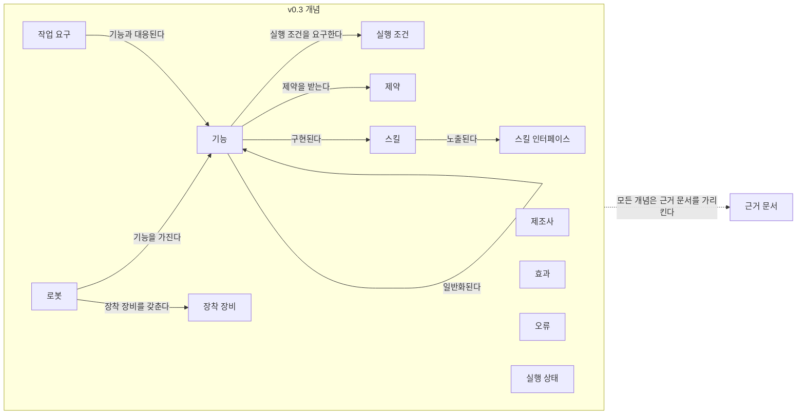
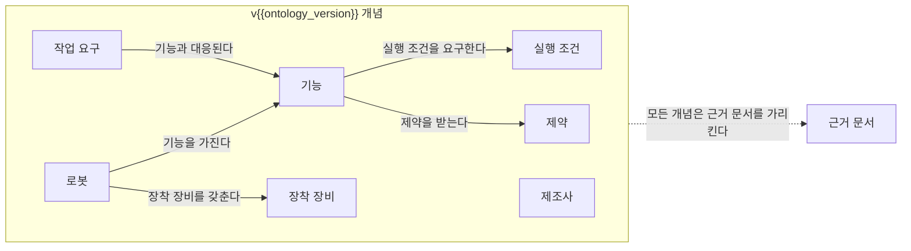

(너의 규칙은 시스템 프롬프트의 agents/shared-rules.md 와 agents/verifier.md 이다. 아래는 이번 실행의 컨텍스트와 입력이다.)

## 실행 컨텍스트

- run_id: 2026-09-25-35
- date: 2026-09-25
- run_type: track (트랙 실행)
- 대상: 트랙 manual-capability-ontology (매뉴얼 기반 로봇 기능 온톨로지) · 현재 단계: 단계 1. 기존 능력 표현 모델과 표준 조사 · 이번에 다룰 백로그 질문 id: q1-08, q1-09 · 중심 세부영역: 5. 로봇 능력·작업 온톨로지 (B. 공통 정보·환경 모델)
- 예산:
    - max_search_queries: 40
    - max_sources_per_run: 20
    - new_topic_pages: 1
    - page_updates: 2
    - max_retries: 2
- 환경 알림: web_fetch_available: false · fetch_mode: mirror_only (일반 웹 페이지 열람은 네트워크 정책으로 막혀 있다. raw.githubusercontent.com 은 열린다: 공식 문서가 GitHub 에 있는 출처는 입력의 config/source_mirrors.yaml 경로를 WebFetch 로 열어 원문을 읽고 sources[].fetched=true, fetched_via=github_raw, fetch_url 을 적는다. 입력에 원문 텍스트(data/source_texts)가 있는 출처는 fetched_via=inbox. 그 밖의 출처는 fetched=false 이며 코드가 신뢰도 상한(medium)을 강제한다 — 공통 규칙 0절 6항)
- 언어: ko
- verification_stage: first
- verifier_budget:
    - max_search_queries: 40
    - max_sources_per_run: 20
    - new_topic_pages: 1
    - page_updates: 2
    - max_retries: 2

## 입력

### runs/2026-09-25-35/target.json

```json
{
  "run_id": "2026-09-25-35",
  "date": "2026-09-25",
  "weekday": "Fri",
  "run_number": 35,
  "run_type": "track",
  "forced": true,
  "target": {
    "area_no": 5,
    "area_name": "5. 로봇 능력·작업 온톨로지",
    "category": "B. 공통 정보·환경 모델",
    "category_letter": "B"
  },
  "topic": null,
  "track": {
    "slug": "manual-capability-ontology",
    "name": "매뉴얼 기반 로봇 기능 온톨로지",
    "stage": 1,
    "stages": 7,
    "stage_name": "기존 능력 표현 모델과 표준 조사",
    "question_ids": [
      "q1-08",
      "q1-09"
    ],
    "user_questions": [],
    "runs_per_week": 3,
    "question_rationale": "사용자 지정 0건, 되돌아온 질문 0건, 현재 단계 열린 질문 2건 중 오래된 순"
  },
  "corrections": [],
  "budget": {
    "max_search_queries": 40,
    "max_sources_per_run": 20,
    "new_topic_pages": 1,
    "page_updates": 2,
    "max_retries": 2
  },
  "priority_reason": null,
  "priority_questions": [],
  "excluded_areas": [],
  "lifted_areas": [],
  "deferred": {
    "monthly_recheck": false,
    "weekly_review": true
  },
  "selection_rationale": "CLI 지정 run_type=track, area=5; 트랙 실행일(Fri, track_days 앞 3개) → 트랙 manual-capability-ontology 단계 1, 질문 q1-08, q1-09 (사용자 지정 0건, 되돌아온 질문 0건, 현재 단계 열린 질문 2건 중 오래된 순)"
}
```

### runs/2026-09-25-35/research.json

```json
{
  "run_id": "2026-09-25-35",
  "date": "2026-09-25",
  "run_type": "track",
  "target": {
    "area_no": 5,
    "area_name": "5. 로봇 능력·작업 온톨로지",
    "category": "B. 공통 정보·환경 모델"
  },
  "gaps": [
    "단계 1 질문 q1-08, q1-09 열림 — target.json 지정(사용자 지정 0건, 되돌아온 질문 0건, 현재 단계 열린 질문 2건 중 오래된 순)",
    "완료 조건: 모델·표준 비교표의 MassRobotics 행 전제조건·파라미터 범위·완료 확인 방법 칸 '미조사', 지원 작업·부착 장비 필드 유무 미판정",
    "완료 조건: ROP용 능력 개념 요구 목록 초안 가운데 구성 버전·운용 구역·환경 조건·충전 조건이 온톨로지 초안 6절 질문으로 남아 있음(미반영)",
    "온톨로지 초안 6절: 기능의 의미 식별자 속성 제안이 '속성 단위 식별자뿐'이라는 이유로 보류됨 — 능력 단위 사전 항목 유무 미확인(q1-09)",
    "5. 로봇 능력·작업 온톨로지 페이지 섹션 11. 열린 질문의 적재물 유형 공통 어휘(oq-023) 미해결"
  ],
  "research_questions": [
    "같은 ‘운반 로봇’ 중 누가 이 화물을 실제로 취급할 수 있는가? [분류원문]",
    "q1-08 MassRobotics AMR 상호운용 표준의 setup·status 메시지 스키마에는 로봇 능력(적재량, 지원 작업, 부착 장비)을 기술하는 필드가 있는가?",
    "q1-09 ECLASS·IEC CDD 에 이동로봇의 범위 능력(이동·계단·적재·도어 조작·충전)과 그 속성을 기술하는 항목이 있는가, 있으면 능력 온톨로지의 의미 식별자로 쓸 수 있는가?",
    "MassRobotics 식별 보고의 능력 필드는 VDA 5050 팩트시트의 적재 세트·지원 action, IDTA 02047 속성과 비교해 무엇이 빠지는가? (비교표 MassRobotics 행 겨냥)",
    "IDTA 02047·02020 템플릿은 어느 요소에 ECLASS IRDI 를 쓰고 어느 요소에 IDTA 자체 식별자를 쓰는가, 능력 단위의 의미 식별자는 어디서 오는가? (온톨로지 초안 6절 의미 식별자 질문 겨냥)",
    "국내 자료에 MassRobotics 표준 필드나 ECLASS 기반 이동로봇 속성 사전을 다룬 것이 있는가? (한국 자료 우선 규칙)"
  ],
  "findings": [
    {
      "id": "f1",
      "claim": "MassRobotics AMR 상호운용 표준 공식 JSON 스키마의 식별 보고(identityReport)는 uuid·timestamp·manufacturerName·robotModel·robotSerialNumber·baseRobotEnvelope 를 필수로 두고, 최대 속도(maxSpeed, m/s)·예상 가동 시간(maxRunTime, 시간)·충전기 유형(chargerType)·화물 설명(cargoType)·화물 최대 부피(cargoMaxVolume)·화물 최대 중량(cargoMaxWeight, kg)·제품 문서 링크(productDocumentation)를 선택 필드로 둔다.",
      "tag": "사실",
      "source_ids": [
        "ref-230"
      ],
      "cross_checked": false,
      "confidence": "medium",
      "evidence_excerpt": "AMR_Interop_Standard.json 원본(github_raw 열람): cargoMaxWeight 는 type string, 설명 \"Max weight of cargo in kg\". cargoMaxVolume 은 object, cargoType 은 string('Discription of cargo'). (발행일 미확인, 확인일 기준)",
      "as_of": "2026-09-25",
      "flow_step": null,
      "flow_item": "수행 자원"
    },
    {
      "id": "f2",
      "claim": "같은 스키마의 상태 보고(statusReport)는 uuid·timestamp·operationalState·location 을 필수로 두고, 운용 상태 9종(navigating·idle·disabled·offline·charging·waitingHumanEvent·waitingExternalEvent·waitingInternalEvent·manualOverride), 배터리 비율, 남은 가동 시간, 남은 적재 여유 비율(loadPercentageStillAvailable), 오류 코드 배열, 목적지, 약 10초 단기 경로를 둔다.",
      "tag": "사실",
      "source_ids": [
        "ref-230"
      ],
      "cross_checked": false,
      "confidence": "medium",
      "evidence_excerpt": "statusReport 필수: uuid, timestamp, operationalState, location. loadPercentageStillAvailable 설명은 '남은 용량 비율', path 는 '약 10초 단기 경로'. (발행일 미확인, 확인일 기준)",
      "as_of": "2026-09-25",
      "flow_step": null,
      "flow_item": "예외·성과"
    },
    {
      "id": "f3",
      "claim": "MassRobotics 스키마의 식별·상태 보고 필드 목록에는 로봇이 수행할 수 있는 작업·동작(지원 작업)이나 부착 장비를 기술하는 필드가 없고, 적재 관련 능력은 화물 최대 부피·최대 중량과 자유 서술 화물 설명, 상태 보고의 적재 여유 비율에 그치는 것으로 보인다.",
      "tag": "추정",
      "source_ids": [
        "ref-230"
      ],
      "cross_checked": false,
      "confidence": "low",
      "evidence_excerpt": "열람 도구가 나열한 identityReport 17개·statusReport 11개 필드 기준의 부재 관찰. 스키마 전체를 글자 단위로 대조하지 않아 부재 확정은 아님. (발행일 미확인, 확인일 기준)",
      "as_of": "2026-09-25",
      "flow_step": null,
      "flow_item": "수행 자원"
    },
    {
      "id": "f4",
      "claim": "MassRobotics 의 표준 설명 페이지는 이 표준이 로봇이 누구인지·어디에 있는지·무엇을 하고 있는지를 알리는(broadcast) 방식이며 운용 상태로 주행·유휴·충전·다른 사건 대기 등을 공유한다고 설명한다.",
      "tag": "사실",
      "source_ids": [
        "ref-708"
      ],
      "cross_checked": false,
      "confidence": "medium",
      "evidence_excerpt": "검색 요약: 로봇이 who they are, where they are, what they are doing 을 알리고, 운용 상태에 navigating·idle·charging·waiting 이 있다. 원문 미열람. (발행일 미확인, 확인일 기준)",
      "as_of": "2026-09-25",
      "flow_step": null,
      "flow_item": null,
      "source_unopened": true
    },
    {
      "id": "f5",
      "claim": "VDA 5050 팩트시트가 적재 세트별 치수·최대 중량·취급 높이와 지원 action 을, IDTA 02047 이 부착 장비 인터페이스를 두는 것과 달리 MassRobotics 식별 보고는 로봇 전체 수준의 최대값(화물 최대 중량·부피, 최대 속도, 가동 시간, 충전기 유형)만 두므로, 분류 원문 질문(누가 이 화물을 실제로 취급할 수 있는가)에 답하려면 ROP 는 적재 취급 방식·지원 동작·장착 장비 정보를 팩트시트·서브모델·매뉴얼 같은 다른 출처에서 보완해야 할 것으로 보인다.",
      "tag": "추정",
      "source_ids": [
        "ref-230",
        "ref-228",
        "ref-245"
      ],
      "cross_checked": false,
      "confidence": "low",
      "evidence_excerpt": "f1·f3 과 팩트시트 loadSets·mobileRobotActions(재인용: 2026-09-25-23), IDTA 02047 InterfacesForAttachments(이번 실행 재열람)를 대응시킨 추론.",
      "as_of": "2026-09-25",
      "flow_step": "적치",
      "flow_item": "수행 자원"
    },
    {
      "id": "f6",
      "claim": "MassRobotics 스키마는 화물 최대 중량을 문자열(string)로, 화물 최대 부피를 객체(object)로 정의하므로, ROP 가 이 값을 화물 중량·치수와 수치 비교하려면 어댑터에서 형식·단위를 정규화하는 규칙이 필요할 것으로 보인다.",
      "tag": "추정",
      "source_ids": [
        "ref-230"
      ],
      "cross_checked": false,
      "confidence": "low",
      "evidence_excerpt": "cargoMaxWeight type string(설명상 kg), cargoMaxVolume type object(설명 'Max volume of cargo in meters'). 수치 비교 규칙은 스키마에 없음. (발행일 미확인, 확인일 기준)",
      "as_of": "2026-09-25",
      "flow_step": "적치",
      "flow_item": "제약"
    },
    {
      "id": "f7",
      "claim": "IDTA 02047 무인운반차 기술 데이터 1.0 템플릿은 제조사명(0173-1#02-AAO677#004)·보호 등급 IP(0173-1#02-AAV695#003)·실외 사용 적합(0173-1#02-BAD676#009)·최대 적재 질량(0173-1#02-ABJ258#001)·가동 시간 명세값(0173-1#02-AAJ479#004)·최대 가속도(0173-1#02-ABG746#002) 같은 속성에 ECLASS 속성 IRDI 를 붙이고, 측경사 각·주행 방식·기구학 유형 같은 무인운반차 고유 속성에는 IDTA 자체 식별자(admin-shell.io)를 쓴다.",
      "tag": "사실",
      "source_ids": [
        "ref-245"
      ],
      "cross_checked": false,
      "confidence": "medium",
      "evidence_excerpt": "템플릿 JSON(github_raw 열람) semanticId 목록. MaxLateralInclinationMaxLoad 의 semanticId 는 https://admin-shell.io/idta/technicaldataagv/maxlateralinclination/1/0. (발행일 미확인, 확인일 기준)",
      "as_of": "2026-09-25",
      "flow_step": null,
      "flow_item": "제약"
    },
    {
      "id": "f8",
      "claim": "IDTA 02047 템플릿의 특수 능력(SpecialCapabilities) 요소는 IDTA 자체 식별자를 가진 다국어 자유 텍스트 속성(MultiLanguageProperty)으로, 무인운반차의 특수 능력·기능을 구조 없이 서술하게 한다.",
      "tag": "사실",
      "source_ids": [
        "ref-245"
      ],
      "cross_checked": false,
      "confidence": "medium",
      "evidence_excerpt": "SpecialCapabilities: semanticId https://admin-shell.io/idta/technicaldataagv/specialcapabilities/1/0, 설명 \"Special capabilities and functions of the AGV\", modelType MultiLanguageProperty. (발행일 미확인, 확인일 기준)",
      "as_of": "2026-09-25",
      "flow_step": null,
      "flow_item": null
    },
    {
      "id": "f9",
      "claim": "IDTA 02047 템플릿에서 ECLASS 분류 클래스 코드 공간(0173-1#01-…) 식별자는 일반 정보(GeneralInformation)·제품 이미지·용도별 설명 같은 일반 블록의 복합 semanticId(예: 0173-1#02-ABK161#002/0173-1#01-AHX838#002)에만 나타나고, 무인운반차·이동로봇 자체를 가리키는 클래스로 쓰인 곳은 확인되지 않았다.",
      "tag": "사실",
      "source_ids": [
        "ref-245",
        "ref-709"
      ],
      "cross_checked": false,
      "confidence": "medium",
      "evidence_excerpt": "템플릿 원문의 0173-1#01-AHX838#002·AHY911#001·AHY912#001 은 GeneralInformation·ProductImages·SpecificDescriptions 문맥. ECLASS IRDI 에서 코드 공간 01 은 분류 클래스를 뜻한다(ref-709 검색 요약). (발행일 미확인, 확인일 기준)",
      "as_of": "2026-09-25",
      "flow_step": null,
      "flow_item": null,
      "source_unopened": false
    },
    {
      "id": "f10",
      "claim": "이번에 연 IDTA 02047 템플릿 범위에서 범위 능력(이동·계단·적재·도어 조작·충전)을 능력 단위로 가리키는 ECLASS 식별자는 확인되지 않았고, ECLASS 는 최대 적재 질량·실외 사용 적합 같은 속성 단위에만 쓰이며 충전·계단·도어 조작 속성은 템플릿에 없는 것으로 보인다.",
      "tag": "추정",
      "source_ids": [
        "ref-245"
      ],
      "cross_checked": false,
      "confidence": "low",
      "evidence_excerpt": "f7~f9 에서 도출. 열람 도구 응답: 충전 명세·계단 능력·도어 상호작용은 템플릿에 명시되지 않음(부재 확정 아님). ECLASS 데이터베이스 자체는 조회하지 못함.",
      "as_of": "2026-09-25",
      "flow_step": null,
      "flow_item": null
    },
    {
      "id": "f11",
      "claim": "IDTA 02020 능력 기술 1.0 템플릿의 능력(Capability) 요소와 속성 요소는 IDTA 일반 템플릿 식별자(admin-shell.io/idta/CapabilityDescription/…)만 두고 특정 능력 사전을 가리키지 않으며, 속성 설명은 값의 의미를 valueId 로 정하게 하고, README 도 표준 능력 사전·분류 체계를 지정하지 않는다.",
      "tag": "사실",
      "source_ids": [
        "ref-243",
        "ref-229"
      ],
      "cross_checked": false,
      "confidence": "medium",
      "evidence_excerpt": "템플릿 원본: Capability semanticId https://admin-shell.io/idta/CapabilityDescription/Capability/1/0, Property 설명 \"A valueId shall be set to define the semantic for the value.\" README 에 능력 사전 언급 없음. (발행일 미확인, 확인일 기준)",
      "as_of": "2026-09-25",
      "flow_step": null,
      "flow_item": null
    },
    {
      "id": "f12",
      "claim": "AAS 는 요소의 의미를 ECLASS·IEC CDD 같은 외부 사전으로 가리킬 수 있지만 능력 서브모델은 능력 단위 사전을 지정하지 않으므로, 범위 능력의 의미 식별자는 구현자가 정해야 하며 ECLASS·IEC CDD 에 이동로봇 능력 항목이 있어야만 그것을 쓸 수 있을 것으로 보인다(항목 존재 여부는 이번 실행에서 확인하지 못함).",
      "tag": "추정",
      "source_ids": [
        "ref-247",
        "ref-243",
        "ref-245"
      ],
      "cross_checked": false,
      "confidence": "low",
      "evidence_excerpt": "f7~f11 과 AAS Part 3a 의 IEC 61360 데이터 명세(재인용: 2026-09-25-16)를 대응시킨 추론. ECLASS 검색 페이지·IEC CDD 는 열람 불가라 직접 조회 못 함.",
      "as_of": "2026-09-25",
      "flow_step": null,
      "flow_item": null,
      "source_unopened": false
    }
  ],
  "sources": [
    {
      "id": "ref-230",
      "org": "MassRobotics",
      "title": "MassRobotics-AMR/AMR_Interop_Standard — AMR_Interop_Standard.json",
      "published": null,
      "url": "https://github.com/MassRobotics-AMR/AMR_Interop_Standard/blob/main/AMR_Interop_Standard.json",
      "type": "표준",
      "reliability": "high",
      "accessed": "2026-09-25",
      "summary": "MassRobotics AMR 상호운용 표준의 공식 JSON 스키마. 이번 실행은 identityReport·statusReport 의 필수·선택 필드, 형식, 운용 상태 열거값을 원문으로 확인했다.",
      "fetched": true,
      "fetched_via": "github_raw",
      "fetch_url": "https://raw.githubusercontent.com/MassRobotics-AMR/AMR_Interop_Standard/main/AMR_Interop_Standard.json",
      "source_unopened": false
    },
    {
      "id": "ref-228",
      "org": "VDA / VDMA (VDA5050 GitHub)",
      "title": "VDA5050/VDA5050 — json_schemas/factsheet.schema",
      "published": null,
      "url": "https://github.com/VDA5050/VDA5050/blob/main/json_schemas/factsheet.schema",
      "type": "표준",
      "reliability": "medium",
      "accessed": "2026-09-25",
      "summary": "원문 미열람. 이번 실행에서 다시 열지 않았다(이전 실행에서 원문 확인). VDA 5050 팩트시트 JSON 스키마(main, 3.0.0 판)로 적재 세트와 지원 action 정의를 둔다.",
      "source_unopened": true,
      "fetched": false,
      "fetched_via": null,
      "fetch_url": null
    },
    {
      "id": "ref-245",
      "org": "IDTA (admin-shell-io/submodel-templates)",
      "title": "IDTA 02047-1-0 Template_TechnicalDataForAGV.json",
      "published": null,
      "url": "https://github.com/admin-shell-io/submodel-templates/blob/main/published/Technical%20Data%20for%20Automated%20Guided%20Vehicles/1/0/IDTA%2002047-1-0%20Template_TechnicalDataForAGV.json",
      "type": "표준",
      "reliability": "high",
      "accessed": "2026-09-25",
      "summary": "무인운반차 기술 데이터 서브모델 1.0 템플릿 JSON. 이번 실행은 요소별 semanticId(ECLASS IRDI 와 IDTA 자체 식별자 구분), 특수 능력 요소, ECLASS 클래스 코드가 쓰인 블록을 원문으로 확인했다.",
      "fetched": true,
      "fetched_via": "github_raw",
      "fetch_url": "https://raw.githubusercontent.com/admin-shell-io/submodel-templates/main/published/Technical%20Data%20for%20Automated%20Guided%20Vehicles/1/0/IDTA%2002047-1-0%20Template_TechnicalDataForAGV.json",
      "source_unopened": false
    },
    {
      "id": "ref-243",
      "org": "IDTA (admin-shell-io/submodel-templates)",
      "title": "IDTA 02020_Template_Capability_Description.json",
      "published": null,
      "url": "https://github.com/admin-shell-io/submodel-templates/blob/main/published/Capability%20Description/1/0/IDTA%2002020_Template_Capability_Description.json",
      "type": "표준",
      "reliability": "high",
      "accessed": "2026-09-25",
      "summary": "능력 기술 서브모델 1.0 템플릿 JSON. 이번 실행은 능력·속성 요소의 semanticId 가 IDTA 일반 템플릿 식별자이고 값 의미를 valueId 로 정하게 한다는 설명을 원문으로 확인했다.",
      "fetched": true,
      "fetched_via": "github_raw",
      "fetch_url": "https://raw.githubusercontent.com/admin-shell-io/submodel-templates/main/published/Capability%20Description/1/0/IDTA%2002020_Template_Capability_Description.json",
      "source_unopened": false
    },
    {
      "id": "ref-229",
      "org": "IDTA(Industrial Digital Twin Association)",
      "title": "IDTA 02020 Capability Description 1.0 — README (admin-shell-io/submodel-templates)",
      "published": null,
      "url": "https://github.com/admin-shell-io/submodel-templates/tree/main/published/Capability%20Description",
      "type": "표준",
      "reliability": "medium",
      "accessed": "2026-09-25",
      "summary": "능력 기술 서브모델 1.0 README. 이번 실행은 README 가 능력의 의미 식별 방법이나 표준 능력 사전을 언급하지 않음을 원문으로 확인했다.",
      "fetched": false,
      "fetched_via": null,
      "fetch_url": "https://raw.githubusercontent.com/admin-shell-io/submodel-templates/main/published/Capability%20Description/1/0/README.md",
      "source_unopened": true
    },
    {
      "id": "ref-247",
      "org": "IDTA(Industrial Digital Twin Association)",
      "title": "Specification of the Asset Administration Shell Part 3a: Data Specification – IEC 61360 (IDTA-01003-a-3-0-2)",
      "published": "2024-07",
      "url": "https://industrialdigitaltwin.org/wp-content/uploads/2024/07/IDTA-01003-a-3-0-2_SpecificationAssetAdministrationShell_Part3a_DataSpecification_IEC613601.pdf",
      "type": "표준",
      "reliability": "medium",
      "accessed": "2026-09-25",
      "summary": "원문 미열람. AAS 요소의 의미를 IEC 61360 기반 사전(ECLASS, IEC CDD)의 개념 기술로 정하는 데이터 명세 문서.",
      "source_unopened": true,
      "fetched": false,
      "fetched_via": null,
      "fetch_url": null
    },
    {
      "id": "ref-708",
      "org": "MassRobotics",
      "title": "What Is the MassRobotics AMR Interoperability Standard?",
      "published": null,
      "url": "https://www.massrobotics.org/what-is-the-massrobotics-amr-interoperability-standard/",
      "type": "표준",
      "reliability": "medium",
      "accessed": "2026-09-25",
      "summary": "원문 미열람. 표준 발행 기관의 설명 페이지로, 로봇이 자신이 누구인지·어디에 있는지·무엇을 하는지를 알리는 방식과 운용 상태 공유를 설명한다(검색 요약 기준).",
      "source_unopened": true,
      "fetched": false,
      "fetched_via": null,
      "fetch_url": null
    },
    {
      "id": "ref-709",
      "org": "ECLASS e.V.",
      "title": "IRDI - ECLASS Technischer Support",
      "published": null,
      "url": "https://eclass.eu/support/technical-specification/structure-and-elements/irdi",
      "type": "표준",
      "reliability": "medium",
      "accessed": "2026-09-25",
      "summary": "원문 미열람. ECLASS 식별자 IRDI 의 구조(기관 식별자 0173, 코드 공간 식별자 01 = 분류 클래스 등)를 설명하는 ECLASS 기술 명세 페이지(검색 요약 기준).",
      "source_unopened": true,
      "fetched": false,
      "fetched_via": null,
      "fetch_url": null
    }
  ],
  "page_proposals": [
    {
      "action": "update",
      "path": "docs/tracks/manual-capability-ontology/stage-1-existing-models-and-standards.md",
      "sections": [
        "2",
        "3",
        "4",
        "5",
        "6",
        "8",
        "9"
      ],
      "rationale": "q1-08 답: f1·f2·f3·f4·f5·f6 (신뢰도 medium) / q1-09 부분 답: f7·f8·f9·f10·f11·f12 — 2절 q1-08 답함·q1-09 열림 유지, 3절 q1-08 소제목 신설({#q1-08}, 식별·상태 보고 필드와 지원 작업·부착 장비 필드 부재, 팩트시트·IDTA 02047 대비 f5, 형식 정규화 f6), q1-09 는 '(부분 답)' 소제목으로 IDTA 02047·02020 의 식별자 사용 현황(f7~f12)만 기술, 4절 결론·불확실성(ECLASS 데이터베이스·IEC CDD 미조회), 5절 후속 질문, 6절 완료 조건 현황, 8절 출처, 9절 이력"
    },
    {
      "action": "update",
      "path": "docs/tracks/manual-capability-ontology/model-standard-comparison.md",
      "sections": [
        "4",
        "5",
        "8"
      ],
      "rationale": "트랙 산출물 갱신: MassRobotics 행의 적재·환경 제약(f1·f6), 오류의 의미(f2), 지원 작업·부착 장비 필드 부재(f3) 보강, 종류 칸에 보고 전용 구조(f4). IDTA 02047 행에 특수 능력 자유 텍스트(f8)와 ECLASS 속성 IRDI 사용 범위(f7·f9) 메모. 5절 빠진 정보 요약에 f5 반영"
    },
    {
      "action": "update",
      "path": "docs/categories/b-common-information-and-environment-model/05-robot-capability-and-task-ontology.md",
      "sections": [
        "7"
      ],
      "rationale": "트랙 manual-capability-ontology 단계 1 반영 제안 (f1, f3, f5, f11): MassRobotics 식별 보고의 능력 필드 범위와 지원 작업·부착 장비 부재, IDTA 02020 이 능력 단위 사전을 지정하지 않음"
    },
    {
      "action": "update",
      "path": "docs/categories/c-connectivity-and-execution-foundation/09-robot-and-vendor-fleet-manager-integration.md",
      "sections": [
        "7"
      ],
      "rationale": "트랙 manual-capability-ontology 단계 1 반영 제안 (f1, f2, f6): MassRobotics 식별·상태 보고 필드와 화물 최대 중량(문자열)·부피(객체) 값의 어댑터 정규화 필요"
    },
    {
      "action": "update",
      "path": "docs/categories/g-safety-security-intelligence-and-governance/28-standards-interoperability-and-multi-vendor-governance.md",
      "sections": [
        "7"
      ],
      "rationale": "트랙 manual-capability-ontology 단계 1 반영 제안 (f7, f9, f12): IDTA 02047 의 ECLASS 속성 IRDI 사용 범위와 무인운반차 고유 속성의 IDTA 자체 식별자, 능력 단위 의미 식별자의 공백"
    },
    {
      "action": "update",
      "path": "docs/ideas/robot-capability-ontology.md",
      "sections": [
        "4"
      ],
      "rationale": "아이디어 페이지 4절: 의미 식별자 소절에 IDTA 02047 특수 능력 자유 텍스트(f8)와 범위 능력의 ECLASS 식별자 미확인(f10·f12), 범위 능력 '적재'·'충전'에 MassRobotics 화물 최대 중량·충전기 유형(f1) 보강"
    }
  ],
  "glossary_candidates": [
    {
      "term_ko": "국제 등록 데이터 식별자",
      "term_en": "International Registration Data Identifier (IRDI)",
      "definition": "ECLASS·IEC CDD 같은 데이터 사전이 속성·분류 클래스를 기관 식별자와 코드 공간·항목 코드·버전으로 고유하게 가리키는 식별자 형식이다(예: ECLASS 속성 0173-1#02-ABJ258#001)."
    }
  ],
  "open_questions_new": [],
  "open_questions_resolved": [],
  "self_check": {
    "source_count": 8,
    "cross_checked_count": 0,
    "unverified": [
      "q1-09 부분 답: ECLASS 데이터베이스(eclass.eu 검색)와 IEC CDD(cdd.iec.ch)를 열 수 없어 무인운반차·이동로봇 분류 클래스와 범위 능력(이동·계단·적재·도어 조작·충전) 속성의 존재 여부를 직접 확인하지 못함",
      "모든 finding 교차 확인 실패: MassRobotics 필드는 발행 기관의 스키마·설명 페이지(같은 기관)에만 기대고, IDTA 식별자 관찰은 같은 저장소의 템플릿·README",
      "f3·f10 은 열람 도구가 나열한 필드·요소 기준의 부재 관찰이며 부재 확정 아님",
      "MassRobotics 표준 본문 PDF 는 raw 경로로 받았으나 압축된 본문을 읽지 못해 판 번호·메시지 의미 설명을 확인하지 못함",
      "f7: 첫 열람 응답은 MaxLateralInclination 을 ECLASS IRDI 로, 두 번째 인용 응답은 IDTA 자체 식별자로 적어 두 번째(인용 응답) 값을 채택함",
      "ref-708·ref-709 원문 미열람, 발행일 미확인"
    ],
    "scope_violations": [],
    "budget_used": {
      "queries": 9,
      "sources": 2
    },
    "limits": "web_fetch_available: false · fetch_mode mirror_only. raw.githubusercontent.com 으로 원문을 연 출처: 재사용 ref-230(MassRobotics 스키마)·ref-245(IDTA 02047 템플릿)·ref-243(IDTA 02020 템플릿)·ref-229(IDTA 02020 README). 재사용 ref-228·ref-247 과 신규 ref-708·ref-709 는 원문 미열람(신뢰도 상한 medium). finding 신뢰도는 모두 medium 이하, 교차 확인 0건. 검색 9회/40, 신규 출처 2건/20(ref-708·ref-709, 예약 구간 안), 재사용 6건. 질문 선택: target.json 지정 q1-08·q1-09. q1-08 은 공식 스키마 원문으로 답했다(실행 2026-09-25-16 의 f8 을 이번에 원문으로 다시 확인). q1-09 는 ECLASS·IEC CDD 원 데이터베이스를 조회할 수 없어 IDTA 템플릿이 ECLASS 를 어디에 쓰는지만 확인한 부분 답이다. IEC CDD 는 검색 결과가 위키백과·요약뿐이라 finding 으로 내지 않았다. 한국어 검색 2회(ECLASS 이동로봇 분류, MassRobotics 적재 중량)에서는 인증기관 소개·기사·개인 블로그만 나와 출처로 넣지 않았다. 온톨로지 변경 없음: q1-09 가 부분 답이고 능력 단위 의미 식별자를 뒷받침할 사전 항목을 확인하지 못해, 초안 6절의 '기능의 의미 식별자 속성' 질문을 유지하는 편이 맞다고 판단했다(f12 는 그 질문의 근거 보강으로만 쓴다). 후속 질문 2건. 27. AI·학습·적응과 모델 운영 관련 finding 없음. 8. 실시간 세계 상태·데이터 일관성과 22. 시뮬레이션·예측용 디지털 트윈 관련 주장 없음. 정정 요청 없음."
  },
  "track": {
    "slug": "manual-capability-ontology",
    "stage": 1,
    "answered_question_ids": [
      "q1-08"
    ],
    "new_questions": [
      {
        "question": "MassRobotics 식별 보고의 화물 최대 중량(문자열)·최대 부피(객체) 값을 VDA 5050 팩트시트 적재 세트의 수치 필드와 같은 단위·형식으로 정규화해 화물 요구와 비교하는 어댑터 규칙을 어떻게 둘 것인가? (q1-08 에서 파생)",
        "stage": 4,
        "rationale_finding_id": "f6"
      },
      {
        "question": "제조사는 IDTA 02047 의 특수 능력(SpecialCapabilities) 같은 자유 텍스트 항목이나 매뉴얼에 계단·도어 조작·충전 같은 범위 능력을 실제로 어떻게 적는가? (q1-09 에서 파생)",
        "stage": 2,
        "rationale_finding_id": "f8"
      }
    ],
    "ontology_changes": [],
    "stage_completion_self_assessment": {
      "met": false,
      "missing": [
        "ROP용 능력 개념 요구 목록 초안 가운데 구성 버전·운용 구역·환경 조건·충전 조건이 온톨로지 초안에 미반영(6절 질문)",
        "q1-09 부분 답: ECLASS·IEC CDD 직접 조회 필요",
        "모델·표준 비교표의 PDDL·OPC UA Robotics·AAS·Open-RMF 행과 후보 밖 행의 '미조사' 칸 잔존"
      ]
    }
  }
}
```

### docs/categories/b-common-information-and-environment-model/05-robot-capability-and-task-ontology.md

```markdown
---
title: "5. 로봇 능력·작업 온톨로지"
type: area
category: "B. 공통 정보·환경 모델"
area_no: 5
related_areas: [7, 8, 9, 12, 13, 21, 27, 28]
tags: [능력 모델, 스킬, VDA 5050 팩트시트, 능력 온톨로지, 실행 가능성 판정]
status: published
confidence: medium
created: 2026-09-24
updated: 2026-09-25
sources: [ref-025, ref-026, ref-027, ref-028, ref-029, ref-035, ref-038, ref-040, ref-041, ref-042, ref-043, ref-105, ref-228, ref-229, ref-230, ref-231, ref-232, ref-233, ref-234, ref-235, ref-236, ref-237, ref-238, ref-239, ref-240, ref-138, ref-152]
last_run: 2026-09-25
version: 2
---

[홈](../../index.md) › [B. 공통 정보·환경 모델](index.md) › 5. 로봇 능력·작업 온톨로지

# 5. 로봇 능력·작업 온톨로지

!!! info "소속 대분류"
    [B. 공통 정보·환경 모델](index.md) — 핵심 질문:
    로봇·물건·공간·상태를 어떻게 같은 의미로 이해할 것인가? [분류원문]

<!-- auto:area-tracks:start -->
!!! note "관련 연구 트랙"
    이 세부영역을 가로지르는 중점 연구 트랙과 확장 아이디어다. 트랙은 분류를 바꾸지 않으며, 트랙에서 확인된 사실은 이 페이지에 반영하도록 제안된다. 전체 매핑은 [확장 아이디어 연결 구조](../../ideas/index.md)에 있다.

    - [매뉴얼 기반 로봇 기능 온톨로지](../../tracks/manual-capability-ontology/index.md) — 중심 영역(●) · 확장 아이디어: [아이디어 1. 로봇 기능 온톨로지](../../ideas/robot-capability-ontology.md)
    - [자연어 업무 지시 챗봇](../../tracks/nl-task-chatbot/index.md) — 함께 필요한 영역(○) · 확장 아이디어: [아이디어 2. 자연어 업무 지시 챗봇](../../ideas/nl-task-chatbot.md)
    - [건축 도면 자동 인식](../../tracks/floorplan-recognition/index.md) — 함께 필요한 영역(○) · 확장 아이디어: [아이디어 3. 건축 도면 자동 인식](../../ideas/floorplan-recognition.md)
<!-- auto:area-tracks:end -->

<!-- auto:page-status:start -->
> 페이지 상태: published · 신뢰도: medium · 페이지 버전: 2 · 마지막 갱신: 2026-09-25 · 마지막 실행: 2026-09-25
<!-- auto:page-status:end -->

## 1. 한 줄 정의

제조사별 기능·제약·장착 장비·실행 조건을 공통 모델로 표현하고, 작업 요구와 연결 [분류원문]

## 2. SCM 관점의 질문

같은 ‘운반 로봇’ 중 누가 이 화물을 실제로 취급할 수 있는가? [분류원문]

> 원문 주석: 27번의 AI는 특정 기능 하나에만 해당하지 않는다. **매뉴얼 해석은 5·21번, 도면 해석은 6번, 학습 기반 배차는 13번, 장애 분석은 19번**에 적용되는 연구 방법이다. [분류원문]

## 3. 왜 중요한가

같은 운반 로봇 가운데 어느 로봇이 특정 화물을 실제로 취급할 수 있는지는 적재 명세(적재 유형·최대 중량·처리 높이), 지원 동작, 현재 상태(남은 적재 용량·운영 상태), 적재 상태에서의 경로 통과 가능성을 함께 대조해야 판단할 수 있어, 한 규격의 필드만으로는 정해지지 않을 것으로 보인다. [추정][^ref-228][^ref-230][^ref-236]

제조사마다 능력을 적는 방식도 맞춰져 있지 않다. VDA 5050 팩트시트의 적재 유형(loadType)과 MassRobotics 표준의 화물 설명(cargoType)은 모두 문자열로 적게 할 뿐 공통 어휘를 지정하지 않으므로, 제조사 사이에서 화물 취급 가능 여부를 맞추려면 적재물 유형 사전이 따로 필요할 것으로 보인다. [추정][^ref-228][^ref-230]

문서에 선언된 능력과 현장에서 관측되는 능력이 다를 수 있다는 점도 연구 대상이다. Naqvi 외(2025)는 제조사가 광고한 능력(advertised capabilities)과 운용 중 관측된 능력(operational capabilities)을 온톨로지로 구분해 통합하는 방법을 제시했다. [사실][^ref-041] 따라서 구축자 의견으로는 이 영역을 흩어진 선언을 한 모델로 모아 작업 요구와 연결하는, 배정·실행 판단의 공통 기반으로 볼 수 있다. [의견]

## 4. 핵심 개념과 용어

이 영역의 중심 개념은 구현과 무관한 기능 명세인 능력과, 그 능력을 실제로 실행하는 구현인 스킬의 구분이며, 여기에 능력의 조건을 적는 제약·범위 개념이 더해진다. [사실][^ref-229][^ref-231]

자세한 내용은 주제 페이지 [5. 로봇 능력·작업 온톨로지 — 핵심 개념과 용어](../../topics/2026/2026-09-25-area05-s4.md)에 있다.

## 5. 현장 시나리오 (물류 흐름의 어느 단계인지 명시)

**물류 흐름 단계:** 적치

**시나리오:** 입고된 팔레트를 적치 위치로 옮길 운반 로봇 고르기

| 항목 | 내용 |
|---|---|
| 시작 조건 | 입고가 확정된 팔레트에 적치 작업이 생긴다(가상 설정). |
| 작업 대상 | 팔레트 한 개. 적재 유형을 VDA 5050 팩트시트는 loadType(예: EPAL)으로, MassRobotics 표준은 cargoType 문자열로 적지만 공통 어휘는 정하지 않은 것으로 보인다. [추정][^ref-228][^ref-230] |
| 수행 자원 | 제조사가 다른 운반 로봇 두 대(가상 설정). 어느 쪽이 취급할 수 있는지는 적재 명세·지원 동작·남은 적재 용량·운영 상태를 함께 대조해야 할 것으로 보인다. [추정][^ref-228][^ref-230][^ref-236] |
| 제약 | 팩트시트의 적재 명세(loadSets)는 최대 중량, 최소·최대 적재 처리 높이, 대략의 픽·드롭 소요 시간을 적는다. [사실][^ref-228] 적재 상태에 따라 달라지는 장소 도달 가능성을 판정하는 연구도 있다. [사실][^ref-236] |
| 완료·인계 | Open-RMF에서는 어댑터가 로봇 API의 완료를 확인한 뒤 execution.finished()를 호출해 완료를 알린다. [사실][^ref-040] |
| 예외·성과 | 선언된 능력과 운용 중 관측된 능력이 다를 수 있다. [사실][^ref-041] 어느 값을 배정 기준으로 삼을지는 열린 질문이다. |

다음은 설명을 위한 가상의 시나리오이다. 적치 작업이 생기면 ROP는 두 로봇의 팩트시트에서 팔레트 유형·중량·처리 높이를 비교하고, 상태 보고에서 남은 적재 용량과 운영 상태를 확인한다. 적재 유형 문자열이 제조사마다 다르면 이 비교 자체가 막힐 수 있다. [추정][^ref-228][^ref-230]

작업이 끝나면 완료 보고는 인터페이스 안에서 선언한 동작 이름을 그대로 쓰는 방식으로 돌아오는 것으로 보인다. [추정][^ref-228][^ref-040] 적재 후 속도처럼 선언과 다른 운용 값이 쌓이면 능력 모델을 어떻게 갱신할지가 다음 과제로 남는다.

## 6. 대표 접근법과 기술

능력 기술과 실행의 연결은 같은 인터페이스 안에서 선언한 동작 이름을 명령·완료 보고에 그대로 쓰는 방식과, 별도 능력 모델을 상태 기계를 가진 스킬 인터페이스로 잇는 방식으로 나뉘는 것으로 보인다. [추정][^ref-228][^ref-040][^ref-229][^ref-231]

자세한 내용은 주제 페이지 [5. 로봇 능력·작업 온톨로지 — 대표 접근법과 기술](../../topics/2026/2026-09-25-area05-s6.md)에 있다.

## 7. 관련 표준·프레임워크·오픈소스

물류 이동로봇 인터페이스는 적재·동작 능력을 필드로 선언하게 하고, 능력 모델 표준·온톨로지는 능력·스킬·조건을 구조화한다. [사실][^ref-228][^ref-229] 전체 목록은 [표준·프레임워크 목록](../../standards/index.md)에 있다.

자세한 내용은 주제 페이지 [5. 로봇 능력·작업 온톨로지 — 관련 표준·프레임워크·오픈소스](../../topics/2026/2026-09-25-area05-s7.md)에 있다.

## 8. 대표 연구와 자료

대표 자료는 로봇 지식 처리·활동 온톨로지, 능력·스킬 모델, 광고·운용 능력 통합, 온톨로지 기반 배정, LLM 기반 능력 온톨로지 생성 연구로 나뉜다. [사실][^ref-233][^ref-038][^ref-041]

자세한 내용은 주제 페이지 [5. 로봇 능력·작업 온톨로지 — 대표 연구와 자료](../../topics/2026/2026-09-25-area05-s8.md)에 있다.

## 9. ROP가 직접 맡는 것과 외부와 연계하는 것 (부록 A 9장 기준)

| 경계 | ROP가 직접 맡는 것 | 외부와 연계하는 것 |
|---|---|---|
| 로봇 자체 지능·제어 | 제조사가 선언한 능력·제약(팩트시트·능력 서브모델)을 공통 모델로 모아 작업 요구와 대조하고, 실행 결과로 선언과 실제의 차이를 기록한다. [추정][^ref-228][^ref-229][^ref-041] | 연계 대상: 파지·센서 인식·로컬 회피 같은 능력의 실제 구현과 성능 보장은 제조사 쪽에 둔다. [추정][^ref-228][^ref-229][^ref-041] |

이 경계는 제품 전략에 따라 옮겨질 수 있다. 분류 원문은 "이종 제조사를 연결하는 ROP는 그 기능을 제조사에 맡기고 인터페이스와 실행 보장을 담당할 수 있다"고 적는다([범위 경계](../../about/scope-boundary.md)). 구축자 의견으로는 이 영역에서 ROP가 맡는 인터페이스는 제조사 선언을 읽는 공통 능력 모델과 요구–능력 대조이며, 능력 자체를 구현하는 일은 포함하지 않는다고 본다. [의견]

## 10. 다른 연구영역과의 연결 (번호와 이름을 함께 표기)

이 영역의 능력 모델은 화물 식별, 현재 상태, 관제 연동, 실행 신뢰성, 배정, 온보딩, AI 방법, 표준 거버넌스 영역과 맞물린다. [추정][^ref-228][^ref-236]

- [7. 화물·재고·자산 식별과 추적](07-cargo-inventory-and-asset-identification-and-tracking.md) — 팩트시트 적재 유형과 MassRobotics 화물 설명을 맞추려면 적재물 유형 어휘가 필요할 것으로 보인다. [추정][^ref-228][^ref-230]
- [8. 실시간 세계 상태·데이터 일관성](08-real-time-world-state-and-data-consistency.md) — 상태 보고의 운영 상태·남은 적재 용량과 운용 중 관측된 능력은 현재 상태 표현으로서 배정 판단에 들어갈 것으로 보인다. [추정][^ref-230][^ref-041]
- [9. 로봇·제조사 관제 연동](../c-connectivity-and-execution-foundation/09-robot-and-vendor-fleet-manager-integration.md) — 팩트시트는 지원 동작·적재 명세를, 플릿 어댑터 설정은 수행 가능한 작업 유형·동작 이름을 선언한다. [사실][^ref-228][^ref-105]
- [12. 명령·작업 실행의 신뢰성](../c-connectivity-and-execution-foundation/12-command-and-task-execution-reliability.md) — 선언한 동작 이름이 명령·완료 보고로 이어지는 방식이 실행 확인과 맞닿는다. [추정][^ref-040][^ref-228]
- [13. 작업 배정 — MRTA](../d-planning-and-optimization/13-task-allocation-mrta.md) — 실행 가능성 판정 결과를 배정기 독립 입력으로 넘기는 연구가 두 영역을 잇는다. [사실][^ref-236] 이동로봇 플릿의 작업 배정 문제를 에너지 소비와 필요 로봇 수 최소화 관점에서 검토한 리뷰도 있다. [사실][^ref-152]
- [21. 온보딩·설정·현장 시운전](../f-deployment-verification-and-maintenance/21-onboarding-configuration-and-commissioning.md) — 매뉴얼·로봇 기술 파일 해석으로 능력 모델을 만드는 일은 온보딩 때 필요하다. [추정][^ref-238][^ref-239]
- [27. AI·학습·적응과 모델 운영](../g-safety-security-intelligence-and-governance/27-ai-learning-adaptation-and-model-operations.md) — LLM 기반 능력 온톨로지 생성과 형식 검증은 이 영역에 적용되는 AI 방법이다. [사실][^ref-238][^ref-239]
- [28. 표준·상호운용성·다사업자 거버넌스](../g-safety-security-intelligence-and-governance/28-standards-interoperability-and-multi-vendor-governance.md) — IDTA 02047, ISO 22166-201, KS B 7321-2 같은 제조사 독립 정보 모델 표준이 걸려 있다. [사실][^ref-234][^ref-240][^ref-138]
- [매뉴얼 기반 로봇 기능 온톨로지 트랙](../../tracks/manual-capability-ontology/index.md) — 이 영역을 중심으로 한 중점 연구 트랙이다.

## 11. 열린 질문

국내 표준 부합화, 적재물 유형 공통 어휘, 선언 능력과 운용 능력 가운데 배정 기준이 아직 풀리지 않았다. 전체 목록은 [열린 질문](../../open-questions.md)에 있다.

- **oq-004** (상태: 열림 · 제기 2026-09-25 · 실행 2026-09-25-02) IEEE 1872 계열 로봇 온톨로지 표준이나 AAS 능력 서브모델을 KS로 부합화했거나 국내 로봇 관제 사업에 적용한 사례가 있는가? 부분 근거로 서비스 로봇 모듈 정보 모델 국제표준과 국내 KS가 확인됐으나, 로봇 온톨로지·능력 서브모델의 부합화는 확인되지 않았다.[^ref-240][^ref-138]
- (신규, 상태: 열림 · 제기 2026-09-25 · 실행 2026-09-25-15) VDA 5050 팩트시트의 loadType과 MassRobotics의 cargoType이 자유 문자열일 때 팔레트·용기 같은 적재물 유형을 제조사 사이에 같은 의미로 맞출 공통 어휘나 코드 체계가 있는가?[^ref-228][^ref-230]
- (신규, 상태: 열림 · 제기 2026-09-25 · 실행 2026-09-25-15) 제조사가 문서로 선언한 능력(팩트시트·매뉴얼)과 현장에서 관측한 운용 능력(적재 후 속도, 배터리 저하 등)이 다를 때 작업 배정은 어느 값을 기준으로 삼고 능력 모델을 어떻게 갱신하는가?[^ref-041]

트랙 전용 질문은 [질문 백로그](../../tracks/manual-capability-ontology/question-backlog.md)에 있다.

## 12. 최근 업데이트 (자동)

<!-- auto:area-recent:start -->
- 2026-09-25 · 갱신 · [5. 로봇 능력·작업 온톨로지](05-robot-capability-and-task-ontology.md) — 영역 심화: 섹션 3~11 신규 작성, 페이지 상태 자동 영역 표식 추가, 트랙 반영 제안 3건(4·7·8절) 반영. 2차 수정: 10절 태그 2건 조정·ref-152 문장 분리, 3·9절 의견 주체 명시 (실행 2026-09-25-15)
- 2026-09-25 · 생성 · [5. 로봇 능력·작업 온톨로지 — 관련 표준·프레임워크·오픈소스](../../topics/2026/2026-09-25-area05-s7.md) — 자동 분리: 5. 로봇 능력·작업 온톨로지 의 "7. 관련 표준·프레임워크·오픈소스" 절(1,658자)을 옮겼다 (실행 2026-09-25-15)
- 2026-09-25 · 생성 · [5. 로봇 능력·작업 온톨로지 — 대표 접근법과 기술](../../topics/2026/2026-09-25-area05-s6.md) — 자동 분리: 5. 로봇 능력·작업 온톨로지 의 "6. 대표 접근법과 기술" 절(1,396자)을 옮겼다 (실행 2026-09-25-15)
- 2026-09-25 · 생성 · [5. 로봇 능력·작업 온톨로지 — 핵심 개념과 용어](../../topics/2026/2026-09-25-area05-s4.md) — 자동 분리: 5. 로봇 능력·작업 온톨로지 의 "4. 핵심 개념과 용어" 절(1,115자)을 옮겼다 (실행 2026-09-25-15)
- 2026-09-25 · 생성 · [5. 로봇 능력·작업 온톨로지 — 대표 연구와 자료](../../topics/2026/2026-09-25-area05-s8.md) — 자동 분리: 5. 로봇 능력·작업 온톨로지 의 "8. 대표 연구와 자료" 절(1,010자)을 옮겼다 (실행 2026-09-25-15)
<!-- auto:area-recent:end -->

## 13. 참고 자료 (각주)

[^ref-038]: Vieira da Silva, L. M., Köcher, A., & Fay, A., A Capability and Skill Model for Heterogeneous Autonomous Robots, 2022-09, https://arxiv.org/abs/2209.10900, 접근일 2026-09-25 (원문 미열람)
[^ref-040]: Open Robotics, PerformAction Tutorial - Programming Multiple Robots with ROS 2, 미확인, https://osrf.github.io/ros2multirobotbook/integration_fleets_action_tutorial.html, 접근일 2026-09-25
[^ref-041]: Naqvi, M. R. 외(Scientific Reports), Ontology-driven integration of advertised and operational capabilities in robots, 2025-10-02, https://www.nature.com/articles/s41598-025-16649-3, 접근일 2026-09-25 (원문 미열람)
[^ref-105]: Open Robotics (open-rmf), fleet_adapter_template — fleet_adapter_template/config.yaml, 미확인, https://github.com/open-rmf/fleet_adapter_template/blob/main/fleet_adapter_template/config.yaml, 접근일 2026-09-25
[^ref-228]: VDA / VDMA (VDA5050 GitHub), VDA5050/VDA5050 — json_schemas/factsheet.schema, 미확인, https://github.com/VDA5050/VDA5050/blob/main/json_schemas/factsheet.schema, 접근일 2026-09-25
[^ref-229]: IDTA(Industrial Digital Twin Association), IDTA 02020 Capability Description 1.0 — README (admin-shell-io/submodel-templates), 미확인, https://github.com/admin-shell-io/submodel-templates/tree/main/published/Capability%20Description, 접근일 2026-09-25 (원문 미열람)
[^ref-230]: MassRobotics, MassRobotics-AMR/AMR_Interop_Standard — AMR_Interop_Standard.json, 미확인, https://github.com/MassRobotics-AMR/AMR_Interop_Standard/blob/main/AMR_Interop_Standard.json, 접근일 2026-09-25
[^ref-231]: CaSkade-Automation (GitHub), CaSkMan - An OWL ontology to model capabilities and skills in manufacturing (README), 미확인, https://github.com/CaSkade-Automation/CaSkMan, 접근일 2026-09-25
[^ref-233]: EASE CRC (ease-crc/soma), SOMA — README (Socio-physical Model of Activities), 미확인, https://github.com/ease-crc/soma, 접근일 2026-09-25
[^ref-234]: IDTA(Industrial Digital Twin Association), IDTA 02047 Technical Data for Automated Guided Vehicles 1.0 — README (admin-shell-io/submodel-templates), 미확인, https://github.com/admin-shell-io/submodel-templates/tree/main/published/Technical%20Data%20for%20Automated%20Guided%20Vehicles, 접근일 2026-09-25 (원문 미열람)
[^ref-236]: Electronics(MDPI) 게재 논문(저자 미확인), Semantic Feasibility Reasoning for Heterogeneous Multi-Robot Task Allocation, 2026-08-11, https://doi.org/10.3390/electronics15163562, 접근일 2026-09-25 (원문 미열람)
[^ref-238]: Vieira da Silva, L. M., Köcher, A., Gehlhoff, F., & Fay, A., On the Use of Large Language Models to Generate Capability Ontologies, 2024-04, https://arxiv.org/abs/2404.17524, 접근일 2026-09-25 (원문 미열람)
[^ref-239]: Dussard, B., & Sarthou, G. (LAAS-CNRS), Extracting Semantics: LLM-Guided Automatic Population of Robot Ontology from URDF, 2026-06, https://arxiv.org/abs/2606.17073, 접근일 2026-09-25 (원문 미열람)
[^ref-240]: ISO, ISO 22166-201:2024 - Robotics — Modularity for service robots — Part 201: Common information model for modules, 2024-02, https://www.iso.org/standard/82334.html, 접근일 2026-09-25 (원문 미열람)
[^ref-138]: 국가표준인증통합정보시스템(KSSN), KS B 7321-2 로봇 — 서비스 로봇 모듈용 정보 모델 — 제2부: 소프트웨어 모듈용 정보 모델, 미확인, https://www.kssn.net/search/stddetail.do?itemNo=K001010147546, 접근일 2026-09-25 (원문 미열람)
[^ref-152]: Meseguer Valenzuela, A., & Blanes Noguera, F., Task Allocation in Mobile Robot Fleets: A review, 2025-01, https://arxiv.org/abs/2501.08726, 접근일 2026-09-25 (원문 미열람)
```

### docs/categories/c-connectivity-and-execution-foundation/09-robot-and-vendor-fleet-manager-integration.md (요약)

```markdown
# 9. 로봇·제조사 관제 연동

소속 대분류: C. 연결·실행 기반 · 상태: published · 신뢰도: medium · 마지막 갱신: 2026-09-25 · 버전: 2

## 1. 한 줄 정의

제조사 API·SDK·표준 프로토콜을 연결하고 명령·상태·오류를 변환하는 어댑터 [분류원문]

## 2. SCM 관점의 질문

개별 로봇을 제어할까, 제조사 관제에 미션을 맡길까? [분류원문]
```

### docs/categories/f-deployment-verification-and-maintenance/21-onboarding-configuration-and-commissioning.md (요약)

```markdown
# 21. 온보딩·설정·현장 시운전

소속 대분류: F. 도입·검증·유지관리 · 상태: seed · 신뢰도: — · 마지막 갱신: 2026-09-24 · 버전: 1

## 1. 한 줄 정의

로봇 등록, 기능 탐색, 문서 분석, 지도·설비 설정, 교정, 설치 절차 자동화 [분류원문]

## 2. SCM 관점의 질문

새 제조사나 새 물류센터를 추가할 때 반복 작업을 얼마나 줄일까? [분류원문]

> 원문 주석: 27번의 AI는 특정 기능 하나에만 해당하지 않는다. **매뉴얼 해석은 5·21번, 도면 해석은 6번, 학습 기반 배차는 13번, 장애 분석은 19번**에 적용되는 연구 방법이다. [분류원문]
```

### docs/categories/f-deployment-verification-and-maintenance/23-testing-formal-verification-and-benchmarking.md (요약)

```markdown
# 23. 시험·형식 검증·벤치마크

소속 대분류: F. 도입·검증·유지관리 · 상태: seed · 신뢰도: — · 마지막 갱신: 2026-09-24 · 버전: 1

## 1. 한 줄 정의

시뮬레이션·실기체 시험, 장애 주입, 교착·제약 위반 검증, 회귀시험, 성능 비교 [분류원문]

## 2. SCM 관점의 질문

업데이트 후 정상 상황뿐 아니라 장애 상황도 여전히 처리되는가? [분류원문]
```

### docs/categories/f-deployment-verification-and-maintenance/24-asset-and-software-lifecycle-management.md (요약)

```markdown
# 24. 자산·소프트웨어 수명주기 관리

소속 대분류: F. 도입·검증·유지관리 · 상태: seed · 신뢰도: — · 마지막 갱신: 2026-09-24 · 버전: 1

## 1. 한 줄 정의

고장 예측·정비, 배터리 열화, 펌웨어·어댑터·지도·모델 버전, 배포·복구, 장비 교체 [분류원문]

## 2. SCM 관점의 질문

제조사 펌웨어가 바뀌면 어떤 현장과 기능을 다시 검증해야 할까? [분류원문]
```

### docs/categories/g-safety-security-intelligence-and-governance/27-ai-learning-adaptation-and-model-operations.md (요약)

```markdown
# 27. AI·학습·적응과 모델 운영

소속 대분류: G. 안전·보안·지능·거버넌스 · 상태: seed · 신뢰도: — · 마지막 갱신: 2026-09-24 · 버전: 1

## 1. 한 줄 정의

문서·도면 해석, 수요·고장 예측, 학습 기반 계획, LLM 에이전트, 불확실성 평가, 모델 변경 관리 [분류원문]

## 2. SCM 관점의 질문

AI가 만든 작업 계획이나 기능 해석을 어떤 기준으로 실행에 사용할까? [분류원문]

> 원문 주석: 27번의 AI는 특정 기능 하나에만 해당하지 않는다. **매뉴얼 해석은 5·21번, 도면 해석은 6번, 학습 기반 배차는 13번, 장애 분석은 19번**에 적용되는 연구 방법이다. [분류원문]
```

### docs/categories/b-common-information-and-environment-model/08-real-time-world-state-and-data-consistency.md (요약)

```markdown
# 8. 실시간 세계 상태·데이터 일관성

소속 대분류: B. 공통 정보·환경 모델 · 상태: published · 신뢰도: low · 마지막 갱신: 2026-09-25 · 버전: 2

## 1. 한 줄 정의

로봇·설비·공간·화물의 현재 상태를 통합하고, 시간 지연·누락·충돌·불확실성을 관리 [분류원문]

## 2. SCM 관점의 질문

문이 열려 있다는 정보가 30초 전이라면 지금도 통과 가능하다고 볼 수 있을까? [분류원문]

> 원문 주석: 8번의 실시간 모델이 **현재 상태를 표현**한다면, 22번은 그 모델을 이용해 **가정한 미래를 실험**한다. 구분해두면 디지털 트윈이라는 이름 아래 서로 다른 기능이 섞이지 않는다. [분류원문]
```

### docs/categories/c-connectivity-and-execution-foundation/12-command-and-task-execution-reliability.md (요약)

```markdown
# 12. 명령·작업 실행의 신뢰성

소속 대분류: C. 연결·실행 기반 · 상태: seed · 신뢰도: — · 마지막 갱신: 2026-09-24 · 버전: 1

## 1. 한 줄 정의

접수·실행·완료·취소 상태, 제어권, 중복 요청 방지, 시간 초과, 재시작 후 상태 복원 [분류원문]

## 2. SCM 관점의 질문

응답이 끊긴 운반 요청을 다시 보내면 같은 화물을 두 번 처리하지 않을까? [분류원문]
```

### docs/categories/d-planning-and-optimization/13-task-allocation-mrta.md (요약)

```markdown
# 13. 작업 배정 — MRTA

소속 대분류: D. 계획·최적화 · 상태: seed · 신뢰도: — · 마지막 갱신: 2026-09-24 · 버전: 1

## 1. 한 줄 정의

능력·위치·적재량·배터리·납기 등을 고려해 로봇 또는 로봇 팀에 작업을 배정 [분류원문]

## 2. SCM 관점의 질문

가장 가까운 로봇에 맡기는 것이 전체적으로도 유리한가? [분류원문]

> 원문 주석: 27번의 AI는 특정 기능 하나에만 해당하지 않는다. **매뉴얼 해석은 5·21번, 도면 해석은 6번, 학습 기반 배차는 13번, 장애 분석은 19번**에 적용되는 연구 방법이다. [분류원문]
```

### docs/categories/g-safety-security-intelligence-and-governance/25-safety-and-risk-management.md (요약)

```markdown
# 25. 안전·위험 관리

소속 대분류: G. 안전·보안·지능·거버넌스 · 상태: seed · 신뢰도: — · 마지막 갱신: 2026-09-24 · 버전: 1

## 1. 한 줄 정의

로봇·사람·설비 상호작용의 위험, 안전 조건, 정지·재개 절차, 비상 상황 대응, 안전 책임 경계 [분류원문]

## 2. SCM 관점의 질문

여러 장비는 각각 안전해도 함께 움직일 때 새로운 위험이 생기지 않는가? [분류원문]
```

### docs/categories/g-safety-security-intelligence-and-governance/28-standards-interoperability-and-multi-vendor-governance.md (요약)

```markdown
# 28. 표준·상호운용성·다사업자 거버넌스

소속 대분류: G. 안전·보안·지능·거버넌스 · 상태: seed · 신뢰도: — · 마지막 갱신: 2026-09-24 · 버전: 1

## 1. 한 줄 정의

공통 규격, 적합성 시험, 제조사 간 책임, 데이터 소유권, API 변경 정책, 서비스 수준과 감사 이력 [분류원문]

## 2. SCM 관점의 질문

제조사·ROP·설비업체 중 누가 연동 오류를 수정하고 변경을 승인할까? [분류원문]
```

### docs/categories/c-connectivity-and-execution-foundation/10-facility-and-building-system-integration.md (요약)

```markdown
# 10. 설비·건물 시스템 연동

소속 대분류: C. 연결·실행 기반 · 상태: published · 신뢰도: medium · 마지막 갱신: 2026-09-25 · 버전: 2

## 1. 한 줄 정의

컨베이어, 자동창고, 작업대, PLC, 문, 승강기, 출입통제 시스템과 작업을 연계 [분류원문]

## 2. SCM 관점의 질문

컨베이어 준비와 로봇 도착을 어떻게 맞출까? [분류원문]
```

### docs/categories/d-planning-and-optimization/16-shared-resource-charging-and-energy-optimization.md (요약)

```markdown
# 16. 공용 자원·충전·에너지 최적화

소속 대분류: D. 계획·최적화 · 상태: seed · 신뢰도: — · 마지막 갱신: 2026-09-24 · 버전: 1

## 1. 한 줄 정의

충전기·승강기·작업대·대기 공간·버퍼의 예약과 배분, 충전 시점과 에너지 사용 계획 [분류원문]

## 2. SCM 관점의 질문

로봇들이 동시에 충전하거나 승강기를 기다리는 상황을 어떻게 줄일까? [분류원문]
```

### docs/categories/b-common-information-and-environment-model/06-map-space-and-location-model.md (요약)

```markdown
# 6. 지도·공간·위치 모델

소속 대분류: B. 공통 정보·환경 모델 · 상태: published · 신뢰도: medium · 마지막 갱신: 2026-09-25 · 버전: 2

## 1. 한 줄 정의

BIM·CAD·센서 지도에서 이동 공간과 경로를 만들고, 로봇별 좌표계·층·목적지를 정렬 [분류원문]

## 2. SCM 관점의 질문

제조사마다 다른 지도에서 ‘3층 출하 대기장’을 어떻게 동일한 장소로 인식할까? [분류원문]

> 원문 주석: 6번에는 지도 생성뿐 아니라 **현장과 도면의 차이 확인, 지도 버전 관리, 위치추정 결과의 신뢰도**도 포함해야 한다. [분류원문]

> 원문 주석: 27번의 AI는 특정 기능 하나에만 해당하지 않는다. **매뉴얼 해석은 5·21번, 도면 해석은 6번, 학습 기반 배차는 13번, 장애 분석은 19번**에 적용되는 연구 방법이다. [분류원문]
```

### docs/categories/b-common-information-and-environment-model/07-cargo-inventory-and-asset-identification-and-tracking.md (요약)

```markdown
# 7. 화물·재고·자산 식별과 추적

소속 대분류: B. 공통 정보·환경 모델 · 상태: published · 신뢰도: medium · 마지막 갱신: 2026-09-25 · 버전: 4

## 1. 한 줄 정의

제품·박스·팔레트·운반구·로봇을 식별하고, 적재 관계·위치·인계 이력을 연결 [분류원문]

## 2. SCM 관점의 질문

로봇은 도착했는데 실제로 어떤 팔레트가 인계됐는가? [분류원문]

> 원문 주석: **7번은 SCM 관점에서 특히 빠뜨리기 쉽다.** 로봇 위치를 추적하는 것과 화물의 위치·인계 책임을 추적하는 것은 다르다. GS1 EPCIS는 제품·자산의 상태, 위치, 이동, 인계에 관한 이벤트를 공유하는 참고 표준이다. [3] [분류원문]

원문의 [3]은 참고문헌 [ref-003](../../references/ref-003.md)에 해당한다.[^ref-003]
```

### docs/glossary/index.md

```markdown
---
title: "용어집"
type: glossary
subtype: index
status: published
created: 2026-09-24
updated: 2026-09-24
version: 1
---

[홈](../index.md) › 용어집

# 용어집

이 위키에서 쓰는 용어의 한글·영문 표기와 한 줄 정의를 모은다. 용어마다 개별 페이지에 설명, 관련 연구영역, 출처를 둔다. 시드 용어는 SCOR, ISA-95, EPCIS, Open-RMF, Fleet Adapter, WES/WCS/WMS/MES/TMS, MRTA, MAPF, Lifelong MAPF, Multi-Agent Pickup and Delivery, ARIAC, DDS-Security, 디지털 트윈이다. 새 용어는 스토리텔러 에이전트가 제안하고 퍼블리셔가 반영한다.

아래 표는 용어 페이지의 프런트매터(term_ko, term_en, definition, related_areas)에서 자동으로 만든다.

## 용어 목록

<!-- auto:glossary-index:start -->
| 용어(한글) | 용어(영문) | 한 줄 정의 | 관련 영역 |
|---|---|---|---|
| [5G 특화망(이음5G)](private-5g-network.md) | Private 5G Network (e-Um 5G) | 이동통신사가 아닌 기업·기관이 건물·공장 같은 특정 구역 단위로 5G 주파수를 할당받아 직접 구축해 쓰는 국내 5G 통신망이다. | [11. 분산 시스템·통신·컴퓨팅 구조](../categories/c-connectivity-and-execution-foundation/11-distributed-systems-communication-and-computing.md) |
| [B2MML](b2mml.md) | Business To Manufacturing Markup Language (B2MML) | MESA International이 ISA-95(IEC 62264)의 데이터 모델을 XML 스키마로 구현한 교환 형식이다. | [1. 주문·업무 시스템 연계](../categories/a-business-supply-chain-design/01-order-and-business-system-integration.md)<br>[2. 공정·워크플로 모델링](../categories/a-business-supply-chain-design/02-process-and-workflow-modeling.md)<br>[14. 작업 순서·스케줄링](../categories/d-planning-and-optimization/14-task-sequencing-and-scheduling.md) |
| [CAP 정리](cap-theorem.md) | CAP Theorem | 네트워크 분할이 일어날 수 있는 분산 서비스는 일관성과 가용성을 동시에 완전히 보장할 수 없다는 정리이다. | [11. 분산 시스템·통신·컴퓨팅 구조](../categories/c-connectivity-and-execution-foundation/11-distributed-systems-communication-and-computing.md)<br>[8. 실시간 세계 상태·데이터 일관성](../categories/b-common-information-and-environment-model/08-real-time-world-state-and-data-consistency.md) |
| [DDS 보안 규격](dds-security.md) | DDS Security (DDS-Security) | DDS(Data Distribution Service)의 보안 규격으로, ROS 2가 인증·암호화·접근통제 구조의 기반으로 통합했다. | [26. 사이버보안·접근권한·개인정보](../categories/g-safety-security-intelligence-and-governance/26-cybersecurity-access-control-and-privacy.md)<br>[11. 분산 시스템·통신·컴퓨팅 구조](../categories/c-connectivity-and-execution-foundation/11-distributed-systems-communication-and-computing.md)<br>[28. 표준·상호운용성·다사업자 거버넌스](../categories/g-safety-security-intelligence-and-governance/28-standards-interoperability-and-multi-vendor-governance.md) |
| [IndoorGML](indoorgml.md) | IndoorGML | 실내 공간을 셀 공간(CellSpace)과 그 경계, 공간 연결을 나타내는 노드·엣지의 쌍대 그래프, 의미별 주제 레이어로 표현하는 OGC 실내 공간 정보 표준이다. | [6. 지도·공간·위치 모델](../categories/b-common-information-and-environment-model/06-map-space-and-location-model.md)<br>[28. 표준·상호운용성·다사업자 거버넌스](../categories/g-safety-security-intelligence-and-governance/28-standards-interoperability-and-multi-vendor-governance.md) |
| [LLM 에이전트](llm-agent.md) | LLM Agent | 대규모 언어 모델이 사람이 정해 준 도구·함수(로봇 API, 조회 기능 등)를 골라 호출하며 여러 단계로 작업을 수행하도록 구성한 소프트웨어이다. | [27. AI·학습·적응과 모델 운영](../categories/g-safety-security-intelligence-and-governance/27-ai-learning-adaptation-and-model-operations.md)<br>[13. 작업 배정 — MRTA](../categories/d-planning-and-optimization/13-task-allocation-mrta.md)<br>[18. 사람–로봇 협업·운영 인터페이스](../categories/e-collaboration-and-field-operations/18-human-robot-collaboration-and-operator-interface.md) |
| [VDA 5050 팩트시트](vda-5050-factsheet.md) | VDA 5050 factsheet | VDA 5050에서 이동로봇이 관제에 자신의 유형·물리 파라미터·적재 명세·지원 action을 알리는 메시지이다. | [5. 로봇 능력·작업 온톨로지](../categories/b-common-information-and-environment-model/05-robot-capability-and-task-ontology.md)<br>[9. 로봇·제조사 관제 연동](../categories/c-connectivity-and-execution-foundation/09-robot-and-vendor-fleet-manager-integration.md) |
| [VDA 5050](vda-5050.md) | VDA 5050 | VDA 5050 주문에서 관제가 이미 해제해 로봇이 주행해도 되는 경로(베이스)와 계획만 되어 있고 아직 해제되지 않은 경로(호라이즌)를 구분하는 개념이다. | [5. 로봇 능력·작업 온톨로지](../categories/b-common-information-and-environment-model/05-robot-capability-and-task-ontology.md)<br>[7. 화물·재고·자산 식별과 추적](../categories/b-common-information-and-environment-model/07-cargo-inventory-and-asset-identification-and-tracking.md)<br>[9. 로봇·제조사 관제 연동](../categories/c-connectivity-and-execution-foundation/09-robot-and-vendor-fleet-manager-integration.md)<br>[11. 분산 시스템·통신·컴퓨팅 구조](../categories/c-connectivity-and-execution-foundation/11-distributed-systems-communication-and-computing.md)<br>[12. 명령·작업 실행의 신뢰성](../categories/c-connectivity-and-execution-foundation/12-command-and-task-execution-reliability.md)<br>[28. 표준·상호운용성·다사업자 거버넌스](../categories/g-safety-security-intelligence-and-governance/28-standards-interoperability-and-multi-vendor-governance.md) |
| [객체 중심 이벤트 로그](ocel.md) | Object-Centric Event Log (OCEL) | 이벤트와 여러 객체 사이 관계, 관계의 한정자, 시간에 따라 바뀌는 객체 속성을 기록하는 이벤트 로그 교환 표준이며, 2.0판은 SQLite·XML·JSON 형식을 둔다. | [2. 공정·워크플로 모델링](../categories/a-business-supply-chain-design/02-process-and-workflow-modeling.md)<br>[4. 성과·경제성·프로세스 개선](../categories/a-business-supply-chain-design/04-performance-economics-and-process-improvement.md)<br>[19. 모니터링·이상 탐지·원인 분석](../categories/e-collaboration-and-field-operations/19-monitoring-anomaly-detection-and-root-cause-analysis.md) |
| [건물 위상 온톨로지](building-topology-ontology.md) | Building Topology Ontology (BOT) | W3C 링크드 빌딩 데이터 커뮤니티 그룹이 만든, 건물의 대지·건물·층·공간·요소와 그 포함·인접 관계를 RDF 로 기술하는 최소 온톨로지이다. | [6. 지도·공간·위치 모델](../categories/b-common-information-and-environment-model/06-map-space-and-location-model.md)<br>[28. 표준·상호운용성·다사업자 거버넌스](../categories/g-safety-security-intelligence-and-governance/28-standards-interoperability-and-multi-vendor-governance.md) |
| [건물 정보 모델링](building-information-modeling.md) | Building Information Modeling (BIM) | 건물의 공간·요소·속성을 객체 단위의 디지털 모델로 만들고 설계·시공·운영 단계에서 공유하는 방식으로, IFC 가 그 개방형 교환 스키마다. | [6. 지도·공간·위치 모델](../categories/b-common-information-and-environment-model/06-map-space-and-location-model.md)<br>[28. 표준·상호운용성·다사업자 거버넌스](../categories/g-safety-security-intelligence-and-governance/28-standards-interoperability-and-multi-vendor-governance.md) |
| [경로망](roadmap.md) | Roadmap | 다중 AGV·이동로봇이 따라 달릴 수 있는 노드와 엣지의 주행 경로 그래프로, 현장 도입 때 전문가가 설계하거나 자동 생성한다. | [15. 다중 로봇 경로·교통 관리 — MAPF](../categories/d-planning-and-optimization/15-multi-robot-path-and-traffic-management-mapf.md)<br>[21. 온보딩·설정·현장 시운전](../categories/f-deployment-verification-and-maintenance/21-onboarding-configuration-and-commissioning.md)<br>[6. 지도·공간·위치 모델](../categories/b-common-information-and-environment-model/06-map-space-and-location-model.md) |
| [계획 도메인 정의 언어](pddl.md) | Planning Domain Definition Language (PDDL) | 자동 계획 문제에서 행동을 파라미터·전제조건·효과로 기술하고 도메인과 문제 인스턴스를 분리해 표현하는 언어이다. | [5. 로봇 능력·작업 온톨로지](../categories/b-common-information-and-environment-model/05-robot-capability-and-task-ontology.md) |
| [공간 그래프](space-graph.md) | Space Graph | 방·복도 같은 공간을 노드로, 문·공유 경계·계단·엘리베이터 같은 연결을 엣지로 두어 건물 실내의 연결 관계를 나타내는 그래프로, IndoorGML 의 쌍대 그래프가 대표적 표준 표현이다. | [6. 지도·공간·위치 모델](../categories/b-common-information-and-environment-model/06-map-space-and-location-model.md)<br>[15. 다중 로봇 경로·교통 관리 — MAPF](../categories/d-planning-and-optimization/15-multi-robot-path-and-traffic-management-mapf.md)<br>[28. 표준·상호운용성·다사업자 거버넌스](../categories/g-safety-security-intelligence-and-governance/28-standards-interoperability-and-multi-vendor-governance.md) |
| [공급망 운영 참조 모델](scor.md) | Supply Chain Operations Reference (SCOR) | ASCM이 관리하는 공급망 프로세스 참조 모델로, 공급망을 계획·주문·조달·생산/가공·이행·반품 프로세스와 이를 아우르는 오케스트레이션 프로세스로 기술한다. | [1. 주문·업무 시스템 연계](../categories/a-business-supply-chain-design/01-order-and-business-system-integration.md)<br>[2. 공정·워크플로 모델링](../categories/a-business-supply-chain-design/02-process-and-workflow-modeling.md)<br>[4. 성과·경제성·프로세스 개선](../categories/a-business-supply-chain-design/04-performance-economics-and-process-improvement.md) |
| [글로벌 개별 자산 식별자](giai.md) | Global Individual Asset Identifier (GIAI) | 컨테이너·트럭·트레일러 같은 개별 자산을 식별하는 GS1 식별 키이다. | [7. 화물·재고·자산 식별과 추적](../categories/b-common-information-and-environment-model/07-cargo-inventory-and-asset-identification-and-tracking.md) |
| [글로벌 반환형 자산 식별자](grai.md) | Global Returnable Asset Identifier (GRAI) | 팔레트·상자·트레이·케그처럼 여러 번 재사용되는 운반구를 식별하는 GS1 식별 키이다. | [7. 화물·재고·자산 식별과 추적](../categories/b-common-information-and-environment-model/07-cargo-inventory-and-asset-identification-and-tracking.md) |
| [기업–제어 시스템 통합 표준](isa-95.md) | ISA-95 Enterprise-Control System Integration | ISA-95 계열에서 하위 실행 계층이 수행할 작업 단위의 요청으로, OPC UA for ISA-95 Job Control 은 이를 저장·시작·갱신·일시정지·중단하는 메서드를 둔다. | [1. 주문·업무 시스템 연계](../categories/a-business-supply-chain-design/01-order-and-business-system-integration.md)<br>[2. 공정·워크플로 모델링](../categories/a-business-supply-chain-design/02-process-and-workflow-modeling.md)<br>[28. 표준·상호운용성·다사업자 거버넌스](../categories/g-safety-security-intelligence-and-governance/28-standards-interoperability-and-multi-vendor-governance.md) |
| [능력 기반 작업 배정](capability-based-task-allocation.md) | Capability-based Task Allocation | 로봇이 선언하거나 관측된 능력·제약과 작업의 요구 조건을 대조해 수행 가능한 로봇에게 작업을 배정하는 방식이다. | [13. 작업 배정 — MRTA](../categories/d-planning-and-optimization/13-task-allocation-mrta.md)<br>[5. 로봇 능력·작업 온톨로지](../categories/b-common-information-and-environment-model/05-robot-capability-and-task-ontology.md) |
| [능력 매칭](capability-matchmaking.md) | Capability Matchmaking | 제품·작업이 요구하는 특성을 자원(로봇·설비)이 제공하는 능력의 파라미터와 비교해 수행 가능한 자원이나 자원 조합을 찾는 일이다. | [5. 로봇 능력·작업 온톨로지](../categories/b-common-information-and-environment-model/05-robot-capability-and-task-ontology.md)<br>[13. 작업 배정 — MRTA](../categories/d-planning-and-optimization/13-task-allocation-mrta.md) |
| [능력·스킬·서비스 모델](capabilities-skills-services.md) | Capabilities, Skills and Services (CSS) Model | Plattform Industrie 4.0 작업반이 제안한 정보 모델로, 구현과 무관한 기능 명세(능력)와 그 실행 가능한 구현(스킬), 제공 형태(서비스)를 구분한다. 이 위키의 온톨로지 초안에서는 CSS의 능력(capability)을 기능(Capability)으로 부른다. | [5. 로봇 능력·작업 온톨로지](../categories/b-common-information-and-environment-model/05-robot-capability-and-task-ontology.md)<br>[28. 표준·상호운용성·다사업자 거버넌스](../categories/g-safety-security-intelligence-and-governance/28-standards-interoperability-and-multi-vendor-governance.md) |
| [다중 로봇 작업 배정](mrta.md) | Multi-Robot Task Allocation (MRTA) | 여러 로봇과 여러 작업이 있을 때 어떤 로봇(또는 로봇 팀)이 어떤 작업을 맡을지 정하는 문제이다. | [13. 작업 배정 — MRTA](../categories/d-planning-and-optimization/13-task-allocation-mrta.md)<br>[5. 로봇 능력·작업 온톨로지](../categories/b-common-information-and-environment-model/05-robot-capability-and-task-ontology.md)<br>[14. 작업 순서·스케줄링](../categories/d-planning-and-optimization/14-task-sequencing-and-scheduling.md)<br>[16. 공용 자원·충전·에너지 최적화](../categories/d-planning-and-optimization/16-shared-resource-charging-and-energy-optimization.md) |
| [다중 에이전트 경로 찾기](mapf.md) | Multi-Agent Path Finding (MAPF) | 여러 에이전트(로봇)가 각자의 출발지에서 목적지까지 서로 충돌하지 않고 동시에 따라갈 수 있는 경로들을 계획하는 문제이다. | [15. 다중 로봇 경로·교통 관리 — MAPF](../categories/d-planning-and-optimization/15-multi-robot-path-and-traffic-management-mapf.md)<br>[6. 지도·공간·위치 모델](../categories/b-common-information-and-environment-model/06-map-space-and-location-model.md)<br>[16. 공용 자원·충전·에너지 최적화](../categories/d-planning-and-optimization/16-shared-resource-charging-and-energy-optimization.md) |
| [다중 에이전트 픽업·배송](multi-agent-pickup-and-delivery.md) | Multi-Agent Pickup and Delivery (MAPD) | 픽업 위치와 배송 위치가 있는 작업이 온라인으로 계속 들어올 때, 에이전트에 작업을 배정하고 충돌 없는 경로를 함께 계획하는 문제이다. | [13. 작업 배정 — MRTA](../categories/d-planning-and-optimization/13-task-allocation-mrta.md)<br>[15. 다중 로봇 경로·교통 관리 — MAPF](../categories/d-planning-and-optimization/15-multi-robot-path-and-traffic-management-mapf.md)<br>[14. 작업 순서·스케줄링](../categories/d-planning-and-optimization/14-task-sequencing-and-scheduling.md) |
| [다중 플릿 오케스트레이션](multi-fleet-orchestration.md) | Multi-Fleet Orchestration | 제조사가 다른 여러 로봇 플릿을 제3자 관제가 한곳에서 조율하는 것으로, 로봇을 직접 제어하는 저수준 방식과 제조사 관제에 작업을 넘기는 고수준 방식이 있다. | [9. 로봇·제조사 관제 연동](../categories/c-connectivity-and-execution-foundation/09-robot-and-vendor-fleet-manager-integration.md)<br>[13. 작업 배정 — MRTA](../categories/d-planning-and-optimization/13-task-allocation-mrta.md)<br>[15. 다중 로봇 경로·교통 관리 — MAPF](../categories/d-planning-and-optimization/15-multi-robot-path-and-traffic-management-mapf.md) |
| [디스펜서·인제스터](dispenser-ingestor.md) | Dispenser / Ingestor | Open-RMF 에서 로봇에 물건을 내주는 작업대(디스펜서)와 로봇에서 물건을 받아들이는 작업대(인제스터)로, 각각 요청·결과·상태 메시지로 배송 작업과 연동된다. | [10. 설비·건물 시스템 연동](../categories/c-connectivity-and-execution-foundation/10-facility-and-building-system-integration.md)<br>[17. 로봇 간 협업·물리적 인계](../categories/e-collaboration-and-field-operations/17-robot-to-robot-collaboration-and-physical-handover.md) |
| [디지털 섀도](digital-shadow.md) | Digital Shadow | 물리 대상의 상태가 디지털 표현으로 한 방향 자동 흐름으로만 반영되는 단계의 디지털 표현으로, 디지털 모델·디지털 트윈과 구분된다(Kritzinger 외(2018) 분류 기준). | [8. 실시간 세계 상태·데이터 일관성](../categories/b-common-information-and-environment-model/08-real-time-world-state-and-data-consistency.md)<br>[22. 시뮬레이션·예측용 디지털 트윈](../categories/f-deployment-verification-and-maintenance/22-simulation-and-predictive-digital-twin.md) |
| [디지털 트윈](digital-twin.md) | Digital Twin | 물리적 대상(장비·자재·공정·설비·제품 등)을 데이터로 연결된 가상 모델로 표현한 것이다. | [22. 시뮬레이션·예측용 디지털 트윈](../categories/f-deployment-verification-and-maintenance/22-simulation-and-predictive-digital-twin.md)<br>[8. 실시간 세계 상태·데이터 일관성](../categories/b-common-information-and-environment-model/08-real-time-world-state-and-data-consistency.md)<br>[23. 시험·형식 검증·벤치마크](../categories/f-deployment-verification-and-maintenance/23-testing-formal-verification-and-benchmarking.md) |
| [래스터–벡터 변환](raster-to-vector-conversion.md) | Raster-to-Vector Conversion | 픽셀 이미지로 된 평면도를 벽 선분·교차점·방 다각형 같은 기하 요소의 벡터 표현으로 바꾸는 처리이다. | [6. 지도·공간·위치 모델](../categories/b-common-information-and-environment-model/06-map-space-and-location-model.md)<br>[27. AI·학습·적응과 모델 운영](../categories/g-safety-security-intelligence-and-governance/27-ai-learning-adaptation-and-model-operations.md) |
| [레이아웃 교환 형식](layout-interchange-format.md) | Layout Interchange Format (LIF) | 무인운반차 통합사가 노드·간선·스테이션으로 이루어진 주행 레이아웃을 제3자 중앙 관제 시스템에 넘기기 위해 VDMA 가 정한 교환 형식이다. | [6. 지도·공간·위치 모델](../categories/b-common-information-and-environment-model/06-map-space-and-location-model.md)<br>[9. 로봇·제조사 관제 연동](../categories/c-connectivity-and-execution-foundation/09-robot-and-vendor-fleet-manager-integration.md)<br>[16. 공용 자원·충전·에너지 최적화](../categories/d-planning-and-optimization/16-shared-resource-charging-and-energy-optimization.md)<br>[28. 표준·상호운용성·다사업자 거버넌스](../categories/g-safety-security-intelligence-and-governance/28-standards-interoperability-and-multi-vendor-governance.md) |
| [로봇 이동형 풀필먼트 시스템](robotic-mobile-fulfillment-system.md) | Robotic Mobile Fulfillment System (RMFS) | 로봇이 상품을 담은 이동식 선반(pod)을 작업대까지 옮기고 작업자가 그 앞에서 피킹·보충하는 부품-작업자(parts-to-picker) 방식의 자동화 창고 시스템이다. | [3. 처리능력·거점·설비 계획](../categories/a-business-supply-chain-design/03-capacity-site-and-facility-planning.md)<br>[13. 작업 배정 — MRTA](../categories/d-planning-and-optimization/13-task-allocation-mrta.md)<br>[16. 공용 자원·충전·에너지 최적화](../categories/d-planning-and-optimization/16-shared-resource-charging-and-energy-optimization.md) |
| [로봇·자동화 핵심 온톨로지](cora.md) | Core Ontology for Robotics and Automation (CORA) | IEEE 1872-2015가 정한 로봇·자동화 분야의 가장 일반적인 개념·관계·공리를 담은 핵심 온톨로지이다. | [5. 로봇 능력·작업 온톨로지](../categories/b-common-information-and-environment-model/05-robot-capability-and-task-ontology.md)<br>[28. 표준·상호운용성·다사업자 거버넌스](../categories/g-safety-security-intelligence-and-governance/28-standards-interoperability-and-multi-vendor-governance.md) |
| [리틀의 법칙](littles-law.md) | Little's Law | 재공품(WIP)이 처리량(TH)과 사이클 타임(CT)의 곱과 같다는 관계로, 처리량·재공품·리드타임을 함께 해석하는 기준이 된다. | [4. 성과·경제성·프로세스 개선](../categories/a-business-supply-chain-design/04-performance-economics-and-process-improvement.md)<br>[3. 처리능력·거점·설비 계획](../categories/a-business-supply-chain-design/03-capacity-site-and-facility-planning.md) |
| [메시지 큐잉 원격 측정 전송](mqtt.md) | Message Queuing Telemetry Transport (MQTT) | 브로커를 거쳐 토픽 단위로 메시지를 발행·구독하는 경량 메시징 프로토콜로, VDA 5050이 관제와 이동로봇 사이 통신에 쓴다. | [9. 로봇·제조사 관제 연동](../categories/c-connectivity-and-execution-foundation/09-robot-and-vendor-fleet-manager-integration.md)<br>[11. 분산 시스템·통신·컴퓨팅 구조](../categories/c-connectivity-and-execution-foundation/11-distributed-systems-communication-and-computing.md) |
| [무충돌 복제 데이터 타입](crdt.md) | Conflict-free Replicated Data Type (CRDT) | 여러 복제본을 조율 없이 수정해도 같은 갱신을 받으면 정해진 규칙으로 같은 상태에 수렴하도록 설계된 데이터 타입이다. | [8. 실시간 세계 상태·데이터 일관성](../categories/b-common-information-and-environment-model/08-real-time-world-state-and-data-consistency.md)<br>[11. 분산 시스템·통신·컴퓨팅 구조](../categories/c-connectivity-and-execution-foundation/11-distributed-systems-communication-and-computing.md) |
| [물류 단위 일련 코드](sscc.md) | Serial Shipping Container Code (SSCC) | 케이스·팔레트·소포 등 보관·운송을 위해 묶인 물류 단위를 고유하게 식별하는 18자리 GS1 식별 키이다. | [7. 화물·재고·자산 식별과 추적](../categories/b-common-information-and-environment-model/07-cargo-inventory-and-asset-identification-and-tracking.md) |
| [반개방형 대기행렬 네트워크](semi-open-queueing-network.md) | Semi-Open Queueing Network (SOQN) | 외부에서 주문이 들어오되 로봇 같은 한정된 자원 수가 고정된 채 순환하는 시스템의 처리량·대기 시간을 해석적으로 추정하는 대기행렬 모델이다. | [3. 처리능력·거점·설비 계획](../categories/a-business-supply-chain-design/03-capacity-site-and-facility-planning.md)<br>[16. 공용 자원·충전·에너지 최적화](../categories/d-planning-and-optimization/16-shared-resource-charging-and-energy-optimization.md) |
| [비즈니스 프로세스 모델 및 표기법](bpmn.md) | Business Process Model and Notation (BPMN) | OMG가 정한 업무 프로세스 표기법으로, ISO/IEC 19510:2013은 OMG BPMN 2.0.1을 PAS 절차로 국제표준화한 것이다. | [2. 공정·워크플로 모델링](../categories/a-business-supply-chain-design/02-process-and-workflow-modeling.md)<br>[12. 명령·작업 실행의 신뢰성](../categories/c-connectivity-and-execution-foundation/12-command-and-task-execution-reliability.md) |
| [산업 기초 클래스](ifc.md) | Industry Foundation Classes (IFC) | buildingSMART 의 BIM 데이터 스키마로, IFC 4.3 은 건물 안에서 특정 기능을 제공하는 경계 지어진 면적·체적을 IfcSpace 로 정의하고 건물 층(IfcBuildingStorey)에 집합 관계로 연결한다. | [6. 지도·공간·위치 모델](../categories/b-common-information-and-environment-model/06-map-space-and-location-model.md)<br>[28. 표준·상호운용성·다사업자 거버넌스](../categories/g-safety-security-intelligence-and-governance/28-standards-interoperability-and-multi-vendor-governance.md) |
| [산업 자동화용 민첩 로봇 경진대회](ariac.md) | Agile Robotics for Industrial Automation Competition (ARIAC) | NIST가 운영하는 로봇 경진대회로, 변화하는 제조 환경에서 로봇의 계획·인식·행동과 적응성을 평가한다. | [23. 시험·형식 검증·벤치마크](../categories/f-deployment-verification-and-maintenance/23-testing-formal-verification-and-benchmarking.md)<br>[22. 시뮬레이션·예측용 디지털 트윈](../categories/f-deployment-verification-and-maintenance/22-simulation-and-predictive-digital-twin.md)<br>[20. 예외 복구·재계획·업무 연속성](../categories/e-collaboration-and-field-operations/20-exception-recovery-replanning-and-business-continuity.md) |
| [선형 시간 논리](linear-temporal-logic.md) | Linear Temporal Logic (LTL) | 작업의 순서·시간 제약을 명확한 의미로 기술하는 형식 논리이다. | [27. AI·학습·적응과 모델 운영](../categories/g-safety-security-intelligence-and-governance/27-ai-learning-adaptation-and-model-operations.md)<br>[23. 시험·형식 검증·벤치마크](../categories/f-deployment-verification-and-maintenance/23-testing-formal-verification-and-benchmarking.md)<br>[13. 작업 배정 — MRTA](../categories/d-planning-and-optimization/13-task-allocation-mrta.md) |
| [스킬](skill.md) | Skill | 구현과 무관하게 명세한 능력(capability)을 실제로 실행하는 캡슐화된 구현으로, OPC UA 같은 호출 인터페이스를 가지며 상태 기계를 가질 수 있다(예: CaSkMan 의 ISA 88 상태 기계). | [5. 로봇 능력·작업 온톨로지](../categories/b-common-information-and-environment-model/05-robot-capability-and-task-ontology.md)<br>[9. 로봇·제조사 관제 연동](../categories/c-connectivity-and-execution-foundation/09-robot-and-vendor-fleet-manager-integration.md)<br>[12. 명령·작업 실행의 신뢰성](../categories/c-connectivity-and-execution-foundation/12-command-and-task-execution-reliability.md) |
| [승강기 어댑터](lift-adapter.md) | Lift Adapter | Open-RMF 에서 플릿 어댑터·핵심 시스템의 승강기 요청을 받아 적절할 때만 승강기 노드에 전달하는 감독 구성요소이다. | [10. 설비·건물 시스템 연동](../categories/c-connectivity-and-execution-foundation/10-facility-and-building-system-integration.md)<br>[12. 명령·작업 실행의 신뢰성](../categories/c-connectivity-and-execution-foundation/12-command-and-task-execution-reliability.md)<br>[16. 공용 자원·충전·에너지 최적화](../categories/d-planning-and-optimization/16-shared-resource-charging-and-energy-optimization.md) |
| [실내 지도 데이터 형식](indoor-mapping-data-format.md) | Indoor Mapping Data Format (IMDF) | Apple 이 개발해 OGC 커뮤니티 표준이 된 실내 지도 형식으로, 층·공간 단위·출입구·편의시설 등을 사람 길안내용으로 모델링한다. | [6. 지도·공간·위치 모델](../categories/b-common-information-and-environment-model/06-map-space-and-location-model.md)<br>[28. 표준·상호운용성·다사업자 거버넌스](../categories/g-safety-security-intelligence-and-governance/28-standards-interoperability-and-multi-vendor-governance.md) |
| [업무 위치](business-location.md) | Business Location (EPCIS bizLocation) | EPCIS 이벤트 뒤 다른 이벤트가 반박할 때까지 객체가 있다고 보는 업무상 위치를 나타내는 선택 필드이다. | [7. 화물·재고·자산 식별과 추적](../categories/b-common-information-and-environment-model/07-cargo-inventory-and-asset-identification-and-tracking.md)<br>[6. 지도·공간·위치 모델](../categories/b-common-information-and-environment-model/06-map-space-and-location-model.md) |
| [연결 이벤트](association-event.md) | AssociationEvent | 물리 객체를 상위 객체나 특정 물리 위치와 연결하거나 연결을 해제한 사실을 기록하는 EPCIS 2.0 이벤트 유형이다. | [7. 화물·재고·자산 식별과 추적](../categories/b-common-information-and-environment-model/07-cargo-inventory-and-asset-identification-and-tracking.md) |
| [오류 선언](epcis-error-declaration.md) | Error Declaration (EPCIS errorDeclaration) | 앞선 EPCIS 이벤트의 내용이 틀렸음을 선언 시각·사유·정정 이벤트 id 와 함께 기록해 원 기록을 지우지 않고 바로잡게 하는 EPCIS 요소이다. | [8. 실시간 세계 상태·데이터 일관성](../categories/b-common-information-and-environment-model/08-real-time-world-state-and-data-consistency.md)<br>[7. 화물·재고·자산 식별과 추적](../categories/b-common-information-and-environment-model/07-cargo-inventory-and-asset-identification-and-tracking.md) |
| [오픈 RMF](open-rmf.md) | Open-RMF (Open Robotics Middleware Framework) | ROS 2 기반의 다중 로봇 조율 프레임워크로, 제조사별 플릿 어댑터와 건물 설비 인터페이스를 통해 로봇·문·승강기 등을 연결하고 작업·교통을 조율한다. | [9. 로봇·제조사 관제 연동](../categories/c-connectivity-and-execution-foundation/09-robot-and-vendor-fleet-manager-integration.md)<br>[10. 설비·건물 시스템 연동](../categories/c-connectivity-and-execution-foundation/10-facility-and-building-system-integration.md)<br>[15. 다중 로봇 경로·교통 관리 — MAPF](../categories/d-planning-and-optimization/15-multi-robot-path-and-traffic-management-mapf.md)<br>[13. 작업 배정 — MRTA](../categories/d-planning-and-optimization/13-task-allocation-mrta.md) |
| [완전 주문 이행률](perfect-order-fulfillment.md) | Perfect Order Fulfillment | 완전 주문 수를 전체 주문 수로 나눈 비율로, 주문의 모든 품목 줄이 완전해야 완전 주문으로 보는 SCOR의 신뢰성 대표 지표(RL.1.1)이다. | [4. 성과·경제성·프로세스 개선](../categories/a-business-supply-chain-design/04-performance-economics-and-process-improvement.md)<br>[1. 주문·업무 시스템 연계](../categories/a-business-supply-chain-design/01-order-and-business-system-integration.md) |
| [요구 능력·제공 능력](required-and-provided-capability.md) | Required Capability / Provided (Offered) Capability | 공정·작업 쪽이 필요로 하는 능력과 자원 쪽이 내놓는 능력을 구분한 표현으로, 둘을 비교해 작업을 맡을 자원을 정한다. 이 위키의 온톨로지 초안에서는 capability 를 기능으로 부르므로 요구·제공 한정자에 해당한다. | [5. 로봇 능력·작업 온톨로지](../categories/b-common-information-and-environment-model/05-robot-capability-and-task-ontology.md)<br>[13. 작업 배정 — MRTA](../categories/d-planning-and-optimization/13-task-allocation-mrta.md)<br>[28. 표준·상호운용성·다사업자 거버넌스](../categories/g-safety-security-intelligence-and-governance/28-standards-interoperability-and-multi-vendor-governance.md) |
| [워크플로 넷](workflow-net.md) | Workflow Net (WF-net) | 워크플로를 모델링·분석하는 표준적 방법 가운데 하나로 쓰이는 페트리 넷의 한 부류이다. | [2. 공정·워크플로 모델링](../categories/a-business-supply-chain-design/02-process-and-workflow-modeling.md)<br>[23. 시험·형식 검증·벤치마크](../categories/f-deployment-verification-and-maintenance/23-testing-formal-verification-and-benchmarking.md) |
| [웨이브리스 출고 지시](waveless-order-release.md) | Waveless Order Release | 주문을 큰 묶음(웨이브)으로 모아 내리지 않고 도착·여유 용량에 따라 연속으로 현장에 내려보내는 출고 지시 방식이다. | [1. 주문·업무 시스템 연계](../categories/a-business-supply-chain-design/01-order-and-business-system-integration.md)<br>[14. 작업 순서·스케줄링](../categories/d-planning-and-optimization/14-task-sequencing-and-scheduling.md) |
| [위상 지도](topological-map.md) | Topological Map | 정확한 좌표 대신 방·구역 같은 장소를 노드로, 통로·문 같은 연결을 엣지로 두어 공간의 연결 관계를 표현하는 지도이다. | [6. 지도·공간·위치 모델](../categories/b-common-information-and-environment-model/06-map-space-and-location-model.md)<br>[15. 다중 로봇 경로·교통 관리 — MAPF](../categories/d-planning-and-optimization/15-multi-robot-path-and-traffic-management-mapf.md) |
| [위치 체크 디지트](location-check-digit.md) | Location Check Digit | 보관 위치 라벨에 붙은 짧은 확인용 숫자로, 작업자가 이를 말하거나 입력해 올바른 위치에 있음을 시스템에 확인시키는 데 쓰인다. GS1 식별 키(SSCC·GTIN 등)의 끝자리 검증 숫자(체크 디지트)와는 다른 뜻이다. | [18. 사람–로봇 협업·운영 인터페이스](../categories/e-collaboration-and-field-operations/18-human-robot-collaboration-and-operator-interface.md) |
| [음성 피킹](voice-picking.md) | Voice-Directed Picking (Voice Picking) | 시스템이 작업자에게 갈 위치와 피킹할 수량을 음성으로 지시하고 작업자가 짧은 음성 응답으로 동작을 확인하는 창고 피킹 방식이다. | [18. 사람–로봇 협업·운영 인터페이스](../categories/e-collaboration-and-field-operations/18-human-robot-collaboration-and-operator-interface.md) |
| [의미 식별자](semantic-id.md) | Semantic ID (semanticId) | AAS 요소의 의미를 외부 사전(ECLASS·IEC CDD 등)의 개념 기술이나 IDTA 자체 식별자로 가리키는 식별자이다. | [5. 로봇 능력·작업 온톨로지](../categories/b-common-information-and-environment-model/05-robot-capability-and-task-ontology.md)<br>[28. 표준·상호운용성·다사업자 거버넌스](../categories/g-safety-security-intelligence-and-governance/28-standards-interoperability-and-multi-vendor-governance.md) |
| [이산 사건 시뮬레이션](discrete-event-simulation.md) | Discrete Event Simulation (DES) | 주문 도착·작업 완료 같은 사건이 일어나는 시점마다 시스템 상태를 갱신해 처리량·대기·가동률을 실험하는 시뮬레이션 방식이다. | [3. 처리능력·거점·설비 계획](../categories/a-business-supply-chain-design/03-capacity-site-and-facility-planning.md)<br>[22. 시뮬레이션·예측용 디지털 트윈](../categories/f-deployment-verification-and-maintenance/22-simulation-and-predictive-digital-twin.md) |
| [자산관리셸](asset-administration-shell.md) | Asset Administration Shell (AAS) | 산업 자산의 정보를 서브모델 단위로 기술하는 표준 체계로, IDTA가 능력 기술(IDTA 02020)·무인운반차 기술 데이터(IDTA 02047) 같은 서브모델 템플릿을 공개한다. | [5. 로봇 능력·작업 온톨로지](../categories/b-common-information-and-environment-model/05-robot-capability-and-task-ontology.md)<br>[9. 로봇·제조사 관제 연동](../categories/c-connectivity-and-execution-foundation/09-robot-and-vendor-fleet-manager-integration.md)<br>[28. 표준·상호운용성·다사업자 거버넌스](../categories/g-safety-security-intelligence-and-governance/28-standards-interoperability-and-multi-vendor-governance.md) |
| [작업 분해](task-decomposition.md) | Task Decomposition | 상위 지시나 목표를 로봇이 실행할 수 있는 하위 작업·동작의 순서나 구조로 나누는 일이다. | [13. 작업 배정 — MRTA](../categories/d-planning-and-optimization/13-task-allocation-mrta.md)<br>[14. 작업 순서·스케줄링](../categories/d-planning-and-optimization/14-task-sequencing-and-scheduling.md)<br>[2. 공정·워크플로 모델링](../categories/a-business-supply-chain-design/02-process-and-workflow-modeling.md)<br>[27. AI·학습·적응과 모델 운영](../categories/g-safety-security-intelligence-and-governance/27-ai-learning-adaptation-and-model-operations.md) |
| [전자 제품 코드 정보 서비스](epcis.md) | Electronic Product Code Information Services (EPCIS) | GS1이 정한, 제품·자산의 상태·위치·이동·인계에 관한 이벤트를 기록하고 공유하기 위한 표준이다. | [7. 화물·재고·자산 식별과 추적](../categories/b-common-information-and-environment-model/07-cargo-inventory-and-asset-identification-and-tracking.md)<br>[2. 공정·워크플로 모델링](../categories/a-business-supply-chain-design/02-process-and-workflow-modeling.md)<br>[17. 로봇 간 협업·물리적 인계](../categories/e-collaboration-and-field-operations/17-robot-to-robot-collaboration-and-physical-handover.md) |
| [점유 격자 지도](occupancy-grid-map.md) | Occupancy Grid Map (OGM) | 공간을 일정 크기 칸으로 나누고 칸마다 점유·빈 공간·미지 여부를 적어 로봇 위치추정과 경로계획에 쓰는 지도 표현이다. | [6. 지도·공간·위치 모델](../categories/b-common-information-and-environment-model/06-map-space-and-location-model.md) |
| [정보 나이](age-of-information.md) | Age of Information (AoI) | 수신 측이 가진 최신 상태 갱신이 생성된 뒤 흐른 시간으로, 받은 정보가 얼마나 최신인지를 재는 지표이다. | [8. 실시간 세계 상태·데이터 일관성](../categories/b-common-information-and-environment-model/08-real-time-world-state-and-data-consistency.md)<br>[11. 분산 시스템·통신·컴퓨팅 구조](../categories/c-connectivity-and-execution-foundation/11-distributed-systems-communication-and-computing.md) |
| [종합설비효율](overall-equipment-effectiveness.md) | Overall Equipment Effectiveness (OEE) | 설비의 가용성·효과성(성능)·품질률을 곱해 구하는 지표로, ISO 22400-2(2014판)가 제조 운영 관리 KPI의 하나로 정의한다. | [4. 성과·경제성·프로세스 개선](../categories/a-business-supply-chain-design/04-performance-economics-and-process-improvement.md)<br>[16. 공용 자원·충전·에너지 최적화](../categories/d-planning-and-optimization/16-shared-resource-charging-and-energy-optimization.md) |
| [지도 정합](map-alignment.md) | Map Alignment | 서로 다른 로봇·도면의 지도 좌표계를 대응점으로 구한 회전·축척·이동 변환으로 공통 좌표계에 맞추는 일이다. | [6. 지도·공간·위치 모델](../categories/b-common-information-and-environment-model/06-map-space-and-location-model.md)<br>[9. 로봇·제조사 관제 연동](../categories/c-connectivity-and-execution-foundation/09-robot-and-vendor-fleet-manager-integration.md)<br>[21. 온보딩·설정·현장 시운전](../categories/f-deployment-verification-and-maintenance/21-onboarding-configuration-and-commissioning.md) |
| [지속형 다중 에이전트 경로 찾기](lifelong-mapf.md) | Lifelong Multi-Agent Path Finding (Lifelong MAPF) | 에이전트가 목적지에 도착하면 곧바로 새 목적지를 받아 계속 이동하는 조건에서 충돌 없는 경로를 계속 계획하는 MAPF의 변형이다. | [15. 다중 로봇 경로·교통 관리 — MAPF](../categories/d-planning-and-optimization/15-multi-robot-path-and-traffic-management-mapf.md)<br>[14. 작업 순서·스케줄링](../categories/d-planning-and-optimization/14-task-sequencing-and-scheduling.md)<br>[13. 작업 배정 — MRTA](../categories/d-planning-and-optimization/13-task-allocation-mrta.md) |
| [집계 이벤트](aggregation-event.md) | AggregationEvent | 상자를 팔레트에 싣거나 내리는 것처럼 상위 객체와 하위 객체의 물리적 결합·분리를 기록하는 EPCIS 이벤트 유형이다. | [7. 화물·재고·자산 식별과 추적](../categories/b-common-information-and-environment-model/07-cargo-inventory-and-asset-identification-and-tracking.md) |
| [차량 소요대수 산정](fleet-sizing.md) | Fleet Sizing | 예상 물동량과 서비스 수준(대기 시간·처리량) 목표를 만족하는 데 필요한 로봇·운반 차량의 최소 대수를 정하는 계획 문제이다. | [3. 처리능력·거점·설비 계획](../categories/a-business-supply-chain-design/03-capacity-site-and-facility-planning.md)<br>[13. 작업 배정 — MRTA](../categories/d-planning-and-optimization/13-task-allocation-mrta.md)<br>[16. 공용 자원·충전·에너지 최적화](../categories/d-planning-and-optimization/16-shared-resource-charging-and-energy-optimization.md) |
| [창고 실행·창고 제어·창고 관리·제조 실행·운송 관리 시스템](wes-wcs-wms-mes-tms.md) | Warehouse Execution System / Warehouse Control System / Warehouse Management System / Manufacturing Execution System / Transportation Management System | 창고·생산·운송의 주문·재고·설비·공정을 관리하거나 실행하는 업무·실행 시스템 계열의 약어이며, ROP는 이들에서 작업 요청을 받아 로봇 작업으로 바꾸고 결과를 되돌려 주는 관계에 있다. | [1. 주문·업무 시스템 연계](../categories/a-business-supply-chain-design/01-order-and-business-system-integration.md)<br>[2. 공정·워크플로 모델링](../categories/a-business-supply-chain-design/02-process-and-workflow-modeling.md)<br>[10. 설비·건물 시스템 연동](../categories/c-connectivity-and-execution-foundation/10-facility-and-building-system-integration.md) |
| [파놉틱 심볼 스포팅](panoptic-symbol-spotting.md) | Panoptic Symbol Spotting | CAD 도면의 선 요소마다 문·창문 같은 셀 수 있는 기호의 개별 인스턴스와 벽 같은 셀 수 없는 영역의 의미를 함께 판별하는 과제이다. | [6. 지도·공간·위치 모델](../categories/b-common-information-and-environment-model/06-map-space-and-location-model.md)<br>[27. AI·학습·적응과 모델 운영](../categories/g-safety-security-intelligence-and-governance/27-ai-learning-adaptation-and-model-operations.md) |
| [판독 지점](read-point.md) | Read Point (EPCIS readPoint) | EPCIS 이벤트가 일어난 지점을 나타내는 선택 필드이다. | [7. 화물·재고·자산 식별과 추적](../categories/b-common-information-and-environment-model/07-cargo-inventory-and-asset-identification-and-tracking.md)<br>[17. 로봇 간 협업·물리적 인계](../categories/e-collaboration-and-field-operations/17-robot-to-robot-collaboration-and-physical-handover.md) |
| [평면도 인식](floor-plan-recognition.md) | Floor Plan Recognition | 평면도 이미지나 CAD 도면에서 벽·문·창문·계단 같은 건축 요소와 방 영역·유형을 자동으로 찾아내 구조화하는 작업이다. | [6. 지도·공간·위치 모델](../categories/b-common-information-and-environment-model/06-map-space-and-location-model.md)<br>[27. AI·학습·적응과 모델 운영](../categories/g-safety-security-intelligence-and-governance/27-ai-learning-adaptation-and-model-operations.md) |
| [포그 컴퓨팅](fog-computing.md) | Fog Computing | 클라우드와 말단 장치 사이에 계산·저장·네트워크 자원을 계층으로 두어 지연에 민감한 분산 애플리케이션을 현장 가까이에서 처리하게 하는 컴퓨팅 모델이다. | [11. 분산 시스템·통신·컴퓨팅 구조](../categories/c-connectivity-and-execution-foundation/11-distributed-systems-communication-and-computing.md) |
| [프로세스 마이닝](process-mining.md) | Process Mining | 시스템에 남은 이벤트 로그로 실제 업무 흐름을 발견하고 대기·병목을 분석하는 기법이다. | [4. 성과·경제성·프로세스 개선](../categories/a-business-supply-chain-design/04-performance-economics-and-process-improvement.md)<br>[2. 공정·워크플로 모델링](../categories/a-business-supply-chain-design/02-process-and-workflow-modeling.md)<br>[19. 모니터링·이상 탐지·원인 분석](../categories/e-collaboration-and-field-operations/19-monitoring-anomaly-detection-and-root-cause-analysis.md) |
| [플릿 관리 시스템](fleet-management-system.md) | Fleet Management System (FMS) | 여러 이동로봇에 작업을 배정하고 경로·상태를 관리하는 관제 소프트웨어로, 로봇 제조사가 자사 로봇용으로 제공하는 경우가 많다. | [9. 로봇·제조사 관제 연동](../categories/c-connectivity-and-execution-foundation/09-robot-and-vendor-fleet-manager-integration.md)<br>[13. 작업 배정 — MRTA](../categories/d-planning-and-optimization/13-task-allocation-mrta.md) |
| [플릿 어댑터](fleet-adapter.md) | Fleet Adapter | Open-RMF에서 제조사별 로봇 플릿(같은 관제 아래 묶인 로봇 무리)을 연결하기 위해 두는 제조사별 연결 구성요소이다. | [9. 로봇·제조사 관제 연동](../categories/c-connectivity-and-execution-foundation/09-robot-and-vendor-fleet-manager-integration.md)<br>[5. 로봇 능력·작업 온톨로지](../categories/b-common-information-and-environment-model/05-robot-capability-and-task-ontology.md)<br>[12. 명령·작업 실행의 신뢰성](../categories/c-connectivity-and-execution-foundation/12-command-and-task-execution-reliability.md)<br>[21. 온보딩·설정·현장 시운전](../categories/f-deployment-verification-and-maintenance/21-onboarding-configuration-and-commissioning.md) |
| [해제 구역](release-zone.md) | Release Zone | VDA 5050 3.0.0 에서 관제의 진입 허가를 받아야 이동로봇이 들어갈 수 있는 구역이다. | [10. 설비·건물 시스템 연동](../categories/c-connectivity-and-execution-foundation/10-facility-and-building-system-integration.md)<br>[9. 로봇·제조사 관제 연동](../categories/c-connectivity-and-execution-foundation/09-robot-and-vendor-fleet-manager-integration.md)<br>[15. 다중 로봇 경로·교통 관리 — MAPF](../categories/d-planning-and-optimization/15-multi-robot-path-and-traffic-management-mapf.md) |
| [핵심 업무 어휘](cbv.md) | Core Business Vocabulary (CBV) | EPCIS 이벤트의 업무 단계·상태·인계 유형 등에 채울 표준 어휘 값을 정한 GS1 표준(ISO/IEC 19988)이다. | [7. 화물·재고·자산 식별과 추적](../categories/b-common-information-and-environment-model/07-cargo-inventory-and-asset-identification-and-tracking.md) |
| [행동 트리](behavior-tree.md) | Behavior Tree | 로봇 동작과 조건 확인을 트리 노드로 조합해 실행 구조를 표현하는 형식이다. | [12. 명령·작업 실행의 신뢰성](../categories/c-connectivity-and-execution-foundation/12-command-and-task-execution-reliability.md)<br>[27. AI·학습·적응과 모델 운영](../categories/g-safety-security-intelligence-and-governance/27-ai-learning-adaptation-and-model-operations.md)<br>[13. 작업 배정 — MRTA](../categories/d-planning-and-optimization/13-task-allocation-mrta.md) |
| [형상 제약 언어](shacl.md) | Shapes Constraint Language (SHACL) | RDF 그래프가 정해진 구조·값 조건을 지키는지 검증하는 W3C 제약 언어로, 생성된 온톨로지의 품질 검사에 쓰인다. | [5. 로봇 능력·작업 온톨로지](../categories/b-common-information-and-environment-model/05-robot-capability-and-task-ontology.md)<br>[27. AI·학습·적응과 모델 운영](../categories/g-safety-security-intelligence-and-governance/27-ai-learning-adaptation-and-model-operations.md) |
| [혼합 정수 계획](milp.md) | Mixed Integer Linear Programming (MILP) | 일부 결정 변수가 정수여야 하는 선형 목적함수·선형 제약 최적화 문제로, 작업 배정·스케줄링 같은 조합 결정을 정식화해 해법기로 푸는 데 쓰인다. | [13. 작업 배정 — MRTA](../categories/d-planning-and-optimization/13-task-allocation-mrta.md)<br>[14. 작업 순서·스케줄링](../categories/d-planning-and-optimization/14-task-sequencing-and-scheduling.md)<br>[27. AI·학습·적응과 모델 운영](../categories/g-safety-security-intelligence-and-governance/27-ai-learning-adaptation-and-model-operations.md) |
<!-- auto:glossary-index:end -->
```

### docs/references/index.md

```markdown
---
title: "참고문헌"
type: reference
subtype: index
status: published
created: 2026-09-24
updated: 2026-09-24
version: 1
---

[홈](../index.md) › 참고문헌

# 참고문헌

이 위키가 인용한 출처의 목록이다. 출처마다 id, 기관, 제목, 발행일, URL, 유형, 신뢰도, 접근일, 요약, 인용된 페이지를 개별 페이지에 둔다. 시드 10건(ref-001 ~ ref-010)은 분류 원문 12장의 참고 자료 1~10번에 그대로 대응한다. 새 출처는 리서치 에이전트가 제안하고 내용 검증 에이전트가 실재를 확인한 뒤 퍼블리셔가 추가한다.

신뢰도는 출처 유형을 기준으로 한다. 표준·정부·연구기관·논문·오픈소스 공식 문서는 high, 기사·보도자료·벤더 문서는 medium 이며, 내용 검증 에이전트가 원문을 열어 확인하면 조정할 수 있다. 다만 URL 을 열어 확인하지 못한 출처(원문 미열람)에는 유형과 무관하게 high 를 주지 않고 medium 상한을 적용한다. 시드 10건은 구축 환경의 네트워크 정책으로 URL 을 열지 못했으므로 모두 원문 미열람 상태이며, 각 페이지의 "원문 열람" 행에 그 사실을 적어 둔다. 외부 접속이 가능한 환경에서 `ROP_CHECK_URLS=1 bash pipeline/checks/run_all.sh` 를 실행한 뒤 `python3 pipeline/scaffold.py --apply-url-check` 를 실행하면 열림이 확인된 출처의 신뢰도가 유형 기준값으로 올라간다.

## 목록

<!-- auto:references-index:start -->
| id | 기관 | 제목 | 발행일 | 유형 | 신뢰도 | 접근일 | URL |
|---|---|---|---|---|---|---|---|
| [ref-001](ref-001.md) | ASCM | SCOR Digital Standard | 미확인 | 표준 | medium | 2026-09-24 | <https://www.ascm.org/corporate-solutions/standards-tools/scor-ds/> |
| [ref-002](ref-002.md) | ISA | Update to ISA-95 Standard Addresses Integration of Enterprise and Manufacturing Control Systems | 2025 | 기사 | medium | 2026-09-24 | <https://www.isa.org/news-press-releases/2025/april/update-to-isa-95-standard-addresses-integration-of> |
| [ref-003](ref-003.md) | GS1 | EPCIS and CBV Linked Data Model | 미확인 | 표준 | medium | 2026-09-24 | <https://ref.gs1.org/epcis/> |
| [ref-004](ref-004.md) | Open Robotics | RMF Core Overview — Programming Multiple Robots with ROS 2 | 미확인 | 오픈소스 문서 | high | 2026-09-25 | <https://osrf.github.io/ros2multirobotbook/rmf-core.html> |
| [ref-005](ref-005.md) | Li, J., Tinka, A., Kiesel, S., Durham, J. W., Kumar, T. K. S., & Koenig, S. | Lifelong Multi-Agent Path Finding in Large-Scale Warehouses | 2020 | 논문 | medium | 2026-09-24 | <https://arxiv.org/abs/2005.07371> |
| [ref-006](ref-006.md) | Ma, H., Li, J., Kumar, T. K. S., & Koenig, S. | Lifelong Multi-Agent Path Finding for Online Pickup and Delivery Tasks | 2017 | 논문 | medium | 2026-09-24 | <https://arxiv.org/abs/1705.10868> |
| [ref-007](ref-007.md) | NIST | Performance of Collaborative Robot Systems | 미확인 | 정부·연구기관 | medium | 2026-09-24 | <https://www.nist.gov/programs-projects/performance-collaborative-robot-systems> |
| [ref-008](ref-008.md) | NIST | ARIAC Documentation | 미확인 | 정부·연구기관 | high | 2026-09-25 | <https://pages.nist.gov/ARIAC_docs/en/latest/> |
| [ref-009](ref-009.md) | ROS 2 Design | ROS 2 DDS-Security Integration | 미확인 | 오픈소스 문서 | high | 2026-09-25 | <https://design.ros2.org/articles/ros2_dds_security.html> |
| [ref-010](ref-010.md) | ROS 2 Design | ROS 2 Robotic Systems Threat Model | 미확인 | 오픈소스 문서 | high | 2026-09-25 | <https://design.ros2.org/articles/ros2_threat_model.html> |
| [ref-011](ref-011.md) | ISO/IEC | ISO/IEC 19987:2024 - Information technology — EPC Information Services (EPCIS) | 2024-03 | 표준 | medium | 2026-09-25 | <https://www.iso.org/standard/85557.html> |
| [ref-012](ref-012.md) | ISO/IEC | ISO/IEC 19988:2024 - Information technology — GS1 Core Business Vocabulary (CBV) | 2024 | 표준 | medium | 2026-09-25 | <https://www.iso.org/standard/85558.html> |
| [ref-013](ref-013.md) | OpenEPCIS | EPCIS 2.0 and EPCIS 1.2 \| OpenEPCIS Docs | 미확인 | 오픈소스 문서 | medium | 2026-09-25 | <https://openepcis.io/docs/epcis/> |
| [ref-014](ref-014.md) | GS1 | Core Business Vocabulary (CBV) Standard | 미확인 | 표준 | medium | 2026-09-25 | <https://ref.gs1.org/standards/cbv/> |
| [ref-015](ref-015.md) | GS1 | EPCIS and CBV Implementation Guideline | 미확인 | 표준 | medium | 2026-09-25 | <https://www.gs1.org/docs/epc/EPCIS_Guideline.pdf> |
| [ref-016](ref-016.md) | GS1 | Serial Shipping Container Code (SSCC) | 미확인 | 표준 | medium | 2026-09-25 | <https://www.gs1.org/standards/id-keys/sscc> |
| [ref-017](ref-017.md) | GS1 Korea(대한상공회의소 유통물류진흥원) | SSCC (Serial Shipping Container Code) GS1 Information Vol. 21 | 2019-09 | 표준 | medium | 2026-09-25 | <http://www.gs1kr.org/front/service/File/SSCC%20%EB%B0%9C%EA%B0%84%20%EC%9E%90%EB%A3%8C.pdf> |
| [ref-018](ref-018.md) | GS1 | GS1 Logistic Label Guideline | 미확인 | 표준 | medium | 2026-09-25 | <https://www.gs1.org/docs/tl/GS1_Logistic_Label_Guideline.pdf> |
| [ref-019](ref-019.md) | GS1 | Global Returnable Asset Identifier (GRAI) | 미확인 | 표준 | medium | 2026-09-25 | <https://www.gs1.org/standards/id-keys/grai> |
| [ref-020](ref-020.md) | GS1 | Which GS1 identification key should be used for individual assets used to transport goods? (GS1 GO Customer Service Portal) | 미확인 | 표준 | medium | 2026-09-25 | <https://support.gs1.org/support/solutions/articles/43000734294-which-gs1-identification-key-should-be-used-for-individual-assets-used-to-transport-goods-> |
| [ref-021](ref-021.md) | GS1 | EPC Tag Data Standard | 미확인 | 표준 | medium | 2026-09-25 | <https://www.gs1.org/sites/default/files/docs/epc/GS1_EPC_TDS_i1_11.pdf> |
| [ref-022](ref-022.md) | VDA(Verband der Automobilindustrie) | VDA 5050 Version 2.0.0 — Interface for the communication between automated guided vehicles (AGV) and a master control | 2022-01 | 표준 | medium | 2026-09-25 | <https://www.vda.de/dam/jcr:f0c9c019-1506-4dee-998a-e92723fbf025/EN-VDA5050-V2_0_0.pdf> |
| [ref-023](ref-023.md) | Open Robotics | Workcells - Programming Multiple Robots with ROS 2 | 미확인 | 오픈소스 문서 | high | 2026-09-25 | <https://osrf.github.io/ros2multirobotbook/integration_workcells.html> |
| [ref-024](ref-024.md) | Singh, J. 외 | RFID tag readability issues with palletized loads of consumer goods | 2009 | 논문 | medium | 2026-09-25 | <https://onlinelibrary.wiley.com/doi/abs/10.1002/pts.864> |
| [ref-025](ref-025.md) | IEEE | 1872-2015 - IEEE Standard Ontologies for Robotics and Automation | 2015 | 표준 | medium | 2026-09-25 | <https://ieeexplore.ieee.org/document/7084073/> |
| [ref-026](ref-026.md) | IEEE | IEEE 1872.2-2021 - IEEE Standard for Autonomous Robotics (AuR) Ontology | 2022 | 표준 | medium | 2026-09-25 | <https://standards.ieee.org/standard/1872_2-2021.html> |
| [ref-027](ref-027.md) | Beetz, M., Beßler, D., Haidu, A., Pomarlan, M., Bozcuoglu, A. K., & Bartels, G. | KnowRob 2.0 — A 2nd Generation Knowledge Processing Framework for Cognition-Enabled Robotic Agents | 2018 | 논문 | medium | 2026-09-25 | <https://ai.uni-bremen.de/papers/beetz18knowrob.pdf> |
| [ref-028](ref-028.md) | Beßler, D. 외 | Foundations of the Socio-physical Model of Activities (SOMA) for Autonomous Robotic Agents | 2021 | 논문 | medium | 2026-09-25 | <https://arxiv.org/pdf/2011.11972> |
| [ref-029](ref-029.md) | McDermott, D. 외 | PDDL - The Planning Domain Definition Language | 1998 | 논문 | medium | 2026-09-25 | <https://www.researchgate.net/publication/2278933_PDDL_-_The_Planning_Domain_Definition_Language> |
| [ref-030](ref-030.md) | W3C / OGC | Semantic Sensor Network Ontology | 2017-10-19 | 표준 | medium | 2026-09-25 | <https://www.w3.org/TR/vocab-ssn/> |
| [ref-031](ref-031.md) | VDA / VDMA (VDA5050 GitHub) | VDA5050/VDA5050_EN.md — Official Specification document for the VDA 5050 | 미확인 | 표준 | high | 2026-09-25 | <https://github.com/VDA5050/VDA5050/blob/main/VDA5050_EN.md> |
| [ref-032](ref-032.md) | VDA(Verband der Automobilindustrie) | Version 3.0 of VDA 5050 released | 2026-04 | 표준 | medium | 2026-09-25 | <https://www.vda.de/en/press/press-releases/2026/260421_PM_VDA_5050_EN> |
| [ref-033](ref-033.md) | MassRobotics | Autonomous Mobile Robot Standards Published by MassRobotics | 2021-05 | 표준 | medium | 2026-09-25 | <https://www.massrobotics.org/autonomous-mobile-robot-standards-published-by-massrobotics/> |
| [ref-034](ref-034.md) | OPC Foundation / VDMA | OPC-40010-1 – OPC UA for Robotics - Part 1: Vertical Integration | 미확인 | 표준 | medium | 2026-09-25 | <https://reference.opcfoundation.org/specs/OPC-40010-1> |
| [ref-035](ref-035.md) | Plattform Industrie 4.0 | Information Model for Capabilities, Skills & Services | 2022-11 | 정부·연구기관 | medium | 2026-09-25 | <https://www.plattform-i40.de/IP/Redaktion/EN/Downloads/Publikation/CapabilitiesSkillsServices.html> |
| [ref-036](ref-036.md) | Köcher, A. 외 | A Reference Model for Common Understanding of Capabilities and Skills in Manufacturing | 2022 | 논문 | medium | 2026-09-25 | <https://arxiv.org/abs/2209.09632> |
| [ref-037](ref-037.md) | Vieira da Silva, L. M., Köcher, A., Gill, M. S., Weiss, M., & Fay, A. | Toward a Mapping of Capability and Skill Models using Asset Administration Shells and Ontologies | 2023-07 | 논문 | low | 2026-09-25 | <https://arxiv.org/abs/2307.00827> |
| [ref-038](ref-038.md) | Vieira da Silva, L. M., Köcher, A., & Fay, A. | A Capability and Skill Model for Heterogeneous Autonomous Robots | 2022-09 | 논문 | medium | 2026-09-25 | <https://arxiv.org/abs/2209.10900> |
| [ref-039](ref-039.md) | Open Robotics | Currently supported Tasks - Programming Multiple Robots with ROS 2 | 미확인 | 오픈소스 문서 | high | 2026-09-25 | <https://osrf.github.io/ros2multirobotbook/task_types.html> |
| [ref-040](ref-040.md) | Open Robotics | PerformAction Tutorial - Programming Multiple Robots with ROS 2 | 미확인 | 오픈소스 문서 | high | 2026-09-25 | <https://osrf.github.io/ros2multirobotbook/integration_fleets_action_tutorial.html> |
| [ref-041](ref-041.md) | Naqvi, M. R. 외(Scientific Reports) | Ontology-driven integration of advertised and operational capabilities in robots | 2025-10-02 | 논문 | medium | 2026-09-25 | <https://www.nature.com/articles/s41598-025-16649-3> |
| [ref-042](ref-042.md) | Aguado, E., Gomez, V., Hernando, M., Rossi, C., & Sanz, R. | A survey of ontology-enabled processes for dependable robot autonomy | 2024-07 | 논문 | medium | 2026-09-25 | <https://www.frontiersin.org/journals/robotics-and-ai/articles/10.3389/frobt.2024.1377897/full> |
| [ref-043](ref-043.md) | 신민종, 한영석, 정재윤 | 자산관리쉘 표준을 이용한 자율이동로봇 모니터링 시스템 설계 | 2024 | 논문 | medium | 2026-09-25 | <https://www.kci.go.kr/kciportal/ci/sereArticleSearch/ciSereArtiView.kci?sereArticleSearchBean.artiId=ART003140560> |
| [ref-044](ref-044.md) | GS1 | gs1/EPCIS — Ontology/CBV.ttl (Core Business Vocabulary ontology 2.0) | 2021-09-30 | 표준 | high | 2026-09-25 | <https://github.com/gs1/EPCIS/blob/master/Ontology/CBV.ttl> |
| [ref-045](ref-045.md) | GS1 | gs1/EPCIS — Ontology/EPCIS.ttl (EPCIS ontology 2.0) | 2021-09-30 | 표준 | high | 2026-09-25 | <https://github.com/gs1/EPCIS/blob/master/Ontology/EPCIS.ttl> |
| [ref-046](ref-046.md) | VDMA (Intralogistics-2X-LIF GitHub) | Layout-Interchange-Format — README (Repository for the Layout Interchange Format (LIF) developed by the VDMA) | 2023-09 | 표준 | medium | 2026-09-25 | <https://github.com/Intralogistics-2X-LIF/Layout-Interchange-Format> |
| [ref-047](ref-047.md) | Open Robotics (open-rmf) | rmf_internal_msgs — rmf_dispenser_msgs/msg/DispenserRequest.msg | 미확인 | 오픈소스 문서 | high | 2026-09-25 | <https://github.com/open-rmf/rmf_internal_msgs/blob/main/rmf_dispenser_msgs/msg/DispenserRequest.msg> |
| [ref-048](ref-048.md) | Open Robotics (open-rmf) | rmf_internal_msgs — rmf_dispenser_msgs/msg/DispenserRequestItem.msg | 미확인 | 오픈소스 문서 | high | 2026-09-25 | <https://github.com/open-rmf/rmf_internal_msgs/blob/main/rmf_dispenser_msgs/msg/DispenserRequestItem.msg> |
| [ref-049](ref-049.md) | Open Robotics (open-rmf) | rmf_internal_msgs — rmf_ingestor_msgs/msg/IngestorResult.msg | 미확인 | 오픈소스 문서 | high | 2026-09-25 | <https://github.com/open-rmf/rmf_internal_msgs/blob/main/rmf_ingestor_msgs/msg/IngestorResult.msg> |
| [ref-050](ref-050.md) | Auto-ID Labs Korea(세종대학교), Byun, J. | Oliot EPCIS for GS1 EPCIS/CBV 2.0.0 (GitHub JaewookByun/epcis README) | 미확인 | 오픈소스 문서 | high | 2026-09-25 | <https://github.com/JaewookByun/epcis> |
| [ref-051](ref-051.md) | VDA / VDMA (VDA5050 GitHub) | VDA5050/VDA5050 — json_schemas/state.schema | 미확인 | 표준 | high | 2026-09-25 | <https://github.com/VDA5050/VDA5050/blob/main/json_schemas/state.schema> |
| [ref-052](ref-052.md) | VDA / VDMA (VDA5050 GitHub) | VDA5050/VDA5050 — README.md | 미확인 | 표준 | high | 2026-09-25 | <https://github.com/VDA5050/VDA5050/blob/main/README.md> |
| [ref-053](ref-053.md) | NVIDIA Research (NVlabs) | progprompt-vh — ProgPrompt: Generating Situated Robot Task Plans using Large Language Models (GitHub README) | 미확인 | 오픈소스 문서 | high | 2026-09-25 | <https://github.com/NVlabs/progprompt-vh> |
| [ref-054](ref-054.md) | Singh, I. 외 | ProgPrompt: Generating Situated Robot Task Plans using Large Language Models | 2022-09 | 논문 | medium | 2026-09-25 | <https://arxiv.org/abs/2209.11302> |
| [ref-055](ref-055.md) | Brown University H2R Lab | Lang2LTL — Code for paper Lang2LTL: Grounding Complex Natural Language Commands for Temporal Tasks in Unseen Environments (GitHub README) | 미확인 | 오픈소스 문서 | high | 2026-09-25 | <https://github.com/h2r/Lang2LTL> |
| [ref-056](ref-056.md) | Liu, J. X. 외 | Grounding Complex Natural Language Commands for Temporal Tasks in Unseen Environments | 2023-02 | 논문 | medium | 2026-09-25 | <https://arxiv.org/abs/2302.11649> |
| [ref-057](ref-057.md) | Tellex, S. 외 | Understanding Natural Language Commands for Robotic Navigation and Mobile Manipulation | 2011-08 | 논문 | medium | 2026-09-25 | <https://ojs.aaai.org/index.php/AAAI/article/view/7979> |
| [ref-058](ref-058.md) | Cohen, V., Liu, J. X., Mooney, R., Tellex, S., & Watkins, D. | A Survey of Robotic Language Grounding: Tradeoffs between Symbols and Embeddings | 2024-08 | 논문 | medium | 2026-09-25 | <https://www.ijcai.org/proceedings/2024/885> |
| [ref-059](ref-059.md) | Wang, Y. 외(DART-LLM 저자) | DART-LLM: Dependency-Aware Multi-Robot Task Decomposition and Execution using Large Language Models | 2024-11 | 논문 | medium | 2026-09-25 | <https://arxiv.org/abs/2411.09022> |
| [ref-060](ref-060.md) | Lee, Y. 외(Digital Health) | Feasibility of autonomous medication delivery robots considering elevator utilization in high-traffic hospital environments | 2026 | 논문 | medium | 2026-09-25 | <https://doi.org/10.1177/20552076261437181> |
| [ref-061](ref-061.md) | Izzo, R. A., Bardaro, G., & Matteucci, M. (Politecnico di Milano AIRLab) | BTGenBot: Behavior Tree Generation for Robotic Tasks with Lightweight LLMs | 2024-03 | 논문 | medium | 2026-09-25 | <https://arxiv.org/abs/2403.12761> |
| [ref-062](ref-062.md) | CubiCasa (Kalervo, A. 외) | CubiCasa5k — README (CubiCasa5K: A Dataset and an Improved Multi-Task Model for Floorplan Image Analysis) | 미확인 | 오픈소스 문서 | medium | 2026-09-25 | <https://github.com/CubiCasa/CubiCasa5k> |
| [ref-063](ref-063.md) | Kalervo, A., Ylioinas, J., Häikiö, M., Karhu, A., & Kannala, J. | CubiCasa5K: A Dataset and an Improved Multi-Task Model for Floorplan Image Analysis | 2019-04 | 논문 | medium | 2026-09-25 | <https://arxiv.org/abs/1904.01920> |
| [ref-064](ref-064.md) | Zeng, Z., Li, X., Yu, Y. K., & Fu, C.-W. | DeepFloorplan — README (Deep Floor Plan Recognition using a Multi-task Network with Room-boundary-Guided Attention) | 2019 | 오픈소스 문서 | medium | 2026-09-25 | <https://github.com/zlzeng/DeepFloorplan> |
| [ref-065](ref-065.md) | Liu, C., Wu, J., Kohli, P., & Furukawa, Y. | FloorplanTransformation — README (Raster-to-Vector: Revisiting Floorplan Transformation) | 2017 | 오픈소스 문서 | medium | 2026-09-25 | <https://github.com/art-programmer/FloorplanTransformation> |
| [ref-066](ref-066.md) | FloorPlanCAD 프로젝트(Fan, Z. 외) | FloorPlanCAD Dataset — project page (floorplancad.github.io index.md) | 2021 | 오픈소스 문서 | medium | 2026-09-25 | <https://floorplancad.github.io/> |
| [ref-067](ref-067.md) | Fan, Z., Zhu, L., Li, H., Chen, X., Zhu, S., & Tan, P. | FloorPlanCAD: A Large-Scale CAD Drawing Dataset for Panoptic Symbol Spotting | 2021-05 | 논문 | medium | 2026-09-25 | <https://arxiv.org/abs/2105.07147> |
| [ref-068](ref-068.md) | Voxel51 (Hugging Face) | Voxel51/FloorPlanCAD · Datasets at Hugging Face | 미확인 | 오픈소스 문서 | medium | 2026-09-25 | <https://huggingface.co/datasets/Voxel51/FloorPlanCAD> |
| [ref-069](ref-069.md) | Pizarro, P. N., Hitschfeld, N., & Sipiran, I. (MLSTRUCT) | MLStructFP — README (Large-scale multi-unit floor plan dataset for architectural plan analysis and recognition) | 2023 | 오픈소스 문서 | medium | 2026-09-25 | <https://github.com/MLSTRUCT/MLStructFP> |
| [ref-070](ref-070.md) | Hu, S. 외 | Raster-to-Graph — README (Raster-to-Graph: Floorplan Recognition via Autoregressive Graph Prediction with an Attention Transformer) | 2024 | 오픈소스 문서 | medium | 2026-09-25 | <https://github.com/SizheHu/Raster-to-Graph> |
| [ref-071](ref-071.md) | Agour, M. 외 (ResPlan) | ResPlan — README (ResPlan: A Large-Scale Vector-Graph Dataset of 17,000 Residential Floor Plans) | 2025-08 | 오픈소스 문서 | medium | 2026-09-25 | <https://github.com/m-agour/ResPlan> |
| [ref-072](ref-072.md) | van Engelenburg, C. 외 (MSD) | msd — README (MSD: A Benchmark Dataset for Floor Plan Generation of Building Complexes) | 2024 | 오픈소스 문서 | medium | 2026-09-25 | <https://github.com/caspervanengelenburg/msd> |
| [ref-073](ref-073.md) | Luo, R. 외 | ArchCAD-400K: A Large-Scale CAD drawings Dataset and New Baseline for Panoptic Symbol Spotting | 2025-03 | 논문 | medium | 2026-09-25 | <https://arxiv.org/abs/2503.22346> |
| [ref-074](ref-074.md) | 한국지능정보사회진흥원(AI Hub) | 건축 도면 데이터 | 미확인 | 정부·연구기관 | medium | 2026-09-25 | <https://aihub.or.kr/aihubdata/data/view.do?dataSetSn=71465> |
| [ref-075](ref-075.md) | de las Heras, L.-P., Terrades, O. R., Robles, S., & Sánchez, G. | CVC-FP and SGT: a new database for structural floor plan analysis and its groundtruthing tool | 2015 | 논문 | medium | 2026-09-25 | <https://www.researchgate.net/publication/270597635_CVC-FP_and_SGT_a_new_database_for_structural_floor_plan_analysis_and_its_groundtruthing_tool> |
| [ref-076](ref-076.md) | DeFazio, D., Mehta, H., Wang, M., Yang, P., Blackburn, J., & Zhang, S. | Vision Language Models Can Parse Floor Plan Maps | 2024-09 | 논문 | medium | 2026-09-25 | <https://arxiv.org/abs/2409.12842> |
| [ref-077](ref-077.md) | DoorDet 저자(arXiv 2508.07714) | DoorDet: Semi-Automated Multi-Class Door Detection Dataset via Object Detection and Large Language Models | 2025-08 | 논문 | medium | 2026-09-25 | <https://arxiv.org/abs/2508.07714> |
| [ref-078](ref-078.md) | Kratochvila, L., de Jong, G., Arkesteijn, M., Zemcik, T., Bilik, S., Horak, K., & Rellermeyer, J. S. | Multi-Unit Floor Plan Recognition and Reconstruction Using Improved Semantic Segmentation of Raster-Wise Floor Plans | 2024-08 | 논문 | medium | 2026-09-25 | <https://arxiv.org/abs/2408.01526> |
| [ref-079](ref-079.md) | Open Robotics | Traffic Editor - Programming Multiple Robots with ROS 2 | 미확인 | 오픈소스 문서 | high | 2026-09-25 | <https://osrf.github.io/ros2multirobotbook/traffic-editor.html> |
| [ref-080](ref-080.md) | Open Robotics | Navigation Maps (integration_nav-maps) - Programming Multiple Robots with ROS 2 | 미확인 | 오픈소스 문서 | high | 2026-09-25 | <https://osrf.github.io/ros2multirobotbook/integration_nav-maps.html> |
| [ref-081](ref-081.md) | Vega-Torres, M. A. 외 | Occupancy Grid Map to Pose Graph-based Map: Robust BIM-based 2D-LiDAR Localization for Lifelong Indoor Navigation in Changing and Dynamic Environments | 2023-08 | 논문 | medium | 2026-09-25 | <https://arxiv.org/abs/2308.05443> |
| [ref-082](ref-082.md) | Vega-Torres, M. A. (MigVega GitHub) | Ogm2Pgbm — README (Robust BIM-based 2D-LiDAR Localization for Lifelong Indoor Navigation in Changing and Dynamic Environments) | 미확인 | 오픈소스 문서 | high | 2026-09-25 | <https://github.com/MigVega/Ogm2Pgbm> |
| [ref-083](ref-083.md) | Zhang, J. 외 | Generation of Indoor Open Street Maps for Robot Navigation from CAD Files | 2025-07 | 논문 | medium | 2026-09-25 | <https://arxiv.org/abs/2507.00552> |
| [ref-084](ref-084.md) | Zhang, J. (jiajiezhang7 GitHub) | osmAG-from-cad — README (CAD-to-osmAG pipeline) | 미확인 | 오픈소스 문서 | high | 2026-09-25 | <https://github.com/jiajiezhang7/osmAG-from-cad> |
| [ref-085](ref-085.md) | Braga, R. G., Tahir, M. O., Karimi, S., Dah-Achinanon, U., Iordanova, I., & St-Onge, D. | Intuitive BIM-aided robotic navigation and assets localization with semantic user interfaces | 2025-03-26 | 논문 | medium | 2026-09-25 | <https://www.frontiersin.org/journals/robotics-and-ai/articles/10.3389/frobt.2025.1548684/full> |
| [ref-086](ref-086.md) | Palacz, W., Ślusarczyk, G., Strug, B., & Grabska, E. | Indoor Robot Navigation Using Graph Models Based on BIM/IFC | 2019 | 논문 | medium | 2026-09-25 | <https://www.researchgate.net/publication/333410520_Indoor_Robot_Navigation_Using_Graph_Models_Based_on_BIMIFC> |
| [ref-087](ref-087.md) | Google Research | SayCan (google-research/saycan README) | 미확인 | 오픈소스 문서 | medium | 2026-09-25 | <https://github.com/google-research/google-research/blob/master/saycan/README.md> |
| [ref-088](ref-088.md) | Ahn, M. 외(Google) | Do As I Can, Not As I Say: Grounding Language in Robotic Affordances | 2022-04 | 논문 | medium | 2026-09-25 | <https://arxiv.org/abs/2204.01691> |
| [ref-089](ref-089.md) | SMARTlab-Purdue (Purdue University) | SMART-LLM: Smart Multi-Agent Robot Task Planning using Large Language Models (GitHub README) | 미확인 | 오픈소스 문서 | medium | 2026-09-25 | <https://github.com/SMARTlab-Purdue/SMART-LLM> |
| [ref-090](ref-090.md) | Kannan, S. S., Venkatesh, V. L. N., & Min, B.-C. | SMART-LLM: Smart Multi-Agent Robot Task Planning using Large Language Models | 2023-09 | 논문 | medium | 2026-09-25 | <https://arxiv.org/abs/2309.10062> |
| [ref-091](ref-091.md) | Cranial-XIX (LLM+P 저자) | llm-pddl — LLM+P: Empowering Large Language Models with Optimal Planning Proficiency (GitHub README) | 미확인 | 오픈소스 문서 | medium | 2026-09-25 | <https://github.com/Cranial-XIX/llm-pddl> |
| [ref-092](ref-092.md) | Liu, B., Jiang, Y., Zhang, X., Liu, Q., Zhang, S., Biswas, J., & Stone, P. | LLM+P: Empowering Large Language Models with Optimal Planning Proficiency | 2023-04 | 논문 | medium | 2026-09-25 | <https://arxiv.org/abs/2304.11477> |
| [ref-093](ref-093.md) | Huang, W., Abbeel, P., Pathak, D., & Mordatch, I. | Language Models as Zero-Shot Planners: Extracting Actionable Knowledge for Embodied Agents | 2022-07 | 논문 | medium | 2026-09-25 | <https://proceedings.mlr.press/v162/huang22a.html> |
| [ref-094](ref-094.md) | Huang, W. (language-planner 공식 저장소) | language-planner — Official Code for "Language Models as Zero-Shot Planners" (GitHub README) | 미확인 | 오픈소스 문서 | medium | 2026-09-25 | <https://github.com/huangwl18/language-planner> |
| [ref-095](ref-095.md) | Google Research | Code as Policies: Language Model Programs for Embodied Control (google-research/code_as_policies README) | 미확인 | 오픈소스 문서 | medium | 2026-09-25 | <https://github.com/google-research/google-research/blob/master/code_as_policies/README.md> |
| [ref-096](ref-096.md) | Lamballais, T., Roy, D., & de Koster, M. B. M. | Estimating performance in a Robotic Mobile Fulfillment System | 2017 | 논문 | medium | 2026-09-25 | <https://repub.eur.nl/pub/107376/> |
| [ref-097](ref-097.md) | Lamballais, T., Roy, D., & de Koster, M. B. M. | Inventory allocation in robotic mobile fulfillment systems | 2020 | 논문 | medium | 2026-09-25 | <https://www.tandfonline.com/doi/abs/10.1080/24725854.2018.1560517> |
| [ref-098](ref-098.md) | Zou, B., Gong, Y., de Koster, R., & Xu, X. | Evaluating battery charging and swapping strategies in a robotic mobile fulfillment system | 2018 | 논문 | medium | 2026-09-25 | <https://www.sciencedirect.com/science/article/abs/pii/S0377221717310901> |
| [ref-099](ref-099.md) | Le-Anh, T., & de Koster, M. B. M. | A review of design and control of automated guided vehicle systems | 2006 | 논문 | medium | 2026-09-25 | <https://www.sciencedirect.com/science/article/abs/pii/S0377221705001840> |
| [ref-100](ref-100.md) | Vis, I. F. A. | Survey of research in the design and control of automated guided vehicle systems | 2006 | 논문 | medium | 2026-09-25 | <https://www.sciencedirect.com/science/article/abs/pii/S0377221704006459> |
| [ref-101](ref-101.md) | Merschformann, M. (RAWSim-O GitHub) | RAWSim-O: A simulation framework for Robotic Mobile Fulfillment Systems (README) | 미확인 | 오픈소스 문서 | high | 2026-09-25 | <https://github.com/merschformann/RAWSim-O> |
| [ref-102](ref-102.md) | Springer(FAIM 2025 발표 논문, 저자 미확인) | Simulation-Driven Approach for Dimensioning AMR Fleets in Distribution Centre Logistics | 2025 | 논문 | medium | 2026-09-25 | <https://link.springer.com/chapter/10.1007/978-3-032-07675-5_69> |
| [ref-103](ref-103.md) | PMC 게재 논문(저자 미확인) | The Path Planning Problem of Robotic Delivery in Multi-Floor Hotel Environments | 미확인 | 논문 | medium | 2026-09-25 | <https://pmc.ncbi.nlm.nih.gov/articles/PMC11946681/> |
| [ref-104](ref-104.md) | Open Robotics (open-rmf) | rmf_demos — Demonstrations of Open-RMF (README) | 미확인 | 오픈소스 문서 | high | 2026-09-25 | <https://github.com/open-rmf/rmf_demos> |
| [ref-105](ref-105.md) | Open Robotics (open-rmf) | fleet_adapter_template — fleet_adapter_template/config.yaml | 미확인 | 오픈소스 문서 | high | 2026-09-25 | <https://github.com/open-rmf/fleet_adapter_template/blob/main/fleet_adapter_template/config.yaml> |
| [ref-106](ref-106.md) | 한국교통연구원(인증스마트물류센터) | 인증스마트물류센터 | 미확인 | 정부·연구기관 | medium | 2026-09-25 | <https://cslc.koti.re.kr/> |
| [ref-107](ref-107.md) | 법제처 국가법령정보센터 | 물류시설의 개발 및 운영에 관한 법률 | 미확인 | 정부·연구기관 | medium | 2026-09-25 | <https://www.law.go.kr/LSW/lsInfoP.do?lsId=000091> |
| [ref-108](ref-108.md) | 이문수, 채준재(로지스틱스연구) | AGV 기반 제조물류시스템의 성능평가를 위한 해석적 모형에 관한 연구 - 반도체 Tandem 레이아웃 시스템을 중심으로 - | 2010 | 논문 | medium | 2026-09-25 | <https://www.kci.go.kr/kciportal/ci/sereArticleSearch/ciSereArtiView.kci?sereArticleSearchBean.artiId=ART001485142> |
| [ref-109](ref-109.md) | Stark, H.-G. 외 | A Page-Rank-like Approach to Optimal Placement of Charging Stations in a Warehouse | 2024-06 | 논문 | medium | 2026-09-25 | <https://arxiv.org/abs/2406.17003> |
| [ref-110](ref-110.md) | Open Robotics | Tasks in RMF (task_new) - Programming Multiple Robots with ROS 2 | 미확인 | 오픈소스 문서 | high | 2026-09-25 | <https://osrf.github.io/ros2multirobotbook/task_new.html> |
| [ref-111](ref-111.md) | Open Robotics (open-rmf) | rmf_api_msgs — rmf_api_msgs/schemas/task_state.json | 미확인 | 오픈소스 문서 | high | 2026-09-25 | <https://github.com/open-rmf/rmf_api_msgs/blob/main/rmf_api_msgs/schemas/task_state.json> |
| [ref-112](ref-112.md) | OMG(Object Management Group) | About the Business Process Model And Notation Specification Version 2.0 | 미확인 | 표준 | medium | 2026-09-25 | <https://www.omg.org/spec/BPMN/2.0/About-BPMN> |
| [ref-113](ref-113.md) | Camunda | Messages \| Camunda 8 Docs (camunda-docs: docs/components/concepts/messages.md) | 미확인 | 벤더 문서 | medium | 2026-09-25 | <https://docs.camunda.io/docs/components/concepts/messages/> |
| [ref-114](ref-114.md) | Corradini, F., Pettinari, S., Re, B., Rossi, L., & Tiezzi, F. | A BPMN-driven framework for Multi-Robot System development | 2023 | 논문 | medium | 2026-09-25 | <https://www.sciencedirect.com/science/article/abs/pii/S0921889022002111> |
| [ref-115](ref-115.md) | Production & Manufacturing Research 게재 논문(저자 미확인, Chalmers 공개본) | Throughput bottleneck detection in manufacturing: a systematic review of the literature on methods and operationalization modes | 2023 | 논문 | medium | 2026-09-25 | <https://www.tandfonline.com/doi/full/10.1080/21693277.2023.2283031> |
| [ref-116](ref-116.md) | Filippone, G., Pettinari, S., & Pelliccione, P. | Formalisms for Robotic Mission Specification and Execution: A Comparative Analysis | 2026-03 | 논문 | medium | 2026-09-25 | <https://arxiv.org/abs/2603.15427> |
| [ref-117](ref-117.md) | MESA International | B2MML-BatchML — Schema/B2MML-Common.xsd | 2023 | 표준 | high | 2026-09-25 | <https://github.com/MESAInternational/B2MML-BatchML/blob/master/Schema/B2MML-Common.xsd> |
| [ref-118](ref-118.md) | MESA International | B2MML-BatchML — Schema/B2MML-OperationsDefinition.xsd | 미확인 | 표준 | high | 2026-09-25 | <https://github.com/MESAInternational/B2MML-BatchML/blob/master/Schema/B2MML-OperationsDefinition.xsd> |
| [ref-119](ref-119.md) | IEC / ISO | IEC 62264-3:2016 - Enterprise-control system integration — Part 3: Activity models of manufacturing operations management | 2016 | 표준 | medium | 2026-09-25 | <https://www.iso.org/standard/67480.html> |
| [ref-120](ref-120.md) | Boniardi, F., Valada, A., Mohan, R., Caselitz, T., & Burgard, W. | Robot Localization in Floor Plans Using a Room Layout Edge Extraction Network | 2019-03 | 논문 | medium | 2026-09-25 | <https://arxiv.org/abs/1903.01804> |
| [ref-121](ref-121.md) | Blondin, M., Mazowiecki, F., & Offtermatt, P. (LICS 2022) | The complexity of soundness in workflow nets | 2022 | 논문 | medium | 2026-09-25 | <https://arxiv.org/abs/2201.05588> |
| [ref-122](ref-122.md) | arXiv:2403.01975 저자(미확인) | OCEL (Object-Centric Event Log) 2.0 Specification | 2024-03 | 논문 | medium | 2026-09-25 | <https://arxiv.org/abs/2403.01975> |
| [ref-123](ref-123.md) | ASCM | SCOR Model — Fulfill F1.3 Pick Product | 미확인 | 표준 | medium | 2026-09-25 | <https://scor.ascm.org/processes/fulfill/F1.3> |
| [ref-124](ref-124.md) | 국가물류통합정보센터(국토교통부) | 스마트물류센터 인증제 안내 | 미확인 | 정부·연구기관 | medium | 2026-09-25 | <https://www.nlic.go.kr/nlic/board0010.action?S_DOC_ID=5897&S_DOC_SEQ=&command=VIEW> |
| [ref-125](ref-125.md) | Open Robotics (open-rmf) | rmf_api_msgs — rmf_api_msgs/schemas/task_request.json | 미확인 | 오픈소스 문서 | medium | 2026-09-25 | <https://github.com/open-rmf/rmf_api_msgs/blob/main/rmf_api_msgs/schemas/task_request.json> |
| [ref-126](ref-126.md) | Open Robotics (open-rmf) | rmf_api_msgs — rmf_api_msgs/schemas/cancel_task_request.json | 미확인 | 오픈소스 문서 | medium | 2026-09-25 | <https://github.com/open-rmf/rmf_api_msgs/blob/main/rmf_api_msgs/schemas/cancel_task_request.json> |
| [ref-127](ref-127.md) | Open Robotics (open-rmf) | rmf_api_msgs — rmf_api_msgs/schemas/interrupt_task_request.json | 미확인 | 오픈소스 문서 | medium | 2026-09-25 | <https://github.com/open-rmf/rmf_api_msgs/blob/main/rmf_api_msgs/schemas/interrupt_task_request.json> |
| [ref-128](ref-128.md) | Open Robotics (open-rmf) | rmf_api_msgs — rmf_api_msgs/schemas/rewind_task_request.json | 미확인 | 오픈소스 문서 | medium | 2026-09-25 | <https://github.com/open-rmf/rmf_api_msgs/blob/main/rmf_api_msgs/schemas/rewind_task_request.json> |
| [ref-129](ref-129.md) | MESA International | B2MML-BatchML/Schema/B2MML-TransactionProfile.xsd | 2023 | 표준 | medium | 2026-09-25 | <https://github.com/MESAInternational/B2MML-BatchML/blob/master/Schema/B2MML-TransactionProfile.xsd> |
| [ref-130](ref-130.md) | OPC Foundation | UA-Nodeset ISA95-JOBCONTROL — opc.ua.isa95-jobcontrol.nodeset2 (NodeSet2.xml·documentation.csv) | 2024-01-31 | 표준 | medium | 2026-09-25 | <https://github.com/OPCFoundation/UA-Nodeset/tree/latest/ISA95-JOBCONTROL> |
| [ref-131](ref-131.md) | OPC Foundation / ISA | OPC UA for ISA-95 - Part 4: Job Control - 6.2 ObjectTypes (OPC 10031-4) | 미확인 | 표준 | medium | 2026-09-25 | <https://reference.opcfoundation.org/specs/OPC-10031-4/6.2> |
| [ref-132](ref-132.md) | Yu, S., & Srinivas, S. | Collaborative Human–Robot Teaming for Dynamic Order Picking: Interventionist strategies for improving warehouse intralogistics operations | 2025 | 논문 | medium | 2026-09-25 | <https://www.sciencedirect.com/science/article/abs/pii/S1366554525001231> |
| [ref-133](ref-133.md) | Lorenz, Otto, & Gendreau (Networks, Wiley) | Picking Operations in Warehouses With Dynamically Arriving Orders: How Good is Reoptimization? | 2025 | 논문 | medium | 2026-09-25 | <https://onlinelibrary.wiley.com/doi/full/10.1002/net.22281> |
| [ref-134](ref-134.md) | Gallien, J., & Weber, T. G. | To Wave or Not to Wave? Order Release Policies for Warehouses with an Automated Sorter | 2010 | 논문 | medium | 2026-09-25 | <https://pubsonline.informs.org/doi/abs/10.1287/msom.1100.0291> |
| [ref-135](ref-135.md) | ASCM | SCOR Digital Standard — Introduction and Front Matter (SCOR Version 14.0, 2025) | 2025 | 표준 | medium | 2026-09-25 | <https://www.ascm.org/globalassets/ascm_website_assets/docs/scor/intro-and-front-matter-scor-digital-standard-2025.pdf> |
| [ref-136](ref-136.md) | Applied Sciences(MDPI) 게재 논문 저자(미확인) | Integrated Fleet Management of Mobile Robots for Enhancing Industrial Efficiency: A Case Study on Interoperability in Multi-Brand Environments Within the Automotive Sector | 2025 | 논문 | medium | 2026-09-25 | <https://www.mdpi.com/2076-3417/15/13/7235> |
| [ref-137](ref-137.md) | 머니투데이 | 물류센터 관리시스템에 로봇 연동…"물류 자동화 새 표준 만든다" | 2025-01 | 기사 | low | 2026-09-25 | <https://news.mt.co.kr/mtview.php?no=2025012116183583251> |
| [ref-138](ref-138.md) | 국가표준인증통합정보시스템(KSSN) | KS B 7321-2 로봇 — 서비스 로봇 모듈용 정보 모델 — 제2부: 소프트웨어 모듈용 정보 모델 | 미확인 | 표준 | medium | 2026-09-25 | <https://www.kssn.net/search/stddetail.do?itemNo=K001010147546> |
| [ref-139](ref-139.md) | ISO | ISO 22400-2:2014 - Automation systems and integration — Key performance indicators (KPIs) for manufacturing operations management — Part 2: Definitions and descriptions | 2014 | 표준 | medium | 2026-09-25 | <https://www.iso.org/standard/54497.html> |
| [ref-140](ref-140.md) | ASCM | SCOR Model — Performance: Reliability RL.1.1 Perfect Customer Order Fulfillment | 미확인 | 표준 | medium | 2026-09-25 | <https://scor.ascm.org/performance/reliability/RL.1.1> |
| [ref-141](ref-141.md) | WERC(Warehousing Education and Research Council) | WERC DC Measures Survey - 2025 | 2025 | 업계 보고서 | medium | 2026-09-25 | <https://wercmetrics.werc.org/WERC-DC-Measures-Survey-2025.pdf> |
| [ref-142](ref-142.md) | Computers & Industrial Engineering 게재 논문(저자 미확인) | Overall Equipment Effectiveness: consistency of ISO standard with literature | 2020 | 논문 | medium | 2026-09-25 | <https://www.sciencedirect.com/science/article/abs/pii/S0360835220302527> |
| [ref-143](ref-143.md) | Project Production Institute | Little’s Law – A Practical Approach to Understanding Production System Performance | 미확인 | 업계 보고서 | medium | 2026-09-25 | <https://projectproduction.org/journal/littles-law-a-practical-approach-to-understanding-production-system-performance/> |
| [ref-144](ref-144.md) | Azadeh, K., de Koster, R., & Roy, D. | Robotized and Automated Warehouse Systems: Review and Recent Developments | 2019 | 논문 | medium | 2026-09-25 | <https://pubsonline.informs.org/doi/abs/10.1287/trsc.2018.0873> |
| [ref-145](ref-145.md) | Ghelichi, Z., & Kilaru, S. | Analytical models for collaborative autonomous mobile robot solutions in fulfillment centers | 2021 | 논문 | medium | 2026-09-25 | <https://www.sciencedirect.com/science/article/pii/S0307904X20305801> |
| [ref-146](ref-146.md) | Omega 게재 논문(저자 미확인) | The role of energy consumption in robotic mobile fulfillment systems: Performance evaluation and operating policies with dynamic priority | 2024 | 논문 | medium | 2026-09-25 | <https://www.sciencedirect.com/science/article/abs/pii/S0305048324001336> |
| [ref-147](ref-147.md) | Process Intelligence Solutions (PM4Py GitHub) | pm4py — Official public repository for PM4Py (Process Mining for Python) (README) | 미확인 | 오픈소스 문서 | high | 2026-09-25 | <https://github.com/process-intelligence-solutions/pm4py> |
| [ref-148](ref-148.md) | Open Robotics (open-rmf) | rmf_api_msgs — rmf_api_msgs/schemas/robot_state.json | 미확인 | 오픈소스 문서 | high | 2026-09-25 | <https://github.com/open-rmf/rmf_api_msgs/blob/main/rmf_api_msgs/schemas/robot_state.json> |
| [ref-149](ref-149.md) | Springer(학술대회 발표 논문, 저자 미확인) | Material Movement Analysis for Warehouse Business Process Improvement with Process Mining: A Case Study | 2015 | 논문 | medium | 2026-09-25 | <https://link.springer.com/chapter/10.1007/978-3-319-19509-4_9> |
| [ref-150](ref-150.md) | CIO Korea | 오토스토어, 물류 자동화 시스템의 경제적 효과 연구 보고서 발표 | 미확인 | 기사 | low | 2026-09-25 | <https://www.cio.com/article/3517636/%EC%98%A4%ED%86%A0%EC%8A%A4%ED%86%A0%EC%96%B4-%EB%AC%BC%EB%A5%98-%EC%9E%90%EB%8F%99%ED%99%94-%EC%8B%9C%EC%8A%A4%ED%85%9C%EC%9D%98-%EA%B2%BD%EC%A0%9C%EC%A0%81-%ED%9A%A8%EA%B3%BC-%EC%97%B0%EA%B5%AC.html> |
| [ref-151](ref-151.md) | 박정수, 안영효(유통경영학회지) | 화주기업과 물류기업의 공동 핵심성과지표 관리방법에 대한 연구 | 2010 | 논문 | medium | 2026-09-25 | <https://www.kci.go.kr/kciportal/ci/sereArticleSearch/ciSereArtiView.kci?sereArticleSearchBean.artiId=ART001434387> |
| [ref-152](ref-152.md) | Meseguer Valenzuela, A., & Blanes Noguera, F. | Task Allocation in Mobile Robot Fleets: A review | 2025-01 | 논문 | medium | 2026-09-25 | <https://arxiv.org/abs/2501.08726> |
| [ref-153](ref-153.md) | Open Robotics | Fleet Adapter Tutorial - Programming Multiple Robots with ROS 2 | 미확인 | 오픈소스 문서 | high | 2026-09-25 | <https://osrf.github.io/ros2multirobotbook/integration_fleets_adapter_tutorial.html> |
| [ref-154](ref-154.md) | Open Robotics (open-rmf) | rmf_api_msgs — rmf_api_msgs/schemas/location_2D.json | 미확인 | 오픈소스 문서 | high | 2026-09-25 | <https://github.com/open-rmf/rmf_api_msgs/blob/main/rmf_api_msgs/schemas/location_2D.json> |
| [ref-155](ref-155.md) | ROS (ros-infrastructure/rep) | REP 105 -- Coordinate Frames for Mobile Platforms | 미확인 | 오픈소스 문서 | high | 2026-09-25 | <https://www.ros.org/reps/rep-0105.html> |
| [ref-156](ref-156.md) | buildingSMART International | IFC 4.3 documentation — IfcSpace (IFC4.3.x-development) | 미확인 | 표준 | high | 2026-09-25 | <https://github.com/buildingSMART/IFC4.3.x-development/blob/ifc4.3-main/docs/schemas/core/IfcProductExtension/Entities/IfcSpace.md> |
| [ref-157](ref-157.md) | OGC IndoorGML SWG (opengeospatial/IndoorGML-SWG GitHub) | IndoorGML-SWG — README and OGC IndoorGML 2.0 Part 2a – XML Encoding (26-042, Candidate SWG Draft) | 미확인 | 표준 | medium | 2026-09-25 | <https://github.com/opengeospatial/IndoorGML-SWG> |
| [ref-158](ref-158.md) | ISO | ISO 19164:2024 - Geographic information — Indoor feature model | 2024 | 표준 | medium | 2026-09-25 | <https://www.iso.org/standard/83153.html> |
| [ref-159](ref-159.md) | ISO | ISO 21423 - Robotics — Industrial mobile robots — Communications and interoperability | 미확인 | 표준 | medium | 2026-09-25 | <https://www.iso.org/standard/86749.html> |
| [ref-160](ref-160.md) | Prakhya, S. M., Yang, L., & Liu, Z. | Lifelong 3D Mapping Framework for Hand-held & Robot-mounted LiDAR Mapping Systems | 2025-01 | 논문 | medium | 2026-09-25 | <https://arxiv.org/abs/2501.18110> |
| [ref-161](ref-161.md) | Abdul Hafez, O., Joerger, M., & Spenko, M. | Quantifying mobile robot localization safety for an EKF-based SLAM estimator: An integrity monitoring approach | 2025-05 | 논문 | medium | 2026-09-25 | <https://journals.sagepub.com/doi/10.1177/02783649241287797> |
| [ref-162](ref-162.md) | GS1 | Identifying a physical location - GLN | 미확인 | 표준 | medium | 2026-09-25 | <https://www.gs1.org/standards/id-keys/gln/physical-location> |
| [ref-163](ref-163.md) | 노주형, 강규리, 김연찬, 심현철(로봇학회 논문지) | 탐사 및 엘리베이터 연계를 이용한 완전 자율 다층 실내 지도 구축 시스템 | 2026 | 논문 | medium | 2026-09-25 | <https://www.kci.go.kr/kciportal/landing/article.kci?arti_id=ART003305667> |
| [ref-164](ref-164.md) | TASL Lab (LaMMA-P 저자) | LaMMA-P: Generalizable Multi-Agent Long-Horizon Task Allocation and Planning with LM-Driven PDDL Planner (GitHub README) | 미확인 | 오픈소스 문서 | medium | 2026-09-25 | <https://github.com/tasl-lab/LaMMA-P> |
| [ref-165](ref-165.md) | Autonomous Robots 게재 서베이(arXiv 2502.03814) 저자 | Large Language Models for Multi-Robot Systems: A Survey | 2025-02 | 논문 | medium | 2026-09-25 | <https://arxiv.org/abs/2502.03814> |
| [ref-166](ref-166.md) | Obata, K., Aoki, T., Horii, T., Taniguchi, T., & Nagai, T. | LiP-LLM: Integrating Linear Programming and dependency graph with Large Language Models for multi-robot task planning | 2024-10 | 논문 | medium | 2026-09-25 | <https://arxiv.org/abs/2410.21040> |
| [ref-167](ref-167.md) | Peng, M., Chen, Z., Yang, J., Huang, J., Shi, Z., Liu, Q., Li, X., & Gao, L. | Automatic MILP Model Construction for Multi-Robot Task Allocation and Scheduling Based on Large Language Models | 2025-03 | 논문 | medium | 2026-09-25 | <https://arxiv.org/abs/2503.13813> |
| [ref-168](ref-168.md) | Kaitha, S., & Yu, S. 외(arXiv 2512.02810) | Phase-Adaptive LLM Framework with Multi-Stage Validation for Construction Robot Task Allocation: A Systematic Benchmark Against Traditional Optimization Algorithms | 2025-12 | 논문 | medium | 2026-09-25 | <https://arxiv.org/abs/2512.02810> |
| [ref-169](ref-169.md) | SHAILAB-IPEC (COHERENT 저자) | COHERENT: Collaboration of Heterogeneous Multi-Robot System with Large Language Models (GitHub README) | 미확인 | 오픈소스 문서 | medium | 2026-09-25 | <https://github.com/SHAILAB-IPEC/COHERENT> |
| [ref-170](ref-170.md) | Su, X., Xu, J., van Kaick, O., Xu, K., & Hu, R. | IMR-LLM: Industrial Multi-Robot Task Planning and Program Generation using Large Language Models | 2026-03 | 논문 | medium | 2026-09-25 | <https://arxiv.org/abs/2603.02669> |
| [ref-171](ref-171.md) | NASA Jet Propulsion Laboratory (nasa-jpl) | ROSA — ROS Agent (GitHub README) | 미확인 | 오픈소스 문서 | medium | 2026-09-25 | <https://github.com/nasa-jpl/rosa> |
| [ref-172](ref-172.md) | NASA Jet Propulsion Laboratory (nasa-jpl) | Custom Agents · nasa-jpl/rosa Wiki | 미확인 | 오픈소스 문서 | medium | 2026-09-25 | <https://github.com/nasa-jpl/rosa/wiki/Custom-Agents> |
| [ref-173](ref-173.md) | Microsoft | PromptCraft-Robotics (GitHub README) | 미확인 | 오픈소스 문서 | medium | 2026-09-25 | <https://github.com/microsoft/PromptCraft-Robotics> |
| [ref-174](ref-174.md) | Vemprala, S., Bonatti, R., Bucker, A., & Kapoor, A. (Microsoft) | ChatGPT for Robotics: Design Principles and Model Abilities | 2023-07 | 논문 | medium | 2026-09-25 | <https://arxiv.org/abs/2306.17582> |
| [ref-175](ref-175.md) | Robotec.ai (RobotecAI) | RAI — vendor agnostic agentic framework for Physical AI robotics (GitHub README) | 미확인 | 오픈소스 문서 | medium | 2026-09-25 | <https://github.com/RobotecAI/rai> |
| [ref-176](ref-176.md) | InOrbit.AI | InOrbit Unveils RobOps Copilot for AI-Powered Robot Optimization at Automate 2024 | 2024-05 | 벤더 문서 | low | 2026-09-25 | <https://www.inorbit.ai/press/inorbit-robops-copilot> |
| [ref-177](ref-177.md) | InOrbit.AI (RoboticsTomorrow 게재 보도자료) | InOrbit.AI Demonstrates the Future of Multi-Vendor Robot Orchestration and Physical AI at Automate 2026 | 2026-06-22 | 벤더 문서 | low | 2026-09-25 | <https://www.roboticstomorrow.com/news/2026/06/22/inorbitai-demonstrates-the-future-of-multi-vendor-robot-orchestration-and-physical-ai-at-automate-2026/26757/> |
| [ref-178](ref-178.md) | Formant (Business Wire 보도자료) | Formant F3 Brings Generative AI and Agentic Reasoning to Robot Ops | 2025-06-30 | 벤더 문서 | low | 2026-09-25 | <https://www.businesswire.com/news/home/20250630008190/en/Formant-F3-Brings-Generative-AI-and-Agentic-Reasoning-to-Robot-Ops> |
| [ref-179](ref-179.md) | 와우테일 | 다임리서치, 중기부-인텔 '인지니어스' 글로벌 협업 기업 선정 | 2026-08-27 | 기사 | low | 2026-09-25 | <https://wowtale.net/2026/08/27/263530/> |
| [ref-180](ref-180.md) | 이종록, 황정훈, 박민철(한국전자기술연구원) | LLM 기반 로봇관제시스템의 Agent AI 구축 | 미확인 | 논문 | medium | 2026-09-25 | <https://d2j16w31g89z0j.cloudfront.net/site/2026w/abs/0560-YDVVV.pdf> |
| [ref-181](ref-181.md) | Shi, G., Wu, Y., Kumar, V., & Sukhatme, G. S. | PIP-LLM: Integrating PDDL-Integer Programming with LLMs for Coordinating Multi-Robot Teams Using Natural Language | 2025-10 | 논문 | medium | 2026-09-25 | <https://arxiv.org/abs/2510.22784> |
| [ref-212](ref-212.md) | continua-systems (GitHub) | vdma-lif — schema/lif-schema.json (JSON parsers and models for the VDMA LIF, VDMA 공식 산출물이 아닌 제3자 스키마) | 미확인 | 오픈소스 문서 | medium | 2026-09-25 | <https://github.com/continua-systems/vdma-lif/blob/main/schema/lif-schema.json> |
| [ref-213](ref-213.md) | buildingSMART (IFC4.3.x-development GitHub) | IFC 4.3 — IfcTransportElement (개발 브랜치 ifc4.3-main 원본, 게시판 IFC 4.3 ADD2와 문구가 다를 수 있음) | 미확인 | 표준 | medium | 2026-09-25 | <https://github.com/buildingSMART/IFC4.3.x-development/blob/ifc4.3-main/docs/schemas/core/IfcProductExtension/Entities/IfcTransportElement.md> |
| [ref-214](ref-214.md) | buildingSMART (IFC4.3.x-development GitHub) | IFC 4.3 — IfcOutletTypeEnum (개발 브랜치 ifc4.3-main 원본, 게시판 IFC 4.3 ADD2와 문구가 다를 수 있음) | 미확인 | 표준 | medium | 2026-09-25 | <https://github.com/buildingSMART/IFC4.3.x-development/blob/ifc4.3-main/docs/schemas/domain/IfcElectricalDomain/Types/IfcOutletTypeEnum.md> |
| [ref-215](ref-215.md) | buildingSMART (IFC4.3.x-development GitHub) | IFC 4.3 — IfcElectricApplianceTypeEnum (개발 브랜치 ifc4.3-main 원본, 게시판 IFC 4.3 ADD2와 문구가 다를 수 있음) | 미확인 | 표준 | medium | 2026-09-25 | <https://github.com/buildingSMART/IFC4.3.x-development/blob/ifc4.3-main/docs/schemas/domain/IfcElectricalDomain/Types/IfcElectricApplianceTypeEnum.md> |
| [ref-216](ref-216.md) | ROS Navigation (ros-navigation/navigation2 GitHub) | nav2_docking — README (Open Navigation's Nav2 Docking Framework) | 미확인 | 오픈소스 문서 | medium | 2026-09-25 | <https://github.com/ros-navigation/navigation2/blob/main/nav2_docking/README.md> |
| [ref-217](ref-217.md) | Beinschob, P., Meyer, M., Reinke, C., Digani, V., Secchi, C., & Sabattini, L. | Semi-automated map creation for fast deployment of AGV fleets in modern logistics | 2017 | 논문 | medium | 2026-09-25 | <https://www.sciencedirect.com/science/article/abs/pii/S0921889015302724> |
| [ref-218](ref-218.md) | Digani, V., Sabattini, L., Secchi, C., & Fantuzzi, C. | An automatic approach for the generation of the roadmap for multi-AGV systems in an industrial environment | 2014 | 논문 | medium | 2026-09-25 | <https://www.researchgate.net/publication/286354583_An_automatic_approach_for_the_generation_of_the_roadmap_for_multi-AGV_systems_in_an_industrial_environment> |
| [ref-219](ref-219.md) | Mobile Industrial Robots(MiR) (ManualsLib 게재본) | MiR Charge 24V Operating Manual — Setting charging station markers on the map (제조사 공식 사이트가 아닌 매뉴얼 게재 사이트 사본) | 미확인 | 벤더 문서 | low | 2026-09-25 | <https://www.manualslib.com/manual/1941068/Mir-Mir-Charge-24v.html?page=23> |
| [ref-220](ref-220.md) | Pointr | IMDF from Floor Plan & CAD Conversion Services | 미확인 | 벤더 문서 | low | 2026-09-25 | <https://www.pointr.tech/technology/imdf> |
| [ref-221](ref-221.md) | Vega Torres, M. A., Braun, A., & Borrmann, A. | BIM-SLAM: Integrating BIM Models in Multi-session SLAM for Lifelong Mapping using 3D LiDAR | 2024-08 | 논문 | medium | 2026-09-25 | <https://arxiv.org/abs/2408.15870> |
| [ref-222](ref-222.md) | Navitec Systems | Universal Fleet Control Software for AGVs & AMRs | 미확인 | 벤더 문서 | low | 2026-09-25 | <https://navitecsystems.com/universal-fleet-control/> |
| [ref-223](ref-223.md) | Boniardi, F., Caselitz, T., Kümmerle, R., & Burgard, W. | Robust LiDAR-based localization in architectural floor plans | 2017 | 논문 | medium | 2026-09-25 | <http://ais.informatik.uni-freiburg.de/publications/papers/boniardi17iros.pdf> |
| [ref-224](ref-224.md) | Shaheer, M., Millan-Romera, J. A., Bavle, H., Giberna, M., Sanchez-Lopez, J. L., Civera, J., & Voos, H. | Tightly Coupled SLAM with Imprecise Architectural Plans | 2024-08 | 논문 | medium | 2026-09-25 | <https://arxiv.org/abs/2408.01737> |
| [ref-225](ref-225.md) | Diakité, A. A., Díaz-Vilariño, L., Biljecki, F., Isikdag, Ü., Simmons, S., Li, K., & Zlatanova, S. | IFC2INDOORGML: An Open-Source Tool for Generating IndoorGML from IFC | 2022 | 논문 | medium | 2026-09-25 | <https://isprs-archives.copernicus.org/articles/XLIII-B4-2022/295/2022/> |
| [ref-226](ref-226.md) | 박근홍, 박병준, 이슬기(한국산학기술학회논문지) | BIM-건설로봇 통합 연구의 체계적 문헌고찰 (한국산학기술학회논문지 26(11), 218-225, DOI 10.5762/KAIS.2025.26.11.218) | 2025 | 논문 | medium | 2026-09-25 | <https://www.kci.go.kr/kciportal/ci/sereArticleSearch/ciSereArtiView.kci?sereArticleSearchBean.artiId=ART003269295> |
| [ref-227](ref-227.md) | Mobile Industrial Robots(MiR) | MiR Fleet Enterprise Documentation Version 1.2 (en) — 유통사(jk.de) 게재본 | 2025-01 | 벤더 문서 | low | 2026-09-25 | <https://jk.de/media/a2/50/ce/1738939330/mir_fleet_enterprise_documentation_1.2_en.pdf?ts=1738939330> |
| [ref-228](ref-228.md) | VDA / VDMA (VDA5050 GitHub) | VDA5050/VDA5050 — json_schemas/factsheet.schema | 미확인 | 표준 | high | 2026-09-25 | <https://github.com/VDA5050/VDA5050/blob/main/json_schemas/factsheet.schema> |
| [ref-229](ref-229.md) | IDTA(Industrial Digital Twin Association) | IDTA 02020 Capability Description 1.0 — README (admin-shell-io/submodel-templates) | 미확인 | 표준 | medium | 2026-09-25 | <https://github.com/admin-shell-io/submodel-templates/tree/main/published/Capability%20Description> |
| [ref-230](ref-230.md) | MassRobotics | MassRobotics-AMR/AMR_Interop_Standard — AMR_Interop_Standard.json | 미확인 | 표준 | high | 2026-09-25 | <https://github.com/MassRobotics-AMR/AMR_Interop_Standard/blob/main/AMR_Interop_Standard.json> |
| [ref-231](ref-231.md) | CaSkade-Automation (GitHub) | CaSkMan - An OWL ontology to model capabilities and skills in manufacturing (README) | 미확인 | 오픈소스 문서 | high | 2026-09-25 | <https://github.com/CaSkade-Automation/CaSkMan> |
| [ref-232](ref-232.md) | Helmut Schmidt University, Institute of Automation Technology (hsu-aut GitHub) | IndustrialStandard-ODP-IEEE1872-2 — README (IEEE 1872.2 AuR ontology OWL implementation) | 미확인 | 오픈소스 문서 | medium | 2026-09-25 | <https://github.com/hsu-aut/IndustrialStandard-ODP-IEEE1872-2> |
| [ref-233](ref-233.md) | EASE CRC (ease-crc/soma) | SOMA — README (Socio-physical Model of Activities) | 미확인 | 오픈소스 문서 | high | 2026-09-25 | <https://github.com/ease-crc/soma> |
| [ref-234](ref-234.md) | IDTA(Industrial Digital Twin Association) | IDTA 02047 Technical Data for Automated Guided Vehicles 1.0 — README (admin-shell-io/submodel-templates) | 미확인 | 표준 | medium | 2026-09-25 | <https://github.com/admin-shell-io/submodel-templates/tree/main/published/Technical%20Data%20for%20Automated%20Guided%20Vehicles> |
| [ref-235](ref-235.md) | W3C / OGC Spatial Data on the Web WG (w3c/sdw GitHub) | ssn/integrated/ssn-system.ttl (SSN System Capabilities module) | 미확인 | 표준 | medium | 2026-09-25 | <https://github.com/w3c/sdw/blob/gh-pages/ssn/integrated/ssn-system.ttl> |
| [ref-236](ref-236.md) | Electronics(MDPI) 게재 논문(저자 미확인) | Semantic Feasibility Reasoning for Heterogeneous Multi-Robot Task Allocation | 2026-08-11 | 논문 | medium | 2026-09-25 | <https://doi.org/10.3390/electronics15163562> |
| [ref-237](ref-237.md) | Kluge-Wilkes, A. 외(RWTH Aachen WZL) | Ontology-based task allocation for heterogeneous resources in Line-less Mobile Assembly Systems | 2022 | 논문 | medium | 2026-09-25 | <https://www.techrxiv.org/users/685235/articles/679210-ontology-based-task-allocation-for-heterogeneous-resources-in-line-less-mobile-assembly-systems> |
| [ref-238](ref-238.md) | Vieira da Silva, L. M., Köcher, A., Gehlhoff, F., & Fay, A. | On the Use of Large Language Models to Generate Capability Ontologies | 2024-04 | 논문 | medium | 2026-09-25 | <https://arxiv.org/abs/2404.17524> |
| [ref-239](ref-239.md) | Dussard, B., & Sarthou, G. (LAAS-CNRS) | Extracting Semantics: LLM-Guided Automatic Population of Robot Ontology from URDF | 2026-06 | 논문 | medium | 2026-09-25 | <https://arxiv.org/abs/2606.17073> |
| [ref-240](ref-240.md) | ISO | ISO 22166-201:2024 - Robotics — Modularity for service robots — Part 201: Common information model for modules | 2024-02 | 표준 | medium | 2026-09-25 | <https://www.iso.org/standard/82334.html> |
| [ref-241](ref-241.md) | Sommer, M., Stjepandić, J., Stobrawa, S., & von Soden, M. | Automated generation of digital twin for a built environment using scan and object detection as input for production planning | 2023 | 논문 | medium | 2026-09-25 | <https://www.sciencedirect.com/science/article/abs/pii/S2452414X23000353> |
| [ref-242](ref-242.md) | Rivera, C., Byrd, G., Booker, M., Kemp, B., Gaines, A., Holmes, E., Uplinger, J., de Melo, C. M., & Handelman, D.(JHU APL·JHU·DEVCOM ARL) | FLEET: Formal Language-Grounded Scheduling for Heterogeneous Robot Teams | 2025-10 | 논문 | medium | 2026-09-25 | <https://arxiv.org/abs/2510.07417> |
| [ref-243](ref-243.md) | IDTA (admin-shell-io/submodel-templates) | IDTA 02020_Template_Capability_Description.json | 미확인 | 표준 | high | 2026-09-25 | <https://github.com/admin-shell-io/submodel-templates/blob/main/published/Capability%20Description/1/0/IDTA%2002020_Template_Capability_Description.json> |
| [ref-244](ref-244.md) | OPC Foundation (UA-Nodeset GitHub) | UA-Nodeset Robotics — Opc.Ua.Robotics.Nodeset2.documentation.csv | 미확인 | 표준 | high | 2026-09-25 | <https://github.com/OPCFoundation/UA-Nodeset/blob/latest/Robotics/Opc.Ua.Robotics.Nodeset2.documentation.csv> |
| [ref-245](ref-245.md) | IDTA (admin-shell-io/submodel-templates) | IDTA 02047-1-0 Template_TechnicalDataForAGV.json | 미확인 | 표준 | high | 2026-09-25 | <https://github.com/admin-shell-io/submodel-templates/blob/main/published/Technical%20Data%20for%20Automated%20Guided%20Vehicles/1/0/IDTA%2002047-1-0%20Template_TechnicalDataForAGV.json> |
| [ref-246](ref-246.md) | Sidorenko, A., Volkmann, M., Motsch, W., Wagner, A., & Ruskowski, M. | An OPC UA Model of the Skill Execution Interaction Protocol for the Active Asset Administration Shell | 2021 | 논문 | medium | 2026-09-25 | <https://www.sciencedirect.com/science/article/pii/S2351978921002249> |
| [ref-247](ref-247.md) | IDTA(Industrial Digital Twin Association) | Specification of the Asset Administration Shell Part 3a: Data Specification – IEC 61360 (IDTA-01003-a-3-0-2) | 2024-07 | 표준 | medium | 2026-09-25 | <https://industrialdigitaltwin.org/wp-content/uploads/2024/07/IDTA-01003-a-3-0-2_SpecificationAssetAdministrationShell_Part3a_DataSpecification_IEC613601.pdf> |
| [ref-248](ref-248.md) | ISO | ISO 22166-202:2025 - Robotics — Modularity for service robots — Part 202: Information model for software modules | 2025 | 표준 | medium | 2026-09-25 | <https://www.iso.org/standard/84589.html> |
| [ref-249](ref-249.md) | Dussard, B. 외 | Ontological Component-based Description of Robot Capabilities | 2023-06 | 논문 | medium | 2026-09-25 | <https://arxiv.org/abs/2306.07569> |
| [ref-250](ref-250.md) | RVMI lab, Aalborg University (SkiROS2 GitHub) | SkiROS2 — README (skill-based robot control platform) | 미확인 | 오픈소스 문서 | high | 2026-09-25 | <https://github.com/RVMI/skiros2> |
| [ref-251](ref-251.md) | Open Robotics | Mobile Robot Fleets (integration_fleets) - Programming Multiple Robots with ROS 2 | 미확인 | 오픈소스 문서 | high | 2026-09-25 | <https://osrf.github.io/ros2multirobotbook/integration_fleets.html> |
| [ref-252](ref-252.md) | Open Robotics | Integration (integration) - Programming Multiple Robots with ROS 2 | 미확인 | 오픈소스 문서 | high | 2026-09-25 | <https://osrf.github.io/ros2multirobotbook/integration.html> |
| [ref-253](ref-253.md) | MassRobotics | MassRobotics-AMR/AMR_Interop_Standard — README | 미확인 | 표준 | medium | 2026-09-25 | <https://github.com/MassRobotics-AMR/AMR_Interop_Standard> |
| [ref-254](ref-254.md) | Open Robotics (open-rmf) | awesome_adapters — A curated list of adapters from the community which can be used with Open-RMF (README) | 미확인 | 오픈소스 문서 | high | 2026-09-25 | <https://github.com/open-rmf/awesome_adapters> |
| [ref-255](ref-255.md) | InOrbit (inorbit-ai GitHub) | ros_amr_interop — README (ROS packages for AMR interoperability: VDA5050 connector, MassRobotics AMR sender) | 미확인 | 오픈소스 문서 | high | 2026-09-25 | <https://github.com/inorbit-ai/ros_amr_interop> |
| [ref-256](ref-256.md) | Open Robotics (open-rmf) | free_fleet — README (A free fleet management system) | 미확인 | 오픈소스 문서 | high | 2026-09-25 | <https://github.com/open-rmf/free_fleet> |
| [ref-257](ref-257.md) | Interact Analysis | AMR Multi-Fleet Orchestration Software Explained | 미확인 | 업계 보고서 | medium | 2026-09-25 | <https://interactanalysis.com/insight/amr-multi-fleet-orchestration-software/> |
| [ref-258](ref-258.md) | ARM Institute | Interoperability and Orchestration of Autonomous Mobile Robots (IO-AMRs) | 미확인 | 정부·연구기관 | medium | 2026-09-25 | <https://arminstitute.org/projects/interoperability-and-orchestration-of-autonomous-mobile-robots-io-amrs/> |
| [ref-259](ref-259.md) | Franke, S., Lünsch, D., Jost, J., & Roidl, M. | Identification of requirements and opportunities for new types of standardized interfaces for AGV systems based on the VDA 5050 concept | 2023 | 논문 | medium | 2026-09-25 | <https://www.researchgate.net/publication/374741902_Identification_of_requirements_and_opportunities_for_new_types_of_standardized_interfaces_for_AGV_systems_based_on_the_VDA_5050_concept> |
| [ref-260](ref-260.md) | ScienceDirect 게재 논문(저자 미확인) | Heterogeneous multi-agent fleet control system for material handling in a Software-Defined Factory | 2026 | 논문 | medium | 2026-09-25 | <https://www.sciencedirect.com/science/article/abs/pii/S0278612526000166> |
| [ref-261](ref-261.md) | 헬로티(HelloT) | 미르, 다기종 모바일 로봇 연동 SW 어댑터 ‘MiR VDA 5050’ 론칭 | 미확인 | 기사 | low | 2026-09-25 | <https://www.hellot.net/news/article.html?no=99467> |
| [ref-262](ref-262.md) | 클로봇(Clobot) | 통합 로봇 관제 플랫폼 크롬스[CROMS] | 미확인 | 벤더 문서 | low | 2026-09-25 | <https://clobot.co.kr/croms> |
| [ref-263](ref-263.md) | 디지털투데이 | 카카오모빌리티, 로봇 플랫폼 사업 본격화..."이기종 로봇 통합 운영" | 2026-05 | 기사 | low | 2026-09-25 | <https://www.digitaltoday.co.kr/news/articleView.html?idxno=665333> |
| [ref-264](ref-264.md) | 머니투데이 | "로봇 통합 관제 기술, 인정받았다"..노바테크, 70억원 투자 유치 | 2026-07-14 | 기사 | low | 2026-09-25 | <https://www.mt.co.kr/industry/2026/07/14/2026071409414468672> |
| [ref-265](ref-265.md) | European Commission (CORDIS) | PAN-ROBOTS: Automating logistics for the factory of the future | 미확인 | 정부·연구기관 | medium | 2026-09-25 | <https://cordis.europa.eu/article/id/160857-panrobots-automating-logistics-for-the-factory-of-the-future> |
| [ref-266](ref-266.md) | Beinschob, P., & Reinke, C. | Graph SLAM based mapping for AGV localization in large-scale warehouses | 2015 | 논문 | medium | 2026-09-25 | <https://ieeexplore.ieee.org/document/7312637/> |
| [ref-267](ref-267.md) | IEEE 게재 논문 저자(미확인) | Simulation-Based Approach for Automatic Roadmap Design in Multi-AGV Systems (IEEE Transactions on Automation Science and Engineering 21(4), 2024 (2023 온라인 공개)) | 2024 | 논문 | medium | 2026-09-25 | <https://ieeexplore.ieee.org/document/10287275/> |
| [ref-268](ref-268.md) | Rüdt, M., Enke, C., & Furmans, K. (KIT) | Automated Generation of Continuous-Space Roadmaps for Routing Mobile Robot Fleets (v2 제목: Continuous-Space Roadmap Generation for Mobile Robot Fleets with Distance Constraints and Geometry-Aware Discretization) | 2025-11 | 논문 | medium | 2026-09-25 | <https://arxiv.org/abs/2511.07175> |
| [ref-269](ref-269.md) | Heselden, J. R., & Das, G. P. | Unified Map Handling for Robotic Systems: Enhancing Interoperability and Efficiency Across Diverse Environments | 2024-04 | 논문 | medium | 2026-09-25 | <https://arxiv.org/abs/2404.13499> |
| [ref-270](ref-270.md) | Macenski, S. (SteveMacenski GitHub) | slam_toolbox — README (Slam Toolbox for lifelong mapping and localization in potentially massive maps with ROS) | 미확인 | 오픈소스 문서 | medium | 2026-09-25 | <https://github.com/SteveMacenski/slam_toolbox> |
| [ref-271](ref-271.md) | OTTO Motors (Rockwell Automation) | Maximize AMR productivity and simplify commissioning with our latest software release | 2023 | 벤더 문서 | low | 2026-09-25 | <https://ottomotors.com/blog/amr-productivity-software-release/> |
| [ref-272](ref-272.md) | Lucas Systems | Voice-Directed Warehousing - Solutions \| Lucas Systems | 미확인 | 벤더 문서 | low | 2026-09-25 | <https://www.lucasware.com/voice-directed-warehousing/> |
| [ref-273](ref-273.md) | Mobile Industrial Robots(MiR) (ManualsLib 게재본) | MiR250 User Manual — Creating and configuring a map (page 104, 제조사 공식 사이트가 아닌 매뉴얼 게재 사이트 사본) | 미확인 | 벤더 문서 | low | 2026-09-25 | <https://www.manualslib.com/manual/1941073/Mir-Mir250.html?page=104> |
| [ref-274](ref-274.md) | ScaliRo | LIF – Layout Interchange Format Explained | 미확인 | 벤더 문서 | low | 2026-09-25 | <https://scaliro.de/en/lif/> |
| [ref-275](ref-275.md) | USPTO(미국 특허 공보, 양수인 VOCOLLECT, INC.) | System and method for generating and updating location check digits (US 8868519) | 미확인 | 정부·연구기관 | medium | 2026-09-25 | <https://image-ppubs.uspto.gov/dirsearch-public/print/downloadPdf/8868519> |
| [ref-276](ref-276.md) | Amazon | Amazon unveils next-gen Proteus robot as part of €10 billion European investment in its fulfillment network | 2026-06 | 벤더 문서 | low | 2026-09-25 | <https://www.aboutamazon.com/news/operations/amazon-proteus-robot-europe-investment-employee-support> |
| [ref-277](ref-277.md) | The Robot Report | Proteus gets natural-language ability as Amazon expands European robot deployments | 2026-06 | 기사 | low | 2026-09-25 | <https://www.therobotreport.com/proteus-gets-natural-language-ability-amazon-expands-europe-robot-deployments/> |
| [ref-278](ref-278.md) | InOrbit.AI | InOrbit RobOps Copilot - Bring AI power to robot operations | 미확인 | 벤더 문서 | low | 2026-09-25 | <https://www.inorbit.ai/robopscopilot> |
| [ref-279](ref-279.md) | Locus Robotics | Efficient Robot Interface for Seamless Human-Robot Collaboration (LocusONE user interface) | 미확인 | 벤더 문서 | low | 2026-09-25 | <https://locusrobotics.com/locusone/automated-warehouse-software/user-interface> |
| [ref-280](ref-280.md) | Aila Technologies | Locus Robotics leverages Aila's scanning to increase productivity (case study) | 미확인 | 벤더 문서 | low | 2026-09-25 | <https://www.ailatech.com/blog/case-study-locus-robotics/> |
| [ref-281](ref-281.md) | 뉴스핌 | 현대로템, 무인로봇 국책과제 2건 수주 | 2026-05-26 | 기사 | low | 2026-09-25 | <https://www.newspim.com/news/view/20260526000361> |
| [ref-282](ref-282.md) | Open Robotics (ROS 2 Documentation) | Quality of Service settings — ROS 2 Documentation: Jazzy | 미확인 | 오픈소스 문서 | high | 2026-09-25 | <https://docs.ros.org/en/jazzy/Concepts/Intermediate/About-Quality-of-Service-Settings.html> |
| [ref-283](ref-283.md) | Open Robotics | Doors (integration_doors) - Programming Multiple Robots with ROS 2 | 미확인 | 오픈소스 문서 | high | 2026-09-25 | <https://osrf.github.io/ros2multirobotbook/integration_doors.html> |
| [ref-284](ref-284.md) | Open Robotics | Lifts (integration_lifts) - Programming Multiple Robots with ROS 2 | 미확인 | 오픈소스 문서 | high | 2026-09-25 | <https://osrf.github.io/ros2multirobotbook/integration_lifts.html> |
| [ref-285](ref-285.md) | Open Robotics (open-rmf) | rmf_internal_msgs — rmf_door_msgs/msg/DoorState.msg | 미확인 | 오픈소스 문서 | high | 2026-09-25 | <https://github.com/open-rmf/rmf_internal_msgs/blob/main/rmf_door_msgs/msg/DoorState.msg> |
| [ref-286](ref-286.md) | Open Robotics (open-rmf) | rmf_internal_msgs — rmf_lift_msgs/msg/LiftState.msg | 미확인 | 오픈소스 문서 | high | 2026-09-25 | <https://github.com/open-rmf/rmf_internal_msgs/blob/main/rmf_lift_msgs/msg/LiftState.msg> |
| [ref-287](ref-287.md) | Eclipse Foundation (eclipse-sparkplug GitHub) | Sparkplug Specification — Chapter 5 Operational Behavior (Sparkplug_5_Operational_Behavior.adoc) | 미확인 | 표준 | high | 2026-09-25 | <https://github.com/eclipse-sparkplug/sparkplug/blob/master/specification/src/main/asciidoc/chapters/Sparkplug_5_Operational_Behavior.adoc> |
| [ref-288](ref-288.md) | OPC Foundation | OPC Unified Architecture – Part 4: Services - 7.11 DataValue | 미확인 | 표준 | medium | 2026-09-25 | <https://reference.opcfoundation.org/specs/OPC-10000-4/7.11> |
| [ref-289](ref-289.md) | Yates, R. D., Sun, Y., Brown, D. R., Kaul, S. K., Modiano, E., & Ulukus, S. | Age of Information: An Introduction and Survey | 2021-05 | 논문 | medium | 2026-09-25 | <https://arxiv.org/abs/2007.08564> |
| [ref-290](ref-290.md) | NIST | DIGITAL TWINS FOR ADVANCED MANUFACTURING: THE STANDARDIZED APPROACH | 미확인 | 정부·연구기관 | medium | 2026-09-25 | <https://tsapps.nist.gov/publication/get_pdf.cfm?pub_id=957417> |
| [ref-291](ref-291.md) | Kritzinger, W., Karner, M., Traar, G., Henjes, J., & Sihn, W. | Digital Twin in manufacturing: A categorical literature review and classification | 2018 | 논문 | medium | 2026-09-25 | <https://www.sciencedirect.com/science/article/pii/S2405896318316021> |
| [ref-292](ref-292.md) | DeHoratius, N., & Raman, A. | Inventory Record Inaccuracy: An Empirical Analysis | 2008 | 논문 | medium | 2026-09-25 | <https://pubsonline.informs.org/doi/10.1287/mnsc.1070.0789> |
| [ref-293](ref-293.md) | Massawe, L. V. 외(Sensors) | Reducing False Negative Reads in RFID Data Streams Using an Adaptive Sliding-Window Approach | 2012-03-28 | 논문 | medium | 2026-09-25 | <https://doi.org/10.3390/s120404187> |
| [ref-294](ref-294.md) | 이동건, 송승현, 이찬혁, 노상도, 윤상문, 이현영(한국CDE학회 논문집) | 자동물류시스템의 설계 검증 및 운영을 위한 디지털트윈 개발 및 적용 | 2021-12 | 논문 | medium | 2026-09-25 | <https://www.kci.go.kr/kciportal/ci/sereArticleSearch/ciSereArtiView.kci?sereArticleSearchBean.artiId=ART002781294> |
| [ref-295](ref-295.md) | Preguiça, N., Baquero, C., & Shapiro, M. | Conflict-free Replicated Data Types (CRDTs) | 2018-05 | 논문 | medium | 2026-09-25 | <https://arxiv.org/abs/1805.06358> |
| [ref-296](ref-296.md) | 김지형 | OPC UA를 활용한 이기종 로봇의 실시간 디지털 트윈 설계 및 구현 | 2023 | 논문 | medium | 2026-09-25 | <https://www.kci.go.kr/kciportal/ci/sereArticleSearch/ciSereArtiView.kci?sereArticleSearchBean.artiId=ART002993454> |
| [ref-297](ref-297.md) | ROS 2 Design | ROS on DDS | 미확인 | 오픈소스 문서 | high | 2026-09-25 | <https://design.ros2.org/articles/ros_on_dds.html> |
| [ref-298](ref-298.md) | ROS 2 Design | ROS 2 Quality of Service policies | 미확인 | 오픈소스 문서 | high | 2026-09-25 | <https://design.ros2.org/articles/qos.html> |
| [ref-299](ref-299.md) | ROS 2 (ros2/rmw_zenoh GitHub) | rmw_zenoh — README (A ROS 2 RMW implementation based on Zenoh) | 미확인 | 오픈소스 문서 | high | 2026-09-25 | <https://github.com/ros2/rmw_zenoh> |
| [ref-300](ref-300.md) | KubeEdge (CNCF, kubeedge GitHub) | KubeEdge — README | 미확인 | 오픈소스 문서 | high | 2026-09-25 | <https://github.com/kubeedge/kubeedge> |
| [ref-301](ref-301.md) | Microsoft | Operate Azure IoT Edge devices offline | 2026-03-02 | 벤더 문서 | medium | 2026-09-25 | <https://learn.microsoft.com/en-us/azure/iot-edge/offline-capabilities> |
| [ref-302](ref-302.md) | Open Robotics (open-rmf) | rmf-web — README | 미확인 | 오픈소스 문서 | high | 2026-09-25 | <https://github.com/open-rmf/rmf-web> |
| [ref-303](ref-303.md) | NIST | NIST Special Publication (SP) 500-325, Fog Computing Conceptual Model | 2018-03 | 정부·연구기관 | medium | 2026-09-25 | <https://csrc.nist.gov/pubs/sp/500/325/final> |
| [ref-304](ref-304.md) | Ichnowski, J., Chen, K. 외(UC Berkeley AUTOLAB) | FogROS2: An Adaptive Platform for Cloud and Fog Robotics Using ROS 2 | 2022-05 | 논문 | medium | 2026-09-25 | <https://arxiv.org/abs/2205.09778> |
| [ref-305](ref-305.md) | Kehoe, B., Patil, S., Abbeel, P., & Goldberg, K. | A Survey of Research on Cloud Robotics and Automation | 2015 | 논문 | medium | 2026-09-25 | <https://escholarship.org/uc/item/3t04p9m1> |
| [ref-306](ref-306.md) | OASIS | MQTT Version 5.0 | 2019-03 | 표준 | medium | 2026-09-25 | <https://docs.oasis-open.org/mqtt/mqtt/v5.0/mqtt-v5.0.html> |
| [ref-307](ref-307.md) | CJ대한통운 | CJ대한통운, 물류센터 최초 5G 개통 … 속도 1000배 빨라진다 | 2023-04 | 벤더 문서 | low | 2026-09-25 | <https://www.cjlogistics.com/ko/newsroom/news/NR_00001046> |
| [ref-308](ref-308.md) | Brorsson, E. 외 | Infrastructure-based Autonomous Mobile Robots for Internal Logistics -- Challenges and Future Perspectives | 2025-12 | 논문 | medium | 2026-09-25 | <https://arxiv.org/abs/2512.15215> |
| [ref-309](ref-309.md) | FreightWaves | Warehouses face $100K-hour downtime risk as cloud outages mount | 미확인 | 기사 | low | 2026-09-25 | <https://www.freightwaves.com/news/warehouses-face-100k-hour-downtime-risk-hybrid-wms> |
| [ref-310](ref-310.md) | Gilbert, S., & Lynch, N. | Brewer's conjecture and the feasibility of consistent, available, partition-tolerant web services | 2002-06 | 논문 | medium | 2026-09-25 | <https://dl.acm.org/doi/10.1145/564585.564601> |
| [ref-311](ref-311.md) | ETRI Journal 게재 논문(Jun 외, 한국전자통신연구원 발행) | Ultra-low-latency services in 5G systems: A perspective from 3GPP standards | 2020 | 논문 | medium | 2026-09-25 | <https://onlinelibrary.wiley.com/doi/full/10.4218/etrij.2020-0200> |
| [ref-312](ref-312.md) | Open Robotics (open-rmf) | rmf_internal_msgs — rmf_lift_msgs/msg/LiftRequest.msg | 미확인 | 오픈소스 문서 | high | 2026-09-25 | <https://github.com/open-rmf/rmf_internal_msgs/blob/main/rmf_lift_msgs/msg/LiftRequest.msg> |
| [ref-313](ref-313.md) | Open Robotics (open-rmf) | rmf_internal_msgs — rmf_door_msgs/msg/DoorMode.msg | 미확인 | 오픈소스 문서 | high | 2026-09-25 | <https://github.com/open-rmf/rmf_internal_msgs/blob/main/rmf_door_msgs/msg/DoorMode.msg> |
| [ref-314](ref-314.md) | 국가표준인증통합정보시스템(KSSN) | KS B 7317 이동 로봇의 엘리베이터 탑승을 위한 안전 요구사항 및 평가 방법 | 2021-11 | 표준 | medium | 2026-09-25 | <https://www.kssn.net/search/stddetail.do?itemNo=K001010135682> |
| [ref-315](ref-315.md) | 산업통상자원부 국가기술표준원(대한민국 정책브리핑) | 국가표준(KS) 제정으로 로봇의 엘리베이터 탑승 돕는다 | 2021-11 | 정부·연구기관 | medium | 2026-09-25 | <https://www.korea.kr/briefing/pressReleaseView.do?newsId=156480155> |
| [ref-316](ref-316.md) | 건설기술신문 | 승강기협, 엘리베이터-로봇 연동 단체표준 제정 | 미확인 | 기사 | low | 2026-09-25 | <https://www.ctman.kr/35296> |
| [ref-317](ref-317.md) | 전기신문 | 승강기협회 '로봇-승강기 연동 표준개발'로 승강기 4차산업 견인 | 미확인 | 기사 | low | 2026-09-25 | <https://www.electimes.com/news/articleView.html?idxno=320147> |
| [ref-318](ref-318.md) | KONE | KONE Service Robot API | 미확인 | 벤더 문서 | low | 2026-09-25 | <https://dev.kone.com/api-portal/service-robot-api/> |
| [ref-319](ref-319.md) | 한국경제 | 현대엘리베이터, 엘리베이터-로봇 연계 가능한 '오픈 API' 공개 | 2022-03 | 기사 | low | 2026-09-25 | <https://www.hankyung.com/economy/article/202203314153Y> |
| [ref-320](ref-320.md) | 파이낸셜뉴스 | 현대엘리베이터 '오픈 API' 참여 다각화..."엘리베이터와 로봇 연동" | 2023-02 | 기사 | low | 2026-09-25 | <https://www.fnnews.com/news/202302140913318867> |
| [ref-321](ref-321.md) | Electronics(MDPI) 게재 논문(저자 미확인) | Efficient Graph-Based Multi-Story Path Planning with Optimized Elevator Selection for Indoor Delivery Robots | 2025 | 논문 | medium | 2026-09-25 | <https://doi.org/10.3390/electronics14050982> |
| [ref-322](ref-322.md) | 국토교통부 | 올해 '로봇 친화형 건축물 설계·시공 및 운영·관리 핵심기술 개발'부터 착수 (보도자료) | 미확인 | 정부·연구기관 | medium | 2026-09-25 | <https://www.molit.go.kr/USR/NEWS/m_71/dtl.jsp?lcmspage=1&id=95090964> |
| [ref-323](ref-323.md) | VDA / VDMA (VDA5050 GitHub) | VDA5050/VDA5050 (tag 2.1.0) — json_schemas/factsheet.schema | 미확인 | 표준 | high | 2026-09-25 | <https://github.com/VDA5050/VDA5050/blob/2.1.0/json_schemas/factsheet.schema> |
| [ref-324](ref-324.md) | EASE CRC (ease-crc/soma) | SOMA — owl/SOMA-ACT.owl | 미확인 | 오픈소스 문서 | high | 2026-09-25 | <https://github.com/ease-crc/soma/blob/master/owl/SOMA-ACT.owl> |
| [ref-325](ref-325.md) | Helmut Schmidt University, Institute of Automation Technology (hsu-aut GitHub) | IndustrialStandard-ODP-IEEE1872-2 — AuR_IEEE1872-2.ttl | 미확인 | 오픈소스 문서 | medium | 2026-09-25 | <https://github.com/hsu-aut/IndustrialStandard-ODP-IEEE1872-2/blob/main/AuR_IEEE1872-2.ttl> |
| [ref-326](ref-326.md) | KnowRob (knowrob GitHub) | knowrob — README (dev branch) | 미확인 | 오픈소스 문서 | high | 2026-09-25 | <https://github.com/knowrob/knowrob> |
| [ref-327](ref-327.md) | Järvenpää, E., Siltala, N., Hylli, O., Nylund, H., & Lanz, M. | Semantic rules for capability matchmaking in the context of manufacturing system design and reconfiguration | 2023 | 논문 | medium | 2026-09-25 | <https://www.tandfonline.com/doi/full/10.1080/0951192X.2022.2081361> |
| [ref-328](ref-328.md) | Köcher, A., Vieira da Silva, L. M., & Fay, A. | Automated Process Planning Based on a Semantic Capability Model and SMT | 2023-12 | 논문 | medium | 2026-09-25 | <https://arxiv.org/abs/2312.08801> |
| [ref-329](ref-329.md) | VDA / VDMA (VDA5050 GitHub) | VDA5050/VDA5050 (tag 2.0.0) — VDA5050_EN_V1.md | 미확인 | 표준 | medium | 2026-09-25 | <https://github.com/VDA5050/VDA5050/blob/2.0.0/VDA5050_EN_V1.md> |
| [ref-330](ref-330.md) | srfiorini (IEEE1872-owl GitHub) | IEEE1872-owl — cora-bare.owl (OWL specification of CORA) | 미확인 | 오픈소스 문서 | medium | 2026-09-25 | <https://github.com/srfiorini/IEEE1872-owl/blob/master/cora-bare.owl> |
| [ref-331](ref-331.md) | OGC (Open Geospatial Consortium) | OGC IndoorGML 2.0 Part 1 – Conceptual Model (22-045r5) | 2025-08 | 표준 | medium | 2026-09-25 | <https://docs.ogc.org/is/22-045r5/22-045r5.html> |
| [ref-332](ref-332.md) | OGC (Open Geospatial Consortium) | OGC Publishes IndoorGML 2.0 Part 1 Conceptual Model Standard | 2025-08-28 | 표준 | medium | 2026-09-25 | <https://www.ogc.org/announcement/ogc-publishes-indoorgml-2-0-part-1-conceptual-model-standard/> |
| [ref-333](ref-333.md) | OGC IndoorGML SWG (opengeospatial/IndoorGML-SWG GitHub) | OGC IndoorGML 2.0 Part 2b – JSON Encoding (26-043, Candidate SWG Draft v0.5.0) | 2026-02-28 | 표준 | high | 2026-09-25 | <https://github.com/opengeospatial/IndoorGML-SWG/blob/master/26-043.html> |
| [ref-334](ref-334.md) | buildingSMART (IFC4.3.x-development GitHub) | IFC 4.3 — IfcRelSpaceBoundary (개발 브랜치 ifc4.3-main 원본, 게시판 IFC 4.3 ADD2와 문구가 다를 수 있음) | 미확인 | 표준 | high | 2026-09-25 | <https://github.com/buildingSMART/IFC4.3.x-development/blob/ifc4.3-main/docs/schemas/core/IfcProductExtension/Entities/IfcRelSpaceBoundary.md> |
| [ref-335](ref-335.md) | ISO | ISO 16739-1:2024 - Industry Foundation Classes (IFC) for data sharing in the construction and facility management industries — Part 1: Data schema | 2024 | 표준 | medium | 2026-09-25 | <https://www.iso.org/standard/84123.html> |
| [ref-336](ref-336.md) | W3C Linked Building Data Community Group (w3c-lbd-cg GitHub) | Building Topology Ontology (BOT) — bot.ttl (version 0.3.2) | 2020-07-31 | 표준 | high | 2026-09-25 | <https://github.com/w3c-lbd-cg/bot/blob/master/bot.ttl> |
| [ref-337](ref-337.md) | Rasmussen, M. H., Lefrançois, M., Schneider, G. F., & Pauwels, P. | BOT: The building topology ontology of the W3C linked building data group | 2020 | 논문 | medium | 2026-09-25 | <https://journals.sagepub.com/doi/10.3233/SW-200385> |
| [ref-338](ref-338.md) | OGC (Open Geospatial Consortium) / Apple | Indoor Mapping Data Format (1.0.0) — OGC Community Standard 20-094 | 2021-02 | 표준 | medium | 2026-09-25 | <https://docs.ogc.org/cs/20-094/> |
| [ref-339](ref-339.md) | OGC (Open Geospatial Consortium) | OGC City Geography Markup Language (CityGML) Part 1: Conceptual Model Standard (20-010) | 2021 | 표준 | medium | 2026-09-25 | <https://docs.ogc.org/is/20-010/20-010.html> |
| [ref-340](ref-340.md) | PFG(Journal of Photogrammetry, Remote Sensing and Geoinformation Science) 게재 논문 저자(미확인) | CityGML 3.0: New Functions Open Up New Applications | 2020 | 논문 | medium | 2026-09-25 | <https://link.springer.com/article/10.1007/s41064-020-00095-z> |
| [ref-341](ref-341.md) | Brick Consortium (Brick Schema) | Relationships — Brick Ontology Documentation | 미확인 | 오픈소스 문서 | medium | 2026-09-25 | <https://docs.brickschema.org/brick/relationships.html> |
| [ref-342](ref-342.md) | buildingSMART (buildingsmart-community GitHub) | ifcOWL — README (ifcOWL standard) | 미확인 | 표준 | high | 2026-09-25 | <https://github.com/buildingsmart-community/ifcOWL> |
| [ref-343](ref-343.md) | Zhu, J., Wong, M. O., Nisbet, N., Xu, J., Kelly, T., Zlatanova, S., & Brilakis, I. | Semantics-based connectivity graph for indoor pathfinding powered by IFC-Graph | 2025 | 논문 | medium | 2026-09-25 | <https://www.sciencedirect.com/science/article/pii/S0926580525000597> |
| [ref-344](ref-344.md) | 이기준, 이지영(한국공간정보학회지) | 실내공간 표준안 IndoorGML의 개념 및 활용 | 2013 | 논문 | medium | 2026-09-25 | <https://www.kci.go.kr/kciportal/ci/sereArticleSearch/ciSereArtiView.kci?sereArticleSearchBean.artiId=ART001786322> |
| [ref-345](ref-345.md) | 국토교통부(법제처 국가법령정보센터) | 실내공간정보 구축 작업규정 | 2018-03-05 | 정부·연구기관 | medium | 2026-09-25 | <https://law.go.kr/admRulLsInfoP.do?admRulSeq=2100000116559> |
| [ref-346](ref-346.md) | Open Robotics (open-rmf) | rmf_building_map_msgs — rmf_building_map_msgs/msg/Level.msg | 미확인 | 오픈소스 문서 | high | 2026-09-25 | <https://github.com/open-rmf/rmf_building_map_msgs/blob/main/rmf_building_map_msgs/msg/Level.msg> |
| [ref-347](ref-347.md) | Hughes, N., Chang, Y., Hu, S., Talak, R., Abdulhai, R., Strader, J., & Carlone, L. | Foundations of Spatial Perception for Robotics: Hierarchical Representations and Real-time Systems | 2023-05 | 논문 | medium | 2026-09-25 | <https://arxiv.org/abs/2305.07154> |
| [ref-348](ref-348.md) | ISPRS International Journal of Geo-Information(MDPI) 게재 논문 저자(미확인) | Data Model for IndoorGML Extension to Support Indoor Navigation of People with Mobility Disabilities | 2020 | 논문 | medium | 2026-09-25 | <https://www.mdpi.com/2220-9964/9/2/66> |
| [ref-349](ref-349.md) | Open Robotics (open-rmf) | rmf_building_map_msgs — rmf_building_map_msgs/msg/Graph.msg | 미확인 | 오픈소스 문서 | high | 2026-09-25 | <https://github.com/open-rmf/rmf_building_map_msgs/blob/main/rmf_building_map_msgs/msg/Graph.msg> |
<!-- auto:references-index:end -->
```

### docs/open-questions.md

```markdown
---
title: "열린 질문"
type: questions
status: published
created: 2026-09-24
updated: 2026-09-24
version: 1
---

[홈](index.md) › 열린 질문

# 열린 질문

아직 해결되지 않은 질문의 목록이다. 질문마다 관련 영역, 제기일, 제기한 실행, 상태(열림 / 조사 중 / 해결 / 보류), 해결 시 링크를 둔다. 세 에이전트 모두 질문을 제기할 수 있고, 해결 판정은 내용 검증 에이전트가 한다. 서로 다른 출처가 충돌하면 한쪽을 고르지 않고 둘 다 제시한 뒤 여기에 올린다. 새 세부영역이 필요해 보이면 분류를 바꾸지 않고 "분류 확장 제안"으로 여기에 기록한다.

중점 연구 트랙 전용 질문은 트랙의 질문 백로그에 두고, 여기에는 링크만 둔다. 이 표는 `data/open_questions.json` 에서 자동으로 만든다.

## 목록

<!-- auto:open-questions:start -->
| id | 질문 | 관련 영역 | 제기일 | 제기한 실행 | 상태 | 해결 시 링크 |
|---|---|---|---|---|---|---|
| oq-001 | 로봇의 적재·하역 완료 신호(VDA 5050 drop 동작 완료, Open-RMF IngestorResult)를 EPCIS 인계 이벤트로 옮기는 표준 매핑이나 공개 구현 사례가 있는가? | [7. 화물·재고·자산 식별과 추적](categories/b-common-information-and-environment-model/07-cargo-inventory-and-asset-identification-and-tracking.md)<br>[17. 로봇 간 협업·물리적 인계](categories/e-collaboration-and-field-operations/17-robot-to-robot-collaboration-and-physical-handover.md)<br>[9. 로봇·제조사 관제 연동](categories/c-connectivity-and-execution-foundation/09-robot-and-vendor-fleet-manager-integration.md) | 2026-09-25 | 2026-09-25-01 | 열림 | — |
| oq-002 | 국내 물류센터에서 SSCC 라벨이나 EPCIS 이벤트를 로봇 작업 결과(적재·하역 완료)와 연결해 운영하는 사례가 있는가? | [7. 화물·재고·자산 식별과 추적](categories/b-common-information-and-environment-model/07-cargo-inventory-and-asset-identification-and-tracking.md)<br>[1. 주문·업무 시스템 연계](categories/a-business-supply-chain-design/01-order-and-business-system-integration.md) | 2026-09-25 | 2026-09-25-01 | 열림 | — |
| oq-003 | 로봇·게이트의 바코드·RFID 판독 실패나 오판독이 생기면 인계 확정을 보류·재스캔·사람 확인 중 어떤 기준으로 처리해야 하는가? | [7. 화물·재고·자산 식별과 추적](categories/b-common-information-and-environment-model/07-cargo-inventory-and-asset-identification-and-tracking.md)<br>[20. 예외 복구·재계획·업무 연속성](categories/e-collaboration-and-field-operations/20-exception-recovery-replanning-and-business-continuity.md) | 2026-09-25 | 2026-09-25-01 | 열림 | — |
| oq-004 | IEEE 1872 계열 로봇 온톨로지 표준이나 AAS 능력 서브모델을 KS로 부합화했거나 국내 로봇 관제 사업에 적용한 사례가 있는가? | [28. 표준·상호운용성·다사업자 거버넌스](categories/g-safety-security-intelligence-and-governance/28-standards-interoperability-and-multi-vendor-governance.md)<br>[5. 로봇 능력·작업 온톨로지](categories/b-common-information-and-environment-model/05-robot-capability-and-task-ontology.md) | 2026-09-25 | 2026-09-25-02 | 열림 | — |
| oq-005 | 출처 충돌: VDA 5050 3.0.0의 정확한 발행일은 언제인가? 검색 요약은 3.0 발행을 2026-03-19, 보도자료를 2026-04-20로 전하지만 보도자료 URL은 2026-04-21 계열이다. | [9. 로봇·제조사 관제 연동](categories/c-connectivity-and-execution-foundation/09-robot-and-vendor-fleet-manager-integration.md)<br>[28. 표준·상호운용성·다사업자 거버넌스](categories/g-safety-security-intelligence-and-governance/28-standards-interoperability-and-multi-vendor-governance.md) | 2026-09-25 | 2026-09-25-02 | 열림 | — |
| oq-006 | CBV의 loading·unloading이 운송 수단 적재로 정의되어 있을 때 시설 안 로봇의 적재·운반·하역은 어떤 업무 단계(bizStep) 값이나 사용자 정의 어휘로 기록해야 하는가? | [7. 화물·재고·자산 식별과 추적](categories/b-common-information-and-environment-model/07-cargo-inventory-and-asset-identification-and-tracking.md)<br>[17. 로봇 간 협업·물리적 인계](categories/e-collaboration-and-field-operations/17-robot-to-robot-collaboration-and-physical-handover.md) | 2026-09-25 | 2026-09-25-03 | 열림 | — |
| oq-007 | VDA 5050 3.0.0에서 관제가 loadId를 정할 때 SSCC 같은 GS1 키를 그대로 쓰도록 권고하거나 제약하는 규정이 있는가, 로봇이 판독한 식별자와 다르면 어떻게 보고하는가? | [7. 화물·재고·자산 식별과 추적](categories/b-common-information-and-environment-model/07-cargo-inventory-and-asset-identification-and-tracking.md)<br>[9. 로봇·제조사 관제 연동](categories/c-connectivity-and-execution-foundation/09-robot-and-vendor-fleet-manager-integration.md) | 2026-09-25 | 2026-09-25-03 | 열림 | — |
| oq-008 | 여러 거점 사이에서 로봇을 재배치·공유하거나 성수기에 임대로 보충하는 결정을 다룬 학술·공공 자료나 국내 사례가 있는가? | [3. 처리능력·거점·설비 계획](categories/a-business-supply-chain-design/03-capacity-site-and-facility-planning.md)<br>[4. 성과·경제성·프로세스 개선](categories/a-business-supply-chain-design/04-performance-economics-and-process-improvement.md) | 2026-09-25 | 2026-09-25-10 | 열림 | — |
| oq-009 | 교대조별 작업자 수와 로봇·작업대 수를 함께 정하는 처리능력 계획 모델이나 사례가 있는가? | [3. 처리능력·거점·설비 계획](categories/a-business-supply-chain-design/03-capacity-site-and-facility-planning.md)<br>[18. 사람–로봇 협업·운영 인터페이스](categories/e-collaboration-and-field-operations/18-human-robot-collaboration-and-operator-interface.md) | 2026-09-25 | 2026-09-25-10 | 열림 | — |
| oq-010 | 국내 다층 물류센터에서 화물용 승강기나 층간 반송 설비가 로봇 처리량의 병목이 된다는 정량 자료가 있는가, 병원·호텔 사례의 승강기 혼잡 결과를 물류센터에 옮길 수 있는가? | [3. 처리능력·거점·설비 계획](categories/a-business-supply-chain-design/03-capacity-site-and-facility-planning.md)<br>[10. 설비·건물 시스템 연동](categories/c-connectivity-and-execution-foundation/10-facility-and-building-system-integration.md) | 2026-09-25 | 2026-09-25-10 | 열림 | — |
| oq-011 | 스마트물류센터 인증의 세부 평가 지표에 로봇 대수·가동률·처리능력 같은 설비 계획 지표가 포함되는가? | [3. 처리능력·거점·설비 계획](categories/a-business-supply-chain-design/03-capacity-site-and-facility-planning.md)<br>[4. 성과·경제성·프로세스 개선](categories/a-business-supply-chain-design/04-performance-economics-and-process-improvement.md) | 2026-09-25 | 2026-09-25-10 | 열림 | — |
| oq-012 | 국내 물류센터는 로봇의 운반 완료와 WMS의 입고·인수 확정을 별도 단계로 두는가, 그렇다면 두 단계를 잇는 식별 키와 확정 대기 시간 기준은 무엇인가? | [2. 공정·워크플로 모델링](categories/a-business-supply-chain-design/02-process-and-workflow-modeling.md)<br>[1. 주문·업무 시스템 연계](categories/a-business-supply-chain-design/01-order-and-business-system-integration.md) | 2026-09-25 | 2026-09-25-09 | 열림 | — |
| oq-013 | ISA-95 세그먼트 의존 유형(B2MML DependencyType)을 입고·적치·피킹·출하 같은 창고 물류 작업의 선후관계 표현에 적용한 사례나 확장이 있는가? | [2. 공정·워크플로 모델링](categories/a-business-supply-chain-design/02-process-and-workflow-modeling.md)<br>[14. 작업 순서·스케줄링](categories/d-planning-and-optimization/14-task-sequencing-and-scheduling.md) | 2026-09-25 | 2026-09-25-09 | 열림 | — |
| oq-014 | 업무 프로세스 모델(BPMN 등)의 단계 상태와 로봇 작업 상태(Open-RMF 작업 상태, VDA 5050 동작 상태)를 동기화하는 표준 매핑이나 공개 구현이 있는가? | [2. 공정·워크플로 모델링](categories/a-business-supply-chain-design/02-process-and-workflow-modeling.md)<br>[9. 로봇·제조사 관제 연동](categories/c-connectivity-and-execution-foundation/09-robot-and-vendor-fleet-manager-integration.md)<br>[12. 명령·작업 실행의 신뢰성](categories/c-connectivity-and-execution-foundation/12-command-and-task-execution-reliability.md) | 2026-09-25 | 2026-09-25-09 | 열림 | — |
| oq-015 | 로봇 상태 기록(작업 중·유휴·충전·오류)과 WMS·ERP의 주문 이행 지표(완전 주문 이행률, 주문 이행 사이클 타임)를 같은 기간·같은 주문 단위로 연결해 로봇 도입이 출하량·비용 개선으로 이어졌는지 검증한 공개 사례가 있는가? | [4. 성과·경제성·프로세스 개선](categories/a-business-supply-chain-design/04-performance-economics-and-process-improvement.md)<br>[1. 주문·업무 시스템 연계](categories/a-business-supply-chain-design/01-order-and-business-system-integration.md) | 2026-09-25 | 2026-09-25-14 | 열림 | — |
| oq-016 | 창고 이동로봇 플릿에 ISO 22400식 OEE(가용성·성능·품질)를 적용하는 합의된 정의가 있는가, 충전·대기·교통 정체 시간은 어느 손실로 분류해야 하는가? | [4. 성과·경제성·프로세스 개선](categories/a-business-supply-chain-design/04-performance-economics-and-process-improvement.md)<br>[16. 공용 자원·충전·에너지 최적화](categories/d-planning-and-optimization/16-shared-resource-charging-and-energy-optimization.md) | 2026-09-25 | 2026-09-25-14 | 열림 | — |
| oq-017 | 벤더 발표가 아닌 공공·학술 자료로 국내 물류 로봇 도입의 투자 효과(생산성·비용·회수 기간)를 측정한 결과가 있는가? | [4. 성과·경제성·프로세스 개선](categories/a-business-supply-chain-design/04-performance-economics-and-process-improvement.md)<br>[3. 처리능력·거점·설비 계획](categories/a-business-supply-chain-design/03-capacity-site-and-facility-planning.md) | 2026-09-25 | 2026-09-25-14 | 열림 | — |
| oq-018 | 이동로봇·작업대·승강기가 섞인 창고 흐름에 활성 구간 기반 이동 병목 탐지나 객체 중심 프로세스 마이닝을 적용한 연구가 있는가? | [4. 성과·경제성·프로세스 개선](categories/a-business-supply-chain-design/04-performance-economics-and-process-improvement.md)<br>[19. 모니터링·이상 탐지·원인 분석](categories/e-collaboration-and-field-operations/19-monitoring-anomaly-detection-and-root-cause-analysis.md) | 2026-09-25 | 2026-09-25-14 | 열림 | — |
| oq-019 | 상위 시스템의 출고 우선순위(납기·운송 마감)를 Open-RMF 우선순위 스키마나 ROP 작업 대기열 규칙으로 옮겨 진행 중 작업을 재정렬하는 공개 설계나 사례가 있는가? | [1. 주문·업무 시스템 연계](categories/a-business-supply-chain-design/01-order-and-business-system-integration.md)<br>[14. 작업 순서·스케줄링](categories/d-planning-and-optimization/14-task-sequencing-and-scheduling.md) | 2026-09-25 | 2026-09-25-13 | 열림 | — |
| oq-020 | ISA-95 작업 지시·작업 응답(B2MML, OPC UA for ISA-95 Job Control)을 VDA 5050 주문·상태나 Open-RMF 작업 요청·상태로 옮기는 표준 매핑이나 공개 구현이 있는가? | [1. 주문·업무 시스템 연계](categories/a-business-supply-chain-design/01-order-and-business-system-integration.md)<br>[9. 로봇·제조사 관제 연동](categories/c-connectivity-and-execution-foundation/09-robot-and-vendor-fleet-manager-integration.md)<br>[28. 표준·상호운용성·다사업자 거버넌스](categories/g-safety-security-intelligence-and-governance/28-standards-interoperability-and-multi-vendor-governance.md) | 2026-09-25 | 2026-09-25-13 | 열림 | — |
| oq-021 | 로봇이 이미 화물을 싣거나 옮긴 뒤 상위 시스템이 주문을 취소·변경하면 되돌림 작업과 재고 반영을 누가 어떤 규칙으로 정하는가(국내 물류센터 사례 포함)? | [1. 주문·업무 시스템 연계](categories/a-business-supply-chain-design/01-order-and-business-system-integration.md)<br>[20. 예외 복구·재계획·업무 연속성](categories/e-collaboration-and-field-operations/20-exception-recovery-replanning-and-business-continuity.md) | 2026-09-25 | 2026-09-25-13 | 열림 | — |
| oq-022 | 국내 물류센터에서 설계 도면(CAD·BIM)을 로봇 지도 작성이나 시운전에 실제로 활용한 사례가 있는가, 있다면 도면–현장 차이를 어떻게 확인했는가? | [6. 지도·공간·위치 모델](categories/b-common-information-and-environment-model/06-map-space-and-location-model.md)<br>[21. 온보딩·설정·현장 시운전](categories/f-deployment-verification-and-maintenance/21-onboarding-configuration-and-commissioning.md) | 2026-09-25 | 2026-09-25-11 | 열림 | — |
| oq-023 | VDA 5050 팩트시트의 loadType 과 MassRobotics 의 cargoType 이 자유 문자열일 때 팔레트·용기 같은 적재물 유형을 제조사 사이에 같은 의미로 맞출 공통 어휘나 코드 체계가 있는가? | [5. 로봇 능력·작업 온톨로지](categories/b-common-information-and-environment-model/05-robot-capability-and-task-ontology.md)<br>[7. 화물·재고·자산 식별과 추적](categories/b-common-information-and-environment-model/07-cargo-inventory-and-asset-identification-and-tracking.md) | 2026-09-25 | 2026-09-25-15 | 열림 | — |
| oq-024 | 제조사가 문서로 선언한 능력(팩트시트·매뉴얼)과 현장에서 관측한 운용 능력(적재 후 속도, 배터리 저하 등)이 다를 때 작업 배정은 어느 값을 기준으로 삼고 능력 모델을 어떻게 갱신하는가? | [5. 로봇 능력·작업 온톨로지](categories/b-common-information-and-environment-model/05-robot-capability-and-task-ontology.md)<br>[8. 실시간 세계 상태·데이터 일관성](categories/b-common-information-and-environment-model/08-real-time-world-state-and-data-consistency.md)<br>[13. 작업 배정 — MRTA](categories/d-planning-and-optimization/13-task-allocation-mrta.md) | 2026-09-25 | 2026-09-25-15 | 열림 | — |
| oq-025 | 출처 충돌: VDMA LIF 의 판과 발행일은 무엇인가(VDA 5050 3.0.0 은 VDMA 2024-03 으로 인용하고, LIF 공식 저장소 README 는 1.0.0 판을 2023-09 로 적는다)? | [28. 표준·상호운용성·다사업자 거버넌스](categories/g-safety-security-intelligence-and-governance/28-standards-interoperability-and-multi-vendor-governance.md)<br>[6. 지도·공간·위치 모델](categories/b-common-information-and-environment-model/06-map-space-and-location-model.md) | 2026-09-25 | 2026-09-25-19 | 열림 | — |
| oq-026 | KS B 7321-2(서비스 로봇 모듈용 정보 모델 — 소프트웨어 모듈)가 ISO 22166-202와 부합화된 표준인지, 국내 물류 로봇·관제 사업에 적용한 사례가 있는가? (IEEE 1872 계열·AAS 능력 서브모델의 KS 부합화를 묻는 oq-004와 연결된다) | [28. 표준·상호운용성·다사업자 거버넌스](categories/g-safety-security-intelligence-and-governance/28-standards-interoperability-and-multi-vendor-governance.md)<br>[5. 로봇 능력·작업 온톨로지](categories/b-common-information-and-environment-model/05-robot-capability-and-task-ontology.md) | 2026-09-25 | 2026-09-25-16 | 열림 | — |
| oq-027 | ISO 21423 의 공통 좌표계(CCS)는 발행판에서 어떻게 정의되며, VDA 5050 mapId·Open-RMF 지도·층 이름·MassRobotics planarDatum 과 어떻게 대응하는가? | [6. 지도·공간·위치 모델](categories/b-common-information-and-environment-model/06-map-space-and-location-model.md)<br>[28. 표준·상호운용성·다사업자 거버넌스](categories/g-safety-security-intelligence-and-governance/28-standards-interoperability-and-multi-vendor-governance.md) | 2026-09-25 | 2026-09-25-17 | 열림 | — |
| oq-028 | 제조사마다 계산 방식이 다른 위치추정 신뢰도(VDA 5050 localizationScore 등)나 신뢰도 필드가 없는 로봇의 위치 보고를 ROP 가 같은 기준으로 수용·거부하는 방법이 있는가? | [6. 지도·공간·위치 모델](categories/b-common-information-and-environment-model/06-map-space-and-location-model.md)<br>[8. 실시간 세계 상태·데이터 일관성](categories/b-common-information-and-environment-model/08-real-time-world-state-and-data-consistency.md) | 2026-09-25 | 2026-09-25-17 | 열림 | — |
| oq-029 | 국내 물류센터에서 GLN 하위 위치나 WMS 로케이션 코드를 로봇 지도 위 경유점·스테이션과 대응시켜 목적지로 쓰는 사례가 있는가? | [6. 지도·공간·위치 모델](categories/b-common-information-and-environment-model/06-map-space-and-location-model.md)<br>[7. 화물·재고·자산 식별과 추적](categories/b-common-information-and-environment-model/07-cargo-inventory-and-asset-identification-and-tracking.md) | 2026-09-25 | 2026-09-25-17 | 열림 | — |
| oq-030 | 출처 충돌: LTAA(arXiv 2512.02810) 초록 요약은 로봇 전문화가 강한 설정에서 LLM 배정이 작업 완료율 77%로 전통 기법을 모두 앞섰다고 하지만, 다른 2차 요약은 동적 계획법의 완료율이 더 높다고 적는다. 어느 쪽이 원문 결과인가? | [13. 작업 배정 — MRTA](categories/d-planning-and-optimization/13-task-allocation-mrta.md)<br>[27. AI·학습·적응과 모델 운영](categories/g-safety-security-intelligence-and-governance/27-ai-learning-adaptation-and-model-operations.md) | 2026-09-25 | 2026-09-25-21 | 열림 | — |
| oq-031 | 국내 물류센터에서 로봇을 직접 제어하는 방식과 제조사 관제에 작업을 넘기는 방식 가운데 어느 쪽이 쓰이는지, 선택 기준이나 처리량·연동 비용을 비교한 공개 자료가 있는가? | [9. 로봇·제조사 관제 연동](categories/c-connectivity-and-execution-foundation/09-robot-and-vendor-fleet-manager-integration.md)<br>[3. 처리능력·거점·설비 계획](categories/a-business-supply-chain-design/03-capacity-site-and-facility-planning.md) | 2026-09-25 | 2026-09-25-20 | 열림 | — |
| oq-032 | 제조사 관제가 일시정지·재개나 상태 보고만 허용할 때 공용 통로·승강기·문에서 다른 플릿과의 교착을 어떻게 막는가, 제어 수준에 따른 교통 성능 차이를 측정한 연구가 있는가? | [9. 로봇·제조사 관제 연동](categories/c-connectivity-and-execution-foundation/09-robot-and-vendor-fleet-manager-integration.md)<br>[15. 다중 로봇 경로·교통 관리 — MAPF](categories/d-planning-and-optimization/15-multi-robot-path-and-traffic-management-mapf.md) | 2026-09-25 | 2026-09-25-20 | 열림 | — |
| oq-033 | Open-RMF 로봇 상태, VDA 5050 action 상태·오류, MassRobotics 운용 상태를 하나의 공통 상태·오류 어휘로 옮기는 표준 매핑이나 공개 구현이 있는가? | [9. 로봇·제조사 관제 연동](categories/c-connectivity-and-execution-foundation/09-robot-and-vendor-fleet-manager-integration.md)<br>[12. 명령·작업 실행의 신뢰성](categories/c-connectivity-and-execution-foundation/12-command-and-task-execution-reliability.md)<br>[19. 모니터링·이상 탐지·원인 분석](categories/e-collaboration-and-field-operations/19-monitoring-anomaly-detection-and-root-cause-analysis.md) | 2026-09-25 | 2026-09-25-20 | 열림 | — |
| oq-034 | 문·승강기·충전기 같은 설비 상태 정보를 몇 초까지 믿고 통과·배정을 확정할지 정한 표준이나 국내 현장 기준이 있는가, 없으면 대상별 허용 경과 시간을 어떤 근거로 정할 것인가? | [8. 실시간 세계 상태·데이터 일관성](categories/b-common-information-and-environment-model/08-real-time-world-state-and-data-consistency.md)<br>[10. 설비·건물 시스템 연동](categories/c-connectivity-and-execution-foundation/10-facility-and-building-system-integration.md) | 2026-09-25 | 2026-09-25-24 | 열림 | — |
| oq-035 | 상태 보고 주기와 시각 체계가 다른 로봇(VDA 5050 최소 30초 주기의 ISO 8601 시각, Open-RMF 밀리초 시각)이 섞일 때 공통 세계 상태의 시각 동기화 방식과 허용 시계 오차를 규정한 자료나 사례가 있는가? | [8. 실시간 세계 상태·데이터 일관성](categories/b-common-information-and-environment-model/08-real-time-world-state-and-data-consistency.md)<br>[9. 로봇·제조사 관제 연동](categories/c-connectivity-and-execution-foundation/09-robot-and-vendor-fleet-manager-integration.md)<br>[11. 분산 시스템·통신·컴퓨팅 구조](categories/c-connectivity-and-execution-foundation/11-distributed-systems-communication-and-computing.md) | 2026-09-25 | 2026-09-25-24 | 열림 | — |
| oq-036 | 로봇이 보고한 적재물 식별·판독 결과와 WMS 재고 기록이 어긋날 때 어느 쪽을 기준으로 삼고 정정 기록을 누가 발행하는가(국내 물류센터 사례 포함)? | [8. 실시간 세계 상태·데이터 일관성](categories/b-common-information-and-environment-model/08-real-time-world-state-and-data-consistency.md)<br>[7. 화물·재고·자산 식별과 추적](categories/b-common-information-and-environment-model/07-cargo-inventory-and-asset-identification-and-tracking.md) | 2026-09-25 | 2026-09-25-24 | 열림 | — |
| oq-037 | 출처 충돌: 김지형(2023) 'OPC UA를 활용한 이기종 로봇의 실시간 디지털 트윈 설계 및 구현'의 게재 학술지를 한 검색 요약은 지능정보논문지로, KoreaScience 는 한국인터넷방송통신학회논문지(DOI 10.7236/JIIBC.2023.23.4.189)로 적는다. 어느 쪽이 맞는가? | [8. 실시간 세계 상태·데이터 일관성](categories/b-common-information-and-environment-model/08-real-time-world-state-and-data-consistency.md) | 2026-09-25 | 2026-09-25-24 | 열림 | — |
| oq-038 | 외부망이 끊겨 클라우드 WMS 와 단절된 동안 현장 ROP 가 이미 받은 주문·작업을 어디까지 계속 실행하고, 재연결 뒤 재고·완료 기록을 어떻게 맞추는지 정한 국내 물류센터 운영 기준이나 사례가 있는가? | [11. 분산 시스템·통신·컴퓨팅 구조](categories/c-connectivity-and-execution-foundation/11-distributed-systems-communication-and-computing.md)<br>[1. 주문·업무 시스템 연계](categories/a-business-supply-chain-design/01-order-and-business-system-integration.md)<br>[20. 예외 복구·재계획·업무 연속성](categories/e-collaboration-and-field-operations/20-exception-recovery-replanning-and-business-continuity.md) | 2026-09-25 | 2026-09-25-27 | 열림 | — |
| oq-039 | 물류센터 로봇 관제 통신(와이파이·5G 특화망)에서 명령·상태 메시지의 허용 지연·손실률·로밍 중단 시간을 정한 표준이나 공개 측정 자료가 있는가? | [11. 분산 시스템·통신·컴퓨팅 구조](categories/c-connectivity-and-execution-foundation/11-distributed-systems-communication-and-computing.md)<br>[9. 로봇·제조사 관제 연동](categories/c-connectivity-and-execution-foundation/09-robot-and-vendor-fleet-manager-integration.md) | 2026-09-25 | 2026-09-25-27 | 열림 | — |
| oq-040 | 여러 거점의 로봇 운영을 한곳에서 관리할 때 거점별 현장 서버와 중앙 클라우드 사이 역할 분담과 데이터 동기화를 공개한 오픈소스 구성이나 사례가 있는가? | [11. 분산 시스템·통신·컴퓨팅 구조](categories/c-connectivity-and-execution-foundation/11-distributed-systems-communication-and-computing.md)<br>[3. 처리능력·거점·설비 계획](categories/a-business-supply-chain-design/03-capacity-site-and-facility-planning.md) | 2026-09-25 | 2026-09-25-27 | 열림 | — |
| oq-041 | 대한승강기협회 '엘리베이터와 로봇의 상호 연동을 위한 가이드라인' 단체표준은 어떤 메시지·상태(호출·탑승·하차·세션 해제 등)를 정하며, Open-RMF 승강기 요청·상태 메시지와 어떻게 대응하는가? | [10. 설비·건물 시스템 연동](categories/c-connectivity-and-execution-foundation/10-facility-and-building-system-integration.md)<br>[28. 표준·상호운용성·다사업자 거버넌스](categories/g-safety-security-intelligence-and-governance/28-standards-interoperability-and-multi-vendor-governance.md) | 2026-09-25 | 2026-09-25-25 | 열림 | — |
| oq-042 | 컨베이어·작업대와 이동로봇 사이 적재물 인계 신호(준비·허가·이송·완료)를 제조사 중립으로 정한 공개 표준이나 규격이 있는가? | [10. 설비·건물 시스템 연동](categories/c-connectivity-and-execution-foundation/10-facility-and-building-system-integration.md)<br>[17. 로봇 간 협업·물리적 인계](categories/e-collaboration-and-field-operations/17-robot-to-robot-collaboration-and-physical-handover.md) | 2026-09-25 | 2026-09-25-25 | 열림 | — |
| oq-043 | 로봇 관제가 출입통제·건물 자동화 시스템(BACnet 등)을 통해 보안문을 여닫는 공개 설계나 국내 사례가 있고, 권한 확인은 누가 하는가? | [10. 설비·건물 시스템 연동](categories/c-connectivity-and-execution-foundation/10-facility-and-building-system-integration.md)<br>[26. 사이버보안·접근권한·개인정보](categories/g-safety-security-intelligence-and-governance/26-cybersecurity-access-control-and-privacy.md) | 2026-09-25 | 2026-09-25-25 | 열림 | — |
| oq-044 | 국내에서 ISO 19164 나 IndoorGML 2.0 을 KS 로 부합화했거나, CityGML 2.0 과 IndoorGML 공간 개념을 원칙으로 둔 실내공간정보 구축 작업규정을 새 판 표준에 맞춰 개정한 사례가 있는가? | [6. 지도·공간·위치 모델](categories/b-common-information-and-environment-model/06-map-space-and-location-model.md)<br>[28. 표준·상호운용성·다사업자 거버넌스](categories/g-safety-security-intelligence-and-governance/28-standards-interoperability-and-multi-vendor-governance.md) | 2026-09-25 | 2026-09-25-28 | 열림 | — |
| oq-045 | 로봇 지도의 층(level) 이름과 승강기 상태의 층 이름(Open-RMF available_floors 등)을 서로 대응시키는 규칙을 정한 표준이나 공개 구현이 있는가? | [6. 지도·공간·위치 모델](categories/b-common-information-and-environment-model/06-map-space-and-location-model.md)<br>[10. 설비·건물 시스템 연동](categories/c-connectivity-and-execution-foundation/10-facility-and-building-system-integration.md) | 2026-09-25 | 2026-09-25-32 | 열림 | — |

상태별 건수: 열림 45건

**트랙 전용 질문(트랙 백로그)**

- 매뉴얼 기반 로봇 기능 온톨로지: [질문 백로그](tracks/manual-capability-ontology/question-backlog.md) (열린 질문 40건)
- 자연어 업무 지시 챗봇: [질문 백로그](tracks/nl-task-chatbot/question-backlog.md) (열린 질문 22건)
- 건축 도면 자동 인식: [질문 백로그](tracks/floorplan-recognition/question-backlog.md) (열린 질문 22건)
<!-- auto:open-questions:end -->
```

### inbox/corrections.md

````markdown
# 정정 요청함 (inbox/corrections.md)

이 파일은 위키 내용에 대한 정정 요청을 모으는 곳이다. 형식, 처리 흐름, 거부되는 경우는 docs/corrections.md(정정 요청 안내)에 있다.

- 한 요청은 `## corr-NNN` 제목으로 시작하는 블록 하나다. id 는 corr-001 부터 순서대로 늘리며, 아래 "요청 목록"에 새 블록을 덧붙인다.
- 필드는 서식의 여섯 줄(페이지, 문제 문장, 근거, 요청일, 요청자, 상태)을 그대로 쓰고 값만 채운다. 각 필드는 한 줄로 쓴다. 페이지·문제 문장·근거·요청일은 빌드 사양서 7.4 의 필드이고, 요청자·상태는 구축자가 더한 것이다. [가정]
- 상태는 요청자가 `open` 으로 쓴다. `applied`(반영됨)·`rejected`(반영하지 않음)는 퍼블리셔가 바꾸고, 그때 "처리 실행"과 "처리 메모" 줄을 덧붙인다.
- 리서치 에이전트는 다음 실행에서 이 파일 전체를 읽는다. 대상 페이지에 걸린 `open` 요청은 반드시 조사 질문에 들어가고, 내용 검증 에이전트가 1차 검증 항목 11(정정 요청 반영 여부)로 확인하며, 처리 결과는 docs/changelog.md(변경 이력)에 남는다.
- 분류 원문의 명칭·번호·정의·질문은 정정 대상이 아니다. 새 주제나 우선 영역은 config/priority.yaml 에 적는다.

## 서식

아래 블록을 복사해 "요청 목록" 끝에 붙이고, 제목의 `corr-NNN` 을 실제 id 로 바꾼 뒤 값을 채운다. 코드 펜스 안의 서식은 요청으로 읽히지 않는다(정정 요청을 읽는 스크립트는 코드 펜스 안의 `## corr-` 줄을 제외해야 한다). [가정]

```markdown
## corr-NNN

- 페이지: docs/<경로>/<파일>.md
- 문제 문장: "페이지에 있는 문장을 태그까지 그대로 옮긴다"
- 근거: 출처 URL 또는 설명
- 요청일: YYYY-MM-DD
- 요청자: 이름 또는 역할
- 상태: open
```

## 요청 목록

(아직 요청이 없다.)
````

### config/priority.yaml

```yaml
# config/priority.yaml — 사용자가 지정하는 우선 영역·주제·질문 (빌드 사양서 7.1, 7.4, 8.2)
#
# 비어 있으면 순환 규칙(config/rotation.yaml)만 따른다. 항목이 없는 키는 빈 목록([])으로 둔다.
# 네 키(areas, topics, questions, track_questions)는 빈 목록이라도 모두 있어야 하고, 항목의 필드 이름은 아래 예시와 같아야 한다.
# 항목의 뜻과 반영 시점은 config/README.md 와 docs/about/how-to-contribute.md 에 있다.
#
# 읽는 주체:
#   - pipeline/select_target.*  : areas·topics·questions 로 그날의 대상을 정한다(순환보다 우선, 7.1). questions 는 area_no 영역을 대상으로 올리고, 2주기에는 그 영역의 점수에도 더한다
#   - 리서치·검증 에이전트       : 이 파일 전문이 프롬프트의 "## 입력"에 들어간다. 대상 영역의 questions 는 조사 질문에 포함된다
#   - pipeline/select_target.*  : 트랙 실행의 대상 선정에서 track_questions 를 트랙 백로그(data/tracks/<slug>/backlog.json)에 제기 근거 "사용자"로 먼저 등록하고 그 실행의 질문으로 고른다
#   - 퍼블리셔                   : 대상 선정 뒤에 더해진 track_questions 를 같은 방식으로 등록한다(보완)
#
# area_no 는 1~28 의 세부영역 번호다. 사람이 읽기 쉽도록 주석에 영역 이름을 함께 적는다(예: 7. 화물·재고·자산 식별과 추적).
# 지정한 항목이 처리되면 목록에서 지워도 된다. 지우지 않으면 rotation.yaml 의 priority.skip_if_targeted_within_days 가 지난 뒤 다시 우선된다.
# 우선 지정은 조사 대상을 정할 뿐 검증 규칙과 하루 예산(daily_budget)을 바꾸지 않는다.

# 세부영역을 먼저 다루게 한다. weight 는 대상 선정 점수에 더하는 가중치, reason 은 로그(target.json·일일 로그)에 남는 지정 사유다.
areas: []
# 작성 예시:
# areas:
#   - area_no: 7            # 7. 화물·재고·자산 식별과 추적
#     weight: 10            # 대상 선정 점수에 더하는 가중치
#     reason: "인계 확인 사례가 부족하다"

# 특정 주제로 주제 조사(run_type topic)를 실행하게 한다. area_no 는 주 연구영역이다.
topics: []
# 작성 예시:
# topics:
#   - title: "팔레트 인계 확인에 EPCIS 이벤트를 쓰는 방법"
#     area_no: 7            # 주 연구영역: 7. 화물·재고·자산 식별과 추적
#     weight: 8

# 답을 찾게 할 질문이다. area_no 영역을 areas 와 같이 순환보다 먼저 대상으로 올리고(가중치는 rotation.yaml 의 priority.question_weight), 그 영역이 대상이 되면 리서치 에이전트의 조사 질문에 포함된다.
questions: []
# 작성 예시:
# questions:
#   - question: "로봇 도착과 실제 팔레트 인계를 어떤 이벤트로 구분해 기록하는가?"
#     area_no: 7            # 7. 화물·재고·자산 식별과 추적

# 트랙 백로그에 넣을 질문이다(8.2). 다음 트랙 실행의 대상 선정이 제기 근거 "사용자"로 백로그에 등록해 우선순위를 올린다(8.2).
# 처리 순서: 리서치 에이전트는 트랙 실행마다 현재 단계의 열린 질문 가운데 사용자 지정 → 앞 단계로 되돌아온 질문 → 오래된 순으로 1~3개를 고르므로(6.1),
# 현재 단계에 넣은 사용자 질문이 가장 앞에 온다. 사용자 질문이 여럿이면 priority(high → normal → low), 같으면 파일에 적힌 순이다 [가정].
# stage 가 현재 단계보다 앞이면 되돌아온 질문과 같이 다음 트랙 실행에서 우선 처리하고(8.2), 뒤이면 그 단계가 현재 단계가 될 때 다룬다 [가정].
track_questions: []
# 작성 예시:
# track_questions:
#   - track: manual-capability-ontology   # config/tracks/<slug>.yaml 의 slug
#     stage: 1              # 질문을 넣을 단계 번호(1~7). 예: 단계 1. 기존 능력 표현 모델과 표준 조사
#     question: "산업 상호운용 규격의 팩트시트는 적재 제약을 어떤 필드로 기술하는가?"
#     priority: high        # high / normal / low. 사용자 지정 질문이 여럿일 때 고르는 순서에만 쓴다 [가정]
```

### runs/2026-09-25-33/research.md

```markdown
# 리서치 브리프 2026-09-25-33

| 항목 | 값 |
|---|---|
| 실행 id | 2026-09-25-33 |
| 날짜 | 2026-09-25 |
| 실행 유형 | area_deep_dive (영역 심화) |
| 대상 영역 | 13. 작업 배정 — MRTA |
| 대분류 | D. 계획·최적화 |

## 갭(비어 있거나 약한 섹션)

- 섹션 3. 왜 중요한가 비어 있음
- 섹션 4. 핵심 개념과 용어 비어 있음(MRTA 분류 체계·배정 방식 용어 없음)
- 섹션 5. 현장 시나리오 비어 있음(물류 흐름 단계 미지정)
- 섹션 6. 대표 접근법과 기술 비어 있음(트랙 반영 제안 3건 대기: LLM 기반 분해·배정, LLM+해법기 분담)
- 섹션 7. 관련 표준·프레임워크·오픈소스 비어 있음
- 섹션 8. 대표 연구와 자료 비어 있음(트랙 반영 제안 2건 대기)
- 섹션 9. ROP가 직접 맡는 것과 외부와 연계하는 것 비어 있음
- 섹션 10. 다른 연구영역과의 연결 비어 있음(트랙 반영 제안: 27. AI·학습·적응과 모델 운영 연결)
- 섹션 11. 열린 질문 비어 있음(oq-024, oq-030 관련, 트랙 반영 제안 1건)
- 섹션 13. 참고 자료 각주 없음

## 조사 질문

1. 가장 가까운 로봇에 맡기는 것이 전체적으로도 유리한가? [분류원문]
2. MRTA 문제는 어떤 기준(로봇·작업의 단일/다중, 즉시/시간 확장 배정, 작업 간 의존)으로 분류되며, 각 유형은 어떤 최적화 문제에 대응하는가? (섹션 4·6 겨냥)
3. 중앙 최적화, 시장 기반 경매, 분산 합의, 규칙(최근접 등), 학습 기반 배정은 각각 어떻게 동작하며 창고 로봇 운영에서 어떤 결과가 보고되었는가? (섹션 6·8 겨냥, 교차 규칙: 학습 기반 배차는 27. AI·학습·적응과 모델 운영)
4. Open-RMF·VDA 5050 같은 오픈소스·표준은 작업 배정을 어느 구성요소의 책임으로 두고 배터리·충전 제약을 어떻게 배정에 반영하는가? (섹션 7·9 겨냥)
5. LLM 기반 배정(분해·팀 구성·배정)과 LLM이 정식화하고 해법기가 배정하는 방식의 대표 연구는 무엇이며, LTAA 결과의 출처 충돌(oq-030)은 해소되는가? (트랙 반영 제안, 섹션 6·8·11)
6. 로봇 능력(적재·장착 장비)과 실제 운용 능력의 차이는 배정 후보를 어떻게 거르는가? (oq-024, 5. 로봇 능력·작업 온톨로지 연결, 섹션 10)
7. 국내 물류센터·국책 과제에서 다중 로봇 작업 배정 규칙이나 기술을 다룬 자료가 있는가? (한국 자료 우선, 섹션 5·8)

## 발견 사항

| id | 태그 | 주장 | 출처 | 교차 확인 | 신뢰도 | 기준일 | 흐름 단계 / 항목 | 표시 |
|---|---|---|---|---|---|---|---|---|
| f1 | [사실] | Gerkey와 Matarić(2004)는 MRTA 문제를 단일 작업 로봇(ST)/다중 작업 로봇(MT), 단일 로봇 작업(SR)/다중 로봇 작업(MR), 즉시 배정(IA)/시간 확장 배정(TA)의 세 축으로 분류하는 도메인 독립 분류 체계를 제시했다. | ref-648 | 아니오 | medium | 2004-09 | — | 원문 미열람 |
| f2 | [사실] | Gerkey와 Matarić의 분류에서 ST-SR-IA(단일 작업 로봇·단일 로봇 작업·즉시 배정) 문제는 조합 최적화의 최적 배정 문제(optimal assignment problem)의 한 사례로, 헝가리안 방법 같은 다항 시간 해법으로 최적해를 구할 수 있는 유형이다. | ref-648 | 아니오 | medium | 2004-09 | — | 원문 미열람 |
| f3 | [사실] | Korsah·Stentz·Dias(2013)의 iTax 분류는 작업이 독립이라고 본 기존 분류가 다루지 못한 효용·제약의 상호 의존을 더해, 같은 로봇 일정 안의 의존(ID)과 서로 다른 로봇 일정 사이의 의존(XD, 선후 제약 등)을 구분하고 각 범주를 조합 최적화·운영과학 모델에 대응시킨다. | ref-649 | 아니오 | medium | 2013 | — | 원문 미열람 |
| f4 | [사실] | Aziz 외(AAMAS 2021)는 작업마다 최소 로봇 수가 필요한 ST-MR-IA 설정에서 총예산·작업 예산·로봇 예산 제약 아래 완료 작업 수를 최대화하는 배정의 계산 복잡도를 분석하고 근사 알고리즘과 근사 하한을 제시했다. | ref-652 | 아니오 | medium | 2021-05 | — | 원문 미열람 |
| f5 | [사실] | Dias 외(2006)는 로봇들이 작업을 경매·입찰로 사고파는 시장 기반(market-based) 다중 로봇 조율 연구를 탐사·지도 작성·로봇 축구 등 여러 응용에 걸쳐 정리한 서베이를 IEEE 회보 다중 로봇 조율 특집호에 냈다. | ref-651 | 아니오 | medium | 2006-07 | — | 원문 미열람 |
| f6 | [사실] | Choi·Brunet·How(2009)의 합의 기반 경매 알고리즘(CBAA)과 다중 배정용 합의 기반 번들 알고리즘(CBBA)은 시장 기반 작업 선택과 국소 통신 합의로 낙찰가 충돌을 풀며, 점수 체계 가정 아래 충돌 없는 배정으로 수렴하고 로봇 간 상황 인식 불일치와 통신망 변화에 강건하다고 증명·보고한다. | ref-650 | 아니오 | medium | 2009 | — | 원문 미열람 |
| f7 | [사실] | Open-RMF 는 작업 요청이 오면 디스패처가 모든 플릿 어댑터에 입찰 공고(BidNotice)를 보내고, 처리할 수 있는 플릿 어댑터가 비용을 담은 입찰(BidProposal)을 내면 디스패처가 가장 빨리 끝나는 것·가장 비용이 낮은 것 같은 설정 기준으로 비교해 작업을 준다. | ref-656 | 아니오 | medium | 2026-09-25 | 수행 자원 | — |
| f8 | [사실] | Open-RMF 의 rmf_task TaskPlanner 는 요청된 시작 시각을 고려해 작업이 가장 짧은 시간 안에 끝나도록 로봇들 사이 작업 배정과 순서를 정하고, 배터리 같은 자원 제약을 반영해 필요하면 충전 작업을 로봇 일정에 자동으로 끼워 넣는다. | ref-660, ref-656 | 아니오 | medium | 2026-09-25 | 제약 | — |
| f9 | [사실] | Open-RMF 플릿 어댑터 템플릿 설정은 배터리가 recharge_threshold(예 0.10) 아래인 로봇은 작업하지 않게 하고 충전 목표(recharge_soc), 로봇별 충전기, 작업 종료 후 동작(park·charge·nothing)을 두어 배정 후보를 배터리 상태로 제한한다. | ref-105 | 아니오 | medium | 2026-09-25 | 제약 | 원문 미열람 |
| f10 | [사실] | VDA 5050 명세는 '이동로봇에 대한 주문 배정'을 관제 시스템(fleet control)의 최소 기능으로 두고, 로봇은 크기·적재 장착부 같은 물리 특성을 팩트시트로 알리지만, 배정 알고리즘 자체는 정하지 않고 관제–로봇 통신만 규정한다. | ref-031 | 아니오 | medium | 2026-09-25 | 수행 자원 | — |
| f11 | [사실] | Ma 외(2017)의 다중 에이전트 픽업·배송(MAPD) 알고리즘 토큰 패싱(TP)에서는 토큰을 받은 에이전트가 픽업 위치가 자기 위치에서 가장 가까운 미배정 작업을 스스로 맡고 충돌 없는 경로를 계획하며, 작업 교환을 더한 변형(TPTS)도 제시된다. | ref-006 | 아니오 | medium | 2017 | 수행 자원 | 원문 미열람 |
| f12 | [사실] | AGV 배차 연구에서 최근접 차량 우선(NVF) 규칙은 요청 위치까지 가장 가까운 유휴 차량을 보내는 방식인데, 순차적 최근접 배정이 전체 이동 시간을 줄이는 배정 조합을 놓칠 수 있어, 앞으로의 운반 요청까지 고려한 조합 최적화 배차가 무작위·최근접 규칙보다 효율적이라는 결과가 공장 현장 조건에서 보고되었다. | ref-655 | 아니오 | medium | 2019 | 예외·성과 | 원문 미열람 |
| f13 | [사실] | Merschformann 외(2019)는 로봇 이동형 풀필먼트 시스템(RMFS) 이산 사건 시뮬레이션에서 피킹 주문을 작업대에 배정하는 규칙은 단위 처리량에 큰 영향을 주었지만 보충 주문 배정·선반 선택·선반 보관 위치 규칙은 그렇지 않았다고 보고하고, 규칙 코드를 RAWSim-O 로 공개했다. | ref-653, ref-101 | 아니오 | medium | 2019 | 피킹 / 예외·성과 | 원문 미열람 |
| f14 | [사실] | 국내 자동물류센터 설계 최적화 연구는 자동창고(ASRS)와 AGV 를 포함한 시뮬레이션에서 빈 상태가 된 AGV 가 가장 가까운 화물을 회수하는 최근접 규칙(Closest Rule)을 운영 규칙으로 두고 반응표면 메타모델로 설계 요인을 최적화했다. | ref-658 | 아니오 | medium | 2026-09-25 | 적치 / 수행 자원 | 원문 미열람 |
| f15 | [사실] | 국내 과제 보고서 '클라우드에 연결된 개별 로봇 및 로봇그룹의 작업 계획 기술 개발'은 클라우드·클라우드렛 환경에서 개별·다중 로봇의 작업 수립·할당·재조정·학습 기술을 개발해 제조·물류 분야에서 실증하는 것을 목표로 한다. | ref-657 | 아니오 | medium | 2026-09-25 | — | 원문 미열람 |
| f16 | [사실] | Meseguer Valenzuela와 Blanes Noguera(2025)의 이동로봇 플릿 작업 배정 문헌 검토는 52편을 휴리스틱, 메타휴리스틱, 정확해·매스휴리스틱, 시장 기반, 인공지능(주로 강화학습) 다섯 계열로 묶고, 연구 대부분이 중앙집중·시뮬레이션 기반이며 30대 미만 플릿 실험이 많다고 지적한다. | ref-152 | 아니오 | medium | 2025-01 | — | 원문 미열람 |
| f17 | [사실] | Wang과 Gombolay의 ScheduleNet(이종 그래프 어텐션 네트워크)은 시간 제약 네트워크에 로봇·근접 노드를 더한 이종 그래프로 다중 로봇 배정·일정 정책을 학습하며, 작은 문제에서 모방 학습으로 훈련해 더 큰 미학습 문제에 일반화되었다고 저자들이 보고한다. | ref-654 | 아니오 | medium | 2026-09-25 | — | 원문 미열람 |
| f18 | [사실] | 2026년 프리프린트는 AMR 플릿의 배터리 열화를 고려한 작업 배정, 작업 순서, 충전 방식 선택, 공용 충전기 조율을 함께 푸는 틀을 제안하며, 플릿 수준 주문제가 배정·충전기 순서를 정하고 로봇 수준 부문제가 배터리 일정을 최적화하는 2단계 방법을 쓴다. | ref-659 | 아니오 | medium | 2026-03 | 제약 | 원문 미열람 |
| f19 | [사실] | SMART-LLM(Kannan 외 2023)은 LLM 에 프로그램 형식의 few-shot 프롬프트를 주어 지시를 하위 작업으로 분해하고, 로봇 팀을 구성한 뒤 하위 작업을 배정하는 다중 로봇 작업 계획 파이프라인이다. | ref-090, ref-089 | 아니오 | medium | 2023-09 | — | 원문 미열람 |
| f20 | [사실] | DART-LLM(2024)은 LLM 으로 하위 작업 사이 의존 관계를 방향 비순환 그래프(DAG)로 만들고 이를 바탕으로 다중 로봇에 작업을 배정·실행하는 프리프린트이다. | ref-059 | 아니오 | medium | 2024-11 | — | 원문 미열람 |
| f21 | [사실] | LLM 이 의존 그래프나 수리 정식화를 만들고 배정·일정은 해법기가 푸는 연구로 선형계획을 쓰는 LiP-LLM, PDDL 과 정수계획을 결합한 PIP-LLM, 형식 언어로 이종 로봇 팀 일정을 정하는 FLEET, MRTA·스케줄링용 MILP 모델을 LLM 으로 자동 구성하는 Peng 외(2025)가 있다. | ref-166, ref-181, ref-242, ref-167 | 아니오 | medium | 2025-10 | — | 원문 미열람 |
| f22 | [사실] | LTAA(arXiv 2512.02810)는 LangGraph 기반 LLM 작업 배정 에이전트로 단계 적응 배정 전략·다단계 검증·계층적 재시도를 두고 건설 로봇 시나리오에서 동적 계획법·강화학습과 비교한 연구이지만, 완료율 비교 결과에 관한 출처 충돌(oq-030)은 이번 검색에서도 해소되지 않았다. | ref-168 | 아니오 | medium | 2025-12 | — | 원문 미열람 |
| f23 | [사실] | 능력 온톨로지로 이종 로봇·자원의 작업 수행 가능성을 추론해 배정 후보를 정하는 연구가 있다(이종 다중 로봇 배정의 의미 기반 가능성 추론 2026, 라인리스 이동 조립 시스템의 온톨로지 기반 배정 2022). | ref-236, ref-237 | 아니오 | medium | 2026-08 | 수행 자원 | 원문 미열람 |
| f24 | [사실] | 작업자가 피킹하고 AMR 이 운반하는 동적 주문 피킹 연구(Yu & Srinivas 2025)는 AMR 가용성에 따른 개입 전략을 다루어, 주문 변동과 로봇 배정이 맞물리는 피킹 단계의 사례가 된다. | ref-132 | 아니오 | medium | 2025 | 피킹 / 수행 자원 | 원문 미열람 |
| f25 | [추정] | 분류 원문 질문(가장 가까운 로봇에 맡기는 것이 전체적으로도 유리한가)에 대해, 최근접 배정은 MAPD 토큰 패싱·AGV 최근접 규칙·국내 물류센터 시뮬레이션에서 기본 규칙으로 쓰일 만큼 단순하지만, 앞으로의 요청을 고려한 조합 최적화가 총 이동을 줄이고 RMFS 에서는 배정 규칙 선택이 처리량을 크게 바꾼다는 보고가 있어, 최근접이 전체 최적이라는 보장은 없고 창고 현장에서 둘을 직접 비교한 실측 자료는 이번 검색에서 찾지 못한 것으로 보인다. | ref-006, ref-655, ref-658, ref-653 | 아니오 | low | 2026-09-25 | 피킹 / 예외·성과 | 원문 미열람 |
| f26 | [추정] | Open-RMF 디스패처가 여러 플릿 어댑터의 입찰을 비교하고 VDA 5050 이 주문 배정을 관제의 기능으로 두는 구조로 보아, 이종 제조사를 잇는 ROP 는 어느 플릿·로봇에 작업을 줄지의 배정 결정과 기준(비용·완료 시각)을 직접 맡고, 플릿 내부 경로·주행은 제조사 관제나 로봇에 맡기는 분담이 가능할 것으로 보인다. | ref-656, ref-031 | 아니오 | low | 2026-09-25 | 수행 자원 | — |
| f27 | [추정] | 연계 대상: VDA 5050 은 관제–이동로봇 통신과 무관한 외부 IT 시스템 인터페이스를 범위에서 제외하므로, 배정의 입력이 되는 주문·납기·재고 제약은 WMS 등 상위 업무 시스템에서 오고 그 정책(수요예측·전사 재고정책)은 ROP 밖의 연계 대상이다. | ref-031 | 아니오 | low | 2026-09-25 | 시작 조건 | — |
| f28 | [추정] | LLM 기반 배정 연구들을 보면 LLM 이 지시 해석·분해·정식화를 맡고 전체 최적 배정은 선형·정수계획 해법기가 맡는 분담이 제안되고 있으나, 창고 물류 조건에서 LLM 배정·해법기 배정·최근접 규칙을 비교한 연구는 이번 검색에서 확인되지 않았다. | ref-166, ref-181, ref-167, ref-090 | 아니오 | low | 2026-09-25 | — | 원문 미열람 |

### 근거 발췌

- **f1**: 검색 요약: taxonomy classifies approaches according to number of agents and tasks, and type of assignment (instantaneous or time-extended). IJRR 23(9), 939-954. 원문 미열람.
- **f2**: 검색 요약: 'The ST-SR-IA allocation problem is an instance of the optimal assignment problem (OAP)'; 헝가리안 방법은 O(|V|^3). 원문 미열람.
- **f3**: 검색 요약: iTax 'explicitly takes into consideration the issues of interrelated utilities and constraints'; Intra-schedule(ID)·Cross-schedule(XD) Dependencies. IJRR 32(12), 1495-1512. 원문 미열람.
- **f4**: 검색 요약: each task requires at least a certain number of robots, each robot works on at most one task; budget constraints of three kinds; approximation algorithms and lower bounds. 원문 미열람.
- **f5**: 검색 요약: market-based approaches 'successfully implemented in a variety of domains ranging from mapping and exploration to robot soccer'. 기술 보고서 CMU-RI-TR-05-16 을 거쳐 2006-07 게재. 원문 미열람.
- **f6**: 검색 요약: 'guarantee convergence to a conflict-free assignment'; robust to 'inconsistencies in the situational awareness across the fleet and variations in the communication network topology'. IEEE T-RO 25(4). 원문 미열람.
- **f7**: mdBook 원본(task.md): 'If a fleet adapter is able to process that request, it submits a rmf_task_msgs/BidProposal'; 기준 예 'fastest to finish, lowest cost'. (발행일 미확인, 확인일 기준)
- **f8**: README 원본: 'solves the problem of optimal allocation of tasks among available robots'; 'automatically injects recharging tasks in the robot's task itinerary when needed'. 두 출처 모두 Open Robotics 라 독립 교차 아님. (발행일 미확인, 확인일 기준)
- **f9**: config.yaml: 'recharge_threshold: 0.10 # Battery level below which robots in this fleet will not operate'. 이번 실행에서 다시 열지 않음. (재인용: 2026-09-25-29)
- **f10**: 명세 원본(main): 관제 최소 기능에 'Assignment of orders to the mobile robots'; 'The mobile robot shall communicate this information via the topic factsheet'. (발행일 미확인, 확인일 기준)
- **f11**: 검색 요약(후속 연구의 TP 설명): 'the agent with the token assigns itself to the task whose pickup vertex is closest to its current location'. 원문 미열람.
- **f12**: 검색 요약: nearest vehicle/shortest travel time rule 'may not adopt a combination of sequential AGV assignments that leads to shorter total vehicle travel time'. 작업장(shop floor) 조건, 저자 보고. 원문 미열람.
- **f13**: 검색 요약: 'decision rules for pick order assignment have a strong impact on the unit throughput rate, but this is not the case for replenishment order assignment, pod selection and pod storage'. 시뮬레이션 조건, 같은 저자 계열이라 독립 교차 아님. 원문 미열람.
- **f14**: 검색 요약: '공차상태가 된 AGV는 반드시 지근거리의 Load를 회수하도록 하여(Closest Rule) 차량의 효율성을 높이는'. 저자·발행연도 미확인. 원문 미열람.
- **f15**: 검색 요약: '클라우드 기반 개별/다중 로봇 로컬 작업관리, 수립, 할당, 재조정, 학습, 맥락추론 기술개발'; 제조/물류 산업 실증. 수행기관·발행연도 미확인. 원문 미열람. (발행일 미확인, 확인일 기준)
- **f16**: 검색 요약(제3자 요약 포함): 1440건에서 52편 선별; 'overwhelmingly centralized and simulation-based, with most experiments using fleets of fewer than 30 robots'. 원문 미열람.
- **f17**: 검색 요약: 'end-to-end trainable via imitation learning on small-scale problems, and generalizes to large, unseen problems'. RSS 2020 발표 후 Autonomous Robots 게재. 성능 우위는 저자 보고. 원문 미열람. (발행일 미확인, 확인일 기준)
- **f18**: 검색 요약: 'jointly addresses battery-degradation-aware task assignment, service sequencing, charging-mode selection, and shared-charger coordination'. 저자 미확인 프리프린트. 원문 미열람.
- **f19**: 논문·공식 README 는 같은 저자 계열이라 독립 교차 아님. 배정의 최적성 보장은 README 기준 미확인. 원문 미열람. (재인용: 2026-09-25-04)
- **f20**: Dependency-Aware Multi-Robot Task Decomposition and Execution. arXiv 2411.09022 프리프린트. 원문 미열람. (재인용: 2026-09-25-04)
- **f21**: 제목·초록 수준 확인: LiP-LLM(arXiv 2410.21040), PIP-LLM(2510.22784), FLEET(2510.07417, makespan 최소화), Peng 외(2503.13813). 모두 프리프린트, 원문 미열람. (재인용: 2026-09-25-21)
- **f22**: 검색 요약(arXiv 목록): 'LangGraph-based Task Allocation Agent (LTAA) ... phase-adaptive allocation strategies, multi-stage validation with hierarchical retries'. 수치 결과는 확인 못함. 원문 미열람.
- **f23**: 제목 수준 확인: Semantic Feasibility Reasoning for Heterogeneous Multi-Robot Task Allocation(Electronics 2026); Ontology-based task allocation for heterogeneous resources in Line-less Mobile Assembly Systems(RWTH, 2022). 원문 미열람.
- **f24**: Collaborative Human–Robot Teaming for Dynamic Order Picking: Interventionist strategies. 설정 요약 수준, 원문 미열람. (재인용: 2026-09-25-29)
- **f25**: f11·f12·f13·f14 를 SCM 질문에 대응시킨 이 위키의 정리. f12 는 공장 작업장, f13 은 시뮬레이션 조건. 창고 현장 비교 연구 부재는 검색 범위의 관찰.
- **f26**: f7·f10 과 분류 원문 9장 경계(이종 제조사를 연결하는 ROP 는 인터페이스와 실행 보장 담당)를 대응시킨 추론. 두 수준 배정의 최적성 손실을 측정한 자료는 확인하지 못함.
- **f27**: 명세 원본: 'Interfaces unrelated to the communication between a fleet control system and mobile robots are excluded, such as interfaces to ... external IT systems.' 이를 분류 원문 9장 상위 업무 시스템 경계에 대응시킨 추론. (재인용: 2026-09-25-29)
- **f28**: f19·f21 을 분류 원문 질문과 대응시킨 추론(트랙 nl-task-chatbot 반영 제안 2026-09-25-21 내용 확인). 수치는 모두 저자 보고, 건설·가정·시뮬레이션 조건.

## 출처

| id | 기관 | 제목 | 발행일 | 유형 | 신뢰도 | 접근일 | URL | 원문 미열람 |
|---|---|---|---|---|---|---|---|---|
| ref-648 | Gerkey, B. P., & Matarić, M. J. | A Formal Analysis and Taxonomy of Task Allocation in Multi-Robot Systems | 2004-09 | 논문 | medium | 2026-09-25 | https://journals.sagepub.com/doi/10.1177/0278364904045564 | 예 |
| ref-649 | Korsah, G. A., Stentz, A., & Dias, M. B. | A comprehensive taxonomy for multi-robot task allocation | 2013 | 논문 | medium | 2026-09-25 | https://journals.sagepub.com/doi/10.1177/0278364913496484 | 예 |
| ref-650 | Choi, H.-L., Brunet, L., & How, J. P. | Consensus-Based Decentralized Auctions for Robust Task Allocation | 2009 | 논문 | medium | 2026-09-25 | https://dl.acm.org/doi/10.1109/tro.2009.2022423 | 예 |
| ref-651 | Dias, M. B., Zlot, R., Kalra, N., & Stentz, A. | Market-Based Multirobot Coordination: A Survey and Analysis | 2006-07 | 논문 | medium | 2026-09-25 | https://www.ri.cmu.edu/pub_files/2006/7/01677943-1.pdf | 예 |
| ref-652 | Aziz, H., Chan, H., Cseh, Á., Li, B., Ramezani, F., & Wang, C. | Multi-Robot Task Allocation—Complexity and Approximation | 2021-05 | 논문 | medium | 2026-09-25 | https://arxiv.org/abs/2103.12370 | 예 |
| ref-653 | Merschformann, M., Lamballais, T., de Koster, R., & Suhl, L. | Decision rules for robotic mobile fulfillment systems | 2019 | 논문 | medium | 2026-09-25 | https://www.sciencedirect.com/science/article/pii/S2214716019300946 | 예 |
| ref-654 | Wang, Z., & Gombolay, M. | Heterogeneous graph attention networks for scalable multi-robot scheduling with temporospatial constraints | 미확인 | 논문 | medium | 2026-09-25 | https://link.springer.com/article/10.1007/s10514-021-09997-2 | 예 |
| ref-655 | International Journal of Planning and Scheduling 게재 논문(저자 미확인) | Automated guided vehicle dispatching based on combinatorial optimisation to minimise job waiting time on shop floors | 2019 | 논문 | medium | 2026-09-25 | https://www.inderscience.com/info/inarticle.php?artid=103016 | 예 |
| ref-656 | Open Robotics | Tasks in RMF (task) - Programming Multiple Robots with ROS 2 | 미확인 | 오픈소스 문서 | high | 2026-09-25 | https://osrf.github.io/ros2multirobotbook/task.html | 아니오 |
| ref-657 | KISTI ScienceON 수록 국가R&D 과제 보고서(수행기관 미확인) | 클라우드에 연결된 개별 로봇 및 로봇그룹의 작업 계획 기술 개발 | 미확인 | 정부·연구기관 | medium | 2026-09-25 | https://scienceon.kisti.re.kr/srch/selectPORSrchReport.do?cn=TRKO202400003952 | 예 |
| ref-658 | KISTI ScienceON 수록 논문(저자 미확인) | 시뮬레이션과 메타모델을 이용한 자동물류센터 설계 최적화 | 미확인 | 논문 | medium | 2026-09-25 | https://scienceon.kisti.re.kr/srch/selectPORSrchArticle.do?cn=JAKO200634515151716 | 예 |
| ref-659 | arXiv 2603.22731 저자(미확인) | Fleet-Level Battery-Health-Aware Scheduling for Autonomous Mobile Robots | 2026-03 | 논문 | medium | 2026-09-25 | https://arxiv.org/abs/2603.22731 | 예 |
| ref-660 | Open Robotics (open-rmf) | rmf_task — README | 미확인 | 오픈소스 문서 | high | 2026-09-25 | https://github.com/open-rmf/rmf_task | 아니오 |
| ref-006 | Ma, H., Li, J., Kumar, T. K. S., & Koenig, S. | Lifelong Multi-Agent Path Finding for Online Pickup and Delivery Tasks | 2017 | 논문 | medium | 2026-09-25 | https://arxiv.org/abs/1705.10868 | 예 |
| ref-031 | VDA / VDMA (VDA5050 GitHub) | VDA5050/VDA5050_EN.md — Official Specification document for the VDA 5050 | 미확인 | 표준 | high | 2026-09-25 | https://github.com/VDA5050/VDA5050/blob/main/VDA5050_EN.md | 아니오 |
| ref-105 | Open Robotics (open-rmf) | fleet_adapter_template — fleet_adapter_template/config.yaml | 미확인 | 오픈소스 문서 | medium | 2026-09-25 | https://github.com/open-rmf/fleet_adapter_template/blob/main/fleet_adapter_template/config.yaml | 예 |
| ref-152 | Meseguer Valenzuela, A., & Blanes Noguera, F. | Task Allocation in Mobile Robot Fleets: A review | 2025-01 | 논문 | medium | 2026-09-25 | https://arxiv.org/abs/2501.08726 | 예 |
| ref-101 | Merschformann, M. (RAWSim-O GitHub) | RAWSim-O: A simulation framework for Robotic Mobile Fulfillment Systems (README) | 미확인 | 오픈소스 문서 | medium | 2026-09-25 | https://github.com/merschformann/RAWSim-O | 예 |
| ref-132 | Yu, S., & Srinivas, S. | Collaborative Human–Robot Teaming for Dynamic Order Picking: Interventionist strategies for improving warehouse intralogistics operations | 2025 | 논문 | medium | 2026-09-25 | https://www.sciencedirect.com/science/article/abs/pii/S1366554525001231 | 예 |
| ref-089 | SMARTlab-Purdue (Purdue University) | SMART-LLM: Smart Multi-Agent Robot Task Planning using Large Language Models (GitHub README) | 미확인 | 오픈소스 문서 | medium | 2026-09-25 | https://github.com/SMARTlab-Purdue/SMART-LLM | 예 |
| ref-090 | Kannan, S. S., Venkatesh, V. L. N., & Min, B.-C. | SMART-LLM: Smart Multi-Agent Robot Task Planning using Large Language Models | 2023-09 | 논문 | medium | 2026-09-25 | https://arxiv.org/abs/2309.10062 | 예 |
| ref-059 | Wang, Y. 외(DART-LLM 저자) | DART-LLM: Dependency-Aware Multi-Robot Task Decomposition and Execution using Large Language Models | 2024-11 | 논문 | medium | 2026-09-25 | https://arxiv.org/abs/2411.09022 | 예 |
| ref-166 | Obata, K., Aoki, T., Horii, T., Taniguchi, T., & Nagai, T. | LiP-LLM: Integrating Linear Programming and dependency graph with Large Language Models for multi-robot task planning | 2024-10 | 논문 | medium | 2026-09-25 | https://arxiv.org/abs/2410.21040 | 예 |
| ref-181 | Shi, G., Wu, Y., Kumar, V., & Sukhatme, G. S. | PIP-LLM: Integrating PDDL-Integer Programming with LLMs for Coordinating Multi-Robot Teams Using Natural Language | 2025-10 | 논문 | medium | 2026-09-25 | https://arxiv.org/abs/2510.22784 | 예 |
| ref-242 | Rivera, C., Byrd, G., Booker, M., Kemp, B., Gaines, A., Holmes, E., Uplinger, J., de Melo, C. M., & Handelman, D.(JHU APL·JHU·DEVCOM ARL) | FLEET: Formal Language-Grounded Scheduling for Heterogeneous Robot Teams | 2025-10 | 논문 | medium | 2026-09-25 | https://arxiv.org/abs/2510.07417 | 예 |
| ref-167 | Peng, M., Chen, Z., Yang, J., Huang, J., Shi, Z., Liu, Q., Li, X., & Gao, L. | Automatic MILP Model Construction for Multi-Robot Task Allocation and Scheduling Based on Large Language Models | 2025-03 | 논문 | medium | 2026-09-25 | https://arxiv.org/abs/2503.13813 | 예 |
| ref-168 | Kaitha, S., & Yu, S. 외(arXiv 2512.02810) | Phase-Adaptive LLM Framework with Multi-Stage Validation for Construction Robot Task Allocation: A Systematic Benchmark Against Traditional Optimization Algorithms | 2025-12 | 논문 | medium | 2026-09-25 | https://arxiv.org/abs/2512.02810 | 예 |
| ref-236 | Electronics(MDPI) 게재 논문(저자 미확인) | Semantic Feasibility Reasoning for Heterogeneous Multi-Robot Task Allocation | 2026-08-11 | 논문 | medium | 2026-09-25 | https://doi.org/10.3390/electronics15163562 | 예 |
| ref-237 | Kluge-Wilkes, A. 외(RWTH Aachen WZL) | Ontology-based task allocation for heterogeneous resources in Line-less Mobile Assembly Systems | 2022 | 논문 | medium | 2026-09-25 | https://www.techrxiv.org/users/685235/articles/679210-ontology-based-task-allocation-for-heterogeneous-resources-in-line-less-mobile-assembly-systems | 예 |

### 출처 요약

- **ref-648**: 원문 미열람. ST/MT·SR/MR·IA/TA 세 축의 MRTA 분류와 ST-SR-IA 를 최적 배정 문제로 보는 분석을 제시한 IJRR 논문.
- **ref-649**: 원문 미열람. 작업 간 상호 의존(ID·XD 등)을 더한 iTax 분류와 운영과학 모델 대응을 제시한 IJRR 논문.
- **ref-650**: 원문 미열람. 분산 경매와 합의로 충돌 없는 배정에 수렴하는 CBAA·CBBA 를 제안한 IEEE T-RO 논문.
- **ref-651**: 원문 미열람. 시장 기반(경매) 다중 로봇 조율 연구를 정리한 Proceedings of the IEEE 서베이.
- **ref-652**: 원문 미열람. 예산 제약이 있는 ST-MR-IA 배정의 계산 복잡도와 근사 알고리즘을 다룬 AAMAS 2021 논문.
- **ref-653**: 원문 미열람. RMFS 의 주문 배정·선반 선택·보관 규칙을 시뮬레이션으로 비교한 Operations Research Perspectives 논문.
- **ref-654**: 원문 미열람. 이종 그래프 어텐션 네트워크(ScheduleNet)로 다중 로봇 배정·일정 정책을 모방 학습하는 Autonomous Robots 논문.
- **ref-655**: 원문 미열람. 앞으로의 운반 요청을 고려한 조합 최적화 AGV 배차를 무작위·최근접 규칙과 비교한 논문(IJPS 3(1)).
- **ref-656**: Open-RMF 의 작업 입찰(BidNotice·BidProposal)·디스패처 선택 기준·TaskPlanner 비용 계산과 충전 작업 삽입을 설명한 장. mdBook 원본으로 확인.
- **ref-657**: 원문 미열람. 클라우드 기반 개별·다중 로봇 작업 수립·할당·재조정·학습 기술을 제조·물류에서 실증하는 국내 과제 보고서.
- **ref-658**: 원문 미열람. ASRS·AGV 자동물류센터를 시뮬레이션·반응표면 메타모델로 최적화하며 AGV 최근접 회수 규칙을 쓴 국내 논문.
- **ref-659**: 원문 미열람. AMR 플릿의 배터리 열화 고려 작업 배정·충전·공용 충전기 조율을 2단계로 푸는 프리프린트.
- **ref-660**: 로봇 간 최적 작업 배정·순서를 푸는 TaskPlanner API 와 배터리 제약에 따른 충전 작업 자동 삽입을 설명한 README. 원본으로 확인.
- **ref-006**: 원문 미열람. MAPD 문제와 토큰 패싱(TP)·작업 교환 토큰 패싱(TPTS) 알고리즘을 제시한 논문.
- **ref-031**: VDA 5050 공식 명세(main 3.0.0). 관제 최소 기능(주문 배정), 팩트시트, 범위 제외를 원문으로 확인.
- **ref-105**: 원문 미열람. Open-RMF 플릿 어댑터 템플릿 설정(충전 임계값·충전 목표·충전기·작업 종료 후 동작). 이번 실행에서 다시 열지 않음.
- **ref-152**: 원문 미열람. 이동로봇 플릿 작업 배정 연구 52편을 알고리즘 계열별로 정리한 체계적 문헌 검토.
- **ref-101**: 원문 미열람. RMFS 운영 결정 문제의 효과를 연구하는 이산 사건 시뮬레이션 프레임워크 README. 이번 실행에서 다시 열지 않음.
- **ref-132**: 원문 미열람. 작업자 피킹·AMR 운반 협업의 동적 주문 피킹과 개입 전략 연구.
- **ref-089**: 원문 미열람. SMART-LLM 공식 코드 README(분해·팀 구성·배정 파이프라인). 이번 실행에서 다시 열지 않음.
- **ref-090**: 원문 미열람. LLM 으로 작업 분해·팀 구성·배정을 수행하는 다중 로봇 작업 계획 논문.
- **ref-059**: 원문 미열람. 하위 작업 의존 DAG 를 LLM 으로 만들어 다중 로봇 분해·실행을 하는 프리프린트.
- **ref-166**: 원문 미열람. LLM 이 만든 의존 그래프를 선형계획으로 풀어 다중 로봇 작업을 배정하는 프리프린트.
- **ref-181**: 원문 미열람. PDDL 계획과 정수계획을 LLM 과 결합해 다중 로봇 팀을 조율하는 프리프린트.
- **ref-242**: 원문 미열람. 형식 언어에 접지한 이종 로봇 팀 일정 계획(makespan 최소화) 프리프린트.
- **ref-167**: 원문 미열람. LLM 으로 MRTA·스케줄링 MILP 모델을 자동 구성하는 프리프린트.
- **ref-168**: 원문 미열람. LangGraph 기반 LLM 배정 에이전트(LTAA)를 건설 로봇 시나리오에서 동적 계획법·강화학습과 비교한 프리프린트.
- **ref-236**: 원문 미열람. 이종 다중 로봇 배정에서 의미 기반으로 작업 수행 가능성을 추론하는 논문.
- **ref-237**: 원문 미열람. 라인리스 이동 조립 시스템에서 온톨로지로 이종 자원에 작업을 배정하는 연구.

## 페이지 제안

| 동작 | 경로 | 섹션 | 이유 |
|---|---|---|---|
| update | docs/categories/d-planning-and-optimization/13-task-allocation-mrta.md | 3, 4, 5, 6, 7, 8, 9, 10, 11 | 섹션 3(왜 중요한가): f12·f13·f25 — 배정 규칙이 총 이동·처리량을 바꾸고 최근접이 전체 최적을 보장하지 않음 / 섹션 4(핵심 개념): f1·f2(ST/MT·SR/MR·IA/TA, 최적 배정 문제), f3(ID·XD 의존), f4(다중 로봇 작업·예산) / 섹션 5(현장 시나리오): 피킹 f13·f24·f25, 적치 f14, 배터리 제약 f9·f18 / 섹션 6(대표 접근법): 중앙 최적화 f2·f12, 시장·경매 f5·f6·f7, 규칙 f11·f14, 학습 기반 배차 f17(27. AI·학습·적응과 모델 운영 교차 규칙), LLM 기반 f19·f20·f21·f22·f28(트랙 nl-task-chatbot 반영 제안 2026-09-25-04·2026-09-25-21 두 건 반영), 문헌 동향 f16 / 섹션 7(표준·오픈소스): Open-RMF 입찰·TaskPlanner f7·f8·f9, VDA 5050 관제 기능 f10 / 섹션 8(대표 연구): f1·f3·f4·f5·f6·f11·f13·f16·f17·f18, 국내 f14·f15, LLM f19~f22(반영 제안 SMART-LLM·DART-LLM·LiP-LLM·PIP-LLM·FLEET·Peng 외·LTAA; COHERENT·LaMMA-P·IMR-LLM 은 이번에 재확인하지 않아 제외) / 섹션 9(직접 범위·연계): f26(배정 결정은 ROP, 플릿 내부 주행은 제조사), f27(연계 대상: 상위 업무 시스템) / 섹션 10(연결): 5. 로봇 능력·작업 온톨로지 f23·oq-024, 14. 작업 순서·스케줄링 f3·f8, 15. 다중 로봇 경로·교통 관리 — MAPF f11, 16. 공용 자원·충전·에너지 최적화 f8·f9·f18, 9. 로봇·제조사 관제 연동 f7·f10·f26, 27. AI·학습·적응과 모델 운영 f17·f19~f22(트랙 반영 제안 2026-09-25-21) / 섹션 11(열린 질문): oq-030(LTAA 출처 충돌, f22 로 미해소), oq-024, 새 질문 3건(트랙 반영 제안의 창고 비교 연구 부재 포함) |

## 용어 후보

| 용어(한글) | 용어(영문) | 한 줄 정의 |
|---|---|---|
| 헝가리안 방법 | Hungarian Method | 작업과 수행자 사이 일대일 배정에서 총비용을 최소로 하는 최적 배정 문제를 다항 시간에 푸는 고전 알고리즘이다. |
| 시장 기반 작업 배정 | Market-based Task Allocation | 로봇이 작업에 대한 비용·효용을 입찰하고 경매로 낙찰자를 정해 작업을 나누는 배정 방식이다. |
| 합의 기반 번들 알고리즘 | Consensus-Based Bundle Algorithm (CBBA) | 각 로봇이 작업 묶음에 입찰하고 이웃과의 국소 통신 합의로 낙찰 충돌을 풀어 중앙 없이 충돌 없는 배정에 이르는 분산 배정 알고리즘이다. |
| 최근접 차량 우선 규칙 | Nearest Vehicle First (NVF) Rule | 운반 요청이 생기면 요청 위치까지 이동 거리가 가장 짧은 유휴 차량·로봇에 작업을 맡기는 배차 규칙이다. |

## 열린 질문

새로 생긴 질문:

- 국내외 물류센터에서 최근접 배정 규칙과 전역 최적화(또는 LLM 기반) 배정을 같은 조건에서 비교해 총 이동거리·처리량·납기 준수를 실측한 자료가 있는가? | 관련 영역: 13. 작업 배정 — MRTA, 4. 성과·경제성·프로세스 개선 | 근거: f25 | 종류: 일반
- ROP 가 플릿 단위로 작업을 입찰·배정하고 제조사 관제가 플릿 안에서 다시 로봇을 고르는 두 수준 배정에서 전체 최적성이 얼마나 손실되며, 이를 줄이려면 제조사 관제가 어떤 비용·상태 정보를 내야 하는가? | 관련 영역: 13. 작업 배정 — MRTA, 9. 로봇·제조사 관제 연동 | 근거: f26 | 종류: 일반
- 출하 마감·납기 같은 상위 업무 제약을 배정 목적함수(완료 시각 최소화, 비용 최소화)와 어떻게 결합하는지 정한 공개 설계나 창고 사례가 있는가? | 관련 영역: 13. 작업 배정 — MRTA, 14. 작업 순서·스케줄링, 1. 주문·업무 시스템 연계 | 근거: f7 | 종류: 일반

해결 제안(판정은 검증 에이전트):

- 없음

## 자체 점검

- 출처 수: 29 · 교차 확인: 0
- 예산 사용량: 검색 20회 · 신규 출처 13건
- 미확인 항목:
    - 모든 finding 교차 확인 없음: 대부분 단일 출처이거나 같은 저자·기관 계열 출처
    - f2 헝가리안 방법 적용은 Gerkey 원문이 아닌 검색 요약(관련 문헌)에 기댐
    - f11 토큰 패싱의 최근접 픽업 선택은 후속 연구의 설명 요약에 기댐(ref-006 원문 미열람)
    - f14 ref-658 저자·발행연도 미확인, f15 ref-657 수행기관·발행연도 미확인
    - ref-654 발행 연도(Autonomous Robots 게재년) 미확인, ref-655·ref-659 저자 미확인
    - oq-030 LTAA 완료율 출처 충돌 미해소(원문 미열람, 검색 요약에 수치 없음)
    - 트랙 반영 제안 가운데 COHERENT(ref-169)·LaMMA-P(ref-164)·IMR-LLM(ref-170)은 이번에 재확인하지 않아 finding 에 넣지 않음
    - f19~f21 LLM 연구 내용은 제목·이전 브리프 요약 수준(재인용)
- 범위 경계 위반 의심:
    - f27 은 상위 업무 시스템(외부 연계 영역)에 관한 내용이라 '연계 대상: '으로 표시함
    - f18 배터리 열화 모델링은 16. 공용 자원·충전·에너지 최적화와 겹치며 13. 작업 배정 — MRTA 에서는 배정 결합 부분만 다루도록 제안
- 한계: web_fetch_available: false · fetch_mode mirror_only. raw.githubusercontent.com 으로 원문 3건을 열었다(ref-656 Open-RMF task 장, ref-660 rmf_task README, 재사용 ref-031 VDA 5050 명세). 논문·보고서 등 나머지는 원문 미열람으로 신뢰도 상한 medium 이며, 재사용 출처 중 이번에 열지 않은 것(ref-105, ref-101 등)도 medium 으로 적었다. 검색 20회/30, 신규 출처 13건/15(ref-648~ref-660, 예약 구간 안), 재사용 16건. 교차 확인 0건. 트랙 반영 제안 6건 중 섹션 6·8·10·11 제안은 f19~f22·f28 과 열린 질문으로 반영 근거를 냈고, LTAA 출처 충돌(oq-030)은 해소하지 못해 열린 질문으로 유지한다. 한국 자료: 국내 과제 보고서(ref-657)와 자동물류센터 시뮬레이션 논문(ref-658)을 찾았으나 국내 물류센터의 실제 배정 규칙 운영 사례는 찾지 못했다. 교차 규칙: 학습 기반 배차(f17)와 LLM 배정(f19~f22)은 27. AI·학습·적응과 모델 운영과 양쪽 연결을 제안했다. 8. 실시간 세계 상태·데이터 일관성과 22. 시뮬레이션·예측용 디지털 트윈 구분: 시뮬레이션 결과(f13·f14)는 설계·평가 도구로만 서술. 정정 요청 없음. 해결된 열린 질문 없음.
```

### runs/2026-09-25-32/research.md

```markdown
# 리서치 브리프 2026-09-25-32

| 항목 | 값 |
|---|---|
| 실행 id | 2026-09-25-32 |
| 날짜 | 2026-09-25 |
| 실행 유형 | category_link (대분류 연결) |
| 대상 영역 | 해당 없음 |
| 대분류 | B. 공통 정보·환경 모델 |

## 갭(비어 있거나 약한 섹션)

- B. 공통 정보·환경 모델 페이지의 '다른 대분류와의 연결' 절 비어 있음(아직 작성되지 않음)
- 연결 상대 세부영역 가운데 A. 업무·공급망 설계의 1~4와 C. 연결·실행 기반의 9. 로봇·제조사 관제 연동만 published 이고, 10~28 대부분은 seed 라 연결의 근거는 B 쪽 게시 페이지(5·6·7·8) 각주에 기댄다
- 14. 작업 순서·스케줄링, 18. 사람–로봇 협업·운영 인터페이스, 23. 시험·형식 검증·벤치마크, 24. 자산·소프트웨어 수명주기 관리, 26. 사이버보안·접근권한·개인정보와 B 세부영역 사이의 연결은 게시 페이지에 검증된 근거가 없음
- 6. 지도·공간·위치 모델의 실내 공간 표준(IndoorGML 2.0 등) 트랙 근거(2026-09-25-28)는 참고문헌 등록 전이라 이번에 쓰지 않음

## 조사 질문

1. 로봇·물건·공간·상태를 어떻게 같은 의미로 이해할 것인가? [분류원문]
2. 같은 ‘운반 로봇’ 중 누가 이 화물을 실제로 취급할 수 있는가? [분류원문]
3. 5. 로봇 능력·작업 온톨로지의 능력 선언은 C. 연결·실행 기반(9. 로봇·제조사 관제 연동, 12. 명령·작업 실행의 신뢰성), D. 계획·최적화(13. 작업 배정 — MRTA), F. 도입·검증·유지관리(21. 온보딩·설정·현장 시운전), G. 안전·보안·지능·거버넌스(27. AI·학습·적응과 모델 운영, 28. 표준·상호운용성·다사업자 거버넌스)로 어떻게 넘어가는가?
4. 6. 지도·공간·위치 모델의 좌표 변환·주행 그래프·장소 식별은 9. 로봇·제조사 관제 연동, 10. 설비·건물 시스템 연동, 15. 다중 로봇 경로·교통 관리 — MAPF, 16. 공용 자원·충전·에너지 최적화, 21. 온보딩·설정·현장 시운전, 1. 주문·업무 시스템 연계와 어떤 데이터를 공유하는가?
5. 7. 화물·재고·자산 식별과 추적의 식별·인계 기록은 2. 공정·워크플로 모델링의 완료 조건, 9. 로봇·제조사 관제 연동의 적재물 보고, 10. 설비·건물 시스템 연동의 워크셀 요청·결과, 17. 로봇 간 협업·물리적 인계, 20. 예외 복구·재계획·업무 연속성과 어디서 맞물리는가?
6. 8. 실시간 세계 상태·데이터 일관성의 상태 시각·오래됨 판정은 10. 설비·건물 시스템 연동, 11. 분산 시스템·통신·컴퓨팅 구조, 25. 안전·위험 관리, 4. 성과·경제성·프로세스 개선, 19. 모니터링·이상 탐지·원인 분석과 어떻게 이어지고, 22. 시뮬레이션·예측용 디지털 트윈과는 어떻게 역할을 나누는가?

## 발견 사항

| id | 태그 | 주장 | 출처 | 교차 확인 | 신뢰도 | 기준일 | 흐름 단계 / 항목 | 표시 |
|---|---|---|---|---|---|---|---|---|
| f1 | [사실] | B. 공통 정보·환경 모델의 5. 로봇 능력·작업 온톨로지 ↔ C. 연결·실행 기반의 9. 로봇·제조사 관제 연동: VDA 5050 팩트시트는 적재 명세(loadSets: 적재 유형·최대 중량·처리 높이·픽·드롭 소요 시간)와 지원 동작(mobileRobotActions)을 선언하고, Open-RMF 플릿 어댑터 템플릿 설정은 수행 가능한 작업 유형(task_capabilities)과 동작 이름(actions)을 선언한다. | ref-228, ref-105 | 아니오 | medium | 2026-09-25 | 수행 자원 | — |
| f2 | [추정] | B. 공통 정보·환경 모델의 5. 로봇 능력·작업 온톨로지 ↔ C. 연결·실행 기반의 12. 명령·작업 실행의 신뢰성: 인터페이스 안에서 선언한 동작 이름(팩트시트 actionType)이 명령과 완료 보고에 그대로 쓰이고 Open-RMF 어댑터가 로봇 API 완료 확인 뒤 완료를 알리므로, 능력 선언이 실행 확인의 기준 어휘가 될 것으로 보인다. | ref-228, ref-040 | 아니오 | low | 2026-09-25 | 완료·인계 | — |
| f3 | [사실] | B. 공통 정보·환경 모델의 5. 로봇 능력·작업 온톨로지 ↔ D. 계획·최적화의 13. 작업 배정 — MRTA: 이종 다중 로봇 작업 배정에서 온톨로지 기반 실행 가능성 판정 결과를 배정기와 독립된 입력으로 넘기는 연구가 있다. | ref-236 | 아니오 | medium | 2026-08-11 | 적치 / 수행 자원 | 원문 미열람 |
| f4 | [추정] | B. 공통 정보·환경 모델의 5. 로봇 능력·작업 온톨로지 ↔ D. 계획·최적화의 13. 작업 배정 — MRTA: 제조사가 광고한 능력과 운용 중 관측된 능력을 온톨로지로 구분해 통합하는 연구가 있어, 배정 기준을 어느 값으로 둘지가 두 대분류 사이의 쟁점이 될 것으로 보인다(oq-024). | ref-041 | 아니오 | low | 2025-10-02 | 예외·성과 | 원문 미열람 |
| f5 | [사실] | B. 공통 정보·환경 모델의 5. 로봇 능력·작업 온톨로지 ↔ G. 안전·보안·지능·거버넌스의 27. AI·학습·적응과 모델 운영: 대규모 언어 모델로 능력 온톨로지를 생성하는 연구와 로봇 기술 파일(URDF)에서 로봇 온톨로지를 LLM 으로 채우는 연구가 있다. | ref-238, ref-239 | 아니오 | medium | 2026-06 | — | 원문 미열람 |
| f6 | [추정] | B. 공통 정보·환경 모델의 5. 로봇 능력·작업 온톨로지 ↔ F. 도입·검증·유지관리의 21. 온보딩·설정·현장 시운전: 매뉴얼·로봇 기술 파일을 해석해 능력 모델 초안을 만드는 일은 새 로봇 등록 때 필요한 작업이 될 것으로 보인다(분류 원문 8장의 매뉴얼 해석 교차 규칙과 같은 방향). | ref-238, ref-239 | 아니오 | low | 2026-09-25 | — | 원문 미열람 |
| f7 | [사실] | B. 공통 정보·환경 모델의 5. 로봇 능력·작업 온톨로지 ↔ G. 안전·보안·지능·거버넌스의 28. 표준·상호운용성·다사업자 거버넌스: 무인운반차 기술 데이터 서브모델 IDTA 02047, 서비스 로봇 모듈 공통 정보 모델 ISO 22166-201, 국내 KS B 7321-2 같은 제조사 독립 정보 모델 표준이 있다. | ref-234, ref-240, ref-138 | 아니오 | medium | 2024-02 | — | 원문 미열람 |
| f8 | [사실] | B. 공통 정보·환경 모델의 6. 지도·공간·위치 모델 ↔ C. 연결·실행 기반의 9. 로봇·제조사 관제 연동: Open-RMF 플릿 어댑터는 로봇 좌표계가 RMF 와 다르면 같은 위치를 가리키는 좌표 쌍으로 회전·축척·이동 변환을 추정하며(대응점 4개 이상 권장), 템플릿 설정은 층별 reference_coordinates 로 이 좌표 쌍을 둔다. | ref-153, ref-105 | 아니오 | medium | 2026-09-25 | 제약 | — |
| f9 | [사실] | B. 공통 정보·환경 모델의 6. 지도·공간·위치 모델 ↔ C. 연결·실행 기반의 9. 로봇·제조사 관제 연동: VDA 5050 상태 스키마는 위치추정 품질(localizationScore), 편차 범위(deviationRange, 추정할 수 없는 로봇은 생략 가능), 지도 식별자(mapId)를 두어 위치 신뢰도 보고가 제조사 구현에 따라 달라질 수 있다. | ref-051 | 아니오 | medium | 2026-09-25 | 출하 / 완료·인계 | — |
| f10 | [사실] | B. 공통 정보·환경 모델의 6. 지도·공간·위치 모델 ↔ D. 계획·최적화의 15. 다중 로봇 경로·교통 관리 — MAPF: Open-RMF traffic-editor 로 주석한 차선·경유점 그래프는 building_map_generator 로 주행 그래프(navigation graph)로 내보내져 플릿 어댑터의 경로 계획에 쓰인다. | ref-079 | 아니오 | medium | 2026-09-25 | 제약 | — |
| f11 | [사실] | B. 공통 정보·환경 모델의 6. 지도·공간·위치 모델 ↔ D. 계획·최적화의 16. 공용 자원·충전·에너지 최적화: traffic-editor 는 주차 위치·충전기 위치·승강기·문·층을 지도에 주석하게 하여, 공용 자원의 위치 정보가 지도 모델에서 나온다. | ref-079 | 아니오 | medium | 2026-09-25 | 수행 자원 | — |
| f12 | [추정] | B. 공통 정보·환경 모델의 6. 지도·공간·위치 모델 ↔ C. 연결·실행 기반의 10. 설비·건물 시스템 연동: Open-RMF 승강기 상태는 층 이름 문자열(available_floors, current_floor, destination_floor)로 층을 나타내므로, 지도 층 이름과 승강기 층 이름을 맞추는 대응이 두 대분류 사이에 필요할 것으로 보인다. | ref-286, ref-079 | 아니오 | low | 2026-09-25 | 적치 / 제약 | — |
| f13 | [추정] | B. 공통 정보·환경 모델의 6. 지도·공간·위치 모델 ↔ F. 도입·검증·유지관리의 21. 온보딩·설정·현장 시운전: 도면에서 만든 지도에는 대기 위치 같은 운영 요소와 도면–현장 편차가 자동으로 담기지 않아, 시운전 때 사람의 주석·정렬 단계가 남는 것으로 보인다. | ref-079, ref-080, ref-224 | 아니오 | low | 2026-09-25 | — | — |
| f14 | [사실] | B. 공통 정보·환경 모델의 6. 지도·공간·위치 모델 ↔ G. 안전·보안·지능·거버넌스의 27. AI·학습·적응과 모델 운영: 비전 언어 모델로 평면도 지도를 해석하는 연구가 있어, 도면 해석(분류 원문 8장 교차 규칙)이 두 대분류를 잇는다. | ref-076 | 아니오 | medium | 2024-09 | — | 원문 미열람 |
| f15 | [사실] | B. 공통 정보·환경 모델의 6. 지도·공간·위치 모델 ↔ G. 안전·보안·지능·거버넌스의 28. 표준·상호운용성·다사업자 거버넌스: ISO 21423 은 산업용 이동로봇의 통신·상호운용성을 다루는 표준이며, 그 공통 좌표계가 제조사 지도 식별자와 어떻게 대응하는지는 아직 확인되지 않았다(oq-027). | ref-159 | 아니오 | medium | 2026-09-25 | — | 원문 미열람 |
| f16 | [추정] | B. 공통 정보·환경 모델의 6. 지도·공간·위치 모델 ↔ A. 업무·공급망 설계의 1. 주문·업무 시스템 연계: GS1 GLN 은 도크 문·보관 위치 같은 하위 위치를 식별할 수 있고 GLN 확장 요소는 조직 내부나 거래 당사자 간 합의로만 쓰므로, 업무 위치와 로봇 지도 장소의 대응은 ROP 쪽 대응 계층이 맡게 될 것으로 보인다. | ref-162, ref-031 | 아니오 | low | 2026-09-25 | 출하 / 완료·인계 | — |
| f17 | [사실] | B. 공통 정보·환경 모델의 7. 화물·재고·자산 식별과 추적 ↔ A. 업무·공급망 설계의 2. 공정·워크플로 모델링: GS1 CBV 는 arriving·receiving·accepting 을 서로 다른 업무 단계로 정의하고, VDA 5050 은 drop 완료를 적재물이 로봇을 떠나 로봇이 새 적재 상태를 보고한 때로 정의한다. | ref-044, ref-031 | 아니오 | medium | 2026-09-25 | 입고 / 완료·인계 | — |
| f18 | [사실] | B. 공통 정보·환경 모델의 7. 화물·재고·자산 식별과 추적 ↔ C. 연결·실행 기반의 9. 로봇·제조사 관제 연동: VDA 5050 상태 스키마의 loads 는 로봇이 취급 중인 적재물을 담되 적재 상태를 판단할 수 없으면 생략할 수 있고, loadId 는 바코드·RFID 같은 적재물 식별 번호이며 식별 전에는 비워 둔다. | ref-051 | 아니오 | medium | 2026-09-25 | 출하 / 작업 대상 | — |
| f19 | [사실] | B. 공통 정보·환경 모델의 7. 화물·재고·자산 식별과 추적 ↔ C. 연결·실행 기반의 10. 설비·건물 시스템 연동: Open-RMF 배송 작업에서 로봇은 픽업 지점 워크셀에 DispenserResult 를, 하역 지점 워크셀에 IngestorResult 를 받을 때까지 요청을 보내며, IngestorResult 는 요청 id·워크셀 id·상태만 담는다. | ref-023, ref-049 | 아니오 | medium | 2026-09-25 | 출하 / 완료·인계 | — |
| f20 | [추정] | B. 공통 정보·환경 모델의 7. 화물·재고·자산 식별과 추적 ↔ E. 협업·현장 운영의 17. 로봇 간 협업·물리적 인계: 설비의 인수 결과에는 화물 식별자·인계 당사자가 없고 EPCIS 는 소유·점유·위치 이전을 source/destination 으로 표현하므로, 물리적 인계 확인은 7번의 식별·인계 기록과 결합해야 할 것으로 보인다(oq-001). | ref-049, ref-014, ref-015 | 아니오 | low | 2026-09-25 | 출하 / 완료·인계 | 원문 미열람 |
| f21 | [추정] | B. 공통 정보·환경 모델의 7. 화물·재고·자산 식별과 추적 ↔ E. 협업·현장 운영의 20. 예외 복구·재계획·업무 연속성: 팔레트 RFID 태그 판독성이 제품·포장·태그 위치·적재 패턴에 따라 달라진다는 실험 보고가 있어, 판독 실패 시 인계 보류·재스캔·사람 확인 규칙이 복구 과제로 넘어갈 것으로 보인다(oq-003). | ref-024 | 아니오 | low | 2009 | 출하 / 예외·성과 | 원문 미열람 |
| f22 | [사실] | B. 공통 정보·환경 모델의 8. 실시간 세계 상태·데이터 일관성 ↔ C. 연결·실행 기반의 10. 설비·건물 시스템 연동: Open-RMF 문·승강기 상태 메시지는 시각 필드(door_time, lift_time)를 담지만 승강기 연동 문서는 상태 발행 주기나 오래됨 판정 규칙을 정하지 않고, 승강기 어댑터는 적절하다고 판단한 요청만 승강기에 전달한다. | ref-285, ref-286, ref-284 | 아니오 | medium | 2026-09-25 | 적치 / 제약 | — |
| f23 | [사실] | B. 공통 정보·환경 모델의 8. 실시간 세계 상태·데이터 일관성 ↔ C. 연결·실행 기반의 11. 분산 시스템·통신·컴퓨팅 구조: 상태의 오래됨을 알리는 장치는 통신 계층에 있다 — ROS 2 QoS 의 기한·생존성 정책, Sparkplug 의 노드 종료(NDEATH) 시 지표 STALE 표시, VDA 5050 의 MQTT 유언을 통한 CONNECTION_BROKEN 통지. | ref-282, ref-287, ref-031 | 아니오 | medium | 2026-09-25 | 예외·성과 | — |
| f24 | [추정] | B. 공통 정보·환경 모델의 8. 실시간 세계 상태·데이터 일관성 ↔ G. 안전·보안·지능·거버넌스의 25. 안전·위험 관리: Open-RMF 승강기 상태의 운영 모드에 사람·AGV·화재·오프라인·비상이 있으므로, 탑승 확정 전에 최신 모드를 확인하는 규칙이 안전 조건과 맞물릴 것으로 보인다. | ref-286 | 아니오 | low | 2026-09-25 | 적치 / 제약 | — |
| f25 | [추정] | B. 공통 정보·환경 모델의 8. 실시간 세계 상태·데이터 일관성 ↔ F. 도입·검증·유지관리의 22. 시뮬레이션·예측용 디지털 트윈: 제조 분야 분류에서 현장 상태가 한 방향으로 자동 반영되는 디지털 섀도와 디지털 트윈을 구분하므로, 8번은 현재 상태 표현을, 22번은 그 표현을 복제해 가정한 미래를 실험하는 쪽을 맡는 것이 분류 원문 구분과 맞을 것으로 보인다. | ref-291, ref-290 | 아니오 | low | 2018 | — | 원문 미열람 |
| f26 | [사실] | B. 공통 정보·환경 모델의 8. 실시간 세계 상태·데이터 일관성 ↔ A. 업무·공급망 설계의 4. 성과·경제성·프로세스 개선: Open-RMF 로봇 상태 스키마는 상태(idle·charging·working·error 등), 배터리, 현재 작업 id, 문제 목록, 위치, 기록 시각을 담아 가동률·충전·오류 시간 지표의 원천이 된다. | ref-148 | 아니오 | medium | 2026-09-25 | 예외·성과 | 원문 미열람 |
| f27 | [추정] | B. 공통 정보·환경 모델의 8. 실시간 세계 상태·데이터 일관성 ↔ E. 협업·현장 운영의 19. 모니터링·이상 탐지·원인 분석: 로봇 상태의 문제 목록·오류 상태와 설비 상태의 시각 정보를 한 세계 상태에 모으면, 지연 원인이 로봇인지 문인지 구분하는 분석이 같은 상태 기록을 쓰게 될 것으로 보인다. | ref-148, ref-285 | 아니오 | low | 2026-09-25 | 예외·성과 | — |

### 근거 발췌

- **f1**: factsheet.schema 원본: loadType 'Type of load e.g., EPAL, XLT1200', actionType 'Unique actionType corresponding to action.actionType'. config.yaml 원본: task_capabilities(loop, delivery), actions 목록. 두 출처는 서로 다른 인터페이스의 사례이며 교차 확인 아님. (발행일 미확인, 확인일 기준)
- **f2**: 팩트시트 actionType 은 order 의 action.actionType 과 대응한다고 설명된다. PerformAction 튜토리얼은 execution.finished() 호출로 완료를 알린다(5. 로봇 능력·작업 온톨로지 페이지 5·10절 인용). (재인용: 2026-09-25-15)
- **f3**: Semantic Feasibility Reasoning for Heterogeneous Multi-Robot Task Allocation(Electronics, 2026-08-11). 5. 로봇 능력·작업 온톨로지 페이지 10절 인용. 원문 미열람. (재인용: 2026-09-25-15)
- **f4**: Naqvi 외(2025) advertised vs operational capabilities 통합 온톨로지. 배정 기준 쟁점은 5. 로봇 능력·작업 온톨로지 페이지 5절·11절의 추론. 원문 미열람. (재인용: 2026-09-25-15)
- **f5**: Vieira da Silva 외(2024-04) On the Use of Large Language Models to Generate Capability Ontologies; Dussard & Sarthou(2026-06) LLM-Guided Automatic Population of Robot Ontology from URDF. 두 출처는 서로 다른 연구. 원문 미열람. (재인용: 2026-09-25-15)
- **f6**: 5. 로봇 능력·작업 온톨로지 페이지 10절의 21번 연결 서술. 온보딩 현장에 적용한 사례는 미확인. 원문 미열람. (재인용: 2026-09-25-15)
- **f7**: 5. 로봇 능력·작업 온톨로지 페이지 10절 인용. KS 부합화 여부는 oq-004·oq-026 에서 열림. 원문 미열람. (재인용: 2026-09-25-15)
- **f8**: 튜토리얼 원본: 'provide two sets of (x, y) coordinates that correspond to the same locations in each system', 'a minimum of 4 matching waypoints is recommended'. config.yaml: reference_coordinates L1 rmf/robot 좌표 목록. 같은 기관 자료라 독립 교차 아님. (발행일 미확인, 확인일 기준)
- **f9**: state.schema 원본: deviationRange 'Optional for vehicles that cannot estimate their deviation, e.g., grid-based localization.' 수용 기준은 oq-028 에서 열림. (발행일 미확인, 확인일 기준)
- **f10**: traffic-editor 장 원본: 'The annotated Graphs are eventually exported as navigation graphs using the building_map_generator which are then used by respective rmf_fleet_adapters for path planning.' (발행일 미확인, 확인일 기준)
- **f11**: traffic-editor 장 원본 기준: 차선, 경유점, parking spot, charger, lift, door, level 주석을 지원. 자원 예약·배분 규칙은 이 문서가 다루지 않음. (발행일 미확인, 확인일 기준)
- **f12**: LiftState.msg 원본: string[] available_floors, string current_floor, string destination_floor. 층 이름 대응 규칙을 정한 문서는 확인하지 못함.
- **f13**: 6. 지도·공간·위치 모델 페이지 5절 제약 칸의 추론(traffic-editor 주석, 주행 지도 연동, 부정확한 건축 도면과 SLAM 결합 연구). 국내 사례는 oq-022. (재인용: 2026-09-25-17)
- **f14**: DeFazio 외(2024-09) Vision Language Models Can Parse Floor Plan Maps. 6. 지도·공간·위치 모델 페이지 각주 재사용. 원문 미열람. (재인용: 2026-09-25-17)
- **f15**: ISO 21423 - Robotics — Industrial mobile robots — Communications and interoperability. 공통 좌표계 세부는 초안 해설 요약만 있음. 원문 미열람. (재인용: 2026-09-25-17)
- **f16**: 6. 지도·공간·위치 모델 페이지 5절 완료·인계 칸과 9절 상위 업무 시스템 행 인용. 국내 사례는 oq-029. 원문 미열람. (재인용: 2026-09-25-17)
- **f17**: CBV.ttl: receiving 'is added to the receiver's inventory'. VDA 5050: 'Load has left the mobile robot and mobile robot reports new load state.' 이번 실행에서 다시 열지 않음. (재인용: 2026-09-25-29)
- **f18**: state.schema 원본: loadId 'Unique identification number of the load (e.g., barcode or RFID). Empty field, if the mobile robot can identify the load, but did not identify the load yet.' (발행일 미확인, 확인일 기준)
- **f19**: 워크셀 장 원본: 'Requests a DispenserRequest till receives a DispenserResult. (Done Dispensing)'. IngestorResult.msg: request_guid, source_guid, status(ACKNOWLEDGED·SUCCESS·FAILED). (재인용: 2026-09-25-29)
- **f20**: 7. 화물·재고·자산 식별과 추적 페이지 3·5절의 추론. 두 계층을 잇는 표준 매핑·공개 구현은 확인하지 못함. 원문 미열람. (재인용: 2026-09-25-07)
- **f21**: Singh 외(2009) 도크 도어 모사 RFID 포털 실험. 처리 규칙은 미확인. 원문 미열람. (재인용: 2026-09-25-01)
- **f22**: DoorState.msg: door_time, door_name, current_mode. 승강기 장 원본: 'only relaying the instructions to the lift node if it is deemed appropriate.' 주기·오래됨 규칙 부재는 열람 범위의 관찰(부재 확정 아님). (발행일 미확인, 확인일 기준)
- **f23**: Sparkplug 5장 원본: 'mark all metrics that were included in the previous NBIRTH as STALE'. ROS 2 QoS(Jazzy)·VDA 5050 은 8. 실시간 세계 상태·데이터 일관성 페이지 6절·5절 인용. 세 출처는 서로 다른 장치를 말하며 교차 확인 아님. (재인용: 2026-09-25-24)
- **f24**: LiftState.msg 원본: MODE_HUMAN=1, MODE_AGV=2, MODE_FIRE=3, MODE_OFFLINE=4, MODE_EMERGENCY=5. 안전 규칙과의 연결은 추론.
- **f25**: Kritzinger 외(2018) 디지털 모델·섀도·트윈 분류, NIST 디지털 트윈 표준화 자료. 근거 자료는 제조 대상. 8. 실시간 세계 상태·데이터 일관성 페이지 10절. 원문 미열람. (재인용: 2026-09-25-24)
- **f26**: robot_state.json: status uninitialized, offline, shutdown, idle, charging, working, error; battery 0.0~1.0; task_id; issues; unix_millis_time. 이번 실행에서 다시 열지 않음. (재인용: 2026-09-25-29)
- **f27**: robot_state.json 의 issues·error 와 DoorState.msg 의 door_time·current_mode 를 대응시킨 추론. 원인 분석에 적용한 연구는 이번에 확인하지 않음.

## 출처

| id | 기관 | 제목 | 발행일 | 유형 | 신뢰도 | 접근일 | URL | 원문 미열람 |
|---|---|---|---|---|---|---|---|---|
| ref-228 | VDA / VDMA (VDA5050 GitHub) | VDA5050/VDA5050 — json_schemas/factsheet.schema | 미확인 | 표준 | high | 2026-09-25 | https://github.com/VDA5050/VDA5050/blob/main/json_schemas/factsheet.schema | 아니오 |
| ref-105 | Open Robotics (open-rmf) | fleet_adapter_template — fleet_adapter_template/config.yaml | 미확인 | 오픈소스 문서 | high | 2026-09-25 | https://github.com/open-rmf/fleet_adapter_template/blob/main/fleet_adapter_template/config.yaml | 아니오 |
| ref-040 | Open Robotics | PerformAction Tutorial - Programming Multiple Robots with ROS 2 | 미확인 | 오픈소스 문서 | medium | 2026-09-25 | https://osrf.github.io/ros2multirobotbook/integration_fleets_action_tutorial.html | 아니오 |
| ref-236 | Electronics(MDPI) 게재 논문(저자 미확인) | Semantic Feasibility Reasoning for Heterogeneous Multi-Robot Task Allocation | 2026-08-11 | 논문 | medium | 2026-09-25 | https://doi.org/10.3390/electronics15163562 | 예 |
| ref-041 | Naqvi, M. R. 외(Scientific Reports) | Ontology-driven integration of advertised and operational capabilities in robots | 2025-10-02 | 논문 | medium | 2026-09-25 | https://www.nature.com/articles/s41598-025-16649-3 | 예 |
| ref-238 | Vieira da Silva, L. M., Köcher, A., Gehlhoff, F., & Fay, A. | On the Use of Large Language Models to Generate Capability Ontologies | 2024-04 | 논문 | medium | 2026-09-25 | https://arxiv.org/abs/2404.17524 | 예 |
| ref-239 | Dussard, B., & Sarthou, G. (LAAS-CNRS) | Extracting Semantics: LLM-Guided Automatic Population of Robot Ontology from URDF | 2026-06 | 논문 | medium | 2026-09-25 | https://arxiv.org/abs/2606.17073 | 예 |
| ref-234 | IDTA(Industrial Digital Twin Association) | IDTA 02047 Technical Data for Automated Guided Vehicles 1.0 — README (admin-shell-io/submodel-templates) | 미확인 | 표준 | medium | 2026-09-25 | https://github.com/admin-shell-io/submodel-templates/tree/main/published/Technical%20Data%20for%20Automated%20Guided%20Vehicles | 예 |
| ref-240 | ISO | ISO 22166-201:2024 - Robotics — Modularity for service robots — Part 201: Common information model for modules | 2024-02 | 표준 | medium | 2026-09-25 | https://www.iso.org/standard/82334.html | 예 |
| ref-138 | 국가표준인증통합정보시스템(KSSN) | KS B 7321-2 로봇 — 서비스 로봇 모듈용 정보 모델 — 제2부: 소프트웨어 모듈용 정보 모델 | 미확인 | 표준 | medium | 2026-09-25 | https://www.kssn.net/search/stddetail.do?itemNo=K001010147546 | 예 |
| ref-153 | Open Robotics | Fleet Adapter Tutorial - Programming Multiple Robots with ROS 2 | 미확인 | 오픈소스 문서 | high | 2026-09-25 | https://osrf.github.io/ros2multirobotbook/integration_fleets_adapter_tutorial.html | 아니오 |
| ref-051 | VDA / VDMA (VDA5050 GitHub) | VDA5050/VDA5050 — json_schemas/state.schema | 미확인 | 표준 | high | 2026-09-25 | https://github.com/VDA5050/VDA5050/blob/main/json_schemas/state.schema | 아니오 |
| ref-079 | Open Robotics | Traffic Editor - Programming Multiple Robots with ROS 2 | 미확인 | 오픈소스 문서 | high | 2026-09-25 | https://osrf.github.io/ros2multirobotbook/traffic-editor.html | 아니오 |
| ref-080 | Open Robotics | Navigation Maps (integration_nav-maps) - Programming Multiple Robots with ROS 2 | 미확인 | 오픈소스 문서 | medium | 2026-09-25 | https://osrf.github.io/ros2multirobotbook/integration_nav-maps.html | 예 |
| ref-224 | Shaheer, M., Millan-Romera, J. A., Bavle, H., Giberna, M., Sanchez-Lopez, J. L., Civera, J., & Voos, H. | Tightly Coupled SLAM with Imprecise Architectural Plans | 2024-08 | 논문 | medium | 2026-09-25 | https://arxiv.org/abs/2408.01737 | 예 |
| ref-076 | DeFazio, D., Mehta, H., Wang, M., Yang, P., Blackburn, J., & Zhang, S. | Vision Language Models Can Parse Floor Plan Maps | 2024-09 | 논문 | medium | 2026-09-25 | https://arxiv.org/abs/2409.12842 | 예 |
| ref-159 | ISO | ISO 21423 - Robotics — Industrial mobile robots — Communications and interoperability | 미확인 | 표준 | medium | 2026-09-25 | https://www.iso.org/standard/86749.html | 예 |
| ref-162 | GS1 | Identifying a physical location - GLN | 미확인 | 표준 | medium | 2026-09-25 | https://www.gs1.org/standards/id-keys/gln/physical-location | 예 |
| ref-031 | VDA / VDMA (VDA5050 GitHub) | VDA5050/VDA5050_EN.md — Official Specification document for the VDA 5050 | 미확인 | 표준 | medium | 2026-09-25 | https://github.com/VDA5050/VDA5050/blob/main/VDA5050_EN.md | 아니오 |
| ref-044 | GS1 | gs1/EPCIS — Ontology/CBV.ttl (Core Business Vocabulary ontology 2.0) | 2021-09-30 | 표준 | medium | 2026-09-25 | https://github.com/gs1/EPCIS/blob/master/Ontology/CBV.ttl | 예 |
| ref-023 | Open Robotics | Workcells - Programming Multiple Robots with ROS 2 | 미확인 | 오픈소스 문서 | high | 2026-09-25 | https://osrf.github.io/ros2multirobotbook/integration_workcells.html | 아니오 |
| ref-049 | Open Robotics (open-rmf) | rmf_internal_msgs — rmf_ingestor_msgs/msg/IngestorResult.msg | 미확인 | 오픈소스 문서 | medium | 2026-09-25 | https://github.com/open-rmf/rmf_internal_msgs/blob/main/rmf_ingestor_msgs/msg/IngestorResult.msg | 예 |
| ref-014 | GS1 | Core Business Vocabulary (CBV) Standard | 미확인 | 표준 | medium | 2026-09-25 | https://ref.gs1.org/standards/cbv/ | 예 |
| ref-015 | GS1 | EPCIS and CBV Implementation Guideline | 미확인 | 표준 | medium | 2026-09-25 | https://www.gs1.org/docs/epc/EPCIS_Guideline.pdf | 예 |
| ref-024 | Singh, J. 외 | RFID tag readability issues with palletized loads of consumer goods | 2009 | 논문 | medium | 2026-09-25 | https://onlinelibrary.wiley.com/doi/abs/10.1002/pts.864 | 예 |
| ref-285 | Open Robotics (open-rmf) | rmf_internal_msgs — rmf_door_msgs/msg/DoorState.msg | 미확인 | 오픈소스 문서 | high | 2026-09-25 | https://github.com/open-rmf/rmf_internal_msgs/blob/main/rmf_door_msgs/msg/DoorState.msg | 아니오 |
| ref-286 | Open Robotics (open-rmf) | rmf_internal_msgs — rmf_lift_msgs/msg/LiftState.msg | 미확인 | 오픈소스 문서 | high | 2026-09-25 | https://github.com/open-rmf/rmf_internal_msgs/blob/main/rmf_lift_msgs/msg/LiftState.msg | 아니오 |
| ref-284 | Open Robotics | Lifts (integration_lifts) - Programming Multiple Robots with ROS 2 | 미확인 | 오픈소스 문서 | high | 2026-09-25 | https://osrf.github.io/ros2multirobotbook/integration_lifts.html | 아니오 |
| ref-282 | Open Robotics (ROS 2 Documentation) | Quality of Service settings — ROS 2 Documentation: Jazzy | 미확인 | 오픈소스 문서 | medium | 2026-09-25 | https://docs.ros.org/en/jazzy/Concepts/Intermediate/About-Quality-of-Service-Settings.html | 예 |
| ref-287 | Eclipse Foundation (eclipse-sparkplug GitHub) | Sparkplug Specification — Chapter 5 Operational Behavior (Sparkplug_5_Operational_Behavior.adoc) | 미확인 | 표준 | high | 2026-09-25 | https://github.com/eclipse-sparkplug/sparkplug/blob/master/specification/src/main/asciidoc/chapters/Sparkplug_5_Operational_Behavior.adoc | 아니오 |
| ref-291 | Kritzinger, W., Karner, M., Traar, G., Henjes, J., & Sihn, W. | Digital Twin in manufacturing: A categorical literature review and classification | 2018 | 논문 | medium | 2026-09-25 | https://www.sciencedirect.com/science/article/pii/S2405896318316021 | 예 |
| ref-290 | NIST | DIGITAL TWINS FOR ADVANCED MANUFACTURING: THE STANDARDIZED APPROACH | 미확인 | 정부·연구기관 | medium | 2026-09-25 | https://tsapps.nist.gov/publication/get_pdf.cfm?pub_id=957417 | 예 |
| ref-148 | Open Robotics (open-rmf) | rmf_api_msgs — rmf_api_msgs/schemas/robot_state.json | 미확인 | 오픈소스 문서 | medium | 2026-09-25 | https://github.com/open-rmf/rmf_api_msgs/blob/main/rmf_api_msgs/schemas/robot_state.json | 예 |

### 출처 요약

- **ref-228**: VDA 5050 팩트시트 JSON 스키마. 유형·물리 파라미터·적재 명세(loadSets)·지원 동작(mobileRobotActions)을 원문으로 확인했다.
- **ref-105**: Open-RMF 플릿 어댑터 템플릿 설정. task_capabilities·actions·층별 reference_coordinates 를 원문으로 확인했다.
- **ref-040**: 원문 미열람. 이번 실행에서 다시 열지 않았다. Open-RMF 사용자 정의 동작 수행과 완료 통지(execution.finished()) 튜토리얼.
- **ref-236**: 원문 미열람. 이종 다중 로봇 작업 배정을 위한 의미 기반 실행 가능성 판정 연구.
- **ref-041**: 원문 미열람. 제조사가 광고한 능력과 운용 중 관측된 능력을 온톨로지로 통합하는 연구.
- **ref-238**: 원문 미열람. LLM 으로 능력 온톨로지를 생성하고 검사하는 방법을 다룬 연구.
- **ref-239**: 원문 미열람. URDF 로봇 기술 파일에서 LLM 으로 로봇 온톨로지를 자동으로 채우는 연구.
- **ref-234**: 원문 미열람. 무인운반차 기술 데이터 AAS 서브모델 템플릿.
- **ref-240**: 원문 미열람. 서비스 로봇 모듈의 공통 정보 모델 국제표준.
- **ref-138**: 원문 미열람. 서비스 로봇 소프트웨어 모듈 정보 모델 KS 표준.
- **ref-153**: 플릿 어댑터 튜토리얼 mdBook 원본. 로봇–RMF 좌표 변환(좌표 쌍, nudged 추정, 대응점 4개 이상 권장)을 원문으로 확인했다.
- **ref-051**: VDA 5050 상태 JSON 스키마. loads·loadId·localizationScore·deviationRange·mapId·timestamp 설명을 원문으로 확인했다.
- **ref-079**: traffic-editor 장 mdBook 원본. 차선·경유점·주차·충전기·승강기·문·층 주석과 주행 그래프 내보내기를 원문으로 확인했다.
- **ref-080**: 원문 미열람. 이번 실행에서 다시 열지 않았다. Open-RMF 주행 지도 연동 장.
- **ref-224**: 원문 미열람. 부정확한 건축 도면을 SLAM 과 결합하는 연구.
- **ref-076**: 원문 미열람. 비전 언어 모델의 평면도 지도 해석 능력을 다룬 연구.
- **ref-159**: 원문 미열람. 산업용 이동로봇의 통신·상호운용성 국제표준.
- **ref-162**: 원문 미열람. GLN 으로 물리적 위치와 하위 위치를 식별하는 GS1 안내.
- **ref-031**: 원문 미열람. 이번 실행에서 다시 열지 않았다(이전 실행에서 원문 확인). VDA 5050 공식 명세(main 3.0.0).
- **ref-044**: 원문 미열람. 이번 실행에서 다시 열지 않았다(이전 실행에서 원문 확인). CBV 온톨로지 원본.
- **ref-023**: 워크셀 연동 장 mdBook 원본. 배송 작업의 디스펜서·인제스터 요청–결과 반복을 원문으로 확인했다.
- **ref-049**: 원문 미열람. 이번 실행에서 다시 열지 않았다. IngestorResult 메시지 정의(요청 id·워크셀 id·상태).
- **ref-014**: 원문 미열람. EPCIS 이벤트의 업무 단계·source/destination 유형 등 표준 어휘.
- **ref-015**: 원문 미열람. EPCIS·CBV 구현 안내(인계 맥락 표현 포함).
- **ref-024**: 원문 미열람. 팔레트 적재 소비재의 RFID 태그 판독성 실험 연구.
- **ref-285**: Open-RMF 문 상태 메시지 정의. door_time·door_name·current_mode 필드를 원문으로 확인했다.
- **ref-286**: Open-RMF 승강기 상태 메시지 정의. 시각·층 이름·문·운행 상태·운영 모드·세션 id 를 원문으로 확인했다.
- **ref-284**: 승강기 연동 장 mdBook 원본. 승강기 어댑터가 요청을 걸러 전달하는 구조를 원문으로 확인했고, 상태 발행 주기·오래됨 규칙은 찾지 못했다.
- **ref-282**: 원문 미열람. ROS 2 QoS 정책(기한·수명·생존성)과 이벤트 콜백 설명.
- **ref-287**: Sparkplug 명세 5장 원본. 노드·장치 종료(NDEATH·DDEATH) 때 호스트가 지표를 STALE 로 표시하는 규정을 원문으로 확인했다.
- **ref-291**: 원문 미열람. 제조 분야 디지털 모델·디지털 섀도·디지털 트윈 분류 문헌 검토.
- **ref-290**: 원문 미열람. 제조 디지털 트윈 표준화(ISO 23247 등) 접근을 다룬 NIST 자료.
- **ref-148**: 원문 미열람. 이번 실행에서 다시 열지 않았다(이전 실행에서 원문 확인). Open-RMF 로봇 상태 스키마.

## 페이지 제안

| 동작 | 경로 | 섹션 | 이유 |
|---|---|---|---|
| update | docs/categories/b-common-information-and-environment-model/index.md | 5. 다른 대분류와의 연결 | 대분류 페이지의 다섯째 절 '다른 대분류와의 연결'만 patches 로 채운다. A. 업무·공급망 설계: f16(6 ↔ 1), f17(7 ↔ 2), f26(8 ↔ 4) / C. 연결·실행 기반: f1(5 ↔ 9), f2(5 ↔ 12), f8·f9(6 ↔ 9), f12(6 ↔ 10), f18(7 ↔ 9), f19(7 ↔ 10), f22(8 ↔ 10), f23(8 ↔ 11) / D. 계획·최적화: f3·f4(5 ↔ 13), f10(6 ↔ 15), f11(6 ↔ 16) / E. 협업·현장 운영: f20(7 ↔ 17), f21(7 ↔ 20), f27(8 ↔ 19) / F. 도입·검증·유지관리: f6(5 ↔ 21), f13(6 ↔ 21), f25(8 ↔ 22, 현재 상태 표현과 가정한 미래 실험 구분) / G. 안전·보안·지능·거버넌스: f5(5 ↔ 27), f14(6 ↔ 27, 도면 해석 교차 규칙), f7(5 ↔ 28), f15(6 ↔ 28), f24(8 ↔ 25). 14·18·23·24·26 연결은 검증된 근거가 없어 쓰지 않는다. |

## 용어 후보

- 없음

## 열린 질문

새로 생긴 질문:

- 로봇 지도의 층(level) 이름과 승강기 상태의 층 이름(available_floors) 그리고 업무 위치 식별자를 서로 대응시키는 규칙을 정한 표준이나 공개 구현이 있는가? | 관련 영역: 6. 지도·공간·위치 모델, 10. 설비·건물 시스템 연동 | 근거: f12 | 종류: 일반

해결 제안(판정은 검증 에이전트):

- 없음

## 자체 점검

- 출처 수: 33 · 교차 확인: 0
- 예산 사용량: 검색 2회 · 신규 출처 0건
- 미확인 항목:
    - 모든 finding 교차 확인 없음: 연결마다 게시 페이지의 단일 출처이거나 서로 다른 주장을 뒷받침하는 출처
    - f22 승강기 문서의 상태 주기·오래됨 규칙 부재는 열람 범위의 관찰이며 부재 확정 아님
    - f2·f4·f6·f12·f13·f16·f20·f21·f24·f25·f27 은 추론이며 두 대분류 사이 규칙을 정한 표준·사례 미확인
    - 원문 미열람 재사용 출처 23건(ref-040, ref-236, ref-041, ref-238, ref-239, ref-234, ref-240, ref-138, ref-080, ref-224, ref-076, ref-159, ref-162, ref-031, ref-044, ref-049, ref-014, ref-015, ref-024, ref-282, ref-291, ref-290, ref-148)
- 범위 경계 위반 의심:
    - 없음
- 한계: web_fetch_available: false · fetch_mode mirror_only. 재사용 출처 가운데 10건(ref-228, ref-105, ref-153, ref-051, ref-079, ref-023, ref-285, ref-286, ref-284, ref-287)을 raw.githubusercontent.com 으로 열어 확인했고, 나머지 23건은 이번 실행에서 원문을 열지 않아 신뢰도 상한 medium 으로 적었다. 근거는 게시된 5~8 세부영역 페이지와 이전 브리프(2026-09-25-01·07·15·17·24·29)의 각주를 재사용했고 신규 출처는 0건이다. 검색 2회(영어 1: 디지털 섀도·트윈 창고 로봇, 한국어 1: WMS·로봇 관제·EPCIS 연동)는 개인 저장소·벤더·기사 자료뿐이라 출처로 넣지 않았다. 연결 상대 세부영역 대부분이 seed 라 반대편 서술은 B 쪽 근거에 기댄다. 14. 작업 순서·스케줄링, 18. 사람–로봇 협업·운영 인터페이스, 23. 시험·형식 검증·벤치마크, 24. 자산·소프트웨어 수명주기 관리, 26. 사이버보안·접근권한·개인정보와의 연결은 검증된 근거가 없어 제외했다. 2026-09-25-28 트랙 브리프의 실내 공간 표준(ref-498 이후)은 참고문헌 등록 전이라 쓰지 않았다. 교차 규칙: 27. AI·학습·적응과 모델 운영 연결은 5. 로봇 능력·작업 온톨로지(f5, 매뉴얼 해석은 21. 온보딩·설정·현장 시운전 f6과 함께)와 6. 지도·공간·위치 모델(f14, 도면 해석)에 적용 대상과 함께 제시했다. 8. 실시간 세계 상태·데이터 일관성(현재 상태)과 22. 시뮬레이션·예측용 디지털 트윈(가정한 미래)을 f25에서 구분했다. 정정 요청 없음. 페이지 제안의 섹션 '5'는 대분류 페이지의 다섯째 절(다른 대분류와의 연결)을 가리킨다.
```

### runs/2026-09-25-23/research.md

```markdown
# 리서치 브리프 2026-09-25-23

| 항목 | 값 |
|---|---|
| 실행 id | 2026-09-25-23 |
| 날짜 | 2026-09-25 |
| 실행 유형 | track (트랙 실행) |
| 대상 영역 | 5. 로봇 능력·작업 온톨로지 |
| 대분류 | B. 공통 정보·환경 모델 |

트랙 실행: 트랙 `manual-capability-ontology` · 단계 1 · 답한 질문 q1-03, q1-06, q1-07

## 갭(비어 있거나 약한 섹션)

- 단계 1 질문 q1-03(조사 중, 2026-09-25-02·16 부분 답), q1-06, q1-07 열림 — target.json 지정(사용자 지정 0건, 되돌아온 질문 0건, 현재 단계 열린 질문 6건 중 오래된 순)
- 완료 조건: 모델·표준 비교표의 IEEE 1872 CORA·IEEE 1872.2·KnowRob·SOMA·SSN/SOSA 행의 다섯 정보 항목 열 미조사
- 완료 조건: ROP용 능력 개념 요구 목록 초안이 온톨로지 초안에 미반영(q1-06 미조사)
- 단계 1 페이지 3절 q1-02 소제목의 VDA 5050 팩트시트 블록 서술이 2.0.0 기준 [추정](판 미확인)으로 남아 있고, 2.x 대비 3.0.0 필드 변화 미확인(q1-07)
- 5. 로봇 능력·작업 온톨로지 페이지 섹션 11. 열린 질문의 적재물 유형 공통 어휘(oq-023)와 선언 능력·운용 능력 배정 기준(oq-024) 미해결

## 조사 질문

1. 같은 ‘운반 로봇’ 중 누가 이 화물을 실제로 취급할 수 있는가? [분류원문]
2. q1-03 이 모델들은 ROP가 배정·실행·검증에 필요로 하는 정보 — 전제조건, 파라미터 범위, 적재·환경 제약, 완료 확인 방법, 오류의 의미 — 를 얼마나 담는가? 빠진 것은 무엇인가? (이번 실행은 남은 학술 온톨로지 행 IEEE 1872 CORA·IEEE 1872.2·KnowRob·SOMA·SSN/SOSA 를 공식·공개 저장소 원문으로 대조)
3. q1-06 부록 A 5번 정의의 요소(제조사별 기능·제약·장착 장비·실행 조건, 작업 요구)를 기준으로 ROP용 능력 개념에 무엇을 더 추가해야 하는가?
4. q1-07 VDA 5050 3.0에서 팩트시트(유형 명세·적재 명세·지원 action)의 필드가 2.0 대비 어떻게 바뀌었으며, 적재 제약을 어떤 필드로 기술하는가?
5. 요구 능력과 제공 능력을 속성 단위로 비교(능력 매칭)하는 기존 연구는 ROP용 능력 개념 요구 목록에 무엇을 더하는가? (단계 1 완료 조건 둘째 항목, 온톨로지 초안 2절 겨냥)
6. 국내 자료에 로봇 능력 온톨로지나 능력 기반 작업 할당을 다룬 연구가 있는가? (한국 자료 우선 규칙)

## 발견 사항

| id | 태그 | 주장 | 출처 | 교차 확인 | 신뢰도 | 기준일 | 흐름 단계 / 항목 | 표시 |
|---|---|---|---|---|---|---|---|---|
| f1 | [사실] | VDA 5050 공식 저장소 2.1.0 태그의 팩트시트 JSON 스키마(제목 'AGV Factsheet')는 version·manufacturer·serialNumber 와 typeSpecification·physicalParameters·protocolLimits·protocolFeatures·agvGeometry·loadSpecification 블록을 필수로 두고, 버전·네트워크 정보를 담는 vehicleConfig 블록을 둔다. | ref-348 | 아니오 | medium | 2026-09-25 | — | — |
| f2 | [사실] | VDA 5050 공식 저장소 main(3.0.0 판)의 팩트시트 JSON 스키마는 headerId·timestamp·version·manufacturer·serialNumber 와 typeSpecification·physicalParameters·protocolLimits·protocolFeatures·mobileRobotGeometry·loadSpecification 블록을 필수로, mobileRobotConfiguration 블록을 선택으로 둔다. | ref-228 | 아니오 | medium | 2026-09-25 | — | — |
| f3 | [사실] | 2.1.0 태그와 main(3.0.0) 팩트시트 스키마를 대조하면 agvGeometry→mobileRobotGeometry, vehicleConfig→mobileRobotConfiguration, agvActions→mobileRobotActions, resultDescription→actionResult, agvKinematic·agvClass·maxLoadMass→mobileRobotKinematics·mobileRobotClass·maximumLoadMass, speedMin·speedMax·accelerationMax·decelerationMax·heightMin·heightMax→minimumSpeed·maximumSpeed·maximumAcceleration·maximumDeceleration·minimumHeight·maximumHeight 로 이름이 바뀌었다. | ref-348, ref-228 | 아니오 | medium | 2026-09-25 | — | — |
| f4 | [사실] | main(3.0.0) 팩트시트 스키마는 2.1.0 태그 스키마에 없던 action 적용 범위 ZONE, action 필수 필드 pauseAllowed·cancelAllowed, 유형 명세의 supportedZones, 구성 블록의 batteryCharging(임계 저충전 수준·희망 최소·최대 충전 수준·최소 충전 시간)을 더했고, 지원·필수 선택 파라미터 목록(optionalParameters: parameter·support SUPPORTED/REQUIRED·description)은 두 판 모두 둔다. | ref-348, ref-228 | 아니오 | medium | 2026-09-25 | — | — |
| f5 | [사실] | 적재 제약은 두 판 모두 적재 명세(loadSpecification)의 적재 세트(loadSets)에 기술되며, 2.1.0 태그는 maxWeight, min/maxLoadhandlingHeight·Depth·Tilt, agvSpeedLimit·agvAccelerationLimit·agvDecelerationLimit, pickTime·dropTime 을, main(3.0.0)은 maximumWeight, minimum/maximumLoadhandlingHeight·Depth·Tilt, maximumSpeed·maximumAcceleration·maximumDeceleration, pickTime·dropTime 을 두고, 로봇 전체 최대 적재 질량은 유형 명세(maxLoadMass→maximumLoadMass)에 둔다. | ref-348, ref-228 | 아니오 | medium | 2026-09-25 | 적치 / 제약 | — |
| f6 | [추정] | 2.x 와 3.0.0 팩트시트의 적재 제약은 적재 세트 단위(치수·최대 중량·취급 높이·깊이·기울기·적재 시 속도 한계·적재·하역 시간)라는 구조가 같고 필드 이름만 바뀐 것으로 보여, ROP 가 두 판을 함께 받으려면 필드 이름 대응표로 판 무관 속성에 정규화할 수 있을 것으로 보인다. | ref-348, ref-228 | 아니오 | low | 2026-09-25 | — | — |
| f7 | [추정] | VDA 5050 공식 저장소 2.0.0 태그의 명세 마크다운(머리말 'RELEASE CANDIDATE' 표기)은 팩트시트 블록으로 localizationParameters 를 적지만, 2.1.0 태그와 main 스키마에서는 이 블록이 확인되지 않아 2.0.0 게시판의 블록 구성은 확정할 수 없는 것으로 보인다. | ref-354, ref-348, ref-228 | 아니오 | low | 2026-09-25 | — | — |
| f8 | [사실] | W3C SSN 의 System Capabilities 모듈(ssn-system.ttl)은 조건 아래 시스템 성질을 기술하는 SystemCapability·OperatingRange·SurvivalRange·Condition 클래스와, 하위 성질 MeasurementRange·ActuationRange·Accuracy·Latency·ResponseTime 등, 운용 성질 MaintenanceSchedule·OperatingPowerRange, 생존 성질 SystemLifetime·BatteryLifetime 을 두고 hasSystemCapability·hasOperatingRange·inCondition 속성으로 잇는다. | ref-235 | 아니오 | medium | 2026-09-25 | 제약 | — |
| f9 | [추정] | SSN System Capabilities 모듈은 다섯 정보 항목 가운데 파라미터 범위(ActuationRange·조건 아래 성능)와 환경 제약(Condition·OperatingRange·SurvivalRange)을 담지만, 이번 열람 범위에서 전제조건·완료 확인 방법·오류 의미·적재 제약을 기술하는 클래스는 확인되지 않았다. | ref-235 | 아니오 | low | 2026-09-25 | — | — |
| f10 | [사실] | SOMA 공식 저장소의 SOMA-ACT 온톨로지는 작업 실행 상태 영역(ExecutionStateRegion)에 Active·Cancelled·Failed·Paused·Pending·Succeeded 여섯 상태를 두고, 전제 상황(hasRequiredInitialSituation)과 기대 종료 상황(hasExpectedTerminalSituation) 관계, 충족되지 않은 사후조건 같은 기대 불일치를 나타내는 NonmanifestedSituation 클래스를 둔다. | ref-349 | 아니오 | medium | 2026-09-25 | 완료·인계 | — |
| f11 | [추정] | SOMA 는 다섯 정보 항목 가운데 전제조건(요구 초기 상황), 완료 확인(기대 종료 상황과 Succeeded 상태), 오류 의미(Failed 상태와 기대 불일치 상황)를 담지만, 이번에 연 SOMA-ACT 파일에서 파라미터 허용 범위와 적재 제약은 확인되지 않았다. | ref-349 | 아니오 | low | 2026-09-25 | — | — |
| f12 | [사실] | 헬무트 슈미트 대학이 공개한 IEEE 1872.2 AuR 온톨로지 OWL 구현은 기능(Function)·기능 실행(FunctionExecution), 행동 분류(ArchitecturalBehavior·ManifestedBehavior·EmergentBehavior 등), 물리·정보 상호작용, 객체 중심 환경 기술 클래스를 두고 기능을 행동에 잇는 isPlayedBy 속성을 둔다. | ref-350 | 아니오 | medium | 2026-09-25 | — | — |
| f13 | [추정] | 이 IEEE 1872.2 OWL 구현에서는 능력·전제조건·사후조건·파라미터 범위·실패·작업 완료 상태를 명시하는 클래스·속성이 확인되지 않아, 다섯 정보 항목을 구조로 담지 않는 것으로 보인다. | ref-350 | 아니오 | low | 2026-09-25 | — | — |
| f14 | [사실] | IEEE 1872-2015 CORA 의 공개 OWL 번역(cora-bare.owl)은 Robot·RobotGroup·RobotInterface·RoboticEnvironment·RoboticSystem·SingleRoboticSystem·CollectiveRoboticSystem 클래스와 equippedWith·robotPart 및 자율성 수준(자율·반자율·원격 조종·원격 조작) 속성을 둔다. | ref-355 | 아니오 | medium | 2026-09-25 | 수행 자원 | — |
| f15 | [추정] | CORA 는 로봇·로봇 시스템의 분류와 부품·장착 관계를 표현할 뿐 다섯 정보 항목(전제조건·파라미터 범위·적재·환경 제약·완료 확인·오류 의미)과 능력·작업 개념은 담지 않는 것으로 보인다. | ref-355 | 아니오 | low | 2026-09-25 | — | — |
| f16 | [사실] | KnowRob 공식 저장소 README 는 KnowRob 을 RDF·RDFS·OWL 어휘의 맥락화된 트리플로 지식을 표현하고 여러 추론기의 결과를 결합하는 하이브리드 지식 베이스로 설명하며, 저장 백엔드로 Prolog 기반 저장소·MongoDB·Redland 를 들고, 로봇 제어 구조에 묻힌 암묵 지식을 온톨로지 기반 데이터 접근으로 명시화한다고 적는다. | ref-351 | 아니오 | medium | 2026-09-25 | — | — |
| f17 | [추정] | KnowRob README 는 전제조건·파라미터 범위·실패 같은 항목을 직접 다루지 않아, KnowRob 행의 다섯 정보 항목은 README 만으로 판정할 수 없고 KnowRob 이 쓰는 도메인 온톨로지(SOMA 등) 쪽 판정에 기대야 할 것으로 보인다. | ref-351, ref-349 | 아니오 | low | 2026-09-25 | — | — |
| f18 | [추정] | 원문을 연 학술 온톨로지 기준으로 전제조건·완료 확인·오류 의미는 SOMA 가, 파라미터 범위·환경 제약은 SSN System Capabilities 가 일부 담고, CORA·IEEE 1872.2 구현은 다섯 항목을 담지 않으며, 적재 제약은 어떤 학술 온톨로지에서도 확인되지 않고 VDA 5050 적재 세트 같은 산업 규격에만 있어, ROP 는 적재 제약과 오류의 조치 의미(등급·재시도)를 산업 규격 쪽에서 가져와야 할 것으로 보인다. | ref-349, ref-235, ref-355, ref-350, ref-228 | 아니오 | low | 2026-09-25 | 제약 | — |
| f19 | [사실] | IDTA 02020 능력 기술 1.0 README 는 이 서브모델이 공정·제품 쪽 요구 능력과 자원 쪽 제공 능력을 비교해 생산 계획·오케스트레이션을 돕는다고 설명한다. | ref-229 | 아니오 | medium | 2026-09-25 | 수행 자원 | 원문 미열람 |
| f20 | [사실] | Järvenpää 외(IJCIM 36(1), 2023)는 제품과 자원의 온톨로지 기술과 SPIN 규칙으로 결합 자원의 결합 능력 파라미터를 추론하고 제품 특성을 자원(조합)의 능력 파라미터와 비교해 가능한 자원 조합을 찾는 능력 매칭 소프트웨어를 제시했다. | ref-352 | 아니오 | medium | 2023 | 수행 자원 | 원문 미열람 |
| f21 | [사실] | Köcher·Vieira da Silva·Fay(arXiv 2312.08801, AAAI 2024 CAIPI 워크숍)는 의미 능력 모델과 SMT 로 제품 생산이나 자율 로봇 임무 수행에 필요한 개별 능력의 순서를 자동으로 찾는 공정 계획 방법을 제안했다. | ref-353 | 아니오 | medium | 2023-12 | — | 원문 미열람 |
| f22 | [사실] | VDA 5050 main(3.0.0) 팩트시트는 적재 취급 장치 식별자 목록(loadPositions), 위치추정·주행 방식(localizationTypes·navigationTypes), 지원 구역 유형(supportedZones), 하드웨어·소프트웨어 버전 키-값(mobileRobotConfiguration.versions), 충전 설정(batteryCharging)을 기술하게 해, 장착 장비·운용 구역·버전·충전 조건을 로봇 선언의 일부로 둔다. | ref-228 | 아니오 | medium | 2026-09-25 | 수행 자원 | — |
| f23 | [사실] | IDTA 02047 무인운반차 기술 데이터 1.0 템플릿은 부착 장비 인터페이스(InterfacesForAttachments)와 속도·가동 시간의 명세값(AsSpecified)·운용값(AsOperated) 쌍을 속성으로 둔다. | ref-245 | 아니오 | medium | 2026-09-25 | 수행 자원 | 원문 미열람 |
| f24 | [추정] | 분류 원문 5. 로봇 능력·작업 온톨로지 정의 요소를 기준으로 온톨로지 초안 v0.2 에 더할 ROP용 능력 개념 요구 후보는 (1) 기능의 요구·제공 구분과 속성 단위 비교, (2) 기능 속성의 값·범위, (3) 전제·사후조건, (4) 실행 상태, (5) 로봇의 하드웨어·소프트웨어 구성 버전, (6) 장착 장비의 부착 인터페이스·적재 취급 장치 위치, (7) 운용 구역·환경 조건, (8) 충전 조건, (9) 결합 자원의 결합 능력인 것으로 보인다. | ref-229, ref-352, ref-349, ref-235, ref-228, ref-245, ref-355 | 아니오 | low | 2026-09-25 | — | — |
| f25 | [추정] | 분류 원문의 질문(같은 운반 로봇 중 누가 이 화물을 실제로 취급할 수 있는가)에 답하려면 작업 요구를 화물 치수·중량 같은 요구 능력 속성으로 표현하고 로봇의 적재 세트 같은 제공 능력 속성과 비교하는 규칙이 필요할 것으로 보이며, 제조 분야의 능력 매칭 연구가 이 비교를 의미 규칙으로 구현한 선례가 된다. | ref-229, ref-352, ref-228, ref-236 | 아니오 | low | 2026-09-25 | 적치 / 수행 자원 | — |

### 근거 발췌

- **f1**: 2.1.0 태그 factsheet.schema(github_raw 열람): 필수 블록 목록과 vehicleConfig(versions 키-값, network). 스키마 예시 판 표기 2.0.0. (발행일 미확인, 확인일 기준)
- **f2**: main factsheet.schema(github_raw 열람): 최상위 required 11개와 선택 mobileRobotConfiguration(versions, network, batteryCharging). (발행일 미확인, 확인일 기준)
- **f3**: 두 스키마 필드 목록을 열람 도구로 대조한 결과. 두 파일 모두 VDA5050 공식 저장소라 독립 교차 아님. 클래스 열거값(FORKLIFT·CONVEYOR·TUGGER·CARRIER)은 두 판이 같다. (발행일 미확인, 확인일 기준)
- **f4**: 2.1.0 태그: actionScopes INSTANT·NODE·EDGE, pauseAllowed·cancelAllowed·supportedZones·배터리 충전 필드 없음. main: actionScopes에 ZONE, supportedZones 열거(BLOCKED, LINE_GUIDED, RELEASE 등 10종), batteryCharging 4필드. (발행일 미확인, 확인일 기준)
- **f5**: 두 스키마의 loadSets 하위 필드(setName·loadType·loadPositions·boundingBoxReference·loadDimensions 는 공통, main 은 setName·loadType 만 필수). (발행일 미확인, 확인일 기준)
- **f6**: f3·f5 의 대조에서 도출. 2.1.0 태그가 2.0.0 게시판과 필드 단위로 같은지는 확인하지 않음(2.0.0 태그에는 json_schemas/factsheet.schema 경로가 404).
- **f7**: 2.0.0 태그 VDA5050_EN_V1.md(github_raw 열람): 팩트시트 7개 객체 중 7번째로 localizationParameters 기술. main 스키마 열람 응답: 해당 블록 없음. 열람 도구 요약 기준.
- **f8**: SystemCapability 주석: "Describes normal measurement, actuation, sampling properties such as accuracy, range, precision, etc. of a System under some specified Conditions." (W3C sdw 저장소 편집본, /TR 판과 문구 차이 가능) (발행일 미확인, 확인일 기준)
- **f9**: f8 클래스 목록에서 도출. SOSA 핵심 모듈(Actuation·Procedure)은 이번에 열지 않아 부재 확정 아님.
- **f10**: ExecutionStateRegion 주석: 'A region containing labels that describe different states in the evolution/completion of a task execution.' PhysicalTask·GetTaskParameter 등 작업 클래스도 정의. (발행일 미확인, 확인일 기준)
- **f11**: f10 에서 도출. SOMA 의 다른 모듈(SOMA-OBJ 등)은 열지 않아 부재 확정 아님.
- **f12**: AuR_IEEE1872-2.ttl(github_raw 열람) 클래스 목록. 제3자 OWL 구현이며 IEEE 표준 문서 본문이 아님. (발행일 미확인, 확인일 기준)
- **f13**: 열람 도구 응답 기준의 부재 관찰(파일 전체를 글자 단위로 대조하지 않음). 표준 원문(유료)과 구현의 차이는 미확인.
- **f14**: cora-bare.owl(github_raw 열람)은 스스로를 CORA 개념·관계만 분리한 'bare implementation'이라 설명. 저장소 README 기준 IEEE 1872 명세를 수작업으로 OWL 번역(제3자). (발행일 미확인, 확인일 기준)
- **f15**: f14 의 클래스·속성 목록에서 도출. POS·CORAX·RPARTS 파일은 열지 않음.
- **f16**: README(dev 브랜치, github_raw 열람): 'ensemble of reasoners approach where inferences of different reasoners are combined'. 현재 C++ 구현, Prolog 선택 지원. (발행일 미확인, 확인일 기준)
- **f17**: README 에 SOMA·DUL 명칭은 이번 열람 응답에 없었음. KnowRob–SOMA 관계는 이전 실행의 논문 요약(ref-027·ref-028) 수준.
- **f18**: f8~f15 와 f5 를 다섯 항목에 대응시킨 이 위키의 종합. 산업 규격 행 판정은 2026-09-25-16 실행 결과(재인용: 2026-09-25-16).
- **f19**: README(github_raw 열람): "This enables reliable comparison between required and provided capabilities and supports efficient planning and orchestration of production processes." (발행일 미확인, 확인일 기준)
- **f20**: 검색 요약: 규칙은 1) 결합 자원의 결합 능력 파라미터 추론·단언, 2) 제품 특성과 자원 능력 파라미터 비교. 제조 시스템 설계·재구성 대상. 원문 미열람.
- **f21**: 검색 요약: 'finding a sequence of individual capabilities required to manufacture a certain product or to accomplish a mission using autonomous robots'. v2 2024-02. 원문 미열람.
- **f22**: main factsheet.schema 열람: loadPositions 는 유효한 적재 취급 장치 식별자 배열, localizationTypes 열거 NATURAL·REFLECTOR·RFID·DMC·SPOT·GRID. (발행일 미확인, 확인일 기준)
- **f23**: 템플릿 속성 InterfacesForAttachments, SpeedMaxWithMaxLoadAsSpecified/AsOperated, MaxRunTimeAsSpecified/AsOperated. 이번 실행 재열람 안 함 (재인용: 2026-09-25-16)
- **f24**: f19~f23 과 f8·f10·f14 를 원문 정의 요소(기능·제약·장착 장비·실행 조건·작업 요구)에 대응시킨 이 위키의 요구 목록 초안. 이 목록을 제시한 단일 출처는 없음.
- **f25**: f5·f19·f20 과 적재 상태별 도달 가능성 판정 연구(ref-236, 재인용: 2026-09-25-16)에서 도출. 물류 이동로봇 대상의 능력 매칭 규칙은 찾지 못함.

## 출처

| id | 기관 | 제목 | 발행일 | 유형 | 신뢰도 | 접근일 | URL | 원문 미열람 |
|---|---|---|---|---|---|---|---|---|
| ref-228 | VDA / VDMA (VDA5050 GitHub) | VDA5050/VDA5050 — json_schemas/factsheet.schema | 미확인 | 표준 | high | 2026-09-25 | https://github.com/VDA5050/VDA5050/blob/main/json_schemas/factsheet.schema | 아니오 |
| ref-348 | VDA / VDMA (VDA5050 GitHub) | VDA5050/VDA5050 (tag 2.1.0) — json_schemas/factsheet.schema | 미확인 | 표준 | high | 2026-09-25 | https://github.com/VDA5050/VDA5050/blob/2.1.0/json_schemas/factsheet.schema | 아니오 |
| ref-354 | VDA / VDMA (VDA5050 GitHub) | VDA5050/VDA5050 (tag 2.0.0) — VDA5050_EN_V1.md | 미확인 | 표준 | medium | 2026-09-25 | https://github.com/VDA5050/VDA5050/blob/2.0.0/VDA5050_EN_V1.md | 아니오 |
| ref-235 | W3C / OGC Spatial Data on the Web WG (w3c/sdw GitHub) | ssn/integrated/ssn-system.ttl (SSN System Capabilities module) | 미확인 | 표준 | medium | 2026-09-25 | https://github.com/w3c/sdw/blob/gh-pages/ssn/integrated/ssn-system.ttl | 아니오 |
| ref-349 | EASE CRC (ease-crc/soma) | SOMA — owl/SOMA-ACT.owl | 미확인 | 오픈소스 문서 | high | 2026-09-25 | https://github.com/ease-crc/soma/blob/master/owl/SOMA-ACT.owl | 아니오 |
| ref-350 | Helmut Schmidt University, Institute of Automation Technology (hsu-aut GitHub) | IndustrialStandard-ODP-IEEE1872-2 — AuR_IEEE1872-2.ttl | 미확인 | 오픈소스 문서 | medium | 2026-09-25 | https://github.com/hsu-aut/IndustrialStandard-ODP-IEEE1872-2/blob/main/AuR_IEEE1872-2.ttl | 아니오 |
| ref-355 | srfiorini (IEEE1872-owl GitHub) | IEEE1872-owl — cora-bare.owl (OWL specification of CORA) | 미확인 | 오픈소스 문서 | medium | 2026-09-25 | https://github.com/srfiorini/IEEE1872-owl/blob/master/cora-bare.owl | 아니오 |
| ref-351 | KnowRob (knowrob GitHub) | knowrob — README (dev branch) | 미확인 | 오픈소스 문서 | high | 2026-09-25 | https://github.com/knowrob/knowrob | 아니오 |
| ref-229 | IDTA(Industrial Digital Twin Association) | IDTA 02020 Capability Description 1.0 — README (admin-shell-io/submodel-templates) | 미확인 | 표준 | medium | 2026-09-25 | https://github.com/admin-shell-io/submodel-templates/tree/main/published/Capability%20Description | 예 |
| ref-245 | IDTA (admin-shell-io/submodel-templates) | IDTA 02047-1-0 Template_TechnicalDataForAGV.json | 미확인 | 표준 | medium | 2026-09-25 | https://github.com/admin-shell-io/submodel-templates/blob/main/published/Technical%20Data%20for%20Automated%20Guided%20Vehicles/1/0/IDTA%2002047-1-0%20Template_TechnicalDataForAGV.json | 예 |
| ref-236 | Electronics(MDPI) 게재 논문(저자 미확인) | Semantic Feasibility Reasoning for Heterogeneous Multi-Robot Task Allocation | 2026-08-11 | 논문 | medium | 2026-09-25 | https://doi.org/10.3390/electronics15163562 | 예 |
| ref-352 | Järvenpää, E., Siltala, N., Hylli, O., Nylund, H., & Lanz, M. | Semantic rules for capability matchmaking in the context of manufacturing system design and reconfiguration | 2023 | 논문 | medium | 2026-09-25 | https://www.tandfonline.com/doi/full/10.1080/0951192X.2022.2081361 | 예 |
| ref-353 | Köcher, A., Vieira da Silva, L. M., & Fay, A. | Automated Process Planning Based on a Semantic Capability Model and SMT | 2023-12 | 논문 | medium | 2026-09-25 | https://arxiv.org/abs/2312.08801 | 예 |

### 출처 요약

- **ref-228**: VDA 5050 팩트시트 JSON 스키마(main, 3.0.0 판). 이번 실행은 최상위 블록, 적재 세트 필드, action 정의, 선택 파라미터, 구성 블록(versions·batteryCharging), supportedZones 를 확인했다.
- **ref-348**: VDA 5050 공식 저장소 2.1.0 태그의 팩트시트 JSON 스키마('AGV Factsheet'). agvGeometry·agvActions·vehicleConfig 등 2.x 필드 이름과 적재 세트 필드를 정의한다.
- **ref-354**: 공식 저장소 2.0.0 태그의 명세 마크다운. 머리말에 RELEASE CANDIDATE 표기가 있어 VDA 게시 PDF 와 같다고 확인하지 못했다. 팩트시트 블록 구성 설명을 확인했다.
- **ref-235**: SSN 시스템 능력 모듈의 온톨로지 파일(작업반 편집본). SystemCapability·OperatingRange·SurvivalRange·Condition 과 하위 성질 클래스를 정의한다.
- **ref-349**: SOMA 공식 저장소의 활동 모듈 OWL 파일. 작업·행동 클래스, 실행 상태 영역 6상태, 요구 초기 상황·기대 종료 상황 관계, 기대 불일치 상황 클래스를 정의한다.
- **ref-350**: IEEE 1872.2 AuR 온톨로지의 제3자 OWL 구현 파일. 기능·기능 실행·행동·상호작용·환경 기술 클래스를 둔다. IEEE 표준 본문이 아니다.
- **ref-355**: IEEE 1872-2015 CORA 의 개념·관계만 분리한 수작업 OWL 번역(제3자). 로봇·로봇 시스템 분류와 equippedWith·robotPart·자율성 수준 속성을 둔다. IEEE 표준 본문이 아니다.
- **ref-351**: KnowRob 공식 저장소 README. RDF·OWL 기반 하이브리드 지식 베이스, 추론기 앙상블, 저장 백엔드, 온톨로지 기반 데이터 접근을 설명한다.
- **ref-229**: IDTA 능력 기술 서브모델 1.0 README. 요구 능력과 제공 능력의 비교, 속성, 속성 제약·전이 제약, 스킬에 의한 구현을 설명한다.
- **ref-245**: 원문 미열람. 이번 실행에서는 다시 열지 않았다(2026-09-25-16 실행에서 원문 확인). 무인운반차 기술 데이터 서브모델 템플릿으로 적재 질량·명세값·운용값·부착 인터페이스 속성을 정의한다.
- **ref-236**: 원문 미열람. 로봇·작업·장소의 의미 모델과 혼합 추론으로 이종 로봇의 수행 가능성과 적재 상태별 장소 도달 가능성을 판정하는 방법을 제안한 논문.
- **ref-352**: 원문 미열람. 제품·자원 온톨로지와 SPIN 규칙으로 결합 능력 파라미터를 추론하고 제품 요구와 자원 능력을 비교하는 능력 매칭 방법(IJCIM 36(1) 128-154).
- **ref-353**: 원문 미열람. 의미 능력 모델과 SMT 로 제품 생산·자율 로봇 임무에 필요한 능력 순서를 찾는 공정 계획 프리프린트(AAAI 2024 CAIPI 워크숍).

## 페이지 제안

| 동작 | 경로 | 섹션 | 이유 |
|---|---|---|---|
| update | docs/tracks/manual-capability-ontology/stage-1-existing-models-and-standards.md | 2, 3, 4, 5, 6, 8, 9 | q1-03 답: f8·f9·f10·f11·f12·f13·f14·f15·f16·f17·f18 (신뢰도 medium) / q1-06 답: f19·f20·f21·f22·f23·f24·f25 (신뢰도 low) / q1-07 답: f1·f2·f3·f4·f5·f6·f7 (신뢰도 medium) — 2절 q1-03·q1-06·q1-07 상태 답함, 3절 q1-03 소제목을 '(부분 답)'에서 학술 온톨로지 행 원문 대조(f8~f18)를 더한 답으로 갱신하고 {#q1-03} 앵커 부여, q1-06·q1-07 소제목 신설(q1-07 은 2.1.0 태그 대 main 필드 대조 f3~f5, q1-02 절의 2.0.0 기준 [추정] 팩트시트 블록 문장은 f1·f3 근거로 판 표기를 붙여 정리), 4절 결론·불확실성(2.0.0 게시판 블록 구성 f7, KnowRob 판정 한계 f17), 5절 후속 질문, 6절 완료 조건 현황, 8절 출처, 9절 이력 |
| update | docs/tracks/manual-capability-ontology/model-standard-comparison.md | 4, 5, 8 | 트랙 산출물 갱신: IEEE 1872 CORA 행(f14·f15, 제3자 OWL 번역 원문), IEEE 1872.2 행(f12·f13, 제3자 OWL 구현), KnowRob·SOMA 행(f10·f11·f16·f17), W3C SSN/SOSA 행(f8·f9)의 다섯 정보 항목 열 채움. VDA 5050 행 종류 칸에 2.x→3.0.0 필드 이름 변화와 추가 필드(f3·f4·f5) 반영. 5절 빠진 정보 요약을 f18 로 갱신(적재 제약은 산업 규격에만 있음) |
| update | docs/tracks/manual-capability-ontology/ontology-draft.md | 2, 3, 4, 6 | 트랙 산출물 갱신: track.ontology_changes 가 검증 승인되면 ROP용 능력 개념 요구 목록 초안(f24)을 반영 — 기능 한정자(요구·제공, f19·f20), 개념 실행 상태(f10), 로봇 구성 버전(f22), 장착 장비 부착 인터페이스·적재 취급 장치 위치(f14·f22·f23), 제약 종류 값(운용 구역·환경 조건·충전 조건, f8·f22). 제약 값 추가는 6절 '실행 조건과 제약의 경계' 질문과 충돌할 수 있어 미승인 시 6절 질문으로 |
| update | docs/ideas/robot-capability-ontology.md | 3, 4 | 아이디어 페이지 3절: 능력 매칭 선행 연구(f20·f21)와 요구·제공 능력 비교(f19), 분류 원문 질문 연결(f25) / 아이디어 페이지 4절: 범위 능력 '충전'에 팩트시트 batteryCharging(f4·f22), '적재'에 적재 세트 판별 필드 이름(f5), 장착 장비 표현(f14·f22·f23) |
| update | docs/categories/b-common-information-and-environment-model/05-robot-capability-and-task-ontology.md | 4, 7, 8 | 트랙 manual-capability-ontology 단계 1 반영 제안 (f14, f18, f19, f20, f24, f25): 섹션 4 요구 능력·제공 능력, 섹션 7 CORA·SSN·SOMA 가 다섯 정보 항목을 담는 정도, 섹션 8 능력 매칭 연구(Järvenpää 외, Köcher 외). 분류 원문 SCM 질문과 요구–제공 능력 비교 규칙 연결 |
| update | docs/categories/c-connectivity-and-execution-foundation/09-robot-and-vendor-fleet-manager-integration.md | 7 | 트랙 manual-capability-ontology 단계 1 반영 제안 (f3, f4, f5, f6): VDA 5050 2.x 와 3.0.0 팩트시트의 필드 이름 변화와 추가 필드(ZONE 범위, pauseAllowed·cancelAllowed, supportedZones, batteryCharging) — 어댑터가 두 판을 함께 받을 때의 정규화 필요 |
| update | docs/categories/d-planning-and-optimization/16-shared-resource-charging-and-energy-optimization.md | 7 | 트랙 manual-capability-ontology 단계 1 반영 제안 (f4, f22): VDA 5050 3.0.0 팩트시트의 충전 설정(임계 저충전 수준·희망 최소·최대 충전 수준·최소 충전 시간)이 충전 시점 계획의 입력이 될 수 있음 |

## 용어 후보

| 용어(한글) | 용어(영문) | 한 줄 정의 |
|---|---|---|
| 능력 매칭 | Capability Matchmaking | 제품·작업이 요구하는 특성을 자원(로봇·설비)이 제공하는 능력의 파라미터와 비교해 수행 가능한 자원이나 자원 조합을 찾는 일이다. |
| 요구 능력·제공 능력 | Required Capability / Provided (Offered) Capability | 공정·작업 쪽이 필요로 하는 능력과 자원 쪽이 내놓는 능력을 구분한 표현으로, 둘을 비교해 작업을 맡을 자원을 정한다. |
| 능력 기반 작업 배정 | Capability-based Task Allocation | 로봇이 선언하거나 관측된 능력·제약과 작업의 요구 조건을 대조해 수행 가능한 로봇에게 작업을 배정하는 방식이다. |

## 열린 질문

새로 생긴 질문:

- 없음

해결 제안(판정은 검증 에이전트):

- 없음

## 자체 점검

- 출처 수: 13 · 교차 확인: 0
- 예산 사용량: 검색 6회 · 신규 출처 8건
- 미확인 항목:
    - 모든 finding 교차 확인 실패: 표준·모델마다 발행 주체 한 곳의 자료이거나 같은 저장소의 서로 다른 판
    - f6: 2.1.0 태그가 2.0.0 게시판(PDF)과 필드 단위로 같은지 미확인(2.0.0 태그의 json_schemas/factsheet.schema 경로는 404)
    - f7: 2.0.0 태그 명세의 localizationParameters 블록이 2.0.0 게시판에 있는지 미확인(RC 표기 문서)
    - f9·f11·f13·f15: 열람 도구 응답 기준의 부재 관찰이며 부재 확정 아님
    - f12·f14: IEEE 1872.2·1872-2015 는 제3자 OWL 구현·번역만 열었고 IEEE 표준 원문(유료)은 미열람
    - f17: KnowRob 자체의 다섯 정보 항목은 README 범위에서 판정 불가
    - f20·f21: 논문 원문 미열람(검색 요약 범위)
    - f24: 요구 목록 초안은 이 위키의 종합이며 단일 출처 없음
    - ref-348·ref-349·ref-350·ref-351·ref-354·ref-355 발행일 미확인
- 범위 경계 위반 의심:
    - f14: CORA 의 자율성 수준·부품 관계는 로봇 분류 설명이며 로봇 제어를 ROP 직접 범위로 서술하지 않음
    - f20·f21: 제조 공정 계획 연구이므로 물류 현장 적용 사례처럼 서술하지 않도록 방법 선례로만 제안
- 한계: web_fetch_available: false · fetch_mode mirror_only. raw.githubusercontent.com 으로 원문을 열었다: 신규 ref-348(VDA 5050 2.1.0 태그 팩트시트 스키마)·ref-354(2.0.0 태그 명세 마크다운)·ref-349(SOMA-ACT.owl)·ref-350(IEEE 1872.2 제3자 OWL)·ref-351(KnowRob README)·ref-355(CORA 제3자 OWL 번역), 재사용 ref-228(main 팩트시트 스키마)·ref-235(SSN 시스템 능력 모듈)·ref-229(IDTA 02020 README). 논문 2건(ref-352·ref-353)과 재사용 ref-245·ref-236 은 원문 미열람(신뢰도 상한 medium). finding 신뢰도는 모두 medium 이하. 검색 6회/40, 신규 출처 8건/20(ref-348~ref-355, 예약 구간 안), 재사용 5건. 교차 확인 0건. 질문 선택: target.json 지정 q1-03·q1-06·q1-07 세 건 모두 답했다. q1-03 은 앞 실행들의 산업 규격 대조에 이번 학술 온톨로지 행 대조를 더해 답으로 올리되, KnowRob 은 README 만 열어 SOMA 판정에 기댄다는 한계가 있어 신뢰도 medium 으로 본다. q1-06 은 여러 출처를 대응시킨 추정 목록(f24)이라 신뢰도 low. q1-07 의 2.x 기준은 2.0.0 태그 스키마 경로가 404 라 2.1.0 태그 스키마로 대신했다. 한국 자료: 로봇 능력 온톨로지·능력 기반 할당 한국어 검색 결과는 해외 논문 번역 페이지뿐이라 넣지 않았다. 참고: 2026-09-25-16 의 f8(MassRobotics 식별 보고 필드)은 q1-08 의 답 근거가 되므로 다음 실행에서 q1-08 을 처리하면 된다. 백로그 정리 필요: q1-10·q4-11·q5-08 은 q1-09·q4-09·q5-07 과 같은 질문이 중복 등록된 것으로 보인다. 27. AI·학습·적응과 모델 운영 관련 finding 없음. 8. 실시간 세계 상태·데이터 일관성과 22. 시뮬레이션·예측용 디지털 트윈 관련 주장 없음. 새 일반 열린 질문 없음. 후속 질문 2건, 온톨로지 변경 제안 5건.

## 트랙 블록

- 트랙: manual-capability-ontology · 단계: 1
- 답한 질문 id: q1-03, q1-06, q1-07

### 새 질문

| 제안 id | 질문 | 보낼 단계 | 근거 finding |
|---|---|---|---|
| — | VDA 5050 2.x 와 3.0.0 팩트시트를 함께 받는 현장에서 판마다 다른 필드 이름(maxWeight→maximumWeight 등)을 능력 온톨로지의 판 무관 속성으로 정규화하고, 판이 바뀔 때 능력 정의를 어떻게 재검증하는가? (q1-07 에서 파생) | 6 | f6 |
| — | 작업 요구를 화물 치수·중량 같은 요구 능력 속성으로 표현하고 로봇 적재 세트(제공 능력)와 비교하는 규칙을 어떤 질의·규칙 형식(SPARQL·SHACL·SPIN 등)으로 표현할 수 있는가, 결합 자원(로봇+장착 장비)의 결합 능력은 어떻게 추론하는가? (q1-06 에서 파생) | 4 | f25 |

### 온톨로지 초안 변경 제안

| 동작 | 종류 | 이름 | 근거 finding | 설명 |
|---|---|---|---|---|
| modify | concept | 기능 (Capability) | f19, f20 | 속성 '한정자(요구 능력 / 제공 능력)'를 더한다(IDTA 02020 의 요구·제공 비교, 능력 매칭 연구의 제품 요구 대 자원 능력 비교). 작업 요구는 요구 능력 속성 값으로 표현되어 제공 능력 속성과 비교된다는 메모를 둔다. 기존 관계 '작업 요구 / 기능과 대응된다 / 기능'과 충돌하지 않고 그 판정 방식을 구체화한다. |
| add | concept | 실행 상태 (Execution State) | f10 | 기능·스킬 실행의 진행 단계(대기·진행·일시정지·취소·실패·성공 등). SOMA 실행 상태 영역 6상태에 대응하며 완료 확인 방법의 판정 대상이다. 스킬 인터페이스·오류와의 관계는 근거가 더 필요해 이번에는 개념만 제안한다. |
| modify | concept | 로봇 (Robot) | f22 | v0 의 '펌웨어 버전(단계 6에서 확정)' 속성을 '구성 버전(하드웨어·소프트웨어 버전 키-값)'으로 구체화한다(VDA 5050 3.0.0 mobileRobotConfiguration.versions). |
| modify | concept | 장착 장비 (Mounted Equipment) | f14, f22, f23 | 속성 '부착 인터페이스'(IDTA 02047 InterfacesForAttachments)와 '적재 취급 장치 위치'(VDA 5050 loadPositions)를 더한다. 관계 '로봇 / 장착 장비를 갖춘다'는 CORA equippedWith 속성과 대응한다는 근거 메모를 붙인다. |
| modify | concept | 제약 (Constraint) | f8, f22 | 속성 '종류'의 값 후보에 '운용 구역(VDA 5050 supportedZones)', '환경 조건(SSN Condition·OperatingRange)', '충전 조건(VDA 5050 batteryCharging)'을 더한다. 충전 수준은 실행 시점에 확인하는 실행 조건일 수도 있어 초안 6절 '실행 조건과 제약의 경계' 질문과 충돌할 수 있다. |

### 단계 완료 조건 자체 평가

- 충족 여부(자체 평가): 미충족
- 못 채운 조건:
    - 모델·표준 비교표: 모든 후보 행을 채울 근거는 모였으나 스토리텔러 반영과 검증 판정 전이며, KnowRob 행은 README 범위의 판정 한계가 남음
    - ROP용 능력 개념 요구 목록 초안(f24)이 온톨로지 초안에 반영되려면 검증 승인이 필요함
    - 열린 질문 q1-08, q1-09, q1-10(q1-09 중복 등록)
```

### runs/2026-09-25-16/research.md

```markdown
# 리서치 브리프 2026-09-25-16

| 항목 | 값 |
|---|---|
| 실행 id | 2026-09-25-16 |
| 날짜 | 2026-09-25 |
| 실행 유형 | track (트랙 실행) |
| 대상 영역 | 5. 로봇 능력·작업 온톨로지 |
| 대분류 | B. 공통 정보·환경 모델 |

트랙 실행: 트랙 `manual-capability-ontology` · 단계 1 · 답한 질문 q1-03, q1-04, q1-05

## 갭(비어 있거나 약한 섹션)

- 단계 1 질문 q1-03(조사 중, 2026-09-25-02 부분 답), q1-04, q1-05 열림(target.json 지정: 사용자 지정 0건, 되돌아온 질문 0건, 현재 단계 열린 질문 6건 중 오래된 순)
- 완료 조건: 모델·표준 비교표의 다섯 정보 항목 열(전제조건·파라미터 범위·적재·환경 제약·완료 확인 방법·오류의 의미)과 '실행 인터페이스 연결' 열 대부분 미조사, 모든 행 원문 미열람
- 완료 조건: ROP용 능력 개념 요구 목록 초안이 온톨로지 초안에 미반영(q1-06 미조사)
- 온톨로지 초안 6절: 스킬의 상태 기계·실행 인터페이스 설명 출처 미확정, 오류 개념에 VDA 5050 3.0 등급 제외, 제조사와 기능 사이 관계 없음
- 5. 로봇 능력·작업 온톨로지 페이지 섹션 4·6·7 비어 있음
- 용어집에 트랙 glossary_targets 중 자산 관리 셸, VDA 5050 팩트시트 없음

## 조사 질문

1. 같은 ‘운반 로봇’ 중 누가 이 화물을 실제로 취급할 수 있는가? [분류원문]
2. q1-03 이 모델들은 ROP가 배정·실행·검증에 필요로 하는 정보 — 전제조건, 파라미터 범위, 적재·환경 제약, 완료 확인 방법, 오류의 의미 — 를 얼마나 담는가? 빠진 것은 무엇인가?
3. q1-04 능력 기술과 실행 인터페이스(명령·상태)는 기존 표준에서 어떻게 연결되는가?
4. q1-05 제조사마다 같은 이름의 기능('운반', '도킹', '리프트')이 다른 의미를 갖는 문제를 기존 모델은 어떻게 다루는가?
5. VDA 5050 3.0.0 원문(공식 저장소 main)의 팩트시트·상태 스키마는 적재 명세·action 정의·오류 등급을 어떻게 두며, 2.0.0 기준 서술과 무엇이 다른가? (단계 1 페이지 3절, 비교표 VDA 5050 행, 온톨로지 초안 오류 개념 겨냥)
6. 국내 표준(KS)·연구에 로봇 기능·모듈을 기술하는 정보 모델이 있는가? (한국 자료 우선 규칙, 28. 표준·상호운용성·다사업자 거버넌스 연결)

## 발견 사항

| id | 태그 | 주장 | 출처 | 교차 확인 | 신뢰도 | 기준일 | 흐름 단계 / 항목 | 표시 |
|---|---|---|---|---|---|---|---|---|
| f1 | [사실] | VDA 5050 공식 저장소 main 브랜치의 팩트시트 스키마는 적재 명세(loadSpecification)를 적재 위치 목록(loadPositions)과 적재 세트(loadSets)로 두고, 적재 세트마다 적재 유형, 적재 치수(길이·너비·높이), 최대 중량(maximumWeight), 적재 취급 높이·깊이·기울기의 최소·최대, 적재 시 최대 속도·가감속, 적재·하역 소요 시간(pickTime·dropTime)을 기술하게 한다. | ref-228 | 아니오 | medium | 2026-09-25 | 제약 | — |
| f2 | [사실] | 같은 팩트시트 스키마는 지원 기능(protocolFeatures)의 로봇 action 목록(mobileRobotActions)에 action 유형·설명, 적용 범위(INSTANT·NODE·EDGE·ZONE), 파라미터(키·데이터형·설명·선택 여부), 결과 설명(actionResult), 차단 유형(NONE·SOFT·SINGLE·HARD), 일시정지·취소 허용 여부를 둔다. | ref-228 | 아니오 | medium | 2026-09-25 | — | — |
| f3 | [추정] | 이번에 연 VDA 5050 팩트시트 스키마에서 action 파라미터는 데이터형만 두고 허용 값 범위를 두지 않으며, 전제조건이나 오류 의미를 기술하는 블록은 확인되지 않았다(오류는 상태 메시지 쪽 배열 길이 한계로만 언급). | ref-228 | 아니오 | low | 2026-09-25 | — | — |
| f4 | [사실] | VDA 5050 3.0.0 명세는 사전 정의 action pick·drop 에 적재 장치(lhd)·스테이션 유형·스테이션 이름·적재 유형·적재 id·높이·깊이·측면을 선택 파라미터로 두고, 완료(FINISHED)를 적재물이 로봇에 들어왔거나(pick) 떠났고(drop) 로봇이 새 적재 상태를 보고한 때로 정의한다. | ref-031 | 아니오 | medium | 2026-09-25 | 피킹 / 완료·인계 | — |
| f5 | [사실] | VDA 5050 공식 저장소 main 의 상태 스키마는 오류 등급을 WARNING(계속 가능, 즉시 조치 불필요)·URGENT(계속 가능, 즉시 조치 필요)·CRITICAL(현재 주문 계속 불가)·FATAL(새 주문 수락 불가, 사용자 개입 필요) 넷으로 두고, 오류에 설명(errorDescription)·해결 힌트(errorHint)와 번역을, action 상태에 WAITING·INITIALIZING·RUNNING·RETRIABLE·PAUSED·FINISHED·FAILED 를 둔다. | ref-051 | 아니오 | medium | 2026-09-25 | 예외·성과 | — |
| f6 | [사실] | IDTA 02020 능력 기술(Capability Description) 1.0 서브모델은 능력을 물리·가상 세계에 효과를 내는 기능의 구현 독립 명세로 정의하고, 속성(최대 속도·공차·온도 범위 등)과 두 종류의 제약 — 속성 제약(전제조건·불변조건·사후조건)과 능력 사이 순서·병행을 정하는 전이 제약 — 을 두며, 능력은 스킬로 구현된다고 설명한다. | ref-318, ref-319 | 아니오 | medium | 2026-09-25 | 제약 | — |
| f7 | [사실] | IDTA 02020 템플릿 JSON 은 CapabilitySet → CapabilityContainer 아래에 Capability(한정자 Required·Offered·NotAssigned), PropertySet(Property·Range 등), CapabilityRelations(CapabilityRealizedBy, ComposedOfSet, GeneralizedBySet), ConstraintSet(BasicConstraint·CustomConstraint·OCLConstraint·OperationConstraint, 전이 제약 컨테이너)을 두고 요소마다 semanticId 를 붙인다. | ref-319 | 아니오 | medium | 2026-09-25 | — | — |
| f8 | [사실] | MassRobotics AMR 상호운용 표준의 공식 JSON 스키마는 식별 보고(identityReport)에 최대 속도·예상 가동 시간·충전기 유형·화물 최대 부피·화물 최대 중량(kg)과 자유 서술 화물 유형(cargoType)을, 상태 보고(statusReport)에 운용 상태 9종·배터리 비율·남은 적재 여유 비율·문자열 오류 코드 배열을 둔다. | ref-230 | 아니오 | medium | 2026-09-25 | 수행 자원 | — |
| f9 | [사실] | IDTA 02047 무인운반차(AGV) 기술 데이터 1.0 템플릿은 최대 적재 질량, 적재·무적재 시 최대 등판·측경사 각, 최대 속도의 명세값(AsSpecified)과 운용값(AsOperated), 가동 시간 명세·운용값, 위치추정·정위치 정확도, 실외 사용 적합 여부와 요구 환경 조건, 부착 장비 인터페이스를 속성으로 두고 다수 속성에 ECLASS IRDI 를 semanticId 로 붙인다. | ref-321 | 아니오 | medium | 2026-09-25 | 제약 | — |
| f10 | [사실] | SkiROS2 는 스킬을 행동 트리로 조합하는 ROS 기반 플랫폼으로, 스킬마다 실행 전 전제조건(pre-condition)·실행 중 유지조건(hold-condition)·실행 후 사후조건(post-condition)을 두고, 의미 데이터베이스 형태의 세계 모델로 스킬 파라미터를 자동 추론한다. | ref-326 | 아니오 | medium | 2026-09-25 | — | — |
| f11 | [사실] | OPC UA for Robotics 공식 노드셋 문서는 모션 장치 시스템·컨트롤러·모션 장치·축·동력 전달계·부하(LoadType)·안전 상태(비상정지·보호정지) 유형과, 프로그램을 이름·노드로 적재하고 시작·정지하는 작업 제어(TaskControlType)와 운영 상태 기계를 정의하며, 목록에서 능력·스킬 유형은 확인되지 않았다. | ref-320 | 아니오 | medium | 2026-09-25 | — | — |
| f12 | [사실] | Electronics(2026) 게재 연구는 이종 다중 로봇 작업 배정에서 수행 가능성 판단이 기존에는 특정 최적화기·계획기 안에 묻혀 있고 공간 통행 가능성이 적재 상태에 따른 변화를 반영하지 못한다고 지적하고, 로봇·작업·장소의 의미 모델과 선언적·절차적 혼합 추론으로 다축 능력 조건과 적재 상태별 장소 도달 가능성을 판정하는 방법을 제안했다. | ref-236 | 아니오 | medium | 2026-08-11 | 제약 | 원문 미열람 |
| f13 | [추정] | 원문을 연 모델 기준으로 다섯 정보 항목은 흩어져 담긴다: 전제조건은 IDTA 02020 속성 제약·SkiROS2 스킬 조건이, 파라미터 범위는 IDTA 02020 Range 속성이(VDA 5050 팩트시트는 데이터형만), 적재·환경 제약은 VDA 5050 적재 세트·IDTA 02047·MassRobotics 화물 최대값이, 완료 확인은 VDA 5050 pick·drop 완료 정의·IDTA 02020 사후조건·SkiROS2 사후조건이, 오류 의미는 VDA 5050 오류 등급·힌트가 담으며, 다섯을 한 모델이 모두 담는 경우는 확인되지 않았다. | ref-228, ref-031, ref-051, ref-319, ref-321, ref-230, ref-326 | 아니오 | low | 2026-09-25 | 예외·성과 | — |
| f14 | [추정] | IDTA 02047 이 속도·가동 시간을 명세값(AsSpecified)과 운용값(AsOperated)으로 나눠 두는 것은 RCO 가 구분한 광고 능력과 운용 능력에 대응하는 표현으로 보여, 능력 온톨로지의 '능력 출처 구분' 속성을 산업 서브모델의 값 쌍으로 채울 수 있을 것으로 보인다. | ref-321, ref-041 | 아니오 | low | 2026-09-25 | — | — |
| f15 | [추정] | 분류 원문의 질문(같은 운반 로봇 중 누가 이 화물을 실제로 취급할 수 있는가)에 답하려면 화물의 치수·중량·적재 높이를 로봇의 적재 명세(VDA 5050 적재 세트, MassRobotics 화물 최대값, IDTA 02047 최대 적재 질량)와 대조하고, 적재 상태에서의 경로·장소 도달 가능성까지 판정해야 할 것으로 보이며, 어느 표준도 이 대조 규칙 자체는 정하지 않는다. | ref-228, ref-230, ref-321, ref-236 | 아니오 | low | 2026-09-25 | 피킹 / 수행 자원 | — |
| f16 | [사실] | VDA 5050 3.0.0 명세는 로봇의 능력을 팩트시트 토픽으로 관제에 알리게 하고(지원 구역 이름은 팩트시트 유형 명세의 supportedZones 에 추가), 사전 정의 action 으로 옮길 수 없는 동작은 제조사가 추가 action 을 정의해 관제가 쓰도록 한다. | ref-031 | 아니오 | medium | 2026-09-25 | — | — |
| f17 | [추정] | VDA 5050 에서 능력 기술과 명령의 연결은 팩트시트의 action 정의(actionType·파라미터 키·적용 범위·차단 유형)와 주문·즉시 action 의 actionType·파라미터가 같은 이름으로 맞물리는 방식이며, 관제가 보내기 전에 팩트시트로 검증해야 한다는 규정은 이번 열람 범위에서 확인되지 않았다. | ref-228, ref-031 | 아니오 | low | 2026-09-25 | — | — |
| f18 | [사실] | Open-RMF 문서는 플릿이 수행할 수 있는 사용자 정의 동작을 config.yaml 의 actions 목록(예: clean)으로 선언하고, 작업 요청의 category(동작 이름)와 description(동작별 내용)을 어댑터의 execute_action 이 받아 처리한 뒤 execution.finished() 로 완료를 알리게 하며, 파라미터 스키마·전제조건·구조화된 실패 보고는 설명하지 않는다. | ref-040 | 아니오 | medium | 2026-09-25 | 완료·인계 | — |
| f19 | [사실] | Plattform Industrie 4.0 작업반의 능력·스킬 참조 모델은 스킬을 능력이 명세한 기능의 실행 가능한 구현으로 정의하고, 모든 스킬이 조화된 상태 기계를 따르고 그 상태 기계를 스킬 인터페이스로 노출해 현재 상태 감시와 전이 호출을 하게 하며, OPC UA 구현에서는 SkillType 객체가 실현하는 능력을 ontologyURL 로 가리킨다. | ref-036 | 아니오 | medium | 2022 | — | 원문 미열람 |
| f20 | [사실] | CaSkMan 온톨로지는 기계가 능력을 제공하고(providesCapability) 능력이 스킬로 실현되며(isRealizedBy) 스킬이 ISA 88 상태 기계와 REST 또는 OPC UA 스킬 인터페이스로 실행되는 구조를 두고, 능력 분류에 VDI 2860(핸들링)·DIN 8580(제조 공정) 분류 체계와 VDI 3682 공정 모델을 쓴다. | ref-231 | 아니오 | medium | 2026-09-25 | — | — |
| f21 | [사실] | Sidorenko 외(Procedia Manufacturing 55, 2021)는 스킬을 유한 상태 기계로 모델링해 OPC UA 로 노출하고, I4.0 언어의 '스킬 실행' 상호작용 프로토콜 메시지와 상호작용 상태 기계를 자산관리셸(AAS)에 표현하는 방법을 제시했다. | ref-322 | 아니오 | medium | 2021 | — | 원문 미열람 |
| f22 | [사실] | IDTA 02020 1.0 은 능력과 스킬 구현 사이를 CapabilityRealizedBy 관계 요소로만 잇고, README 는 스킬의 실행 인터페이스(명령·상태)를 이 서브모델에서 정하지 않는다. | ref-319, ref-318 | 아니오 | medium | 2026-09-25 | — | — |
| f23 | [사실] | MassRobotics AMR 상호운용 표준의 공식 JSON 스키마는 식별 보고와 상태 보고 두 메시지 유형만 정의해, 로봇에 명령을 보내는 메시지를 두지 않는다. | ref-230 | 아니오 | medium | 2026-09-25 | — | — |
| f24 | [사실] | ISO 22166-202:2025 는 서비스 로봇 소프트웨어 모듈의 정보 모델 요구사항을 정하며, 설계·개발과 실행 시점에 쓰이는 인터페이스·속성·구성·실행 관련 정보를 구조화해 기술하게 한다. | ref-324 | 아니오 | medium | 2025 | — | 원문 미열람 |
| f25 | [추정] | 한국산업표준 KS B 7321-2 '로봇 — 서비스 로봇 모듈용 정보 모델 — 제2부: 소프트웨어 모듈용 정보 모델'이 국가표준 목록에 있으며, ISO 22166-202 와 같은 주제를 다루는 대응 표준으로 보인다. | ref-138, ref-324 | 아니오 | low | 2026-09-25 | — | 원문 미열람 |
| f26 | [추정] | 확인한 표준에서 능력 기술과 실행 인터페이스의 연결은 (1) 같은 프로토콜 안에서 action 이름으로 맞물리는 방식(VDA 5050 팩트시트–주문 action, Open-RMF 선언 동작–execute_action), (2) 능력–스킬–스킬 인터페이스(상태 기계, OPC UA·REST)를 모델 안에서 잇는 방식(CSS 참조 모델, CaSkMan, AAS 스킬 실행 프로토콜), (3) 연결이 없는 방식(보고 전용 MassRobotics, 프로그램 단위 제어만 있는 OPC UA Robotics, 관계만 둔 IDTA 02020)으로 나뉘어, ROP 는 능력 온톨로지와 제조사 프로토콜의 action 이름·파라미터를 잇는 매핑 계층을 따로 가져야 할 것으로 보인다. | ref-228, ref-031, ref-040, ref-036, ref-231, ref-322, ref-230, ref-320, ref-319 | 아니오 | low | 2026-09-25 | — | — |
| f27 | [사실] | IEEE 1872-2015 는 로봇·자동화 분야의 지식 표현·추론과 로봇–사람 사이 소통의 공식 참조 어휘로 쓰이도록, 개념을 더 정확히 정의하고 공동체의 공통 이해를 높이며 로봇 시스템 사이 데이터 통합과 정보 전달을 돕는 것을 목적으로 한다. | ref-025 | 아니오 | medium | 2015 | — | 원문 미열람 |
| f28 | [사실] | VDA 5050 3.0.0 명세는 사전 정의 action 29종(startPause, startCharging, stopCharging, initializePosition, pick, drop, detectObject, finePositioning, waitForTrigger, cancelOrder, factsheetRequest 등)의 이름·파라미터·상태별 의미를 표로 고정하고 쓸 수 있으면 정의된 파라미터를 쓰도록 하며, 이 목록에 dock·lift 라는 이름의 action 은 없다. | ref-031 | 아니오 | medium | 2026-09-25 | — | — |
| f29 | [사실] | IDTA 의 AAS 명세 Part 3a 는 IEC 61360 데이터 명세를 두어, 속성의 의미를 ECLASS·IEC 공통 데이터 사전(CDD) 같은 IEC 61360 기반 사전의 개념 기술을 가리키는 semanticId 로 정하게 한다. | ref-323 | 아니오 | medium | 2024-07 | — | 원문 미열람 |
| f30 | [사실] | IDTA 02047 템플릿은 제조사명·최대 적재 질량·속도 같은 속성에 ECLASS IRDI(0173-1#02-…)를 semanticId 로 붙여, 제조사가 쓰는 속성 이름과 무관하게 속성의 의미를 외부 사전 항목으로 고정한다. | ref-321 | 아니오 | medium | 2026-09-25 | — | — |
| f31 | [사실] | IDTA 02020 템플릿은 능력 사이에 일반화(CapabilityGeneralizedBy, 구체 능력→일반 능력)·구성(CapabilityComposedOf) 관계와 속성 사이 동일성(SameProperty) 관계를 두어, 제조사별 구체 능력을 공통 상위 능력에 연결할 수 있게 한다. | ref-319 | 아니오 | medium | 2026-09-25 | — | — |
| f32 | [사실] | Dussard 외(2023)는 로봇의 구성 요소와 저수준 능력으로부터 에이전트의 능력을 추론하는 온톨로지 방법을 제안해, 로봇이 할 수 있는 일을 구성 요소 기반으로 일반화해 판단하게 했다. | ref-325 | 아니오 | medium | 2023-06 | — | 원문 미열람 |
| f33 | [의견] | RCO 논문은 참조 능력 온톨로지가 표준 어휘와 추론 규칙을 제공해 서로 다른 제조사·구성의 로봇을 같은 기준으로 비교(벤치마크)할 수 있게 한다고 주장한다. | ref-041 | 아니오 | medium | 2025-10-02 | — | 원문 미열람 |
| f34 | [추정] | Open-RMF 의 사용자 정의 동작은 플릿 설정에 선언한 자유 문자열 이름이고 그 의미는 어댑터 코드의 분기 구현이 정하므로, 서로 다른 플릿이 같은 이름('clean', 'dock' 등)으로 다른 동작을 수행할 수 있을 것으로 보인다. | ref-040 | 아니오 | low | 2026-09-25 | — | — |
| f35 | [추정] | 같은 이름 기능의 의미 차이를 기존 모델은 (1) 공통 참조 어휘·상위 온톨로지(IEEE 1872, RCO), (2) 표준이 이름·파라미터·완료 의미를 고정한 사전 정의 동작과 제조사 확장의 분리(VDA 5050), (3) 외부 사전을 가리키는 의미 식별자(AAS semanticId, ECLASS·IEC CDD), (4) 분류 체계·일반화 관계·구성 요소 기반 추론(IDTA 02020, CaSkMan, Dussard 외)으로 다루는 것으로 보이나, 두 제조사의 '도킹'·'리프트'가 실제로 같은 동작인지를 판정하는 방법은 확인되지 않았고 MassRobotics·Open-RMF 는 자유 서술·자유 이름에 맡긴다. | ref-025, ref-041, ref-031, ref-323, ref-321, ref-319, ref-231, ref-325, ref-230, ref-040 | 아니오 | low | 2026-09-25 | — | — |

### 근거 발췌

- **f1**: factsheet.schema loadSets 필드: setName, loadType, loadPositions, boundingBoxReference, loadDimensions, maximumWeight, minimum/maximumLoadhandlingHeight·Depth·Tilt, maximumSpeed, maximumAcceleration, maximumDeceleration, pickTime, dropTime, description. (발행일 미확인, 확인일 기준)
- **f2**: mobileRobotActions: actionType, actionDescription, actionScopes, actionParameters(key, valueDataType: BOOL·NUMBER·INTEGER·STRING·OBJECT·ARRAY, description, isOptional), actionResult, blockingTypes, pauseAllowed, cancelAllowed. (발행일 미확인, 확인일 기준)
- **f3**: 열람 도구 응답: 스키마에 오류·전제조건 블록 없음, protocolLimits.maximumArrayLengths 에 state.errors 길이 한계만 있음. 스키마 전체를 글자 단위로 대조하지 않아 부재의 확정은 아님. (발행일 미확인, 확인일 기준)
- **f4**: 명세 표 4: pick finished 'Load has entered the mobile robot and mobile robot reports new load state', drop 은 'Load has left…'. 파라미터 lhd, stationType, stationName, loadType, loadId, height, depth, side. (발행일 미확인, 확인일 기준)
- **f5**: state.schema errorLevel: WARNING 'No immediate attention required…', URGENT, CRITICAL 'unable to continue active order', FATAL 'User intervention required…'. RETRIABLE 'Actions that failed, but can be retried'. (발행일 미확인, 확인일 기준)
- **f6**: README: capability 'implementation-independent specification of a function in industrial production to achieve an effect in the physical or virtual world'. 제약: property constraints(preconditions, invariants, postconditions), transition constraints. 두 파일 모두 IDTA 저장소라 독립 교차 아님.
- **f7**: 템플릿 idShort: CapabilitySet, CapabilityContainer, Capability, PropertyRange(Range), CapabilityRealizedBy(RelationshipElement, 'Relationship between Capability element and Skill implementation'), OCLConstraint(File), TransitionConditionalType. (발행일 미확인, 확인일 기준)
- **f8**: identityReport: maxSpeed, maxRunTime, chargerType, cargoMaxVolume, cargoMaxWeight, cargoType; statusReport operationalState: navigating, idle, disabled, offline, charging, waitingHumanEvent 등, loadPercentageStillAvailable, errorCodes(문자열 배열). (발행일 미확인, 확인일 기준)
- **f9**: TechnicalParameters: MaxLoadMass, MaxClimbingInclinationMaxLoad/WithoutLoad, SpeedMaxWithMaxLoadAsSpecified/AsOperated, MaxRunTimeAsSpecified/AsOperated, PositioningAccuracy, SuitableForOutdoorUse, InterfacesForAttachments; semanticId 0173-1#02-… (발행일 미확인, 확인일 기준)
- **f10**: README: 'a platform to create complex robot behaviors by composing skills … into behavior trees', skill model with 'pre-, hold- and post-conditions', world model 'as a semantic database'. ROS Melodic·Noetic, ROS 2 Humble 이식 진행. (발행일 미확인, 확인일 기준)
- **f11**: documentation.csv: MotionDeviceSystemType, ControllerType, TaskControlType(LoadByNodeId, LoadByName, UnloadProgram, Start, Stop), TaskControlStateMachineType, SafetyStateType, LoadType. 판 표기 v100 링크. 명세 본문 아님. (발행일 미확인, 확인일 기준)
- **f12**: 검색 요약: 'spatial traversability has been assessed against static criteria that cannot capture the changes induced by a robot's loaded state'; 'multi-axis capability conditions and loaded-state place reachability'. Electronics 15(16) 3562. 원문 미열람.
- **f13**: f1~f10 을 다섯 항목에 대응시킨 종합. IEEE 1872 계열·KnowRob·SSN/SOSA 는 이번에도 항목별 원문 대조를 못 해 이 종합에 넣지 않음. 오류 복구 절차를 구조화한 모델은 VDA 5050 RETRIABLE·errorHint(자유 서술) 외에 확인 못 함.
- **f14**: f9 의 AsSpecified·AsOperated 속성 쌍과 RCO(advertised·operational capability) 정의를 대응시킨 추론. IDTA 문서가 두 값의 정의를 어떻게 적는지는 PDF 본문을 열지 않아 미확인.
- **f15**: f1·f8·f9(로봇 쪽 적재 기술)와 f12(적재 상태별 도달 가능성)에서 도출한 추론. 화물 쪽 속성은 7. 화물·재고·자산 식별과 추적의 식별·적재 관계에서 와야 함.
- **f16**: 명세: 'If there is no way to map some action to one of the actions of the following section, the mobile robot manufacturer can define additional actions that shall be used by fleet control.' (발행일 미확인, 확인일 기준)
- **f17**: f2 의 팩트시트 action 필드와 명세의 action 구조를 대응시킨 추론. 열람 도구 응답은 검증 의무 규정이 명시되지 않았다고 답함(부재의 확정 아님).
- **f18**: 튜토리얼 원본: actions: ["clean"], category·description, 'if category == 'clean': self.perform_clean(description['zone'])', 완료는 self.execution.finished(). (발행일 미확인, 확인일 기준)
- **f19**: 검색 요약: skill 'an executable implementation of an encapsulated (automation) function specified by a capability'; 상태 기계는 skill interface 로 노출; SkillType 의 ontologyURL 과 SkillStateMachine. 원문 미열람.
- **f20**: README: CSS:providesCapability, CSS:isRealizedBy, CaSkMan:RestSkillInterface, Cap:OpcUaSkillInterface, ISA 88 state machine, VDI 2860·DIN 8580 taxonomies, IEC 61360 속성. 제조 기계 대상이며 이동로봇 사례는 README 에 없음. (발행일 미확인, 확인일 기준)
- **f21**: 검색 요약: skills modeled as finite state machines and exposed by means of OPC UA enabling their orchestration; 'skill execution' semantic interaction protocol and its representation in an AAS. pp. 191-199. 원문 미열람.
- **f22**: 템플릿: CapabilityRealizedBy(RelationshipElement, ZeroToMany). README 열람 응답: 'realized by skills' 관계 외에 실행 인터페이스 연결 방법은 기술하지 않음. (발행일 미확인, 확인일 기준)
- **f23**: 스키마 메시지 유형: identityReport, statusReport. 명령·작업 지시 메시지 없음(스키마 파일 기준). (발행일 미확인, 확인일 기준)
- **f24**: 검색 요약(ISO 소개): 'focuses on interfaces, properties, composition and execution-specific information, which are related to software modules', runtime and design/developing stages. 원문 미열람.
- **f25**: KSSN 검색 결과의 표준 제목만 확인. 부합화 여부·제정일·본문은 미확인(검색 요약이 대응 관계를 언급하나 1차 확인 아님). 원문 미열람.
- **f26**: f16~f23 을 연결 방식별로 묶은 이 위키의 분류. 이 3분류를 제시한 단일 출처는 확인하지 못함. 이동로봇 표준(VDA 5050)과 CSS 스킬 상태 기계를 잇는 공개 매핑도 찾지 못함.
- **f27**: 검색 요약: 'formal reference vocabulary for communicating knowledge about R&A'; 'Facilitates data integration and transfer of information among robotic systems'. 원문 미열람.
- **f28**: 명세 표 4 의 사전 정의 actionType 목록을 열람 도구로 확인. 목록 외 동작은 제조사 정의 action(f16). 표 전체를 글자 단위로 대조하지는 않음. (발행일 미확인, 확인일 기준)
- **f29**: 검색 요약: ECLASS 와 IEC CDD 는 IEC 61360 기반 사전이며, 개념 기술(concept description)과 SemanticID 로 의미를 정한다. 원문 미열람.
- **f30**: 템플릿 JSON: GeneralInformation 과 SpecificDescriptions 속성에 0173-1#02-AAO677, 0173-1#02-ABJ258 등 ECLASS IRDI. 능력(기능) 단위가 아니라 속성 단위의 고정임. (발행일 미확인, 확인일 기준)
- **f31**: 템플릿: GeneralizedBySet/CapabilityGeneralizedBy 'Relationship between specific capability and more generalized one', ComposedOfSet/CapabilityComposedOf, PropertyContainer/SameProperty. (발행일 미확인, 확인일 기준)
- **f32**: 검색 요약: 'an ontological means of inferring agent capabilities based on components and low-level capabilities'. WOSRA 2023 발표. 원문 미열람.
- **f33**: 검색 요약: reference capability ontology 'facilitates cross-platform comparisons by providing a standardized vocabulary and reasoning logic', 조달 판단을 마케팅 주장 대신 온톨로지 기준 지표로. 원문 미열람.
- **f34**: f18 의 선언·분기 구조에서 도출. 튜토리얼에 동작 이름의 의미를 공통 어휘로 등록하는 장치는 없음(열람 범위 기준, 부재 확정 아님).
- **f35**: f27~f34 와 f8(cargoType 자유 서술)을 접근 방식별로 묶은 이 위키의 분류. 동작 의미 동일성 판정 방법은 한·영 검색 범위에서 찾지 못함(부재 확정 아님).

## 출처

| id | 기관 | 제목 | 발행일 | 유형 | 신뢰도 | 접근일 | URL | 원문 미열람 |
|---|---|---|---|---|---|---|---|---|
| ref-025 | IEEE | 1872-2015 - IEEE Standard Ontologies for Robotics and Automation | 2015 | 표준 | medium | 2026-09-25 | https://ieeexplore.ieee.org/document/7084073/ | 예 |
| ref-031 | VDA / VDMA (VDA5050 GitHub) | VDA5050/VDA5050_EN.md — Official Specification document for the VDA 5050 | 미확인 | 표준 | high | 2026-09-25 | https://github.com/VDA5050/VDA5050/blob/main/VDA5050_EN.md | 아니오 |
| ref-036 | Köcher, A. 외 | A Reference Model for Common Understanding of Capabilities and Skills in Manufacturing | 2022 | 논문 | medium | 2026-09-25 | https://arxiv.org/abs/2209.09632 | 예 |
| ref-040 | Open Robotics | PerformAction Tutorial - Programming Multiple Robots with ROS 2 | 미확인 | 오픈소스 문서 | high | 2026-09-25 | https://osrf.github.io/ros2multirobotbook/integration_fleets_action_tutorial.html | 아니오 |
| ref-041 | Naqvi, M. R. 외(Scientific Reports) | Ontology-driven integration of advertised and operational capabilities in robots | 2025-10-02 | 논문 | medium | 2026-09-25 | https://www.nature.com/articles/s41598-025-16649-3 | 예 |
| ref-051 | VDA / VDMA (VDA5050 GitHub) | VDA5050/VDA5050 — json_schemas/state.schema | 미확인 | 표준 | high | 2026-09-25 | https://github.com/VDA5050/VDA5050/blob/main/json_schemas/state.schema | 아니오 |
| ref-228 | VDA / VDMA (VDA5050 GitHub) | VDA5050/VDA5050 — json_schemas/factsheet.schema | 미확인 | 표준 | high | 2026-09-25 | https://github.com/VDA5050/VDA5050/blob/main/json_schemas/factsheet.schema | 아니오 |
| ref-318 | IDTA (admin-shell-io/submodel-templates) | Capability Description 1.0 — README (IDTA 02020 Submodel Capability Description) | 미확인 | 표준 | high | 2026-09-25 | https://github.com/admin-shell-io/submodel-templates/blob/main/published/Capability%20Description/1/0/README.md | 아니오 |
| ref-319 | IDTA (admin-shell-io/submodel-templates) | IDTA 02020_Template_Capability_Description.json | 미확인 | 표준 | high | 2026-09-25 | https://github.com/admin-shell-io/submodel-templates/blob/main/published/Capability%20Description/1/0/IDTA%2002020_Template_Capability_Description.json | 아니오 |
| ref-231 | CaSkade-Automation (Köcher, A. 외) | CaSkMan — An OWL ontology to model capabilities and skills in manufacturing (GitHub README) | 미확인 | 오픈소스 문서 | high | 2026-09-25 | https://github.com/CaSkade-Automation/CaSkMan | 아니오 |
| ref-230 | MassRobotics (MassRobotics-AMR GitHub) | AMR_Interop_Standard — AMR_Interop_Standard.json | 미확인 | 표준 | high | 2026-09-25 | https://github.com/MassRobotics-AMR/AMR_Interop_Standard/blob/main/AMR_Interop_Standard.json | 아니오 |
| ref-320 | OPC Foundation (UA-Nodeset GitHub) | UA-Nodeset Robotics — Opc.Ua.Robotics.Nodeset2.documentation.csv | 미확인 | 표준 | high | 2026-09-25 | https://github.com/OPCFoundation/UA-Nodeset/blob/latest/Robotics/Opc.Ua.Robotics.Nodeset2.documentation.csv | 아니오 |
| ref-321 | IDTA (admin-shell-io/submodel-templates) | IDTA 02047-1-0 Template_TechnicalDataForAGV.json | 미확인 | 표준 | high | 2026-09-25 | https://github.com/admin-shell-io/submodel-templates/blob/main/published/Technical%20Data%20for%20Automated%20Guided%20Vehicles/1/0/IDTA%2002047-1-0%20Template_TechnicalDataForAGV.json | 아니오 |
| ref-322 | Sidorenko, A., Volkmann, M., Motsch, W., Wagner, A., & Ruskowski, M. | An OPC UA Model of the Skill Execution Interaction Protocol for the Active Asset Administration Shell | 2021 | 논문 | medium | 2026-09-25 | https://www.sciencedirect.com/science/article/pii/S2351978921002249 | 예 |
| ref-236 | Electronics(MDPI) 게재 논문 저자(미확인) | Semantic Feasibility Reasoning for Heterogeneous Multi-Robot Task Allocation | 2026-08-11 | 논문 | medium | 2026-09-25 | https://doi.org/10.3390/electronics15163562 | 예 |
| ref-323 | IDTA(Industrial Digital Twin Association) | Specification of the Asset Administration Shell Part 3a: Data Specification – IEC 61360 (IDTA-01003-a-3-0-2) | 2024-07 | 표준 | medium | 2026-09-25 | https://industrialdigitaltwin.org/wp-content/uploads/2024/07/IDTA-01003-a-3-0-2_SpecificationAssetAdministrationShell_Part3a_DataSpecification_IEC613601.pdf | 예 |
| ref-324 | ISO | ISO 22166-202:2025 - Robotics — Modularity for service robots — Part 202: Information model for software modules | 2025 | 표준 | medium | 2026-09-25 | https://www.iso.org/standard/84589.html | 예 |
| ref-138 | 국가표준인증 종합정보센터(KSSN) | KS B 7321-2 로봇 — 서비스 로봇 모듈용 정보 모델 — 제2부: 소프트웨어 모듈용 정보 모델 | 미확인 | 표준 | medium | 2026-09-25 | https://www.kssn.net/search/stddetail.do?itemNo=K001010147546 | 예 |
| ref-325 | Dussard, B. 외 | Ontological Component-based Description of Robot Capabilities | 2023-06 | 논문 | medium | 2026-09-25 | https://arxiv.org/abs/2306.07569 | 예 |
| ref-326 | RVMI lab, Aalborg University (SkiROS2 GitHub) | SkiROS2 — README (skill-based robot control platform) | 미확인 | 오픈소스 문서 | high | 2026-09-25 | https://github.com/RVMI/skiros2 | 아니오 |

### 출처 요약

- **ref-025**: 원문 미열람. 로봇·자동화 분야의 핵심 온톨로지 CORA 와 보조 온톨로지를 정한 IEEE 표준. 이번 실행은 표준의 목적(공식 참조 어휘, 시스템 간 데이터 통합)을 검색 요약으로 확인했다.
- **ref-031**: VDA 5050 공식 명세의 GitHub 저장소 본문(main 은 3.0.0 판). 이번 실행은 사전 정의 action 목록·pick·drop 파라미터와 완료 정의, 제조사 정의 action 규정, 팩트시트 역할을 확인했다.
- **ref-036**: 원문 미열람. Plattform Industrie 4.0 작업반의 능력·스킬 참조 모델. 스킬 정의, 조화된 상태 기계와 스킬 인터페이스, OPC UA SkillType(ontologyURL) 설명을 검색 요약으로 확인했다.
- **ref-040**: Open-RMF 플릿 어댑터에 사용자 정의 동작을 선언(actions)하고 execute_action 으로 처리해 execution.finished() 로 완료를 알리는 방법을 설명하는 공식 문서(mdBook 원본).
- **ref-041**: 원문 미열람. 광고 능력과 운용 능력을 구분하는 로봇 능력 온톨로지(RCO) 논문. 이번 실행은 참조 능력 온톨로지가 제조사 간 비교 기준이 된다는 주장을 검색 요약으로 확인했다.
- **ref-051**: VDA 5050 상태 메시지 JSON 스키마(main). 오류 등급 4종(WARNING·URGENT·CRITICAL·FATAL)과 설명·힌트, action 상태 7종(RETRIABLE 포함), 적재 정보 필드를 정의한다.
- **ref-228**: VDA 5050 팩트시트 JSON 스키마(main). 적재 명세(적재 세트별 치수·최대 중량·취급 높이 등), 지원 action 정의(파라미터·적용 범위·차단 유형·일시정지·취소 허용), 물리 파라미터를 정의한다.
- **ref-318**: IDTA 공식 저장소의 능력 기술 서브모델 1.0 README. 능력 정의, 속성, 속성 제약(전제·불변·사후조건)과 전이 제약, 스킬에 의한 구현을 설명한다.
- **ref-319**: 능력 기술 서브모델 1.0 템플릿 JSON. CapabilitySet·CapabilityContainer·PropertySet·ConstraintSet·CapabilityRealizedBy·GeneralizedBy·ComposedOf·SameProperty 요소와 semanticId 를 정의한다.
- **ref-231**: 제조 기계의 능력·스킬을 모델링하는 OWL 온톨로지의 공식 저장소 README. 능력 제공·스킬 실현 관계, ISA 88 상태 기계, REST·OPC UA 스킬 인터페이스, VDI 2860·DIN 8580 분류 체계를 설명한다.
- **ref-230**: MassRobotics AMR 상호운용 표준의 공식 JSON 스키마. 식별 보고(제조사·모델·최대 속도·화물 최대 부피·중량 등)와 상태 보고(운용 상태·배터리·적재 여유·오류 코드) 두 메시지를 정의한다.
- **ref-320**: OPC UA for Robotics 정보 모델의 공식 노드셋 문서화 CSV. 모션 장치 시스템·컨트롤러·작업 제어(프로그램 적재·시작·정지)·안전 상태·부하 유형 등을 나열한다. 명세 본문은 아니다.
- **ref-321**: 무인운반차 기술 데이터 서브모델 1.0 템플릿 JSON. 최대 적재 질량, 등판 각, 명세·운용 속도, 정확도, 환경 조건 등 속성과 ECLASS semanticId 를 정의한다.
- **ref-322**: 원문 미열람. 스킬을 유한 상태 기계로 OPC UA 에 노출하고 I4.0 언어의 스킬 실행 상호작용 프로토콜을 AAS 에 표현한 Procedia Manufacturing 55 논문.
- **ref-236**: 원문 미열람. 로봇·작업·장소의 의미 모델과 혼합 추론으로 이종 로봇의 작업 수행 가능성과 적재 상태별 장소 도달 가능성을 판정하는 방법을 제안한 논문(Electronics 15(16) 3562).
- **ref-323**: 원문 미열람. AAS 요소의 의미를 IEC 61360 기반 사전(ECLASS, IEC CDD)의 개념 기술로 정하는 데이터 명세 문서.
- **ref-324**: 원문 미열람. 서비스 로봇 소프트웨어 모듈의 인터페이스·속성·구성·실행 관련 정보를 기술하는 정보 모델 요구사항을 정한 국제표준의 ISO 소개 페이지.
- **ref-138**: 원문 미열람. 서비스 로봇 소프트웨어 모듈의 정보 모델을 다루는 한국산업표준의 KSSN 상세 페이지. 제정일·부합화 여부는 미확인.
- **ref-325**: 원문 미열람. 로봇 구성 요소와 저수준 능력으로부터 에이전트 능력을 온톨로지로 추론하는 방법을 제안한 프리프린트(WOSRA 2023).
- **ref-326**: 스킬을 행동 트리로 조합하고 스킬마다 전제·유지·사후조건을 두며 의미 데이터베이스 세계 모델로 파라미터를 추론하는 ROS 기반 플랫폼의 공식 저장소 README.

## 페이지 제안

| 동작 | 경로 | 섹션 | 이유 |
|---|---|---|---|
| update | docs/tracks/manual-capability-ontology/stage-1-existing-models-and-standards.md | 2, 3, 4, 5, 6, 8, 9 | q1-03 답: f1·f2·f3·f4·f5·f6·f7·f8·f9·f10·f11·f12·f13·f14·f15 (신뢰도 medium) / q1-04 답: f16·f17·f18·f19·f20·f21·f22·f23·f24·f25·f26 (신뢰도 medium) / q1-05 답: f27·f28·f29·f30·f31·f32·f33·f34·f35 (신뢰도 medium) — 2절 q1-03·q1-04·q1-05 상태 답함, 3절 q1-03 소제목을 부분 답에서 원문 열람 근거 기반 답으로 교체(다섯 항목 대응 f13, SCM 질문 f15), q1-04·q1-05 소제목 신설(연결 방식 3분류 f26, 의미 차이 대응 4방식 f35), 4절 결론 갱신(VDA 5050 3.0.0 오류 등급 4종 f5 로 기존 '3.0.0 기능 목록 미확인' 일부 해소), 5절 후속 질문, 6절 완료 조건 현황, 8절 출처, 9절 이력 |
| update | docs/tracks/manual-capability-ontology/model-standard-comparison.md | 4, 5, 8 | 트랙 산출물 갱신: VDA 5050 행(f1·f2·f3·f4·f5·f16·f17, 3.0.0 main 원문 열람), MassRobotics 행(f8·f23), OPC UA Robotics 행(f11), AAS 능력·스킬·서비스 행(f6·f7·f22·f31), Open-RMF 행(f18·f34), 실행 인터페이스 연결 열(f19·f20·f21·f26) 채움. 후보 밖 행 추가 제안: IDTA 02047 AGV 기술 데이터(f9·f30), SkiROS2(f10), CaSkMan(f20). 5절 빠진 정보 요약을 f13 으로 갱신 |
| update | docs/tracks/manual-capability-ontology/ontology-draft.md | 2, 3, 4, 6 | 트랙 산출물 갱신: track.ontology_changes 가 검증 승인되면 오류 등급 값(f5), 제약 종류(f6·f10), 스킬 인터페이스 개념과 관계(f19·f20·f21), 기능의 의미 식별자·일반화 관계(f29·f30·f31), 능력 출처 값 예(f14) 반영. 6절의 '스킬 상태 기계·실행 인터페이스 출처 미확정' 질문은 f20(원문 열람)으로 근거 보강 |
| update | docs/ideas/robot-capability-ontology.md | 3, 4 | 아이디어 페이지 3절: 능력–스킬–실행 인터페이스 모델 사례(f19·f20·f21, SkiROS2 f10), 수행 가능성 판정 연구(f12) / 아이디어 페이지 4절: 필요한 표준(VDA 5050 팩트시트 f1·f2, IDTA 02020 f6·f7, IDTA 02047 f9, MassRobotics f8, ECLASS semanticId f29·f30). 범위 능력 '충전'은 VDA 5050 startCharging·stopCharging(f28), '적재'는 적재 명세(f1)로 연결 |
| update | docs/categories/b-common-information-and-environment-model/05-robot-capability-and-task-ontology.md | 4, 6, 7 | 트랙 manual-capability-ontology 단계 1 반영 제안 (f6, f13, f15, f19, f26, f35): 섹션 4 능력·스킬·스킬 인터페이스, 속성 제약(전제·불변·사후조건), 의미 식별자 / 섹션 6 능력–명령 연결 방식 3분류와 이름 의미 차이 대응 4방식 / 섹션 7 VDA 5050 팩트시트, IDTA 02020·02047, MassRobotics 스키마, CaSkMan, SkiROS2 |
| update | docs/categories/c-connectivity-and-execution-foundation/09-robot-and-vendor-fleet-manager-integration.md | 6, 7 | 트랙 manual-capability-ontology 단계 1 반영 제안 (f5, f16, f17, f18, f23, f28, f34): 어댑터가 능력 선언을 명령으로 옮기는 방식(VDA 5050 팩트시트–action, Open-RMF 선언 동작–execute_action), VDA 5050 3.0.0 오류 등급·action 상태, MassRobotics 보고 전용 구조 |
| update | docs/categories/g-safety-security-intelligence-and-governance/28-standards-interoperability-and-multi-vendor-governance.md | 7 | 트랙 manual-capability-ontology 단계 1 반영 제안 (f24, f25, f27, f29, f30, f35): 공통 어휘(IEEE 1872), 의미 식별자(AAS IEC 61360·ECLASS), 서비스 로봇 모듈 정보 모델(ISO 22166-202, KS B 7321-2) |

## 용어 후보

| 용어(한글) | 용어(영문) | 한 줄 정의 |
|---|---|---|
| 자산 관리 셸 | Asset Administration Shell (AAS) | 산업 자산의 정보를 서브모델 단위로 표준화해 교환하는 디지털 트윈 표현 체계로, IDTA 가 능력 기술(02020)·AGV 기술 데이터(02047) 같은 서브모델 템플릿을 공개한다. |
| VDA 5050 팩트시트 | VDA 5050 factsheet | VDA 5050 에서 이동로봇이 관제에 자신의 유형·물리 파라미터·적재 명세·지원 action 을 알리는 메시지이다. |
| 의미 식별자 | Semantic ID (semanticId) | AAS 요소가 가리키는 외부 사전(ECLASS·IEC CDD 등)의 개념 식별자로, 요소 이름과 무관하게 속성·능력의 의미를 고정하는 데 쓴다. |

## 열린 질문

새로 생긴 질문:

- KS B 7321-2(서비스 로봇 모듈용 정보 모델 — 소프트웨어 모듈)가 ISO 22166-202와 부합화된 표준인지, 국내 물류 로봇·관제 사업에 적용한 사례가 있는가? | 관련 영역: 28. 표준·상호운용성·다사업자 거버넌스, 5. 로봇 능력·작업 온톨로지 | 근거: f25 | 종류: 일반

해결 제안(판정은 검증 에이전트):

- 없음

## 자체 점검

- 출처 수: 20 · 교차 확인: 0
- 예산 사용량: 검색 15회 · 신규 출처 14건
- 미확인 항목:
    - 모든 finding 교차 확인 실패: 표준·모델마다 발행 주체 한 곳의 자료만 있음(IDTA README·템플릿, VDA 명세·스키마는 같은 발행 주체)
    - f3·f17·f34 는 열람 도구 응답 기준의 부재 관찰이며 스키마·문서 전체를 글자 단위로 대조하지 않음
    - f11 OPC UA Robotics 노드셋 판(v100 링크 표기)과 명세 본문 미확인
    - f12·f19·f21·f24·f27·f29·f32·f33 원문 미열람(검색 요약 범위)
    - f25 KS B 7321-2 와 ISO 22166-202 의 부합화 여부·제정일 미확인
    - q1-03: IEEE 1872 계열·KnowRob·SOMA·SSN/SOSA 의 다섯 정보 항목별 충족 정도는 이번에도 원문 대조 못 함(SOMA README 는 열었으나 하위 온톨로지 설명 없음)
    - ref-236 저자 미확인, ref-228~ref-321·ref-138·ref-326 발행일 미확인
    - oq-005(VDA 5050 3.0.0 정확한 발행일) 미해결
- 범위 경계 위반 의심:
    - f10 SkiROS2 는 로봇 내부 행동 트리 실행 플랫폼으로 분류 원문 9장 '로봇 자체 지능·제어' 쪽이므로 스킬 조건 표현 사례로만 쓰고 ROP 직접 범위로 서술하지 않음
    - f11 OPC UA Robotics 의 모션 장치·축·안전 정지 유형은 로봇 제어 쪽이며 능력 기술 유무 판단에만 사용
- 한계: web_fetch_available: false · fetch_mode mirror_only. GitHub 공식 저장소 원문 11건을 raw.githubusercontent.com 으로 열었다(재사용 ref-031 VDA 5050 명세, ref-051 state.schema, ref-040 PerformAction 원본 / 신규 ref-228 factsheet.schema, ref-318·ref-319 IDTA 02020 README·템플릿, ref-231 CaSkMan, ref-230 MassRobotics 스키마, ref-320 OPC UA Robotics 노드셋 CSV, ref-321 IDTA 02047 템플릿, ref-326 SkiROS2). 논문·ISO·KS·IDTA PDF 등 9건은 검색 요약만 봐서 원문 미열람(신뢰도 상한 medium). 교차 확인 0건. 검색 15회/40, 신규 출처 14건/20(ref-228~ref-326, next_ref_id 기준), 재사용 6건(ref-025, ref-031, ref-036, ref-040, ref-041, ref-051). 질문 선택: target.json 지정 q1-03·q1-04·q1-05. q1-03 은 원문을 연 산업 규격·서브모델·오픈소스 기준으로 다섯 항목 대응을 답했으나 학술 온톨로지(CORA·KnowRob·SSN)는 항목별 대조를 못 해 종합 신뢰도 medium 으로 봄. 참고: f8(MassRobotics 식별 보고의 cargoMaxWeight·cargoMaxVolume·maxSpeed 등)은 이번 대상이 아닌 q1-08 의 답 근거가 되므로 다음 트랙 실행에서 q1-08 답으로 쓰도록 제안한다. f5 는 온톨로지 초안 오류 개념의 '3.0 등급 제외' 메모와 단계 1 페이지의 '3.0.0 새 오류 등급 CRITICAL·URGENT(검색 요약)' 서술을 main 스키마 원문으로 보강한다(3.0.0 은 WARNING·URGENT·CRITICAL·FATAL 넷). 한국 자료: KS B 7321-2(ref-138) 존재만 확인, VDA 5050 국내 적용은 벤더 뉴스뿐이라 넣지 않음. 교차 규칙: 27. AI·학습·적응과 모델 운영 관련 finding 없음. 8. 실시간 세계 상태·데이터 일관성·22. 시뮬레이션·예측용 디지털 트윈 관련 주장 없음. 후속 질문 4건, 온톨로지 변경 제안 6건, 일반 열린 질문 1건.

## 트랙 블록

- 트랙: manual-capability-ontology · 단계: 1
- 답한 질문 id: q1-03, q1-04, q1-05

### 새 질문

| 제안 id | 질문 | 보낼 단계 | 근거 finding |
|---|---|---|---|
| — | VDA 5050 팩트시트의 action 파라미터는 데이터형만 두고 허용 범위를 두지 않는데, 파라미터 범위를 IDTA 02020 PropertyRange 같은 능력 모델 쪽 속성으로 보완해 action 파라미터와 맞출 수 있는가? (q1-03 에서 파생) | 4 | f3 |
| — | CSS 참조 모델의 스킬 상태 기계(SkillType·SkillStateMachine)와 VDA 5050 action 상태(WAITING~FAILED·RETRIABLE), Open-RMF execute_action 완료 신호를 하나의 스킬 실행 상태 모델로 대응시킬 수 있는가? (q1-04 에서 파생) | 4 | f26 |
| — | ECLASS·IEC CDD 에 이동로봇의 범위 능력(이동·계단·적재·도어 조작·충전)과 그 속성을 기술하는 항목이 있는가, 있으면 능력 온톨로지의 의미 식별자로 쓸 수 있는가? (q1-05 에서 파생) | 1 | f30 |
| — | 서로 다른 제조사가 정의한 사용자 정의 action(예: 도킹·리프트)이 같은 동작인지를 파라미터·완료 정의·효과 비교로 판정하는 시험 절차를 어떻게 둘 것인가? (q1-05 에서 파생) | 5 | f35 |

### 온톨로지 초안 변경 제안

| 동작 | 종류 | 이름 | 근거 finding | 설명 |
|---|---|---|---|---|
| modify | concept | 오류 (Error) | f5 | 속성 '등급'의 값을 VDA 5050 3.0.0(main 상태 스키마) 기준 WARNING·URGENT·CRITICAL·FATAL 로 갱신하고, 속성 '해결 힌트(errorHint)'와 '재시도 가능 여부(action 상태 RETRIABLE)'를 더한다. v0.1 의 '복구 가능성(미확인)'을 이 두 속성으로 구체화한다. 2.0.0 의 WARNING·FATAL 값과는 판 표기로 구분. |
| modify | concept | 제약 (Constraint) | f6, f10 | 속성 '종류'에 적용 시점 구분(전제조건·유지(불변)조건·사후조건)을 더한다(IDTA 02020 속성 제약, SkiROS2 스킬 조건). 기존 실행 조건과의 경계 질문(6절)과 충돌할 수 있어, 실행 조건을 '실행 시점에 확인하는 전제·유지 조건'으로 한정할지 검증 판단 필요. |
| add | concept | 스킬 인터페이스 (Skill Interface) | f19, f20, f21 | 스킬을 호출하고 실행 상태를 드러내는 접점. 속성: 프로토콜(OPC UA·REST·VDA 5050 action·Open-RMF 동작 등), 상태 기계, 호출 방법. 온톨로지 초안 6절의 '스킬 상태 기계·실행 인터페이스 출처 미확정' 질문을 f20(원문 열람) 근거로 해소하는 제안. 관계 '스킬 / 노출된다 / 스킬 인터페이스'와 함께 둔다. |
| add | relation | 스킬 / 노출된다 / 스킬 인터페이스 | f19, f20 | CSS 참조 모델(스킬 상태 기계를 스킬 인터페이스로 노출)과 CaSkMan(REST·OPC UA 스킬 인터페이스) 근거. 스킬 인터페이스 개념 추가가 승인될 때만 반영. |
| add | relation | 기능 / 일반화된다 / 기능 | f31, f35 | 제조사별 구체 기능을 공통 상위 기능에 잇는 관계(IDTA 02020 CapabilityGeneralizedBy). 같은 이름 기능의 의미 차이(q1-05)와 6절의 '제조사와 기능 관계' 질문에 대한 부분 대응. |
| modify | concept | 기능 (Capability) | f29, f30, f14 | 속성 '의미 식별자(외부 사전·분류 체계 참조: ECLASS·IEC CDD IRDI 등)'를 더하고, 기존 속성 '능력 출처 구분'의 값 예로 IDTA 02047 의 명세값(AsSpecified)·운용값(AsOperated) 쌍을 메모한다(f14 는 추정). |

### 단계 완료 조건 자체 평가

- 충족 여부(자체 평가): 미충족
- 못 채운 조건:
    - 모델·표준 비교표: 산업 규격 행은 이번 근거로 채울 수 있으나 IEEE 1872 계열·KnowRob·SOMA·SSN/SOSA 행의 다섯 정보 항목은 여전히 미조사
    - ROP용 능력 개념 요구 목록 초안이 온톨로지 초안에 미반영(q1-06 미조사)
    - q1-06, q1-07, q1-08 열림
```

### runs/parked/2026-09-25-06/research.md (보류: 2차 검증 수정 후 재검증가 재작성 2회 뒤에도 이어짐: required_fixes 참고)

```markdown
# 리서치 브리프 2026-09-25-06

| 항목 | 값 |
|---|---|
| 실행 id | 2026-09-25-06 |
| 날짜 | 2026-09-25 |
| 실행 유형 | track (트랙 실행) |
| 대상 영역 | 5. 로봇 능력·작업 온톨로지 |
| 대분류 | B. 공통 정보·환경 모델 |

트랙 실행: 트랙 `manual-capability-ontology` · 단계 1 · 답한 질문 q1-03, q1-04, q1-05

## 갭(비어 있거나 약한 섹션)

- 단계 1 질문 q1-03(조사 중, 이전 실행 부분 답), q1-04, q1-05 열림 — target.json 지정(사용자 지정 0건, 되돌아온 질문 0건, 오래된 순)
- 완료 조건: 모델·표준 비교표의 다섯 정보 항목 열(전제조건·파라미터 범위·적재·환경 제약·완료 확인 방법·오류의 의미)과 실행 인터페이스 연결 열 대부분 미조사, 모든 행 원문 미열람
- 완료 조건: ROP용 능력 개념 요구 목록 초안 미반영(q1-06 미조사)
- VDA 5050 팩트시트 필드 이름이 판 미확인(이전 실행 f11), IDTA 02020 구조가 제3자 논문 경유(이전 실행 f17)
- 5. 로봇 능력·작업 온톨로지 페이지 섹션 6. 대표 접근법과 기술, 섹션 7. 관련 표준·프레임워크·오픈소스 비어 있음

## 조사 질문

1. 같은 ‘운반 로봇’ 중 누가 이 화물을 실제로 취급할 수 있는가? [분류원문]
2. q1-03 이 모델들은 ROP가 배정·실행·검증에 필요로 하는 정보 — 전제조건, 파라미터 범위, 적재·환경 제약, 완료 확인 방법, 오류의 의미 — 를 얼마나 담는가? 빠진 것은 무엇인가? (공식 저장소 원문으로 VDA 5050 3.0.0 팩트시트·상태 스키마, IDTA 02020, MassRobotics, SOMA, OPC UA Robotics 노드셋 확인)
3. q1-04 능력 기술과 실행 인터페이스(명령·상태)는 기존 표준에서 어떻게 연결되는가?
4. q1-05 제조사마다 같은 이름의 기능('운반', '도킹', '리프트')이 다른 의미를 갖는 문제를 기존 모델은 어떻게 다루는가?
5. 모델·표준 비교표의 실행 인터페이스 연결 열과 다섯 정보 항목 열을 원문 기준으로 채울 수 있는가? (완료 조건 겨냥)
6. 국내 자료에서 능력·스킬 기반 로봇 작업 기술이나 이종 로봇 의미 상호운용을 다룬 연구가 있는가? (한국 자료 우선 규칙)

## 발견 사항

| id | 태그 | 주장 | 출처 | 교차 확인 | 신뢰도 | 기준일 | 흐름 단계 / 항목 | 표시 |
|---|---|---|---|---|---|---|---|---|
| f1 | [사실] | VDA 5050 공식 저장소 main(3.0.0판)의 팩트시트 JSON 스키마는 typeSpecification, physicalParameters, protocolLimits, protocolFeatures, mobileRobotGeometry, loadSpecification 을 필수 블록으로, mobileRobotConfiguration 을 선택 블록으로 둔다. | ref-096 | 아니오 | medium | 2026-09-25 | 수행 자원 | — |
| f2 | [사실] | VDA 5050 3.0.0 팩트시트의 적재 명세 loadSets 는 적재 유형(loadType)·적재 위치·적재 치수·최대 중량(maximumWeight)·적재 처리 높이·깊이·기울기의 최소·최대값, 적재 시 최대 속도·가감속, 픽·드롭 소요 시간(pickTime, dropTime)을 기술하는 필드를 둔다. | ref-096 | 아니오 | medium | 2026-09-25 | 제약 | — |
| f3 | [사실] | VDA 5050 3.0.0 팩트시트의 지원 동작 목록(mobileRobotActions)은 동작마다 actionType, actionDescription, actionScopes(INSTANT·NODE·EDGE·ZONE), actionParameters(key·valueDataType·description·isOptional), actionResult, blockingTypes(NONE·SOFT·SINGLE·HARD), pauseAllowed, cancelAllowed 를 기술한다. | ref-096 | 아니오 | medium | 2026-09-25 | 수행 자원 | — |
| f4 | [추정] | VDA 5050 3.0.0 팩트시트의 동작 파라미터 기술은 이름·자료형·설명·선택 여부만 담아 허용 값 범위와 실행 전제조건을 구조화된 필드로 담지 않으며, 범위 정보는 물리 파라미터·적재 명세 쪽 최소·최대 필드에 흩어져 있는 것으로 보인다. | ref-096 | 아니오 | low | 2026-09-25 | 제약 | — |
| f5 | [사실] | VDA 5050 3.0.0 상태 메시지의 동작 상태(actionStatus)는 WAITING, INITIALIZING, RUNNING, PAUSED, RETRIABLE, FINISHED, FAILED 일곱 값이며, RETRIABLE 은 실패했으나 재시도할 수 있는 동작을 뜻한다. | ref-051 | 아니오 | medium | 2026-09-25 | 완료·인계 | — |
| f6 | [사실] | VDA 5050 3.0.0 상태 메시지의 오류는 errorType·errorLevel 을 필수로, errorReferences·errorDescription·errorHint(와 번역)를 선택으로 담고, 오류 등급은 WARNING·URGENT·CRITICAL·FATAL 네 값으로 현재 주문 계속 가능 여부와 새 주문 수락 가능 여부에 따라 구분된다. | ref-051, ref-022 | 아니오 | medium | 2026-09-25 | 예외·성과 | — |
| f7 | [사실] | VDA 5050 3.0.0 명세는 사전 정의 동작마다 완료·실패 판정을 상태 필드로 정의해, pick 은 적재물이 차량에 들어오고 새 적재 상태를 보고하면 FINISHED, 스테이션이 예상과 달리 비어 있는 경우 등은 FAILED 이고, startCharging 은 충전이 시작되어 powerSupply.charging 이 true 로 보고되면 FINISHED 이다. | ref-031 | 아니오 | medium | 2026-09-25 | 완료·인계 | — |
| f8 | [사실] | MassRobotics AMR 상호운용 표준의 JSON 스키마는 식별 보고(identityReport)에 최대 속도·예상 가동 시간·충전기 유형·화물 설명·화물 최대 부피·최대 중량·제품 문서 링크 필드를, 상태 보고(statusReport)에 운영 상태(navigating·idle·charging·waitingHumanEvent 등)·배터리 잔량·남은 적재 용량 비율 필드를 둔다. | ref-098 | 아니오 | medium | 2026-09-25 | 수행 자원 | — |
| f9 | [사실] | IDTA 02020 Capability Description 서브모델 1.0은 능력을 구현과 무관한 기능 명세로 정의하고, 능력을 속성(최대 속도·허용 오차·온도 범위 등), 제약(전제조건·불변조건·사후조건을 담는 속성 제약과 순서 요구를 담는 전이 제약), 능력을 구현하는 스킬로 기술한다. | ref-046 | 아니오 | medium | 2026-09-25 | 제약 | 원문 미열람 |
| f10 | [사실] | IDTA 02020 템플릿 JSON 에는 CapabilitySet·CapabilityContainer·PropertySet 과 함께 CapabilityRealizedBy, CapabilityComposedOf, CapabilityGeneralizedBy, SameProperty 관계 요소와 ConstraintSet·PropertyConstraintContainer·TransitionConstraintContainer 제약 요소가 정의되어 있다. | ref-097 | 아니오 | medium | 2026-09-25 | — | 원문 미열람 |
| f11 | [사실] | SOMA 공식 저장소의 SOMA-ACT 온톨로지 파일은 활동의 실행 상태를 실패·성공·진행 중·취소·일시정지·대기 개체로 정의하고, 충족되지 않은 사후조건 같은 기대 불일치를 NonmanifestedSituation 클래스로 표현한다. | ref-100 | 아니오 | medium | 2026-09-25 | 예외·성과 | — |
| f12 | [사실] | OPC UA for Robotics 공식 노드셋 문서화 파일에는 MotionDeviceSystemType·MotionDeviceType·ControllerType 과 함께 TaskControlType, SafetyStateType, LoadType 형식과 운전 모드·실행 모드 열거형이 정의되어 있다. | ref-101 | 아니오 | medium | 2026-09-25 | — | — |
| f13 | [추정] | 공식 원문으로 확인한 범위에서 다섯 정보 항목은 흩어져 있어, 파라미터 범위·적재 제약은 VDA 5050 팩트시트의 물리 파라미터·적재 명세가, 완료 확인과 오류의 의미는 VDA 5050 상태 메시지의 동작별 완료 정의와 오류 등급이, 전제조건·사후조건은 IDTA 02020 의 속성 제약이 담으며, 한 규격의 능력 기술 안에 다섯 항목이 모두 구조화된 경우는 확인되지 않았다. | ref-096, ref-051, ref-031, ref-046 | 아니오 | low | 2026-09-25 | — | — |
| f14 | [사실] | VDA 5050 3.0.0 은 모든 이동로봇이 따르는 사전 정의 동작(pick, drop, startCharging 등)을 동작별 의미·파라미터·상태 전이와 함께 정하고, 사전 정의 동작으로 옮길 수 없는 동작만 제조사가 추가로 정의해 팩트시트의 지원 동작 목록에 같은 형식으로 선언하게 한다. | ref-031, ref-096 | 아니오 | medium | 2026-09-25 | 수행 자원 | — |
| f15 | [사실] | VDA 5050 3.0.0 명세는 이동로봇이 수행할 수 없는 동작(예: 최대 리프트 높이를 넘는 높이)을 담은 주문을 받으면 오류 유형 INVALID_ORDER_ACTION 으로 보고하게 해, 능력 한계와 명령의 불일치를 로봇 쪽 검증으로 드러낸다. | ref-031 | 아니오 | medium | 2026-09-25 | 예외·성과 | — |
| f16 | [사실] | Open-RMF 플릿 어댑터는 수행 가능한 동작을 설정의 rmf_fleet actions 키에 이름 목록으로만 선언하고, 작업 요청은 category(동작 이름)와 JSON description 으로 이를 호출하며, execute_action 콜백이 category·description·execution 을 받아 실행한 뒤 execution.finished() 로 완료를 알린다. | ref-040 | 아니오 | medium | 2026-09-25 | 완료·인계 | — |
| f17 | [사실] | 제조 분야 능력·스킬 참조 모델은 스킬을 OPC UA 같은 명확한 호출 인터페이스를 가진 능력의 구현으로 보고, 스킬 인터페이스로 상태 기계의 전이를 일으키거나 파라미터를 설정하게 한다. | ref-036 | 아니오 | medium | 2022 | 시작 조건 | 원문 미열람 |
| f18 | [사실] | OPC 30050(OPC UA for PackML)은 ISA-88 기반 상태 기계를 담은 정보 모델로, 인스턴스마다 가능한 상태·전이(AvailableStates, AvailableTransitions)를 제공하게 하고 장비 내부 상태와 명령을 표준 상태 모델과 표준 명령 집합으로 옮기게 한다. | ref-105 | 아니오 | medium | 2026-09-25 | 완료·인계 | 원문 미열람 |
| f19 | [사실] | 오픈소스 온톨로지 CaSkMan 은 제조 설비의 능력(입출력 제품을 가진 공정)과 스킬(상태 기계를 가진 실행 구현), 스킬 인터페이스(REST 웹서비스·OPC UA)를 연결하고, VDI 3682·VDI 2860·DIN 8580·ISA 88·DIN EN 61360 을 잇는 정렬 온톨로지로 자신을 소개한다. | ref-099 | 아니오 | medium | 2026-09-25 | — | — |
| f20 | [사실] | Jungbluth 외(2023)는 OPC UA 동반 규격 기반 정보 모델과 스킬 개념으로 주문 기반 생산의 운반 시스템을 제어하는 사례를 제시하며, 무인운반차(AGV) 통신은 VDA 5050 에 따른 MQTT 로 두고 스킬을 운반 단위의 자기 기술(self-description) 대안으로 논의한다. | ref-106 | 아니오 | medium | 2023 | 수행 자원 | 원문 미열람 |
| f21 | [추정] | 기존 표준에서 능력 기술과 실행 인터페이스의 연결은 두 방식으로 나뉘는 것으로 보이는데, VDA 5050·Open-RMF 는 같은 인터페이스 안에서 선언한 동작 이름을 명령과 상태 보고에 그대로 쓰는 방식이고, CSS·IDTA 02020·CaSkMan·PackML 계열은 별도 능력 모델을 스킬과 상태 기계 인터페이스로 잇는 방식이며, 두 방식을 서로 매핑한 표준은 검색 범위에서 찾지 못했다. | ref-096, ref-040, ref-046, ref-099, ref-036 | 아니오 | low | 2026-09-25 | — | — |
| f22 | [사실] | 이종 수중 로봇 협업용 SWARMs 온톨로지 논문은 서로 다른 로봇이 같은 용어를 다른 의미로 쓰는 문제(예: 한 로봇의 Position 은 지역 좌표, 다른 로봇은 각도 좌표)를 들고, 핵심 온톨로지로 임무·차량·통신·환경 인식 도메인 온톨로지를 서로 연결해 의미 상호운용을 확보하려 했다. | ref-103 | 아니오 | medium | 2017 | — | 원문 미열람 |
| f23 | [사실] | 자산관리셸(AAS) 메타모델 명세는 서브모델 요소의 의미를 semanticId 로 ECLASS·IEC 공통 데이터 사전(CDD) 같은 외부 사전의 식별자(IRDI 등)에 연결해 제조사·통합자·운영자가 같은 데이터를 모호하지 않게 이해하도록 한다. | ref-104 | 아니오 | medium | 2024 | — | 원문 미열람 |
| f24 | [사실] | CaSkMan 은 능력을 일반 Capability 인스턴스로 두지 말고 VDI 2860(취급 작업)·DIN 8580(제조 공정) 분류에서 파생한 하위 클래스로 기술하도록 권해, 기능 이름 대신 표준 분류 체계의 위치로 의미를 고정한다. | ref-099 | 아니오 | medium | 2026-09-25 | — | — |
| f25 | [사실] | Dussard 외(2023)는 로봇 능력을 구성요소 사이에 하드코딩된 연결로 두지 않고, 로봇이 가진 구성요소와 하위 능력으로부터 능력을 추론하는 온톨로지 기반 기술 방법을 제안했다. | ref-102 | 아니오 | medium | 2023-06 | — | 원문 미열람 |
| f26 | [추정] | 같은 이름 기능의 의미 차이에 대해 기존 모델은 고정 어휘로 동작 의미를 정의하는 방식(VDA 5050 사전 정의 동작), 외부 사전 식별자로 의미를 참조하는 방식(AAS semanticId), 표준 분류의 하위 클래스로 고정하는 방식(CaSkMan), 일반화·구성 관계로 능력 계층을 두는 방식(IDTA 02020), 핵심 온톨로지로 도메인 어휘를 잇는 방식(SWARMs), 구성요소에서 능력을 추론하는 방식을 쓰는 것으로 보이며, 제조사 추가 동작은 자유 문장 설명에 남아 이 문제가 풀리지 않는 것으로 보인다. | ref-031, ref-104, ref-099, ref-097, ref-103, ref-102 | 아니오 | low | 2026-09-25 | — | — |

### 근거 발췌

- **f1**: factsheet.schema 필수 항목: headerId, timestamp, version, manufacturer, serialNumber 와 위 여섯 블록. 2.0.0 의 agvGeometry 가 mobileRobotGeometry 로 이름이 바뀐 것으로 보임(2.0.0 원문과 필드 대조는 미실시). (발행일 미확인, 확인일 기준)
- **f2**: loadSets 필드: setName, loadType, loadPositions, boundingBoxReference, loadDimensions, maximumWeight, minimum/maximumLoadhandlingHeight·Depth·Tilt, maximumSpeed, maximumAcceleration, maximumDeceleration, pickTime, dropTime, description. (발행일 미확인, 확인일 기준)
- **f3**: factsheet.schema protocolFeatures/mobileRobotActions 의 필드 이름 확인. 이전 실행 f11 의 'agvActions' 는 2.x 이름으로 보이며 3.0.0 은 mobileRobotActions 이다. (발행일 미확인, 확인일 기준)
- **f4**: f2·f3 의 필드 목록에서 도출. actionParameters 하위 필드는 key, valueDataType, description, isOptional 뿐이었음. 조건은 자유 문장 description 에만 쓸 수 있을 것으로 추정.
- **f5**: state.schema: RETRIABLE = 실패했으나 재시도 가능, PAUSED = instantAction 또는 외부 트리거로 일시정지, FAILED = 동작 수행 불가. (발행일 미확인, 확인일 기준)
- **f6**: state.schema: CRITICAL = "Immediate attention required, mobile robot is unable to continue active order, but can accept new order." FATAL 은 사용자 개입 필요·새 주문 불가. 2.0.0(ref-022, 이번 실행 미열람)은 WARNING·FATAL 두 값. 같은 발행 기관이라 독립 교차 아님.
- **f7**: 공식 저장소 main 명세의 사전 정의 동작 표에서 pick·startCharging 정의 확인(요약 도구 경유 재서술). pick 파라미터: lhd, stationType, stationName, loadType, loadId, height, depth, side.
- **f8**: identityReport: maxSpeed, maxRunTime, chargerType, cargoType, cargoMaxVolume, cargoMaxWeight, productDocumentation. statusReport: operationalState, batteryPercentage, remainingRunTime, loadPercentageStillAvailable. 스키마 판 번호는 미확인. (발행일 미확인, 확인일 기준)
- **f9**: IDTA 공식 저장소 README: 요구 능력과 제공 능력의 "reliable comparison" 을 목표로 하며 IDTA 의 첫 공식 판(1.0). 이전 실행 f17(제3자 논문 경유)을 1차 자료로 대체. (발행일 미확인, 확인일 기준)
- **f10**: 템플릿의 각 요소 semanticId 는 https://admin-shell.io/idta/CapabilityDescription/<요소>/1/0 형식의 IDTA 자체 식별자. (발행일 미확인, 확인일 기준)
- **f11**: SOMA-ACT.owl: ExecutionStateRegion 과 ExecutionState_Failed/Succeeded/Active/Cancelled/Paused/Pending. NonmanifestedSituation 설명에 unfulfilled post-conditions 예시. 별도 'Failure' 이름 클래스는 이 파일에서 찾지 못함. (발행일 미확인, 확인일 기준)
- **f12**: Opc.Ua.Robotics.Nodeset2.documentation.csv 에서 형식 이름 확인. 메서드 목록과 각 형식이 어느 부(Part)에 속하는지는 요약 도구 결과가 불확실해 finding 으로 내지 않음. (발행일 미확인, 확인일 기준)
- **f13**: f1~f11 을 q1-03 의 다섯 항목에 대응시킨 추론. VDA 5050 은 완료 판정을 능력 기술(팩트시트)이 아니라 명세 본문의 동작 정의에 둔다. IEEE 1872 계열·SSN·PDDL·KnowRob 은 이번에도 원문 미열람.
- **f14**: 명세: "If there is no way to map some action to one of the actions of the following section, the mobile robot manufacturer can define additional actions that shall be used by fleet control." 두 출처 모두 VDA 공식 저장소라 독립 교차 아님.
- **f15**: 주문 거부 시나리오 절 요약(요약 도구 경유): 'receives an order with actions it cannot perform' → INVALID_ORDER_ACTION. 오류 등급 값은 글자 단위 미확인.
- **f16**: 튜토리얼 원문 예: rmf_fleet: actions: ["clean"]. 선언에 파라미터 스키마·전제조건·오류 의미를 적는 항목은 문서에 없음. (발행일 미확인, 확인일 기준)
- **f17**: 검색 요약: Skills are encapsulated implementations with a well-defined invocation interface (e.g., using OPC UA); skill interface 는 state machine 전이 트리거·파라미터 설정. 실행 직전 호출 가능성을 보는 PreconditionCheck·ContextCheck 언급(출처 논문 확정 못 함).
- **f18**: OPC Foundation 온라인 참조 검색 요약: PackML StateMachines 는 선택 구성요소 AvailableTransitions·AvailableStates 를 모든 인스턴스에 요구. 판·발행일 미확인. (발행일 미확인, 확인일 기준)
- **f19**: README: "an alignment ontology that connects" 여러 표준. 스킬 인터페이스는 REST(WADL)·OPC UA 두 기술로 상태 기계 메서드·전이를 노출. (발행일 미확인, 확인일 기준)
- **f20**: 검색 요약: GetTransporter(셔틀 요청·예약)·ReleaseSpecificShuttle 스킬이 운반 단위 주문을 제어하고 master control 역할. at – Automatisierungstechnik 게재.
- **f21**: f3·f5·f14·f16(인터페이스 내 이름 기반 연결)과 f9·f10·f17·f18·f19(능력–스킬–상태 기계)를 대응시킨 추론. f20 은 두 방식이 한 시스템에 함께 쓰인 사례로 보이나 매핑 규칙은 미확인.
- **f22**: 검색 요약: even when different vehicles use the same terminology, it is sometimes interpreted with different meanings. Sensors 17(3) 569.
- **f23**: 검색 요약: SubmodelElements shall stand for itself and shall be unambiguously identified by the semanticIds. IRDI 는 ISO/IEC 11179-6, ISO 29002, ISO 6532 기반.
- **f24**: README: 개발자는 "use one of the many subclasses" (예: DIN8580:Fraesen). (발행일 미확인, 확인일 기준)
- **f25**: arXiv 2306.07569 검색 요약: infer robot capabilities based on components the robot owns and low-level capabilities.
- **f26**: f10·f14·f22~f25 에서 도출한 추론. 물류 AMR 의 '운반'·'도킹'·'리프트' 를 직접 다룬 비교 연구는 검색 범위(11회)에서 찾지 못함.

## 출처

| id | 기관 | 제목 | 발행일 | 유형 | 신뢰도 | 접근일 | URL | 원문 미열람 |
|---|---|---|---|---|---|---|---|---|
| ref-022 | VDA(Verband der Automobilindustrie) | VDA 5050 Version 2.0.0 — Interface for the communication between automated guided vehicles (AGV) and a master control | 2022-01 | 표준 | medium | 2026-09-25 | https://www.vda.de/dam/jcr:f0c9c019-1506-4dee-998a-e92723fbf025/EN-VDA5050-V2_0_0.pdf | 예 |
| ref-031 | VDA / VDMA (VDA5050 GitHub) | VDA5050/VDA5050_EN.md — Official Specification document for the VDA 5050 | 미확인 | 표준 | high | 2026-09-25 | https://github.com/VDA5050/VDA5050/blob/main/VDA5050_EN.md | 아니오 |
| ref-036 | Köcher, A. 외 | A Reference Model for Common Understanding of Capabilities and Skills in Manufacturing | 2022 | 논문 | medium | 2026-09-25 | https://arxiv.org/abs/2209.09632 | 예 |
| ref-040 | Open Robotics | PerformAction Tutorial - Programming Multiple Robots with ROS 2 | 미확인 | 오픈소스 문서 | high | 2026-09-25 | https://osrf.github.io/ros2multirobotbook/integration_fleets_action_tutorial.html | 아니오 |
| ref-096 | VDA / VDMA (VDA5050 GitHub) | VDA5050/json_schemas/factsheet.schema | 미확인 | 표준 | high | 2026-09-25 | https://github.com/VDA5050/VDA5050/blob/main/json_schemas/factsheet.schema | 아니오 |
| ref-051 | VDA / VDMA (VDA5050 GitHub) | VDA5050/json_schemas/state.schema | 미확인 | 표준 | high | 2026-09-25 | https://github.com/VDA5050/VDA5050/blob/main/json_schemas/state.schema | 아니오 |
| ref-046 | IDTA(Industrial Digital Twin Association) | IDTA 02020 Capability Description 1.0 — README (admin-shell-io/submodel-templates) | 미확인 | 표준 | medium | 2026-09-25 | https://github.com/admin-shell-io/submodel-templates/tree/main/published/Capability%20Description/1/0 | 예 |
| ref-097 | IDTA(Industrial Digital Twin Association) | IDTA 02020_Template_Capability_Description.json | 미확인 | 표준 | medium | 2026-09-25 | https://github.com/admin-shell-io/submodel-templates/tree/main/published/Capability%20Description/1/0 | 예 |
| ref-098 | MassRobotics | MassRobotics-AMR/AMR_Interop_Standard — AMR_Interop_Standard.json | 미확인 | 표준 | high | 2026-09-25 | https://github.com/MassRobotics-AMR/AMR_Interop_Standard/blob/main/AMR_Interop_Standard.json | 아니오 |
| ref-099 | CaSkade-Automation (GitHub) | CaSkMan - An OWL ontology to model capabilities and skills in manufacturing (README) | 미확인 | 오픈소스 문서 | high | 2026-09-25 | https://github.com/CaSkade-Automation/CaSkMan | 아니오 |
| ref-100 | EASE CRC (ease-crc/soma) | SOMA — owl/SOMA-ACT.owl | 미확인 | 오픈소스 문서 | high | 2026-09-25 | https://github.com/ease-crc/soma/blob/master/owl/SOMA-ACT.owl | 아니오 |
| ref-101 | OPC Foundation / VDMA | UA-Nodeset Robotics — Opc.Ua.Robotics.Nodeset2.documentation.csv | 미확인 | 표준 | high | 2026-09-25 | https://github.com/OPCFoundation/UA-Nodeset/blob/latest/Robotics/Opc.Ua.Robotics.Nodeset2.documentation.csv | 아니오 |
| ref-102 | Dussard, B. 외 | Ontological Component-based Description of Robot Capabilities | 2023-06 | 논문 | medium | 2026-09-25 | https://arxiv.org/abs/2306.07569 | 예 |
| ref-103 | Li, X. 외(Sensors, MDPI) | SWARMs Ontology: A Common Information Model for the Cooperation of Underwater Robots | 2017 | 논문 | medium | 2026-09-25 | https://doi.org/10.3390/s17030569 | 예 |
| ref-104 | IDTA(Industrial Digital Twin Association) | Specification of the Asset Administration Shell Part 1: Metamodel (IDTA-01001-3-0-1) | 2024 | 표준 | medium | 2026-09-25 | https://industrialdigitaltwin.org/wp-content/uploads/2024/06/IDTA-01001-3-0-1_SpecificationAssetAdministrationShell_Part1_Metamodel.pdf | 예 |
| ref-105 | OPC Foundation / OMAC | OPC-30050 – OPC UA for PackML - Common Object Model: PackML | 미확인 | 표준 | medium | 2026-09-25 | https://reference.opcfoundation.org/specs/OPC-30050 | 예 |
| ref-106 | Jungbluth, S., Barth, T., Nußbaum, J., Hermann, J., & Ruskowski, M. | Developing a skill-based flexible transport system using OPC UA | 2023 | 논문 | medium | 2026-09-25 | https://www.degruyterbrill.com/document/doi/10.1515/auto-2022-0115/html?lang=en | 예 |

### 출처 요약

- **ref-022**: 원문 미열람. AGV·AMR 과 상위 관제 간 통신 권고안. order·state 메시지, pick/drop action, 적재물(loads) 보고 필드를 정의.
- **ref-031**: VDA 5050 공식 명세의 GitHub 저장소 본문(현재 main 은 3.0.0 판). 사전 정의 동작·추가 동작 규칙, 주문 거부 시나리오를 확인했다.
- **ref-036**: 원문 미열람. Plattform Industrie 4.0 작업반의 CSS 참조 모델을 정리한 논문. 능력·스킬·서비스의 정의와 관계를 제시.
- **ref-040**: 플릿 어댑터 설정에 사용자 정의 동작을 선언하고 execute_action 콜백으로 실행·완료를 알리는 방법을 설명하는 공식 튜토리얼.
- **ref-096**: VDA 5050 공식 저장소 main(3.0.0판)의 팩트시트 JSON 스키마. 유형 명세·물리 파라미터·지원 동작·적재 명세 블록의 필드를 정의한다.
- **ref-051**: VDA 5050 공식 저장소 main(3.0.0판)의 상태 메시지 JSON 스키마. 동작 상태 값과 오류 구조·오류 등급(WARNING·URGENT·CRITICAL·FATAL)을 정의한다.
- **ref-046**: IDTA 공식 서브모델 템플릿 저장소의 능력 기술 서브모델 1.0 안내. 능력·속성·제약(속성 제약·전이 제약)·스킬의 구조와 목적을 설명한다.
- **ref-097**: IDTA 02020 능력 기술 서브모델 템플릿 JSON. 능력·속성 집합과 realizedBy·composedOf·generalizedBy 관계, 제약 요소의 semanticId 를 담는다.
- **ref-098**: MassRobotics AMR 상호운용 표준의 공식 JSON 스키마. identityReport·statusReport 메시지 필드(최대 속도, 화물 최대 중량·부피, 운영 상태 등)를 정의한다.
- **ref-099**: 제조 설비의 능력·스킬·스킬 인터페이스(REST·OPC UA)를 기술하는 OWL 온톨로지 저장소 README. VDI 3682·VDI 2860·DIN 8580·ISA 88 등을 잇는 정렬 온톨로지로 소개한다.
- **ref-100**: SOMA 공식 저장소의 활동 모듈 OWL 파일. 실행 상태 영역(실패·성공·진행 중·취소·일시정지·대기)과 충족되지 않은 기대를 나타내는 클래스를 정의한다.
- **ref-101**: OPC UA for Robotics 공식 노드셋의 문서화 목록. 모션 장치 시스템·컨트롤러·작업 제어·안전 상태·부하 형식을 정의한다. 명세 본문은 아니다.
- **ref-102**: 원문 미열람. 로봇이 가진 구성요소와 하위 능력으로부터 능력을 추론하는 온톨로지 기반 기술 방법을 제안한 프리프린트.
- **ref-103**: 원문 미열람. 이종 수중 로봇 간 같은 용어의 의미 차이를 해결하려고 핵심 온톨로지로 도메인 온톨로지를 연결한 공통 정보 모델 논문(Sensors 17(3) 569).
- **ref-104**: 원문 미열람. 자산관리셸 메타모델 명세. 서브모델 요소의 의미를 semanticId 로 외부 사전(ECLASS·IEC CDD) 식별자에 연결하는 구조를 정의한다.
- **ref-105**: 원문 미열람. ISA-88 기반 PackML 상태 기계와 표준 명령을 OPC UA 정보 모델로 정의한 동반 규격의 공식 온라인 참조.
- **ref-106**: 원문 미열람. at – Automatisierungstechnik 게재 논문. OPC UA 정보 모델과 스킬 개념으로 운반 시스템을 제어하고 AGV 통신은 VDA 5050(MQTT)로 두는 사례를 제시한다.

## 페이지 제안

| 동작 | 경로 | 섹션 | 이유 |
|---|---|---|---|
| update | docs/tracks/manual-capability-ontology/stage-1-existing-models-and-standards.md | 2, 3, 4, 5, 6, 8, 9 | q1-03 답: f1·f2·f3·f4·f5·f6·f7·f8·f9·f10·f11·f12·f13 (신뢰도 medium) / q1-04 답: f14·f15·f16·f17·f18·f19·f20·f21 (신뢰도 medium) / q1-05 답: f22·f23·f24·f25·f26 (신뢰도 medium) — 질문 목록 상태, 조사 결과 q1-03(원문 기준으로 이전 부분 답 교체: 이전 f11 의 agvActions 는 3.0.0 mobileRobotActions, 이전 f17 은 IDTA 원문 f9·f10 으로 대체)·q1-04·q1-05 소제목, 남은 불확실성, 후속 질문, 완료 조건 현황, 출처, 이력 갱신 |
| update | docs/tracks/manual-capability-ontology/model-standard-comparison.md | 4, 5, 8 | 트랙 산출물 갱신: VDA 5050 행을 3.0.0 원문 기준으로(파라미터 범위 f2·f4, 적재 제약 f2, 완료 확인 f5·f7, 오류 f6, 실행 인터페이스 연결 f14·f15) 채우고 상태를 '확인'으로 / MassRobotics 행 f8 / AAS 능력·스킬·서비스 행 전제조건·제약 f9·f10(IDTA 원문) / KnowRob·SOMA 행 오류·완료 f11 / OPC UA Robotics 행 f12 / Open-RMF 행 실행 인터페이스 연결 f16 / 후보 밖 행 추가 제안: CaSkMan(f19·f24), OPC 30050 PackML(f18) / 5절 빠진 정보 요약을 f13·f21·f26 으로 갱신 |
| update | docs/tracks/manual-capability-ontology/ontology-draft.md | 2, 3, 4, 6 | 트랙 산출물 갱신: track.ontology_changes 가 검증 승인되면 반영(오류 등급 3.0.0 값, 실행 상태 개념, 스킬–실행 상태 관계, 기능 일반화·구성 관계, 기능 의미 참조 속성, 제약 종류 구분). 미승인 제안은 6절 질문으로 |
| update | docs/categories/b-common-information-and-environment-model/05-robot-capability-and-task-ontology.md | 6, 7 | 트랙 manual-capability-ontology 단계 1 반영 제안 (f9, f10, f14, f19, f21, f23, f24, f26): 섹션 6 능력–스킬–상태 기계 연결 방식과 같은 이름 기능의 의미 고정 방식, 섹션 7 IDTA 02020·CaSkMan·AAS semanticId. 아이디어 페이지 4절(필요한 데이터와 표준) 후보: f1·f2·f8·f9 |
| update | docs/categories/c-connectivity-and-execution-foundation/09-robot-and-vendor-fleet-manager-integration.md | 6, 7 | 트랙 manual-capability-ontology 단계 1 반영 제안 (f3, f5, f6, f7, f14, f15, f16, f20): VDA 5050 3.0.0 팩트시트 지원 동작·동작 상태·오류 등급·INVALID_ORDER_ACTION, Open-RMF 사용자 정의 동작, VDA 5050 과 OPC UA 스킬 병행 사례 |
| update | docs/categories/g-safety-security-intelligence-and-governance/28-standards-interoperability-and-multi-vendor-governance.md | 7 | 트랙 manual-capability-ontology 단계 1 반영 제안 (f8, f12, f18, f23): MassRobotics JSON 스키마, OPC UA Robotics 노드셋, OPC 30050 PackML, AAS semanticId·ECLASS 의미 참조 |

## 용어 후보

| 용어(한글) | 용어(영문) | 한 줄 정의 |
|---|---|---|
| 자산관리셸 | Asset Administration Shell (AAS) | 산업 자산의 정보를 서브모델 단위로 표준화해 디지털로 표현·교환하게 하는 인더스트리 4.0 의 디지털 트윈 구조로, 요소의 의미를 semanticId 로 외부 사전에 연결한다. |
| 팩트시트 | Factsheet (VDA 5050) | VDA 5050 에서 이동로봇이 유형 명세·물리 파라미터·지원 동작·적재 명세 등을 관제에 미리 알리는 메시지이다. |
| 의미 식별자 | semanticId | 자산관리셸의 요소가 ECLASS·IEC 공통 데이터 사전 같은 외부 사전의 어떤 개념을 뜻하는지 가리키는 참조 식별자이다. |

## 열린 질문

새로 생긴 질문:

- 국내 로봇 관제·물류 현장에서 제조사별 동작 이름(운반·도킹·리프트)을 공통 의미로 맞추는 사전이나 표준화 작업(ECLASS 부합, KS 등)이 있는가? | 관련 영역: 5. 로봇 능력·작업 온톨로지, 28. 표준·상호운용성·다사업자 거버넌스 | 근거: f26 | 종류: 일반

해결 제안(판정은 검증 에이전트):

- 없음

## 자체 점검

- 출처 수: 17 · 교차 확인: 0
- 예산 사용량: 검색 11회 · 신규 출처 13건
- 미확인 항목:
    - 모든 finding 교차 확인 실패: 공식 원문은 각 규격 발행 기관 한 곳의 산출물이고, 독립 2차 출처로 같은 내용을 확인하지 못함
    - f7·f15 는 WebFetch 요약 모델을 거친 명세 원문 재서술이라 글자 단위 일치 미확인(특히 INVALID_ORDER_ACTION 의 오류 등급)
    - f12 OPC UA Robotics 노드셋의 메서드 목록과 형식별 소속 부(Part) 미확인
    - f17 PreconditionCheck·ContextCheck 설명의 출처 논문 확정 못 함
    - ref-096~ref-101 발행일 미확인(저장소 파일), ref-098 스키마 판 번호 미확인
    - IEEE 1872 계열·SSN·PDDL·KnowRob 은 이번에도 원문 미열람이라 q1-03 의 해당 행 판정은 이전 실행 수준
    - ref-103 저자 표기(Li, X. 외)는 검색 결과에서 직접 확인하지 못함
    - VDA 5050 상호운용이 버전·제조사 확장·구현 품질에 좌우된다는 서술은 출처가 벤더 블로그로 보이고 발행 주체를 확정 못 해 finding 으로 내지 않음
- 범위 경계 위반 의심:
    - 없음
- 한계: fetch_mode mirror_only: raw.githubusercontent.com 공식 저장소 원문(VDA 5050 main 명세·factsheet/state 스키마, IDTA 02020 README·템플릿, MassRobotics JSON, CaSkMan README, SOMA-ACT.owl, OPC UA Robotics 노드셋 CSV, Open-RMF 튜토리얼 원본)은 열었고 fetched=true 로 표시했다. 논문·AAS 메타모델·OPC 30050 참조는 원문 미열람이며 신뢰도 상한 medium. 검색 11회/40, 신규 출처 13건/20(ref-096~ref-106). 재사용 출처 4건(ref-022, ref-031, ref-036, ref-040). 주의: 실행 컨텍스트의 next_ref_id(ref-096)를 따랐으나 이전 브리프 2026-09-25-03 도 ref-096~ref-100 을 다른 출처(GS1 CBV.ttl 등)에 부여했으므로 id 충돌 여부를 퍼블리셔가 확인해야 한다. 질문 선택: target.json 지정 q1-03·q1-04·q1-05. 세 질문 모두 답했으나 q1-03 은 IEEE 1872 계열·SSN·PDDL·KnowRob 행이 여전히 원문 미열람이다. f8(MassRobotics 스키마 필드)은 q1-08 의 근거가 되므로 다음 실행에서 q1-08 답에 재인용할 수 있다. f1·f3 은 q1-07(팩트시트 3.0 필드) 일부 근거이나 2.0.0 원문과 필드 대조는 하지 않았다. 한국 자료: 한·영 검색에서 로봇 능력·스킬 의미 상호운용을 다룬 국내 학술 자료를 찾지 못했다(국내 OPC UA 논문은 능력 기술과 무관해 제외). 27. AI·학습·적응과 모델 운영 관련 finding 없음. 용어집의 'VDA 5050' 항목 정의가 팩트시트 정의로 되어 있어 용어 충돌 점검이 필요해 보인다. 후속 질문 4건, 온톨로지 변경 제안 7건.

## 트랙 블록

- 트랙: manual-capability-ontology · 단계: 1
- 답한 질문 id: q1-03, q1-04, q1-05

### 새 질문

| 제안 id | 질문 | 보낼 단계 | 근거 finding |
|---|---|---|---|
| — | VDA 5050 3.0.0 팩트시트의 동작 파라미터에 허용 범위 필드가 없을 때, 제조사는 리프트 높이 같은 동작 한계를 물리 파라미터·적재 명세의 최소·최대 필드와 자유 문장 설명 가운데 어디에 적는가? | 1 | f4 |
| — | VDA 5050 사전 정의 동작(pick, drop, startCharging 등)과 IDTA 02020 능력·VDI 2860 취급 분류를 대응시키는 매핑 규칙을 만들 수 있는가, 제조사 추가 동작은 어떻게 처리하는가? | 4 | f21 |
| — | 제조사 매뉴얼·통합 가이드는 VDA 5050 추가 동작이나 Open-RMF 사용자 정의 동작의 의미·파라미터·완료 조건을 어떤 형식으로 설명하는가? | 2 | f16 |
| — | ECLASS 나 IEC 공통 데이터 사전에 이동로봇의 운반·도킹·리프트·충전 능력을 가리킬 수 있는 클래스·속성이 있는가? | 1 | f23 |

### 온톨로지 초안 변경 제안

| 동작 | 종류 | 이름 | 근거 finding | 설명 |
|---|---|---|---|---|
| modify | concept | 오류 (Error) | f6 | 등급 속성 값에 VDA 5050 3.0.0 의 WARNING·URGENT·CRITICAL·FATAL(현재 주문 계속 가능 여부·새 주문 수락 가능 여부로 구분)을 원문 기준으로 더하고, 속성에 참조(errorReferences)·조치 힌트(errorHint)를 더한다. v0.1 에서 3.0 등급을 제외한 이유(원문 미확인)가 해소됨. |
| add | concept | 실행 상태 (Execution State) | f5, f11, f18 | 기능·스킬 실행의 진행 단계(대기·준비·실행·일시정지·재시도 가능·완료·실패·취소 등). VDA 5050 actionStatus, SOMA 실행 상태, PackML 상태 기계에 대응. 완료 확인 방법의 판정 대상. |
| add | relation | 스킬 / 실행 상태를 드러낸다 / 실행 상태 | f17, f18, f19 | 스킬은 상태 기계로 실행 상태를 노출하고 인터페이스로 전이를 일으킨다. v0.1 6절의 '스킬 상태 기계 속성' 미해결 질문과 관련되며, 출처 확정 문제는 f18·f19 로 보완. |
| add | relation | 기능 / 일반화된다 / 기능 | f10, f24 | 구체 기능이 더 일반적인 기능의 하위 개념이 되는 관계(IDTA 02020 CapabilityGeneralizedBy, CaSkMan 의 분류 하위 클래스). 같은 이름 기능의 의미 차이를 계층 위치로 구분하는 데 쓴다. |
| add | relation | 기능 / 구성된다 / 기능 | f10 | 복합 기능이 하위 기능들로 이루어지는 관계(IDTA 02020 CapabilityComposedOf). 6절의 기능 단위 크기 질문(q4-03)과 관련. |
| modify | concept | 기능 (Capability) | f14, f23, f24 | 속성에 '의미 참조(외부 사전·표준 분류·표준 동작 이름의 식별자)'를 더한다. 제조사별 명칭과 공통 의미를 분리해 q1-05 문제를 다루기 위한 것. |
| modify | concept | 제약 (Constraint) | f9 | 종류 속성에 IDTA 02020 의 속성 제약(전제조건·불변조건·사후조건)과 전이 제약(순서 요구)을 더한다. 6절의 '전제조건을 실행 조건과 별도 개념으로 둘지' 질문과 겹치므로, 전제조건을 제약의 한 종류로 둘지 실행 조건으로 둘지는 검증 판단이 필요하다. |

### 단계 완료 조건 자체 평가

- 충족 여부(자체 평가): 미충족
- 못 채운 조건:
    - 모델·표준 비교표: VDA 5050·IDTA 02020·MassRobotics·Open-RMF·SOMA 행은 원문 근거가 생겼으나 IEEE 1872 계열·SSN·PDDL·KnowRob 행의 다섯 정보 항목 열은 여전히 원문 미열람·미조사
    - ROP용 능력 개념 요구 목록 초안이 온톨로지 초안에 미반영(q1-06 미조사)
    - q1-06, q1-07, q1-08 열림
```

### runs/parked/2026-09-25-06/verification.md (보류 실행의 반려 사유)

```markdown
# 1차 검증(브리프) 2026-09-25-06

**판정: 조건부 승인** · 신뢰도: medium

## 주장별 검증

| finding | 출처 실재 | 주장 뒷받침 | 교차 확인 | 태그 처분 | 메모 |
|---|---|---|---|---|---|
| f1 | 예 | 예 | 아니오 | 유지 | 확인: 검증자가 raw.githubusercontent.com 의 main factsheet.schema 를 직접 열어 최상위 required 의 여섯 블록과 선택 블록 mobileRobotConfiguration 을 확인했다. 단일 발행 기관(VDA/VDMA). 스키마 발행일 미확인. |
| f2 | 예 | 예 | 아니오 | 유지 | 확인: loadSets 필드(setName~description, pickTime·dropTime 포함)가 스키마와 일치한다. 이 finding 은 백로그 q1-07 에도 답이 되지만 이번 실행 선택 질문이 아니다. |
| f3 | 예 | 예 | 아니오 | 유지 | 확인: mobileRobotActions 의 필드와 actionScopes(INSTANT·NODE·EDGE·ZONE), blockingTypes(NONE·SOFT·SINGLE·HARD), actionParameters(key·valueDataType·description·isOptional)가 스키마와 일치한다. |
| f4 | 예 | 예 | 아니오 | 유지 | 확인: actionParameters 에 최소·최대 필드가 없는 것을 스키마에서 확인했다. '범위 정보는 흩어져 있다'는 해석이므로 [추정]을 유지한다. |
| f5 | 예 | 예 | 아니오 | 유지 | 확인: state.schema 의 actionStatus 일곱 값과 RETRIABLE·PAUSED·FAILED 설명이 일치한다. |
| f6 | 예 | 예 | 아니오 | 유지 | 확인: 필수 errorType·errorLevel, 선택 errorReferences·errorDescription(Translations)·errorHint(Translations), 등급 WARNING·URGENT·CRITICAL·FATAL 과 그 설명이 state.schema 와 일치한다. ref-022(2.0.0)는 원문 미열람이며 대비용이다. 같은 발행 기관이라 교차 확인이 아니다. |
| f7 | 예 | 예 | 아니오 | 유지 | 확인: 입력 원문과 main 명세를 다시 열어 pick 의 FINISHED(적재물이 로봇에 들어오고 새 적재 상태를 보고), FAILED(예: 스테이션이 예상과 달리 비어 있음), startCharging 의 FINISHED(powerSupply.charging true 보고)를 확인했다. pick 파라미터 목록도 표 4 와 일치한다. |
| f8 | 예 | 예 | 아니오 | 유지 | 확인: AMR_Interop_Standard.json 에서 identityReport·statusReport 필드와 operationalState 값을 확인했다. 스키마에 판 번호가 없어 판은 미확인이다. 백로그 q1-08 에도 답이 된다. |
| f9 | 예 | 예 | 아니오 | 유지 | 확인: 검증자가 IDTA 02020 README 를 raw 경로로 열어 능력 정의, 속성, 속성 제약(전제·불변·사후조건), 전이 제약, 스킬, 'reliable comparison', 1.0 첫 공식 판을 확인했다. 브리프는 이 출처를 fetched=false·source_unopened=true 로 기록했는데 self_check.limits 에는 '열었다'고 적었다. 표시가 서로 어긋난다(R-1). 발행일 미확인. |
| f10 | 예 | 예 | 아니오 | 유지 | 확인: 템플릿 JSON 에서 CapabilitySet·CapabilityContainer·PropertySet·CapabilityRealizedBy·CapabilityComposedOf·CapabilityGeneralizedBy·SameProperty·ConstraintSet·PropertyConstraintContainer·TransitionConstraintContainer 와 semanticId 형식 https://admin-shell.io/idta/CapabilityDescription/<요소>/1/0 을 확인했다. 브리프의 fetched 표시는 f9 와 같은 방식으로 어긋난다. |
| f11 | 예 | 예 | 아니오 | 유지 | 확인: SOMA-ACT.owl 에서 ExecutionStateRegion, 여섯 ExecutionState 개체, 충족되지 않은 사후조건을 예로 드는 NonmanifestedSituation 설명을 확인했다. |
| f12 | 예 | 예 | 아니오 | 유지 | 확인: 노드셋 문서화 CSV 에 MotionDeviceSystemType·MotionDeviceType·ControllerType·TaskControlType·SafetyStateType·LoadType·OperationalModeEnumeration·ExecutionModeEnumeration 이 있다. 명세 본문은 아니다. |
| f13 | 예 | 예 | 아니오 | 유지 | f1~f11 을 종합한 추론이며 [추정]을 유지한다. IEEE 1872 계열·SSN·PDDL·KnowRob 행은 원문 미열람이라 q1-03 은 완결된 답이 아니다(required_fixes 참고). |
| f14 | 예 | 예 | 아니오 | 유지 | 확인: 입력 원문 6.2.3 에서 사전 정의 동작 규정과 추가 동작 문장을 확인했다. 두 출처가 모두 VDA 저장소라 독립 교차가 아니다. |
| f15 | 예 | 예 | 아니오 | 유지 | 확인: 입력 원문 6.1.4.3 은 INVALID_ORDER_ACTION 을 level 'WARNING' 으로 보고하게 한다(예: 최대 리프트 높이 초과). 브리프가 '오류 등급 글자 단위 미확인'으로 남긴 값은 WARNING 으로 확인됐다. |
| f16 | 예 | 예 | 아니오 | 유지 | 확인: 입력 원문(튜토리얼 원본)에서 rmf_fleet actions: ["clean"], category·description, execute_action(category, description, execution), execution.finished() 를 확인했다. 선언에 파라미터 스키마·조건 항목이 없다. |
| f17 | 예 | 예 | 아니오 | 유지 | 원문 미열람. 검색 결과(arXiv 2209.09632, at 71(2))에서 OPC UA SkillType, 스킬 상태 기계(PackML 과 유사), ParameterSet 설명을 확인했다. 주장 범위가 스니펫 안에 있다. PreconditionCheck·ContextCheck 는 주장에 넣지 않았으므로 본문에도 쓰지 않는다. 기준일 2022. |
| f18 | 예 | 예 | 아니오 | 유지 | 원문 미열람. 검색 결과(reference.opcfoundation.org/specs/OPC-30050 6.3.5)에서 PackML 상태 기계가 모든 인스턴스에 AvailableStates·AvailableTransitions 를 요구함을 확인했다. '표준 명령 집합으로 옮긴다'는 부분은 스니펫에 직접 나오지 않지만 PackML 규격의 일반 목적 서술이다. 판·발행일 미확인. |
| f19 | 예 | 예 | 아니오 | 유지 | 확인: CaSkMan README 를 raw 로 열어 'alignment ontology' 문구, ISA 88 상태 기계와 REST·OPC UA 인터페이스 메서드를 확인했다. README 가 드는 정렬 대상에는 VDI 2206·WADL·OPC UA 도 있다. README 이므로 발행일 미확인. |
| f20 | 예 | 아니오 | 아니오 | 강등 | 원문 미열람. 검색 결과로 저자·학술지(at 71(2) 163–175, 2023), OPC UA 동반 규격 기반 정보 모델, 스킬로 운반 제어, AGV 는 VDA5050 에 따른 MQTT 로 둔다는 점, GetTransporter·ReleaseSpecificShuttle 을 확인했다. 그러나 '스킬을 운반 단위의 자기 기술 대안으로 논의'는 스니펫과 맞지 않는다(자기 기술은 PartnerRFIDTag 로 설명됨). 사실 → 추정. |
| f21 | 예 | 예 | 아니오 | 유지 | f3·f5·f14·f16 과 f9·f10·f17~f19 를 대응시킨 추론이다. 근거 finding 이 모두 확인돼 [추정] low 를 유지한다. |
| f22 | 예 | 예 | 아니오 | 유지 | 원문 미열람. 검색 결과(doi 10.3390/s17030569, Sensors 17(3) 569, 2017-03, 저자 Xin Li·Bilbao·Martín-Wanton·Bastos·Rodriguez)에서 정보 이질성 문제와 핵심 온톨로지가 임무·차량·통신·환경 도메인 온톨로지를 잇는 구조를 확인했다. 괄호 안 Position 예시는 스니펫에서 확인하지 못했다(required_fixes). |
| f23 | 예 | 예 | 아니오 | 유지 | 원문 미열람. IDTA 게시 URL(2024/06 IDTA-01001-3-0-1)이 실재하고, 모든 AAS 요소를 semanticId 로 주석한다는 점을 확인했다. ECLASS·IEC CDD 사전 참조는 관련 문서 스니펫(ZVEI 서브모델 템플릿, ECLASS·IDTA 안내)에서 확인했으며 메타모델 명세 본문의 구절은 미열람이다. 발행 2024. |
| f24 | 예 | 예 | 아니오 | 유지 | 확인: CaSkMan README 가 Cap:Capability 대신 하위 클래스(예: DIN8580:Fraesen)를 쓰라고 권한다. '기능 이름 대신 표준 분류 위치로 의미를 고정한다'는 해석 부분이다. |
| f25 | 예 | 예 | 아니오 | 유지 | 원문 미열람. arXiv 2306.07569 검색 결과(Dussard·Sarthou·Clodic, WOSRA 2023)에서 구성요소와 하위 능력으로 능력을 추론한다는 초록을 확인했다. v1 2023-06, v3 2025-09 개정. |
| f26 | 예 | 예 | 아니오 | 유지 | f10·f14·f22~f25 에서 도출한 추론이다. [추정] low 를 유지한다. 물류 AMR 의 '운반·도킹·리프트'를 직접 다룬 비교 자료는 없다. |

## 항목별 결과

| 항목 | 결과 | 내용 |
|---|---|---|
| 분류 적합성 | 예 | — |
| 범위 경계 | 예 | — |
| 중복·모순 | 아니오 | 참고문헌 id 충돌: 브리프의 ref-096·ref-051·ref-097·ref-098·ref-099·ref-100 이 참고문헌 목록에 이미 게시된 다른 출처(GS1 CBV.ttl·EPCIS.ttl, Open-RMF 메시지 3건, Oliot EPCIS)와 같은 id 다. ref-046·ref-101~ref-106 도 미게시 브리프 2026-09-25-04·05 가 쓴 id 와 겹친다, f1·f3 이 단계 1 페이지 q1-02 절의 기존 [추정]('agvGeometry' 등 팩트시트 블록, 판 미확인, ref-031)을 3.0.0 원문으로 대체한다. 이는 충돌이 아니라 판 차이다, f6 이 단계 1 페이지와 온톨로지 초안의 '3.0 새 오류 등급 CRITICAL·URGENT [추정][^ref-032]'과 오류 개념의 등급 속성(2.0.0 WARNING·FATAL)을 3.0.0 원문으로 보강한다. 2.0.0 서술은 ref-022 를 재사용한다, f17 이 실행 2026-09-25-02 의 f16(CSS 스킬 상태 기계, 출처 미확정)과 겹친다. 같은 ref-036 을 재사용한다, f9·f10 이 실행 2026-09-25-02 의 f17(IDTA 02020 구조, 제3자 논문 ref-037 경유)을 1차 자료로 대체한다. 기존 ConditionContainer 표기가 템플릿의 ConstraintSet·PropertyConstraintContainer 와 다르다, f8 이 백로그 q1-08 에, f1~f3 이 q1-07 에 답이 되지만 이번 실행의 선택 질문이 아니다 |
| 용어 일관성 | 아니오 | 용어집 'VDA 5050' 항목의 한 줄 정의가 규격이 아니라 팩트시트('차량이 자신의 기능 정보를 상위 관제에 미리 알리는 메시지')로 되어 있다. 이 정의가 새 용어 후보 '팩트시트'와 겹친다, 용어 후보 '자산관리셸(AAS)'과 기존 참고문헌 제목의 '자산관리쉘' 표기가 다르다(제목 인용은 원문 그대로 둔다) |
| 인용 길이·저작권 | 아니오 | ref-031 에서 직접 인용이 두 번 계획돼 있다(f14 의 추가 동작 문장, f15 의 'receives an order with actions it cannot perform'), ref-099 에서 직접 인용이 두 번 계획돼 있다(f19 'an alignment ontology that connects', f24 'use one of the many subclasses') |
| 정정 요청 반영 | — | — |

## 수정 지시(required_fixes)

- 참고문헌 id 충돌: 브리프의 새 출처 id 를 다음처럼 바꿔 각주·프런트매터 sources·reference_updates 에 일관되게 쓴다 — ref-096→ref-107, ref-051→ref-051, ref-046→ref-108, ref-097→ref-109, ref-098→ref-110, ref-099→ref-111, ref-100→ref-112, ref-101→ref-113, ref-102→ref-114, ref-103→ref-115, ref-104→ref-116, ref-105→ref-117, ref-106→ref-118. 기존 ref-096~ref-100 페이지(GS1·Open-RMF·Oliot)를 덮어쓰지 않는다. 이유: 게시된 참고문헌과 미게시 브리프 2026-09-25-04·05 의 id(최대 ref-061)와 겹친다. 재사용 출처 ref-022·ref-031·ref-036·ref-040 은 그대로 쓴다.
- q1-03: '답함'으로 바꾸지 않고 '부분 답'(남는 finding: f1~f13)으로 처리한다 — 백로그 '조사 중', 단계 페이지 2절 '열림', answer_link null. 이유: IEEE 1872 계열·SSN·PDDL·KnowRob 행의 다섯 정보 항목이 원문 미열람·미조사라고 브리프 자체가 적었다. 3절 q1-03 소제목에는 명시 id 를 붙이지 않고 '(부분 답)'을 유지한다.
- q1-04·q1-05 는 '답함'으로 처리하고 3절에 '### q1-04 … {#q1-04}', '### q1-05 … {#q1-05}' 소제목을 둔다. 결론 문장 f21·f26 은 [추정]으로 둔다.
- f20: [사실] → [추정]으로 강등하고 '스킬을 운반 단위의 자기 기술 대안으로 논의' 구절은 뺀다 — 검색 요약에서 자기 기술은 PartnerRFIDTag 로 설명되어 주장과 맞지 않는다. 저자·학술지 at 71(2) 163–175(2023), VDA 5050 MQTT 병행, GetTransporter·ReleaseSpecificShuttle 은 쓸 수 있다.
- f22: 괄호 안 예시(한 로봇의 Position 은 지역 좌표, 다른 로봇은 각도 좌표)를 본문에 쓰지 않는다 — 검증 검색 요약에서 확인되지 않았다. 저자는 'Li, X. 외'로 둔다.
- f15: 오류 등급을 쓸 때 'WARNING'으로 적는다(입력 원문 6.1.4.3 에서 확인). '미확인'으로 두지 않는다.
- 인용: ref-031(새 id 그대로)의 직접 인용은 f14·f15 가운데 하나만, ref-099(새 id ref-111)의 직접 인용은 f19·f24 가운데 하나만 쓰고 나머지는 재서술한다 — 5.3 출처당 1회 규칙.
- 단계 1 페이지 q1-02 절: 기존 '팩트시트는 … agvGeometry … 블록으로 구성되는 것으로 보인다(판 미확인) [추정][^ref-031]' 문장을 f1 의 3.0.0 서술([사실], 3.0.0 main 기준, 기준일 2026-09-25)로 바꾸고 2.0.0 의 agvGeometry 명칭은 '2.0.0 과 필드 대조 미실시'로 남긴다. 두 서술을 같은 판처럼 병치하지 않는다. 기존 '새 오류 등급 CRITICAL·URGENT [추정][^ref-032]'은 f6 을 근거로 [사실]과 state.schema 각주를 더해 서술하되 ref-032 문장의 태그는 올리지 않고 f6 문장을 별도로 둔다.
- 모델·표준 비교표: IDTA 02020 칸의 기존 'ConditionContainer'(ref-037 경유) 표기를 f10 의 ConstraintSet·PropertyConstraintContainer·TransitionConstraintContainer 로 바꾸고 칸 상태는 브리프 기록대로 '원문 미열람'을 유지한다. VDA 5050·MassRobotics·SOMA·OPC UA Robotics·Open-RMF 행 가운데 fetched=true 출처(ref-031·ref-040·ref-096→062·ref-051→063·ref-098→066·ref-100→068·ref-101→069)만 쓴 칸은 상태를 '확인'으로 할 수 있다. CaSkMan·OPC 30050 PackML 은 '후보 밖'으로 근거 finding id 와 함께 행을 추가한다.
- 각주 원문 미열람 표기: 브리프에서 source_unopened: true 인 출처(ref-022, ref-036, ref-046→064, ref-097→065, ref-102→070, ref-103→071, ref-104→072, ref-105→073, ref-106→074)는 각주 접근일 뒤에 ' (원문 미열람)'을 붙이고 reference_updates[].source_unopened: true 로 둔다. 이전 실행에서 '(원문 미열람)'이던 ref-031·ref-040 은 이번 실행에서 원문을 열었으므로 이 페이지의 각주에서 그 표기를 뺀다.
- 온톨로지 초안: 승인한 변경 6건만 반영하고 버전을 '0.1' → '0.2'로 올린다(H1 '(v0.2)', 프런트매터 ontology_version, track_updates.ontology_draft_version). 개념 '오류' 등급 속성에 WARNING·URGENT·CRITICAL·FATAL(3.0.0)과 errorReferences·errorHint 추가(f6) — 2.0.0 WARNING·FATAL 도 병기한다. 새 개념 '실행 상태'(f5·f11, 보조 f18)를 '확정'으로 넣는다. 새 관계 '스킬 / 실행 상태를 드러낸다 / 실행 상태'(f19, 보조 f17·f18), '기능 / 일반화된다 / 기능'(f10·f24), '기능 / 구성된다 / 기능'(f10)을 넣는다. 개념 '기능' 속성에 '의미 참조'(f14·f23·f24)를 더한다. 4절 다이어그램도 함께 고친다.
- 온톨로지 초안: '제약' 개념 수정(속성 제약·전이 제약 종류 추가, f9)은 반영하지 않고 6절 미해결 모델링 질문으로 둔다 — 전제조건을 제약의 한 종류로 둘지 실행 조건으로 둘지 정하는 기존 6절 질문과 충돌한다. 6절의 '스킬 상태 기계 속성' 항목은 새 관계로 다뤘음을 적고 갱신한다.
- 새 질문 'VDA 5050 사전 정의 동작과 IDTA 02020 능력·VDI 2860 취급 분류 매핑 …'(단계 4, f21)은 q4-06 과 뜻이 겹치므로 backlog_updates 에 새로 넣지 않는다. 필요하면 q4-06 의 조사 메모로만 남긴다.
- 새 질문 'VDA 5050 3.0.0 팩트시트 동작 파라미터에 허용 범위 필드가 없을 때 제조사는 … 어디에 적는가'(f4)의 단계를 1 → 2 로 고친다 — 제조사가 실제 문서·팩트시트에 정보를 어떻게 싣는지 묻는 질문이라 단계 2. 로봇 문서 유형과 정보 구조 조사에 속한다.
- 용어집: 'VDA 5050' 항목(glossary_updates action: update)의 정의를 '독일자동차산업협회(VDA)와 VDMA가 정한 이동로봇과 상위 관제(fleet control) 사이의 통신 인터페이스 권고안이다'로 고친다(근거 ref-031 원문 1·2장). 새 용어 '팩트시트'는 브리프 정의로 등록하되 '차량' 대신 '이동로봇'을 쓴다. '자산관리셸'·'의미 식별자'는 새 용어로 등록한다.
- corr-001 미처리 — 이번 실행의 대상 페이지(7. 화물·재고·자산 식별과 추적)가 아니므로 다음 갱신 실행으로 넘긴다. corrections_applied 에 넣지 않는다.
- 단계 페이지 6절·상태 줄: 완료 조건은 두 항목 모두 '미충족', 전환 '아니오(비교표의 IEEE 1872 계열·SSN·PDDL·KnowRob 행 다섯 정보 항목 미조사, ROP용 능력 개념 요구 목록 초안 미반영, 막힌 질문 q1-03·q1-06·q1-07·q1-08)'로 적는다. 상태 줄 숫자는 답함 4건(q1-01·q1-02·q1-04·q1-05)과 열린 질문 수를 백로그와 맞춘다.

## 검증 노트

판정: 1차 조건부 승인. 이번 실행은 원문 열람이 차단된 환경(mirror_only)에서 검증됐다. GitHub 공식 저장소 원문은 검증자가 직접 열어 대조했다. 확인 25건, 미확인 1건(f20), 교차 확인 0건(모든 핵심 사실이 발행 기관 한 곳의 산출물). 강등: f20 사실 → 추정. 원문 미열람 출처: ref-022, ref-036, ref-102, ref-103, ref-104, ref-105, ref-106(새 id ref-114~ref-118), ref-046·ref-097(새 id ref-108·ref-109; 브리프는 미열람으로 기록했으나 self_check 에는 '열었다'고 적어 표시가 어긋난다. 검증자가 raw 경로로 내용을 확인했다). 주의: 새 출처 id 가 게시된 참고문헌 ref-096~ref-100 및 다른 미게시 브리프와 충돌해 ref-107~ref-118 로 재부여를 지시했다. pipeline 담당은 next_ref_id 산출을 점검해야 한다. q1-03 은 IEEE 1872 계열·SSN·PDDL·KnowRob 행이 미조사라 부분 답으로 처리한다. q1-04·q1-05 는 답함이며, 결론 부분(f21·f26)은 추정이다. 한국 자료는 찾지 못했다. corr-002 불인정: 분류 원문 정의는 정정 대상이 아니다. corr-001 은 대상 페이지 밖이라 미처리. 미사용 출처: 없음. 온톨로지 변경 승인: 오류 수정(f6), 실행 상태 추가(f5·f11·f18), 스킬 / 실행 상태를 드러낸다 / 실행 상태(f19·f17·f18), 기능 / 일반화된다 / 기능(f10·f24), 기능 / 구성된다 / 기능(f10), 기능 속성 '의미 참조' 추가(f14·f23·f24) → v0.2. 거부: 제약 종류 수정(f9) — 6절 전제조건 질문과 충돌해 미해결 모델링 질문으로 이동. 백로그 중복: f21 새 질문은 q4-06 과 중복. 단계 태그 수정: f4 새 질문 단계 1 → 2. 단계 완료 조건: 미충족(부족: 비교표 IEEE 1872 계열·SSN·PDDL·KnowRob 행의 다섯 정보 항목, ROP용 능력 개념 요구 목록 초안). 단계 전환: 미승인(막힌 질문 q1-03·q1-06·q1-07·q1-08).

## 트랙 추가 검증

| 항목 | 결과 |
|---|---|
| 표준 출처(발행 기관 자료) | 예 |
| 벤더 주장 표기 | 예 |
| 온톨로지 변경 근거 | 아니오 |
| 백로그 중복 질문 | VDA 5050 사전 정의 동작(pick, drop, startCharging 등)과 IDTA 02020 능력·VDI 2860 취급 분류를 대응시키는 매핑 규칙을 만들 수 있는가, 제조사 추가 동작은 어떻게 처리하는가? (q4-06 과 중복) |
| 단계 태그 문제 | VDA 5050 3.0.0 팩트시트의 동작 파라미터에 허용 범위 필드가 없을 때, 제조사는 리프트 높이 같은 동작 한계를 물리 파라미터·적재 명세의 최소·최대 필드와 자유 문장 설명 가운데 어디에 적는가? → 단계 2 |
| 완전성 표현 | 예 |
| 단계 완료 판정 | 미충족 |
| 단계 전환 승인 | 아니오 |
```

### runs/2026-09-25-02/research.md

```markdown
# 리서치 브리프 2026-09-25-02

| 항목 | 값 |
|---|---|
| 실행 id | 2026-09-25-02 |
| 날짜 | 2026-09-25 |
| 실행 유형 | track (트랙 실행) |
| 대상 영역 | 5. 로봇 능력·작업 온톨로지 |
| 대분류 | B. 공통 정보·환경 모델 |

트랙 실행: 트랙 `manual-capability-ontology` · 단계 1 · 답한 질문 q1-01, q1-02

## 갭(비어 있거나 약한 섹션)

- 단계 1 질문 q1-01, q1-02, q1-03 열림(target.json 지정: 사용자 지정 0건, 되돌아온 질문 0건, 오래된 순)
- 완료 조건: 모델·표준 비교표 미작성(후보 10행 모두 미조사)
- 완료 조건: ROP용 능력 개념 요구 목록 초안이 온톨로지 초안에 미반영(v0 시드 상태)
- 5. 로봇 능력·작업 온톨로지 페이지 섹션 4. 핵심 개념과 용어, 섹션 7. 관련 표준·프레임워크·오픈소스, 섹션 8. 대표 연구와 자료 비어 있음

## 조사 질문

1. 같은 ‘운반 로봇’ 중 누가 이 화물을 실제로 취급할 수 있는가? [분류원문]
2. q1-01 로봇 능력·작업을 표현하는 온톨로지·지식 모델에는 무엇이 있고 각각 무엇을 표현하는가? (후보: IEEE 1872 CORA, IEEE 1872.2 자율 로봇 온톨로지, KnowRob·SOMA, PDDL 계열 행동 모델, W3C SSN/SOSA)
3. q1-02 산업 상호운용 규격은 로봇 기능을 어떤 형식으로 기술하는가? (후보: VDA 5050의 팩트시트, MassRobotics AMR 상호운용 표준, OPC UA Robotics, Asset Administration Shell의 능력·스킬·서비스 모델, Open-RMF Fleet Adapter의 기능 기술)
4. q1-03 이 모델들은 ROP가 배정·실행·검증에 필요로 하는 정보 — 전제조건, 파라미터 범위, 적재·환경 제약, 완료 확인 방법, 오류의 의미 — 를 얼마나 담는가? 빠진 것은 무엇인가?
5. 모델·표준 비교표 후보 10개의 발행 기관·현재 버전·대체 여부는 무엇인가? (완료 조건: 비교표 작성 겨냥)
6. 국내(KS·국내 학회) 자료에서 로봇 능력 표현이나 자산관리셸(AAS) 기반 로봇 정보 모델을 다룬 사례가 있는가? (한국 자료 우선 규칙, 5. 로봇 능력·작업 온톨로지 섹션 8 겨냥)

## 발견 사항

| id | 태그 | 주장 | 출처 | 교차 확인 | 신뢰도 | 기준일 | 흐름 단계 / 항목 | 표시 |
|---|---|---|---|---|---|---|---|---|
| f1 | [사실] | IEEE 1872-2015는 로봇·자동화 분야의 가장 일반적인 개념·관계·공리를 정한 핵심 온톨로지 CORA와 보조 온톨로지(CORAX, POS, RPARTS)로 구성되며, 상위 온톨로지 SUMO에 연결된다. | ref-025 | 아니오 | medium | 2015 | — | 원문 미열람 |
| f2 | [사실] | IEEE 1872.2-2021은 CORA를 확장해 자율 로봇(Autonomous Robotics, AuR)의 설계 패턴·시스템 아키텍처를 표현하는 온톨로지 표준이다. | ref-026 | 아니오 | medium | 2022 | — | 원문 미열람 |
| f3 | [사실] | KnowRob 2.0은 Prolog로 구현된 로봇용 지식 처리 프레임워크로, 논리 표현의 일부를 실시간 센서·운동 데이터와 모션 계획 결과에서 필요할 때 만들어 조작 행동을 추론하게 한다. | ref-027 | 아니오 | medium | 2018 | — | 원문 미열람 |
| f4 | [사실] | SOMA(Socio-physical Model of Activities)는 DUL 기반으로 일상 활동의 물리·사회적 맥락을 표현하는 로봇용 온톨로지이며, 행동·로봇·어포던스·실행 실패를 다루는 하위 온톨로지를 가진다. | ref-028 | 아니오 | medium | 2021 | — | 원문 미열람 |
| f5 | [사실] | PDDL(Planning Domain Definition Language)은 1998년 AIPS-98 계획 경진대회를 위해 McDermott 등이 만든 언어로, 파라미터를 가진 행동을 전제조건(precondition)과 효과(effect)로 기술하고 도메인 기술과 문제 인스턴스를 분리한다. | ref-029 | 아니오 | medium | 1998 | 시작 조건 | 원문 미열람 |
| f6 | [사실] | W3C·OGC 공동 표준인 Semantic Sensor Network Ontology(SSN)는 2017-10-19 W3C 권고안으로 발행되었고, 경량 핵심 모듈 SOSA와 확장 모듈 SSN으로 센서·액추에이터·샘플러와 관측·작동·샘플링 활동 및 사용된 절차(procedure)를 표현한다. | ref-030 | 아니오 | medium | 2017-10-19 | — | 원문 미열람 |
| f7 | [사실] | SSN의 System Capabilities 모듈은 특정 조건(Condition) 아래의 시스템 성능(SystemCapability), 정상 운용 범위(OperatingRange), 손상 없이 견디는 범위(SurvivalRange)를 표현하는 클래스를 둔다. | ref-030 | 아니오 | medium | 2017-10-19 | 제약 | 원문 미열람 |
| f8 | [사실] | Robotic Capability Ontology(RCO)를 제안한 2025년 논문은 로봇 능력을 제조사가 명시한 광고 능력(advertised capability)과 실제 운용 성능을 반영한 운용 능력(operational capability)으로 구분한다. | ref-041 | 아니오 | medium | 2025 | — | 원문 미열람 |
| f9 | [사실] | 자율 로봇의 신뢰성을 위한 온톨로지 활용을 조사한 2024년 서베이는 조사 대상 온톨로지가 주로 행동의 선택·배열(자율성·계획·행위 개념)과 비상 상황 극복(고장·적응 개념)에 관련된다고 정리한다. | ref-042 | 아니오 | medium | 2024-07 | — | 원문 미열람 |
| f10 | [사실] | VDA 5050 2.0.0은 차량이 자신의 기능(차량 유형, 구동 방식 등)을 상위 관제(master control)에 미리 알리는 factsheet 토픽을 두며, AGV 제조사는 통합을 위해 팩트시트를 제공해야 한다. | ref-022 | 아니오 | medium | 2022-01 | 수행 자원 | 원문 미열람 |
| f11 | [추정] | VDA 5050 팩트시트는 유형 명세(typeSpecification), 물리 파라미터(physicalParameters), 프로토콜 한계(protocolLimits), 지원 기능(protocolFeatures, 지원 action 목록과 action 범위·결과 설명 포함), 차량 기하(agvGeometry), 적재 명세(loadSpecification) 블록으로 구성되는 것으로 보인다. | ref-031 | 아니오 | low | 2026-09-25 | 제약 | 원문 미열람 |
| f12 | [사실] | VDA 5050은 2026년에 3.0.0판이 발행되어, 자율도가 높은 이동로봇을 위한 구역(zone) 개념, 경로 공유, 새 오류 등급 CRITICAL·URGENT, 절전 모드 action 을 더했고 기존 궤적·회랑 방식도 유지한다. | ref-032 | 아니오 | medium | 2026 | — | 원문 미열람 |
| f13 | [사실] | MassRobotics AMR 상호운용 표준 1.0(2021년 5월)은 식별·설정(setup) 메시지와 상태(status) 메시지 두 가지로 제조사·모델, 위치·속도·방향, 상태(health), 작업·가용 상태를 공유하게 한다. | ref-033 | 아니오 | medium | 2021-05 | 수행 자원 | 원문 미열람 |
| f14 | [사실] | OPC UA for Robotics Part 1: Vertical Integration(OPC 40010-1)은 VDMA와 OPC Foundation이 만든 동반 규격으로, 모션 장치 시스템(컨트롤러 1대와 모션 장치 1..n대)의 자산 관리·상태 감시 데이터를 상위 시스템(공장 제어·MES·클라우드)에 제공하는 정보 모델을 정의한다. | ref-034 | 아니오 | medium | 2026-09-25 | — | 원문 미열람 |
| f15 | [사실] | Plattform Industrie 4.0의 능력·스킬·서비스(CSS) 정보 모델 토론 문서(2022년 11월)는 능력(capability)을 구현과 무관한 기능 명세로, 스킬(skill)을 그 능력의 실행 가능한 구현으로 구분하고 서비스(service)와의 관계를 정한다. | ref-035, ref-036 | 아니오 | medium | 2022-11 | — | 원문 미열람 |
| f16 | [추정] | CSS 계열 연구에서 스킬은 ISA 88/PackML과 유사한 상태 기계로 실행 상태를 드러내고 OPC UA 또는 REST 웹서비스로 호출되며, 실행 전 가능성 확인(FeasibilityCheck)·전제조건 확인(PreconditionCheck)을 선택적으로 둘 수 있다. | ref-036 | 아니오 | low | 2022 | 시작 조건 | 원문 미열람 |
| f17 | [사실] | IDTA 02020 Capability Description 서브모델은 자산관리셸(AAS)에서 능력을 CapabilitySet 안의 CapabilityContainer로 표현하고, 속성(PropertySet), 제약(ConditionContainer), 속성과 스킬 파라미터를 잇는 realizedBy 관계를 둔다. | ref-037 | 아니오 | low | 2026-09-25 | 제약 | 원문 미열람 |
| f18 | [사실] | da Silva·Köcher·Fay(2022)는 제조 분야의 능력·스킬 모델을 이종 자율 로봇 팀에 적용·확장하고, AAS 서브모델과 능력·스킬 온톨로지 사이의 양방향 매핑 개념을 제시했다. | ref-038 | 아니오 | medium | 2022-09 | — | 원문 미열람 |
| f19 | [사실] | Open-RMF는 청소(Clean)·배송(Delivery)·순회(Loop) 작업 유형을 지원하며, 플릿 어댑터 설정의 작업 능력(task capabilities) 항목으로 플릿이 수행할 수 있는 작업 유형을 선언한다. | ref-039 | 아니오 | medium | 2026-09-25 | 수행 자원 | 원문 미열람 |
| f20 | [사실] | Open-RMF 플릿 어댑터는 설정 파일에 수행 가능한 사용자 정의 동작(performable actions) 목록을 둘 수 있고, 해당 동작이 배정되면 execute_action 콜백이 호출되며 RMF는 완료 신호를 받을 때까지 로봇 제어를 어댑터에 넘긴다. | ref-040 | 아니오 | medium | 2026-09-25 | 완료·인계 | 원문 미열람 |
| f21 | [사실] | 국내에서도 자산관리쉘(AAS) 표준을 이용해 자율이동로봇(AMR) 모니터링 시스템을 설계한 연구가 한국전자거래학회지(2024)에 발표되었다. | ref-043 | 아니오 | medium | 2024 | — | 원문 미열람 |
| f22 | [사실] | VDA 5050 2.0의 상태 메시지는 오류를 유형(errorType)·등급(errorLevel: WARNING 또는 FATAL)·설명·참조로 보고하고, action 완료는 actionStatus 가 finished 로 바뀐 상태 메시지로 알린다. | ref-022 | 아니오 | medium | 2022-01 | 예외·성과 | 원문 미열람 |
| f23 | [추정] | Open-RMF의 능력 선언은 작업 유형(청소·배송·순회)과 이름 붙은 사용자 정의 동작 수준에 머물러, 선언 자체에는 전제조건·파라미터 범위·오류의 의미가 담기지 않고 완료 판정은 어댑터 구현이 보내는 완료 신호에 맡겨진다. | ref-039, ref-040 | 아니오 | low | 2026-09-25 | 완료·인계 | 원문 미열람 |
| f24 | [추정] | OPC 40010-1은 자산 관리·상태 감시가 목적이어서 장치의 현재 상태는 담지만, ROP의 작업 배정에 필요한 작업 단위 능력과 그 전제조건·완료 확인 방법은 이 규격의 범위 밖에 있을 가능성이 높다. | ref-034 | 아니오 | low | 2026-09-25 | — | 원문 미열람 |
| f25 | [추정] | 조사한 모델 가운데 전제조건·효과는 PDDL과 CSS 계열 스킬 모델이, 파라미터와 제약은 IDTA 02020 능력 서브모델과 SSN 운용 범위가, 적재 제약은 VDA 5050 팩트시트 적재 명세가 각각 일부씩 담아, 다섯 정보 항목을 한 모델이 모두 담는 경우는 검색 범위에서 확인되지 않았다. | ref-029, ref-035, ref-037, ref-030, ref-031 | 아니오 | low | 2026-09-25 | 제약 | 원문 미열람 |
| f26 | [추정] | 오류의 의미를 구조화해 담는 것은 SOMA의 실행 실패 하위 온톨로지와 VDA 5050의 오류 등급 정도이고, 능력 기술 안에 완료 확인 방법을 명시하는 항목은 조사한 모델에서 확인되지 않았다. | ref-028, ref-022 | 아니오 | low | 2026-09-25 | 예외·성과 | 원문 미열람 |
| f27 | [추정] | 매뉴얼에서 가져온 능력 정보는 RCO의 구분으로는 제조사가 명시한 광고 능력에 해당하므로, ROP가 배정에 쓰려면 현장 운용 성능(운용 능력)으로 보완·검증하는 절차가 필요할 것으로 보인다. | ref-041 | 아니오 | low | 2025 | — | 원문 미열람 |

### 근거 발췌

- **f1**: 검색 요약: CORA는 robot, robot group, robot system 세 개념을 정의하고, CORAX는 설계·물리 환경, POS는 위치·자세, RPARTS는 로봇 부품 유형을 다룬다. 로봇과 사람 사이 지식 교환의 형식 어휘가 목적.
- **f2**: IEEE SA 소개 요약: 1872-2015를 확장해 AuR 고유 개념·정의·공리를 표현하며, AuR 시스템의 설계 패턴과 아키텍처를 통일된 방식으로 기술하는 데 쓸 수 있다. 발행은 2022년으로 요약됨.
- **f3**: ICRA 2018 논문 요약: first-order time interval logic 지식베이스로 노출되며, 식은 sensorimotor data·motion planning·로그 DB에서 on-demand 생성된다. 피자 만들기·식탁 차리기 등 조작 작업 사례.
- **f4**: 검색 요약: SOMA는 action·process·state 등 사건 유형과 참여 객체, 실행 개념을 확장하고, 하위 온톨로지에 common models of actions, robots, affordances, and execution failures 가 있다. 실행 기록(NEEMs) 주석에 쓰인다.
- **f5**: 검색 요약: STRIPS 형식에 기반하며 행동은 parameters, preconditions, effects(조건부 when-effect 포함)를 가진다. 초기 조건·목표는 문제 기술에 둔다.
- **f6**: 검색 요약: 작동(actuation)과 샘플링은 공통 상위 클래스 Execution·System으로 같은 용어 체계를 쓴다. 2023년판 초안에 ActuatingProcedure 등 Procedure 세분 클래스가 추가됨.
- **f7**: 검색 요약: SystemCapability는 온도 범위 같은 조건 아래의 정확도·범위 등, OperatingRange는 전원 요구·정비 주기 등 정상 운용 속성, SurvivalRange를 벗어나면 시스템이 손상되어 성능 명세가 성립하지 않을 수 있다.
- **f8**: Scientific Reports 15, 34326 (2025) 요약: Advertised capabilities, as specified by manufacturers, and Operational capabilities, which reflect real-world performance. 기능·품질·공정 성능 관련 능력을 체계적으로 조사해 온톨로지화.
- **f9**: Frontiers in Robotics and AI(2024-07) 요약: 선언적 지식으로 환경·설계·임무를 표현하고, 실행 중 예기치 못한 사건에서도 구조를 적응하거나 행동을 재계획하는 데 쓴다.
- **f10**: 검색 요약: 필수·선택 파라미터를 팩트시트로 사전에 관제에 전달하며, 상세는 6.15절 Topic "factsheet". 2.0.0은 2022년 1월판으로 1.1을 대체.
- **f11**: 검색 요약(공식 저장소와 구현 라이브러리 문서가 섞임): LoadSpecification은 적재 능력의 추상 명세, typeSpecification에 agvKinematic·maxLoadMass, agvActions에 actionScopes(INSTANT/NODE/EDGE)·resultDescription. 공식 원문 필드 확인 전 (발행일 미확인, 확인일 기준)
- **f12**: VDA 보도자료 검색 요약: 3.0은 더 높은 자율도의 이동로봇 통합을 위해 인터페이스를 확장. 발행일은 검색 요약에 2026-03-19로 나오나 보도자료 URL은 2026-04-21 계열이라 정확한 날짜 미확인.
- **f13**: MassRobotics 발표 요약: 1.0의 공유 데이터는 (1) setup message (2) status message(향후 목적지 포함)로 묶인다. 스키마(JSON)와 설명은 공개 GitHub 저장소. 2.0(미션 통신)은 검색 시점 기준 개발 중으로 소개됨.
- **f14**: OPC Foundation 참조 요약: Part 1 describes an interface that provides access to asset management and condition monitoring data of motion device systems. TaskControl 참조로 로드된 프로그램과 함께 장치를 제어하는 객체를 가리킨다.
- **f15**: 요약: Capability is an implementation-independent specification of a function ... to achieve an effect. 하나의 능력은 하나 이상의 스킬로 구현될 수 있다. 두 출처는 같은 작업반 계열이라 독립 교차로 보지 않음.
- **f16**: 검색 요약: SkillType has an optional FeasibilityCheck and a PreconditionCheck; 계획에는 능력의 추상적 전제조건·효과만 필요하다. 요약 문장의 정확한 출처 논문이 ref-036인지 확정하지 못함.
- **f17**: 검색 요약: A capability can be restricted by constraints ... SMC ConditionContainer. 속성은 realizedBy 관계로 스킬 파라미터와 연결된다. IDTA 원문이 아닌 매핑 논문 경유 확인 (발행일 미확인, 확인일 기준)
- **f18**: arXiv 2209.10900 요약: 이종 자율 로봇 팀에서 각 로봇이 제공하는 기능을 일관되게 기술하는 방법이 현재 없다는 문제를 다룬다. 2023-02 개정판.
- **f19**: Open-RMF 문서 요약: Clean은 바닥 청소 가능 로봇, Delivery는 위치 간 물품 배송 가능 로봇, Loop는 위치 간 왕복 가능 로봇용. 설정에는 작업 종료 후 동작(park·charge·nothing)도 있다. (발행일 미확인, 확인일 기준)
- **f20**: PerformAction 튜토리얼 요약: RMF would relinquish control of the robot until it is signalled that the robot has completed the custom action. 템플릿의 execute_action은 비어 있어 구현자가 채운다. (발행일 미확인, 확인일 기준)
- **f21**: KCI 서지 요약: 신민종·한영석·정재윤, 한국전자거래학회지 29권 4호 203-213쪽(2024). 검색 요약상 AMR 하드웨어·소프트웨어 정보를 AAS로 공유하는 방향. 본문 내용은 미확인.
- **f22**: 검색 요약: WARNING은 AGV가 시작 가능한 상태(예: 정비 주기 만료 경고), FATAL은 운행 불가로 사용자 개입 필요(예: 레이저 스캐너 오염). 오류 정보 필드 4개. (재인용 아님, 2.0.0 기준)
- **f23**: f19·f20에서 도출한 추론: 작업 유형 선언과 execute_action 콜백 구조만 확인되었고, 조건·범위를 기술하는 설정 항목은 검색 범위에서 확인되지 않음.
- **f24**: f14의 규격 목적(asset management and condition monitoring data)에서 도출한 추론. Part 2 이후 부(部)의 범위는 확인하지 못함.
- **f25**: f5·f7·f11·f15·f16·f17을 q1-03의 다섯 항목(전제조건, 파라미터 범위, 적재·환경 제약, 완료 확인 방법, 오류의 의미)에 대응시킨 추론. 원문 미열람이라 항목별 충족 정도는 미확인.
- **f26**: f4(execution failures 하위 온톨로지)와 f22(errorLevel, actionStatus)에서 도출. 완료 확인은 VDA 5050·Open-RMF 모두 실행 인터페이스의 상태 보고에 있고 능력 기술에는 없음.
- **f27**: f8의 advertised/operational 구분을 트랙 가설 1(매뉴얼만으로 어디까지 구조화 가능한가)에 대응시킨 추론.

## 출처

| id | 기관 | 제목 | 발행일 | 유형 | 신뢰도 | 접근일 | URL | 원문 미열람 |
|---|---|---|---|---|---|---|---|---|
| ref-022 | VDA(Verband der Automobilindustrie) | VDA 5050 Version 2.0.0 — Interface for the communication between automated guided vehicles (AGV) and a master control | 2022-01 | 표준 | medium | 2026-09-25 | https://www.vda.de/dam/jcr:f0c9c019-1506-4dee-998a-e92723fbf025/EN-VDA5050-V2_0_0.pdf | 예 |
| ref-025 | IEEE | 1872-2015 - IEEE Standard Ontologies for Robotics and Automation | 2015 | 표준 | medium | 2026-09-25 | https://ieeexplore.ieee.org/document/7084073/ | 예 |
| ref-026 | IEEE | IEEE 1872.2-2021 - IEEE Standard for Autonomous Robotics (AuR) Ontology | 2022 | 표준 | medium | 2026-09-25 | https://standards.ieee.org/standard/1872_2-2021.html | 예 |
| ref-027 | Beetz, M., Beßler, D., Haidu, A., Pomarlan, M., Bozcuoglu, A. K., & Bartels, G. | KnowRob 2.0 — A 2nd Generation Knowledge Processing Framework for Cognition-Enabled Robotic Agents | 2018 | 논문 | medium | 2026-09-25 | https://ai.uni-bremen.de/papers/beetz18knowrob.pdf | 예 |
| ref-028 | Beßler, D. 외 | Foundations of the Socio-physical Model of Activities (SOMA) for Autonomous Robotic Agents | 2021 | 논문 | medium | 2026-09-25 | https://arxiv.org/pdf/2011.11972 | 예 |
| ref-029 | McDermott, D. 외 | PDDL - The Planning Domain Definition Language | 1998 | 논문 | medium | 2026-09-25 | https://www.researchgate.net/publication/2278933_PDDL_-_The_Planning_Domain_Definition_Language | 예 |
| ref-030 | W3C / OGC | Semantic Sensor Network Ontology | 2017-10-19 | 표준 | medium | 2026-09-25 | https://www.w3.org/TR/vocab-ssn/ | 예 |
| ref-031 | VDA / VDMA (VDA5050 GitHub) | VDA5050/VDA5050_EN.md — Official Specification document for the VDA 5050 | 미확인 | 표준 | medium | 2026-09-25 | https://github.com/VDA5050/VDA5050/blob/main/VDA5050_EN.md | 예 |
| ref-032 | VDA(Verband der Automobilindustrie) | Version 3.0 of VDA 5050 released | 2026 | 표준 | medium | 2026-09-25 | https://www.vda.de/en/press/press-releases/2026/260421_PM_VDA_5050_EN | 예 |
| ref-033 | MassRobotics | Autonomous Mobile Robot Standards Published by MassRobotics | 2021-05 | 표준 | medium | 2026-09-25 | https://www.massrobotics.org/autonomous-mobile-robot-standards-published-by-massrobotics/ | 예 |
| ref-034 | OPC Foundation / VDMA | OPC-40010-1 – OPC UA for Robotics - Part 1: Vertical Integration | 미확인 | 표준 | medium | 2026-09-25 | https://reference.opcfoundation.org/specs/OPC-40010-1 | 예 |
| ref-035 | Plattform Industrie 4.0 | Information Model for Capabilities, Skills & Services | 2022-11 | 정부·연구기관 | medium | 2026-09-25 | https://www.plattform-i40.de/IP/Redaktion/EN/Downloads/Publikation/CapabilitiesSkillsServices.html | 예 |
| ref-036 | Köcher, A. 외 | A Reference Model for Common Understanding of Capabilities and Skills in Manufacturing | 2022 | 논문 | medium | 2026-09-25 | https://arxiv.org/abs/2209.09632 | 예 |
| ref-037 | arXiv:2307.00827 저자(미확인) | Toward a Mapping of Capability and Skill Models using Asset Administration Shells and Ontologies | 미확인 | 논문 | low | 2026-09-25 | https://arxiv.org/abs/2307.00827 | 예 |
| ref-038 | Vieira da Silva, L. M., Köcher, A., & Fay, A. | A Capability and Skill Model for Heterogeneous Autonomous Robots | 2022-09 | 논문 | medium | 2026-09-25 | https://arxiv.org/abs/2209.10900 | 예 |
| ref-039 | Open Robotics | Currently supported Tasks - Programming Multiple Robots with ROS 2 | 미확인 | 오픈소스 문서 | medium | 2026-09-25 | https://osrf.github.io/ros2multirobotbook/task_types.html | 예 |
| ref-040 | Open Robotics | PerformAction Tutorial - Programming Multiple Robots with ROS 2 | 미확인 | 오픈소스 문서 | medium | 2026-09-25 | https://osrf.github.io/ros2multirobotbook/integration_fleets_action_tutorial.html | 예 |
| ref-041 | Scientific Reports (Nature Portfolio) | Ontology-driven integration of advertised and operational capabilities in robots | 2025 | 논문 | medium | 2026-09-25 | https://www.nature.com/articles/s41598-025-16649-3 | 예 |
| ref-042 | Aguado, E., Gomez, V., Hernando, M., Rossi, C., & Sanz, R. | A survey of ontology-enabled processes for dependable robot autonomy | 2024-07 | 논문 | medium | 2026-09-25 | https://www.frontiersin.org/journals/robotics-and-ai/articles/10.3389/frobt.2024.1377897/full | 예 |
| ref-043 | 신민종, 한영석, 정재윤 | 자산관리쉘 표준을 이용한 자율이동로봇 모니터링 시스템 설계 | 2024 | 논문 | medium | 2026-09-25 | https://www.kci.go.kr/kciportal/ci/sereArticleSearch/ciSereArtiView.kci?sereArticleSearchBean.artiId=ART003140560 | 예 |

### 출처 요약

- **ref-022**: 원문 미열람. AGV·AMR 과 상위 관제 간 통신 권고안. order·state 메시지, pick/drop action, 적재물(loads) 보고 필드를 정의.
- **ref-025**: 원문 미열람. 로봇·자동화의 일반 개념·관계·공리를 정한 핵심 온톨로지 CORA와 보조 온톨로지(CORAX, POS, RPARTS)를 규정한 IEEE 표준.
- **ref-026**: 원문 미열람. CORA를 확장해 자율 로봇의 설계 패턴·아키텍처 개념을 표현하는 IEEE 표준 소개 페이지.
- **ref-027**: 원문 미열람. ICRA 2018 논문. Prolog 기반 로봇 지식 처리 프레임워크 KnowRob의 2세대 설계와 조작 작업 추론 기능을 설명.
- **ref-028**: 원문 미열람. 일상 활동의 물리·사회적 맥락을 표현하는 로봇용 온톨로지 SOMA의 기초와 하위 온톨로지(행동, 어포던스, 실행 실패 등)를 제시한 논문(FOIS 2021).
- **ref-029**: 원문 미열람. AIPS-98 계획 경진대회용으로 정의된 계획 도메인 기술 언어의 원 문서. 행동의 파라미터·전제조건·효과를 기술한다.
- **ref-030**: 원문 미열람. 센서·액추에이터·샘플러와 관측·작동·샘플링, 시스템 능력·운용 범위를 표현하는 W3C 권고안(SOSA 핵심 + SSN 확장).
- **ref-031**: 원문 미열람. VDA 5050 공식 명세의 GitHub 저장소 본문. factsheet 토픽의 구성 블록(유형 명세, 물리 파라미터, 적재 명세 등)을 정의한다.
- **ref-032**: 원문 미열람. 발행 기관의 VDA 5050 3.0 발행 보도자료. 구역 개념, 경로 공유, 새 오류 등급 등 자율도 높은 이동로봇 지원 확장을 소개.
- **ref-033**: 원문 미열람. MassRobotics AMR 상호운용 표준 1.0 발표 페이지. setup·status 메시지 구성과 공개 GitHub 저장소를 안내.
- **ref-034**: 원문 미열람. 모션 장치 시스템의 자산 관리·상태 감시 데이터를 상위 시스템에 제공하는 OPC UA 동반 규격의 공식 온라인 참조.
- **ref-035**: 원문 미열람. 능력·스킬·서비스(CSS)의 용어 정의와 기술 독립적 정보 모델을 제안한 작업반 토론 문서.
- **ref-036**: 원문 미열람. Plattform Industrie 4.0 작업반의 CSS 참조 모델을 정리한 논문. 능력·스킬·서비스의 정의와 관계를 제시.
- **ref-037**: 원문 미열람. AAS 능력·스킬 서브모델과 온톨로지 사이 매핑을 다룬 프리프린트. IDTA 능력 서브모델의 구조(CapabilityContainer, ConditionContainer, realizedBy)를 설명.
- **ref-038**: 원문 미열람. 제조 분야의 능력·스킬 모델을 이종 자율 로봇에 적용·확장하고 AAS 서브모델과 온톨로지의 양방향 매핑을 제시한 논문.
- **ref-039**: 원문 미열람. Open-RMF가 지원하는 작업 유형(Clean, Delivery, Loop)과 로봇 요건을 설명하는 공식 문서.
- **ref-040**: 원문 미열람. 플릿 어댑터 설정에 사용자 정의 동작을 선언하고 execute_action 콜백으로 실행·완료를 알리는 방법을 설명하는 공식 튜토리얼.
- **ref-041**: 원문 미열람. 제조사가 명시한 광고 능력과 실제 운용 능력을 구분해 표현하는 Robotic Capability Ontology(RCO)를 제안한 논문(Sci Rep 15, 34326).
- **ref-042**: 원문 미열람. 자율 로봇의 임무 수행·신뢰성을 위해 온톨로지를 쓰는 연구를 조사한 서베이(Frontiers in Robotics and AI).
- **ref-043**: 원문 미열람. 한국전자거래학회지 29(4) 게재 논문. 자산관리쉘(AAS) 표준으로 자율이동로봇 모니터링 시스템을 설계한 국내 연구.

## 페이지 제안

| 동작 | 경로 | 섹션 | 이유 |
|---|---|---|---|
| update | docs/tracks/manual-capability-ontology/stage-1-existing-models-and-standards.md | 2, 3, 4, 5, 6, 8, 9 | q1-01 답: f1·f2·f3·f4·f5·f6·f7·f8·f9 (신뢰도 medium) / q1-02 답: f10·f11·f12·f13·f14·f15·f16·f17·f18·f19·f20·f21 (신뢰도 medium) / q1-03 부분 답: f22·f23·f24·f25·f26·f27 — 단계 1 질문 목록 상태·조사 결과(q1-01, q1-02 소제목, q1-03 부분)·남은 불확실성·후속 질문·완료 조건 현황·출처·이력 갱신 |
| update | docs/tracks/manual-capability-ontology/model-standard-comparison.md | 4, 5, 7, 8 | 트랙 산출물 갱신: 후보 10행의 발행 기관·종류·현재 판 채움(IEEE 1872 CORA f1, IEEE 1872.2 f2, KnowRob·SOMA f3·f4, PDDL f5, W3C SSN/SOSA f6·f7, VDA 5050 팩트시트 f10·f11·f12, MassRobotics f13, OPC UA Robotics f14, AAS 능력·스킬·서비스 f15·f16·f17, Open-RMF f19·f20). 정보 항목 열은 f22~f26 근거로 '부분/미조사'만 채우고 원문 미열람 표시. 후보 밖 행 추가 제안: RCO(f8), 이종 자율 로봇 능력·스킬 모델(f18) |
| update | docs/tracks/manual-capability-ontology/ontology-draft.md | 2, 3, 6 | 트랙 산출물 갱신: track.ontology_changes 가 검증 승인되면 반영(전제조건·효과·스킬·오류 개념, 기능/구현된다/스킬 관계, 기능의 광고·운용 구분). 미승인 제안은 6절 미해결 질문으로 |
| update | docs/categories/b-common-information-and-environment-model/05-robot-capability-and-task-ontology.md | 4, 7, 8 | 트랙 manual-capability-ontology 단계 1 반영 제안 (f1, f2, f5, f6, f8, f15, f17, f18, f21): 섹션 4 능력·스킬·전제조건 용어, 섹션 7 IEEE 1872·SSN·CSS/IDTA 02020, 섹션 8 KnowRob·SOMA·RCO·국내 AAS 연구 |
| update | docs/categories/c-connectivity-and-execution-foundation/09-robot-and-vendor-fleet-manager-integration.md | 7 | 트랙 manual-capability-ontology 단계 1 반영 제안 (f10, f12, f13, f19, f20, f22): VDA 5050 팩트시트·오류 보고, MassRobotics 메시지, Open-RMF 작업 능력·사용자 정의 동작 |
| update | docs/categories/g-safety-security-intelligence-and-governance/28-standards-interoperability-and-multi-vendor-governance.md | 7 | 트랙 manual-capability-ontology 단계 1 반영 제안 (f1, f2, f12, f13, f14, f15): 능력 기술 관련 표준·규격의 발행 기관과 현재 판(IEEE 1872 계열, VDA 5050 3.0, MassRobotics 1.0, OPC 40010-1, CSS 토론 문서) |

## 용어 후보

| 용어(한글) | 용어(영문) | 한 줄 정의 |
|---|---|---|
| 로봇·자동화 핵심 온톨로지 | Core Ontology for Robotics and Automation (CORA) | IEEE 1872-2015가 정한 로봇·자동화 분야의 가장 일반적인 개념·관계·공리를 담은 핵심 온톨로지이다. |
| 능력·스킬·서비스 모델 | Capabilities, Skills and Services (CSS) Model | Plattform Industrie 4.0 작업반이 제안한 정보 모델로, 구현과 무관한 기능 명세(능력)와 그 실행 가능한 구현(스킬), 제공 형태(서비스)를 구분한다. |
| 자산관리셸 | Asset Administration Shell (AAS) | 산업 자산의 정보를 서브모델 단위로 표준화해 디지털로 표현하고 교환하게 하는 인더스트리 4.0의 디지털 트윈 표준 구조이다. |
| 팩트시트 | Factsheet (VDA 5050) | VDA 5050에서 차량이 자신의 유형·물리 파라미터·지원 기능·적재 명세 등을 상위 관제에 미리 알리는 메시지이다. |
| 계획 도메인 정의 언어 | Planning Domain Definition Language (PDDL) | 자동 계획 문제에서 행동을 파라미터·전제조건·효과로 기술하고 도메인과 문제 인스턴스를 분리해 표현하는 언어이다. |

## 열린 질문

새로 생긴 질문:

- IEEE 1872 계열 로봇 온톨로지 표준이나 AAS 능력 서브모델을 KS로 부합화했거나 국내 로봇 관제 사업에 적용한 사례가 있는가? | 관련 영역: 28. 표준·상호운용성·다사업자 거버넌스, 5. 로봇 능력·작업 온톨로지 | 근거: f21 | 종류: 일반

해결 제안(판정은 검증 에이전트):

- 없음

## 자체 점검

- 출처 수: 20 · 교차 확인: 0
- 예산 사용량: 검색 34회 · 신규 출처 19건
- 미확인 항목:
    - q1-03 부분 답: 후보별로 다섯 정보 항목(전제조건, 파라미터 범위, 적재·환경 제약, 완료 확인 방법, 오류의 의미)의 충족 정도를 원문으로 확인하지 못해 항목별 판정표를 만들 근거가 없음
    - f11 VDA 5050 팩트시트 블록·필드 이름은 구현 라이브러리 문서가 섞인 검색 요약에 기댐 — 공식 원문 확인 필요
    - f12 VDA 5050 3.0 발행일 불일치: 검색 요약은 2026-03-19, VDA 보도자료 URL은 2026-04-21 계열, 원문 PDF 파일명은 2025-03 — 정확한 발행일 미확인
    - f13 MassRobotics setup·status 메시지의 필드 목록 미확인, 2.0 진행 상태 미확인
    - f16 PreconditionCheck·FeasibilityCheck 설명의 출처 논문이 ref-036 인지 확정하지 못함
    - f17 IDTA 02020 원문 미열람(매핑 프리프린트 경유), ref-037 저자 미확인
    - f21 국내 논문 본문 내용 미확인(서지만 확인)
    - ref-031·ref-034·ref-037·ref-039·ref-040 발행일 미확인
    - 모든 finding 교차 확인 실패: 표준별 1차 출처만 있고 독립 2차 출처로 같은 내용을 확인하지 못함
- 범위 경계 위반 의심:
    - 해당 없음: 센서 인식·SLAM·모터 제어 등 분류 원문 9장의 외부 연계 영역을 ROP 직접 범위로 다룬 finding 없음. f3(KnowRob의 모션 계획·역기구학 활용)은 지식 표현 방식의 설명으로만 씀
- 한계: web_fetch_available: false 로 모든 출처(재사용 ref-022 포함) 원문 미열람. 검색 결과의 기관·제목·URL 일치로만 실재를 확인했고 수치·구절은 검색 요약 범위를 넘지 않았으며, 신뢰도 상한은 medium. 검색 34회 / 40회, 신규 출처 19건 / 20건 사용(ref-025~ref-043; next_ref_id ref-025 부터). 질문 선택: target.json 지정 q1-01·q1-02·q1-03(사용자 지정 0건, 되돌아온 질문 0건, 오래된 순). q1-01·q1-02는 답했고 q1-03은 부분 답이다(질적 추론 finding 만 있고 항목별 충족표는 원문 확인 필요). 표준 원문(IEEE 1872 계열, OPC 40010-1, IDTA 02020)은 유료이거나 열람 불가라 공식 소개·검색 요약만 썼다. 이전 브리프 2026-09-25-01에 ref-025(MDPI Encyclopedia)가 있었으나 참고문헌 목록에 없고 실행 컨텍스트의 next_ref_id 가 ref-025 이므로 컨텍스트 값을 따라 새 출처에 ref-025 를 부여했다(id 충돌 가능성은 퍼블리셔 확인 필요). 한국 자료는 KCI 논문 1건(f21)뿐이며, IEEE 1872의 KS 부합화 여부는 찾지 못해 열린 질문으로 올렸다. 27. AI·학습·적응과 모델 운영 관련 finding 없음(단계 1은 기존 모델 조사). 온톨로지 변경 제안 6건, 후속 질문 4건. 이번 실행에서 q1-06(ROP용 능력 개념 요구 목록)은 다루지 않아 완료 조건 둘째 항목은 미충족이다.

## 트랙 블록

- 트랙: manual-capability-ontology · 단계: 1
- 답한 질문 id: q1-01, q1-02

### 새 질문

| 제안 id | 질문 | 보낼 단계 | 근거 finding |
|---|---|---|---|
| — | VDA 5050 3.0에서 팩트시트(유형 명세·적재 명세·지원 action)의 필드가 2.0 대비 어떻게 바뀌었으며, 적재 제약을 어떤 필드로 기술하는가? | 1 | f12 |
| — | MassRobotics AMR 상호운용 표준의 setup·status 메시지 스키마에는 로봇 능력(적재량, 지원 작업, 부착 장비)을 기술하는 필드가 있는가? | 1 | f13 |
| — | IDTA 02020 능력 서브모델의 속성·제약(ConditionContainer)과 VDA 5050 팩트시트의 적재 명세·지원 action 을 서로 매핑할 수 있는가, 매핑하면 무엇이 남는가? | 4 | f17 |
| — | 제조사 매뉴얼에서 추출한 광고 능력과 현장 시험으로 확인한 운용 능력의 차이를 어떤 지표로 측정하고 온톨로지에 함께 기록할 것인가? | 5 | f27 |

### 온톨로지 초안 변경 제안

| 동작 | 종류 | 이름 | 근거 finding | 설명 |
|---|---|---|---|---|
| add | concept | 전제조건 (Precondition) | f5, f16 | 기능을 실행하기 전에 참이어야 하는 상태 명제. PDDL의 행동 전제조건과 CSS 계열 스킬의 PreconditionCheck에 대응. 기존 '실행 조건'과의 경계(설계 시점 논리 조건 vs 실행 시점 확인 조건)는 6절 미해결 질문과 충돌 가능하므로 검증 판단 필요. |
| add | concept | 효과 (Effect) | f5, f15 | 기능 수행 뒤 세계 상태에 생기는 변화. PDDL 효과, CSS 능력 정의의 '물리·가상 세계에 효과를 내는 기능'에 대응. 완료 확인 방법의 기준이 될 수 있음. |
| add | concept | 스킬 (Skill) | f15, f16, f17 | 기능(능력)의 실행 가능한 구현. 상태 기계로 실행 상태를 드러내고 OPC UA·REST 등 실행 인터페이스로 호출된다. v0의 '기능'은 CSS의 능력(구현 독립 명세)에 해당하는 것으로 본다. |
| add | relation | 기능 / 구현된다 / 스킬 | f15, f17 | 하나의 기능은 하나 이상의 스킬로 구현될 수 있다(CSS 모델, IDTA 02020 realizedBy). |
| add | concept | 오류 (Error) | f22, f26 | 기능·스킬 실행 중 보고되는 실패·이상. 속성 후보: 유형, 등급(VDA 5050의 WARNING·FATAL, 3.0의 CRITICAL·URGENT), 설명, 복구 가능성(미확인). |
| modify | concept | 기능 (Capability) | f8, f27 | 속성에 '능력 출처 구분(광고 능력: 제조사 명시 / 운용 능력: 현장 실측)'을 더한다. 근거 문서에서 온 값은 광고 능력이며 벤더 주장 규칙과 연결. |

### 단계 완료 조건 자체 평가

- 충족 여부(자체 평가): 미충족
- 못 채운 조건:
    - 모델·표준 비교표: 후보 10행의 발행 기관·종류는 채울 근거가 있으나 다섯 정보 항목 열은 원문 미열람으로 대부분 미확인
    - ROP용 능력 개념 요구 목록 초안이 온톨로지 초안에 미반영(이번 제안은 검증 승인 전이며 q1-06 미조사)
    - q1-03 부분 답, q1-04·q1-05·q1-06 열림
```

### _source/ROP_SCM_연구분야_분류.md

```markdown
# SCM 관점의 로봇 오케스트레이션 플랫폼 연구분야

> 문서화: 2026-09-24  
> 범위: 7개 대분류·28개 세부 연구영역, ROP의 책임 경계, 기존 아이디어의 위치, SCM 기반 분석 방법  
> 이 문서는 앞선 대화의 분류 내용을 Markdown으로 정리한 자료다. 공식 단일 분류가 아니라 공급망 프레임워크·로봇 연구·실제 플랫폼 구조를 종합한 연구 범위 점검용 분류이며, 모든 항목을 직접 개발한다는 의미는 아니다.

## 1. 전체 관점

SCM 관점에서 ROP는 **주문·물류·생산 계획을 로봇과 현장 설비의 실제 행동으로 연결하고, 결과를 다시 업무 시스템에 반영하는 실행 플랫폼**으로 볼 수 있다.

연구 범위는 다음과 같이 구분한다.

| 대분류 | 핵심 질문 | 세부영역 |
|---|---|---|
| A. 업무·공급망 설계 | 무슨 일을 왜, 얼마나 해야 하는가? | 1–4 |
| B. 공통 정보·환경 모델 | 로봇·물건·공간·상태를 어떻게 같은 의미로 이해할 것인가? | 5–8 |
| C. 연결·실행 기반 | 계획한 작업을 실제 장비가 확실하게 수행하게 하려면? | 9–12 |
| D. 계획·최적화 | 누가, 언제, 어디로, 어떤 자원을 사용해 작업할 것인가? | 13–16 |
| E. 협업·현장 운영 | 계획과 실제가 달라지는 상황에서 일을 어떻게 계속할 것인가? | 17–20 |
| F. 도입·검증·유지관리 | 새 현장에 설치하고, 변경하면서, 오래 운영하려면? | 21–24 |
| G. 안전·보안·지능·거버넌스 | 전체 영역에 어떤 공통 제약과 관리 체계를 적용할 것인가? | 25–28 |

ASCM의 SCOR는 계획·주문·조달·생산/가공·이행·반품과 이를 아우르는 Orchestrate를 다룬다. **ROP는 이 중 물리적인 작업이 발생하는 부분을 연결하는 역할**로 접근할 수 있다. SCOR의 공급망 오케스트레이션과 로봇 오케스트레이션은 범위가 다르다. [1]

## 2. A — 업무·공급망 설계

**무슨 일을 왜, 얼마나 해야 하는가**를 연구한다. 로봇을 움직이기 전에 공급망의 요구를 실행 가능한 업무로 정의하는 영역이다.

| 세부 연구영역 | 무엇을 연구하는가 | SCM 관점의 질문 |
|---|---|---|
| **1. 주문·업무 시스템 연계** | ERP, WMS, MES, WES, TMS의 주문·재고·생산 요청을 받아 작업으로 변환하고, 변경·취소·완료를 다시 반영하는 방법 | 출고 우선순위가 바뀌면 이미 진행 중인 로봇 작업을 어떻게 바꿀까? |
| **2. 공정·워크플로 모델링** | 입고·검수·적치·보충·피킹·이송·생산·포장·출하·반품을 작업 단계로 분해하고, 선후관계와 완료 조건을 정의 | ‘운반 완료’와 ‘인수 확인·재고 반영 완료’를 어떻게 연결할까? |
| **3. 처리능력·거점·설비 계획** | 물동량에 필요한 로봇 수와 종류, 작업대·충전기 배치, 교대 운영, 여러 거점의 자원 배치를 결정 | 로봇을 늘려야 할까, 포장대나 엘리베이터가 병목일까? |
| **4. 성과·경제성·프로세스 개선** | 납기 준수율, 처리량, 리드타임, 재공품, 비용, 에너지 등을 측정하고 병목과 투자 효과를 분석 | 로봇 가동률 상승이 실제 출하량과 비용 개선으로 이어졌는가? |

핵심은 **로봇 개별 성능과 공급망 전체 성과를 구분하는 것**이다. 로봇이 물건을 더 빨리 가져와도 다음 공정이 막히면 대기 재고만 늘어날 수 있다.

기업 업무와 현장 운영·제어의 경계를 정리할 때는 ISA-95의 기업–제어 시스템 통합 관점이 참고가 된다. 실제 제품별로 WES·WCS·FMS·ROP의 책임은 겹칠 수 있다. [2]

## 3. B — 공통 정보·환경 모델

**로봇, 물건, 공간, 상태를 어떻게 같은 의미로 이해할 것인가**를 연구한다. 매뉴얼 온톨로지와 건축 도면 기반 지도가 주로 이 영역에 들어간다.

| 세부 연구영역 | 무엇을 연구하는가 | SCM 관점의 질문 |
|---|---|---|
| **5. 로봇 능력·작업 온톨로지** | 제조사별 기능·제약·장착 장비·실행 조건을 공통 모델로 표현하고, 작업 요구와 연결 | 같은 ‘운반 로봇’ 중 누가 이 화물을 실제로 취급할 수 있는가? |
| **6. 지도·공간·위치 모델** | BIM·CAD·센서 지도에서 이동 공간과 경로를 만들고, 로봇별 좌표계·층·목적지를 정렬 | 제조사마다 다른 지도에서 ‘3층 출하 대기장’을 어떻게 동일한 장소로 인식할까? |
| **7. 화물·재고·자산 식별과 추적** | 제품·박스·팔레트·운반구·로봇을 식별하고, 적재 관계·위치·인계 이력을 연결 | 로봇은 도착했는데 실제로 어떤 팔레트가 인계됐는가? |
| **8. 실시간 세계 상태·데이터 일관성** | 로봇·설비·공간·화물의 현재 상태를 통합하고, 시간 지연·누락·충돌·불확실성을 관리 | 문이 열려 있다는 정보가 30초 전이라면 지금도 통과 가능하다고 볼 수 있을까? |

**7번은 SCM 관점에서 특히 빠뜨리기 쉽다.** 로봇 위치를 추적하는 것과 화물의 위치·인계 책임을 추적하는 것은 다르다. GS1 EPCIS는 제품·자산의 상태, 위치, 이동, 인계에 관한 이벤트를 공유하는 참고 표준이다. [3]

6번에는 지도 생성뿐 아니라 **현장과 도면의 차이 확인, 지도 버전 관리, 위치추정 결과의 신뢰도**도 포함해야 한다.

## 4. C — 연결·실행 기반

**계획한 작업을 실제 장비가 확실하게 수행하게 하는 방법**을 연구한다. 공통 모델을 실제 명령·통신·실행으로 연결하는 영역이다.

| 세부 연구영역 | 무엇을 연구하는가 | SCM 관점의 질문 |
|---|---|---|
| **9. 로봇·제조사 관제 연동** | 제조사 API·SDK·표준 프로토콜을 연결하고 명령·상태·오류를 변환하는 어댑터 | 개별 로봇을 제어할까, 제조사 관제에 미션을 맡길까? |
| **10. 설비·건물 시스템 연동** | 컨베이어, 자동창고, 작업대, PLC, 문, 승강기, 출입통제 시스템과 작업을 연계 | 컨베이어 준비와 로봇 도착을 어떻게 맞출까? |
| **11. 분산 시스템·통신·컴퓨팅 구조** | 클라우드·현장 서버·로봇의 역할 분담, 네트워크 지연, 서비스 가용성, 데이터 전송 품질, 다거점 운영 | 인터넷이 끊겨도 현장에서 어디까지 계속 운영할 수 있을까? |
| **12. 명령·작업 실행의 신뢰성** | 접수·실행·완료·취소 상태, 제어권, 중복 요청 방지, 시간 초과, 재시작 후 상태 복원 | 응답이 끊긴 운반 요청을 다시 보내면 같은 화물을 두 번 처리하지 않을까? |

Open-RMF도 제조사별 Fleet Adapter와 건물 설비 인터페이스를 통해 로봇·문·승강기 등을 연결한다. **로봇 연결과 시설 연결을 함께 보는 것**이 필요하다. [4]

## 5. D — 계획·최적화

**누가, 언제, 어디로, 어떤 자원을 사용해 작업할 것인가**를 연구한다. 논문에서 작업 배정이나 경로 계획으로 많이 등장하는 영역이다. 네 항목은 분리해서 연구할 수 있지만 실제 운영에서는 서로 영향을 준다.

| 세부 연구영역 | 무엇을 연구하는가 | SCM 관점의 질문 |
|---|---|---|
| **13. 작업 배정 — MRTA** | 능력·위치·적재량·배터리·납기 등을 고려해 로봇 또는 로봇 팀에 작업을 배정 | 가장 가까운 로봇에 맡기는 것이 전체적으로도 유리한가? |
| **14. 작업 순서·스케줄링** | 주문 묶음, 작업 선후관계, 시간 제약, 공정 간 동기화, 긴급 작업 삽입 | 피킹·운반·포장이 서로 기다리지 않게 어떤 순서로 실행할까? |
| **15. 다중 로봇 경로·교통 관리 — MAPF** | 여러 로봇의 경로와 통과 시점을 조율하고, 혼잡·교착·우선권을 처리 | 서로 다른 제조사의 로봇이 좁은 통로에서 마주치면 누가 양보할까? |
| **16. 공용 자원·충전·에너지 최적화** | 충전기·승강기·작업대·대기 공간·버퍼의 예약과 배분, 충전 시점과 에너지 사용 계획 | 로봇들이 동시에 충전하거나 승강기를 기다리는 상황을 어떻게 줄일까? |

SCM에서는 **작업이 계속 새로 들어오는 조건**이 중요하다. 정해진 목적지까지 한 번 이동하는 문제와 지속적으로 주문이 들어오는 운영은 다르다. 이를 다루는 연구가 *Lifelong MAPF*, *Multi-Agent Pickup and Delivery*이다. [5][6]

## 6. E — 협업·현장 운영

**계획과 실제가 달라지는 상황에서 일을 어떻게 계속할 것인가**를 연구한다. 정상적인 시연과 실제 운영의 차이가 많이 드러나는 영역이다.

| 세부 연구영역 | 무엇을 연구하는가 | SCM 관점의 질문 |
|---|---|---|
| **17. 로봇 간 협업·물리적 인계** | 이동로봇–로봇팔 협업, 공동 운반, 작업 동기화, 인계 확인, 필요한 정보·인식 결과 공유 | AMR이 물건을 가져온 뒤 로봇팔이 안전하게 인수했음을 어떻게 확인할까? |
| **18. 사람–로봇 협업·운영 인터페이스** | 작업자에게 일 배정, 승인·수동 전환, 원격 조작, 설명 가능한 상태 표시, 인체공학 | 사람이 피킹하고 로봇이 운반할 때 서로 기다리지 않게 하려면? |
| **19. 모니터링·이상 탐지·원인 분석** | 로그·이벤트·성능 지표를 연결해 이상을 탐지하고, 로봇·설비·통신·공정 원인을 구분 | 지연 원인이 로봇 고장인지, 문인지, 앞 공정인지 어떻게 찾을까? |
| **20. 예외 복구·재계획·업무 연속성** | 고장·통신 단절·화물 누락·긴급 주문 등에 대해 재배정, 우회, 수동 처리, 제한 운영을 결정 | 운반 중 고장 난 로봇의 화물과 남은 주문은 어떻게 처리할까? |

17번의 협업은 이동로봇끼리 길을 양보하는 문제보다 넓다. **이동·조작·검사·사람 작업을 하나의 공정으로 묶는 문제**까지 포함한다. NIST도 이종 로봇과 사람의 협업 성능을 별도 연구·평가 대상으로 다룬다. [7]

## 7. F — 도입·검증·유지관리

**새 현장에 설치하고, 변경하면서, 오래 운영하는 방법**을 연구한다. 플랫폼 사업에서는 알고리즘 성능 못지않게 중요한 영역이다.

| 세부 연구영역 | 무엇을 연구하는가 | SCM 관점의 질문 |
|---|---|---|
| **21. 온보딩·설정·현장 시운전** | 로봇 등록, 기능 탐색, 문서 분석, 지도·설비 설정, 교정, 설치 절차 자동화 | 새 제조사나 새 물류센터를 추가할 때 반복 작업을 얼마나 줄일까? |
| **22. 시뮬레이션·예측용 디지털 트윈** | 로봇·설비·물동량을 가상 환경에서 재현하고, 배치·운영 정책·수요 변화의 효과를 예측 | 성수기 주문량이 늘면 어디가 먼저 막힐까? |
| **23. 시험·형식 검증·벤치마크** | 시뮬레이션·실기체 시험, 장애 주입, 교착·제약 위반 검증, 회귀시험, 성능 비교 | 업데이트 후 정상 상황뿐 아니라 장애 상황도 여전히 처리되는가? |
| **24. 자산·소프트웨어 수명주기 관리** | 고장 예측·정비, 배터리 열화, 펌웨어·어댑터·지도·모델 버전, 배포·복구, 장비 교체 | 제조사 펌웨어가 바뀌면 어떤 현장과 기능을 다시 검증해야 할까? |

8번의 실시간 모델이 **현재 상태를 표현**한다면, 22번은 그 모델을 이용해 **가정한 미래를 실험**한다. 구분해두면 디지털 트윈이라는 이름 아래 서로 다른 기능이 섞이지 않는다.

NIST의 ARIAC처럼 변화하는 제조 환경에서 로봇의 계획·인식·행동과 적응성을 평가하는 시험 환경도 참고할 수 있다. [8]

## 8. G — 안전·보안·지능·거버넌스

위 여섯 영역 전체에 적용되는 연구다. 마지막에 추가하는 부가기능으로 보면 누락되기 쉽다.

| 세부 연구영역 | 무엇을 연구하는가 | SCM 관점의 질문 |
|---|---|---|
| **25. 안전·위험 관리** | 로봇·사람·설비 상호작용의 위험, 안전 조건, 정지·재개 절차, 비상 상황 대응, 안전 책임 경계 | 여러 장비는 각각 안전해도 함께 움직일 때 새로운 위험이 생기지 않는가? |
| **26. 사이버보안·접근권한·개인정보** | 장비 인증, 통신 보호, 명령 권한, 원격 접속, 고객별 격리, 영상·작업자 데이터 보호 | 외부 유지보수 계정이 어느 로봇에 어떤 명령까지 내릴 수 있는가? |
| **27. AI·학습·적응과 모델 운영** | 문서·도면 해석, 수요·고장 예측, 학습 기반 계획, LLM 에이전트, 불확실성 평가, 모델 변경 관리 | AI가 만든 작업 계획이나 기능 해석을 어떤 기준으로 실행에 사용할까? |
| **28. 표준·상호운용성·다사업자 거버넌스** | 공통 규격, 적합성 시험, 제조사 간 책임, 데이터 소유권, API 변경 정책, 서비스 수준과 감사 이력 | 제조사·ROP·설비업체 중 누가 연동 오류를 수정하고 변경을 승인할까? |

ROS 2도 인증·암호화·접근권한과 보안 위협 모델을 별도로 다룬다. 기능 연동과 보안 연동은 함께 설계해야 하는 영역이다. [9][10]

27번의 AI는 특정 기능 하나에만 해당하지 않는다. **매뉴얼 해석은 5·21번, 도면 해석은 6번, 학습 기반 배차는 13번, 장애 분석은 19번**에 적용되는 연구 방법이다.

## 9. ROP가 직접 소유할 범위와 외부 연계 경계

전체를 연구하되 **ROP가 직접 소유할 범위는 별도로 정해야 한다.** 그렇지 않으면 SCM 시스템부터 로봇의 모터 제어까지 모두 만드는 프로젝트가 된다.

| 경계 | ROP에서 다룰 내용 | 주로 연계할 외부 영역 |
|---|---|---|
| **상위 업무 시스템** | 주문·납기·재고 제약을 받아 실행하고 결과 반영 | 수요예측, 구매, 재무, 전사 재고정책 |
| **로봇 자체 지능·제어** | 가능한 기능과 실행 조건, 상태·실패·완료 확인 | 센서 인식, SLAM, 로컬 회피, 파지, 모터·관절 제어 |
| **시설·설비 제어** | 작업 요청·예약·인계·상태 확인 | 승강기·컨베이어·PLC·설비 안전 제어 |
| **거점 간 운송** | 입출고 시간과 인계, 현장 작업 동기화 | 배차·운송계획·운임·국제물류 |
| **업종별 조건** | 해당 조건을 작업·경로·권한 제약으로 반영 | 의료·식품·위험물·실외 차량·드론 등의 전문 요구사항 |

이 경계는 제품 전략에 따라 이동할 수 있다. 자사 로봇까지 만드는 회사는 로컬 주행을 포함할 수 있지만, **이종 제조사를 연결하는 ROP는 그 기능을 제조사에 맡기고 인터페이스와 실행 보장을 담당할 수 있다.**

## 10. 논의한 아이디어의 연구영역 매핑

| 아이디어 | 중심 연구영역 | 함께 필요한 영역 |
|---|---|---|
| 매뉴얼 기반 로봇 온톨로지 | **5. 능력·작업 온톨로지** | 9. 어댑터, 21. 온보딩, 23. 검증, 24. 버전 관리 |
| 건축 도면 기반 이동 지도 | **6. 지도·공간 모델** | 15. 교통 관리, 21. 시운전, 22. 시뮬레이션 |
| 로봇과 건물 조건을 함께 판단 | **5+6+8. 능력·공간·현재 상태** | 13. 배정, 16. 자원, 25. 안전 |
| SCM 전체와 연결한 ROP | **1+2+4. 업무 연계·공정·성과** | C~G의 필요한 기능을 조합 |

## 11. SCM 관점의 연구 시작 방법

**기술 목록에 실제 물류 흐름을 교차해서 본다.**

첫 분석 대상으로 한 현장의 **입고 → 적치 → 보충 → 피킹 → 포장 → 출하 → 반품**을 잡고, 각 단계마다 다음 여섯 항목을 채운다.

1. **시작 조건:** 어떤 주문·재고·설비 이벤트가 작업을 발생시키는가?
2. **작업 대상:** 어떤 화물·운반구를 다루는가?
3. **수행 자원:** 로봇·사람·설비 중 누가 어떤 부분을 맡는가?
4. **제약:** 납기·공간·적재량·설비·권한 제약은 무엇인가?
5. **완료·인계:** 무엇이 확인돼야 업무 완료와 재고 변경을 인정하는가?
6. **예외·성과:** 실패하면 누가 복구하며, 처리량·시간·비용에 어떤 영향을 주는가?

예를 들어 **‘피킹한 박스를 포장대로 운반’**이라는 작업 하나에서도 로봇 배정, 경로, 포장대 수용능력, 화물 식별, 인계 확인, 고장 복구가 연결된다. 이 흐름을 먼저 정하면, 온톨로지와 지도 자동화가 **전체 공급망의 어느 비용과 병목을 줄이는 기술인지** 구체적으로 판단할 수 있다.

## 12. 참고 자료

아래는 앞선 답변에서 확인·인용한 공식 자료와 연구 논문이다. 분류표 전체를 단일 출처에서 가져온 것은 아니며, 세부 분류와 연구 질문은 이를 바탕으로 구성한 분석이다.

1. ASCM. [SCOR Digital Standard](https://www.ascm.org/corporate-solutions/standards-tools/scor-ds/). 공급망 프로세스 범위 참고.
2. ISA. [Update to ISA-95 Standard Addresses Integration of Enterprise and Manufacturing Control Systems](https://www.isa.org/news-press-releases/2025/april/update-to-isa-95-standard-addresses-integration-of), 2025. 기업 업무와 제조 운영·제어의 통합 경계 참고.
3. GS1. [EPCIS and CBV Linked Data Model](https://ref.gs1.org/epcis/). 제품·자산의 상태·위치·이동·인계 이벤트 모델 참고.
4. Open Robotics. [RMF Core Overview — Programming Multiple Robots with ROS 2](https://osrf.github.io/ros2multirobotbook/rmf-core.html). 작업·교통 조율, Fleet Adapter, 설비 연동 구조 참고.
5. Li, J., Tinka, A., Kiesel, S., Durham, J. W., Kumar, T. K. S., & Koenig, S. [Lifelong Multi-Agent Path Finding in Large-Scale Warehouses](https://arxiv.org/abs/2005.07371), 2020. 지속적으로 목표가 들어오는 다중 로봇 경로 계획 연구.
6. Ma, H., Li, J., Kumar, T. K. S., & Koenig, S. [Lifelong Multi-Agent Path Finding for Online Pickup and Delivery Tasks](https://arxiv.org/abs/1705.10868), 2017. 온라인 픽업·배송 작업의 배정과 충돌 없는 이동 연구.
7. NIST. [Performance of Collaborative Robot Systems](https://www.nist.gov/programs-projects/performance-collaborative-robot-systems). 사람–로봇 및 이종 로봇 협업 성능 평가 참고.
8. NIST. [ARIAC Documentation](https://pages.nist.gov/ARIAC_docs/en/latest/). 변화하는 제조 환경에서의 로봇 작업 수행·적응성 평가 참고.
9. ROS 2 Design. [ROS 2 DDS-Security Integration](https://design.ros2.org/articles/ros2_dds_security.html). 인증·암호화·접근통제 구조 참고.
10. ROS 2 Design. [ROS 2 Robotic Systems Threat Model](https://design.ros2.org/articles/ros2_threat_model.html). 로봇 시스템의 보안 위협과 대응 설계 참고.
```

### data/source_texts/ref-040.txt (원문 텍스트, fetched_via=inbox 또는 github_raw)

````text
# PerformAction Tutorial (Python)

This tutorial is an extension of the Fleet Adapter Tutorial and will guide you to write custom actions in your fleet adapter. While RMF offers a few standard tasks, we understand that different robots may be equipped and programmed to perform different types of actions, such as cleaning, object-picking, teleoperation, and so on. By supporting custom tasks, users can trigger a custom action specified in the fleet adapter's `config.yaml` beforehand, and RMF would relinquish control of the robot until it is signalled that the robot has completed the custom action. You may explore the [Supporting a new Task in RMF](./task_new.md) section to read more about supporting custom tasks and how you can create your own task JSON to be sent to RMF.

In this tutorial, we will refer to a simplified version of the `rmf_demos_fleet_adapter` to implement a `Clean` PerformAction capability in our fleet adapter.

## 1. Define the PerformAction in the fleet `config.yaml`

We will need to define the name of the action in the fleet configuration, so that RMF recognizes this action as performable when a task is submitted and is able to dispatch it to a fleet that can fulfil it. In our `config.yaml` under the `rmf_fleet` section, we can provide a list of performable actions for our fleet. For example, let's define `clean` as an action supported by this fleet:

```yaml
rmf_fleet:
  actions: ["clean"]
```

## 2. Apply action execution logic inside our fleet adapter

After RMF receives a task consisting of this action and dispatches it to the right fleet, the fleet adapter's `execute_action(~)` callback will be triggered. The `category` parsed to this callback corresponds to the action name that we have previously defined, and the `description` consists of any details about the action that we might be interested in.

Assume that this is the task JSON submitted to RMF:
```json
{
  "type": "dispatch_task_request",
  "request": {
    "unix_millis_earliest_start_time": start_time,
    "category": "clean",
    "description": {
      "zone": "clean_lobby"
    }
  }
}
```

In our example, the `category` provided would be `clean`, and the `description` would contain which cleaning zone this task is directing our robot to, which is `clean_lobby`. Hence, we will need to implement the logic in our `execute_action(~)`:

```python
    def execute_action(self, category: str, description: dict, execution):
        self.execution = execution

        if category == 'clean':
            self.perform_clean(description['zone'])

    def perform_clean(self, zone):
        if self.api.start_activity(self.name, 'clean', zone):
            self.node.get_logger().info(
                f'Commanding [{self.name}] to clean zone [{zone}]'
            )
        else:
            self.node.get_logger().error(
                f'Fleet manager for [{self.name}] does not know how to '
                f'clean zone [{zone}]. We will terminate the activity.'
            )
            self.execution.finished()
            self.execution = None
```

Since our fleet may be capable of performing multiple custom actions, we will need to conduct a check to ensure that the `category` received matches the robot API that we are targeting. Upon receiving a `clean` action, we can trigger the robot's API accordingly.

## 3. Implement the robot API for the custom action

This is where the `start_activity(~)` method inside `RobotClientAPI.py` comes into play. We would require it to implement the API call to the robot to start the cleaning activity. As an example, if the robot API uses REST to make calls to the robot, the implemented method may look like this:

```python
    def start_activity(
        self,
        robot_name: str,
        activity: str,
        label: str
    ):
        ''' Request the robot to begin a process. This is specific to the robot
            and the use case. For example, load/unload a cart for Deliverybot
            or begin cleaning a zone for a cleaning robot.'''
        url = (
            self.prefix +
            f"/open-rmf/rmf_demos_fm/start_activity?robot_name={robot_name}"
        )
        # data fields: task, map_name, destination{}, data{}
        data = {'activity': activity, 'label': label}
        try:
            response = requests.post(url, timeout=self.timeout, json=data)
            response.raise_for_status()
            if self.debug:
                print(f'Response: {response.json()}')

            if response.json()['success']:
                return True

            # If we get a response with success=False, then
            return False
        except HTTPError as http_err:
            print(f'HTTP error for {robot_name} in start_activity: {http_err}')
        except Exception as err:
            print(f'Other error {robot_name} in start_activity: {err}')
        return False
```

## 4. Complete the action

Since we stored a `self.execution` object in our `RobotAdapter`, we will be notified when any execution (navigation, stop, or action) is completed as the update loop continually calls `is_command_completed` to check on its status.

```python
    def update(self, state):
        activity_identifier = None
        if self.execution:
            if self.api.is_command_completed():
                self.execution.finished()
                self.execution = None
            else:
                activity_identifier = self.execution.identifier
```

If your implementation requires a separate callback to mark the execution as finished, you can create a new function to conduct this check and call `self.execution.finished()` when the action is completed.
````

### config/tracks/manual-capability-ontology.yaml

```yaml
# 중점 연구 트랙 정의 — 매뉴얼 기반 로봇 기능 온톨로지 (빌드 사양서 8.1 · 8.2)
# 형식은 8.2 "트랙 정의 파일 형식" 그대로다. 트랙은 분류를 바꾸지 않으며, 이 파일은 세부영역을 추가·병합하지 않는다.
# 퍼블리셔(pipeline/lib/render.py)는 slug, name, status, current_stage, stages 를 읽어 홈의 트랙 현황과
# 트랙 개요의 단계 진행 현황을 만든다. 대상 선정 스크립트는 runs_per_week 와 budget 을 읽는다.
slug: manual-capability-ontology
name: "매뉴얼 기반 로봇 기능 온톨로지"
status: active                     # active | paused | done
primary_area: 5                    # 5. 로봇 능력·작업 온톨로지
related_areas: [9, 21, 23, 24, 27, 8, 12, 13, 25, 28, 10, 16]
# 9. 로봇·제조사 관제 연동, 21. 온보딩·설정·현장 시운전, 23. 시험·형식 검증·벤치마크, 24. 자산·소프트웨어 수명주기 관리(분류 원문 10장 매핑),
# 27. AI·학습·적응과 모델 운영(분류 원문 8장 교차 규칙),
# 8. 실시간 세계 상태·데이터 일관성, 12. 명령·작업 실행의 신뢰성, 13. 작업 배정 — MRTA, 25. 안전·위험 관리, 28. 표준·상호운용성·다사업자 거버넌스(활용처 추가 연결, 구축자 제안),
# 10. 설비·건물 시스템 연동, 16. 공용 자원·충전·에너지 최적화(확장 아이디어 1의 범위 능력 "도어 조작"·"충전"으로 추가 연결, 2026-09-25 [가정])
current_stage: 1
stages: 7
runs_per_week: null                # 비우면 settings.track_runs_per_week(트랙 전체의 주당 횟수)를 따르고, 트랙 사이 배분은 settings.track_weights 가 정한다
budget: {max_sources_per_run: 20, max_search_queries: 40}

# --- 아래는 구축자가 추가한 필드 [가정] ------------------------------------------------------
# stage_names: 단계 번호 → 단계 이름(사양서 8.1 의 "단계 n. <이름>" 제목에서 이름 부분). 표시할 때는 "단계 1. 기존 능력 표현 모델과 표준 조사"처럼 번호와 이름을 함께 쓴다.
stage_names:
  1: "기존 능력 표현 모델과 표준 조사"
  2: "로봇 문서 유형과 정보 구조 조사"
  3: "비정형 문서에서 온톨로지를 추출하는 방법 조사"
  4: "온톨로지를 실행에 연결하는 방법 조사"
  5: "완전성과 정확성을 검증하는 방법 조사"
  6: "변경 관리·운영·거버넌스 조사"
  7: "ROP 활용 시나리오 종합과 가설 판정"
# stage_pages: 단계 번호 → 단계 페이지 파일명(docs/tracks/manual-capability-ontology/ 아래, 사양서 3장 경로 규약)
stage_pages:
  1: stage-1-existing-models-and-standards.md
  2: stage-2-document-types.md
  3: stage-3-extraction-methods.md
  4: stage-4-execution-grounding.md
  5: stage-5-completeness-verification.md
  6: stage-6-lifecycle-governance.md
  7: stage-7-rop-scenarios-and-hypotheses.md
# 퍼블리셔가 단계 상태·완료 조건 판정을 기록하려면 render.py 가 읽는 선택 키를 쓴다 [가정]:
#   stage_status: {1: "진행 중"}        # 대기 | 진행 중 | 완료 | 재개. 없으면 current_stage 기준으로 계산한다
#   stage_completion: {1: false}       # 내용 검증 에이전트의 stage_complete 판정. 없으면 current_stage 앞 단계만 충족으로 본다

# --- 다중 트랙·확장 아이디어 편입 때 더한 필드 (2026-09-25) [가정] ------------------------------------
order: 1                           # 트랙 표시 순서(홈 트랙 현황·내비게이션·아이디어 매핑표). 첫 트랙이 맨 앞
research_goals:                    # 트랙 개요 "2. 연구 목표"와 같은 문장. 1~3은 사양서 8.1, 4~5는 확장 아이디어 1 편입으로 추가
  - "비정형 문서에서 로봇의 기능·실행 조건·제약·인터페이스 정보를 온톨로지로 구조화하는 방법을 밝힌다."
  - "그 온톨로지를 ROP의 온보딩·작업 배정·실행·검증에 연결하는 방법을 밝힌다."
  - "\"빠짐없이\"를 측정하고 검증하는 방법을 정한다."
  - "작업 할당 질의: 작업을 할당할 때 수행 가능한 로봇을 온톨로지 질의로 찾는 방법과 질의 형식을 밝힌다."
  - "신규 로봇 온보딩 시 능력 정의 초안 자동 생성: 새 로봇의 매뉴얼·SDK 문서에서 능력 정의 초안을 자동으로 만드는 방법과 사람 검토 지점을 밝힌다."
scope_capabilities: [이동, 계단, 적재, 도어 조작, 충전]   # 확장 아이디어 1이 우선 다루는 능력(아이디어 정의 문구 그대로)
# 살아있는 초안 문서. 트랙마다 자기 초안을 선언한다(pipeline/lib/paths.py track_draft_page·track_draft_versions, agent_runner 입력)
draft_page: ontology-draft.md
draft_title: "능력 온톨로지 초안"
draft_template: ontology-draft.md          # templates/ 아래 파일명
draft_versions: ontology_versions.json     # data/tracks/<slug>/ 아래 버전 이력 원천(auto:ontology-version-history)
draft_version_label: "온톨로지 버전"         # auto:page-status 줄의 초안 버전 라벨
# 단계가 만드는 산출물 페이지(docs/tracks/<slug>/ 아래). 트랙 실행의 입력에 더해진다
stage_artifacts:
  1: [model-standard-comparison.md]
  2: [document-type-matrix.md]
  3: [experiments.md]
  5: [evaluation-and-verification.md, experiments.md]
  7: [experiments.md]
# 확장 아이디어 1 (docs/ideas/). 정의 문구는 사용자 요청 원문 그대로다
idea_no: 1
idea_name: "로봇 기능 온톨로지"
idea_definition: "로봇 매뉴얼·SDK 문서에서 로봇별 능력(이동·계단·적재·도어 조작·충전)과 제약을 추출해 온톨로지로 정리. 작업 할당 시 수행 가능한 로봇을 질의로 찾고, 신규 로봇 온보딩 시 능력 정의 초안을 자동 생성"
idea_page: docs/ideas/robot-capability-ontology.md
# 28개 세부영역 × 아이디어 매핑(docs/ideas/index.md 매핑표·세부영역 페이지 "관련 연구 트랙"의 원천). primary = ● 중심 영역, related = ○ 함께 필요한 영역.
# 매핑 근거는 idea_area_notes 와 결정 기록에 있다. 매핑은 연결을 더할 뿐 분류를 바꾸지 않는다
idea_areas:
  primary: [5]
  related: [8, 9, 10, 12, 13, 16, 21, 23, 24, 25, 27, 28]
idea_area_notes:
  5: "분류 원문 10장이 매뉴얼 기반 로봇 온톨로지의 중심 연구영역으로 둔다. 능력·제약을 공통 모델로 표현하는 일 자체다"
  8: "능력의 실행 조건(배터리·적재량·문 상태)을 실행 시점에 판단하는 쪽이다(기존 트랙의 활용처 연결)"
  9: "분류 원문 10장의 함께 필요한 영역(어댑터). SDK 문서의 능력 기술을 실제 명령·상태로 잇는다"
  10: "범위 능력 '도어 조작'. 로봇이 문·승강기를 직접 다루는지 설비 연동으로 여는지의 경계가 능력 정의에 들어간다"
  12: "능력과 명령의 연결. 할당한 작업이 실행 단계에서 확실히 수행되는지와 이어진다(기존 트랙의 활용처 연결)"
  13: "연구 목표 4 '작업 할당 질의'. 수행 가능한 로봇을 질의로 찾는 결과가 배정의 입력이다"
  16: "범위 능력 '충전'. 충전 능력·조건이 충전기 배분과 충전 시점 계획의 입력이 된다"
  21: "분류 원문 10장의 함께 필요한 영역(온보딩)이며 연구 목표 5 '능력 정의 초안 자동 생성'의 적용처다"
  23: "분류 원문 10장의 함께 필요한 영역(검증). 추출한 능력과 질의 결과를 시험으로 확인한다"
  24: "분류 원문 10장의 함께 필요한 영역(버전 관리). 문서·펌웨어 개정에 따라 능력 정의가 바뀐다"
  25: "문서에 적힌 안전 제약을 능력의 제약으로 담는다(기존 트랙의 활용처 연결)"
  27: "분류 원문 8장의 교차 규칙: 매뉴얼 해석은 이 영역의 방법이 5. 로봇 능력·작업 온톨로지와 21. 온보딩·설정·현장 시운전에 적용되는 것이다"
  28: "능력 기술 표준과 제조사·ROP 사이의 책임(기존 트랙의 활용처 연결)"
# 용어집에 더할 핵심 용어(리서치·스토리텔러가 근거와 함께 용어집 항목을 제안한다) [가정]
glossary_targets:
  - "로봇 능력 온톨로지(robot capability ontology)"
  - "능력·스킬·서비스 모델(Capabilities, Skills and Services, CSS)"
  - "역량 질문(competency question)"
  - "SPARQL"
  - "능력 기반 작업 배정(capability-based task allocation)"
  - "온톨로지 학습(ontology learning)"
  - "자산 관리 셸(Asset Administration Shell)"
  - "VDA 5050 팩트시트(factsheet)"
```

### docs/tracks/manual-capability-ontology/index.md

```markdown
---
title: "매뉴얼 기반 로봇 기능 온톨로지"
type: track
track: manual-capability-ontology
related_areas: [5, 9, 21, 23, 24, 27, 8, 12, 13, 25, 28, 10, 16]
tags: [온톨로지, 매뉴얼, 로봇 능력, 중점 연구 트랙, 확장 아이디어]
status: published
created: 2026-09-24
updated: 2026-09-25
sources: [ref-004]
last_run: 2026-09-25
version: 5
---

[홈](../../index.md) › 중점 연구 트랙 › 매뉴얼 기반 로봇 기능 온톨로지

# 매뉴얼 기반 로봇 기능 온톨로지

> 트랙 상태: active · 현재 단계: 단계 1. 기존 능력 표현 모델과 표준 조사 · 마지막 트랙 실행: 2026-09-25

이 페이지는 중점 연구 트랙 "매뉴얼 기반 로봇 기능 온톨로지"의 개요다. 트랙(track)은 분류 원문의 7개 대분류·28개 세부 연구영역을 바꾸지 않고, 여러 세부영역을 가로지르는 하나의 연구 주제를 단계적으로 파고드는 집중 연구 프로그램이다. 이 트랙은 로봇 매뉴얼 같은 비정형 문서에서 로봇의 기능을 구조화한 온톨로지(ontology)를 만들고, 그것을 로봇 오케스트레이션 플랫폼(Robot Orchestration Platform, ROP)의 온보딩·작업 배정·실행·검증에 잇는 방법을 일곱 단계로 조사한다.

트랙의 모든 페이지는 관련 세부영역에 연결되며, 트랙을 이유로 세부영역을 추가·병합하지 않는다. 트랙에서 확인된 사실은 해당 세부영역 페이지에 반영하도록 제안만 하고, 반영은 그 영역을 다루는 실행에서 한다. 트랙 정의 파일은 `config/tracks/manual-capability-ontology.yaml`이다. 트랙 공통 운영 규칙(주 7회 실행 중 2회 배정, 트랙 실행 1회가 반드시 내는 결과 여섯 가지, 단계 전환, 트랙 추가)은 [에이전트 소개](../../about/agents.md)의 "트랙 실행이 일반 실행과 다른 점" 절에, 백로그 항목 형식과 질문 선정 순서는 [질문 백로그](question-backlog.md)에, 실험 규칙은 [실험](experiments.md)에 있다. 트랙 출처 규칙(표준·규격은 발행 기관의 공식 자료 우선, 원문을 못 열면 "원문 미열람" 표시, 제조사 문서의 기능·성능은 `[추정]`에 "벤더 주장" 병기, 온톨로지 초안 변경에는 근거 finding id 필수)도 같은 절과 [읽기 가이드](../../about/reading-guide.md)에 있다.

## 1. 컨셉

> 로봇 매뉴얼과 기타 기술 설명서 같은 비정형 문서를 온톨로지로 구현해, ROP에서 로봇 기능을 빠짐없이 활용한다.

위 문장은 사용자가 정의한 트랙 컨셉을 그대로 옮긴 것이다. 문장 안의 "빠짐없이"는 사용자 정의의 인용이며, 이 트랙의 페이지에서 에이전트가 자신의 문장으로 쓸 때는 커버리지 측정 결과가 있을 때만 그 표현을 쓴다. 그 전까지는 목표로만 서술한다.

컨셉은 [5. 로봇 능력·작업 온톨로지](../../categories/b-common-information-and-environment-model/05-robot-capability-and-task-ontology.md)에서 출발한다. 이 영역은 제조사별 기능·제약·장착 장비·실행 조건을 공통 모델로 표현하고 작업 요구와 연결하는 일을 다루는데, 이 트랙은 그 공통 모델을 제조사 문서에서 시작해 어디까지 만들 수 있는지, 그리고 무엇이 문서 밖에 남는지를 묻는다.

**확장 아이디어 1과의 관계.** 2026-09-25에 사용자가 제안한 확장 아이디어 1([아이디어 1. 로봇 기능 온톨로지](../../ideas/robot-capability-ontology.md))은 새 트랙을 만들지 않고 이 트랙을 넓혀 연구한다. 아이디어의 정의 문구는 다음과 같다.

> 로봇 매뉴얼·SDK 문서에서 로봇별 능력(이동·계단·적재·도어 조작·충전)과 제약을 추출해 온톨로지로 정리. 작업 할당 시 수행 가능한 로봇을 질의로 찾고, 신규 로봇 온보딩 시 능력 정의 초안을 자동 생성

이에 따라 연구 목표 4 "작업 할당 질의"와 목표 5 "신규 로봇 온보딩 시 능력 정의 초안 자동 생성"을 더했고, 괄호 안 다섯 능력(이동·계단·적재·도어 조작·충전)을 이 트랙이 먼저 다루는 범위 능력으로 둔다(트랙 정의의 `scope_capabilities`). 범위 능력은 조사 순서를 정할 뿐이며, 근거 finding 없이 [능력 온톨로지 초안](ontology-draft.md)에 개념으로 넣지 않는다. 세 확장 아이디어의 연결은 [확장 아이디어 연결 구조](../../ideas/index.md)에 있다.

## 2. 연구 목표

1. 비정형 문서에서 로봇의 기능·실행 조건·제약·인터페이스 정보를 온톨로지로 구조화하는 방법을 밝힌다.
2. 그 온톨로지를 ROP의 온보딩·작업 배정·실행·검증에 연결하는 방법을 밝힌다.
3. "빠짐없이"를 측정하고 검증하는 방법을 정한다.
4. 작업 할당 질의: 작업을 할당할 때 수행 가능한 로봇을 온톨로지 질의로 찾는 방법과 질의 형식을 밝힌다.
5. 신규 로봇 온보딩 시 능력 정의 초안 자동 생성: 새 로봇의 매뉴얼·SDK 문서에서 능력 정의 초안을 자동으로 만드는 방법과 사람 검토 지점을 밝힌다.

목표 1~3은 트랙 정의(사양서 8.1)의 목표이고, 목표 4·5는 확장 아이디어 1 편입(2026-09-25)으로 더한 목표다. 목표는 단계 1~3(목표 1), 단계 4·6·7(목표 2), 단계 5(목표 3), 단계 4·5·7(목표 4), 단계 3·7(목표 5)에 주로 대응한다. 목표 4·5의 시작 질문은 q3-07·q3-08·q4-07·q4-08·q5-06·q7-02다([질문 백로그](question-backlog.md)). [가정]

## 3. 가설과 판정 상태

| 가설 | 내용 | 판정 | 근거(단계·실행 id) |
|---|---|---|---|
| 가설 1 | 매뉴얼·기술 설명서만으로 실행에 필요한 기능 정보의 대부분을 구조화할 수 있다. 어디까지 가능하고 무엇이 빠지는지가 핵심 질문이다. [가설] | 미판정 | 단계 7에서 판정 |
| 가설 2 | 공통 능력 온톨로지가 있으면 제조사·기종이 달라도 작업 요구와 기능을 같은 기준으로 맞출 수 있다. [가설] | 미판정 | 단계 7에서 판정 |
| 가설 3 | 문서 기반 온톨로지는 새 로봇 온보딩의 반복 작업과 기능 누락을 줄인다. [가설] | 미판정 | 단계 7에서 판정 |

판정 값은 지지 / 부분 지지 / 기각 / 미판정 네 가지다. 구축 시점에는 셋 다 미판정이며, 판정은 [단계 7. ROP 활용 시나리오 종합과 가설 판정](stage-7-rop-scenarios-and-hypotheses.md)에서 내용 검증 에이전트의 승인을 받은 결과만 적는다. 가설은 `[사실]`로 승격되기 전까지 `[가설]` 태그를 유지하며, 사용자가 `experiments/`에 넣은 실험 결과는 `[사용자 실험]`으로 표기되어 판정 근거가 될 수 있다. 판정이 바뀌면 이 표 아래에 날짜·실행 id·바뀐 이유를 한 줄씩 남긴다.

## 4. 관련 세부영역

이 트랙은 분류를 바꾸지 않는다. 아래 세 묶음 중 앞의 둘은 분류 원문에 있는 매핑과 교차 규칙이고, 마지막 묶음은 구축자가 활용처로 덧붙인 연결이다. 마지막 묶음은 구축자 제안이며 분류 변경이 아니다. 프런트매터 `related_areas`는 이 목록과 같다.

**중심 영역**

- [5. 로봇 능력·작업 온톨로지](../../categories/b-common-information-and-environment-model/05-robot-capability-and-task-ontology.md) — 트랙이 출발하는 영역이다. [능력 온톨로지 초안](ontology-draft.md) v0의 개념은 이 영역의 원문 정의에서만 가져왔다. 트랙에서 확인된 사실은 이 영역 페이지의 "4. 핵심 개념과 용어"와 "7. 관련 표준·프레임워크·오픈소스" 절에 반영을 제안한다.

**함께 필요한 영역** (분류 원문 10장의 매핑 그대로. 표 원문은 [논의한 아이디어의 연구영역 매핑](../../about/idea-mapping.md)에 있다)

- [9. 로봇·제조사 관제 연동](../../categories/c-connectivity-and-execution-foundation/09-robot-and-vendor-fleet-manager-integration.md) — 능력을 실제 명령·상태로 잇는 어댑터. 단계 1(능력 기술과 실행 인터페이스의 연결)과 단계 4(능력→명령 매핑)에서 다룬다.
- [21. 온보딩·설정·현장 시운전](../../categories/f-deployment-verification-and-maintenance/21-onboarding-configuration-and-commissioning.md) — 로봇 등록·기능 탐색·문서 분석이 온보딩 절차의 일부다. 단계 2(문서 유형)와 단계 7(온보딩 시나리오)에서 다루며, 가설 3의 판정 근거가 된다.
- [23. 시험·형식 검증·벤치마크](../../categories/f-deployment-verification-and-maintenance/23-testing-formal-verification-and-benchmarking.md) — 추출된 능력 모델을 시뮬레이션·실기체 시험으로 검증하는 방법. 단계 5에서 다룬다.
- [24. 자산·소프트웨어 수명주기 관리](../../categories/f-deployment-verification-and-maintenance/24-asset-and-software-lifecycle-management.md) — 문서·펌웨어·어댑터 버전이 바뀔 때 온톨로지를 어떻게 따라가게 할지. 단계 6에서 다룬다.

9. 로봇·제조사 관제 연동에 관해 분류 원문 4장은 다음 참고 사례를 든다. 단계 1의 시작 질문에 나오는 Open-RMF Fleet Adapter가 여기에 해당한다.

> Open-RMF도 제조사별 Fleet Adapter와 건물 설비 인터페이스를 통해 로봇·문·승강기 등을 연결한다. **로봇 연결과 시설 연결을 함께 보는 것**이 필요하다. [4] [분류원문][^ref-004]

**교차 규칙으로 연결되는 영역** (분류 원문 8장)

- [27. AI·학습·적응과 모델 운영](../../categories/g-safety-security-intelligence-and-governance/27-ai-learning-adaptation-and-model-operations.md) — 매뉴얼 해석은 이 영역의 방법이 5. 로봇 능력·작업 온톨로지와 21. 온보딩·설정·현장 시운전에 적용되는 것으로 다룬다. 단계 3(LLM 기반 추출)과 단계 6(AI가 해석한 기능 정보를 실행에 쓰는 기준)에서 다루며, AI 관련 내용은 이 영역 페이지와 적용 대상 영역 페이지 양쪽에 연결한다.

> 27번의 AI는 특정 기능 하나에만 해당하지 않는다. **매뉴얼 해석은 5·21번, 도면 해석은 6번, 학습 기반 배차는 13번, 장애 분석은 19번**에 적용되는 연구 방법이다. [분류원문]

**활용처로 추가 연결하는 영역** (구축자 제안이며 분류 변경이 아님)

- [8. 실시간 세계 상태·데이터 일관성](../../categories/b-common-information-and-environment-model/08-real-time-world-state-and-data-consistency.md) — 실행 조건의 실시간 판단. 온톨로지가 정의한 실행 조건을 실행 시점에 판단하는 쪽이다. 단계 4에서 다룬다.
- [12. 명령·작업 실행의 신뢰성](../../categories/c-connectivity-and-execution-foundation/12-command-and-task-execution-reliability.md) — 능력과 명령의 연결. 단계 4에서 다룬다.
- [13. 작업 배정 — MRTA](../../categories/d-planning-and-optimization/13-task-allocation-mrta.md) — 능력 기반 배정. 단계 4와 단계 7에서 다룬다.
- [25. 안전·위험 관리](../../categories/g-safety-security-intelligence-and-governance/25-safety-and-risk-management.md) — 문서에 적힌 안전 제약. 단계 7에서 다룬다.
- [28. 표준·상호운용성·다사업자 거버넌스](../../categories/g-safety-security-intelligence-and-governance/28-standards-interoperability-and-multi-vendor-governance.md) — 능력 기술 표준과 책임. 단계 1과 단계 6에서 다룬다.

**확장 아이디어 1의 범위 능력으로 추가 연결하는 영역** (2026-09-25, 구축자 제안이며 분류 변경이 아님)

- [10. 설비·건물 시스템 연동](../../categories/c-connectivity-and-execution-foundation/10-facility-and-building-system-integration.md) — 범위 능력 "도어 조작". 로봇이 문·승강기를 직접 다루는지 설비 연동으로 여는지의 경계가 능력 정의에 들어간다. 단계 1과 단계 4에서 다룬다.
- [16. 공용 자원·충전·에너지 최적화](../../categories/d-planning-and-optimization/16-shared-resource-charging-and-energy-optimization.md) — 범위 능력 "충전". 충전 능력과 조건이 충전기 배분과 충전 시점 계획의 입력이 된다. 단계 4와 단계 7에서 다룬다.

세 확장 아이디어와 28개 세부 연구영역의 매핑표(● 중심 영역, ○ 함께 필요한 영역)는 [확장 아이디어 연결 구조](../../ideas/index.md)에 있고, 이 트랙의 매핑은 위 네 묶음과 같다.

## 5. 단계 진행 현황 표

일곱 단계는 각각 시작 질문에 답하고, 답하는 과정에서 생긴 후속 질문을 [질문 백로그](question-backlog.md)에 쌓고, 완료 조건을 채우면 다음 단계로 넘어간다. 뒤 단계에서 생긴 질문이 앞 단계를 다시 열 수 있다. 단계별로 밝힐 것과 완료 조건은 다음과 같다. 문장은 트랙 정의를 옮긴 것이되, 트랙 정의가 "부록 A 9·12번"처럼 번호로만 부른 세부영역은 항목 호칭 규칙에 따라 번호와 이름을 함께 적었고, 산출물 이름에는 페이지 링크를 붙였다. 시작 질문은 각 단계 페이지와 [질문 백로그](question-backlog.md)에 있다.

| 단계 | 밝힐 것 | 완료 조건 | 시작 질문 수 |
|---|---|---|---|
| [단계 1. 기존 능력 표현 모델과 표준 조사](stage-1-existing-models-and-standards.md) | 로봇의 능력·스킬·작업을 표현하는 기존 온톨로지와 표준이 무엇을 담고 무엇을 못 담는가. | [모델·표준 비교표](model-standard-comparison.md) 작성, ROP용 능력 개념 요구 목록 초안이 [온톨로지 초안](ontology-draft.md)에 반영됨 | 6 |
| [단계 2. 로봇 문서 유형과 정보 구조 조사](stage-2-document-types.md) | 로봇 제조사 문서에 기능 정보가 어떤 유형·형태로 흩어져 있는가. | [문서 유형 × 정보 항목 매트릭스](document-type-matrix.md), 공개 문서 샘플 목록 | 5 |
| [단계 3. 비정형 문서에서 온톨로지를 추출하는 방법 조사](stage-3-extraction-methods.md) | 문서를 구조로 바꾸는 방법의 현재 수준·정확도·한계. | 추출 방법 비교표, 추출 파이프라인 후보안 2~3개와 비교 기준 | 6 |
| [단계 4. 온톨로지를 실행에 연결하는 방법 조사](stage-4-execution-grounding.md) | 구조화된 능력을 실제 명령·조건·확인으로 잇는 방법. 9. 로봇·제조사 관제 연동, 12. 명령·작업 실행의 신뢰성과 연결한다. | 능력→명령 매핑 규칙 초안이 [온톨로지 초안](ontology-draft.md)에 반영됨 | 5 |
| [단계 5. 완전성과 정확성을 검증하는 방법 조사](stage-5-completeness-verification.md) | "빠짐없이"를 어떻게 측정하고 오류를 어떻게 잡는가. 23. 시험·형식 검증·벤치마크와 연결한다. | [평가 지표 정의와 검증 절차 초안](evaluation-and-verification.md) | 4 |
| [단계 6. 변경 관리·운영·거버넌스 조사](stage-6-lifecycle-governance.md) | 문서와 펌웨어가 바뀌는 동안 온톨로지를 어떻게 유지하는가. 24. 자산·소프트웨어 수명주기 관리, 27. AI·학습·적응과 모델 운영, 28. 표준·상호운용성·다사업자 거버넌스와 연결한다. | 온톨로지 수명주기 절차 초안 | 4 |
| [단계 7. ROP 활용 시나리오 종합과 가설 판정](stage-7-rop-scenarios-and-hypotheses.md) | 온톨로지가 ROP 운영에서 실제로 무엇을 바꾸는가. | 시나리오 4종, 가설 판정표, 사용자에게 제안하는 [실험 계획](experiments.md) | 1 |

아래 표는 퍼블리셔가 트랙 정의와 질문 백로그에서 자동으로 만든다(단계 / 상태 / 열린 질문 수 / 완료 조건 충족 여부). 상태 값은 대기 / 진행 중 / 완료 / 재개(뒤 단계에서 되돌아온 질문이 있음)이고, 완료 조건 충족 여부는 내용 검증 에이전트의 판정을 따른다.

<!-- auto:track-progress:start -->
| 단계 | 상태 | 열린 질문 수 | 완료 조건 충족 여부 |
|---|---|---|---|
| [단계 1. 기존 능력 표현 모델과 표준 조사](stage-1-existing-models-and-standards.md) | 진행 중 | 2 | 미충족 |
| [단계 2. 로봇 문서 유형과 정보 구조 조사](stage-2-document-types.md) | 대기 | 5 | 미충족 |
| [단계 3. 비정형 문서에서 온톨로지를 추출하는 방법 조사](stage-3-extraction-methods.md) | 대기 | 8 | 미충족 |
| [단계 4. 온톨로지를 실행에 연결하는 방법 조사](stage-4-execution-grounding.md) | 대기 | 11 | 미충족 |
| [단계 5. 완전성과 정확성을 검증하는 방법 조사](stage-5-completeness-verification.md) | 대기 | 7 | 미충족 |
| [단계 6. 변경 관리·운영·거버넌스 조사](stage-6-lifecycle-governance.md) | 대기 | 5 | 미충족 |
| [단계 7. ROP 활용 시나리오 종합과 가설 판정](stage-7-rop-scenarios-and-hypotheses.md) | 대기 | 2 | 미충족 |

현재 단계: 단계 1. 기존 능력 표현 모델과 표준 조사 (1 / 7) · 트랙 상태: active
<!-- auto:track-progress:end -->

## 6. 살아있는 산출물 링크

- [능력 온톨로지 초안](ontology-draft.md) — 현재 버전 v0.3. v0 시드(개념 8개·관계 6개)에 단계 1 실행 2026-09-25-02(v0.1: 개념 효과·스킬·오류, 관계 기능 / 구현된다 / 스킬, 기능의 능력 출처 구분 속성), 실행 2026-09-25-16(v0.2: 오류 수정, 개념 스킬 인터페이스, 관계 스킬 / 노출된다 / 스킬 인터페이스·기능 / 일반화된다 / 기능), 실행 2026-09-25-23(v0.3: 기능 속성 한정자(요구 / 제공), 개념 실행 상태, 장착 장비 속성 부착 인터페이스·적재 취급 장치 위치와 장착 장비 확정, ROP용 능력 개념 요구 목록 초안 수록)에서 검증 승인된 변경을 반영했다.
- [모델·표준 비교표](model-standard-comparison.md) — 단계 1 산출물. 실행 2026-09-25-02에서 초안 작성, 실행 2026-09-25-16에서 산업 규격·서브모델·오픈소스 행을 공식 저장소 원문으로 보강하고 후보 밖 3행을 더했으며, 실행 2026-09-25-23에서 학술 온톨로지 행의 다섯 정보 항목을 제3자 구현·작업반 편집본·공식 저장소 원문으로 채웠다(KnowRob 칸은 README 범위에서 판정 불가, PDDL 행은 검색 요약 수준).
- [문서 유형 매트릭스](document-type-matrix.md) — 단계 2 산출물. 빈 틀(단계 2 실행에서 채운다).
- [평가 지표와 검증 절차](evaluation-and-verification.md) — 단계 5 산출물. 빈 틀(단계 5 실행에서 채운다).
- [질문 백로그](question-backlog.md) — 열림 39건 · 답한 질문 7건 · 폐기 3건(실행 2026-09-25-23 반영 기준. 최신 수치는 백로그 페이지의 자동 표를 따른다)
- [트랙 로그](log.md) — 실행별 기록
- [실험](experiments.md) — 제안된 실험 계획과 사용자 실험 결과 요약(선택). 현재 제안된 실험은 없다.
- [아이디어 1. 로봇 기능 온톨로지](../../ideas/robot-capability-ontology.md) — 확장 아이디어 페이지(문제 정의, 관련 세부 연구영역, 선행 연구·제품 사례, 필요한 데이터와 표준, 구현 가설, 검증 방법, 미해결 질문 백로그). 3~6절은 이 트랙의 실행이 채우며, 실행 2026-09-25-16에서 3·4절을 채우고 실행 2026-09-25-23에서 능력 매칭 연구와 충전·적재·장착 장비 표현을 더했다.

## 7. 최근 실행

<!-- auto:track-recent-runs:start -->
| 실행 id | 날짜 | 단계 | 판정(1차 / 2차) | 생성 / 갱신 | 일일 로그 |
|---|---|---|---|---|---|
| 2026-09-25-23 | 2026-09-25 | 단계 1. 기존 능력 표현 모델과 표준 조사 | 조건부 승인 / 통과 | 0 / 5 | [로그](../../logs/daily/2026-09-25.md) |
| 2026-09-25-16 | 2026-09-25 | 단계 1. 기존 능력 표현 모델과 표준 조사 | 조건부 승인 / 통과 | 0 / 5 | [로그](../../logs/daily/2026-09-25.md) |
| 2026-09-25-02 | 2026-09-25 | 단계 1. 기존 능력 표현 모델과 표준 조사 | 조건부 승인 / 통과 | 0 / 4 | [로그](../../logs/daily/2026-09-25.md) |
<!-- auto:track-recent-runs:end -->

## 8. 참고 자료

[^ref-004]: Open Robotics, RMF Core Overview — Programming Multiple Robots with ROS 2, 미확인, https://osrf.github.io/ros2multirobotbook/rmf-core.html, 접근일 2026-09-24 (원문 미열람)
```

### docs/tracks/manual-capability-ontology/stage-1-existing-models-and-standards.md

```markdown
---
title: "단계 1. 기존 능력 표현 모델과 표준 조사"
type: track-stage
track: manual-capability-ontology
stage: 1
related_areas: [5, 27, 9, 28, 16]
tags: [능력 온톨로지, 산업 상호운용 규격, 모델·표준 비교표, ROP용 능력 개념, 능력 매칭]
status: published
confidence: medium
created: 2026-09-24
updated: 2026-09-25
sources: [ref-022, ref-025, ref-026, ref-027, ref-028, ref-029, ref-030, ref-031, ref-032, ref-033, ref-034, ref-035, ref-036, ref-037, ref-038, ref-039, ref-040, ref-041, ref-042, ref-043, ref-051, ref-228, ref-229, ref-243, ref-231, ref-230, ref-244, ref-245, ref-246, ref-236, ref-247, ref-248, ref-138, ref-249, ref-250, ref-323, ref-329, ref-235, ref-324, ref-325, ref-330, ref-326, ref-327, ref-328]
last_run: 2026-09-25
version: 4
---

[홈](../../index.md) › 중점 연구 트랙 › [매뉴얼 기반 로봇 기능 온톨로지](index.md) › 단계 1. 기존 능력 표현 모델과 표준 조사

# 단계 1. 기존 능력 표현 모델과 표준 조사

> 단계 상태: 진행 중 · 열린 질문: 2건 · 답한 질문: 7건 · 완료 조건: 미충족 · 마지막 실행: 2026-09-25

## 1. 이 단계에서 밝힐 것

> 로봇의 능력·스킬·작업을 표현하는 기존 온톨로지와 표준이 무엇을 담고 무엇을 못 담는가.

위 문장은 트랙 정의의 "밝힐 것"을 그대로 옮긴 것이다(트랙 정의의 단계별 밝힐 것과 완료 조건은 [트랙 개요](index.md)의 단계 진행 현황에 정리되어 있다). 이 단계는 트랙의 중심 영역인 [5. 로봇 능력·작업 온톨로지](../../categories/b-common-information-and-environment-model/05-robot-capability-and-task-ontology.md)에서 출발한다. 조사 결과는 [모델·표준 비교표](model-standard-comparison.md)와, 로봇 오케스트레이션 플랫폼(Robot Orchestration Platform, ROP)용 능력 개념 요구 목록 초안의 형태로 [능력 온톨로지 초안](ontology-draft.md)에 반영된다.

## 2. 질문 목록

이 단계의 시작 질문 6개와, 실행 2026-09-25-02에서 생겨 이 단계로 들어온 후속 질문 2개, 실행 2026-09-25-16에서 생겨 이 단계로 들어온 후속 질문 1개다. 시작 질문 문장은 괄호 안의 내용까지 트랙 정의 그대로다. 괄호 안의 이름은 리서치 에이전트가 실재·최신성을 확인해야 할 출처 후보이지 확인된 출처가 아니다. 후보 이름 속 약어(IEEE, PDDL, W3C, VDA, OPC UA 등)는 트랙 정의의 후보 이름 그대로 두며, 실재를 확인한 뒤 발행 기관의 공식 명칭으로 풀어 쓴다. 상태와 답 위치는 [질문 백로그](question-backlog.md)와 일치시키며, 백로그의 "조사 중"은 이 표에서 "열림"으로 표시하고 "폐기"는 표에서 빼고 백로그에만 남긴다. [가정] 답은 3절의 질문 id로 시작하는 소제목에 실리고, 답 위치 칸에는 그 앵커(예: `#q1-01`) 또는 주제 페이지 링크를 적는다. 뒤 단계에서 되돌아온 질문은 이 단계 태그로 이 표에 추가하고 다음 트랙 실행에서 우선 처리한다. 제기 근거 칸의 값은 [질문 백로그](question-backlog.md)의 항목 형식과 같이 finding id(제안한 실행의 발견 사항 id) 또는 "사용자" 가운데 하나만 쓴다. 시드 질문은 사용자가 정의한 트랙 정의의 시작 질문이므로 백로그와 같게 "사용자"로 적는다.

페이지 상단의 단계 상태 줄(단계 상태 · 열린 질문 · 답한 질문 · 완료 조건 · 마지막 실행)은 퍼블리셔가 다시 쓰는 자동 갱신 영역이 아니라, 스토리텔러 에이전트가 이 페이지를 갱신할 때 [질문 백로그](question-backlog.md)와 맞추는 값이다. 기준값은 [트랙 개요](index.md)의 단계 진행 현황 자동 표(상태·열린 질문 수·완료 조건 충족 여부)와 최근 실행 자동 표(마지막 실행)이며, 이 줄과 그 표가 다르면 그 표를 따른다. [가정]

| id | 질문 | 상태 | 제기 근거 | 답한 실행 id | 답 위치 |
|---|---|---|---|---|---|
| q1-01 | 로봇 능력·작업을 표현하는 온톨로지·지식 모델에는 무엇이 있고 각각 무엇을 표현하는가? (후보: IEEE 1872 CORA, IEEE 1872.2 자율 로봇 온톨로지, KnowRob·SOMA, PDDL 계열 행동 모델, W3C SSN/SOSA) | 답함 | 사용자 | 2026-09-25-02 | [#q1-01](#q1-01) |
| q1-02 | 산업 상호운용 규격은 로봇 기능을 어떤 형식으로 기술하는가? (후보: VDA 5050의 팩트시트, MassRobotics AMR 상호운용 표준, OPC UA Robotics, Asset Administration Shell의 능력·스킬·서비스 모델, Open-RMF Fleet Adapter의 기능 기술) | 답함 | 사용자 | 2026-09-25-02 | [#q1-02](#q1-02) |
| q1-03 | 이 모델들은 ROP가 배정·실행·검증에 필요로 하는 정보 — 전제조건, 파라미터 범위, 적재·환경 제약, 완료 확인 방법, 오류의 의미 — 를 얼마나 담는가? 빠진 것은 무엇인가? | 답함 | 사용자 | 2026-09-25-23 | [#q1-03](#q1-03) |
| q1-04 | 능력 기술과 실행 인터페이스(명령·상태)는 기존 표준에서 어떻게 연결되는가? | 답함 | 사용자 | 2026-09-25-16 | [#q1-04](#q1-04) |
| q1-05 | 제조사마다 같은 이름의 기능('운반', '도킹', '리프트')이 다른 의미를 갖는 문제를 기존 모델은 어떻게 다루는가? | 답함 | 사용자 | 2026-09-25-16 | [#q1-05](#q1-05) |
| q1-06 | 부록 A 5번 정의의 요소(제조사별 기능·제약·장착 장비·실행 조건, 작업 요구)를 기준으로 ROP용 능력 개념에 무엇을 더 추가해야 하는가? | 답함 | 사용자 | 2026-09-25-23 | [#q1-06](#q1-06) |
| q1-07 | VDA 5050 3.0에서 팩트시트(유형 명세·적재 명세·지원 action)의 필드가 2.0 대비 어떻게 바뀌었으며, 적재 제약을 어떤 필드로 기술하는가? | 답함 | f12, 실행 2026-09-25-02 | 2026-09-25-23 | [#q1-07](#q1-07) |
| q1-08 | MassRobotics AMR 상호운용 표준의 setup·status 메시지 스키마에는 로봇 능력(적재량, 지원 작업, 부착 장비)을 기술하는 필드가 있는가? | 열림 | f13, 실행 2026-09-25-02 | | |
| q1-09 | ECLASS·IEC CDD 에 이동로봇의 범위 능력(이동·계단·적재·도어 조작·충전)과 그 속성을 기술하는 항목이 있는가, 있으면 능력 온톨로지의 의미 식별자로 쓸 수 있는가? | 열림 | f30, 실행 2026-09-25-16 | | |

표의 질문 문장은 트랙 정의(q1-01~q1-06)와 리서치 브리프(q1-07·q1-08·q1-09) 그대로 두었다. 다음은 구축자 보충이다. q1-06의 "부록 A 5번 정의"에서 5번은 [5. 로봇 능력·작업 온톨로지](../../categories/b-common-information-and-environment-model/05-robot-capability-and-task-ontology.md)를 가리킨다. "부록 A"는 이 위키의 분류 원문(`_source/ROP_SCM_연구분야_분류.md`)을 뜻한다. q1-02의 AMR은 자율이동로봇(Autonomous Mobile Robot, AMR)이다. q1-03은 실행 2026-09-25-16까지 부분 답이었고, 실행 2026-09-25-23에서 학술 온톨로지 행의 원문 대조를 더해 답함으로 처리했다. 백로그에 q1-09와 같은 질문으로 중복 등록된 q1-10은 실행 2026-09-25-23에서 폐기해 이 표에 두지 않는다.

## 3. 조사 결과

실행 2026-09-25-02는 페이지 열람이 차단된 환경에서 이루어져, 그 실행의 출처는 검색 결과의 기관·제목·URL 일치로만 실재를 확인했다. 실행 2026-09-25-16은 일반 웹 열람이 막힌 대신 공식 GitHub 저장소 원문을 열 수 있어, VDA 5050 명세·상태 스키마·팩트시트 스키마, IDTA 02020·02047 템플릿과 README, MassRobotics 스키마, OPC UA Robotics 노드셋 문서, CaSkMan·SkiROS2 README, Open-RMF 튜토리얼 원본을 원문으로 대조했다. 실행 2026-09-25-23도 같은 환경에서 VDA 5050 공식 저장소 2.1.0 태그와 main 의 팩트시트 스키마, 2.0.0 태그의 명세 마크다운, W3C SSN 시스템 능력 모듈(작업반 편집본), SOMA-ACT 온톨로지 파일, IEEE 1872.2 의 제3자 OWL 구현, IEEE 1872-2015 CORA 의 제3자 OWL 번역, KnowRob README 를 원문으로 열었다. 논문·ISO·KS·IDTA PDF 자료와 이번 실행의 능력 매칭 논문 2건은 원문 미열람이며, 세 실행 모두 핵심 주장을 독립 출처로 교차 확인한 것은 없다. 조사 결과를 모은 표는 [모델·표준 비교표](model-standard-comparison.md)에, 반영된 개념 변경은 [능력 온톨로지 초안](ontology-draft.md) v0.3에 있다.

### q1-01 로봇 능력·작업을 표현하는 온톨로지·지식 모델 {#q1-01}

로봇 분야의 공통 어휘로는 IEEE(Institute of Electrical and Electronics Engineers)의 표준 계열이 있다. IEEE 1872-2015는 로봇·자동화 분야의 가장 일반적인 개념·관계·공리를 정한 핵심 온톨로지 CORA(Core Ontology for Robotics and Automation)와 보조 온톨로지 CORAX·POS·RPARTS로 구성되며, 상위 온톨로지 SUMO에 연결된다(2015년 발행). [사실][^ref-025] IEEE 1872.2-2021은 CORA를 확장해 자율 로봇(Autonomous Robotics, AuR)의 설계 패턴·시스템 아키텍처를 표현하는 온톨로지 표준이다(2022년 발행). [사실][^ref-026]

로봇이 작업을 추론하는 데 쓰는 지식 모델도 있다. KnowRob 2.0은 Prolog로 구현된 로봇용 지식 처리 프레임워크로, 논리 표현의 일부를 실시간 센서·운동 데이터와 모션 계획 결과에서 필요할 때 만들어 조작 행동을 추론하게 한다(2018년 논문 기준). [사실][^ref-027] 현재 공식 저장소 dev 브랜치의 README 는 KnowRob 을 RDF·RDFS·OWL 어휘의 맥락화된 트리플로 지식을 표현하고 여러 추론기의 결과를 결합하는 하이브리드 지식 베이스로 설명하며, 저장 백엔드로 Prolog 기반 저장소·MongoDB·Redland 를 들고, 현재 구현은 C++ 이고 Prolog 는 선택 지원이다(확인일 2026-09-25). [사실][^ref-326] 두 서술은 판이 다르다: 2018년 논문의 KnowRob 2.0 은 Prolog 구현이고, 현재 dev 브랜치는 C++ 구현이다. SOMA(Socio-physical Model of Activities)는 DUL 기반으로 일상 활동의 물리·사회적 맥락을 표현하는 로봇용 온톨로지이며, 행동·로봇·어포던스·실행 실패를 다루는 하위 온톨로지를 가진다(2021년 논문 기준). [사실][^ref-028]

행동을 계획 문제로 기술하는 모델로는 계획 도메인 정의 언어(Planning Domain Definition Language, PDDL)가 있다. PDDL은 1998년 AIPS-98 계획 경진대회를 위해 McDermott 등이 만든 언어로, 파라미터를 가진 행동을 전제조건(precondition)과 효과(effect)로 기술하고 도메인 기술과 문제 인스턴스를 분리한다. [사실][^ref-029] 센서·액추에이터 쪽에서는 W3C(World Wide Web Consortium)와 OGC(Open Geospatial Consortium)의 공동 표준인 Semantic Sensor Network Ontology(SSN)가 2017-10-19 W3C 권고안으로 발행되었고, 경량 핵심 모듈 SOSA와 확장 모듈 SSN으로 센서·액추에이터·샘플러와 관측·작동·샘플링 활동 및 사용된 절차(procedure)를 표현한다. [사실][^ref-030] SSN의 System Capabilities 모듈은 특정 조건(Condition) 아래의 시스템 성능(SystemCapability), 정상 운용 범위(OperatingRange), 손상 없이 견디는 범위(SurvivalRange)를 표현하는 클래스를 둔다. [사실][^ref-030]

후보 밖에서도 두 자료가 확인됐다. Robotic Capability Ontology(RCO)를 제안한 2025년 논문은 로봇 능력을 제조사가 명시한 광고 능력(advertised capability)과 실제 운용 성능을 반영한 운용 능력(operational capability)으로 구분한다. [사실][^ref-041] 자율 로봇의 신뢰성을 위한 온톨로지 활용을 조사한 2024년 서베이는 조사 대상 온톨로지가 주로 행동의 선택·배열(자율성·계획·행위 개념)과 비상 상황 극복(고장·적응 개념)에 관련된다고 정리한다. [사실][^ref-042]

### q1-02 산업 상호운용 규격의 로봇 기능 기술 형식 {#q1-02}

독일자동차산업협회(Verband der Automobilindustrie, VDA)의 VDA 5050 2.0.0(2022년 1월판) 기준으로, 차량은 팩트시트(factsheet) 토픽으로 자신의 기능(차량 유형, 구동 방식 등)을 상위 관제(master control)에 미리 알린다. [추정][^ref-022] 팩트시트의 블록 구성은 판마다 나눠 적는다. 공식 저장소 2.1.0 태그의 팩트시트 스키마(제목 'AGV Factsheet')는 version·manufacturer·serialNumber 와 유형 명세(typeSpecification), 물리 파라미터(physicalParameters), 프로토콜 한계(protocolLimits), 지원 기능(protocolFeatures), 차량 기하(agvGeometry), 적재 명세(loadSpecification) 블록을 필수로 두고, 버전·네트워크 정보를 담는 vehicleConfig 블록을 둔다(확인일 2026-09-25). [사실][^ref-323] 공식 저장소 main(3.0.0 판)의 팩트시트 스키마는 headerId·timestamp·version·manufacturer·serialNumber 와 typeSpecification·physicalParameters·protocolLimits·protocolFeatures·mobileRobotGeometry·loadSpecification 블록을 필수로, mobileRobotConfiguration 블록을 선택으로 둔다(확인일 2026-09-25). [사실][^ref-228] 2.0.0 태그의 명세 마크다운(머리말 RELEASE CANDIDATE 표기)은 팩트시트 블록으로 localizationParameters 를 적지만 2.1.0 태그와 main 스키마에서는 이 블록이 확인되지 않아, 2.0.0 게시판의 블록 구성은 확정할 수 없는 것으로 보인다. [추정][^ref-329][^ref-323][^ref-228] 실행 2026-09-25-16에서는 공식 저장소 main 브랜치의 팩트시트 스키마를 원문으로 열어 적재 명세와 지원 action 정의 블록을 확인했다(내용은 q1-03 답). [사실][^ref-228] 2.0.0 기준 상태 메시지는 오류를 유형(errorType)·등급(errorLevel: WARNING 또는 FATAL)·설명·참조로 보고하고, action 완료는 actionStatus 가 finished 로 바뀐 상태 메시지로 알린다. [사실][^ref-022]

VDA 5050은 3.0.0판이 2026년에 발행되어(3.0.0 발행 2026-03, 보도자료 2026-04) 자율도 높은 이동로봇 통합을 위해 인터페이스를 확장했다. [사실][^ref-032] 확장 내용으로 구역(zone) 개념, 경로 공유, 새 오류 등급 CRITICAL·URGENT, 절전 모드 action 추가와 기존 궤적·회랑 방식 유지가 거론되지만, 이 목록은 검색 요약 기준이며 원문 미열람이다. [추정][^ref-032] 이 가운데 오류 등급은 공식 저장소 main 브랜치의 상태 스키마 원문으로 확인했다: 3.0.0의 오류 등급은 WARNING·URGENT·CRITICAL·FATAL 넷이다(확인일 2026-09-25). [사실][^ref-051] 팩트시트 필드의 2.x 대비 변화는 q1-07 답에 있다(2.x 기준은 2.1.0 태그). 그 밖의 2.0.0 기준 서술이 3.0.0에서 어떻게 바뀌었는지는 미확인이다.

MassRobotics AMR 상호운용 표준 1.0(2021년 5월)은 식별·설정(setup) 메시지와 상태(status) 메시지 두 가지로 제조사·모델, 위치·속도·방향, 상태(health), 작업·가용 상태를 공유하게 한다. [사실][^ref-033] OPC UA(Open Platform Communications Unified Architecture) for Robotics Part 1: Vertical Integration(OPC 40010-1, 판·발행일 미확인)은 VDMA(Verband Deutscher Maschinen- und Anlagenbau)와 OPC Foundation이 만든 동반 규격으로, 모션 장치 시스템(컨트롤러 1대와 모션 장치 1..n대)의 자산 관리·상태 감시 데이터를 상위 시스템(공장 제어·제조 실행 시스템(Manufacturing Execution System, MES)·클라우드)에 제공하는 정보 모델을 정의한다. [사실][^ref-034]

Plattform Industrie 4.0의 능력·스킬·서비스(Capabilities, Skills and Services, CSS) 정보 모델 토론 문서(2022년 11월)는 능력(capability)을 구현과 무관한 기능 명세로, 스킬(skill)을 그 능력의 실행 가능한 구현으로 구분하고 서비스(service)와의 관계를 정한다. [사실][^ref-035][^ref-036] 이 위키의 [능력 온톨로지 초안](ontology-draft.md)에서는 CSS의 능력(capability)을 기능(Capability)으로 부른다. 자산 관리 셸(Asset Administration Shell, AAS) 쪽에서는 IDTA 02020 Capability Description 1.0 서브모델의 공식 템플릿이 CapabilitySet → CapabilityContainer 아래에 Capability(한정자 Required·Offered·NotAssigned), 속성 묶음(PropertySet), 능력 관계(CapabilityRealizedBy, ComposedOfSet, GeneralizedBySet), 제약 묶음(ConstraintSet)을 두고 요소마다 의미 식별자(semanticId)를 붙인다(확인일 2026-09-25). [사실][^ref-243] 이전 실행이 인용한 제3자 논문은 같은 서브모델의 제약을 ConditionContainer로, 속성과 스킬 파라미터를 잇는 관계를 realizedBy로 적었다. [추정][^ref-037] 이 표기는 제3자 논문 표기이며 1.0 템플릿에서 확인되지 않는다 — 판 차이 여부 미확인. Vieira da Silva·Köcher·Fay(2022)는 제조 분야의 능력·스킬 모델을 이종 자율 로봇 팀에 적용·확장하고, AAS 서브모델과 능력·스킬 온톨로지 사이의 양방향 매핑 개념을 제시했다. [사실][^ref-038] 국내에서는 신민종·한영석·정재윤의 논문 「자산관리쉘 표준을 이용한 자율이동로봇 모니터링 시스템 설계」가 한국전자거래학회지 29권 4호 203-213쪽(2024)에 게재되었다(논문 본문 내용은 미확인). [사실][^ref-043]

Open-RMF는 청소(Clean)·배송(Delivery)·순회(Loop) 작업 유형을 지원하며, 플릿 어댑터 설정의 작업 능력(task capabilities) 항목으로 플릿이 수행할 수 있는 작업 유형을 선언한다(확인일 2026-09-25). [사실][^ref-039] 플릿 어댑터는 설정 파일에 수행 가능한 사용자 정의 동작(performable actions) 목록을 둘 수 있고, 해당 동작이 배정되면 execute_action 콜백이 호출되며 RMF는 완료 신호를 받을 때까지 로봇 제어를 어댑터에 넘긴다(확인일 2026-09-25). [사실][^ref-040]

### q1-03 ROP가 필요로 하는 다섯 정보의 담김 정도 {#q1-03}

원문을 연 산업 규격·서브모델·오픈소스와 학술 온톨로지 기준으로 다섯 정보 항목은 여러 모델에 흩어져 담기며, 다섯을 한 모델이 모두 담는 경우는 확인되지 않았다. [추정][^ref-228][^ref-243][^ref-051][^ref-324][^ref-235] 실행 2026-09-25-16은 산업 규격·서브모델·오픈소스를 항목별로 대조했고, 실행 2026-09-25-23은 남은 학술 온톨로지 행(IEEE 1872 CORA, IEEE 1872.2, KnowRob·SOMA, SSN/SOSA)을 공개 저장소 원문으로 대조해 이 질문을 답함으로 처리했다. 다만 KnowRob 은 README 범위에서 판정할 수 없고, PDDL 행은 검색 요약 수준이다.

**적재·환경 제약.** VDA 5050 공식 저장소 main 브랜치의 팩트시트 스키마는 적재 명세(loadSpecification)를 적재 위치 목록(loadPositions)과 적재 세트(loadSets)로 두고, 적재 세트마다 적재 유형, 적재 치수(길이·너비·높이), 최대 중량, 적재 취급 높이·깊이·기울기의 최소·최대, 적재 시 최대 속도·가감속, 적재·하역 소요 시간(pickTime·dropTime)을 기술하게 한다(확인일 2026-09-25). [사실][^ref-228] IDTA 02047 무인운반차(Automated Guided Vehicle, AGV) 기술 데이터 1.0 템플릿은 최대 적재 질량, 적재·무적재 시 최대 등판·측경사 각, 최대 속도와 가동 시간의 명세값(AsSpecified)과 운용값(AsOperated), 위치추정·정위치 정확도, 실외 사용 적합 여부와 요구 환경 조건, 부착 장비 인터페이스를 속성으로 둔다(확인일 2026-09-25). [사실][^ref-245] MassRobotics AMR 상호운용 표준의 공식 JSON 스키마는 식별 보고(identityReport)에 최대 속도·예상 가동 시간·충전기 유형·화물 최대 부피·화물 최대 중량(kg)과 자유 서술 화물 유형(cargoType)을, 상태 보고(statusReport)에 운용 상태 9종·배터리 비율·남은 적재 여유 비율·문자열 오류 코드 배열을 둔다(확인일 2026-09-25). [사실][^ref-230]

**파라미터 범위.** 같은 팩트시트 스키마는 지원 action 목록(mobileRobotActions)에 action 유형·설명, 적용 범위(INSTANT·NODE·EDGE·ZONE), 파라미터(키·데이터형·설명·선택 여부), 결과 설명, 차단 유형(NONE·SOFT·SINGLE·HARD), 일시정지·취소 허용 여부를 둔다. [사실][^ref-228] 이번에 연 스키마에서 action 파라미터는 데이터형만 두고 허용 값 범위를 두지 않으며, 전제조건이나 오류 의미를 기술하는 블록은 확인되지 않았다(스키마 전체를 글자 단위로 대조하지 않아 부재의 확정은 아니다). [추정][^ref-228] IDTA 02020 템플릿은 속성 묶음(PropertySet) 안에 속성(Property)과 범위(Range) 요소를 둔다. [사실][^ref-243]

**전제조건.** IDTA 02020 능력 기술 1.0 서브모델은 능력을 물리·가상 세계에 효과를 내는 기능의 구현 독립 명세로 정의하고, 속성(최대 속도·공차·온도 범위 등)과 두 종류의 제약 — 속성 제약(전제조건·불변조건·사후조건)과 능력 사이 순서·병행을 정하는 전이 제약 — 을 두며, 능력은 스킬로 구현된다고 설명한다. [사실][^ref-229][^ref-243] SkiROS2는 스킬을 행동 트리로 조합하는 ROS 기반 플랫폼으로, 스킬마다 실행 전 전제조건·실행 중 유지조건·실행 후 사후조건을 두고, 의미 데이터베이스 형태의 세계 모델로 스킬 파라미터를 자동 추론한다. [사실][^ref-250] SkiROS2는 로봇 내부의 실행 플랫폼이어서 분류 원문 9장의 로봇 자체 지능·제어 쪽 연계 대상이므로, 여기서는 스킬 조건을 표현하는 사례로만 쓴다.

**완료 확인 방법.** VDA 5050 3.0.0 명세는 사전 정의 action pick·drop 에 적재 장치(lhd)·스테이션 유형·스테이션 이름·적재 유형·적재 id·높이·깊이·측면을 선택 파라미터로 두고, 완료(FINISHED)를 적재물이 로봇에 들어왔거나(pick) 로봇을 떠났고(drop) 로봇이 새 적재 상태를 보고한 때로 정의한다. [사실][^ref-031] 이전 실행(2026-09-25-02)은 능력 기술 안에 완료 확인 방법을 명시하는 항목이 확인되지 않았다고 적었으나 이는 검색 범위에서의 추정이었고, 원문 대조 결과 VDA 5050 3.0.0의 pick·drop 완료 정의, IDTA 02020의 사후조건, SkiROS2의 사후조건이 완료 확인에 쓰일 수 있는 항목으로 보인다. [추정][^ref-031][^ref-229][^ref-250]

**오류의 의미.** VDA 5050 공식 저장소 main 의 상태 스키마는 오류 등급을 WARNING(계속 가능, 즉시 조치 불필요)·URGENT(계속 가능, 즉시 조치 필요)·CRITICAL(현재 주문 계속 불가)·FATAL(새 주문 수락 불가, 사용자 개입 필요) 넷으로 두고, 오류에 설명(errorDescription)·해결 힌트(errorHint)와 번역을, action 상태에 WAITING·INITIALIZING·RUNNING·RETRIABLE·PAUSED·FINISHED·FAILED 를 둔다(확인일 2026-09-25). [사실][^ref-051] 오류 복구 절차를 구조화한 모델은 RETRIABLE 상태와 자유 서술 해결 힌트 외에는 확인하지 못했다. [추정][^ref-051]

**다른 후보.** OPC UA for Robotics 공식 노드셋 문서는 모션 장치 시스템·컨트롤러·모션 장치·축·동력 전달계·부하·안전 상태(비상정지·보호정지) 유형과, 프로그램을 이름·노드로 적재하고 시작·정지하는 작업 제어와 운영 상태 기계를 정의하며, 목록에서 능력·스킬 유형은 확인되지 않았다(노드셋 판 표기 v100, 명세 본문 아님). [사실][^ref-244] 이 규격의 모션 장치·축·안전 정지 유형은 로봇 제어 쪽이므로 능력 기술이 있는지를 판단하는 데만 썼다. Open-RMF 문서는 플릿이 수행할 수 있는 사용자 정의 동작을 설정 파일의 actions 목록으로 선언하고, 작업 요청의 category(동작 이름)와 description(동작별 내용)을 어댑터의 execute_action 이 받아 처리한 뒤 execution.finished() 로 완료를 알리게 하며, 파라미터 스키마·전제조건·구조화된 실패 보고는 설명하지 않는다(확인일 2026-09-25). [사실][^ref-040] PDDL 행은 여전히 검색 요약 기준의 추정이다: 전제조건·효과는 PDDL이 담는 것으로 보인다. [추정][^ref-029]

**학술 온톨로지 행(실행 2026-09-25-23).** W3C SSN 의 System Capabilities 모듈(ssn-system.ttl, 작업반 편집본)은 조건 아래 시스템 성질을 기술하는 SystemCapability·OperatingRange·SurvivalRange·Condition 클래스와, 하위 성질 MeasurementRange·ActuationRange·Accuracy·Latency·ResponseTime 등, 운용 성질 MaintenanceSchedule·OperatingPowerRange, 생존 성질 SystemLifetime·BatteryLifetime 을 두고 hasSystemCapability·hasOperatingRange·inCondition 속성으로 잇는다(확인일 2026-09-25, /TR 판과 문구 차이 가능). [사실][^ref-235] 이 모듈은 다섯 항목 가운데 파라미터 범위(ActuationRange·조건 아래 성능)와 환경 제약(Condition·OperatingRange·SurvivalRange)을 담지만, 열람 범위에서 전제조건·완료 확인 방법·오류 의미·적재 제약을 기술하는 클래스는 확인되지 않았다(SOSA 핵심 모듈은 열지 않아 부재 확정이 아니다). [추정][^ref-235]

SOMA 공식 저장소의 SOMA-ACT 온톨로지는 작업 실행 상태 영역(ExecutionStateRegion)에 Active·Cancelled·Failed·Paused·Pending·Succeeded 여섯 상태를 두고, 전제 상황(hasRequiredInitialSituation)과 기대 종료 상황(hasExpectedTerminalSituation) 관계, 충족되지 않은 사후조건 같은 기대 불일치를 나타내는 NonmanifestedSituation 클래스를 둔다(확인일 2026-09-25). [사실][^ref-324] 따라서 SOMA 는 전제조건(요구 초기 상황), 완료 확인(기대 종료 상황과 Succeeded 상태), 오류 의미(Failed 상태와 기대 불일치 상황)를 담지만, 이번에 연 SOMA-ACT 파일에서 파라미터 허용 범위와 적재 제약은 확인되지 않았다(다른 모듈은 열지 않아 부재 확정이 아니다). [추정][^ref-324]

헬무트 슈미트 대학이 공개한 IEEE 1872.2 AuR 온톨로지 OWL 구현은 기능(Function)·기능 실행(FunctionExecution), 행동 분류(ArchitecturalBehavior·ManifestedBehavior·EmergentBehavior 등), 물리·정보 상호작용, 객체 중심 환경 기술 클래스를 두고 기능을 행동에 잇는 isPlayedBy 속성을 둔다. [사실][^ref-325] 이 파일은 제3자 OWL 구현이며 IEEE 표준 본문이 아니다. 이 구현에서는 능력·전제조건·사후조건·파라미터 범위·실패·작업 완료 상태를 명시하는 클래스·속성이 확인되지 않아, 다섯 정보 항목을 구조로 담지 않는 것으로 보인다(열람 파일 기준, 부재 확정 아님). [추정][^ref-325]

IEEE 1872-2015 CORA 의 공개 OWL 번역(cora-bare.owl, 제3자 수작업 번역이며 IEEE 표준 본문이 아님)은 Robot·RobotGroup·RobotInterface·RoboticEnvironment·RoboticSystem·SingleRoboticSystem·CollectiveRoboticSystem 클래스와, 부품 관계(robotPart), 로봇 환경이 로봇 시스템을 갖춘다는 관계(equippedWith), 자율성 수준(자율·반자율·원격 조종·원격 조작) 속성을 둔다. [사실][^ref-330] CORA 는 로봇·로봇 시스템의 분류, 부품 관계(robotPart)와 로봇 환경이 로봇 시스템을 갖춘다는 관계(equippedWith)를 표현할 뿐 다섯 정보 항목과 능력·작업 개념은 담지 않는 것으로 보인다(열람 파일 기준, 부재 확정 아님). [추정][^ref-330]

KnowRob README 는 전제조건·파라미터 범위·실패 같은 항목을 직접 다루지 않아, KnowRob 행의 다섯 정보 항목은 README 만으로 판정할 수 없고 KnowRob 이 쓰는 도메인 온톨로지(SOMA 등) 쪽 판정에 기대야 할 것으로 보인다. [추정][^ref-326][^ref-324]

**종합.** 원문을 연 모델 기준으로 전제조건은 IDTA 02020 속성 제약·SkiROS2 스킬 조건·SOMA 요구 초기 상황이, 파라미터 범위는 IDTA 02020 Range 속성과 SSN 시스템 능력이(VDA 5050 팩트시트는 데이터형만), 적재·환경 제약은 VDA 5050 적재 세트·IDTA 02047·MassRobotics 화물 최대값과 SSN 운용 조건이, 완료 확인은 VDA 5050 pick·drop 완료 정의·IDTA 02020 사후조건·SkiROS2 사후조건·SOMA 기대 종료 상황이, 오류 의미는 VDA 5050 오류 등급·힌트와 SOMA 실패 상태가 담으며, 다섯을 한 모델이 모두 담는 경우는 확인되지 않았다. [추정][^ref-228][^ref-031][^ref-051][^ref-243][^ref-245][^ref-230][^ref-250][^ref-324][^ref-235] 원문을 연 학술 온톨로지 기준으로 전제조건·완료 확인·오류 의미는 SOMA 가, 파라미터 범위·환경 제약은 SSN System Capabilities 가 일부 담고, CORA·IEEE 1872.2 구현은 다섯 항목을 담지 않으며, 적재 제약은 어떤 학술 온톨로지에서도 확인되지 않고 VDA 5050 적재 세트 같은 산업 규격에만 있어, ROP 는 적재 제약과 오류의 조치 의미(등급·재시도)를 산업 규격 쪽에서 가져와야 할 것으로 보인다. [추정][^ref-324][^ref-235][^ref-330][^ref-325][^ref-228] 이 판정 범위는 원문을 연 파일로 한정되며 PDDL·KnowRob 자체는 포함하지 않는다. IDTA 02047 이 속도·가동 시간을 명세값과 운용값으로 나눠 두는 것은 RCO가 구분한 광고 능력과 운용 능력에 대응하는 표현으로 보인다(IDTA 문서가 두 값의 정의를 어떻게 적는지는 미확인). [추정][^ref-245][^ref-041]

**분류 원문 질문에 대한 시사점.** 이 단계의 중심 영역은 다음 질문을 묻는다.

> 같은 ‘운반 로봇’ 중 누가 이 화물을 실제로 취급할 수 있는가? [분류원문]

Electronics(2026-08-11 게재) 연구는 이종 다중 로봇 작업 배정에서 수행 가능성 판단이 기존에는 특정 최적화기·계획기 안에 묻혀 있고 공간 통행 가능성이 적재 상태에 따른 변화를 반영하지 못한다고 지적하고, 로봇·작업·장소의 의미 모델과 선언적·절차적 혼합 추론으로 다축 능력 조건과 적재 상태별 장소 도달 가능성을 판정하는 방법을 제안했다. [사실][^ref-236] 이 질문에 답하려면 화물의 치수·중량·적재 높이를 로봇의 적재 명세(VDA 5050 적재 세트, MassRobotics 화물 최대값, IDTA 02047 최대 적재 질량)와 대조하고 적재 상태에서의 경로·장소 도달 가능성까지 판정해야 할 것으로 보이며, 어느 표준도 이 대조 규칙 자체는 정하지 않는다. [추정][^ref-228][^ref-230][^ref-245][^ref-236] 화물 쪽 속성은 [7. 화물·재고·자산 식별과 추적](../../categories/b-common-information-and-environment-model/07-cargo-inventory-and-asset-identification-and-tracking.md)의 식별·적재 관계에서 와야 한다.

단계 1의 시사점으로, 매뉴얼에서 가져온 능력 정보는 RCO의 구분으로는 제조사가 명시한 광고 능력에 해당하므로, ROP가 배정에 쓰려면 현장 운용 성능(운용 능력)으로 보완·검증하는 절차가 필요할 것으로 보인다. [추정][^ref-041] 이 추정은 트랙 가설 1의 판정 근거로 쓰지 않는다.

### q1-04 능력 기술과 실행 인터페이스(명령·상태)의 연결 {#q1-04}

확인한 표준에서 능력 기술과 실행 인터페이스는 같은 프로토콜 안에서 이름으로 맞물리거나, 능력–스킬–스킬 인터페이스를 모델 안에서 잇거나, 아예 연결이 없는 세 방식으로 나뉘는 것으로 보인다. [추정][^ref-228][^ref-036][^ref-230] 아래는 방식별 근거다.

**같은 프로토콜 안에서 이름으로 맞물리는 방식.** VDA 5050 3.0.0 명세는 로봇의 능력을 팩트시트 토픽으로 관제에 알리게 하고(지원 구역 이름은 팩트시트 유형 명세의 supportedZones 에 추가), 사전 정의 action 으로 옮길 수 없는 동작은 제조사가 추가 action 을 정의해 관제가 쓰도록 한다. [사실][^ref-031] VDA 5050에서 능력 기술과 명령의 연결은 팩트시트의 action 정의(action 유형·파라미터 키·적용 범위·차단 유형)와 주문·즉시 action 의 action 유형·파라미터가 같은 이름으로 맞물리는 방식이며, 관제가 보내기 전에 팩트시트로 검증해야 한다는 규정은 이번 열람 범위에서 확인되지 않았다. [추정][^ref-228][^ref-031] Open-RMF 에서는 설정에 선언한 동작 이름을 작업 요청의 category 로 받아 어댑터의 execute_action 이 처리하고 execution.finished() 로 완료를 알린다. [사실][^ref-040]

**능력–스킬–스킬 인터페이스를 모델 안에서 잇는 방식.** Plattform Industrie 4.0 작업반의 능력·스킬 참조 모델(Köcher 외, 2022년 arXiv, 저널판 Automatisierungstechnik 71(2), 2023)은 스킬을 능력이 명세한 기능의 실행 가능한 구현으로 정의하고, 모든 스킬이 조화된 상태 기계를 따르고 그 상태 기계를 스킬 인터페이스로 노출해 현재 상태 감시와 전이 호출을 하게 하며, OPC UA 구현에서는 SkillType 객체가 실현하는 능력을 ontologyURL 로 가리킨다. [사실][^ref-036] CaSkMan 온톨로지는 기계가 능력을 제공하고(providesCapability) 능력이 스킬로 실현되며(isRealizedBy) 스킬이 ISA 88 상태 기계와 REST 또는 OPC UA 스킬 인터페이스로 실행되는 구조를 둔다(제조 기계 대상이며 README 에 이동로봇 사례는 없다). [사실][^ref-231] Sidorenko 외(Procedia Manufacturing 55, 2021)는 스킬을 유한 상태 기계로 모델링해 OPC UA 로 노출하고, I4.0 언어의 스킬 실행 상호작용 프로토콜 메시지와 상호작용 상태 기계를 자산 관리 셸에 표현하는 방법을 제시했다. [사실][^ref-246]

**연결이 없는 방식.** IDTA 02020 1.0 은 능력과 스킬 구현 사이를 CapabilityRealizedBy 관계 요소로만 잇고, README 는 스킬의 실행 인터페이스(명령·상태)를 이 서브모델에서 정하지 않는다. [사실][^ref-243][^ref-229] MassRobotics AMR 상호운용 표준의 공식 JSON 스키마는 식별 보고와 상태 보고 두 메시지 유형만 정의해, 로봇에 명령을 보내는 메시지를 두지 않는다. [사실][^ref-230] OPC UA for Robotics 노드셋 문서의 작업 제어는 프로그램 단위의 적재·시작·정지에 머물고 능력·스킬 유형은 목록에서 확인되지 않았다. [사실][^ref-244]

서비스 로봇 쪽에서는 ISO 22166-202:2025 가 서비스 로봇 소프트웨어 모듈의 정보 모델 요구사항을 정하며, 설계·개발과 실행 시점에 쓰이는 인터페이스·속성·구성·실행 관련 정보를 구조화해 기술하게 한다(2025년 발행, 이 질문의 보조 근거). [사실][^ref-248] 한국산업표준 KS B 7321-2 '로봇 — 서비스 로봇 모듈용 정보 모델 — 제2부: 소프트웨어 모듈용 정보 모델'이 국가표준 목록에 있으며, ISO 22166-202 와 같은 주제를 다루는 대응 표준으로 보인다(부합화 여부·제정일 미확인). [추정][^ref-138][^ref-248]

위 세 방식 — (1) VDA 5050 팩트시트–주문 action, Open-RMF 선언 동작–execute_action 처럼 같은 프로토콜 안에서 이름으로 맞물리는 방식, (2) CSS 참조 모델·CaSkMan·AAS 스킬 실행 프로토콜처럼 능력–스킬–스킬 인터페이스(상태 기계, OPC UA·REST)를 모델 안에서 잇는 방식, (3) 보고 전용 MassRobotics, 프로그램 단위 제어만 있는 OPC UA Robotics, 관계만 둔 IDTA 02020 처럼 연결이 없는 방식 — 은 이 위키가 묶은 분류이며, 이 분류를 제시한 단일 출처는 확인하지 못했다. 이 분류로 보면 ROP는 능력 온톨로지와 제조사 프로토콜의 action 이름·파라미터를 잇는 매핑 계층을 따로 가져야 할 것으로 보인다. [추정][^ref-228][^ref-031][^ref-040][^ref-036][^ref-231][^ref-246][^ref-230][^ref-244][^ref-243] 이동로봇 표준(VDA 5050)과 CSS 스킬 상태 기계를 잇는 공개 매핑은 찾지 못했다(후속 질문 q4-09).

### q1-05 같은 이름 기능의 제조사별 의미 차이 {#q1-05}

같은 이름 기능의 의미 차이를 기존 모델은 공통 참조 어휘, 표준이 고정한 사전 정의 동작, 속성 단위의 외부 사전 식별자, 분류 체계·일반화 관계로 다루는 것으로 보이나, 두 제조사의 '도킹'·'리프트'가 실제로 같은 동작인지를 판정하는 방법은 확인되지 않았다. [추정][^ref-025][^ref-031][^ref-247][^ref-243] 아래는 방식별 근거다.

**공통 참조 어휘.** IEEE 1872-2015 는 로봇·자동화 분야의 지식 표현·추론과 로봇–사람 사이 소통의 공식 참조 어휘로 쓰이도록, 개념을 더 정확히 정의하고 공동체의 공통 이해를 높이며 로봇 시스템 사이 데이터 통합과 정보 전달을 돕는 것을 목적으로 한다. [사실][^ref-025] RCO 논문(Naqvi 외, 2025) 저자는 참조 능력 온톨로지가 표준 어휘와 추론 규칙을 제공해 서로 다른 제조사·구성의 로봇을 같은 기준으로 비교할 수 있게 한다고 주장한다. [의견][^ref-041]

**표준이 고정한 동작과 제조사 확장의 분리.** VDA 5050 3.0.0 명세는 사전 정의 action 29종(startPause, startCharging, stopCharging, initializePosition, pick, drop, detectObject, finePositioning, waitForTrigger, cancelOrder, factsheetRequest 등)의 이름·파라미터·상태별 의미를 표로 고정하고 쓸 수 있으면 정의된 파라미터를 쓰도록 하며, 이 목록에 dock·lift 라는 이름의 action 은 없다. [사실][^ref-031] 목록 밖 동작은 q1-04 에 적은 제조사 정의 action 으로 들어간다.

**속성 단위의 외부 사전 식별자.** IDTA 의 AAS 명세 Part 3a 는 IEC 61360 데이터 명세를 두어, 속성의 의미를 ECLASS·IEC 공통 데이터 사전(CDD) 같은 IEC 61360 기반 사전의 개념 기술을 가리키는 의미 식별자로 정하게 한다(인용한 판은 IDTA-01003-a 3.0.2, 2024-07이며 최신판 3.1.1 이 있다). [사실][^ref-247] IDTA 02047 템플릿은 제조사명(0173-1#02-AAO677)·최대 적재 질량(0173-1#02-ABJ258) 같은 일부 속성에 ECLASS IRDI 를 붙이고, 속도 속성에는 IDTA 자체 식별자를 쓴다. [추정][^ref-245] 이 고정은 능력(기능) 단위가 아니라 속성 단위다.

**분류 체계·일반화 관계·구성 요소 기반 추론.** IDTA 02020 템플릿은 능력 사이에 일반화(CapabilityGeneralizedBy, 구체 능력→일반 능력)·구성(CapabilityComposedOf) 관계와 속성 사이 동일성(SameProperty) 관계를 둔다. [사실][^ref-243] 이 관계로 제조사별 구체 능력을 공통 상위 능력에 연결할 수 있을 것으로 보인다. [추정][^ref-243] CaSkMan 은 능력 분류에 VDI 2860(핸들링)·DIN 8580(제조 공정) 분류 체계와 VDI 3682 공정 모델을 쓴다. [사실][^ref-231] Dussard 외(2023)는 로봇의 구성 요소와 저수준 능력으로부터 에이전트의 능력을 추론하는 온톨로지 방법을 제안했다. [사실][^ref-249]

**자유 이름·자유 서술에 맡기는 경우.** MassRobotics 식별 보고의 화물 유형은 자유 서술 필드다. [사실][^ref-230] Open-RMF 의 사용자 정의 동작은 플릿 설정에 선언한 자유 문자열 이름이고 그 의미는 어댑터 코드의 분기 구현이 정하므로, 서로 다른 플릿이 같은 이름('clean', 'dock' 등)으로 다른 동작을 수행할 수 있을 것으로 보인다. [추정][^ref-040]

정리하면 (1) 공통 참조 어휘·상위 온톨로지(IEEE 1872, RCO), (2) 표준이 이름·파라미터·완료 의미를 고정한 사전 정의 동작과 제조사 확장의 분리(VDA 5050), (3) 속성 단위의 외부 사전 식별자(AAS 의미 식별자, ECLASS·IEC CDD), (4) 분류 체계·일반화 관계·구성 요소 기반 추론(IDTA 02020, CaSkMan, Dussard 외)이 확인되며, MassRobotics·Open-RMF 는 자유 서술·자유 이름에 맡긴다. 이 네 방식은 이 위키가 묶은 분류다. [추정][^ref-025][^ref-041][^ref-031][^ref-247][^ref-245][^ref-243][^ref-231][^ref-249][^ref-230][^ref-040] 두 제조사의 사용자 정의 동작이 같은 동작인지 판정하는 시험 절차는 후속 질문 q5-07 로 보냈다.

### q1-06 ROP용 능력 개념에 더할 것 {#q1-06}

분류 원문 5. 로봇 능력·작업 온톨로지의 정의 요소(제조사별 기능·제약·장착 장비·실행 조건, 작업 요구)를 기준으로 보면, 기능을 요구 쪽과 제공 쪽으로 나눠 속성 단위로 비교하는 표현이 먼저 필요한 것으로 보인다. [추정][^ref-229][^ref-327][^ref-228] 아래는 근거와 요구 목록 초안이다.

**요구 능력과 제공 능력의 비교.** IDTA 02020 능력 기술 1.0 README 는 이 서브모델이 공정·제품 쪽 요구 능력과 자원 쪽 제공 능력을 비교해 생산 계획·오케스트레이션을 돕는다고 설명한다. [사실][^ref-229] Järvenpää 외(IJCIM 36(1), 2023, 온라인 2022-06-07)는 제품과 자원의 온톨로지 기술과 SPIN 규칙으로 결합 자원의 결합 능력 파라미터를 추론하고 제품 특성을 자원(조합)의 능력 파라미터와 비교해 가능한 자원 조합을 찾는, 능력 매칭을 위한 의미 규칙(SPIN)을 제시했다. [사실][^ref-327] Köcher·Vieira da Silva·Fay(arXiv 2312.08801, 2023-12, AAAI 2024 CAIPI 워크숍)는 의미 능력 모델과 SMT 로 제품 생산이나 자율 로봇 임무 수행에 필요한 개별 능력의 순서를 자동으로 찾는 공정 계획 방법을 제안했다. [사실][^ref-328] 두 논문은 제조 공정 계획 연구이므로 물류 현장 적용 사례가 아니라 방법의 선례로만 쓴다.

**장착 장비·구성·운용 조건의 선언.** VDA 5050 main(3.0.0) 팩트시트는 적재 취급 장치 식별자 목록(loadPositions), 위치추정·주행 방식(localizationTypes·navigationTypes), 지원 구역 유형(supportedZones), 하드웨어·소프트웨어 버전 키-값(mobileRobotConfiguration.versions), 충전 설정(batteryCharging)을 기술하게 해, 장착 장비·운용 구역·버전·충전 조건을 로봇 선언의 일부로 둔다. [사실][^ref-228] IDTA 02047 무인운반차 기술 데이터 1.0 템플릿은 부착 장비 인터페이스(InterfacesForAttachments)와 속도·가동 시간의 명세값(AsSpecified)·운용값(AsOperated) 쌍을 속성으로 둔다(실행 2026-09-25-16 원문 확인의 재인용). [사실][^ref-245]

**요구 목록 초안.** 정의 요소를 기준으로 온톨로지 초안에 더할 ROP용 능력 개념 요구 후보는 (1) 기능의 요구·제공 구분과 속성 단위 비교, (2) 기능 속성의 값·범위, (3) 전제·사후조건, (4) 실행 상태, (5) 로봇의 하드웨어·소프트웨어 구성 버전, (6) 장착 장비의 부착 인터페이스·적재 취급 장치 위치, (7) 운용 구역·환경 조건, (8) 충전 조건, (9) 결합 자원의 결합 능력인 것으로 보인다. [추정][^ref-229][^ref-327][^ref-324][^ref-235][^ref-228][^ref-245][^ref-330] 이 목록은 이 위키의 종합이며 이 목록을 제시한 단일 출처는 없다. 내용 검증 에이전트가 승인한 것은 (1)·(4)·(6)이며 [능력 온톨로지 초안](ontology-draft.md) v0.3에 반영됐다. (5)·(7)·(8)은 초안 6절 질문으로 두었고, (2)·(3)·(9)는 이번에 변경 제안이 없다. 항목별 반영 상태는 초안 6절의 요구 목록 표에 있다.

**분류 원문 질문과의 연결.** 분류 원문의 질문(같은 운반 로봇 중 누가 이 화물을 실제로 취급할 수 있는가)에 답하려면 작업 요구를 화물 치수·중량 같은 요구 능력 속성으로 표현하고 로봇의 적재 세트 같은 제공 능력 속성과 비교하는 규칙이 필요할 것으로 보이며, 제조 분야의 능력 매칭 연구가 이 비교를 의미 규칙으로 구현한 선례가 된다. [추정][^ref-229][^ref-327][^ref-228][^ref-236] 물류 이동로봇 대상의 능력 매칭 규칙은 찾지 못했고, 비교 규칙의 질의 형식은 단계 4 질문 q4-07 에서 다룬다.

### q1-07 VDA 5050 팩트시트의 2.x 대비 3.0.0 필드 변화와 적재 제약 필드 {#q1-07}

이 답의 '2.x'는 VDA 5050 공식 저장소 2.1.0 태그의 팩트시트 스키마 기준이다. 2.0.0 태그에는 팩트시트 JSON 스키마가 없고(해당 경로가 열리지 않음) 2.0.0 태그의 명세는 RELEASE CANDIDATE 표기 문서여서, 2.0.0 게시판과 필드 단위로 대조하지 못했다. 3.0.0 은 공식 저장소 main 의 스키마 기준이다.

**블록 구성.** 2.1.0 태그 스키마는 version·manufacturer·serialNumber 와 typeSpecification·physicalParameters·protocolLimits·protocolFeatures·agvGeometry·loadSpecification 블록을 필수로 두고 vehicleConfig 블록을 둔다. [사실][^ref-323] main(3.0.0) 스키마는 headerId·timestamp·version·manufacturer·serialNumber 와 typeSpecification·physicalParameters·protocolLimits·protocolFeatures·mobileRobotGeometry·loadSpecification 블록을 필수로, mobileRobotConfiguration 블록을 선택으로 둔다. [사실][^ref-228] 2.0.0 태그 명세가 적는 localizationParameters 블록은 2.1.0 태그와 main 스키마에서 확인되지 않아, 2.0.0 게시판의 블록 구성은 확정할 수 없는 것으로 보인다. [추정][^ref-329][^ref-323][^ref-228]

**확인된 이름 변경.** 두 스키마를 대조하면 agvGeometry→mobileRobotGeometry, vehicleConfig→mobileRobotConfiguration, agvActions→mobileRobotActions, resultDescription→actionResult, agvKinematic·agvClass·maxLoadMass→mobileRobotKinematics·mobileRobotClass·maximumLoadMass, speedMin·speedMax·accelerationMax·decelerationMax·heightMin·heightMax→minimumSpeed·maximumSpeed·maximumAcceleration·maximumDeceleration·minimumHeight·maximumHeight 로 이름이 바뀌었다. [사실][^ref-323][^ref-228] 이 목록은 확인된 변화이며 완결 목록이 아니다.

**확인된 추가 필드.** main(3.0.0) 스키마는 2.1.0 태그 스키마에 없던 action 적용 범위 ZONE, action 필수 필드 pauseAllowed·cancelAllowed, 유형 명세의 supportedZones, 구성 블록의 batteryCharging(임계 저충전 수준·희망 최소·최대 충전 수준·최소 충전 시간)을 더했고, 지원·필수 선택 파라미터 목록(optionalParameters: parameter·support SUPPORTED/REQUIRED·description)은 두 판 모두 둔다. [사실][^ref-323][^ref-228]

**적재 제약 필드.** 적재 제약은 두 판 모두 적재 명세(loadSpecification)의 적재 세트(loadSets)에 기술되며, 2.1.0 태그는 maxWeight, min/maxLoadhandlingHeight·Depth·Tilt, agvSpeedLimit·agvAccelerationLimit·agvDecelerationLimit, pickTime·dropTime 을, main(3.0.0)은 maximumWeight, minimum/maximumLoadhandlingHeight·Depth·Tilt, maximumSpeed·maximumAcceleration·maximumDeceleration, pickTime·dropTime 을 두고, 로봇 전체 최대 적재 질량은 유형 명세(maxLoadMass→maximumLoadMass)에 둔다. [사실][^ref-323][^ref-228] 2.1.0 태그 기준의 2.x 와 3.0.0 의 적재 제약은 적재 세트 단위(치수·최대 중량·취급 높이·깊이·기울기·적재 시 속도 한계·적재·하역 시간)라는 구조가 같고 필드 이름만 바뀐 것으로 보여, ROP 가 두 판을 함께 받으려면 필드 이름 대응표로 판 무관 속성에 정규화할 수 있을 것으로 보인다. [추정][^ref-323][^ref-228] 판이 바뀔 때의 정규화와 재검증 절차는 후속 질문 q6-05 로 보냈다.

## 4. 결론과 남은 불확실성

**결론**

- 로봇 능력을 표현하는 기존 모델로 IEEE 1872 계열 온톨로지, KnowRob·SOMA, PDDL, W3C SSN/SOSA가 확인됐고, 각각 공통 개념·관계, 조작 행동 추론·활동 맥락, 행동의 전제조건·효과, 센서·작동과 운용 범위를 표현한다. [사실][^ref-025][^ref-026][^ref-027][^ref-028][^ref-029][^ref-030]
- CSS 모델은 능력(구현 독립 명세)과 스킬(실행 가능한 구현)을 구분한다. [사실][^ref-035][^ref-036]
- 산업 규격 쪽 기능 기술은 VDA 5050 팩트시트(2.0.0 기준), Open-RMF 작업 유형·사용자 정의 동작 선언처럼 관제 연동 메시지·설정 안에 들어 있다. [추정][^ref-022][^ref-039][^ref-040] MassRobotics AMR 상호운용 표준 1.0은 setup·status 메시지로 제조사·모델, 위치·속도·방향, 상태, 작업·가용 상태를 공유하게 한다. [사실][^ref-033]
- VDA 5050 3.0.0(공식 저장소 main)의 오류 등급은 WARNING·URGENT·CRITICAL·FATAL 넷이고, 사전 정의 action 은 29종이며 dock·lift 라는 이름은 없다. [사실][^ref-051][^ref-031]
- 다섯 정보 항목은 여러 모델에 흩어져 담기며 한 모델이 모두 담는 경우는 확인되지 않았다. 원문을 연 학술 온톨로지 기준으로 전제조건·완료 확인·오류 의미는 SOMA 가, 파라미터 범위·환경 제약은 SSN System Capabilities 가 일부 담고, CORA·IEEE 1872.2 구현은 다섯 항목을 담지 않으며, 적재 제약은 산업 규격에만 있어 ROP 는 적재 제약과 오류의 조치 의미를 산업 규격 쪽에서 가져와야 할 것으로 보인다(q1-03). [추정][^ref-324][^ref-235][^ref-330][^ref-325][^ref-228]
- 능력 기술과 실행 인터페이스의 연결은 같은 프로토콜 안의 이름 맞물림, 능력–스킬–스킬 인터페이스 모델, 연결 없음의 세 방식으로 나뉘는 것으로 보이며, ROP는 둘을 잇는 매핑 계층이 따로 필요할 것으로 보인다(q1-04, 이 위키의 분류). [추정][^ref-228][^ref-036][^ref-230]
- 같은 이름 기능의 의미 차이는 공통 어휘, 사전 정의 동작, 속성 단위 외부 사전 식별자, 분류·일반화 관계로 다뤄지는 것으로 보이나, 동작 의미의 동일성을 판정하는 방법은 확인되지 않았다(q1-05, 이 위키의 분류). [추정][^ref-025][^ref-031][^ref-247][^ref-243]
- ROP용 능력 개념 요구 목록 초안은 아홉 후보로 정리되며, 그 첫 항목인 요구·제공 능력의 속성 단위 비교는 제조 분야 능력 매칭 연구가 의미 규칙으로 구현한 선례가 있다(q1-06). [추정][^ref-229][^ref-327][^ref-228]
- VDA 5050 팩트시트는 2.1.0 태그 기준의 2.x 와 3.0.0 사이에 필드 이름이 바뀌고 ZONE 범위·pauseAllowed·cancelAllowed·supportedZones·batteryCharging 이 더해졌으며, 적재 제약은 두 판 모두 적재 세트에 기술된다(q1-07). [사실][^ref-323][^ref-228]
- [능력 온톨로지 초안](ontology-draft.md)은 v0.2 → v0.3으로 올랐다: 기능 속성 한정자(요구 / 제공), 개념 실행 상태, 장착 장비 속성 부착 인터페이스·적재 취급 장치 위치(장착 장비 확정)가 반영됐다. 로봇의 구성 버전 수정, 제약 종류 값 추가, 장착 관계와 CORA equippedWith 의 대응 메모는 근거 부족·충돌로 반영하지 않고 초안 6절 질문으로 두었다. 이전 버전의 변경은 v0.1(실행 2026-09-25-02)·v0.2(실행 2026-09-25-16)에 있다.

**남은 불확실성**

- 실행 2026-09-25-02의 출처는 모두 원문 미열람이다. 실행 2026-09-25-16·2026-09-25-23은 공식·공개 GitHub 저장소 원문을 열었으나 논문·ISO·KS·IDTA PDF 자료는 원문 미열람이며, 세 실행 모두 교차 확인은 0건이다. 표준·모델마다 발행 주체 한 곳의 자료이거나 같은 저장소의 서로 다른 판에만 기댄다.
- KnowRob 행의 판정은 README 범위에 그치며, KnowRob 자체의 다섯 정보 항목은 판정할 수 없어 SOMA 행에 기댄다.
- PDDL 행은 여전히 검색 요약 수준이며 원문 대조를 하지 않았다.
- 학술 온톨로지 행의 부재 관찰(SSN 의 전제조건·완료·오류·적재, SOMA 의 파라미터 범위·적재, IEEE 1872.2 구현·CORA 번역의 다섯 항목)은 열람 파일 기준이며 부재의 확정이 아니다. SOSA 핵심 모듈과 SOMA 의 다른 모듈, CORA 의 POS·CORAX·RPARTS 파일은 열지 않았다.
- IEEE 1872-2015·1872.2 는 제3자 OWL 번역·구현만 열었고 IEEE 표준 원문(유료)과의 차이는 미확인이다. SSN 파일은 작업반 편집본이라 /TR 판과 문구가 다를 수 있다.
- q1-07 의 2.x 비교는 2.1.0 태그 기준이며 2.0.0 게시판(PDF)과 필드 단위로 같은지는 미확인이다. 2.0.0 태그 명세의 localizationParameters 블록이 게시판에 있는지도 미확인이다. 3.0.0 변경 목록은 확인된 변화이며 완결 목록이 아니다.
- 능력 매칭 논문 2건(Järvenpää 외, Köcher 외)은 원문 미열람이며 검색 요약 범위다. 요구 목록 초안은 이 위키의 종합이며 단일 출처가 없다.
- IDTA 02020 요소 이름이 충돌한다: 공식 1.0 템플릿은 ConstraintSet·CapabilityRealizedBy 를 두지만, 이전 실행이 인용한 제3자 논문은 ConditionContainer·realizedBy 로 적었다. 제3자 논문 표기는 1.0 템플릿에서 확인되지 않으며, 판 차이 여부는 미확인이다.
- VDA 5050 3.0.0의 정확한 발행일이 미확인이다. 검색 요약은 3.0 발행을 2026-03-19, 보도자료를 2026-04-20로 전하지만 보도자료 URL은 260421 계열이다.
- MassRobotics 공식 JSON 스키마의 식별·상태 보고 필드는 원문으로 확인했으나 q1-08의 답 처리는 다음 실행으로 미뤘고, 표준 2.0의 현재 상태는 미확인이다.
- 실행 2026-09-25-16의 부재 관찰(팩트시트의 범위·전제조건 블록, 관제의 사전 검증 의무, Open-RMF 공통 어휘 장치)은 열람 범위 기준이며 부재의 확정이 아니다.
- CSS 계열 스킬의 FeasibilityCheck·PreconditionCheck 설명은 출처 미확정이다.
- OPC UA Robotics는 노드셋 문서(판 표기 v100)만 열었고 명세 본문과 Part 2 이후 부의 범위는 미확인이다.
- KS B 7321-2 와 ISO 22166-202 의 부합화 여부·제정일은 미확인이다([열린 질문](../../open-questions.md)의 oq-026).
- 국내 논문(신민종·한영석·정재윤, 2024)은 게재 사실만 확인했고 본문 내용은 미확인이다. 이번 실행의 한국어 검색에서도 로봇 능력 온톨로지·능력 기반 할당을 다룬 국내 자료는 찾지 못했다.
- ref-031·ref-034·ref-039·ref-040·ref-228~ref-245·ref-138·ref-323~ref-326·ref-329·ref-355의 발행일과 ref-236의 저자는 미확인이다.

## 5. 이 단계가 낳은 후속 질문

| 새 질문 id | 질문 | 보낼 단계 | 근거 finding id | 상태 |
|---|---|---|---|---|
| q1-07 | VDA 5050 3.0에서 팩트시트(유형 명세·적재 명세·지원 action)의 필드가 2.0 대비 어떻게 바뀌었으며, 적재 제약을 어떤 필드로 기술하는가? | 단계 1. 기존 능력 표현 모델과 표준 조사 | f12 (실행 2026-09-25-02) | 답함 |
| q1-08 | MassRobotics AMR 상호운용 표준의 setup·status 메시지 스키마에는 로봇 능력(적재량, 지원 작업, 부착 장비)을 기술하는 필드가 있는가? | 단계 1. 기존 능력 표현 모델과 표준 조사 | f13 (실행 2026-09-25-02) | 열림 |
| q4-06 | IDTA 02020 능력 서브모델의 속성·제약(ConditionContainer)과 VDA 5050 팩트시트의 적재 명세·지원 action 을 서로 매핑할 수 있는가, 매핑하면 무엇이 남는가? | 단계 4. 온톨로지를 실행에 연결하는 방법 조사 | f17 (실행 2026-09-25-02) | 열림 |
| q5-05 | 제조사 매뉴얼에서 추출한 광고 능력과 현장 시험으로 확인한 운용 능력의 차이를 어떤 지표로 측정하고 온톨로지에 함께 기록할 것인가? | 단계 5. 완전성과 정확성을 검증하는 방법 조사 | f27 (실행 2026-09-25-02) | 열림 |
| q1-09 | ECLASS·IEC CDD 에 이동로봇의 범위 능력(이동·계단·적재·도어 조작·충전)과 그 속성을 기술하는 항목이 있는가, 있으면 능력 온톨로지의 의미 식별자로 쓸 수 있는가? | 단계 1. 기존 능력 표현 모델과 표준 조사 | f30 (실행 2026-09-25-16) | 열림 |
| q4-09 | CSS 참조 모델의 스킬 상태 기계(SkillType·SkillStateMachine)와 VDA 5050 action 상태(WAITING~FAILED·RETRIABLE), Open-RMF execute_action 완료 신호를 하나의 스킬 실행 상태 모델로 대응시킬 수 있는가? | 단계 4. 온톨로지를 실행에 연결하는 방법 조사 | f26 (실행 2026-09-25-16) | 열림 |
| q5-07 | 서로 다른 제조사가 정의한 사용자 정의 action(예: 도킹·리프트)이 같은 동작인지를 파라미터·완료 정의·효과 비교로 판정하는 시험 절차를 어떻게 둘 것인가? | 단계 5. 완전성과 정확성을 검증하는 방법 조사 | f35 (실행 2026-09-25-16) | 열림 |
| q6-05 | VDA 5050 2.x 와 3.0.0 팩트시트를 함께 받는 현장에서 판마다 다른 필드 이름(maxWeight→maximumWeight 등)을 능력 온톨로지의 판 무관 속성으로 정규화하고, 판이 바뀔 때 능력 정의를 어떻게 재검증하는가? (q1-07 에서 파생) | 단계 6. 변경 관리·운영·거버넌스 조사 | f6 (실행 2026-09-25-23) | 열림 |

같은 질문은 [질문 백로그](question-backlog.md)에 등록된다(백로그 반영은 퍼블리셔가 한다). 실행 2026-09-25-16에서 함께 제안된 "VDA 5050 팩트시트의 action 파라미터 범위를 IDTA 02020 범위 속성으로 보완할 수 있는가" 질문은 q4-06 과 중복이라 등록하지 않았다. 실행 2026-09-25-23에서 제안된 "작업 요구를 요구 능력 속성으로 표현해 로봇 적재 세트와 비교하는 규칙의 질의·규칙 형식" 질문은 q4-07 과 중복이라 등록하지 않았다. 백로그에 중복 등록된 q1-10(q1-09 와 같은 질문), q4-11(q4-09 와 같은 질문), q5-08(q5-07 과 같은 질문)은 이 실행에서 폐기했다.

## 6. 완료 조건 충족 현황

완료 조건은 트랙 정의의 문장을 옮기되 파일명은 페이지 링크로 바꾸고, 조건이 여러 항목이면 행을 나눴다. 트랙 정의의 문장은 아래 인용 블록에 그대로 두었고, [트랙 개요](index.md)의 단계 진행 현황 표에도 같은 조건이 링크를 붙인 형태로 있다. 충족 여부는 리서치 에이전트의 자체 평가와 1차 검증의 지시를 스토리텔러 에이전트가 옮겨 적은 값이고, 최종 판정은 내용 검증 에이전트가 한다. 둘이 다르면 검증 판정을 따른다.

> 완료 조건: 모델·표준 비교표(`model-standard-comparison.md`) 작성, ROP용 능력 개념 요구 목록 초안이 온톨로지 초안에 반영됨.

| 완료 조건 | 충족 여부 | 근거 | 검증 판정 |
|---|---|---|---|
| 모델·표준 비교표([model-standard-comparison.md](model-standard-comparison.md)) 작성 | 충족 | [모델·표준 비교표](model-standard-comparison.md)의 후보 10행과 후보 밖 5행 모두에 조사 결과가 있으나, PDDL·OPC UA Robotics·MassRobotics·AAS·Open-RMF 행과 후보 밖 RCO·이종 자율 로봇 능력·스킬 모델 행에는 "미조사" 칸이 남아 있다. 학술 온톨로지 행(IEEE 1872 CORA, IEEE 1872.2, KnowRob·SOMA, SSN/SOSA)은 실행 2026-09-25-23에서 제3자 구현·작업반 편집본·공식 저장소 원문으로 채웠고, KnowRob 칸은 "README 범위에서 판정 불가 — SOMA 행 참조"다 | 미충족(단계 전체) · 미승인 |
| ROP용 능력 개념 요구 목록 초안이 온톨로지 초안에 반영됨 | 미충족 | 초안은 실었으나 일부만 개념에 반영: 아홉 후보 가운데 요구·제공 한정자, 실행 상태, 부착 인터페이스·적재 취급 장치 위치만 [능력 온톨로지 초안](ontology-draft.md) v0.3에 반영됐고 구성 버전·운용 구역·환경 조건·충전 조건은 6절 질문으로 남았다 | 미충족 · 미승인 |

다음 단계로 전환: 아니오(요구 목록 일부 미반영, 막힌 질문 q1-08·q1-09)

## 7. 관련 세부영역

이 트랙은 분류를 바꾸지 않는다. 각 항목 뒤에는 이 단계에서 확인된 사실을 그 영역 페이지의 어느 절에 반영하자고 제안할지를 적었다. 반영 제안은 세부영역 페이지를 직접 고치지 않고 [트랙 로그](log.md)의 "세부영역 반영 제안" 항목으로 남기며, 반영은 다음 해당 영역 실행에서 한다. 프런트매터 `related_areas`는 아래 목록과 같다.

**중심 영역**

- [5. 로봇 능력·작업 온톨로지](../../categories/b-common-information-and-environment-model/05-robot-capability-and-task-ontology.md) — 트랙이 출발하는 영역이다. 실행 2026-09-25-02에서 "4. 핵심 개념과 용어"(능력·스킬 구분, 전제조건·효과, 광고 능력·운용 능력), "7. 관련 표준·프레임워크·오픈소스"(IEEE 1872 계열, SSN/SOSA, CSS, IDTA 02020), "8. 대표 연구와 자료"(KnowRob·SOMA, RCO, 서베이, 국내 논문) 절에 반영을 제안했다. 실행 2026-09-25-16에서 "4. 핵심 개념과 용어"(능력·스킬·스킬 인터페이스, 속성 제약, 의미 식별자), "6. 대표 접근법과 기술"(능력–명령 연결 방식과 이름 의미 차이 대응 방식), "7. 관련 표준·프레임워크·오픈소스"(VDA 5050 팩트시트, IDTA 02020·02047, MassRobotics 스키마, CaSkMan, SkiROS2) 절에 반영을 제안했다. 실행 2026-09-25-23에서 "4. 핵심 개념과 용어"(요구 능력·제공 능력, 능력 매칭), "7. 관련 표준·프레임워크·오픈소스"(CORA·SSN·SOMA 가 다섯 정보 항목을 담는 정도), "8. 대표 연구와 자료"(Järvenpää 외, Köcher 외의 능력 매칭 연구) 절에 반영을 제안했다.

**연구 방법으로 연결되는 영역(분류 원문 8장의 교차 규칙)**

- [27. AI·학습·적응과 모델 운영](../../categories/g-safety-security-intelligence-and-governance/27-ai-learning-adaptation-and-model-operations.md) — 매뉴얼 해석은 이 영역의 방법이 5. 로봇 능력·작업 온톨로지와 21. 온보딩·설정·현장 시운전에 적용되는 것으로 다룬다. 단계 1에서는 기존 모델·표준이 AI가 해석한 기능 정보(신뢰도, 근거 위치)를 담을 자리를 갖는지의 관점으로 연결한다. 실행 2026-09-25-02·2026-09-25-16·2026-09-25-23에서는 이 영역에 해당하는 발견 사항이 없어 반영 제안을 내지 않았다.

**이 단계의 질문이 언급하는 영역(트랙 개요의 배정에 따른 추가 연결, [가정])**

- [9. 로봇·제조사 관제 연동](../../categories/c-connectivity-and-execution-foundation/09-robot-and-vendor-fleet-manager-integration.md) — q1-04(능력 기술과 실행 인터페이스의 연결)와 q1-02의 Open-RMF Fleet Adapter 후보가 이 영역의 어댑터 문제에 닿는다. 실행 2026-09-25-02에서 "7. 관련 표준·프레임워크·오픈소스" 절에 VDA 5050 팩트시트·오류 보고, MassRobotics 메시지, Open-RMF 작업 능력·사용자 정의 동작의 반영을 제안했다. 실행 2026-09-25-16에서 "6. 대표 접근법과 기술"·"7. 관련 표준·프레임워크·오픈소스" 절에 어댑터가 능력 선언을 명령으로 옮기는 방식, VDA 5050 3.0.0 오류 등급·action 상태, MassRobotics 보고 전용 구조의 반영을 제안했다. 실행 2026-09-25-23에서 "7. 관련 표준·프레임워크·오픈소스" 절에 VDA 5050 2.x(2.1.0 태그)와 3.0.0 팩트시트의 필드 이름 변화와 추가 필드, 어댑터가 두 판을 함께 받을 때의 정규화 필요의 반영을 제안했다.
- [16. 공용 자원·충전·에너지 최적화](../../categories/d-planning-and-optimization/16-shared-resource-charging-and-energy-optimization.md) — 범위 능력 "충전"의 연결 영역이다. 실행 2026-09-25-23에서 "7. 관련 표준·프레임워크·오픈소스" 절에 VDA 5050 3.0.0 팩트시트의 충전 설정(batteryCharging)이 충전 시점 계획의 입력이 될 수 있다는 점의 반영을 제안했다.
- [28. 표준·상호운용성·다사업자 거버넌스](../../categories/g-safety-security-intelligence-and-governance/28-standards-interoperability-and-multi-vendor-governance.md) — q1-02의 산업 상호운용 규격 조사가 이 영역의 공통 규격·적합성 시험에 닿는다. 실행 2026-09-25-02에서 "7. 관련 표준·프레임워크·오픈소스" 절에 능력 기술 관련 표준·규격의 발행 기관과 현재 판의 반영을 제안했다. 실행 2026-09-25-16에서 같은 절에 공통 어휘(IEEE 1872), 의미 식별자(AAS IEC 61360·ECLASS), 서비스 로봇 모듈 정보 모델(ISO 22166-202, KS B 7321-2)의 반영을 제안했다.

## 8. 출처

[^ref-022]: VDA(Verband der Automobilindustrie), VDA 5050 Version 2.0.0 — Interface for the communication between automated guided vehicles (AGV) and a master control, 2022-01, https://www.vda.de/dam/jcr:f0c9c019-1506-4dee-998a-e92723fbf025/EN-VDA5050-V2_0_0.pdf, 접근일 2026-09-25 (원문 미열람)
[^ref-025]: IEEE, 1872-2015 - IEEE Standard Ontologies for Robotics and Automation, 2015, https://ieeexplore.ieee.org/document/7084073/, 접근일 2026-09-25 (원문 미열람)
[^ref-026]: IEEE, IEEE 1872.2-2021 - IEEE Standard for Autonomous Robotics (AuR) Ontology, 2022, https://standards.ieee.org/standard/1872_2-2021.html, 접근일 2026-09-25 (원문 미열람)
[^ref-027]: Beetz, M., Beßler, D., Haidu, A., Pomarlan, M., Bozcuoglu, A. K., & Bartels, G., KnowRob 2.0 — A 2nd Generation Knowledge Processing Framework for Cognition-Enabled Robotic Agents, 2018, https://ai.uni-bremen.de/papers/beetz18knowrob.pdf, 접근일 2026-09-25 (원문 미열람)
[^ref-028]: Beßler, D. 외, Foundations of the Socio-physical Model of Activities (SOMA) for Autonomous Robotic Agents, 2021, https://arxiv.org/pdf/2011.11972, 접근일 2026-09-25 (원문 미열람)
[^ref-029]: McDermott, D. 외, PDDL - The Planning Domain Definition Language, 1998, https://www.researchgate.net/publication/2278933_PDDL_-_The_Planning_Domain_Definition_Language, 접근일 2026-09-25 (원문 미열람)
[^ref-030]: W3C / OGC, Semantic Sensor Network Ontology, 2017-10-19, https://www.w3.org/TR/vocab-ssn/, 접근일 2026-09-25 (원문 미열람)
[^ref-031]: VDA / VDMA (VDA5050 GitHub), VDA5050/VDA5050_EN.md — Official Specification document for the VDA 5050, 미확인, https://github.com/VDA5050/VDA5050/blob/main/VDA5050_EN.md, 접근일 2026-09-25
[^ref-032]: VDA(Verband der Automobilindustrie), Version 3.0 of VDA 5050 released, 2026-04, https://www.vda.de/en/press/press-releases/2026/260421_PM_VDA_5050_EN, 접근일 2026-09-25 (원문 미열람)
[^ref-033]: MassRobotics, Autonomous Mobile Robot Standards Published by MassRobotics, 2021-05, https://www.massrobotics.org/autonomous-mobile-robot-standards-published-by-massrobotics/, 접근일 2026-09-25 (원문 미열람)
[^ref-034]: OPC Foundation / VDMA, OPC-40010-1 – OPC UA for Robotics - Part 1: Vertical Integration, 미확인, https://reference.opcfoundation.org/specs/OPC-40010-1, 접근일 2026-09-25 (원문 미열람)
[^ref-035]: Plattform Industrie 4.0, Information Model for Capabilities, Skills & Services, 2022-11, https://www.plattform-i40.de/IP/Redaktion/EN/Downloads/Publikation/CapabilitiesSkillsServices.html, 접근일 2026-09-25 (원문 미열람)
[^ref-036]: Köcher, A. 외, A Reference Model for Common Understanding of Capabilities and Skills in Manufacturing, 2022, https://arxiv.org/abs/2209.09632, 접근일 2026-09-25 (원문 미열람)
[^ref-037]: Vieira da Silva, L. M., Köcher, A., Gill, M. S., Weiss, M., & Fay, A., Toward a Mapping of Capability and Skill Models using Asset Administration Shells and Ontologies, 2023-07, https://arxiv.org/abs/2307.00827, 접근일 2026-09-25 (원문 미열람)
[^ref-038]: Vieira da Silva, L. M., Köcher, A., & Fay, A., A Capability and Skill Model for Heterogeneous Autonomous Robots, 2022-09, https://arxiv.org/abs/2209.10900, 접근일 2026-09-25 (원문 미열람)
[^ref-039]: Open Robotics, Currently supported Tasks - Programming Multiple Robots with ROS 2, 미확인, https://osrf.github.io/ros2multirobotbook/task_types.html, 접근일 2026-09-25 (원문 미열람)
[^ref-040]: Open Robotics, PerformAction Tutorial - Programming Multiple Robots with ROS 2, 미확인, https://osrf.github.io/ros2multirobotbook/integration_fleets_action_tutorial.html, 접근일 2026-09-25
[^ref-041]: Naqvi, M. R. 외(Scientific Reports), Ontology-driven integration of advertised and operational capabilities in robots, 2025-10-02, https://www.nature.com/articles/s41598-025-16649-3, 접근일 2026-09-25 (원문 미열람)
[^ref-042]: Aguado, E., Gomez, V., Hernando, M., Rossi, C., & Sanz, R., A survey of ontology-enabled processes for dependable robot autonomy, 2024-07, https://www.frontiersin.org/journals/robotics-and-ai/articles/10.3389/frobt.2024.1377897/full, 접근일 2026-09-25 (원문 미열람)
[^ref-043]: 신민종, 한영석, 정재윤, 자산관리쉘 표준을 이용한 자율이동로봇 모니터링 시스템 설계, 2024, https://www.kci.go.kr/kciportal/ci/sereArticleSearch/ciSereArtiView.kci?sereArticleSearchBean.artiId=ART003140560, 접근일 2026-09-25 (원문 미열람)
[^ref-051]: VDA / VDMA (VDA5050 GitHub), VDA5050/VDA5050 — json_schemas/state.schema, 미확인, https://github.com/VDA5050/VDA5050/blob/main/json_schemas/state.schema, 접근일 2026-09-25
[^ref-228]: VDA / VDMA (VDA5050 GitHub), VDA5050/VDA5050 — json_schemas/factsheet.schema, 미확인, https://github.com/VDA5050/VDA5050/blob/main/json_schemas/factsheet.schema, 접근일 2026-09-25
[^ref-229]: IDTA(Industrial Digital Twin Association), IDTA 02020 Capability Description 1.0 — README (admin-shell-io/submodel-templates), 미확인, https://github.com/admin-shell-io/submodel-templates/tree/main/published/Capability%20Description, 접근일 2026-09-25
[^ref-243]: IDTA (admin-shell-io/submodel-templates), IDTA 02020_Template_Capability_Description.json, 미확인, https://github.com/admin-shell-io/submodel-templates/blob/main/published/Capability%20Description/1/0/IDTA%2002020_Template_Capability_Description.json, 접근일 2026-09-25
[^ref-231]: CaSkade-Automation (GitHub), CaSkMan - An OWL ontology to model capabilities and skills in manufacturing (README), 미확인, https://github.com/CaSkade-Automation/CaSkMan, 접근일 2026-09-25
[^ref-230]: MassRobotics, MassRobotics-AMR/AMR_Interop_Standard — AMR_Interop_Standard.json, 미확인, https://github.com/MassRobotics-AMR/AMR_Interop_Standard/blob/main/AMR_Interop_Standard.json, 접근일 2026-09-25
[^ref-244]: OPC Foundation (UA-Nodeset GitHub), UA-Nodeset Robotics — Opc.Ua.Robotics.Nodeset2.documentation.csv, 미확인, https://github.com/OPCFoundation/UA-Nodeset/blob/latest/Robotics/Opc.Ua.Robotics.Nodeset2.documentation.csv, 접근일 2026-09-25
[^ref-245]: IDTA (admin-shell-io/submodel-templates), IDTA 02047-1-0 Template_TechnicalDataForAGV.json, 미확인, https://github.com/admin-shell-io/submodel-templates/blob/main/published/Technical%20Data%20for%20Automated%20Guided%20Vehicles/1/0/IDTA%2002047-1-0%20Template_TechnicalDataForAGV.json, 접근일 2026-09-25 (원문 미열람)
[^ref-246]: Sidorenko, A., Volkmann, M., Motsch, W., Wagner, A., & Ruskowski, M., An OPC UA Model of the Skill Execution Interaction Protocol for the Active Asset Administration Shell, 2021, https://www.sciencedirect.com/science/article/pii/S2351978921002249, 접근일 2026-09-25 (원문 미열람)
[^ref-236]: Electronics(MDPI) 게재 논문(저자 미확인), Semantic Feasibility Reasoning for Heterogeneous Multi-Robot Task Allocation, 2026-08-11, https://doi.org/10.3390/electronics15163562, 접근일 2026-09-25 (원문 미열람)
[^ref-247]: IDTA(Industrial Digital Twin Association), Specification of the Asset Administration Shell Part 3a: Data Specification – IEC 61360 (IDTA-01003-a-3-0-2), 2024-07, https://industrialdigitaltwin.org/wp-content/uploads/2024/07/IDTA-01003-a-3-0-2_SpecificationAssetAdministrationShell_Part3a_DataSpecification_IEC613601.pdf, 접근일 2026-09-25 (원문 미열람)
[^ref-248]: ISO, ISO 22166-202:2025 - Robotics — Modularity for service robots — Part 202: Information model for software modules, 2025, https://www.iso.org/standard/84589.html, 접근일 2026-09-25 (원문 미열람)
[^ref-138]: 국가표준인증통합정보시스템(KSSN), KS B 7321-2 로봇 — 서비스 로봇 모듈용 정보 모델 — 제2부: 소프트웨어 모듈용 정보 모델, 미확인, https://www.kssn.net/search/stddetail.do?itemNo=K001010147546, 접근일 2026-09-25 (원문 미열람)
[^ref-249]: Dussard, B. 외, Ontological Component-based Description of Robot Capabilities, 2023-06, https://arxiv.org/abs/2306.07569, 접근일 2026-09-25 (원문 미열람)
[^ref-250]: RVMI lab, Aalborg University (SkiROS2 GitHub), SkiROS2 — README (skill-based robot control platform), 미확인, https://github.com/RVMI/skiros2, 접근일 2026-09-25
[^ref-323]: VDA / VDMA (VDA5050 GitHub), VDA5050/VDA5050 (tag 2.1.0) — json_schemas/factsheet.schema, 미확인, https://github.com/VDA5050/VDA5050/blob/2.1.0/json_schemas/factsheet.schema, 접근일 2026-09-25
[^ref-329]: VDA / VDMA (VDA5050 GitHub), VDA5050/VDA5050 (tag 2.0.0) — VDA5050_EN_V1.md, 미확인, https://github.com/VDA5050/VDA5050/blob/2.0.0/VDA5050_EN_V1.md, 접근일 2026-09-25
[^ref-235]: W3C / OGC Spatial Data on the Web WG (w3c/sdw GitHub), ssn/integrated/ssn-system.ttl (SSN System Capabilities module), 미확인, https://github.com/w3c/sdw/blob/gh-pages/ssn/integrated/ssn-system.ttl, 접근일 2026-09-25
[^ref-324]: EASE CRC (ease-crc/soma), SOMA — owl/SOMA-ACT.owl, 미확인, https://github.com/ease-crc/soma/blob/master/owl/SOMA-ACT.owl, 접근일 2026-09-25
[^ref-325]: Helmut Schmidt University, Institute of Automation Technology (hsu-aut GitHub), IndustrialStandard-ODP-IEEE1872-2 — AuR_IEEE1872-2.ttl, 미확인, https://github.com/hsu-aut/IndustrialStandard-ODP-IEEE1872-2/blob/main/AuR_IEEE1872-2.ttl, 접근일 2026-09-25
[^ref-330]: srfiorini (IEEE1872-owl GitHub), IEEE1872-owl — cora-bare.owl (OWL specification of CORA), 미확인, https://github.com/srfiorini/IEEE1872-owl/blob/master/cora-bare.owl, 접근일 2026-09-25
[^ref-326]: KnowRob (knowrob GitHub), knowrob — README (dev branch), 미확인, https://github.com/knowrob/knowrob, 접근일 2026-09-25
[^ref-327]: Järvenpää, E., Siltala, N., Hylli, O., Nylund, H., & Lanz, M., Semantic rules for capability matchmaking in the context of manufacturing system design and reconfiguration, 2023, https://www.tandfonline.com/doi/full/10.1080/0951192X.2022.2081361, 접근일 2026-09-25 (원문 미열람)
[^ref-328]: Köcher, A., Vieira da Silva, L. M., & Fay, A., Automated Process Planning Based on a Semantic Capability Model and SMT, 2023-12, https://arxiv.org/abs/2312.08801, 접근일 2026-09-25 (원문 미열람)

## 9. 이력

실행 id는 트랙 실행의 id(YYYY-MM-DD-NN)이며, 구축 시드 항목은 [트랙 로그](log.md)와 같은 표기 `build-2026-09-24`를 쓴다. 이 값은 실행 id가 아니라 위키 구축 시점을 나타내며, 파이프라인 실행이 아니므로 일일 로그가 없다.

| 날짜 | 실행 id | 답한 질문 | 새 질문 | 온톨로지 변경 | 버전 |
|---|---|---|---|---|---|
| 2026-09-25 | 2026-09-25-23 | q1-03, q1-06, q1-07 | q6-05(중복 q1-10·q4-11·q5-08 폐기) | v0.2 → v0.3 | 4 |
| 2026-09-25 | 2026-09-25-16 | q1-04, q1-05(q1-03 부분 답 갱신) | q1-09, q4-09, q5-07 | v0.1 → v0.2 | 3 |
| 2026-09-25 | 2026-09-25-02 | q1-01, q1-02(q1-03 부분 답) | q1-07, q1-08, q4-06, q5-05 | v0 → v0.1 | 2 |
| 2026-09-24 | build-2026-09-24(구축 시드, 파이프라인 실행 아님) | 없음 | 시드 q1-01~q1-06(6건, 구축 시 [질문 백로그](question-backlog.md)에 등록) | 없음(v0 시드는 [능력 온톨로지 초안](ontology-draft.md)에서 생성) | 1 |
```

### data/tracks/manual-capability-ontology/backlog.json

```json
{
  "items": [
    {
      "id": "q1-01",
      "question": "로봇 능력·작업을 표현하는 온톨로지·지식 모델에는 무엇이 있고 각각 무엇을 표현하는가? (후보: IEEE 1872 CORA, IEEE 1872.2 자율 로봇 온톨로지, KnowRob·SOMA, PDDL 계열 행동 모델, W3C SSN/SOSA)",
      "stage": 1,
      "origin": "사용자",
      "status": "답함",
      "answered_run_id": "2026-09-25-02",
      "answer_link": "docs/tracks/manual-capability-ontology/stage-1-existing-models-and-standards.md#q1-01",
      "created": "2026-09-24"
    },
    {
      "id": "q1-02",
      "question": "산업 상호운용 규격은 로봇 기능을 어떤 형식으로 기술하는가? (후보: VDA 5050의 팩트시트, MassRobotics AMR 상호운용 표준, OPC UA Robotics, Asset Administration Shell의 능력·스킬·서비스 모델, Open-RMF Fleet Adapter의 기능 기술)",
      "stage": 1,
      "origin": "사용자",
      "status": "답함",
      "answered_run_id": "2026-09-25-02",
      "answer_link": "docs/tracks/manual-capability-ontology/stage-1-existing-models-and-standards.md#q1-02",
      "created": "2026-09-24"
    },
    {
      "id": "q1-03",
      "question": "이 모델들은 ROP가 배정·실행·검증에 필요로 하는 정보 — 전제조건, 파라미터 범위, 적재·환경 제약, 완료 확인 방법, 오류의 의미 — 를 얼마나 담는가? 빠진 것은 무엇인가?",
      "stage": 1,
      "origin": "사용자",
      "status": "답함",
      "answered_run_id": "2026-09-25-23",
      "answer_link": "docs/tracks/manual-capability-ontology/stage-1-existing-models-and-standards.md#q1-03",
      "created": "2026-09-24"
    },
    {
      "id": "q1-04",
      "question": "능력 기술과 실행 인터페이스(명령·상태)는 기존 표준에서 어떻게 연결되는가?",
      "stage": 1,
      "origin": "사용자",
      "status": "답함",
      "answered_run_id": "2026-09-25-16",
      "answer_link": "docs/tracks/manual-capability-ontology/stage-1-existing-models-and-standards.md#q1-04",
      "created": "2026-09-24"
    },
    {
      "id": "q1-05",
      "question": "제조사마다 같은 이름의 기능('운반', '도킹', '리프트')이 다른 의미를 갖는 문제를 기존 모델은 어떻게 다루는가?",
      "stage": 1,
      "origin": "사용자",
      "status": "답함",
      "answered_run_id": "2026-09-25-16",
      "answer_link": "docs/tracks/manual-capability-ontology/stage-1-existing-models-and-standards.md#q1-05",
      "created": "2026-09-24"
    },
    {
      "id": "q1-06",
      "question": "부록 A 5번 정의의 요소(제조사별 기능·제약·장착 장비·실행 조건, 작업 요구)를 기준으로 ROP용 능력 개념에 무엇을 더 추가해야 하는가?",
      "stage": 1,
      "origin": "사용자",
      "status": "답함",
      "answered_run_id": "2026-09-25-23",
      "answer_link": "docs/tracks/manual-capability-ontology/stage-1-existing-models-and-standards.md#q1-06",
      "created": "2026-09-24"
    },
    {
      "id": "q2-01",
      "question": "제조사가 제공하는 문서 유형(사용자 매뉴얼, 통합·API 가이드, 사양서·데이터시트, 안전 매뉴얼, 오류 코드표, 릴리스 노트, 치수도·도면)은 무엇이며 각각 어떤 기능 정보를 담는가?",
      "stage": 2,
      "origin": "사용자",
      "status": "열림",
      "answered_run_id": null,
      "answer_link": null,
      "created": "2026-09-24"
    },
    {
      "id": "q2-02",
      "question": "기능 정보는 어떤 형태(문장, 표, 그림·다이어그램, 코드 예제, 파라미터 표)로 존재하며 형태별 추출 난이도는 어떠한가?",
      "stage": 2,
      "origin": "사용자",
      "status": "열림",
      "answered_run_id": null,
      "answer_link": null,
      "created": "2026-09-24"
    },
    {
      "id": "q2-03",
      "question": "공개적으로 접근할 수 있는 대표 문서 샘플(AMR, 협동로봇, 로봇팔 등)은 무엇이고 이용 조건은 어떠한가?",
      "stage": 2,
      "origin": "사용자",
      "status": "열림",
      "answered_run_id": null,
      "answer_link": null,
      "created": "2026-09-24"
    },
    {
      "id": "q2-04",
      "question": "문서에 없지만 실행에 필요한 정보(암묵지)는 무엇이고 어디서 보완하는가(제조사 문의, 시험, 커뮤니티)?",
      "stage": 2,
      "origin": "사용자",
      "status": "열림",
      "answered_run_id": null,
      "answer_link": null,
      "created": "2026-09-24"
    },
    {
      "id": "q2-05",
      "question": "언어·문서 버전·옵션 장비에 따라 같은 기종의 정보가 어떻게 달라지는가?",
      "stage": 2,
      "origin": "사용자",
      "status": "열림",
      "answered_run_id": null,
      "answer_link": null,
      "created": "2026-09-24"
    },
    {
      "id": "q3-01",
      "question": "PDF·HTML의 레이아웃·표·그림을 보존해 파싱하는 방법과 도구는 무엇이고, 로봇 문서에서 어떤 결과를 내는가?",
      "stage": 3,
      "origin": "사용자",
      "status": "열림",
      "answered_run_id": null,
      "answer_link": null,
      "created": "2026-09-24"
    },
    {
      "id": "q3-02",
      "question": "텍스트에서 온톨로지를 만드는 연구(온톨로지 학습, 정보 추출, 지식그래프 구축)의 현재 수준과 한계는?",
      "stage": 3,
      "origin": "사용자",
      "status": "열림",
      "answered_run_id": null,
      "answer_link": null,
      "created": "2026-09-24"
    },
    {
      "id": "q3-03",
      "question": "LLM 기반 추출(스키마 유도, 온톨로지 기반 추출, 그래프 기반 검색 증강)은 정확도·재현성·환각 측면에서 어떤 결과를 보이는가?",
      "stage": 3,
      "origin": "사용자",
      "status": "열림",
      "answered_run_id": null,
      "answer_link": null,
      "created": "2026-09-24"
    },
    {
      "id": "q3-04",
      "question": "추출 결과에 출처(문서·페이지·문장)를 붙여 추적하는 방법은?",
      "stage": 3,
      "origin": "사용자",
      "status": "열림",
      "answered_run_id": null,
      "answer_link": null,
      "created": "2026-09-24"
    },
    {
      "id": "q3-05",
      "question": "사람 검토 루프를 어디에 두어야 비용 대비 효과가 큰가?",
      "stage": 3,
      "origin": "사용자",
      "status": "열림",
      "answered_run_id": null,
      "answer_link": null,
      "created": "2026-09-24"
    },
    {
      "id": "q3-06",
      "question": "기존 온톨로지(단계 1)에 맞추어 추출하는 방식과 문서에서 새 개념을 유도하는 방식은 어떻게 다르고 무엇을 섞어야 하는가?",
      "stage": 3,
      "origin": "사용자",
      "status": "열림",
      "answered_run_id": null,
      "answer_link": null,
      "created": "2026-09-24"
    },
    {
      "id": "q4-01",
      "question": "추출된 능력을 명령(API 호출·미션 파라미터), 전제조건, 완료 확인으로 연결하는 방법은?",
      "stage": 4,
      "origin": "사용자",
      "status": "열림",
      "answered_run_id": null,
      "answer_link": null,
      "created": "2026-09-24"
    },
    {
      "id": "q4-02",
      "question": "문서의 기능 기술과 실제 API 동작이 다를 때 어떻게 발견하고 처리하는가?",
      "stage": 4,
      "origin": "사용자",
      "status": "열림",
      "answered_run_id": null,
      "answer_link": null,
      "created": "2026-09-24"
    },
    {
      "id": "q4-03",
      "question": "능력의 단위 크기(원자 동작 vs 복합 작업)를 어떻게 정해야 배정(13번)과 실행(12번)에 모두 쓰이는가?",
      "stage": 4,
      "origin": "사용자",
      "status": "열림",
      "answered_run_id": null,
      "answer_link": null,
      "created": "2026-09-24"
    },
    {
      "id": "q4-04",
      "question": "실행 조건(배터리, 적재량, 환경, 안전 상태)을 온톨로지에서 실행 시점 판단(8번)으로 어떻게 넘기는가?",
      "stage": 4,
      "origin": "사용자",
      "status": "열림",
      "answered_run_id": null,
      "answer_link": null,
      "created": "2026-09-24"
    },
    {
      "id": "q4-05",
      "question": "제조사 관제에 미션을 맡기는 구조와 개별 로봇을 직접 제어하는 구조에서 능력 모델은 어떻게 달라지는가?",
      "stage": 4,
      "origin": "사용자",
      "status": "열림",
      "answered_run_id": null,
      "answer_link": null,
      "created": "2026-09-24"
    },
    {
      "id": "q5-01",
      "question": "문서 대비 커버리지, 기준 정답(gold) 구축, 역량 질문(competency questions), 전문가 검토 합의 중 무엇을 어떤 조합으로 쓰는가?",
      "stage": 5,
      "origin": "사용자",
      "status": "열림",
      "answered_run_id": null,
      "answer_link": null,
      "created": "2026-09-24"
    },
    {
      "id": "q5-02",
      "question": "추출 오류(없는 기능, 잘못된 제약, 누락된 조건)의 비용은 각각 어떻게 다르고 어떻게 탐지하는가?",
      "stage": 5,
      "origin": "사용자",
      "status": "열림",
      "answered_run_id": null,
      "answer_link": null,
      "created": "2026-09-24"
    },
    {
      "id": "q5-03",
      "question": "온톨로지 품질 평가 방법론(일관성·완전성·정확성)에는 무엇이 있는가?",
      "stage": 5,
      "origin": "사용자",
      "status": "열림",
      "answered_run_id": null,
      "answer_link": null,
      "created": "2026-09-24"
    },
    {
      "id": "q5-04",
      "question": "시뮬레이션·실기체 시험으로 능력 모델을 검증하는 방법과 한계는?",
      "stage": 5,
      "origin": "사용자",
      "status": "열림",
      "answered_run_id": null,
      "answer_link": null,
      "created": "2026-09-24"
    },
    {
      "id": "q6-01",
      "question": "펌웨어·문서 개정 시 재추출, 차이 검출, 재검증 절차는 어떻게 두는가?",
      "stage": 6,
      "origin": "사용자",
      "status": "열림",
      "answered_run_id": null,
      "answer_link": null,
      "created": "2026-09-24"
    },
    {
      "id": "q6-02",
      "question": "온톨로지 버전과 로봇 기종·펌웨어·어댑터 버전은 어떻게 대응시키는가?",
      "stage": 6,
      "origin": "사용자",
      "status": "열림",
      "answered_run_id": null,
      "answer_link": null,
      "created": "2026-09-24"
    },
    {
      "id": "q6-03",
      "question": "제조사·ROP·설비업체 사이에서 기능 기술의 정확성 책임과 데이터 소유권은 어떻게 나누는가?",
      "stage": 6,
      "origin": "사용자",
      "status": "열림",
      "answered_run_id": null,
      "answer_link": null,
      "created": "2026-09-24"
    },
    {
      "id": "q6-04",
      "question": "AI가 해석한 기능 정보를 실행에 사용하는 기준(신뢰도 문턱, 사람 승인, 제한 운영)은 무엇인가?",
      "stage": 6,
      "origin": "사용자",
      "status": "열림",
      "answered_run_id": null,
      "answer_link": null,
      "created": "2026-09-24"
    },
    {
      "id": "q7-01",
      "question": "온보딩(21번), 능력 기반 배정(13번), 안전 제약 반영(25번), 이종 제조사 통합(9번) 각각을 부록 A 11장의 여섯 항목(시작 조건, 작업 대상, 수행 자원, 제약, 완료·인계, 예외·성과)으로 시나리오화하면 온톨로지가 어느 항목을 바꾸는가? 가설 1~3은 단계 1~6의 결과로 어떻게 판정되는가?",
      "stage": 7,
      "origin": "사용자",
      "status": "열림",
      "answered_run_id": null,
      "answer_link": null,
      "created": "2026-09-24"
    },
    {
      "id": "q1-07",
      "question": "VDA 5050 3.0에서 팩트시트(유형 명세·적재 명세·지원 action)의 필드가 2.0 대비 어떻게 바뀌었으며, 적재 제약을 어떤 필드로 기술하는가?",
      "stage": 1,
      "origin": "f12",
      "status": "답함",
      "answered_run_id": "2026-09-25-23",
      "answer_link": "docs/tracks/manual-capability-ontology/stage-1-existing-models-and-standards.md#q1-07",
      "created": "2026-09-25",
      "origin_run_id": "2026-09-25-02"
    },
    {
      "id": "q1-08",
      "question": "MassRobotics AMR 상호운용 표준의 setup·status 메시지 스키마에는 로봇 능력(적재량, 지원 작업, 부착 장비)을 기술하는 필드가 있는가?",
      "stage": 1,
      "origin": "f13",
      "status": "열림",
      "answered_run_id": null,
      "answer_link": null,
      "created": "2026-09-25",
      "origin_run_id": "2026-09-25-02"
    },
    {
      "id": "q4-06",
      "question": "IDTA 02020 능력 서브모델의 속성·제약(ConditionContainer)과 VDA 5050 팩트시트의 적재 명세·지원 action 을 서로 매핑할 수 있는가, 매핑하면 무엇이 남는가?",
      "stage": 4,
      "origin": "f17",
      "status": "열림",
      "answered_run_id": null,
      "answer_link": null,
      "created": "2026-09-25",
      "origin_run_id": "2026-09-25-02"
    },
    {
      "id": "q5-05",
      "question": "제조사 매뉴얼에서 추출한 광고 능력과 현장 시험으로 확인한 운용 능력의 차이를 어떤 지표로 측정하고 온톨로지에 함께 기록할 것인가?",
      "stage": 5,
      "origin": "f27",
      "status": "열림",
      "answered_run_id": null,
      "answer_link": null,
      "created": "2026-09-25",
      "origin_run_id": "2026-09-25-02"
    },
    {
      "id": "q3-07",
      "question": "매뉴얼에서 능력과 제약을 추출할 때 가장 자주 틀리는 유형은 무엇인가?",
      "stage": 3,
      "origin": "사용자",
      "status": "열림",
      "answered_run_id": null,
      "answer_link": null,
      "created": "2026-09-25"
    },
    {
      "id": "q3-08",
      "question": "신규 로봇의 매뉴얼·SDK 문서에서 능력 정의 초안을 자동 생성할 때, 초안을 어떤 형식(능력 목록·제약·장착 장비·근거 문서 위치)으로 내고 사람이 검토할 항목(추출 신뢰도가 낮은 값, 문서에 없는 값)을 어떻게 표시하는가? (범위 능력: 이동·계단·적재·도어 조작·충전)",
      "stage": 3,
      "origin": "사용자",
      "status": "열림",
      "answered_run_id": null,
      "answer_link": null,
      "created": "2026-09-25"
    },
    {
      "id": "q4-07",
      "question": "\"이 작업을 할 수 있는 로봇\" 질의를 어떤 형식으로 표현하는가?",
      "stage": 4,
      "origin": "사용자",
      "status": "열림",
      "answered_run_id": null,
      "answer_link": null,
      "created": "2026-09-25"
    },
    {
      "id": "q4-08",
      "question": "작업 할당 질의에서 온톨로지의 정적 능력·제약과 실행 시점의 동적 상태(위치·배터리·적재 상태)를 어느 단계에서 합치고, 질의 결과(수행 가능한 로봇 후보)를 작업 배정에 어떤 형태로 넘기는가?",
      "stage": 4,
      "origin": "사용자",
      "status": "열림",
      "answered_run_id": null,
      "answer_link": null,
      "created": "2026-09-25"
    },
    {
      "id": "q5-06",
      "question": "작업 할당 질의가 수행할 수 없는 로봇을 후보로 내거나 수행할 수 있는 로봇을 빠뜨리는 오류를 어떤 역량 질문(competency questions) 세트와 정답 기준으로 시험하는가?",
      "stage": 5,
      "origin": "사용자",
      "status": "열림",
      "answered_run_id": null,
      "answer_link": null,
      "created": "2026-09-25"
    },
    {
      "id": "q7-02",
      "question": "신규 로봇 온보딩에서 자동 생성한 능력 정의 초안은 수작업 정의와 비교해 소요 시간과 기능 누락을 얼마나 줄이는가? 이를 어떤 실험으로 측정하고 가설 3 판정에 쓰는가?",
      "stage": 7,
      "origin": "사용자",
      "status": "열림",
      "answered_run_id": null,
      "answer_link": null,
      "created": "2026-09-25"
    },
    {
      "id": "q1-09",
      "question": "ECLASS·IEC CDD 에 이동로봇의 범위 능력(이동·계단·적재·도어 조작·충전)과 그 속성을 기술하는 항목이 있는가, 있으면 능력 온톨로지의 의미 식별자로 쓸 수 있는가?",
      "stage": 1,
      "origin": "f30",
      "status": "열림",
      "answered_run_id": null,
      "answer_link": null,
      "created": "2026-09-25",
      "origin_run_id": "2026-09-25-16"
    },
    {
      "id": "q4-09",
      "question": "CSS 참조 모델의 스킬 상태 기계(SkillType·SkillStateMachine)와 VDA 5050 action 상태(WAITING~FAILED·RETRIABLE), Open-RMF execute_action 완료 신호를 하나의 스킬 실행 상태 모델로 대응시킬 수 있는가?",
      "stage": 4,
      "origin": "f26",
      "status": "열림",
      "answered_run_id": null,
      "answer_link": null,
      "created": "2026-09-25",
      "origin_run_id": "2026-09-25-16"
    },
    {
      "id": "q5-07",
      "question": "서로 다른 제조사가 정의한 사용자 정의 action(예: 도킹·리프트)이 같은 동작인지를 파라미터·완료 정의·효과 비교로 판정하는 시험 절차를 어떻게 둘 것인가?",
      "stage": 5,
      "origin": "f35",
      "status": "열림",
      "answered_run_id": null,
      "answer_link": null,
      "created": "2026-09-25",
      "origin_run_id": "2026-09-25-16"
    },
    {
      "id": "q4-10",
      "question": "VDA 5050 팩트시트의 action 파라미터는 데이터형만 두고 허용 범위를 두지 않는데, 파라미터 범위를 IDTA 02020 PropertyRange 같은 능력 모델 쪽 속성으로 보완해 action 파라미터와 맞출 수 있는가? (q1-03 에서 파생)",
      "stage": 4,
      "origin": "f3",
      "status": "열림",
      "answered_run_id": null,
      "answer_link": null,
      "created": "2026-09-25",
      "origin_run_id": "2026-09-25-16"
    },
    {
      "id": "q4-11",
      "question": "CSS 참조 모델의 스킬 상태 기계(SkillType·SkillStateMachine)와 VDA 5050 action 상태(WAITING~FAILED·RETRIABLE), Open-RMF execute_action 완료 신호를 하나의 스킬 실행 상태 모델로 대응시킬 수 있는가? (q1-04 에서 파생)",
      "stage": 4,
      "origin": "f26",
      "status": "폐기",
      "answered_run_id": null,
      "answer_link": null,
      "created": "2026-09-25",
      "origin_run_id": "2026-09-25-16"
    },
    {
      "id": "q1-10",
      "question": "ECLASS·IEC CDD 에 이동로봇의 범위 능력(이동·계단·적재·도어 조작·충전)과 그 속성을 기술하는 항목이 있는가, 있으면 능력 온톨로지의 의미 식별자로 쓸 수 있는가? (q1-05 에서 파생)",
      "stage": 1,
      "origin": "f30",
      "status": "폐기",
      "answered_run_id": null,
      "answer_link": null,
      "created": "2026-09-25",
      "origin_run_id": "2026-09-25-16"
    },
    {
      "id": "q5-08",
      "question": "서로 다른 제조사가 정의한 사용자 정의 action(예: 도킹·리프트)이 같은 동작인지를 파라미터·완료 정의·효과 비교로 판정하는 시험 절차를 어떻게 둘 것인가? (q1-05 에서 파생)",
      "stage": 5,
      "origin": "f35",
      "status": "폐기",
      "answered_run_id": null,
      "answer_link": null,
      "created": "2026-09-25",
      "origin_run_id": "2026-09-25-16"
    },
    {
      "id": "q6-05",
      "question": "VDA 5050 2.x 와 3.0.0 팩트시트를 함께 받는 현장에서 판마다 다른 필드 이름(maxWeight→maximumWeight 등)을 능력 온톨로지의 판 무관 속성으로 정규화하고, 판이 바뀔 때 능력 정의를 어떻게 재검증하는가? (q1-07 에서 파생)",
      "stage": 6,
      "origin": "f6",
      "status": "열림",
      "answered_run_id": null,
      "answer_link": null,
      "created": "2026-09-25",
      "origin_run_id": "2026-09-25-23"
    },
    {
      "id": "q4-12",
      "question": "작업 요구를 화물 치수·중량 같은 요구 능력 속성으로 표현하고 로봇 적재 세트(제공 능력)와 비교하는 규칙을 어떤 질의·규칙 형식(SPARQL·SHACL·SPIN 등)으로 표현할 수 있는가, 결합 자원(로봇+장착 장비)의 결합 능력은 어떻게 추론하는가? (q1-06 에서 파생)",
      "stage": 4,
      "origin": "f25",
      "status": "열림",
      "answered_run_id": null,
      "answer_link": null,
      "created": "2026-09-25",
      "origin_run_id": "2026-09-25-23"
    }
  ]
}
```

### docs/tracks/manual-capability-ontology/ontology-draft.md

````markdown
---
title: "능력 온톨로지 초안"
type: ontology-draft
track: manual-capability-ontology
ontology_version: '0.3'
related_areas: [5, 8, 9, 12, 13, 21, 23, 24, 25, 27, 28]
tags: [온톨로지, 로봇 능력, 실행 조건, 제약, 근거 문서, 스킬]
status: published
confidence: medium
created: 2026-09-24
updated: 2026-09-25
sources: [ref-022, ref-028, ref-029, ref-035, ref-036, ref-037, ref-041, ref-051, ref-229, ref-243, ref-231, ref-245, ref-246, ref-247, ref-250, ref-327, ref-324, ref-330, ref-228, ref-235]
last_run: 2026-09-25
version: 4
---

[홈](../../index.md) › 중점 연구 트랙 › [매뉴얼 기반 로봇 기능 온톨로지](index.md) › 능력 온톨로지 초안

# 능력 온톨로지 초안 (v0.3)

<!-- auto:page-status:start -->
> 온톨로지 버전: v0.3 · 페이지 상태: published · 신뢰도: medium · 페이지 버전: 4 · 마지막 갱신: 2026-09-25 · 마지막 실행: 2026-09-25
<!-- auto:page-status:end -->

v0.3은 [단계 1. 기존 능력 표현 모델과 표준 조사](stage-1-existing-models-and-standards.md)의 트랙 실행 2026-09-25-23에서 내용 검증 에이전트가 승인한 변경(기능 속성 한정자(요구 / 제공) 추가, 개념 실행 상태 추가, 장착 장비 속성 부착 인터페이스·적재 취급 장치 위치 추가와 장착 장비 확정)을 반영한 버전이다. 함께 제안된 로봇의 구성 버전 수정, 제약 종류 값 추가, 장착 관계와 CORA equippedWith 의 대응 메모는 반영하지 않고 6절 질문으로 두었다. 같은 실행의 ROP용 능력 개념 요구 목록 초안도 6절에 실었다. v0.2(실행 2026-09-25-16)는 개념 오류 수정, 개념 스킬 인터페이스, 관계 "스킬 / 노출된다 / 스킬 인터페이스"·"기능 / 일반화된다 / 기능"을 더했고, v0.1(실행 2026-09-25-02)은 개념 효과·스킬·오류, 관계 "기능 / 구현된다 / 스킬", 기능의 능력 출처 구분 속성을 더했다.

## 1. 목적과 범위

이 페이지는 중점 연구 트랙 [매뉴얼 기반 로봇 기능 온톨로지](index.md)의 살아있는 산출물이다. 로봇의 기능(capability), 그 기능을 실행하기 위한 실행 조건과 제약, 기능을 가능하게 하는 장착 장비, 업무 쪽에서 요구하는 작업 요구, 그리고 이 모든 정보의 근거가 되는 문서를, 로봇 오케스트레이션 플랫폼(Robot Orchestration Platform, ROP)이 온보딩·배정·실행·검증에 쓸 수 있는 하나의 공통 모델로 표현하는 것이 목적이다. 온톨로지(ontology)는 여기서 개념과 개념 사이의 관계를 명시적으로 정한 구조화된 어휘를 뜻한다.

출발점은 분류 원문 [5. 로봇 능력·작업 온톨로지](../../categories/b-common-information-and-environment-model/05-robot-capability-and-task-ontology.md)의 정의와 질문이다.

> 제조사별 기능·제약·장착 장비·실행 조건을 공통 모델로 표현하고, 작업 요구와 연결 [분류원문]

> 같은 ‘운반 로봇’ 중 누가 이 화물을 실제로 취급할 수 있는가? [분류원문]

버전 0(v0)은 이 정의에 나오는 요소(제조사별 기능·제약·장착 장비·실행 조건, 작업 요구)와 트랙 정의(빌드 사양서 8.1)가 더한 근거 문서(출처 문서·페이지)만으로 시드했다. 트랙 정의는 v0의 개념 8개와 관계 6개를 모두 "[분류원문] 기반 [가정]"으로 표기하라고 하므로, 2절과 3절의 v0 행을 그렇게 표기했다. 개념 7개(로봇, 제조사, 기능, 제약, 장착 장비, 실행 조건, 작업 요구)와 관계 5개의 정의 문장은 원문 정의에서 구축자가 도출한 것이다. 근거 문서 개념과 "모든 개념은 근거 문서를 가리킨다" 관계는 분류 원문 5. 로봇 능력·작업 온톨로지의 정의에 직접 나오지 않고 트랙 정의가 더한 것이므로, 표기는 같게 하되 근거 열에 그 사실을 병기해 구분했다. [가정] 출처 finding이 없는 개념·관계는 넣지 않았고, 앞으로도 넣지 않는다. 이후 트랙 실행에서 리서치 에이전트가 근거 finding id와 함께 변경을 제안하고, 내용 검증 에이전트가 승인한 변경만 스토리텔러 에이전트가 반영하며 그때 온톨로지 버전을 올린다. v0.1부터는 트랙 실행의 finding을 근거로 한 행이 더해졌다. 주로 단계 1(기존 모델·표준 대비 ROP용 능력 개념 요구 목록), 단계 3(추출 방식), 단계 4(능력→명령 매핑 규칙)의 결과로 갱신된다.

이 온톨로지가 목표로 하는 ROP 활용처는 새 로봇의 온보딩([21. 온보딩·설정·현장 시운전](../../categories/f-deployment-verification-and-maintenance/21-onboarding-configuration-and-commissioning.md)), 능력 기반 배정([13. 작업 배정 — MRTA](../../categories/d-planning-and-optimization/13-task-allocation-mrta.md)), 명령 실행([9. 로봇·제조사 관제 연동](../../categories/c-connectivity-and-execution-foundation/09-robot-and-vendor-fleet-manager-integration.md), [12. 명령·작업 실행의 신뢰성](../../categories/c-connectivity-and-execution-foundation/12-command-and-task-execution-reliability.md)), 검증([23. 시험·형식 검증·벤치마크](../../categories/f-deployment-verification-and-maintenance/23-testing-formal-verification-and-benchmarking.md))이다. 이는 목표이며, 어느 활용처에서 실제로 쓰일 수 있는지는 단계 4·7의 결과로 판단한다.

범위 밖도 정해 둔다. 분류 원문 9장의 "로봇 자체 지능·제어" 경계에 따라, 센서 인식·SLAM·로컬 회피·파지·모터·관절 제어는 제조사에 맡기는 연계 대상이며 이 온톨로지는 그 내부 동작을 표현하지 않는다. 온톨로지가 표현하는 것은 ROP가 다루는 "가능한 기능과 실행 조건, 상태·실패·완료 확인" 쪽이다. 경계의 원문은 [ROP가 직접 소유할 범위와 외부 연계 경계](../../about/scope-boundary.md)에 있다. [가정]

페이지 상태와 온톨로지 버전은 별개다. 구축 시점의 v0 시드는 같은 트랙의 개요·백로그·로그 페이지와 같이 게시 상태(`published`)로 두었고, 내용 검증 에이전트가 승인한 첫 변경을 반영한 v0.1(실행 2026-09-25-02)부터 일반 페이지와 같은 상태 흐름(스토리텔러 에이전트의 `draft` → 2차 검증 → 퍼블리셔의 `published`)을 따른다. [가정]

## 2. 개념 목록 표

| 개념 | 정의 | 주요 속성 | 근거 출처 | 상태 |
|---|---|---|---|---|
| 로봇(Robot) | 제조사가 만든 특정 기종의 개체로, 기능을 가지고 장착 장비를 갖춘다. [분류원문] 기반 [가정] | 기종, 제조사, 식별자, 펌웨어 버전(단계 6에서 확정) | 분류 원문 5. 로봇 능력·작업 온톨로지 정의 | 초안 |
| 제조사(Manufacturer) | 로봇과 그 문서를 만들어 제공하는 주체. 정의의 "제조사별"이 뜻하듯 같은 이름의 기능이 제조사마다 다른 의미를 가질 수 있어 기능 해석의 기준점이 된다. [분류원문] 기반 [가정] | 이름, 제공 문서 목록 | 분류 원문 5. 로봇 능력·작업 온톨로지 정의 | 초안 |
| 기능(Capability) | 로봇이 수행할 수 있는 동작 또는 작업의 단위. 실행 조건을 요구하고 제약을 받으며, 작업 요구와 대응된다. [분류원문] 기반 [가정] | 이름, 제조사별 명칭, 파라미터(단계 1·4에서 확정), 단위 크기(단계 4 질문), 능력 출처 구분(광고 능력 / 운용 능력), 한정자(요구 / 제공) | 분류 원문 5. 로봇 능력·작업 온톨로지 정의. 속성 "능력 출처 구분"은 finding f8 (실행 2026-09-25-02)[^ref-041]. 매뉴얼 등 근거 문서에서 온 값은 제조사가 명시한 광고 능력에 해당한다는 해석은 [추정] (finding f27, 실행 2026-09-25-02)[^ref-041]. 속성 "한정자(요구 / 제공)"는 finding f19·f20 (실행 2026-09-25-23)[^ref-229][^ref-327]. 작업 요구를 요구 쪽 기능의 속성 값으로 표현해 제공 쪽 속성과 비교한다는 메모는 [추정] (finding f19·f20, 실행 2026-09-25-23)[^ref-229][^ref-327] | 확정 |
| 제약(Constraint) | 기능의 수행 범위를 제한하는 조건. 분류 원문 11장이 드는 납기·공간·적재량·설비·권한 제약이 후보 종류다. [분류원문] 기반 [가정] | 종류, 값 또는 범위, 적용 대상 기능 | 분류 원문 5. 로봇 능력·작업 온톨로지 정의 | 초안 |
| 장착 장비(Mounted Equipment) | 로봇에 부착되어 기능을 가능하게 하거나 바꾸는 장비. 옵션 장비에 따라 같은 기종의 기능이 달라질 수 있다(단계 2 질문). [분류원문] 기반 [가정] | 이름, 장착 여부, 관련 기능, 부착 인터페이스, 적재 취급 장치 위치 | 분류 원문 5. 로봇 능력·작업 온톨로지 정의. 속성 "부착 인터페이스"는 finding f23 (실행 2026-09-25-23, IDTA 02047 InterfacesForAttachments)[^ref-245], "적재 취급 장치 위치"는 finding f22 (실행 2026-09-25-23, VDA 5050 3.0.0 loadPositions)[^ref-228] | 확정 |
| 실행 조건(Execution Condition) | 기능을 실제로 실행하려면 실행 시점에 충족돼야 하는 조건. 실행 시점의 판단은 8. 실시간 세계 상태·데이터 일관성으로 넘긴다(단계 4 질문). [분류원문] 기반 [가정] | 조건 항목, 확인 방법, 확인 시점 | 분류 원문 5. 로봇 능력·작업 온톨로지 정의 | 초안 |
| 작업 요구(Task Requirement) | 업무 쪽에서 요구하는 작업의 내용과 조건. 기능과 대응되어 "누가 이 화물을 실제로 취급할 수 있는가"에 답하는 기준이 된다. [분류원문] 기반 [가정] | 작업 종류, 대상 화물·운반구, 요구 조건 | 분류 원문 5. 로봇 능력·작업 온톨로지 정의 | 초안 |
| 근거 문서(Evidence Document) | 개념 인스턴스의 출처가 되는 문서와 그 안의 위치(출처 문서·페이지). 문서에서 가져온 기능·성능 값은 독립 출처로 확인되기 전까지 벤더 주장이다. [분류원문] 기반 [가정] | 문서 이름, 발행 주체, 버전, 페이지·절, 접근일 | 트랙 정의(빌드 사양서 8.1)가 더한 개념 — 온톨로지 초안 v0의 "근거 문서(출처 문서·페이지)"와 트랙 출처 규칙. 분류 원문 5. 로봇 능력·작업 온톨로지 정의에는 직접 나오지 않음 | 초안 |
| 효과(Effect) | 기능 수행 뒤 세계 상태에 생기는 변화. PDDL 행동의 효과와 CSS 모델의 능력 정의(효과를 내는 기능)에 대응한다. | 변화 내용, 대상 상태 | finding f5·f15 (실행 2026-09-25-02)[^ref-029][^ref-035] | 확정 |
| 스킬(Skill) | 기능(능력)의 실행 가능한 구현. | 이름, 구현하는 기능 | finding f15·f17 (실행 2026-09-25-02)[^ref-035][^ref-037] | 확정 |
| 오류(Error) | 기능·스킬 실행 중 보고되는 실패·이상. | 유형, 등급(VDA 5050 3.0.0 main 상태 스키마: WARNING·URGENT·CRITICAL·FATAL / 2.0.0: WARNING·FATAL), 설명, 해결 힌트(errorHint), 재시도 가능 여부(VDA 5050 action 상태 RETRIABLE에서 온 값), 복구 가능성(미확인) | finding f22·f26 (실행 2026-09-25-02)[^ref-022][^ref-028]. 3.0.0 등급 값·해결 힌트·재시도 가능 여부는 finding f5 (실행 2026-09-25-16)[^ref-051] | 확정 |
| 스킬 인터페이스(Skill Interface) | 스킬을 호출하고 실행 상태를 드러내는 접점. | 프로토콜(OPC UA·REST), 상태 기계, 호출 방법 | finding f19·f20·f21 (실행 2026-09-25-16)[^ref-036][^ref-231][^ref-246] | 확정 |
| 실행 상태(Execution State) | 기능·스킬 실행의 진행 단계(대기·진행·일시정지·취소·실패·성공 등)로, 완료 확인 방법의 판정 대상이다. SOMA 실행 상태 영역의 여섯 상태(Pending·Active·Paused·Cancelled·Failed·Succeeded)에 대응한다. | 상태 값 | finding f10 (실행 2026-09-25-23)[^ref-324] | 확정 |

개념은 번호나 코드로 부르지 않고 이름으로 부른다. 상태 값은 초안(시드) / 제안(검증 승인 전) / 확정(검증 승인) / 폐기(이유 병기)이며, 폐기한 개념은 표에서 지우지 않고 상태만 바꾼다. 이 표의 기능(Capability)은 능력·스킬·서비스(Capabilities, Skills and Services, CSS) 모델의 능력(capability), 곧 구현과 무관한 기능 명세에 대응시켜 부른다. 기능의 한정자 값 요구·제공은 이 위키가 capability 를 기능으로 부르는 규약에 따라 요구 능력·제공 능력을 가리키는 이름이며, IDTA 02020 템플릿의 Capability 한정자(Required·Offered)와 같은 구분이다. 스킬 인터페이스의 프로토콜 값은 근거가 확인된 OPC UA·REST로 한정했고, VDA 5050 action·Open-RMF 동작을 여기에 넣을지는 6절 질문으로 둔다. 실행 상태는 v0.3에서 개념만 더했고 다른 개념과의 관계는 근거가 더 필요해 넣지 않았다.

## 3. 관계 목록 표

| 주어 | 관계 | 목적어 | 근거 |
|---|---|---|---|
| 로봇 | 기능을 가진다 | 기능 | 분류 원문 5. 로봇 능력·작업 온톨로지 정의 — [분류원문] 기반 [가정] |
| 로봇 | 장착 장비를 갖춘다 | 장착 장비 | 분류 원문 5. 로봇 능력·작업 온톨로지 정의 — [분류원문] 기반 [가정] |
| 기능 | 실행 조건을 요구한다 | 실행 조건 | 분류 원문 5. 로봇 능력·작업 온톨로지 정의 — [분류원문] 기반 [가정] |
| 기능 | 제약을 받는다 | 제약 | 분류 원문 5. 로봇 능력·작업 온톨로지 정의 — [분류원문] 기반 [가정] |
| 작업 요구 | 기능과 대응된다 | 기능 | 분류 원문 5. 로봇 능력·작업 온톨로지 정의 — [분류원문] 기반 [가정] |
| 모든 개념 | 근거 문서를 가리킨다 | 근거 문서 | 트랙 정의(빌드 사양서 8.1)가 더한 관계 — 온톨로지 초안 v0과 트랙 출처 규칙. 분류 원문 5. 로봇 능력·작업 온톨로지 정의에는 직접 나오지 않음 — [분류원문] 기반 [가정] |
| 기능 | 구현된다 (1:N, 하나 이상의 스킬로) | 스킬 | finding f15·f17 (실행 2026-09-25-02)[^ref-035][^ref-037] — ref-037은 원문 미열람, IDTA 원문 아님 (확정) |
| 스킬 | 노출된다 | 스킬 인터페이스 | finding f19·f20 (실행 2026-09-25-16)[^ref-036][^ref-231] — CSS 참조 모델(스킬 상태 기계를 스킬 인터페이스로 노출)과 CaSkMan(REST·OPC UA 스킬 인터페이스) (확정) |
| 기능 | 일반화된다 (구체 기능 → 일반 기능) | 기능 | finding f31 (실행 2026-09-25-16)[^ref-243] — IDTA 02020 템플릿의 CapabilityGeneralizedBy (확정) |

v0의 여섯 관계는 트랙 정의(빌드 사양서 8.1)의 v0 관계를 그대로 옮긴 것이고, v0.1에서 "기능 / 구현된다 / 스킬", v0.2에서 "스킬 / 노출된다 / 스킬 인터페이스"와 "기능 / 일반화된다 / 기능" 관계가 더해졌다. v0.3에서는 관계 변경이 없다. "로봇 / 장착 장비를 갖춘다" 관계를 CORA 의 equippedWith 속성과 대응시키자는 메모는 원문의 정의역·치역과 맞지 않아 넣지 않았다(6절). 관계의 방향은 주어에서 목적어로 읽는다. v0 관계의 카디널리티(한 로봇이 몇 개의 기능을 가지는지 등)는 정하지 않았으며 6절의 미해결 질문으로 둔다. 제조사는 아직 관계에 등장하지 않고, 효과·오류·실행 상태도 다른 개념과의 관계가 승인되지 않았다(6절 참고).

## 4. 다이어그램



도식은 2절의 개념 13개와 3절의 관계 9개만 그렸다. "모든 개념은 근거 문서를 가리킨다"는 개념마다 선을 긋는 대신 개념 묶음에서 근거 문서로 가는 점선 하나로 나타냈고, "기능 / 일반화된다 / 기능"은 기능에서 기능으로 돌아오는 선으로 나타냈다. 제조사·효과·오류·실행 상태는 승인된 관계가 없어 선 없이 놓여 있다. 기능의 한정자(요구 / 제공)와 장착 장비의 새 속성은 속성이므로 도식에 노드로 그리지 않았다.

## 5. 적용 예시

아직 없음(단계 2 이후 공개 문서 한 기종에 적용).

단계 2에서 공개적으로 접근할 수 있는 문서 샘플이 정해지면, 한 기종에 이 온톨로지를 적용한 인스턴스 예를 여기에 둔다. 문서에서 가져온 기능·성능 값은 모두 `[추정]`에 "벤더 주장"을 병기하고 문서·페이지를 근거로 적는다. 문서에 없어서 채우지 못한 개념은 "미확인(문서에 없음)"으로 남겨 가설 1(문서만으로 어디까지 구조화할 수 있는가)의 근거로 쓴다.

## 6. 미해결 모델링 질문

v0를 정의에서 도출하는 과정에서 생긴 질문과, v0.1·v0.2·v0.3에서 내용 검증 에이전트가 반영하지 않은 제안이다. 구축자가 적은 항목은 [가정]이며, 답은 트랙 실행에서 근거와 함께 나와야 한다. 관련 백로그 질문 id는 [질문 백로그](question-backlog.md)의 질문이다.

### ROP용 능력 개념 요구 목록 초안

[추정] ROP용 능력 개념 요구 목록 초안(실행 2026-09-25-23, f24). 분류 원문 5. 로봇 능력·작업 온톨로지 정의 요소(기능·제약·장착 장비·실행 조건·작업 요구)를 기준으로 이 온톨로지에 더할 요구 후보는 아래 아홉 가지인 것으로 보인다. [추정][^ref-229][^ref-327][^ref-324][^ref-235][^ref-228][^ref-245][^ref-330] 이 목록은 이 위키가 여러 출처를 원문 정의 요소에 대응시킨 종합이며, 이 목록을 제시한 단일 출처는 없다. 근거 설명은 [단계 1의 q1-06 답](stage-1-existing-models-and-standards.md#q1-06)에 있다.

| 요구 후보 | 반영 상태 |
|---|---|
| (1) 기능의 요구·제공 구분과 속성 단위 비교 | v0.3 반영 — 기능 속성 한정자(요구 / 제공) |
| (2) 기능 속성의 값·범위 | 변경 제안 없음 |
| (3) 전제·사후조건 | 변경 제안 없음 — 아래 "실행 조건과 제약의 경계" 질문과 얽힌다 |
| (4) 실행 상태 | v0.3 반영 — 개념 실행 상태 |
| (5) 로봇의 하드웨어·소프트웨어 구성 버전 | 미반영 — 6절 질문 |
| (6) 장착 장비의 부착 인터페이스·적재 취급 장치 위치 | v0.3 반영 — 장착 장비 속성 |
| (7) 운용 구역·환경 조건 | 미반영 — 6절 질문 |
| (8) 충전 조건 | 미반영 — 6절 질문 |
| (9) 결합 자원의 결합 능력 | 변경 제안 없음 |

### 질문 목록

- 로봇의 속성 "펌웨어 버전(단계 6에서 확정)"을 "구성 버전(하드웨어·소프트웨어 버전 키-값)"으로 바꿀지 정해지지 않았다. 실행 2026-09-25-23의 제안은 VDA 5050 3.0.0 의 mobileRobotConfiguration.versions 한 규격 필드에만 기대고(f22)[^ref-228], 온톨로지 버전과 기종·펌웨어·어댑터 버전의 대응은 단계 6 질문의 몫이라 반영하지 않았다. — 관련: q6-02(단계 6. 변경 관리·운영·거버넌스 조사) [가정]
- 제약의 종류 값에 운용 구역(VDA 5050 supportedZones), 환경 조건(SSN Condition·OperatingRange), 충전 조건(VDA 5050 batteryCharging)을 더할지 정해지지 않았다(f8·f22, 실행 2026-09-25-23)[^ref-235][^ref-228]. 충전 수준처럼 실행 시점에 확인하는 값은 실행 조건일 수도 있어 아래 "실행 조건과 제약의 경계" 질문과 충돌하므로 반영하지 않았다. — 관련: q4-04(단계 4. 온톨로지를 실행에 연결하는 방법 조사) [가정]
- "로봇 / 장착 장비를 갖춘다" 관계를 CORA 의 equippedWith 속성과 대응시킬 수 있는가. CORA 공개 OWL 번역(제3자)에서 equippedWith 는 정의역이 로봇 환경(RoboticEnvironment), 치역이 로봇 시스템(RoboticSystem)인 관계라 로봇–장착 장비 관계와 맞지 않는다(f14, 실행 2026-09-25-23)[^ref-330]. 장착 장비에 대응하는 표준 관계는 아직 확인되지 않았다. — 관련: q1-06(단계 1. 기존 능력 표현 모델과 표준 조사) [가정]
- 실행 상태를 기능·스킬·스킬 인터페이스·오류 가운데 무엇과 어떤 관계로 이을지 정해지지 않았다. v0.3에서는 SOMA 실행 상태 영역에 대응하는 개념만 더했다[^ref-324]. — 관련: q4-09(단계 4) [가정]
- 제조사와 로봇·기능 사이의 관계가 없다. 정의의 "제조사별"을 어떤 관계로 표현할지(로봇이 제조사에 속하는지, 기능 이름이 제조사에 종속되는지)가 정해지지 않았다. v0.2의 "기능 / 일반화된다 / 기능" 관계는 제조사별 구체 기능을 공통 상위 기능에 잇는 데 쓸 수 있을 것으로 보이나[^ref-243], 제조사 자체의 관계는 여전히 없다. — 관련: q1-05, q1-06(단계 1. 기존 능력 표현 모델과 표준 조사) [가정]
- 실행 조건과 제약의 경계가 정해지지 않았다. 배터리 잔량이나 적재량은 실행 시점에 확인하는 실행 조건인지, 기능의 범위를 제한하는 제약인지, 둘 다인지 구분 기준이 필요하다. 또한 전제조건(PDDL 행동 전제조건, f5)을 실행 조건과 별도 개념으로 둘지 정해지지 않았다(실행 2026-09-25-02의 전제조건 개념 제안은 기존 실행 조건과 정의가 겹쳐 반영하지 않았다)[^ref-029]. 실행 2026-09-25-16에서 제안된 제약의 적용 시점 구분(전제조건·유지(불변)조건·사후조건 — IDTA 02020 속성 제약과 SkiROS2 스킬 조건, f6·f10)도 이 경계 문제와 얽혀 반영하지 않고 이 질문에 합쳤다[^ref-229][^ref-250]. 실행 조건을 "실행 시점에 확인하는 전제·유지 조건"으로 한정할지가 쟁점이다. — 관련: q1-03(단계 1), q4-04(단계 4. 온톨로지를 실행에 연결하는 방법 조사) [가정]
- (해소) 스킬이 상태 기계로 실행 상태를 드러내고 OPC UA·REST 같은 실행 인터페이스로 호출된다는 설명의 출처가 실행 2026-09-25-02에서는 확정되지 않았으나, 실행 2026-09-25-16의 근거(f19·f20·f21)로 v0.2에서 개념 스킬 인터페이스와 관계 "스킬 / 노출된다 / 스킬 인터페이스"로 반영했다. — 관련: q1-04(단계 1)
- 스킬 인터페이스의 프로토콜에 VDA 5050 action·Open-RMF 동작을 넣을지, CSS 참조 모델의 스킬 상태 기계와 VDA 5050 action 상태·Open-RMF 완료 신호를 하나의 실행 상태 모델로 대응시킬 수 있는지 정해지지 않았다. — 관련: q4-09(단계 4) [가정]
- 기능에 의미 식별자 속성(외부 사전·분류 체계 참조: ECLASS·IEC CDD IRDI 등)을 둘지, 기능의 능력 출처 구분 값의 예로 IDTA 02047의 명세값(AsSpecified)·운용값(AsOperated) 쌍을 쓸지 정해지지 않았다. 실행 2026-09-25-16의 제안(f29·f30·f14)은 근거가 속성 단위의 식별자와 추정뿐이라 반영하지 않았다[^ref-247][^ref-245]. — 관련: q1-09(단계 1), q1-05(단계 1), q5-05(단계 5. 완전성과 정확성을 검증하는 방법 조사) [가정]
- 효과와 오류를 기능·스킬 가운데 무엇에 연결할지, 효과를 완료 확인 방법의 기준으로 쓸 수 있는지 정해지지 않았다. — 관련: q1-03(단계 1), q4-01(단계 4) [가정]
- 기능의 능력 출처 구분(광고 능력 / 운용 능력)의 차이를 어떤 지표로 측정하고 함께 기록할지 정해지지 않았다. — 관련: q5-05(단계 5. 완전성과 정확성을 검증하는 방법 조사) [가정]
- 기능의 단위 크기(원자 동작인지 복합 작업인지)와 그에 따른 관계의 카디널리티가 정해지지 않았다. 단위 크기가 정해져야 배정과 실행에 모두 쓰이는 관계를 정할 수 있다. — 관련: q4-03(단계 4) [가정]
- 작업 요구와 기능의 대응을 무엇으로 판정하는가. "같은 ‘운반 로봇’ 중 누가 이 화물을 실제로 취급할 수 있는가"에 답하려면 작업 요구가 다루는 화물·운반구의 정보([7. 화물·재고·자산 식별과 추적](../../categories/b-common-information-and-environment-model/07-cargo-inventory-and-asset-identification-and-tracking.md))와 기능의 제약을 맞추는 규칙이 필요하다. v0.3에서 기능에 한정자(요구 / 제공)를 두었으나, 비교 규칙의 질의·규칙 형식과 결합 자원(로봇과 장착 장비)의 결합 능력 추론은 정해지지 않았다. — 관련: q1-03, q1-06(단계 1), q4-07(단계 4) [가정]
- 근거 문서의 단위(문서·페이지·문장)와 버전을 어떻게 둘지 정해지지 않았다. 같은 기종이라도 언어·문서 버전·옵션 장비에 따라 정보가 달라질 수 있어 근거 문서에 버전이 필요할 수 있다. — 관련: q2-05(단계 2. 로봇 문서 유형과 정보 구조 조사), q3-04(단계 3. 비정형 문서에서 온톨로지를 추출하는 방법 조사), q6-02(단계 6. 변경 관리·운영·거버넌스 조사) [가정]

내용 검증 에이전트가 승인하지 않은 개념·관계 제안이 생기면 이 절에 질문으로 둔다.

## 7. 버전 이력

아래 표는 퍼블리셔가 원천 데이터 `data/tracks/manual-capability-ontology/ontology_versions.json`에서 만든다. v0 시드 행도 그 파일에 들어 있어 다시 만들어도 사라지지 않는다. [가정]

<!-- auto:ontology-version-history:start -->
| 버전 | 날짜 | 변경 내용 | 근거 실행 id |
|---|---|---|---|
| 0 | 2026-09-24 | v0 시드: 분류 원문 5. 로봇 능력·작업 온톨로지 정의에서 도출한 개념 7개·관계 5개와 트랙 정의가 더한 근거 문서 개념 1개·관계 1개(개념 8개·관계 6개) | build-2026-09-24 |
| 0.1 | 2026-09-25 | v0 → v0.1: 개념 '효과' 추가(f5·f15), 개념 '스킬' 추가(f15·f17, 정의 축소), 개념 '오류' 추가(f22·f26, 3.0 등급 제외), 관계 '기능 | 2026-09-25-02 |
| 0.2 | 2026-09-25 | v0.1 → v0.2 (2026-09-25, 근거 실행 2026-09-25-16): 개념 '오류' 수정(3.0.0 등급 WARNING·URGENT·CRITICAL·FATAL, 2.0.0 값 병기, 해결 힌트·재시도 가능 여부 추가, f5), 개념 '스킬 인터페이스' 추가(f19·f20·f21), 관계 '스킬 | 2026-09-25-16 |
| 0.3 | 2026-09-25 | v0.2 → v0.3: 기능 속성 '한정자(요구 | 2026-09-25-23 |
<!-- auto:ontology-version-history:end -->

[^ref-022]: VDA(Verband der Automobilindustrie), VDA 5050 Version 2.0.0 — Interface for the communication between automated guided vehicles (AGV) and a master control, 2022-01, https://www.vda.de/dam/jcr:f0c9c019-1506-4dee-998a-e92723fbf025/EN-VDA5050-V2_0_0.pdf, 접근일 2026-09-25 (원문 미열람)
[^ref-028]: Beßler, D. 외, Foundations of the Socio-physical Model of Activities (SOMA) for Autonomous Robotic Agents, 2021, https://arxiv.org/pdf/2011.11972, 접근일 2026-09-25 (원문 미열람)
[^ref-029]: McDermott, D. 외, PDDL - The Planning Domain Definition Language, 1998, https://www.researchgate.net/publication/2278933_PDDL_-_The_Planning_Domain_Definition_Language, 접근일 2026-09-25 (원문 미열람)
[^ref-035]: Plattform Industrie 4.0, Information Model for Capabilities, Skills & Services, 2022-11, https://www.plattform-i40.de/IP/Redaktion/EN/Downloads/Publikation/CapabilitiesSkillsServices.html, 접근일 2026-09-25 (원문 미열람)
[^ref-036]: Köcher, A. 외, A Reference Model for Common Understanding of Capabilities and Skills in Manufacturing, 2022, https://arxiv.org/abs/2209.09632, 접근일 2026-09-25 (원문 미열람)
[^ref-037]: Vieira da Silva, L. M., Köcher, A., Gill, M. S., Weiss, M., & Fay, A., Toward a Mapping of Capability and Skill Models using Asset Administration Shells and Ontologies, 2023-07, https://arxiv.org/abs/2307.00827, 접근일 2026-09-25 (원문 미열람)
[^ref-041]: Naqvi, M. R. 외(Scientific Reports), Ontology-driven integration of advertised and operational capabilities in robots, 2025-10-02, https://www.nature.com/articles/s41598-025-16649-3, 접근일 2026-09-25 (원문 미열람)
[^ref-051]: VDA / VDMA (VDA5050 GitHub), VDA5050/VDA5050 — json_schemas/state.schema, 미확인, https://github.com/VDA5050/VDA5050/blob/main/json_schemas/state.schema, 접근일 2026-09-25
[^ref-229]: IDTA(Industrial Digital Twin Association), IDTA 02020 Capability Description 1.0 — README (admin-shell-io/submodel-templates), 미확인, https://github.com/admin-shell-io/submodel-templates/tree/main/published/Capability%20Description, 접근일 2026-09-25
[^ref-243]: IDTA (admin-shell-io/submodel-templates), IDTA 02020_Template_Capability_Description.json, 미확인, https://github.com/admin-shell-io/submodel-templates/blob/main/published/Capability%20Description/1/0/IDTA%2002020_Template_Capability_Description.json, 접근일 2026-09-25
[^ref-231]: CaSkade-Automation (GitHub), CaSkMan - An OWL ontology to model capabilities and skills in manufacturing (README), 미확인, https://github.com/CaSkade-Automation/CaSkMan, 접근일 2026-09-25
[^ref-245]: IDTA (admin-shell-io/submodel-templates), IDTA 02047-1-0 Template_TechnicalDataForAGV.json, 미확인, https://github.com/admin-shell-io/submodel-templates/blob/main/published/Technical%20Data%20for%20Automated%20Guided%20Vehicles/1/0/IDTA%2002047-1-0%20Template_TechnicalDataForAGV.json, 접근일 2026-09-25 (원문 미열람)
[^ref-246]: Sidorenko, A., Volkmann, M., Motsch, W., Wagner, A., & Ruskowski, M., An OPC UA Model of the Skill Execution Interaction Protocol for the Active Asset Administration Shell, 2021, https://www.sciencedirect.com/science/article/pii/S2351978921002249, 접근일 2026-09-25 (원문 미열람)
[^ref-247]: IDTA(Industrial Digital Twin Association), Specification of the Asset Administration Shell Part 3a: Data Specification – IEC 61360 (IDTA-01003-a-3-0-2), 2024-07, https://industrialdigitaltwin.org/wp-content/uploads/2024/07/IDTA-01003-a-3-0-2_SpecificationAssetAdministrationShell_Part3a_DataSpecification_IEC613601.pdf, 접근일 2026-09-25 (원문 미열람)
[^ref-250]: RVMI lab, Aalborg University (SkiROS2 GitHub), SkiROS2 — README (skill-based robot control platform), 미확인, https://github.com/RVMI/skiros2, 접근일 2026-09-25
[^ref-327]: Järvenpää, E., Siltala, N., Hylli, O., Nylund, H., & Lanz, M., Semantic rules for capability matchmaking in the context of manufacturing system design and reconfiguration, 2023, https://www.tandfonline.com/doi/full/10.1080/0951192X.2022.2081361, 접근일 2026-09-25 (원문 미열람)
[^ref-324]: EASE CRC (ease-crc/soma), SOMA — owl/SOMA-ACT.owl, 미확인, https://github.com/ease-crc/soma/blob/master/owl/SOMA-ACT.owl, 접근일 2026-09-25
[^ref-330]: srfiorini (IEEE1872-owl GitHub), IEEE1872-owl — cora-bare.owl (OWL specification of CORA), 미확인, https://github.com/srfiorini/IEEE1872-owl/blob/master/cora-bare.owl, 접근일 2026-09-25
[^ref-228]: VDA / VDMA (VDA5050 GitHub), VDA5050/VDA5050 — json_schemas/factsheet.schema, 미확인, https://github.com/VDA5050/VDA5050/blob/main/json_schemas/factsheet.schema, 접근일 2026-09-25
[^ref-235]: W3C / OGC Spatial Data on the Web WG (w3c/sdw GitHub), ssn/integrated/ssn-system.ttl (SSN System Capabilities module), 미확인, https://github.com/w3c/sdw/blob/gh-pages/ssn/integrated/ssn-system.ttl, 접근일 2026-09-25
````

### docs/ideas/robot-capability-ontology.md

```markdown
---
title: "아이디어 1. 로봇 기능 온톨로지"
type: idea
track: manual-capability-ontology
related_areas: [5, 8, 9, 10, 12, 13, 16, 21, 23, 24, 25, 27, 28]
tags: [확장 아이디어, 로봇 능력, 온톨로지, 작업 할당 질의, 온보딩]
status: published
created: 2026-09-25
updated: 2026-09-25
version: 3
---

[홈](../index.md) › [확장 아이디어](index.md) › 아이디어 1. 로봇 기능 온톨로지

# 아이디어 1. 로봇 기능 온톨로지

<!-- auto:page-status:start -->
> 페이지 상태: published · 신뢰도: 미부여 · 페이지 버전: 3 · 마지막 갱신: 2026-09-25 · 마지막 실행: 없음
<!-- auto:page-status:end -->

이 페이지는 확장 아이디어 1의 정리 페이지다. 이 아이디어는 새 트랙을 만들지 않고 기존 중점 연구 트랙 [매뉴얼 기반 로봇 기능 온톨로지](../tracks/manual-capability-ontology/index.md)를 넓혀 연구한다. 그 트랙에 연구 목표 4 "작업 할당 질의"와 목표 5 "신규 로봇 온보딩 시 능력 정의 초안 자동 생성"을 더했고, 관련 질문을 [질문 백로그](../tracks/manual-capability-ontology/question-backlog.md)에 보강했다. 세 아이디어의 연결은 [확장 아이디어 연결 구조](index.md)에 있다. 3~6절은 트랙 실행이 출처와 함께 채우며, 그 전까지 조사하지 않은 내용은 쓰지 않는다.

## 1. 문제 정의

> 로봇 매뉴얼·SDK 문서에서 로봇별 능력(이동·계단·적재·도어 조작·충전)과 제약을 추출해 온톨로지로 정리. 작업 할당 시 수행 가능한 로봇을 질의로 찾고, 신규 로봇 온보딩 시 능력 정의 초안을 자동 생성

위 문장은 사용자가 정의한 아이디어 문구를 그대로 옮긴 것이다. 괄호 안 다섯 능력(이동·계단·적재·도어 조작·충전)은 이 아이디어가 먼저 다루는 범위 능력이다.

**풀려는 현장 문제.** 분류 원문은 이 문제를 [5. 로봇 능력·작업 온톨로지](../categories/b-common-information-and-environment-model/05-robot-capability-and-task-ontology.md)와 [21. 온보딩·설정·현장 시운전](../categories/f-deployment-verification-and-maintenance/21-onboarding-configuration-and-commissioning.md)의 SCM 관점 질문으로 묻는다.

> 같은 ‘운반 로봇’ 중 누가 이 화물을 실제로 취급할 수 있는가? [분류원문]

> 새 제조사나 새 물류센터를 추가할 때 반복 작업을 얼마나 줄일까? [분류원문]

로봇의 능력과 제약은 제조사 문서에 제각각의 형식으로 적혀 있어, 작업을 맡길 로봇을 고를 때마다 사람이 문서를 다시 찾아 판단하고, 새 로봇을 들일 때마다 능력 정의를 처음부터 손으로 쓰게 된다는 것이 이 아이디어가 전제하는 현장 문제다. 이 아이디어는 능력·제약을 하나의 모델로 모아 배정할 때는 질의로 후보 로봇을 찾고, 온보딩할 때는 문서에서 능력 정의 초안을 만들어 사람이 검토만 하게 하려는 것이다. [가정]

## 2. 관련 세부 연구영역

매핑표 기준이다(● 중심 영역, ○ 함께 필요한 영역). 매핑은 연결을 더할 뿐 분류를 바꾸지 않으며, 원천은 트랙 정의 `config/tracks/manual-capability-ontology.yaml`의 `idea_areas`·`idea_area_notes`다.

<!-- auto:idea-areas:start -->
**중심 영역(●)**

- [5. 로봇 능력·작업 온톨로지](../categories/b-common-information-and-environment-model/05-robot-capability-and-task-ontology.md) — 분류 원문 10장이 매뉴얼 기반 로봇 온톨로지의 중심 연구영역으로 둔다. 능력·제약을 공통 모델로 표현하는 일 자체다

**함께 필요한 영역(○)**

- [8. 실시간 세계 상태·데이터 일관성](../categories/b-common-information-and-environment-model/08-real-time-world-state-and-data-consistency.md) — 능력의 실행 조건(배터리·적재량·문 상태)을 실행 시점에 판단하는 쪽이다(기존 트랙의 활용처 연결)
- [9. 로봇·제조사 관제 연동](../categories/c-connectivity-and-execution-foundation/09-robot-and-vendor-fleet-manager-integration.md) — 분류 원문 10장의 함께 필요한 영역(어댑터). SDK 문서의 능력 기술을 실제 명령·상태로 잇는다
- [10. 설비·건물 시스템 연동](../categories/c-connectivity-and-execution-foundation/10-facility-and-building-system-integration.md) — 범위 능력 '도어 조작'. 로봇이 문·승강기를 직접 다루는지 설비 연동으로 여는지의 경계가 능력 정의에 들어간다
- [12. 명령·작업 실행의 신뢰성](../categories/c-connectivity-and-execution-foundation/12-command-and-task-execution-reliability.md) — 능력과 명령의 연결. 할당한 작업이 실행 단계에서 확실히 수행되는지와 이어진다(기존 트랙의 활용처 연결)
- [13. 작업 배정 — MRTA](../categories/d-planning-and-optimization/13-task-allocation-mrta.md) — 연구 목표 4 '작업 할당 질의'. 수행 가능한 로봇을 질의로 찾는 결과가 배정의 입력이다
- [16. 공용 자원·충전·에너지 최적화](../categories/d-planning-and-optimization/16-shared-resource-charging-and-energy-optimization.md) — 범위 능력 '충전'. 충전 능력·조건이 충전기 배분과 충전 시점 계획의 입력이 된다
- [21. 온보딩·설정·현장 시운전](../categories/f-deployment-verification-and-maintenance/21-onboarding-configuration-and-commissioning.md) — 분류 원문 10장의 함께 필요한 영역(온보딩)이며 연구 목표 5 '능력 정의 초안 자동 생성'의 적용처다
- [23. 시험·형식 검증·벤치마크](../categories/f-deployment-verification-and-maintenance/23-testing-formal-verification-and-benchmarking.md) — 분류 원문 10장의 함께 필요한 영역(검증). 추출한 능력과 질의 결과를 시험으로 확인한다
- [24. 자산·소프트웨어 수명주기 관리](../categories/f-deployment-verification-and-maintenance/24-asset-and-software-lifecycle-management.md) — 분류 원문 10장의 함께 필요한 영역(버전 관리). 문서·펌웨어 개정에 따라 능력 정의가 바뀐다
- [25. 안전·위험 관리](../categories/g-safety-security-intelligence-and-governance/25-safety-and-risk-management.md) — 문서에 적힌 안전 제약을 능력의 제약으로 담는다(기존 트랙의 활용처 연결)
- [27. AI·학습·적응과 모델 운영](../categories/g-safety-security-intelligence-and-governance/27-ai-learning-adaptation-and-model-operations.md) — 분류 원문 8장의 교차 규칙: 매뉴얼 해석은 이 영역의 방법이 5. 로봇 능력·작업 온톨로지와 21. 온보딩·설정·현장 시운전에 적용되는 것이다
- [28. 표준·상호운용성·다사업자 거버넌스](../categories/g-safety-security-intelligence-and-governance/28-standards-interoperability-and-multi-vendor-governance.md) — 능력 기술 표준과 제조사·ROP 사이의 책임(기존 트랙의 활용처 연결)

매핑 전체와 다른 아이디어와의 비교는 [확장 아이디어 연결 구조](index.md)의 매핑표에 있다.
<!-- auto:idea-areas:end -->

## 3. 선행 연구·제품 사례

이 절은 [매뉴얼 기반 로봇 기능 온톨로지](../tracks/manual-capability-ontology/index.md) 트랙 단계 1 실행 2026-09-25-16의 검증된 발견 사항으로 채웠다. 근거 문장 전체는 [단계 1. 기존 능력 표현 모델과 표준 조사](../tracks/manual-capability-ontology/stage-1-existing-models-and-standards.md)의 [q1-04](../tracks/manual-capability-ontology/stage-1-existing-models-and-standards.md#q1-04)·[q1-05](../tracks/manual-capability-ontology/stage-1-existing-models-and-standards.md#q1-05) 답과 [모델·표준 비교표](../tracks/manual-capability-ontology/model-standard-comparison.md)에 있다.

**능력–스킬–실행 인터페이스 모델.** Plattform Industrie 4.0 작업반의 능력·스킬 참조 모델(Köcher 외, 2022년 arXiv, 저널판 Automatisierungstechnik 71(2), 2023)은 스킬을 능력이 명세한 기능의 실행 가능한 구현으로 정의하고, 스킬의 상태 기계를 스킬 인터페이스로 노출해 상태 감시와 전이 호출을 하게 한다. [사실][^ref-036] CaSkMan 온톨로지는 능력이 스킬로 실현되고 스킬이 ISA 88 상태 기계와 REST 또는 OPC UA 스킬 인터페이스로 실행되는 구조를 두며, 제조 기계를 대상으로 한다. [사실][^ref-231] Sidorenko 외(2021)는 스킬을 유한 상태 기계로 OPC UA 에 노출하고 스킬 실행 상호작용 프로토콜을 자산 관리 셸에 표현했다. [사실][^ref-246] SkiROS2는 스킬마다 전제·유지·사후조건을 두고 행동 트리로 조합하는 ROS 기반 플랫폼이다. [사실][^ref-250] SkiROS2는 로봇 내부 실행 플랫폼이라 이 아이디어에서는 스킬 조건을 표현하는 사례로만 참고한다.

**수행 가능성 판정 연구.** Electronics(2026-08-11 게재) 연구는 로봇·작업·장소의 의미 모델과 선언적·절차적 혼합 추론으로 이종 로봇의 다축 능력 조건과 적재 상태별 장소 도달 가능성을 판정하는 방법을 제안했다. [사실][^ref-236] 작업 할당 질의가 "이 화물을 취급할 수 있는 로봇"을 찾으려면 화물의 치수·중량·적재 높이를 로봇의 적재 명세와 대조하고 적재 상태의 도달 가능성까지 판정해야 할 것으로 보이며, 어느 표준도 이 대조 규칙 자체는 정하지 않는다. [추정][^ref-228][^ref-236]

**능력 매칭 연구(실행 2026-09-25-23).** 근거 문장 전체는 [단계 1의 q1-06 답](../tracks/manual-capability-ontology/stage-1-existing-models-and-standards.md#q1-06)에 있다. IDTA 02020 능력 기술 1.0 README 는 이 서브모델이 공정·제품 쪽 요구 능력과 자원 쪽 제공 능력을 비교해 생산 계획·오케스트레이션을 돕는다고 설명한다. [사실][^ref-229] Järvenpää 외(IJCIM 36(1), 2023, 온라인 2022-06-07)는 제품과 자원의 온톨로지 기술과 SPIN 규칙으로 결합 자원의 결합 능력 파라미터를 추론하고 제품 특성을 자원(조합)의 능력 파라미터와 비교해 가능한 자원 조합을 찾는, 능력 매칭을 위한 의미 규칙(SPIN)을 제시했다. [사실][^ref-327] Köcher·Vieira da Silva·Fay(arXiv 2312.08801, 2023-12, AAAI 2024 CAIPI 워크숍)는 의미 능력 모델과 SMT 로 제품 생산이나 자율 로봇 임무 수행에 필요한 개별 능력의 순서를 자동으로 찾는 공정 계획 방법을 제안했다. [사실][^ref-328] 두 연구는 제조 공정 계획 연구이므로 물류 현장 적용 사례가 아니라 방법의 선례로만 참고한다.

작업 할당 질의가 분류 원문 질문(같은 운반 로봇 중 누가 이 화물을 실제로 취급할 수 있는가)에 답하려면 작업 요구를 화물 치수·중량 같은 요구 능력 속성으로 표현하고 로봇의 적재 세트 같은 제공 능력 속성과 비교하는 규칙이 필요할 것으로 보이며, 제조 분야의 능력 매칭 연구가 이 비교를 의미 규칙으로 구현한 선례가 된다. [추정][^ref-229][^ref-327][^ref-228][^ref-236] 물류 이동로봇 대상의 능력 매칭 규칙은 찾지 못했고, 질의 형식은 트랙 질문 q4-07 로 남아 있다.

## 4. 필요한 데이터와 표준

이 절은 [매뉴얼 기반 로봇 기능 온톨로지](../tracks/manual-capability-ontology/index.md) 트랙 단계 1 실행 2026-09-25-16의 검증된 발견 사항으로 채웠다. 문서 유형과 정보 구조는 [단계 2. 로봇 문서 유형과 정보 구조 조사](../tracks/manual-capability-ontology/stage-2-document-types.md)와 [문서 유형 매트릭스](../tracks/manual-capability-ontology/document-type-matrix.md)에서 다룬다.

**능력·제약을 담는 표준·서브모델.** VDA 5050 공식 저장소 main 브랜치의 팩트시트 스키마는 적재 명세(적재 세트별 적재 유형·치수·최대 중량·취급 높이·깊이·기울기, 적재 시 속도·가감속, 적재·하역 시간)와 지원 action 정의(파라미터·적용 범위·차단 유형·일시정지·취소 허용)를 둔다. [사실][^ref-228] IDTA 02020 능력 기술 1.0 서브모델은 능력·속성과 속성 제약(전제·불변·사후조건)·전이 제약을 두고, 능력을 스킬로 구현된다고 설명한다. [사실][^ref-229][^ref-243] IDTA 02047 무인운반차 기술 데이터 1.0 템플릿은 최대 적재 질량, 등판·측경사 각, 속도·가동 시간의 명세값·운용값, 실외 사용 적합 여부와 요구 환경 조건을 속성으로 둔다. [사실][^ref-245] MassRobotics AMR 상호운용 표준의 공식 스키마는 식별 보고에 최대 속도·충전기 유형·화물 최대 부피·중량을 둔다. [사실][^ref-230]

**의미 식별자.** AAS 명세 Part 3a(인용한 판 IDTA-01003-a 3.0.2, 2024-07, 최신판 3.1.1 있음)는 속성의 의미를 ECLASS·IEC 공통 데이터 사전 같은 IEC 61360 기반 사전의 개념 기술을 가리키는 의미 식별자로 정하게 한다. [사실][^ref-247] IDTA 02047 템플릿은 제조사명·최대 적재 질량 같은 일부 속성에 ECLASS IRDI 를 붙이고, 속도 속성에는 IDTA 자체 식별자를 쓴다. [추정][^ref-245] 범위 능력 자체를 가리키는 사전 항목이 있는지는 트랙 질문 q1-09로 남아 있다.

**범위 능력과의 연결.** VDA 5050 3.0.0의 사전 정의 action 에는 startCharging·stopCharging 이 있다. [사실][^ref-031] 범위 능력 '충전'은 이 action 에 대응하는 것으로 보인다. [추정][^ref-031] 범위 능력 '적재'는 팩트시트의 적재 명세로 기술되는 것으로 보인다. [추정][^ref-228] 이동·계단·도어 조작에 대응하는 표준 항목은 이번 실행에서 확인하지 못했다.

[^ref-031]: VDA / VDMA (VDA5050 GitHub), VDA5050/VDA5050_EN.md — Official Specification document for the VDA 5050, 미확인, https://github.com/VDA5050/VDA5050/blob/main/VDA5050_EN.md, 접근일 2026-09-25
[^ref-036]: Köcher, A. 외, A Reference Model for Common Understanding of Capabilities and Skills in Manufacturing, 2022, https://arxiv.org/abs/2209.09632, 접근일 2026-09-25 (원문 미열람)
[^ref-228]: VDA / VDMA (VDA5050 GitHub), VDA5050/VDA5050 — json_schemas/factsheet.schema, 미확인, https://github.com/VDA5050/VDA5050/blob/main/json_schemas/factsheet.schema, 접근일 2026-09-25
[^ref-229]: IDTA(Industrial Digital Twin Association), IDTA 02020 Capability Description 1.0 — README (admin-shell-io/submodel-templates), 미확인, https://github.com/admin-shell-io/submodel-templates/tree/main/published/Capability%20Description, 접근일 2026-09-25
[^ref-243]: IDTA (admin-shell-io/submodel-templates), IDTA 02020_Template_Capability_Description.json, 미확인, https://github.com/admin-shell-io/submodel-templates/blob/main/published/Capability%20Description/1/0/IDTA%2002020_Template_Capability_Description.json, 접근일 2026-09-25
[^ref-231]: CaSkade-Automation (GitHub), CaSkMan - An OWL ontology to model capabilities and skills in manufacturing (README), 미확인, https://github.com/CaSkade-Automation/CaSkMan, 접근일 2026-09-25
[^ref-230]: MassRobotics, MassRobotics-AMR/AMR_Interop_Standard — AMR_Interop_Standard.json, 미확인, https://github.com/MassRobotics-AMR/AMR_Interop_Standard/blob/main/AMR_Interop_Standard.json, 접근일 2026-09-25
[^ref-245]: IDTA (admin-shell-io/submodel-templates), IDTA 02047-1-0 Template_TechnicalDataForAGV.json, 미확인, https://github.com/admin-shell-io/submodel-templates/blob/main/published/Technical%20Data%20for%20Automated%20Guided%20Vehicles/1/0/IDTA%2002047-1-0%20Template_TechnicalDataForAGV.json, 접근일 2026-09-25 (원문 미열람)
[^ref-246]: Sidorenko, A., Volkmann, M., Motsch, W., Wagner, A., & Ruskowski, M., An OPC UA Model of the Skill Execution Interaction Protocol for the Active Asset Administration Shell, 2021, https://www.sciencedirect.com/science/article/pii/S2351978921002249, 접근일 2026-09-25 (원문 미열람)
[^ref-236]: Electronics(MDPI) 게재 논문(저자 미확인), Semantic Feasibility Reasoning for Heterogeneous Multi-Robot Task Allocation, 2026-08-11, https://doi.org/10.3390/electronics15163562, 접근일 2026-09-25 (원문 미열람)
[^ref-247]: IDTA(Industrial Digital Twin Association), Specification of the Asset Administration Shell Part 3a: Data Specification – IEC 61360 (IDTA-01003-a-3-0-2), 2024-07, https://industrialdigitaltwin.org/wp-content/uploads/2024/07/IDTA-01003-a-3-0-2_SpecificationAssetAdministrationShell_Part3a_DataSpecification_IEC613601.pdf, 접근일 2026-09-25 (원문 미열람)
[^ref-250]: RVMI lab, Aalborg University (SkiROS2 GitHub), SkiROS2 — README (skill-based robot control platform), 미확인, https://github.com/RVMI/skiros2, 접근일 2026-09-25

**범위 능력 '충전'·'적재'와 장착 장비(실행 2026-09-25-23).** 근거 문장 전체는 [단계 1의 q1-07 답](../tracks/manual-capability-ontology/stage-1-existing-models-and-standards.md#q1-07)과 [q1-06 답](../tracks/manual-capability-ontology/stage-1-existing-models-and-standards.md#q1-06)에 있다. VDA 5050 main(3.0.0) 팩트시트 스키마는 공식 저장소 2.1.0 태그 스키마에 없던 구성 블록의 충전 설정 batteryCharging(임계 저충전 수준·희망 최소·최대 충전 수준·최소 충전 시간)을 더했다. [사실][^ref-323][^ref-228] 범위 능력 '적재'를 판별하는 필드는 적재 명세의 적재 세트에 있으며, 3.0.0 은 maximumWeight, minimum/maximumLoadhandlingHeight·Depth·Tilt, 적재 시 maximumSpeed·maximumAcceleration·maximumDeceleration, pickTime·dropTime 을, 2.1.0 태그는 같은 구조를 maxWeight·agvSpeedLimit 같은 2.x 이름으로 두고, 로봇 전체 최대 적재 질량은 유형 명세(maxLoadMass→maximumLoadMass)에 둔다. [사실][^ref-323][^ref-228] 3.0.0 팩트시트는 적재 취급 장치 식별자 목록(loadPositions), 지원 구역 유형(supportedZones), 하드웨어·소프트웨어 버전 키-값을 로봇 선언의 일부로 두고, IDTA 02047 템플릿은 부착 장비 인터페이스(InterfacesForAttachments)를 속성으로 둔다. [사실][^ref-228][^ref-245] 이 가운데 적재 취급 장치 위치와 부착 인터페이스는 [능력 온톨로지 초안](../tracks/manual-capability-ontology/ontology-draft.md) v0.3의 장착 장비 속성으로 반영됐고, 충전 조건·운용 구역은 초안 6절 질문으로 남았다.

## 5. 구현 가설

아직 조사되지 않음 — [매뉴얼 기반 로봇 기능 온톨로지](../tracks/manual-capability-ontology/index.md) 트랙 실행이 채운다. 처리 흐름(문서 → 추출 → 온톨로지 → 질의·초안 생성)은 [단계 3. 비정형 문서에서 온톨로지를 추출하는 방법 조사](../tracks/manual-capability-ontology/stage-3-extraction-methods.md)와 [단계 4. 온톨로지를 실행에 연결하는 방법 조사](../tracks/manual-capability-ontology/stage-4-execution-grounding.md)에서, 핵심 구성 요소는 [능력 온톨로지 초안](../tracks/manual-capability-ontology/ontology-draft.md)에서 다룬다. 다른 아이디어와의 연결 구조(구축자 제안)는 [확장 아이디어 연결 구조](index.md)에 있다.

## 6. 검증 방법

아직 조사되지 않음 — [매뉴얼 기반 로봇 기능 온톨로지](../tracks/manual-capability-ontology/index.md) 트랙 실행이 채운다. 검증 방법은 [단계 5. 완전성과 정확성을 검증하는 방법 조사](../tracks/manual-capability-ontology/stage-5-completeness-verification.md)와 [평가 지표와 검증 절차](../tracks/manual-capability-ontology/evaluation-and-verification.md)에서 다룬다.

## 7. 미해결 질문 백로그

아래 표는 퍼블리셔가 트랙 [질문 백로그](../tracks/manual-capability-ontology/question-backlog.md)의 원천 데이터에서 상태순(열림 → 조사 중 → 답함 → 보류 → 폐기)으로 자동으로 만든다.

<!-- auto:idea-backlog:start -->
원천: [질문 백로그](../tracks/manual-capability-ontology/question-backlog.md)([매뉴얼 기반 로봇 기능 온톨로지](../tracks/manual-capability-ontology/index.md) 트랙) · 열림 40건 · 답함 7건 · 폐기 3건

| 상태 | id | 질문 | 단계 | 제기 근거 | 답 |
|---|---|---|---|---|---|
| 열림 | q1-08 | MassRobotics AMR 상호운용 표준의 setup·status 메시지 스키마에는 로봇 능력(적재량, 지원 작업, 부착 장비)을 기술하는 필드가 있는가? | [단계 1. 기존 능력 표현 모델과 표준 조사](../tracks/manual-capability-ontology/stage-1-existing-models-and-standards.md) | f13 | — |
| 열림 | q1-09 | ECLASS·IEC CDD 에 이동로봇의 범위 능력(이동·계단·적재·도어 조작·충전)과 그 속성을 기술하는 항목이 있는가, 있으면 능력 온톨로지의 의미 식별자로 쓸 수 있는가? | [단계 1. 기존 능력 표현 모델과 표준 조사](../tracks/manual-capability-ontology/stage-1-existing-models-and-standards.md) | f30 | — |
| 열림 | q2-01 | 제조사가 제공하는 문서 유형(사용자 매뉴얼, 통합·API 가이드, 사양서·데이터시트, 안전 매뉴얼, 오류 코드표, 릴리스 노트, 치수도·도면)은 무엇이며 각각 어떤 기능 정보를 담는가? | [단계 2. 로봇 문서 유형과 정보 구조 조사](../tracks/manual-capability-ontology/stage-2-document-types.md) | 사용자 | — |
| 열림 | q2-02 | 기능 정보는 어떤 형태(문장, 표, 그림·다이어그램, 코드 예제, 파라미터 표)로 존재하며 형태별 추출 난이도는 어떠한가? | [단계 2. 로봇 문서 유형과 정보 구조 조사](../tracks/manual-capability-ontology/stage-2-document-types.md) | 사용자 | — |
| 열림 | q2-03 | 공개적으로 접근할 수 있는 대표 문서 샘플(AMR, 협동로봇, 로봇팔 등)은 무엇이고 이용 조건은 어떠한가? | [단계 2. 로봇 문서 유형과 정보 구조 조사](../tracks/manual-capability-ontology/stage-2-document-types.md) | 사용자 | — |
| 열림 | q2-04 | 문서에 없지만 실행에 필요한 정보(암묵지)는 무엇이고 어디서 보완하는가(제조사 문의, 시험, 커뮤니티)? | [단계 2. 로봇 문서 유형과 정보 구조 조사](../tracks/manual-capability-ontology/stage-2-document-types.md) | 사용자 | — |
| 열림 | q2-05 | 언어·문서 버전·옵션 장비에 따라 같은 기종의 정보가 어떻게 달라지는가? | [단계 2. 로봇 문서 유형과 정보 구조 조사](../tracks/manual-capability-ontology/stage-2-document-types.md) | 사용자 | — |
| 열림 | q3-01 | PDF·HTML의 레이아웃·표·그림을 보존해 파싱하는 방법과 도구는 무엇이고, 로봇 문서에서 어떤 결과를 내는가? | [단계 3. 비정형 문서에서 온톨로지를 추출하는 방법 조사](../tracks/manual-capability-ontology/stage-3-extraction-methods.md) | 사용자 | — |
| 열림 | q3-02 | 텍스트에서 온톨로지를 만드는 연구(온톨로지 학습, 정보 추출, 지식그래프 구축)의 현재 수준과 한계는? | [단계 3. 비정형 문서에서 온톨로지를 추출하는 방법 조사](../tracks/manual-capability-ontology/stage-3-extraction-methods.md) | 사용자 | — |
| 열림 | q3-03 | LLM 기반 추출(스키마 유도, 온톨로지 기반 추출, 그래프 기반 검색 증강)은 정확도·재현성·환각 측면에서 어떤 결과를 보이는가? | [단계 3. 비정형 문서에서 온톨로지를 추출하는 방법 조사](../tracks/manual-capability-ontology/stage-3-extraction-methods.md) | 사용자 | — |
| 열림 | q3-04 | 추출 결과에 출처(문서·페이지·문장)를 붙여 추적하는 방법은? | [단계 3. 비정형 문서에서 온톨로지를 추출하는 방법 조사](../tracks/manual-capability-ontology/stage-3-extraction-methods.md) | 사용자 | — |
| 열림 | q3-05 | 사람 검토 루프를 어디에 두어야 비용 대비 효과가 큰가? | [단계 3. 비정형 문서에서 온톨로지를 추출하는 방법 조사](../tracks/manual-capability-ontology/stage-3-extraction-methods.md) | 사용자 | — |
| 열림 | q3-06 | 기존 온톨로지(단계 1)에 맞추어 추출하는 방식과 문서에서 새 개념을 유도하는 방식은 어떻게 다르고 무엇을 섞어야 하는가? | [단계 3. 비정형 문서에서 온톨로지를 추출하는 방법 조사](../tracks/manual-capability-ontology/stage-3-extraction-methods.md) | 사용자 | — |
| 열림 | q3-07 | 매뉴얼에서 능력과 제약을 추출할 때 가장 자주 틀리는 유형은 무엇인가? | [단계 3. 비정형 문서에서 온톨로지를 추출하는 방법 조사](../tracks/manual-capability-ontology/stage-3-extraction-methods.md) | 사용자 | — |
| 열림 | q3-08 | 신규 로봇의 매뉴얼·SDK 문서에서 능력 정의 초안을 자동 생성할 때, 초안을 어떤 형식(능력 목록·제약·장착 장비·근거 문서 위치)으로 내고 사람이 검토할 항목(추출 신뢰도가 낮은 값, 문서에 없는 값)을 어떻게 표시하는가? (범위 능력: 이동·계단·적재·도어 조작·충전) | [단계 3. 비정형 문서에서 온톨로지를 추출하는 방법 조사](../tracks/manual-capability-ontology/stage-3-extraction-methods.md) | 사용자 | — |
| 열림 | q4-01 | 추출된 능력을 명령(API 호출·미션 파라미터), 전제조건, 완료 확인으로 연결하는 방법은? | [단계 4. 온톨로지를 실행에 연결하는 방법 조사](../tracks/manual-capability-ontology/stage-4-execution-grounding.md) | 사용자 | — |
| 열림 | q4-02 | 문서의 기능 기술과 실제 API 동작이 다를 때 어떻게 발견하고 처리하는가? | [단계 4. 온톨로지를 실행에 연결하는 방법 조사](../tracks/manual-capability-ontology/stage-4-execution-grounding.md) | 사용자 | — |
| 열림 | q4-03 | 능력의 단위 크기(원자 동작 vs 복합 작업)를 어떻게 정해야 배정(13번)과 실행(12번)에 모두 쓰이는가? | [단계 4. 온톨로지를 실행에 연결하는 방법 조사](../tracks/manual-capability-ontology/stage-4-execution-grounding.md) | 사용자 | — |
| 열림 | q4-04 | 실행 조건(배터리, 적재량, 환경, 안전 상태)을 온톨로지에서 실행 시점 판단(8번)으로 어떻게 넘기는가? | [단계 4. 온톨로지를 실행에 연결하는 방법 조사](../tracks/manual-capability-ontology/stage-4-execution-grounding.md) | 사용자 | — |
| 열림 | q4-05 | 제조사 관제에 미션을 맡기는 구조와 개별 로봇을 직접 제어하는 구조에서 능력 모델은 어떻게 달라지는가? | [단계 4. 온톨로지를 실행에 연결하는 방법 조사](../tracks/manual-capability-ontology/stage-4-execution-grounding.md) | 사용자 | — |
| 열림 | q4-06 | IDTA 02020 능력 서브모델의 속성·제약(ConditionContainer)과 VDA 5050 팩트시트의 적재 명세·지원 action 을 서로 매핑할 수 있는가, 매핑하면 무엇이 남는가? | [단계 4. 온톨로지를 실행에 연결하는 방법 조사](../tracks/manual-capability-ontology/stage-4-execution-grounding.md) | f17 | — |
| 열림 | q4-07 | "이 작업을 할 수 있는 로봇" 질의를 어떤 형식으로 표현하는가? | [단계 4. 온톨로지를 실행에 연결하는 방법 조사](../tracks/manual-capability-ontology/stage-4-execution-grounding.md) | 사용자 | — |
| 열림 | q4-08 | 작업 할당 질의에서 온톨로지의 정적 능력·제약과 실행 시점의 동적 상태(위치·배터리·적재 상태)를 어느 단계에서 합치고, 질의 결과(수행 가능한 로봇 후보)를 작업 배정에 어떤 형태로 넘기는가? | [단계 4. 온톨로지를 실행에 연결하는 방법 조사](../tracks/manual-capability-ontology/stage-4-execution-grounding.md) | 사용자 | — |
| 열림 | q4-09 | CSS 참조 모델의 스킬 상태 기계(SkillType·SkillStateMachine)와 VDA 5050 action 상태(WAITING~FAILED·RETRIABLE), Open-RMF execute_action 완료 신호를 하나의 스킬 실행 상태 모델로 대응시킬 수 있는가? | [단계 4. 온톨로지를 실행에 연결하는 방법 조사](../tracks/manual-capability-ontology/stage-4-execution-grounding.md) | f26 | — |
| 열림 | q4-10 | VDA 5050 팩트시트의 action 파라미터는 데이터형만 두고 허용 범위를 두지 않는데, 파라미터 범위를 IDTA 02020 PropertyRange 같은 능력 모델 쪽 속성으로 보완해 action 파라미터와 맞출 수 있는가? (q1-03 에서 파생) | [단계 4. 온톨로지를 실행에 연결하는 방법 조사](../tracks/manual-capability-ontology/stage-4-execution-grounding.md) | f3 | — |
| 열림 | q4-12 | 작업 요구를 화물 치수·중량 같은 요구 능력 속성으로 표현하고 로봇 적재 세트(제공 능력)와 비교하는 규칙을 어떤 질의·규칙 형식(SPARQL·SHACL·SPIN 등)으로 표현할 수 있는가, 결합 자원(로봇+장착 장비)의 결합 능력은 어떻게 추론하는가? (q1-06 에서 파생) | [단계 4. 온톨로지를 실행에 연결하는 방법 조사](../tracks/manual-capability-ontology/stage-4-execution-grounding.md) | f25 | — |
| 열림 | q5-01 | 문서 대비 커버리지, 기준 정답(gold) 구축, 역량 질문(competency questions), 전문가 검토 합의 중 무엇을 어떤 조합으로 쓰는가? | [단계 5. 완전성과 정확성을 검증하는 방법 조사](../tracks/manual-capability-ontology/stage-5-completeness-verification.md) | 사용자 | — |
| 열림 | q5-02 | 추출 오류(없는 기능, 잘못된 제약, 누락된 조건)의 비용은 각각 어떻게 다르고 어떻게 탐지하는가? | [단계 5. 완전성과 정확성을 검증하는 방법 조사](../tracks/manual-capability-ontology/stage-5-completeness-verification.md) | 사용자 | — |
| 열림 | q5-03 | 온톨로지 품질 평가 방법론(일관성·완전성·정확성)에는 무엇이 있는가? | [단계 5. 완전성과 정확성을 검증하는 방법 조사](../tracks/manual-capability-ontology/stage-5-completeness-verification.md) | 사용자 | — |
| 열림 | q5-04 | 시뮬레이션·실기체 시험으로 능력 모델을 검증하는 방법과 한계는? | [단계 5. 완전성과 정확성을 검증하는 방법 조사](../tracks/manual-capability-ontology/stage-5-completeness-verification.md) | 사용자 | — |
| 열림 | q5-05 | 제조사 매뉴얼에서 추출한 광고 능력과 현장 시험으로 확인한 운용 능력의 차이를 어떤 지표로 측정하고 온톨로지에 함께 기록할 것인가? | [단계 5. 완전성과 정확성을 검증하는 방법 조사](../tracks/manual-capability-ontology/stage-5-completeness-verification.md) | f27 | — |
| 열림 | q5-06 | 작업 할당 질의가 수행할 수 없는 로봇을 후보로 내거나 수행할 수 있는 로봇을 빠뜨리는 오류를 어떤 역량 질문(competency questions) 세트와 정답 기준으로 시험하는가? | [단계 5. 완전성과 정확성을 검증하는 방법 조사](../tracks/manual-capability-ontology/stage-5-completeness-verification.md) | 사용자 | — |
| 열림 | q5-07 | 서로 다른 제조사가 정의한 사용자 정의 action(예: 도킹·리프트)이 같은 동작인지를 파라미터·완료 정의·효과 비교로 판정하는 시험 절차를 어떻게 둘 것인가? | [단계 5. 완전성과 정확성을 검증하는 방법 조사](../tracks/manual-capability-ontology/stage-5-completeness-verification.md) | f35 | — |
| 열림 | q6-01 | 펌웨어·문서 개정 시 재추출, 차이 검출, 재검증 절차는 어떻게 두는가? | [단계 6. 변경 관리·운영·거버넌스 조사](../tracks/manual-capability-ontology/stage-6-lifecycle-governance.md) | 사용자 | — |
| 열림 | q6-02 | 온톨로지 버전과 로봇 기종·펌웨어·어댑터 버전은 어떻게 대응시키는가? | [단계 6. 변경 관리·운영·거버넌스 조사](../tracks/manual-capability-ontology/stage-6-lifecycle-governance.md) | 사용자 | — |
| 열림 | q6-03 | 제조사·ROP·설비업체 사이에서 기능 기술의 정확성 책임과 데이터 소유권은 어떻게 나누는가? | [단계 6. 변경 관리·운영·거버넌스 조사](../tracks/manual-capability-ontology/stage-6-lifecycle-governance.md) | 사용자 | — |
| 열림 | q6-04 | AI가 해석한 기능 정보를 실행에 사용하는 기준(신뢰도 문턱, 사람 승인, 제한 운영)은 무엇인가? | [단계 6. 변경 관리·운영·거버넌스 조사](../tracks/manual-capability-ontology/stage-6-lifecycle-governance.md) | 사용자 | — |
| 열림 | q6-05 | VDA 5050 2.x 와 3.0.0 팩트시트를 함께 받는 현장에서 판마다 다른 필드 이름(maxWeight→maximumWeight 등)을 능력 온톨로지의 판 무관 속성으로 정규화하고, 판이 바뀔 때 능력 정의를 어떻게 재검증하는가? (q1-07 에서 파생) | [단계 6. 변경 관리·운영·거버넌스 조사](../tracks/manual-capability-ontology/stage-6-lifecycle-governance.md) | f6 | — |
| 열림 | q7-01 | 온보딩(21번), 능력 기반 배정(13번), 안전 제약 반영(25번), 이종 제조사 통합(9번) 각각을 부록 A 11장의 여섯 항목(시작 조건, 작업 대상, 수행 자원, 제약, 완료·인계, 예외·성과)으로 시나리오화하면 온톨로지가 어느 항목을 바꾸는가? 가설 1~3은 단계 1~6의 결과로 어떻게 판정되는가? | [단계 7. ROP 활용 시나리오 종합과 가설 판정](../tracks/manual-capability-ontology/stage-7-rop-scenarios-and-hypotheses.md) | 사용자 | — |
| 열림 | q7-02 | 신규 로봇 온보딩에서 자동 생성한 능력 정의 초안은 수작업 정의와 비교해 소요 시간과 기능 누락을 얼마나 줄이는가? 이를 어떤 실험으로 측정하고 가설 3 판정에 쓰는가? | [단계 7. ROP 활용 시나리오 종합과 가설 판정](../tracks/manual-capability-ontology/stage-7-rop-scenarios-and-hypotheses.md) | 사용자 | — |
| 답함 | q1-01 | 로봇 능력·작업을 표현하는 온톨로지·지식 모델에는 무엇이 있고 각각 무엇을 표현하는가? (후보: IEEE 1872 CORA, IEEE 1872.2 자율 로봇 온톨로지, KnowRob·SOMA, PDDL 계열 행동 모델, W3C SSN/SOSA) | [단계 1. 기존 능력 표현 모델과 표준 조사](../tracks/manual-capability-ontology/stage-1-existing-models-and-standards.md) | 사용자 | [답](../tracks/manual-capability-ontology/stage-1-existing-models-and-standards.md#q1-01) |
| 답함 | q1-02 | 산업 상호운용 규격은 로봇 기능을 어떤 형식으로 기술하는가? (후보: VDA 5050의 팩트시트, MassRobotics AMR 상호운용 표준, OPC UA Robotics, Asset Administration Shell의 능력·스킬·서비스 모델, Open-RMF Fleet Adapter의 기능 기술) | [단계 1. 기존 능력 표현 모델과 표준 조사](../tracks/manual-capability-ontology/stage-1-existing-models-and-standards.md) | 사용자 | [답](../tracks/manual-capability-ontology/stage-1-existing-models-and-standards.md#q1-02) |
| 답함 | q1-03 | 이 모델들은 ROP가 배정·실행·검증에 필요로 하는 정보 — 전제조건, 파라미터 범위, 적재·환경 제약, 완료 확인 방법, 오류의 의미 — 를 얼마나 담는가? 빠진 것은 무엇인가? | [단계 1. 기존 능력 표현 모델과 표준 조사](../tracks/manual-capability-ontology/stage-1-existing-models-and-standards.md) | 사용자 | [답](../tracks/manual-capability-ontology/stage-1-existing-models-and-standards.md#q1-03) |
| 답함 | q1-04 | 능력 기술과 실행 인터페이스(명령·상태)는 기존 표준에서 어떻게 연결되는가? | [단계 1. 기존 능력 표현 모델과 표준 조사](../tracks/manual-capability-ontology/stage-1-existing-models-and-standards.md) | 사용자 | [답](../tracks/manual-capability-ontology/stage-1-existing-models-and-standards.md#q1-04) |
| 답함 | q1-05 | 제조사마다 같은 이름의 기능('운반', '도킹', '리프트')이 다른 의미를 갖는 문제를 기존 모델은 어떻게 다루는가? | [단계 1. 기존 능력 표현 모델과 표준 조사](../tracks/manual-capability-ontology/stage-1-existing-models-and-standards.md) | 사용자 | [답](../tracks/manual-capability-ontology/stage-1-existing-models-and-standards.md#q1-05) |
| 답함 | q1-06 | 부록 A 5번 정의의 요소(제조사별 기능·제약·장착 장비·실행 조건, 작업 요구)를 기준으로 ROP용 능력 개념에 무엇을 더 추가해야 하는가? | [단계 1. 기존 능력 표현 모델과 표준 조사](../tracks/manual-capability-ontology/stage-1-existing-models-and-standards.md) | 사용자 | [답](../tracks/manual-capability-ontology/stage-1-existing-models-and-standards.md#q1-06) |
| 답함 | q1-07 | VDA 5050 3.0에서 팩트시트(유형 명세·적재 명세·지원 action)의 필드가 2.0 대비 어떻게 바뀌었으며, 적재 제약을 어떤 필드로 기술하는가? | [단계 1. 기존 능력 표현 모델과 표준 조사](../tracks/manual-capability-ontology/stage-1-existing-models-and-standards.md) | f12 | [답](../tracks/manual-capability-ontology/stage-1-existing-models-and-standards.md#q1-07) |
| 폐기 | q1-10 | ECLASS·IEC CDD 에 이동로봇의 범위 능력(이동·계단·적재·도어 조작·충전)과 그 속성을 기술하는 항목이 있는가, 있으면 능력 온톨로지의 의미 식별자로 쓸 수 있는가? (q1-05 에서 파생) | [단계 1. 기존 능력 표현 모델과 표준 조사](../tracks/manual-capability-ontology/stage-1-existing-models-and-standards.md) | f30 | — |
| 폐기 | q4-11 | CSS 참조 모델의 스킬 상태 기계(SkillType·SkillStateMachine)와 VDA 5050 action 상태(WAITING~FAILED·RETRIABLE), Open-RMF execute_action 완료 신호를 하나의 스킬 실행 상태 모델로 대응시킬 수 있는가? (q1-04 에서 파생) | [단계 4. 온톨로지를 실행에 연결하는 방법 조사](../tracks/manual-capability-ontology/stage-4-execution-grounding.md) | f26 | — |
| 폐기 | q5-08 | 서로 다른 제조사가 정의한 사용자 정의 action(예: 도킹·리프트)이 같은 동작인지를 파라미터·완료 정의·효과 비교로 판정하는 시험 절차를 어떻게 둘 것인가? (q1-05 에서 파생) | [단계 5. 완전성과 정확성을 검증하는 방법 조사](../tracks/manual-capability-ontology/stage-5-completeness-verification.md) | f35 | — |
<!-- auto:idea-backlog:end -->

[^ref-323]: VDA / VDMA (VDA5050 GitHub), VDA5050/VDA5050 (tag 2.1.0) — json_schemas/factsheet.schema, 미확인, https://github.com/VDA5050/VDA5050/blob/2.1.0/json_schemas/factsheet.schema, 접근일 2026-09-25
[^ref-327]: Järvenpää, E., Siltala, N., Hylli, O., Nylund, H., & Lanz, M., Semantic rules for capability matchmaking in the context of manufacturing system design and reconfiguration, 2023, https://www.tandfonline.com/doi/full/10.1080/0951192X.2022.2081361, 접근일 2026-09-25 (원문 미열람)
[^ref-328]: Köcher, A., Vieira da Silva, L. M., & Fay, A., Automated Process Planning Based on a Semantic Capability Model and SMT, 2023-12, https://arxiv.org/abs/2312.08801, 접근일 2026-09-25 (원문 미열람)
```

### docs/tracks/manual-capability-ontology/model-standard-comparison.md

```markdown
---
title: "모델·표준 비교표"
type: track
subtype: comparison
track: manual-capability-ontology
related_areas: [5, 9, 28]
tags: [모델·표준 비교표, 능력 온톨로지, 산업 상호운용 규격, 단계 1 산출물]
status: published
confidence: medium
created: 2026-09-24
updated: 2026-09-25
sources: [ref-022, ref-025, ref-026, ref-027, ref-028, ref-029, ref-030, ref-031, ref-032, ref-033, ref-034, ref-035, ref-036, ref-037, ref-038, ref-039, ref-040, ref-041, ref-051, ref-228, ref-229, ref-243, ref-231, ref-230, ref-244, ref-245, ref-250, ref-323, ref-329, ref-235, ref-324, ref-325, ref-330, ref-326]
last_run: 2026-09-25
version: 4
---

[홈](../../index.md) › 중점 연구 트랙 › [매뉴얼 기반 로봇 기능 온톨로지](index.md) › 모델·표준 비교표

# 모델·표준 비교표

> 산출 단계: [단계 1. 기존 능력 표현 모델과 표준 조사](stage-1-existing-models-and-standards.md) · 상태: 초안 · 조사된 후보: 10 / 10(후보 밖 5행 추가. 산업 규격·서브모델·오픈소스 행은 일부 원문 열람, 학술 온톨로지 행은 제3자 구현·작업반 편집본·공식 저장소 원문 열람, PDDL 행은 원문 미열람) · 마지막 실행: 2026-09-25

## 1. 목적과 쓰임

이 페이지는 중점 연구 트랙 [매뉴얼 기반 로봇 기능 온톨로지](index.md)의 단계 1 산출물이다. 로봇의 능력·스킬·작업을 표현하는 기존 온톨로지(ontology)·지식 모델과 산업 상호운용 규격이, 로봇 오케스트레이션 플랫폼(Robot Orchestration Platform, ROP)이 배정·실행·검증에 필요로 하는 정보를 얼마나 담는지를 같은 열로 비교한다.

단계 1의 완료 조건 첫 항목("모델·표준 비교표 작성")이 이 표다. 표에서 드러난 빠진 정보는 ROP용 능력 개념 요구 목록 초안의 입력이 되고, 요구 목록 자체는 근거 finding id와 함께 [능력 온톨로지 초안](ontology-draft.md)에 반영된다.

구축 시점에는 빈 틀이다. 단계 1 트랙 실행에서 스토리텔러 에이전트가 내용 검증 에이전트의 승인을 받은 발견 사항만으로 채운다. 이후 단계에서도 보강할 수 있다. 예를 들어 단계 4(온톨로지를 실행에 연결하는 방법 조사)의 능력→명령 매핑 결과는 "실행 인터페이스 연결" 열을, 단계 6(변경 관리·운영·거버넌스 조사)의 표준·책임 조사는 "출처"와 "상태" 열을 보강할 수 있다. [가정]

## 2. 비교 대상 후보

행의 열 개는 트랙 정의에 있는 단계 1의 시작 질문 q1-01과 q1-02가 괄호 안에 든 후보를 그대로 옮긴 것이다. 후보는 리서치 에이전트가 실재·최신성(발행 기관, 현재 버전, 대체·폐기 여부, 원문 접근 가능 여부)을 확인해야 할 조사 대상이지, 확인된 출처가 아니다. 이 페이지의 어떤 행도 그 모델·표준이 실재하거나 현재 유효하다는 주장이 아니다. 후보 이름 속 약어(IEEE, PDDL, W3C, VDA, OPC UA 등)는 트랙 정의의 후보 이름 그대로 두며, 실재를 확인한 뒤 발행 기관의 공식 명칭으로 풀어 쓴다(6절). 후보 이름 속 AMR은 자율이동로봇(Autonomous Mobile Robot, AMR)을 뜻한다.

확인 결과 실재하지 않거나, 다른 것으로 대체되었거나, 트랙 범위 밖이면 행을 지우지 않고 상태를 "제외"로 바꾸고 이유를 적는다. 후보 밖의 모델·표준이 조사에서 나오면 근거 finding id와 함께 행을 추가할 수 있다. [가정]

두 질문의 원문은 [단계 1. 기존 능력 표현 모델과 표준 조사](stage-1-existing-models-and-standards.md)의 2절과 [질문 백로그](question-backlog.md)에 있다.

## 3. 열의 뜻

비교 열 가운데 전제조건, 파라미터 범위, 적재·환경 제약, 완료 확인 방법, 오류의 의미 다섯 개는 시작 질문 q1-03이 "ROP가 배정·실행·검증에 필요로 하는 정보"로 든 항목을 그대로 열 이름으로 쓴 것이다. 나머지 열(후보, 제시한 질문, 발행 기관, 종류, 실행 인터페이스 연결, 출처, 상태)은 행을 식별하고 근거를 남기기 위한 것이다. 열은 모두 12개다. 각 열의 뜻과 값은 구축자가 정했다. [가정]

| 열 | 뜻 | 값 |
|---|---|---|
| 후보 | 비교 대상 모델·표준의 이름. 2절의 후보 목록과 같다 | 트랙 정의의 후보 이름. 조사 후 공식 명칭으로 고쳐 쓰면 원래 이름을 괄호로 남긴다(6절) |
| 제시한 질문 | 이 후보를 든 시작 질문의 id | q1-01 / q1-02 |
| 발행 기관 | 모델·규격을 발행하거나 유지하는 기관·프로젝트 | 기관명. 확인 전에는 "미조사" |
| 종류 | 온톨로지, 지식 모델, 행동 모델, 산업 규격, 오픈소스 인터페이스 등 | 확인 전에는 "미조사" |
| 전제조건 | 기능을 실행하기 전에 충족돼야 하는 조건을 표현하는가, 어떤 형식인가 | 담음(형식) / 부분(무엇이 빠지는지) / 없음 / 미조사 |
| 파라미터 범위 | 기능의 파라미터와 허용 범위(값·단위)를 표현하는가 | 같음 |
| 적재·환경 제약 | 적재량·치수·바닥·경사·온도 같은 적재·환경 제약을 표현하는가 | 같음 |
| 완료 확인 방법 | 기능 수행의 완료를 무엇으로 확인하는지 표현하는가 | 같음 |
| 오류의 의미 | 오류·실패 상태와 그 의미(원인, 복구 가능성)를 표현하는가 | 같음 |
| 실행 인터페이스 연결 | 능력 기술이 명령·상태 인터페이스와 어떻게 이어지는가(q1-04) | 짧은 설명. 확인 전에는 "미조사" |
| 출처 | 발행 기관의 공식 자료 각주 id. 원문을 못 열었으면 "원문 미열람" 병기 | `[^ref-NNN]` 형식 |
| 상태 | 행의 조사 상태 | 미조사 / 조사 중 / 확인 / 원문 미열람 / 제외(이유) |

## 4. 비교표

| 후보 | 제시한 질문 | 발행 기관 | 종류 | 전제조건 | 파라미터 범위 | 적재·환경 제약 | 완료 확인 방법 | 오류의 의미 | 실행 인터페이스 연결 | 출처 | 상태 |
|---|---|---|---|---|---|---|---|---|---|---|---|
| IEEE 1872 CORA | q1-01 | IEEE | 온톨로지 표준(1872-2015, 핵심 온톨로지 CORA와 보조 온톨로지 CORAX·POS·RPARTS) [사실]. 공개 OWL 번역(cora-bare.owl, 제3자, IEEE 표준 본문 아님)은 Robot·RoboticSystem 등 7개 클래스, 부품 관계(robotPart), 로봇 환경이 로봇 시스템을 갖춘다는 관계(equippedWith), 자율성 수준 속성을 둠 [사실] | 없음(열람 파일 기준, 부재 확정 아님) [추정] | 없음(열람 파일 기준, 부재 확정 아님) [추정] | 없음(열람 파일 기준, 부재 확정 아님) [추정] | 없음(열람 파일 기준, 부재 확정 아님) [추정] | 없음(열람 파일 기준, 부재 확정 아님) [추정] | 미조사 | [^ref-025][^ref-330] | 확인(제3자 구현/편집본 원문 열람). IEEE 표준 원문은 미열람 |
| IEEE 1872.2 자율 로봇 온톨로지 | q1-01 | IEEE | 온톨로지 표준(1872.2-2021, 2022년 발행, CORA 확장) [사실]. 헬무트 슈미트 대학의 OWL 구현(제3자, IEEE 표준 본문 아님)은 기능·기능 실행, 행동 분류, 물리·정보 상호작용, 환경 기술 클래스와 isPlayedBy 속성을 둠 [사실] | 없음(열람 파일 기준, 부재 확정 아님) [추정] | 없음(열람 파일 기준, 부재 확정 아님) [추정] | 없음(열람 파일 기준, 부재 확정 아님) [추정] | 없음(열람 파일 기준, 부재 확정 아님) [추정] | 없음(열람 파일 기준, 부재 확정 아님) [추정] | 미조사 | [^ref-026][^ref-325] | 확인(제3자 구현/편집본 원문 열람). IEEE 표준 원문은 미열람 |
| KnowRob·SOMA | q1-01 | Beetz 외(KnowRob 2.0 논문, 2018)·KnowRob 공식 저장소 / Beßler 외(SOMA 논문, 2021)·EASE CRC | 지식 처리 프레임워크(KnowRob) / 활동 온톨로지(SOMA) [사실]. KnowRob 2.0(2018 논문)은 Prolog 구현 [사실], 현재 dev 브랜치는 RDF·OWL 기반 하이브리드 지식 베이스이며 C++ 구현·Prolog 선택 지원 [사실] | SOMA: 담음(형식): 요구 초기 상황(hasRequiredInitialSituation) [사실] / KnowRob: README 범위에서 판정 불가 — SOMA 행 참조 | SOMA: 없음(열람 파일 기준, 부재 확정 아님) [추정] / KnowRob: README 범위에서 판정 불가 — SOMA 행 참조 | SOMA: 없음(열람 파일 기준, 부재 확정 아님) [추정] / KnowRob: README 범위에서 판정 불가 — SOMA 행 참조 | SOMA: 담음(형식): 기대 종료 상황(hasExpectedTerminalSituation)과 실행 상태 Succeeded [사실] / KnowRob: README 범위에서 판정 불가 — SOMA 행 참조 | SOMA: 부분: 실행 상태 Failed, 충족되지 않은 사후조건 같은 기대 불일치 상황(NonmanifestedSituation) [사실], 실행 실패 하위 온톨로지(2021 논문) [추정] / KnowRob: README 범위에서 판정 불가 — SOMA 행 참조 | 미조사 | [^ref-027][^ref-028][^ref-324][^ref-326] | 확인(SOMA-ACT·KnowRob README 공식 저장소 원문 열람). 2018·2021 논문은 원문 미열람 |
| PDDL 계열 행동 모델 | q1-01 | McDermott 등(AIPS-98 계획 경진대회용, 1998) | 행동 계획 언어 [사실] | 담음(형식): 행동의 전제조건·효과 [사실]. ROP 요구 대비 충족 정도는 미확인 | 부분: 행동 파라미터는 있음 [사실], 허용 범위 표현은 미조사 | 미조사 | 미조사 | 미조사 | 미조사 | [^ref-029] | 원문 미열람(검색 요약 수준) |
| W3C SSN/SOSA | q1-01 | W3C·OGC | 온톨로지 표준(W3C 권고안 2017-10-19) [사실]. System Capabilities 모듈(작업반 편집본)은 SystemCapability·OperatingRange·SurvivalRange·Condition 과 하위 성질을 둠 [사실] | 없음(열람 파일 기준, 부재 확정 아님 — SOSA 핵심 모듈 미열람) [추정] | 부분: 조건 아래 시스템 성능(SystemCapability)과 하위 성질 ActuationRange·MeasurementRange·Accuracy 등, 정상 운용 범위(OperatingRange) [사실] | 부분: 환경 조건(Condition)·운용 범위(OperatingRange)·손상 없이 견디는 범위(SurvivalRange)는 담음 [사실], 적재 제약은 없음(열람 파일 기준, 부재 확정 아님) [추정] | 없음(열람 파일 기준, 부재 확정 아님) [추정] | 없음(열람 파일 기준, 부재 확정 아님) [추정] | 미조사 | [^ref-030][^ref-235] | 확인(제3자 구현/편집본 원문 열람). /TR 권고안 원문은 미열람 |
| VDA 5050의 팩트시트 | q1-02 | VDA | 산업 인터페이스 규격. 2.0.0(2022-01)과 3.0.0(2026년 발행, 발행 2026-03, 보도자료 2026-04) [사실]. 공식 저장소 main 브랜치는 3.0.0 판. 2.x 비교 기준은 공식 저장소 2.1.0 태그 스키마(2.0.0 태그의 팩트시트 스키마 경로는 열리지 않았고 2.0.0 태그 명세는 RELEASE CANDIDATE 표기) | 팩트시트 action 정의에 전제조건 블록은 확인되지 않음(부재 확정 아님) [추정] | 부분: action 파라미터는 키·데이터형·설명·선택 여부만 두고 허용 범위는 없음 [추정], 물리 파라미터·프로토콜 한계 블록 [추정]. 지원·필수 선택 파라미터 목록(optionalParameters)은 2.1.0 태그·main 모두 둠 [사실] | 담음(형식): 적재 명세의 적재 세트별 적재 유형·치수·최대 중량·취급 높이·깊이·기울기 최소·최대, 적재 시 최대 속도·가감속, 적재·하역 소요 시간(main 스키마) [사실]. 2.1.0 태그는 같은 구조를 maxWeight·agvSpeedLimit 등 2.x 이름으로 두고, 로봇 전체 최대 적재 질량은 유형 명세(maxLoadMass→maximumLoadMass) [사실] | 3.0.0 pick·drop 완료 = 적재물이 들어오거나 떠나고 로봇이 새 적재 상태를 보고한 때 [사실]. 2.0.0 상태 메시지의 actionStatus finished 로 완료 보고 [추정] | 부분: 3.0.0 오류 등급 WARNING·URGENT·CRITICAL·FATAL, 설명·해결 힌트, action 상태 RETRIABLE [사실] / 2.0.0 오류 유형·등급(WARNING·FATAL)·설명·참조 [사실] | 팩트시트 action 정의와 주문·즉시 action 의 action 유형·파라미터가 같은 이름으로 맞물림, 관제의 사전 검증 의무는 확인되지 않음 [추정]. 사전 정의 action 29종 밖 동작은 제조사 정의 action [사실]. 2.1.0 태그 대비 main 에서 확인된 변화(완결 목록 아님): agvGeometry→mobileRobotGeometry·agvActions→mobileRobotActions 등 이름 변경, action 범위 ZONE·필수 pauseAllowed·cancelAllowed·supportedZones·batteryCharging 추가 [사실] | [^ref-022][^ref-031][^ref-032][^ref-051][^ref-228][^ref-323][^ref-329] | 확인(3.0.0 main 명세·스키마와 2.1.0 태그 스키마 원문 열람, 교차 확인 없음). 2.0.0 태그 명세는 RELEASE CANDIDATE 표기 문서, 2.0.0 게시 PDF·보도자료는 원문 미열람 |
| MassRobotics AMR 상호운용 표준 | q1-02 | MassRobotics | AMR 상호운용 표준 1.0(2021-05), 공식 JSON 스키마의 식별 보고·상태 보고 [사실] | 미조사 | 미조사 | 부분: 식별 보고의 화물 최대 부피·화물 최대 중량(kg), 자유 서술 화물 유형 [사실] | 미조사 | 부분: 상태 보고의 문자열 오류 코드 배열 [사실] | 없음: 식별·상태 보고 두 메시지만 두고 명령 메시지는 없음(스키마 기준) [사실] | [^ref-033][^ref-230] | 확인(스키마 원문 열람). 발표 자료는 원문 미열람 |
| OPC UA Robotics | q1-02 | OPC Foundation·VDMA | OPC UA 동반 규격(OPC 40010-1 Part 1: Vertical Integration, 판·발행일 미확인, 노드셋 판 표기 v100) [사실] | 미조사 | 미조사 | 미조사 | 미조사 | 미조사 | 프로그램을 이름·노드로 적재하고 시작·정지하는 작업 제어와 운영 상태 기계, 능력·스킬 유형은 노드셋 목록에서 확인되지 않음 [사실] | [^ref-034][^ref-244] | 확인(노드셋 문서 원문 열람, 명세 본문 미열람) |
| Asset Administration Shell의 능력·스킬·서비스 모델 | q1-02 | Plattform Industrie 4.0(CSS 토론 문서, 2022-11) / IDTA(02020 Capability Description 1.0 서브모델) | 정보 모델(CSS) [사실] / AAS 서브모델(IDTA 02020 1.0) [사실] | 담음(형식): 속성 제약(전제조건·불변조건·사후조건)과 능력 사이 전이 제약 [사실] | 부분: 속성 묶음(PropertySet)의 범위(Range) 요소 [사실] | 미조사 | 부분: 사후조건(속성 제약)이 완료 확인에 쓰일 수 있음 [추정] | 미조사 | 능력과 스킬 구현을 CapabilityRealizedBy 관계로만 잇고 실행 인터페이스는 정하지 않음 [사실]. CSS 참조 모델은 스킬 상태 기계를 스킬 인터페이스로 노출 [사실]. 제3자 논문 표기(ConditionContainer·realizedBy)는 1.0 템플릿에서 확인되지 않음 — 판 차이 여부 미확인 | [^ref-035][^ref-036][^ref-037][^ref-229][^ref-243] | 확인(IDTA 02020 템플릿·README 원문 열람). CSS 문서·논문은 원문 미열람 |
| Open-RMF Fleet Adapter의 기능 기술 | q1-02 | Open Robotics | 오픈소스 다중 로봇 조율 프레임워크의 플릿 어댑터 설정(작업 유형 Clean·Delivery·Loop, 사용자 정의 동작) [사실] | 문서가 설명하지 않음 [사실] | 동작별 내용(description)을 넘기되 파라미터 스키마는 문서가 설명하지 않음 [사실] | 미조사 | execution.finished() 로 완료를 알림 [사실] | 구조화된 실패 보고는 문서가 설명하지 않음 [사실] | 선언한 동작 이름(category)을 어댑터의 execute_action 이 받아 처리, 완료 신호까지 로봇 제어를 어댑터에 넘김 [사실] | [^ref-039][^ref-040] | 확인(ref-040 튜토리얼 원문 열람). ref-039는 원문 미열람 |
| Robotic Capability Ontology(RCO) (후보 밖) | 후보 밖 — finding f8, 실행 2026-09-25-02 | Naqvi 외(Scientific Reports, 2025-10-02) | 온톨로지(광고 능력·운용 능력 구분) [사실] | 미조사 | 미조사 | 미조사 | 미조사 | 미조사 | 미조사 | [^ref-041] | 원문 미열람 |
| 이종 자율 로봇 능력·스킬 모델 (후보 밖) | 후보 밖 — finding f18, 실행 2026-09-25-02 | Vieira da Silva·Köcher·Fay(2022-09) | 능력·스킬 모델, AAS 서브모델–온톨로지 양방향 매핑 개념 [사실] | 미조사 | 미조사 | 미조사 | 미조사 | 미조사 | 미조사 | [^ref-038] | 원문 미열람 |
| IDTA 02047 무인운반차 기술 데이터 (후보 밖) | 후보 밖 — finding f9, 실행 2026-09-25-16 | IDTA | AAS 서브모델 템플릿 1.0 [사실] | 미조사 | 부분: 최대 속도·가동 시간의 명세값(AsSpecified)·운용값(AsOperated), 위치추정·정위치 정확도 [사실] | 담음(형식): 최대 적재 질량, 적재·무적재 등판·측경사 각, 실외 사용 적합 여부와 요구 환경 조건 [사실] | 미조사 | 미조사 | 미조사 | [^ref-245] | 확인(실행 2026-09-25-16 템플릿 원문 열람, 이번 실행은 재열람 안 함) |
| SkiROS2 (후보 밖) | 후보 밖 — finding f10, 실행 2026-09-25-16 | RVMI lab, Aalborg University | 스킬을 행동 트리로 조합하는 ROS 기반 플랫폼 [사실]. 로봇 내부 실행 플랫폼(연계 대상)이며 스킬 조건 표현 사례로만 비교 | 담음(형식): 스킬마다 전제조건·유지조건·사후조건 [사실] | 부분: 의미 데이터베이스 세계 모델로 스킬 파라미터 자동 추론 [사실] | 미조사 | 부분: 사후조건이 완료 확인에 쓰일 수 있음 [추정] | 미조사 | 미조사 | [^ref-250] | 확인(README 원문 열람) |
| CaSkMan (후보 밖) | 후보 밖 — finding f20, 실행 2026-09-25-16 | CaSkade-Automation(Köcher 외) | 제조 기계의 능력·스킬 OWL 온톨로지(이동로봇 사례 없음) [사실] | 미조사 | 미조사 | 미조사 | 미조사 | 미조사 | 기계가 능력을 제공하고 능력이 스킬로 실현되며 스킬이 ISA 88 상태 기계와 REST·OPC UA 스킬 인터페이스로 실행됨 [사실] | [^ref-231] | 확인(README 원문 열람) |

표는 요약이며, 태그가 붙은 근거 문장은 [단계 1. 기존 능력 표현 모델과 표준 조사](stage-1-existing-models-and-standards.md)의 3절에 있다. 칸의 [사실]·[추정]은 근거 문장의 태그 수준이다. 실행 2026-09-25-02는 원문을 열지 못한 환경에서 검색 결과로만 채웠고, 실행 2026-09-25-16은 공식 GitHub 저장소 원문을 열 수 있는 행(VDA 5050, MassRobotics, OPC UA Robotics 노드셋 문서, IDTA 02020·02047, Open-RMF 튜토리얼, SkiROS2, CaSkMan)을 원문으로 보강했다. 실행 2026-09-25-23은 학술 온톨로지 행을 공개 저장소 원문으로 채웠다: IEEE 1872 CORA 와 IEEE 1872.2 는 제3자 OWL 번역·구현(IEEE 표준 본문 아님), SSN 은 작업반 편집본, SOMA 와 KnowRob 은 공식 저장소 파일이다. KnowRob 칸은 README 범위에서 판정할 수 없어 SOMA 칸을 참조하게 했고, PDDL 행은 여전히 검색 요약 수준이다. "없음"으로 적은 칸은 열람 파일 기준의 부재 관찰이며 부재의 확정이 아니다. 원문을 연 행도 발행 주체 한 곳의 자료에 기대며 교차 확인은 없다. VDA 5050 팩트시트의 2.x 대비 변화는 2.1.0 태그 기준이고 2.0.0 게시판과의 필드 대조는 미확인이며, 3.0.0 변경 목록은 확인된 변화일 뿐 완결 목록이 아니다(단계 1의 q1-07 답).

## 5. 빠진 정보 요약

아래는 원문을 연 모델 기준의 종합이다. 단계 1의 q1-03 은 실행 2026-09-25-23에서 학술 온톨로지 행 대조를 더해 답함으로 처리했다.

- **전제조건**: 형식으로 담는 것은 IDTA 02020 속성 제약(전제·불변·사후조건), SkiROS2 스킬 조건, SOMA 요구 초기 상황, PDDL 행동 전제조건이다. VDA 5050 팩트시트의 action 정의에서는 전제조건 블록이 확인되지 않았다. [추정][^ref-229][^ref-250][^ref-324][^ref-029][^ref-228]
- **파라미터 범위**: IDTA 02020 범위(Range) 속성과 SSN 시스템 능력(ActuationRange 등)이 담고, VDA 5050 팩트시트는 데이터형만 둔다. [추정][^ref-243][^ref-235][^ref-228]
- **적재·환경 제약**: 적재 제약은 VDA 5050 적재 세트, IDTA 02047, MassRobotics 화물 최대값 같은 산업 규격에만 있고 원문을 연 학술 온톨로지에서는 확인되지 않았다. 환경 제약은 SSN 의 Condition·OperatingRange·SurvivalRange 와 IDTA 02047 의 요구 환경 조건이 담는다. [추정][^ref-228][^ref-245][^ref-230][^ref-235]
- **완료 확인 방법**: VDA 5050 3.0.0 pick·drop 완료 정의, IDTA 02020 사후조건, SkiROS2 사후조건, SOMA 기대 종료 상황·Succeeded 상태가 담는 것으로 보인다. [추정][^ref-031][^ref-229][^ref-250][^ref-324]
- **오류의 의미**: VDA 5050 오류 등급·해결 힌트와 SOMA 의 Failed 상태·기대 불일치 상황이 담으며, 오류 복구 절차를 구조화한 모델은 RETRIABLE 상태와 자유 서술 힌트 외에 확인하지 못했다. [추정][^ref-051][^ref-324]
- **학술 온톨로지 종합**: 원문을 연 학술 온톨로지 기준으로 전제조건·완료 확인·오류 의미는 SOMA 가, 파라미터 범위·환경 제약은 SSN System Capabilities 가 일부 담고, CORA·IEEE 1872.2 구현은 다섯 항목을 담지 않으며, 적재 제약은 산업 규격에만 있어 ROP 는 적재 제약과 오류의 조치 의미(등급·재시도)를 산업 규격 쪽에서 가져와야 할 것으로 보인다. [추정][^ref-324][^ref-235][^ref-330][^ref-325][^ref-228]
- **종합**: 다섯 정보 항목을 한 모델이 모두 담는 경우는 확인되지 않았다. [추정][^ref-228][^ref-031][^ref-051][^ref-243][^ref-245][^ref-230][^ref-250][^ref-324][^ref-235]

ROP용 능력 개념 요구 목록 초안(아홉 후보)은 실행 2026-09-25-23에서 [능력 온톨로지 초안](ontology-draft.md) 6절에 실렸고, 그 가운데 요구·제공 한정자, 실행 상태, 장착 장비의 부착 인터페이스·적재 취급 장치 위치가 v0.3에 반영됐다.

## 6. 갱신 규칙

- 갱신 주체는 스토리텔러 에이전트이며, 내용 검증 에이전트가 승인한 발견 사항만 반영한다(갱신 주체 규칙은 [에이전트 소개](../../about/agents.md)의 "트랙 실행이 일반 실행과 다른 점" 절에 있다).
- 표준·규격은 발행 기관의 공식 자료를 우선한다. 유료라 원문을 못 열면 공식 요약·공개 초안·발행 기관 소개 자료를 쓰고 "원문 미열람"을 표시한다. 벤더 문서에서 가져온 기능·성능은 `[추정]`에 "벤더 주장"을 병기한다.
- 후보 이름은 조사 후 발행 기관의 공식 명칭과 현재 버전으로 고쳐 쓸 수 있다. 그 경우 트랙 정의의 원래 후보 이름을 괄호로 남긴다. [가정]
- 행은 지우지 않는다. 제외는 상태로 표시하고 이유를 적는다.
- 이 페이지에는 퍼블리셔가 다시 쓰는 자동 갱신 영역(auto 마커)이 없다. 상단 상태 줄의 숫자는 갱신할 때 스토리텔러가 이 페이지의 표와 맞춘다. 상태 줄의 "마지막 실행"은 [트랙 개요](index.md)의 최근 실행 자동 표를, 산출 단계의 완료 조건 충족 여부는 같은 페이지의 단계 진행 현황 자동 표를 기준값으로 삼고, 이 줄과 그 표가 다르면 그 표를 따른다. [가정]
- 변경 요약은 8절 이력과 [트랙 로그](log.md)에 남긴다.

## 7. 출처

[^ref-022]: VDA(Verband der Automobilindustrie), VDA 5050 Version 2.0.0 — Interface for the communication between automated guided vehicles (AGV) and a master control, 2022-01, https://www.vda.de/dam/jcr:f0c9c019-1506-4dee-998a-e92723fbf025/EN-VDA5050-V2_0_0.pdf, 접근일 2026-09-25 (원문 미열람)
[^ref-025]: IEEE, 1872-2015 - IEEE Standard Ontologies for Robotics and Automation, 2015, https://ieeexplore.ieee.org/document/7084073/, 접근일 2026-09-25 (원문 미열람)
[^ref-026]: IEEE, IEEE 1872.2-2021 - IEEE Standard for Autonomous Robotics (AuR) Ontology, 2022, https://standards.ieee.org/standard/1872_2-2021.html, 접근일 2026-09-25 (원문 미열람)
[^ref-027]: Beetz, M., Beßler, D., Haidu, A., Pomarlan, M., Bozcuoglu, A. K., & Bartels, G., KnowRob 2.0 — A 2nd Generation Knowledge Processing Framework for Cognition-Enabled Robotic Agents, 2018, https://ai.uni-bremen.de/papers/beetz18knowrob.pdf, 접근일 2026-09-25 (원문 미열람)
[^ref-028]: Beßler, D. 외, Foundations of the Socio-physical Model of Activities (SOMA) for Autonomous Robotic Agents, 2021, https://arxiv.org/pdf/2011.11972, 접근일 2026-09-25 (원문 미열람)
[^ref-029]: McDermott, D. 외, PDDL - The Planning Domain Definition Language, 1998, https://www.researchgate.net/publication/2278933_PDDL_-_The_Planning_Domain_Definition_Language, 접근일 2026-09-25 (원문 미열람)
[^ref-030]: W3C / OGC, Semantic Sensor Network Ontology, 2017-10-19, https://www.w3.org/TR/vocab-ssn/, 접근일 2026-09-25 (원문 미열람)
[^ref-031]: VDA / VDMA (VDA5050 GitHub), VDA5050/VDA5050_EN.md — Official Specification document for the VDA 5050, 미확인, https://github.com/VDA5050/VDA5050/blob/main/VDA5050_EN.md, 접근일 2026-09-25
[^ref-032]: VDA(Verband der Automobilindustrie), Version 3.0 of VDA 5050 released, 2026-04, https://www.vda.de/en/press/press-releases/2026/260421_PM_VDA_5050_EN, 접근일 2026-09-25 (원문 미열람)
[^ref-033]: MassRobotics, Autonomous Mobile Robot Standards Published by MassRobotics, 2021-05, https://www.massrobotics.org/autonomous-mobile-robot-standards-published-by-massrobotics/, 접근일 2026-09-25 (원문 미열람)
[^ref-034]: OPC Foundation / VDMA, OPC-40010-1 – OPC UA for Robotics - Part 1: Vertical Integration, 미확인, https://reference.opcfoundation.org/specs/OPC-40010-1, 접근일 2026-09-25 (원문 미열람)
[^ref-035]: Plattform Industrie 4.0, Information Model for Capabilities, Skills & Services, 2022-11, https://www.plattform-i40.de/IP/Redaktion/EN/Downloads/Publikation/CapabilitiesSkillsServices.html, 접근일 2026-09-25 (원문 미열람)
[^ref-036]: Köcher, A. 외, A Reference Model for Common Understanding of Capabilities and Skills in Manufacturing, 2022, https://arxiv.org/abs/2209.09632, 접근일 2026-09-25 (원문 미열람)
[^ref-037]: Vieira da Silva, L. M., Köcher, A., Gill, M. S., Weiss, M., & Fay, A., Toward a Mapping of Capability and Skill Models using Asset Administration Shells and Ontologies, 2023-07, https://arxiv.org/abs/2307.00827, 접근일 2026-09-25 (원문 미열람)
[^ref-038]: Vieira da Silva, L. M., Köcher, A., & Fay, A., A Capability and Skill Model for Heterogeneous Autonomous Robots, 2022-09, https://arxiv.org/abs/2209.10900, 접근일 2026-09-25 (원문 미열람)
[^ref-039]: Open Robotics, Currently supported Tasks - Programming Multiple Robots with ROS 2, 미확인, https://osrf.github.io/ros2multirobotbook/task_types.html, 접근일 2026-09-25 (원문 미열람)
[^ref-040]: Open Robotics, PerformAction Tutorial - Programming Multiple Robots with ROS 2, 미확인, https://osrf.github.io/ros2multirobotbook/integration_fleets_action_tutorial.html, 접근일 2026-09-25
[^ref-041]: Naqvi, M. R. 외(Scientific Reports), Ontology-driven integration of advertised and operational capabilities in robots, 2025-10-02, https://www.nature.com/articles/s41598-025-16649-3, 접근일 2026-09-25 (원문 미열람)
[^ref-051]: VDA / VDMA (VDA5050 GitHub), VDA5050/VDA5050 — json_schemas/state.schema, 미확인, https://github.com/VDA5050/VDA5050/blob/main/json_schemas/state.schema, 접근일 2026-09-25
[^ref-228]: VDA / VDMA (VDA5050 GitHub), VDA5050/VDA5050 — json_schemas/factsheet.schema, 미확인, https://github.com/VDA5050/VDA5050/blob/main/json_schemas/factsheet.schema, 접근일 2026-09-25
[^ref-229]: IDTA(Industrial Digital Twin Association), IDTA 02020 Capability Description 1.0 — README (admin-shell-io/submodel-templates), 미확인, https://github.com/admin-shell-io/submodel-templates/tree/main/published/Capability%20Description, 접근일 2026-09-25
[^ref-243]: IDTA (admin-shell-io/submodel-templates), IDTA 02020_Template_Capability_Description.json, 미확인, https://github.com/admin-shell-io/submodel-templates/blob/main/published/Capability%20Description/1/0/IDTA%2002020_Template_Capability_Description.json, 접근일 2026-09-25
[^ref-231]: CaSkade-Automation (GitHub), CaSkMan - An OWL ontology to model capabilities and skills in manufacturing (README), 미확인, https://github.com/CaSkade-Automation/CaSkMan, 접근일 2026-09-25
[^ref-230]: MassRobotics, MassRobotics-AMR/AMR_Interop_Standard — AMR_Interop_Standard.json, 미확인, https://github.com/MassRobotics-AMR/AMR_Interop_Standard/blob/main/AMR_Interop_Standard.json, 접근일 2026-09-25
[^ref-244]: OPC Foundation (UA-Nodeset GitHub), UA-Nodeset Robotics — Opc.Ua.Robotics.Nodeset2.documentation.csv, 미확인, https://github.com/OPCFoundation/UA-Nodeset/blob/latest/Robotics/Opc.Ua.Robotics.Nodeset2.documentation.csv, 접근일 2026-09-25
[^ref-245]: IDTA (admin-shell-io/submodel-templates), IDTA 02047-1-0 Template_TechnicalDataForAGV.json, 미확인, https://github.com/admin-shell-io/submodel-templates/blob/main/published/Technical%20Data%20for%20Automated%20Guided%20Vehicles/1/0/IDTA%2002047-1-0%20Template_TechnicalDataForAGV.json, 접근일 2026-09-25 (원문 미열람)
[^ref-250]: RVMI lab, Aalborg University (SkiROS2 GitHub), SkiROS2 — README (skill-based robot control platform), 미확인, https://github.com/RVMI/skiros2, 접근일 2026-09-25
[^ref-323]: VDA / VDMA (VDA5050 GitHub), VDA5050/VDA5050 (tag 2.1.0) — json_schemas/factsheet.schema, 미확인, https://github.com/VDA5050/VDA5050/blob/2.1.0/json_schemas/factsheet.schema, 접근일 2026-09-25
[^ref-329]: VDA / VDMA (VDA5050 GitHub), VDA5050/VDA5050 (tag 2.0.0) — VDA5050_EN_V1.md, 미확인, https://github.com/VDA5050/VDA5050/blob/2.0.0/VDA5050_EN_V1.md, 접근일 2026-09-25
[^ref-235]: W3C / OGC Spatial Data on the Web WG (w3c/sdw GitHub), ssn/integrated/ssn-system.ttl (SSN System Capabilities module), 미확인, https://github.com/w3c/sdw/blob/gh-pages/ssn/integrated/ssn-system.ttl, 접근일 2026-09-25
[^ref-324]: EASE CRC (ease-crc/soma), SOMA — owl/SOMA-ACT.owl, 미확인, https://github.com/ease-crc/soma/blob/master/owl/SOMA-ACT.owl, 접근일 2026-09-25
[^ref-325]: Helmut Schmidt University, Institute of Automation Technology (hsu-aut GitHub), IndustrialStandard-ODP-IEEE1872-2 — AuR_IEEE1872-2.ttl, 미확인, https://github.com/hsu-aut/IndustrialStandard-ODP-IEEE1872-2/blob/main/AuR_IEEE1872-2.ttl, 접근일 2026-09-25
[^ref-330]: srfiorini (IEEE1872-owl GitHub), IEEE1872-owl — cora-bare.owl (OWL specification of CORA), 미확인, https://github.com/srfiorini/IEEE1872-owl/blob/master/cora-bare.owl, 접근일 2026-09-25
[^ref-326]: KnowRob (knowrob GitHub), knowrob — README (dev branch), 미확인, https://github.com/knowrob/knowrob, 접근일 2026-09-25

## 8. 이력

실행 id는 트랙 실행의 id(YYYY-MM-DD-NN)이며, 구축 시드 항목은 [트랙 로그](log.md)와 같은 표기 `build-2026-09-24`를 쓴다. 이 값은 실행 id가 아니라 위키 구축 시점을 나타내며, 파이프라인 실행이 아니므로 일일 로그가 없다.

| 날짜 | 실행 id | 변경 | 버전 |
|---|---|---|---|
| 2026-09-25 | 2026-09-25-23 | 학술 온톨로지 행(IEEE 1872 CORA, IEEE 1872.2, KnowRob·SOMA, SSN/SOSA)의 다섯 정보 항목을 제3자 구현·작업반 편집본·공식 저장소 원문으로 채움(KnowRob 칸은 README 범위에서 판정 불가 — SOMA 행 참조), VDA 5050 행에 2.x 기준(2.1.0 태그)과 3.0.0 확인된 필드 변화 반영, 빠진 정보 요약 갱신 | 4 |
| 2026-09-25 | 2026-09-25-16 | VDA 5050(3.0.0 main 명세·스키마)·MassRobotics(공식 스키마)·OPC UA Robotics(노드셋 문서)·AAS(IDTA 02020 템플릿)·Open-RMF(튜토리얼 원본) 행을 원문 근거로 보강, 실행 인터페이스 연결 열 채움, 후보 밖 3행(IDTA 02047, SkiROS2, CaSkMan) 추가, IDTA 02020 표기 충돌 병기, 빠진 정보 요약 갱신 | 3 |
| 2026-09-25 | 2026-09-25-02 | 초안 작성: 후보 10행의 발행 기관·종류 채움, 근거가 있는 정보 항목 칸만 태그와 함께 채움, 모든 행 원문 미열람, 후보 밖 2행(RCO, 이종 자율 로봇 능력·스킬 모델) 추가, 빠진 정보 요약 작성 | 2 |
| 2026-09-24 | build-2026-09-24(구축 시드, 파이프라인 실행 아님) | 빈 틀 생성: 후보 10행, 비교 열 12개(후보 열 포함) 정의, 모든 칸 미조사 | 1 |
```

### templates/ontology-draft.md

````markdown
---
title: "{{ontology_title}}"                 # 트랙의 살아있는 온톨로지 산출물 이름. 트랙 정의에서 정한다. 첫 트랙(manual-capability-ontology)의 값은 "능력 온톨로지 초안". H1·이동 경로의 마지막 항목과 같은 문자열 [가정]
type: ontology-draft
track: {{track_slug}}                       # 예: manual-capability-ontology
ontology_version: "{{ontology_version}}"    # 온톨로지 자체 버전(문자열). v0 시드는 "0", 이후 검증이 승인한 변경을 반영할 때마다 "0.1", "0.2", … 로 올린다(pages.json 의 track_updates.ontology_draft_version 과 같은 값). 제목·상태 줄에는 "v" 를 붙여 v0, v0.1 로 쓴다 [가정]
related_areas: [{{related_areas}}]          # 예: [5, 9, 12, 13, 21, 23, 24, 25, 27, 28]
tags: [{{tags}}]                            # 예: [온톨로지, 로봇 능력, 실행 조건]
status: {{status}}                          # seed(v0) | draft | verified | published | needs_update | deprecated
confidence: {{confidence}}                  # high | medium | low. v0 시드는 이 줄을 뺀다
created: {{created}}                        # YYYY-MM-DD
updated: {{updated}}                        # YYYY-MM-DD
sources: [{{sources}}]                      # 개념·관계의 근거 참고문헌 id
last_run: {{last_run}}                      # 마지막으로 이 페이지를 바꾼 트랙 실행 날짜. 없으면 이 줄을 뺀다
version: {{version}}                        # 페이지 버전(정수). 온톨로지 버전(ontology_version)과 별개
---
<!--
[템플릿] 온톨로지 초안 페이지 (type: ontology-draft)
경로: docs/tracks/<트랙 slug>/ontology-draft.md
쓰임: 구축 시 v0 시드(분류 원문 5. 로봇 능력·작업 온톨로지의 정의에서 가져온 개념만. 개념: 로봇, 제조사, 기능, 제약, 장착 장비, 실행 조건, 작업 요구, 근거 문서(출처 문서·페이지) / 관계: 로봇은 기능을 가진다, 로봇은 장착 장비를 갖춘다, 기능은 실행 조건을 요구한다, 기능은 제약을 받는다, 작업 요구는 기능과 대응된다, 모든 개념은 근거 문서를 가리킨다. 근거 칸은 "[분류원문] 기반 [가정]"). 이후 트랙 실행에서 스토리텔러가 내용 검증 에이전트가 승인한 변경(verification.json 의 ontology_changes_grounded 가 true 인 research.json 의 track.ontology_changes)만 반영하고 ontology_version 을 올린다. 단계 1·3·4의 결과로 주로 갱신된다.
일곱 섹션(5.4): 목적과 범위 / 개념 목록 표 / 관계 목록 표 / 다이어그램 / 적용 예시 / 미해결 모델링 질문 / 버전 이력. 제목·순서 고정. H2 는 아래 문자열 그대로이며 시드 docs/tracks/manual-capability-ontology/ontology-draft.md 의 H2 와 같다(2·3절 제목의 "표"는 사양서 5.4 제목 본문이므로 뺄 수 없다. 괄호 안 열 목록은 제목에 넣지 않는다). 7절은 퍼블리셔가 자동 갱신한다.
자리 표시 {{ontology_title}}: 이 트랙의 온톨로지 산출물 이름. 첫 트랙은 "능력 온톨로지 초안"(프런트매터 title, 이동 경로 마지막 항목, H1 의 버전 앞부분이 모두 같은 값). 새 트랙은 그 트랙 정의에 맞는 이름을 정한다.
규칙: 개념·관계의 추가·변경·삭제에는 근거 finding id 와 출처 각주가 있어야 한다. 근거 없는 개념·관계를 넣지 않는다. 기존 개념·관계와 충돌하는 변경은 검증이 승인하기 전에는 6절의 질문으로만 둔다. 삭제한 개념은 표에서 지우지 않고 상태를 "폐기"로 바꾸고 이유를 적는다. "빠짐없이·완전"은 커버리지 측정 결과가 있을 때만 쓴다.

[공통 규칙] 모든 템플릿에 같은 규칙이 적용된다.
1. 자리 표시: {{...}} 는 모두 실제 값으로 바꾼다. 자리 표시({{ }})가 남은 페이지는 퍼블리셔가 반려한다. 값이 없는 선택 필드는 줄 자체를 지운다.
2. 섹션 제목과 순서는 고정이다. 제목 문구를 바꾸거나, 섹션을 빼거나, 순서를 바꾸지 않는다. 채울 근거가 없는 섹션은 제목 아래에 "아직 작성되지 않음" 한 줄만 둔다. 섹션 안의 소제목(###)은 자유롭게 둘 수 있다.
3. 자동 갱신 영역: auto:<key>:start 와 auto:<key>:end 마커 사이는 퍼블리셔 스크립트가 다시 쓴다. 마커를 지우거나 옮기지 않으며, 마커 사이의 내용은 손대지 않는다(새 페이지에서는 템플릿의 안내 문구를 그대로 둔다). 마커 밖의 본문은 스크립트가 건드리지 않는다.
4. 안내 주석 처리: 이 블록을 포함한 HTML 주석과 프런트매터의 # 주석은 완성 페이지에서 지운다. auto 마커 주석만 남긴다.
5. 문체: 한국어 평서체("~이다/~한다"), 짧은 단락, 전문용어는 첫 등장 시 영문 병기, 약어는 첫 등장 시 풀어 쓴다. 마케팅 표현 금지, 근거 없는 단정 금지. 독자는 SCM·로봇·기획 실무자이며 전문가가 아니어도 이해할 수 있어야 한다.
6. 항목 호칭: 대분류·세부영역은 항상 번호와 이름을 함께 쓴다. 예: "7. 화물·재고·자산 식별과 추적", "B. 공통 정보·환경 모델". "B-7", "2-1", "7번"처럼 코드·번호만으로 부르지 않는다. 표·도식·링크 텍스트 안에서도 같다.
7. 사실 표기: 주장 문장의 끝에 [사실] / [추정] / [의견] 중 하나와 각주를 함께 붙인다. 예: "GS1 EPCIS는 제품·자산의 상태·위치·이동·인계 이벤트를 공유하는 표준이다. [사실][^ref-003]". 트랙 가설은 [가설], 사용자가 experiments/ 에 넣은 실험 결과는 [사용자 실험]으로 표기하고, 둘 다 [사실]로 올리려면 내용 검증 에이전트의 판정이 필요하다. 벤더의 기능·성능 주장은 독립 출처로 확인되기 전까지 [추정]에 "벤더 주장"을 병기한다. 출처 없는 수치·사례는 쓰지 않는다. 핵심 수치는 2개 이상 출처로 교차 확인한다. 확인하지 못한 것은 지어내지 않고 "미확인"으로 남기거나 열린 질문으로 보낸다. 모든 사실에는 기준일(발행일 또는 확인일)을 남긴다. 서로 다른 출처가 충돌하면 한쪽을 고르지 않고 둘 다 제시하고 열린 질문에 올린다. "빠짐없이", "완전", "모든 기능" 같은 표현은 측정 결과(커버리지 지표)가 있을 때만 쓴다.
8. 분류 원문: _source/ROP_SCM_연구분야_분류.md 에서 가져온 문장은 한 글자도 바꾸지 않고(굵게·기울임 같은 마크다운 표기와 원문의 [1]~[10] 번호 표기 포함) 문장(또는 표) 끝에 [분류원문] 을 붙인다. 원문의 대분류·세부영역 명칭·번호·정의·질문은 변경·축약·병합하지 않는다. 세부영역을 새로 만들거나 분류를 확장하지 않는다. 필요해 보이면 열린 질문에 "분류 확장 제안"으로만 기록한다.
9. 각주: 본문에서는 [^ref-003] 형식으로 쓴다. 각주 정의는 페이지 마지막 "참고 자료" 또는 "출처" 섹션에 "[^ref-003]: 기관, 제목, 발행일, URL, 접근일 YYYY-MM-DD" 형식으로 둔다(시드 docs/references/ref-003.md·docs/about/what-is-rop.md 와 같은 형식. 예: "[^ref-003]: GS1, EPCIS and CBV Linked Data Model, 미확인, https://ref.gs1.org/epcis/, 접근일 2026-09-24"). 발행일을 모르면 발행일 자리에 "미확인"을 쓰고, 접근일은 날짜 앞에 "접근일 "을 붙인다. 원문을 열지 못한 출처는 접근일 뒤에 " (원문 미열람)"을 붙인다. 참고문헌 id 는 ref-001 ~ ref-010 이 분류 원문 12장의 1~10번에 대응한다(ref-001 ASCM SCOR, ref-002 ISA-95, ref-003 GS1 EPCIS, ref-004 Open-RMF, ref-005 Li et al. Lifelong MAPF, ref-006 Ma et al. MAPD, ref-007 NIST 협업 로봇 성능, ref-008 NIST ARIAC, ref-009 ROS 2 DDS-Security, ref-010 ROS 2 위협 모델). 새 출처는 ref-011 부터 리서치 브리프가 준 id 를 그대로 쓴다. 같은 주장에는 기존 각주를 재사용한다. 출처 원문 직접 인용은 출처당 1회, 짧은 구절만 허용하고 나머지는 요약·재서술한다. 표·그림은 복제하지 않고 필요하면 Mermaid로 직접 그린다.
10. 링크: 이 페이지의 위치 기준 상대 경로 마크다운 링크를 쓰고 .md 확장자를 포함한다. 링크 텍스트는 원문 명칭 그대로 쓴다.
11. 도식: mermaid 코드 펜스를 쓴다. 노드 id 는 영문으로, 표시 이름은 한국어 이름으로 쓴다. 도식 안에서도 번호만 쓰지 말고 이름을 쓴다.
12. 범위 경계: 분류 원문 9장을 기준으로 한다. 외부 연계 영역(수요예측·구매·재무·전사 재고정책 / 센서 인식·SLAM·로컬 회피·파지·모터·관절 제어 / 승강기·컨베이어·PLC·설비 안전 제어 / 배차·운송계획·운임·국제물류 / 의료·식품·위험물·실외 차량·드론 등의 전문 요구사항)은 "연계 대상"으로 짧게 다루고 ROP 직접 범위처럼 서술하지 않는다.
13. 교차 규칙: 27. AI·학습·적응과 모델 운영의 AI는 매뉴얼 해석은 5. 로봇 능력·작업 온톨로지와 21. 온보딩·설정·현장 시운전, 도면 해석은 6. 지도·공간·위치 모델, 학습 기반 배차는 13. 작업 배정 — MRTA, 장애 분석은 19. 모니터링·이상 탐지·원인 분석에 적용되는 연구 방법이다. AI 관련 내용은 27. AI·학습·적응과 모델 운영 페이지와 적용 대상 영역 페이지 양쪽에 연결한다. 8. 실시간 세계 상태·데이터 일관성(현재 상태를 표현)과 22. 시뮬레이션·예측용 디지털 트윈(가정한 미래를 실험)의 구분을 지킨다.
14. 날짜는 YYYY-MM-DD(Asia/Seoul). 실행 id 는 YYYY-MM-DD-NN(예 2026-09-25-01). 열린 질문 id 는 oq-001 부터, 트랙 백로그 질문 id 는 q<단계>-<두 자리>(예 q1-01), 참고문헌 id 는 ref-NNN.

[경로 규약] 이 페이지에서 홈은 ../../index.md, 트랙 개요는 index.md, 단계 페이지·산출물은 <파일>.md, 세부영역은 ../../categories/<대분류 slug>/<파일>.md, 용어집은 ../../glossary/<slug>.md 이다.
| 번호 | 세부영역(원문 명칭) | 대분류 | 파일 (docs/categories/ 아래) |
|-|-|-|-|
| 1 | 1. 주문·업무 시스템 연계 | A. 업무·공급망 설계 | a-business-supply-chain-design/01-order-and-business-system-integration.md |
| 2 | 2. 공정·워크플로 모델링 | A. 업무·공급망 설계 | a-business-supply-chain-design/02-process-and-workflow-modeling.md |
| 3 | 3. 처리능력·거점·설비 계획 | A. 업무·공급망 설계 | a-business-supply-chain-design/03-capacity-site-and-facility-planning.md |
| 4 | 4. 성과·경제성·프로세스 개선 | A. 업무·공급망 설계 | a-business-supply-chain-design/04-performance-economics-and-process-improvement.md |
| 5 | 5. 로봇 능력·작업 온톨로지 | B. 공통 정보·환경 모델 | b-common-information-and-environment-model/05-robot-capability-and-task-ontology.md |
| 6 | 6. 지도·공간·위치 모델 | B. 공통 정보·환경 모델 | b-common-information-and-environment-model/06-map-space-and-location-model.md |
| 7 | 7. 화물·재고·자산 식별과 추적 | B. 공통 정보·환경 모델 | b-common-information-and-environment-model/07-cargo-inventory-and-asset-identification-and-tracking.md |
| 8 | 8. 실시간 세계 상태·데이터 일관성 | B. 공통 정보·환경 모델 | b-common-information-and-environment-model/08-real-time-world-state-and-data-consistency.md |
| 9 | 9. 로봇·제조사 관제 연동 | C. 연결·실행 기반 | c-connectivity-and-execution-foundation/09-robot-and-vendor-fleet-manager-integration.md |
| 10 | 10. 설비·건물 시스템 연동 | C. 연결·실행 기반 | c-connectivity-and-execution-foundation/10-facility-and-building-system-integration.md |
| 11 | 11. 분산 시스템·통신·컴퓨팅 구조 | C. 연결·실행 기반 | c-connectivity-and-execution-foundation/11-distributed-systems-communication-and-computing.md |
| 12 | 12. 명령·작업 실행의 신뢰성 | C. 연결·실행 기반 | c-connectivity-and-execution-foundation/12-command-and-task-execution-reliability.md |
| 13 | 13. 작업 배정 — MRTA | D. 계획·최적화 | d-planning-and-optimization/13-task-allocation-mrta.md |
| 14 | 14. 작업 순서·스케줄링 | D. 계획·최적화 | d-planning-and-optimization/14-task-sequencing-and-scheduling.md |
| 15 | 15. 다중 로봇 경로·교통 관리 — MAPF | D. 계획·최적화 | d-planning-and-optimization/15-multi-robot-path-and-traffic-management-mapf.md |
| 16 | 16. 공용 자원·충전·에너지 최적화 | D. 계획·최적화 | d-planning-and-optimization/16-shared-resource-charging-and-energy-optimization.md |
| 17 | 17. 로봇 간 협업·물리적 인계 | E. 협업·현장 운영 | e-collaboration-and-field-operations/17-robot-to-robot-collaboration-and-physical-handover.md |
| 18 | 18. 사람–로봇 협업·운영 인터페이스 | E. 협업·현장 운영 | e-collaboration-and-field-operations/18-human-robot-collaboration-and-operator-interface.md |
| 19 | 19. 모니터링·이상 탐지·원인 분석 | E. 협업·현장 운영 | e-collaboration-and-field-operations/19-monitoring-anomaly-detection-and-root-cause-analysis.md |
| 20 | 20. 예외 복구·재계획·업무 연속성 | E. 협업·현장 운영 | e-collaboration-and-field-operations/20-exception-recovery-replanning-and-business-continuity.md |
| 21 | 21. 온보딩·설정·현장 시운전 | F. 도입·검증·유지관리 | f-deployment-verification-and-maintenance/21-onboarding-configuration-and-commissioning.md |
| 22 | 22. 시뮬레이션·예측용 디지털 트윈 | F. 도입·검증·유지관리 | f-deployment-verification-and-maintenance/22-simulation-and-predictive-digital-twin.md |
| 23 | 23. 시험·형식 검증·벤치마크 | F. 도입·검증·유지관리 | f-deployment-verification-and-maintenance/23-testing-formal-verification-and-benchmarking.md |
| 24 | 24. 자산·소프트웨어 수명주기 관리 | F. 도입·검증·유지관리 | f-deployment-verification-and-maintenance/24-asset-and-software-lifecycle-management.md |
| 25 | 25. 안전·위험 관리 | G. 안전·보안·지능·거버넌스 | g-safety-security-intelligence-and-governance/25-safety-and-risk-management.md |
| 26 | 26. 사이버보안·접근권한·개인정보 | G. 안전·보안·지능·거버넌스 | g-safety-security-intelligence-and-governance/26-cybersecurity-access-control-and-privacy.md |
| 27 | 27. AI·학습·적응과 모델 운영 | G. 안전·보안·지능·거버넌스 | g-safety-security-intelligence-and-governance/27-ai-learning-adaptation-and-model-operations.md |
| 28 | 28. 표준·상호운용성·다사업자 거버넌스 | G. 안전·보안·지능·거버넌스 | g-safety-security-intelligence-and-governance/28-standards-interoperability-and-multi-vendor-governance.md |
-->
[홈](../../index.md) › 중점 연구 트랙 › [{{track_name}}](index.md) › {{ontology_title}}

# {{ontology_title}} (v{{ontology_version}})

<!-- auto:page-status:start -->
<!-- auto:page-status:end -->
<!-- 상태 줄은 손으로 쓰지 않는다. 퍼블리셔가 프런트매터에서 "> 온톨로지 버전: v… · 페이지 상태: … · 신뢰도: … · 페이지 버전: … · 마지막 갱신: … · 마지막 실행: …" 한 줄을 만든다(초안 버전 라벨은 트랙 정의의 draft_version_label). 온톨로지 버전은 프런트매터 ontology_version 만 올린다. 마커 밖에 "페이지 상태:" 줄을 쓰면 check_frontmatter 가 반려한다. 마지막 변경 실행 id 는 7절 버전 이력에 남는다. -->

## 1. 목적과 범위

{{purpose_and_scope}}
<!--
2~4단락. 이 온톨로지가 무엇을 표현하려 하는지(로봇의 기능·실행 조건·제약·장착 장비·작업 요구와 그 근거 문서), ROP의 어느 활용처(온보딩, 능력 기반 배정, 실행, 검증)를 목표로 하는지, 무엇을 범위 밖에 두는지(예: 로봇 내부 제어, 센서 인식 알고리즘)를 쓴다. 분류 원문 5. 로봇 능력·작업 온톨로지의 정의 문장을 인용하면 그대로 옮기고 [분류원문] 을 붙인다. 목표는 목표로만 서술하고 달성했다고 쓰지 않는다.
-->

## 2. 개념 목록 표

| 개념 | 정의 | 주요 속성 | 근거 출처 | 상태 |
|---|---|---|---|---|
| {{concept_name}} | {{definition}} | {{attributes}} | {{evidence}} | {{concept_status}} |
<!--
개념 이름은 한국어 이름(영문 병기 가능. 예: "기능(Capability)"). 정의는 한 문장. 주요 속성은 쉼표 구분(예: "이름, 파라미터 범위, 전제조건, 완료 확인 방법"). 근거 출처: v0 시드는 "[분류원문] 기반 [가정]", 이후 변경은 "finding f3 (실행 2026-09-26-01)[^ref-012]" 처럼 finding id·실행 id·각주. 상태 값: 초안(v0 시드의 값) | 제안(검증 승인 전) | 확정(검증 승인) | 폐기(이유 병기) [가정 — 사양서에 없는 구축자 정의 값. 시드 페이지 docs/tracks/manual-capability-ontology/ontology-draft.md 와 같다].
표를 다이어그램·관계 목록과 일치시킨다. 개념을 번호나 코드로 부르지 않는다.
-->

## 3. 관계 목록 표

| 주어 | 관계 | 목적어 | 근거 |
|---|---|---|---|
| {{subject}} | {{predicate}} | {{object}} | {{evidence}} |
<!-- 주어·목적어는 2절의 개념 이름 그대로. 관계는 동사구(예: "기능을 가진다", "실행 조건을 요구한다", "근거 문서를 가리킨다"). 근거 칸은 2절과 같은 형식. 관계에도 상태가 필요하면 근거 칸 끝에 "(제안)" 또는 "(확정)"을 붙인다. 카디널리티나 방향이 중요하면 관계 칸에 괄호로 적는다(예: "기능을 가진다 (1:N)"). -->

## 4. 다이어그램



{{diagram_note}}
<!--
2·3절과 같은 개념·관계만 그린다. 노드 id 는 영문, 표시 이름은 한국어 개념 이름. 번호·코드로 노드를 부르지 않는다. 개념이 15개를 넘으면 하위 그룹(subgraph)으로 나눈다.
위 도식은 v0 시드이며 2절의 개념 8개(제조사 포함)와 3절의 관계 6개를 모두 담는다. "모든 개념은 근거 문서를 가리킨다"는 개념마다 선을 긋는 대신 개념 묶음(subgraph)에서 근거 문서로 가는 점선 하나로 나타내고, 제조사는 v0 관계에 없으므로 선 없이 둔다(제조사와 로봇·기능의 관계는 6절의 미해결 질문). 근거 없는 관계를 도식에만 더하지 않는다.
도식 아래 한 줄({{diagram_note}})로 무엇을 묶어 그렸는지 밝힌다. v0 기본값: "도식은 2절의 개념 8개와 3절의 관계 6개만 그렸다. "모든 개념은 근거 문서를 가리킨다"는 개념마다 선을 긋는 대신 개념 묶음에서 근거 문서로 가는 점선 하나로 나타냈다. 제조사는 v0에 관계가 없어 선 없이 놓여 있다." 버전이 오르면 도식과 이 문장을 2·3절에 맞게 함께 고친다.
-->

## 5. 적용 예시

**대상 기종:** {{robot_model}} ({{vendor}}) · **근거 문서:** {{document_title_and_pages}}[^{{ref_id}}]

| 인스턴스 | 개념 | 값 | 근거(문서·페이지) | 태그 |
|---|---|---|---|---|
| {{instance}} | {{concept}} | {{value}} | {{doc_page}} | [추정] 벤더 주장 |

{{example_notes}}
<!--
공개 문서(제조사 매뉴얼·사양서·통합 가이드)를 확인할 수 있는 한 기종에 온톨로지를 적용한 인스턴스 예. 문서에서 가져온 기능·성능 값은 모두 "[추정] 벤더 주장"으로 표기하고 문서·페이지를 근거로 적는다. 문서에 없어서 채우지 못한 개념은 값 칸에 "미확인(문서에 없음)" 으로 남겨 가설 1의 근거로 쓴다. 표 아래에 무엇이 채워졌고 무엇이 빠졌는지 한두 단락. 아직 예시가 없으면 "아직 작성되지 않음".
-->

## 6. 미해결 모델링 질문

{{modeling_questions}}
<!-- 목록 형식: "- **q1-07** (단계 1. 기존 능력 표현 모델과 표준 조사 · 상태: 열림) 질문 문장 — 왜 미해결인지 한 줄". 예: 능력의 단위 크기(원자 동작 대 복합 작업), 같은 이름의 기능이 제조사마다 다른 의미를 갖는 문제, 실행 조건과 제약의 경계. 백로그(question-backlog.md)의 id 를 쓰고 상태를 일치시킨다. 검증이 승인하지 않은 개념·관계 제안도 여기에 질문으로 둔다. 없으면 "없음". -->

## 7. 버전 이력

<!-- auto:ontology-version-history:start -->
퍼블리셔가 자동으로 채운다.
<!-- auto:ontology-version-history:end -->
<!-- 퍼블리셔가 표를 만든다: | 버전 | 날짜 | 변경 내용 | 근거 실행 id |. 변경 내용은 pages.json 의 track_updates.log_entry 와 research.json 의 track.ontology_changes(op·kind·name)에서 요약한다. v0 행은 "시드: 분류 원문 5. 로봇 능력·작업 온톨로지 정의의 개념 8개·관계 6개 · 근거 실행 id: 구축". 마커 사이는 스토리텔러가 건드리지 않는다. 스토리텔러는 프런트매터 ontology_version 과 제목의 버전만 올린다. -->

{{footnotes}}
<!-- 각주 정의만 둔다. 형식: "[^ref-012]: 기관, 제목, 발행일, URL, 접근일 YYYY-MM-DD". 5.4 의 온톨로지 초안 일곱 절에는 출처 절이 없으므로 2·5절에서 쓴 [^ref-NNN] 의 정의는 7절 auto 마커 아래(페이지 끝)에 둔다 [가정]. 정의가 없는 참조는 check_links 가 반려한다. 프런트매터 sources 와 일치시킨다. v0 시드처럼 각주가 없으면 이 줄을 지운다. -->
````
