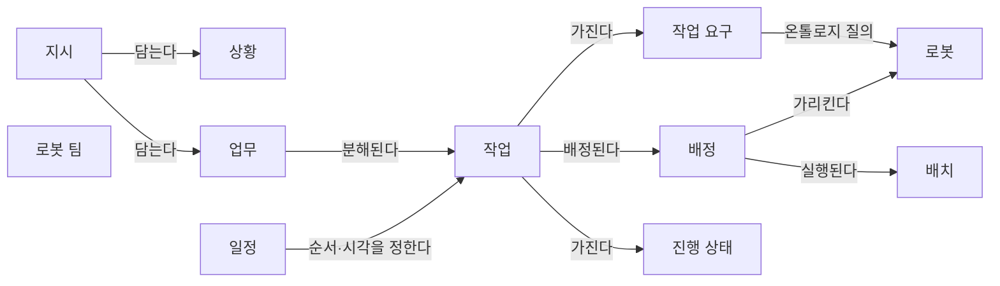
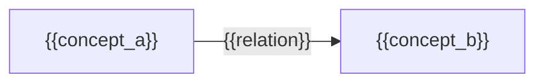

(너의 규칙은 시스템 프롬프트의 agents/shared-rules.md 와 agents/verifier.md 이다. 아래는 이번 실행의 컨텍스트와 입력이다.)

## 실행 컨텍스트

- run_id: 2026-09-25-37
- date: 2026-09-25
- run_type: track (트랙 실행)
- 대상: 트랙 nl-task-chatbot (자연어 업무 지시 챗봇) · 현재 단계: 단계 2. 필요한 데이터와 표준 조사 · 이번에 다룰 백로그 질문 id: q2-01 · 중심 세부영역: 13. 작업 배정 — MRTA (D. 계획·최적화)
- 예산:
    - max_search_queries: 40
    - max_sources_per_run: 20
    - new_topic_pages: 1
    - page_updates: 2
    - max_retries: 2
- 환경 알림: web_fetch_available: false · fetch_mode: mirror_only (일반 웹 페이지 열람은 네트워크 정책으로 막혀 있다. raw.githubusercontent.com 은 열린다: 공식 문서가 GitHub 에 있는 출처는 입력의 config/source_mirrors.yaml 경로를 WebFetch 로 열어 원문을 읽고 sources[].fetched=true, fetched_via=github_raw, fetch_url 을 적는다. 입력에 원문 텍스트(data/source_texts)가 있는 출처는 fetched_via=inbox. 그 밖의 출처는 fetched=false 이며 코드가 신뢰도 상한(medium)을 강제한다 — 공통 규칙 0절 6항)
- 언어: ko
- verification_stage: first
- verifier_budget:
    - max_search_queries: 40
    - max_sources_per_run: 20
    - new_topic_pages: 1
    - page_updates: 2
    - max_retries: 2

## 입력

### runs/2026-09-25-37/target.json

```json
{
  "run_id": "2026-09-25-37",
  "date": "2026-09-25",
  "weekday": "Fri",
  "run_number": 37,
  "run_type": "track",
  "forced": true,
  "target": {
    "area_no": 13,
    "area_name": "13. 작업 배정 — MRTA",
    "category": "D. 계획·최적화",
    "category_letter": "D"
  },
  "topic": null,
  "track": {
    "slug": "nl-task-chatbot",
    "name": "자연어 업무 지시 챗봇",
    "stage": 2,
    "stages": 5,
    "stage_name": "필요한 데이터와 표준 조사",
    "question_ids": [
      "q2-01"
    ],
    "user_questions": [],
    "runs_per_week": 3,
    "question_rationale": "CLI 지정 질문 id"
  },
  "corrections": [],
  "budget": {
    "max_search_queries": 40,
    "max_sources_per_run": 20,
    "new_topic_pages": 1,
    "page_updates": 2,
    "max_retries": 2
  },
  "priority_reason": null,
  "priority_questions": [],
  "excluded_areas": [],
  "lifted_areas": [],
  "deferred": {
    "monthly_recheck": false,
    "weekly_review": true
  },
  "selection_rationale": "CLI 지정 run_type=track, area=13; 트랙 실행일(Fri, track_days 앞 3개) → 트랙 nl-task-chatbot 단계 2, 질문 q2-01 (CLI 지정 질문 id)"
}
```

### runs/2026-09-25-37/research.json

```json
{
  "run_id": "2026-09-25-37",
  "date": "2026-09-25",
  "run_type": "track",
  "target": {
    "area_no": 13,
    "area_name": "13. 작업 배정 — MRTA",
    "category": "D. 계획·최적화"
  },
  "gaps": [
    "단계 2 질문 q2-01 열림(target.json 지정, CLI 지정 질문 id). 단계 2 페이지 3~6·8절 비어 있음(단계 2 첫 실행)",
    "완료 조건: 필요한 데이터 항목과 표준·형식 목록이 아이디어 2. 자연어 업무 지시 챗봇 페이지 4절에 없음",
    "완료 조건: 업무 분해·배정 설계 초안 2절의 '(단계 2에서 확정)' 속성(상황의 장소 표현·대상 표현·시간 조건, 업무의 기한·우선순위·완료 조건)이 미확정",
    "13. 작업 배정 — MRTA 페이지 섹션 7. 관련 표준·프레임워크·오픈소스 비어 있음(작업 요청 필드 근거 없음)"
  ],
  "research_questions": [
    "가장 가까운 로봇에 맡기는 것이 전체적으로도 유리한가? [분류원문]",
    "q2-01 채팅 지시를 작업으로 바꾸려면 어떤 정보(작업 종류, 장소, 대상 화물, 기한, 우선순위, 완료 조건)가 필요하고, 그 가운데 무엇을 로봇 기능 온톨로지·공간 그래프·업무 시스템에서 가져오는가?",
    "로봇 관제 인터페이스(Open-RMF 작업 요청·배송 기술, VDA 5050 주문·팩트시트)는 작업 종류·장소·화물·시작 시각·우선순위를 어떤 필드로 받고 무엇을 받지 않는가? (단계 2 페이지 3절, 13. 작업 배정 — MRTA 섹션 7 겨냥)",
    "업무 시스템 쪽 표준(ISA-95 작업 지시, GS1 EPCIS)은 기한·우선순위·자재·완료 기록을 어떤 항목으로 표현하는가? (1. 주문·업무 시스템 연계 연결)",
    "로봇 명령 이해 연구와 LLM 계획 연구는 지시에서 어떤 인자(행동, 대상, 출발지·목적지, 사람)를 뽑고 장소 표현을 무엇(장면 그래프, 경유점)에 접지하는가? (업무 분해·배정 설계 초안 '상황' 속성 겨냥)",
    "지시에서 안전 관련 속성을 따로 뽑아 실행 전에 판정하는 연구나, 채팅으로 WMS 작업을 실행하는 제품은 무엇을 확인하는가? (25. 안전·위험 관리, 18. 사람–로봇 협업·운영 인터페이스 연결)",
    "국내 자료에 자연어 물류 작업 지시의 정보 항목을 정리한 것이 있는가? (한국 자료 우선 규칙)"
  ],
  "findings": [
    {
      "id": "f1",
      "claim": "Open-RMF 작업 요청 스키마는 작업 범주(category)와 작업 기술(description)만 필수로 두고, 가장 이른 시작 시각·요청 시각·우선순위·라벨·요청자·플릿 이름을 선택 필드로 두며, 마감 시각(기한) 필드는 두지 않는다.",
      "tag": "사실",
      "source_ids": [
        "ref-125"
      ],
      "cross_checked": false,
      "confidence": "medium",
      "evidence_excerpt": "task_request.json 원본(github_raw): required category·description, 둘 다 'must match a schema supported by a fleet'. 선택: unix_millis_earliest_start_time, priority, labels, requester, fleet_name. (발행일 미확인, 확인일 기준)",
      "as_of": "2026-09-25",
      "flow_step": null,
      "flow_item": "시작 조건"
    },
    {
      "id": "f2",
      "claim": "Open-RMF 배송(Delivery) 작업 기술은 픽업(pickup)과 하역(dropoff) 두 사건을 필수로 두고, 각 사건은 장소(place)와 적재물(payload)을 필수로, 처리 설비(handler)를 선택으로 두며, 적재물 항목은 품목 코드(sku)와 수량(quantity)을 필수로, 칸(compartment)을 선택으로 둔다.",
      "tag": "사실",
      "source_ids": [
        "ref-768",
        "ref-769"
      ],
      "cross_checked": false,
      "confidence": "medium",
      "evidence_excerpt": "task_description__delivery.json: required pickup, dropoff. event_description__payload_transfer.json: required place, payload; payload 요소 required sku(string), quantity(integer, minimum 0). (발행일 미확인, 확인일 기준)",
      "as_of": "2026-09-25",
      "flow_step": "피킹",
      "flow_item": "작업 대상"
    },
    {
      "id": "f3",
      "claim": "Open-RMF 의 장소(place)는 경유점 이름(문자열), 경유점 번호(정수), 경유점과 방향을 담은 객체 가운데 하나로 지정되며, 건물 지도 그래프의 노드는 x·y 좌표, 이름(name), 파라미터 목록을 가진다.",
      "tag": "사실",
      "source_ids": [
        "ref-770",
        "ref-772"
      ],
      "cross_checked": false,
      "confidence": "medium",
      "evidence_excerpt": "place.json 원본: 문자열 또는 minimum 0 정수, 또는 waypoint(필수)·orientation 객체. GraphNode.msg: float32 x, float32 y, string name, Param[] params. (발행일 미확인, 확인일 기준)",
      "as_of": "2026-09-25",
      "flow_step": null,
      "flow_item": "작업 대상"
    },
    {
      "id": "f4",
      "claim": "VDA 5050 주문(order) 스키마는 주문 id·갱신 id·노드·간선을 필수로 두고 노드 위치에 지도 id(mapId)를 두며, 노드·간선에 붙는 동작은 동작 유형(actionType)과 차단 유형(blockingType)을 필수로 두지만, 주문 수준에 기한·우선순위 필드는 없다.",
      "tag": "사실",
      "source_ids": [
        "ref-771"
      ],
      "cross_checked": false,
      "confidence": "medium",
      "evidence_excerpt": "order.schema 원본(main): required headerId…orderId, orderUpdateId, nodes, edges; nodePosition required x, y, mapId; action required actionId, actionType, blockingType. orderDescription 은 'only for visualization purposes'. (발행일 미확인, 확인일 기준)",
      "as_of": "2026-09-25",
      "flow_step": null,
      "flow_item": "제약"
    },
    {
      "id": "f5",
      "claim": "VDA 5050 명세의 사전 정의 동작 pick·drop 은 적재 장치(lhd), 스테이션 유형·이름, 적재물 유형(loadType), 적재물 id(loadId), 높이·깊이·측면을 모두 선택 파라미터로 둔다.",
      "tag": "사실",
      "source_ids": [
        "ref-031"
      ],
      "cross_checked": false,
      "confidence": "medium",
      "evidence_excerpt": "VDA5050_EN.md(main, github_raw) 표 4: pick/drop 파라미터 lhd, stationType, stationName, loadType(예: EPAL), loadId, height, depth, side 모두 optional. (발행일 미확인, 확인일 기준)",
      "as_of": "2026-09-25",
      "flow_step": "적치",
      "flow_item": "작업 대상"
    },
    {
      "id": "f6",
      "claim": "VDA 5050 팩트시트는 적재 명세(loadSets: 적재물 유형, 적재물 치수, 최대 중량, 취급 높이 범위, 픽·드롭 소요 시간)와 로봇이 지원하는 동작 목록(동작 유형, 적용 범위, 파라미터, 차단 유형, 일시정지·취소 허용)을 로봇이 선언하게 한다.",
      "tag": "사실",
      "source_ids": [
        "ref-228"
      ],
      "cross_checked": false,
      "confidence": "medium",
      "evidence_excerpt": "factsheet.schema(main, github_raw): loadSpecification.loadSets 에 loadType, loadDimensions, maximumWeight, pickTime, dropTime; mobileRobotActions 에 actionType, actionScopes, actionParameters, blockingTypes, pauseAllowed, cancelAllowed. (발행일 미확인, 확인일 기준)",
      "as_of": "2026-09-25",
      "flow_step": null,
      "flow_item": "수행 자원"
    },
    {
      "id": "f7",
      "claim": "OPC UA for ISA-95 작업 제어 노드셋의 작업 지시 데이터형(ISA95JobOrderDataType)은 작업 지시 id 를 필수로, 설명·작업 마스터·시작 시각·종료 시각·우선순위·파라미터·인원·설비·물리 자산·자재 요구를 선택으로 두고, 자재 데이터형은 자재 정의 id·로트 id·수량·단위를 둔다.",
      "tag": "사실",
      "source_ids": [
        "ref-130"
      ],
      "cross_checked": false,
      "confidence": "medium",
      "evidence_excerpt": "NodeSet2.xml(github_raw) Definition: JobOrderID(String) 필수, StartTime·EndTime(DateTime)·Priority(Int16) IsOptional=true, MaterialRequirements(ISA95MaterialDataType). 자재: MaterialDefinitionID, MaterialLotID, Quantity, EngineeringUnits.",
      "as_of": "2024-01-31",
      "flow_step": null,
      "flow_item": "시작 조건"
    },
    {
      "id": "f8",
      "claim": "GS1 EPCIS 이벤트는 무엇(대상 식별자: GTIN·SSCC·GIAI 등), 언제(사건 시각·기록 시각), 어디서(판독 지점·업무 위치), 왜(업무 맥락)의 차원으로 기록되며 EPCIS 2.0 은 센서 정보를 담는 어떻게(how) 차원을 더했다.",
      "tag": "사실",
      "source_ids": [
        "ref-015"
      ],
      "cross_checked": false,
      "confidence": "medium",
      "evidence_excerpt": "검색 요약: EPCIS events consist of context information comprising What, When, Where, Why, and How; What 은 GTIN, SGTIN, SSCC, GIAI 같은 식별자. 원문 미열람. (발행일 미확인, 확인일 기준)",
      "as_of": "2026-09-25",
      "flow_step": "출하",
      "flow_item": "완료·인계",
      "source_unopened": true
    },
    {
      "id": "f9",
      "claim": "서비스 로봇 명령 이해 연구(arXiv 1807.03053)는 명령을 행동 하나와 인자(슬롯)로 모델링해 행동 탐지와 슬롯 채우기를 LSTM 계열 신경망으로 풀고, 요청된 행동이 로봇 능력 안에 있는지를 SVM 으로 따로 판정했다.",
      "tag": "사실",
      "source_ids": [
        "ref-773"
      ],
      "cross_checked": false,
      "confidence": "medium",
      "evidence_excerpt": "검색 요약: 'commands modeled as one action plus arguments (slots)'; 행동이 로봇 능력 밖일 수 있어 SVM 으로 판정; ROS·SMACH 로 구현, 가정용 서비스 로봇 벤치마크. 슬롯 목록은 원문 미확인. 원문 미열람.",
      "as_of": "2018-07",
      "flow_step": null,
      "flow_item": "시작 조건",
      "source_unopened": true
    },
    {
      "id": "f10",
      "claim": "DELIVER 는 경량 LLaMA3 로 지시에서 픽업·배송 위치를 뽑아 다중 로봇 픽업·배송에 넘기며, 물류에 가까운 LLM 지시 해석 연구 가운데 뽑는 인자가 위치 두 개로 한정된 예다.",
      "tag": "사실",
      "source_ids": [
        "ref-360"
      ],
      "cross_checked": false,
      "confidence": "medium",
      "evidence_excerpt": "검색 요약: 'a lightweight instance of LLaMA3 interprets the command to extract pickup and delivery locations'. 화물 식별·기한 추출은 요약에 없음. 원문 미열람. (재인용: 2026-09-25-30)",
      "as_of": "2025-08",
      "flow_step": null,
      "flow_item": "작업 대상",
      "source_unopened": true
    },
    {
      "id": "f11",
      "claim": "SayPlan(CoRL 2023)은 LLM 계획을 계층형 3D 장면 그래프에 접지하며, 접힌 그래프에서 작업 관련 하위 그래프를 찾는 의미 탐색과 고전 경로 계획기, 장면 그래프 시뮬레이터 피드백에 따른 반복 재계획을 쓰고, 최대 3개 층·36개 방·140개 자산·객체 환경에서 평가되었다.",
      "tag": "사실",
      "source_ids": [
        "ref-774"
      ],
      "cross_checked": false,
      "confidence": "medium",
      "evidence_excerpt": "검색 요약: LLMs conduct a 'semantic search' for task-relevant subgraphs from a collapsed 3DSG; classical path planner; iterative replanning; 3 floors, 36 rooms, 140 assets. 저자 보고, 원문 미열람.",
      "as_of": "2023-07",
      "flow_step": null,
      "flow_item": "작업 대상",
      "source_unopened": true
    },
    {
      "id": "f12",
      "claim": "SafeGate(arXiv 2604.05427)는 자연어 명령에서 안전 관련 속성을 구조화해 뽑고 ISO 13482 에 기반한 결정적 판정으로 실행을 승인·거부하며, 통과한 명령을 불변 조건·가드·중단 조건으로 된 작업 안전 계약으로 분해한다.",
      "tag": "사실",
      "source_ids": [
        "ref-775"
      ],
      "cross_checked": false,
      "confidence": "medium",
      "evidence_excerpt": "검색 요약: 'extracts structured safety-relevant properties from natural language commands and applies a deterministic decision gate'; invariants, guards, abort conditions; 230개 전문가 작성 과업, AI2-THOR 30개 시나리오. 저자 보고, 원문 미열람.",
      "as_of": "2026-04",
      "flow_step": null,
      "flow_item": "예외·성과",
      "source_unopened": true
    },
    {
      "id": "f13",
      "claim": "Mecalux 는 Easy WMS 에 통합한 대화형 비서 Easy AI 가 긴급 주문 일괄 출고 지시나 통로 잠금 해제 같은 WMS 작업을 채팅 요청으로 실행하며, 실행 전에 동작과 영향받는 항목의 요약을 보여 주고 채팅에서 확인을 받은 뒤 수행한다고 밝힌다.",
      "tag": "추정",
      "source_ids": [
        "ref-776"
      ],
      "cross_checked": false,
      "confidence": "low",
      "evidence_excerpt": "벤더 주장: 검색 요약 'displays a summary of the action and the affected elements, and once the action is confirmed through the chat, it is carried out immediately'; 예시 releasing all rush orders, unlocking a specific aisle. 원문 미열람. (발행일 미확인, 확인일 기준)",
      "as_of": "2026-09-25",
      "flow_step": "출하",
      "flow_item": "시작 조건",
      "source_unopened": true,
      "vendor_claim": true
    },
    {
      "id": "f14",
      "claim": "q2-01 의 정보 항목을 원천별로 대응시키면, 작업 종류는 로봇 인터페이스의 작업 범주·동작 유형(Open-RMF category, VDA 5050 actionType, 팩트시트 지원 동작)과, 장소는 공간 그래프의 경유점 이름·지도 id 와, 대상 화물은 업무 시스템의 품목·자재·물류 단위 식별자와 로봇 쪽 적재물 유형·치수·중량과, 기한·우선순위는 업무 시스템 작업 지시의 종료 시각·우선순위와 맞물리는 것으로 보이며, 완료 조건을 표현하는 필드는 이번에 연 로봇 요청·주문 스키마에 없었다.",
      "tag": "추정",
      "source_ids": [
        "ref-125",
        "ref-768",
        "ref-769",
        "ref-770",
        "ref-771",
        "ref-228",
        "ref-130",
        "ref-015"
      ],
      "cross_checked": false,
      "confidence": "low",
      "evidence_excerpt": "f1~f8 을 q2-01 의 여섯 항목에 대응시킨 이 위키의 정리. 이 대응표를 제시한 단일 출처는 확인하지 못함. 완료 조건은 작업 상태 스키마(ref-111)·EPCIS 이벤트 쪽을 이번 실행에서 다시 보지 않음.",
      "as_of": "2026-09-25",
      "flow_step": null,
      "flow_item": null
    },
    {
      "id": "f15",
      "claim": "기한(마감 시각)은 ISA-95 작업 지시에는 종료 시각으로 있지만 Open-RMF 작업 요청과 VDA 5050 주문에는 필드가 없으므로, 채팅 지시나 업무 시스템에서 받은 기한은 ROP 의 작업 모델이 보유하고 로봇 쪽에는 가장 이른 시작 시각·우선순위·배정 순서로 바꿔 넘겨야 할 것으로 보인다.",
      "tag": "추정",
      "source_ids": [
        "ref-125",
        "ref-771",
        "ref-130"
      ],
      "cross_checked": false,
      "confidence": "low",
      "evidence_excerpt": "f1(마감 필드 없음), f4(주문 수준 기한·우선순위 없음), f7(EndTime·Priority 선택 필드)에서 도출. 실행 2026-09-25-34 의 f19(oq-019)와 같은 방향의 추론.",
      "as_of": "2026-09-25",
      "flow_step": "출하",
      "flow_item": "제약"
    },
    {
      "id": "f16",
      "claim": "지시 속 장소 표현(예: 층·구역·도크 이름)은 로봇 인터페이스가 받는 경유점 이름·번호나 지도 id 로 옮겨야 하므로, 현장 용어와 공간 그래프 노드 이름을 잇는 이름 대응 정보가 필요하며, SayPlan 처럼 LLM 이 장면 그래프 안에서 관련 노드를 찾게 하는 방식이 그 접지 방법의 선행 사례로 보인다.",
      "tag": "추정",
      "source_ids": [
        "ref-770",
        "ref-772",
        "ref-771",
        "ref-774"
      ],
      "cross_checked": false,
      "confidence": "low",
      "evidence_excerpt": "f3(place 는 경유점 이름·번호), f4(nodePosition 의 mapId), f11(장면 그래프 의미 탐색)을 대응시킨 추론. 물류 현장 용어 사전을 다룬 자료는 이번 검색에서 찾지 못함(oq-029 관련).",
      "as_of": "2026-09-25",
      "flow_step": null,
      "flow_item": "작업 대상"
    },
    {
      "id": "f17",
      "claim": "대상 화물 식별은 인터페이스마다 단위가 달라 Open-RMF 배송은 품목 코드와 수량, VDA 5050 은 적재물 id·유형, ISA-95 는 자재 정의·로트, EPCIS 는 SSCC 같은 물류 단위 식별자를 쓰므로, ROP 는 지시의 '대상 화물'을 품목 단위와 적재 단위 가운데 어느 쪽으로 받을지와 둘 사이 대응을 정해야 할 것으로 보인다.",
      "tag": "추정",
      "source_ids": [
        "ref-769",
        "ref-031",
        "ref-130",
        "ref-015"
      ],
      "cross_checked": false,
      "confidence": "low",
      "evidence_excerpt": "f2(sku·quantity), f5(loadId·loadType), f7(MaterialDefinitionID·MaterialLotID), f8(SSCC) 비교에서 도출. oq-007·oq-023 과 연결.",
      "as_of": "2026-09-25",
      "flow_step": "피킹",
      "flow_item": "작업 대상"
    },
    {
      "id": "f18",
      "claim": "분류 원문 질문(가장 가까운 로봇에 맡기는 것이 전체적으로도 유리한가)과 관련해, 채팅 지시만으로는 기한·우선순위·화물 제약이 비기 쉬우므로 배정이 거리만이 아닌 전체 목적을 따르려면 이 항목을 업무 시스템(작업 지시의 종료 시각·우선순위)과 로봇 팩트시트(적재 명세)에서 보완해 배정기에 넘겨야 할 것으로 보인다.",
      "tag": "추정",
      "source_ids": [
        "ref-130",
        "ref-228",
        "ref-360"
      ],
      "cross_checked": false,
      "confidence": "low",
      "evidence_excerpt": "f7(업무 시스템의 기한·우선순위), f6(로봇 적재 명세), f10(지시에서 위치만 뽑는 예)을 13. 작업 배정 — MRTA 의 SCM 질문에 대응시킨 추론.",
      "as_of": "2026-09-25",
      "flow_step": null,
      "flow_item": "수행 자원"
    }
  ],
  "sources": [
    {
      "id": "ref-125",
      "org": "Open Robotics (open-rmf)",
      "title": "rmf_api_msgs — rmf_api_msgs/schemas/task_request.json",
      "published": null,
      "url": "https://github.com/open-rmf/rmf_api_msgs/blob/main/rmf_api_msgs/schemas/task_request.json",
      "type": "오픈소스 문서",
      "reliability": "medium",
      "accessed": "2026-09-25",
      "summary": "Open-RMF 작업 요청 JSON 스키마. 필수 category·description 과 선택 필드(가장 이른 시작 시각, 우선순위, 라벨, 요청자, 플릿 이름)를 이번 실행에서 원문으로 다시 확인했다.",
      "fetched": true,
      "fetched_via": "github_raw",
      "fetch_url": "https://raw.githubusercontent.com/open-rmf/rmf_api_msgs/main/rmf_api_msgs/schemas/task_request.json",
      "source_unopened": false
    },
    {
      "id": "ref-031",
      "org": "VDA / VDMA (VDA5050 GitHub)",
      "title": "VDA5050/VDA5050_EN.md — Official Specification document for the VDA 5050",
      "published": null,
      "url": "https://github.com/VDA5050/VDA5050/blob/main/VDA5050_EN.md",
      "type": "표준",
      "reliability": "high",
      "accessed": "2026-09-25",
      "summary": "VDA 5050 최신판 명세 원문. 이번 실행은 사전 정의 동작 pick·drop 의 선택 파라미터와 관제의 역할 서술을 확인했다.",
      "fetched": true,
      "fetched_via": "github_raw",
      "fetch_url": "https://raw.githubusercontent.com/VDA5050/VDA5050/main/VDA5050_EN.md",
      "source_unopened": false
    },
    {
      "id": "ref-228",
      "org": "VDA / VDMA (VDA5050 GitHub)",
      "title": "VDA5050/VDA5050 — json_schemas/factsheet.schema",
      "published": null,
      "url": "https://github.com/VDA5050/VDA5050/blob/main/json_schemas/factsheet.schema",
      "type": "표준",
      "reliability": "high",
      "accessed": "2026-09-25",
      "summary": "VDA 5050 팩트시트 JSON 스키마. 이번 실행은 적재 명세(loadSets)와 지원 동작(mobileRobotActions) 필드를 원문으로 확인했다.",
      "fetched": true,
      "fetched_via": "github_raw",
      "fetch_url": "https://raw.githubusercontent.com/VDA5050/VDA5050/main/json_schemas/factsheet.schema",
      "source_unopened": false
    },
    {
      "id": "ref-130",
      "org": "OPC Foundation",
      "title": "UA-Nodeset ISA95-JOBCONTROL — opc.ua.isa95-jobcontrol.nodeset2 (NodeSet2.xml·documentation.csv)",
      "published": "2024-01-31",
      "url": "https://github.com/OPCFoundation/UA-Nodeset/tree/latest/ISA95-JOBCONTROL",
      "type": "표준",
      "reliability": "medium",
      "accessed": "2026-09-25",
      "summary": "OPC UA for ISA-95 작업 제어 노드셋. 이번 실행은 작업 지시·자재·설비 데이터형의 필드 정의를 NodeSet2.xml 원문으로 확인했다.",
      "fetched": true,
      "fetched_via": "github_raw",
      "fetch_url": "https://raw.githubusercontent.com/OPCFoundation/UA-Nodeset/latest/ISA95-JOBCONTROL/opc.ua.isa95-jobcontrol.nodeset2.xml",
      "source_unopened": false
    },
    {
      "id": "ref-015",
      "org": "GS1",
      "title": "EPCIS and CBV Implementation Guideline",
      "published": null,
      "url": "https://www.gs1.org/docs/epc/EPCIS_Guideline.pdf",
      "type": "표준",
      "reliability": "medium",
      "accessed": "2026-09-25",
      "summary": "원문 미열람. EPCIS·CBV 구현 지침으로, 이벤트를 무엇·언제·어디서·왜(2.0 은 어떻게 추가) 차원으로 기록하는 방법을 설명한다(검색 요약 기준).",
      "source_unopened": true,
      "fetched": false,
      "fetched_via": null,
      "fetch_url": null
    },
    {
      "id": "ref-360",
      "org": "arXiv 2508.19114 저자(미확인)",
      "title": "DELIVER: A System for LLM-Guided Coordinated Multi-Robot Pickup and Delivery using Voronoi-Based Relay Planning",
      "published": "2025-08",
      "url": "https://arxiv.org/abs/2508.19114",
      "type": "논문",
      "reliability": "medium",
      "accessed": "2026-09-25",
      "summary": "원문 미열람. 경량 LLaMA3 로 지시에서 픽업·배송 위치를 뽑고 보로노이 분할·중계 지점으로 다중 로봇 픽업·배송을 조율하는 체계 논문.",
      "source_unopened": true,
      "fetched": false,
      "fetched_via": null,
      "fetch_url": null
    },
    {
      "id": "ref-768",
      "org": "Open Robotics (open-rmf)",
      "title": "rmf_ros2 — rmf_fleet_adapter/schemas/task_description__delivery.json",
      "published": null,
      "url": "https://github.com/open-rmf/rmf_ros2/blob/main/rmf_fleet_adapter/schemas/task_description__delivery.json",
      "type": "오픈소스 문서",
      "reliability": "high",
      "accessed": "2026-09-25",
      "summary": "Open-RMF 플릿 어댑터의 배송 작업 기술 JSON 스키마. 픽업과 하역 사건을 필수로 두는 구조를 원문으로 확인했다.",
      "fetched": true,
      "fetched_via": "github_raw",
      "fetch_url": "https://raw.githubusercontent.com/open-rmf/rmf_ros2/main/rmf_fleet_adapter/schemas/task_description__delivery.json",
      "source_unopened": false
    },
    {
      "id": "ref-769",
      "org": "Open Robotics (open-rmf)",
      "title": "rmf_ros2 — rmf_fleet_adapter/schemas/event_description__payload_transfer.json",
      "published": null,
      "url": "https://github.com/open-rmf/rmf_ros2/blob/main/rmf_fleet_adapter/schemas/event_description__payload_transfer.json",
      "type": "오픈소스 문서",
      "reliability": "high",
      "accessed": "2026-09-25",
      "summary": "Open-RMF 적재물 인계(픽업·하역) 사건 기술 스키마. 장소·적재물 필수, 처리 설비 선택, 적재물 항목의 sku·수량 필수와 칸 선택을 원문으로 확인했다.",
      "fetched": true,
      "fetched_via": "github_raw",
      "fetch_url": "https://raw.githubusercontent.com/open-rmf/rmf_ros2/main/rmf_fleet_adapter/schemas/event_description__payload_transfer.json",
      "source_unopened": false
    },
    {
      "id": "ref-770",
      "org": "Open Robotics (open-rmf)",
      "title": "rmf_ros2 — rmf_fleet_adapter/schemas/place.json",
      "published": null,
      "url": "https://github.com/open-rmf/rmf_ros2/blob/main/rmf_fleet_adapter/schemas/place.json",
      "type": "오픈소스 문서",
      "reliability": "high",
      "accessed": "2026-09-25",
      "summary": "Open-RMF 장소 스키마. 경유점 이름·번호 또는 경유점과 방향 객체로 장소를 지정하는 형식을 원문으로 확인했다.",
      "fetched": true,
      "fetched_via": "github_raw",
      "fetch_url": "https://raw.githubusercontent.com/open-rmf/rmf_ros2/main/rmf_fleet_adapter/schemas/place.json",
      "source_unopened": false
    },
    {
      "id": "ref-771",
      "org": "VDA / VDMA (VDA5050 GitHub)",
      "title": "VDA5050/VDA5050 — json_schemas/order.schema",
      "published": null,
      "url": "https://github.com/VDA5050/VDA5050/blob/main/json_schemas/order.schema",
      "type": "표준",
      "reliability": "high",
      "accessed": "2026-09-25",
      "summary": "VDA 5050 주문 메시지 JSON 스키마(main). 주문·노드·간선·동작의 필수·선택 필드와 노드 위치의 지도 id 를 원문으로 확인했다.",
      "fetched": true,
      "fetched_via": "github_raw",
      "fetch_url": "https://raw.githubusercontent.com/VDA5050/VDA5050/main/json_schemas/order.schema",
      "source_unopened": false
    },
    {
      "id": "ref-772",
      "org": "Open Robotics (open-rmf)",
      "title": "rmf_building_map_msgs — rmf_building_map_msgs/msg/GraphNode.msg",
      "published": null,
      "url": "https://github.com/open-rmf/rmf_building_map_msgs/blob/main/rmf_building_map_msgs/msg/GraphNode.msg",
      "type": "오픈소스 문서",
      "reliability": "high",
      "accessed": "2026-09-25",
      "summary": "Open-RMF 건물 지도 그래프 노드 메시지. x·y 좌표, 이름, 파라미터 목록 필드를 원문으로 확인했다.",
      "fetched": true,
      "fetched_via": "github_raw",
      "fetch_url": "https://raw.githubusercontent.com/open-rmf/rmf_building_map_msgs/main/rmf_building_map_msgs/msg/GraphNode.msg",
      "source_unopened": false
    },
    {
      "id": "ref-773",
      "org": "arXiv 1807.03053 저자(미확인)",
      "title": "A deep learning approach for understanding natural language commands for mobile service robots",
      "published": "2018-07",
      "url": "https://arxiv.org/abs/1807.03053",
      "type": "논문",
      "reliability": "medium",
      "accessed": "2026-09-25",
      "summary": "원문 미열람. 로봇 명령을 행동과 인자(슬롯)로 모델링해 행동 탐지·슬롯 채우기를 신경망으로 풀고 행동이 로봇 능력 안에 있는지 SVM 으로 판정한 프리프린트.",
      "source_unopened": true,
      "fetched": false,
      "fetched_via": null,
      "fetch_url": null
    },
    {
      "id": "ref-774",
      "org": "Rana, K. 외(SayPlan 저자)",
      "title": "SayPlan: Grounding Large Language Models using 3D Scene Graphs for Scalable Robot Task Planning",
      "published": "2023-07",
      "url": "https://arxiv.org/abs/2307.06135",
      "type": "논문",
      "reliability": "medium",
      "accessed": "2026-09-25",
      "summary": "원문 미열람. 계층형 3D 장면 그래프의 의미 탐색·경로 계획기·반복 재계획으로 LLM 계획을 대규모 다층 환경에 접지한 논문(CoRL 2023, PMLR 229).",
      "source_unopened": true,
      "fetched": false,
      "fetched_via": null,
      "fetch_url": null
    },
    {
      "id": "ref-775",
      "org": "Purdue University SMART Laboratory(arXiv 2604.05427 저자)",
      "title": "Pre-Execution Safety Gate & Task Safety Contracts for LLM-Controlled Robot Systems",
      "published": "2026-04",
      "url": "https://arxiv.org/abs/2604.05427",
      "type": "논문",
      "reliability": "medium",
      "accessed": "2026-09-25",
      "summary": "원문 미열람. 자연어 명령에서 안전 관련 속성을 뽑아 결정적 게이트로 실행을 승인·거부하고 작업 안전 계약(불변 조건·가드·중단 조건)으로 분해하는 SafeGate 프리프린트.",
      "source_unopened": true,
      "fetched": false,
      "fetched_via": null,
      "fetch_url": null
    },
    {
      "id": "ref-776",
      "org": "Mecalux",
      "title": "Mecalux integrates generative AI into Easy WMS",
      "published": null,
      "url": "https://www.mecalux.com/news/generative-ai-easy-wms-mecalux",
      "type": "벤더 문서",
      "reliability": "low",
      "accessed": "2026-09-25",
      "summary": "원문 미열람. WMS 에 통합한 대화형 비서 Easy AI 가 데이터 질의와 긴급 주문 출고·통로 잠금 해제 같은 작업을 채팅 확인 뒤 실행한다는 벤더 발표.",
      "source_unopened": true,
      "fetched": false,
      "fetched_via": null,
      "fetch_url": null
    }
  ],
  "page_proposals": [
    {
      "action": "update",
      "path": "docs/tracks/nl-task-chatbot/stage-2-data-and-standards.md",
      "sections": [
        "2",
        "3",
        "4",
        "5",
        "6",
        "8",
        "9"
      ],
      "rationale": "q2-01 답: f1·f2·f3·f4·f5·f6·f7·f8·f9·f10·f11·f12·f13·f14·f15·f16·f17·f18 (신뢰도 low) — 2절 q2-01 상태 답함, 3절 q2-01 소제목 신설({#q2-01}): 로봇 인터페이스가 받는 항목(Open-RMF 요청·배송·장소 f1·f2·f3, VDA 5050 주문·동작 f4·f5), 로봇 능력 원천(팩트시트 f6), 업무 시스템 원천(ISA-95 작업 지시 f7, EPCIS 차원 f8), 지시 해석 연구가 뽑는 인자와 장소 접지(f9·f10·f11), 안전 속성 추출(f12), 채팅 WMS 제품(f13 벤더 주장), 항목–원천 대응(f14), 기한 공백(f15), 장소 이름 대응(f16), 화물 식별 단위(f17), SCM 질문 연결(f18) / 4절 결론·불확실성 / 5절 후속 질문 / 6절 완료 조건 현황 / 8절 출처 / 9절 이력"
    },
    {
      "action": "update",
      "path": "docs/ideas/nl-task-chatbot.md",
      "sections": [
        "4"
      ],
      "rationale": "아이디어 페이지 4절: '필요한 데이터 항목과 원천' 소절 신설 — 항목–원천 대응 f14(추정), 로봇 인터페이스 필드 f1·f2·f3·f4·f5, 로봇 능력 f6, 업무 시스템 f7·f8, 기한 공백 f15, 화물 식별 단위 f17. f13 은 [추정] 벤더 주장 병기. 표준·형식 목록 비교(q2-02)는 미조사임을 명시"
    },
    {
      "action": "update",
      "path": "docs/tracks/nl-task-chatbot/task-model-draft.md",
      "sections": [
        "2",
        "6"
      ],
      "rationale": "트랙 산출물 갱신: track.ontology_changes(상황의 장소 표현에 공간 노드 참조, 업무의 기한·우선순위 값 원천, 작업 요구의 적재물 속성)가 승인되면 2절 반영과 초안 버전 인상(f3·f4·f5·f6·f7·f15·f16·f17). 미승인 부분은 6절 '상황의 항목' 질문(q2-01)에 근거로 연결"
    },
    {
      "action": "update",
      "path": "docs/categories/d-planning-and-optimization/13-task-allocation-mrta.md",
      "sections": [
        "7"
      ],
      "rationale": "트랙 nl-task-chatbot 단계 2 반영 제안 (f1, f2, f6, f15, f18): Open-RMF 작업 요청·배송 기술의 필드(기한 필드 없음), VDA 5050 팩트시트 적재 명세·지원 동작이 배정 입력이 되는 구조와 분류 원문 질문 연결"
    },
    {
      "action": "update",
      "path": "docs/categories/a-business-supply-chain-design/01-order-and-business-system-integration.md",
      "sections": [
        "7"
      ],
      "rationale": "트랙 nl-task-chatbot 단계 2 반영 제안 (f7, f13, f15): ISA-95 작업 지시의 종료 시각·우선순위·자재 요구가 채팅 지시의 기한·대상 화물 원천이 되는 점, 채팅으로 WMS 작업을 실행하는 제품(벤더 주장)"
    },
    {
      "action": "update",
      "path": "docs/categories/e-collaboration-and-field-operations/18-human-robot-collaboration-and-operator-interface.md",
      "sections": [
        "6"
      ],
      "rationale": "트랙 nl-task-chatbot 단계 2 반영 제안 (f12, f13): 채팅 지시 실행 전 요약·확인(Mecalux Easy AI, 벤더 주장)과 안전 속성 추출 뒤 결정적 승인 게이트(SafeGate). 27. AI·학습·적응과 모델 운영과 함께 연결"
    }
  ],
  "glossary_candidates": [
    {
      "term_ko": "사람 확인 루프",
      "term_en": "Human-in-the-Loop",
      "definition": "자동화된 처리 흐름에서 AI 나 시스템이 만든 결과를 실행하기 전에 사람이 검토·승인하거나 수정하는 단계를 두는 방식이다."
    }
  ],
  "open_questions_new": [],
  "open_questions_resolved": [],
  "self_check": {
    "source_count": 15,
    "cross_checked_count": 0,
    "unverified": [
      "모든 finding 교차 확인 없음: 인터페이스 필드는 각 표준·오픈소스의 단일 공식 파일, 연구는 단일 논문 검색 요약",
      "f8·f9·f10·f11·f12·f13 근거 출처 원문 미열람(검색 요약 범위)",
      "f9 연구의 슬롯 목록과 저자 미확인(ref-773)",
      "f13 Mecalux 발표 발행일 미확인, 벤더 주장",
      "f14 완료 조건: Open-RMF 작업 상태(ref-111)·EPCIS 이벤트 스키마를 이번 실행에서 다시 열지 않아 완료 조건 표현의 원천은 미확인",
      "VDA 5050 상태 메시지의 loads 필드 세부는 이번 열람 응답에서 확인하지 못함",
      "한국어 검색 1회에서 자연어 물류 작업 지시 정보 항목을 다룬 국내 자료를 찾지 못함"
    ],
    "scope_violations": [],
    "budget_used": {
      "queries": 9,
      "sources": 9
    },
    "limits": "web_fetch_available: false · fetch_mode mirror_only. raw.githubusercontent.com 으로 원문을 연 출처: 신규 ref-768·ref-769·ref-770·ref-771·ref-772, 재사용 ref-125·ref-031·ref-228·ref-130. 신규 ref-773~ref-776 과 재사용 ref-015·ref-360 은 원문 미열람(신뢰도 상한 medium, 벤더 low). 검색 9회/40, 신규 출처 9건/20(ref-768~ref-776, 예약 구간 안), 재사용 6건. 교차 확인 0건. 질문 선택: target.json 지정 q2-01 1건. q2-01 은 로봇 인터페이스(Open-RMF, VDA 5050)·로봇 능력(팩트시트)·업무 시스템(ISA-95, EPCIS)의 필드와 지시 해석 연구로 답했으나, 항목–원천 대응(f14)은 이 위키의 추론이라 질문 종합 신뢰도를 low 로 두었다. 로봇 기능 온톨로지·공간 그래프는 아직 트랙 산출물이 없어 VDA 5050 팩트시트와 Open-RMF 지도 그래프를 대리 원천으로 썼다. 교차 규칙: LLM 지시 해석 finding(f10·f11·f12)은 27. AI·학습·적응과 모델 운영과 적용 대상 13. 작업 배정 — MRTA·18. 사람–로봇 협업·운영 인터페이스 양쪽에 반영 제안했다. 8. 실시간 세계 상태·데이터 일관성과 22. 시뮬레이션·예측용 디지털 트윈 관련 주장 없음. 정정 요청 없음. 새 일반 열린 질문 없음: 장소 이름 대응은 기존 oq-029, 화물 식별자는 oq-007·oq-023, 기한 전달은 oq-019 와 겹쳐 트랙 질문으로만 올렸다. 용어 후보는 트랙 glossary_targets 가운데 용어집에 없는 '사람 확인 루프' 1건(근거 f13·f12). 후속 질문 3건, 온톨로지 변경 제안 3건."
  },
  "track": {
    "slug": "nl-task-chatbot",
    "stage": 2,
    "answered_question_ids": [
      "q2-01"
    ],
    "new_questions": [
      {
        "question": "지시 속 현장 장소 용어(예: 3층 출하 대기장, 2번 도크)와 공간 그래프 경유점 이름·지도 id·WMS 로케이션 코드를 대응시키는 이름 사전은 어떤 형식으로 두고 누가 관리하는가? (q2-01 에서 파생)",
        "stage": 2,
        "rationale_finding_id": "f16"
      },
      {
        "question": "채팅 지시의 '대상 화물'을 품목 단위(sku·수량)로 받을지 적재 단위(loadId·SSCC)로 받을지, 둘 사이 대응은 어느 시스템에서 가져오는가? (q2-01 에서 파생)",
        "stage": 2,
        "rationale_finding_id": "f17"
      },
      {
        "question": "로봇 인터페이스에 기한 필드가 없을 때 작업 모델이 보유한 기한을 가장 이른 시작 시각·우선순위·배정 순서로 바꾸는 규칙은 LLM 과 최적화 엔진 가운데 어디에 두는가? (q2-01 에서 파생)",
        "stage": 3,
        "rationale_finding_id": "f15"
      }
    ],
    "ontology_changes": [
      {
        "op": "modify",
        "kind": "concept",
        "name": "상황 (Situation)",
        "evidence_finding_ids": [
          "f3",
          "f4",
          "f16"
        ],
        "description": "속성 '장소 표현'에 해석 결과인 '공간 노드 참조(지도 id, 경유점 이름 또는 번호)'를 짝으로 둔다. 로봇 인터페이스는 경유점 이름·번호(Open-RMF place)나 지도 id 가 있는 노드(VDA 5050)만 받으므로 원문 표현과 접지 결과를 함께 기록해야 한다. 이름 대응 규칙은 새 질문으로 둔다."
      },
      {
        "op": "modify",
        "kind": "concept",
        "name": "업무 (Job)",
        "evidence_finding_ids": [
          "f1",
          "f4",
          "f7",
          "f15"
        ],
        "description": "속성 '기한'·'우선순위'의 '(단계 2에서 확정)' 표기를 정리해, 값 원천 후보를 채팅 지시와 업무 시스템 작업 지시(ISA-95 EndTime·Priority)로 적고, 로봇 인터페이스(Open-RMF 요청, VDA 5050 주문)에는 기한 필드가 없어 작업 모델이 기한을 보유한다는 메모를 단다. 변환 규칙은 단계 3 질문."
      },
      {
        "op": "modify",
        "kind": "concept",
        "name": "작업 요구 (Task Requirement)",
        "evidence_finding_ids": [
          "f2",
          "f5",
          "f6",
          "f17"
        ],
        "description": "제약(적재량·층·통과 조건)에 '적재물 식별(품목 코드·수량 또는 적재물 id)'과 '적재물 유형·치수·중량'을 더해, 로봇 팩트시트 적재 명세(loadSets)와 대조할 수 있게 한다. 품목 단위와 적재 단위 중 무엇을 기준으로 할지는 새 질문으로 둔다. 능력 온톨로지 초안의 작업 요구와 같은 개념이므로 그쪽 정의와 충돌 여부 확인 필요."
      }
    ],
    "stage_completion_self_assessment": {
      "met": false,
      "missing": [
        "필요한 데이터 항목과 표준·형식 목록이 아이디어 2. 자연어 업무 지시 챗봇 4절에 아직 실리지 않음(이번 제안 반영 전)",
        "작업 모델의 정보 항목이 업무 분해·배정 설계 초안 개념 목록 표에 미반영(온톨로지 변경 검증 전)",
        "열린 질문 q2-02, q2-03, q2-04"
      ]
    }
  }
}
```

### docs/categories/d-planning-and-optimization/13-task-allocation-mrta.md

```markdown
---
title: "13. 작업 배정 — MRTA"
type: area
category: "D. 계획·최적화"
area_no: 13
related_areas: []
tags: []
status: seed
created: 2026-09-24
updated: 2026-09-24
sources: []
version: 1
---

[홈](../../index.md) › [D. 계획·최적화](index.md) › 13. 작업 배정 — MRTA

# 13. 작업 배정 — MRTA

!!! info "소속 대분류"
    [D. 계획·최적화](index.md) — 핵심 질문:
    누가, 언제, 어디로, 어떤 자원을 사용해 작업할 것인가? [분류원문]

<!-- auto:area-tracks:start -->
!!! note "관련 연구 트랙"
    이 세부영역을 가로지르는 중점 연구 트랙과 확장 아이디어다. 트랙은 분류를 바꾸지 않으며, 트랙에서 확인된 사실은 이 페이지에 반영하도록 제안된다. 전체 매핑은 [확장 아이디어 연결 구조](../../ideas/index.md)에 있다.

    - [매뉴얼 기반 로봇 기능 온톨로지](../../tracks/manual-capability-ontology/index.md) — 함께 필요한 영역(○) · 확장 아이디어: [아이디어 1. 로봇 기능 온톨로지](../../ideas/robot-capability-ontology.md)
    - [자연어 업무 지시 챗봇](../../tracks/nl-task-chatbot/index.md) — 중심 영역(●) · 확장 아이디어: [아이디어 2. 자연어 업무 지시 챗봇](../../ideas/nl-task-chatbot.md)
<!-- auto:area-tracks:end -->

## 1. 한 줄 정의

능력·위치·적재량·배터리·납기 등을 고려해 로봇 또는 로봇 팀에 작업을 배정 [분류원문]

## 2. SCM 관점의 질문

가장 가까운 로봇에 맡기는 것이 전체적으로도 유리한가? [분류원문]

> 원문 주석: 27번의 AI는 특정 기능 하나에만 해당하지 않는다. **매뉴얼 해석은 5·21번, 도면 해석은 6번, 학습 기반 배차는 13번, 장애 분석은 19번**에 적용되는 연구 방법이다. [분류원문]

## 3. 왜 중요한가

아직 작성되지 않음

## 4. 핵심 개념과 용어

아직 작성되지 않음

## 5. 현장 시나리오 (물류 흐름의 어느 단계인지 명시)

아직 작성되지 않음

## 6. 대표 접근법과 기술

아직 작성되지 않음

## 7. 관련 표준·프레임워크·오픈소스

아직 작성되지 않음

## 8. 대표 연구와 자료

아직 작성되지 않음

## 9. ROP가 직접 맡는 것과 외부와 연계하는 것 (부록 A 9장 기준)

아직 작성되지 않음

## 10. 다른 연구영역과의 연결 (번호와 이름을 함께 표기)

아직 작성되지 않음

## 11. 열린 질문

아직 작성되지 않음

## 12. 최근 업데이트 (자동)

<!-- auto:area-recent:start -->
아직 기록된 업데이트가 없다.
<!-- auto:area-recent:end -->

## 13. 참고 자료 (각주)

(아직 각주가 없다. 본문이 작성되면 출처 각주를 여기에 둔다.)
```

### docs/categories/d-planning-and-optimization/14-task-sequencing-and-scheduling.md (요약)

```markdown
# 14. 작업 순서·스케줄링

소속 대분류: D. 계획·최적화 · 상태: seed · 신뢰도: — · 마지막 갱신: 2026-09-24 · 버전: 1

## 1. 한 줄 정의

주문 묶음, 작업 선후관계, 시간 제약, 공정 간 동기화, 긴급 작업 삽입 [분류원문]

## 2. SCM 관점의 질문

피킹·운반·포장이 서로 기다리지 않게 어떤 순서로 실행할까? [분류원문]
```

### docs/categories/e-collaboration-and-field-operations/18-human-robot-collaboration-and-operator-interface.md (요약)

```markdown
# 18. 사람–로봇 협업·운영 인터페이스

소속 대분류: E. 협업·현장 운영 · 상태: seed · 신뢰도: — · 마지막 갱신: 2026-09-24 · 버전: 1

## 1. 한 줄 정의

작업자에게 일 배정, 승인·수동 전환, 원격 조작, 설명 가능한 상태 표시, 인체공학 [분류원문]

## 2. SCM 관점의 질문

사람이 피킹하고 로봇이 운반할 때 서로 기다리지 않게 하려면? [분류원문]
```

### docs/categories/g-safety-security-intelligence-and-governance/27-ai-learning-adaptation-and-model-operations.md (요약)

```markdown
# 27. AI·학습·적응과 모델 운영

소속 대분류: G. 안전·보안·지능·거버넌스 · 상태: seed · 신뢰도: — · 마지막 갱신: 2026-09-24 · 버전: 1

## 1. 한 줄 정의

문서·도면 해석, 수요·고장 예측, 학습 기반 계획, LLM 에이전트, 불확실성 평가, 모델 변경 관리 [분류원문]

## 2. SCM 관점의 질문

AI가 만든 작업 계획이나 기능 해석을 어떤 기준으로 실행에 사용할까? [분류원문]

> 원문 주석: 27번의 AI는 특정 기능 하나에만 해당하지 않는다. **매뉴얼 해석은 5·21번, 도면 해석은 6번, 학습 기반 배차는 13번, 장애 분석은 19번**에 적용되는 연구 방법이다. [분류원문]
```

### docs/categories/a-business-supply-chain-design/01-order-and-business-system-integration.md (요약)

```markdown
# 1. 주문·업무 시스템 연계

소속 대분류: A. 업무·공급망 설계 · 상태: published · 신뢰도: medium · 마지막 갱신: 2026-09-25 · 버전: 2

## 1. 한 줄 정의

ERP, WMS, MES, WES, TMS의 주문·재고·생산 요청을 받아 작업으로 변환하고, 변경·취소·완료를 다시 반영하는 방법 [분류원문]

## 2. SCM 관점의 질문

출고 우선순위가 바뀌면 이미 진행 중인 로봇 작업을 어떻게 바꿀까? [분류원문]
```

### docs/categories/a-business-supply-chain-design/02-process-and-workflow-modeling.md (요약)

```markdown
# 2. 공정·워크플로 모델링

소속 대분류: A. 업무·공급망 설계 · 상태: published · 신뢰도: medium · 마지막 갱신: 2026-09-25 · 버전: 2

## 1. 한 줄 정의

입고·검수·적치·보충·피킹·이송·생산·포장·출하·반품을 작업 단계로 분해하고, 선후관계와 완료 조건을 정의 [분류원문]

## 2. SCM 관점의 질문

‘운반 완료’와 ‘인수 확인·재고 반영 완료’를 어떻게 연결할까? [분류원문]
```

### docs/categories/b-common-information-and-environment-model/05-robot-capability-and-task-ontology.md (요약)

```markdown
# 5. 로봇 능력·작업 온톨로지

소속 대분류: B. 공통 정보·환경 모델 · 상태: published · 신뢰도: medium · 마지막 갱신: 2026-09-25 · 버전: 2

## 1. 한 줄 정의

제조사별 기능·제약·장착 장비·실행 조건을 공통 모델로 표현하고, 작업 요구와 연결 [분류원문]

## 2. SCM 관점의 질문

같은 ‘운반 로봇’ 중 누가 이 화물을 실제로 취급할 수 있는가? [분류원문]

> 원문 주석: 27번의 AI는 특정 기능 하나에만 해당하지 않는다. **매뉴얼 해석은 5·21번, 도면 해석은 6번, 학습 기반 배차는 13번, 장애 분석은 19번**에 적용되는 연구 방법이다. [분류원문]
```

### docs/categories/b-common-information-and-environment-model/06-map-space-and-location-model.md (요약)

```markdown
# 6. 지도·공간·위치 모델

소속 대분류: B. 공통 정보·환경 모델 · 상태: published · 신뢰도: medium · 마지막 갱신: 2026-09-25 · 버전: 2

## 1. 한 줄 정의

BIM·CAD·센서 지도에서 이동 공간과 경로를 만들고, 로봇별 좌표계·층·목적지를 정렬 [분류원문]

## 2. SCM 관점의 질문

제조사마다 다른 지도에서 ‘3층 출하 대기장’을 어떻게 동일한 장소로 인식할까? [분류원문]

> 원문 주석: 6번에는 지도 생성뿐 아니라 **현장과 도면의 차이 확인, 지도 버전 관리, 위치추정 결과의 신뢰도**도 포함해야 한다. [분류원문]

> 원문 주석: 27번의 AI는 특정 기능 하나에만 해당하지 않는다. **매뉴얼 해석은 5·21번, 도면 해석은 6번, 학습 기반 배차는 13번, 장애 분석은 19번**에 적용되는 연구 방법이다. [분류원문]
```

### docs/categories/b-common-information-and-environment-model/08-real-time-world-state-and-data-consistency.md (요약)

```markdown
# 8. 실시간 세계 상태·데이터 일관성

소속 대분류: B. 공통 정보·환경 모델 · 상태: published · 신뢰도: low · 마지막 갱신: 2026-09-25 · 버전: 2

## 1. 한 줄 정의

로봇·설비·공간·화물의 현재 상태를 통합하고, 시간 지연·누락·충돌·불확실성을 관리 [분류원문]

## 2. SCM 관점의 질문

문이 열려 있다는 정보가 30초 전이라면 지금도 통과 가능하다고 볼 수 있을까? [분류원문]

> 원문 주석: 8번의 실시간 모델이 **현재 상태를 표현**한다면, 22번은 그 모델을 이용해 **가정한 미래를 실험**한다. 구분해두면 디지털 트윈이라는 이름 아래 서로 다른 기능이 섞이지 않는다. [분류원문]
```

### docs/categories/c-connectivity-and-execution-foundation/12-command-and-task-execution-reliability.md (요약)

```markdown
# 12. 명령·작업 실행의 신뢰성

소속 대분류: C. 연결·실행 기반 · 상태: seed · 신뢰도: — · 마지막 갱신: 2026-09-24 · 버전: 1

## 1. 한 줄 정의

접수·실행·완료·취소 상태, 제어권, 중복 요청 방지, 시간 초과, 재시작 후 상태 복원 [분류원문]

## 2. SCM 관점의 질문

응답이 끊긴 운반 요청을 다시 보내면 같은 화물을 두 번 처리하지 않을까? [분류원문]
```

### docs/categories/d-planning-and-optimization/16-shared-resource-charging-and-energy-optimization.md (요약)

```markdown
# 16. 공용 자원·충전·에너지 최적화

소속 대분류: D. 계획·최적화 · 상태: seed · 신뢰도: — · 마지막 갱신: 2026-09-24 · 버전: 1

## 1. 한 줄 정의

충전기·승강기·작업대·대기 공간·버퍼의 예약과 배분, 충전 시점과 에너지 사용 계획 [분류원문]

## 2. SCM 관점의 질문

로봇들이 동시에 충전하거나 승강기를 기다리는 상황을 어떻게 줄일까? [분류원문]
```

### docs/categories/e-collaboration-and-field-operations/19-monitoring-anomaly-detection-and-root-cause-analysis.md (요약)

```markdown
# 19. 모니터링·이상 탐지·원인 분석

소속 대분류: E. 협업·현장 운영 · 상태: seed · 신뢰도: — · 마지막 갱신: 2026-09-24 · 버전: 1

## 1. 한 줄 정의

로그·이벤트·성능 지표를 연결해 이상을 탐지하고, 로봇·설비·통신·공정 원인을 구분 [분류원문]

## 2. SCM 관점의 질문

지연 원인이 로봇 고장인지, 문인지, 앞 공정인지 어떻게 찾을까? [분류원문]

> 원문 주석: 27번의 AI는 특정 기능 하나에만 해당하지 않는다. **매뉴얼 해석은 5·21번, 도면 해석은 6번, 학습 기반 배차는 13번, 장애 분석은 19번**에 적용되는 연구 방법이다. [분류원문]
```

### docs/categories/e-collaboration-and-field-operations/20-exception-recovery-replanning-and-business-continuity.md (요약)

```markdown
# 20. 예외 복구·재계획·업무 연속성

소속 대분류: E. 협업·현장 운영 · 상태: seed · 신뢰도: — · 마지막 갱신: 2026-09-24 · 버전: 1

## 1. 한 줄 정의

고장·통신 단절·화물 누락·긴급 주문 등에 대해 재배정, 우회, 수동 처리, 제한 운영을 결정 [분류원문]

## 2. SCM 관점의 질문

운반 중 고장 난 로봇의 화물과 남은 주문은 어떻게 처리할까? [분류원문]
```

### docs/categories/f-deployment-verification-and-maintenance/23-testing-formal-verification-and-benchmarking.md (요약)

```markdown
# 23. 시험·형식 검증·벤치마크

소속 대분류: F. 도입·검증·유지관리 · 상태: seed · 신뢰도: — · 마지막 갱신: 2026-09-24 · 버전: 1

## 1. 한 줄 정의

시뮬레이션·실기체 시험, 장애 주입, 교착·제약 위반 검증, 회귀시험, 성능 비교 [분류원문]

## 2. SCM 관점의 질문

업데이트 후 정상 상황뿐 아니라 장애 상황도 여전히 처리되는가? [분류원문]
```

### docs/categories/g-safety-security-intelligence-and-governance/25-safety-and-risk-management.md (요약)

```markdown
# 25. 안전·위험 관리

소속 대분류: G. 안전·보안·지능·거버넌스 · 상태: seed · 신뢰도: — · 마지막 갱신: 2026-09-24 · 버전: 1

## 1. 한 줄 정의

로봇·사람·설비 상호작용의 위험, 안전 조건, 정지·재개 절차, 비상 상황 대응, 안전 책임 경계 [분류원문]

## 2. SCM 관점의 질문

여러 장비는 각각 안전해도 함께 움직일 때 새로운 위험이 생기지 않는가? [분류원문]
```

### docs/categories/g-safety-security-intelligence-and-governance/26-cybersecurity-access-control-and-privacy.md (요약)

```markdown
# 26. 사이버보안·접근권한·개인정보

소속 대분류: G. 안전·보안·지능·거버넌스 · 상태: seed · 신뢰도: — · 마지막 갱신: 2026-09-24 · 버전: 1

## 1. 한 줄 정의

장비 인증, 통신 보호, 명령 권한, 원격 접속, 고객별 격리, 영상·작업자 데이터 보호 [분류원문]

## 2. SCM 관점의 질문

외부 유지보수 계정이 어느 로봇에 어떤 명령까지 내릴 수 있는가? [분류원문]
```

### docs/categories/d-planning-and-optimization/15-multi-robot-path-and-traffic-management-mapf.md (요약)

```markdown
# 15. 다중 로봇 경로·교통 관리 — MAPF

소속 대분류: D. 계획·최적화 · 상태: seed · 신뢰도: — · 마지막 갱신: 2026-09-24 · 버전: 1

## 1. 한 줄 정의

여러 로봇의 경로와 통과 시점을 조율하고, 혼잡·교착·우선권을 처리 [분류원문]

## 2. SCM 관점의 질문

서로 다른 제조사의 로봇이 좁은 통로에서 마주치면 누가 양보할까? [분류원문]
```

### docs/glossary/index.md

```markdown
---
title: "용어집"
type: glossary
subtype: index
status: published
created: 2026-09-24
updated: 2026-09-24
version: 1
---

[홈](../index.md) › 용어집

# 용어집

이 위키에서 쓰는 용어의 한글·영문 표기와 한 줄 정의를 모은다. 용어마다 개별 페이지에 설명, 관련 연구영역, 출처를 둔다. 시드 용어는 SCOR, ISA-95, EPCIS, Open-RMF, Fleet Adapter, WES/WCS/WMS/MES/TMS, MRTA, MAPF, Lifelong MAPF, Multi-Agent Pickup and Delivery, ARIAC, DDS-Security, 디지털 트윈이다. 새 용어는 스토리텔러 에이전트가 제안하고 퍼블리셔가 반영한다.

아래 표는 용어 페이지의 프런트매터(term_ko, term_en, definition, related_areas)에서 자동으로 만든다.

## 용어 목록

<!-- auto:glossary-index:start -->
| 용어(한글) | 용어(영문) | 한 줄 정의 | 관련 영역 |
|---|---|---|---|
| [5G 특화망(이음5G)](private-5g-network.md) | Private 5G Network (e-Um 5G) | 이동통신사가 아닌 기업·기관이 건물·공장 같은 특정 구역 단위로 5G 주파수를 할당받아 직접 구축해 쓰는 국내 5G 통신망이다. | [11. 분산 시스템·통신·컴퓨팅 구조](../categories/c-connectivity-and-execution-foundation/11-distributed-systems-communication-and-computing.md) |
| [B2MML](b2mml.md) | Business To Manufacturing Markup Language (B2MML) | MESA International이 ISA-95(IEC 62264)의 데이터 모델을 XML 스키마로 구현한 교환 형식이다. | [1. 주문·업무 시스템 연계](../categories/a-business-supply-chain-design/01-order-and-business-system-integration.md)<br>[2. 공정·워크플로 모델링](../categories/a-business-supply-chain-design/02-process-and-workflow-modeling.md)<br>[14. 작업 순서·스케줄링](../categories/d-planning-and-optimization/14-task-sequencing-and-scheduling.md) |
| [CAP 정리](cap-theorem.md) | CAP Theorem | 네트워크 분할이 일어날 수 있는 분산 서비스는 일관성과 가용성을 동시에 완전히 보장할 수 없다는 정리이다. | [11. 분산 시스템·통신·컴퓨팅 구조](../categories/c-connectivity-and-execution-foundation/11-distributed-systems-communication-and-computing.md)<br>[8. 실시간 세계 상태·데이터 일관성](../categories/b-common-information-and-environment-model/08-real-time-world-state-and-data-consistency.md) |
| [DDS 보안 규격](dds-security.md) | DDS Security (DDS-Security) | DDS(Data Distribution Service)의 보안 규격으로, ROS 2가 인증·암호화·접근통제 구조의 기반으로 통합했다. | [26. 사이버보안·접근권한·개인정보](../categories/g-safety-security-intelligence-and-governance/26-cybersecurity-access-control-and-privacy.md)<br>[11. 분산 시스템·통신·컴퓨팅 구조](../categories/c-connectivity-and-execution-foundation/11-distributed-systems-communication-and-computing.md)<br>[28. 표준·상호운용성·다사업자 거버넌스](../categories/g-safety-security-intelligence-and-governance/28-standards-interoperability-and-multi-vendor-governance.md) |
| [IndoorGML](indoorgml.md) | IndoorGML | 실내 공간을 셀 공간(CellSpace)과 그 경계, 공간 연결을 나타내는 노드·엣지의 쌍대 그래프, 의미별 주제 레이어로 표현하는 OGC 실내 공간 정보 표준이다. | [6. 지도·공간·위치 모델](../categories/b-common-information-and-environment-model/06-map-space-and-location-model.md)<br>[28. 표준·상호운용성·다사업자 거버넌스](../categories/g-safety-security-intelligence-and-governance/28-standards-interoperability-and-multi-vendor-governance.md) |
| [LLM 에이전트](llm-agent.md) | LLM Agent | 대규모 언어 모델이 사람이 정해 준 도구·함수(로봇 API, 조회 기능 등)를 골라 호출하며 여러 단계로 작업을 수행하도록 구성한 소프트웨어이다. | [27. AI·학습·적응과 모델 운영](../categories/g-safety-security-intelligence-and-governance/27-ai-learning-adaptation-and-model-operations.md)<br>[13. 작업 배정 — MRTA](../categories/d-planning-and-optimization/13-task-allocation-mrta.md)<br>[18. 사람–로봇 협업·운영 인터페이스](../categories/e-collaboration-and-field-operations/18-human-robot-collaboration-and-operator-interface.md) |
| [VDA 5050 팩트시트](vda-5050-factsheet.md) | VDA 5050 factsheet | VDA 5050에서 이동로봇이 관제에 자신의 유형·물리 파라미터·적재 명세·지원 action을 알리는 메시지이다. | [5. 로봇 능력·작업 온톨로지](../categories/b-common-information-and-environment-model/05-robot-capability-and-task-ontology.md)<br>[9. 로봇·제조사 관제 연동](../categories/c-connectivity-and-execution-foundation/09-robot-and-vendor-fleet-manager-integration.md) |
| [VDA 5050](vda-5050.md) | VDA 5050 | VDA 5050 주문에서 관제가 이미 해제해 로봇이 주행해도 되는 경로(베이스)와 계획만 되어 있고 아직 해제되지 않은 경로(호라이즌)를 구분하는 개념이다. | [5. 로봇 능력·작업 온톨로지](../categories/b-common-information-and-environment-model/05-robot-capability-and-task-ontology.md)<br>[7. 화물·재고·자산 식별과 추적](../categories/b-common-information-and-environment-model/07-cargo-inventory-and-asset-identification-and-tracking.md)<br>[9. 로봇·제조사 관제 연동](../categories/c-connectivity-and-execution-foundation/09-robot-and-vendor-fleet-manager-integration.md)<br>[11. 분산 시스템·통신·컴퓨팅 구조](../categories/c-connectivity-and-execution-foundation/11-distributed-systems-communication-and-computing.md)<br>[12. 명령·작업 실행의 신뢰성](../categories/c-connectivity-and-execution-foundation/12-command-and-task-execution-reliability.md)<br>[28. 표준·상호운용성·다사업자 거버넌스](../categories/g-safety-security-intelligence-and-governance/28-standards-interoperability-and-multi-vendor-governance.md) |
| [객체 중심 이벤트 로그](ocel.md) | Object-Centric Event Log (OCEL) | 이벤트와 여러 객체 사이 관계, 관계의 한정자, 시간에 따라 바뀌는 객체 속성을 기록하는 이벤트 로그 교환 표준이며, 2.0판은 SQLite·XML·JSON 형식을 둔다. | [2. 공정·워크플로 모델링](../categories/a-business-supply-chain-design/02-process-and-workflow-modeling.md)<br>[4. 성과·경제성·프로세스 개선](../categories/a-business-supply-chain-design/04-performance-economics-and-process-improvement.md)<br>[19. 모니터링·이상 탐지·원인 분석](../categories/e-collaboration-and-field-operations/19-monitoring-anomaly-detection-and-root-cause-analysis.md) |
| [건물 위상 온톨로지](building-topology-ontology.md) | Building Topology Ontology (BOT) | W3C 링크드 빌딩 데이터 커뮤니티 그룹이 만든, 건물의 대지·건물·층·공간·요소와 그 포함·인접 관계를 RDF 로 기술하는 최소 온톨로지이다. | [6. 지도·공간·위치 모델](../categories/b-common-information-and-environment-model/06-map-space-and-location-model.md)<br>[28. 표준·상호운용성·다사업자 거버넌스](../categories/g-safety-security-intelligence-and-governance/28-standards-interoperability-and-multi-vendor-governance.md) |
| [건물 정보 모델링](building-information-modeling.md) | Building Information Modeling (BIM) | 건물의 공간·요소·속성을 객체 단위의 디지털 모델로 만들고 설계·시공·운영 단계에서 공유하는 방식으로, IFC 가 그 개방형 교환 스키마다. | [6. 지도·공간·위치 모델](../categories/b-common-information-and-environment-model/06-map-space-and-location-model.md)<br>[28. 표준·상호운용성·다사업자 거버넌스](../categories/g-safety-security-intelligence-and-governance/28-standards-interoperability-and-multi-vendor-governance.md) |
| [경로망](roadmap.md) | Roadmap | 다중 AGV·이동로봇이 따라 달릴 수 있는 노드와 엣지의 주행 경로 그래프로, 현장 도입 때 전문가가 설계하거나 자동 생성한다. | [15. 다중 로봇 경로·교통 관리 — MAPF](../categories/d-planning-and-optimization/15-multi-robot-path-and-traffic-management-mapf.md)<br>[21. 온보딩·설정·현장 시운전](../categories/f-deployment-verification-and-maintenance/21-onboarding-configuration-and-commissioning.md)<br>[6. 지도·공간·위치 모델](../categories/b-common-information-and-environment-model/06-map-space-and-location-model.md) |
| [계획 도메인 정의 언어](pddl.md) | Planning Domain Definition Language (PDDL) | 자동 계획 문제에서 행동을 파라미터·전제조건·효과로 기술하고 도메인과 문제 인스턴스를 분리해 표현하는 언어이다. | [5. 로봇 능력·작업 온톨로지](../categories/b-common-information-and-environment-model/05-robot-capability-and-task-ontology.md) |
| [공간 그래프](space-graph.md) | Space Graph | 방·복도 같은 공간을 노드로, 문·공유 경계·계단·엘리베이터 같은 연결을 엣지로 두어 건물 실내의 연결 관계를 나타내는 그래프로, IndoorGML 의 쌍대 그래프가 대표적 표준 표현이다. | [6. 지도·공간·위치 모델](../categories/b-common-information-and-environment-model/06-map-space-and-location-model.md)<br>[15. 다중 로봇 경로·교통 관리 — MAPF](../categories/d-planning-and-optimization/15-multi-robot-path-and-traffic-management-mapf.md)<br>[28. 표준·상호운용성·다사업자 거버넌스](../categories/g-safety-security-intelligence-and-governance/28-standards-interoperability-and-multi-vendor-governance.md) |
| [공급망 운영 참조 모델](scor.md) | Supply Chain Operations Reference (SCOR) | ASCM이 관리하는 공급망 프로세스 참조 모델로, 공급망을 계획·주문·조달·생산/가공·이행·반품 프로세스와 이를 아우르는 오케스트레이션 프로세스로 기술한다. | [1. 주문·업무 시스템 연계](../categories/a-business-supply-chain-design/01-order-and-business-system-integration.md)<br>[2. 공정·워크플로 모델링](../categories/a-business-supply-chain-design/02-process-and-workflow-modeling.md)<br>[4. 성과·경제성·프로세스 개선](../categories/a-business-supply-chain-design/04-performance-economics-and-process-improvement.md) |
| [구조화 출력](structured-output.md) | Structured Output | LLM 의 응답을 JSON 스키마 같은 정해진 형식의 필드와 값으로 내도록 제약하는 방식이다. | [27. AI·학습·적응과 모델 운영](../categories/g-safety-security-intelligence-and-governance/27-ai-learning-adaptation-and-model-operations.md)<br>[18. 사람–로봇 협업·운영 인터페이스](../categories/e-collaboration-and-field-operations/18-human-robot-collaboration-and-operator-interface.md) |
| [글로벌 개별 자산 식별자](giai.md) | Global Individual Asset Identifier (GIAI) | 컨테이너·트럭·트레일러 같은 개별 자산을 식별하는 GS1 식별 키이다. | [7. 화물·재고·자산 식별과 추적](../categories/b-common-information-and-environment-model/07-cargo-inventory-and-asset-identification-and-tracking.md) |
| [글로벌 반환형 자산 식별자](grai.md) | Global Returnable Asset Identifier (GRAI) | 팔레트·상자·트레이·케그처럼 여러 번 재사용되는 운반구를 식별하는 GS1 식별 키이다. | [7. 화물·재고·자산 식별과 추적](../categories/b-common-information-and-environment-model/07-cargo-inventory-and-asset-identification-and-tracking.md) |
| [기업–제어 시스템 통합 표준](isa-95.md) | ISA-95 Enterprise-Control System Integration | ISA-95 계열에서 하위 실행 계층이 수행할 작업 단위의 요청으로, OPC UA for ISA-95 Job Control 은 이를 저장·시작·갱신·일시정지·중단하는 메서드를 둔다. | [1. 주문·업무 시스템 연계](../categories/a-business-supply-chain-design/01-order-and-business-system-integration.md)<br>[2. 공정·워크플로 모델링](../categories/a-business-supply-chain-design/02-process-and-workflow-modeling.md)<br>[28. 표준·상호운용성·다사업자 거버넌스](../categories/g-safety-security-intelligence-and-governance/28-standards-interoperability-and-multi-vendor-governance.md) |
| [능력 기반 작업 배정](capability-based-task-allocation.md) | Capability-based Task Allocation | 로봇이 선언하거나 관측된 능력·제약과 작업의 요구 조건을 대조해 수행 가능한 로봇에게 작업을 배정하는 방식이다. | [13. 작업 배정 — MRTA](../categories/d-planning-and-optimization/13-task-allocation-mrta.md)<br>[5. 로봇 능력·작업 온톨로지](../categories/b-common-information-and-environment-model/05-robot-capability-and-task-ontology.md) |
| [능력 매칭](capability-matchmaking.md) | Capability Matchmaking | 제품·작업이 요구하는 특성을 자원(로봇·설비)이 제공하는 능력의 파라미터와 비교해 수행 가능한 자원이나 자원 조합을 찾는 일이다. | [5. 로봇 능력·작업 온톨로지](../categories/b-common-information-and-environment-model/05-robot-capability-and-task-ontology.md)<br>[13. 작업 배정 — MRTA](../categories/d-planning-and-optimization/13-task-allocation-mrta.md) |
| [능력·스킬·서비스 모델](capabilities-skills-services.md) | Capabilities, Skills and Services (CSS) Model | Plattform Industrie 4.0 작업반이 제안한 정보 모델로, 구현과 무관한 기능 명세(능력)와 그 실행 가능한 구현(스킬), 제공 형태(서비스)를 구분한다. 이 위키의 온톨로지 초안에서는 CSS의 능력(capability)을 기능(Capability)으로 부른다. | [5. 로봇 능력·작업 온톨로지](../categories/b-common-information-and-environment-model/05-robot-capability-and-task-ontology.md)<br>[28. 표준·상호운용성·다사업자 거버넌스](../categories/g-safety-security-intelligence-and-governance/28-standards-interoperability-and-multi-vendor-governance.md) |
| [다중 로봇 작업 배정](mrta.md) | Multi-Robot Task Allocation (MRTA) | 여러 로봇과 여러 작업이 있을 때 어떤 로봇(또는 로봇 팀)이 어떤 작업을 맡을지 정하는 문제이다. | [13. 작업 배정 — MRTA](../categories/d-planning-and-optimization/13-task-allocation-mrta.md)<br>[5. 로봇 능력·작업 온톨로지](../categories/b-common-information-and-environment-model/05-robot-capability-and-task-ontology.md)<br>[14. 작업 순서·스케줄링](../categories/d-planning-and-optimization/14-task-sequencing-and-scheduling.md)<br>[16. 공용 자원·충전·에너지 최적화](../categories/d-planning-and-optimization/16-shared-resource-charging-and-energy-optimization.md) |
| [다중 에이전트 경로 찾기](mapf.md) | Multi-Agent Path Finding (MAPF) | 여러 에이전트(로봇)가 각자의 출발지에서 목적지까지 서로 충돌하지 않고 동시에 따라갈 수 있는 경로들을 계획하는 문제이다. | [15. 다중 로봇 경로·교통 관리 — MAPF](../categories/d-planning-and-optimization/15-multi-robot-path-and-traffic-management-mapf.md)<br>[6. 지도·공간·위치 모델](../categories/b-common-information-and-environment-model/06-map-space-and-location-model.md)<br>[16. 공용 자원·충전·에너지 최적화](../categories/d-planning-and-optimization/16-shared-resource-charging-and-energy-optimization.md) |
| [다중 에이전트 픽업·배송](multi-agent-pickup-and-delivery.md) | Multi-Agent Pickup and Delivery (MAPD) | 픽업 위치와 배송 위치가 있는 작업이 온라인으로 계속 들어올 때, 에이전트에 작업을 배정하고 충돌 없는 경로를 함께 계획하는 문제이다. | [13. 작업 배정 — MRTA](../categories/d-planning-and-optimization/13-task-allocation-mrta.md)<br>[15. 다중 로봇 경로·교통 관리 — MAPF](../categories/d-planning-and-optimization/15-multi-robot-path-and-traffic-management-mapf.md)<br>[14. 작업 순서·스케줄링](../categories/d-planning-and-optimization/14-task-sequencing-and-scheduling.md) |
| [다중 플릿 오케스트레이션](multi-fleet-orchestration.md) | Multi-Fleet Orchestration | 제조사가 다른 여러 로봇 플릿을 제3자 관제가 한곳에서 조율하는 것으로, 로봇을 직접 제어하는 저수준 방식과 제조사 관제에 작업을 넘기는 고수준 방식이 있다. | [9. 로봇·제조사 관제 연동](../categories/c-connectivity-and-execution-foundation/09-robot-and-vendor-fleet-manager-integration.md)<br>[13. 작업 배정 — MRTA](../categories/d-planning-and-optimization/13-task-allocation-mrta.md)<br>[15. 다중 로봇 경로·교통 관리 — MAPF](../categories/d-planning-and-optimization/15-multi-robot-path-and-traffic-management-mapf.md) |
| [디스펜서·인제스터](dispenser-ingestor.md) | Dispenser / Ingestor | Open-RMF 에서 로봇에 물건을 내주는 작업대(디스펜서)와 로봇에서 물건을 받아들이는 작업대(인제스터)로, 각각 요청·결과·상태 메시지로 배송 작업과 연동된다. | [10. 설비·건물 시스템 연동](../categories/c-connectivity-and-execution-foundation/10-facility-and-building-system-integration.md)<br>[17. 로봇 간 협업·물리적 인계](../categories/e-collaboration-and-field-operations/17-robot-to-robot-collaboration-and-physical-handover.md) |
| [디지털 섀도](digital-shadow.md) | Digital Shadow | 물리 대상의 상태가 디지털 표현으로 한 방향 자동 흐름으로만 반영되는 단계의 디지털 표현으로, 디지털 모델·디지털 트윈과 구분된다(Kritzinger 외(2018) 분류 기준). | [8. 실시간 세계 상태·데이터 일관성](../categories/b-common-information-and-environment-model/08-real-time-world-state-and-data-consistency.md)<br>[22. 시뮬레이션·예측용 디지털 트윈](../categories/f-deployment-verification-and-maintenance/22-simulation-and-predictive-digital-twin.md) |
| [디지털 트윈](digital-twin.md) | Digital Twin | 물리적 대상(장비·자재·공정·설비·제품 등)을 데이터로 연결된 가상 모델로 표현한 것이다. | [22. 시뮬레이션·예측용 디지털 트윈](../categories/f-deployment-verification-and-maintenance/22-simulation-and-predictive-digital-twin.md)<br>[8. 실시간 세계 상태·데이터 일관성](../categories/b-common-information-and-environment-model/08-real-time-world-state-and-data-consistency.md)<br>[23. 시험·형식 검증·벤치마크](../categories/f-deployment-verification-and-maintenance/23-testing-formal-verification-and-benchmarking.md) |
| [래스터–벡터 변환](raster-to-vector-conversion.md) | Raster-to-Vector Conversion | 픽셀 이미지로 된 평면도를 벽 선분·교차점·방 다각형 같은 기하 요소의 벡터 표현으로 바꾸는 처리이다. | [6. 지도·공간·위치 모델](../categories/b-common-information-and-environment-model/06-map-space-and-location-model.md)<br>[27. AI·학습·적응과 모델 운영](../categories/g-safety-security-intelligence-and-governance/27-ai-learning-adaptation-and-model-operations.md) |
| [레이아웃 교환 형식](layout-interchange-format.md) | Layout Interchange Format (LIF) | 무인운반차 통합사가 노드·간선·스테이션으로 이루어진 주행 레이아웃을 제3자 중앙 관제 시스템에 넘기기 위해 VDMA 가 정한 교환 형식이다. | [6. 지도·공간·위치 모델](../categories/b-common-information-and-environment-model/06-map-space-and-location-model.md)<br>[9. 로봇·제조사 관제 연동](../categories/c-connectivity-and-execution-foundation/09-robot-and-vendor-fleet-manager-integration.md)<br>[16. 공용 자원·충전·에너지 최적화](../categories/d-planning-and-optimization/16-shared-resource-charging-and-energy-optimization.md)<br>[28. 표준·상호운용성·다사업자 거버넌스](../categories/g-safety-security-intelligence-and-governance/28-standards-interoperability-and-multi-vendor-governance.md) |
| [로봇 이동형 풀필먼트 시스템](robotic-mobile-fulfillment-system.md) | Robotic Mobile Fulfillment System (RMFS) | 로봇이 상품을 담은 이동식 선반(pod)을 작업대까지 옮기고 작업자가 그 앞에서 피킹·보충하는 부품-작업자(parts-to-picker) 방식의 자동화 창고 시스템이다. | [3. 처리능력·거점·설비 계획](../categories/a-business-supply-chain-design/03-capacity-site-and-facility-planning.md)<br>[13. 작업 배정 — MRTA](../categories/d-planning-and-optimization/13-task-allocation-mrta.md)<br>[16. 공용 자원·충전·에너지 최적화](../categories/d-planning-and-optimization/16-shared-resource-charging-and-energy-optimization.md) |
| [로봇·자동화 핵심 온톨로지](cora.md) | Core Ontology for Robotics and Automation (CORA) | IEEE 1872-2015가 정한 로봇·자동화 분야의 가장 일반적인 개념·관계·공리를 담은 핵심 온톨로지이다. | [5. 로봇 능력·작업 온톨로지](../categories/b-common-information-and-environment-model/05-robot-capability-and-task-ontology.md)<br>[28. 표준·상호운용성·다사업자 거버넌스](../categories/g-safety-security-intelligence-and-governance/28-standards-interoperability-and-multi-vendor-governance.md) |
| [리틀의 법칙](littles-law.md) | Little's Law | 재공품(WIP)이 처리량(TH)과 사이클 타임(CT)의 곱과 같다는 관계로, 처리량·재공품·리드타임을 함께 해석하는 기준이 된다. | [4. 성과·경제성·프로세스 개선](../categories/a-business-supply-chain-design/04-performance-economics-and-process-improvement.md)<br>[3. 처리능력·거점·설비 계획](../categories/a-business-supply-chain-design/03-capacity-site-and-facility-planning.md) |
| [메시지 큐잉 원격 측정 전송](mqtt.md) | Message Queuing Telemetry Transport (MQTT) | 브로커를 거쳐 토픽 단위로 메시지를 발행·구독하는 경량 메시징 프로토콜로, VDA 5050이 관제와 이동로봇 사이 통신에 쓴다. | [9. 로봇·제조사 관제 연동](../categories/c-connectivity-and-execution-foundation/09-robot-and-vendor-fleet-manager-integration.md)<br>[11. 분산 시스템·통신·컴퓨팅 구조](../categories/c-connectivity-and-execution-foundation/11-distributed-systems-communication-and-computing.md) |
| [무충돌 복제 데이터 타입](crdt.md) | Conflict-free Replicated Data Type (CRDT) | 여러 복제본을 조율 없이 수정해도 같은 갱신을 받으면 정해진 규칙으로 같은 상태에 수렴하도록 설계된 데이터 타입이다. | [8. 실시간 세계 상태·데이터 일관성](../categories/b-common-information-and-environment-model/08-real-time-world-state-and-data-consistency.md)<br>[11. 분산 시스템·통신·컴퓨팅 구조](../categories/c-connectivity-and-execution-foundation/11-distributed-systems-communication-and-computing.md) |
| [물류 단위 일련 코드](sscc.md) | Serial Shipping Container Code (SSCC) | 케이스·팔레트·소포 등 보관·운송을 위해 묶인 물류 단위를 고유하게 식별하는 18자리 GS1 식별 키이다. | [7. 화물·재고·자산 식별과 추적](../categories/b-common-information-and-environment-model/07-cargo-inventory-and-asset-identification-and-tracking.md) |
| [반개방형 대기행렬 네트워크](semi-open-queueing-network.md) | Semi-Open Queueing Network (SOQN) | 외부에서 주문이 들어오되 로봇 같은 한정된 자원 수가 고정된 채 순환하는 시스템의 처리량·대기 시간을 해석적으로 추정하는 대기행렬 모델이다. | [3. 처리능력·거점·설비 계획](../categories/a-business-supply-chain-design/03-capacity-site-and-facility-planning.md)<br>[16. 공용 자원·충전·에너지 최적화](../categories/d-planning-and-optimization/16-shared-resource-charging-and-energy-optimization.md) |
| [비즈니스 프로세스 모델 및 표기법](bpmn.md) | Business Process Model and Notation (BPMN) | OMG가 정한 업무 프로세스 표기법으로, ISO/IEC 19510:2013은 OMG BPMN 2.0.1을 PAS 절차로 국제표준화한 것이다. | [2. 공정·워크플로 모델링](../categories/a-business-supply-chain-design/02-process-and-workflow-modeling.md)<br>[12. 명령·작업 실행의 신뢰성](../categories/c-connectivity-and-execution-foundation/12-command-and-task-execution-reliability.md) |
| [산업 기초 클래스](ifc.md) | Industry Foundation Classes (IFC) | buildingSMART 의 BIM 데이터 스키마로, IFC 4.3 은 건물 안에서 특정 기능을 제공하는 경계 지어진 면적·체적을 IfcSpace 로 정의하고 건물 층(IfcBuildingStorey)에 집합 관계로 연결한다. | [6. 지도·공간·위치 모델](../categories/b-common-information-and-environment-model/06-map-space-and-location-model.md)<br>[28. 표준·상호운용성·다사업자 거버넌스](../categories/g-safety-security-intelligence-and-governance/28-standards-interoperability-and-multi-vendor-governance.md) |
| [산업 자동화용 민첩 로봇 경진대회](ariac.md) | Agile Robotics for Industrial Automation Competition (ARIAC) | NIST가 운영하는 로봇 경진대회로, 변화하는 제조 환경에서 로봇의 계획·인식·행동과 적응성을 평가한다. | [23. 시험·형식 검증·벤치마크](../categories/f-deployment-verification-and-maintenance/23-testing-formal-verification-and-benchmarking.md)<br>[22. 시뮬레이션·예측용 디지털 트윈](../categories/f-deployment-verification-and-maintenance/22-simulation-and-predictive-digital-twin.md)<br>[20. 예외 복구·재계획·업무 연속성](../categories/e-collaboration-and-field-operations/20-exception-recovery-replanning-and-business-continuity.md) |
| [선형 시간 논리](linear-temporal-logic.md) | Linear Temporal Logic (LTL) | 작업의 순서·시간 제약을 명확한 의미로 기술하는 형식 논리이다. | [27. AI·학습·적응과 모델 운영](../categories/g-safety-security-intelligence-and-governance/27-ai-learning-adaptation-and-model-operations.md)<br>[23. 시험·형식 검증·벤치마크](../categories/f-deployment-verification-and-maintenance/23-testing-formal-verification-and-benchmarking.md)<br>[13. 작업 배정 — MRTA](../categories/d-planning-and-optimization/13-task-allocation-mrta.md) |
| [스킬](skill.md) | Skill | 구현과 무관하게 명세한 능력(capability)을 실제로 실행하는 캡슐화된 구현으로, OPC UA 같은 호출 인터페이스를 가지며 상태 기계를 가질 수 있다(예: CaSkMan 의 ISA 88 상태 기계). | [5. 로봇 능력·작업 온톨로지](../categories/b-common-information-and-environment-model/05-robot-capability-and-task-ontology.md)<br>[9. 로봇·제조사 관제 연동](../categories/c-connectivity-and-execution-foundation/09-robot-and-vendor-fleet-manager-integration.md)<br>[12. 명령·작업 실행의 신뢰성](../categories/c-connectivity-and-execution-foundation/12-command-and-task-execution-reliability.md) |
| [슬롯 채우기](slot-filling.md) | Slot Filling | 발화에서 요청 처리에 필요한 인자 값(장소·대상·시간 등)을 찾아 미리 정한 항목(슬롯)에 채우는 자연어 이해 과제로, 비어 있는 필수 슬롯은 사용자에게 되묻는 데 쓰인다. | [18. 사람–로봇 협업·운영 인터페이스](../categories/e-collaboration-and-field-operations/18-human-robot-collaboration-and-operator-interface.md)<br>[27. AI·학습·적응과 모델 운영](../categories/g-safety-security-intelligence-and-governance/27-ai-learning-adaptation-and-model-operations.md)<br>[13. 작업 배정 — MRTA](../categories/d-planning-and-optimization/13-task-allocation-mrta.md) |
| [승강기 어댑터](lift-adapter.md) | Lift Adapter | Open-RMF 에서 플릿 어댑터·핵심 시스템의 승강기 요청을 받아 적절할 때만 승강기 노드에 전달하는 감독 구성요소이다. | [10. 설비·건물 시스템 연동](../categories/c-connectivity-and-execution-foundation/10-facility-and-building-system-integration.md)<br>[12. 명령·작업 실행의 신뢰성](../categories/c-connectivity-and-execution-foundation/12-command-and-task-execution-reliability.md)<br>[16. 공용 자원·충전·에너지 최적화](../categories/d-planning-and-optimization/16-shared-resource-charging-and-energy-optimization.md) |
| [실내 지도 데이터 형식](indoor-mapping-data-format.md) | Indoor Mapping Data Format (IMDF) | Apple 이 개발해 OGC 커뮤니티 표준이 된 실내 지도 형식으로, 층·공간 단위·출입구·편의시설 등을 사람 길안내용으로 모델링한다. | [6. 지도·공간·위치 모델](../categories/b-common-information-and-environment-model/06-map-space-and-location-model.md)<br>[28. 표준·상호운용성·다사업자 거버넌스](../categories/g-safety-security-intelligence-and-governance/28-standards-interoperability-and-multi-vendor-governance.md) |
| [업무 위치](business-location.md) | Business Location (EPCIS bizLocation) | EPCIS 이벤트 뒤 다른 이벤트가 반박할 때까지 객체가 있다고 보는 업무상 위치를 나타내는 선택 필드이다. | [7. 화물·재고·자산 식별과 추적](../categories/b-common-information-and-environment-model/07-cargo-inventory-and-asset-identification-and-tracking.md)<br>[6. 지도·공간·위치 모델](../categories/b-common-information-and-environment-model/06-map-space-and-location-model.md) |
| [연결 이벤트](association-event.md) | AssociationEvent | 물리 객체를 상위 객체나 특정 물리 위치와 연결하거나 연결을 해제한 사실을 기록하는 EPCIS 2.0 이벤트 유형이다. | [7. 화물·재고·자산 식별과 추적](../categories/b-common-information-and-environment-model/07-cargo-inventory-and-asset-identification-and-tracking.md) |
| [오류 선언](epcis-error-declaration.md) | Error Declaration (EPCIS errorDeclaration) | 앞선 EPCIS 이벤트의 내용이 틀렸음을 선언 시각·사유·정정 이벤트 id 와 함께 기록해 원 기록을 지우지 않고 바로잡게 하는 EPCIS 요소이다. | [8. 실시간 세계 상태·데이터 일관성](../categories/b-common-information-and-environment-model/08-real-time-world-state-and-data-consistency.md)<br>[7. 화물·재고·자산 식별과 추적](../categories/b-common-information-and-environment-model/07-cargo-inventory-and-asset-identification-and-tracking.md) |
| [오픈 RMF](open-rmf.md) | Open-RMF (Open Robotics Middleware Framework) | ROS 2 기반의 다중 로봇 조율 프레임워크로, 제조사별 플릿 어댑터와 건물 설비 인터페이스를 통해 로봇·문·승강기 등을 연결하고 작업·교통을 조율한다. | [9. 로봇·제조사 관제 연동](../categories/c-connectivity-and-execution-foundation/09-robot-and-vendor-fleet-manager-integration.md)<br>[10. 설비·건물 시스템 연동](../categories/c-connectivity-and-execution-foundation/10-facility-and-building-system-integration.md)<br>[15. 다중 로봇 경로·교통 관리 — MAPF](../categories/d-planning-and-optimization/15-multi-robot-path-and-traffic-management-mapf.md)<br>[13. 작업 배정 — MRTA](../categories/d-planning-and-optimization/13-task-allocation-mrta.md) |
| [완전 주문 이행률](perfect-order-fulfillment.md) | Perfect Order Fulfillment | 완전 주문 수를 전체 주문 수로 나눈 비율로, 주문의 모든 품목 줄이 완전해야 완전 주문으로 보는 SCOR의 신뢰성 대표 지표(RL.1.1)이다. | [4. 성과·경제성·프로세스 개선](../categories/a-business-supply-chain-design/04-performance-economics-and-process-improvement.md)<br>[1. 주문·업무 시스템 연계](../categories/a-business-supply-chain-design/01-order-and-business-system-integration.md) |
| [요구 능력·제공 능력](required-and-provided-capability.md) | Required Capability / Provided (Offered) Capability | 공정·작업 쪽이 필요로 하는 능력과 자원 쪽이 내놓는 능력을 구분한 표현으로, 둘을 비교해 작업을 맡을 자원을 정한다. 이 위키의 온톨로지 초안에서는 capability 를 기능으로 부르므로 요구·제공 한정자에 해당한다. | [5. 로봇 능력·작업 온톨로지](../categories/b-common-information-and-environment-model/05-robot-capability-and-task-ontology.md)<br>[13. 작업 배정 — MRTA](../categories/d-planning-and-optimization/13-task-allocation-mrta.md)<br>[28. 표준·상호운용성·다사업자 거버넌스](../categories/g-safety-security-intelligence-and-governance/28-standards-interoperability-and-multi-vendor-governance.md) |
| [워크플로 넷](workflow-net.md) | Workflow Net (WF-net) | 워크플로를 모델링·분석하는 표준적 방법 가운데 하나로 쓰이는 페트리 넷의 한 부류이다. | [2. 공정·워크플로 모델링](../categories/a-business-supply-chain-design/02-process-and-workflow-modeling.md)<br>[23. 시험·형식 검증·벤치마크](../categories/f-deployment-verification-and-maintenance/23-testing-formal-verification-and-benchmarking.md) |
| [웨이브리스 출고 지시](waveless-order-release.md) | Waveless Order Release | 주문을 큰 묶음(웨이브)으로 모아 내리지 않고 도착·여유 용량에 따라 연속으로 현장에 내려보내는 출고 지시 방식이다. | [1. 주문·업무 시스템 연계](../categories/a-business-supply-chain-design/01-order-and-business-system-integration.md)<br>[14. 작업 순서·스케줄링](../categories/d-planning-and-optimization/14-task-sequencing-and-scheduling.md) |
| [위상 지도](topological-map.md) | Topological Map | 정확한 좌표 대신 방·구역 같은 장소를 노드로, 통로·문 같은 연결을 엣지로 두어 공간의 연결 관계를 표현하는 지도이다. | [6. 지도·공간·위치 모델](../categories/b-common-information-and-environment-model/06-map-space-and-location-model.md)<br>[15. 다중 로봇 경로·교통 관리 — MAPF](../categories/d-planning-and-optimization/15-multi-robot-path-and-traffic-management-mapf.md) |
| [위치 체크 디지트](location-check-digit.md) | Location Check Digit | 보관 위치 라벨에 붙은 짧은 확인용 숫자로, 작업자가 이를 말하거나 입력해 올바른 위치에 있음을 시스템에 확인시키는 데 쓰인다. GS1 식별 키(SSCC·GTIN 등)의 끝자리 검증 숫자(체크 디지트)와는 다른 뜻이다. | [18. 사람–로봇 협업·운영 인터페이스](../categories/e-collaboration-and-field-operations/18-human-robot-collaboration-and-operator-interface.md) |
| [음성 피킹](voice-picking.md) | Voice-Directed Picking (Voice Picking) | 시스템이 작업자에게 갈 위치와 피킹할 수량을 음성으로 지시하고 작업자가 짧은 음성 응답으로 동작을 확인하는 창고 피킹 방식이다. | [18. 사람–로봇 협업·운영 인터페이스](../categories/e-collaboration-and-field-operations/18-human-robot-collaboration-and-operator-interface.md) |
| [의도 인식](intent-recognition.md) | Intent Recognition (Intent Detection) | 사용자 발화가 어떤 요청(의도)인지 미리 정한 의도 유형 가운데 하나로 분류하는 자연어 이해 과제이다. | [18. 사람–로봇 협업·운영 인터페이스](../categories/e-collaboration-and-field-operations/18-human-robot-collaboration-and-operator-interface.md)<br>[27. AI·학습·적응과 모델 운영](../categories/g-safety-security-intelligence-and-governance/27-ai-learning-adaptation-and-model-operations.md)<br>[13. 작업 배정 — MRTA](../categories/d-planning-and-optimization/13-task-allocation-mrta.md) |
| [의미 식별자](semantic-id.md) | Semantic ID (semanticId) | AAS 요소의 의미를 외부 사전(ECLASS·IEC CDD 등)의 개념 기술이나 IDTA 자체 식별자로 가리키는 식별자이다. | [5. 로봇 능력·작업 온톨로지](../categories/b-common-information-and-environment-model/05-robot-capability-and-task-ontology.md)<br>[28. 표준·상호운용성·다사업자 거버넌스](../categories/g-safety-security-intelligence-and-governance/28-standards-interoperability-and-multi-vendor-governance.md) |
| [이산 사건 시뮬레이션](discrete-event-simulation.md) | Discrete Event Simulation (DES) | 주문 도착·작업 완료 같은 사건이 일어나는 시점마다 시스템 상태를 갱신해 처리량·대기·가동률을 실험하는 시뮬레이션 방식이다. | [3. 처리능력·거점·설비 계획](../categories/a-business-supply-chain-design/03-capacity-site-and-facility-planning.md)<br>[22. 시뮬레이션·예측용 디지털 트윈](../categories/f-deployment-verification-and-maintenance/22-simulation-and-predictive-digital-twin.md) |
| [자산관리셸](asset-administration-shell.md) | Asset Administration Shell (AAS) | 산업 자산의 정보를 서브모델 단위로 기술하는 표준 체계로, IDTA가 능력 기술(IDTA 02020)·무인운반차 기술 데이터(IDTA 02047) 같은 서브모델 템플릿을 공개한다. | [5. 로봇 능력·작업 온톨로지](../categories/b-common-information-and-environment-model/05-robot-capability-and-task-ontology.md)<br>[9. 로봇·제조사 관제 연동](../categories/c-connectivity-and-execution-foundation/09-robot-and-vendor-fleet-manager-integration.md)<br>[28. 표준·상호운용성·다사업자 거버넌스](../categories/g-safety-security-intelligence-and-governance/28-standards-interoperability-and-multi-vendor-governance.md) |
| [작업 분해](task-decomposition.md) | Task Decomposition | 상위 지시나 목표를 로봇이 실행할 수 있는 하위 작업·동작의 순서나 구조로 나누는 일이다. | [13. 작업 배정 — MRTA](../categories/d-planning-and-optimization/13-task-allocation-mrta.md)<br>[14. 작업 순서·스케줄링](../categories/d-planning-and-optimization/14-task-sequencing-and-scheduling.md)<br>[2. 공정·워크플로 모델링](../categories/a-business-supply-chain-design/02-process-and-workflow-modeling.md)<br>[27. AI·학습·적응과 모델 운영](../categories/g-safety-security-intelligence-and-governance/27-ai-learning-adaptation-and-model-operations.md) |
| [전자 제품 코드 정보 서비스](epcis.md) | Electronic Product Code Information Services (EPCIS) | GS1이 정한, 제품·자산의 상태·위치·이동·인계에 관한 이벤트를 기록하고 공유하기 위한 표준이다. | [7. 화물·재고·자산 식별과 추적](../categories/b-common-information-and-environment-model/07-cargo-inventory-and-asset-identification-and-tracking.md)<br>[2. 공정·워크플로 모델링](../categories/a-business-supply-chain-design/02-process-and-workflow-modeling.md)<br>[17. 로봇 간 협업·물리적 인계](../categories/e-collaboration-and-field-operations/17-robot-to-robot-collaboration-and-physical-handover.md) |
| [점유 격자 지도](occupancy-grid-map.md) | Occupancy Grid Map (OGM) | 공간을 일정 크기 칸으로 나누고 칸마다 점유·빈 공간·미지 여부를 적어 로봇 위치추정과 경로계획에 쓰는 지도 표현이다. | [6. 지도·공간·위치 모델](../categories/b-common-information-and-environment-model/06-map-space-and-location-model.md) |
| [정보 나이](age-of-information.md) | Age of Information (AoI) | 수신 측이 가진 최신 상태 갱신이 생성된 뒤 흐른 시간으로, 받은 정보가 얼마나 최신인지를 재는 지표이다. | [8. 실시간 세계 상태·데이터 일관성](../categories/b-common-information-and-environment-model/08-real-time-world-state-and-data-consistency.md)<br>[11. 분산 시스템·통신·컴퓨팅 구조](../categories/c-connectivity-and-execution-foundation/11-distributed-systems-communication-and-computing.md) |
| [종합설비효율](overall-equipment-effectiveness.md) | Overall Equipment Effectiveness (OEE) | 설비의 가용성·효과성(성능)·품질률을 곱해 구하는 지표로, ISO 22400-2(2014판)가 제조 운영 관리 KPI의 하나로 정의한다. | [4. 성과·경제성·프로세스 개선](../categories/a-business-supply-chain-design/04-performance-economics-and-process-improvement.md)<br>[16. 공용 자원·충전·에너지 최적화](../categories/d-planning-and-optimization/16-shared-resource-charging-and-energy-optimization.md) |
| [지도 정합](map-alignment.md) | Map Alignment | 서로 다른 로봇·도면의 지도 좌표계를 대응점으로 구한 회전·축척·이동 변환으로 공통 좌표계에 맞추는 일이다. | [6. 지도·공간·위치 모델](../categories/b-common-information-and-environment-model/06-map-space-and-location-model.md)<br>[9. 로봇·제조사 관제 연동](../categories/c-connectivity-and-execution-foundation/09-robot-and-vendor-fleet-manager-integration.md)<br>[21. 온보딩·설정·현장 시운전](../categories/f-deployment-verification-and-maintenance/21-onboarding-configuration-and-commissioning.md) |
| [지속형 다중 에이전트 경로 찾기](lifelong-mapf.md) | Lifelong Multi-Agent Path Finding (Lifelong MAPF) | 에이전트가 목적지에 도착하면 곧바로 새 목적지를 받아 계속 이동하는 조건에서 충돌 없는 경로를 계속 계획하는 MAPF의 변형이다. | [15. 다중 로봇 경로·교통 관리 — MAPF](../categories/d-planning-and-optimization/15-multi-robot-path-and-traffic-management-mapf.md)<br>[14. 작업 순서·스케줄링](../categories/d-planning-and-optimization/14-task-sequencing-and-scheduling.md)<br>[13. 작업 배정 — MRTA](../categories/d-planning-and-optimization/13-task-allocation-mrta.md) |
| [집계 이벤트](aggregation-event.md) | AggregationEvent | 상자를 팔레트에 싣거나 내리는 것처럼 상위 객체와 하위 객체의 물리적 결합·분리를 기록하는 EPCIS 이벤트 유형이다. | [7. 화물·재고·자산 식별과 추적](../categories/b-common-information-and-environment-model/07-cargo-inventory-and-asset-identification-and-tracking.md) |
| [차량 소요대수 산정](fleet-sizing.md) | Fleet Sizing | 예상 물동량과 서비스 수준(대기 시간·처리량) 목표를 만족하는 데 필요한 로봇·운반 차량의 최소 대수를 정하는 계획 문제이다. | [3. 처리능력·거점·설비 계획](../categories/a-business-supply-chain-design/03-capacity-site-and-facility-planning.md)<br>[13. 작업 배정 — MRTA](../categories/d-planning-and-optimization/13-task-allocation-mrta.md)<br>[16. 공용 자원·충전·에너지 최적화](../categories/d-planning-and-optimization/16-shared-resource-charging-and-energy-optimization.md) |
| [창고 실행·창고 제어·창고 관리·제조 실행·운송 관리 시스템](wes-wcs-wms-mes-tms.md) | Warehouse Execution System / Warehouse Control System / Warehouse Management System / Manufacturing Execution System / Transportation Management System | 창고·생산·운송의 주문·재고·설비·공정을 관리하거나 실행하는 업무·실행 시스템 계열의 약어이며, ROP는 이들에서 작업 요청을 받아 로봇 작업으로 바꾸고 결과를 되돌려 주는 관계에 있다. | [1. 주문·업무 시스템 연계](../categories/a-business-supply-chain-design/01-order-and-business-system-integration.md)<br>[2. 공정·워크플로 모델링](../categories/a-business-supply-chain-design/02-process-and-workflow-modeling.md)<br>[10. 설비·건물 시스템 연동](../categories/c-connectivity-and-execution-foundation/10-facility-and-building-system-integration.md) |
| [파놉틱 심볼 스포팅](panoptic-symbol-spotting.md) | Panoptic Symbol Spotting | CAD 도면의 선 요소마다 문·창문 같은 셀 수 있는 기호의 개별 인스턴스와 벽 같은 셀 수 없는 영역의 의미를 함께 판별하는 과제이다. | [6. 지도·공간·위치 모델](../categories/b-common-information-and-environment-model/06-map-space-and-location-model.md)<br>[27. AI·학습·적응과 모델 운영](../categories/g-safety-security-intelligence-and-governance/27-ai-learning-adaptation-and-model-operations.md) |
| [판독 지점](read-point.md) | Read Point (EPCIS readPoint) | EPCIS 이벤트가 일어난 지점을 나타내는 선택 필드이다. | [7. 화물·재고·자산 식별과 추적](../categories/b-common-information-and-environment-model/07-cargo-inventory-and-asset-identification-and-tracking.md)<br>[17. 로봇 간 협업·물리적 인계](../categories/e-collaboration-and-field-operations/17-robot-to-robot-collaboration-and-physical-handover.md) |
| [평면도 인식](floor-plan-recognition.md) | Floor Plan Recognition | 평면도 이미지나 CAD 도면에서 벽·문·창문·계단 같은 건축 요소와 방 영역·유형을 자동으로 찾아내 구조화하는 작업이다. | [6. 지도·공간·위치 모델](../categories/b-common-information-and-environment-model/06-map-space-and-location-model.md)<br>[27. AI·학습·적응과 모델 운영](../categories/g-safety-security-intelligence-and-governance/27-ai-learning-adaptation-and-model-operations.md) |
| [포그 컴퓨팅](fog-computing.md) | Fog Computing | 클라우드와 말단 장치 사이에 계산·저장·네트워크 자원을 계층으로 두어 지연에 민감한 분산 애플리케이션을 현장 가까이에서 처리하게 하는 컴퓨팅 모델이다. | [11. 분산 시스템·통신·컴퓨팅 구조](../categories/c-connectivity-and-execution-foundation/11-distributed-systems-communication-and-computing.md) |
| [프로세스 마이닝](process-mining.md) | Process Mining | 시스템에 남은 이벤트 로그로 실제 업무 흐름을 발견하고 대기·병목을 분석하는 기법이다. | [4. 성과·경제성·프로세스 개선](../categories/a-business-supply-chain-design/04-performance-economics-and-process-improvement.md)<br>[2. 공정·워크플로 모델링](../categories/a-business-supply-chain-design/02-process-and-workflow-modeling.md)<br>[19. 모니터링·이상 탐지·원인 분석](../categories/e-collaboration-and-field-operations/19-monitoring-anomaly-detection-and-root-cause-analysis.md) |
| [플릿 관리 시스템](fleet-management-system.md) | Fleet Management System (FMS) | 여러 이동로봇에 작업을 배정하고 경로·상태를 관리하는 관제 소프트웨어로, 로봇 제조사가 자사 로봇용으로 제공하는 경우가 많다. | [9. 로봇·제조사 관제 연동](../categories/c-connectivity-and-execution-foundation/09-robot-and-vendor-fleet-manager-integration.md)<br>[13. 작업 배정 — MRTA](../categories/d-planning-and-optimization/13-task-allocation-mrta.md) |
| [플릿 어댑터](fleet-adapter.md) | Fleet Adapter | Open-RMF에서 제조사별 로봇 플릿(같은 관제 아래 묶인 로봇 무리)을 연결하기 위해 두는 제조사별 연결 구성요소이다. | [9. 로봇·제조사 관제 연동](../categories/c-connectivity-and-execution-foundation/09-robot-and-vendor-fleet-manager-integration.md)<br>[5. 로봇 능력·작업 온톨로지](../categories/b-common-information-and-environment-model/05-robot-capability-and-task-ontology.md)<br>[12. 명령·작업 실행의 신뢰성](../categories/c-connectivity-and-execution-foundation/12-command-and-task-execution-reliability.md)<br>[21. 온보딩·설정·현장 시운전](../categories/f-deployment-verification-and-maintenance/21-onboarding-configuration-and-commissioning.md) |
| [해제 구역](release-zone.md) | Release Zone | VDA 5050 3.0.0 에서 관제의 진입 허가를 받아야 이동로봇이 들어갈 수 있는 구역이다. | [10. 설비·건물 시스템 연동](../categories/c-connectivity-and-execution-foundation/10-facility-and-building-system-integration.md)<br>[9. 로봇·제조사 관제 연동](../categories/c-connectivity-and-execution-foundation/09-robot-and-vendor-fleet-manager-integration.md)<br>[15. 다중 로봇 경로·교통 관리 — MAPF](../categories/d-planning-and-optimization/15-multi-robot-path-and-traffic-management-mapf.md) |
| [핵심 업무 어휘](cbv.md) | Core Business Vocabulary (CBV) | EPCIS 이벤트의 업무 단계·상태·인계 유형 등에 채울 표준 어휘 값을 정한 GS1 표준(ISO/IEC 19988)이다. | [7. 화물·재고·자산 식별과 추적](../categories/b-common-information-and-environment-model/07-cargo-inventory-and-asset-identification-and-tracking.md) |
| [행동 트리](behavior-tree.md) | Behavior Tree | 로봇 동작과 조건 확인을 트리 노드로 조합해 실행 구조를 표현하는 형식이다. | [12. 명령·작업 실행의 신뢰성](../categories/c-connectivity-and-execution-foundation/12-command-and-task-execution-reliability.md)<br>[27. AI·학습·적응과 모델 운영](../categories/g-safety-security-intelligence-and-governance/27-ai-learning-adaptation-and-model-operations.md)<br>[13. 작업 배정 — MRTA](../categories/d-planning-and-optimization/13-task-allocation-mrta.md) |
| [형상 제약 언어](shacl.md) | Shapes Constraint Language (SHACL) | RDF 그래프가 정해진 구조·값 조건을 지키는지 검증하는 W3C 제약 언어로, 생성된 온톨로지의 품질 검사에 쓰인다. | [5. 로봇 능력·작업 온톨로지](../categories/b-common-information-and-environment-model/05-robot-capability-and-task-ontology.md)<br>[27. AI·학습·적응과 모델 운영](../categories/g-safety-security-intelligence-and-governance/27-ai-learning-adaptation-and-model-operations.md) |
| [혼합 정수 계획](milp.md) | Mixed Integer Linear Programming (MILP) | 일부 결정 변수가 정수여야 하는 선형 목적함수·선형 제약 최적화 문제로, 작업 배정·스케줄링 같은 조합 결정을 정식화해 해법기로 푸는 데 쓰인다. | [13. 작업 배정 — MRTA](../categories/d-planning-and-optimization/13-task-allocation-mrta.md)<br>[14. 작업 순서·스케줄링](../categories/d-planning-and-optimization/14-task-sequencing-and-scheduling.md)<br>[27. AI·학습·적응과 모델 운영](../categories/g-safety-security-intelligence-and-governance/27-ai-learning-adaptation-and-model-operations.md) |
| [환각](hallucination.md) | Hallucination | LLM이 근거 없이 그럴듯한 내용을 만들어 내는 현상이다. | [27. AI·학습·적응과 모델 운영](../categories/g-safety-security-intelligence-and-governance/27-ai-learning-adaptation-and-model-operations.md)<br>[18. 사람–로봇 협업·운영 인터페이스](../categories/e-collaboration-and-field-operations/18-human-robot-collaboration-and-operator-interface.md)<br>[13. 작업 배정 — MRTA](../categories/d-planning-and-optimization/13-task-allocation-mrta.md) |
<!-- auto:glossary-index:end -->
```

### docs/references/index.md

```markdown
---
title: "참고문헌"
type: reference
subtype: index
status: published
created: 2026-09-24
updated: 2026-09-24
version: 1
---

[홈](../index.md) › 참고문헌

# 참고문헌

이 위키가 인용한 출처의 목록이다. 출처마다 id, 기관, 제목, 발행일, URL, 유형, 신뢰도, 접근일, 요약, 인용된 페이지를 개별 페이지에 둔다. 시드 10건(ref-001 ~ ref-010)은 분류 원문 12장의 참고 자료 1~10번에 그대로 대응한다. 새 출처는 리서치 에이전트가 제안하고 내용 검증 에이전트가 실재를 확인한 뒤 퍼블리셔가 추가한다.

신뢰도는 출처 유형을 기준으로 한다. 표준·정부·연구기관·논문·오픈소스 공식 문서는 high, 기사·보도자료·벤더 문서는 medium 이며, 내용 검증 에이전트가 원문을 열어 확인하면 조정할 수 있다. 다만 URL 을 열어 확인하지 못한 출처(원문 미열람)에는 유형과 무관하게 high 를 주지 않고 medium 상한을 적용한다. 시드 10건은 구축 환경의 네트워크 정책으로 URL 을 열지 못했으므로 모두 원문 미열람 상태이며, 각 페이지의 "원문 열람" 행에 그 사실을 적어 둔다. 외부 접속이 가능한 환경에서 `ROP_CHECK_URLS=1 bash pipeline/checks/run_all.sh` 를 실행한 뒤 `python3 pipeline/scaffold.py --apply-url-check` 를 실행하면 열림이 확인된 출처의 신뢰도가 유형 기준값으로 올라간다.

## 목록

<!-- auto:references-index:start -->
| id | 기관 | 제목 | 발행일 | 유형 | 신뢰도 | 접근일 | URL |
|---|---|---|---|---|---|---|---|
| [ref-001](ref-001.md) | ASCM | SCOR Digital Standard | 미확인 | 표준 | medium | 2026-09-24 | <https://www.ascm.org/corporate-solutions/standards-tools/scor-ds/> |
| [ref-002](ref-002.md) | ISA | Update to ISA-95 Standard Addresses Integration of Enterprise and Manufacturing Control Systems | 2025 | 기사 | medium | 2026-09-24 | <https://www.isa.org/news-press-releases/2025/april/update-to-isa-95-standard-addresses-integration-of> |
| [ref-003](ref-003.md) | GS1 | EPCIS and CBV Linked Data Model | 미확인 | 표준 | medium | 2026-09-24 | <https://ref.gs1.org/epcis/> |
| [ref-004](ref-004.md) | Open Robotics | RMF Core Overview — Programming Multiple Robots with ROS 2 | 미확인 | 오픈소스 문서 | high | 2026-09-25 | <https://osrf.github.io/ros2multirobotbook/rmf-core.html> |
| [ref-005](ref-005.md) | Li, J., Tinka, A., Kiesel, S., Durham, J. W., Kumar, T. K. S., & Koenig, S. | Lifelong Multi-Agent Path Finding in Large-Scale Warehouses | 2020 | 논문 | medium | 2026-09-24 | <https://arxiv.org/abs/2005.07371> |
| [ref-006](ref-006.md) | Ma, H., Li, J., Kumar, T. K. S., & Koenig, S. | Lifelong Multi-Agent Path Finding for Online Pickup and Delivery Tasks | 2017 | 논문 | medium | 2026-09-24 | <https://arxiv.org/abs/1705.10868> |
| [ref-007](ref-007.md) | NIST | Performance of Collaborative Robot Systems | 미확인 | 정부·연구기관 | medium | 2026-09-24 | <https://www.nist.gov/programs-projects/performance-collaborative-robot-systems> |
| [ref-008](ref-008.md) | NIST | ARIAC Documentation | 미확인 | 정부·연구기관 | high | 2026-09-25 | <https://pages.nist.gov/ARIAC_docs/en/latest/> |
| [ref-009](ref-009.md) | ROS 2 Design | ROS 2 DDS-Security Integration | 미확인 | 오픈소스 문서 | high | 2026-09-25 | <https://design.ros2.org/articles/ros2_dds_security.html> |
| [ref-010](ref-010.md) | ROS 2 Design | ROS 2 Robotic Systems Threat Model | 미확인 | 오픈소스 문서 | high | 2026-09-25 | <https://design.ros2.org/articles/ros2_threat_model.html> |
| [ref-011](ref-011.md) | ISO/IEC | ISO/IEC 19987:2024 - Information technology — EPC Information Services (EPCIS) | 2024-03 | 표준 | medium | 2026-09-25 | <https://www.iso.org/standard/85557.html> |
| [ref-012](ref-012.md) | ISO/IEC | ISO/IEC 19988:2024 - Information technology — GS1 Core Business Vocabulary (CBV) | 2024 | 표준 | medium | 2026-09-25 | <https://www.iso.org/standard/85558.html> |
| [ref-013](ref-013.md) | OpenEPCIS | EPCIS 2.0 and EPCIS 1.2 \| OpenEPCIS Docs | 미확인 | 오픈소스 문서 | medium | 2026-09-25 | <https://openepcis.io/docs/epcis/> |
| [ref-014](ref-014.md) | GS1 | Core Business Vocabulary (CBV) Standard | 미확인 | 표준 | medium | 2026-09-25 | <https://ref.gs1.org/standards/cbv/> |
| [ref-015](ref-015.md) | GS1 | EPCIS and CBV Implementation Guideline | 미확인 | 표준 | medium | 2026-09-25 | <https://www.gs1.org/docs/epc/EPCIS_Guideline.pdf> |
| [ref-016](ref-016.md) | GS1 | Serial Shipping Container Code (SSCC) | 미확인 | 표준 | medium | 2026-09-25 | <https://www.gs1.org/standards/id-keys/sscc> |
| [ref-017](ref-017.md) | GS1 Korea(대한상공회의소 유통물류진흥원) | SSCC (Serial Shipping Container Code) GS1 Information Vol. 21 | 2019-09 | 표준 | medium | 2026-09-25 | <http://www.gs1kr.org/front/service/File/SSCC%20%EB%B0%9C%EA%B0%84%20%EC%9E%90%EB%A3%8C.pdf> |
| [ref-018](ref-018.md) | GS1 | GS1 Logistic Label Guideline | 미확인 | 표준 | medium | 2026-09-25 | <https://www.gs1.org/docs/tl/GS1_Logistic_Label_Guideline.pdf> |
| [ref-019](ref-019.md) | GS1 | Global Returnable Asset Identifier (GRAI) | 미확인 | 표준 | medium | 2026-09-25 | <https://www.gs1.org/standards/id-keys/grai> |
| [ref-020](ref-020.md) | GS1 | Which GS1 identification key should be used for individual assets used to transport goods? (GS1 GO Customer Service Portal) | 미확인 | 표준 | medium | 2026-09-25 | <https://support.gs1.org/support/solutions/articles/43000734294-which-gs1-identification-key-should-be-used-for-individual-assets-used-to-transport-goods-> |
| [ref-021](ref-021.md) | GS1 | EPC Tag Data Standard | 미확인 | 표준 | medium | 2026-09-25 | <https://www.gs1.org/sites/default/files/docs/epc/GS1_EPC_TDS_i1_11.pdf> |
| [ref-022](ref-022.md) | VDA(Verband der Automobilindustrie) | VDA 5050 Version 2.0.0 — Interface for the communication between automated guided vehicles (AGV) and a master control | 2022-01 | 표준 | medium | 2026-09-25 | <https://www.vda.de/dam/jcr:f0c9c019-1506-4dee-998a-e92723fbf025/EN-VDA5050-V2_0_0.pdf> |
| [ref-023](ref-023.md) | Open Robotics | Workcells - Programming Multiple Robots with ROS 2 | 미확인 | 오픈소스 문서 | high | 2026-09-25 | <https://osrf.github.io/ros2multirobotbook/integration_workcells.html> |
| [ref-024](ref-024.md) | Singh, J. 외 | RFID tag readability issues with palletized loads of consumer goods | 2009 | 논문 | medium | 2026-09-25 | <https://onlinelibrary.wiley.com/doi/abs/10.1002/pts.864> |
| [ref-025](ref-025.md) | IEEE | 1872-2015 - IEEE Standard Ontologies for Robotics and Automation | 2015 | 표준 | medium | 2026-09-25 | <https://ieeexplore.ieee.org/document/7084073/> |
| [ref-026](ref-026.md) | IEEE | IEEE 1872.2-2021 - IEEE Standard for Autonomous Robotics (AuR) Ontology | 2022 | 표준 | medium | 2026-09-25 | <https://standards.ieee.org/standard/1872_2-2021.html> |
| [ref-027](ref-027.md) | Beetz, M., Beßler, D., Haidu, A., Pomarlan, M., Bozcuoglu, A. K., & Bartels, G. | KnowRob 2.0 — A 2nd Generation Knowledge Processing Framework for Cognition-Enabled Robotic Agents | 2018 | 논문 | medium | 2026-09-25 | <https://ai.uni-bremen.de/papers/beetz18knowrob.pdf> |
| [ref-028](ref-028.md) | Beßler, D. 외 | Foundations of the Socio-physical Model of Activities (SOMA) for Autonomous Robotic Agents | 2021 | 논문 | medium | 2026-09-25 | <https://arxiv.org/pdf/2011.11972> |
| [ref-029](ref-029.md) | McDermott, D. 외 | PDDL - The Planning Domain Definition Language | 1998 | 논문 | medium | 2026-09-25 | <https://www.researchgate.net/publication/2278933_PDDL_-_The_Planning_Domain_Definition_Language> |
| [ref-030](ref-030.md) | W3C / OGC | Semantic Sensor Network Ontology | 2017-10-19 | 표준 | medium | 2026-09-25 | <https://www.w3.org/TR/vocab-ssn/> |
| [ref-031](ref-031.md) | VDA / VDMA (VDA5050 GitHub) | VDA5050/VDA5050_EN.md — Official Specification document for the VDA 5050 | 미확인 | 표준 | high | 2026-09-25 | <https://github.com/VDA5050/VDA5050/blob/main/VDA5050_EN.md> |
| [ref-032](ref-032.md) | VDA(Verband der Automobilindustrie) | Version 3.0 of VDA 5050 released | 2026-04 | 표준 | medium | 2026-09-25 | <https://www.vda.de/en/press/press-releases/2026/260421_PM_VDA_5050_EN> |
| [ref-033](ref-033.md) | MassRobotics | Autonomous Mobile Robot Standards Published by MassRobotics | 2021-05 | 표준 | medium | 2026-09-25 | <https://www.massrobotics.org/autonomous-mobile-robot-standards-published-by-massrobotics/> |
| [ref-034](ref-034.md) | OPC Foundation / VDMA | OPC-40010-1 – OPC UA for Robotics - Part 1: Vertical Integration | 미확인 | 표준 | medium | 2026-09-25 | <https://reference.opcfoundation.org/specs/OPC-40010-1> |
| [ref-035](ref-035.md) | Plattform Industrie 4.0 | Information Model for Capabilities, Skills & Services | 2022-11 | 정부·연구기관 | medium | 2026-09-25 | <https://www.plattform-i40.de/IP/Redaktion/EN/Downloads/Publikation/CapabilitiesSkillsServices.html> |
| [ref-036](ref-036.md) | Köcher, A. 외 | A Reference Model for Common Understanding of Capabilities and Skills in Manufacturing | 2022 | 논문 | medium | 2026-09-25 | <https://arxiv.org/abs/2209.09632> |
| [ref-037](ref-037.md) | Vieira da Silva, L. M., Köcher, A., Gill, M. S., Weiss, M., & Fay, A. | Toward a Mapping of Capability and Skill Models using Asset Administration Shells and Ontologies | 2023-07 | 논문 | low | 2026-09-25 | <https://arxiv.org/abs/2307.00827> |
| [ref-038](ref-038.md) | Vieira da Silva, L. M., Köcher, A., & Fay, A. | A Capability and Skill Model for Heterogeneous Autonomous Robots | 2022-09 | 논문 | medium | 2026-09-25 | <https://arxiv.org/abs/2209.10900> |
| [ref-039](ref-039.md) | Open Robotics | Currently supported Tasks - Programming Multiple Robots with ROS 2 | 미확인 | 오픈소스 문서 | high | 2026-09-25 | <https://osrf.github.io/ros2multirobotbook/task_types.html> |
| [ref-040](ref-040.md) | Open Robotics | PerformAction Tutorial - Programming Multiple Robots with ROS 2 | 미확인 | 오픈소스 문서 | high | 2026-09-25 | <https://osrf.github.io/ros2multirobotbook/integration_fleets_action_tutorial.html> |
| [ref-041](ref-041.md) | Naqvi, M. R. 외(Scientific Reports) | Ontology-driven integration of advertised and operational capabilities in robots | 2025-10-02 | 논문 | medium | 2026-09-25 | <https://www.nature.com/articles/s41598-025-16649-3> |
| [ref-042](ref-042.md) | Aguado, E., Gomez, V., Hernando, M., Rossi, C., & Sanz, R. | A survey of ontology-enabled processes for dependable robot autonomy | 2024-07 | 논문 | medium | 2026-09-25 | <https://www.frontiersin.org/journals/robotics-and-ai/articles/10.3389/frobt.2024.1377897/full> |
| [ref-043](ref-043.md) | 신민종, 한영석, 정재윤 | 자산관리쉘 표준을 이용한 자율이동로봇 모니터링 시스템 설계 | 2024 | 논문 | medium | 2026-09-25 | <https://www.kci.go.kr/kciportal/ci/sereArticleSearch/ciSereArtiView.kci?sereArticleSearchBean.artiId=ART003140560> |
| [ref-044](ref-044.md) | GS1 | gs1/EPCIS — Ontology/CBV.ttl (Core Business Vocabulary ontology 2.0) | 2021-09-30 | 표준 | high | 2026-09-25 | <https://github.com/gs1/EPCIS/blob/master/Ontology/CBV.ttl> |
| [ref-045](ref-045.md) | GS1 | gs1/EPCIS — Ontology/EPCIS.ttl (EPCIS ontology 2.0) | 2021-09-30 | 표준 | high | 2026-09-25 | <https://github.com/gs1/EPCIS/blob/master/Ontology/EPCIS.ttl> |
| [ref-046](ref-046.md) | VDMA (Intralogistics-2X-LIF GitHub) | Layout-Interchange-Format — README (Repository for the Layout Interchange Format (LIF) developed by the VDMA) | 2023-09 | 표준 | medium | 2026-09-25 | <https://github.com/Intralogistics-2X-LIF/Layout-Interchange-Format> |
| [ref-047](ref-047.md) | Open Robotics (open-rmf) | rmf_internal_msgs — rmf_dispenser_msgs/msg/DispenserRequest.msg | 미확인 | 오픈소스 문서 | high | 2026-09-25 | <https://github.com/open-rmf/rmf_internal_msgs/blob/main/rmf_dispenser_msgs/msg/DispenserRequest.msg> |
| [ref-048](ref-048.md) | Open Robotics (open-rmf) | rmf_internal_msgs — rmf_dispenser_msgs/msg/DispenserRequestItem.msg | 미확인 | 오픈소스 문서 | high | 2026-09-25 | <https://github.com/open-rmf/rmf_internal_msgs/blob/main/rmf_dispenser_msgs/msg/DispenserRequestItem.msg> |
| [ref-049](ref-049.md) | Open Robotics (open-rmf) | rmf_internal_msgs — rmf_ingestor_msgs/msg/IngestorResult.msg | 미확인 | 오픈소스 문서 | high | 2026-09-25 | <https://github.com/open-rmf/rmf_internal_msgs/blob/main/rmf_ingestor_msgs/msg/IngestorResult.msg> |
| [ref-050](ref-050.md) | Auto-ID Labs Korea(세종대학교), Byun, J. | Oliot EPCIS for GS1 EPCIS/CBV 2.0.0 (GitHub JaewookByun/epcis README) | 미확인 | 오픈소스 문서 | high | 2026-09-25 | <https://github.com/JaewookByun/epcis> |
| [ref-051](ref-051.md) | VDA / VDMA (VDA5050 GitHub) | VDA5050/VDA5050 — json_schemas/state.schema | 미확인 | 표준 | high | 2026-09-25 | <https://github.com/VDA5050/VDA5050/blob/main/json_schemas/state.schema> |
| [ref-052](ref-052.md) | VDA / VDMA (VDA5050 GitHub) | VDA5050/VDA5050 — README.md | 미확인 | 표준 | high | 2026-09-25 | <https://github.com/VDA5050/VDA5050/blob/main/README.md> |
| [ref-053](ref-053.md) | NVIDIA Research (NVlabs) | progprompt-vh — ProgPrompt: Generating Situated Robot Task Plans using Large Language Models (GitHub README) | 미확인 | 오픈소스 문서 | high | 2026-09-25 | <https://github.com/NVlabs/progprompt-vh> |
| [ref-054](ref-054.md) | Singh, I. 외 | ProgPrompt: Generating Situated Robot Task Plans using Large Language Models | 2022-09 | 논문 | medium | 2026-09-25 | <https://arxiv.org/abs/2209.11302> |
| [ref-055](ref-055.md) | Brown University H2R Lab | Lang2LTL — Code for paper Lang2LTL: Grounding Complex Natural Language Commands for Temporal Tasks in Unseen Environments (GitHub README) | 미확인 | 오픈소스 문서 | high | 2026-09-25 | <https://github.com/h2r/Lang2LTL> |
| [ref-056](ref-056.md) | Liu, J. X. 외 | Grounding Complex Natural Language Commands for Temporal Tasks in Unseen Environments | 2023-02 | 논문 | medium | 2026-09-25 | <https://arxiv.org/abs/2302.11649> |
| [ref-057](ref-057.md) | Tellex, S. 외 | Understanding Natural Language Commands for Robotic Navigation and Mobile Manipulation | 2011-08 | 논문 | medium | 2026-09-25 | <https://ojs.aaai.org/index.php/AAAI/article/view/7979> |
| [ref-058](ref-058.md) | Cohen, V., Liu, J. X., Mooney, R., Tellex, S., & Watkins, D. | A Survey of Robotic Language Grounding: Tradeoffs between Symbols and Embeddings | 2024-08 | 논문 | medium | 2026-09-25 | <https://www.ijcai.org/proceedings/2024/885> |
| [ref-059](ref-059.md) | Wang, Y. 외(DART-LLM 저자) | DART-LLM: Dependency-Aware Multi-Robot Task Decomposition and Execution using Large Language Models | 2024-11 | 논문 | medium | 2026-09-25 | <https://arxiv.org/abs/2411.09022> |
| [ref-060](ref-060.md) | Lee, Y. 외(Digital Health) | Feasibility of autonomous medication delivery robots considering elevator utilization in high-traffic hospital environments | 2026 | 논문 | medium | 2026-09-25 | <https://doi.org/10.1177/20552076261437181> |
| [ref-061](ref-061.md) | Izzo, R. A., Bardaro, G., & Matteucci, M. (Politecnico di Milano AIRLab) | BTGenBot: Behavior Tree Generation for Robotic Tasks with Lightweight LLMs | 2024-03 | 논문 | medium | 2026-09-25 | <https://arxiv.org/abs/2403.12761> |
| [ref-062](ref-062.md) | CubiCasa (Kalervo, A. 외) | CubiCasa5k — README (CubiCasa5K: A Dataset and an Improved Multi-Task Model for Floorplan Image Analysis) | 미확인 | 오픈소스 문서 | medium | 2026-09-25 | <https://github.com/CubiCasa/CubiCasa5k> |
| [ref-063](ref-063.md) | Kalervo, A., Ylioinas, J., Häikiö, M., Karhu, A., & Kannala, J. | CubiCasa5K: A Dataset and an Improved Multi-Task Model for Floorplan Image Analysis | 2019-04 | 논문 | medium | 2026-09-25 | <https://arxiv.org/abs/1904.01920> |
| [ref-064](ref-064.md) | Zeng, Z., Li, X., Yu, Y. K., & Fu, C.-W. | DeepFloorplan — README (Deep Floor Plan Recognition using a Multi-task Network with Room-boundary-Guided Attention) | 2019 | 오픈소스 문서 | medium | 2026-09-25 | <https://github.com/zlzeng/DeepFloorplan> |
| [ref-065](ref-065.md) | Liu, C., Wu, J., Kohli, P., & Furukawa, Y. | FloorplanTransformation — README (Raster-to-Vector: Revisiting Floorplan Transformation) | 2017 | 오픈소스 문서 | medium | 2026-09-25 | <https://github.com/art-programmer/FloorplanTransformation> |
| [ref-066](ref-066.md) | FloorPlanCAD 프로젝트(Fan, Z. 외) | FloorPlanCAD Dataset — project page (floorplancad.github.io index.md) | 2021 | 오픈소스 문서 | medium | 2026-09-25 | <https://floorplancad.github.io/> |
| [ref-067](ref-067.md) | Fan, Z., Zhu, L., Li, H., Chen, X., Zhu, S., & Tan, P. | FloorPlanCAD: A Large-Scale CAD Drawing Dataset for Panoptic Symbol Spotting | 2021-05 | 논문 | medium | 2026-09-25 | <https://arxiv.org/abs/2105.07147> |
| [ref-068](ref-068.md) | Voxel51 (Hugging Face) | Voxel51/FloorPlanCAD · Datasets at Hugging Face | 미확인 | 오픈소스 문서 | medium | 2026-09-25 | <https://huggingface.co/datasets/Voxel51/FloorPlanCAD> |
| [ref-069](ref-069.md) | Pizarro, P. N., Hitschfeld, N., & Sipiran, I. (MLSTRUCT) | MLStructFP — README (Large-scale multi-unit floor plan dataset for architectural plan analysis and recognition) | 2023 | 오픈소스 문서 | medium | 2026-09-25 | <https://github.com/MLSTRUCT/MLStructFP> |
| [ref-070](ref-070.md) | Hu, S. 외 | Raster-to-Graph — README (Raster-to-Graph: Floorplan Recognition via Autoregressive Graph Prediction with an Attention Transformer) | 2024 | 오픈소스 문서 | medium | 2026-09-25 | <https://github.com/SizheHu/Raster-to-Graph> |
| [ref-071](ref-071.md) | Agour, M. 외 (ResPlan) | ResPlan — README (ResPlan: A Large-Scale Vector-Graph Dataset of 17,000 Residential Floor Plans) | 2025-08 | 오픈소스 문서 | medium | 2026-09-25 | <https://github.com/m-agour/ResPlan> |
| [ref-072](ref-072.md) | van Engelenburg, C. 외 (MSD) | msd — README (MSD: A Benchmark Dataset for Floor Plan Generation of Building Complexes) | 2024 | 오픈소스 문서 | medium | 2026-09-25 | <https://github.com/caspervanengelenburg/msd> |
| [ref-073](ref-073.md) | Luo, R. 외 | ArchCAD-400K: A Large-Scale CAD drawings Dataset and New Baseline for Panoptic Symbol Spotting | 2025-03 | 논문 | medium | 2026-09-25 | <https://arxiv.org/abs/2503.22346> |
| [ref-074](ref-074.md) | 한국지능정보사회진흥원(AI Hub) | 건축 도면 데이터 | 미확인 | 정부·연구기관 | medium | 2026-09-25 | <https://aihub.or.kr/aihubdata/data/view.do?dataSetSn=71465> |
| [ref-075](ref-075.md) | de las Heras, L.-P., Terrades, O. R., Robles, S., & Sánchez, G. | CVC-FP and SGT: a new database for structural floor plan analysis and its groundtruthing tool | 2015 | 논문 | medium | 2026-09-25 | <https://www.researchgate.net/publication/270597635_CVC-FP_and_SGT_a_new_database_for_structural_floor_plan_analysis_and_its_groundtruthing_tool> |
| [ref-076](ref-076.md) | DeFazio, D., Mehta, H., Wang, M., Yang, P., Blackburn, J., & Zhang, S. | Vision Language Models Can Parse Floor Plan Maps | 2024-09 | 논문 | medium | 2026-09-25 | <https://arxiv.org/abs/2409.12842> |
| [ref-077](ref-077.md) | DoorDet 저자(arXiv 2508.07714) | DoorDet: Semi-Automated Multi-Class Door Detection Dataset via Object Detection and Large Language Models | 2025-08 | 논문 | medium | 2026-09-25 | <https://arxiv.org/abs/2508.07714> |
| [ref-078](ref-078.md) | Kratochvila, L., de Jong, G., Arkesteijn, M., Zemcik, T., Bilik, S., Horak, K., & Rellermeyer, J. S. | Multi-Unit Floor Plan Recognition and Reconstruction Using Improved Semantic Segmentation of Raster-Wise Floor Plans | 2024-08 | 논문 | medium | 2026-09-25 | <https://arxiv.org/abs/2408.01526> |
| [ref-079](ref-079.md) | Open Robotics | Traffic Editor - Programming Multiple Robots with ROS 2 | 미확인 | 오픈소스 문서 | high | 2026-09-25 | <https://osrf.github.io/ros2multirobotbook/traffic-editor.html> |
| [ref-080](ref-080.md) | Open Robotics | Navigation Maps (integration_nav-maps) - Programming Multiple Robots with ROS 2 | 미확인 | 오픈소스 문서 | high | 2026-09-25 | <https://osrf.github.io/ros2multirobotbook/integration_nav-maps.html> |
| [ref-081](ref-081.md) | Vega-Torres, M. A. 외 | Occupancy Grid Map to Pose Graph-based Map: Robust BIM-based 2D-LiDAR Localization for Lifelong Indoor Navigation in Changing and Dynamic Environments | 2023-08 | 논문 | medium | 2026-09-25 | <https://arxiv.org/abs/2308.05443> |
| [ref-082](ref-082.md) | Vega-Torres, M. A. (MigVega GitHub) | Ogm2Pgbm — README (Robust BIM-based 2D-LiDAR Localization for Lifelong Indoor Navigation in Changing and Dynamic Environments) | 미확인 | 오픈소스 문서 | high | 2026-09-25 | <https://github.com/MigVega/Ogm2Pgbm> |
| [ref-083](ref-083.md) | Zhang, J. 외 | Generation of Indoor Open Street Maps for Robot Navigation from CAD Files | 2025-07 | 논문 | medium | 2026-09-25 | <https://arxiv.org/abs/2507.00552> |
| [ref-084](ref-084.md) | Zhang, J. (jiajiezhang7 GitHub) | osmAG-from-cad — README (CAD-to-osmAG pipeline) | 미확인 | 오픈소스 문서 | high | 2026-09-25 | <https://github.com/jiajiezhang7/osmAG-from-cad> |
| [ref-085](ref-085.md) | Braga, R. G., Tahir, M. O., Karimi, S., Dah-Achinanon, U., Iordanova, I., & St-Onge, D. | Intuitive BIM-aided robotic navigation and assets localization with semantic user interfaces | 2025-03-26 | 논문 | medium | 2026-09-25 | <https://www.frontiersin.org/journals/robotics-and-ai/articles/10.3389/frobt.2025.1548684/full> |
| [ref-086](ref-086.md) | Palacz, W., Ślusarczyk, G., Strug, B., & Grabska, E. | Indoor Robot Navigation Using Graph Models Based on BIM/IFC | 2019 | 논문 | medium | 2026-09-25 | <https://www.researchgate.net/publication/333410520_Indoor_Robot_Navigation_Using_Graph_Models_Based_on_BIMIFC> |
| [ref-087](ref-087.md) | Google Research | SayCan (google-research/saycan README) | 미확인 | 오픈소스 문서 | medium | 2026-09-25 | <https://github.com/google-research/google-research/blob/master/saycan/README.md> |
| [ref-088](ref-088.md) | Ahn, M. 외(Google) | Do As I Can, Not As I Say: Grounding Language in Robotic Affordances | 2022-04 | 논문 | medium | 2026-09-25 | <https://arxiv.org/abs/2204.01691> |
| [ref-089](ref-089.md) | SMARTlab-Purdue (Purdue University) | SMART-LLM: Smart Multi-Agent Robot Task Planning using Large Language Models (GitHub README) | 미확인 | 오픈소스 문서 | medium | 2026-09-25 | <https://github.com/SMARTlab-Purdue/SMART-LLM> |
| [ref-090](ref-090.md) | Kannan, S. S., Venkatesh, V. L. N., & Min, B.-C. | SMART-LLM: Smart Multi-Agent Robot Task Planning using Large Language Models | 2023-09 | 논문 | medium | 2026-09-25 | <https://arxiv.org/abs/2309.10062> |
| [ref-091](ref-091.md) | Cranial-XIX (LLM+P 저자) | llm-pddl — LLM+P: Empowering Large Language Models with Optimal Planning Proficiency (GitHub README) | 미확인 | 오픈소스 문서 | medium | 2026-09-25 | <https://github.com/Cranial-XIX/llm-pddl> |
| [ref-092](ref-092.md) | Liu, B., Jiang, Y., Zhang, X., Liu, Q., Zhang, S., Biswas, J., & Stone, P. | LLM+P: Empowering Large Language Models with Optimal Planning Proficiency | 2023-04 | 논문 | medium | 2026-09-25 | <https://arxiv.org/abs/2304.11477> |
| [ref-093](ref-093.md) | Huang, W., Abbeel, P., Pathak, D., & Mordatch, I. | Language Models as Zero-Shot Planners: Extracting Actionable Knowledge for Embodied Agents | 2022-07 | 논문 | medium | 2026-09-25 | <https://proceedings.mlr.press/v162/huang22a.html> |
| [ref-094](ref-094.md) | Huang, W. (language-planner 공식 저장소) | language-planner — Official Code for "Language Models as Zero-Shot Planners" (GitHub README) | 미확인 | 오픈소스 문서 | medium | 2026-09-25 | <https://github.com/huangwl18/language-planner> |
| [ref-095](ref-095.md) | Google Research | Code as Policies: Language Model Programs for Embodied Control (google-research/code_as_policies README) | 미확인 | 오픈소스 문서 | medium | 2026-09-25 | <https://github.com/google-research/google-research/blob/master/code_as_policies/README.md> |
| [ref-096](ref-096.md) | Lamballais, T., Roy, D., & de Koster, M. B. M. | Estimating performance in a Robotic Mobile Fulfillment System | 2017 | 논문 | medium | 2026-09-25 | <https://repub.eur.nl/pub/107376/> |
| [ref-097](ref-097.md) | Lamballais, T., Roy, D., & de Koster, M. B. M. | Inventory allocation in robotic mobile fulfillment systems | 2020 | 논문 | medium | 2026-09-25 | <https://www.tandfonline.com/doi/abs/10.1080/24725854.2018.1560517> |
| [ref-098](ref-098.md) | Zou, B., Gong, Y., de Koster, R., & Xu, X. | Evaluating battery charging and swapping strategies in a robotic mobile fulfillment system | 2018 | 논문 | medium | 2026-09-25 | <https://www.sciencedirect.com/science/article/abs/pii/S0377221717310901> |
| [ref-099](ref-099.md) | Le-Anh, T., & de Koster, M. B. M. | A review of design and control of automated guided vehicle systems | 2006 | 논문 | medium | 2026-09-25 | <https://www.sciencedirect.com/science/article/abs/pii/S0377221705001840> |
| [ref-100](ref-100.md) | Vis, I. F. A. | Survey of research in the design and control of automated guided vehicle systems | 2006 | 논문 | medium | 2026-09-25 | <https://www.sciencedirect.com/science/article/abs/pii/S0377221704006459> |
| [ref-101](ref-101.md) | Merschformann, M. (RAWSim-O GitHub) | RAWSim-O: A simulation framework for Robotic Mobile Fulfillment Systems (README) | 미확인 | 오픈소스 문서 | high | 2026-09-25 | <https://github.com/merschformann/RAWSim-O> |
| [ref-102](ref-102.md) | Springer(FAIM 2025 발표 논문, 저자 미확인) | Simulation-Driven Approach for Dimensioning AMR Fleets in Distribution Centre Logistics | 2025 | 논문 | medium | 2026-09-25 | <https://link.springer.com/chapter/10.1007/978-3-032-07675-5_69> |
| [ref-103](ref-103.md) | PMC 게재 논문(저자 미확인) | The Path Planning Problem of Robotic Delivery in Multi-Floor Hotel Environments | 미확인 | 논문 | medium | 2026-09-25 | <https://pmc.ncbi.nlm.nih.gov/articles/PMC11946681/> |
| [ref-104](ref-104.md) | Open Robotics (open-rmf) | rmf_demos — Demonstrations of Open-RMF (README) | 미확인 | 오픈소스 문서 | high | 2026-09-25 | <https://github.com/open-rmf/rmf_demos> |
| [ref-105](ref-105.md) | Open Robotics (open-rmf) | fleet_adapter_template — fleet_adapter_template/config.yaml | 미확인 | 오픈소스 문서 | high | 2026-09-25 | <https://github.com/open-rmf/fleet_adapter_template/blob/main/fleet_adapter_template/config.yaml> |
| [ref-106](ref-106.md) | 한국교통연구원(인증스마트물류센터) | 인증스마트물류센터 | 미확인 | 정부·연구기관 | medium | 2026-09-25 | <https://cslc.koti.re.kr/> |
| [ref-107](ref-107.md) | 법제처 국가법령정보센터 | 물류시설의 개발 및 운영에 관한 법률 | 미확인 | 정부·연구기관 | medium | 2026-09-25 | <https://www.law.go.kr/LSW/lsInfoP.do?lsId=000091> |
| [ref-108](ref-108.md) | 이문수, 채준재(로지스틱스연구) | AGV 기반 제조물류시스템의 성능평가를 위한 해석적 모형에 관한 연구 - 반도체 Tandem 레이아웃 시스템을 중심으로 - | 2010 | 논문 | medium | 2026-09-25 | <https://www.kci.go.kr/kciportal/ci/sereArticleSearch/ciSereArtiView.kci?sereArticleSearchBean.artiId=ART001485142> |
| [ref-109](ref-109.md) | Stark, H.-G. 외 | A Page-Rank-like Approach to Optimal Placement of Charging Stations in a Warehouse | 2024-06 | 논문 | medium | 2026-09-25 | <https://arxiv.org/abs/2406.17003> |
| [ref-110](ref-110.md) | Open Robotics | Tasks in RMF (task_new) - Programming Multiple Robots with ROS 2 | 미확인 | 오픈소스 문서 | high | 2026-09-25 | <https://osrf.github.io/ros2multirobotbook/task_new.html> |
| [ref-111](ref-111.md) | Open Robotics (open-rmf) | rmf_api_msgs — rmf_api_msgs/schemas/task_state.json | 미확인 | 오픈소스 문서 | high | 2026-09-25 | <https://github.com/open-rmf/rmf_api_msgs/blob/main/rmf_api_msgs/schemas/task_state.json> |
| [ref-112](ref-112.md) | OMG(Object Management Group) | About the Business Process Model And Notation Specification Version 2.0 | 미확인 | 표준 | medium | 2026-09-25 | <https://www.omg.org/spec/BPMN/2.0/About-BPMN> |
| [ref-113](ref-113.md) | Camunda | Messages \| Camunda 8 Docs (camunda-docs: docs/components/concepts/messages.md) | 미확인 | 벤더 문서 | medium | 2026-09-25 | <https://docs.camunda.io/docs/components/concepts/messages/> |
| [ref-114](ref-114.md) | Corradini, F., Pettinari, S., Re, B., Rossi, L., & Tiezzi, F. | A BPMN-driven framework for Multi-Robot System development | 2023 | 논문 | medium | 2026-09-25 | <https://www.sciencedirect.com/science/article/abs/pii/S0921889022002111> |
| [ref-115](ref-115.md) | Production & Manufacturing Research 게재 논문(저자 미확인, Chalmers 공개본) | Throughput bottleneck detection in manufacturing: a systematic review of the literature on methods and operationalization modes | 2023 | 논문 | medium | 2026-09-25 | <https://www.tandfonline.com/doi/full/10.1080/21693277.2023.2283031> |
| [ref-116](ref-116.md) | Filippone, G., Pettinari, S., & Pelliccione, P. | Formalisms for Robotic Mission Specification and Execution: A Comparative Analysis | 2026-03 | 논문 | medium | 2026-09-25 | <https://arxiv.org/abs/2603.15427> |
| [ref-117](ref-117.md) | MESA International | B2MML-BatchML — Schema/B2MML-Common.xsd | 2023 | 표준 | high | 2026-09-25 | <https://github.com/MESAInternational/B2MML-BatchML/blob/master/Schema/B2MML-Common.xsd> |
| [ref-118](ref-118.md) | MESA International | B2MML-BatchML — Schema/B2MML-OperationsDefinition.xsd | 미확인 | 표준 | high | 2026-09-25 | <https://github.com/MESAInternational/B2MML-BatchML/blob/master/Schema/B2MML-OperationsDefinition.xsd> |
| [ref-119](ref-119.md) | IEC / ISO | IEC 62264-3:2016 - Enterprise-control system integration — Part 3: Activity models of manufacturing operations management | 2016 | 표준 | medium | 2026-09-25 | <https://www.iso.org/standard/67480.html> |
| [ref-120](ref-120.md) | Boniardi, F., Valada, A., Mohan, R., Caselitz, T., & Burgard, W. | Robot Localization in Floor Plans Using a Room Layout Edge Extraction Network | 2019-03 | 논문 | medium | 2026-09-25 | <https://arxiv.org/abs/1903.01804> |
| [ref-121](ref-121.md) | Blondin, M., Mazowiecki, F., & Offtermatt, P. (LICS 2022) | The complexity of soundness in workflow nets | 2022 | 논문 | medium | 2026-09-25 | <https://arxiv.org/abs/2201.05588> |
| [ref-122](ref-122.md) | arXiv:2403.01975 저자(미확인) | OCEL (Object-Centric Event Log) 2.0 Specification | 2024-03 | 논문 | medium | 2026-09-25 | <https://arxiv.org/abs/2403.01975> |
| [ref-123](ref-123.md) | ASCM | SCOR Model — Fulfill F1.3 Pick Product | 미확인 | 표준 | medium | 2026-09-25 | <https://scor.ascm.org/processes/fulfill/F1.3> |
| [ref-124](ref-124.md) | 국가물류통합정보센터(국토교통부) | 스마트물류센터 인증제 안내 | 미확인 | 정부·연구기관 | medium | 2026-09-25 | <https://www.nlic.go.kr/nlic/board0010.action?S_DOC_ID=5897&S_DOC_SEQ=&command=VIEW> |
| [ref-125](ref-125.md) | Open Robotics (open-rmf) | rmf_api_msgs — rmf_api_msgs/schemas/task_request.json | 미확인 | 오픈소스 문서 | medium | 2026-09-25 | <https://github.com/open-rmf/rmf_api_msgs/blob/main/rmf_api_msgs/schemas/task_request.json> |
| [ref-126](ref-126.md) | Open Robotics (open-rmf) | rmf_api_msgs — rmf_api_msgs/schemas/cancel_task_request.json | 미확인 | 오픈소스 문서 | medium | 2026-09-25 | <https://github.com/open-rmf/rmf_api_msgs/blob/main/rmf_api_msgs/schemas/cancel_task_request.json> |
| [ref-127](ref-127.md) | Open Robotics (open-rmf) | rmf_api_msgs — rmf_api_msgs/schemas/interrupt_task_request.json | 미확인 | 오픈소스 문서 | medium | 2026-09-25 | <https://github.com/open-rmf/rmf_api_msgs/blob/main/rmf_api_msgs/schemas/interrupt_task_request.json> |
| [ref-128](ref-128.md) | Open Robotics (open-rmf) | rmf_api_msgs — rmf_api_msgs/schemas/rewind_task_request.json | 미확인 | 오픈소스 문서 | medium | 2026-09-25 | <https://github.com/open-rmf/rmf_api_msgs/blob/main/rmf_api_msgs/schemas/rewind_task_request.json> |
| [ref-129](ref-129.md) | MESA International | B2MML-BatchML/Schema/B2MML-TransactionProfile.xsd | 2023 | 표준 | medium | 2026-09-25 | <https://github.com/MESAInternational/B2MML-BatchML/blob/master/Schema/B2MML-TransactionProfile.xsd> |
| [ref-130](ref-130.md) | OPC Foundation | UA-Nodeset ISA95-JOBCONTROL — opc.ua.isa95-jobcontrol.nodeset2 (NodeSet2.xml·documentation.csv) | 2024-01-31 | 표준 | medium | 2026-09-25 | <https://github.com/OPCFoundation/UA-Nodeset/tree/latest/ISA95-JOBCONTROL> |
| [ref-131](ref-131.md) | OPC Foundation / ISA | OPC UA for ISA-95 - Part 4: Job Control - 6.2 ObjectTypes (OPC 10031-4) | 미확인 | 표준 | medium | 2026-09-25 | <https://reference.opcfoundation.org/specs/OPC-10031-4/6.2> |
| [ref-132](ref-132.md) | Yu, S., & Srinivas, S. | Collaborative Human–Robot Teaming for Dynamic Order Picking: Interventionist strategies for improving warehouse intralogistics operations | 2025 | 논문 | medium | 2026-09-25 | <https://www.sciencedirect.com/science/article/abs/pii/S1366554525001231> |
| [ref-133](ref-133.md) | Lorenz, Otto, & Gendreau (Networks, Wiley) | Picking Operations in Warehouses With Dynamically Arriving Orders: How Good is Reoptimization? | 2025 | 논문 | medium | 2026-09-25 | <https://onlinelibrary.wiley.com/doi/full/10.1002/net.22281> |
| [ref-134](ref-134.md) | Gallien, J., & Weber, T. G. | To Wave or Not to Wave? Order Release Policies for Warehouses with an Automated Sorter | 2010 | 논문 | medium | 2026-09-25 | <https://pubsonline.informs.org/doi/abs/10.1287/msom.1100.0291> |
| [ref-135](ref-135.md) | ASCM | SCOR Digital Standard — Introduction and Front Matter (SCOR Version 14.0, 2025) | 2025 | 표준 | medium | 2026-09-25 | <https://www.ascm.org/globalassets/ascm_website_assets/docs/scor/intro-and-front-matter-scor-digital-standard-2025.pdf> |
| [ref-136](ref-136.md) | Applied Sciences(MDPI) 게재 논문 저자(미확인) | Integrated Fleet Management of Mobile Robots for Enhancing Industrial Efficiency: A Case Study on Interoperability in Multi-Brand Environments Within the Automotive Sector | 2025 | 논문 | medium | 2026-09-25 | <https://www.mdpi.com/2076-3417/15/13/7235> |
| [ref-137](ref-137.md) | 머니투데이 | 물류센터 관리시스템에 로봇 연동…"물류 자동화 새 표준 만든다" | 2025-01 | 기사 | low | 2026-09-25 | <https://news.mt.co.kr/mtview.php?no=2025012116183583251> |
| [ref-138](ref-138.md) | 국가표준인증통합정보시스템(KSSN) | KS B 7321-2 로봇 — 서비스 로봇 모듈용 정보 모델 — 제2부: 소프트웨어 모듈용 정보 모델 | 미확인 | 표준 | medium | 2026-09-25 | <https://www.kssn.net/search/stddetail.do?itemNo=K001010147546> |
| [ref-139](ref-139.md) | ISO | ISO 22400-2:2014 - Automation systems and integration — Key performance indicators (KPIs) for manufacturing operations management — Part 2: Definitions and descriptions | 2014 | 표준 | medium | 2026-09-25 | <https://www.iso.org/standard/54497.html> |
| [ref-140](ref-140.md) | ASCM | SCOR Model — Performance: Reliability RL.1.1 Perfect Customer Order Fulfillment | 미확인 | 표준 | medium | 2026-09-25 | <https://scor.ascm.org/performance/reliability/RL.1.1> |
| [ref-141](ref-141.md) | WERC(Warehousing Education and Research Council) | WERC DC Measures Survey - 2025 | 2025 | 업계 보고서 | medium | 2026-09-25 | <https://wercmetrics.werc.org/WERC-DC-Measures-Survey-2025.pdf> |
| [ref-142](ref-142.md) | Computers & Industrial Engineering 게재 논문(저자 미확인) | Overall Equipment Effectiveness: consistency of ISO standard with literature | 2020 | 논문 | medium | 2026-09-25 | <https://www.sciencedirect.com/science/article/abs/pii/S0360835220302527> |
| [ref-143](ref-143.md) | Project Production Institute | Little’s Law – A Practical Approach to Understanding Production System Performance | 미확인 | 업계 보고서 | medium | 2026-09-25 | <https://projectproduction.org/journal/littles-law-a-practical-approach-to-understanding-production-system-performance/> |
| [ref-144](ref-144.md) | Azadeh, K., de Koster, R., & Roy, D. | Robotized and Automated Warehouse Systems: Review and Recent Developments | 2019 | 논문 | medium | 2026-09-25 | <https://pubsonline.informs.org/doi/abs/10.1287/trsc.2018.0873> |
| [ref-145](ref-145.md) | Ghelichi, Z., & Kilaru, S. | Analytical models for collaborative autonomous mobile robot solutions in fulfillment centers | 2021 | 논문 | medium | 2026-09-25 | <https://www.sciencedirect.com/science/article/pii/S0307904X20305801> |
| [ref-146](ref-146.md) | Omega 게재 논문(저자 미확인) | The role of energy consumption in robotic mobile fulfillment systems: Performance evaluation and operating policies with dynamic priority | 2024 | 논문 | medium | 2026-09-25 | <https://www.sciencedirect.com/science/article/abs/pii/S0305048324001336> |
| [ref-147](ref-147.md) | Process Intelligence Solutions (PM4Py GitHub) | pm4py — Official public repository for PM4Py (Process Mining for Python) (README) | 미확인 | 오픈소스 문서 | high | 2026-09-25 | <https://github.com/process-intelligence-solutions/pm4py> |
| [ref-148](ref-148.md) | Open Robotics (open-rmf) | rmf_api_msgs — rmf_api_msgs/schemas/robot_state.json | 미확인 | 오픈소스 문서 | high | 2026-09-25 | <https://github.com/open-rmf/rmf_api_msgs/blob/main/rmf_api_msgs/schemas/robot_state.json> |
| [ref-149](ref-149.md) | Springer(학술대회 발표 논문, 저자 미확인) | Material Movement Analysis for Warehouse Business Process Improvement with Process Mining: A Case Study | 2015 | 논문 | medium | 2026-09-25 | <https://link.springer.com/chapter/10.1007/978-3-319-19509-4_9> |
| [ref-150](ref-150.md) | CIO Korea | 오토스토어, 물류 자동화 시스템의 경제적 효과 연구 보고서 발표 | 미확인 | 기사 | low | 2026-09-25 | <https://www.cio.com/article/3517636/%EC%98%A4%ED%86%A0%EC%8A%A4%ED%86%A0%EC%96%B4-%EB%AC%BC%EB%A5%98-%EC%9E%90%EB%8F%99%ED%99%94-%EC%8B%9C%EC%8A%A4%ED%85%9C%EC%9D%98-%EA%B2%BD%EC%A0%9C%EC%A0%81-%ED%9A%A8%EA%B3%BC-%EC%97%B0%EA%B5%AC.html> |
| [ref-151](ref-151.md) | 박정수, 안영효(유통경영학회지) | 화주기업과 물류기업의 공동 핵심성과지표 관리방법에 대한 연구 | 2010 | 논문 | medium | 2026-09-25 | <https://www.kci.go.kr/kciportal/ci/sereArticleSearch/ciSereArtiView.kci?sereArticleSearchBean.artiId=ART001434387> |
| [ref-152](ref-152.md) | Meseguer Valenzuela, A., & Blanes Noguera, F. | Task Allocation in Mobile Robot Fleets: A review | 2025-01 | 논문 | medium | 2026-09-25 | <https://arxiv.org/abs/2501.08726> |
| [ref-153](ref-153.md) | Open Robotics | Fleet Adapter Tutorial - Programming Multiple Robots with ROS 2 | 미확인 | 오픈소스 문서 | high | 2026-09-25 | <https://osrf.github.io/ros2multirobotbook/integration_fleets_adapter_tutorial.html> |
| [ref-154](ref-154.md) | Open Robotics (open-rmf) | rmf_api_msgs — rmf_api_msgs/schemas/location_2D.json | 미확인 | 오픈소스 문서 | high | 2026-09-25 | <https://github.com/open-rmf/rmf_api_msgs/blob/main/rmf_api_msgs/schemas/location_2D.json> |
| [ref-155](ref-155.md) | ROS (ros-infrastructure/rep) | REP 105 -- Coordinate Frames for Mobile Platforms | 미확인 | 오픈소스 문서 | high | 2026-09-25 | <https://www.ros.org/reps/rep-0105.html> |
| [ref-156](ref-156.md) | buildingSMART International | IFC 4.3 documentation — IfcSpace (IFC4.3.x-development) | 미확인 | 표준 | high | 2026-09-25 | <https://github.com/buildingSMART/IFC4.3.x-development/blob/ifc4.3-main/docs/schemas/core/IfcProductExtension/Entities/IfcSpace.md> |
| [ref-157](ref-157.md) | OGC IndoorGML SWG (opengeospatial/IndoorGML-SWG GitHub) | IndoorGML-SWG — README and OGC IndoorGML 2.0 Part 2a – XML Encoding (26-042, Candidate SWG Draft) | 미확인 | 표준 | medium | 2026-09-25 | <https://github.com/opengeospatial/IndoorGML-SWG> |
| [ref-158](ref-158.md) | ISO | ISO 19164:2024 - Geographic information — Indoor feature model | 2024 | 표준 | medium | 2026-09-25 | <https://www.iso.org/standard/83153.html> |
| [ref-159](ref-159.md) | ISO | ISO 21423 - Robotics — Industrial mobile robots — Communications and interoperability | 미확인 | 표준 | medium | 2026-09-25 | <https://www.iso.org/standard/86749.html> |
| [ref-160](ref-160.md) | Prakhya, S. M., Yang, L., & Liu, Z. | Lifelong 3D Mapping Framework for Hand-held & Robot-mounted LiDAR Mapping Systems | 2025-01 | 논문 | medium | 2026-09-25 | <https://arxiv.org/abs/2501.18110> |
| [ref-161](ref-161.md) | Abdul Hafez, O., Joerger, M., & Spenko, M. | Quantifying mobile robot localization safety for an EKF-based SLAM estimator: An integrity monitoring approach | 2025-05 | 논문 | medium | 2026-09-25 | <https://journals.sagepub.com/doi/10.1177/02783649241287797> |
| [ref-162](ref-162.md) | GS1 | Identifying a physical location - GLN | 미확인 | 표준 | medium | 2026-09-25 | <https://www.gs1.org/standards/id-keys/gln/physical-location> |
| [ref-163](ref-163.md) | 노주형, 강규리, 김연찬, 심현철(로봇학회 논문지) | 탐사 및 엘리베이터 연계를 이용한 완전 자율 다층 실내 지도 구축 시스템 | 2026 | 논문 | medium | 2026-09-25 | <https://www.kci.go.kr/kciportal/landing/article.kci?arti_id=ART003305667> |
| [ref-164](ref-164.md) | TASL Lab (LaMMA-P 저자) | LaMMA-P: Generalizable Multi-Agent Long-Horizon Task Allocation and Planning with LM-Driven PDDL Planner (GitHub README) | 미확인 | 오픈소스 문서 | medium | 2026-09-25 | <https://github.com/tasl-lab/LaMMA-P> |
| [ref-165](ref-165.md) | Autonomous Robots 게재 서베이(arXiv 2502.03814) 저자 | Large Language Models for Multi-Robot Systems: A Survey | 2025-02 | 논문 | medium | 2026-09-25 | <https://arxiv.org/abs/2502.03814> |
| [ref-166](ref-166.md) | Obata, K., Aoki, T., Horii, T., Taniguchi, T., & Nagai, T. | LiP-LLM: Integrating Linear Programming and dependency graph with Large Language Models for multi-robot task planning | 2024-10 | 논문 | medium | 2026-09-25 | <https://arxiv.org/abs/2410.21040> |
| [ref-167](ref-167.md) | Peng, M., Chen, Z., Yang, J., Huang, J., Shi, Z., Liu, Q., Li, X., & Gao, L. | Automatic MILP Model Construction for Multi-Robot Task Allocation and Scheduling Based on Large Language Models | 2025-03 | 논문 | medium | 2026-09-25 | <https://arxiv.org/abs/2503.13813> |
| [ref-168](ref-168.md) | Kaitha, S., & Yu, S. 외(arXiv 2512.02810) | Phase-Adaptive LLM Framework with Multi-Stage Validation for Construction Robot Task Allocation: A Systematic Benchmark Against Traditional Optimization Algorithms | 2025-12 | 논문 | medium | 2026-09-25 | <https://arxiv.org/abs/2512.02810> |
| [ref-169](ref-169.md) | SHAILAB-IPEC (COHERENT 저자) | COHERENT: Collaboration of Heterogeneous Multi-Robot System with Large Language Models (GitHub README) | 미확인 | 오픈소스 문서 | medium | 2026-09-25 | <https://github.com/SHAILAB-IPEC/COHERENT> |
| [ref-170](ref-170.md) | Su, X., Xu, J., van Kaick, O., Xu, K., & Hu, R. | IMR-LLM: Industrial Multi-Robot Task Planning and Program Generation using Large Language Models | 2026-03 | 논문 | medium | 2026-09-25 | <https://arxiv.org/abs/2603.02669> |
| [ref-171](ref-171.md) | NASA Jet Propulsion Laboratory (nasa-jpl) | ROSA — ROS Agent (GitHub README) | 미확인 | 오픈소스 문서 | medium | 2026-09-25 | <https://github.com/nasa-jpl/rosa> |
| [ref-172](ref-172.md) | NASA Jet Propulsion Laboratory (nasa-jpl) | Custom Agents · nasa-jpl/rosa Wiki | 미확인 | 오픈소스 문서 | medium | 2026-09-25 | <https://github.com/nasa-jpl/rosa/wiki/Custom-Agents> |
| [ref-173](ref-173.md) | Microsoft | PromptCraft-Robotics (GitHub README) | 미확인 | 오픈소스 문서 | medium | 2026-09-25 | <https://github.com/microsoft/PromptCraft-Robotics> |
| [ref-174](ref-174.md) | Vemprala, S., Bonatti, R., Bucker, A., & Kapoor, A. (Microsoft) | ChatGPT for Robotics: Design Principles and Model Abilities | 2023-07 | 논문 | medium | 2026-09-25 | <https://arxiv.org/abs/2306.17582> |
| [ref-175](ref-175.md) | Robotec.ai (RobotecAI) | RAI — vendor agnostic agentic framework for Physical AI robotics (GitHub README) | 미확인 | 오픈소스 문서 | medium | 2026-09-25 | <https://github.com/RobotecAI/rai> |
| [ref-176](ref-176.md) | InOrbit.AI | InOrbit Unveils RobOps Copilot for AI-Powered Robot Optimization at Automate 2024 | 2024-05 | 벤더 문서 | low | 2026-09-25 | <https://www.inorbit.ai/press/inorbit-robops-copilot> |
| [ref-177](ref-177.md) | InOrbit.AI (RoboticsTomorrow 게재 보도자료) | InOrbit.AI Demonstrates the Future of Multi-Vendor Robot Orchestration and Physical AI at Automate 2026 | 2026-06-22 | 벤더 문서 | low | 2026-09-25 | <https://www.roboticstomorrow.com/news/2026/06/22/inorbitai-demonstrates-the-future-of-multi-vendor-robot-orchestration-and-physical-ai-at-automate-2026/26757/> |
| [ref-178](ref-178.md) | Formant (Business Wire 보도자료) | Formant F3 Brings Generative AI and Agentic Reasoning to Robot Ops | 2025-06-30 | 벤더 문서 | low | 2026-09-25 | <https://www.businesswire.com/news/home/20250630008190/en/Formant-F3-Brings-Generative-AI-and-Agentic-Reasoning-to-Robot-Ops> |
| [ref-179](ref-179.md) | 와우테일 | 다임리서치, 중기부-인텔 '인지니어스' 글로벌 협업 기업 선정 | 2026-08-27 | 기사 | low | 2026-09-25 | <https://wowtale.net/2026/08/27/263530/> |
| [ref-180](ref-180.md) | 이종록, 황정훈, 박민철(한국전자기술연구원) | LLM 기반 로봇관제시스템의 Agent AI 구축 | 미확인 | 논문 | medium | 2026-09-25 | <https://d2j16w31g89z0j.cloudfront.net/site/2026w/abs/0560-YDVVV.pdf> |
| [ref-181](ref-181.md) | Shi, G., Wu, Y., Kumar, V., & Sukhatme, G. S. | PIP-LLM: Integrating PDDL-Integer Programming with LLMs for Coordinating Multi-Robot Teams Using Natural Language | 2025-10 | 논문 | medium | 2026-09-25 | <https://arxiv.org/abs/2510.22784> |
| [ref-212](ref-212.md) | continua-systems (GitHub) | vdma-lif — schema/lif-schema.json (JSON parsers and models for the VDMA LIF, VDMA 공식 산출물이 아닌 제3자 스키마) | 미확인 | 오픈소스 문서 | medium | 2026-09-25 | <https://github.com/continua-systems/vdma-lif/blob/main/schema/lif-schema.json> |
| [ref-213](ref-213.md) | buildingSMART (IFC4.3.x-development GitHub) | IFC 4.3 — IfcTransportElement (개발 브랜치 ifc4.3-main 원본, 게시판 IFC 4.3 ADD2와 문구가 다를 수 있음) | 미확인 | 표준 | medium | 2026-09-25 | <https://github.com/buildingSMART/IFC4.3.x-development/blob/ifc4.3-main/docs/schemas/core/IfcProductExtension/Entities/IfcTransportElement.md> |
| [ref-214](ref-214.md) | buildingSMART (IFC4.3.x-development GitHub) | IFC 4.3 — IfcOutletTypeEnum (개발 브랜치 ifc4.3-main 원본, 게시판 IFC 4.3 ADD2와 문구가 다를 수 있음) | 미확인 | 표준 | medium | 2026-09-25 | <https://github.com/buildingSMART/IFC4.3.x-development/blob/ifc4.3-main/docs/schemas/domain/IfcElectricalDomain/Types/IfcOutletTypeEnum.md> |
| [ref-215](ref-215.md) | buildingSMART (IFC4.3.x-development GitHub) | IFC 4.3 — IfcElectricApplianceTypeEnum (개발 브랜치 ifc4.3-main 원본, 게시판 IFC 4.3 ADD2와 문구가 다를 수 있음) | 미확인 | 표준 | medium | 2026-09-25 | <https://github.com/buildingSMART/IFC4.3.x-development/blob/ifc4.3-main/docs/schemas/domain/IfcElectricalDomain/Types/IfcElectricApplianceTypeEnum.md> |
| [ref-216](ref-216.md) | ROS Navigation (ros-navigation/navigation2 GitHub) | nav2_docking — README (Open Navigation's Nav2 Docking Framework) | 미확인 | 오픈소스 문서 | medium | 2026-09-25 | <https://github.com/ros-navigation/navigation2/blob/main/nav2_docking/README.md> |
| [ref-217](ref-217.md) | Beinschob, P., Meyer, M., Reinke, C., Digani, V., Secchi, C., & Sabattini, L. | Semi-automated map creation for fast deployment of AGV fleets in modern logistics | 2017 | 논문 | medium | 2026-09-25 | <https://www.sciencedirect.com/science/article/abs/pii/S0921889015302724> |
| [ref-218](ref-218.md) | Digani, V., Sabattini, L., Secchi, C., & Fantuzzi, C. | An automatic approach for the generation of the roadmap for multi-AGV systems in an industrial environment | 2014 | 논문 | medium | 2026-09-25 | <https://www.researchgate.net/publication/286354583_An_automatic_approach_for_the_generation_of_the_roadmap_for_multi-AGV_systems_in_an_industrial_environment> |
| [ref-219](ref-219.md) | Mobile Industrial Robots(MiR) (ManualsLib 게재본) | MiR Charge 24V Operating Manual — Setting charging station markers on the map (제조사 공식 사이트가 아닌 매뉴얼 게재 사이트 사본) | 미확인 | 벤더 문서 | low | 2026-09-25 | <https://www.manualslib.com/manual/1941068/Mir-Mir-Charge-24v.html?page=23> |
| [ref-220](ref-220.md) | Pointr | IMDF from Floor Plan & CAD Conversion Services | 미확인 | 벤더 문서 | low | 2026-09-25 | <https://www.pointr.tech/technology/imdf> |
| [ref-221](ref-221.md) | Vega Torres, M. A., Braun, A., & Borrmann, A. | BIM-SLAM: Integrating BIM Models in Multi-session SLAM for Lifelong Mapping using 3D LiDAR | 2024-08 | 논문 | medium | 2026-09-25 | <https://arxiv.org/abs/2408.15870> |
| [ref-222](ref-222.md) | Navitec Systems | Universal Fleet Control Software for AGVs & AMRs | 미확인 | 벤더 문서 | low | 2026-09-25 | <https://navitecsystems.com/universal-fleet-control/> |
| [ref-223](ref-223.md) | Boniardi, F., Caselitz, T., Kümmerle, R., & Burgard, W. | Robust LiDAR-based localization in architectural floor plans | 2017 | 논문 | medium | 2026-09-25 | <http://ais.informatik.uni-freiburg.de/publications/papers/boniardi17iros.pdf> |
| [ref-224](ref-224.md) | Shaheer, M., Millan-Romera, J. A., Bavle, H., Giberna, M., Sanchez-Lopez, J. L., Civera, J., & Voos, H. | Tightly Coupled SLAM with Imprecise Architectural Plans | 2024-08 | 논문 | medium | 2026-09-25 | <https://arxiv.org/abs/2408.01737> |
| [ref-225](ref-225.md) | Diakité, A. A., Díaz-Vilariño, L., Biljecki, F., Isikdag, Ü., Simmons, S., Li, K., & Zlatanova, S. | IFC2INDOORGML: An Open-Source Tool for Generating IndoorGML from IFC | 2022 | 논문 | medium | 2026-09-25 | <https://isprs-archives.copernicus.org/articles/XLIII-B4-2022/295/2022/> |
| [ref-226](ref-226.md) | 박근홍, 박병준, 이슬기(한국산학기술학회논문지) | BIM-건설로봇 통합 연구의 체계적 문헌고찰 (한국산학기술학회논문지 26(11), 218-225, DOI 10.5762/KAIS.2025.26.11.218) | 2025 | 논문 | medium | 2026-09-25 | <https://www.kci.go.kr/kciportal/ci/sereArticleSearch/ciSereArtiView.kci?sereArticleSearchBean.artiId=ART003269295> |
| [ref-227](ref-227.md) | Mobile Industrial Robots(MiR) | MiR Fleet Enterprise Documentation Version 1.2 (en) — 유통사(jk.de) 게재본 | 2025-01 | 벤더 문서 | low | 2026-09-25 | <https://jk.de/media/a2/50/ce/1738939330/mir_fleet_enterprise_documentation_1.2_en.pdf?ts=1738939330> |
| [ref-228](ref-228.md) | VDA / VDMA (VDA5050 GitHub) | VDA5050/VDA5050 — json_schemas/factsheet.schema | 미확인 | 표준 | high | 2026-09-25 | <https://github.com/VDA5050/VDA5050/blob/main/json_schemas/factsheet.schema> |
| [ref-229](ref-229.md) | IDTA(Industrial Digital Twin Association) | IDTA 02020 Capability Description 1.0 — README (admin-shell-io/submodel-templates) | 미확인 | 표준 | medium | 2026-09-25 | <https://github.com/admin-shell-io/submodel-templates/tree/main/published/Capability%20Description> |
| [ref-230](ref-230.md) | MassRobotics | MassRobotics-AMR/AMR_Interop_Standard — AMR_Interop_Standard.json | 미확인 | 표준 | high | 2026-09-25 | <https://github.com/MassRobotics-AMR/AMR_Interop_Standard/blob/main/AMR_Interop_Standard.json> |
| [ref-231](ref-231.md) | CaSkade-Automation (GitHub) | CaSkMan - An OWL ontology to model capabilities and skills in manufacturing (README) | 미확인 | 오픈소스 문서 | high | 2026-09-25 | <https://github.com/CaSkade-Automation/CaSkMan> |
| [ref-232](ref-232.md) | Helmut Schmidt University, Institute of Automation Technology (hsu-aut GitHub) | IndustrialStandard-ODP-IEEE1872-2 — README (IEEE 1872.2 AuR ontology OWL implementation) | 미확인 | 오픈소스 문서 | medium | 2026-09-25 | <https://github.com/hsu-aut/IndustrialStandard-ODP-IEEE1872-2> |
| [ref-233](ref-233.md) | EASE CRC (ease-crc/soma) | SOMA — README (Socio-physical Model of Activities) | 미확인 | 오픈소스 문서 | high | 2026-09-25 | <https://github.com/ease-crc/soma> |
| [ref-234](ref-234.md) | IDTA(Industrial Digital Twin Association) | IDTA 02047 Technical Data for Automated Guided Vehicles 1.0 — README (admin-shell-io/submodel-templates) | 미확인 | 표준 | medium | 2026-09-25 | <https://github.com/admin-shell-io/submodel-templates/tree/main/published/Technical%20Data%20for%20Automated%20Guided%20Vehicles> |
| [ref-235](ref-235.md) | W3C / OGC Spatial Data on the Web WG (w3c/sdw GitHub) | ssn/integrated/ssn-system.ttl (SSN System Capabilities module) | 미확인 | 표준 | medium | 2026-09-25 | <https://github.com/w3c/sdw/blob/gh-pages/ssn/integrated/ssn-system.ttl> |
| [ref-236](ref-236.md) | Electronics(MDPI) 게재 논문(저자 미확인) | Semantic Feasibility Reasoning for Heterogeneous Multi-Robot Task Allocation | 2026-08-11 | 논문 | medium | 2026-09-25 | <https://doi.org/10.3390/electronics15163562> |
| [ref-237](ref-237.md) | Kluge-Wilkes, A. 외(RWTH Aachen WZL) | Ontology-based task allocation for heterogeneous resources in Line-less Mobile Assembly Systems | 2022 | 논문 | medium | 2026-09-25 | <https://www.techrxiv.org/users/685235/articles/679210-ontology-based-task-allocation-for-heterogeneous-resources-in-line-less-mobile-assembly-systems> |
| [ref-238](ref-238.md) | Vieira da Silva, L. M., Köcher, A., Gehlhoff, F., & Fay, A. | On the Use of Large Language Models to Generate Capability Ontologies | 2024-04 | 논문 | medium | 2026-09-25 | <https://arxiv.org/abs/2404.17524> |
| [ref-239](ref-239.md) | Dussard, B., & Sarthou, G. (LAAS-CNRS) | Extracting Semantics: LLM-Guided Automatic Population of Robot Ontology from URDF | 2026-06 | 논문 | medium | 2026-09-25 | <https://arxiv.org/abs/2606.17073> |
| [ref-240](ref-240.md) | ISO | ISO 22166-201:2024 - Robotics — Modularity for service robots — Part 201: Common information model for modules | 2024-02 | 표준 | medium | 2026-09-25 | <https://www.iso.org/standard/82334.html> |
| [ref-241](ref-241.md) | Sommer, M., Stjepandić, J., Stobrawa, S., & von Soden, M. | Automated generation of digital twin for a built environment using scan and object detection as input for production planning | 2023 | 논문 | medium | 2026-09-25 | <https://www.sciencedirect.com/science/article/abs/pii/S2452414X23000353> |
| [ref-242](ref-242.md) | Rivera, C., Byrd, G., Booker, M., Kemp, B., Gaines, A., Holmes, E., Uplinger, J., de Melo, C. M., & Handelman, D.(JHU APL·JHU·DEVCOM ARL) | FLEET: Formal Language-Grounded Scheduling for Heterogeneous Robot Teams | 2025-10 | 논문 | medium | 2026-09-25 | <https://arxiv.org/abs/2510.07417> |
| [ref-243](ref-243.md) | IDTA (admin-shell-io/submodel-templates) | IDTA 02020_Template_Capability_Description.json | 미확인 | 표준 | high | 2026-09-25 | <https://github.com/admin-shell-io/submodel-templates/blob/main/published/Capability%20Description/1/0/IDTA%2002020_Template_Capability_Description.json> |
| [ref-244](ref-244.md) | OPC Foundation (UA-Nodeset GitHub) | UA-Nodeset Robotics — Opc.Ua.Robotics.Nodeset2.documentation.csv | 미확인 | 표준 | high | 2026-09-25 | <https://github.com/OPCFoundation/UA-Nodeset/blob/latest/Robotics/Opc.Ua.Robotics.Nodeset2.documentation.csv> |
| [ref-245](ref-245.md) | IDTA (admin-shell-io/submodel-templates) | IDTA 02047-1-0 Template_TechnicalDataForAGV.json | 미확인 | 표준 | high | 2026-09-25 | <https://github.com/admin-shell-io/submodel-templates/blob/main/published/Technical%20Data%20for%20Automated%20Guided%20Vehicles/1/0/IDTA%2002047-1-0%20Template_TechnicalDataForAGV.json> |
| [ref-246](ref-246.md) | Sidorenko, A., Volkmann, M., Motsch, W., Wagner, A., & Ruskowski, M. | An OPC UA Model of the Skill Execution Interaction Protocol for the Active Asset Administration Shell | 2021 | 논문 | medium | 2026-09-25 | <https://www.sciencedirect.com/science/article/pii/S2351978921002249> |
| [ref-247](ref-247.md) | IDTA(Industrial Digital Twin Association) | Specification of the Asset Administration Shell Part 3a: Data Specification – IEC 61360 (IDTA-01003-a-3-0-2) | 2024-07 | 표준 | medium | 2026-09-25 | <https://industrialdigitaltwin.org/wp-content/uploads/2024/07/IDTA-01003-a-3-0-2_SpecificationAssetAdministrationShell_Part3a_DataSpecification_IEC613601.pdf> |
| [ref-248](ref-248.md) | ISO | ISO 22166-202:2025 - Robotics — Modularity for service robots — Part 202: Information model for software modules | 2025 | 표준 | medium | 2026-09-25 | <https://www.iso.org/standard/84589.html> |
| [ref-249](ref-249.md) | Dussard, B. 외 | Ontological Component-based Description of Robot Capabilities | 2023-06 | 논문 | medium | 2026-09-25 | <https://arxiv.org/abs/2306.07569> |
| [ref-250](ref-250.md) | RVMI lab, Aalborg University (SkiROS2 GitHub) | SkiROS2 — README (skill-based robot control platform) | 미확인 | 오픈소스 문서 | high | 2026-09-25 | <https://github.com/RVMI/skiros2> |
| [ref-251](ref-251.md) | Open Robotics | Mobile Robot Fleets (integration_fleets) - Programming Multiple Robots with ROS 2 | 미확인 | 오픈소스 문서 | high | 2026-09-25 | <https://osrf.github.io/ros2multirobotbook/integration_fleets.html> |
| [ref-252](ref-252.md) | Open Robotics | Integration (integration) - Programming Multiple Robots with ROS 2 | 미확인 | 오픈소스 문서 | high | 2026-09-25 | <https://osrf.github.io/ros2multirobotbook/integration.html> |
| [ref-253](ref-253.md) | MassRobotics | MassRobotics-AMR/AMR_Interop_Standard — README | 미확인 | 표준 | medium | 2026-09-25 | <https://github.com/MassRobotics-AMR/AMR_Interop_Standard> |
| [ref-254](ref-254.md) | Open Robotics (open-rmf) | awesome_adapters — A curated list of adapters from the community which can be used with Open-RMF (README) | 미확인 | 오픈소스 문서 | high | 2026-09-25 | <https://github.com/open-rmf/awesome_adapters> |
| [ref-255](ref-255.md) | InOrbit (inorbit-ai GitHub) | ros_amr_interop — README (ROS packages for AMR interoperability: VDA5050 connector, MassRobotics AMR sender) | 미확인 | 오픈소스 문서 | high | 2026-09-25 | <https://github.com/inorbit-ai/ros_amr_interop> |
| [ref-256](ref-256.md) | Open Robotics (open-rmf) | free_fleet — README (A free fleet management system) | 미확인 | 오픈소스 문서 | high | 2026-09-25 | <https://github.com/open-rmf/free_fleet> |
| [ref-257](ref-257.md) | Interact Analysis | AMR Multi-Fleet Orchestration Software Explained | 미확인 | 업계 보고서 | medium | 2026-09-25 | <https://interactanalysis.com/insight/amr-multi-fleet-orchestration-software/> |
| [ref-258](ref-258.md) | ARM Institute | Interoperability and Orchestration of Autonomous Mobile Robots (IO-AMRs) | 미확인 | 정부·연구기관 | medium | 2026-09-25 | <https://arminstitute.org/projects/interoperability-and-orchestration-of-autonomous-mobile-robots-io-amrs/> |
| [ref-259](ref-259.md) | Franke, S., Lünsch, D., Jost, J., & Roidl, M. | Identification of requirements and opportunities for new types of standardized interfaces for AGV systems based on the VDA 5050 concept | 2023 | 논문 | medium | 2026-09-25 | <https://www.researchgate.net/publication/374741902_Identification_of_requirements_and_opportunities_for_new_types_of_standardized_interfaces_for_AGV_systems_based_on_the_VDA_5050_concept> |
| [ref-260](ref-260.md) | ScienceDirect 게재 논문(저자 미확인) | Heterogeneous multi-agent fleet control system for material handling in a Software-Defined Factory | 2026 | 논문 | medium | 2026-09-25 | <https://www.sciencedirect.com/science/article/abs/pii/S0278612526000166> |
| [ref-261](ref-261.md) | 헬로티(HelloT) | 미르, 다기종 모바일 로봇 연동 SW 어댑터 ‘MiR VDA 5050’ 론칭 | 미확인 | 기사 | low | 2026-09-25 | <https://www.hellot.net/news/article.html?no=99467> |
| [ref-262](ref-262.md) | 클로봇(Clobot) | 통합 로봇 관제 플랫폼 크롬스[CROMS] | 미확인 | 벤더 문서 | low | 2026-09-25 | <https://clobot.co.kr/croms> |
| [ref-263](ref-263.md) | 디지털투데이 | 카카오모빌리티, 로봇 플랫폼 사업 본격화..."이기종 로봇 통합 운영" | 2026-05 | 기사 | low | 2026-09-25 | <https://www.digitaltoday.co.kr/news/articleView.html?idxno=665333> |
| [ref-264](ref-264.md) | 머니투데이 | "로봇 통합 관제 기술, 인정받았다"..노바테크, 70억원 투자 유치 | 2026-07-14 | 기사 | low | 2026-09-25 | <https://www.mt.co.kr/industry/2026/07/14/2026071409414468672> |
| [ref-265](ref-265.md) | European Commission (CORDIS) | PAN-ROBOTS: Automating logistics for the factory of the future | 미확인 | 정부·연구기관 | medium | 2026-09-25 | <https://cordis.europa.eu/article/id/160857-panrobots-automating-logistics-for-the-factory-of-the-future> |
| [ref-266](ref-266.md) | Beinschob, P., & Reinke, C. | Graph SLAM based mapping for AGV localization in large-scale warehouses | 2015 | 논문 | medium | 2026-09-25 | <https://ieeexplore.ieee.org/document/7312637/> |
| [ref-267](ref-267.md) | IEEE 게재 논문 저자(미확인) | Simulation-Based Approach for Automatic Roadmap Design in Multi-AGV Systems (IEEE Transactions on Automation Science and Engineering 21(4), 2024 (2023 온라인 공개)) | 2024 | 논문 | medium | 2026-09-25 | <https://ieeexplore.ieee.org/document/10287275/> |
| [ref-268](ref-268.md) | Rüdt, M., Enke, C., & Furmans, K. (KIT) | Automated Generation of Continuous-Space Roadmaps for Routing Mobile Robot Fleets (v2 제목: Continuous-Space Roadmap Generation for Mobile Robot Fleets with Distance Constraints and Geometry-Aware Discretization) | 2025-11 | 논문 | medium | 2026-09-25 | <https://arxiv.org/abs/2511.07175> |
| [ref-269](ref-269.md) | Heselden, J. R., & Das, G. P. | Unified Map Handling for Robotic Systems: Enhancing Interoperability and Efficiency Across Diverse Environments | 2024-04 | 논문 | medium | 2026-09-25 | <https://arxiv.org/abs/2404.13499> |
| [ref-270](ref-270.md) | Macenski, S. (SteveMacenski GitHub) | slam_toolbox — README (Slam Toolbox for lifelong mapping and localization in potentially massive maps with ROS) | 미확인 | 오픈소스 문서 | medium | 2026-09-25 | <https://github.com/SteveMacenski/slam_toolbox> |
| [ref-271](ref-271.md) | OTTO Motors (Rockwell Automation) | Maximize AMR productivity and simplify commissioning with our latest software release | 2023 | 벤더 문서 | low | 2026-09-25 | <https://ottomotors.com/blog/amr-productivity-software-release/> |
| [ref-272](ref-272.md) | Lucas Systems | Voice-Directed Warehousing - Solutions \| Lucas Systems | 미확인 | 벤더 문서 | low | 2026-09-25 | <https://www.lucasware.com/voice-directed-warehousing/> |
| [ref-273](ref-273.md) | Mobile Industrial Robots(MiR) (ManualsLib 게재본) | MiR250 User Manual — Creating and configuring a map (page 104, 제조사 공식 사이트가 아닌 매뉴얼 게재 사이트 사본) | 미확인 | 벤더 문서 | low | 2026-09-25 | <https://www.manualslib.com/manual/1941073/Mir-Mir250.html?page=104> |
| [ref-274](ref-274.md) | ScaliRo | LIF – Layout Interchange Format Explained | 미확인 | 벤더 문서 | low | 2026-09-25 | <https://scaliro.de/en/lif/> |
| [ref-275](ref-275.md) | USPTO(미국 특허 공보, 양수인 VOCOLLECT, INC.) | System and method for generating and updating location check digits (US 8868519) | 미확인 | 정부·연구기관 | medium | 2026-09-25 | <https://image-ppubs.uspto.gov/dirsearch-public/print/downloadPdf/8868519> |
| [ref-276](ref-276.md) | Amazon | Amazon unveils next-gen Proteus robot as part of €10 billion European investment in its fulfillment network | 2026-06 | 벤더 문서 | low | 2026-09-25 | <https://www.aboutamazon.com/news/operations/amazon-proteus-robot-europe-investment-employee-support> |
| [ref-277](ref-277.md) | The Robot Report | Proteus gets natural-language ability as Amazon expands European robot deployments | 2026-06 | 기사 | low | 2026-09-25 | <https://www.therobotreport.com/proteus-gets-natural-language-ability-amazon-expands-europe-robot-deployments/> |
| [ref-278](ref-278.md) | InOrbit.AI | InOrbit RobOps Copilot - Bring AI power to robot operations | 미확인 | 벤더 문서 | low | 2026-09-25 | <https://www.inorbit.ai/robopscopilot> |
| [ref-279](ref-279.md) | Locus Robotics | Efficient Robot Interface for Seamless Human-Robot Collaboration (LocusONE user interface) | 미확인 | 벤더 문서 | low | 2026-09-25 | <https://locusrobotics.com/locusone/automated-warehouse-software/user-interface> |
| [ref-280](ref-280.md) | Aila Technologies | Locus Robotics leverages Aila's scanning to increase productivity (case study) | 미확인 | 벤더 문서 | low | 2026-09-25 | <https://www.ailatech.com/blog/case-study-locus-robotics/> |
| [ref-281](ref-281.md) | 뉴스핌 | 현대로템, 무인로봇 국책과제 2건 수주 | 2026-05-26 | 기사 | low | 2026-09-25 | <https://www.newspim.com/news/view/20260526000361> |
| [ref-282](ref-282.md) | Open Robotics (ROS 2 Documentation) | Quality of Service settings — ROS 2 Documentation: Jazzy | 미확인 | 오픈소스 문서 | high | 2026-09-25 | <https://docs.ros.org/en/jazzy/Concepts/Intermediate/About-Quality-of-Service-Settings.html> |
| [ref-283](ref-283.md) | Open Robotics | Doors (integration_doors) - Programming Multiple Robots with ROS 2 | 미확인 | 오픈소스 문서 | high | 2026-09-25 | <https://osrf.github.io/ros2multirobotbook/integration_doors.html> |
| [ref-284](ref-284.md) | Open Robotics | Lifts (integration_lifts) - Programming Multiple Robots with ROS 2 | 미확인 | 오픈소스 문서 | high | 2026-09-25 | <https://osrf.github.io/ros2multirobotbook/integration_lifts.html> |
| [ref-285](ref-285.md) | Open Robotics (open-rmf) | rmf_internal_msgs — rmf_door_msgs/msg/DoorState.msg | 미확인 | 오픈소스 문서 | high | 2026-09-25 | <https://github.com/open-rmf/rmf_internal_msgs/blob/main/rmf_door_msgs/msg/DoorState.msg> |
| [ref-286](ref-286.md) | Open Robotics (open-rmf) | rmf_internal_msgs — rmf_lift_msgs/msg/LiftState.msg | 미확인 | 오픈소스 문서 | high | 2026-09-25 | <https://github.com/open-rmf/rmf_internal_msgs/blob/main/rmf_lift_msgs/msg/LiftState.msg> |
| [ref-287](ref-287.md) | Eclipse Foundation (eclipse-sparkplug GitHub) | Sparkplug Specification — Chapter 5 Operational Behavior (Sparkplug_5_Operational_Behavior.adoc) | 미확인 | 표준 | high | 2026-09-25 | <https://github.com/eclipse-sparkplug/sparkplug/blob/master/specification/src/main/asciidoc/chapters/Sparkplug_5_Operational_Behavior.adoc> |
| [ref-288](ref-288.md) | OPC Foundation | OPC Unified Architecture – Part 4: Services - 7.11 DataValue | 미확인 | 표준 | medium | 2026-09-25 | <https://reference.opcfoundation.org/specs/OPC-10000-4/7.11> |
| [ref-289](ref-289.md) | Yates, R. D., Sun, Y., Brown, D. R., Kaul, S. K., Modiano, E., & Ulukus, S. | Age of Information: An Introduction and Survey | 2021-05 | 논문 | medium | 2026-09-25 | <https://arxiv.org/abs/2007.08564> |
| [ref-290](ref-290.md) | NIST | DIGITAL TWINS FOR ADVANCED MANUFACTURING: THE STANDARDIZED APPROACH | 미확인 | 정부·연구기관 | medium | 2026-09-25 | <https://tsapps.nist.gov/publication/get_pdf.cfm?pub_id=957417> |
| [ref-291](ref-291.md) | Kritzinger, W., Karner, M., Traar, G., Henjes, J., & Sihn, W. | Digital Twin in manufacturing: A categorical literature review and classification | 2018 | 논문 | medium | 2026-09-25 | <https://www.sciencedirect.com/science/article/pii/S2405896318316021> |
| [ref-292](ref-292.md) | DeHoratius, N., & Raman, A. | Inventory Record Inaccuracy: An Empirical Analysis | 2008 | 논문 | medium | 2026-09-25 | <https://pubsonline.informs.org/doi/10.1287/mnsc.1070.0789> |
| [ref-293](ref-293.md) | Massawe, L. V. 외(Sensors) | Reducing False Negative Reads in RFID Data Streams Using an Adaptive Sliding-Window Approach | 2012-03-28 | 논문 | medium | 2026-09-25 | <https://doi.org/10.3390/s120404187> |
| [ref-294](ref-294.md) | 이동건, 송승현, 이찬혁, 노상도, 윤상문, 이현영(한국CDE학회 논문집) | 자동물류시스템의 설계 검증 및 운영을 위한 디지털트윈 개발 및 적용 | 2021-12 | 논문 | medium | 2026-09-25 | <https://www.kci.go.kr/kciportal/ci/sereArticleSearch/ciSereArtiView.kci?sereArticleSearchBean.artiId=ART002781294> |
| [ref-295](ref-295.md) | Preguiça, N., Baquero, C., & Shapiro, M. | Conflict-free Replicated Data Types (CRDTs) | 2018-05 | 논문 | medium | 2026-09-25 | <https://arxiv.org/abs/1805.06358> |
| [ref-296](ref-296.md) | 김지형 | OPC UA를 활용한 이기종 로봇의 실시간 디지털 트윈 설계 및 구현 | 2023 | 논문 | medium | 2026-09-25 | <https://www.kci.go.kr/kciportal/ci/sereArticleSearch/ciSereArtiView.kci?sereArticleSearchBean.artiId=ART002993454> |
| [ref-297](ref-297.md) | ROS 2 Design | ROS on DDS | 미확인 | 오픈소스 문서 | high | 2026-09-25 | <https://design.ros2.org/articles/ros_on_dds.html> |
| [ref-298](ref-298.md) | ROS 2 Design | ROS 2 Quality of Service policies | 미확인 | 오픈소스 문서 | high | 2026-09-25 | <https://design.ros2.org/articles/qos.html> |
| [ref-299](ref-299.md) | ROS 2 (ros2/rmw_zenoh GitHub) | rmw_zenoh — README (A ROS 2 RMW implementation based on Zenoh) | 미확인 | 오픈소스 문서 | high | 2026-09-25 | <https://github.com/ros2/rmw_zenoh> |
| [ref-300](ref-300.md) | KubeEdge (CNCF, kubeedge GitHub) | KubeEdge — README | 미확인 | 오픈소스 문서 | high | 2026-09-25 | <https://github.com/kubeedge/kubeedge> |
| [ref-301](ref-301.md) | Microsoft | Operate Azure IoT Edge devices offline | 2026-03-02 | 벤더 문서 | medium | 2026-09-25 | <https://learn.microsoft.com/en-us/azure/iot-edge/offline-capabilities> |
| [ref-302](ref-302.md) | Open Robotics (open-rmf) | rmf-web — README | 미확인 | 오픈소스 문서 | high | 2026-09-25 | <https://github.com/open-rmf/rmf-web> |
| [ref-303](ref-303.md) | NIST | NIST Special Publication (SP) 500-325, Fog Computing Conceptual Model | 2018-03 | 정부·연구기관 | medium | 2026-09-25 | <https://csrc.nist.gov/pubs/sp/500/325/final> |
| [ref-304](ref-304.md) | Ichnowski, J., Chen, K. 외(UC Berkeley AUTOLAB) | FogROS2: An Adaptive Platform for Cloud and Fog Robotics Using ROS 2 | 2022-05 | 논문 | medium | 2026-09-25 | <https://arxiv.org/abs/2205.09778> |
| [ref-305](ref-305.md) | Kehoe, B., Patil, S., Abbeel, P., & Goldberg, K. | A Survey of Research on Cloud Robotics and Automation | 2015 | 논문 | medium | 2026-09-25 | <https://escholarship.org/uc/item/3t04p9m1> |
| [ref-306](ref-306.md) | OASIS | MQTT Version 5.0 | 2019-03 | 표준 | medium | 2026-09-25 | <https://docs.oasis-open.org/mqtt/mqtt/v5.0/mqtt-v5.0.html> |
| [ref-307](ref-307.md) | CJ대한통운 | CJ대한통운, 물류센터 최초 5G 개통 … 속도 1000배 빨라진다 | 2023-04 | 벤더 문서 | low | 2026-09-25 | <https://www.cjlogistics.com/ko/newsroom/news/NR_00001046> |
| [ref-308](ref-308.md) | Brorsson, E. 외 | Infrastructure-based Autonomous Mobile Robots for Internal Logistics -- Challenges and Future Perspectives | 2025-12 | 논문 | medium | 2026-09-25 | <https://arxiv.org/abs/2512.15215> |
| [ref-309](ref-309.md) | FreightWaves | Warehouses face $100K-hour downtime risk as cloud outages mount | 미확인 | 기사 | low | 2026-09-25 | <https://www.freightwaves.com/news/warehouses-face-100k-hour-downtime-risk-hybrid-wms> |
| [ref-310](ref-310.md) | Gilbert, S., & Lynch, N. | Brewer's conjecture and the feasibility of consistent, available, partition-tolerant web services | 2002-06 | 논문 | medium | 2026-09-25 | <https://dl.acm.org/doi/10.1145/564585.564601> |
| [ref-311](ref-311.md) | ETRI Journal 게재 논문(Jun 외, 한국전자통신연구원 발행) | Ultra-low-latency services in 5G systems: A perspective from 3GPP standards | 2020 | 논문 | medium | 2026-09-25 | <https://onlinelibrary.wiley.com/doi/full/10.4218/etrij.2020-0200> |
| [ref-312](ref-312.md) | Open Robotics (open-rmf) | rmf_internal_msgs — rmf_lift_msgs/msg/LiftRequest.msg | 미확인 | 오픈소스 문서 | high | 2026-09-25 | <https://github.com/open-rmf/rmf_internal_msgs/blob/main/rmf_lift_msgs/msg/LiftRequest.msg> |
| [ref-313](ref-313.md) | Open Robotics (open-rmf) | rmf_internal_msgs — rmf_door_msgs/msg/DoorMode.msg | 미확인 | 오픈소스 문서 | high | 2026-09-25 | <https://github.com/open-rmf/rmf_internal_msgs/blob/main/rmf_door_msgs/msg/DoorMode.msg> |
| [ref-314](ref-314.md) | 국가표준인증통합정보시스템(KSSN) | KS B 7317 이동 로봇의 엘리베이터 탑승을 위한 안전 요구사항 및 평가 방법 | 2021-11 | 표준 | medium | 2026-09-25 | <https://www.kssn.net/search/stddetail.do?itemNo=K001010135682> |
| [ref-315](ref-315.md) | 산업통상자원부 국가기술표준원(대한민국 정책브리핑) | 국가표준(KS) 제정으로 로봇의 엘리베이터 탑승 돕는다 | 2021-11 | 정부·연구기관 | medium | 2026-09-25 | <https://www.korea.kr/briefing/pressReleaseView.do?newsId=156480155> |
| [ref-316](ref-316.md) | 건설기술신문 | 승강기협, 엘리베이터-로봇 연동 단체표준 제정 | 미확인 | 기사 | low | 2026-09-25 | <https://www.ctman.kr/35296> |
| [ref-317](ref-317.md) | 전기신문 | 승강기협회 '로봇-승강기 연동 표준개발'로 승강기 4차산업 견인 | 미확인 | 기사 | low | 2026-09-25 | <https://www.electimes.com/news/articleView.html?idxno=320147> |
| [ref-318](ref-318.md) | KONE | KONE Service Robot API | 미확인 | 벤더 문서 | low | 2026-09-25 | <https://dev.kone.com/api-portal/service-robot-api/> |
| [ref-319](ref-319.md) | 한국경제 | 현대엘리베이터, 엘리베이터-로봇 연계 가능한 '오픈 API' 공개 | 2022-03 | 기사 | low | 2026-09-25 | <https://www.hankyung.com/economy/article/202203314153Y> |
| [ref-320](ref-320.md) | 파이낸셜뉴스 | 현대엘리베이터 '오픈 API' 참여 다각화..."엘리베이터와 로봇 연동" | 2023-02 | 기사 | low | 2026-09-25 | <https://www.fnnews.com/news/202302140913318867> |
| [ref-321](ref-321.md) | Electronics(MDPI) 게재 논문(저자 미확인) | Efficient Graph-Based Multi-Story Path Planning with Optimized Elevator Selection for Indoor Delivery Robots | 2025 | 논문 | medium | 2026-09-25 | <https://doi.org/10.3390/electronics14050982> |
| [ref-322](ref-322.md) | 국토교통부 | 올해 '로봇 친화형 건축물 설계·시공 및 운영·관리 핵심기술 개발'부터 착수 (보도자료) | 미확인 | 정부·연구기관 | medium | 2026-09-25 | <https://www.molit.go.kr/USR/NEWS/m_71/dtl.jsp?lcmspage=1&id=95090964> |
| [ref-323](ref-323.md) | VDA / VDMA (VDA5050 GitHub) | VDA5050/VDA5050 (tag 2.1.0) — json_schemas/factsheet.schema | 미확인 | 표준 | high | 2026-09-25 | <https://github.com/VDA5050/VDA5050/blob/2.1.0/json_schemas/factsheet.schema> |
| [ref-324](ref-324.md) | EASE CRC (ease-crc/soma) | SOMA — owl/SOMA-ACT.owl | 미확인 | 오픈소스 문서 | high | 2026-09-25 | <https://github.com/ease-crc/soma/blob/master/owl/SOMA-ACT.owl> |
| [ref-325](ref-325.md) | Helmut Schmidt University, Institute of Automation Technology (hsu-aut GitHub) | IndustrialStandard-ODP-IEEE1872-2 — AuR_IEEE1872-2.ttl | 미확인 | 오픈소스 문서 | medium | 2026-09-25 | <https://github.com/hsu-aut/IndustrialStandard-ODP-IEEE1872-2/blob/main/AuR_IEEE1872-2.ttl> |
| [ref-326](ref-326.md) | KnowRob (knowrob GitHub) | knowrob — README (dev branch) | 미확인 | 오픈소스 문서 | high | 2026-09-25 | <https://github.com/knowrob/knowrob> |
| [ref-327](ref-327.md) | Järvenpää, E., Siltala, N., Hylli, O., Nylund, H., & Lanz, M. | Semantic rules for capability matchmaking in the context of manufacturing system design and reconfiguration | 2023 | 논문 | medium | 2026-09-25 | <https://www.tandfonline.com/doi/full/10.1080/0951192X.2022.2081361> |
| [ref-328](ref-328.md) | Köcher, A., Vieira da Silva, L. M., & Fay, A. | Automated Process Planning Based on a Semantic Capability Model and SMT | 2023-12 | 논문 | medium | 2026-09-25 | <https://arxiv.org/abs/2312.08801> |
| [ref-329](ref-329.md) | VDA / VDMA (VDA5050 GitHub) | VDA5050/VDA5050 (tag 2.0.0) — VDA5050_EN_V1.md | 미확인 | 표준 | medium | 2026-09-25 | <https://github.com/VDA5050/VDA5050/blob/2.0.0/VDA5050_EN_V1.md> |
| [ref-330](ref-330.md) | srfiorini (IEEE1872-owl GitHub) | IEEE1872-owl — cora-bare.owl (OWL specification of CORA) | 미확인 | 오픈소스 문서 | medium | 2026-09-25 | <https://github.com/srfiorini/IEEE1872-owl/blob/master/cora-bare.owl> |
| [ref-331](ref-331.md) | OGC (Open Geospatial Consortium) | OGC IndoorGML 2.0 Part 1 – Conceptual Model (22-045r5) | 2025-08 | 표준 | medium | 2026-09-25 | <https://docs.ogc.org/is/22-045r5/22-045r5.html> |
| [ref-332](ref-332.md) | OGC (Open Geospatial Consortium) | OGC Publishes IndoorGML 2.0 Part 1 Conceptual Model Standard | 2025-08-28 | 표준 | medium | 2026-09-25 | <https://www.ogc.org/announcement/ogc-publishes-indoorgml-2-0-part-1-conceptual-model-standard/> |
| [ref-333](ref-333.md) | OGC IndoorGML SWG (opengeospatial/IndoorGML-SWG GitHub) | OGC IndoorGML 2.0 Part 2b – JSON Encoding (26-043, Candidate SWG Draft v0.5.0) | 2026-02-28 | 표준 | high | 2026-09-25 | <https://github.com/opengeospatial/IndoorGML-SWG/blob/master/26-043.html> |
| [ref-334](ref-334.md) | buildingSMART (IFC4.3.x-development GitHub) | IFC 4.3 — IfcRelSpaceBoundary (개발 브랜치 ifc4.3-main 원본, 게시판 IFC 4.3 ADD2와 문구가 다를 수 있음) | 미확인 | 표준 | high | 2026-09-25 | <https://github.com/buildingSMART/IFC4.3.x-development/blob/ifc4.3-main/docs/schemas/core/IfcProductExtension/Entities/IfcRelSpaceBoundary.md> |
| [ref-335](ref-335.md) | ISO | ISO 16739-1:2024 - Industry Foundation Classes (IFC) for data sharing in the construction and facility management industries — Part 1: Data schema | 2024 | 표준 | medium | 2026-09-25 | <https://www.iso.org/standard/84123.html> |
| [ref-336](ref-336.md) | W3C Linked Building Data Community Group (w3c-lbd-cg GitHub) | Building Topology Ontology (BOT) — bot.ttl (version 0.3.2) | 2020-07-31 | 표준 | high | 2026-09-25 | <https://github.com/w3c-lbd-cg/bot/blob/master/bot.ttl> |
| [ref-337](ref-337.md) | Rasmussen, M. H., Lefrançois, M., Schneider, G. F., & Pauwels, P. | BOT: The building topology ontology of the W3C linked building data group | 2020 | 논문 | medium | 2026-09-25 | <https://journals.sagepub.com/doi/10.3233/SW-200385> |
| [ref-338](ref-338.md) | OGC (Open Geospatial Consortium) / Apple | Indoor Mapping Data Format (1.0.0) — OGC Community Standard 20-094 | 2021-02 | 표준 | medium | 2026-09-25 | <https://docs.ogc.org/cs/20-094/> |
| [ref-339](ref-339.md) | OGC (Open Geospatial Consortium) | OGC City Geography Markup Language (CityGML) Part 1: Conceptual Model Standard (20-010) | 2021 | 표준 | medium | 2026-09-25 | <https://docs.ogc.org/is/20-010/20-010.html> |
| [ref-340](ref-340.md) | PFG(Journal of Photogrammetry, Remote Sensing and Geoinformation Science) 게재 논문 저자(미확인) | CityGML 3.0: New Functions Open Up New Applications | 2020 | 논문 | medium | 2026-09-25 | <https://link.springer.com/article/10.1007/s41064-020-00095-z> |
| [ref-341](ref-341.md) | Brick Consortium (Brick Schema) | Relationships — Brick Ontology Documentation | 미확인 | 오픈소스 문서 | medium | 2026-09-25 | <https://docs.brickschema.org/brick/relationships.html> |
| [ref-342](ref-342.md) | buildingSMART (buildingsmart-community GitHub) | ifcOWL — README (ifcOWL standard) | 미확인 | 표준 | high | 2026-09-25 | <https://github.com/buildingsmart-community/ifcOWL> |
| [ref-343](ref-343.md) | Zhu, J., Wong, M. O., Nisbet, N., Xu, J., Kelly, T., Zlatanova, S., & Brilakis, I. | Semantics-based connectivity graph for indoor pathfinding powered by IFC-Graph | 2025 | 논문 | medium | 2026-09-25 | <https://www.sciencedirect.com/science/article/pii/S0926580525000597> |
| [ref-344](ref-344.md) | 이기준, 이지영(한국공간정보학회지) | 실내공간 표준안 IndoorGML의 개념 및 활용 | 2013 | 논문 | medium | 2026-09-25 | <https://www.kci.go.kr/kciportal/ci/sereArticleSearch/ciSereArtiView.kci?sereArticleSearchBean.artiId=ART001786322> |
| [ref-345](ref-345.md) | 국토교통부(법제처 국가법령정보센터) | 실내공간정보 구축 작업규정 | 2018-03-05 | 정부·연구기관 | medium | 2026-09-25 | <https://law.go.kr/admRulLsInfoP.do?admRulSeq=2100000116559> |
| [ref-346](ref-346.md) | Open Robotics (open-rmf) | rmf_building_map_msgs — rmf_building_map_msgs/msg/Level.msg | 미확인 | 오픈소스 문서 | high | 2026-09-25 | <https://github.com/open-rmf/rmf_building_map_msgs/blob/main/rmf_building_map_msgs/msg/Level.msg> |
| [ref-347](ref-347.md) | Hughes, N., Chang, Y., Hu, S., Talak, R., Abdulhai, R., Strader, J., & Carlone, L. | Foundations of Spatial Perception for Robotics: Hierarchical Representations and Real-time Systems | 2023-05 | 논문 | medium | 2026-09-25 | <https://arxiv.org/abs/2305.07154> |
| [ref-348](ref-348.md) | ISPRS International Journal of Geo-Information(MDPI) 게재 논문 저자(미확인) | Data Model for IndoorGML Extension to Support Indoor Navigation of People with Mobility Disabilities | 2020 | 논문 | medium | 2026-09-25 | <https://www.mdpi.com/2220-9964/9/2/66> |
| [ref-349](ref-349.md) | Open Robotics (open-rmf) | rmf_building_map_msgs — rmf_building_map_msgs/msg/Graph.msg | 미확인 | 오픈소스 문서 | high | 2026-09-25 | <https://github.com/open-rmf/rmf_building_map_msgs/blob/main/rmf_building_map_msgs/msg/Graph.msg> |
| [ref-350](ref-350.md) | Ren, A. Z. 외(Google DeepMind·Princeton University, KnowNo 프로젝트) | Robots That Ask For Help: Uncertainty Alignment for Large Language Model Planners — project page (robot-help.github.io) | 미확인 | 오픈소스 문서 | medium | 2026-09-25 | <https://robot-help.github.io/> |
| [ref-351](ref-351.md) | Ren, A. Z. 외 | Robots That Ask For Help: Uncertainty Alignment for Large Language Model Planners | 2023-07 | 논문 | medium | 2026-09-25 | <https://arxiv.org/abs/2307.01928> |
| [ref-352](ref-352.md) | Park, J. 외(고려대학교·연세대학교·Google Research, CLARA 프로젝트) | CLARA: Classifying and Disambiguating User Commands for Reliable Interactive Robotic Agents — project page (clararobot.github.io) | 미확인 | 오픈소스 문서 | medium | 2026-09-25 | <https://clararobot.github.io/> |
| [ref-353](ref-353.md) | Park, J., Lim, S., Lee, J., Park, S., Chang, M., Yu, Y., & Choi, S. | CLARA: Classifying and Disambiguating User Commands for Reliable Interactive Robotic Agents | 2024 | 논문 | medium | 2026-09-25 | <https://arxiv.org/abs/2306.10376> |
| [ref-354](ref-354.md) | cog-model (AmbiK 저자) | AmbiK-dataset — README (AmbiK: Dataset of Ambiguous Tasks in Kitchen Environment) | 미확인 | 오픈소스 문서 | high | 2026-09-25 | <https://github.com/cog-model/AmbiK-dataset> |
| [ref-355](ref-355.md) | Ivanova, A. 외(AmbiK 저자, dblp 기록 기준) | AmbiK: Dataset of Ambiguous Tasks in Kitchen Environment | 2025 | 논문 | medium | 2026-09-25 | <https://aclanthology.org/2025.acl-long.1593/> |
| [ref-356](ref-356.md) | Rasa Technologies (RasaHQ/rasa GitHub) | Forms — Rasa documentation (docs/docs/forms.mdx) | 미확인 | 오픈소스 문서 | high | 2026-09-25 | <https://github.com/RasaHQ/rasa/blob/main/docs/docs/forms.mdx> |
| [ref-357](ref-357.md) | Weld, H., Huang, X., Long, S., Poon, J., & Han, S. C. | A Survey of Joint Intent Detection and Slot Filling Models in Natural Language Understanding | 2022-12 | 논문 | medium | 2026-09-25 | <https://dl.acm.org/doi/10.1145/3547138> |
| [ref-358](ref-358.md) | Chen, H. 외 | Enabling Robots to Understand Incomplete Natural Language Instructions Using Commonsense Reasoning | 2019-04 | 논문 | medium | 2026-09-25 | <https://arxiv.org/abs/1904.12907> |
| [ref-359](ref-359.md) | Wang, W. 외 | Learning to Ask: When LLM Agents Meet Unclear Instruction | 2024-09 | 논문 | medium | 2026-09-25 | <https://arxiv.org/abs/2409.00557> |
| [ref-360](ref-360.md) | arXiv 2508.19114 저자(미확인) | DELIVER: A System for LLM-Guided Coordinated Multi-Robot Pickup and Delivery using Voronoi-Based Relay Planning | 2025-08 | 논문 | medium | 2026-09-25 | <https://arxiv.org/abs/2508.19114> |
| [ref-361](ref-361.md) | Sucker, S., Neubauer, M., & Henrich, D. | Robot Tasks with Fuzzy Time Requirements from Natural Language Instructions | 2024-11 | 논문 | medium | 2026-09-25 | <https://arxiv.org/abs/2411.09436> |
| [ref-362](ref-362.md) | OpenAI | Introducing Structured Outputs in the API | 2024-08 | 벤더 문서 | low | 2026-09-25 | <https://openai.com/index/introducing-structured-outputs-in-the-api/> |
<!-- auto:references-index:end -->
```

### docs/open-questions.md

```markdown
---
title: "열린 질문"
type: questions
status: published
created: 2026-09-24
updated: 2026-09-24
version: 1
---

[홈](index.md) › 열린 질문

# 열린 질문

아직 해결되지 않은 질문의 목록이다. 질문마다 관련 영역, 제기일, 제기한 실행, 상태(열림 / 조사 중 / 해결 / 보류), 해결 시 링크를 둔다. 세 에이전트 모두 질문을 제기할 수 있고, 해결 판정은 내용 검증 에이전트가 한다. 서로 다른 출처가 충돌하면 한쪽을 고르지 않고 둘 다 제시한 뒤 여기에 올린다. 새 세부영역이 필요해 보이면 분류를 바꾸지 않고 "분류 확장 제안"으로 여기에 기록한다.

중점 연구 트랙 전용 질문은 트랙의 질문 백로그에 두고, 여기에는 링크만 둔다. 이 표는 `data/open_questions.json` 에서 자동으로 만든다.

## 목록

<!-- auto:open-questions:start -->
| id | 질문 | 관련 영역 | 제기일 | 제기한 실행 | 상태 | 해결 시 링크 |
|---|---|---|---|---|---|---|
| oq-001 | 로봇의 적재·하역 완료 신호(VDA 5050 drop 동작 완료, Open-RMF IngestorResult)를 EPCIS 인계 이벤트로 옮기는 표준 매핑이나 공개 구현 사례가 있는가? | [7. 화물·재고·자산 식별과 추적](categories/b-common-information-and-environment-model/07-cargo-inventory-and-asset-identification-and-tracking.md)<br>[17. 로봇 간 협업·물리적 인계](categories/e-collaboration-and-field-operations/17-robot-to-robot-collaboration-and-physical-handover.md)<br>[9. 로봇·제조사 관제 연동](categories/c-connectivity-and-execution-foundation/09-robot-and-vendor-fleet-manager-integration.md) | 2026-09-25 | 2026-09-25-01 | 열림 | — |
| oq-002 | 국내 물류센터에서 SSCC 라벨이나 EPCIS 이벤트를 로봇 작업 결과(적재·하역 완료)와 연결해 운영하는 사례가 있는가? | [7. 화물·재고·자산 식별과 추적](categories/b-common-information-and-environment-model/07-cargo-inventory-and-asset-identification-and-tracking.md)<br>[1. 주문·업무 시스템 연계](categories/a-business-supply-chain-design/01-order-and-business-system-integration.md) | 2026-09-25 | 2026-09-25-01 | 열림 | — |
| oq-003 | 로봇·게이트의 바코드·RFID 판독 실패나 오판독이 생기면 인계 확정을 보류·재스캔·사람 확인 중 어떤 기준으로 처리해야 하는가? | [7. 화물·재고·자산 식별과 추적](categories/b-common-information-and-environment-model/07-cargo-inventory-and-asset-identification-and-tracking.md)<br>[20. 예외 복구·재계획·업무 연속성](categories/e-collaboration-and-field-operations/20-exception-recovery-replanning-and-business-continuity.md) | 2026-09-25 | 2026-09-25-01 | 열림 | — |
| oq-004 | IEEE 1872 계열 로봇 온톨로지 표준이나 AAS 능력 서브모델을 KS로 부합화했거나 국내 로봇 관제 사업에 적용한 사례가 있는가? | [28. 표준·상호운용성·다사업자 거버넌스](categories/g-safety-security-intelligence-and-governance/28-standards-interoperability-and-multi-vendor-governance.md)<br>[5. 로봇 능력·작업 온톨로지](categories/b-common-information-and-environment-model/05-robot-capability-and-task-ontology.md) | 2026-09-25 | 2026-09-25-02 | 열림 | — |
| oq-005 | 출처 충돌: VDA 5050 3.0.0의 정확한 발행일은 언제인가? 검색 요약은 3.0 발행을 2026-03-19, 보도자료를 2026-04-20로 전하지만 보도자료 URL은 2026-04-21 계열이다. | [9. 로봇·제조사 관제 연동](categories/c-connectivity-and-execution-foundation/09-robot-and-vendor-fleet-manager-integration.md)<br>[28. 표준·상호운용성·다사업자 거버넌스](categories/g-safety-security-intelligence-and-governance/28-standards-interoperability-and-multi-vendor-governance.md) | 2026-09-25 | 2026-09-25-02 | 열림 | — |
| oq-006 | CBV의 loading·unloading이 운송 수단 적재로 정의되어 있을 때 시설 안 로봇의 적재·운반·하역은 어떤 업무 단계(bizStep) 값이나 사용자 정의 어휘로 기록해야 하는가? | [7. 화물·재고·자산 식별과 추적](categories/b-common-information-and-environment-model/07-cargo-inventory-and-asset-identification-and-tracking.md)<br>[17. 로봇 간 협업·물리적 인계](categories/e-collaboration-and-field-operations/17-robot-to-robot-collaboration-and-physical-handover.md) | 2026-09-25 | 2026-09-25-03 | 열림 | — |
| oq-007 | VDA 5050 3.0.0에서 관제가 loadId를 정할 때 SSCC 같은 GS1 키를 그대로 쓰도록 권고하거나 제약하는 규정이 있는가, 로봇이 판독한 식별자와 다르면 어떻게 보고하는가? | [7. 화물·재고·자산 식별과 추적](categories/b-common-information-and-environment-model/07-cargo-inventory-and-asset-identification-and-tracking.md)<br>[9. 로봇·제조사 관제 연동](categories/c-connectivity-and-execution-foundation/09-robot-and-vendor-fleet-manager-integration.md) | 2026-09-25 | 2026-09-25-03 | 열림 | — |
| oq-008 | 여러 거점 사이에서 로봇을 재배치·공유하거나 성수기에 임대로 보충하는 결정을 다룬 학술·공공 자료나 국내 사례가 있는가? | [3. 처리능력·거점·설비 계획](categories/a-business-supply-chain-design/03-capacity-site-and-facility-planning.md)<br>[4. 성과·경제성·프로세스 개선](categories/a-business-supply-chain-design/04-performance-economics-and-process-improvement.md) | 2026-09-25 | 2026-09-25-10 | 열림 | — |
| oq-009 | 교대조별 작업자 수와 로봇·작업대 수를 함께 정하는 처리능력 계획 모델이나 사례가 있는가? | [3. 처리능력·거점·설비 계획](categories/a-business-supply-chain-design/03-capacity-site-and-facility-planning.md)<br>[18. 사람–로봇 협업·운영 인터페이스](categories/e-collaboration-and-field-operations/18-human-robot-collaboration-and-operator-interface.md) | 2026-09-25 | 2026-09-25-10 | 열림 | — |
| oq-010 | 국내 다층 물류센터에서 화물용 승강기나 층간 반송 설비가 로봇 처리량의 병목이 된다는 정량 자료가 있는가, 병원·호텔 사례의 승강기 혼잡 결과를 물류센터에 옮길 수 있는가? | [3. 처리능력·거점·설비 계획](categories/a-business-supply-chain-design/03-capacity-site-and-facility-planning.md)<br>[10. 설비·건물 시스템 연동](categories/c-connectivity-and-execution-foundation/10-facility-and-building-system-integration.md) | 2026-09-25 | 2026-09-25-10 | 열림 | — |
| oq-011 | 스마트물류센터 인증의 세부 평가 지표에 로봇 대수·가동률·처리능력 같은 설비 계획 지표가 포함되는가? | [3. 처리능력·거점·설비 계획](categories/a-business-supply-chain-design/03-capacity-site-and-facility-planning.md)<br>[4. 성과·경제성·프로세스 개선](categories/a-business-supply-chain-design/04-performance-economics-and-process-improvement.md) | 2026-09-25 | 2026-09-25-10 | 열림 | — |
| oq-012 | 국내 물류센터는 로봇의 운반 완료와 WMS의 입고·인수 확정을 별도 단계로 두는가, 그렇다면 두 단계를 잇는 식별 키와 확정 대기 시간 기준은 무엇인가? | [2. 공정·워크플로 모델링](categories/a-business-supply-chain-design/02-process-and-workflow-modeling.md)<br>[1. 주문·업무 시스템 연계](categories/a-business-supply-chain-design/01-order-and-business-system-integration.md) | 2026-09-25 | 2026-09-25-09 | 열림 | — |
| oq-013 | ISA-95 세그먼트 의존 유형(B2MML DependencyType)을 입고·적치·피킹·출하 같은 창고 물류 작업의 선후관계 표현에 적용한 사례나 확장이 있는가? | [2. 공정·워크플로 모델링](categories/a-business-supply-chain-design/02-process-and-workflow-modeling.md)<br>[14. 작업 순서·스케줄링](categories/d-planning-and-optimization/14-task-sequencing-and-scheduling.md) | 2026-09-25 | 2026-09-25-09 | 열림 | — |
| oq-014 | 업무 프로세스 모델(BPMN 등)의 단계 상태와 로봇 작업 상태(Open-RMF 작업 상태, VDA 5050 동작 상태)를 동기화하는 표준 매핑이나 공개 구현이 있는가? | [2. 공정·워크플로 모델링](categories/a-business-supply-chain-design/02-process-and-workflow-modeling.md)<br>[9. 로봇·제조사 관제 연동](categories/c-connectivity-and-execution-foundation/09-robot-and-vendor-fleet-manager-integration.md)<br>[12. 명령·작업 실행의 신뢰성](categories/c-connectivity-and-execution-foundation/12-command-and-task-execution-reliability.md) | 2026-09-25 | 2026-09-25-09 | 열림 | — |
| oq-015 | 로봇 상태 기록(작업 중·유휴·충전·오류)과 WMS·ERP의 주문 이행 지표(완전 주문 이행률, 주문 이행 사이클 타임)를 같은 기간·같은 주문 단위로 연결해 로봇 도입이 출하량·비용 개선으로 이어졌는지 검증한 공개 사례가 있는가? | [4. 성과·경제성·프로세스 개선](categories/a-business-supply-chain-design/04-performance-economics-and-process-improvement.md)<br>[1. 주문·업무 시스템 연계](categories/a-business-supply-chain-design/01-order-and-business-system-integration.md) | 2026-09-25 | 2026-09-25-14 | 열림 | — |
| oq-016 | 창고 이동로봇 플릿에 ISO 22400식 OEE(가용성·성능·품질)를 적용하는 합의된 정의가 있는가, 충전·대기·교통 정체 시간은 어느 손실로 분류해야 하는가? | [4. 성과·경제성·프로세스 개선](categories/a-business-supply-chain-design/04-performance-economics-and-process-improvement.md)<br>[16. 공용 자원·충전·에너지 최적화](categories/d-planning-and-optimization/16-shared-resource-charging-and-energy-optimization.md) | 2026-09-25 | 2026-09-25-14 | 열림 | — |
| oq-017 | 벤더 발표가 아닌 공공·학술 자료로 국내 물류 로봇 도입의 투자 효과(생산성·비용·회수 기간)를 측정한 결과가 있는가? | [4. 성과·경제성·프로세스 개선](categories/a-business-supply-chain-design/04-performance-economics-and-process-improvement.md)<br>[3. 처리능력·거점·설비 계획](categories/a-business-supply-chain-design/03-capacity-site-and-facility-planning.md) | 2026-09-25 | 2026-09-25-14 | 열림 | — |
| oq-018 | 이동로봇·작업대·승강기가 섞인 창고 흐름에 활성 구간 기반 이동 병목 탐지나 객체 중심 프로세스 마이닝을 적용한 연구가 있는가? | [4. 성과·경제성·프로세스 개선](categories/a-business-supply-chain-design/04-performance-economics-and-process-improvement.md)<br>[19. 모니터링·이상 탐지·원인 분석](categories/e-collaboration-and-field-operations/19-monitoring-anomaly-detection-and-root-cause-analysis.md) | 2026-09-25 | 2026-09-25-14 | 열림 | — |
| oq-019 | 상위 시스템의 출고 우선순위(납기·운송 마감)를 Open-RMF 우선순위 스키마나 ROP 작업 대기열 규칙으로 옮겨 진행 중 작업을 재정렬하는 공개 설계나 사례가 있는가? | [1. 주문·업무 시스템 연계](categories/a-business-supply-chain-design/01-order-and-business-system-integration.md)<br>[14. 작업 순서·스케줄링](categories/d-planning-and-optimization/14-task-sequencing-and-scheduling.md) | 2026-09-25 | 2026-09-25-13 | 열림 | — |
| oq-020 | ISA-95 작업 지시·작업 응답(B2MML, OPC UA for ISA-95 Job Control)을 VDA 5050 주문·상태나 Open-RMF 작업 요청·상태로 옮기는 표준 매핑이나 공개 구현이 있는가? | [1. 주문·업무 시스템 연계](categories/a-business-supply-chain-design/01-order-and-business-system-integration.md)<br>[9. 로봇·제조사 관제 연동](categories/c-connectivity-and-execution-foundation/09-robot-and-vendor-fleet-manager-integration.md)<br>[28. 표준·상호운용성·다사업자 거버넌스](categories/g-safety-security-intelligence-and-governance/28-standards-interoperability-and-multi-vendor-governance.md) | 2026-09-25 | 2026-09-25-13 | 열림 | — |
| oq-021 | 로봇이 이미 화물을 싣거나 옮긴 뒤 상위 시스템이 주문을 취소·변경하면 되돌림 작업과 재고 반영을 누가 어떤 규칙으로 정하는가(국내 물류센터 사례 포함)? | [1. 주문·업무 시스템 연계](categories/a-business-supply-chain-design/01-order-and-business-system-integration.md)<br>[20. 예외 복구·재계획·업무 연속성](categories/e-collaboration-and-field-operations/20-exception-recovery-replanning-and-business-continuity.md) | 2026-09-25 | 2026-09-25-13 | 열림 | — |
| oq-022 | 국내 물류센터에서 설계 도면(CAD·BIM)을 로봇 지도 작성이나 시운전에 실제로 활용한 사례가 있는가, 있다면 도면–현장 차이를 어떻게 확인했는가? | [6. 지도·공간·위치 모델](categories/b-common-information-and-environment-model/06-map-space-and-location-model.md)<br>[21. 온보딩·설정·현장 시운전](categories/f-deployment-verification-and-maintenance/21-onboarding-configuration-and-commissioning.md) | 2026-09-25 | 2026-09-25-11 | 열림 | — |
| oq-023 | VDA 5050 팩트시트의 loadType 과 MassRobotics 의 cargoType 이 자유 문자열일 때 팔레트·용기 같은 적재물 유형을 제조사 사이에 같은 의미로 맞출 공통 어휘나 코드 체계가 있는가? | [5. 로봇 능력·작업 온톨로지](categories/b-common-information-and-environment-model/05-robot-capability-and-task-ontology.md)<br>[7. 화물·재고·자산 식별과 추적](categories/b-common-information-and-environment-model/07-cargo-inventory-and-asset-identification-and-tracking.md) | 2026-09-25 | 2026-09-25-15 | 열림 | — |
| oq-024 | 제조사가 문서로 선언한 능력(팩트시트·매뉴얼)과 현장에서 관측한 운용 능력(적재 후 속도, 배터리 저하 등)이 다를 때 작업 배정은 어느 값을 기준으로 삼고 능력 모델을 어떻게 갱신하는가? | [5. 로봇 능력·작업 온톨로지](categories/b-common-information-and-environment-model/05-robot-capability-and-task-ontology.md)<br>[8. 실시간 세계 상태·데이터 일관성](categories/b-common-information-and-environment-model/08-real-time-world-state-and-data-consistency.md)<br>[13. 작업 배정 — MRTA](categories/d-planning-and-optimization/13-task-allocation-mrta.md) | 2026-09-25 | 2026-09-25-15 | 열림 | — |
| oq-025 | 출처 충돌: VDMA LIF 의 판과 발행일은 무엇인가(VDA 5050 3.0.0 은 VDMA 2024-03 으로 인용하고, LIF 공식 저장소 README 는 1.0.0 판을 2023-09 로 적는다)? | [28. 표준·상호운용성·다사업자 거버넌스](categories/g-safety-security-intelligence-and-governance/28-standards-interoperability-and-multi-vendor-governance.md)<br>[6. 지도·공간·위치 모델](categories/b-common-information-and-environment-model/06-map-space-and-location-model.md) | 2026-09-25 | 2026-09-25-19 | 열림 | — |
| oq-026 | KS B 7321-2(서비스 로봇 모듈용 정보 모델 — 소프트웨어 모듈)가 ISO 22166-202와 부합화된 표준인지, 국내 물류 로봇·관제 사업에 적용한 사례가 있는가? (IEEE 1872 계열·AAS 능력 서브모델의 KS 부합화를 묻는 oq-004와 연결된다) | [28. 표준·상호운용성·다사업자 거버넌스](categories/g-safety-security-intelligence-and-governance/28-standards-interoperability-and-multi-vendor-governance.md)<br>[5. 로봇 능력·작업 온톨로지](categories/b-common-information-and-environment-model/05-robot-capability-and-task-ontology.md) | 2026-09-25 | 2026-09-25-16 | 열림 | — |
| oq-027 | ISO 21423 의 공통 좌표계(CCS)는 발행판에서 어떻게 정의되며, VDA 5050 mapId·Open-RMF 지도·층 이름·MassRobotics planarDatum 과 어떻게 대응하는가? | [6. 지도·공간·위치 모델](categories/b-common-information-and-environment-model/06-map-space-and-location-model.md)<br>[28. 표준·상호운용성·다사업자 거버넌스](categories/g-safety-security-intelligence-and-governance/28-standards-interoperability-and-multi-vendor-governance.md) | 2026-09-25 | 2026-09-25-17 | 열림 | — |
| oq-028 | 제조사마다 계산 방식이 다른 위치추정 신뢰도(VDA 5050 localizationScore 등)나 신뢰도 필드가 없는 로봇의 위치 보고를 ROP 가 같은 기준으로 수용·거부하는 방법이 있는가? | [6. 지도·공간·위치 모델](categories/b-common-information-and-environment-model/06-map-space-and-location-model.md)<br>[8. 실시간 세계 상태·데이터 일관성](categories/b-common-information-and-environment-model/08-real-time-world-state-and-data-consistency.md) | 2026-09-25 | 2026-09-25-17 | 열림 | — |
| oq-029 | 국내 물류센터에서 GLN 하위 위치나 WMS 로케이션 코드를 로봇 지도 위 경유점·스테이션과 대응시켜 목적지로 쓰는 사례가 있는가? | [6. 지도·공간·위치 모델](categories/b-common-information-and-environment-model/06-map-space-and-location-model.md)<br>[7. 화물·재고·자산 식별과 추적](categories/b-common-information-and-environment-model/07-cargo-inventory-and-asset-identification-and-tracking.md) | 2026-09-25 | 2026-09-25-17 | 열림 | — |
| oq-030 | 출처 충돌: LTAA(arXiv 2512.02810) 초록 요약은 로봇 전문화가 강한 설정에서 LLM 배정이 작업 완료율 77%로 전통 기법을 모두 앞섰다고 하지만, 다른 2차 요약은 동적 계획법의 완료율이 더 높다고 적는다. 어느 쪽이 원문 결과인가? | [13. 작업 배정 — MRTA](categories/d-planning-and-optimization/13-task-allocation-mrta.md)<br>[27. AI·학습·적응과 모델 운영](categories/g-safety-security-intelligence-and-governance/27-ai-learning-adaptation-and-model-operations.md) | 2026-09-25 | 2026-09-25-21 | 열림 | — |
| oq-031 | 국내 물류센터에서 로봇을 직접 제어하는 방식과 제조사 관제에 작업을 넘기는 방식 가운데 어느 쪽이 쓰이는지, 선택 기준이나 처리량·연동 비용을 비교한 공개 자료가 있는가? | [9. 로봇·제조사 관제 연동](categories/c-connectivity-and-execution-foundation/09-robot-and-vendor-fleet-manager-integration.md)<br>[3. 처리능력·거점·설비 계획](categories/a-business-supply-chain-design/03-capacity-site-and-facility-planning.md) | 2026-09-25 | 2026-09-25-20 | 열림 | — |
| oq-032 | 제조사 관제가 일시정지·재개나 상태 보고만 허용할 때 공용 통로·승강기·문에서 다른 플릿과의 교착을 어떻게 막는가, 제어 수준에 따른 교통 성능 차이를 측정한 연구가 있는가? | [9. 로봇·제조사 관제 연동](categories/c-connectivity-and-execution-foundation/09-robot-and-vendor-fleet-manager-integration.md)<br>[15. 다중 로봇 경로·교통 관리 — MAPF](categories/d-planning-and-optimization/15-multi-robot-path-and-traffic-management-mapf.md) | 2026-09-25 | 2026-09-25-20 | 열림 | — |
| oq-033 | Open-RMF 로봇 상태, VDA 5050 action 상태·오류, MassRobotics 운용 상태를 하나의 공통 상태·오류 어휘로 옮기는 표준 매핑이나 공개 구현이 있는가? | [9. 로봇·제조사 관제 연동](categories/c-connectivity-and-execution-foundation/09-robot-and-vendor-fleet-manager-integration.md)<br>[12. 명령·작업 실행의 신뢰성](categories/c-connectivity-and-execution-foundation/12-command-and-task-execution-reliability.md)<br>[19. 모니터링·이상 탐지·원인 분석](categories/e-collaboration-and-field-operations/19-monitoring-anomaly-detection-and-root-cause-analysis.md) | 2026-09-25 | 2026-09-25-20 | 열림 | — |
| oq-034 | 문·승강기·충전기 같은 설비 상태 정보를 몇 초까지 믿고 통과·배정을 확정할지 정한 표준이나 국내 현장 기준이 있는가, 없으면 대상별 허용 경과 시간을 어떤 근거로 정할 것인가? | [8. 실시간 세계 상태·데이터 일관성](categories/b-common-information-and-environment-model/08-real-time-world-state-and-data-consistency.md)<br>[10. 설비·건물 시스템 연동](categories/c-connectivity-and-execution-foundation/10-facility-and-building-system-integration.md) | 2026-09-25 | 2026-09-25-24 | 열림 | — |
| oq-035 | 상태 보고 주기와 시각 체계가 다른 로봇(VDA 5050 최소 30초 주기의 ISO 8601 시각, Open-RMF 밀리초 시각)이 섞일 때 공통 세계 상태의 시각 동기화 방식과 허용 시계 오차를 규정한 자료나 사례가 있는가? | [8. 실시간 세계 상태·데이터 일관성](categories/b-common-information-and-environment-model/08-real-time-world-state-and-data-consistency.md)<br>[9. 로봇·제조사 관제 연동](categories/c-connectivity-and-execution-foundation/09-robot-and-vendor-fleet-manager-integration.md)<br>[11. 분산 시스템·통신·컴퓨팅 구조](categories/c-connectivity-and-execution-foundation/11-distributed-systems-communication-and-computing.md) | 2026-09-25 | 2026-09-25-24 | 열림 | — |
| oq-036 | 로봇이 보고한 적재물 식별·판독 결과와 WMS 재고 기록이 어긋날 때 어느 쪽을 기준으로 삼고 정정 기록을 누가 발행하는가(국내 물류센터 사례 포함)? | [8. 실시간 세계 상태·데이터 일관성](categories/b-common-information-and-environment-model/08-real-time-world-state-and-data-consistency.md)<br>[7. 화물·재고·자산 식별과 추적](categories/b-common-information-and-environment-model/07-cargo-inventory-and-asset-identification-and-tracking.md) | 2026-09-25 | 2026-09-25-24 | 열림 | — |
| oq-037 | 출처 충돌: 김지형(2023) 'OPC UA를 활용한 이기종 로봇의 실시간 디지털 트윈 설계 및 구현'의 게재 학술지를 한 검색 요약은 지능정보논문지로, KoreaScience 는 한국인터넷방송통신학회논문지(DOI 10.7236/JIIBC.2023.23.4.189)로 적는다. 어느 쪽이 맞는가? | [8. 실시간 세계 상태·데이터 일관성](categories/b-common-information-and-environment-model/08-real-time-world-state-and-data-consistency.md) | 2026-09-25 | 2026-09-25-24 | 열림 | — |
| oq-038 | 외부망이 끊겨 클라우드 WMS 와 단절된 동안 현장 ROP 가 이미 받은 주문·작업을 어디까지 계속 실행하고, 재연결 뒤 재고·완료 기록을 어떻게 맞추는지 정한 국내 물류센터 운영 기준이나 사례가 있는가? | [11. 분산 시스템·통신·컴퓨팅 구조](categories/c-connectivity-and-execution-foundation/11-distributed-systems-communication-and-computing.md)<br>[1. 주문·업무 시스템 연계](categories/a-business-supply-chain-design/01-order-and-business-system-integration.md)<br>[20. 예외 복구·재계획·업무 연속성](categories/e-collaboration-and-field-operations/20-exception-recovery-replanning-and-business-continuity.md) | 2026-09-25 | 2026-09-25-27 | 열림 | — |
| oq-039 | 물류센터 로봇 관제 통신(와이파이·5G 특화망)에서 명령·상태 메시지의 허용 지연·손실률·로밍 중단 시간을 정한 표준이나 공개 측정 자료가 있는가? | [11. 분산 시스템·통신·컴퓨팅 구조](categories/c-connectivity-and-execution-foundation/11-distributed-systems-communication-and-computing.md)<br>[9. 로봇·제조사 관제 연동](categories/c-connectivity-and-execution-foundation/09-robot-and-vendor-fleet-manager-integration.md) | 2026-09-25 | 2026-09-25-27 | 열림 | — |
| oq-040 | 여러 거점의 로봇 운영을 한곳에서 관리할 때 거점별 현장 서버와 중앙 클라우드 사이 역할 분담과 데이터 동기화를 공개한 오픈소스 구성이나 사례가 있는가? | [11. 분산 시스템·통신·컴퓨팅 구조](categories/c-connectivity-and-execution-foundation/11-distributed-systems-communication-and-computing.md)<br>[3. 처리능력·거점·설비 계획](categories/a-business-supply-chain-design/03-capacity-site-and-facility-planning.md) | 2026-09-25 | 2026-09-25-27 | 열림 | — |
| oq-041 | 대한승강기협회 '엘리베이터와 로봇의 상호 연동을 위한 가이드라인' 단체표준은 어떤 메시지·상태(호출·탑승·하차·세션 해제 등)를 정하며, Open-RMF 승강기 요청·상태 메시지와 어떻게 대응하는가? | [10. 설비·건물 시스템 연동](categories/c-connectivity-and-execution-foundation/10-facility-and-building-system-integration.md)<br>[28. 표준·상호운용성·다사업자 거버넌스](categories/g-safety-security-intelligence-and-governance/28-standards-interoperability-and-multi-vendor-governance.md) | 2026-09-25 | 2026-09-25-25 | 열림 | — |
| oq-042 | 컨베이어·작업대와 이동로봇 사이 적재물 인계 신호(준비·허가·이송·완료)를 제조사 중립으로 정한 공개 표준이나 규격이 있는가? | [10. 설비·건물 시스템 연동](categories/c-connectivity-and-execution-foundation/10-facility-and-building-system-integration.md)<br>[17. 로봇 간 협업·물리적 인계](categories/e-collaboration-and-field-operations/17-robot-to-robot-collaboration-and-physical-handover.md) | 2026-09-25 | 2026-09-25-25 | 열림 | — |
| oq-043 | 로봇 관제가 출입통제·건물 자동화 시스템(BACnet 등)을 통해 보안문을 여닫는 공개 설계나 국내 사례가 있고, 권한 확인은 누가 하는가? | [10. 설비·건물 시스템 연동](categories/c-connectivity-and-execution-foundation/10-facility-and-building-system-integration.md)<br>[26. 사이버보안·접근권한·개인정보](categories/g-safety-security-intelligence-and-governance/26-cybersecurity-access-control-and-privacy.md) | 2026-09-25 | 2026-09-25-25 | 열림 | — |
| oq-044 | 국내에서 ISO 19164 나 IndoorGML 2.0 을 KS 로 부합화했거나, CityGML 2.0 과 IndoorGML 공간 개념을 원칙으로 둔 실내공간정보 구축 작업규정을 새 판 표준에 맞춰 개정한 사례가 있는가? | [6. 지도·공간·위치 모델](categories/b-common-information-and-environment-model/06-map-space-and-location-model.md)<br>[28. 표준·상호운용성·다사업자 거버넌스](categories/g-safety-security-intelligence-and-governance/28-standards-interoperability-and-multi-vendor-governance.md) | 2026-09-25 | 2026-09-25-28 | 열림 | — |
| oq-045 | 로봇 지도의 층(level) 이름과 승강기 상태의 층 이름(Open-RMF available_floors 등)을 서로 대응시키는 규칙을 정한 표준이나 공개 구현이 있는가? | [6. 지도·공간·위치 모델](categories/b-common-information-and-environment-model/06-map-space-and-location-model.md)<br>[10. 설비·건물 시스템 연동](categories/c-connectivity-and-execution-foundation/10-facility-and-building-system-integration.md) | 2026-09-25 | 2026-09-25-32 | 열림 | — |

상태별 건수: 열림 45건

**트랙 전용 질문(트랙 백로그)**

- 매뉴얼 기반 로봇 기능 온톨로지: [질문 백로그](tracks/manual-capability-ontology/question-backlog.md) (열린 질문 40건)
- 자연어 업무 지시 챗봇: [질문 백로그](tracks/nl-task-chatbot/question-backlog.md) (열린 질문 23건)
- 건축 도면 자동 인식: [질문 백로그](tracks/floorplan-recognition/question-backlog.md) (열린 질문 22건)
<!-- auto:open-questions:end -->
```

### inbox/corrections.md

````markdown
# 정정 요청함 (inbox/corrections.md)

이 파일은 위키 내용에 대한 정정 요청을 모으는 곳이다. 형식, 처리 흐름, 거부되는 경우는 docs/corrections.md(정정 요청 안내)에 있다.

- 한 요청은 `## corr-NNN` 제목으로 시작하는 블록 하나다. id 는 corr-001 부터 순서대로 늘리며, 아래 "요청 목록"에 새 블록을 덧붙인다.
- 필드는 서식의 여섯 줄(페이지, 문제 문장, 근거, 요청일, 요청자, 상태)을 그대로 쓰고 값만 채운다. 각 필드는 한 줄로 쓴다. 페이지·문제 문장·근거·요청일은 빌드 사양서 7.4 의 필드이고, 요청자·상태는 구축자가 더한 것이다. [가정]
- 상태는 요청자가 `open` 으로 쓴다. `applied`(반영됨)·`rejected`(반영하지 않음)는 퍼블리셔가 바꾸고, 그때 "처리 실행"과 "처리 메모" 줄을 덧붙인다.
- 리서치 에이전트는 다음 실행에서 이 파일 전체를 읽는다. 대상 페이지에 걸린 `open` 요청은 반드시 조사 질문에 들어가고, 내용 검증 에이전트가 1차 검증 항목 11(정정 요청 반영 여부)로 확인하며, 처리 결과는 docs/changelog.md(변경 이력)에 남는다.
- 분류 원문의 명칭·번호·정의·질문은 정정 대상이 아니다. 새 주제나 우선 영역은 config/priority.yaml 에 적는다.

## 서식

아래 블록을 복사해 "요청 목록" 끝에 붙이고, 제목의 `corr-NNN` 을 실제 id 로 바꾼 뒤 값을 채운다. 코드 펜스 안의 서식은 요청으로 읽히지 않는다(정정 요청을 읽는 스크립트는 코드 펜스 안의 `## corr-` 줄을 제외해야 한다). [가정]

```markdown
## corr-NNN

- 페이지: docs/<경로>/<파일>.md
- 문제 문장: "페이지에 있는 문장을 태그까지 그대로 옮긴다"
- 근거: 출처 URL 또는 설명
- 요청일: YYYY-MM-DD
- 요청자: 이름 또는 역할
- 상태: open
```

## 요청 목록

(아직 요청이 없다.)
````

### config/priority.yaml

```yaml
# config/priority.yaml — 사용자가 지정하는 우선 영역·주제·질문 (빌드 사양서 7.1, 7.4, 8.2)
#
# 비어 있으면 순환 규칙(config/rotation.yaml)만 따른다. 항목이 없는 키는 빈 목록([])으로 둔다.
# 네 키(areas, topics, questions, track_questions)는 빈 목록이라도 모두 있어야 하고, 항목의 필드 이름은 아래 예시와 같아야 한다.
# 항목의 뜻과 반영 시점은 config/README.md 와 docs/about/how-to-contribute.md 에 있다.
#
# 읽는 주체:
#   - pipeline/select_target.*  : areas·topics·questions 로 그날의 대상을 정한다(순환보다 우선, 7.1). questions 는 area_no 영역을 대상으로 올리고, 2주기에는 그 영역의 점수에도 더한다
#   - 리서치·검증 에이전트       : 이 파일 전문이 프롬프트의 "## 입력"에 들어간다. 대상 영역의 questions 는 조사 질문에 포함된다
#   - pipeline/select_target.*  : 트랙 실행의 대상 선정에서 track_questions 를 트랙 백로그(data/tracks/<slug>/backlog.json)에 제기 근거 "사용자"로 먼저 등록하고 그 실행의 질문으로 고른다
#   - 퍼블리셔                   : 대상 선정 뒤에 더해진 track_questions 를 같은 방식으로 등록한다(보완)
#
# area_no 는 1~28 의 세부영역 번호다. 사람이 읽기 쉽도록 주석에 영역 이름을 함께 적는다(예: 7. 화물·재고·자산 식별과 추적).
# 지정한 항목이 처리되면 목록에서 지워도 된다. 지우지 않으면 rotation.yaml 의 priority.skip_if_targeted_within_days 가 지난 뒤 다시 우선된다.
# 우선 지정은 조사 대상을 정할 뿐 검증 규칙과 하루 예산(daily_budget)을 바꾸지 않는다.

# 세부영역을 먼저 다루게 한다. weight 는 대상 선정 점수에 더하는 가중치, reason 은 로그(target.json·일일 로그)에 남는 지정 사유다.
areas: []
# 작성 예시:
# areas:
#   - area_no: 7            # 7. 화물·재고·자산 식별과 추적
#     weight: 10            # 대상 선정 점수에 더하는 가중치
#     reason: "인계 확인 사례가 부족하다"

# 특정 주제로 주제 조사(run_type topic)를 실행하게 한다. area_no 는 주 연구영역이다.
topics: []
# 작성 예시:
# topics:
#   - title: "팔레트 인계 확인에 EPCIS 이벤트를 쓰는 방법"
#     area_no: 7            # 주 연구영역: 7. 화물·재고·자산 식별과 추적
#     weight: 8

# 답을 찾게 할 질문이다. area_no 영역을 areas 와 같이 순환보다 먼저 대상으로 올리고(가중치는 rotation.yaml 의 priority.question_weight), 그 영역이 대상이 되면 리서치 에이전트의 조사 질문에 포함된다.
questions: []
# 작성 예시:
# questions:
#   - question: "로봇 도착과 실제 팔레트 인계를 어떤 이벤트로 구분해 기록하는가?"
#     area_no: 7            # 7. 화물·재고·자산 식별과 추적

# 트랙 백로그에 넣을 질문이다(8.2). 다음 트랙 실행의 대상 선정이 제기 근거 "사용자"로 백로그에 등록해 우선순위를 올린다(8.2).
# 처리 순서: 리서치 에이전트는 트랙 실행마다 현재 단계의 열린 질문 가운데 사용자 지정 → 앞 단계로 되돌아온 질문 → 오래된 순으로 1~3개를 고르므로(6.1),
# 현재 단계에 넣은 사용자 질문이 가장 앞에 온다. 사용자 질문이 여럿이면 priority(high → normal → low), 같으면 파일에 적힌 순이다 [가정].
# stage 가 현재 단계보다 앞이면 되돌아온 질문과 같이 다음 트랙 실행에서 우선 처리하고(8.2), 뒤이면 그 단계가 현재 단계가 될 때 다룬다 [가정].
track_questions: []
# 작성 예시:
# track_questions:
#   - track: manual-capability-ontology   # config/tracks/<slug>.yaml 의 slug
#     stage: 1              # 질문을 넣을 단계 번호(1~7). 예: 단계 1. 기존 능력 표현 모델과 표준 조사
#     question: "산업 상호운용 규격의 팩트시트는 적재 제약을 어떤 필드로 기술하는가?"
#     priority: high        # high / normal / low. 사용자 지정 질문이 여럿일 때 고르는 순서에만 쓴다 [가정]
```

### runs/2026-09-25-36/research.md

```markdown
# 리서치 브리프 2026-09-25-36

| 항목 | 값 |
|---|---|
| 실행 id | 2026-09-25-36 |
| 날짜 | 2026-09-25 |
| 실행 유형 | track (트랙 실행) |
| 대상 영역 | 6. 지도·공간·위치 모델 |
| 대분류 | B. 공통 정보·환경 모델 |

트랙 실행: 트랙 `floorplan-recognition` · 단계 2 · 답한 질문 q2-02

## 갭(비어 있거나 약한 섹션)

- 단계 2 질문 q2-02 열림(target.json 지정, CLI 지정 질문 id). 단계 2 페이지 3절에 q2-02 소제목 없음
- 완료 조건: 아이디어 3. 건축 도면 자동 인식 4절에 입력 형식(벡터 CAD, BIM 모델, 래스터 스캔)별 정보 항목이 없음
- 공간 그래프 스키마 초안 v0.4: 문·계단의 BIM 대응 클래스와 평면도의 길이 단위·축척 정보 속성이 없음
- 6. 지도·공간·위치 모델 7절(주제 페이지 분리)은 도면 입력 형식별로 어떤 공간 정보가 담기는지 다루지 않음
- q2-03·q2-04·q2-06·q2-07 은 이번 실행 범위 밖(열림)

## 조사 질문

1. 제조사마다 다른 지도에서 ‘3층 출하 대기장’을 어떻게 동일한 장소로 인식할까? [분류원문]
2. q2-02 도면 입력 형식(벡터 CAD, BIM 모델, 래스터 스캔)마다 벽·문·엘리베이터·계단·충전 위치 정보가 어떻게 들어 있고 무엇이 빠지는가?
3. BIM 모델(IFC 4.3)은 벽·문·계단·엘리베이터·층을 어떤 엔터티·속성·관계로 담고, 실무 IFC 모델에서는 무엇이 누락되거나 잘못 분류되는가? (단계 2 페이지 3절, 공간 그래프 스키마 초안 2절 겨냥)
4. 벡터 CAD(DXF·DWG)는 레이어·블록·텍스트·단위로 무엇을 담고, 레이어 명명 표준(ISO 13567, 미국 NCS, 국내 KS F 1542·건설CALS)은 의미 정보를 얼마나 보장하는가? (아이디어 페이지 4절 겨냥)
5. 래스터 스캔 평면도에서는 축척·요소 의미를 어디서 얻고, 공개 데이터셋은 엘리베이터·계단·충전 위치를 라벨로 담는가? (단계 4 q4-05 선행 근거)
6. 국내 CAD 레이어 표준과 공공 BIM 지침은 도면 입력의 정보 수준에 어떤 전제를 주는가? (한국 자료 우선 규칙)

## 발견 사항

| id | 태그 | 주장 | 출처 | 교차 확인 | 신뢰도 | 기준일 | 흐름 단계 / 항목 | 표시 |
|---|---|---|---|---|---|---|---|---|
| f1 | [사실] | IFC 4.3 문서는 IfcDoor 를 사람·물품·차량의 통제된 출입에 주로 쓰는 건축 요소로 정의하고, 전체 높이·폭(OverallHeight·OverallWidth)과 여닫는 방식(OperationType: 단일·양방향 스윙, 회전문 등) 속성을 두며, 문은 IfcRelFillsElement 로 벽의 개구부(IfcOpeningElement)를 채운다. | ref-738 | 아니오 | medium | 2026-09-25 | — | — |
| f2 | [사실] | IFC 4.3 문서는 IfcWall 을 건축물을 둘러싸거나 나누는 수직 구조로 정의하고, 문·창문 같은 개구부를 IfcRelVoidsElement 로 벽에 붙는 IfcOpeningElement 로 표현하며, 벽은 층·건물·대지에 공간적으로 포함된다. | ref-741 | 아니오 | medium | 2026-09-25 | — | — |
| f3 | [사실] | IFC 4.3 문서는 IfcStair 를 다른 층으로 걸어서 오갈 수 있게 하는 수평 단(계단·참)의 연속으로 정의하고, 계단참(IfcStairFlight)·참 슬래브(IfcSlab LANDING)·난간(IfcRailing)으로 분해할 수 있으며, 기본 공간 컨테이너는 IfcBuildingStorey 이고 여러 층에 걸치면 IfcBuilding 에 포함한다. | ref-739 | 아니오 | medium | 2026-09-25 | — | — |
| f4 | [사실] | IFC 4.3 의 운송 요소 유형 열거(IfcTransportElementTypeEnum)는 ELEVATOR(사람·물품을 수직으로 옮기는 승강기), ESCALATOR, MOVINGWALKWAY, CRANEWAY, HAULINGGEAR, LIFTINGGEAR 와 USERDEFINED·NOTDEFINED 값을 둔다. | ref-740 | 아니오 | medium | 2026-09-25 | — | — |
| f5 | [사실] | IFC 4.3 문서는 IfcBuildingStorey 를 연속한 두 바닥(또는 바닥과 지붕) 사이 공간의 수평 집합으로 정의하며, 층 기준 고도 속성 Elevation 은 IFC4.3.0.0 에서 폐기 예정(deprecated)으로 두고 속성 세트의 ElevationOfSSLRelative 또는 ElevationOfFFLRelative 사용을 권한다. | ref-742 | 아니오 | medium | 2026-09-25 | — | — |
| f6 | [추정] | IFC 4.3 입력에는 벽·문·계단·엘리베이터·층이 유형이 붙은 객체와 층 포함 관계로 들어 있지만, 문이 어느 두 공간을 잇는지는 문→개구부→벽의 채움·보이드 관계와 공간 경계(IfcRelSpaceBoundary)를 거쳐 도출해야 하고 계단·엘리베이터가 잇는 층도 직접 속성이 아니라 포함 관계·형상에서 도출해야 할 것으로 보인다. | ref-738, ref-741, ref-739, ref-334, ref-156 | 아니오 | low | 2026-09-25 | — | — |
| f7 | [사실] | 실무에서 만든 IFC 모델을 표준 정의와 대조한 연구(Applied Sciences, 2021)는 IFC 가 예정하지 않은 요소를 담는 IfcBuildingElementProxy 가 유효한 IFC 엔터티가 있는 요소의 대체로 잘못 쓰일 수 있다고 보고 모델마다 그 사용을 점검·채점했다. | ref-751 | 아니오 | medium | 2021 | — | 원문 미열람 |
| f8 | [추정] | BIM 입력에서 엘리베이터·문·계단이 IfcTransportElement(ELEVATOR)·IfcDoor·IfcStair 로 담긴다는 것은 스키마의 가능성이고, 실무 모델에서는 이들이 IfcBuildingElementProxy 로 내보내져 유형 정보가 빠질 수 있으므로 인식 전에 클래스 사용을 점검해야 할 것으로 보인다. | ref-751, ref-740, ref-738 | 아니오 | low | 2026-09-25 | — | — |
| f9 | [사실] | IFC 4.3 개발 브랜치의 콘센트 유형 열거와 전기기기 유형 열거에는 차량·로봇 충전 설비를 뜻하는 값이 없고 USERDEFINED·NOTDEFINED 만 남아, BIM 입력의 충전 위치는 표준 유형 값으로 구분되지 않는다. | ref-214, ref-215 | 아니오 | medium | 2026-09-25 | — | 원문 미열람 |
| f10 | [사실] | DXF 형식에서 블록(block)은 여러 번 배치할 수 있는 엔터티 묶음이고 각 배치는 블록 참조(INSERT 엔터티)로 위치·회전·축척을 가지며, 블록 참조에는 태그가 붙은 속성 텍스트(ATTRIB)를 달아 메타데이터를 실을 수 있다. | ref-743 | 아니오 | medium | 2026-09-25 | — | — |
| f11 | [사실] | DXF 형식에서 레이어는 객체를 논리적 묶음으로 나누고 보이기·선택·색상·선 종류를 제어하는 수단이며, 벽·가구·주석 같은 레이어 구분은 사용 관례로 예시될 뿐 형식 자체가 정한 의미는 아니다. | ref-744 | 아니오 | medium | 2026-09-25 | — | — |
| f12 | [사실] | DXF 의 길이·좌표 값은 그 자체로 단위가 없고, 모델 공간의 단위는 선택 헤더 변수 $INSUNITS 로 주어지며 $MEASUREMENT 는 미터법·야드파운드법 선 종류·해치 패턴 선택에만 관계한다. | ref-745 | 아니오 | medium | 2026-09-25 | — | — |
| f13 | [사실] | ISO 13567-1:2017 은 CAD 파일의 레이어 구조화 원칙을 정하고, 레이어 이름을 책임 주체(설계 분야)·요소(분류 체계 코드)·표현 등 고정 길이 필드로 이루어진 문자열로 구성하게 한다. | ref-746 | 아니오 | medium | 2017 | — | 원문 미열람 |
| f14 | [사실] | 미국 국가 CAD 표준(NCS)이 채택한 AIA CAD 레이어 형식은 하이픈으로 나눈 필드(분야 지정자·주 그룹 등)로 레이어 이름을 짓고, 건축 분야의 문 레이어를 A-DOOR, 벽 레이어를 A-WALL 같은 이름으로 둔다. | ref-747 | 아니오 | medium | 2026-09-25 | — | 원문 미열람 |
| f15 | [사실] | 국내에서는 국토교통부 건설CALS 체계의 '건설CALS 전자도면 작성표준'이 전자도면의 도면분류·파일명·선·색상·레이어·심벌을 정하며(V1.0 2004-08 공고, V1.1 2006-12 개정), 레이어 부문은 KS F 1542 'CAD 도면 작성을 위한 레이어 원칙과 기준'(2020 확인)으로 국가표준화되어 있다. | ref-749, ref-748 | 아니오 | medium | 2020-12 | — | 원문 미열람 |
| f16 | [사실] | 신동철(대한건축학회 논문집 계획계 25(11), 2009)은 국내 건축 표준 CAD 레이어의 실무 적용 실태를 분석했다. | ref-750 | 아니오 | low | 2009-11 | — | 원문 미열람 |
| f17 | [사실] | ArchCAD-400K 프로젝트 페이지는 체계적으로 보관된 CAD 도면의 고유 속성인 레이어·블록 계층을 이용해 구조 인식형 자동 라벨링을 하고, 전문가 보정을 래스터가 아닌 벡터 공간에서 직접 한다고 설명한다. | ref-753 | 아니오 | medium | 2026-09-25 | — | — |
| f18 | [사실] | FloorPlanCAD 는 실제 CAD 도면을 SVG 벡터로 담고 선 요소마다 범주를 주석해, CAD 선 요소에서 문·창문 같은 기호의 인스턴스와 벽 같은 영역의 의미를 함께 판별하는 파놉틱 심볼 스포팅 과제를 정의했다. | ref-067, ref-066 | 아니오 | medium | 2021-05 | — | 원문 미열람 |
| f19 | [사실] | 2026년 프리프린트(arXiv 2607.12678)는 CAD 평면도의 텍스트 주석이 유형과 등급·치수 같은 속성을 압축 코드(예: 'FM B 1321')로 담는 다층 의미 구조를 가져, 이를 선 요소 단위 심볼 스포팅에 결합하는 것이 과제라고 보고 텍스트를 함께 쓰는 다중 모달 방법을 제안했다. | ref-752 | 아니오 | medium | 2026-07 | — | 원문 미열람 |
| f20 | [사실] | osmAG-from-cad 공식 저장소는 DXF 를 기본 입력으로 받아 SVG·PNG 로 바꾼 뒤 AreaGraph 로 분할하며, DWG 는 외부 변환기(ODA File Converter)를 거쳐야 하고 문자 기반 방 이름 붙이기는 기본으로 꺼져 있다. | ref-084 | 아니오 | medium | 2026-09-25 | — | 원문 미열람 |
| f21 | [추정] | 벡터 CAD 입력에서 벽·문·계단·엘리베이터는 선·폴리라인·블록 참조·텍스트로 들어 있고 그 의미는 형식이 아니라 프로젝트의 레이어·블록 이름 관례(ISO 13567, NCS, KS F 1542 같은 명명 표준을 따를 수도 있음)와 텍스트 주석에서 읽어야 하며, 길이 단위도 선택 헤더에 기대므로, 표준을 따르지 않은 도면에서는 요소 의미와 축척을 인식으로 복원해야 할 것으로 보인다. | ref-743, ref-744, ref-745, ref-746, ref-747, ref-748, ref-752, ref-753 | 아니오 | low | 2026-09-25 | — | — |
| f22 | [사실] | 래스터 평면도 데이터셋 가운데 MLSTRUCT-FP 는 이미지별 축척(px/m) 메타데이터를 주지만 Raster-to-Graph 는 이미지를 512×512 로 정규화해 이미지 좌표만 다루는 등, 래스터 입력에는 축척이 이미지 자체에 들어 있지 않고 별도 메타데이터로만 주어진다. | ref-069, ref-070 | 아니오 | medium | 2024 | — | 원문 미열람 |
| f23 | [사실] | 래스터 기반 주택 평면 인식·3D 재구성 연구(Buildings 15(7), 2025)는 YOLOv8 과 Shi–Tomasi 모서리 검출로 치수선 끝점을 찾고 사전학습 다중 모달 OCR(OFA-OCR)로 치수 숫자를 읽어 축척을 계산했으며, 축척 계산 정확도가 95%를 넘었다고 보고했다. | ref-754 | 아니오 | medium | 2025 | — | 원문 미열람 |
| f24 | [사실] | 공개 래스터 평면도 자료의 라벨은 벽·문·창문·방(CubiCasa5K 는 계단·난간 포함, Kratochvila 외는 계단·난간 포함)과 AI Hub 건축 도면 데이터의 벽체·창호·출입문·도면 문자 중심이며, 엘리베이터 라벨은 이들 자료에서 확인되지 않았다. | ref-063, ref-078, ref-074 | 아니오 | medium | 2024-08 | — | 원문 미열람 |
| f25 | [추정] | 래스터 스캔 입력에는 레이어·객체·단위가 없어 벽·문·계단은 기호 모양에서, 축척은 치수 문자·축척 표기에서, 방·층 이름은 도면 문자 OCR 에서 복원해야 하고, 엘리베이터 라벨이 확인된 공개 래스터 데이터셋이 없어 엘리베이터 인식은 학습 자료부터 부족할 것으로 보인다. | ref-063, ref-069, ref-070, ref-074, ref-754 | 아니오 | low | 2026-09-25 | — | 원문 미열람 |
| f26 | [추정] | 세 입력 형식 모두에서 로봇 충전 위치는 표준 표현으로 확인되지 않았다 — IFC 4.3 유형 값에 충전 설비가 없고, 확인한 CAD 레이어 표준 자료에서 충전 위치 레이어 코드를 찾지 못했으며, 공개 평면도 데이터셋에 충전 위치 라벨이 없어, 충전 위치는 도면 밖 정보로 보완해야 할 것으로 보인다. | ref-214, ref-215, ref-746, ref-747, ref-063, ref-073 | 아니오 | low | 2026-09-25 | — | 원문 미열람 |
| f27 | [사실] | Vega-Torres 외는 BIM(IFC)에서 자동 생성한 2D 점유 격자 지도가 구조 요소만 담으며, 가구·잡동사니와 설계–시공 편차 때문에 BIM 이 현실을 정확히 나타낸다는 가정이 성립하지 않는다고 지적했다. | ref-081 | 아니오 | medium | 2023-08 | — | 원문 미열람 |
| f28 | [추정] | 분류 원문 질문(‘3층 출하 대기장’을 같은 장소로 인식)에 대해, BIM 입력은 공간 이름과 층 소속을 객체 속성·관계로 주지만 벡터 CAD·래스터 입력에서는 장소 이름이 텍스트 주석으로만 있어 OCR·텍스트 해석으로 공간에 붙여야 하고, 어느 형식이든 제조사 로봇 지도 식별자와의 대응은 도면 밖의 ROP 쪽 대응 계층이 맡아야 할 것으로 보인다. | ref-156, ref-742, ref-752, ref-074 | 아니오 | low | 2026-09-25 | 출하 / 완료·인계 | — |
| f29 | [사실] | 국토교통부는 2022-07 BIM 성과품의 작성·납품과 활용의 방법·절차를 제시하는 '건설산업 BIM 시행지침'을 발표했다. | ref-755 | 아니오 | medium | 2022-07 | — | 원문 미열람 |
| f30 | [추정] | q2-02 에 대해 종합하면, BIM(IFC) 입력은 벽·문(폭·여닫는 방식)·계단·엘리베이터·층을 유형 객체로 담아 가장 정보가 많지만 연결은 도출해야 하고 실무 모델은 프록시 오분류가 있을 수 있으며, 벡터 CAD 는 기하는 정확하나 의미·단위가 레이어·블록·텍스트 관례에 기대고, 래스터 스캔은 의미·축척을 모두 인식으로 복원해야 하며, 충전 위치는 세 형식 모두 표준 표현이 확인되지 않은 것으로 보인다. | ref-738, ref-739, ref-740, ref-751, ref-744, ref-745, ref-752, ref-754, ref-214 | 아니오 | low | 2026-09-25 | — | — |

### 근거 발췌

- **f1**: 개발 브랜치 원본(IfcDoor.md): 'predominately used to provide controlled access for people, goods, animals and vehicles'. OverallHeight·OverallWidth 가 없으면 관련 개구부에서 값을 얻는다. 게시판 IFC 4.3 ADD2 와 문구가 다를 수 있음. (발행일 미확인, 확인일 기준)
- **f2**: 개발 브랜치 원본(IfcWall.md): 'vertical construction ... which bounds or subdivides a construction works'. 개구부는 IfcRelVoidsElement, 이미 형상에 포함된 문·창문은 IfcRelConnectsElements 로 연결. (발행일 미확인, 확인일 기준)
- **f3**: 개발 브랜치 원본(IfcStair.md): 'a succession of horizontal stages (steps or landings) that make it possible to pass on foot to other levels'. 계단이 잇는 두 층을 가리키는 전용 속성은 이번 열람 범위에서 확인하지 못함. (발행일 미확인, 확인일 기준)
- **f4**: 개발 브랜치 원본(IfcTransportElementTypeEnum.md): ELEVATOR 'Elevator or lift being a transport device to move people or goods vertically.' 이전 실행(2026-09-25-19)의 IfcTransportElement 정의와 같은 발행 주체. (발행일 미확인, 확인일 기준)
- **f5**: 개발 브랜치 원본(IfcBuildingStorey.md): Elevation 은 건물 내부 기준 높이(0.00) 대비 층 바닥 고도이며 4.3 에서 deprecated, 'ElevationOfSSLRelative or ElevationOfFFLRelative instead'. (발행일 미확인, 확인일 기준)
- **f6**: f1(IfcRelFillsElement)·f2(IfcRelVoidsElement)·f3(층 컨테이너)과 이전 실행 2026-09-25-28 의 IfcRelSpaceBoundary·IfcSpace 열람 결과(공간–공간 직접 연결 관계 없음)를 결합한 추론. IFC 전체 관계 엔터티를 대조하지 않아 부재 확정 아님. (재인용: 2026-09-25-28)
- **f7**: 검색 요약: IfcBuildingElementProxy 'is useful to include elements not foreseen by the IFC model, but can be wrongly used to substitute entities having a valid representation in IFC'. 실무자가 다른 목적으로 만든 모델 표본을 점검. 대체 비율 수치는 확인 못함. 원문 미열람.
- **f8**: f4·f1(스키마 정의)과 f7(실무 모델의 프록시 오용 점검)을 결합한 추론. 엘리베이터가 실제로 프록시로 내보내진 사례·비율은 이번에 확인하지 못함.
- **f9**: IfcOutletTypeEnum: 음향영상·통신·전원·데이터·전화 콘센트, IfcElectricApplianceTypeEnum: 가전·사무기기 16종. 두 파일은 같은 발행 주체라 독립 교차 아님. 이번 실행에서 다시 열지 않음. (재인용: 2026-09-25-19)
- **f10**: ezdxf 문서 원본(blocks.rst): 'collections of DXF entities which can be placed multiple times as block references'. ATTRIB 로 CAD 응용이 블록 참조에 메타데이터를 붙이고 내보낼 수 있음. Autodesk 공식 참조가 아닌 오픈소스 라이브러리 문서. (발행일 미확인, 확인일 기준)
- **f11**: ezdxf 문서 원본(layers.rst): 'You use layers to organize objects into logical groups of things that belong together'. 레이어 이름의 표준 의미는 문서에 정의되어 있지 않음(열람 범위 기준). (발행일 미확인, 확인일 기준)
- **f12**: ezdxf 문서 원본(units.rst): 'Any length or coordinate value in DXF is unitless in the first place, there is no unit information attached to the value.' 단위 지정은 선택이지만 단위가 다른 블록을 합칠 때 필요. (발행일 미확인, 확인일 기준)
- **f13**: 검색 요약: 레이어는 'used to control visibility and to manage and communicate CAD file data'; 필드는 Agent Responsible(2자), Element(6자, CI/SfB·Uniclass 등), Presentation 등. Part 2(2017)는 건설 문서용 개념·코드. 유료 표준, 원문 미열람.
- **f14**: 검색 요약: 'four separate fields separated by hyphens', 분야 지정자는 2자(첫 글자 분야, 둘째 선택 수식자), A-WALL-FULL·A-DOOR 예. 계단·승강기 레이어 코드는 확인 못함. NCS 5 문서, 원문 미열람. (발행일 미확인, 확인일 기준)
- **f15**: 검색 요약: 전자도면 작성표준은 '도면분류, 파일명, 선, 색상, 레이어, 심벌 등을 정한 표준'. KSSN: KS F 1542(2020 확인), 관련 KS F 1540·1541. 문·계단·승강기 레이어 코드 내용은 원문 미열람으로 미확인. 두 출처는 서로 다른 문서를 말해 교차 확인 아님.
- **f16**: 검색 요약: 제목 '건축 표준 캐드 레이어의 실무적용 실태 분석 연구', 2009-11 게재. 같은 저자의 정착 방안 연구(2010)도 있음. 분석 결과(표준 레이어 사용 비율 등)는 초록·본문 미열람으로 확인하지 못함.
- **f17**: 프로젝트 페이지 원본(index.html): 'leveraging inherent layer and block hierarchy', 'intrinsic attributes from systematically archived CAD drawings'. 27개 범주 목록은 페이지에 없음. (발행일 미확인, 확인일 기준)
- **f18**: 15,663장(초판 11,602장), 35개 범주, 선 단위 주석, 주석 라이선스 CC BY-NC 4.0. 두 출처 같은 저자라 독립 교차 아님. 이번 실행에서 다시 열지 않음. (재인용: 2026-09-25-05)
- **f19**: 검색 요약: CAD annotations 'are neither generic natural language nor flat auxiliary labels but exhibit complex syntactic structures and multi-level semantics'; 'FM' 은 유형, 'B 1321' 은 등급·치수 속성. 성능 수치는 확인 못함. 원문 미열람.
- **f20**: README: DWG 변환은 'not part of the default reproducibility path', 출력은 방 기하·통로 위상·선택적 방 이름의 OSM XML. 이번 실행에서 다시 열지 않음. (재인용: 2026-09-25-11)
- **f21**: f10~f15·f17·f19 를 결합한 이 위키의 정리. 국내 실무 도면이 KS F 1542·건설CALS 레이어를 얼마나 따르는지는 f16 의 결과를 확인하지 못해 미확인.
- **f22**: MLSTRUCT README: 954장, 'scale factors in px/m'. Raster-to-Graph README: 512×512 이미지. 두 출처는 서로 다른 데이터셋의 사례이며 교차 확인 아님. 이번 실행에서 다시 열지 않음. (재인용: 2026-09-25-05)
- **f23**: 검색 요약: 'Scale recognition combines YOLOv8 with Shi–Tomasi corner detection ... OFA-OCR ... scale calculation accuracy exceeding 95%'. 데이터셋·도면 조건은 미확인, 저자 보고 단일 출처. 원문 미열람.
- **f24**: CubiCasa5K 구조 요소에 staircase, Kratochvila 외 대상 walls·windows·stairs·railings, AI Hub 는 출입문·창호·벽체 세그멘테이션과 YOLOv5+CRNN OCR. 전체 클래스 목록 원문 미열람이라 엘리베이터 부재는 확정 아님(q2-04). (재인용: 2026-09-25-05)
- **f25**: f22·f23·f24 를 결합한 이 위키의 정리. 스캔 품질(잡음·기울기)의 영향은 이번에 조사하지 않음.
- **f26**: f9·f13·f14·f24 와 이전 실행 2026-09-25-05 f18(물류·충전 라벨 데이터셋 부재), 2026-09-25-19(q1-03, 도면 밖 보완 사례)를 결합. 레이어 표준 원문은 미열람이라 충전 위치 코드 부재는 확정 아님.
- **f27**: 검색 요약: 'only represent structural elements'; 'most of these studies assume that the BIM model precisely represents the real world, which is rarely true'. 원문 미열람. (재인용: 2026-09-25-11)
- **f28**: f5(층), IfcSpace 정의(재인용: 2026-09-25-28), f19(CAD 텍스트 주석), AI Hub OCR 모델을 SCM 질문에 대응시킨 추론. 물류센터 도면에 구역 이름이 어떻게 적히는지는 확인하지 못함.
- **f29**: 검색 요약: 시행지침은 'BIM 적용 시 성과품의 작성/납품 및 활용에 대한 방법과 절차 등 세부 기준을 제시'. 공공공사 BIM 의무화 확대 일정은 벤더 요약에만 있어 finding 으로 내지 않음. 원문 미열람.
- **f30**: f1~f26 을 입력 형식별로 묶은 이 위키의 정리. 이 3분 비교를 제시한 단일 출처는 확인하지 못함.

## 출처

| id | 기관 | 제목 | 발행일 | 유형 | 신뢰도 | 접근일 | URL | 원문 미열람 |
|---|---|---|---|---|---|---|---|---|
| ref-738 | buildingSMART (IFC4.3.x-development GitHub) | IFC 4.3 — IfcDoor (개발 브랜치 ifc4.3-main 원본, 게시판 IFC 4.3 ADD2와 문구가 다를 수 있음) | 미확인 | 표준 | high | 2026-09-25 | https://github.com/buildingSMART/IFC4.3.x-development/blob/ifc4.3-main/docs/schemas/shared/IfcSharedBldgElements/Entities/IfcDoor.md | 아니오 |
| ref-739 | buildingSMART (IFC4.3.x-development GitHub) | IFC 4.3 — IfcStair (개발 브랜치 ifc4.3-main 원본, 게시판 IFC 4.3 ADD2와 문구가 다를 수 있음) | 미확인 | 표준 | high | 2026-09-25 | https://github.com/buildingSMART/IFC4.3.x-development/blob/ifc4.3-main/docs/schemas/shared/IfcSharedBldgElements/Entities/IfcStair.md | 아니오 |
| ref-740 | buildingSMART (IFC4.3.x-development GitHub) | IFC 4.3 — IfcTransportElementTypeEnum (개발 브랜치 ifc4.3-main 원본, 게시판 IFC 4.3 ADD2와 문구가 다를 수 있음) | 미확인 | 표준 | high | 2026-09-25 | https://github.com/buildingSMART/IFC4.3.x-development/blob/ifc4.3-main/docs/schemas/core/IfcProductExtension/Types/IfcTransportElementTypeEnum.md | 아니오 |
| ref-741 | buildingSMART (IFC4.3.x-development GitHub) | IFC 4.3 — IfcWall (개발 브랜치 ifc4.3-main 원본, 게시판 IFC 4.3 ADD2와 문구가 다를 수 있음) | 미확인 | 표준 | high | 2026-09-25 | https://github.com/buildingSMART/IFC4.3.x-development/blob/ifc4.3-main/docs/schemas/shared/IfcSharedBldgElements/Entities/IfcWall.md | 아니오 |
| ref-742 | buildingSMART (IFC4.3.x-development GitHub) | IFC 4.3 — IfcBuildingStorey (개발 브랜치 ifc4.3-main 원본, 게시판 IFC 4.3 ADD2와 문구가 다를 수 있음) | 미확인 | 표준 | high | 2026-09-25 | https://github.com/buildingSMART/IFC4.3.x-development/blob/ifc4.3-main/docs/schemas/core/IfcProductExtension/Entities/IfcBuildingStorey.md | 아니오 |
| ref-743 | Moitzi, M. (mozman/ezdxf GitHub) | ezdxf documentation — Concepts: Blocks (docs/source/concepts/blocks.rst) | 미확인 | 오픈소스 문서 | medium | 2026-09-25 | https://github.com/mozman/ezdxf/blob/master/docs/source/concepts/blocks.rst | 아니오 |
| ref-744 | Moitzi, M. (mozman/ezdxf GitHub) | ezdxf documentation — Concepts: Layers (docs/source/concepts/layers.rst) | 미확인 | 오픈소스 문서 | medium | 2026-09-25 | https://github.com/mozman/ezdxf/blob/master/docs/source/concepts/layers.rst | 아니오 |
| ref-745 | Moitzi, M. (mozman/ezdxf GitHub) | ezdxf documentation — Concepts: DXF Units (docs/source/concepts/units.rst) | 미확인 | 오픈소스 문서 | medium | 2026-09-25 | https://github.com/mozman/ezdxf/blob/master/docs/source/concepts/units.rst | 아니오 |
| ref-746 | ISO | ISO 13567-1:2017 - Technical product documentation — Organization and naming of layers for CAD — Part 1: Overview and principles | 2017 | 표준 | medium | 2026-09-25 | https://www.iso.org/standard/70181.html | 예 |
| ref-747 | National Institute of Building Sciences (United States National CAD Standard) | AIA CAD Layer Guidelines, Layer Name Format (NCS V5) | 미확인 | 표준 | medium | 2026-09-25 | https://www.nationalcadstandard.org/ncs5/pdfs/ncs5_clg_lnf.pdf | 예 |
| ref-748 | 국가표준인증통합정보시스템(KSSN) | KS F 1542(2020 확인) CAD 도면 작성을 위한 레이어 원칙과 기준 | 2020-12 | 표준 | medium | 2026-09-25 | https://www.kssn.net/search/stddetail.do?itemNo=K001010129900 | 예 |
| ref-749 | 국토교통부 건설사업정보시스템(CALS) | 건설CALS 전자도면 작성표준 | 미확인 | 정부·연구기관 | medium | 2026-09-25 | https://www.calspia.go.kr/portal/intro/introStandard02.do | 예 |
| ref-750 | 신동철(대한건축학회 논문집 계획계) | 건축 표준 캐드 레이어의 실무적용 실태 분석 연구 | 2009-11 | 논문 | medium | 2026-09-25 | https://www.dbpia.co.kr/Journal/articleDetail?nodeId=NODE01288876 | 예 |
| ref-751 | Applied Sciences(MDPI) 게재 논문 저자(미확인) | An Inspection of IFC Models from Practice | 2021 | 논문 | medium | 2026-09-25 | https://www.mdpi.com/2076-3417/11/5/2232 | 예 |
| ref-752 | arXiv 2607.12678 저자(미확인) | Text-Aided Multi-Modal Panoptic Symbol Spotting for CAD Floor Plan Drawings | 2026-07 | 논문 | medium | 2026-09-25 | https://arxiv.org/abs/2607.12678 | 예 |
| ref-753 | ArchiAI Lab (ArchCAD-400K 프로젝트) | ArchCAD-400k: A Large-Scale CAD drawings Dataset and New Baseline for Panoptic Symbol Spotting — project page | 미확인 | 오픈소스 문서 | medium | 2026-09-25 | https://archiai-lab.github.io/ArchCAD.github.io/ | 아니오 |
| ref-754 | Buildings(MDPI) 게재 논문 저자(미확인) | Raster Image-Based House-Type Recognition and Three-Dimensional Reconstruction Technology | 2025 | 논문 | medium | 2026-09-25 | https://doi.org/10.3390/buildings15071178 | 예 |
| ref-755 | 국토교통부 | 건설산업 BIM 시행지침 정책정보 상세보기 | 2022-07 | 정부·연구기관 | medium | 2026-09-25 | https://www.molit.go.kr/USR/policyData/m_34681/dtl.jsp?srch_usr_titl=Y&psize=10&lcmspage=1&id=4634 | 예 |
| ref-156 | buildingSMART International | IFC 4.3 documentation — IfcSpace (IFC4.3.x-development) | 미확인 | 표준 | medium | 2026-09-25 | https://github.com/buildingSMART/IFC4.3.x-development/blob/ifc4.3-main/docs/schemas/core/IfcProductExtension/Entities/IfcSpace.md | 예 |
| ref-334 | buildingSMART (IFC4.3.x-development GitHub) | IFC 4.3 — IfcRelSpaceBoundary (개발 브랜치 ifc4.3-main 원본, 게시판 IFC 4.3 ADD2와 문구가 다를 수 있음) | 미확인 | 표준 | medium | 2026-09-25 | https://github.com/buildingSMART/IFC4.3.x-development/blob/ifc4.3-main/docs/schemas/core/IfcProductExtension/Entities/IfcRelSpaceBoundary.md | 예 |
| ref-214 | buildingSMART (IFC4.3.x-development GitHub) | IFC 4.3 — IfcOutletTypeEnum (개발 브랜치 ifc4.3-main 원본, 게시판 IFC 4.3 ADD2와 문구가 다를 수 있음) | 미확인 | 표준 | medium | 2026-09-25 | https://github.com/buildingSMART/IFC4.3.x-development/blob/ifc4.3-main/docs/schemas/domain/IfcElectricalDomain/Types/IfcOutletTypeEnum.md | 예 |
| ref-215 | buildingSMART (IFC4.3.x-development GitHub) | IFC 4.3 — IfcElectricApplianceTypeEnum (개발 브랜치 ifc4.3-main 원본, 게시판 IFC 4.3 ADD2와 문구가 다를 수 있음) | 미확인 | 표준 | medium | 2026-09-25 | https://github.com/buildingSMART/IFC4.3.x-development/blob/ifc4.3-main/docs/schemas/domain/IfcElectricalDomain/Types/IfcElectricApplianceTypeEnum.md | 예 |
| ref-063 | Kalervo, A., Ylioinas, J., Häikiö, M., Karhu, A., & Kannala, J. | CubiCasa5K: A Dataset and an Improved Multi-Task Model for Floorplan Image Analysis | 2019-04 | 논문 | medium | 2026-09-25 | https://arxiv.org/abs/1904.01920 | 예 |
| ref-066 | FloorPlanCAD 프로젝트(Fan, Z. 외) | FloorPlanCAD Dataset — project page (floorplancad.github.io index.md) | 2021 | 오픈소스 문서 | medium | 2026-09-25 | https://floorplancad.github.io/ | 예 |
| ref-067 | Fan, Z., Zhu, L., Li, H., Chen, X., Zhu, S., & Tan, P. | FloorPlanCAD: A Large-Scale CAD Drawing Dataset for Panoptic Symbol Spotting | 2021-05 | 논문 | medium | 2026-09-25 | https://arxiv.org/abs/2105.07147 | 예 |
| ref-069 | Pizarro, P. N., Hitschfeld, N., & Sipiran, I. (MLSTRUCT) | MLStructFP — README (Large-scale multi-unit floor plan dataset for architectural plan analysis and recognition) | 2023 | 오픈소스 문서 | medium | 2026-09-25 | https://github.com/MLSTRUCT/MLStructFP | 예 |
| ref-070 | Hu, S. 외 | Raster-to-Graph — README (Raster-to-Graph: Floorplan Recognition via Autoregressive Graph Prediction with an Attention Transformer) | 2024 | 오픈소스 문서 | medium | 2026-09-25 | https://github.com/SizheHu/Raster-to-Graph | 예 |
| ref-073 | Luo, R. 외 | ArchCAD-400K: A Large-Scale CAD drawings Dataset and New Baseline for Panoptic Symbol Spotting | 2025-03 | 논문 | medium | 2026-09-25 | https://arxiv.org/abs/2503.22346 | 예 |
| ref-074 | 한국지능정보사회진흥원(AI Hub) | 건축 도면 데이터 | 미확인 | 정부·연구기관 | medium | 2026-09-25 | https://aihub.or.kr/aihubdata/data/view.do?dataSetSn=71465 | 예 |
| ref-078 | Kratochvila, L., de Jong, G., Arkesteijn, M., Zemcik, T., Bilik, S., Horak, K., & Rellermeyer, J. S. | Multi-Unit Floor Plan Recognition and Reconstruction Using Improved Semantic Segmentation of Raster-Wise Floor Plans | 2024-08 | 논문 | medium | 2026-09-25 | https://arxiv.org/abs/2408.01526 | 예 |
| ref-081 | Vega-Torres, M. A. 외 | Occupancy Grid Map to Pose Graph-based Map: Robust BIM-based 2D-LiDAR Localization for Lifelong Indoor Navigation in Changing and Dynamic Environments | 2023-08 | 논문 | medium | 2026-09-25 | https://arxiv.org/abs/2308.05443 | 예 |
| ref-084 | Zhang, J. (jiajiezhang7 GitHub) | osmAG-from-cad — README (CAD-to-osmAG pipeline) | 미확인 | 오픈소스 문서 | medium | 2026-09-25 | https://github.com/jiajiezhang7/osmAG-from-cad | 예 |

### 출처 요약

- **ref-738**: IFC 4.3 문 엔터티 정의 원본. 전체 높이·폭, 여닫는 방식 속성과 개구부를 채우는 관계(IfcRelFillsElement)를 설명한다.
- **ref-739**: IFC 4.3 계단 엔터티 정의 원본. 계단참·참 슬래브·난간으로의 분해와 층·건물 공간 컨테이너를 설명한다.
- **ref-740**: IFC 4.3 운송 요소 유형 열거 원본. ELEVATOR·ESCALATOR·MOVINGWALKWAY·CRANEWAY·HAULINGGEAR·LIFTINGGEAR 값을 둔다.
- **ref-741**: IFC 4.3 벽 엔터티 정의 원본. 개구부(IfcRelVoidsElement)와 공간 포함 관계를 설명한다.
- **ref-742**: IFC 4.3 건물 층 엔터티 정의 원본. Elevation 속성 폐기 예정과 속성 세트 기반 층 고도 사용 권고를 적는다.
- **ref-743**: DXF 읽기·쓰기 오픈소스 라이브러리 문서. 블록·블록 참조(INSERT)·속성 텍스트(ATTRIB)의 개념을 설명한다. Autodesk 공식 참조가 아니다.
- **ref-744**: DXF 레이어가 객체를 논리적 묶음으로 나누고 보이기·색상·선 종류를 제어한다는 개념 설명. Autodesk 공식 참조가 아니다.
- **ref-745**: DXF 좌표·길이 값에 단위가 없고 모델 공간 단위는 $INSUNITS 헤더 변수로 주어진다는 설명. Autodesk 공식 참조가 아니다.
- **ref-746**: 원문 미열람. CAD 레이어의 구조화 원칙과 고정 길이 필드로 된 레이어 이름 체계를 정한 국제표준(유료).
- **ref-747**: 원문 미열람. 미국 국가 CAD 표준이 채택한 AIA 레이어 이름 형식(하이픈으로 나눈 분야·주 그룹 등 필드)을 설명한 문서.
- **ref-748**: 원문 미열람. CAD 도면의 레이어 원칙과 기준을 정한 국가표준(KS F 1540·1541 과 한 묶음, 유료).
- **ref-749**: 원문 미열람. 건설사업 전자도면의 도면분류·파일명·선·색상·레이어·심벌을 정한 표준의 소개 페이지(V1.0 2004, V1.1 2006).
- **ref-750**: 원문 미열람. 국내 건축 표준 CAD 레이어의 실무 적용 실태를 분석한 논문(25권 11호).
- **ref-751**: 원문 미열람. 실무자가 만든 IFC 모델 표본을 표준 정의와 대조해 엔터티 사용 일관성과 IfcBuildingElementProxy 오용을 점검한 논문(11권 5호).
- **ref-752**: 원문 미열람. CAD 평면도 텍스트 주석의 압축 코드 의미를 선 요소 단위 심볼 스포팅에 결합하는 다중 모달 방법을 제안한 프리프린트.
- **ref-753**: ArchCAD-400K 프로젝트 페이지 원본. CAD 레이어·블록 계층을 이용한 자동 라벨링과 벡터 공간 전문가 보정을 설명한다. 범주 목록은 없다.
- **ref-754**: 원문 미열람. 래스터 주택 평면도에서 요소 인식·축척 인식(YOLOv8·OCR)·3D 재구성을 하는 방법을 제시한 논문(15권 7호).
- **ref-755**: 원문 미열람. BIM 성과품의 작성·납품·활용 방법과 절차를 제시한 국토교통부 시행지침의 게시 페이지.
- **ref-156**: 원문 미열람. 이번 실행에서 다시 열지 않았다(2026-09-25-28 실행에서 원문 확인). IFC 4.3 공간 정의와 층 집합 관계.
- **ref-334**: 원문 미열람. 이번 실행에서 다시 열지 않았다(2026-09-25-28 실행에서 원문 확인). 공간과 경계 요소를 잇는 관계 정의.
- **ref-214**: 원문 미열람. 이번 실행에서 다시 열지 않았다. 콘센트 유형 열거에 로봇 충전 설비 값이 없음을 보인 근거.
- **ref-215**: 원문 미열람. 이번 실행에서 다시 열지 않았다. 전기기기 유형 열거에 로봇 충전 설비 값이 없음을 보인 근거.
- **ref-063**: 원문 미열람. 핀란드 부동산 평면도 5,000장의 SVG 주석 데이터셋과 다중 작업 인식 모델.
- **ref-066**: 원문 미열람. 이번 실행에서 다시 열지 않았다. FloorPlanCAD 도면 수, 주석 라이선스, 프로젝트 종료를 적은 공식 페이지.
- **ref-067**: 원문 미열람. CAD 평면도를 선 단위로 주석하고 파놉틱 심볼 스포팅 과제를 제시한 ICCV 2021 논문.
- **ref-069**: 원문 미열람. 이번 실행에서 다시 열지 않았다. 954장 평면도의 벽·슬래브·축척(px/m) JSON 데이터셋 README.
- **ref-070**: 원문 미열람. 이번 실행에서 다시 열지 않았다. 512×512 주거 평면도의 구조 그래프 인식 방법 README.
- **ref-073**: 원문 미열람. 공공·상업 시설 중심 건축 CAD 도면 27개 범주 주석 데이터셋 논문.
- **ref-074**: 원문 미열람. 주택 유형별 도면의 객체·문자 주석 데이터와 객체 인식·세그멘테이션·OCR 학습 모델.
- **ref-078**: 원문 미열람. 다세대 래스터 평면도의 벽·창문·계단·난간 분할과 벡터화·3D 재구성.
- **ref-081**: 원문 미열람. BIM 에서 구조 요소만 담은 점유 격자 지도를 자동 생성하고 설계–시공 편차에 견고한 위치추정을 다룬 논문.
- **ref-084**: 원문 미열람. 이번 실행에서 다시 열지 않았다(2026-09-25-11 실행에서 원문 확인). DXF→osmAG 파이프라인 README.

## 페이지 제안

| 동작 | 경로 | 섹션 | 이유 |
|---|---|---|---|
| update | docs/tracks/floorplan-recognition/stage-2-data-and-standards.md | 2, 3, 4, 5, 6, 8, 9 | q2-02 답: f1·f2·f3·f4·f5·f6·f7·f8·f9·f10·f11·f12·f13·f14·f15·f16·f17·f18·f19·f20·f21·f22·f23·f24·f25·f26·f27·f28·f29·f30 (신뢰도 medium) — 2절 q2-02 상태 답함, 3절 q2-02 소제목 신설({#q2-02}): BIM(IFC 4.3) 입력 f1·f2·f3·f4·f5·f6과 실무 모델 품질 f7·f8, 충전 위치 f9, BIM 기반 지도의 한계 f27, 국내 BIM 시행지침 f29 / 벡터 CAD 입력 f10·f11·f12, 레이어 명명 표준 f13·f14·f15·f16, CAD 인식 연구 f17·f18·f19·f20, 종합 f21 / 래스터 스캔 입력 f22·f23·f24·f25 / 충전 위치 종합 f26 / 분류 원문 질문 f28 / 입력 형식별 종합 f30 / 4절 결론·불확실성(레이어 표준 실무 준수율 미확인, 프록시 오분류 비율 미확인) / 5절 후속 질문 / 6절 완료 조건 현황 / 8절 출처 / 9절 이력 |
| update | docs/ideas/floorplan-recognition.md | 4 | 아이디어 페이지 4절(트랙 산출물): '입력 형식별 정보 항목' 소절 신설 — BIM(IFC 4.3) f1·f3·f4·f5·f6·f8, 벡터 CAD f10·f11·f12·f13·f14·f15·f21, 래스터 스캔 f22·f23·f24·f25, 충전 위치 부재 f9·f26, 종합 비교 f30(추정). 관제 수용 형식(q2-03)은 아직 없음을 명시 |
| update | docs/tracks/floorplan-recognition/space-graph-schema-draft.md | 2, 6 | 트랙 산출물 갱신: track.ontology_changes 가 검증 승인되면 문(BIM 대응 클래스 IfcDoor, 폭·여닫는 방식의 IFC 원천 속성, f1), 계단(BIM 대응 클래스 IfcStair, f3), 엘리베이터(유형 값 ELEVATOR, f4), 평면도(길이 단위·축척 정보 속성, f12·f22) 반영. 미승인 제안과 f6(연결 도출)·f8(프록시 오분류)·f26(충전 위치 표준 표현 부재)은 6절 질문으로 |
| update | docs/categories/b-common-information-and-environment-model/06-map-space-and-location-model.md | 7 | 트랙 floorplan-recognition 단계 2 반영 제안 (f1, f4, f10, f12, f15, f22, f27, f30): 7절(주제 페이지 area06-s7)에 도면 입력 형식(BIM·벡터 CAD·래스터)별로 담기는 공간 정보와 빠지는 정보(단위·축척·충전 위치), 국내 CAD 레이어 표준(KS F 1542·건설CALS) 추가 |
| update | docs/categories/g-safety-security-intelligence-and-governance/28-standards-interoperability-and-multi-vendor-governance.md | 7 | 트랙 floorplan-recognition 단계 2 반영 제안 (f7, f13, f14, f15, f29): CAD 레이어 명명 표준(ISO 13567, 미국 NCS, KS F 1542·건설CALS 전자도면 작성표준), 실무 IFC 모델의 프록시 오용 점검, 국토교통부 건설산업 BIM 시행지침 |
| update | docs/categories/g-safety-security-intelligence-and-governance/27-ai-learning-adaptation-and-model-operations.md | 8 | 트랙 floorplan-recognition 단계 2 반영 제안 (f17, f19, f23): 교차 규칙(도면 해석은 6. 지도·공간·위치 모델에 적용)에 따라 CAD 레이어·블록 기반 자동 라벨링, 텍스트 결합 심볼 스포팅, 래스터 축척 OCR 인식 연구를 6. 지도·공간·위치 모델 페이지와 양쪽 연결 |

## 용어 후보

| 용어(한글) | 용어(영문) | 한 줄 정의 |
|---|---|---|
| 도면 교환 형식 | Drawing Exchange Format (DXF) | AutoCAD 도면의 엔터티·레이어·블록을 태그 붙은 데이터로 기록하는 CAD 교환 파일 형식으로, 좌표 값에 단위가 붙지 않고 모델 공간 단위는 선택 헤더 변수($INSUNITS)로 준다. |
| 블록 참조 | Block Reference (INSERT) | CAD 도면에서 여러 번 재사용하는 엔터티 묶음(블록)을 위치·회전·축척을 주어 한 번 배치한 것으로, 문·설비 기호가 흔히 이 형태로 들어가며 속성 텍스트(ATTRIB)를 달 수 있다. |

## 열린 질문

새로 생긴 질문:

- 없음

해결 제안(판정은 검증 에이전트):

- 없음

## 자체 점검

- 출처 수: 31 · 교차 확인: 0
- 예산 사용량: 검색 16회 · 신규 출처 18건
- 미확인 항목:
    - 모든 finding 교차 확인 없음: 입력 형식마다 발행 주체 한 곳(또는 같은 계열)의 자료만 있음
    - f7 실무 IFC 모델의 IfcBuildingElementProxy 대체 비율과 엘리베이터가 프록시로 내보내진 사례는 확인 못함(원문 미열람)
    - f10~f12 DXF 근거는 Autodesk 공식 DXF 참조가 아닌 오픈소스 라이브러리(ezdxf) 문서 기준
    - f13~f15 ISO 13567·NCS·KS F 1542 는 유료·미열람이라 문·계단·승강기·충전 위치 레이어 코드의 유무를 확인하지 못함
    - f16 국내 표준 CAD 레이어 실무 적용 실태의 분석 결과(사용 비율 등) 미확인
    - f19·f23 성능 수치는 저자 보고 단일 출처, ref-751·ref-752·ref-754 저자 목록 미확인
    - f24 AI Hub·CubiCasa5K 전체 클래스 목록 미확인(q2-04 범위)
    - f3 IfcStair 가 잇는 두 층을 가리키는 전용 속성의 존재는 열람 범위에서 확인하지 못함
    - 공공공사 BIM 의무화 확대 일정은 벤더 요약에만 있어 finding 으로 내지 않음
- 범위 경계 위반 의심:
    - f27: BIM 기반 점유 격자 지도와 위치추정은 분류 원문 9장 '로봇 자체 지능·제어' 연계 영역이라 도면 입력이 담지 못하는 정보의 근거로만 씀
- 한계: web_fetch_available: false · fetch_mode mirror_only. raw.githubusercontent.com 으로 원문 9건을 열었다(ref-738~ref-742 IFC 4.3 개발 브랜치 IfcDoor·IfcStair·IfcTransportElementTypeEnum·IfcWall·IfcBuildingStorey, ref-743~ref-745 ezdxf 문서 blocks·layers·units, ref-753 ArchCAD-400K 프로젝트 페이지). 나머지 신규 9건과 재사용 13건은 원문 미열람이라 신뢰도 상한 medium. finding 신뢰도는 모두 medium 이하, 교차 확인 0건. 검색 16회/40, 신규 출처 18건/20(ref-738~ref-755, 예약 구간 안), 재사용 13건. 질문 선택: target.json 지정 q2-02 1건. q2-02 는 BIM·벡터 CAD·래스터 입력별로 담기는 정보와 빠지는 정보(연결 도출 필요, 프록시 오분류 가능성, 레이어·단위 관례 의존, 축척 부재, 충전 위치 표준 표현 부재)로 답했으며 종합(f30)은 추정이다. 한국 자료: 건설CALS 전자도면 작성표준(ref-749), KS F 1542(ref-748), 신동철 2009(ref-750), 국토교통부 BIM 시행지침(ref-755), AI Hub(ref-074 재사용). 교차 규칙: 도면 해석 AI 연구(f17·f19·f23)는 27. AI·학습·적응과 모델 운영과 6. 지도·공간·위치 모델 양쪽 반영을 제안했다. 8. 실시간 세계 상태·데이터 일관성과 22. 시뮬레이션·예측용 디지털 트윈 관련 주장 없음. 일반 열린 질문 신규 없음(새 질문은 모두 트랙 전용). 후속 질문 3건, 온톨로지 변경 제안 4건.

## 트랙 블록

- 트랙: floorplan-recognition · 단계: 2
- 답한 질문 id: q2-02

### 새 질문

| 제안 id | 질문 | 보낼 단계 | 근거 finding |
|---|---|---|---|
| — | 국내 실무 건축 CAD 도면은 KS F 1542·건설CALS 전자도면 작성표준의 레이어 체계를 얼마나 따르며, 그 표준 레이어·심벌 코드에 문·계단·승강기·충전 위치를 구분하는 코드가 있는가? (q2-02 에서 파생) | 2 | f15 |
| — | 실무 IFC 모델에서 엘리베이터·문·계단이 IfcBuildingElementProxy 로 내보내지는 경우를 어떻게 찾아 보정하며(IDS 검사, 이름·형상 규칙 등), 그 빈도를 보고한 자료가 있는가? (q2-02 에서 파생) | 2 | f7 |
| — | 벡터 CAD 도면의 레이어·블록 이름과 텍스트 주석(문 기호 코드, 방·구역 이름)을 선 요소 인식과 결합해 공간 노드·문·구역 이름을 만드는 처리 흐름에서 사람 검토를 어디에 두는가? (q2-02 에서 파생) | 3 | f19 |

### 온톨로지 초안 변경 제안

| 동작 | 종류 | 이름 | 근거 finding | 설명 |
|---|---|---|---|---|
| modify | concept | 문 (Door) | f1 | 속성에 'BIM 대응 클래스(IFC 4.3 IfcDoor, 개발 브랜치 기준, IfcRelFillsElement 로 벽 개구부를 채움)'를 더하고, 기존 속성 '폭'·'여닫는 방식'의 IFC 원천으로 OverallWidth·OperationType 을 메모한다. v0.4 에서 보류된 '표준 대응 클래스'(IndoorGML 2.0 문 표현 미확인, q2-07)와는 별개로 IFC 한 표준에 한정한 제안이다. |
| modify | concept | 계단 (Stairs) | f3 | 속성에 'BIM 대응 클래스(IFC 4.3 IfcStair, 계단참·참 슬래브·난간으로 분해 가능, 기본 컨테이너 IfcBuildingStorey)'를 더한다. 계단이 잇는 층은 IFC 에서 직접 속성이 아니라 포함 관계·형상에서 도출해야 할 것으로 보인다(f6, 추정). |
| modify | concept | 엘리베이터 (Elevator) | f4 | 기존 속성 'BIM 대응 클래스(IfcTransportElement)'에 유형 열거 값 ELEVATOR(IfcTransportElementTypeEnum)를 확정한다. v0.3 에서 '유형 열거 값 이름은 단계 2에서 확정'으로 남긴 항목이다. |
| modify | concept | 평면도 (Floor Plan) | f12, f22 | 속성에 '길이 단위·축척 정보(DXF 는 선택 헤더 $INSUNITS, 래스터는 별도 메타데이터나 치수 문자에서 복원)'를 더한다. 축척 복원 방법은 q4-05 에서 다룬다. |

### 단계 완료 조건 자체 평가

- 충족 여부(자체 평가): 미충족
- 못 채운 조건:
    - 열린 질문 q2-03·q2-04·q2-06·q2-07(막힌 질문)
    - 아이디어 3. 건축 도면 자동 인식 4절의 관제 수용 형식(q2-03) 미작성 — 입력 형식별 정보 항목(q2-02)은 이번 실행에서 제안
    - 표준과 대응시킨 관계(엣지) 유형이 공간 그래프 스키마 초안에 없음, 이번 온톨로지 변경 제안은 검증 승인 전
```

### runs/2026-09-25-35/research.md

```markdown
# 리서치 브리프 2026-09-25-35

| 항목 | 값 |
|---|---|
| 실행 id | 2026-09-25-35 |
| 날짜 | 2026-09-25 |
| 실행 유형 | track (트랙 실행) |
| 대상 영역 | 5. 로봇 능력·작업 온톨로지 |
| 대분류 | B. 공통 정보·환경 모델 |

트랙 실행: 트랙 `manual-capability-ontology` · 단계 1 · 답한 질문 q1-08

## 갭(비어 있거나 약한 섹션)

- 단계 1 질문 q1-08, q1-09 열림 — target.json 지정(사용자 지정 0건, 되돌아온 질문 0건, 현재 단계 열린 질문 2건 중 오래된 순)
- 완료 조건: 모델·표준 비교표의 MassRobotics 행 전제조건·파라미터 범위·완료 확인 방법 칸 '미조사', 지원 작업·부착 장비 필드 유무 미판정
- 완료 조건: ROP용 능력 개념 요구 목록 초안 가운데 구성 버전·운용 구역·환경 조건·충전 조건이 온톨로지 초안 6절 질문으로 남아 있음(미반영)
- 온톨로지 초안 6절: 기능의 의미 식별자 속성 제안이 '속성 단위 식별자뿐'이라는 이유로 보류됨 — 능력 단위 사전 항목 유무 미확인(q1-09)
- 5. 로봇 능력·작업 온톨로지 페이지 섹션 11. 열린 질문의 적재물 유형 공통 어휘(oq-023) 미해결

## 조사 질문

1. 같은 ‘운반 로봇’ 중 누가 이 화물을 실제로 취급할 수 있는가? [분류원문]
2. q1-08 MassRobotics AMR 상호운용 표준의 setup·status 메시지 스키마에는 로봇 능력(적재량, 지원 작업, 부착 장비)을 기술하는 필드가 있는가?
3. q1-09 ECLASS·IEC CDD 에 이동로봇의 범위 능력(이동·계단·적재·도어 조작·충전)과 그 속성을 기술하는 항목이 있는가, 있으면 능력 온톨로지의 의미 식별자로 쓸 수 있는가?
4. MassRobotics 식별 보고의 능력 필드는 VDA 5050 팩트시트의 적재 세트·지원 action, IDTA 02047 속성과 비교해 무엇이 빠지는가? (비교표 MassRobotics 행 겨냥)
5. IDTA 02047·02020 템플릿은 어느 요소에 ECLASS IRDI 를 쓰고 어느 요소에 IDTA 자체 식별자를 쓰는가, 능력 단위의 의미 식별자는 어디서 오는가? (온톨로지 초안 6절 의미 식별자 질문 겨냥)
6. 국내 자료에 MassRobotics 표준 필드나 ECLASS 기반 이동로봇 속성 사전을 다룬 것이 있는가? (한국 자료 우선 규칙)

## 발견 사항

| id | 태그 | 주장 | 출처 | 교차 확인 | 신뢰도 | 기준일 | 흐름 단계 / 항목 | 표시 |
|---|---|---|---|---|---|---|---|---|
| f1 | [사실] | MassRobotics AMR 상호운용 표준 공식 JSON 스키마의 식별 보고(identityReport)는 uuid·timestamp·manufacturerName·robotModel·robotSerialNumber·baseRobotEnvelope 를 필수로 두고, 최대 속도(maxSpeed, m/s)·예상 가동 시간(maxRunTime, 시간)·충전기 유형(chargerType)·화물 설명(cargoType)·화물 최대 부피(cargoMaxVolume)·화물 최대 중량(cargoMaxWeight, kg)·제품 문서 링크(productDocumentation)를 선택 필드로 둔다. | ref-230 | 아니오 | medium | 2026-09-25 | 수행 자원 | — |
| f2 | [사실] | 같은 스키마의 상태 보고(statusReport)는 uuid·timestamp·operationalState·location 을 필수로 두고, 운용 상태 9종(navigating·idle·disabled·offline·charging·waitingHumanEvent·waitingExternalEvent·waitingInternalEvent·manualOverride), 배터리 비율, 남은 가동 시간, 남은 적재 여유 비율(loadPercentageStillAvailable), 오류 코드 배열, 목적지, 약 10초 단기 경로를 둔다. | ref-230 | 아니오 | medium | 2026-09-25 | 예외·성과 | — |
| f3 | [추정] | MassRobotics 스키마의 식별·상태 보고 필드 목록에는 로봇이 수행할 수 있는 작업·동작(지원 작업)이나 부착 장비를 기술하는 필드가 없고, 적재 관련 능력은 화물 최대 부피·최대 중량과 자유 서술 화물 설명, 상태 보고의 적재 여유 비율에 그치는 것으로 보인다. | ref-230 | 아니오 | low | 2026-09-25 | 수행 자원 | — |
| f4 | [사실] | MassRobotics 의 표준 설명 페이지는 이 표준이 로봇이 누구인지·어디에 있는지·무엇을 하고 있는지를 알리는(broadcast) 방식이며 운용 상태로 주행·유휴·충전·다른 사건 대기 등을 공유한다고 설명한다. | ref-708 | 아니오 | medium | 2026-09-25 | — | 원문 미열람 |
| f5 | [추정] | VDA 5050 팩트시트가 적재 세트별 치수·최대 중량·취급 높이와 지원 action 을, IDTA 02047 이 부착 장비 인터페이스를 두는 것과 달리 MassRobotics 식별 보고는 로봇 전체 수준의 최대값(화물 최대 중량·부피, 최대 속도, 가동 시간, 충전기 유형)만 두므로, 분류 원문 질문(누가 이 화물을 실제로 취급할 수 있는가)에 답하려면 ROP 는 적재 취급 방식·지원 동작·장착 장비 정보를 팩트시트·서브모델·매뉴얼 같은 다른 출처에서 보완해야 할 것으로 보인다. | ref-230, ref-228, ref-245 | 아니오 | low | 2026-09-25 | 적치 / 수행 자원 | — |
| f6 | [추정] | MassRobotics 스키마는 화물 최대 중량을 문자열(string)로, 화물 최대 부피를 객체(object)로 정의하므로, ROP 가 이 값을 화물 중량·치수와 수치 비교하려면 어댑터에서 형식·단위를 정규화하는 규칙이 필요할 것으로 보인다. | ref-230 | 아니오 | low | 2026-09-25 | 적치 / 제약 | — |
| f7 | [사실] | IDTA 02047 무인운반차 기술 데이터 1.0 템플릿은 제조사명(0173-1#02-AAO677#004)·보호 등급 IP(0173-1#02-AAV695#003)·실외 사용 적합(0173-1#02-BAD676#009)·최대 적재 질량(0173-1#02-ABJ258#001)·가동 시간 명세값(0173-1#02-AAJ479#004)·최대 가속도(0173-1#02-ABG746#002) 같은 속성에 ECLASS 속성 IRDI 를 붙이고, 측경사 각·주행 방식·기구학 유형 같은 무인운반차 고유 속성에는 IDTA 자체 식별자(admin-shell.io)를 쓴다. | ref-245 | 아니오 | medium | 2026-09-25 | 제약 | — |
| f8 | [사실] | IDTA 02047 템플릿의 특수 능력(SpecialCapabilities) 요소는 IDTA 자체 식별자를 가진 다국어 자유 텍스트 속성(MultiLanguageProperty)으로, 무인운반차의 특수 능력·기능을 구조 없이 서술하게 한다. | ref-245 | 아니오 | medium | 2026-09-25 | — | — |
| f9 | [사실] | IDTA 02047 템플릿에서 ECLASS 분류 클래스 코드 공간(0173-1#01-…) 식별자는 일반 정보(GeneralInformation)·제품 이미지·용도별 설명 같은 일반 블록의 복합 semanticId(예: 0173-1#02-ABK161#002/0173-1#01-AHX838#002)에만 나타나고, 무인운반차·이동로봇 자체를 가리키는 클래스로 쓰인 곳은 확인되지 않았다. | ref-245, ref-709 | 아니오 | medium | 2026-09-25 | — | — |
| f10 | [추정] | 이번에 연 IDTA 02047 템플릿 범위에서 범위 능력(이동·계단·적재·도어 조작·충전)을 능력 단위로 가리키는 ECLASS 식별자는 확인되지 않았고, ECLASS 는 최대 적재 질량·실외 사용 적합 같은 속성 단위에만 쓰이며 충전·계단·도어 조작 속성은 템플릿에 없는 것으로 보인다. | ref-245 | 아니오 | low | 2026-09-25 | — | — |
| f11 | [사실] | IDTA 02020 능력 기술 1.0 템플릿의 능력(Capability) 요소와 속성 요소는 IDTA 일반 템플릿 식별자(admin-shell.io/idta/CapabilityDescription/…)만 두고 특정 능력 사전을 가리키지 않으며, 속성 설명은 값의 의미를 valueId 로 정하게 하고, README 도 표준 능력 사전·분류 체계를 지정하지 않는다. | ref-243, ref-229 | 아니오 | medium | 2026-09-25 | — | — |
| f12 | [추정] | AAS 는 요소의 의미를 ECLASS·IEC CDD 같은 외부 사전으로 가리킬 수 있지만 능력 서브모델은 능력 단위 사전을 지정하지 않으므로, 범위 능력의 의미 식별자는 구현자가 정해야 하며 ECLASS·IEC CDD 에 이동로봇 능력 항목이 있어야만 그것을 쓸 수 있을 것으로 보인다(항목 존재 여부는 이번 실행에서 확인하지 못함). | ref-247, ref-243, ref-245 | 아니오 | low | 2026-09-25 | — | — |

### 근거 발췌

- **f1**: AMR_Interop_Standard.json 원본(github_raw 열람): cargoMaxWeight 는 type string, 설명 "Max weight of cargo in kg". cargoMaxVolume 은 object, cargoType 은 string('Discription of cargo'). (발행일 미확인, 확인일 기준)
- **f2**: statusReport 필수: uuid, timestamp, operationalState, location. loadPercentageStillAvailable 설명은 '남은 용량 비율', path 는 '약 10초 단기 경로'. (발행일 미확인, 확인일 기준)
- **f3**: 열람 도구가 나열한 identityReport 17개·statusReport 11개 필드 기준의 부재 관찰. 스키마 전체를 글자 단위로 대조하지 않아 부재 확정은 아님. (발행일 미확인, 확인일 기준)
- **f4**: 검색 요약: 로봇이 who they are, where they are, what they are doing 을 알리고, 운용 상태에 navigating·idle·charging·waiting 이 있다. 원문 미열람. (발행일 미확인, 확인일 기준)
- **f5**: f1·f3 과 팩트시트 loadSets·mobileRobotActions(재인용: 2026-09-25-23), IDTA 02047 InterfacesForAttachments(이번 실행 재열람)를 대응시킨 추론.
- **f6**: cargoMaxWeight type string(설명상 kg), cargoMaxVolume type object(설명 'Max volume of cargo in meters'). 수치 비교 규칙은 스키마에 없음. (발행일 미확인, 확인일 기준)
- **f7**: 템플릿 JSON(github_raw 열람) semanticId 목록. MaxLateralInclinationMaxLoad 의 semanticId 는 https://admin-shell.io/idta/technicaldataagv/maxlateralinclination/1/0. (발행일 미확인, 확인일 기준)
- **f8**: SpecialCapabilities: semanticId https://admin-shell.io/idta/technicaldataagv/specialcapabilities/1/0, 설명 "Special capabilities and functions of the AGV", modelType MultiLanguageProperty. (발행일 미확인, 확인일 기준)
- **f9**: 템플릿 원문의 0173-1#01-AHX838#002·AHY911#001·AHY912#001 은 GeneralInformation·ProductImages·SpecificDescriptions 문맥. ECLASS IRDI 에서 코드 공간 01 은 분류 클래스를 뜻한다(ref-709 검색 요약). (발행일 미확인, 확인일 기준)
- **f10**: f7~f9 에서 도출. 열람 도구 응답: 충전 명세·계단 능력·도어 상호작용은 템플릿에 명시되지 않음(부재 확정 아님). ECLASS 데이터베이스 자체는 조회하지 못함.
- **f11**: 템플릿 원본: Capability semanticId https://admin-shell.io/idta/CapabilityDescription/Capability/1/0, Property 설명 "A valueId shall be set to define the semantic for the value." README 에 능력 사전 언급 없음. (발행일 미확인, 확인일 기준)
- **f12**: f7~f11 과 AAS Part 3a 의 IEC 61360 데이터 명세(재인용: 2026-09-25-16)를 대응시킨 추론. ECLASS 검색 페이지·IEC CDD 는 열람 불가라 직접 조회 못 함.

## 출처

| id | 기관 | 제목 | 발행일 | 유형 | 신뢰도 | 접근일 | URL | 원문 미열람 |
|---|---|---|---|---|---|---|---|---|
| ref-230 | MassRobotics | MassRobotics-AMR/AMR_Interop_Standard — AMR_Interop_Standard.json | 미확인 | 표준 | high | 2026-09-25 | https://github.com/MassRobotics-AMR/AMR_Interop_Standard/blob/main/AMR_Interop_Standard.json | 아니오 |
| ref-228 | VDA / VDMA (VDA5050 GitHub) | VDA5050/VDA5050 — json_schemas/factsheet.schema | 미확인 | 표준 | medium | 2026-09-25 | https://github.com/VDA5050/VDA5050/blob/main/json_schemas/factsheet.schema | 예 |
| ref-245 | IDTA (admin-shell-io/submodel-templates) | IDTA 02047-1-0 Template_TechnicalDataForAGV.json | 미확인 | 표준 | high | 2026-09-25 | https://github.com/admin-shell-io/submodel-templates/blob/main/published/Technical%20Data%20for%20Automated%20Guided%20Vehicles/1/0/IDTA%2002047-1-0%20Template_TechnicalDataForAGV.json | 아니오 |
| ref-243 | IDTA (admin-shell-io/submodel-templates) | IDTA 02020_Template_Capability_Description.json | 미확인 | 표준 | high | 2026-09-25 | https://github.com/admin-shell-io/submodel-templates/blob/main/published/Capability%20Description/1/0/IDTA%2002020_Template_Capability_Description.json | 아니오 |
| ref-229 | IDTA(Industrial Digital Twin Association) | IDTA 02020 Capability Description 1.0 — README (admin-shell-io/submodel-templates) | 미확인 | 표준 | medium | 2026-09-25 | https://github.com/admin-shell-io/submodel-templates/tree/main/published/Capability%20Description | 예 |
| ref-247 | IDTA(Industrial Digital Twin Association) | Specification of the Asset Administration Shell Part 3a: Data Specification – IEC 61360 (IDTA-01003-a-3-0-2) | 2024-07 | 표준 | medium | 2026-09-25 | https://industrialdigitaltwin.org/wp-content/uploads/2024/07/IDTA-01003-a-3-0-2_SpecificationAssetAdministrationShell_Part3a_DataSpecification_IEC613601.pdf | 예 |
| ref-708 | MassRobotics | What Is the MassRobotics AMR Interoperability Standard? | 미확인 | 표준 | medium | 2026-09-25 | https://www.massrobotics.org/what-is-the-massrobotics-amr-interoperability-standard/ | 예 |
| ref-709 | ECLASS e.V. | IRDI - ECLASS Technischer Support | 미확인 | 표준 | medium | 2026-09-25 | https://eclass.eu/support/technical-specification/structure-and-elements/irdi | 예 |

### 출처 요약

- **ref-230**: MassRobotics AMR 상호운용 표준의 공식 JSON 스키마. 이번 실행은 identityReport·statusReport 의 필수·선택 필드, 형식, 운용 상태 열거값을 원문으로 확인했다.
- **ref-228**: 원문 미열람. 이번 실행에서 다시 열지 않았다(이전 실행에서 원문 확인). VDA 5050 팩트시트 JSON 스키마(main, 3.0.0 판)로 적재 세트와 지원 action 정의를 둔다.
- **ref-245**: 무인운반차 기술 데이터 서브모델 1.0 템플릿 JSON. 이번 실행은 요소별 semanticId(ECLASS IRDI 와 IDTA 자체 식별자 구분), 특수 능력 요소, ECLASS 클래스 코드가 쓰인 블록을 원문으로 확인했다.
- **ref-243**: 능력 기술 서브모델 1.0 템플릿 JSON. 이번 실행은 능력·속성 요소의 semanticId 가 IDTA 일반 템플릿 식별자이고 값 의미를 valueId 로 정하게 한다는 설명을 원문으로 확인했다.
- **ref-229**: 능력 기술 서브모델 1.0 README. 이번 실행은 README 가 능력의 의미 식별 방법이나 표준 능력 사전을 언급하지 않음을 원문으로 확인했다.
- **ref-247**: 원문 미열람. AAS 요소의 의미를 IEC 61360 기반 사전(ECLASS, IEC CDD)의 개념 기술로 정하는 데이터 명세 문서.
- **ref-708**: 원문 미열람. 표준 발행 기관의 설명 페이지로, 로봇이 자신이 누구인지·어디에 있는지·무엇을 하는지를 알리는 방식과 운용 상태 공유를 설명한다(검색 요약 기준).
- **ref-709**: 원문 미열람. ECLASS 식별자 IRDI 의 구조(기관 식별자 0173, 코드 공간 식별자 01 = 분류 클래스 등)를 설명하는 ECLASS 기술 명세 페이지(검색 요약 기준).

## 페이지 제안

| 동작 | 경로 | 섹션 | 이유 |
|---|---|---|---|
| update | docs/tracks/manual-capability-ontology/stage-1-existing-models-and-standards.md | 2, 3, 4, 5, 6, 8, 9 | q1-08 답: f1·f2·f3·f4·f5·f6 (신뢰도 medium) / q1-09 부분 답: f7·f8·f9·f10·f11·f12 — 2절 q1-08 답함·q1-09 열림 유지, 3절 q1-08 소제목 신설({#q1-08}, 식별·상태 보고 필드와 지원 작업·부착 장비 필드 부재, 팩트시트·IDTA 02047 대비 f5, 형식 정규화 f6), q1-09 는 '(부분 답)' 소제목으로 IDTA 02047·02020 의 식별자 사용 현황(f7~f12)만 기술, 4절 결론·불확실성(ECLASS 데이터베이스·IEC CDD 미조회), 5절 후속 질문, 6절 완료 조건 현황, 8절 출처, 9절 이력 |
| update | docs/tracks/manual-capability-ontology/model-standard-comparison.md | 4, 5, 8 | 트랙 산출물 갱신: MassRobotics 행의 적재·환경 제약(f1·f6), 오류의 의미(f2), 지원 작업·부착 장비 필드 부재(f3) 보강, 종류 칸에 보고 전용 구조(f4). IDTA 02047 행에 특수 능력 자유 텍스트(f8)와 ECLASS 속성 IRDI 사용 범위(f7·f9) 메모. 5절 빠진 정보 요약에 f5 반영 |
| update | docs/categories/b-common-information-and-environment-model/05-robot-capability-and-task-ontology.md | 7 | 트랙 manual-capability-ontology 단계 1 반영 제안 (f1, f3, f5, f11): MassRobotics 식별 보고의 능력 필드 범위와 지원 작업·부착 장비 부재, IDTA 02020 이 능력 단위 사전을 지정하지 않음 |
| update | docs/categories/c-connectivity-and-execution-foundation/09-robot-and-vendor-fleet-manager-integration.md | 7 | 트랙 manual-capability-ontology 단계 1 반영 제안 (f1, f2, f6): MassRobotics 식별·상태 보고 필드와 화물 최대 중량(문자열)·부피(객체) 값의 어댑터 정규화 필요 |
| update | docs/categories/g-safety-security-intelligence-and-governance/28-standards-interoperability-and-multi-vendor-governance.md | 7 | 트랙 manual-capability-ontology 단계 1 반영 제안 (f7, f9, f12): IDTA 02047 의 ECLASS 속성 IRDI 사용 범위와 무인운반차 고유 속성의 IDTA 자체 식별자, 능력 단위 의미 식별자의 공백 |
| update | docs/ideas/robot-capability-ontology.md | 4 | 아이디어 페이지 4절: 의미 식별자 소절에 IDTA 02047 특수 능력 자유 텍스트(f8)와 범위 능력의 ECLASS 식별자 미확인(f10·f12), 범위 능력 '적재'·'충전'에 MassRobotics 화물 최대 중량·충전기 유형(f1) 보강 |

## 용어 후보

| 용어(한글) | 용어(영문) | 한 줄 정의 |
|---|---|---|
| 국제 등록 데이터 식별자 | International Registration Data Identifier (IRDI) | ECLASS·IEC CDD 같은 데이터 사전이 속성·분류 클래스를 기관 식별자와 코드 공간·항목 코드·버전으로 고유하게 가리키는 식별자 형식이다(예: ECLASS 속성 0173-1#02-ABJ258#001). |

## 열린 질문

새로 생긴 질문:

- 없음

해결 제안(판정은 검증 에이전트):

- 없음

## 자체 점검

- 출처 수: 8 · 교차 확인: 0
- 예산 사용량: 검색 9회 · 신규 출처 2건
- 미확인 항목:
    - q1-09 부분 답: ECLASS 데이터베이스(eclass.eu 검색)와 IEC CDD(cdd.iec.ch)를 열 수 없어 무인운반차·이동로봇 분류 클래스와 범위 능력(이동·계단·적재·도어 조작·충전) 속성의 존재 여부를 직접 확인하지 못함
    - 모든 finding 교차 확인 실패: MassRobotics 필드는 발행 기관의 스키마·설명 페이지(같은 기관)에만 기대고, IDTA 식별자 관찰은 같은 저장소의 템플릿·README
    - f3·f10 은 열람 도구가 나열한 필드·요소 기준의 부재 관찰이며 부재 확정 아님
    - MassRobotics 표준 본문 PDF 는 raw 경로로 받았으나 압축된 본문을 읽지 못해 판 번호·메시지 의미 설명을 확인하지 못함
    - f7: 첫 열람 응답은 MaxLateralInclination 을 ECLASS IRDI 로, 두 번째 인용 응답은 IDTA 자체 식별자로 적어 두 번째(인용 응답) 값을 채택함
    - ref-708·ref-709 원문 미열람, 발행일 미확인
- 범위 경계 위반 의심:
    - 없음
- 한계: web_fetch_available: false · fetch_mode mirror_only. raw.githubusercontent.com 으로 원문을 연 출처: 재사용 ref-230(MassRobotics 스키마)·ref-245(IDTA 02047 템플릿)·ref-243(IDTA 02020 템플릿)·ref-229(IDTA 02020 README). 재사용 ref-228·ref-247 과 신규 ref-708·ref-709 는 원문 미열람(신뢰도 상한 medium). finding 신뢰도는 모두 medium 이하, 교차 확인 0건. 검색 9회/40, 신규 출처 2건/20(ref-708·ref-709, 예약 구간 안), 재사용 6건. 질문 선택: target.json 지정 q1-08·q1-09. q1-08 은 공식 스키마 원문으로 답했다(실행 2026-09-25-16 의 f8 을 이번에 원문으로 다시 확인). q1-09 는 ECLASS·IEC CDD 원 데이터베이스를 조회할 수 없어 IDTA 템플릿이 ECLASS 를 어디에 쓰는지만 확인한 부분 답이다. IEC CDD 는 검색 결과가 위키백과·요약뿐이라 finding 으로 내지 않았다. 한국어 검색 2회(ECLASS 이동로봇 분류, MassRobotics 적재 중량)에서는 인증기관 소개·기사·개인 블로그만 나와 출처로 넣지 않았다. 온톨로지 변경 없음: q1-09 가 부분 답이고 능력 단위 의미 식별자를 뒷받침할 사전 항목을 확인하지 못해, 초안 6절의 '기능의 의미 식별자 속성' 질문을 유지하는 편이 맞다고 판단했다(f12 는 그 질문의 근거 보강으로만 쓴다). 후속 질문 2건. 27. AI·학습·적응과 모델 운영 관련 finding 없음. 8. 실시간 세계 상태·데이터 일관성과 22. 시뮬레이션·예측용 디지털 트윈 관련 주장 없음. 정정 요청 없음.

## 트랙 블록

- 트랙: manual-capability-ontology · 단계: 1
- 답한 질문 id: q1-08

### 새 질문

| 제안 id | 질문 | 보낼 단계 | 근거 finding |
|---|---|---|---|
| — | MassRobotics 식별 보고의 화물 최대 중량(문자열)·최대 부피(객체) 값을 VDA 5050 팩트시트 적재 세트의 수치 필드와 같은 단위·형식으로 정규화해 화물 요구와 비교하는 어댑터 규칙을 어떻게 둘 것인가? (q1-08 에서 파생) | 4 | f6 |
| — | 제조사는 IDTA 02047 의 특수 능력(SpecialCapabilities) 같은 자유 텍스트 항목이나 매뉴얼에 계단·도어 조작·충전 같은 범위 능력을 실제로 어떻게 적는가? (q1-09 에서 파생) | 2 | f8 |

### 온톨로지 초안 변경 제안

- 없음

### 단계 완료 조건 자체 평가

- 충족 여부(자체 평가): 미충족
- 못 채운 조건:
    - ROP용 능력 개념 요구 목록 초안 가운데 구성 버전·운용 구역·환경 조건·충전 조건이 온톨로지 초안에 미반영(6절 질문)
    - q1-09 부분 답: ECLASS·IEC CDD 직접 조회 필요
    - 모델·표준 비교표의 PDDL·OPC UA Robotics·AAS·Open-RMF 행과 후보 밖 행의 '미조사' 칸 잔존
```

### runs/2026-09-25-30/research.md

```markdown
# 리서치 브리프 2026-09-25-30

| 항목 | 값 |
|---|---|
| 실행 id | 2026-09-25-30 |
| 날짜 | 2026-09-25 |
| 실행 유형 | track (트랙 실행) |
| 대상 영역 | 13. 작업 배정 — MRTA |
| 대분류 | D. 계획·최적화 |

트랙 실행: 트랙 `nl-task-chatbot` · 단계 1 · 답한 질문 q1-04

## 갭(비어 있거나 약한 섹션)

- 단계 1 질문 q1-04 열림(target.json 지정, CLI 지정 질문 id). 단계 1 페이지 3절에 q1-04 소제목 없음
- 완료 조건: 지시 분해 접근의 유형 목록이 업무 분해·배정 설계 초안(v0.2)에 미반영
- 업무 분해·배정 설계 초안 2절 개념 '상황'의 속성(장소 표현, 대상 표현, 시간 조건)이 '단계 2에서 확정'으로만 있고, 값을 지시에서 읽는지·추론하는지·되묻는지 근거 없음(6절 질문, 관련 q1-04·q2-01)
- 아이디어 2. 자연어 업무 지시 챗봇 페이지 3절에 상황 정보 추출·되묻기 선행 연구 없음
- 18. 사람–로봇 협업·운영 인터페이스, 27. AI·학습·적응과 모델 운영 페이지 seed 상태: 되묻기(명확화 질문)·불확실성 기반 도움 요청 근거 없음
- q1-05·q1-06(물류 지시 LLM 분해 연구, 중복 등록)은 이번 실행 범위 밖

## 조사 질문

1. 가장 가까운 로봇에 맡기는 것이 전체적으로도 유리한가? [분류원문]
2. q1-04 자연어 지시에서 장소·대상 화물·긴급도·기한 같은 상황 정보를 뽑아내는 기존 방법은 무엇이고, 빠진 정보는 어떻게 되묻는가?
3. 과업 지향 대화 시스템의 의도 인식·슬롯 채우기와 필수 슬롯 되묻기(폼) 방식은 어떻게 동작하는가? (단계 1 페이지 3절, 18. 사람–로봇 협업·운영 인터페이스 겨냥)
4. 로봇 지시에서 장소 표현·기한 같은 시간 조건을 추출해 구조화하는 연구는 무엇이 있는가? (업무 분해·배정 설계 초안 '상황' 속성 겨냥)
5. LLM 기반 로봇·에이전트가 지시의 모호성이나 빠진 인자를 탐지하고 되묻는 방법(불확실성 추정, 등각 예측, 되묻기 프롬프트)과 그 평가 결과는 무엇인가? (27. AI·학습·적응과 모델 운영 겨냥)
6. LLM 출력을 정해진 스키마(필수 필드)에 맞추는 구조화 출력 기능은 빠진 값을 어떻게 다루는가? (단계 4 확인 절차와 연결)
7. 국내 연구기관·대학의 지시 모호성 판별·되묻기 연구나 물류 현장 사례가 있는가? (한국 자료 우선 규칙)

## 발견 사항

| id | 태그 | 주장 | 출처 | 교차 확인 | 신뢰도 | 기준일 | 흐름 단계 / 항목 | 표시 |
|---|---|---|---|---|---|---|---|---|
| f1 | [사실] | 과업 지향 대화 시스템의 자연어 이해는 발화의 의도를 분류하는 의도 인식(intent detection)과 발화의 각 토큰에 의미 유형을 붙여 인자 값을 뽑는 슬롯 채우기(slot filling)의 두 하위 과제로 이루어지며, 두 과제를 함께 학습하는 결합 모델이 연구되어 왔다. | ref-565 | 아니오 | medium | 2022 | 시작 조건 | 원문 미열람 |
| f2 | [사실] | 오픈소스 대화 프레임워크 Rasa 의 폼(form)은 도메인 파일에 필수 슬롯(required_slots)을 정해 두고, 활성화되면 비어 있는 다음 필수 슬롯을 utter_ask_<슬롯 이름> 응답으로 사용자에게 묻고, 추출한 값을 사용자 정의 검증 동작으로 검사하며, 필수 슬롯이 모두 채워지면 비활성화된다. | ref-564 | 아니오 | medium | 2026-09-25 | 시작 조건 | — |
| f3 | [사실] | Lang2LTL 은 명령에서 공간·시간 지칭 표현을 인식하고, 그 표현을 랜드마크의 텍스트·시각 설명으로 실제 환경의 장소에 접지한 뒤, 명령을 선형 시간 논리(LTL) 식으로 옮기는 모듈 구조를 쓰므로, 장소 표현 추출과 장소 접지를 별도 단계로 둔다. | ref-055 | 아니오 | medium | 2026-09-25 | 작업 대상 | — |
| f4 | [사실] | DELIVER(2025)는 말이나 글로 된 지시를 경량 LLaMA3 가 해석해 픽업·배송 위치를 뽑고, 보로노이 분할로 로봇별 구역을 나눈 뒤 경계의 중계 지점에서 화물을 넘기는 다중 로봇 픽업·배송 체계를 ROS 2 Gazebo 와 TurtleBot3 실물로 검증했다. | ref-568 | 아니오 | medium | 2025-08 | 작업 대상 | 원문 미열람 |
| f5 | [사실] | Sucker·Neubauer·Henrich(IEEE IRC 2024)는 '몇 분 뒤에 시작' 같은 모호한 시간 요구를 담은 지시를 시작 시각별 사용자 만족도를 나타내는 만족도 함수를 가진 퍼지 기술(fuzzy skill)로 표현하고, 사용자 연구에서 사다리꼴 함수가 종 모양보다 잘 맞으며 그 모양이 전치사에 따라 체계적으로 달라진다고 보고했다. | ref-569 | 아니오 | medium | 2024-11 | 제약 | 원문 미열람 |
| f6 | [사실] | Chen 외의 언어 모델 기반 상식 추론(LMCR, ICRA 2020)은 자연어 지시를 동사 프레임으로 파싱한 뒤, 빠진 정보를 사용자에게 묻지 않고 주변에서 관찰한 객체와 대규모 텍스트로 학습한 언어 모델의 상식 추론으로 채운다. | ref-566 | 아니오 | medium | 2019-04 | 작업 대상 | 원문 미열람 |
| f7 | [사실] | 고려대 등의 CLARA(IEEE RA-L 2024)는 LLM 불확실성 추정으로 로봇 명령을 명확한 명령과 불확실한 명령으로 나누고, 불확실한 명령을 상황 맥락으로 모호한 명령과 수행 불가능한 명령으로 다시 구분해, 모호한 명령에는 LLM 이 만든 질문으로 사용자와 대화해 모호성을 풀고 수행 불가능한 명령은 거절한다. | ref-560, ref-561 | 아니오 | medium | 2024 | 예외·성과 | — |
| f8 | [사실] | KnowNo(CoRL 2023)는 LLM 계획기가 단계마다 여러 선택지를 만들게 하고 등각 예측(conformal prediction)으로 정한 문턱을 넘는 선택지가 둘 이상이면 사람에게 도움을 요청하며, 사용자가 정한 수준의 작업 성공을 통계적으로 보장하면서 사람 개입을 줄인다고 밝힌다. | ref-558, ref-559 | 아니오 | medium | 2023-07 | 예외·성과 | — |
| f9 | [사실] | Wang 외(EMNLP 2025)는 실제 지시를 분석해 LLM 에이전트가 불명확한 지시에서 빠진 도구 호출 인자를 임의로 지어내는 경향이 있다고 보고하고, 불명확한 지시 데이터셋 NoisyToolBench 와, 장애를 만나면 사용자에게 묻게 하는 Ask-when-Needed(AwN) 프롬프트 틀을 제안했다. | ref-567 | 아니오 | medium | 2025 | 예외·성과 | 원문 미열람 |
| f10 | [사실] | AmbiK 는 주방 환경의 모호한 로봇 지시와 그 모호하지 않은 짝 1000쌍(2000개 과업)을 모은 텍스트 데이터셋으로, 모호성 유형(사람 선호·상식·안전), 환경 설명, 명확화 질문과 답, 사용자 의도, 과업 계획을 담고 KnowNo·LofreeCP·LAP·Binary·NoHelp 다섯 방법의 실험 틀을 제공한다. | ref-562, ref-563 | 아니오 | medium | 2025 | — | — |
| f11 | [사실] | AmbiK 논문 저자들은 KnowNo·LAP·LofreeCP·Binary 같은 기존 모호성 탐지 방법이 모호한 과업과 모호하지 않은 과업을 대부분 구분하지 못했고, 모호성 구분 점수가 대부분 10% 미만(가장 높은 것은 Llama-3-8B 에서 LofreeCP 44%, KnowNo 40%)이었다고 보고했다. | ref-563 | 아니오 | medium | 2025 | 예외·성과 | 원문 미열람 |
| f12 | [추정] | OpenAI 는 구조화 출력(Structured Outputs) 기능이 모델 출력을 개발자가 준 JSON 스키마에 맞추도록 보장해 필수 키 누락이나 잘못된 열거 값을 막는다고 설명한다. | ref-570 | 아니오 | low | 2024-08 | — | 원문 미열람, 벤더 주장 |
| f13 | [추정] | q1-04 에 대해 확인한 기존 방법은 (1) 의도·슬롯을 미리 정의하고 비어 있는 필수 슬롯을 차례로 묻는 슬롯 기반 방식(의도 인식·슬롯 채우기, Rasa 폼), (2) 빠진 정보를 환경 관찰과 상식 추론으로 스스로 채우는 방식(LMCR), (3) LLM 의 불확실성·빠진 인자를 탐지해 필요할 때만 되묻는 방식(KnowNo, CLARA, AwN)으로 나뉘는 것으로 보인다. | ref-565, ref-564, ref-566, ref-558, ref-560, ref-567 | 아니오 | low | 2026-09-25 | 시작 조건 | — |
| f14 | [추정] | 이번에 확인한 상황 정보 추출·되묻기 연구의 평가 환경은 주방·가정(AmbiK, CLARA), 도구 호출 API(NoisyToolBench), 실내·도시 내비게이션(Lang2LTL)이었고, 물류에 가까운 예는 픽업·배송 위치만 뽑는 DELIVER 뿐이어서 화물 식별자·긴급도·기한을 필수 항목으로 둔 물류 지시 추출·되묻기 연구나 데이터셋은 이번 검색 범위에서 찾지 못했다. | ref-562, ref-560, ref-567, ref-055, ref-568 | 아니오 | low | 2026-09-25 | — | — |
| f15 | [추정] | 업무 분해·배정 설계 초안의 '상황' 속성(장소 표현, 대상 표현, 시간 조건)을 필수 슬롯으로 두면 값마다 지시 원문에서 읽었는지, 환경·상식으로 추론했는지, 사용자에게 되물어 얻었는지를 구분해 기록할 수 있고, 추론으로 채운 값(LMCR 방식)은 AwN 이 지적한 인자 지어내기와 구분되지 않아 확인 대상이 될 것으로 보인다. | ref-564, ref-566, ref-567 | 아니오 | low | 2026-09-25 | 시작 조건 | — |
| f16 | [추정] | 분류 원문 질문(가장 가까운 로봇에 맡기는 것이 전체적으로도 유리한가)과 관련해, 지시에서 뽑은 긴급도·기한은 배정의 목적(가까움 대 기한 준수)을 바꾸는 입력이므로, 퍼지 시간 요구를 만족도 함수로 표현한 연구처럼 기한을 엄격 제약이 아닌 허용 창으로 스케줄러·배정기에 넘기는 구조가 13. 작업 배정 — MRTA 와 14. 작업 순서·스케줄링 사이의 연결 근거가 될 것으로 보인다. | ref-569 | 아니오 | low | 2026-09-25 | 출하 / 제약 | 원문 미열람 |

### 근거 발췌

- **f1**: 검색 요약: SLU 는 intent detection 과 slot filling 두 하위 과제로 구성, 전통적으로 따로 풀다가 결합 모델로 발전. ATIS·SNIPS 가 대표 벤치마크. ACM Computing Surveys(DOI 10.1145/3547138). 원문 미열람.
- **f2**: forms.mdx 원문: 'the form gets activated and will prompt the user for the next required slot value.' 응답 이름 utter_ask_<form_name>_<slot_name> 또는 utter_ask_<slot_name>. (발행일 미확인, 확인일 기준)
- **f3**: README 원문(master): 'uses both textual and visual descriptions of landmarks to ground spatiotemporal navigation commands in novel indoor and outdoor environments'. 번역은 T5 미세조정 또는 GPT-3/4. (발행일 미확인, 확인일 기준)
- **f4**: 검색 요약: 'a lightweight instance of LLaMA3 interprets the command to extract pickup and delivery locations'; 유한 상태 기계로 실행, MultiTRAIL 플랫폼. 원문 미열람.
- **f5**: 검색 요약: satisfaction functions 'representing vague execution time requirements'; 여러 퍼지 기술의 시간 허용 창으로 만족도 기반 스케줄링. 저자 보고, 원문 미열람.
- **f6**: 검색 요약: 'automatically fill in information missing from the instruction using environmental context and a new commonsense reasoning approach'. 원문 미열람.
- **f7**: 프로젝트 페이지 원문: SaGC 데이터셋 15개 장면(요리·청소·마사지 로봇), 탁상 집기·놓기 시뮬레이션, 실물 건네기 실험. 저자 Park, J. 외(고려대·연세대·Google Research). 논문과 같은 저자라 독립 교차 아님.
- **f8**: 프로젝트 페이지 원문: 'KnowNo builds upon conformal prediction (CP) to formally quantify the LLM uncertainty'. 공간·수치 모호성, 사람 선호 등 과업으로 평가. Google DeepMind·Princeton. 논문과 같은 저자.
- **f9**: 검색 요약: 'LLM agents tend to arbitrarily generate missed arguments, which may lead to hallucinations and risks'; AwN 으로 도구 호출·최종 응답 정확도 개선(저자 보고). 원문 미열람.
- **f10**: README 원문: '1000 pairs of ambiguous tasks and their unambiguous counterparts'; 과업마다 직접·간접(바꿔 말한)·모호 세 표현. 논문(ACL 2025)과 같은 저자 계열.
- **f11**: 검색 요약: AmbDif 대부분 10% 미만, 세트 크기 정확도(SSC)는 어느 방법도 20% 초과 못함. 저자 보고값, 주방 텍스트 과업 조건, 독립 재현 미확인. 원문 미열람.
- **f12**: 벤더 주장: 발표문 검색 요약 'model will always generate responses that adhere to your supplied JSON Schema'. 엄격 모드에서는 모든 필드를 필수로 두고 선택 값은 null 허용 유형으로 표현한다는 설명은 제3자 요약에만 있음. 원문 미열람.
- **f13**: f1·f2·f6·f7·f8·f9 를 빠진 정보 처리 방식으로 묶은 이 위키의 정리. 이 3분류를 제시한 단일 출처는 확인하지 못함. 장소·시간 추출(f3·f4·f5)은 세 방식 모두의 앞단에 해당.
- **f14**: f3·f4·f7·f9·f10 의 평가 환경 정리. 한국어 물류 지시 검색 2회에서도 해당 연구를 찾지 못함. 검색 범위의 결과이며 부재의 확인이 아님(q1-05·q1-06·q2-03 연결).
- **f15**: f2(필수 슬롯 되묻기)·f6(추론으로 채움)·f9(빠진 인자 지어내기)를 초안 2절 '상황' 개념에 대응시킨 설계 추론. 이를 적용한 로봇 관제 사례는 확인하지 못함.
- **f16**: f5 를 13. 작업 배정 — MRTA 의 SCM 질문에 대응시킨 추론. 물류 배정에서 긴급도 추출 결과를 목적함수에 넣은 연구는 찾지 못함.

## 출처

| id | 기관 | 제목 | 발행일 | 유형 | 신뢰도 | 접근일 | URL | 원문 미열람 |
|---|---|---|---|---|---|---|---|---|
| ref-055 | Brown University H2R Lab | Lang2LTL — Code for paper Lang2LTL: Grounding Complex Natural Language Commands for Temporal Tasks in Unseen Environments (GitHub README) | 미확인 | 오픈소스 문서 | high | 2026-09-25 | https://github.com/h2r/Lang2LTL | 아니오 |
| ref-558 | Ren, A. Z. 외(Google DeepMind·Princeton University, KnowNo 프로젝트) | Robots That Ask For Help: Uncertainty Alignment for Large Language Model Planners — project page (robot-help.github.io) | 미확인 | 오픈소스 문서 | medium | 2026-09-25 | https://robot-help.github.io/ | 아니오 |
| ref-559 | Ren, A. Z. 외 | Robots That Ask For Help: Uncertainty Alignment for Large Language Model Planners | 2023-07 | 논문 | medium | 2026-09-25 | https://arxiv.org/abs/2307.01928 | 예 |
| ref-560 | Park, J. 외(고려대학교·연세대학교·Google Research, CLARA 프로젝트) | CLARA: Classifying and Disambiguating User Commands for Reliable Interactive Robotic Agents — project page (clararobot.github.io) | 미확인 | 오픈소스 문서 | medium | 2026-09-25 | https://clararobot.github.io/ | 아니오 |
| ref-561 | Park, J., Lim, S., Lee, J., Park, S., Chang, M., Yu, Y., & Choi, S. | CLARA: Classifying and Disambiguating User Commands for Reliable Interactive Robotic Agents | 2024 | 논문 | medium | 2026-09-25 | https://arxiv.org/abs/2306.10376 | 예 |
| ref-562 | cog-model (AmbiK 저자) | AmbiK-dataset — README (AmbiK: Dataset of Ambiguous Tasks in Kitchen Environment) | 미확인 | 오픈소스 문서 | high | 2026-09-25 | https://github.com/cog-model/AmbiK-dataset | 아니오 |
| ref-563 | AmbiK 저자(ACL 2025, 저자 목록 미확인) | AmbiK: Dataset of Ambiguous Tasks in Kitchen Environment | 2025 | 논문 | medium | 2026-09-25 | https://aclanthology.org/2025.acl-long.1593/ | 예 |
| ref-564 | Rasa Technologies (RasaHQ/rasa GitHub) | Forms — Rasa documentation (docs/docs/forms.mdx) | 미확인 | 오픈소스 문서 | high | 2026-09-25 | https://github.com/RasaHQ/rasa/blob/main/docs/docs/forms.mdx | 아니오 |
| ref-565 | ACM Computing Surveys 게재 서베이 저자(미확인) | A Survey of Joint Intent Detection and Slot Filling Models in Natural Language Understanding | 2022 | 논문 | medium | 2026-09-25 | https://dl.acm.org/doi/10.1145/3547138 | 예 |
| ref-566 | Chen, H. 외 | Enabling Robots to Understand Incomplete Natural Language Instructions Using Commonsense Reasoning | 2019-04 | 논문 | medium | 2026-09-25 | https://arxiv.org/abs/1904.12907 | 예 |
| ref-567 | Wang, W. 외 | Learning to Ask: When LLM Agents Meet Unclear Instruction | 2024-09 | 논문 | medium | 2026-09-25 | https://arxiv.org/abs/2409.00557 | 예 |
| ref-568 | arXiv 2508.19114 저자(미확인) | DELIVER: A System for LLM-Guided Coordinated Multi-Robot Pickup and Delivery using Voronoi-Based Relay Planning | 2025-08 | 논문 | medium | 2026-09-25 | https://arxiv.org/abs/2508.19114 | 예 |
| ref-569 | Sucker, S., Neubauer, M., & Henrich, D. | Robot Tasks with Fuzzy Time Requirements from Natural Language Instructions | 2024-11 | 논문 | medium | 2026-09-25 | https://arxiv.org/abs/2411.09436 | 예 |
| ref-570 | OpenAI | Introducing Structured Outputs in the API | 2024-08 | 벤더 문서 | low | 2026-09-25 | https://openai.com/index/introducing-structured-outputs-in-the-api/ | 예 |

### 출처 요약

- **ref-055**: Lang2LTL 공식 코드 README. 지칭 표현 인식, 랜드마크 접지, LTL 로의 lifted 번역 모듈을 설명(재사용, 이번 실행에서 다시 열어 확인).
- **ref-558**: KnowNo 프로젝트 페이지 원본. LLM 선택지 생성, 등각 예측 문턱, 예측 집합이 둘 이상이면 도움 요청, 작업 성공의 통계적 보장, CoRL 2023 최우수 학생 논문상을 설명한다.
- **ref-559**: 원문 미열람. 등각 예측으로 LLM 계획기의 불확실성을 정량화해 필요할 때만 사람 도움을 요청하는 KnowNo 논문(CoRL 2023, PMLR 229).
- **ref-560**: CLARA 프로젝트 페이지 원본. 명령을 명확·모호·수행 불가로 분류하고 모호한 명령에 질문을 생성하는 방법, SaGC 데이터셋(15개 장면), 시뮬레이션·실물 실험을 설명한다.
- **ref-561**: 원문 미열람. LLM 불확실성 추정과 상황 맥락으로 명령의 명확·모호·수행 불가를 판별하고 모호한 명령을 질문 생성으로 해소하는 논문(IEEE RA-L 9(2), 1059-1066).
- **ref-562**: AmbiK 데이터셋 README 원본. 모호·비모호 과업 1000쌍, 모호성 유형 3종, 명확화 질문·답·계획 필드, 다섯 탐지 방법의 실험 틀을 설명한다.
- **ref-563**: 원문 미열람. 주방 환경 모호 지시 데이터셋과 기존 모호성 탐지 방법(KnowNo, LAP, LofreeCP 등)의 비교 결과를 보고한 ACL 2025 논문.
- **ref-564**: Rasa 폼 문서 원본. 필수 슬롯 정의, 빈 슬롯을 묻는 응답 이름 규칙, 사용자 정의 검증, 모든 슬롯이 채워지면 비활성화되는 흐름을 설명한다.
- **ref-565**: 원문 미열람. 자연어 이해의 의도 인식·슬롯 채우기 결합 모델을 정리한 서베이(ATIS·SNIPS 등 벤치마크 포함).
- **ref-566**: 원문 미열람. 지시를 동사 프레임으로 파싱하고 빠진 정보를 환경 관찰과 언어 모델 기반 상식 추론(LMCR)으로 채우는 논문(ICRA 2020 발표).
- **ref-567**: 원문 미열람. 불명확한 지시에서 LLM 에이전트가 빠진 인자를 지어내는 문제를 분석하고 NoisyToolBench 와 Ask-when-Needed 프롬프트를 제안한 논문(EMNLP 2025).
- **ref-568**: 원문 미열람. LLaMA3 로 지시에서 픽업·배송 위치를 뽑고 보로노이 분할·중계 지점으로 다중 로봇 픽업·배송을 조율하는 체계 논문.
- **ref-569**: 원문 미열람. 모호한 시간 요구를 만족도 함수를 가진 퍼지 기술로 표현하고 사용자 연구로 함수 모양을 정한 논문(IEEE IRC 2024).
- **ref-570**: 원문 미열람. 모델 출력을 개발자가 준 JSON 스키마에 맞추는 구조화 출력 기능 발표문.

## 페이지 제안

| 동작 | 경로 | 섹션 | 이유 |
|---|---|---|---|
| update | docs/tracks/nl-task-chatbot/stage-1-prior-work-and-products.md | 2, 3, 4, 5, 6, 8, 9 | q1-04 답: f1·f2·f3·f4·f5·f6·f7·f8·f9·f10·f11·f12·f13·f14·f15·f16 (신뢰도 medium) — 2절 q1-04 상태 답함, 3절 q1-04 소제목 신설({#q1-04}): 상황 정보 추출(의도·슬롯 f1, 장소 표현 f3·f4, 모호한 시간 요구 f5), 빠진 정보 처리 세 방식(f13: 필수 슬롯 되묻기 f2, 추론으로 채움 f6, 불확실성 기반 되묻기 f7·f8·f9), 되묻기 판단의 한계(f10·f11, 저자 보고값), 구조화 출력(f12 벤더 주장), 물류 적용 공백(f14), 초안 '상황'과의 연결(f15), SCM 질문 연결(f16) / 4절 결론·불확실성 / 5절 후속 질문 / 6절 완료 조건 현황 / 8절 출처 / 9절 이력 |
| update | docs/ideas/nl-task-chatbot.md | 3 | 아이디어 페이지 3절(트랙 산출물): '상황 정보 추출과 되묻기' 소절 신설 — 세 방식 정리 f13, 근거 f2·f6·f7·f8·f9, 되묻기 판단 한계 f11, 물류 적용 공백 f14. 구조화 출력 f12 는 [추정] 벤더 주장 병기 |
| update | docs/tracks/nl-task-chatbot/task-model-draft.md | 2, 6 | 트랙 산출물 갱신: track.ontology_changes(상황 개념에 '값 출처' 속성, 시간 조건의 모호 시간 표현)가 승인되면 2절 반영과 초안 버전 인상(f2·f5·f6·f7·f8·f15). 미승인 부분은 6절 '상황의 항목' 질문(q1-04·q2-01)에 근거로 연결 |
| update | docs/categories/e-collaboration-and-field-operations/18-human-robot-collaboration-and-operator-interface.md | 6, 8 | 트랙 nl-task-chatbot 단계 1 반영 제안 (f2, f7, f8, f13): 지시를 받는 운영 인터페이스의 되묻기 방식(필수 슬롯 폼, 불확실성 기반 도움 요청, 명령의 명확·모호·수행 불가 판별)과 CLARA(국내 연구)·KnowNo |
| update | docs/categories/g-safety-security-intelligence-and-governance/27-ai-learning-adaptation-and-model-operations.md | 6, 8 | 트랙 nl-task-chatbot 단계 1 반영 제안 (f8, f9, f10, f11, f12): LLM 불확실성 정량화(등각 예측)와 빠진 인자 지어내기, 모호성 탐지 벤치마크 AmbiK 의 한계 보고, 구조화 출력(벤더 주장). 적용 대상 13. 작업 배정 — MRTA·18. 사람–로봇 협업·운영 인터페이스와 함께 연결 |
| update | docs/categories/d-planning-and-optimization/13-task-allocation-mrta.md | 6 | 트랙 nl-task-chatbot 단계 1 반영 제안 (f4, f5, f16): 지시에서 뽑은 픽업·배송 위치와 긴급도·기한이 배정의 입력이 되는 구조, 모호한 시간 요구를 만족도 함수로 넘기는 연구와 분류 원문 질문 연결. 27. AI·학습·적응과 모델 운영과 양쪽 연결 |

## 용어 후보

| 용어(한글) | 용어(영문) | 한 줄 정의 |
|---|---|---|
| 의도 인식 | Intent Recognition (Intent Detection) | 사용자 발화가 어떤 요청(의도)인지 미리 정한 의도 유형 가운데 하나로 분류하는 자연어 이해 과제이다. |
| 슬롯 채우기 | Slot Filling | 발화에서 요청 처리에 필요한 인자 값(장소·대상·시간 등)을 찾아 미리 정한 항목(슬롯)에 채우는 자연어 이해 과제로, 비어 있는 필수 슬롯은 사용자에게 되묻는 데 쓰인다. |
| 구조화 출력 | Structured Output | LLM 의 응답을 JSON 스키마 같은 정해진 형식의 필드와 값으로 내도록 제약하는 방식이다. |
| 환각 | Hallucination | LLM 이 근거 없이 그럴듯한 내용을 만들어 내는 현상으로, 지시에서 빠진 인자를 임의로 채워 넣는 것도 여기에 든다. |

## 열린 질문

새로 생긴 질문:

- 없음

해결 제안(판정은 검증 에이전트):

- 없음

## 자체 점검

- 출처 수: 14 · 교차 확인: 0
- 예산 사용량: 검색 22회 · 신규 출처 13건
- 미확인 항목:
    - 모든 finding 교차 확인 없음: 연구마다 논문과 프로젝트 페이지·README 가 같은 저자 계열이거나 단일 출처
    - f1·f4·f5·f6·f9·f11·f12 근거 출처 원문 미열람(검색 요약 범위)
    - f11 AmbiK 수치(모호성 구분 점수 10% 미만, 44%·40%)는 저자 보고값이며 독립 재현 미확인, ref-563 저자 목록 미확인
    - ref-565 서베이 저자 목록 미확인, ref-568 DELIVER 저자 목록 미확인
    - f12 구조화 출력의 엄격 모드(모든 필드 필수, null 허용 유형) 설명은 제3자 요약에만 있어 claim 에 넣지 않음
    - f14 물류 지시 추출·되묻기 연구의 부재는 검색 범위의 관찰이며 부재의 확인이 아님
    - 손승아·강태민·하동수(KAIST), '자연어 로봇 제어 기술 동향'(정보과학회지 2024-10)은 서지만 확인하고 내용을 보지 못해 넣지 않음
    - Ieva 외(Sensors 2025) 물류 LLM 비서의 빠진 정보 처리 방식은 확인하지 못해 넣지 않음
- 범위 경계 위반 의심:
    - 없음
- 한계: web_fetch_available: false · fetch_mode mirror_only. raw.githubusercontent.com 으로 원문 5건을 열었다(ref-558 KnowNo 프로젝트 페이지, ref-560 CLARA 프로젝트 페이지, ref-562 AmbiK README, ref-564 Rasa 폼 문서, 재사용 ref-055 Lang2LTL README). 논문·벤더 발표문 9건은 원문 미열람(신뢰도 상한 medium, 벤더 low). 검색 22회/40, 신규 출처 13건/20(ref-558~ref-570, 예약 구간 안), 재사용 1건(ref-055). 교차 확인 0건. 질문 선택: target.json 지정 q1-04 1건. q1-04 는 추출(의도·슬롯, 장소, 시간)과 빠진 정보 처리 세 방식(f13)으로 답했으나, 물류 지시(화물 식별자·긴급도·기한)를 대상으로 한 연구는 찾지 못했다(f14). 한국 자료: CLARA(고려대 주도, ref-560·ref-561). 한국어 검색 4회에서 물류 현장 되묻기 사례는 찾지 못했다. 교차 규칙: LLM 불확실성·되묻기 finding 은 27. AI·학습·적응과 모델 운영과 적용 대상 18. 사람–로봇 협업·운영 인터페이스·13. 작업 배정 — MRTA 양쪽에 반영 제안했다. 8. 실시간 세계 상태·데이터 일관성과 22. 시뮬레이션·예측용 디지털 트윈 관련 주장 없음. 새 일반 열린 질문 없음: 물류 지시 데이터셋 문제는 트랙 백로그 q2-03·q1-05 와 겹친다. 백로그 참고: q1-05 와 q1-06 중복 정리 필요(이전 검증 지적 유지). 후속 질문 2건. 온톨로지 변경 제안 2건(상황 개념 수정).

## 트랙 블록

- 트랙: nl-task-chatbot · 단계: 1
- 답한 질문 id: q1-04

### 새 질문

| 제안 id | 질문 | 보낼 단계 | 근거 finding |
|---|---|---|---|
| — | 필수 슬롯 누락은 규칙(스키마)으로 검사하고 지시의 모호성은 KnowNo·CLARA 같은 불확실성 추정으로 판단하는 식으로 두 방식을 나눠 쓸 때, 가정용 벤치마크(AmbiK)에서 보고된 모호성 탐지의 낮은 구분 성능이 물류 지시(화물·장소·기한)에서도 나타나는가, 되묻기 횟수와 오배정은 어떻게 달라지는가? (q1-04 에서 파생) | 4 | f11 |
| — | LMCR 처럼 환경 관찰·상식으로 빠진 정보를 스스로 채워도 되는 상황 항목(예: 가장 가까운 출하 도크)과 반드시 사용자에게 되물어야 하는 항목(예: 기한·대상 화물)을 어떤 기준으로 나누는가? (q1-04 에서 파생) | 3 | f6 |

### 온톨로지 초안 변경 제안

| 동작 | 종류 | 이름 | 근거 finding | 설명 |
|---|---|---|---|---|
| modify | concept | 상황 (Situation) | f2, f6, f7, f8, f15 | 주요 속성에 '값 출처'를 더한다. 값 후보: 지시 원문에서 추출(슬롯 채우기 f2) / 환경·상식으로 추론(LMCR f6) / 사용자 되묻기 응답(Rasa 폼 f2, CLARA f7, KnowNo f8). 추론으로 채운 값을 확인 대상으로 표시하는 근거(f15)가 된다. 사용자 확인을 별도 개념으로 둘지(6절 질문, q4-01·q4-04)와는 충돌하지 않는 속성 수준 제안이다. |
| modify | concept | 상황 (Situation) | f5, f16 | 속성 '시간 조건'의 값에 엄격 기한 외에 '몇 분 뒤' 같은 모호한 시간 표현을 만족도 함수(허용 창)로 담을 수 있게 한다(f5). 일정 개념의 속성과 겹칠 수 있어 일정 계산 주체(q3-01) 결정 전에는 6절 질문으로 둘지 검증 판단. |

### 단계 완료 조건 자체 평가

- 충족 여부(자체 평가): 미충족
- 못 채운 조건:
    - 지시 분해 접근의 유형 목록이 업무 분해·배정 설계 초안에 미반영
    - 열린 질문 q1-05·q1-06(중복 등록 정리 필요)
    - q1-04 답은 물류 지시 대상 근거 없이 가정·도구 호출·내비게이션 연구에 기댐
```

### runs/2026-09-25-26/research.md

```markdown
# 리서치 브리프 2026-09-25-26

| 항목 | 값 |
|---|---|
| 실행 id | 2026-09-25-26 |
| 날짜 | 2026-09-25 |
| 실행 유형 | track (트랙 실행) |
| 대상 영역 | 13. 작업 배정 — MRTA |
| 대분류 | D. 계획·최적화 |

트랙 실행: 트랙 `nl-task-chatbot` · 단계 1 · 답한 질문 q1-03

## 갭(비어 있거나 약한 섹션)

- 단계 1 질문 q1-03 열림(target.json 지정, CLI 지정 질문 id)
- 완료 조건: 아이디어 2. 자연어 업무 지시 챗봇 페이지 3절에 채팅·음성 지시 제품의 확인·승인 비교(q1-03) 없음
- 완료 조건: 지시 분해 접근의 유형 목록이 업무 분해·배정 설계 초안에 미반영
- 단계 1 페이지 3절에 q1-03 소제목 없음. q1-02 답의 제품 사례는 확인·승인 방식을 다루지 않음(f22 미확인으로 남음)
- 18. 사람–로봇 협업·운영 인터페이스 페이지 seed 상태: 운영 인터페이스의 지시 확인 방식 근거 없음

## 조사 질문

1. 가장 가까운 로봇에 맡기는 것이 전체적으로도 유리한가? [분류원문]
2. q1-03 물류·시설 현장에서 채팅이나 음성으로 로봇·작업자에게 일을 지시하는 운영 인터페이스 제품은 무엇이 있고, 지시를 받은 뒤 확인·승인을 어떻게 받는가?
3. 작업자에게 음성으로 일을 지시하는 창고 음성 피킹 제품은 지시한 동작의 수행을 어떤 방식(체크 디지트, 수량 응답)으로 확인하는가? (단계 1 페이지 3절, 18. 사람–로봇 협업·운영 인터페이스 겨냥)
4. 사람과 로봇이 함께 피킹하는 협업 AMR 제품은 로봇이 준 지시를 작업자가 어떻게 확인하고 로봇을 다음 작업으로 보내는가? (아이디어 2 페이지 3절 제품 사례 겨냥)
5. 로봇에게 자연어로 일을 지시하는 제품(Amazon Proteus 차세대판, InOrbit RobOps Copilot, Formant F3)은 해석 결과를 실행 전에 확인·승인받는 절차를 공개 자료에서 밝히는가? (f22 미확인 해소 시도)
6. 국내에서 자연어로 여러 로봇을 지시·관제하는 제품이나 국책 과제가 있는가? (한국 자료 우선 규칙)

## 발견 사항

| id | 태그 | 주장 | 출처 | 교차 확인 | 신뢰도 | 기준일 | 흐름 단계 / 항목 | 표시 |
|---|---|---|---|---|---|---|---|---|
| f1 | [사실] | 창고 음성 피킹(voice-directed picking) 제품은 시스템이 작업자에게 갈 위치와 할 일을 음성으로 지시하고, 작업자는 위치 라벨의 체크 디지트나 수량 같은 짧은 음성 응답으로 각 동작을 확인하게 한다. | ref-438, ref-439 | 예 | medium | 2026-09-25 | 피킹 / 완료·인계 | 원문 미열람, 벤더 주장 |
| f2 | [사실] | 위치 체크 디지트 생성·갱신에 관한 미국 특허 공보는 작업자가 말하거나 입력한 체크 디지트가 해당 위치에 저장된 확인 값과 맞지 않으면 사용자에게 경고하는 방식을 기술한다. | ref-439 | 아니오 | medium | 2026-09-25 | 피킹 / 예외·성과 | 원문 미열람 |
| f3 | [추정] | Locus Robotics 의 협업 피킹 로봇은 로봇에 달린 화면으로 피킹할 품목·위치·수량을 작업자에게 보여 주고, 선택 기능인 피킹 검증에서는 위치나 용기 바코드를 스캔하게 한 뒤 작업자가 확인하면 로봇이 다음 목적지로 이동한다. | ref-443, ref-444 | 아니오 | low | 2026-09-25 | 피킹 / 완료·인계 | 원문 미열람, 벤더 주장 |
| f4 | [추정] | Amazon 은 2026년 6월 차세대 Proteus 를 직원이 일상 언어로 할 일을 말하면 로봇이 우선순위·경로·시점을 스스로 정하는 자율이동로봇으로 발표했으며, 발표 시점에는 실험실 파일럿 단계이고 유럽 배치는 2027년 상반기로 계획했다. | ref-440, ref-441 | 아니오 | low | 2026-06 | 시작 조건 | 원문 미열람, 벤더 주장 |
| f5 | [추정] | 이번에 확인한 차세대 Proteus 발표와 보도의 검색 요약에는 자연어 지시의 해석 결과를 실행 전에 작업자나 관리자에게 보여 주고 확인·승인받는 절차에 관한 설명이 없었다. | ref-440, ref-441 | 아니오 | low | 2026-09-25 | 예외·성과 | 원문 미열람 |
| f6 | [추정] | InOrbit 은 RobOps Copilot 제품 페이지에서 대화형으로 자율 주행 사건·미션 성과·로봇 상태를 개별 로봇과 플릿 단위로 탐색하게 한다고 설명하고, InOrbit Connect 에서 WMS·다제조사 AMR 과 연계한 미션을 정의·실행·분석한다고 밝힌다. | ref-442 | 아니오 | low | 2026-09-25 | 수행 자원 | 원문 미열람, 벤더 주장 |
| f7 | [추정] | 자연어로 로봇 미션 실행·제어까지 한다고 발표한 운영 제품(InOrbit RobOps Copilot 2026년 발표, Formant F3)의 공개 자료에서는 이번 검색 범위에서도 실행 전 확인·승인이나 명령 권한 제한 장치의 설명을 찾지 못했다. | ref-177, ref-178, ref-442 | 아니오 | low | 2026-09-25 | 예외·성과 | 원문 미열람 |
| f8 | [추정] | 연계 대상: 현대로템은 2026년 5월 산업통상부 과제 '자연어 명령 기반 이종·다중 로봇 통합 관제 시스템'의 사업자로 선정되었으며, 여러 종류의 무인로봇을 언어와 문자로 통합 제어하는 소프트웨어를 국방 무인차량·다족보행로봇에 적용할 계획이라고 보도되었다. | ref-445 | 아니오 | low | 2026-05-26 | 시작 조건 | 원문 미열람 |
| f9 | [추정] | 확인한 제품에서 작업자 대상 음성·화면 지시는 체크 디지트·바코드 스캔처럼 물리 동작 하나하나를 현장에서 확인받는 방식을 쓰는 반면, 로봇 대상 자연어 지시 제품은 공개 자료에서 해석 결과(무엇을 어느 로봇이 할지)를 실행 전에 확인받는 방식이 드러나지 않아, 두 확인은 대상과 시점이 다른 것으로 보인다. | ref-438, ref-439, ref-443, ref-440, ref-177, ref-178 | 아니오 | low | 2026-09-25 | 피킹 / 완료·인계 | 원문 미열람 |

### 근거 발췌

- **f1**: 벤더 주장: Lucas Systems 는 Jennifer 음성 비서가 작업자에게 갈 곳·할 일을 말하고 작업자는 체크 디지트·수량 같은 짧은 응답으로 확인한다고 설명. 별도 발행 주체의 특허 공보(USPTO 8868519)도 작업자가 슬롯 라벨의 체크 디지트를 말해 위치를 확인하는 방식을 기술. 두 출처 모두 검색 요약 범위. (발행일 미확인, 확인일 기준)
- **f2**: 검색 요약: 'An alert is provided to the user if the spoken or entered check digits do not match stored check data correlated to the bin/slot.' 체크 번호를 외운 작업자의 부정을 막는 데도 쓴다고 적음. 특허 공보이며 제품 동작의 확인은 아님. 원문 미열람. (발행일 미확인, 확인일 기준)
- **f3**: 벤더 주장: Locus 사용자 인터페이스 소개와 스캐너 협력사 Aila 사례 소개의 검색 요약 — 화면이 Aila·ProGlove 스캐너로 위치 바코드나 용기 id 를 스캔하라고 지시, 'scan the item, confirm on the iPad' 후 로봇이 다음 목적지로 이동. 협력사 자료라 독립 교차로 보지 않음. 원문 미열람. (발행일 미확인, 확인일 기준)
- **f4**: 벤더 주장: Amazon 발표와 이를 전한 The Robot Report 기사의 검색 요약 — 'The employee states the task; the robot handles the rest: priority, route, timing', 현재 lab pilots, 유럽 2027년 상반기. 기사는 같은 발표를 옮긴 것이라 독립 확인 아님. 원문 미열람.
- **f5**: 검색 요약 범위의 관찰이며 부재의 확인이 아님. 두 출처 모두 원문 미열람. 한 2차 블로그가 '실시간 로봇·위치 목록으로 해석해 구조화 미션 계획을 만든다'고 적었으나 출처로 쓰지 않음.
- **f6**: 벤더 주장: 제품 페이지 검색 요약 — 'With a conversational approach, InOrbit RobOps Copilot collaborates with users to delve into their data'. 미션 실행 전 확인·승인 방식은 요약에 없음. 원문 미열람. (발행일 미확인, 확인일 기준)
- **f7**: Formant F3 승인·권한 검색에서도 제품 쪽 설명은 나오지 않았고 일반 가드레일 자료만 나옴. 부재의 확인이 아님. 모두 원문 미열람 (재인용: 2026-09-25-21)
- **f8**: 기사 검색 요약: 기존에는 관리자가 로봇마다 원격 장치로 명령을 입력했으나 언어·문자로 다수 무인 플랫폼을 동시 제어. 국방(업종별 조건) 대상이며 물류 현장 제품 아님. 확인·승인 방식 언급 없음. 원문 미열람.
- **f9**: f1~f7 을 대응시킨 이 위키의 정리. 동작 단위 확인(수행 확인)과 해석 결과 확인(지시 확인)을 나눈 단일 출처는 확인하지 못함. q4-01·q4-04 와 연결.

## 출처

| id | 기관 | 제목 | 발행일 | 유형 | 신뢰도 | 접근일 | URL | 원문 미열람 |
|---|---|---|---|---|---|---|---|---|
| ref-177 | InOrbit.AI (RoboticsTomorrow 게재 보도자료) | InOrbit.AI Demonstrates the Future of Multi-Vendor Robot Orchestration and Physical AI at Automate 2026 | 2026-06-22 | 벤더 문서 | low | 2026-09-25 | https://www.roboticstomorrow.com/news/2026/06/22/inorbitai-demonstrates-the-future-of-multi-vendor-robot-orchestration-and-physical-ai-at-automate-2026/26757/ | 예 |
| ref-178 | Formant (Business Wire 보도자료) | Formant F3 Brings Generative AI and Agentic Reasoning to Robot Ops | 2025-06-30 | 벤더 문서 | low | 2026-09-25 | https://www.businesswire.com/news/home/20250630008190/en/Formant-F3-Brings-Generative-AI-and-Agentic-Reasoning-to-Robot-Ops | 예 |
| ref-438 | Lucas Systems | Voice-Directed Warehousing - Solutions \| Lucas Systems | 미확인 | 벤더 문서 | low | 2026-09-25 | https://www.lucasware.com/voice-directed-warehousing/ | 예 |
| ref-439 | USPTO (미국 특허 공보, 출원인 미확인) | System and method for generating and updating location check digits (US 8868519) | 미확인 | 정부·연구기관 | medium | 2026-09-25 | https://image-ppubs.uspto.gov/dirsearch-public/print/downloadPdf/8868519 | 예 |
| ref-440 | Amazon | Amazon unveils next-gen Proteus robot as part of €10 billion European investment in its fulfillment network | 2026-06 | 벤더 문서 | low | 2026-09-25 | https://www.aboutamazon.com/news/operations/amazon-proteus-robot-europe-investment-employee-support | 예 |
| ref-441 | The Robot Report | Proteus gets natural-language ability as Amazon expands European robot deployments | 2026-06 | 기사 | low | 2026-09-25 | https://www.therobotreport.com/proteus-gets-natural-language-ability-amazon-expands-europe-robot-deployments/ | 예 |
| ref-442 | InOrbit.AI | InOrbit RobOps Copilot - Bring AI power to robot operations | 미확인 | 벤더 문서 | low | 2026-09-25 | https://www.inorbit.ai/robopscopilot | 예 |
| ref-443 | Locus Robotics | Efficient Robot Interface for Seamless Human-Robot Collaboration (LocusONE user interface) | 미확인 | 벤더 문서 | low | 2026-09-25 | https://locusrobotics.com/locusone/automated-warehouse-software/user-interface | 예 |
| ref-444 | Aila Technologies | Locus Robotics leverages Aila's scanning to increase productivity (case study) | 미확인 | 벤더 문서 | low | 2026-09-25 | https://www.ailatech.com/blog/case-study-locus-robotics/ | 예 |
| ref-445 | 뉴스핌 | 현대로템, 무인로봇 국책과제 2건 수주 | 2026-05-26 | 기사 | low | 2026-09-25 | https://www.newspim.com/news/view/20260526000361 | 예 |

### 출처 요약

- **ref-177**: 원문 미열람. 8개 공급사 로봇 합동 시연과 자연어·음성으로 미션을 실행하는 RobOps Copilot 을 소개한 InOrbit 보도자료(재사용).
- **ref-178**: 원문 미열람. 자연어 인터페이스, 상시 에이전트 감시·분석·권고, 다단계 조사 에이전트를 내세운 로봇 운영 플랫폼 F3 발표 보도자료(재사용).
- **ref-438**: 원문 미열람. Jennifer 음성 비서가 작업자에게 위치·할 일을 음성으로 지시하고 작업자가 체크 디지트·수량 응답으로 확인하는 음성 지시 창고 작업 솔루션 소개.
- **ref-439**: 원문 미열람. 음성 지시 피킹에서 작업자가 위치 라벨의 체크 디지트를 말해 위치를 확인하고 불일치 시 경고하는 방식, 체크 디지트 생성·갱신을 기술한 특허 공보.
- **ref-440**: 원문 미열람. 자연어 지시를 해석해 우선순위·경로·시점을 정하는 차세대 Proteus 와 유럽 투자 계획을 알린 Amazon 발표.
- **ref-441**: 원문 미열람. 차세대 Proteus 의 자연어 지시 기능, 실험실 파일럿 단계, 미국 24개 센터 기존 배치와 유럽 2027년 상반기 배치 계획을 전한 기사.
- **ref-442**: 원문 미열람. 대화형으로 로봇 운영 데이터(자율 주행 사건, 미션 성과, 로봇 상태)를 탐색하는 RobOps Copilot 제품 소개와 InOrbit Connect 미션 연계 설명.
- **ref-443**: 원문 미열람. 협업 피킹 로봇 화면이 작업자에게 품목·위치·수량을 보여 주고 스캔을 지시하는 사용자 인터페이스 소개.
- **ref-444**: 원문 미열람. 작업자가 품목을 스캔하고 iPad 에서 확인하면 LocusBot 이 다음 목적지로 가는 피킹 확인 흐름을 소개한 스캐너 협력사 사례.
- **ref-445**: 원문 미열람. 현대로템이 '자연어 명령 기반 이종·다중 로봇 통합 관제 시스템' 등 국책 과제를 수주했다는 기사(국방 무인로봇 대상).

## 페이지 제안

| 동작 | 경로 | 섹션 | 이유 |
|---|---|---|---|
| update | docs/tracks/nl-task-chatbot/stage-1-prior-work-and-products.md | 2, 3, 4, 5, 6, 8, 9 | q1-03 답: f1·f2·f3·f4·f5·f6·f7·f8·f9 (신뢰도 low) — 2절 q1-03 상태 답함, 3절 q1-03 소제목 신설({#q1-03}): 작업자 대상 음성 피킹의 체크 디지트 확인 f1·f2, 협업 AMR 화면·스캔 확인 f3(벤더 주장), 로봇 대상 자연어 지시 제품 f4·f6(벤더 주장)과 확인 절차 미확인 f5·f7, 국내 국책 과제 f8(연계 대상, 국방), 두 확인 방식 구분 f9 / 4절 결론·불확실성(q1-02 의 f22 미확인은 이번에도 해소되지 않음) / 5절 후속 질문 / 6절 완료 조건 현황 / 8절 출처 / 9절 이력 |
| update | docs/ideas/nl-task-chatbot.md | 3 | 아이디어 페이지 3절(트랙 산출물): '제품 사례' 끝의 'q1-03 미조사' 문장을 f1·f2·f3·f4·f6·f7·f9 로 교체 — 모두 [추정] 벤더 주장 병기(f2 는 특허 공보), 확인·승인 방식 비교 |
| update | docs/categories/e-collaboration-and-field-operations/18-human-robot-collaboration-and-operator-interface.md | 6, 7 | 트랙 nl-task-chatbot 단계 1 반영 제안 (f1, f2, f3, f9): 작업자에게 일을 지시하는 운영 인터페이스의 확인 방식(음성 피킹 체크 디지트, 협업 AMR 화면·스캔 확인)과 자연어 로봇 지시 제품의 확인 절차 미확인 |

## 용어 후보

| 용어(한글) | 용어(영문) | 한 줄 정의 |
|---|---|---|
| 음성 피킹 | Voice-Directed Picking (Voice Picking) | 시스템이 작업자에게 갈 위치와 피킹할 수량을 음성으로 지시하고 작업자가 짧은 음성 응답으로 동작을 확인하는 창고 피킹 방식이다. |
| 체크 디지트 | Check Digit | 보관 위치 라벨에 붙은 짧은 확인용 숫자로, 작업자가 이를 말하거나 입력해 올바른 위치에 있음을 시스템에 확인시키는 데 쓰인다. |

## 열린 질문

새로 생긴 질문:

- 없음

해결 제안(판정은 검증 에이전트):

- 없음

## 자체 점검

- 출처 수: 10 · 교차 확인: 1
- 예산 사용량: 검색 14회 · 신규 출처 8건
- 미확인 항목:
    - 모든 신규 출처 원문 미열람(검색 요약 범위)
    - f1 교차 확인은 벤더 문서(Lucas)와 특허 공보 사이이며 두 요약 모두 원문 미열람
    - ref-439 특허 출원인·발행일 미확인
    - f3 Locus 와 Aila 는 협력 관계라 독립 교차로 보지 않음
    - f5·f7 확인 절차 부재는 검색 요약 범위의 관찰이며 부재의 확인이 아님
    - Nayantra(Open-RMF + MCP 자연어 플릿 제어)는 커뮤니티 게시글만 확인되어 출처로 넣지 않음
    - q1-02 의 f22(운영 제품 미션이 미리 정의된 미션 호출인지 새 분해인지) 이번에도 미확인
- 범위 경계 위반 의심:
    - f8: 국방 무인로봇 과제로 분류 원문 9장의 업종별 조건 연계 영역이라 '연계 대상: '으로 표시하고 물류 제품처럼 서술하지 않음
- 한계: 재실행(스키마 불일치 반려) 대응. 직전 반환 JSON 이 이 프롬프트에 들어 있지 않아 그대로 형식만 고칠 수 없었으므로, 같은 질문(q1-03)을 이번 실행 예산 안에서 다시 조사해 브리프 전체를 새로 냈다. 반려 사유(벤더 문서만 근거로 한 [사실] finding 에 vendor_claim 없음)에 맞춰, 벤더 문서가 근거인 기능 주장(f1·f3·f4·f6)에는 vendor_claim: true 를 넣고 교차 확인되지 않은 것은 추정으로 두었다. f1 만 서로 다른 발행 주체(Lucas Systems 벤더 문서, 미국 특허 공보)로 교차 확인해 사실로 두었다. web_fetch_available: false · fetch_mode mirror_only 이지만 이번 출처는 GitHub 공식 저장소가 없어 모두 원문 미열람(신뢰도 상한 medium, 벤더·기사 low). 검색 14회/40, 신규 출처 8건/20(ref-438~ref-445, 예약 구간 안), 재사용 2건(ref-177, ref-178). 질문 선택: target.json 지정 q1-03 1건. 제품과 작업자 대상 확인 방식은 확인했지만, 로봇 대상 자연어 지시 제품의 확인·승인 절차는 공개 자료에서 드러나지 않아 신뢰도 low 로 답했다. 한국 자료: 현대로템 국책 과제 기사(국방, 연계 대상). 국내 물류 현장 자연어 지시 제품은 찾지 못했다(다임리서치는 q1-02 에서 이미 다룸). 교차 규칙: 이번 finding 은 LLM 배정 방법이 아니라 운영 인터페이스이므로 18. 사람–로봇 협업·운영 인터페이스 반영만 제안했다. 8. 실시간 세계 상태·데이터 일관성과 22. 시뮬레이션·예측용 디지털 트윈 관련 주장 없음. 새 일반 열린 질문 없음. 온톨로지 변경 없음: 확인(승인)을 별도 개념으로 둘지는 초안 6절 질문(q4-01·q4-04)으로 이미 있고, 근거가 벤더 주장 수준이라 변경을 제안하지 않았다. 후속 질문 1건.

## 트랙 블록

- 트랙: nl-task-chatbot · 단계: 1
- 답한 질문 id: q1-03

### 새 질문

| 제안 id | 질문 | 보낼 단계 | 근거 finding |
|---|---|---|---|
| — | 작업자 음성 피킹의 체크 디지트·스캔처럼 동작 하나하나를 현장에서 확인받는 방식과, 자연어 지시의 해석 결과(작업·대상·로봇)를 배정 전에 요약해 확인받는 방식을 함께 둘 때 각각 어떤 오류를 잡고 확인 부담은 얼마나 늘어나는가? (q1-03 에서 파생) | 4 | f9 |

### 온톨로지 초안 변경 제안

- 없음

### 단계 완료 조건 자체 평가

- 충족 여부(자체 평가): 미충족
- 못 채운 조건:
    - 지시 분해 접근의 유형 목록이 업무 분해·배정 설계 초안에 미반영
    - 열린 질문 q1-04, q1-05, q1-06(q1-05 와 q1-06 중복 정리 필요)
    - q1-03 답은 신뢰도 low: 로봇 대상 자연어 지시 제품의 확인·승인 절차 미확인
```

### runs/2026-09-25-21/research.md

```markdown
# 리서치 브리프 2026-09-25-21

| 항목 | 값 |
|---|---|
| 실행 id | 2026-09-25-21 |
| 날짜 | 2026-09-25 |
| 실행 유형 | track (트랙 실행) |
| 대상 영역 | 13. 작업 배정 — MRTA |
| 대분류 | D. 계획·최적화 |

트랙 실행: 트랙 `nl-task-chatbot` · 단계 1 · 답한 질문 q1-02

## 갭(비어 있거나 약한 섹션)

- 단계 1 질문 q1-02 열림(target.json 지정: 사용자 지정 0건, 되돌아온 질문 0건, 현재 단계 열린 질문 5건 중 오래된 순). 같은 질문을 다룬 실행 2026-09-25-12 는 보류(parked)되어 반영되지 않았다
- 완료 조건: 아이디어 2. 자연어 업무 지시 챗봇 페이지 3절 '제품 사례' 소절 비어 있음
- 완료 조건: 지시 분해 접근의 유형 목록이 업무 분해·배정 설계 초안(v0.1)에 미반영
- 단계 1 페이지 3절에 q1-02 소제목 없음. q1-01 답은 LLM이 맡는 범위(해석·분해·배정·명령 생성)를 구분하지 않음
- 13. 작업 배정 — MRTA 페이지 섹션 6. 대표 접근법과 기술, 섹션 8. 대표 연구와 자료 비어 있음(LLM과 최적화 해법을 결합한 배정 근거 없음)

## 조사 질문

1. 가장 가까운 로봇에 맡기는 것이 전체적으로도 유리한가? [분류원문]
2. q1-02 LLM을 로봇 작업 계획이나 여러 로봇의 작업 배정에 쓴 연구·제품 사례는 무엇이 있고, 각각 LLM이 맡는 범위(해석·분해·배정·명령 생성)는 어디까지인가?
3. LLM이 분해·정식화한 결과를 선형계획·정수계획·MILP·PDDL 계획기 같은 결정적 해법에 넘겨 배정을 맡기는 다중 로봇 연구는 무엇이고, LLM이 직접 배정하는 방식과 비교한 결과가 있는가? (단계 1 페이지 3절, 13. 작업 배정 — MRTA 섹션 6 겨냥)
4. 로봇 API·도구 목록을 LLM 에이전트에 주어 자연어를 로봇 명령으로 바꾸는 공개 프레임워크(ChatGPT for Robotics, ROSA, RAI)는 명령 생성 범위와 확인 장치를 어떻게 두는가? (27. AI·학습·적응과 모델 운영 겨냥)
5. 로봇 운영 제품(InOrbit, Formant 등)은 LLM에 어떤 일(질의응답, 분석, 미션 실행)을 맡긴다고 밝히는가? (아이디어 2 페이지 3절 제품 사례 겨냥)
6. 국내 연구기관·기업의 LLM 기반 로봇 관제 연구·제품 사례가 있는가? (한국 자료 우선 규칙)

## 발견 사항

| id | 태그 | 주장 | 출처 | 교차 확인 | 신뢰도 | 기준일 | 흐름 단계 / 항목 | 표시 |
|---|---|---|---|---|---|---|---|---|
| f1 | [사실] | LaMMA-P(ICRA 2025)는 LLM이 상위 지시를 하위 작업으로 분해하고 이종 로봇 팀의 능력에 따라 하위 작업을 로봇에 배정하며, 계획 생성은 고전 휴리스틱 탐색 계획기 Fast Downward가 PDDL로 맡는 구조다. | ref-288 | 아니오 | medium | 2026-09-25 | 수행 자원 | — |
| f2 | [사실] | LaMMA-P 저자들은 AI2-THOR 기반 가정 작업 벤치마크 MAT-THOR(두 복잡도 수준)에서 기존 LM 기반 다중 에이전트 계획기보다 성공률이 105%, 효율이 36% 높았다고 보고했다(저자 보고값, 독립 재현 미확인). | ref-288 | 아니오 | medium | 2026-09-25 | 예외·성과 | — |
| f3 | [사실] | LiP-LLM(IEEE RA-L 게재)은 LLM이 기술(skill) 목록과 기술 사이 선후 의존 그래프를 만들고 로봇에 대한 작업 배정은 선형계획(Linear Programming)으로 푸는 3단계 구조를 쓴다. | ref-290 | 아니오 | medium | 2024-10 | 수행 자원 | 원문 미열람 |
| f4 | [사실] | LiP-LLM 저자들은 LLM 기반 배정이 추적 한계로 배정에 어려움을 겪은 반면 선형계획 배정은 배정 실패가 거의 없었고, 의존 그래프 덕분에 병렬 실행되는 작업이 늘었다고 보고했다(저자 보고, 실험 조건 미확인). | ref-290 | 아니오 | medium | 2024-10 | 예외·성과 | 원문 미열람 |
| f5 | [사실] | Peng 외(2025)는 로컬 LLM과 도메인 지식 베이스로 자연어 작업 기술을 MILP 모델로, 다시 실행 코드로 바꾸는 2단계 정식화 틀을 제안하고, 항공기 외피 제조 작업에서 시공간 제약 추출 평균 정확도 82%, MILP 코드 생성 평균 정확도 90%를 보고했다(저자 보고값, 제조 생산 제약 대상). | ref-291 | 아니오 | medium | 2025-03 | 제약 | 원문 미열람 |
| f6 | [사실] | IMR-LLM(ICRA 2026)은 산업용 다중 로봇 작업에서 LLM이 선언 그래프(disjunctive graph) 구성을 돕고 결정적 해법으로 상위 작업 계획을 구한 뒤, 공정 트리(process tree)로 LLM이 저수준 실행 프로그램을 생성하게 하며, 세 복잡도 수준의 IMR-Bench를 만들었다. | ref-294 | 아니오 | medium | 2026-03 | 제약 | 원문 미열람 |
| f7 | [사실] | PIP-LLM(2025)은 자연어 명령을 팀 수준 PDDL 문제로 바꿔 로봇 배정을 떼어 낸 팀 계획을 얻고, 이를 하위 작업 의존 그래프로 옮긴 뒤 하위 작업마다 로봇 능력·사용자 제약을 지키며 이동 비용과 작업 부하를 최적화하는 정수계획(Integer Programming) 배정 문제를 푼다. | ref-305 | 아니오 | medium | 2025-10 | 수행 자원 | 원문 미열람 |
| f8 | [사실] | FLEET(2025)는 LLM 앞단이 소요 시간·선후관계를 담은 작업 그래프와 능력을 고려한 로봇–작업 적합도 행렬을 만들고, 형식적 뒷단이 makespan 최소화 문제를 풀어 이종 로봇 팀의 일정을 정한다. | ref-306 | 아니오 | medium | 2025-10 | 수행 자원 | 원문 미열람 |
| f9 | [사실] | COHERENT는 중앙 작업 배정자 LLM이 작업을 하위 작업으로 분해해 쿼드로터·로봇 개·로봇 개에 장착된 로봇 팔에 배정하고, 각 로봇 실행자의 자기 성찰 피드백으로 계획을 고치는 제안–실행–피드백–조정(PEFA) 반복을 쓰며, 5개 환경 100개 장기 작업 벤치마크(OmniGibson 기반)로 평가한다. | ref-293 | 아니오 | medium | 2026-09-25 | 수행 자원 | — |
| f10 | [추정] | LangGraph 기반 작업 배정 에이전트(LTAA) 연구의 초록은 TEACh 데이터셋의 건설 작업으로 LLM 배정을 동적 계획법·Q-러닝·DQN과 비교해 로봇 전문화가 강한 설정(Heavy Excels)에서 작업 완료율 77%로 전통 기법을 앞섰다고 보고하지만, 1차 검증(실행 2026-09-25-12)이 본 2차 요약은 동적 계획법의 완료율이 더 높다고 적어 비교 우위는 확정되지 않는다. | ref-292 | 아니오 | low | 2025-12 | 예외·성과 | 원문 미열람 |
| f11 | [사실] | LLM 기반 다중 로봇 시스템 서베이(Autonomous Robots 게재)는 LLM의 적용을 상위 작업 배정, 중간 수준 동작 계획, 저수준 동작 생성, 사람 개입의 네 층으로 분류하고, 수학적 추론 한계·환각·지연·벤치마크 부족을 과제로 든다. | ref-289 | 아니오 | medium | 2025-02 | — | 원문 미열람 |
| f12 | [사실] | Microsoft의 ChatGPT for Robotics 연구는 프롬프트 설계 원칙과 사람이 만든 고수준 함수 라이브러리를 결합해 ChatGPT가 여러 로봇 작업·시뮬레이터·형태에 맞춰 코드를 합성하게 했고, 프롬프트 사례를 공유하는 PromptCraft 저장소와 AirSim 기반 시뮬레이터를 공개했다. | ref-298, ref-297 | 아니오 | medium | 2023-07 | — | — |
| f13 | [사실] | NASA JPL의 ROSA는 LangChain 기반 에이전트로 ROS 1(Noetic)·ROS 2(Humble·Iron·Jazzy) 시스템을 자연어로 조회·진단·조작하며, 개발자는 tools 또는 tool_packages 파라미터로 LangChain 도구 함수를 넘겨 에이전트가 쓸 수 있는 행동을 정한다. | ref-295, ref-296 | 아니오 | medium | 2026-09-25 | 수행 자원 | — |
| f14 | [추정] | 이번에 연 ROSA의 README와 Custom Agents 위키에는 LLM이 고른 로봇 조작 도구를 실행 전에 사람이 확인하거나 권한을 제한하는 장치 설명이 없고, 예시는 이동 명령을 확인 절차 없이 바로 호출한다. | ref-295, ref-296 | 아니오 | low | 2026-09-25 | 예외·성과 | — |
| f15 | [사실] | Robotec.ai의 RAI는 ROS 2(Jazzy·Humble)용 에이전트 프레임워크로 음성 인식(rai_asr)·음성 합성(rai_tts)·인식(rai_perception)·시뮬레이션 연동(rai_sim)·벤치마크(rai_bench) 패키지를 Apache 2.0 라이선스로 공개하며, README에는 안전·사람 승인·도구 제한 설명이 없다. | ref-299 | 아니오 | medium | 2026-09-25 | — | — |
| f16 | [사실] | 한국전자기술연구원 연구진은 LangChain 에이전트의 도구를 ROS 2 토픽·서비스 인터페이스로 정의해 자연어 명령을 ROS 2 로봇 제어 명령으로 바꾸고 로봇별 위치·상태를 실시간 모니터링하는 다중 로봇 관제 시스템을 구현했다고 발표했다. | ref-304 | 아니오 | medium | 2026-09-25 | 수행 자원 | 원문 미열람 |
| f17 | [추정] | InOrbit은 2024년 Automate에서 RobOps Copilot을 LLM으로 로봇 운영 데이터에 대해 사용자가 선호하는 언어로 질문하고 설명·분석을 받아 최적화 판단을 돕는 도구로 발표했다. | ref-300 | 아니오 | low | 2024-05 | — | 원문 미열람, 벤더 주장 |
| f18 | [추정] | InOrbit은 2026년 Automate에서 RobOps Copilot을 운영자가 음성을 포함한 자연어로 로봇 동작 정의, 실시간 데이터 조회, 성능 분석, 로봇 미션 실행, 보고서 생성을 하는 에이전트형 AI 계층으로 소개했다. | ref-301 | 아니오 | low | 2026-06 | 시작 조건 | 원문 미열람, 벤더 주장 |
| f19 | [추정] | Formant는 2025년 F3를 자연어 인터페이스가 답·시각화·로봇 직접 제어로 응답하고 상시 에이전트 계층이 플릿을 감시·분석·권고하며 자율 AI 에이전트가 다단계 조사를 하는 로봇 운영 플랫폼으로 발표했다. | ref-302 | 아니오 | low | 2025-06-30 | — | 원문 미열람, 벤더 주장 |
| f20 | [추정] | 국내 로봇 통합관제 기업 다임리서치는 다기종 로봇 통합관제 xMS 운영 데이터를 바탕으로 자연어 질의응답과 장애 원인·대응 방안 제시를 하는 온프레미스 AI 에이전트 '다비스(DARVIS)'를 개발 중이며 2027년 상반기 1.0 출시를 계획한다고 밝혔다. | ref-303 | 아니오 | low | 2026-08-27 | 예외·성과 | 원문 미열람, 벤더 주장 |
| f21 | [추정] | 조사한 연구에서 LLM이 맡는 범위는 (1) 분해와 배정을 LLM이 모두 하는 방식(SMART-LLM, COHERENT, LTAA, LaMMA-P의 배정 단계), (2) LLM은 분해·의존 그래프·정식화를 만들고 배정·일정·계획은 선형계획·정수계획·MILP·makespan 최소화·PDDL 계획기 같은 결정적 해법이 맡는 방식(LiP-LLM, PIP-LLM, FLEET, Peng 외, IMR-LLM, LLM+P, LaMMA-P의 계획 단계), (3) 사람이 정한 로봇 API·도구 안에서 LLM이 명령·코드를 생성하는 방식(ChatGPT for Robotics, ROSA, RAI, 한국전자기술연구원 사례)으로 나뉘는 것으로 보인다. | ref-089, ref-293, ref-292, ref-288, ref-290, ref-305, ref-306, ref-291, ref-294, ref-091, ref-298, ref-295, ref-299, ref-304 | 아니오 | low | 2026-09-25 | 수행 자원 | — |
| f22 | [추정] | 확인한 제품 자료에서 LLM의 역할은 운영 데이터 질의·설명·진단(InOrbit 2024, 다임리서치)에서 자연어 미션 실행·제어(InOrbit 2026, Formant)로 넓어지는 흐름이 보이지만, 공개 자료에서는 미션이 미리 정의된 것을 호출하는지 지시를 새로 분해하는지와 실행 전 확인·권한 장치가 확인되지 않는다. | ref-300, ref-301, ref-302, ref-303 | 아니오 | low | 2026-09-25 | 시작 조건 | 원문 미열람 |
| f23 | [추정] | 이번에 확인한 LLM 다중 로봇 배정 연구의 평가 환경은 가정 작업 시뮬레이터(MAT-THOR, OmniGibson), 건설 작업(LTAA), 항공기 외피 제조(Peng 외), 산업 조립 벤치마크(IMR-Bench)였고, 물류 창고 작업을 명시한 것은 PIP-LLM에 관한 검색 요약의 창고 작업 언급뿐이었다. | ref-288, ref-293, ref-292, ref-291, ref-294, ref-305 | 아니오 | low | 2026-09-25 | — | — |
| f24 | [추정] | 분류 원문의 질문(가장 가까운 로봇에 맡기는 것이 전체적으로도 유리한가)과 관련해, PIP-LLM·FLEET·Peng 외처럼 LLM 뒤에 이동 비용·작업 부하·makespan을 목적함수로 둔 최적화 배정을 붙인 연구는 배정을 LLM의 개별 판단이 아니라 전체 목적의 최적화 문제로 다루므로, 13. 작업 배정 — MRTA에서 LLM은 지시 해석·정식화를, 전체 최적 배정은 해법기를 맡기는 분담의 선행 근거가 될 것으로 보인다. | ref-305, ref-306, ref-291, ref-290 | 아니오 | low | 2026-09-25 | 수행 자원 | 원문 미열람 |

### 근거 발췌

- **f1**: 공식 저장소 README(github_raw 열람): LM이 'Decompose the high-level task into subtasks' 하고 능력 기반으로 배정, Fast Downward 와 결합해 PDDL 계획. ICRA 2025(Atlanta). (발행일 미확인, 확인일 기준)
- **f2**: README 원문: '105% higher success rate and 36% higher efficiency than existing LM-based multi-agent planners'. 조건: MAT-THOR, AI2-THOR 가정 작업. (발행일 미확인, 확인일 기준)
- **f3**: 검색 요약: 'skill list generation and dependency graph generation by LLMs, and task allocation using linear programming'. IEEE Xplore 게재 기록 확인. 원문 미열람.
- **f4**: 검색 요약: LLM-based methods 'struggled with task allocation due to tracking limitations'; linear programming 'led to fewer allocation errors, demonstrating almost no failures in task allocation'. 원문 미열람.
- **f5**: 검색 요약: DeepSeek-R1-Distill-Qwen-32B 로 제약 추출(82%), 미세조정 Qwen2.5-Coder-7B-Instruct 로 MILP 코드 생성(90%). 생산 데이터 보안 때문에 클라우드 LLM 대신 로컬 LLM. 목적은 makespan 최소화. 원문 미열람.
- **f6**: 검색 요약: 'LLMs to assist in constructing disjunctive graphs and employs deterministic solving methods'; 산업 시나리오는 선후 제약이 더 엄격. 저자 Su·Xu·van Kaick·Xu·Hu. 원문 미열람.
- **f7**: 검색 요약: team-level PDDL 로 'abstracting away robot assignment'; 각 하위 작업을 'IP-based task allocation problem, explicitly optimizing travel costs and workload'. 저자들은 성공률·이동 비용·부하 균형 개선 보고. 원문 미열람.
- **f8**: 검색 요약: LLM front-end produces 'a task graph with durations and precedence' and 'a capability-aware robot–task fitness matrix'; 'a formal back-end solves a makespan-minimization problem'. 원문 미열람.
- **f9**: README(github_raw 열람): 'Proposal-Execution-Feedback-Adjustment (PEFA) mechanism'; 아파트 2·정원 딸린 아파트 1·식료품점 1·식당 1; OmniGibson v0.2.1, Isaac Sim 2022.2.0. 배정과 동작 선택 모두 LLM 몫. (발행일 미확인, 확인일 기준)
- **f10**: 검색 요약(초록): 'LTAA achieves 77% task completion with superior workload balance, outperforming all traditional methods'; 동적 프롬프트로 토큰 94.6%·배정 시간 86% 절감. 저자 보고값. 상충 요약 존재(출처 충돌로 열린 질문). 원문 미열람.
- **f11**: 검색 요약: 'categorizing their applications across high-level task allocation, mid-level motion planning, low-level action generation, and human intervention'. Springer DOI 10.1007/s10514-026-10257-4. 원문 미열람.
- **f12**: 논문 검색 요약: 'creation of a high-level function library which allows ChatGPT to adapt to different robotics tasks'. PromptCraft README(열람)는 저장소·AirSim 점검 환경만 확인되고 함수 라이브러리 설명은 없음. 두 출처 모두 Microsoft라 독립 교차 아님.
- **f13**: Custom Agents 위키(열람): 'Pass in a list of LangChain @tool functions or Tool objects using the tools parameter.' README(열람): ROS 1 Noetic, ROS 2 Humble·Iron·Jazzy. 같은 발행 주체. (발행일 미확인, 확인일 기준)
- **f14**: 위키 예시: rosa.invoke("Move forward by 2 units."). FAQ·개발자 문서는 열지 않아 부재의 확인이 아님. (발행일 미확인, 확인일 기준)
- **f15**: README(github_raw 열람): 'a flexible AI agent framework to develop and deploy Embodied AI features for your robots'. 승인·제한 기능 부재는 README 범위의 관찰. (발행일 미확인, 확인일 기준)
- **f16**: 검색 요약: 에이전트 도구를 'ROS 2 topic and service interfaces'로 정의, NASA JPL ROSA 단일 로봇 에이전트 구조를 다중 로봇 관제로 확장, 프롬프트·페르소나 수정으로 단일 로봇에도 적용. 학술대회 이름·일자 미확인. 원문 미열람. (발행일 미확인, 확인일 기준)
- **f17**: 벤더 주장: 보도자료 검색 요약 'ask questions in their preferred language, get detailed explanations, refine their analysis'. 이때 로봇 명령 실행은 언급 없음. 원문 미열람.
- **f18**: 벤더 주장: 보도자료 검색 요약 'trigger robot missions, and generate reports by simply stating their intent', 8개 공급사 로봇 합동 시연. 미션 실행 전 확인·승인 절차는 요약에 없음. 원문 미열람.
- **f19**: 벤더 주장: 보도자료 검색 요약 'F3 responds instantly with answers, visualizations, or direct robot control'. 이전 실행 검증 검색에서는 '직접 제어' 구절이 보이지 않았다는 기록이 있어 제어 범위·승인 방식은 미확인. 원문 미열람.
- **f20**: 벤더 주장: 기사 검색 요약 — 외부 클라우드 없이 현장 내부에서 구동, 기존 고객사 실증 뒤 2027년 상반기 '다비스 1.0' 출시 계획. 개발 계획이며 제품 기능 확인 아님. 원문 미열람.
- **f21**: f1·f3·f5~f10·f12·f13·f15·f16 과 기존 SMART-LLM(ref-089)·LLM+P(ref-091) 근거를 LLM 담당 범위로 묶은 이 위키의 분류. 이 3분류를 제시한 단일 출처는 확인하지 못함. q1-01 의 '분해 결과 형태' 여섯 유형과는 축이 다름.
- **f22**: f17~f20 에서 도출. 모두 보도자료·기사 검색 요약(벤더 주장)이라 제품 문서 수준의 확인이 아니며 부재의 확인도 아님. 확인·승인 쪽은 q1-03 과 겹침.
- **f23**: f2·f5·f6·f9·f10 의 평가 환경 정리. PIP-LLM 의 창고 작업 언급은 일반 검색 요약에만 있고 논문 요약에서는 확인하지 못함. 검색 범위의 결과이며 부재의 확인이 아님(q1-05·q1-06 연결).
- **f24**: f4·f5·f7·f8 을 분류 원문 13. 작업 배정 — MRTA 의 SCM 질문에 대응시킨 추론. 창고 현장에서 '최근접 배정'과 비교한 LLM 연구는 찾지 못함.

## 출처

| id | 기관 | 제목 | 발행일 | 유형 | 신뢰도 | 접근일 | URL | 원문 미열람 |
|---|---|---|---|---|---|---|---|---|
| ref-089 | SMARTlab-Purdue (Purdue University) | SMART-LLM: Smart Multi-Agent Robot Task Planning using Large Language Models (GitHub README) | 미확인 | 오픈소스 문서 | medium | 2026-09-25 | https://github.com/SMARTlab-Purdue/SMART-LLM | 예 |
| ref-091 | Cranial-XIX (LLM+P 저자) | llm-pddl — LLM+P: Empowering Large Language Models with Optimal Planning Proficiency (GitHub README) | 미확인 | 오픈소스 문서 | medium | 2026-09-25 | https://github.com/Cranial-XIX/llm-pddl | 예 |
| ref-288 | TASL Lab (LaMMA-P 저자) | LaMMA-P: Generalizable Multi-Agent Long-Horizon Task Allocation and Planning with LM-Driven PDDL Planner (GitHub README) | 미확인 | 오픈소스 문서 | high | 2026-09-25 | https://github.com/tasl-lab/LaMMA-P | 아니오 |
| ref-289 | Autonomous Robots 게재 서베이(arXiv 2502.03814) 저자 | Large Language Models for Multi-Robot Systems: A Survey | 2025-02 | 논문 | medium | 2026-09-25 | https://arxiv.org/abs/2502.03814 | 예 |
| ref-290 | Obata, K., Aoki, T., Horii, T., Taniguchi, T., & Nagai, T. | LiP-LLM: Integrating Linear Programming and dependency graph with Large Language Models for multi-robot task planning | 2024-10 | 논문 | medium | 2026-09-25 | https://arxiv.org/abs/2410.21040 | 예 |
| ref-291 | Peng, M., Chen, Z., Yang, J., Huang, J., Shi, Z., Liu, Q., Li, X., & Gao, L. | Automatic MILP Model Construction for Multi-Robot Task Allocation and Scheduling Based on Large Language Models | 2025-03 | 논문 | medium | 2026-09-25 | https://arxiv.org/abs/2503.13813 | 예 |
| ref-292 | Kaitha, S., & Yu, S. 외(arXiv 2512.02810) | Phase-Adaptive LLM Framework with Multi-Stage Validation for Construction Robot Task Allocation: A Systematic Benchmark Against Traditional Optimization Algorithms | 2025-12 | 논문 | medium | 2026-09-25 | https://arxiv.org/abs/2512.02810 | 예 |
| ref-293 | SHAILAB-IPEC (COHERENT 저자) | COHERENT: Collaboration of Heterogeneous Multi-Robot System with Large Language Models (GitHub README) | 미확인 | 오픈소스 문서 | high | 2026-09-25 | https://github.com/SHAILAB-IPEC/COHERENT | 아니오 |
| ref-294 | Su, X., Xu, J., van Kaick, O., Xu, K., & Hu, R. | IMR-LLM: Industrial Multi-Robot Task Planning and Program Generation using Large Language Models | 2026-03 | 논문 | medium | 2026-09-25 | https://arxiv.org/abs/2603.02669 | 예 |
| ref-295 | NASA Jet Propulsion Laboratory (nasa-jpl) | ROSA — ROS Agent (GitHub README) | 미확인 | 오픈소스 문서 | high | 2026-09-25 | https://github.com/nasa-jpl/rosa | 아니오 |
| ref-296 | NASA Jet Propulsion Laboratory (nasa-jpl) | Custom Agents · nasa-jpl/rosa Wiki | 미확인 | 오픈소스 문서 | high | 2026-09-25 | https://github.com/nasa-jpl/rosa/wiki/Custom-Agents | 아니오 |
| ref-297 | Microsoft | PromptCraft-Robotics (GitHub README) | 미확인 | 오픈소스 문서 | high | 2026-09-25 | https://github.com/microsoft/PromptCraft-Robotics | 아니오 |
| ref-298 | Vemprala, S., Bonatti, R., Bucker, A., & Kapoor, A. (Microsoft) | ChatGPT for Robotics: Design Principles and Model Abilities | 2023-07 | 논문 | medium | 2026-09-25 | https://arxiv.org/abs/2306.17582 | 예 |
| ref-299 | Robotec.ai (RobotecAI) | RAI — vendor agnostic agentic framework for Physical AI robotics (GitHub README) | 미확인 | 오픈소스 문서 | high | 2026-09-25 | https://github.com/RobotecAI/rai | 아니오 |
| ref-300 | InOrbit.AI | InOrbit Unveils RobOps Copilot for AI-Powered Robot Optimization at Automate 2024 | 2024-05 | 벤더 문서 | low | 2026-09-25 | https://www.inorbit.ai/press/inorbit-robops-copilot | 예 |
| ref-301 | InOrbit.AI (RoboticsTomorrow 게재 보도자료) | InOrbit.AI Demonstrates the Future of Multi-Vendor Robot Orchestration and Physical AI at Automate 2026 | 2026-06-22 | 벤더 문서 | low | 2026-09-25 | https://www.roboticstomorrow.com/news/2026/06/22/inorbitai-demonstrates-the-future-of-multi-vendor-robot-orchestration-and-physical-ai-at-automate-2026/26757/ | 예 |
| ref-302 | Formant (Business Wire 보도자료) | Formant F3 Brings Generative AI and Agentic Reasoning to Robot Ops | 2025-06-30 | 벤더 문서 | low | 2026-09-25 | https://www.businesswire.com/news/home/20250630008190/en/Formant-F3-Brings-Generative-AI-and-Agentic-Reasoning-to-Robot-Ops | 예 |
| ref-303 | 와우테일 | 다임리서치, 중기부-인텔 '인지니어스' 글로벌 협업 기업 선정 | 2026-08-27 | 기사 | low | 2026-09-25 | https://wowtale.net/2026/08/27/263530/ | 예 |
| ref-304 | 이종록, 황정훈, 박민철(한국전자기술연구원) | LLM 기반 로봇관제시스템의 Agent AI 구축 | 미확인 | 논문 | medium | 2026-09-25 | https://d2j16w31g89z0j.cloudfront.net/site/2026w/abs/0560-YDVVV.pdf | 예 |
| ref-305 | arXiv 2510.22784 저자(미확인) | PIP-LLM: Integrating PDDL-Integer Programming with LLMs for Coordinating Multi-Robot Teams Using Natural Language | 2025-10 | 논문 | medium | 2026-09-25 | https://arxiv.org/abs/2510.22784 | 예 |
| ref-306 | arXiv 2510.07417 저자(미확인) | FLEET: Formal Language-Grounded Scheduling for Heterogeneous Robot Teams | 2025-10 | 논문 | medium | 2026-09-25 | https://arxiv.org/abs/2510.07417 | 예 |

### 출처 요약

- **ref-089**: 원문 미열람. SMART-LLM 공식 저장소 README. 작업 분해·팀 구성·작업 할당을 프로그램형 few-shot 프롬프트로 수행하고 AI2-THOR 로 검증한다(재사용, 이번 실행 재열람 안 함).
- **ref-091**: 원문 미열람. LLM+P 공식 코드 저장소 README. 자연어 문제를 PDDL 로 바꿔 fast-downward 계획기로 푸는 코드를 안내한다(재사용, 이번 실행 재열람 안 함).
- **ref-288**: LaMMA-P 공식 저장소 README. LLM 이 하위 작업 분해·능력 기반 배정을, Fast Downward 가 PDDL 계획을 맡는 구조와 MAT-THOR 벤치마크, 저자 보고 성능, ICRA 2025 게재를 안내한다.
- **ref-289**: 원문 미열람. LLM 의 다중 로봇 시스템 적용을 상위 작업 배정·중간 동작 계획·저수준 동작 생성·사람 개입으로 분류하고 과제를 정리한 서베이(Springer Autonomous Robots 게재).
- **ref-290**: 원문 미열람. LLM 이 기술 목록·의존 그래프를 만들고 선형계획으로 로봇 배정을 푸는 다중 로봇 작업 계획 논문(IEEE RA-L 게재). 저자 표기는 이전 검증 기록 기준.
- **ref-291**: 원문 미열람. 로컬 LLM 과 지식 베이스로 자연어 작업 기술을 MILP 모델과 실행 코드로 자동 변환하는 다중 로봇 배정·스케줄링 프리프린트(항공기 외피 제조 사례).
- **ref-292**: 원문 미열람. LangGraph 기반 LLM 작업 배정 에이전트(LTAA)를 건설 작업에서 동적 계획법·Q-러닝·DQN 과 비교한 프리프린트. 저자 표기는 이전 검증 기록 기준.
- **ref-293**: COHERENT 공식 저장소 README. 중앙 배정자 LLM 의 PEFA 반복, 이종 로봇 3종, 5개 환경 100개 장기 작업 벤치마크, OmniGibson·Isaac Sim 구성을 설명한다.
- **ref-294**: 원문 미열람. LLM 이 선언 그래프 구성을 돕고 결정적 해법으로 상위 계획을, 공정 트리로 저수준 프로그램을 생성하는 산업용 다중 로봇 프레임워크와 IMR-Bench 논문(ICRA 2026).
- **ref-295**: ROS 1·ROS 2 시스템을 자연어로 조회·진단·조작하는 LangChain 기반 AI 에이전트 ROSA 의 공식 저장소 README.
- **ref-296**: ROSA 에 LangChain 도구(tools·tool_packages 파라미터)와 프롬프트를 더해 사용자 정의 에이전트를 만드는 방법을 설명하는 공식 위키 문서.
- **ref-297**: 로봇 분야 LLM 프롬프트 사례를 공유하는 Microsoft 저장소 README. 내비게이션·항공·조작·시공간 추론 프롬프트 분류와 AirSim 기반 점검 시뮬레이터를 안내한다.
- **ref-298**: 원문 미열람. 프롬프트 설계 원칙과 고수준 함수 라이브러리로 ChatGPT 가 로봇 작업 코드를 합성하게 한 Microsoft 연구(arXiv v2 2023-07).
- **ref-299**: ROS 2 용 에이전트 프레임워크 RAI 의 공식 README. 음성·인식·시뮬레이션·벤치마크 패키지와 Apache 2.0 라이선스를 안내한다.
- **ref-300**: 원문 미열람. LLM 으로 로봇 운영 데이터 질의·설명을 제공하는 RobOps Copilot 을 발표한 InOrbit 보도자료(Automate·Robotics 24/7 등 재게재).
- **ref-301**: 원문 미열람. 8개 공급사 로봇 합동 시연과 자연어·음성으로 미션을 실행하는 RobOps Copilot 을 소개한 InOrbit 보도자료.
- **ref-302**: 원문 미열람. 자연어 인터페이스, 상시 에이전트 감시·분석·권고, 다단계 조사 에이전트를 내세운 로봇 운영 플랫폼 F3 발표 보도자료.
- **ref-303**: 원문 미열람. 다임리서치가 통합관제 xMS 데이터를 쓰는 온프레미스 AI 에이전트 다비스(DARVIS)를 개발하고 2027년 상반기 출시를 계획한다는 기사(로봇신문에도 같은 발표 기사).
- **ref-304**: 원문 미열람. LangChain 에이전트 도구를 ROS 2 토픽·서비스로 정의해 자연어 명령을 로봇 제어 명령으로 바꾸는 다중 로봇 관제 시스템(ROSA 확장) 구현을 보고한 국내 학술대회 초록. 학술대회 이름·일자 미확인.
- **ref-305**: 원문 미열람. 자연어 명령을 팀 수준 PDDL 계획과 하위 작업 의존 그래프로 바꾸고 하위 작업마다 이동 비용·부하를 최적화하는 정수계획 배정을 푸는 다중 로봇 조율 프리프린트.
- **ref-306**: 원문 미열람. LLM 이 작업 그래프와 로봇–작업 적합도 행렬을 만들고 형식적 해법이 makespan 최소화 일정을 푸는 이종 로봇 팀 스케줄링 프리프린트.

## 페이지 제안

| 동작 | 경로 | 섹션 | 이유 |
|---|---|---|---|
| update | docs/tracks/nl-task-chatbot/stage-1-prior-work-and-products.md | 2, 3, 4, 5, 6, 8, 9 | q1-02 답: f1·f2·f3·f4·f5·f6·f7·f8·f9·f10·f11·f12·f13·f14·f15·f16·f17·f18·f19·f20·f21·f22·f23·f24 (신뢰도 medium) — 2절 q1-02 상태 답함, 3절 q1-02 소제목(LLM 담당 범위 3분류 f21, 서베이 4층 f11, LLM+결정적 해법 f1·f3·f4·f5·f6·f7·f8, LLM 직접 배정 f9·f10(출처 충돌 병기), 도구 기반 명령 생성 f12~f16, 제품 사례 f17~f20·f22 모두 벤더 주장 병기, 평가 환경 한계 f23, SCM 질문 연결 f24), 4절 결론·불확실성(미리 정의된 미션 호출 대 새 분해 미확인 f22), 5절 후속 질문, 6절 완료 조건 현황, 8절 출처, 9절 이력. 용어는 '과업' 대신 '작업'으로 쓴다 |
| update | docs/ideas/nl-task-chatbot.md | 3 | 아이디어 페이지 3절(트랙 산출물): '제품 사례' 소절에 f17·f18·f19·f20·f22(모두 [추정] 벤더 주장, 국내 f20)와 공개 프레임워크 f13·f15·f16, 선행 연구 소절에 LLM 담당 범위 3분류 f21과 LLM+최적화 결합 사례 f3·f5·f7·f8. q1-03(채팅·음성 지시 제품의 확인·승인)은 미조사임을 명시 |
| update | docs/tracks/nl-task-chatbot/task-model-draft.md | 2, 6, 7 | 트랙 산출물 갱신: track.ontology_changes(배정 속성 '배정 산출 방식')가 승인되면 2절 반영과 초안 버전 인상, 미승인 부분과 '규칙' 값 여부는 6절 질문으로(f3·f5·f7·f8·f9) |
| update | docs/categories/d-planning-and-optimization/13-task-allocation-mrta.md | 6, 8 | 트랙 nl-task-chatbot 단계 1 반영 제안 (f1, f3, f4, f5, f7, f8, f9, f10, f21, f24): 섹션 6 LLM 기반 배정의 두 방식(LLM 직접 배정 대 LLM 정식화+선형계획·정수계획·MILP·makespan 최소화), 분류 원문 질문과의 연결 f24 / 섹션 8 LaMMA-P·LiP-LLM·PIP-LLM·FLEET·Peng 외·COHERENT·LTAA. 학습 기반 배차 교차 규칙에 따라 27. AI·학습·적응과 모델 운영과 양쪽 연결 |
| update | docs/categories/g-safety-security-intelligence-and-governance/27-ai-learning-adaptation-and-model-operations.md | 6, 8 | 트랙 nl-task-chatbot 단계 1 반영 제안 (f11, f12, f13, f14, f15, f16, f21): LLM 다중 로봇 서베이 4층 분류와 과제(환각 등), 도구·함수 라이브러리 기반 LLM 에이전트(ChatGPT for Robotics, ROSA, RAI, 한국전자기술연구원)와 확인 장치 부재 관찰. 적용 대상 13. 작업 배정 — MRTA 와 함께 연결 |
| update | docs/categories/e-collaboration-and-field-operations/18-human-robot-collaboration-and-operator-interface.md | 6, 7 | 트랙 nl-task-chatbot 단계 1 반영 제안 (f17, f18, f19, f20, f22): 로봇 운영 제품의 자연어·음성 인터페이스(InOrbit RobOps Copilot, Formant F3, 다임리서치 다비스) — 모두 [추정] 벤더 주장, 확인·승인 절차 미확인 |

## 용어 후보

| 용어(한글) | 용어(영문) | 한 줄 정의 |
|---|---|---|
| LLM 에이전트 | LLM Agent | 대규모 언어 모델이 사람이 정해 준 도구·함수(로봇 API, 조회 기능 등)를 골라 호출하며 여러 단계로 작업을 수행하도록 구성한 소프트웨어이다. |
| 혼합 정수 계획 | Mixed Integer Linear Programming (MILP) | 일부 결정 변수가 정수여야 하는 선형 목적함수·선형 제약 최적화 문제로, 작업 배정·스케줄링 같은 조합 결정을 정식화해 해법기로 푸는 데 쓰인다. |

## 열린 질문

새로 생긴 질문:

- 출처 충돌: LTAA(arXiv 2512.02810) 초록 요약은 로봇 전문화가 강한 설정에서 LLM 배정이 작업 완료율 77%로 전통 기법을 모두 앞섰다고 하지만, 다른 2차 요약은 동적 계획법의 완료율(0.95)이 더 높다고 적는다. 어느 쪽이 원문 결과인가? | 관련 영역: 13. 작업 배정 — MRTA, 27. AI·학습·적응과 모델 운영 | 근거: f10 | 종류: 출처 충돌

해결 제안(판정은 검증 에이전트):

- 없음

## 자체 점검

- 출처 수: 21 · 교차 확인: 0
- 예산 사용량: 검색 17회 · 신규 출처 19건
- 미확인 항목:
    - 모든 finding 교차 확인 실패: 연구별 근거가 단일 출처이거나 같은 발행 주체의 논문·README 쌍
    - f2·f4·f5·f10 수치는 저자 보고값이며 독립 재현 미확인, f4·f5·f10 은 원문 미열람
    - f10 LTAA 비교 우위는 상충 요약이 있어 확정하지 못함(출처 충돌 열린 질문)
    - f19 Formant '직접 로봇 제어' 구절은 이번 검색 요약에는 있으나 이전 실행 검증 검색에서는 확인되지 않았다는 기록이 있음(벤더 주장)
    - f7 PIP-LLM 의 창고 작업 적용은 일반 검색 요약에만 있고 논문 요약에서 확인하지 못함
    - f14·f15 확인·권한 장치 부재는 연 문서 범위의 관찰이며 부재 확인 아님
    - f16 한국전자기술연구원 초록의 학술대회 이름·발표일 미확인
    - ref-305·ref-306 저자 목록 미확인, ref-290·ref-292 저자 표기는 이전 검증 기록 기준
    - LaMMA-P 논문(arXiv 2409.20560)의 여섯 모듈 이름은 이번 실행에서 확인하지 못해 넣지 않음
    - 대한산업공학회 2023 추계 '제조 물류 로봇에서의 LLM을 활용한 로봇 협업 인터페이스 구축'(DBpia)은 서지만 확인되고 내용을 보지 못해 넣지 않음
    - DELIVER(arXiv 2508.19114)는 검색 목록에만 나와 넣지 않음
- 범위 경계 위반 의심:
    - 없음
- 한계: web_fetch_available: false · fetch_mode mirror_only. raw.githubusercontent.com 으로 원문 6건을 열었다(ref-288 LaMMA-P, ref-293 COHERENT, ref-295 ROSA README, ref-296 ROSA 위키, ref-297 PromptCraft, ref-299 RAI). 논문·보도자료·기사·초록 13건과 재사용 2건(ref-089, ref-091; f21 종합에만 사용)은 원문 미열람(신뢰도 상한 medium, 벤더·기사 low). 검색 17회/40, 신규 출처 19건/20(ref-288~ref-306, 이 실행에 예약된 구간 안). 교차 확인 0건. 질문 선택: target.json 지정 q1-02 1건. 같은 질문을 다룬 보류 실행 2026-09-25-12 의 검증 지적을 반영했다: 기존 id 와 충돌하던 출처 번호를 예약 구간으로 새로 부여, 미사용 출처(DART-LLM ref-059) 제외, LTAA 를 [추정]으로 강등하고 상충 요약을 출처 충돌 열린 질문으로 올림, 수치마다 저자 보고값·평가 조건 명시, IMR-LLM 방법 서술은 원문 미열람 arXiv 출처로만 근거, 제품 사례는 모두 vendor_claim, '과업' 대신 '작업' 용어 사용, 운영 제품 미션 실행의 확인 장치 질문은 q1-03 과 중복이라 새 질문으로 올리지 않고 f22 에 남김. 새로 더한 연구: PIP-LLM(정수계획 배정), FLEET(makespan 최소화). 한국 자료: 한국전자기술연구원 초록(ref-304), 다임리서치 기사(ref-303). 교차 규칙: LLM 기반 배정 finding 은 13. 작업 배정 — MRTA 와 27. AI·학습·적응과 모델 운영 양쪽에 반영 제안했다. 범위: ROSA·RAI·ChatGPT for Robotics 의 저수준 제어 연동은 LLM 담당 범위 설명으로만 썼다. 8. 실시간 세계 상태·데이터 일관성과 22. 시뮬레이션·예측용 디지털 트윈 관련 주장 없음. 백로그 참고: q1-05 와 q1-06 은 같은 질문의 중복 등록으로 보여 정리가 필요하다. 후속 질문 2건, 온톨로지 변경 제안 1건.

## 트랙 블록

- 트랙: nl-task-chatbot · 단계: 1
- 답한 질문 id: q1-02

### 새 질문

| 제안 id | 질문 | 보낼 단계 | 근거 finding |
|---|---|---|---|
| — | 같은 다중 로봇 배정 작업에서 LLM이 직접 배정하는 방식과 LLM이 정식화하고 선형계획·정수계획·MILP 해법기가 배정하는 방식을 배정 오류율·일정 품질·계산 시간으로 비교한 연구가 있는가, 창고 작업에서도 같은 결과가 나오는가? (q1-02 에서 파생) | 3 | f10 |
| — | FLEET처럼 LLM이 만든 로봇–작업 적합도 행렬 대신 로봇 기능 온톨로지 질의(능력·제약 대조)로 적합도를 정해 최적화 해법기에 넘기면 배정 근거의 설명·재현성이 달라지는가, 이를 시도한 연구가 있는가? (q1-02 에서 파생) | 3 | f8 |

### 온톨로지 초안 변경 제안

| 동작 | 종류 | 이름 | 근거 finding | 설명 |
|---|---|---|---|---|
| modify | concept | 배정 (Assignment) | f3, f5, f7, f8, f9 | 주요 속성에 기존 '선택 근거'와 별개인 '배정 산출 방식'을 더한다. 값 후보: 'LLM 직접 추론'(COHERENT f9) / '최적화 해법(선형계획·정수계획·MILP·makespan 최소화)'(LiP-LLM f3, Peng 외 f5, PIP-LLM f7, FLEET f8). '규칙' 값은 근거 finding 이 없어 넣지 않는다. 배정 근거의 설명·재현(가설 2)에 산출 방식 기록이 필요하다는 근거. 보류 실행 2026-09-25-12 에서 검증이 같은 취지로 일부 승인한 제안이며 PIP-LLM·FLEET 근거를 더했다. |

### 단계 완료 조건 자체 평가

- 충족 여부(자체 평가): 미충족
- 못 채운 조건:
    - 아이디어 2. 자연어 업무 지시 챗봇 3절 비교: 제품 사례 근거가 벤더 보도자료 수준이고 채팅·음성 지시 제품의 확인·승인(q1-03) 미조사
    - 지시 분해 접근의 유형 목록이 업무 분해·배정 설계 초안에 미반영
    - 열린 질문 q1-03, q1-04, q1-05, q1-06
```

### runs/parked/2026-09-25-12/research.md (보류: 2차 검증 수정 후 재검증가 재작성 2회 뒤에도 이어짐: required_fixes 참고)

```markdown
# 리서치 브리프 2026-09-25-12

| 항목 | 값 |
|---|---|
| 실행 id | 2026-09-25-12 |
| 날짜 | 2026-09-25 |
| 실행 유형 | track (트랙 실행) |
| 대상 영역 | 13. 작업 배정 — MRTA |
| 대분류 | D. 계획·최적화 |

트랙 실행: 트랙 `nl-task-chatbot` · 단계 1 · 답한 질문 q1-02

## 갭(비어 있거나 약한 섹션)

- 단계 1 질문 q1-02 열림(target.json 지정: 사용자 지정 0건, 되돌아온 질문 0건, 현재 단계 열린 질문 5건 중 오래된 순)
- 완료 조건: 아이디어 2. 자연어 업무 지시 챗봇 페이지 3절의 '제품 사례' 소절이 비어 있음(아직 조사되지 않음)
- 완료 조건: 지시 분해 접근의 유형 목록이 업무 분해·배정 설계 초안에 미반영(v0.1)
- 단계 1 페이지 3절에 q1-02 소제목 없음. 기존 q1-01 답은 LLM이 맡는 범위(해석·분해·배정·명령 생성)를 접근별로 구분하지 않음
- 13. 작업 배정 — MRTA 페이지 섹션 6. 대표 접근법과 기술, 섹션 8. 대표 연구와 자료 비어 있음(LLM과 최적화 기법을 결합한 배정 근거 없음)

## 조사 질문

1. 가장 가까운 로봇에 맡기는 것이 전체적으로도 유리한가? [분류원문]
2. q1-02 LLM을 로봇 작업 계획이나 여러 로봇의 작업 배정에 쓴 연구·제품 사례는 무엇이 있고, 각각 LLM이 맡는 범위(해석·분해·배정·명령 생성)는 어디까지인가?
3. LLM이 분해한 결과를 선형계획·혼합 정수 계획·PDDL 계획기 같은 결정적 해법에 넘겨 배정·계획을 맡기는 다중 로봇 연구는 무엇이 있고, LLM이 직접 배정하는 방식과 비교한 결과가 있는가? (단계 1 페이지 3절, 13. 작업 배정 — MRTA 섹션 6 겨냥)
4. 로봇 API·도구 목록을 LLM 에이전트에 주어 자연어를 로봇 명령으로 바꾸는 공개 프레임워크(ChatGPT for Robotics, ROSA, RAI)는 명령 생성 범위와 확인 장치를 어떻게 두는가? (단계 1 페이지 3절, 27. AI·학습·적응과 모델 운영 겨냥)
5. 로봇 관제·운영 제품(InOrbit, Formant 등)은 LLM에 어떤 일(질의응답, 분석, 미션 실행)을 맡긴다고 밝히는가? (아이디어 2 페이지 3절 제품 사례 겨냥)
6. 국내 연구기관·기업의 LLM 기반 로봇 관제 연구·제품 사례가 있는가? (한국 자료 우선 규칙)

## 발견 사항

| id | 태그 | 주장 | 출처 | 교차 확인 | 신뢰도 | 기준일 | 흐름 단계 / 항목 | 표시 |
|---|---|---|---|---|---|---|---|---|
| f1 | [사실] | LaMMA-P(ICRA 2025)는 이종 다중 로봇의 장기 과업에서 LLM이 하위 과업 분해와 로봇 배정을 맡고, 하위 과업별 PDDL 문제를 만든 뒤 고전 계획기(Fast Downward)가 계획을 생성하며, 전제조건 식별·과업 배정·문제 생성·PDDL 검증·계획·하위 계획 결합의 여섯 모듈로 구성된다. | ref-212, ref-213 | 아니오 | medium | 2024-09 | 수행 자원 | — |
| f2 | [사실] | LaMMA-P 저자들은 AI2-THOR 기반 가정 과업 벤치마크 MAT-THOR에서 기존 LM 기반 다중 에이전트 계획기보다 성공률이 105%, 효율이 36% 높았다고 보고했다. | ref-212 | 아니오 | medium | 2024-09 | 예외·성과 | — |
| f3 | [사실] | LiP-LLM(IEEE RA-L)은 LLM이 기술(skill) 목록과 기술 사이 선후 의존 그래프를 생성하고, 로봇에 대한 과업 배정은 선형계획(Linear Programming)으로 푸는 3단계 구조를 쓴다. | ref-215 | 아니오 | medium | 2024-10 | 수행 자원 | 원문 미열람 |
| f4 | [사실] | LiP-LLM 저자들은 선형계획으로 배정할 때 배정 오류가 적었고 의존 그래프 덕분에 병렬 실행되는 과업이 늘어 실행 효율이 좋아졌다고 보고했다. | ref-215 | 아니오 | medium | 2024-10 | 예외·성과 | 원문 미열람 |
| f5 | [사실] | Peng 외(2025)는 로컬 LLM과 도메인 지식 베이스를 결합해 자연어 과업 기술을 혼합 정수 선형 계획(MILP) 모델로 바꾸고 다시 실행 가능한 코드로 옮기는 2단계 자동 정식화 틀을 제안하고, 시공간 제약 추출 평균 정확도 82%, MILP 코드 생성 평균 정확도 90%를 보고했다. | ref-216 | 아니오 | medium | 2025-03 | 제약 | 원문 미열람 |
| f6 | [사실] | IMR-LLM(ICRA 2026)은 산업용 다중 로봇 과업에서 LLM이 선언 그래프(disjunctive graph) 구성을 돕고 결정적 해법으로 상위 과업 계획을 구한 뒤, 공정 트리(process tree)로 LLM이 저수준 실행 프로그램을 생성하게 하며, 세 복잡도 수준의 IMR-Bench를 공개했다. | ref-219, ref-152 | 아니오 | medium | 2026-03 | 제약 | — |
| f7 | [사실] | COHERENT는 중앙 과업 배정자 LLM이 과업을 하위 과업으로 분해해 쿼드로터·로봇 개·로봇 팔에 배정하고, 각 로봇 실행자가 실행 가능한 동작을 골라 자기 성찰 피드백을 보내면 배정자가 계획을 고치는 제안–실행–피드백–조정(PEFA) 반복을 쓴다. | ref-218 | 아니오 | medium | 2024-09 | 수행 자원 | — |
| f8 | [사실] | LangGraph 기반 과업 배정 에이전트(LTAA) 연구는 TEACh 데이터의 건설 작업 시나리오에서 LLM 기반 배정을 동적 계획법·Q-러닝·DQN과 비교해, 로봇 전문화가 강한 설정에서 과업 완료율 77%로 비교 기법보다 높았다고 보고했다. | ref-217 | 아니오 | medium | 2025-12 | 예외·성과 | 원문 미열람 |
| f9 | [사실] | LLM 기반 다중 로봇 시스템 서베이(Autonomous Robots 게재)는 LLM의 적용을 상위 과업 배정, 중간 수준 동작 계획, 저수준 동작 생성, 사람 개입의 네 층으로 분류한다. | ref-214 | 아니오 | medium | 2025-02 | — | 원문 미열람 |
| f10 | [사실] | Microsoft의 ChatGPT for Robotics 연구는 로봇의 저수준 구현에 대응하는 고수준 함수 라이브러리를 사람이 정의해 프롬프트에 주고 ChatGPT가 그 함수를 호출하는 코드를 생성하게 하며, 프롬프트 사례를 공유하는 PromptCraft-Robotics 저장소를 공개했다. | ref-155, ref-156 | 아니오 | medium | 2023-07 | — | — |
| f11 | [사실] | NASA JPL의 ROSA는 LangChain 기반 에이전트로 ROS 1(Noetic)·ROS 2(Humble·Iron·Jazzy) 시스템을 자연어로 조회·진단·조작하며, 개발자는 LangChain 도구 함수를 추가해 에이전트가 쓸 수 있는 행동을 정한다. | ref-153, ref-154 | 아니오 | medium | 2026-09-25 | 수행 자원 | — |
| f12 | [추정] | 이번에 연 ROSA의 README와 사용자 정의 에이전트 문서에는 LLM이 고른 로봇 조작 도구를 실행 전에 사람이 확인하거나 권한을 제한하는 장치에 대한 설명이 없었다. | ref-153, ref-154 | 아니오 | low | 2026-09-25 | 예외·성과 | — |
| f13 | [사실] | Robotec.ai의 RAI는 ROS 2(Jazzy·Humble)용 제조사 무관 에이전트 프레임워크로, 다중 에이전트·음성 인식·음성 합성·인식 도구·시뮬레이션 연동·벤치마크(rai_bench) 패키지를 Apache 2.0 라이선스로 공개한다. | ref-157 | 아니오 | medium | 2026-09-25 | — | — |
| f14 | [사실] | 한국전자기술연구원 연구진은 LangChain 에이전트의 도구를 ROS 2 토픽·서비스 인터페이스로 정의해 사용자의 자연어 명령을 ROS 2 로봇 제어 명령으로 바꾸고 로봇별 위치·상태를 실시간 모니터링하는 다중 로봇 관제 시스템을 구현했다고 발표했다. | ref-162 | 아니오 | medium | 2026-09-25 | 수행 자원 | 원문 미열람 |
| f15 | [추정] | InOrbit은 2024년 RobOps Copilot을 LLM으로 로봇 운영 데이터에 대해 사용자가 선호하는 언어로 질문하고 설명·분석을 받는 도구로 발표했으며, Microsoft Teams·Slack 같은 메신저에서 쓰게 했다고 밝혔다. | ref-158 | 아니오 | low | 2024-05 | — | 원문 미열람, 벤더 주장 |
| f16 | [추정] | InOrbit은 2026년 Automate에서 RobOps Copilot을 운영자가 음성을 포함한 자연어로 로봇 동작 정의, 실시간 데이터 조회, 성능 분석, 로봇 미션 실행, 보고서 생성을 하는 에이전트형 AI 계층으로 소개했다. | ref-159 | 아니오 | low | 2026-06 | 시작 조건 | 원문 미열람, 벤더 주장 |
| f17 | [추정] | Formant는 2025년 F3를 자연어 질의에 답·시각화·로봇 직접 제어로 응답하고 상시 에이전트가 플릿을 감시·분석·권고하는 로봇 운영 플랫폼으로 발표했다. | ref-160 | 아니오 | low | 2025-06-30 | — | 원문 미열람, 벤더 주장 |
| f18 | [추정] | 국내 로봇 통합관제 기업 다임리서치는 통합관제 솔루션 xMS의 운영 데이터를 바탕으로 자연어 질문에 답하고 장애 원인과 대응 방안을 제시하는 온프레미스 AI 에이전트 '다비스(DARVIS)'를 개발 중이며 2027년 상반기 1.0 출시를 계획한다고 밝혔다. | ref-161 | 아니오 | low | 2026-08-27 | 예외·성과 | 원문 미열람, 벤더 주장 |
| f19 | [추정] | 조사한 연구에서 LLM이 맡는 범위는 (1) 분해와 배정을 LLM이 모두 하는 방식(SMART-LLM, COHERENT, LTAA), (2) LLM은 분해·의존 그래프·정식화를 만들고 배정·계획은 선형계획·MILP·PDDL 계획기·결정적 해법이 맡는 방식(LiP-LLM, Peng 외, LaMMA-P의 계획 단계, IMR-LLM, LLM+P), (3) 사람이 정한 로봇 API·도구 안에서 LLM이 명령·코드를 생성하는 방식(ChatGPT for Robotics, ROSA, RAI, 한국전자기술연구원 사례)으로 나뉘는 것으로 보인다. | ref-089, ref-218, ref-217, ref-215, ref-216, ref-212, ref-219, ref-091, ref-155, ref-153, ref-157, ref-162 | 아니오 | low | 2026-09-25 | 수행 자원 | — |
| f20 | [추정] | 확인한 제품 자료에서 LLM의 역할은 운영 데이터 질의·설명·진단에서 시작해 자연어로 미션을 실행하는 쪽으로 넓어지는 흐름이 보이지만, 공개 자료에서는 미션이 미리 정의된 것을 호출하는지 새로 분해하는지와 실행 전 확인·권한 장치가 확인되지 않는다. | ref-158, ref-159, ref-160, ref-161 | 아니오 | low | 2026-09-25 | 시작 조건 | 원문 미열람 |
| f21 | [추정] | 이번에 확인한 LLM 다중 로봇 배정 연구의 평가 환경은 가정 과업 시뮬레이터(AI2-THOR 기반 MAT-THOR, OmniGibson), 건설 시나리오, 산업 조립 벤치마크(IMR-Bench)였고, 물류센터·창고 작업 지시를 다룬 연구는 이번 검색 범위에서 찾지 못했다. | ref-212, ref-218, ref-217, ref-219 | 아니오 | low | 2026-09-25 | — | — |

### 근거 발췌

- **f1**: README(원문 열람): LLM이 task decomposition·allocation, Fast Downward가 PDDL 계획. 여섯 모듈 이름은 arXiv 2409.20560 검색 요약(Precondition Identifier, Task Allocator, Problem Generator, PDDL Validator 등). 논문·README 같은 저자 계열.
- **f2**: README 원문: "105% higher success rate and 36% higher efficiency than existing LM-based multiagent planners". 조건: MAT-THOR(가정 과업 두 복잡도 수준, AI2-THOR 시뮬레이터). 저자 보고 수치이며 독립 재현 미확인.
- **f3**: arXiv 2410.21040 검색 요약: three steps: skill list generation and dependency graph generation by LLMs, and task allocation using linear programming. IEEE RA-L 게재.
- **f4**: 검색 요약: linear programming led to fewer allocation errors; almost no failures in task allocation when using linear programming; more tasks executed in parallel. 실험 조건(환경·비교 대상) 세부는 원문 미열람.
- **f5**: arXiv 2503.13813 검색 요약: DeepSeek-R1-Distill-Qwen-32B 로 제약 추출(82%), Qwen2.5-Coder-7B-Instruct 로 MILP 코드 생성(90%). 다중 로봇 작업 배정·스케줄링, 생산 제약 대상.
- **f6**: arXiv 2603.02669 검색 요약: LLMs assist in constructing disjunctive graphs and employ deterministic solving methods; 산업 시나리오는 가정용보다 선후 제약이 엄격. README(열람)는 ICRA 2026 표기만 확인.
- **f7**: README(원문 열람): 5개 장면(아파트·정원·식료품점·식당 등) 100개 장기 과업 벤치마크, OmniGibson·Isaac Sim 기반. 배정과 동작 선택 모두 LLM 몫.
- **f8**: arXiv 2512.02810 검색 요약: Heavy Excels 설정 77% task completion, 다단계 검증·계층적 재시도, 동적 프롬프트로 토큰 94.6%·배정 시간 86% 절감. MILP 같은 정확 최적화와의 비교는 요약에 없음.
- **f9**: arXiv 2502.03814 검색 요약: categorizing applications across high-level task allocation, mid-level motion planning, low-level action generation, and human intervention. 과업 분해 사례로 SMART-LLM·DART-LLM을 든다.
- **f10**: PromptCraft README(열람): 드론 점검·조작·내비게이션 프롬프트 예와 AirSim 기반 시뮬레이터. 논문 요약: high-level function library that ... map to existing low-level implementations; 대화로 닫힌 고리 추론.
- **f11**: README(열람): TurtleSim·Spot 조작 예시. Custom Agents 문서(열람): "Pass in a list of LangChain @tool functions or Tool objects using the tools parameter." (발행일 미확인, 확인일 기준)
- **f12**: 두 문서 모두 도구 추가·프롬프트 설정만 설명. 다른 위키 문서(FAQ, Developer Documentation)는 열지 않아 부재 확인이 아님. (발행일 미확인, 확인일 기준)
- **f13**: README(원문 열람): Husarion ROSbot XL 데모, NoMaD 내비게이션 연동. 안전·사람 승인·도구 제한 기능은 README에 설명 없음. (발행일 미확인, 확인일 기준)
- **f14**: 학술대회 초록 검색 요약: 프롬프트·페르소나 수정으로 같은 에이전트를 단일 로봇 환경에도 적용, 기존 GUI 관제의 확장성 한계를 겨냥. 발표 학술대회 이름·일자 미확인. (발행일 미확인, 확인일 기준)
- **f15**: 벤더 주장: Automate 2024 발표 보도자료 검색 요약. 이때 기능은 데이터 질의·설명·최적화 판단 지원이며 로봇 명령 실행은 언급되지 않음.
- **f16**: 벤더 주장: 보도자료 검색 요약 "trigger robot missions ... by simply stating their intent", 다제조사 AMR 상호운용 시연. 미션 실행 전 확인·승인 절차는 요약에 없음.
- **f17**: 벤더 주장: Business Wire 보도자료(2025-06-30) 검색 요약. 다단계 조사를 하는 자율 AI 에이전트 언급. 제어 범위·승인 방식은 미확인.
- **f18**: 벤더 주장: 기사 검색 요약. xMS 는 국내 30개 고객사 50여 공정에 적용되었다고 함. 예시 질문은 '멈춰 있는 로봇 수', '설비 정지 영향'으로 조회·진단 중심.
- **f19**: f1·f3·f5~f8·f10·f11·f13·f14 와 기존 SMART-LLM(ref-089)·LLM+P(ref-091) 근거를 LLM 담당 범위로 묶은 이 위키의 분류. 이 3분류를 제시한 단일 출처는 확인하지 못함. LaMMA-P 는 배정은 LLM, 계획은 계획기라 (1)(2)에 걸침.
- **f20**: f15(2024 질의·설명)→f16(2026 미션 실행), f17(직접 제어), f18(조회·진단)에서 도출. 모두 보도자료·기사 검색 요약이라 제품 문서 수준의 확인이 아님. 부재의 확인이 아님.
- **f21**: f2·f7·f8·f6 의 평가 환경 정리. 제조 공정 대상 MILP 연구(f5)도 물류 지시는 아님. q1-05 와 연결되며 부재의 확인은 아님.

## 출처

| id | 기관 | 제목 | 발행일 | 유형 | 신뢰도 | 접근일 | URL | 원문 미열람 |
|---|---|---|---|---|---|---|---|---|
| ref-059 | Wang, Y. 외(DART-LLM 저자) | DART-LLM: Dependency-Aware Multi-Robot Task Decomposition and Execution using Large Language Models | 2024-11 | 논문 | medium | 2026-09-25 | https://arxiv.org/abs/2411.09022 | 예 |
| ref-089 | SMARTlab-Purdue (Purdue University) | SMART-LLM: Smart Multi-Agent Robot Task Planning using Large Language Models (GitHub README) | 미확인 | 오픈소스 문서 | medium | 2026-09-25 | https://github.com/SMARTlab-Purdue/SMART-LLM | 예 |
| ref-091 | Cranial-XIX (LLM+P 저자) | llm-pddl — LLM+P: Empowering Large Language Models with Optimal Planning Proficiency (GitHub README) | 미확인 | 오픈소스 문서 | medium | 2026-09-25 | https://github.com/Cranial-XIX/llm-pddl | 예 |
| ref-212 | TASL Lab (LaMMA-P 저자) | LaMMA-P: Generalizable Multi-Agent Long-Horizon Task Allocation and Planning with LM-Driven PDDL Planner (GitHub README) | 미확인 | 오픈소스 문서 | high | 2026-09-25 | https://github.com/tasl-lab/LaMMA-P | 아니오 |
| ref-213 | Zhang, X. 외(LaMMA-P 저자) | LaMMA-P: Generalizable Multi-Agent Long-Horizon Task Allocation and Planning with LM-Driven PDDL Planner | 2024-09 | 논문 | medium | 2026-09-25 | https://arxiv.org/abs/2409.20560 | 예 |
| ref-214 | Autonomous Robots 게재 서베이(arXiv 2502.03814) 저자 | Large Language Models for Multi-Robot Systems: A Survey | 2025-02 | 논문 | medium | 2026-09-25 | https://arxiv.org/abs/2502.03814 | 예 |
| ref-215 | Obata, K. 외(Taniguchi 연구실) | LiP-LLM: Integrating Linear Programming and dependency graph with Large Language Models for multi-robot task planning | 2024-10 | 논문 | medium | 2026-09-25 | https://arxiv.org/abs/2410.21040 | 예 |
| ref-216 | Peng, M., Chen, Z., Yang, J., Huang, J., Shi, Z., Liu, Q., Li, X., & Gao, L. | Automatic MILP Model Construction for Multi-Robot Task Allocation and Scheduling Based on Large Language Models | 2025-03 | 논문 | medium | 2026-09-25 | https://arxiv.org/abs/2503.13813 | 예 |
| ref-217 | arXiv 2512.02810 저자(미확인) | Phase-Adaptive LLM Framework with Multi-Stage Validation for Construction Robot Task Allocation: A Systematic Benchmark Against Traditional Optimization Algorithms | 2025-12 | 논문 | medium | 2026-09-25 | https://arxiv.org/abs/2512.02810 | 예 |
| ref-218 | SHAILAB-IPEC (COHERENT 저자) | COHERENT: Collaboration of Heterogeneous Multi-Robot System with Large Language Models (GitHub README) | 미확인 | 오픈소스 문서 | high | 2026-09-25 | https://github.com/SHAILAB-IPEC/COHERENT | 아니오 |
| ref-219 | Su, X., Xu, J., van Kaick, O., Xu, K., & Hu, R. | IMR-LLM: Industrial Multi-Robot Task Planning and Program Generation using Large Language Models | 2026-03 | 논문 | medium | 2026-09-25 | https://arxiv.org/abs/2603.02669 | 예 |
| ref-152 | Su, X. (IMR-LLM 공식 저장소) | IMR-LLM-Code — Industrial Multi-Robot Task Planning and Program Generation using Large Language Models (ICRA 2026) (GitHub README) | 미확인 | 오픈소스 문서 | high | 2026-09-25 | https://github.com/XiangyuSu611/IMR-LLM-Code | 아니오 |
| ref-153 | NASA Jet Propulsion Laboratory (nasa-jpl) | ROSA — ROS Agent (GitHub README) | 미확인 | 오픈소스 문서 | high | 2026-09-25 | https://github.com/nasa-jpl/rosa | 아니오 |
| ref-154 | NASA Jet Propulsion Laboratory (nasa-jpl) | Custom Agents · nasa-jpl/rosa Wiki | 미확인 | 오픈소스 문서 | high | 2026-09-25 | https://github.com/nasa-jpl/rosa/wiki/Custom-Agents | 아니오 |
| ref-155 | Microsoft | PromptCraft-Robotics (GitHub README) | 미확인 | 오픈소스 문서 | high | 2026-09-25 | https://github.com/microsoft/PromptCraft-Robotics | 아니오 |
| ref-156 | Vemprala, S. 외(Microsoft) | ChatGPT for Robotics: Design Principles and Model Abilities | 2023-07 | 논문 | medium | 2026-09-25 | https://arxiv.org/abs/2306.17582 | 예 |
| ref-157 | Robotec.ai (RobotecAI) | RAI — vendor agnostic agentic framework for Physical AI robotics (GitHub README) | 미확인 | 오픈소스 문서 | high | 2026-09-25 | https://github.com/RobotecAI/rai | 아니오 |
| ref-158 | InOrbit.AI (RoboticsTomorrow 게재 보도자료) | InOrbit Unveils RobOps Copilot for AI-Powered Robot Optimization at Automate 2024 | 2024-05-01 | 벤더 문서 | low | 2026-09-25 | https://www.roboticstomorrow.com/news/2024/05/01/inorbit-unveils-robops-copilot-for-ai-powered-robot-optimization-at-automate-2024/22505/ | 예 |
| ref-159 | InOrbit.AI (RoboticsTomorrow 게재 보도자료) | InOrbit.AI Demonstrates the Future of Multi-Vendor Robot Orchestration and Physical AI at Automate 2026 | 2026-06-22 | 벤더 문서 | low | 2026-09-25 | https://www.roboticstomorrow.com/news/2026/06/22/inorbitai-demonstrates-the-future-of-multi-vendor-robot-orchestration-and-physical-ai-at-automate-2026/26757/ | 예 |
| ref-160 | Formant (Business Wire 보도자료) | Formant F3 Brings Generative AI and Agentic Reasoning to Robot Ops | 2025-06-30 | 벤더 문서 | low | 2026-09-25 | https://www.businesswire.com/news/home/20250630008190/en/Formant-F3-Brings-Generative-AI-and-Agentic-Reasoning-to-Robot-Ops | 예 |
| ref-161 | 와우테일 | 다임리서치, 중기부-인텔 '인지니어스' 글로벌 협업 기업 선정 | 2026-08-27 | 기사 | low | 2026-09-25 | https://wowtale.net/2026/08/27/263530/ | 예 |
| ref-162 | 이종록, 황정훈, 박민철(한국전자기술연구원) | LLM 기반 로봇관제시스템의 Agent AI 구축 | 미확인 | 논문 | medium | 2026-09-25 | https://d2j16w31g89z0j.cloudfront.net/site/2026w/abs/0560-YDVVV.pdf | 예 |

### 출처 요약

- **ref-059**: 원문 미열람. 하위 작업 의존을 DAG 로 표현해 자연어 지시를 다중 로봇(건설 기계) 작업으로 분해·배정·실행하는 프레임워크 프리프린트.
- **ref-089**: SMART-LLM 공식 저장소 README. 작업 분해·팀 구성·작업 할당을 프로그램형 few-shot 프롬프트로 수행하고 AI2-THOR 로 검증한다.
- **ref-091**: LLM+P 공식 코드 저장소 README. 자연어 문제를 PDDL 로 바꿔 fast-downward 계획기로 푸는 코드를 안내한다.
- **ref-212**: LaMMA-P 공식 저장소 README. LLM 이 하위 과업 분해·배정을, Fast Downward 가 PDDL 계획을 맡는 구조와 MAT-THOR 벤치마크, ICRA 2025 게재를 안내한다.
- **ref-213**: 원문 미열람. 자연어 지시를 전제조건 식별·과업 배정·PDDL 문제 생성·검증·계획·하위 계획 결합 모듈로 처리하는 다중 에이전트 계획 프레임워크 논문(ICRA 2025). 저자 표기는 검색 결과 기준 미확인.
- **ref-214**: 원문 미열람. LLM 의 다중 로봇 시스템 적용을 상위 과업 배정·중간 동작 계획·저수준 동작 생성·사람 개입으로 분류한 서베이(Autonomous Robots 게재).
- **ref-215**: 원문 미열람. LLM 이 기술 목록·의존 그래프를 만들고 선형계획으로 로봇 배정을 푸는 다중 로봇 과업 계획 논문(IEEE RA-L 게재). 저자 표기는 검색 결과 기준 미확인.
- **ref-216**: 원문 미열람. 로컬 LLM 과 지식 베이스로 자연어 과업 기술을 MILP 모델과 실행 코드로 자동 변환하는 다중 로봇 배정·스케줄링 프리프린트.
- **ref-217**: 원문 미열람. LangGraph 기반 LLM 과업 배정 에이전트를 건설 작업 시나리오에서 동적 계획법·Q-러닝·DQN 과 비교한 프리프린트.
- **ref-218**: COHERENT 공식 저장소 README. 제안–실행–피드백–조정(PEFA) 반복, 이종 로봇 3종, 100개 장기 과업 벤치마크와 시뮬레이터 구성을 설명한다.
- **ref-219**: 원문 미열람. LLM 이 선언 그래프 구성을 돕고 결정적 해법으로 상위 계획을, 공정 트리로 저수준 프로그램을 생성하는 산업용 다중 로봇 프레임워크와 IMR-Bench 논문(ICRA 2026).
- **ref-152**: IMR-LLM 코드 저장소 README. 제목과 ICRA 2026 게재 표기만 담고 방법 세부는 없다.
- **ref-153**: ROS 1·ROS 2 시스템을 자연어로 조회·진단·조작하는 LangChain 기반 AI 에이전트 ROSA 의 공식 저장소 README.
- **ref-154**: ROSA 에 LangChain 도구와 프롬프트를 더해 로봇별 사용자 정의 에이전트를 만드는 방법을 설명하는 공식 위키 문서.
- **ref-155**: 로봇 분야 LLM 프롬프트 사례를 공유하는 Microsoft 저장소 README. 드론·조작·내비게이션 프롬프트 예와 AirSim 기반 ChatGPT 시뮬레이터를 안내한다.
- **ref-156**: 원문 미열람. 고수준 로봇 함수 라이브러리와 프롬프트 설계 원칙으로 ChatGPT 가 로봇 과업 코드를 생성하게 한 Microsoft 연구(2023-02 기술 보고서, arXiv 2023-07 판). 저자 표기는 검색 결과 기준 미확인.
- **ref-157**: ROS 2 용 제조사 무관 다중 에이전트 프레임워크 RAI 의 공식 README. 음성·인식·시뮬레이션·벤치마크 패키지와 Apache 2.0 라이선스를 안내한다.
- **ref-158**: 원문 미열람. LLM 으로 로봇 운영 데이터 질의·설명을 제공하는 RobOps Copilot 을 발표한 InOrbit 보도자료.
- **ref-159**: 원문 미열람. 다제조사 AMR 상호운용 시연과 자연어·음성으로 미션을 실행하는 RobOps Copilot 을 소개한 InOrbit 보도자료.
- **ref-160**: 원문 미열람. 자연어 질의·로봇 제어·상시 에이전트 감시를 내세운 로봇 운영 플랫폼 F3 발표 보도자료.
- **ref-161**: 원문 미열람. 다임리서치가 통합관제 xMS 데이터를 쓰는 온프레미스 AI 에이전트 다비스(DARVIS)를 개발하고 2027년 상반기 출시를 계획한다는 기사.
- **ref-162**: 원문 미열람. LangChain 에이전트 도구를 ROS 2 토픽·서비스로 정의해 자연어 명령을 로봇 제어 명령으로 바꾸는 다중 로봇 관제 시스템 구현을 보고한 국내 학술대회 초록. 학술대회 이름·일자 미확인.

## 페이지 제안

| 동작 | 경로 | 섹션 | 이유 |
|---|---|---|---|
| update | docs/tracks/nl-task-chatbot/stage-1-prior-work-and-products.md | 2, 3, 4, 5, 6, 8, 9 | q1-02 답: f1·f2·f3·f4·f5·f6·f7·f8·f9·f10·f11·f12·f13·f14·f15·f16·f17·f18·f19·f20·f21 (신뢰도 medium) — 2절 q1-02 상태 답함, 3절 q1-02 소제목(LLM 담당 범위 3분류 f19, 서베이 4층 f9, LLM+결정적 해법 f1·f3·f4·f5·f6, LLM 직접 배정 f7·f8, 도구 기반 명령 생성 f10·f11·f12·f13·f14, 제품 사례 f15~f18·f20 벤더 주장 병기, 평가 환경 한계 f21), 4절 결론·불확실성, 5절 후속 질문, 6절 완료 조건 현황, 8절 출처, 9절 이력 |
| update | docs/ideas/nl-task-chatbot.md | 3 | 아이디어 페이지 3절: 트랙 산출물 갱신. '제품 사례' 소절에 f15·f16·f17·f18·f20(모두 벤더 주장 병기, 국내 사례 f18)과 공개 프레임워크 f11·f13·f14, 선행 연구 소절에 LLM 담당 범위 3분류 f19와 LLM+최적화 결합 사례 f3·f5·f6 추가. q1-03(채팅·음성 지시 제품의 확인·승인)은 아직 미조사임을 명시 |
| update | docs/categories/d-planning-and-optimization/13-task-allocation-mrta.md | 6, 8 | 트랙 nl-task-chatbot 단계 1 반영 제안 (f1, f3, f4, f5, f7, f8, f19): 섹션 6 LLM 기반 배정의 두 방식(LLM 직접 배정 대 LLM 정식화+선형계획·MILP·계획기), 섹션 8 LaMMA-P·LiP-LLM·Peng 외·COHERENT·LTAA 비교 연구. 학습 기반 배차의 교차 규칙에 따라 27. AI·학습·적응과 모델 운영과 양쪽 연결 |
| update | docs/categories/g-safety-security-intelligence-and-governance/27-ai-learning-adaptation-and-model-operations.md | 6, 8 | 트랙 nl-task-chatbot 단계 1 반영 제안 (f9, f10, f11, f12, f13, f14, f19): LLM 다중 로봇 서베이의 4층 분류, 도구·함수 라이브러리 기반 LLM 에이전트(ChatGPT for Robotics, ROSA, RAI, 국내 KETI 사례)와 확인 장치 부재 관찰. 적용 대상 13. 작업 배정 — MRTA 와 함께 연결 |
| update | docs/categories/e-collaboration-and-field-operations/18-human-robot-collaboration-and-operator-interface.md | 6, 7 | 트랙 nl-task-chatbot 단계 1 반영 제안 (f15, f16, f17, f18, f20): 로봇 운영 제품의 자연어·음성 인터페이스(InOrbit RobOps Copilot, Formant F3, 다임리서치 다비스) — 모두 벤더 주장 병기, 확인·승인 절차 미확인 |

## 용어 후보

| 용어(한글) | 용어(영문) | 한 줄 정의 |
|---|---|---|
| LLM 에이전트 | LLM Agent | 대규모 언어 모델이 사람이 정해 준 도구·함수(로봇 API, 조회 기능 등)를 골라 호출하며 여러 단계로 과업을 수행하도록 구성한 소프트웨어이다. |
| 혼합 정수 선형 계획 | Mixed Integer Linear Programming (MILP) | 일부 결정 변수가 정수여야 하는 선형 목적함수·선형 제약 최적화 문제로, 작업 배정·스케줄링 같은 조합 결정을 정식화하고 해법기로 푸는 데 쓰인다. |

## 열린 질문

새로 생긴 질문:

- 없음

해결 제안(판정은 검증 에이전트):

- 없음

## 자체 점검

- 출처 수: 22 · 교차 확인: 0
- 예산 사용량: 검색 23회 · 신규 출처 19건
- 미확인 항목:
    - 모든 finding 교차 확인 실패: 연구별 근거가 같은 저자 계열의 논문·README 쌍이거나 단일 출처
    - f1 LaMMA-P 여섯 모듈 이름은 arXiv 검색 요약 기준(README 는 LLM 분해·배정과 Fast Downward 구조만 확인)
    - f2·f4·f5·f8 수치는 저자 보고값이며 독립 재현 미확인, f4·f5·f8 은 원문 미열람
    - f6 IMR-LLM 방법 세부는 arXiv 검색 요약만 확인(README 에 방법 설명 없음)
    - f12 ROSA 확인·권한 장치 부재는 연 문서 두 건 기준이며 FAQ·개발자 문서 미열람
    - f14 한국전자기술연구원 초록의 학술대회 이름·발표일 미확인
    - f15~f18 제품 기능은 보도자료·기사 검색 요약이며 제품 문서 미열람(벤더 주장)
    - ref-213·ref-215·ref-217·ref-156 저자 표기 일부 검색 결과 기준
    - Nayantra(Open-RMF+MCP 자연어 플릿 제어)는 커뮤니티 게시글만 확인되어 출처로 넣지 않음
    - LA-RCS(국내 저자, arXiv 2505.18214)는 서지만 확인하고 내용을 보지 못해 넣지 않음
- 범위 경계 위반 의심:
    - 없음
- 한계: web_fetch_available: false · fetch_mode mirror_only. GitHub 공식 저장소 원문 8건(ref-212 LaMMA-P, ref-218 COHERENT, ref-152 IMR-LLM, ref-153·ref-154 ROSA README·위키, ref-155 PromptCraft, ref-157 RAI)은 raw.githubusercontent.com 으로 열었고, 논문·보도자료·기사·학술대회 초록 11건은 검색 요약만 봐서 원문 미열람(신뢰도 상한 medium, 벤더·기사 low). 검색 23회/40, 신규 출처 19건/20(ref-212~ref-162, next_ref_id 기준). 재사용 3건(ref-059, ref-089, ref-091; f19 종합에만 사용). 질문 선택: target.json 지정 q1-02 1건. q1-02 는 연구(LLM 직접 배정 / LLM 정식화+결정적 해법 / 도구 기반 명령 생성)와 제품(InOrbit·Formant·다임리서치)으로 답했으나 제품은 모두 벤더 주장이다. 한국 자료: 한국전자기술연구원 학술대회 초록(ref-162), 다임리서치 기사(ref-161). 교차 규칙: LLM 기반 배정 finding 은 13. 작업 배정 — MRTA 와 27. AI·학습·적응과 모델 운영 양쪽에 반영 제안했다. 범위: ROSA·RAI·ChatGPT for Robotics 의 저수준 제어 연동은 LLM 담당 범위 설명으로만 썼고 로봇 자체 제어를 ROP 직접 범위로 다루지 않았다. 8. 실시간 세계 상태·데이터 일관성과 22. 시뮬레이션·예측용 디지털 트윈 관련 주장은 내지 않았다. 일반 열린 질문 신규 없음: 새 질문은 모두 트랙 전용이라 track.new_questions 에 올렸다. 후속 질문 2건. 온톨로지 변경 제안 1건(배정 속성 수정). 용어 후보는 트랙 glossary_targets 가운데 근거 finding 이 있는 2건(LLM 에이전트 f11·f14, MILP f5)만 냈다.

## 트랙 블록

- 트랙: nl-task-chatbot · 단계: 1
- 답한 질문 id: q1-02

### 새 질문

| 제안 id | 질문 | 보낼 단계 | 근거 finding |
|---|---|---|---|
| — | 같은 다중 로봇 배정 과업에서 LLM이 직접 배정하는 방식과 LLM이 정식화하고 선형계획·MILP 해법기가 배정하는 방식을 배정 오류율·일정 품질·계산 시간으로 비교한 연구가 있는가? (q1-02 에서 파생) | 3 | f8 |
| — | InOrbit RobOps Copilot·Formant F3 같은 운영 제품의 자연어 미션 실행은 미리 정의된 미션을 호출하는 것인가, 지시를 새로 분해하는 것인가, 실행 전에 어떤 확인·권한 장치를 두는가? (q1-02 에서 파생, 제품 문서 확인 필요) | 1 | f20 |

### 온톨로지 초안 변경 제안

| 동작 | 종류 | 이름 | 근거 finding | 설명 |
|---|---|---|---|---|
| modify | concept | 배정 (Assignment) | f3, f5, f7, f19 | 주요 속성에 '배정 산출 방식(LLM 직접 추론 / 선형계획·MILP 같은 최적화 해법 / 규칙)'을 더한다. 조사한 연구는 배정을 LLM 이 직접 하거나(COHERENT) LLM 이 만든 의존 그래프·정식화를 해법기가 푸는(LiP-LLM, Peng 외) 방식으로 나뉘어, 배정 근거의 설명·재현(가설 2)에 산출 방식 기록이 필요하다. 기존 속성 '선택 근거'와 합칠지는 검증 판단. |

### 단계 완료 조건 자체 평가

- 충족 여부(자체 평가): 미충족
- 못 채운 조건:
    - 아이디어 2. 자연어 업무 지시 챗봇 3절 비교: 제품 사례 근거가 벤더 보도자료 수준이고 채팅·음성 지시 제품의 확인·승인(q1-03) 미조사
    - 지시 분해 접근의 유형 목록이 업무 분해·배정 설계 초안에 미반영
    - q1-03, q1-04, q1-05, q1-06 열림
```

### runs/parked/2026-09-25-12/verification.md (보류 실행의 반려 사유)

```markdown
# 1차 검증(브리프) 2026-09-25-12

**판정: 조건부 승인** · 신뢰도: medium

## 주장별 검증

| finding | 출처 실재 | 주장 뒷받침 | 교차 확인 | 태그 처분 | 메모 |
|---|---|---|---|---|---|
| f1 | 예 | 예 | 아니오 | 유지 | 확인: ref-212 README를 github_raw로 다시 열었다. LLM의 지시 해석·분해·배정, Fast Downward를 쓰는 PDDL 계획, ICRA 2025 게재를 확인했다. 여섯 모듈 이름은 README에 없고 arXiv 검색 요약(ref-213, 원문 미열람)에만 있다. ref-096과 ref-097은 같은 저자 계열이라 독립 교차 확인이 아니다. |
| f2 | 예 | 예 | 아니오 | 유지 | 확인: README 원문에서 '105% higher success rate and 36% higher efficiency than existing LM-based multiagent planners'와 MAT-THOR(AI2-THOR, 두 복잡도 수준)를 확인했다. 단일 저자 보고 수치이므로 '저자 보고값, 독립 재현 미확인'과 MAT-THOR 조건을 함께 적는다는 조건으로 [사실]을 유지한다. |
| f3 | 예 | 예 | 아니오 | 유지 | 확인(원문 미열람): 검증 검색에서 arXiv 2410.21040과 IEEE Xplore(RA-L) 게재 기록이 나왔다. 'skill list generation and dependency graph generation by LLMs, and task allocation using linear programming'의 3단계 구조가 스니펫과 일치한다. 저자 Obata, Aoki, Horii, Taniguchi, Nagai도 확인했다. |
| f4 | 예 | 예 | 아니오 | 유지 | 부분 확인(원문 미열람): 검증 검색 스니펫에서 병렬 실행 증가와 높은 성공률은 확인했다. '배정 오류가 적었다'는 리서치 쪽 스니펫에만 있고 이번 검색 스니펫에는 나오지 않았다. 저자 보고임을 유지하고 실험 조건은 미확인으로 적는다. |
| f5 | 예 | 예 | 아니오 | 유지 | 확인(원문 미열람): 검증 검색 스니펫에서 저자 8명, 제약 추출 82%(DeepSeek-R1-Distill-Qwen-32B), MILP 코드 생성 90%(Qwen2.5-Coder-7B-Instruct), 제조(Industry 4.0) 대상을 확인했다. 저자 보고 수치이며 대상은 제조 생산 제약이다. |
| f6 | 예 | 예 | 아니오 | 유지 | 확인: 검증 검색(arXiv html)에서 선언 그래프(disjunctive graph) 구성 보조, 결정적 해법, 공정 트리(process tree), IMR-Bench 세 복잡도 수준을 확인했다. ref-152 README를 다시 열어 보니 제목·ICRA 2026·'Code coming soon'만 있고 방법 설명은 없다. 따라서 방법 내용은 원문 미열람 출처(ref-219)에 기대며, 브리프의 f6 source_unopened: false 표시는 실제와 맞지 않는다. |
| f7 | 예 | 예 | 아니오 | 유지 | 확인: README를 다시 열어 PEFA 반복, 쿼드로터·로봇 개·로봇 팔, 100개 장기 과업, 5개 장면(아파트 2, 정원 딸린 아파트 1, 식료품점 1, 식당 1), OmniGibson 0.2.1·Isaac Sim 2022.2.0 기반을 확인했다. |
| f8 | 예 | 아니오 | 아니오 | 강등 | 사실 → 추정. 실재 확인: 저자 Kaitha·Yu, 2025-12-02. 77% 수치는 2차 요약 페이지(emergentmind)에서도 보인다. 그러나 같은 요약이 '동적 계획법의 완료율이 더 높다(0.95)', 'RL 에이전트와 대등'이라고도 적어 '비교 기법보다 높았다'는 뒷받침되지 않는다. 'TEACh 데이터의 건설 작업 시나리오'라는 데이터 출처 표기도 원문으로 확인하지 못했다. |
| f9 | 예 | 예 | 아니오 | 유지 | 확인(원문 미열람): 검증 검색에서 상위 과업 배정·중간 동작 계획·저수준 동작 생성·사람 개입의 네 층 분류를 확인했다. Springer Autonomous Robots 게재(DOI 10.1007/s10514-026-10257-4)도 확인했다. |
| f10 | 예 | 예 | 아니오 | 유지 | 확인: PromptCraft README(github_raw 열람)와 논문 검색 요약(ref-156, 원문 미열람)을 대조했다. 두 출처 모두 Microsoft가 발행해 독립 교차 확인이 아니다. |
| f11 | 예 | 예 | 아니오 | 유지 | 확인: ROSA README를 github_raw로 다시 열어 LangChain 기반과 ROS 1 Noetic, ROS 2 Humble·Iron·Jazzy 지원을 확인했다. 기준일은 확인일 2026-09-25다. |
| f12 | 예 | 예 | 아니오 | 유지 | 확인: README를 다시 열었을 때도 안전·사람 확인·권한 제한 설명이 없었다. 열어 본 문서 범위에 한정된 관찰이며 부재의 확인은 아니므로 [추정]을 유지한다. |
| f13 | 예 | 예 | 아니오 | 유지 | 확인: RAI README를 다시 열어 vendor-agnostic, ROS 2 Jazzy·Humble, rai_asr·rai_tts·rai_perception·rai_sim·rai_bench, Apache 2.0을 확인했다. 패키지 구성은 문서 구조에 관한 진술이므로 [사실]로 둘 수 있다. |
| f14 | 예 | 예 | 아니오 | 유지 | 확인(원문 미열람): 검증 검색에서 같은 URL로 저자(이종록·황정훈·박민철, 한국전자기술연구원), ROS 2 토픽·서비스로 정의한 LangChain 도구, 자연어 명령의 로봇 제어 명령 변환, 실시간 위치·상태 모니터링을 확인했다. 학술대회 이름·일자는 미확인이다. |
| f15 | 예 | 예 | 아니오 | 유지 | 확인(원문 미열람): Automate(A3)·Robotics 24/7·RoboticsTomorrow에 같은 보도자료가 실려 있다. 사용자가 선호하는 언어로 질의, Teams·Slack 연동을 확인했다. 모두 같은 보도자료의 재게재라 독립 확인이 아니다. 벤더 주장이므로 [추정]을 유지한다. |
| f16 | 예 | 예 | 아니오 | 유지 | 확인(원문 미열람): Robotics 24/7·Control Design·PRWeb에서 음성을 포함한 자연어로 동작 정의, 실시간 데이터 조회, 성능 분석, 미션 실행(trigger robot missions), 보고서 생성을 한다는 내용을 확인했다. 같은 보도자료이며 벤더 주장이다. |
| f17 | 예 | 아니오 | 아니오 | 강등 | 부분 불일치(원문 미열람): 검증 검색에서 2025-06-30 발표, 상시 에이전트의 감시·분석·권고, 다단계 조사 에이전트는 확인했다. '자연어 질의에 로봇 직접 제어로 응답'은 스니펫에 나오지 않았다. 원격 조작·미션 제어는 기존 기능으로만 언급되었다. 이미 [추정]이므로 태그는 그대로 두고, 확인되지 않은 구절을 빼서 주장 범위를 줄인다. |
| f18 | 예 | 예 | 아니오 | 유지 | 확인(원문 미열람): 와우테일과 로봇신문 기사에서 온프레미스 AI 에이전트 다비스, xMS 운영 데이터 기반 자연어 질의응답·장애 원인 제시, 2027년 상반기 1.0 출시 계획을 확인했다. 두 기사는 같은 발표에 기반하고 개발 계획이므로 벤더 주장 [추정]을 유지한다. |
| f19 | 예 | 예 | 아니오 | 유지 | 확인: 이 위키의 종합 분류이며 단일 출처가 없다는 점이 명시되어 있어 [추정]을 유지한다. 구성 finding 가운데 f8이 강등되었다. LTAA는 (1)에 두되 비교 우위 서술은 넣지 않는다. |
| f20 | 예 | 예 | 아니오 | 유지 | 확인: f15~f18에서 도출한 추론이며 부재의 확인이 아님이 명시되어 있다. f17의 '직접 제어' 구절이 빠지므로, 근거로 들 때 f17은 감시·분석·권고 수준으로만 인용한다. |
| f21 | 예 | 예 | 아니오 | 유지 | 확인: f2·f6·f7·f8의 평가 환경을 정리한 것이며, 검색 범위의 결과이고 부재의 확인이 아님이 명시되어 있다. q1-05·q1-06과 연결된다. |

## 항목별 결과

| 항목 | 결과 | 내용 |
|---|---|---|
| 분류 적합성 | 예 | — |
| 범위 경계 | 예 | — |
| 중복·모순 | 아니오 | 신규 출처 ref-212~ref-162(19건)의 id가 docs/references/index.md에 이미 등록된 다른 출처와 겹친다. 예: ref-212·ref-213 Lamballais 외 RMFS, ref-214 Zou 외, ref-215 Le-Anh·de Koster, ref-216 Vis, ref-217 RAWSim-O, ref-218 FAIM 2025, ref-219 다층 호텔 배송, ref-152 rmf_demos, ref-153 fleet_adapter_template, ref-154 인증스마트물류센터, ref-155 물류시설법, ref-156 이문수·채준재, ref-157 Stark 외, ref-158~ref-162 Open-RMF task_new·task_state·OMG BPMN·Camunda·Corradini 외, ref-059(DART-LLM)는 sources에 있지만 어떤 finding도 참조하지 않는다(미사용 출처), f19의 LLM 담당 범위 3분류는 단계 1 페이지 3절 q1-01의 '분해 결과 형태' 여섯 유형과 축이 다르다. SMART-LLM·LLM+P에 관한 기존 검증 서술(ref-089·ref-091)과는 모순이 없고 기존 각주를 재사용했다. |
| 용어 일관성 | 아니오 | 브리프는 '과업', '하위 과업 분해', '과업 배정'을 쓰지만 용어집과 기존 트랙 페이지는 '작업 분해(Task Decomposition)', '다중 로봇 작업 배정(MRTA)'처럼 '작업'을 쓴다. 페이지에서는 '작업'으로 통일한다., f6의 '선언 그래프'는 용어집에 없는 번역어다. 첫 등장 때 영문 disjunctive graph를 병기한다., 용어 후보 '혼합 정수 선형 계획(MILP)'과 트랙 glossary_targets의 '혼합 정수 계획(Mixed Integer Linear Programming, MILP)' 표기가 다르다. 한 표기를 정해 페이지와 용어집에서 같이 쓴다. |
| 인용 길이·저작권 | 예 | — |
| 정정 요청 반영 | — | — |

## 수정 지시(required_fixes)

- 출처 id: 신규 출처 ref-212~ref-162(19건)는 참고문헌 목록에 이미 있는 다른 출처와 id가 겹친다. 기존 목록과 겹치지 않는 id(ref-220 이후의 빈 번호)로 일대일 재부여한다. 각주 정의, 본문 각주 참조, 프런트매터 sources, reference_updates에 같은 대응표를 일관되게 적용하고, 대응표를 changelog_entry에 남긴다. 이유: 그대로 게시하면 ref-212~ref-162 참고문헌 페이지와 이미 게시된 3. 처리능력·거점·설비 계획, 2. 공정·워크플로 모델링 페이지의 각주가 다른 문서를 가리키게 된다.
- ref-059: 어떤 finding도 참조하지 않으므로 이번 페이지 각주와 reference_updates에 넣지 않는다.
- f8: [사실] → [추정]으로 강등한다. '비교 기법보다 높았다'는 삭제하고 '저자들은 로봇 전문화가 강한 설정에서 과업 완료율 77%를 보고했다(동적 계획법 0.95 등 비교 결과의 세부는 원문 미확인)' 수준으로만 쓴다. TEACh 데이터 출처 표기는 '원문 미확인'으로 둔다. 이유: 검증 검색에서 상충하는 요약(동적 계획법이 더 높음, RL과 대등)을 확인했다.
- f17: '자연어 질의에 … 로봇 직접 제어로 응답'이라는 구절을 삭제한다. '벤더 주장' [추정]으로 자연어 질의응답·시각화, 상시 에이전트의 감시·분석·권고만 쓴다. 이유: 검증 검색 스니펫에서 직접 제어 응답을 확인하지 못했다.
- f2·f4·f5·f8: 수치와 결과를 쓸 때마다 '저자 보고값, 독립 재현 미확인'과 평가 조건(f2 MAT-THOR·AI2-THOR 가정 과업, f5 제조 생산 제약, f8 건설 시나리오)을 같은 문장이나 바로 뒤 문장에 적는다.
- f1: 여섯 모듈 이름은 arXiv 검색 요약(ref-213, 원문 미열람) 근거로만 각주를 달고, README(ref-212)로는 LLM 분해·배정과 Fast Downward 계획 구조만 뒷받침한다.
- f6: 방법 서술(선언 그래프·결정적 해법·공정 트리·IMR-Bench)에는 원문 미열람 출처 ref-219 각주를 단다. ref-152(README)는 제목·ICRA 2026 게재 표기의 근거로만 쓴다.
- f15·f16·f17·f18·f20: 페이지(단계 1 페이지 3절, 아이디어 2 페이지 3절 '제품 사례', 18. 사람–로봇 협업·운영 인터페이스 반영 제안)의 모든 문장에 [추정]과 '벤더 주장'을 병기한다. f18의 기사 속 고객사·공정 수(30개사 50여 공정)는 finding 주장에 없으므로 본문에 넣지 않는다. Formant 보도자료의 'world's first' 같은 마케팅 표현은 쓰지 않는다.
- 원문 미열람 표시: 원문을 열지 못한 출처(LaMMA-P arXiv, LiP-LLM, Peng 외, LTAA, IMR-LLM arXiv, 서베이, ChatGPT for Robotics 논문, InOrbit 2건, Formant, 와우테일, KETI 초록)의 각주 정의 접근일 뒤에 ' (원문 미열람)'을 붙이고, reference_updates에 source_unopened: true를 넣는다.
- 용어: 페이지 본문에서 '과업'을 용어집 표기인 '작업'(작업 분해, 작업 배정)으로 통일한다. disjunctive graph는 첫 등장 때 영문을 병기한다. MILP 한글 표기는 용어집 등록명과 본문을 같은 문자열로 맞춘다.
- 온톨로지 변경 '배정 (Assignment)' 수정은 일부만 승인한다. 속성 '배정 산출 방식'을 기존 '선택 근거'와 합치지 않는 별도 속성으로 더하고, 값 후보는 'LLM 직접 추론'(f7)과 '선형계획·MILP 같은 최적화 해법'(f3·f5)만 둔다. '규칙' 값은 근거 finding이 없으므로 넣지 않고 6절 미해결 모델링 질문으로 둔다. 배정 행 상태는 초안 → 확정, 초안 버전은 '0.1' → '0.2'로 올리고 H1·상태 줄·프런트매터·JSON 네 곳을 맞춘다.
- 새 질문 '운영 제품의 자연어 미션 실행은 미리 정의된 미션 호출인가 … 확인·권한 장치'는 확인·승인 부분이 기존 q1-03과 중복된다. backlog_updates에 넣지 않고, '미리 정의된 미션 호출 대 새 분해' 구분이 미확인이라는 점은 단계 1 페이지 4절 남은 불확실성에 f20 근거로 적는다.
- 단계 1 페이지 6절: 완료 조건 두 항목은 모두 '미충족', 검증 판정 칸은 '미충족 · 미승인'으로 둔다. '다음 단계로 전환: 아니오(아이디어 2 3절 제품 사례의 확인·승인(q1-03) 미조사, 지시 분해 접근 유형 목록 초안 미반영, 열린 질문 q1-03·q1-04·q1-05·q1-06)'으로 쓴다.
- 13. 작업 배정 — MRTA, 27. AI·학습·적응과 모델 운영, 18. 사람–로봇 협업·운영 인터페이스는 세부영역 페이지를 직접 고치지 않는다. area_reflection_proposals로만 내고, 13과 27에는 교차 규칙에 따라 서로 연결을 표시한다.

## 검증 노트

판정: 조건부 승인. 이번 실행은 원문 열람이 차단된 환경에서 검증됐다(fetch_mode mirror_only; GitHub 공식 저장소 README 5건은 다시 열어 확인). 확인 19건, 미확인 2건(f8, f17), 교차 확인 0건. 강등: f8 사실 → 추정(비교 우위 서술은 검증 검색에서 상충하는 요약 확인), f17 확인되지 않은 '로봇 직접 제어 응답' 구절 삭제(태그는 추정 유지). 원문 미열람 출처: LaMMA-P arXiv, LiP-LLM, Peng 외, LTAA, IMR-LLM arXiv, LLM 다중 로봇 서베이, ChatGPT for Robotics 논문, InOrbit 보도자료 2건, Formant 보도자료, 와우테일 기사, 한국전자기술연구원 초록(브리프 id ref-213~ref-217·ref-219·ref-156·ref-158~ref-162, 재부여 전). 주의: 연구 수치(105%·36%, 82%·90%, 77%)는 모두 저자 보고값이며 독립 재현이 확인되지 않았다. 제품 사례(InOrbit, Formant, 다임리서치)는 모두 보도자료·기사에 근거한 벤더 주장이고, 미션 실행 전 확인·권한 장치는 공개 자료에서 확인되지 않았다. 브리프가 신규 출처에 준 ref-212~ref-114는 기존 참고문헌 id와 충돌하므로 재부여가 필요하다(퍼블리셔 확인 요청; next_ref_id 산정 오류로 보인다). 미사용 출처: ref-059. f6의 source_unopened: false 표시는 방법 서술이 원문 미열람 출처에 기대므로 실제와 다르다. 기존 백로그의 q1-05와 q1-06이 사실상 같은 질문이라 백로그 정리가 필요하다. 검증 검색 11회(리서치 23회 포함 34/40). 온톨로지 변경 승인: 배정 (Assignment) 수정 — 속성 '배정 산출 방식'(값: LLM 직접 추론 f7, 선형계획·MILP 최적화 해법 f3·f5), 초안 → 확정, v0.1 → v0.2 / 거부: 같은 변경의 '규칙' 값(근거 finding 없음, 6절 질문으로). 새 질문: 'LLM 직접 배정 대 정식화+해법기 비교 연구'(단계 3, f8) 등록 / '운영 제품 미션 실행의 호출·분해·확인 장치'는 q1-03과 중복이라 등록하지 않음. 단계 완료 조건: 미충족(부족: 아이디어 2 3절 제품 사례의 확인·승인 비교(q1-03) 미조사, 지시 분해 접근 유형 목록이 업무 분해·배정 설계 초안에 미반영). 단계 전환: 미승인(막힌 질문 q1-03·q1-04·q1-05·q1-06).

## 트랙 추가 검증

| 항목 | 결과 |
|---|---|
| 표준 출처(발행 기관 자료) | 예 |
| 벤더 주장 표기 | 예 |
| 온톨로지 변경 근거 | 아니오 |
| 백로그 중복 질문 | InOrbit RobOps Copilot·Formant F3 같은 운영 제품의 자연어 미션 실행은 미리 정의된 미션을 호출하는 것인가, 지시를 새로 분해하는 것인가, 실행 전에 어떤 확인·권한 장치를 두는가? (q1-02 에서 파생, 제품 문서 확인 필요) — q1-03과 중복 |
| 단계 태그 문제 | — |
| 완전성 표현 | 예 |
| 단계 완료 판정 | 미충족 |
| 단계 전환 승인 | 아니오 |
```

### runs/2026-09-25-04/research.md

```markdown
# 리서치 브리프 2026-09-25-04

| 항목 | 값 |
|---|---|
| 실행 id | 2026-09-25-04 |
| 날짜 | 2026-09-25 |
| 실행 유형 | track (트랙 실행) |
| 대상 영역 | 13. 작업 배정 — MRTA |
| 대분류 | D. 계획·최적화 |

트랙 실행: 트랙 `nl-task-chatbot` · 단계 1 · 답한 질문 q1-01

## 갭(비어 있거나 약한 섹션)

- 단계 1 질문 q1-01 열림(target.json 지정: 사용자 지정 0건, 되돌아온 질문 0건, 현재 단계 열린 질문 4건 중 오래된 순)
- 완료 조건: 지시 분해 접근의 유형 목록이 업무 분해·배정 설계 초안에 미반영(v0 시드 상태)
- 완료 조건: 아이디어 2. 자연어 업무 지시 챗봇 페이지 3절(선행 연구·제품 사례) 비어 있음
- 단계 1 페이지 3절 조사 결과·4절 결론·5절 후속 질문·8절 출처 비어 있음
- 13. 작업 배정 — MRTA 페이지 섹션 6. 대표 접근법과 기술, 섹션 8. 대표 연구와 자료 비어 있음(학습 기반·LLM 기반 배정 근거 없음)

## 조사 질문

1. 가장 가까운 로봇에 맡기는 것이 전체적으로도 유리한가? [분류원문]
2. q1-01 자연어 지시를 작업 단위로 분해하는 기존 접근은 무엇이 있는가?
3. LLM 이전의 자연어 지시 해석(확률 그래프 기반 기호 접지)은 지시를 어떤 구조로 나눴는가? (단계 1 페이지 3절, 13. 작업 배정 — MRTA 섹션 8 겨냥)
4. LLM 기반 분해 접근은 분해 결과를 어떤 형태(기술 순서, 프로그램 코드, PDDL·LTL 같은 형식 명세, 행동 트리·의존 그래프)로 내놓으며, 실행 가능한 단위는 누가 미리 정하는가? (업무 분해·배정 설계 초안 반영 겨냥)
5. 여러 로봇을 대상으로 한 분해 연구는 분해와 배정(팀 구성·할당)을 어떻게 이어 붙이는가? (13. 작업 배정 — MRTA 섹션 6 겨냥)
6. 국내(한국) 연구기관·학회에서 자연어 지시를 로봇 작업으로 분해한 연구가 있는가? (한국 자료 우선 규칙)

## 발견 사항

| id | 태그 | 주장 | 출처 | 교차 확인 | 신뢰도 | 기준일 | 흐름 단계 / 항목 | 표시 |
|---|---|---|---|---|---|---|---|---|
| f1 | [사실] | Tellex 외(AAAI 2011)의 일반화 접지 그래프(Generalized Grounding Graphs, G3)는 자연어 명령의 계층적·조합적 의미 구조에 따라 확률 그래프 모델을 명령마다 동적으로 만들고, 크라우드소싱으로 모은 명령–로봇 행동 쌍 말뭉치로 모델 파라미터를 학습해 명령에 맞는 계획을 찾는다. | ref-057 | 아니오 | medium | 2011-08 | 출하 / 시작 조건 | 원문 미열람 |
| f2 | [사실] | Huang 외(ICML 2022)는 충분히 큰 사전학습 언어모델이 추가 학습 없이 상위 과업(예: 아침 준비)을 중간 단계 계획으로 분해할 수 있으나 그 단계가 환경의 허용 동작에 정확히 대응하지 않는 경우가 많아, 시연 예시로 조건을 주고 생성된 단계를 의미가 가까운 허용 동작으로 옮기는 절차를 제안했다. | ref-048, ref-049 | 아니오 | medium | 2022-07 | — | — |
| f3 | [사실] | SayCan(Ahn 외 2022)은 언어모델이 상위 목표에 대해 각 로봇 기술의 쓸모를 평가하고, 강화학습으로 학습한 언어 조건 가치 함수(어포던스)가 그 기술이 현재 상태에서 실행 가능한지를 평가해 둘을 결합한 점수로 다음 기술을 고른다. | ref-051, ref-052 | 아니오 | medium | 2022-04 | — | — |
| f4 | [사실] | ProgPrompt(Singh 외 2022)는 환경의 가용 동작과 객체를 프로그램 형태로 명세하고 예시 프로그램을 함께 넣은 프롬프트로 LLM이 실행 가능한 계획 프로그램 전체를 생성하게 하며, 계획 안의 확인문(assertion)으로 실행 결과를 점검한다. | ref-053, ref-054 | 아니오 | medium | 2022-09 | — | — |
| f5 | [사실] | Code as Policies(Liang 외 2022)는 코드 생성 LLM이 자연어 명령과 몇 개의 예시(주석 형태 명령 + 정책 코드)를 받아 인식 API와 제어 기본 동작 API 호출을 조합한 로봇 정책 코드를 쓰게 하고, 정의되지 않은 함수를 재귀적으로 정의하는 계층적 코드 생성을 둔다. | ref-050 | 아니오 | medium | 2022-09 | — | — |
| f6 | [사실] | LLM+P(Liu 외 2023)는 자연어로 기술된 계획 문제를 LLM이 PDDL 문제 파일로 바꾸고, 고전 계획기(Fast Downward)가 해를 찾은 뒤 그 해를 다시 자연어로 옮기는 구조로, 계획 탐색 자체는 LLM이 아니라 계획기가 맡는다. | ref-046, ref-047 | 아니오 | medium | 2023-04 | — | — |
| f7 | [사실] | Lang2LTL(Liu 외 2023)은 사전학습 LLM으로 명령에서 지칭 표현(랜드마크·객체)을 뽑고, 그것을 실제 환경의 랜드마크에 접지한 뒤, 명령을 기호 명제를 쓴 선형 시간 논리(Linear Temporal Logic, LTL) 식으로 옮기는 모듈형 구조를 쓴다. | ref-055, ref-056 | 아니오 | medium | 2023-02 | — | — |
| f8 | [사실] | BTGenBot(2024)은 70억 파라미터 이하의 경량 LLM을 미세조정해 텍스트 과업 기술에서 XML 형식의 행동 트리(Behavior Tree)를 생성하고, 정적 구문 분석·검증 시스템·시뮬레이션·실제 로봇으로 생성 결과를 평가했다. | ref-061 | 아니오 | medium | 2024-03 | — | 원문 미열람 |
| f9 | [사실] | SMART-LLM(Kannan 외 2023)은 상위 지시를 받아 LLM이 프로그램형 few-shot 프롬프트로 작업 분해, 팀 구성(coalition formation), 작업 할당을 차례로 수행해 다중 로봇 작업 계획을 만들고, 로봇별 능력 목록을 담은 4개 난이도 범주의 벤치마크를 AI2-THOR 시뮬레이터에서 공개했다. | ref-044, ref-045 | 아니오 | medium | 2023-09 | 수행 자원 | — |
| f10 | [사실] | DART-LLM(2024)은 자연어 지시를 하위 작업으로 분해하면서 하위 작업 사이 의존을 방향 비순환 그래프(Directed Acyclic Graph, DAG)로 표현하고, 분해용 질의응답 LLM 모듈, 로봇 배정용 분해 함수(Breakdown Function) 모듈, 실행 모듈, 시각-언어 모델 기반 객체 검출기로 구성된다. | ref-059 | 아니오 | medium | 2024-11 | 제약 | 원문 미열람 |
| f11 | [사실] | Cohen 외(IJCAI 2024)의 로봇 언어 접지 서베이는 연구를 두 극 사이의 스펙트럼으로 정리한다: 언어를 사람이 정의한 형식 표현으로 옮기는 방식과, 언어를 저수준 로봇 정책으로 바로 이어지는 고차원 벡터 공간으로 옮기는 방식이다. | ref-058 | 아니오 | medium | 2024-08 | — | 원문 미열람 |
| f12 | [의견] | 같은 서베이는 형식 표현 방식이 의미를 정확히 표현하고 학습 문제를 줄이며 해석 가능성과 형식적 안전 보장의 틀을 주는 반면, 임베딩 방식은 수작업 기호 구조가 없어 더 일반적일 수 있으나 더 많은 데이터와 연산이 필요하다고 평가한다. | ref-058 | 아니오 | medium | 2024-08 | — | 원문 미열람 |
| f13 | [추정] | 조사한 접근은 분해 결과의 형태로 나누면 (1) 명령 구조에 맞춘 확률 그래프 접지(G3), (2) 미리 정한 기술·허용 동작의 순서(Huang 외, SayCan), (3) 실행 가능한 프로그램 코드(ProgPrompt, Code as Policies), (4) 형식 명세를 만들어 계획기에 넘김(LLM+P의 PDDL, Lang2LTL의 LTL), (5) 실행 구조 그래프(BTGenBot의 행동 트리, DART-LLM의 의존 DAG), (6) 분해·팀 구성·할당을 잇는 다중 로봇 파이프라인(SMART-LLM, DART-LLM)의 유형으로 묶을 수 있어 보인다. | ref-057, ref-048, ref-051, ref-053, ref-050, ref-046, ref-055, ref-061, ref-059, ref-044 | 아니오 | low | 2026-09-25 | — | — |
| f14 | [추정] | 조사한 LLM 기반 접근은 모두 실행 가능한 단위(기술 목록, 가용 동작·객체, 제어 API, PDDL 도메인, 랜드마크 목록, 로봇 능력 목록)를 사람이 미리 정의해 두고 LLM은 그 어휘 안에서 분해하므로, 실행 단위의 정의·예시 작성은 사람에게 남는 일로 보인다. | ref-049, ref-051, ref-053, ref-050, ref-046, ref-055, ref-044 | 아니오 | low | 2026-09-25 | 수행 자원 | — |
| f15 | [추정] | 조사한 LLM 기반 분해 연구의 평가 환경은 가정·주방 시뮬레이터(VirtualHome, AI2-THOR), 실내·도시 내비게이션, 건설 기계 시나리오였고, 팔레트 적재 같은 물류 지시를 직접 다룬 예는 이번 검색 범위에서 LLM 이전 연구인 G3 뿐이었다. | ref-049, ref-053, ref-044, ref-055, ref-059, ref-057 | 아니오 | low | 2026-09-25 | — | — |
| f16 | [추정] | SMART-LLM의 할당은 프롬프트에 넣은 로봇 능력 목록을 LLM이 추론해 정하는 방식으로, 이동 거리·납기·부하 같은 비용을 최적화 엔진으로 푸는 구조는 확인되지 않는다. | ref-044, ref-045 | 아니오 | low | 2023-09 | 수행 자원 | — |
| f17 | [추정] | LLM+P와 Lang2LTL처럼 LLM이 형식 명세만 만들고 계획·검증은 결정적 계획기나 논리 검사에 맡기는 구조는, LLM 출력이 실행 전에 형식적으로 점검될 수 있다는 점에서 오해석 방지와 연결되는 선행 사례로 보인다. | ref-046, ref-055, ref-058 | 아니오 | low | 2026-09-25 | 예외·성과 | — |

### 근거 발췌

- **f1**: 검색 요약: G3 는 명령의 hierarchical·compositional 의미 구조에 따라 그래프 모델을 인스턴스화하며, 예시 명령으로 'Put the tire pallet on the truck'(지게차형 이동 조작)을 든다. 반자동 구조 환경의 내비게이션·이동 조작 대상.
- **f2**: PMLR 162 요약: plans produced naively by LLMs often cannot map precisely to admissible actions. 공식 저장소 README(열람): GPT-3·Codex 에 상위 과업과 가용 동작을 주어 VirtualHome 의 허용 동작 단계로 분해.
- **f3**: README(열람): 로봇이 언어모델의 'hands and eyes' 역할을 하고 언어모델은 과업의 상위 의미 지식을 준다. arXiv 요약: 실제 주방에서 이동 로봇의 101개 과업으로 평가, 어포던스 접지로 비접지 기준선 대비 성능이 약 두 배.
- **f4**: README(열람): pythonic 프로그램으로 가용 동작·객체를 주고 VirtualHome 에서 생성 계획을 실행, assertion 으로 결과 검증. arXiv 요약: program-like specifications of the available actions and objects.
- **f5**: README(열람): LLMs can take in new commands and autonomously re-compose API calls to generate new policy code. 인식 API·제어 기본 동작을 쓰고 계층적 코드 생성으로 복잡한 추론을 처리. (발행일 미확인, 확인일 기준 아님: arXiv 2209.07753 기준)
- **f6**: README(열람): 'making plans based on problems decribed by natural language', fast-downward 계획기, 7개 도메인(barman, blocksworld, floortile, grippers, storage, termes, tyreworld). arXiv 요약: 자연어 → PDDL → 고전 계획기 → 자연어.
- **f7**: README(열람): referring expression recognition → grounding(OSM·CleanUp World) → lifted translation to LTL. arXiv 요약: LTL 의 명확한 의미로 장기 과업과 시간 제약 충족을 검증할 수 있다. 도시 규모 21개 환경, 실내 2곳 52개 명령.
- **f8**: arXiv 2403.12761 요약: 기존 행동 트리를 바탕으로 GPT-3.5 로 만든 미세조정 데이터셋, llama2·llama-chat·code-llama 를 9개 과업에서 비교. 생성 트리는 XML 파일로 저장되어 클라이언트가 파싱·실행.
- **f9**: README(열람): task decomposition, coalition formation, and task allocation 'guided by programmatic LLM prompts within the few-shot prompting paradigm'. 데이터는 AI2-THOR 평면도와 가용 로봇·능력을 지정.
- **f10**: arXiv 2411.09022 요약: 노드는 하위 작업, 방향 간선은 다른 하위 작업의 성공 완료에 대한 의존. 건설 로봇(다중 건설 기계) 시나리오, 세 난이도 수준에서 평가.
- **f11**: IJCAI-24 요약: two poles — manually defined formal representation of meaning / high-dimensional vector spaces that translate directly to low-level robot policy. pp. 7999-8009.
- **f12**: 검색 요약 재서술: formal representation → precision, smaller learning problem, interpretability, formal safety guarantees; embedding → potentially more general but more data and computing.
- **f13**: f1~f10 의 출력 형태를 묶은 분류. 서베이(f11)의 형식 표현–임베딩 스펙트럼에서는 (1)(4)(5)가 형식 표현 쪽에 가깝다. 이 여섯 유형 분류 자체를 제시한 출처는 확인하지 못함.
- **f14**: f2(허용 동작), f3(기술·가치 함수), f4(가용 동작·객체 명세), f5(API), f6(PDDL 도메인·계획기), f7(랜드마크 접지), f9(로봇별 능력 목록)에서 도출. 원문(README)으로 확인한 공통점이나 '사람에게 남는 일'이라는 해석은 추론.
- **f15**: f1·f2·f4·f7·f9·f10 의 평가 환경 정리. 검색 결과에 IMR-LLM(산업 다중 로봇, arXiv 2603.02669) 등 산업 적용 연구 제목이 보였으나 내용 미확인이라 제외. 부재의 확인은 아님.
- **f16**: README(열람)는 세 단계 모두 프로그램형 LLM 프롬프트로 수행한다고 적고 최적화 기법 언급은 없음. 논문 본문(미열람)의 할당 세부는 미확인.
- **f17**: f6(계획 탐색은 계획기), f7(LTL 로 시간 제약 충족 검증), f12(형식 표현의 안전 보장 틀)에서 도출. 이 구조가 잘못된 배정을 실제로 줄이는지는 확인하지 못함(트랙 가설 판정 대상).

## 출처

| id | 기관 | 제목 | 발행일 | 유형 | 신뢰도 | 접근일 | URL | 원문 미열람 |
|---|---|---|---|---|---|---|---|---|
| ref-044 | SMARTlab-Purdue (Purdue University) | SMART-LLM: Smart Multi-Agent Robot Task Planning using Large Language Models (GitHub README) | 미확인 | 오픈소스 문서 | high | 2026-09-25 | https://github.com/SMARTlab-Purdue/SMART-LLM | 아니오 |
| ref-045 | Kannan, S. S., Venkatesh, V. L. N., & Min, B.-C. | SMART-LLM: Smart Multi-Agent Robot Task Planning using Large Language Models | 2023-09 | 논문 | medium | 2026-09-25 | https://arxiv.org/abs/2309.10062 | 예 |
| ref-046 | Cranial-XIX (LLM+P 저자) | llm-pddl — LLM+P: Empowering Large Language Models with Optimal Planning Proficiency (GitHub README) | 미확인 | 오픈소스 문서 | high | 2026-09-25 | https://github.com/Cranial-XIX/llm-pddl | 아니오 |
| ref-047 | Liu, B., Jiang, Y., Zhang, X., Liu, Q., Zhang, S., Biswas, J., & Stone, P. | LLM+P: Empowering Large Language Models with Optimal Planning Proficiency | 2023-04 | 논문 | medium | 2026-09-25 | https://arxiv.org/abs/2304.11477 | 예 |
| ref-048 | Huang, W., Abbeel, P., Pathak, D., & Mordatch, I. | Language Models as Zero-Shot Planners: Extracting Actionable Knowledge for Embodied Agents | 2022-07 | 논문 | medium | 2026-09-25 | https://proceedings.mlr.press/v162/huang22a.html | 예 |
| ref-049 | Huang, W. (language-planner 공식 저장소) | language-planner — Official Code for "Language Models as Zero-Shot Planners" (GitHub README) | 미확인 | 오픈소스 문서 | high | 2026-09-25 | https://github.com/huangwl18/language-planner | 아니오 |
| ref-050 | Google Research | Code as Policies: Language Model Programs for Embodied Control (google-research/code_as_policies README) | 미확인 | 오픈소스 문서 | high | 2026-09-25 | https://github.com/google-research/google-research/blob/master/code_as_policies/README.md | 아니오 |
| ref-051 | Google Research | SayCan (google-research/saycan README) | 미확인 | 오픈소스 문서 | high | 2026-09-25 | https://github.com/google-research/google-research/blob/master/saycan/README.md | 아니오 |
| ref-052 | Ahn, M. 외(Google) | Do As I Can, Not As I Say: Grounding Language in Robotic Affordances | 2022-04 | 논문 | medium | 2026-09-25 | https://arxiv.org/abs/2204.01691 | 예 |
| ref-053 | NVIDIA Research (NVlabs) | progprompt-vh — ProgPrompt: Generating Situated Robot Task Plans using Large Language Models (GitHub README) | 미확인 | 오픈소스 문서 | high | 2026-09-25 | https://github.com/NVlabs/progprompt-vh | 아니오 |
| ref-054 | Singh, I. 외 | ProgPrompt: Generating Situated Robot Task Plans using Large Language Models | 2022-09 | 논문 | medium | 2026-09-25 | https://arxiv.org/abs/2209.11302 | 예 |
| ref-055 | Brown University H2R Lab | Lang2LTL — Code for paper Lang2LTL: Grounding Complex Natural Language Commands for Temporal Tasks in Unseen Environments (GitHub README) | 미확인 | 오픈소스 문서 | high | 2026-09-25 | https://github.com/h2r/Lang2LTL | 아니오 |
| ref-056 | Liu, J. X. 외 | Grounding Complex Natural Language Commands for Temporal Tasks in Unseen Environments | 2023-02 | 논문 | medium | 2026-09-25 | https://arxiv.org/abs/2302.11649 | 예 |
| ref-057 | Tellex, S. 외 | Understanding Natural Language Commands for Robotic Navigation and Mobile Manipulation | 2011-08 | 논문 | medium | 2026-09-25 | https://ojs.aaai.org/index.php/AAAI/article/view/7979 | 예 |
| ref-058 | Cohen, V., Liu, J. X., Mooney, R., Tellex, S., & Watkins, D. | A Survey of Robotic Language Grounding: Tradeoffs between Symbols and Embeddings | 2024-08 | 논문 | medium | 2026-09-25 | https://www.ijcai.org/proceedings/2024/885 | 예 |
| ref-059 | Wang, Y. 외(DART-LLM 저자) | DART-LLM: Dependency-Aware Multi-Robot Task Decomposition and Execution using Large Language Models | 2024-11 | 논문 | medium | 2026-09-25 | https://arxiv.org/abs/2411.09022 | 예 |
| ref-061 | Izzo, R. A., Bardaro, G., & Matteucci, M. (Politecnico di Milano AIRLab) | BTGenBot: Behavior Tree Generation for Robotic Tasks with Lightweight LLMs | 2024-03 | 논문 | medium | 2026-09-25 | https://arxiv.org/abs/2403.12761 | 예 |

### 출처 요약

- **ref-044**: SMART-LLM 공식 저장소 README. 작업 분해·팀 구성·작업 할당을 프로그램형 few-shot 프롬프트로 수행하고 AI2-THOR 로 검증하며 4개 범주 벤치마크 데이터를 제공한다.
- **ref-045**: 원문 미열람. 상위 지시를 LLM 으로 다중 로봇 작업 계획(분해·팀 구성·할당)으로 바꾸는 프레임워크와 벤치마크를 제안한 논문(IROS 2024 게재).
- **ref-046**: LLM+P 공식 코드 저장소 README. 자연어 문제를 PDDL 로 바꿔 fast-downward 계획기로 푸는 코드와 7개 도메인을 안내한다.
- **ref-047**: 원문 미열람. 자연어 계획 문제를 PDDL 로 바꿔 고전 계획기로 정확·최적 계획을 찾고 다시 자연어로 옮기는 LLM+P 를 제안한 프리프린트.
- **ref-048**: 원문 미열람. ICML 2022(PMLR 162) 논문. 언어모델이 상위 과업을 중간 단계 계획으로 분해하고 이를 허용 동작으로 옮기는 절차를 제안.
- **ref-049**: Huang 외(2022)의 공식 코드 저장소 README. 상위 과업과 가용 동작으로 LLM 을 프롬프트해 VirtualHome 허용 동작 단계로 분해하는 방법을 안내.
- **ref-050**: Code as Policies 공식 코드 README. 코드 생성 LLM 이 자연어 명령에서 인식 API·제어 기본 동작을 조합한 정책 코드를 쓰고 계층적 코드 생성을 쓰는 방법을 설명.
- **ref-051**: SayCan 공식 코드 README. LLM 이 상위 행동을 제안하고 가치 함수가 실제 실행 가능성으로 접지하는 구조를 설명.
- **ref-052**: 원문 미열람. LLM 의 과업 접지(Say)와 학습된 어포던스 가치 함수(Can)를 결합해 실제 주방 101개 과업에서 평가한 SayCan 논문(프리프린트).
- **ref-053**: ProgPrompt 공식 코드 README. 가용 동작·객체를 담은 파이썬식 프로그램 프롬프트로 계획을 생성해 VirtualHome 에서 실행하고 assertion 으로 검증.
- **ref-054**: 원문 미열람. 프로그램형 프롬프트로 LLM 이 상황에 맞는 실행 가능한 로봇 계획 프로그램을 생성하게 한 논문(ICRA 2023, 이후 Autonomous Robots 게재).
- **ref-055**: Lang2LTL 공식 코드 README. 지칭 표현 인식, 랜드마크 접지, LTL 로의 lifted 번역 모듈을 설명.
- **ref-056**: 원문 미열람. 사전학습 LLM 으로 내비게이션 명령을 LTL 명세로 접지하는 Lang2LTL 을 제안하고 21개 도시 환경·실내 로봇으로 평가한 논문(CoRL 2023).
- **ref-057**: 원문 미열람. AAAI 2011 논문. 명령의 조합적 의미 구조로 확률 그래프 모델(G3)을 만들어 내비게이션·이동 조작 명령을 계획으로 접지.
- **ref-058**: 원문 미열람. IJCAI-24 서베이. 로봇 언어 접지 연구를 형식 표현–임베딩 스펙트럼으로 정리하고 장단점을 비교.
- **ref-059**: 원문 미열람. 하위 작업 의존을 DAG 로 표현해 자연어 지시를 다중 로봇(건설 기계) 작업으로 분해·배정·실행하는 프레임워크 프리프린트.
- **ref-061**: 원문 미열람. 경량 LLM(7B 이하)을 미세조정해 과업 기술에서 XML 행동 트리를 생성하고 시뮬레이션·실제 로봇으로 평가한 프리프린트.

## 페이지 제안

| 동작 | 경로 | 섹션 | 이유 |
|---|---|---|---|
| update | docs/tracks/nl-task-chatbot/stage-1-prior-work-and-products.md | 2, 3, 4, 5, 6, 8, 9 | q1-01 답: f1·f2·f3·f4·f5·f6·f7·f8·f9·f10·f11·f12·f13·f14·f15·f16·f17 (신뢰도 medium) — 단계 1 질문 목록 q1-01 상태, 3절 'q1-01' 소제목(유형 분류 f13, 접근별 f1~f10, 서베이 관점 f11·f12, 사람에게 남는 일 f14, 평가 환경 한계 f15, 배정 방식 f16, 형식 명세 경유 f17), 4절 결론·불확실성, 5절 후속 질문, 6절 완료 조건 현황, 8절 출처, 9절 이력 갱신 |
| update | docs/tracks/nl-task-chatbot/task-model-draft.md | 2, 3, 4, 6 | 트랙 산출물 갱신(완료 조건 '지시 분해 접근의 유형 목록 반영'): track.ontology_changes 가 검증 승인되면 개념(허용 동작 목록, 형식 작업 명세, 로봇 팀)·관계(작업 선행 의존) 반영, 6절 '작업 단위 크기' 질문에 f13·f14 근거 연결. 미승인 제안은 6절 질문으로 |
| update | docs/ideas/nl-task-chatbot.md | 3 | 아이디어 페이지 3절: 선행 연구 비교(분해 결과 형태 유형 f13, 대표 연구 f1~f10, 사람에게 남는 일 f14, 물류 적용 한계 f15). 제품 사례(q1-02·q1-03)는 아직 없음을 명시 |
| update | docs/categories/d-planning-and-optimization/13-task-allocation-mrta.md | 6, 8 | 트랙 nl-task-chatbot 단계 1 반영 제안 (f9, f10, f16): 섹션 6 LLM 기반 분해·팀 구성·할당 파이프라인(학습 기반 배차의 한 갈래, 27. AI·학습·적응과 모델 운영과 양쪽 연결), 섹션 8 SMART-LLM·DART-LLM |
| update | docs/categories/g-safety-security-intelligence-and-governance/27-ai-learning-adaptation-and-model-operations.md | 6, 8 | 트랙 nl-task-chatbot 단계 1 반영 제안 (f3, f6, f7, f11, f12, f17): LLM 출력을 기술 가치 함수·계획기·LTL 로 접지·점검하는 방법, 형식 표현–임베딩 서베이. 적용 대상 영역 13. 작업 배정 — MRTA 과 함께 연결 |

## 용어 후보

| 용어(한글) | 용어(영문) | 한 줄 정의 |
|---|---|---|
| 작업 분해 | Task Decomposition | 상위 지시나 목표를 로봇이 실행할 수 있는 하위 작업·동작의 순서나 구조로 나누는 일이다. |
| 행동 트리 | Behavior Tree | 로봇 동작과 조건 확인을 트리 형태의 노드로 조합해 실행 순서·분기·재시도를 표현하는 작업 실행 구조이다. |
| 선형 시간 논리 | Linear Temporal Logic (LTL) | '언젠가', '항상', '~할 때까지' 같은 시간 연산자로 작업의 순서·시간 제약을 모호하지 않게 기술하는 형식 논리이다. |

## 열린 질문

새로 생긴 질문:

- 없음

해결 제안(판정은 검증 에이전트):

- 없음

## 자체 점검

- 출처 수: 17 · 교차 확인: 0
- 예산 사용량: 검색 17회 · 신규 출처 17건
- 미확인 항목:
    - 모든 finding 교차 확인 실패: 접근별 근거가 같은 저자 그룹의 논문과 공식 저장소 README 쌍이라 독립 출처가 아님
    - f1 G3 세부(말뭉치·예시 명령)는 검색 요약만 확인(ref-057 원문 미열람)
    - f3 '101개 과업, 성능 약 두 배'는 arXiv 검색 요약 범위(ref-052 원문 미열람)
    - f8 BTGenBot 공식 저장소 README 는 raw 경로 404 로 열지 못함
    - f10 DART-LLM 저자 표기(Wang, Y. 외)는 프로젝트 페이지 URL 에서 추정한 것으로 원문 저자 목록 미확인
    - f13 여섯 유형 분류를 제시한 단일 출처는 찾지 못함(추론)
    - f15 물류 현장 지시를 다룬 LLM 분해 연구의 부재는 확인이 아님; IMR-LLM(arXiv 2603.02669) 등은 내용 미확인이라 제외
    - f16 SMART-LLM 논문 본문의 할당 세부 미확인
    - 다중 로봇 LLM 서베이(arXiv 2502.03814, Autonomous Robots)는 검색 요약 문장이 서베이 자체의 주장인지 확정하지 못해 출처로 넣지 않음
    - 국내 연구: 한국어 검색 3회에서 자연어 지시의 작업 분해를 다룬 국내 기관·학회 자료를 찾지 못함
- 범위 경계 위반 의심:
    - 해당 없음: f3(가치 함수)·f5(제어 기본 동작 API)·f10(VLM 객체 검출)은 분해 결과를 접지하는 방식의 설명으로만 썼고, 센서 인식·파지·모터 제어(분류 원문 9장 '로봇 자체 지능·제어')를 ROP 직접 범위로 다루지 않음
- 한계: web_fetch_available: false · fetch_mode mirror_only. GitHub 공식 저장소 README 7건(ref-044, ref-046, ref-049, ref-050, ref-051, ref-053, ref-055)은 raw.githubusercontent.com 으로 원문을 열었고, 논문 10건은 원문 미열람(검색 요약 범위만 사용). README 와 논문은 같은 저자 그룹이라 교차 확인 0건, finding 신뢰도 상한 medium. 검색 17회/40, 신규 출처 17건/20(ref-044~ref-059, ref-061; ref-060 은 서베이 출처를 넣지 않기로 해 비워 둠). next_ref_id 가 ref-044 라 실행 컨텍스트 값을 따랐으나, 이전 브리프 2026-09-25-03 도 ref-044~ref-050 을 썼으므로 id 충돌 여부는 퍼블리셔 확인 필요. 질문 선택: target.json 지정 q1-01(오래된 순). q1-01 은 답했다(선행 연구 유형·대표 연구). 제품 사례와 LLM 의 담당 범위(q1-02), 운영 인터페이스 제품(q1-03), 상황 정보 추출·되묻기(q1-04)는 다루지 않았다. 한국 자료는 찾지 못했다. 교차 규칙: LLM 기반 배정 finding(f9·f16)은 13. 작업 배정 — MRTA 와 27. AI·학습·적응과 모델 운영 양쪽에 반영 제안했다. 온톨로지(업무 분해·배정 설계 초안) 변경 제안 4건, 후속 질문 3건.

## 트랙 블록

- 트랙: nl-task-chatbot · 단계: 1
- 답한 질문 id: q1-01

### 새 질문

| 제안 id | 질문 | 보낼 단계 | 근거 finding |
|---|---|---|---|
| — | 팔레트 이동·출하 준비 같은 물류·창고 현장 지시를 대상으로 한 LLM 작업 분해 연구나 지시–작업 데이터셋이 있는가, 가정용 시뮬레이터(VirtualHome, AI2-THOR) 결과를 물류 지시로 옮길 때 무엇이 달라지는가? (q1-01 에서 파생) | 1 | f15 |
| — | 분해 결과의 중간 표현(PDDL, LTL, 행동 트리, 의존 DAG) 가운데 업무 분해·배정 설계 초안의 작업 모델과 로봇 관제 인터페이스(VDA 5050 주문, Open-RMF 작업)로 옮기기 쉬운 것은 무엇이고 옮길 때 무엇이 빠지는가? (q1-01 에서 파생) | 2 | f13 |
| — | LLM 이 허용 동작 목록에 없는 동작이나 존재하지 않는 대상을 분해 결과에 넣을 때, 허용 동작 대응(Huang 외)·assertion(ProgPrompt)·계획기 검사(LLM+P) 같은 기존 장치는 각각 어떤 오류를 걸러내고 무엇을 놓치는가? (q1-01 에서 파생) | 4 | f14 |

### 온톨로지 초안 변경 제안

| 동작 | 종류 | 이름 | 근거 finding | 설명 |
|---|---|---|---|---|
| add | concept | 허용 동작 목록 (Admissible Action Set) | f2, f4, f14 | 분해 결과가 대응되어야 하는, 사람이 미리 정의한 실행 가능 동작·기술·API 의 집합. 로봇 기능 온톨로지의 기능(스킬)과 같은 대상일 수 있으므로 작업 요구·로봇과의 관계는 6절 질문으로 둔다. |
| add | concept | 형식 작업 명세 (Formal Task Specification) | f6, f7, f11, f17 | 업무를 작업으로 바꾸는 중간 표현(PDDL 문제, LTL 식 등). 계획기·검사기가 받아 결정적으로 처리한다. 업무와 작업 사이에 둘지 여부는 단계 3 판단. |
| add | relation | 작업 / 선행 의존한다 / 작업 | f10, f8 | 하위 작업 사이 의존(DAG 간선: 앞 작업의 성공 완료가 뒤 작업의 조건). v0 에서 작업의 속성 '선후관계'로만 있던 것을 관계로 드러낸다. 속성과 중복되므로 둘 중 하나로 정리 필요. |
| add | concept | 로봇 팀 (Coalition) | f9 | 하나의 작업을 함께 맡도록 구성된 로봇 묶음. 배정의 대상이 로봇 또는 로봇 팀일 수 있음(v0 작업 정의의 '로봇 팀' 언급과 연결). |

### 단계 완료 조건 자체 평가

- 충족 여부(자체 평가): 미충족
- 못 채운 조건:
    - 선행 연구·제품 사례 비교가 아이디어 2. 자연어 업무 지시 챗봇 3절에 실림: 연구 쪽 근거만 있고 제품 사례(q1-02·q1-03) 미조사
    - 지시 분해 접근의 유형 목록이 업무 분해·배정 설계 초안에 반영됨: 유형 분류(f13)와 변경 제안은 검증 승인 전
    - q1-02, q1-03, q1-04 열림
```

### _source/ROP_SCM_연구분야_분류.md

```markdown
# SCM 관점의 로봇 오케스트레이션 플랫폼 연구분야

> 문서화: 2026-09-24  
> 범위: 7개 대분류·28개 세부 연구영역, ROP의 책임 경계, 기존 아이디어의 위치, SCM 기반 분석 방법  
> 이 문서는 앞선 대화의 분류 내용을 Markdown으로 정리한 자료다. 공식 단일 분류가 아니라 공급망 프레임워크·로봇 연구·실제 플랫폼 구조를 종합한 연구 범위 점검용 분류이며, 모든 항목을 직접 개발한다는 의미는 아니다.

## 1. 전체 관점

SCM 관점에서 ROP는 **주문·물류·생산 계획을 로봇과 현장 설비의 실제 행동으로 연결하고, 결과를 다시 업무 시스템에 반영하는 실행 플랫폼**으로 볼 수 있다.

연구 범위는 다음과 같이 구분한다.

| 대분류 | 핵심 질문 | 세부영역 |
|---|---|---|
| A. 업무·공급망 설계 | 무슨 일을 왜, 얼마나 해야 하는가? | 1–4 |
| B. 공통 정보·환경 모델 | 로봇·물건·공간·상태를 어떻게 같은 의미로 이해할 것인가? | 5–8 |
| C. 연결·실행 기반 | 계획한 작업을 실제 장비가 확실하게 수행하게 하려면? | 9–12 |
| D. 계획·최적화 | 누가, 언제, 어디로, 어떤 자원을 사용해 작업할 것인가? | 13–16 |
| E. 협업·현장 운영 | 계획과 실제가 달라지는 상황에서 일을 어떻게 계속할 것인가? | 17–20 |
| F. 도입·검증·유지관리 | 새 현장에 설치하고, 변경하면서, 오래 운영하려면? | 21–24 |
| G. 안전·보안·지능·거버넌스 | 전체 영역에 어떤 공통 제약과 관리 체계를 적용할 것인가? | 25–28 |

ASCM의 SCOR는 계획·주문·조달·생산/가공·이행·반품과 이를 아우르는 Orchestrate를 다룬다. **ROP는 이 중 물리적인 작업이 발생하는 부분을 연결하는 역할**로 접근할 수 있다. SCOR의 공급망 오케스트레이션과 로봇 오케스트레이션은 범위가 다르다. [1]

## 2. A — 업무·공급망 설계

**무슨 일을 왜, 얼마나 해야 하는가**를 연구한다. 로봇을 움직이기 전에 공급망의 요구를 실행 가능한 업무로 정의하는 영역이다.

| 세부 연구영역 | 무엇을 연구하는가 | SCM 관점의 질문 |
|---|---|---|
| **1. 주문·업무 시스템 연계** | ERP, WMS, MES, WES, TMS의 주문·재고·생산 요청을 받아 작업으로 변환하고, 변경·취소·완료를 다시 반영하는 방법 | 출고 우선순위가 바뀌면 이미 진행 중인 로봇 작업을 어떻게 바꿀까? |
| **2. 공정·워크플로 모델링** | 입고·검수·적치·보충·피킹·이송·생산·포장·출하·반품을 작업 단계로 분해하고, 선후관계와 완료 조건을 정의 | ‘운반 완료’와 ‘인수 확인·재고 반영 완료’를 어떻게 연결할까? |
| **3. 처리능력·거점·설비 계획** | 물동량에 필요한 로봇 수와 종류, 작업대·충전기 배치, 교대 운영, 여러 거점의 자원 배치를 결정 | 로봇을 늘려야 할까, 포장대나 엘리베이터가 병목일까? |
| **4. 성과·경제성·프로세스 개선** | 납기 준수율, 처리량, 리드타임, 재공품, 비용, 에너지 등을 측정하고 병목과 투자 효과를 분석 | 로봇 가동률 상승이 실제 출하량과 비용 개선으로 이어졌는가? |

핵심은 **로봇 개별 성능과 공급망 전체 성과를 구분하는 것**이다. 로봇이 물건을 더 빨리 가져와도 다음 공정이 막히면 대기 재고만 늘어날 수 있다.

기업 업무와 현장 운영·제어의 경계를 정리할 때는 ISA-95의 기업–제어 시스템 통합 관점이 참고가 된다. 실제 제품별로 WES·WCS·FMS·ROP의 책임은 겹칠 수 있다. [2]

## 3. B — 공통 정보·환경 모델

**로봇, 물건, 공간, 상태를 어떻게 같은 의미로 이해할 것인가**를 연구한다. 매뉴얼 온톨로지와 건축 도면 기반 지도가 주로 이 영역에 들어간다.

| 세부 연구영역 | 무엇을 연구하는가 | SCM 관점의 질문 |
|---|---|---|
| **5. 로봇 능력·작업 온톨로지** | 제조사별 기능·제약·장착 장비·실행 조건을 공통 모델로 표현하고, 작업 요구와 연결 | 같은 ‘운반 로봇’ 중 누가 이 화물을 실제로 취급할 수 있는가? |
| **6. 지도·공간·위치 모델** | BIM·CAD·센서 지도에서 이동 공간과 경로를 만들고, 로봇별 좌표계·층·목적지를 정렬 | 제조사마다 다른 지도에서 ‘3층 출하 대기장’을 어떻게 동일한 장소로 인식할까? |
| **7. 화물·재고·자산 식별과 추적** | 제품·박스·팔레트·운반구·로봇을 식별하고, 적재 관계·위치·인계 이력을 연결 | 로봇은 도착했는데 실제로 어떤 팔레트가 인계됐는가? |
| **8. 실시간 세계 상태·데이터 일관성** | 로봇·설비·공간·화물의 현재 상태를 통합하고, 시간 지연·누락·충돌·불확실성을 관리 | 문이 열려 있다는 정보가 30초 전이라면 지금도 통과 가능하다고 볼 수 있을까? |

**7번은 SCM 관점에서 특히 빠뜨리기 쉽다.** 로봇 위치를 추적하는 것과 화물의 위치·인계 책임을 추적하는 것은 다르다. GS1 EPCIS는 제품·자산의 상태, 위치, 이동, 인계에 관한 이벤트를 공유하는 참고 표준이다. [3]

6번에는 지도 생성뿐 아니라 **현장과 도면의 차이 확인, 지도 버전 관리, 위치추정 결과의 신뢰도**도 포함해야 한다.

## 4. C — 연결·실행 기반

**계획한 작업을 실제 장비가 확실하게 수행하게 하는 방법**을 연구한다. 공통 모델을 실제 명령·통신·실행으로 연결하는 영역이다.

| 세부 연구영역 | 무엇을 연구하는가 | SCM 관점의 질문 |
|---|---|---|
| **9. 로봇·제조사 관제 연동** | 제조사 API·SDK·표준 프로토콜을 연결하고 명령·상태·오류를 변환하는 어댑터 | 개별 로봇을 제어할까, 제조사 관제에 미션을 맡길까? |
| **10. 설비·건물 시스템 연동** | 컨베이어, 자동창고, 작업대, PLC, 문, 승강기, 출입통제 시스템과 작업을 연계 | 컨베이어 준비와 로봇 도착을 어떻게 맞출까? |
| **11. 분산 시스템·통신·컴퓨팅 구조** | 클라우드·현장 서버·로봇의 역할 분담, 네트워크 지연, 서비스 가용성, 데이터 전송 품질, 다거점 운영 | 인터넷이 끊겨도 현장에서 어디까지 계속 운영할 수 있을까? |
| **12. 명령·작업 실행의 신뢰성** | 접수·실행·완료·취소 상태, 제어권, 중복 요청 방지, 시간 초과, 재시작 후 상태 복원 | 응답이 끊긴 운반 요청을 다시 보내면 같은 화물을 두 번 처리하지 않을까? |

Open-RMF도 제조사별 Fleet Adapter와 건물 설비 인터페이스를 통해 로봇·문·승강기 등을 연결한다. **로봇 연결과 시설 연결을 함께 보는 것**이 필요하다. [4]

## 5. D — 계획·최적화

**누가, 언제, 어디로, 어떤 자원을 사용해 작업할 것인가**를 연구한다. 논문에서 작업 배정이나 경로 계획으로 많이 등장하는 영역이다. 네 항목은 분리해서 연구할 수 있지만 실제 운영에서는 서로 영향을 준다.

| 세부 연구영역 | 무엇을 연구하는가 | SCM 관점의 질문 |
|---|---|---|
| **13. 작업 배정 — MRTA** | 능력·위치·적재량·배터리·납기 등을 고려해 로봇 또는 로봇 팀에 작업을 배정 | 가장 가까운 로봇에 맡기는 것이 전체적으로도 유리한가? |
| **14. 작업 순서·스케줄링** | 주문 묶음, 작업 선후관계, 시간 제약, 공정 간 동기화, 긴급 작업 삽입 | 피킹·운반·포장이 서로 기다리지 않게 어떤 순서로 실행할까? |
| **15. 다중 로봇 경로·교통 관리 — MAPF** | 여러 로봇의 경로와 통과 시점을 조율하고, 혼잡·교착·우선권을 처리 | 서로 다른 제조사의 로봇이 좁은 통로에서 마주치면 누가 양보할까? |
| **16. 공용 자원·충전·에너지 최적화** | 충전기·승강기·작업대·대기 공간·버퍼의 예약과 배분, 충전 시점과 에너지 사용 계획 | 로봇들이 동시에 충전하거나 승강기를 기다리는 상황을 어떻게 줄일까? |

SCM에서는 **작업이 계속 새로 들어오는 조건**이 중요하다. 정해진 목적지까지 한 번 이동하는 문제와 지속적으로 주문이 들어오는 운영은 다르다. 이를 다루는 연구가 *Lifelong MAPF*, *Multi-Agent Pickup and Delivery*이다. [5][6]

## 6. E — 협업·현장 운영

**계획과 실제가 달라지는 상황에서 일을 어떻게 계속할 것인가**를 연구한다. 정상적인 시연과 실제 운영의 차이가 많이 드러나는 영역이다.

| 세부 연구영역 | 무엇을 연구하는가 | SCM 관점의 질문 |
|---|---|---|
| **17. 로봇 간 협업·물리적 인계** | 이동로봇–로봇팔 협업, 공동 운반, 작업 동기화, 인계 확인, 필요한 정보·인식 결과 공유 | AMR이 물건을 가져온 뒤 로봇팔이 안전하게 인수했음을 어떻게 확인할까? |
| **18. 사람–로봇 협업·운영 인터페이스** | 작업자에게 일 배정, 승인·수동 전환, 원격 조작, 설명 가능한 상태 표시, 인체공학 | 사람이 피킹하고 로봇이 운반할 때 서로 기다리지 않게 하려면? |
| **19. 모니터링·이상 탐지·원인 분석** | 로그·이벤트·성능 지표를 연결해 이상을 탐지하고, 로봇·설비·통신·공정 원인을 구분 | 지연 원인이 로봇 고장인지, 문인지, 앞 공정인지 어떻게 찾을까? |
| **20. 예외 복구·재계획·업무 연속성** | 고장·통신 단절·화물 누락·긴급 주문 등에 대해 재배정, 우회, 수동 처리, 제한 운영을 결정 | 운반 중 고장 난 로봇의 화물과 남은 주문은 어떻게 처리할까? |

17번의 협업은 이동로봇끼리 길을 양보하는 문제보다 넓다. **이동·조작·검사·사람 작업을 하나의 공정으로 묶는 문제**까지 포함한다. NIST도 이종 로봇과 사람의 협업 성능을 별도 연구·평가 대상으로 다룬다. [7]

## 7. F — 도입·검증·유지관리

**새 현장에 설치하고, 변경하면서, 오래 운영하는 방법**을 연구한다. 플랫폼 사업에서는 알고리즘 성능 못지않게 중요한 영역이다.

| 세부 연구영역 | 무엇을 연구하는가 | SCM 관점의 질문 |
|---|---|---|
| **21. 온보딩·설정·현장 시운전** | 로봇 등록, 기능 탐색, 문서 분석, 지도·설비 설정, 교정, 설치 절차 자동화 | 새 제조사나 새 물류센터를 추가할 때 반복 작업을 얼마나 줄일까? |
| **22. 시뮬레이션·예측용 디지털 트윈** | 로봇·설비·물동량을 가상 환경에서 재현하고, 배치·운영 정책·수요 변화의 효과를 예측 | 성수기 주문량이 늘면 어디가 먼저 막힐까? |
| **23. 시험·형식 검증·벤치마크** | 시뮬레이션·실기체 시험, 장애 주입, 교착·제약 위반 검증, 회귀시험, 성능 비교 | 업데이트 후 정상 상황뿐 아니라 장애 상황도 여전히 처리되는가? |
| **24. 자산·소프트웨어 수명주기 관리** | 고장 예측·정비, 배터리 열화, 펌웨어·어댑터·지도·모델 버전, 배포·복구, 장비 교체 | 제조사 펌웨어가 바뀌면 어떤 현장과 기능을 다시 검증해야 할까? |

8번의 실시간 모델이 **현재 상태를 표현**한다면, 22번은 그 모델을 이용해 **가정한 미래를 실험**한다. 구분해두면 디지털 트윈이라는 이름 아래 서로 다른 기능이 섞이지 않는다.

NIST의 ARIAC처럼 변화하는 제조 환경에서 로봇의 계획·인식·행동과 적응성을 평가하는 시험 환경도 참고할 수 있다. [8]

## 8. G — 안전·보안·지능·거버넌스

위 여섯 영역 전체에 적용되는 연구다. 마지막에 추가하는 부가기능으로 보면 누락되기 쉽다.

| 세부 연구영역 | 무엇을 연구하는가 | SCM 관점의 질문 |
|---|---|---|
| **25. 안전·위험 관리** | 로봇·사람·설비 상호작용의 위험, 안전 조건, 정지·재개 절차, 비상 상황 대응, 안전 책임 경계 | 여러 장비는 각각 안전해도 함께 움직일 때 새로운 위험이 생기지 않는가? |
| **26. 사이버보안·접근권한·개인정보** | 장비 인증, 통신 보호, 명령 권한, 원격 접속, 고객별 격리, 영상·작업자 데이터 보호 | 외부 유지보수 계정이 어느 로봇에 어떤 명령까지 내릴 수 있는가? |
| **27. AI·학습·적응과 모델 운영** | 문서·도면 해석, 수요·고장 예측, 학습 기반 계획, LLM 에이전트, 불확실성 평가, 모델 변경 관리 | AI가 만든 작업 계획이나 기능 해석을 어떤 기준으로 실행에 사용할까? |
| **28. 표준·상호운용성·다사업자 거버넌스** | 공통 규격, 적합성 시험, 제조사 간 책임, 데이터 소유권, API 변경 정책, 서비스 수준과 감사 이력 | 제조사·ROP·설비업체 중 누가 연동 오류를 수정하고 변경을 승인할까? |

ROS 2도 인증·암호화·접근권한과 보안 위협 모델을 별도로 다룬다. 기능 연동과 보안 연동은 함께 설계해야 하는 영역이다. [9][10]

27번의 AI는 특정 기능 하나에만 해당하지 않는다. **매뉴얼 해석은 5·21번, 도면 해석은 6번, 학습 기반 배차는 13번, 장애 분석은 19번**에 적용되는 연구 방법이다.

## 9. ROP가 직접 소유할 범위와 외부 연계 경계

전체를 연구하되 **ROP가 직접 소유할 범위는 별도로 정해야 한다.** 그렇지 않으면 SCM 시스템부터 로봇의 모터 제어까지 모두 만드는 프로젝트가 된다.

| 경계 | ROP에서 다룰 내용 | 주로 연계할 외부 영역 |
|---|---|---|
| **상위 업무 시스템** | 주문·납기·재고 제약을 받아 실행하고 결과 반영 | 수요예측, 구매, 재무, 전사 재고정책 |
| **로봇 자체 지능·제어** | 가능한 기능과 실행 조건, 상태·실패·완료 확인 | 센서 인식, SLAM, 로컬 회피, 파지, 모터·관절 제어 |
| **시설·설비 제어** | 작업 요청·예약·인계·상태 확인 | 승강기·컨베이어·PLC·설비 안전 제어 |
| **거점 간 운송** | 입출고 시간과 인계, 현장 작업 동기화 | 배차·운송계획·운임·국제물류 |
| **업종별 조건** | 해당 조건을 작업·경로·권한 제약으로 반영 | 의료·식품·위험물·실외 차량·드론 등의 전문 요구사항 |

이 경계는 제품 전략에 따라 이동할 수 있다. 자사 로봇까지 만드는 회사는 로컬 주행을 포함할 수 있지만, **이종 제조사를 연결하는 ROP는 그 기능을 제조사에 맡기고 인터페이스와 실행 보장을 담당할 수 있다.**

## 10. 논의한 아이디어의 연구영역 매핑

| 아이디어 | 중심 연구영역 | 함께 필요한 영역 |
|---|---|---|
| 매뉴얼 기반 로봇 온톨로지 | **5. 능력·작업 온톨로지** | 9. 어댑터, 21. 온보딩, 23. 검증, 24. 버전 관리 |
| 건축 도면 기반 이동 지도 | **6. 지도·공간 모델** | 15. 교통 관리, 21. 시운전, 22. 시뮬레이션 |
| 로봇과 건물 조건을 함께 판단 | **5+6+8. 능력·공간·현재 상태** | 13. 배정, 16. 자원, 25. 안전 |
| SCM 전체와 연결한 ROP | **1+2+4. 업무 연계·공정·성과** | C~G의 필요한 기능을 조합 |

## 11. SCM 관점의 연구 시작 방법

**기술 목록에 실제 물류 흐름을 교차해서 본다.**

첫 분석 대상으로 한 현장의 **입고 → 적치 → 보충 → 피킹 → 포장 → 출하 → 반품**을 잡고, 각 단계마다 다음 여섯 항목을 채운다.

1. **시작 조건:** 어떤 주문·재고·설비 이벤트가 작업을 발생시키는가?
2. **작업 대상:** 어떤 화물·운반구를 다루는가?
3. **수행 자원:** 로봇·사람·설비 중 누가 어떤 부분을 맡는가?
4. **제약:** 납기·공간·적재량·설비·권한 제약은 무엇인가?
5. **완료·인계:** 무엇이 확인돼야 업무 완료와 재고 변경을 인정하는가?
6. **예외·성과:** 실패하면 누가 복구하며, 처리량·시간·비용에 어떤 영향을 주는가?

예를 들어 **‘피킹한 박스를 포장대로 운반’**이라는 작업 하나에서도 로봇 배정, 경로, 포장대 수용능력, 화물 식별, 인계 확인, 고장 복구가 연결된다. 이 흐름을 먼저 정하면, 온톨로지와 지도 자동화가 **전체 공급망의 어느 비용과 병목을 줄이는 기술인지** 구체적으로 판단할 수 있다.

## 12. 참고 자료

아래는 앞선 답변에서 확인·인용한 공식 자료와 연구 논문이다. 분류표 전체를 단일 출처에서 가져온 것은 아니며, 세부 분류와 연구 질문은 이를 바탕으로 구성한 분석이다.

1. ASCM. [SCOR Digital Standard](https://www.ascm.org/corporate-solutions/standards-tools/scor-ds/). 공급망 프로세스 범위 참고.
2. ISA. [Update to ISA-95 Standard Addresses Integration of Enterprise and Manufacturing Control Systems](https://www.isa.org/news-press-releases/2025/april/update-to-isa-95-standard-addresses-integration-of), 2025. 기업 업무와 제조 운영·제어의 통합 경계 참고.
3. GS1. [EPCIS and CBV Linked Data Model](https://ref.gs1.org/epcis/). 제품·자산의 상태·위치·이동·인계 이벤트 모델 참고.
4. Open Robotics. [RMF Core Overview — Programming Multiple Robots with ROS 2](https://osrf.github.io/ros2multirobotbook/rmf-core.html). 작업·교통 조율, Fleet Adapter, 설비 연동 구조 참고.
5. Li, J., Tinka, A., Kiesel, S., Durham, J. W., Kumar, T. K. S., & Koenig, S. [Lifelong Multi-Agent Path Finding in Large-Scale Warehouses](https://arxiv.org/abs/2005.07371), 2020. 지속적으로 목표가 들어오는 다중 로봇 경로 계획 연구.
6. Ma, H., Li, J., Kumar, T. K. S., & Koenig, S. [Lifelong Multi-Agent Path Finding for Online Pickup and Delivery Tasks](https://arxiv.org/abs/1705.10868), 2017. 온라인 픽업·배송 작업의 배정과 충돌 없는 이동 연구.
7. NIST. [Performance of Collaborative Robot Systems](https://www.nist.gov/programs-projects/performance-collaborative-robot-systems). 사람–로봇 및 이종 로봇 협업 성능 평가 참고.
8. NIST. [ARIAC Documentation](https://pages.nist.gov/ARIAC_docs/en/latest/). 변화하는 제조 환경에서의 로봇 작업 수행·적응성 평가 참고.
9. ROS 2 Design. [ROS 2 DDS-Security Integration](https://design.ros2.org/articles/ros2_dds_security.html). 인증·암호화·접근통제 구조 참고.
10. ROS 2 Design. [ROS 2 Robotic Systems Threat Model](https://design.ros2.org/articles/ros2_threat_model.html). 로봇 시스템의 보안 위협과 대응 설계 참고.
```

### data/source_texts/ref-031.txt (원문 텍스트, fetched_via=inbox 또는 github_raw)

````text


# Interface for the Communication between Mobile Robots and a Fleet Control

## VDA 5050

## Version 3.0.0


# Disclaimer
The following explanations are intended to provide guidance for implementing an interface that enables communication between mobile robots and a fleet management system. They are intended to be freely accessible to all users and are non-binding. Any party choosing to apply these guidelines is responsible for ensuring their correct and appropriate use in each specific case.
Users must consider the applicable state of the art at the time the guidelines are applied. The use of these proposals does not relieve any party of responsibility for its own actions. These statements do not claim to be exhaustive, nor do they constitute an authoritative interpretation of existing laws. They do not replace the need to review and comply with relevant policies, legislation, or regulations.
In addition, the specific characteristics of the respective products and their various potential applications must be considered. All users act at their own risk. Any liability on the part of the VDA and VDMA or any individuals involved in the development or application of these proposals is excluded.
If you identify any inaccuracies in the application of these proposals or potential risks of misinterpretation, please notify the VDA immediately so that any necessary corrections can be made.

**Publisher**
Verband der Automobilindustrie e. V. (VDA)
Behrenstraße 35, 10117 Berlin,
Germany
www.vda.de

**Copyright**
Association of the Automotive Industry (VDA)
Reproduction and any other form of reproduction is only permitted with specification of the source.

Version 3.0.0

## Table of contents
[0 Foreword](#0-foreword)<br>
[1 Introduction](#1-introduction)<br>
[2 Scope](#2-scope)<br>
[3 Definitions](#3-definitions)<br>
  [3.1 Mobile Robot](#31-mobile-robot)<br>
  [3.2 Moving](#32-moving)<br>
  [3.3 Driving](#33-driving)<br>
  [3.4 Automatic driving](#34-automatic-driving)<br>
  [3.5 Manual driving](#35-manual-driving)<br>
  [3.6 Line-guided mobile robot](#36-line-guided-mobile-robot)<br>
  [3.7 Freely navigating mobile robot](#37-freely-navigating-mobile-robot)<br>
[4 Transport protocol](#4-transport-protocol)<br>
  [4.1 Connection handling, security and QoS](#41-connection-handling-security-and-qos)<br>
  [4.2 Topic levels](#42-topic-levels)<br>
  [4.3 Topics for communication](#43-topics-for-communication)<br>
[5 Process and content of communication](#5-process-and-content-of-communication)<br>
  [5.1 General](#51-general)<br>
  [5.2 Implementation Phase](#52-implementation-phase)<br>
  [5.3 Functions of the fleet control](#53-functions-of-the-fleet-control)<br>
  [5.4 Functions of the mobile robots](#54-functions-of-the-mobile-robots)<br>
[6 Protocol specification](#6-protocol-specification)<br>
  [6.1 Order](#61-order)<br>
    [6.1.1 Concept and logic](#611-concept-and-logic)<br>
    [6.1.2 Orders and order updates](#612-orders-and-order-update)<br>
    [6.1.3 Order cancellation](#613-order-cancellation)<br>
    [6.1.4 Order rejection](#614-order-rejection)<br>
    [6.1.5 Corridors](#615-corridors)<br>
  [6.2 Actions](#62-actions)<br>
    [6.2.1 Instant actions](#621-instant-actions)<br>
    [6.2.2 Action blocking types and sequence](#622-action-blocking-types-and-sequence)<br>
    [6.2.3 Predefined actions](#623-predefined-actions)<br>
  [6.3 Maps](#63-maps)<br>
    [6.3.1 Map distribution](#631-map-distribution)<br>
    [6.3.2 Maps in mobile robot state](#632-maps-in-the-mobile-robot-state)<br>
    [6.3.3 Map download](#633-map-download)<br>
    [6.3.4 Enable downloaded maps](#634-enable-downloaded-maps)<br>
    [6.3.5 Delete maps on the mobile robot](#635-delete-maps-on-the-mobile-robot)<br>
  [6.4 Zones](#64-zones)<br>
    [6.4.1 Zone types](#641-zone-types)<br>
    [6.4.2 Zone set transfer](#642-zone-set-transfer)<br>
    [6.4.3 Communication for interactive zones](#643-communication-for-interactive-zones)<br>
    [6.4.4 Interaction between zones](#644-interactions-between-zones)<br>
    [6.4.5 Error handling within zones](#645-error-handling-within-zones)<br>
  [6.5 Connection](#65-connection)<br>
  [6.6 State](#66-state)<br>
    [6.6.1 Concept and logic](#661-concept-and-logic)<br>
    [6.6.2 Traversal of nodes and edges](#662-traversal-of-nodes-and-edges)<br>
    [6.6.3 Base request](#663-base-request)<br>
    [6.6.4 Information](#664-information)<br>
    [6.6.5 Errors](#665-errors)<br>
    [6.6.6 Operating Mode](#666-operating-mode)<br>
    [6.6.7 Clearing the order on the mobile robot](#667-clearing-the-order-on-the-mobile-robot)<br>
    [6.6.8 Idle state of the mobile robot](#668-idle-state-of-the-mobile-robot)<br>
    [6.6.9 Action states](#669-action-states)<br>
    [6.6.10 Request use of Corridors](#6610-request-use-of-corridors)<br>
  [6.7 Visualization](#67-visualization)<br>
  [6.8 Sharing of planned paths for freely navigating mobile robots](#68-sharing-of-planned-paths-for-freely-navigating-mobile-robots)<br>
  [6.9 Request/response mechanism](#69-requestresponse-mechanism)<br>
  [6.10 Factsheet](#610-factsheet)<br>
[7 Message specification](#7-message-specification)<br>
  [7.1 Symbols of the tables and meaning of formatting](#71-symbols-of-the-tables-and-meaning-of-formatting)<br>
    [7.1.1 Optional fields](#711-optional-fields)<br>
    [7.1.2 Permitted characters and field lengths](#712-permitted-characters-and-field-lengths)<br>
    [7.1.3 Notation of fields, topics and enumerations](#713-notation-of-fields-topics-and-enumerations)<br>
    [7.1.4 JSON data types](#714-json-data-types)<br>
  [7.2 Protocol header](#72-protocol-header)<br>
  [7.3 Implementation of the order message](#73-implementation-of-the-order-message)<br>
    [7.3.1 Format of action parameters](#731-format-of-action-parameters)<br>
  [7.4 Implementation of the instantAction message](#74-implementation-of-the-instantaction-message)<br>
  [7.5 Implementation of the response message](#75-implementation-of-the-response-message)<br>
  [7.6 Implementation of the zoneSet message](#76-implementation-of-the-zoneset-message)<br>
  [7.7 Implementation of the connection message](#77-implementation-of-the-connection-message)<br>
  [7.8 Implementation of the state message](#78-implementation-of-the-state-message)<br>
  [7.9 Implementation of the visualization message](#79-implementation-of-the-visualization-message)<br>
  [7.10 Implementation of the factsheet message](#710-implementation-of-the-factsheet-message)<br>

# 0 Foreword

The specification for this interface has been jointly developed by the Verband der Automobilindustrie e. V. (VDA) and the VDMA e. V. (Mechanical Engineering Industry Association).
The VDA represents the German automotive sector, including OEMs and Tier‑1/Tier‑n suppliers, and contributes its expertise in vehicle architectures, system integration, and safety‑critical communication.
The VDMA represents companies across the European mechanical and plant engineering industry and brings extensive knowledge in automation technology, machinery interoperability, and production system standardization.
Both organizations collaborate to ensure that the interface specification reflects current engineering requirements, supports robust and scalable system integration, and enables consistent data exchange across heterogeneous environments. Their joint development process emphasizes harmonized communication models, compatibility with established industrial standards, and long‑term maintainability of cross‑domain interfaces. This cooperation ensures that the resulting specification can be reliably implemented in automotive, machinery, and mixed‑industry applications, supporting high interoperability, operational safety, and future-proof system architectures.
The Institute for Material Handling and Logistics (IFL) at Karlsruhe Institute of Technology (KIT) is part of the department of mechanical engineering and focuses on combining research, teaching, and industrial application. Its interdisciplinary team works on future logistics challenges, including material flow analysis, automation, robotics, digitalization, AI, sustainability, and system design.
The Institute has been commissioned by the VDA and the VDMA to oversee the development of the VDA 5050. It contributes to this process by taking the lead in development, supporting issue review, and managing the official GitHub repository.

# 1 Introduction
This recommendation describes the communication interface for exchanging information between central fleet control and mobile robots.
The objective of this recommendation is to support the integration and efficient operation of mobile robot fleets under the supervision of a centralized fleet control system. This is achieved through the implementation of a standardized, vendor neutral communication interface that ensures interoperability between the fleet control system and individual mobile robots.
Various national technical guidelines and legal frameworks may offer general orientation in this context. They could provide indicative information on aspects such as planning, operation, safety, or coordination of automated systems. In addition, national standards and regulatory provisions may help ensure that technical processes and terminology are considered within a consistent overall framework.
The recommendation uses a semantic versioning schema. Major version changes (x.0.0) typically involve breaking changes, such as the introduction of new non optional fields. Minor version changes (3.x.0) generally introduce new features, for example the addition of an optional parameter for visualization. Patch version changes (3.0.x) usually address smaller corrections, such as fixing typographical errors in the documentation.
Stakeholders are invited to submit proposals for modifications or enhancements to the interface. Such proposals shall be submitted via the GitHub repository at: <https://github.com/vda5050/vda5050>.

# 2 Scope

This document describes a standardized and vendor-neutral communication interface between a fleet control system and mobile robots. Its purpose is to provide a common reference that supports interoperability in environments where multiple mobile robots operate under the coordination of a fleet control system. The use of this specification is optional and non-binding, and its application is at the discretion of the respective stakeholders.

The objectives of this specification are:

- to reduce complexity when connecting mobile robots to a fleet control system.
- to enable the coordinated operation of heterogeneous mobile robot fleets from different manufacturers within a shared physical environment.
- to provide a generic and domain independent set of interface definitions applicable to mobile robots with varying navigation principles, physical dimensions, load handling or manipulation capabilities, and autonomy levels.

This specification does not address the following topics:

- Safety Requirements: This document does not define functional, operational, or system safety requirements and shall not be regarded or applied as a safety standard.
- Traffic Management Logic: Strategies, algorithms, or decision making processes for traffic coordination (e.g., routing, prioritization, congestion handling, or deadlock resolution) are not included.
- Other Communication Interfaces: Interfaces unrelated to the communication between a fleet control system and mobile robots are excluded, such as interfaces to peripheral equipment, infrastructure components, or external IT systems.
- Project Coordination and Implementation Procedures: Project management activities, integration methodologies, commissioning workflows, validation and acceptance procedures, and similar organizational processes are not covered.
- Operational Responsibilities: This document does not allocate responsibilities among operators, system integrators, vehicle manufacturers, or fleet control providers with respect to planning, operation, maintenance, or safety.
- Cybersecurity Measures: Mechanisms, technologies, or processes for secure communication or data protection are not specified.

# 3 Definitions
The following terms and definitions apply for the purposes of this document. Terms that are not officially defined by standardization organizations may be interpreted differently in other contexts.

## 3.1 Mobile Robot
A driverless system for material transport primarily in operational settings, controlled by automation independently of their level of autonomy [Source ISO 3691-4]

## 3.2 Moving
State in which a mobile robot or any of its components undergoes a change in spatial position or orientation, including movement of wheels, load handling devices, or the robot body.

## 3.3 Driving
Operating state in which the mobile robot has a non zero translational and/or rotational velocity.

## 3.4 Automatic driving
Driving state in which the mobile robot operates without human intervention.

## 3.5 Manual driving
Driving state in which the mobile robot operates under direct human control.

## 3.6 Line-guided mobile robot
Mobile robots that follow predefined trajectories. Predefined trajectories are sent by fleet control as part of the order or defined on the robot, either explicitly or implicitly as the direct connection between nodes.

## 3.7 Freely navigating mobile robot
Mobile robots that plan their own trajectories. If fleet control sends a trajectory within the order, the robot shall follow this trajectory.

# 4 Transport protocol

Communication is expected to be done via wireless networks, considering the effects of connection failures and potential loss of messages.

The message protocol is Message Queuing Telemetry Transport (MQTT), which is to be used in combination with a JSON format.
MQTT 3.1.1 is the minimum required version for compatibility.
MQTT allows the distribution of messages to subchannels, which are called "topics".
Participants in the MQTT network subscribe to these topics and receive information that concerns them.

The JSON format allows for future extensions of the protocol with additional parameters as well as validation against schemas.

### 4.1 Connection handling, security and QoS

The MQTT protocol provides the option of setting a last will message for a client.
If the client disconnects unexpectedly for any reason, the last will is distributed by the broker to other subscribed clients.
The use of this feature is described in Section [6.5 Connection](#65-connection).

If the mobile robot disconnects from the broker, it keeps all the order information and fulfills the order up to the last released node.

To reduce the communication overhead, the MQTT QoS level 0 (Best Effort) shall be used for the topics `order`, `instantActions`, `state`, `factsheet`, `zoneSet`, `responses` and `visualization`. QoS level 1 (At Least Once) shall be used for the topic `connection`.

Protocol security needs to be taken into account by broker configuration, but is not addressed within this guideline.

### 4.2 Topic levels

The MQTT topic structure is not strictly defined due to the mandatory topic structure of cloud providers.
For a cloud-based MQTT broker the topic structure might have to be adapted individually, but it should roughly follow the proposed structure.
The topic names defined in the following sections are mandatory.

For a local broker the MQTT topic levels are suggested as followed:

**interfaceName/majorVersion/manufacturer/serialNumber/topic**

Example:
```
vda5050/v3/KIT/0001/order
```

MQTT Topic Level | Data type | Description
---|---|---
interfaceName | string | Name of the used interface
majorVersion | string | Major version number of the VDA 5050 recommendation, preceded by "v"
manufacturer | string | Manufacturer of the mobile robot.
serialNumber | string | Unique mobile robot serial number consisting of the following characters: <br>A-Z <br>a-z <br>0-9 <br>_ <br>. <br>: <br>-
topic | string | Topic (e.g., order or state) see Section [4.4 Topics for Communication](#43-topics-for-communication)

>Table 1 Explanation of suggested MQTT topic levels

Since the `/` character is used to define topic hierarchies, it shall not be used in any of the aforementioned fields.
Wildcard characters `+` and `#` as well as the character `$` that is reserved for broker internal topics should not be used either.

### 4.3 Topics for communication

The protocol uses the following topics for information exchange between fleet control and mobile robots.

Topic name | Published by | Subscribed by | Used for | Implementation | Schema
---|---|---|---|---|---
order | fleet control | mobile robot | Communication of orders | mandatory | order.schema
instantActions | fleet control | mobile robot | Communication of the actions that are to be executed immediately | mandatory | instantActions.schema
state | mobile robot | fleet control | Communication of the mobile robot state | mandatory | state.schema
visualization | mobile robot | visualization systems | High frequency communication of position and planned path | optional | visualization.schema
connection | broker / mobile robot | fleet control | Indicates when mobile robot connection is lost. Not to be used by fleet control for checking the mobile robot health, added for an MQTT protocol level check of connection | mandatory | connection.schema
factsheet | mobile robot | fleet control | Parameters or vendor-specific information to assist set-up of the mobile robot in fleet control | mandatory | factsheet.schema
zoneSet | fleet control | mobile robot | Transfer of zone sets from fleet control to the mobile robot | optional | zoneSet.schema
responses | fleet control | mobile robot | Fleet control's responses to requests from within the mobile robot's state | optional | responses.schema

>Table 2 Topics for communication between fleet control and mobile robot

# 5 Process and content of communication

## 5.1 General

There are at least the following participants for the operation of driverless transport system:

- The operator of the DTS provides basic information
- The fleet control organizes and manages the operation
- The mobile robot carries out the orders

Figure 1 describes the communication content during the operational phase.
During implementation or modification, the mobile robot and the fleet control are manually configured.


>Figure 1 - Structure of the information flow

## 5.2 Implementation Phase

During the implementation phase, the DTS consisting of fleet control and mobile robots is set up.
The necessary framework conditions are defined by the operator and the required information is either entered manually by them or stored in the fleet control by importing from other systems.
Essentially, this concerns the following content:

- Definition of routes:
Using the Layout Interchange Format (LIF), routes can be imported to the fleet control. The LIF is a file format of track layouts for exchange between the integrator of the driverless transport mobile robots and a (third-party) fleet control system (LIF – Layout Interchange Format, VDMA 2024-03).
Alternatively, routes can also be implemented manually in the fleet control by the operator.
Routes can be one-way streets, restricted for certain mobile robot groups (based on the size ratios), etc.
- Route network configuration:
Within the routes, stations for loading and unloading, battery charging stations, peripheral environments (gates, elevators, barriers), waiting positions, buffer stations, etc. are defined.
- Mobile robot configuration: The physical properties of a mobile robot (size, available load carrier mounts, etc.) are stored by the operator.
The mobile robot shall communicate this information via the topic `factsheet` in a specific way that is defined in Section [7.10 Implementation of the factsheet message](#710-implementation-of-the-factsheet-message) of this document.

The configuration of routes and the route network described above are not part of this document.
They form the basis for enabling order control and driving course assignment by the fleet control based on this information and the transport requirements to be completed.
The resulting orders to be executed by the robotic fleet are transferred to the individual mobile robots via MQTT.
The mobile robot then continuously reports its status to the fleet control in parallel with the execution of the order, also using MQTT.

## 5.3 Functions of the fleet control

The fleet control system performs, at minimum, the following functions:

- Assignment of orders to the mobile robots
- Route calculation and guidance of line-guided mobile robots (taking into account the limitations of the individual physical properties of each mobile robot, e.g., size, maneuverability, etc.)
- Detection and resolution of blockages ("deadlocks")
- Energy management: Charging orders can interrupt transfer orders
- Traffic control: Buffer routes and waiting positions
- (Temporary) changes in the environment, such as freeing certain areas or changing the maximum speed
- Communication with peripheral systems such as doors, gates, elevators, etc.
- Detection and resolution of communication errors

## 5.4 Functions of the mobile robots

Each mobile robot shall perform the following functions:

- Localization
- Execution of associated routes (line-guided or freely navigating)
- Execution of actions
- Continuous transmission of its status

# 6 Protocol specification

The following section describes the details of the communication protocol.
The protocol specifies the communication between the fleet control and the mobile robot.

## 6.1 Order

The topic `order` is the MQTT topic via which the mobile robot receives an order, containing instructions for the robot to move or execute actions.

### 6.1.1 Concept and logic

The core of a transport order is a node-edge-graph segment defining the route to be travelled.
The mobile robot is expected to traverse the nodes and edges to fulfill the order.
The full graph of all connected nodes and edges is held by fleet control. It may contain restrictions, e.g., which mobile robot is allowed to traverse which edge.
These restrictions will not be communicated to the mobile robot.
The fleet control only includes edges in an order which the concerning mobile robot is allowed to traverse.


>Figure 2 - Graph representation in fleet control and graph transmitted in orders

The nodes and edges are passed as two lists in the order message.
The order of the nodes and edges within those lists also governs the sequence in which the nodes and edges shall be traversed. The 'sequenceId' is shared between nodes and edges and defines the sequence of traversal. The first node has a `sequenceId` of 0, the first edge has a `sequenceId` of 1, the second node has a `sequenceId` of 2, etc. An edge with `sequenceId` n connects the nodes with `sequenceId` n-1 and n+1. The `sequenceId` shall be continuous within an order.

For a valid order, there shall be at least one node and the number of edges shall be equal to the number of nodes minus one.

The first node of an order (`sequenceId` = 0) shall be trivially reachable for the mobile robot and always be released.
This means either that the mobile robot is already standing on the node, or that the mobile robot is in the node's deviation range. As such, the first node shall not be reported in the `nodeStates`.

Nodes and edges both have a boolean attribute `released`.
If a node or edge is released, the mobile robot is expected to traverse it.
If a node or edge is not released, the mobile robot shall not traverse it.

An edge can be released only if both the start and the end node of the edge are released.

After an unreleased edge, no released nodes or edges can follow in the sequence.

The set of released nodes and edges are called the "base".
The set of unreleased nodes and edges are called the "horizon".

It is valid to send an order without a horizon.

An order message does not necessarily describe the full transport order.
For traffic control and to accommodate resource constrained mobile robots, the full transport order (which might consist of many nodes and edges) can be split up into many sub-orders, which are connected via their `orderId` and `orderUpdateId`.
The process of updating an order is described in the next section.

### 6.1.2 Orders and order update

To support traffic management, fleet control can split the path communicated via order into two parts:

- *"Base"*: This is the defined route that the mobile robot is allowed to travel. All nodes and edges of the base route have already been released by the fleet control for the mobile robot. The last node of the base is called decision point.
- *"Horizon"*: This is the route currently planned by fleet control for the mobile robot to travel after the decision point. The horizon route has not yet been released by the fleet control.

The mobile robot shall stop at the decision point if no further nodes and edges are added to the base. In order to ensure a fluent movement, the fleet control should extend the base before the mobile robot reaches the decision point, if the traffic situation allows for it.

Since MQTT is an asynchronous protocol and transmission via wireless networks is not reliable, the base cannot be changed. The fleet control shall therefore assume that the base has already been executed by the mobile robot. A later section describes a procedure to cancel an order, but this is also considered unreliable due to the communication limitations mentioned above.

The fleet control can change the horizon by sending an updated route to the mobile robot which includes the changed list of nodes and edges. The procedure for changing the horizon route is shown in Figure 3.


>Figure 3 - Procedure for expanding the driving route "Horizon"

In Figure 3, an initial order is first sent by the fleet control at time t = 0.
Figure 4 shows the pseudocode of a possible order.
For the sake of readability, a complete JSON example has been omitted here.

```
{
	orderId: "1234",
	orderUpdateId:0,
	nodes: [
	 	 f {released: true},
	 	 d {released: true},
	 	 g {released: true},
	 	 b {released: false},
	 	 h {released: false}
	],
	edges: [
		e1 {released: true},
		e3 {released: true},
		e8 {released: false},
		e9 {released: false}
	]
}
```
>Figure 4 Pseudocode of an order.

At a later point in time, the order is extended by sending an order update (see pseudocode in Figure 5).
Note that the `orderUpdateId` is incremented and that the first node of the order update corresponds to the last base node of the previous order message, the stitching node. The other nodes and edges from the previous base are not resent.

This ensures that the mobile robot can also perform the order update, i.e., that the first node of the order update is reachable by executing the edges already known to the mobile robot.

```
{
	orderId: "1234",
	orderUpdateId: 1,
	nodes: [
		g {released: true},
		b {released: true},
		h {released: true},
		i {released: false}
	],
	edges: [
		e8 {released: true},
		e9 {released: true},
		e10 {released: false}
	]
}
```
>Figure 5 Pseudocode of an order update. Note the change of the `orderUpdateId`.

This also aids in the event that an order update is lost (e.g., due to an unreliable wireless network).
The mobile robot can always check that the last known base node has the same `nodeId` (and `sequenceId`) as the first node of a new order update.

Also note that node g is the only base node that is sent again.
Since the base cannot be changed, a retransmission of nodes f and d is not valid.


>Figure 6 - Regular update process - order extension.

Figure 6 describes how an order should be extended.
It shows the information that is currently available on the mobile robot.
The `orderId` stays the same and the `orderUpdateId` is incremented.

It is important that the contents of the decision point (node g in Figure 6) are not changed. This means actions, deviation range, etc., shall be resent (see Figure 7, `orderUpdateId` 1).
In order to release actions for the mobile robot to execute on a node it is already positioned on through an order update, the fleet control shall re-send this node once with all meta-data (including potentially already 'FINISHED'/'RUNNING' actions) from the previous order update, which will not be executed again by the mobile robot, and then add a node with the now newly released actions to be executed with this order update. This node can have the same `nodeId` as the decision node or a different `nodeId` but the same position as the decision node. The `sequenceId` of the new node is always the `sequenceId` of the decision node plus 2.


>Figure 7 - Order update with additional stitching node (e.g., to execute new actions on decision point)

The horizon may be modified or deleted entirely with any order update, or the base may be extended in a way different from the previous horizon.

Once a `sequenceId` is assigned and the node is released, it does not change with order updates (see Figure 6).

Figure 8 describes the process of accepting an order or order update.


>Figure 8 - The process of accepting an order or order update.

1) **Is received order valid?**:
All formatting and JSON data types are correct?

2) **Is received order new or an update of the current order?**:
Is `orderId` of the received order different to `orderId` of order the mobile robot currently holds?

3) **Is mobile robot idle and not waiting for an update?**:
Is the mobile robot in an idle state according to [6.6.8 Idle state of the mobile robot](#668-idle-state-of-the-mobile-robot) and not waiting for an update? Since nodes and edges and the corresponding action states of the order horizon are also included inside the state, the mobile robot might still have a horizon and therefore is waiting for an update and executing an order.

4) **Is OrderUpdateId 0?**: Is the `orderUpdateId` of the new order 0?

5) **Is start of new order close enough to current position?**:	Is the mobile robot already standing on the node, or is it in the node's deviation range ([6.1.1 Concept and logic](#611-concept-and-logic))?

6) **Is received order update deprecated?**: Is `orderUpdateId` less than or equal to one currently on the mobile robot?

7) **Is order update following cancelOrder?**: No further order updates to the cancelled order shall be sent by the fleet control or accepted by the mobile robot.

8) **Is received order update currently on mobile robot?**: Is `orderUpdateId` equal to the one currently on the mobile robot?

9) **Is the received update a valid continuation of the currently still running order?**:	Is the first node of the received order the current decision point according to the order update chapter? The mobile robot is still moving or executing actions related to the base released in previous order updates or still has a horizon and is therefore waiting for a continuation of the order. In this case, the order update is only accepted if the first node of the new base is equal to the last node of the previous base.

10) **Is the received update a valid continuation of the previously completed order?**: Is the first node of the received order the current decision point according to the order update chapter? The mobile robot is not executing any actions anymore neither is it waiting for a continuation of the order (meaning that it has completed its base with all related actions and does not have a horizon). In this case, the order update is only accepted if the first node of the new base is equal to the last node of the previous base.

11) **Populate/append** new states to the `actionStates`/`nodeStates`/`edgeStates`.

#### 6.1.2.1 Finishing an order

After the mobile robot has traversed the last node of an order and has finished all order related movement and actions, it is idle and shall be ready to receive a new order (see [6.6.8 Idle state of the mobile robot](#668-idle-state-of-the-mobile-robot)).

### 6.1.3 Order cancellation

Fleet control can cancel an active order using the instantAction `cancelOrder`.

Fleet control can optionally pass an `orderId` to reference which order shall be canceled.
After receiving the instantAction `cancelOrder`, the mobile robot shall attempt to stop as soon as possible.
For line-guided mobile robots, this could be the next feasible node. A freely navigating mobile robot shall stop as soon as possible, not merely at the next node.

If there are actions in the `actionStates` scheduled, these actions shall be cancelled and report 'FAILED' in their `actionState`.
If there are actions in the `actionStates` running, those actions should be cancelled and also be reported as 'FAILED'.
If the action cannot be cancelled, the `actionState` of that action should reflect that by reporting 'RUNNING' while it is running, and after that the respective state ('FINISHED', if successful and 'FAILED', if not).
While there are running actions in the `actionStates`, the cancelOrder action shall report 'RUNNING' until all actions are cancelled/finished. Actions that cannot be cancelled (cancelAllowed = false) shall be finished.
After all movement of the mobile robot and all of the actions in the `actionStates` are stopped, the `cancelOrder` action status shall report 'FINISHED'.
The mobile robot shall then be idle and ready to receive new orders.

The `orderId` and `orderUpdateId` are kept.

Figure 9 shows the expected behavior for different mobile robot capabilities.


>Figure 9 - Expected behavior after a `cancelOrder`.

#### 6.1.3.1 Receiving a new order after cancellation

After the cancellation of an order, the mobile robot is idle and shall be ready to receive a new order. No further order updates to the cancelled order shall be sent by the fleet control. If the mobile robot receives an order update it shall report an error of type 'ORDER_UPDATE_FOLLOWING_CANCEL' and level 'WARNING'.

In the case of a mobile robot that can only localize itself on a node, the new order shall begin on the node the mobile robot is now standing on (see also Figure 4).

In case of a mobile robot that can stop in between nodes, fleet control can decide how to start the next order.
The mobile robot shall accept both methods.

There are two options:

- The first node of the new order is a temporary node that is positioned at the mobile robot's current position. The mobile robot shall then recognize that this node is trivially reachable and accept the order.
- The first node of the new order is the last traversed node of the previous order. The allowed deviation of this node is set large enough to ensure that the mobile robot is within this range. Thus, the mobile robot shall immediately treat this node as traversed and accept the order.

#### 6.1.3.2 Receiving a cancelOrder action when mobile robot is idle

If the mobile robot receives a `cancelOrder` instant action but the mobile robot is currently idle, or the `orderId` specified in the action does not match the `orderId` of the mobile robot’s currently active order, the `cancelOrder` action shall be reported as 'FAILED'.

The mobile robot shall report an error of type 'NO_ORDER_TO_CANCEL' with the level set to 'WARNING'. The `actionId` of the `instantAction` shall be passed as an `errorReference`.

### 6.1.4 Order rejection

There are several scenarios, when an order shall be rejected.
These scenarios are shown in Figure 8 and described below.

#### 6.1.4.1 Mobile robot receives a malformed order

Resolution:

1. The mobile robot shall not take over the new order in its internal buffer.
2. The mobile robot shall report an error of type 'VALIDATION_FAILURE' and level 'WARNING‘
3. The warning shall be reported until the mobile robot has accepted a new order.

#### 6.1.4.2 Mobile robot receives an order with optional fields it cannot use

Resolution:

1. The mobile robot shall not take over the new order in its internal buffer
2. The mobile robot shall report an error of type 'UNSUPPORTED_PARAMETER' with level 'CRITICAL' and the erroneous fields as errorReferences
3. The error shall be reported until the mobile robot has accepted a new order.

#### 6.1.4.3 Mobile robot receives an order with actions it cannot perform

Example:

- lifting height higher than maximum lifting height
- lifting actions although no stroke is installed, etc.

Resolution:

1. The mobile robot shall not take over the new order in its internal buffer
2. The mobile robot shall report an error of type 'INVALID_ORDER_ACTION' with level 'WARNING' and the erroneous fields as errorReferences
3. The warning shall be reported until the mobile robot has accepted a new order.

#### 6.1.4.4 Mobile robot receives an order with the same orderId, but a lower orderUpdateId than the current orderUpdateId

Resolution:

1. The mobile robot shall not take over the new order in its internal buffer.
2. The mobile robot shall keep the previous order in its buffer.
3. The mobile robot shall report an error of type 'OUTDATED_ORDER_UPDATE' and level 'WARNING'.
4. The mobile robot shall continue with executing the previous order.
5. The warning shall be reported until the mobile robot has accepted a new order.

#### 6.1.4.5 Mobile robot receives an order with the same orderId and same orderUpdateId as the current orderUpdateId

Example:

- Fleet control resends the order because it did not yet receive any state message with the respective `orderUpdateId`.

Resolution:

1. The mobile robot shall not take over the new order in its internal buffer.
2. The mobile robot shall keep the previous order in its buffer.
3. Reporting depends on the content of the message:
	- If the content of the new order is the same as the content of the previous one, the mobile robot shall ignore the new order.
	- If the content of the new order differs, the mobile robot shall report an error of type 'SAME_ORDER_UPDATE_ID' and level 'WARNING'.
4. The mobile robot shall continue with executing the previous order.
5. The warning shall be reported until the mobile robot has accepted a new order.

#### 6.1.4.6 Mobile robot receives an order with orderId different to the orderId of an active order

Resolution:

1. The mobile robot shall not take over the new order in its internal buffer.
2. The mobile robot keeps the previous order in its buffer.
3. The mobile robot shall report an error of type 'OTHER_ORDER_ACTIVE' and level 'WARNING'.
4. The mobile robot shall continue with executing the previous order.
5. The warning shall be reported until the mobile robot has accepted a new order.

#### 6.1.4.7 Mobile robot receives an order with the start node being out of range

Resolution:

1. The mobile robot shall not take over the new order in its internal buffer.
2. The mobile robot shall report an error of type 'START_NODE_OUT_OF_RANGE' and level 'WARNING'.
3. The warning shall be reported until the mobile robot has accepted a new order.

#### 6.1.4.8 Mobile robot receives an order with at least one node not being reachable

Resolution:

1. The mobile robot shall not take over the new order in its internal buffer.
2. The mobile robot shall report an error of type 'NO_ROUTE_TO_TARGET' and level 'WARNING'.
3. The warning shall be reported until the mobile robot has accepted a new order.

#### 6.1.4.9 Mobile robot receives an order while in an operating mode that does not allow new orders

Resolution:

1. The mobile robot shall not take over the new order in its internal buffer.
2. The mobile robot shall report an error of type 'MOBILE_ROBOT_NOT_AVAILABLE' and level 'WARNING'.
3. The warning shall be reported until the mobile robot is in an order mode that allows for new orders.

#### 6.1.4.10 Mobile robot receives an order containing nodes with unknown mapId

Resolution:

1. The mobile robot shall not take over the new order in its internal buffer.
2. The mobile robot shall report an error of type 'UNKNOWN_MAP_ID' and level 'WARNING'.
3. The warning shall be reported until the mobile robot has accepted a new order.

### 6.1.5 Corridors

The optional `corridor` edge attribute allows the mobile robot to deviate from the edge trajectory for obstacle avoidance and defines the boundaries within which the mobile robot is allowed to operate.
To use the `corridor` attribute, a predefined trajectory is required that the mobile robot would follow if no `corridor` attribute was defined. This can be either the trajectory defined on the mobile robot known to the fleet control or the trajectory sent in an order. The behavior of a mobile robot using the `corridor` attribute is still the behavior of a line-guided mobile robot, except that it is allowed to temporarily deviate from a trajectory to avoid obstacles.
Note that a corridor communicated within an order is released for the mobile robot by default. If the `releaseRequired` flag is set to true, the mobile robot shall request approval from fleet control before using the corridor as described in chapter [6.6.10 Request use of Corridors](#6610-request-use-of-corridors).

*Remark:
An edge inside an order defines a logical connection between two nodes and not necessarily the (real) trajectory that a mobile robot follows when driving from the start node to the end node.
Depending on the mobile robot type, the trajectory that a mobile robot takes between the start and end nodes is either defined by fleet control via the trajectory edge attribute or assigned to the mobile robot as a predefined trajectory.
Depending on the internal state of the mobile robot, the selected trajectory may vary.*


>Figure 10 - Edges with a `corridor` attribute that defines the left and right boundaries within which a mobile robot is allowed to deviate from its predefined trajectory to avoid obstacles. On the left, the kinematic center defines the allowed deviation, while on the right, the contour of the mobile robot, possibly extended by the load, defines the allowed deviation. This is defined by the `corridorReferencePoint` parameter.
The area in which the mobile robot is allowed to navigate independently (and deviate from the original edge trajectory) is defined by a left and a right boundary.
The optional `corridorReferencePoint` field specifies whether the mobile robot control point or the mobile robot contour should be inside the defined boundary.
The boundaries of the edges shall be defined in such a way that the mobile robot is inside the boundaries of the new and now current edge as soon as it passes a node.
Instead of setting the corridor boundaries to zero, fleet control shall not use the `corridor` attribute if the mobile robot shall not deviate from the trajectory.

The mobile robot's motion control software shall constantly check that the mobile robot is within the defined boundaries.
If not, the mobile robot shall stop because it is out of the allowed navigation space and report an error of type 'OUTSIDE_OF_CORRIDOR' with level 'CRITICAL'.
The fleet control can decide if user interaction is required or if the mobile robot can continue by canceling the current order and sending a new order to the mobile robot with corridor information that allows the mobile robot to move again.

*Remark: Allowing the mobile robot to deviate from the trajectory increases the possible footprint of the mobile robot during driving. This circumstance shall be considered during initial operation, and when the fleet control makes a traffic control decision based on the mobile robot's footprint.*
See also Section [6.6.2 Traversal of nodes and edges](#662-traversal-of-nodes-and-edges) for further information.

## 6.2 Actions

If the mobile robot supports actions other than driving, these actions are instructed via the `actions` array that is attached to a node or an edge, sent via the separate topic `instantActions` (see section [6.2.1 Instant actions](#621-instant-actions)) or configured via action zones (see section [6.4.1 Zone types](#641-zone-types)).
Actions that are to be executed on an edge shall only run while the mobile robot is on the edge (see Section [6.6.2 Traversal of nodes and entering/leaving edges, triggering of actions](#662-traversal-of-nodes-and-enteringleaving-edges-triggering-of-actions)).

Actions that are triggered on nodes can run as long as they need to run and should be self-terminating (e.g., an audio signal that lasts for five seconds or a pick action, that is finished after picking up a load) or formulated pairwise (e.g., "activateWarningLights" and "deactivateWarningLights").

### 6.2.1 Instant Actions

In certain cases, it is necessary to send actions to the mobile robot that need to be performed immediately.
This is possible by publishing an `instantAction` message to the topic `instantActions`.
These actions shall not conflict with the content of the mobile robot's current order (e.g., `instantAction` to lower fork, while order says to raise fork).

Some examples for which instant actions could be relevant are:

- pause the mobile robot without changing anything in the current order
- resume order after pause
- activate signal (optical, audio, etc.)

When a mobile robot receives an `instantAction`, an appropriate `actionStatus` shall be added to the `instantActionStates` array of the mobile robot's state.
The `actionStatus` shall be updated according to the progress of the action.
See also Figure 11 for the different transitions of an `actionStatus`.
The `blockingType` of an instant action is always 'NONE'.

When the mobile robot receives an `instantAction` it cannot execute, it shall report an 'INVALID_INSTANT_ACTION' error with level 'WARNING' and the `actionId` of the `instantAction` as `errorReference`.

### 6.2.2 Action blocking types and sequence

The order of multiple actions in a list defines the sequence in which the mobile robot shall execute them.

The parallel execution of actions is governed by their respective `blockingType`.
Actions can have four distinct blocking types, described in Table 3.

-| Parallel execution allowed | Parallel execution not allowed
---|---|---
Automatic driving allowed | NONE | SINGLE
Automatic driving not allowed | SOFT | HARD

>Table 3 Definition of action blocking types dependent on driving and parallel execution

Figure 11 describes how the mobile robot shall handle the blocking type of actions. Whenever the mobile robot arrives at a point where new actions are to be executed (i.e., when it reaches a node, edge, or action zone), the actions are enqueued in the same sequence as the actions array. This queue is continually processed as shown in Figure 11. If the blocking type of any action in the queue is 'SOFT' or 'HARD', the mobile robot shall stop automatic driving. Actions are collected for parallel execution if the action's blocking type is 'NONE' or 'SOFT'. If an action with blocking type 'SINGLE' or 'HARD' is to be executed, all collected parallel actions shall be 'FINISHED' or 'FAILED' before starting the action. If there are no more actions with blocking type 'SOFT' or 'HARD' in the queue, the mobile robot can resume automatic driving. 'FINISHED' or 'FAILED' actions shall be removed from the queue.


>Figure 11 - Handling multiple actions

### 6.2.3 Predefined Actions

This section presents predefined actions that shall be used by the mobile robot, if the mobile robot's capabilities map to the action description.
If there is a sensible way to use the defined parameters, they shall be used.
Additional parameters can be defined, if they are needed to execute an action successfully.
The actions `cancelOrder`, `startPause` and `stopPause` shall be supported by every mobile robot.

If there is no way to map some action to one of the actions of the following section, the mobile robot manufacturer can define additional actions that shall be used by fleet control.

#### 6.2.3.1 Definition, parameters, effects and scope

action type | counter action | description | idempotent | parameters | linked state | instant | node | edge | zone
---|---|---|---|---|---|---|---|---|---
startPause | stopPause | Activates the pause mode. <br>A linked state is required, because many mobile robots can be paused by using a hardware switch. <br>No more automatic driving - reaching next node is not necessary. Actions that can be paused (`pauseAllowed`=`true`), shall be paused, other actions continue. Order execution is resumed after stopPause. | yes | - | paused | yes | no | no | no
stopPause | startPause | Deactivates the pause mode. <br>Movement and all other actions will be resumed (if any). <br>A linked state is required because many mobile robots can be paused by using a hardware switch. <br>stopPause can also restart mobile robots that were stopped with a hardware button that triggered startPause (if configured). | yes | - | paused | yes | no | no | no
startHibernation | stopHibernation | Initiates hibernate mode, in which the mobile robot shall remain connected to the MQTT broker but no longer needs to send state messages. The mobile robot shall report this action as 'FINISHED' before discontinuing publishing state messages and publish a connection state of 'HIBERNATING'. If the mobile robot has an active order, it shall clear it. Reaching the next node is not required.<br>While in 'HIBERNATING' connection state, mobile robot shall not be moving. The mobile robot shall only receive and respond to the instant action 'stopHibernation' and shall not respond to any other commands, such as orders or additional instant actions. <br>If the mobile robot's battery becomes critically low while in this mode, the mobile robot may stop 'HIBERNATING' autonomously to report an error. In case a wake‑up time is set, the mobile robot is able to autonomously exit the 'HIBERNATING' connection state at the specified time and will publish the corresponding connection state transition before resuming normal operation. | yes | wakeUpTime (string, optional) | - | yes | no | no
stopHibernation | startHibernation | Ends hibernate mode. To initiate wake‑up while the mobile robot is in the 'HIBERNATING' state, a control device (onboard or external) shall subscribe to the `instantAction` topic and remain connected to the MQTT broker. Because the mobile robots standard control device may be partially shut down during hibernation, the wake‑up may be triggered by a distinct MQTT client (separate from the mobile robots usual communication client).<br>Upon success, the mobile robot shall publish the connection state ONLINE.| yes | - | - | yes | no | no
shutdown | - | Initiates a coordinated shutdown of the mobile robot, where it disconnects from the MQTT broker. The execution of the shutdown action requires the mobile robot to be in an idle state. There is no way using the VDA 5050 protocol to automatically restart due to the connection being terminated.<br>If a mobile robot is in hibernate mode but should be shut down, it shall first exit hibernation (via stopHibernation) before executing shutdown.| yes | - | - | yes | no | no | no
startCharging | stopCharging | Activates the charging process. <br>Charging can be done on a charging spot (mobile robot stopped) or on a charging lane (while driving). <br>Protection against overcharging is the responsibility of the mobile robot. | yes | - | powerSupply.charging | yes | yes | no | no
stopCharging | startCharging | Discontinues the charging process. <br>The charging process can also be interrupted by the mobile robot or the charging station, e.g., if the battery is full. | yes | - | powerSupply.charging | yes | yes | no | no
initializePosition | - | Resets (overrides) the pose of the mobile robot with the given parameters. | yes | x (float64)<br>y (float64)<br>theta (float64)<br>mapId (string)<br>lastNodeId (string) | mobileRobotPosition.x<br>mobileRobotPosition.y<br>mobileRobotPosition.theta<br>mobileRobotPosition.mapId<br>lastNodeId<br> maps | yes | yes<br>(Elevator) | no | no
enableMap | - | Enable a previously downloaded map explicitly to be used in orders without initializing a new position. | yes | mapId (string)<br>mapVersion (string) | maps | yes | yes | no | no
downloadMap | - | Trigger the download of a new map. Active during the download. Errors reported in mobile robot state. Finished after verifying the successful download, preparing the map for use and setting the map in the state. | yes | mapId (string)<br>mapVersion (string)<br>mapDownloadLink (string)<br>mapHash (string, optional) | maps | yes | no | no | no
deleteMap | - | Trigger the removal of a map from the mobile robot's memory. | yes | mapId (string)<br>mapVersion (string) | maps | yes | no | no | no
downloadZoneSet | - | Trigger the download of a zone set. Active during the download. Errors reported in mobile robot state. Finished after verifying the successful download, preparing the zone set for use and setting the zone set in the state. | yes | zoneSetId (string)<br>zoneSetDownloadLink (string)<br>zoneSetHash (string, optional) | zoneSets | yes | no | no | no
enableZoneSet | - | Enable a previously downloaded zone set explicitly to be used in orders. | yes | zoneSetId (string)<br> | zoneSets | yes | yes | no | no
deleteZoneSet | - | Trigger the removal of a zone set from the mobile robot's memory. | yes | zoneSetId (string) | zoneSets | yes | no | no | no
clearInstantActions | - | Removes all finished or failed instant actions from the mobile robot state. | yes | - | instantActionStates | yes | yes | no | no
clearZoneActions | - | Removes all finished or failed zone actions from the mobile robot's state. | yes | - | zoneActionStates | yes | yes | no | no
stateRequest | - | Requests the mobile robot to send a new state message. | yes | - | - | yes | no | no | no
logReport | - | Requests the mobile robot to generate and store a log report. | yes | reason<br>(string) | - | yes | no | no | no
pick | drop<br><br>(if automated) | Request the mobile robot to pick a load. <br>Mobile robots with multiple load handling devices can process multiple pick operations in parallel. <br>In this case, the parameter lhd needs to be present (e.g., LHD1). <br>The parameter stationType informs how the pick operation is handled in detail (e.g., floor location, rack location, passive conveyor, active conveyor, etc.). <br>The load type informs about the load unit and can be used to switch field for example (e.g., EPAL, INDU, etc). <br>For preparing the load handling device (e.g., pre-lift operations based on the height parameter), the action could be announced in the horizon in advance. <br>But, pre-Lift operations, etc., are not reported as 'RUNNING' in the mobile robot state, because the associated node is not released yet.<br>If on an edge, the mobile robot can use its sensing device to detect the position for picking the node. | no |lhd (string, optional)<br>stationType (string, optional)<br>stationName (string, optional)<br>loadType (string, optional) <br>loadId (string, optional)<br>height (float64, optional)<br>defines bottom of the load related to the floor<br>depth (float64, optional) for forklifts<br>side (string, optional) e.g., conveyor | .load | no | yes | yes | no
drop | pick<br><br>(if automated) | Request the mobile robot to drop a load. <br>See action pick for more details. | no | lhd (string, optional)<br>stationType (string, optional)<br>stationName (string, optional)<br>loadType (string, optional)<br>loadId (string, optional)<br>height (float64, optional)<br>depth (float64, optional) <br>… | .load | no | yes | yes | no
detectObject | - | Mobile robot detects object (e.g., load, charging spot, free parking position). | yes | objectType (string, optional) | - | no | yes | yes | yes
finePositioning | - | On a node, mobile robot will position exactly on a target.<br>The mobile robot is allowed to deviate from its node position.<br>On an edge, the mobile robot will e.g., align on stationary equipment while traversing an edge. | yes | stationType (string, optional)<br>stationName (string, optional) | - | no | yes | yes | yes
waitForTrigger | - | Mobile robot shall wait for a trigger of the type defined specified in the triggerType parameter, which is an array of strings. Two predefined values shall be used when semantically appropriate: 'FLEET_CONTROL' if the trigger originates from the fleet control, and 'LOCAL' if the trigger comes from an input on the mobile robot (e.g., button press, manual loading). If none of the predefined values meet the specific requirements, custom values can be defined. <br>Fleet control is responsible for handling the timeout and shall cancel the order if necessary. | yes | triggerType [string] (array) | - | no | yes | no | yes
trigger | - | Fleet control system notifies the mobile robot that a waitForTrigger action has been released. Typically, this occurs when the fleet control system receives information from a third-party system indicating that the process the mobile robot was waiting for has completed. | yes | - | - | yes | no | no | no
retry | - | Mobile robot retries action defined via actionId that is currently in state RETRIABLE. | yes | actionId (string) | - | yes | no | no | no
skipRetry | - | Mobile robot shall skip the action defined via actionId that is currently in state RETRIABLE, setting action to FAILED. | yes | actionId (string) | - | yes | no | no | no
cancelOrder | - | Mobile robot stops as soon as possible. This could be immediately or on the next node. See Chapter 6.1.3 Order cancellation. | yes | orderId (string, optional) | - | yes | no | no | no
factsheetRequest | - | Requests the mobile robot to send a factsheet | yes | - | - | yes | no | no | no
updateCertificate | - | Request the mobile robot to download and activate a new certificate set, the service parameter is an extensible enum with the predefined parameter 'MQTT' to be used for mqtt connection. | yes | service (string)<br>keyDownloadLink (string)<br>certificateDownloadLink (string)<br>certificateAuthorityDownloadLink (string, optional) | - | yes | no | no | no

>Table 4 - Predefined actions and their scope (instant, node, edge, zone)

#### 6.2.3.2 Action states

action type | 'INITIALIZING' | 'RUNNING' | 'PAUSED' | 'FINISHED' | 'FAILED' | 'RETRIABLE'
---|---|---|---|---|---|---
startPause | - | Activation of the mode is in preparation.<br>If the mobile robot supports an instant transition, this state can be omitted. | - | Mobile robot is not moving. <br>All pauseable actions are paused. <br> The pause mode has been activated. <br>The mobile robot reports paused: "true". | The pause mode cannot be activated for some reason (e.g., overridden by hardware switch).
stopPause | - | Deactivation of the mode is in preparation. <br>If the mobile robot supports an instant transition, this state can be omitted. | - | The pause mode has been deactivated. <br>All paused actions are resumed. <br>The mobile robot reports paused: "false". | The pause mode cannot be deactivated for some reason (e.g., overridden by hardware switch). | -
startHibernation | - | Activation of the hibernate mode is in preparation. If the mobile robot supports an instant transition, this state can be omitted.| - | Mobile robot is not moving. The active order has been cleared, if any. No state messages are sent by the mobile robot. <br>Hibernate mode has been activated. The mobile robot reports connection state "HIBERNATING".| The HIBERNATING connection state could not be published (e.g., overridden by a hardware switch).| -
stopHibernation | - | Deactivation of the hibernate mode is in preparation. If the mobile robot supports an instant transition, this state can be omitted.| - | Hibernate mode has been deactivated.<br>The mobile robot reports connectionState "ONLINE".| The hibernate mode could not be deactivated (e.g., overridden by a hardware switch).| -
shutdown | - | Activation of the OFFLINE connection state is in preparation. If the mobile robot supports an instant transition, this state can be omitted.| - | Mobile robot is not moving. The connection between mobile robot and broker is terminated in a coordinated way.<br>The mobile robot reports connection state "OFFLINE".| The shutdown cannot be executed for some reason (e.g., mobile robot is not in idle state, overridden by a hardware switch).| -
startCharging | - | Activation of the charging process is in progress (communication with charger is running). <br>If the mobile robot supports an instant transition, this state can be omitted. | - | The charging process has been started. <br>The mobile robot reports powerSupply.charging: "true". | The charging process could not be started for some reason (e.g., not aligned to charger). Charging problems should correspond with an error. | The charging process could not be initiated. The mobile robot is waiting for intervention from fleet control or an operator.
stopCharging | - | Deactivation of the charging process is in progress (communication with charger is running). <br>If the mobile robot supports an instant transition, this state can be omitted. | - | The charging process has been stopped. <br>The mobile robot reports powerSupply.charging: "false" | The charging process could not be stopped for some reason (e.g., not aligned to charger).<br> Charging problems should correspond with an error. | -
initializePosition | - | Initializing of the new pose in progress (confidence checks, etc.). <br>If the mobile robot supports an instant transition, this state can be omitted. | - | The pose has been reset. <br>The mobile robot reports <br>mobileRobotPosition.x = x, <br>mobileRobotPosition.y = y, <br>mobileRobotPosition.theta = theta <br>mobileRobotPosition.mapId = mapId <br>mobileRobotPosition.lastNodeId = lastNodeId | The pose is not valid or cannot be reset. <br>General localization problems should correspond with an error. | -
downloadMap | Initialize the connection to the map server. | Mobile robot is downloading the map. | - | The download has finished. Mobile robot updates its state by setting the mapId/mapVersion and the corresponding mapStatus to 'DISABLED'. | The download failed, updated in mobile robot state (e.g., connection lost, Map server unreachable, mapId/mapVersion not existing on map server). | Download failed or was interrupted. The mobile robot is waiting for intervention from fleet control.
enableMap | - | The mobile robot enables the map with the requested mapId and mapVersion and disables any other map with the same mapId. | - | The map has been enabled. The mobile robot updates the corresponding mapStatus of the requested map to 'ENABLED' and the other versions with same mapId to 'DISABLED'. | The requested combination of mapId/mapVersion does not exist.| -
deleteMap | - | Mobile robot deletes map with requested mapId and mapVersion from its internal memory. | - | The map has been deleted. The mobile robot removes mapId/mapVersion from its state. | The map could not be deleted, e.g., because map is currently in use or requested combination of mapId/mapVersion has already been deleted before. | -
downloadZoneSet | Initialize the connection to the zone set server. | Mobile robot is downloading the zone set. | - | The download has finished. The mobile robot updates its state by setting a corresponding zoneSet object in its state with zoneSetStatus 'DISABLED'. | The download failed, updated in mobile robot state (e.g., connection lost, server unreachable, zone set not existing, zone set with same zoneSetId already on mobile robot). | Download failed or was interrupted. The mobile robot is waiting for intervention from fleet control.
enableZoneSet | - | Mobile robot enables the zone set with the requested zoneSetId and disables any other zone set for the same mapId. | - | The zone set has been enabled. The mobile robot updates the corresponding zoneSetStatus of the requested zoneSet to 'ENABLED' and the other zone sets for the same mapId to 'DISABLED'. | The requested zone set does not exist.| -
deleteZoneSet | - | Mobile robot deletes the zone set with requested zoneSetId from its internal memory. | - | The zone set has been deleted. The mobile robot removes zoneSet object from its state. | The zone set could not be deleted, deleted, e.g., because zone set is currently in use or the requested zone set has already been deleted before. | -
clearInstantActions | - | | - | The instant actions array has been cleaned from all FINISHED or FAILED instantActions. | - | -
clearZoneActions | - | | - | The zone actions array has been cleaned from all FINISHED or FAILED instantActions. | - | -
stateRequest | - | - | - | The state has been communicated | - | -
logReport | - | The report is being generated. <br>If the mobile robot supports an instant generation, this state can be omitted. | - | The report has been stored. <br>The name of the log is reported as part of the action state. | The report can not be stored (e.g., no space).| -
pick | Initializing of the pick process, e.g., outstanding lift operations. | The pick process is running (mobile robot is moving into station, load handling device is busy, communication with station is running, etc.). | The pick process is being paused, e.g., if a safety field is violated. <br>After removing the violation, the pick process continues. | Pick has been done. <br>Load has entered the mobile robot and mobile robot reports new load state. | Pick failed, e.g., station is unexpected empty. <br> Failed pick operations should correspond with an error. | Pick failed, but is retriable. The mobile robot is waiting for intervention from fleet control or an operator.
drop | Initializing of the drop process, e.g., outstanding lift operations. | The drop process is running (mobile robot is moving into station, load handling device is busy, communication with station is running, etc.). | The drop process is being paused, e.g., if a safety field is violated. <br>After removing the violation the drop process continues. | Drop has been done. <br>Load has left the mobile robot and mobile robot reports new load state. | Drop failed, e.g., station is unexpected occupied. <br>Failed drop operations should correspond with an error. | Drop failed, but is retriable. The mobile robot is waiting for intervention from fleet control or an operator.
detectObject | - | Object detection is running. | - | Object has been detected. | Could not detect the object. | Object detection failed, but is retriable. The mobile robot is waiting for intervention from fleet control or an operator.
finePositioning | - | Mobile robot positions itself exactly on a target. | The fine positioning process is being paused, e.g., if a safety field is violated. <br> The fine positioning continues after e.g. the violation had been resolved. | Goal position in reference to the station has been reached. | Goal position in reference to the station could not be reached. | Fine positioning failed but is retriable. The mobile robot is waiting for intervention from fleet control or an operator.
waitForTrigger | - | Mobile robot is waiting for the trigger | - | Trigger has been triggered. | waitForTrigger fails, if order has been canceled. | -
cancelOrder | - | Mobile robot is stopping or driving, until it reaches the next node. | - | Mobile robot is not moving. Mobile robot has canceled executing the order and is in idle state. | <br>Mobile robot has no active order<br>The previous order has already been canceled.<br>Passed orderId does not match the currently active orderId. | -
factsheetRequest | - | - | - | The factsheet has been communicated | - | -
updateCertificate | - | Mobile robot is downloading and installing certificates | - | Certificates have been downloaded, installed and are active. | Download or installation failed. | -

>Table 5 - Expected behavior in action states of predefined actions

#### 6.2.3.3 Update mobile robot certificate

For security reasons, mobile robot communication (at least for fleet management) should be secured. Typically, communication to the MQTT broker is secured via TLS, which requires one or more root certificates and a mobile robot-specific key pair. The parameter `service` specifies the service (e.g., 'MQTT') for which the certificates are to be used. The parameter `certificateAuthorityDownloadLink` specifies the URL for the root certificate(s). The parameters `certificateDownloadLink` and `keyDownloadLink` specify the URLs for the mobile robot-specific public and private keys.

The download shall be secured via TLS as well, since the sender of the instantAction cannot be verified. It is also advisable to validate the certificate chain before it is activated.

## 6.3 Maps

To ensure consistent navigation among different types of mobile robots, the position is always specified in reference to the project-specific coordinate system (see Figure 12). The project-specific coordinate system is referring to the coordinate system that is defined for the interaction between fleet control and the mobile robot.
For the differentiation between different levels of a site or location, a unique `mapId` is used.
The map coordinate system is to be specified as a right-handed coordinate system with the z-axis pointing skywards.
A positive rotation therefore is to be understood as a counterclockwise rotation.
The mobile robot coordinate system is also specified as a right-handed coordinate system (ISO 9787 4.1) with the x-axis pointing in the forward direction of the mobile robot and the z-axis pointing upward (ISO 9787 5.5). The mobile robot reference point is defined as (0,0,0) in the mobile robot reference frame, unless specified otherwise.


>Figure 12 - Coordinate system with sample mobile robot and orientation

The X, Y, and Z coordinates shall be given in meters.
The orientation shall be in radians and shall be within -Pi and +Pi.

### 6.3.1 Map distribution

To enable an automatic map distribution and intelligent management of restarting the mobile robots if necessary, fleet control can manage the maps on the mobile robot.

The map files to be distributed are stored on a dedicated map server that is accessible by the mobile robots. To ensure efficient transmission, each transmission should consist of a single file. If multiple maps or files are required, they should be bundled or packed into a single file. The process of transferring a map from the map server to a mobile robot is a pull operation, initiated by the fleet control triggering a download command using an `instantAction`.

Each map is uniquely identified by a combination of a map identifier (field `mapId`) and a map version (field `mapVersion`). The map identifier describes a specific area of the mobile robot's physical workspace, and the map version indicates updates to previous versions. Before accepting a new order, the mobile robot shall check that there is a map on the mobile robot for each map identifier in the requested order. If a corresponding `mapId` is missing in the list of available maps, the mobile robot shall report an error of type 'UNKNOWN_MAP_ID' and level 'WARNING'. It is the responsibility of the fleet control to ensure that the correct maps are enabled to operate the mobile robot.

In order to minimize downtime and make it easier for the fleet control to synchronize the process of enabling of new maps, maps shall be pre-loaded or buffered on the mobile robots. The status of the maps on the mobile robot is reflected in the mobile robot's state. Transferring a map to a mobile robot and enabling the map are different processes. To enable a pre-loaded map on a mobile robot, the fleet control shall send an instant action. As a result, any other map with the same map identifier but a different map version shall be disabled by the mobile robot.

Deletion of maps can also be done by the fleet control via an instant action.

The map distribution process is shown in Figure 13.


>Figure 13 - Communication required between fleet control, mobile robot and map server to download, enable, and delete a map.

### 6.3.2 Maps in the mobile robot state

The `mapId` field in the `mobileRobotPosition` of the state represents the currently active map.

Information about the maps available on a mobile robot is presented in the `maps` array, which is a component of the state message. Each entry in this array is a JSON object consisting of the mandatory fields `mapId`, `mapVersion`, and `mapStatus`, which can be either 'ENABLED' or 'DISABLED'. An 'ENABLED' map can be used by the mobile robot if necessary. A 'DISABLED' map shall not be used. The status of the download process is indicated by the current action not being completed. Errors are also reported in the state.
Note that multiple maps with different `mapId` can be enabled at the same time. There shall only be one version of maps with the same `mapId` enabled at a time. If the `maps` array is empty, no maps are currently available on the mobile robot.

### 6.3.3 Map download

The map download shall be triggered by the `downloadMap` instant action from the fleet control. It shall contain the mandatory parameters `mapId` and `mapDownloadLink` under which the map is stored on the map server and which can be accessed by the mobile robot.

The mobile robot sets the `actionStatus` to 'RUNNING' as soon as it starts downloading the map file. If the download is successful, the `actionStatus` is updated to 'FINISHED'. If the download is unsuccessful, the status is set to 'FAILED'. Once the download has been successfully completed, the map shall be added to the array of `maps` in the state. Maps shall not be reported in the state until they are ready to be enabled.

The process of downloading a map shall not modify, delete, enable, or disable any existing maps on the mobile robot.
The mobile robot shall reject the download of a map with a `mapId` and `mapVersion` that is already on the mobile robot. An error of type 'DUPLICATE_MAP' and level 'WARNING' shall be reported, and the status of the instant action shall be set to 'FAILED'. The fleet control shall first delete the map on the mobile robot and then restart the download.

### 6.3.4 Enable downloaded maps

There are two ways to enable a map on a mobile robot:

1. **Fleet control enables map**: Use the `enableMap` instant action to set a map to 'ENABLED' on the mobile robot. Other Versions of the same `mapId` with different `mapVersion` are set to 'DISABLED'.
2. **Manually enable a map on the mobile robot**: In some cases, it might be necessary to enable the maps on the mobile robot directly. The result shall be reported in the mobile robot state.

Fleet control shall ensure that the correct maps are activated on the mobile robot when sending the corresponding `mapId` as part of a `nodePosition` in an order.
If the mobile robot is to be set to a specific position on a new map, the `initializePosition` instant action shall be used.

### 6.3.5 Delete maps on the mobile robot

The fleet control can request the deletion of a specific map from a mobile robot. This shall be done by using the instant action `deleteMap`. When a mobile robot runs out of memory, it should report this to the fleet control, which can then initiate the deletion of maps. The mobile robot itself shall not delete maps.
After successfully deleting a map, the mobile robot shall remove the corresponding entry from its `maps` array in the state message.

## 6.4 Zones

Zones are used to define rules for specific areas of the mobile robot workspace. In this way, zones allow mobile robots to navigate freely between nodes while giving the fleet control the ability to manage traffic. Zones can be used to locally deny mobile robots access to areas or to link access to conditions (zone types: 'BLOCKED' and 'RELEASE'). It is also possible to enforce specific behavior while within the zone (zone types: 'LINE_GUIDED', 'SPEED_LIMIT', 'COORDINATED_REPLANNING', and 'ACTION') or influence the driving behavior by incentivizing or penalizing certain areas (zone types: 'PRIORITY' and 'PENALTY') or giving a predefined driving direction (zone types: 'DIRECTED', 'BIDIRECTED'). The zone types are defined in the following sections.

Potential conflicts in orders due to overlapping of zones or combination of zone and edge properties and how to resolve them are addressed in section [6.4.4 Interaction between zones](#644-interactions-between-zones). For released nodes that are part of the order but are restricted due to zones (e.g., node located within a 'BLOCKED' or 'RELEASE' zone), the robot is expected to act according to the zones (e.g., not enter or wait for 'GRANTED' state of the request).
Some mobile robots cannot process zones at all, while other mobile robots might only be able to work with a certain subset of zone types, such as 'BLOCKED'. All mobile robots shall therefore report to fleet control which zones they are able to understand by adding the according zone names to the `supportedZones` array under `typeSpecifications` in their factsheet.
Also (virtually) line-guided mobile robots can choose to support zone-based navigation if they can implement the logic of the corresponding zone types defined in the following.
A zone set shall only be changed and distributed by fleet control to keep consistency in the system.

### 6.4.1 Zone types

Two categories of zones are distinguished: contour-based zones and kinematic center-based zones. This distinction is based on the different conditions for when the mobile robot is considered to be entering and exiting zones.

#### 6.4.1.1 Contour-based zones

For contour-based zones, the contour of the mobile robot (including its load) determines zone entry and exit. Any part of the contour entering the zone is a zone entry. As soon as no part of the mobile robot's contour remains within the zone, it is a zone exit.


>Figure 14 - Depiction of a mobile robot entering a zone based on its contour (left) and a loaded mobile robot with corresponding extended bounding box exiting a zone (right)

The following contour-based zones are defined:

| **Zone Type**| **Zone Parameters** | **Data type** | **Description** |
| --- | --- | --- | --- |
| BLOCKED | none | | Mobile robots shall not enter this zone. If a mobile robot has entered the zone or finds itself within one, it shall stop and throw an 'BLOCKED_ZONE_VIOLATION' error with level set to 'CRITICAL'.|
| LINE_GUIDED | none | | No free navigation is allowed in this zone, mobile robots shall follow the predefined trajectories on edges. Mobile robots may only enter this zone if the route is explicitly specified by the fleet control in the form of a node-edge graph. Any movement of the mobile robot that requires it to enter this zone shall follow a predefined trajectory. When entering the zone, the mobile robot shall be on the trajectory of the edge that crosses the zone. The edges that enter and are inside the line-guided zone require a trajectory sent from the fleet control or a predefined trajectory on the mobile robot. A corridor can be sent to allow the mobile robot to deviate from the trajectory. |
| RELEASE | | - | Mobile robots are only allowed entering this zone once they have been granted access through fleet control. |
| | releaseLossBehavior | string | Enum {'STOP', 'CONTINUE', 'EVACUATE'}<br>When the access to this zone is revoked or expired, the mobile robot can either 'STOP', 'CONTINUE', or 'EVACUATE' the zone. This action is only executed, when the mobile robot is already in the zone and the release expires or is revoked. If not defined, the mobile robot is expected to STOP and report an error.<br>'STOP': Mobile robot stops and sends a 'RELEASE_LOST' error with level 'CRITICAL'.<br>'EVACUATE': Execute the evacuation behavior of the mobile robot to leave the zone, keeping the `zoneRequest` object granting release in its state until the zone is left.<br>'CONTINUE': If the release is revoked or expires after the mobile robot has already entered the zone, the mobile robot continues its path, keeping the `zoneRequest` object granting the zone release in its state. If the order ends inside the zone, the mobile robot waits for a new order.|
| COORDINATED_REPLANNING | none | | No autonomous replanning is allowed within this zone. Mobile robots are only allowed adjusting their path if granted permission by fleet control. |
| SPEED_LIMIT | | | Mobile robots shall not drive faster than the defined maximum speed within this zone. |
| | maximumSpeed | float64 | Maximum permitted speed for mobile robot within the zone in m/s. The speed limit shall already be reached upon entering the zone.|
| ACTION | | | The mobile robot shall perform predefined actions when entering, traversing, or exiting the zone. The factsheet defines which actions can be executed when. |
| | entryActions[action] | array | Actions to be triggered when entering the zone. Empty array, if no actions required. |
| | duringActions[action] | array | Actions to be executed while crossing the zone. Empty array, if no actions required. |
| | exitActions[action] | array | Actions to be triggered when leaving the zone. Empty array, if no actions required. |

>Table 6 - Contour-based zone types and their parameters

#### 6.4.1.2 Kinematic center-based zones

In kinematic center-based zones, the mobile robot's kinematic center determines its entry and exit of the zones. When the mobile robot's kinematic center is inside a zone, the mobile robot shall follow the defined behavior.
'PRIORITY' and 'PENALTY' zones are zones which only influence the path planning of mobile robots.
'DIRECTED' zones define a preferred direction of travel within the zone. 'BIDIRECTED' zones define a travel direction and its opposite direction to be used. Other directions shall be avoided. The `directedLimitation` and `bidirectedLimitation` enums specify the limits within which the mobile robot may deviate from its direction of travel. The direction of travel is the velocity vector in the project-specific coordinate system.


>Figure 15 - Depiction of a mobile robot entering a zone based on its kinematic center (left) and a loaded mobile robot exiting a zone based on its kinematic center (right)

| **Zone Type**| **Zone Parameters** | **Data type** | **Description** |
| --- | --- | --- | --- |
| PRIORITY | | | The workspace encompassed by this zone is associated with an incentive for the mobile robot to plan its route through this zone compared to an otherwise equivalent area without such a zone on the map.|
| | priorityFactor | float64 | [0.0...1.0]<br>Relative factor that determines the preference of the zone over a workspace without a zone. 0.0 means no preference, as if there was no zone, 1.0 is maximum preference.|
| PENALTY | | | The workspace encompassed by this zone is associated with a disincentive for the mobile robot to plan its route through this zone compared to an otherwise equivalent area without such a zone on the map.|
| | penaltyFactor | float64 | [0.0...1.0]<br> Relative factor that determines the penalty of the zone compared to a workspace without that zone. 0.0 means no penalty, as if there was no zone, 1.0 is the maximum penalty, causing the mobile robot to take this path only if it cannot find any other feasible route. |
| DIRECTED | | | Mobile robots shall traverse this zone in a specific direction of travel. |
| | direction | float64 | Preferred direction of travel within the zone in radians. The direction of travel is the angular orientation of the mobile robot's velocity vector in the project-specific coordinate system. |
| | directedLimitation | string | Enum {'SOFT','RESTRICTED','STRICT'}<br>SOFT: Mobile robots may deviate from the defined direction of travel, but should avoid it, RESTRICTED: The mobile robot may deviate from the defined direction of travel, e.g., to avoid an obstacle, but shall never traverse opposite to the defined direction of travel, STRICT: The mobile robot shall maintain the defined direction of travel as precisely as its technical capabilities allow. |
| BIDIRECTED | | | While in this zone, mobile robots shall only move in the defined direction of travel and its direct opposite (+ Pi), mobile robots should not cross this zone in any other direction. |
 | direction | float64 | Preferred direction of travel within the zone in radians. The direction of travel is the angular orientation of the mobile robot's velocity vector in the project-specific coordinate system.|
| | bidirectedLimitation | string | Enum {'SOFT', 'RESTRICTED'}<\br>SOFT: Mobile robots may deviate from the defined directions of travel, but should avoid it, RESTRICTED: The mobile robot shall not traverse in any other direction than the directions of travel, except for obstacle avoidance. |

>Table 7 - Kinematic center-based zone types and their parameters

### 6.4.2 Zone set transfer

Zone sets shall only be changed and distributed by fleet control to keep consistency in the system. The preferred way to distribute zone sets is via the `zoneSet` topic. If the mobile robot supports zones, the update via the `zoneSet` topic shall be supported. Larger zone sets can also be shared through the `downloadZoneSet` instant action, following the map distribution concept in figure 13.

A `zoneSet` is an array of `zone` objects with a globally unique identifier, `zoneSetId`. It is associated with a single map referenced through the `mapId`. The `mapVersion` shall not be referenced, as the same zone set might be intended to be used for several versions of one map. In general, several zone sets can be defined in addition to a single map and it is upon fleet control to ensure that the right zone set is enabled for each map on the mobile robot. As with maps, the `zoneSetStatus` indicates which zone set is currently used by the mobile robot. Only a single zone set can be active at once for each `mapId` on the mobile robot. Zones shall not extend beyond the spatial boundaries of a map.
The content of a zone set with a unique `zoneSetId` shall not change. If changes are required within a zone set, it shall be referenced with a new `zoneSetId`.

The `zoneSetStatus` of a newly added zone set shall always be set to 'DISABLED' and shall be enabled through the `enableZoneSet` instant action before use.

If the mobile robot receives a new zone set via the `zoneSet` topic or `downloadZoneSet` instant action with the same `zoneSetId` as an existing one, it shall not take over the zone set in its internal memory and report an error of type 'DUPLICATE_ZONE_SET' and level 'WARNING' for a reasonable amount of time for the fleet control to notice that the zone update failed.

## 6.4.3 Communication for interactive zones

For communicating requests for the interactive zones 'RELEASE' and 'COORDINATED_REPLANNING', the field `zoneRequests` in the state message is used. The separate topic `responses` is used by fleet control to respond to these requests.

Before entering an interactive zone, the mobile robot shall state a request.
A request before entry of an interactive zone is necessary, even if the order contains released nodes within the zone.
The mobile robot decides at which point before entering the zone to make its requests.
If the response is not received in time, the mobile robot shall not enter the zone.

Requests shall only be made for zones of enabled zone sets. Zone requests can also be made for zone sets belonging to maps that the mobile robot is not currently on.

The `requestId` allows fleet control to distinguish between different requests and allows the mobile robot to issue several alternative requests for the same zone at the same time.
Each request attempt shall use a unique identifier per mobile robot. Ids can be reused after a mobile robot restart.

For requests to enter a 'RELEASE' zone, a `zoneRequest` object of `requestType` 'ACCESS' shall be added to the state message.
For permission to enter a 'COORINATED_REPLANNING' zone with a planned path or for replanning its path within the zone, the `requestType` shall be set to 'REPLANNING'.
For a 'REPLANNING' request, the planned path shall be added as NURBS to the `trajectory` field of the `zoneRequest`. Multiple requests with different trajectories for the same zone can be made. Each path shall be requested with its own `zoneRequest` object.
If a mobile robot requires access to a workspace covered by two or more 'RELEASE' zones, it shall request access and receive approval for all necessary zones before entering the area.
If a mobile robot navigates through a workspace on the map that is covered by two or more 'COORDINATED REPLANNING' zones, it shall request its path within this area individually for each zone and receive approval from the fleet control before entering or changing paths.

The parameter `requestStatus` shall be initially set to 'REQUESTED' by the mobile robot when stating its request.

Fleet control responds to zone requests via the `responses` topic.
The response message contains an array of `response` objects. Each `response` shall only respond to a single request referenced by the `requestId`.
Each response has a `responseType` that is either 'GRANTED', 'QUEUED', 'REVOKED', or 'REJECTED'.
If the `responseType` is 'GRANTED', the mobile robot is allowed to enter the zone or use the requested trajectory.
Fleet control can set the `responseType` to 'QUEUED' to acknowledge the mobile robot's request without giving permission, informing the mobile robot that its request is being processed.
If the `responseType` is 'REJECTED', the mobile robot shall not enter the zone or use the requested trajectory.
The `responseType` 'REVOKED' indicates that the permission is no longer valid. The fleet control shall assume a 'REVOKED' request as still being 'GRANTED', until the `requestStatus` of the mobile robot is set to 'REVOKED'.
The `response` object can include a `leaseExpiry` which specifies until when a 'GRANTED' request is valid. To extend the `leaseExpiry` fleet control can resend a response message with an updated `leaseExpiry` time.

The mobile robot shall acknowledge the fleet controls response by setting the `requestStatus` accordingly and keep the request for as long as it considers the information relevant. See also Section [6.9 Request/response mechanism](#69-requestresponse-mechanism).

The interaction between the mobile robot and the fleet control for 'RELEASE' zones shall be according to Figure 16.

While the mobile robot remains in the 'RELEASE' zone, it keeps the `zoneRequest` object in its state and continues to report `requestStatus` as 'GRANTED' to inform fleet control that it is still inside the zone. After mobile robot has exited the zone, it shall remove the corresponding `zoneRequest` entry from its state message.
When receiving a response with `responseType` 'REVOKED', the mobile robot shall remove the request from its state. When the `leaseExpiry` has passed, the requestStatus shall be set to 'EXPIRED' and the zone shall not be entered. If the mobile robot is already inside the 'RELEASE' zone when the `leaseExpiry` has passed or the request is 'REVOKED', it shall report a warning and react according to the `releaseLossBehavior` defined in the zone definition.


>Figure 16 - Zone request behavior for a RELEASE zone.

The interaction between the mobile robot and the fleet control for 'COORDINATED_REPLANNING' zones shall be according to Figure 17.

The mobile robot shall choose one of the trajectories of all 'GRANTED' requests to the zone and set the corresponding `requestStatus`to 'GRANTED' while removing all other requests from its state.
When receiving a response with `responseType` 'REVOKED', the mobile robot shall remove the request from its state and not enter the 'COORDINATED_REPLANNING' zone. When the `leaseExpiry` has passed, the `requestStatus` shall be set to 'EXPIRED' and the zone shall not be entered. If the mobile robot is already inside the 'RELEASE' zone when the `leaseExpiry` has passed or the request is 'REVOKED', it shall stop driving and report a warning. To continue, the mobile robot shall state a new request.


>Figure 17 - Zone request behavior for a COORDINATED_REPLANNING zone.

### 6.4.4 Interactions between zones

In the following matrix possible interactions between zones are described. The matrix is symmetric, as the interaction between two zones is the same, regardless of the order in which they are considered. For each combination, there is either a zone behavior that is overrulling the other (e.g., a 'BLOCKED' zone overrules a 'LINE_GUIDED' zone) or there is no conflict (e.g., a 'LINE_GUIDED' zone and a 'COORDINATED_REPLANNING' zone). 'DIRECTED' and 'BIDIRECTED' zones shall not overlap, since this might lead to an undefined behavior. The column No Zone defines the behavior for contour-based zones, where mobile robots can be inside a defined zone type and an area without a zone at the same time. For kinematic center-based zones the mobile robot can only be completely within or outside the zone, so there is no possible interaction.

| |**BLOCKED**|**RELEASE**|**LINE_GUIDED**|**COORDINATED_REPLANNING**|**SPEED_LIMIT**|**ACTION**|**PRIORITY**|**PENALTY**|**DIRECTED**|**BIDIRECTED**|**No Zone**|**EDGE-PROPERTIES**
---|---|---|---|---|---|---|---|---|---|---|---|---
**BLOCKED**|BLOCKED|BLOCKED|BLOCKED|BLOCKED|BLOCKED|BLOCKED|BLOCKED|BLOCKED|BLOCKED|BLOCKED|BLOCKED|BLOCKED|
**RELEASE**||No Conflict|No Conflict|No Conflict|No Conflict|No Conflict|No Conflict|No Conflict|No Conflict|No Conflict|No Conflict|No Conflict
**LINE_GUIDED**|||No conflict|LINE_GUIDED|No Conflict| (1) |LINE_GUIDED|LINE_GUIDED|LINE_GUIDED|No conflict|LINE_GUIDED|No conflict
**COORDINATED_REPLANNING**||||(2)|No conflict|(1)|No conflict|No conflict|No conflict|No conflict|COORDINATED_REPLANNING|(3)
**SPEED_LIMIT** |||||(4)|No conflict|No conflict|No conflict|No conflict|No conflict|SPEED_LIMIT|(4)
**ACTION** ||||||(5)|No conflict|No conflict|No conflict|No conflict|ACTION|(5)
**PRIORITY** |||||||(6)|(6)|No conflict|No conflict|(7)|No conflict
**PENALTY** ||||||||(6)|No conflict|No conflict|(7)|No conflict
**DIRECTED** |||||||||(8)|(8)|(7)|(9)
**BIDIRECTED** ||||||||||(8)|(7)|(9)

>Table 8 - Interaction matrix for zones

1) If actions would conflict with other zones' behavior, report a 'ZONE_ACTION_CONFLICT' error with level 'CRITICAL' (order error) and stop the mobile robot.
2) Planned trajectory required to be granted for all 'COORDINATED_REPLANNING' zones.
3) If a trajectory is predefined for the edge, it shall be sent in the zone request.
4) The lowest of the competing `maximumSpeed` values applies.
5) Execute all actions.
6) The most restrictive one is always selected here; for PRIORITY zones, the lowest `priorityFactor` is used; for overlapping PRIORITY and PENALTY zones, the highest `penaltyFactor` is used; for overlapping PENALTY zones, the highest `penaltyFactor` is used.
7) For kinematic center-based zones the mobile robot can only be completely within or outside the zone, so this overlap is not possible.
8) Zones shall not overlap, since the behavior is not defined.
9) A `trajectory` as part of the edge properties shall override the directed and bidirected zones.

### 6.4.5 Error handling within zones

If at any point of the order execution, a mobile robot realizes, that it can not reach a node in its order, it shall report a 'NODE_UNREACHABLE' error with level 'CRITICAL' to the fleet control. The fleet control shall then decide how to proceed. The mobile robot shall not try to reach the node again, but wait for further instructions from the fleet control.

## 6.5 Connection

During the connection of a mobile robot client to the broker, a last will topic and message shall be set, which is published by the broker upon disconnection of the mobile robot client from the broker.
Thus, the fleet control can detect a disconnection event by subscribing the connection topics of all mobile robots.
The disconnection is detected via a heartbeat that is exchanged between the broker and the client.
Thus, the fleet control can detect a disconnection event by subscribing to the `connection` topic of each mobile robot.

As a result, the timestamp and headerId fields will always be outdated.

Mobile robot wants to disconnect gracefully:

1. Mobile robot sends "vda5050/v3/manufacturer/serialNumber/connection" with `connectionState` set to `OFFLINE`.
2. Disconnect the MQTT connection with a disconnect command.

Mobile robot comes online:

1. Set the last will to "vda5050/v3/manufacturer/serialNumber/connection" with the field `connectionState` set to 'CONNECTION_BROKEN', when the MQTT connection is created.
2. Send the topic "vda5050/v3/manufacturer/serialNumber/connection" with `connectionState` set to 'ONLINE'.

All messages on this topic shall be sent with a `retained` flag.

When connection between the mobile robot and the broker stops unexpectedly, the broker will send the last will to the topic: "vda5050/v3/manufacturer/serialNumber/connection" with the field `connectionState` set to 'CONNECTION_BROKEN'.

## 6.6 State

The mobile robot state shall be published on a single topic.
Compared to separate messages (e.g., for current order progress, battery state and errors), using a single topic reduces the workload of both the broker and the fleet control system when handling messages, while also keeping the mobile robot state information synchronized.

The mobile robot state message shall be published when relevant events occur or at least every 30 seconds.

The following events shall trigger a transmission of the state message:

- Receiving an order
- Receiving an order update
- Changes in the `load` object
- Change in the `errors` array
- Change in the `operatingMode` field
- Change in the `driving` field
- Change in the `paused` field
- Change in the `safetyState` object
- Change in the `newBaseRequest` field
- Change in the `lastNodeId` or `lastNodeSequenceId` field
- Change in the `edgeRequests` or `zoneRequests` arrays
- Change in the `powerSupply.charging` field
- Change in the `nodeStates` or `edgeStates` arrays
- Change in the `actionStates`, `instantActionStates` or `zoneActionStates` arrays
- Change in the `zoneSets` array
- Change in the `maps` array

*Remark: For above mentioned arrays, changes in the individual items of the array as well as adding or removing entries shall trigger a state message transmission.*

There should be an effort to curb the amount of communication.
If two events correlate with each other (e.g., the receiving of a new order usually forces an update of the `nodeStates` and `edgeStates`; as does the driving over a node), it is sensible to trigger one state update instead of multiple. The minimum time between two consecutive state messages is defined by the factsheet ([7.10 Implementation of the factsheet message](#710-implementation-of-the-factsheet-message) `protocolLimits.timing.minimumStateInterval`) .

### 6.6.1 Concept and logic

The order progress is tracked by the `nodeStates` and `edgeStates`.
Additionally, if the mobile robot is capable of determining its current position, it shall publish it via the `mobileRobotPosition` field.

The `nodeStates` and `edgeStates` include all upcoming nodes and edges for the mobile robot to traverse.


>Figure 18 - Order information provided by the state topic. Only the ID of the last node and the remaining nodes and edges are transmitted

### 6.6.2 Traversal of nodes and edges

The mobile robot decides on its own when a node should count as traversed.
A requirement for the traversal is that the mobile robot's control point shall be within the node's `allowedDeviationXY` and its orientation within `allowedDeviationTheta`.
The `allowedDeviationXY` defines at what point a line-guided mobile robot can deviate from its predefined trajectory, to cut the corner along a smoother path rather than reaching the node's exact position. When leaving the `allowedDeviationXY` the mobile robot shall be back on its predefined trajectory of the subsequent edge.
If the edge attribute `corridor` of the subsequent edge is set, these boundaries should be met additionally.

In case the mobile robot is located too far away from the first node of an order, the fleet control can add an extended `allowedDeviationXY` to this node to include the mobile robot's current position.

The mobile robot shall report the traversal of a node by removing its `nodeState` from the `nodeStates` array and setting the `lastNodeId` and `lastNodeSequenceId` to the traversed node's values.

As soon as the mobile robot reports the node as traversed, the mobile robot shall trigger the actions associated with the node, if any.
The traversal of a node also necessarily implies leaving the edge that is leading up to the node.
The edge shall then also be removed from the `edgeStates` and the actions that were active on the edge shall be finished.

The traversal of the node also marks the moment when the mobile robot enters the following edge, if there is one.
The edge's actions shall be triggered, if any.
An exception to this rule is if the mobile robot shall stop on the node (because of a soft or hard blocking action) – then the mobile robot only enters the following edge once it begins driving again.

When an active order exists, the fields `lastNodeId` and `lastNodeSequenceId` shall be updated only when the mobile robot traverses a released node that is part of this order. For example if a physically line‑guided mobile robot detects a physical marker/tag that is not part of the active order’s `nodes`, this detection shall not lead to a change of `lastNodeId` or `lastNodeSequenceId`.


>Figure 19 - Depiction of `nodeStates`, `edgeStates`, and `actionStates` during order handling

#### 6.6.2.1 Definition of allowedDeviationXY as an ellipse

The allowedDeviationXY is defined as an ellipse around the node position to allow more flexible approaches to the node.


>Figure 20 - allowedDeviation ellipse

### 6.6.3 Base request

If the mobile robot detects that its base is running short, it can set the `newBaseRequest` flag to "true" to attempt to prevent unnecessary braking.

### 6.6.4 Information

The mobile robot can submit arbitrary additional information to the fleet control via the `information` array.
It is up to the mobile robot to decide how long it reports information via an information message.

The fleet control shall not use the information for logic; they shall only be used for visualization and debugging purposes.

### 6.6.5 Errors

The mobile robot reports any issues via the `errors` array.

#### 6.6.5.1 Error levels

The issues can have four levels: 'WARNING', 'URGENT', 'CRITICAL', and 'FATAL'.

- A 'WARNING' level issue does not require immediate attention. The mobile robot can continue its current order and is able to take new orders. The error might be self-resolving, e.g., a dirty LiDar-scanner.
- An 'URGENT' level issue, e.g., a low battery level, requires immediate attention. The mobile robot can continue its current order and is able to take new orders.
- A 'CRITICAL' level issue requires immediate attention, e.g., trying to pick an object, that is not there. The mobile robot shall not continue driving since it can not continue its current order but is able to take new orders.
- A 'FATAL' level issue requires user intervention, e.g., losing localization. The mobile robot shall not continue driving since it can neither continue its currently active order nor take any new orders.

The mobile robot can add references that help with finding the cause of the error via the `errorReferences` array.
The fields `errorDescription` and `errorHint` may provide human-readable text explaining the error or suggesting a possible resolution.

Regardless of the level of the issue, the mobile robot shall never clear its order due to it.

#### 6.6.5.2 Error references

If an error occurs due to an erroneous order or execution failure, the mobile robot can return meaningful error references in the field `errorReferences` to support finding the cause of the error.
This can include the following information:

- `headerId`
- Topic (`order` or `instantAction`)
- `orderId` and `orderUpdateId` if error was caused by an order update
- `actionId` if error was caused by an action
- List of parameters if error was caused by erroneous action parameters

#### 6.6.5.3 Error translations

For both `errorDescription` and `errorHint`, the mobile robot can provide translations by using the `errorDescriptionTranslations` and `errorHintTranslations` arrays.
Each translation consists of an ISO 639-1 language code and the corresponding translated text.

#### 6.6.5.4 Predefined error types

The mobile robot shall use predefined error types to report specific issues. The following table lists the predefined error types and their description.

Error Type | Error level | Description | Reference | Report duration
---|---|---|---|---
'UNSUPPORTED_PARAMETER' | 'CRITICAL' | Receival of message with an unsupported optional parameter. | Name of parameter | Until new order is accepted.
'NO_ORDER_TO_CANCEL' | 'WARNING'  | The mobile robot received a `cancelOrder` action, but it does not have an active order to cancel. | `actionId` of `cancelOrder` | Until new order is accepted.
'VALIDATION_FAILURE'|'WARNING'| Receival of malformed order. | If possible, `orderId` and `orderUpdateId` of rejected message. | Until new order is accepted.
'INVALID_ORDER_ACTION' | 'WARNING' | Receival of an order containing unsupported actions. | `orderId` and `orderUpdateId` of rejected message. | Until new order is accepted.
'INVALID_INSTANT_ACTION' | 'WARNING' | Receival of an unsupported instant action. | `actionId` of `instantAction` | Until new instant action is accepted.
'OUTDATED_ORDER_UPDATE'| 'WARNING' | Receival of an order with correct `orderId` but outdated `orderUpdateId`. | `orderId` and `orderUpdateId` of rejected message. | Until new order is accepted.
'SAME_ORDER_UPDATE_ID' | 'WARNING' | Receival of a duplicate order message (same `orderId` and `orderUpdateId`) | `orderId` and `orderUpdateId` of rejected message. | Until new order is accepted.
'ORDER_UPDATE_FOLLOWING_CANCEL' | 'WARNING' | Receival of an order update for an order that has already been cancelled. | `orderId` and `orderUpdateId` of rejected message. | Until new order is accepted.
'OUTSIDE_OF_CORRIDOR' | 'CRITICAL' | Leaving the corridor defined for an edge. | `edgeId` | Until the mobile robot is no longer violating the corridor boundaries.
'INSUFFICIENT_MEMORY' | 'URGENT' | Mobile robot does not have enough memory to process received order. | If possible, `orderId` and `orderUpdateId` of rejected message. | Until new order is accepted.
'DUPLICATE_MAP' | 'WARNING' | Receival of a map with `mapId` and `mapVersion` already existing. | `mapId` and `mapVersion` of duplicate | Until a new map related instantAction was accepted.
'BLOCKED_ZONE_VIOLATION' | 'CRITICAL' | Entering a 'BLOCKED' zone. | `zoneId` | Until the mobile robot is no longer violating the blocked zone.
'DUPLICATE_ZONE_SET' | 'WARNING' | Receival of a zone set with `zoneSetId` already existing. | `zoneSetId` or `actionId` of `instantAction` | Reasonable amount of time for the fleet control to notice that the zone update failed.
'RELEASE_LOST' | 'CRITICAL' | Losing the release for a 'RELEASE' zone. | `zoneId` | Until the mobile robot is no longer within the 'RELEASE' zone or is granted a the release again.
'ZONE_ACTION_CONFLICT' | 'CRITICAL' | Conflict between zone behavior and zone actions. | `zoneId` of 'ACTION' zone | Until the mobile robot is no longer violating the zone behavior.
'NODE_UNREACHABLE'|'CRITICAL'| The mobile robot cannot reach a node in its order. | `nodeId` | Until new order is accepted.
'LOCALIZATION_ERROR'|'FATAL'| The mobile robot is not localized. | | Until localization is regained.
'NO_ROUTE_TO_TARGET' | 'WARNING' | Receival of an order with at least one unreachable node. | `orderId` | Until new order is accepted.
'OTHER_ORDER_ACTIVE' | 'WARNING' | Receival of a new order while another order is still active. | `orderId` | Until new order is accepted.
'START_NODE_OUT_OF_RANGE' | 'WARNING' | Receival of an order with unreachable first node. | `orderId` | Until new order is accepted.
'MOBILE_ROBOT_NOT_AVAILABLE' | 'WARNING' | Receival of an order while not in 'AUTOMATIC', 'SEMIAUTOMATIC' or 'INTERVENED' operating mode. | `orderId` | Until operating mode allows for new orders
'UNKNOWN_MAP_ID' | 'WARNING' | Receival of an order containing nodes referencing an unknown `mapId`. | `orderId` | Until new order is accepted.

> Table 9 - Predefined error types

### 6.6.6 Operating Mode

For regular order execution, fleet control shall be in full control of the mobile robot. There are however situations where this is not possible, e.g., when manual interaction on the mobile robot is required. The mobile robot shall report this using the field `operatingMode`.

The following lists describe the values of the field `operatingMode`, their meaning, and implications on the interaction between mobile robot and fleet control:

Operating Mode | Description
---|---
AUTOMATIC | Fleet control is in full control of the mobile robot. <br>Mobile robot moves and executes actions based on orders from the fleet control.
SEMIAUTOMATIC | Fleet control is in control of the mobile robot.<br> Mobile robot moves and executes actions based on orders from the fleet control. <br>The driving speed is controlled by the HMI.<br>The steering is under automatic control.
INTERVENED | Fleet control is not in control of the mobile robot. The mobile robot is reporting its state correctly.<br>HMI can be used to control the steering, velocity and handling devices of the mobile robot.<br>Fleet control is allowed to send orders or order updates to the mobile robot to be executed after changing back into operating mode 'AUTOMATIC' or 'SEMI-AUTOMATIC'. Fleet control shall not send any instant action except `cancelOrder`.<br>The mobile robot shall not clear the order but shall remove all zone requests from the state, also if the mobile robot is already inside a 'RELEASE' zone. (*Remark: If necessary, the fleet control can continue to track the position of the mobile robot and decide whether clearance for other mobile robots is possible.*) The mobile robot shall not request any permissions to enter a 'RELEASE' zone or for replanning inside a 'COORDINATED_REPLANNING' zone.<br>If entering operating mode 'INTERVENED' has any impact on running actions the mobile robot shall reflect this in the state message accordingly.<br>If the mobile robot leaves this operating mode and does not directly switch into 'AUTOMATIC' or 'SEMI-AUTOMATIC' mode it shall act according to new operating mode. If the mobile robot leaves this operating mode and switches directly into 'AUTOMATIC' or 'SEMI-AUTOMATIC' mode the mobile robot shall continue executing any current order. If the mobile robot detects during operating mode 'INTERVENED' that a continuation of the current order is not possible the mobile robot shall switch into operating mode 'MANUAL' and act accordingly.
MANUAL | Fleet control is not in control of the mobile robot. <br>Fleet control shall not send orders or actions to the mobile robot. <br>HMI can be used to control the steering, velocity and handling devices of the mobile robot.<br>The position of the mobile robot is sent to the fleet control.<br>When the mobile robot enters this mode, it immediately clears any current order.<br>If, while being in this mode, the mobile robot detects that it is being moved to a position where the current value of `lastNodeId` cannot be used as a start node of a new order, it shall set `lastNodeId` to an empty string ("").
STARTUP | Fleet control is not in control of the mobile robot. The mobile robot is starting up and not ready to receive orders. State message parameters may be incomplete or invalid until startup is finished.
SERVICE | Fleet control is not in control of the mobile robot. <br>Fleet control shall not send orders or actions to the mobile robot. <br>When the mobile robot enters this mode, it immediately clears any current order.<br>The mobile robot shall set `lastNodeId` to an empty string ("").<br>Authorized personnel can reconfigure the mobile robot.
TEACH_IN | Fleet control is not in control of the mobile robot. <br>Fleet control shall not send orders or actions to the mobile robot. <br>When the mobile robot enters this mode, it immediately clears any current order.<br>The mobile robot shall set `lastNodeId` to an empty string ("").<br>The mobile robot is being taught, e.g., mapping is done by an operator.

>Table 10 - Operating modes of the mobile robot

Operating Mode | Fleet Control in control | Valid state message content | Clear order when entering | Set `lastNodeId` to empty | Clear zone requests when entering | Sending instant actions allowed | Sending orders allowed
--- | --- | --- | --- | --- | --- | --- | ---
AUTOMATIC | YES | YES | NO | NO | NO | YES | YES
SEMIAUTOMATIC | YES | YES | NO | NO | NO | YES | YES
INTERVENED | NO | YES | NO | NO | YES | Only `cancelOrder` allowed | YES
MANUAL | NO | YES | YES | YES, if continuation of order is not possible | YES | NO | NO
STARTUP | NO | NO | YES | YES | YES | NO | NO
SERVICE | NO | YES | YES | YES | YES | NO | NO
TEACH_IN | NO | YES | YES | YES | YES | NO | NO

>Table 11 - Overview of operating modes and their implications

### 6.6.7 Clearing the order on the mobile robot

In response to one of the following events, the mobile robot shall stop executing the current order:

- The mobile robot is changing the operating mode to 'MANUAL', 'STARTUP', 'SERVICE' or 'TEACH_IN' (see also [6.6.6 Operating Mode](#666-operating-mode)).
- The mobile robot receives a `cancelOrder` instant action from fleet control.
- The mobile robot receives a `startHibernation` instant action.

In these cases the mobile robot shall clear its current order which means that:

- Any scheduled actions in the `actionStates` shall be cancelled and be reported as 'FAILED' in `actionStates`.
- Any running action in the `actionStates` that
	- can be cancelled (cancelAllowed = true) shall be cancelled and be reported as 'FAILED' in `actionStates`.
	- cannot be cancelled (cancelAllowed = false) shall be reflected by reporting 'RUNNING' while being executed, and afterwards as the respective state ('FINISHED' if successful, 'FAILED' otherwise).
- The value of `orderId`, `orderUpdateId`, `lastNodeId` and `lastNodeSequenceId` remain unchanged.
- The arrays `nodeStates` and `edgeStates` are set to empty lists.
- Any requests shall be removed from the state.

As long as the actions of an order are not in state 'FINISHED' or 'FAILED' the mobile robot shall not report operating mode 'MANUAL', 'SERVICE' or 'TEACH_IN'. `nodesStates` and `edgeStates` shall not be emptied before the operating mode 'MANUAL', 'SERVICE' or 'TEACH_IN' is reported.

An order cancellation can only be triggered by fleet control.

### 6.6.8 Idle state of the mobile robot

A mobile robot is idle if its `nodeStates` and `edgeStates` are empty and all actions in the `actionStates` are either 'FINISHED' or 'FAILED'. A new order shall only be accepted if the mobile robot is idle. An order update can be accepted when the mobile robot is idle or during order execution. When idle, a mobile robot can execute instantActions.

### 6.6.9 Action states

When a mobile robot receives an `action` as part of the order (attached to a `node` or `edge` of an order), it shall report this `action` with an `actionState` in its `actionStates` array.
When a mobile robot receives an `instantAction`, it shall report this `action` with an `actionState` in its `instantActionStates` array.
When a mobile robot executes a `zoneAction`, it shall report this `action` with an `actionState` in its `zoneActionStates` array. Optionally, a mobile robot can report any planned `zoneAction` here.

The current stage of an action shall be reflected in the field `actionStatus` of the corresponding `actionState` (see Table 2).

actionStatus | Description
---|---
'WAITING' | Action was received by the mobile robot but the corresponding node was not yet traversed or the corresponding edge was not yet entered.
'INITIALIZING' | Action was triggered, preparatory measures are initiated.
'RUNNING' | The action is running.
'PAUSED' | The action is paused because of a pause instantAction or external trigger (pause button on the mobile robot)
'RETRIABLE' | Actions that failed, but can be retried, specified by the retriable parameter in the action of an order. Transition from this state is triggered by a retry or skipRetry instantAction or an external trigger.
'FINISHED' | The action is finished. <br>A result is reported via the `actionResult`.
'FAILED' | Action could not be finished for whatever reason.

>Table 12 - Feasible values for the `actionStatus` field

All possible action state transitions are visualized in Figure 21 and examples are given in the following matrix:
…(발췌: 전체 207,642자 중 앞 119,109자)
````

### config/tracks/nl-task-chatbot.yaml

```yaml
# 중점 연구 트랙 정의 — 자연어 업무 지시 챗봇 (확장 아이디어 2, 2026-09-25 편입)
# 형식은 첫 트랙(config/tracks/manual-capability-ontology.yaml)과 같다(빌드 사양서 8.2 "트랙 정의 파일 형식" + 구축자 추가 필드).
# 트랙은 분류를 바꾸지 않으며, 이 파일은 세부영역을 추가·병합하지 않는다. 세부영역은 데이터로는 번호로 적지만 페이지에서는 번호와 이름을 함께 쓴다.
slug: nl-task-chatbot
name: "자연어 업무 지시 챗봇"
status: active                     # active | paused | done
primary_area: 13                   # 13. 작업 배정 — MRTA
related_areas: [14, 18, 27, 1, 2, 5, 6, 8, 12, 16, 19, 20, 23, 25, 26]
# 중심(●): 13. 작업 배정 — MRTA, 14. 작업 순서·스케줄링, 18. 사람–로봇 협업·운영 인터페이스, 27. AI·학습·적응과 모델 운영
# 함께 필요(○): 1. 주문·업무 시스템 연계, 2. 공정·워크플로 모델링, 5. 로봇 능력·작업 온톨로지, 6. 지도·공간·위치 모델,
#   8. 실시간 세계 상태·데이터 일관성, 12. 명령·작업 실행의 신뢰성, 16. 공용 자원·충전·에너지 최적화, 19. 모니터링·이상 탐지·원인 분석,
#   20. 예외 복구·재계획·업무 연속성, 23. 시험·형식 검증·벤치마크, 25. 안전·위험 관리, 26. 사이버보안·접근권한·개인정보 (근거는 idea_area_notes)
current_stage: 1
stages: 5
runs_per_week: null                # 비우면 settings.track_runs_per_week(트랙 전체의 주당 횟수)를 따르고, 트랙 사이 배분은 settings.track_weights 가 정한다
budget: {max_sources_per_run: 20, max_search_queries: 40}

stage_names:
  1: "선행 연구·제품 사례 조사"
  2: "필요한 데이터와 표준 조사"
  3: "구현 가설 설계"
  4: "오해석 방지와 확인 절차"
  5: "검증 방법과 가설 판정"
stage_pages:
  1: stage-1-prior-work-and-products.md
  2: stage-2-data-and-standards.md
  3: stage-3-implementation-hypothesis.md
  4: stage-4-misinterpretation-safeguards.md
  5: stage-5-verification-and-hypotheses.md

order: 2                           # 트랙 표시 순서
research_goals:
  - "자연어 지시(상황과 처리할 일)를 ROP가 실행할 수 있는 작업 단위로 파악·분해하는 방법을 밝힌다."
  - "분해한 작업을 로봇 기능 온톨로지 질의로 적합한 로봇에 배정·배치하는 연결 방법을 밝힌다."
  - "LLM의 잘못된 해석이 로봇 배정과 실행으로 이어지지 않게 하는 확인 절차와 권한 경계를 정한다."
  - "작업 진행 관리와 스케줄링 결정을 LLM과 최적화 엔진 사이에 어떻게 나눌지 정한다."
  - "해석·분해 정확도와 배정 적합성을 검증하는 지표와 절차를 정한다."
draft_page: task-model-draft.md
draft_title: "업무 분해·배정 설계 초안"
draft_template: track-draft.md
draft_versions: task_model_versions.json
draft_version_label: "초안 버전"
stage_artifacts:
  3: [experiments.md]
  5: [experiments.md]
idea_no: 2
idea_name: "자연어 업무 지시 챗봇"
idea_definition: "사용자가 채팅으로 상황과 처리할 일을 입력하면 AI가 업무를 파악·분해하고, 온톨로지로 적합한 로봇을 찾아 배정·배치한 뒤 작업 진행과 스케줄링을 자동으로 관리"
idea_page: docs/ideas/nl-task-chatbot.md
idea_areas:
  primary: [13, 14, 18, 27]
  related: [1, 2, 5, 6, 8, 12, 16, 19, 20, 23, 25, 26]
idea_area_notes:
  13: "'온톨로지로 적합한 로봇을 찾아 배정'하는 일이 이 영역의 배정 문제다"
  14: "'작업 진행과 스케줄링을 자동으로 관리'하는 일이 이 영역의 순서·시간 제약·긴급 작업 삽입 문제다"
  18: "채팅은 작업자·관리자가 일을 지시하고 확인·승인하는 운영 인터페이스다"
  27: "이 영역 정의의 LLM 에이전트와, AI가 만든 작업 계획을 실행에 쓰는 기준을 묻는 이 영역의 질문이 해석과 오해석 방지 단계에 그대로 걸린다"
  1: "채팅 지시는 업무 시스템의 주문·요청과 나란히 들어오는 업무 요청이므로 변경·취소·완료 반영 규칙을 함께 본다"
  2: "분해 결과가 들어갈 작업 단계·선후관계·완료 조건의 틀을 이 영역이 정의한다"
  5: "'온톨로지로 적합한 로봇을 찾는' 질의의 대상이다(아이디어 1의 산출물)"
  6: "지시 속 장소 표현(예: 층·구역 이름)을 공간 노드로 해석한다(아이디어 3의 산출물)"
  8: "배정 시점의 로봇 위치·배터리·가용 상태를 현재 상태로 확인한다"
  12: "배정 뒤 명령의 접수·실행·완료·취소 상태와 같은 지시의 중복 처리 방지가 필요하다"
  16: "배치할 때 승강기·충전기 같은 공용 자원 예약을 함께 정한다"
  19: "'작업 진행 관리'에서 지연·이상을 탐지하고 원인을 설명한다"
  20: "진행 중 고장·지시 변경 때 재배정·재계획을 한다"
  23: "해석·배정 결과를 지시 시나리오 시험과 모델·프롬프트 변경 뒤 회귀시험으로 검증한다"
  25: "오해석이 위험한 동작으로 이어지지 않게 안전 조건을 확인 절차에 넣는다"
  26: "채팅 사용자가 어느 로봇·구역에 어떤 작업까지 지시할 수 있는지(명령 권한)와 대화 기록 보호를 정한다"
glossary_targets:
  - "작업 분해(task decomposition)"
  - "LLM 에이전트(LLM agent)"
  - "구조화 출력(structured output)"
  - "의도 인식(intent recognition)"
  - "슬롯 채우기(slot filling)"
  - "사람 확인 루프(human-in-the-loop)"
  - "혼합 정수 계획(Mixed Integer Linear Programming, MILP)"
  - "환각(hallucination)"
```

### docs/tracks/nl-task-chatbot/index.md

```markdown
---
title: "자연어 업무 지시 챗봇"
type: track
track: nl-task-chatbot
related_areas: [13, 14, 18, 27, 1, 2, 5, 6, 8, 12, 16, 19, 20, 23, 25, 26]
tags: [자연어 지시, 챗봇, LLM, 작업 분해, 작업 배정, 스케줄링, 중점 연구 트랙, 확장 아이디어]
status: published
created: 2026-09-25
updated: 2026-09-25
last_run: 2026-09-25
version: 5
---

[홈](../../index.md) › 중점 연구 트랙 › 자연어 업무 지시 챗봇

# 자연어 업무 지시 챗봇

> 트랙 상태: active · 현재 단계: 단계 1. 선행 연구·제품 사례 조사 · 마지막 트랙 실행: 2026-09-25

이 페이지는 중점 연구 트랙 "자연어 업무 지시 챗봇"의 개요다. 이 트랙은 [아이디어 2. 자연어 업무 지시 챗봇](../../ideas/nl-task-chatbot.md)(확장 아이디어 2)의 연구를 위해 2026-09-25에 추가되었다. 트랙(track)은 분류 원문의 7개 대분류·28개 세부 연구영역을 바꾸지 않고, 여러 세부영역을 가로지르는 하나의 연구 주제를 단계적으로 파고드는 집중 연구 프로그램이다. 페이지 구성·백로그 형식·단계 전환 규칙은 첫 트랙 [매뉴얼 기반 로봇 기능 온톨로지](../manual-capability-ontology/index.md)와 같고, 단계는 다섯 개다.

트랙 정의 파일은 `config/tracks/nl-task-chatbot.yaml`이다. 트랙 공통 운영 규칙(트랙 실행 1회가 반드시 내는 결과, 단계 전환, 트랙 조사 비중 설정)은 [에이전트 소개](../../about/agents.md)의 "트랙 실행이 일반 실행과 다른 점" 절에 있다. 세 확장 아이디어가 이어지는 구조와 공통 데이터 모델은 [확장 아이디어 연결 구조](../../ideas/index.md)에 있다. 첫 트랙 실행(2026-09-25-04)의 조사 결과는 [단계 1. 선행 연구·제품 사례 조사](stage-1-prior-work-and-products.md)에 있으며, 모든 조사 내용은 트랙 실행이 출처와 함께 채운다.

## 1. 컨셉

> 사용자가 채팅으로 상황과 처리할 일을 입력하면 AI가 업무를 파악·분해하고, 온톨로지로 적합한 로봇을 찾아 배정·배치한 뒤 작업 진행과 스케줄링을 자동으로 관리

위 문장은 사용자가 정의한 확장 아이디어 2의 문구를 그대로 옮긴 것이다. 문장의 "온톨로지"는 [매뉴얼 기반 로봇 기능 온톨로지](../manual-capability-ontology/index.md) 트랙(확장 아이디어 1)이 만드는 로봇 기능 온톨로지이며, [건축 도면 자동 인식](../floorplan-recognition/index.md) 트랙(확장 아이디어 3)이 공간 그래프로 적재하는 공간·시설도 함께 담는 것으로 본다. [가정] 이 트랙은 그 온톨로지를 만드는 쪽이 아니라 질의해 쓰는 쪽이다. 지시의 해석과 분해, 로봇 배정과 배치, 진행 관리와 스케줄링을 어디까지 자동화할 수 있는지, 그리고 대규모 언어 모델(Large Language Model, LLM)의 잘못된 해석이 로봇 배정으로 이어지지 않게 하려면 무엇이 필요한지를 묻는다.

## 2. 연구 목표

1. 자연어 지시(상황과 처리할 일)를 ROP가 실행할 수 있는 작업 단위로 파악·분해하는 방법을 밝힌다.
2. 분해한 작업을 로봇 기능 온톨로지 질의로 적합한 로봇에 배정·배치하는 연결 방법을 밝힌다.
3. LLM의 잘못된 해석이 로봇 배정과 실행으로 이어지지 않게 하는 확인 절차와 권한 경계를 정한다.
4. 작업 진행 관리와 스케줄링 결정을 LLM과 최적화 엔진 사이에 어떻게 나눌지 정한다.
5. 해석·분해 정확도와 배정 적합성을 검증하는 지표와 절차를 정한다.

목표 1은 단계 1·2·3, 목표 2는 단계 2·3, 목표 3은 단계 4, 목표 4는 단계 3, 목표 5는 단계 5에 주로 대응한다. [가정]

## 3. 가설과 판정 상태

| 가설 | 내용 | 판정 | 근거(단계·실행 id) |
|---|---|---|---|
| 가설 1 | 자연어 지시를 정해진 작업 모델([업무 분해·배정 설계 초안](task-model-draft.md))로 먼저 구조화하면, LLM이 로봇 명령을 직접 만드는 방식보다 잘못된 배정이 줄어든다. [가설] | 미판정 | 단계 5에서 판정 |
| 가설 2 | 적합한 로봇의 선택을 LLM의 판단 대신 온톨로지 질의(능력·제약 대조)에 맡기면 배정 근거를 설명하고 재현할 수 있다. [가설] | 미판정 | 단계 5에서 판정 |
| 가설 3 | 스케줄링 결정은 최적화 엔진이 맡고 LLM은 지시 해석·확인 대화·진행 설명을 맡는 분담이 운영을 더 안정적으로 만든다. [가설] | 미판정 | 단계 5에서 판정 |

판정 값은 지지 / 부분 지지 / 기각 / 미판정 네 가지다. 구축 시점에는 모두 미판정이며, 판정은 [단계 5. 검증 방법과 가설 판정](stage-5-verification-and-hypotheses.md)에서 내용 검증 에이전트의 승인을 받은 결과만 적는다. 가설은 `[사실]`로 승격되기 전까지 `[가설]` 태그를 유지한다. 가설 문장은 아이디어 정의에서 구축자가 도출한 것이다. [가정]

## 4. 관련 세부영역

이 트랙은 분류를 바꾸지 않는다. 아래 목록은 [확장 아이디어 연결 구조](../../ideas/index.md)의 매핑표(● 중심 영역, ○ 함께 필요한 영역)에서 자동으로 만들며, 원천은 트랙 정의의 `idea_areas`와 `idea_area_notes`다. 프런트매터 `related_areas`는 이 목록과 같다. 매핑은 구축자 제안이며 근거는 결정 기록에 남겼다. [가정]

<!-- auto:idea-areas:start -->
**중심 영역(●)**

- [13. 작업 배정 — MRTA](../../categories/d-planning-and-optimization/13-task-allocation-mrta.md) — '온톨로지로 적합한 로봇을 찾아 배정'하는 일이 이 영역의 배정 문제다
- [14. 작업 순서·스케줄링](../../categories/d-planning-and-optimization/14-task-sequencing-and-scheduling.md) — '작업 진행과 스케줄링을 자동으로 관리'하는 일이 이 영역의 순서·시간 제약·긴급 작업 삽입 문제다
- [18. 사람–로봇 협업·운영 인터페이스](../../categories/e-collaboration-and-field-operations/18-human-robot-collaboration-and-operator-interface.md) — 채팅은 작업자·관리자가 일을 지시하고 확인·승인하는 운영 인터페이스다
- [27. AI·학습·적응과 모델 운영](../../categories/g-safety-security-intelligence-and-governance/27-ai-learning-adaptation-and-model-operations.md) — 이 영역 정의의 LLM 에이전트와, AI가 만든 작업 계획을 실행에 쓰는 기준을 묻는 이 영역의 질문이 해석과 오해석 방지 단계에 그대로 걸린다

**함께 필요한 영역(○)**

- [1. 주문·업무 시스템 연계](../../categories/a-business-supply-chain-design/01-order-and-business-system-integration.md) — 채팅 지시는 업무 시스템의 주문·요청과 나란히 들어오는 업무 요청이므로 변경·취소·완료 반영 규칙을 함께 본다
- [2. 공정·워크플로 모델링](../../categories/a-business-supply-chain-design/02-process-and-workflow-modeling.md) — 분해 결과가 들어갈 작업 단계·선후관계·완료 조건의 틀을 이 영역이 정의한다
- [5. 로봇 능력·작업 온톨로지](../../categories/b-common-information-and-environment-model/05-robot-capability-and-task-ontology.md) — '온톨로지로 적합한 로봇을 찾는' 질의의 대상이다(아이디어 1의 산출물)
- [6. 지도·공간·위치 모델](../../categories/b-common-information-and-environment-model/06-map-space-and-location-model.md) — 지시 속 장소 표현(예: 층·구역 이름)을 공간 노드로 해석한다(아이디어 3의 산출물)
- [8. 실시간 세계 상태·데이터 일관성](../../categories/b-common-information-and-environment-model/08-real-time-world-state-and-data-consistency.md) — 배정 시점의 로봇 위치·배터리·가용 상태를 현재 상태로 확인한다
- [12. 명령·작업 실행의 신뢰성](../../categories/c-connectivity-and-execution-foundation/12-command-and-task-execution-reliability.md) — 배정 뒤 명령의 접수·실행·완료·취소 상태와 같은 지시의 중복 처리 방지가 필요하다
- [16. 공용 자원·충전·에너지 최적화](../../categories/d-planning-and-optimization/16-shared-resource-charging-and-energy-optimization.md) — 배치할 때 승강기·충전기 같은 공용 자원 예약을 함께 정한다
- [19. 모니터링·이상 탐지·원인 분석](../../categories/e-collaboration-and-field-operations/19-monitoring-anomaly-detection-and-root-cause-analysis.md) — '작업 진행 관리'에서 지연·이상을 탐지하고 원인을 설명한다
- [20. 예외 복구·재계획·업무 연속성](../../categories/e-collaboration-and-field-operations/20-exception-recovery-replanning-and-business-continuity.md) — 진행 중 고장·지시 변경 때 재배정·재계획을 한다
- [23. 시험·형식 검증·벤치마크](../../categories/f-deployment-verification-and-maintenance/23-testing-formal-verification-and-benchmarking.md) — 해석·배정 결과를 지시 시나리오 시험과 모델·프롬프트 변경 뒤 회귀시험으로 검증한다
- [25. 안전·위험 관리](../../categories/g-safety-security-intelligence-and-governance/25-safety-and-risk-management.md) — 오해석이 위험한 동작으로 이어지지 않게 안전 조건을 확인 절차에 넣는다
- [26. 사이버보안·접근권한·개인정보](../../categories/g-safety-security-intelligence-and-governance/26-cybersecurity-access-control-and-privacy.md) — 채팅 사용자가 어느 로봇·구역에 어떤 작업까지 지시할 수 있는지(명령 권한)와 대화 기록 보호를 정한다

매핑 전체와 다른 아이디어와의 비교는 [확장 아이디어 연결 구조](../../ideas/index.md)의 매핑표에 있다.
<!-- auto:idea-areas:end -->

## 5. 단계 진행 현황 표

다섯 단계는 각각 시작 질문에 답하고, 답하는 과정에서 생긴 후속 질문을 [질문 백로그](question-backlog.md)에 쌓고, 완료 조건을 채우면 다음 단계로 넘어간다. 뒤 단계에서 생긴 질문이 앞 단계를 다시 열 수 있다. 단계별로 밝힐 것과 완료 조건은 다음과 같다.

| 단계 | 밝힐 것 | 완료 조건 | 시작 질문 수 |
|---|---|---|---|
| [단계 1. 선행 연구·제품 사례 조사](stage-1-prior-work-and-products.md) | 자연어 지시를 작업으로 바꾸고 로봇에 배정하는 기존 연구와 제품은 무엇을 자동화하고 무엇을 사람에게 남기는가. | 선행 연구·제품 사례 비교가 [아이디어 2. 자연어 업무 지시 챗봇](../../ideas/nl-task-chatbot.md)의 "3. 선행 연구·제품 사례" 절에 실림; 지시 분해 접근의 유형 목록이 [업무 분해·배정 설계 초안](task-model-draft.md)에 반영됨 | 4 |
| [단계 2. 필요한 데이터와 표준 조사](stage-2-data-and-standards.md) | 지시를 작업으로 바꾸고 배정·스케줄링하는 데 필요한 정보 항목과, 그 정보를 표현·교환하는 기존 표준·형식은 무엇인가. | 필요한 데이터 항목과 표준·형식 목록이 [아이디어 2. 자연어 업무 지시 챗봇](../../ideas/nl-task-chatbot.md)의 "4. 필요한 데이터와 표준" 절에 실림; 작업 모델의 정보 항목이 [업무 분해·배정 설계 초안](task-model-draft.md)의 개념 목록 표에 반영됨 | 3 |
| [단계 3. 구현 가설 설계](stage-3-implementation-hypothesis.md) | 지시 해석부터 진행 관리까지의 처리 흐름에서 어느 부분을 LLM이 맡고 어느 부분을 온톨로지 질의와 최적화 엔진이 맡는가. | 처리 흐름·핵심 구성 요소·다른 아이디어와의 연결이 [아이디어 2. 자연어 업무 지시 챗봇](../../ideas/nl-task-chatbot.md)의 "5. 구현 가설" 절에 실림; [업무 분해·배정 설계 초안](task-model-draft.md)이 근거 finding과 함께 v0.1 이상으로 갱신됨; 사용자에게 제안하는 실험 계획이 [실험](experiments.md)에 실림 | 4 |
| [단계 4. 오해석 방지와 확인 절차](stage-4-misinterpretation-safeguards.md) | LLM의 잘못된 해석이 배정·실행으로 이어지기 전에 어디서, 어떤 방법으로 멈추는가. | 실행 전 검증 단계, 명령 권한, 제한 운영 기준을 담은 확인 절차 초안이 [업무 분해·배정 설계 초안](task-model-draft.md)의 미해결 모델링 질문과 [아이디어 2. 자연어 업무 지시 챗봇](../../ideas/nl-task-chatbot.md)의 "5. 구현 가설" 절에 반영됨 | 4 |
| [단계 5. 검증 방법과 가설 판정](stage-5-verification-and-hypotheses.md) | 챗봇이 지시를 맞게 해석하고 적합한 로봇을 배정했는지를 어떻게 측정하고, 가설 1~3을 어떻게 판정하는가. | 평가 지표와 검증 절차가 [아이디어 2. 자연어 업무 지시 챗봇](../../ideas/nl-task-chatbot.md)의 "6. 검증 방법" 절에 실림; 가설 판정표가 [트랙 개요](index.md)의 "3. 가설과 판정 상태"에 실림; 사용자에게 제안하는 실험 계획이 [실험](experiments.md)에 실림 | 3 |

아래 표는 퍼블리셔가 트랙 정의와 질문 백로그에서 자동으로 만든다(단계 / 상태 / 열린 질문 수 / 완료 조건 충족 여부).

<!-- auto:track-progress:start -->
| 단계 | 상태 | 열린 질문 수 | 완료 조건 충족 여부 |
|---|---|---|---|
| [단계 1. 선행 연구·제품 사례 조사](stage-1-prior-work-and-products.md) | 진행 중 | 2 | 미충족 |
| [단계 2. 필요한 데이터와 표준 조사](stage-2-data-and-standards.md) | 대기 | 4 | 미충족 |
| [단계 3. 구현 가설 설계](stage-3-implementation-hypothesis.md) | 대기 | 7 | 미충족 |
| [단계 4. 오해석 방지와 확인 절차](stage-4-misinterpretation-safeguards.md) | 대기 | 7 | 미충족 |
| [단계 5. 검증 방법과 가설 판정](stage-5-verification-and-hypotheses.md) | 대기 | 3 | 미충족 |

현재 단계: 단계 1. 선행 연구·제품 사례 조사 (1 / 5) · 트랙 상태: active
<!-- auto:track-progress:end -->

## 6. 살아있는 산출물 링크

- [업무 분해·배정 설계 초안](task-model-draft.md) — 현재 버전 v0.3. 아이디어 정의에서 도출한 v0 개념 10개·관계 9개에 검증을 거친 개념 로봇 팀을 더했고(v0.1, 실행 2026-09-25-04), 배정 개념에 속성 '배정 산출 방식'을 더해 확정했으며(v0.2, 실행 2026-09-25-21), 상황 개념에 속성 '값 출처'를 더해 확정했다(v0.3, 실행 2026-09-25-30). 실행 2026-09-25-26에서는 변경이 없었다. 트랙 실행이 근거 finding과 함께 갱신한다.
- [아이디어 2. 자연어 업무 지시 챗봇](../../ideas/nl-task-chatbot.md) — 확장 아이디어 페이지. 3~6절(선행 연구·제품 사례, 필요한 데이터와 표준, 구현 가설, 검증 방법)을 이 트랙의 단계 1·2·3·4·5 실행이 채운다. 3절은 선행 연구와 제품 사례(벤더 주장 수준), 채팅·음성 지시 제품의 확인·승인 방식 비교(q1-03, 실행 2026-09-25-26)에 더해 상황 정보 추출과 되묻기(q1-04, 실행 2026-09-25-30)가 작성되었다. 로봇에 자연어로 일을 지시하는 제품의 해석 결과 확인·승인 절차와 물류 지시를 대상으로 한 추출·되묻기 연구는 공개 자료·검색 범위에서 확인되지 않았다(부재의 확인은 아님).
- [질문 백로그](question-backlog.md) — 최신 수치는 백로그 페이지의 자동 표를 따른다.
- [트랙 로그](log.md) — 실행별 기록
- [실험](experiments.md) — 제안된 실험 계획과 사용자 실험 결과 요약(선택). 현재 제안된 실험은 없다.

## 7. 최근 실행

<!-- auto:track-recent-runs:start -->
| 실행 id | 날짜 | 단계 | 판정(1차 / 2차) | 생성 / 갱신 | 일일 로그 |
|---|---|---|---|---|---|
| 2026-09-25-30 | 2026-09-25 | 단계 1. 선행 연구·제품 사례 조사 | 조건부 승인 / 통과 | 0 / 4 | [로그](../../logs/daily/2026-09-25.md) |
| 2026-09-25-26 | 2026-09-25 | 단계 1. 선행 연구·제품 사례 조사 | 조건부 승인 / 통과 | 0 / 3 | [로그](../../logs/daily/2026-09-25.md) |
| 2026-09-25-21 | 2026-09-25 | 단계 1. 선행 연구·제품 사례 조사 | 조건부 승인 / 통과 | 0 / 4 | [로그](../../logs/daily/2026-09-25.md) |
| 2026-09-25-04 | 2026-09-25 | 단계 1. 선행 연구·제품 사례 조사 | 조건부 승인 / 통과 | 0 / 4 | [로그](../../logs/daily/2026-09-25.md) |
<!-- auto:track-recent-runs:end -->

## 8. 참고 자료

없음. 트랙 실행에서 출처가 생기면 각주 정의(`[^ref-NNN]: 기관, 제목, 발행일, URL, 접근일`)를 여기에 둔다. 이번 실행의 출처는 [단계 1. 선행 연구·제품 사례 조사](stage-1-prior-work-and-products.md)의 출처 절에 있다.
```

### docs/tracks/nl-task-chatbot/stage-2-data-and-standards.md

```markdown
---
title: "단계 2. 필요한 데이터와 표준 조사"
type: track-stage
track: nl-task-chatbot
stage: 2
related_areas: [1, 2, 5, 6]
tags: [데이터 항목, 작업 표현 형식, 평가 데이터]
status: seed
created: 2026-09-25
updated: 2026-09-25
sources: []
version: 1
---

[홈](../../index.md) › 중점 연구 트랙 › [자연어 업무 지시 챗봇](index.md) › 단계 2. 필요한 데이터와 표준 조사

# 단계 2. 필요한 데이터와 표준 조사

> 단계 상태: 대기 · 열린 질문: 3건 · 답한 질문: 0건 · 완료 조건: 미충족 · 마지막 실행: 없음

## 1. 이 단계에서 밝힐 것

> 지시를 작업으로 바꾸고 배정·스케줄링하는 데 필요한 정보 항목과, 그 정보를 표현·교환하는 기존 표준·형식은 무엇인가.

위 문장은 트랙 정의의 "밝힐 것"이다(트랙 정의의 단계별 밝힐 것과 완료 조건은 [트랙 개요](index.md)의 단계 진행 현황에 정리되어 있다). 조사 결과는 [아이디어 2. 자연어 업무 지시 챗봇](../../ideas/nl-task-chatbot.md)과 [업무 분해·배정 설계 초안](task-model-draft.md)으로 이어진다.

## 2. 질문 목록

이 단계의 시작 질문 3개다. 모두 구축자가 이 단계의 밝힐 것에서 정한 시작 질문이다. [가정] 상태와 답 위치는 [질문 백로그](question-backlog.md)와 일치시키며, 백로그의 "조사 중"은 이 표에서 "열림"으로 표시하고 "폐기"는 표에서 빼고 백로그에만 남긴다. 답은 3절의 질문 id로 시작하는 소제목에 실리고, 답 위치 칸에는 그 앵커 또는 주제 페이지 링크를 적는다. 제기 근거 칸에는 finding id 또는 "사용자"만 쓴다.

| id | 질문 | 상태 | 제기 근거 | 답한 실행 id | 답 위치 |
|---|---|---|---|---|---|
| q2-01 | 채팅 지시를 작업으로 바꾸려면 어떤 정보(작업 종류, 장소, 대상 화물, 기한, 우선순위, 완료 조건)가 필요하고, 그 가운데 무엇을 로봇 기능 온톨로지·공간 그래프·업무 시스템에서 가져오는가? | 열림 | 사용자 | | |
| q2-02 | 분해한 작업과 배정 결과를 표현하는 기존 표준·형식(작업·미션 기술, 워크플로 기술)은 무엇이 있고, ROP의 작업 모델에 비해 무엇이 빠지는가? | 열림 | 사용자 | | |
| q2-03 | 해석·분해의 정확도를 평가하려면 어떤 지시–정답 작업 쌍 데이터가 필요하며, 쓸 수 있는 공개 데이터셋이 있는가? | 열림 | 사용자 | | |

## 3. 조사 결과

아직 조사되지 않음. 이 단계를 다룬 트랙 실행이 아직 없다.

트랙 실행에서 답한 질문마다 질문 id로 시작하는 소제목을 두고 그 아래에 답을 쓴다. 주장마다 `[사실]`/`[추정]`/`[의견]` 태그와 각주를 붙이고, 표준 이름에는 발행 기관과 현재 버전·기준일을 밝히며, 원문을 열지 못한 출처는 "원문 미열람"을 표시한다. 제품·제조사 자료에 적힌 기능·성능은 독립 출처로 확인되기 전까지 `[추정]`에 "벤더 주장"을 병기한다.

## 4. 결론과 남은 불확실성

아직 없음. 답한 질문이 없다.

## 5. 이 단계가 낳은 후속 질문

아직 없음. 이 단계를 다룬 트랙 실행이 아직 없다. 후속 질문이 생기면 새 질문 id / 질문 / 보낼 단계(번호와 이름) / 근거 finding id / 상태 열의 표로 적고 같은 내용을 [질문 백로그](question-backlog.md)에 올린다(백로그 반영은 퍼블리셔가 한다). 후속 질문이 없으면 "없음"과 이유를 남긴다.

## 6. 완료 조건 충족 현황

충족 여부는 리서치 에이전트의 자체 평가를 스토리텔러 에이전트가 옮겨 적은 값이고, 최종 판정은 내용 검증 에이전트가 한다. 둘이 다르면 검증 판정을 따른다.

| 완료 조건 | 충족 여부 | 근거 | 검증 판정 |
|---|---|---|---|
| 필요한 데이터 항목과 표준·형식 목록이 [아이디어 2. 자연어 업무 지시 챗봇](../../ideas/nl-task-chatbot.md)의 "4. 필요한 데이터와 표준" 절에 실림 | 미충족 | 이 단계를 다룬 트랙 실행이 아직 없다 | 없음(구축 시점, 판정 전) |
| 작업 모델의 정보 항목이 [업무 분해·배정 설계 초안](task-model-draft.md)의 개념 목록 표에 반영됨 | 미충족 | 이 단계를 다룬 트랙 실행이 아직 없다 | 없음(구축 시점, 판정 전) |

다음 단계로 전환: 아니오(이 단계를 다룬 트랙 실행이 아직 없다)

## 7. 관련 세부영역

이 트랙은 분류를 바꾸지 않는다. 확인된 사실은 세부영역 페이지를 직접 고치지 않고 [트랙 로그](log.md)의 "세부영역 반영 제안"으로 남기며, 반영은 다음 해당 영역 실행에서 한다. 프런트매터 `related_areas`는 아래 목록과 같다.

- [1. 주문·업무 시스템 연계](../../categories/a-business-supply-chain-design/01-order-and-business-system-integration.md) — 채팅 지시는 업무 시스템의 주문·요청과 나란히 들어오는 업무 요청이므로 변경·취소·완료 반영 규칙을 함께 본다
- [2. 공정·워크플로 모델링](../../categories/a-business-supply-chain-design/02-process-and-workflow-modeling.md) — 분해 결과가 들어갈 작업 단계·선후관계·완료 조건의 틀을 이 영역이 정의한다
- [5. 로봇 능력·작업 온톨로지](../../categories/b-common-information-and-environment-model/05-robot-capability-and-task-ontology.md) — '온톨로지로 적합한 로봇을 찾는' 질의의 대상이다(아이디어 1의 산출물)
- [6. 지도·공간·위치 모델](../../categories/b-common-information-and-environment-model/06-map-space-and-location-model.md) — 지시 속 장소 표현(예: 층·구역 이름)을 공간 노드로 해석한다(아이디어 3의 산출물)

## 8. 출처

아직 없음. 이 단계의 조사 결과가 생기면 각주 정의를 여기에 두고 프런트매터 `sources`와 맞춘다.

## 9. 이력

실행 id `build-2026-09-25`는 확장 아이디어 편입 때의 트랙 시드 생성을 나타내며, 파이프라인 실행이 아니므로 일일 로그가 없다.

| 날짜 | 실행 id | 답한 질문 | 새 질문 | 초안 변경 | 버전 |
|---|---|---|---|---|---|
| 2026-09-25 | build-2026-09-25(트랙 시드, 파이프라인 실행 아님) | 없음 | 시드 q2-01~q2-03(3건, [질문 백로그](question-backlog.md)에 등록) | 없음(v0 시드는 [업무 분해·배정 설계 초안](task-model-draft.md)에서 생성) | 1 |
```

### data/tracks/nl-task-chatbot/backlog.json

```json
{
  "items": [
    {
      "id": "q1-01",
      "question": "자연어 지시를 작업 단위로 분해하는 기존 접근은 무엇이 있는가?",
      "stage": 1,
      "origin": "사용자",
      "status": "답함",
      "answered_run_id": "2026-09-25-04",
      "answer_link": "docs/tracks/nl-task-chatbot/stage-1-prior-work-and-products.md#q1-01",
      "created": "2026-09-25"
    },
    {
      "id": "q1-02",
      "question": "LLM을 로봇 작업 계획이나 여러 로봇의 작업 배정에 쓴 연구·제품 사례는 무엇이 있고, 각각 LLM이 맡는 범위(해석·분해·배정·명령 생성)는 어디까지인가?",
      "stage": 1,
      "origin": "사용자",
      "status": "답함",
      "answered_run_id": "2026-09-25-21",
      "answer_link": "docs/tracks/nl-task-chatbot/stage-1-prior-work-and-products.md#q1-02",
      "created": "2026-09-25"
    },
    {
      "id": "q1-03",
      "question": "물류·시설 현장에서 채팅이나 음성으로 로봇·작업자에게 일을 지시하는 운영 인터페이스 제품은 무엇이 있고, 지시를 받은 뒤 확인·승인을 어떻게 받는가?",
      "stage": 1,
      "origin": "사용자",
      "status": "답함",
      "answered_run_id": "2026-09-25-26",
      "answer_link": "docs/tracks/nl-task-chatbot/stage-1-prior-work-and-products.md#q1-03",
      "created": "2026-09-25"
    },
    {
      "id": "q1-04",
      "question": "자연어 지시에서 장소·대상 화물·긴급도·기한 같은 상황 정보를 뽑아내는 기존 방법은 무엇이고, 빠진 정보는 어떻게 되묻는가?",
      "stage": 1,
      "origin": "사용자",
      "status": "답함",
      "answered_run_id": "2026-09-25-30",
      "answer_link": "docs/tracks/nl-task-chatbot/stage-1-prior-work-and-products.md#q1-04",
      "created": "2026-09-25"
    },
    {
      "id": "q2-01",
      "question": "채팅 지시를 작업으로 바꾸려면 어떤 정보(작업 종류, 장소, 대상 화물, 기한, 우선순위, 완료 조건)가 필요하고, 그 가운데 무엇을 로봇 기능 온톨로지·공간 그래프·업무 시스템에서 가져오는가?",
      "stage": 2,
      "origin": "사용자",
      "status": "열림",
      "answered_run_id": null,
      "answer_link": null,
      "created": "2026-09-25"
    },
    {
      "id": "q2-02",
      "question": "분해한 작업과 배정 결과를 표현하는 기존 표준·형식(작업·미션 기술, 워크플로 기술)은 무엇이 있고, ROP의 작업 모델에 비해 무엇이 빠지는가?",
      "stage": 2,
      "origin": "사용자",
      "status": "열림",
      "answered_run_id": null,
      "answer_link": null,
      "created": "2026-09-25"
    },
    {
      "id": "q2-03",
      "question": "해석·분해의 정확도를 평가하려면 어떤 지시–정답 작업 쌍 데이터가 필요하며, 쓸 수 있는 공개 데이터셋이 있는가?",
      "stage": 2,
      "origin": "사용자",
      "status": "열림",
      "answered_run_id": null,
      "answer_link": null,
      "created": "2026-09-25"
    },
    {
      "id": "q3-01",
      "question": "스케줄링 결정은 LLM과 최적화 엔진 중 어디에 맡기는가?",
      "stage": 3,
      "origin": "사용자",
      "status": "열림",
      "answered_run_id": null,
      "answer_link": null,
      "created": "2026-09-25"
    },
    {
      "id": "q3-02",
      "question": "지시 해석 → 작업 분해 → 능력 질의 → 배정 → 스케줄링 → 진행 관리의 흐름에서 단계마다 입력·출력은 무엇이고, 규칙·최적화처럼 결과가 정해진(결정적) 구성 요소는 어디에 두는가?",
      "stage": 3,
      "origin": "사용자",
      "status": "열림",
      "answered_run_id": null,
      "answer_link": null,
      "created": "2026-09-25"
    },
    {
      "id": "q3-03",
      "question": "온톨로지 질의가 수행 가능한 로봇을 찾지 못하거나 후보를 여럿 낼 때, 챗봇은 무엇을 사용자에게 되묻고 무엇을 스스로 정하는가?",
      "stage": 3,
      "origin": "사용자",
      "status": "열림",
      "answered_run_id": null,
      "answer_link": null,
      "created": "2026-09-25"
    },
    {
      "id": "q3-04",
      "question": "진행 중인 작업에 새 지시가 들어오거나 지시가 바뀌면(취소·우선순위 변경) 작업 모델과 일정은 어떻게 갱신하는가?",
      "stage": 3,
      "origin": "사용자",
      "status": "열림",
      "answered_run_id": null,
      "answer_link": null,
      "created": "2026-09-25"
    },
    {
      "id": "q4-01",
      "question": "LLM의 잘못된 해석이 로봇 배정으로 이어지지 않게 하는 확인 절차는 어떻게 두는가?",
      "stage": 4,
      "origin": "사용자",
      "status": "열림",
      "answered_run_id": null,
      "answer_link": null,
      "created": "2026-09-25"
    },
    {
      "id": "q4-02",
      "question": "해석 결과를 실행 전에 검증하는 방법(스키마 검증, 온톨로지 제약 대조, 사람 확인, 모의 실행)에는 무엇이 있고 각각 어떤 오류를 잡는가?",
      "stage": 4,
      "origin": "사용자",
      "status": "열림",
      "answered_run_id": null,
      "answer_link": null,
      "created": "2026-09-25"
    },
    {
      "id": "q4-03",
      "question": "채팅 사용자별 명령 권한(어느 로봇·구역·작업까지 지시할 수 있는가)과 지시·확인의 감사 기록은 어떻게 두는가?",
      "stage": 4,
      "origin": "사용자",
      "status": "열림",
      "answered_run_id": null,
      "answer_link": null,
      "created": "2026-09-25"
    },
    {
      "id": "q4-04",
      "question": "해석의 불확실성이 클 때 되묻기·사람 승인·실행 보류 같은 제한 운영으로 넘기는 기준은 무엇인가?",
      "stage": 4,
      "origin": "사용자",
      "status": "열림",
      "answered_run_id": null,
      "answer_link": null,
      "created": "2026-09-25"
    },
    {
      "id": "q5-01",
      "question": "해석·분해 정확도, 배정 적합성, 일정 품질을 각각 어떤 지표로 측정하는가?",
      "stage": 5,
      "origin": "사용자",
      "status": "열림",
      "answered_run_id": null,
      "answer_link": null,
      "created": "2026-09-25"
    },
    {
      "id": "q5-02",
      "question": "가상 현장·가상 로봇으로 지시 시나리오를 재현해 챗봇을 시험하는 방법과 그 한계는 무엇인가?",
      "stage": 5,
      "origin": "사용자",
      "status": "열림",
      "answered_run_id": null,
      "answer_link": null,
      "created": "2026-09-25"
    },
    {
      "id": "q5-03",
      "question": "가설 1~3은 단계 1~4의 결과로 어떻게 판정되는가?",
      "stage": 5,
      "origin": "사용자",
      "status": "열림",
      "answered_run_id": null,
      "answer_link": null,
      "created": "2026-09-25"
    },
    {
      "id": "q1-05",
      "question": "물류·창고 현장 지시를 다룬 LLM 작업 분해 연구가 있는가, 가정용 시뮬레이터 결과를 물류 지시로 옮길 때 무엇이 달라지는가?",
      "stage": 1,
      "origin": "f15",
      "status": "열림",
      "answered_run_id": null,
      "answer_link": null,
      "created": "2026-09-25",
      "origin_run_id": "2026-09-25-04"
    },
    {
      "id": "q1-06",
      "question": "팔레트 이동·출하 준비 같은 물류·창고 현장 지시를 대상으로 한 LLM 작업 분해 연구나 지시–작업 데이터셋이 있는가, 가정용 시뮬레이터(VirtualHome, AI2-THOR) 결과를 물류 지시로 옮길 때 무엇이 달라지는가? (q1-01 에서 파생)",
      "stage": 1,
      "origin": "f15",
      "status": "열림",
      "answered_run_id": null,
      "answer_link": null,
      "created": "2026-09-25",
      "origin_run_id": "2026-09-25-04"
    },
    {
      "id": "q2-04",
      "question": "분해 결과의 중간 표현(PDDL, LTL, 행동 트리, 의존 DAG) 가운데 업무 분해·배정 설계 초안의 작업 모델과 로봇 관제 인터페이스(VDA 5050 주문, Open-RMF 작업)로 옮기기 쉬운 것은 무엇이고 옮길 때 무엇이 빠지는가? (q1-01 에서 파생)",
      "stage": 2,
      "origin": "f13",
      "status": "열림",
      "answered_run_id": null,
      "answer_link": null,
      "created": "2026-09-25",
      "origin_run_id": "2026-09-25-04"
    },
    {
      "id": "q4-05",
      "question": "LLM 이 허용 동작 목록에 없는 동작이나 존재하지 않는 대상을 분해 결과에 넣을 때, 허용 동작 대응(Huang 외)·assertion(ProgPrompt)·계획기 검사(LLM+P) 같은 기존 장치는 각각 어떤 오류를 걸러내고 무엇을 놓치는가? (q1-01 에서 파생)",
      "stage": 4,
      "origin": "f14",
      "status": "열림",
      "answered_run_id": null,
      "answer_link": null,
      "created": "2026-09-25",
      "origin_run_id": "2026-09-25-04"
    },
    {
      "id": "q3-05",
      "question": "같은 다중 로봇 배정 작업에서 LLM이 직접 배정하는 방식과 LLM이 정식화하고 선형계획·정수계획·MILP 해법기가 배정하는 방식을 배정 오류율·일정 품질·계산 시간으로 비교한 연구가 있는가, 창고 작업에서도 같은 결과가 나오는가? (q1-02 에서 파생)",
      "stage": 3,
      "origin": "f10",
      "status": "열림",
      "answered_run_id": null,
      "answer_link": null,
      "created": "2026-09-25",
      "origin_run_id": "2026-09-25-21"
    },
    {
      "id": "q3-06",
      "question": "FLEET처럼 LLM이 만든 로봇–작업 적합도 행렬 대신 로봇 기능 온톨로지 질의(능력·제약 대조)로 적합도를 정해 최적화 해법기에 넘기면 배정 근거의 설명·재현성이 달라지는가, 이를 시도한 연구가 있는가? (q1-02 에서 파생)",
      "stage": 3,
      "origin": "f8",
      "status": "열림",
      "answered_run_id": null,
      "answer_link": null,
      "created": "2026-09-25",
      "origin_run_id": "2026-09-25-21"
    },
    {
      "id": "q4-06",
      "question": "작업자 음성 피킹의 체크 디지트·스캔처럼 동작 하나하나를 현장에서 확인받는 방식과, 자연어 지시의 해석 결과(작업·대상·로봇)를 배정 전에 요약해 확인받는 방식을 함께 둘 때 각각 어떤 오류를 잡고 확인 부담은 얼마나 늘어나는가? (q1-03 에서 파생)",
      "stage": 4,
      "origin": "f9",
      "status": "열림",
      "answered_run_id": null,
      "answer_link": null,
      "created": "2026-09-25",
      "origin_run_id": "2026-09-25-26"
    },
    {
      "id": "q4-07",
      "question": "필수 슬롯 누락은 규칙(스키마)으로 검사하고 지시의 모호성은 KnowNo·CLARA 같은 불확실성 추정으로 판단하는 식으로 두 방식을 나눠 쓸 때, 가정용 벤치마크(AmbiK)에서 보고된 모호성 탐지의 낮은 구분 성능이 물류 지시(화물·장소·기한)에서도 나타나는가, 되묻기 횟수와 오배정은 어떻게 달라지는가? (q1-04 에서 파생)",
      "stage": 4,
      "origin": "f11",
      "status": "열림",
      "answered_run_id": null,
      "answer_link": null,
      "created": "2026-09-25",
      "origin_run_id": "2026-09-25-30"
    },
    {
      "id": "q3-07",
      "question": "LMCR 처럼 환경 관찰·상식으로 빠진 정보를 스스로 채워도 되는 상황 항목(예: 가장 가까운 출하 도크)과 반드시 사용자에게 되물어야 하는 항목(예: 기한·대상 화물)을 어떤 기준으로 나누는가? (q1-04 에서 파생)",
      "stage": 3,
      "origin": "f6",
      "status": "열림",
      "answered_run_id": null,
      "answer_link": null,
      "created": "2026-09-25",
      "origin_run_id": "2026-09-25-30"
    }
  ]
}
```

### docs/tracks/nl-task-chatbot/task-model-draft.md

````markdown
---
title: "업무 분해·배정 설계 초안"
type: ontology-draft
track: nl-task-chatbot
ontology_version: '0.3'
related_areas: [13, 14, 18, 27, 1, 2, 5, 6, 8, 12, 16, 19, 20, 23, 25, 26]
tags: [작업 모델, 업무 분해, 배정, 배치, 스케줄, 확장 아이디어]
status: published
confidence: low
created: 2026-09-25
updated: 2026-09-25
sources: [ref-054, ref-055, ref-059, ref-089, ref-090, ref-091, ref-093, ref-166, ref-167, ref-169, ref-181, ref-242, ref-350, ref-352, ref-356, ref-357, ref-358, ref-359, ref-361]
last_run: 2026-09-25
version: 4
---

[홈](../../index.md) › 중점 연구 트랙 › [자연어 업무 지시 챗봇](index.md) › 업무 분해·배정 설계 초안

# 업무 분해·배정 설계 초안 (v0.3)

<!-- auto:page-status:start -->
> 초안 버전: v0.3 · 페이지 상태: published · 신뢰도: low · 페이지 버전: 4 · 마지막 갱신: 2026-09-25 · 마지막 실행: 2026-09-25
<!-- auto:page-status:end -->

## 1. 목적과 범위

이 페이지는 중점 연구 트랙 [자연어 업무 지시 챗봇](index.md)의 살아있는 산출물이다. 사용자가 채팅으로 준 지시가 어떤 단위로 파악·분해되고, 어떤 작업 요구를 거쳐 로봇에 배정·배치되며, 진행과 일정이 어떻게 관리되는지를 하나의 작업 모델로 표현하는 것이 목적이다. 이 작업 모델은 챗봇(LLM)이 내놓는 해석 결과의 형식이자, 온톨로지 질의와 최적화 엔진이 받는 입력의 형식이 된다. [가정]

v0은 확장 아이디어 2의 정의 문구(아래 인용)에 나오는 요소만으로 시드했다. 개념과 관계의 정의 문장은 구축자가 그 문구에서 도출한 것이므로 모두 "아이디어 정의 기반 [가정]"으로 표기했다. 출처 finding이 없는 개념·관계는 더 넣지 않는다. 이후 트랙 실행에서 리서치 에이전트가 근거 finding id와 함께 변경을 제안하고, 내용 검증 에이전트가 승인한 변경만 스토리텔러 에이전트가 반영하며 그때 초안 버전을 올린다. v0.1(실행 2026-09-25-04)에서는 검증이 승인한 개념 1개(로봇 팀)를 더했고, 승인되지 않은 제안 3건은 6절의 질문으로 두었다. v0.2(실행 2026-09-25-21)에서는 검증이 승인한 배정 개념의 수정(속성 '배정 산출 방식' 추가, 상태 초안 → 확정)을 반영했고, 같은 제안 가운데 값 후보 '규칙'은 근거 finding이 없어 6절의 질문으로 두었다. v0.3(실행 2026-09-25-30)에서는 검증이 승인한 상황 개념의 수정(속성 '값 출처' 추가, 상태 초안 → 확정)을 반영했고, 상황의 시간 조건에 모호한 시간 표현을 담는 제안은 일정 개념과 겹쳐 6절의 질문으로 두었다.

> 사용자가 채팅으로 상황과 처리할 일을 입력하면 AI가 업무를 파악·분해하고, 온톨로지로 적합한 로봇을 찾아 배정·배치한 뒤 작업 진행과 스케줄링을 자동으로 관리

초안 버전(프런트매터 `ontology_version`)은 페이지 버전(`version`)과 별개다. 키 이름은 첫 트랙의 온톨로지 초안과 같게 두어 파이프라인이 같은 방식으로 버전을 대조한다. [가정] 이 초안과 다른 아이디어의 공통 데이터 모델(공간 노드, 공용 자원, 로봇 능력, 작업)의 관계는 [확장 아이디어 연결 구조](../../ideas/index.md)에 있다.

## 2. 개념 목록 표

| 개념 | 정의 | 주요 속성 | 근거 출처 | 상태 |
|---|---|---|---|---|
| 지시(Instruction) | 사용자가 채팅으로 입력한 메시지 하나 또는 한 대화의 묶음. 상황과 처리할 일을 담는다. 아이디어 정의 기반 [가정] | 원문 메시지, 입력자, 입력 시각, 대화 id | 확장 아이디어 2의 정의 문구 | 초안 |
| 상황(Situation) | 지시가 전제하는 현장 조건. 장소·대상·시간 조건 같은 맥락이다. 아이디어 정의 기반 [가정] 상황의 값은 얻는 경로가 다를 수 있다. 작업 지향 대화 시스템은 발화에서 인자 값을 뽑는 슬롯 채우기(slot filling)를 쓰고 [사실][^ref-357] Rasa 폼은 비어 있는 필수 슬롯을 사용자에게 묻는다. [사실][^ref-356] LMCR은 빠진 정보를 주변 관찰 객체와 언어 모델의 상식 추론으로 채운다. [사실][^ref-358] CLARA는 모호한 명령에 질문을 만들어 사용자와 대화하고, KnowNo는 불확실할 때 사람에게 도움을 요청한다. [사실][^ref-352][^ref-350] | 장소 표현, 대상 표현, 시간 조건(단계 2에서 확정), 값 출처(값 후보: 지시 원문에서 추출 / 환경·상식으로 추론 / 사용자 되묻기 응답) | 확장 아이디어 2의 정의 문구; 값 출처: finding f1·f2 (실행 2026-09-25-30)[^ref-357][^ref-356], finding f6 (실행 2026-09-25-30)[^ref-358], finding f2·f7·f8 (실행 2026-09-25-30)[^ref-356][^ref-352][^ref-350] | 확정 |
| 업무(Job) | 지시에서 파악한 처리할 일. 하나 이상의 작업으로 분해된다. 아이디어 정의 기반 [가정] | 목표, 기한, 우선순위, 완료 조건(단계 2에서 확정) | 확장 아이디어 2의 정의 문구 | 초안 |
| 작업(Task) | 업무를 분해한 실행 단위. 한 로봇(또는 로봇 팀)에 배정되는 크기다. 아이디어 정의 기반 [가정] | 작업 종류, 장소, 선후관계, 진행 상태 | 확장 아이디어 2의 정의 문구 | 초안 |
| 작업 요구(Task Requirement) | 작업이 요구하는 능력과 제약. 온톨로지 질의의 입력이며 [능력 온톨로지 초안](../manual-capability-ontology/ontology-draft.md)의 작업 요구와 같은 개념으로 본다. 아이디어 정의 기반 [가정] | 필요 능력, 제약(적재량·층·통과 조건) | 확장 아이디어 2의 정의 문구 | 초안 |
| 로봇(Robot) | 배정 대상. 능력과 제약은 로봇 기능 온톨로지에서 가져온다. 아이디어 정의 기반 [가정] | 식별자, 능력(온톨로지 참조), 현재 상태(8. 실시간 세계 상태·데이터 일관성에서 확인) | 확장 아이디어 2의 정의 문구 | 초안 |
| 로봇 팀(Coalition) | 하나의 작업을 함께 맡도록 구성된 로봇 묶음. 배정의 대상은 로봇 또는 로봇 팀일 수 있다. SMART-LLM은 작업 분해 뒤 팀 구성(coalition formation)과 작업 할당을 차례로 수행한다. [사실][^ref-089][^ref-090] | 구성 로봇, 맡은 작업 | finding f9 (실행 2026-09-25-04)[^ref-089] | 확정 |
| 배정(Assignment) | 작업과 로봇의 짝. 온톨로지 질의 결과(수행 가능한 로봇 후보) 가운데에서 고른다. 아이디어 정의 기반 [가정] 배정을 무엇이 산출하는지는 연구마다 다르다. COHERENT는 중앙 배정자 LLM이 하위 작업을 로봇에 배정한다. [사실][^ref-169] LiP-LLM은 선형계획, PIP-LLM은 정수계획, FLEET은 makespan(모든 작업이 끝나는 데 걸리는 전체 시간) 최소화 문제, Peng 외는 혼합 정수 계획(Mixed Integer Linear Programming, MILP) 모델로 배정·일정을 푼다. [사실][^ref-166][^ref-181][^ref-242][^ref-167] | 작업, 로봇, 선택 근거, 배정 산출 방식(값 후보: LLM 직접 추론 / 최적화 해법(선형계획·정수계획·MILP·makespan 최소화)), 확인 여부 | 확장 아이디어 2의 정의 문구; 배정 산출 방식: finding f9 (실행 2026-09-25-21)[^ref-169], finding f3·f5·f7·f8 (실행 2026-09-25-21)[^ref-166][^ref-167][^ref-181][^ref-242] | 확정 |
| 배치(Dispatch) | 배정된 로봇에게 작업을 실제로 내보내는 실행 지시. 아이디어 정의 기반 [가정] | 명령, 보낸 시각, 실행 상태 | 확장 아이디어 2의 정의 문구 | 초안 |
| 일정(Schedule) | 작업들의 순서와 시각. 새 지시·지시 변경·예외에 따라 다시 계산된다. 아이디어 정의 기반 [가정] | 작업 순서, 시작·종료 예정 시각, 갱신 이유 | 확장 아이디어 2의 정의 문구 | 초안 |
| 진행 상태(Progress) | 작업이 접수·실행·완료·취소 가운데 어디에 있는지와 지연 여부. 아이디어 정의 기반 [가정] | 상태 값, 갱신 시각, 지연 사유 | 확장 아이디어 2의 정의 문구 | 초안 |

개념은 번호나 코드로 부르지 않고 이름으로 부른다. 상태 값은 초안(시드) / 제안(검증 승인 전) / 확정(검증 승인) / 폐기(이유 병기)이며, 폐기한 개념은 표에서 지우지 않고 상태만 바꾼다. 속성의 "(단계 n에서 확정)"은 그 단계의 조사 결과로 정한다는 뜻이다. 배정 산출 방식은 기존 속성 '선택 근거'(왜 그 로봇인가)와 합치지 않은 별도 속성(무엇이 배정을 계산했는가)이다. 상황의 값 출처는 장소 표현·대상 표현·시간 조건 같은 각 값을 어떤 경로로 얻었는지를 적는 속성이다.

## 3. 관계 목록 표

| 주어 | 관계 | 목적어 | 근거 |
|---|---|---|---|
| 지시 | 상황과 업무를 담는다 | 상황, 업무 | 확장 아이디어 2의 정의 문구 — 아이디어 정의 기반 [가정] |
| 업무 | 작업으로 분해된다 | 작업 | 확장 아이디어 2의 정의 문구 — 아이디어 정의 기반 [가정] |
| 작업 | 작업 요구를 가진다 | 작업 요구 | 확장 아이디어 2의 정의 문구 — 아이디어 정의 기반 [가정] |
| 작업 요구 | 온톨로지 질의로 후보 로봇을 찾는다 | 로봇 | 확장 아이디어 2의 정의 문구 — 아이디어 정의 기반 [가정] |
| 작업 | 배정된다 | 배정 | 확장 아이디어 2의 정의 문구 — 아이디어 정의 기반 [가정] |
| 배정 | 로봇을 가리킨다 | 로봇 | 확장 아이디어 2의 정의 문구 — 아이디어 정의 기반 [가정] |
| 배정 | 배치로 실행된다 | 배치 | 확장 아이디어 2의 정의 문구 — 아이디어 정의 기반 [가정] |
| 일정 | 작업의 순서와 시각을 정한다 | 작업 | 확장 아이디어 2의 정의 문구 — 아이디어 정의 기반 [가정] |
| 작업 | 진행 상태를 가진다 | 진행 상태 | 확장 아이디어 2의 정의 문구 — 아이디어 정의 기반 [가정] |

관계의 방향은 주어에서 목적어로 읽는다. 카디널리티는 정하지 않았으며 6절의 미해결 질문으로 둔다. 로봇 팀과 다른 개념 사이의 관계(배정이 로봇 팀을 가리키는지 등)는 아직 검증된 근거가 없어 넣지 않았다.

## 4. 다이어그램



도식은 2절의 개념과 3절의 관계만 그렸다. 로봇 팀은 관계가 아직 정해지지 않아 따로 두었다. 배정 산출 방식과 상황의 값 출처는 각 개념의 속성이므로 도식에 별도 노드로 그리지 않았다.

## 5. 적용 예시

아직 없음. 단계 3(구현 가설 설계) 이후 공개 자료로 확인할 수 있는 사례 하나에 이 초안을 적용한 인스턴스 예를 둔다. 제품·제조사 자료에서 가져온 값은 `[추정]`에 "벤더 주장"을 병기한다.

## 6. 미해결 모델링 질문

v0을 아이디어 정의에서 도출하는 과정과 이후 트랙 실행에서 생긴 질문이다. 관련 id는 [질문 백로그](question-backlog.md)의 질문이다.

- 작업의 단위 크기를 어디서 끊는가. 업무 하나가 작업 몇 개로 나뉘어야 배정(13. 작업 배정 — MRTA)과 스케줄링(14. 작업 순서·스케줄링)에 모두 쓰이는지 정해지지 않았다. — 관련: q1-01, q3-02 [가정] 단계 1 조사에서는 기존 분해 연구가 기술·허용 동작 순서, 프로그램 코드, 형식 명세, 실행 구조 그래프 등 서로 다른 크기의 단위를 쓰며, 조사한 일곱 LLM 기반 접근에서는 실행 단위를 사람이 미리 정해 둔다는 정리가 나왔다(이 위키의 정리, [단계 1 조사 결과](stage-1-prior-work-and-products.md#q1-01)). [추정][^ref-093][^ref-054][^ref-089]
- 상황의 항목(장소·대상·긴급도·기한)과, 그 가운데 무엇을 지시에서 읽고 무엇을 업무 시스템·공간 그래프·온톨로지에서 가져오는지 정해지지 않았다. — 관련: q1-04, q2-01, q3-07 [가정] 실행 2026-09-25-30에서 상황에 속성 '값 출처'를 두었다(v0.3). 상황 속성을 필수 슬롯으로 두면 값마다 지시 원문에서 읽었는지, 환경·상식으로 추론했는지, 사용자에게 되물어 얻었는지를 구분해 기록할 수 있고, 추론으로 채운 값(LMCR 방식)은 Wang 외가 지적한 빠진 인자 지어내기와 구분되지 않아 확인 대상으로 표시해야 할 것으로 보인다. 이는 설계 추론이라 속성 정의에는 넣지 않았다([단계 1 조사 결과](stage-1-prior-work-and-products.md#q1-04)). [추정][^ref-356][^ref-358][^ref-359]
- 모호한 시간 표현(예: 몇 분 뒤)을 상황의 시간 조건과 일정 개념 가운데 어디에 만족도 함수(허용 창)로 둘 것인가. Sucker 외(IEEE IRC 2024)는 모호한 시간 요구를 시작 시각별 사용자 만족도를 나타내는 만족도 함수를 가진 퍼지 스킬(fuzzy skill)로 표현했다. [사실][^ref-361] 일정 개념의 속성과 겹치고 일정 계산 주체(q3-01)가 정해지지 않았으며 근거가 원문 미열람 단일 출처라 실행 2026-09-25-30 검증에서 반영하지 않았다. — 관련: q3-01, q2-01
- 일정을 누가 계산하는가. 스케줄링 결정을 LLM과 최적화 엔진 가운데 어디에 맡기는지에 따라 일정 개념의 속성이 달라진다. — 관련: q3-01 [가정]
- 배정 산출 방식에 '규칙'(사람이 정한 배정 규칙) 값을 둘 것인가. 실행 2026-09-25-21 검증은 이 값을 뒷받침하는 finding이 없어 넣지 않았다. — 관련: q3-01, q3-05
- 사용자 확인(승인)을 별도 개념으로 둘지, 배정의 속성(확인 여부)으로 둘지 정해지지 않았다. 확인 절차의 설계(단계 4)에 따른다. — 관련: q4-01, q4-04 [가정]
- 진행 중인 작업에 지시 변경(취소·우선순위 변경)이 들어올 때 지시·업무·작업 사이의 이력을 어떻게 남기는지 정해지지 않았다. — 관련: q3-04 [가정]
- 허용 동작 목록(Admissible Action Set)을 개념으로 둘 것인가. Huang 외, SayCan, ProgPrompt, Code as Policies, LLM+P, Lang2LTL, SMART-LLM 일곱 접근은 사람이 미리 정한 허용 동작·가용 동작·기술 목록 안에서 분해하는 것으로 보인다(이 위키의 정리). [추정][^ref-093][^ref-054][^ref-089] 이 목록이 매뉴얼 기반 로봇 기능 온톨로지의 기능, 공통 데이터 모델의 로봇 능력과 같은 대상일 수 있어 표에 넣지 않았다(실행 2026-09-25-04 검증 미승인). — 관련: q1-01, q2-01
- 형식 작업 명세(Formal Task Specification)를 업무와 작업 사이에 둘 것인가. LLM+P는 자연어 문제를 [계획 도메인 정의 언어(Planning Domain Definition Language, PDDL)](../../glossary/pddl.md) 문제 파일로 바꿔 고전 계획기에 넘기고, Lang2LTL은 명령을 선형 시간 논리(Linear Temporal Logic, LTL) 식으로 옮긴다. [사실][^ref-091][^ref-055] 이 중간 표현의 배치 위치는 단계 3에서 판단한다(실행 2026-09-25-04 검증 미승인). — 관련: q3-02
- 작업 사이 선행 의존을 관계(작업 / 선행 의존한다 / 작업)로 드러낼 것인가. DART-LLM은 하위 작업 사이 의존을 방향 비순환 그래프로 표현한다. [사실][^ref-059] v0 작업 속성 '선후관계'와 중복되므로 둘 중 하나로 정리해야 한다(실행 2026-09-25-04 검증 미승인). — 관련: q3-02

## 7. 버전 이력

아래 표는 퍼블리셔가 원천 데이터 `data/tracks/nl-task-chatbot/task_model_versions.json`에서 만든다. [가정]

<!-- auto:ontology-version-history:start -->
| 버전 | 날짜 | 변경 내용 | 근거 실행 id |
|---|---|---|---|
| 0 | 2026-09-25 | v0 시드: 확장 아이디어 2의 정의 문구에서 도출한 개념 10개·관계 9개(아이디어 정의 기반 [가정]) | build-2026-09-25 |
| 0.1 | 2026-09-25 | v0 → v0.1: 개념 '로봇 팀 (Coalition)' 추가(f9, 실행 2026-09-25-04). 거부 3건(허용 동작 목록, 형식 작업 명세, 작업 | 2026-09-25-04 |
| 0.2 | 2026-09-25 | v0.1 → v0.2: 개념 '배정 (Assignment)'에 속성 '배정 산출 방식'(값 후보 LLM 직접 추론 f9 | 2026-09-25-21 |
| 0.3 | 2026-09-25 | v0.2 → v0.3: 개념 '상황 (Situation)'에 속성 '값 출처'(지시 원문에서 추출 f1·f2 | 2026-09-25-30 |
<!-- auto:ontology-version-history:end -->

[^ref-054]: Singh, I. 외, ProgPrompt: Generating Situated Robot Task Plans using Large Language Models, 2022-09, https://arxiv.org/abs/2209.11302, 접근일 2026-09-25 (원문 미열람)
[^ref-055]: Brown University H2R Lab, Lang2LTL — Code for paper Lang2LTL: Grounding Complex Natural Language Commands for Temporal Tasks in Unseen Environments (GitHub README), 미확인, https://github.com/h2r/Lang2LTL, 접근일 2026-09-25
[^ref-059]: Wang, Y. 외(DART-LLM 저자), DART-LLM: Dependency-Aware Multi-Robot Task Decomposition and Execution using Large Language Models, 2024-11, https://arxiv.org/abs/2411.09022, 접근일 2026-09-25 (원문 미열람)
[^ref-089]: SMARTlab-Purdue (Purdue University), SMART-LLM: Smart Multi-Agent Robot Task Planning using Large Language Models (GitHub README), 미확인, https://github.com/SMARTlab-Purdue/SMART-LLM, 접근일 2026-09-25 (원문 미열람)
[^ref-090]: Kannan, S. S., Venkatesh, V. L. N., & Min, B.-C., SMART-LLM: Smart Multi-Agent Robot Task Planning using Large Language Models, 2023-09, https://arxiv.org/abs/2309.10062, 접근일 2026-09-25 (원문 미열람)
[^ref-091]: Cranial-XIX (LLM+P 저자), llm-pddl — LLM+P: Empowering Large Language Models with Optimal Planning Proficiency (GitHub README), 미확인, https://github.com/Cranial-XIX/llm-pddl, 접근일 2026-09-25 (원문 미열람)
[^ref-093]: Huang, W., Abbeel, P., Pathak, D., & Mordatch, I., Language Models as Zero-Shot Planners: Extracting Actionable Knowledge for Embodied Agents, 2022-07, https://proceedings.mlr.press/v162/huang22a.html, 접근일 2026-09-25 (원문 미열람)
[^ref-166]: Obata, K., Aoki, T., Horii, T., Taniguchi, T., & Nagai, T., LiP-LLM: Integrating Linear Programming and dependency graph with Large Language Models for multi-robot task planning, 2024-10, https://arxiv.org/abs/2410.21040, 접근일 2026-09-25 (원문 미열람)
[^ref-167]: Peng, M., Chen, Z., Yang, J., Huang, J., Shi, Z., Liu, Q., Li, X., & Gao, L., Automatic MILP Model Construction for Multi-Robot Task Allocation and Scheduling Based on Large Language Models, 2025-03, https://arxiv.org/abs/2503.13813, 접근일 2026-09-25 (원문 미열람)
[^ref-169]: SHAILAB-IPEC (COHERENT 저자), COHERENT: Collaboration of Heterogeneous Multi-Robot System with Large Language Models (GitHub README), 미확인, https://github.com/SHAILAB-IPEC/COHERENT, 접근일 2026-09-25
[^ref-181]: Shi, G., Wu, Y., Kumar, V., & Sukhatme, G. S., PIP-LLM: Integrating PDDL-Integer Programming with LLMs for Coordinating Multi-Robot Teams Using Natural Language, 2025-10, https://arxiv.org/abs/2510.22784, 접근일 2026-09-25 (원문 미열람)
[^ref-242]: Rivera, C., Byrd, G., Booker, M., Kemp, B., Gaines, A., Holmes, E., Uplinger, J., de Melo, C. M., & Handelman, D.(JHU APL·JHU·DEVCOM ARL), FLEET: Formal Language-Grounded Scheduling for Heterogeneous Robot Teams, 2025-10, https://arxiv.org/abs/2510.07417, 접근일 2026-09-25 (원문 미열람)
[^ref-350]: Ren, A. Z. 외(Google DeepMind·Princeton University, KnowNo 프로젝트), Robots That Ask For Help: Uncertainty Alignment for Large Language Model Planners — project page (robot-help.github.io), 미확인, https://robot-help.github.io/, 접근일 2026-09-25
[^ref-352]: Park, J. 외(고려대학교·연세대학교·Google Research, CLARA 프로젝트), CLARA: Classifying and Disambiguating User Commands for Reliable Interactive Robotic Agents — project page (clararobot.github.io), 미확인, https://clararobot.github.io/, 접근일 2026-09-25
[^ref-356]: Rasa Technologies (RasaHQ/rasa GitHub), Forms — Rasa documentation (docs/docs/forms.mdx), 미확인, https://github.com/RasaHQ/rasa/blob/main/docs/docs/forms.mdx, 접근일 2026-09-25
[^ref-357]: Weld, H., Huang, X., Long, S., Poon, J., & Han, S. C., A Survey of Joint Intent Detection and Slot Filling Models in Natural Language Understanding, 2022-12, https://dl.acm.org/doi/10.1145/3547138, 접근일 2026-09-25 (원문 미열람)
[^ref-358]: Chen, H. 외, Enabling Robots to Understand Incomplete Natural Language Instructions Using Commonsense Reasoning, 2019-04, https://arxiv.org/abs/1904.12907, 접근일 2026-09-25 (원문 미열람)
[^ref-359]: Wang, W. 외, Learning to Ask: When LLM Agents Meet Unclear Instruction, 2024-09, https://arxiv.org/abs/2409.00557, 접근일 2026-09-25 (원문 미열람)
[^ref-361]: Sucker, S., Neubauer, M., & Henrich, D., Robot Tasks with Fuzzy Time Requirements from Natural Language Instructions, 2024-11, https://arxiv.org/abs/2411.09436, 접근일 2026-09-25 (원문 미열람)
````

### docs/ideas/nl-task-chatbot.md

```markdown
---
title: "아이디어 2. 자연어 업무 지시 챗봇"
type: idea
track: nl-task-chatbot
related_areas: [1, 2, 5, 6, 8, 12, 13, 14, 16, 18, 19, 20, 23, 25, 26, 27]
tags: [확장 아이디어, 자연어 지시, 챗봇, LLM, 작업 배정, 스케줄링]
status: published
created: 2026-09-25
updated: 2026-09-25
version: 5
sources: [ref-054, ref-055, ref-057, ref-058, ref-059, ref-061, ref-089, ref-090, ref-091, ref-093, ref-094, ref-095, ref-087, ref-164, ref-166, ref-167, ref-168, ref-169, ref-170, ref-171, ref-172, ref-174, ref-175, ref-176, ref-177, ref-178, ref-179, ref-180, ref-181, ref-242, ref-272, ref-275, ref-276, ref-277, ref-278, ref-279, ref-280, ref-350, ref-351, ref-352, ref-353, ref-354, ref-355, ref-356, ref-357, ref-358, ref-359, ref-360, ref-362]
confidence: low
last_run: 2026-09-25
---

[홈](../index.md) › [확장 아이디어](index.md) › 아이디어 2. 자연어 업무 지시 챗봇

# 아이디어 2. 자연어 업무 지시 챗봇

<!-- auto:page-status:start -->
> 페이지 상태: published · 신뢰도: low · 페이지 버전: 5 · 마지막 갱신: 2026-09-25 · 마지막 실행: 2026-09-25
<!-- auto:page-status:end -->

이 페이지는 확장 아이디어 2의 정리 페이지다. 이 아이디어는 새 중점 연구 트랙 [자연어 업무 지시 챗봇](../tracks/nl-task-chatbot/index.md)으로 연구하며, 트랙의 살아있는 산출물은 [업무 분해·배정 설계 초안](../tracks/nl-task-chatbot/task-model-draft.md)이다. 세 아이디어의 연결은 [확장 아이디어 연결 구조](index.md)에 있다. 3~6절은 트랙 실행이 출처와 함께 채우며, 그 전까지 조사하지 않은 내용은 쓰지 않는다.

## 1. 문제 정의

> 사용자가 채팅으로 상황과 처리할 일을 입력하면 AI가 업무를 파악·분해하고, 온톨로지로 적합한 로봇을 찾아 배정·배치한 뒤 작업 진행과 스케줄링을 자동으로 관리

위 문장은 사용자가 정의한 아이디어 문구를 그대로 옮긴 것이다.

**풀려는 현장 문제.** 분류 원문에서 이 문제와 가장 가까운 질문은 [13. 작업 배정 — MRTA](../categories/d-planning-and-optimization/13-task-allocation-mrta.md), [27. AI·학습·적응과 모델 운영](../categories/g-safety-security-intelligence-and-governance/27-ai-learning-adaptation-and-model-operations.md)의 SCM 관점 질문이다.

> 가장 가까운 로봇에 맡기는 것이 전체적으로도 유리한가? [분류원문]

> AI가 만든 작업 계획이나 기능 해석을 어떤 기준으로 실행에 사용할까? [분류원문]

현장에서 처리할 일은 주문·업무 시스템 밖에서도 말이나 메시지로 생기는데, 그 일을 로봇이 실행할 수 있는 작업으로 바꾸고 맞는 로봇을 고르고 순서를 정하는 일은 사람이 관제 화면에서 직접 해야 한다는 것이 이 아이디어가 전제하는 현장 문제다. 이 아이디어는 채팅 한 번으로 그 과정을 자동화하되, AI의 잘못된 해석이 로봇 배정으로 이어지지 않게 하려는 것이다. [가정]

## 2. 관련 세부 연구영역

매핑표 기준이다(● 중심 영역, ○ 함께 필요한 영역). 매핑은 연결을 더할 뿐 분류를 바꾸지 않으며, 원천은 트랙 정의 `config/tracks/nl-task-chatbot.yaml`의 `idea_areas`·`idea_area_notes`다.

<!-- auto:idea-areas:start -->
**중심 영역(●)**

- [13. 작업 배정 — MRTA](../categories/d-planning-and-optimization/13-task-allocation-mrta.md) — '온톨로지로 적합한 로봇을 찾아 배정'하는 일이 이 영역의 배정 문제다
- [14. 작업 순서·스케줄링](../categories/d-planning-and-optimization/14-task-sequencing-and-scheduling.md) — '작업 진행과 스케줄링을 자동으로 관리'하는 일이 이 영역의 순서·시간 제약·긴급 작업 삽입 문제다
- [18. 사람–로봇 협업·운영 인터페이스](../categories/e-collaboration-and-field-operations/18-human-robot-collaboration-and-operator-interface.md) — 채팅은 작업자·관리자가 일을 지시하고 확인·승인하는 운영 인터페이스다
- [27. AI·학습·적응과 모델 운영](../categories/g-safety-security-intelligence-and-governance/27-ai-learning-adaptation-and-model-operations.md) — 이 영역 정의의 LLM 에이전트와, AI가 만든 작업 계획을 실행에 쓰는 기준을 묻는 이 영역의 질문이 해석과 오해석 방지 단계에 그대로 걸린다

**함께 필요한 영역(○)**

- [1. 주문·업무 시스템 연계](../categories/a-business-supply-chain-design/01-order-and-business-system-integration.md) — 채팅 지시는 업무 시스템의 주문·요청과 나란히 들어오는 업무 요청이므로 변경·취소·완료 반영 규칙을 함께 본다
- [2. 공정·워크플로 모델링](../categories/a-business-supply-chain-design/02-process-and-workflow-modeling.md) — 분해 결과가 들어갈 작업 단계·선후관계·완료 조건의 틀을 이 영역이 정의한다
- [5. 로봇 능력·작업 온톨로지](../categories/b-common-information-and-environment-model/05-robot-capability-and-task-ontology.md) — '온톨로지로 적합한 로봇을 찾는' 질의의 대상이다(아이디어 1의 산출물)
- [6. 지도·공간·위치 모델](../categories/b-common-information-and-environment-model/06-map-space-and-location-model.md) — 지시 속 장소 표현(예: 층·구역 이름)을 공간 노드로 해석한다(아이디어 3의 산출물)
- [8. 실시간 세계 상태·데이터 일관성](../categories/b-common-information-and-environment-model/08-real-time-world-state-and-data-consistency.md) — 배정 시점의 로봇 위치·배터리·가용 상태를 현재 상태로 확인한다
- [12. 명령·작업 실행의 신뢰성](../categories/c-connectivity-and-execution-foundation/12-command-and-task-execution-reliability.md) — 배정 뒤 명령의 접수·실행·완료·취소 상태와 같은 지시의 중복 처리 방지가 필요하다
- [16. 공용 자원·충전·에너지 최적화](../categories/d-planning-and-optimization/16-shared-resource-charging-and-energy-optimization.md) — 배치할 때 승강기·충전기 같은 공용 자원 예약을 함께 정한다
- [19. 모니터링·이상 탐지·원인 분석](../categories/e-collaboration-and-field-operations/19-monitoring-anomaly-detection-and-root-cause-analysis.md) — '작업 진행 관리'에서 지연·이상을 탐지하고 원인을 설명한다
- [20. 예외 복구·재계획·업무 연속성](../categories/e-collaboration-and-field-operations/20-exception-recovery-replanning-and-business-continuity.md) — 진행 중 고장·지시 변경 때 재배정·재계획을 한다
- [23. 시험·형식 검증·벤치마크](../categories/f-deployment-verification-and-maintenance/23-testing-formal-verification-and-benchmarking.md) — 해석·배정 결과를 지시 시나리오 시험과 모델·프롬프트 변경 뒤 회귀시험으로 검증한다
- [25. 안전·위험 관리](../categories/g-safety-security-intelligence-and-governance/25-safety-and-risk-management.md) — 오해석이 위험한 동작으로 이어지지 않게 안전 조건을 확인 절차에 넣는다
- [26. 사이버보안·접근권한·개인정보](../categories/g-safety-security-intelligence-and-governance/26-cybersecurity-access-control-and-privacy.md) — 채팅 사용자가 어느 로봇·구역에 어떤 작업까지 지시할 수 있는지(명령 권한)와 대화 기록 보호를 정한다

매핑 전체와 다른 아이디어와의 비교는 [확장 아이디어 연결 구조](index.md)의 매핑표에 있다.
<!-- auto:idea-areas:end -->

## 3. 선행 연구·제품 사례

이 절은 선행 연구, 제품 사례, 채팅·음성 지시 제품의 확인·승인 방식 비교를 담는다. 제품 사례는 보도자료·제품 페이지 수준의 벤더 주장이며, 로봇에 자연어로 일을 지시하는 제품이 해석 결과를 실행 전에 확인·승인받는 절차는 공개 자료에서 확인되지 않았다. 자세한 내용과 출처는 [단계 1. 선행 연구·제품 사례 조사](../tracks/nl-task-chatbot/stage-1-prior-work-and-products.md#q1-01)의 q1-01, [q1-02](../tracks/nl-task-chatbot/stage-1-prior-work-and-products.md#q1-02), [q1-03](../tracks/nl-task-chatbot/stage-1-prior-work-and-products.md#q1-03)에 있다.

### 선행 연구: 분해 결과의 형태

자연어 지시를 작업으로 나누는 기존 연구는 분해 결과의 형태에 따라 여섯 유형으로 묶을 수 있다는 것이 이 위키의 정리(추론)이며, 이 분류를 제시한 출처는 확인하지 못했다. [추정][^ref-057][^ref-093][^ref-087][^ref-054][^ref-095][^ref-091][^ref-055][^ref-061][^ref-059][^ref-089]

| 유형 | 분해 결과의 형태 | 대표 연구 |
|---|---|---|
| 확률 그래프 접지 | 명령 구조에 맞춘 확률 그래프 모델 | G3(Tellex 외 2011) |
| 기술·허용 동작 순서 | 미리 정한 기술·허용 동작의 순서 | Huang 외 2022, SayCan |
| 프로그램 코드 | 실행 가능한 계획 프로그램·정책 코드 | ProgPrompt, Code as Policies |
| 형식 명세를 계획기에 넘김 | [계획 도메인 정의 언어(Planning Domain Definition Language, PDDL)](../glossary/pddl.md) 문제 파일, 선형 시간 논리(Linear Temporal Logic, LTL) 식 | LLM+P, Lang2LTL |
| 실행 구조 그래프 | 행동 트리, 하위 작업 의존 그래프 | BTGenBot, DART-LLM |
| 다중 로봇 파이프라인 | 분해·팀 구성·할당을 잇는 단계 | SMART-LLM, DART-LLM |

여러 로봇을 다룬 연구로 SMART-LLM은 LLM이 프로그램형 few-shot 프롬프트로 작업 분해, 팀 구성, 작업 할당을 차례로 수행한다. [사실][^ref-089][^ref-090] 이 할당에서 이동 거리·납기·부하 같은 비용을 최적화 엔진으로 푸는 구조는 공식 저장소 README 기준으로 확인되지 않으며 논문 본문의 할당 세부는 미확인이다. [추정][^ref-089][^ref-090]

### 선행 연구: LLM이 맡는 범위

다중 로봇 작업 계획·배정 연구에서 LLM이 맡는 범위는 (1) 분해와 배정을 LLM이 함께 맡는 방식, (2) LLM은 분해·의존 그래프·정식화를 만들고 배정·일정·계획은 결정적 해법이 맡는 방식, (3) 사람이 정한 로봇 API·도구 안에서 LLM이 명령·코드를 생성하는 방식으로 나눌 수 있다는 것이 이 위키의 정리다. [추정][^ref-089][^ref-169][^ref-168][^ref-164][^ref-166][^ref-181][^ref-242][^ref-167][^ref-170][^ref-091][^ref-174][^ref-171][^ref-175][^ref-180] 이 분류를 제시한 단일 출처는 확인하지 못했고, 위 여섯 유형(분해 결과의 형태)과는 기준 축(LLM이 맡는 범위)이 다르다.

두 번째 방식의 사례는 다음과 같다.

- LiP-LLM은 LLM이 기술 목록과 선후 의존 그래프를 만들고 로봇 배정은 선형계획으로 푼다. [사실][^ref-166] 저자들은 LLM 기반 배정이 추적 한계로 어려움을 겪은 반면 선형계획 배정은 배정 실패가 거의 없었다고 보고했다(저자 보고, 독립 재현과 실험 조건 미확인). [사실][^ref-166]
- PIP-LLM은 자연어 명령을 팀 수준 PDDL 문제와 하위 작업 의존 그래프로 옮긴 뒤 이동 비용·작업 부하를 최적화하는 정수계획 배정 문제를 푼다. [사실][^ref-181]
- FLEET은 LLM이 작업 그래프와 로봇–작업 적합도 행렬을 만들고, 형식적 뒷단이 makespan(모든 작업이 끝나는 데 걸리는 전체 시간) 최소화 문제를 푼다. [사실][^ref-242]
- Peng 외는 로컬 LLM으로 자연어 작업 기술을 혼합 정수 계획(Mixed Integer Linear Programming, MILP) 모델과 실행 코드로 바꾼다. [사실][^ref-167] 항공기 외피 제조 작업(makespan 최소화)에서 제약 추출 평균 정확도 82%, MILP 코드 생성 평균 정확도 90%는 저자 보고값이며 독립 재현은 확인되지 않았다. [사실][^ref-167]

LLM이 직접 배정하는 LTAA 연구는 TEACh 건설 작업에서 전통 기법을 앞섰다는 초록 요약(저자 보고값, 독립 재현 미확인)과, 동적 계획법이 더 높았다는 다른 2차 요약이 충돌해 비교 우위가 확정되지 않았다. [추정][^ref-168]

### 무엇을 자동화하고 무엇을 사람에게 남기는가

- Huang 외, SayCan, ProgPrompt, Code as Policies, LLM+P, Lang2LTL, SMART-LLM 일곱 접근은 실행 가능한 단위(기술 목록, 가용 동작·객체, 제어 API, PDDL 도메인, 랜드마크 목록, 로봇 능력 목록)를 사람이 미리 정의해 두고 LLM은 그 어휘 안에서 분해하므로, 실행 단위의 정의와 예시 작성은 사람에게 남는 일로 보인다(이 위키의 정리). [추정][^ref-094][^ref-087][^ref-054][^ref-095][^ref-091][^ref-055][^ref-089]
- LLM이 형식 명세만 만들고 계획·검증은 결정적 계획기나 논리 검사에 맡기는 구조(LLM+P, Lang2LTL)는 LLM 출력을 실행 전에 형식적으로 점검할 수 있어 오해석 방지와 이어지는 선행 사례로 보인다. 잘못된 배정을 실제로 줄이는지는 확인하지 못했다(이 위키의 정리). [추정][^ref-091][^ref-055][^ref-058]
- 조사한 LLM 기반 분해·배정 연구의 평가 환경은 가정·주방 시뮬레이터, 실내·도시 내비게이션, 건설 기계 시나리오, 건설 작업, 항공기 외피 제조, 산업 조립 벤치마크였고, 물류 지시를 직접 다룬 예는 이번 검색 범위에서 LLM 이전 연구인 G3뿐이었다. 부재의 확인은 아니다(이 위키의 정리). [추정][^ref-094][^ref-054][^ref-089][^ref-055][^ref-059][^ref-057][^ref-168][^ref-167][^ref-170]

### 제품 사례

#### 공개 에이전트 프레임워크

- NASA JPL의 ROSA는 LangChain 기반 에이전트로 ROS 1·ROS 2 시스템을 자연어로 조회·진단·조작하며, 개발자가 도구 함수 목록을 넘겨 에이전트가 쓸 수 있는 행동을 정한다(공식 README·위키, 확인일 2026-09-25 기준). [사실][^ref-171][^ref-172]
- Robotec.ai의 RAI는 ROS 2용 에이전트 프레임워크로 음성 인식·음성 합성·인식·시뮬레이션 연동·벤치마크 패키지를 Apache 2.0 라이선스로 공개하며, README 범위에서는 안전·사람 승인·도구 제한 설명이 없다(확인일 2026-09-25 기준). [사실][^ref-175]
- 국내에서는 한국전자기술연구원 연구진이 LangChain 에이전트의 도구를 ROS 2 토픽·서비스 인터페이스로 정의해 자연어 명령을 로봇 제어 명령으로 바꾸고 로봇별 위치·상태를 모니터링하는 다중 로봇 관제 시스템을 구현했다고 발표했다(학술대회 이름·일자 미확인). [사실][^ref-180]

#### 로봇 운영 제품 (모두 벤더 주장)

- InOrbit은 2024년 RobOps Copilot을 LLM으로 로봇 운영 데이터에 대해 사용자가 선호하는 언어로 질문하고 설명·분석을 받는 도구로 발표했다. [추정] 벤더 주장[^ref-176]
- InOrbit은 2026년 RobOps Copilot을 음성을 포함한 자연어로 로봇 동작 정의, 실시간 데이터 조회, 성능 분석, 로봇 미션 실행, 보고서 생성을 하는 에이전트형 AI 계층으로 소개했다. [추정] 벤더 주장[^ref-177]
- Formant는 2025년 F3를 자연어 인터페이스가 답·시각화·로봇 직접 제어로 응답하고 에이전트 계층이 플릿을 감시·분석·권고하는 로봇 운영 플랫폼으로 발표했으며, 제어 범위와 승인 방식은 미확인이다. [추정] 벤더 주장[^ref-178]
- 국내 로봇 통합관제 기업 다임리서치는 통합관제 xMS 운영 데이터로 자연어 질의응답과 장애 원인·대응 방안 제시를 하는 온프레미스 AI 에이전트 다비스(DARVIS)를 개발 중이며 2027년 상반기 1.0 출시를 계획한다고 밝혔다. 제품 기능이 아니라 개발 계획이다. [추정] 벤더 주장[^ref-179]
- 이 제품 자료에서 LLM의 역할은 운영 데이터 질의·설명·진단에서 자연어 미션 실행·제어로 넓어지는 흐름이 보이지만, 미션이 미리 정의된 것을 호출하는지 지시를 새로 분해하는지와 실행 전 확인·권한 장치는 공개 자료에서 확인되지 않는다. [추정] 벤더 주장[^ref-176][^ref-177][^ref-178][^ref-179]

### 채팅·음성 지시의 확인·승인 방식

작업자에게 일을 지시하는 제품은 동작 하나하나를 현장에서 확인받는 방식이 확인되지만, 로봇에 자연어로 일을 지시하는 제품은 해석 결과를 실행 전에 확인받는 방식이 공개 자료에서 드러나지 않는다(이 위키의 정리). [추정][^ref-272][^ref-275][^ref-279][^ref-276][^ref-177][^ref-178] 이 결론은 검색 요약 범위의 자료에 기대므로 신뢰도가 낮다.

#### 작업자 대상 지시

- 음성 피킹(voice-directed picking)에서는 시스템이 작업자에게 갈 위치와 할 일을 음성으로 지시하고, 작업자는 위치 라벨의 체크 디지트나 수량 같은 짧은 음성 응답으로 각 동작을 확인한다(확인일 2026-09-25 기준). [사실][^ref-272][^ref-275] Lucas Systems는 자사 음성 비서 Jennifer가 이런 방식으로 작업자를 안내한다고 설명한다. [추정] 벤더 주장[^ref-272]
- 위치 체크 디지트에 관한 미국 특허 공보 US 8868519(양수인 VOCOLLECT, INC., 출원 2011-05-27, 검색 요약 기준)는 작업자가 말하거나 입력한 체크 디지트가 그 위치에 저장된 확인 값과 맞지 않으면 경고하는 방식을 기술한다. 특허 공보의 기술 내용이며 제품 동작을 확인한 것은 아니다. [사실][^ref-275]
- Locus Robotics는 협업 피킹 로봇의 화면이 품목·위치·수량을 보여 주고, 선택 기능인 피킹 검증에서는 위치나 용기 바코드를 스캔하게 한 뒤 작업자가 확인하면 로봇이 다음 목적지로 이동한다고 소개한다(Locus와 협력사 Aila 자료, 독립 교차 아님). [추정] 벤더 주장[^ref-279][^ref-280]

#### 로봇 대상 자연어 지시

- Amazon은 2026-06-04(발표일, 검색 요약 기준) 차세대 Proteus를 직원이 일상 언어로 할 일을 말하면 로봇이 우선순위·경로·시점을 스스로 정하는 자율이동로봇으로 발표했으며, 발표 시점에는 실험실 파일럿 단계이고 유럽 배치는 2027년 상반기로 계획했다. [추정] 벤더 주장[^ref-276][^ref-277]
- InOrbit은 RobOps Copilot 제품 페이지에서 대화형으로 자율 주행 사건·미션 성과·로봇 상태를 탐색하게 한다고 설명하고, 같은 제품 페이지 요약 기준으로 InOrbit Connect에서 WMS·다제조사 AMR과 연계한 미션을 정의·실행·분석한다고 밝힌다. [추정] 벤더 주장[^ref-278]
- InOrbit RobOps Copilot(2026 발표)과 Formant F3의 공개 자료에서는 이번 검색 범위에서도 실행 전 확인·승인이나 명령 권한 제한 장치 설명을 찾지 못했다. 검색 요약 범위의 관찰이며 부재의 확인이 아니다. [추정][^ref-177][^ref-178][^ref-278]

#### 두 확인 방식의 비교

아래 표는 위 사례를 대응시켜 이 위키가 직접 구성한 것이다. [추정][^ref-272][^ref-279][^ref-276][^ref-278]

| 지시 대상 | 지시 수단 | 확인하는 것 | 확인 시점 | 확인한 사례 |
|---|---|---|---|---|
| 작업자 | 음성 | 도착 위치(체크 디지트)와 수량 | 동작마다 현장에서 | 음성 피킹 일반 관행, Lucas Systems(벤더 주장) |
| 작업자 | 협업 피킹 로봇의 화면 | 위치·용기 바코드 스캔 뒤 화면 확인 | 피킹 동작마다 | Locus Robotics(벤더 주장) |
| 로봇 | 일상 언어·자연어(음성 포함) | 해석 결과 확인 절차가 공개 자료에서 드러나지 않음 | 미확인 | Amazon 차세대 Proteus, InOrbit RobOps Copilot, Formant F3(벤더 주장) |

작업자 대상 확인은 지시받은 동작을 제대로 수행했는지를 보는 수행 확인에 가깝고, 챗봇이 필요로 하는 확인은 지시를 제대로 해석했는지(무엇을 어느 로봇이 할지)를 배정 전에 보는 지시 확인이라서, 두 확인은 대상과 시점이 다른 것으로 보인다(이 위키의 정리). [추정][^ref-272][^ref-276] 두 방식을 함께 둘 때 각각 잡는 오류와 확인 부담은 [단계 4. 오해석 방지와 확인 절차](../tracks/nl-task-chatbot/stage-4-misinterpretation-safeguards.md)의 질문(q4-01, q4-06)으로 이어진다.

[^ref-054]: Singh, I. 외, ProgPrompt: Generating Situated Robot Task Plans using Large Language Models, 2022-09, https://arxiv.org/abs/2209.11302, 접근일 2026-09-25 (원문 미열람)
[^ref-055]: Brown University H2R Lab, Lang2LTL — Code for paper Lang2LTL: Grounding Complex Natural Language Commands for Temporal Tasks in Unseen Environments (GitHub README), 미확인, https://github.com/h2r/Lang2LTL, 접근일 2026-09-25
[^ref-057]: Tellex, S. 외, Understanding Natural Language Commands for Robotic Navigation and Mobile Manipulation, 2011-08, https://ojs.aaai.org/index.php/AAAI/article/view/7979, 접근일 2026-09-25 (원문 미열람)
[^ref-058]: Cohen, V., Liu, J. X., Mooney, R., Tellex, S., & Watkins, D., A Survey of Robotic Language Grounding: Tradeoffs between Symbols and Embeddings, 2024-08, https://www.ijcai.org/proceedings/2024/885, 접근일 2026-09-25 (원문 미열람)
[^ref-059]: Wang, Y. 외(DART-LLM 저자), DART-LLM: Dependency-Aware Multi-Robot Task Decomposition and Execution using Large Language Models, 2024-11, https://arxiv.org/abs/2411.09022, 접근일 2026-09-25 (원문 미열람)
[^ref-061]: Izzo, R. A., Bardaro, G., & Matteucci, M. (Politecnico di Milano AIRLab), BTGenBot: Behavior Tree Generation for Robotic Tasks with Lightweight LLMs, 2024-03, https://arxiv.org/abs/2403.12761, 접근일 2026-09-25 (원문 미열람)
[^ref-089]: SMARTlab-Purdue (Purdue University), SMART-LLM: Smart Multi-Agent Robot Task Planning using Large Language Models (GitHub README), 미확인, https://github.com/SMARTlab-Purdue/SMART-LLM, 접근일 2026-09-25 (원문 미열람)
[^ref-090]: Kannan, S. S., Venkatesh, V. L. N., & Min, B.-C., SMART-LLM: Smart Multi-Agent Robot Task Planning using Large Language Models, 2023-09, https://arxiv.org/abs/2309.10062, 접근일 2026-09-25 (원문 미열람)
[^ref-091]: Cranial-XIX (LLM+P 저자), llm-pddl — LLM+P: Empowering Large Language Models with Optimal Planning Proficiency (GitHub README), 미확인, https://github.com/Cranial-XIX/llm-pddl, 접근일 2026-09-25 (원문 미열람)
[^ref-093]: Huang, W., Abbeel, P., Pathak, D., & Mordatch, I., Language Models as Zero-Shot Planners: Extracting Actionable Knowledge for Embodied Agents, 2022-07, https://proceedings.mlr.press/v162/huang22a.html, 접근일 2026-09-25 (원문 미열람)
[^ref-094]: Huang, W. (language-planner 공식 저장소), language-planner — Official Code for "Language Models as Zero-Shot Planners" (GitHub README), 미확인, https://github.com/huangwl18/language-planner, 접근일 2026-09-25
[^ref-095]: Google Research, Code as Policies: Language Model Programs for Embodied Control (google-research/code_as_policies README), 미확인, https://github.com/google-research/google-research/blob/master/code_as_policies/README.md, 접근일 2026-09-25
[^ref-087]: Google Research, SayCan (google-research/saycan README), 미확인, https://github.com/google-research/google-research/blob/master/saycan/README.md, 접근일 2026-09-25
[^ref-164]: TASL Lab (LaMMA-P 저자), LaMMA-P: Generalizable Multi-Agent Long-Horizon Task Allocation and Planning with LM-Driven PDDL Planner (GitHub README), 미확인, https://github.com/tasl-lab/LaMMA-P, 접근일 2026-09-25
[^ref-166]: Obata, K., Aoki, T., Horii, T., Taniguchi, T., & Nagai, T., LiP-LLM: Integrating Linear Programming and dependency graph with Large Language Models for multi-robot task planning, 2024-10, https://arxiv.org/abs/2410.21040, 접근일 2026-09-25 (원문 미열람)
[^ref-167]: Peng, M., Chen, Z., Yang, J., Huang, J., Shi, Z., Liu, Q., Li, X., & Gao, L., Automatic MILP Model Construction for Multi-Robot Task Allocation and Scheduling Based on Large Language Models, 2025-03, https://arxiv.org/abs/2503.13813, 접근일 2026-09-25 (원문 미열람)
[^ref-168]: Kaitha, S., & Yu, S. 외(arXiv 2512.02810), Phase-Adaptive LLM Framework with Multi-Stage Validation for Construction Robot Task Allocation: A Systematic Benchmark Against Traditional Optimization Algorithms, 2025-12, https://arxiv.org/abs/2512.02810, 접근일 2026-09-25 (원문 미열람)
[^ref-169]: SHAILAB-IPEC (COHERENT 저자), COHERENT: Collaboration of Heterogeneous Multi-Robot System with Large Language Models (GitHub README), 미확인, https://github.com/SHAILAB-IPEC/COHERENT, 접근일 2026-09-25
[^ref-170]: Su, X., Xu, J., van Kaick, O., Xu, K., & Hu, R., IMR-LLM: Industrial Multi-Robot Task Planning and Program Generation using Large Language Models, 2026-03, https://arxiv.org/abs/2603.02669, 접근일 2026-09-25 (원문 미열람)
[^ref-171]: NASA Jet Propulsion Laboratory (nasa-jpl), ROSA — ROS Agent (GitHub README), 미확인, https://github.com/nasa-jpl/rosa, 접근일 2026-09-25
[^ref-172]: NASA Jet Propulsion Laboratory (nasa-jpl), Custom Agents · nasa-jpl/rosa Wiki, 미확인, https://github.com/nasa-jpl/rosa/wiki/Custom-Agents, 접근일 2026-09-25
[^ref-174]: Vemprala, S., Bonatti, R., Bucker, A., & Kapoor, A. (Microsoft), ChatGPT for Robotics: Design Principles and Model Abilities, 2023-07, https://arxiv.org/abs/2306.17582, 접근일 2026-09-25 (원문 미열람)
[^ref-175]: Robotec.ai (RobotecAI), RAI — vendor agnostic agentic framework for Physical AI robotics (GitHub README), 미확인, https://github.com/RobotecAI/rai, 접근일 2026-09-25
[^ref-176]: InOrbit.AI, InOrbit Unveils RobOps Copilot for AI-Powered Robot Optimization at Automate 2024, 2024-05, https://www.inorbit.ai/press/inorbit-robops-copilot, 접근일 2026-09-25 (원문 미열람)
[^ref-177]: InOrbit.AI (RoboticsTomorrow 게재 보도자료), InOrbit.AI Demonstrates the Future of Multi-Vendor Robot Orchestration and Physical AI at Automate 2026, 2026-06-22, https://www.roboticstomorrow.com/news/2026/06/22/inorbitai-demonstrates-the-future-of-multi-vendor-robot-orchestration-and-physical-ai-at-automate-2026/26757/, 접근일 2026-09-25 (원문 미열람)
[^ref-178]: Formant (Business Wire 보도자료), Formant F3 Brings Generative AI and Agentic Reasoning to Robot Ops, 2025-06-30, https://www.businesswire.com/news/home/20250630008190/en/Formant-F3-Brings-Generative-AI-and-Agentic-Reasoning-to-Robot-Ops, 접근일 2026-09-25 (원문 미열람)
[^ref-179]: 와우테일, 다임리서치, 중기부-인텔 '인지니어스' 글로벌 협업 기업 선정, 2026-08-27, https://wowtale.net/2026/08/27/263530/, 접근일 2026-09-25 (원문 미열람)
[^ref-180]: 이종록, 황정훈, 박민철(한국전자기술연구원), LLM 기반 로봇관제시스템의 Agent AI 구축, 미확인, https://d2j16w31g89z0j.cloudfront.net/site/2026w/abs/0560-YDVVV.pdf, 접근일 2026-09-25 (원문 미열람)
[^ref-181]: Shi, G., Wu, Y., Kumar, V., & Sukhatme, G. S., PIP-LLM: Integrating PDDL-Integer Programming with LLMs for Coordinating Multi-Robot Teams Using Natural Language, 2025-10, https://arxiv.org/abs/2510.22784, 접근일 2026-09-25 (원문 미열람)
[^ref-242]: Rivera, C., Byrd, G., Booker, M., Kemp, B., Gaines, A., Holmes, E., Uplinger, J., de Melo, C. M., & Handelman, D.(JHU APL·JHU·DEVCOM ARL), FLEET: Formal Language-Grounded Scheduling for Heterogeneous Robot Teams, 2025-10, https://arxiv.org/abs/2510.07417, 접근일 2026-09-25 (원문 미열람)
[^ref-272]: Lucas Systems, Voice-Directed Warehousing - Solutions (Lucas Systems), 미확인, https://www.lucasware.com/voice-directed-warehousing/, 접근일 2026-09-25 (원문 미열람)
[^ref-275]: USPTO(미국 특허 공보, 양수인 VOCOLLECT, INC.), System and method for generating and updating location check digits (US 8868519), 미확인, https://image-ppubs.uspto.gov/dirsearch-public/print/downloadPdf/8868519, 접근일 2026-09-25 (원문 미열람)
[^ref-276]: Amazon, Amazon unveils next-gen Proteus robot as part of €10 billion European investment in its fulfillment network, 2026-06, https://www.aboutamazon.com/news/operations/amazon-proteus-robot-europe-investment-employee-support, 접근일 2026-09-25 (원문 미열람)
[^ref-277]: The Robot Report, Proteus gets natural-language ability as Amazon expands European robot deployments, 2026-06, https://www.therobotreport.com/proteus-gets-natural-language-ability-amazon-expands-europe-robot-deployments/, 접근일 2026-09-25 (원문 미열람)
[^ref-278]: InOrbit.AI, InOrbit RobOps Copilot - Bring AI power to robot operations, 미확인, https://www.inorbit.ai/robopscopilot, 접근일 2026-09-25 (원문 미열람)
[^ref-279]: Locus Robotics, Efficient Robot Interface for Seamless Human-Robot Collaboration (LocusONE user interface), 미확인, https://locusrobotics.com/locusone/automated-warehouse-software/user-interface, 접근일 2026-09-25 (원문 미열람)
[^ref-280]: Aila Technologies, Locus Robotics leverages Aila's scanning to increase productivity (case study), 미확인, https://www.ailatech.com/blog/case-study-locus-robotics/, 접근일 2026-09-25 (원문 미열람)

### 상황 정보 추출과 되묻기

지시에서 장소·대상·시간 같은 상황 정보를 뽑은 뒤 빠진 정보를 다루는 기존 방법은 (1) 의도·슬롯을 미리 정하고 비어 있는 필수 슬롯을 차례로 묻는 방식, (2) 빠진 정보를 환경 관찰과 상식 추론으로 스스로 채우는 방식, (3) LLM의 불확실성이나 빠진 인자를 탐지해 필요할 때만 되묻는 방식으로 나뉘는 것으로 보인다는 것이 이 위키의 정리이며, 이 분류를 제시한 단일 출처는 확인하지 못했다. [추정][^ref-357][^ref-356][^ref-358][^ref-350][^ref-352][^ref-359] 위의 여섯 유형(분해 결과의 형태), 세 방식(LLM이 맡는 범위)과는 기준 축(빠진 정보 처리 방식)이 다르다. 이 소절은 가정·주방, 도구 호출, 내비게이션 조건의 연구에 기대므로 신뢰도가 낮다. 자세한 내용과 출처는 [단계 1. 선행 연구·제품 사례 조사](../tracks/nl-task-chatbot/stage-1-prior-work-and-products.md#q1-04)의 q1-04에 있다.

- **필수 슬롯 되묻기**: 작업 지향 대화 시스템(task-oriented dialogue system)의 자연어 이해는 의도 인식(intent detection)과 슬롯 채우기(slot filling)의 두 하위 과제로 이루어지며, 두 과제를 함께 학습하는 결합 모델이 연구되어 왔다. [사실][^ref-357] Rasa의 폼은 필수 슬롯을 정해 두고 비어 있는 다음 필수 슬롯을 사용자에게 묻고, 추출한 값을 검증 동작으로 검사하며, 필수 슬롯이 모두 채워지면 비활성화된다(Rasa 3.x 문서, main 브랜치, 확인일 2026-09-25 기준). [사실][^ref-356]
- **추론으로 채움**: LMCR(ICRA 2020)은 지시를 동사 프레임으로 파싱한 뒤 빠진 정보를 주변 관찰 객체와 언어 모델의 상식 추론으로 자동으로 채운다. [사실][^ref-358]
- **불확실성 기반 되묻기**: KnowNo(CoRL 2023)는 등각 예측(conformal prediction)으로 정한 문턱을 넘는 선택지가 둘 이상이면 사람에게 도움을 요청한다. [사실][^ref-350][^ref-351] 국내 연구인 고려대 등의 CLARA(IEEE RA-L 2024)는 LLM 불확실성과 상황 맥락으로 명령을 명확·모호·수행 불가로 나누고, 모호한 명령에는 질문을 만들어 사용자와 대화한다. [사실][^ref-352][^ref-353] Wang 외(EMNLP 2025)는 [LLM 에이전트](../glossary/llm-agent.md)가 불명확한 지시에서 빠진 도구 호출 인자를 임의로 지어내는 경향을 보고하고, 필요할 때 사용자에게 묻게 하는 Ask-when-Needed 프롬프트 틀을 제안했다. [사실][^ref-359]
- **되묻기 판단의 한계**: AmbiK 논문 저자들은 기존 모호성 탐지 방법이 모호한 작업과 모호하지 않은 작업을 대부분 구분하지 못해 구분 점수가 대부분 10% 미만이고 가장 높은 값도 Llama-3-8B에서 LofreeCP 44%, KnowNo 40%였다고 보고했으며, 이는 저자 보고값이고 독립 재현 미확인이며 주방 텍스트 작업(AmbiK) 조건의 결과다. [사실][^ref-355] KnowNo의 통계적 보장(작업 성공 수준)과 이 점수(모호성 구분)는 평가 조건과 지표가 달라 서로를 반박하는 결과로 읽지 않는다. [추정][^ref-350][^ref-355]
- **구조화 출력**: OpenAI는 구조화 출력(structured output) 기능이 모델 출력을 개발자가 준 JSON 스키마에 맞추도록 보장해 필수 키 누락을 막는다고 설명한다(2024-08 발표). [추정] 벤더 주장[^ref-362]
- **물류 적용 공백**: 이번에 확인한 연구의 평가 환경은 주방·가정, 도구 호출 API, 실내·도시 내비게이션이었고, 물류에 가까운 예는 픽업·배송 위치만 뽑는 DELIVER뿐이어서 화물 식별자·긴급도·기한을 필수 항목으로 둔 물류 지시 추출·되묻기 연구나 데이터셋은 이번 검색 범위에서 찾지 못했다. 부재의 확인은 아니다. [추정][^ref-354][^ref-352][^ref-359][^ref-055][^ref-360]

이 결과 가운데 검증이 승인한 부분은 [업무 분해·배정 설계 초안](../tracks/nl-task-chatbot/task-model-draft.md)의 상황 개념에 속성 '값 출처'(지시 원문에서 추출 / 환경·상식으로 추론 / 사용자 되묻기 응답)로 반영되었다(v0.3).

[^ref-350]: Ren, A. Z. 외(Google DeepMind·Princeton University, KnowNo 프로젝트), Robots That Ask For Help: Uncertainty Alignment for Large Language Model Planners — project page (robot-help.github.io), 미확인, https://robot-help.github.io/, 접근일 2026-09-25
[^ref-351]: Ren, A. Z. 외, Robots That Ask For Help: Uncertainty Alignment for Large Language Model Planners, 2023-07, https://arxiv.org/abs/2307.01928, 접근일 2026-09-25 (원문 미열람)
[^ref-352]: Park, J. 외(고려대학교·연세대학교·Google Research, CLARA 프로젝트), CLARA: Classifying and Disambiguating User Commands for Reliable Interactive Robotic Agents — project page (clararobot.github.io), 미확인, https://clararobot.github.io/, 접근일 2026-09-25
[^ref-353]: Park, J., Lim, S., Lee, J., Park, S., Chang, M., Yu, Y., & Choi, S., CLARA: Classifying and Disambiguating User Commands for Reliable Interactive Robotic Agents, 2024, https://arxiv.org/abs/2306.10376, 접근일 2026-09-25 (원문 미열람)
[^ref-354]: cog-model (AmbiK 저자), AmbiK-dataset — README (AmbiK: Dataset of Ambiguous Tasks in Kitchen Environment), 미확인, https://github.com/cog-model/AmbiK-dataset, 접근일 2026-09-25
[^ref-355]: Ivanova, A. 외(AmbiK 저자, dblp 기록 기준), AmbiK: Dataset of Ambiguous Tasks in Kitchen Environment, 2025, https://aclanthology.org/2025.acl-long.1593/, 접근일 2026-09-25 (원문 미열람)
[^ref-356]: Rasa Technologies (RasaHQ/rasa GitHub), Forms — Rasa documentation (docs/docs/forms.mdx), 미확인, https://github.com/RasaHQ/rasa/blob/main/docs/docs/forms.mdx, 접근일 2026-09-25
[^ref-357]: Weld, H., Huang, X., Long, S., Poon, J., & Han, S. C., A Survey of Joint Intent Detection and Slot Filling Models in Natural Language Understanding, 2022-12, https://dl.acm.org/doi/10.1145/3547138, 접근일 2026-09-25 (원문 미열람)
[^ref-358]: Chen, H. 외, Enabling Robots to Understand Incomplete Natural Language Instructions Using Commonsense Reasoning, 2019-04, https://arxiv.org/abs/1904.12907, 접근일 2026-09-25 (원문 미열람)
[^ref-359]: Wang, W. 외, Learning to Ask: When LLM Agents Meet Unclear Instruction, 2024-09, https://arxiv.org/abs/2409.00557, 접근일 2026-09-25 (원문 미열람)
[^ref-360]: arXiv 2508.19114 저자(미확인), DELIVER: A System for LLM-Guided Coordinated Multi-Robot Pickup and Delivery using Voronoi-Based Relay Planning, 2025-08, https://arxiv.org/abs/2508.19114, 접근일 2026-09-25 (원문 미열람)
[^ref-362]: OpenAI, Introducing Structured Outputs in the API, 2024-08, https://openai.com/index/introducing-structured-outputs-in-the-api/, 접근일 2026-09-25 (원문 미열람)

## 4. 필요한 데이터와 표준

아직 조사되지 않음 — [자연어 업무 지시 챗봇](../tracks/nl-task-chatbot/index.md) 트랙 실행이 채운다. 주로 [단계 2. 필요한 데이터와 표준 조사](../tracks/nl-task-chatbot/stage-2-data-and-standards.md)의 결과가 이 절에 실린다.

## 5. 구현 가설

아직 조사되지 않음 — [자연어 업무 지시 챗봇](../tracks/nl-task-chatbot/index.md) 트랙 실행이 채운다. 처리 흐름, 핵심 구성 요소, 다른 아이디어와의 연결을 [단계 3. 구현 가설 설계](../tracks/nl-task-chatbot/stage-3-implementation-hypothesis.md)와 [단계 4. 오해석 방지와 확인 절차](../tracks/nl-task-chatbot/stage-4-misinterpretation-safeguards.md)의 결과로 채운다. 다른 아이디어와의 연결 구조(구축자 제안)는 [확장 아이디어 연결 구조](index.md)에 있다.

## 6. 검증 방법

아직 조사되지 않음 — [자연어 업무 지시 챗봇](../tracks/nl-task-chatbot/index.md) 트랙 실행이 채운다. 주로 [단계 5. 검증 방법과 가설 판정](../tracks/nl-task-chatbot/stage-5-verification-and-hypotheses.md)의 결과가 이 절에 실린다.

## 7. 미해결 질문 백로그

아래 표는 퍼블리셔가 트랙 [질문 백로그](../tracks/nl-task-chatbot/question-backlog.md)의 원천 데이터에서 상태순(열림 → 조사 중 → 답함 → 보류 → 폐기)으로 자동으로 만든다.

<!-- auto:idea-backlog:start -->
원천: [질문 백로그](../tracks/nl-task-chatbot/question-backlog.md)([자연어 업무 지시 챗봇](../tracks/nl-task-chatbot/index.md) 트랙) · 열림 23건 · 답함 4건

| 상태 | id | 질문 | 단계 | 제기 근거 | 답 |
|---|---|---|---|---|---|
| 열림 | q1-05 | 물류·창고 현장 지시를 다룬 LLM 작업 분해 연구가 있는가, 가정용 시뮬레이터 결과를 물류 지시로 옮길 때 무엇이 달라지는가? | [단계 1. 선행 연구·제품 사례 조사](../tracks/nl-task-chatbot/stage-1-prior-work-and-products.md) | f15 | — |
| 열림 | q1-06 | 팔레트 이동·출하 준비 같은 물류·창고 현장 지시를 대상으로 한 LLM 작업 분해 연구나 지시–작업 데이터셋이 있는가, 가정용 시뮬레이터(VirtualHome, AI2-THOR) 결과를 물류 지시로 옮길 때 무엇이 달라지는가? (q1-01 에서 파생) | [단계 1. 선행 연구·제품 사례 조사](../tracks/nl-task-chatbot/stage-1-prior-work-and-products.md) | f15 | — |
| 열림 | q2-01 | 채팅 지시를 작업으로 바꾸려면 어떤 정보(작업 종류, 장소, 대상 화물, 기한, 우선순위, 완료 조건)가 필요하고, 그 가운데 무엇을 로봇 기능 온톨로지·공간 그래프·업무 시스템에서 가져오는가? | [단계 2. 필요한 데이터와 표준 조사](../tracks/nl-task-chatbot/stage-2-data-and-standards.md) | 사용자 | — |
| 열림 | q2-02 | 분해한 작업과 배정 결과를 표현하는 기존 표준·형식(작업·미션 기술, 워크플로 기술)은 무엇이 있고, ROP의 작업 모델에 비해 무엇이 빠지는가? | [단계 2. 필요한 데이터와 표준 조사](../tracks/nl-task-chatbot/stage-2-data-and-standards.md) | 사용자 | — |
| 열림 | q2-03 | 해석·분해의 정확도를 평가하려면 어떤 지시–정답 작업 쌍 데이터가 필요하며, 쓸 수 있는 공개 데이터셋이 있는가? | [단계 2. 필요한 데이터와 표준 조사](../tracks/nl-task-chatbot/stage-2-data-and-standards.md) | 사용자 | — |
| 열림 | q2-04 | 분해 결과의 중간 표현(PDDL, LTL, 행동 트리, 의존 DAG) 가운데 업무 분해·배정 설계 초안의 작업 모델과 로봇 관제 인터페이스(VDA 5050 주문, Open-RMF 작업)로 옮기기 쉬운 것은 무엇이고 옮길 때 무엇이 빠지는가? (q1-01 에서 파생) | [단계 2. 필요한 데이터와 표준 조사](../tracks/nl-task-chatbot/stage-2-data-and-standards.md) | f13 | — |
| 열림 | q3-01 | 스케줄링 결정은 LLM과 최적화 엔진 중 어디에 맡기는가? | [단계 3. 구현 가설 설계](../tracks/nl-task-chatbot/stage-3-implementation-hypothesis.md) | 사용자 | — |
| 열림 | q3-02 | 지시 해석 → 작업 분해 → 능력 질의 → 배정 → 스케줄링 → 진행 관리의 흐름에서 단계마다 입력·출력은 무엇이고, 규칙·최적화처럼 결과가 정해진(결정적) 구성 요소는 어디에 두는가? | [단계 3. 구현 가설 설계](../tracks/nl-task-chatbot/stage-3-implementation-hypothesis.md) | 사용자 | — |
| 열림 | q3-03 | 온톨로지 질의가 수행 가능한 로봇을 찾지 못하거나 후보를 여럿 낼 때, 챗봇은 무엇을 사용자에게 되묻고 무엇을 스스로 정하는가? | [단계 3. 구현 가설 설계](../tracks/nl-task-chatbot/stage-3-implementation-hypothesis.md) | 사용자 | — |
| 열림 | q3-04 | 진행 중인 작업에 새 지시가 들어오거나 지시가 바뀌면(취소·우선순위 변경) 작업 모델과 일정은 어떻게 갱신하는가? | [단계 3. 구현 가설 설계](../tracks/nl-task-chatbot/stage-3-implementation-hypothesis.md) | 사용자 | — |
| 열림 | q3-05 | 같은 다중 로봇 배정 작업에서 LLM이 직접 배정하는 방식과 LLM이 정식화하고 선형계획·정수계획·MILP 해법기가 배정하는 방식을 배정 오류율·일정 품질·계산 시간으로 비교한 연구가 있는가, 창고 작업에서도 같은 결과가 나오는가? (q1-02 에서 파생) | [단계 3. 구현 가설 설계](../tracks/nl-task-chatbot/stage-3-implementation-hypothesis.md) | f10 | — |
| 열림 | q3-06 | FLEET처럼 LLM이 만든 로봇–작업 적합도 행렬 대신 로봇 기능 온톨로지 질의(능력·제약 대조)로 적합도를 정해 최적화 해법기에 넘기면 배정 근거의 설명·재현성이 달라지는가, 이를 시도한 연구가 있는가? (q1-02 에서 파생) | [단계 3. 구현 가설 설계](../tracks/nl-task-chatbot/stage-3-implementation-hypothesis.md) | f8 | — |
| 열림 | q3-07 | LMCR 처럼 환경 관찰·상식으로 빠진 정보를 스스로 채워도 되는 상황 항목(예: 가장 가까운 출하 도크)과 반드시 사용자에게 되물어야 하는 항목(예: 기한·대상 화물)을 어떤 기준으로 나누는가? (q1-04 에서 파생) | [단계 3. 구현 가설 설계](../tracks/nl-task-chatbot/stage-3-implementation-hypothesis.md) | f6 | — |
| 열림 | q4-01 | LLM의 잘못된 해석이 로봇 배정으로 이어지지 않게 하는 확인 절차는 어떻게 두는가? | [단계 4. 오해석 방지와 확인 절차](../tracks/nl-task-chatbot/stage-4-misinterpretation-safeguards.md) | 사용자 | — |
| 열림 | q4-02 | 해석 결과를 실행 전에 검증하는 방법(스키마 검증, 온톨로지 제약 대조, 사람 확인, 모의 실행)에는 무엇이 있고 각각 어떤 오류를 잡는가? | [단계 4. 오해석 방지와 확인 절차](../tracks/nl-task-chatbot/stage-4-misinterpretation-safeguards.md) | 사용자 | — |
| 열림 | q4-03 | 채팅 사용자별 명령 권한(어느 로봇·구역·작업까지 지시할 수 있는가)과 지시·확인의 감사 기록은 어떻게 두는가? | [단계 4. 오해석 방지와 확인 절차](../tracks/nl-task-chatbot/stage-4-misinterpretation-safeguards.md) | 사용자 | — |
| 열림 | q4-04 | 해석의 불확실성이 클 때 되묻기·사람 승인·실행 보류 같은 제한 운영으로 넘기는 기준은 무엇인가? | [단계 4. 오해석 방지와 확인 절차](../tracks/nl-task-chatbot/stage-4-misinterpretation-safeguards.md) | 사용자 | — |
| 열림 | q4-05 | LLM 이 허용 동작 목록에 없는 동작이나 존재하지 않는 대상을 분해 결과에 넣을 때, 허용 동작 대응(Huang 외)·assertion(ProgPrompt)·계획기 검사(LLM+P) 같은 기존 장치는 각각 어떤 오류를 걸러내고 무엇을 놓치는가? (q1-01 에서 파생) | [단계 4. 오해석 방지와 확인 절차](../tracks/nl-task-chatbot/stage-4-misinterpretation-safeguards.md) | f14 | — |
| 열림 | q4-06 | 작업자 음성 피킹의 체크 디지트·스캔처럼 동작 하나하나를 현장에서 확인받는 방식과, 자연어 지시의 해석 결과(작업·대상·로봇)를 배정 전에 요약해 확인받는 방식을 함께 둘 때 각각 어떤 오류를 잡고 확인 부담은 얼마나 늘어나는가? (q1-03 에서 파생) | [단계 4. 오해석 방지와 확인 절차](../tracks/nl-task-chatbot/stage-4-misinterpretation-safeguards.md) | f9 | — |
| 열림 | q4-07 | 필수 슬롯 누락은 규칙(스키마)으로 검사하고 지시의 모호성은 KnowNo·CLARA 같은 불확실성 추정으로 판단하는 식으로 두 방식을 나눠 쓸 때, 가정용 벤치마크(AmbiK)에서 보고된 모호성 탐지의 낮은 구분 성능이 물류 지시(화물·장소·기한)에서도 나타나는가, 되묻기 횟수와 오배정은 어떻게 달라지는가? (q1-04 에서 파생) | [단계 4. 오해석 방지와 확인 절차](../tracks/nl-task-chatbot/stage-4-misinterpretation-safeguards.md) | f11 | — |
| 열림 | q5-01 | 해석·분해 정확도, 배정 적합성, 일정 품질을 각각 어떤 지표로 측정하는가? | [단계 5. 검증 방법과 가설 판정](../tracks/nl-task-chatbot/stage-5-verification-and-hypotheses.md) | 사용자 | — |
| 열림 | q5-02 | 가상 현장·가상 로봇으로 지시 시나리오를 재현해 챗봇을 시험하는 방법과 그 한계는 무엇인가? | [단계 5. 검증 방법과 가설 판정](../tracks/nl-task-chatbot/stage-5-verification-and-hypotheses.md) | 사용자 | — |
| 열림 | q5-03 | 가설 1~3은 단계 1~4의 결과로 어떻게 판정되는가? | [단계 5. 검증 방법과 가설 판정](../tracks/nl-task-chatbot/stage-5-verification-and-hypotheses.md) | 사용자 | — |
| 답함 | q1-01 | 자연어 지시를 작업 단위로 분해하는 기존 접근은 무엇이 있는가? | [단계 1. 선행 연구·제품 사례 조사](../tracks/nl-task-chatbot/stage-1-prior-work-and-products.md) | 사용자 | [답](../tracks/nl-task-chatbot/stage-1-prior-work-and-products.md#q1-01) |
| 답함 | q1-02 | LLM을 로봇 작업 계획이나 여러 로봇의 작업 배정에 쓴 연구·제품 사례는 무엇이 있고, 각각 LLM이 맡는 범위(해석·분해·배정·명령 생성)는 어디까지인가? | [단계 1. 선행 연구·제품 사례 조사](../tracks/nl-task-chatbot/stage-1-prior-work-and-products.md) | 사용자 | [답](../tracks/nl-task-chatbot/stage-1-prior-work-and-products.md#q1-02) |
| 답함 | q1-03 | 물류·시설 현장에서 채팅이나 음성으로 로봇·작업자에게 일을 지시하는 운영 인터페이스 제품은 무엇이 있고, 지시를 받은 뒤 확인·승인을 어떻게 받는가? | [단계 1. 선행 연구·제품 사례 조사](../tracks/nl-task-chatbot/stage-1-prior-work-and-products.md) | 사용자 | [답](../tracks/nl-task-chatbot/stage-1-prior-work-and-products.md#q1-03) |
| 답함 | q1-04 | 자연어 지시에서 장소·대상 화물·긴급도·기한 같은 상황 정보를 뽑아내는 기존 방법은 무엇이고, 빠진 정보는 어떻게 되묻는가? | [단계 1. 선행 연구·제품 사례 조사](../tracks/nl-task-chatbot/stage-1-prior-work-and-products.md) | 사용자 | [답](../tracks/nl-task-chatbot/stage-1-prior-work-and-products.md#q1-04) |
<!-- auto:idea-backlog:end -->
```

### templates/track-draft.md

````markdown
---
title: "{{draft_title}}"                    # 트랙의 살아있는 초안 문서 이름. 트랙 정의(config/tracks/<slug>.yaml)의 draft_title. 예: "업무 분해·배정 설계 초안", "공간 그래프 스키마 초안". H1·이동 경로의 마지막 항목과 같은 문자열
type: ontology-draft                        # 트랙 초안 문서 유형. 첫 트랙의 온톨로지 초안과 같은 유형을 써서 퍼블리셔·검사가 같은 방식으로 다룬다 [가정]
track: {{track_slug}}                       # 예: nl-task-chatbot
ontology_version: "{{draft_version}}"       # 초안 버전(문자열). v0 시드는 "0", 검증이 승인한 변경을 반영할 때마다 "0.1", "0.2", … 로 올린다(pages.json 의 track_updates.ontology_draft_version 과 같은 값). 키 이름은 첫 트랙과 같게 둔다 [가정]
related_areas: [{{related_areas}}]          # 트랙 정의의 primary_area 와 related_areas
tags: [{{tags}}]
status: {{status}}                          # seed(v0) | draft | verified | published | needs_update | deprecated
confidence: {{confidence}}                  # high | medium | low. v0 시드는 이 줄을 뺀다
created: {{created}}                        # YYYY-MM-DD
updated: {{updated}}                        # YYYY-MM-DD
sources: [{{sources}}]                      # 개념·관계의 근거 참고문헌 id
last_run: {{last_run}}                      # 마지막으로 이 페이지를 바꾼 트랙 실행 날짜. 없으면 이 줄을 뺀다
version: {{version}}                        # 페이지 버전(정수). 초안 버전(ontology_version)과 별개
---
<!--
[템플릿] 트랙 초안 문서 (type: ontology-draft, 두 번째 이후 트랙용 일반 템플릿) [가정]
경로: docs/tracks/<트랙 slug>/<draft_page> — 파일명은 트랙 정의의 draft_page(예: task-model-draft.md, space-graph-schema-draft.md). 트랙 정의의 draft_template 이 이 파일(track-draft.md)을 가리킨다. 첫 트랙은 templates/ontology-draft.md 를 쓴다.
쓰임: 구축 시 v0 시드(그 트랙이 연구하는 확장 아이디어의 정의 문구에 나오는 요소만. 개념·관계의 근거 칸은 "아이디어 정의 기반 [가정]"). 이후 트랙 실행에서 스토리텔러가 내용 검증 에이전트가 승인한 변경(verification.json 의 ontology_changes_grounded 가 true 인 research.json 의 track.ontology_changes)만 반영하고 ontology_version 을 올린다. 주로 단계 2(필요한 데이터와 표준)·3(구현 가설 설계)·4의 결과로 갱신된다.
일곱 섹션: 목적과 범위 / 개념 목록 표 / 관계 목록 표 / 다이어그램 / 적용 예시 / 미해결 모델링 질문 / 버전 이력. 첫 트랙의 온톨로지 초안(사양서 5.4)과 같은 제목·순서이며 고정이다. 7절은 퍼블리셔가 원천 데이터 data/tracks/<slug>/<draft_versions>(트랙 정의의 draft_versions)에서 자동 갱신한다(auto key 는 첫 트랙과 같은 ontology-version-history).
상태 줄: H1 아래에 auto:page-status 마커만 둔다. 퍼블리셔가 "> 초안 버전: v… · 페이지 상태: … · 신뢰도: … · 페이지 버전: … · 마지막 갱신: … · 마지막 실행: …" 한 줄을 만든다(라벨은 트랙 정의의 draft_version_label). 마커 밖에 "페이지 상태:" 줄을 쓰면 check_frontmatter 가 반려한다.
규칙: 개념·관계의 추가·변경·삭제에는 근거 finding id 와 출처 각주가 있어야 한다. 근거 없는 개념·관계를 넣지 않는다. 기존 개념·관계와 충돌하는 변경은 검증이 승인하기 전에는 6절의 질문으로만 둔다. 삭제한 개념은 표에서 지우지 않고 상태를 "폐기"로 바꾸고 이유를 적는다. 다른 아이디어의 공통 데이터 모델(공간 노드, 공용 자원, 로봇 능력, 작업)과 겹치는 개념은 docs/ideas/index.md 의 정의와 같은 이름을 쓰고, 달라지면 6절 질문으로 올린다.

[공통 규칙] 모든 템플릿에 같은 규칙이 적용된다.
1. 자리 표시: {{...}} 는 모두 실제 값으로 바꾼다. 자리 표시({{ }})가 남은 페이지는 퍼블리셔가 반려한다. 값이 없는 선택 필드는 줄 자체를 지운다.
2. 섹션 제목과 순서는 고정이다. 제목 문구를 바꾸거나, 섹션을 빼거나, 순서를 바꾸지 않는다. 채울 근거가 없는 섹션은 제목 아래에 "아직 작성되지 않음" 한 줄만 둔다. 섹션 안의 소제목(###)은 자유롭게 둘 수 있다.
3. 자동 갱신 영역: auto:<key>:start 와 auto:<key>:end 마커 사이는 퍼블리셔 스크립트가 다시 쓴다. 마커를 지우거나 옮기지 않으며, 마커 사이의 내용은 손대지 않는다(새 페이지에서는 템플릿의 안내 문구를 그대로 둔다). 마커 밖의 본문은 스크립트가 건드리지 않는다.
4. 안내 주석 처리: 이 블록을 포함한 HTML 주석과 프런트매터의 # 주석은 완성 페이지에서 지운다. auto 마커 주석만 남긴다.
5. 문체: 한국어 평서체("~이다/~한다"), 짧은 단락, 전문용어는 첫 등장 시 영문 병기, 약어는 첫 등장 시 풀어 쓴다. 마케팅 표현 금지, 근거 없는 단정 금지. 독자는 SCM·로봇·기획 실무자이며 전문가가 아니어도 이해할 수 있어야 한다.
6. 항목 호칭: 대분류·세부영역은 항상 번호와 이름을 함께 쓴다. 예: "7. 화물·재고·자산 식별과 추적", "B. 공통 정보·환경 모델". "B-7", "2-1", "7번"처럼 코드·번호만으로 부르지 않는다. 표·도식·링크 텍스트 안에서도 같다.
7. 사실 표기: 주장 문장의 끝에 [사실] / [추정] / [의견] 중 하나와 각주를 함께 붙인다. 예: "GS1 EPCIS는 제품·자산의 상태·위치·이동·인계 이벤트를 공유하는 표준이다. [사실][^ref-003]". 트랙 가설은 [가설], 사용자가 experiments/ 에 넣은 실험 결과는 [사용자 실험]으로 표기하고, 둘 다 [사실]로 올리려면 내용 검증 에이전트의 판정이 필요하다. 벤더의 기능·성능 주장은 독립 출처로 확인되기 전까지 [추정]에 "벤더 주장"을 병기한다. 출처 없는 수치·사례는 쓰지 않는다. 핵심 수치는 2개 이상 출처로 교차 확인한다. 확인하지 못한 것은 지어내지 않고 "미확인"으로 남기거나 열린 질문으로 보낸다. 모든 사실에는 기준일(발행일 또는 확인일)을 남긴다. 서로 다른 출처가 충돌하면 한쪽을 고르지 않고 둘 다 제시하고 열린 질문에 올린다. "빠짐없이", "완전", "모든 기능" 같은 표현은 측정 결과(커버리지 지표)가 있을 때만 쓴다.
8. 분류 원문: _source/ROP_SCM_연구분야_분류.md 에서 가져온 문장은 한 글자도 바꾸지 않고(굵게·기울임 같은 마크다운 표기와 원문의 [1]~[10] 번호 표기 포함) 문장(또는 표) 끝에 [분류원문] 을 붙인다. 원문의 대분류·세부영역 명칭·번호·정의·질문은 변경·축약·병합하지 않는다. 세부영역을 새로 만들거나 분류를 확장하지 않는다. 필요해 보이면 열린 질문에 "분류 확장 제안"으로만 기록한다.
9. 각주: 본문에서는 [^ref-003] 형식으로 쓴다. 각주 정의는 페이지 마지막 "참고 자료" 또는 "출처" 섹션에 "[^ref-003]: 기관, 제목, 발행일, URL, 접근일 YYYY-MM-DD" 형식으로 둔다(시드 docs/references/ref-003.md·docs/about/what-is-rop.md 와 같은 형식. 예: "[^ref-003]: GS1, EPCIS and CBV Linked Data Model, 미확인, https://ref.gs1.org/epcis/, 접근일 2026-09-24"). 발행일을 모르면 발행일 자리에 "미확인"을 쓰고, 접근일은 날짜 앞에 "접근일 "을 붙인다. 원문을 열지 못한 출처는 접근일 뒤에 " (원문 미열람)"을 붙인다. 참고문헌 id 는 ref-001 ~ ref-010 이 분류 원문 12장의 1~10번에 대응한다(ref-001 ASCM SCOR, ref-002 ISA-95, ref-003 GS1 EPCIS, ref-004 Open-RMF, ref-005 Li et al. Lifelong MAPF, ref-006 Ma et al. MAPD, ref-007 NIST 협업 로봇 성능, ref-008 NIST ARIAC, ref-009 ROS 2 DDS-Security, ref-010 ROS 2 위협 모델). 새 출처는 ref-011 부터 리서치 브리프가 준 id 를 그대로 쓴다. 같은 주장에는 기존 각주를 재사용한다. 출처 원문 직접 인용은 출처당 1회, 짧은 구절만 허용하고 나머지는 요약·재서술한다. 표·그림은 복제하지 않고 필요하면 Mermaid로 직접 그린다.
10. 링크: 이 페이지의 위치 기준 상대 경로 마크다운 링크를 쓰고 .md 확장자를 포함한다. 링크 텍스트는 원문 명칭 그대로 쓴다.
11. 도식: mermaid 코드 펜스를 쓴다. 노드 id 는 영문으로, 표시 이름은 한국어 이름으로 쓴다. 도식 안에서도 번호만 쓰지 말고 이름을 쓴다.
12. 범위 경계: 분류 원문 9장을 기준으로 한다. 외부 연계 영역(수요예측·구매·재무·전사 재고정책 / 센서 인식·SLAM·로컬 회피·파지·모터·관절 제어 / 승강기·컨베이어·PLC·설비 안전 제어 / 배차·운송계획·운임·국제물류 / 의료·식품·위험물·실외 차량·드론 등의 전문 요구사항)은 "연계 대상"으로 짧게 다루고 ROP 직접 범위처럼 서술하지 않는다.
13. 교차 규칙: 27. AI·학습·적응과 모델 운영의 AI는 매뉴얼 해석은 5. 로봇 능력·작업 온톨로지와 21. 온보딩·설정·현장 시운전, 도면 해석은 6. 지도·공간·위치 모델, 학습 기반 배차는 13. 작업 배정 — MRTA, 장애 분석은 19. 모니터링·이상 탐지·원인 분석에 적용되는 연구 방법이다. AI 관련 내용은 27. AI·학습·적응과 모델 운영 페이지와 적용 대상 영역 페이지 양쪽에 연결한다. 8. 실시간 세계 상태·데이터 일관성(현재 상태를 표현)과 22. 시뮬레이션·예측용 디지털 트윈(가정한 미래를 실험)의 구분을 지킨다.
14. 날짜는 YYYY-MM-DD(Asia/Seoul). 실행 id 는 YYYY-MM-DD-NN(예 2026-09-25-01). 열린 질문 id 는 oq-001 부터, 트랙 백로그 질문 id 는 q<단계>-<두 자리>(예 q1-01), 참고문헌 id 는 ref-NNN.

[경로 규약] 이 페이지에서 홈은 ../../index.md, 트랙 개요는 index.md, 단계 페이지·산출물은 <파일>.md, 세부영역은 ../../categories/<대분류 slug>/<파일>.md, 용어집은 ../../glossary/<slug>.md 이다.
| 번호 | 세부영역(원문 명칭) | 대분류 | 파일 (docs/categories/ 아래) |
|-|-|-|-|
| 1 | 1. 주문·업무 시스템 연계 | A. 업무·공급망 설계 | a-business-supply-chain-design/01-order-and-business-system-integration.md |
| 2 | 2. 공정·워크플로 모델링 | A. 업무·공급망 설계 | a-business-supply-chain-design/02-process-and-workflow-modeling.md |
| 3 | 3. 처리능력·거점·설비 계획 | A. 업무·공급망 설계 | a-business-supply-chain-design/03-capacity-site-and-facility-planning.md |
| 4 | 4. 성과·경제성·프로세스 개선 | A. 업무·공급망 설계 | a-business-supply-chain-design/04-performance-economics-and-process-improvement.md |
| 5 | 5. 로봇 능력·작업 온톨로지 | B. 공통 정보·환경 모델 | b-common-information-and-environment-model/05-robot-capability-and-task-ontology.md |
| 6 | 6. 지도·공간·위치 모델 | B. 공통 정보·환경 모델 | b-common-information-and-environment-model/06-map-space-and-location-model.md |
| 7 | 7. 화물·재고·자산 식별과 추적 | B. 공통 정보·환경 모델 | b-common-information-and-environment-model/07-cargo-inventory-and-asset-identification-and-tracking.md |
| 8 | 8. 실시간 세계 상태·데이터 일관성 | B. 공통 정보·환경 모델 | b-common-information-and-environment-model/08-real-time-world-state-and-data-consistency.md |
| 9 | 9. 로봇·제조사 관제 연동 | C. 연결·실행 기반 | c-connectivity-and-execution-foundation/09-robot-and-vendor-fleet-manager-integration.md |
| 10 | 10. 설비·건물 시스템 연동 | C. 연결·실행 기반 | c-connectivity-and-execution-foundation/10-facility-and-building-system-integration.md |
| 11 | 11. 분산 시스템·통신·컴퓨팅 구조 | C. 연결·실행 기반 | c-connectivity-and-execution-foundation/11-distributed-systems-communication-and-computing.md |
| 12 | 12. 명령·작업 실행의 신뢰성 | C. 연결·실행 기반 | c-connectivity-and-execution-foundation/12-command-and-task-execution-reliability.md |
| 13 | 13. 작업 배정 — MRTA | D. 계획·최적화 | d-planning-and-optimization/13-task-allocation-mrta.md |
| 14 | 14. 작업 순서·스케줄링 | D. 계획·최적화 | d-planning-and-optimization/14-task-sequencing-and-scheduling.md |
| 15 | 15. 다중 로봇 경로·교통 관리 — MAPF | D. 계획·최적화 | d-planning-and-optimization/15-multi-robot-path-and-traffic-management-mapf.md |
| 16 | 16. 공용 자원·충전·에너지 최적화 | D. 계획·최적화 | d-planning-and-optimization/16-shared-resource-charging-and-energy-optimization.md |
| 17 | 17. 로봇 간 협업·물리적 인계 | E. 협업·현장 운영 | e-collaboration-and-field-operations/17-robot-to-robot-collaboration-and-physical-handover.md |
| 18 | 18. 사람–로봇 협업·운영 인터페이스 | E. 협업·현장 운영 | e-collaboration-and-field-operations/18-human-robot-collaboration-and-operator-interface.md |
| 19 | 19. 모니터링·이상 탐지·원인 분석 | E. 협업·현장 운영 | e-collaboration-and-field-operations/19-monitoring-anomaly-detection-and-root-cause-analysis.md |
| 20 | 20. 예외 복구·재계획·업무 연속성 | E. 협업·현장 운영 | e-collaboration-and-field-operations/20-exception-recovery-replanning-and-business-continuity.md |
| 21 | 21. 온보딩·설정·현장 시운전 | F. 도입·검증·유지관리 | f-deployment-verification-and-maintenance/21-onboarding-configuration-and-commissioning.md |
| 22 | 22. 시뮬레이션·예측용 디지털 트윈 | F. 도입·검증·유지관리 | f-deployment-verification-and-maintenance/22-simulation-and-predictive-digital-twin.md |
| 23 | 23. 시험·형식 검증·벤치마크 | F. 도입·검증·유지관리 | f-deployment-verification-and-maintenance/23-testing-formal-verification-and-benchmarking.md |
| 24 | 24. 자산·소프트웨어 수명주기 관리 | F. 도입·검증·유지관리 | f-deployment-verification-and-maintenance/24-asset-and-software-lifecycle-management.md |
| 25 | 25. 안전·위험 관리 | G. 안전·보안·지능·거버넌스 | g-safety-security-intelligence-and-governance/25-safety-and-risk-management.md |
| 26 | 26. 사이버보안·접근권한·개인정보 | G. 안전·보안·지능·거버넌스 | g-safety-security-intelligence-and-governance/26-cybersecurity-access-control-and-privacy.md |
| 27 | 27. AI·학습·적응과 모델 운영 | G. 안전·보안·지능·거버넌스 | g-safety-security-intelligence-and-governance/27-ai-learning-adaptation-and-model-operations.md |
| 28 | 28. 표준·상호운용성·다사업자 거버넌스 | G. 안전·보안·지능·거버넌스 | g-safety-security-intelligence-and-governance/28-standards-interoperability-and-multi-vendor-governance.md |
-->
[홈](../../index.md) › 중점 연구 트랙 › [{{track_name}}](index.md) › {{draft_title}}

# {{draft_title}} (v{{draft_version}})

<!-- auto:page-status:start -->
<!-- auto:page-status:end -->

## 1. 목적과 범위

{{purpose_and_scope}}
<!-- 이 초안이 무엇을 표현하는지, 어느 트랙·아이디어의 살아있는 산출물인지, v0 을 무엇에서 시드했는지(아이디어 정의 문구 인용), 범위 밖(분류 원문 9장 경계). 한두 단락. -->

## 2. 개념 목록 표

| 개념 | 정의 | 주요 속성 | 근거 출처 | 상태 |
|---|---|---|---|---|
| {{concept_name}} | {{definition}} | {{attributes}} | {{evidence}} | {{concept_status}} |
<!-- 개념 이름은 한국어(영문 병기). 근거 출처: v0 은 "아이디어 정의 기반 [가정]", 이후는 finding id 와 각주. 상태: 초안 | 제안 | 확정 | 폐기 -->

## 3. 관계 목록 표

| 주어 | 관계 | 목적어 | 근거 |
|---|---|---|---|
| {{subject}} | {{relation}} | {{object}} | {{evidence}} |

## 4. 다이어그램


<!-- 2절의 개념과 3절의 관계만 그린다. 노드 id 는 영문, 표시 이름은 한국어 개념 이름. -->

## 5. 적용 예시

{{example_or_아직 없음}}
<!-- 공개 자료로 확인할 수 있는 사례 하나에 이 초안을 적용한 인스턴스 예. 제품·제조사 자료의 값은 [추정]에 "벤더 주장" 병기. 없으면 "아직 없음"과 언제 채우는지. -->

## 6. 미해결 모델링 질문

- {{question}} — 관련: {{backlog_ids}}
<!-- 질문 백로그(question-backlog.md)의 id 를 쓴다. 검증이 승인하지 않은 제안도 여기에 질문으로 둔다. -->

## 7. 버전 이력

아래 표는 퍼블리셔가 원천 데이터 `data/tracks/{{track_slug}}/{{draft_versions}}`에서 만든다.

<!-- auto:ontology-version-history:start -->
퍼블리셔가 자동으로 채운다.
<!-- auto:ontology-version-history:end -->
````
