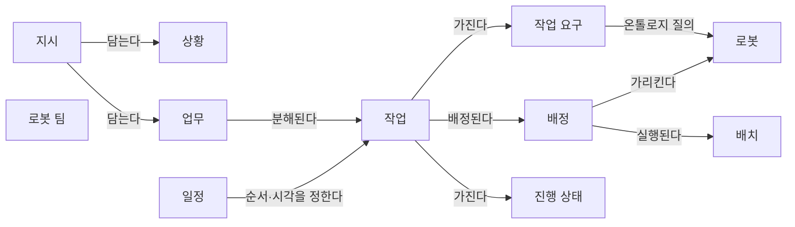
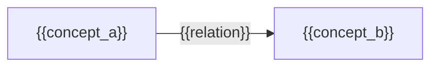

(너의 규칙은 시스템 프롬프트의 agents/shared-rules.md 와 agents/verifier.md 이다. 아래는 이번 실행의 컨텍스트와 입력이다.)

## 실행 컨텍스트

- run_id: 2026-09-25-37
- date: 2026-09-25
- run_type: track (트랙 실행)
- 대상: 트랙 nl-task-chatbot (자연어 업무 지시 챗봇) · 현재 단계: 단계 2. 필요한 데이터와 표준 조사 · 이번에 다룰 백로그 질문 id: q2-01 · 중심 세부영역: 13. 작업 배정 — MRTA (D. 계획·최적화)
- 예산:
    - max_search_queries: 40
    - max_sources_per_run: 20
    - new_topic_pages: 1
    - page_updates: 2
    - max_retries: 2
- 환경 알림: web_fetch_available: false · fetch_mode: mirror_only (일반 웹 페이지 열람은 네트워크 정책으로 막혀 있다. raw.githubusercontent.com 은 열린다: 공식 문서가 GitHub 에 있는 출처는 입력의 config/source_mirrors.yaml 경로를 WebFetch 로 열어 원문을 읽고 sources[].fetched=true, fetched_via=github_raw, fetch_url 을 적는다. 입력에 원문 텍스트(data/source_texts)가 있는 출처는 fetched_via=inbox. 그 밖의 출처는 fetched=false 이며 코드가 신뢰도 상한(medium)을 강제한다 — 공통 규칙 0절 6항)
- 언어: ko
- verification_stage: second
- verifier_budget:
    - max_search_queries: 40
    - max_sources_per_run: 20
    - new_topic_pages: 1
    - page_updates: 2
    - max_retries: 2
- retry_count: 1
- max_retries: 2

## 입력

### runs/2026-09-25-37/target.json

```json
{
  "run_id": "2026-09-25-37",
  "date": "2026-09-25",
  "weekday": "Fri",
  "run_number": 37,
  "run_type": "track",
  "forced": true,
  "target": {
    "area_no": 13,
    "area_name": "13. 작업 배정 — MRTA",
    "category": "D. 계획·최적화",
    "category_letter": "D"
  },
  "topic": null,
  "track": {
    "slug": "nl-task-chatbot",
    "name": "자연어 업무 지시 챗봇",
    "stage": 2,
    "stages": 5,
    "stage_name": "필요한 데이터와 표준 조사",
    "question_ids": [
      "q2-01"
    ],
    "user_questions": [],
    "runs_per_week": 3,
    "question_rationale": "CLI 지정 질문 id"
  },
  "corrections": [],
  "budget": {
    "max_search_queries": 40,
    "max_sources_per_run": 20,
    "new_topic_pages": 1,
    "page_updates": 2,
    "max_retries": 2
  },
  "priority_reason": null,
  "priority_questions": [],
  "excluded_areas": [],
  "lifted_areas": [],
  "deferred": {
    "monthly_recheck": false,
    "weekly_review": true
  },
  "selection_rationale": "CLI 지정 run_type=track, area=13; 트랙 실행일(Fri, track_days 앞 3개) → 트랙 nl-task-chatbot 단계 2, 질문 q2-01 (CLI 지정 질문 id)"
}
```

### runs/2026-09-25-37/research.json

```json
{
  "run_id": "2026-09-25-37",
  "date": "2026-09-25",
  "run_type": "track",
  "target": {
    "area_no": 13,
    "area_name": "13. 작업 배정 — MRTA",
    "category": "D. 계획·최적화"
  },
  "gaps": [
    "단계 2 질문 q2-01 열림(target.json 지정, CLI 지정 질문 id). 단계 2 페이지 3~6·8절 비어 있음(단계 2 첫 실행)",
    "완료 조건: 필요한 데이터 항목과 표준·형식 목록이 아이디어 2. 자연어 업무 지시 챗봇 페이지 4절에 없음",
    "완료 조건: 업무 분해·배정 설계 초안 2절의 '(단계 2에서 확정)' 속성(상황의 장소 표현·대상 표현·시간 조건, 업무의 기한·우선순위·완료 조건)이 미확정",
    "13. 작업 배정 — MRTA 페이지 섹션 7. 관련 표준·프레임워크·오픈소스 비어 있음(작업 요청 필드 근거 없음)"
  ],
  "research_questions": [
    "가장 가까운 로봇에 맡기는 것이 전체적으로도 유리한가? [분류원문]",
    "q2-01 채팅 지시를 작업으로 바꾸려면 어떤 정보(작업 종류, 장소, 대상 화물, 기한, 우선순위, 완료 조건)가 필요하고, 그 가운데 무엇을 로봇 기능 온톨로지·공간 그래프·업무 시스템에서 가져오는가?",
    "로봇 관제 인터페이스(Open-RMF 작업 요청·배송 기술, VDA 5050 주문·팩트시트)는 작업 종류·장소·화물·시작 시각·우선순위를 어떤 필드로 받고 무엇을 받지 않는가? (단계 2 페이지 3절, 13. 작업 배정 — MRTA 섹션 7 겨냥)",
    "업무 시스템 쪽 표준(ISA-95 작업 지시, GS1 EPCIS)은 기한·우선순위·자재·완료 기록을 어떤 항목으로 표현하는가? (1. 주문·업무 시스템 연계 연결)",
    "로봇 명령 이해 연구와 LLM 계획 연구는 지시에서 어떤 인자(행동, 대상, 출발지·목적지, 사람)를 뽑고 장소 표현을 무엇(장면 그래프, 경유점)에 접지하는가? (업무 분해·배정 설계 초안 '상황' 속성 겨냥)",
    "지시에서 안전 관련 속성을 따로 뽑아 실행 전에 판정하는 연구나, 채팅으로 WMS 작업을 실행하는 제품은 무엇을 확인하는가? (25. 안전·위험 관리, 18. 사람–로봇 협업·운영 인터페이스 연결)",
    "국내 자료에 자연어 물류 작업 지시의 정보 항목을 정리한 것이 있는가? (한국 자료 우선 규칙)"
  ],
  "findings": [
    {
      "id": "f1",
      "claim": "Open-RMF 작업 요청 스키마는 작업 범주(category)와 작업 기술(description)만 필수로 두고, 가장 이른 시작 시각·요청 시각·우선순위·라벨·요청자·플릿 이름을 선택 필드로 두며, 마감 시각(기한) 필드는 두지 않는다.",
      "tag": "사실",
      "source_ids": [
        "ref-125"
      ],
      "cross_checked": false,
      "confidence": "medium",
      "evidence_excerpt": "task_request.json 원본(github_raw): required category·description, 둘 다 'must match a schema supported by a fleet'. 선택: unix_millis_earliest_start_time, priority, labels, requester, fleet_name. (발행일 미확인, 확인일 기준)",
      "as_of": "2026-09-25",
      "flow_step": null,
      "flow_item": "시작 조건"
    },
    {
      "id": "f2",
      "claim": "Open-RMF 배송(Delivery) 작업 기술은 픽업(pickup)과 하역(dropoff) 두 사건을 필수로 두고, 각 사건은 장소(place)와 적재물(payload)을 필수로, 처리 설비(handler)를 선택으로 두며, 적재물 항목은 품목 코드(sku)와 수량(quantity)을 필수로, 칸(compartment)을 선택으로 둔다.",
      "tag": "사실",
      "source_ids": [
        "ref-768",
        "ref-769"
      ],
      "cross_checked": false,
      "confidence": "medium",
      "evidence_excerpt": "task_description__delivery.json: required pickup, dropoff. event_description__payload_transfer.json: required place, payload; payload 요소 required sku(string), quantity(integer, minimum 0). (발행일 미확인, 확인일 기준)",
      "as_of": "2026-09-25",
      "flow_step": "피킹",
      "flow_item": "작업 대상"
    },
    {
      "id": "f3",
      "claim": "Open-RMF 의 장소(place)는 경유점 이름(문자열), 경유점 번호(정수), 경유점과 방향을 담은 객체 가운데 하나로 지정되며, 건물 지도 그래프의 노드는 x·y 좌표, 이름(name), 파라미터 목록을 가진다.",
      "tag": "사실",
      "source_ids": [
        "ref-770",
        "ref-772"
      ],
      "cross_checked": false,
      "confidence": "medium",
      "evidence_excerpt": "place.json 원본: 문자열 또는 minimum 0 정수, 또는 waypoint(필수)·orientation 객체. GraphNode.msg: float32 x, float32 y, string name, Param[] params. (발행일 미확인, 확인일 기준)",
      "as_of": "2026-09-25",
      "flow_step": null,
      "flow_item": "작업 대상"
    },
    {
      "id": "f4",
      "claim": "VDA 5050 주문(order) 스키마는 주문 id·갱신 id·노드·간선을 필수로 두고 노드 위치에 지도 id(mapId)를 두며, 노드·간선에 붙는 동작은 동작 유형(actionType)과 차단 유형(blockingType)을 필수로 두지만, 주문 수준에 기한·우선순위 필드는 없다.",
      "tag": "사실",
      "source_ids": [
        "ref-771"
      ],
      "cross_checked": false,
      "confidence": "medium",
      "evidence_excerpt": "order.schema 원본(main): required headerId…orderId, orderUpdateId, nodes, edges; nodePosition required x, y, mapId; action required actionId, actionType, blockingType. orderDescription 은 'only for visualization purposes'. (발행일 미확인, 확인일 기준)",
      "as_of": "2026-09-25",
      "flow_step": null,
      "flow_item": "제약"
    },
    {
      "id": "f5",
      "claim": "VDA 5050 명세의 사전 정의 동작 pick·drop 은 적재 장치(lhd), 스테이션 유형·이름, 적재물 유형(loadType), 적재물 id(loadId), 높이·깊이·측면을 모두 선택 파라미터로 둔다.",
      "tag": "사실",
      "source_ids": [
        "ref-031"
      ],
      "cross_checked": false,
      "confidence": "medium",
      "evidence_excerpt": "VDA5050_EN.md(main, github_raw) 표 4: pick/drop 파라미터 lhd, stationType, stationName, loadType(예: EPAL), loadId, height, depth, side 모두 optional. (발행일 미확인, 확인일 기준)",
      "as_of": "2026-09-25",
      "flow_step": "적치",
      "flow_item": "작업 대상"
    },
    {
      "id": "f6",
      "claim": "VDA 5050 팩트시트는 적재 명세(loadSets: 적재물 유형, 적재물 치수, 최대 중량, 취급 높이 범위, 픽·드롭 소요 시간)와 로봇이 지원하는 동작 목록(동작 유형, 적용 범위, 파라미터, 차단 유형, 일시정지·취소 허용)을 로봇이 선언하게 한다.",
      "tag": "사실",
      "source_ids": [
        "ref-228"
      ],
      "cross_checked": false,
      "confidence": "medium",
      "evidence_excerpt": "factsheet.schema(main, github_raw): loadSpecification.loadSets 에 loadType, loadDimensions, maximumWeight, pickTime, dropTime; mobileRobotActions 에 actionType, actionScopes, actionParameters, blockingTypes, pauseAllowed, cancelAllowed. (발행일 미확인, 확인일 기준)",
      "as_of": "2026-09-25",
      "flow_step": null,
      "flow_item": "수행 자원"
    },
    {
      "id": "f7",
      "claim": "OPC UA for ISA-95 작업 제어 노드셋의 작업 지시 데이터형(ISA95JobOrderDataType)은 작업 지시 id 를 필수로, 설명·작업 마스터·시작 시각·종료 시각·우선순위·파라미터·인원·설비·물리 자산·자재 요구를 선택으로 두고, 자재 데이터형은 자재 정의 id·로트 id·수량·단위를 둔다.",
      "tag": "사실",
      "source_ids": [
        "ref-130"
      ],
      "cross_checked": false,
      "confidence": "medium",
      "evidence_excerpt": "NodeSet2.xml(github_raw) Definition: JobOrderID(String) 필수, StartTime·EndTime(DateTime)·Priority(Int16) IsOptional=true, MaterialRequirements(ISA95MaterialDataType). 자재: MaterialDefinitionID, MaterialLotID, Quantity, EngineeringUnits.",
      "as_of": "2024-01-31",
      "flow_step": null,
      "flow_item": "시작 조건"
    },
    {
      "id": "f8",
      "claim": "GS1 EPCIS 이벤트는 무엇(대상 식별자: GTIN·SSCC·GIAI 등), 언제(사건 시각·기록 시각), 어디서(판독 지점·업무 위치), 왜(업무 맥락)의 차원으로 기록되며 EPCIS 2.0 은 센서 정보를 담는 어떻게(how) 차원을 더했다.",
      "tag": "사실",
      "source_ids": [
        "ref-015"
      ],
      "cross_checked": false,
      "confidence": "medium",
      "evidence_excerpt": "검색 요약: EPCIS events consist of context information comprising What, When, Where, Why, and How; What 은 GTIN, SGTIN, SSCC, GIAI 같은 식별자. 원문 미열람. (발행일 미확인, 확인일 기준)",
      "as_of": "2026-09-25",
      "flow_step": "출하",
      "flow_item": "완료·인계",
      "source_unopened": true
    },
    {
      "id": "f9",
      "claim": "서비스 로봇 명령 이해 연구(arXiv 1807.03053)는 명령을 행동 하나와 인자(슬롯)로 모델링해 행동 탐지와 슬롯 채우기를 LSTM 계열 신경망으로 풀고, 요청된 행동이 로봇 능력 안에 있는지를 SVM 으로 따로 판정했다.",
      "tag": "사실",
      "source_ids": [
        "ref-773"
      ],
      "cross_checked": false,
      "confidence": "medium",
      "evidence_excerpt": "검색 요약: 'commands modeled as one action plus arguments (slots)'; 행동이 로봇 능력 밖일 수 있어 SVM 으로 판정; ROS·SMACH 로 구현, 가정용 서비스 로봇 벤치마크. 슬롯 목록은 원문 미확인. 원문 미열람.",
      "as_of": "2018-07",
      "flow_step": null,
      "flow_item": "시작 조건",
      "source_unopened": true
    },
    {
      "id": "f10",
      "claim": "DELIVER 는 경량 LLaMA3 로 지시에서 픽업·배송 위치를 뽑아 다중 로봇 픽업·배송에 넘기며, 물류에 가까운 LLM 지시 해석 연구 가운데 뽑는 인자가 위치 두 개로 한정된 예다.",
      "tag": "사실",
      "source_ids": [
        "ref-360"
      ],
      "cross_checked": false,
      "confidence": "medium",
      "evidence_excerpt": "검색 요약: 'a lightweight instance of LLaMA3 interprets the command to extract pickup and delivery locations'. 화물 식별·기한 추출은 요약에 없음. 원문 미열람. (재인용: 2026-09-25-30)",
      "as_of": "2025-08",
      "flow_step": null,
      "flow_item": "작업 대상",
      "source_unopened": true
    },
    {
      "id": "f11",
      "claim": "SayPlan(CoRL 2023)은 LLM 계획을 계층형 3D 장면 그래프에 접지하며, 접힌 그래프에서 작업 관련 하위 그래프를 찾는 의미 탐색과 고전 경로 계획기, 장면 그래프 시뮬레이터 피드백에 따른 반복 재계획을 쓰고, 최대 3개 층·36개 방·140개 자산·객체 환경에서 평가되었다.",
      "tag": "사실",
      "source_ids": [
        "ref-774"
      ],
      "cross_checked": false,
      "confidence": "medium",
      "evidence_excerpt": "검색 요약: LLMs conduct a 'semantic search' for task-relevant subgraphs from a collapsed 3DSG; classical path planner; iterative replanning; 3 floors, 36 rooms, 140 assets. 저자 보고, 원문 미열람.",
      "as_of": "2023-07",
      "flow_step": null,
      "flow_item": "작업 대상",
      "source_unopened": true
    },
    {
      "id": "f12",
      "claim": "SafeGate(arXiv 2604.05427)는 자연어 명령에서 안전 관련 속성을 구조화해 뽑고 ISO 13482 에 기반한 결정적 판정으로 실행을 승인·거부하며, 통과한 명령을 불변 조건·가드·중단 조건으로 된 작업 안전 계약으로 분해한다.",
      "tag": "사실",
      "source_ids": [
        "ref-775"
      ],
      "cross_checked": false,
      "confidence": "medium",
      "evidence_excerpt": "검색 요약: 'extracts structured safety-relevant properties from natural language commands and applies a deterministic decision gate'; invariants, guards, abort conditions; 230개 전문가 작성 과업, AI2-THOR 30개 시나리오. 저자 보고, 원문 미열람.",
      "as_of": "2026-04",
      "flow_step": null,
      "flow_item": "예외·성과",
      "source_unopened": true
    },
    {
      "id": "f13",
      "claim": "Mecalux 는 Easy WMS 에 통합한 대화형 비서 Easy AI 가 긴급 주문 일괄 출고 지시나 통로 잠금 해제 같은 WMS 작업을 채팅 요청으로 실행하며, 실행 전에 동작과 영향받는 항목의 요약을 보여 주고 채팅에서 확인을 받은 뒤 수행한다고 밝힌다.",
      "tag": "추정",
      "source_ids": [
        "ref-776"
      ],
      "cross_checked": false,
      "confidence": "low",
      "evidence_excerpt": "벤더 주장: 검색 요약 'displays a summary of the action and the affected elements, and once the action is confirmed through the chat, it is carried out immediately'; 예시 releasing all rush orders, unlocking a specific aisle. 원문 미열람. (발행일 미확인, 확인일 기준)",
      "as_of": "2026-09-25",
      "flow_step": "출하",
      "flow_item": "시작 조건",
      "source_unopened": true,
      "vendor_claim": true
    },
    {
      "id": "f14",
      "claim": "q2-01 의 정보 항목을 원천별로 대응시키면, 작업 종류는 로봇 인터페이스의 작업 범주·동작 유형(Open-RMF category, VDA 5050 actionType, 팩트시트 지원 동작)과, 장소는 공간 그래프의 경유점 이름·지도 id 와, 대상 화물은 업무 시스템의 품목·자재·물류 단위 식별자와 로봇 쪽 적재물 유형·치수·중량과, 기한·우선순위는 업무 시스템 작업 지시의 종료 시각·우선순위와 맞물리는 것으로 보이며, 완료 조건을 표현하는 필드는 이번에 연 로봇 요청·주문 스키마에 없었다.",
      "tag": "추정",
      "source_ids": [
        "ref-125",
        "ref-768",
        "ref-769",
        "ref-770",
        "ref-771",
        "ref-228",
        "ref-130",
        "ref-015"
      ],
      "cross_checked": false,
      "confidence": "low",
      "evidence_excerpt": "f1~f8 을 q2-01 의 여섯 항목에 대응시킨 이 위키의 정리. 이 대응표를 제시한 단일 출처는 확인하지 못함. 완료 조건은 작업 상태 스키마(ref-111)·EPCIS 이벤트 쪽을 이번 실행에서 다시 보지 않음.",
      "as_of": "2026-09-25",
      "flow_step": null,
      "flow_item": null
    },
    {
      "id": "f15",
      "claim": "기한(마감 시각)은 ISA-95 작업 지시에는 종료 시각으로 있지만 Open-RMF 작업 요청과 VDA 5050 주문에는 필드가 없으므로, 채팅 지시나 업무 시스템에서 받은 기한은 ROP 의 작업 모델이 보유하고 로봇 쪽에는 가장 이른 시작 시각·우선순위·배정 순서로 바꿔 넘겨야 할 것으로 보인다.",
      "tag": "추정",
      "source_ids": [
        "ref-125",
        "ref-771",
        "ref-130"
      ],
      "cross_checked": false,
      "confidence": "low",
      "evidence_excerpt": "f1(마감 필드 없음), f4(주문 수준 기한·우선순위 없음), f7(EndTime·Priority 선택 필드)에서 도출. 실행 2026-09-25-34 의 f19(oq-019)와 같은 방향의 추론.",
      "as_of": "2026-09-25",
      "flow_step": "출하",
      "flow_item": "제약"
    },
    {
      "id": "f16",
      "claim": "지시 속 장소 표현(예: 층·구역·도크 이름)은 로봇 인터페이스가 받는 경유점 이름·번호나 지도 id 로 옮겨야 하므로, 현장 용어와 공간 그래프 노드 이름을 잇는 이름 대응 정보가 필요하며, SayPlan 처럼 LLM 이 장면 그래프 안에서 관련 노드를 찾게 하는 방식이 그 접지 방법의 선행 사례로 보인다.",
      "tag": "추정",
      "source_ids": [
        "ref-770",
        "ref-772",
        "ref-771",
        "ref-774"
      ],
      "cross_checked": false,
      "confidence": "low",
      "evidence_excerpt": "f3(place 는 경유점 이름·번호), f4(nodePosition 의 mapId), f11(장면 그래프 의미 탐색)을 대응시킨 추론. 물류 현장 용어 사전을 다룬 자료는 이번 검색에서 찾지 못함(oq-029 관련).",
      "as_of": "2026-09-25",
      "flow_step": null,
      "flow_item": "작업 대상"
    },
    {
      "id": "f17",
      "claim": "대상 화물 식별은 인터페이스마다 단위가 달라 Open-RMF 배송은 품목 코드와 수량, VDA 5050 은 적재물 id·유형, ISA-95 는 자재 정의·로트, EPCIS 는 SSCC 같은 물류 단위 식별자를 쓰므로, ROP 는 지시의 '대상 화물'을 품목 단위와 적재 단위 가운데 어느 쪽으로 받을지와 둘 사이 대응을 정해야 할 것으로 보인다.",
      "tag": "추정",
      "source_ids": [
        "ref-769",
        "ref-031",
        "ref-130",
        "ref-015"
      ],
      "cross_checked": false,
      "confidence": "low",
      "evidence_excerpt": "f2(sku·quantity), f5(loadId·loadType), f7(MaterialDefinitionID·MaterialLotID), f8(SSCC) 비교에서 도출. oq-007·oq-023 과 연결.",
      "as_of": "2026-09-25",
      "flow_step": "피킹",
      "flow_item": "작업 대상"
    },
    {
      "id": "f18",
      "claim": "분류 원문 질문(가장 가까운 로봇에 맡기는 것이 전체적으로도 유리한가)과 관련해, 채팅 지시만으로는 기한·우선순위·화물 제약이 비기 쉬우므로 배정이 거리만이 아닌 전체 목적을 따르려면 이 항목을 업무 시스템(작업 지시의 종료 시각·우선순위)과 로봇 팩트시트(적재 명세)에서 보완해 배정기에 넘겨야 할 것으로 보인다.",
      "tag": "추정",
      "source_ids": [
        "ref-130",
        "ref-228",
        "ref-360"
      ],
      "cross_checked": false,
      "confidence": "low",
      "evidence_excerpt": "f7(업무 시스템의 기한·우선순위), f6(로봇 적재 명세), f10(지시에서 위치만 뽑는 예)을 13. 작업 배정 — MRTA 의 SCM 질문에 대응시킨 추론.",
      "as_of": "2026-09-25",
      "flow_step": null,
      "flow_item": "수행 자원"
    }
  ],
  "sources": [
    {
      "id": "ref-125",
      "org": "Open Robotics (open-rmf)",
      "title": "rmf_api_msgs — rmf_api_msgs/schemas/task_request.json",
      "published": null,
      "url": "https://github.com/open-rmf/rmf_api_msgs/blob/main/rmf_api_msgs/schemas/task_request.json",
      "type": "오픈소스 문서",
      "reliability": "medium",
      "accessed": "2026-09-25",
      "summary": "Open-RMF 작업 요청 JSON 스키마. 필수 category·description 과 선택 필드(가장 이른 시작 시각, 우선순위, 라벨, 요청자, 플릿 이름)를 이번 실행에서 원문으로 다시 확인했다.",
      "fetched": true,
      "fetched_via": "github_raw",
      "fetch_url": "https://raw.githubusercontent.com/open-rmf/rmf_api_msgs/main/rmf_api_msgs/schemas/task_request.json",
      "source_unopened": false
    },
    {
      "id": "ref-031",
      "org": "VDA / VDMA (VDA5050 GitHub)",
      "title": "VDA5050/VDA5050_EN.md — Official Specification document for the VDA 5050",
      "published": null,
      "url": "https://github.com/VDA5050/VDA5050/blob/main/VDA5050_EN.md",
      "type": "표준",
      "reliability": "high",
      "accessed": "2026-09-25",
      "summary": "VDA 5050 최신판 명세 원문. 이번 실행은 사전 정의 동작 pick·drop 의 선택 파라미터와 관제의 역할 서술을 확인했다.",
      "fetched": true,
      "fetched_via": "github_raw",
      "fetch_url": "https://raw.githubusercontent.com/VDA5050/VDA5050/main/VDA5050_EN.md",
      "source_unopened": false
    },
    {
      "id": "ref-228",
      "org": "VDA / VDMA (VDA5050 GitHub)",
      "title": "VDA5050/VDA5050 — json_schemas/factsheet.schema",
      "published": null,
      "url": "https://github.com/VDA5050/VDA5050/blob/main/json_schemas/factsheet.schema",
      "type": "표준",
      "reliability": "high",
      "accessed": "2026-09-25",
      "summary": "VDA 5050 팩트시트 JSON 스키마. 이번 실행은 적재 명세(loadSets)와 지원 동작(mobileRobotActions) 필드를 원문으로 확인했다.",
      "fetched": true,
      "fetched_via": "github_raw",
      "fetch_url": "https://raw.githubusercontent.com/VDA5050/VDA5050/main/json_schemas/factsheet.schema",
      "source_unopened": false
    },
    {
      "id": "ref-130",
      "org": "OPC Foundation",
      "title": "UA-Nodeset ISA95-JOBCONTROL — opc.ua.isa95-jobcontrol.nodeset2 (NodeSet2.xml·documentation.csv)",
      "published": "2024-01-31",
      "url": "https://github.com/OPCFoundation/UA-Nodeset/tree/latest/ISA95-JOBCONTROL",
      "type": "표준",
      "reliability": "medium",
      "accessed": "2026-09-25",
      "summary": "OPC UA for ISA-95 작업 제어 노드셋. 이번 실행은 작업 지시·자재·설비 데이터형의 필드 정의를 NodeSet2.xml 원문으로 확인했다.",
      "fetched": true,
      "fetched_via": "github_raw",
      "fetch_url": "https://raw.githubusercontent.com/OPCFoundation/UA-Nodeset/latest/ISA95-JOBCONTROL/opc.ua.isa95-jobcontrol.nodeset2.xml",
      "source_unopened": false
    },
    {
      "id": "ref-015",
      "org": "GS1",
      "title": "EPCIS and CBV Implementation Guideline",
      "published": null,
      "url": "https://www.gs1.org/docs/epc/EPCIS_Guideline.pdf",
      "type": "표준",
      "reliability": "medium",
      "accessed": "2026-09-25",
      "summary": "원문 미열람. EPCIS·CBV 구현 지침으로, 이벤트를 무엇·언제·어디서·왜(2.0 은 어떻게 추가) 차원으로 기록하는 방법을 설명한다(검색 요약 기준).",
      "source_unopened": true,
      "fetched": false,
      "fetched_via": null,
      "fetch_url": null
    },
    {
      "id": "ref-360",
      "org": "arXiv 2508.19114 저자(미확인)",
      "title": "DELIVER: A System for LLM-Guided Coordinated Multi-Robot Pickup and Delivery using Voronoi-Based Relay Planning",
      "published": "2025-08",
      "url": "https://arxiv.org/abs/2508.19114",
      "type": "논문",
      "reliability": "medium",
      "accessed": "2026-09-25",
      "summary": "원문 미열람. 경량 LLaMA3 로 지시에서 픽업·배송 위치를 뽑고 보로노이 분할·중계 지점으로 다중 로봇 픽업·배송을 조율하는 체계 논문.",
      "source_unopened": true,
      "fetched": false,
      "fetched_via": null,
      "fetch_url": null
    },
    {
      "id": "ref-768",
      "org": "Open Robotics (open-rmf)",
      "title": "rmf_ros2 — rmf_fleet_adapter/schemas/task_description__delivery.json",
      "published": null,
      "url": "https://github.com/open-rmf/rmf_ros2/blob/main/rmf_fleet_adapter/schemas/task_description__delivery.json",
      "type": "오픈소스 문서",
      "reliability": "high",
      "accessed": "2026-09-25",
      "summary": "Open-RMF 플릿 어댑터의 배송 작업 기술 JSON 스키마. 픽업과 하역 사건을 필수로 두는 구조를 원문으로 확인했다.",
      "fetched": true,
      "fetched_via": "github_raw",
      "fetch_url": "https://raw.githubusercontent.com/open-rmf/rmf_ros2/main/rmf_fleet_adapter/schemas/task_description__delivery.json",
      "source_unopened": false
    },
    {
      "id": "ref-769",
      "org": "Open Robotics (open-rmf)",
      "title": "rmf_ros2 — rmf_fleet_adapter/schemas/event_description__payload_transfer.json",
      "published": null,
      "url": "https://github.com/open-rmf/rmf_ros2/blob/main/rmf_fleet_adapter/schemas/event_description__payload_transfer.json",
      "type": "오픈소스 문서",
      "reliability": "high",
      "accessed": "2026-09-25",
      "summary": "Open-RMF 적재물 인계(픽업·하역) 사건 기술 스키마. 장소·적재물 필수, 처리 설비 선택, 적재물 항목의 sku·수량 필수와 칸 선택을 원문으로 확인했다.",
      "fetched": true,
      "fetched_via": "github_raw",
      "fetch_url": "https://raw.githubusercontent.com/open-rmf/rmf_ros2/main/rmf_fleet_adapter/schemas/event_description__payload_transfer.json",
      "source_unopened": false
    },
    {
      "id": "ref-770",
      "org": "Open Robotics (open-rmf)",
      "title": "rmf_ros2 — rmf_fleet_adapter/schemas/place.json",
      "published": null,
      "url": "https://github.com/open-rmf/rmf_ros2/blob/main/rmf_fleet_adapter/schemas/place.json",
      "type": "오픈소스 문서",
      "reliability": "high",
      "accessed": "2026-09-25",
      "summary": "Open-RMF 장소 스키마. 경유점 이름·번호 또는 경유점과 방향 객체로 장소를 지정하는 형식을 원문으로 확인했다.",
      "fetched": true,
      "fetched_via": "github_raw",
      "fetch_url": "https://raw.githubusercontent.com/open-rmf/rmf_ros2/main/rmf_fleet_adapter/schemas/place.json",
      "source_unopened": false
    },
    {
      "id": "ref-771",
      "org": "VDA / VDMA (VDA5050 GitHub)",
      "title": "VDA5050/VDA5050 — json_schemas/order.schema",
      "published": null,
      "url": "https://github.com/VDA5050/VDA5050/blob/main/json_schemas/order.schema",
      "type": "표준",
      "reliability": "high",
      "accessed": "2026-09-25",
      "summary": "VDA 5050 주문 메시지 JSON 스키마(main). 주문·노드·간선·동작의 필수·선택 필드와 노드 위치의 지도 id 를 원문으로 확인했다.",
      "fetched": true,
      "fetched_via": "github_raw",
      "fetch_url": "https://raw.githubusercontent.com/VDA5050/VDA5050/main/json_schemas/order.schema",
      "source_unopened": false
    },
    {
      "id": "ref-772",
      "org": "Open Robotics (open-rmf)",
      "title": "rmf_building_map_msgs — rmf_building_map_msgs/msg/GraphNode.msg",
      "published": null,
      "url": "https://github.com/open-rmf/rmf_building_map_msgs/blob/main/rmf_building_map_msgs/msg/GraphNode.msg",
      "type": "오픈소스 문서",
      "reliability": "high",
      "accessed": "2026-09-25",
      "summary": "Open-RMF 건물 지도 그래프 노드 메시지. x·y 좌표, 이름, 파라미터 목록 필드를 원문으로 확인했다.",
      "fetched": true,
      "fetched_via": "github_raw",
      "fetch_url": "https://raw.githubusercontent.com/open-rmf/rmf_building_map_msgs/main/rmf_building_map_msgs/msg/GraphNode.msg",
      "source_unopened": false
    },
    {
      "id": "ref-773",
      "org": "arXiv 1807.03053 저자(미확인)",
      "title": "A deep learning approach for understanding natural language commands for mobile service robots",
      "published": "2018-07",
      "url": "https://arxiv.org/abs/1807.03053",
      "type": "논문",
      "reliability": "medium",
      "accessed": "2026-09-25",
      "summary": "원문 미열람. 로봇 명령을 행동과 인자(슬롯)로 모델링해 행동 탐지·슬롯 채우기를 신경망으로 풀고 행동이 로봇 능력 안에 있는지 SVM 으로 판정한 프리프린트.",
      "source_unopened": true,
      "fetched": false,
      "fetched_via": null,
      "fetch_url": null
    },
    {
      "id": "ref-774",
      "org": "Rana, K. 외(SayPlan 저자)",
      "title": "SayPlan: Grounding Large Language Models using 3D Scene Graphs for Scalable Robot Task Planning",
      "published": "2023-07",
      "url": "https://arxiv.org/abs/2307.06135",
      "type": "논문",
      "reliability": "medium",
      "accessed": "2026-09-25",
      "summary": "원문 미열람. 계층형 3D 장면 그래프의 의미 탐색·경로 계획기·반복 재계획으로 LLM 계획을 대규모 다층 환경에 접지한 논문(CoRL 2023, PMLR 229).",
      "source_unopened": true,
      "fetched": false,
      "fetched_via": null,
      "fetch_url": null
    },
    {
      "id": "ref-775",
      "org": "Purdue University SMART Laboratory(arXiv 2604.05427 저자)",
      "title": "Pre-Execution Safety Gate & Task Safety Contracts for LLM-Controlled Robot Systems",
      "published": "2026-04",
      "url": "https://arxiv.org/abs/2604.05427",
      "type": "논문",
      "reliability": "medium",
      "accessed": "2026-09-25",
      "summary": "원문 미열람. 자연어 명령에서 안전 관련 속성을 뽑아 결정적 게이트로 실행을 승인·거부하고 작업 안전 계약(불변 조건·가드·중단 조건)으로 분해하는 SafeGate 프리프린트.",
      "source_unopened": true,
      "fetched": false,
      "fetched_via": null,
      "fetch_url": null
    },
    {
      "id": "ref-776",
      "org": "Mecalux",
      "title": "Mecalux integrates generative AI into Easy WMS",
      "published": null,
      "url": "https://www.mecalux.com/news/generative-ai-easy-wms-mecalux",
      "type": "벤더 문서",
      "reliability": "low",
      "accessed": "2026-09-25",
      "summary": "원문 미열람. WMS 에 통합한 대화형 비서 Easy AI 가 데이터 질의와 긴급 주문 출고·통로 잠금 해제 같은 작업을 채팅 확인 뒤 실행한다는 벤더 발표.",
      "source_unopened": true,
      "fetched": false,
      "fetched_via": null,
      "fetch_url": null
    }
  ],
  "page_proposals": [
    {
      "action": "update",
      "path": "docs/tracks/nl-task-chatbot/stage-2-data-and-standards.md",
      "sections": [
        "2",
        "3",
        "4",
        "5",
        "6",
        "8",
        "9"
      ],
      "rationale": "q2-01 답: f1·f2·f3·f4·f5·f6·f7·f8·f9·f10·f11·f12·f13·f14·f15·f16·f17·f18 (신뢰도 low) — 2절 q2-01 상태 답함, 3절 q2-01 소제목 신설({#q2-01}): 로봇 인터페이스가 받는 항목(Open-RMF 요청·배송·장소 f1·f2·f3, VDA 5050 주문·동작 f4·f5), 로봇 능력 원천(팩트시트 f6), 업무 시스템 원천(ISA-95 작업 지시 f7, EPCIS 차원 f8), 지시 해석 연구가 뽑는 인자와 장소 접지(f9·f10·f11), 안전 속성 추출(f12), 채팅 WMS 제품(f13 벤더 주장), 항목–원천 대응(f14), 기한 공백(f15), 장소 이름 대응(f16), 화물 식별 단위(f17), SCM 질문 연결(f18) / 4절 결론·불확실성 / 5절 후속 질문 / 6절 완료 조건 현황 / 8절 출처 / 9절 이력"
    },
    {
      "action": "update",
      "path": "docs/ideas/nl-task-chatbot.md",
      "sections": [
        "4"
      ],
      "rationale": "아이디어 페이지 4절: '필요한 데이터 항목과 원천' 소절 신설 — 항목–원천 대응 f14(추정), 로봇 인터페이스 필드 f1·f2·f3·f4·f5, 로봇 능력 f6, 업무 시스템 f7·f8, 기한 공백 f15, 화물 식별 단위 f17. f13 은 [추정] 벤더 주장 병기. 표준·형식 목록 비교(q2-02)는 미조사임을 명시"
    },
    {
      "action": "update",
      "path": "docs/tracks/nl-task-chatbot/task-model-draft.md",
      "sections": [
        "2",
        "6"
      ],
      "rationale": "트랙 산출물 갱신: track.ontology_changes(상황의 장소 표현에 공간 노드 참조, 업무의 기한·우선순위 값 원천, 작업 요구의 적재물 속성)가 승인되면 2절 반영과 초안 버전 인상(f3·f4·f5·f6·f7·f15·f16·f17). 미승인 부분은 6절 '상황의 항목' 질문(q2-01)에 근거로 연결"
    },
    {
      "action": "update",
      "path": "docs/categories/d-planning-and-optimization/13-task-allocation-mrta.md",
      "sections": [
        "7"
      ],
      "rationale": "트랙 nl-task-chatbot 단계 2 반영 제안 (f1, f2, f6, f15, f18): Open-RMF 작업 요청·배송 기술의 필드(기한 필드 없음), VDA 5050 팩트시트 적재 명세·지원 동작이 배정 입력이 되는 구조와 분류 원문 질문 연결"
    },
    {
      "action": "update",
      "path": "docs/categories/a-business-supply-chain-design/01-order-and-business-system-integration.md",
      "sections": [
        "7"
      ],
      "rationale": "트랙 nl-task-chatbot 단계 2 반영 제안 (f7, f13, f15): ISA-95 작업 지시의 종료 시각·우선순위·자재 요구가 채팅 지시의 기한·대상 화물 원천이 되는 점, 채팅으로 WMS 작업을 실행하는 제품(벤더 주장)"
    },
    {
      "action": "update",
      "path": "docs/categories/e-collaboration-and-field-operations/18-human-robot-collaboration-and-operator-interface.md",
      "sections": [
        "6"
      ],
      "rationale": "트랙 nl-task-chatbot 단계 2 반영 제안 (f12, f13): 채팅 지시 실행 전 요약·확인(Mecalux Easy AI, 벤더 주장)과 안전 속성 추출 뒤 결정적 승인 게이트(SafeGate). 27. AI·학습·적응과 모델 운영과 함께 연결"
    }
  ],
  "glossary_candidates": [
    {
      "term_ko": "사람 확인 루프",
      "term_en": "Human-in-the-Loop",
      "definition": "자동화된 처리 흐름에서 AI 나 시스템이 만든 결과를 실행하기 전에 사람이 검토·승인하거나 수정하는 단계를 두는 방식이다."
    }
  ],
  "open_questions_new": [],
  "open_questions_resolved": [],
  "self_check": {
    "source_count": 15,
    "cross_checked_count": 0,
    "unverified": [
      "모든 finding 교차 확인 없음: 인터페이스 필드는 각 표준·오픈소스의 단일 공식 파일, 연구는 단일 논문 검색 요약",
      "f8·f9·f10·f11·f12·f13 근거 출처 원문 미열람(검색 요약 범위)",
      "f9 연구의 슬롯 목록과 저자 미확인(ref-773)",
      "f13 Mecalux 발표 발행일 미확인, 벤더 주장",
      "f14 완료 조건: Open-RMF 작업 상태(ref-111)·EPCIS 이벤트 스키마를 이번 실행에서 다시 열지 않아 완료 조건 표현의 원천은 미확인",
      "VDA 5050 상태 메시지의 loads 필드 세부는 이번 열람 응답에서 확인하지 못함",
      "한국어 검색 1회에서 자연어 물류 작업 지시 정보 항목을 다룬 국내 자료를 찾지 못함"
    ],
    "scope_violations": [],
    "budget_used": {
      "queries": 9,
      "sources": 9
    },
    "limits": "web_fetch_available: false · fetch_mode mirror_only. raw.githubusercontent.com 으로 원문을 연 출처: 신규 ref-768·ref-769·ref-770·ref-771·ref-772, 재사용 ref-125·ref-031·ref-228·ref-130. 신규 ref-773~ref-776 과 재사용 ref-015·ref-360 은 원문 미열람(신뢰도 상한 medium, 벤더 low). 검색 9회/40, 신규 출처 9건/20(ref-768~ref-776, 예약 구간 안), 재사용 6건. 교차 확인 0건. 질문 선택: target.json 지정 q2-01 1건. q2-01 은 로봇 인터페이스(Open-RMF, VDA 5050)·로봇 능력(팩트시트)·업무 시스템(ISA-95, EPCIS)의 필드와 지시 해석 연구로 답했으나, 항목–원천 대응(f14)은 이 위키의 추론이라 질문 종합 신뢰도를 low 로 두었다. 로봇 기능 온톨로지·공간 그래프는 아직 트랙 산출물이 없어 VDA 5050 팩트시트와 Open-RMF 지도 그래프를 대리 원천으로 썼다. 교차 규칙: LLM 지시 해석 finding(f10·f11·f12)은 27. AI·학습·적응과 모델 운영과 적용 대상 13. 작업 배정 — MRTA·18. 사람–로봇 협업·운영 인터페이스 양쪽에 반영 제안했다. 8. 실시간 세계 상태·데이터 일관성과 22. 시뮬레이션·예측용 디지털 트윈 관련 주장 없음. 정정 요청 없음. 새 일반 열린 질문 없음: 장소 이름 대응은 기존 oq-029, 화물 식별자는 oq-007·oq-023, 기한 전달은 oq-019 와 겹쳐 트랙 질문으로만 올렸다. 용어 후보는 트랙 glossary_targets 가운데 용어집에 없는 '사람 확인 루프' 1건(근거 f13·f12). 후속 질문 3건, 온톨로지 변경 제안 3건."
  },
  "track": {
    "slug": "nl-task-chatbot",
    "stage": 2,
    "answered_question_ids": [
      "q2-01"
    ],
    "new_questions": [
      {
        "question": "지시 속 현장 장소 용어(예: 3층 출하 대기장, 2번 도크)와 공간 그래프 경유점 이름·지도 id·WMS 로케이션 코드를 대응시키는 이름 사전은 어떤 형식으로 두고 누가 관리하는가? (q2-01 에서 파생)",
        "stage": 2,
        "rationale_finding_id": "f16"
      },
      {
        "question": "채팅 지시의 '대상 화물'을 품목 단위(sku·수량)로 받을지 적재 단위(loadId·SSCC)로 받을지, 둘 사이 대응은 어느 시스템에서 가져오는가? (q2-01 에서 파생)",
        "stage": 2,
        "rationale_finding_id": "f17"
      },
      {
        "question": "로봇 인터페이스에 기한 필드가 없을 때 작업 모델이 보유한 기한을 가장 이른 시작 시각·우선순위·배정 순서로 바꾸는 규칙은 LLM 과 최적화 엔진 가운데 어디에 두는가? (q2-01 에서 파생)",
        "stage": 3,
        "rationale_finding_id": "f15"
      }
    ],
    "ontology_changes": [
      {
        "op": "modify",
        "kind": "concept",
        "name": "상황 (Situation)",
        "evidence_finding_ids": [
          "f3",
          "f4",
          "f16"
        ],
        "description": "속성 '장소 표현'에 해석 결과인 '공간 노드 참조(지도 id, 경유점 이름 또는 번호)'를 짝으로 둔다. 로봇 인터페이스는 경유점 이름·번호(Open-RMF place)나 지도 id 가 있는 노드(VDA 5050)만 받으므로 원문 표현과 접지 결과를 함께 기록해야 한다. 이름 대응 규칙은 새 질문으로 둔다."
      },
      {
        "op": "modify",
        "kind": "concept",
        "name": "업무 (Job)",
        "evidence_finding_ids": [
          "f1",
          "f4",
          "f7",
          "f15"
        ],
        "description": "속성 '기한'·'우선순위'의 '(단계 2에서 확정)' 표기를 정리해, 값 원천 후보를 채팅 지시와 업무 시스템 작업 지시(ISA-95 EndTime·Priority)로 적고, 로봇 인터페이스(Open-RMF 요청, VDA 5050 주문)에는 기한 필드가 없어 작업 모델이 기한을 보유한다는 메모를 단다. 변환 규칙은 단계 3 질문."
      },
      {
        "op": "modify",
        "kind": "concept",
        "name": "작업 요구 (Task Requirement)",
        "evidence_finding_ids": [
          "f2",
          "f5",
          "f6",
          "f17"
        ],
        "description": "제약(적재량·층·통과 조건)에 '적재물 식별(품목 코드·수량 또는 적재물 id)'과 '적재물 유형·치수·중량'을 더해, 로봇 팩트시트 적재 명세(loadSets)와 대조할 수 있게 한다. 품목 단위와 적재 단위 중 무엇을 기준으로 할지는 새 질문으로 둔다. 능력 온톨로지 초안의 작업 요구와 같은 개념이므로 그쪽 정의와 충돌 여부 확인 필요."
      }
    ],
    "stage_completion_self_assessment": {
      "met": false,
      "missing": [
        "필요한 데이터 항목과 표준·형식 목록이 아이디어 2. 자연어 업무 지시 챗봇 4절에 아직 실리지 않음(이번 제안 반영 전)",
        "작업 모델의 정보 항목이 업무 분해·배정 설계 초안 개념 목록 표에 미반영(온톨로지 변경 검증 전)",
        "열린 질문 q2-02, q2-03, q2-04"
      ]
    }
  }
}
```

### runs/2026-09-25-37/verification.json

```json
{
  "run_id": "2026-09-25-37",
  "stage": "first",
  "verdict": "조건부 승인",
  "claim_checks": [
    {
      "finding_id": "f1",
      "source_exists": true,
      "supports_claim": true,
      "cross_checked": false,
      "tag_decision": "유지",
      "note": "확인: task_request.json 원본(raw.githubusercontent.com)을 다시 열었다. required 는 category·description 이다. unix_millis_earliest_start_time·unix_millis_request_time·priority·labels·requester·fleet_name 은 선택 필드이고 마감(기한) 필드는 없다. 단일 공식 파일이며 발행일은 미확인이라 확인일 2026-09-25 를 기준으로 한다."
    },
    {
      "finding_id": "f2",
      "source_exists": true,
      "supports_claim": true,
      "cross_checked": false,
      "tag_decision": "유지",
      "note": "확인: task_description__delivery.json 은 pickup·dropoff 가 필수이고 각각 pickup·dropoff 사건 스키마를 참조한다. event_description__payload_transfer.json 은 place·payload 가 필수, handler 가 선택이며, payload 요소는 sku(string)·quantity(integer, 최소 0)가 필수이고 compartment 가 선택이다. pickup·dropoff 스키마가 payload_transfer 를 참조한다는 연결은 이번에 열지 않은 중간 파일에 기댄다."
    },
    {
      "finding_id": "f3",
      "source_exists": true,
      "supports_claim": true,
      "cross_checked": false,
      "tag_decision": "유지",
      "note": "확인: place.json 원본은 waypoint(문자열 또는 0 이상 정수)이거나 waypoint(필수)·orientation 객체다. GraphNode.msg 원본은 float32 x, float32 y, string name, Param[] params 로 되어 있다."
    },
    {
      "finding_id": "f4",
      "source_exists": true,
      "supports_claim": true,
      "cross_checked": false,
      "tag_decision": "유지",
      "note": "확인: order.schema(main) 원본에서 required 는 headerId·timestamp·version·manufacturer·serialNumber·orderId·orderUpdateId·nodes·edges 이다. nodePosition 은 x·y·mapId 가 필수이고, action 은 actionId·actionType·blockingType 이 필수다. 주문 수준에 기한·우선순위 필드는 없다. orderDescription 은 시각화용으로만 쓴다. main 브랜치는 3.0.0 판이므로 기준판 표기가 필요하다."
    },
    {
      "finding_id": "f5",
      "source_exists": true,
      "supports_claim": true,
      "cross_checked": false,
      "tag_decision": "유지",
      "note": "확인: 입력 원문 data/source_texts/ref-031.txt(VDA 5050 Version 3.0.0) 표 4에서 pick·drop 파라미터 lhd·stationType·stationName·loadType·loadId·height·depth·side 가 모두 optional 임을 확인했다. 기준판 3.0.0 을 명시해야 한다."
    },
    {
      "finding_id": "f6",
      "source_exists": true,
      "supports_claim": true,
      "cross_checked": false,
      "tag_decision": "유지",
      "note": "확인: factsheet.schema(main) 원본의 loadSets 에서 loadType·loadDimensions(length·width 필수, height 선택)·maximumWeight·pickTime·dropTime·최소/최대 취급 높이를 확인했다. mobileRobotActions 에서 actionType·actionScopes·actionParameters·blockingTypes·pauseAllowed·cancelAllowed 를 확인했다. 기준판은 3.0.0(main)이다."
    },
    {
      "finding_id": "f7",
      "source_exists": true,
      "supports_claim": true,
      "cross_checked": false,
      "tag_decision": "유지",
      "note": "확인: ISA95-JOBCONTROL NodeSet2.xml 원본(모델 발행일 2024-01-31)을 대조했다. JobOrderID 만 필수이고 Description·WorkMasterID·StartTime·EndTime·Priority·JobOrderParameters·Personnel/Equipment/PhysicalAsset/MaterialRequirements 는 IsOptional=true 다. ISA95MaterialDataType 에는 MaterialClassID·MaterialSublotID·MaterialUse·Properties 도 있고 모두 선택이므로, 열거는 일부만 든 것임을 밝힌다."
    },
    {
      "finding_id": "f8",
      "source_exists": true,
      "supports_claim": true,
      "cross_checked": false,
      "tag_decision": "유지",
      "note": "확인(원문 미열람): 검증 검색에서 ref.gs1.org/guidelines/epcis-cbv 를 포함한 결과가 무엇·언제·어디서·왜 네 차원과 EPCIS 2.0 의 어떻게(how, 센서 정보) 차원 추가를 뒷받침했다. 다만 뒷받침 요약은 제3자 해설이다. GS1 가이드라인 PDF URL(ref-015)은 열지 못했고 현재 게시 위치가 ref.gs1.org/guidelines/epcis-cbv/ 일 수 있다. 신뢰도 상한은 medium 이다."
    },
    {
      "finding_id": "f9",
      "source_exists": true,
      "supports_claim": true,
      "cross_checked": false,
      "tag_decision": "유지",
      "note": "확인(원문 미열람): 검증 검색에서 arXiv 1807.03053 의 제목과 저자(Pedro Henrique Martins, Luís Custódio, Rodrigo Ventura), 제출일 2018-07-09 를 확인했다. 행동 하나와 인자(슬롯)로 된 명령 모델, RNN·LSTM 기반 행동 탐지·슬롯 채우기, 로봇 능력 범위 판정용 SVM, ROS·SMACH 구현도 확인했다. 슬롯 목록은 미확인이다."
    },
    {
      "finding_id": "f10",
      "source_exists": true,
      "supports_claim": false,
      "cross_checked": false,
      "tag_decision": "강등",
      "note": "부분 불일치(원문 미열람): 앞 절(경량 LLaMA3 로 픽업·배송 위치 추출)은 검색 요약이 뒷받침한다. 뒤 절 '뽑는 인자가 위치 두 개로 한정된 예다'는 출처의 진술이 아니다. 검색 요약에 다른 인자가 보이지 않는다는 관찰을 일반화한 것이다. 앞 절만 [사실], 뒤 절은 [추정]으로 분리한다."
    },
    {
      "finding_id": "f11",
      "source_exists": true,
      "supports_claim": true,
      "cross_checked": false,
      "tag_decision": "유지",
      "note": "확인(원문 미열람): 검증 검색에서 SayPlan 의 arXiv 2307.06135, CoRL 2023(PMLR v229, Rana 외) 게재를 확인했다. 접힌 3DSG 의 의미 탐색, 고전 경로 계획기, 장면 그래프 시뮬레이터 피드백 기반 반복 재계획, 최대 3층·36개 방·140개 자산·객체 평가도 확인했다. 수치는 저자 보고값이다."
    },
    {
      "finding_id": "f12",
      "source_exists": true,
      "supports_claim": true,
      "cross_checked": false,
      "tag_decision": "유지",
      "note": "확인(원문 미열람): 검증 검색에서 arXiv 2604.05427(2026-04-07 제출)을 확인했다. ISO 13482 기반 안전 속성 추출과 결정적 승인·거부 게이트, 불변 조건·가드·중단 조건으로 된 작업 안전 계약, 230개 과업·AI2-THOR 30개 시나리오도 확인했다. 저자는 Obi, I., Venkatesh, V. L. N., Wang, W., Wang, R., Suh, D., Amosa, T. I., Jo, W., Min, B.-C. 이다. ISO 13482 는 개인 돌봄 로봇 안전 표준이므로 적용 맥락을 함께 적는다."
    },
    {
      "finding_id": "f13",
      "source_exists": true,
      "supports_claim": true,
      "cross_checked": false,
      "tag_decision": "유지",
      "note": "확인(원문 미열람): 검증 검색에서 Mecalux 발표 페이지(ref-776 URL)와 Mecalux 업데이트 페이지·업계지 기사를 확인했다. Easy AI 가 긴급 주문 일괄 출고·통로 잠금 해제를 채팅 요청으로 실행하고, 실행 전 동작·영향 항목 요약을 보여 준 뒤 채팅 확인을 받는다는 내용이다. 모두 같은 발표에 기반한 벤더 주장이므로 [추정]·vendor_claim 을 유지한다. 발행일은 미확인이며 업계지 보도는 2025-03 이다."
    },
    {
      "finding_id": "f14",
      "source_exists": true,
      "supports_claim": true,
      "cross_checked": false,
      "tag_decision": "유지",
      "note": "확인: f1~f8 을 대응시킨 이 위키의 정리임이 명시되어 있어 [추정]·low 를 유지한다. 구성 사실(f1~f7)은 원문으로 확인했다. 완료 조건 원천이 미확인(ref-111 미재열람)이라는 한계가 명시되어 있다. 로봇 기능 온톨로지·공간 그래프 대신 VDA 5050 팩트시트와 Open-RMF 지도 그래프를 대리 원천으로 쓴 점도 본문에 밝혀야 한다."
    },
    {
      "finding_id": "f15",
      "source_exists": true,
      "supports_claim": true,
      "cross_checked": false,
      "tag_decision": "유지",
      "note": "확인: f1·f4·f7 에서 도출한 설계 추론이며 [추정]을 유지한다. 기존 열린 질문 oq-019(출고 우선순위를 Open-RMF 우선순위·ROP 대기열로 옮기는 설계)와 같은 방향이므로 oq-019 에 연결한다."
    },
    {
      "finding_id": "f16",
      "source_exists": true,
      "supports_claim": true,
      "cross_checked": false,
      "tag_decision": "유지",
      "note": "확인: f3·f4·f11 을 대응시킨 추론이며 [추정]을 유지한다. 장소 이름 대응은 기존 oq-029 와 6. 지도·공간·위치 모델의 SCM 질문('3층 출하 대기장')과 겹친다. SayPlan 은 가정·사무 환경 연구라 물류 선행 사례로 단정하지 않는다."
    },
    {
      "finding_id": "f17",
      "source_exists": true,
      "supports_claim": true,
      "cross_checked": false,
      "tag_decision": "유지",
      "note": "확인: f2·f5·f7·f8 비교에서 도출한 추론이며 [추정]을 유지한다. 기존 oq-007·oq-023 과 연결된다."
    },
    {
      "finding_id": "f18",
      "source_exists": true,
      "supports_claim": true,
      "cross_checked": false,
      "tag_decision": "유지",
      "note": "확인: 분류 원문 13. 작업 배정 — MRTA 의 SCM 질문에 대응시킨 추론이며 [추정]을 유지한다. 원문 SCM 질문 요건을 충족한다."
    }
  ],
  "category_fit": {
    "ok": true,
    "reassign_to": null
  },
  "scope_boundary": {
    "ok": true,
    "issues": []
  },
  "duplication": {
    "ok": true,
    "overlaps": [
      "f15 는 열린 질문 oq-019(상위 시스템 출고 우선순위를 Open-RMF 우선순위·ROP 대기열로 옮기는 설계)와 같은 방향이다. 페이지에서 oq-019 에 연결한다.",
      "f16 은 oq-029(WMS 로케이션 코드·GLN 을 경유점·스테이션과 대응)와 겹친다.",
      "f17 은 oq-007(loadId 와 SSCC)·oq-023(loadType 공통 어휘)과 겹친다.",
      "ref-125·ref-031·ref-228·ref-130·ref-015·ref-360 은 기존 참고문헌 id 를 재사용했다. 신규 ref-768~ref-776 은 입력의 참고문헌 목록(ref-362 까지 표시)과 겹치지 않는다. 같은 날 다른 트랙 실행이 쓴 ref-7xx 예약 구간과의 충돌 여부는 입력으로 확인할 수 없어 퍼블리셔가 확인해야 한다.",
      "작업 요구(Task Requirement) 수정 제안은 매뉴얼 기반 로봇 기능 온톨로지 초안의 작업 요구 정의와 충돌할 수 있다. 제안이 스스로 이를 적었으나 그 초안이 입력에 없어 대조하지 못했다."
    ]
  },
  "terminology": {
    "ok": true,
    "conflicts": []
  },
  "quotation_check": {
    "ok": true
  },
  "corrections_applied": [],
  "corrections_rejected": [],
  "required_fixes": [
    "f10: 앞 절 'DELIVER 는 경량 LLaMA3 로 지시에서 픽업·배송 위치를 뽑아 다중 로봇 픽업·배송에 넘긴다'만 [사실]로 쓴다. '뽑는 인자가 위치 두 개로 한정된 예다'는 '검색 요약 범위에서 화물 식별·기한 추출은 확인되지 않았다(원문 미열람)' [추정]으로 분리한다. 이유: 뒤 절은 출처의 진술이 아니라 요약 범위의 관찰을 일반화한 것이다.",
    "f4·f5·f6: VDA 5050 필드 서술마다 기준판 '3.0.0(공식 저장소 main 브랜치, 확인일 2026-09-25)'을 같은 문장이나 바로 뒤에 적는다. 이유: main 브랜치가 3.0.0 판이고 2.x 판과 필드가 다를 수 있다.",
    "f7: ISA95MaterialDataType 의 필드는 '자재 정의 id·로트 id·수량·단위 등(자재 클래스·하위 로트 id 도 있음, 모두 선택)'처럼 일부 열거임을 밝힌다. 기준일은 노드셋 모델 발행일 2024-01-31 로 적는다.",
    "f13: [추정]과 '벤더 주장'을 병기하고 발행일은 미확인으로 둔다. 1. 주문·업무 시스템 연계와 18. 사람–로봇 협업·운영 인터페이스 반영 제안에서는 WMS(상위 업무 시스템) 쪽 제품 기능으로, 즉 '연계 대상'의 사례로 서술한다. ROP 가 WMS 작업을 실행하는 것처럼 쓰지 않는다. 이유: 분류 원문 9장의 상위 업무 시스템 경계다.",
    "f12: SafeGate 가 근거로 삼은 ISO 13482 는 개인 돌봄 로봇 안전 표준임을 적는다. 평가(230개 과업, AI2-THOR 30개 시나리오)는 저자 보고이며 물류 현장 대상이 아님을 같은 문단에 밝힌다. 25. 안전·위험 관리와 27. AI·학습·적응과 모델 운영 양쪽에 연결한다.",
    "f14·f16: 로봇 기능 온톨로지·공간 그래프 트랙 산출물이 아직 없어 VDA 5050 팩트시트와 Open-RMF 건물 지도 그래프를 대리 원천으로 썼다는 점을 단계 2 페이지 3절 q2-01 답과 4절 불확실성에 적는다. 완료 조건의 표현 원천(작업 상태 스키마·EPCIS 이벤트)이 미확인이라는 점도 4절 불확실성에 적는다.",
    "f15·f16·f17: 본문에서 기존 열린 질문 oq-019(f15), oq-029(f16), oq-007·oq-023(f17)에 링크로 연결한다. 새 일반 열린 질문은 만들지 않는다.",
    "원문 미열람 표시: ref-015·ref-360·ref-773·ref-774·ref-775·ref-776 의 각주 정의 접근일 뒤에 ' (원문 미열람)'을 붙이고, reference_updates 의 해당 항목에 source_unopened: true 를 넣는다. 원문을 연 ref-125·ref-031·ref-228·ref-130·ref-768~ref-772 에는 붙이지 않는다.",
    "reference_updates 의 기관·저자를 이렇게 적는다: ref-773 은 'Martins, P. H., Custódio, L., & Ventura, R.', ref-775 는 'Obi, I., Venkatesh, V. L. N., Wang, W., Wang, R., Suh, D., Amosa, T. I., Jo, W., & Min, B.-C.(Purdue University SMART Lab)', ref-774 는 'Rana, K. 외'(CoRL 2023, PMLR 229). 모두 검증 검색 결과로 확인했다.",
    "용어 후보 '사람 확인 루프(Human-in-the-Loop)'는 이번 실행에서 용어집에 등록하지 않는다. 근거 finding(f12·f13)이 이 용어를 정의하지 않으므로 정의 문장에 출처가 없다. 다음 실행에서 정의 출처를 확보한다.",
    "온톨로지 변경 승인 '상황 (Situation)' 수정: 상황 행의 주요 속성에 '장소 표현'의 해석 결과인 '공간 노드 참조(지도 id, 경유점 이름 또는 번호)'를 짝으로 더한다. 근거 출처 칸에 finding f3·f4 (실행 2026-09-25-37)와 각주 ref-770·ref-772·ref-771 을 단다. 상태는 확정을 유지한다. 이름 대응 규칙은 6절 질문(관련 q2-01, oq-029)으로 둔다.",
    "온톨로지 변경 승인 '업무 (Job)' 수정: 기한·우선순위의 '(단계 2에서 확정)' 표기를 지우고, 값 원천 후보로 '채팅 지시 / 업무 시스템 작업 지시(ISA-95 EndTime·Priority)'를 적는다(finding f7, 각주 ref-130). '로봇 인터페이스(Open-RMF 작업 요청, VDA 5050 주문)에는 기한 필드가 없다'는 메모는 [사실]로 쓴다(f1·f4, 각주 ref-125·ref-771). '작업 모델이 기한을 보유한다'는 f15 에 근거한 [추정]으로 둔다. 완료 조건 속성의 '(단계 2에서 확정)'은 그대로 둔다. 업무 행 상태는 초안 → 확정으로 바꾼다.",
    "온톨로지 변경 거부 '작업 요구 (Task Requirement)' 수정: 개념 목록 표에 반영하지 않는다. 6절 미해결 모델링 질문에 '작업 요구에 적재물 식별(품목 코드·수량 또는 적재물 id)과 적재물 유형·치수·중량을 더해 팩트시트 loadSets 와 대조할 것인가 — 능력 온톨로지 초안의 작업 요구와 같은 개념이므로 그쪽 정의와 대조 후 결정(근거 f2·f5·f6·f17, 관련 q2-01)'으로 둔다. 이유: 제안 스스로 충돌 확인이 필요하다고 적었고, 매뉴얼 기반 로봇 기능 온톨로지 초안이 입력에 없어 충돌 여부를 확인하지 못했다.",
    "초안 버전을 '0.3' → '0.4' 로 올리고 H1 '(v0.4)', 프런트매터 ontology_version, track_updates.ontology_draft_version 을 같은 문자열로 맞춘다. 1절 목적과 범위의 버전 요약 문단에 v0.4 변경(상황·업무 수정 승인, 작업 요구 거부)을 적는다.",
    "새 질문 '로봇 인터페이스에 기한 필드가 없을 때 … 변환 규칙은 LLM 과 최적화 엔진 가운데 어디에 두는가?'는 기존 q3-01(스케줄링 결정을 LLM 과 최적화 엔진 중 어디에 맡기는가)의 범위에 들어간다. backlog_updates 에 새 id 로 넣지 않고, 단계 2 페이지 5절에 'q3-01 에 근거 f15 로 연결'로 적는다.",
    "새 질문 두 건(현장 장소 용어–경유점·지도 id·WMS 로케이션 이름 사전, 대상 화물의 품목 단위 대 적재 단위)은 단계 2 태그와 origin f16·f17 로 백로그에 등록한다.",
    "단계 2 페이지 2절: q2-01 상태를 '답함', 답한 실행 id 를 2026-09-25-37, 답 위치를 '#q2-01' 로 적는다. 3절에 '### q2-01 … {#q2-01}' 소제목을 둔다. 4절에는 핵심 답(f14)이 이 위키의 추론(신뢰도 low)이고 교차 확인이 0건임을 명시한다.",
    "단계 2 페이지 6절: 완료 조건 두 항목의 충족 여부는 모두 '미충족', 검증 판정 칸은 '미충족 · 미승인'으로 둔다. 표 아래 줄은 '다음 단계로 전환: 아니오(아이디어 2 4절의 표준·형식 목록(q2-02) 미조사, 작업 모델 정보 항목 일부만 반영, 열린 질문 q2-02·q2-03·q2-04)'로 쓴다. 상태 줄은 '단계 상태: 진행 중', '완료 조건: 미충족'이다.",
    "아이디어 2. 자연어 업무 지시 챗봇 페이지 4절: 이번에는 '필요한 데이터 항목과 원천' 소절만 쓴다. 표준·형식 목록 비교(q2-02)와 평가 데이터(q2-03)는 미조사임을 명시한다. 항목–원천 대응 표를 만들면 이 위키가 구성한 표이며 [추정]임을 표 앞 문장에 적는다.",
    "13. 작업 배정 — MRTA, 1. 주문·업무 시스템 연계, 18. 사람–로봇 협업·운영 인터페이스는 세부영역 페이지를 직접 고치지 않는다. area_reflection_proposals 로만 낸다. 1. 주문·업무 시스템 연계 제안에서 f13 은 7절(표준·프레임워크·오픈소스)이 아니라 제품 사례로 표시한다."
  ],
  "confidence": "low",
  "verification_note": "판정: 조건부 승인. 이번 실행은 원문 열람이 차단된 환경에서 검증됐다(fetch_mode mirror_only). Open-RMF·VDA 5050·OPC UA ISA-95 스키마 원본 8건은 raw.githubusercontent.com 으로 다시 열어 확인했고, VDA 5050 3.0.0 명세는 입력 원문으로 대조했다. 확인 17건, 미확인 1건(f10), 교차 확인 0건. 강등: f10 뒤 절('뽑는 인자가 위치 두 개로 한정된 예다') 사실 → 추정(앞 절은 사실 유지). 원문 미열람 출처: ref-015, ref-360, ref-773, ref-774, ref-775, ref-776. 주의: q2-01 의 핵심 답(항목–원천 대응 f14, 기한 공백 f15, 장소 이름 대응 f16, 화물 식별 단위 f17)은 스키마 필드 관찰을 이 위키가 대응시킨 추론이다. 로봇 기능 온톨로지·공간 그래프 대신 VDA 5050 팩트시트와 Open-RMF 지도 그래프를 대리 원천으로 썼고, 완료 조건의 표현 원천은 확인하지 못했다. VDA 5050 필드는 3.0.0(main) 기준이다. Mecalux Easy AI(f13)는 WMS 쪽 벤더 주장이며 ROP 기능이 아니다. SafeGate·SayPlan 의 수치는 저자 보고이며 물류 현장 대상이 아니다. 연구 저자 확인: ref-773 Martins·Custódio·Ventura, ref-775 Obi 외(Purdue SMART Lab). 한국어 검색 1회로 국내 자료는 찾지 못했다. 검증 검색 5회(리서치 9회 포함 14/40). 정정 요청 없음. 온톨로지 변경 승인: 상황 (Situation) 수정(장소 표현의 공간 노드 참조, f3·f4, 상태 확정 유지), 업무 (Job) 수정(기한·우선순위 값 원천과 로봇 인터페이스 기한 필드 부재 메모, f1·f4·f7·f15, 초안 → 확정) / 거부: 작업 요구 (Task Requirement) 수정(능력 온톨로지 초안의 작업 요구와 충돌 여부 미확인, 6절 질문으로). 초안 v0.3 → v0.4. 새 질문: 장소 이름 사전(f16)·화물 식별 단위(f17)는 단계 2로 등록. 기한 변환 규칙의 LLM·최적화 엔진 분담(f15)은 q3-01 과 중복이라 등록하지 않음. 용어 '사람 확인 루프'는 정의 출처가 없어 등록 보류. 단계 완료 조건: 미충족(부족: 아이디어 2 4절의 표준·형식 목록(q2-02) 미조사, 작업 모델 정보 항목 일부 반영). 단계 전환: 미승인(막힌 질문 q2-02·q2-03·q2-04).",
  "retry_reason": null,
  "track_checks": {
    "standard_sources_ok": true,
    "vendor_claims_tagged": true,
    "ontology_changes_grounded": false,
    "backlog_duplicates": [
      "로봇 인터페이스에 기한 필드가 없을 때 작업 모델이 보유한 기한을 가장 이른 시작 시각·우선순위·배정 순서로 바꾸는 규칙은 LLM 과 최적화 엔진 가운데 어디에 두는가? (q2-01 에서 파생) — q3-01 과 중복"
    ],
    "stage_tag_issues": [],
    "completeness_wording_ok": true,
    "stage_complete": false,
    "stage_transition_approved": false
  }
}
```

### runs/2026-09-25-37/pages.json

```json
{
  "run_id": "2026-09-25-37",
  "outline": [
    {
      "path": "docs/tracks/nl-task-chatbot/stage-2-data-and-standards.md",
      "section": "3. 조사 결과",
      "budget_chars": 3800,
      "summary": "Open-RMF 작업 요청과 VDA 5050 3.0.0 주문에는 기한 필드가 없고, 업무 시스템 작업 지시(ISA-95)는 종료 시각·우선순위를 선택 필드로 둔다. [사실][^ref-125][^ref-771][^ref-130] 여섯 정보 항목과 원천의 대응은 이 위키의 추론이다. [추정][^ref-228]",
      "planned_findings": [
        "f1",
        "f2",
        "f3",
        "f4",
        "f5",
        "f6",
        "f7",
        "f8",
        "f9",
        "f10",
        "f11",
        "f12",
        "f13",
        "f14",
        "f15",
        "f16",
        "f17",
        "f18"
      ]
    },
    {
      "path": "docs/tracks/nl-task-chatbot/stage-2-data-and-standards.md",
      "section": "4. 결론과 남은 불확실성",
      "budget_chars": 1100,
      "summary": "로봇 인터페이스는 작업 종류·장소·화물을 받지만 기한 필드가 없다. [사실][^ref-125][^ref-771] 대리 원천을 썼고 완료 조건의 표현 원천은 미확인이다.",
      "planned_findings": [
        "f1",
        "f4",
        "f7",
        "f14"
      ]
    },
    {
      "path": "docs/ideas/nl-task-chatbot.md",
      "section": "4. 필요한 데이터와 표준",
      "budget_chars": 1600,
      "summary": "채팅 지시의 여섯 정보 항목을 로봇 인터페이스·업무 시스템 필드에 대응시킨 이 위키의 표이다. [추정][^ref-125][^ref-130] 표준·형식 목록 비교(q2-02)는 아직 조사하지 않았다.",
      "planned_findings": [
        "f1",
        "f2",
        "f3",
        "f4",
        "f5",
        "f6",
        "f7",
        "f8",
        "f13",
        "f14",
        "f15",
        "f17"
      ]
    }
  ],
  "pages": [
    {
      "path": "docs/tracks/nl-task-chatbot/stage-2-data-and-standards.md",
      "action": "update",
      "status": "draft",
      "diff_summary": "q2-01 답함(2·3·4·5·6·8·9절 작성), 후속 질문 2건(q2-05·q2-06), q2-04 행 추가, 상태 줄 갱신. 2차 수정: 3절 첫 문장에 ref-769 추가, 2절 제기 근거 칸을 finding id 만으로 정리. seed 단계 페이지의 H1 아래 상태 줄을 바꿔야 해서 content 로 보냄"
    },
    {
      "path": "docs/tracks/nl-task-chatbot/task-model-draft.md",
      "action": "update",
      "status": "draft",
      "diff_summary": "초안 v0.3 → v0.4: 상황 속성에 공간 노드 참조 추가(확정 유지), 업무 기한·우선순위 값 원천과 기한 필드 부재 메모(초안 → 확정), 작업 요구 수정 거부를 6절 질문으로. 2차 수정: 6절 화물 식별 단위 문장 각주를 ref-769·ref-031 로 교체하고 각주 정의·sources 추가. H1 버전 표기를 바꿔야 해서 content 로 보냄"
    },
    {
      "path": "docs/ideas/nl-task-chatbot.md",
      "action": "update",
      "status": "draft",
      "diff_summary": "4절에 '필요한 데이터 항목과 원천' 소절 작성(q2-01), 표준·형식 목록·평가 데이터는 미조사로 명시. 2차 수정: 첫 문장에 ref-769 추가, 팩트시트 항목을 [사실] 문장과 태그 없는 대리 원천 문장으로 분리",
      "patches": [
        {
          "section": "4. 필요한 데이터와 표준",
          "action": "replace",
          "content": "(절 본문 생략 — runs/2026-09-25-37/pages/ideas/nl-task-chatbot.md 의 해당 절을 본다)",
          "frontmatter": {
            "sources": [
              "ref-054",
              "ref-055",
              "ref-057",
              "ref-058",
              "ref-059",
              "ref-061",
              "ref-089",
              "ref-090",
              "ref-091",
              "ref-093",
              "ref-094",
              "ref-095",
              "ref-087",
              "ref-164",
              "ref-166",
              "ref-167",
              "ref-168",
              "ref-169",
              "ref-170",
              "ref-171",
              "ref-172",
              "ref-174",
              "ref-175",
              "ref-176",
              "ref-177",
              "ref-178",
              "ref-179",
              "ref-180",
              "ref-181",
              "ref-242",
              "ref-272",
              "ref-275",
              "ref-276",
              "ref-277",
              "ref-278",
              "ref-279",
              "ref-280",
              "ref-350",
              "ref-351",
              "ref-352",
              "ref-353",
              "ref-354",
              "ref-355",
              "ref-356",
              "ref-357",
              "ref-358",
              "ref-359",
              "ref-360",
              "ref-362",
              "ref-015",
              "ref-031",
              "ref-125",
              "ref-130",
              "ref-228",
              "ref-769",
              "ref-771",
              "ref-776"
            ]
          }
        }
      ]
    },
    {
      "path": "docs/tracks/nl-task-chatbot/index.md",
      "action": "update",
      "status": "draft",
      "diff_summary": "6. 살아있는 산출물 링크: 초안 v0.4, 아이디어 페이지 4절 작성 반영(현재 단계는 트랙 정의 current_stage 1 그대로라 상태 줄 변경 없음)",
      "patches": [
        {
          "section": "6. 살아있는 산출물 링크",
          "action": "replace",
          "content": "(절 본문 생략 — runs/2026-09-25-37/pages/tracks/nl-task-chatbot/index.md 의 해당 절을 본다)"
        }
      ]
    }
  ],
  "changelog_entry": "2026-09-25 | 자연어 업무 지시 챗봇 단계 2 | q2-01 답함(로봇 인터페이스·업무 시스템 필드와 정보 항목 원천 대응), 초안 v0.3 → v0.4, 후속 질문 2건 | run 2026-09-25-37",
  "index_updates": {
    "home_recent": "2026-09-25 — 자연어 업무 지시 챗봇 단계 2: 채팅 지시에 필요한 정보 항목을 Open-RMF·VDA 5050·ISA-95·EPCIS 필드에 대응(로봇 인터페이스에 기한 필드 없음), 초안 v0.4",
    "category_recent": "2026-09-25 — 13. 작업 배정 — MRTA: 자연어 업무 지시 챗봇 트랙이 배정 입력이 될 작업 요청 필드(기한 필드 없음)와 팩트시트 적재 명세를 정리하고 7. 관련 표준·프레임워크·오픈소스 반영을 제안",
    "area_recent": "2026-09-25 — 자연어 업무 지시 챗봇 트랙 단계 2(q2-01): Open-RMF 작업 요청·배송 기술과 VDA 5050 팩트시트 필드를 7. 관련 표준·프레임워크·오픈소스에 반영 제안"
  },
  "glossary_updates": [],
  "reference_updates": [
    {
      "id": "ref-768",
      "org": "Open Robotics (open-rmf)",
      "title": "rmf_ros2 — rmf_fleet_adapter/schemas/task_description__delivery.json",
      "published": null,
      "url": "https://github.com/open-rmf/rmf_ros2/blob/main/rmf_fleet_adapter/schemas/task_description__delivery.json",
      "type": "오픈소스 문서",
      "reliability": "high",
      "accessed": "2026-09-25",
      "summary": "Open-RMF 플릿 어댑터의 배송 작업 기술 JSON 스키마. 픽업과 하역 사건을 필수로 두는 구조를 원문으로 확인했다.",
      "source_unopened": false,
      "cited_by": [
        "docs/tracks/nl-task-chatbot/stage-2-data-and-standards.md"
      ]
    },
    {
      "id": "ref-769",
      "org": "Open Robotics (open-rmf)",
      "title": "rmf_ros2 — rmf_fleet_adapter/schemas/event_description__payload_transfer.json",
      "published": null,
      "url": "https://github.com/open-rmf/rmf_ros2/blob/main/rmf_fleet_adapter/schemas/event_description__payload_transfer.json",
      "type": "오픈소스 문서",
      "reliability": "high",
      "accessed": "2026-09-25",
      "summary": "Open-RMF 적재물 인계 사건 기술 스키마. 장소·적재물 필수, 처리 설비 선택, 적재물 항목의 sku·수량 필수와 칸 선택을 원문으로 확인했다.",
      "source_unopened": false,
      "cited_by": [
        "docs/tracks/nl-task-chatbot/stage-2-data-and-standards.md",
        "docs/ideas/nl-task-chatbot.md",
        "docs/tracks/nl-task-chatbot/task-model-draft.md"
      ]
    },
    {
      "id": "ref-770",
      "org": "Open Robotics (open-rmf)",
      "title": "rmf_ros2 — rmf_fleet_adapter/schemas/place.json",
      "published": null,
      "url": "https://github.com/open-rmf/rmf_ros2/blob/main/rmf_fleet_adapter/schemas/place.json",
      "type": "오픈소스 문서",
      "reliability": "high",
      "accessed": "2026-09-25",
      "summary": "Open-RMF 장소 스키마. 경유점 이름·번호 또는 경유점과 방향 객체로 장소를 지정하는 형식을 원문으로 확인했다.",
      "source_unopened": false,
      "cited_by": [
        "docs/tracks/nl-task-chatbot/stage-2-data-and-standards.md",
        "docs/tracks/nl-task-chatbot/task-model-draft.md"
      ]
    },
    {
      "id": "ref-771",
      "org": "VDA / VDMA (VDA5050 GitHub)",
      "title": "VDA5050/VDA5050 — json_schemas/order.schema",
      "published": null,
      "url": "https://github.com/VDA5050/VDA5050/blob/main/json_schemas/order.schema",
      "type": "표준",
      "reliability": "high",
      "accessed": "2026-09-25",
      "summary": "VDA 5050 주문 메시지 JSON 스키마(main 브랜치, 3.0.0). 주문·노드·간선·동작의 필수·선택 필드와 노드 위치의 지도 id, 주문 수준 기한·우선순위 필드 부재를 원문으로 확인했다.",
      "source_unopened": false,
      "cited_by": [
        "docs/tracks/nl-task-chatbot/stage-2-data-and-standards.md",
        "docs/tracks/nl-task-chatbot/task-model-draft.md",
        "docs/ideas/nl-task-chatbot.md"
      ]
    },
    {
      "id": "ref-772",
      "org": "Open Robotics (open-rmf)",
      "title": "rmf_building_map_msgs — rmf_building_map_msgs/msg/GraphNode.msg",
      "published": null,
      "url": "https://github.com/open-rmf/rmf_building_map_msgs/blob/main/rmf_building_map_msgs/msg/GraphNode.msg",
      "type": "오픈소스 문서",
      "reliability": "high",
      "accessed": "2026-09-25",
      "summary": "Open-RMF 건물 지도 그래프 노드 메시지. x·y 좌표, 이름, 파라미터 목록 필드를 원문으로 확인했다.",
      "source_unopened": false,
      "cited_by": [
        "docs/tracks/nl-task-chatbot/stage-2-data-and-standards.md",
        "docs/tracks/nl-task-chatbot/task-model-draft.md"
      ]
    },
    {
      "id": "ref-773",
      "org": "Martins, P. H., Custódio, L., & Ventura, R.",
      "title": "A deep learning approach for understanding natural language commands for mobile service robots",
      "published": "2018-07",
      "url": "https://arxiv.org/abs/1807.03053",
      "type": "논문",
      "reliability": "medium",
      "accessed": "2026-09-25",
      "summary": "원문 미열람. 로봇 명령을 행동과 인자(슬롯)로 모델링해 행동 탐지·슬롯 채우기를 신경망으로 풀고 행동이 로봇 능력 안에 있는지 SVM 으로 판정한 프리프린트.",
      "source_unopened": true,
      "cited_by": [
        "docs/tracks/nl-task-chatbot/stage-2-data-and-standards.md"
      ]
    },
    {
      "id": "ref-774",
      "org": "Rana, K. 외",
      "title": "SayPlan: Grounding Large Language Models using 3D Scene Graphs for Scalable Robot Task Planning",
      "published": "2023-07",
      "url": "https://arxiv.org/abs/2307.06135",
      "type": "논문",
      "reliability": "medium",
      "accessed": "2026-09-25",
      "summary": "원문 미열람. 계층형 3D 장면 그래프의 의미 탐색·경로 계획기·반복 재계획으로 LLM 계획을 대규모 다층 환경에 접지한 논문(CoRL 2023, PMLR 229).",
      "source_unopened": true,
      "cited_by": [
        "docs/tracks/nl-task-chatbot/stage-2-data-and-standards.md"
      ]
    },
    {
      "id": "ref-775",
      "org": "Obi, I., Venkatesh, V. L. N., Wang, W., Wang, R., Suh, D., Amosa, T. I., Jo, W., & Min, B.-C.(Purdue University SMART Lab)",
      "title": "Pre-Execution Safety Gate & Task Safety Contracts for LLM-Controlled Robot Systems",
      "published": "2026-04",
      "url": "https://arxiv.org/abs/2604.05427",
      "type": "논문",
      "reliability": "medium",
      "accessed": "2026-09-25",
      "summary": "원문 미열람. 자연어 명령에서 안전 관련 속성을 뽑아 ISO 13482 기반 결정적 게이트로 실행을 승인·거부하고 작업 안전 계약(불변 조건·가드·중단 조건)으로 분해하는 SafeGate 프리프린트.",
      "source_unopened": true,
      "cited_by": [
        "docs/tracks/nl-task-chatbot/stage-2-data-and-standards.md"
      ]
    },
    {
      "id": "ref-776",
      "org": "Mecalux",
      "title": "Mecalux integrates generative AI into Easy WMS",
      "published": null,
      "url": "https://www.mecalux.com/news/generative-ai-easy-wms-mecalux",
      "type": "벤더 문서",
      "reliability": "low",
      "accessed": "2026-09-25",
      "summary": "원문 미열람. WMS 에 통합한 대화형 비서 Easy AI 가 데이터 질의와 긴급 주문 출고·통로 잠금 해제 같은 작업을 채팅 확인 뒤 실행한다는 벤더 발표.",
      "source_unopened": true,
      "cited_by": [
        "docs/tracks/nl-task-chatbot/stage-2-data-and-standards.md",
        "docs/ideas/nl-task-chatbot.md"
      ]
    },
    {
      "id": "ref-125",
      "org": "Open Robotics (open-rmf)",
      "title": "rmf_api_msgs — rmf_api_msgs/schemas/task_request.json",
      "published": null,
      "url": "https://github.com/open-rmf/rmf_api_msgs/blob/main/rmf_api_msgs/schemas/task_request.json",
      "type": "오픈소스 문서",
      "reliability": "medium",
      "accessed": "2026-09-25",
      "summary": "Open-RMF 작업 요청 JSON 스키마. 필수 category·description 과 선택 필드(가장 이른 시작 시각, 우선순위, 라벨, 요청자, 플릿 이름)를 원문으로 다시 확인했고 기한 필드는 없다.",
      "source_unopened": false,
      "cited_by": [
        "docs/tracks/nl-task-chatbot/stage-2-data-and-standards.md",
        "docs/tracks/nl-task-chatbot/task-model-draft.md",
        "docs/ideas/nl-task-chatbot.md"
      ]
    },
    {
      "id": "ref-031",
      "org": "VDA / VDMA (VDA5050 GitHub)",
      "title": "VDA5050/VDA5050_EN.md — Official Specification document for the VDA 5050",
      "published": null,
      "url": "https://github.com/VDA5050/VDA5050/blob/main/VDA5050_EN.md",
      "type": "표준",
      "reliability": "high",
      "accessed": "2026-09-25",
      "summary": "VDA 5050 최신판(3.0.0) 명세 원문. 이번 실행은 사전 정의 동작 pick·drop 의 선택 파라미터를 확인했다.",
      "source_unopened": false,
      "cited_by": [
        "docs/tracks/nl-task-chatbot/stage-2-data-and-standards.md",
        "docs/ideas/nl-task-chatbot.md",
        "docs/tracks/nl-task-chatbot/task-model-draft.md"
      ]
    },
    {
      "id": "ref-228",
      "org": "VDA / VDMA (VDA5050 GitHub)",
      "title": "VDA5050/VDA5050 — json_schemas/factsheet.schema",
      "published": null,
      "url": "https://github.com/VDA5050/VDA5050/blob/main/json_schemas/factsheet.schema",
      "type": "표준",
      "reliability": "high",
      "accessed": "2026-09-25",
      "summary": "VDA 5050 팩트시트 JSON 스키마(main, 3.0.0). 적재 명세(loadSets)와 지원 동작(mobileRobotActions) 필드를 원문으로 확인했다.",
      "source_unopened": false,
      "cited_by": [
        "docs/tracks/nl-task-chatbot/stage-2-data-and-standards.md",
        "docs/ideas/nl-task-chatbot.md"
      ]
    },
    {
      "id": "ref-130",
      "org": "OPC Foundation",
      "title": "UA-Nodeset ISA95-JOBCONTROL — opc.ua.isa95-jobcontrol.nodeset2 (NodeSet2.xml·documentation.csv)",
      "published": "2024-01-31",
      "url": "https://github.com/OPCFoundation/UA-Nodeset/tree/latest/ISA95-JOBCONTROL",
      "type": "표준",
      "reliability": "medium",
      "accessed": "2026-09-25",
      "summary": "OPC UA for ISA-95 작업 제어 노드셋. 작업 지시·자재 데이터형의 필수·선택 필드(종료 시각·우선순위·자재 요구 선택)를 NodeSet2.xml 원문으로 확인했다.",
      "source_unopened": false,
      "cited_by": [
        "docs/tracks/nl-task-chatbot/stage-2-data-and-standards.md",
        "docs/tracks/nl-task-chatbot/task-model-draft.md",
        "docs/ideas/nl-task-chatbot.md"
      ]
    },
    {
      "id": "ref-015",
      "org": "GS1",
      "title": "EPCIS and CBV Implementation Guideline",
      "published": null,
      "url": "https://www.gs1.org/docs/epc/EPCIS_Guideline.pdf",
      "type": "표준",
      "reliability": "medium",
      "accessed": "2026-09-25",
      "summary": "원문 미열람. EPCIS·CBV 구현 지침으로, 이벤트를 무엇·언제·어디서·왜(2.0 은 어떻게 추가) 차원으로 기록하는 방법을 설명한다(검색 요약 기준).",
      "source_unopened": true,
      "cited_by": [
        "docs/tracks/nl-task-chatbot/stage-2-data-and-standards.md",
        "docs/ideas/nl-task-chatbot.md"
      ]
    },
    {
      "id": "ref-360",
      "org": "arXiv 2508.19114 저자(미확인)",
      "title": "DELIVER: A System for LLM-Guided Coordinated Multi-Robot Pickup and Delivery using Voronoi-Based Relay Planning",
      "published": "2025-08",
      "url": "https://arxiv.org/abs/2508.19114",
      "type": "논문",
      "reliability": "medium",
      "accessed": "2026-09-25",
      "summary": "원문 미열람. 경량 LLaMA3 로 지시에서 픽업·배송 위치를 뽑고 보로노이 분할·중계 지점으로 다중 로봇 픽업·배송을 조율하는 체계 논문.",
      "source_unopened": true,
      "cited_by": [
        "docs/tracks/nl-task-chatbot/stage-2-data-and-standards.md"
      ]
    }
  ],
  "open_question_updates": [],
  "flow_matrix_updates": [],
  "additional_research_requests": [
    "단계 2 페이지 3절 q2-01·초안 업무 개념의 완료 조건: Open-RMF 작업 상태 스키마(ref-111)와 EPCIS 이벤트로 업무 완료 조건을 어떻게 표현할 수 있는지 원문 확인이 필요하다(이번 실행에서 미재확인).",
    "단계 2 페이지 3절: VDA 5050 3.0.0 상태 메시지의 적재물(loads) 필드 세부가 필요하다(대상 화물 식별 단위 비교, q2-06).",
    "아이디어 2 4절 완료 조건: 분해한 작업·배정 결과를 표현하는 표준·형식 목록 비교(q2-02)와 지시–정답 작업 쌍 평가 데이터(q2-03)를 조사해야 한다.",
    "용어집: '사람 확인 루프(Human-in-the-Loop)'의 정의를 뒷받침할 출처가 필요하다(이번 실행은 정의 출처가 없어 등록 보류).",
    "국내 자료: 자연어 물류 작업 지시의 정보 항목을 정리한 한국어 자료를 추가 검색해야 한다(이번 한국어 검색 1회).",
    "파이프라인 담당 요청: 차등 갱신(patches)으로는 H1 제목(초안 버전 표기)과 H1 아래 단계 상태 줄을 바꿀 수 없어, 이번 실행은 단계 2 페이지(seed)와 업무 분해·배정 설계 초안을 content 로 보냈다. 트랙 초안 H1 버전·단계 상태 줄을 patches 로 갱신할 방법(예: 프런트매터 값에서 코드가 생성)을 정해 주기 바란다."
  ],
  "fixes_applied": [
    "f10 분리 — 단계 2 페이지 3절에서 'DELIVER 는 경량 LLaMA3 로 픽업·배송 위치를 뽑아 다중 로봇 픽업·배송에 넘긴다'만 [사실]로, '검색 요약 범위에서 화물 식별·기한 추출은 확인되지 않았다(원문 미열람)'를 별도 [추정] 문장으로 썼다.",
    "VDA 5050 기준판 — f4·f5·f6 을 쓴 단계 2 페이지·초안·아이디어 페이지 문장마다 '3.0.0(공식 저장소 main 브랜치, 확인일 2026-09-25)'을 같은 문장에 적었다.",
    "f7 일부 열거 — 자재 데이터형을 '자재 정의 id·로트 id·수량·단위 등(자재 클래스·하위 로트 id 도 있음, 모두 선택)'으로 쓰고 기준일을 노드셋 모델 발행일 2024-01-31 로 적었다.",
    "f13 — 단계 2 페이지와 아이디어 4절에서 [추정]·'벤더 주장'을 병기하고 발행일 미확인으로 두었으며, WMS(상위 업무 시스템) 제품 기능이자 ROP 의 연계 대상 사례로 서술했고, 1. 주문·업무 시스템 연계·18. 사람–로봇 협업·운영 인터페이스 반영 제안도 같은 틀로 냈다.",
    "f12 — ISO 13482 가 개인 돌봄 로봇 안전 표준이고 230개 과업·AI2-THOR 30개 시나리오 평가가 저자 보고이며 물류 현장 대상이 아님을 같은 문단에 적고, 25. 안전·위험 관리와 27. AI·학습·적응과 모델 운영 양쪽에 7절 연결과 반영 제안을 냈다.",
    "f14·f16 대리 원천 — 단계 2 페이지 3절 q2-01 답 첫 단락과 4절 불확실성에 VDA 5050 팩트시트·Open-RMF 건물 지도 그래프를 대리 원천으로 썼다고 적고, 완료 조건 표현 원천(작업 상태 스키마·EPCIS 이벤트) 미확인을 4절 불확실성에 적었다.",
    "기존 열린 질문 연결 — 단계 2 페이지 3절에서 f15 를 oq-019, f16 을 oq-029, f17 을 oq-007·oq-023 에 링크로 연결했고 새 일반 열린 질문은 만들지 않았다(open_question_updates 빈 배열).",
    "원문 미열람 표시 — ref-015·ref-360·ref-773·ref-774·ref-775·ref-776 각주의 접근일 뒤에 ' (원문 미열람)'을 붙이고 reference_updates 에 source_unopened: true 를 넣었으며, 원문을 연 ref-125·ref-031·ref-228·ref-130·ref-768~ref-772 에는 붙이지 않았다.",
    "기관·저자 — reference_updates 와 각주에서 ref-773 을 'Martins, P. H., Custódio, L., & Ventura, R.', ref-775 를 'Obi, I., … & Min, B.-C.(Purdue University SMART Lab)', ref-774 를 'Rana, K. 외'로 적었다.",
    "용어 보류 — '사람 확인 루프(Human-in-the-Loop)'를 glossary_updates 에 넣지 않고 정의 출처 확보를 additional_research_requests 에 적었다.",
    "상황 수정 승인 — 초안 상황 행의 주요 속성에 '장소 표현과 그 해석 결과인 공간 노드 참조(지도 id, 경유점 이름 또는 번호)'를 짝으로 더하고 근거 칸에 finding f3·f4 (실행 2026-09-25-37)와 ref-770·ref-772·ref-771 을 달았으며 상태 확정을 유지하고, 이름 대응 규칙은 6절 질문(q2-01, q2-05, oq-029)으로 두었다.",
    "업무 수정 승인 — 기한·우선순위의 '(단계 2에서 확정)'을 지우고 값 원천 후보 '채팅 지시 / 업무 시스템 작업 지시(ISA-95 EndTime·Priority)'(f7, ref-130)를 적었으며, 로봇 인터페이스 기한 필드 부재를 [사실](ref-125·ref-771), 작업 모델의 기한 보유를 f15 근거 [추정]으로 쓰고, 완료 조건의 '(단계 2에서 확정)'은 유지하고 상태를 초안 → 확정으로 바꿨다.",
    "작업 요구 수정 거부 — 개념 목록 표에 반영하지 않고 6절에 '작업 요구에 적재물 식별과 적재물 유형·치수·중량을 더해 팩트시트 loadSets 와 대조할 것인가 — 능력 온톨로지 초안과 대조 후 결정(근거 f2·f5·f6·f17, 관련 q2-01)' 질문을 두었다.",
    "버전 0.4 — 초안 H1 '(v0.4)', 프런트매터 ontology_version '0.4', track_updates.ontology_draft_version \"0.4\" 를 맞추고 1절 버전 요약 문단에 v0.4 변경(상황·업무 승인, 작업 요구 거부)을 적었다. H1 변경을 위해 초안은 content 로 보냈다.",
    "q3-01 중복 — 기한 변환 규칙 질문을 backlog_updates 에 새 id 로 넣지 않고 단계 2 페이지 5절 표 아래에 'q3-01 에 근거 f15 로 연결'로 적었다.",
    "새 질문 두 건 — 장소 이름 사전(q2-05, origin f16)과 화물 식별 단위(q2-06, origin f17)를 단계 2 로 backlog_updates 에 등록하고 단계 2 페이지 2절·5절에 적었다.",
    "단계 2 페이지 2·3·4절 — q2-01 을 상태 답함, 답한 실행 id 2026-09-25-37, 답 위치 '#q2-01' 로 적고 3절에 '### q2-01 필요한 정보 항목과 그 원천 {#q2-01}' 소제목을 두었으며, 4절에 핵심 답(f14 등)이 이 위키의 추론(신뢰도 low)이고 교차 확인이 0건임을 명시했다.",
    "단계 2 페이지 6절·상태 줄 — 완료 조건 두 행을 '미충족', 검증 판정 '미충족 · 미승인'으로 두고 표 아래를 '다음 단계로 전환: 아니오(아이디어 2 4절의 표준·형식 목록(q2-02) 미조사, 작업 모델 정보 항목 일부만 반영, 열린 질문 q2-02·q2-03·q2-04)'로 썼으며, 상태 줄을 '단계 상태: 진행 중 … 완료 조건: 미충족'으로 바꿨다(상태 줄 변경을 위해 seed 단계 페이지를 content 로 보냈다).",
    "아이디어 4절 — '필요한 데이터 항목과 원천' 소절만 쓰고 표준·형식 목록 비교(q2-02)와 평가 데이터(q2-03)가 미조사임을 명시했으며, 항목–원천 대응 표 앞 문장에 이 위키가 구성한 표이며 [추정]임을 적었다.",
    "세부영역 직접 수정 금지 — 13. 작업 배정 — MRTA, 1. 주문·업무 시스템 연계, 18. 사람–로봇 협업·운영 인터페이스 페이지는 pages 에 넣지 않고 area_reflection_proposals 로만 냈으며, 1. 주문·업무 시스템 연계 제안에서 f13 은 7절이 아닌 6. 대표 접근법과 기술의 제품 사례로 표시했다.",
    "2차: 초안 6절 각주 교체 — 작업 요구 질문 항목의 화물 식별 단위 문장 각주를 [^ref-771][^ref-125] 에서 [^ref-769][^ref-031] 로 바꾸고, 페이지 끝에 ref-769·ref-031 각주 정의(원문 미열람 표시 없음)를 더했으며 프런트매터 sources 에 두 id 를 넣고, reference_updates 의 ref-769·ref-031 cited_by 에 docs/tracks/nl-task-chatbot/task-model-draft.md 를 더했다.",
    "2차: 아이디어 4절 팩트시트 항목 분리 — 'VDA 5050 3.0.0(공식 저장소 main 브랜치, 확인일 2026-09-25) 팩트시트는 적재 명세와 지원 동작 목록을 로봇이 선언하게 한다. [사실][^ref-228]'과 태그 없는 '이번 실행은 이를 로봇 기능 온톨로지의 대리 원천으로 썼다.' 두 문장으로 나눴다.",
    "2차: ref-769 추가 — 단계 2 페이지 3절 q2-01 첫 문장과 아이디어 4절 '필요한 데이터 항목과 원천' 첫 문장('로봇 관제 인터페이스는 작업 종류·장소·화물을 받지만…')의 각주에 [^ref-769] 를 더했다.",
    "2차: 제기 근거 칸 정리 — 단계 2 페이지 2절 질문 목록 표의 q2-04·q2-05·q2-06 제기 근거 칸을 'f13'·'f16'·'f17' 로 고쳤다(실행 id 는 5절 근거 칸에 유지).",
    "docs/ideas/nl-task-chatbot.md: 각주 정의 8개를 참고문헌에서 만들어 붙임: ref-015, ref-031, ref-125, ref-130, ref-228, ref-769, ref-771, ref-776"
  ],
  "track_updates": {
    "stage_page": "docs/tracks/nl-task-chatbot/stage-2-data-and-standards.md",
    "ontology_draft_version": "0.4",
    "backlog_updates": [
      {
        "id": "q2-01",
        "status": "답함",
        "answer_link": "docs/tracks/nl-task-chatbot/stage-2-data-and-standards.md#q2-01"
      },
      {
        "id": "q2-05",
        "status": "열림",
        "answer_link": null,
        "question": "지시 속 현장 장소 용어(예: 3층 출하 대기장, 2번 도크)와 공간 그래프 경유점 이름·지도 id·WMS 로케이션 코드를 대응시키는 이름 사전은 어떤 형식으로 두고 누가 관리하는가? (q2-01 에서 파생)",
        "stage": 2,
        "origin": "f16"
      },
      {
        "id": "q2-06",
        "status": "열림",
        "answer_link": null,
        "question": "채팅 지시의 '대상 화물'을 품목 단위(sku·수량)로 받을지 적재 단위(loadId·SSCC)로 받을지, 둘 사이 대응은 어느 시스템에서 가져오는가? (q2-01 에서 파생)",
        "stage": 2,
        "origin": "f17"
      }
    ],
    "log_entry": "답한 질문: q2-01(f1~f18; 로봇 인터페이스 필드 f1~f5, 로봇 능력 대리 원천 f6, 업무 시스템 f7·f8, 지시 해석 연구 f9~f12, WMS 채팅 제품 f13(벤더 주장), 항목–원천 대응 f14, 기한 공백 f15, 장소 이름 대응 f16, 화물 식별 단위 f17, 13. 작업 배정 — MRTA 질문 연결 f18) / 새 질문: q2-05(f16), q2-06(f17); 기한 변환 규칙 분담은 q3-01 과 중복이라 등록하지 않고 근거 f15 로 연결 / 온톨로지 변경: v0.3 → v0.4: 개념 '상황 (Situation)' 장소 표현에 해석 결과 '공간 노드 참조(지도 id, 경유점 이름 또는 번호)' 짝 추가(f3·f4, 상태 확정 유지), 개념 '업무 (Job)' 기한·우선순위 값 원천 후보(채팅 지시 / ISA-95 EndTime·Priority)와 로봇 인터페이스 기한 필드 부재 메모(f1·f4·f7·f15, 초안 → 확정); 거부: '작업 요구 (Task Requirement)' 적재물 속성 추가(능력 온톨로지 초안과 충돌 여부 미확인, 6절 질문) / 완료 조건 평가: 미충족(부족: 아이디어 2 4절의 표준·형식 목록(q2-02) 미조사, 작업 모델 정보 항목 일부 반영, 열린 질문 q2-02·q2-03·q2-04) / 세부영역 반영 제안: 13. 작업 배정 — MRTA, 1. 주문·업무 시스템 연계(2건), 6. 지도·공간·위치 모델, 18. 사람–로봇 협업·운영 인터페이스, 25. 안전·위험 관리, 27. AI·학습·적응과 모델 운영 7건 / 다음 실행 제안: q2-02, q2-04, q2-05",
    "overview_progress": "단계 1 진행 중(트랙 정의의 현재 단계) — 이번 실행은 CLI 지정으로 단계 2 질문 q2-01 에 답함. 단계 2: 열린 질문 5, 답함 1, 완료 조건 미충족. 단계 전환 없음"
  },
  "area_reflection_proposals": [
    {
      "area_no": 13,
      "section": "7. 관련 표준·프레임워크·오픈소스",
      "summary": "Open-RMF 작업 요청 스키마(필수 category·description, 선택 가장 이른 시작 시각·우선순위, 기한 필드 없음)와 배송 작업 기술(픽업·하역 사건의 장소·적재물 sku·수량), VDA 5050 3.0.0 팩트시트 적재 명세·지원 동작이 배정 입력이 되는 구조(단계 2 실행 2026-09-25-37, f1·f2·f6). 채팅 지시만으로는 기한·우선순위·화물 제약이 비기 쉬워 업무 시스템과 팩트시트에서 보완해야 한다는 추론(f15·f18, [추정])을 SCM 질문과 연결."
    },
    {
      "area_no": 1,
      "section": "7. 관련 표준·프레임워크·오픈소스",
      "summary": "OPC UA for ISA-95 작업 제어 노드셋(2024-01-31)의 작업 지시는 작업 지시 id 만 필수이고 종료 시각·우선순위·자재 요구가 선택 필드여서, 채팅 지시의 기한·대상 화물 원천 후보가 된다(f7). 로봇 인터페이스에는 기한 필드가 없어 작업 모델이 기한을 보유해야 한다는 추론(f15, [추정], oq-019 연결)."
    },
    {
      "area_no": 1,
      "section": "6. 대표 접근법과 기술",
      "summary": "상위 업무 시스템(WMS) 쪽 제품 사례: Mecalux Easy WMS 의 대화형 비서가 긴급 주문 출고·통로 잠금 해제를 채팅 요청으로 실행하되 실행 전 요약·확인을 받는다([추정] 벤더 주장, f13). ROP 기능이 아니라 연계 대상의 사례로만 서술."
    },
    {
      "area_no": 6,
      "section": "7. 관련 표준·프레임워크·오픈소스",
      "summary": "Open-RMF 장소 스키마(경유점 이름·번호 또는 경유점·방향 객체)와 건물 지도 그래프 노드(x·y, 이름, 파라미터), VDA 5050 3.0.0 노드 위치의 mapId(f3·f4). 지시 속 현장 장소 용어를 이 식별자로 옮기려면 이름 대응 정보가 필요하다는 추론(f16, [추정], oq-029·트랙 질문 q2-05)."
    },
    {
      "area_no": 18,
      "section": "6. 대표 접근법과 기술",
      "summary": "채팅 지시 실행 전 확인 방식 두 가지: WMS 대화형 비서의 동작·영향 항목 요약 후 채팅 확인(Mecalux, [추정] 벤더 주장, WMS 쪽 연계 대상 사례, f13)과 자연어 명령의 안전 속성 추출 뒤 결정적 승인·거부 게이트(SafeGate, ISO 13482 개인 돌봄 로봇 표준 기반, 저자 보고·물류 현장 미평가, f12). 27. AI·학습·적응과 모델 운영과 함께 연결."
    },
    {
      "area_no": 25,
      "section": "6. 대표 접근법과 기술",
      "summary": "SafeGate(arXiv 2604.05427, 2026-04)는 자연어 명령에서 안전 관련 속성을 뽑아 ISO 13482 기반 결정적 판정으로 실행을 승인·거부하고 불변 조건·가드·중단 조건의 작업 안전 계약으로 분해한다(f12). ISO 13482 는 개인 돌봄 로봇 표준이고 평가는 저자 보고이며 물류 현장 대상이 아님을 병기."
    },
    {
      "area_no": 27,
      "section": "6. 대표 접근법과 기술",
      "summary": "LLM 지시 해석이 뽑는 인자와 접지 방법: DELIVER 는 픽업·배송 위치 추출(화물·기한 추출은 요약 범위에서 미확인, f10), SayPlan 은 3D 장면 그래프 의미 탐색으로 계획을 접지(f11, 저자 보고), SafeGate 는 안전 속성 추출·결정적 게이트(f12). 적용 대상인 13. 작업 배정 — MRTA·18. 사람–로봇 협업·운영 인터페이스와 양쪽 연결."
    }
  ]
}
```

### runs/2026-09-25-37/format_check.md

```markdown
# 형식 검증 결과(pages)

- 판정: 통과
- 차등 갱신 패치 적용:
    - docs/ideas/nl-task-chatbot.md (1개 절)
    - docs/tracks/nl-task-chatbot/index.md (1개 절)
```

### runs/2026-09-25-37/pages/tracks/nl-task-chatbot/stage-2-data-and-standards.md

```markdown
---
title: "단계 2. 필요한 데이터와 표준 조사"
type: track-stage
track: nl-task-chatbot
stage: 2
related_areas: [1, 2, 5, 6, 13, 18, 25, 27]
tags: [데이터 항목, 작업 표현 형식, Open-RMF, VDA 5050, ISA-95, EPCIS]
status: draft
confidence: low
created: 2026-09-25
updated: 2026-09-25
sources: [ref-015, ref-031, ref-125, ref-130, ref-228, ref-360, ref-768, ref-769, ref-770, ref-771, ref-772, ref-773, ref-774, ref-775, ref-776]
last_run: 2026-09-25
version: 2
---

[홈](../../index.md) › 중점 연구 트랙 › [자연어 업무 지시 챗봇](index.md) › 단계 2. 필요한 데이터와 표준 조사

# 단계 2. 필요한 데이터와 표준 조사

> 단계 상태: 진행 중 · 열린 질문: 5건 · 답한 질문: 1건 · 완료 조건: 미충족 · 마지막 실행: 2026-09-25

## 1. 이 단계에서 밝힐 것

> 지시를 작업으로 바꾸고 배정·스케줄링하는 데 필요한 정보 항목과, 그 정보를 표현·교환하는 기존 표준·형식은 무엇인가.

위 문장은 트랙 정의의 "밝힐 것"이다(트랙 정의의 단계별 밝힐 것과 완료 조건은 [트랙 개요](index.md)의 단계 진행 현황에 정리되어 있다). 조사 결과는 [아이디어 2. 자연어 업무 지시 챗봇](../../ideas/nl-task-chatbot.md)과 [업무 분해·배정 설계 초안](task-model-draft.md)으로 이어진다.

## 2. 질문 목록

이 단계의 시작 질문 3개와 앞선 실행·이번 실행에서 생긴 후속 질문이다. 시작 질문은 구축자가 이 단계의 밝힐 것에서 정한 것이다. [가정] 상태와 답 위치는 [질문 백로그](question-backlog.md)와 일치시키며, 백로그의 "조사 중"은 이 표에서 "열림"으로 표시하고 "폐기"는 표에서 빼고 백로그에만 남긴다. 답은 3절의 질문 id로 시작하는 소제목에 실리고, 답 위치 칸에는 그 앵커 또는 주제 페이지 링크를 적는다. 제기 근거 칸에는 finding id 또는 "사용자"만 쓴다.

| id | 질문 | 상태 | 제기 근거 | 답한 실행 id | 답 위치 |
|---|---|---|---|---|---|
| q2-01 | 채팅 지시를 작업으로 바꾸려면 어떤 정보(작업 종류, 장소, 대상 화물, 기한, 우선순위, 완료 조건)가 필요하고, 그 가운데 무엇을 로봇 기능 온톨로지·공간 그래프·업무 시스템에서 가져오는가? | 답함 | 사용자 | 2026-09-25-37 | [#q2-01](#q2-01) |
| q2-02 | 분해한 작업과 배정 결과를 표현하는 기존 표준·형식(작업·미션 기술, 워크플로 기술)은 무엇이 있고, ROP의 작업 모델에 비해 무엇이 빠지는가? | 열림 | 사용자 | | |
| q2-03 | 해석·분해의 정확도를 평가하려면 어떤 지시–정답 작업 쌍 데이터가 필요하며, 쓸 수 있는 공개 데이터셋이 있는가? | 열림 | 사용자 | | |
| q2-04 | 분해 결과의 중간 표현(PDDL, LTL, 행동 트리, 의존 DAG) 가운데 업무 분해·배정 설계 초안의 작업 모델과 로봇 관제 인터페이스(VDA 5050 주문, Open-RMF 작업)로 옮기기 쉬운 것은 무엇이고 옮길 때 무엇이 빠지는가? | 열림 | f13 | | |
| q2-05 | 지시 속 현장 장소 용어(예: 3층 출하 대기장, 2번 도크)와 공간 그래프 경유점 이름·지도 id·WMS 로케이션 코드를 대응시키는 이름 사전은 어떤 형식으로 두고 누가 관리하는가? | 열림 | f16 | | |
| q2-06 | 채팅 지시의 '대상 화물'을 품목 단위(sku·수량)로 받을지 적재 단위(loadId·SSCC)로 받을지, 둘 사이 대응은 어느 시스템에서 가져오는가? | 열림 | f17 | | |

## 3. 조사 결과

### q2-01 필요한 정보 항목과 그 원천 {#q2-01}

로봇 관제 인터페이스는 작업 종류·장소·화물을 받지만 기한 필드는 없고, 기한·우선순위는 업무 시스템 작업 지시에 선택 필드로 있다. [사실][^ref-125][^ref-769][^ref-771][^ref-130] 이 답은 로봇 관제 인터페이스(Open-RMF, VDA 5050)와 업무 시스템 표준(ISA-95, GS1 EPCIS)의 필드, 지시 해석 연구를 대조해 얻었다. 로봇 기능 온톨로지와 공간 그래프는 아직 트랙 산출물이 없어, 이번 실행은 VDA 5050 팩트시트를 로봇 기능 온톨로지의, Open-RMF 건물 지도 그래프를 공간 그래프의 대리 원천으로 썼다.

#### 로봇 관제 인터페이스가 받는 항목

- Open-RMF 작업 요청 스키마는 작업 범주(category)와 작업 기술(description)만 필수로 두고, 가장 이른 시작 시각·요청 시각·우선순위·라벨·요청자·플릿 이름을 선택 필드로 두며, 마감 시각(기한) 필드는 두지 않는다(공식 저장소, 확인일 2026-09-25 기준). [사실][^ref-125]
- Open-RMF 배송 작업 기술은 픽업과 하역 두 사건을 필수로 두고, 각 사건은 장소와 적재물을 필수로, 처리 설비(handler)를 선택으로 두며, 적재물 항목은 품목 코드(sku)와 수량을 필수로, 칸(compartment)을 선택으로 둔다(확인일 2026-09-25 기준). [사실][^ref-768][^ref-769]
- Open-RMF 의 장소는 경유점 이름, 경유점 번호, 경유점과 방향을 담은 객체 가운데 하나로 지정되며, 건물 지도 그래프의 노드는 x·y 좌표, 이름, 파라미터 목록을 가진다(확인일 2026-09-25 기준). [사실][^ref-770][^ref-772]
- VDA 5050 3.0.0(공식 저장소 main 브랜치, 확인일 2026-09-25)의 주문 스키마는 주문 id·갱신 id·노드·간선을 필수로 두고 노드 위치에 지도 id(mapId)를 두며, 동작은 동작 유형과 차단 유형을 필수로 두지만, 주문 수준에 기한·우선순위 필드는 없다. [사실][^ref-771]
- VDA 5050 3.0.0(공식 저장소 main 브랜치, 확인일 2026-09-25)의 사전 정의 동작 pick·drop 은 적재 장치, 스테이션 유형·이름, 적재물 유형(loadType), 적재물 id(loadId), 높이·깊이·측면을 모두 선택 파라미터로 둔다. [사실][^ref-031]

#### 로봇 능력의 대리 원천

- VDA 5050 3.0.0(공식 저장소 main 브랜치, 확인일 2026-09-25)의 팩트시트는 적재 명세(적재물 유형, 적재물 치수, 최대 중량, 취급 높이 범위, 픽·드롭 소요 시간)와 로봇이 지원하는 동작 목록(동작 유형, 적용 범위, 파라미터, 차단 유형, 일시정지·취소 허용)을 로봇이 선언하게 한다. [사실][^ref-228]

#### 업무 시스템 쪽 원천

- OPC UA for ISA-95 작업 제어 노드셋(모델 발행일 2024-01-31)의 작업 지시 데이터형은 작업 지시 id 를 필수로, 설명·작업 마스터·시작 시각·종료 시각·우선순위·파라미터·인원·설비·물리 자산·자재 요구를 선택으로 둔다. [사실][^ref-130] 자재 데이터형은 자재 정의 id·로트 id·수량·단위 등을 둔다(자재 클래스·하위 로트 id 도 있음, 모두 선택). [사실][^ref-130]
- GS1 EPCIS 이벤트는 무엇(GTIN·SSCC·GIAI 같은 대상 식별자), 언제(사건 시각·기록 시각), 어디서(판독 지점·업무 위치), 왜(업무 맥락)의 차원으로 기록되며, EPCIS 2.0 은 센서 정보를 담는 어떻게(how) 차원을 더했다(검색 요약 기준, 확인일 2026-09-25). [사실][^ref-015]
- Mecalux 는 Easy WMS 에 통합한 대화형 비서 Easy AI 가 긴급 주문 일괄 출고나 통로 잠금 해제 같은 WMS 작업을 채팅 요청으로 실행하며, 실행 전에 동작과 영향받는 항목의 요약을 보여 주고 채팅에서 확인을 받는다고 밝힌다(발행일 미확인). 이는 상위 업무 시스템(WMS) 쪽 제품 기능으로, ROP 에게는 연계 대상의 사례다. [추정] 벤더 주장[^ref-776]

#### 지시 해석 연구가 뽑는 인자와 장소 접지

- Martins 외(2018-07)는 서비스 로봇 명령을 행동 하나와 인자(슬롯)로 모델링해 행동 탐지와 슬롯 채우기를 LSTM 계열 신경망으로 풀고, 요청된 행동이 로봇 능력 안에 있는지를 SVM 으로 따로 판정했다. 슬롯 목록은 미확인이다. [사실][^ref-773]
- DELIVER(2025-08)는 경량 LLaMA3 로 지시에서 픽업·배송 위치를 뽑아 다중 로봇 픽업·배송에 넘긴다. [사실][^ref-360] 검색 요약 범위에서 화물 식별·기한 추출은 확인되지 않았다(원문 미열람). [추정][^ref-360]
- SayPlan(CoRL 2023)은 LLM 계획을 계층형 3D 장면 그래프에 접지하며, 접힌 그래프에서 작업 관련 하위 그래프를 찾는 의미 탐색과 고전 경로 계획기, 장면 그래프 시뮬레이터 피드백에 따른 반복 재계획을 쓰고, 최대 3개 층·36개 방·140개 자산·객체 환경에서 평가되었다(저자 보고). [사실][^ref-774]
- SafeGate(2026-04)는 자연어 명령에서 안전 관련 속성을 구조화해 뽑고 ISO 13482 에 기반한 결정적 판정으로 실행을 승인·거부하며, 통과한 명령을 불변 조건·가드·중단 조건으로 된 작업 안전 계약으로 분해한다. [사실][^ref-775] 근거 표준 ISO 13482 는 개인 돌봄 로봇 안전 표준이고, 230개 과업·AI2-THOR 30개 시나리오 평가는 저자 보고이며 물류 현장 대상이 아니다. [사실][^ref-775]

#### 항목–원천 대응

아래 표는 위 필드를 q2-01 의 여섯 정보 항목에 대응시켜 이 위키가 구성한 것이며, 이 대응을 제시한 단일 출처는 확인하지 못했다. [추정][^ref-125][^ref-769][^ref-771][^ref-228][^ref-130][^ref-015]

| 정보 항목 | 로봇 인터페이스 쪽 필드 | 업무 시스템 쪽 필드 | 비고 |
|---|---|---|---|
| 작업 종류 | Open-RMF 작업 범주, VDA 5050 동작 유형, 팩트시트 지원 동작 | 미확인 | 로봇 기능 온톨로지의 대리 원천 |
| 장소 | 경유점 이름·번호(Open-RMF), 지도 id 가 있는 노드(VDA 5050) | 미확인 | 현장 용어와의 이름 대응 필요(q2-05) |
| 대상 화물 | sku·수량(Open-RMF), 적재물 id·유형(VDA 5050), 팩트시트 적재 명세 | 자재 정의·로트(ISA-95), SSCC 같은 식별자(EPCIS) | 식별 단위가 다름(q2-06) |
| 기한 | 필드 없음 | 종료 시각(ISA-95) | 작업 모델이 보유 |
| 우선순위 | 우선순위(Open-RMF 선택 필드), VDA 5050 주문 수준에는 없음 | 우선순위(ISA-95) | |
| 완료 조건 | 이번에 연 요청·주문 스키마에 필드 없음 | 미확인 | 표현 원천 미확인 |

- 기한은 ISA-95 작업 지시에는 종료 시각으로 있지만 Open-RMF 작업 요청과 VDA 5050 주문에는 필드가 없으므로, 채팅 지시나 업무 시스템에서 받은 기한은 ROP 의 작업 모델이 보유하고 로봇 쪽에는 가장 이른 시작 시각·우선순위·배정 순서로 바꿔 넘겨야 할 것으로 보인다. 이는 열린 질문 [oq-019](../../open-questions.md)와 같은 방향의 추론이다. [추정][^ref-125][^ref-771][^ref-130]
- 지시 속 장소 표현(층·구역·도크 이름)은 로봇 인터페이스가 받는 경유점 이름·번호나 지도 id 로 옮겨야 하므로 현장 용어와 공간 그래프 노드 이름을 잇는 이름 대응 정보가 필요해 보이며, LLM 이 장면 그래프 안에서 관련 노드를 찾는 SayPlan 의 방식은 참고할 접지 방법으로 보인다. SayPlan 은 가정·사무 환경 연구라 물류 선행 사례로 단정하지 않는다. 이 문제는 열린 질문 [oq-029](../../open-questions.md)와 겹친다. [추정][^ref-770][^ref-772][^ref-771][^ref-774]
- 대상 화물 식별은 인터페이스마다 단위가 달라 Open-RMF 배송은 품목 코드와 수량, VDA 5050 은 적재물 id·유형, ISA-95 는 자재 정의·로트, EPCIS 는 SSCC 같은 물류 단위 식별자를 쓰므로, ROP 는 지시의 대상 화물을 품목 단위와 적재 단위 가운데 어느 쪽으로 받을지와 둘 사이 대응을 정해야 할 것으로 보인다. 열린 질문 [oq-007](../../open-questions.md)·[oq-023](../../open-questions.md)과 이어진다. [추정][^ref-769][^ref-031][^ref-130][^ref-015]

#### 13. 작업 배정 — MRTA 의 질문과의 연결

> 가장 가까운 로봇에 맡기는 것이 전체적으로도 유리한가? [분류원문]

채팅 지시만으로는 기한·우선순위·화물 제약이 비기 쉬우므로, 배정이 거리만이 아닌 전체 목적을 따르려면 이 항목을 업무 시스템(작업 지시의 종료 시각·우선순위)과 로봇 팩트시트(적재 명세)에서 보완해 배정기에 넘겨야 할 것으로 보인다. [추정][^ref-130][^ref-228][^ref-360]

## 4. 결론과 남은 불확실성

**결론**
- 로봇 관제 인터페이스(Open-RMF 작업 요청·배송 기술, VDA 5050 3.0.0 주문·동작)는 작업 종류·장소·화물(품목 또는 적재물)과 시작 시각·우선순위 일부를 받지만 기한 필드는 없다(확인일 2026-09-25 기준). [사실][^ref-125][^ref-769][^ref-771]
- 업무 시스템 작업 지시(OPC UA for ISA-95, 2024-01-31)는 종료 시각·우선순위·자재 요구를 선택 필드로 표현한다. [사실][^ref-130]
- q2-01 의 핵심 답인 항목–원천 대응, 기한 공백의 처리, 장소 이름 대응, 화물 식별 단위는 스키마 필드 관찰을 이 위키가 대응시킨 추론이며(신뢰도 low), 교차 확인된 finding 은 0건이다. [추정][^ref-125][^ref-771][^ref-228][^ref-130]
- 초안 반영: [업무 분해·배정 설계 초안](task-model-draft.md)을 v0.3 → v0.4 로 올려 상황(장소 표현의 공간 노드 참조)과 업무(기한·우선순위 값 원천) 수정을 반영했다. 작업 요구에 적재물 식별·유형·치수·중량을 더하는 제안은 능력 온톨로지 초안의 작업 요구와 충돌 여부를 확인하지 못해 반영하지 않고 초안 6절 질문으로 두었다.

**남은 불확실성**
- 로봇 기능 온톨로지·공간 그래프 트랙 산출물이 아직 없어 VDA 5050 팩트시트와 Open-RMF 건물 지도 그래프를 대리 원천으로 썼다. 실제 산출물이 나오면 대응을 다시 확인해야 한다.
- 완료 조건의 표현 원천(Open-RMF 작업 상태 스키마, EPCIS 이벤트)은 이번 실행에서 다시 보지 않아 미확인이다.
- VDA 5050 필드는 3.0.0(main 브랜치) 기준이며 2.x 판과 다를 수 있다. VDA 5050 상태 메시지의 적재물(loads) 필드 세부는 확인하지 못했다.
- 인터페이스 필드는 각 표준·오픈소스의 단일 공식 파일에 기댄다. EPCIS 지침, DELIVER, Martins 외, SayPlan, SafeGate, Mecalux 발표는 원문 미열람이고, Mecalux 는 벤더 주장이다.
- 한국어 검색 1회에서 자연어 물류 작업 지시의 정보 항목을 정리한 국내 자료를 찾지 못했다(부재의 확인은 아님).

## 5. 이 단계가 낳은 후속 질문

| 새 질문 id | 질문 | 보낼 단계 | 근거 finding id | 상태 |
|---|---|---|---|---|
| q2-05 | 지시 속 현장 장소 용어(예: 3층 출하 대기장, 2번 도크)와 공간 그래프 경유점 이름·지도 id·WMS 로케이션 코드를 대응시키는 이름 사전은 어떤 형식으로 두고 누가 관리하는가? | 단계 2. 필요한 데이터와 표준 조사 | f16 (실행 2026-09-25-37) | 열림 |
| q2-06 | 채팅 지시의 '대상 화물'을 품목 단위(sku·수량)로 받을지 적재 단위(loadId·SSCC)로 받을지, 둘 사이 대응은 어느 시스템에서 가져오는가? | 단계 2. 필요한 데이터와 표준 조사 | f17 (실행 2026-09-25-37) | 열림 |

기한을 가장 이른 시작 시각·우선순위·배정 순서로 바꾸는 규칙을 LLM 과 최적화 엔진 가운데 어디에 둘지는 기존 질문 q3-01(스케줄링 결정을 LLM 과 최적화 엔진 중 어디에 맡기는가)의 범위에 들어가므로 새 id 를 만들지 않고 q3-01 에 근거 f15(실행 2026-09-25-37)로 연결했다.

## 6. 완료 조건 충족 현황

충족 여부는 리서치 에이전트의 자체 평가를 스토리텔러 에이전트가 옮겨 적은 값이고, 최종 판정은 내용 검증 에이전트가 한다. 둘이 다르면 검증 판정을 따른다.

| 완료 조건 | 충족 여부 | 근거 | 검증 판정 |
|---|---|---|---|
| 필요한 데이터 항목과 표준·형식 목록이 [아이디어 2. 자연어 업무 지시 챗봇](../../ideas/nl-task-chatbot.md)의 "4. 필요한 데이터와 표준" 절에 실림 | 미충족 | 이번 실행에서 4절에 "필요한 데이터 항목과 원천" 소절을 실었으나 표준·형식 목록 비교(q2-02)와 평가 데이터(q2-03)는 미조사 | 미충족 · 미승인 |
| 작업 모델의 정보 항목이 [업무 분해·배정 설계 초안](task-model-draft.md)의 개념 목록 표에 반영됨 | 미충족 | v0.4 에서 상황·업무의 정보 항목 일부를 반영했고, 작업 요구 수정은 거부되었으며 완료 조건 속성은 미확정 | 미충족 · 미승인 |

다음 단계로 전환: 아니오(아이디어 2 4절의 표준·형식 목록(q2-02) 미조사, 작업 모델 정보 항목 일부만 반영, 열린 질문 q2-02·q2-03·q2-04)

## 7. 관련 세부영역

이 트랙은 분류를 바꾸지 않는다. 확인된 사실은 세부영역 페이지를 직접 고치지 않고 [트랙 로그](log.md)의 "세부영역 반영 제안"으로 남기며, 반영은 다음 해당 영역 실행에서 한다. 프런트매터 `related_areas`는 아래 목록과 같다.

- [1. 주문·업무 시스템 연계](../../categories/a-business-supply-chain-design/01-order-and-business-system-integration.md) — ISA-95 작업 지시의 종료 시각·우선순위·자재 요구가 기한·대상 화물의 원천이 되는 점을 7. 관련 표준·프레임워크·오픈소스에, 채팅으로 WMS 작업을 실행하는 제품(벤더 주장, 연계 대상 사례)을 6. 대표 접근법과 기술에 반영 제안
- [2. 공정·워크플로 모델링](../../categories/a-business-supply-chain-design/02-process-and-workflow-modeling.md) — 분해 결과가 들어갈 작업 단계·선후관계·완료 조건의 틀을 이 영역이 정의한다(완료 조건 원천은 미확인)
- [5. 로봇 능력·작업 온톨로지](../../categories/b-common-information-and-environment-model/05-robot-capability-and-task-ontology.md) — '온톨로지로 적합한 로봇을 찾는' 질의의 대상이며, 이번 실행은 VDA 5050 팩트시트를 대리 원천으로 썼다
- [6. 지도·공간·위치 모델](../../categories/b-common-information-and-environment-model/06-map-space-and-location-model.md) — Open-RMF 장소·지도 노드 형식과 장소 이름 대응 문제를 7. 관련 표준·프레임워크·오픈소스에 반영 제안
- [13. 작업 배정 — MRTA](../../categories/d-planning-and-optimization/13-task-allocation-mrta.md) — Open-RMF 작업 요청·배송 기술 필드(기한 필드 없음)와 팩트시트 적재 명세가 배정 입력이 되는 구조를 7. 관련 표준·프레임워크·오픈소스에 반영 제안
- [18. 사람–로봇 협업·운영 인터페이스](../../categories/e-collaboration-and-field-operations/18-human-robot-collaboration-and-operator-interface.md) — 채팅 지시 실행 전 요약·확인(벤더 주장)과 안전 속성 추출 뒤 결정적 승인 게이트를 6. 대표 접근법과 기술에 반영 제안
- [25. 안전·위험 관리](../../categories/g-safety-security-intelligence-and-governance/25-safety-and-risk-management.md) — 자연어 명령의 안전 속성 추출과 작업 안전 계약(SafeGate, 개인 돌봄 로봇 표준 기반·물류 현장 미평가)을 6. 대표 접근법과 기술에 반영 제안
- [27. AI·학습·적응과 모델 운영](../../categories/g-safety-security-intelligence-and-governance/27-ai-learning-adaptation-and-model-operations.md) — LLM 지시 해석(DELIVER, SayPlan, SafeGate)은 이 영역의 연구 방법이 13. 작업 배정 — MRTA 와 18. 사람–로봇 협업·운영 인터페이스에 적용된 예이므로 양쪽에 연결한다

## 8. 출처

[^ref-015]: GS1, EPCIS and CBV Implementation Guideline, 미확인, https://www.gs1.org/docs/epc/EPCIS_Guideline.pdf, 접근일 2026-09-25 (원문 미열람)
[^ref-031]: VDA / VDMA (VDA5050 GitHub), VDA5050/VDA5050_EN.md — Official Specification document for the VDA 5050, 미확인, https://github.com/VDA5050/VDA5050/blob/main/VDA5050_EN.md, 접근일 2026-09-25
[^ref-125]: Open Robotics (open-rmf), rmf_api_msgs — rmf_api_msgs/schemas/task_request.json, 미확인, https://github.com/open-rmf/rmf_api_msgs/blob/main/rmf_api_msgs/schemas/task_request.json, 접근일 2026-09-25
[^ref-130]: OPC Foundation, UA-Nodeset ISA95-JOBCONTROL — opc.ua.isa95-jobcontrol.nodeset2 (NodeSet2.xml·documentation.csv), 2024-01-31, https://github.com/OPCFoundation/UA-Nodeset/tree/latest/ISA95-JOBCONTROL, 접근일 2026-09-25
[^ref-228]: VDA / VDMA (VDA5050 GitHub), VDA5050/VDA5050 — json_schemas/factsheet.schema, 미확인, https://github.com/VDA5050/VDA5050/blob/main/json_schemas/factsheet.schema, 접근일 2026-09-25
[^ref-360]: arXiv 2508.19114 저자(미확인), DELIVER: A System for LLM-Guided Coordinated Multi-Robot Pickup and Delivery using Voronoi-Based Relay Planning, 2025-08, https://arxiv.org/abs/2508.19114, 접근일 2026-09-25 (원문 미열람)
[^ref-768]: Open Robotics (open-rmf), rmf_ros2 — rmf_fleet_adapter/schemas/task_description__delivery.json, 미확인, https://github.com/open-rmf/rmf_ros2/blob/main/rmf_fleet_adapter/schemas/task_description__delivery.json, 접근일 2026-09-25
[^ref-769]: Open Robotics (open-rmf), rmf_ros2 — rmf_fleet_adapter/schemas/event_description__payload_transfer.json, 미확인, https://github.com/open-rmf/rmf_ros2/blob/main/rmf_fleet_adapter/schemas/event_description__payload_transfer.json, 접근일 2026-09-25
[^ref-770]: Open Robotics (open-rmf), rmf_ros2 — rmf_fleet_adapter/schemas/place.json, 미확인, https://github.com/open-rmf/rmf_ros2/blob/main/rmf_fleet_adapter/schemas/place.json, 접근일 2026-09-25
[^ref-771]: VDA / VDMA (VDA5050 GitHub), VDA5050/VDA5050 — json_schemas/order.schema, 미확인, https://github.com/VDA5050/VDA5050/blob/main/json_schemas/order.schema, 접근일 2026-09-25
[^ref-772]: Open Robotics (open-rmf), rmf_building_map_msgs — rmf_building_map_msgs/msg/GraphNode.msg, 미확인, https://github.com/open-rmf/rmf_building_map_msgs/blob/main/rmf_building_map_msgs/msg/GraphNode.msg, 접근일 2026-09-25
[^ref-773]: Martins, P. H., Custódio, L., & Ventura, R., A deep learning approach for understanding natural language commands for mobile service robots, 2018-07, https://arxiv.org/abs/1807.03053, 접근일 2026-09-25 (원문 미열람)
[^ref-774]: Rana, K. 외, SayPlan: Grounding Large Language Models using 3D Scene Graphs for Scalable Robot Task Planning, 2023-07, https://arxiv.org/abs/2307.06135, 접근일 2026-09-25 (원문 미열람)
[^ref-775]: Obi, I., Venkatesh, V. L. N., Wang, W., Wang, R., Suh, D., Amosa, T. I., Jo, W., & Min, B.-C.(Purdue University SMART Lab), Pre-Execution Safety Gate & Task Safety Contracts for LLM-Controlled Robot Systems, 2026-04, https://arxiv.org/abs/2604.05427, 접근일 2026-09-25 (원문 미열람)
[^ref-776]: Mecalux, Mecalux integrates generative AI into Easy WMS, 미확인, https://www.mecalux.com/news/generative-ai-easy-wms-mecalux, 접근일 2026-09-25 (원문 미열람)

## 9. 이력

실행 id `build-2026-09-25`는 확장 아이디어 편입 때의 트랙 시드 생성을 나타내며, 파이프라인 실행이 아니므로 일일 로그가 없다.

| 날짜 | 실행 id | 답한 질문 | 새 질문 | 초안 변경 | 버전 |
|---|---|---|---|---|---|
| 2026-09-25 | 2026-09-25-37 | q2-01 | q2-05, q2-06 | v0.3 → v0.4 | 2 |
| 2026-09-25 | build-2026-09-25(트랙 시드, 파이프라인 실행 아님) | 없음 | 시드 q2-01~q2-03(3건, [질문 백로그](question-backlog.md)에 등록) | 없음(v0 시드는 [업무 분해·배정 설계 초안](task-model-draft.md)에서 생성) | 1 |
```

### docs/tracks/nl-task-chatbot/stage-2-data-and-standards.md

```markdown
---
title: "단계 2. 필요한 데이터와 표준 조사"
type: track-stage
track: nl-task-chatbot
stage: 2
related_areas: [1, 2, 5, 6]
tags: [데이터 항목, 작업 표현 형식, 평가 데이터]
status: seed
created: 2026-09-25
updated: 2026-09-25
sources: []
version: 1
---

[홈](../../index.md) › 중점 연구 트랙 › [자연어 업무 지시 챗봇](index.md) › 단계 2. 필요한 데이터와 표준 조사

# 단계 2. 필요한 데이터와 표준 조사

> 단계 상태: 대기 · 열린 질문: 3건 · 답한 질문: 0건 · 완료 조건: 미충족 · 마지막 실행: 없음

## 1. 이 단계에서 밝힐 것

> 지시를 작업으로 바꾸고 배정·스케줄링하는 데 필요한 정보 항목과, 그 정보를 표현·교환하는 기존 표준·형식은 무엇인가.

위 문장은 트랙 정의의 "밝힐 것"이다(트랙 정의의 단계별 밝힐 것과 완료 조건은 [트랙 개요](index.md)의 단계 진행 현황에 정리되어 있다). 조사 결과는 [아이디어 2. 자연어 업무 지시 챗봇](../../ideas/nl-task-chatbot.md)과 [업무 분해·배정 설계 초안](task-model-draft.md)으로 이어진다.

## 2. 질문 목록

이 단계의 시작 질문 3개다. 모두 구축자가 이 단계의 밝힐 것에서 정한 시작 질문이다. [가정] 상태와 답 위치는 [질문 백로그](question-backlog.md)와 일치시키며, 백로그의 "조사 중"은 이 표에서 "열림"으로 표시하고 "폐기"는 표에서 빼고 백로그에만 남긴다. 답은 3절의 질문 id로 시작하는 소제목에 실리고, 답 위치 칸에는 그 앵커 또는 주제 페이지 링크를 적는다. 제기 근거 칸에는 finding id 또는 "사용자"만 쓴다.

| id | 질문 | 상태 | 제기 근거 | 답한 실행 id | 답 위치 |
|---|---|---|---|---|---|
| q2-01 | 채팅 지시를 작업으로 바꾸려면 어떤 정보(작업 종류, 장소, 대상 화물, 기한, 우선순위, 완료 조건)가 필요하고, 그 가운데 무엇을 로봇 기능 온톨로지·공간 그래프·업무 시스템에서 가져오는가? | 열림 | 사용자 | | |
| q2-02 | 분해한 작업과 배정 결과를 표현하는 기존 표준·형식(작업·미션 기술, 워크플로 기술)은 무엇이 있고, ROP의 작업 모델에 비해 무엇이 빠지는가? | 열림 | 사용자 | | |
| q2-03 | 해석·분해의 정확도를 평가하려면 어떤 지시–정답 작업 쌍 데이터가 필요하며, 쓸 수 있는 공개 데이터셋이 있는가? | 열림 | 사용자 | | |

## 3. 조사 결과

아직 조사되지 않음. 이 단계를 다룬 트랙 실행이 아직 없다.

트랙 실행에서 답한 질문마다 질문 id로 시작하는 소제목을 두고 그 아래에 답을 쓴다. 주장마다 `[사실]`/`[추정]`/`[의견]` 태그와 각주를 붙이고, 표준 이름에는 발행 기관과 현재 버전·기준일을 밝히며, 원문을 열지 못한 출처는 "원문 미열람"을 표시한다. 제품·제조사 자료에 적힌 기능·성능은 독립 출처로 확인되기 전까지 `[추정]`에 "벤더 주장"을 병기한다.

## 4. 결론과 남은 불확실성

아직 없음. 답한 질문이 없다.

## 5. 이 단계가 낳은 후속 질문

아직 없음. 이 단계를 다룬 트랙 실행이 아직 없다. 후속 질문이 생기면 새 질문 id / 질문 / 보낼 단계(번호와 이름) / 근거 finding id / 상태 열의 표로 적고 같은 내용을 [질문 백로그](question-backlog.md)에 올린다(백로그 반영은 퍼블리셔가 한다). 후속 질문이 없으면 "없음"과 이유를 남긴다.

## 6. 완료 조건 충족 현황

충족 여부는 리서치 에이전트의 자체 평가를 스토리텔러 에이전트가 옮겨 적은 값이고, 최종 판정은 내용 검증 에이전트가 한다. 둘이 다르면 검증 판정을 따른다.

| 완료 조건 | 충족 여부 | 근거 | 검증 판정 |
|---|---|---|---|
| 필요한 데이터 항목과 표준·형식 목록이 [아이디어 2. 자연어 업무 지시 챗봇](../../ideas/nl-task-chatbot.md)의 "4. 필요한 데이터와 표준" 절에 실림 | 미충족 | 이 단계를 다룬 트랙 실행이 아직 없다 | 없음(구축 시점, 판정 전) |
| 작업 모델의 정보 항목이 [업무 분해·배정 설계 초안](task-model-draft.md)의 개념 목록 표에 반영됨 | 미충족 | 이 단계를 다룬 트랙 실행이 아직 없다 | 없음(구축 시점, 판정 전) |

다음 단계로 전환: 아니오(이 단계를 다룬 트랙 실행이 아직 없다)

## 7. 관련 세부영역

이 트랙은 분류를 바꾸지 않는다. 확인된 사실은 세부영역 페이지를 직접 고치지 않고 [트랙 로그](log.md)의 "세부영역 반영 제안"으로 남기며, 반영은 다음 해당 영역 실행에서 한다. 프런트매터 `related_areas`는 아래 목록과 같다.

- [1. 주문·업무 시스템 연계](../../categories/a-business-supply-chain-design/01-order-and-business-system-integration.md) — 채팅 지시는 업무 시스템의 주문·요청과 나란히 들어오는 업무 요청이므로 변경·취소·완료 반영 규칙을 함께 본다
- [2. 공정·워크플로 모델링](../../categories/a-business-supply-chain-design/02-process-and-workflow-modeling.md) — 분해 결과가 들어갈 작업 단계·선후관계·완료 조건의 틀을 이 영역이 정의한다
- [5. 로봇 능력·작업 온톨로지](../../categories/b-common-information-and-environment-model/05-robot-capability-and-task-ontology.md) — '온톨로지로 적합한 로봇을 찾는' 질의의 대상이다(아이디어 1의 산출물)
- [6. 지도·공간·위치 모델](../../categories/b-common-information-and-environment-model/06-map-space-and-location-model.md) — 지시 속 장소 표현(예: 층·구역 이름)을 공간 노드로 해석한다(아이디어 3의 산출물)

## 8. 출처

아직 없음. 이 단계의 조사 결과가 생기면 각주 정의를 여기에 두고 프런트매터 `sources`와 맞춘다.

## 9. 이력

실행 id `build-2026-09-25`는 확장 아이디어 편입 때의 트랙 시드 생성을 나타내며, 파이프라인 실행이 아니므로 일일 로그가 없다.

| 날짜 | 실행 id | 답한 질문 | 새 질문 | 초안 변경 | 버전 |
|---|---|---|---|---|---|
| 2026-09-25 | build-2026-09-25(트랙 시드, 파이프라인 실행 아님) | 없음 | 시드 q2-01~q2-03(3건, [질문 백로그](question-backlog.md)에 등록) | 없음(v0 시드는 [업무 분해·배정 설계 초안](task-model-draft.md)에서 생성) | 1 |
```

### runs/2026-09-25-37/pages/tracks/nl-task-chatbot/task-model-draft.md

````markdown
---
title: "업무 분해·배정 설계 초안"
type: ontology-draft
track: nl-task-chatbot
ontology_version: '0.4'
related_areas: [13, 14, 18, 27, 1, 2, 5, 6, 8, 12, 16, 19, 20, 23, 25, 26]
tags: [작업 모델, 업무 분해, 배정, 배치, 스케줄, 확장 아이디어]
status: draft
confidence: low
created: 2026-09-25
updated: 2026-09-25
sources: [ref-031, ref-054, ref-055, ref-059, ref-089, ref-090, ref-091, ref-093, ref-125, ref-130, ref-166, ref-167, ref-169, ref-181, ref-242, ref-350, ref-352, ref-356, ref-357, ref-358, ref-359, ref-361, ref-769, ref-770, ref-771, ref-772]
last_run: 2026-09-25
version: 5
---

[홈](../../index.md) › 중점 연구 트랙 › [자연어 업무 지시 챗봇](index.md) › 업무 분해·배정 설계 초안

# 업무 분해·배정 설계 초안 (v0.4)

<!-- auto:page-status:start -->
> 초안 버전: v0.3 · 페이지 상태: published · 신뢰도: low · 페이지 버전: 4 · 마지막 갱신: 2026-09-25 · 마지막 실행: 2026-09-25
<!-- auto:page-status:end -->

## 1. 목적과 범위

이 페이지는 중점 연구 트랙 [자연어 업무 지시 챗봇](index.md)의 살아있는 산출물이다. 사용자가 채팅으로 준 지시가 어떤 단위로 파악·분해되고, 어떤 작업 요구를 거쳐 로봇에 배정·배치되며, 진행과 일정이 어떻게 관리되는지를 하나의 작업 모델로 표현하는 것이 목적이다. 이 작업 모델은 챗봇(LLM)이 내놓는 해석 결과의 형식이자, 온톨로지 질의와 최적화 엔진이 받는 입력의 형식이 된다. [가정]

v0은 확장 아이디어 2의 정의 문구(아래 인용)에 나오는 요소만으로 시드했다. 개념과 관계의 정의 문장은 구축자가 그 문구에서 도출한 것이므로 모두 "아이디어 정의 기반 [가정]"으로 표기했다. 출처 finding이 없는 개념·관계는 더 넣지 않는다. 이후 트랙 실행에서 리서치 에이전트가 근거 finding id와 함께 변경을 제안하고, 내용 검증 에이전트가 승인한 변경만 스토리텔러 에이전트가 반영하며 그때 초안 버전을 올린다. v0.1(실행 2026-09-25-04)에서는 검증이 승인한 개념 1개(로봇 팀)를 더했고, 승인되지 않은 제안 3건은 6절의 질문으로 두었다. v0.2(실행 2026-09-25-21)에서는 검증이 승인한 배정 개념의 수정(속성 '배정 산출 방식' 추가, 상태 초안 → 확정)을 반영했고, 같은 제안 가운데 값 후보 '규칙'은 근거 finding이 없어 6절의 질문으로 두었다. v0.3(실행 2026-09-25-30)에서는 검증이 승인한 상황 개념의 수정(속성 '값 출처' 추가, 상태 초안 → 확정)을 반영했고, 상황의 시간 조건에 모호한 시간 표현을 담는 제안은 일정 개념과 겹쳐 6절의 질문으로 두었다. v0.4(실행 2026-09-25-37)에서는 검증이 승인한 상황 개념의 수정(장소 표현에 해석 결과 '공간 노드 참조'를 짝으로 추가, 상태 확정 유지)과 업무 개념의 수정(기한·우선순위의 값 원천 후보와 로봇 인터페이스의 기한 필드 부재 메모, 상태 초안 → 확정)을 반영했다. 작업 요구에 적재물 식별과 적재물 유형·치수·중량을 더하는 제안은 능력 온톨로지 초안의 작업 요구와 충돌하는지 확인하지 못해 검증이 거부했고, 6절의 질문으로 두었다.

> 사용자가 채팅으로 상황과 처리할 일을 입력하면 AI가 업무를 파악·분해하고, 온톨로지로 적합한 로봇을 찾아 배정·배치한 뒤 작업 진행과 스케줄링을 자동으로 관리

초안 버전(프런트매터 `ontology_version`)은 페이지 버전(`version`)과 별개다. 키 이름은 첫 트랙의 온톨로지 초안과 같게 두어 파이프라인이 같은 방식으로 버전을 대조한다. [가정] 이 초안과 다른 아이디어의 공통 데이터 모델(공간 노드, 공용 자원, 로봇 능력, 작업)의 관계는 [확장 아이디어 연결 구조](../../ideas/index.md)에 있다.

## 2. 개념 목록 표

| 개념 | 정의 | 주요 속성 | 근거 출처 | 상태 |
|---|---|---|---|---|
| 지시(Instruction) | 사용자가 채팅으로 입력한 메시지 하나 또는 한 대화의 묶음. 상황과 처리할 일을 담는다. 아이디어 정의 기반 [가정] | 원문 메시지, 입력자, 입력 시각, 대화 id | 확장 아이디어 2의 정의 문구 | 초안 |
| 상황(Situation) | 지시가 전제하는 현장 조건. 장소·대상·시간 조건 같은 맥락이다. 아이디어 정의 기반 [가정] 상황의 값은 얻는 경로가 다를 수 있다. 작업 지향 대화 시스템은 발화에서 인자 값을 뽑는 슬롯 채우기(slot filling)를 쓰고 [사실][^ref-357] Rasa 폼은 비어 있는 필수 슬롯을 사용자에게 묻는다. [사실][^ref-356] LMCR은 빠진 정보를 주변 관찰 객체와 언어 모델의 상식 추론으로 채운다. [사실][^ref-358] CLARA는 모호한 명령에 질문을 만들어 사용자와 대화하고, KnowNo는 불확실할 때 사람에게 도움을 요청한다. [사실][^ref-352][^ref-350] 로봇 관제 인터페이스는 장소를 경유점 이름·번호나 경유점과 방향을 담은 객체(Open-RMF, 확인일 2026-09-25 기준), 지도 id(mapId)가 있는 노드(VDA 5050 3.0.0, 공식 저장소 main 브랜치, 확인일 2026-09-25)로 받는다. [사실][^ref-770][^ref-771] Open-RMF 건물 지도 그래프의 노드는 x·y 좌표, 이름, 파라미터 목록을 가진다. [사실][^ref-772] | 장소 표현과 그 해석 결과인 공간 노드 참조(지도 id, 경유점 이름 또는 번호), 대상 표현, 시간 조건(단계 2에서 확정), 값 출처(값 후보: 지시 원문에서 추출 / 환경·상식으로 추론 / 사용자 되묻기 응답) | 확장 아이디어 2의 정의 문구; 값 출처: finding f1·f2 (실행 2026-09-25-30)[^ref-357][^ref-356], finding f6 (실행 2026-09-25-30)[^ref-358], finding f2·f7·f8 (실행 2026-09-25-30)[^ref-356][^ref-352][^ref-350]; 공간 노드 참조: finding f3·f4 (실행 2026-09-25-37)[^ref-770][^ref-772][^ref-771] | 확정 |
| 업무(Job) | 지시에서 파악한 처리할 일. 하나 이상의 작업으로 분해된다. 아이디어 정의 기반 [가정] 업무 시스템 작업 지시(OPC UA for ISA-95 작업 제어 노드셋, 모델 발행일 2024-01-31)는 종료 시각(EndTime)과 우선순위(Priority)를 선택 필드로 둔다. [사실][^ref-130] 로봇 인터페이스(Open-RMF 작업 요청, VDA 5050 3.0.0 주문)에는 기한 필드가 없다(확인일 2026-09-25 기준). [사실][^ref-125][^ref-771] 그래서 기한은 로봇 쪽이 아니라 작업 모델이 보유하는 것으로 본다. [추정][^ref-125][^ref-771][^ref-130] | 목표, 기한(값 원천 후보: 채팅 지시 / 업무 시스템 작업 지시(ISA-95 EndTime)), 우선순위(값 원천 후보: 채팅 지시 / 업무 시스템 작업 지시(ISA-95 Priority)), 완료 조건(단계 2에서 확정) | 확장 아이디어 2의 정의 문구; 값 원천 후보: finding f7 (실행 2026-09-25-37)[^ref-130]; 기한 필드 부재: finding f1·f4 (실행 2026-09-25-37)[^ref-125][^ref-771]; 작업 모델의 기한 보유: finding f15 (실행 2026-09-25-37) | 확정 |
| 작업(Task) | 업무를 분해한 실행 단위. 한 로봇(또는 로봇 팀)에 배정되는 크기다. 아이디어 정의 기반 [가정] | 작업 종류, 장소, 선후관계, 진행 상태 | 확장 아이디어 2의 정의 문구 | 초안 |
| 작업 요구(Task Requirement) | 작업이 요구하는 능력과 제약. 온톨로지 질의의 입력이며 [능력 온톨로지 초안](../manual-capability-ontology/ontology-draft.md)의 작업 요구와 같은 개념으로 본다. 아이디어 정의 기반 [가정] | 필요 능력, 제약(적재량·층·통과 조건) | 확장 아이디어 2의 정의 문구 | 초안 |
| 로봇(Robot) | 배정 대상. 능력과 제약은 로봇 기능 온톨로지에서 가져온다. 아이디어 정의 기반 [가정] | 식별자, 능력(온톨로지 참조), 현재 상태(8. 실시간 세계 상태·데이터 일관성에서 확인) | 확장 아이디어 2의 정의 문구 | 초안 |
| 로봇 팀(Coalition) | 하나의 작업을 함께 맡도록 구성된 로봇 묶음. 배정의 대상은 로봇 또는 로봇 팀일 수 있다. SMART-LLM은 작업 분해 뒤 팀 구성(coalition formation)과 작업 할당을 차례로 수행한다. [사실][^ref-089][^ref-090] | 구성 로봇, 맡은 작업 | finding f9 (실행 2026-09-25-04)[^ref-089] | 확정 |
| 배정(Assignment) | 작업과 로봇의 짝. 온톨로지 질의 결과(수행 가능한 로봇 후보) 가운데에서 고른다. 아이디어 정의 기반 [가정] 배정을 무엇이 산출하는지는 연구마다 다르다. COHERENT는 중앙 배정자 LLM이 하위 작업을 로봇에 배정한다. [사실][^ref-169] LiP-LLM은 선형계획, PIP-LLM은 정수계획, FLEET은 makespan(모든 작업이 끝나는 데 걸리는 전체 시간) 최소화 문제, Peng 외는 혼합 정수 계획(Mixed Integer Linear Programming, MILP) 모델로 배정·일정을 푼다. [사실][^ref-166][^ref-181][^ref-242][^ref-167] | 작업, 로봇, 선택 근거, 배정 산출 방식(값 후보: LLM 직접 추론 / 최적화 해법(선형계획·정수계획·MILP·makespan 최소화)), 확인 여부 | 확장 아이디어 2의 정의 문구; 배정 산출 방식: finding f9 (실행 2026-09-25-21)[^ref-169], finding f3·f5·f7·f8 (실행 2026-09-25-21)[^ref-166][^ref-167][^ref-181][^ref-242] | 확정 |
| 배치(Dispatch) | 배정된 로봇에게 작업을 실제로 내보내는 실행 지시. 아이디어 정의 기반 [가정] | 명령, 보낸 시각, 실행 상태 | 확장 아이디어 2의 정의 문구 | 초안 |
| 일정(Schedule) | 작업들의 순서와 시각. 새 지시·지시 변경·예외에 따라 다시 계산된다. 아이디어 정의 기반 [가정] | 작업 순서, 시작·종료 예정 시각, 갱신 이유 | 확장 아이디어 2의 정의 문구 | 초안 |
| 진행 상태(Progress) | 작업이 접수·실행·완료·취소 가운데 어디에 있는지와 지연 여부. 아이디어 정의 기반 [가정] | 상태 값, 갱신 시각, 지연 사유 | 확장 아이디어 2의 정의 문구 | 초안 |

개념은 번호나 코드로 부르지 않고 이름으로 부른다. 상태 값은 초안(시드) / 제안(검증 승인 전) / 확정(검증 승인) / 폐기(이유 병기)이며, 폐기한 개념은 표에서 지우지 않고 상태만 바꾼다. 속성의 "(단계 n에서 확정)"은 그 단계의 조사 결과로 정한다는 뜻이다. 배정 산출 방식은 기존 속성 '선택 근거'(왜 그 로봇인가)와 합치지 않은 별도 속성(무엇이 배정을 계산했는가)이다. 상황의 값 출처는 장소 표현·대상 표현·시간 조건 같은 각 값을 어떤 경로로 얻었는지를 적는 속성이다. 상황의 공간 노드 참조는 장소 표현을 대체하지 않고 짝으로 두어, 지시 원문의 표현과 그것을 접지한 결과를 함께 기록한다. 업무의 기한·우선순위 값 원천은 후보이며, 작업 모델이 보유한 기한을 로봇 쪽 필드로 바꾸는 규칙은 6절의 질문으로 둔다.

## 3. 관계 목록 표

| 주어 | 관계 | 목적어 | 근거 |
|---|---|---|---|
| 지시 | 상황과 업무를 담는다 | 상황, 업무 | 확장 아이디어 2의 정의 문구 — 아이디어 정의 기반 [가정] |
| 업무 | 작업으로 분해된다 | 작업 | 확장 아이디어 2의 정의 문구 — 아이디어 정의 기반 [가정] |
| 작업 | 작업 요구를 가진다 | 작업 요구 | 확장 아이디어 2의 정의 문구 — 아이디어 정의 기반 [가정] |
| 작업 요구 | 온톨로지 질의로 후보 로봇을 찾는다 | 로봇 | 확장 아이디어 2의 정의 문구 — 아이디어 정의 기반 [가정] |
| 작업 | 배정된다 | 배정 | 확장 아이디어 2의 정의 문구 — 아이디어 정의 기반 [가정] |
| 배정 | 로봇을 가리킨다 | 로봇 | 확장 아이디어 2의 정의 문구 — 아이디어 정의 기반 [가정] |
| 배정 | 배치로 실행된다 | 배치 | 확장 아이디어 2의 정의 문구 — 아이디어 정의 기반 [가정] |
| 일정 | 작업의 순서와 시각을 정한다 | 작업 | 확장 아이디어 2의 정의 문구 — 아이디어 정의 기반 [가정] |
| 작업 | 진행 상태를 가진다 | 진행 상태 | 확장 아이디어 2의 정의 문구 — 아이디어 정의 기반 [가정] |

관계의 방향은 주어에서 목적어로 읽는다. 카디널리티는 정하지 않았으며 6절의 미해결 질문으로 둔다. 로봇 팀과 다른 개념 사이의 관계(배정이 로봇 팀을 가리키는지 등)는 아직 검증된 근거가 없어 넣지 않았다.

## 4. 다이어그램



도식은 2절의 개념과 3절의 관계만 그렸다. 로봇 팀은 관계가 아직 정해지지 않아 따로 두었다. 배정 산출 방식, 상황의 값 출처와 공간 노드 참조, 업무의 기한·우선순위 값 원천은 각 개념의 속성이므로 도식에 별도 노드로 그리지 않았다.

## 5. 적용 예시

아직 없음. 단계 3(구현 가설 설계) 이후 공개 자료로 확인할 수 있는 사례 하나에 이 초안을 적용한 인스턴스 예를 둔다. 제품·제조사 자료에서 가져온 값은 `[추정]`에 "벤더 주장"을 병기한다.

## 6. 미해결 모델링 질문

v0을 아이디어 정의에서 도출하는 과정과 이후 트랙 실행에서 생긴 질문이다. 관련 id는 [질문 백로그](question-backlog.md)의 질문이다.

- 작업의 단위 크기를 어디서 끊는가. 업무 하나가 작업 몇 개로 나뉘어야 배정(13. 작업 배정 — MRTA)과 스케줄링(14. 작업 순서·스케줄링)에 모두 쓰이는지 정해지지 않았다. — 관련: q1-01, q3-02 [가정] 단계 1 조사에서는 기존 분해 연구가 기술·허용 동작 순서, 프로그램 코드, 형식 명세, 실행 구조 그래프 등 서로 다른 크기의 단위를 쓰며, 조사한 일곱 LLM 기반 접근에서는 실행 단위를 사람이 미리 정해 둔다는 정리가 나왔다(이 위키의 정리, [단계 1 조사 결과](stage-1-prior-work-and-products.md#q1-01)). [추정][^ref-093][^ref-054][^ref-089]
- 상황의 항목(장소·대상·긴급도·기한)과, 그 가운데 무엇을 지시에서 읽고 무엇을 업무 시스템·공간 그래프·온톨로지에서 가져오는지 정해지지 않았다. — 관련: q1-04, q2-01, q2-05, q3-07 [가정] 실행 2026-09-25-30에서 상황에 속성 '값 출처'를 두었다(v0.3). 상황 속성을 필수 슬롯으로 두면 값마다 지시 원문에서 읽었는지, 환경·상식으로 추론했는지, 사용자에게 되물어 얻었는지를 구분해 기록할 수 있고, 추론으로 채운 값(LMCR 방식)은 Wang 외가 지적한 빠진 인자 지어내기와 구분되지 않아 확인 대상으로 표시해야 할 것으로 보인다. 이는 설계 추론이라 속성 정의에는 넣지 않았다([단계 1 조사 결과](stage-1-prior-work-and-products.md#q1-04)). [추정][^ref-356][^ref-358][^ref-359] 실행 2026-09-25-37에서 장소 표현에 해석 결과 '공간 노드 참조'를 짝으로 두었다(v0.4). 현장 장소 용어와 경유점 이름·지도 id·WMS 로케이션 코드를 잇는 이름 대응 규칙은 정해지지 않았으며 열린 질문 [oq-029](../../open-questions.md)와 겹친다([단계 2 조사 결과](stage-2-data-and-standards.md#q2-01)).
- 작업 요구에 적재물 식별(품목 코드·수량 또는 적재물 id)과 적재물 유형·치수·중량을 더해 팩트시트 적재 명세(loadSets)와 대조할 것인가. 능력 온톨로지 초안의 작업 요구와 같은 개념이므로 그쪽 정의와 대조한 뒤 결정한다(근거 f2·f5·f6·f17, 실행 2026-09-25-37 검증 미승인). 로봇 쪽 인터페이스는 Open-RMF 배송이 품목 코드와 수량을, VDA 5050 3.0.0 이 적재물 유형·id 를 쓰는 식으로 화물 식별 단위가 다르다(이 위키의 정리). [추정][^ref-769][^ref-031] — 관련: q2-01, q2-06
- 업무가 보유한 기한을 로봇 쪽의 가장 이른 시작 시각·우선순위·배정 순서로 바꾸는 규칙을 LLM 과 최적화 엔진 가운데 어디에 둘 것인가(근거 f15, 실행 2026-09-25-37). 상위 시스템 출고 우선순위를 옮기는 설계를 묻는 열린 질문 [oq-019](../../open-questions.md)와 같은 방향이다. — 관련: q3-01
- 모호한 시간 표현(예: 몇 분 뒤)을 상황의 시간 조건과 일정 개념 가운데 어디에 만족도 함수(허용 창)로 둘 것인가. Sucker 외(IEEE IRC 2024)는 모호한 시간 요구를 시작 시각별 사용자 만족도를 나타내는 만족도 함수를 가진 퍼지 스킬(fuzzy skill)로 표현했다. [사실][^ref-361] 일정 개념의 속성과 겹치고 일정 계산 주체(q3-01)가 정해지지 않았으며 근거가 원문 미열람 단일 출처라 실행 2026-09-25-30 검증에서 반영하지 않았다. — 관련: q3-01, q2-01
- 일정을 누가 계산하는가. 스케줄링 결정을 LLM과 최적화 엔진 가운데 어디에 맡기는지에 따라 일정 개념의 속성이 달라진다. — 관련: q3-01 [가정]
- 배정 산출 방식에 '규칙'(사람이 정한 배정 규칙) 값을 둘 것인가. 실행 2026-09-25-21 검증은 이 값을 뒷받침하는 finding이 없어 넣지 않았다. — 관련: q3-01, q3-05
- 사용자 확인(승인)을 별도 개념으로 둘지, 배정의 속성(확인 여부)으로 둘지 정해지지 않았다. 확인 절차의 설계(단계 4)에 따른다. — 관련: q4-01, q4-04 [가정]
- 진행 중인 작업에 지시 변경(취소·우선순위 변경)이 들어올 때 지시·업무·작업 사이의 이력을 어떻게 남기는지 정해지지 않았다. — 관련: q3-04 [가정]
- 업무의 완료 조건을 무엇으로 표현할 것인가. 이번에 연 로봇 요청·주문 스키마에는 완료 조건 필드가 없었고, 작업 상태 스키마·EPCIS 이벤트 쪽 원천은 아직 확인하지 않았다(실행 2026-09-25-37). — 관련: q2-01, q2-02
- 허용 동작 목록(Admissible Action Set)을 개념으로 둘 것인가. Huang 외, SayCan, ProgPrompt, Code as Policies, LLM+P, Lang2LTL, SMART-LLM 일곱 접근은 사람이 미리 정한 허용 동작·가용 동작·기술 목록 안에서 분해하는 것으로 보인다(이 위키의 정리). [추정][^ref-093][^ref-054][^ref-089] 이 목록이 매뉴얼 기반 로봇 기능 온톨로지의 기능, 공통 데이터 모델의 로봇 능력과 같은 대상일 수 있어 표에 넣지 않았다(실행 2026-09-25-04 검증 미승인). — 관련: q1-01, q2-01
- 형식 작업 명세(Formal Task Specification)를 업무와 작업 사이에 둘 것인가. LLM+P는 자연어 문제를 [계획 도메인 정의 언어(Planning Domain Definition Language, PDDL)](../../glossary/pddl.md) 문제 파일로 바꿔 고전 계획기에 넘기고, Lang2LTL은 명령을 선형 시간 논리(Linear Temporal Logic, LTL) 식으로 옮긴다. [사실][^ref-091][^ref-055] 이 중간 표현의 배치 위치는 단계 3에서 판단한다(실행 2026-09-25-04 검증 미승인). — 관련: q3-02
- 작업 사이 선행 의존을 관계(작업 / 선행 의존한다 / 작업)로 드러낼 것인가. DART-LLM은 하위 작업 사이 의존을 방향 비순환 그래프로 표현한다. [사실][^ref-059] v0 작업 속성 '선후관계'와 중복되므로 둘 중 하나로 정리해야 한다(실행 2026-09-25-04 검증 미승인). — 관련: q3-02

## 7. 버전 이력

아래 표는 퍼블리셔가 원천 데이터 `data/tracks/nl-task-chatbot/task_model_versions.json`에서 만든다. [가정]

<!-- auto:ontology-version-history:start -->
| 버전 | 날짜 | 변경 내용 | 근거 실행 id |
|---|---|---|---|
| 0 | 2026-09-25 | v0 시드: 확장 아이디어 2의 정의 문구에서 도출한 개념 10개·관계 9개(아이디어 정의 기반 [가정]) | build-2026-09-25 |
| 0.1 | 2026-09-25 | v0 → v0.1: 개념 '로봇 팀 (Coalition)' 추가(f9, 실행 2026-09-25-04). 거부 3건(허용 동작 목록, 형식 작업 명세, 작업 | 2026-09-25-04 |
| 0.2 | 2026-09-25 | v0.1 → v0.2: 개념 '배정 (Assignment)'에 속성 '배정 산출 방식'(값 후보 LLM 직접 추론 f9 | 2026-09-25-21 |
| 0.3 | 2026-09-25 | v0.2 → v0.3: 개념 '상황 (Situation)'에 속성 '값 출처'(지시 원문에서 추출 f1·f2 | 2026-09-25-30 |
<!-- auto:ontology-version-history:end -->

[^ref-031]: VDA / VDMA (VDA5050 GitHub), VDA5050/VDA5050_EN.md — Official Specification document for the VDA 5050, 미확인, https://github.com/VDA5050/VDA5050/blob/main/VDA5050_EN.md, 접근일 2026-09-25
[^ref-054]: Singh, I. 외, ProgPrompt: Generating Situated Robot Task Plans using Large Language Models, 2022-09, https://arxiv.org/abs/2209.11302, 접근일 2026-09-25 (원문 미열람)
[^ref-055]: Brown University H2R Lab, Lang2LTL — Code for paper Lang2LTL: Grounding Complex Natural Language Commands for Temporal Tasks in Unseen Environments (GitHub README), 미확인, https://github.com/h2r/Lang2LTL, 접근일 2026-09-25
[^ref-059]: Wang, Y. 외(DART-LLM 저자), DART-LLM: Dependency-Aware Multi-Robot Task Decomposition and Execution using Large Language Models, 2024-11, https://arxiv.org/abs/2411.09022, 접근일 2026-09-25 (원문 미열람)
[^ref-089]: SMARTlab-Purdue (Purdue University), SMART-LLM: Smart Multi-Agent Robot Task Planning using Large Language Models (GitHub README), 미확인, https://github.com/SMARTlab-Purdue/SMART-LLM, 접근일 2026-09-25 (원문 미열람)
[^ref-090]: Kannan, S. S., Venkatesh, V. L. N., & Min, B.-C., SMART-LLM: Smart Multi-Agent Robot Task Planning using Large Language Models, 2023-09, https://arxiv.org/abs/2309.10062, 접근일 2026-09-25 (원문 미열람)
[^ref-091]: Cranial-XIX (LLM+P 저자), llm-pddl — LLM+P: Empowering Large Language Models with Optimal Planning Proficiency (GitHub README), 미확인, https://github.com/Cranial-XIX/llm-pddl, 접근일 2026-09-25 (원문 미열람)
[^ref-093]: Huang, W., Abbeel, P., Pathak, D., & Mordatch, I., Language Models as Zero-Shot Planners: Extracting Actionable Knowledge for Embodied Agents, 2022-07, https://proceedings.mlr.press/v162/huang22a.html, 접근일 2026-09-25 (원문 미열람)
[^ref-125]: Open Robotics (open-rmf), rmf_api_msgs — rmf_api_msgs/schemas/task_request.json, 미확인, https://github.com/open-rmf/rmf_api_msgs/blob/main/rmf_api_msgs/schemas/task_request.json, 접근일 2026-09-25
[^ref-130]: OPC Foundation, UA-Nodeset ISA95-JOBCONTROL — opc.ua.isa95-jobcontrol.nodeset2 (NodeSet2.xml·documentation.csv), 2024-01-31, https://github.com/OPCFoundation/UA-Nodeset/tree/latest/ISA95-JOBCONTROL, 접근일 2026-09-25
[^ref-166]: Obata, K., Aoki, T., Horii, T., Taniguchi, T., & Nagai, T., LiP-LLM: Integrating Linear Programming and dependency graph with Large Language Models for multi-robot task planning, 2024-10, https://arxiv.org/abs/2410.21040, 접근일 2026-09-25 (원문 미열람)
[^ref-167]: Peng, M., Chen, Z., Yang, J., Huang, J., Shi, Z., Liu, Q., Li, X., & Gao, L., Automatic MILP Model Construction for Multi-Robot Task Allocation and Scheduling Based on Large Language Models, 2025-03, https://arxiv.org/abs/2503.13813, 접근일 2026-09-25 (원문 미열람)
[^ref-169]: SHAILAB-IPEC (COHERENT 저자), COHERENT: Collaboration of Heterogeneous Multi-Robot System with Large Language Models (GitHub README), 미확인, https://github.com/SHAILAB-IPEC/COHERENT, 접근일 2026-09-25
[^ref-181]: Shi, G., Wu, Y., Kumar, V., & Sukhatme, G. S., PIP-LLM: Integrating PDDL-Integer Programming with LLMs for Coordinating Multi-Robot Teams Using Natural Language, 2025-10, https://arxiv.org/abs/2510.22784, 접근일 2026-09-25 (원문 미열람)
[^ref-242]: Rivera, C., Byrd, G., Booker, M., Kemp, B., Gaines, A., Holmes, E., Uplinger, J., de Melo, C. M., & Handelman, D.(JHU APL·JHU·DEVCOM ARL), FLEET: Formal Language-Grounded Scheduling for Heterogeneous Robot Teams, 2025-10, https://arxiv.org/abs/2510.07417, 접근일 2026-09-25 (원문 미열람)
[^ref-350]: Ren, A. Z. 외(Google DeepMind·Princeton University, KnowNo 프로젝트), Robots That Ask For Help: Uncertainty Alignment for Large Language Model Planners — project page (robot-help.github.io), 미확인, https://robot-help.github.io/, 접근일 2026-09-25
[^ref-352]: Park, J. 외(고려대학교·연세대학교·Google Research, CLARA 프로젝트), CLARA: Classifying and Disambiguating User Commands for Reliable Interactive Robotic Agents — project page (clararobot.github.io), 미확인, https://clararobot.github.io/, 접근일 2026-09-25
[^ref-356]: Rasa Technologies (RasaHQ/rasa GitHub), Forms — Rasa documentation (docs/docs/forms.mdx), 미확인, https://github.com/RasaHQ/rasa/blob/main/docs/docs/forms.mdx, 접근일 2026-09-25
[^ref-357]: Weld, H., Huang, X., Long, S., Poon, J., & Han, S. C., A Survey of Joint Intent Detection and Slot Filling Models in Natural Language Understanding, 2022-12, https://dl.acm.org/doi/10.1145/3547138, 접근일 2026-09-25 (원문 미열람)
[^ref-358]: Chen, H. 외, Enabling Robots to Understand Incomplete Natural Language Instructions Using Commonsense Reasoning, 2019-04, https://arxiv.org/abs/1904.12907, 접근일 2026-09-25 (원문 미열람)
[^ref-359]: Wang, W. 외, Learning to Ask: When LLM Agents Meet Unclear Instruction, 2024-09, https://arxiv.org/abs/2409.00557, 접근일 2026-09-25 (원문 미열람)
[^ref-361]: Sucker, S., Neubauer, M., & Henrich, D., Robot Tasks with Fuzzy Time Requirements from Natural Language Instructions, 2024-11, https://arxiv.org/abs/2411.09436, 접근일 2026-09-25 (원문 미열람)
[^ref-769]: Open Robotics (open-rmf), rmf_ros2 — rmf_fleet_adapter/schemas/event_description__payload_transfer.json, 미확인, https://github.com/open-rmf/rmf_ros2/blob/main/rmf_fleet_adapter/schemas/event_description__payload_transfer.json, 접근일 2026-09-25
[^ref-770]: Open Robotics (open-rmf), rmf_ros2 — rmf_fleet_adapter/schemas/place.json, 미확인, https://github.com/open-rmf/rmf_ros2/blob/main/rmf_fleet_adapter/schemas/place.json, 접근일 2026-09-25
[^ref-771]: VDA / VDMA (VDA5050 GitHub), VDA5050/VDA5050 — json_schemas/order.schema, 미확인, https://github.com/VDA5050/VDA5050/blob/main/json_schemas/order.schema, 접근일 2026-09-25
[^ref-772]: Open Robotics (open-rmf), rmf_building_map_msgs — rmf_building_map_msgs/msg/GraphNode.msg, 미확인, https://github.com/open-rmf/rmf_building_map_msgs/blob/main/rmf_building_map_msgs/msg/GraphNode.msg, 접근일 2026-09-25
````

### docs/tracks/nl-task-chatbot/task-model-draft.md

````markdown
---
title: "업무 분해·배정 설계 초안"
type: ontology-draft
track: nl-task-chatbot
ontology_version: '0.3'
related_areas: [13, 14, 18, 27, 1, 2, 5, 6, 8, 12, 16, 19, 20, 23, 25, 26]
tags: [작업 모델, 업무 분해, 배정, 배치, 스케줄, 확장 아이디어]
status: published
confidence: low
created: 2026-09-25
updated: 2026-09-25
sources: [ref-054, ref-055, ref-059, ref-089, ref-090, ref-091, ref-093, ref-166, ref-167, ref-169, ref-181, ref-242, ref-350, ref-352, ref-356, ref-357, ref-358, ref-359, ref-361]
last_run: 2026-09-25
version: 4
---

[홈](../../index.md) › 중점 연구 트랙 › [자연어 업무 지시 챗봇](index.md) › 업무 분해·배정 설계 초안

# 업무 분해·배정 설계 초안 (v0.3)

<!-- auto:page-status:start -->
> 초안 버전: v0.3 · 페이지 상태: published · 신뢰도: low · 페이지 버전: 4 · 마지막 갱신: 2026-09-25 · 마지막 실행: 2026-09-25
<!-- auto:page-status:end -->

## 1. 목적과 범위

이 페이지는 중점 연구 트랙 [자연어 업무 지시 챗봇](index.md)의 살아있는 산출물이다. 사용자가 채팅으로 준 지시가 어떤 단위로 파악·분해되고, 어떤 작업 요구를 거쳐 로봇에 배정·배치되며, 진행과 일정이 어떻게 관리되는지를 하나의 작업 모델로 표현하는 것이 목적이다. 이 작업 모델은 챗봇(LLM)이 내놓는 해석 결과의 형식이자, 온톨로지 질의와 최적화 엔진이 받는 입력의 형식이 된다. [가정]

v0은 확장 아이디어 2의 정의 문구(아래 인용)에 나오는 요소만으로 시드했다. 개념과 관계의 정의 문장은 구축자가 그 문구에서 도출한 것이므로 모두 "아이디어 정의 기반 [가정]"으로 표기했다. 출처 finding이 없는 개념·관계는 더 넣지 않는다. 이후 트랙 실행에서 리서치 에이전트가 근거 finding id와 함께 변경을 제안하고, 내용 검증 에이전트가 승인한 변경만 스토리텔러 에이전트가 반영하며 그때 초안 버전을 올린다. v0.1(실행 2026-09-25-04)에서는 검증이 승인한 개념 1개(로봇 팀)를 더했고, 승인되지 않은 제안 3건은 6절의 질문으로 두었다. v0.2(실행 2026-09-25-21)에서는 검증이 승인한 배정 개념의 수정(속성 '배정 산출 방식' 추가, 상태 초안 → 확정)을 반영했고, 같은 제안 가운데 값 후보 '규칙'은 근거 finding이 없어 6절의 질문으로 두었다. v0.3(실행 2026-09-25-30)에서는 검증이 승인한 상황 개념의 수정(속성 '값 출처' 추가, 상태 초안 → 확정)을 반영했고, 상황의 시간 조건에 모호한 시간 표현을 담는 제안은 일정 개념과 겹쳐 6절의 질문으로 두었다.

> 사용자가 채팅으로 상황과 처리할 일을 입력하면 AI가 업무를 파악·분해하고, 온톨로지로 적합한 로봇을 찾아 배정·배치한 뒤 작업 진행과 스케줄링을 자동으로 관리

초안 버전(프런트매터 `ontology_version`)은 페이지 버전(`version`)과 별개다. 키 이름은 첫 트랙의 온톨로지 초안과 같게 두어 파이프라인이 같은 방식으로 버전을 대조한다. [가정] 이 초안과 다른 아이디어의 공통 데이터 모델(공간 노드, 공용 자원, 로봇 능력, 작업)의 관계는 [확장 아이디어 연결 구조](../../ideas/index.md)에 있다.

## 2. 개념 목록 표

| 개념 | 정의 | 주요 속성 | 근거 출처 | 상태 |
|---|---|---|---|---|
| 지시(Instruction) | 사용자가 채팅으로 입력한 메시지 하나 또는 한 대화의 묶음. 상황과 처리할 일을 담는다. 아이디어 정의 기반 [가정] | 원문 메시지, 입력자, 입력 시각, 대화 id | 확장 아이디어 2의 정의 문구 | 초안 |
| 상황(Situation) | 지시가 전제하는 현장 조건. 장소·대상·시간 조건 같은 맥락이다. 아이디어 정의 기반 [가정] 상황의 값은 얻는 경로가 다를 수 있다. 작업 지향 대화 시스템은 발화에서 인자 값을 뽑는 슬롯 채우기(slot filling)를 쓰고 [사실][^ref-357] Rasa 폼은 비어 있는 필수 슬롯을 사용자에게 묻는다. [사실][^ref-356] LMCR은 빠진 정보를 주변 관찰 객체와 언어 모델의 상식 추론으로 채운다. [사실][^ref-358] CLARA는 모호한 명령에 질문을 만들어 사용자와 대화하고, KnowNo는 불확실할 때 사람에게 도움을 요청한다. [사실][^ref-352][^ref-350] | 장소 표현, 대상 표현, 시간 조건(단계 2에서 확정), 값 출처(값 후보: 지시 원문에서 추출 / 환경·상식으로 추론 / 사용자 되묻기 응답) | 확장 아이디어 2의 정의 문구; 값 출처: finding f1·f2 (실행 2026-09-25-30)[^ref-357][^ref-356], finding f6 (실행 2026-09-25-30)[^ref-358], finding f2·f7·f8 (실행 2026-09-25-30)[^ref-356][^ref-352][^ref-350] | 확정 |
| 업무(Job) | 지시에서 파악한 처리할 일. 하나 이상의 작업으로 분해된다. 아이디어 정의 기반 [가정] | 목표, 기한, 우선순위, 완료 조건(단계 2에서 확정) | 확장 아이디어 2의 정의 문구 | 초안 |
| 작업(Task) | 업무를 분해한 실행 단위. 한 로봇(또는 로봇 팀)에 배정되는 크기다. 아이디어 정의 기반 [가정] | 작업 종류, 장소, 선후관계, 진행 상태 | 확장 아이디어 2의 정의 문구 | 초안 |
| 작업 요구(Task Requirement) | 작업이 요구하는 능력과 제약. 온톨로지 질의의 입력이며 [능력 온톨로지 초안](../manual-capability-ontology/ontology-draft.md)의 작업 요구와 같은 개념으로 본다. 아이디어 정의 기반 [가정] | 필요 능력, 제약(적재량·층·통과 조건) | 확장 아이디어 2의 정의 문구 | 초안 |
| 로봇(Robot) | 배정 대상. 능력과 제약은 로봇 기능 온톨로지에서 가져온다. 아이디어 정의 기반 [가정] | 식별자, 능력(온톨로지 참조), 현재 상태(8. 실시간 세계 상태·데이터 일관성에서 확인) | 확장 아이디어 2의 정의 문구 | 초안 |
| 로봇 팀(Coalition) | 하나의 작업을 함께 맡도록 구성된 로봇 묶음. 배정의 대상은 로봇 또는 로봇 팀일 수 있다. SMART-LLM은 작업 분해 뒤 팀 구성(coalition formation)과 작업 할당을 차례로 수행한다. [사실][^ref-089][^ref-090] | 구성 로봇, 맡은 작업 | finding f9 (실행 2026-09-25-04)[^ref-089] | 확정 |
| 배정(Assignment) | 작업과 로봇의 짝. 온톨로지 질의 결과(수행 가능한 로봇 후보) 가운데에서 고른다. 아이디어 정의 기반 [가정] 배정을 무엇이 산출하는지는 연구마다 다르다. COHERENT는 중앙 배정자 LLM이 하위 작업을 로봇에 배정한다. [사실][^ref-169] LiP-LLM은 선형계획, PIP-LLM은 정수계획, FLEET은 makespan(모든 작업이 끝나는 데 걸리는 전체 시간) 최소화 문제, Peng 외는 혼합 정수 계획(Mixed Integer Linear Programming, MILP) 모델로 배정·일정을 푼다. [사실][^ref-166][^ref-181][^ref-242][^ref-167] | 작업, 로봇, 선택 근거, 배정 산출 방식(값 후보: LLM 직접 추론 / 최적화 해법(선형계획·정수계획·MILP·makespan 최소화)), 확인 여부 | 확장 아이디어 2의 정의 문구; 배정 산출 방식: finding f9 (실행 2026-09-25-21)[^ref-169], finding f3·f5·f7·f8 (실행 2026-09-25-21)[^ref-166][^ref-167][^ref-181][^ref-242] | 확정 |
| 배치(Dispatch) | 배정된 로봇에게 작업을 실제로 내보내는 실행 지시. 아이디어 정의 기반 [가정] | 명령, 보낸 시각, 실행 상태 | 확장 아이디어 2의 정의 문구 | 초안 |
| 일정(Schedule) | 작업들의 순서와 시각. 새 지시·지시 변경·예외에 따라 다시 계산된다. 아이디어 정의 기반 [가정] | 작업 순서, 시작·종료 예정 시각, 갱신 이유 | 확장 아이디어 2의 정의 문구 | 초안 |
| 진행 상태(Progress) | 작업이 접수·실행·완료·취소 가운데 어디에 있는지와 지연 여부. 아이디어 정의 기반 [가정] | 상태 값, 갱신 시각, 지연 사유 | 확장 아이디어 2의 정의 문구 | 초안 |

개념은 번호나 코드로 부르지 않고 이름으로 부른다. 상태 값은 초안(시드) / 제안(검증 승인 전) / 확정(검증 승인) / 폐기(이유 병기)이며, 폐기한 개념은 표에서 지우지 않고 상태만 바꾼다. 속성의 "(단계 n에서 확정)"은 그 단계의 조사 결과로 정한다는 뜻이다. 배정 산출 방식은 기존 속성 '선택 근거'(왜 그 로봇인가)와 합치지 않은 별도 속성(무엇이 배정을 계산했는가)이다. 상황의 값 출처는 장소 표현·대상 표현·시간 조건 같은 각 값을 어떤 경로로 얻었는지를 적는 속성이다.

## 3. 관계 목록 표

| 주어 | 관계 | 목적어 | 근거 |
|---|---|---|---|
| 지시 | 상황과 업무를 담는다 | 상황, 업무 | 확장 아이디어 2의 정의 문구 — 아이디어 정의 기반 [가정] |
| 업무 | 작업으로 분해된다 | 작업 | 확장 아이디어 2의 정의 문구 — 아이디어 정의 기반 [가정] |
| 작업 | 작업 요구를 가진다 | 작업 요구 | 확장 아이디어 2의 정의 문구 — 아이디어 정의 기반 [가정] |
| 작업 요구 | 온톨로지 질의로 후보 로봇을 찾는다 | 로봇 | 확장 아이디어 2의 정의 문구 — 아이디어 정의 기반 [가정] |
| 작업 | 배정된다 | 배정 | 확장 아이디어 2의 정의 문구 — 아이디어 정의 기반 [가정] |
| 배정 | 로봇을 가리킨다 | 로봇 | 확장 아이디어 2의 정의 문구 — 아이디어 정의 기반 [가정] |
| 배정 | 배치로 실행된다 | 배치 | 확장 아이디어 2의 정의 문구 — 아이디어 정의 기반 [가정] |
| 일정 | 작업의 순서와 시각을 정한다 | 작업 | 확장 아이디어 2의 정의 문구 — 아이디어 정의 기반 [가정] |
| 작업 | 진행 상태를 가진다 | 진행 상태 | 확장 아이디어 2의 정의 문구 — 아이디어 정의 기반 [가정] |

관계의 방향은 주어에서 목적어로 읽는다. 카디널리티는 정하지 않았으며 6절의 미해결 질문으로 둔다. 로봇 팀과 다른 개념 사이의 관계(배정이 로봇 팀을 가리키는지 등)는 아직 검증된 근거가 없어 넣지 않았다.

## 4. 다이어그램


도식은 2절의 개념과 3절의 관계만 그렸다. 로봇 팀은 관계가 아직 정해지지 않아 따로 두었다. 배정 산출 방식과 상황의 값 출처는 각 개념의 속성이므로 도식에 별도 노드로 그리지 않았다.

## 5. 적용 예시

아직 없음. 단계 3(구현 가설 설계) 이후 공개 자료로 확인할 수 있는 사례 하나에 이 초안을 적용한 인스턴스 예를 둔다. 제품·제조사 자료에서 가져온 값은 `[추정]`에 "벤더 주장"을 병기한다.

## 6. 미해결 모델링 질문

v0을 아이디어 정의에서 도출하는 과정과 이후 트랙 실행에서 생긴 질문이다. 관련 id는 [질문 백로그](question-backlog.md)의 질문이다.

- 작업의 단위 크기를 어디서 끊는가. 업무 하나가 작업 몇 개로 나뉘어야 배정(13. 작업 배정 — MRTA)과 스케줄링(14. 작업 순서·스케줄링)에 모두 쓰이는지 정해지지 않았다. — 관련: q1-01, q3-02 [가정] 단계 1 조사에서는 기존 분해 연구가 기술·허용 동작 순서, 프로그램 코드, 형식 명세, 실행 구조 그래프 등 서로 다른 크기의 단위를 쓰며, 조사한 일곱 LLM 기반 접근에서는 실행 단위를 사람이 미리 정해 둔다는 정리가 나왔다(이 위키의 정리, [단계 1 조사 결과](stage-1-prior-work-and-products.md#q1-01)). [추정][^ref-093][^ref-054][^ref-089]
- 상황의 항목(장소·대상·긴급도·기한)과, 그 가운데 무엇을 지시에서 읽고 무엇을 업무 시스템·공간 그래프·온톨로지에서 가져오는지 정해지지 않았다. — 관련: q1-04, q2-01, q3-07 [가정] 실행 2026-09-25-30에서 상황에 속성 '값 출처'를 두었다(v0.3). 상황 속성을 필수 슬롯으로 두면 값마다 지시 원문에서 읽었는지, 환경·상식으로 추론했는지, 사용자에게 되물어 얻었는지를 구분해 기록할 수 있고, 추론으로 채운 값(LMCR 방식)은 Wang 외가 지적한 빠진 인자 지어내기와 구분되지 않아 확인 대상으로 표시해야 할 것으로 보인다. 이는 설계 추론이라 속성 정의에는 넣지 않았다([단계 1 조사 결과](stage-1-prior-work-and-products.md#q1-04)). [추정][^ref-356][^ref-358][^ref-359]
- 모호한 시간 표현(예: 몇 분 뒤)을 상황의 시간 조건과 일정 개념 가운데 어디에 만족도 함수(허용 창)로 둘 것인가. Sucker 외(IEEE IRC 2024)는 모호한 시간 요구를 시작 시각별 사용자 만족도를 나타내는 만족도 함수를 가진 퍼지 스킬(fuzzy skill)로 표현했다. [사실][^ref-361] 일정 개념의 속성과 겹치고 일정 계산 주체(q3-01)가 정해지지 않았으며 근거가 원문 미열람 단일 출처라 실행 2026-09-25-30 검증에서 반영하지 않았다. — 관련: q3-01, q2-01
- 일정을 누가 계산하는가. 스케줄링 결정을 LLM과 최적화 엔진 가운데 어디에 맡기는지에 따라 일정 개념의 속성이 달라진다. — 관련: q3-01 [가정]
- 배정 산출 방식에 '규칙'(사람이 정한 배정 규칙) 값을 둘 것인가. 실행 2026-09-25-21 검증은 이 값을 뒷받침하는 finding이 없어 넣지 않았다. — 관련: q3-01, q3-05
- 사용자 확인(승인)을 별도 개념으로 둘지, 배정의 속성(확인 여부)으로 둘지 정해지지 않았다. 확인 절차의 설계(단계 4)에 따른다. — 관련: q4-01, q4-04 [가정]
- 진행 중인 작업에 지시 변경(취소·우선순위 변경)이 들어올 때 지시·업무·작업 사이의 이력을 어떻게 남기는지 정해지지 않았다. — 관련: q3-04 [가정]
- 허용 동작 목록(Admissible Action Set)을 개념으로 둘 것인가. Huang 외, SayCan, ProgPrompt, Code as Policies, LLM+P, Lang2LTL, SMART-LLM 일곱 접근은 사람이 미리 정한 허용 동작·가용 동작·기술 목록 안에서 분해하는 것으로 보인다(이 위키의 정리). [추정][^ref-093][^ref-054][^ref-089] 이 목록이 매뉴얼 기반 로봇 기능 온톨로지의 기능, 공통 데이터 모델의 로봇 능력과 같은 대상일 수 있어 표에 넣지 않았다(실행 2026-09-25-04 검증 미승인). — 관련: q1-01, q2-01
- 형식 작업 명세(Formal Task Specification)를 업무와 작업 사이에 둘 것인가. LLM+P는 자연어 문제를 [계획 도메인 정의 언어(Planning Domain Definition Language, PDDL)](../../glossary/pddl.md) 문제 파일로 바꿔 고전 계획기에 넘기고, Lang2LTL은 명령을 선형 시간 논리(Linear Temporal Logic, LTL) 식으로 옮긴다. [사실][^ref-091][^ref-055] 이 중간 표현의 배치 위치는 단계 3에서 판단한다(실행 2026-09-25-04 검증 미승인). — 관련: q3-02
- 작업 사이 선행 의존을 관계(작업 / 선행 의존한다 / 작업)로 드러낼 것인가. DART-LLM은 하위 작업 사이 의존을 방향 비순환 그래프로 표현한다. [사실][^ref-059] v0 작업 속성 '선후관계'와 중복되므로 둘 중 하나로 정리해야 한다(실행 2026-09-25-04 검증 미승인). — 관련: q3-02

## 7. 버전 이력

아래 표는 퍼블리셔가 원천 데이터 `data/tracks/nl-task-chatbot/task_model_versions.json`에서 만든다. [가정]

<!-- auto:ontology-version-history:start -->
| 버전 | 날짜 | 변경 내용 | 근거 실행 id |
|---|---|---|---|
| 0 | 2026-09-25 | v0 시드: 확장 아이디어 2의 정의 문구에서 도출한 개념 10개·관계 9개(아이디어 정의 기반 [가정]) | build-2026-09-25 |
| 0.1 | 2026-09-25 | v0 → v0.1: 개념 '로봇 팀 (Coalition)' 추가(f9, 실행 2026-09-25-04). 거부 3건(허용 동작 목록, 형식 작업 명세, 작업 | 2026-09-25-04 |
| 0.2 | 2026-09-25 | v0.1 → v0.2: 개념 '배정 (Assignment)'에 속성 '배정 산출 방식'(값 후보 LLM 직접 추론 f9 | 2026-09-25-21 |
| 0.3 | 2026-09-25 | v0.2 → v0.3: 개념 '상황 (Situation)'에 속성 '값 출처'(지시 원문에서 추출 f1·f2 | 2026-09-25-30 |
<!-- auto:ontology-version-history:end -->

[^ref-054]: Singh, I. 외, ProgPrompt: Generating Situated Robot Task Plans using Large Language Models, 2022-09, https://arxiv.org/abs/2209.11302, 접근일 2026-09-25 (원문 미열람)
[^ref-055]: Brown University H2R Lab, Lang2LTL — Code for paper Lang2LTL: Grounding Complex Natural Language Commands for Temporal Tasks in Unseen Environments (GitHub README), 미확인, https://github.com/h2r/Lang2LTL, 접근일 2026-09-25
[^ref-059]: Wang, Y. 외(DART-LLM 저자), DART-LLM: Dependency-Aware Multi-Robot Task Decomposition and Execution using Large Language Models, 2024-11, https://arxiv.org/abs/2411.09022, 접근일 2026-09-25 (원문 미열람)
[^ref-089]: SMARTlab-Purdue (Purdue University), SMART-LLM: Smart Multi-Agent Robot Task Planning using Large Language Models (GitHub README), 미확인, https://github.com/SMARTlab-Purdue/SMART-LLM, 접근일 2026-09-25 (원문 미열람)
[^ref-090]: Kannan, S. S., Venkatesh, V. L. N., & Min, B.-C., SMART-LLM: Smart Multi-Agent Robot Task Planning using Large Language Models, 2023-09, https://arxiv.org/abs/2309.10062, 접근일 2026-09-25 (원문 미열람)
[^ref-091]: Cranial-XIX (LLM+P 저자), llm-pddl — LLM+P: Empowering Large Language Models with Optimal Planning Proficiency (GitHub README), 미확인, https://github.com/Cranial-XIX/llm-pddl, 접근일 2026-09-25 (원문 미열람)
[^ref-093]: Huang, W., Abbeel, P., Pathak, D., & Mordatch, I., Language Models as Zero-Shot Planners: Extracting Actionable Knowledge for Embodied Agents, 2022-07, https://proceedings.mlr.press/v162/huang22a.html, 접근일 2026-09-25 (원문 미열람)
[^ref-166]: Obata, K., Aoki, T., Horii, T., Taniguchi, T., & Nagai, T., LiP-LLM: Integrating Linear Programming and dependency graph with Large Language Models for multi-robot task planning, 2024-10, https://arxiv.org/abs/2410.21040, 접근일 2026-09-25 (원문 미열람)
[^ref-167]: Peng, M., Chen, Z., Yang, J., Huang, J., Shi, Z., Liu, Q., Li, X., & Gao, L., Automatic MILP Model Construction for Multi-Robot Task Allocation and Scheduling Based on Large Language Models, 2025-03, https://arxiv.org/abs/2503.13813, 접근일 2026-09-25 (원문 미열람)
[^ref-169]: SHAILAB-IPEC (COHERENT 저자), COHERENT: Collaboration of Heterogeneous Multi-Robot System with Large Language Models (GitHub README), 미확인, https://github.com/SHAILAB-IPEC/COHERENT, 접근일 2026-09-25
[^ref-181]: Shi, G., Wu, Y., Kumar, V., & Sukhatme, G. S., PIP-LLM: Integrating PDDL-Integer Programming with LLMs for Coordinating Multi-Robot Teams Using Natural Language, 2025-10, https://arxiv.org/abs/2510.22784, 접근일 2026-09-25 (원문 미열람)
[^ref-242]: Rivera, C., Byrd, G., Booker, M., Kemp, B., Gaines, A., Holmes, E., Uplinger, J., de Melo, C. M., & Handelman, D.(JHU APL·JHU·DEVCOM ARL), FLEET: Formal Language-Grounded Scheduling for Heterogeneous Robot Teams, 2025-10, https://arxiv.org/abs/2510.07417, 접근일 2026-09-25 (원문 미열람)
[^ref-350]: Ren, A. Z. 외(Google DeepMind·Princeton University, KnowNo 프로젝트), Robots That Ask For Help: Uncertainty Alignment for Large Language Model Planners — project page (robot-help.github.io), 미확인, https://robot-help.github.io/, 접근일 2026-09-25
[^ref-352]: Park, J. 외(고려대학교·연세대학교·Google Research, CLARA 프로젝트), CLARA: Classifying and Disambiguating User Commands for Reliable Interactive Robotic Agents — project page (clararobot.github.io), 미확인, https://clararobot.github.io/, 접근일 2026-09-25
[^ref-356]: Rasa Technologies (RasaHQ/rasa GitHub), Forms — Rasa documentation (docs/docs/forms.mdx), 미확인, https://github.com/RasaHQ/rasa/blob/main/docs/docs/forms.mdx, 접근일 2026-09-25
[^ref-357]: Weld, H., Huang, X., Long, S., Poon, J., & Han, S. C., A Survey of Joint Intent Detection and Slot Filling Models in Natural Language Understanding, 2022-12, https://dl.acm.org/doi/10.1145/3547138, 접근일 2026-09-25 (원문 미열람)
[^ref-358]: Chen, H. 외, Enabling Robots to Understand Incomplete Natural Language Instructions Using Commonsense Reasoning, 2019-04, https://arxiv.org/abs/1904.12907, 접근일 2026-09-25 (원문 미열람)
[^ref-359]: Wang, W. 외, Learning to Ask: When LLM Agents Meet Unclear Instruction, 2024-09, https://arxiv.org/abs/2409.00557, 접근일 2026-09-25 (원문 미열람)
[^ref-361]: Sucker, S., Neubauer, M., & Henrich, D., Robot Tasks with Fuzzy Time Requirements from Natural Language Instructions, 2024-11, https://arxiv.org/abs/2411.09436, 접근일 2026-09-25 (원문 미열람)
````

### runs/2026-09-25-37/pages/ideas/nl-task-chatbot.md

```markdown
---
title: "아이디어 2. 자연어 업무 지시 챗봇"
type: idea
track: nl-task-chatbot
related_areas: [1, 2, 5, 6, 8, 12, 13, 14, 16, 18, 19, 20, 23, 25, 26, 27]
tags: [확장 아이디어, 자연어 지시, 챗봇, LLM, 작업 배정, 스케줄링]
status: draft
created: 2026-09-25
updated: 2026-09-25
version: 6
sources: [ref-054, ref-055, ref-057, ref-058, ref-059, ref-061, ref-089, ref-090, ref-091, ref-093, ref-094, ref-095, ref-087, ref-164, ref-166, ref-167, ref-168, ref-169, ref-170, ref-171, ref-172, ref-174, ref-175, ref-176, ref-177, ref-178, ref-179, ref-180, ref-181, ref-242, ref-272, ref-275, ref-276, ref-277, ref-278, ref-279, ref-280, ref-350, ref-351, ref-352, ref-353, ref-354, ref-355, ref-356, ref-357, ref-358, ref-359, ref-360, ref-362, ref-015, ref-031, ref-125, ref-130, ref-228, ref-769, ref-771, ref-776]
confidence: low
last_run: 2026-09-25
---

[홈](../index.md) › [확장 아이디어](index.md) › 아이디어 2. 자연어 업무 지시 챗봇

# 아이디어 2. 자연어 업무 지시 챗봇

<!-- auto:page-status:start -->
> 페이지 상태: published · 신뢰도: low · 페이지 버전: 5 · 마지막 갱신: 2026-09-25 · 마지막 실행: 2026-09-25
<!-- auto:page-status:end -->

이 페이지는 확장 아이디어 2의 정리 페이지다. 이 아이디어는 새 중점 연구 트랙 [자연어 업무 지시 챗봇](../tracks/nl-task-chatbot/index.md)으로 연구하며, 트랙의 살아있는 산출물은 [업무 분해·배정 설계 초안](../tracks/nl-task-chatbot/task-model-draft.md)이다. 세 아이디어의 연결은 [확장 아이디어 연결 구조](index.md)에 있다. 3~6절은 트랙 실행이 출처와 함께 채우며, 그 전까지 조사하지 않은 내용은 쓰지 않는다.

## 1. 문제 정의

> 사용자가 채팅으로 상황과 처리할 일을 입력하면 AI가 업무를 파악·분해하고, 온톨로지로 적합한 로봇을 찾아 배정·배치한 뒤 작업 진행과 스케줄링을 자동으로 관리

위 문장은 사용자가 정의한 아이디어 문구를 그대로 옮긴 것이다.

**풀려는 현장 문제.** 분류 원문에서 이 문제와 가장 가까운 질문은 [13. 작업 배정 — MRTA](../categories/d-planning-and-optimization/13-task-allocation-mrta.md), [27. AI·학습·적응과 모델 운영](../categories/g-safety-security-intelligence-and-governance/27-ai-learning-adaptation-and-model-operations.md)의 SCM 관점 질문이다.

> 가장 가까운 로봇에 맡기는 것이 전체적으로도 유리한가? [분류원문]

> AI가 만든 작업 계획이나 기능 해석을 어떤 기준으로 실행에 사용할까? [분류원문]

현장에서 처리할 일은 주문·업무 시스템 밖에서도 말이나 메시지로 생기는데, 그 일을 로봇이 실행할 수 있는 작업으로 바꾸고 맞는 로봇을 고르고 순서를 정하는 일은 사람이 관제 화면에서 직접 해야 한다는 것이 이 아이디어가 전제하는 현장 문제다. 이 아이디어는 채팅 한 번으로 그 과정을 자동화하되, AI의 잘못된 해석이 로봇 배정으로 이어지지 않게 하려는 것이다. [가정]

## 2. 관련 세부 연구영역

매핑표 기준이다(● 중심 영역, ○ 함께 필요한 영역). 매핑은 연결을 더할 뿐 분류를 바꾸지 않으며, 원천은 트랙 정의 `config/tracks/nl-task-chatbot.yaml`의 `idea_areas`·`idea_area_notes`다.

<!-- auto:idea-areas:start -->
**중심 영역(●)**

- [13. 작업 배정 — MRTA](../categories/d-planning-and-optimization/13-task-allocation-mrta.md) — '온톨로지로 적합한 로봇을 찾아 배정'하는 일이 이 영역의 배정 문제다
- [14. 작업 순서·스케줄링](../categories/d-planning-and-optimization/14-task-sequencing-and-scheduling.md) — '작업 진행과 스케줄링을 자동으로 관리'하는 일이 이 영역의 순서·시간 제약·긴급 작업 삽입 문제다
- [18. 사람–로봇 협업·운영 인터페이스](../categories/e-collaboration-and-field-operations/18-human-robot-collaboration-and-operator-interface.md) — 채팅은 작업자·관리자가 일을 지시하고 확인·승인하는 운영 인터페이스다
- [27. AI·학습·적응과 모델 운영](../categories/g-safety-security-intelligence-and-governance/27-ai-learning-adaptation-and-model-operations.md) — 이 영역 정의의 LLM 에이전트와, AI가 만든 작업 계획을 실행에 쓰는 기준을 묻는 이 영역의 질문이 해석과 오해석 방지 단계에 그대로 걸린다

**함께 필요한 영역(○)**

- [1. 주문·업무 시스템 연계](../categories/a-business-supply-chain-design/01-order-and-business-system-integration.md) — 채팅 지시는 업무 시스템의 주문·요청과 나란히 들어오는 업무 요청이므로 변경·취소·완료 반영 규칙을 함께 본다
- [2. 공정·워크플로 모델링](../categories/a-business-supply-chain-design/02-process-and-workflow-modeling.md) — 분해 결과가 들어갈 작업 단계·선후관계·완료 조건의 틀을 이 영역이 정의한다
- [5. 로봇 능력·작업 온톨로지](../categories/b-common-information-and-environment-model/05-robot-capability-and-task-ontology.md) — '온톨로지로 적합한 로봇을 찾는' 질의의 대상이다(아이디어 1의 산출물)
- [6. 지도·공간·위치 모델](../categories/b-common-information-and-environment-model/06-map-space-and-location-model.md) — 지시 속 장소 표현(예: 층·구역 이름)을 공간 노드로 해석한다(아이디어 3의 산출물)
- [8. 실시간 세계 상태·데이터 일관성](../categories/b-common-information-and-environment-model/08-real-time-world-state-and-data-consistency.md) — 배정 시점의 로봇 위치·배터리·가용 상태를 현재 상태로 확인한다
- [12. 명령·작업 실행의 신뢰성](../categories/c-connectivity-and-execution-foundation/12-command-and-task-execution-reliability.md) — 배정 뒤 명령의 접수·실행·완료·취소 상태와 같은 지시의 중복 처리 방지가 필요하다
- [16. 공용 자원·충전·에너지 최적화](../categories/d-planning-and-optimization/16-shared-resource-charging-and-energy-optimization.md) — 배치할 때 승강기·충전기 같은 공용 자원 예약을 함께 정한다
- [19. 모니터링·이상 탐지·원인 분석](../categories/e-collaboration-and-field-operations/19-monitoring-anomaly-detection-and-root-cause-analysis.md) — '작업 진행 관리'에서 지연·이상을 탐지하고 원인을 설명한다
- [20. 예외 복구·재계획·업무 연속성](../categories/e-collaboration-and-field-operations/20-exception-recovery-replanning-and-business-continuity.md) — 진행 중 고장·지시 변경 때 재배정·재계획을 한다
- [23. 시험·형식 검증·벤치마크](../categories/f-deployment-verification-and-maintenance/23-testing-formal-verification-and-benchmarking.md) — 해석·배정 결과를 지시 시나리오 시험과 모델·프롬프트 변경 뒤 회귀시험으로 검증한다
- [25. 안전·위험 관리](../categories/g-safety-security-intelligence-and-governance/25-safety-and-risk-management.md) — 오해석이 위험한 동작으로 이어지지 않게 안전 조건을 확인 절차에 넣는다
- [26. 사이버보안·접근권한·개인정보](../categories/g-safety-security-intelligence-and-governance/26-cybersecurity-access-control-and-privacy.md) — 채팅 사용자가 어느 로봇·구역에 어떤 작업까지 지시할 수 있는지(명령 권한)와 대화 기록 보호를 정한다

매핑 전체와 다른 아이디어와의 비교는 [확장 아이디어 연결 구조](index.md)의 매핑표에 있다.
<!-- auto:idea-areas:end -->

## 3. 선행 연구·제품 사례

이 절은 선행 연구, 제품 사례, 채팅·음성 지시 제품의 확인·승인 방식 비교를 담는다. 제품 사례는 보도자료·제품 페이지 수준의 벤더 주장이며, 로봇에 자연어로 일을 지시하는 제품이 해석 결과를 실행 전에 확인·승인받는 절차는 공개 자료에서 확인되지 않았다. 자세한 내용과 출처는 [단계 1. 선행 연구·제품 사례 조사](../tracks/nl-task-chatbot/stage-1-prior-work-and-products.md#q1-01)의 q1-01, [q1-02](../tracks/nl-task-chatbot/stage-1-prior-work-and-products.md#q1-02), [q1-03](../tracks/nl-task-chatbot/stage-1-prior-work-and-products.md#q1-03)에 있다.

### 선행 연구: 분해 결과의 형태

자연어 지시를 작업으로 나누는 기존 연구는 분해 결과의 형태에 따라 여섯 유형으로 묶을 수 있다는 것이 이 위키의 정리(추론)이며, 이 분류를 제시한 출처는 확인하지 못했다. [추정][^ref-057][^ref-093][^ref-087][^ref-054][^ref-095][^ref-091][^ref-055][^ref-061][^ref-059][^ref-089]

| 유형 | 분해 결과의 형태 | 대표 연구 |
|---|---|---|
| 확률 그래프 접지 | 명령 구조에 맞춘 확률 그래프 모델 | G3(Tellex 외 2011) |
| 기술·허용 동작 순서 | 미리 정한 기술·허용 동작의 순서 | Huang 외 2022, SayCan |
| 프로그램 코드 | 실행 가능한 계획 프로그램·정책 코드 | ProgPrompt, Code as Policies |
| 형식 명세를 계획기에 넘김 | [계획 도메인 정의 언어(Planning Domain Definition Language, PDDL)](../glossary/pddl.md) 문제 파일, 선형 시간 논리(Linear Temporal Logic, LTL) 식 | LLM+P, Lang2LTL |
| 실행 구조 그래프 | 행동 트리, 하위 작업 의존 그래프 | BTGenBot, DART-LLM |
| 다중 로봇 파이프라인 | 분해·팀 구성·할당을 잇는 단계 | SMART-LLM, DART-LLM |

여러 로봇을 다룬 연구로 SMART-LLM은 LLM이 프로그램형 few-shot 프롬프트로 작업 분해, 팀 구성, 작업 할당을 차례로 수행한다. [사실][^ref-089][^ref-090] 이 할당에서 이동 거리·납기·부하 같은 비용을 최적화 엔진으로 푸는 구조는 공식 저장소 README 기준으로 확인되지 않으며 논문 본문의 할당 세부는 미확인이다. [추정][^ref-089][^ref-090]

### 선행 연구: LLM이 맡는 범위

다중 로봇 작업 계획·배정 연구에서 LLM이 맡는 범위는 (1) 분해와 배정을 LLM이 함께 맡는 방식, (2) LLM은 분해·의존 그래프·정식화를 만들고 배정·일정·계획은 결정적 해법이 맡는 방식, (3) 사람이 정한 로봇 API·도구 안에서 LLM이 명령·코드를 생성하는 방식으로 나눌 수 있다는 것이 이 위키의 정리다. [추정][^ref-089][^ref-169][^ref-168][^ref-164][^ref-166][^ref-181][^ref-242][^ref-167][^ref-170][^ref-091][^ref-174][^ref-171][^ref-175][^ref-180] 이 분류를 제시한 단일 출처는 확인하지 못했고, 위 여섯 유형(분해 결과의 형태)과는 기준 축(LLM이 맡는 범위)이 다르다.

두 번째 방식의 사례는 다음과 같다.

- LiP-LLM은 LLM이 기술 목록과 선후 의존 그래프를 만들고 로봇 배정은 선형계획으로 푼다. [사실][^ref-166] 저자들은 LLM 기반 배정이 추적 한계로 어려움을 겪은 반면 선형계획 배정은 배정 실패가 거의 없었다고 보고했다(저자 보고, 독립 재현과 실험 조건 미확인). [사실][^ref-166]
- PIP-LLM은 자연어 명령을 팀 수준 PDDL 문제와 하위 작업 의존 그래프로 옮긴 뒤 이동 비용·작업 부하를 최적화하는 정수계획 배정 문제를 푼다. [사실][^ref-181]
- FLEET은 LLM이 작업 그래프와 로봇–작업 적합도 행렬을 만들고, 형식적 뒷단이 makespan(모든 작업이 끝나는 데 걸리는 전체 시간) 최소화 문제를 푼다. [사실][^ref-242]
- Peng 외는 로컬 LLM으로 자연어 작업 기술을 혼합 정수 계획(Mixed Integer Linear Programming, MILP) 모델과 실행 코드로 바꾼다. [사실][^ref-167] 항공기 외피 제조 작업(makespan 최소화)에서 제약 추출 평균 정확도 82%, MILP 코드 생성 평균 정확도 90%는 저자 보고값이며 독립 재현은 확인되지 않았다. [사실][^ref-167]

LLM이 직접 배정하는 LTAA 연구는 TEACh 건설 작업에서 전통 기법을 앞섰다는 초록 요약(저자 보고값, 독립 재현 미확인)과, 동적 계획법이 더 높았다는 다른 2차 요약이 충돌해 비교 우위가 확정되지 않았다. [추정][^ref-168]

### 무엇을 자동화하고 무엇을 사람에게 남기는가

- Huang 외, SayCan, ProgPrompt, Code as Policies, LLM+P, Lang2LTL, SMART-LLM 일곱 접근은 실행 가능한 단위(기술 목록, 가용 동작·객체, 제어 API, PDDL 도메인, 랜드마크 목록, 로봇 능력 목록)를 사람이 미리 정의해 두고 LLM은 그 어휘 안에서 분해하므로, 실행 단위의 정의와 예시 작성은 사람에게 남는 일로 보인다(이 위키의 정리). [추정][^ref-094][^ref-087][^ref-054][^ref-095][^ref-091][^ref-055][^ref-089]
- LLM이 형식 명세만 만들고 계획·검증은 결정적 계획기나 논리 검사에 맡기는 구조(LLM+P, Lang2LTL)는 LLM 출력을 실행 전에 형식적으로 점검할 수 있어 오해석 방지와 이어지는 선행 사례로 보인다. 잘못된 배정을 실제로 줄이는지는 확인하지 못했다(이 위키의 정리). [추정][^ref-091][^ref-055][^ref-058]
- 조사한 LLM 기반 분해·배정 연구의 평가 환경은 가정·주방 시뮬레이터, 실내·도시 내비게이션, 건설 기계 시나리오, 건설 작업, 항공기 외피 제조, 산업 조립 벤치마크였고, 물류 지시를 직접 다룬 예는 이번 검색 범위에서 LLM 이전 연구인 G3뿐이었다. 부재의 확인은 아니다(이 위키의 정리). [추정][^ref-094][^ref-054][^ref-089][^ref-055][^ref-059][^ref-057][^ref-168][^ref-167][^ref-170]

### 제품 사례

#### 공개 에이전트 프레임워크

- NASA JPL의 ROSA는 LangChain 기반 에이전트로 ROS 1·ROS 2 시스템을 자연어로 조회·진단·조작하며, 개발자가 도구 함수 목록을 넘겨 에이전트가 쓸 수 있는 행동을 정한다(공식 README·위키, 확인일 2026-09-25 기준). [사실][^ref-171][^ref-172]
- Robotec.ai의 RAI는 ROS 2용 에이전트 프레임워크로 음성 인식·음성 합성·인식·시뮬레이션 연동·벤치마크 패키지를 Apache 2.0 라이선스로 공개하며, README 범위에서는 안전·사람 승인·도구 제한 설명이 없다(확인일 2026-09-25 기준). [사실][^ref-175]
- 국내에서는 한국전자기술연구원 연구진이 LangChain 에이전트의 도구를 ROS 2 토픽·서비스 인터페이스로 정의해 자연어 명령을 로봇 제어 명령으로 바꾸고 로봇별 위치·상태를 모니터링하는 다중 로봇 관제 시스템을 구현했다고 발표했다(학술대회 이름·일자 미확인). [사실][^ref-180]

#### 로봇 운영 제품 (모두 벤더 주장)

- InOrbit은 2024년 RobOps Copilot을 LLM으로 로봇 운영 데이터에 대해 사용자가 선호하는 언어로 질문하고 설명·분석을 받는 도구로 발표했다. [추정] 벤더 주장[^ref-176]
- InOrbit은 2026년 RobOps Copilot을 음성을 포함한 자연어로 로봇 동작 정의, 실시간 데이터 조회, 성능 분석, 로봇 미션 실행, 보고서 생성을 하는 에이전트형 AI 계층으로 소개했다. [추정] 벤더 주장[^ref-177]
- Formant는 2025년 F3를 자연어 인터페이스가 답·시각화·로봇 직접 제어로 응답하고 에이전트 계층이 플릿을 감시·분석·권고하는 로봇 운영 플랫폼으로 발표했으며, 제어 범위와 승인 방식은 미확인이다. [추정] 벤더 주장[^ref-178]
- 국내 로봇 통합관제 기업 다임리서치는 통합관제 xMS 운영 데이터로 자연어 질의응답과 장애 원인·대응 방안 제시를 하는 온프레미스 AI 에이전트 다비스(DARVIS)를 개발 중이며 2027년 상반기 1.0 출시를 계획한다고 밝혔다. 제품 기능이 아니라 개발 계획이다. [추정] 벤더 주장[^ref-179]
- 이 제품 자료에서 LLM의 역할은 운영 데이터 질의·설명·진단에서 자연어 미션 실행·제어로 넓어지는 흐름이 보이지만, 미션이 미리 정의된 것을 호출하는지 지시를 새로 분해하는지와 실행 전 확인·권한 장치는 공개 자료에서 확인되지 않는다. [추정] 벤더 주장[^ref-176][^ref-177][^ref-178][^ref-179]

### 채팅·음성 지시의 확인·승인 방식

작업자에게 일을 지시하는 제품은 동작 하나하나를 현장에서 확인받는 방식이 확인되지만, 로봇에 자연어로 일을 지시하는 제품은 해석 결과를 실행 전에 확인받는 방식이 공개 자료에서 드러나지 않는다(이 위키의 정리). [추정][^ref-272][^ref-275][^ref-279][^ref-276][^ref-177][^ref-178] 이 결론은 검색 요약 범위의 자료에 기대므로 신뢰도가 낮다.

#### 작업자 대상 지시

- 음성 피킹(voice-directed picking)에서는 시스템이 작업자에게 갈 위치와 할 일을 음성으로 지시하고, 작업자는 위치 라벨의 체크 디지트나 수량 같은 짧은 음성 응답으로 각 동작을 확인한다(확인일 2026-09-25 기준). [사실][^ref-272][^ref-275] Lucas Systems는 자사 음성 비서 Jennifer가 이런 방식으로 작업자를 안내한다고 설명한다. [추정] 벤더 주장[^ref-272]
- 위치 체크 디지트에 관한 미국 특허 공보 US 8868519(양수인 VOCOLLECT, INC., 출원 2011-05-27, 검색 요약 기준)는 작업자가 말하거나 입력한 체크 디지트가 그 위치에 저장된 확인 값과 맞지 않으면 경고하는 방식을 기술한다. 특허 공보의 기술 내용이며 제품 동작을 확인한 것은 아니다. [사실][^ref-275]
- Locus Robotics는 협업 피킹 로봇의 화면이 품목·위치·수량을 보여 주고, 선택 기능인 피킹 검증에서는 위치나 용기 바코드를 스캔하게 한 뒤 작업자가 확인하면 로봇이 다음 목적지로 이동한다고 소개한다(Locus와 협력사 Aila 자료, 독립 교차 아님). [추정] 벤더 주장[^ref-279][^ref-280]

#### 로봇 대상 자연어 지시

- Amazon은 2026-06-04(발표일, 검색 요약 기준) 차세대 Proteus를 직원이 일상 언어로 할 일을 말하면 로봇이 우선순위·경로·시점을 스스로 정하는 자율이동로봇으로 발표했으며, 발표 시점에는 실험실 파일럿 단계이고 유럽 배치는 2027년 상반기로 계획했다. [추정] 벤더 주장[^ref-276][^ref-277]
- InOrbit은 RobOps Copilot 제품 페이지에서 대화형으로 자율 주행 사건·미션 성과·로봇 상태를 탐색하게 한다고 설명하고, 같은 제품 페이지 요약 기준으로 InOrbit Connect에서 WMS·다제조사 AMR과 연계한 미션을 정의·실행·분석한다고 밝힌다. [추정] 벤더 주장[^ref-278]
- InOrbit RobOps Copilot(2026 발표)과 Formant F3의 공개 자료에서는 이번 검색 범위에서도 실행 전 확인·승인이나 명령 권한 제한 장치 설명을 찾지 못했다. 검색 요약 범위의 관찰이며 부재의 확인이 아니다. [추정][^ref-177][^ref-178][^ref-278]

#### 두 확인 방식의 비교

아래 표는 위 사례를 대응시켜 이 위키가 직접 구성한 것이다. [추정][^ref-272][^ref-279][^ref-276][^ref-278]

| 지시 대상 | 지시 수단 | 확인하는 것 | 확인 시점 | 확인한 사례 |
|---|---|---|---|---|
| 작업자 | 음성 | 도착 위치(체크 디지트)와 수량 | 동작마다 현장에서 | 음성 피킹 일반 관행, Lucas Systems(벤더 주장) |
| 작업자 | 협업 피킹 로봇의 화면 | 위치·용기 바코드 스캔 뒤 화면 확인 | 피킹 동작마다 | Locus Robotics(벤더 주장) |
| 로봇 | 일상 언어·자연어(음성 포함) | 해석 결과 확인 절차가 공개 자료에서 드러나지 않음 | 미확인 | Amazon 차세대 Proteus, InOrbit RobOps Copilot, Formant F3(벤더 주장) |

작업자 대상 확인은 지시받은 동작을 제대로 수행했는지를 보는 수행 확인에 가깝고, 챗봇이 필요로 하는 확인은 지시를 제대로 해석했는지(무엇을 어느 로봇이 할지)를 배정 전에 보는 지시 확인이라서, 두 확인은 대상과 시점이 다른 것으로 보인다(이 위키의 정리). [추정][^ref-272][^ref-276] 두 방식을 함께 둘 때 각각 잡는 오류와 확인 부담은 [단계 4. 오해석 방지와 확인 절차](../tracks/nl-task-chatbot/stage-4-misinterpretation-safeguards.md)의 질문(q4-01, q4-06)으로 이어진다.

[^ref-054]: Singh, I. 외, ProgPrompt: Generating Situated Robot Task Plans using Large Language Models, 2022-09, https://arxiv.org/abs/2209.11302, 접근일 2026-09-25 (원문 미열람)
[^ref-055]: Brown University H2R Lab, Lang2LTL — Code for paper Lang2LTL: Grounding Complex Natural Language Commands for Temporal Tasks in Unseen Environments (GitHub README), 미확인, https://github.com/h2r/Lang2LTL, 접근일 2026-09-25
[^ref-057]: Tellex, S. 외, Understanding Natural Language Commands for Robotic Navigation and Mobile Manipulation, 2011-08, https://ojs.aaai.org/index.php/AAAI/article/view/7979, 접근일 2026-09-25 (원문 미열람)
[^ref-058]: Cohen, V., Liu, J. X., Mooney, R., Tellex, S., & Watkins, D., A Survey of Robotic Language Grounding: Tradeoffs between Symbols and Embeddings, 2024-08, https://www.ijcai.org/proceedings/2024/885, 접근일 2026-09-25 (원문 미열람)
[^ref-059]: Wang, Y. 외(DART-LLM 저자), DART-LLM: Dependency-Aware Multi-Robot Task Decomposition and Execution using Large Language Models, 2024-11, https://arxiv.org/abs/2411.09022, 접근일 2026-09-25 (원문 미열람)
[^ref-061]: Izzo, R. A., Bardaro, G., & Matteucci, M. (Politecnico di Milano AIRLab), BTGenBot: Behavior Tree Generation for Robotic Tasks with Lightweight LLMs, 2024-03, https://arxiv.org/abs/2403.12761, 접근일 2026-09-25 (원문 미열람)
[^ref-089]: SMARTlab-Purdue (Purdue University), SMART-LLM: Smart Multi-Agent Robot Task Planning using Large Language Models (GitHub README), 미확인, https://github.com/SMARTlab-Purdue/SMART-LLM, 접근일 2026-09-25 (원문 미열람)
[^ref-090]: Kannan, S. S., Venkatesh, V. L. N., & Min, B.-C., SMART-LLM: Smart Multi-Agent Robot Task Planning using Large Language Models, 2023-09, https://arxiv.org/abs/2309.10062, 접근일 2026-09-25 (원문 미열람)
[^ref-091]: Cranial-XIX (LLM+P 저자), llm-pddl — LLM+P: Empowering Large Language Models with Optimal Planning Proficiency (GitHub README), 미확인, https://github.com/Cranial-XIX/llm-pddl, 접근일 2026-09-25 (원문 미열람)
[^ref-093]: Huang, W., Abbeel, P., Pathak, D., & Mordatch, I., Language Models as Zero-Shot Planners: Extracting Actionable Knowledge for Embodied Agents, 2022-07, https://proceedings.mlr.press/v162/huang22a.html, 접근일 2026-09-25 (원문 미열람)
[^ref-094]: Huang, W. (language-planner 공식 저장소), language-planner — Official Code for "Language Models as Zero-Shot Planners" (GitHub README), 미확인, https://github.com/huangwl18/language-planner, 접근일 2026-09-25
[^ref-095]: Google Research, Code as Policies: Language Model Programs for Embodied Control (google-research/code_as_policies README), 미확인, https://github.com/google-research/google-research/blob/master/code_as_policies/README.md, 접근일 2026-09-25
[^ref-087]: Google Research, SayCan (google-research/saycan README), 미확인, https://github.com/google-research/google-research/blob/master/saycan/README.md, 접근일 2026-09-25
[^ref-164]: TASL Lab (LaMMA-P 저자), LaMMA-P: Generalizable Multi-Agent Long-Horizon Task Allocation and Planning with LM-Driven PDDL Planner (GitHub README), 미확인, https://github.com/tasl-lab/LaMMA-P, 접근일 2026-09-25
[^ref-166]: Obata, K., Aoki, T., Horii, T., Taniguchi, T., & Nagai, T., LiP-LLM: Integrating Linear Programming and dependency graph with Large Language Models for multi-robot task planning, 2024-10, https://arxiv.org/abs/2410.21040, 접근일 2026-09-25 (원문 미열람)
[^ref-167]: Peng, M., Chen, Z., Yang, J., Huang, J., Shi, Z., Liu, Q., Li, X., & Gao, L., Automatic MILP Model Construction for Multi-Robot Task Allocation and Scheduling Based on Large Language Models, 2025-03, https://arxiv.org/abs/2503.13813, 접근일 2026-09-25 (원문 미열람)
[^ref-168]: Kaitha, S., & Yu, S. 외(arXiv 2512.02810), Phase-Adaptive LLM Framework with Multi-Stage Validation for Construction Robot Task Allocation: A Systematic Benchmark Against Traditional Optimization Algorithms, 2025-12, https://arxiv.org/abs/2512.02810, 접근일 2026-09-25 (원문 미열람)
[^ref-169]: SHAILAB-IPEC (COHERENT 저자), COHERENT: Collaboration of Heterogeneous Multi-Robot System with Large Language Models (GitHub README), 미확인, https://github.com/SHAILAB-IPEC/COHERENT, 접근일 2026-09-25
[^ref-170]: Su, X., Xu, J., van Kaick, O., Xu, K., & Hu, R., IMR-LLM: Industrial Multi-Robot Task Planning and Program Generation using Large Language Models, 2026-03, https://arxiv.org/abs/2603.02669, 접근일 2026-09-25 (원문 미열람)
[^ref-171]: NASA Jet Propulsion Laboratory (nasa-jpl), ROSA — ROS Agent (GitHub README), 미확인, https://github.com/nasa-jpl/rosa, 접근일 2026-09-25
[^ref-172]: NASA Jet Propulsion Laboratory (nasa-jpl), Custom Agents · nasa-jpl/rosa Wiki, 미확인, https://github.com/nasa-jpl/rosa/wiki/Custom-Agents, 접근일 2026-09-25
[^ref-174]: Vemprala, S., Bonatti, R., Bucker, A., & Kapoor, A. (Microsoft), ChatGPT for Robotics: Design Principles and Model Abilities, 2023-07, https://arxiv.org/abs/2306.17582, 접근일 2026-09-25 (원문 미열람)
[^ref-175]: Robotec.ai (RobotecAI), RAI — vendor agnostic agentic framework for Physical AI robotics (GitHub README), 미확인, https://github.com/RobotecAI/rai, 접근일 2026-09-25
[^ref-176]: InOrbit.AI, InOrbit Unveils RobOps Copilot for AI-Powered Robot Optimization at Automate 2024, 2024-05, https://www.inorbit.ai/press/inorbit-robops-copilot, 접근일 2026-09-25 (원문 미열람)
[^ref-177]: InOrbit.AI (RoboticsTomorrow 게재 보도자료), InOrbit.AI Demonstrates the Future of Multi-Vendor Robot Orchestration and Physical AI at Automate 2026, 2026-06-22, https://www.roboticstomorrow.com/news/2026/06/22/inorbitai-demonstrates-the-future-of-multi-vendor-robot-orchestration-and-physical-ai-at-automate-2026/26757/, 접근일 2026-09-25 (원문 미열람)
[^ref-178]: Formant (Business Wire 보도자료), Formant F3 Brings Generative AI and Agentic Reasoning to Robot Ops, 2025-06-30, https://www.businesswire.com/news/home/20250630008190/en/Formant-F3-Brings-Generative-AI-and-Agentic-Reasoning-to-Robot-Ops, 접근일 2026-09-25 (원문 미열람)
[^ref-179]: 와우테일, 다임리서치, 중기부-인텔 '인지니어스' 글로벌 협업 기업 선정, 2026-08-27, https://wowtale.net/2026/08/27/263530/, 접근일 2026-09-25 (원문 미열람)
[^ref-180]: 이종록, 황정훈, 박민철(한국전자기술연구원), LLM 기반 로봇관제시스템의 Agent AI 구축, 미확인, https://d2j16w31g89z0j.cloudfront.net/site/2026w/abs/0560-YDVVV.pdf, 접근일 2026-09-25 (원문 미열람)
[^ref-181]: Shi, G., Wu, Y., Kumar, V., & Sukhatme, G. S., PIP-LLM: Integrating PDDL-Integer Programming with LLMs for Coordinating Multi-Robot Teams Using Natural Language, 2025-10, https://arxiv.org/abs/2510.22784, 접근일 2026-09-25 (원문 미열람)
[^ref-242]: Rivera, C., Byrd, G., Booker, M., Kemp, B., Gaines, A., Holmes, E., Uplinger, J., de Melo, C. M., & Handelman, D.(JHU APL·JHU·DEVCOM ARL), FLEET: Formal Language-Grounded Scheduling for Heterogeneous Robot Teams, 2025-10, https://arxiv.org/abs/2510.07417, 접근일 2026-09-25 (원문 미열람)
[^ref-272]: Lucas Systems, Voice-Directed Warehousing - Solutions (Lucas Systems), 미확인, https://www.lucasware.com/voice-directed-warehousing/, 접근일 2026-09-25 (원문 미열람)
[^ref-275]: USPTO(미국 특허 공보, 양수인 VOCOLLECT, INC.), System and method for generating and updating location check digits (US 8868519), 미확인, https://image-ppubs.uspto.gov/dirsearch-public/print/downloadPdf/8868519, 접근일 2026-09-25 (원문 미열람)
[^ref-276]: Amazon, Amazon unveils next-gen Proteus robot as part of €10 billion European investment in its fulfillment network, 2026-06, https://www.aboutamazon.com/news/operations/amazon-proteus-robot-europe-investment-employee-support, 접근일 2026-09-25 (원문 미열람)
[^ref-277]: The Robot Report, Proteus gets natural-language ability as Amazon expands European robot deployments, 2026-06, https://www.therobotreport.com/proteus-gets-natural-language-ability-amazon-expands-europe-robot-deployments/, 접근일 2026-09-25 (원문 미열람)
[^ref-278]: InOrbit.AI, InOrbit RobOps Copilot - Bring AI power to robot operations, 미확인, https://www.inorbit.ai/robopscopilot, 접근일 2026-09-25 (원문 미열람)
[^ref-279]: Locus Robotics, Efficient Robot Interface for Seamless Human-Robot Collaboration (LocusONE user interface), 미확인, https://locusrobotics.com/locusone/automated-warehouse-software/user-interface, 접근일 2026-09-25 (원문 미열람)
[^ref-280]: Aila Technologies, Locus Robotics leverages Aila's scanning to increase productivity (case study), 미확인, https://www.ailatech.com/blog/case-study-locus-robotics/, 접근일 2026-09-25 (원문 미열람)

### 상황 정보 추출과 되묻기

지시에서 장소·대상·시간 같은 상황 정보를 뽑은 뒤 빠진 정보를 다루는 기존 방법은 (1) 의도·슬롯을 미리 정하고 비어 있는 필수 슬롯을 차례로 묻는 방식, (2) 빠진 정보를 환경 관찰과 상식 추론으로 스스로 채우는 방식, (3) LLM의 불확실성이나 빠진 인자를 탐지해 필요할 때만 되묻는 방식으로 나뉘는 것으로 보인다는 것이 이 위키의 정리이며, 이 분류를 제시한 단일 출처는 확인하지 못했다. [추정][^ref-357][^ref-356][^ref-358][^ref-350][^ref-352][^ref-359] 위의 여섯 유형(분해 결과의 형태), 세 방식(LLM이 맡는 범위)과는 기준 축(빠진 정보 처리 방식)이 다르다. 이 소절은 가정·주방, 도구 호출, 내비게이션 조건의 연구에 기대므로 신뢰도가 낮다. 자세한 내용과 출처는 [단계 1. 선행 연구·제품 사례 조사](../tracks/nl-task-chatbot/stage-1-prior-work-and-products.md#q1-04)의 q1-04에 있다.

- **필수 슬롯 되묻기**: 작업 지향 대화 시스템(task-oriented dialogue system)의 자연어 이해는 의도 인식(intent detection)과 슬롯 채우기(slot filling)의 두 하위 과제로 이루어지며, 두 과제를 함께 학습하는 결합 모델이 연구되어 왔다. [사실][^ref-357] Rasa의 폼은 필수 슬롯을 정해 두고 비어 있는 다음 필수 슬롯을 사용자에게 묻고, 추출한 값을 검증 동작으로 검사하며, 필수 슬롯이 모두 채워지면 비활성화된다(Rasa 3.x 문서, main 브랜치, 확인일 2026-09-25 기준). [사실][^ref-356]
- **추론으로 채움**: LMCR(ICRA 2020)은 지시를 동사 프레임으로 파싱한 뒤 빠진 정보를 주변 관찰 객체와 언어 모델의 상식 추론으로 자동으로 채운다. [사실][^ref-358]
- **불확실성 기반 되묻기**: KnowNo(CoRL 2023)는 등각 예측(conformal prediction)으로 정한 문턱을 넘는 선택지가 둘 이상이면 사람에게 도움을 요청한다. [사실][^ref-350][^ref-351] 국내 연구인 고려대 등의 CLARA(IEEE RA-L 2024)는 LLM 불확실성과 상황 맥락으로 명령을 명확·모호·수행 불가로 나누고, 모호한 명령에는 질문을 만들어 사용자와 대화한다. [사실][^ref-352][^ref-353] Wang 외(EMNLP 2025)는 [LLM 에이전트](../glossary/llm-agent.md)가 불명확한 지시에서 빠진 도구 호출 인자를 임의로 지어내는 경향을 보고하고, 필요할 때 사용자에게 묻게 하는 Ask-when-Needed 프롬프트 틀을 제안했다. [사실][^ref-359]
- **되묻기 판단의 한계**: AmbiK 논문 저자들은 기존 모호성 탐지 방법이 모호한 작업과 모호하지 않은 작업을 대부분 구분하지 못해 구분 점수가 대부분 10% 미만이고 가장 높은 값도 Llama-3-8B에서 LofreeCP 44%, KnowNo 40%였다고 보고했으며, 이는 저자 보고값이고 독립 재현 미확인이며 주방 텍스트 작업(AmbiK) 조건의 결과다. [사실][^ref-355] KnowNo의 통계적 보장(작업 성공 수준)과 이 점수(모호성 구분)는 평가 조건과 지표가 달라 서로를 반박하는 결과로 읽지 않는다. [추정][^ref-350][^ref-355]
- **구조화 출력**: OpenAI는 구조화 출력(structured output) 기능이 모델 출력을 개발자가 준 JSON 스키마에 맞추도록 보장해 필수 키 누락을 막는다고 설명한다(2024-08 발표). [추정] 벤더 주장[^ref-362]
- **물류 적용 공백**: 이번에 확인한 연구의 평가 환경은 주방·가정, 도구 호출 API, 실내·도시 내비게이션이었고, 물류에 가까운 예는 픽업·배송 위치만 뽑는 DELIVER뿐이어서 화물 식별자·긴급도·기한을 필수 항목으로 둔 물류 지시 추출·되묻기 연구나 데이터셋은 이번 검색 범위에서 찾지 못했다. 부재의 확인은 아니다. [추정][^ref-354][^ref-352][^ref-359][^ref-055][^ref-360]

이 결과 가운데 검증이 승인한 부분은 [업무 분해·배정 설계 초안](../tracks/nl-task-chatbot/task-model-draft.md)의 상황 개념에 속성 '값 출처'(지시 원문에서 추출 / 환경·상식으로 추론 / 사용자 되묻기 응답)로 반영되었다(v0.3).

[^ref-350]: Ren, A. Z. 외(Google DeepMind·Princeton University, KnowNo 프로젝트), Robots That Ask For Help: Uncertainty Alignment for Large Language Model Planners — project page (robot-help.github.io), 미확인, https://robot-help.github.io/, 접근일 2026-09-25
[^ref-351]: Ren, A. Z. 외, Robots That Ask For Help: Uncertainty Alignment for Large Language Model Planners, 2023-07, https://arxiv.org/abs/2307.01928, 접근일 2026-09-25 (원문 미열람)
[^ref-352]: Park, J. 외(고려대학교·연세대학교·Google Research, CLARA 프로젝트), CLARA: Classifying and Disambiguating User Commands for Reliable Interactive Robotic Agents — project page (clararobot.github.io), 미확인, https://clararobot.github.io/, 접근일 2026-09-25
[^ref-353]: Park, J., Lim, S., Lee, J., Park, S., Chang, M., Yu, Y., & Choi, S., CLARA: Classifying and Disambiguating User Commands for Reliable Interactive Robotic Agents, 2024, https://arxiv.org/abs/2306.10376, 접근일 2026-09-25 (원문 미열람)
[^ref-354]: cog-model (AmbiK 저자), AmbiK-dataset — README (AmbiK: Dataset of Ambiguous Tasks in Kitchen Environment), 미확인, https://github.com/cog-model/AmbiK-dataset, 접근일 2026-09-25
[^ref-355]: Ivanova, A. 외(AmbiK 저자, dblp 기록 기준), AmbiK: Dataset of Ambiguous Tasks in Kitchen Environment, 2025, https://aclanthology.org/2025.acl-long.1593/, 접근일 2026-09-25 (원문 미열람)
[^ref-356]: Rasa Technologies (RasaHQ/rasa GitHub), Forms — Rasa documentation (docs/docs/forms.mdx), 미확인, https://github.com/RasaHQ/rasa/blob/main/docs/docs/forms.mdx, 접근일 2026-09-25
[^ref-357]: Weld, H., Huang, X., Long, S., Poon, J., & Han, S. C., A Survey of Joint Intent Detection and Slot Filling Models in Natural Language Understanding, 2022-12, https://dl.acm.org/doi/10.1145/3547138, 접근일 2026-09-25 (원문 미열람)
[^ref-358]: Chen, H. 외, Enabling Robots to Understand Incomplete Natural Language Instructions Using Commonsense Reasoning, 2019-04, https://arxiv.org/abs/1904.12907, 접근일 2026-09-25 (원문 미열람)
[^ref-359]: Wang, W. 외, Learning to Ask: When LLM Agents Meet Unclear Instruction, 2024-09, https://arxiv.org/abs/2409.00557, 접근일 2026-09-25 (원문 미열람)
[^ref-360]: arXiv 2508.19114 저자(미확인), DELIVER: A System for LLM-Guided Coordinated Multi-Robot Pickup and Delivery using Voronoi-Based Relay Planning, 2025-08, https://arxiv.org/abs/2508.19114, 접근일 2026-09-25 (원문 미열람)
[^ref-362]: OpenAI, Introducing Structured Outputs in the API, 2024-08, https://openai.com/index/introducing-structured-outputs-in-the-api/, 접근일 2026-09-25 (원문 미열람)

## 4. 필요한 데이터와 표준

이 절은 [단계 2. 필요한 데이터와 표준 조사](../tracks/nl-task-chatbot/stage-2-data-and-standards.md)의 결과를 싣는다. 이번에는 q2-01 의 답인 필요한 데이터 항목과 그 원천만 실었고, 분해한 작업·배정 결과를 표현하는 표준·형식 목록 비교(q2-02)와 해석·분해 평가 데이터(q2-03)는 아직 조사하지 않았다.

### 필요한 데이터 항목과 원천

로봇 관제 인터페이스는 작업 종류·장소·화물을 받지만 기한 필드는 없고, 기한·우선순위는 업무 시스템 작업 지시에 선택 필드로 있다. [사실][^ref-125][^ref-769][^ref-771][^ref-130] 로봇 기능 온톨로지와 공간 그래프는 아직 트랙 산출물이 없어, VDA 5050 팩트시트와 Open-RMF 건물 지도 그래프를 대리 원천으로 썼다. 자세한 근거는 [단계 2 조사 결과](../tracks/nl-task-chatbot/stage-2-data-and-standards.md#q2-01)에 있다.

아래 표는 로봇 관제 인터페이스와 업무 시스템 표준의 필드를 채팅 지시의 여섯 정보 항목에 대응시켜 이 위키가 구성한 것이며, 이 대응을 제시한 단일 출처는 확인하지 못했다. [추정][^ref-125][^ref-769][^ref-771][^ref-228][^ref-130][^ref-015]

| 정보 항목 | 로봇 인터페이스 쪽 필드 | 업무 시스템 쪽 필드 |
|---|---|---|
| 작업 종류 | Open-RMF 작업 범주, VDA 5050 동작 유형, 팩트시트 지원 동작 | 미확인 |
| 장소 | 경유점 이름·번호(Open-RMF), 지도 id 가 있는 노드(VDA 5050) | 미확인 |
| 대상 화물 | sku·수량(Open-RMF), 적재물 id·유형(VDA 5050), 팩트시트 적재 명세 | 자재 정의·로트(ISA-95), SSCC 같은 식별자(EPCIS) |
| 기한 | 필드 없음 | 종료 시각(ISA-95) |
| 우선순위 | 우선순위(Open-RMF 선택 필드), VDA 5050 주문 수준에는 없음 | 우선순위(ISA-95) |
| 완료 조건 | 이번에 연 요청·주문 스키마에 필드 없음 | 미확인 |

- Open-RMF 작업 요청은 작업 범주와 작업 기술만 필수로 두고 가장 이른 시작 시각·우선순위 등을 선택 필드로 두며 기한 필드가 없다. VDA 5050 3.0.0(공식 저장소 main 브랜치, 확인일 2026-09-25) 주문에도 주문 수준의 기한·우선순위 필드가 없다. [사실][^ref-125][^ref-771]
- OPC UA for ISA-95 작업 제어 노드셋(모델 발행일 2024-01-31)의 작업 지시는 작업 지시 id 만 필수이고 시작·종료 시각, 우선순위, 자재 요구 등은 선택이며, 자재 데이터형은 자재 정의 id·로트 id·수량·단위 등을 둔다(자재 클래스·하위 로트 id 도 있음, 모두 선택). [사실][^ref-130]
- VDA 5050 3.0.0(공식 저장소 main 브랜치, 확인일 2026-09-25) 팩트시트는 적재 명세와 지원 동작 목록을 로봇이 선언하게 한다. [사실][^ref-228] 이번 실행은 이를 로봇 기능 온톨로지의 대리 원천으로 썼다.
- 기한은 로봇 쪽에 필드가 없으므로 ROP 의 작업 모델이 보유하고 로봇에는 가장 이른 시작 시각·우선순위·배정 순서로 바꿔 넘겨야 할 것으로 보인다(열린 질문 [oq-019](../open-questions.md)와 같은 방향). [추정][^ref-125][^ref-771][^ref-130]
- 대상 화물은 인터페이스마다 식별 단위(품목 코드·수량, 적재물 id, 자재·로트, SSCC)가 달라 어느 단위로 받을지와 대응을 정해야 할 것으로 보인다(열린 질문 [oq-007](../open-questions.md)·[oq-023](../open-questions.md)). [추정][^ref-769][^ref-031][^ref-130][^ref-015]
- 상위 업무 시스템 쪽에서는 Mecalux 가 WMS 에 통합한 대화형 비서가 긴급 주문 출고나 통로 잠금 해제 같은 WMS 작업을 채팅 요청으로 실행하되 실행 전에 동작·영향 항목 요약을 보여 주고 확인을 받는다고 밝힌다. 이는 WMS 제품 기능이며 ROP 에게는 연계 대상의 사례다. [추정] 벤더 주장[^ref-776]
- 완료 조건의 표현 원천(작업 상태 스키마, EPCIS 이벤트)은 아직 확인하지 않았다.

검증이 승인한 부분은 [업무 분해·배정 설계 초안](../tracks/nl-task-chatbot/task-model-draft.md)의 상황(장소 표현의 공간 노드 참조)과 업무(기한·우선순위 값 원천) 속성으로 반영되었다(v0.4).

## 5. 구현 가설

아직 조사되지 않음 — [자연어 업무 지시 챗봇](../tracks/nl-task-chatbot/index.md) 트랙 실행이 채운다. 처리 흐름, 핵심 구성 요소, 다른 아이디어와의 연결을 [단계 3. 구현 가설 설계](../tracks/nl-task-chatbot/stage-3-implementation-hypothesis.md)와 [단계 4. 오해석 방지와 확인 절차](../tracks/nl-task-chatbot/stage-4-misinterpretation-safeguards.md)의 결과로 채운다. 다른 아이디어와의 연결 구조(구축자 제안)는 [확장 아이디어 연결 구조](index.md)에 있다.

## 6. 검증 방법

아직 조사되지 않음 — [자연어 업무 지시 챗봇](../tracks/nl-task-chatbot/index.md) 트랙 실행이 채운다. 주로 [단계 5. 검증 방법과 가설 판정](../tracks/nl-task-chatbot/stage-5-verification-and-hypotheses.md)의 결과가 이 절에 실린다.

## 7. 미해결 질문 백로그

아래 표는 퍼블리셔가 트랙 [질문 백로그](../tracks/nl-task-chatbot/question-backlog.md)의 원천 데이터에서 상태순(열림 → 조사 중 → 답함 → 보류 → 폐기)으로 자동으로 만든다.

<!-- auto:idea-backlog:start -->
원천: [질문 백로그](../tracks/nl-task-chatbot/question-backlog.md)([자연어 업무 지시 챗봇](../tracks/nl-task-chatbot/index.md) 트랙) · 열림 23건 · 답함 4건

| 상태 | id | 질문 | 단계 | 제기 근거 | 답 |
|---|---|---|---|---|---|
| 열림 | q1-05 | 물류·창고 현장 지시를 다룬 LLM 작업 분해 연구가 있는가, 가정용 시뮬레이터 결과를 물류 지시로 옮길 때 무엇이 달라지는가? | [단계 1. 선행 연구·제품 사례 조사](../tracks/nl-task-chatbot/stage-1-prior-work-and-products.md) | f15 | — |
| 열림 | q1-06 | 팔레트 이동·출하 준비 같은 물류·창고 현장 지시를 대상으로 한 LLM 작업 분해 연구나 지시–작업 데이터셋이 있는가, 가정용 시뮬레이터(VirtualHome, AI2-THOR) 결과를 물류 지시로 옮길 때 무엇이 달라지는가? (q1-01 에서 파생) | [단계 1. 선행 연구·제품 사례 조사](../tracks/nl-task-chatbot/stage-1-prior-work-and-products.md) | f15 | — |
| 열림 | q2-01 | 채팅 지시를 작업으로 바꾸려면 어떤 정보(작업 종류, 장소, 대상 화물, 기한, 우선순위, 완료 조건)가 필요하고, 그 가운데 무엇을 로봇 기능 온톨로지·공간 그래프·업무 시스템에서 가져오는가? | [단계 2. 필요한 데이터와 표준 조사](../tracks/nl-task-chatbot/stage-2-data-and-standards.md) | 사용자 | — |
| 열림 | q2-02 | 분해한 작업과 배정 결과를 표현하는 기존 표준·형식(작업·미션 기술, 워크플로 기술)은 무엇이 있고, ROP의 작업 모델에 비해 무엇이 빠지는가? | [단계 2. 필요한 데이터와 표준 조사](../tracks/nl-task-chatbot/stage-2-data-and-standards.md) | 사용자 | — |
| 열림 | q2-03 | 해석·분해의 정확도를 평가하려면 어떤 지시–정답 작업 쌍 데이터가 필요하며, 쓸 수 있는 공개 데이터셋이 있는가? | [단계 2. 필요한 데이터와 표준 조사](../tracks/nl-task-chatbot/stage-2-data-and-standards.md) | 사용자 | — |
| 열림 | q2-04 | 분해 결과의 중간 표현(PDDL, LTL, 행동 트리, 의존 DAG) 가운데 업무 분해·배정 설계 초안의 작업 모델과 로봇 관제 인터페이스(VDA 5050 주문, Open-RMF 작업)로 옮기기 쉬운 것은 무엇이고 옮길 때 무엇이 빠지는가? (q1-01 에서 파생) | [단계 2. 필요한 데이터와 표준 조사](../tracks/nl-task-chatbot/stage-2-data-and-standards.md) | f13 | — |
| 열림 | q3-01 | 스케줄링 결정은 LLM과 최적화 엔진 중 어디에 맡기는가? | [단계 3. 구현 가설 설계](../tracks/nl-task-chatbot/stage-3-implementation-hypothesis.md) | 사용자 | — |
| 열림 | q3-02 | 지시 해석 → 작업 분해 → 능력 질의 → 배정 → 스케줄링 → 진행 관리의 흐름에서 단계마다 입력·출력은 무엇이고, 규칙·최적화처럼 결과가 정해진(결정적) 구성 요소는 어디에 두는가? | [단계 3. 구현 가설 설계](../tracks/nl-task-chatbot/stage-3-implementation-hypothesis.md) | 사용자 | — |
| 열림 | q3-03 | 온톨로지 질의가 수행 가능한 로봇을 찾지 못하거나 후보를 여럿 낼 때, 챗봇은 무엇을 사용자에게 되묻고 무엇을 스스로 정하는가? | [단계 3. 구현 가설 설계](../tracks/nl-task-chatbot/stage-3-implementation-hypothesis.md) | 사용자 | — |
| 열림 | q3-04 | 진행 중인 작업에 새 지시가 들어오거나 지시가 바뀌면(취소·우선순위 변경) 작업 모델과 일정은 어떻게 갱신하는가? | [단계 3. 구현 가설 설계](../tracks/nl-task-chatbot/stage-3-implementation-hypothesis.md) | 사용자 | — |
| 열림 | q3-05 | 같은 다중 로봇 배정 작업에서 LLM이 직접 배정하는 방식과 LLM이 정식화하고 선형계획·정수계획·MILP 해법기가 배정하는 방식을 배정 오류율·일정 품질·계산 시간으로 비교한 연구가 있는가, 창고 작업에서도 같은 결과가 나오는가? (q1-02 에서 파생) | [단계 3. 구현 가설 설계](../tracks/nl-task-chatbot/stage-3-implementation-hypothesis.md) | f10 | — |
| 열림 | q3-06 | FLEET처럼 LLM이 만든 로봇–작업 적합도 행렬 대신 로봇 기능 온톨로지 질의(능력·제약 대조)로 적합도를 정해 최적화 해법기에 넘기면 배정 근거의 설명·재현성이 달라지는가, 이를 시도한 연구가 있는가? (q1-02 에서 파생) | [단계 3. 구현 가설 설계](../tracks/nl-task-chatbot/stage-3-implementation-hypothesis.md) | f8 | — |
| 열림 | q3-07 | LMCR 처럼 환경 관찰·상식으로 빠진 정보를 스스로 채워도 되는 상황 항목(예: 가장 가까운 출하 도크)과 반드시 사용자에게 되물어야 하는 항목(예: 기한·대상 화물)을 어떤 기준으로 나누는가? (q1-04 에서 파생) | [단계 3. 구현 가설 설계](../tracks/nl-task-chatbot/stage-3-implementation-hypothesis.md) | f6 | — |
| 열림 | q4-01 | LLM의 잘못된 해석이 로봇 배정으로 이어지지 않게 하는 확인 절차는 어떻게 두는가? | [단계 4. 오해석 방지와 확인 절차](../tracks/nl-task-chatbot/stage-4-misinterpretation-safeguards.md) | 사용자 | — |
| 열림 | q4-02 | 해석 결과를 실행 전에 검증하는 방법(스키마 검증, 온톨로지 제약 대조, 사람 확인, 모의 실행)에는 무엇이 있고 각각 어떤 오류를 잡는가? | [단계 4. 오해석 방지와 확인 절차](../tracks/nl-task-chatbot/stage-4-misinterpretation-safeguards.md) | 사용자 | — |
| 열림 | q4-03 | 채팅 사용자별 명령 권한(어느 로봇·구역·작업까지 지시할 수 있는가)과 지시·확인의 감사 기록은 어떻게 두는가? | [단계 4. 오해석 방지와 확인 절차](../tracks/nl-task-chatbot/stage-4-misinterpretation-safeguards.md) | 사용자 | — |
| 열림 | q4-04 | 해석의 불확실성이 클 때 되묻기·사람 승인·실행 보류 같은 제한 운영으로 넘기는 기준은 무엇인가? | [단계 4. 오해석 방지와 확인 절차](../tracks/nl-task-chatbot/stage-4-misinterpretation-safeguards.md) | 사용자 | — |
| 열림 | q4-05 | LLM 이 허용 동작 목록에 없는 동작이나 존재하지 않는 대상을 분해 결과에 넣을 때, 허용 동작 대응(Huang 외)·assertion(ProgPrompt)·계획기 검사(LLM+P) 같은 기존 장치는 각각 어떤 오류를 걸러내고 무엇을 놓치는가? (q1-01 에서 파생) | [단계 4. 오해석 방지와 확인 절차](../tracks/nl-task-chatbot/stage-4-misinterpretation-safeguards.md) | f14 | — |
| 열림 | q4-06 | 작업자 음성 피킹의 체크 디지트·스캔처럼 동작 하나하나를 현장에서 확인받는 방식과, 자연어 지시의 해석 결과(작업·대상·로봇)를 배정 전에 요약해 확인받는 방식을 함께 둘 때 각각 어떤 오류를 잡고 확인 부담은 얼마나 늘어나는가? (q1-03 에서 파생) | [단계 4. 오해석 방지와 확인 절차](../tracks/nl-task-chatbot/stage-4-misinterpretation-safeguards.md) | f9 | — |
| 열림 | q4-07 | 필수 슬롯 누락은 규칙(스키마)으로 검사하고 지시의 모호성은 KnowNo·CLARA 같은 불확실성 추정으로 판단하는 식으로 두 방식을 나눠 쓸 때, 가정용 벤치마크(AmbiK)에서 보고된 모호성 탐지의 낮은 구분 성능이 물류 지시(화물·장소·기한)에서도 나타나는가, 되묻기 횟수와 오배정은 어떻게 달라지는가? (q1-04 에서 파생) | [단계 4. 오해석 방지와 확인 절차](../tracks/nl-task-chatbot/stage-4-misinterpretation-safeguards.md) | f11 | — |
| 열림 | q5-01 | 해석·분해 정확도, 배정 적합성, 일정 품질을 각각 어떤 지표로 측정하는가? | [단계 5. 검증 방법과 가설 판정](../tracks/nl-task-chatbot/stage-5-verification-and-hypotheses.md) | 사용자 | — |
| 열림 | q5-02 | 가상 현장·가상 로봇으로 지시 시나리오를 재현해 챗봇을 시험하는 방법과 그 한계는 무엇인가? | [단계 5. 검증 방법과 가설 판정](../tracks/nl-task-chatbot/stage-5-verification-and-hypotheses.md) | 사용자 | — |
| 열림 | q5-03 | 가설 1~3은 단계 1~4의 결과로 어떻게 판정되는가? | [단계 5. 검증 방법과 가설 판정](../tracks/nl-task-chatbot/stage-5-verification-and-hypotheses.md) | 사용자 | — |
| 답함 | q1-01 | 자연어 지시를 작업 단위로 분해하는 기존 접근은 무엇이 있는가? | [단계 1. 선행 연구·제품 사례 조사](../tracks/nl-task-chatbot/stage-1-prior-work-and-products.md) | 사용자 | [답](../tracks/nl-task-chatbot/stage-1-prior-work-and-products.md#q1-01) |
| 답함 | q1-02 | LLM을 로봇 작업 계획이나 여러 로봇의 작업 배정에 쓴 연구·제품 사례는 무엇이 있고, 각각 LLM이 맡는 범위(해석·분해·배정·명령 생성)는 어디까지인가? | [단계 1. 선행 연구·제품 사례 조사](../tracks/nl-task-chatbot/stage-1-prior-work-and-products.md) | 사용자 | [답](../tracks/nl-task-chatbot/stage-1-prior-work-and-products.md#q1-02) |
| 답함 | q1-03 | 물류·시설 현장에서 채팅이나 음성으로 로봇·작업자에게 일을 지시하는 운영 인터페이스 제품은 무엇이 있고, 지시를 받은 뒤 확인·승인을 어떻게 받는가? | [단계 1. 선행 연구·제품 사례 조사](../tracks/nl-task-chatbot/stage-1-prior-work-and-products.md) | 사용자 | [답](../tracks/nl-task-chatbot/stage-1-prior-work-and-products.md#q1-03) |
| 답함 | q1-04 | 자연어 지시에서 장소·대상 화물·긴급도·기한 같은 상황 정보를 뽑아내는 기존 방법은 무엇이고, 빠진 정보는 어떻게 되묻는가? | [단계 1. 선행 연구·제품 사례 조사](../tracks/nl-task-chatbot/stage-1-prior-work-and-products.md) | 사용자 | [답](../tracks/nl-task-chatbot/stage-1-prior-work-and-products.md#q1-04) |
<!-- auto:idea-backlog:end -->

[^ref-015]: GS1, EPCIS and CBV Implementation Guideline, 미확인, https://www.gs1.org/docs/epc/EPCIS_Guideline.pdf, 접근일 2026-09-25 (원문 미열람)
[^ref-031]: VDA / VDMA (VDA5050 GitHub), VDA5050/VDA5050_EN.md — Official Specification document for the VDA 5050, 미확인, https://github.com/VDA5050/VDA5050/blob/main/VDA5050_EN.md, 접근일 2026-09-25
[^ref-125]: Open Robotics (open-rmf), rmf_api_msgs — rmf_api_msgs/schemas/task_request.json, 미확인, https://github.com/open-rmf/rmf_api_msgs/blob/main/rmf_api_msgs/schemas/task_request.json, 접근일 2026-09-25
[^ref-130]: OPC Foundation, UA-Nodeset ISA95-JOBCONTROL — opc.ua.isa95-jobcontrol.nodeset2 (NodeSet2.xml·documentation.csv), 2024-01-31, https://github.com/OPCFoundation/UA-Nodeset/tree/latest/ISA95-JOBCONTROL, 접근일 2026-09-25
[^ref-228]: VDA / VDMA (VDA5050 GitHub), VDA5050/VDA5050 — json_schemas/factsheet.schema, 미확인, https://github.com/VDA5050/VDA5050/blob/main/json_schemas/factsheet.schema, 접근일 2026-09-25
[^ref-769]: Open Robotics (open-rmf), rmf_ros2 — rmf_fleet_adapter/schemas/event_description__payload_transfer.json, 미확인, https://github.com/open-rmf/rmf_ros2/blob/main/rmf_fleet_adapter/schemas/event_description__payload_transfer.json, 접근일 2026-09-25
[^ref-771]: VDA / VDMA (VDA5050 GitHub), VDA5050/VDA5050 — json_schemas/order.schema, 미확인, https://github.com/VDA5050/VDA5050/blob/main/json_schemas/order.schema, 접근일 2026-09-25
[^ref-776]: Mecalux, Mecalux integrates generative AI into Easy WMS, 미확인, https://www.mecalux.com/news/generative-ai-easy-wms-mecalux, 접근일 2026-09-25 (원문 미열람)
```

### docs/ideas/nl-task-chatbot.md

```markdown
---
title: "아이디어 2. 자연어 업무 지시 챗봇"
type: idea
track: nl-task-chatbot
related_areas: [1, 2, 5, 6, 8, 12, 13, 14, 16, 18, 19, 20, 23, 25, 26, 27]
tags: [확장 아이디어, 자연어 지시, 챗봇, LLM, 작업 배정, 스케줄링]
status: published
created: 2026-09-25
updated: 2026-09-25
version: 5
sources: [ref-054, ref-055, ref-057, ref-058, ref-059, ref-061, ref-089, ref-090, ref-091, ref-093, ref-094, ref-095, ref-087, ref-164, ref-166, ref-167, ref-168, ref-169, ref-170, ref-171, ref-172, ref-174, ref-175, ref-176, ref-177, ref-178, ref-179, ref-180, ref-181, ref-242, ref-272, ref-275, ref-276, ref-277, ref-278, ref-279, ref-280, ref-350, ref-351, ref-352, ref-353, ref-354, ref-355, ref-356, ref-357, ref-358, ref-359, ref-360, ref-362]
confidence: low
last_run: 2026-09-25
---

[홈](../index.md) › [확장 아이디어](index.md) › 아이디어 2. 자연어 업무 지시 챗봇

# 아이디어 2. 자연어 업무 지시 챗봇

<!-- auto:page-status:start -->
> 페이지 상태: published · 신뢰도: low · 페이지 버전: 5 · 마지막 갱신: 2026-09-25 · 마지막 실행: 2026-09-25
<!-- auto:page-status:end -->

이 페이지는 확장 아이디어 2의 정리 페이지다. 이 아이디어는 새 중점 연구 트랙 [자연어 업무 지시 챗봇](../tracks/nl-task-chatbot/index.md)으로 연구하며, 트랙의 살아있는 산출물은 [업무 분해·배정 설계 초안](../tracks/nl-task-chatbot/task-model-draft.md)이다. 세 아이디어의 연결은 [확장 아이디어 연결 구조](index.md)에 있다. 3~6절은 트랙 실행이 출처와 함께 채우며, 그 전까지 조사하지 않은 내용은 쓰지 않는다.

## 1. 문제 정의

> 사용자가 채팅으로 상황과 처리할 일을 입력하면 AI가 업무를 파악·분해하고, 온톨로지로 적합한 로봇을 찾아 배정·배치한 뒤 작업 진행과 스케줄링을 자동으로 관리

위 문장은 사용자가 정의한 아이디어 문구를 그대로 옮긴 것이다.

**풀려는 현장 문제.** 분류 원문에서 이 문제와 가장 가까운 질문은 [13. 작업 배정 — MRTA](../categories/d-planning-and-optimization/13-task-allocation-mrta.md), [27. AI·학습·적응과 모델 운영](../categories/g-safety-security-intelligence-and-governance/27-ai-learning-adaptation-and-model-operations.md)의 SCM 관점 질문이다.

> 가장 가까운 로봇에 맡기는 것이 전체적으로도 유리한가? [분류원문]

> AI가 만든 작업 계획이나 기능 해석을 어떤 기준으로 실행에 사용할까? [분류원문]

현장에서 처리할 일은 주문·업무 시스템 밖에서도 말이나 메시지로 생기는데, 그 일을 로봇이 실행할 수 있는 작업으로 바꾸고 맞는 로봇을 고르고 순서를 정하는 일은 사람이 관제 화면에서 직접 해야 한다는 것이 이 아이디어가 전제하는 현장 문제다. 이 아이디어는 채팅 한 번으로 그 과정을 자동화하되, AI의 잘못된 해석이 로봇 배정으로 이어지지 않게 하려는 것이다. [가정]

## 2. 관련 세부 연구영역

매핑표 기준이다(● 중심 영역, ○ 함께 필요한 영역). 매핑은 연결을 더할 뿐 분류를 바꾸지 않으며, 원천은 트랙 정의 `config/tracks/nl-task-chatbot.yaml`의 `idea_areas`·`idea_area_notes`다.

<!-- auto:idea-areas:start -->
**중심 영역(●)**

- [13. 작업 배정 — MRTA](../categories/d-planning-and-optimization/13-task-allocation-mrta.md) — '온톨로지로 적합한 로봇을 찾아 배정'하는 일이 이 영역의 배정 문제다
- [14. 작업 순서·스케줄링](../categories/d-planning-and-optimization/14-task-sequencing-and-scheduling.md) — '작업 진행과 스케줄링을 자동으로 관리'하는 일이 이 영역의 순서·시간 제약·긴급 작업 삽입 문제다
- [18. 사람–로봇 협업·운영 인터페이스](../categories/e-collaboration-and-field-operations/18-human-robot-collaboration-and-operator-interface.md) — 채팅은 작업자·관리자가 일을 지시하고 확인·승인하는 운영 인터페이스다
- [27. AI·학습·적응과 모델 운영](../categories/g-safety-security-intelligence-and-governance/27-ai-learning-adaptation-and-model-operations.md) — 이 영역 정의의 LLM 에이전트와, AI가 만든 작업 계획을 실행에 쓰는 기준을 묻는 이 영역의 질문이 해석과 오해석 방지 단계에 그대로 걸린다

**함께 필요한 영역(○)**

- [1. 주문·업무 시스템 연계](../categories/a-business-supply-chain-design/01-order-and-business-system-integration.md) — 채팅 지시는 업무 시스템의 주문·요청과 나란히 들어오는 업무 요청이므로 변경·취소·완료 반영 규칙을 함께 본다
- [2. 공정·워크플로 모델링](../categories/a-business-supply-chain-design/02-process-and-workflow-modeling.md) — 분해 결과가 들어갈 작업 단계·선후관계·완료 조건의 틀을 이 영역이 정의한다
- [5. 로봇 능력·작업 온톨로지](../categories/b-common-information-and-environment-model/05-robot-capability-and-task-ontology.md) — '온톨로지로 적합한 로봇을 찾는' 질의의 대상이다(아이디어 1의 산출물)
- [6. 지도·공간·위치 모델](../categories/b-common-information-and-environment-model/06-map-space-and-location-model.md) — 지시 속 장소 표현(예: 층·구역 이름)을 공간 노드로 해석한다(아이디어 3의 산출물)
- [8. 실시간 세계 상태·데이터 일관성](../categories/b-common-information-and-environment-model/08-real-time-world-state-and-data-consistency.md) — 배정 시점의 로봇 위치·배터리·가용 상태를 현재 상태로 확인한다
- [12. 명령·작업 실행의 신뢰성](../categories/c-connectivity-and-execution-foundation/12-command-and-task-execution-reliability.md) — 배정 뒤 명령의 접수·실행·완료·취소 상태와 같은 지시의 중복 처리 방지가 필요하다
- [16. 공용 자원·충전·에너지 최적화](../categories/d-planning-and-optimization/16-shared-resource-charging-and-energy-optimization.md) — 배치할 때 승강기·충전기 같은 공용 자원 예약을 함께 정한다
- [19. 모니터링·이상 탐지·원인 분석](../categories/e-collaboration-and-field-operations/19-monitoring-anomaly-detection-and-root-cause-analysis.md) — '작업 진행 관리'에서 지연·이상을 탐지하고 원인을 설명한다
- [20. 예외 복구·재계획·업무 연속성](../categories/e-collaboration-and-field-operations/20-exception-recovery-replanning-and-business-continuity.md) — 진행 중 고장·지시 변경 때 재배정·재계획을 한다
- [23. 시험·형식 검증·벤치마크](../categories/f-deployment-verification-and-maintenance/23-testing-formal-verification-and-benchmarking.md) — 해석·배정 결과를 지시 시나리오 시험과 모델·프롬프트 변경 뒤 회귀시험으로 검증한다
- [25. 안전·위험 관리](../categories/g-safety-security-intelligence-and-governance/25-safety-and-risk-management.md) — 오해석이 위험한 동작으로 이어지지 않게 안전 조건을 확인 절차에 넣는다
- [26. 사이버보안·접근권한·개인정보](../categories/g-safety-security-intelligence-and-governance/26-cybersecurity-access-control-and-privacy.md) — 채팅 사용자가 어느 로봇·구역에 어떤 작업까지 지시할 수 있는지(명령 권한)와 대화 기록 보호를 정한다

매핑 전체와 다른 아이디어와의 비교는 [확장 아이디어 연결 구조](index.md)의 매핑표에 있다.
<!-- auto:idea-areas:end -->

## 3. 선행 연구·제품 사례

이 절은 선행 연구, 제품 사례, 채팅·음성 지시 제품의 확인·승인 방식 비교를 담는다. 제품 사례는 보도자료·제품 페이지 수준의 벤더 주장이며, 로봇에 자연어로 일을 지시하는 제품이 해석 결과를 실행 전에 확인·승인받는 절차는 공개 자료에서 확인되지 않았다. 자세한 내용과 출처는 [단계 1. 선행 연구·제품 사례 조사](../tracks/nl-task-chatbot/stage-1-prior-work-and-products.md#q1-01)의 q1-01, [q1-02](../tracks/nl-task-chatbot/stage-1-prior-work-and-products.md#q1-02), [q1-03](../tracks/nl-task-chatbot/stage-1-prior-work-and-products.md#q1-03)에 있다.

### 선행 연구: 분해 결과의 형태

자연어 지시를 작업으로 나누는 기존 연구는 분해 결과의 형태에 따라 여섯 유형으로 묶을 수 있다는 것이 이 위키의 정리(추론)이며, 이 분류를 제시한 출처는 확인하지 못했다. [추정][^ref-057][^ref-093][^ref-087][^ref-054][^ref-095][^ref-091][^ref-055][^ref-061][^ref-059][^ref-089]

| 유형 | 분해 결과의 형태 | 대표 연구 |
|---|---|---|
| 확률 그래프 접지 | 명령 구조에 맞춘 확률 그래프 모델 | G3(Tellex 외 2011) |
| 기술·허용 동작 순서 | 미리 정한 기술·허용 동작의 순서 | Huang 외 2022, SayCan |
| 프로그램 코드 | 실행 가능한 계획 프로그램·정책 코드 | ProgPrompt, Code as Policies |
| 형식 명세를 계획기에 넘김 | [계획 도메인 정의 언어(Planning Domain Definition Language, PDDL)](../glossary/pddl.md) 문제 파일, 선형 시간 논리(Linear Temporal Logic, LTL) 식 | LLM+P, Lang2LTL |
| 실행 구조 그래프 | 행동 트리, 하위 작업 의존 그래프 | BTGenBot, DART-LLM |
| 다중 로봇 파이프라인 | 분해·팀 구성·할당을 잇는 단계 | SMART-LLM, DART-LLM |

여러 로봇을 다룬 연구로 SMART-LLM은 LLM이 프로그램형 few-shot 프롬프트로 작업 분해, 팀 구성, 작업 할당을 차례로 수행한다. [사실][^ref-089][^ref-090] 이 할당에서 이동 거리·납기·부하 같은 비용을 최적화 엔진으로 푸는 구조는 공식 저장소 README 기준으로 확인되지 않으며 논문 본문의 할당 세부는 미확인이다. [추정][^ref-089][^ref-090]

### 선행 연구: LLM이 맡는 범위

다중 로봇 작업 계획·배정 연구에서 LLM이 맡는 범위는 (1) 분해와 배정을 LLM이 함께 맡는 방식, (2) LLM은 분해·의존 그래프·정식화를 만들고 배정·일정·계획은 결정적 해법이 맡는 방식, (3) 사람이 정한 로봇 API·도구 안에서 LLM이 명령·코드를 생성하는 방식으로 나눌 수 있다는 것이 이 위키의 정리다. [추정][^ref-089][^ref-169][^ref-168][^ref-164][^ref-166][^ref-181][^ref-242][^ref-167][^ref-170][^ref-091][^ref-174][^ref-171][^ref-175][^ref-180] 이 분류를 제시한 단일 출처는 확인하지 못했고, 위 여섯 유형(분해 결과의 형태)과는 기준 축(LLM이 맡는 범위)이 다르다.

두 번째 방식의 사례는 다음과 같다.

- LiP-LLM은 LLM이 기술 목록과 선후 의존 그래프를 만들고 로봇 배정은 선형계획으로 푼다. [사실][^ref-166] 저자들은 LLM 기반 배정이 추적 한계로 어려움을 겪은 반면 선형계획 배정은 배정 실패가 거의 없었다고 보고했다(저자 보고, 독립 재현과 실험 조건 미확인). [사실][^ref-166]
- PIP-LLM은 자연어 명령을 팀 수준 PDDL 문제와 하위 작업 의존 그래프로 옮긴 뒤 이동 비용·작업 부하를 최적화하는 정수계획 배정 문제를 푼다. [사실][^ref-181]
- FLEET은 LLM이 작업 그래프와 로봇–작업 적합도 행렬을 만들고, 형식적 뒷단이 makespan(모든 작업이 끝나는 데 걸리는 전체 시간) 최소화 문제를 푼다. [사실][^ref-242]
- Peng 외는 로컬 LLM으로 자연어 작업 기술을 혼합 정수 계획(Mixed Integer Linear Programming, MILP) 모델과 실행 코드로 바꾼다. [사실][^ref-167] 항공기 외피 제조 작업(makespan 최소화)에서 제약 추출 평균 정확도 82%, MILP 코드 생성 평균 정확도 90%는 저자 보고값이며 독립 재현은 확인되지 않았다. [사실][^ref-167]

LLM이 직접 배정하는 LTAA 연구는 TEACh 건설 작업에서 전통 기법을 앞섰다는 초록 요약(저자 보고값, 독립 재현 미확인)과, 동적 계획법이 더 높았다는 다른 2차 요약이 충돌해 비교 우위가 확정되지 않았다. [추정][^ref-168]

### 무엇을 자동화하고 무엇을 사람에게 남기는가

- Huang 외, SayCan, ProgPrompt, Code as Policies, LLM+P, Lang2LTL, SMART-LLM 일곱 접근은 실행 가능한 단위(기술 목록, 가용 동작·객체, 제어 API, PDDL 도메인, 랜드마크 목록, 로봇 능력 목록)를 사람이 미리 정의해 두고 LLM은 그 어휘 안에서 분해하므로, 실행 단위의 정의와 예시 작성은 사람에게 남는 일로 보인다(이 위키의 정리). [추정][^ref-094][^ref-087][^ref-054][^ref-095][^ref-091][^ref-055][^ref-089]
- LLM이 형식 명세만 만들고 계획·검증은 결정적 계획기나 논리 검사에 맡기는 구조(LLM+P, Lang2LTL)는 LLM 출력을 실행 전에 형식적으로 점검할 수 있어 오해석 방지와 이어지는 선행 사례로 보인다. 잘못된 배정을 실제로 줄이는지는 확인하지 못했다(이 위키의 정리). [추정][^ref-091][^ref-055][^ref-058]
- 조사한 LLM 기반 분해·배정 연구의 평가 환경은 가정·주방 시뮬레이터, 실내·도시 내비게이션, 건설 기계 시나리오, 건설 작업, 항공기 외피 제조, 산업 조립 벤치마크였고, 물류 지시를 직접 다룬 예는 이번 검색 범위에서 LLM 이전 연구인 G3뿐이었다. 부재의 확인은 아니다(이 위키의 정리). [추정][^ref-094][^ref-054][^ref-089][^ref-055][^ref-059][^ref-057][^ref-168][^ref-167][^ref-170]

### 제품 사례

#### 공개 에이전트 프레임워크

- NASA JPL의 ROSA는 LangChain 기반 에이전트로 ROS 1·ROS 2 시스템을 자연어로 조회·진단·조작하며, 개발자가 도구 함수 목록을 넘겨 에이전트가 쓸 수 있는 행동을 정한다(공식 README·위키, 확인일 2026-09-25 기준). [사실][^ref-171][^ref-172]
- Robotec.ai의 RAI는 ROS 2용 에이전트 프레임워크로 음성 인식·음성 합성·인식·시뮬레이션 연동·벤치마크 패키지를 Apache 2.0 라이선스로 공개하며, README 범위에서는 안전·사람 승인·도구 제한 설명이 없다(확인일 2026-09-25 기준). [사실][^ref-175]
- 국내에서는 한국전자기술연구원 연구진이 LangChain 에이전트의 도구를 ROS 2 토픽·서비스 인터페이스로 정의해 자연어 명령을 로봇 제어 명령으로 바꾸고 로봇별 위치·상태를 모니터링하는 다중 로봇 관제 시스템을 구현했다고 발표했다(학술대회 이름·일자 미확인). [사실][^ref-180]

#### 로봇 운영 제품 (모두 벤더 주장)

- InOrbit은 2024년 RobOps Copilot을 LLM으로 로봇 운영 데이터에 대해 사용자가 선호하는 언어로 질문하고 설명·분석을 받는 도구로 발표했다. [추정] 벤더 주장[^ref-176]
- InOrbit은 2026년 RobOps Copilot을 음성을 포함한 자연어로 로봇 동작 정의, 실시간 데이터 조회, 성능 분석, 로봇 미션 실행, 보고서 생성을 하는 에이전트형 AI 계층으로 소개했다. [추정] 벤더 주장[^ref-177]
- Formant는 2025년 F3를 자연어 인터페이스가 답·시각화·로봇 직접 제어로 응답하고 에이전트 계층이 플릿을 감시·분석·권고하는 로봇 운영 플랫폼으로 발표했으며, 제어 범위와 승인 방식은 미확인이다. [추정] 벤더 주장[^ref-178]
- 국내 로봇 통합관제 기업 다임리서치는 통합관제 xMS 운영 데이터로 자연어 질의응답과 장애 원인·대응 방안 제시를 하는 온프레미스 AI 에이전트 다비스(DARVIS)를 개발 중이며 2027년 상반기 1.0 출시를 계획한다고 밝혔다. 제품 기능이 아니라 개발 계획이다. [추정] 벤더 주장[^ref-179]
- 이 제품 자료에서 LLM의 역할은 운영 데이터 질의·설명·진단에서 자연어 미션 실행·제어로 넓어지는 흐름이 보이지만, 미션이 미리 정의된 것을 호출하는지 지시를 새로 분해하는지와 실행 전 확인·권한 장치는 공개 자료에서 확인되지 않는다. [추정] 벤더 주장[^ref-176][^ref-177][^ref-178][^ref-179]

### 채팅·음성 지시의 확인·승인 방식

작업자에게 일을 지시하는 제품은 동작 하나하나를 현장에서 확인받는 방식이 확인되지만, 로봇에 자연어로 일을 지시하는 제품은 해석 결과를 실행 전에 확인받는 방식이 공개 자료에서 드러나지 않는다(이 위키의 정리). [추정][^ref-272][^ref-275][^ref-279][^ref-276][^ref-177][^ref-178] 이 결론은 검색 요약 범위의 자료에 기대므로 신뢰도가 낮다.

#### 작업자 대상 지시

- 음성 피킹(voice-directed picking)에서는 시스템이 작업자에게 갈 위치와 할 일을 음성으로 지시하고, 작업자는 위치 라벨의 체크 디지트나 수량 같은 짧은 음성 응답으로 각 동작을 확인한다(확인일 2026-09-25 기준). [사실][^ref-272][^ref-275] Lucas Systems는 자사 음성 비서 Jennifer가 이런 방식으로 작업자를 안내한다고 설명한다. [추정] 벤더 주장[^ref-272]
- 위치 체크 디지트에 관한 미국 특허 공보 US 8868519(양수인 VOCOLLECT, INC., 출원 2011-05-27, 검색 요약 기준)는 작업자가 말하거나 입력한 체크 디지트가 그 위치에 저장된 확인 값과 맞지 않으면 경고하는 방식을 기술한다. 특허 공보의 기술 내용이며 제품 동작을 확인한 것은 아니다. [사실][^ref-275]
- Locus Robotics는 협업 피킹 로봇의 화면이 품목·위치·수량을 보여 주고, 선택 기능인 피킹 검증에서는 위치나 용기 바코드를 스캔하게 한 뒤 작업자가 확인하면 로봇이 다음 목적지로 이동한다고 소개한다(Locus와 협력사 Aila 자료, 독립 교차 아님). [추정] 벤더 주장[^ref-279][^ref-280]

#### 로봇 대상 자연어 지시

- Amazon은 2026-06-04(발표일, 검색 요약 기준) 차세대 Proteus를 직원이 일상 언어로 할 일을 말하면 로봇이 우선순위·경로·시점을 스스로 정하는 자율이동로봇으로 발표했으며, 발표 시점에는 실험실 파일럿 단계이고 유럽 배치는 2027년 상반기로 계획했다. [추정] 벤더 주장[^ref-276][^ref-277]
- InOrbit은 RobOps Copilot 제품 페이지에서 대화형으로 자율 주행 사건·미션 성과·로봇 상태를 탐색하게 한다고 설명하고, 같은 제품 페이지 요약 기준으로 InOrbit Connect에서 WMS·다제조사 AMR과 연계한 미션을 정의·실행·분석한다고 밝힌다. [추정] 벤더 주장[^ref-278]
- InOrbit RobOps Copilot(2026 발표)과 Formant F3의 공개 자료에서는 이번 검색 범위에서도 실행 전 확인·승인이나 명령 권한 제한 장치 설명을 찾지 못했다. 검색 요약 범위의 관찰이며 부재의 확인이 아니다. [추정][^ref-177][^ref-178][^ref-278]

#### 두 확인 방식의 비교

아래 표는 위 사례를 대응시켜 이 위키가 직접 구성한 것이다. [추정][^ref-272][^ref-279][^ref-276][^ref-278]

| 지시 대상 | 지시 수단 | 확인하는 것 | 확인 시점 | 확인한 사례 |
|---|---|---|---|---|
| 작업자 | 음성 | 도착 위치(체크 디지트)와 수량 | 동작마다 현장에서 | 음성 피킹 일반 관행, Lucas Systems(벤더 주장) |
| 작업자 | 협업 피킹 로봇의 화면 | 위치·용기 바코드 스캔 뒤 화면 확인 | 피킹 동작마다 | Locus Robotics(벤더 주장) |
| 로봇 | 일상 언어·자연어(음성 포함) | 해석 결과 확인 절차가 공개 자료에서 드러나지 않음 | 미확인 | Amazon 차세대 Proteus, InOrbit RobOps Copilot, Formant F3(벤더 주장) |

작업자 대상 확인은 지시받은 동작을 제대로 수행했는지를 보는 수행 확인에 가깝고, 챗봇이 필요로 하는 확인은 지시를 제대로 해석했는지(무엇을 어느 로봇이 할지)를 배정 전에 보는 지시 확인이라서, 두 확인은 대상과 시점이 다른 것으로 보인다(이 위키의 정리). [추정][^ref-272][^ref-276] 두 방식을 함께 둘 때 각각 잡는 오류와 확인 부담은 [단계 4. 오해석 방지와 확인 절차](../tracks/nl-task-chatbot/stage-4-misinterpretation-safeguards.md)의 질문(q4-01, q4-06)으로 이어진다.

[^ref-054]: Singh, I. 외, ProgPrompt: Generating Situated Robot Task Plans using Large Language Models, 2022-09, https://arxiv.org/abs/2209.11302, 접근일 2026-09-25 (원문 미열람)
[^ref-055]: Brown University H2R Lab, Lang2LTL — Code for paper Lang2LTL: Grounding Complex Natural Language Commands for Temporal Tasks in Unseen Environments (GitHub README), 미확인, https://github.com/h2r/Lang2LTL, 접근일 2026-09-25
[^ref-057]: Tellex, S. 외, Understanding Natural Language Commands for Robotic Navigation and Mobile Manipulation, 2011-08, https://ojs.aaai.org/index.php/AAAI/article/view/7979, 접근일 2026-09-25 (원문 미열람)
[^ref-058]: Cohen, V., Liu, J. X., Mooney, R., Tellex, S., & Watkins, D., A Survey of Robotic Language Grounding: Tradeoffs between Symbols and Embeddings, 2024-08, https://www.ijcai.org/proceedings/2024/885, 접근일 2026-09-25 (원문 미열람)
[^ref-059]: Wang, Y. 외(DART-LLM 저자), DART-LLM: Dependency-Aware Multi-Robot Task Decomposition and Execution using Large Language Models, 2024-11, https://arxiv.org/abs/2411.09022, 접근일 2026-09-25 (원문 미열람)
[^ref-061]: Izzo, R. A., Bardaro, G., & Matteucci, M. (Politecnico di Milano AIRLab), BTGenBot: Behavior Tree Generation for Robotic Tasks with Lightweight LLMs, 2024-03, https://arxiv.org/abs/2403.12761, 접근일 2026-09-25 (원문 미열람)
[^ref-089]: SMARTlab-Purdue (Purdue University), SMART-LLM: Smart Multi-Agent Robot Task Planning using Large Language Models (GitHub README), 미확인, https://github.com/SMARTlab-Purdue/SMART-LLM, 접근일 2026-09-25 (원문 미열람)
[^ref-090]: Kannan, S. S., Venkatesh, V. L. N., & Min, B.-C., SMART-LLM: Smart Multi-Agent Robot Task Planning using Large Language Models, 2023-09, https://arxiv.org/abs/2309.10062, 접근일 2026-09-25 (원문 미열람)
[^ref-091]: Cranial-XIX (LLM+P 저자), llm-pddl — LLM+P: Empowering Large Language Models with Optimal Planning Proficiency (GitHub README), 미확인, https://github.com/Cranial-XIX/llm-pddl, 접근일 2026-09-25 (원문 미열람)
[^ref-093]: Huang, W., Abbeel, P., Pathak, D., & Mordatch, I., Language Models as Zero-Shot Planners: Extracting Actionable Knowledge for Embodied Agents, 2022-07, https://proceedings.mlr.press/v162/huang22a.html, 접근일 2026-09-25 (원문 미열람)
[^ref-094]: Huang, W. (language-planner 공식 저장소), language-planner — Official Code for "Language Models as Zero-Shot Planners" (GitHub README), 미확인, https://github.com/huangwl18/language-planner, 접근일 2026-09-25
[^ref-095]: Google Research, Code as Policies: Language Model Programs for Embodied Control (google-research/code_as_policies README), 미확인, https://github.com/google-research/google-research/blob/master/code_as_policies/README.md, 접근일 2026-09-25
[^ref-087]: Google Research, SayCan (google-research/saycan README), 미확인, https://github.com/google-research/google-research/blob/master/saycan/README.md, 접근일 2026-09-25
[^ref-164]: TASL Lab (LaMMA-P 저자), LaMMA-P: Generalizable Multi-Agent Long-Horizon Task Allocation and Planning with LM-Driven PDDL Planner (GitHub README), 미확인, https://github.com/tasl-lab/LaMMA-P, 접근일 2026-09-25
[^ref-166]: Obata, K., Aoki, T., Horii, T., Taniguchi, T., & Nagai, T., LiP-LLM: Integrating Linear Programming and dependency graph with Large Language Models for multi-robot task planning, 2024-10, https://arxiv.org/abs/2410.21040, 접근일 2026-09-25 (원문 미열람)
[^ref-167]: Peng, M., Chen, Z., Yang, J., Huang, J., Shi, Z., Liu, Q., Li, X., & Gao, L., Automatic MILP Model Construction for Multi-Robot Task Allocation and Scheduling Based on Large Language Models, 2025-03, https://arxiv.org/abs/2503.13813, 접근일 2026-09-25 (원문 미열람)
[^ref-168]: Kaitha, S., & Yu, S. 외(arXiv 2512.02810), Phase-Adaptive LLM Framework with Multi-Stage Validation for Construction Robot Task Allocation: A Systematic Benchmark Against Traditional Optimization Algorithms, 2025-12, https://arxiv.org/abs/2512.02810, 접근일 2026-09-25 (원문 미열람)
[^ref-169]: SHAILAB-IPEC (COHERENT 저자), COHERENT: Collaboration of Heterogeneous Multi-Robot System with Large Language Models (GitHub README), 미확인, https://github.com/SHAILAB-IPEC/COHERENT, 접근일 2026-09-25
[^ref-170]: Su, X., Xu, J., van Kaick, O., Xu, K., & Hu, R., IMR-LLM: Industrial Multi-Robot Task Planning and Program Generation using Large Language Models, 2026-03, https://arxiv.org/abs/2603.02669, 접근일 2026-09-25 (원문 미열람)
[^ref-171]: NASA Jet Propulsion Laboratory (nasa-jpl), ROSA — ROS Agent (GitHub README), 미확인, https://github.com/nasa-jpl/rosa, 접근일 2026-09-25
[^ref-172]: NASA Jet Propulsion Laboratory (nasa-jpl), Custom Agents · nasa-jpl/rosa Wiki, 미확인, https://github.com/nasa-jpl/rosa/wiki/Custom-Agents, 접근일 2026-09-25
[^ref-174]: Vemprala, S., Bonatti, R., Bucker, A., & Kapoor, A. (Microsoft), ChatGPT for Robotics: Design Principles and Model Abilities, 2023-07, https://arxiv.org/abs/2306.17582, 접근일 2026-09-25 (원문 미열람)
[^ref-175]: Robotec.ai (RobotecAI), RAI — vendor agnostic agentic framework for Physical AI robotics (GitHub README), 미확인, https://github.com/RobotecAI/rai, 접근일 2026-09-25
[^ref-176]: InOrbit.AI, InOrbit Unveils RobOps Copilot for AI-Powered Robot Optimization at Automate 2024, 2024-05, https://www.inorbit.ai/press/inorbit-robops-copilot, 접근일 2026-09-25 (원문 미열람)
[^ref-177]: InOrbit.AI (RoboticsTomorrow 게재 보도자료), InOrbit.AI Demonstrates the Future of Multi-Vendor Robot Orchestration and Physical AI at Automate 2026, 2026-06-22, https://www.roboticstomorrow.com/news/2026/06/22/inorbitai-demonstrates-the-future-of-multi-vendor-robot-orchestration-and-physical-ai-at-automate-2026/26757/, 접근일 2026-09-25 (원문 미열람)
[^ref-178]: Formant (Business Wire 보도자료), Formant F3 Brings Generative AI and Agentic Reasoning to Robot Ops, 2025-06-30, https://www.businesswire.com/news/home/20250630008190/en/Formant-F3-Brings-Generative-AI-and-Agentic-Reasoning-to-Robot-Ops, 접근일 2026-09-25 (원문 미열람)
[^ref-179]: 와우테일, 다임리서치, 중기부-인텔 '인지니어스' 글로벌 협업 기업 선정, 2026-08-27, https://wowtale.net/2026/08/27/263530/, 접근일 2026-09-25 (원문 미열람)
[^ref-180]: 이종록, 황정훈, 박민철(한국전자기술연구원), LLM 기반 로봇관제시스템의 Agent AI 구축, 미확인, https://d2j16w31g89z0j.cloudfront.net/site/2026w/abs/0560-YDVVV.pdf, 접근일 2026-09-25 (원문 미열람)
[^ref-181]: Shi, G., Wu, Y., Kumar, V., & Sukhatme, G. S., PIP-LLM: Integrating PDDL-Integer Programming with LLMs for Coordinating Multi-Robot Teams Using Natural Language, 2025-10, https://arxiv.org/abs/2510.22784, 접근일 2026-09-25 (원문 미열람)
[^ref-242]: Rivera, C., Byrd, G., Booker, M., Kemp, B., Gaines, A., Holmes, E., Uplinger, J., de Melo, C. M., & Handelman, D.(JHU APL·JHU·DEVCOM ARL), FLEET: Formal Language-Grounded Scheduling for Heterogeneous Robot Teams, 2025-10, https://arxiv.org/abs/2510.07417, 접근일 2026-09-25 (원문 미열람)
[^ref-272]: Lucas Systems, Voice-Directed Warehousing - Solutions (Lucas Systems), 미확인, https://www.lucasware.com/voice-directed-warehousing/, 접근일 2026-09-25 (원문 미열람)
[^ref-275]: USPTO(미국 특허 공보, 양수인 VOCOLLECT, INC.), System and method for generating and updating location check digits (US 8868519), 미확인, https://image-ppubs.uspto.gov/dirsearch-public/print/downloadPdf/8868519, 접근일 2026-09-25 (원문 미열람)
[^ref-276]: Amazon, Amazon unveils next-gen Proteus robot as part of €10 billion European investment in its fulfillment network, 2026-06, https://www.aboutamazon.com/news/operations/amazon-proteus-robot-europe-investment-employee-support, 접근일 2026-09-25 (원문 미열람)
[^ref-277]: The Robot Report, Proteus gets natural-language ability as Amazon expands European robot deployments, 2026-06, https://www.therobotreport.com/proteus-gets-natural-language-ability-amazon-expands-europe-robot-deployments/, 접근일 2026-09-25 (원문 미열람)
[^ref-278]: InOrbit.AI, InOrbit RobOps Copilot - Bring AI power to robot operations, 미확인, https://www.inorbit.ai/robopscopilot, 접근일 2026-09-25 (원문 미열람)
[^ref-279]: Locus Robotics, Efficient Robot Interface for Seamless Human-Robot Collaboration (LocusONE user interface), 미확인, https://locusrobotics.com/locusone/automated-warehouse-software/user-interface, 접근일 2026-09-25 (원문 미열람)
[^ref-280]: Aila Technologies, Locus Robotics leverages Aila's scanning to increase productivity (case study), 미확인, https://www.ailatech.com/blog/case-study-locus-robotics/, 접근일 2026-09-25 (원문 미열람)

### 상황 정보 추출과 되묻기

지시에서 장소·대상·시간 같은 상황 정보를 뽑은 뒤 빠진 정보를 다루는 기존 방법은 (1) 의도·슬롯을 미리 정하고 비어 있는 필수 슬롯을 차례로 묻는 방식, (2) 빠진 정보를 환경 관찰과 상식 추론으로 스스로 채우는 방식, (3) LLM의 불확실성이나 빠진 인자를 탐지해 필요할 때만 되묻는 방식으로 나뉘는 것으로 보인다는 것이 이 위키의 정리이며, 이 분류를 제시한 단일 출처는 확인하지 못했다. [추정][^ref-357][^ref-356][^ref-358][^ref-350][^ref-352][^ref-359] 위의 여섯 유형(분해 결과의 형태), 세 방식(LLM이 맡는 범위)과는 기준 축(빠진 정보 처리 방식)이 다르다. 이 소절은 가정·주방, 도구 호출, 내비게이션 조건의 연구에 기대므로 신뢰도가 낮다. 자세한 내용과 출처는 [단계 1. 선행 연구·제품 사례 조사](../tracks/nl-task-chatbot/stage-1-prior-work-and-products.md#q1-04)의 q1-04에 있다.

- **필수 슬롯 되묻기**: 작업 지향 대화 시스템(task-oriented dialogue system)의 자연어 이해는 의도 인식(intent detection)과 슬롯 채우기(slot filling)의 두 하위 과제로 이루어지며, 두 과제를 함께 학습하는 결합 모델이 연구되어 왔다. [사실][^ref-357] Rasa의 폼은 필수 슬롯을 정해 두고 비어 있는 다음 필수 슬롯을 사용자에게 묻고, 추출한 값을 검증 동작으로 검사하며, 필수 슬롯이 모두 채워지면 비활성화된다(Rasa 3.x 문서, main 브랜치, 확인일 2026-09-25 기준). [사실][^ref-356]
- **추론으로 채움**: LMCR(ICRA 2020)은 지시를 동사 프레임으로 파싱한 뒤 빠진 정보를 주변 관찰 객체와 언어 모델의 상식 추론으로 자동으로 채운다. [사실][^ref-358]
- **불확실성 기반 되묻기**: KnowNo(CoRL 2023)는 등각 예측(conformal prediction)으로 정한 문턱을 넘는 선택지가 둘 이상이면 사람에게 도움을 요청한다. [사실][^ref-350][^ref-351] 국내 연구인 고려대 등의 CLARA(IEEE RA-L 2024)는 LLM 불확실성과 상황 맥락으로 명령을 명확·모호·수행 불가로 나누고, 모호한 명령에는 질문을 만들어 사용자와 대화한다. [사실][^ref-352][^ref-353] Wang 외(EMNLP 2025)는 [LLM 에이전트](../glossary/llm-agent.md)가 불명확한 지시에서 빠진 도구 호출 인자를 임의로 지어내는 경향을 보고하고, 필요할 때 사용자에게 묻게 하는 Ask-when-Needed 프롬프트 틀을 제안했다. [사실][^ref-359]
- **되묻기 판단의 한계**: AmbiK 논문 저자들은 기존 모호성 탐지 방법이 모호한 작업과 모호하지 않은 작업을 대부분 구분하지 못해 구분 점수가 대부분 10% 미만이고 가장 높은 값도 Llama-3-8B에서 LofreeCP 44%, KnowNo 40%였다고 보고했으며, 이는 저자 보고값이고 독립 재현 미확인이며 주방 텍스트 작업(AmbiK) 조건의 결과다. [사실][^ref-355] KnowNo의 통계적 보장(작업 성공 수준)과 이 점수(모호성 구분)는 평가 조건과 지표가 달라 서로를 반박하는 결과로 읽지 않는다. [추정][^ref-350][^ref-355]
- **구조화 출력**: OpenAI는 구조화 출력(structured output) 기능이 모델 출력을 개발자가 준 JSON 스키마에 맞추도록 보장해 필수 키 누락을 막는다고 설명한다(2024-08 발표). [추정] 벤더 주장[^ref-362]
- **물류 적용 공백**: 이번에 확인한 연구의 평가 환경은 주방·가정, 도구 호출 API, 실내·도시 내비게이션이었고, 물류에 가까운 예는 픽업·배송 위치만 뽑는 DELIVER뿐이어서 화물 식별자·긴급도·기한을 필수 항목으로 둔 물류 지시 추출·되묻기 연구나 데이터셋은 이번 검색 범위에서 찾지 못했다. 부재의 확인은 아니다. [추정][^ref-354][^ref-352][^ref-359][^ref-055][^ref-360]

이 결과 가운데 검증이 승인한 부분은 [업무 분해·배정 설계 초안](../tracks/nl-task-chatbot/task-model-draft.md)의 상황 개념에 속성 '값 출처'(지시 원문에서 추출 / 환경·상식으로 추론 / 사용자 되묻기 응답)로 반영되었다(v0.3).

[^ref-350]: Ren, A. Z. 외(Google DeepMind·Princeton University, KnowNo 프로젝트), Robots That Ask For Help: Uncertainty Alignment for Large Language Model Planners — project page (robot-help.github.io), 미확인, https://robot-help.github.io/, 접근일 2026-09-25
[^ref-351]: Ren, A. Z. 외, Robots That Ask For Help: Uncertainty Alignment for Large Language Model Planners, 2023-07, https://arxiv.org/abs/2307.01928, 접근일 2026-09-25 (원문 미열람)
[^ref-352]: Park, J. 외(고려대학교·연세대학교·Google Research, CLARA 프로젝트), CLARA: Classifying and Disambiguating User Commands for Reliable Interactive Robotic Agents — project page (clararobot.github.io), 미확인, https://clararobot.github.io/, 접근일 2026-09-25
[^ref-353]: Park, J., Lim, S., Lee, J., Park, S., Chang, M., Yu, Y., & Choi, S., CLARA: Classifying and Disambiguating User Commands for Reliable Interactive Robotic Agents, 2024, https://arxiv.org/abs/2306.10376, 접근일 2026-09-25 (원문 미열람)
[^ref-354]: cog-model (AmbiK 저자), AmbiK-dataset — README (AmbiK: Dataset of Ambiguous Tasks in Kitchen Environment), 미확인, https://github.com/cog-model/AmbiK-dataset, 접근일 2026-09-25
[^ref-355]: Ivanova, A. 외(AmbiK 저자, dblp 기록 기준), AmbiK: Dataset of Ambiguous Tasks in Kitchen Environment, 2025, https://aclanthology.org/2025.acl-long.1593/, 접근일 2026-09-25 (원문 미열람)
[^ref-356]: Rasa Technologies (RasaHQ/rasa GitHub), Forms — Rasa documentation (docs/docs/forms.mdx), 미확인, https://github.com/RasaHQ/rasa/blob/main/docs/docs/forms.mdx, 접근일 2026-09-25
[^ref-357]: Weld, H., Huang, X., Long, S., Poon, J., & Han, S. C., A Survey of Joint Intent Detection and Slot Filling Models in Natural Language Understanding, 2022-12, https://dl.acm.org/doi/10.1145/3547138, 접근일 2026-09-25 (원문 미열람)
[^ref-358]: Chen, H. 외, Enabling Robots to Understand Incomplete Natural Language Instructions Using Commonsense Reasoning, 2019-04, https://arxiv.org/abs/1904.12907, 접근일 2026-09-25 (원문 미열람)
[^ref-359]: Wang, W. 외, Learning to Ask: When LLM Agents Meet Unclear Instruction, 2024-09, https://arxiv.org/abs/2409.00557, 접근일 2026-09-25 (원문 미열람)
[^ref-360]: arXiv 2508.19114 저자(미확인), DELIVER: A System for LLM-Guided Coordinated Multi-Robot Pickup and Delivery using Voronoi-Based Relay Planning, 2025-08, https://arxiv.org/abs/2508.19114, 접근일 2026-09-25 (원문 미열람)
[^ref-362]: OpenAI, Introducing Structured Outputs in the API, 2024-08, https://openai.com/index/introducing-structured-outputs-in-the-api/, 접근일 2026-09-25 (원문 미열람)

## 4. 필요한 데이터와 표준

아직 조사되지 않음 — [자연어 업무 지시 챗봇](../tracks/nl-task-chatbot/index.md) 트랙 실행이 채운다. 주로 [단계 2. 필요한 데이터와 표준 조사](../tracks/nl-task-chatbot/stage-2-data-and-standards.md)의 결과가 이 절에 실린다.

## 5. 구현 가설

아직 조사되지 않음 — [자연어 업무 지시 챗봇](../tracks/nl-task-chatbot/index.md) 트랙 실행이 채운다. 처리 흐름, 핵심 구성 요소, 다른 아이디어와의 연결을 [단계 3. 구현 가설 설계](../tracks/nl-task-chatbot/stage-3-implementation-hypothesis.md)와 [단계 4. 오해석 방지와 확인 절차](../tracks/nl-task-chatbot/stage-4-misinterpretation-safeguards.md)의 결과로 채운다. 다른 아이디어와의 연결 구조(구축자 제안)는 [확장 아이디어 연결 구조](index.md)에 있다.

## 6. 검증 방법

아직 조사되지 않음 — [자연어 업무 지시 챗봇](../tracks/nl-task-chatbot/index.md) 트랙 실행이 채운다. 주로 [단계 5. 검증 방법과 가설 판정](../tracks/nl-task-chatbot/stage-5-verification-and-hypotheses.md)의 결과가 이 절에 실린다.

## 7. 미해결 질문 백로그

아래 표는 퍼블리셔가 트랙 [질문 백로그](../tracks/nl-task-chatbot/question-backlog.md)의 원천 데이터에서 상태순(열림 → 조사 중 → 답함 → 보류 → 폐기)으로 자동으로 만든다.

<!-- auto:idea-backlog:start -->
원천: [질문 백로그](../tracks/nl-task-chatbot/question-backlog.md)([자연어 업무 지시 챗봇](../tracks/nl-task-chatbot/index.md) 트랙) · 열림 23건 · 답함 4건

| 상태 | id | 질문 | 단계 | 제기 근거 | 답 |
|---|---|---|---|---|---|
| 열림 | q1-05 | 물류·창고 현장 지시를 다룬 LLM 작업 분해 연구가 있는가, 가정용 시뮬레이터 결과를 물류 지시로 옮길 때 무엇이 달라지는가? | [단계 1. 선행 연구·제품 사례 조사](../tracks/nl-task-chatbot/stage-1-prior-work-and-products.md) | f15 | — |
| 열림 | q1-06 | 팔레트 이동·출하 준비 같은 물류·창고 현장 지시를 대상으로 한 LLM 작업 분해 연구나 지시–작업 데이터셋이 있는가, 가정용 시뮬레이터(VirtualHome, AI2-THOR) 결과를 물류 지시로 옮길 때 무엇이 달라지는가? (q1-01 에서 파생) | [단계 1. 선행 연구·제품 사례 조사](../tracks/nl-task-chatbot/stage-1-prior-work-and-products.md) | f15 | — |
| 열림 | q2-01 | 채팅 지시를 작업으로 바꾸려면 어떤 정보(작업 종류, 장소, 대상 화물, 기한, 우선순위, 완료 조건)가 필요하고, 그 가운데 무엇을 로봇 기능 온톨로지·공간 그래프·업무 시스템에서 가져오는가? | [단계 2. 필요한 데이터와 표준 조사](../tracks/nl-task-chatbot/stage-2-data-and-standards.md) | 사용자 | — |
| 열림 | q2-02 | 분해한 작업과 배정 결과를 표현하는 기존 표준·형식(작업·미션 기술, 워크플로 기술)은 무엇이 있고, ROP의 작업 모델에 비해 무엇이 빠지는가? | [단계 2. 필요한 데이터와 표준 조사](../tracks/nl-task-chatbot/stage-2-data-and-standards.md) | 사용자 | — |
| 열림 | q2-03 | 해석·분해의 정확도를 평가하려면 어떤 지시–정답 작업 쌍 데이터가 필요하며, 쓸 수 있는 공개 데이터셋이 있는가? | [단계 2. 필요한 데이터와 표준 조사](../tracks/nl-task-chatbot/stage-2-data-and-standards.md) | 사용자 | — |
| 열림 | q2-04 | 분해 결과의 중간 표현(PDDL, LTL, 행동 트리, 의존 DAG) 가운데 업무 분해·배정 설계 초안의 작업 모델과 로봇 관제 인터페이스(VDA 5050 주문, Open-RMF 작업)로 옮기기 쉬운 것은 무엇이고 옮길 때 무엇이 빠지는가? (q1-01 에서 파생) | [단계 2. 필요한 데이터와 표준 조사](../tracks/nl-task-chatbot/stage-2-data-and-standards.md) | f13 | — |
| 열림 | q3-01 | 스케줄링 결정은 LLM과 최적화 엔진 중 어디에 맡기는가? | [단계 3. 구현 가설 설계](../tracks/nl-task-chatbot/stage-3-implementation-hypothesis.md) | 사용자 | — |
| 열림 | q3-02 | 지시 해석 → 작업 분해 → 능력 질의 → 배정 → 스케줄링 → 진행 관리의 흐름에서 단계마다 입력·출력은 무엇이고, 규칙·최적화처럼 결과가 정해진(결정적) 구성 요소는 어디에 두는가? | [단계 3. 구현 가설 설계](../tracks/nl-task-chatbot/stage-3-implementation-hypothesis.md) | 사용자 | — |
| 열림 | q3-03 | 온톨로지 질의가 수행 가능한 로봇을 찾지 못하거나 후보를 여럿 낼 때, 챗봇은 무엇을 사용자에게 되묻고 무엇을 스스로 정하는가? | [단계 3. 구현 가설 설계](../tracks/nl-task-chatbot/stage-3-implementation-hypothesis.md) | 사용자 | — |
| 열림 | q3-04 | 진행 중인 작업에 새 지시가 들어오거나 지시가 바뀌면(취소·우선순위 변경) 작업 모델과 일정은 어떻게 갱신하는가? | [단계 3. 구현 가설 설계](../tracks/nl-task-chatbot/stage-3-implementation-hypothesis.md) | 사용자 | — |
| 열림 | q3-05 | 같은 다중 로봇 배정 작업에서 LLM이 직접 배정하는 방식과 LLM이 정식화하고 선형계획·정수계획·MILP 해법기가 배정하는 방식을 배정 오류율·일정 품질·계산 시간으로 비교한 연구가 있는가, 창고 작업에서도 같은 결과가 나오는가? (q1-02 에서 파생) | [단계 3. 구현 가설 설계](../tracks/nl-task-chatbot/stage-3-implementation-hypothesis.md) | f10 | — |
| 열림 | q3-06 | FLEET처럼 LLM이 만든 로봇–작업 적합도 행렬 대신 로봇 기능 온톨로지 질의(능력·제약 대조)로 적합도를 정해 최적화 해법기에 넘기면 배정 근거의 설명·재현성이 달라지는가, 이를 시도한 연구가 있는가? (q1-02 에서 파생) | [단계 3. 구현 가설 설계](../tracks/nl-task-chatbot/stage-3-implementation-hypothesis.md) | f8 | — |
| 열림 | q3-07 | LMCR 처럼 환경 관찰·상식으로 빠진 정보를 스스로 채워도 되는 상황 항목(예: 가장 가까운 출하 도크)과 반드시 사용자에게 되물어야 하는 항목(예: 기한·대상 화물)을 어떤 기준으로 나누는가? (q1-04 에서 파생) | [단계 3. 구현 가설 설계](../tracks/nl-task-chatbot/stage-3-implementation-hypothesis.md) | f6 | — |
| 열림 | q4-01 | LLM의 잘못된 해석이 로봇 배정으로 이어지지 않게 하는 확인 절차는 어떻게 두는가? | [단계 4. 오해석 방지와 확인 절차](../tracks/nl-task-chatbot/stage-4-misinterpretation-safeguards.md) | 사용자 | — |
| 열림 | q4-02 | 해석 결과를 실행 전에 검증하는 방법(스키마 검증, 온톨로지 제약 대조, 사람 확인, 모의 실행)에는 무엇이 있고 각각 어떤 오류를 잡는가? | [단계 4. 오해석 방지와 확인 절차](../tracks/nl-task-chatbot/stage-4-misinterpretation-safeguards.md) | 사용자 | — |
| 열림 | q4-03 | 채팅 사용자별 명령 권한(어느 로봇·구역·작업까지 지시할 수 있는가)과 지시·확인의 감사 기록은 어떻게 두는가? | [단계 4. 오해석 방지와 확인 절차](../tracks/nl-task-chatbot/stage-4-misinterpretation-safeguards.md) | 사용자 | — |
| 열림 | q4-04 | 해석의 불확실성이 클 때 되묻기·사람 승인·실행 보류 같은 제한 운영으로 넘기는 기준은 무엇인가? | [단계 4. 오해석 방지와 확인 절차](../tracks/nl-task-chatbot/stage-4-misinterpretation-safeguards.md) | 사용자 | — |
| 열림 | q4-05 | LLM 이 허용 동작 목록에 없는 동작이나 존재하지 않는 대상을 분해 결과에 넣을 때, 허용 동작 대응(Huang 외)·assertion(ProgPrompt)·계획기 검사(LLM+P) 같은 기존 장치는 각각 어떤 오류를 걸러내고 무엇을 놓치는가? (q1-01 에서 파생) | [단계 4. 오해석 방지와 확인 절차](../tracks/nl-task-chatbot/stage-4-misinterpretation-safeguards.md) | f14 | — |
| 열림 | q4-06 | 작업자 음성 피킹의 체크 디지트·스캔처럼 동작 하나하나를 현장에서 확인받는 방식과, 자연어 지시의 해석 결과(작업·대상·로봇)를 배정 전에 요약해 확인받는 방식을 함께 둘 때 각각 어떤 오류를 잡고 확인 부담은 얼마나 늘어나는가? (q1-03 에서 파생) | [단계 4. 오해석 방지와 확인 절차](../tracks/nl-task-chatbot/stage-4-misinterpretation-safeguards.md) | f9 | — |
| 열림 | q4-07 | 필수 슬롯 누락은 규칙(스키마)으로 검사하고 지시의 모호성은 KnowNo·CLARA 같은 불확실성 추정으로 판단하는 식으로 두 방식을 나눠 쓸 때, 가정용 벤치마크(AmbiK)에서 보고된 모호성 탐지의 낮은 구분 성능이 물류 지시(화물·장소·기한)에서도 나타나는가, 되묻기 횟수와 오배정은 어떻게 달라지는가? (q1-04 에서 파생) | [단계 4. 오해석 방지와 확인 절차](../tracks/nl-task-chatbot/stage-4-misinterpretation-safeguards.md) | f11 | — |
| 열림 | q5-01 | 해석·분해 정확도, 배정 적합성, 일정 품질을 각각 어떤 지표로 측정하는가? | [단계 5. 검증 방법과 가설 판정](../tracks/nl-task-chatbot/stage-5-verification-and-hypotheses.md) | 사용자 | — |
| 열림 | q5-02 | 가상 현장·가상 로봇으로 지시 시나리오를 재현해 챗봇을 시험하는 방법과 그 한계는 무엇인가? | [단계 5. 검증 방법과 가설 판정](../tracks/nl-task-chatbot/stage-5-verification-and-hypotheses.md) | 사용자 | — |
| 열림 | q5-03 | 가설 1~3은 단계 1~4의 결과로 어떻게 판정되는가? | [단계 5. 검증 방법과 가설 판정](../tracks/nl-task-chatbot/stage-5-verification-and-hypotheses.md) | 사용자 | — |
| 답함 | q1-01 | 자연어 지시를 작업 단위로 분해하는 기존 접근은 무엇이 있는가? | [단계 1. 선행 연구·제품 사례 조사](../tracks/nl-task-chatbot/stage-1-prior-work-and-products.md) | 사용자 | [답](../tracks/nl-task-chatbot/stage-1-prior-work-and-products.md#q1-01) |
| 답함 | q1-02 | LLM을 로봇 작업 계획이나 여러 로봇의 작업 배정에 쓴 연구·제품 사례는 무엇이 있고, 각각 LLM이 맡는 범위(해석·분해·배정·명령 생성)는 어디까지인가? | [단계 1. 선행 연구·제품 사례 조사](../tracks/nl-task-chatbot/stage-1-prior-work-and-products.md) | 사용자 | [답](../tracks/nl-task-chatbot/stage-1-prior-work-and-products.md#q1-02) |
| 답함 | q1-03 | 물류·시설 현장에서 채팅이나 음성으로 로봇·작업자에게 일을 지시하는 운영 인터페이스 제품은 무엇이 있고, 지시를 받은 뒤 확인·승인을 어떻게 받는가? | [단계 1. 선행 연구·제품 사례 조사](../tracks/nl-task-chatbot/stage-1-prior-work-and-products.md) | 사용자 | [답](../tracks/nl-task-chatbot/stage-1-prior-work-and-products.md#q1-03) |
| 답함 | q1-04 | 자연어 지시에서 장소·대상 화물·긴급도·기한 같은 상황 정보를 뽑아내는 기존 방법은 무엇이고, 빠진 정보는 어떻게 되묻는가? | [단계 1. 선행 연구·제품 사례 조사](../tracks/nl-task-chatbot/stage-1-prior-work-and-products.md) | 사용자 | [답](../tracks/nl-task-chatbot/stage-1-prior-work-and-products.md#q1-04) |
<!-- auto:idea-backlog:end -->
```

### runs/2026-09-25-37/pages/tracks/nl-task-chatbot/index.md

```markdown
---
title: "자연어 업무 지시 챗봇"
type: track
track: nl-task-chatbot
related_areas: [13, 14, 18, 27, 1, 2, 5, 6, 8, 12, 16, 19, 20, 23, 25, 26]
tags: [자연어 지시, 챗봇, LLM, 작업 분해, 작업 배정, 스케줄링, 중점 연구 트랙, 확장 아이디어]
status: draft
created: 2026-09-25
updated: 2026-09-25
last_run: 2026-09-25
version: 6
---

[홈](../../index.md) › 중점 연구 트랙 › 자연어 업무 지시 챗봇

# 자연어 업무 지시 챗봇

> 트랙 상태: active · 현재 단계: 단계 1. 선행 연구·제품 사례 조사 · 마지막 트랙 실행: 2026-09-25

이 페이지는 중점 연구 트랙 "자연어 업무 지시 챗봇"의 개요다. 이 트랙은 [아이디어 2. 자연어 업무 지시 챗봇](../../ideas/nl-task-chatbot.md)(확장 아이디어 2)의 연구를 위해 2026-09-25에 추가되었다. 트랙(track)은 분류 원문의 7개 대분류·28개 세부 연구영역을 바꾸지 않고, 여러 세부영역을 가로지르는 하나의 연구 주제를 단계적으로 파고드는 집중 연구 프로그램이다. 페이지 구성·백로그 형식·단계 전환 규칙은 첫 트랙 [매뉴얼 기반 로봇 기능 온톨로지](../manual-capability-ontology/index.md)와 같고, 단계는 다섯 개다.

트랙 정의 파일은 `config/tracks/nl-task-chatbot.yaml`이다. 트랙 공통 운영 규칙(트랙 실행 1회가 반드시 내는 결과, 단계 전환, 트랙 조사 비중 설정)은 [에이전트 소개](../../about/agents.md)의 "트랙 실행이 일반 실행과 다른 점" 절에 있다. 세 확장 아이디어가 이어지는 구조와 공통 데이터 모델은 [확장 아이디어 연결 구조](../../ideas/index.md)에 있다. 첫 트랙 실행(2026-09-25-04)의 조사 결과는 [단계 1. 선행 연구·제품 사례 조사](stage-1-prior-work-and-products.md)에 있으며, 모든 조사 내용은 트랙 실행이 출처와 함께 채운다.

## 1. 컨셉

> 사용자가 채팅으로 상황과 처리할 일을 입력하면 AI가 업무를 파악·분해하고, 온톨로지로 적합한 로봇을 찾아 배정·배치한 뒤 작업 진행과 스케줄링을 자동으로 관리

위 문장은 사용자가 정의한 확장 아이디어 2의 문구를 그대로 옮긴 것이다. 문장의 "온톨로지"는 [매뉴얼 기반 로봇 기능 온톨로지](../manual-capability-ontology/index.md) 트랙(확장 아이디어 1)이 만드는 로봇 기능 온톨로지이며, [건축 도면 자동 인식](../floorplan-recognition/index.md) 트랙(확장 아이디어 3)이 공간 그래프로 적재하는 공간·시설도 함께 담는 것으로 본다. [가정] 이 트랙은 그 온톨로지를 만드는 쪽이 아니라 질의해 쓰는 쪽이다. 지시의 해석과 분해, 로봇 배정과 배치, 진행 관리와 스케줄링을 어디까지 자동화할 수 있는지, 그리고 대규모 언어 모델(Large Language Model, LLM)의 잘못된 해석이 로봇 배정으로 이어지지 않게 하려면 무엇이 필요한지를 묻는다.

## 2. 연구 목표

1. 자연어 지시(상황과 처리할 일)를 ROP가 실행할 수 있는 작업 단위로 파악·분해하는 방법을 밝힌다.
2. 분해한 작업을 로봇 기능 온톨로지 질의로 적합한 로봇에 배정·배치하는 연결 방법을 밝힌다.
3. LLM의 잘못된 해석이 로봇 배정과 실행으로 이어지지 않게 하는 확인 절차와 권한 경계를 정한다.
4. 작업 진행 관리와 스케줄링 결정을 LLM과 최적화 엔진 사이에 어떻게 나눌지 정한다.
5. 해석·분해 정확도와 배정 적합성을 검증하는 지표와 절차를 정한다.

목표 1은 단계 1·2·3, 목표 2는 단계 2·3, 목표 3은 단계 4, 목표 4는 단계 3, 목표 5는 단계 5에 주로 대응한다. [가정]

## 3. 가설과 판정 상태

| 가설 | 내용 | 판정 | 근거(단계·실행 id) |
|---|---|---|---|
| 가설 1 | 자연어 지시를 정해진 작업 모델([업무 분해·배정 설계 초안](task-model-draft.md))로 먼저 구조화하면, LLM이 로봇 명령을 직접 만드는 방식보다 잘못된 배정이 줄어든다. [가설] | 미판정 | 단계 5에서 판정 |
| 가설 2 | 적합한 로봇의 선택을 LLM의 판단 대신 온톨로지 질의(능력·제약 대조)에 맡기면 배정 근거를 설명하고 재현할 수 있다. [가설] | 미판정 | 단계 5에서 판정 |
| 가설 3 | 스케줄링 결정은 최적화 엔진이 맡고 LLM은 지시 해석·확인 대화·진행 설명을 맡는 분담이 운영을 더 안정적으로 만든다. [가설] | 미판정 | 단계 5에서 판정 |

판정 값은 지지 / 부분 지지 / 기각 / 미판정 네 가지다. 구축 시점에는 모두 미판정이며, 판정은 [단계 5. 검증 방법과 가설 판정](stage-5-verification-and-hypotheses.md)에서 내용 검증 에이전트의 승인을 받은 결과만 적는다. 가설은 `[사실]`로 승격되기 전까지 `[가설]` 태그를 유지한다. 가설 문장은 아이디어 정의에서 구축자가 도출한 것이다. [가정]

## 4. 관련 세부영역

이 트랙은 분류를 바꾸지 않는다. 아래 목록은 [확장 아이디어 연결 구조](../../ideas/index.md)의 매핑표(● 중심 영역, ○ 함께 필요한 영역)에서 자동으로 만들며, 원천은 트랙 정의의 `idea_areas`와 `idea_area_notes`다. 프런트매터 `related_areas`는 이 목록과 같다. 매핑은 구축자 제안이며 근거는 결정 기록에 남겼다. [가정]

<!-- auto:idea-areas:start -->
**중심 영역(●)**

- [13. 작업 배정 — MRTA](../../categories/d-planning-and-optimization/13-task-allocation-mrta.md) — '온톨로지로 적합한 로봇을 찾아 배정'하는 일이 이 영역의 배정 문제다
- [14. 작업 순서·스케줄링](../../categories/d-planning-and-optimization/14-task-sequencing-and-scheduling.md) — '작업 진행과 스케줄링을 자동으로 관리'하는 일이 이 영역의 순서·시간 제약·긴급 작업 삽입 문제다
- [18. 사람–로봇 협업·운영 인터페이스](../../categories/e-collaboration-and-field-operations/18-human-robot-collaboration-and-operator-interface.md) — 채팅은 작업자·관리자가 일을 지시하고 확인·승인하는 운영 인터페이스다
- [27. AI·학습·적응과 모델 운영](../../categories/g-safety-security-intelligence-and-governance/27-ai-learning-adaptation-and-model-operations.md) — 이 영역 정의의 LLM 에이전트와, AI가 만든 작업 계획을 실행에 쓰는 기준을 묻는 이 영역의 질문이 해석과 오해석 방지 단계에 그대로 걸린다

**함께 필요한 영역(○)**

- [1. 주문·업무 시스템 연계](../../categories/a-business-supply-chain-design/01-order-and-business-system-integration.md) — 채팅 지시는 업무 시스템의 주문·요청과 나란히 들어오는 업무 요청이므로 변경·취소·완료 반영 규칙을 함께 본다
- [2. 공정·워크플로 모델링](../../categories/a-business-supply-chain-design/02-process-and-workflow-modeling.md) — 분해 결과가 들어갈 작업 단계·선후관계·완료 조건의 틀을 이 영역이 정의한다
- [5. 로봇 능력·작업 온톨로지](../../categories/b-common-information-and-environment-model/05-robot-capability-and-task-ontology.md) — '온톨로지로 적합한 로봇을 찾는' 질의의 대상이다(아이디어 1의 산출물)
- [6. 지도·공간·위치 모델](../../categories/b-common-information-and-environment-model/06-map-space-and-location-model.md) — 지시 속 장소 표현(예: 층·구역 이름)을 공간 노드로 해석한다(아이디어 3의 산출물)
- [8. 실시간 세계 상태·데이터 일관성](../../categories/b-common-information-and-environment-model/08-real-time-world-state-and-data-consistency.md) — 배정 시점의 로봇 위치·배터리·가용 상태를 현재 상태로 확인한다
- [12. 명령·작업 실행의 신뢰성](../../categories/c-connectivity-and-execution-foundation/12-command-and-task-execution-reliability.md) — 배정 뒤 명령의 접수·실행·완료·취소 상태와 같은 지시의 중복 처리 방지가 필요하다
- [16. 공용 자원·충전·에너지 최적화](../../categories/d-planning-and-optimization/16-shared-resource-charging-and-energy-optimization.md) — 배치할 때 승강기·충전기 같은 공용 자원 예약을 함께 정한다
- [19. 모니터링·이상 탐지·원인 분석](../../categories/e-collaboration-and-field-operations/19-monitoring-anomaly-detection-and-root-cause-analysis.md) — '작업 진행 관리'에서 지연·이상을 탐지하고 원인을 설명한다
- [20. 예외 복구·재계획·업무 연속성](../../categories/e-collaboration-and-field-operations/20-exception-recovery-replanning-and-business-continuity.md) — 진행 중 고장·지시 변경 때 재배정·재계획을 한다
- [23. 시험·형식 검증·벤치마크](../../categories/f-deployment-verification-and-maintenance/23-testing-formal-verification-and-benchmarking.md) — 해석·배정 결과를 지시 시나리오 시험과 모델·프롬프트 변경 뒤 회귀시험으로 검증한다
- [25. 안전·위험 관리](../../categories/g-safety-security-intelligence-and-governance/25-safety-and-risk-management.md) — 오해석이 위험한 동작으로 이어지지 않게 안전 조건을 확인 절차에 넣는다
- [26. 사이버보안·접근권한·개인정보](../../categories/g-safety-security-intelligence-and-governance/26-cybersecurity-access-control-and-privacy.md) — 채팅 사용자가 어느 로봇·구역에 어떤 작업까지 지시할 수 있는지(명령 권한)와 대화 기록 보호를 정한다

매핑 전체와 다른 아이디어와의 비교는 [확장 아이디어 연결 구조](../../ideas/index.md)의 매핑표에 있다.
<!-- auto:idea-areas:end -->

## 5. 단계 진행 현황 표

다섯 단계는 각각 시작 질문에 답하고, 답하는 과정에서 생긴 후속 질문을 [질문 백로그](question-backlog.md)에 쌓고, 완료 조건을 채우면 다음 단계로 넘어간다. 뒤 단계에서 생긴 질문이 앞 단계를 다시 열 수 있다. 단계별로 밝힐 것과 완료 조건은 다음과 같다.

| 단계 | 밝힐 것 | 완료 조건 | 시작 질문 수 |
|---|---|---|---|
| [단계 1. 선행 연구·제품 사례 조사](stage-1-prior-work-and-products.md) | 자연어 지시를 작업으로 바꾸고 로봇에 배정하는 기존 연구와 제품은 무엇을 자동화하고 무엇을 사람에게 남기는가. | 선행 연구·제품 사례 비교가 [아이디어 2. 자연어 업무 지시 챗봇](../../ideas/nl-task-chatbot.md)의 "3. 선행 연구·제품 사례" 절에 실림; 지시 분해 접근의 유형 목록이 [업무 분해·배정 설계 초안](task-model-draft.md)에 반영됨 | 4 |
| [단계 2. 필요한 데이터와 표준 조사](stage-2-data-and-standards.md) | 지시를 작업으로 바꾸고 배정·스케줄링하는 데 필요한 정보 항목과, 그 정보를 표현·교환하는 기존 표준·형식은 무엇인가. | 필요한 데이터 항목과 표준·형식 목록이 [아이디어 2. 자연어 업무 지시 챗봇](../../ideas/nl-task-chatbot.md)의 "4. 필요한 데이터와 표준" 절에 실림; 작업 모델의 정보 항목이 [업무 분해·배정 설계 초안](task-model-draft.md)의 개념 목록 표에 반영됨 | 3 |
| [단계 3. 구현 가설 설계](stage-3-implementation-hypothesis.md) | 지시 해석부터 진행 관리까지의 처리 흐름에서 어느 부분을 LLM이 맡고 어느 부분을 온톨로지 질의와 최적화 엔진이 맡는가. | 처리 흐름·핵심 구성 요소·다른 아이디어와의 연결이 [아이디어 2. 자연어 업무 지시 챗봇](../../ideas/nl-task-chatbot.md)의 "5. 구현 가설" 절에 실림; [업무 분해·배정 설계 초안](task-model-draft.md)이 근거 finding과 함께 v0.1 이상으로 갱신됨; 사용자에게 제안하는 실험 계획이 [실험](experiments.md)에 실림 | 4 |
| [단계 4. 오해석 방지와 확인 절차](stage-4-misinterpretation-safeguards.md) | LLM의 잘못된 해석이 배정·실행으로 이어지기 전에 어디서, 어떤 방법으로 멈추는가. | 실행 전 검증 단계, 명령 권한, 제한 운영 기준을 담은 확인 절차 초안이 [업무 분해·배정 설계 초안](task-model-draft.md)의 미해결 모델링 질문과 [아이디어 2. 자연어 업무 지시 챗봇](../../ideas/nl-task-chatbot.md)의 "5. 구현 가설" 절에 반영됨 | 4 |
| [단계 5. 검증 방법과 가설 판정](stage-5-verification-and-hypotheses.md) | 챗봇이 지시를 맞게 해석하고 적합한 로봇을 배정했는지를 어떻게 측정하고, 가설 1~3을 어떻게 판정하는가. | 평가 지표와 검증 절차가 [아이디어 2. 자연어 업무 지시 챗봇](../../ideas/nl-task-chatbot.md)의 "6. 검증 방법" 절에 실림; 가설 판정표가 [트랙 개요](index.md)의 "3. 가설과 판정 상태"에 실림; 사용자에게 제안하는 실험 계획이 [실험](experiments.md)에 실림 | 3 |

아래 표는 퍼블리셔가 트랙 정의와 질문 백로그에서 자동으로 만든다(단계 / 상태 / 열린 질문 수 / 완료 조건 충족 여부).

<!-- auto:track-progress:start -->
| 단계 | 상태 | 열린 질문 수 | 완료 조건 충족 여부 |
|---|---|---|---|
| [단계 1. 선행 연구·제품 사례 조사](stage-1-prior-work-and-products.md) | 진행 중 | 2 | 미충족 |
| [단계 2. 필요한 데이터와 표준 조사](stage-2-data-and-standards.md) | 대기 | 4 | 미충족 |
| [단계 3. 구현 가설 설계](stage-3-implementation-hypothesis.md) | 대기 | 7 | 미충족 |
| [단계 4. 오해석 방지와 확인 절차](stage-4-misinterpretation-safeguards.md) | 대기 | 7 | 미충족 |
| [단계 5. 검증 방법과 가설 판정](stage-5-verification-and-hypotheses.md) | 대기 | 3 | 미충족 |

현재 단계: 단계 1. 선행 연구·제품 사례 조사 (1 / 5) · 트랙 상태: active
<!-- auto:track-progress:end -->

## 6. 살아있는 산출물 링크

- [업무 분해·배정 설계 초안](task-model-draft.md) — 현재 버전 v0.4. 아이디어 정의에서 도출한 v0 개념 10개·관계 9개에 검증을 거친 개념 로봇 팀을 더했고(v0.1, 실행 2026-09-25-04), 배정 개념에 속성 '배정 산출 방식'을 더해 확정했으며(v0.2, 실행 2026-09-25-21), 상황 개념에 속성 '값 출처'를 더해 확정했고(v0.3, 실행 2026-09-25-30), 상황의 장소 표현에 해석 결과 '공간 노드 참조'를 짝으로 더하고 업무 개념의 기한·우선순위 값 원천을 정리해 확정했다(v0.4, 실행 2026-09-25-37). 실행 2026-09-25-26에서는 변경이 없었다. 트랙 실행이 근거 finding과 함께 갱신한다.
- [아이디어 2. 자연어 업무 지시 챗봇](../../ideas/nl-task-chatbot.md) — 확장 아이디어 페이지. 3~6절(선행 연구·제품 사례, 필요한 데이터와 표준, 구현 가설, 검증 방법)을 이 트랙의 단계 1·2·3·4·5 실행이 채운다. 3절은 선행 연구와 제품 사례(벤더 주장 수준), 채팅·음성 지시 제품의 확인·승인 방식 비교(q1-03, 실행 2026-09-25-26)에 더해 상황 정보 추출과 되묻기(q1-04, 실행 2026-09-25-30)가 작성되었다. 로봇에 자연어로 일을 지시하는 제품의 해석 결과 확인·승인 절차와 물류 지시를 대상으로 한 추출·되묻기 연구는 공개 자료·검색 범위에서 확인되지 않았다(부재의 확인은 아님). 4절은 필요한 데이터 항목과 원천(q2-01, 실행 2026-09-25-37)이 작성되었고, 표준·형식 목록 비교(q2-02)와 평가 데이터(q2-03)는 아직 조사되지 않았다.
- [질문 백로그](question-backlog.md) — 최신 수치는 백로그 페이지의 자동 표를 따른다.
- [트랙 로그](log.md) — 실행별 기록
- [실험](experiments.md) — 제안된 실험 계획과 사용자 실험 결과 요약(선택). 현재 제안된 실험은 없다.

## 7. 최근 실행

<!-- auto:track-recent-runs:start -->
| 실행 id | 날짜 | 단계 | 판정(1차 / 2차) | 생성 / 갱신 | 일일 로그 |
|---|---|---|---|---|---|
| 2026-09-25-30 | 2026-09-25 | 단계 1. 선행 연구·제품 사례 조사 | 조건부 승인 / 통과 | 0 / 4 | [로그](../../logs/daily/2026-09-25.md) |
| 2026-09-25-26 | 2026-09-25 | 단계 1. 선행 연구·제품 사례 조사 | 조건부 승인 / 통과 | 0 / 3 | [로그](../../logs/daily/2026-09-25.md) |
| 2026-09-25-21 | 2026-09-25 | 단계 1. 선행 연구·제품 사례 조사 | 조건부 승인 / 통과 | 0 / 4 | [로그](../../logs/daily/2026-09-25.md) |
| 2026-09-25-04 | 2026-09-25 | 단계 1. 선행 연구·제품 사례 조사 | 조건부 승인 / 통과 | 0 / 4 | [로그](../../logs/daily/2026-09-25.md) |
<!-- auto:track-recent-runs:end -->

## 8. 참고 자료

없음. 트랙 실행에서 출처가 생기면 각주 정의(`[^ref-NNN]: 기관, 제목, 발행일, URL, 접근일`)를 여기에 둔다. 이번 실행의 출처는 [단계 1. 선행 연구·제품 사례 조사](stage-1-prior-work-and-products.md)의 출처 절에 있다.
```

### docs/tracks/nl-task-chatbot/index.md

```markdown
---
title: "자연어 업무 지시 챗봇"
type: track
track: nl-task-chatbot
related_areas: [13, 14, 18, 27, 1, 2, 5, 6, 8, 12, 16, 19, 20, 23, 25, 26]
tags: [자연어 지시, 챗봇, LLM, 작업 분해, 작업 배정, 스케줄링, 중점 연구 트랙, 확장 아이디어]
status: published
created: 2026-09-25
updated: 2026-09-25
last_run: 2026-09-25
version: 5
---

[홈](../../index.md) › 중점 연구 트랙 › 자연어 업무 지시 챗봇

# 자연어 업무 지시 챗봇

> 트랙 상태: active · 현재 단계: 단계 1. 선행 연구·제품 사례 조사 · 마지막 트랙 실행: 2026-09-25

이 페이지는 중점 연구 트랙 "자연어 업무 지시 챗봇"의 개요다. 이 트랙은 [아이디어 2. 자연어 업무 지시 챗봇](../../ideas/nl-task-chatbot.md)(확장 아이디어 2)의 연구를 위해 2026-09-25에 추가되었다. 트랙(track)은 분류 원문의 7개 대분류·28개 세부 연구영역을 바꾸지 않고, 여러 세부영역을 가로지르는 하나의 연구 주제를 단계적으로 파고드는 집중 연구 프로그램이다. 페이지 구성·백로그 형식·단계 전환 규칙은 첫 트랙 [매뉴얼 기반 로봇 기능 온톨로지](../manual-capability-ontology/index.md)와 같고, 단계는 다섯 개다.

트랙 정의 파일은 `config/tracks/nl-task-chatbot.yaml`이다. 트랙 공통 운영 규칙(트랙 실행 1회가 반드시 내는 결과, 단계 전환, 트랙 조사 비중 설정)은 [에이전트 소개](../../about/agents.md)의 "트랙 실행이 일반 실행과 다른 점" 절에 있다. 세 확장 아이디어가 이어지는 구조와 공통 데이터 모델은 [확장 아이디어 연결 구조](../../ideas/index.md)에 있다. 첫 트랙 실행(2026-09-25-04)의 조사 결과는 [단계 1. 선행 연구·제품 사례 조사](stage-1-prior-work-and-products.md)에 있으며, 모든 조사 내용은 트랙 실행이 출처와 함께 채운다.

## 1. 컨셉

> 사용자가 채팅으로 상황과 처리할 일을 입력하면 AI가 업무를 파악·분해하고, 온톨로지로 적합한 로봇을 찾아 배정·배치한 뒤 작업 진행과 스케줄링을 자동으로 관리

위 문장은 사용자가 정의한 확장 아이디어 2의 문구를 그대로 옮긴 것이다. 문장의 "온톨로지"는 [매뉴얼 기반 로봇 기능 온톨로지](../manual-capability-ontology/index.md) 트랙(확장 아이디어 1)이 만드는 로봇 기능 온톨로지이며, [건축 도면 자동 인식](../floorplan-recognition/index.md) 트랙(확장 아이디어 3)이 공간 그래프로 적재하는 공간·시설도 함께 담는 것으로 본다. [가정] 이 트랙은 그 온톨로지를 만드는 쪽이 아니라 질의해 쓰는 쪽이다. 지시의 해석과 분해, 로봇 배정과 배치, 진행 관리와 스케줄링을 어디까지 자동화할 수 있는지, 그리고 대규모 언어 모델(Large Language Model, LLM)의 잘못된 해석이 로봇 배정으로 이어지지 않게 하려면 무엇이 필요한지를 묻는다.

## 2. 연구 목표

1. 자연어 지시(상황과 처리할 일)를 ROP가 실행할 수 있는 작업 단위로 파악·분해하는 방법을 밝힌다.
2. 분해한 작업을 로봇 기능 온톨로지 질의로 적합한 로봇에 배정·배치하는 연결 방법을 밝힌다.
3. LLM의 잘못된 해석이 로봇 배정과 실행으로 이어지지 않게 하는 확인 절차와 권한 경계를 정한다.
4. 작업 진행 관리와 스케줄링 결정을 LLM과 최적화 엔진 사이에 어떻게 나눌지 정한다.
5. 해석·분해 정확도와 배정 적합성을 검증하는 지표와 절차를 정한다.

목표 1은 단계 1·2·3, 목표 2는 단계 2·3, 목표 3은 단계 4, 목표 4는 단계 3, 목표 5는 단계 5에 주로 대응한다. [가정]

## 3. 가설과 판정 상태

| 가설 | 내용 | 판정 | 근거(단계·실행 id) |
|---|---|---|---|
| 가설 1 | 자연어 지시를 정해진 작업 모델([업무 분해·배정 설계 초안](task-model-draft.md))로 먼저 구조화하면, LLM이 로봇 명령을 직접 만드는 방식보다 잘못된 배정이 줄어든다. [가설] | 미판정 | 단계 5에서 판정 |
| 가설 2 | 적합한 로봇의 선택을 LLM의 판단 대신 온톨로지 질의(능력·제약 대조)에 맡기면 배정 근거를 설명하고 재현할 수 있다. [가설] | 미판정 | 단계 5에서 판정 |
| 가설 3 | 스케줄링 결정은 최적화 엔진이 맡고 LLM은 지시 해석·확인 대화·진행 설명을 맡는 분담이 운영을 더 안정적으로 만든다. [가설] | 미판정 | 단계 5에서 판정 |

판정 값은 지지 / 부분 지지 / 기각 / 미판정 네 가지다. 구축 시점에는 모두 미판정이며, 판정은 [단계 5. 검증 방법과 가설 판정](stage-5-verification-and-hypotheses.md)에서 내용 검증 에이전트의 승인을 받은 결과만 적는다. 가설은 `[사실]`로 승격되기 전까지 `[가설]` 태그를 유지한다. 가설 문장은 아이디어 정의에서 구축자가 도출한 것이다. [가정]

## 4. 관련 세부영역

이 트랙은 분류를 바꾸지 않는다. 아래 목록은 [확장 아이디어 연결 구조](../../ideas/index.md)의 매핑표(● 중심 영역, ○ 함께 필요한 영역)에서 자동으로 만들며, 원천은 트랙 정의의 `idea_areas`와 `idea_area_notes`다. 프런트매터 `related_areas`는 이 목록과 같다. 매핑은 구축자 제안이며 근거는 결정 기록에 남겼다. [가정]

<!-- auto:idea-areas:start -->
**중심 영역(●)**

- [13. 작업 배정 — MRTA](../../categories/d-planning-and-optimization/13-task-allocation-mrta.md) — '온톨로지로 적합한 로봇을 찾아 배정'하는 일이 이 영역의 배정 문제다
- [14. 작업 순서·스케줄링](../../categories/d-planning-and-optimization/14-task-sequencing-and-scheduling.md) — '작업 진행과 스케줄링을 자동으로 관리'하는 일이 이 영역의 순서·시간 제약·긴급 작업 삽입 문제다
- [18. 사람–로봇 협업·운영 인터페이스](../../categories/e-collaboration-and-field-operations/18-human-robot-collaboration-and-operator-interface.md) — 채팅은 작업자·관리자가 일을 지시하고 확인·승인하는 운영 인터페이스다
- [27. AI·학습·적응과 모델 운영](../../categories/g-safety-security-intelligence-and-governance/27-ai-learning-adaptation-and-model-operations.md) — 이 영역 정의의 LLM 에이전트와, AI가 만든 작업 계획을 실행에 쓰는 기준을 묻는 이 영역의 질문이 해석과 오해석 방지 단계에 그대로 걸린다

**함께 필요한 영역(○)**

- [1. 주문·업무 시스템 연계](../../categories/a-business-supply-chain-design/01-order-and-business-system-integration.md) — 채팅 지시는 업무 시스템의 주문·요청과 나란히 들어오는 업무 요청이므로 변경·취소·완료 반영 규칙을 함께 본다
- [2. 공정·워크플로 모델링](../../categories/a-business-supply-chain-design/02-process-and-workflow-modeling.md) — 분해 결과가 들어갈 작업 단계·선후관계·완료 조건의 틀을 이 영역이 정의한다
- [5. 로봇 능력·작업 온톨로지](../../categories/b-common-information-and-environment-model/05-robot-capability-and-task-ontology.md) — '온톨로지로 적합한 로봇을 찾는' 질의의 대상이다(아이디어 1의 산출물)
- [6. 지도·공간·위치 모델](../../categories/b-common-information-and-environment-model/06-map-space-and-location-model.md) — 지시 속 장소 표현(예: 층·구역 이름)을 공간 노드로 해석한다(아이디어 3의 산출물)
- [8. 실시간 세계 상태·데이터 일관성](../../categories/b-common-information-and-environment-model/08-real-time-world-state-and-data-consistency.md) — 배정 시점의 로봇 위치·배터리·가용 상태를 현재 상태로 확인한다
- [12. 명령·작업 실행의 신뢰성](../../categories/c-connectivity-and-execution-foundation/12-command-and-task-execution-reliability.md) — 배정 뒤 명령의 접수·실행·완료·취소 상태와 같은 지시의 중복 처리 방지가 필요하다
- [16. 공용 자원·충전·에너지 최적화](../../categories/d-planning-and-optimization/16-shared-resource-charging-and-energy-optimization.md) — 배치할 때 승강기·충전기 같은 공용 자원 예약을 함께 정한다
- [19. 모니터링·이상 탐지·원인 분석](../../categories/e-collaboration-and-field-operations/19-monitoring-anomaly-detection-and-root-cause-analysis.md) — '작업 진행 관리'에서 지연·이상을 탐지하고 원인을 설명한다
- [20. 예외 복구·재계획·업무 연속성](../../categories/e-collaboration-and-field-operations/20-exception-recovery-replanning-and-business-continuity.md) — 진행 중 고장·지시 변경 때 재배정·재계획을 한다
- [23. 시험·형식 검증·벤치마크](../../categories/f-deployment-verification-and-maintenance/23-testing-formal-verification-and-benchmarking.md) — 해석·배정 결과를 지시 시나리오 시험과 모델·프롬프트 변경 뒤 회귀시험으로 검증한다
- [25. 안전·위험 관리](../../categories/g-safety-security-intelligence-and-governance/25-safety-and-risk-management.md) — 오해석이 위험한 동작으로 이어지지 않게 안전 조건을 확인 절차에 넣는다
- [26. 사이버보안·접근권한·개인정보](../../categories/g-safety-security-intelligence-and-governance/26-cybersecurity-access-control-and-privacy.md) — 채팅 사용자가 어느 로봇·구역에 어떤 작업까지 지시할 수 있는지(명령 권한)와 대화 기록 보호를 정한다

매핑 전체와 다른 아이디어와의 비교는 [확장 아이디어 연결 구조](../../ideas/index.md)의 매핑표에 있다.
<!-- auto:idea-areas:end -->

## 5. 단계 진행 현황 표

다섯 단계는 각각 시작 질문에 답하고, 답하는 과정에서 생긴 후속 질문을 [질문 백로그](question-backlog.md)에 쌓고, 완료 조건을 채우면 다음 단계로 넘어간다. 뒤 단계에서 생긴 질문이 앞 단계를 다시 열 수 있다. 단계별로 밝힐 것과 완료 조건은 다음과 같다.

| 단계 | 밝힐 것 | 완료 조건 | 시작 질문 수 |
|---|---|---|---|
| [단계 1. 선행 연구·제품 사례 조사](stage-1-prior-work-and-products.md) | 자연어 지시를 작업으로 바꾸고 로봇에 배정하는 기존 연구와 제품은 무엇을 자동화하고 무엇을 사람에게 남기는가. | 선행 연구·제품 사례 비교가 [아이디어 2. 자연어 업무 지시 챗봇](../../ideas/nl-task-chatbot.md)의 "3. 선행 연구·제품 사례" 절에 실림; 지시 분해 접근의 유형 목록이 [업무 분해·배정 설계 초안](task-model-draft.md)에 반영됨 | 4 |
| [단계 2. 필요한 데이터와 표준 조사](stage-2-data-and-standards.md) | 지시를 작업으로 바꾸고 배정·스케줄링하는 데 필요한 정보 항목과, 그 정보를 표현·교환하는 기존 표준·형식은 무엇인가. | 필요한 데이터 항목과 표준·형식 목록이 [아이디어 2. 자연어 업무 지시 챗봇](../../ideas/nl-task-chatbot.md)의 "4. 필요한 데이터와 표준" 절에 실림; 작업 모델의 정보 항목이 [업무 분해·배정 설계 초안](task-model-draft.md)의 개념 목록 표에 반영됨 | 3 |
| [단계 3. 구현 가설 설계](stage-3-implementation-hypothesis.md) | 지시 해석부터 진행 관리까지의 처리 흐름에서 어느 부분을 LLM이 맡고 어느 부분을 온톨로지 질의와 최적화 엔진이 맡는가. | 처리 흐름·핵심 구성 요소·다른 아이디어와의 연결이 [아이디어 2. 자연어 업무 지시 챗봇](../../ideas/nl-task-chatbot.md)의 "5. 구현 가설" 절에 실림; [업무 분해·배정 설계 초안](task-model-draft.md)이 근거 finding과 함께 v0.1 이상으로 갱신됨; 사용자에게 제안하는 실험 계획이 [실험](experiments.md)에 실림 | 4 |
| [단계 4. 오해석 방지와 확인 절차](stage-4-misinterpretation-safeguards.md) | LLM의 잘못된 해석이 배정·실행으로 이어지기 전에 어디서, 어떤 방법으로 멈추는가. | 실행 전 검증 단계, 명령 권한, 제한 운영 기준을 담은 확인 절차 초안이 [업무 분해·배정 설계 초안](task-model-draft.md)의 미해결 모델링 질문과 [아이디어 2. 자연어 업무 지시 챗봇](../../ideas/nl-task-chatbot.md)의 "5. 구현 가설" 절에 반영됨 | 4 |
| [단계 5. 검증 방법과 가설 판정](stage-5-verification-and-hypotheses.md) | 챗봇이 지시를 맞게 해석하고 적합한 로봇을 배정했는지를 어떻게 측정하고, 가설 1~3을 어떻게 판정하는가. | 평가 지표와 검증 절차가 [아이디어 2. 자연어 업무 지시 챗봇](../../ideas/nl-task-chatbot.md)의 "6. 검증 방법" 절에 실림; 가설 판정표가 [트랙 개요](index.md)의 "3. 가설과 판정 상태"에 실림; 사용자에게 제안하는 실험 계획이 [실험](experiments.md)에 실림 | 3 |

아래 표는 퍼블리셔가 트랙 정의와 질문 백로그에서 자동으로 만든다(단계 / 상태 / 열린 질문 수 / 완료 조건 충족 여부).

<!-- auto:track-progress:start -->
| 단계 | 상태 | 열린 질문 수 | 완료 조건 충족 여부 |
|---|---|---|---|
| [단계 1. 선행 연구·제품 사례 조사](stage-1-prior-work-and-products.md) | 진행 중 | 2 | 미충족 |
| [단계 2. 필요한 데이터와 표준 조사](stage-2-data-and-standards.md) | 대기 | 4 | 미충족 |
| [단계 3. 구현 가설 설계](stage-3-implementation-hypothesis.md) | 대기 | 7 | 미충족 |
| [단계 4. 오해석 방지와 확인 절차](stage-4-misinterpretation-safeguards.md) | 대기 | 7 | 미충족 |
| [단계 5. 검증 방법과 가설 판정](stage-5-verification-and-hypotheses.md) | 대기 | 3 | 미충족 |

현재 단계: 단계 1. 선행 연구·제품 사례 조사 (1 / 5) · 트랙 상태: active
<!-- auto:track-progress:end -->

## 6. 살아있는 산출물 링크

- [업무 분해·배정 설계 초안](task-model-draft.md) — 현재 버전 v0.3. 아이디어 정의에서 도출한 v0 개념 10개·관계 9개에 검증을 거친 개념 로봇 팀을 더했고(v0.1, 실행 2026-09-25-04), 배정 개념에 속성 '배정 산출 방식'을 더해 확정했으며(v0.2, 실행 2026-09-25-21), 상황 개념에 속성 '값 출처'를 더해 확정했다(v0.3, 실행 2026-09-25-30). 실행 2026-09-25-26에서는 변경이 없었다. 트랙 실행이 근거 finding과 함께 갱신한다.
- [아이디어 2. 자연어 업무 지시 챗봇](../../ideas/nl-task-chatbot.md) — 확장 아이디어 페이지. 3~6절(선행 연구·제품 사례, 필요한 데이터와 표준, 구현 가설, 검증 방법)을 이 트랙의 단계 1·2·3·4·5 실행이 채운다. 3절은 선행 연구와 제품 사례(벤더 주장 수준), 채팅·음성 지시 제품의 확인·승인 방식 비교(q1-03, 실행 2026-09-25-26)에 더해 상황 정보 추출과 되묻기(q1-04, 실행 2026-09-25-30)가 작성되었다. 로봇에 자연어로 일을 지시하는 제품의 해석 결과 확인·승인 절차와 물류 지시를 대상으로 한 추출·되묻기 연구는 공개 자료·검색 범위에서 확인되지 않았다(부재의 확인은 아님).
- [질문 백로그](question-backlog.md) — 최신 수치는 백로그 페이지의 자동 표를 따른다.
- [트랙 로그](log.md) — 실행별 기록
- [실험](experiments.md) — 제안된 실험 계획과 사용자 실험 결과 요약(선택). 현재 제안된 실험은 없다.

## 7. 최근 실행

<!-- auto:track-recent-runs:start -->
| 실행 id | 날짜 | 단계 | 판정(1차 / 2차) | 생성 / 갱신 | 일일 로그 |
|---|---|---|---|---|---|
| 2026-09-25-30 | 2026-09-25 | 단계 1. 선행 연구·제품 사례 조사 | 조건부 승인 / 통과 | 0 / 4 | [로그](../../logs/daily/2026-09-25.md) |
| 2026-09-25-26 | 2026-09-25 | 단계 1. 선행 연구·제품 사례 조사 | 조건부 승인 / 통과 | 0 / 3 | [로그](../../logs/daily/2026-09-25.md) |
| 2026-09-25-21 | 2026-09-25 | 단계 1. 선행 연구·제품 사례 조사 | 조건부 승인 / 통과 | 0 / 4 | [로그](../../logs/daily/2026-09-25.md) |
| 2026-09-25-04 | 2026-09-25 | 단계 1. 선행 연구·제품 사례 조사 | 조건부 승인 / 통과 | 0 / 4 | [로그](../../logs/daily/2026-09-25.md) |
<!-- auto:track-recent-runs:end -->

## 8. 참고 자료

없음. 트랙 실행에서 출처가 생기면 각주 정의(`[^ref-NNN]: 기관, 제목, 발행일, URL, 접근일`)를 여기에 둔다. 이번 실행의 출처는 [단계 1. 선행 연구·제품 사례 조사](stage-1-prior-work-and-products.md)의 출처 절에 있다.
```

### docs/categories/d-planning-and-optimization/13-task-allocation-mrta.md

```markdown
---
title: "13. 작업 배정 — MRTA"
type: area
category: "D. 계획·최적화"
area_no: 13
related_areas: [1, 5, 9, 14, 15, 16, 22, 27]
tags: [MRTA, 작업 배정, 시장 기반 배정, 최근접 배정, Open-RMF, LLM 기반 배정]
status: published
confidence: medium
created: 2026-09-24
updated: 2026-09-25
sources: [ref-006, ref-031, ref-059, ref-089, ref-090, ref-101, ref-105, ref-132, ref-152, ref-166, ref-167, ref-168, ref-181, ref-236, ref-237, ref-242, ref-393, ref-394, ref-395, ref-396, ref-397, ref-398, ref-399, ref-400, ref-376, ref-401, ref-402, ref-403, ref-404]
last_run: 2026-09-25
version: 2
---

[홈](../../index.md) › [D. 계획·최적화](index.md) › 13. 작업 배정 — MRTA

# 13. 작업 배정 — MRTA

!!! info "소속 대분류"
    [D. 계획·최적화](index.md) — 핵심 질문:
    누가, 언제, 어디로, 어떤 자원을 사용해 작업할 것인가? [분류원문]

<!-- auto:area-tracks:start -->
!!! note "관련 연구 트랙"
    이 세부영역을 가로지르는 중점 연구 트랙과 확장 아이디어다. 트랙은 분류를 바꾸지 않으며, 트랙에서 확인된 사실은 이 페이지에 반영하도록 제안된다. 전체 매핑은 [확장 아이디어 연결 구조](../../ideas/index.md)에 있다.

    - [매뉴얼 기반 로봇 기능 온톨로지](../../tracks/manual-capability-ontology/index.md) — 함께 필요한 영역(○) · 확장 아이디어: [아이디어 1. 로봇 기능 온톨로지](../../ideas/robot-capability-ontology.md)
    - [자연어 업무 지시 챗봇](../../tracks/nl-task-chatbot/index.md) — 중심 영역(●) · 확장 아이디어: [아이디어 2. 자연어 업무 지시 챗봇](../../ideas/nl-task-chatbot.md)
<!-- auto:area-tracks:end -->

<!-- auto:page-status:start -->
> 페이지 상태: published · 신뢰도: medium · 페이지 버전: 2 · 마지막 갱신: 2026-09-25 · 마지막 실행: 2026-09-25
<!-- auto:page-status:end -->

## 1. 한 줄 정의

능력·위치·적재량·배터리·납기 등을 고려해 로봇 또는 로봇 팀에 작업을 배정 [분류원문]

## 2. SCM 관점의 질문

가장 가까운 로봇에 맡기는 것이 전체적으로도 유리한가? [분류원문]

> 원문 주석: 27번의 AI는 특정 기능 하나에만 해당하지 않는다. **매뉴얼 해석은 5·21번, 도면 해석은 6번, 학습 기반 배차는 13번, 장애 분석은 19번**에 적용되는 연구 방법이다. [분류원문]

## 3. 왜 중요한가

[로봇 이동형 풀필먼트 시스템(RMFS)](../../glossary/robotic-mobile-fulfillment-system.md)의 이산 사건 시뮬레이션에서 피킹 주문을 작업대에 배정하는 규칙은 단위 처리량을 크게 바꾸었다고 보고됐다. [사실][^ref-398] 배정은 개별 로봇의 문제가 아니라 창고 전체 처리량의 문제가 될 수 있다. [추정][^ref-398]

2절의 질문처럼 가장 가까운 로봇에 맡기는 최근접 배정은 단순해서 다중 에이전트 픽업·배송 알고리즘과 국내 자동물류센터 시뮬레이션에서 기본 규칙으로 쓰였다. [사실][^ref-006][^ref-402] 그러나 작업장(shop floor) 사례 연구에서 앞으로의 운반 요청을 고려한 조합 최적화 배차가 무작위·최근접 규칙보다 작업 대기 시간을 더 잘 통제했다고 저자가 보고했다(2019). [사실][^ref-400]

두 결과를 함께 보면 최근접 배정이 전체 최적이라는 보장은 없다. 다만 근거는 작업장 사례 연구(지표: 작업 대기 시간)와 시뮬레이션뿐이며, 창고 현장에서 둘을 직접 비교한 실측 자료는 이번 조사에서 찾지 못했다. [추정][^ref-006][^ref-400][^ref-402][^ref-398]

## 4. 핵심 개념과 용어

**MRTA 분류 체계(Gerkey–Matarić taxonomy)** — [다중 로봇 작업 배정(MRTA)](../../glossary/mrta.md)을 단일 작업 로봇(ST)/다중 작업 로봇(MT), 단일 로봇 작업(SR)/다중 로봇 작업(MR), 즉시 배정(IA)/시간 확장 배정(TA)의 세 축으로 나누는 도메인 독립 분류다(2004). [사실][^ref-393]
- **최적 배정 문제(Optimal Assignment Problem)** — ST-SR-IA 유형은 이 문제의 한 사례로, 헝가리안 방법(Hungarian Method) 같은 다항 시간 해법으로 최적해를 구할 수 있다. [사실][^ref-393]

자세한 내용은 주제 페이지 [13. 작업 배정 — MRTA — 핵심 개념과 용어](../../topics/2026/2026-09-25-area13-s4.md)에 있다.

## 5. 현장 시나리오 (물류 흐름의 어느 단계인지 명시)

**물류 흐름 단계:** 피킹

**시나리오:** 피킹한 토트의 운반 작업을 여러 제조사 로봇 가운데 누구에게 맡길지 정하기

| 항목 | 내용 |
|---|---|
| 시작 조건 | 상위 업무 시스템(WMS 등)이 피킹 주문을 내려 운반 작업이 생긴다. 주문·납기·재고 정책 자체는 ROP 밖의 연계 대상이다. [추정][^ref-031] |
| 작업 대상 | 피킹한 상품을 담은 토트(설명용 가정) |
| 수행 자원 | 작업자가 피킹하고 AMR(Autonomous Mobile Robot, 자율이동로봇)이 운반하는 협업 설정이 연구되어 있다. [사실][^ref-132] ROP 는 플릿별 입찰을 비교해 작업을 줄 플릿을 고르는 역할을 맡을 수 있다. [추정][^ref-376][^ref-031] |
| 제약 | 배터리가 설정 임계값(Open-RMF 템플릿 예시값 0.10) 아래인 로봇은 작업하지 않도록 해 배정 후보에서 빠진다. [사실][^ref-105] 출하 마감을 배정 목적함수에 넣는 방법은 미확인이다. |
| 완료·인계 | 해당 없음 |
| 예외·성과 | RMFS 이산 사건 시뮬레이션에서 피킹 주문 배정 규칙이 단위 처리량을 크게 바꾸었다. [사실][^ref-398] 최근접 배정이 전체 최적이라는 보장은 없다. [추정][^ref-400] |

다음은 설명을 위한 가상의 시나리오이다. 두 제조사의 AMR 플릿이 같은 피킹 구역을 쓰고, 작업자가 피킹한 토트를 다음 공정으로 옮길 운반 작업이 계속 들어온다. 이 영역이 관여하는 칸은 수행 자원(누구에게 맡길지), 제약(배터리·능력으로 후보 거르기), 예외·성과(배정 규칙이 처리량에 주는 영향)다.

Open-RMF 방식이라면 디스패처가 각 플릿 어댑터에 입찰 공고를 보내고, 처리할 수 있는 플릿이 비용을 담아 입찰하면 가장 빨리 끝나는 것 같은 설정 기준으로 비교해 작업을 준다. [사실][^ref-376] 가장 가까운 로봇을 고르는 규칙은 계산이 가볍지만 뒤이어 들어올 요청을 고려하지 않으므로 전체 이동이나 대기가 늘 수 있다. [추정][^ref-400]

## 6. 대표 접근법과 기술

이동로봇 플릿 작업 배정 연구를 알고리즘 계열별로 정리한 문헌 검토가 있으나(2025-01), 검토 편수·계열 구분·실험 플릿 규모에 관한 수치는 이 위키에서 확인하지 못했다(미확인). [추정][^ref-152] 주제 페이지에 여섯 갈래(중앙 최적화, 시장 기반 경매·분산 합의, 최근접 규칙, 학습 기반 배차, LLM 기반 배정, 배터리·충전 결합)로 정리했다.

자세한 내용은 주제 페이지 [13. 작업 배정 — MRTA — 대표 접근법과 기술](../../topics/2026/2026-09-25-area13-s6.md)에 있다.

## 7. 관련 표준·프레임워크·오픈소스

표준과 오픈소스는 배정을 어느 구성요소의 책임으로 두는지 보여 주며, Open-RMF 는 입찰 기반 배정을 구현하고 VDA 5050 은 배정을 관제의 기능으로만 규정한다. [사실][^ref-376][^ref-031]

자세한 내용은 주제 페이지 [13. 작업 배정 — MRTA — 관련 표준·프레임워크·오픈소스](../../topics/2026/2026-09-25-area13-s7.md)에 있다.

## 8. 대표 연구와 자료

분류 체계와 시장 기반 방법의 고전 연구, 창고 결정 규칙의 시뮬레이션 연구, 국내 자료를 이 영역의 대표 자료로 골랐다(이 위키의 선정).

자세한 내용은 주제 페이지 [13. 작업 배정 — MRTA — 대표 연구와 자료](../../topics/2026/2026-09-25-area13-s8.md)에 있다.

## 9. ROP가 직접 맡는 것과 외부와 연계하는 것 (부록 A 9장 기준)

이종 제조사를 잇는 ROP 는 어느 플릿·로봇에 작업을 줄지의 배정 결정과 기준을 맡고, 플릿 내부 경로·주행은 제조사 관제나 로봇에 맡기는 분담이 가능할 것으로 보인다. [추정][^ref-376][^ref-031]

| 경계 | ROP가 직접 맡는 것 | 외부와 연계하는 것 |
|---|---|---|
| 상위 업무 시스템 | 주문·납기·재고 제약을 배정의 입력으로 받아 쓰고 결과를 되돌린다. [추정][^ref-031] | 수요예측·전사 재고정책(연계 대상) |
| 로봇 자체 지능·제어 | 플릿·로봇 사이 배정 결정과 기준(비용·완료 시각). [추정][^ref-376][^ref-031] | 플릿 내부 경로·주행, 로컬 회피(제조사 관제·로봇) |

VDA 5050 은 주문 배정을 관제의 기능으로 두지만 배정 알고리즘 자체는 규정하지 않는다. [사실][^ref-031] 두 수준으로 나눈 배정이 전체 최적성을 얼마나 잃는지는 확인하지 못해 11절에 질문으로 둔다.

연계 대상: VDA 5050 은 관제–이동로봇 통신과 무관한 외부 IT 시스템 인터페이스를 범위에서 제외하므로, 배정 입력이 되는 주문·납기·재고 제약은 WMS 등 상위 업무 시스템에서 오고 그 정책은 ROP 밖에 있다. [추정][^ref-031] 이 경계는 제품 전략에 따라 이동할 수 있다([범위 경계](../../about/scope-boundary.md)).

## 10. 다른 연구영역과의 연결 (번호와 이름을 함께 표기)

배정은 로봇 능력 정보를 입력으로 받고 순서·경로·충전 결정과 맞물린다. 교차 규칙(분류 원문 8장)에 따라 학습·LLM 기반 배차는 27. AI·학습·적응과 모델 운영과 이 영역 양쪽에 연결한다.

- [5. 로봇 능력·작업 온톨로지](../b-common-information-and-environment-model/05-robot-capability-and-task-ontology.md) — 능력 온톨로지로 이종 로봇·자원의 작업 수행 가능성을 추론해 배정 후보를 정하는 연구가 있다(2022, 2026). [사실][^ref-236][^ref-237]
- [9. 로봇·제조사 관제 연동](../c-connectivity-and-execution-foundation/09-robot-and-vendor-fleet-manager-integration.md) — Open-RMF 플릿 어댑터 입찰과 VDA 5050 관제 기능이 배정의 인터페이스가 된다. [사실][^ref-376][^ref-031]
- [14. 작업 순서·스케줄링](14-task-sequencing-and-scheduling.md) — 작업 간 의존(ID·XD)과 rmf_task 의 배정·순서 동시 결정이 두 영역을 잇는다. [사실][^ref-394][^ref-404]
- [15. 다중 로봇 경로·교통 관리 — MAPF](15-multi-robot-path-and-traffic-management-mapf.md) — MAPD 토큰 패싱은 작업 선택과 충돌 없는 경로 계획을 함께 다룬다. [사실][^ref-006]
- [16. 공용 자원·충전·에너지 최적화](16-shared-resource-charging-and-energy-optimization.md) — 배터리 임계값·충전 작업 삽입·충전기 조율이 배정 후보와 일정에 들어간다. [사실][^ref-105][^ref-404][^ref-403]
- [22. 시뮬레이션·예측용 디지털 트윈](../f-deployment-verification-and-maintenance/22-simulation-and-predictive-digital-twin.md) — RMFS·자동물류센터 시뮬레이션은 배정 규칙을 가정한 미래에서 실험하는 도구다. [사실][^ref-398][^ref-402]
- [27. AI·학습·적응과 모델 운영](../g-safety-security-intelligence-and-governance/27-ai-learning-adaptation-and-model-operations.md) — 학습 기반 배차(ScheduleNet)와 LLM 기반 배정은 27. AI·학습·적응과 모델 운영의 연구 방법이 이 영역에 적용된 것이다. [사실][^ref-399][^ref-090][^ref-168]
- [1. 주문·업무 시스템 연계](../a-business-supply-chain-design/01-order-and-business-system-integration.md) — 배정 입력인 주문·납기 제약이 상위 업무 시스템에서 온다. [추정][^ref-031]

## 11. 열린 질문

이 위키의 열린 질문 현황이다. LLM 배정 결과의 출처 충돌과 선언·관측 능력 차이가 아직 풀리지 않았고, 창고 비교 실측·두 수준 배정·납기 결합에 관한 질문을 새로 올렸다.

자세한 내용은 주제 페이지 [13. 작업 배정 — MRTA — 열린 질문](../../topics/2026/2026-09-25-area13-s11.md)에 있다.

## 12. 최근 업데이트 (자동)

<!-- auto:area-recent:start -->
- 2026-09-25 · 갱신 · [13. 작업 배정 — MRTA](13-task-allocation-mrta.md) — 섹션 3~11 신규 작성(분류 체계·배정 방식·Open-RMF 입찰·LLM 기반 배정·열린 질문), 트랙 반영 제안 반영, 페이지 상태 마커 추가. 2차 수정: 6·8·10·11절 첫 문장의 표기·태그 정리 (실행 2026-09-25-33)
- 2026-09-25 · 생성 · [13. 작업 배정 — MRTA — 대표 접근법과 기술](../../topics/2026/2026-09-25-area13-s6.md) — 자동 분리: 13. 작업 배정 — MRTA 의 "6. 대표 접근법과 기술" 절을 옮겼다. 2차 수정: 내부 용어 '브리프' 삭제, 원 페이지 3절 참조를 링크로 명시 (실행 2026-09-25-33)
- 2026-09-25 · 생성 · [13. 작업 배정 — MRTA — 대표 연구와 자료](../../topics/2026/2026-09-25-area13-s8.md) — 자동 분리: 13. 작업 배정 — MRTA 의 "8. 대표 연구와 자료" 절을 옮겼다. 2차 수정: '대표 자료' 선정 문장을 이 위키의 선정으로 밝힌 안내 문장으로 고침 (실행 2026-09-25-33)
- 2026-09-25 · 생성 · [13. 작업 배정 — MRTA — 열린 질문](../../topics/2026/2026-09-25-area13-s11.md) — 자동 분리: 13. 작업 배정 — MRTA 의 "11. 열린 질문" 절을 옮겼다. 2차 수정: 안내 문장의 태그·각주 제거, oq-024 항목의 단정을 [추정] 문장으로 고침 (실행 2026-09-25-33)
- 2026-09-25 · 생성 · [13. 작업 배정 — MRTA — 관련 표준·프레임워크·오픈소스](../../topics/2026/2026-09-25-area13-s7.md) — 자동 분리: 13. 작업 배정 — MRTA 의 "7. 관련 표준·프레임워크·오픈소스" 절을 옮겼다(2차 수정 대상 아님, 변경 없음) (실행 2026-09-25-33)
<!-- auto:area-recent:end -->

## 13. 참고 자료 (각주)

[^ref-006]: Ma, H., Li, J., Kumar, T. K. S., & Koenig, S., Lifelong Multi-Agent Path Finding for Online Pickup and Delivery Tasks, 2017, https://arxiv.org/abs/1705.10868, 접근일 2026-09-24 (원문 미열람)
[^ref-031]: VDA / VDMA (VDA5050 GitHub), VDA5050/VDA5050_EN.md — Official Specification document for the VDA 5050, 미확인, https://github.com/VDA5050/VDA5050/blob/main/VDA5050_EN.md, 접근일 2026-09-25
[^ref-090]: Kannan, S. S., Venkatesh, V. L. N., & Min, B.-C., SMART-LLM: Smart Multi-Agent Robot Task Planning using Large Language Models, 2023-09, https://arxiv.org/abs/2309.10062, 접근일 2026-09-25 (원문 미열람)
[^ref-105]: Open Robotics (open-rmf), fleet_adapter_template — fleet_adapter_template/config.yaml, 미확인, https://github.com/open-rmf/fleet_adapter_template/blob/main/fleet_adapter_template/config.yaml, 접근일 2026-09-25 (원문 미열람)
[^ref-132]: Yu, S., & Srinivas, S., Collaborative Human–Robot Teaming for Dynamic Order Picking: Interventionist strategies for improving warehouse intralogistics operations, 2025, https://www.sciencedirect.com/science/article/abs/pii/S1366554525001231, 접근일 2026-09-25 (원문 미열람)
[^ref-152]: Meseguer Valenzuela, A., & Blanes Noguera, F., Task Allocation in Mobile Robot Fleets: A review, 2025-01, https://arxiv.org/abs/2501.08726, 접근일 2026-09-25 (원문 미열람)
[^ref-168]: Kaitha, S., & Yu, S. 외(arXiv 2512.02810), Phase-Adaptive LLM Framework with Multi-Stage Validation for Construction Robot Task Allocation: A Systematic Benchmark Against Traditional Optimization Algorithms, 2025-12, https://arxiv.org/abs/2512.02810, 접근일 2026-09-25 (원문 미열람)
[^ref-236]: Electronics(MDPI) 게재 논문(저자 미확인), Semantic Feasibility Reasoning for Heterogeneous Multi-Robot Task Allocation, 2026-08-11, https://doi.org/10.3390/electronics15163562, 접근일 2026-09-25 (원문 미열람)
[^ref-237]: Kluge-Wilkes, A. 외(RWTH Aachen WZL), Ontology-based task allocation for heterogeneous resources in Line-less Mobile Assembly Systems, 2022, https://www.techrxiv.org/users/685235/articles/679210-ontology-based-task-allocation-for-heterogeneous-resources-in-line-less-mobile-assembly-systems, 접근일 2026-09-25 (원문 미열람)
[^ref-393]: Gerkey, B. P., & Matarić, M. J., A Formal Analysis and Taxonomy of Task Allocation in Multi-Robot Systems, 2004-09, https://journals.sagepub.com/doi/10.1177/0278364904045564, 접근일 2026-09-25 (원문 미열람)
[^ref-394]: Korsah, G. A., Stentz, A., & Dias, M. B., A comprehensive taxonomy for multi-robot task allocation, 2013, https://journals.sagepub.com/doi/10.1177/0278364913496484, 접근일 2026-09-25 (원문 미열람)
[^ref-398]: Merschformann, M., Lamballais, T., de Koster, R., & Suhl, L., Decision rules for robotic mobile fulfillment systems (arXiv 2018-01 공개, Operations Research Perspectives 2019 게재, 이산 사건 시뮬레이션 조건), 2019, https://www.sciencedirect.com/science/article/pii/S2214716019300946, 접근일 2026-09-25 (원문 미열람)
[^ref-399]: Wang, Z., & Gombolay, M., Heterogeneous graph attention networks for scalable multi-robot scheduling with temporospatial constraints, 미확인, https://link.springer.com/article/10.1007/s10514-021-09997-2, 접근일 2026-09-25 (원문 미열람)
[^ref-400]: International Journal of Planning and Scheduling 게재 논문(저자 미확인), Automated guided vehicle dispatching based on combinatorial optimisation to minimise job waiting time on shop floors, 2019, https://www.inderscience.com/info/inarticle.php?artid=103016, 접근일 2026-09-25 (원문 미열람)
[^ref-376]: Open Robotics, Tasks in RMF (task) - Programming Multiple Robots with ROS 2, 미확인, https://osrf.github.io/ros2multirobotbook/task.html, 접근일 2026-09-25
[^ref-402]: KISTI ScienceON 수록 논문(저자 미확인), 시뮬레이션과 메타모델을 이용한 자동물류센터 설계 최적화, 미확인, https://scienceon.kisti.re.kr/srch/selectPORSrchArticle.do?cn=JAKO200634515151716, 접근일 2026-09-25 (원문 미열람)
[^ref-403]: Li, J., Li, S., Chu, J., Li, W., & Chen, D.(UT Austin), Fleet-Level Battery-Health-Aware Scheduling for Autonomous Mobile Robots, 2026-03, https://arxiv.org/abs/2603.22731, 접근일 2026-09-25 (원문 미열람)
[^ref-404]: Open Robotics (open-rmf), rmf_task — README, 미확인, https://github.com/open-rmf/rmf_task, 접근일 2026-09-25
```

### runs/2026-09-25-37/docs_tree.txt

```text
about/agents.md
about/how-to-contribute.md
about/idea-mapping.md
about/reading-guide.md
about/research-method.md
about/scope-boundary.md
about/what-is-rop.md
categories/a-business-supply-chain-design/01-order-and-business-system-integration.md
categories/a-business-supply-chain-design/02-process-and-workflow-modeling.md
categories/a-business-supply-chain-design/03-capacity-site-and-facility-planning.md
categories/a-business-supply-chain-design/04-performance-economics-and-process-improvement.md
categories/a-business-supply-chain-design/index.md
categories/b-common-information-and-environment-model/05-robot-capability-and-task-ontology.md
categories/b-common-information-and-environment-model/06-map-space-and-location-model.md
categories/b-common-information-and-environment-model/07-cargo-inventory-and-asset-identification-and-tracking.md
categories/b-common-information-and-environment-model/08-real-time-world-state-and-data-consistency.md
categories/b-common-information-and-environment-model/index.md
categories/c-connectivity-and-execution-foundation/09-robot-and-vendor-fleet-manager-integration.md
categories/c-connectivity-and-execution-foundation/10-facility-and-building-system-integration.md
categories/c-connectivity-and-execution-foundation/11-distributed-systems-communication-and-computing.md
categories/c-connectivity-and-execution-foundation/12-command-and-task-execution-reliability.md
categories/c-connectivity-and-execution-foundation/index.md
categories/d-planning-and-optimization/13-task-allocation-mrta.md
categories/d-planning-and-optimization/14-task-sequencing-and-scheduling.md
categories/d-planning-and-optimization/15-multi-robot-path-and-traffic-management-mapf.md
categories/d-planning-and-optimization/16-shared-resource-charging-and-energy-optimization.md
categories/d-planning-and-optimization/index.md
categories/e-collaboration-and-field-operations/17-robot-to-robot-collaboration-and-physical-handover.md
categories/e-collaboration-and-field-operations/18-human-robot-collaboration-and-operator-interface.md
categories/e-collaboration-and-field-operations/19-monitoring-anomaly-detection-and-root-cause-analysis.md
categories/e-collaboration-and-field-operations/20-exception-recovery-replanning-and-business-continuity.md
categories/e-collaboration-and-field-operations/index.md
categories/f-deployment-verification-and-maintenance/21-onboarding-configuration-and-commissioning.md
categories/f-deployment-verification-and-maintenance/22-simulation-and-predictive-digital-twin.md
categories/f-deployment-verification-and-maintenance/23-testing-formal-verification-and-benchmarking.md
categories/f-deployment-verification-and-maintenance/24-asset-and-software-lifecycle-management.md
categories/f-deployment-verification-and-maintenance/index.md
categories/g-safety-security-intelligence-and-governance/25-safety-and-risk-management.md
categories/g-safety-security-intelligence-and-governance/26-cybersecurity-access-control-and-privacy.md
categories/g-safety-security-intelligence-and-governance/27-ai-learning-adaptation-and-model-operations.md
categories/g-safety-security-intelligence-and-governance/28-standards-interoperability-and-multi-vendor-governance.md
categories/g-safety-security-intelligence-and-governance/index.md
changelog.md
corrections.md
flow-matrix.md
glossary/age-of-information.md
glossary/aggregation-event.md
glossary/ariac.md
glossary/asset-administration-shell.md
glossary/association-event.md
glossary/b2mml.md
glossary/behavior-tree.md
glossary/bpmn.md
glossary/building-information-modeling.md
glossary/building-topology-ontology.md
glossary/business-location.md
glossary/cap-theorem.md
glossary/capabilities-skills-services.md
glossary/capability-based-task-allocation.md
glossary/capability-matchmaking.md
glossary/cbv.md
glossary/cora.md
glossary/crdt.md
glossary/dds-security.md
glossary/digital-shadow.md
glossary/digital-twin.md
glossary/discrete-event-simulation.md
glossary/dispenser-ingestor.md
glossary/epcis-error-declaration.md
glossary/epcis.md
glossary/fleet-adapter.md
glossary/fleet-management-system.md
glossary/fleet-sizing.md
glossary/floor-plan-recognition.md
glossary/fog-computing.md
glossary/giai.md
glossary/grai.md
glossary/hallucination.md
glossary/ifc.md
glossary/index.md
glossary/indoor-mapping-data-format.md
glossary/indoorgml.md
glossary/intent-recognition.md
glossary/isa-95.md
glossary/layout-interchange-format.md
glossary/lifelong-mapf.md
glossary/lift-adapter.md
glossary/linear-temporal-logic.md
glossary/littles-law.md
glossary/llm-agent.md
glossary/location-check-digit.md
glossary/map-alignment.md
glossary/mapf.md
glossary/milp.md
glossary/mqtt.md
glossary/mrta.md
glossary/multi-agent-pickup-and-delivery.md
glossary/multi-fleet-orchestration.md
glossary/occupancy-grid-map.md
glossary/ocel.md
glossary/open-rmf.md
glossary/overall-equipment-effectiveness.md
glossary/panoptic-symbol-spotting.md
glossary/pddl.md
glossary/perfect-order-fulfillment.md
glossary/private-5g-network.md
glossary/process-mining.md
glossary/raster-to-vector-conversion.md
glossary/read-point.md
glossary/release-zone.md
glossary/required-and-provided-capability.md
glossary/roadmap.md
glossary/robotic-mobile-fulfillment-system.md
glossary/scor.md
glossary/semantic-id.md
glossary/semi-open-queueing-network.md
glossary/shacl.md
glossary/skill.md
glossary/slot-filling.md
glossary/space-graph.md
glossary/sscc.md
glossary/structured-output.md
glossary/task-decomposition.md
glossary/topological-map.md
glossary/vda-5050-factsheet.md
glossary/vda-5050.md
glossary/voice-picking.md
glossary/waveless-order-release.md
glossary/wes-wcs-wms-mes-tms.md
glossary/workflow-net.md
ideas/floorplan-recognition.md
ideas/index.md
ideas/nl-task-chatbot.md
ideas/robot-capability-ontology.md
index.md
logs/daily/2026-09-25.md
logs/index.md
metrics.md
open-questions.md
references/index.md
references/ref-001.md
references/ref-002.md
references/ref-003.md
references/ref-004.md
references/ref-005.md
references/ref-006.md
references/ref-007.md
references/ref-008.md
references/ref-009.md
references/ref-010.md
references/ref-011.md
references/ref-012.md
references/ref-013.md
references/ref-014.md
references/ref-015.md
references/ref-016.md
references/ref-017.md
references/ref-018.md
references/ref-019.md
references/ref-020.md
references/ref-021.md
references/ref-022.md
references/ref-023.md
references/ref-024.md
references/ref-025.md
references/ref-026.md
references/ref-027.md
references/ref-028.md
references/ref-029.md
references/ref-030.md
references/ref-031.md
references/ref-032.md
references/ref-033.md
references/ref-034.md
references/ref-035.md
references/ref-036.md
references/ref-037.md
references/ref-038.md
references/ref-039.md
references/ref-040.md
references/ref-041.md
references/ref-042.md
references/ref-043.md
references/ref-044.md
references/ref-045.md
references/ref-046.md
references/ref-047.md
references/ref-048.md
references/ref-049.md
references/ref-050.md
references/ref-051.md
references/ref-052.md
references/ref-053.md
references/ref-054.md
references/ref-055.md
references/ref-056.md
references/ref-057.md
references/ref-058.md
references/ref-059.md
references/ref-060.md
references/ref-061.md
references/ref-062.md
references/ref-063.md
references/ref-064.md
references/ref-065.md
references/ref-066.md
references/ref-067.md
references/ref-068.md
references/ref-069.md
references/ref-070.md
references/ref-071.md
references/ref-072.md
references/ref-073.md
references/ref-074.md
references/ref-075.md
references/ref-076.md
references/ref-077.md
references/ref-078.md
references/ref-079.md
references/ref-080.md
references/ref-081.md
references/ref-082.md
references/ref-083.md
references/ref-084.md
references/ref-085.md
references/ref-086.md
references/ref-087.md
references/ref-088.md
references/ref-089.md
references/ref-090.md
references/ref-091.md
references/ref-092.md
references/ref-093.md
references/ref-094.md
references/ref-095.md
references/ref-096.md
references/ref-097.md
references/ref-098.md
references/ref-099.md
references/ref-100.md
references/ref-101.md
references/ref-102.md
references/ref-103.md
references/ref-104.md
references/ref-105.md
references/ref-106.md
references/ref-107.md
references/ref-108.md
references/ref-109.md
references/ref-110.md
references/ref-111.md
references/ref-112.md
references/ref-113.md
references/ref-114.md
references/ref-115.md
references/ref-116.md
references/ref-117.md
references/ref-118.md
references/ref-119.md
references/ref-120.md
references/ref-121.md
references/ref-122.md
references/ref-123.md
references/ref-124.md
references/ref-125.md
references/ref-126.md
references/ref-127.md
references/ref-128.md
references/ref-129.md
references/ref-130.md
references/ref-131.md
references/ref-132.md
references/ref-133.md
references/ref-134.md
references/ref-135.md
references/ref-136.md
references/ref-137.md
references/ref-138.md
references/ref-139.md
references/ref-140.md
references/ref-141.md
references/ref-142.md
references/ref-143.md
references/ref-144.md
references/ref-145.md
references/ref-146.md
references/ref-147.md
references/ref-148.md
references/ref-149.md
references/ref-150.md
references/ref-151.md
references/ref-152.md
references/ref-153.md
references/ref-154.md
references/ref-155.md
references/ref-156.md
references/ref-157.md
references/ref-158.md
references/ref-159.md
references/ref-160.md
references/ref-161.md
references/ref-162.md
references/ref-163.md
references/ref-164.md
references/ref-165.md
references/ref-166.md
references/ref-167.md
references/ref-168.md
references/ref-169.md
references/ref-170.md
references/ref-171.md
references/ref-172.md
references/ref-173.md
references/ref-174.md
references/ref-175.md
references/ref-176.md
references/ref-177.md
references/ref-178.md
references/ref-179.md
references/ref-180.md
references/ref-181.md
references/ref-212.md
references/ref-213.md
references/ref-214.md
references/ref-215.md
references/ref-216.md
references/ref-217.md
references/ref-218.md
references/ref-219.md
references/ref-220.md
references/ref-221.md
references/ref-222.md
references/ref-223.md
references/ref-224.md
references/ref-225.md
references/ref-226.md
references/ref-227.md
references/ref-228.md
references/ref-229.md
references/ref-230.md
references/ref-231.md
references/ref-232.md
references/ref-233.md
references/ref-234.md
references/ref-235.md
references/ref-236.md
references/ref-237.md
references/ref-238.md
references/ref-239.md
references/ref-240.md
references/ref-241.md
references/ref-242.md
references/ref-243.md
references/ref-244.md
references/ref-245.md
references/ref-246.md
references/ref-247.md
references/ref-248.md
references/ref-249.md
references/ref-250.md
references/ref-251.md
references/ref-252.md
references/ref-253.md
references/ref-254.md
references/ref-255.md
references/ref-256.md
references/ref-257.md
references/ref-258.md
references/ref-259.md
references/ref-260.md
references/ref-261.md
references/ref-262.md
references/ref-263.md
references/ref-264.md
references/ref-265.md
references/ref-266.md
references/ref-267.md
references/ref-268.md
references/ref-269.md
references/ref-270.md
references/ref-271.md
references/ref-272.md
references/ref-273.md
references/ref-274.md
references/ref-275.md
references/ref-276.md
references/ref-277.md
references/ref-278.md
references/ref-279.md
references/ref-280.md
references/ref-281.md
references/ref-282.md
references/ref-283.md
references/ref-284.md
references/ref-285.md
references/ref-286.md
references/ref-287.md
references/ref-288.md
references/ref-289.md
references/ref-290.md
references/ref-291.md
references/ref-292.md
references/ref-293.md
references/ref-294.md
references/ref-295.md
references/ref-296.md
references/ref-297.md
references/ref-298.md
references/ref-299.md
references/ref-300.md
references/ref-301.md
references/ref-302.md
references/ref-303.md
references/ref-304.md
references/ref-305.md
references/ref-306.md
references/ref-307.md
references/ref-308.md
references/ref-309.md
references/ref-310.md
references/ref-311.md
references/ref-312.md
references/ref-313.md
references/ref-314.md
references/ref-315.md
references/ref-316.md
references/ref-317.md
references/ref-318.md
references/ref-319.md
references/ref-320.md
references/ref-321.md
references/ref-322.md
references/ref-323.md
references/ref-324.md
references/ref-325.md
references/ref-326.md
references/ref-327.md
references/ref-328.md
references/ref-329.md
references/ref-330.md
references/ref-331.md
references/ref-332.md
references/ref-333.md
references/ref-334.md
references/ref-335.md
references/ref-336.md
references/ref-337.md
references/ref-338.md
references/ref-339.md
references/ref-340.md
references/ref-341.md
references/ref-342.md
references/ref-343.md
references/ref-344.md
references/ref-345.md
references/ref-346.md
references/ref-347.md
references/ref-348.md
references/ref-349.md
references/ref-350.md
references/ref-351.md
references/ref-352.md
references/ref-353.md
references/ref-354.md
references/ref-355.md
references/ref-356.md
references/ref-357.md
references/ref-358.md
references/ref-359.md
references/ref-360.md
references/ref-361.md
references/ref-362.md
standards/index.md
topics/2026/2026-09-25-area01-s11.md
topics/2026/2026-09-25-area01-s3.md
topics/2026/2026-09-25-area01-s4.md
topics/2026/2026-09-25-area01-s6.md
topics/2026/2026-09-25-area01-s7.md
topics/2026/2026-09-25-area01-s8.md
topics/2026/2026-09-25-area02-s10.md
topics/2026/2026-09-25-area02-s11.md
topics/2026/2026-09-25-area02-s4.md
topics/2026/2026-09-25-area02-s6.md
topics/2026/2026-09-25-area02-s7.md
topics/2026/2026-09-25-area02-s8.md
topics/2026/2026-09-25-area03-s11.md
topics/2026/2026-09-25-area03-s6.md
topics/2026/2026-09-25-area03-s7.md
topics/2026/2026-09-25-area03-s8.md
topics/2026/2026-09-25-area04-s11.md
topics/2026/2026-09-25-area04-s4.md
topics/2026/2026-09-25-area04-s6.md
topics/2026/2026-09-25-area04-s7.md
topics/2026/2026-09-25-area04-s8.md
topics/2026/2026-09-25-area05-s4.md
topics/2026/2026-09-25-area05-s6.md
topics/2026/2026-09-25-area05-s7.md
topics/2026/2026-09-25-area05-s8.md
topics/2026/2026-09-25-area06-s10.md
topics/2026/2026-09-25-area06-s3.md
topics/2026/2026-09-25-area06-s4.md
topics/2026/2026-09-25-area06-s6.md
topics/2026/2026-09-25-area06-s7.md
topics/2026/2026-09-25-area06-s8.md
topics/2026/2026-09-25-area07-s6.md
topics/2026/2026-09-25-area07-s7.md
topics/2026/2026-09-25-area08-s10.md
topics/2026/2026-09-25-area08-s11.md
topics/2026/2026-09-25-area08-s3.md
topics/2026/2026-09-25-area08-s4.md
topics/2026/2026-09-25-area08-s6.md
topics/2026/2026-09-25-area08-s7.md
topics/2026/2026-09-25-area08-s8.md
topics/2026/2026-09-25-area09-s10.md
topics/2026/2026-09-25-area09-s11.md
topics/2026/2026-09-25-area09-s4.md
topics/2026/2026-09-25-area09-s6.md
topics/2026/2026-09-25-area09-s7.md
topics/2026/2026-09-25-area09-s8.md
topics/2026/2026-09-25-area10-s10.md
topics/2026/2026-09-25-area10-s11.md
topics/2026/2026-09-25-area10-s4.md
topics/2026/2026-09-25-area10-s7.md
topics/2026/2026-09-25-area10-s8.md
topics/2026/2026-09-25-area11-s10.md
topics/2026/2026-09-25-area11-s4.md
topics/2026/2026-09-25-area11-s6.md
topics/2026/2026-09-25-area11-s7.md
topics/2026/2026-09-25-area11-s8.md
topics/2026/2026-09-25-area12-s11.md
topics/2026/2026-09-25-area12-s4.md
topics/2026/2026-09-25-area12-s6.md
topics/2026/2026-09-25-area12-s7.md
topics/2026/2026-09-25-area12-s8.md
topics/2026/2026-09-25-epcis-event-design-for-robot-handover.md
topics/2026/2026-09-25-robot-load-reporting-handover-confirmation.md
topics/index.md
tracks/floorplan-recognition/experiments.md
tracks/floorplan-recognition/index.md
tracks/floorplan-recognition/log.md
tracks/floorplan-recognition/question-backlog.md
tracks/floorplan-recognition/space-graph-schema-draft.md
tracks/floorplan-recognition/stage-1-prior-work-and-products.md
tracks/floorplan-recognition/stage-2-data-and-standards.md
tracks/floorplan-recognition/stage-3-implementation-hypothesis.md
tracks/floorplan-recognition/stage-4-map-conversion-and-site-alignment.md
tracks/floorplan-recognition/stage-5-verification-and-hypotheses.md
tracks/manual-capability-ontology/document-type-matrix.md
tracks/manual-capability-ontology/evaluation-and-verification.md
tracks/manual-capability-ontology/experiments.md
tracks/manual-capability-ontology/index.md
tracks/manual-capability-ontology/log.md
tracks/manual-capability-ontology/model-standard-comparison.md
tracks/manual-capability-ontology/ontology-draft.md
tracks/manual-capability-ontology/question-backlog.md
tracks/manual-capability-ontology/stage-1-existing-models-and-standards.md
tracks/manual-capability-ontology/stage-2-document-types.md
tracks/manual-capability-ontology/stage-3-extraction-methods.md
tracks/manual-capability-ontology/stage-4-execution-grounding.md
tracks/manual-capability-ontology/stage-5-completeness-verification.md
tracks/manual-capability-ontology/stage-6-lifecycle-governance.md
tracks/manual-capability-ontology/stage-7-rop-scenarios-and-hypotheses.md
tracks/nl-task-chatbot/experiments.md
tracks/nl-task-chatbot/index.md
tracks/nl-task-chatbot/log.md
tracks/nl-task-chatbot/question-backlog.md
tracks/nl-task-chatbot/stage-1-prior-work-and-products.md
tracks/nl-task-chatbot/stage-2-data-and-standards.md
tracks/nl-task-chatbot/stage-3-implementation-hypothesis.md
tracks/nl-task-chatbot/stage-4-misinterpretation-safeguards.md
tracks/nl-task-chatbot/stage-5-verification-and-hypotheses.md
tracks/nl-task-chatbot/task-model-draft.md
```

### docs/glossary/index.md

```markdown
---
title: "용어집"
type: glossary
subtype: index
status: published
created: 2026-09-24
updated: 2026-09-24
version: 1
---

[홈](../index.md) › 용어집

# 용어집

이 위키에서 쓰는 용어의 한글·영문 표기와 한 줄 정의를 모은다. 용어마다 개별 페이지에 설명, 관련 연구영역, 출처를 둔다. 시드 용어는 SCOR, ISA-95, EPCIS, Open-RMF, Fleet Adapter, WES/WCS/WMS/MES/TMS, MRTA, MAPF, Lifelong MAPF, Multi-Agent Pickup and Delivery, ARIAC, DDS-Security, 디지털 트윈이다. 새 용어는 스토리텔러 에이전트가 제안하고 퍼블리셔가 반영한다.

아래 표는 용어 페이지의 프런트매터(term_ko, term_en, definition, related_areas)에서 자동으로 만든다.

## 용어 목록

<!-- auto:glossary-index:start -->
| 용어(한글) | 용어(영문) | 한 줄 정의 | 관련 영역 |
|---|---|---|---|
| [5G 특화망(이음5G)](private-5g-network.md) | Private 5G Network (e-Um 5G) | 이동통신사가 아닌 기업·기관이 건물·공장 같은 특정 구역 단위로 5G 주파수를 할당받아 직접 구축해 쓰는 국내 5G 통신망이다. | [11. 분산 시스템·통신·컴퓨팅 구조](../categories/c-connectivity-and-execution-foundation/11-distributed-systems-communication-and-computing.md) |
| [B2MML](b2mml.md) | Business To Manufacturing Markup Language (B2MML) | MESA International이 ISA-95(IEC 62264)의 데이터 모델을 XML 스키마로 구현한 교환 형식이다. | [1. 주문·업무 시스템 연계](../categories/a-business-supply-chain-design/01-order-and-business-system-integration.md)<br>[2. 공정·워크플로 모델링](../categories/a-business-supply-chain-design/02-process-and-workflow-modeling.md)<br>[14. 작업 순서·스케줄링](../categories/d-planning-and-optimization/14-task-sequencing-and-scheduling.md) |
| [CAP 정리](cap-theorem.md) | CAP Theorem | 네트워크 분할이 일어날 수 있는 분산 서비스는 일관성과 가용성을 동시에 완전히 보장할 수 없다는 정리이다. | [11. 분산 시스템·통신·컴퓨팅 구조](../categories/c-connectivity-and-execution-foundation/11-distributed-systems-communication-and-computing.md)<br>[8. 실시간 세계 상태·데이터 일관성](../categories/b-common-information-and-environment-model/08-real-time-world-state-and-data-consistency.md) |
| [DDS 보안 규격](dds-security.md) | DDS Security (DDS-Security) | DDS(Data Distribution Service)의 보안 규격으로, ROS 2가 인증·암호화·접근통제 구조의 기반으로 통합했다. | [26. 사이버보안·접근권한·개인정보](../categories/g-safety-security-intelligence-and-governance/26-cybersecurity-access-control-and-privacy.md)<br>[11. 분산 시스템·통신·컴퓨팅 구조](../categories/c-connectivity-and-execution-foundation/11-distributed-systems-communication-and-computing.md)<br>[28. 표준·상호운용성·다사업자 거버넌스](../categories/g-safety-security-intelligence-and-governance/28-standards-interoperability-and-multi-vendor-governance.md) |
| [IndoorGML](indoorgml.md) | IndoorGML | 실내 공간을 셀 공간(CellSpace)과 그 경계, 공간 연결을 나타내는 노드·엣지의 쌍대 그래프, 의미별 주제 레이어로 표현하는 OGC 실내 공간 정보 표준이다. | [6. 지도·공간·위치 모델](../categories/b-common-information-and-environment-model/06-map-space-and-location-model.md)<br>[28. 표준·상호운용성·다사업자 거버넌스](../categories/g-safety-security-intelligence-and-governance/28-standards-interoperability-and-multi-vendor-governance.md) |
| [LLM 에이전트](llm-agent.md) | LLM Agent | 대규모 언어 모델이 사람이 정해 준 도구·함수(로봇 API, 조회 기능 등)를 골라 호출하며 여러 단계로 작업을 수행하도록 구성한 소프트웨어이다. | [27. AI·학습·적응과 모델 운영](../categories/g-safety-security-intelligence-and-governance/27-ai-learning-adaptation-and-model-operations.md)<br>[13. 작업 배정 — MRTA](../categories/d-planning-and-optimization/13-task-allocation-mrta.md)<br>[18. 사람–로봇 협업·운영 인터페이스](../categories/e-collaboration-and-field-operations/18-human-robot-collaboration-and-operator-interface.md) |
| [VDA 5050 팩트시트](vda-5050-factsheet.md) | VDA 5050 factsheet | VDA 5050에서 이동로봇이 관제에 자신의 유형·물리 파라미터·적재 명세·지원 action을 알리는 메시지이다. | [5. 로봇 능력·작업 온톨로지](../categories/b-common-information-and-environment-model/05-robot-capability-and-task-ontology.md)<br>[9. 로봇·제조사 관제 연동](../categories/c-connectivity-and-execution-foundation/09-robot-and-vendor-fleet-manager-integration.md) |
| [VDA 5050](vda-5050.md) | VDA 5050 | VDA 5050 주문에서 관제가 이미 해제해 로봇이 주행해도 되는 경로(베이스)와 계획만 되어 있고 아직 해제되지 않은 경로(호라이즌)를 구분하는 개념이다. | [5. 로봇 능력·작업 온톨로지](../categories/b-common-information-and-environment-model/05-robot-capability-and-task-ontology.md)<br>[7. 화물·재고·자산 식별과 추적](../categories/b-common-information-and-environment-model/07-cargo-inventory-and-asset-identification-and-tracking.md)<br>[9. 로봇·제조사 관제 연동](../categories/c-connectivity-and-execution-foundation/09-robot-and-vendor-fleet-manager-integration.md)<br>[11. 분산 시스템·통신·컴퓨팅 구조](../categories/c-connectivity-and-execution-foundation/11-distributed-systems-communication-and-computing.md)<br>[12. 명령·작업 실행의 신뢰성](../categories/c-connectivity-and-execution-foundation/12-command-and-task-execution-reliability.md)<br>[28. 표준·상호운용성·다사업자 거버넌스](../categories/g-safety-security-intelligence-and-governance/28-standards-interoperability-and-multi-vendor-governance.md) |
| [객체 중심 이벤트 로그](ocel.md) | Object-Centric Event Log (OCEL) | 이벤트와 여러 객체 사이 관계, 관계의 한정자, 시간에 따라 바뀌는 객체 속성을 기록하는 이벤트 로그 교환 표준이며, 2.0판은 SQLite·XML·JSON 형식을 둔다. | [2. 공정·워크플로 모델링](../categories/a-business-supply-chain-design/02-process-and-workflow-modeling.md)<br>[4. 성과·경제성·프로세스 개선](../categories/a-business-supply-chain-design/04-performance-economics-and-process-improvement.md)<br>[19. 모니터링·이상 탐지·원인 분석](../categories/e-collaboration-and-field-operations/19-monitoring-anomaly-detection-and-root-cause-analysis.md) |
| [건물 위상 온톨로지](building-topology-ontology.md) | Building Topology Ontology (BOT) | W3C 링크드 빌딩 데이터 커뮤니티 그룹이 만든, 건물의 대지·건물·층·공간·요소와 그 포함·인접 관계를 RDF 로 기술하는 최소 온톨로지이다. | [6. 지도·공간·위치 모델](../categories/b-common-information-and-environment-model/06-map-space-and-location-model.md)<br>[28. 표준·상호운용성·다사업자 거버넌스](../categories/g-safety-security-intelligence-and-governance/28-standards-interoperability-and-multi-vendor-governance.md) |
| [건물 정보 모델링](building-information-modeling.md) | Building Information Modeling (BIM) | 건물의 공간·요소·속성을 객체 단위의 디지털 모델로 만들고 설계·시공·운영 단계에서 공유하는 방식으로, IFC 가 그 개방형 교환 스키마다. | [6. 지도·공간·위치 모델](../categories/b-common-information-and-environment-model/06-map-space-and-location-model.md)<br>[28. 표준·상호운용성·다사업자 거버넌스](../categories/g-safety-security-intelligence-and-governance/28-standards-interoperability-and-multi-vendor-governance.md) |
| [경로망](roadmap.md) | Roadmap | 다중 AGV·이동로봇이 따라 달릴 수 있는 노드와 엣지의 주행 경로 그래프로, 현장 도입 때 전문가가 설계하거나 자동 생성한다. | [15. 다중 로봇 경로·교통 관리 — MAPF](../categories/d-planning-and-optimization/15-multi-robot-path-and-traffic-management-mapf.md)<br>[21. 온보딩·설정·현장 시운전](../categories/f-deployment-verification-and-maintenance/21-onboarding-configuration-and-commissioning.md)<br>[6. 지도·공간·위치 모델](../categories/b-common-information-and-environment-model/06-map-space-and-location-model.md) |
| [계획 도메인 정의 언어](pddl.md) | Planning Domain Definition Language (PDDL) | 자동 계획 문제에서 행동을 파라미터·전제조건·효과로 기술하고 도메인과 문제 인스턴스를 분리해 표현하는 언어이다. | [5. 로봇 능력·작업 온톨로지](../categories/b-common-information-and-environment-model/05-robot-capability-and-task-ontology.md) |
| [공간 그래프](space-graph.md) | Space Graph | 방·복도 같은 공간을 노드로, 문·공유 경계·계단·엘리베이터 같은 연결을 엣지로 두어 건물 실내의 연결 관계를 나타내는 그래프로, IndoorGML 의 쌍대 그래프가 대표적 표준 표현이다. | [6. 지도·공간·위치 모델](../categories/b-common-information-and-environment-model/06-map-space-and-location-model.md)<br>[15. 다중 로봇 경로·교통 관리 — MAPF](../categories/d-planning-and-optimization/15-multi-robot-path-and-traffic-management-mapf.md)<br>[28. 표준·상호운용성·다사업자 거버넌스](../categories/g-safety-security-intelligence-and-governance/28-standards-interoperability-and-multi-vendor-governance.md) |
| [공급망 운영 참조 모델](scor.md) | Supply Chain Operations Reference (SCOR) | ASCM이 관리하는 공급망 프로세스 참조 모델로, 공급망을 계획·주문·조달·생산/가공·이행·반품 프로세스와 이를 아우르는 오케스트레이션 프로세스로 기술한다. | [1. 주문·업무 시스템 연계](../categories/a-business-supply-chain-design/01-order-and-business-system-integration.md)<br>[2. 공정·워크플로 모델링](../categories/a-business-supply-chain-design/02-process-and-workflow-modeling.md)<br>[4. 성과·경제성·프로세스 개선](../categories/a-business-supply-chain-design/04-performance-economics-and-process-improvement.md) |
| [관리형 노드](managed-node.md) | Managed Node (ROS 2 Lifecycle Node) | Unconfigured·Inactive·Active·Finalized 상태와 전이를 가져 감독 도구가 준비 확인·재시작·교체를 제어할 수 있는 ROS 2 노드이다. | [12. 명령·작업 실행의 신뢰성](../categories/c-connectivity-and-execution-foundation/12-command-and-task-execution-reliability.md)<br>[24. 자산·소프트웨어 수명주기 관리](../categories/f-deployment-verification-and-maintenance/24-asset-and-software-lifecycle-management.md) |
| [구조화 출력](structured-output.md) | Structured Output | LLM 의 응답을 JSON 스키마 같은 정해진 형식의 필드와 값으로 내도록 제약하는 방식이다. | [27. AI·학습·적응과 모델 운영](../categories/g-safety-security-intelligence-and-governance/27-ai-learning-adaptation-and-model-operations.md)<br>[18. 사람–로봇 협업·운영 인터페이스](../categories/e-collaboration-and-field-operations/18-human-robot-collaboration-and-operator-interface.md) |
| [국제 등록 데이터 식별자](irdi.md) | International Registration Data Identifier (IRDI) | ECLASS·IEC CDD 같은 데이터 사전이 속성·분류 클래스를 기관 식별자와 코드 공간·항목 코드·버전으로 고유하게 가리키는 식별자 형식이다(예: 최대 적재 질량 속성의 ECLASS IRDI 0173-1#02-ABJ258#001). | [5. 로봇 능력·작업 온톨로지](../categories/b-common-information-and-environment-model/05-robot-capability-and-task-ontology.md)<br>[28. 표준·상호운용성·다사업자 거버넌스](../categories/g-safety-security-intelligence-and-governance/28-standards-interoperability-and-multi-vendor-governance.md) |
| [글로벌 개별 자산 식별자](giai.md) | Global Individual Asset Identifier (GIAI) | 컨테이너·트럭·트레일러 같은 개별 자산을 식별하는 GS1 식별 키이다. | [7. 화물·재고·자산 식별과 추적](../categories/b-common-information-and-environment-model/07-cargo-inventory-and-asset-identification-and-tracking.md) |
| [글로벌 반환형 자산 식별자](grai.md) | Global Returnable Asset Identifier (GRAI) | 팔레트·상자·트레이·케그처럼 여러 번 재사용되는 운반구를 식별하는 GS1 식별 키이다. | [7. 화물·재고·자산 식별과 추적](../categories/b-common-information-and-environment-model/07-cargo-inventory-and-asset-identification-and-tracking.md) |
| [기업–제어 시스템 통합 표준](isa-95.md) | ISA-95 Enterprise-Control System Integration | ISA-95 계열에서 하위 실행 계층이 수행할 작업 단위의 요청으로, OPC UA for ISA-95 Job Control 은 이를 저장·시작·갱신·일시정지·중단하는 메서드를 둔다. | [1. 주문·업무 시스템 연계](../categories/a-business-supply-chain-design/01-order-and-business-system-integration.md)<br>[2. 공정·워크플로 모델링](../categories/a-business-supply-chain-design/02-process-and-workflow-modeling.md)<br>[28. 표준·상호운용성·다사업자 거버넌스](../categories/g-safety-security-intelligence-and-governance/28-standards-interoperability-and-multi-vendor-governance.md) |
| [능력 기반 작업 배정](capability-based-task-allocation.md) | Capability-based Task Allocation | 로봇이 선언하거나 관측된 능력·제약과 작업의 요구 조건을 대조해 수행 가능한 로봇에게 작업을 배정하는 방식이다. | [13. 작업 배정 — MRTA](../categories/d-planning-and-optimization/13-task-allocation-mrta.md)<br>[5. 로봇 능력·작업 온톨로지](../categories/b-common-information-and-environment-model/05-robot-capability-and-task-ontology.md) |
| [능력 매칭](capability-matchmaking.md) | Capability Matchmaking | 제품·작업이 요구하는 특성을 자원(로봇·설비)이 제공하는 능력의 파라미터와 비교해 수행 가능한 자원이나 자원 조합을 찾는 일이다. | [5. 로봇 능력·작업 온톨로지](../categories/b-common-information-and-environment-model/05-robot-capability-and-task-ontology.md)<br>[13. 작업 배정 — MRTA](../categories/d-planning-and-optimization/13-task-allocation-mrta.md) |
| [능력·스킬·서비스 모델](capabilities-skills-services.md) | Capabilities, Skills and Services (CSS) Model | Plattform Industrie 4.0 작업반이 제안한 정보 모델로, 구현과 무관한 기능 명세(능력)와 그 실행 가능한 구현(스킬), 제공 형태(서비스)를 구분한다. 이 위키의 온톨로지 초안에서는 CSS의 능력(capability)을 기능(Capability)으로 부른다. | [5. 로봇 능력·작업 온톨로지](../categories/b-common-information-and-environment-model/05-robot-capability-and-task-ontology.md)<br>[28. 표준·상호운용성·다사업자 거버넌스](../categories/g-safety-security-intelligence-and-governance/28-standards-interoperability-and-multi-vendor-governance.md) |
| [다중 로봇 작업 배정](mrta.md) | Multi-Robot Task Allocation (MRTA) | 여러 로봇과 여러 작업이 있을 때 어떤 로봇(또는 로봇 팀)이 어떤 작업을 맡을지 정하는 문제이다. | [13. 작업 배정 — MRTA](../categories/d-planning-and-optimization/13-task-allocation-mrta.md)<br>[5. 로봇 능력·작업 온톨로지](../categories/b-common-information-and-environment-model/05-robot-capability-and-task-ontology.md)<br>[14. 작업 순서·스케줄링](../categories/d-planning-and-optimization/14-task-sequencing-and-scheduling.md)<br>[16. 공용 자원·충전·에너지 최적화](../categories/d-planning-and-optimization/16-shared-resource-charging-and-energy-optimization.md) |
| [다중 에이전트 경로 찾기](mapf.md) | Multi-Agent Path Finding (MAPF) | 여러 에이전트(로봇)가 각자의 출발지에서 목적지까지 서로 충돌하지 않고 동시에 따라갈 수 있는 경로들을 계획하는 문제이다. | [15. 다중 로봇 경로·교통 관리 — MAPF](../categories/d-planning-and-optimization/15-multi-robot-path-and-traffic-management-mapf.md)<br>[6. 지도·공간·위치 모델](../categories/b-common-information-and-environment-model/06-map-space-and-location-model.md)<br>[16. 공용 자원·충전·에너지 최적화](../categories/d-planning-and-optimization/16-shared-resource-charging-and-energy-optimization.md) |
| [다중 에이전트 픽업·배송](multi-agent-pickup-and-delivery.md) | Multi-Agent Pickup and Delivery (MAPD) | 픽업 위치와 배송 위치가 있는 작업이 온라인으로 계속 들어올 때, 에이전트에 작업을 배정하고 충돌 없는 경로를 함께 계획하는 문제이다. | [13. 작업 배정 — MRTA](../categories/d-planning-and-optimization/13-task-allocation-mrta.md)<br>[15. 다중 로봇 경로·교통 관리 — MAPF](../categories/d-planning-and-optimization/15-multi-robot-path-and-traffic-management-mapf.md)<br>[14. 작업 순서·스케줄링](../categories/d-planning-and-optimization/14-task-sequencing-and-scheduling.md) |
| [다중 플릿 오케스트레이션](multi-fleet-orchestration.md) | Multi-Fleet Orchestration | 제조사가 다른 여러 로봇 플릿을 제3자 관제가 한곳에서 조율하는 것으로, 로봇을 직접 제어하는 저수준 방식과 제조사 관제에 작업을 넘기는 고수준 방식이 있다. | [9. 로봇·제조사 관제 연동](../categories/c-connectivity-and-execution-foundation/09-robot-and-vendor-fleet-manager-integration.md)<br>[13. 작업 배정 — MRTA](../categories/d-planning-and-optimization/13-task-allocation-mrta.md)<br>[15. 다중 로봇 경로·교통 관리 — MAPF](../categories/d-planning-and-optimization/15-multi-robot-path-and-traffic-management-mapf.md) |
| [디스펜서·인제스터](dispenser-ingestor.md) | Dispenser / Ingestor | Open-RMF 에서 로봇에 물건을 내주는 작업대(디스펜서)와 로봇에서 물건을 받아들이는 작업대(인제스터)로, 각각 요청·결과·상태 메시지로 배송 작업과 연동된다. | [10. 설비·건물 시스템 연동](../categories/c-connectivity-and-execution-foundation/10-facility-and-building-system-integration.md)<br>[17. 로봇 간 협업·물리적 인계](../categories/e-collaboration-and-field-operations/17-robot-to-robot-collaboration-and-physical-handover.md) |
| [디지털 섀도](digital-shadow.md) | Digital Shadow | 물리 대상의 상태가 디지털 표현으로 한 방향 자동 흐름으로만 반영되는 단계의 디지털 표현으로, 디지털 모델·디지털 트윈과 구분된다(Kritzinger 외(2018) 분류 기준). | [8. 실시간 세계 상태·데이터 일관성](../categories/b-common-information-and-environment-model/08-real-time-world-state-and-data-consistency.md)<br>[22. 시뮬레이션·예측용 디지털 트윈](../categories/f-deployment-verification-and-maintenance/22-simulation-and-predictive-digital-twin.md) |
| [디지털 트윈](digital-twin.md) | Digital Twin | 물리적 대상(장비·자재·공정·설비·제품 등)을 데이터로 연결된 가상 모델로 표현한 것이다. | [22. 시뮬레이션·예측용 디지털 트윈](../categories/f-deployment-verification-and-maintenance/22-simulation-and-predictive-digital-twin.md)<br>[8. 실시간 세계 상태·데이터 일관성](../categories/b-common-information-and-environment-model/08-real-time-world-state-and-data-consistency.md)<br>[23. 시험·형식 검증·벤치마크](../categories/f-deployment-verification-and-maintenance/23-testing-formal-verification-and-benchmarking.md) |
| [래스터–벡터 변환](raster-to-vector-conversion.md) | Raster-to-Vector Conversion | 픽셀 이미지로 된 평면도를 벽 선분·교차점·방 다각형 같은 기하 요소의 벡터 표현으로 바꾸는 처리이다. | [6. 지도·공간·위치 모델](../categories/b-common-information-and-environment-model/06-map-space-and-location-model.md)<br>[27. AI·학습·적응과 모델 운영](../categories/g-safety-security-intelligence-and-governance/27-ai-learning-adaptation-and-model-operations.md) |
| [레이아웃 교환 형식](layout-interchange-format.md) | Layout Interchange Format (LIF) | 무인운반차 통합사가 노드·간선·스테이션으로 이루어진 주행 레이아웃을 제3자 중앙 관제 시스템에 넘기기 위해 VDMA 가 정한 교환 형식이다. | [6. 지도·공간·위치 모델](../categories/b-common-information-and-environment-model/06-map-space-and-location-model.md)<br>[9. 로봇·제조사 관제 연동](../categories/c-connectivity-and-execution-foundation/09-robot-and-vendor-fleet-manager-integration.md)<br>[16. 공용 자원·충전·에너지 최적화](../categories/d-planning-and-optimization/16-shared-resource-charging-and-energy-optimization.md)<br>[28. 표준·상호운용성·다사업자 거버넌스](../categories/g-safety-security-intelligence-and-governance/28-standards-interoperability-and-multi-vendor-governance.md) |
| [로봇 이동형 풀필먼트 시스템](robotic-mobile-fulfillment-system.md) | Robotic Mobile Fulfillment System (RMFS) | 로봇이 상품을 담은 이동식 선반(pod)을 작업대까지 옮기고 작업자가 그 앞에서 피킹·보충하는 부품-작업자(parts-to-picker) 방식의 자동화 창고 시스템이다. | [3. 처리능력·거점·설비 계획](../categories/a-business-supply-chain-design/03-capacity-site-and-facility-planning.md)<br>[13. 작업 배정 — MRTA](../categories/d-planning-and-optimization/13-task-allocation-mrta.md)<br>[16. 공용 자원·충전·에너지 최적화](../categories/d-planning-and-optimization/16-shared-resource-charging-and-energy-optimization.md) |
| [로봇·자동화 핵심 온톨로지](cora.md) | Core Ontology for Robotics and Automation (CORA) | IEEE 1872-2015가 정한 로봇·자동화 분야의 가장 일반적인 개념·관계·공리를 담은 핵심 온톨로지이다. | [5. 로봇 능력·작업 온톨로지](../categories/b-common-information-and-environment-model/05-robot-capability-and-task-ontology.md)<br>[28. 표준·상호운용성·다사업자 거버넌스](../categories/g-safety-security-intelligence-and-governance/28-standards-interoperability-and-multi-vendor-governance.md) |
| [리틀의 법칙](littles-law.md) | Little's Law | 재공품(WIP)이 처리량(TH)과 사이클 타임(CT)의 곱과 같다는 관계로, 처리량·재공품·리드타임을 함께 해석하는 기준이 된다. | [4. 성과·경제성·프로세스 개선](../categories/a-business-supply-chain-design/04-performance-economics-and-process-improvement.md)<br>[3. 처리능력·거점·설비 계획](../categories/a-business-supply-chain-design/03-capacity-site-and-facility-planning.md) |
| [메시지 큐잉 원격 측정 전송](mqtt.md) | Message Queuing Telemetry Transport (MQTT) | MQTT 클라이언트가 예기치 않게 끊기면 브로커가 대신 발행하도록 미리 등록해 둔 메시지로, VDA 5050 은 이를 로봇 연결 끊김(CONNECTION_BROKEN) 알림에 쓴다. | [9. 로봇·제조사 관제 연동](../categories/c-connectivity-and-execution-foundation/09-robot-and-vendor-fleet-manager-integration.md)<br>[11. 분산 시스템·통신·컴퓨팅 구조](../categories/c-connectivity-and-execution-foundation/11-distributed-systems-communication-and-computing.md)<br>[12. 명령·작업 실행의 신뢰성](../categories/c-connectivity-and-execution-foundation/12-command-and-task-execution-reliability.md) |
| [멱등성 키](idempotency-key.md) | Idempotency Key | 클라이언트가 요청마다 만든 고유 값으로, 서버가 같은 요청의 재시도를 알아보고 한 번만 처리하게 하는 데 쓰인다. | [12. 명령·작업 실행의 신뢰성](../categories/c-connectivity-and-execution-foundation/12-command-and-task-execution-reliability.md)<br>[1. 주문·업무 시스템 연계](../categories/a-business-supply-chain-design/01-order-and-business-system-integration.md) |
| [무충돌 복제 데이터 타입](crdt.md) | Conflict-free Replicated Data Type (CRDT) | 여러 복제본을 조율 없이 수정해도 같은 갱신을 받으면 정해진 규칙으로 같은 상태에 수렴하도록 설계된 데이터 타입이다. | [8. 실시간 세계 상태·데이터 일관성](../categories/b-common-information-and-environment-model/08-real-time-world-state-and-data-consistency.md)<br>[11. 분산 시스템·통신·컴퓨팅 구조](../categories/c-connectivity-and-execution-foundation/11-distributed-systems-communication-and-computing.md) |
| [물류 단위 일련 코드](sscc.md) | Serial Shipping Container Code (SSCC) | 케이스·팔레트·소포 등 보관·운송을 위해 묶인 물류 단위를 고유하게 식별하는 18자리 GS1 식별 키이다. | [7. 화물·재고·자산 식별과 추적](../categories/b-common-information-and-environment-model/07-cargo-inventory-and-asset-identification-and-tracking.md) |
| [반개방형 대기행렬 네트워크](semi-open-queueing-network.md) | Semi-Open Queueing Network (SOQN) | 외부에서 주문이 들어오되 로봇 같은 한정된 자원 수가 고정된 채 순환하는 시스템의 처리량·대기 시간을 해석적으로 추정하는 대기행렬 모델이다. | [3. 처리능력·거점·설비 계획](../categories/a-business-supply-chain-design/03-capacity-site-and-facility-planning.md)<br>[16. 공용 자원·충전·에너지 최적화](../categories/d-planning-and-optimization/16-shared-resource-charging-and-energy-optimization.md) |
| [비즈니스 프로세스 모델 및 표기법](bpmn.md) | Business Process Model and Notation (BPMN) | OMG가 정한 업무 프로세스 표기법으로, ISO/IEC 19510:2013은 OMG BPMN 2.0.1을 PAS 절차로 국제표준화한 것이다. | [2. 공정·워크플로 모델링](../categories/a-business-supply-chain-design/02-process-and-workflow-modeling.md)<br>[12. 명령·작업 실행의 신뢰성](../categories/c-connectivity-and-execution-foundation/12-command-and-task-execution-reliability.md) |
| [사가](saga.md) | Saga | 오래 걸리는 작업을 작은 단계의 순서로 나누고 단계마다 보상 동작을 두어, 전부 완료되거나 부분 실행을 보상하게 하는 트랜잭션 구성 방식이다. | [12. 명령·작업 실행의 신뢰성](../categories/c-connectivity-and-execution-foundation/12-command-and-task-execution-reliability.md)<br>[20. 예외 복구·재계획·업무 연속성](../categories/e-collaboration-and-field-operations/20-exception-recovery-replanning-and-business-continuity.md) |
| [산업 기초 클래스](ifc.md) | Industry Foundation Classes (IFC) | buildingSMART 의 BIM 데이터 스키마로, IFC 4.3 은 건물 안에서 특정 기능을 제공하는 경계 지어진 면적·체적을 IfcSpace 로 정의하고 건물 층(IfcBuildingStorey)에 집합 관계로 연결한다. | [6. 지도·공간·위치 모델](../categories/b-common-information-and-environment-model/06-map-space-and-location-model.md)<br>[28. 표준·상호운용성·다사업자 거버넌스](../categories/g-safety-security-intelligence-and-governance/28-standards-interoperability-and-multi-vendor-governance.md) |
| [산업 자동화용 민첩 로봇 경진대회](ariac.md) | Agile Robotics for Industrial Automation Competition (ARIAC) | NIST가 운영하는 로봇 경진대회로, 변화하는 제조 환경에서 로봇의 계획·인식·행동과 적응성을 평가한다. | [23. 시험·형식 검증·벤치마크](../categories/f-deployment-verification-and-maintenance/23-testing-formal-verification-and-benchmarking.md)<br>[22. 시뮬레이션·예측용 디지털 트윈](../categories/f-deployment-verification-and-maintenance/22-simulation-and-predictive-digital-twin.md)<br>[20. 예외 복구·재계획·업무 연속성](../categories/e-collaboration-and-field-operations/20-exception-recovery-replanning-and-business-continuity.md) |
| [선형 시간 논리](linear-temporal-logic.md) | Linear Temporal Logic (LTL) | 작업의 순서·시간 제약을 명확한 의미로 기술하는 형식 논리이다. | [27. AI·학습·적응과 모델 운영](../categories/g-safety-security-intelligence-and-governance/27-ai-learning-adaptation-and-model-operations.md)<br>[23. 시험·형식 검증·벤치마크](../categories/f-deployment-verification-and-maintenance/23-testing-formal-verification-and-benchmarking.md)<br>[13. 작업 배정 — MRTA](../categories/d-planning-and-optimization/13-task-allocation-mrta.md) |
| [선후 제약](precedence-constraint.md) | Precedence Constraint | 한 작업이 끝나야 다른 작업을 시작할 수 있는 것처럼 두 작업의 실행 순서를 제한하는 조건이다. | [14. 작업 순서·스케줄링](../categories/d-planning-and-optimization/14-task-sequencing-and-scheduling.md)<br>[15. 다중 로봇 경로·교통 관리 — MAPF](../categories/d-planning-and-optimization/15-multi-robot-path-and-traffic-management-mapf.md) |
| [스킬](skill.md) | Skill | 구현과 무관하게 명세한 능력(capability)을 실제로 실행하는 캡슐화된 구현으로, OPC UA 같은 호출 인터페이스를 가지며 상태 기계를 가질 수 있다(예: CaSkMan 의 ISA 88 상태 기계). | [5. 로봇 능력·작업 온톨로지](../categories/b-common-information-and-environment-model/05-robot-capability-and-task-ontology.md)<br>[9. 로봇·제조사 관제 연동](../categories/c-connectivity-and-execution-foundation/09-robot-and-vendor-fleet-manager-integration.md)<br>[12. 명령·작업 실행의 신뢰성](../categories/c-connectivity-and-execution-foundation/12-command-and-task-execution-reliability.md) |
| [슬롯 채우기](slot-filling.md) | Slot Filling | 발화에서 요청 처리에 필요한 인자 값(장소·대상·시간 등)을 찾아 미리 정한 항목(슬롯)에 채우는 자연어 이해 과제로, 비어 있는 필수 슬롯은 사용자에게 되묻는 데 쓰인다. | [18. 사람–로봇 협업·운영 인터페이스](../categories/e-collaboration-and-field-operations/18-human-robot-collaboration-and-operator-interface.md)<br>[27. AI·학습·적응과 모델 운영](../categories/g-safety-security-intelligence-and-governance/27-ai-learning-adaptation-and-model-operations.md)<br>[13. 작업 배정 — MRTA](../categories/d-planning-and-optimization/13-task-allocation-mrta.md) |
| [승강기 어댑터](lift-adapter.md) | Lift Adapter | Open-RMF 에서 플릿 어댑터·핵심 시스템의 승강기 요청을 받아 적절할 때만 승강기 노드에 전달하는 감독 구성요소이다. | [10. 설비·건물 시스템 연동](../categories/c-connectivity-and-execution-foundation/10-facility-and-building-system-integration.md)<br>[12. 명령·작업 실행의 신뢰성](../categories/c-connectivity-and-execution-foundation/12-command-and-task-execution-reliability.md)<br>[16. 공용 자원·충전·에너지 최적화](../categories/d-planning-and-optimization/16-shared-resource-charging-and-energy-optimization.md) |
| [시간창](time-window.md) | Time Window | 작업이 시작되거나 실행되어야 하는 가장 이른 시각과 가장 늦은 시각 사이의 허용 구간이다. | [14. 작업 순서·스케줄링](../categories/d-planning-and-optimization/14-task-sequencing-and-scheduling.md)<br>[13. 작업 배정 — MRTA](../categories/d-planning-and-optimization/13-task-allocation-mrta.md) |
| [시장 기반 작업 배정](market-based-task-allocation.md) | Market-based Task Allocation | 로봇이 작업에 대한 비용·효용을 입찰하고 경매로 낙찰자를 정해 작업을 나누는 배정 방식이다. | [13. 작업 배정 — MRTA](../categories/d-planning-and-optimization/13-task-allocation-mrta.md) |
| [실내 지도 데이터 형식](indoor-mapping-data-format.md) | Indoor Mapping Data Format (IMDF) | Apple 이 개발해 OGC 커뮤니티 표준이 된 실내 지도 형식으로, 층·공간 단위·출입구·편의시설 등을 사람 길안내용으로 모델링한다. | [6. 지도·공간·위치 모델](../categories/b-common-information-and-environment-model/06-map-space-and-location-model.md)<br>[28. 표준·상호운용성·다사업자 거버넌스](../categories/g-safety-security-intelligence-and-governance/28-standards-interoperability-and-multi-vendor-governance.md) |
| [업무 위치](business-location.md) | Business Location (EPCIS bizLocation) | EPCIS 이벤트 뒤 다른 이벤트가 반박할 때까지 객체가 있다고 보는 업무상 위치를 나타내는 선택 필드이다. | [7. 화물·재고·자산 식별과 추적](../categories/b-common-information-and-environment-model/07-cargo-inventory-and-asset-identification-and-tracking.md)<br>[6. 지도·공간·위치 모델](../categories/b-common-information-and-environment-model/06-map-space-and-location-model.md) |
| [연결 이벤트](association-event.md) | AssociationEvent | 물리 객체를 상위 객체나 특정 물리 위치와 연결하거나 연결을 해제한 사실을 기록하는 EPCIS 2.0 이벤트 유형이다. | [7. 화물·재고·자산 식별과 추적](../categories/b-common-information-and-environment-model/07-cargo-inventory-and-asset-identification-and-tracking.md) |
| [오류 선언](epcis-error-declaration.md) | Error Declaration (EPCIS errorDeclaration) | 앞선 EPCIS 이벤트의 내용이 틀렸음을 선언 시각·사유·정정 이벤트 id 와 함께 기록해 원 기록을 지우지 않고 바로잡게 하는 EPCIS 요소이다. | [8. 실시간 세계 상태·데이터 일관성](../categories/b-common-information-and-environment-model/08-real-time-world-state-and-data-consistency.md)<br>[7. 화물·재고·자산 식별과 추적](../categories/b-common-information-and-environment-model/07-cargo-inventory-and-asset-identification-and-tracking.md) |
| [오픈 RMF](open-rmf.md) | Open-RMF (Open Robotics Middleware Framework) | ROS 2 기반의 다중 로봇 조율 프레임워크로, 제조사별 플릿 어댑터와 건물 설비 인터페이스를 통해 로봇·문·승강기 등을 연결하고 작업·교통을 조율한다. | [9. 로봇·제조사 관제 연동](../categories/c-connectivity-and-execution-foundation/09-robot-and-vendor-fleet-manager-integration.md)<br>[10. 설비·건물 시스템 연동](../categories/c-connectivity-and-execution-foundation/10-facility-and-building-system-integration.md)<br>[15. 다중 로봇 경로·교통 관리 — MAPF](../categories/d-planning-and-optimization/15-multi-robot-path-and-traffic-management-mapf.md)<br>[13. 작업 배정 — MRTA](../categories/d-planning-and-optimization/13-task-allocation-mrta.md) |
| [완전 주문 이행률](perfect-order-fulfillment.md) | Perfect Order Fulfillment | 완전 주문 수를 전체 주문 수로 나눈 비율로, 주문의 모든 품목 줄이 완전해야 완전 주문으로 보는 SCOR의 신뢰성 대표 지표(RL.1.1)이다. | [4. 성과·경제성·프로세스 개선](../categories/a-business-supply-chain-design/04-performance-economics-and-process-improvement.md)<br>[1. 주문·업무 시스템 연계](../categories/a-business-supply-chain-design/01-order-and-business-system-integration.md) |
| [요구 능력·제공 능력](required-and-provided-capability.md) | Required Capability / Provided (Offered) Capability | 공정·작업 쪽이 필요로 하는 능력과 자원 쪽이 내놓는 능력을 구분한 표현으로, 둘을 비교해 작업을 맡을 자원을 정한다. 이 위키의 온톨로지 초안에서는 capability 를 기능으로 부르므로 요구·제공 한정자에 해당한다. | [5. 로봇 능력·작업 온톨로지](../categories/b-common-information-and-environment-model/05-robot-capability-and-task-ontology.md)<br>[13. 작업 배정 — MRTA](../categories/d-planning-and-optimization/13-task-allocation-mrta.md)<br>[28. 표준·상호운용성·다사업자 거버넌스](../categories/g-safety-security-intelligence-and-governance/28-standards-interoperability-and-multi-vendor-governance.md) |
| [워크플로 넷](workflow-net.md) | Workflow Net (WF-net) | 워크플로를 모델링·분석하는 표준적 방법 가운데 하나로 쓰이는 페트리 넷의 한 부류이다. | [2. 공정·워크플로 모델링](../categories/a-business-supply-chain-design/02-process-and-workflow-modeling.md)<br>[23. 시험·형식 검증·벤치마크](../categories/f-deployment-verification-and-maintenance/23-testing-formal-verification-and-benchmarking.md) |
| [웨이브리스 출고 지시](waveless-order-release.md) | Waveless Order Release | 주문을 큰 묶음(웨이브)으로 모아 내리지 않고 도착·여유 용량에 따라 연속으로 현장에 내려보내는 출고 지시 방식이다. | [1. 주문·업무 시스템 연계](../categories/a-business-supply-chain-design/01-order-and-business-system-integration.md)<br>[14. 작업 순서·스케줄링](../categories/d-planning-and-optimization/14-task-sequencing-and-scheduling.md) |
| [위상 지도](topological-map.md) | Topological Map | 정확한 좌표 대신 방·구역 같은 장소를 노드로, 통로·문 같은 연결을 엣지로 두어 공간의 연결 관계를 표현하는 지도이다. | [6. 지도·공간·위치 모델](../categories/b-common-information-and-environment-model/06-map-space-and-location-model.md)<br>[15. 다중 로봇 경로·교통 관리 — MAPF](../categories/d-planning-and-optimization/15-multi-robot-path-and-traffic-management-mapf.md) |
| [위치 체크 디지트](location-check-digit.md) | Location Check Digit | 보관 위치 라벨에 붙은 짧은 확인용 숫자로, 작업자가 이를 말하거나 입력해 올바른 위치에 있음을 시스템에 확인시키는 데 쓰인다. GS1 식별 키(SSCC·GTIN 등)의 끝자리 검증 숫자(체크 디지트)와는 다른 뜻이다. | [18. 사람–로봇 협업·운영 인터페이스](../categories/e-collaboration-and-field-operations/18-human-robot-collaboration-and-operator-interface.md) |
| [음성 피킹](voice-picking.md) | Voice-Directed Picking (Voice Picking) | 시스템이 작업자에게 갈 위치와 피킹할 수량을 음성으로 지시하고 작업자가 짧은 음성 응답으로 동작을 확인하는 창고 피킹 방식이다. | [18. 사람–로봇 협업·운영 인터페이스](../categories/e-collaboration-and-field-operations/18-human-robot-collaboration-and-operator-interface.md) |
| [의도 인식](intent-recognition.md) | Intent Recognition (Intent Detection) | 사용자 발화가 어떤 요청(의도)인지 미리 정한 의도 유형 가운데 하나로 분류하는 자연어 이해 과제이다. | [18. 사람–로봇 협업·운영 인터페이스](../categories/e-collaboration-and-field-operations/18-human-robot-collaboration-and-operator-interface.md)<br>[27. AI·학습·적응과 모델 운영](../categories/g-safety-security-intelligence-and-governance/27-ai-learning-adaptation-and-model-operations.md)<br>[13. 작업 배정 — MRTA](../categories/d-planning-and-optimization/13-task-allocation-mrta.md) |
| [의미 식별자](semantic-id.md) | Semantic ID (semanticId) | AAS 요소의 의미를 외부 사전(ECLASS·IEC CDD 등)의 개념 기술이나 IDTA 자체 식별자로 가리키는 식별자이다. | [5. 로봇 능력·작업 온톨로지](../categories/b-common-information-and-environment-model/05-robot-capability-and-task-ontology.md)<br>[28. 표준·상호운용성·다사업자 거버넌스](../categories/g-safety-security-intelligence-and-governance/28-standards-interoperability-and-multi-vendor-governance.md) |
| [이산 사건 시뮬레이션](discrete-event-simulation.md) | Discrete Event Simulation (DES) | 주문 도착·작업 완료 같은 사건이 일어나는 시점마다 시스템 상태를 갱신해 처리량·대기·가동률을 실험하는 시뮬레이션 방식이다. | [3. 처리능력·거점·설비 계획](../categories/a-business-supply-chain-design/03-capacity-site-and-facility-planning.md)<br>[22. 시뮬레이션·예측용 디지털 트윈](../categories/f-deployment-verification-and-maintenance/22-simulation-and-predictive-digital-twin.md) |
| [인클레이브](enclave.md) | Enclave (SROS 2) | SROS 2 에서 같은 신원과 접근통제 규칙을 공유하는 프로세스 또는 프로세스 묶음으로, 보안 인증서·권한 파일을 이 단위로 발급·적용한다. | [26. 사이버보안·접근권한·개인정보](../categories/g-safety-security-intelligence-and-governance/26-cybersecurity-access-control-and-privacy.md)<br>[11. 분산 시스템·통신·컴퓨팅 구조](../categories/c-connectivity-and-execution-foundation/11-distributed-systems-communication-and-computing.md)<br>[10. 설비·건물 시스템 연동](../categories/c-connectivity-and-execution-foundation/10-facility-and-building-system-integration.md) |
| [자산관리셸](asset-administration-shell.md) | Asset Administration Shell (AAS) | 산업 자산의 정보를 서브모델 단위로 기술하는 표준 체계로, IDTA가 능력 기술(IDTA 02020)·무인운반차 기술 데이터(IDTA 02047) 같은 서브모델 템플릿을 공개한다. | [5. 로봇 능력·작업 온톨로지](../categories/b-common-information-and-environment-model/05-robot-capability-and-task-ontology.md)<br>[9. 로봇·제조사 관제 연동](../categories/c-connectivity-and-execution-foundation/09-robot-and-vendor-fleet-manager-integration.md)<br>[28. 표준·상호운용성·다사업자 거버넌스](../categories/g-safety-security-intelligence-and-governance/28-standards-interoperability-and-multi-vendor-governance.md) |
| [작업 분해](task-decomposition.md) | Task Decomposition | 상위 지시나 목표를 로봇이 실행할 수 있는 하위 작업·동작의 순서나 구조로 나누는 일이다. | [13. 작업 배정 — MRTA](../categories/d-planning-and-optimization/13-task-allocation-mrta.md)<br>[14. 작업 순서·스케줄링](../categories/d-planning-and-optimization/14-task-sequencing-and-scheduling.md)<br>[2. 공정·워크플로 모델링](../categories/a-business-supply-chain-design/02-process-and-workflow-modeling.md)<br>[27. AI·학습·적응과 모델 운영](../categories/g-safety-security-intelligence-and-governance/27-ai-learning-adaptation-and-model-operations.md) |
| [적합성 시험](conformance-test.md) | Conformance Test | 구현이 표준·명세가 정한 메시지 형식과 동작 규칙을 지키는지 정해진 시나리오로 확인하는 시험이다. | [23. 시험·형식 검증·벤치마크](../categories/f-deployment-verification-and-maintenance/23-testing-formal-verification-and-benchmarking.md)<br>[9. 로봇·제조사 관제 연동](../categories/c-connectivity-and-execution-foundation/09-robot-and-vendor-fleet-manager-integration.md)<br>[28. 표준·상호운용성·다사업자 거버넌스](../categories/g-safety-security-intelligence-and-governance/28-standards-interoperability-and-multi-vendor-governance.md) |
| [전자 제품 코드 정보 서비스](epcis.md) | Electronic Product Code Information Services (EPCIS) | GS1이 정한, 제품·자산의 상태·위치·이동·인계에 관한 이벤트를 기록하고 공유하기 위한 표준이다. | [7. 화물·재고·자산 식별과 추적](../categories/b-common-information-and-environment-model/07-cargo-inventory-and-asset-identification-and-tracking.md)<br>[2. 공정·워크플로 모델링](../categories/a-business-supply-chain-design/02-process-and-workflow-modeling.md)<br>[17. 로봇 간 협업·물리적 인계](../categories/e-collaboration-and-field-operations/17-robot-to-robot-collaboration-and-physical-handover.md) |
| [점유 격자 지도](occupancy-grid-map.md) | Occupancy Grid Map (OGM) | 공간을 일정 크기 칸으로 나누고 칸마다 점유·빈 공간·미지 여부를 적어 로봇 위치추정과 경로계획에 쓰는 지도 표현이다. | [6. 지도·공간·위치 모델](../categories/b-common-information-and-environment-model/06-map-space-and-location-model.md) |
| [정보 나이](age-of-information.md) | Age of Information (AoI) | 수신 측이 가진 최신 상태 갱신이 생성된 뒤 흐른 시간으로, 받은 정보가 얼마나 최신인지를 재는 지표이다. | [8. 실시간 세계 상태·데이터 일관성](../categories/b-common-information-and-environment-model/08-real-time-world-state-and-data-consistency.md)<br>[11. 분산 시스템·통신·컴퓨팅 구조](../categories/c-connectivity-and-execution-foundation/11-distributed-systems-communication-and-computing.md) |
| [종합설비효율](overall-equipment-effectiveness.md) | Overall Equipment Effectiveness (OEE) | 설비의 가용성·효과성(성능)·품질률을 곱해 구하는 지표로, ISO 22400-2(2014판)가 제조 운영 관리 KPI의 하나로 정의한다. | [4. 성과·경제성·프로세스 개선](../categories/a-business-supply-chain-design/04-performance-economics-and-process-improvement.md)<br>[16. 공용 자원·충전·에너지 최적화](../categories/d-planning-and-optimization/16-shared-resource-charging-and-energy-optimization.md) |
| [주문 배치](order-batching.md) | Order Batching | 여러 고객 주문을 한 번의 피킹 작업으로 묶어 이동·방문 횟수를 줄이는 창고 운영 결정이다. | [14. 작업 순서·스케줄링](../categories/d-planning-and-optimization/14-task-sequencing-and-scheduling.md) |
| [지도 정합](map-alignment.md) | Map Alignment | 서로 다른 로봇·도면의 지도 좌표계를 대응점으로 구한 회전·축척·이동 변환으로 공통 좌표계에 맞추는 일이다. | [6. 지도·공간·위치 모델](../categories/b-common-information-and-environment-model/06-map-space-and-location-model.md)<br>[9. 로봇·제조사 관제 연동](../categories/c-connectivity-and-execution-foundation/09-robot-and-vendor-fleet-manager-integration.md)<br>[21. 온보딩·설정·현장 시운전](../categories/f-deployment-verification-and-maintenance/21-onboarding-configuration-and-commissioning.md) |
| [지속형 다중 에이전트 경로 찾기](lifelong-mapf.md) | Lifelong Multi-Agent Path Finding (Lifelong MAPF) | 에이전트가 목적지에 도착하면 곧바로 새 목적지를 받아 계속 이동하는 조건에서 충돌 없는 경로를 계속 계획하는 MAPF의 변형이다. | [15. 다중 로봇 경로·교통 관리 — MAPF](../categories/d-planning-and-optimization/15-multi-robot-path-and-traffic-management-mapf.md)<br>[14. 작업 순서·스케줄링](../categories/d-planning-and-optimization/14-task-sequencing-and-scheduling.md)<br>[13. 작업 배정 — MRTA](../categories/d-planning-and-optimization/13-task-allocation-mrta.md) |
| [집계 이벤트](aggregation-event.md) | AggregationEvent | 상자를 팔레트에 싣거나 내리는 것처럼 상위 객체와 하위 객체의 물리적 결합·분리를 기록하는 EPCIS 이벤트 유형이다. | [7. 화물·재고·자산 식별과 추적](../categories/b-common-information-and-environment-model/07-cargo-inventory-and-asset-identification-and-tracking.md) |
| [차량 소요대수 산정](fleet-sizing.md) | Fleet Sizing | 예상 물동량과 서비스 수준(대기 시간·처리량) 목표를 만족하는 데 필요한 로봇·운반 차량의 최소 대수를 정하는 계획 문제이다. | [3. 처리능력·거점·설비 계획](../categories/a-business-supply-chain-design/03-capacity-site-and-facility-planning.md)<br>[13. 작업 배정 — MRTA](../categories/d-planning-and-optimization/13-task-allocation-mrta.md)<br>[16. 공용 자원·충전·에너지 최적화](../categories/d-planning-and-optimization/16-shared-resource-charging-and-energy-optimization.md) |
| [창고 실행·창고 제어·창고 관리·제조 실행·운송 관리 시스템](wes-wcs-wms-mes-tms.md) | Warehouse Execution System / Warehouse Control System / Warehouse Management System / Manufacturing Execution System / Transportation Management System | 창고·생산·운송의 주문·재고·설비·공정을 관리하거나 실행하는 업무·실행 시스템 계열의 약어이며, ROP는 이들에서 작업 요청을 받아 로봇 작업으로 바꾸고 결과를 되돌려 주는 관계에 있다. | [1. 주문·업무 시스템 연계](../categories/a-business-supply-chain-design/01-order-and-business-system-integration.md)<br>[2. 공정·워크플로 모델링](../categories/a-business-supply-chain-design/02-process-and-workflow-modeling.md)<br>[10. 설비·건물 시스템 연동](../categories/c-connectivity-and-execution-foundation/10-facility-and-building-system-integration.md) |
| [최근접 차량 우선 규칙](nearest-vehicle-first-rule.md) | Nearest Vehicle First (NVF) Rule | 운반 요청이 생기면 요청 위치까지 이동 거리가 가장 짧은 유휴 차량·로봇에 작업을 맡기는 배차 규칙이다. | [13. 작업 배정 — MRTA](../categories/d-planning-and-optimization/13-task-allocation-mrta.md) |
| [파놉틱 심볼 스포팅](panoptic-symbol-spotting.md) | Panoptic Symbol Spotting | CAD 도면의 선 요소마다 문·창문 같은 셀 수 있는 기호의 개별 인스턴스와 벽 같은 셀 수 없는 영역의 의미를 함께 판별하는 과제이다. | [6. 지도·공간·위치 모델](../categories/b-common-information-and-environment-model/06-map-space-and-location-model.md)<br>[27. AI·학습·적응과 모델 운영](../categories/g-safety-security-intelligence-and-governance/27-ai-learning-adaptation-and-model-operations.md) |
| [판독 지점](read-point.md) | Read Point (EPCIS readPoint) | EPCIS 이벤트가 일어난 지점을 나타내는 선택 필드이다. | [7. 화물·재고·자산 식별과 추적](../categories/b-common-information-and-environment-model/07-cargo-inventory-and-asset-identification-and-tracking.md)<br>[17. 로봇 간 협업·물리적 인계](../categories/e-collaboration-and-field-operations/17-robot-to-robot-collaboration-and-physical-handover.md) |
| [평면도 인식](floor-plan-recognition.md) | Floor Plan Recognition | 평면도 이미지나 CAD 도면에서 벽·문·창문·계단 같은 건축 요소와 방 영역·유형을 자동으로 찾아내 구조화하는 작업이다. | [6. 지도·공간·위치 모델](../categories/b-common-information-and-environment-model/06-map-space-and-location-model.md)<br>[27. AI·학습·적응과 모델 운영](../categories/g-safety-security-intelligence-and-governance/27-ai-learning-adaptation-and-model-operations.md) |
| [포그 컴퓨팅](fog-computing.md) | Fog Computing | 클라우드와 말단 장치 사이에 계산·저장·네트워크 자원을 계층으로 두어 지연에 민감한 분산 애플리케이션을 현장 가까이에서 처리하게 하는 컴퓨팅 모델이다. | [11. 분산 시스템·통신·컴퓨팅 구조](../categories/c-connectivity-and-execution-foundation/11-distributed-systems-communication-and-computing.md) |
| [풋월](put-wall.md) | Put Wall | 앞뒤로 열린 칸막이 선반으로, 한쪽에서 묶음 피킹한 물품을 주문별 칸에 넣고 반대쪽에서 완성된 주문을 꺼내 포장하는 주문 통합 설비이다. | [14. 작업 순서·스케줄링](../categories/d-planning-and-optimization/14-task-sequencing-and-scheduling.md) |
| [프로세스 마이닝](process-mining.md) | Process Mining | 시스템에 남은 이벤트 로그로 실제 업무 흐름을 발견하고 대기·병목을 분석하는 기법이다. | [4. 성과·경제성·프로세스 개선](../categories/a-business-supply-chain-design/04-performance-economics-and-process-improvement.md)<br>[2. 공정·워크플로 모델링](../categories/a-business-supply-chain-design/02-process-and-workflow-modeling.md)<br>[19. 모니터링·이상 탐지·원인 분석](../categories/e-collaboration-and-field-operations/19-monitoring-anomaly-detection-and-root-cause-analysis.md) |
| [플릿 관리 시스템](fleet-management-system.md) | Fleet Management System (FMS) | 여러 이동로봇에 작업을 배정하고 경로·상태를 관리하는 관제 소프트웨어로, 로봇 제조사가 자사 로봇용으로 제공하는 경우가 많다. | [9. 로봇·제조사 관제 연동](../categories/c-connectivity-and-execution-foundation/09-robot-and-vendor-fleet-manager-integration.md)<br>[13. 작업 배정 — MRTA](../categories/d-planning-and-optimization/13-task-allocation-mrta.md) |
| [플릿 어댑터](fleet-adapter.md) | Fleet Adapter | Open-RMF에서 제조사별 로봇 플릿(같은 관제 아래 묶인 로봇 무리)을 연결하기 위해 두는 제조사별 연결 구성요소이다. | [9. 로봇·제조사 관제 연동](../categories/c-connectivity-and-execution-foundation/09-robot-and-vendor-fleet-manager-integration.md)<br>[5. 로봇 능력·작업 온톨로지](../categories/b-common-information-and-environment-model/05-robot-capability-and-task-ontology.md)<br>[12. 명령·작업 실행의 신뢰성](../categories/c-connectivity-and-execution-foundation/12-command-and-task-execution-reliability.md)<br>[21. 온보딩·설정·현장 시운전](../categories/f-deployment-verification-and-maintenance/21-onboarding-configuration-and-commissioning.md) |
| [합의 기반 번들 알고리즘](consensus-based-bundle-algorithm.md) | Consensus-Based Bundle Algorithm (CBBA) | 각 로봇이 작업 묶음에 입찰하고 이웃과의 국소 통신 합의로 낙찰 충돌을 풀어 중앙 없이 충돌 없는 배정에 이르는 분산 배정 알고리즘이다. | [13. 작업 배정 — MRTA](../categories/d-planning-and-optimization/13-task-allocation-mrta.md) |
| [해제 구역](release-zone.md) | Release Zone | VDA 5050 3.0.0 에서 관제의 진입 허가를 받아야 이동로봇이 들어갈 수 있는 구역이다. | [10. 설비·건물 시스템 연동](../categories/c-connectivity-and-execution-foundation/10-facility-and-building-system-integration.md)<br>[9. 로봇·제조사 관제 연동](../categories/c-connectivity-and-execution-foundation/09-robot-and-vendor-fleet-manager-integration.md)<br>[15. 다중 로봇 경로·교통 관리 — MAPF](../categories/d-planning-and-optimization/15-multi-robot-path-and-traffic-management-mapf.md) |
| [핵심 업무 어휘](cbv.md) | Core Business Vocabulary (CBV) | EPCIS 이벤트의 업무 단계·상태·인계 유형 등에 채울 표준 어휘 값을 정한 GS1 표준(ISO/IEC 19988)이다. | [7. 화물·재고·자산 식별과 추적](../categories/b-common-information-and-environment-model/07-cargo-inventory-and-asset-identification-and-tracking.md) |
| [행동 트리](behavior-tree.md) | Behavior Tree | 로봇 동작과 조건 확인을 트리 노드로 조합해 실행 구조를 표현하는 형식이다. | [12. 명령·작업 실행의 신뢰성](../categories/c-connectivity-and-execution-foundation/12-command-and-task-execution-reliability.md)<br>[27. AI·학습·적응과 모델 운영](../categories/g-safety-security-intelligence-and-governance/27-ai-learning-adaptation-and-model-operations.md)<br>[13. 작업 배정 — MRTA](../categories/d-planning-and-optimization/13-task-allocation-mrta.md) |
| [헝가리안 방법](hungarian-method.md) | Hungarian Method | 작업과 수행자 사이 일대일 배정에서 총비용을 최소로 하는 최적 배정 문제를 다항 시간에 푸는 고전 알고리즘이다. | [13. 작업 배정 — MRTA](../categories/d-planning-and-optimization/13-task-allocation-mrta.md) |
| [형상 제약 언어](shacl.md) | Shapes Constraint Language (SHACL) | RDF 그래프가 정해진 구조·값 조건을 지키는지 검증하는 W3C 제약 언어로, 생성된 온톨로지의 품질 검사에 쓰인다. | [5. 로봇 능력·작업 온톨로지](../categories/b-common-information-and-environment-model/05-robot-capability-and-task-ontology.md)<br>[27. AI·학습·적응과 모델 운영](../categories/g-safety-security-intelligence-and-governance/27-ai-learning-adaptation-and-model-operations.md) |
| [혼합 정수 계획](milp.md) | Mixed Integer Linear Programming (MILP) | 일부 결정 변수가 정수여야 하는 선형 목적함수·선형 제약 최적화 문제로, 작업 배정·스케줄링 같은 조합 결정을 정식화해 해법기로 푸는 데 쓰인다. | [13. 작업 배정 — MRTA](../categories/d-planning-and-optimization/13-task-allocation-mrta.md)<br>[14. 작업 순서·스케줄링](../categories/d-planning-and-optimization/14-task-sequencing-and-scheduling.md)<br>[27. AI·학습·적응과 모델 운영](../categories/g-safety-security-intelligence-and-governance/27-ai-learning-adaptation-and-model-operations.md) |
| [환각](hallucination.md) | Hallucination | LLM이 근거 없이 그럴듯한 내용을 만들어 내는 현상이다. | [27. AI·학습·적응과 모델 운영](../categories/g-safety-security-intelligence-and-governance/27-ai-learning-adaptation-and-model-operations.md)<br>[18. 사람–로봇 협업·운영 인터페이스](../categories/e-collaboration-and-field-operations/18-human-robot-collaboration-and-operator-interface.md)<br>[13. 작업 배정 — MRTA](../categories/d-planning-and-optimization/13-task-allocation-mrta.md) |
<!-- auto:glossary-index:end -->
```

### docs/references/index.md

```markdown
---
title: "참고문헌"
type: reference
subtype: index
status: published
created: 2026-09-24
updated: 2026-09-24
version: 1
---

[홈](../index.md) › 참고문헌

# 참고문헌

이 위키가 인용한 출처의 목록이다. 출처마다 id, 기관, 제목, 발행일, URL, 유형, 신뢰도, 접근일, 요약, 인용된 페이지를 개별 페이지에 둔다. 시드 10건(ref-001 ~ ref-010)은 분류 원문 12장의 참고 자료 1~10번에 그대로 대응한다. 새 출처는 리서치 에이전트가 제안하고 내용 검증 에이전트가 실재를 확인한 뒤 퍼블리셔가 추가한다.

신뢰도는 출처 유형을 기준으로 한다. 표준·정부·연구기관·논문·오픈소스 공식 문서는 high, 기사·보도자료·벤더 문서는 medium 이며, 내용 검증 에이전트가 원문을 열어 확인하면 조정할 수 있다. 다만 URL 을 열어 확인하지 못한 출처(원문 미열람)에는 유형과 무관하게 high 를 주지 않고 medium 상한을 적용한다. 시드 10건은 구축 환경의 네트워크 정책으로 URL 을 열지 못했으므로 모두 원문 미열람 상태이며, 각 페이지의 "원문 열람" 행에 그 사실을 적어 둔다. 외부 접속이 가능한 환경에서 `ROP_CHECK_URLS=1 bash pipeline/checks/run_all.sh` 를 실행한 뒤 `python3 pipeline/scaffold.py --apply-url-check` 를 실행하면 열림이 확인된 출처의 신뢰도가 유형 기준값으로 올라간다.

## 목록

<!-- auto:references-index:start -->
| id | 기관 | 제목 | 발행일 | 유형 | 신뢰도 | 접근일 | URL |
|---|---|---|---|---|---|---|---|
| [ref-001](ref-001.md) | ASCM | SCOR Digital Standard | 미확인 | 표준 | medium | 2026-09-24 | <https://www.ascm.org/corporate-solutions/standards-tools/scor-ds/> |
| [ref-002](ref-002.md) | ISA | Update to ISA-95 Standard Addresses Integration of Enterprise and Manufacturing Control Systems | 2025 | 기사 | medium | 2026-09-24 | <https://www.isa.org/news-press-releases/2025/april/update-to-isa-95-standard-addresses-integration-of> |
| [ref-003](ref-003.md) | GS1 | EPCIS and CBV Linked Data Model | 미확인 | 표준 | medium | 2026-09-24 | <https://ref.gs1.org/epcis/> |
| [ref-004](ref-004.md) | Open Robotics | RMF Core Overview — Programming Multiple Robots with ROS 2 | 미확인 | 오픈소스 문서 | high | 2026-09-25 | <https://osrf.github.io/ros2multirobotbook/rmf-core.html> |
| [ref-005](ref-005.md) | Li, J., Tinka, A., Kiesel, S., Durham, J. W., Kumar, T. K. S., & Koenig, S. | Lifelong Multi-Agent Path Finding in Large-Scale Warehouses | 2020 | 논문 | medium | 2026-09-24 | <https://arxiv.org/abs/2005.07371> |
| [ref-006](ref-006.md) | Ma, H., Li, J., Kumar, T. K. S., & Koenig, S. | Lifelong Multi-Agent Path Finding for Online Pickup and Delivery Tasks | 2017 | 논문 | medium | 2026-09-24 | <https://arxiv.org/abs/1705.10868> |
| [ref-007](ref-007.md) | NIST | Performance of Collaborative Robot Systems | 미확인 | 정부·연구기관 | medium | 2026-09-24 | <https://www.nist.gov/programs-projects/performance-collaborative-robot-systems> |
| [ref-008](ref-008.md) | NIST | ARIAC Documentation | 미확인 | 정부·연구기관 | high | 2026-09-25 | <https://pages.nist.gov/ARIAC_docs/en/latest/> |
| [ref-009](ref-009.md) | ROS 2 Design | ROS 2 DDS-Security Integration | 미확인 | 오픈소스 문서 | high | 2026-09-25 | <https://design.ros2.org/articles/ros2_dds_security.html> |
| [ref-010](ref-010.md) | ROS 2 Design | ROS 2 Robotic Systems Threat Model | 미확인 | 오픈소스 문서 | high | 2026-09-25 | <https://design.ros2.org/articles/ros2_threat_model.html> |
| [ref-011](ref-011.md) | ISO/IEC | ISO/IEC 19987:2024 - Information technology — EPC Information Services (EPCIS) | 2024-03 | 표준 | medium | 2026-09-25 | <https://www.iso.org/standard/85557.html> |
| [ref-012](ref-012.md) | ISO/IEC | ISO/IEC 19988:2024 - Information technology — GS1 Core Business Vocabulary (CBV) | 2024 | 표준 | medium | 2026-09-25 | <https://www.iso.org/standard/85558.html> |
| [ref-013](ref-013.md) | OpenEPCIS | EPCIS 2.0 and EPCIS 1.2 \| OpenEPCIS Docs | 미확인 | 오픈소스 문서 | medium | 2026-09-25 | <https://openepcis.io/docs/epcis/> |
| [ref-014](ref-014.md) | GS1 | Core Business Vocabulary (CBV) Standard | 미확인 | 표준 | medium | 2026-09-25 | <https://ref.gs1.org/standards/cbv/> |
| [ref-015](ref-015.md) | GS1 | EPCIS and CBV Implementation Guideline | 미확인 | 표준 | medium | 2026-09-25 | <https://www.gs1.org/docs/epc/EPCIS_Guideline.pdf> |
| [ref-016](ref-016.md) | GS1 | Serial Shipping Container Code (SSCC) | 미확인 | 표준 | medium | 2026-09-25 | <https://www.gs1.org/standards/id-keys/sscc> |
| [ref-017](ref-017.md) | GS1 Korea(대한상공회의소 유통물류진흥원) | SSCC (Serial Shipping Container Code) GS1 Information Vol. 21 | 2019-09 | 표준 | medium | 2026-09-25 | <http://www.gs1kr.org/front/service/File/SSCC%20%EB%B0%9C%EA%B0%84%20%EC%9E%90%EB%A3%8C.pdf> |
| [ref-018](ref-018.md) | GS1 | GS1 Logistic Label Guideline | 미확인 | 표준 | medium | 2026-09-25 | <https://www.gs1.org/docs/tl/GS1_Logistic_Label_Guideline.pdf> |
| [ref-019](ref-019.md) | GS1 | Global Returnable Asset Identifier (GRAI) | 미확인 | 표준 | medium | 2026-09-25 | <https://www.gs1.org/standards/id-keys/grai> |
| [ref-020](ref-020.md) | GS1 | Which GS1 identification key should be used for individual assets used to transport goods? (GS1 GO Customer Service Portal) | 미확인 | 표준 | medium | 2026-09-25 | <https://support.gs1.org/support/solutions/articles/43000734294-which-gs1-identification-key-should-be-used-for-individual-assets-used-to-transport-goods-> |
| [ref-021](ref-021.md) | GS1 | EPC Tag Data Standard | 미확인 | 표준 | medium | 2026-09-25 | <https://www.gs1.org/sites/default/files/docs/epc/GS1_EPC_TDS_i1_11.pdf> |
| [ref-022](ref-022.md) | VDA(Verband der Automobilindustrie) | VDA 5050 Version 2.0.0 — Interface for the communication between automated guided vehicles (AGV) and a master control | 2022-01 | 표준 | medium | 2026-09-25 | <https://www.vda.de/dam/jcr:f0c9c019-1506-4dee-998a-e92723fbf025/EN-VDA5050-V2_0_0.pdf> |
| [ref-023](ref-023.md) | Open Robotics | Workcells - Programming Multiple Robots with ROS 2 | 미확인 | 오픈소스 문서 | high | 2026-09-25 | <https://osrf.github.io/ros2multirobotbook/integration_workcells.html> |
| [ref-024](ref-024.md) | Singh, J. 외 | RFID tag readability issues with palletized loads of consumer goods | 2009 | 논문 | medium | 2026-09-25 | <https://onlinelibrary.wiley.com/doi/abs/10.1002/pts.864> |
| [ref-025](ref-025.md) | IEEE | 1872-2015 - IEEE Standard Ontologies for Robotics and Automation | 2015 | 표준 | medium | 2026-09-25 | <https://ieeexplore.ieee.org/document/7084073/> |
| [ref-026](ref-026.md) | IEEE | IEEE 1872.2-2021 - IEEE Standard for Autonomous Robotics (AuR) Ontology | 2022 | 표준 | medium | 2026-09-25 | <https://standards.ieee.org/standard/1872_2-2021.html> |
| [ref-027](ref-027.md) | Beetz, M., Beßler, D., Haidu, A., Pomarlan, M., Bozcuoglu, A. K., & Bartels, G. | KnowRob 2.0 — A 2nd Generation Knowledge Processing Framework for Cognition-Enabled Robotic Agents | 2018 | 논문 | medium | 2026-09-25 | <https://ai.uni-bremen.de/papers/beetz18knowrob.pdf> |
| [ref-028](ref-028.md) | Beßler, D. 외 | Foundations of the Socio-physical Model of Activities (SOMA) for Autonomous Robotic Agents | 2021 | 논문 | medium | 2026-09-25 | <https://arxiv.org/pdf/2011.11972> |
| [ref-029](ref-029.md) | McDermott, D. 외 | PDDL - The Planning Domain Definition Language | 1998 | 논문 | medium | 2026-09-25 | <https://www.researchgate.net/publication/2278933_PDDL_-_The_Planning_Domain_Definition_Language> |
| [ref-030](ref-030.md) | W3C / OGC | Semantic Sensor Network Ontology | 2017-10-19 | 표준 | medium | 2026-09-25 | <https://www.w3.org/TR/vocab-ssn/> |
| [ref-031](ref-031.md) | VDA / VDMA (VDA5050 GitHub) | VDA5050/VDA5050_EN.md — Official Specification document for the VDA 5050 | 미확인 | 표준 | high | 2026-09-25 | <https://github.com/VDA5050/VDA5050/blob/main/VDA5050_EN.md> |
| [ref-032](ref-032.md) | VDA(Verband der Automobilindustrie) | Version 3.0 of VDA 5050 released | 2026-04 | 표준 | medium | 2026-09-25 | <https://www.vda.de/en/press/press-releases/2026/260421_PM_VDA_5050_EN> |
| [ref-033](ref-033.md) | MassRobotics | Autonomous Mobile Robot Standards Published by MassRobotics | 2021-05 | 표준 | medium | 2026-09-25 | <https://www.massrobotics.org/autonomous-mobile-robot-standards-published-by-massrobotics/> |
| [ref-034](ref-034.md) | OPC Foundation / VDMA | OPC-40010-1 – OPC UA for Robotics - Part 1: Vertical Integration | 미확인 | 표준 | medium | 2026-09-25 | <https://reference.opcfoundation.org/specs/OPC-40010-1> |
| [ref-035](ref-035.md) | Plattform Industrie 4.0 | Information Model for Capabilities, Skills & Services | 2022-11 | 정부·연구기관 | medium | 2026-09-25 | <https://www.plattform-i40.de/IP/Redaktion/EN/Downloads/Publikation/CapabilitiesSkillsServices.html> |
| [ref-036](ref-036.md) | Köcher, A. 외 | A Reference Model for Common Understanding of Capabilities and Skills in Manufacturing | 2022 | 논문 | medium | 2026-09-25 | <https://arxiv.org/abs/2209.09632> |
| [ref-037](ref-037.md) | Vieira da Silva, L. M., Köcher, A., Gill, M. S., Weiss, M., & Fay, A. | Toward a Mapping of Capability and Skill Models using Asset Administration Shells and Ontologies | 2023-07 | 논문 | low | 2026-09-25 | <https://arxiv.org/abs/2307.00827> |
| [ref-038](ref-038.md) | Vieira da Silva, L. M., Köcher, A., & Fay, A. | A Capability and Skill Model for Heterogeneous Autonomous Robots | 2022-09 | 논문 | medium | 2026-09-25 | <https://arxiv.org/abs/2209.10900> |
| [ref-039](ref-039.md) | Open Robotics | Currently supported Tasks - Programming Multiple Robots with ROS 2 | 미확인 | 오픈소스 문서 | high | 2026-09-25 | <https://osrf.github.io/ros2multirobotbook/task_types.html> |
| [ref-040](ref-040.md) | Open Robotics | PerformAction Tutorial - Programming Multiple Robots with ROS 2 | 미확인 | 오픈소스 문서 | high | 2026-09-25 | <https://osrf.github.io/ros2multirobotbook/integration_fleets_action_tutorial.html> |
| [ref-041](ref-041.md) | Naqvi, M. R. 외(Scientific Reports) | Ontology-driven integration of advertised and operational capabilities in robots | 2025-10-02 | 논문 | medium | 2026-09-25 | <https://www.nature.com/articles/s41598-025-16649-3> |
| [ref-042](ref-042.md) | Aguado, E., Gomez, V., Hernando, M., Rossi, C., & Sanz, R. | A survey of ontology-enabled processes for dependable robot autonomy | 2024-07 | 논문 | medium | 2026-09-25 | <https://www.frontiersin.org/journals/robotics-and-ai/articles/10.3389/frobt.2024.1377897/full> |
| [ref-043](ref-043.md) | 신민종, 한영석, 정재윤 | 자산관리쉘 표준을 이용한 자율이동로봇 모니터링 시스템 설계 | 2024 | 논문 | medium | 2026-09-25 | <https://www.kci.go.kr/kciportal/ci/sereArticleSearch/ciSereArtiView.kci?sereArticleSearchBean.artiId=ART003140560> |
| [ref-044](ref-044.md) | GS1 | gs1/EPCIS — Ontology/CBV.ttl (Core Business Vocabulary ontology 2.0) | 2021-09-30 | 표준 | high | 2026-09-25 | <https://github.com/gs1/EPCIS/blob/master/Ontology/CBV.ttl> |
| [ref-045](ref-045.md) | GS1 | gs1/EPCIS — Ontology/EPCIS.ttl (EPCIS ontology 2.0) | 2021-09-30 | 표준 | high | 2026-09-25 | <https://github.com/gs1/EPCIS/blob/master/Ontology/EPCIS.ttl> |
| [ref-046](ref-046.md) | VDMA (Intralogistics-2X-LIF GitHub) | Layout-Interchange-Format — README (Repository for the Layout Interchange Format (LIF) developed by the VDMA) | 2023-09 | 표준 | medium | 2026-09-25 | <https://github.com/Intralogistics-2X-LIF/Layout-Interchange-Format> |
| [ref-047](ref-047.md) | Open Robotics (open-rmf) | rmf_internal_msgs — rmf_dispenser_msgs/msg/DispenserRequest.msg | 미확인 | 오픈소스 문서 | high | 2026-09-25 | <https://github.com/open-rmf/rmf_internal_msgs/blob/main/rmf_dispenser_msgs/msg/DispenserRequest.msg> |
| [ref-048](ref-048.md) | Open Robotics (open-rmf) | rmf_internal_msgs — rmf_dispenser_msgs/msg/DispenserRequestItem.msg | 미확인 | 오픈소스 문서 | high | 2026-09-25 | <https://github.com/open-rmf/rmf_internal_msgs/blob/main/rmf_dispenser_msgs/msg/DispenserRequestItem.msg> |
| [ref-049](ref-049.md) | Open Robotics (open-rmf) | rmf_internal_msgs — rmf_ingestor_msgs/msg/IngestorResult.msg | 미확인 | 오픈소스 문서 | high | 2026-09-25 | <https://github.com/open-rmf/rmf_internal_msgs/blob/main/rmf_ingestor_msgs/msg/IngestorResult.msg> |
| [ref-050](ref-050.md) | Auto-ID Labs Korea(세종대학교), Byun, J. | Oliot EPCIS for GS1 EPCIS/CBV 2.0.0 (GitHub JaewookByun/epcis README) | 미확인 | 오픈소스 문서 | high | 2026-09-25 | <https://github.com/JaewookByun/epcis> |
| [ref-051](ref-051.md) | VDA / VDMA (VDA5050 GitHub) | VDA5050/VDA5050 — json_schemas/state.schema | 미확인 | 표준 | high | 2026-09-25 | <https://github.com/VDA5050/VDA5050/blob/main/json_schemas/state.schema> |
| [ref-052](ref-052.md) | VDA / VDMA (VDA5050 GitHub) | VDA5050/VDA5050 — README.md | 미확인 | 표준 | high | 2026-09-25 | <https://github.com/VDA5050/VDA5050/blob/main/README.md> |
| [ref-053](ref-053.md) | NVIDIA Research (NVlabs) | progprompt-vh — ProgPrompt: Generating Situated Robot Task Plans using Large Language Models (GitHub README) | 미확인 | 오픈소스 문서 | high | 2026-09-25 | <https://github.com/NVlabs/progprompt-vh> |
| [ref-054](ref-054.md) | Singh, I. 외 | ProgPrompt: Generating Situated Robot Task Plans using Large Language Models | 2022-09 | 논문 | medium | 2026-09-25 | <https://arxiv.org/abs/2209.11302> |
| [ref-055](ref-055.md) | Brown University H2R Lab | Lang2LTL — Code for paper Lang2LTL: Grounding Complex Natural Language Commands for Temporal Tasks in Unseen Environments (GitHub README) | 미확인 | 오픈소스 문서 | high | 2026-09-25 | <https://github.com/h2r/Lang2LTL> |
| [ref-056](ref-056.md) | Liu, J. X. 외 | Grounding Complex Natural Language Commands for Temporal Tasks in Unseen Environments | 2023-02 | 논문 | medium | 2026-09-25 | <https://arxiv.org/abs/2302.11649> |
| [ref-057](ref-057.md) | Tellex, S. 외 | Understanding Natural Language Commands for Robotic Navigation and Mobile Manipulation | 2011-08 | 논문 | medium | 2026-09-25 | <https://ojs.aaai.org/index.php/AAAI/article/view/7979> |
| [ref-058](ref-058.md) | Cohen, V., Liu, J. X., Mooney, R., Tellex, S., & Watkins, D. | A Survey of Robotic Language Grounding: Tradeoffs between Symbols and Embeddings | 2024-08 | 논문 | medium | 2026-09-25 | <https://www.ijcai.org/proceedings/2024/885> |
| [ref-059](ref-059.md) | Wang, Y. 외(DART-LLM 저자) | DART-LLM: Dependency-Aware Multi-Robot Task Decomposition and Execution using Large Language Models | 2024-11 | 논문 | medium | 2026-09-25 | <https://arxiv.org/abs/2411.09022> |
| [ref-060](ref-060.md) | Lee, Y. 외(Digital Health) | Feasibility of autonomous medication delivery robots considering elevator utilization in high-traffic hospital environments | 2026 | 논문 | medium | 2026-09-25 | <https://doi.org/10.1177/20552076261437181> |
| [ref-061](ref-061.md) | Izzo, R. A., Bardaro, G., & Matteucci, M. (Politecnico di Milano AIRLab) | BTGenBot: Behavior Tree Generation for Robotic Tasks with Lightweight LLMs | 2024-03 | 논문 | medium | 2026-09-25 | <https://arxiv.org/abs/2403.12761> |
| [ref-062](ref-062.md) | CubiCasa (Kalervo, A. 외) | CubiCasa5k — README (CubiCasa5K: A Dataset and an Improved Multi-Task Model for Floorplan Image Analysis) | 미확인 | 오픈소스 문서 | medium | 2026-09-25 | <https://github.com/CubiCasa/CubiCasa5k> |
| [ref-063](ref-063.md) | Kalervo, A., Ylioinas, J., Häikiö, M., Karhu, A., & Kannala, J. | CubiCasa5K: A Dataset and an Improved Multi-Task Model for Floorplan Image Analysis | 2019-04 | 논문 | medium | 2026-09-25 | <https://arxiv.org/abs/1904.01920> |
| [ref-064](ref-064.md) | Zeng, Z., Li, X., Yu, Y. K., & Fu, C.-W. | DeepFloorplan — README (Deep Floor Plan Recognition using a Multi-task Network with Room-boundary-Guided Attention) | 2019 | 오픈소스 문서 | medium | 2026-09-25 | <https://github.com/zlzeng/DeepFloorplan> |
| [ref-065](ref-065.md) | Liu, C., Wu, J., Kohli, P., & Furukawa, Y. | FloorplanTransformation — README (Raster-to-Vector: Revisiting Floorplan Transformation) | 2017 | 오픈소스 문서 | medium | 2026-09-25 | <https://github.com/art-programmer/FloorplanTransformation> |
| [ref-066](ref-066.md) | FloorPlanCAD 프로젝트(Fan, Z. 외) | FloorPlanCAD Dataset — project page (floorplancad.github.io index.md) | 2021 | 오픈소스 문서 | medium | 2026-09-25 | <https://floorplancad.github.io/> |
| [ref-067](ref-067.md) | Fan, Z., Zhu, L., Li, H., Chen, X., Zhu, S., & Tan, P. | FloorPlanCAD: A Large-Scale CAD Drawing Dataset for Panoptic Symbol Spotting | 2021-05 | 논문 | medium | 2026-09-25 | <https://arxiv.org/abs/2105.07147> |
| [ref-068](ref-068.md) | Voxel51 (Hugging Face) | Voxel51/FloorPlanCAD · Datasets at Hugging Face | 미확인 | 오픈소스 문서 | medium | 2026-09-25 | <https://huggingface.co/datasets/Voxel51/FloorPlanCAD> |
| [ref-069](ref-069.md) | Pizarro, P. N., Hitschfeld, N., & Sipiran, I. (MLSTRUCT) | MLStructFP — README (Large-scale multi-unit floor plan dataset for architectural plan analysis and recognition) | 2023 | 오픈소스 문서 | medium | 2026-09-25 | <https://github.com/MLSTRUCT/MLStructFP> |
| [ref-070](ref-070.md) | Hu, S. 외 | Raster-to-Graph — README (Raster-to-Graph: Floorplan Recognition via Autoregressive Graph Prediction with an Attention Transformer) | 2024 | 오픈소스 문서 | medium | 2026-09-25 | <https://github.com/SizheHu/Raster-to-Graph> |
| [ref-071](ref-071.md) | Agour, M. 외 (ResPlan) | ResPlan — README (ResPlan: A Large-Scale Vector-Graph Dataset of 17,000 Residential Floor Plans) | 2025-08 | 오픈소스 문서 | medium | 2026-09-25 | <https://github.com/m-agour/ResPlan> |
| [ref-072](ref-072.md) | van Engelenburg, C. 외 (MSD) | msd — README (MSD: A Benchmark Dataset for Floor Plan Generation of Building Complexes) | 2024 | 오픈소스 문서 | medium | 2026-09-25 | <https://github.com/caspervanengelenburg/msd> |
| [ref-073](ref-073.md) | Luo, R. 외 | ArchCAD-400K: A Large-Scale CAD drawings Dataset and New Baseline for Panoptic Symbol Spotting | 2025-03 | 논문 | medium | 2026-09-25 | <https://arxiv.org/abs/2503.22346> |
| [ref-074](ref-074.md) | 한국지능정보사회진흥원(AI Hub) | 건축 도면 데이터 | 미확인 | 정부·연구기관 | medium | 2026-09-25 | <https://aihub.or.kr/aihubdata/data/view.do?dataSetSn=71465> |
| [ref-075](ref-075.md) | de las Heras, L.-P., Terrades, O. R., Robles, S., & Sánchez, G. | CVC-FP and SGT: a new database for structural floor plan analysis and its groundtruthing tool | 2015 | 논문 | medium | 2026-09-25 | <https://www.researchgate.net/publication/270597635_CVC-FP_and_SGT_a_new_database_for_structural_floor_plan_analysis_and_its_groundtruthing_tool> |
| [ref-076](ref-076.md) | DeFazio, D., Mehta, H., Wang, M., Yang, P., Blackburn, J., & Zhang, S. | Vision Language Models Can Parse Floor Plan Maps | 2024-09 | 논문 | medium | 2026-09-25 | <https://arxiv.org/abs/2409.12842> |
| [ref-077](ref-077.md) | DoorDet 저자(arXiv 2508.07714) | DoorDet: Semi-Automated Multi-Class Door Detection Dataset via Object Detection and Large Language Models | 2025-08 | 논문 | medium | 2026-09-25 | <https://arxiv.org/abs/2508.07714> |
| [ref-078](ref-078.md) | Kratochvila, L., de Jong, G., Arkesteijn, M., Zemcik, T., Bilik, S., Horak, K., & Rellermeyer, J. S. | Multi-Unit Floor Plan Recognition and Reconstruction Using Improved Semantic Segmentation of Raster-Wise Floor Plans | 2024-08 | 논문 | medium | 2026-09-25 | <https://arxiv.org/abs/2408.01526> |
| [ref-079](ref-079.md) | Open Robotics | Traffic Editor - Programming Multiple Robots with ROS 2 | 미확인 | 오픈소스 문서 | high | 2026-09-25 | <https://osrf.github.io/ros2multirobotbook/traffic-editor.html> |
| [ref-080](ref-080.md) | Open Robotics | Navigation Maps (integration_nav-maps) - Programming Multiple Robots with ROS 2 | 미확인 | 오픈소스 문서 | high | 2026-09-25 | <https://osrf.github.io/ros2multirobotbook/integration_nav-maps.html> |
| [ref-081](ref-081.md) | Vega-Torres, M. A. 외 | Occupancy Grid Map to Pose Graph-based Map: Robust BIM-based 2D-LiDAR Localization for Lifelong Indoor Navigation in Changing and Dynamic Environments | 2023-08 | 논문 | medium | 2026-09-25 | <https://arxiv.org/abs/2308.05443> |
| [ref-082](ref-082.md) | Vega-Torres, M. A. (MigVega GitHub) | Ogm2Pgbm — README (Robust BIM-based 2D-LiDAR Localization for Lifelong Indoor Navigation in Changing and Dynamic Environments) | 미확인 | 오픈소스 문서 | high | 2026-09-25 | <https://github.com/MigVega/Ogm2Pgbm> |
| [ref-083](ref-083.md) | Zhang, J. 외 | Generation of Indoor Open Street Maps for Robot Navigation from CAD Files | 2025-07 | 논문 | medium | 2026-09-25 | <https://arxiv.org/abs/2507.00552> |
| [ref-084](ref-084.md) | Zhang, J. (jiajiezhang7 GitHub) | osmAG-from-cad — README (CAD-to-osmAG pipeline) | 미확인 | 오픈소스 문서 | high | 2026-09-25 | <https://github.com/jiajiezhang7/osmAG-from-cad> |
| [ref-085](ref-085.md) | Braga, R. G., Tahir, M. O., Karimi, S., Dah-Achinanon, U., Iordanova, I., & St-Onge, D. | Intuitive BIM-aided robotic navigation and assets localization with semantic user interfaces | 2025-03-26 | 논문 | medium | 2026-09-25 | <https://www.frontiersin.org/journals/robotics-and-ai/articles/10.3389/frobt.2025.1548684/full> |
| [ref-086](ref-086.md) | Palacz, W., Ślusarczyk, G., Strug, B., & Grabska, E. | Indoor Robot Navigation Using Graph Models Based on BIM/IFC | 2019 | 논문 | medium | 2026-09-25 | <https://www.researchgate.net/publication/333410520_Indoor_Robot_Navigation_Using_Graph_Models_Based_on_BIMIFC> |
| [ref-087](ref-087.md) | Google Research | SayCan (google-research/saycan README) | 미확인 | 오픈소스 문서 | medium | 2026-09-25 | <https://github.com/google-research/google-research/blob/master/saycan/README.md> |
| [ref-088](ref-088.md) | Ahn, M. 외(Google) | Do As I Can, Not As I Say: Grounding Language in Robotic Affordances | 2022-04 | 논문 | medium | 2026-09-25 | <https://arxiv.org/abs/2204.01691> |
| [ref-089](ref-089.md) | SMARTlab-Purdue (Purdue University) | SMART-LLM: Smart Multi-Agent Robot Task Planning using Large Language Models (GitHub README) | 미확인 | 오픈소스 문서 | medium | 2026-09-25 | <https://github.com/SMARTlab-Purdue/SMART-LLM> |
| [ref-090](ref-090.md) | Kannan, S. S., Venkatesh, V. L. N., & Min, B.-C. | SMART-LLM: Smart Multi-Agent Robot Task Planning using Large Language Models | 2023-09 | 논문 | medium | 2026-09-25 | <https://arxiv.org/abs/2309.10062> |
| [ref-091](ref-091.md) | Cranial-XIX (LLM+P 저자) | llm-pddl — LLM+P: Empowering Large Language Models with Optimal Planning Proficiency (GitHub README) | 미확인 | 오픈소스 문서 | medium | 2026-09-25 | <https://github.com/Cranial-XIX/llm-pddl> |
| [ref-092](ref-092.md) | Liu, B., Jiang, Y., Zhang, X., Liu, Q., Zhang, S., Biswas, J., & Stone, P. | LLM+P: Empowering Large Language Models with Optimal Planning Proficiency | 2023-04 | 논문 | medium | 2026-09-25 | <https://arxiv.org/abs/2304.11477> |
| [ref-093](ref-093.md) | Huang, W., Abbeel, P., Pathak, D., & Mordatch, I. | Language Models as Zero-Shot Planners: Extracting Actionable Knowledge for Embodied Agents | 2022-07 | 논문 | medium | 2026-09-25 | <https://proceedings.mlr.press/v162/huang22a.html> |
| [ref-094](ref-094.md) | Huang, W. (language-planner 공식 저장소) | language-planner — Official Code for "Language Models as Zero-Shot Planners" (GitHub README) | 미확인 | 오픈소스 문서 | medium | 2026-09-25 | <https://github.com/huangwl18/language-planner> |
| [ref-095](ref-095.md) | Google Research | Code as Policies: Language Model Programs for Embodied Control (google-research/code_as_policies README) | 미확인 | 오픈소스 문서 | medium | 2026-09-25 | <https://github.com/google-research/google-research/blob/master/code_as_policies/README.md> |
| [ref-096](ref-096.md) | Lamballais, T., Roy, D., & de Koster, M. B. M. | Estimating performance in a Robotic Mobile Fulfillment System | 2017 | 논문 | medium | 2026-09-25 | <https://repub.eur.nl/pub/107376/> |
| [ref-097](ref-097.md) | Lamballais, T., Roy, D., & de Koster, M. B. M. | Inventory allocation in robotic mobile fulfillment systems | 2020 | 논문 | medium | 2026-09-25 | <https://www.tandfonline.com/doi/abs/10.1080/24725854.2018.1560517> |
| [ref-098](ref-098.md) | Zou, B., Gong, Y., de Koster, R., & Xu, X. | Evaluating battery charging and swapping strategies in a robotic mobile fulfillment system | 2018 | 논문 | medium | 2026-09-25 | <https://www.sciencedirect.com/science/article/abs/pii/S0377221717310901> |
| [ref-099](ref-099.md) | Le-Anh, T., & de Koster, M. B. M. | A review of design and control of automated guided vehicle systems | 2006 | 논문 | medium | 2026-09-25 | <https://www.sciencedirect.com/science/article/abs/pii/S0377221705001840> |
| [ref-100](ref-100.md) | Vis, I. F. A. | Survey of research in the design and control of automated guided vehicle systems | 2006 | 논문 | medium | 2026-09-25 | <https://www.sciencedirect.com/science/article/abs/pii/S0377221704006459> |
| [ref-101](ref-101.md) | Merschformann, M. (RAWSim-O GitHub) | RAWSim-O: A simulation framework for Robotic Mobile Fulfillment Systems (README) | 미확인 | 오픈소스 문서 | high | 2026-09-25 | <https://github.com/merschformann/RAWSim-O> |
| [ref-102](ref-102.md) | Springer(FAIM 2025 발표 논문, 저자 미확인) | Simulation-Driven Approach for Dimensioning AMR Fleets in Distribution Centre Logistics | 2025 | 논문 | medium | 2026-09-25 | <https://link.springer.com/chapter/10.1007/978-3-032-07675-5_69> |
| [ref-103](ref-103.md) | PMC 게재 논문(저자 미확인) | The Path Planning Problem of Robotic Delivery in Multi-Floor Hotel Environments | 미확인 | 논문 | medium | 2026-09-25 | <https://pmc.ncbi.nlm.nih.gov/articles/PMC11946681/> |
| [ref-104](ref-104.md) | Open Robotics (open-rmf) | rmf_demos — Demonstrations of Open-RMF (README) | 미확인 | 오픈소스 문서 | high | 2026-09-25 | <https://github.com/open-rmf/rmf_demos> |
| [ref-105](ref-105.md) | Open Robotics (open-rmf) | fleet_adapter_template — fleet_adapter_template/config.yaml | 미확인 | 오픈소스 문서 | high | 2026-09-25 | <https://github.com/open-rmf/fleet_adapter_template/blob/main/fleet_adapter_template/config.yaml> |
| [ref-106](ref-106.md) | 한국교통연구원(인증스마트물류센터) | 인증스마트물류센터 | 미확인 | 정부·연구기관 | medium | 2026-09-25 | <https://cslc.koti.re.kr/> |
| [ref-107](ref-107.md) | 법제처 국가법령정보센터 | 물류시설의 개발 및 운영에 관한 법률 | 미확인 | 정부·연구기관 | medium | 2026-09-25 | <https://www.law.go.kr/LSW/lsInfoP.do?lsId=000091> |
| [ref-108](ref-108.md) | 이문수, 채준재(로지스틱스연구) | AGV 기반 제조물류시스템의 성능평가를 위한 해석적 모형에 관한 연구 - 반도체 Tandem 레이아웃 시스템을 중심으로 - | 2010 | 논문 | medium | 2026-09-25 | <https://www.kci.go.kr/kciportal/ci/sereArticleSearch/ciSereArtiView.kci?sereArticleSearchBean.artiId=ART001485142> |
| [ref-109](ref-109.md) | Stark, H.-G. 외 | A Page-Rank-like Approach to Optimal Placement of Charging Stations in a Warehouse | 2024-06 | 논문 | medium | 2026-09-25 | <https://arxiv.org/abs/2406.17003> |
| [ref-110](ref-110.md) | Open Robotics | Tasks in RMF (task_new) - Programming Multiple Robots with ROS 2 | 미확인 | 오픈소스 문서 | high | 2026-09-25 | <https://osrf.github.io/ros2multirobotbook/task_new.html> |
| [ref-111](ref-111.md) | Open Robotics (open-rmf) | rmf_api_msgs — rmf_api_msgs/schemas/task_state.json | 미확인 | 오픈소스 문서 | high | 2026-09-25 | <https://github.com/open-rmf/rmf_api_msgs/blob/main/rmf_api_msgs/schemas/task_state.json> |
| [ref-112](ref-112.md) | OMG(Object Management Group) | About the Business Process Model And Notation Specification Version 2.0 | 미확인 | 표준 | medium | 2026-09-25 | <https://www.omg.org/spec/BPMN/2.0/About-BPMN> |
| [ref-113](ref-113.md) | Camunda | Messages \| Camunda 8 Docs (camunda-docs: docs/components/concepts/messages.md) | 미확인 | 벤더 문서 | medium | 2026-09-25 | <https://docs.camunda.io/docs/components/concepts/messages/> |
| [ref-114](ref-114.md) | Corradini, F., Pettinari, S., Re, B., Rossi, L., & Tiezzi, F. | A BPMN-driven framework for Multi-Robot System development | 2023 | 논문 | medium | 2026-09-25 | <https://www.sciencedirect.com/science/article/abs/pii/S0921889022002111> |
| [ref-115](ref-115.md) | Production & Manufacturing Research 게재 논문(저자 미확인, Chalmers 공개본) | Throughput bottleneck detection in manufacturing: a systematic review of the literature on methods and operationalization modes | 2023 | 논문 | medium | 2026-09-25 | <https://www.tandfonline.com/doi/full/10.1080/21693277.2023.2283031> |
| [ref-116](ref-116.md) | Filippone, G., Pettinari, S., & Pelliccione, P. | Formalisms for Robotic Mission Specification and Execution: A Comparative Analysis | 2026-03 | 논문 | medium | 2026-09-25 | <https://arxiv.org/abs/2603.15427> |
| [ref-117](ref-117.md) | MESA International | B2MML-BatchML — Schema/B2MML-Common.xsd | 2023 | 표준 | high | 2026-09-25 | <https://github.com/MESAInternational/B2MML-BatchML/blob/master/Schema/B2MML-Common.xsd> |
| [ref-118](ref-118.md) | MESA International | B2MML-BatchML — Schema/B2MML-OperationsDefinition.xsd | 미확인 | 표준 | high | 2026-09-25 | <https://github.com/MESAInternational/B2MML-BatchML/blob/master/Schema/B2MML-OperationsDefinition.xsd> |
| [ref-119](ref-119.md) | IEC / ISO | IEC 62264-3:2016 - Enterprise-control system integration — Part 3: Activity models of manufacturing operations management | 2016 | 표준 | medium | 2026-09-25 | <https://www.iso.org/standard/67480.html> |
| [ref-120](ref-120.md) | Boniardi, F., Valada, A., Mohan, R., Caselitz, T., & Burgard, W. | Robot Localization in Floor Plans Using a Room Layout Edge Extraction Network | 2019-03 | 논문 | medium | 2026-09-25 | <https://arxiv.org/abs/1903.01804> |
| [ref-121](ref-121.md) | Blondin, M., Mazowiecki, F., & Offtermatt, P. (LICS 2022) | The complexity of soundness in workflow nets | 2022 | 논문 | medium | 2026-09-25 | <https://arxiv.org/abs/2201.05588> |
| [ref-122](ref-122.md) | arXiv:2403.01975 저자(미확인) | OCEL (Object-Centric Event Log) 2.0 Specification | 2024-03 | 논문 | medium | 2026-09-25 | <https://arxiv.org/abs/2403.01975> |
| [ref-123](ref-123.md) | ASCM | SCOR Model — Fulfill F1.3 Pick Product | 미확인 | 표준 | medium | 2026-09-25 | <https://scor.ascm.org/processes/fulfill/F1.3> |
| [ref-124](ref-124.md) | 국가물류통합정보센터(국토교통부) | 스마트물류센터 인증제 안내 | 미확인 | 정부·연구기관 | medium | 2026-09-25 | <https://www.nlic.go.kr/nlic/board0010.action?S_DOC_ID=5897&S_DOC_SEQ=&command=VIEW> |
| [ref-125](ref-125.md) | Open Robotics (open-rmf) | rmf_api_msgs — rmf_api_msgs/schemas/task_request.json | 미확인 | 오픈소스 문서 | medium | 2026-09-25 | <https://github.com/open-rmf/rmf_api_msgs/blob/main/rmf_api_msgs/schemas/task_request.json> |
| [ref-126](ref-126.md) | Open Robotics (open-rmf) | rmf_api_msgs — rmf_api_msgs/schemas/cancel_task_request.json | 미확인 | 오픈소스 문서 | medium | 2026-09-25 | <https://github.com/open-rmf/rmf_api_msgs/blob/main/rmf_api_msgs/schemas/cancel_task_request.json> |
| [ref-127](ref-127.md) | Open Robotics (open-rmf) | rmf_api_msgs — rmf_api_msgs/schemas/interrupt_task_request.json | 미확인 | 오픈소스 문서 | medium | 2026-09-25 | <https://github.com/open-rmf/rmf_api_msgs/blob/main/rmf_api_msgs/schemas/interrupt_task_request.json> |
| [ref-128](ref-128.md) | Open Robotics (open-rmf) | rmf_api_msgs — rmf_api_msgs/schemas/rewind_task_request.json | 미확인 | 오픈소스 문서 | medium | 2026-09-25 | <https://github.com/open-rmf/rmf_api_msgs/blob/main/rmf_api_msgs/schemas/rewind_task_request.json> |
| [ref-129](ref-129.md) | MESA International | B2MML-BatchML/Schema/B2MML-TransactionProfile.xsd | 2023 | 표준 | medium | 2026-09-25 | <https://github.com/MESAInternational/B2MML-BatchML/blob/master/Schema/B2MML-TransactionProfile.xsd> |
| [ref-130](ref-130.md) | OPC Foundation | UA-Nodeset ISA95-JOBCONTROL — opc.ua.isa95-jobcontrol.nodeset2 (NodeSet2.xml·documentation.csv) | 2024-01-31 | 표준 | medium | 2026-09-25 | <https://github.com/OPCFoundation/UA-Nodeset/tree/latest/ISA95-JOBCONTROL> |
| [ref-131](ref-131.md) | OPC Foundation / ISA | OPC UA for ISA-95 - Part 4: Job Control - 6.2 ObjectTypes (OPC 10031-4) | 미확인 | 표준 | medium | 2026-09-25 | <https://reference.opcfoundation.org/specs/OPC-10031-4/6.2> |
| [ref-132](ref-132.md) | Yu, S., & Srinivas, S. | Collaborative Human–Robot Teaming for Dynamic Order Picking: Interventionist strategies for improving warehouse intralogistics operations | 2025 | 논문 | medium | 2026-09-25 | <https://www.sciencedirect.com/science/article/abs/pii/S1366554525001231> |
| [ref-133](ref-133.md) | Lorenz, Otto, & Gendreau (Networks, Wiley) | Picking Operations in Warehouses With Dynamically Arriving Orders: How Good is Reoptimization? | 2025 | 논문 | medium | 2026-09-25 | <https://onlinelibrary.wiley.com/doi/full/10.1002/net.22281> |
| [ref-134](ref-134.md) | Gallien, J., & Weber, T. G. | To Wave or Not to Wave? Order Release Policies for Warehouses with an Automated Sorter | 2010 | 논문 | medium | 2026-09-25 | <https://pubsonline.informs.org/doi/abs/10.1287/msom.1100.0291> |
| [ref-135](ref-135.md) | ASCM | SCOR Digital Standard — Introduction and Front Matter (SCOR Version 14.0, 2025) | 2025 | 표준 | medium | 2026-09-25 | <https://www.ascm.org/globalassets/ascm_website_assets/docs/scor/intro-and-front-matter-scor-digital-standard-2025.pdf> |
| [ref-136](ref-136.md) | Applied Sciences(MDPI) 게재 논문 저자(미확인) | Integrated Fleet Management of Mobile Robots for Enhancing Industrial Efficiency: A Case Study on Interoperability in Multi-Brand Environments Within the Automotive Sector | 2025 | 논문 | medium | 2026-09-25 | <https://www.mdpi.com/2076-3417/15/13/7235> |
| [ref-137](ref-137.md) | 머니투데이 | 물류센터 관리시스템에 로봇 연동…"물류 자동화 새 표준 만든다" | 2025-01 | 기사 | low | 2026-09-25 | <https://news.mt.co.kr/mtview.php?no=2025012116183583251> |
| [ref-138](ref-138.md) | 국가표준인증통합정보시스템(KSSN) | KS B 7321-2 로봇 — 서비스 로봇 모듈용 정보 모델 — 제2부: 소프트웨어 모듈용 정보 모델 | 미확인 | 표준 | medium | 2026-09-25 | <https://www.kssn.net/search/stddetail.do?itemNo=K001010147546> |
| [ref-139](ref-139.md) | ISO | ISO 22400-2:2014 - Automation systems and integration — Key performance indicators (KPIs) for manufacturing operations management — Part 2: Definitions and descriptions | 2014 | 표준 | medium | 2026-09-25 | <https://www.iso.org/standard/54497.html> |
| [ref-140](ref-140.md) | ASCM | SCOR Model — Performance: Reliability RL.1.1 Perfect Customer Order Fulfillment | 미확인 | 표준 | medium | 2026-09-25 | <https://scor.ascm.org/performance/reliability/RL.1.1> |
| [ref-141](ref-141.md) | WERC(Warehousing Education and Research Council) | WERC DC Measures Survey - 2025 | 2025 | 업계 보고서 | medium | 2026-09-25 | <https://wercmetrics.werc.org/WERC-DC-Measures-Survey-2025.pdf> |
| [ref-142](ref-142.md) | Computers & Industrial Engineering 게재 논문(저자 미확인) | Overall Equipment Effectiveness: consistency of ISO standard with literature | 2020 | 논문 | medium | 2026-09-25 | <https://www.sciencedirect.com/science/article/abs/pii/S0360835220302527> |
| [ref-143](ref-143.md) | Project Production Institute | Little’s Law – A Practical Approach to Understanding Production System Performance | 미확인 | 업계 보고서 | medium | 2026-09-25 | <https://projectproduction.org/journal/littles-law-a-practical-approach-to-understanding-production-system-performance/> |
| [ref-144](ref-144.md) | Azadeh, K., de Koster, R., & Roy, D. | Robotized and Automated Warehouse Systems: Review and Recent Developments | 2019 | 논문 | medium | 2026-09-25 | <https://pubsonline.informs.org/doi/abs/10.1287/trsc.2018.0873> |
| [ref-145](ref-145.md) | Ghelichi, Z., & Kilaru, S. | Analytical models for collaborative autonomous mobile robot solutions in fulfillment centers | 2021 | 논문 | medium | 2026-09-25 | <https://www.sciencedirect.com/science/article/pii/S0307904X20305801> |
| [ref-146](ref-146.md) | Omega 게재 논문(저자 미확인) | The role of energy consumption in robotic mobile fulfillment systems: Performance evaluation and operating policies with dynamic priority | 2024 | 논문 | medium | 2026-09-25 | <https://www.sciencedirect.com/science/article/abs/pii/S0305048324001336> |
| [ref-147](ref-147.md) | Process Intelligence Solutions (PM4Py GitHub) | pm4py — Official public repository for PM4Py (Process Mining for Python) (README) | 미확인 | 오픈소스 문서 | high | 2026-09-25 | <https://github.com/process-intelligence-solutions/pm4py> |
| [ref-148](ref-148.md) | Open Robotics (open-rmf) | rmf_api_msgs — rmf_api_msgs/schemas/robot_state.json | 미확인 | 오픈소스 문서 | high | 2026-09-25 | <https://github.com/open-rmf/rmf_api_msgs/blob/main/rmf_api_msgs/schemas/robot_state.json> |
| [ref-149](ref-149.md) | Springer(학술대회 발표 논문, 저자 미확인) | Material Movement Analysis for Warehouse Business Process Improvement with Process Mining: A Case Study | 2015 | 논문 | medium | 2026-09-25 | <https://link.springer.com/chapter/10.1007/978-3-319-19509-4_9> |
| [ref-150](ref-150.md) | CIO Korea | 오토스토어, 물류 자동화 시스템의 경제적 효과 연구 보고서 발표 | 미확인 | 기사 | low | 2026-09-25 | <https://www.cio.com/article/3517636/%EC%98%A4%ED%86%A0%EC%8A%A4%ED%86%A0%EC%96%B4-%EB%AC%BC%EB%A5%98-%EC%9E%90%EB%8F%99%ED%99%94-%EC%8B%9C%EC%8A%A4%ED%85%9C%EC%9D%98-%EA%B2%BD%EC%A0%9C%EC%A0%81-%ED%9A%A8%EA%B3%BC-%EC%97%B0%EA%B5%AC.html> |
| [ref-151](ref-151.md) | 박정수, 안영효(유통경영학회지) | 화주기업과 물류기업의 공동 핵심성과지표 관리방법에 대한 연구 | 2010 | 논문 | medium | 2026-09-25 | <https://www.kci.go.kr/kciportal/ci/sereArticleSearch/ciSereArtiView.kci?sereArticleSearchBean.artiId=ART001434387> |
| [ref-152](ref-152.md) | Meseguer Valenzuela, A., & Blanes Noguera, F. | Task Allocation in Mobile Robot Fleets: A review | 2025-01 | 논문 | medium | 2026-09-25 | <https://arxiv.org/abs/2501.08726> |
| [ref-153](ref-153.md) | Open Robotics | Fleet Adapter Tutorial - Programming Multiple Robots with ROS 2 | 미확인 | 오픈소스 문서 | high | 2026-09-25 | <https://osrf.github.io/ros2multirobotbook/integration_fleets_adapter_tutorial.html> |
| [ref-154](ref-154.md) | Open Robotics (open-rmf) | rmf_api_msgs — rmf_api_msgs/schemas/location_2D.json | 미확인 | 오픈소스 문서 | high | 2026-09-25 | <https://github.com/open-rmf/rmf_api_msgs/blob/main/rmf_api_msgs/schemas/location_2D.json> |
| [ref-155](ref-155.md) | ROS (ros-infrastructure/rep) | REP 105 -- Coordinate Frames for Mobile Platforms | 미확인 | 오픈소스 문서 | high | 2026-09-25 | <https://www.ros.org/reps/rep-0105.html> |
| [ref-156](ref-156.md) | buildingSMART International | IFC 4.3 documentation — IfcSpace (IFC4.3.x-development) | 미확인 | 표준 | high | 2026-09-25 | <https://github.com/buildingSMART/IFC4.3.x-development/blob/ifc4.3-main/docs/schemas/core/IfcProductExtension/Entities/IfcSpace.md> |
| [ref-157](ref-157.md) | OGC IndoorGML SWG (opengeospatial/IndoorGML-SWG GitHub) | IndoorGML-SWG — README and OGC IndoorGML 2.0 Part 2a – XML Encoding (26-042, Candidate SWG Draft) | 미확인 | 표준 | medium | 2026-09-25 | <https://github.com/opengeospatial/IndoorGML-SWG> |
| [ref-158](ref-158.md) | ISO | ISO 19164:2024 - Geographic information — Indoor feature model | 2024 | 표준 | medium | 2026-09-25 | <https://www.iso.org/standard/83153.html> |
| [ref-159](ref-159.md) | ISO | ISO 21423 - Robotics — Industrial mobile robots — Communications and interoperability | 미확인 | 표준 | medium | 2026-09-25 | <https://www.iso.org/standard/86749.html> |
| [ref-160](ref-160.md) | Prakhya, S. M., Yang, L., & Liu, Z. | Lifelong 3D Mapping Framework for Hand-held & Robot-mounted LiDAR Mapping Systems | 2025-01 | 논문 | medium | 2026-09-25 | <https://arxiv.org/abs/2501.18110> |
| [ref-161](ref-161.md) | Abdul Hafez, O., Joerger, M., & Spenko, M. | Quantifying mobile robot localization safety for an EKF-based SLAM estimator: An integrity monitoring approach | 2025-05 | 논문 | medium | 2026-09-25 | <https://journals.sagepub.com/doi/10.1177/02783649241287797> |
| [ref-162](ref-162.md) | GS1 | Identifying a physical location - GLN | 미확인 | 표준 | medium | 2026-09-25 | <https://www.gs1.org/standards/id-keys/gln/physical-location> |
| [ref-163](ref-163.md) | 노주형, 강규리, 김연찬, 심현철(로봇학회 논문지) | 탐사 및 엘리베이터 연계를 이용한 완전 자율 다층 실내 지도 구축 시스템 | 2026 | 논문 | medium | 2026-09-25 | <https://www.kci.go.kr/kciportal/landing/article.kci?arti_id=ART003305667> |
| [ref-164](ref-164.md) | TASL Lab (LaMMA-P 저자) | LaMMA-P: Generalizable Multi-Agent Long-Horizon Task Allocation and Planning with LM-Driven PDDL Planner (GitHub README) | 미확인 | 오픈소스 문서 | medium | 2026-09-25 | <https://github.com/tasl-lab/LaMMA-P> |
| [ref-165](ref-165.md) | Autonomous Robots 게재 서베이(arXiv 2502.03814) 저자 | Large Language Models for Multi-Robot Systems: A Survey | 2025-02 | 논문 | medium | 2026-09-25 | <https://arxiv.org/abs/2502.03814> |
| [ref-166](ref-166.md) | Obata, K., Aoki, T., Horii, T., Taniguchi, T., & Nagai, T. | LiP-LLM: Integrating Linear Programming and dependency graph with Large Language Models for multi-robot task planning | 2024-10 | 논문 | medium | 2026-09-25 | <https://arxiv.org/abs/2410.21040> |
| [ref-167](ref-167.md) | Peng, M., Chen, Z., Yang, J., Huang, J., Shi, Z., Liu, Q., Li, X., & Gao, L. | Automatic MILP Model Construction for Multi-Robot Task Allocation and Scheduling Based on Large Language Models | 2025-03 | 논문 | medium | 2026-09-25 | <https://arxiv.org/abs/2503.13813> |
| [ref-168](ref-168.md) | Kaitha, S., & Yu, S. 외(arXiv 2512.02810) | Phase-Adaptive LLM Framework with Multi-Stage Validation for Construction Robot Task Allocation: A Systematic Benchmark Against Traditional Optimization Algorithms | 2025-12 | 논문 | medium | 2026-09-25 | <https://arxiv.org/abs/2512.02810> |
| [ref-169](ref-169.md) | SHAILAB-IPEC (COHERENT 저자) | COHERENT: Collaboration of Heterogeneous Multi-Robot System with Large Language Models (GitHub README) | 미확인 | 오픈소스 문서 | medium | 2026-09-25 | <https://github.com/SHAILAB-IPEC/COHERENT> |
| [ref-170](ref-170.md) | Su, X., Xu, J., van Kaick, O., Xu, K., & Hu, R. | IMR-LLM: Industrial Multi-Robot Task Planning and Program Generation using Large Language Models | 2026-03 | 논문 | medium | 2026-09-25 | <https://arxiv.org/abs/2603.02669> |
| [ref-171](ref-171.md) | NASA Jet Propulsion Laboratory (nasa-jpl) | ROSA — ROS Agent (GitHub README) | 미확인 | 오픈소스 문서 | medium | 2026-09-25 | <https://github.com/nasa-jpl/rosa> |
| [ref-172](ref-172.md) | NASA Jet Propulsion Laboratory (nasa-jpl) | Custom Agents · nasa-jpl/rosa Wiki | 미확인 | 오픈소스 문서 | medium | 2026-09-25 | <https://github.com/nasa-jpl/rosa/wiki/Custom-Agents> |
| [ref-173](ref-173.md) | Microsoft | PromptCraft-Robotics (GitHub README) | 미확인 | 오픈소스 문서 | medium | 2026-09-25 | <https://github.com/microsoft/PromptCraft-Robotics> |
| [ref-174](ref-174.md) | Vemprala, S., Bonatti, R., Bucker, A., & Kapoor, A. (Microsoft) | ChatGPT for Robotics: Design Principles and Model Abilities | 2023-07 | 논문 | medium | 2026-09-25 | <https://arxiv.org/abs/2306.17582> |
| [ref-175](ref-175.md) | Robotec.ai (RobotecAI) | RAI — vendor agnostic agentic framework for Physical AI robotics (GitHub README) | 미확인 | 오픈소스 문서 | medium | 2026-09-25 | <https://github.com/RobotecAI/rai> |
| [ref-176](ref-176.md) | InOrbit.AI | InOrbit Unveils RobOps Copilot for AI-Powered Robot Optimization at Automate 2024 | 2024-05 | 벤더 문서 | low | 2026-09-25 | <https://www.inorbit.ai/press/inorbit-robops-copilot> |
| [ref-177](ref-177.md) | InOrbit.AI (RoboticsTomorrow 게재 보도자료) | InOrbit.AI Demonstrates the Future of Multi-Vendor Robot Orchestration and Physical AI at Automate 2026 | 2026-06-22 | 벤더 문서 | low | 2026-09-25 | <https://www.roboticstomorrow.com/news/2026/06/22/inorbitai-demonstrates-the-future-of-multi-vendor-robot-orchestration-and-physical-ai-at-automate-2026/26757/> |
| [ref-178](ref-178.md) | Formant (Business Wire 보도자료) | Formant F3 Brings Generative AI and Agentic Reasoning to Robot Ops | 2025-06-30 | 벤더 문서 | low | 2026-09-25 | <https://www.businesswire.com/news/home/20250630008190/en/Formant-F3-Brings-Generative-AI-and-Agentic-Reasoning-to-Robot-Ops> |
| [ref-179](ref-179.md) | 와우테일 | 다임리서치, 중기부-인텔 '인지니어스' 글로벌 협업 기업 선정 | 2026-08-27 | 기사 | low | 2026-09-25 | <https://wowtale.net/2026/08/27/263530/> |
| [ref-180](ref-180.md) | 이종록, 황정훈, 박민철(한국전자기술연구원) | LLM 기반 로봇관제시스템의 Agent AI 구축 | 미확인 | 논문 | medium | 2026-09-25 | <https://d2j16w31g89z0j.cloudfront.net/site/2026w/abs/0560-YDVVV.pdf> |
| [ref-181](ref-181.md) | Shi, G., Wu, Y., Kumar, V., & Sukhatme, G. S. | PIP-LLM: Integrating PDDL-Integer Programming with LLMs for Coordinating Multi-Robot Teams Using Natural Language | 2025-10 | 논문 | medium | 2026-09-25 | <https://arxiv.org/abs/2510.22784> |
| [ref-212](ref-212.md) | continua-systems (GitHub) | vdma-lif — schema/lif-schema.json (JSON parsers and models for the VDMA LIF, VDMA 공식 산출물이 아닌 제3자 스키마) | 미확인 | 오픈소스 문서 | medium | 2026-09-25 | <https://github.com/continua-systems/vdma-lif/blob/main/schema/lif-schema.json> |
| [ref-213](ref-213.md) | buildingSMART (IFC4.3.x-development GitHub) | IFC 4.3 — IfcTransportElement (개발 브랜치 ifc4.3-main 원본, 게시판 IFC 4.3 ADD2와 문구가 다를 수 있음) | 미확인 | 표준 | medium | 2026-09-25 | <https://github.com/buildingSMART/IFC4.3.x-development/blob/ifc4.3-main/docs/schemas/core/IfcProductExtension/Entities/IfcTransportElement.md> |
| [ref-214](ref-214.md) | buildingSMART (IFC4.3.x-development GitHub) | IFC 4.3 — IfcOutletTypeEnum (개발 브랜치 ifc4.3-main 원본, 게시판 IFC 4.3 ADD2와 문구가 다를 수 있음) | 미확인 | 표준 | medium | 2026-09-25 | <https://github.com/buildingSMART/IFC4.3.x-development/blob/ifc4.3-main/docs/schemas/domain/IfcElectricalDomain/Types/IfcOutletTypeEnum.md> |
| [ref-215](ref-215.md) | buildingSMART (IFC4.3.x-development GitHub) | IFC 4.3 — IfcElectricApplianceTypeEnum (개발 브랜치 ifc4.3-main 원본, 게시판 IFC 4.3 ADD2와 문구가 다를 수 있음) | 미확인 | 표준 | medium | 2026-09-25 | <https://github.com/buildingSMART/IFC4.3.x-development/blob/ifc4.3-main/docs/schemas/domain/IfcElectricalDomain/Types/IfcElectricApplianceTypeEnum.md> |
| [ref-216](ref-216.md) | ROS Navigation (ros-navigation/navigation2 GitHub) | nav2_docking — README (Open Navigation's Nav2 Docking Framework) | 미확인 | 오픈소스 문서 | medium | 2026-09-25 | <https://github.com/ros-navigation/navigation2/blob/main/nav2_docking/README.md> |
| [ref-217](ref-217.md) | Beinschob, P., Meyer, M., Reinke, C., Digani, V., Secchi, C., & Sabattini, L. | Semi-automated map creation for fast deployment of AGV fleets in modern logistics | 2017 | 논문 | medium | 2026-09-25 | <https://www.sciencedirect.com/science/article/abs/pii/S0921889015302724> |
| [ref-218](ref-218.md) | Digani, V., Sabattini, L., Secchi, C., & Fantuzzi, C. | An automatic approach for the generation of the roadmap for multi-AGV systems in an industrial environment | 2014 | 논문 | medium | 2026-09-25 | <https://www.researchgate.net/publication/286354583_An_automatic_approach_for_the_generation_of_the_roadmap_for_multi-AGV_systems_in_an_industrial_environment> |
| [ref-219](ref-219.md) | Mobile Industrial Robots(MiR) (ManualsLib 게재본) | MiR Charge 24V Operating Manual — Setting charging station markers on the map (제조사 공식 사이트가 아닌 매뉴얼 게재 사이트 사본) | 미확인 | 벤더 문서 | low | 2026-09-25 | <https://www.manualslib.com/manual/1941068/Mir-Mir-Charge-24v.html?page=23> |
| [ref-220](ref-220.md) | Pointr | IMDF from Floor Plan & CAD Conversion Services | 미확인 | 벤더 문서 | low | 2026-09-25 | <https://www.pointr.tech/technology/imdf> |
| [ref-221](ref-221.md) | Vega Torres, M. A., Braun, A., & Borrmann, A. | BIM-SLAM: Integrating BIM Models in Multi-session SLAM for Lifelong Mapping using 3D LiDAR | 2024-08 | 논문 | medium | 2026-09-25 | <https://arxiv.org/abs/2408.15870> |
| [ref-222](ref-222.md) | Navitec Systems | Universal Fleet Control Software for AGVs & AMRs | 미확인 | 벤더 문서 | low | 2026-09-25 | <https://navitecsystems.com/universal-fleet-control/> |
| [ref-223](ref-223.md) | Boniardi, F., Caselitz, T., Kümmerle, R., & Burgard, W. | Robust LiDAR-based localization in architectural floor plans | 2017 | 논문 | medium | 2026-09-25 | <http://ais.informatik.uni-freiburg.de/publications/papers/boniardi17iros.pdf> |
| [ref-224](ref-224.md) | Shaheer, M., Millan-Romera, J. A., Bavle, H., Giberna, M., Sanchez-Lopez, J. L., Civera, J., & Voos, H. | Tightly Coupled SLAM with Imprecise Architectural Plans | 2024-08 | 논문 | medium | 2026-09-25 | <https://arxiv.org/abs/2408.01737> |
| [ref-225](ref-225.md) | Diakité, A. A., Díaz-Vilariño, L., Biljecki, F., Isikdag, Ü., Simmons, S., Li, K., & Zlatanova, S. | IFC2INDOORGML: An Open-Source Tool for Generating IndoorGML from IFC | 2022 | 논문 | medium | 2026-09-25 | <https://isprs-archives.copernicus.org/articles/XLIII-B4-2022/295/2022/> |
| [ref-226](ref-226.md) | 박근홍, 박병준, 이슬기(한국산학기술학회논문지) | BIM-건설로봇 통합 연구의 체계적 문헌고찰 (한국산학기술학회논문지 26(11), 218-225, DOI 10.5762/KAIS.2025.26.11.218) | 2025 | 논문 | medium | 2026-09-25 | <https://www.kci.go.kr/kciportal/ci/sereArticleSearch/ciSereArtiView.kci?sereArticleSearchBean.artiId=ART003269295> |
| [ref-227](ref-227.md) | Mobile Industrial Robots(MiR) | MiR Fleet Enterprise Documentation Version 1.2 (en) — 유통사(jk.de) 게재본 | 2025-01 | 벤더 문서 | low | 2026-09-25 | <https://jk.de/media/a2/50/ce/1738939330/mir_fleet_enterprise_documentation_1.2_en.pdf?ts=1738939330> |
| [ref-228](ref-228.md) | VDA / VDMA (VDA5050 GitHub) | VDA5050/VDA5050 — json_schemas/factsheet.schema | 미확인 | 표준 | high | 2026-09-25 | <https://github.com/VDA5050/VDA5050/blob/main/json_schemas/factsheet.schema> |
| [ref-229](ref-229.md) | IDTA(Industrial Digital Twin Association) | IDTA 02020 Capability Description 1.0 — README (admin-shell-io/submodel-templates) | 미확인 | 표준 | medium | 2026-09-25 | <https://github.com/admin-shell-io/submodel-templates/tree/main/published/Capability%20Description> |
| [ref-230](ref-230.md) | MassRobotics | MassRobotics-AMR/AMR_Interop_Standard — AMR_Interop_Standard.json | 미확인 | 표준 | high | 2026-09-25 | <https://github.com/MassRobotics-AMR/AMR_Interop_Standard/blob/main/AMR_Interop_Standard.json> |
| [ref-231](ref-231.md) | CaSkade-Automation (GitHub) | CaSkMan - An OWL ontology to model capabilities and skills in manufacturing (README) | 미확인 | 오픈소스 문서 | high | 2026-09-25 | <https://github.com/CaSkade-Automation/CaSkMan> |
| [ref-232](ref-232.md) | Helmut Schmidt University, Institute of Automation Technology (hsu-aut GitHub) | IndustrialStandard-ODP-IEEE1872-2 — README (IEEE 1872.2 AuR ontology OWL implementation) | 미확인 | 오픈소스 문서 | medium | 2026-09-25 | <https://github.com/hsu-aut/IndustrialStandard-ODP-IEEE1872-2> |
| [ref-233](ref-233.md) | EASE CRC (ease-crc/soma) | SOMA — README (Socio-physical Model of Activities) | 미확인 | 오픈소스 문서 | high | 2026-09-25 | <https://github.com/ease-crc/soma> |
| [ref-234](ref-234.md) | IDTA(Industrial Digital Twin Association) | IDTA 02047 Technical Data for Automated Guided Vehicles 1.0 — README (admin-shell-io/submodel-templates) | 미확인 | 표준 | medium | 2026-09-25 | <https://github.com/admin-shell-io/submodel-templates/tree/main/published/Technical%20Data%20for%20Automated%20Guided%20Vehicles> |
| [ref-235](ref-235.md) | W3C / OGC Spatial Data on the Web WG (w3c/sdw GitHub) | ssn/integrated/ssn-system.ttl (SSN System Capabilities module) | 미확인 | 표준 | medium | 2026-09-25 | <https://github.com/w3c/sdw/blob/gh-pages/ssn/integrated/ssn-system.ttl> |
| [ref-236](ref-236.md) | Electronics(MDPI) 게재 논문(저자 미확인) | Semantic Feasibility Reasoning for Heterogeneous Multi-Robot Task Allocation | 2026-08-11 | 논문 | medium | 2026-09-25 | <https://doi.org/10.3390/electronics15163562> |
| [ref-237](ref-237.md) | Kluge-Wilkes, A. 외(RWTH Aachen WZL) | Ontology-based task allocation for heterogeneous resources in Line-less Mobile Assembly Systems | 2022 | 논문 | medium | 2026-09-25 | <https://www.techrxiv.org/users/685235/articles/679210-ontology-based-task-allocation-for-heterogeneous-resources-in-line-less-mobile-assembly-systems> |
| [ref-238](ref-238.md) | Vieira da Silva, L. M., Köcher, A., Gehlhoff, F., & Fay, A. | On the Use of Large Language Models to Generate Capability Ontologies | 2024-04 | 논문 | medium | 2026-09-25 | <https://arxiv.org/abs/2404.17524> |
| [ref-239](ref-239.md) | Dussard, B., & Sarthou, G. (LAAS-CNRS) | Extracting Semantics: LLM-Guided Automatic Population of Robot Ontology from URDF | 2026-06 | 논문 | medium | 2026-09-25 | <https://arxiv.org/abs/2606.17073> |
| [ref-240](ref-240.md) | ISO | ISO 22166-201:2024 - Robotics — Modularity for service robots — Part 201: Common information model for modules | 2024-02 | 표준 | medium | 2026-09-25 | <https://www.iso.org/standard/82334.html> |
| [ref-241](ref-241.md) | Sommer, M., Stjepandić, J., Stobrawa, S., & von Soden, M. | Automated generation of digital twin for a built environment using scan and object detection as input for production planning | 2023 | 논문 | medium | 2026-09-25 | <https://www.sciencedirect.com/science/article/abs/pii/S2452414X23000353> |
| [ref-242](ref-242.md) | Rivera, C., Byrd, G., Booker, M., Kemp, B., Gaines, A., Holmes, E., Uplinger, J., de Melo, C. M., & Handelman, D.(JHU APL·JHU·DEVCOM ARL) | FLEET: Formal Language-Grounded Scheduling for Heterogeneous Robot Teams | 2025-10 | 논문 | medium | 2026-09-25 | <https://arxiv.org/abs/2510.07417> |
| [ref-243](ref-243.md) | IDTA (admin-shell-io/submodel-templates) | IDTA 02020_Template_Capability_Description.json | 미확인 | 표준 | high | 2026-09-25 | <https://github.com/admin-shell-io/submodel-templates/blob/main/published/Capability%20Description/1/0/IDTA%2002020_Template_Capability_Description.json> |
| [ref-244](ref-244.md) | OPC Foundation (UA-Nodeset GitHub) | UA-Nodeset Robotics — Opc.Ua.Robotics.Nodeset2.documentation.csv | 미확인 | 표준 | high | 2026-09-25 | <https://github.com/OPCFoundation/UA-Nodeset/blob/latest/Robotics/Opc.Ua.Robotics.Nodeset2.documentation.csv> |
| [ref-245](ref-245.md) | IDTA (admin-shell-io/submodel-templates) | IDTA 02047-1-0 Template_TechnicalDataForAGV.json | 미확인 | 표준 | high | 2026-09-25 | <https://github.com/admin-shell-io/submodel-templates/blob/main/published/Technical%20Data%20for%20Automated%20Guided%20Vehicles/1/0/IDTA%2002047-1-0%20Template_TechnicalDataForAGV.json> |
| [ref-246](ref-246.md) | Sidorenko, A., Volkmann, M., Motsch, W., Wagner, A., & Ruskowski, M. | An OPC UA Model of the Skill Execution Interaction Protocol for the Active Asset Administration Shell | 2021 | 논문 | medium | 2026-09-25 | <https://www.sciencedirect.com/science/article/pii/S2351978921002249> |
| [ref-247](ref-247.md) | IDTA(Industrial Digital Twin Association) | Specification of the Asset Administration Shell Part 3a: Data Specification – IEC 61360 (IDTA-01003-a-3-0-2) | 2024-07 | 표준 | medium | 2026-09-25 | <https://industrialdigitaltwin.org/wp-content/uploads/2024/07/IDTA-01003-a-3-0-2_SpecificationAssetAdministrationShell_Part3a_DataSpecification_IEC613601.pdf> |
| [ref-248](ref-248.md) | ISO | ISO 22166-202:2025 - Robotics — Modularity for service robots — Part 202: Information model for software modules | 2025 | 표준 | medium | 2026-09-25 | <https://www.iso.org/standard/84589.html> |
| [ref-249](ref-249.md) | Dussard, B. 외 | Ontological Component-based Description of Robot Capabilities | 2023-06 | 논문 | medium | 2026-09-25 | <https://arxiv.org/abs/2306.07569> |
| [ref-250](ref-250.md) | RVMI lab, Aalborg University (SkiROS2 GitHub) | SkiROS2 — README (skill-based robot control platform) | 미확인 | 오픈소스 문서 | high | 2026-09-25 | <https://github.com/RVMI/skiros2> |
| [ref-251](ref-251.md) | Open Robotics | Mobile Robot Fleets (integration_fleets) - Programming Multiple Robots with ROS 2 | 미확인 | 오픈소스 문서 | high | 2026-09-25 | <https://osrf.github.io/ros2multirobotbook/integration_fleets.html> |
| [ref-252](ref-252.md) | Open Robotics | Integration (integration) - Programming Multiple Robots with ROS 2 | 미확인 | 오픈소스 문서 | high | 2026-09-25 | <https://osrf.github.io/ros2multirobotbook/integration.html> |
| [ref-253](ref-253.md) | MassRobotics | MassRobotics-AMR/AMR_Interop_Standard — README | 미확인 | 표준 | medium | 2026-09-25 | <https://github.com/MassRobotics-AMR/AMR_Interop_Standard> |
| [ref-254](ref-254.md) | Open Robotics (open-rmf) | awesome_adapters — A curated list of adapters from the community which can be used with Open-RMF (README) | 미확인 | 오픈소스 문서 | high | 2026-09-25 | <https://github.com/open-rmf/awesome_adapters> |
| [ref-255](ref-255.md) | InOrbit (inorbit-ai GitHub) | ros_amr_interop — README (ROS packages for AMR interoperability: VDA5050 connector, MassRobotics AMR sender) | 미확인 | 오픈소스 문서 | high | 2026-09-25 | <https://github.com/inorbit-ai/ros_amr_interop> |
| [ref-256](ref-256.md) | Open Robotics (open-rmf) | free_fleet — README (A free fleet management system) | 미확인 | 오픈소스 문서 | high | 2026-09-25 | <https://github.com/open-rmf/free_fleet> |
| [ref-257](ref-257.md) | Interact Analysis | AMR Multi-Fleet Orchestration Software Explained | 미확인 | 업계 보고서 | medium | 2026-09-25 | <https://interactanalysis.com/insight/amr-multi-fleet-orchestration-software/> |
| [ref-258](ref-258.md) | ARM Institute | Interoperability and Orchestration of Autonomous Mobile Robots (IO-AMRs) | 미확인 | 정부·연구기관 | medium | 2026-09-25 | <https://arminstitute.org/projects/interoperability-and-orchestration-of-autonomous-mobile-robots-io-amrs/> |
| [ref-259](ref-259.md) | Franke, S., Lünsch, D., Jost, J., & Roidl, M. | Identification of requirements and opportunities for new types of standardized interfaces for AGV systems based on the VDA 5050 concept | 2023 | 논문 | medium | 2026-09-25 | <https://www.researchgate.net/publication/374741902_Identification_of_requirements_and_opportunities_for_new_types_of_standardized_interfaces_for_AGV_systems_based_on_the_VDA_5050_concept> |
| [ref-260](ref-260.md) | ScienceDirect 게재 논문(저자 미확인) | Heterogeneous multi-agent fleet control system for material handling in a Software-Defined Factory | 2026 | 논문 | medium | 2026-09-25 | <https://www.sciencedirect.com/science/article/abs/pii/S0278612526000166> |
| [ref-261](ref-261.md) | 헬로티(HelloT) | 미르, 다기종 모바일 로봇 연동 SW 어댑터 ‘MiR VDA 5050’ 론칭 | 미확인 | 기사 | low | 2026-09-25 | <https://www.hellot.net/news/article.html?no=99467> |
| [ref-262](ref-262.md) | 클로봇(Clobot) | 통합 로봇 관제 플랫폼 크롬스[CROMS] | 미확인 | 벤더 문서 | low | 2026-09-25 | <https://clobot.co.kr/croms> |
| [ref-263](ref-263.md) | 디지털투데이 | 카카오모빌리티, 로봇 플랫폼 사업 본격화..."이기종 로봇 통합 운영" | 2026-05 | 기사 | low | 2026-09-25 | <https://www.digitaltoday.co.kr/news/articleView.html?idxno=665333> |
| [ref-264](ref-264.md) | 머니투데이 | "로봇 통합 관제 기술, 인정받았다"..노바테크, 70억원 투자 유치 | 2026-07-14 | 기사 | low | 2026-09-25 | <https://www.mt.co.kr/industry/2026/07/14/2026071409414468672> |
| [ref-265](ref-265.md) | European Commission (CORDIS) | PAN-ROBOTS: Automating logistics for the factory of the future | 미확인 | 정부·연구기관 | medium | 2026-09-25 | <https://cordis.europa.eu/article/id/160857-panrobots-automating-logistics-for-the-factory-of-the-future> |
| [ref-266](ref-266.md) | Beinschob, P., & Reinke, C. | Graph SLAM based mapping for AGV localization in large-scale warehouses | 2015 | 논문 | medium | 2026-09-25 | <https://ieeexplore.ieee.org/document/7312637/> |
| [ref-267](ref-267.md) | IEEE 게재 논문 저자(미확인) | Simulation-Based Approach for Automatic Roadmap Design in Multi-AGV Systems (IEEE Transactions on Automation Science and Engineering 21(4), 2024 (2023 온라인 공개)) | 2024 | 논문 | medium | 2026-09-25 | <https://ieeexplore.ieee.org/document/10287275/> |
| [ref-268](ref-268.md) | Rüdt, M., Enke, C., & Furmans, K. (KIT) | Automated Generation of Continuous-Space Roadmaps for Routing Mobile Robot Fleets (v2 제목: Continuous-Space Roadmap Generation for Mobile Robot Fleets with Distance Constraints and Geometry-Aware Discretization) | 2025-11 | 논문 | medium | 2026-09-25 | <https://arxiv.org/abs/2511.07175> |
| [ref-269](ref-269.md) | Heselden, J. R., & Das, G. P. | Unified Map Handling for Robotic Systems: Enhancing Interoperability and Efficiency Across Diverse Environments | 2024-04 | 논문 | medium | 2026-09-25 | <https://arxiv.org/abs/2404.13499> |
| [ref-270](ref-270.md) | Macenski, S. (SteveMacenski GitHub) | slam_toolbox — README (Slam Toolbox for lifelong mapping and localization in potentially massive maps with ROS) | 미확인 | 오픈소스 문서 | medium | 2026-09-25 | <https://github.com/SteveMacenski/slam_toolbox> |
| [ref-271](ref-271.md) | OTTO Motors (Rockwell Automation) | Maximize AMR productivity and simplify commissioning with our latest software release | 2023 | 벤더 문서 | low | 2026-09-25 | <https://ottomotors.com/blog/amr-productivity-software-release/> |
| [ref-272](ref-272.md) | Lucas Systems | Voice-Directed Warehousing - Solutions \| Lucas Systems | 미확인 | 벤더 문서 | low | 2026-09-25 | <https://www.lucasware.com/voice-directed-warehousing/> |
| [ref-273](ref-273.md) | Mobile Industrial Robots(MiR) (ManualsLib 게재본) | MiR250 User Manual — Creating and configuring a map (page 104, 제조사 공식 사이트가 아닌 매뉴얼 게재 사이트 사본) | 미확인 | 벤더 문서 | low | 2026-09-25 | <https://www.manualslib.com/manual/1941073/Mir-Mir250.html?page=104> |
| [ref-274](ref-274.md) | ScaliRo | LIF – Layout Interchange Format Explained | 미확인 | 벤더 문서 | low | 2026-09-25 | <https://scaliro.de/en/lif/> |
| [ref-275](ref-275.md) | USPTO(미국 특허 공보, 양수인 VOCOLLECT, INC.) | System and method for generating and updating location check digits (US 8868519) | 미확인 | 정부·연구기관 | medium | 2026-09-25 | <https://image-ppubs.uspto.gov/dirsearch-public/print/downloadPdf/8868519> |
| [ref-276](ref-276.md) | Amazon | Amazon unveils next-gen Proteus robot as part of €10 billion European investment in its fulfillment network | 2026-06 | 벤더 문서 | low | 2026-09-25 | <https://www.aboutamazon.com/news/operations/amazon-proteus-robot-europe-investment-employee-support> |
| [ref-277](ref-277.md) | The Robot Report | Proteus gets natural-language ability as Amazon expands European robot deployments | 2026-06 | 기사 | low | 2026-09-25 | <https://www.therobotreport.com/proteus-gets-natural-language-ability-amazon-expands-europe-robot-deployments/> |
| [ref-278](ref-278.md) | InOrbit.AI | InOrbit RobOps Copilot - Bring AI power to robot operations | 미확인 | 벤더 문서 | low | 2026-09-25 | <https://www.inorbit.ai/robopscopilot> |
| [ref-279](ref-279.md) | Locus Robotics | Efficient Robot Interface for Seamless Human-Robot Collaboration (LocusONE user interface) | 미확인 | 벤더 문서 | low | 2026-09-25 | <https://locusrobotics.com/locusone/automated-warehouse-software/user-interface> |
| [ref-280](ref-280.md) | Aila Technologies | Locus Robotics leverages Aila's scanning to increase productivity (case study) | 미확인 | 벤더 문서 | low | 2026-09-25 | <https://www.ailatech.com/blog/case-study-locus-robotics/> |
| [ref-281](ref-281.md) | 뉴스핌 | 현대로템, 무인로봇 국책과제 2건 수주 | 2026-05-26 | 기사 | low | 2026-09-25 | <https://www.newspim.com/news/view/20260526000361> |
| [ref-282](ref-282.md) | Open Robotics (ROS 2 Documentation) | Quality of Service settings — ROS 2 Documentation: Jazzy | 미확인 | 오픈소스 문서 | high | 2026-09-25 | <https://docs.ros.org/en/jazzy/Concepts/Intermediate/About-Quality-of-Service-Settings.html> |
| [ref-283](ref-283.md) | Open Robotics | Doors (integration_doors) - Programming Multiple Robots with ROS 2 | 미확인 | 오픈소스 문서 | high | 2026-09-25 | <https://osrf.github.io/ros2multirobotbook/integration_doors.html> |
| [ref-284](ref-284.md) | Open Robotics | Lifts (integration_lifts) - Programming Multiple Robots with ROS 2 | 미확인 | 오픈소스 문서 | high | 2026-09-25 | <https://osrf.github.io/ros2multirobotbook/integration_lifts.html> |
| [ref-285](ref-285.md) | Open Robotics (open-rmf) | rmf_internal_msgs — rmf_door_msgs/msg/DoorState.msg | 미확인 | 오픈소스 문서 | high | 2026-09-25 | <https://github.com/open-rmf/rmf_internal_msgs/blob/main/rmf_door_msgs/msg/DoorState.msg> |
| [ref-286](ref-286.md) | Open Robotics (open-rmf) | rmf_internal_msgs — rmf_lift_msgs/msg/LiftState.msg | 미확인 | 오픈소스 문서 | high | 2026-09-25 | <https://github.com/open-rmf/rmf_internal_msgs/blob/main/rmf_lift_msgs/msg/LiftState.msg> |
| [ref-287](ref-287.md) | Eclipse Foundation (eclipse-sparkplug GitHub) | Sparkplug Specification — Chapter 5 Operational Behavior (Sparkplug_5_Operational_Behavior.adoc) | 미확인 | 표준 | high | 2026-09-25 | <https://github.com/eclipse-sparkplug/sparkplug/blob/master/specification/src/main/asciidoc/chapters/Sparkplug_5_Operational_Behavior.adoc> |
| [ref-288](ref-288.md) | OPC Foundation | OPC Unified Architecture – Part 4: Services - 7.11 DataValue | 미확인 | 표준 | medium | 2026-09-25 | <https://reference.opcfoundation.org/specs/OPC-10000-4/7.11> |
| [ref-289](ref-289.md) | Yates, R. D., Sun, Y., Brown, D. R., Kaul, S. K., Modiano, E., & Ulukus, S. | Age of Information: An Introduction and Survey | 2021-05 | 논문 | medium | 2026-09-25 | <https://arxiv.org/abs/2007.08564> |
| [ref-290](ref-290.md) | NIST | DIGITAL TWINS FOR ADVANCED MANUFACTURING: THE STANDARDIZED APPROACH | 미확인 | 정부·연구기관 | medium | 2026-09-25 | <https://tsapps.nist.gov/publication/get_pdf.cfm?pub_id=957417> |
| [ref-291](ref-291.md) | Kritzinger, W., Karner, M., Traar, G., Henjes, J., & Sihn, W. | Digital Twin in manufacturing: A categorical literature review and classification | 2018 | 논문 | medium | 2026-09-25 | <https://www.sciencedirect.com/science/article/pii/S2405896318316021> |
| [ref-292](ref-292.md) | DeHoratius, N., & Raman, A. | Inventory Record Inaccuracy: An Empirical Analysis | 2008 | 논문 | medium | 2026-09-25 | <https://pubsonline.informs.org/doi/10.1287/mnsc.1070.0789> |
| [ref-293](ref-293.md) | Massawe, L. V. 외(Sensors) | Reducing False Negative Reads in RFID Data Streams Using an Adaptive Sliding-Window Approach | 2012-03-28 | 논문 | medium | 2026-09-25 | <https://doi.org/10.3390/s120404187> |
| [ref-294](ref-294.md) | 이동건, 송승현, 이찬혁, 노상도, 윤상문, 이현영(한국CDE학회 논문집) | 자동물류시스템의 설계 검증 및 운영을 위한 디지털트윈 개발 및 적용 | 2021-12 | 논문 | medium | 2026-09-25 | <https://www.kci.go.kr/kciportal/ci/sereArticleSearch/ciSereArtiView.kci?sereArticleSearchBean.artiId=ART002781294> |
| [ref-295](ref-295.md) | Preguiça, N., Baquero, C., & Shapiro, M. | Conflict-free Replicated Data Types (CRDTs) | 2018-05 | 논문 | medium | 2026-09-25 | <https://arxiv.org/abs/1805.06358> |
| [ref-296](ref-296.md) | 김지형 | OPC UA를 활용한 이기종 로봇의 실시간 디지털 트윈 설계 및 구현 | 2023 | 논문 | medium | 2026-09-25 | <https://www.kci.go.kr/kciportal/ci/sereArticleSearch/ciSereArtiView.kci?sereArticleSearchBean.artiId=ART002993454> |
| [ref-297](ref-297.md) | ROS 2 Design | ROS on DDS | 미확인 | 오픈소스 문서 | high | 2026-09-25 | <https://design.ros2.org/articles/ros_on_dds.html> |
| [ref-298](ref-298.md) | ROS 2 Design | ROS 2 Quality of Service policies | 미확인 | 오픈소스 문서 | high | 2026-09-25 | <https://design.ros2.org/articles/qos.html> |
| [ref-299](ref-299.md) | ROS 2 (ros2/rmw_zenoh GitHub) | rmw_zenoh — README (A ROS 2 RMW implementation based on Zenoh) | 미확인 | 오픈소스 문서 | high | 2026-09-25 | <https://github.com/ros2/rmw_zenoh> |
| [ref-300](ref-300.md) | KubeEdge (CNCF, kubeedge GitHub) | KubeEdge — README | 미확인 | 오픈소스 문서 | high | 2026-09-25 | <https://github.com/kubeedge/kubeedge> |
| [ref-301](ref-301.md) | Microsoft | Operate Azure IoT Edge devices offline | 2026-03-02 | 벤더 문서 | medium | 2026-09-25 | <https://learn.microsoft.com/en-us/azure/iot-edge/offline-capabilities> |
| [ref-302](ref-302.md) | Open Robotics (open-rmf) | rmf-web — README | 미확인 | 오픈소스 문서 | high | 2026-09-25 | <https://github.com/open-rmf/rmf-web> |
| [ref-303](ref-303.md) | NIST | NIST Special Publication (SP) 500-325, Fog Computing Conceptual Model | 2018-03 | 정부·연구기관 | medium | 2026-09-25 | <https://csrc.nist.gov/pubs/sp/500/325/final> |
| [ref-304](ref-304.md) | Ichnowski, J., Chen, K. 외(UC Berkeley AUTOLAB) | FogROS2: An Adaptive Platform for Cloud and Fog Robotics Using ROS 2 | 2022-05 | 논문 | medium | 2026-09-25 | <https://arxiv.org/abs/2205.09778> |
| [ref-305](ref-305.md) | Kehoe, B., Patil, S., Abbeel, P., & Goldberg, K. | A Survey of Research on Cloud Robotics and Automation | 2015 | 논문 | medium | 2026-09-25 | <https://escholarship.org/uc/item/3t04p9m1> |
| [ref-306](ref-306.md) | OASIS | MQTT Version 5.0 | 2019-03 | 표준 | medium | 2026-09-25 | <https://docs.oasis-open.org/mqtt/mqtt/v5.0/mqtt-v5.0.html> |
| [ref-307](ref-307.md) | CJ대한통운 | CJ대한통운, 물류센터 최초 5G 개통 … 속도 1000배 빨라진다 | 2023-04 | 벤더 문서 | low | 2026-09-25 | <https://www.cjlogistics.com/ko/newsroom/news/NR_00001046> |
| [ref-308](ref-308.md) | Brorsson, E. 외 | Infrastructure-based Autonomous Mobile Robots for Internal Logistics -- Challenges and Future Perspectives | 2025-12 | 논문 | medium | 2026-09-25 | <https://arxiv.org/abs/2512.15215> |
| [ref-309](ref-309.md) | FreightWaves | Warehouses face $100K-hour downtime risk as cloud outages mount | 미확인 | 기사 | low | 2026-09-25 | <https://www.freightwaves.com/news/warehouses-face-100k-hour-downtime-risk-hybrid-wms> |
| [ref-310](ref-310.md) | Gilbert, S., & Lynch, N. | Brewer's conjecture and the feasibility of consistent, available, partition-tolerant web services | 2002-06 | 논문 | medium | 2026-09-25 | <https://dl.acm.org/doi/10.1145/564585.564601> |
| [ref-311](ref-311.md) | ETRI Journal 게재 논문(Jun 외, 한국전자통신연구원 발행) | Ultra-low-latency services in 5G systems: A perspective from 3GPP standards | 2020 | 논문 | medium | 2026-09-25 | <https://onlinelibrary.wiley.com/doi/full/10.4218/etrij.2020-0200> |
| [ref-312](ref-312.md) | Open Robotics (open-rmf) | rmf_internal_msgs — rmf_lift_msgs/msg/LiftRequest.msg | 미확인 | 오픈소스 문서 | high | 2026-09-25 | <https://github.com/open-rmf/rmf_internal_msgs/blob/main/rmf_lift_msgs/msg/LiftRequest.msg> |
| [ref-313](ref-313.md) | Open Robotics (open-rmf) | rmf_internal_msgs — rmf_door_msgs/msg/DoorMode.msg | 미확인 | 오픈소스 문서 | high | 2026-09-25 | <https://github.com/open-rmf/rmf_internal_msgs/blob/main/rmf_door_msgs/msg/DoorMode.msg> |
| [ref-314](ref-314.md) | 국가표준인증통합정보시스템(KSSN) | KS B 7317 이동 로봇의 엘리베이터 탑승을 위한 안전 요구사항 및 평가 방법 | 2021-11 | 표준 | medium | 2026-09-25 | <https://www.kssn.net/search/stddetail.do?itemNo=K001010135682> |
| [ref-315](ref-315.md) | 산업통상자원부 국가기술표준원(대한민국 정책브리핑) | 국가표준(KS) 제정으로 로봇의 엘리베이터 탑승 돕는다 | 2021-11 | 정부·연구기관 | medium | 2026-09-25 | <https://www.korea.kr/briefing/pressReleaseView.do?newsId=156480155> |
| [ref-316](ref-316.md) | 건설기술신문 | 승강기협, 엘리베이터-로봇 연동 단체표준 제정 | 미확인 | 기사 | low | 2026-09-25 | <https://www.ctman.kr/35296> |
| [ref-317](ref-317.md) | 전기신문 | 승강기협회 '로봇-승강기 연동 표준개발'로 승강기 4차산업 견인 | 미확인 | 기사 | low | 2026-09-25 | <https://www.electimes.com/news/articleView.html?idxno=320147> |
| [ref-318](ref-318.md) | KONE | KONE Service Robot API | 미확인 | 벤더 문서 | low | 2026-09-25 | <https://dev.kone.com/api-portal/service-robot-api/> |
| [ref-319](ref-319.md) | 한국경제 | 현대엘리베이터, 엘리베이터-로봇 연계 가능한 '오픈 API' 공개 | 2022-03 | 기사 | low | 2026-09-25 | <https://www.hankyung.com/economy/article/202203314153Y> |
| [ref-320](ref-320.md) | 파이낸셜뉴스 | 현대엘리베이터 '오픈 API' 참여 다각화..."엘리베이터와 로봇 연동" | 2023-02 | 기사 | low | 2026-09-25 | <https://www.fnnews.com/news/202302140913318867> |
| [ref-321](ref-321.md) | Electronics(MDPI) 게재 논문(저자 미확인) | Efficient Graph-Based Multi-Story Path Planning with Optimized Elevator Selection for Indoor Delivery Robots | 2025 | 논문 | medium | 2026-09-25 | <https://doi.org/10.3390/electronics14050982> |
| [ref-322](ref-322.md) | 국토교통부 | 올해 '로봇 친화형 건축물 설계·시공 및 운영·관리 핵심기술 개발'부터 착수 (보도자료) | 미확인 | 정부·연구기관 | medium | 2026-09-25 | <https://www.molit.go.kr/USR/NEWS/m_71/dtl.jsp?lcmspage=1&id=95090964> |
| [ref-323](ref-323.md) | VDA / VDMA (VDA5050 GitHub) | VDA5050/VDA5050 (tag 2.1.0) — json_schemas/factsheet.schema | 미확인 | 표준 | high | 2026-09-25 | <https://github.com/VDA5050/VDA5050/blob/2.1.0/json_schemas/factsheet.schema> |
| [ref-324](ref-324.md) | EASE CRC (ease-crc/soma) | SOMA — owl/SOMA-ACT.owl | 미확인 | 오픈소스 문서 | high | 2026-09-25 | <https://github.com/ease-crc/soma/blob/master/owl/SOMA-ACT.owl> |
| [ref-325](ref-325.md) | Helmut Schmidt University, Institute of Automation Technology (hsu-aut GitHub) | IndustrialStandard-ODP-IEEE1872-2 — AuR_IEEE1872-2.ttl | 미확인 | 오픈소스 문서 | medium | 2026-09-25 | <https://github.com/hsu-aut/IndustrialStandard-ODP-IEEE1872-2/blob/main/AuR_IEEE1872-2.ttl> |
| [ref-326](ref-326.md) | KnowRob (knowrob GitHub) | knowrob — README (dev branch) | 미확인 | 오픈소스 문서 | high | 2026-09-25 | <https://github.com/knowrob/knowrob> |
| [ref-327](ref-327.md) | Järvenpää, E., Siltala, N., Hylli, O., Nylund, H., & Lanz, M. | Semantic rules for capability matchmaking in the context of manufacturing system design and reconfiguration | 2023 | 논문 | medium | 2026-09-25 | <https://www.tandfonline.com/doi/full/10.1080/0951192X.2022.2081361> |
| [ref-328](ref-328.md) | Köcher, A., Vieira da Silva, L. M., & Fay, A. | Automated Process Planning Based on a Semantic Capability Model and SMT | 2023-12 | 논문 | medium | 2026-09-25 | <https://arxiv.org/abs/2312.08801> |
| [ref-329](ref-329.md) | VDA / VDMA (VDA5050 GitHub) | VDA5050/VDA5050 (tag 2.0.0) — VDA5050_EN_V1.md | 미확인 | 표준 | medium | 2026-09-25 | <https://github.com/VDA5050/VDA5050/blob/2.0.0/VDA5050_EN_V1.md> |
| [ref-330](ref-330.md) | srfiorini (IEEE1872-owl GitHub) | IEEE1872-owl — cora-bare.owl (OWL specification of CORA) | 미확인 | 오픈소스 문서 | medium | 2026-09-25 | <https://github.com/srfiorini/IEEE1872-owl/blob/master/cora-bare.owl> |
| [ref-331](ref-331.md) | OGC (Open Geospatial Consortium) | OGC IndoorGML 2.0 Part 1 – Conceptual Model (22-045r5) | 2025-08 | 표준 | medium | 2026-09-25 | <https://docs.ogc.org/is/22-045r5/22-045r5.html> |
| [ref-332](ref-332.md) | OGC (Open Geospatial Consortium) | OGC Publishes IndoorGML 2.0 Part 1 Conceptual Model Standard | 2025-08-28 | 표준 | medium | 2026-09-25 | <https://www.ogc.org/announcement/ogc-publishes-indoorgml-2-0-part-1-conceptual-model-standard/> |
| [ref-333](ref-333.md) | OGC IndoorGML SWG (opengeospatial/IndoorGML-SWG GitHub) | OGC IndoorGML 2.0 Part 2b – JSON Encoding (26-043, Candidate SWG Draft v0.5.0) | 2026-02-28 | 표준 | high | 2026-09-25 | <https://github.com/opengeospatial/IndoorGML-SWG/blob/master/26-043.html> |
| [ref-334](ref-334.md) | buildingSMART (IFC4.3.x-development GitHub) | IFC 4.3 — IfcRelSpaceBoundary (개발 브랜치 ifc4.3-main 원본, 게시판 IFC 4.3 ADD2와 문구가 다를 수 있음) | 미확인 | 표준 | high | 2026-09-25 | <https://github.com/buildingSMART/IFC4.3.x-development/blob/ifc4.3-main/docs/schemas/core/IfcProductExtension/Entities/IfcRelSpaceBoundary.md> |
| [ref-335](ref-335.md) | ISO | ISO 16739-1:2024 - Industry Foundation Classes (IFC) for data sharing in the construction and facility management industries — Part 1: Data schema | 2024 | 표준 | medium | 2026-09-25 | <https://www.iso.org/standard/84123.html> |
| [ref-336](ref-336.md) | W3C Linked Building Data Community Group (w3c-lbd-cg GitHub) | Building Topology Ontology (BOT) — bot.ttl (version 0.3.2) | 2020-07-31 | 표준 | high | 2026-09-25 | <https://github.com/w3c-lbd-cg/bot/blob/master/bot.ttl> |
| [ref-337](ref-337.md) | Rasmussen, M. H., Lefrançois, M., Schneider, G. F., & Pauwels, P. | BOT: The building topology ontology of the W3C linked building data group | 2020 | 논문 | medium | 2026-09-25 | <https://journals.sagepub.com/doi/10.3233/SW-200385> |
| [ref-338](ref-338.md) | OGC (Open Geospatial Consortium) / Apple | Indoor Mapping Data Format (1.0.0) — OGC Community Standard 20-094 | 2021-02 | 표준 | medium | 2026-09-25 | <https://docs.ogc.org/cs/20-094/> |
| [ref-339](ref-339.md) | OGC (Open Geospatial Consortium) | OGC City Geography Markup Language (CityGML) Part 1: Conceptual Model Standard (20-010) | 2021 | 표준 | medium | 2026-09-25 | <https://docs.ogc.org/is/20-010/20-010.html> |
| [ref-340](ref-340.md) | PFG(Journal of Photogrammetry, Remote Sensing and Geoinformation Science) 게재 논문 저자(미확인) | CityGML 3.0: New Functions Open Up New Applications | 2020 | 논문 | medium | 2026-09-25 | <https://link.springer.com/article/10.1007/s41064-020-00095-z> |
| [ref-341](ref-341.md) | Brick Consortium (Brick Schema) | Relationships — Brick Ontology Documentation | 미확인 | 오픈소스 문서 | medium | 2026-09-25 | <https://docs.brickschema.org/brick/relationships.html> |
| [ref-342](ref-342.md) | buildingSMART (buildingsmart-community GitHub) | ifcOWL — README (ifcOWL standard) | 미확인 | 표준 | high | 2026-09-25 | <https://github.com/buildingsmart-community/ifcOWL> |
| [ref-343](ref-343.md) | Zhu, J., Wong, M. O., Nisbet, N., Xu, J., Kelly, T., Zlatanova, S., & Brilakis, I. | Semantics-based connectivity graph for indoor pathfinding powered by IFC-Graph | 2025 | 논문 | medium | 2026-09-25 | <https://www.sciencedirect.com/science/article/pii/S0926580525000597> |
| [ref-344](ref-344.md) | 이기준, 이지영(한국공간정보학회지) | 실내공간 표준안 IndoorGML의 개념 및 활용 | 2013 | 논문 | medium | 2026-09-25 | <https://www.kci.go.kr/kciportal/ci/sereArticleSearch/ciSereArtiView.kci?sereArticleSearchBean.artiId=ART001786322> |
| [ref-345](ref-345.md) | 국토교통부(법제처 국가법령정보센터) | 실내공간정보 구축 작업규정 | 2018-03-05 | 정부·연구기관 | medium | 2026-09-25 | <https://law.go.kr/admRulLsInfoP.do?admRulSeq=2100000116559> |
| [ref-346](ref-346.md) | Open Robotics (open-rmf) | rmf_building_map_msgs — rmf_building_map_msgs/msg/Level.msg | 미확인 | 오픈소스 문서 | high | 2026-09-25 | <https://github.com/open-rmf/rmf_building_map_msgs/blob/main/rmf_building_map_msgs/msg/Level.msg> |
| [ref-347](ref-347.md) | Hughes, N., Chang, Y., Hu, S., Talak, R., Abdulhai, R., Strader, J., & Carlone, L. | Foundations of Spatial Perception for Robotics: Hierarchical Representations and Real-time Systems | 2023-05 | 논문 | medium | 2026-09-25 | <https://arxiv.org/abs/2305.07154> |
| [ref-348](ref-348.md) | ISPRS International Journal of Geo-Information(MDPI) 게재 논문 저자(미확인) | Data Model for IndoorGML Extension to Support Indoor Navigation of People with Mobility Disabilities | 2020 | 논문 | medium | 2026-09-25 | <https://www.mdpi.com/2220-9964/9/2/66> |
| [ref-349](ref-349.md) | Open Robotics (open-rmf) | rmf_building_map_msgs — rmf_building_map_msgs/msg/Graph.msg | 미확인 | 오픈소스 문서 | high | 2026-09-25 | <https://github.com/open-rmf/rmf_building_map_msgs/blob/main/rmf_building_map_msgs/msg/Graph.msg> |
| [ref-350](ref-350.md) | Ren, A. Z. 외(Google DeepMind·Princeton University, KnowNo 프로젝트) | Robots That Ask For Help: Uncertainty Alignment for Large Language Model Planners — project page (robot-help.github.io) | 미확인 | 오픈소스 문서 | medium | 2026-09-25 | <https://robot-help.github.io/> |
| [ref-351](ref-351.md) | Ren, A. Z. 외 | Robots That Ask For Help: Uncertainty Alignment for Large Language Model Planners | 2023-07 | 논문 | medium | 2026-09-25 | <https://arxiv.org/abs/2307.01928> |
| [ref-352](ref-352.md) | Park, J. 외(고려대학교·연세대학교·Google Research, CLARA 프로젝트) | CLARA: Classifying and Disambiguating User Commands for Reliable Interactive Robotic Agents — project page (clararobot.github.io) | 미확인 | 오픈소스 문서 | medium | 2026-09-25 | <https://clararobot.github.io/> |
| [ref-353](ref-353.md) | Park, J., Lim, S., Lee, J., Park, S., Chang, M., Yu, Y., & Choi, S. | CLARA: Classifying and Disambiguating User Commands for Reliable Interactive Robotic Agents | 2024 | 논문 | medium | 2026-09-25 | <https://arxiv.org/abs/2306.10376> |
| [ref-354](ref-354.md) | cog-model (AmbiK 저자) | AmbiK-dataset — README (AmbiK: Dataset of Ambiguous Tasks in Kitchen Environment) | 미확인 | 오픈소스 문서 | high | 2026-09-25 | <https://github.com/cog-model/AmbiK-dataset> |
| [ref-355](ref-355.md) | Ivanova, A. 외(AmbiK 저자, dblp 기록 기준) | AmbiK: Dataset of Ambiguous Tasks in Kitchen Environment | 2025 | 논문 | medium | 2026-09-25 | <https://aclanthology.org/2025.acl-long.1593/> |
| [ref-356](ref-356.md) | Rasa Technologies (RasaHQ/rasa GitHub) | Forms — Rasa documentation (docs/docs/forms.mdx) | 미확인 | 오픈소스 문서 | high | 2026-09-25 | <https://github.com/RasaHQ/rasa/blob/main/docs/docs/forms.mdx> |
| [ref-357](ref-357.md) | Weld, H., Huang, X., Long, S., Poon, J., & Han, S. C. | A Survey of Joint Intent Detection and Slot Filling Models in Natural Language Understanding | 2022-12 | 논문 | medium | 2026-09-25 | <https://dl.acm.org/doi/10.1145/3547138> |
| [ref-358](ref-358.md) | Chen, H. 외 | Enabling Robots to Understand Incomplete Natural Language Instructions Using Commonsense Reasoning | 2019-04 | 논문 | medium | 2026-09-25 | <https://arxiv.org/abs/1904.12907> |
| [ref-359](ref-359.md) | Wang, W. 외 | Learning to Ask: When LLM Agents Meet Unclear Instruction | 2024-09 | 논문 | medium | 2026-09-25 | <https://arxiv.org/abs/2409.00557> |
| [ref-360](ref-360.md) | arXiv 2508.19114 저자(미확인) | DELIVER: A System for LLM-Guided Coordinated Multi-Robot Pickup and Delivery using Voronoi-Based Relay Planning | 2025-08 | 논문 | medium | 2026-09-25 | <https://arxiv.org/abs/2508.19114> |
| [ref-361](ref-361.md) | Sucker, S., Neubauer, M., & Henrich, D. | Robot Tasks with Fuzzy Time Requirements from Natural Language Instructions | 2024-11 | 논문 | medium | 2026-09-25 | <https://arxiv.org/abs/2411.09436> |
| [ref-362](ref-362.md) | OpenAI | Introducing Structured Outputs in the API | 2024-08 | 벤더 문서 | low | 2026-09-25 | <https://openai.com/index/introducing-structured-outputs-in-the-api/> |
| [ref-363](ref-363.md) | ROS 2 Design | Actions (ROS 2 Design) | 미확인 | 오픈소스 문서 | high | 2026-09-25 | <https://design.ros2.org/articles/actions.html> |
| [ref-364](ref-364.md) | ROS 2 Design | Managed nodes (ROS 2 Design: node_lifecycle) | 미확인 | 오픈소스 문서 | high | 2026-09-25 | <https://design.ros2.org/articles/node_lifecycle.html> |
| [ref-365](ref-365.md) | Open Robotics (open-rmf) | rmf_api_msgs — rmf_api_msgs/schemas/dispatch_task_request.json | 미확인 | 오픈소스 문서 | high | 2026-09-25 | <https://github.com/open-rmf/rmf_api_msgs/blob/main/rmf_api_msgs/schemas/dispatch_task_request.json> |
| [ref-366](ref-366.md) | Open Robotics (open-rmf) | rmf_task — rmf_task/include/rmf_task/Task.hpp | 미확인 | 오픈소스 문서 | high | 2026-09-25 | <https://github.com/open-rmf/rmf_task/blob/main/rmf_task/include/rmf_task/Task.hpp> |
| [ref-367](ref-367.md) | IETF HTTPAPI Working Group (Jena, J., & Dalal, S.) | The Idempotency-Key HTTP Header Field (draft-ietf-httpapi-idempotency-key-header) | 미확인 | 표준 | medium | 2026-09-25 | <https://github.com/ietf-wg-httpapi/idempotency/blob/main/draft-ietf-httpapi-idempotency-key-header.md> |
| [ref-368](ref-368.md) | OPC Foundation | OPC 10000-10 UA Part 10: Programs - 4.2.4 Program states | 미확인 | 표준 | medium | 2026-09-25 | <https://reference.opcfoundation.org/Core/Part10/v104/docs/4.2.4> |
| [ref-369](ref-369.md) | ISA | ISA-TR88.00.02-2022, Machine and Unit States: An implementation example of ISA-88.00.01 | 2022 | 표준 | medium | 2026-09-25 | <https://www.isa.org/products/isa-tr88-00-02-2022-machine-and-unit-states-an-imp> |
| [ref-370](ref-370.md) | Colledanchise, M., & Ögren, P. | Behavior Trees in Robotics and AI: An Introduction | 2017-09 | 논문 | medium | 2026-09-25 | <https://arxiv.org/abs/1709.00084> |
| [ref-371](ref-371.md) | BehaviorTree.CPP (BehaviorTree GitHub) | BehaviorTree.CPP — include/behaviortree_cpp/decorators/retry_node.h | 미확인 | 오픈소스 문서 | high | 2026-09-25 | <https://github.com/BehaviorTree/BehaviorTree.CPP/blob/master/include/behaviortree_cpp/decorators/retry_node.h> |
| [ref-372](ref-372.md) | BehaviorTree.CPP (BehaviorTree GitHub) | BehaviorTree.CPP — include/behaviortree_cpp/decorators/timeout_node.h | 미확인 | 오픈소스 문서 | high | 2026-09-25 | <https://github.com/BehaviorTree/BehaviorTree.CPP/blob/master/include/behaviortree_cpp/decorators/timeout_node.h> |
| [ref-373](ref-373.md) | Garcia-Molina, H., & Salem, K. | Sagas | 1987 | 논문 | medium | 2026-09-25 | <https://dl.acm.org/doi/10.1145/38713.38742> |
| [ref-374](ref-374.md) | Open Robotics (open-rmf/rmf_ros2 GitHub) | Task recovery when fleet adapter get restarted · Issue #224 · open-rmf/rmf_ros2 | 미확인 | 오픈소스 문서 | medium | 2026-09-25 | <https://github.com/open-rmf/rmf_ros2/issues/224> |
| [ref-375](ref-375.md) | Paul, T. C., Lertpongrujikorn, P., Nguyen, H. D., & Amini Salehi, M. | Benchmarking Message Brokers for IoT Edge Computing: A Comprehensive Performance Study | 2026-03-23 | 논문 | medium | 2026-09-25 | <https://arxiv.org/abs/2603.21600> |
| [ref-376](ref-376.md) | Open Robotics | Tasks in RMF (task) - Programming Multiple Robots with ROS 2 | 미확인 | 오픈소스 문서 | high | 2026-09-25 | <https://osrf.github.io/ros2multirobotbook/task.html> |
| [ref-377](ref-377.md) | Open Robotics (open-rmf) | rmf_task — rmf_task/include/rmf_task/TaskPlanner.hpp | 미확인 | 오픈소스 문서 | high | 2026-09-25 | <https://github.com/open-rmf/rmf_task/blob/main/rmf_task/include/rmf_task/TaskPlanner.hpp> |
| [ref-378](ref-378.md) | Open Robotics (open-rmf) | rmf_ros2 — rmf_task_ros2/include/rmf_task_ros2/Dispatcher.hpp | 미확인 | 오픈소스 문서 | high | 2026-09-25 | <https://github.com/open-rmf/rmf_ros2/blob/main/rmf_task_ros2/include/rmf_task_ros2/Dispatcher.hpp> |
| [ref-379](ref-379.md) | Google (google/or-tools GitHub) | OR-Tools — ortools/sat/docs/scheduling.md (Scheduling recipes for the CP-SAT solver) | 미확인 | 오픈소스 문서 | high | 2026-09-25 | <https://github.com/google/or-tools/blob/stable/ortools/sat/docs/scheduling.md> |
| [ref-380](ref-380.md) | de Koster, R., Le-Duc, T., & Roodbergen, K. J. | Design and control of warehouse order picking: A literature review | 2007 | 논문 | medium | 2026-09-25 | <https://pure.eur.nl/en/publications/design-and-control-of-warehouse-order-picking-a-literature-review/> |
| [ref-381](ref-381.md) | Boysen, N., Briskorn, D., & Emde, S. | Parts-to-picker based order processing in a rack-moving mobile robots environment | 2017 | 논문 | medium | 2026-09-25 | <https://www.sciencedirect.com/science/article/abs/pii/S0377221717302758> |
| [ref-382](ref-382.md) | Boysen, N., de Koster, R., & Weidinger, F. | Warehousing in the e-commerce era: A survey | 2019 | 논문 | medium | 2026-09-25 | <https://pure.eur.nl/en/publications/warehousing-in-the-e-commerce-era-a-survey/> |
| [ref-383](ref-383.md) | Nunes, E., Manner, M., Mitiche, H., & Gini, M. | A taxonomy for task allocation problems with temporal and ordering constraints | 2017 | 논문 | medium | 2026-09-25 | <https://www.sciencedirect.com/science/article/abs/pii/S0921889016306157> |
| [ref-384](ref-384.md) | Yang, X., Hua, G., Zhang, L., Cheng, T. C. E., & Choi, T. M. | Joint order assignment and picking station scheduling in KIVA warehouses with multiple stations | 2021-08 | 논문 | medium | 2026-09-25 | <https://arxiv.org/abs/2108.09056> |
| [ref-385](ref-385.md) | Boysen, N., Stephan, K., & Weidinger, F. | Manual order consolidation with put walls: the batched order bin sequencing problem | 2019 | 논문 | medium | 2026-09-25 | <https://www.sciencedirect.com/science/article/pii/S2192437620300315> |
| [ref-386](ref-386.md) | Jiang, M., & Huang, G. Q. | Intralogistics synchronization in robotic forward-reserve warehouses for e-commerce last-mile delivery | 2022 | 논문 | medium | 2026-09-25 | <https://www.sciencedirect.com/science/article/abs/pii/S1366554522000175> |
| [ref-387](ref-387.md) | 신희철, 이강현, 방선호, 신광섭(한국빅데이터학회 학회지) | 물류센터 생산성 향상을 위한 피킹스케줄링 문제에 관한 연구 | 2024 | 논문 | medium | 2026-09-25 | <https://www.kci.go.kr/kciportal/ci/sereArticleSearch/ciSereArtiView.kci?sereArticleSearchBean.artiId=ART003163116> |
| [ref-388](ref-388.md) | Tran Bo Tao Huong, 이광헌, 홍순도(대한산업공학회지) | 복수 포장대와 피킹-패킹 전환 정책을 운영하는 물류센터에서의 작업자 스케줄링 | 2025 | 논문 | medium | 2026-09-25 | <https://www.kci.go.kr/kciportal/ci/sereArticleSearch/ciSereArtiView.kci?sereArticleSearchBean.artiId=ART003194570> |
| [ref-389](ref-389.md) | Kedia, K., Jenamani, R. K., Hazra, A., & Chakrabarti, P. P. | Optimal Multi-Agent Path Finding for Precedence Constrained Planning Tasks | 2022-02 | 논문 | medium | 2026-09-25 | <https://arxiv.org/abs/2202.10449> |
| [ref-390](ref-390.md) | Open Robotics (open-rmf) | rmf_task — rmf_task/include/rmf_task/BinaryPriorityScheme.hpp | 미확인 | 오픈소스 문서 | high | 2026-09-25 | <https://github.com/open-rmf/rmf_task/blob/main/rmf_task/include/rmf_task/BinaryPriorityScheme.hpp> |
| [ref-391](ref-391.md) | MassRobotics | What Is the MassRobotics AMR Interoperability Standard? | 미확인 | 표준 | medium | 2026-09-25 | <https://www.massrobotics.org/what-is-the-massrobotics-amr-interoperability-standard/> |
| [ref-392](ref-392.md) | ECLASS e.V. | IRDI - ECLASS Technischer Support | 미확인 | 표준 | medium | 2026-09-25 | <https://eclass.eu/support/technical-specification/structure-and-elements/irdi> |
| [ref-393](ref-393.md) | Gerkey, B. P., & Matarić, M. J. | A Formal Analysis and Taxonomy of Task Allocation in Multi-Robot Systems | 2004-09 | 논문 | medium | 2026-09-25 | <https://journals.sagepub.com/doi/10.1177/0278364904045564> |
| [ref-394](ref-394.md) | Korsah, G. A., Stentz, A., & Dias, M. B. | A comprehensive taxonomy for multi-robot task allocation | 2013 | 논문 | medium | 2026-09-25 | <https://journals.sagepub.com/doi/10.1177/0278364913496484> |
| [ref-395](ref-395.md) | Choi, H.-L., Brunet, L., & How, J. P. | Consensus-Based Decentralized Auctions for Robust Task Allocation | 2009 | 논문 | medium | 2026-09-25 | <https://dl.acm.org/doi/10.1109/tro.2009.2022423> |
| [ref-396](ref-396.md) | Dias, M. B., Zlot, R., Kalra, N., & Stentz, A. | Market-Based Multirobot Coordination: A Survey and Analysis | 2006-07 | 논문 | medium | 2026-09-25 | <https://www.ri.cmu.edu/pub_files/2006/7/01677943-1.pdf> |
| [ref-397](ref-397.md) | Aziz, H., Chan, H., Cseh, Á., Li, B., Ramezani, F., & Wang, C. | Multi-Robot Task Allocation—Complexity and Approximation | 2021-05 | 논문 | medium | 2026-09-25 | <https://arxiv.org/abs/2103.12370> |
| [ref-398](ref-398.md) | Merschformann, M., Lamballais, T., de Koster, R., & Suhl, L. | Decision rules for robotic mobile fulfillment systems | 2019 | 논문 | medium | 2026-09-25 | <https://www.sciencedirect.com/science/article/pii/S2214716019300946> |
| [ref-399](ref-399.md) | Wang, Z., & Gombolay, M. | Heterogeneous graph attention networks for scalable multi-robot scheduling with temporospatial constraints | 미확인 | 논문 | medium | 2026-09-25 | <https://link.springer.com/article/10.1007/s10514-021-09997-2> |
| [ref-400](ref-400.md) | International Journal of Planning and Scheduling 게재 논문(저자 미확인) | Automated guided vehicle dispatching based on combinatorial optimisation to minimise job waiting time on shop floors | 2019 | 논문 | medium | 2026-09-25 | <https://www.inderscience.com/info/inarticle.php?artid=103016> |
| [ref-401](ref-401.md) | KISTI ScienceON 수록 국가R&D 과제 보고서(수행기관 미확인) | 클라우드에 연결된 개별 로봇 및 로봇그룹의 작업 계획 기술 개발 | 미확인 | 정부·연구기관 | medium | 2026-09-25 | <https://scienceon.kisti.re.kr/srch/selectPORSrchReport.do?cn=TRKO202400003952> |
| [ref-402](ref-402.md) | KISTI ScienceON 수록 논문(저자 미확인) | 시뮬레이션과 메타모델을 이용한 자동물류센터 설계 최적화 | 미확인 | 논문 | medium | 2026-09-25 | <https://scienceon.kisti.re.kr/srch/selectPORSrchArticle.do?cn=JAKO200634515151716> |
| [ref-403](ref-403.md) | Li, J., Li, S., Chu, J., Li, W., & Chen, D.(UT Austin) | Fleet-Level Battery-Health-Aware Scheduling for Autonomous Mobile Robots | 2026-03 | 논문 | medium | 2026-09-25 | <https://arxiv.org/abs/2603.22731> |
| [ref-404](ref-404.md) | Open Robotics (open-rmf) | rmf_task — README | 미확인 | 오픈소스 문서 | high | 2026-09-25 | <https://github.com/open-rmf/rmf_task> |
| [ref-405](ref-405.md) | Open Robotics | Security - Programming Multiple Robots with ROS 2 | 미확인 | 오픈소스 문서 | high | 2026-09-25 | <https://osrf.github.io/ros2multirobotbook/security.html> |
| [ref-406](ref-406.md) | Open Robotics | Simulation - Programming Multiple Robots with ROS 2 | 미확인 | 오픈소스 문서 | high | 2026-09-25 | <https://osrf.github.io/ros2multirobotbook/simulation.html> |
| [ref-407](ref-407.md) | gpue (GitHub) | vda5050-sim — README (Standards-compliant VDA5050 (v3.0.0) robot fleet simulator — MQTT or NATS) | 미확인 | 오픈소스 문서 | medium | 2026-09-25 | <https://github.com/gpue/vda5050-sim> |
| [ref-408](ref-408.md) | ekusiadadus (GitHub) | vda5050-lab — README (Diagnose VDA 5050 order, reconnect, and cancel failures from MQTT traces) | 미확인 | 오픈소스 문서 | medium | 2026-09-25 | <https://github.com/ekusiadadus/vda5050-lab> |
| [ref-409](ref-409.md) | 한국 학술지 게재 논문(지적과 국토정보 53(1), 83-105, 저자 미확인) | 아파트 단지의 로봇 친화형 환경 인증 모델 개발 (지적과 국토정보 53(1), 83-105) | 2023 | 논문 | medium | 2026-09-25 | <https://www.kci.go.kr/kciportal/landing/article.kci?arti_id=ART002978381> |
<!-- auto:references-index:end -->
```

### docs/open-questions.md

```markdown
---
title: "열린 질문"
type: questions
status: published
created: 2026-09-24
updated: 2026-09-24
version: 1
---

[홈](index.md) › 열린 질문

# 열린 질문

아직 해결되지 않은 질문의 목록이다. 질문마다 관련 영역, 제기일, 제기한 실행, 상태(열림 / 조사 중 / 해결 / 보류), 해결 시 링크를 둔다. 세 에이전트 모두 질문을 제기할 수 있고, 해결 판정은 내용 검증 에이전트가 한다. 서로 다른 출처가 충돌하면 한쪽을 고르지 않고 둘 다 제시한 뒤 여기에 올린다. 새 세부영역이 필요해 보이면 분류를 바꾸지 않고 "분류 확장 제안"으로 여기에 기록한다.

중점 연구 트랙 전용 질문은 트랙의 질문 백로그에 두고, 여기에는 링크만 둔다. 이 표는 `data/open_questions.json` 에서 자동으로 만든다.

## 목록

<!-- auto:open-questions:start -->
| id | 질문 | 관련 영역 | 제기일 | 제기한 실행 | 상태 | 해결 시 링크 |
|---|---|---|---|---|---|---|
| oq-001 | 로봇의 적재·하역 완료 신호(VDA 5050 drop 동작 완료, Open-RMF IngestorResult)를 EPCIS 인계 이벤트로 옮기는 표준 매핑이나 공개 구현 사례가 있는가? | [7. 화물·재고·자산 식별과 추적](categories/b-common-information-and-environment-model/07-cargo-inventory-and-asset-identification-and-tracking.md)<br>[17. 로봇 간 협업·물리적 인계](categories/e-collaboration-and-field-operations/17-robot-to-robot-collaboration-and-physical-handover.md)<br>[9. 로봇·제조사 관제 연동](categories/c-connectivity-and-execution-foundation/09-robot-and-vendor-fleet-manager-integration.md) | 2026-09-25 | 2026-09-25-01 | 열림 | — |
| oq-002 | 국내 물류센터에서 SSCC 라벨이나 EPCIS 이벤트를 로봇 작업 결과(적재·하역 완료)와 연결해 운영하는 사례가 있는가? | [7. 화물·재고·자산 식별과 추적](categories/b-common-information-and-environment-model/07-cargo-inventory-and-asset-identification-and-tracking.md)<br>[1. 주문·업무 시스템 연계](categories/a-business-supply-chain-design/01-order-and-business-system-integration.md) | 2026-09-25 | 2026-09-25-01 | 열림 | — |
| oq-003 | 로봇·게이트의 바코드·RFID 판독 실패나 오판독이 생기면 인계 확정을 보류·재스캔·사람 확인 중 어떤 기준으로 처리해야 하는가? | [7. 화물·재고·자산 식별과 추적](categories/b-common-information-and-environment-model/07-cargo-inventory-and-asset-identification-and-tracking.md)<br>[20. 예외 복구·재계획·업무 연속성](categories/e-collaboration-and-field-operations/20-exception-recovery-replanning-and-business-continuity.md) | 2026-09-25 | 2026-09-25-01 | 열림 | — |
| oq-004 | IEEE 1872 계열 로봇 온톨로지 표준이나 AAS 능력 서브모델을 KS로 부합화했거나 국내 로봇 관제 사업에 적용한 사례가 있는가? | [28. 표준·상호운용성·다사업자 거버넌스](categories/g-safety-security-intelligence-and-governance/28-standards-interoperability-and-multi-vendor-governance.md)<br>[5. 로봇 능력·작업 온톨로지](categories/b-common-information-and-environment-model/05-robot-capability-and-task-ontology.md) | 2026-09-25 | 2026-09-25-02 | 열림 | — |
| oq-005 | 출처 충돌: VDA 5050 3.0.0의 정확한 발행일은 언제인가? 검색 요약은 3.0 발행을 2026-03-19, 보도자료를 2026-04-20로 전하지만 보도자료 URL은 2026-04-21 계열이다. | [9. 로봇·제조사 관제 연동](categories/c-connectivity-and-execution-foundation/09-robot-and-vendor-fleet-manager-integration.md)<br>[28. 표준·상호운용성·다사업자 거버넌스](categories/g-safety-security-intelligence-and-governance/28-standards-interoperability-and-multi-vendor-governance.md) | 2026-09-25 | 2026-09-25-02 | 열림 | — |
| oq-006 | CBV의 loading·unloading이 운송 수단 적재로 정의되어 있을 때 시설 안 로봇의 적재·운반·하역은 어떤 업무 단계(bizStep) 값이나 사용자 정의 어휘로 기록해야 하는가? | [7. 화물·재고·자산 식별과 추적](categories/b-common-information-and-environment-model/07-cargo-inventory-and-asset-identification-and-tracking.md)<br>[17. 로봇 간 협업·물리적 인계](categories/e-collaboration-and-field-operations/17-robot-to-robot-collaboration-and-physical-handover.md) | 2026-09-25 | 2026-09-25-03 | 열림 | — |
| oq-007 | VDA 5050 3.0.0에서 관제가 loadId를 정할 때 SSCC 같은 GS1 키를 그대로 쓰도록 권고하거나 제약하는 규정이 있는가, 로봇이 판독한 식별자와 다르면 어떻게 보고하는가? | [7. 화물·재고·자산 식별과 추적](categories/b-common-information-and-environment-model/07-cargo-inventory-and-asset-identification-and-tracking.md)<br>[9. 로봇·제조사 관제 연동](categories/c-connectivity-and-execution-foundation/09-robot-and-vendor-fleet-manager-integration.md) | 2026-09-25 | 2026-09-25-03 | 열림 | — |
| oq-008 | 여러 거점 사이에서 로봇을 재배치·공유하거나 성수기에 임대로 보충하는 결정을 다룬 학술·공공 자료나 국내 사례가 있는가? | [3. 처리능력·거점·설비 계획](categories/a-business-supply-chain-design/03-capacity-site-and-facility-planning.md)<br>[4. 성과·경제성·프로세스 개선](categories/a-business-supply-chain-design/04-performance-economics-and-process-improvement.md) | 2026-09-25 | 2026-09-25-10 | 열림 | — |
| oq-009 | 교대조별 작업자 수와 로봇·작업대 수를 함께 정하는 처리능력 계획 모델이나 사례가 있는가? | [3. 처리능력·거점·설비 계획](categories/a-business-supply-chain-design/03-capacity-site-and-facility-planning.md)<br>[18. 사람–로봇 협업·운영 인터페이스](categories/e-collaboration-and-field-operations/18-human-robot-collaboration-and-operator-interface.md) | 2026-09-25 | 2026-09-25-10 | 열림 | — |
| oq-010 | 국내 다층 물류센터에서 화물용 승강기나 층간 반송 설비가 로봇 처리량의 병목이 된다는 정량 자료가 있는가, 병원·호텔 사례의 승강기 혼잡 결과를 물류센터에 옮길 수 있는가? | [3. 처리능력·거점·설비 계획](categories/a-business-supply-chain-design/03-capacity-site-and-facility-planning.md)<br>[10. 설비·건물 시스템 연동](categories/c-connectivity-and-execution-foundation/10-facility-and-building-system-integration.md) | 2026-09-25 | 2026-09-25-10 | 열림 | — |
| oq-011 | 스마트물류센터 인증의 세부 평가 지표에 로봇 대수·가동률·처리능력 같은 설비 계획 지표가 포함되는가? | [3. 처리능력·거점·설비 계획](categories/a-business-supply-chain-design/03-capacity-site-and-facility-planning.md)<br>[4. 성과·경제성·프로세스 개선](categories/a-business-supply-chain-design/04-performance-economics-and-process-improvement.md) | 2026-09-25 | 2026-09-25-10 | 열림 | — |
| oq-012 | 국내 물류센터는 로봇의 운반 완료와 WMS의 입고·인수 확정을 별도 단계로 두는가, 그렇다면 두 단계를 잇는 식별 키와 확정 대기 시간 기준은 무엇인가? | [2. 공정·워크플로 모델링](categories/a-business-supply-chain-design/02-process-and-workflow-modeling.md)<br>[1. 주문·업무 시스템 연계](categories/a-business-supply-chain-design/01-order-and-business-system-integration.md) | 2026-09-25 | 2026-09-25-09 | 열림 | — |
| oq-013 | ISA-95 세그먼트 의존 유형(B2MML DependencyType)을 입고·적치·피킹·출하 같은 창고 물류 작업의 선후관계 표현에 적용한 사례나 확장이 있는가? | [2. 공정·워크플로 모델링](categories/a-business-supply-chain-design/02-process-and-workflow-modeling.md)<br>[14. 작업 순서·스케줄링](categories/d-planning-and-optimization/14-task-sequencing-and-scheduling.md) | 2026-09-25 | 2026-09-25-09 | 열림 | — |
| oq-014 | 업무 프로세스 모델(BPMN 등)의 단계 상태와 로봇 작업 상태(Open-RMF 작업 상태, VDA 5050 동작 상태)를 동기화하는 표준 매핑이나 공개 구현이 있는가? | [2. 공정·워크플로 모델링](categories/a-business-supply-chain-design/02-process-and-workflow-modeling.md)<br>[9. 로봇·제조사 관제 연동](categories/c-connectivity-and-execution-foundation/09-robot-and-vendor-fleet-manager-integration.md)<br>[12. 명령·작업 실행의 신뢰성](categories/c-connectivity-and-execution-foundation/12-command-and-task-execution-reliability.md) | 2026-09-25 | 2026-09-25-09 | 열림 | — |
| oq-015 | 로봇 상태 기록(작업 중·유휴·충전·오류)과 WMS·ERP의 주문 이행 지표(완전 주문 이행률, 주문 이행 사이클 타임)를 같은 기간·같은 주문 단위로 연결해 로봇 도입이 출하량·비용 개선으로 이어졌는지 검증한 공개 사례가 있는가? | [4. 성과·경제성·프로세스 개선](categories/a-business-supply-chain-design/04-performance-economics-and-process-improvement.md)<br>[1. 주문·업무 시스템 연계](categories/a-business-supply-chain-design/01-order-and-business-system-integration.md) | 2026-09-25 | 2026-09-25-14 | 열림 | — |
| oq-016 | 창고 이동로봇 플릿에 ISO 22400식 OEE(가용성·성능·품질)를 적용하는 합의된 정의가 있는가, 충전·대기·교통 정체 시간은 어느 손실로 분류해야 하는가? | [4. 성과·경제성·프로세스 개선](categories/a-business-supply-chain-design/04-performance-economics-and-process-improvement.md)<br>[16. 공용 자원·충전·에너지 최적화](categories/d-planning-and-optimization/16-shared-resource-charging-and-energy-optimization.md) | 2026-09-25 | 2026-09-25-14 | 열림 | — |
| oq-017 | 벤더 발표가 아닌 공공·학술 자료로 국내 물류 로봇 도입의 투자 효과(생산성·비용·회수 기간)를 측정한 결과가 있는가? | [4. 성과·경제성·프로세스 개선](categories/a-business-supply-chain-design/04-performance-economics-and-process-improvement.md)<br>[3. 처리능력·거점·설비 계획](categories/a-business-supply-chain-design/03-capacity-site-and-facility-planning.md) | 2026-09-25 | 2026-09-25-14 | 열림 | — |
| oq-018 | 이동로봇·작업대·승강기가 섞인 창고 흐름에 활성 구간 기반 이동 병목 탐지나 객체 중심 프로세스 마이닝을 적용한 연구가 있는가? | [4. 성과·경제성·프로세스 개선](categories/a-business-supply-chain-design/04-performance-economics-and-process-improvement.md)<br>[19. 모니터링·이상 탐지·원인 분석](categories/e-collaboration-and-field-operations/19-monitoring-anomaly-detection-and-root-cause-analysis.md) | 2026-09-25 | 2026-09-25-14 | 열림 | — |
| oq-019 | 상위 시스템의 출고 우선순위(납기·운송 마감)를 Open-RMF 우선순위 스키마나 ROP 작업 대기열 규칙으로 옮겨 진행 중 작업을 재정렬하는 공개 설계나 사례가 있는가? | [1. 주문·업무 시스템 연계](categories/a-business-supply-chain-design/01-order-and-business-system-integration.md)<br>[14. 작업 순서·스케줄링](categories/d-planning-and-optimization/14-task-sequencing-and-scheduling.md) | 2026-09-25 | 2026-09-25-13 | 열림 | — |
| oq-020 | ISA-95 작업 지시·작업 응답(B2MML, OPC UA for ISA-95 Job Control)을 VDA 5050 주문·상태나 Open-RMF 작업 요청·상태로 옮기는 표준 매핑이나 공개 구현이 있는가? | [1. 주문·업무 시스템 연계](categories/a-business-supply-chain-design/01-order-and-business-system-integration.md)<br>[9. 로봇·제조사 관제 연동](categories/c-connectivity-and-execution-foundation/09-robot-and-vendor-fleet-manager-integration.md)<br>[28. 표준·상호운용성·다사업자 거버넌스](categories/g-safety-security-intelligence-and-governance/28-standards-interoperability-and-multi-vendor-governance.md) | 2026-09-25 | 2026-09-25-13 | 열림 | — |
| oq-021 | 로봇이 이미 화물을 싣거나 옮긴 뒤 상위 시스템이 주문을 취소·변경하면 되돌림 작업과 재고 반영을 누가 어떤 규칙으로 정하는가(국내 물류센터 사례 포함)? | [1. 주문·업무 시스템 연계](categories/a-business-supply-chain-design/01-order-and-business-system-integration.md)<br>[20. 예외 복구·재계획·업무 연속성](categories/e-collaboration-and-field-operations/20-exception-recovery-replanning-and-business-continuity.md) | 2026-09-25 | 2026-09-25-13 | 열림 | — |
| oq-022 | 국내 물류센터에서 설계 도면(CAD·BIM)을 로봇 지도 작성이나 시운전에 실제로 활용한 사례가 있는가, 있다면 도면–현장 차이를 어떻게 확인했는가? | [6. 지도·공간·위치 모델](categories/b-common-information-and-environment-model/06-map-space-and-location-model.md)<br>[21. 온보딩·설정·현장 시운전](categories/f-deployment-verification-and-maintenance/21-onboarding-configuration-and-commissioning.md) | 2026-09-25 | 2026-09-25-11 | 열림 | — |
| oq-023 | VDA 5050 팩트시트의 loadType 과 MassRobotics 의 cargoType 이 자유 문자열일 때 팔레트·용기 같은 적재물 유형을 제조사 사이에 같은 의미로 맞출 공통 어휘나 코드 체계가 있는가? | [5. 로봇 능력·작업 온톨로지](categories/b-common-information-and-environment-model/05-robot-capability-and-task-ontology.md)<br>[7. 화물·재고·자산 식별과 추적](categories/b-common-information-and-environment-model/07-cargo-inventory-and-asset-identification-and-tracking.md) | 2026-09-25 | 2026-09-25-15 | 열림 | — |
| oq-024 | 제조사가 문서로 선언한 능력(팩트시트·매뉴얼)과 현장에서 관측한 운용 능력(적재 후 속도, 배터리 저하 등)이 다를 때 작업 배정은 어느 값을 기준으로 삼고 능력 모델을 어떻게 갱신하는가? | [5. 로봇 능력·작업 온톨로지](categories/b-common-information-and-environment-model/05-robot-capability-and-task-ontology.md)<br>[8. 실시간 세계 상태·데이터 일관성](categories/b-common-information-and-environment-model/08-real-time-world-state-and-data-consistency.md)<br>[13. 작업 배정 — MRTA](categories/d-planning-and-optimization/13-task-allocation-mrta.md) | 2026-09-25 | 2026-09-25-15 | 열림 | — |
| oq-025 | 출처 충돌: VDMA LIF 의 판과 발행일은 무엇인가(VDA 5050 3.0.0 은 VDMA 2024-03 으로 인용하고, LIF 공식 저장소 README 는 1.0.0 판을 2023-09 로 적는다)? | [28. 표준·상호운용성·다사업자 거버넌스](categories/g-safety-security-intelligence-and-governance/28-standards-interoperability-and-multi-vendor-governance.md)<br>[6. 지도·공간·위치 모델](categories/b-common-information-and-environment-model/06-map-space-and-location-model.md) | 2026-09-25 | 2026-09-25-19 | 열림 | — |
| oq-026 | KS B 7321-2(서비스 로봇 모듈용 정보 모델 — 소프트웨어 모듈)가 ISO 22166-202와 부합화된 표준인지, 국내 물류 로봇·관제 사업에 적용한 사례가 있는가? (IEEE 1872 계열·AAS 능력 서브모델의 KS 부합화를 묻는 oq-004와 연결된다) | [28. 표준·상호운용성·다사업자 거버넌스](categories/g-safety-security-intelligence-and-governance/28-standards-interoperability-and-multi-vendor-governance.md)<br>[5. 로봇 능력·작업 온톨로지](categories/b-common-information-and-environment-model/05-robot-capability-and-task-ontology.md) | 2026-09-25 | 2026-09-25-16 | 열림 | — |
| oq-027 | ISO 21423 의 공통 좌표계(CCS)는 발행판에서 어떻게 정의되며, VDA 5050 mapId·Open-RMF 지도·층 이름·MassRobotics planarDatum 과 어떻게 대응하는가? | [6. 지도·공간·위치 모델](categories/b-common-information-and-environment-model/06-map-space-and-location-model.md)<br>[28. 표준·상호운용성·다사업자 거버넌스](categories/g-safety-security-intelligence-and-governance/28-standards-interoperability-and-multi-vendor-governance.md) | 2026-09-25 | 2026-09-25-17 | 열림 | — |
| oq-028 | 제조사마다 계산 방식이 다른 위치추정 신뢰도(VDA 5050 localizationScore 등)나 신뢰도 필드가 없는 로봇의 위치 보고를 ROP 가 같은 기준으로 수용·거부하는 방법이 있는가? | [6. 지도·공간·위치 모델](categories/b-common-information-and-environment-model/06-map-space-and-location-model.md)<br>[8. 실시간 세계 상태·데이터 일관성](categories/b-common-information-and-environment-model/08-real-time-world-state-and-data-consistency.md) | 2026-09-25 | 2026-09-25-17 | 열림 | — |
| oq-029 | 국내 물류센터에서 GLN 하위 위치나 WMS 로케이션 코드를 로봇 지도 위 경유점·스테이션과 대응시켜 목적지로 쓰는 사례가 있는가? | [6. 지도·공간·위치 모델](categories/b-common-information-and-environment-model/06-map-space-and-location-model.md)<br>[7. 화물·재고·자산 식별과 추적](categories/b-common-information-and-environment-model/07-cargo-inventory-and-asset-identification-and-tracking.md) | 2026-09-25 | 2026-09-25-17 | 열림 | — |
| oq-030 | 출처 충돌: LTAA(arXiv 2512.02810) 초록 요약은 로봇 전문화가 강한 설정에서 LLM 배정이 작업 완료율 77%로 전통 기법을 모두 앞섰다고 하지만, 다른 2차 요약은 동적 계획법의 완료율이 더 높다고 적는다. 어느 쪽이 원문 결과인가? | [13. 작업 배정 — MRTA](categories/d-planning-and-optimization/13-task-allocation-mrta.md)<br>[27. AI·학습·적응과 모델 운영](categories/g-safety-security-intelligence-and-governance/27-ai-learning-adaptation-and-model-operations.md) | 2026-09-25 | 2026-09-25-21 | 열림 | — |
| oq-031 | 국내 물류센터에서 로봇을 직접 제어하는 방식과 제조사 관제에 작업을 넘기는 방식 가운데 어느 쪽이 쓰이는지, 선택 기준이나 처리량·연동 비용을 비교한 공개 자료가 있는가? | [9. 로봇·제조사 관제 연동](categories/c-connectivity-and-execution-foundation/09-robot-and-vendor-fleet-manager-integration.md)<br>[3. 처리능력·거점·설비 계획](categories/a-business-supply-chain-design/03-capacity-site-and-facility-planning.md) | 2026-09-25 | 2026-09-25-20 | 열림 | — |
| oq-032 | 제조사 관제가 일시정지·재개나 상태 보고만 허용할 때 공용 통로·승강기·문에서 다른 플릿과의 교착을 어떻게 막는가, 제어 수준에 따른 교통 성능 차이를 측정한 연구가 있는가? | [9. 로봇·제조사 관제 연동](categories/c-connectivity-and-execution-foundation/09-robot-and-vendor-fleet-manager-integration.md)<br>[15. 다중 로봇 경로·교통 관리 — MAPF](categories/d-planning-and-optimization/15-multi-robot-path-and-traffic-management-mapf.md) | 2026-09-25 | 2026-09-25-20 | 열림 | — |
| oq-033 | Open-RMF 로봇 상태, VDA 5050 action 상태·오류, MassRobotics 운용 상태를 하나의 공통 상태·오류 어휘로 옮기는 표준 매핑이나 공개 구현이 있는가? | [9. 로봇·제조사 관제 연동](categories/c-connectivity-and-execution-foundation/09-robot-and-vendor-fleet-manager-integration.md)<br>[12. 명령·작업 실행의 신뢰성](categories/c-connectivity-and-execution-foundation/12-command-and-task-execution-reliability.md)<br>[19. 모니터링·이상 탐지·원인 분석](categories/e-collaboration-and-field-operations/19-monitoring-anomaly-detection-and-root-cause-analysis.md) | 2026-09-25 | 2026-09-25-20 | 열림 | — |
| oq-034 | 문·승강기·충전기 같은 설비 상태 정보를 몇 초까지 믿고 통과·배정을 확정할지 정한 표준이나 국내 현장 기준이 있는가, 없으면 대상별 허용 경과 시간을 어떤 근거로 정할 것인가? | [8. 실시간 세계 상태·데이터 일관성](categories/b-common-information-and-environment-model/08-real-time-world-state-and-data-consistency.md)<br>[10. 설비·건물 시스템 연동](categories/c-connectivity-and-execution-foundation/10-facility-and-building-system-integration.md) | 2026-09-25 | 2026-09-25-24 | 열림 | — |
| oq-035 | 상태 보고 주기와 시각 체계가 다른 로봇(VDA 5050 최소 30초 주기의 ISO 8601 시각, Open-RMF 밀리초 시각)이 섞일 때 공통 세계 상태의 시각 동기화 방식과 허용 시계 오차를 규정한 자료나 사례가 있는가? | [8. 실시간 세계 상태·데이터 일관성](categories/b-common-information-and-environment-model/08-real-time-world-state-and-data-consistency.md)<br>[9. 로봇·제조사 관제 연동](categories/c-connectivity-and-execution-foundation/09-robot-and-vendor-fleet-manager-integration.md)<br>[11. 분산 시스템·통신·컴퓨팅 구조](categories/c-connectivity-and-execution-foundation/11-distributed-systems-communication-and-computing.md) | 2026-09-25 | 2026-09-25-24 | 열림 | — |
| oq-036 | 로봇이 보고한 적재물 식별·판독 결과와 WMS 재고 기록이 어긋날 때 어느 쪽을 기준으로 삼고 정정 기록을 누가 발행하는가(국내 물류센터 사례 포함)? | [8. 실시간 세계 상태·데이터 일관성](categories/b-common-information-and-environment-model/08-real-time-world-state-and-data-consistency.md)<br>[7. 화물·재고·자산 식별과 추적](categories/b-common-information-and-environment-model/07-cargo-inventory-and-asset-identification-and-tracking.md) | 2026-09-25 | 2026-09-25-24 | 열림 | — |
| oq-037 | 출처 충돌: 김지형(2023) 'OPC UA를 활용한 이기종 로봇의 실시간 디지털 트윈 설계 및 구현'의 게재 학술지를 한 검색 요약은 지능정보논문지로, KoreaScience 는 한국인터넷방송통신학회논문지(DOI 10.7236/JIIBC.2023.23.4.189)로 적는다. 어느 쪽이 맞는가? | [8. 실시간 세계 상태·데이터 일관성](categories/b-common-information-and-environment-model/08-real-time-world-state-and-data-consistency.md) | 2026-09-25 | 2026-09-25-24 | 열림 | — |
| oq-038 | 외부망이 끊겨 클라우드 WMS 와 단절된 동안 현장 ROP 가 이미 받은 주문·작업을 어디까지 계속 실행하고, 재연결 뒤 재고·완료 기록을 어떻게 맞추는지 정한 국내 물류센터 운영 기준이나 사례가 있는가? | [11. 분산 시스템·통신·컴퓨팅 구조](categories/c-connectivity-and-execution-foundation/11-distributed-systems-communication-and-computing.md)<br>[1. 주문·업무 시스템 연계](categories/a-business-supply-chain-design/01-order-and-business-system-integration.md)<br>[20. 예외 복구·재계획·업무 연속성](categories/e-collaboration-and-field-operations/20-exception-recovery-replanning-and-business-continuity.md) | 2026-09-25 | 2026-09-25-27 | 열림 | — |
| oq-039 | 물류센터 로봇 관제 통신(와이파이·5G 특화망)에서 명령·상태 메시지의 허용 지연·손실률·로밍 중단 시간을 정한 표준이나 공개 측정 자료가 있는가? | [11. 분산 시스템·통신·컴퓨팅 구조](categories/c-connectivity-and-execution-foundation/11-distributed-systems-communication-and-computing.md)<br>[9. 로봇·제조사 관제 연동](categories/c-connectivity-and-execution-foundation/09-robot-and-vendor-fleet-manager-integration.md) | 2026-09-25 | 2026-09-25-27 | 열림 | — |
| oq-040 | 여러 거점의 로봇 운영을 한곳에서 관리할 때 거점별 현장 서버와 중앙 클라우드 사이 역할 분담과 데이터 동기화를 공개한 오픈소스 구성이나 사례가 있는가? | [11. 분산 시스템·통신·컴퓨팅 구조](categories/c-connectivity-and-execution-foundation/11-distributed-systems-communication-and-computing.md)<br>[3. 처리능력·거점·설비 계획](categories/a-business-supply-chain-design/03-capacity-site-and-facility-planning.md) | 2026-09-25 | 2026-09-25-27 | 열림 | — |
| oq-041 | 대한승강기협회 '엘리베이터와 로봇의 상호 연동을 위한 가이드라인' 단체표준은 어떤 메시지·상태(호출·탑승·하차·세션 해제 등)를 정하며, Open-RMF 승강기 요청·상태 메시지와 어떻게 대응하는가? | [10. 설비·건물 시스템 연동](categories/c-connectivity-and-execution-foundation/10-facility-and-building-system-integration.md)<br>[28. 표준·상호운용성·다사업자 거버넌스](categories/g-safety-security-intelligence-and-governance/28-standards-interoperability-and-multi-vendor-governance.md) | 2026-09-25 | 2026-09-25-25 | 열림 | — |
| oq-042 | 컨베이어·작업대와 이동로봇 사이 적재물 인계 신호(준비·허가·이송·완료)를 제조사 중립으로 정한 공개 표준이나 규격이 있는가? | [10. 설비·건물 시스템 연동](categories/c-connectivity-and-execution-foundation/10-facility-and-building-system-integration.md)<br>[17. 로봇 간 협업·물리적 인계](categories/e-collaboration-and-field-operations/17-robot-to-robot-collaboration-and-physical-handover.md) | 2026-09-25 | 2026-09-25-25 | 열림 | — |
| oq-043 | 로봇 관제가 출입통제·건물 자동화 시스템(BACnet 등)을 통해 보안문을 여닫는 공개 설계나 국내 사례가 있고, 권한 확인은 누가 하는가? | [10. 설비·건물 시스템 연동](categories/c-connectivity-and-execution-foundation/10-facility-and-building-system-integration.md)<br>[26. 사이버보안·접근권한·개인정보](categories/g-safety-security-intelligence-and-governance/26-cybersecurity-access-control-and-privacy.md) | 2026-09-25 | 2026-09-25-25 | 열림 | — |
| oq-044 | 국내에서 ISO 19164 나 IndoorGML 2.0 을 KS 로 부합화했거나, CityGML 2.0 과 IndoorGML 공간 개념을 원칙으로 둔 실내공간정보 구축 작업규정을 새 판 표준에 맞춰 개정한 사례가 있는가? | [6. 지도·공간·위치 모델](categories/b-common-information-and-environment-model/06-map-space-and-location-model.md)<br>[28. 표준·상호운용성·다사업자 거버넌스](categories/g-safety-security-intelligence-and-governance/28-standards-interoperability-and-multi-vendor-governance.md) | 2026-09-25 | 2026-09-25-28 | 열림 | — |
| oq-045 | 로봇 지도의 층(level) 이름과 승강기 상태의 층 이름(Open-RMF available_floors 등)을 서로 대응시키는 규칙을 정한 표준이나 공개 구현이 있는가? | [6. 지도·공간·위치 모델](categories/b-common-information-and-environment-model/06-map-space-and-location-model.md)<br>[10. 설비·건물 시스템 연동](categories/c-connectivity-and-execution-foundation/10-facility-and-building-system-integration.md) | 2026-09-25 | 2026-09-25-32 | 열림 | — |
| oq-046 | 상위 시스템 요청의 중복을 판별하는 키(멱등성 키나 상위 요청 id)를 ROP 가 얼마 동안 보존해야 하는가, 운반 작업의 재전송 가능 기간에 맞춘 만료 기준을 정한 표준이나 사례가 있는가? | [12. 명령·작업 실행의 신뢰성](categories/c-connectivity-and-execution-foundation/12-command-and-task-execution-reliability.md)<br>[1. 주문·업무 시스템 연계](categories/a-business-supply-chain-design/01-order-and-business-system-integration.md) | 2026-09-25 | 2026-09-25-31 | 열림 | — |
| oq-047 | VDA 5050 로봇이 재부팅되면 받아 둔 주문을 유지하는지에 대한 규정이 명세에서 확인되지 않는데, 제조사 구현이나 공개 사례는 재부팅 뒤 주문·동작 상태를 어떻게 복원하거나 폐기하는가? | [12. 명령·작업 실행의 신뢰성](categories/c-connectivity-and-execution-foundation/12-command-and-task-execution-reliability.md)<br>[9. 로봇·제조사 관제 연동](categories/c-connectivity-and-execution-foundation/09-robot-and-vendor-fleet-manager-integration.md) | 2026-09-25 | 2026-09-25-31 | 열림 | — |
| oq-048 | Open-RMF 플릿 어댑터 재시작 시 작업 유실을 막는 작업 백업·복원 기능(SQLite 저장 제안)이 현재 배포판에 반영되었는가, 반영되었다면 복원 뒤 로봇의 실제 위치·적재 상태와 어떻게 대조하는가? | [12. 명령·작업 실행의 신뢰성](categories/c-connectivity-and-execution-foundation/12-command-and-task-execution-reliability.md)<br>[20. 예외 복구·재계획·업무 연속성](categories/e-collaboration-and-field-operations/20-exception-recovery-replanning-and-business-continuity.md) | 2026-09-25 | 2026-09-25-31 | 열림 | — |
| oq-049 | 제조사가 다른 로봇 플릿 사이의 작업 선후(예: 피킹 로봇 완료 뒤 운반 로봇 출발)를 작업 요청 수준에서 표현·집행하는 표준 필드나 공개 구현이 있는가? | [14. 작업 순서·스케줄링](categories/d-planning-and-optimization/14-task-sequencing-and-scheduling.md)<br>[13. 작업 배정 — MRTA](categories/d-planning-and-optimization/13-task-allocation-mrta.md)<br>[9. 로봇·제조사 관제 연동](categories/c-connectivity-and-execution-foundation/09-robot-and-vendor-fleet-manager-integration.md) | 2026-09-25 | 2026-09-25-34 | 열림 | — |
| oq-050 | 로봇 작업대의 주문·랙 순서 최적화 연구가 보고한 로봇 대수·랙 방문 절감 효과를 이종 로봇과 사람 포장대가 섞인 국내 물류센터에서 검증한 자료가 있는가? | [14. 작업 순서·스케줄링](categories/d-planning-and-optimization/14-task-sequencing-and-scheduling.md)<br>[3. 처리능력·거점·설비 계획](categories/a-business-supply-chain-design/03-capacity-site-and-facility-planning.md) | 2026-09-25 | 2026-09-25-34 | 열림 | — |
| oq-051 | 피킹–포장 동기화의 성과를 포장 작업자 대기시간이나 주문 완료 시간 분산 같은 지표로 재는 합의된 정의가 있는가, ROP 가 순서 결정의 목적함수로 쓸 수 있는가? | [14. 작업 순서·스케줄링](categories/d-planning-and-optimization/14-task-sequencing-and-scheduling.md)<br>[4. 성과·경제성·프로세스 개선](categories/a-business-supply-chain-design/04-performance-economics-and-process-improvement.md) | 2026-09-25 | 2026-09-25-34 | 열림 | — |
| oq-052 | 국내외 물류센터에서 최근접 배정 규칙과 전역 최적화(또는 LLM 기반) 배정을 같은 조건에서 비교해 총 이동거리·처리량·납기 준수를 실측한 자료가 있는가? | [13. 작업 배정 — MRTA](categories/d-planning-and-optimization/13-task-allocation-mrta.md)<br>[4. 성과·경제성·프로세스 개선](categories/a-business-supply-chain-design/04-performance-economics-and-process-improvement.md) | 2026-09-25 | 2026-09-25-33 | 열림 | — |
| oq-053 | ROP 가 플릿 단위로 작업을 입찰·배정하고 제조사 관제가 플릿 안에서 다시 로봇을 고르는 두 수준 배정에서 전체 최적성이 얼마나 손실되며, 이를 줄이려면 제조사 관제가 어떤 비용·상태 정보를 내야 하는가? (관련 기존 질문: oq-031) | [13. 작업 배정 — MRTA](categories/d-planning-and-optimization/13-task-allocation-mrta.md)<br>[9. 로봇·제조사 관제 연동](categories/c-connectivity-and-execution-foundation/09-robot-and-vendor-fleet-manager-integration.md) | 2026-09-25 | 2026-09-25-33 | 열림 | — |
| oq-054 | 출하 마감·납기 같은 상위 업무 제약을 배정 목적함수(완료 시각 최소화, 비용 최소화)와 어떻게 결합하는지 정한 공개 설계나 창고 사례가 있는가? (관련 기존 질문: oq-019) | [13. 작업 배정 — MRTA](categories/d-planning-and-optimization/13-task-allocation-mrta.md)<br>[14. 작업 순서·스케줄링](categories/d-planning-and-optimization/14-task-sequencing-and-scheduling.md)<br>[1. 주문·업무 시스템 연계](categories/a-business-supply-chain-design/01-order-and-business-system-integration.md) | 2026-09-25 | 2026-09-25-33 | 열림 | — |
| oq-055 | VDA 5050 에 공식 적합성 시험·인증 절차가 있는가, 없다면 제3자 오픈소스 적합성 시험 도구의 결과를 새 로봇 연동 승인 기준으로 쓸 수 있는가? | [9. 로봇·제조사 관제 연동](categories/c-connectivity-and-execution-foundation/09-robot-and-vendor-fleet-manager-integration.md)<br>[23. 시험·형식 검증·벤치마크](categories/f-deployment-verification-and-maintenance/23-testing-formal-verification-and-benchmarking.md)<br>[28. 표준·상호운용성·다사업자 거버넌스](categories/g-safety-security-intelligence-and-governance/28-standards-interoperability-and-multi-vendor-governance.md) | 2026-09-25 | 2026-09-25-38 | 열림 | — |
| oq-056 | 로봇 관제·플릿 어댑터·승강기·문 어댑터에 SROS 2 인클레이브와 권한 파일을 어떤 단위로 나눠 설비 명령 권한을 제한하는지 공개한 구성이나 사례가 있는가? | [10. 설비·건물 시스템 연동](categories/c-connectivity-and-execution-foundation/10-facility-and-building-system-integration.md)<br>[26. 사이버보안·접근권한·개인정보](categories/g-safety-security-intelligence-and-governance/26-cybersecurity-access-control-and-privacy.md) | 2026-09-25 | 2026-09-25-38 | 열림 | — |

상태별 건수: 열림 56건

**트랙 전용 질문(트랙 백로그)**

- 매뉴얼 기반 로봇 기능 온톨로지: [질문 백로그](tracks/manual-capability-ontology/question-backlog.md) (열린 질문 41건)
- 자연어 업무 지시 챗봇: [질문 백로그](tracks/nl-task-chatbot/question-backlog.md) (열린 질문 23건)
- 건축 도면 자동 인식: [질문 백로그](tracks/floorplan-recognition/question-backlog.md) (열린 질문 22건)
<!-- auto:open-questions:end -->
```

### _source/ROP_SCM_연구분야_분류.md

```markdown
# SCM 관점의 로봇 오케스트레이션 플랫폼 연구분야

> 문서화: 2026-09-24  
> 범위: 7개 대분류·28개 세부 연구영역, ROP의 책임 경계, 기존 아이디어의 위치, SCM 기반 분석 방법  
> 이 문서는 앞선 대화의 분류 내용을 Markdown으로 정리한 자료다. 공식 단일 분류가 아니라 공급망 프레임워크·로봇 연구·실제 플랫폼 구조를 종합한 연구 범위 점검용 분류이며, 모든 항목을 직접 개발한다는 의미는 아니다.

## 1. 전체 관점

SCM 관점에서 ROP는 **주문·물류·생산 계획을 로봇과 현장 설비의 실제 행동으로 연결하고, 결과를 다시 업무 시스템에 반영하는 실행 플랫폼**으로 볼 수 있다.

연구 범위는 다음과 같이 구분한다.

| 대분류 | 핵심 질문 | 세부영역 |
|---|---|---|
| A. 업무·공급망 설계 | 무슨 일을 왜, 얼마나 해야 하는가? | 1–4 |
| B. 공통 정보·환경 모델 | 로봇·물건·공간·상태를 어떻게 같은 의미로 이해할 것인가? | 5–8 |
| C. 연결·실행 기반 | 계획한 작업을 실제 장비가 확실하게 수행하게 하려면? | 9–12 |
| D. 계획·최적화 | 누가, 언제, 어디로, 어떤 자원을 사용해 작업할 것인가? | 13–16 |
| E. 협업·현장 운영 | 계획과 실제가 달라지는 상황에서 일을 어떻게 계속할 것인가? | 17–20 |
| F. 도입·검증·유지관리 | 새 현장에 설치하고, 변경하면서, 오래 운영하려면? | 21–24 |
| G. 안전·보안·지능·거버넌스 | 전체 영역에 어떤 공통 제약과 관리 체계를 적용할 것인가? | 25–28 |

ASCM의 SCOR는 계획·주문·조달·생산/가공·이행·반품과 이를 아우르는 Orchestrate를 다룬다. **ROP는 이 중 물리적인 작업이 발생하는 부분을 연결하는 역할**로 접근할 수 있다. SCOR의 공급망 오케스트레이션과 로봇 오케스트레이션은 범위가 다르다. [1]

## 2. A — 업무·공급망 설계

**무슨 일을 왜, 얼마나 해야 하는가**를 연구한다. 로봇을 움직이기 전에 공급망의 요구를 실행 가능한 업무로 정의하는 영역이다.

| 세부 연구영역 | 무엇을 연구하는가 | SCM 관점의 질문 |
|---|---|---|
| **1. 주문·업무 시스템 연계** | ERP, WMS, MES, WES, TMS의 주문·재고·생산 요청을 받아 작업으로 변환하고, 변경·취소·완료를 다시 반영하는 방법 | 출고 우선순위가 바뀌면 이미 진행 중인 로봇 작업을 어떻게 바꿀까? |
| **2. 공정·워크플로 모델링** | 입고·검수·적치·보충·피킹·이송·생산·포장·출하·반품을 작업 단계로 분해하고, 선후관계와 완료 조건을 정의 | ‘운반 완료’와 ‘인수 확인·재고 반영 완료’를 어떻게 연결할까? |
| **3. 처리능력·거점·설비 계획** | 물동량에 필요한 로봇 수와 종류, 작업대·충전기 배치, 교대 운영, 여러 거점의 자원 배치를 결정 | 로봇을 늘려야 할까, 포장대나 엘리베이터가 병목일까? |
| **4. 성과·경제성·프로세스 개선** | 납기 준수율, 처리량, 리드타임, 재공품, 비용, 에너지 등을 측정하고 병목과 투자 효과를 분석 | 로봇 가동률 상승이 실제 출하량과 비용 개선으로 이어졌는가? |

핵심은 **로봇 개별 성능과 공급망 전체 성과를 구분하는 것**이다. 로봇이 물건을 더 빨리 가져와도 다음 공정이 막히면 대기 재고만 늘어날 수 있다.

기업 업무와 현장 운영·제어의 경계를 정리할 때는 ISA-95의 기업–제어 시스템 통합 관점이 참고가 된다. 실제 제품별로 WES·WCS·FMS·ROP의 책임은 겹칠 수 있다. [2]

## 3. B — 공통 정보·환경 모델

**로봇, 물건, 공간, 상태를 어떻게 같은 의미로 이해할 것인가**를 연구한다. 매뉴얼 온톨로지와 건축 도면 기반 지도가 주로 이 영역에 들어간다.

| 세부 연구영역 | 무엇을 연구하는가 | SCM 관점의 질문 |
|---|---|---|
| **5. 로봇 능력·작업 온톨로지** | 제조사별 기능·제약·장착 장비·실행 조건을 공통 모델로 표현하고, 작업 요구와 연결 | 같은 ‘운반 로봇’ 중 누가 이 화물을 실제로 취급할 수 있는가? |
| **6. 지도·공간·위치 모델** | BIM·CAD·센서 지도에서 이동 공간과 경로를 만들고, 로봇별 좌표계·층·목적지를 정렬 | 제조사마다 다른 지도에서 ‘3층 출하 대기장’을 어떻게 동일한 장소로 인식할까? |
| **7. 화물·재고·자산 식별과 추적** | 제품·박스·팔레트·운반구·로봇을 식별하고, 적재 관계·위치·인계 이력을 연결 | 로봇은 도착했는데 실제로 어떤 팔레트가 인계됐는가? |
| **8. 실시간 세계 상태·데이터 일관성** | 로봇·설비·공간·화물의 현재 상태를 통합하고, 시간 지연·누락·충돌·불확실성을 관리 | 문이 열려 있다는 정보가 30초 전이라면 지금도 통과 가능하다고 볼 수 있을까? |

**7번은 SCM 관점에서 특히 빠뜨리기 쉽다.** 로봇 위치를 추적하는 것과 화물의 위치·인계 책임을 추적하는 것은 다르다. GS1 EPCIS는 제품·자산의 상태, 위치, 이동, 인계에 관한 이벤트를 공유하는 참고 표준이다. [3]

6번에는 지도 생성뿐 아니라 **현장과 도면의 차이 확인, 지도 버전 관리, 위치추정 결과의 신뢰도**도 포함해야 한다.

## 4. C — 연결·실행 기반

**계획한 작업을 실제 장비가 확실하게 수행하게 하는 방법**을 연구한다. 공통 모델을 실제 명령·통신·실행으로 연결하는 영역이다.

| 세부 연구영역 | 무엇을 연구하는가 | SCM 관점의 질문 |
|---|---|---|
| **9. 로봇·제조사 관제 연동** | 제조사 API·SDK·표준 프로토콜을 연결하고 명령·상태·오류를 변환하는 어댑터 | 개별 로봇을 제어할까, 제조사 관제에 미션을 맡길까? |
| **10. 설비·건물 시스템 연동** | 컨베이어, 자동창고, 작업대, PLC, 문, 승강기, 출입통제 시스템과 작업을 연계 | 컨베이어 준비와 로봇 도착을 어떻게 맞출까? |
| **11. 분산 시스템·통신·컴퓨팅 구조** | 클라우드·현장 서버·로봇의 역할 분담, 네트워크 지연, 서비스 가용성, 데이터 전송 품질, 다거점 운영 | 인터넷이 끊겨도 현장에서 어디까지 계속 운영할 수 있을까? |
| **12. 명령·작업 실행의 신뢰성** | 접수·실행·완료·취소 상태, 제어권, 중복 요청 방지, 시간 초과, 재시작 후 상태 복원 | 응답이 끊긴 운반 요청을 다시 보내면 같은 화물을 두 번 처리하지 않을까? |

Open-RMF도 제조사별 Fleet Adapter와 건물 설비 인터페이스를 통해 로봇·문·승강기 등을 연결한다. **로봇 연결과 시설 연결을 함께 보는 것**이 필요하다. [4]

## 5. D — 계획·최적화

**누가, 언제, 어디로, 어떤 자원을 사용해 작업할 것인가**를 연구한다. 논문에서 작업 배정이나 경로 계획으로 많이 등장하는 영역이다. 네 항목은 분리해서 연구할 수 있지만 실제 운영에서는 서로 영향을 준다.

| 세부 연구영역 | 무엇을 연구하는가 | SCM 관점의 질문 |
|---|---|---|
| **13. 작업 배정 — MRTA** | 능력·위치·적재량·배터리·납기 등을 고려해 로봇 또는 로봇 팀에 작업을 배정 | 가장 가까운 로봇에 맡기는 것이 전체적으로도 유리한가? |
| **14. 작업 순서·스케줄링** | 주문 묶음, 작업 선후관계, 시간 제약, 공정 간 동기화, 긴급 작업 삽입 | 피킹·운반·포장이 서로 기다리지 않게 어떤 순서로 실행할까? |
| **15. 다중 로봇 경로·교통 관리 — MAPF** | 여러 로봇의 경로와 통과 시점을 조율하고, 혼잡·교착·우선권을 처리 | 서로 다른 제조사의 로봇이 좁은 통로에서 마주치면 누가 양보할까? |
| **16. 공용 자원·충전·에너지 최적화** | 충전기·승강기·작업대·대기 공간·버퍼의 예약과 배분, 충전 시점과 에너지 사용 계획 | 로봇들이 동시에 충전하거나 승강기를 기다리는 상황을 어떻게 줄일까? |

SCM에서는 **작업이 계속 새로 들어오는 조건**이 중요하다. 정해진 목적지까지 한 번 이동하는 문제와 지속적으로 주문이 들어오는 운영은 다르다. 이를 다루는 연구가 *Lifelong MAPF*, *Multi-Agent Pickup and Delivery*이다. [5][6]

## 6. E — 협업·현장 운영

**계획과 실제가 달라지는 상황에서 일을 어떻게 계속할 것인가**를 연구한다. 정상적인 시연과 실제 운영의 차이가 많이 드러나는 영역이다.

| 세부 연구영역 | 무엇을 연구하는가 | SCM 관점의 질문 |
|---|---|---|
| **17. 로봇 간 협업·물리적 인계** | 이동로봇–로봇팔 협업, 공동 운반, 작업 동기화, 인계 확인, 필요한 정보·인식 결과 공유 | AMR이 물건을 가져온 뒤 로봇팔이 안전하게 인수했음을 어떻게 확인할까? |
| **18. 사람–로봇 협업·운영 인터페이스** | 작업자에게 일 배정, 승인·수동 전환, 원격 조작, 설명 가능한 상태 표시, 인체공학 | 사람이 피킹하고 로봇이 운반할 때 서로 기다리지 않게 하려면? |
| **19. 모니터링·이상 탐지·원인 분석** | 로그·이벤트·성능 지표를 연결해 이상을 탐지하고, 로봇·설비·통신·공정 원인을 구분 | 지연 원인이 로봇 고장인지, 문인지, 앞 공정인지 어떻게 찾을까? |
| **20. 예외 복구·재계획·업무 연속성** | 고장·통신 단절·화물 누락·긴급 주문 등에 대해 재배정, 우회, 수동 처리, 제한 운영을 결정 | 운반 중 고장 난 로봇의 화물과 남은 주문은 어떻게 처리할까? |

17번의 협업은 이동로봇끼리 길을 양보하는 문제보다 넓다. **이동·조작·검사·사람 작업을 하나의 공정으로 묶는 문제**까지 포함한다. NIST도 이종 로봇과 사람의 협업 성능을 별도 연구·평가 대상으로 다룬다. [7]

## 7. F — 도입·검증·유지관리

**새 현장에 설치하고, 변경하면서, 오래 운영하는 방법**을 연구한다. 플랫폼 사업에서는 알고리즘 성능 못지않게 중요한 영역이다.

| 세부 연구영역 | 무엇을 연구하는가 | SCM 관점의 질문 |
|---|---|---|
| **21. 온보딩·설정·현장 시운전** | 로봇 등록, 기능 탐색, 문서 분석, 지도·설비 설정, 교정, 설치 절차 자동화 | 새 제조사나 새 물류센터를 추가할 때 반복 작업을 얼마나 줄일까? |
| **22. 시뮬레이션·예측용 디지털 트윈** | 로봇·설비·물동량을 가상 환경에서 재현하고, 배치·운영 정책·수요 변화의 효과를 예측 | 성수기 주문량이 늘면 어디가 먼저 막힐까? |
| **23. 시험·형식 검증·벤치마크** | 시뮬레이션·실기체 시험, 장애 주입, 교착·제약 위반 검증, 회귀시험, 성능 비교 | 업데이트 후 정상 상황뿐 아니라 장애 상황도 여전히 처리되는가? |
| **24. 자산·소프트웨어 수명주기 관리** | 고장 예측·정비, 배터리 열화, 펌웨어·어댑터·지도·모델 버전, 배포·복구, 장비 교체 | 제조사 펌웨어가 바뀌면 어떤 현장과 기능을 다시 검증해야 할까? |

8번의 실시간 모델이 **현재 상태를 표현**한다면, 22번은 그 모델을 이용해 **가정한 미래를 실험**한다. 구분해두면 디지털 트윈이라는 이름 아래 서로 다른 기능이 섞이지 않는다.

NIST의 ARIAC처럼 변화하는 제조 환경에서 로봇의 계획·인식·행동과 적응성을 평가하는 시험 환경도 참고할 수 있다. [8]

## 8. G — 안전·보안·지능·거버넌스

위 여섯 영역 전체에 적용되는 연구다. 마지막에 추가하는 부가기능으로 보면 누락되기 쉽다.

| 세부 연구영역 | 무엇을 연구하는가 | SCM 관점의 질문 |
|---|---|---|
| **25. 안전·위험 관리** | 로봇·사람·설비 상호작용의 위험, 안전 조건, 정지·재개 절차, 비상 상황 대응, 안전 책임 경계 | 여러 장비는 각각 안전해도 함께 움직일 때 새로운 위험이 생기지 않는가? |
| **26. 사이버보안·접근권한·개인정보** | 장비 인증, 통신 보호, 명령 권한, 원격 접속, 고객별 격리, 영상·작업자 데이터 보호 | 외부 유지보수 계정이 어느 로봇에 어떤 명령까지 내릴 수 있는가? |
| **27. AI·학습·적응과 모델 운영** | 문서·도면 해석, 수요·고장 예측, 학습 기반 계획, LLM 에이전트, 불확실성 평가, 모델 변경 관리 | AI가 만든 작업 계획이나 기능 해석을 어떤 기준으로 실행에 사용할까? |
| **28. 표준·상호운용성·다사업자 거버넌스** | 공통 규격, 적합성 시험, 제조사 간 책임, 데이터 소유권, API 변경 정책, 서비스 수준과 감사 이력 | 제조사·ROP·설비업체 중 누가 연동 오류를 수정하고 변경을 승인할까? |

ROS 2도 인증·암호화·접근권한과 보안 위협 모델을 별도로 다룬다. 기능 연동과 보안 연동은 함께 설계해야 하는 영역이다. [9][10]

27번의 AI는 특정 기능 하나에만 해당하지 않는다. **매뉴얼 해석은 5·21번, 도면 해석은 6번, 학습 기반 배차는 13번, 장애 분석은 19번**에 적용되는 연구 방법이다.

## 9. ROP가 직접 소유할 범위와 외부 연계 경계

전체를 연구하되 **ROP가 직접 소유할 범위는 별도로 정해야 한다.** 그렇지 않으면 SCM 시스템부터 로봇의 모터 제어까지 모두 만드는 프로젝트가 된다.

| 경계 | ROP에서 다룰 내용 | 주로 연계할 외부 영역 |
|---|---|---|
| **상위 업무 시스템** | 주문·납기·재고 제약을 받아 실행하고 결과 반영 | 수요예측, 구매, 재무, 전사 재고정책 |
| **로봇 자체 지능·제어** | 가능한 기능과 실행 조건, 상태·실패·완료 확인 | 센서 인식, SLAM, 로컬 회피, 파지, 모터·관절 제어 |
| **시설·설비 제어** | 작업 요청·예약·인계·상태 확인 | 승강기·컨베이어·PLC·설비 안전 제어 |
| **거점 간 운송** | 입출고 시간과 인계, 현장 작업 동기화 | 배차·운송계획·운임·국제물류 |
| **업종별 조건** | 해당 조건을 작업·경로·권한 제약으로 반영 | 의료·식품·위험물·실외 차량·드론 등의 전문 요구사항 |

이 경계는 제품 전략에 따라 이동할 수 있다. 자사 로봇까지 만드는 회사는 로컬 주행을 포함할 수 있지만, **이종 제조사를 연결하는 ROP는 그 기능을 제조사에 맡기고 인터페이스와 실행 보장을 담당할 수 있다.**

## 10. 논의한 아이디어의 연구영역 매핑

| 아이디어 | 중심 연구영역 | 함께 필요한 영역 |
|---|---|---|
| 매뉴얼 기반 로봇 온톨로지 | **5. 능력·작업 온톨로지** | 9. 어댑터, 21. 온보딩, 23. 검증, 24. 버전 관리 |
| 건축 도면 기반 이동 지도 | **6. 지도·공간 모델** | 15. 교통 관리, 21. 시운전, 22. 시뮬레이션 |
| 로봇과 건물 조건을 함께 판단 | **5+6+8. 능력·공간·현재 상태** | 13. 배정, 16. 자원, 25. 안전 |
| SCM 전체와 연결한 ROP | **1+2+4. 업무 연계·공정·성과** | C~G의 필요한 기능을 조합 |

## 11. SCM 관점의 연구 시작 방법

**기술 목록에 실제 물류 흐름을 교차해서 본다.**

첫 분석 대상으로 한 현장의 **입고 → 적치 → 보충 → 피킹 → 포장 → 출하 → 반품**을 잡고, 각 단계마다 다음 여섯 항목을 채운다.

1. **시작 조건:** 어떤 주문·재고·설비 이벤트가 작업을 발생시키는가?
2. **작업 대상:** 어떤 화물·운반구를 다루는가?
3. **수행 자원:** 로봇·사람·설비 중 누가 어떤 부분을 맡는가?
4. **제약:** 납기·공간·적재량·설비·권한 제약은 무엇인가?
5. **완료·인계:** 무엇이 확인돼야 업무 완료와 재고 변경을 인정하는가?
6. **예외·성과:** 실패하면 누가 복구하며, 처리량·시간·비용에 어떤 영향을 주는가?

예를 들어 **‘피킹한 박스를 포장대로 운반’**이라는 작업 하나에서도 로봇 배정, 경로, 포장대 수용능력, 화물 식별, 인계 확인, 고장 복구가 연결된다. 이 흐름을 먼저 정하면, 온톨로지와 지도 자동화가 **전체 공급망의 어느 비용과 병목을 줄이는 기술인지** 구체적으로 판단할 수 있다.

## 12. 참고 자료

아래는 앞선 답변에서 확인·인용한 공식 자료와 연구 논문이다. 분류표 전체를 단일 출처에서 가져온 것은 아니며, 세부 분류와 연구 질문은 이를 바탕으로 구성한 분석이다.

1. ASCM. [SCOR Digital Standard](https://www.ascm.org/corporate-solutions/standards-tools/scor-ds/). 공급망 프로세스 범위 참고.
2. ISA. [Update to ISA-95 Standard Addresses Integration of Enterprise and Manufacturing Control Systems](https://www.isa.org/news-press-releases/2025/april/update-to-isa-95-standard-addresses-integration-of), 2025. 기업 업무와 제조 운영·제어의 통합 경계 참고.
3. GS1. [EPCIS and CBV Linked Data Model](https://ref.gs1.org/epcis/). 제품·자산의 상태·위치·이동·인계 이벤트 모델 참고.
4. Open Robotics. [RMF Core Overview — Programming Multiple Robots with ROS 2](https://osrf.github.io/ros2multirobotbook/rmf-core.html). 작업·교통 조율, Fleet Adapter, 설비 연동 구조 참고.
5. Li, J., Tinka, A., Kiesel, S., Durham, J. W., Kumar, T. K. S., & Koenig, S. [Lifelong Multi-Agent Path Finding in Large-Scale Warehouses](https://arxiv.org/abs/2005.07371), 2020. 지속적으로 목표가 들어오는 다중 로봇 경로 계획 연구.
6. Ma, H., Li, J., Kumar, T. K. S., & Koenig, S. [Lifelong Multi-Agent Path Finding for Online Pickup and Delivery Tasks](https://arxiv.org/abs/1705.10868), 2017. 온라인 픽업·배송 작업의 배정과 충돌 없는 이동 연구.
7. NIST. [Performance of Collaborative Robot Systems](https://www.nist.gov/programs-projects/performance-collaborative-robot-systems). 사람–로봇 및 이종 로봇 협업 성능 평가 참고.
8. NIST. [ARIAC Documentation](https://pages.nist.gov/ARIAC_docs/en/latest/). 변화하는 제조 환경에서의 로봇 작업 수행·적응성 평가 참고.
9. ROS 2 Design. [ROS 2 DDS-Security Integration](https://design.ros2.org/articles/ros2_dds_security.html). 인증·암호화·접근통제 구조 참고.
10. ROS 2 Design. [ROS 2 Robotic Systems Threat Model](https://design.ros2.org/articles/ros2_threat_model.html). 로봇 시스템의 보안 위협과 대응 설계 참고.
```

### runs/2026-09-25-37/verification2.json

```json
{
  "run_id": "2026-09-25-37",
  "stage": "second",
  "verdict": "수정 후 재검증",
  "claim_checks": [],
  "category_fit": {
    "ok": true,
    "reassign_to": null
  },
  "scope_boundary": {
    "ok": true,
    "issues": []
  },
  "duplication": {
    "ok": true,
    "overlaps": [
      "f15·f16·f17 은 1차 지시대로 oq-019, oq-029, oq-007·oq-023 에 링크로 연결됐다. 새 일반 열린 질문은 만들지 않았다.",
      "기한 변환 규칙 질문은 backlog_updates 에 넣지 않았다. 단계 2 페이지 5절과 초안 6절에서 q3-01 에 연결했다."
    ]
  },
  "terminology": {
    "ok": true,
    "conflicts": []
  },
  "quotation_check": {
    "ok": true
  },
  "corrections_applied": [],
  "corrections_rejected": [],
  "required_fixes": [
    "업무 분해·배정 설계 초안(docs/tracks/nl-task-chatbot/task-model-draft.md) 6절 '작업 요구에 적재물 식별…' 항목의 문장 '로봇 쪽 인터페이스는 Open-RMF 배송이 품목 코드와 수량을, VDA 5050 3.0.0 이 적재물 유형·id 를 쓰는 식으로 화물 식별 단위가 다르다(이 위키의 정리). [추정][^ref-771][^ref-125]'의 각주를 [^ref-769][^ref-031] 로 바꾼다. 이유: Open-RMF 배송의 sku·수량은 적재물 인계 사건 스키마(ref-769, f2)의 내용이다. VDA 5050 의 loadType·loadId 는 명세 원문의 pick·drop 파라미터(ref-031, f5)의 내용이다. 작업 요청 스키마(ref-125)와 주문 스키마(ref-771)는 이 주장을 뒷받침하지 않는다. 같은 페이지 끝에 ref-769·ref-031 각주 정의(원문 미열람 표시 없음)를 더하고 프런트매터 sources 에 두 id 를 넣는다. reference_updates 의 ref-769·ref-031 cited_by 에 docs/tracks/nl-task-chatbot/task-model-draft.md 를 더한다.",
    "아이디어 2. 자연어 업무 지시 챗봇 페이지(docs/ideas/nl-task-chatbot.md) 4절의 팩트시트 항목을 두 문장으로 나눈다. 앞 문장은 'VDA 5050 3.0.0(공식 저장소 main 브랜치, 확인일 2026-09-25) 팩트시트는 적재 명세와 지원 동작 목록을 로봇이 선언하게 한다. [사실][^ref-228]'로 쓴다. 뒤 문장은 '이번 실행은 이를 로봇 기능 온톨로지의 대리 원천으로 썼다.'로 쓰고 태그를 붙이지 않는다. 이유: '대리 원천이 된다'는 출처의 진술이 아니라 이 실행의 선택이다(research.json self_check.limits). 이를 [사실] 안에 합치면 태그가 올라간 것이 된다.",
    "단계 2 페이지 3절 q2-01 첫 문장과 아이디어 페이지 4절 '필요한 데이터 항목과 원천' 첫 문장에 [^ref-769] 를 더한다. 두 문장은 '로봇 관제 인터페이스는 작업 종류·장소·화물을 받지만…'으로 시작한다. 이유: 화물(sku·수량)을 받는다는 부분의 근거는 ref-769(f2)이다. 현재 각주 ref-125·ref-771·ref-130 은 그 부분을 뒷받침하지 않는다(아이디어 페이지는 이미 ref-769 각주 정의를 갖고 있다).",
    "단계 2 페이지 2절 질문 목록 표에서 q2-04·q2-05·q2-06 의 제기 근거 칸을 finding id 만 남긴 'f13'·'f16'·'f17' 로 고친다. 이유: 2절 안내문이 '제기 근거 칸에는 finding id 또는 \"사용자\"만 쓴다'고 정하고 있다. 백로그의 origin 도 finding id 만 담는다. 실행 id 는 5절 표의 근거 칸에 이미 있다."
  ],
  "confidence": "low",
  "verification_note": "판정: 조건부 승인. 이번 실행은 원문 열람이 차단된 환경에서 검증됐다(fetch_mode mirror_only). Open-RMF·VDA 5050·OPC UA ISA-95 스키마 원본 8건은 raw.githubusercontent.com 으로 다시 열어 확인했고, VDA 5050 3.0.0 명세는 입력 원문으로 대조했다. 확인 17건, 미확인 1건(f10), 교차 확인 0건. 강등: f10 뒤 절('뽑는 인자가 위치 두 개로 한정된 예다') 사실 → 추정(앞 절은 사실 유지). 원문 미열람 출처: ref-015, ref-360, ref-773, ref-774, ref-775, ref-776. 주의: q2-01 의 핵심 답(항목–원천 대응 f14, 기한 공백 f15, 장소 이름 대응 f16, 화물 식별 단위 f17)은 스키마 필드 관찰을 이 위키가 대응시킨 추론이다. 로봇 기능 온톨로지·공간 그래프 대신 VDA 5050 팩트시트와 Open-RMF 지도 그래프를 대리 원천으로 썼고, 완료 조건의 표현 원천은 확인하지 못했다. VDA 5050 필드는 3.0.0(main) 기준이다. Mecalux Easy AI(f13)는 WMS 쪽 벤더 주장이며 ROP 기능이 아니다. SafeGate·SayPlan 의 수치는 저자 보고이며 물류 현장 대상이 아니다. 온톨로지 변경 승인: 상황 (Situation) 수정(f3·f4, 확정 유지), 업무 (Job) 수정(f1·f4·f7·f15, 초안 → 확정) / 거부: 작업 요구 (Task Requirement) 수정(6절 질문으로). 초안 v0.3 → v0.4. 단계 완료 조건: 미충족(부족: 아이디어 2 4절의 표준·형식 목록(q2-02) 미조사, 작업 모델 정보 항목 일부 반영). 단계 전환: 미승인(막힌 질문 q2-02·q2-03·q2-04·q2-05·q2-06). / 2차 수정 후 재검증. 1차 수정 지시 20건은 모두 이행됐다. 주장 드리프트는 없다. 다만 각주 불일치 2건이 있다. 초안 6절 작업 요구 질문은 화물 식별 단위 주장에 ref-125·ref-771 을 달았는데, 근거는 ref-769·ref-031 이다. 로봇 인터페이스가 화물을 받는다는 요약 문장에는 ref-769 가 빠졌다. 아이디어 페이지 4절의 '대리 원천' 서술이 [사실] 안에 합쳐진 문제 1건, 단계 페이지 2절 제기 근거 칸 표기 3건도 고쳐야 한다. [분류원문] 문장은 보존됐다. 개요 페이지의 현재 단계가 단계 1 로 남은 것은 CLI 지정 실행이고 트랙 정의의 current_stage 가 1 이기 때문이다. 단계 2 의 자동 진행 표는 퍼블리셔가 다시 만든다.",
  "retry_reason": null,
  "track_checks": {
    "standard_sources_ok": true,
    "vendor_claims_tagged": true,
    "ontology_changes_grounded": false,
    "backlog_duplicates": [
      "로봇 인터페이스에 기한 필드가 없을 때 작업 모델이 보유한 기한을 가장 이른 시작 시각·우선순위·배정 순서로 바꾸는 규칙은 LLM 과 최적화 엔진 가운데 어디에 두는가? (q2-01 에서 파생) — q3-01 과 중복"
    ],
    "stage_tag_issues": [],
    "completeness_wording_ok": true,
    "stage_complete": false,
    "stage_transition_approved": false
  }
}
```

### config/tracks/nl-task-chatbot.yaml

```yaml
# 중점 연구 트랙 정의 — 자연어 업무 지시 챗봇 (확장 아이디어 2, 2026-09-25 편입)
# 형식은 첫 트랙(config/tracks/manual-capability-ontology.yaml)과 같다(빌드 사양서 8.2 "트랙 정의 파일 형식" + 구축자 추가 필드).
# 트랙은 분류를 바꾸지 않으며, 이 파일은 세부영역을 추가·병합하지 않는다. 세부영역은 데이터로는 번호로 적지만 페이지에서는 번호와 이름을 함께 쓴다.
slug: nl-task-chatbot
name: "자연어 업무 지시 챗봇"
status: active                     # active | paused | done
primary_area: 13                   # 13. 작업 배정 — MRTA
related_areas: [14, 18, 27, 1, 2, 5, 6, 8, 12, 16, 19, 20, 23, 25, 26]
# 중심(●): 13. 작업 배정 — MRTA, 14. 작업 순서·스케줄링, 18. 사람–로봇 협업·운영 인터페이스, 27. AI·학습·적응과 모델 운영
# 함께 필요(○): 1. 주문·업무 시스템 연계, 2. 공정·워크플로 모델링, 5. 로봇 능력·작업 온톨로지, 6. 지도·공간·위치 모델,
#   8. 실시간 세계 상태·데이터 일관성, 12. 명령·작업 실행의 신뢰성, 16. 공용 자원·충전·에너지 최적화, 19. 모니터링·이상 탐지·원인 분석,
#   20. 예외 복구·재계획·업무 연속성, 23. 시험·형식 검증·벤치마크, 25. 안전·위험 관리, 26. 사이버보안·접근권한·개인정보 (근거는 idea_area_notes)
current_stage: 1
stages: 5
runs_per_week: null                # 비우면 settings.track_runs_per_week(트랙 전체의 주당 횟수)를 따르고, 트랙 사이 배분은 settings.track_weights 가 정한다
budget: {max_sources_per_run: 20, max_search_queries: 40}

stage_names:
  1: "선행 연구·제품 사례 조사"
  2: "필요한 데이터와 표준 조사"
  3: "구현 가설 설계"
  4: "오해석 방지와 확인 절차"
  5: "검증 방법과 가설 판정"
stage_pages:
  1: stage-1-prior-work-and-products.md
  2: stage-2-data-and-standards.md
  3: stage-3-implementation-hypothesis.md
  4: stage-4-misinterpretation-safeguards.md
  5: stage-5-verification-and-hypotheses.md

order: 2                           # 트랙 표시 순서
research_goals:
  - "자연어 지시(상황과 처리할 일)를 ROP가 실행할 수 있는 작업 단위로 파악·분해하는 방법을 밝힌다."
  - "분해한 작업을 로봇 기능 온톨로지 질의로 적합한 로봇에 배정·배치하는 연결 방법을 밝힌다."
  - "LLM의 잘못된 해석이 로봇 배정과 실행으로 이어지지 않게 하는 확인 절차와 권한 경계를 정한다."
  - "작업 진행 관리와 스케줄링 결정을 LLM과 최적화 엔진 사이에 어떻게 나눌지 정한다."
  - "해석·분해 정확도와 배정 적합성을 검증하는 지표와 절차를 정한다."
draft_page: task-model-draft.md
draft_title: "업무 분해·배정 설계 초안"
draft_template: track-draft.md
draft_versions: task_model_versions.json
draft_version_label: "초안 버전"
stage_artifacts:
  3: [experiments.md]
  5: [experiments.md]
idea_no: 2
idea_name: "자연어 업무 지시 챗봇"
idea_definition: "사용자가 채팅으로 상황과 처리할 일을 입력하면 AI가 업무를 파악·분해하고, 온톨로지로 적합한 로봇을 찾아 배정·배치한 뒤 작업 진행과 스케줄링을 자동으로 관리"
idea_page: docs/ideas/nl-task-chatbot.md
idea_areas:
  primary: [13, 14, 18, 27]
  related: [1, 2, 5, 6, 8, 12, 16, 19, 20, 23, 25, 26]
idea_area_notes:
  13: "'온톨로지로 적합한 로봇을 찾아 배정'하는 일이 이 영역의 배정 문제다"
  14: "'작업 진행과 스케줄링을 자동으로 관리'하는 일이 이 영역의 순서·시간 제약·긴급 작업 삽입 문제다"
  18: "채팅은 작업자·관리자가 일을 지시하고 확인·승인하는 운영 인터페이스다"
  27: "이 영역 정의의 LLM 에이전트와, AI가 만든 작업 계획을 실행에 쓰는 기준을 묻는 이 영역의 질문이 해석과 오해석 방지 단계에 그대로 걸린다"
  1: "채팅 지시는 업무 시스템의 주문·요청과 나란히 들어오는 업무 요청이므로 변경·취소·완료 반영 규칙을 함께 본다"
  2: "분해 결과가 들어갈 작업 단계·선후관계·완료 조건의 틀을 이 영역이 정의한다"
  5: "'온톨로지로 적합한 로봇을 찾는' 질의의 대상이다(아이디어 1의 산출물)"
  6: "지시 속 장소 표현(예: 층·구역 이름)을 공간 노드로 해석한다(아이디어 3의 산출물)"
  8: "배정 시점의 로봇 위치·배터리·가용 상태를 현재 상태로 확인한다"
  12: "배정 뒤 명령의 접수·실행·완료·취소 상태와 같은 지시의 중복 처리 방지가 필요하다"
  16: "배치할 때 승강기·충전기 같은 공용 자원 예약을 함께 정한다"
  19: "'작업 진행 관리'에서 지연·이상을 탐지하고 원인을 설명한다"
  20: "진행 중 고장·지시 변경 때 재배정·재계획을 한다"
  23: "해석·배정 결과를 지시 시나리오 시험과 모델·프롬프트 변경 뒤 회귀시험으로 검증한다"
  25: "오해석이 위험한 동작으로 이어지지 않게 안전 조건을 확인 절차에 넣는다"
  26: "채팅 사용자가 어느 로봇·구역에 어떤 작업까지 지시할 수 있는지(명령 권한)와 대화 기록 보호를 정한다"
glossary_targets:
  - "작업 분해(task decomposition)"
  - "LLM 에이전트(LLM agent)"
  - "구조화 출력(structured output)"
  - "의도 인식(intent recognition)"
  - "슬롯 채우기(slot filling)"
  - "사람 확인 루프(human-in-the-loop)"
  - "혼합 정수 계획(Mixed Integer Linear Programming, MILP)"
  - "환각(hallucination)"
```

### docs/tracks/nl-task-chatbot/index.md

```markdown
---
title: "자연어 업무 지시 챗봇"
type: track
track: nl-task-chatbot
related_areas: [13, 14, 18, 27, 1, 2, 5, 6, 8, 12, 16, 19, 20, 23, 25, 26]
tags: [자연어 지시, 챗봇, LLM, 작업 분해, 작업 배정, 스케줄링, 중점 연구 트랙, 확장 아이디어]
status: published
created: 2026-09-25
updated: 2026-09-25
last_run: 2026-09-25
version: 5
---

[홈](../../index.md) › 중점 연구 트랙 › 자연어 업무 지시 챗봇

# 자연어 업무 지시 챗봇

> 트랙 상태: active · 현재 단계: 단계 1. 선행 연구·제품 사례 조사 · 마지막 트랙 실행: 2026-09-25

이 페이지는 중점 연구 트랙 "자연어 업무 지시 챗봇"의 개요다. 이 트랙은 [아이디어 2. 자연어 업무 지시 챗봇](../../ideas/nl-task-chatbot.md)(확장 아이디어 2)의 연구를 위해 2026-09-25에 추가되었다. 트랙(track)은 분류 원문의 7개 대분류·28개 세부 연구영역을 바꾸지 않고, 여러 세부영역을 가로지르는 하나의 연구 주제를 단계적으로 파고드는 집중 연구 프로그램이다. 페이지 구성·백로그 형식·단계 전환 규칙은 첫 트랙 [매뉴얼 기반 로봇 기능 온톨로지](../manual-capability-ontology/index.md)와 같고, 단계는 다섯 개다.

트랙 정의 파일은 `config/tracks/nl-task-chatbot.yaml`이다. 트랙 공통 운영 규칙(트랙 실행 1회가 반드시 내는 결과, 단계 전환, 트랙 조사 비중 설정)은 [에이전트 소개](../../about/agents.md)의 "트랙 실행이 일반 실행과 다른 점" 절에 있다. 세 확장 아이디어가 이어지는 구조와 공통 데이터 모델은 [확장 아이디어 연결 구조](../../ideas/index.md)에 있다. 첫 트랙 실행(2026-09-25-04)의 조사 결과는 [단계 1. 선행 연구·제품 사례 조사](stage-1-prior-work-and-products.md)에 있으며, 모든 조사 내용은 트랙 실행이 출처와 함께 채운다.

## 1. 컨셉

> 사용자가 채팅으로 상황과 처리할 일을 입력하면 AI가 업무를 파악·분해하고, 온톨로지로 적합한 로봇을 찾아 배정·배치한 뒤 작업 진행과 스케줄링을 자동으로 관리

위 문장은 사용자가 정의한 확장 아이디어 2의 문구를 그대로 옮긴 것이다. 문장의 "온톨로지"는 [매뉴얼 기반 로봇 기능 온톨로지](../manual-capability-ontology/index.md) 트랙(확장 아이디어 1)이 만드는 로봇 기능 온톨로지이며, [건축 도면 자동 인식](../floorplan-recognition/index.md) 트랙(확장 아이디어 3)이 공간 그래프로 적재하는 공간·시설도 함께 담는 것으로 본다. [가정] 이 트랙은 그 온톨로지를 만드는 쪽이 아니라 질의해 쓰는 쪽이다. 지시의 해석과 분해, 로봇 배정과 배치, 진행 관리와 스케줄링을 어디까지 자동화할 수 있는지, 그리고 대규모 언어 모델(Large Language Model, LLM)의 잘못된 해석이 로봇 배정으로 이어지지 않게 하려면 무엇이 필요한지를 묻는다.

## 2. 연구 목표

1. 자연어 지시(상황과 처리할 일)를 ROP가 실행할 수 있는 작업 단위로 파악·분해하는 방법을 밝힌다.
2. 분해한 작업을 로봇 기능 온톨로지 질의로 적합한 로봇에 배정·배치하는 연결 방법을 밝힌다.
3. LLM의 잘못된 해석이 로봇 배정과 실행으로 이어지지 않게 하는 확인 절차와 권한 경계를 정한다.
4. 작업 진행 관리와 스케줄링 결정을 LLM과 최적화 엔진 사이에 어떻게 나눌지 정한다.
5. 해석·분해 정확도와 배정 적합성을 검증하는 지표와 절차를 정한다.

목표 1은 단계 1·2·3, 목표 2는 단계 2·3, 목표 3은 단계 4, 목표 4는 단계 3, 목표 5는 단계 5에 주로 대응한다. [가정]

## 3. 가설과 판정 상태

| 가설 | 내용 | 판정 | 근거(단계·실행 id) |
|---|---|---|---|
| 가설 1 | 자연어 지시를 정해진 작업 모델([업무 분해·배정 설계 초안](task-model-draft.md))로 먼저 구조화하면, LLM이 로봇 명령을 직접 만드는 방식보다 잘못된 배정이 줄어든다. [가설] | 미판정 | 단계 5에서 판정 |
| 가설 2 | 적합한 로봇의 선택을 LLM의 판단 대신 온톨로지 질의(능력·제약 대조)에 맡기면 배정 근거를 설명하고 재현할 수 있다. [가설] | 미판정 | 단계 5에서 판정 |
| 가설 3 | 스케줄링 결정은 최적화 엔진이 맡고 LLM은 지시 해석·확인 대화·진행 설명을 맡는 분담이 운영을 더 안정적으로 만든다. [가설] | 미판정 | 단계 5에서 판정 |

판정 값은 지지 / 부분 지지 / 기각 / 미판정 네 가지다. 구축 시점에는 모두 미판정이며, 판정은 [단계 5. 검증 방법과 가설 판정](stage-5-verification-and-hypotheses.md)에서 내용 검증 에이전트의 승인을 받은 결과만 적는다. 가설은 `[사실]`로 승격되기 전까지 `[가설]` 태그를 유지한다. 가설 문장은 아이디어 정의에서 구축자가 도출한 것이다. [가정]

## 4. 관련 세부영역

이 트랙은 분류를 바꾸지 않는다. 아래 목록은 [확장 아이디어 연결 구조](../../ideas/index.md)의 매핑표(● 중심 영역, ○ 함께 필요한 영역)에서 자동으로 만들며, 원천은 트랙 정의의 `idea_areas`와 `idea_area_notes`다. 프런트매터 `related_areas`는 이 목록과 같다. 매핑은 구축자 제안이며 근거는 결정 기록에 남겼다. [가정]

<!-- auto:idea-areas:start -->
**중심 영역(●)**

- [13. 작업 배정 — MRTA](../../categories/d-planning-and-optimization/13-task-allocation-mrta.md) — '온톨로지로 적합한 로봇을 찾아 배정'하는 일이 이 영역의 배정 문제다
- [14. 작업 순서·스케줄링](../../categories/d-planning-and-optimization/14-task-sequencing-and-scheduling.md) — '작업 진행과 스케줄링을 자동으로 관리'하는 일이 이 영역의 순서·시간 제약·긴급 작업 삽입 문제다
- [18. 사람–로봇 협업·운영 인터페이스](../../categories/e-collaboration-and-field-operations/18-human-robot-collaboration-and-operator-interface.md) — 채팅은 작업자·관리자가 일을 지시하고 확인·승인하는 운영 인터페이스다
- [27. AI·학습·적응과 모델 운영](../../categories/g-safety-security-intelligence-and-governance/27-ai-learning-adaptation-and-model-operations.md) — 이 영역 정의의 LLM 에이전트와, AI가 만든 작업 계획을 실행에 쓰는 기준을 묻는 이 영역의 질문이 해석과 오해석 방지 단계에 그대로 걸린다

**함께 필요한 영역(○)**

- [1. 주문·업무 시스템 연계](../../categories/a-business-supply-chain-design/01-order-and-business-system-integration.md) — 채팅 지시는 업무 시스템의 주문·요청과 나란히 들어오는 업무 요청이므로 변경·취소·완료 반영 규칙을 함께 본다
- [2. 공정·워크플로 모델링](../../categories/a-business-supply-chain-design/02-process-and-workflow-modeling.md) — 분해 결과가 들어갈 작업 단계·선후관계·완료 조건의 틀을 이 영역이 정의한다
- [5. 로봇 능력·작업 온톨로지](../../categories/b-common-information-and-environment-model/05-robot-capability-and-task-ontology.md) — '온톨로지로 적합한 로봇을 찾는' 질의의 대상이다(아이디어 1의 산출물)
- [6. 지도·공간·위치 모델](../../categories/b-common-information-and-environment-model/06-map-space-and-location-model.md) — 지시 속 장소 표현(예: 층·구역 이름)을 공간 노드로 해석한다(아이디어 3의 산출물)
- [8. 실시간 세계 상태·데이터 일관성](../../categories/b-common-information-and-environment-model/08-real-time-world-state-and-data-consistency.md) — 배정 시점의 로봇 위치·배터리·가용 상태를 현재 상태로 확인한다
- [12. 명령·작업 실행의 신뢰성](../../categories/c-connectivity-and-execution-foundation/12-command-and-task-execution-reliability.md) — 배정 뒤 명령의 접수·실행·완료·취소 상태와 같은 지시의 중복 처리 방지가 필요하다
- [16. 공용 자원·충전·에너지 최적화](../../categories/d-planning-and-optimization/16-shared-resource-charging-and-energy-optimization.md) — 배치할 때 승강기·충전기 같은 공용 자원 예약을 함께 정한다
- [19. 모니터링·이상 탐지·원인 분석](../../categories/e-collaboration-and-field-operations/19-monitoring-anomaly-detection-and-root-cause-analysis.md) — '작업 진행 관리'에서 지연·이상을 탐지하고 원인을 설명한다
- [20. 예외 복구·재계획·업무 연속성](../../categories/e-collaboration-and-field-operations/20-exception-recovery-replanning-and-business-continuity.md) — 진행 중 고장·지시 변경 때 재배정·재계획을 한다
- [23. 시험·형식 검증·벤치마크](../../categories/f-deployment-verification-and-maintenance/23-testing-formal-verification-and-benchmarking.md) — 해석·배정 결과를 지시 시나리오 시험과 모델·프롬프트 변경 뒤 회귀시험으로 검증한다
- [25. 안전·위험 관리](../../categories/g-safety-security-intelligence-and-governance/25-safety-and-risk-management.md) — 오해석이 위험한 동작으로 이어지지 않게 안전 조건을 확인 절차에 넣는다
- [26. 사이버보안·접근권한·개인정보](../../categories/g-safety-security-intelligence-and-governance/26-cybersecurity-access-control-and-privacy.md) — 채팅 사용자가 어느 로봇·구역에 어떤 작업까지 지시할 수 있는지(명령 권한)와 대화 기록 보호를 정한다

매핑 전체와 다른 아이디어와의 비교는 [확장 아이디어 연결 구조](../../ideas/index.md)의 매핑표에 있다.
<!-- auto:idea-areas:end -->

## 5. 단계 진행 현황 표

다섯 단계는 각각 시작 질문에 답하고, 답하는 과정에서 생긴 후속 질문을 [질문 백로그](question-backlog.md)에 쌓고, 완료 조건을 채우면 다음 단계로 넘어간다. 뒤 단계에서 생긴 질문이 앞 단계를 다시 열 수 있다. 단계별로 밝힐 것과 완료 조건은 다음과 같다.

| 단계 | 밝힐 것 | 완료 조건 | 시작 질문 수 |
|---|---|---|---|
| [단계 1. 선행 연구·제품 사례 조사](stage-1-prior-work-and-products.md) | 자연어 지시를 작업으로 바꾸고 로봇에 배정하는 기존 연구와 제품은 무엇을 자동화하고 무엇을 사람에게 남기는가. | 선행 연구·제품 사례 비교가 [아이디어 2. 자연어 업무 지시 챗봇](../../ideas/nl-task-chatbot.md)의 "3. 선행 연구·제품 사례" 절에 실림; 지시 분해 접근의 유형 목록이 [업무 분해·배정 설계 초안](task-model-draft.md)에 반영됨 | 4 |
| [단계 2. 필요한 데이터와 표준 조사](stage-2-data-and-standards.md) | 지시를 작업으로 바꾸고 배정·스케줄링하는 데 필요한 정보 항목과, 그 정보를 표현·교환하는 기존 표준·형식은 무엇인가. | 필요한 데이터 항목과 표준·형식 목록이 [아이디어 2. 자연어 업무 지시 챗봇](../../ideas/nl-task-chatbot.md)의 "4. 필요한 데이터와 표준" 절에 실림; 작업 모델의 정보 항목이 [업무 분해·배정 설계 초안](task-model-draft.md)의 개념 목록 표에 반영됨 | 3 |
| [단계 3. 구현 가설 설계](stage-3-implementation-hypothesis.md) | 지시 해석부터 진행 관리까지의 처리 흐름에서 어느 부분을 LLM이 맡고 어느 부분을 온톨로지 질의와 최적화 엔진이 맡는가. | 처리 흐름·핵심 구성 요소·다른 아이디어와의 연결이 [아이디어 2. 자연어 업무 지시 챗봇](../../ideas/nl-task-chatbot.md)의 "5. 구현 가설" 절에 실림; [업무 분해·배정 설계 초안](task-model-draft.md)이 근거 finding과 함께 v0.1 이상으로 갱신됨; 사용자에게 제안하는 실험 계획이 [실험](experiments.md)에 실림 | 4 |
| [단계 4. 오해석 방지와 확인 절차](stage-4-misinterpretation-safeguards.md) | LLM의 잘못된 해석이 배정·실행으로 이어지기 전에 어디서, 어떤 방법으로 멈추는가. | 실행 전 검증 단계, 명령 권한, 제한 운영 기준을 담은 확인 절차 초안이 [업무 분해·배정 설계 초안](task-model-draft.md)의 미해결 모델링 질문과 [아이디어 2. 자연어 업무 지시 챗봇](../../ideas/nl-task-chatbot.md)의 "5. 구현 가설" 절에 반영됨 | 4 |
| [단계 5. 검증 방법과 가설 판정](stage-5-verification-and-hypotheses.md) | 챗봇이 지시를 맞게 해석하고 적합한 로봇을 배정했는지를 어떻게 측정하고, 가설 1~3을 어떻게 판정하는가. | 평가 지표와 검증 절차가 [아이디어 2. 자연어 업무 지시 챗봇](../../ideas/nl-task-chatbot.md)의 "6. 검증 방법" 절에 실림; 가설 판정표가 [트랙 개요](index.md)의 "3. 가설과 판정 상태"에 실림; 사용자에게 제안하는 실험 계획이 [실험](experiments.md)에 실림 | 3 |

아래 표는 퍼블리셔가 트랙 정의와 질문 백로그에서 자동으로 만든다(단계 / 상태 / 열린 질문 수 / 완료 조건 충족 여부).

<!-- auto:track-progress:start -->
| 단계 | 상태 | 열린 질문 수 | 완료 조건 충족 여부 |
|---|---|---|---|
| [단계 1. 선행 연구·제품 사례 조사](stage-1-prior-work-and-products.md) | 진행 중 | 2 | 미충족 |
| [단계 2. 필요한 데이터와 표준 조사](stage-2-data-and-standards.md) | 대기 | 4 | 미충족 |
| [단계 3. 구현 가설 설계](stage-3-implementation-hypothesis.md) | 대기 | 7 | 미충족 |
| [단계 4. 오해석 방지와 확인 절차](stage-4-misinterpretation-safeguards.md) | 대기 | 7 | 미충족 |
| [단계 5. 검증 방법과 가설 판정](stage-5-verification-and-hypotheses.md) | 대기 | 3 | 미충족 |

현재 단계: 단계 1. 선행 연구·제품 사례 조사 (1 / 5) · 트랙 상태: active
<!-- auto:track-progress:end -->

## 6. 살아있는 산출물 링크

- [업무 분해·배정 설계 초안](task-model-draft.md) — 현재 버전 v0.3. 아이디어 정의에서 도출한 v0 개념 10개·관계 9개에 검증을 거친 개념 로봇 팀을 더했고(v0.1, 실행 2026-09-25-04), 배정 개념에 속성 '배정 산출 방식'을 더해 확정했으며(v0.2, 실행 2026-09-25-21), 상황 개념에 속성 '값 출처'를 더해 확정했다(v0.3, 실행 2026-09-25-30). 실행 2026-09-25-26에서는 변경이 없었다. 트랙 실행이 근거 finding과 함께 갱신한다.
- [아이디어 2. 자연어 업무 지시 챗봇](../../ideas/nl-task-chatbot.md) — 확장 아이디어 페이지. 3~6절(선행 연구·제품 사례, 필요한 데이터와 표준, 구현 가설, 검증 방법)을 이 트랙의 단계 1·2·3·4·5 실행이 채운다. 3절은 선행 연구와 제품 사례(벤더 주장 수준), 채팅·음성 지시 제품의 확인·승인 방식 비교(q1-03, 실행 2026-09-25-26)에 더해 상황 정보 추출과 되묻기(q1-04, 실행 2026-09-25-30)가 작성되었다. 로봇에 자연어로 일을 지시하는 제품의 해석 결과 확인·승인 절차와 물류 지시를 대상으로 한 추출·되묻기 연구는 공개 자료·검색 범위에서 확인되지 않았다(부재의 확인은 아님).
- [질문 백로그](question-backlog.md) — 최신 수치는 백로그 페이지의 자동 표를 따른다.
- [트랙 로그](log.md) — 실행별 기록
- [실험](experiments.md) — 제안된 실험 계획과 사용자 실험 결과 요약(선택). 현재 제안된 실험은 없다.

## 7. 최근 실행

<!-- auto:track-recent-runs:start -->
| 실행 id | 날짜 | 단계 | 판정(1차 / 2차) | 생성 / 갱신 | 일일 로그 |
|---|---|---|---|---|---|
| 2026-09-25-30 | 2026-09-25 | 단계 1. 선행 연구·제품 사례 조사 | 조건부 승인 / 통과 | 0 / 4 | [로그](../../logs/daily/2026-09-25.md) |
| 2026-09-25-26 | 2026-09-25 | 단계 1. 선행 연구·제품 사례 조사 | 조건부 승인 / 통과 | 0 / 3 | [로그](../../logs/daily/2026-09-25.md) |
| 2026-09-25-21 | 2026-09-25 | 단계 1. 선행 연구·제품 사례 조사 | 조건부 승인 / 통과 | 0 / 4 | [로그](../../logs/daily/2026-09-25.md) |
| 2026-09-25-04 | 2026-09-25 | 단계 1. 선행 연구·제품 사례 조사 | 조건부 승인 / 통과 | 0 / 4 | [로그](../../logs/daily/2026-09-25.md) |
<!-- auto:track-recent-runs:end -->

## 8. 참고 자료

없음. 트랙 실행에서 출처가 생기면 각주 정의(`[^ref-NNN]: 기관, 제목, 발행일, URL, 접근일`)를 여기에 둔다. 이번 실행의 출처는 [단계 1. 선행 연구·제품 사례 조사](stage-1-prior-work-and-products.md)의 출처 절에 있다.
```

### docs/tracks/nl-task-chatbot/stage-2-data-and-standards.md

```markdown
---
title: "단계 2. 필요한 데이터와 표준 조사"
type: track-stage
track: nl-task-chatbot
stage: 2
related_areas: [1, 2, 5, 6]
tags: [데이터 항목, 작업 표현 형식, 평가 데이터]
status: seed
created: 2026-09-25
updated: 2026-09-25
sources: []
version: 1
---

[홈](../../index.md) › 중점 연구 트랙 › [자연어 업무 지시 챗봇](index.md) › 단계 2. 필요한 데이터와 표준 조사

# 단계 2. 필요한 데이터와 표준 조사

> 단계 상태: 대기 · 열린 질문: 3건 · 답한 질문: 0건 · 완료 조건: 미충족 · 마지막 실행: 없음

## 1. 이 단계에서 밝힐 것

> 지시를 작업으로 바꾸고 배정·스케줄링하는 데 필요한 정보 항목과, 그 정보를 표현·교환하는 기존 표준·형식은 무엇인가.

위 문장은 트랙 정의의 "밝힐 것"이다(트랙 정의의 단계별 밝힐 것과 완료 조건은 [트랙 개요](index.md)의 단계 진행 현황에 정리되어 있다). 조사 결과는 [아이디어 2. 자연어 업무 지시 챗봇](../../ideas/nl-task-chatbot.md)과 [업무 분해·배정 설계 초안](task-model-draft.md)으로 이어진다.

## 2. 질문 목록

이 단계의 시작 질문 3개다. 모두 구축자가 이 단계의 밝힐 것에서 정한 시작 질문이다. [가정] 상태와 답 위치는 [질문 백로그](question-backlog.md)와 일치시키며, 백로그의 "조사 중"은 이 표에서 "열림"으로 표시하고 "폐기"는 표에서 빼고 백로그에만 남긴다. 답은 3절의 질문 id로 시작하는 소제목에 실리고, 답 위치 칸에는 그 앵커 또는 주제 페이지 링크를 적는다. 제기 근거 칸에는 finding id 또는 "사용자"만 쓴다.

| id | 질문 | 상태 | 제기 근거 | 답한 실행 id | 답 위치 |
|---|---|---|---|---|---|
| q2-01 | 채팅 지시를 작업으로 바꾸려면 어떤 정보(작업 종류, 장소, 대상 화물, 기한, 우선순위, 완료 조건)가 필요하고, 그 가운데 무엇을 로봇 기능 온톨로지·공간 그래프·업무 시스템에서 가져오는가? | 열림 | 사용자 | | |
| q2-02 | 분해한 작업과 배정 결과를 표현하는 기존 표준·형식(작업·미션 기술, 워크플로 기술)은 무엇이 있고, ROP의 작업 모델에 비해 무엇이 빠지는가? | 열림 | 사용자 | | |
| q2-03 | 해석·분해의 정확도를 평가하려면 어떤 지시–정답 작업 쌍 데이터가 필요하며, 쓸 수 있는 공개 데이터셋이 있는가? | 열림 | 사용자 | | |

## 3. 조사 결과

아직 조사되지 않음. 이 단계를 다룬 트랙 실행이 아직 없다.

트랙 실행에서 답한 질문마다 질문 id로 시작하는 소제목을 두고 그 아래에 답을 쓴다. 주장마다 `[사실]`/`[추정]`/`[의견]` 태그와 각주를 붙이고, 표준 이름에는 발행 기관과 현재 버전·기준일을 밝히며, 원문을 열지 못한 출처는 "원문 미열람"을 표시한다. 제품·제조사 자료에 적힌 기능·성능은 독립 출처로 확인되기 전까지 `[추정]`에 "벤더 주장"을 병기한다.

## 4. 결론과 남은 불확실성

아직 없음. 답한 질문이 없다.

## 5. 이 단계가 낳은 후속 질문

아직 없음. 이 단계를 다룬 트랙 실행이 아직 없다. 후속 질문이 생기면 새 질문 id / 질문 / 보낼 단계(번호와 이름) / 근거 finding id / 상태 열의 표로 적고 같은 내용을 [질문 백로그](question-backlog.md)에 올린다(백로그 반영은 퍼블리셔가 한다). 후속 질문이 없으면 "없음"과 이유를 남긴다.

## 6. 완료 조건 충족 현황

충족 여부는 리서치 에이전트의 자체 평가를 스토리텔러 에이전트가 옮겨 적은 값이고, 최종 판정은 내용 검증 에이전트가 한다. 둘이 다르면 검증 판정을 따른다.

| 완료 조건 | 충족 여부 | 근거 | 검증 판정 |
|---|---|---|---|
| 필요한 데이터 항목과 표준·형식 목록이 [아이디어 2. 자연어 업무 지시 챗봇](../../ideas/nl-task-chatbot.md)의 "4. 필요한 데이터와 표준" 절에 실림 | 미충족 | 이 단계를 다룬 트랙 실행이 아직 없다 | 없음(구축 시점, 판정 전) |
| 작업 모델의 정보 항목이 [업무 분해·배정 설계 초안](task-model-draft.md)의 개념 목록 표에 반영됨 | 미충족 | 이 단계를 다룬 트랙 실행이 아직 없다 | 없음(구축 시점, 판정 전) |

다음 단계로 전환: 아니오(이 단계를 다룬 트랙 실행이 아직 없다)

## 7. 관련 세부영역

이 트랙은 분류를 바꾸지 않는다. 확인된 사실은 세부영역 페이지를 직접 고치지 않고 [트랙 로그](log.md)의 "세부영역 반영 제안"으로 남기며, 반영은 다음 해당 영역 실행에서 한다. 프런트매터 `related_areas`는 아래 목록과 같다.

- [1. 주문·업무 시스템 연계](../../categories/a-business-supply-chain-design/01-order-and-business-system-integration.md) — 채팅 지시는 업무 시스템의 주문·요청과 나란히 들어오는 업무 요청이므로 변경·취소·완료 반영 규칙을 함께 본다
- [2. 공정·워크플로 모델링](../../categories/a-business-supply-chain-design/02-process-and-workflow-modeling.md) — 분해 결과가 들어갈 작업 단계·선후관계·완료 조건의 틀을 이 영역이 정의한다
- [5. 로봇 능력·작업 온톨로지](../../categories/b-common-information-and-environment-model/05-robot-capability-and-task-ontology.md) — '온톨로지로 적합한 로봇을 찾는' 질의의 대상이다(아이디어 1의 산출물)
- [6. 지도·공간·위치 모델](../../categories/b-common-information-and-environment-model/06-map-space-and-location-model.md) — 지시 속 장소 표현(예: 층·구역 이름)을 공간 노드로 해석한다(아이디어 3의 산출물)

## 8. 출처

아직 없음. 이 단계의 조사 결과가 생기면 각주 정의를 여기에 두고 프런트매터 `sources`와 맞춘다.

## 9. 이력

실행 id `build-2026-09-25`는 확장 아이디어 편입 때의 트랙 시드 생성을 나타내며, 파이프라인 실행이 아니므로 일일 로그가 없다.

| 날짜 | 실행 id | 답한 질문 | 새 질문 | 초안 변경 | 버전 |
|---|---|---|---|---|---|
| 2026-09-25 | build-2026-09-25(트랙 시드, 파이프라인 실행 아님) | 없음 | 시드 q2-01~q2-03(3건, [질문 백로그](question-backlog.md)에 등록) | 없음(v0 시드는 [업무 분해·배정 설계 초안](task-model-draft.md)에서 생성) | 1 |
```

### data/tracks/nl-task-chatbot/backlog.json

```json
{
  "items": [
    {
      "id": "q1-01",
      "question": "자연어 지시를 작업 단위로 분해하는 기존 접근은 무엇이 있는가?",
      "stage": 1,
      "origin": "사용자",
      "status": "답함",
      "answered_run_id": "2026-09-25-04",
      "answer_link": "docs/tracks/nl-task-chatbot/stage-1-prior-work-and-products.md#q1-01",
      "created": "2026-09-25"
    },
    {
      "id": "q1-02",
      "question": "LLM을 로봇 작업 계획이나 여러 로봇의 작업 배정에 쓴 연구·제품 사례는 무엇이 있고, 각각 LLM이 맡는 범위(해석·분해·배정·명령 생성)는 어디까지인가?",
      "stage": 1,
      "origin": "사용자",
      "status": "답함",
      "answered_run_id": "2026-09-25-21",
      "answer_link": "docs/tracks/nl-task-chatbot/stage-1-prior-work-and-products.md#q1-02",
      "created": "2026-09-25"
    },
    {
      "id": "q1-03",
      "question": "물류·시설 현장에서 채팅이나 음성으로 로봇·작업자에게 일을 지시하는 운영 인터페이스 제품은 무엇이 있고, 지시를 받은 뒤 확인·승인을 어떻게 받는가?",
      "stage": 1,
      "origin": "사용자",
      "status": "답함",
      "answered_run_id": "2026-09-25-26",
      "answer_link": "docs/tracks/nl-task-chatbot/stage-1-prior-work-and-products.md#q1-03",
      "created": "2026-09-25"
    },
    {
      "id": "q1-04",
      "question": "자연어 지시에서 장소·대상 화물·긴급도·기한 같은 상황 정보를 뽑아내는 기존 방법은 무엇이고, 빠진 정보는 어떻게 되묻는가?",
      "stage": 1,
      "origin": "사용자",
      "status": "답함",
      "answered_run_id": "2026-09-25-30",
      "answer_link": "docs/tracks/nl-task-chatbot/stage-1-prior-work-and-products.md#q1-04",
      "created": "2026-09-25"
    },
    {
      "id": "q2-01",
      "question": "채팅 지시를 작업으로 바꾸려면 어떤 정보(작업 종류, 장소, 대상 화물, 기한, 우선순위, 완료 조건)가 필요하고, 그 가운데 무엇을 로봇 기능 온톨로지·공간 그래프·업무 시스템에서 가져오는가?",
      "stage": 2,
      "origin": "사용자",
      "status": "열림",
      "answered_run_id": null,
      "answer_link": null,
      "created": "2026-09-25"
    },
    {
      "id": "q2-02",
      "question": "분해한 작업과 배정 결과를 표현하는 기존 표준·형식(작업·미션 기술, 워크플로 기술)은 무엇이 있고, ROP의 작업 모델에 비해 무엇이 빠지는가?",
      "stage": 2,
      "origin": "사용자",
      "status": "열림",
      "answered_run_id": null,
      "answer_link": null,
      "created": "2026-09-25"
    },
    {
      "id": "q2-03",
      "question": "해석·분해의 정확도를 평가하려면 어떤 지시–정답 작업 쌍 데이터가 필요하며, 쓸 수 있는 공개 데이터셋이 있는가?",
      "stage": 2,
      "origin": "사용자",
      "status": "열림",
      "answered_run_id": null,
      "answer_link": null,
      "created": "2026-09-25"
    },
    {
      "id": "q3-01",
      "question": "스케줄링 결정은 LLM과 최적화 엔진 중 어디에 맡기는가?",
      "stage": 3,
      "origin": "사용자",
      "status": "열림",
      "answered_run_id": null,
      "answer_link": null,
      "created": "2026-09-25"
    },
    {
      "id": "q3-02",
      "question": "지시 해석 → 작업 분해 → 능력 질의 → 배정 → 스케줄링 → 진행 관리의 흐름에서 단계마다 입력·출력은 무엇이고, 규칙·최적화처럼 결과가 정해진(결정적) 구성 요소는 어디에 두는가?",
      "stage": 3,
      "origin": "사용자",
      "status": "열림",
      "answered_run_id": null,
      "answer_link": null,
      "created": "2026-09-25"
    },
    {
      "id": "q3-03",
      "question": "온톨로지 질의가 수행 가능한 로봇을 찾지 못하거나 후보를 여럿 낼 때, 챗봇은 무엇을 사용자에게 되묻고 무엇을 스스로 정하는가?",
      "stage": 3,
      "origin": "사용자",
      "status": "열림",
      "answered_run_id": null,
      "answer_link": null,
      "created": "2026-09-25"
    },
    {
      "id": "q3-04",
      "question": "진행 중인 작업에 새 지시가 들어오거나 지시가 바뀌면(취소·우선순위 변경) 작업 모델과 일정은 어떻게 갱신하는가?",
      "stage": 3,
      "origin": "사용자",
      "status": "열림",
      "answered_run_id": null,
      "answer_link": null,
      "created": "2026-09-25"
    },
    {
      "id": "q4-01",
      "question": "LLM의 잘못된 해석이 로봇 배정으로 이어지지 않게 하는 확인 절차는 어떻게 두는가?",
      "stage": 4,
      "origin": "사용자",
      "status": "열림",
      "answered_run_id": null,
      "answer_link": null,
      "created": "2026-09-25"
    },
    {
      "id": "q4-02",
      "question": "해석 결과를 실행 전에 검증하는 방법(스키마 검증, 온톨로지 제약 대조, 사람 확인, 모의 실행)에는 무엇이 있고 각각 어떤 오류를 잡는가?",
      "stage": 4,
      "origin": "사용자",
      "status": "열림",
      "answered_run_id": null,
      "answer_link": null,
      "created": "2026-09-25"
    },
    {
      "id": "q4-03",
      "question": "채팅 사용자별 명령 권한(어느 로봇·구역·작업까지 지시할 수 있는가)과 지시·확인의 감사 기록은 어떻게 두는가?",
      "stage": 4,
      "origin": "사용자",
      "status": "열림",
      "answered_run_id": null,
      "answer_link": null,
      "created": "2026-09-25"
    },
    {
      "id": "q4-04",
      "question": "해석의 불확실성이 클 때 되묻기·사람 승인·실행 보류 같은 제한 운영으로 넘기는 기준은 무엇인가?",
      "stage": 4,
      "origin": "사용자",
      "status": "열림",
      "answered_run_id": null,
      "answer_link": null,
      "created": "2026-09-25"
    },
    {
      "id": "q5-01",
      "question": "해석·분해 정확도, 배정 적합성, 일정 품질을 각각 어떤 지표로 측정하는가?",
      "stage": 5,
      "origin": "사용자",
      "status": "열림",
      "answered_run_id": null,
      "answer_link": null,
      "created": "2026-09-25"
    },
    {
      "id": "q5-02",
      "question": "가상 현장·가상 로봇으로 지시 시나리오를 재현해 챗봇을 시험하는 방법과 그 한계는 무엇인가?",
      "stage": 5,
      "origin": "사용자",
      "status": "열림",
      "answered_run_id": null,
      "answer_link": null,
      "created": "2026-09-25"
    },
    {
      "id": "q5-03",
      "question": "가설 1~3은 단계 1~4의 결과로 어떻게 판정되는가?",
      "stage": 5,
      "origin": "사용자",
      "status": "열림",
      "answered_run_id": null,
      "answer_link": null,
      "created": "2026-09-25"
    },
    {
      "id": "q1-05",
      "question": "물류·창고 현장 지시를 다룬 LLM 작업 분해 연구가 있는가, 가정용 시뮬레이터 결과를 물류 지시로 옮길 때 무엇이 달라지는가?",
      "stage": 1,
      "origin": "f15",
      "status": "열림",
      "answered_run_id": null,
      "answer_link": null,
      "created": "2026-09-25",
      "origin_run_id": "2026-09-25-04"
    },
    {
      "id": "q1-06",
      "question": "팔레트 이동·출하 준비 같은 물류·창고 현장 지시를 대상으로 한 LLM 작업 분해 연구나 지시–작업 데이터셋이 있는가, 가정용 시뮬레이터(VirtualHome, AI2-THOR) 결과를 물류 지시로 옮길 때 무엇이 달라지는가? (q1-01 에서 파생)",
      "stage": 1,
      "origin": "f15",
      "status": "열림",
      "answered_run_id": null,
      "answer_link": null,
      "created": "2026-09-25",
      "origin_run_id": "2026-09-25-04"
    },
    {
      "id": "q2-04",
      "question": "분해 결과의 중간 표현(PDDL, LTL, 행동 트리, 의존 DAG) 가운데 업무 분해·배정 설계 초안의 작업 모델과 로봇 관제 인터페이스(VDA 5050 주문, Open-RMF 작업)로 옮기기 쉬운 것은 무엇이고 옮길 때 무엇이 빠지는가? (q1-01 에서 파생)",
      "stage": 2,
      "origin": "f13",
      "status": "열림",
      "answered_run_id": null,
      "answer_link": null,
      "created": "2026-09-25",
      "origin_run_id": "2026-09-25-04"
    },
    {
      "id": "q4-05",
      "question": "LLM 이 허용 동작 목록에 없는 동작이나 존재하지 않는 대상을 분해 결과에 넣을 때, 허용 동작 대응(Huang 외)·assertion(ProgPrompt)·계획기 검사(LLM+P) 같은 기존 장치는 각각 어떤 오류를 걸러내고 무엇을 놓치는가? (q1-01 에서 파생)",
      "stage": 4,
      "origin": "f14",
      "status": "열림",
      "answered_run_id": null,
      "answer_link": null,
      "created": "2026-09-25",
      "origin_run_id": "2026-09-25-04"
    },
    {
      "id": "q3-05",
      "question": "같은 다중 로봇 배정 작업에서 LLM이 직접 배정하는 방식과 LLM이 정식화하고 선형계획·정수계획·MILP 해법기가 배정하는 방식을 배정 오류율·일정 품질·계산 시간으로 비교한 연구가 있는가, 창고 작업에서도 같은 결과가 나오는가? (q1-02 에서 파생)",
      "stage": 3,
      "origin": "f10",
      "status": "열림",
      "answered_run_id": null,
      "answer_link": null,
      "created": "2026-09-25",
      "origin_run_id": "2026-09-25-21"
    },
    {
      "id": "q3-06",
      "question": "FLEET처럼 LLM이 만든 로봇–작업 적합도 행렬 대신 로봇 기능 온톨로지 질의(능력·제약 대조)로 적합도를 정해 최적화 해법기에 넘기면 배정 근거의 설명·재현성이 달라지는가, 이를 시도한 연구가 있는가? (q1-02 에서 파생)",
      "stage": 3,
      "origin": "f8",
      "status": "열림",
      "answered_run_id": null,
      "answer_link": null,
      "created": "2026-09-25",
      "origin_run_id": "2026-09-25-21"
    },
    {
      "id": "q4-06",
      "question": "작업자 음성 피킹의 체크 디지트·스캔처럼 동작 하나하나를 현장에서 확인받는 방식과, 자연어 지시의 해석 결과(작업·대상·로봇)를 배정 전에 요약해 확인받는 방식을 함께 둘 때 각각 어떤 오류를 잡고 확인 부담은 얼마나 늘어나는가? (q1-03 에서 파생)",
      "stage": 4,
      "origin": "f9",
      "status": "열림",
      "answered_run_id": null,
      "answer_link": null,
      "created": "2026-09-25",
      "origin_run_id": "2026-09-25-26"
    },
    {
      "id": "q4-07",
      "question": "필수 슬롯 누락은 규칙(스키마)으로 검사하고 지시의 모호성은 KnowNo·CLARA 같은 불확실성 추정으로 판단하는 식으로 두 방식을 나눠 쓸 때, 가정용 벤치마크(AmbiK)에서 보고된 모호성 탐지의 낮은 구분 성능이 물류 지시(화물·장소·기한)에서도 나타나는가, 되묻기 횟수와 오배정은 어떻게 달라지는가? (q1-04 에서 파생)",
      "stage": 4,
      "origin": "f11",
      "status": "열림",
      "answered_run_id": null,
      "answer_link": null,
      "created": "2026-09-25",
      "origin_run_id": "2026-09-25-30"
    },
    {
      "id": "q3-07",
      "question": "LMCR 처럼 환경 관찰·상식으로 빠진 정보를 스스로 채워도 되는 상황 항목(예: 가장 가까운 출하 도크)과 반드시 사용자에게 되물어야 하는 항목(예: 기한·대상 화물)을 어떤 기준으로 나누는가? (q1-04 에서 파생)",
      "stage": 3,
      "origin": "f6",
      "status": "열림",
      "answered_run_id": null,
      "answer_link": null,
      "created": "2026-09-25",
      "origin_run_id": "2026-09-25-30"
    }
  ]
}
```

### docs/tracks/nl-task-chatbot/task-model-draft.md

````markdown
---
title: "업무 분해·배정 설계 초안"
type: ontology-draft
track: nl-task-chatbot
ontology_version: '0.3'
related_areas: [13, 14, 18, 27, 1, 2, 5, 6, 8, 12, 16, 19, 20, 23, 25, 26]
tags: [작업 모델, 업무 분해, 배정, 배치, 스케줄, 확장 아이디어]
status: published
confidence: low
created: 2026-09-25
updated: 2026-09-25
sources: [ref-054, ref-055, ref-059, ref-089, ref-090, ref-091, ref-093, ref-166, ref-167, ref-169, ref-181, ref-242, ref-350, ref-352, ref-356, ref-357, ref-358, ref-359, ref-361]
last_run: 2026-09-25
version: 4
---

[홈](../../index.md) › 중점 연구 트랙 › [자연어 업무 지시 챗봇](index.md) › 업무 분해·배정 설계 초안

# 업무 분해·배정 설계 초안 (v0.3)

<!-- auto:page-status:start -->
> 초안 버전: v0.3 · 페이지 상태: published · 신뢰도: low · 페이지 버전: 4 · 마지막 갱신: 2026-09-25 · 마지막 실행: 2026-09-25
<!-- auto:page-status:end -->

## 1. 목적과 범위

이 페이지는 중점 연구 트랙 [자연어 업무 지시 챗봇](index.md)의 살아있는 산출물이다. 사용자가 채팅으로 준 지시가 어떤 단위로 파악·분해되고, 어떤 작업 요구를 거쳐 로봇에 배정·배치되며, 진행과 일정이 어떻게 관리되는지를 하나의 작업 모델로 표현하는 것이 목적이다. 이 작업 모델은 챗봇(LLM)이 내놓는 해석 결과의 형식이자, 온톨로지 질의와 최적화 엔진이 받는 입력의 형식이 된다. [가정]

v0은 확장 아이디어 2의 정의 문구(아래 인용)에 나오는 요소만으로 시드했다. 개념과 관계의 정의 문장은 구축자가 그 문구에서 도출한 것이므로 모두 "아이디어 정의 기반 [가정]"으로 표기했다. 출처 finding이 없는 개념·관계는 더 넣지 않는다. 이후 트랙 실행에서 리서치 에이전트가 근거 finding id와 함께 변경을 제안하고, 내용 검증 에이전트가 승인한 변경만 스토리텔러 에이전트가 반영하며 그때 초안 버전을 올린다. v0.1(실행 2026-09-25-04)에서는 검증이 승인한 개념 1개(로봇 팀)를 더했고, 승인되지 않은 제안 3건은 6절의 질문으로 두었다. v0.2(실행 2026-09-25-21)에서는 검증이 승인한 배정 개념의 수정(속성 '배정 산출 방식' 추가, 상태 초안 → 확정)을 반영했고, 같은 제안 가운데 값 후보 '규칙'은 근거 finding이 없어 6절의 질문으로 두었다. v0.3(실행 2026-09-25-30)에서는 검증이 승인한 상황 개념의 수정(속성 '값 출처' 추가, 상태 초안 → 확정)을 반영했고, 상황의 시간 조건에 모호한 시간 표현을 담는 제안은 일정 개념과 겹쳐 6절의 질문으로 두었다.

> 사용자가 채팅으로 상황과 처리할 일을 입력하면 AI가 업무를 파악·분해하고, 온톨로지로 적합한 로봇을 찾아 배정·배치한 뒤 작업 진행과 스케줄링을 자동으로 관리

초안 버전(프런트매터 `ontology_version`)은 페이지 버전(`version`)과 별개다. 키 이름은 첫 트랙의 온톨로지 초안과 같게 두어 파이프라인이 같은 방식으로 버전을 대조한다. [가정] 이 초안과 다른 아이디어의 공통 데이터 모델(공간 노드, 공용 자원, 로봇 능력, 작업)의 관계는 [확장 아이디어 연결 구조](../../ideas/index.md)에 있다.

## 2. 개념 목록 표

| 개념 | 정의 | 주요 속성 | 근거 출처 | 상태 |
|---|---|---|---|---|
| 지시(Instruction) | 사용자가 채팅으로 입력한 메시지 하나 또는 한 대화의 묶음. 상황과 처리할 일을 담는다. 아이디어 정의 기반 [가정] | 원문 메시지, 입력자, 입력 시각, 대화 id | 확장 아이디어 2의 정의 문구 | 초안 |
| 상황(Situation) | 지시가 전제하는 현장 조건. 장소·대상·시간 조건 같은 맥락이다. 아이디어 정의 기반 [가정] 상황의 값은 얻는 경로가 다를 수 있다. 작업 지향 대화 시스템은 발화에서 인자 값을 뽑는 슬롯 채우기(slot filling)를 쓰고 [사실][^ref-357] Rasa 폼은 비어 있는 필수 슬롯을 사용자에게 묻는다. [사실][^ref-356] LMCR은 빠진 정보를 주변 관찰 객체와 언어 모델의 상식 추론으로 채운다. [사실][^ref-358] CLARA는 모호한 명령에 질문을 만들어 사용자와 대화하고, KnowNo는 불확실할 때 사람에게 도움을 요청한다. [사실][^ref-352][^ref-350] | 장소 표현, 대상 표현, 시간 조건(단계 2에서 확정), 값 출처(값 후보: 지시 원문에서 추출 / 환경·상식으로 추론 / 사용자 되묻기 응답) | 확장 아이디어 2의 정의 문구; 값 출처: finding f1·f2 (실행 2026-09-25-30)[^ref-357][^ref-356], finding f6 (실행 2026-09-25-30)[^ref-358], finding f2·f7·f8 (실행 2026-09-25-30)[^ref-356][^ref-352][^ref-350] | 확정 |
| 업무(Job) | 지시에서 파악한 처리할 일. 하나 이상의 작업으로 분해된다. 아이디어 정의 기반 [가정] | 목표, 기한, 우선순위, 완료 조건(단계 2에서 확정) | 확장 아이디어 2의 정의 문구 | 초안 |
| 작업(Task) | 업무를 분해한 실행 단위. 한 로봇(또는 로봇 팀)에 배정되는 크기다. 아이디어 정의 기반 [가정] | 작업 종류, 장소, 선후관계, 진행 상태 | 확장 아이디어 2의 정의 문구 | 초안 |
| 작업 요구(Task Requirement) | 작업이 요구하는 능력과 제약. 온톨로지 질의의 입력이며 [능력 온톨로지 초안](../manual-capability-ontology/ontology-draft.md)의 작업 요구와 같은 개념으로 본다. 아이디어 정의 기반 [가정] | 필요 능력, 제약(적재량·층·통과 조건) | 확장 아이디어 2의 정의 문구 | 초안 |
| 로봇(Robot) | 배정 대상. 능력과 제약은 로봇 기능 온톨로지에서 가져온다. 아이디어 정의 기반 [가정] | 식별자, 능력(온톨로지 참조), 현재 상태(8. 실시간 세계 상태·데이터 일관성에서 확인) | 확장 아이디어 2의 정의 문구 | 초안 |
| 로봇 팀(Coalition) | 하나의 작업을 함께 맡도록 구성된 로봇 묶음. 배정의 대상은 로봇 또는 로봇 팀일 수 있다. SMART-LLM은 작업 분해 뒤 팀 구성(coalition formation)과 작업 할당을 차례로 수행한다. [사실][^ref-089][^ref-090] | 구성 로봇, 맡은 작업 | finding f9 (실행 2026-09-25-04)[^ref-089] | 확정 |
| 배정(Assignment) | 작업과 로봇의 짝. 온톨로지 질의 결과(수행 가능한 로봇 후보) 가운데에서 고른다. 아이디어 정의 기반 [가정] 배정을 무엇이 산출하는지는 연구마다 다르다. COHERENT는 중앙 배정자 LLM이 하위 작업을 로봇에 배정한다. [사실][^ref-169] LiP-LLM은 선형계획, PIP-LLM은 정수계획, FLEET은 makespan(모든 작업이 끝나는 데 걸리는 전체 시간) 최소화 문제, Peng 외는 혼합 정수 계획(Mixed Integer Linear Programming, MILP) 모델로 배정·일정을 푼다. [사실][^ref-166][^ref-181][^ref-242][^ref-167] | 작업, 로봇, 선택 근거, 배정 산출 방식(값 후보: LLM 직접 추론 / 최적화 해법(선형계획·정수계획·MILP·makespan 최소화)), 확인 여부 | 확장 아이디어 2의 정의 문구; 배정 산출 방식: finding f9 (실행 2026-09-25-21)[^ref-169], finding f3·f5·f7·f8 (실행 2026-09-25-21)[^ref-166][^ref-167][^ref-181][^ref-242] | 확정 |
| 배치(Dispatch) | 배정된 로봇에게 작업을 실제로 내보내는 실행 지시. 아이디어 정의 기반 [가정] | 명령, 보낸 시각, 실행 상태 | 확장 아이디어 2의 정의 문구 | 초안 |
| 일정(Schedule) | 작업들의 순서와 시각. 새 지시·지시 변경·예외에 따라 다시 계산된다. 아이디어 정의 기반 [가정] | 작업 순서, 시작·종료 예정 시각, 갱신 이유 | 확장 아이디어 2의 정의 문구 | 초안 |
| 진행 상태(Progress) | 작업이 접수·실행·완료·취소 가운데 어디에 있는지와 지연 여부. 아이디어 정의 기반 [가정] | 상태 값, 갱신 시각, 지연 사유 | 확장 아이디어 2의 정의 문구 | 초안 |

개념은 번호나 코드로 부르지 않고 이름으로 부른다. 상태 값은 초안(시드) / 제안(검증 승인 전) / 확정(검증 승인) / 폐기(이유 병기)이며, 폐기한 개념은 표에서 지우지 않고 상태만 바꾼다. 속성의 "(단계 n에서 확정)"은 그 단계의 조사 결과로 정한다는 뜻이다. 배정 산출 방식은 기존 속성 '선택 근거'(왜 그 로봇인가)와 합치지 않은 별도 속성(무엇이 배정을 계산했는가)이다. 상황의 값 출처는 장소 표현·대상 표현·시간 조건 같은 각 값을 어떤 경로로 얻었는지를 적는 속성이다.

## 3. 관계 목록 표

| 주어 | 관계 | 목적어 | 근거 |
|---|---|---|---|
| 지시 | 상황과 업무를 담는다 | 상황, 업무 | 확장 아이디어 2의 정의 문구 — 아이디어 정의 기반 [가정] |
| 업무 | 작업으로 분해된다 | 작업 | 확장 아이디어 2의 정의 문구 — 아이디어 정의 기반 [가정] |
| 작업 | 작업 요구를 가진다 | 작업 요구 | 확장 아이디어 2의 정의 문구 — 아이디어 정의 기반 [가정] |
| 작업 요구 | 온톨로지 질의로 후보 로봇을 찾는다 | 로봇 | 확장 아이디어 2의 정의 문구 — 아이디어 정의 기반 [가정] |
| 작업 | 배정된다 | 배정 | 확장 아이디어 2의 정의 문구 — 아이디어 정의 기반 [가정] |
| 배정 | 로봇을 가리킨다 | 로봇 | 확장 아이디어 2의 정의 문구 — 아이디어 정의 기반 [가정] |
| 배정 | 배치로 실행된다 | 배치 | 확장 아이디어 2의 정의 문구 — 아이디어 정의 기반 [가정] |
| 일정 | 작업의 순서와 시각을 정한다 | 작업 | 확장 아이디어 2의 정의 문구 — 아이디어 정의 기반 [가정] |
| 작업 | 진행 상태를 가진다 | 진행 상태 | 확장 아이디어 2의 정의 문구 — 아이디어 정의 기반 [가정] |

관계의 방향은 주어에서 목적어로 읽는다. 카디널리티는 정하지 않았으며 6절의 미해결 질문으로 둔다. 로봇 팀과 다른 개념 사이의 관계(배정이 로봇 팀을 가리키는지 등)는 아직 검증된 근거가 없어 넣지 않았다.

## 4. 다이어그램


도식은 2절의 개념과 3절의 관계만 그렸다. 로봇 팀은 관계가 아직 정해지지 않아 따로 두었다. 배정 산출 방식과 상황의 값 출처는 각 개념의 속성이므로 도식에 별도 노드로 그리지 않았다.

## 5. 적용 예시

아직 없음. 단계 3(구현 가설 설계) 이후 공개 자료로 확인할 수 있는 사례 하나에 이 초안을 적용한 인스턴스 예를 둔다. 제품·제조사 자료에서 가져온 값은 `[추정]`에 "벤더 주장"을 병기한다.

## 6. 미해결 모델링 질문

v0을 아이디어 정의에서 도출하는 과정과 이후 트랙 실행에서 생긴 질문이다. 관련 id는 [질문 백로그](question-backlog.md)의 질문이다.

- 작업의 단위 크기를 어디서 끊는가. 업무 하나가 작업 몇 개로 나뉘어야 배정(13. 작업 배정 — MRTA)과 스케줄링(14. 작업 순서·스케줄링)에 모두 쓰이는지 정해지지 않았다. — 관련: q1-01, q3-02 [가정] 단계 1 조사에서는 기존 분해 연구가 기술·허용 동작 순서, 프로그램 코드, 형식 명세, 실행 구조 그래프 등 서로 다른 크기의 단위를 쓰며, 조사한 일곱 LLM 기반 접근에서는 실행 단위를 사람이 미리 정해 둔다는 정리가 나왔다(이 위키의 정리, [단계 1 조사 결과](stage-1-prior-work-and-products.md#q1-01)). [추정][^ref-093][^ref-054][^ref-089]
- 상황의 항목(장소·대상·긴급도·기한)과, 그 가운데 무엇을 지시에서 읽고 무엇을 업무 시스템·공간 그래프·온톨로지에서 가져오는지 정해지지 않았다. — 관련: q1-04, q2-01, q3-07 [가정] 실행 2026-09-25-30에서 상황에 속성 '값 출처'를 두었다(v0.3). 상황 속성을 필수 슬롯으로 두면 값마다 지시 원문에서 읽었는지, 환경·상식으로 추론했는지, 사용자에게 되물어 얻었는지를 구분해 기록할 수 있고, 추론으로 채운 값(LMCR 방식)은 Wang 외가 지적한 빠진 인자 지어내기와 구분되지 않아 확인 대상으로 표시해야 할 것으로 보인다. 이는 설계 추론이라 속성 정의에는 넣지 않았다([단계 1 조사 결과](stage-1-prior-work-and-products.md#q1-04)). [추정][^ref-356][^ref-358][^ref-359]
- 모호한 시간 표현(예: 몇 분 뒤)을 상황의 시간 조건과 일정 개념 가운데 어디에 만족도 함수(허용 창)로 둘 것인가. Sucker 외(IEEE IRC 2024)는 모호한 시간 요구를 시작 시각별 사용자 만족도를 나타내는 만족도 함수를 가진 퍼지 스킬(fuzzy skill)로 표현했다. [사실][^ref-361] 일정 개념의 속성과 겹치고 일정 계산 주체(q3-01)가 정해지지 않았으며 근거가 원문 미열람 단일 출처라 실행 2026-09-25-30 검증에서 반영하지 않았다. — 관련: q3-01, q2-01
- 일정을 누가 계산하는가. 스케줄링 결정을 LLM과 최적화 엔진 가운데 어디에 맡기는지에 따라 일정 개념의 속성이 달라진다. — 관련: q3-01 [가정]
- 배정 산출 방식에 '규칙'(사람이 정한 배정 규칙) 값을 둘 것인가. 실행 2026-09-25-21 검증은 이 값을 뒷받침하는 finding이 없어 넣지 않았다. — 관련: q3-01, q3-05
- 사용자 확인(승인)을 별도 개념으로 둘지, 배정의 속성(확인 여부)으로 둘지 정해지지 않았다. 확인 절차의 설계(단계 4)에 따른다. — 관련: q4-01, q4-04 [가정]
- 진행 중인 작업에 지시 변경(취소·우선순위 변경)이 들어올 때 지시·업무·작업 사이의 이력을 어떻게 남기는지 정해지지 않았다. — 관련: q3-04 [가정]
- 허용 동작 목록(Admissible Action Set)을 개념으로 둘 것인가. Huang 외, SayCan, ProgPrompt, Code as Policies, LLM+P, Lang2LTL, SMART-LLM 일곱 접근은 사람이 미리 정한 허용 동작·가용 동작·기술 목록 안에서 분해하는 것으로 보인다(이 위키의 정리). [추정][^ref-093][^ref-054][^ref-089] 이 목록이 매뉴얼 기반 로봇 기능 온톨로지의 기능, 공통 데이터 모델의 로봇 능력과 같은 대상일 수 있어 표에 넣지 않았다(실행 2026-09-25-04 검증 미승인). — 관련: q1-01, q2-01
- 형식 작업 명세(Formal Task Specification)를 업무와 작업 사이에 둘 것인가. LLM+P는 자연어 문제를 [계획 도메인 정의 언어(Planning Domain Definition Language, PDDL)](../../glossary/pddl.md) 문제 파일로 바꿔 고전 계획기에 넘기고, Lang2LTL은 명령을 선형 시간 논리(Linear Temporal Logic, LTL) 식으로 옮긴다. [사실][^ref-091][^ref-055] 이 중간 표현의 배치 위치는 단계 3에서 판단한다(실행 2026-09-25-04 검증 미승인). — 관련: q3-02
- 작업 사이 선행 의존을 관계(작업 / 선행 의존한다 / 작업)로 드러낼 것인가. DART-LLM은 하위 작업 사이 의존을 방향 비순환 그래프로 표현한다. [사실][^ref-059] v0 작업 속성 '선후관계'와 중복되므로 둘 중 하나로 정리해야 한다(실행 2026-09-25-04 검증 미승인). — 관련: q3-02

## 7. 버전 이력

아래 표는 퍼블리셔가 원천 데이터 `data/tracks/nl-task-chatbot/task_model_versions.json`에서 만든다. [가정]

<!-- auto:ontology-version-history:start -->
| 버전 | 날짜 | 변경 내용 | 근거 실행 id |
|---|---|---|---|
| 0 | 2026-09-25 | v0 시드: 확장 아이디어 2의 정의 문구에서 도출한 개념 10개·관계 9개(아이디어 정의 기반 [가정]) | build-2026-09-25 |
| 0.1 | 2026-09-25 | v0 → v0.1: 개념 '로봇 팀 (Coalition)' 추가(f9, 실행 2026-09-25-04). 거부 3건(허용 동작 목록, 형식 작업 명세, 작업 | 2026-09-25-04 |
| 0.2 | 2026-09-25 | v0.1 → v0.2: 개념 '배정 (Assignment)'에 속성 '배정 산출 방식'(값 후보 LLM 직접 추론 f9 | 2026-09-25-21 |
| 0.3 | 2026-09-25 | v0.2 → v0.3: 개념 '상황 (Situation)'에 속성 '값 출처'(지시 원문에서 추출 f1·f2 | 2026-09-25-30 |
<!-- auto:ontology-version-history:end -->

[^ref-054]: Singh, I. 외, ProgPrompt: Generating Situated Robot Task Plans using Large Language Models, 2022-09, https://arxiv.org/abs/2209.11302, 접근일 2026-09-25 (원문 미열람)
[^ref-055]: Brown University H2R Lab, Lang2LTL — Code for paper Lang2LTL: Grounding Complex Natural Language Commands for Temporal Tasks in Unseen Environments (GitHub README), 미확인, https://github.com/h2r/Lang2LTL, 접근일 2026-09-25
[^ref-059]: Wang, Y. 외(DART-LLM 저자), DART-LLM: Dependency-Aware Multi-Robot Task Decomposition and Execution using Large Language Models, 2024-11, https://arxiv.org/abs/2411.09022, 접근일 2026-09-25 (원문 미열람)
[^ref-089]: SMARTlab-Purdue (Purdue University), SMART-LLM: Smart Multi-Agent Robot Task Planning using Large Language Models (GitHub README), 미확인, https://github.com/SMARTlab-Purdue/SMART-LLM, 접근일 2026-09-25 (원문 미열람)
[^ref-090]: Kannan, S. S., Venkatesh, V. L. N., & Min, B.-C., SMART-LLM: Smart Multi-Agent Robot Task Planning using Large Language Models, 2023-09, https://arxiv.org/abs/2309.10062, 접근일 2026-09-25 (원문 미열람)
[^ref-091]: Cranial-XIX (LLM+P 저자), llm-pddl — LLM+P: Empowering Large Language Models with Optimal Planning Proficiency (GitHub README), 미확인, https://github.com/Cranial-XIX/llm-pddl, 접근일 2026-09-25 (원문 미열람)
[^ref-093]: Huang, W., Abbeel, P., Pathak, D., & Mordatch, I., Language Models as Zero-Shot Planners: Extracting Actionable Knowledge for Embodied Agents, 2022-07, https://proceedings.mlr.press/v162/huang22a.html, 접근일 2026-09-25 (원문 미열람)
[^ref-166]: Obata, K., Aoki, T., Horii, T., Taniguchi, T., & Nagai, T., LiP-LLM: Integrating Linear Programming and dependency graph with Large Language Models for multi-robot task planning, 2024-10, https://arxiv.org/abs/2410.21040, 접근일 2026-09-25 (원문 미열람)
[^ref-167]: Peng, M., Chen, Z., Yang, J., Huang, J., Shi, Z., Liu, Q., Li, X., & Gao, L., Automatic MILP Model Construction for Multi-Robot Task Allocation and Scheduling Based on Large Language Models, 2025-03, https://arxiv.org/abs/2503.13813, 접근일 2026-09-25 (원문 미열람)
[^ref-169]: SHAILAB-IPEC (COHERENT 저자), COHERENT: Collaboration of Heterogeneous Multi-Robot System with Large Language Models (GitHub README), 미확인, https://github.com/SHAILAB-IPEC/COHERENT, 접근일 2026-09-25
[^ref-181]: Shi, G., Wu, Y., Kumar, V., & Sukhatme, G. S., PIP-LLM: Integrating PDDL-Integer Programming with LLMs for Coordinating Multi-Robot Teams Using Natural Language, 2025-10, https://arxiv.org/abs/2510.22784, 접근일 2026-09-25 (원문 미열람)
[^ref-242]: Rivera, C., Byrd, G., Booker, M., Kemp, B., Gaines, A., Holmes, E., Uplinger, J., de Melo, C. M., & Handelman, D.(JHU APL·JHU·DEVCOM ARL), FLEET: Formal Language-Grounded Scheduling for Heterogeneous Robot Teams, 2025-10, https://arxiv.org/abs/2510.07417, 접근일 2026-09-25 (원문 미열람)
[^ref-350]: Ren, A. Z. 외(Google DeepMind·Princeton University, KnowNo 프로젝트), Robots That Ask For Help: Uncertainty Alignment for Large Language Model Planners — project page (robot-help.github.io), 미확인, https://robot-help.github.io/, 접근일 2026-09-25
[^ref-352]: Park, J. 외(고려대학교·연세대학교·Google Research, CLARA 프로젝트), CLARA: Classifying and Disambiguating User Commands for Reliable Interactive Robotic Agents — project page (clararobot.github.io), 미확인, https://clararobot.github.io/, 접근일 2026-09-25
[^ref-356]: Rasa Technologies (RasaHQ/rasa GitHub), Forms — Rasa documentation (docs/docs/forms.mdx), 미확인, https://github.com/RasaHQ/rasa/blob/main/docs/docs/forms.mdx, 접근일 2026-09-25
[^ref-357]: Weld, H., Huang, X., Long, S., Poon, J., & Han, S. C., A Survey of Joint Intent Detection and Slot Filling Models in Natural Language Understanding, 2022-12, https://dl.acm.org/doi/10.1145/3547138, 접근일 2026-09-25 (원문 미열람)
[^ref-358]: Chen, H. 외, Enabling Robots to Understand Incomplete Natural Language Instructions Using Commonsense Reasoning, 2019-04, https://arxiv.org/abs/1904.12907, 접근일 2026-09-25 (원문 미열람)
[^ref-359]: Wang, W. 외, Learning to Ask: When LLM Agents Meet Unclear Instruction, 2024-09, https://arxiv.org/abs/2409.00557, 접근일 2026-09-25 (원문 미열람)
[^ref-361]: Sucker, S., Neubauer, M., & Henrich, D., Robot Tasks with Fuzzy Time Requirements from Natural Language Instructions, 2024-11, https://arxiv.org/abs/2411.09436, 접근일 2026-09-25 (원문 미열람)
````

### docs/ideas/nl-task-chatbot.md

```markdown
---
title: "아이디어 2. 자연어 업무 지시 챗봇"
type: idea
track: nl-task-chatbot
related_areas: [1, 2, 5, 6, 8, 12, 13, 14, 16, 18, 19, 20, 23, 25, 26, 27]
tags: [확장 아이디어, 자연어 지시, 챗봇, LLM, 작업 배정, 스케줄링]
status: published
created: 2026-09-25
updated: 2026-09-25
version: 5
sources: [ref-054, ref-055, ref-057, ref-058, ref-059, ref-061, ref-089, ref-090, ref-091, ref-093, ref-094, ref-095, ref-087, ref-164, ref-166, ref-167, ref-168, ref-169, ref-170, ref-171, ref-172, ref-174, ref-175, ref-176, ref-177, ref-178, ref-179, ref-180, ref-181, ref-242, ref-272, ref-275, ref-276, ref-277, ref-278, ref-279, ref-280, ref-350, ref-351, ref-352, ref-353, ref-354, ref-355, ref-356, ref-357, ref-358, ref-359, ref-360, ref-362]
confidence: low
last_run: 2026-09-25
---

[홈](../index.md) › [확장 아이디어](index.md) › 아이디어 2. 자연어 업무 지시 챗봇

# 아이디어 2. 자연어 업무 지시 챗봇

<!-- auto:page-status:start -->
> 페이지 상태: published · 신뢰도: low · 페이지 버전: 5 · 마지막 갱신: 2026-09-25 · 마지막 실행: 2026-09-25
<!-- auto:page-status:end -->

이 페이지는 확장 아이디어 2의 정리 페이지다. 이 아이디어는 새 중점 연구 트랙 [자연어 업무 지시 챗봇](../tracks/nl-task-chatbot/index.md)으로 연구하며, 트랙의 살아있는 산출물은 [업무 분해·배정 설계 초안](../tracks/nl-task-chatbot/task-model-draft.md)이다. 세 아이디어의 연결은 [확장 아이디어 연결 구조](index.md)에 있다. 3~6절은 트랙 실행이 출처와 함께 채우며, 그 전까지 조사하지 않은 내용은 쓰지 않는다.

## 1. 문제 정의

> 사용자가 채팅으로 상황과 처리할 일을 입력하면 AI가 업무를 파악·분해하고, 온톨로지로 적합한 로봇을 찾아 배정·배치한 뒤 작업 진행과 스케줄링을 자동으로 관리

위 문장은 사용자가 정의한 아이디어 문구를 그대로 옮긴 것이다.

**풀려는 현장 문제.** 분류 원문에서 이 문제와 가장 가까운 질문은 [13. 작업 배정 — MRTA](../categories/d-planning-and-optimization/13-task-allocation-mrta.md), [27. AI·학습·적응과 모델 운영](../categories/g-safety-security-intelligence-and-governance/27-ai-learning-adaptation-and-model-operations.md)의 SCM 관점 질문이다.

> 가장 가까운 로봇에 맡기는 것이 전체적으로도 유리한가? [분류원문]

> AI가 만든 작업 계획이나 기능 해석을 어떤 기준으로 실행에 사용할까? [분류원문]

현장에서 처리할 일은 주문·업무 시스템 밖에서도 말이나 메시지로 생기는데, 그 일을 로봇이 실행할 수 있는 작업으로 바꾸고 맞는 로봇을 고르고 순서를 정하는 일은 사람이 관제 화면에서 직접 해야 한다는 것이 이 아이디어가 전제하는 현장 문제다. 이 아이디어는 채팅 한 번으로 그 과정을 자동화하되, AI의 잘못된 해석이 로봇 배정으로 이어지지 않게 하려는 것이다. [가정]

## 2. 관련 세부 연구영역

매핑표 기준이다(● 중심 영역, ○ 함께 필요한 영역). 매핑은 연결을 더할 뿐 분류를 바꾸지 않으며, 원천은 트랙 정의 `config/tracks/nl-task-chatbot.yaml`의 `idea_areas`·`idea_area_notes`다.

<!-- auto:idea-areas:start -->
**중심 영역(●)**

- [13. 작업 배정 — MRTA](../categories/d-planning-and-optimization/13-task-allocation-mrta.md) — '온톨로지로 적합한 로봇을 찾아 배정'하는 일이 이 영역의 배정 문제다
- [14. 작업 순서·스케줄링](../categories/d-planning-and-optimization/14-task-sequencing-and-scheduling.md) — '작업 진행과 스케줄링을 자동으로 관리'하는 일이 이 영역의 순서·시간 제약·긴급 작업 삽입 문제다
- [18. 사람–로봇 협업·운영 인터페이스](../categories/e-collaboration-and-field-operations/18-human-robot-collaboration-and-operator-interface.md) — 채팅은 작업자·관리자가 일을 지시하고 확인·승인하는 운영 인터페이스다
- [27. AI·학습·적응과 모델 운영](../categories/g-safety-security-intelligence-and-governance/27-ai-learning-adaptation-and-model-operations.md) — 이 영역 정의의 LLM 에이전트와, AI가 만든 작업 계획을 실행에 쓰는 기준을 묻는 이 영역의 질문이 해석과 오해석 방지 단계에 그대로 걸린다

**함께 필요한 영역(○)**

- [1. 주문·업무 시스템 연계](../categories/a-business-supply-chain-design/01-order-and-business-system-integration.md) — 채팅 지시는 업무 시스템의 주문·요청과 나란히 들어오는 업무 요청이므로 변경·취소·완료 반영 규칙을 함께 본다
- [2. 공정·워크플로 모델링](../categories/a-business-supply-chain-design/02-process-and-workflow-modeling.md) — 분해 결과가 들어갈 작업 단계·선후관계·완료 조건의 틀을 이 영역이 정의한다
- [5. 로봇 능력·작업 온톨로지](../categories/b-common-information-and-environment-model/05-robot-capability-and-task-ontology.md) — '온톨로지로 적합한 로봇을 찾는' 질의의 대상이다(아이디어 1의 산출물)
- [6. 지도·공간·위치 모델](../categories/b-common-information-and-environment-model/06-map-space-and-location-model.md) — 지시 속 장소 표현(예: 층·구역 이름)을 공간 노드로 해석한다(아이디어 3의 산출물)
- [8. 실시간 세계 상태·데이터 일관성](../categories/b-common-information-and-environment-model/08-real-time-world-state-and-data-consistency.md) — 배정 시점의 로봇 위치·배터리·가용 상태를 현재 상태로 확인한다
- [12. 명령·작업 실행의 신뢰성](../categories/c-connectivity-and-execution-foundation/12-command-and-task-execution-reliability.md) — 배정 뒤 명령의 접수·실행·완료·취소 상태와 같은 지시의 중복 처리 방지가 필요하다
- [16. 공용 자원·충전·에너지 최적화](../categories/d-planning-and-optimization/16-shared-resource-charging-and-energy-optimization.md) — 배치할 때 승강기·충전기 같은 공용 자원 예약을 함께 정한다
- [19. 모니터링·이상 탐지·원인 분석](../categories/e-collaboration-and-field-operations/19-monitoring-anomaly-detection-and-root-cause-analysis.md) — '작업 진행 관리'에서 지연·이상을 탐지하고 원인을 설명한다
- [20. 예외 복구·재계획·업무 연속성](../categories/e-collaboration-and-field-operations/20-exception-recovery-replanning-and-business-continuity.md) — 진행 중 고장·지시 변경 때 재배정·재계획을 한다
- [23. 시험·형식 검증·벤치마크](../categories/f-deployment-verification-and-maintenance/23-testing-formal-verification-and-benchmarking.md) — 해석·배정 결과를 지시 시나리오 시험과 모델·프롬프트 변경 뒤 회귀시험으로 검증한다
- [25. 안전·위험 관리](../categories/g-safety-security-intelligence-and-governance/25-safety-and-risk-management.md) — 오해석이 위험한 동작으로 이어지지 않게 안전 조건을 확인 절차에 넣는다
- [26. 사이버보안·접근권한·개인정보](../categories/g-safety-security-intelligence-and-governance/26-cybersecurity-access-control-and-privacy.md) — 채팅 사용자가 어느 로봇·구역에 어떤 작업까지 지시할 수 있는지(명령 권한)와 대화 기록 보호를 정한다

매핑 전체와 다른 아이디어와의 비교는 [확장 아이디어 연결 구조](index.md)의 매핑표에 있다.
<!-- auto:idea-areas:end -->

## 3. 선행 연구·제품 사례

이 절은 선행 연구, 제품 사례, 채팅·음성 지시 제품의 확인·승인 방식 비교를 담는다. 제품 사례는 보도자료·제품 페이지 수준의 벤더 주장이며, 로봇에 자연어로 일을 지시하는 제품이 해석 결과를 실행 전에 확인·승인받는 절차는 공개 자료에서 확인되지 않았다. 자세한 내용과 출처는 [단계 1. 선행 연구·제품 사례 조사](../tracks/nl-task-chatbot/stage-1-prior-work-and-products.md#q1-01)의 q1-01, [q1-02](../tracks/nl-task-chatbot/stage-1-prior-work-and-products.md#q1-02), [q1-03](../tracks/nl-task-chatbot/stage-1-prior-work-and-products.md#q1-03)에 있다.

### 선행 연구: 분해 결과의 형태

자연어 지시를 작업으로 나누는 기존 연구는 분해 결과의 형태에 따라 여섯 유형으로 묶을 수 있다는 것이 이 위키의 정리(추론)이며, 이 분류를 제시한 출처는 확인하지 못했다. [추정][^ref-057][^ref-093][^ref-087][^ref-054][^ref-095][^ref-091][^ref-055][^ref-061][^ref-059][^ref-089]

| 유형 | 분해 결과의 형태 | 대표 연구 |
|---|---|---|
| 확률 그래프 접지 | 명령 구조에 맞춘 확률 그래프 모델 | G3(Tellex 외 2011) |
| 기술·허용 동작 순서 | 미리 정한 기술·허용 동작의 순서 | Huang 외 2022, SayCan |
| 프로그램 코드 | 실행 가능한 계획 프로그램·정책 코드 | ProgPrompt, Code as Policies |
| 형식 명세를 계획기에 넘김 | [계획 도메인 정의 언어(Planning Domain Definition Language, PDDL)](../glossary/pddl.md) 문제 파일, 선형 시간 논리(Linear Temporal Logic, LTL) 식 | LLM+P, Lang2LTL |
| 실행 구조 그래프 | 행동 트리, 하위 작업 의존 그래프 | BTGenBot, DART-LLM |
| 다중 로봇 파이프라인 | 분해·팀 구성·할당을 잇는 단계 | SMART-LLM, DART-LLM |

여러 로봇을 다룬 연구로 SMART-LLM은 LLM이 프로그램형 few-shot 프롬프트로 작업 분해, 팀 구성, 작업 할당을 차례로 수행한다. [사실][^ref-089][^ref-090] 이 할당에서 이동 거리·납기·부하 같은 비용을 최적화 엔진으로 푸는 구조는 공식 저장소 README 기준으로 확인되지 않으며 논문 본문의 할당 세부는 미확인이다. [추정][^ref-089][^ref-090]

### 선행 연구: LLM이 맡는 범위

다중 로봇 작업 계획·배정 연구에서 LLM이 맡는 범위는 (1) 분해와 배정을 LLM이 함께 맡는 방식, (2) LLM은 분해·의존 그래프·정식화를 만들고 배정·일정·계획은 결정적 해법이 맡는 방식, (3) 사람이 정한 로봇 API·도구 안에서 LLM이 명령·코드를 생성하는 방식으로 나눌 수 있다는 것이 이 위키의 정리다. [추정][^ref-089][^ref-169][^ref-168][^ref-164][^ref-166][^ref-181][^ref-242][^ref-167][^ref-170][^ref-091][^ref-174][^ref-171][^ref-175][^ref-180] 이 분류를 제시한 단일 출처는 확인하지 못했고, 위 여섯 유형(분해 결과의 형태)과는 기준 축(LLM이 맡는 범위)이 다르다.

두 번째 방식의 사례는 다음과 같다.

- LiP-LLM은 LLM이 기술 목록과 선후 의존 그래프를 만들고 로봇 배정은 선형계획으로 푼다. [사실][^ref-166] 저자들은 LLM 기반 배정이 추적 한계로 어려움을 겪은 반면 선형계획 배정은 배정 실패가 거의 없었다고 보고했다(저자 보고, 독립 재현과 실험 조건 미확인). [사실][^ref-166]
- PIP-LLM은 자연어 명령을 팀 수준 PDDL 문제와 하위 작업 의존 그래프로 옮긴 뒤 이동 비용·작업 부하를 최적화하는 정수계획 배정 문제를 푼다. [사실][^ref-181]
- FLEET은 LLM이 작업 그래프와 로봇–작업 적합도 행렬을 만들고, 형식적 뒷단이 makespan(모든 작업이 끝나는 데 걸리는 전체 시간) 최소화 문제를 푼다. [사실][^ref-242]
- Peng 외는 로컬 LLM으로 자연어 작업 기술을 혼합 정수 계획(Mixed Integer Linear Programming, MILP) 모델과 실행 코드로 바꾼다. [사실][^ref-167] 항공기 외피 제조 작업(makespan 최소화)에서 제약 추출 평균 정확도 82%, MILP 코드 생성 평균 정확도 90%는 저자 보고값이며 독립 재현은 확인되지 않았다. [사실][^ref-167]

LLM이 직접 배정하는 LTAA 연구는 TEACh 건설 작업에서 전통 기법을 앞섰다는 초록 요약(저자 보고값, 독립 재현 미확인)과, 동적 계획법이 더 높았다는 다른 2차 요약이 충돌해 비교 우위가 확정되지 않았다. [추정][^ref-168]

### 무엇을 자동화하고 무엇을 사람에게 남기는가

- Huang 외, SayCan, ProgPrompt, Code as Policies, LLM+P, Lang2LTL, SMART-LLM 일곱 접근은 실행 가능한 단위(기술 목록, 가용 동작·객체, 제어 API, PDDL 도메인, 랜드마크 목록, 로봇 능력 목록)를 사람이 미리 정의해 두고 LLM은 그 어휘 안에서 분해하므로, 실행 단위의 정의와 예시 작성은 사람에게 남는 일로 보인다(이 위키의 정리). [추정][^ref-094][^ref-087][^ref-054][^ref-095][^ref-091][^ref-055][^ref-089]
- LLM이 형식 명세만 만들고 계획·검증은 결정적 계획기나 논리 검사에 맡기는 구조(LLM+P, Lang2LTL)는 LLM 출력을 실행 전에 형식적으로 점검할 수 있어 오해석 방지와 이어지는 선행 사례로 보인다. 잘못된 배정을 실제로 줄이는지는 확인하지 못했다(이 위키의 정리). [추정][^ref-091][^ref-055][^ref-058]
- 조사한 LLM 기반 분해·배정 연구의 평가 환경은 가정·주방 시뮬레이터, 실내·도시 내비게이션, 건설 기계 시나리오, 건설 작업, 항공기 외피 제조, 산업 조립 벤치마크였고, 물류 지시를 직접 다룬 예는 이번 검색 범위에서 LLM 이전 연구인 G3뿐이었다. 부재의 확인은 아니다(이 위키의 정리). [추정][^ref-094][^ref-054][^ref-089][^ref-055][^ref-059][^ref-057][^ref-168][^ref-167][^ref-170]

### 제품 사례

#### 공개 에이전트 프레임워크

- NASA JPL의 ROSA는 LangChain 기반 에이전트로 ROS 1·ROS 2 시스템을 자연어로 조회·진단·조작하며, 개발자가 도구 함수 목록을 넘겨 에이전트가 쓸 수 있는 행동을 정한다(공식 README·위키, 확인일 2026-09-25 기준). [사실][^ref-171][^ref-172]
- Robotec.ai의 RAI는 ROS 2용 에이전트 프레임워크로 음성 인식·음성 합성·인식·시뮬레이션 연동·벤치마크 패키지를 Apache 2.0 라이선스로 공개하며, README 범위에서는 안전·사람 승인·도구 제한 설명이 없다(확인일 2026-09-25 기준). [사실][^ref-175]
- 국내에서는 한국전자기술연구원 연구진이 LangChain 에이전트의 도구를 ROS 2 토픽·서비스 인터페이스로 정의해 자연어 명령을 로봇 제어 명령으로 바꾸고 로봇별 위치·상태를 모니터링하는 다중 로봇 관제 시스템을 구현했다고 발표했다(학술대회 이름·일자 미확인). [사실][^ref-180]

#### 로봇 운영 제품 (모두 벤더 주장)

- InOrbit은 2024년 RobOps Copilot을 LLM으로 로봇 운영 데이터에 대해 사용자가 선호하는 언어로 질문하고 설명·분석을 받는 도구로 발표했다. [추정] 벤더 주장[^ref-176]
- InOrbit은 2026년 RobOps Copilot을 음성을 포함한 자연어로 로봇 동작 정의, 실시간 데이터 조회, 성능 분석, 로봇 미션 실행, 보고서 생성을 하는 에이전트형 AI 계층으로 소개했다. [추정] 벤더 주장[^ref-177]
- Formant는 2025년 F3를 자연어 인터페이스가 답·시각화·로봇 직접 제어로 응답하고 에이전트 계층이 플릿을 감시·분석·권고하는 로봇 운영 플랫폼으로 발표했으며, 제어 범위와 승인 방식은 미확인이다. [추정] 벤더 주장[^ref-178]
- 국내 로봇 통합관제 기업 다임리서치는 통합관제 xMS 운영 데이터로 자연어 질의응답과 장애 원인·대응 방안 제시를 하는 온프레미스 AI 에이전트 다비스(DARVIS)를 개발 중이며 2027년 상반기 1.0 출시를 계획한다고 밝혔다. 제품 기능이 아니라 개발 계획이다. [추정] 벤더 주장[^ref-179]
- 이 제품 자료에서 LLM의 역할은 운영 데이터 질의·설명·진단에서 자연어 미션 실행·제어로 넓어지는 흐름이 보이지만, 미션이 미리 정의된 것을 호출하는지 지시를 새로 분해하는지와 실행 전 확인·권한 장치는 공개 자료에서 확인되지 않는다. [추정] 벤더 주장[^ref-176][^ref-177][^ref-178][^ref-179]

### 채팅·음성 지시의 확인·승인 방식

작업자에게 일을 지시하는 제품은 동작 하나하나를 현장에서 확인받는 방식이 확인되지만, 로봇에 자연어로 일을 지시하는 제품은 해석 결과를 실행 전에 확인받는 방식이 공개 자료에서 드러나지 않는다(이 위키의 정리). [추정][^ref-272][^ref-275][^ref-279][^ref-276][^ref-177][^ref-178] 이 결론은 검색 요약 범위의 자료에 기대므로 신뢰도가 낮다.

#### 작업자 대상 지시

- 음성 피킹(voice-directed picking)에서는 시스템이 작업자에게 갈 위치와 할 일을 음성으로 지시하고, 작업자는 위치 라벨의 체크 디지트나 수량 같은 짧은 음성 응답으로 각 동작을 확인한다(확인일 2026-09-25 기준). [사실][^ref-272][^ref-275] Lucas Systems는 자사 음성 비서 Jennifer가 이런 방식으로 작업자를 안내한다고 설명한다. [추정] 벤더 주장[^ref-272]
- 위치 체크 디지트에 관한 미국 특허 공보 US 8868519(양수인 VOCOLLECT, INC., 출원 2011-05-27, 검색 요약 기준)는 작업자가 말하거나 입력한 체크 디지트가 그 위치에 저장된 확인 값과 맞지 않으면 경고하는 방식을 기술한다. 특허 공보의 기술 내용이며 제품 동작을 확인한 것은 아니다. [사실][^ref-275]
- Locus Robotics는 협업 피킹 로봇의 화면이 품목·위치·수량을 보여 주고, 선택 기능인 피킹 검증에서는 위치나 용기 바코드를 스캔하게 한 뒤 작업자가 확인하면 로봇이 다음 목적지로 이동한다고 소개한다(Locus와 협력사 Aila 자료, 독립 교차 아님). [추정] 벤더 주장[^ref-279][^ref-280]

#### 로봇 대상 자연어 지시

- Amazon은 2026-06-04(발표일, 검색 요약 기준) 차세대 Proteus를 직원이 일상 언어로 할 일을 말하면 로봇이 우선순위·경로·시점을 스스로 정하는 자율이동로봇으로 발표했으며, 발표 시점에는 실험실 파일럿 단계이고 유럽 배치는 2027년 상반기로 계획했다. [추정] 벤더 주장[^ref-276][^ref-277]
- InOrbit은 RobOps Copilot 제품 페이지에서 대화형으로 자율 주행 사건·미션 성과·로봇 상태를 탐색하게 한다고 설명하고, 같은 제품 페이지 요약 기준으로 InOrbit Connect에서 WMS·다제조사 AMR과 연계한 미션을 정의·실행·분석한다고 밝힌다. [추정] 벤더 주장[^ref-278]
- InOrbit RobOps Copilot(2026 발표)과 Formant F3의 공개 자료에서는 이번 검색 범위에서도 실행 전 확인·승인이나 명령 권한 제한 장치 설명을 찾지 못했다. 검색 요약 범위의 관찰이며 부재의 확인이 아니다. [추정][^ref-177][^ref-178][^ref-278]

#### 두 확인 방식의 비교

아래 표는 위 사례를 대응시켜 이 위키가 직접 구성한 것이다. [추정][^ref-272][^ref-279][^ref-276][^ref-278]

| 지시 대상 | 지시 수단 | 확인하는 것 | 확인 시점 | 확인한 사례 |
|---|---|---|---|---|
| 작업자 | 음성 | 도착 위치(체크 디지트)와 수량 | 동작마다 현장에서 | 음성 피킹 일반 관행, Lucas Systems(벤더 주장) |
| 작업자 | 협업 피킹 로봇의 화면 | 위치·용기 바코드 스캔 뒤 화면 확인 | 피킹 동작마다 | Locus Robotics(벤더 주장) |
| 로봇 | 일상 언어·자연어(음성 포함) | 해석 결과 확인 절차가 공개 자료에서 드러나지 않음 | 미확인 | Amazon 차세대 Proteus, InOrbit RobOps Copilot, Formant F3(벤더 주장) |

작업자 대상 확인은 지시받은 동작을 제대로 수행했는지를 보는 수행 확인에 가깝고, 챗봇이 필요로 하는 확인은 지시를 제대로 해석했는지(무엇을 어느 로봇이 할지)를 배정 전에 보는 지시 확인이라서, 두 확인은 대상과 시점이 다른 것으로 보인다(이 위키의 정리). [추정][^ref-272][^ref-276] 두 방식을 함께 둘 때 각각 잡는 오류와 확인 부담은 [단계 4. 오해석 방지와 확인 절차](../tracks/nl-task-chatbot/stage-4-misinterpretation-safeguards.md)의 질문(q4-01, q4-06)으로 이어진다.

[^ref-054]: Singh, I. 외, ProgPrompt: Generating Situated Robot Task Plans using Large Language Models, 2022-09, https://arxiv.org/abs/2209.11302, 접근일 2026-09-25 (원문 미열람)
[^ref-055]: Brown University H2R Lab, Lang2LTL — Code for paper Lang2LTL: Grounding Complex Natural Language Commands for Temporal Tasks in Unseen Environments (GitHub README), 미확인, https://github.com/h2r/Lang2LTL, 접근일 2026-09-25
[^ref-057]: Tellex, S. 외, Understanding Natural Language Commands for Robotic Navigation and Mobile Manipulation, 2011-08, https://ojs.aaai.org/index.php/AAAI/article/view/7979, 접근일 2026-09-25 (원문 미열람)
[^ref-058]: Cohen, V., Liu, J. X., Mooney, R., Tellex, S., & Watkins, D., A Survey of Robotic Language Grounding: Tradeoffs between Symbols and Embeddings, 2024-08, https://www.ijcai.org/proceedings/2024/885, 접근일 2026-09-25 (원문 미열람)
[^ref-059]: Wang, Y. 외(DART-LLM 저자), DART-LLM: Dependency-Aware Multi-Robot Task Decomposition and Execution using Large Language Models, 2024-11, https://arxiv.org/abs/2411.09022, 접근일 2026-09-25 (원문 미열람)
[^ref-061]: Izzo, R. A., Bardaro, G., & Matteucci, M. (Politecnico di Milano AIRLab), BTGenBot: Behavior Tree Generation for Robotic Tasks with Lightweight LLMs, 2024-03, https://arxiv.org/abs/2403.12761, 접근일 2026-09-25 (원문 미열람)
[^ref-089]: SMARTlab-Purdue (Purdue University), SMART-LLM: Smart Multi-Agent Robot Task Planning using Large Language Models (GitHub README), 미확인, https://github.com/SMARTlab-Purdue/SMART-LLM, 접근일 2026-09-25 (원문 미열람)
[^ref-090]: Kannan, S. S., Venkatesh, V. L. N., & Min, B.-C., SMART-LLM: Smart Multi-Agent Robot Task Planning using Large Language Models, 2023-09, https://arxiv.org/abs/2309.10062, 접근일 2026-09-25 (원문 미열람)
[^ref-091]: Cranial-XIX (LLM+P 저자), llm-pddl — LLM+P: Empowering Large Language Models with Optimal Planning Proficiency (GitHub README), 미확인, https://github.com/Cranial-XIX/llm-pddl, 접근일 2026-09-25 (원문 미열람)
[^ref-093]: Huang, W., Abbeel, P., Pathak, D., & Mordatch, I., Language Models as Zero-Shot Planners: Extracting Actionable Knowledge for Embodied Agents, 2022-07, https://proceedings.mlr.press/v162/huang22a.html, 접근일 2026-09-25 (원문 미열람)
[^ref-094]: Huang, W. (language-planner 공식 저장소), language-planner — Official Code for "Language Models as Zero-Shot Planners" (GitHub README), 미확인, https://github.com/huangwl18/language-planner, 접근일 2026-09-25
[^ref-095]: Google Research, Code as Policies: Language Model Programs for Embodied Control (google-research/code_as_policies README), 미확인, https://github.com/google-research/google-research/blob/master/code_as_policies/README.md, 접근일 2026-09-25
[^ref-087]: Google Research, SayCan (google-research/saycan README), 미확인, https://github.com/google-research/google-research/blob/master/saycan/README.md, 접근일 2026-09-25
[^ref-164]: TASL Lab (LaMMA-P 저자), LaMMA-P: Generalizable Multi-Agent Long-Horizon Task Allocation and Planning with LM-Driven PDDL Planner (GitHub README), 미확인, https://github.com/tasl-lab/LaMMA-P, 접근일 2026-09-25
[^ref-166]: Obata, K., Aoki, T., Horii, T., Taniguchi, T., & Nagai, T., LiP-LLM: Integrating Linear Programming and dependency graph with Large Language Models for multi-robot task planning, 2024-10, https://arxiv.org/abs/2410.21040, 접근일 2026-09-25 (원문 미열람)
[^ref-167]: Peng, M., Chen, Z., Yang, J., Huang, J., Shi, Z., Liu, Q., Li, X., & Gao, L., Automatic MILP Model Construction for Multi-Robot Task Allocation and Scheduling Based on Large Language Models, 2025-03, https://arxiv.org/abs/2503.13813, 접근일 2026-09-25 (원문 미열람)
[^ref-168]: Kaitha, S., & Yu, S. 외(arXiv 2512.02810), Phase-Adaptive LLM Framework with Multi-Stage Validation for Construction Robot Task Allocation: A Systematic Benchmark Against Traditional Optimization Algorithms, 2025-12, https://arxiv.org/abs/2512.02810, 접근일 2026-09-25 (원문 미열람)
[^ref-169]: SHAILAB-IPEC (COHERENT 저자), COHERENT: Collaboration of Heterogeneous Multi-Robot System with Large Language Models (GitHub README), 미확인, https://github.com/SHAILAB-IPEC/COHERENT, 접근일 2026-09-25
[^ref-170]: Su, X., Xu, J., van Kaick, O., Xu, K., & Hu, R., IMR-LLM: Industrial Multi-Robot Task Planning and Program Generation using Large Language Models, 2026-03, https://arxiv.org/abs/2603.02669, 접근일 2026-09-25 (원문 미열람)
[^ref-171]: NASA Jet Propulsion Laboratory (nasa-jpl), ROSA — ROS Agent (GitHub README), 미확인, https://github.com/nasa-jpl/rosa, 접근일 2026-09-25
[^ref-172]: NASA Jet Propulsion Laboratory (nasa-jpl), Custom Agents · nasa-jpl/rosa Wiki, 미확인, https://github.com/nasa-jpl/rosa/wiki/Custom-Agents, 접근일 2026-09-25
[^ref-174]: Vemprala, S., Bonatti, R., Bucker, A., & Kapoor, A. (Microsoft), ChatGPT for Robotics: Design Principles and Model Abilities, 2023-07, https://arxiv.org/abs/2306.17582, 접근일 2026-09-25 (원문 미열람)
[^ref-175]: Robotec.ai (RobotecAI), RAI — vendor agnostic agentic framework for Physical AI robotics (GitHub README), 미확인, https://github.com/RobotecAI/rai, 접근일 2026-09-25
[^ref-176]: InOrbit.AI, InOrbit Unveils RobOps Copilot for AI-Powered Robot Optimization at Automate 2024, 2024-05, https://www.inorbit.ai/press/inorbit-robops-copilot, 접근일 2026-09-25 (원문 미열람)
[^ref-177]: InOrbit.AI (RoboticsTomorrow 게재 보도자료), InOrbit.AI Demonstrates the Future of Multi-Vendor Robot Orchestration and Physical AI at Automate 2026, 2026-06-22, https://www.roboticstomorrow.com/news/2026/06/22/inorbitai-demonstrates-the-future-of-multi-vendor-robot-orchestration-and-physical-ai-at-automate-2026/26757/, 접근일 2026-09-25 (원문 미열람)
[^ref-178]: Formant (Business Wire 보도자료), Formant F3 Brings Generative AI and Agentic Reasoning to Robot Ops, 2025-06-30, https://www.businesswire.com/news/home/20250630008190/en/Formant-F3-Brings-Generative-AI-and-Agentic-Reasoning-to-Robot-Ops, 접근일 2026-09-25 (원문 미열람)
[^ref-179]: 와우테일, 다임리서치, 중기부-인텔 '인지니어스' 글로벌 협업 기업 선정, 2026-08-27, https://wowtale.net/2026/08/27/263530/, 접근일 2026-09-25 (원문 미열람)
[^ref-180]: 이종록, 황정훈, 박민철(한국전자기술연구원), LLM 기반 로봇관제시스템의 Agent AI 구축, 미확인, https://d2j16w31g89z0j.cloudfront.net/site/2026w/abs/0560-YDVVV.pdf, 접근일 2026-09-25 (원문 미열람)
[^ref-181]: Shi, G., Wu, Y., Kumar, V., & Sukhatme, G. S., PIP-LLM: Integrating PDDL-Integer Programming with LLMs for Coordinating Multi-Robot Teams Using Natural Language, 2025-10, https://arxiv.org/abs/2510.22784, 접근일 2026-09-25 (원문 미열람)
[^ref-242]: Rivera, C., Byrd, G., Booker, M., Kemp, B., Gaines, A., Holmes, E., Uplinger, J., de Melo, C. M., & Handelman, D.(JHU APL·JHU·DEVCOM ARL), FLEET: Formal Language-Grounded Scheduling for Heterogeneous Robot Teams, 2025-10, https://arxiv.org/abs/2510.07417, 접근일 2026-09-25 (원문 미열람)
[^ref-272]: Lucas Systems, Voice-Directed Warehousing - Solutions (Lucas Systems), 미확인, https://www.lucasware.com/voice-directed-warehousing/, 접근일 2026-09-25 (원문 미열람)
[^ref-275]: USPTO(미국 특허 공보, 양수인 VOCOLLECT, INC.), System and method for generating and updating location check digits (US 8868519), 미확인, https://image-ppubs.uspto.gov/dirsearch-public/print/downloadPdf/8868519, 접근일 2026-09-25 (원문 미열람)
[^ref-276]: Amazon, Amazon unveils next-gen Proteus robot as part of €10 billion European investment in its fulfillment network, 2026-06, https://www.aboutamazon.com/news/operations/amazon-proteus-robot-europe-investment-employee-support, 접근일 2026-09-25 (원문 미열람)
[^ref-277]: The Robot Report, Proteus gets natural-language ability as Amazon expands European robot deployments, 2026-06, https://www.therobotreport.com/proteus-gets-natural-language-ability-amazon-expands-europe-robot-deployments/, 접근일 2026-09-25 (원문 미열람)
[^ref-278]: InOrbit.AI, InOrbit RobOps Copilot - Bring AI power to robot operations, 미확인, https://www.inorbit.ai/robopscopilot, 접근일 2026-09-25 (원문 미열람)
[^ref-279]: Locus Robotics, Efficient Robot Interface for Seamless Human-Robot Collaboration (LocusONE user interface), 미확인, https://locusrobotics.com/locusone/automated-warehouse-software/user-interface, 접근일 2026-09-25 (원문 미열람)
[^ref-280]: Aila Technologies, Locus Robotics leverages Aila's scanning to increase productivity (case study), 미확인, https://www.ailatech.com/blog/case-study-locus-robotics/, 접근일 2026-09-25 (원문 미열람)

### 상황 정보 추출과 되묻기

지시에서 장소·대상·시간 같은 상황 정보를 뽑은 뒤 빠진 정보를 다루는 기존 방법은 (1) 의도·슬롯을 미리 정하고 비어 있는 필수 슬롯을 차례로 묻는 방식, (2) 빠진 정보를 환경 관찰과 상식 추론으로 스스로 채우는 방식, (3) LLM의 불확실성이나 빠진 인자를 탐지해 필요할 때만 되묻는 방식으로 나뉘는 것으로 보인다는 것이 이 위키의 정리이며, 이 분류를 제시한 단일 출처는 확인하지 못했다. [추정][^ref-357][^ref-356][^ref-358][^ref-350][^ref-352][^ref-359] 위의 여섯 유형(분해 결과의 형태), 세 방식(LLM이 맡는 범위)과는 기준 축(빠진 정보 처리 방식)이 다르다. 이 소절은 가정·주방, 도구 호출, 내비게이션 조건의 연구에 기대므로 신뢰도가 낮다. 자세한 내용과 출처는 [단계 1. 선행 연구·제품 사례 조사](../tracks/nl-task-chatbot/stage-1-prior-work-and-products.md#q1-04)의 q1-04에 있다.

- **필수 슬롯 되묻기**: 작업 지향 대화 시스템(task-oriented dialogue system)의 자연어 이해는 의도 인식(intent detection)과 슬롯 채우기(slot filling)의 두 하위 과제로 이루어지며, 두 과제를 함께 학습하는 결합 모델이 연구되어 왔다. [사실][^ref-357] Rasa의 폼은 필수 슬롯을 정해 두고 비어 있는 다음 필수 슬롯을 사용자에게 묻고, 추출한 값을 검증 동작으로 검사하며, 필수 슬롯이 모두 채워지면 비활성화된다(Rasa 3.x 문서, main 브랜치, 확인일 2026-09-25 기준). [사실][^ref-356]
- **추론으로 채움**: LMCR(ICRA 2020)은 지시를 동사 프레임으로 파싱한 뒤 빠진 정보를 주변 관찰 객체와 언어 모델의 상식 추론으로 자동으로 채운다. [사실][^ref-358]
- **불확실성 기반 되묻기**: KnowNo(CoRL 2023)는 등각 예측(conformal prediction)으로 정한 문턱을 넘는 선택지가 둘 이상이면 사람에게 도움을 요청한다. [사실][^ref-350][^ref-351] 국내 연구인 고려대 등의 CLARA(IEEE RA-L 2024)는 LLM 불확실성과 상황 맥락으로 명령을 명확·모호·수행 불가로 나누고, 모호한 명령에는 질문을 만들어 사용자와 대화한다. [사실][^ref-352][^ref-353] Wang 외(EMNLP 2025)는 [LLM 에이전트](../glossary/llm-agent.md)가 불명확한 지시에서 빠진 도구 호출 인자를 임의로 지어내는 경향을 보고하고, 필요할 때 사용자에게 묻게 하는 Ask-when-Needed 프롬프트 틀을 제안했다. [사실][^ref-359]
- **되묻기 판단의 한계**: AmbiK 논문 저자들은 기존 모호성 탐지 방법이 모호한 작업과 모호하지 않은 작업을 대부분 구분하지 못해 구분 점수가 대부분 10% 미만이고 가장 높은 값도 Llama-3-8B에서 LofreeCP 44%, KnowNo 40%였다고 보고했으며, 이는 저자 보고값이고 독립 재현 미확인이며 주방 텍스트 작업(AmbiK) 조건의 결과다. [사실][^ref-355] KnowNo의 통계적 보장(작업 성공 수준)과 이 점수(모호성 구분)는 평가 조건과 지표가 달라 서로를 반박하는 결과로 읽지 않는다. [추정][^ref-350][^ref-355]
- **구조화 출력**: OpenAI는 구조화 출력(structured output) 기능이 모델 출력을 개발자가 준 JSON 스키마에 맞추도록 보장해 필수 키 누락을 막는다고 설명한다(2024-08 발표). [추정] 벤더 주장[^ref-362]
- **물류 적용 공백**: 이번에 확인한 연구의 평가 환경은 주방·가정, 도구 호출 API, 실내·도시 내비게이션이었고, 물류에 가까운 예는 픽업·배송 위치만 뽑는 DELIVER뿐이어서 화물 식별자·긴급도·기한을 필수 항목으로 둔 물류 지시 추출·되묻기 연구나 데이터셋은 이번 검색 범위에서 찾지 못했다. 부재의 확인은 아니다. [추정][^ref-354][^ref-352][^ref-359][^ref-055][^ref-360]

이 결과 가운데 검증이 승인한 부분은 [업무 분해·배정 설계 초안](../tracks/nl-task-chatbot/task-model-draft.md)의 상황 개념에 속성 '값 출처'(지시 원문에서 추출 / 환경·상식으로 추론 / 사용자 되묻기 응답)로 반영되었다(v0.3).

[^ref-350]: Ren, A. Z. 외(Google DeepMind·Princeton University, KnowNo 프로젝트), Robots That Ask For Help: Uncertainty Alignment for Large Language Model Planners — project page (robot-help.github.io), 미확인, https://robot-help.github.io/, 접근일 2026-09-25
[^ref-351]: Ren, A. Z. 외, Robots That Ask For Help: Uncertainty Alignment for Large Language Model Planners, 2023-07, https://arxiv.org/abs/2307.01928, 접근일 2026-09-25 (원문 미열람)
[^ref-352]: Park, J. 외(고려대학교·연세대학교·Google Research, CLARA 프로젝트), CLARA: Classifying and Disambiguating User Commands for Reliable Interactive Robotic Agents — project page (clararobot.github.io), 미확인, https://clararobot.github.io/, 접근일 2026-09-25
[^ref-353]: Park, J., Lim, S., Lee, J., Park, S., Chang, M., Yu, Y., & Choi, S., CLARA: Classifying and Disambiguating User Commands for Reliable Interactive Robotic Agents, 2024, https://arxiv.org/abs/2306.10376, 접근일 2026-09-25 (원문 미열람)
[^ref-354]: cog-model (AmbiK 저자), AmbiK-dataset — README (AmbiK: Dataset of Ambiguous Tasks in Kitchen Environment), 미확인, https://github.com/cog-model/AmbiK-dataset, 접근일 2026-09-25
[^ref-355]: Ivanova, A. 외(AmbiK 저자, dblp 기록 기준), AmbiK: Dataset of Ambiguous Tasks in Kitchen Environment, 2025, https://aclanthology.org/2025.acl-long.1593/, 접근일 2026-09-25 (원문 미열람)
[^ref-356]: Rasa Technologies (RasaHQ/rasa GitHub), Forms — Rasa documentation (docs/docs/forms.mdx), 미확인, https://github.com/RasaHQ/rasa/blob/main/docs/docs/forms.mdx, 접근일 2026-09-25
[^ref-357]: Weld, H., Huang, X., Long, S., Poon, J., & Han, S. C., A Survey of Joint Intent Detection and Slot Filling Models in Natural Language Understanding, 2022-12, https://dl.acm.org/doi/10.1145/3547138, 접근일 2026-09-25 (원문 미열람)
[^ref-358]: Chen, H. 외, Enabling Robots to Understand Incomplete Natural Language Instructions Using Commonsense Reasoning, 2019-04, https://arxiv.org/abs/1904.12907, 접근일 2026-09-25 (원문 미열람)
[^ref-359]: Wang, W. 외, Learning to Ask: When LLM Agents Meet Unclear Instruction, 2024-09, https://arxiv.org/abs/2409.00557, 접근일 2026-09-25 (원문 미열람)
[^ref-360]: arXiv 2508.19114 저자(미확인), DELIVER: A System for LLM-Guided Coordinated Multi-Robot Pickup and Delivery using Voronoi-Based Relay Planning, 2025-08, https://arxiv.org/abs/2508.19114, 접근일 2026-09-25 (원문 미열람)
[^ref-362]: OpenAI, Introducing Structured Outputs in the API, 2024-08, https://openai.com/index/introducing-structured-outputs-in-the-api/, 접근일 2026-09-25 (원문 미열람)

## 4. 필요한 데이터와 표준

아직 조사되지 않음 — [자연어 업무 지시 챗봇](../tracks/nl-task-chatbot/index.md) 트랙 실행이 채운다. 주로 [단계 2. 필요한 데이터와 표준 조사](../tracks/nl-task-chatbot/stage-2-data-and-standards.md)의 결과가 이 절에 실린다.

## 5. 구현 가설

아직 조사되지 않음 — [자연어 업무 지시 챗봇](../tracks/nl-task-chatbot/index.md) 트랙 실행이 채운다. 처리 흐름, 핵심 구성 요소, 다른 아이디어와의 연결을 [단계 3. 구현 가설 설계](../tracks/nl-task-chatbot/stage-3-implementation-hypothesis.md)와 [단계 4. 오해석 방지와 확인 절차](../tracks/nl-task-chatbot/stage-4-misinterpretation-safeguards.md)의 결과로 채운다. 다른 아이디어와의 연결 구조(구축자 제안)는 [확장 아이디어 연결 구조](index.md)에 있다.

## 6. 검증 방법

아직 조사되지 않음 — [자연어 업무 지시 챗봇](../tracks/nl-task-chatbot/index.md) 트랙 실행이 채운다. 주로 [단계 5. 검증 방법과 가설 판정](../tracks/nl-task-chatbot/stage-5-verification-and-hypotheses.md)의 결과가 이 절에 실린다.

## 7. 미해결 질문 백로그

아래 표는 퍼블리셔가 트랙 [질문 백로그](../tracks/nl-task-chatbot/question-backlog.md)의 원천 데이터에서 상태순(열림 → 조사 중 → 답함 → 보류 → 폐기)으로 자동으로 만든다.

<!-- auto:idea-backlog:start -->
원천: [질문 백로그](../tracks/nl-task-chatbot/question-backlog.md)([자연어 업무 지시 챗봇](../tracks/nl-task-chatbot/index.md) 트랙) · 열림 23건 · 답함 4건

| 상태 | id | 질문 | 단계 | 제기 근거 | 답 |
|---|---|---|---|---|---|
| 열림 | q1-05 | 물류·창고 현장 지시를 다룬 LLM 작업 분해 연구가 있는가, 가정용 시뮬레이터 결과를 물류 지시로 옮길 때 무엇이 달라지는가? | [단계 1. 선행 연구·제품 사례 조사](../tracks/nl-task-chatbot/stage-1-prior-work-and-products.md) | f15 | — |
| 열림 | q1-06 | 팔레트 이동·출하 준비 같은 물류·창고 현장 지시를 대상으로 한 LLM 작업 분해 연구나 지시–작업 데이터셋이 있는가, 가정용 시뮬레이터(VirtualHome, AI2-THOR) 결과를 물류 지시로 옮길 때 무엇이 달라지는가? (q1-01 에서 파생) | [단계 1. 선행 연구·제품 사례 조사](../tracks/nl-task-chatbot/stage-1-prior-work-and-products.md) | f15 | — |
| 열림 | q2-01 | 채팅 지시를 작업으로 바꾸려면 어떤 정보(작업 종류, 장소, 대상 화물, 기한, 우선순위, 완료 조건)가 필요하고, 그 가운데 무엇을 로봇 기능 온톨로지·공간 그래프·업무 시스템에서 가져오는가? | [단계 2. 필요한 데이터와 표준 조사](../tracks/nl-task-chatbot/stage-2-data-and-standards.md) | 사용자 | — |
| 열림 | q2-02 | 분해한 작업과 배정 결과를 표현하는 기존 표준·형식(작업·미션 기술, 워크플로 기술)은 무엇이 있고, ROP의 작업 모델에 비해 무엇이 빠지는가? | [단계 2. 필요한 데이터와 표준 조사](../tracks/nl-task-chatbot/stage-2-data-and-standards.md) | 사용자 | — |
| 열림 | q2-03 | 해석·분해의 정확도를 평가하려면 어떤 지시–정답 작업 쌍 데이터가 필요하며, 쓸 수 있는 공개 데이터셋이 있는가? | [단계 2. 필요한 데이터와 표준 조사](../tracks/nl-task-chatbot/stage-2-data-and-standards.md) | 사용자 | — |
| 열림 | q2-04 | 분해 결과의 중간 표현(PDDL, LTL, 행동 트리, 의존 DAG) 가운데 업무 분해·배정 설계 초안의 작업 모델과 로봇 관제 인터페이스(VDA 5050 주문, Open-RMF 작업)로 옮기기 쉬운 것은 무엇이고 옮길 때 무엇이 빠지는가? (q1-01 에서 파생) | [단계 2. 필요한 데이터와 표준 조사](../tracks/nl-task-chatbot/stage-2-data-and-standards.md) | f13 | — |
| 열림 | q3-01 | 스케줄링 결정은 LLM과 최적화 엔진 중 어디에 맡기는가? | [단계 3. 구현 가설 설계](../tracks/nl-task-chatbot/stage-3-implementation-hypothesis.md) | 사용자 | — |
| 열림 | q3-02 | 지시 해석 → 작업 분해 → 능력 질의 → 배정 → 스케줄링 → 진행 관리의 흐름에서 단계마다 입력·출력은 무엇이고, 규칙·최적화처럼 결과가 정해진(결정적) 구성 요소는 어디에 두는가? | [단계 3. 구현 가설 설계](../tracks/nl-task-chatbot/stage-3-implementation-hypothesis.md) | 사용자 | — |
| 열림 | q3-03 | 온톨로지 질의가 수행 가능한 로봇을 찾지 못하거나 후보를 여럿 낼 때, 챗봇은 무엇을 사용자에게 되묻고 무엇을 스스로 정하는가? | [단계 3. 구현 가설 설계](../tracks/nl-task-chatbot/stage-3-implementation-hypothesis.md) | 사용자 | — |
| 열림 | q3-04 | 진행 중인 작업에 새 지시가 들어오거나 지시가 바뀌면(취소·우선순위 변경) 작업 모델과 일정은 어떻게 갱신하는가? | [단계 3. 구현 가설 설계](../tracks/nl-task-chatbot/stage-3-implementation-hypothesis.md) | 사용자 | — |
| 열림 | q3-05 | 같은 다중 로봇 배정 작업에서 LLM이 직접 배정하는 방식과 LLM이 정식화하고 선형계획·정수계획·MILP 해법기가 배정하는 방식을 배정 오류율·일정 품질·계산 시간으로 비교한 연구가 있는가, 창고 작업에서도 같은 결과가 나오는가? (q1-02 에서 파생) | [단계 3. 구현 가설 설계](../tracks/nl-task-chatbot/stage-3-implementation-hypothesis.md) | f10 | — |
| 열림 | q3-06 | FLEET처럼 LLM이 만든 로봇–작업 적합도 행렬 대신 로봇 기능 온톨로지 질의(능력·제약 대조)로 적합도를 정해 최적화 해법기에 넘기면 배정 근거의 설명·재현성이 달라지는가, 이를 시도한 연구가 있는가? (q1-02 에서 파생) | [단계 3. 구현 가설 설계](../tracks/nl-task-chatbot/stage-3-implementation-hypothesis.md) | f8 | — |
| 열림 | q3-07 | LMCR 처럼 환경 관찰·상식으로 빠진 정보를 스스로 채워도 되는 상황 항목(예: 가장 가까운 출하 도크)과 반드시 사용자에게 되물어야 하는 항목(예: 기한·대상 화물)을 어떤 기준으로 나누는가? (q1-04 에서 파생) | [단계 3. 구현 가설 설계](../tracks/nl-task-chatbot/stage-3-implementation-hypothesis.md) | f6 | — |
| 열림 | q4-01 | LLM의 잘못된 해석이 로봇 배정으로 이어지지 않게 하는 확인 절차는 어떻게 두는가? | [단계 4. 오해석 방지와 확인 절차](../tracks/nl-task-chatbot/stage-4-misinterpretation-safeguards.md) | 사용자 | — |
| 열림 | q4-02 | 해석 결과를 실행 전에 검증하는 방법(스키마 검증, 온톨로지 제약 대조, 사람 확인, 모의 실행)에는 무엇이 있고 각각 어떤 오류를 잡는가? | [단계 4. 오해석 방지와 확인 절차](../tracks/nl-task-chatbot/stage-4-misinterpretation-safeguards.md) | 사용자 | — |
| 열림 | q4-03 | 채팅 사용자별 명령 권한(어느 로봇·구역·작업까지 지시할 수 있는가)과 지시·확인의 감사 기록은 어떻게 두는가? | [단계 4. 오해석 방지와 확인 절차](../tracks/nl-task-chatbot/stage-4-misinterpretation-safeguards.md) | 사용자 | — |
| 열림 | q4-04 | 해석의 불확실성이 클 때 되묻기·사람 승인·실행 보류 같은 제한 운영으로 넘기는 기준은 무엇인가? | [단계 4. 오해석 방지와 확인 절차](../tracks/nl-task-chatbot/stage-4-misinterpretation-safeguards.md) | 사용자 | — |
| 열림 | q4-05 | LLM 이 허용 동작 목록에 없는 동작이나 존재하지 않는 대상을 분해 결과에 넣을 때, 허용 동작 대응(Huang 외)·assertion(ProgPrompt)·계획기 검사(LLM+P) 같은 기존 장치는 각각 어떤 오류를 걸러내고 무엇을 놓치는가? (q1-01 에서 파생) | [단계 4. 오해석 방지와 확인 절차](../tracks/nl-task-chatbot/stage-4-misinterpretation-safeguards.md) | f14 | — |
| 열림 | q4-06 | 작업자 음성 피킹의 체크 디지트·스캔처럼 동작 하나하나를 현장에서 확인받는 방식과, 자연어 지시의 해석 결과(작업·대상·로봇)를 배정 전에 요약해 확인받는 방식을 함께 둘 때 각각 어떤 오류를 잡고 확인 부담은 얼마나 늘어나는가? (q1-03 에서 파생) | [단계 4. 오해석 방지와 확인 절차](../tracks/nl-task-chatbot/stage-4-misinterpretation-safeguards.md) | f9 | — |
| 열림 | q4-07 | 필수 슬롯 누락은 규칙(스키마)으로 검사하고 지시의 모호성은 KnowNo·CLARA 같은 불확실성 추정으로 판단하는 식으로 두 방식을 나눠 쓸 때, 가정용 벤치마크(AmbiK)에서 보고된 모호성 탐지의 낮은 구분 성능이 물류 지시(화물·장소·기한)에서도 나타나는가, 되묻기 횟수와 오배정은 어떻게 달라지는가? (q1-04 에서 파생) | [단계 4. 오해석 방지와 확인 절차](../tracks/nl-task-chatbot/stage-4-misinterpretation-safeguards.md) | f11 | — |
| 열림 | q5-01 | 해석·분해 정확도, 배정 적합성, 일정 품질을 각각 어떤 지표로 측정하는가? | [단계 5. 검증 방법과 가설 판정](../tracks/nl-task-chatbot/stage-5-verification-and-hypotheses.md) | 사용자 | — |
| 열림 | q5-02 | 가상 현장·가상 로봇으로 지시 시나리오를 재현해 챗봇을 시험하는 방법과 그 한계는 무엇인가? | [단계 5. 검증 방법과 가설 판정](../tracks/nl-task-chatbot/stage-5-verification-and-hypotheses.md) | 사용자 | — |
| 열림 | q5-03 | 가설 1~3은 단계 1~4의 결과로 어떻게 판정되는가? | [단계 5. 검증 방법과 가설 판정](../tracks/nl-task-chatbot/stage-5-verification-and-hypotheses.md) | 사용자 | — |
| 답함 | q1-01 | 자연어 지시를 작업 단위로 분해하는 기존 접근은 무엇이 있는가? | [단계 1. 선행 연구·제품 사례 조사](../tracks/nl-task-chatbot/stage-1-prior-work-and-products.md) | 사용자 | [답](../tracks/nl-task-chatbot/stage-1-prior-work-and-products.md#q1-01) |
| 답함 | q1-02 | LLM을 로봇 작업 계획이나 여러 로봇의 작업 배정에 쓴 연구·제품 사례는 무엇이 있고, 각각 LLM이 맡는 범위(해석·분해·배정·명령 생성)는 어디까지인가? | [단계 1. 선행 연구·제품 사례 조사](../tracks/nl-task-chatbot/stage-1-prior-work-and-products.md) | 사용자 | [답](../tracks/nl-task-chatbot/stage-1-prior-work-and-products.md#q1-02) |
| 답함 | q1-03 | 물류·시설 현장에서 채팅이나 음성으로 로봇·작업자에게 일을 지시하는 운영 인터페이스 제품은 무엇이 있고, 지시를 받은 뒤 확인·승인을 어떻게 받는가? | [단계 1. 선행 연구·제품 사례 조사](../tracks/nl-task-chatbot/stage-1-prior-work-and-products.md) | 사용자 | [답](../tracks/nl-task-chatbot/stage-1-prior-work-and-products.md#q1-03) |
| 답함 | q1-04 | 자연어 지시에서 장소·대상 화물·긴급도·기한 같은 상황 정보를 뽑아내는 기존 방법은 무엇이고, 빠진 정보는 어떻게 되묻는가? | [단계 1. 선행 연구·제품 사례 조사](../tracks/nl-task-chatbot/stage-1-prior-work-and-products.md) | 사용자 | [답](../tracks/nl-task-chatbot/stage-1-prior-work-and-products.md#q1-04) |
<!-- auto:idea-backlog:end -->
```

### templates/track-draft.md

````markdown
---
title: "{{draft_title}}"                    # 트랙의 살아있는 초안 문서 이름. 트랙 정의(config/tracks/<slug>.yaml)의 draft_title. 예: "업무 분해·배정 설계 초안", "공간 그래프 스키마 초안". H1·이동 경로의 마지막 항목과 같은 문자열
type: ontology-draft                        # 트랙 초안 문서 유형. 첫 트랙의 온톨로지 초안과 같은 유형을 써서 퍼블리셔·검사가 같은 방식으로 다룬다 [가정]
track: {{track_slug}}                       # 예: nl-task-chatbot
ontology_version: "{{draft_version}}"       # 초안 버전(문자열). v0 시드는 "0", 검증이 승인한 변경을 반영할 때마다 "0.1", "0.2", … 로 올린다(pages.json 의 track_updates.ontology_draft_version 과 같은 값). 키 이름은 첫 트랙과 같게 둔다 [가정]
related_areas: [{{related_areas}}]          # 트랙 정의의 primary_area 와 related_areas
tags: [{{tags}}]
status: {{status}}                          # seed(v0) | draft | verified | published | needs_update | deprecated
confidence: {{confidence}}                  # high | medium | low. v0 시드는 이 줄을 뺀다
created: {{created}}                        # YYYY-MM-DD
updated: {{updated}}                        # YYYY-MM-DD
sources: [{{sources}}]                      # 개념·관계의 근거 참고문헌 id
last_run: {{last_run}}                      # 마지막으로 이 페이지를 바꾼 트랙 실행 날짜. 없으면 이 줄을 뺀다
version: {{version}}                        # 페이지 버전(정수). 초안 버전(ontology_version)과 별개
---
<!--
[템플릿] 트랙 초안 문서 (type: ontology-draft, 두 번째 이후 트랙용 일반 템플릿) [가정]
경로: docs/tracks/<트랙 slug>/<draft_page> — 파일명은 트랙 정의의 draft_page(예: task-model-draft.md, space-graph-schema-draft.md). 트랙 정의의 draft_template 이 이 파일(track-draft.md)을 가리킨다. 첫 트랙은 templates/ontology-draft.md 를 쓴다.
쓰임: 구축 시 v0 시드(그 트랙이 연구하는 확장 아이디어의 정의 문구에 나오는 요소만. 개념·관계의 근거 칸은 "아이디어 정의 기반 [가정]"). 이후 트랙 실행에서 스토리텔러가 내용 검증 에이전트가 승인한 변경(verification.json 의 ontology_changes_grounded 가 true 인 research.json 의 track.ontology_changes)만 반영하고 ontology_version 을 올린다. 주로 단계 2(필요한 데이터와 표준)·3(구현 가설 설계)·4의 결과로 갱신된다.
일곱 섹션: 목적과 범위 / 개념 목록 표 / 관계 목록 표 / 다이어그램 / 적용 예시 / 미해결 모델링 질문 / 버전 이력. 첫 트랙의 온톨로지 초안(사양서 5.4)과 같은 제목·순서이며 고정이다. 7절은 퍼블리셔가 원천 데이터 data/tracks/<slug>/<draft_versions>(트랙 정의의 draft_versions)에서 자동 갱신한다(auto key 는 첫 트랙과 같은 ontology-version-history).
상태 줄: H1 아래에 auto:page-status 마커만 둔다. 퍼블리셔가 "> 초안 버전: v… · 페이지 상태: … · 신뢰도: … · 페이지 버전: … · 마지막 갱신: … · 마지막 실행: …" 한 줄을 만든다(라벨은 트랙 정의의 draft_version_label). 마커 밖에 "페이지 상태:" 줄을 쓰면 check_frontmatter 가 반려한다.
규칙: 개념·관계의 추가·변경·삭제에는 근거 finding id 와 출처 각주가 있어야 한다. 근거 없는 개념·관계를 넣지 않는다. 기존 개념·관계와 충돌하는 변경은 검증이 승인하기 전에는 6절의 질문으로만 둔다. 삭제한 개념은 표에서 지우지 않고 상태를 "폐기"로 바꾸고 이유를 적는다. 다른 아이디어의 공통 데이터 모델(공간 노드, 공용 자원, 로봇 능력, 작업)과 겹치는 개념은 docs/ideas/index.md 의 정의와 같은 이름을 쓰고, 달라지면 6절 질문으로 올린다.

[공통 규칙] 모든 템플릿에 같은 규칙이 적용된다.
1. 자리 표시: {{...}} 는 모두 실제 값으로 바꾼다. 자리 표시({{ }})가 남은 페이지는 퍼블리셔가 반려한다. 값이 없는 선택 필드는 줄 자체를 지운다.
2. 섹션 제목과 순서는 고정이다. 제목 문구를 바꾸거나, 섹션을 빼거나, 순서를 바꾸지 않는다. 채울 근거가 없는 섹션은 제목 아래에 "아직 작성되지 않음" 한 줄만 둔다. 섹션 안의 소제목(###)은 자유롭게 둘 수 있다.
3. 자동 갱신 영역: auto:<key>:start 와 auto:<key>:end 마커 사이는 퍼블리셔 스크립트가 다시 쓴다. 마커를 지우거나 옮기지 않으며, 마커 사이의 내용은 손대지 않는다(새 페이지에서는 템플릿의 안내 문구를 그대로 둔다). 마커 밖의 본문은 스크립트가 건드리지 않는다.
4. 안내 주석 처리: 이 블록을 포함한 HTML 주석과 프런트매터의 # 주석은 완성 페이지에서 지운다. auto 마커 주석만 남긴다.
5. 문체: 한국어 평서체("~이다/~한다"), 짧은 단락, 전문용어는 첫 등장 시 영문 병기, 약어는 첫 등장 시 풀어 쓴다. 마케팅 표현 금지, 근거 없는 단정 금지. 독자는 SCM·로봇·기획 실무자이며 전문가가 아니어도 이해할 수 있어야 한다.
6. 항목 호칭: 대분류·세부영역은 항상 번호와 이름을 함께 쓴다. 예: "7. 화물·재고·자산 식별과 추적", "B. 공통 정보·환경 모델". "B-7", "2-1", "7번"처럼 코드·번호만으로 부르지 않는다. 표·도식·링크 텍스트 안에서도 같다.
7. 사실 표기: 주장 문장의 끝에 [사실] / [추정] / [의견] 중 하나와 각주를 함께 붙인다. 예: "GS1 EPCIS는 제품·자산의 상태·위치·이동·인계 이벤트를 공유하는 표준이다. [사실][^ref-003]". 트랙 가설은 [가설], 사용자가 experiments/ 에 넣은 실험 결과는 [사용자 실험]으로 표기하고, 둘 다 [사실]로 올리려면 내용 검증 에이전트의 판정이 필요하다. 벤더의 기능·성능 주장은 독립 출처로 확인되기 전까지 [추정]에 "벤더 주장"을 병기한다. 출처 없는 수치·사례는 쓰지 않는다. 핵심 수치는 2개 이상 출처로 교차 확인한다. 확인하지 못한 것은 지어내지 않고 "미확인"으로 남기거나 열린 질문으로 보낸다. 모든 사실에는 기준일(발행일 또는 확인일)을 남긴다. 서로 다른 출처가 충돌하면 한쪽을 고르지 않고 둘 다 제시하고 열린 질문에 올린다. "빠짐없이", "완전", "모든 기능" 같은 표현은 측정 결과(커버리지 지표)가 있을 때만 쓴다.
8. 분류 원문: _source/ROP_SCM_연구분야_분류.md 에서 가져온 문장은 한 글자도 바꾸지 않고(굵게·기울임 같은 마크다운 표기와 원문의 [1]~[10] 번호 표기 포함) 문장(또는 표) 끝에 [분류원문] 을 붙인다. 원문의 대분류·세부영역 명칭·번호·정의·질문은 변경·축약·병합하지 않는다. 세부영역을 새로 만들거나 분류를 확장하지 않는다. 필요해 보이면 열린 질문에 "분류 확장 제안"으로만 기록한다.
9. 각주: 본문에서는 [^ref-003] 형식으로 쓴다. 각주 정의는 페이지 마지막 "참고 자료" 또는 "출처" 섹션에 "[^ref-003]: 기관, 제목, 발행일, URL, 접근일 YYYY-MM-DD" 형식으로 둔다(시드 docs/references/ref-003.md·docs/about/what-is-rop.md 와 같은 형식. 예: "[^ref-003]: GS1, EPCIS and CBV Linked Data Model, 미확인, https://ref.gs1.org/epcis/, 접근일 2026-09-24"). 발행일을 모르면 발행일 자리에 "미확인"을 쓰고, 접근일은 날짜 앞에 "접근일 "을 붙인다. 원문을 열지 못한 출처는 접근일 뒤에 " (원문 미열람)"을 붙인다. 참고문헌 id 는 ref-001 ~ ref-010 이 분류 원문 12장의 1~10번에 대응한다(ref-001 ASCM SCOR, ref-002 ISA-95, ref-003 GS1 EPCIS, ref-004 Open-RMF, ref-005 Li et al. Lifelong MAPF, ref-006 Ma et al. MAPD, ref-007 NIST 협업 로봇 성능, ref-008 NIST ARIAC, ref-009 ROS 2 DDS-Security, ref-010 ROS 2 위협 모델). 새 출처는 ref-011 부터 리서치 브리프가 준 id 를 그대로 쓴다. 같은 주장에는 기존 각주를 재사용한다. 출처 원문 직접 인용은 출처당 1회, 짧은 구절만 허용하고 나머지는 요약·재서술한다. 표·그림은 복제하지 않고 필요하면 Mermaid로 직접 그린다.
10. 링크: 이 페이지의 위치 기준 상대 경로 마크다운 링크를 쓰고 .md 확장자를 포함한다. 링크 텍스트는 원문 명칭 그대로 쓴다.
11. 도식: mermaid 코드 펜스를 쓴다. 노드 id 는 영문으로, 표시 이름은 한국어 이름으로 쓴다. 도식 안에서도 번호만 쓰지 말고 이름을 쓴다.
12. 범위 경계: 분류 원문 9장을 기준으로 한다. 외부 연계 영역(수요예측·구매·재무·전사 재고정책 / 센서 인식·SLAM·로컬 회피·파지·모터·관절 제어 / 승강기·컨베이어·PLC·설비 안전 제어 / 배차·운송계획·운임·국제물류 / 의료·식품·위험물·실외 차량·드론 등의 전문 요구사항)은 "연계 대상"으로 짧게 다루고 ROP 직접 범위처럼 서술하지 않는다.
13. 교차 규칙: 27. AI·학습·적응과 모델 운영의 AI는 매뉴얼 해석은 5. 로봇 능력·작업 온톨로지와 21. 온보딩·설정·현장 시운전, 도면 해석은 6. 지도·공간·위치 모델, 학습 기반 배차는 13. 작업 배정 — MRTA, 장애 분석은 19. 모니터링·이상 탐지·원인 분석에 적용되는 연구 방법이다. AI 관련 내용은 27. AI·학습·적응과 모델 운영 페이지와 적용 대상 영역 페이지 양쪽에 연결한다. 8. 실시간 세계 상태·데이터 일관성(현재 상태를 표현)과 22. 시뮬레이션·예측용 디지털 트윈(가정한 미래를 실험)의 구분을 지킨다.
14. 날짜는 YYYY-MM-DD(Asia/Seoul). 실행 id 는 YYYY-MM-DD-NN(예 2026-09-25-01). 열린 질문 id 는 oq-001 부터, 트랙 백로그 질문 id 는 q<단계>-<두 자리>(예 q1-01), 참고문헌 id 는 ref-NNN.

[경로 규약] 이 페이지에서 홈은 ../../index.md, 트랙 개요는 index.md, 단계 페이지·산출물은 <파일>.md, 세부영역은 ../../categories/<대분류 slug>/<파일>.md, 용어집은 ../../glossary/<slug>.md 이다.
| 번호 | 세부영역(원문 명칭) | 대분류 | 파일 (docs/categories/ 아래) |
|-|-|-|-|
| 1 | 1. 주문·업무 시스템 연계 | A. 업무·공급망 설계 | a-business-supply-chain-design/01-order-and-business-system-integration.md |
| 2 | 2. 공정·워크플로 모델링 | A. 업무·공급망 설계 | a-business-supply-chain-design/02-process-and-workflow-modeling.md |
| 3 | 3. 처리능력·거점·설비 계획 | A. 업무·공급망 설계 | a-business-supply-chain-design/03-capacity-site-and-facility-planning.md |
| 4 | 4. 성과·경제성·프로세스 개선 | A. 업무·공급망 설계 | a-business-supply-chain-design/04-performance-economics-and-process-improvement.md |
| 5 | 5. 로봇 능력·작업 온톨로지 | B. 공통 정보·환경 모델 | b-common-information-and-environment-model/05-robot-capability-and-task-ontology.md |
| 6 | 6. 지도·공간·위치 모델 | B. 공통 정보·환경 모델 | b-common-information-and-environment-model/06-map-space-and-location-model.md |
| 7 | 7. 화물·재고·자산 식별과 추적 | B. 공통 정보·환경 모델 | b-common-information-and-environment-model/07-cargo-inventory-and-asset-identification-and-tracking.md |
| 8 | 8. 실시간 세계 상태·데이터 일관성 | B. 공통 정보·환경 모델 | b-common-information-and-environment-model/08-real-time-world-state-and-data-consistency.md |
| 9 | 9. 로봇·제조사 관제 연동 | C. 연결·실행 기반 | c-connectivity-and-execution-foundation/09-robot-and-vendor-fleet-manager-integration.md |
| 10 | 10. 설비·건물 시스템 연동 | C. 연결·실행 기반 | c-connectivity-and-execution-foundation/10-facility-and-building-system-integration.md |
| 11 | 11. 분산 시스템·통신·컴퓨팅 구조 | C. 연결·실행 기반 | c-connectivity-and-execution-foundation/11-distributed-systems-communication-and-computing.md |
| 12 | 12. 명령·작업 실행의 신뢰성 | C. 연결·실행 기반 | c-connectivity-and-execution-foundation/12-command-and-task-execution-reliability.md |
| 13 | 13. 작업 배정 — MRTA | D. 계획·최적화 | d-planning-and-optimization/13-task-allocation-mrta.md |
| 14 | 14. 작업 순서·스케줄링 | D. 계획·최적화 | d-planning-and-optimization/14-task-sequencing-and-scheduling.md |
| 15 | 15. 다중 로봇 경로·교통 관리 — MAPF | D. 계획·최적화 | d-planning-and-optimization/15-multi-robot-path-and-traffic-management-mapf.md |
| 16 | 16. 공용 자원·충전·에너지 최적화 | D. 계획·최적화 | d-planning-and-optimization/16-shared-resource-charging-and-energy-optimization.md |
| 17 | 17. 로봇 간 협업·물리적 인계 | E. 협업·현장 운영 | e-collaboration-and-field-operations/17-robot-to-robot-collaboration-and-physical-handover.md |
| 18 | 18. 사람–로봇 협업·운영 인터페이스 | E. 협업·현장 운영 | e-collaboration-and-field-operations/18-human-robot-collaboration-and-operator-interface.md |
| 19 | 19. 모니터링·이상 탐지·원인 분석 | E. 협업·현장 운영 | e-collaboration-and-field-operations/19-monitoring-anomaly-detection-and-root-cause-analysis.md |
| 20 | 20. 예외 복구·재계획·업무 연속성 | E. 협업·현장 운영 | e-collaboration-and-field-operations/20-exception-recovery-replanning-and-business-continuity.md |
| 21 | 21. 온보딩·설정·현장 시운전 | F. 도입·검증·유지관리 | f-deployment-verification-and-maintenance/21-onboarding-configuration-and-commissioning.md |
| 22 | 22. 시뮬레이션·예측용 디지털 트윈 | F. 도입·검증·유지관리 | f-deployment-verification-and-maintenance/22-simulation-and-predictive-digital-twin.md |
| 23 | 23. 시험·형식 검증·벤치마크 | F. 도입·검증·유지관리 | f-deployment-verification-and-maintenance/23-testing-formal-verification-and-benchmarking.md |
| 24 | 24. 자산·소프트웨어 수명주기 관리 | F. 도입·검증·유지관리 | f-deployment-verification-and-maintenance/24-asset-and-software-lifecycle-management.md |
| 25 | 25. 안전·위험 관리 | G. 안전·보안·지능·거버넌스 | g-safety-security-intelligence-and-governance/25-safety-and-risk-management.md |
| 26 | 26. 사이버보안·접근권한·개인정보 | G. 안전·보안·지능·거버넌스 | g-safety-security-intelligence-and-governance/26-cybersecurity-access-control-and-privacy.md |
| 27 | 27. AI·학습·적응과 모델 운영 | G. 안전·보안·지능·거버넌스 | g-safety-security-intelligence-and-governance/27-ai-learning-adaptation-and-model-operations.md |
| 28 | 28. 표준·상호운용성·다사업자 거버넌스 | G. 안전·보안·지능·거버넌스 | g-safety-security-intelligence-and-governance/28-standards-interoperability-and-multi-vendor-governance.md |
-->
[홈](../../index.md) › 중점 연구 트랙 › [{{track_name}}](index.md) › {{draft_title}}

# {{draft_title}} (v{{draft_version}})

<!-- auto:page-status:start -->
<!-- auto:page-status:end -->

## 1. 목적과 범위

{{purpose_and_scope}}
<!-- 이 초안이 무엇을 표현하는지, 어느 트랙·아이디어의 살아있는 산출물인지, v0 을 무엇에서 시드했는지(아이디어 정의 문구 인용), 범위 밖(분류 원문 9장 경계). 한두 단락. -->

## 2. 개념 목록 표

| 개념 | 정의 | 주요 속성 | 근거 출처 | 상태 |
|---|---|---|---|---|
| {{concept_name}} | {{definition}} | {{attributes}} | {{evidence}} | {{concept_status}} |
<!-- 개념 이름은 한국어(영문 병기). 근거 출처: v0 은 "아이디어 정의 기반 [가정]", 이후는 finding id 와 각주. 상태: 초안 | 제안 | 확정 | 폐기 -->

## 3. 관계 목록 표

| 주어 | 관계 | 목적어 | 근거 |
|---|---|---|---|
| {{subject}} | {{relation}} | {{object}} | {{evidence}} |

## 4. 다이어그램


<!-- 2절의 개념과 3절의 관계만 그린다. 노드 id 는 영문, 표시 이름은 한국어 개념 이름. -->

## 5. 적용 예시

{{example_or_아직 없음}}
<!-- 공개 자료로 확인할 수 있는 사례 하나에 이 초안을 적용한 인스턴스 예. 제품·제조사 자료의 값은 [추정]에 "벤더 주장" 병기. 없으면 "아직 없음"과 언제 채우는지. -->

## 6. 미해결 모델링 질문

- {{question}} — 관련: {{backlog_ids}}
<!-- 질문 백로그(question-backlog.md)의 id 를 쓴다. 검증이 승인하지 않은 제안도 여기에 질문으로 둔다. -->

## 7. 버전 이력

아래 표는 퍼블리셔가 원천 데이터 `data/tracks/{{track_slug}}/{{draft_versions}}`에서 만든다.

<!-- auto:ontology-version-history:start -->
퍼블리셔가 자동으로 채운다.
<!-- auto:ontology-version-history:end -->
````
